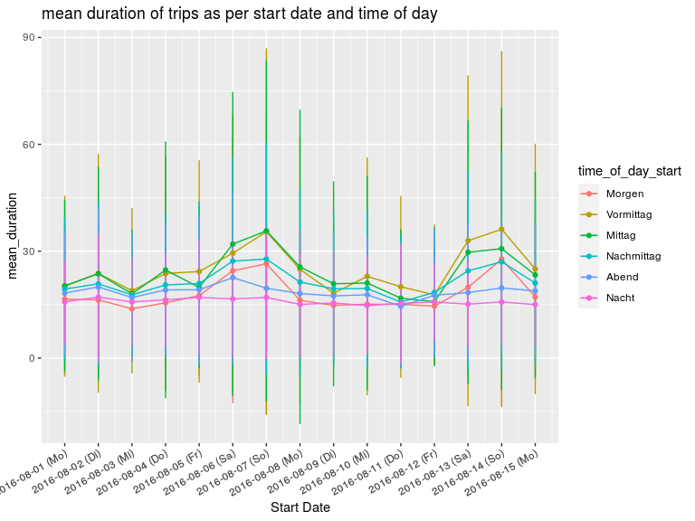

# Research Questions

* what exactly do people use rental bikes for?
* where do people come from and where do they go?
* further ideas for research questions: see [rlang.io](https://rlang.io/visualizing-bike-share-data-nr2018/)

# Load Packages


```r
require(tidyverse)
require(osmdata)
require(sf)
require(leaflet)
```

# Read Data 


```r
stations_data <- data.table::fread("./data/bikeshare_stations_hh.csv")
trips_data <- data.table::fread("./data/bikeshare_trips_hh.csv")
landuse_sf_data <- readRDS("./data/landuse_sf.rds")
```

# Merge Data Sets


```r
start_stations <-
  merge(trips_data, stations_data, by.y = "station_id", by.x = "start_rental_zone_hal_id") %>% select(name, lat, lon)
colnames(start_stations) <-
  c("name_start_station",
    "lat_start_station",
    "lon_start_station")

end_stations <-
  merge(trips_data, stations_data, by.y = "station_id", by.x = "end_rental_zone_hal_id") %>% select(name, lat, lon)
colnames(end_stations) <-
  c("name_end_station", "lat_end_station", "lon_end_station")

trips_data_latlon <- cbind(trips_data, start_stations, end_stations)
```

# Feature Engineering


```r
require(geosphere)
# https://cran.r-project.org/web/packages/geosphere/vignettes/geosphere.pdf

get_time_of_day <- function(character_hhmm){
  x <- as.numeric(str_replace_all(character_hhmm, ":", ""))
  time_of_day <- ifelse(700 <= x & x < 1100, "Morgen", 
                        ifelse(1100 <= x & x < 1300, "Vormittag", 
                               ifelse(1300 <= x & x < 1500, "Mittag", 
                                      ifelse(1500 <= x & x < 1800, "Nachmittag", 
                                             ifelse(1800 <= x & x < 2200, "Abend", "Nacht")
                                             )
                                      )
                               )
                        )
  return(factor(time_of_day, levels = c("Morgen", "Vormittag", "Mittag", "Nachmittag", "Abend", "Nacht")))
}

get_dist <- function(lon_start, lat_start, lon_end, lat_end) {
  p_start = cbind(lon_start, lat_start)
  p_end = cbind(lon_end, lat_end)
  return(distGeo(p_start, p_end))
}

trips_data_fts <- trips_data_latlon %>% 
  mutate(roundtrip = ifelse(start_rental_zone_hal_id == end_rental_zone_hal_id, TRUE, FALSE),
         timediff_hours = difftime(datetime_to, datetime_from, units = "hours"),
         timediff_mins = difftime(datetime_to, datetime_from, units = "mins"), 
         time_of_day_start = get_time_of_day(hourmin_from), 
         time_of_day_end = get_time_of_day(hourmin_to), 
         distance_meters = get_dist(lon_start_station, lat_start_station, 
                                    lon_end_station, lat_end_station)) %>% 
  mutate(speed = ifelse(distance_meters==0, NA, as.numeric(timediff_mins)/distance_meters))
```


# Some Descriptive Statistics On Stations and Trips


```r
# count of start station
start_trip_counts <- trips_data_fts %>% group_by(start_rental_zone_hal_id) %>% 
  summarise(n = n()) %>%
  mutate(freq = n / sum(n))
start_trip_counts
```

<div data-pagedtable="false">
  <script data-pagedtable-source type="application/json">
{"columns":[{"label":[""],"name":["_rn_"],"type":[""],"align":["left"]},{"label":["start_rental_zone_hal_id"],"name":[1],"type":["int"],"align":["right"]},{"label":["n"],"name":[2],"type":["int"],"align":["right"]},{"label":["freq"],"name":[3],"type":["dbl"],"align":["right"]}],"data":[{"1":"131543","2":"2254","3":"0.0160942521","_rn_":"1"},{"1":"131546","2":"758","3":"0.0054123527","_rn_":"2"},{"1":"131547","2":"1505","3":"0.0107461621","_rn_":"3"},{"1":"131639","2":"1332","3":"0.0095108890","_rn_":"4"},{"1":"131640","2":"327","3":"0.0023348804","_rn_":"5"},{"1":"131641","2":"1381","3":"0.0098607640","_rn_":"6"},{"1":"131642","2":"1298","3":"0.0092681185","_rn_":"7"},{"1":"131643","2":"1257","3":"0.0089753659","_rn_":"8"},{"1":"131644","2":"699","3":"0.0049910746","_rn_":"9"},{"1":"131645","2":"353","3":"0.0025205284","_rn_":"10"},{"1":"131646","2":"1271","3":"0.0090753302","_rn_":"11"},{"1":"131647","2":"438","3":"0.0031274545","_rn_":"12"},{"1":"131648","2":"2357","3":"0.0168297037","_rn_":"13"},{"1":"131649","2":"732","3":"0.0052267047","_rn_":"14"},{"1":"131650","2":"236","3":"0.0016851125","_rn_":"15"},{"1":"131651","2":"488","3":"0.0034844698","_rn_":"16"},{"1":"131652","2":"1393","3":"0.0099464477","_rn_":"17"},{"1":"131653","2":"490","3":"0.0034987504","_rn_":"18"},{"1":"131654","2":"535","3":"0.0038200643","_rn_":"19"},{"1":"131872","2":"1714","3":"0.0122384863","_rn_":"20"},{"1":"131873","2":"1567","3":"0.0111888611","_rn_":"21"},{"1":"131875","2":"368","3":"0.0026276330","_rn_":"22"},{"1":"131877","2":"474","3":"0.0033845055","_rn_":"23"},{"1":"131879","2":"2333","3":"0.0166583363","_rn_":"24"},{"1":"131880","2":"1005","3":"0.0071760086","_rn_":"25"},{"1":"131881","2":"1167","3":"0.0083327383","_rn_":"26"},{"1":"131882","2":"799","3":"0.0057051053","_rn_":"27"},{"1":"131883","2":"1477","3":"0.0105462335","_rn_":"28"},{"1":"131884","2":"895","3":"0.0063905748","_rn_":"29"},{"1":"131885","2":"638","3":"0.0045555159","_rn_":"30"},{"1":"131887","2":"344","3":"0.0024562656","_rn_":"31"},{"1":"131888","2":"1054","3":"0.0075258836","_rn_":"32"},{"1":"131889","2":"863","3":"0.0061620850","_rn_":"33"},{"1":"131890","2":"1472","3":"0.0105105320","_rn_":"34"},{"1":"131902","2":"1064","3":"0.0075972867","_rn_":"35"},{"1":"131905","2":"1488","3":"0.0106247769","_rn_":"36"},{"1":"137994","2":"1356","3":"0.0096822563","_rn_":"37"},{"1":"137995","2":"1001","3":"0.0071474473","_rn_":"38"},{"1":"138370","2":"446","3":"0.0031845769","_rn_":"39"},{"1":"138372","2":"529","3":"0.0037772224","_rn_":"40"},{"1":"138375","2":"411","3":"0.0029346662","_rn_":"41"},{"1":"138376","2":"1806","3":"0.0128953945","_rn_":"42"},{"1":"138378","2":"1144","3":"0.0081685112","_rn_":"43"},{"1":"138379","2":"256","3":"0.0018279186","_rn_":"44"},{"1":"138380","2":"2065","3":"0.0147447340","_rn_":"45"},{"1":"138382","2":"955","3":"0.0068189932","_rn_":"46"},{"1":"138383","2":"384","3":"0.0027418779","_rn_":"47"},{"1":"138384","2":"843","3":"0.0060192788","_rn_":"48"},{"1":"138385","2":"1980","3":"0.0141378079","_rn_":"49"},{"1":"138386","2":"645","3":"0.0046054980","_rn_":"50"},{"1":"138387","2":"1558","3":"0.0111245984","_rn_":"51"},{"1":"138389","2":"900","3":"0.0064262763","_rn_":"52"},{"1":"139498","2":"596","3":"0.0042556230","_rn_":"53"},{"1":"139501","2":"1816","3":"0.0129667976","_rn_":"54"},{"1":"139508","2":"987","3":"0.0070474830","_rn_":"55"},{"1":"140790","2":"1076","3":"0.0076829704","_rn_":"56"},{"1":"140791","2":"748","3":"0.0053409497","_rn_":"57"},{"1":"140793","2":"1063","3":"0.0075901464","_rn_":"58"},{"1":"140794","2":"859","3":"0.0061335237","_rn_":"59"},{"1":"140795","2":"733","3":"0.0052338451","_rn_":"60"},{"1":"140796","2":"1868","3":"0.0133380935","_rn_":"61"},{"1":"140799","2":"1873","3":"0.0133737951","_rn_":"62"},{"1":"140800","2":"1773","3":"0.0126597644","_rn_":"63"},{"1":"140801","2":"878","3":"0.0062691896","_rn_":"64"},{"1":"140802","2":"710","3":"0.0050696180","_rn_":"65"},{"1":"140803","2":"382","3":"0.0027275973","_rn_":"66"},{"1":"140804","2":"1222","3":"0.0087254552","_rn_":"67"},{"1":"158204","2":"495","3":"0.0035344520","_rn_":"68"},{"1":"163327","2":"685","3":"0.0048911103","_rn_":"69"},{"1":"164033","2":"544","3":"0.0038843270","_rn_":"70"},{"1":"171372","2":"822","3":"0.0058693324","_rn_":"71"},{"1":"193238","2":"1310","3":"0.0093538022","_rn_":"72"},{"1":"193381","2":"532","3":"0.0037986433","_rn_":"73"},{"1":"196417","2":"1070","3":"0.0076401285","_rn_":"74"},{"1":"198077","2":"2214","3":"0.0158086398","_rn_":"75"},{"1":"198081","2":"701","3":"0.0050053552","_rn_":"76"},{"1":"198086","2":"1146","3":"0.0081827919","_rn_":"77"},{"1":"198088","2":"640","3":"0.0045697965","_rn_":"78"},{"1":"200502","2":"1464","3":"0.0104534095","_rn_":"79"},{"1":"201324","2":"1165","3":"0.0083184577","_rn_":"80"},{"1":"201326","2":"1464","3":"0.0104534095","_rn_":"81"},{"1":"201328","2":"792","3":"0.0056551232","_rn_":"82"},{"1":"201329","2":"882","3":"0.0062977508","_rn_":"83"},{"1":"203890","2":"771","3":"0.0055051767","_rn_":"84"},{"1":"203892","2":"415","3":"0.0029632274","_rn_":"85"},{"1":"204029","2":"658","3":"0.0046983220","_rn_":"86"},{"1":"204030","2":"826","3":"0.0058978936","_rn_":"87"},{"1":"204031","2":"590","3":"0.0042127811","_rn_":"88"},{"1":"204032","2":"510","3":"0.0036415566","_rn_":"89"},{"1":"207304","2":"311","3":"0.0022206355","_rn_":"90"},{"1":"207619","2":"498","3":"0.0035558729","_rn_":"91"},{"1":"208292","2":"1080","3":"0.0077115316","_rn_":"92"},{"1":"208295","2":"924","3":"0.0065976437","_rn_":"93"},{"1":"208307","2":"952","3":"0.0067975723","_rn_":"94"},{"1":"211706","2":"1136","3":"0.0081113888","_rn_":"95"},{"1":"211709","2":"924","3":"0.0065976437","_rn_":"96"},{"1":"211710","2":"237","3":"0.0016922528","_rn_":"97"},{"1":"211711","2":"222","3":"0.0015851482","_rn_":"98"},{"1":"211920","2":"307","3":"0.0021920743","_rn_":"99"},{"1":"211921","2":"985","3":"0.0070332024","_rn_":"100"},{"1":"211922","2":"590","3":"0.0042127811","_rn_":"101"},{"1":"211923","2":"726","3":"0.0051838629","_rn_":"102"},{"1":"212078","2":"529","3":"0.0037772224","_rn_":"103"},{"1":"212079","2":"282","3":"0.0020135666","_rn_":"104"},{"1":"212607","2":"998","3":"0.0071260264","_rn_":"105"},{"1":"213235","2":"397","3":"0.0028347019","_rn_":"106"},{"1":"213277","2":"631","3":"0.0045055337","_rn_":"107"},{"1":"213679","2":"1058","3":"0.0075544448","_rn_":"108"},{"1":"213680","2":"651","3":"0.0046483399","_rn_":"109"},{"1":"213687","2":"340","3":"0.0024277044","_rn_":"110"},{"1":"213688","2":"286","3":"0.0020421278","_rn_":"111"},{"1":"213792","2":"305","3":"0.0021777936","_rn_":"112"},{"1":"213825","2":"605","3":"0.0043198858","_rn_":"113"},{"1":"213832","2":"454","3":"0.0032416994","_rn_":"114"},{"1":"213833","2":"972","3":"0.0069403784","_rn_":"115"},{"1":"213855","2":"701","3":"0.0050053552","_rn_":"116"},{"1":"213856","2":"734","3":"0.0052409854","_rn_":"117"},{"1":"214170","2":"1240","3":"0.0088539807","_rn_":"118"},{"1":"218173","2":"474","3":"0.0033845055","_rn_":"119"},{"1":"218174","2":"817","3":"0.0058336308","_rn_":"120"},{"1":"218635","2":"796","3":"0.0056836844","_rn_":"121"},{"1":"218636","2":"467","3":"0.0033345234","_rn_":"122"},{"1":"224650","2":"1314","3":"0.0093823634","_rn_":"123"},{"1":"226605","2":"356","3":"0.0025419493","_rn_":"124"},{"1":"226607","2":"521","3":"0.0037201000","_rn_":"125"},{"1":"227415","2":"537","3":"0.0038343449","_rn_":"126"},{"1":"227770","2":"199","3":"0.0014209211","_rn_":"127"},{"1":"229760","2":"184","3":"0.0013138165","_rn_":"128"},{"1":"230054","2":"87","3":"0.0006212067","_rn_":"129"},{"1":"233536","2":"691","3":"0.0049339522","_rn_":"130"},{"1":"239807","2":"238","3":"0.0016993931","_rn_":"131"},{"1":"241777","2":"137","3":"0.0009782221","_rn_":"132"},{"1":"242358","2":"941","3":"0.0067190289","_rn_":"133"},{"1":"242642","2":"332","3":"0.0023705819","_rn_":"134"},{"1":"242643","2":"327","3":"0.0023348804","_rn_":"135"},{"1":"242645","2":"258","3":"0.0018421992","_rn_":"136"},{"1":"242727","2":"277","3":"0.0019778650","_rn_":"137"},{"1":"242729","2":"225","3":"0.0016065691","_rn_":"138"},{"1":"242730","2":"596","3":"0.0042556230","_rn_":"139"},{"1":"242731","2":"108","3":"0.0007711532","_rn_":"140"},{"1":"242732","2":"226","3":"0.0016137094","_rn_":"141"},{"1":"242770","2":"200","3":"0.0014280614","_rn_":"142"},{"1":"242771","2":"700","3":"0.0049982149","_rn_":"143"},{"1":"243616","2":"1001","3":"0.0071474473","_rn_":"144"},{"1":"243617","2":"631","3":"0.0045055337","_rn_":"145"},{"1":"243618","2":"1243","3":"0.0088754016","_rn_":"146"},{"1":"243619","2":"303","3":"0.0021635130","_rn_":"147"},{"1":"243620","2":"182","3":"0.0012995359","_rn_":"148"},{"1":"243621","2":"378","3":"0.0026990361","_rn_":"149"},{"1":"244093","2":"1345","3":"0.0096037130","_rn_":"150"},{"1":"244935","2":"567","3":"0.0040485541","_rn_":"151"},{"1":"244936","2":"467","3":"0.0033345234","_rn_":"152"},{"1":"244937","2":"376","3":"0.0026847554","_rn_":"153"},{"1":"244938","2":"379","3":"0.0027061764","_rn_":"154"},{"1":"244939","2":"476","3":"0.0033987861","_rn_":"155"},{"1":"244942","2":"201","3":"0.0014352017","_rn_":"156"},{"1":"244943","2":"466","3":"0.0033273831","_rn_":"157"},{"1":"244944","2":"279","3":"0.0019921457","_rn_":"158"},{"1":"244945","2":"309","3":"0.0022063549","_rn_":"159"},{"1":"244946","2":"210","3":"0.0014994645","_rn_":"160"},{"1":"245203","2":"292","3":"0.0020849697","_rn_":"161"},{"1":"245204","2":"764","3":"0.0054551946","_rn_":"162"},{"1":"245434","2":"102","3":"0.0007283113","_rn_":"163"},{"1":"245452","2":"529","3":"0.0037772224","_rn_":"164"},{"1":"247483","2":"68","3":"0.0004855409","_rn_":"165"},{"1":"247846","2":"154","3":"0.0010996073","_rn_":"166"},{"1":"247847","2":"57","3":"0.0004069975","_rn_":"167"},{"1":"247851","2":"121","3":"0.0008639772","_rn_":"168"},{"1":"247852","2":"930","3":"0.0066404855","_rn_":"169"},{"1":"248511","2":"552","3":"0.0039414495","_rn_":"170"},{"1":"250340","2":"88","3":"0.0006283470","_rn_":"171"},{"1":"251476","2":"386","3":"0.0027561585","_rn_":"172"},{"1":"252479","2":"283","3":"0.0020207069","_rn_":"173"},{"1":"252481","2":"371","3":"0.0026490539","_rn_":"174"},{"1":"252483","2":"411","3":"0.0029346662","_rn_":"175"},{"1":"252484","2":"412","3":"0.0029418065","_rn_":"176"},{"1":"252485","2":"562","3":"0.0040128526","_rn_":"177"},{"1":"252486","2":"130","3":"0.0009282399","_rn_":"178"},{"1":"252487","2":"176","3":"0.0012566940","_rn_":"179"},{"1":"252488","2":"341","3":"0.0024348447","_rn_":"180"},{"1":"252492","2":"622","3":"0.0044412710","_rn_":"181"},{"1":"252493","2":"343","3":"0.0024491253","_rn_":"182"},{"1":"252494","2":"146","3":"0.0010424848","_rn_":"183"},{"1":"252496","2":"419","3":"0.0029917886","_rn_":"184"},{"1":"252497","2":"143","3":"0.0010210639","_rn_":"185"},{"1":"252498","2":"127","3":"0.0009068190","_rn_":"186"},{"1":"252499","2":"149","3":"0.0010639057","_rn_":"187"},{"1":"252500","2":"164","3":"0.0011710104","_rn_":"188"},{"1":"252788","2":"99","3":"0.0007068904","_rn_":"189"},{"1":"253227","2":"55","3":"0.0003927169","_rn_":"190"},{"1":"253357","2":"135","3":"0.0009639414","_rn_":"191"},{"1":"254723","2":"78","3":"0.0005569439","_rn_":"192"},{"1":"254724","2":"109","3":"0.0007782935","_rn_":"193"},{"1":"254725","2":"106","3":"0.0007568725","_rn_":"194"},{"1":"254726","2":"79","3":"0.0005640843","_rn_":"195"},{"1":"254727","2":"181","3":"0.0012923956","_rn_":"196"},{"1":"254728","2":"123","3":"0.0008782578","_rn_":"197"},{"1":"255298","2":"229","3":"0.0016351303","_rn_":"198"},{"1":"255299","2":"99","3":"0.0007068904","_rn_":"199"},{"1":"255302","2":"104","3":"0.0007425919","_rn_":"200"},{"1":"255303","2":"150","3":"0.0010710461","_rn_":"201"},{"1":"255305","2":"107","3":"0.0007640129","_rn_":"202"},{"1":"256467","2":"273","3":"0.0019493038","_rn_":"203"}],"options":{"columns":{"min":{},"max":[10]},"rows":{"min":[10],"max":[10]},"pages":{}}}
  </script>
</div>

```r
# count of end station
end_trip_counts <- trips_data_fts %>% group_by(end_rental_zone_hal_id) %>% 
  summarise(n = n()) %>%
  mutate(freq = n / sum(n))
end_trip_counts
```

<div data-pagedtable="false">
  <script data-pagedtable-source type="application/json">
{"columns":[{"label":[""],"name":["_rn_"],"type":[""],"align":["left"]},{"label":["end_rental_zone_hal_id"],"name":[1],"type":["int"],"align":["right"]},{"label":["n"],"name":[2],"type":["int"],"align":["right"]},{"label":["freq"],"name":[3],"type":["dbl"],"align":["right"]}],"data":[{"1":"131543","2":"2311","3":"0.0165012496","_rn_":"1"},{"1":"131546","2":"771","3":"0.0055051767","_rn_":"2"},{"1":"131547","2":"1510","3":"0.0107818636","_rn_":"3"},{"1":"131639","2":"1365","3":"0.0097465191","_rn_":"4"},{"1":"131640","2":"325","3":"0.0023205998","_rn_":"5"},{"1":"131641","2":"1387","3":"0.0099036059","_rn_":"6"},{"1":"131642","2":"1314","3":"0.0093823634","_rn_":"7"},{"1":"131643","2":"1256","3":"0.0089682256","_rn_":"8"},{"1":"131644","2":"685","3":"0.0048911103","_rn_":"9"},{"1":"131645","2":"338","3":"0.0024134238","_rn_":"10"},{"1":"131646","2":"1244","3":"0.0088825419","_rn_":"11"},{"1":"131647","2":"434","3":"0.0030988933","_rn_":"12"},{"1":"131648","2":"2357","3":"0.0168297037","_rn_":"13"},{"1":"131649","2":"717","3":"0.0051196001","_rn_":"14"},{"1":"131650","2":"247","3":"0.0017636558","_rn_":"15"},{"1":"131651","2":"490","3":"0.0034987504","_rn_":"16"},{"1":"131652","2":"1299","3":"0.0092752588","_rn_":"17"},{"1":"131653","2":"493","3":"0.0035201714","_rn_":"18"},{"1":"131654","2":"534","3":"0.0038129240","_rn_":"19"},{"1":"131872","2":"1442","3":"0.0102963227","_rn_":"20"},{"1":"131873","2":"1404","3":"0.0100249911","_rn_":"21"},{"1":"131875","2":"360","3":"0.0025705105","_rn_":"22"},{"1":"131877","2":"464","3":"0.0033131025","_rn_":"23"},{"1":"131879","2":"2339","3":"0.0167011782","_rn_":"24"},{"1":"131880","2":"1002","3":"0.0071545876","_rn_":"25"},{"1":"131881","2":"1168","3":"0.0083398786","_rn_":"26"},{"1":"131882","2":"771","3":"0.0055051767","_rn_":"27"},{"1":"131883","2":"1475","3":"0.0105319529","_rn_":"28"},{"1":"131884","2":"905","3":"0.0064619779","_rn_":"29"},{"1":"131885","2":"637","3":"0.0045483756","_rn_":"30"},{"1":"131887","2":"315","3":"0.0022491967","_rn_":"31"},{"1":"131888","2":"1036","3":"0.0073973581","_rn_":"32"},{"1":"131889","2":"812","3":"0.0057979293","_rn_":"33"},{"1":"131890","2":"1478","3":"0.0105533738","_rn_":"34"},{"1":"131902","2":"1072","3":"0.0076544091","_rn_":"35"},{"1":"131905","2":"1486","3":"0.0106104963","_rn_":"36"},{"1":"137994","2":"1357","3":"0.0096893966","_rn_":"37"},{"1":"137995","2":"997","3":"0.0071188861","_rn_":"38"},{"1":"138370","2":"449","3":"0.0032059979","_rn_":"39"},{"1":"138372","2":"516","3":"0.0036843984","_rn_":"40"},{"1":"138375","2":"420","3":"0.0029989290","_rn_":"41"},{"1":"138376","2":"1775","3":"0.0126740450","_rn_":"42"},{"1":"138378","2":"1200","3":"0.0085683684","_rn_":"43"},{"1":"138379","2":"257","3":"0.0018350589","_rn_":"44"},{"1":"138380","2":"2159","3":"0.0154159229","_rn_":"45"},{"1":"138382","2":"935","3":"0.0066761871","_rn_":"46"},{"1":"138383","2":"387","3":"0.0027632988","_rn_":"47"},{"1":"138384","2":"861","3":"0.0061478044","_rn_":"48"},{"1":"138385","2":"1954","3":"0.0139521599","_rn_":"49"},{"1":"138386","2":"648","3":"0.0046269190","_rn_":"50"},{"1":"138387","2":"1560","3":"0.0111388790","_rn_":"51"},{"1":"138389","2":"898","3":"0.0064119957","_rn_":"52"},{"1":"139498","2":"574","3":"0.0040985362","_rn_":"53"},{"1":"139501","2":"1828","3":"0.0130524813","_rn_":"54"},{"1":"139508","2":"1009","3":"0.0072045698","_rn_":"55"},{"1":"140790","2":"1071","3":"0.0076472688","_rn_":"56"},{"1":"140791","2":"691","3":"0.0049339522","_rn_":"57"},{"1":"140793","2":"1086","3":"0.0077543734","_rn_":"58"},{"1":"140794","2":"859","3":"0.0061335237","_rn_":"59"},{"1":"140795","2":"722","3":"0.0051553017","_rn_":"60"},{"1":"140796","2":"1961","3":"0.0140021421","_rn_":"61"},{"1":"140799","2":"1871","3":"0.0133595145","_rn_":"62"},{"1":"140800","2":"1785","3":"0.0127454481","_rn_":"63"},{"1":"140801","2":"876","3":"0.0062549090","_rn_":"64"},{"1":"140802","2":"693","3":"0.0049482328","_rn_":"65"},{"1":"140803","2":"365","3":"0.0026062121","_rn_":"66"},{"1":"140804","2":"1230","3":"0.0087825777","_rn_":"67"},{"1":"158204","2":"497","3":"0.0035487326","_rn_":"68"},{"1":"163327","2":"687","3":"0.0049053909","_rn_":"69"},{"1":"164033","2":"531","3":"0.0037915030","_rn_":"70"},{"1":"171372","2":"935","3":"0.0066761871","_rn_":"71"},{"1":"193238","2":"1353","3":"0.0096608354","_rn_":"72"},{"1":"193381","2":"534","3":"0.0038129240","_rn_":"73"},{"1":"196417","2":"1074","3":"0.0076686898","_rn_":"74"},{"1":"198077","2":"2220","3":"0.0158514816","_rn_":"75"},{"1":"198081","2":"685","3":"0.0048911103","_rn_":"76"},{"1":"198086","2":"1153","3":"0.0082327740","_rn_":"77"},{"1":"198088","2":"618","3":"0.0044127097","_rn_":"78"},{"1":"200502","2":"1463","3":"0.0104462692","_rn_":"79"},{"1":"201324","2":"1178","3":"0.0084112817","_rn_":"80"},{"1":"201326","2":"1473","3":"0.0105176723","_rn_":"81"},{"1":"201328","2":"793","3":"0.0056622635","_rn_":"82"},{"1":"201329","2":"898","3":"0.0064119957","_rn_":"83"},{"1":"203890","2":"789","3":"0.0056337022","_rn_":"84"},{"1":"203892","2":"419","3":"0.0029917886","_rn_":"85"},{"1":"204029","2":"667","3":"0.0047625848","_rn_":"86"},{"1":"204030","2":"839","3":"0.0059907176","_rn_":"87"},{"1":"204031","2":"585","3":"0.0041770796","_rn_":"88"},{"1":"204032","2":"510","3":"0.0036415566","_rn_":"89"},{"1":"207304","2":"313","3":"0.0022349161","_rn_":"90"},{"1":"207619","2":"503","3":"0.0035915744","_rn_":"91"},{"1":"208292","2":"1095","3":"0.0078186362","_rn_":"92"},{"1":"208295","2":"929","3":"0.0066333452","_rn_":"93"},{"1":"208307","2":"927","3":"0.0066190646","_rn_":"94"},{"1":"211706","2":"1138","3":"0.0081256694","_rn_":"95"},{"1":"211709","2":"936","3":"0.0066833274","_rn_":"96"},{"1":"211710","2":"223","3":"0.0015922885","_rn_":"97"},{"1":"211711","2":"202","3":"0.0014423420","_rn_":"98"},{"1":"211920","2":"301","3":"0.0021492324","_rn_":"99"},{"1":"211921","2":"968","3":"0.0069118172","_rn_":"100"},{"1":"211922","2":"597","3":"0.0042627633","_rn_":"101"},{"1":"211923","2":"732","3":"0.0052267047","_rn_":"102"},{"1":"212078","2":"517","3":"0.0036915387","_rn_":"103"},{"1":"212079","2":"274","3":"0.0019564441","_rn_":"104"},{"1":"212607","2":"985","3":"0.0070332024","_rn_":"105"},{"1":"213235","2":"394","3":"0.0028132810","_rn_":"106"},{"1":"213277","2":"635","3":"0.0045340950","_rn_":"107"},{"1":"213679","2":"1018","3":"0.0072688326","_rn_":"108"},{"1":"213680","2":"672","3":"0.0047982863","_rn_":"109"},{"1":"213687","2":"337","3":"0.0024062835","_rn_":"110"},{"1":"213688","2":"277","3":"0.0019778650","_rn_":"111"},{"1":"213792","2":"303","3":"0.0021635130","_rn_":"112"},{"1":"213825","2":"591","3":"0.0042199215","_rn_":"113"},{"1":"213832","2":"482","3":"0.0034416280","_rn_":"114"},{"1":"213833","2":"1024","3":"0.0073116744","_rn_":"115"},{"1":"213855","2":"692","3":"0.0049410925","_rn_":"116"},{"1":"213856","2":"744","3":"0.0053123884","_rn_":"117"},{"1":"214170","2":"1252","3":"0.0089396644","_rn_":"118"},{"1":"218173","2":"514","3":"0.0036701178","_rn_":"119"},{"1":"218174","2":"770","3":"0.0054980364","_rn_":"120"},{"1":"218635","2":"794","3":"0.0056694038","_rn_":"121"},{"1":"218636","2":"473","3":"0.0033773652","_rn_":"122"},{"1":"224650","2":"1318","3":"0.0094109247","_rn_":"123"},{"1":"226605","2":"447","3":"0.0031917172","_rn_":"124"},{"1":"226607","2":"543","3":"0.0038771867","_rn_":"125"},{"1":"227415","2":"531","3":"0.0037915030","_rn_":"126"},{"1":"227770","2":"181","3":"0.0012923956","_rn_":"127"},{"1":"229760","2":"172","3":"0.0012281328","_rn_":"128"},{"1":"230054","2":"80","3":"0.0005712246","_rn_":"129"},{"1":"233536","2":"679","3":"0.0048482685","_rn_":"130"},{"1":"239807","2":"225","3":"0.0016065691","_rn_":"131"},{"1":"241777","2":"127","3":"0.0009068190","_rn_":"132"},{"1":"242358","2":"942","3":"0.0067261692","_rn_":"133"},{"1":"242642","2":"339","3":"0.0024205641","_rn_":"134"},{"1":"242643","2":"330","3":"0.0023563013","_rn_":"135"},{"1":"242645","2":"260","3":"0.0018564798","_rn_":"136"},{"1":"242727","2":"259","3":"0.0018493395","_rn_":"137"},{"1":"242729","2":"234","3":"0.0016708318","_rn_":"138"},{"1":"242730","2":"597","3":"0.0042627633","_rn_":"139"},{"1":"242731","2":"100","3":"0.0007140307","_rn_":"140"},{"1":"242732","2":"230","3":"0.0016422706","_rn_":"141"},{"1":"242770","2":"192","3":"0.0013709390","_rn_":"142"},{"1":"242771","2":"720","3":"0.0051410211","_rn_":"143"},{"1":"243616","2":"1002","3":"0.0071545876","_rn_":"144"},{"1":"243617","2":"623","3":"0.0044484113","_rn_":"145"},{"1":"243618","2":"1257","3":"0.0089753659","_rn_":"146"},{"1":"243619","2":"310","3":"0.0022134952","_rn_":"147"},{"1":"243620","2":"192","3":"0.0013709390","_rn_":"148"},{"1":"243621","2":"387","3":"0.0027632988","_rn_":"149"},{"1":"244093","2":"1359","3":"0.0097036773","_rn_":"150"},{"1":"244935","2":"556","3":"0.0039700107","_rn_":"151"},{"1":"244936","2":"475","3":"0.0033916458","_rn_":"152"},{"1":"244937","2":"392","3":"0.0027990004","_rn_":"153"},{"1":"244938","2":"391","3":"0.0027918600","_rn_":"154"},{"1":"244939","2":"579","3":"0.0041342378","_rn_":"155"},{"1":"244942","2":"199","3":"0.0014209211","_rn_":"156"},{"1":"244943","2":"465","3":"0.0033202428","_rn_":"157"},{"1":"244944","2":"293","3":"0.0020921100","_rn_":"158"},{"1":"244945","2":"304","3":"0.0021706533","_rn_":"159"},{"1":"244946","2":"207","3":"0.0014780436","_rn_":"160"},{"1":"245203","2":"290","3":"0.0020706890","_rn_":"161"},{"1":"245204","2":"782","3":"0.0055837201","_rn_":"162"},{"1":"245434","2":"90","3":"0.0006426276","_rn_":"163"},{"1":"245452","2":"530","3":"0.0037843627","_rn_":"164"},{"1":"247483","2":"65","3":"0.0004641200","_rn_":"165"},{"1":"247846","2":"159","3":"0.0011353088","_rn_":"166"},{"1":"247847","2":"62","3":"0.0004426990","_rn_":"167"},{"1":"247851","2":"120","3":"0.0008568368","_rn_":"168"},{"1":"247852","2":"966","3":"0.0068975366","_rn_":"169"},{"1":"248511","2":"568","3":"0.0040556944","_rn_":"170"},{"1":"250340","2":"62","3":"0.0004426990","_rn_":"171"},{"1":"251476","2":"410","3":"0.0029275259","_rn_":"172"},{"1":"252479","2":"297","3":"0.0021206712","_rn_":"173"},{"1":"252481","2":"379","3":"0.0027061764","_rn_":"174"},{"1":"252483","2":"393","3":"0.0028061407","_rn_":"175"},{"1":"252484","2":"416","3":"0.0029703677","_rn_":"176"},{"1":"252485","2":"558","3":"0.0039842913","_rn_":"177"},{"1":"252486","2":"126","3":"0.0008996787","_rn_":"178"},{"1":"252487","2":"176","3":"0.0012566940","_rn_":"179"},{"1":"252488","2":"333","3":"0.0023777222","_rn_":"180"},{"1":"252492","2":"585","3":"0.0041770796","_rn_":"181"},{"1":"252493","2":"325","3":"0.0023205998","_rn_":"182"},{"1":"252494","2":"124","3":"0.0008853981","_rn_":"183"},{"1":"252496","2":"425","3":"0.0030346305","_rn_":"184"},{"1":"252497","2":"160","3":"0.0011424491","_rn_":"185"},{"1":"252498","2":"125","3":"0.0008925384","_rn_":"186"},{"1":"252499","2":"173","3":"0.0012352731","_rn_":"187"},{"1":"252500","2":"168","3":"0.0011995716","_rn_":"188"},{"1":"252788","2":"109","3":"0.0007782935","_rn_":"189"},{"1":"253227","2":"55","3":"0.0003927169","_rn_":"190"},{"1":"253357","2":"132","3":"0.0009425205","_rn_":"191"},{"1":"254723","2":"80","3":"0.0005712246","_rn_":"192"},{"1":"254724","2":"121","3":"0.0008639772","_rn_":"193"},{"1":"254725","2":"106","3":"0.0007568725","_rn_":"194"},{"1":"254726","2":"89","3":"0.0006354873","_rn_":"195"},{"1":"254727","2":"170","3":"0.0012138522","_rn_":"196"},{"1":"254728","2":"119","3":"0.0008496965","_rn_":"197"},{"1":"255298","2":"232","3":"0.0016565512","_rn_":"198"},{"1":"255299","2":"96","3":"0.0006854695","_rn_":"199"},{"1":"255302","2":"118","3":"0.0008425562","_rn_":"200"},{"1":"255303","2":"144","3":"0.0010282042","_rn_":"201"},{"1":"255305","2":"100","3":"0.0007140307","_rn_":"202"},{"1":"256467","2":"265","3":"0.0018921814","_rn_":"203"}],"options":{"columns":{"min":{},"max":[10]},"rows":{"min":[10],"max":[10]},"pages":{}}}
  </script>
</div>

```r
# count of roundtrips
trips_data_fts %>% 
group_by(roundtrip) %>%
  summarise(n = n()) %>%
  mutate(freq = n / sum(n))
```

<div data-pagedtable="false">
  <script data-pagedtable-source type="application/json">
{"columns":[{"label":[""],"name":["_rn_"],"type":[""],"align":["left"]},{"label":["roundtrip"],"name":[1],"type":["lgl"],"align":["right"]},{"label":["n"],"name":[2],"type":["int"],"align":["right"]},{"label":["freq"],"name":[3],"type":["dbl"],"align":["right"]}],"data":[{"1":"FALSE","2":"132539","3":"0.94636915","_rn_":"1"},{"1":"TRUE","2":"7511","3":"0.05363085","_rn_":"2"}],"options":{"columns":{"min":{},"max":[10]},"rows":{"min":[10],"max":[10]},"pages":{}}}
  </script>
</div>

```r
# histogram on trip length
mw_timediff_mins <- signif(mean(as.numeric(trips_data_fts$timediff_mins)), digits = 6)
brks <- c(3,10,30,60,90,120,150,300)
trips_data_fts %>%
  ggplot(aes(as.numeric(timediff_mins))) +
  geom_histogram(bins = 200) + 
  geom_vline(xintercept = 30, col="black", lty="dashed") + 
  annotate("text", x = 30-1.5, y = 450, col="black", label="First 30 mins are free of charge", angle = 90) + 
  geom_vline(xintercept = mw_timediff_mins, col="red") + 
  annotate("text", x = mw_timediff_mins-1.5, y = 350, col="red", label="Mean TimeDiff per Trip", angle = 90) + 
  labs(title = paste0("Majority of trips are free of charge and mean trip duration is ", mw_timediff_mins, dig=2)) +
  scale_x_log10(name ="log trip duration [mins]", labels =  as.character(brks), breaks = brks) + 
  scale_y_continuous(n.breaks = 10)
```

<!-- -->

```r
# proportion of trips with duration smaller than mean trip duration
trips_data_fts %>% 
  mutate(smaller_mw = timediff_mins <= mw_timediff_mins) %>% 
  group_by(smaller_mw) %>% 
  summarize(n = n()) %>% 
  mutate(freq = n / sum(n))
```

<div data-pagedtable="false">
  <script data-pagedtable-source type="application/json">
{"columns":[{"label":[""],"name":["_rn_"],"type":[""],"align":["left"]},{"label":["smaller_mw"],"name":[1],"type":["lgl"],"align":["right"]},{"label":["n"],"name":[2],"type":["int"],"align":["right"]},{"label":["freq"],"name":[3],"type":["dbl"],"align":["right"]}],"data":[{"1":"FALSE","2":"43906","3":"0.3135023","_rn_":"1"},{"1":"TRUE","2":"96144","3":"0.6864977","_rn_":"2"}],"options":{"columns":{"min":{},"max":[10]},"rows":{"min":[10],"max":[10]},"pages":{}}}
  </script>
</div>

```r
# proportion of trips with duration smaller 30 mins
trips_data_fts %>% 
  mutate(smaller_30 = as.numeric(timediff_mins) <= 30) %>% 
  group_by(smaller_30) %>% 
  summarize(n = n()) %>% 
  mutate(freq = n / sum(n))
```

<div data-pagedtable="false">
  <script data-pagedtable-source type="application/json">
{"columns":[{"label":[""],"name":["_rn_"],"type":[""],"align":["left"]},{"label":["smaller_30"],"name":[1],"type":["lgl"],"align":["right"]},{"label":["n"],"name":[2],"type":["int"],"align":["right"]},{"label":["freq"],"name":[3],"type":["dbl"],"align":["right"]}],"data":[{"1":"FALSE","2":"18539","3":"0.1323742","_rn_":"1"},{"1":"TRUE","2":"121511","3":"0.8676258","_rn_":"2"}],"options":{"columns":{"min":{},"max":[10]},"rows":{"min":[10],"max":[10]},"pages":{}}}
  </script>
</div>

```r
# count of trip-starts as per day and per time of day
starts_by_date <- trips_data_fts %>% 
  group_by(date_from, time_of_day_start) %>% 
  summarise(n = n()) %>% 
  ungroup() %>% 
  group_by(date_from) %>%  
  mutate(freq = n/sum(n)) 
starts_by_date
```

<div data-pagedtable="false">
  <script data-pagedtable-source type="application/json">
{"columns":[{"label":["date_from"],"name":[1],"type":["date"],"align":["right"]},{"label":["time_of_day_start"],"name":[2],"type":["fct"],"align":["left"]},{"label":["n"],"name":[3],"type":["int"],"align":["right"]},{"label":["freq"],"name":[4],"type":["dbl"],"align":["right"]}],"data":[{"1":"2016-08-01","2":"Morgen","3":"1824","4":"0.18454067"},{"1":"2016-08-01","2":"Vormittag","3":"590","4":"0.05969243"},{"1":"2016-08-01","2":"Mittag","3":"829","4":"0.08387293"},{"1":"2016-08-01","2":"Nachmittag","3":"2468","4":"0.24969648"},{"1":"2016-08-01","2":"Abend","3":"3054","4":"0.30898422"},{"1":"2016-08-01","2":"Nacht","3":"1119","4":"0.11321327"},{"1":"2016-08-02","2":"Morgen","3":"1884","4":"0.15830602"},{"1":"2016-08-02","2":"Vormittag","3":"896","4":"0.07528779"},{"1":"2016-08-02","2":"Mittag","3":"1172","4":"0.09847912"},{"1":"2016-08-02","2":"Nachmittag","3":"3008","4":"0.25275187"},{"1":"2016-08-02","2":"Abend","3":"3651","4":"0.30678094"},{"1":"2016-08-02","2":"Nacht","3":"1290","4":"0.10839425"},{"1":"2016-08-03","2":"Morgen","3":"1195","4":"0.16736695"},{"1":"2016-08-03","2":"Vormittag","3":"472","4":"0.06610644"},{"1":"2016-08-03","2":"Mittag","3":"498","4":"0.06974790"},{"1":"2016-08-03","2":"Nachmittag","3":"1667","4":"0.23347339"},{"1":"2016-08-03","2":"Abend","3":"2234","4":"0.31288515"},{"1":"2016-08-03","2":"Nacht","3":"1074","4":"0.15042017"},{"1":"2016-08-04","2":"Morgen","3":"1778","4":"0.16381058"},{"1":"2016-08-04","2":"Vormittag","3":"884","4":"0.08144463"},{"1":"2016-08-04","2":"Mittag","3":"1129","4":"0.10401695"},{"1":"2016-08-04","2":"Nachmittag","3":"2590","4":"0.23862171"},{"1":"2016-08-04","2":"Abend","3":"3146","4":"0.28984706"},{"1":"2016-08-04","2":"Nacht","3":"1327","4":"0.12225907"},{"1":"2016-08-05","2":"Morgen","3":"1830","4":"0.16615217"},{"1":"2016-08-05","2":"Vormittag","3":"887","4":"0.08053387"},{"1":"2016-08-05","2":"Mittag","3":"984","4":"0.08934084"},{"1":"2016-08-05","2":"Nachmittag","3":"2390","4":"0.21699655"},{"1":"2016-08-05","2":"Abend","3":"3204","4":"0.29090249"},{"1":"2016-08-05","2":"Nacht","3":"1719","4":"0.15607409"},{"1":"2016-08-06","2":"Morgen","3":"757","4":"0.06968609"},{"1":"2016-08-06","2":"Vormittag","3":"1073","4":"0.09877566"},{"1":"2016-08-06","2":"Mittag","3":"1448","4":"0.13329651"},{"1":"2016-08-06","2":"Nachmittag","3":"2420","4":"0.22277456"},{"1":"2016-08-06","2":"Abend","3":"3050","4":"0.28076958"},{"1":"2016-08-06","2":"Nacht","3":"2115","4":"0.19469760"},{"1":"2016-08-07","2":"Morgen","3":"604","4":"0.06059390"},{"1":"2016-08-07","2":"Vormittag","3":"731","4":"0.07333467"},{"1":"2016-08-07","2":"Mittag","3":"1436","4":"0.14406100"},{"1":"2016-08-07","2":"Nachmittag","3":"2979","4":"0.29885634"},{"1":"2016-08-07","2":"Abend","3":"2315","4":"0.23224318"},{"1":"2016-08-07","2":"Nacht","3":"1903","4":"0.19091091"},{"1":"2016-08-08","2":"Morgen","3":"1891","4":"0.19853018"},{"1":"2016-08-08","2":"Vormittag","3":"600","4":"0.06299213"},{"1":"2016-08-08","2":"Mittag","3":"931","4":"0.09774278"},{"1":"2016-08-08","2":"Nachmittag","3":"2350","4":"0.24671916"},{"1":"2016-08-08","2":"Abend","3":"2961","4":"0.31086614"},{"1":"2016-08-08","2":"Nacht","3":"792","4":"0.08314961"},{"1":"2016-08-09","2":"Morgen","3":"1914","4":"0.20667315"},{"1":"2016-08-09","2":"Vormittag","3":"722","4":"0.07796134"},{"1":"2016-08-09","2":"Mittag","3":"759","4":"0.08195659"},{"1":"2016-08-09","2":"Nachmittag","3":"2285","4":"0.24673361"},{"1":"2016-08-09","2":"Abend","3":"2623","4":"0.28323075"},{"1":"2016-08-09","2":"Nacht","3":"958","4":"0.10344455"},{"1":"2016-08-10","2":"Morgen","3":"1897","4":"0.20998450"},{"1":"2016-08-10","2":"Vormittag","3":"616","4":"0.06818685"},{"1":"2016-08-10","2":"Mittag","3":"803","4":"0.08888643"},{"1":"2016-08-10","2":"Nachmittag","3":"1990","4":"0.22027895"},{"1":"2016-08-10","2":"Abend","3":"2767","4":"0.30628736"},{"1":"2016-08-10","2":"Nacht","3":"961","4":"0.10637591"},{"1":"2016-08-11","2":"Morgen","3":"1777","4":"0.35971660"},{"1":"2016-08-11","2":"Vormittag","3":"598","4":"0.12105263"},{"1":"2016-08-11","2":"Mittag","3":"363","4":"0.07348178"},{"1":"2016-08-11","2":"Nachmittag","3":"512","4":"0.10364372"},{"1":"2016-08-11","2":"Abend","3":"770","4":"0.15587045"},{"1":"2016-08-11","2":"Nacht","3":"920","4":"0.18623482"},{"1":"2016-08-12","2":"Morgen","3":"1551","4":"0.21780649"},{"1":"2016-08-12","2":"Vormittag","3":"550","4":"0.07723634"},{"1":"2016-08-12","2":"Mittag","3":"476","4":"0.06684454"},{"1":"2016-08-12","2":"Nachmittag","3":"1491","4":"0.20938070"},{"1":"2016-08-12","2":"Abend","3":"1997","4":"0.28043814"},{"1":"2016-08-12","2":"Nacht","3":"1056","4":"0.14829378"},{"1":"2016-08-13","2":"Morgen","3":"691","4":"0.08320289"},{"1":"2016-08-13","2":"Vormittag","3":"981","4":"0.11812161"},{"1":"2016-08-13","2":"Mittag","3":"1406","4":"0.16929561"},{"1":"2016-08-13","2":"Nachmittag","3":"2007","4":"0.24166165"},{"1":"2016-08-13","2":"Abend","3":"1536","4":"0.18494883"},{"1":"2016-08-13","2":"Nacht","3":"1684","4":"0.20276942"},{"1":"2016-08-14","2":"Morgen","3":"700","4":"0.07411329"},{"1":"2016-08-14","2":"Vormittag","3":"1022","4":"0.10820540"},{"1":"2016-08-14","2":"Mittag","3":"1194","4":"0.12641609"},{"1":"2016-08-14","2":"Nachmittag","3":"2585","4":"0.27368978"},{"1":"2016-08-14","2":"Abend","3":"2372","4":"0.25113817"},{"1":"2016-08-14","2":"Nacht","3":"1572","4":"0.16643727"},{"1":"2016-08-15","2":"Morgen","3":"1941","4":"0.17980547"},{"1":"2016-08-15","2":"Vormittag","3":"846","4":"0.07836962"},{"1":"2016-08-15","2":"Mittag","3":"1011","4":"0.09365447"},{"1":"2016-08-15","2":"Nachmittag","3":"2732","4":"0.25308013"},{"1":"2016-08-15","2":"Abend","3":"3301","4":"0.30578972"},{"1":"2016-08-15","2":"Nacht","3":"964","4":"0.08930060"}],"options":{"columns":{"min":{},"max":[10]},"rows":{"min":[10],"max":[10]},"pages":{}}}
  </script>
</div>

```r
starts_by_date %>% 
  ggplot(aes(x = as.POSIXct(date_from), y = n, group = time_of_day_start, col = time_of_day_start)) + 
  geom_line() + 
  scale_x_datetime(name = "Start Date", date_breaks = "day", date_labels = "%Y-%m-%d (%a)") +
  theme(axis.text.x = element_text(angle = 30, hjust = 1)) + 
  scale_y_continuous(breaks = seq(0,3500, by = 500))
```

<!-- -->

```r
duration_by_date <-  trips_data_fts %>% 
  group_by(date_from, time_of_day_start) %>% 
  summarise(mean_duration = as.numeric(mean(timediff_mins)), 
            sd_duration = as.numeric(sd(timediff_mins))) %>% 
  ungroup() 
duration_by_date
```

<div data-pagedtable="false">
  <script data-pagedtable-source type="application/json">
{"columns":[{"label":["date_from"],"name":[1],"type":["date"],"align":["right"]},{"label":["time_of_day_start"],"name":[2],"type":["fct"],"align":["left"]},{"label":["mean_duration"],"name":[3],"type":["dbl"],"align":["right"]},{"label":["sd_duration"],"name":[4],"type":["dbl"],"align":["right"]}],"data":[{"1":"2016-08-01","2":"Morgen","3":"16.51658","4":"21.31974"},{"1":"2016-08-01","2":"Vormittag","3":"20.16556","4":"25.40409"},{"1":"2016-08-01","2":"Mittag","3":"20.28528","4":"23.97770"},{"1":"2016-08-01","2":"Nachmittag","3":"19.38239","4":"19.99097"},{"1":"2016-08-01","2":"Abend","3":"18.22542","4":"17.14945"},{"1":"2016-08-01","2":"Nacht","3":"15.74261","4":"11.83066"},{"1":"2016-08-02","2":"Morgen","3":"16.33923","4":"21.78744"},{"1":"2016-08-02","2":"Vormittag","3":"23.78125","4":"33.47484"},{"1":"2016-08-02","2":"Mittag","3":"23.66109","4":"29.99036"},{"1":"2016-08-02","2":"Nachmittag","3":"20.82594","4":"23.05196"},{"1":"2016-08-02","2":"Abend","3":"19.95490","4":"21.86105"},{"1":"2016-08-02","2":"Nacht","3":"17.09660","4":"17.80650"},{"1":"2016-08-03","2":"Morgen","3":"13.81038","4":"14.71917"},{"1":"2016-08-03","2":"Vormittag","3":"18.89114","4":"23.18147"},{"1":"2016-08-03","2":"Mittag","3":"18.02928","4":"17.92837"},{"1":"2016-08-03","2":"Nachmittag","3":"17.73750","4":"17.57816"},{"1":"2016-08-03","2":"Abend","3":"16.99517","4":"18.00025"},{"1":"2016-08-03","2":"Nacht","3":"15.73610","4":"12.32478"},{"1":"2016-08-04","2":"Morgen","3":"15.50618","4":"17.08883"},{"1":"2016-08-04","2":"Vormittag","3":"23.73835","4":"32.90237"},{"1":"2016-08-04","2":"Mittag","3":"24.72700","4":"36.00883"},{"1":"2016-08-04","2":"Nachmittag","3":"20.53302","4":"20.57637"},{"1":"2016-08-04","2":"Abend","3":"19.12230","4":"18.67934"},{"1":"2016-08-04","2":"Nacht","3":"16.34565","4":"13.19869"},{"1":"2016-08-05","2":"Morgen","3":"17.54862","4":"22.48830"},{"1":"2016-08-05","2":"Vormittag","3":"24.28080","4":"31.23311"},{"1":"2016-08-05","2":"Mittag","3":"19.82251","4":"22.67820"},{"1":"2016-08-05","2":"Nachmittag","3":"20.90346","4":"23.09947"},{"1":"2016-08-05","2":"Abend","3":"19.17466","4":"20.93002"},{"1":"2016-08-05","2":"Nacht","3":"17.01295","4":"16.19507"},{"1":"2016-08-06","2":"Morgen","3":"24.49881","4":"37.19774"},{"1":"2016-08-06","2":"Vormittag","3":"29.44823","4":"39.07484"},{"1":"2016-08-06","2":"Mittag","3":"31.99324","4":"42.72328"},{"1":"2016-08-06","2":"Nachmittag","3":"27.21369","4":"29.20196"},{"1":"2016-08-06","2":"Abend","3":"22.58805","4":"23.61305"},{"1":"2016-08-06","2":"Nacht","3":"16.59259","4":"16.35651"},{"1":"2016-08-07","2":"Morgen","3":"26.46035","4":"42.05532"},{"1":"2016-08-07","2":"Vormittag","3":"35.46297","4":"51.49697"},{"1":"2016-08-07","2":"Mittag","3":"35.71353","4":"47.81891"},{"1":"2016-08-07","2":"Nachmittag","3":"27.79526","4":"32.56315"},{"1":"2016-08-07","2":"Abend","3":"19.59120","4":"17.39021"},{"1":"2016-08-07","2":"Nacht","3":"17.00906","4":"17.32502"},{"1":"2016-08-08","2":"Morgen","3":"16.20511","4":"19.48158"},{"1":"2016-08-08","2":"Vormittag","3":"24.91600","4":"37.40155"},{"1":"2016-08-08","2":"Mittag","3":"25.57381","4":"44.16192"},{"1":"2016-08-08","2":"Nachmittag","3":"21.32293","4":"26.40488"},{"1":"2016-08-08","2":"Abend","3":"18.11564","4":"17.99873"},{"1":"2016-08-08","2":"Nacht","3":"15.06004","4":"14.80467"},{"1":"2016-08-09","2":"Morgen","3":"14.78229","4":"14.52621"},{"1":"2016-08-09","2":"Vormittag","3":"18.18901","4":"19.76530"},{"1":"2016-08-09","2":"Mittag","3":"20.84688","4":"28.80657"},{"1":"2016-08-09","2":"Nachmittag","3":"19.45382","4":"21.52760"},{"1":"2016-08-09","2":"Abend","3":"17.43575","4":"17.82694"},{"1":"2016-08-09","2":"Nacht","3":"15.44857","4":"14.56659"},{"1":"2016-08-10","2":"Morgen","3":"15.11091","4":"15.79004"},{"1":"2016-08-10","2":"Vormittag","3":"22.92622","4":"33.37389"},{"1":"2016-08-10","2":"Mittag","3":"21.05336","4":"30.08516"},{"1":"2016-08-10","2":"Nachmittag","3":"19.50233","4":"21.84916"},{"1":"2016-08-10","2":"Abend","3":"17.75950","4":"16.14247"},{"1":"2016-08-10","2":"Nacht","3":"14.71729","4":"13.67527"},{"1":"2016-08-11","2":"Morgen","3":"15.08174","4":"15.65148"},{"1":"2016-08-11","2":"Vormittag","3":"20.01441","4":"25.52032"},{"1":"2016-08-11","2":"Mittag","3":"16.81253","4":"19.37507"},{"1":"2016-08-11","2":"Nachmittag","3":"15.71364","4":"18.70660"},{"1":"2016-08-11","2":"Abend","3":"14.53693","4":"16.88706"},{"1":"2016-08-11","2":"Nacht","3":"15.35428","4":"16.98222"},{"1":"2016-08-12","2":"Morgen","3":"14.58980","4":"16.06374"},{"1":"2016-08-12","2":"Vormittag","3":"17.76548","4":"19.71372"},{"1":"2016-08-12","2":"Mittag","3":"15.81635","4":"18.11857"},{"1":"2016-08-12","2":"Nachmittag","3":"18.43175","4":"18.17652"},{"1":"2016-08-12","2":"Abend","3":"17.62601","4":"17.56550"},{"1":"2016-08-12","2":"Nacht","3":"15.72186","4":"10.97468"},{"1":"2016-08-13","2":"Morgen","3":"19.83439","4":"24.90830"},{"1":"2016-08-13","2":"Vormittag","3":"32.92776","4":"46.45948"},{"1":"2016-08-13","2":"Mittag","3":"29.68889","4":"36.99272"},{"1":"2016-08-13","2":"Nachmittag","3":"24.48935","4":"27.60874"},{"1":"2016-08-13","2":"Abend","3":"18.38181","4":"19.25815"},{"1":"2016-08-13","2":"Nacht","3":"15.12743","4":"11.73982"},{"1":"2016-08-14","2":"Morgen","3":"27.76879","4":"41.04005"},{"1":"2016-08-14","2":"Vormittag","3":"36.15023","4":"49.96185"},{"1":"2016-08-14","2":"Mittag","3":"30.69638","4":"39.65201"},{"1":"2016-08-14","2":"Nachmittag","3":"27.02239","4":"30.62095"},{"1":"2016-08-14","2":"Abend","3":"19.67956","4":"18.29237"},{"1":"2016-08-14","2":"Nacht","3":"15.73222","4":"11.79318"},{"1":"2016-08-15","2":"Morgen","3":"17.15331","4":"21.72929"},{"1":"2016-08-15","2":"Vormittag","3":"25.00097","4":"35.16719"},{"1":"2016-08-15","2":"Mittag","3":"23.32926","4":"28.97154"},{"1":"2016-08-15","2":"Nachmittag","3":"21.04500","4":"22.95340"},{"1":"2016-08-15","2":"Abend","3":"18.83011","4":"18.95102"},{"1":"2016-08-15","2":"Nacht","3":"15.00427","4":"11.60086"}],"options":{"columns":{"min":{},"max":[10]},"rows":{"min":[10],"max":[10]},"pages":{}}}
  </script>
</div>

```r
duration_by_date %>% 
  ggplot(aes(x = as.POSIXct(date_from), y = mean_duration, group = time_of_day_start, col = time_of_day_start)) + 
  geom_errorbar(aes(ymin=mean_duration-sd_duration, ymax=mean_duration+sd_duration), width=.1) +
  geom_line() +
  geom_point() + 
  scale_x_datetime(name = "Start Date", date_breaks = "day", date_labels = "%Y-%m-%d (%a)") +
  theme(axis.text.x = element_text(angle = 30, hjust = 1)) +
  labs(title = "mean duration of trips as per start date and time of day")
```

<!-- -->
Observations on trips and their duration:
* majority of trips end at different stations as they started (94.6%)
* majority of trips are free of charge (86.6%)
* mean trip duration is ~ 20 minutes

Observations on start date of trips:
* Rentals at night increase especially at the weekend
* Vice versa rentals in the morning decrease especially at the weekend
* Most trips are started in the afternoon or evening

# Interactive Visualization of start and end stations


```r
start_trip_counts_latlon <- merge(start_trip_counts, stations_data, by.x = "start_rental_zone_hal_id", by.y = "station_id") %>% 
  mutate(rental_zone_id = start_rental_zone_hal_id, group = "Departure") %>% 
  select(-start_rental_zone_hal_id)

end_trip_counts_latlon <- merge(end_trip_counts, stations_data, by.x = "end_rental_zone_hal_id", by.y = "station_id") %>% 
  mutate(rental_zone_id = end_rental_zone_hal_id, group = "Arrival") %>% 
  select(-end_rental_zone_hal_id)

df_station_counts <- rbind(start_trip_counts_latlon, end_trip_counts_latlon)

# color mapping
# pie(rep(1:12), col=rainbow(12))
cols <- c(1,9)
factpal <- colorFactor(rainbow(12)[cols], df_station_counts$group)

m <- leaflet(df_station_counts) %>% 
  addTiles() %>% 
  addCircles(lng = ~lon, lat = ~lat, radius = ~sqrt(n)*10, 
             group = ~group, color = ~factpal(group),
             popup = ~name, weight = 1) %>% 
  addLayersControl(
    baseGroups = c("Departure", "Arrival"),
    options = layersControlOptions(collapsed = TRUE))
m
```

<!--html_preserve--><div id="htmlwidget-08a38894beb4b0ad58aa" style="width:768px;height:576px;" class="leaflet html-widget"></div>
<script type="application/json" data-for="htmlwidget-08a38894beb4b0ad58aa">{"x":{"options":{"crs":{"crsClass":"L.CRS.EPSG3857","code":null,"proj4def":null,"projectedBounds":null,"options":{}}},"calls":[{"method":"addTiles","args":["//{s}.tile.openstreetmap.org/{z}/{x}/{y}.png",null,null,{"minZoom":0,"maxZoom":18,"tileSize":256,"subdomains":"abc","errorTileUrl":"","tms":false,"noWrap":false,"zoomOffset":0,"zoomReverse":false,"opacity":1,"zIndex":1,"detectRetina":false,"attribution":"&copy; <a href=\"http://openstreetmap.org\">OpenStreetMap<\/a> contributors, <a href=\"http://creativecommons.org/licenses/by-sa/2.0/\">CC-BY-SA<\/a>"}]},{"method":"addCircles","args":[[53.5457,53.5462,53.5542,53.555693,53.577248,53.577579,53.573183,53.5695,53.5662,53.547905,53.552121,53.552611,53.562709,53.5512,53.5471,53.5517,53.5533,53.550332,53.548562,53.553676,53.554307,53.5503,53.547805,53.552244,53.550722,53.566972,53.563755,53.5614,53.556282,53.5483,53.5524,53.558518,53.5518,53.558869,53.549501,53.551,53.5672,53.572081,53.575384,53.565,53.567,53.584,53.5943,53.549672,53.555,53.5602,53.5516,53.5552,53.5599,53.547975,53.5516,53.554216,53.5553,53.564227,53.5832,53.546011,53.5572,53.588918,53.590237,53.588516,53.5838,53.5696,53.5677,53.5636,53.561109,53.5597,53.578,53.550193,53.551853,53.556061,53.522794,53.541838,53.53958,53.54732,53.567845,53.560781,53.581771,53.592022,53.578035,53.58006,53.577796,53.594,53.541583,53.588735,53.591446,53.579981,53.567126,53.564805,53.572433,53.571664,53.571078,53.575308,53.576238,53.584582,53.563037,53.556897,53.550816,53.550966,53.540103,53.574518,53.5800038,53.575652,53.556699,53.552123,53.586958,53.559762,53.550977,53.567991,53.583795,53.601619,53.59595,53.593587,53.57169,53.547486,53.573588,53.599203,53.544302,53.544279,53.534288,53.547868,53.543731,53.548703,53.580391,53.499748,53.497232,53.57047,53.497933,53.60026,53.540282,53.582793,53.544979,53.44896,53.457286,53.460407,53.4606874,53.4599586,53.4665,53.465276,53.460622,53.453659,53.447625,53.464282,53.59146,53.5712,53.569769,53.575573,53.59285,53.611878,53.584919,53.557414,53.555722,53.560835,53.555503,53.554193,53.546932,53.576378,53.552339,53.55671,53.56026,53.560395,53.62,53.601,53.459,53.540782,53.554433,53.6190722,53.6408352,53.6487572,53.5808087,53.593726,53.65429,53.494,53.606177,53.585813,53.589185,53.600072,53.580757,53.590248,53.574537,53.543906,53.555827,53.547425,53.558587,53.559893,53.547643,53.540096,53.559215,53.571629,53.6120909,53.4616513,53.609163,53.488482,53.487427,53.488449,53.494675,53.490496,53.490126,53.588172,53.59145,53.606246,53.610149,53.598017,53.6234809,53.5457,53.5462,53.5542,53.555693,53.577248,53.577579,53.573183,53.5695,53.5662,53.547905,53.552121,53.552611,53.562709,53.5512,53.5471,53.5517,53.5533,53.550332,53.548562,53.553676,53.554307,53.5503,53.547805,53.552244,53.550722,53.566972,53.563755,53.5614,53.556282,53.5483,53.5524,53.558518,53.5518,53.558869,53.549501,53.551,53.5672,53.572081,53.575384,53.565,53.567,53.584,53.5943,53.549672,53.555,53.5602,53.5516,53.5552,53.5599,53.547975,53.5516,53.554216,53.5553,53.564227,53.5832,53.546011,53.5572,53.588918,53.590237,53.588516,53.5838,53.5696,53.5677,53.5636,53.561109,53.5597,53.578,53.550193,53.551853,53.556061,53.522794,53.541838,53.53958,53.54732,53.567845,53.560781,53.581771,53.592022,53.578035,53.58006,53.577796,53.594,53.541583,53.588735,53.591446,53.579981,53.567126,53.564805,53.572433,53.571664,53.571078,53.575308,53.576238,53.584582,53.563037,53.556897,53.550816,53.550966,53.540103,53.574518,53.5800038,53.575652,53.556699,53.552123,53.586958,53.559762,53.550977,53.567991,53.583795,53.601619,53.59595,53.593587,53.57169,53.547486,53.573588,53.599203,53.544302,53.544279,53.534288,53.547868,53.543731,53.548703,53.580391,53.499748,53.497232,53.57047,53.497933,53.60026,53.540282,53.582793,53.544979,53.44896,53.457286,53.460407,53.4606874,53.4599586,53.4665,53.465276,53.460622,53.453659,53.447625,53.464282,53.59146,53.5712,53.569769,53.575573,53.59285,53.611878,53.584919,53.557414,53.555722,53.560835,53.555503,53.554193,53.546932,53.576378,53.552339,53.55671,53.56026,53.560395,53.62,53.601,53.459,53.540782,53.554433,53.6190722,53.6408352,53.6487572,53.5808087,53.593726,53.65429,53.494,53.606177,53.585813,53.589185,53.600072,53.580757,53.590248,53.574537,53.543906,53.555827,53.547425,53.558587,53.559893,53.547643,53.540096,53.559215,53.571629,53.6120909,53.4616513,53.609163,53.488482,53.487427,53.488449,53.494675,53.490496,53.490126,53.588172,53.59145,53.606246,53.610149,53.598017,53.6234809],[9.9723,9.95088,9.96246,10.041298,9.98211,9.963063,9.962395,9.96309,9.9534,9.934844,9.936005,10.00415,9.96099,9.94576,9.94241,10.016,10.0246,10.008849,10.005325,10.004553,10.007652,10.0015,9.998774,9.995501,9.99714,9.986076,9.987659,9.99043,9.990091,9.98695,9.97695,9.975346,9.93387,9.963824,9.954934,9.97033,10.0011,9.988801,9.977883,10.0267,10.0318,10.0211,9.99575,9.986594,9.9914,9.98963,9.99843,10.0082,10.0149,9.97942,10.0054,10.013306,9.94286,9.96925,9.98441,10.024042,10.0199,9.975715,9.98673,9.991125,10.01,10.0271,10.0162,10.0341,10.037022,10.0285,9.97721,9.99011,9.985161,9.979697,10.01481,9.992856,9.99365,9.965669,9.982728,10.022148,9.97172,10.015021,10.013995,9.946786,9.953073,9.973,9.999731,10.03268,10.030327,10.041461,10.044484,10.054679,10.068955,10.068644,10.039741,10.02045,10.058237,10.03369,9.948345,9.927945,9.925653,9.92226,10.04287,10.036608,10.033846,10.02957,10.055075,10.030364,10.042993,9.981839,9.980459,9.969601,9.977916,10.024745,10.01365,9.943525,9.953138,9.994057,10.049568,9.994017,9.914731,9.980896,10.038938,10.012361,9.98971,9.997126,9.999404,9.99647,10.003843,10.059528,10.007016,10.070397,9.997945,9.957594,10.03685,9.990306,9.987994,9.983319,9.9775729,9.9804731,9.984148,9.963537,9.969487,9.982299,9.980675,9.986136,10.044508,9.977694,9.94977,9.944487,9.952055,10.075913,10.079638,9.969178,9.984209,10.052589,10.066926,10.085077,10.057613,9.993122,9.930344,9.918508,9.908946,9.887159,10.032,10.041,9.951,10.006168,9.900752,9.9513113,9.9500955,10.0163663,10.0258479,10.0506397,9.98528,9.99,10.012225,10.06523,9.964681,9.963929,9.938418,9.919356,9.878527,9.94246,9.950708,9.862013,9.86216,10.061703,10.095515,10.106106,10.107447,9.862423,10.0239462,10.0041327,10.022685,10.182199,10.22,10.210913,10.206894,10.206105,10.158515,10.095665,10.106858,10.12021,10.058096,10.101459,10.0122088,9.9723,9.95088,9.96246,10.041298,9.98211,9.963063,9.962395,9.96309,9.9534,9.934844,9.936005,10.00415,9.96099,9.94576,9.94241,10.016,10.0246,10.008849,10.005325,10.004553,10.007652,10.0015,9.998774,9.995501,9.99714,9.986076,9.987659,9.99043,9.990091,9.98695,9.97695,9.975346,9.93387,9.963824,9.954934,9.97033,10.0011,9.988801,9.977883,10.0267,10.0318,10.0211,9.99575,9.986594,9.9914,9.98963,9.99843,10.0082,10.0149,9.97942,10.0054,10.013306,9.94286,9.96925,9.98441,10.024042,10.0199,9.975715,9.98673,9.991125,10.01,10.0271,10.0162,10.0341,10.037022,10.0285,9.97721,9.99011,9.985161,9.979697,10.01481,9.992856,9.99365,9.965669,9.982728,10.022148,9.97172,10.015021,10.013995,9.946786,9.953073,9.973,9.999731,10.03268,10.030327,10.041461,10.044484,10.054679,10.068955,10.068644,10.039741,10.02045,10.058237,10.03369,9.948345,9.927945,9.925653,9.92226,10.04287,10.036608,10.033846,10.02957,10.055075,10.030364,10.042993,9.981839,9.980459,9.969601,9.977916,10.024745,10.01365,9.943525,9.953138,9.994057,10.049568,9.994017,9.914731,9.980896,10.038938,10.012361,9.98971,9.997126,9.999404,9.99647,10.003843,10.059528,10.007016,10.070397,9.997945,9.957594,10.03685,9.990306,9.987994,9.983319,9.9775729,9.9804731,9.984148,9.963537,9.969487,9.982299,9.980675,9.986136,10.044508,9.977694,9.94977,9.944487,9.952055,10.075913,10.079638,9.969178,9.984209,10.052589,10.066926,10.085077,10.057613,9.993122,9.930344,9.918508,9.908946,9.887159,10.032,10.041,9.951,10.006168,9.900752,9.9513113,9.9500955,10.0163663,10.0258479,10.0506397,9.98528,9.99,10.012225,10.06523,9.964681,9.963929,9.938418,9.919356,9.878527,9.94246,9.950708,9.862013,9.86216,10.061703,10.095515,10.106106,10.107447,9.862423,10.0239462,10.0041327,10.022685,10.182199,10.22,10.210913,10.206894,10.206105,10.158515,10.095665,10.106858,10.12021,10.058096,10.101459,10.0122088],[474.763098818769,275.317997958724,387.943294825417,364.965751817893,180.831413200251,371.618083521241,360.277670693036,354.541958024717,264.386081328046,187.882942280559,356.510869399518,209.284495364563,485.489443757534,270.554985169374,153.622914957372,220.907220343745,373.22915213043,221.359436211787,231.300670124408,414.004830889689,395.85350825779,191.833260932509,217.715410570772,483.011387029333,317.017349682947,341.613817050774,282.665880502051,384.317577011513,299.165506033032,252.586618806302,185.472369909914,324.653661614959,293.768616431368,383.666521865018,326.190128606002,385.746030439718,368.239052790439,316.385840391127,211.187120819429,230,202.731349327133,424.970587217516,338.230690505755,160,454.422710700071,309.030742807249,195.959179422654,290.344622819159,444.97190922574,253.968501984006,394.715087119811,300,244.131112314674,426.14551505325,314.1655614481,328.024389337135,273.495886623547,326.036807738022,293.087017795057,270.739727413618,432.203655699486,432.781700167648,421.070065428546,296.310647800581,266.458251889485,195.448202856921,349.571165858971,222.48595461287,261.725046566048,233.238075793812,286.705423736629,361.939221417077,230.651251893416,327.108544675922,470.531614240744,264.764045897475,338.526217596215,252.98221281347,382.62252939418,341.32096331752,382.62252939418,281.424945589406,296.98484809835,277.668867538296,203.715487874634,256.515106767613,287.402157263998,242.899156029822,225.831795812724,176.351920885484,223.159136044214,328.6335345031,303.973683071413,308.54497241083,337.045990927054,303.973683071413,153.948043183407,148.996644257513,175.214154679352,313.847096529504,242.899156029822,269.44387170615,230,167.928556237467,315.911379978626,199.248588451713,251.197133741609,325.269119345812,255.147016443461,184.390889145858,169.115345252878,174.64249196573,245.967477524977,213.072757526625,311.769145362398,264.764045897475,270.924343682881,352.13633723318,217.715410570772,285.832118559129,282.134719593318,216.101827849743,362.491379207837,188.679622641132,228.254244210267,231.732604525129,141.067359796659,135.646599662505,93.2737905308882,262.868788561898,154.272486205415,117.046999107196,306.757233003559,182.208671582886,180.831413200251,160.62378404209,166.433169770932,150,244.131112314674,103.923048454133,150.332963783729,141.42135623731,264.575131106459,316.385840391127,251.197133741609,352.562051276084,174.068951855292,134.90737563232,194.422220952236,366.742416417845,238.117617995813,216.101827849743,193.907194296653,194.679223339318,218.174242292714,141.774468787578,215.870331449229,167.032930884901,175.783958312469,144.913767461894,170.880074906351,276.405499221705,100.995049383621,230,82.4621125123532,124.096736459909,75.4983443527075,110,304.959013639538,234.946802489415,93.8083151964686,196.468827043885,168.226038412607,192.613602842582,202.731349327133,202.977831301844,237.065391822594,114.017542509914,132.664991614216,184.661853126194,249.399278266799,185.202591774521,120.830459735946,204.694894904587,119.582607431014,112.694276695846,122.065556157337,128.062484748657,99.498743710662,74.1619848709566,116.189500386223,88.3176086632785,104.403065089106,102.95630140987,88.8819441731559,134.536240470737,110.905365064094,151.327459504216,99.498743710662,101.980390271856,122.474487139159,103.440804327886,165.227116418583,480.728613668877,277.668867538296,388.587184554509,369.459064038223,180.277563773199,372.424488990721,362.491379207837,354.400902933387,261.725046566048,183.847763108502,352.703841770968,208.326666559997,485.489443757534,267.768556779918,157.162336455017,221.359436211787,360.416425818802,222.036033111745,231.084400165827,379.73675092095,374.699879903904,189.736659610103,215.40659228538,483.63209157375,316.543835826888,341.760149812701,277.668867538296,384.05728739343,300.832179129826,252.388589282479,177.482393492988,321.869538788622,284.9561369755,384.447655734822,327.414110874898,385.486705347928,368.374809127877,315.753068076939,211.896201004171,227.156333832011,204.939015319192,421.307488658818,346.410161513776,160.312195418814,464.650406219558,305.777697028413,196.72315572906,293.428015022424,442.040722106007,254.558441227157,394.96835316263,299.666481275434,239.582971014219,427.551166528639,317.647603485372,327.261363439071,262.868788561898,329.545141065682,293.087017795057,268.700576850888,442.831796509691,432.550575077643,422.492603485552,295.972971738975,263.248931621764,191.049731745428,350.713558335004,222.93496809608,262.106848441623,230.434372436058,305.777697028413,367.83148315499,231.084400165827,327.719392163479,471.16875957559,261.725046566048,339.558536926993,248.596057893121,382.491829978106,343.22004603461,383.79682124791,281.602556806574,299.666481275434,280.891438103763,204.694894904587,258.263431402899,289.654967159205,241.867732448956,225.831795812724,176.918060129541,224.276614920058,330.907842155486,304.795013082563,304.466746952767,337.34255586866,305.941170815567,149.331845230681,142.126704035519,173.493515728975,311.126983722081,244.335834457412,270.554985169374,227.376340018041,165.529453572468,313.847096529504,198.494332412792,251.992063367083,319.061122670876,259.229627936314,183.575597506858,166.433169770932,174.068951855292,243.104915622864,219.544984001001,320,263.058928759318,272.763633939717,353.836120259083,226.715680975093,277.488738510232,281.780056072107,217.485631709315,363.042697213427,211.42374511866,233.023603954621,230.434372436058,134.536240470737,131.14877048604,89.4427190999916,260.576284415908,150,112.694276695846,306.920185064456,184.11952639522,181.659021245849,161.245154965971,160.934769394311,152.970585407784,244.335834457412,100,151.657508881031,138.56406460551,268.328157299975,316.543835826888,249.599679486974,354.541958024717,176.06816861659,138.56406460551,196.72315572906,368.646171823335,235.796522451032,217.944947177034,197.989898732233,197.737199332852,240.624188310319,141.067359796659,215.638586528478,171.172427686237,174.355957741627,143.874945699382,170.293863659264,279.642629082191,94.8683298050514,230.217288664427,80.6225774829855,126.095202129185,78.7400787401181,109.544511501033,310.805405358401,238.32750575626,78.7400787401181,202.484567313166,172.336879396141,194.679223339318,198.24227601599,203.960780543711,236.220236220354,112.249721603218,132.664991614216,182.482875908947,241.867732448956,180.277563773199,111.3552872566,206.155281280883,126.491106406735,111.803398874989,131.529464379659,129.614813968157,104.403065089106,74.1619848709566,114.891252930761,89.4427190999916,110,102.95630140987,94.339811320566,130.384048104053,109.087121146357,152.315462117278,97.9795897113271,108.627804912002,120,100,162.788205960997],null,["Departure","Departure","Departure","Departure","Departure","Departure","Departure","Departure","Departure","Departure","Departure","Departure","Departure","Departure","Departure","Departure","Departure","Departure","Departure","Departure","Departure","Departure","Departure","Departure","Departure","Departure","Departure","Departure","Departure","Departure","Departure","Departure","Departure","Departure","Departure","Departure","Departure","Departure","Departure","Departure","Departure","Departure","Departure","Departure","Departure","Departure","Departure","Departure","Departure","Departure","Departure","Departure","Departure","Departure","Departure","Departure","Departure","Departure","Departure","Departure","Departure","Departure","Departure","Departure","Departure","Departure","Departure","Departure","Departure","Departure","Departure","Departure","Departure","Departure","Departure","Departure","Departure","Departure","Departure","Departure","Departure","Departure","Departure","Departure","Departure","Departure","Departure","Departure","Departure","Departure","Departure","Departure","Departure","Departure","Departure","Departure","Departure","Departure","Departure","Departure","Departure","Departure","Departure","Departure","Departure","Departure","Departure","Departure","Departure","Departure","Departure","Departure","Departure","Departure","Departure","Departure","Departure","Departure","Departure","Departure","Departure","Departure","Departure","Departure","Departure","Departure","Departure","Departure","Departure","Departure","Departure","Departure","Departure","Departure","Departure","Departure","Departure","Departure","Departure","Departure","Departure","Departure","Departure","Departure","Departure","Departure","Departure","Departure","Departure","Departure","Departure","Departure","Departure","Departure","Departure","Departure","Departure","Departure","Departure","Departure","Departure","Departure","Departure","Departure","Departure","Departure","Departure","Departure","Departure","Departure","Departure","Departure","Departure","Departure","Departure","Departure","Departure","Departure","Departure","Departure","Departure","Departure","Departure","Departure","Departure","Departure","Departure","Departure","Departure","Departure","Departure","Departure","Departure","Departure","Departure","Departure","Departure","Departure","Departure","Departure","Departure","Departure","Departure","Arrival","Arrival","Arrival","Arrival","Arrival","Arrival","Arrival","Arrival","Arrival","Arrival","Arrival","Arrival","Arrival","Arrival","Arrival","Arrival","Arrival","Arrival","Arrival","Arrival","Arrival","Arrival","Arrival","Arrival","Arrival","Arrival","Arrival","Arrival","Arrival","Arrival","Arrival","Arrival","Arrival","Arrival","Arrival","Arrival","Arrival","Arrival","Arrival","Arrival","Arrival","Arrival","Arrival","Arrival","Arrival","Arrival","Arrival","Arrival","Arrival","Arrival","Arrival","Arrival","Arrival","Arrival","Arrival","Arrival","Arrival","Arrival","Arrival","Arrival","Arrival","Arrival","Arrival","Arrival","Arrival","Arrival","Arrival","Arrival","Arrival","Arrival","Arrival","Arrival","Arrival","Arrival","Arrival","Arrival","Arrival","Arrival","Arrival","Arrival","Arrival","Arrival","Arrival","Arrival","Arrival","Arrival","Arrival","Arrival","Arrival","Arrival","Arrival","Arrival","Arrival","Arrival","Arrival","Arrival","Arrival","Arrival","Arrival","Arrival","Arrival","Arrival","Arrival","Arrival","Arrival","Arrival","Arrival","Arrival","Arrival","Arrival","Arrival","Arrival","Arrival","Arrival","Arrival","Arrival","Arrival","Arrival","Arrival","Arrival","Arrival","Arrival","Arrival","Arrival","Arrival","Arrival","Arrival","Arrival","Arrival","Arrival","Arrival","Arrival","Arrival","Arrival","Arrival","Arrival","Arrival","Arrival","Arrival","Arrival","Arrival","Arrival","Arrival","Arrival","Arrival","Arrival","Arrival","Arrival","Arrival","Arrival","Arrival","Arrival","Arrival","Arrival","Arrival","Arrival","Arrival","Arrival","Arrival","Arrival","Arrival","Arrival","Arrival","Arrival","Arrival","Arrival","Arrival","Arrival","Arrival","Arrival","Arrival","Arrival","Arrival","Arrival","Arrival","Arrival","Arrival","Arrival","Arrival","Arrival","Arrival","Arrival","Arrival","Arrival","Arrival","Arrival","Arrival","Arrival","Arrival","Arrival","Arrival","Arrival","Arrival","Arrival","Arrival","Arrival","Arrival","Arrival","Arrival","Arrival","Arrival","Arrival","Arrival"],{"interactive":true,"className":"","stroke":true,"color":["#0000FF","#0000FF","#0000FF","#0000FF","#0000FF","#0000FF","#0000FF","#0000FF","#0000FF","#0000FF","#0000FF","#0000FF","#0000FF","#0000FF","#0000FF","#0000FF","#0000FF","#0000FF","#0000FF","#0000FF","#0000FF","#0000FF","#0000FF","#0000FF","#0000FF","#0000FF","#0000FF","#0000FF","#0000FF","#0000FF","#0000FF","#0000FF","#0000FF","#0000FF","#0000FF","#0000FF","#0000FF","#0000FF","#0000FF","#0000FF","#0000FF","#0000FF","#0000FF","#0000FF","#0000FF","#0000FF","#0000FF","#0000FF","#0000FF","#0000FF","#0000FF","#0000FF","#0000FF","#0000FF","#0000FF","#0000FF","#0000FF","#0000FF","#0000FF","#0000FF","#0000FF","#0000FF","#0000FF","#0000FF","#0000FF","#0000FF","#0000FF","#0000FF","#0000FF","#0000FF","#0000FF","#0000FF","#0000FF","#0000FF","#0000FF","#0000FF","#0000FF","#0000FF","#0000FF","#0000FF","#0000FF","#0000FF","#0000FF","#0000FF","#0000FF","#0000FF","#0000FF","#0000FF","#0000FF","#0000FF","#0000FF","#0000FF","#0000FF","#0000FF","#0000FF","#0000FF","#0000FF","#0000FF","#0000FF","#0000FF","#0000FF","#0000FF","#0000FF","#0000FF","#0000FF","#0000FF","#0000FF","#0000FF","#0000FF","#0000FF","#0000FF","#0000FF","#0000FF","#0000FF","#0000FF","#0000FF","#0000FF","#0000FF","#0000FF","#0000FF","#0000FF","#0000FF","#0000FF","#0000FF","#0000FF","#0000FF","#0000FF","#0000FF","#0000FF","#0000FF","#0000FF","#0000FF","#0000FF","#0000FF","#0000FF","#0000FF","#0000FF","#0000FF","#0000FF","#0000FF","#0000FF","#0000FF","#0000FF","#0000FF","#0000FF","#0000FF","#0000FF","#0000FF","#0000FF","#0000FF","#0000FF","#0000FF","#0000FF","#0000FF","#0000FF","#0000FF","#0000FF","#0000FF","#0000FF","#0000FF","#0000FF","#0000FF","#0000FF","#0000FF","#0000FF","#0000FF","#0000FF","#0000FF","#0000FF","#0000FF","#0000FF","#0000FF","#0000FF","#0000FF","#0000FF","#0000FF","#0000FF","#0000FF","#0000FF","#0000FF","#0000FF","#0000FF","#0000FF","#0000FF","#0000FF","#0000FF","#0000FF","#0000FF","#0000FF","#0000FF","#0000FF","#0000FF","#0000FF","#0000FF","#0000FF","#0000FF","#0000FF","#0000FF","#0000FF","#0000FF","#0000FF","#0000FF","#0000FF","#FF0000","#FF0000","#FF0000","#FF0000","#FF0000","#FF0000","#FF0000","#FF0000","#FF0000","#FF0000","#FF0000","#FF0000","#FF0000","#FF0000","#FF0000","#FF0000","#FF0000","#FF0000","#FF0000","#FF0000","#FF0000","#FF0000","#FF0000","#FF0000","#FF0000","#FF0000","#FF0000","#FF0000","#FF0000","#FF0000","#FF0000","#FF0000","#FF0000","#FF0000","#FF0000","#FF0000","#FF0000","#FF0000","#FF0000","#FF0000","#FF0000","#FF0000","#FF0000","#FF0000","#FF0000","#FF0000","#FF0000","#FF0000","#FF0000","#FF0000","#FF0000","#FF0000","#FF0000","#FF0000","#FF0000","#FF0000","#FF0000","#FF0000","#FF0000","#FF0000","#FF0000","#FF0000","#FF0000","#FF0000","#FF0000","#FF0000","#FF0000","#FF0000","#FF0000","#FF0000","#FF0000","#FF0000","#FF0000","#FF0000","#FF0000","#FF0000","#FF0000","#FF0000","#FF0000","#FF0000","#FF0000","#FF0000","#FF0000","#FF0000","#FF0000","#FF0000","#FF0000","#FF0000","#FF0000","#FF0000","#FF0000","#FF0000","#FF0000","#FF0000","#FF0000","#FF0000","#FF0000","#FF0000","#FF0000","#FF0000","#FF0000","#FF0000","#FF0000","#FF0000","#FF0000","#FF0000","#FF0000","#FF0000","#FF0000","#FF0000","#FF0000","#FF0000","#FF0000","#FF0000","#FF0000","#FF0000","#FF0000","#FF0000","#FF0000","#FF0000","#FF0000","#FF0000","#FF0000","#FF0000","#FF0000","#FF0000","#FF0000","#FF0000","#FF0000","#FF0000","#FF0000","#FF0000","#FF0000","#FF0000","#FF0000","#FF0000","#FF0000","#FF0000","#FF0000","#FF0000","#FF0000","#FF0000","#FF0000","#FF0000","#FF0000","#FF0000","#FF0000","#FF0000","#FF0000","#FF0000","#FF0000","#FF0000","#FF0000","#FF0000","#FF0000","#FF0000","#FF0000","#FF0000","#FF0000","#FF0000","#FF0000","#FF0000","#FF0000","#FF0000","#FF0000","#FF0000","#FF0000","#FF0000","#FF0000","#FF0000","#FF0000","#FF0000","#FF0000","#FF0000","#FF0000","#FF0000","#FF0000","#FF0000","#FF0000","#FF0000","#FF0000","#FF0000","#FF0000","#FF0000","#FF0000","#FF0000","#FF0000","#FF0000","#FF0000","#FF0000","#FF0000","#FF0000","#FF0000","#FF0000","#FF0000","#FF0000","#FF0000","#FF0000","#FF0000","#FF0000","#FF0000","#FF0000","#FF0000"],"weight":1,"opacity":0.5,"fill":true,"fillColor":["#0000FF","#0000FF","#0000FF","#0000FF","#0000FF","#0000FF","#0000FF","#0000FF","#0000FF","#0000FF","#0000FF","#0000FF","#0000FF","#0000FF","#0000FF","#0000FF","#0000FF","#0000FF","#0000FF","#0000FF","#0000FF","#0000FF","#0000FF","#0000FF","#0000FF","#0000FF","#0000FF","#0000FF","#0000FF","#0000FF","#0000FF","#0000FF","#0000FF","#0000FF","#0000FF","#0000FF","#0000FF","#0000FF","#0000FF","#0000FF","#0000FF","#0000FF","#0000FF","#0000FF","#0000FF","#0000FF","#0000FF","#0000FF","#0000FF","#0000FF","#0000FF","#0000FF","#0000FF","#0000FF","#0000FF","#0000FF","#0000FF","#0000FF","#0000FF","#0000FF","#0000FF","#0000FF","#0000FF","#0000FF","#0000FF","#0000FF","#0000FF","#0000FF","#0000FF","#0000FF","#0000FF","#0000FF","#0000FF","#0000FF","#0000FF","#0000FF","#0000FF","#0000FF","#0000FF","#0000FF","#0000FF","#0000FF","#0000FF","#0000FF","#0000FF","#0000FF","#0000FF","#0000FF","#0000FF","#0000FF","#0000FF","#0000FF","#0000FF","#0000FF","#0000FF","#0000FF","#0000FF","#0000FF","#0000FF","#0000FF","#0000FF","#0000FF","#0000FF","#0000FF","#0000FF","#0000FF","#0000FF","#0000FF","#0000FF","#0000FF","#0000FF","#0000FF","#0000FF","#0000FF","#0000FF","#0000FF","#0000FF","#0000FF","#0000FF","#0000FF","#0000FF","#0000FF","#0000FF","#0000FF","#0000FF","#0000FF","#0000FF","#0000FF","#0000FF","#0000FF","#0000FF","#0000FF","#0000FF","#0000FF","#0000FF","#0000FF","#0000FF","#0000FF","#0000FF","#0000FF","#0000FF","#0000FF","#0000FF","#0000FF","#0000FF","#0000FF","#0000FF","#0000FF","#0000FF","#0000FF","#0000FF","#0000FF","#0000FF","#0000FF","#0000FF","#0000FF","#0000FF","#0000FF","#0000FF","#0000FF","#0000FF","#0000FF","#0000FF","#0000FF","#0000FF","#0000FF","#0000FF","#0000FF","#0000FF","#0000FF","#0000FF","#0000FF","#0000FF","#0000FF","#0000FF","#0000FF","#0000FF","#0000FF","#0000FF","#0000FF","#0000FF","#0000FF","#0000FF","#0000FF","#0000FF","#0000FF","#0000FF","#0000FF","#0000FF","#0000FF","#0000FF","#0000FF","#0000FF","#0000FF","#0000FF","#0000FF","#0000FF","#0000FF","#0000FF","#0000FF","#0000FF","#0000FF","#0000FF","#FF0000","#FF0000","#FF0000","#FF0000","#FF0000","#FF0000","#FF0000","#FF0000","#FF0000","#FF0000","#FF0000","#FF0000","#FF0000","#FF0000","#FF0000","#FF0000","#FF0000","#FF0000","#FF0000","#FF0000","#FF0000","#FF0000","#FF0000","#FF0000","#FF0000","#FF0000","#FF0000","#FF0000","#FF0000","#FF0000","#FF0000","#FF0000","#FF0000","#FF0000","#FF0000","#FF0000","#FF0000","#FF0000","#FF0000","#FF0000","#FF0000","#FF0000","#FF0000","#FF0000","#FF0000","#FF0000","#FF0000","#FF0000","#FF0000","#FF0000","#FF0000","#FF0000","#FF0000","#FF0000","#FF0000","#FF0000","#FF0000","#FF0000","#FF0000","#FF0000","#FF0000","#FF0000","#FF0000","#FF0000","#FF0000","#FF0000","#FF0000","#FF0000","#FF0000","#FF0000","#FF0000","#FF0000","#FF0000","#FF0000","#FF0000","#FF0000","#FF0000","#FF0000","#FF0000","#FF0000","#FF0000","#FF0000","#FF0000","#FF0000","#FF0000","#FF0000","#FF0000","#FF0000","#FF0000","#FF0000","#FF0000","#FF0000","#FF0000","#FF0000","#FF0000","#FF0000","#FF0000","#FF0000","#FF0000","#FF0000","#FF0000","#FF0000","#FF0000","#FF0000","#FF0000","#FF0000","#FF0000","#FF0000","#FF0000","#FF0000","#FF0000","#FF0000","#FF0000","#FF0000","#FF0000","#FF0000","#FF0000","#FF0000","#FF0000","#FF0000","#FF0000","#FF0000","#FF0000","#FF0000","#FF0000","#FF0000","#FF0000","#FF0000","#FF0000","#FF0000","#FF0000","#FF0000","#FF0000","#FF0000","#FF0000","#FF0000","#FF0000","#FF0000","#FF0000","#FF0000","#FF0000","#FF0000","#FF0000","#FF0000","#FF0000","#FF0000","#FF0000","#FF0000","#FF0000","#FF0000","#FF0000","#FF0000","#FF0000","#FF0000","#FF0000","#FF0000","#FF0000","#FF0000","#FF0000","#FF0000","#FF0000","#FF0000","#FF0000","#FF0000","#FF0000","#FF0000","#FF0000","#FF0000","#FF0000","#FF0000","#FF0000","#FF0000","#FF0000","#FF0000","#FF0000","#FF0000","#FF0000","#FF0000","#FF0000","#FF0000","#FF0000","#FF0000","#FF0000","#FF0000","#FF0000","#FF0000","#FF0000","#FF0000","#FF0000","#FF0000","#FF0000","#FF0000","#FF0000","#FF0000","#FF0000","#FF0000","#FF0000","#FF0000","#FF0000","#FF0000","#FF0000","#FF0000","#FF0000"],"fillOpacity":0.2},["Landungsbrcke/Hafentor","Fischmarkt/Breite Strae","Paulinenplatz/Wohlwillstrae","Burgstrae/Hammer Landstrae","Innocentiapark/Oberstrae","Goebenstrae/Eppendorfer Weg","Osterstrae/Bismarckstrae","Christuskirche/Fruchtallee","Eimsbtteler Strae/Waterloostrae","Ottenser Marktplatz/Museumsstrae","Bahnhof Altona Ost/Max-Brauer-Allee","Kurze Mhren/Spitalerstrae","Schulterblatt/Eifflerstrae","Groe Bergstrae / Jessenstrae","Knigstrae / Struenseestrae","Kurt-Schumacher-Allee / Nagelsweg","Berliner Tor / Berlinertordamm","Zentralbibliothek / Mnzstrae","Steinstrae / Deichtorplatz","Hauptbahnhof West / Glockengieer Wall","Hauptbahnhof Ost / Hachmannplatz","Jacobikirche / Steinstrae","Meberg / Willy-Brandt-Strae","Jungfernstieg / Ballindamm","Mnckebergstrae / Rosenstrae","Universitt / Schlterstrae","Universitt / Moorweidenstrae","Bahnhof Dammtor Nord // Theodor-Heuss-Platz","Gnsemarkt / Bschstrae","Rdingsmarkt / Groer Burstah","Enckeplatz / Htten","Messehallen / Marktstrae","Bahnhof Altona West / Busbahnhof","Neuer Pferdemarkt / Beim Grnen Jger","Reeperbahn / Knigstrae","Millerntorplatz/St.Pauli","Harvestehuder Weg / Alte Rabenstrae","Hallerstrae / Rohtenbaumchaussee","Grindelberg / Bezirksamt Eimsbuettel","Uhlandstrae / Eingang Nord","Lerchenfeld / Uferstrae","Jarrestrae / Rambatzweg","Hudtwalckerstrae / Bebelallee","Stadthausbrcke / Neuer Wall","Jungfernstieg / Neuer Jungfernstieg","Bahnhof Dammtor Sd / Marseiller Strae","Kleine Rosenstrae / Gerhart-Hauptmann-Platz","Lange Reihe / Kirchenallee","Lange Reihe / Lohmhlenpark","Michaeliskirche / Krayenkamp","Mnckebergstrae / Steintorwall","Steindamm / Stralsunder Strae","Chemnitzstrae / Max-Brauer-Allee","Sternschanze / Eingang Dnenweg","Eppendorfer Baum / Isestrae","Hammerbrook / Sachsenfeld","Lohmhlenstrae / Steindamm","Martinistrae / Haupteingang Klinikum","Kmmellstrae / Robert-Koch-Strae","Kellinghusenstrae / Loogeplatz","Goldbekplatz / Semperstrae","Mundsburg / Schrbeker Strae","Eduard-Rhein-Ufer / Schwanenwik","Wartenau / Lbecker Strae","Landwehr / Ramazan-Avci-Platz","Lbecker Strae / Marienkrankenhaus","Isestrae / Hoheluftbrcke","Alter Wall/Adolphsbrcke","Axel-Springer-Platz/Wexstrae","Sievekingplatz/Gorch-Fock-Wall","Wilhelmsburger Platz/Zur Schleuse","Am Kaiserkai/Groer Grasbrook","Unilever/Strandkai","Bernhard-Nocht-Strae/Zirkusweg","Allende-Platz/Grindelhof","Alsterschwimmhalle/Ifflandstrae","Eppendorfer Weg/Hoheluftchaussee","Borgweg/Stadtpark","Hofweg/Am Langenzug","Methfesselstrae/Luruper Weg","Heuweg/Wiesenstrae","Sderfeldstrae/Universittsklinikum Eppendorf","Osakaallee/bersee Quartier","Saarlandstrae/Wiesendamm","Sdring/Stadthallenbrcke","Dehnhaide/Barmbeker Markt","Wandsbeker Chaussee/Ritterstrae","Hasselbrookstrae/Papenstrae","Wandsbeker Marktstrae/Wandsbeker Marktplatz","Schlostrasse/Schlogarten","Uferstrae/Wagnerstrae","Winterhuder Weg/ Zimmerstrae","Krausestrae/Eilbektal","Schleidenstrae/Osterbekstrae","Alsenstrae/Dppelstrae","Bahrenfelder Strae/Vlckersstrae","Eulenstrae/Groe Brunnenstrae","Fischersallee/Bleickenallee","Billstrae/Billhorner Deich","Holsteinischer Kamp/ Wagnerstrae","Weidestrae/Biedermannplatz","Bartholomusstrae/Beim Alten Schtzenhof","Bei der Hammer Kirche/Hammerpark","Eiffestrasse/Normannenweg","Wiesendamm/Roggenkamp","St.Petersburger Strae/Bei den Kirchhfen","Groneumarkt/Thielbek","U-Bahn Schlump","Lwenstrae/Eppendorfer Weg","berseering/Mexikoring","Planetarium/Hindenburgstrae","Koppelstrae/Lokstedter Grenzstrae","Emilienstrae/Fruchtallee","Domstrae/Willy-Brandt-Strae","Lortzingstrae/Friedrichsberger Strae","Bebelallee/Meenkwiese","Neumhlen/velgnne","U-Bahn Baumwall","Rothenburgsort/Marktplatz/Lindleystrae","Amsinckstrae/ Nordkanalbrcke","Auf dem Sande/Kehrwieder-MiniaturWunderland","Schopenstehl/Alter Fischmarkt","Leinpfad/Fernsicht","Barkassenanleger/Mengestrae","Neunenfelder Strae/ Kurt-Emmerich-Platz","Wandsbeker Chaussee/ Brnestrae","Berta-Krger-Platz/Wilhelm-Strau-Weg","OTTO Group / Wandsbeker Strae","Grasbrookpark/berseequartier","Troplowitzstrae / Beiersdorf  / NXP","Bullerdeich/Stadtreinigung Hamburg","Reeseberg/EBV-Anzengruberstrae","Moorstrae/Bahnhof Harburg","Herbert-Wehner-Platz/Groer Schippsee","Harburger Ring/Neue Strae","Harburger Rathausstrae/Deichhausweg","Kanalplatz/Harburger Schlossstrae","Alter Postweg / Heimfelder Strae","TU Harburg/Denickestrae","Maretstrasse / Baererstrasse","Gotthelfweg/Auenmhlenteich","Schellerdamm/Hausnummer22","Fuhlsbttler Strae/Hellbrookstrae","Bogenstrae / Grindelallee","Sophienallee / Sandweg","Lappenbergsallee / Bei der Apostelkirche","Emil-Andresen-Strae / Lohkoppelweg","Herthastrae / Einkaufszentrum Bramfeld","Friedrich-Ebert-Damm / Lomerstrae","Feldstrae / Marktstrae","Caffamacherreihe/Valentinskamp.","Sievekingsallee/Sievekingdamm","Horner Weg/Morahtstieg","Horner Rennbahn/ Meurer Weg","Osterbrookplatz/ Sderstrae","Mittelweg/Sophienterrasse-NDR","Groe Rainstrae/Ottenser Hauptstrae","Hohenzollernring/Friedensallee","Friedensallee/Hegarstrae ( S Bahn Bahrenfeld )","Drerstrae/Beslerplatz- S Bahn Othmarschen","Alsterdorfer Strae/Fuhlsbttler Strae","Fuhlsbttler Strae/Hartzloh","Eiendorfer Pferdeweg/ Asklepios-Klinik Harburg","Versmannstrae/Am Hannoverschen Bahnhof","Paul-Ehrlich-Strae/Asklepios Klinik Altona","Niendorf Markt/Tibarg","Nordalbinger Weg/Paul-Sorge-Strae","Langenhorn Markt/Tangstedter Landstrae","Weidestrae /Johannes-Prassek-Park","Habichtstrae/Steilshooper Strae","Hugo-Kirchberg-Strae/Tesa","Georg-Wilhelm-Strae/Mankiewicz","Hindenburgstrae/Mringbogen","Nordschleswiger Strae/Dulsberg-Nord","Grandweg/Veilchenweg","Siemersplatz/Kollaustrae","Langenfelder Damm/Mggenkampstrae","Randstrae/ Stellingen","DESY/Notkestrae","Groe Elbstrae/Van-der-Smissen-Strae","Thadenstrae/Holstenstrae","Elbchaussee/Teufelsbrck","Ohnhorststrae/Klein Flottbek","Caspar-Voght-Strae/Sievekingsallee","Riedweg/Vierbergen","Billstedter Platz/jendorfer Weg","Manshardtstrae/EKZ Manshardtstrae","Osdorfer Landstrae/ Elbe-Einkaufszentrum","Alsterdorf Markt/Evangelische Stiftung","Neulnder Kamp/Eurofins","Djarkartaweg/Sengelmannstrae","S Nettelnburg/Friedrich-Frank-Bogen","Wentorfer Strae/Bezirksamt Bergedorf","Vierlandenstrae/Johann-Adolf-Hasse-Platz","Lohbrgger Markt/Ludwig-Rosenberg-Ring","Bahnhof Bergedorf/Johann-Meyer-Strae","S Allermhe/Walter-Rudolphi-Weg","Friedrich-Ebert-Damm/Helbingtwiete","Charlie-Mills-Strae/Friedrich-Ebert-Damm","Rahlstedter Weg/Berner Heerweg","Grndgensstrae/Csar-Klein-Ring","Traberweg/Eckerkoppel","Rntgenstrae/Philips","Landungsbrcke/Hafentor","Fischmarkt/Breite Strae","Paulinenplatz/Wohlwillstrae","Burgstrae/Hammer Landstrae","Innocentiapark/Oberstrae","Goebenstrae/Eppendorfer Weg","Osterstrae/Bismarckstrae","Christuskirche/Fruchtallee","Eimsbtteler Strae/Waterloostrae","Ottenser Marktplatz/Museumsstrae","Bahnhof Altona Ost/Max-Brauer-Allee","Kurze Mhren/Spitalerstrae","Schulterblatt/Eifflerstrae","Groe Bergstrae / Jessenstrae","Knigstrae / Struenseestrae","Kurt-Schumacher-Allee / Nagelsweg","Berliner Tor / Berlinertordamm","Zentralbibliothek / Mnzstrae","Steinstrae / Deichtorplatz","Hauptbahnhof West / Glockengieer Wall","Hauptbahnhof Ost / Hachmannplatz","Jacobikirche / Steinstrae","Meberg / Willy-Brandt-Strae","Jungfernstieg / Ballindamm","Mnckebergstrae / Rosenstrae","Universitt / Schlterstrae","Universitt / Moorweidenstrae","Bahnhof Dammtor Nord // Theodor-Heuss-Platz","Gnsemarkt / Bschstrae","Rdingsmarkt / Groer Burstah","Enckeplatz / Htten","Messehallen / Marktstrae","Bahnhof Altona West / Busbahnhof","Neuer Pferdemarkt / Beim Grnen Jger","Reeperbahn / Knigstrae","Millerntorplatz/St.Pauli","Harvestehuder Weg / Alte Rabenstrae","Hallerstrae / Rohtenbaumchaussee","Grindelberg / Bezirksamt Eimsbuettel","Uhlandstrae / Eingang Nord","Lerchenfeld / Uferstrae","Jarrestrae / Rambatzweg","Hudtwalckerstrae / Bebelallee","Stadthausbrcke / Neuer Wall","Jungfernstieg / Neuer Jungfernstieg","Bahnhof Dammtor Sd / Marseiller Strae","Kleine Rosenstrae / Gerhart-Hauptmann-Platz","Lange Reihe / Kirchenallee","Lange Reihe / Lohmhlenpark","Michaeliskirche / Krayenkamp","Mnckebergstrae / Steintorwall","Steindamm / Stralsunder Strae","Chemnitzstrae / Max-Brauer-Allee","Sternschanze / Eingang Dnenweg","Eppendorfer Baum / Isestrae","Hammerbrook / Sachsenfeld","Lohmhlenstrae / Steindamm","Martinistrae / Haupteingang Klinikum","Kmmellstrae / Robert-Koch-Strae","Kellinghusenstrae / Loogeplatz","Goldbekplatz / Semperstrae","Mundsburg / Schrbeker Strae","Eduard-Rhein-Ufer / Schwanenwik","Wartenau / Lbecker Strae","Landwehr / Ramazan-Avci-Platz","Lbecker Strae / Marienkrankenhaus","Isestrae / Hoheluftbrcke","Alter Wall/Adolphsbrcke","Axel-Springer-Platz/Wexstrae","Sievekingplatz/Gorch-Fock-Wall","Wilhelmsburger Platz/Zur Schleuse","Am Kaiserkai/Groer Grasbrook","Unilever/Strandkai","Bernhard-Nocht-Strae/Zirkusweg","Allende-Platz/Grindelhof","Alsterschwimmhalle/Ifflandstrae","Eppendorfer Weg/Hoheluftchaussee","Borgweg/Stadtpark","Hofweg/Am Langenzug","Methfesselstrae/Luruper Weg","Heuweg/Wiesenstrae","Sderfeldstrae/Universittsklinikum Eppendorf","Osakaallee/bersee Quartier","Saarlandstrae/Wiesendamm","Sdring/Stadthallenbrcke","Dehnhaide/Barmbeker Markt","Wandsbeker Chaussee/Ritterstrae","Hasselbrookstrae/Papenstrae","Wandsbeker Marktstrae/Wandsbeker Marktplatz","Schlostrasse/Schlogarten","Uferstrae/Wagnerstrae","Winterhuder Weg/ Zimmerstrae","Krausestrae/Eilbektal","Schleidenstrae/Osterbekstrae","Alsenstrae/Dppelstrae","Bahrenfelder Strae/Vlckersstrae","Eulenstrae/Groe Brunnenstrae","Fischersallee/Bleickenallee","Billstrae/Billhorner Deich","Holsteinischer Kamp/ Wagnerstrae","Weidestrae/Biedermannplatz","Bartholomusstrae/Beim Alten Schtzenhof","Bei der Hammer Kirche/Hammerpark","Eiffestrasse/Normannenweg","Wiesendamm/Roggenkamp","St.Petersburger Strae/Bei den Kirchhfen","Groneumarkt/Thielbek","U-Bahn Schlump","Lwenstrae/Eppendorfer Weg","berseering/Mexikoring","Planetarium/Hindenburgstrae","Koppelstrae/Lokstedter Grenzstrae","Emilienstrae/Fruchtallee","Domstrae/Willy-Brandt-Strae","Lortzingstrae/Friedrichsberger Strae","Bebelallee/Meenkwiese","Neumhlen/velgnne","U-Bahn Baumwall","Rothenburgsort/Marktplatz/Lindleystrae","Amsinckstrae/ Nordkanalbrcke","Auf dem Sande/Kehrwieder-MiniaturWunderland","Schopenstehl/Alter Fischmarkt","Leinpfad/Fernsicht","Barkassenanleger/Mengestrae","Neunenfelder Strae/ Kurt-Emmerich-Platz","Wandsbeker Chaussee/ Brnestrae","Berta-Krger-Platz/Wilhelm-Strau-Weg","OTTO Group / Wandsbeker Strae","Grasbrookpark/berseequartier","Troplowitzstrae / Beiersdorf  / NXP","Bullerdeich/Stadtreinigung Hamburg","Reeseberg/EBV-Anzengruberstrae","Moorstrae/Bahnhof Harburg","Herbert-Wehner-Platz/Groer Schippsee","Harburger Ring/Neue Strae","Harburger Rathausstrae/Deichhausweg","Kanalplatz/Harburger Schlossstrae","Alter Postweg / Heimfelder Strae","TU Harburg/Denickestrae","Maretstrasse / Baererstrasse","Gotthelfweg/Auenmhlenteich","Schellerdamm/Hausnummer22","Fuhlsbttler Strae/Hellbrookstrae","Bogenstrae / Grindelallee","Sophienallee / Sandweg","Lappenbergsallee / Bei der Apostelkirche","Emil-Andresen-Strae / Lohkoppelweg","Herthastrae / Einkaufszentrum Bramfeld","Friedrich-Ebert-Damm / Lomerstrae","Feldstrae / Marktstrae","Caffamacherreihe/Valentinskamp.","Sievekingsallee/Sievekingdamm","Horner Weg/Morahtstieg","Horner Rennbahn/ Meurer Weg","Osterbrookplatz/ Sderstrae","Mittelweg/Sophienterrasse-NDR","Groe Rainstrae/Ottenser Hauptstrae","Hohenzollernring/Friedensallee","Friedensallee/Hegarstrae ( S Bahn Bahrenfeld )","Drerstrae/Beslerplatz- S Bahn Othmarschen","Alsterdorfer Strae/Fuhlsbttler Strae","Fuhlsbttler Strae/Hartzloh","Eiendorfer Pferdeweg/ Asklepios-Klinik Harburg","Versmannstrae/Am Hannoverschen Bahnhof","Paul-Ehrlich-Strae/Asklepios Klinik Altona","Niendorf Markt/Tibarg","Nordalbinger Weg/Paul-Sorge-Strae","Langenhorn Markt/Tangstedter Landstrae","Weidestrae /Johannes-Prassek-Park","Habichtstrae/Steilshooper Strae","Hugo-Kirchberg-Strae/Tesa","Georg-Wilhelm-Strae/Mankiewicz","Hindenburgstrae/Mringbogen","Nordschleswiger Strae/Dulsberg-Nord","Grandweg/Veilchenweg","Siemersplatz/Kollaustrae","Langenfelder Damm/Mggenkampstrae","Randstrae/ Stellingen","DESY/Notkestrae","Groe Elbstrae/Van-der-Smissen-Strae","Thadenstrae/Holstenstrae","Elbchaussee/Teufelsbrck","Ohnhorststrae/Klein Flottbek","Caspar-Voght-Strae/Sievekingsallee","Riedweg/Vierbergen","Billstedter Platz/jendorfer Weg","Manshardtstrae/EKZ Manshardtstrae","Osdorfer Landstrae/ Elbe-Einkaufszentrum","Alsterdorf Markt/Evangelische Stiftung","Neulnder Kamp/Eurofins","Djarkartaweg/Sengelmannstrae","S Nettelnburg/Friedrich-Frank-Bogen","Wentorfer Strae/Bezirksamt Bergedorf","Vierlandenstrae/Johann-Adolf-Hasse-Platz","Lohbrgger Markt/Ludwig-Rosenberg-Ring","Bahnhof Bergedorf/Johann-Meyer-Strae","S Allermhe/Walter-Rudolphi-Weg","Friedrich-Ebert-Damm/Helbingtwiete","Charlie-Mills-Strae/Friedrich-Ebert-Damm","Rahlstedter Weg/Berner Heerweg","Grndgensstrae/Csar-Klein-Ring","Traberweg/Eckerkoppel","Rntgenstrae/Philips"],null,null,{"interactive":false,"permanent":false,"direction":"auto","opacity":1,"offset":[0,0],"textsize":"10px","textOnly":false,"className":"","sticky":true},null,null]},{"method":"addLayersControl","args":[["Departure","Arrival"],[],{"collapsed":true,"autoZIndex":true,"position":"topright"}]}],"limits":{"lat":[53.447625,53.65429],"lng":[9.862013,10.22]}},"evals":[],"jsHooks":[]}</script><!--/html_preserve-->

# Interactive Visualization of trips


```r
trips_df <- trips_data_fts %>% 
  group_by(start_rental_zone_hal_id, end_rental_zone_hal_id) %>% 
  summarise(n_trips = n()
            , n_dist_customer = n_distinct(customer_hal_id)
            , mw_duration = mean(timediff_mins)
            # , mean_speed = timediff_mins / (distance_meters / 1000)
            ) %>% 
  ungroup() %>% 
  mutate(freq_trips = n_trips / sum(n_trips), 
         freq_dist_customer = n_dist_customer / sum(n_dist_customer), 
         trips_per_customer = n_trips / n_dist_customer)

trips_lonlat <- merge(trips_df, stations_data, 
                      by.x = "start_rental_zone_hal_id", by.y = "station_id") %>% 
  rename(start_name = name, start_lat = lat, start_lon = lon) %>% 
  merge(x = ., stations_data, 
        by.x = "end_rental_zone_hal_id", by.y = "station_id") %>% 
  rename(end_name = name, end_lat = lat, end_lon = lon)
trips_lonlat$route_id <- 1:nrow(trips_lonlat)
# trips_lonlat = trips_lonlat %>% slice(1:1000)
trips_lonlat
```

<div data-pagedtable="false">
  <script data-pagedtable-source type="application/json">
{"columns":[{"label":["end_rental_zone_hal_id"],"name":[1],"type":["int"],"align":["right"]},{"label":["start_rental_zone_hal_id"],"name":[2],"type":["int"],"align":["right"]},{"label":["n_trips"],"name":[3],"type":["int"],"align":["right"]},{"label":["n_dist_customer"],"name":[4],"type":["int"],"align":["right"]},{"label":["mw_duration"],"name":[5],"type":["drtn"],"align":["right"]},{"label":["freq_trips"],"name":[6],"type":["dbl"],"align":["right"]},{"label":["freq_dist_customer"],"name":[7],"type":["dbl"],"align":["right"]},{"label":["trips_per_customer"],"name":[8],"type":["dbl"],"align":["right"]},{"label":["start_name"],"name":[9],"type":["chr"],"align":["left"]},{"label":["start_lat"],"name":[10],"type":["dbl"],"align":["right"]},{"label":["start_lon"],"name":[11],"type":["dbl"],"align":["right"]},{"label":["end_name"],"name":[12],"type":["chr"],"align":["left"]},{"label":["end_lat"],"name":[13],"type":["dbl"],"align":["right"]},{"label":["end_lon"],"name":[14],"type":["dbl"],"align":["right"]},{"label":["route_id"],"name":[15],"type":["int"],"align":["right"]}],"data":[{"1":"131543","2":"131543","3":"148","4":"91","5":"66.288063 mins","6":"1.056765e-03","7":"9.212484e-04","8":"1.626374","9":"Landungsbrcke/Hafentor","10":"53.54570","11":"9.972300","12":"Landungsbrcke/Hafentor","13":"53.54570","14":"9.972300","15":"1"},{"1":"131543","2":"245452","3":"30","4":"22","5":"18.153333 mins","6":"2.142092e-04","7":"2.227194e-04","8":"1.363636","9":"Versmannstrae/Am Hannoverschen Bahnhof","10":"53.54078","11":"10.006168","12":"Landungsbrcke/Hafentor","13":"53.54570","14":"9.972300","15":"2"},{"1":"131543","2":"131884","3":"12","4":"9","5":"32.847222 mins","6":"8.568368e-05","7":"9.111248e-05","8":"1.333333","9":"Gnsemarkt / Bschstrae","10":"53.55628","11":"9.990091","12":"Landungsbrcke/Hafentor","13":"53.54570","14":"9.972300","15":"3"},{"1":"131543","2":"193381","3":"41","4":"28","5":"23.285366 mins","6":"2.927526e-04","7":"2.834611e-04","8":"1.464286","9":"Unilever/Strandkai","10":"53.53958","11":"9.993650","12":"Landungsbrcke/Hafentor","13":"53.54570","14":"9.972300","15":"4"},{"1":"131543","2":"138389","3":"7","4":"5","5":"24.516667 mins","6":"4.998215e-05","7":"5.061805e-05","8":"1.400000","9":"Steindamm / Stralsunder Strae","10":"53.55422","11":"10.013306","12":"Landungsbrcke/Hafentor","13":"53.54570","14":"9.972300","15":"5"},{"1":"131543","2":"193238","3":"158","4":"84","5":"15.024684 mins","6":"1.128169e-03","7":"8.503832e-04","8":"1.880952","9":"Am Kaiserkai/Groer Grasbrook","10":"53.54184","11":"9.992856","12":"Landungsbrcke/Hafentor","13":"53.54570","14":"9.972300","15":"6"},{"1":"131543","2":"138376","3":"9","4":"7","5":"41.400000 mins","6":"6.426276e-05","7":"7.086526e-05","8":"1.285714","9":"Jarrestrae / Rambatzweg","10":"53.58400","11":"10.021100","12":"Landungsbrcke/Hafentor","13":"53.54570","14":"9.972300","15":"7"},{"1":"131543","2":"242358","3":"4","4":"3","5":"59.820833 mins","6":"2.856123e-05","7":"3.037083e-05","8":"1.333333","9":"Moorstrae/Bahnhof Harburg","10":"53.45729","11":"9.987994","12":"Landungsbrcke/Hafentor","13":"53.54570","14":"9.972300","15":"8"},{"1":"131543","2":"140801","3":"3","4":"3","5":"34.094444 mins","6":"2.142092e-05","7":"3.037083e-05","8":"1.000000","9":"Wartenau / Lbecker Strae","10":"53.56360","11":"10.034100","12":"Landungsbrcke/Hafentor","13":"53.54570","14":"9.972300","15":"9"},{"1":"131543","2":"138384","3":"10","4":"7","5":"41.966667 mins","6":"7.140307e-05","7":"7.086526e-05","8":"1.428571","9":"Lange Reihe / Kirchenallee","10":"53.55520","11":"10.008200","12":"Landungsbrcke/Hafentor","13":"53.54570","14":"9.972300","15":"10"},{"1":"131543","2":"244935","3":"6","4":"5","5":"26.427778 mins","6":"4.284184e-05","7":"5.061805e-05","8":"1.200000","9":"Caffamacherreihe/Valentinskamp.","10":"53.55572","11":"9.984209","12":"Landungsbrcke/Hafentor","13":"53.54570","14":"9.972300","15":"11"},{"1":"131543","2":"243620","3":"1","4":"1","5":"137.083333 mins","6":"7.140307e-06","7":"1.012361e-05","8":"1.000000","9":"Herthastrae / Einkaufszentrum Bramfeld","10":"53.61188","11":"10.075913","12":"Landungsbrcke/Hafentor","13":"53.54570","14":"9.972300","15":"12"},{"1":"131543","2":"138385","3":"9","4":"7","5":"37.774074 mins","6":"6.426276e-05","7":"7.086526e-05","8":"1.285714","9":"Lange Reihe / Lohmhlenpark","10":"53.55990","11":"10.014900","12":"Landungsbrcke/Hafentor","13":"53.54570","14":"9.972300","15":"13"},{"1":"131543","2":"233536","3":"6","4":"6","5":"35.558333 mins","6":"4.284184e-05","7":"6.074166e-05","8":"1.000000","9":"Troplowitzstrae / Beiersdorf  / NXP","10":"53.58279","11":"9.957594","12":"Landungsbrcke/Hafentor","13":"53.54570","14":"9.972300","15":"14"},{"1":"131543","2":"131650","3":"5","4":"4","5":"19.390000 mins","6":"3.570154e-05","7":"4.049444e-05","8":"1.250000","9":"Knigstrae / Struenseestrae","10":"53.54710","11":"9.942410","12":"Landungsbrcke/Hafentor","13":"53.54570","14":"9.972300","15":"15"},{"1":"131543","2":"230054","3":"7","4":"5","5":"15.011905 mins","6":"4.998215e-05","7":"5.061805e-05","8":"1.400000","9":"Grasbrookpark/berseequartier","10":"53.54028","11":"9.997945","12":"Landungsbrcke/Hafentor","13":"53.54570","14":"9.972300","15":"16"},{"1":"131543","2":"212078","3":"2","4":"1","5":"61.625000 mins","6":"1.428061e-05","7":"1.012361e-05","8":"2.000000","9":"Bei der Hammer Kirche/Hammerpark","10":"53.55670","11":"10.055075","12":"Landungsbrcke/Hafentor","13":"53.54570","14":"9.972300","15":"17"},{"1":"131543","2":"244942","3":"1","4":"1","5":"16.616667 mins","6":"7.140307e-06","7":"1.012361e-05","8":"1.000000","9":"Mittelweg/Sophienterrasse-NDR","10":"53.57638","11":"9.993122","12":"Landungsbrcke/Hafentor","13":"53.54570","14":"9.972300","15":"18"},{"1":"131543","2":"131639","3":"9","4":"6","5":"35.120370 mins","6":"6.426276e-05","7":"6.074166e-05","8":"1.500000","9":"Burgstrae/Hammer Landstrae","10":"53.55569","11":"10.041298","12":"Landungsbrcke/Hafentor","13":"53.54570","14":"9.972300","15":"19"},{"1":"131543","2":"207619","3":"1","4":"1","5":"24.283333 mins","6":"7.140307e-06","7":"1.012361e-05","8":"1.000000","9":"Uferstrae/Wagnerstrae","10":"53.57108","11":"10.039741","12":"Landungsbrcke/Hafentor","13":"53.54570","14":"9.972300","15":"20"},{"1":"131543","2":"204031","3":"2","4":"1","5":"41.850000 mins","6":"1.428061e-05","7":"1.012361e-05","8":"2.000000","9":"Hasselbrookstrae/Papenstrae","10":"53.56480","11":"10.054679","12":"Landungsbrcke/Hafentor","13":"53.54570","14":"9.972300","15":"21"},{"1":"131543","2":"138378","3":"7","4":"5","5":"96.392857 mins","6":"4.998215e-05","7":"5.061805e-05","8":"1.400000","9":"Hudtwalckerstrae / Bebelallee","10":"53.59430","11":"9.995750","12":"Landungsbrcke/Hafentor","13":"53.54570","14":"9.972300","15":"22"},{"1":"131543","2":"242771","3":"2","4":"2","5":"43.283333 mins","6":"1.428061e-05","7":"2.024722e-05","8":"1.000000","9":"Fuhlsbttler Strae/Hellbrookstrae","10":"53.59146","11":"10.044508","12":"Landungsbrcke/Hafentor","13":"53.54570","14":"9.972300","15":"23"},{"1":"131543","2":"138383","3":"4","4":"3","5":"40.645833 mins","6":"2.856123e-05","7":"3.037083e-05","8":"1.333333","9":"Kleine Rosenstrae / Gerhart-Hauptmann-Platz","10":"53.55160","11":"9.998430","12":"Landungsbrcke/Hafentor","13":"53.54570","14":"9.972300","15":"24"},{"1":"131543","2":"252488","3":"78","4":"48","5":"23.767949 mins","6":"5.569439e-04","7":"4.859332e-04","8":"1.625000","9":"Groe Elbstrae/Van-der-Smissen-Strae","10":"53.54391","11":"9.942460","12":"Landungsbrcke/Hafentor","13":"53.54570","14":"9.972300","15":"25"},{"1":"131543","2":"213833","3":"3","4":"2","5":"64.211111 mins","6":"2.142092e-05","7":"2.024722e-05","8":"1.500000","9":"Lortzingstrae/Friedrichsberger Strae","10":"53.57359","11":"10.049568","12":"Landungsbrcke/Hafentor","13":"53.54570","14":"9.972300","15":"26"},{"1":"131543","2":"140791","3":"4","4":"2","5":"30.700000 mins","6":"2.856123e-05","7":"2.024722e-05","8":"2.000000","9":"Lohmhlenstrae / Steindamm","10":"53.55720","11":"10.019900","12":"Landungsbrcke/Hafentor","13":"53.54570","14":"9.972300","15":"27"},{"1":"131543","2":"244938","3":"2","4":"1","5":"28.475000 mins","6":"1.428061e-05","7":"1.012361e-05","8":"2.000000","9":"Horner Rennbahn/ Meurer Weg","10":"53.55419","11":"10.085077","12":"Landungsbrcke/Hafentor","13":"53.54570","14":"9.972300","15":"28"},{"1":"131543","2":"211920","3":"5","4":"4","5":"72.670000 mins","6":"3.570154e-05","7":"4.049444e-05","8":"1.250000","9":"Billstrae/Billhorner Deich","10":"53.54010","11":"10.042870","12":"Landungsbrcke/Hafentor","13":"53.54570","14":"9.972300","15":"29"},{"1":"131543","2":"218635","3":"96","4":"57","5":"14.869792 mins","6":"6.854695e-04","7":"5.770457e-04","8":"1.684211","9":"Auf dem Sande/Kehrwieder-MiniaturWunderland","10":"53.54373","11":"9.989710","12":"Landungsbrcke/Hafentor","13":"53.54570","14":"9.972300","15":"30"},{"1":"131543","2":"211710","3":"4","4":"3","5":"18.791667 mins","6":"2.856123e-05","7":"3.037083e-05","8":"1.333333","9":"Eulenstrae/Groe Brunnenstrae","10":"53.55082","11":"9.925653","12":"Landungsbrcke/Hafentor","13":"53.54570","14":"9.972300","15":"31"},{"1":"131543","2":"131647","3":"5","4":"3","5":"22.983333 mins","6":"3.570154e-05","7":"3.037083e-05","8":"1.666667","9":"Kurze Mhren/Spitalerstrae","10":"53.55261","11":"10.004150","12":"Landungsbrcke/Hafentor","13":"53.54570","14":"9.972300","15":"32"},{"1":"131543","2":"251476","3":"20","4":"10","5":"49.107500 mins","6":"1.428061e-04","7":"1.012361e-04","8":"2.000000","9":"Georg-Wilhelm-Strae/Mankiewicz","10":"53.49400","11":"9.990000","12":"Landungsbrcke/Hafentor","13":"53.54570","14":"9.972300","15":"33"},{"1":"131543","2":"138379","3":"15","4":"10","5":"29.065556 mins","6":"1.071046e-04","7":"1.012361e-04","8":"1.500000","9":"Stadthausbrcke / Neuer Wall","10":"53.54967","11":"9.986594","12":"Landungsbrcke/Hafentor","13":"53.54570","14":"9.972300","15":"34"},{"1":"131543","2":"244937","3":"3","4":"2","5":"51.116667 mins","6":"2.142092e-05","7":"2.024722e-05","8":"1.500000","9":"Horner Weg/Morahtstieg","10":"53.55550","11":"10.066926","12":"Landungsbrcke/Hafentor","13":"53.54570","14":"9.972300","15":"35"},{"1":"131543","2":"138386","3":"24","4":"15","5":"10.820833 mins","6":"1.713674e-04","7":"1.518541e-04","8":"1.600000","9":"Michaeliskirche / Krayenkamp","10":"53.54798","11":"9.979420","12":"Landungsbrcke/Hafentor","13":"53.54570","14":"9.972300","15":"36"},{"1":"131543","2":"131646","3":"32","4":"24","5":"36.019271 mins","6":"2.284898e-04","7":"2.429666e-04","8":"1.333333","9":"Bahnhof Altona Ost/Max-Brauer-Allee","10":"53.55212","11":"9.936005","12":"Landungsbrcke/Hafentor","13":"53.54570","14":"9.972300","15":"37"},{"1":"131543","2":"213679","3":"5","4":"4","5":"56.110000 mins","6":"3.570154e-05","7":"4.049444e-05","8":"1.250000","9":"U-Bahn Schlump","10":"53.56799","11":"9.969601","12":"Landungsbrcke/Hafentor","13":"53.54570","14":"9.972300","15":"38"},{"1":"131543","2":"201329","3":"73","4":"48","5":"23.864840 mins","6":"5.212424e-04","7":"4.859332e-04","8":"1.520833","9":"Osakaallee/bersee Quartier","10":"53.54158","11":"9.999731","12":"Landungsbrcke/Hafentor","13":"53.54570","14":"9.972300","15":"39"},{"1":"131543","2":"213687","3":"1","4":"1","5":"69.266667 mins","6":"7.140307e-06","7":"1.012361e-05","8":"1.000000","9":"berseering/Mexikoring","10":"53.60162","11":"10.024745","12":"Landungsbrcke/Hafentor","13":"53.54570","14":"9.972300","15":"40"},{"1":"131543","2":"171372","3":"33","4":"24","5":"73.112121 mins","6":"2.356301e-04","7":"2.429666e-04","8":"1.375000","9":"Wilhelmsburger Platz/Zur Schleuse","10":"53.52279","11":"10.014810","12":"Landungsbrcke/Hafentor","13":"53.54570","14":"9.972300","15":"41"},{"1":"131543","2":"204030","3":"1","4":"1","5":"33.366667 mins","6":"7.140307e-06","7":"1.012361e-05","8":"1.000000","9":"Wandsbeker Chaussee/Ritterstrae","10":"53.56713","11":"10.044484","12":"Landungsbrcke/Hafentor","13":"53.54570","14":"9.972300","15":"42"},{"1":"131543","2":"131649","3":"15","4":"11","5":"19.186667 mins","6":"1.071046e-04","7":"1.113597e-04","8":"1.363636","9":"Groe Bergstrae / Jessenstrae","10":"53.55120","11":"9.945760","12":"Landungsbrcke/Hafentor","13":"53.54570","14":"9.972300","15":"43"},{"1":"131543","2":"139508","3":"9","4":"6","5":"106.683333 mins","6":"6.426276e-05","7":"6.074166e-05","8":"1.500000","9":"Eppendorfer Baum / Isestrae","10":"53.58320","11":"9.984410","12":"Landungsbrcke/Hafentor","13":"53.54570","14":"9.972300","15":"44"},{"1":"131543","2":"218174","3":"16","4":"10","5":"31.451042 mins","6":"1.142449e-04","7":"1.012361e-04","8":"1.600000","9":"Amsinckstrae/ Nordkanalbrcke","10":"53.54787","11":"10.012361","12":"Landungsbrcke/Hafentor","13":"53.54570","14":"9.972300","15":"45"},{"1":"131543","2":"244944","3":"6","4":"5","5":"21.555556 mins","6":"4.284184e-05","7":"5.061805e-05","8":"1.200000","9":"Hohenzollernring/Friedensallee","10":"53.55671","11":"9.918508","12":"Landungsbrcke/Hafentor","13":"53.54570","14":"9.972300","15":"46"},{"1":"131543","2":"214170","3":"79","4":"49","5":"13.099156 mins","6":"5.640843e-04","7":"4.960569e-04","8":"1.612245","9":"U-Bahn Baumwall","10":"53.54428","11":"9.980896","12":"Landungsbrcke/Hafentor","13":"53.54570","14":"9.972300","15":"47"},{"1":"131543","2":"213235","3":"13","4":"7","5":"20.103846 mins","6":"9.282399e-05","7":"7.086526e-05","8":"1.857143","9":"St.Petersburger Strae/Bei den Kirchhfen","10":"53.55976","11":"9.981839","12":"Landungsbrcke/Hafentor","13":"53.54570","14":"9.972300","15":"48"},{"1":"131543","2":"131643","3":"5","4":"5","5":"18.496667 mins","6":"3.570154e-05","7":"5.061805e-05","8":"1.000000","9":"Christuskirche/Fruchtallee","10":"53.56950","11":"9.963090","12":"Landungsbrcke/Hafentor","13":"53.54570","14":"9.972300","15":"49"},{"1":"131543","2":"244943","3":"7","4":"5","5":"38.138095 mins","6":"4.998215e-05","7":"5.061805e-05","8":"1.400000","9":"Groe Rainstrae/Ottenser Hauptstrae","10":"53.55234","11":"9.930344","12":"Landungsbrcke/Hafentor","13":"53.54570","14":"9.972300","15":"50"},{"1":"131543","2":"131879","3":"52","4":"37","5":"56.459936 mins","6":"3.712960e-04","7":"3.745735e-04","8":"1.405405","9":"Jungfernstieg / Ballindamm","10":"53.55224","11":"9.995501","12":"Landungsbrcke/Hafentor","13":"53.54570","14":"9.972300","15":"51"},{"1":"131543","2":"213680","3":"2","4":"1","5":"27.516667 mins","6":"1.428061e-05","7":"1.012361e-05","8":"2.000000","9":"Lwenstrae/Eppendorfer Weg","10":"53.58380","11":"9.977916","12":"Landungsbrcke/Hafentor","13":"53.54570","14":"9.972300","15":"52"},{"1":"131543","2":"242727","3":"1","4":"1","5":"57.100000 mins","6":"7.140307e-06","7":"1.012361e-05","8":"1.000000","9":"Kanalplatz/Harburger Schlossstrae","10":"53.46650","11":"9.984148","12":"Landungsbrcke/Hafentor","13":"53.54570","14":"9.972300","15":"53"},{"1":"131543","2":"212079","3":"1","4":"1","5":"22.650000 mins","6":"7.140307e-06","7":"1.012361e-05","8":"1.000000","9":"Eiffestrasse/Normannenweg","10":"53.55212","11":"10.030364","12":"Landungsbrcke/Hafentor","13":"53.54570","14":"9.972300","15":"54"},{"1":"131543","2":"164033","3":"8","4":"6","5":"13.062500 mins","6":"5.712246e-05","7":"6.074166e-05","8":"1.333333","9":"Sievekingplatz/Gorch-Fock-Wall","10":"53.55606","11":"9.979697","12":"Landungsbrcke/Hafentor","13":"53.54570","14":"9.972300","15":"55"},{"1":"131543","2":"131652","3":"8","4":"6","5":"125.766667 mins","6":"5.712246e-05","7":"6.074166e-05","8":"1.333333","9":"Berliner Tor / Berlinertordamm","10":"53.55330","11":"10.024600","12":"Landungsbrcke/Hafentor","13":"53.54570","14":"9.972300","15":"56"},{"1":"131543","2":"211706","3":"9","4":"6","5":"38.266667 mins","6":"6.426276e-05","7":"6.074166e-05","8":"1.500000","9":"Alsenstrae/Dppelstrae","10":"53.56304","11":"9.948345","12":"Landungsbrcke/Hafentor","13":"53.54570","14":"9.972300","15":"57"},{"1":"131543","2":"252492","3":"8","4":"6","5":"29.202083 mins","6":"5.712246e-05","7":"6.074166e-05","8":"1.333333","9":"Thadenstrae/Holstenstrae","10":"53.55583","11":"9.950708","12":"Landungsbrcke/Hafentor","13":"53.54570","14":"9.972300","15":"58"},{"1":"131543","2":"163327","3":"19","4":"13","5":"13.223684 mins","6":"1.356658e-04","7":"1.316069e-04","8":"1.461538","9":"Axel-Springer-Platz/Wexstrae","10":"53.55185","11":"9.985161","12":"Landungsbrcke/Hafentor","13":"53.54570","14":"9.972300","15":"59"},{"1":"131543","2":"226607","3":"34","4":"15","5":"51.862745 mins","6":"2.427704e-04","7":"1.518541e-04","8":"2.266667","9":"Neunenfelder Strae/ Kurt-Emmerich-Platz","10":"53.49723","11":"10.003843","12":"Landungsbrcke/Hafentor","13":"53.54570","14":"9.972300","15":"60"},{"1":"131543","2":"252493","3":"3","4":"3","5":"31.688889 mins","6":"2.142092e-05","7":"3.037083e-05","8":"1.000000","9":"Elbchaussee/Teufelsbrck","10":"53.54742","11":"9.862013","12":"Landungsbrcke/Hafentor","13":"53.54570","14":"9.972300","15":"61"},{"1":"131543","2":"131653","3":"10","4":"7","5":"23.591667 mins","6":"7.140307e-05","7":"7.086526e-05","8":"1.428571","9":"Zentralbibliothek / Mnzstrae","10":"53.55033","11":"10.008849","12":"Landungsbrcke/Hafentor","13":"53.54570","14":"9.972300","15":"62"},{"1":"131543","2":"131882","3":"11","4":"8","5":"40.790909 mins","6":"7.854338e-05","7":"8.098887e-05","8":"1.375000","9":"Universitt / Moorweidenstrae","10":"53.56376","11":"9.987659","12":"Landungsbrcke/Hafentor","13":"53.54570","14":"9.972300","15":"63"},{"1":"131543","2":"131648","3":"41","4":"29","5":"19.373984 mins","6":"2.927526e-04","7":"2.935847e-04","8":"1.413793","9":"Schulterblatt/Eifflerstrae","10":"53.56271","11":"9.960990","12":"Landungsbrcke/Hafentor","13":"53.54570","14":"9.972300","15":"64"},{"1":"131543","2":"244936","3":"2","4":"1","5":"41.166667 mins","6":"1.428061e-05","7":"1.012361e-05","8":"2.000000","9":"Sievekingsallee/Sievekingdamm","10":"53.56083","11":"10.052589","12":"Landungsbrcke/Hafentor","13":"53.54570","14":"9.972300","15":"65"},{"1":"131543","2":"131645","3":"13","4":"11","5":"39.065385 mins","6":"9.282399e-05","7":"1.113597e-04","8":"1.181818","9":"Ottenser Marktplatz/Museumsstrae","10":"53.54791","11":"9.934844","12":"Landungsbrcke/Hafentor","13":"53.54570","14":"9.972300","15":"66"},{"1":"131543","2":"140804","3":"1","4":"1","5":"19.683333 mins","6":"7.140307e-06","7":"1.012361e-05","8":"1.000000","9":"Isestrae / Hoheluftbrcke","10":"53.57800","11":"9.977210","12":"Landungsbrcke/Hafentor","13":"53.54570","14":"9.972300","15":"67"},{"1":"131543","2":"243619","3":"4","4":"3","5":"92.350000 mins","6":"2.856123e-05","7":"3.037083e-05","8":"1.333333","9":"Emil-Andresen-Strae / Lohkoppelweg","10":"53.59285","11":"9.952055","12":"Landungsbrcke/Hafentor","13":"53.54570","14":"9.972300","15":"68"},{"1":"131543","2":"247846","3":"3","4":"2","5":"52.494444 mins","6":"2.142092e-05","7":"2.024722e-05","8":"1.500000","9":"Niendorf Markt/Tibarg","10":"53.61907","11":"9.951311","12":"Landungsbrcke/Hafentor","13":"53.54570","14":"9.972300","15":"69"},{"1":"131543","2":"158204","3":"20","4":"14","5":"27.969167 mins","6":"1.428061e-04","7":"1.417305e-04","8":"1.428571","9":"Alter Wall/Adolphsbrcke","10":"53.55019","11":"9.990110","12":"Landungsbrcke/Hafentor","13":"53.54570","14":"9.972300","15":"70"},{"1":"131543","2":"138380","3":"45","4":"31","5":"37.141852 mins","6":"3.213138e-04","7":"3.138319e-04","8":"1.451613","9":"Jungfernstieg / Neuer Jungfernstieg","10":"53.55500","11":"9.991400","12":"Landungsbrcke/Hafentor","13":"53.54570","14":"9.972300","15":"71"},{"1":"131543","2":"211922","3":"3","4":"2","5":"159.794444 mins","6":"2.142092e-05","7":"2.024722e-05","8":"1.500000","9":"Weidestrae/Biedermannplatz","10":"53.58000","11":"10.033846","12":"Landungsbrcke/Hafentor","13":"53.54570","14":"9.972300","15":"72"},{"1":"131543","2":"131873","3":"15","4":"11","5":"46.641111 mins","6":"1.071046e-04","7":"1.113597e-04","8":"1.363636","9":"Hauptbahnhof Ost / Hachmannplatz","10":"53.55431","11":"10.007652","12":"Landungsbrcke/Hafentor","13":"53.54570","14":"9.972300","15":"73"},{"1":"131543","2":"256467","3":"2","4":"1","5":"91.633333 mins","6":"1.428061e-05","7":"1.012361e-05","8":"2.000000","9":"Rntgenstrae/Philips","10":"53.62348","11":"10.012209","12":"Landungsbrcke/Hafentor","13":"53.54570","14":"9.972300","15":"74"},{"1":"131543","2":"242732","3":"2","4":"1","5":"88.616667 mins","6":"1.428061e-05","7":"1.012361e-05","8":"2.000000","9":"Gotthelfweg/Auenmhlenteich","10":"53.44763","11":"9.980675","12":"Landungsbrcke/Hafentor","13":"53.54570","14":"9.972300","15":"75"},{"1":"131543","2":"131877","3":"18","4":"13","5":"19.550000 mins","6":"1.285255e-04","7":"1.316069e-04","8":"1.384615","9":"Meberg / Willy-Brandt-Strae","10":"53.54780","11":"9.998774","12":"Landungsbrcke/Hafentor","13":"53.54570","14":"9.972300","15":"76"},{"1":"131543","2":"131547","3":"28","4":"22","5":"23.039286 mins","6":"1.999286e-04","7":"2.227194e-04","8":"1.272727","9":"Paulinenplatz/Wohlwillstrae","10":"53.55420","11":"9.962460","12":"Landungsbrcke/Hafentor","13":"53.54570","14":"9.972300","15":"77"},{"1":"131543","2":"140796","3":"5","4":"5","5":"36.020000 mins","6":"3.570154e-05","7":"5.061805e-05","8":"1.000000","9":"Goldbekplatz / Semperstrae","10":"53.58380","11":"10.010000","12":"Landungsbrcke/Hafentor","13":"53.54570","14":"9.972300","15":"78"},{"1":"131543","2":"213825","3":"3","4":"2","5":"78.433333 mins","6":"2.142092e-05","7":"2.024722e-05","8":"1.500000","9":"Emilienstrae/Fruchtallee","10":"53.57169","11":"9.953138","12":"Landungsbrcke/Hafentor","13":"53.54570","14":"9.972300","15":"79"},{"1":"131543","2":"201324","3":"5","4":"4","5":"35.386667 mins","6":"3.570154e-05","7":"4.049444e-05","8":"1.250000","9":"Methfesselstrae/Luruper Weg","10":"53.58006","11":"9.946786","12":"Landungsbrcke/Hafentor","13":"53.54570","14":"9.972300","15":"80"},{"1":"131543","2":"131651","3":"3","4":"3","5":"22.950000 mins","6":"2.142092e-05","7":"3.037083e-05","8":"1.000000","9":"Kurt-Schumacher-Allee / Nagelsweg","10":"53.55170","11":"10.016000","12":"Landungsbrcke/Hafentor","13":"53.54570","14":"9.972300","15":"81"},{"1":"131543","2":"243618","3":"12","4":"10","5":"32.852778 mins","6":"8.568368e-05","7":"1.012361e-04","8":"1.200000","9":"Lappenbergsallee / Bei der Apostelkirche","10":"53.57557","11":"9.944487","12":"Landungsbrcke/Hafentor","13":"53.54570","14":"9.972300","15":"82"},{"1":"131543","2":"140803","3":"2","4":"2","5":"30.641667 mins","6":"1.428061e-05","7":"2.024722e-05","8":"1.000000","9":"Lbecker Strae / Marienkrankenhaus","10":"53.55970","11":"10.028500","12":"Landungsbrcke/Hafentor","13":"53.54570","14":"9.972300","15":"83"},{"1":"131543","2":"131905","3":"42","4":"28","5":"16.773810 mins","6":"2.998929e-04","7":"2.834611e-04","8":"1.500000","9":"Millerntorplatz/St.Pauli","10":"53.55100","11":"9.970330","12":"Landungsbrcke/Hafentor","13":"53.54570","14":"9.972300","15":"84"},{"1":"131543","2":"131887","3":"11","4":"10","5":"11.600000 mins","6":"7.854338e-05","7":"1.012361e-04","8":"1.100000","9":"Enckeplatz / Htten","10":"53.55240","11":"9.976950","12":"Landungsbrcke/Hafentor","13":"53.54570","14":"9.972300","15":"85"},{"1":"131543","2":"131880","3":"41","4":"27","5":"19.209350 mins","6":"2.927526e-04","7":"2.733375e-04","8":"1.518519","9":"Mnckebergstrae / Rosenstrae","10":"53.55072","11":"9.997140","12":"Landungsbrcke/Hafentor","13":"53.54570","14":"9.972300","15":"86"},{"1":"131543","2":"140793","3":"3","4":"2","5":"26.794444 mins","6":"2.142092e-05","7":"2.024722e-05","8":"1.500000","9":"Martinistrae / Haupteingang Klinikum","10":"53.58892","11":"9.975715","12":"Landungsbrcke/Hafentor","13":"53.54570","14":"9.972300","15":"87"},{"1":"131543","2":"139501","3":"33","4":"23","5":"32.663636 mins","6":"2.356301e-04","7":"2.328430e-04","8":"1.434783","9":"Sternschanze / Eingang Dnenweg","10":"53.56423","11":"9.969250","12":"Landungsbrcke/Hafentor","13":"53.54570","14":"9.972300","15":"88"},{"1":"131543","2":"242730","3":"2","4":"1","5":"96.008333 mins","6":"1.428061e-05","7":"1.012361e-05","8":"2.000000","9":"TU Harburg/Denickestrae","10":"53.46062","11":"9.969487","12":"Landungsbrcke/Hafentor","13":"53.54570","14":"9.972300","15":"89"},{"1":"131543","2":"140799","3":"5","4":"4","5":"60.110000 mins","6":"3.570154e-05","7":"4.049444e-05","8":"1.250000","9":"Mundsburg / Schrbeker Strae","10":"53.56960","11":"10.027100","12":"Landungsbrcke/Hafentor","13":"53.54570","14":"9.972300","15":"90"},{"1":"131543","2":"252485","3":"2","4":"1","5":"25.716667 mins","6":"1.428061e-05","7":"1.012361e-05","8":"2.000000","9":"Langenfelder Damm/Mggenkampstrae","10":"53.58076","11":"9.938418","12":"Landungsbrcke/Hafentor","13":"53.54570","14":"9.972300","15":"91"},{"1":"131543","2":"208292","3":"3","4":"2","5":"35.488889 mins","6":"2.142092e-05","7":"2.024722e-05","8":"1.500000","9":"Winterhuder Weg/ Zimmerstrae","10":"53.57531","11":"10.020450","12":"Landungsbrcke/Hafentor","13":"53.54570","14":"9.972300","15":"92"},{"1":"131543","2":"131890","3":"73","4":"49","5":"23.165297 mins","6":"5.212424e-04","7":"4.960569e-04","8":"1.489796","9":"Neuer Pferdemarkt / Beim Grnen Jger","10":"53.55887","11":"9.963824","12":"Landungsbrcke/Hafentor","13":"53.54570","14":"9.972300","15":"93"},{"1":"131543","2":"131902","3":"22","4":"17","5":"21.626515 mins","6":"1.570868e-04","7":"1.721014e-04","8":"1.294118","9":"Reeperbahn / Knigstrae","10":"53.54950","11":"9.954934","12":"Landungsbrcke/Hafentor","13":"53.54570","14":"9.972300","15":"94"},{"1":"131543","2":"198077","3":"26","4":"19","5":"26.044872 mins","6":"1.856480e-04","7":"1.923486e-04","8":"1.368421","9":"Allende-Platz/Grindelhof","10":"53.56784","11":"9.982728","12":"Landungsbrcke/Hafentor","13":"53.54570","14":"9.972300","15":"95"},{"1":"131543","2":"213832","3":"17","4":"11","5":"33.118627 mins","6":"1.213852e-04","7":"1.113597e-04","8":"1.545455","9":"Domstrae/Willy-Brandt-Strae","10":"53.54749","11":"9.994057","12":"Landungsbrcke/Hafentor","13":"53.54570","14":"9.972300","15":"96"},{"1":"131543","2":"131875","3":"9","4":"7","5":"15.087037 mins","6":"6.426276e-05","7":"7.086526e-05","8":"1.285714","9":"Jacobikirche / Steinstrae","10":"53.55030","11":"10.001500","12":"Landungsbrcke/Hafentor","13":"53.54570","14":"9.972300","15":"97"},{"1":"131543","2":"208307","3":"2","4":"1","5":"38.025000 mins","6":"1.428061e-05","7":"1.012361e-05","8":"2.000000","9":"Schleidenstrae/Osterbekstrae","10":"53.58458","11":"10.033690","12":"Landungsbrcke/Hafentor","13":"53.54570","14":"9.972300","15":"98"},{"1":"131543","2":"198086","3":"3","4":"2","5":"32.700000 mins","6":"2.142092e-05","7":"2.024722e-05","8":"1.500000","9":"Eppendorfer Weg/Hoheluftchaussee","10":"53.58177","11":"9.971720","12":"Landungsbrcke/Hafentor","13":"53.54570","14":"9.972300","15":"99"},{"1":"131543","2":"140790","3":"7","4":"6","5":"61.533333 mins","6":"4.998215e-05","7":"6.074166e-05","8":"1.166667","9":"Hammerbrook / Sachsenfeld","10":"53.54601","11":"10.024042","12":"Landungsbrcke/Hafentor","13":"53.54570","14":"9.972300","15":"100"},{"1":"131543","2":"131889","3":"7","4":"6","5":"20.726190 mins","6":"4.998215e-05","7":"6.074166e-05","8":"1.166667","9":"Bahnhof Altona West / Busbahnhof","10":"53.55180","11":"9.933870","12":"Landungsbrcke/Hafentor","13":"53.54570","14":"9.972300","15":"101"},{"1":"131543","2":"252494","3":"4","4":"2","5":"131.720833 mins","6":"2.856123e-05","7":"2.024722e-05","8":"2.000000","9":"Ohnhorststrae/Klein Flottbek","10":"53.55859","11":"9.862160","12":"Landungsbrcke/Hafentor","13":"53.54570","14":"9.972300","15":"102"},{"1":"131543","2":"252484","3":"1","4":"1","5":"87.333333 mins","6":"7.140307e-06","7":"1.012361e-05","8":"1.000000","9":"Siemersplatz/Kollaustrae","10":"53.60007","11":"9.963929","12":"Landungsbrcke/Hafentor","13":"53.54570","14":"9.972300","15":"103"},{"1":"131543","2":"227770","3":"9","4":"7","5":"112.009259 mins","6":"6.426276e-05","7":"7.086526e-05","8":"1.285714","9":"Berta-Krger-Platz/Wilhelm-Strau-Weg","10":"53.49793","11":"10.007016","12":"Landungsbrcke/Hafentor","13":"53.54570","14":"9.972300","15":"104"},{"1":"131543","2":"138382","3":"9","4":"5","5":"21.374074 mins","6":"6.426276e-05","7":"5.061805e-05","8":"1.800000","9":"Bahnhof Dammtor Sd / Marseiller Strae","10":"53.56020","11":"9.989630","12":"Landungsbrcke/Hafentor","13":"53.54570","14":"9.972300","15":"105"},{"1":"131543","2":"226605","3":"30","4":"16","5":"40.328889 mins","6":"2.142092e-04","7":"1.619777e-04","8":"1.875000","9":"Barkassenanleger/Mengestrae","10":"53.49975","11":"9.996470","12":"Landungsbrcke/Hafentor","13":"53.54570","14":"9.972300","15":"106"},{"1":"131543","2":"131883","3":"9","4":"6","5":"20.546296 mins","6":"6.426276e-05","7":"6.074166e-05","8":"1.500000","9":"Bahnhof Dammtor Nord // Theodor-Heuss-Platz","10":"53.56140","11":"9.990430","12":"Landungsbrcke/Hafentor","13":"53.54570","14":"9.972300","15":"107"},{"1":"131543","2":"131546","3":"78","4":"39","5":"25.902137 mins","6":"5.569439e-04","7":"3.948208e-04","8":"2.000000","9":"Fischmarkt/Breite Strae","10":"53.54620","11":"9.950880","12":"Landungsbrcke/Hafentor","13":"53.54570","14":"9.972300","15":"108"},{"1":"131543","2":"243616","3":"11","4":"6","5":"24.960606 mins","6":"7.854338e-05","7":"6.074166e-05","8":"1.833333","9":"Bogenstrae / Grindelallee","10":"53.57120","11":"9.977694","12":"Landungsbrcke/Hafentor","13":"53.54570","14":"9.972300","15":"109"},{"1":"131543","2":"137994","3":"11","4":"8","5":"75.062121 mins","6":"7.854338e-05","7":"8.098887e-05","8":"1.375000","9":"Harvestehuder Weg / Alte Rabenstrae","10":"53.56720","11":"10.001100","12":"Landungsbrcke/Hafentor","13":"53.54570","14":"9.972300","15":"110"},{"1":"131543","2":"213856","3":"114","4":"75","5":"24.963889 mins","6":"8.139950e-04","7":"7.592707e-04","8":"1.520000","9":"Neumhlen/velgnne","10":"53.54430","11":"9.914731","12":"Landungsbrcke/Hafentor","13":"53.54570","14":"9.972300","15":"111"},{"1":"131543","2":"243617","3":"4","4":"3","5":"21.075000 mins","6":"2.856123e-05","7":"3.037083e-05","8":"1.333333","9":"Sophienallee / Sandweg","10":"53.56977","11":"9.949770","12":"Landungsbrcke/Hafentor","13":"53.54570","14":"9.972300","15":"112"},{"1":"131543","2":"131872","3":"14","4":"11","5":"31.586905 mins","6":"9.996430e-05","7":"1.113597e-04","8":"1.272727","9":"Hauptbahnhof West / Glockengieer Wall","10":"53.55368","11":"10.004553","12":"Landungsbrcke/Hafentor","13":"53.54570","14":"9.972300","15":"113"},{"1":"131543","2":"208295","3":"1","4":"1","5":"31.933333 mins","6":"7.140307e-06","7":"1.012361e-05","8":"1.000000","9":"Krausestrae/Eilbektal","10":"53.57624","11":"10.058237","12":"Landungsbrcke/Hafentor","13":"53.54570","14":"9.972300","15":"114"},{"1":"131543","2":"242642","3":"2","4":"1","5":"78.100000 mins","6":"1.428061e-05","7":"1.012361e-05","8":"2.000000","9":"Herbert-Wehner-Platz/Groer Schippsee","10":"53.46041","11":"9.983319","12":"Landungsbrcke/Hafentor","13":"53.54570","14":"9.972300","15":"115"},{"1":"131543","2":"201328","3":"2","4":"1","5":"42.083333 mins","6":"1.428061e-05","7":"1.012361e-05","8":"2.000000","9":"Sderfeldstrae/Universittsklinikum Eppendorf","10":"53.59400","11":"9.973000","12":"Landungsbrcke/Hafentor","13":"53.54570","14":"9.972300","15":"116"},{"1":"131543","2":"140802","3":"1","4":"1","5":"30.033333 mins","6":"7.140307e-06","7":"1.012361e-05","8":"1.000000","9":"Landwehr / Ramazan-Avci-Platz","10":"53.56111","11":"10.037022","12":"Landungsbrcke/Hafentor","13":"53.54570","14":"9.972300","15":"117"},{"1":"131543","2":"138387","3":"24","4":"15","5":"43.845139 mins","6":"1.713674e-04","7":"1.518541e-04","8":"1.600000","9":"Mnckebergstrae / Steintorwall","10":"53.55160","11":"10.005400","12":"Landungsbrcke/Hafentor","13":"53.54570","14":"9.972300","15":"118"},{"1":"131543","2":"198088","3":"1","4":"1","5":"58.266667 mins","6":"7.140307e-06","7":"1.012361e-05","8":"1.000000","9":"Borgweg/Stadtpark","10":"53.59202","11":"10.015021","12":"Landungsbrcke/Hafentor","13":"53.54570","14":"9.972300","15":"119"},{"1":"131543","2":"224650","3":"4","4":"3","5":"26.266667 mins","6":"2.856123e-05","7":"3.037083e-05","8":"1.333333","9":"Leinpfad/Fernsicht","10":"53.58039","11":"9.999404","12":"Landungsbrcke/Hafentor","13":"53.54570","14":"9.972300","15":"120"},{"1":"131543","2":"131642","3":"5","4":"5","5":"19.690000 mins","6":"3.570154e-05","7":"5.061805e-05","8":"1.000000","9":"Osterstrae/Bismarckstrae","10":"53.57318","11":"9.962395","12":"Landungsbrcke/Hafentor","13":"53.54570","14":"9.972300","15":"121"},{"1":"131543","2":"211709","3":"2","4":"2","5":"33.941667 mins","6":"1.428061e-05","7":"2.024722e-05","8":"1.000000","9":"Bahrenfelder Strae/Vlckersstrae","10":"53.55690","11":"9.927945","12":"Landungsbrcke/Hafentor","13":"53.54570","14":"9.972300","15":"122"},{"1":"131543","2":"243621","3":"1","4":"1","5":"46.616667 mins","6":"7.140307e-06","7":"1.012361e-05","8":"1.000000","9":"Friedrich-Ebert-Damm / Lomerstrae","10":"53.58492","11":"10.079638","12":"Landungsbrcke/Hafentor","13":"53.54570","14":"9.972300","15":"123"},{"1":"131543","2":"131885","3":"12","4":"8","5":"34.902778 mins","6":"8.568368e-05","7":"8.098887e-05","8":"1.500000","9":"Rdingsmarkt / Groer Burstah","10":"53.54830","11":"9.986950","12":"Landungsbrcke/Hafentor","13":"53.54570","14":"9.972300","15":"124"},{"1":"131543","2":"131654","3":"15","4":"10","5":"75.808889 mins","6":"1.071046e-04","7":"1.012361e-04","8":"1.500000","9":"Steinstrae / Deichtorplatz","10":"53.54856","11":"10.005325","12":"Landungsbrcke/Hafentor","13":"53.54570","14":"9.972300","15":"125"},{"1":"131543","2":"131640","3":"3","4":"2","5":"114.205556 mins","6":"2.142092e-05","7":"2.024722e-05","8":"1.500000","9":"Innocentiapark/Oberstrae","10":"53.57725","11":"9.982110","12":"Landungsbrcke/Hafentor","13":"53.54570","14":"9.972300","15":"126"},{"1":"131543","2":"200502","3":"8","4":"7","5":"55.614583 mins","6":"5.712246e-05","7":"7.086526e-05","8":"1.142857","9":"Hofweg/Am Langenzug","10":"53.57803","11":"10.013995","12":"Landungsbrcke/Hafentor","13":"53.54570","14":"9.972300","15":"127"},{"1":"131543","2":"218636","3":"4","4":"4","5":"65.608333 mins","6":"2.856123e-05","7":"4.049444e-05","8":"1.000000","9":"Schopenstehl/Alter Fischmarkt","10":"53.54870","11":"9.997126","12":"Landungsbrcke/Hafentor","13":"53.54570","14":"9.972300","15":"128"},{"1":"131543","2":"131888","3":"30","4":"23","5":"22.776667 mins","6":"2.142092e-04","7":"2.328430e-04","8":"1.304348","9":"Messehallen / Marktstrae","10":"53.55852","11":"9.975346","12":"Landungsbrcke/Hafentor","13":"53.54570","14":"9.972300","15":"129"},{"1":"131543","2":"196417","3":"30","4":"23","5":"27.602778 mins","6":"2.142092e-04","7":"2.328430e-04","8":"1.304348","9":"Bernhard-Nocht-Strae/Zirkusweg","10":"53.54732","11":"9.965669","12":"Landungsbrcke/Hafentor","13":"53.54570","14":"9.972300","15":"130"},{"1":"131543","2":"140800","3":"10","4":"8","5":"29.466667 mins","6":"7.140307e-05","7":"8.098887e-05","8":"1.250000","9":"Eduard-Rhein-Ufer / Schwanenwik","10":"53.56770","11":"10.016200","12":"Landungsbrcke/Hafentor","13":"53.54570","14":"9.972300","15":"131"},{"1":"131543","2":"213277","3":"17","4":"13","5":"10.934314 mins","6":"1.213852e-04","7":"1.316069e-04","8":"1.307692","9":"Groneumarkt/Thielbek","10":"53.55098","11":"9.980459","12":"Landungsbrcke/Hafentor","13":"53.54570","14":"9.972300","15":"132"},{"1":"131543","2":"201326","3":"15","4":"11","5":"35.125556 mins","6":"1.071046e-04","7":"1.113597e-04","8":"1.363636","9":"Heuweg/Wiesenstrae","10":"53.57780","11":"9.953073","12":"Landungsbrcke/Hafentor","13":"53.54570","14":"9.972300","15":"133"},{"1":"131543","2":"131644","3":"5","4":"4","5":"19.763333 mins","6":"3.570154e-05","7":"4.049444e-05","8":"1.250000","9":"Eimsbtteler Strae/Waterloostrae","10":"53.56620","11":"9.953400","12":"Landungsbrcke/Hafentor","13":"53.54570","14":"9.972300","15":"134"},{"1":"131543","2":"242643","3":"5","4":"4","5":"135.293333 mins","6":"3.570154e-05","7":"4.049444e-05","8":"1.250000","9":"Harburger Ring/Neue Strae","10":"53.46069","11":"9.977573","12":"Landungsbrcke/Hafentor","13":"53.54570","14":"9.972300","15":"135"},{"1":"131543","2":"131641","3":"18","4":"8","5":"28.025926 mins","6":"1.285255e-04","7":"8.098887e-05","8":"2.250000","9":"Goebenstrae/Eppendorfer Weg","10":"53.57758","11":"9.963063","12":"Landungsbrcke/Hafentor","13":"53.54570","14":"9.972300","15":"136"},{"1":"131543","2":"137995","3":"2","4":"2","5":"15.941667 mins","6":"1.428061e-05","7":"2.024722e-05","8":"1.000000","9":"Hallerstrae / Rohtenbaumchaussee","10":"53.57208","11":"9.988801","12":"Landungsbrcke/Hafentor","13":"53.54570","14":"9.972300","15":"137"},{"1":"131543","2":"244093","3":"37","4":"22","5":"29.597748 mins","6":"2.641914e-04","7":"2.227194e-04","8":"1.681818","9":"Feldstrae / Marktstrae","10":"53.55741","11":"9.969178","12":"Landungsbrcke/Hafentor","13":"53.54570","14":"9.972300","15":"138"},{"1":"131543","2":"131881","3":"10","4":"8","5":"17.088333 mins","6":"7.140307e-05","7":"8.098887e-05","8":"1.250000","9":"Universitt / Schlterstrae","10":"53.56697","11":"9.986076","12":"Landungsbrcke/Hafentor","13":"53.54570","14":"9.972300","15":"139"},{"1":"131543","2":"218173","3":"7","4":"5","5":"102.607143 mins","6":"4.998215e-05","7":"5.061805e-05","8":"1.400000","9":"Rothenburgsort/Marktplatz/Lindleystrae","10":"53.53429","11":"10.038938","12":"Landungsbrcke/Hafentor","13":"53.54570","14":"9.972300","15":"140"},{"1":"131543","2":"140794","3":"2","4":"2","5":"37.725000 mins","6":"1.428061e-05","7":"2.024722e-05","8":"1.000000","9":"Kmmellstrae / Robert-Koch-Strae","10":"53.59024","11":"9.986730","12":"Landungsbrcke/Hafentor","13":"53.54570","14":"9.972300","15":"141"},{"1":"131543","2":"198081","3":"2","4":"2","5":"26.658333 mins","6":"1.428061e-05","7":"2.024722e-05","8":"1.000000","9":"Alsterschwimmhalle/Ifflandstrae","10":"53.56078","11":"10.022148","12":"Landungsbrcke/Hafentor","13":"53.54570","14":"9.972300","15":"142"},{"1":"131543","2":"211711","3":"3","4":"3","5":"14.950000 mins","6":"2.142092e-05","7":"3.037083e-05","8":"1.000000","9":"Fischersallee/Bleickenallee","10":"53.55097","11":"9.922260","12":"Landungsbrcke/Hafentor","13":"53.54570","14":"9.972300","15":"143"},{"1":"131546","2":"252488","3":"11","4":"8","5":"30.930303 mins","6":"7.854338e-05","7":"8.098887e-05","8":"1.375000","9":"Groe Elbstrae/Van-der-Smissen-Strae","10":"53.54391","11":"9.942460","12":"Fischmarkt/Breite Strae","13":"53.54620","14":"9.950880","15":"144"},{"1":"131546","2":"131877","3":"2","4":"1","5":"30.100000 mins","6":"1.428061e-05","7":"1.012361e-05","8":"2.000000","9":"Meberg / Willy-Brandt-Strae","10":"53.54780","11":"9.998774","12":"Fischmarkt/Breite Strae","13":"53.54620","14":"9.950880","15":"145"},{"1":"131546","2":"138376","3":"1","4":"1","5":"34.033333 mins","6":"7.140307e-06","7":"1.012361e-05","8":"1.000000","9":"Jarrestrae / Rambatzweg","10":"53.58400","11":"10.021100","12":"Fischmarkt/Breite Strae","13":"53.54620","14":"9.950880","15":"146"},{"1":"131546","2":"131648","3":"18","4":"14","5":"20.297222 mins","6":"1.285255e-04","7":"1.417305e-04","8":"1.285714","9":"Schulterblatt/Eifflerstrae","10":"53.56271","11":"9.960990","12":"Fischmarkt/Breite Strae","13":"53.54620","14":"9.950880","15":"147"},{"1":"131546","2":"131646","3":"34","4":"20","5":"14.216176 mins","6":"2.427704e-04","7":"2.024722e-04","8":"1.700000","9":"Bahnhof Altona Ost/Max-Brauer-Allee","10":"53.55212","11":"9.936005","12":"Fischmarkt/Breite Strae","13":"53.54620","14":"9.950880","15":"148"},{"1":"131546","2":"171372","3":"2","4":"1","5":"48.475000 mins","6":"1.428061e-05","7":"1.012361e-05","8":"2.000000","9":"Wilhelmsburger Platz/Zur Schleuse","10":"53.52279","11":"10.014810","12":"Fischmarkt/Breite Strae","13":"53.54620","14":"9.950880","15":"149"},{"1":"131546","2":"140799","3":"1","4":"1","5":"28.300000 mins","6":"7.140307e-06","7":"1.012361e-05","8":"1.000000","9":"Mundsburg / Schrbeker Strae","10":"53.56960","11":"10.027100","12":"Fischmarkt/Breite Strae","13":"53.54620","14":"9.950880","15":"150"},{"1":"131546","2":"208292","3":"2","4":"2","5":"35.275000 mins","6":"1.428061e-05","7":"2.024722e-05","8":"1.000000","9":"Winterhuder Weg/ Zimmerstrae","10":"53.57531","11":"10.020450","12":"Fischmarkt/Breite Strae","13":"53.54620","14":"9.950880","15":"151"},{"1":"131546","2":"131543","3":"80","4":"49","5":"13.766250 mins","6":"5.712246e-04","7":"4.960569e-04","8":"1.632653","9":"Landungsbrcke/Hafentor","10":"53.54570","11":"9.972300","12":"Fischmarkt/Breite Strae","13":"53.54620","14":"9.950880","15":"152"},{"1":"131546","2":"138389","3":"2","4":"2","5":"35.700000 mins","6":"1.428061e-05","7":"2.024722e-05","8":"1.000000","9":"Steindamm / Stralsunder Strae","10":"53.55422","11":"10.013306","12":"Fischmarkt/Breite Strae","13":"53.54620","14":"9.950880","15":"153"},{"1":"131546","2":"131653","3":"4","4":"3","5":"24.595833 mins","6":"2.856123e-05","7":"3.037083e-05","8":"1.333333","9":"Zentralbibliothek / Mnzstrae","10":"53.55033","11":"10.008849","12":"Fischmarkt/Breite Strae","13":"53.54620","14":"9.950880","15":"154"},{"1":"131546","2":"214170","3":"13","4":"11","5":"32.169231 mins","6":"9.282399e-05","7":"1.113597e-04","8":"1.181818","9":"U-Bahn Baumwall","10":"53.54428","11":"9.980896","12":"Fischmarkt/Breite Strae","13":"53.54620","14":"9.950880","15":"155"},{"1":"131546","2":"139498","3":"10","4":"8","5":"10.141667 mins","6":"7.140307e-05","7":"8.098887e-05","8":"1.250000","9":"Chemnitzstrae / Max-Brauer-Allee","10":"53.55530","11":"9.942860","12":"Fischmarkt/Breite Strae","13":"53.54620","14":"9.950880","15":"156"},{"1":"131546","2":"131882","3":"2","4":"2","5":"26.033333 mins","6":"1.428061e-05","7":"2.024722e-05","8":"1.000000","9":"Universitt / Moorweidenstrae","10":"53.56376","11":"9.987659","12":"Fischmarkt/Breite Strae","13":"53.54620","14":"9.950880","15":"157"},{"1":"131546","2":"244945","3":"2","4":"1","5":"41.991667 mins","6":"1.428061e-05","7":"1.012361e-05","8":"2.000000","9":"Friedensallee/Hegarstrae ( S Bahn Bahrenfeld )","10":"53.56026","11":"9.908946","12":"Fischmarkt/Breite Strae","13":"53.54620","14":"9.950880","15":"158"},{"1":"131546","2":"131905","3":"23","4":"16","5":"13.185507 mins","6":"1.642271e-04","7":"1.619777e-04","8":"1.437500","9":"Millerntorplatz/St.Pauli","10":"53.55100","11":"9.970330","12":"Fischmarkt/Breite Strae","13":"53.54620","14":"9.950880","15":"159"},{"1":"131546","2":"244942","3":"2","4":"1","5":"29.408333 mins","6":"1.428061e-05","7":"1.012361e-05","8":"2.000000","9":"Mittelweg/Sophienterrasse-NDR","10":"53.57638","11":"9.993122","12":"Fischmarkt/Breite Strae","13":"53.54620","14":"9.950880","15":"160"},{"1":"131546","2":"131883","3":"4","4":"4","5":"25.683333 mins","6":"2.856123e-05","7":"4.049444e-05","8":"1.000000","9":"Bahnhof Dammtor Nord // Theodor-Heuss-Platz","10":"53.56140","11":"9.990430","12":"Fischmarkt/Breite Strae","13":"53.54620","14":"9.950880","15":"161"},{"1":"131546","2":"131546","3":"27","4":"24","5":"60.008642 mins","6":"1.927883e-04","7":"2.429666e-04","8":"1.125000","9":"Fischmarkt/Breite Strae","10":"53.54620","11":"9.950880","12":"Fischmarkt/Breite Strae","13":"53.54620","14":"9.950880","15":"162"},{"1":"131546","2":"213235","3":"2","4":"1","5":"12.008333 mins","6":"1.428061e-05","7":"1.012361e-05","8":"2.000000","9":"St.Petersburger Strae/Bei den Kirchhfen","10":"53.55976","11":"9.981839","12":"Fischmarkt/Breite Strae","13":"53.54620","14":"9.950880","15":"163"},{"1":"131546","2":"158204","3":"3","4":"2","5":"22.233333 mins","6":"2.142092e-05","7":"2.024722e-05","8":"1.500000","9":"Alter Wall/Adolphsbrcke","10":"53.55019","11":"9.990110","12":"Fischmarkt/Breite Strae","13":"53.54620","14":"9.950880","15":"164"},{"1":"131546","2":"218635","3":"17","4":"11","5":"30.677451 mins","6":"1.213852e-04","7":"1.113597e-04","8":"1.545455","9":"Auf dem Sande/Kehrwieder-MiniaturWunderland","10":"53.54373","11":"9.989710","12":"Fischmarkt/Breite Strae","13":"53.54620","14":"9.950880","15":"165"},{"1":"131546","2":"213856","3":"32","4":"21","5":"20.016146 mins","6":"2.284898e-04","7":"2.125958e-04","8":"1.523810","9":"Neumhlen/velgnne","10":"53.54430","11":"9.914731","12":"Fischmarkt/Breite Strae","13":"53.54620","14":"9.950880","15":"166"},{"1":"131546","2":"244946","3":"3","4":"3","5":"24.288889 mins","6":"2.142092e-05","7":"3.037083e-05","8":"1.000000","9":"Drerstrae/Beslerplatz- S Bahn Othmarschen","10":"53.56039","11":"9.887159","12":"Fischmarkt/Breite Strae","13":"53.54620","14":"9.950880","15":"167"},{"1":"131546","2":"244944","3":"3","4":"2","5":"19.550000 mins","6":"2.142092e-05","7":"2.024722e-05","8":"1.500000","9":"Hohenzollernring/Friedensallee","10":"53.55671","11":"9.918508","12":"Fischmarkt/Breite Strae","13":"53.54620","14":"9.950880","15":"168"},{"1":"131546","2":"131889","3":"17","4":"13","5":"11.954902 mins","6":"1.213852e-04","7":"1.316069e-04","8":"1.307692","9":"Bahnhof Altona West / Busbahnhof","10":"53.55180","11":"9.933870","12":"Fischmarkt/Breite Strae","13":"53.54620","14":"9.950880","15":"169"},{"1":"131546","2":"201326","3":"7","4":"7","5":"43.742857 mins","6":"4.998215e-05","7":"7.086526e-05","8":"1.000000","9":"Heuweg/Wiesenstrae","10":"53.57780","11":"9.953073","12":"Fischmarkt/Breite Strae","13":"53.54620","14":"9.950880","15":"170"},{"1":"131546","2":"138386","3":"6","4":"5","5":"12.736111 mins","6":"4.284184e-05","7":"5.061805e-05","8":"1.200000","9":"Michaeliskirche / Krayenkamp","10":"53.54798","11":"9.979420","12":"Fischmarkt/Breite Strae","13":"53.54620","14":"9.950880","15":"171"},{"1":"131546","2":"193238","3":"9","4":"5","5":"16.096296 mins","6":"6.426276e-05","7":"5.061805e-05","8":"1.800000","9":"Am Kaiserkai/Groer Grasbrook","10":"53.54184","11":"9.992856","12":"Fischmarkt/Breite Strae","13":"53.54620","14":"9.950880","15":"172"},{"1":"131546","2":"138383","3":"2","4":"2","5":"22.316667 mins","6":"1.428061e-05","7":"2.024722e-05","8":"1.000000","9":"Kleine Rosenstrae / Gerhart-Hauptmann-Platz","10":"53.55160","11":"9.998430","12":"Fischmarkt/Breite Strae","13":"53.54620","14":"9.950880","15":"173"},{"1":"131546","2":"138385","3":"1","4":"1","5":"32.183333 mins","6":"7.140307e-06","7":"1.012361e-05","8":"1.000000","9":"Lange Reihe / Lohmhlenpark","10":"53.55990","11":"10.014900","12":"Fischmarkt/Breite Strae","13":"53.54620","14":"9.950880","15":"174"},{"1":"131546","2":"131645","3":"21","4":"15","5":"16.308730 mins","6":"1.499464e-04","7":"1.518541e-04","8":"1.400000","9":"Ottenser Marktplatz/Museumsstrae","10":"53.54791","11":"9.934844","12":"Fischmarkt/Breite Strae","13":"53.54620","14":"9.950880","15":"175"},{"1":"131546","2":"193381","3":"3","4":"2","5":"30.150000 mins","6":"2.142092e-05","7":"2.024722e-05","8":"1.500000","9":"Unilever/Strandkai","10":"53.53958","11":"9.993650","12":"Fischmarkt/Breite Strae","13":"53.54620","14":"9.950880","15":"176"},{"1":"131546","2":"204030","3":"4","4":"2","5":"41.220833 mins","6":"2.856123e-05","7":"2.024722e-05","8":"2.000000","9":"Wandsbeker Chaussee/Ritterstrae","10":"53.56713","11":"10.044484","12":"Fischmarkt/Breite Strae","13":"53.54620","14":"9.950880","15":"177"},{"1":"131546","2":"131884","3":"2","4":"1","5":"20.966667 mins","6":"1.428061e-05","7":"1.012361e-05","8":"2.000000","9":"Gnsemarkt / Bschstrae","10":"53.55628","11":"9.990091","12":"Fischmarkt/Breite Strae","13":"53.54620","14":"9.950880","15":"178"},{"1":"131546","2":"131642","3":"4","4":"3","5":"21.016667 mins","6":"2.856123e-05","7":"3.037083e-05","8":"1.333333","9":"Osterstrae/Bismarckstrae","10":"53.57318","11":"9.962395","12":"Fischmarkt/Breite Strae","13":"53.54620","14":"9.950880","15":"179"},{"1":"131546","2":"218174","3":"2","4":"2","5":"19.008333 mins","6":"1.428061e-05","7":"2.024722e-05","8":"1.000000","9":"Amsinckstrae/ Nordkanalbrcke","10":"53.54787","11":"10.012361","12":"Fischmarkt/Breite Strae","13":"53.54620","14":"9.950880","15":"180"},{"1":"131546","2":"163327","3":"3","4":"2","5":"16.311111 mins","6":"2.142092e-05","7":"2.024722e-05","8":"1.500000","9":"Axel-Springer-Platz/Wexstrae","10":"53.55185","11":"9.985161","12":"Fischmarkt/Breite Strae","13":"53.54620","14":"9.950880","15":"181"},{"1":"131546","2":"131647","3":"3","4":"2","5":"20.583333 mins","6":"2.142092e-05","7":"2.024722e-05","8":"1.500000","9":"Kurze Mhren/Spitalerstrae","10":"53.55261","11":"10.004150","12":"Fischmarkt/Breite Strae","13":"53.54620","14":"9.950880","15":"182"},{"1":"131546","2":"252493","3":"6","4":"5","5":"29.733333 mins","6":"4.284184e-05","7":"5.061805e-05","8":"1.200000","9":"Elbchaussee/Teufelsbrck","10":"53.54742","11":"9.862013","12":"Fischmarkt/Breite Strae","13":"53.54620","14":"9.950880","15":"183"},{"1":"131546","2":"227770","3":"2","4":"2","5":"52.841667 mins","6":"1.428061e-05","7":"2.024722e-05","8":"1.000000","9":"Berta-Krger-Platz/Wilhelm-Strau-Weg","10":"53.49793","11":"10.007016","12":"Fischmarkt/Breite Strae","13":"53.54620","14":"9.950880","15":"184"},{"1":"131546","2":"247852","3":"1","4":"1","5":"52.300000 mins","6":"7.140307e-06","7":"1.012361e-05","8":"1.000000","9":"Weidestrae /Johannes-Prassek-Park","10":"53.58081","11":"10.025848","12":"Fischmarkt/Breite Strae","13":"53.54620","14":"9.950880","15":"185"},{"1":"131546","2":"138384","3":"3","4":"2","5":"45.833333 mins","6":"2.142092e-05","7":"2.024722e-05","8":"1.500000","9":"Lange Reihe / Kirchenallee","10":"53.55520","11":"10.008200","12":"Fischmarkt/Breite Strae","13":"53.54620","14":"9.950880","15":"186"},{"1":"131546","2":"138370","3":"2","4":"2","5":"22.650000 mins","6":"1.428061e-05","7":"2.024722e-05","8":"1.000000","9":"Grindelberg / Bezirksamt Eimsbuettel","10":"53.57538","11":"9.977883","12":"Fischmarkt/Breite Strae","13":"53.54620","14":"9.950880","15":"187"},{"1":"131546","2":"252485","3":"1","4":"1","5":"20.250000 mins","6":"7.140307e-06","7":"1.012361e-05","8":"1.000000","9":"Langenfelder Damm/Mggenkampstrae","10":"53.58076","11":"9.938418","12":"Fischmarkt/Breite Strae","13":"53.54620","14":"9.950880","15":"188"},{"1":"131546","2":"243618","3":"3","4":"3","5":"43.372222 mins","6":"2.142092e-05","7":"3.037083e-05","8":"1.000000","9":"Lappenbergsallee / Bei der Apostelkirche","10":"53.57557","11":"9.944487","12":"Fischmarkt/Breite Strae","13":"53.54620","14":"9.950880","15":"189"},{"1":"131546","2":"243616","3":"1","4":"1","5":"16.416667 mins","6":"7.140307e-06","7":"1.012361e-05","8":"1.000000","9":"Bogenstrae / Grindelallee","10":"53.57120","11":"9.977694","12":"Fischmarkt/Breite Strae","13":"53.54620","14":"9.950880","15":"190"},{"1":"131546","2":"137994","3":"1","4":"1","5":"31.100000 mins","6":"7.140307e-06","7":"1.012361e-05","8":"1.000000","9":"Harvestehuder Weg / Alte Rabenstrae","10":"53.56720","11":"10.001100","12":"Fischmarkt/Breite Strae","13":"53.54620","14":"9.950880","15":"191"},{"1":"131546","2":"131888","3":"9","4":"7","5":"15.451852 mins","6":"6.426276e-05","7":"7.086526e-05","8":"1.285714","9":"Messehallen / Marktstrae","10":"53.55852","11":"9.975346","12":"Fischmarkt/Breite Strae","13":"53.54620","14":"9.950880","15":"192"},{"1":"131546","2":"198086","3":"3","4":"3","5":"23.850000 mins","6":"2.142092e-05","7":"3.037083e-05","8":"1.000000","9":"Eppendorfer Weg/Hoheluftchaussee","10":"53.58177","11":"9.971720","12":"Fischmarkt/Breite Strae","13":"53.54620","14":"9.950880","15":"193"},{"1":"131546","2":"140790","3":"1","4":"1","5":"28.766667 mins","6":"7.140307e-06","7":"1.012361e-05","8":"1.000000","9":"Hammerbrook / Sachsenfeld","10":"53.54601","11":"10.024042","12":"Fischmarkt/Breite Strae","13":"53.54620","14":"9.950880","15":"194"},{"1":"131546","2":"131872","3":"2","4":"2","5":"20.175000 mins","6":"1.428061e-05","7":"2.024722e-05","8":"1.000000","9":"Hauptbahnhof West / Glockengieer Wall","10":"53.55368","11":"10.004553","12":"Fischmarkt/Breite Strae","13":"53.54620","14":"9.950880","15":"195"},{"1":"131546","2":"211710","3":"2","4":"2","5":"14.258333 mins","6":"1.428061e-05","7":"2.024722e-05","8":"1.000000","9":"Eulenstrae/Groe Brunnenstrae","10":"53.55082","11":"9.925653","12":"Fischmarkt/Breite Strae","13":"53.54620","14":"9.950880","15":"196"},{"1":"131546","2":"201328","3":"4","4":"2","5":"53.004167 mins","6":"2.856123e-05","7":"2.024722e-05","8":"2.000000","9":"Sderfeldstrae/Universittsklinikum Eppendorf","10":"53.59400","11":"9.973000","12":"Fischmarkt/Breite Strae","13":"53.54620","14":"9.950880","15":"197"},{"1":"131546","2":"226607","3":"2","4":"2","5":"37.716667 mins","6":"1.428061e-05","7":"2.024722e-05","8":"1.000000","9":"Neunenfelder Strae/ Kurt-Emmerich-Platz","10":"53.49723","11":"10.003843","12":"Fischmarkt/Breite Strae","13":"53.54620","14":"9.950880","15":"198"},{"1":"131546","2":"131640","3":"3","4":"3","5":"23.527778 mins","6":"2.142092e-05","7":"3.037083e-05","8":"1.000000","9":"Innocentiapark/Oberstrae","10":"53.57725","11":"9.982110","12":"Fischmarkt/Breite Strae","13":"53.54620","14":"9.950880","15":"199"},{"1":"131546","2":"213679","3":"2","4":"2","5":"29.550000 mins","6":"1.428061e-05","7":"2.024722e-05","8":"1.000000","9":"U-Bahn Schlump","10":"53.56799","11":"9.969601","12":"Fischmarkt/Breite Strae","13":"53.54620","14":"9.950880","15":"200"},{"1":"131546","2":"201324","3":"4","4":"4","5":"19.695833 mins","6":"2.856123e-05","7":"4.049444e-05","8":"1.000000","9":"Methfesselstrae/Luruper Weg","10":"53.58006","11":"9.946786","12":"Fischmarkt/Breite Strae","13":"53.54620","14":"9.950880","15":"201"},{"1":"131546","2":"211923","3":"1","4":"1","5":"38.433333 mins","6":"7.140307e-06","7":"1.012361e-05","8":"1.000000","9":"Bartholomusstrae/Beim Alten Schtzenhof","10":"53.57565","11":"10.029570","12":"Fischmarkt/Breite Strae","13":"53.54620","14":"9.950880","15":"202"},{"1":"131546","2":"131641","3":"7","4":"4","5":"19.116667 mins","6":"4.998215e-05","7":"4.049444e-05","8":"1.750000","9":"Goebenstrae/Eppendorfer Weg","10":"53.57758","11":"9.963063","12":"Fischmarkt/Breite Strae","13":"53.54620","14":"9.950880","15":"203"},{"1":"131546","2":"164033","3":"11","4":"7","5":"19.421212 mins","6":"7.854338e-05","7":"7.086526e-05","8":"1.571429","9":"Sievekingplatz/Gorch-Fock-Wall","10":"53.55606","11":"9.979697","12":"Fischmarkt/Breite Strae","13":"53.54620","14":"9.950880","15":"204"},{"1":"131546","2":"211706","3":"14","4":"10","5":"11.948810 mins","6":"9.996430e-05","7":"1.012361e-04","8":"1.400000","9":"Alsenstrae/Dppelstrae","10":"53.56304","11":"9.948345","12":"Fischmarkt/Breite Strae","13":"53.54620","14":"9.950880","15":"205"},{"1":"131546","2":"131649","3":"37","4":"27","5":"11.498649 mins","6":"2.641914e-04","7":"2.733375e-04","8":"1.370370","9":"Groe Bergstrae / Jessenstrae","10":"53.55120","11":"9.945760","12":"Fischmarkt/Breite Strae","13":"53.54620","14":"9.950880","15":"206"},{"1":"131546","2":"131887","3":"2","4":"2","5":"53.750000 mins","6":"1.428061e-05","7":"2.024722e-05","8":"1.000000","9":"Enckeplatz / Htten","10":"53.55240","11":"9.976950","12":"Fischmarkt/Breite Strae","13":"53.54620","14":"9.950880","15":"207"},{"1":"131546","2":"252492","3":"15","4":"12","5":"9.450000 mins","6":"1.071046e-04","7":"1.214833e-04","8":"1.250000","9":"Thadenstrae/Holstenstrae","10":"53.55583","11":"9.950708","12":"Fischmarkt/Breite Strae","13":"53.54620","14":"9.950880","15":"208"},{"1":"131546","2":"131873","3":"2","4":"1","5":"35.208333 mins","6":"1.428061e-05","7":"1.012361e-05","8":"2.000000","9":"Hauptbahnhof Ost / Hachmannplatz","10":"53.55431","11":"10.007652","12":"Fischmarkt/Breite Strae","13":"53.54620","14":"9.950880","15":"209"},{"1":"131546","2":"139501","3":"19","4":"12","5":"25.608772 mins","6":"1.356658e-04","7":"1.214833e-04","8":"1.583333","9":"Sternschanze / Eingang Dnenweg","10":"53.56423","11":"9.969250","12":"Fischmarkt/Breite Strae","13":"53.54620","14":"9.950880","15":"210"},{"1":"131546","2":"200502","3":"1","4":"1","5":"35.600000 mins","6":"7.140307e-06","7":"1.012361e-05","8":"1.000000","9":"Hofweg/Am Langenzug","10":"53.57803","11":"10.013995","12":"Fischmarkt/Breite Strae","13":"53.54620","14":"9.950880","15":"211"},{"1":"131546","2":"131651","3":"2","4":"2","5":"25.975000 mins","6":"1.428061e-05","7":"2.024722e-05","8":"1.000000","9":"Kurt-Schumacher-Allee / Nagelsweg","10":"53.55170","11":"10.016000","12":"Fischmarkt/Breite Strae","13":"53.54620","14":"9.950880","15":"212"},{"1":"131546","2":"131547","3":"16","4":"14","5":"27.597917 mins","6":"1.142449e-04","7":"1.417305e-04","8":"1.142857","9":"Paulinenplatz/Wohlwillstrae","10":"53.55420","11":"9.962460","12":"Fischmarkt/Breite Strae","13":"53.54620","14":"9.950880","15":"213"},{"1":"131546","2":"245204","3":"3","4":"2","5":"91.344444 mins","6":"2.142092e-05","7":"2.024722e-05","8":"1.500000","9":"Fuhlsbttler Strae/Hartzloh","10":"53.60100","11":"10.041000","12":"Fischmarkt/Breite Strae","13":"53.54620","14":"9.950880","15":"214"},{"1":"131546","2":"140802","3":"1","4":"1","5":"31.300000 mins","6":"7.140307e-06","7":"1.012361e-05","8":"1.000000","9":"Landwehr / Ramazan-Avci-Platz","10":"53.56111","11":"10.037022","12":"Fischmarkt/Breite Strae","13":"53.54620","14":"9.950880","15":"215"},{"1":"131546","2":"243617","3":"6","4":"6","5":"17.797222 mins","6":"4.284184e-05","7":"6.074166e-05","8":"1.000000","9":"Sophienallee / Sandweg","10":"53.56977","11":"9.949770","12":"Fischmarkt/Breite Strae","13":"53.54620","14":"9.950880","15":"216"},{"1":"131546","2":"131879","3":"10","4":"6","5":"27.553333 mins","6":"7.140307e-05","7":"6.074166e-05","8":"1.666667","9":"Jungfernstieg / Ballindamm","10":"53.55224","11":"9.995501","12":"Fischmarkt/Breite Strae","13":"53.54620","14":"9.950880","15":"217"},{"1":"131546","2":"131890","3":"14","4":"10","5":"18.260714 mins","6":"9.996430e-05","7":"1.012361e-04","8":"1.400000","9":"Neuer Pferdemarkt / Beim Grnen Jger","10":"53.55887","11":"9.963824","12":"Fischmarkt/Breite Strae","13":"53.54620","14":"9.950880","15":"218"},{"1":"131546","2":"131885","3":"7","4":"5","5":"15.159524 mins","6":"4.998215e-05","7":"5.061805e-05","8":"1.400000","9":"Rdingsmarkt / Groer Burstah","10":"53.54830","11":"9.986950","12":"Fischmarkt/Breite Strae","13":"53.54620","14":"9.950880","15":"219"},{"1":"131546","2":"252483","3":"1","4":"1","5":"21.866667 mins","6":"7.140307e-06","7":"1.012361e-05","8":"1.000000","9":"Grandweg/Veilchenweg","10":"53.58919","11":"9.964681","12":"Fischmarkt/Breite Strae","13":"53.54620","14":"9.950880","15":"220"},{"1":"131546","2":"198081","3":"2","4":"1","5":"110.016667 mins","6":"1.428061e-05","7":"1.012361e-05","8":"2.000000","9":"Alsterschwimmhalle/Ifflandstrae","10":"53.56078","11":"10.022148","12":"Fischmarkt/Breite Strae","13":"53.54620","14":"9.950880","15":"221"},{"1":"131546","2":"138387","3":"2","4":"1","5":"23.683333 mins","6":"1.428061e-05","7":"1.012361e-05","8":"2.000000","9":"Mnckebergstrae / Steintorwall","10":"53.55160","11":"10.005400","12":"Fischmarkt/Breite Strae","13":"53.54620","14":"9.950880","15":"222"},{"1":"131546","2":"211922","3":"2","4":"1","5":"47.566667 mins","6":"1.428061e-05","7":"1.012361e-05","8":"2.000000","9":"Weidestrae/Biedermannplatz","10":"53.58000","11":"10.033846","12":"Fischmarkt/Breite Strae","13":"53.54620","14":"9.950880","15":"223"},{"1":"131546","2":"201329","3":"17","4":"11","5":"28.463725 mins","6":"1.213852e-04","7":"1.113597e-04","8":"1.545455","9":"Osakaallee/bersee Quartier","10":"53.54158","11":"9.999731","12":"Fischmarkt/Breite Strae","13":"53.54620","14":"9.950880","15":"224"},{"1":"131546","2":"131654","3":"10","4":"7","5":"44.608333 mins","6":"7.140307e-05","7":"7.086526e-05","8":"1.428571","9":"Steinstrae / Deichtorplatz","10":"53.54856","11":"10.005325","12":"Fischmarkt/Breite Strae","13":"53.54620","14":"9.950880","15":"225"},{"1":"131546","2":"131880","3":"3","4":"2","5":"27.766667 mins","6":"2.142092e-05","7":"2.024722e-05","8":"1.500000","9":"Mnckebergstrae / Rosenstrae","10":"53.55072","11":"9.997140","12":"Fischmarkt/Breite Strae","13":"53.54620","14":"9.950880","15":"226"},{"1":"131546","2":"213277","3":"7","4":"5","5":"35.961905 mins","6":"4.998215e-05","7":"5.061805e-05","8":"1.400000","9":"Groneumarkt/Thielbek","10":"53.55098","11":"9.980459","12":"Fischmarkt/Breite Strae","13":"53.54620","14":"9.950880","15":"227"},{"1":"131546","2":"233536","3":"3","4":"1","5":"22.922222 mins","6":"2.142092e-05","7":"1.012361e-05","8":"3.000000","9":"Troplowitzstrae / Beiersdorf  / NXP","10":"53.58279","11":"9.957594","12":"Fischmarkt/Breite Strae","13":"53.54620","14":"9.950880","15":"228"},{"1":"131546","2":"211709","3":"8","4":"6","5":"19.212500 mins","6":"5.712246e-05","7":"6.074166e-05","8":"1.333333","9":"Bahrenfelder Strae/Vlckersstrae","10":"53.55690","11":"9.927945","12":"Fischmarkt/Breite Strae","13":"53.54620","14":"9.950880","15":"229"},{"1":"131546","2":"140800","3":"1","4":"1","5":"22.800000 mins","6":"7.140307e-06","7":"1.012361e-05","8":"1.000000","9":"Eduard-Rhein-Ufer / Schwanenwik","10":"53.56770","11":"10.016200","12":"Fischmarkt/Breite Strae","13":"53.54620","14":"9.950880","15":"230"},{"1":"131546","2":"196417","3":"17","4":"9","5":"7.958824 mins","6":"1.213852e-04","7":"9.111248e-05","8":"1.888889","9":"Bernhard-Nocht-Strae/Zirkusweg","10":"53.54732","11":"9.965669","12":"Fischmarkt/Breite Strae","13":"53.54620","14":"9.950880","15":"231"},{"1":"131546","2":"218636","3":"2","4":"1","5":"32.916667 mins","6":"1.428061e-05","7":"1.012361e-05","8":"2.000000","9":"Schopenstehl/Alter Fischmarkt","10":"53.54870","11":"9.997126","12":"Fischmarkt/Breite Strae","13":"53.54620","14":"9.950880","15":"232"},{"1":"131546","2":"138382","3":"2","4":"2","5":"22.200000 mins","6":"1.428061e-05","7":"2.024722e-05","8":"1.000000","9":"Bahnhof Dammtor Sd / Marseiller Strae","10":"53.56020","11":"9.989630","12":"Fischmarkt/Breite Strae","13":"53.54620","14":"9.950880","15":"233"},{"1":"131546","2":"131650","3":"6","4":"5","5":"6.113889 mins","6":"4.284184e-05","7":"5.061805e-05","8":"1.200000","9":"Knigstrae / Struenseestrae","10":"53.54710","11":"9.942410","12":"Fischmarkt/Breite Strae","13":"53.54620","14":"9.950880","15":"234"},{"1":"131546","2":"138380","3":"7","4":"5","5":"24.142857 mins","6":"4.998215e-05","7":"5.061805e-05","8":"1.400000","9":"Jungfernstieg / Neuer Jungfernstieg","10":"53.55500","11":"9.991400","12":"Fischmarkt/Breite Strae","13":"53.54620","14":"9.950880","15":"235"},{"1":"131546","2":"244093","3":"11","4":"9","5":"16.774242 mins","6":"7.854338e-05","7":"9.111248e-05","8":"1.222222","9":"Feldstrae / Marktstrae","10":"53.55741","11":"9.969178","12":"Fischmarkt/Breite Strae","13":"53.54620","14":"9.950880","15":"236"},{"1":"131546","2":"131902","3":"30","4":"25","5":"18.330000 mins","6":"2.142092e-04","7":"2.530902e-04","8":"1.200000","9":"Reeperbahn / Knigstrae","10":"53.54950","11":"9.954934","12":"Fischmarkt/Breite Strae","13":"53.54620","14":"9.950880","15":"237"},{"1":"131546","2":"244943","3":"6","4":"6","5":"10.830556 mins","6":"4.284184e-05","7":"6.074166e-05","8":"1.000000","9":"Groe Rainstrae/Ottenser Hauptstrae","10":"53.55234","11":"9.930344","12":"Fischmarkt/Breite Strae","13":"53.54620","14":"9.950880","15":"238"},{"1":"131546","2":"211921","3":"1","4":"1","5":"43.466667 mins","6":"7.140307e-06","7":"1.012361e-05","8":"1.000000","9":"Holsteinischer Kamp/ Wagnerstrae","10":"53.57452","11":"10.036608","12":"Fischmarkt/Breite Strae","13":"53.54620","14":"9.950880","15":"239"},{"1":"131546","2":"140794","3":"1","4":"1","5":"275.133333 mins","6":"7.140307e-06","7":"1.012361e-05","8":"1.000000","9":"Kmmellstrae / Robert-Koch-Strae","10":"53.59024","11":"9.986730","12":"Fischmarkt/Breite Strae","13":"53.54620","14":"9.950880","15":"240"},{"1":"131546","2":"211711","3":"4","4":"2","5":"10.204167 mins","6":"2.856123e-05","7":"2.024722e-05","8":"2.000000","9":"Fischersallee/Bleickenallee","10":"53.55097","11":"9.922260","12":"Fischmarkt/Breite Strae","13":"53.54620","14":"9.950880","15":"241"},{"1":"131546","2":"198077","3":"9","4":"7","5":"24.398148 mins","6":"6.426276e-05","7":"7.086526e-05","8":"1.285714","9":"Allende-Platz/Grindelhof","10":"53.56784","11":"9.982728","12":"Fischmarkt/Breite Strae","13":"53.54620","14":"9.950880","15":"242"},{"1":"131546","2":"131644","3":"5","4":"5","5":"24.883333 mins","6":"3.570154e-05","7":"5.061805e-05","8":"1.000000","9":"Eimsbtteler Strae/Waterloostrae","10":"53.56620","11":"9.953400","12":"Fischmarkt/Breite Strae","13":"53.54620","14":"9.950880","15":"243"},{"1":"131546","2":"213825","3":"2","4":"2","5":"19.266667 mins","6":"1.428061e-05","7":"2.024722e-05","8":"1.000000","9":"Emilienstrae/Fruchtallee","10":"53.57169","11":"9.953138","12":"Fischmarkt/Breite Strae","13":"53.54620","14":"9.950880","15":"244"},{"1":"131546","2":"131643","3":"8","4":"4","5":"25.300000 mins","6":"5.712246e-05","7":"4.049444e-05","8":"2.000000","9":"Christuskirche/Fruchtallee","10":"53.56950","11":"9.963090","12":"Fischmarkt/Breite Strae","13":"53.54620","14":"9.950880","15":"245"},{"1":"131547","2":"138386","3":"3","4":"3","5":"11.227778 mins","6":"2.142092e-05","7":"3.037083e-05","8":"1.000000","9":"Michaeliskirche / Krayenkamp","10":"53.54798","11":"9.979420","12":"Paulinenplatz/Wohlwillstrae","13":"53.55420","14":"9.962460","15":"246"},{"1":"131547","2":"227770","3":"3","4":"2","5":"173.094444 mins","6":"2.142092e-05","7":"2.024722e-05","8":"1.500000","9":"Berta-Krger-Platz/Wilhelm-Strau-Weg","10":"53.49793","11":"10.007016","12":"Paulinenplatz/Wohlwillstrae","13":"53.55420","14":"9.962460","15":"247"},{"1":"131547","2":"244945","3":"4","4":"2","5":"15.741667 mins","6":"2.856123e-05","7":"2.024722e-05","8":"2.000000","9":"Friedensallee/Hegarstrae ( S Bahn Bahrenfeld )","10":"53.56026","11":"9.908946","12":"Paulinenplatz/Wohlwillstrae","13":"53.55420","14":"9.962460","15":"248"},{"1":"131547","2":"213680","3":"1","4":"1","5":"28.933333 mins","6":"7.140307e-06","7":"1.012361e-05","8":"1.000000","9":"Lwenstrae/Eppendorfer Weg","10":"53.58380","11":"9.977916","12":"Paulinenplatz/Wohlwillstrae","13":"53.55420","14":"9.962460","15":"249"},{"1":"131547","2":"244942","3":"1","4":"1","5":"16.633333 mins","6":"7.140307e-06","7":"1.012361e-05","8":"1.000000","9":"Mittelweg/Sophienterrasse-NDR","10":"53.57638","11":"9.993122","12":"Paulinenplatz/Wohlwillstrae","13":"53.55420","14":"9.962460","15":"250"},{"1":"131547","2":"163327","3":"2","4":"2","5":"9.841667 mins","6":"1.428061e-05","7":"2.024722e-05","8":"1.000000","9":"Axel-Springer-Platz/Wexstrae","10":"53.55185","11":"9.985161","12":"Paulinenplatz/Wohlwillstrae","13":"53.55420","14":"9.962460","15":"251"},{"1":"131547","2":"213855","3":"1","4":"1","5":"28.933333 mins","6":"7.140307e-06","7":"1.012361e-05","8":"1.000000","9":"Bebelallee/Meenkwiese","10":"53.59920","11":"9.994017","12":"Paulinenplatz/Wohlwillstrae","13":"53.55420","14":"9.962460","15":"252"},{"1":"131547","2":"131543","3":"24","4":"15","5":"29.172222 mins","6":"1.713674e-04","7":"1.518541e-04","8":"1.600000","9":"Landungsbrcke/Hafentor","10":"53.54570","11":"9.972300","12":"Paulinenplatz/Wohlwillstrae","13":"53.55420","14":"9.962460","15":"253"},{"1":"131547","2":"243619","3":"2","4":"2","5":"21.891667 mins","6":"1.428061e-05","7":"2.024722e-05","8":"1.000000","9":"Emil-Andresen-Strae / Lohkoppelweg","10":"53.59285","11":"9.952055","12":"Paulinenplatz/Wohlwillstrae","13":"53.55420","14":"9.962460","15":"254"},{"1":"131547","2":"201328","3":"2","4":"2","5":"27.200000 mins","6":"1.428061e-05","7":"2.024722e-05","8":"1.000000","9":"Sderfeldstrae/Universittsklinikum Eppendorf","10":"53.59400","11":"9.973000","12":"Paulinenplatz/Wohlwillstrae","13":"53.55420","14":"9.962460","15":"255"},{"1":"131547","2":"244944","3":"8","4":"6","5":"44.647917 mins","6":"5.712246e-05","7":"6.074166e-05","8":"1.333333","9":"Hohenzollernring/Friedensallee","10":"53.55671","11":"9.918508","12":"Paulinenplatz/Wohlwillstrae","13":"53.55420","14":"9.962460","15":"256"},{"1":"131547","2":"131646","3":"53","4":"43","5":"14.817925 mins","6":"3.784363e-04","7":"4.353152e-04","8":"1.232558","9":"Bahnhof Altona Ost/Max-Brauer-Allee","10":"53.55212","11":"9.936005","12":"Paulinenplatz/Wohlwillstrae","13":"53.55420","14":"9.962460","15":"257"},{"1":"131547","2":"208307","3":"1","4":"1","5":"32.950000 mins","6":"7.140307e-06","7":"1.012361e-05","8":"1.000000","9":"Schleidenstrae/Osterbekstrae","10":"53.58458","11":"10.033690","12":"Paulinenplatz/Wohlwillstrae","13":"53.55420","14":"9.962460","15":"258"},{"1":"131547","2":"131546","3":"26","4":"21","5":"17.092949 mins","6":"1.856480e-04","7":"2.125958e-04","8":"1.238095","9":"Fischmarkt/Breite Strae","10":"53.54620","11":"9.950880","12":"Paulinenplatz/Wohlwillstrae","13":"53.55420","14":"9.962460","15":"259"},{"1":"131547","2":"131877","3":"9","4":"5","5":"18.985185 mins","6":"6.426276e-05","7":"5.061805e-05","8":"1.800000","9":"Meberg / Willy-Brandt-Strae","10":"53.54780","11":"9.998774","12":"Paulinenplatz/Wohlwillstrae","13":"53.55420","14":"9.962460","15":"260"},{"1":"131547","2":"139498","3":"38","4":"32","5":"9.663596 mins","6":"2.713317e-04","7":"3.239555e-04","8":"1.187500","9":"Chemnitzstrae / Max-Brauer-Allee","10":"53.55530","11":"9.942860","12":"Paulinenplatz/Wohlwillstrae","13":"53.55420","14":"9.962460","15":"261"},{"1":"131547","2":"138379","3":"4","4":"2","5":"12.333333 mins","6":"2.856123e-05","7":"2.024722e-05","8":"2.000000","9":"Stadthausbrcke / Neuer Wall","10":"53.54967","11":"9.986594","12":"Paulinenplatz/Wohlwillstrae","13":"53.55420","14":"9.962460","15":"262"},{"1":"131547","2":"201326","3":"32","4":"26","5":"20.268229 mins","6":"2.284898e-04","7":"2.632138e-04","8":"1.230769","9":"Heuweg/Wiesenstrae","10":"53.57780","11":"9.953073","12":"Paulinenplatz/Wohlwillstrae","13":"53.55420","14":"9.962460","15":"263"},{"1":"131547","2":"131653","3":"3","4":"3","5":"19.311111 mins","6":"2.142092e-05","7":"3.037083e-05","8":"1.000000","9":"Zentralbibliothek / Mnzstrae","10":"53.55033","11":"10.008849","12":"Paulinenplatz/Wohlwillstrae","13":"53.55420","14":"9.962460","15":"264"},{"1":"131547","2":"138378","3":"1","4":"1","5":"24.333333 mins","6":"7.140307e-06","7":"1.012361e-05","8":"1.000000","9":"Hudtwalckerstrae / Bebelallee","10":"53.59430","11":"9.995750","12":"Paulinenplatz/Wohlwillstrae","13":"53.55420","14":"9.962460","15":"265"},{"1":"131547","2":"131639","3":"2","4":"1","5":"30.066667 mins","6":"1.428061e-05","7":"1.012361e-05","8":"2.000000","9":"Burgstrae/Hammer Landstrae","10":"53.55569","11":"10.041298","12":"Paulinenplatz/Wohlwillstrae","13":"53.55420","14":"9.962460","15":"266"},{"1":"131547","2":"247847","3":"1","4":"1","5":"94.316667 mins","6":"7.140307e-06","7":"1.012361e-05","8":"1.000000","9":"Nordalbinger Weg/Paul-Sorge-Strae","10":"53.64084","11":"9.950095","12":"Paulinenplatz/Wohlwillstrae","13":"53.55420","14":"9.962460","15":"267"},{"1":"131547","2":"252485","3":"11","4":"9","5":"19.037879 mins","6":"7.854338e-05","7":"9.111248e-05","8":"1.222222","9":"Langenfelder Damm/Mggenkampstrae","10":"53.58076","11":"9.938418","12":"Paulinenplatz/Wohlwillstrae","13":"53.55420","14":"9.962460","15":"268"},{"1":"131547","2":"243618","3":"32","4":"21","5":"17.800521 mins","6":"2.284898e-04","7":"2.125958e-04","8":"1.523810","9":"Lappenbergsallee / Bei der Apostelkirche","10":"53.57557","11":"9.944487","12":"Paulinenplatz/Wohlwillstrae","13":"53.55420","14":"9.962460","15":"269"},{"1":"131547","2":"171372","3":"4","4":"3","5":"50.979167 mins","6":"2.856123e-05","7":"3.037083e-05","8":"1.333333","9":"Wilhelmsburger Platz/Zur Schleuse","10":"53.52279","11":"10.014810","12":"Paulinenplatz/Wohlwillstrae","13":"53.55420","14":"9.962460","15":"270"},{"1":"131547","2":"229760","3":"2","4":"1","5":"44.591667 mins","6":"1.428061e-05","7":"1.012361e-05","8":"2.000000","9":"OTTO Group / Wandsbeker Strae","10":"53.60026","11":"10.070397","12":"Paulinenplatz/Wohlwillstrae","13":"53.55420","14":"9.962460","15":"271"},{"1":"131547","2":"193381","3":"2","4":"2","5":"31.225000 mins","6":"1.428061e-05","7":"2.024722e-05","8":"1.000000","9":"Unilever/Strandkai","10":"53.53958","11":"9.993650","12":"Paulinenplatz/Wohlwillstrae","13":"53.55420","14":"9.962460","15":"272"},{"1":"131547","2":"131872","3":"10","4":"7","5":"20.888333 mins","6":"7.140307e-05","7":"7.086526e-05","8":"1.428571","9":"Hauptbahnhof West / Glockengieer Wall","10":"53.55368","11":"10.004553","12":"Paulinenplatz/Wohlwillstrae","13":"53.55420","14":"9.962460","15":"273"},{"1":"131547","2":"131649","3":"44","4":"36","5":"12.863636 mins","6":"3.141735e-04","7":"3.644499e-04","8":"1.222222","9":"Groe Bergstrae / Jessenstrae","10":"53.55120","11":"9.945760","12":"Paulinenplatz/Wohlwillstrae","13":"53.55420","14":"9.962460","15":"274"},{"1":"131547","2":"198086","3":"6","4":"5","5":"20.277778 mins","6":"4.284184e-05","7":"5.061805e-05","8":"1.200000","9":"Eppendorfer Weg/Hoheluftchaussee","10":"53.58177","11":"9.971720","12":"Paulinenplatz/Wohlwillstrae","13":"53.55420","14":"9.962460","15":"275"},{"1":"131547","2":"211710","3":"11","4":"9","5":"14.040909 mins","6":"7.854338e-05","7":"9.111248e-05","8":"1.222222","9":"Eulenstrae/Groe Brunnenstrae","10":"53.55082","11":"9.925653","12":"Paulinenplatz/Wohlwillstrae","13":"53.55420","14":"9.962460","15":"276"},{"1":"131547","2":"131889","3":"27","4":"21","5":"13.758025 mins","6":"1.927883e-04","7":"2.125958e-04","8":"1.285714","9":"Bahnhof Altona West / Busbahnhof","10":"53.55180","11":"9.933870","12":"Paulinenplatz/Wohlwillstrae","13":"53.55420","14":"9.962460","15":"277"},{"1":"131547","2":"243617","3":"18","4":"12","5":"14.351852 mins","6":"1.285255e-04","7":"1.214833e-04","8":"1.500000","9":"Sophienallee / Sandweg","10":"53.56977","11":"9.949770","12":"Paulinenplatz/Wohlwillstrae","13":"53.55420","14":"9.962460","15":"278"},{"1":"131547","2":"158204","3":"9","4":"6","5":"12.848148 mins","6":"6.426276e-05","7":"6.074166e-05","8":"1.500000","9":"Alter Wall/Adolphsbrcke","10":"53.55019","11":"9.990110","12":"Paulinenplatz/Wohlwillstrae","13":"53.55420","14":"9.962460","15":"279"},{"1":"131547","2":"218636","3":"10","4":"6","5":"14.388333 mins","6":"7.140307e-05","7":"6.074166e-05","8":"1.666667","9":"Schopenstehl/Alter Fischmarkt","10":"53.54870","11":"9.997126","12":"Paulinenplatz/Wohlwillstrae","13":"53.55420","14":"9.962460","15":"280"},{"1":"131547","2":"213235","3":"4","4":"4","5":"14.079167 mins","6":"2.856123e-05","7":"4.049444e-05","8":"1.000000","9":"St.Petersburger Strae/Bei den Kirchhfen","10":"53.55976","11":"9.981839","12":"Paulinenplatz/Wohlwillstrae","13":"53.55420","14":"9.962460","15":"281"},{"1":"131547","2":"213832","3":"9","4":"6","5":"13.977778 mins","6":"6.426276e-05","7":"6.074166e-05","8":"1.500000","9":"Domstrae/Willy-Brandt-Strae","10":"53.54749","11":"9.994057","12":"Paulinenplatz/Wohlwillstrae","13":"53.55420","14":"9.962460","15":"282"},{"1":"131547","2":"211920","3":"1","4":"1","5":"32.083333 mins","6":"7.140307e-06","7":"1.012361e-05","8":"1.000000","9":"Billstrae/Billhorner Deich","10":"53.54010","11":"10.042870","12":"Paulinenplatz/Wohlwillstrae","13":"53.55420","14":"9.962460","15":"283"},{"1":"131547","2":"131648","3":"88","4":"59","5":"9.362500 mins","6":"6.283470e-04","7":"5.972929e-04","8":"1.491525","9":"Schulterblatt/Eifflerstrae","10":"53.56271","11":"9.960990","12":"Paulinenplatz/Wohlwillstrae","13":"53.55420","14":"9.962460","15":"284"},{"1":"131547","2":"131884","3":"5","4":"5","5":"21.103333 mins","6":"3.570154e-05","7":"5.061805e-05","8":"1.000000","9":"Gnsemarkt / Bschstrae","10":"53.55628","11":"9.990091","12":"Paulinenplatz/Wohlwillstrae","13":"53.55420","14":"9.962460","15":"285"},{"1":"131547","2":"131905","3":"35","4":"28","5":"20.548571 mins","6":"2.499107e-04","7":"2.834611e-04","8":"1.250000","9":"Millerntorplatz/St.Pauli","10":"53.55100","11":"9.970330","12":"Paulinenplatz/Wohlwillstrae","13":"53.55420","14":"9.962460","15":"286"},{"1":"131547","2":"213856","3":"12","4":"9","5":"32.497222 mins","6":"8.568368e-05","7":"9.111248e-05","8":"1.333333","9":"Neumhlen/velgnne","10":"53.54430","11":"9.914731","12":"Paulinenplatz/Wohlwillstrae","13":"53.55420","14":"9.962460","15":"287"},{"1":"131547","2":"245452","3":"8","4":"5","5":"27.737500 mins","6":"5.712246e-05","7":"5.061805e-05","8":"1.600000","9":"Versmannstrae/Am Hannoverschen Bahnhof","10":"53.54078","11":"10.006168","12":"Paulinenplatz/Wohlwillstrae","13":"53.55420","14":"9.962460","15":"288"},{"1":"131547","2":"138389","3":"4","4":"3","5":"37.241667 mins","6":"2.856123e-05","7":"3.037083e-05","8":"1.333333","9":"Steindamm / Stralsunder Strae","10":"53.55422","11":"10.013306","12":"Paulinenplatz/Wohlwillstrae","13":"53.55420","14":"9.962460","15":"289"},{"1":"131547","2":"140790","3":"3","4":"3","5":"28.044444 mins","6":"2.142092e-05","7":"3.037083e-05","8":"1.000000","9":"Hammerbrook / Sachsenfeld","10":"53.54601","11":"10.024042","12":"Paulinenplatz/Wohlwillstrae","13":"53.55420","14":"9.962460","15":"290"},{"1":"131547","2":"252484","3":"3","4":"3","5":"27.872222 mins","6":"2.142092e-05","7":"3.037083e-05","8":"1.000000","9":"Siemersplatz/Kollaustrae","10":"53.60007","11":"9.963929","12":"Paulinenplatz/Wohlwillstrae","13":"53.55420","14":"9.962460","15":"291"},{"1":"131547","2":"138376","3":"5","4":"4","5":"33.580000 mins","6":"3.570154e-05","7":"4.049444e-05","8":"1.250000","9":"Jarrestrae / Rambatzweg","10":"53.58400","11":"10.021100","12":"Paulinenplatz/Wohlwillstrae","13":"53.55420","14":"9.962460","15":"292"},{"1":"131547","2":"200502","3":"2","4":"1","5":"42.766667 mins","6":"1.428061e-05","7":"1.012361e-05","8":"2.000000","9":"Hofweg/Am Langenzug","10":"53.57803","11":"10.013995","12":"Paulinenplatz/Wohlwillstrae","13":"53.55420","14":"9.962460","15":"293"},{"1":"131547","2":"138387","3":"6","4":"5","5":"18.555556 mins","6":"4.284184e-05","7":"5.061805e-05","8":"1.200000","9":"Mnckebergstrae / Steintorwall","10":"53.55160","11":"10.005400","12":"Paulinenplatz/Wohlwillstrae","13":"53.55420","14":"9.962460","15":"294"},{"1":"131547","2":"131645","3":"5","4":"4","5":"19.713333 mins","6":"3.570154e-05","7":"4.049444e-05","8":"1.250000","9":"Ottenser Marktplatz/Museumsstrae","10":"53.54791","11":"9.934844","12":"Paulinenplatz/Wohlwillstrae","13":"53.55420","14":"9.962460","15":"295"},{"1":"131547","2":"224650","3":"2","4":"1","5":"37.075000 mins","6":"1.428061e-05","7":"1.012361e-05","8":"2.000000","9":"Leinpfad/Fernsicht","10":"53.58039","11":"9.999404","12":"Paulinenplatz/Wohlwillstrae","13":"53.55420","14":"9.962460","15":"296"},{"1":"131547","2":"131651","3":"3","4":"2","5":"23.338889 mins","6":"2.142092e-05","7":"2.024722e-05","8":"1.500000","9":"Kurt-Schumacher-Allee / Nagelsweg","10":"53.55170","11":"10.016000","12":"Paulinenplatz/Wohlwillstrae","13":"53.55420","14":"9.962460","15":"297"},{"1":"131547","2":"137994","3":"5","4":"4","5":"20.650000 mins","6":"3.570154e-05","7":"4.049444e-05","8":"1.250000","9":"Harvestehuder Weg / Alte Rabenstrae","10":"53.56720","11":"10.001100","12":"Paulinenplatz/Wohlwillstrae","13":"53.55420","14":"9.962460","15":"298"},{"1":"131547","2":"131883","3":"5","4":"4","5":"19.900000 mins","6":"3.570154e-05","7":"4.049444e-05","8":"1.250000","9":"Bahnhof Dammtor Nord // Theodor-Heuss-Platz","10":"53.56140","11":"9.990430","12":"Paulinenplatz/Wohlwillstrae","13":"53.55420","14":"9.962460","15":"299"},{"1":"131547","2":"211706","3":"50","4":"37","5":"9.480667 mins","6":"3.570154e-04","7":"3.745735e-04","8":"1.351351","9":"Alsenstrae/Dppelstrae","10":"53.56304","11":"9.948345","12":"Paulinenplatz/Wohlwillstrae","13":"53.55420","14":"9.962460","15":"300"},{"1":"131547","2":"131890","3":"49","4":"41","5":"13.509184 mins","6":"3.498750e-04","7":"4.150680e-04","8":"1.195122","9":"Neuer Pferdemarkt / Beim Grnen Jger","10":"53.55887","11":"9.963824","12":"Paulinenplatz/Wohlwillstrae","13":"53.55420","14":"9.962460","15":"301"},{"1":"131547","2":"218635","3":"5","4":"4","5":"20.353333 mins","6":"3.570154e-05","7":"4.049444e-05","8":"1.250000","9":"Auf dem Sande/Kehrwieder-MiniaturWunderland","10":"53.54373","11":"9.989710","12":"Paulinenplatz/Wohlwillstrae","13":"53.55420","14":"9.962460","15":"302"},{"1":"131547","2":"218174","3":"7","4":"5","5":"29.273810 mins","6":"4.998215e-05","7":"5.061805e-05","8":"1.400000","9":"Amsinckstrae/ Nordkanalbrcke","10":"53.54787","11":"10.012361","12":"Paulinenplatz/Wohlwillstrae","13":"53.55420","14":"9.962460","15":"303"},{"1":"131547","2":"211922","3":"1","4":"1","5":"25.200000 mins","6":"7.140307e-06","7":"1.012361e-05","8":"1.000000","9":"Weidestrae/Biedermannplatz","10":"53.58000","11":"10.033846","12":"Paulinenplatz/Wohlwillstrae","13":"53.55420","14":"9.962460","15":"304"},{"1":"131547","2":"252483","3":"2","4":"2","5":"21.458333 mins","6":"1.428061e-05","7":"2.024722e-05","8":"1.000000","9":"Grandweg/Veilchenweg","10":"53.58919","11":"9.964681","12":"Paulinenplatz/Wohlwillstrae","13":"53.55420","14":"9.962460","15":"305"},{"1":"131547","2":"131640","3":"2","4":"2","5":"19.291667 mins","6":"1.428061e-05","7":"2.024722e-05","8":"1.000000","9":"Innocentiapark/Oberstrae","10":"53.57725","11":"9.982110","12":"Paulinenplatz/Wohlwillstrae","13":"53.55420","14":"9.962460","15":"306"},{"1":"131547","2":"131887","3":"10","4":"7","5":"9.316667 mins","6":"7.140307e-05","7":"7.086526e-05","8":"1.428571","9":"Enckeplatz / Htten","10":"53.55240","11":"9.976950","12":"Paulinenplatz/Wohlwillstrae","13":"53.55420","14":"9.962460","15":"307"},{"1":"131547","2":"252488","3":"13","4":"10","5":"24.517949 mins","6":"9.282399e-05","7":"1.012361e-04","8":"1.300000","9":"Groe Elbstrae/Van-der-Smissen-Strae","10":"53.54391","11":"9.942460","12":"Paulinenplatz/Wohlwillstrae","13":"53.55420","14":"9.962460","15":"308"},{"1":"131547","2":"140791","3":"2","4":"1","5":"24.100000 mins","6":"1.428061e-05","7":"1.012361e-05","8":"2.000000","9":"Lohmhlenstrae / Steindamm","10":"53.55720","11":"10.019900","12":"Paulinenplatz/Wohlwillstrae","13":"53.55420","14":"9.962460","15":"309"},{"1":"131547","2":"131882","3":"4","4":"4","5":"23.579167 mins","6":"2.856123e-05","7":"4.049444e-05","8":"1.000000","9":"Universitt / Moorweidenstrae","10":"53.56376","11":"9.987659","12":"Paulinenplatz/Wohlwillstrae","13":"53.55420","14":"9.962460","15":"310"},{"1":"131547","2":"243616","3":"9","4":"8","5":"14.587037 mins","6":"6.426276e-05","7":"8.098887e-05","8":"1.125000","9":"Bogenstrae / Grindelallee","10":"53.57120","11":"9.977694","12":"Paulinenplatz/Wohlwillstrae","13":"53.55420","14":"9.962460","15":"311"},{"1":"131547","2":"244936","3":"2","4":"1","5":"31.383333 mins","6":"1.428061e-05","7":"1.012361e-05","8":"2.000000","9":"Sievekingsallee/Sievekingdamm","10":"53.56083","11":"10.052589","12":"Paulinenplatz/Wohlwillstrae","13":"53.55420","14":"9.962460","15":"312"},{"1":"131547","2":"164033","3":"11","4":"10","5":"9.698485 mins","6":"7.854338e-05","7":"1.012361e-04","8":"1.100000","9":"Sievekingplatz/Gorch-Fock-Wall","10":"53.55606","11":"9.979697","12":"Paulinenplatz/Wohlwillstrae","13":"53.55420","14":"9.962460","15":"313"},{"1":"131547","2":"233536","3":"6","4":"3","5":"25.947222 mins","6":"4.284184e-05","7":"3.037083e-05","8":"2.000000","9":"Troplowitzstrae / Beiersdorf  / NXP","10":"53.58279","11":"9.957594","12":"Paulinenplatz/Wohlwillstrae","13":"53.55420","14":"9.962460","15":"314"},{"1":"131547","2":"140803","3":"1","4":"1","5":"31.516667 mins","6":"7.140307e-06","7":"1.012361e-05","8":"1.000000","9":"Lbecker Strae / Marienkrankenhaus","10":"53.55970","11":"10.028500","12":"Paulinenplatz/Wohlwillstrae","13":"53.55420","14":"9.962460","15":"315"},{"1":"131547","2":"131642","3":"28","4":"24","5":"15.728571 mins","6":"1.999286e-04","7":"2.429666e-04","8":"1.166667","9":"Osterstrae/Bismarckstrae","10":"53.57318","11":"9.962395","12":"Paulinenplatz/Wohlwillstrae","13":"53.55420","14":"9.962460","15":"316"},{"1":"131547","2":"131885","3":"6","4":"6","5":"14.547222 mins","6":"4.284184e-05","7":"6.074166e-05","8":"1.000000","9":"Rdingsmarkt / Groer Burstah","10":"53.54830","11":"9.986950","12":"Paulinenplatz/Wohlwillstrae","13":"53.55420","14":"9.962460","15":"317"},{"1":"131547","2":"131647","3":"1","4":"1","5":"20.800000 mins","6":"7.140307e-06","7":"1.012361e-05","8":"1.000000","9":"Kurze Mhren/Spitalerstrae","10":"53.55261","11":"10.004150","12":"Paulinenplatz/Wohlwillstrae","13":"53.55420","14":"9.962460","15":"318"},{"1":"131547","2":"213792","3":"2","4":"2","5":"21.550000 mins","6":"1.428061e-05","7":"2.024722e-05","8":"1.000000","9":"Koppelstrae/Lokstedter Grenzstrae","10":"53.59359","11":"9.943525","12":"Paulinenplatz/Wohlwillstrae","13":"53.55420","14":"9.962460","15":"319"},{"1":"131547","2":"138372","3":"1","4":"1","5":"28.033333 mins","6":"7.140307e-06","7":"1.012361e-05","8":"1.000000","9":"Uhlandstrae / Eingang Nord","10":"53.56500","11":"10.026700","12":"Paulinenplatz/Wohlwillstrae","13":"53.55420","14":"9.962460","15":"320"},{"1":"131547","2":"214170","3":"9","4":"7","5":"14.559259 mins","6":"6.426276e-05","7":"7.086526e-05","8":"1.285714","9":"U-Bahn Baumwall","10":"53.54428","11":"9.980896","12":"Paulinenplatz/Wohlwillstrae","13":"53.55420","14":"9.962460","15":"321"},{"1":"131547","2":"201324","3":"12","4":"10","5":"18.702778 mins","6":"8.568368e-05","7":"1.012361e-04","8":"1.200000","9":"Methfesselstrae/Luruper Weg","10":"53.58006","11":"9.946786","12":"Paulinenplatz/Wohlwillstrae","13":"53.55420","14":"9.962460","15":"322"},{"1":"131547","2":"244093","3":"49","4":"36","5":"12.081973 mins","6":"3.498750e-04","7":"3.644499e-04","8":"1.361111","9":"Feldstrae / Marktstrae","10":"53.55741","11":"9.969178","12":"Paulinenplatz/Wohlwillstrae","13":"53.55420","14":"9.962460","15":"323"},{"1":"131547","2":"213679","3":"19","4":"18","5":"14.186842 mins","6":"1.356658e-04","7":"1.822250e-04","8":"1.055556","9":"U-Bahn Schlump","10":"53.56799","11":"9.969601","12":"Paulinenplatz/Wohlwillstrae","13":"53.55420","14":"9.962460","15":"324"},{"1":"131547","2":"140804","3":"11","4":"7","5":"20.434848 mins","6":"7.854338e-05","7":"7.086526e-05","8":"1.571429","9":"Isestrae / Hoheluftbrcke","10":"53.57800","11":"9.977210","12":"Paulinenplatz/Wohlwillstrae","13":"53.55420","14":"9.962460","15":"325"},{"1":"131547","2":"131652","3":"2","4":"1","5":"30.991667 mins","6":"1.428061e-05","7":"1.012361e-05","8":"2.000000","9":"Berliner Tor / Berlinertordamm","10":"53.55330","11":"10.024600","12":"Paulinenplatz/Wohlwillstrae","13":"53.55420","14":"9.962460","15":"326"},{"1":"131547","2":"248511","3":"1","4":"1","5":"54.966667 mins","6":"7.140307e-06","7":"1.012361e-05","8":"1.000000","9":"Habichtstrae/Steilshooper Strae","10":"53.59373","11":"10.050640","12":"Paulinenplatz/Wohlwillstrae","13":"53.55420","14":"9.962460","15":"327"},{"1":"131547","2":"204030","3":"1","4":"1","5":"28.583333 mins","6":"7.140307e-06","7":"1.012361e-05","8":"1.000000","9":"Wandsbeker Chaussee/Ritterstrae","10":"53.56713","11":"10.044484","12":"Paulinenplatz/Wohlwillstrae","13":"53.55420","14":"9.962460","15":"328"},{"1":"131547","2":"138380","3":"12","4":"8","5":"20.598611 mins","6":"8.568368e-05","7":"8.098887e-05","8":"1.500000","9":"Jungfernstieg / Neuer Jungfernstieg","10":"53.55500","11":"9.991400","12":"Paulinenplatz/Wohlwillstrae","13":"53.55420","14":"9.962460","15":"329"},{"1":"131547","2":"131873","3":"5","4":"5","5":"19.930000 mins","6":"3.570154e-05","7":"5.061805e-05","8":"1.000000","9":"Hauptbahnhof Ost / Hachmannplatz","10":"53.55431","11":"10.007652","12":"Paulinenplatz/Wohlwillstrae","13":"53.55420","14":"9.962460","15":"330"},{"1":"131547","2":"139501","3":"43","4":"36","5":"9.905814 mins","6":"3.070332e-04","7":"3.644499e-04","8":"1.194444","9":"Sternschanze / Eingang Dnenweg","10":"53.56423","11":"9.969250","12":"Paulinenplatz/Wohlwillstrae","13":"53.55420","14":"9.962460","15":"331"},{"1":"131547","2":"131888","3":"20","4":"18","5":"16.367500 mins","6":"1.428061e-04","7":"1.822250e-04","8":"1.111111","9":"Messehallen / Marktstrae","10":"53.55852","11":"9.975346","12":"Paulinenplatz/Wohlwillstrae","13":"53.55420","14":"9.962460","15":"332"},{"1":"131547","2":"140796","3":"3","4":"2","5":"26.100000 mins","6":"2.142092e-05","7":"2.024722e-05","8":"1.500000","9":"Goldbekplatz / Semperstrae","10":"53.58380","11":"10.010000","12":"Paulinenplatz/Wohlwillstrae","13":"53.55420","14":"9.962460","15":"333"},{"1":"131547","2":"137995","3":"1","4":"1","5":"14.933333 mins","6":"7.140307e-06","7":"1.012361e-05","8":"1.000000","9":"Hallerstrae / Rohtenbaumchaussee","10":"53.57208","11":"9.988801","12":"Paulinenplatz/Wohlwillstrae","13":"53.55420","14":"9.962460","15":"334"},{"1":"131547","2":"138370","3":"1","4":"1","5":"17.316667 mins","6":"7.140307e-06","7":"1.012361e-05","8":"1.000000","9":"Grindelberg / Bezirksamt Eimsbuettel","10":"53.57538","11":"9.977883","12":"Paulinenplatz/Wohlwillstrae","13":"53.55420","14":"9.962460","15":"335"},{"1":"131547","2":"131879","3":"24","4":"16","5":"20.970139 mins","6":"1.713674e-04","7":"1.619777e-04","8":"1.500000","9":"Jungfernstieg / Ballindamm","10":"53.55224","11":"9.995501","12":"Paulinenplatz/Wohlwillstrae","13":"53.55420","14":"9.962460","15":"336"},{"1":"131547","2":"138383","3":"5","4":"4","5":"17.500000 mins","6":"3.570154e-05","7":"4.049444e-05","8":"1.250000","9":"Kleine Rosenstrae / Gerhart-Hauptmann-Platz","10":"53.55160","11":"9.998430","12":"Paulinenplatz/Wohlwillstrae","13":"53.55420","14":"9.962460","15":"337"},{"1":"131547","2":"198077","3":"58","4":"44","5":"18.455747 mins","6":"4.141378e-04","7":"4.454388e-04","8":"1.318182","9":"Allende-Platz/Grindelhof","10":"53.56784","11":"9.982728","12":"Paulinenplatz/Wohlwillstrae","13":"53.55420","14":"9.962460","15":"338"},{"1":"131547","2":"226605","3":"7","4":"6","5":"53.073810 mins","6":"4.998215e-05","7":"6.074166e-05","8":"1.166667","9":"Barkassenanleger/Mengestrae","10":"53.49975","11":"9.996470","12":"Paulinenplatz/Wohlwillstrae","13":"53.55420","14":"9.962460","15":"339"},{"1":"131547","2":"252487","3":"7","4":"1","5":"23.490476 mins","6":"4.998215e-05","7":"1.012361e-05","8":"7.000000","9":"DESY/Notkestrae","10":"53.57454","11":"9.878527","12":"Paulinenplatz/Wohlwillstrae","13":"53.55420","14":"9.962460","15":"340"},{"1":"131547","2":"131654","3":"2","4":"2","5":"19.900000 mins","6":"1.428061e-05","7":"2.024722e-05","8":"1.000000","9":"Steinstrae / Deichtorplatz","10":"53.54856","11":"10.005325","12":"Paulinenplatz/Wohlwillstrae","13":"53.55420","14":"9.962460","15":"341"},{"1":"131547","2":"138382","3":"10","4":"9","5":"15.791667 mins","6":"7.140307e-05","7":"9.111248e-05","8":"1.111111","9":"Bahnhof Dammtor Sd / Marseiller Strae","10":"53.56020","11":"9.989630","12":"Paulinenplatz/Wohlwillstrae","13":"53.55420","14":"9.962460","15":"342"},{"1":"131547","2":"212607","3":"1","4":"1","5":"31.616667 mins","6":"7.140307e-06","7":"1.012361e-05","8":"1.000000","9":"Wiesendamm/Roggenkamp","10":"53.58696","11":"10.042993","12":"Paulinenplatz/Wohlwillstrae","13":"53.55420","14":"9.962460","15":"343"},{"1":"131547","2":"138384","3":"6","4":"3","5":"21.408333 mins","6":"4.284184e-05","7":"3.037083e-05","8":"2.000000","9":"Lange Reihe / Kirchenallee","10":"53.55520","11":"10.008200","12":"Paulinenplatz/Wohlwillstrae","13":"53.55420","14":"9.962460","15":"344"},{"1":"131547","2":"244943","3":"18","4":"17","5":"14.284259 mins","6":"1.285255e-04","7":"1.721014e-04","8":"1.058824","9":"Groe Rainstrae/Ottenser Hauptstrae","10":"53.55234","11":"9.930344","12":"Paulinenplatz/Wohlwillstrae","13":"53.55420","14":"9.962460","15":"345"},{"1":"131547","2":"131641","3":"16","4":"12","5":"16.621875 mins","6":"1.142449e-04","7":"1.214833e-04","8":"1.333333","9":"Goebenstrae/Eppendorfer Weg","10":"53.57758","11":"9.963063","12":"Paulinenplatz/Wohlwillstrae","13":"53.55420","14":"9.962460","15":"346"},{"1":"131547","2":"140795","3":"2","4":"2","5":"25.216667 mins","6":"1.428061e-05","7":"2.024722e-05","8":"1.000000","9":"Kellinghusenstrae / Loogeplatz","10":"53.58852","11":"9.991125","12":"Paulinenplatz/Wohlwillstrae","13":"53.55420","14":"9.962460","15":"347"},{"1":"131547","2":"140794","3":"5","4":"2","5":"22.460000 mins","6":"3.570154e-05","7":"2.024722e-05","8":"2.500000","9":"Kmmellstrae / Robert-Koch-Strae","10":"53.59024","11":"9.986730","12":"Paulinenplatz/Wohlwillstrae","13":"53.55420","14":"9.962460","15":"348"},{"1":"131547","2":"140800","3":"2","4":"2","5":"27.716667 mins","6":"1.428061e-05","7":"2.024722e-05","8":"1.000000","9":"Eduard-Rhein-Ufer / Schwanenwik","10":"53.56770","11":"10.016200","12":"Paulinenplatz/Wohlwillstrae","13":"53.55420","14":"9.962460","15":"349"},{"1":"131547","2":"245203","3":"1","4":"1","5":"48.400000 mins","6":"7.140307e-06","7":"1.012361e-05","8":"1.000000","9":"Alsterdorfer Strae/Fuhlsbttler Strae","10":"53.62000","11":"10.032000","12":"Paulinenplatz/Wohlwillstrae","13":"53.55420","14":"9.962460","15":"350"},{"1":"131547","2":"131644","3":"27","4":"16","5":"13.198148 mins","6":"1.927883e-04","7":"1.619777e-04","8":"1.687500","9":"Eimsbtteler Strae/Waterloostrae","10":"53.56620","11":"9.953400","12":"Paulinenplatz/Wohlwillstrae","13":"53.55420","14":"9.962460","15":"351"},{"1":"131547","2":"131650","3":"6","4":"5","5":"23.491667 mins","6":"4.284184e-05","7":"5.061805e-05","8":"1.200000","9":"Knigstrae / Struenseestrae","10":"53.54710","11":"9.942410","12":"Paulinenplatz/Wohlwillstrae","13":"53.55420","14":"9.962460","15":"352"},{"1":"131547","2":"252492","3":"24","4":"20","5":"8.154167 mins","6":"1.713674e-04","7":"2.024722e-04","8":"1.200000","9":"Thadenstrae/Holstenstrae","10":"53.55583","11":"9.950708","12":"Paulinenplatz/Wohlwillstrae","13":"53.55420","14":"9.962460","15":"353"},{"1":"131547","2":"245204","3":"1","4":"1","5":"51.916667 mins","6":"7.140307e-06","7":"1.012361e-05","8":"1.000000","9":"Fuhlsbttler Strae/Hartzloh","10":"53.60100","11":"10.041000","12":"Paulinenplatz/Wohlwillstrae","13":"53.55420","14":"9.962460","15":"354"},{"1":"131547","2":"131547","3":"65","4":"43","5":"41.601538 mins","6":"4.641200e-04","7":"4.353152e-04","8":"1.511628","9":"Paulinenplatz/Wohlwillstrae","10":"53.55420","11":"9.962460","12":"Paulinenplatz/Wohlwillstrae","13":"53.55420","14":"9.962460","15":"355"},{"1":"131547","2":"201329","3":"7","4":"4","5":"22.014286 mins","6":"4.998215e-05","7":"4.049444e-05","8":"1.750000","9":"Osakaallee/bersee Quartier","10":"53.54158","11":"9.999731","12":"Paulinenplatz/Wohlwillstrae","13":"53.55420","14":"9.962460","15":"356"},{"1":"131547","2":"131880","3":"4","4":"4","5":"16.825000 mins","6":"2.856123e-05","7":"4.049444e-05","8":"1.000000","9":"Mnckebergstrae / Rosenstrae","10":"53.55072","11":"9.997140","12":"Paulinenplatz/Wohlwillstrae","13":"53.55420","14":"9.962460","15":"357"},{"1":"131547","2":"198081","3":"1","4":"1","5":"27.016667 mins","6":"7.140307e-06","7":"1.012361e-05","8":"1.000000","9":"Alsterschwimmhalle/Ifflandstrae","10":"53.56078","11":"10.022148","12":"Paulinenplatz/Wohlwillstrae","13":"53.55420","14":"9.962460","15":"358"},{"1":"131547","2":"196417","3":"19","4":"15","5":"29.571930 mins","6":"1.356658e-04","7":"1.518541e-04","8":"1.266667","9":"Bernhard-Nocht-Strae/Zirkusweg","10":"53.54732","11":"9.965669","12":"Paulinenplatz/Wohlwillstrae","13":"53.55420","14":"9.962460","15":"359"},{"1":"131547","2":"138385","3":"3","4":"3","5":"22.883333 mins","6":"2.142092e-05","7":"3.037083e-05","8":"1.000000","9":"Lange Reihe / Lohmhlenpark","10":"53.55990","11":"10.014900","12":"Paulinenplatz/Wohlwillstrae","13":"53.55420","14":"9.962460","15":"360"},{"1":"131547","2":"213825","3":"15","4":"12","5":"11.798889 mins","6":"1.071046e-04","7":"1.214833e-04","8":"1.250000","9":"Emilienstrae/Fruchtallee","10":"53.57169","11":"9.953138","12":"Paulinenplatz/Wohlwillstrae","13":"53.55420","14":"9.962460","15":"361"},{"1":"131547","2":"193238","3":"15","4":"10","5":"32.221111 mins","6":"1.071046e-04","7":"1.012361e-04","8":"1.500000","9":"Am Kaiserkai/Groer Grasbrook","10":"53.54184","11":"9.992856","12":"Paulinenplatz/Wohlwillstrae","13":"53.55420","14":"9.962460","15":"362"},{"1":"131547","2":"211711","3":"4","4":"3","5":"12.237500 mins","6":"2.856123e-05","7":"3.037083e-05","8":"1.333333","9":"Fischersallee/Bleickenallee","10":"53.55097","11":"9.922260","12":"Paulinenplatz/Wohlwillstrae","13":"53.55420","14":"9.962460","15":"363"},{"1":"131547","2":"131902","3":"21","4":"16","5":"14.942063 mins","6":"1.499464e-04","7":"1.619777e-04","8":"1.312500","9":"Reeperbahn / Knigstrae","10":"53.54950","11":"9.954934","12":"Paulinenplatz/Wohlwillstrae","13":"53.55420","14":"9.962460","15":"364"},{"1":"131547","2":"198088","3":"1","4":"1","5":"37.416667 mins","6":"7.140307e-06","7":"1.012361e-05","8":"1.000000","9":"Borgweg/Stadtpark","10":"53.59202","11":"10.015021","12":"Paulinenplatz/Wohlwillstrae","13":"53.55420","14":"9.962460","15":"365"},{"1":"131547","2":"211709","3":"43","4":"27","5":"16.510465 mins","6":"3.070332e-04","7":"2.733375e-04","8":"1.592593","9":"Bahrenfelder Strae/Vlckersstrae","10":"53.55690","11":"9.927945","12":"Paulinenplatz/Wohlwillstrae","13":"53.55420","14":"9.962460","15":"366"},{"1":"131547","2":"131643","3":"36","4":"31","5":"13.316667 mins","6":"2.570511e-04","7":"3.138319e-04","8":"1.161290","9":"Christuskirche/Fruchtallee","10":"53.56950","11":"9.963090","12":"Paulinenplatz/Wohlwillstrae","13":"53.55420","14":"9.962460","15":"367"},{"1":"131547","2":"213277","3":"22","4":"17","5":"12.053030 mins","6":"1.570868e-04","7":"1.721014e-04","8":"1.294118","9":"Groneumarkt/Thielbek","10":"53.55098","11":"9.980459","12":"Paulinenplatz/Wohlwillstrae","13":"53.55420","14":"9.962460","15":"368"},{"1":"131547","2":"244935","3":"15","4":"13","5":"14.320000 mins","6":"1.071046e-04","7":"1.316069e-04","8":"1.153846","9":"Caffamacherreihe/Valentinskamp.","10":"53.55572","11":"9.984209","12":"Paulinenplatz/Wohlwillstrae","13":"53.55420","14":"9.962460","15":"369"},{"1":"131547","2":"131881","3":"4","4":"3","5":"14.870833 mins","6":"2.856123e-05","7":"3.037083e-05","8":"1.333333","9":"Universitt / Schlterstrae","10":"53.56697","11":"9.986076","12":"Paulinenplatz/Wohlwillstrae","13":"53.55420","14":"9.962460","15":"370"},{"1":"131639","2":"139498","3":"1","4":"1","5":"26.466667 mins","6":"7.140307e-06","7":"1.012361e-05","8":"1.000000","9":"Chemnitzstrae / Max-Brauer-Allee","10":"53.55530","11":"9.942860","12":"Burgstrae/Hammer Landstrae","13":"53.55569","14":"10.041298","15":"371"},{"1":"131639","2":"158204","3":"10","4":"5","5":"32.401667 mins","6":"7.140307e-05","7":"5.061805e-05","8":"2.000000","9":"Alter Wall/Adolphsbrcke","10":"53.55019","11":"9.990110","12":"Burgstrae/Hammer Landstrae","13":"53.55569","14":"10.041298","15":"372"},{"1":"131639","2":"207619","3":"1","4":"1","5":"11.983333 mins","6":"7.140307e-06","7":"1.012361e-05","8":"1.000000","9":"Uferstrae/Wagnerstrae","10":"53.57108","11":"10.039741","12":"Burgstrae/Hammer Landstrae","13":"53.55569","14":"10.041298","15":"373"},{"1":"131639","2":"227415","3":"12","4":"8","5":"14.331944 mins","6":"8.568368e-05","7":"8.098887e-05","8":"1.500000","9":"Wandsbeker Chaussee/ Brnestrae","10":"53.57047","11":"10.059528","12":"Burgstrae/Hammer Landstrae","13":"53.55569","14":"10.041298","15":"374"},{"1":"131639","2":"131646","3":"2","4":"2","5":"44.433333 mins","6":"1.428061e-05","7":"2.024722e-05","8":"1.000000","9":"Bahnhof Altona Ost/Max-Brauer-Allee","10":"53.55212","11":"9.936005","12":"Burgstrae/Hammer Landstrae","13":"53.55569","14":"10.041298","15":"375"},{"1":"131639","2":"244942","3":"1","4":"1","5":"23.133333 mins","6":"7.140307e-06","7":"1.012361e-05","8":"1.000000","9":"Mittelweg/Sophienterrasse-NDR","10":"53.57638","11":"9.993122","12":"Burgstrae/Hammer Landstrae","13":"53.55569","14":"10.041298","15":"376"},{"1":"131639","2":"131905","3":"10","4":"8","5":"25.636667 mins","6":"7.140307e-05","7":"8.098887e-05","8":"1.250000","9":"Millerntorplatz/St.Pauli","10":"53.55100","11":"9.970330","12":"Burgstrae/Hammer Landstrae","13":"53.55569","14":"10.041298","15":"377"},{"1":"131639","2":"239807","3":"19","4":"7","5":"9.276316 mins","6":"1.356658e-04","7":"7.086526e-05","8":"2.714286","9":"Bullerdeich/Stadtreinigung Hamburg","10":"53.54498","11":"10.036850","12":"Burgstrae/Hammer Landstrae","13":"53.55569","14":"10.041298","15":"378"},{"1":"131639","2":"207304","3":"7","4":"6","5":"19.776190 mins","6":"4.998215e-05","7":"6.074166e-05","8":"1.166667","9":"Schlostrasse/Schlogarten","10":"53.57166","11":"10.068644","12":"Burgstrae/Hammer Landstrae","13":"53.55569","14":"10.041298","15":"379"},{"1":"131639","2":"244938","3":"9","4":"6","5":"19.977778 mins","6":"6.426276e-05","7":"6.074166e-05","8":"1.500000","9":"Horner Rennbahn/ Meurer Weg","10":"53.55419","11":"10.085077","12":"Burgstrae/Hammer Landstrae","13":"53.55569","14":"10.041298","15":"380"},{"1":"131639","2":"131640","3":"1","4":"1","5":"37.200000 mins","6":"7.140307e-06","7":"1.012361e-05","8":"1.000000","9":"Innocentiapark/Oberstrae","10":"53.57725","11":"9.982110","12":"Burgstrae/Hammer Landstrae","13":"53.55569","14":"10.041298","15":"381"},{"1":"131639","2":"213832","3":"1","4":"1","5":"19.766667 mins","6":"7.140307e-06","7":"1.012361e-05","8":"1.000000","9":"Domstrae/Willy-Brandt-Strae","10":"53.54749","11":"9.994057","12":"Burgstrae/Hammer Landstrae","13":"53.55569","14":"10.041298","15":"382"},{"1":"131639","2":"131639","3":"75","4":"62","5":"29.988444 mins","6":"5.355230e-04","7":"6.276638e-04","8":"1.209677","9":"Burgstrae/Hammer Landstrae","10":"53.55569","11":"10.041298","12":"Burgstrae/Hammer Landstrae","13":"53.55569","14":"10.041298","15":"383"},{"1":"131639","2":"138375","3":"14","4":"7","5":"11.080952 mins","6":"9.996430e-05","7":"7.086526e-05","8":"2.000000","9":"Lerchenfeld / Uferstrae","10":"53.56700","11":"10.031800","12":"Burgstrae/Hammer Landstrae","13":"53.55569","14":"10.041298","15":"384"},{"1":"131639","2":"211710","3":"1","4":"1","5":"29.216667 mins","6":"7.140307e-06","7":"1.012361e-05","8":"1.000000","9":"Eulenstrae/Groe Brunnenstrae","10":"53.55082","11":"9.925653","12":"Burgstrae/Hammer Landstrae","13":"53.55569","14":"10.041298","15":"385"},{"1":"131639","2":"201328","3":"1","4":"1","5":"27.266667 mins","6":"7.140307e-06","7":"1.012361e-05","8":"1.000000","9":"Sderfeldstrae/Universittsklinikum Eppendorf","10":"53.59400","11":"9.973000","12":"Burgstrae/Hammer Landstrae","13":"53.55569","14":"10.041298","15":"386"},{"1":"131639","2":"140804","3":"4","4":"4","5":"37.795833 mins","6":"2.856123e-05","7":"4.049444e-05","8":"1.000000","9":"Isestrae / Hoheluftbrcke","10":"53.57800","11":"9.977210","12":"Burgstrae/Hammer Landstrae","13":"53.55569","14":"10.041298","15":"387"},{"1":"131639","2":"204029","3":"3","4":"3","5":"19.177778 mins","6":"2.142092e-05","7":"3.037083e-05","8":"1.000000","9":"Dehnhaide/Barmbeker Markt","10":"53.57998","11":"10.041461","12":"Burgstrae/Hammer Landstrae","13":"53.55569","14":"10.041298","15":"388"},{"1":"131639","2":"140799","3":"60","4":"42","5":"13.871111 mins","6":"4.284184e-04","7":"4.251916e-04","8":"1.428571","9":"Mundsburg / Schrbeker Strae","10":"53.56960","11":"10.027100","12":"Burgstrae/Hammer Landstrae","13":"53.55569","14":"10.041298","15":"389"},{"1":"131639","2":"252484","3":"3","4":"1","5":"47.466667 mins","6":"2.142092e-05","7":"1.012361e-05","8":"3.000000","9":"Siemersplatz/Kollaustrae","10":"53.60007","11":"9.963929","12":"Burgstrae/Hammer Landstrae","13":"53.55569","14":"10.041298","15":"390"},{"1":"131639","2":"139501","3":"6","4":"5","5":"29.825000 mins","6":"4.284184e-05","7":"5.061805e-05","8":"1.200000","9":"Sternschanze / Eingang Dnenweg","10":"53.56423","11":"9.969250","12":"Burgstrae/Hammer Landstrae","13":"53.55569","14":"10.041298","15":"391"},{"1":"131639","2":"204031","3":"20","4":"14","5":"18.185833 mins","6":"1.428061e-04","7":"1.417305e-04","8":"1.428571","9":"Hasselbrookstrae/Papenstrae","10":"53.56480","11":"10.054679","12":"Burgstrae/Hammer Landstrae","13":"53.55569","14":"10.041298","15":"392"},{"1":"131639","2":"244093","3":"1","4":"1","5":"17.800000 mins","6":"7.140307e-06","7":"1.012361e-05","8":"1.000000","9":"Feldstrae / Marktstrae","10":"53.55741","11":"9.969178","12":"Burgstrae/Hammer Landstrae","13":"53.55569","14":"10.041298","15":"393"},{"1":"131639","2":"203890","3":"2","4":"2","5":"18.483333 mins","6":"1.428061e-05","7":"2.024722e-05","8":"1.000000","9":"Saarlandstrae/Wiesendamm","10":"53.58873","11":"10.032680","12":"Burgstrae/Hammer Landstrae","13":"53.55569","14":"10.041298","15":"394"},{"1":"131639","2":"211920","3":"5","4":"3","5":"27.973333 mins","6":"3.570154e-05","7":"3.037083e-05","8":"1.666667","9":"Billstrae/Billhorner Deich","10":"53.54010","11":"10.042870","12":"Burgstrae/Hammer Landstrae","13":"53.55569","14":"10.041298","15":"395"},{"1":"131639","2":"229760","3":"2","4":"1","5":"30.058333 mins","6":"1.428061e-05","7":"1.012361e-05","8":"2.000000","9":"OTTO Group / Wandsbeker Strae","10":"53.60026","11":"10.070397","12":"Burgstrae/Hammer Landstrae","13":"53.55569","14":"10.041298","15":"396"},{"1":"131639","2":"131884","3":"3","4":"2","5":"16.644444 mins","6":"2.142092e-05","7":"2.024722e-05","8":"1.500000","9":"Gnsemarkt / Bschstrae","10":"53.55628","11":"9.990091","12":"Burgstrae/Hammer Landstrae","13":"53.55569","14":"10.041298","15":"397"},{"1":"131639","2":"244937","3":"10","4":"8","5":"16.913333 mins","6":"7.140307e-05","7":"8.098887e-05","8":"1.250000","9":"Horner Weg/Morahtstieg","10":"53.55550","11":"10.066926","12":"Burgstrae/Hammer Landstrae","13":"53.55569","14":"10.041298","15":"398"},{"1":"131639","2":"200502","3":"5","4":"5","5":"19.276667 mins","6":"3.570154e-05","7":"5.061805e-05","8":"1.000000","9":"Hofweg/Am Langenzug","10":"53.57803","11":"10.013995","12":"Burgstrae/Hammer Landstrae","13":"53.55569","14":"10.041298","15":"399"},{"1":"131639","2":"211922","3":"2","4":"2","5":"15.275000 mins","6":"1.428061e-05","7":"2.024722e-05","8":"1.000000","9":"Weidestrae/Biedermannplatz","10":"53.58000","11":"10.033846","12":"Burgstrae/Hammer Landstrae","13":"53.55569","14":"10.041298","15":"400"},{"1":"131639","2":"201326","3":"1","4":"1","5":"30.916667 mins","6":"7.140307e-06","7":"1.012361e-05","8":"1.000000","9":"Heuweg/Wiesenstrae","10":"53.57780","11":"9.953073","12":"Burgstrae/Hammer Landstrae","13":"53.55569","14":"10.041298","15":"401"},{"1":"131639","2":"138387","3":"33","4":"28","5":"12.723737 mins","6":"2.356301e-04","7":"2.834611e-04","8":"1.178571","9":"Mnckebergstrae / Steintorwall","10":"53.55160","11":"10.005400","12":"Burgstrae/Hammer Landstrae","13":"53.55569","14":"10.041298","15":"402"},{"1":"131639","2":"131882","3":"7","4":"6","5":"22.090476 mins","6":"4.998215e-05","7":"6.074166e-05","8":"1.166667","9":"Universitt / Moorweidenstrae","10":"53.56376","11":"9.987659","12":"Burgstrae/Hammer Landstrae","13":"53.55569","14":"10.041298","15":"403"},{"1":"131639","2":"244939","3":"34","4":"23","5":"12.224020 mins","6":"2.427704e-04","7":"2.328430e-04","8":"1.478261","9":"Osterbrookplatz/ Sderstrae","10":"53.54693","11":"10.057613","12":"Burgstrae/Hammer Landstrae","13":"53.55569","14":"10.041298","15":"404"},{"1":"131639","2":"247852","3":"7","4":"3","5":"24.483333 mins","6":"4.998215e-05","7":"3.037083e-05","8":"2.333333","9":"Weidestrae /Johannes-Prassek-Park","10":"53.58081","11":"10.025848","12":"Burgstrae/Hammer Landstrae","13":"53.55569","14":"10.041298","15":"405"},{"1":"131639","2":"140791","3":"19","4":"15","5":"9.590351 mins","6":"1.356658e-04","7":"1.518541e-04","8":"1.266667","9":"Lohmhlenstrae / Steindamm","10":"53.55720","11":"10.019900","12":"Burgstrae/Hammer Landstrae","13":"53.55569","14":"10.041298","15":"406"},{"1":"131639","2":"131543","3":"12","4":"9","5":"27.631944 mins","6":"8.568368e-05","7":"9.111248e-05","8":"1.333333","9":"Landungsbrcke/Hafentor","10":"53.54570","11":"9.972300","12":"Burgstrae/Hammer Landstrae","13":"53.55569","14":"10.041298","15":"407"},{"1":"131639","2":"244944","3":"1","4":"1","5":"28.316667 mins","6":"7.140307e-06","7":"1.012361e-05","8":"1.000000","9":"Hohenzollernring/Friedensallee","10":"53.55671","11":"9.918508","12":"Burgstrae/Hammer Landstrae","13":"53.55569","14":"10.041298","15":"408"},{"1":"131639","2":"131648","3":"2","4":"2","5":"45.975000 mins","6":"1.428061e-05","7":"2.024722e-05","8":"1.000000","9":"Schulterblatt/Eifflerstrae","10":"53.56271","11":"9.960990","12":"Burgstrae/Hammer Landstrae","13":"53.55569","14":"10.041298","15":"409"},{"1":"131639","2":"138379","3":"4","4":"3","5":"25.366667 mins","6":"2.856123e-05","7":"3.037083e-05","8":"1.333333","9":"Stadthausbrcke / Neuer Wall","10":"53.54967","11":"9.986594","12":"Burgstrae/Hammer Landstrae","13":"53.55569","14":"10.041298","15":"410"},{"1":"131639","2":"171372","3":"4","4":"3","5":"33.212500 mins","6":"2.856123e-05","7":"3.037083e-05","8":"1.333333","9":"Wilhelmsburger Platz/Zur Schleuse","10":"53.52279","11":"10.014810","12":"Burgstrae/Hammer Landstrae","13":"53.55569","14":"10.041298","15":"411"},{"1":"131639","2":"242771","3":"3","4":"3","5":"23.538889 mins","6":"2.142092e-05","7":"3.037083e-05","8":"1.000000","9":"Fuhlsbttler Strae/Hellbrookstrae","10":"53.59146","11":"10.044508","12":"Burgstrae/Hammer Landstrae","13":"53.55569","14":"10.041298","15":"412"},{"1":"131639","2":"163327","3":"1","4":"1","5":"16.350000 mins","6":"7.140307e-06","7":"1.012361e-05","8":"1.000000","9":"Axel-Springer-Platz/Wexstrae","10":"53.55185","11":"9.985161","12":"Burgstrae/Hammer Landstrae","13":"53.55569","14":"10.041298","15":"413"},{"1":"131639","2":"131873","3":"29","4":"23","5":"14.801149 mins","6":"2.070689e-04","7":"2.328430e-04","8":"1.260870","9":"Hauptbahnhof Ost / Hachmannplatz","10":"53.55431","11":"10.007652","12":"Burgstrae/Hammer Landstrae","13":"53.55569","14":"10.041298","15":"414"},{"1":"131639","2":"218636","3":"7","4":"3","5":"16.866667 mins","6":"4.998215e-05","7":"3.037083e-05","8":"2.333333","9":"Schopenstehl/Alter Fischmarkt","10":"53.54870","11":"9.997126","12":"Burgstrae/Hammer Landstrae","13":"53.55569","14":"10.041298","15":"415"},{"1":"131639","2":"138370","3":"2","4":"1","5":"41.816667 mins","6":"1.428061e-05","7":"1.012361e-05","8":"2.000000","9":"Grindelberg / Bezirksamt Eimsbuettel","10":"53.57538","11":"9.977883","12":"Burgstrae/Hammer Landstrae","13":"53.55569","14":"10.041298","15":"416"},{"1":"131639","2":"252488","3":"3","4":"1","5":"31.233333 mins","6":"2.142092e-05","7":"1.012361e-05","8":"3.000000","9":"Groe Elbstrae/Van-der-Smissen-Strae","10":"53.54391","11":"9.942460","12":"Burgstrae/Hammer Landstrae","13":"53.55569","14":"10.041298","15":"417"},{"1":"131639","2":"137995","3":"6","4":"3","5":"24.352778 mins","6":"4.284184e-05","7":"3.037083e-05","8":"2.000000","9":"Hallerstrae / Rohtenbaumchaussee","10":"53.57208","11":"9.988801","12":"Burgstrae/Hammer Landstrae","13":"53.55569","14":"10.041298","15":"418"},{"1":"131639","2":"131651","3":"20","4":"14","5":"7.910000 mins","6":"1.428061e-04","7":"1.417305e-04","8":"1.428571","9":"Kurt-Schumacher-Allee / Nagelsweg","10":"53.55170","11":"10.016000","12":"Burgstrae/Hammer Landstrae","13":"53.55569","14":"10.041298","15":"419"},{"1":"131639","2":"252496","3":"14","4":"12","5":"11.201190 mins","6":"9.996430e-05","7":"1.214833e-04","8":"1.166667","9":"Caspar-Voght-Strae/Sievekingsallee","10":"53.55989","11":"10.061703","12":"Burgstrae/Hammer Landstrae","13":"53.55569","14":"10.041298","15":"420"},{"1":"131639","2":"218174","3":"16","4":"9","5":"17.719792 mins","6":"1.142449e-04","7":"9.111248e-05","8":"1.777778","9":"Amsinckstrae/ Nordkanalbrcke","10":"53.54787","11":"10.012361","12":"Burgstrae/Hammer Landstrae","13":"53.55569","14":"10.041298","15":"421"},{"1":"131639","2":"138389","3":"17","4":"11","5":"13.636275 mins","6":"1.213852e-04","7":"1.113597e-04","8":"1.545455","9":"Steindamm / Stralsunder Strae","10":"53.55422","11":"10.013306","12":"Burgstrae/Hammer Landstrae","13":"53.55569","14":"10.041298","15":"422"},{"1":"131639","2":"131872","3":"29","4":"22","5":"17.113793 mins","6":"2.070689e-04","7":"2.227194e-04","8":"1.318182","9":"Hauptbahnhof West / Glockengieer Wall","10":"53.55368","11":"10.004553","12":"Burgstrae/Hammer Landstrae","13":"53.55569","14":"10.041298","15":"423"},{"1":"131639","2":"252497","3":"21","4":"9","5":"25.365873 mins","6":"1.499464e-04","7":"9.111248e-05","8":"2.333333","9":"Riedweg/Vierbergen","10":"53.54764","11":"10.095515","12":"Burgstrae/Hammer Landstrae","13":"53.55569","14":"10.041298","15":"424"},{"1":"131639","2":"131889","3":"1","4":"1","5":"39.183333 mins","6":"7.140307e-06","7":"1.012361e-05","8":"1.000000","9":"Bahnhof Altona West / Busbahnhof","10":"53.55180","11":"9.933870","12":"Burgstrae/Hammer Landstrae","13":"53.55569","14":"10.041298","15":"425"},{"1":"131639","2":"198081","3":"15","4":"8","5":"14.812222 mins","6":"1.071046e-04","7":"8.098887e-05","8":"1.875000","9":"Alsterschwimmhalle/Ifflandstrae","10":"53.56078","11":"10.022148","12":"Burgstrae/Hammer Landstrae","13":"53.55569","14":"10.041298","15":"426"},{"1":"131639","2":"198086","3":"2","4":"1","5":"29.800000 mins","6":"1.428061e-05","7":"1.012361e-05","8":"2.000000","9":"Eppendorfer Weg/Hoheluftchaussee","10":"53.58177","11":"9.971720","12":"Burgstrae/Hammer Landstrae","13":"53.55569","14":"10.041298","15":"427"},{"1":"131639","2":"131885","3":"4","4":"4","5":"18.062500 mins","6":"2.856123e-05","7":"4.049444e-05","8":"1.000000","9":"Rdingsmarkt / Groer Burstah","10":"53.54830","11":"9.986950","12":"Burgstrae/Hammer Landstrae","13":"53.55569","14":"10.041298","15":"428"},{"1":"131639","2":"211923","3":"3","4":"2","5":"15.555556 mins","6":"2.142092e-05","7":"2.024722e-05","8":"1.500000","9":"Bartholomusstrae/Beim Alten Schtzenhof","10":"53.57565","11":"10.029570","12":"Burgstrae/Hammer Landstrae","13":"53.55569","14":"10.041298","15":"429"},{"1":"131639","2":"243618","3":"1","4":"1","5":"33.716667 mins","6":"7.140307e-06","7":"1.012361e-05","8":"1.000000","9":"Lappenbergsallee / Bei der Apostelkirche","10":"53.57557","11":"9.944487","12":"Burgstrae/Hammer Landstrae","13":"53.55569","14":"10.041298","15":"430"},{"1":"131639","2":"208292","3":"12","4":"8","5":"12.777778 mins","6":"8.568368e-05","7":"8.098887e-05","8":"1.500000","9":"Winterhuder Weg/ Zimmerstrae","10":"53.57531","11":"10.020450","12":"Burgstrae/Hammer Landstrae","13":"53.55569","14":"10.041298","15":"431"},{"1":"131639","2":"204032","3":"9","4":"6","5":"19.512963 mins","6":"6.426276e-05","7":"6.074166e-05","8":"1.500000","9":"Wandsbeker Marktstrae/Wandsbeker Marktplatz","10":"53.57243","11":"10.068955","12":"Burgstrae/Hammer Landstrae","13":"53.55569","14":"10.041298","15":"432"},{"1":"131639","2":"226605","3":"1","4":"1","5":"37.816667 mins","6":"7.140307e-06","7":"1.012361e-05","8":"1.000000","9":"Barkassenanleger/Mengestrae","10":"53.49975","11":"9.996470","12":"Burgstrae/Hammer Landstrae","13":"53.55569","14":"10.041298","15":"433"},{"1":"131639","2":"131883","3":"7","4":"6","5":"20.721429 mins","6":"4.998215e-05","7":"6.074166e-05","8":"1.166667","9":"Bahnhof Dammtor Nord // Theodor-Heuss-Platz","10":"53.56140","11":"9.990430","12":"Burgstrae/Hammer Landstrae","13":"53.55569","14":"10.041298","15":"434"},{"1":"131639","2":"204030","3":"32","4":"13","5":"15.175521 mins","6":"2.284898e-04","7":"1.316069e-04","8":"2.461538","9":"Wandsbeker Chaussee/Ritterstrae","10":"53.56713","11":"10.044484","12":"Burgstrae/Hammer Landstrae","13":"53.55569","14":"10.041298","15":"435"},{"1":"131639","2":"211706","3":"4","4":"3","5":"51.629167 mins","6":"2.856123e-05","7":"3.037083e-05","8":"1.333333","9":"Alsenstrae/Dppelstrae","10":"53.56304","11":"9.948345","12":"Burgstrae/Hammer Landstrae","13":"53.55569","14":"10.041298","15":"436"},{"1":"131639","2":"131653","3":"15","4":"14","5":"16.284444 mins","6":"1.071046e-04","7":"1.417305e-04","8":"1.071429","9":"Zentralbibliothek / Mnzstrae","10":"53.55033","11":"10.008849","12":"Burgstrae/Hammer Landstrae","13":"53.55569","14":"10.041298","15":"437"},{"1":"131639","2":"198077","3":"6","4":"6","5":"26.527778 mins","6":"4.284184e-05","7":"6.074166e-05","8":"1.000000","9":"Allende-Platz/Grindelhof","10":"53.56784","11":"9.982728","12":"Burgstrae/Hammer Landstrae","13":"53.55569","14":"10.041298","15":"438"},{"1":"131639","2":"227770","3":"1","4":"1","5":"37.200000 mins","6":"7.140307e-06","7":"1.012361e-05","8":"1.000000","9":"Berta-Krger-Platz/Wilhelm-Strau-Weg","10":"53.49793","11":"10.007016","12":"Burgstrae/Hammer Landstrae","13":"53.55569","14":"10.041298","15":"439"},{"1":"131639","2":"131888","3":"1","4":"1","5":"25.933333 mins","6":"7.140307e-06","7":"1.012361e-05","8":"1.000000","9":"Messehallen / Marktstrae","10":"53.55852","11":"9.975346","12":"Burgstrae/Hammer Landstrae","13":"53.55569","14":"10.041298","15":"440"},{"1":"131639","2":"208307","3":"8","4":"6","5":"20.081250 mins","6":"5.712246e-05","7":"6.074166e-05","8":"1.333333","9":"Schleidenstrae/Osterbekstrae","10":"53.58458","11":"10.033690","12":"Burgstrae/Hammer Landstrae","13":"53.55569","14":"10.041298","15":"441"},{"1":"131639","2":"212078","3":"28","4":"14","5":"11.238095 mins","6":"1.999286e-04","7":"1.417305e-04","8":"2.000000","9":"Bei der Hammer Kirche/Hammerpark","10":"53.55670","11":"10.055075","12":"Burgstrae/Hammer Landstrae","13":"53.55569","14":"10.041298","15":"442"},{"1":"131639","2":"138383","3":"3","4":"2","5":"20.755556 mins","6":"2.142092e-05","7":"2.024722e-05","8":"1.500000","9":"Kleine Rosenstrae / Gerhart-Hauptmann-Platz","10":"53.55160","11":"9.998430","12":"Burgstrae/Hammer Landstrae","13":"53.55569","14":"10.041298","15":"443"},{"1":"131639","2":"138386","3":"1","4":"1","5":"22.183333 mins","6":"7.140307e-06","7":"1.012361e-05","8":"1.000000","9":"Michaeliskirche / Krayenkamp","10":"53.54798","11":"9.979420","12":"Burgstrae/Hammer Landstrae","13":"53.55569","14":"10.041298","15":"444"},{"1":"131639","2":"201324","3":"2","4":"2","5":"32.400000 mins","6":"1.428061e-05","7":"2.024722e-05","8":"1.000000","9":"Methfesselstrae/Luruper Weg","10":"53.58006","11":"9.946786","12":"Burgstrae/Hammer Landstrae","13":"53.55569","14":"10.041298","15":"445"},{"1":"131639","2":"224650","3":"4","4":"2","5":"26.529167 mins","6":"2.856123e-05","7":"2.024722e-05","8":"2.000000","9":"Leinpfad/Fernsicht","10":"53.58039","11":"9.999404","12":"Burgstrae/Hammer Landstrae","13":"53.55569","14":"10.041298","15":"446"},{"1":"131639","2":"213679","3":"7","4":"7","5":"27.347619 mins","6":"4.998215e-05","7":"7.086526e-05","8":"1.000000","9":"U-Bahn Schlump","10":"53.56799","11":"9.969601","12":"Burgstrae/Hammer Landstrae","13":"53.55569","14":"10.041298","15":"447"},{"1":"131639","2":"245452","3":"1","4":"1","5":"29.666667 mins","6":"7.140307e-06","7":"1.012361e-05","8":"1.000000","9":"Versmannstrae/Am Hannoverschen Bahnhof","10":"53.54078","11":"10.006168","12":"Burgstrae/Hammer Landstrae","13":"53.55569","14":"10.041298","15":"448"},{"1":"131639","2":"131654","3":"4","4":"4","5":"28.912500 mins","6":"2.856123e-05","7":"4.049444e-05","8":"1.000000","9":"Steinstrae / Deichtorplatz","10":"53.54856","11":"10.005325","12":"Burgstrae/Hammer Landstrae","13":"53.55569","14":"10.041298","15":"449"},{"1":"131639","2":"140803","3":"1","4":"1","5":"15.950000 mins","6":"7.140307e-06","7":"1.012361e-05","8":"1.000000","9":"Lbecker Strae / Marienkrankenhaus","10":"53.55970","11":"10.028500","12":"Burgstrae/Hammer Landstrae","13":"53.55569","14":"10.041298","15":"450"},{"1":"131639","2":"131647","3":"5","4":"5","5":"23.010000 mins","6":"3.570154e-05","7":"5.061805e-05","8":"1.000000","9":"Kurze Mhren/Spitalerstrae","10":"53.55261","11":"10.004150","12":"Burgstrae/Hammer Landstrae","13":"53.55569","14":"10.041298","15":"451"},{"1":"131639","2":"140790","3":"18","4":"15","5":"12.582407 mins","6":"1.285255e-04","7":"1.518541e-04","8":"1.200000","9":"Hammerbrook / Sachsenfeld","10":"53.54601","11":"10.024042","12":"Burgstrae/Hammer Landstrae","13":"53.55569","14":"10.041298","15":"452"},{"1":"131639","2":"131641","3":"2","4":"2","5":"25.583333 mins","6":"1.428061e-05","7":"2.024722e-05","8":"1.000000","9":"Goebenstrae/Eppendorfer Weg","10":"53.57758","11":"9.963063","12":"Burgstrae/Hammer Landstrae","13":"53.55569","14":"10.041298","15":"453"},{"1":"131639","2":"138378","3":"5","4":"4","5":"29.263333 mins","6":"3.570154e-05","7":"4.049444e-05","8":"1.250000","9":"Hudtwalckerstrae / Bebelallee","10":"53.59430","11":"9.995750","12":"Burgstrae/Hammer Landstrae","13":"53.55569","14":"10.041298","15":"454"},{"1":"131639","2":"226607","3":"1","4":"1","5":"41.616667 mins","6":"7.140307e-06","7":"1.012361e-05","8":"1.000000","9":"Neunenfelder Strae/ Kurt-Emmerich-Platz","10":"53.49723","11":"10.003843","12":"Burgstrae/Hammer Landstrae","13":"53.55569","14":"10.041298","15":"455"},{"1":"131639","2":"131877","3":"2","4":"2","5":"14.875000 mins","6":"1.428061e-05","7":"2.024722e-05","8":"1.000000","9":"Meberg / Willy-Brandt-Strae","10":"53.54780","11":"9.998774","12":"Burgstrae/Hammer Landstrae","13":"53.55569","14":"10.041298","15":"456"},{"1":"131639","2":"138382","3":"5","4":"4","5":"22.170000 mins","6":"3.570154e-05","7":"4.049444e-05","8":"1.250000","9":"Bahnhof Dammtor Sd / Marseiller Strae","10":"53.56020","11":"9.989630","12":"Burgstrae/Hammer Landstrae","13":"53.55569","14":"10.041298","15":"457"},{"1":"131639","2":"140800","3":"7","4":"5","5":"23.757143 mins","6":"4.998215e-05","7":"5.061805e-05","8":"1.400000","9":"Eduard-Rhein-Ufer / Schwanenwik","10":"53.56770","11":"10.016200","12":"Burgstrae/Hammer Landstrae","13":"53.55569","14":"10.041298","15":"458"},{"1":"131639","2":"203892","3":"4","4":"3","5":"27.270833 mins","6":"2.856123e-05","7":"3.037083e-05","8":"1.333333","9":"Sdring/Stadthallenbrcke","10":"53.59145","11":"10.030327","12":"Burgstrae/Hammer Landstrae","13":"53.55569","14":"10.041298","15":"459"},{"1":"131639","2":"213833","3":"2","4":"2","5":"17.541667 mins","6":"1.428061e-05","7":"2.024722e-05","8":"1.000000","9":"Lortzingstrae/Friedrichsberger Strae","10":"53.57359","11":"10.049568","12":"Burgstrae/Hammer Landstrae","13":"53.55569","14":"10.041298","15":"460"},{"1":"131639","2":"208295","3":"5","4":"5","5":"23.483333 mins","6":"3.570154e-05","7":"5.061805e-05","8":"1.000000","9":"Krausestrae/Eilbektal","10":"53.57624","11":"10.058237","12":"Burgstrae/Hammer Landstrae","13":"53.55569","14":"10.041298","15":"461"},{"1":"131639","2":"233536","3":"3","4":"1","5":"29.266667 mins","6":"2.142092e-05","7":"1.012361e-05","8":"3.000000","9":"Troplowitzstrae / Beiersdorf  / NXP","10":"53.58279","11":"9.957594","12":"Burgstrae/Hammer Landstrae","13":"53.55569","14":"10.041298","15":"462"},{"1":"131639","2":"252498","3":"9","4":"7","5":"25.696296 mins","6":"6.426276e-05","7":"7.086526e-05","8":"1.285714","9":"Billstedter Platz/jendorfer Weg","10":"53.54010","11":"10.106106","12":"Burgstrae/Hammer Landstrae","13":"53.55569","14":"10.041298","15":"463"},{"1":"131639","2":"218173","3":"14","4":"8","5":"19.083333 mins","6":"9.996430e-05","7":"8.098887e-05","8":"1.750000","9":"Rothenburgsort/Marktplatz/Lindleystrae","10":"53.53429","11":"10.038938","12":"Burgstrae/Hammer Landstrae","13":"53.55569","14":"10.041298","15":"464"},{"1":"131639","2":"138385","3":"43","4":"33","5":"14.654651 mins","6":"3.070332e-04","7":"3.340791e-04","8":"1.303030","9":"Lange Reihe / Lohmhlenpark","10":"53.55990","11":"10.014900","12":"Burgstrae/Hammer Landstrae","13":"53.55569","14":"10.041298","15":"465"},{"1":"131639","2":"137994","3":"4","4":"2","5":"19.133333 mins","6":"2.856123e-05","7":"2.024722e-05","8":"2.000000","9":"Harvestehuder Weg / Alte Rabenstrae","10":"53.56720","11":"10.001100","12":"Burgstrae/Hammer Landstrae","13":"53.55569","14":"10.041298","15":"466"},{"1":"131639","2":"196417","3":"16","4":"6","5":"31.057292 mins","6":"1.142449e-04","7":"6.074166e-05","8":"2.666667","9":"Bernhard-Nocht-Strae/Zirkusweg","10":"53.54732","11":"9.965669","12":"Burgstrae/Hammer Landstrae","13":"53.55569","14":"10.041298","15":"467"},{"1":"131639","2":"252481","3":"6","4":"4","5":"20.419444 mins","6":"4.284184e-05","7":"4.049444e-05","8":"1.500000","9":"Nordschleswiger Strae/Dulsberg-Nord","10":"53.58581","11":"10.065230","12":"Burgstrae/Hammer Landstrae","13":"53.55569","14":"10.041298","15":"468"},{"1":"131639","2":"131644","3":"1","4":"1","5":"31.250000 mins","6":"7.140307e-06","7":"1.012361e-05","8":"1.000000","9":"Eimsbtteler Strae/Waterloostrae","10":"53.56620","11":"9.953400","12":"Burgstrae/Hammer Landstrae","13":"53.55569","14":"10.041298","15":"469"},{"1":"131639","2":"245204","3":"8","4":"3","5":"25.220833 mins","6":"5.712246e-05","7":"3.037083e-05","8":"2.666667","9":"Fuhlsbttler Strae/Hartzloh","10":"53.60100","11":"10.041000","12":"Burgstrae/Hammer Landstrae","13":"53.55569","14":"10.041298","15":"470"},{"1":"131639","2":"131880","3":"14","4":"12","5":"16.966667 mins","6":"9.996430e-05","7":"1.214833e-04","8":"1.166667","9":"Mnckebergstrae / Rosenstrae","10":"53.55072","11":"9.997140","12":"Burgstrae/Hammer Landstrae","13":"53.55569","14":"10.041298","15":"471"},{"1":"131639","2":"140801","3":"73","4":"46","5":"6.639954 mins","6":"5.212424e-04","7":"4.656860e-04","8":"1.586957","9":"Wartenau / Lbecker Strae","10":"53.56360","11":"10.034100","12":"Burgstrae/Hammer Landstrae","13":"53.55569","14":"10.041298","15":"472"},{"1":"131639","2":"140794","3":"3","4":"2","5":"31.322222 mins","6":"2.142092e-05","7":"2.024722e-05","8":"1.500000","9":"Kmmellstrae / Robert-Koch-Strae","10":"53.59024","11":"9.986730","12":"Burgstrae/Hammer Landstrae","13":"53.55569","14":"10.041298","15":"473"},{"1":"131639","2":"131546","3":"3","4":"2","5":"33.716667 mins","6":"2.142092e-05","7":"2.024722e-05","8":"1.500000","9":"Fischmarkt/Breite Strae","10":"53.54620","11":"9.950880","12":"Burgstrae/Hammer Landstrae","13":"53.55569","14":"10.041298","15":"474"},{"1":"131639","2":"214170","3":"6","4":"6","5":"22.911111 mins","6":"4.284184e-05","7":"6.074166e-05","8":"1.000000","9":"U-Bahn Baumwall","10":"53.54428","11":"9.980896","12":"Burgstrae/Hammer Landstrae","13":"53.55569","14":"10.041298","15":"475"},{"1":"131639","2":"131875","3":"15","4":"13","5":"20.408889 mins","6":"1.071046e-04","7":"1.316069e-04","8":"1.153846","9":"Jacobikirche / Steinstrae","10":"53.55030","11":"10.001500","12":"Burgstrae/Hammer Landstrae","13":"53.55569","14":"10.041298","15":"476"},{"1":"131639","2":"201329","3":"3","4":"3","5":"22.383333 mins","6":"2.142092e-05","7":"3.037083e-05","8":"1.000000","9":"Osakaallee/bersee Quartier","10":"53.54158","11":"9.999731","12":"Burgstrae/Hammer Landstrae","13":"53.55569","14":"10.041298","15":"477"},{"1":"131639","2":"138380","3":"11","4":"7","5":"20.972727 mins","6":"7.854338e-05","7":"7.086526e-05","8":"1.571429","9":"Jungfernstieg / Neuer Jungfernstieg","10":"53.55500","11":"9.991400","12":"Burgstrae/Hammer Landstrae","13":"53.55569","14":"10.041298","15":"478"},{"1":"131639","2":"131890","3":"3","4":"2","5":"40.644444 mins","6":"2.142092e-05","7":"2.024722e-05","8":"1.500000","9":"Neuer Pferdemarkt / Beim Grnen Jger","10":"53.55887","11":"9.963824","12":"Burgstrae/Hammer Landstrae","13":"53.55569","14":"10.041298","15":"479"},{"1":"131639","2":"218635","3":"4","4":"4","5":"26.175000 mins","6":"2.856123e-05","7":"4.049444e-05","8":"1.000000","9":"Auf dem Sande/Kehrwieder-MiniaturWunderland","10":"53.54373","11":"9.989710","12":"Burgstrae/Hammer Landstrae","13":"53.55569","14":"10.041298","15":"480"},{"1":"131639","2":"131879","3":"20","4":"11","5":"20.665833 mins","6":"1.428061e-04","7":"1.113597e-04","8":"1.818182","9":"Jungfernstieg / Ballindamm","10":"53.55224","11":"9.995501","12":"Burgstrae/Hammer Landstrae","13":"53.55569","14":"10.041298","15":"481"},{"1":"131639","2":"193238","3":"1","4":"1","5":"20.450000 mins","6":"7.140307e-06","7":"1.012361e-05","8":"1.000000","9":"Am Kaiserkai/Groer Grasbrook","10":"53.54184","11":"9.992856","12":"Burgstrae/Hammer Landstrae","13":"53.55569","14":"10.041298","15":"482"},{"1":"131639","2":"244936","3":"62","4":"32","5":"9.676613 mins","6":"4.426990e-04","7":"3.239555e-04","8":"1.937500","9":"Sievekingsallee/Sievekingdamm","10":"53.56083","11":"10.052589","12":"Burgstrae/Hammer Landstrae","13":"53.55569","14":"10.041298","15":"483"},{"1":"131639","2":"131547","3":"3","4":"3","5":"32.300000 mins","6":"2.142092e-05","7":"3.037083e-05","8":"1.000000","9":"Paulinenplatz/Wohlwillstrae","10":"53.55420","11":"9.962460","12":"Burgstrae/Hammer Landstrae","13":"53.55569","14":"10.041298","15":"484"},{"1":"131639","2":"131643","3":"2","4":"2","5":"23.766667 mins","6":"1.428061e-05","7":"2.024722e-05","8":"1.000000","9":"Christuskirche/Fruchtallee","10":"53.56950","11":"9.963090","12":"Burgstrae/Hammer Landstrae","13":"53.55569","14":"10.041298","15":"485"},{"1":"131639","2":"243621","3":"2","4":"2","5":"20.991667 mins","6":"1.428061e-05","7":"2.024722e-05","8":"1.000000","9":"Friedrich-Ebert-Damm / Lomerstrae","10":"53.58492","11":"10.079638","12":"Burgstrae/Hammer Landstrae","13":"53.55569","14":"10.041298","15":"486"},{"1":"131639","2":"131881","3":"4","4":"4","5":"22.679167 mins","6":"2.856123e-05","7":"4.049444e-05","8":"1.000000","9":"Universitt / Schlterstrae","10":"53.56697","11":"9.986076","12":"Burgstrae/Hammer Landstrae","13":"53.55569","14":"10.041298","15":"487"},{"1":"131639","2":"255302","3":"1","4":"1","5":"31.033333 mins","6":"7.140307e-06","7":"1.012361e-05","8":"1.000000","9":"Rahlstedter Weg/Berner Heerweg","10":"53.60625","11":"10.120210","12":"Burgstrae/Hammer Landstrae","13":"53.55569","14":"10.041298","15":"488"},{"1":"131639","2":"140796","3":"15","4":"7","5":"19.043333 mins","6":"1.071046e-04","7":"7.086526e-05","8":"2.142857","9":"Goldbekplatz / Semperstrae","10":"53.58380","11":"10.010000","12":"Burgstrae/Hammer Landstrae","13":"53.55569","14":"10.041298","15":"489"},{"1":"131639","2":"138376","3":"14","4":"6","5":"19.253571 mins","6":"9.996430e-05","7":"6.074166e-05","8":"2.333333","9":"Jarrestrae / Rambatzweg","10":"53.58400","11":"10.021100","12":"Burgstrae/Hammer Landstrae","13":"53.55569","14":"10.041298","15":"490"},{"1":"131639","2":"131652","3":"87","4":"67","5":"8.130077 mins","6":"6.212067e-04","7":"6.782818e-04","8":"1.298507","9":"Berliner Tor / Berlinertordamm","10":"53.55330","11":"10.024600","12":"Burgstrae/Hammer Landstrae","13":"53.55569","14":"10.041298","15":"491"},{"1":"131639","2":"140802","3":"60","4":"45","5":"17.928056 mins","6":"4.284184e-04","7":"4.555624e-04","8":"1.333333","9":"Landwehr / Ramazan-Avci-Platz","10":"53.56111","11":"10.037022","12":"Burgstrae/Hammer Landstrae","13":"53.55569","14":"10.041298","15":"492"},{"1":"131639","2":"244935","3":"2","4":"2","5":"21.658333 mins","6":"1.428061e-05","7":"2.024722e-05","8":"1.000000","9":"Caffamacherreihe/Valentinskamp.","10":"53.55572","11":"9.984209","12":"Burgstrae/Hammer Landstrae","13":"53.55569","14":"10.041298","15":"493"},{"1":"131639","2":"198088","3":"4","4":"2","5":"23.500000 mins","6":"2.856123e-05","7":"2.024722e-05","8":"2.000000","9":"Borgweg/Stadtpark","10":"53.59202","11":"10.015021","12":"Burgstrae/Hammer Landstrae","13":"53.55569","14":"10.041298","15":"494"},{"1":"131639","2":"213277","3":"4","4":"3","5":"21.808333 mins","6":"2.856123e-05","7":"3.037083e-05","8":"1.333333","9":"Groneumarkt/Thielbek","10":"53.55098","11":"9.980459","12":"Burgstrae/Hammer Landstrae","13":"53.55569","14":"10.041298","15":"495"},{"1":"131639","2":"211921","3":"2","4":"2","5":"18.333333 mins","6":"1.428061e-05","7":"2.024722e-05","8":"1.000000","9":"Holsteinischer Kamp/ Wagnerstrae","10":"53.57452","11":"10.036608","12":"Burgstrae/Hammer Landstrae","13":"53.55569","14":"10.041298","15":"496"},{"1":"131639","2":"131902","3":"2","4":"2","5":"38.408333 mins","6":"1.428061e-05","7":"2.024722e-05","8":"1.000000","9":"Reeperbahn / Knigstrae","10":"53.54950","11":"9.954934","12":"Burgstrae/Hammer Landstrae","13":"53.55569","14":"10.041298","15":"497"},{"1":"131639","2":"212079","3":"14","4":"7","5":"14.386905 mins","6":"9.996430e-05","7":"7.086526e-05","8":"2.000000","9":"Eiffestrasse/Normannenweg","10":"53.55212","11":"10.030364","12":"Burgstrae/Hammer Landstrae","13":"53.55569","14":"10.041298","15":"498"},{"1":"131639","2":"248511","3":"1","4":"1","5":"20.666667 mins","6":"7.140307e-06","7":"1.012361e-05","8":"1.000000","9":"Habichtstrae/Steilshooper Strae","10":"53.59373","11":"10.050640","12":"Burgstrae/Hammer Landstrae","13":"53.55569","14":"10.041298","15":"499"},{"1":"131639","2":"213825","3":"1","4":"1","5":"29.466667 mins","6":"7.140307e-06","7":"1.012361e-05","8":"1.000000","9":"Emilienstrae/Fruchtallee","10":"53.57169","11":"9.953138","12":"Burgstrae/Hammer Landstrae","13":"53.55569","14":"10.041298","15":"500"},{"1":"131639","2":"138384","3":"13","4":"11","5":"16.096154 mins","6":"9.282399e-05","7":"1.113597e-04","8":"1.181818","9":"Lange Reihe / Kirchenallee","10":"53.55520","11":"10.008200","12":"Burgstrae/Hammer Landstrae","13":"53.55569","14":"10.041298","15":"501"},{"1":"131640","2":"213680","3":"5","4":"4","5":"4.996667 mins","6":"3.570154e-05","7":"4.049444e-05","8":"1.250000","9":"Lwenstrae/Eppendorfer Weg","10":"53.58380","11":"9.977916","12":"Innocentiapark/Oberstrae","13":"53.57725","14":"9.982110","15":"502"},{"1":"131640","2":"138378","3":"2","4":"2","5":"14.716667 mins","6":"1.428061e-05","7":"2.024722e-05","8":"1.000000","9":"Hudtwalckerstrae / Bebelallee","10":"53.59430","11":"9.995750","12":"Innocentiapark/Oberstrae","13":"53.57725","14":"9.982110","15":"503"},{"1":"131640","2":"131884","3":"4","4":"4","5":"32.420833 mins","6":"2.856123e-05","7":"4.049444e-05","8":"1.000000","9":"Gnsemarkt / Bschstrae","10":"53.55628","11":"9.990091","12":"Innocentiapark/Oberstrae","13":"53.57725","14":"9.982110","15":"504"},{"1":"131640","2":"131546","3":"1","4":"1","5":"40.300000 mins","6":"7.140307e-06","7":"1.012361e-05","8":"1.000000","9":"Fischmarkt/Breite Strae","10":"53.54620","11":"9.950880","12":"Innocentiapark/Oberstrae","13":"53.57725","14":"9.982110","15":"505"},{"1":"131640","2":"244942","3":"1","4":"1","5":"9.650000 mins","6":"7.140307e-06","7":"1.012361e-05","8":"1.000000","9":"Mittelweg/Sophienterrasse-NDR","10":"53.57638","11":"9.993122","12":"Innocentiapark/Oberstrae","13":"53.57725","14":"9.982110","15":"506"},{"1":"131640","2":"138387","3":"5","4":"5","5":"19.593333 mins","6":"3.570154e-05","7":"5.061805e-05","8":"1.000000","9":"Mnckebergstrae / Steintorwall","10":"53.55160","11":"10.005400","12":"Innocentiapark/Oberstrae","13":"53.57725","14":"9.982110","15":"507"},{"1":"131640","2":"139501","3":"5","4":"5","5":"26.053333 mins","6":"3.570154e-05","7":"5.061805e-05","8":"1.000000","9":"Sternschanze / Eingang Dnenweg","10":"53.56423","11":"9.969250","12":"Innocentiapark/Oberstrae","13":"53.57725","14":"9.982110","15":"508"},{"1":"131640","2":"131648","3":"2","4":"2","5":"11.375000 mins","6":"1.428061e-05","7":"2.024722e-05","8":"1.000000","9":"Schulterblatt/Eifflerstrae","10":"53.56271","11":"9.960990","12":"Innocentiapark/Oberstrae","13":"53.57725","14":"9.982110","15":"509"},{"1":"131640","2":"158204","3":"4","4":"1","5":"19.291667 mins","6":"2.856123e-05","7":"1.012361e-05","8":"4.000000","9":"Alter Wall/Adolphsbrcke","10":"53.55019","11":"9.990110","12":"Innocentiapark/Oberstrae","13":"53.57725","14":"9.982110","15":"510"},{"1":"131640","2":"137995","3":"18","4":"10","5":"7.559259 mins","6":"1.285255e-04","7":"1.012361e-04","8":"1.800000","9":"Hallerstrae / Rohtenbaumchaussee","10":"53.57208","11":"9.988801","12":"Innocentiapark/Oberstrae","13":"53.57725","14":"9.982110","15":"511"},{"1":"131640","2":"201328","3":"2","4":"2","5":"20.358333 mins","6":"1.428061e-05","7":"2.024722e-05","8":"1.000000","9":"Sderfeldstrae/Universittsklinikum Eppendorf","10":"53.59400","11":"9.973000","12":"Innocentiapark/Oberstrae","13":"53.57725","14":"9.982110","15":"512"},{"1":"131640","2":"140804","3":"8","4":"5","5":"4.033333 mins","6":"5.712246e-05","7":"5.061805e-05","8":"1.600000","9":"Isestrae / Hoheluftbrcke","10":"53.57800","11":"9.977210","12":"Innocentiapark/Oberstrae","13":"53.57725","14":"9.982110","15":"513"},{"1":"131640","2":"138370","3":"4","4":"4","5":"21.566667 mins","6":"2.856123e-05","7":"4.049444e-05","8":"1.000000","9":"Grindelberg / Bezirksamt Eimsbuettel","10":"53.57538","11":"9.977883","12":"Innocentiapark/Oberstrae","13":"53.57725","14":"9.982110","15":"514"},{"1":"131640","2":"198081","3":"1","4":"1","5":"23.450000 mins","6":"7.140307e-06","7":"1.012361e-05","8":"1.000000","9":"Alsterschwimmhalle/Ifflandstrae","10":"53.56078","11":"10.022148","12":"Innocentiapark/Oberstrae","13":"53.57725","14":"9.982110","15":"515"},{"1":"131640","2":"243619","3":"1","4":"1","5":"16.516667 mins","6":"7.140307e-06","7":"1.012361e-05","8":"1.000000","9":"Emil-Andresen-Strae / Lohkoppelweg","10":"53.59285","11":"9.952055","12":"Innocentiapark/Oberstrae","13":"53.57725","14":"9.982110","15":"516"},{"1":"131640","2":"131881","3":"8","4":"7","5":"9.635417 mins","6":"5.712246e-05","7":"7.086526e-05","8":"1.142857","9":"Universitt / Schlterstrae","10":"53.56697","11":"9.986076","12":"Innocentiapark/Oberstrae","13":"53.57725","14":"9.982110","15":"517"},{"1":"131640","2":"213855","3":"3","4":"1","5":"18.827778 mins","6":"2.142092e-05","7":"1.012361e-05","8":"3.000000","9":"Bebelallee/Meenkwiese","10":"53.59920","11":"9.994017","12":"Innocentiapark/Oberstrae","13":"53.57725","14":"9.982110","15":"518"},{"1":"131640","2":"138383","3":"1","4":"1","5":"19.566667 mins","6":"7.140307e-06","7":"1.012361e-05","8":"1.000000","9":"Kleine Rosenstrae / Gerhart-Hauptmann-Platz","10":"53.55160","11":"9.998430","12":"Innocentiapark/Oberstrae","13":"53.57725","14":"9.982110","15":"519"},{"1":"131640","2":"139498","3":"1","4":"1","5":"16.616667 mins","6":"7.140307e-06","7":"1.012361e-05","8":"1.000000","9":"Chemnitzstrae / Max-Brauer-Allee","10":"53.55530","11":"9.942860","12":"Innocentiapark/Oberstrae","13":"53.57725","14":"9.982110","15":"520"},{"1":"131640","2":"242771","3":"1","4":"1","5":"24.816667 mins","6":"7.140307e-06","7":"1.012361e-05","8":"1.000000","9":"Fuhlsbttler Strae/Hellbrookstrae","10":"53.59146","11":"10.044508","12":"Innocentiapark/Oberstrae","13":"53.57725","14":"9.982110","15":"521"},{"1":"131640","2":"140800","3":"9","4":"8","5":"26.322222 mins","6":"6.426276e-05","7":"8.098887e-05","8":"1.125000","9":"Eduard-Rhein-Ufer / Schwanenwik","10":"53.56770","11":"10.016200","12":"Innocentiapark/Oberstrae","13":"53.57725","14":"9.982110","15":"522"},{"1":"131640","2":"140799","3":"4","4":"4","5":"20.575000 mins","6":"2.856123e-05","7":"4.049444e-05","8":"1.000000","9":"Mundsburg / Schrbeker Strae","10":"53.56960","11":"10.027100","12":"Innocentiapark/Oberstrae","13":"53.57725","14":"9.982110","15":"523"},{"1":"131640","2":"198086","3":"11","4":"5","5":"6.696970 mins","6":"7.854338e-05","7":"5.061805e-05","8":"2.200000","9":"Eppendorfer Weg/Hoheluftchaussee","10":"53.58177","11":"9.971720","12":"Innocentiapark/Oberstrae","13":"53.57725","14":"9.982110","15":"524"},{"1":"131640","2":"201324","3":"2","4":"2","5":"24.283333 mins","6":"1.428061e-05","7":"2.024722e-05","8":"1.000000","9":"Methfesselstrae/Luruper Weg","10":"53.58006","11":"9.946786","12":"Innocentiapark/Oberstrae","13":"53.57725","14":"9.982110","15":"525"},{"1":"131640","2":"138385","3":"7","4":"5","5":"29.350000 mins","6":"4.998215e-05","7":"5.061805e-05","8":"1.400000","9":"Lange Reihe / Lohmhlenpark","10":"53.55990","11":"10.014900","12":"Innocentiapark/Oberstrae","13":"53.57725","14":"9.982110","15":"526"},{"1":"131640","2":"140793","3":"11","4":"7","5":"17.006061 mins","6":"7.854338e-05","7":"7.086526e-05","8":"1.571429","9":"Martinistrae / Haupteingang Klinikum","10":"53.58892","11":"9.975715","12":"Innocentiapark/Oberstrae","13":"53.57725","14":"9.982110","15":"527"},{"1":"131640","2":"131640","3":"9","4":"9","5":"24.344444 mins","6":"6.426276e-05","7":"9.111248e-05","8":"1.000000","9":"Innocentiapark/Oberstrae","10":"53.57725","11":"9.982110","12":"Innocentiapark/Oberstrae","13":"53.57725","14":"9.982110","15":"528"},{"1":"131640","2":"244093","3":"5","4":"4","5":"14.676667 mins","6":"3.570154e-05","7":"4.049444e-05","8":"1.250000","9":"Feldstrae / Marktstrae","10":"53.55741","11":"9.969178","12":"Innocentiapark/Oberstrae","13":"53.57725","14":"9.982110","15":"529"},{"1":"131640","2":"243618","3":"5","4":"5","5":"15.580000 mins","6":"3.570154e-05","7":"5.061805e-05","8":"1.000000","9":"Lappenbergsallee / Bei der Apostelkirche","10":"53.57557","11":"9.944487","12":"Innocentiapark/Oberstrae","13":"53.57725","14":"9.982110","15":"530"},{"1":"131640","2":"140795","3":"1","4":"1","5":"10.500000 mins","6":"7.140307e-06","7":"1.012361e-05","8":"1.000000","9":"Kellinghusenstrae / Loogeplatz","10":"53.58852","11":"9.991125","12":"Innocentiapark/Oberstrae","13":"53.57725","14":"9.982110","15":"531"},{"1":"131640","2":"213679","3":"2","4":"2","5":"16.358333 mins","6":"1.428061e-05","7":"2.024722e-05","8":"1.000000","9":"U-Bahn Schlump","10":"53.56799","11":"9.969601","12":"Innocentiapark/Oberstrae","13":"53.57725","14":"9.982110","15":"532"},{"1":"131640","2":"138379","3":"1","4":"1","5":"34.883333 mins","6":"7.140307e-06","7":"1.012361e-05","8":"1.000000","9":"Stadthausbrcke / Neuer Wall","10":"53.54967","11":"9.986594","12":"Innocentiapark/Oberstrae","13":"53.57725","14":"9.982110","15":"533"},{"1":"131640","2":"211706","3":"1","4":"1","5":"27.666667 mins","6":"7.140307e-06","7":"1.012361e-05","8":"1.000000","9":"Alsenstrae/Dppelstrae","10":"53.56304","11":"9.948345","12":"Innocentiapark/Oberstrae","13":"53.57725","14":"9.982110","15":"534"},{"1":"131640","2":"163327","3":"1","4":"1","5":"25.950000 mins","6":"7.140307e-06","7":"1.012361e-05","8":"1.000000","9":"Axel-Springer-Platz/Wexstrae","10":"53.55185","11":"9.985161","12":"Innocentiapark/Oberstrae","13":"53.57725","14":"9.982110","15":"535"},{"1":"131640","2":"131641","3":"5","4":"4","5":"14.906667 mins","6":"3.570154e-05","7":"4.049444e-05","8":"1.250000","9":"Goebenstrae/Eppendorfer Weg","10":"53.57758","11":"9.963063","12":"Innocentiapark/Oberstrae","13":"53.57725","14":"9.982110","15":"536"},{"1":"131640","2":"131646","3":"2","4":"2","5":"20.183333 mins","6":"1.428061e-05","7":"2.024722e-05","8":"1.000000","9":"Bahnhof Altona Ost/Max-Brauer-Allee","10":"53.55212","11":"9.936005","12":"Innocentiapark/Oberstrae","13":"53.57725","14":"9.982110","15":"537"},{"1":"131640","2":"131882","3":"13","4":"8","5":"20.689744 mins","6":"9.282399e-05","7":"8.098887e-05","8":"1.625000","9":"Universitt / Moorweidenstrae","10":"53.56376","11":"9.987659","12":"Innocentiapark/Oberstrae","13":"53.57725","14":"9.982110","15":"538"},{"1":"131640","2":"131651","3":"2","4":"1","5":"27.300000 mins","6":"1.428061e-05","7":"1.012361e-05","8":"2.000000","9":"Kurt-Schumacher-Allee / Nagelsweg","10":"53.55170","11":"10.016000","12":"Innocentiapark/Oberstrae","13":"53.57725","14":"9.982110","15":"539"},{"1":"131640","2":"224650","3":"4","4":"4","5":"12.016667 mins","6":"2.856123e-05","7":"4.049444e-05","8":"1.000000","9":"Leinpfad/Fernsicht","10":"53.58039","11":"9.999404","12":"Innocentiapark/Oberstrae","13":"53.57725","14":"9.982110","15":"540"},{"1":"131640","2":"138386","3":"1","4":"1","5":"61.833333 mins","6":"7.140307e-06","7":"1.012361e-05","8":"1.000000","9":"Michaeliskirche / Krayenkamp","10":"53.54798","11":"9.979420","12":"Innocentiapark/Oberstrae","13":"53.57725","14":"9.982110","15":"541"},{"1":"131640","2":"131647","3":"1","4":"1","5":"49.133333 mins","6":"7.140307e-06","7":"1.012361e-05","8":"1.000000","9":"Kurze Mhren/Spitalerstrae","10":"53.55261","11":"10.004150","12":"Innocentiapark/Oberstrae","13":"53.57725","14":"9.982110","15":"542"},{"1":"131640","2":"131543","3":"3","4":"2","5":"19.872222 mins","6":"2.142092e-05","7":"2.024722e-05","8":"1.500000","9":"Landungsbrcke/Hafentor","10":"53.54570","11":"9.972300","12":"Innocentiapark/Oberstrae","13":"53.57725","14":"9.982110","15":"543"},{"1":"131640","2":"200502","3":"12","4":"8","5":"19.611111 mins","6":"8.568368e-05","7":"8.098887e-05","8":"1.500000","9":"Hofweg/Am Langenzug","10":"53.57803","11":"10.013995","12":"Innocentiapark/Oberstrae","13":"53.57725","14":"9.982110","15":"544"},{"1":"131640","2":"201326","3":"11","4":"7","5":"15.245455 mins","6":"7.854338e-05","7":"7.086526e-05","8":"1.571429","9":"Heuweg/Wiesenstrae","10":"53.57780","11":"9.953073","12":"Innocentiapark/Oberstrae","13":"53.57725","14":"9.982110","15":"545"},{"1":"131640","2":"131547","3":"4","4":"4","5":"16.175000 mins","6":"2.856123e-05","7":"4.049444e-05","8":"1.000000","9":"Paulinenplatz/Wohlwillstrae","10":"53.55420","11":"9.962460","12":"Innocentiapark/Oberstrae","13":"53.57725","14":"9.982110","15":"546"},{"1":"131640","2":"137994","3":"5","4":"3","5":"12.693333 mins","6":"3.570154e-05","7":"3.037083e-05","8":"1.666667","9":"Harvestehuder Weg / Alte Rabenstrae","10":"53.56720","11":"10.001100","12":"Innocentiapark/Oberstrae","13":"53.57725","14":"9.982110","15":"547"},{"1":"131640","2":"213792","3":"1","4":"1","5":"24.050000 mins","6":"7.140307e-06","7":"1.012361e-05","8":"1.000000","9":"Koppelstrae/Lokstedter Grenzstrae","10":"53.59359","11":"9.943525","12":"Innocentiapark/Oberstrae","13":"53.57725","14":"9.982110","15":"548"},{"1":"131640","2":"131890","3":"8","4":"6","5":"20.012500 mins","6":"5.712246e-05","7":"6.074166e-05","8":"1.333333","9":"Neuer Pferdemarkt / Beim Grnen Jger","10":"53.55887","11":"9.963824","12":"Innocentiapark/Oberstrae","13":"53.57725","14":"9.982110","15":"549"},{"1":"131640","2":"140794","3":"8","4":"4","5":"17.910417 mins","6":"5.712246e-05","7":"4.049444e-05","8":"2.000000","9":"Kmmellstrae / Robert-Koch-Strae","10":"53.59024","11":"9.986730","12":"Innocentiapark/Oberstrae","13":"53.57725","14":"9.982110","15":"550"},{"1":"131640","2":"131642","3":"11","4":"8","5":"9.892424 mins","6":"7.854338e-05","7":"8.098887e-05","8":"1.375000","9":"Osterstrae/Bismarckstrae","10":"53.57318","11":"9.962395","12":"Innocentiapark/Oberstrae","13":"53.57725","14":"9.982110","15":"551"},{"1":"131640","2":"218636","3":"1","4":"1","5":"20.433333 mins","6":"7.140307e-06","7":"1.012361e-05","8":"1.000000","9":"Schopenstehl/Alter Fischmarkt","10":"53.54870","11":"9.997126","12":"Innocentiapark/Oberstrae","13":"53.57725","14":"9.982110","15":"552"},{"1":"131640","2":"131872","3":"4","4":"2","5":"19.595833 mins","6":"2.856123e-05","7":"2.024722e-05","8":"2.000000","9":"Hauptbahnhof West / Glockengieer Wall","10":"53.55368","11":"10.004553","12":"Innocentiapark/Oberstrae","13":"53.57725","14":"9.982110","15":"553"},{"1":"131640","2":"131873","3":"6","4":"3","5":"19.608333 mins","6":"4.284184e-05","7":"3.037083e-05","8":"2.000000","9":"Hauptbahnhof Ost / Hachmannplatz","10":"53.55431","11":"10.007652","12":"Innocentiapark/Oberstrae","13":"53.57725","14":"9.982110","15":"554"},{"1":"131640","2":"198088","3":"2","4":"2","5":"24.825000 mins","6":"1.428061e-05","7":"2.024722e-05","8":"1.000000","9":"Borgweg/Stadtpark","10":"53.59202","11":"10.015021","12":"Innocentiapark/Oberstrae","13":"53.57725","14":"9.982110","15":"555"},{"1":"131640","2":"139508","3":"8","4":"6","5":"55.285417 mins","6":"5.712246e-05","7":"6.074166e-05","8":"1.333333","9":"Eppendorfer Baum / Isestrae","10":"53.58320","11":"9.984410","12":"Innocentiapark/Oberstrae","13":"53.57725","14":"9.982110","15":"556"},{"1":"131640","2":"140796","3":"5","4":"4","5":"13.650000 mins","6":"3.570154e-05","7":"4.049444e-05","8":"1.250000","9":"Goldbekplatz / Semperstrae","10":"53.58380","11":"10.010000","12":"Innocentiapark/Oberstrae","13":"53.57725","14":"9.982110","15":"557"},{"1":"131640","2":"213825","3":"3","4":"2","5":"13.272222 mins","6":"2.142092e-05","7":"2.024722e-05","8":"1.500000","9":"Emilienstrae/Fruchtallee","10":"53.57169","11":"9.953138","12":"Innocentiapark/Oberstrae","13":"53.57725","14":"9.982110","15":"558"},{"1":"131640","2":"243617","3":"1","4":"1","5":"12.716667 mins","6":"7.140307e-06","7":"1.012361e-05","8":"1.000000","9":"Sophienallee / Sandweg","10":"53.56977","11":"9.949770","12":"Innocentiapark/Oberstrae","13":"53.57725","14":"9.982110","15":"559"},{"1":"131640","2":"138380","3":"11","4":"9","5":"28.924242 mins","6":"7.854338e-05","7":"9.111248e-05","8":"1.222222","9":"Jungfernstieg / Neuer Jungfernstieg","10":"53.55500","11":"9.991400","12":"Innocentiapark/Oberstrae","13":"53.57725","14":"9.982110","15":"560"},{"1":"131640","2":"243616","3":"3","4":"3","5":"13.622222 mins","6":"2.142092e-05","7":"3.037083e-05","8":"1.000000","9":"Bogenstrae / Grindelallee","10":"53.57120","11":"9.977694","12":"Innocentiapark/Oberstrae","13":"53.57725","14":"9.982110","15":"561"},{"1":"131640","2":"138376","3":"4","4":"4","5":"16.012500 mins","6":"2.856123e-05","7":"4.049444e-05","8":"1.000000","9":"Jarrestrae / Rambatzweg","10":"53.58400","11":"10.021100","12":"Innocentiapark/Oberstrae","13":"53.57725","14":"9.982110","15":"562"},{"1":"131640","2":"131879","3":"2","4":"2","5":"18.158333 mins","6":"1.428061e-05","7":"2.024722e-05","8":"1.000000","9":"Jungfernstieg / Ballindamm","10":"53.55224","11":"9.995501","12":"Innocentiapark/Oberstrae","13":"53.57725","14":"9.982110","15":"563"},{"1":"131640","2":"131644","3":"2","4":"1","5":"30.733333 mins","6":"1.428061e-05","7":"1.012361e-05","8":"2.000000","9":"Eimsbtteler Strae/Waterloostrae","10":"53.56620","11":"9.953400","12":"Innocentiapark/Oberstrae","13":"53.57725","14":"9.982110","15":"564"},{"1":"131640","2":"131643","3":"3","4":"3","5":"11.661111 mins","6":"2.142092e-05","7":"3.037083e-05","8":"1.000000","9":"Christuskirche/Fruchtallee","10":"53.56950","11":"9.963090","12":"Innocentiapark/Oberstrae","13":"53.57725","14":"9.982110","15":"565"},{"1":"131640","2":"214170","3":"1","4":"1","5":"41.733333 mins","6":"7.140307e-06","7":"1.012361e-05","8":"1.000000","9":"U-Bahn Baumwall","10":"53.54428","11":"9.980896","12":"Innocentiapark/Oberstrae","13":"53.57725","14":"9.982110","15":"566"},{"1":"131640","2":"245204","3":"2","4":"1","5":"39.683333 mins","6":"1.428061e-05","7":"1.012361e-05","8":"2.000000","9":"Fuhlsbttler Strae/Hartzloh","10":"53.60100","11":"10.041000","12":"Innocentiapark/Oberstrae","13":"53.57725","14":"9.982110","15":"567"},{"1":"131640","2":"131880","3":"1","4":"1","5":"28.216667 mins","6":"7.140307e-06","7":"1.012361e-05","8":"1.000000","9":"Mnckebergstrae / Rosenstrae","10":"53.55072","11":"9.997140","12":"Innocentiapark/Oberstrae","13":"53.57725","14":"9.982110","15":"568"},{"1":"131640","2":"198077","3":"18","4":"13","5":"9.461111 mins","6":"1.285255e-04","7":"1.316069e-04","8":"1.384615","9":"Allende-Platz/Grindelhof","10":"53.56784","11":"9.982728","12":"Innocentiapark/Oberstrae","13":"53.57725","14":"9.982110","15":"569"},{"1":"131640","2":"131883","3":"7","4":"6","5":"17.200000 mins","6":"4.998215e-05","7":"6.074166e-05","8":"1.166667","9":"Bahnhof Dammtor Nord // Theodor-Heuss-Platz","10":"53.56140","11":"9.990430","12":"Innocentiapark/Oberstrae","13":"53.57725","14":"9.982110","15":"570"},{"1":"131640","2":"233536","3":"1","4":"1","5":"16.416667 mins","6":"7.140307e-06","7":"1.012361e-05","8":"1.000000","9":"Troplowitzstrae / Beiersdorf  / NXP","10":"53.58279","11":"9.957594","12":"Innocentiapark/Oberstrae","13":"53.57725","14":"9.982110","15":"571"},{"1":"131640","2":"140801","3":"1","4":"1","5":"27.766667 mins","6":"7.140307e-06","7":"1.012361e-05","8":"1.000000","9":"Wartenau / Lbecker Strae","10":"53.56360","11":"10.034100","12":"Innocentiapark/Oberstrae","13":"53.57725","14":"9.982110","15":"572"},{"1":"131640","2":"252492","3":"2","4":"2","5":"21.250000 mins","6":"1.428061e-05","7":"2.024722e-05","8":"1.000000","9":"Thadenstrae/Holstenstrae","10":"53.55583","11":"9.950708","12":"Innocentiapark/Oberstrae","13":"53.57725","14":"9.982110","15":"573"},{"1":"131641","2":"252488","3":"1","4":"1","5":"22.066667 mins","6":"7.140307e-06","7":"1.012361e-05","8":"1.000000","9":"Groe Elbstrae/Van-der-Smissen-Strae","10":"53.54391","11":"9.942460","12":"Goebenstrae/Eppendorfer Weg","13":"53.57758","14":"9.963063","15":"574"},{"1":"131641","2":"218174","3":"1","4":"1","5":"27.083333 mins","6":"7.140307e-06","7":"1.012361e-05","8":"1.000000","9":"Amsinckstrae/ Nordkanalbrcke","10":"53.54787","11":"10.012361","12":"Goebenstrae/Eppendorfer Weg","13":"53.57758","14":"9.963063","15":"575"},{"1":"131641","2":"213680","3":"24","4":"17","5":"8.243750 mins","6":"1.713674e-04","7":"1.721014e-04","8":"1.411765","9":"Lwenstrae/Eppendorfer Weg","10":"53.58380","11":"9.977916","12":"Goebenstrae/Eppendorfer Weg","13":"53.57758","14":"9.963063","15":"576"},{"1":"131641","2":"193381","3":"3","4":"2","5":"59.177778 mins","6":"2.142092e-05","7":"2.024722e-05","8":"1.500000","9":"Unilever/Strandkai","10":"53.53958","11":"9.993650","12":"Goebenstrae/Eppendorfer Weg","13":"53.57758","14":"9.963063","15":"577"},{"1":"131641","2":"204030","3":"1","4":"1","5":"36.266667 mins","6":"7.140307e-06","7":"1.012361e-05","8":"1.000000","9":"Wandsbeker Chaussee/Ritterstrae","10":"53.56713","11":"10.044484","12":"Goebenstrae/Eppendorfer Weg","13":"53.57758","14":"9.963063","15":"578"},{"1":"131641","2":"245452","3":"1","4":"1","5":"25.316667 mins","6":"7.140307e-06","7":"1.012361e-05","8":"1.000000","9":"Versmannstrae/Am Hannoverschen Bahnhof","10":"53.54078","11":"10.006168","12":"Goebenstrae/Eppendorfer Weg","13":"53.57758","14":"9.963063","15":"579"},{"1":"131641","2":"243619","3":"5","4":"3","5":"11.020000 mins","6":"3.570154e-05","7":"3.037083e-05","8":"1.666667","9":"Emil-Andresen-Strae / Lohkoppelweg","10":"53.59285","11":"9.952055","12":"Goebenstrae/Eppendorfer Weg","13":"53.57758","14":"9.963063","15":"580"},{"1":"131641","2":"218636","3":"2","4":"2","5":"19.958333 mins","6":"1.428061e-05","7":"2.024722e-05","8":"1.000000","9":"Schopenstehl/Alter Fischmarkt","10":"53.54870","11":"9.997126","12":"Goebenstrae/Eppendorfer Weg","13":"53.57758","14":"9.963063","15":"581"},{"1":"131641","2":"243618","3":"22","4":"17","5":"12.343939 mins","6":"1.570868e-04","7":"1.721014e-04","8":"1.294118","9":"Lappenbergsallee / Bei der Apostelkirche","10":"53.57557","11":"9.944487","12":"Goebenstrae/Eppendorfer Weg","13":"53.57758","14":"9.963063","15":"582"},{"1":"131641","2":"137994","3":"10","4":"7","5":"30.981667 mins","6":"7.140307e-05","7":"7.086526e-05","8":"1.428571","9":"Harvestehuder Weg / Alte Rabenstrae","10":"53.56720","11":"10.001100","12":"Goebenstrae/Eppendorfer Weg","13":"53.57758","14":"9.963063","15":"583"},{"1":"131641","2":"207304","3":"2","4":"2","5":"48.341667 mins","6":"1.428061e-05","7":"2.024722e-05","8":"1.000000","9":"Schlostrasse/Schlogarten","10":"53.57166","11":"10.068644","12":"Goebenstrae/Eppendorfer Weg","13":"53.57758","14":"9.963063","15":"584"},{"1":"131641","2":"256467","3":"1","4":"1","5":"28.600000 mins","6":"7.140307e-06","7":"1.012361e-05","8":"1.000000","9":"Rntgenstrae/Philips","10":"53.62348","11":"10.012209","12":"Goebenstrae/Eppendorfer Weg","13":"53.57758","14":"9.963063","15":"585"},{"1":"131641","2":"131882","3":"3","4":"3","5":"10.938889 mins","6":"2.142092e-05","7":"3.037083e-05","8":"1.000000","9":"Universitt / Moorweidenstrae","10":"53.56376","11":"9.987659","12":"Goebenstrae/Eppendorfer Weg","13":"53.57758","14":"9.963063","15":"586"},{"1":"131641","2":"252485","3":"9","4":"7","5":"9.335185 mins","6":"6.426276e-05","7":"7.086526e-05","8":"1.285714","9":"Langenfelder Damm/Mggenkampstrae","10":"53.58076","11":"9.938418","12":"Goebenstrae/Eppendorfer Weg","13":"53.57758","14":"9.963063","15":"587"},{"1":"131641","2":"131905","3":"10","4":"10","5":"32.838333 mins","6":"7.140307e-05","7":"1.012361e-04","8":"1.000000","9":"Millerntorplatz/St.Pauli","10":"53.55100","11":"9.970330","12":"Goebenstrae/Eppendorfer Weg","13":"53.57758","14":"9.963063","15":"588"},{"1":"131641","2":"247483","3":"1","4":"1","5":"45.750000 mins","6":"7.140307e-06","7":"1.012361e-05","8":"1.000000","9":"Paul-Ehrlich-Strae/Asklepios Klinik Altona","10":"53.55443","11":"9.900752","12":"Goebenstrae/Eppendorfer Weg","13":"53.57758","14":"9.963063","15":"589"},{"1":"131641","2":"140795","3":"7","4":"4","5":"14.797619 mins","6":"4.998215e-05","7":"4.049444e-05","8":"1.750000","9":"Kellinghusenstrae / Loogeplatz","10":"53.58852","11":"9.991125","12":"Goebenstrae/Eppendorfer Weg","13":"53.57758","14":"9.963063","15":"590"},{"1":"131641","2":"139498","3":"6","4":"6","5":"16.244444 mins","6":"4.284184e-05","7":"6.074166e-05","8":"1.000000","9":"Chemnitzstrae / Max-Brauer-Allee","10":"53.55530","11":"9.942860","12":"Goebenstrae/Eppendorfer Weg","13":"53.57758","14":"9.963063","15":"591"},{"1":"131641","2":"244945","3":"1","4":"1","5":"84.416667 mins","6":"7.140307e-06","7":"1.012361e-05","8":"1.000000","9":"Friedensallee/Hegarstrae ( S Bahn Bahrenfeld )","10":"53.56026","11":"9.908946","12":"Goebenstrae/Eppendorfer Weg","13":"53.57758","14":"9.963063","15":"592"},{"1":"131641","2":"201326","3":"61","4":"41","5":"8.856831 mins","6":"4.355587e-04","7":"4.150680e-04","8":"1.487805","9":"Heuweg/Wiesenstrae","10":"53.57780","11":"9.953073","12":"Goebenstrae/Eppendorfer Weg","13":"53.57758","14":"9.963063","15":"593"},{"1":"131641","2":"213235","3":"15","4":"7","5":"16.564444 mins","6":"1.071046e-04","7":"7.086526e-05","8":"2.142857","9":"St.Petersburger Strae/Bei den Kirchhfen","10":"53.55976","11":"9.981839","12":"Goebenstrae/Eppendorfer Weg","13":"53.57758","14":"9.963063","15":"594"},{"1":"131641","2":"131873","3":"9","4":"8","5":"24.950000 mins","6":"6.426276e-05","7":"8.098887e-05","8":"1.125000","9":"Hauptbahnhof Ost / Hachmannplatz","10":"53.55431","11":"10.007652","12":"Goebenstrae/Eppendorfer Weg","13":"53.57758","14":"9.963063","15":"595"},{"1":"131641","2":"138370","3":"4","4":"4","5":"9.441667 mins","6":"2.856123e-05","7":"4.049444e-05","8":"1.000000","9":"Grindelberg / Bezirksamt Eimsbuettel","10":"53.57538","11":"9.977883","12":"Goebenstrae/Eppendorfer Weg","13":"53.57758","14":"9.963063","15":"596"},{"1":"131641","2":"137995","3":"24","4":"13","5":"11.324306 mins","6":"1.713674e-04","7":"1.316069e-04","8":"1.846154","9":"Hallerstrae / Rohtenbaumchaussee","10":"53.57208","11":"9.988801","12":"Goebenstrae/Eppendorfer Weg","13":"53.57758","14":"9.963063","15":"597"},{"1":"131641","2":"201324","3":"27","4":"21","5":"12.175309 mins","6":"1.927883e-04","7":"2.125958e-04","8":"1.285714","9":"Methfesselstrae/Luruper Weg","10":"53.58006","11":"9.946786","12":"Goebenstrae/Eppendorfer Weg","13":"53.57758","14":"9.963063","15":"598"},{"1":"131641","2":"252484","3":"3","4":"3","5":"15.088889 mins","6":"2.142092e-05","7":"3.037083e-05","8":"1.000000","9":"Siemersplatz/Kollaustrae","10":"53.60007","11":"9.963929","12":"Goebenstrae/Eppendorfer Weg","13":"53.57758","14":"9.963063","15":"599"},{"1":"131641","2":"131646","3":"12","4":"10","5":"24.980556 mins","6":"8.568368e-05","7":"1.012361e-04","8":"1.200000","9":"Bahnhof Altona Ost/Max-Brauer-Allee","10":"53.55212","11":"9.936005","12":"Goebenstrae/Eppendorfer Weg","13":"53.57758","14":"9.963063","15":"600"},{"1":"131641","2":"131872","3":"9","4":"8","5":"22.533333 mins","6":"6.426276e-05","7":"8.098887e-05","8":"1.125000","9":"Hauptbahnhof West / Glockengieer Wall","10":"53.55368","11":"10.004553","12":"Goebenstrae/Eppendorfer Weg","13":"53.57758","14":"9.963063","15":"601"},{"1":"131641","2":"247852","3":"6","4":"5","5":"30.258333 mins","6":"4.284184e-05","7":"5.061805e-05","8":"1.200000","9":"Weidestrae /Johannes-Prassek-Park","10":"53.58081","11":"10.025848","12":"Goebenstrae/Eppendorfer Weg","13":"53.57758","14":"9.963063","15":"602"},{"1":"131641","2":"213856","3":"2","4":"2","5":"29.050000 mins","6":"1.428061e-05","7":"2.024722e-05","8":"1.000000","9":"Neumhlen/velgnne","10":"53.54430","11":"9.914731","12":"Goebenstrae/Eppendorfer Weg","13":"53.57758","14":"9.963063","15":"603"},{"1":"131641","2":"243617","3":"5","4":"4","5":"13.003333 mins","6":"3.570154e-05","7":"4.049444e-05","8":"1.250000","9":"Sophienallee / Sandweg","10":"53.56977","11":"9.949770","12":"Goebenstrae/Eppendorfer Weg","13":"53.57758","14":"9.963063","15":"604"},{"1":"131641","2":"208307","3":"1","4":"1","5":"141.033333 mins","6":"7.140307e-06","7":"1.012361e-05","8":"1.000000","9":"Schleidenstrae/Osterbekstrae","10":"53.58458","11":"10.033690","12":"Goebenstrae/Eppendorfer Weg","13":"53.57758","14":"9.963063","15":"605"},{"1":"131641","2":"131885","3":"6","4":"3","5":"31.494444 mins","6":"4.284184e-05","7":"3.037083e-05","8":"2.000000","9":"Rdingsmarkt / Groer Burstah","10":"53.54830","11":"9.986950","12":"Goebenstrae/Eppendorfer Weg","13":"53.57758","14":"9.963063","15":"606"},{"1":"131641","2":"139501","3":"42","4":"33","5":"12.610714 mins","6":"2.998929e-04","7":"3.340791e-04","8":"1.272727","9":"Sternschanze / Eingang Dnenweg","10":"53.56423","11":"9.969250","12":"Goebenstrae/Eppendorfer Weg","13":"53.57758","14":"9.963063","15":"607"},{"1":"131641","2":"158204","3":"6","4":"4","5":"23.919444 mins","6":"4.284184e-05","7":"4.049444e-05","8":"1.500000","9":"Alter Wall/Adolphsbrcke","10":"53.55019","11":"9.990110","12":"Goebenstrae/Eppendorfer Weg","13":"53.57758","14":"9.963063","15":"608"},{"1":"131641","2":"244942","3":"2","4":"2","5":"13.900000 mins","6":"1.428061e-05","7":"2.024722e-05","8":"1.000000","9":"Mittelweg/Sophienterrasse-NDR","10":"53.57638","11":"9.993122","12":"Goebenstrae/Eppendorfer Weg","13":"53.57758","14":"9.963063","15":"609"},{"1":"131641","2":"244944","3":"2","4":"2","5":"17.191667 mins","6":"1.428061e-05","7":"2.024722e-05","8":"1.000000","9":"Hohenzollernring/Friedensallee","10":"53.55671","11":"9.918508","12":"Goebenstrae/Eppendorfer Weg","13":"53.57758","14":"9.963063","15":"610"},{"1":"131641","2":"140793","3":"18","4":"10","5":"15.221296 mins","6":"1.285255e-04","7":"1.012361e-04","8":"1.800000","9":"Martinistrae / Haupteingang Klinikum","10":"53.58892","11":"9.975715","12":"Goebenstrae/Eppendorfer Weg","13":"53.57758","14":"9.963063","15":"611"},{"1":"131641","2":"131648","3":"81","4":"59","5":"14.006173 mins","6":"5.783649e-04","7":"5.972929e-04","8":"1.372881","9":"Schulterblatt/Eifflerstrae","10":"53.56271","11":"9.960990","12":"Goebenstrae/Eppendorfer Weg","13":"53.57758","14":"9.963063","15":"612"},{"1":"131641","2":"131645","3":"3","4":"2","5":"27.322222 mins","6":"2.142092e-05","7":"2.024722e-05","8":"1.500000","9":"Ottenser Marktplatz/Museumsstrae","10":"53.54791","11":"9.934844","12":"Goebenstrae/Eppendorfer Weg","13":"53.57758","14":"9.963063","15":"613"},{"1":"131641","2":"163327","3":"6","4":"4","5":"15.736111 mins","6":"4.284184e-05","7":"4.049444e-05","8":"1.500000","9":"Axel-Springer-Platz/Wexstrae","10":"53.55185","11":"9.985161","12":"Goebenstrae/Eppendorfer Weg","13":"53.57758","14":"9.963063","15":"614"},{"1":"131641","2":"198086","3":"52","4":"39","5":"10.135256 mins","6":"3.712960e-04","7":"3.948208e-04","8":"1.333333","9":"Eppendorfer Weg/Hoheluftchaussee","10":"53.58177","11":"9.971720","12":"Goebenstrae/Eppendorfer Weg","13":"53.57758","14":"9.963063","15":"615"},{"1":"131641","2":"138385","3":"6","4":"4","5":"23.622222 mins","6":"4.284184e-05","7":"4.049444e-05","8":"1.500000","9":"Lange Reihe / Lohmhlenpark","10":"53.55990","11":"10.014900","12":"Goebenstrae/Eppendorfer Weg","13":"53.57758","14":"9.963063","15":"616"},{"1":"131641","2":"211710","3":"2","4":"1","5":"22.433333 mins","6":"1.428061e-05","7":"1.012361e-05","8":"2.000000","9":"Eulenstrae/Groe Brunnenstrae","10":"53.55082","11":"9.925653","12":"Goebenstrae/Eppendorfer Weg","13":"53.57758","14":"9.963063","15":"617"},{"1":"131641","2":"131877","3":"2","4":"1","5":"28.858333 mins","6":"1.428061e-05","7":"1.012361e-05","8":"2.000000","9":"Meberg / Willy-Brandt-Strae","10":"53.54780","11":"9.998774","12":"Goebenstrae/Eppendorfer Weg","13":"53.57758","14":"9.963063","15":"618"},{"1":"131641","2":"208292","3":"1","4":"1","5":"18.816667 mins","6":"7.140307e-06","7":"1.012361e-05","8":"1.000000","9":"Winterhuder Weg/ Zimmerstrae","10":"53.57531","11":"10.020450","12":"Goebenstrae/Eppendorfer Weg","13":"53.57758","14":"9.963063","15":"619"},{"1":"131641","2":"131640","3":"6","4":"6","5":"7.613889 mins","6":"4.284184e-05","7":"6.074166e-05","8":"1.000000","9":"Innocentiapark/Oberstrae","10":"53.57725","11":"9.982110","12":"Goebenstrae/Eppendorfer Weg","13":"53.57758","14":"9.963063","15":"620"},{"1":"131641","2":"253357","3":"1","4":"1","5":"28.166667 mins","6":"7.140307e-06","7":"1.012361e-05","8":"1.000000","9":"Djarkartaweg/Sengelmannstrae","10":"53.60916","11":"10.022685","12":"Goebenstrae/Eppendorfer Weg","13":"53.57758","14":"9.963063","15":"621"},{"1":"131641","2":"213679","3":"56","4":"39","5":"10.528869 mins","6":"3.998572e-04","7":"3.948208e-04","8":"1.435897","9":"U-Bahn Schlump","10":"53.56799","11":"9.969601","12":"Goebenstrae/Eppendorfer Weg","13":"53.57758","14":"9.963063","15":"622"},{"1":"131641","2":"140802","3":"1","4":"1","5":"28.250000 mins","6":"7.140307e-06","7":"1.012361e-05","8":"1.000000","9":"Landwehr / Ramazan-Avci-Platz","10":"53.56111","11":"10.037022","12":"Goebenstrae/Eppendorfer Weg","13":"53.57758","14":"9.963063","15":"623"},{"1":"131641","2":"131543","3":"17","4":"7","5":"29.501961 mins","6":"1.213852e-04","7":"7.086526e-05","8":"2.428571","9":"Landungsbrcke/Hafentor","10":"53.54570","11":"9.972300","12":"Goebenstrae/Eppendorfer Weg","13":"53.57758","14":"9.963063","15":"624"},{"1":"131641","2":"224650","3":"22","4":"17","5":"16.725000 mins","6":"1.570868e-04","7":"1.721014e-04","8":"1.294118","9":"Leinpfad/Fernsicht","10":"53.58039","11":"9.999404","12":"Goebenstrae/Eppendorfer Weg","13":"53.57758","14":"9.963063","15":"625"},{"1":"131641","2":"131884","3":"6","4":"6","5":"57.622222 mins","6":"4.284184e-05","7":"6.074166e-05","8":"1.000000","9":"Gnsemarkt / Bschstrae","10":"53.55628","11":"9.990091","12":"Goebenstrae/Eppendorfer Weg","13":"53.57758","14":"9.963063","15":"626"},{"1":"131641","2":"252487","3":"1","4":"1","5":"30.266667 mins","6":"7.140307e-06","7":"1.012361e-05","8":"1.000000","9":"DESY/Notkestrae","10":"53.57454","11":"9.878527","12":"Goebenstrae/Eppendorfer Weg","13":"53.57758","14":"9.963063","15":"627"},{"1":"131641","2":"131647","3":"2","4":"2","5":"30.450000 mins","6":"1.428061e-05","7":"2.024722e-05","8":"1.000000","9":"Kurze Mhren/Spitalerstrae","10":"53.55261","11":"10.004150","12":"Goebenstrae/Eppendorfer Weg","13":"53.57758","14":"9.963063","15":"628"},{"1":"131641","2":"211706","3":"39","4":"23","5":"15.267949 mins","6":"2.784720e-04","7":"2.328430e-04","8":"1.695652","9":"Alsenstrae/Dppelstrae","10":"53.56304","11":"9.948345","12":"Goebenstrae/Eppendorfer Weg","13":"53.57758","14":"9.963063","15":"629"},{"1":"131641","2":"198077","3":"44","4":"31","5":"11.522348 mins","6":"3.141735e-04","7":"3.138319e-04","8":"1.419355","9":"Allende-Platz/Grindelhof","10":"53.56784","11":"9.982728","12":"Goebenstrae/Eppendorfer Weg","13":"53.57758","14":"9.963063","15":"630"},{"1":"131641","2":"131881","3":"10","4":"10","5":"13.235000 mins","6":"7.140307e-05","7":"1.012361e-04","8":"1.000000","9":"Universitt / Schlterstrae","10":"53.56697","11":"9.986076","12":"Goebenstrae/Eppendorfer Weg","13":"53.57758","14":"9.963063","15":"631"},{"1":"131641","2":"213855","3":"8","4":"7","5":"23.208333 mins","6":"5.712246e-05","7":"7.086526e-05","8":"1.142857","9":"Bebelallee/Meenkwiese","10":"53.59920","11":"9.994017","12":"Goebenstrae/Eppendorfer Weg","13":"53.57758","14":"9.963063","15":"632"},{"1":"131641","2":"200502","3":"7","4":"6","5":"24.464286 mins","6":"4.998215e-05","7":"6.074166e-05","8":"1.166667","9":"Hofweg/Am Langenzug","10":"53.57803","11":"10.013995","12":"Goebenstrae/Eppendorfer Weg","13":"53.57758","14":"9.963063","15":"633"},{"1":"131641","2":"131651","3":"1","4":"1","5":"42.600000 mins","6":"7.140307e-06","7":"1.012361e-05","8":"1.000000","9":"Kurt-Schumacher-Allee / Nagelsweg","10":"53.55170","11":"10.016000","12":"Goebenstrae/Eppendorfer Weg","13":"53.57758","14":"9.963063","15":"634"},{"1":"131641","2":"244093","3":"18","4":"16","5":"15.135185 mins","6":"1.285255e-04","7":"1.619777e-04","8":"1.125000","9":"Feldstrae / Marktstrae","10":"53.55741","11":"9.969178","12":"Goebenstrae/Eppendorfer Weg","13":"53.57758","14":"9.963063","15":"635"},{"1":"131641","2":"140800","3":"7","4":"7","5":"27.264286 mins","6":"4.998215e-05","7":"7.086526e-05","8":"1.000000","9":"Eduard-Rhein-Ufer / Schwanenwik","10":"53.56770","11":"10.016200","12":"Goebenstrae/Eppendorfer Weg","13":"53.57758","14":"9.963063","15":"636"},{"1":"131641","2":"138389","3":"4","4":"4","5":"23.704167 mins","6":"2.856123e-05","7":"4.049444e-05","8":"1.000000","9":"Steindamm / Stralsunder Strae","10":"53.55422","11":"10.013306","12":"Goebenstrae/Eppendorfer Weg","13":"53.57758","14":"9.963063","15":"637"},{"1":"131641","2":"138379","3":"1","4":"1","5":"25.450000 mins","6":"7.140307e-06","7":"1.012361e-05","8":"1.000000","9":"Stadthausbrcke / Neuer Wall","10":"53.54967","11":"9.986594","12":"Goebenstrae/Eppendorfer Weg","13":"53.57758","14":"9.963063","15":"638"},{"1":"131641","2":"138380","3":"14","4":"11","5":"21.819048 mins","6":"9.996430e-05","7":"1.113597e-04","8":"1.272727","9":"Jungfernstieg / Neuer Jungfernstieg","10":"53.55500","11":"9.991400","12":"Goebenstrae/Eppendorfer Weg","13":"53.57758","14":"9.963063","15":"639"},{"1":"131641","2":"139508","3":"24","4":"21","5":"11.573611 mins","6":"1.713674e-04","7":"2.125958e-04","8":"1.142857","9":"Eppendorfer Baum / Isestrae","10":"53.58320","11":"9.984410","12":"Goebenstrae/Eppendorfer Weg","13":"53.57758","14":"9.963063","15":"640"},{"1":"131641","2":"131653","3":"1","4":"1","5":"23.600000 mins","6":"7.140307e-06","7":"1.012361e-05","8":"1.000000","9":"Zentralbibliothek / Mnzstrae","10":"53.55033","11":"10.008849","12":"Goebenstrae/Eppendorfer Weg","13":"53.57758","14":"9.963063","15":"641"},{"1":"131641","2":"131546","3":"7","4":"5","5":"21.871429 mins","6":"4.998215e-05","7":"5.061805e-05","8":"1.400000","9":"Fischmarkt/Breite Strae","10":"53.54620","11":"9.950880","12":"Goebenstrae/Eppendorfer Weg","13":"53.57758","14":"9.963063","15":"642"},{"1":"131641","2":"252492","3":"10","4":"8","5":"17.191667 mins","6":"7.140307e-05","7":"8.098887e-05","8":"1.250000","9":"Thadenstrae/Holstenstrae","10":"53.55583","11":"9.950708","12":"Goebenstrae/Eppendorfer Weg","13":"53.57758","14":"9.963063","15":"643"},{"1":"131641","2":"201328","3":"6","4":"5","5":"11.216667 mins","6":"4.284184e-05","7":"5.061805e-05","8":"1.200000","9":"Sderfeldstrae/Universittsklinikum Eppendorf","10":"53.59400","11":"9.973000","12":"Goebenstrae/Eppendorfer Weg","13":"53.57758","14":"9.963063","15":"644"},{"1":"131641","2":"138387","3":"9","4":"6","5":"30.642593 mins","6":"6.426276e-05","7":"6.074166e-05","8":"1.500000","9":"Mnckebergstrae / Steintorwall","10":"53.55160","11":"10.005400","12":"Goebenstrae/Eppendorfer Weg","13":"53.57758","14":"9.963063","15":"645"},{"1":"131641","2":"138376","3":"7","4":"5","5":"26.230952 mins","6":"4.998215e-05","7":"5.061805e-05","8":"1.400000","9":"Jarrestrae / Rambatzweg","10":"53.58400","11":"10.021100","12":"Goebenstrae/Eppendorfer Weg","13":"53.57758","14":"9.963063","15":"646"},{"1":"131641","2":"171372","3":"1","4":"1","5":"45.833333 mins","6":"7.140307e-06","7":"1.012361e-05","8":"1.000000","9":"Wilhelmsburger Platz/Zur Schleuse","10":"53.52279","11":"10.014810","12":"Goebenstrae/Eppendorfer Weg","13":"53.57758","14":"9.963063","15":"647"},{"1":"131641","2":"138386","3":"2","4":"2","5":"20.491667 mins","6":"1.428061e-05","7":"2.024722e-05","8":"1.000000","9":"Michaeliskirche / Krayenkamp","10":"53.54798","11":"9.979420","12":"Goebenstrae/Eppendorfer Weg","13":"53.57758","14":"9.963063","15":"648"},{"1":"131641","2":"213687","3":"1","4":"1","5":"24.300000 mins","6":"7.140307e-06","7":"1.012361e-05","8":"1.000000","9":"berseering/Mexikoring","10":"53.60162","11":"10.024745","12":"Goebenstrae/Eppendorfer Weg","13":"53.57758","14":"9.963063","15":"649"},{"1":"131641","2":"203892","3":"1","4":"1","5":"30.216667 mins","6":"7.140307e-06","7":"1.012361e-05","8":"1.000000","9":"Sdring/Stadthallenbrcke","10":"53.59145","11":"10.030327","12":"Goebenstrae/Eppendorfer Weg","13":"53.57758","14":"9.963063","15":"650"},{"1":"131641","2":"252483","3":"4","4":"4","5":"8.629167 mins","6":"2.856123e-05","7":"4.049444e-05","8":"1.000000","9":"Grandweg/Veilchenweg","10":"53.58919","11":"9.964681","12":"Goebenstrae/Eppendorfer Weg","13":"53.57758","14":"9.963063","15":"651"},{"1":"131641","2":"131644","3":"11","4":"9","5":"9.396970 mins","6":"7.854338e-05","7":"9.111248e-05","8":"1.222222","9":"Eimsbtteler Strae/Waterloostrae","10":"53.56620","11":"9.953400","12":"Goebenstrae/Eppendorfer Weg","13":"53.57758","14":"9.963063","15":"652"},{"1":"131641","2":"213792","3":"4","4":"3","5":"17.120833 mins","6":"2.856123e-05","7":"3.037083e-05","8":"1.333333","9":"Koppelstrae/Lokstedter Grenzstrae","10":"53.59359","11":"9.943525","12":"Goebenstrae/Eppendorfer Weg","13":"53.57758","14":"9.963063","15":"653"},{"1":"131641","2":"218635","3":"2","4":"1","5":"35.575000 mins","6":"1.428061e-05","7":"1.012361e-05","8":"2.000000","9":"Auf dem Sande/Kehrwieder-MiniaturWunderland","10":"53.54373","11":"9.989710","12":"Goebenstrae/Eppendorfer Weg","13":"53.57758","14":"9.963063","15":"654"},{"1":"131641","2":"138378","3":"3","4":"3","5":"18.133333 mins","6":"2.142092e-05","7":"3.037083e-05","8":"1.000000","9":"Hudtwalckerstrae / Bebelallee","10":"53.59430","11":"9.995750","12":"Goebenstrae/Eppendorfer Weg","13":"53.57758","14":"9.963063","15":"655"},{"1":"131641","2":"131888","3":"12","4":"5","5":"14.152778 mins","6":"8.568368e-05","7":"5.061805e-05","8":"2.400000","9":"Messehallen / Marktstrae","10":"53.55852","11":"9.975346","12":"Goebenstrae/Eppendorfer Weg","13":"53.57758","14":"9.963063","15":"656"},{"1":"131641","2":"196417","3":"10","4":"7","5":"19.943333 mins","6":"7.140307e-05","7":"7.086526e-05","8":"1.428571","9":"Bernhard-Nocht-Strae/Zirkusweg","10":"53.54732","11":"9.965669","12":"Goebenstrae/Eppendorfer Weg","13":"53.57758","14":"9.963063","15":"657"},{"1":"131641","2":"131643","3":"76","4":"54","5":"11.860526 mins","6":"5.426633e-04","7":"5.466749e-04","8":"1.407407","9":"Christuskirche/Fruchtallee","10":"53.56950","11":"9.963090","12":"Goebenstrae/Eppendorfer Weg","13":"53.57758","14":"9.963063","15":"658"},{"1":"131641","2":"140799","3":"2","4":"1","5":"35.633333 mins","6":"1.428061e-05","7":"1.012361e-05","8":"2.000000","9":"Mundsburg / Schrbeker Strae","10":"53.56960","11":"10.027100","12":"Goebenstrae/Eppendorfer Weg","13":"53.57758","14":"9.963063","15":"659"},{"1":"131641","2":"131889","3":"7","4":"6","5":"16.904762 mins","6":"4.998215e-05","7":"6.074166e-05","8":"1.166667","9":"Bahnhof Altona West / Busbahnhof","10":"53.55180","11":"9.933870","12":"Goebenstrae/Eppendorfer Weg","13":"53.57758","14":"9.963063","15":"660"},{"1":"131641","2":"140804","3":"64","4":"43","5":"8.932031 mins","6":"4.569797e-04","7":"4.353152e-04","8":"1.488372","9":"Isestrae / Hoheluftbrcke","10":"53.57800","11":"9.977210","12":"Goebenstrae/Eppendorfer Weg","13":"53.57758","14":"9.963063","15":"661"},{"1":"131641","2":"131879","3":"13","4":"9","5":"23.865385 mins","6":"9.282399e-05","7":"9.111248e-05","8":"1.444444","9":"Jungfernstieg / Ballindamm","10":"53.55224","11":"9.995501","12":"Goebenstrae/Eppendorfer Weg","13":"53.57758","14":"9.963063","15":"662"},{"1":"131641","2":"131641","3":"86","4":"62","5":"37.638566 mins","6":"6.140664e-04","7":"6.276638e-04","8":"1.387097","9":"Goebenstrae/Eppendorfer Weg","10":"53.57758","11":"9.963063","12":"Goebenstrae/Eppendorfer Weg","13":"53.57758","14":"9.963063","15":"663"},{"1":"131641","2":"131883","3":"9","4":"8","5":"14.088889 mins","6":"6.426276e-05","7":"8.098887e-05","8":"1.125000","9":"Bahnhof Dammtor Nord // Theodor-Heuss-Platz","10":"53.56140","11":"9.990430","12":"Goebenstrae/Eppendorfer Weg","13":"53.57758","14":"9.963063","15":"664"},{"1":"131641","2":"131890","3":"24","4":"17","5":"15.726389 mins","6":"1.713674e-04","7":"1.721014e-04","8":"1.411765","9":"Neuer Pferdemarkt / Beim Grnen Jger","10":"53.55887","11":"9.963824","12":"Goebenstrae/Eppendorfer Weg","13":"53.57758","14":"9.963063","15":"665"},{"1":"131641","2":"244943","3":"3","4":"2","5":"20.122222 mins","6":"2.142092e-05","7":"2.024722e-05","8":"1.500000","9":"Groe Rainstrae/Ottenser Hauptstrae","10":"53.55234","11":"9.930344","12":"Goebenstrae/Eppendorfer Weg","13":"53.57758","14":"9.963063","15":"666"},{"1":"131641","2":"211921","3":"1","4":"1","5":"35.133333 mins","6":"7.140307e-06","7":"1.012361e-05","8":"1.000000","9":"Holsteinischer Kamp/ Wagnerstrae","10":"53.57452","11":"10.036608","12":"Goebenstrae/Eppendorfer Weg","13":"53.57758","14":"9.963063","15":"667"},{"1":"131641","2":"193238","3":"3","4":"3","5":"34.850000 mins","6":"2.142092e-05","7":"3.037083e-05","8":"1.000000","9":"Am Kaiserkai/Groer Grasbrook","10":"53.54184","11":"9.992856","12":"Goebenstrae/Eppendorfer Weg","13":"53.57758","14":"9.963063","15":"668"},{"1":"131641","2":"140803","3":"2","4":"2","5":"24.491667 mins","6":"1.428061e-05","7":"2.024722e-05","8":"1.000000","9":"Lbecker Strae / Marienkrankenhaus","10":"53.55970","11":"10.028500","12":"Goebenstrae/Eppendorfer Weg","13":"53.57758","14":"9.963063","15":"669"},{"1":"131641","2":"138384","3":"7","4":"5","5":"22.847619 mins","6":"4.998215e-05","7":"5.061805e-05","8":"1.400000","9":"Lange Reihe / Kirchenallee","10":"53.55520","11":"10.008200","12":"Goebenstrae/Eppendorfer Weg","13":"53.57758","14":"9.963063","15":"670"},{"1":"131641","2":"131654","3":"3","4":"3","5":"23.972222 mins","6":"2.142092e-05","7":"3.037083e-05","8":"1.000000","9":"Steinstrae / Deichtorplatz","10":"53.54856","11":"10.005325","12":"Goebenstrae/Eppendorfer Weg","13":"53.57758","14":"9.963063","15":"671"},{"1":"131641","2":"243616","3":"24","4":"22","5":"9.073611 mins","6":"1.713674e-04","7":"2.227194e-04","8":"1.090909","9":"Bogenstrae / Grindelallee","10":"53.57120","11":"9.977694","12":"Goebenstrae/Eppendorfer Weg","13":"53.57758","14":"9.963063","15":"672"},{"1":"131641","2":"213688","3":"3","4":"2","5":"31.188889 mins","6":"2.142092e-05","7":"2.024722e-05","8":"1.500000","9":"Planetarium/Hindenburgstrae","10":"53.59595","11":"10.013650","12":"Goebenstrae/Eppendorfer Weg","13":"53.57758","14":"9.963063","15":"673"},{"1":"131641","2":"131642","3":"30","4":"23","5":"10.686111 mins","6":"2.142092e-04","7":"2.328430e-04","8":"1.304348","9":"Osterstrae/Bismarckstrae","10":"53.57318","11":"9.962395","12":"Goebenstrae/Eppendorfer Weg","13":"53.57758","14":"9.963063","15":"674"},{"1":"131641","2":"213277","3":"3","4":"2","5":"14.400000 mins","6":"2.142092e-05","7":"2.024722e-05","8":"1.500000","9":"Groneumarkt/Thielbek","10":"53.55098","11":"9.980459","12":"Goebenstrae/Eppendorfer Weg","13":"53.57758","14":"9.963063","15":"675"},{"1":"131641","2":"131902","3":"12","4":"8","5":"20.113889 mins","6":"8.568368e-05","7":"8.098887e-05","8":"1.500000","9":"Reeperbahn / Knigstrae","10":"53.54950","11":"9.954934","12":"Goebenstrae/Eppendorfer Weg","13":"53.57758","14":"9.963063","15":"676"},{"1":"131641","2":"213825","3":"12","4":"10","5":"8.529167 mins","6":"8.568368e-05","7":"1.012361e-04","8":"1.200000","9":"Emilienstrae/Fruchtallee","10":"53.57169","11":"9.953138","12":"Goebenstrae/Eppendorfer Weg","13":"53.57758","14":"9.963063","15":"677"},{"1":"131641","2":"233536","3":"7","4":"7","5":"14.483333 mins","6":"4.998215e-05","7":"7.086526e-05","8":"1.000000","9":"Troplowitzstrae / Beiersdorf  / NXP","10":"53.58279","11":"9.957594","12":"Goebenstrae/Eppendorfer Weg","13":"53.57758","14":"9.963063","15":"678"},{"1":"131641","2":"131547","3":"21","4":"18","5":"16.132540 mins","6":"1.499464e-04","7":"1.822250e-04","8":"1.166667","9":"Paulinenplatz/Wohlwillstrae","10":"53.55420","11":"9.962460","12":"Goebenstrae/Eppendorfer Weg","13":"53.57758","14":"9.963063","15":"679"},{"1":"131641","2":"198088","3":"7","4":"4","5":"23.347619 mins","6":"4.998215e-05","7":"4.049444e-05","8":"1.750000","9":"Borgweg/Stadtpark","10":"53.59202","11":"10.015021","12":"Goebenstrae/Eppendorfer Weg","13":"53.57758","14":"9.963063","15":"680"},{"1":"131641","2":"138382","3":"10","4":"8","5":"17.745000 mins","6":"7.140307e-05","7":"8.098887e-05","8":"1.250000","9":"Bahnhof Dammtor Sd / Marseiller Strae","10":"53.56020","11":"9.989630","12":"Goebenstrae/Eppendorfer Weg","13":"53.57758","14":"9.963063","15":"681"},{"1":"131641","2":"244935","3":"3","4":"2","5":"28.227778 mins","6":"2.142092e-05","7":"2.024722e-05","8":"1.500000","9":"Caffamacherreihe/Valentinskamp.","10":"53.55572","11":"9.984209","12":"Goebenstrae/Eppendorfer Weg","13":"53.57758","14":"9.963063","15":"682"},{"1":"131641","2":"131880","3":"3","4":"3","5":"27.116667 mins","6":"2.142092e-05","7":"3.037083e-05","8":"1.000000","9":"Mnckebergstrae / Rosenstrae","10":"53.55072","11":"9.997140","12":"Goebenstrae/Eppendorfer Weg","13":"53.57758","14":"9.963063","15":"683"},{"1":"131641","2":"214170","3":"5","4":"4","5":"26.610000 mins","6":"3.570154e-05","7":"4.049444e-05","8":"1.250000","9":"U-Bahn Baumwall","10":"53.54428","11":"9.980896","12":"Goebenstrae/Eppendorfer Weg","13":"53.57758","14":"9.963063","15":"684"},{"1":"131641","2":"211709","3":"6","4":"5","5":"23.844444 mins","6":"4.284184e-05","7":"5.061805e-05","8":"1.200000","9":"Bahrenfelder Strae/Vlckersstrae","10":"53.55690","11":"9.927945","12":"Goebenstrae/Eppendorfer Weg","13":"53.57758","14":"9.963063","15":"685"},{"1":"131641","2":"211711","3":"3","4":"3","5":"24.972222 mins","6":"2.142092e-05","7":"3.037083e-05","8":"1.000000","9":"Fischersallee/Bleickenallee","10":"53.55097","11":"9.922260","12":"Goebenstrae/Eppendorfer Weg","13":"53.57758","14":"9.963063","15":"686"},{"1":"131641","2":"164033","3":"6","4":"5","5":"21.694444 mins","6":"4.284184e-05","7":"5.061805e-05","8":"1.200000","9":"Sievekingplatz/Gorch-Fock-Wall","10":"53.55606","11":"9.979697","12":"Goebenstrae/Eppendorfer Weg","13":"53.57758","14":"9.963063","15":"687"},{"1":"131641","2":"140796","3":"22","4":"11","5":"22.925000 mins","6":"1.570868e-04","7":"1.113597e-04","8":"2.000000","9":"Goldbekplatz / Semperstrae","10":"53.58380","11":"10.010000","12":"Goebenstrae/Eppendorfer Weg","13":"53.57758","14":"9.963063","15":"688"},{"1":"131641","2":"140794","3":"12","4":"11","5":"12.473611 mins","6":"8.568368e-05","7":"1.113597e-04","8":"1.090909","9":"Kmmellstrae / Robert-Koch-Strae","10":"53.59024","11":"9.986730","12":"Goebenstrae/Eppendorfer Weg","13":"53.57758","14":"9.963063","15":"689"},{"1":"131641","2":"245203","3":"1","4":"1","5":"45.450000 mins","6":"7.140307e-06","7":"1.012361e-05","8":"1.000000","9":"Alsterdorfer Strae/Fuhlsbttler Strae","10":"53.62000","11":"10.032000","12":"Goebenstrae/Eppendorfer Weg","13":"53.57758","14":"9.963063","15":"690"},{"1":"131642","2":"252496","3":"2","4":"1","5":"42.391667 mins","6":"1.428061e-05","7":"1.012361e-05","8":"2.000000","9":"Caspar-Voght-Strae/Sievekingsallee","10":"53.55989","11":"10.061703","12":"Osterstrae/Bismarckstrae","13":"53.57318","14":"9.962395","15":"691"},{"1":"131642","2":"252488","3":"4","4":"3","5":"32.495833 mins","6":"2.856123e-05","7":"3.037083e-05","8":"1.333333","9":"Groe Elbstrae/Van-der-Smissen-Strae","10":"53.54391","11":"9.942460","12":"Osterstrae/Bismarckstrae","13":"53.57318","14":"9.962395","15":"692"},{"1":"131642","2":"252485","3":"10","4":"7","5":"22.253333 mins","6":"7.140307e-05","7":"7.086526e-05","8":"1.428571","9":"Langenfelder Damm/Mggenkampstrae","10":"53.58076","11":"9.938418","12":"Osterstrae/Bismarckstrae","13":"53.57318","14":"9.962395","15":"693"},{"1":"131642","2":"131882","3":"10","4":"7","5":"11.065000 mins","6":"7.140307e-05","7":"7.086526e-05","8":"1.428571","9":"Universitt / Moorweidenstrae","10":"53.56376","11":"9.987659","12":"Osterstrae/Bismarckstrae","13":"53.57318","14":"9.962395","15":"694"},{"1":"131642","2":"256467","3":"1","4":"1","5":"40.400000 mins","6":"7.140307e-06","7":"1.012361e-05","8":"1.000000","9":"Rntgenstrae/Philips","10":"53.62348","11":"10.012209","12":"Osterstrae/Bismarckstrae","13":"53.57318","14":"9.962395","15":"695"},{"1":"131642","2":"140800","3":"1","4":"1","5":"33.500000 mins","6":"7.140307e-06","7":"1.012361e-05","8":"1.000000","9":"Eduard-Rhein-Ufer / Schwanenwik","10":"53.56770","11":"10.016200","12":"Osterstrae/Bismarckstrae","13":"53.57318","14":"9.962395","15":"696"},{"1":"131642","2":"218636","3":"1","4":"1","5":"18.183333 mins","6":"7.140307e-06","7":"1.012361e-05","8":"1.000000","9":"Schopenstehl/Alter Fischmarkt","10":"53.54870","11":"9.997126","12":"Osterstrae/Bismarckstrae","13":"53.57318","14":"9.962395","15":"697"},{"1":"131642","2":"218174","3":"1","4":"1","5":"20.400000 mins","6":"7.140307e-06","7":"1.012361e-05","8":"1.000000","9":"Amsinckstrae/ Nordkanalbrcke","10":"53.54787","11":"10.012361","12":"Osterstrae/Bismarckstrae","13":"53.57318","14":"9.962395","15":"698"},{"1":"131642","2":"244938","3":"1","4":"1","5":"61.050000 mins","6":"7.140307e-06","7":"1.012361e-05","8":"1.000000","9":"Horner Rennbahn/ Meurer Weg","10":"53.55419","11":"10.085077","12":"Osterstrae/Bismarckstrae","13":"53.57318","14":"9.962395","15":"699"},{"1":"131642","2":"252484","3":"5","4":"5","5":"20.826667 mins","6":"3.570154e-05","7":"5.061805e-05","8":"1.000000","9":"Siemersplatz/Kollaustrae","10":"53.60007","11":"9.963929","12":"Osterstrae/Bismarckstrae","13":"53.57318","14":"9.962395","15":"700"},{"1":"131642","2":"204030","3":"6","4":"1","5":"27.005556 mins","6":"4.284184e-05","7":"1.012361e-05","8":"6.000000","9":"Wandsbeker Chaussee/Ritterstrae","10":"53.56713","11":"10.044484","12":"Osterstrae/Bismarckstrae","13":"53.57318","14":"9.962395","15":"701"},{"1":"131642","2":"140791","3":"1","4":"1","5":"28.700000 mins","6":"7.140307e-06","7":"1.012361e-05","8":"1.000000","9":"Lohmhlenstrae / Steindamm","10":"53.55720","11":"10.019900","12":"Osterstrae/Bismarckstrae","13":"53.57318","14":"9.962395","15":"702"},{"1":"131642","2":"193238","3":"6","4":"4","5":"38.338889 mins","6":"4.284184e-05","7":"4.049444e-05","8":"1.500000","9":"Am Kaiserkai/Groer Grasbrook","10":"53.54184","11":"9.992856","12":"Osterstrae/Bismarckstrae","13":"53.57318","14":"9.962395","15":"703"},{"1":"131642","2":"139498","3":"5","4":"4","5":"16.293333 mins","6":"3.570154e-05","7":"4.049444e-05","8":"1.250000","9":"Chemnitzstrae / Max-Brauer-Allee","10":"53.55530","11":"9.942860","12":"Osterstrae/Bismarckstrae","13":"53.57318","14":"9.962395","15":"704"},{"1":"131642","2":"213680","3":"18","4":"13","5":"10.859259 mins","6":"1.285255e-04","7":"1.316069e-04","8":"1.384615","9":"Lwenstrae/Eppendorfer Weg","10":"53.58380","11":"9.977916","12":"Osterstrae/Bismarckstrae","13":"53.57318","14":"9.962395","15":"705"},{"1":"131642","2":"245452","3":"2","4":"2","5":"25.425000 mins","6":"1.428061e-05","7":"2.024722e-05","8":"1.000000","9":"Versmannstrae/Am Hannoverschen Bahnhof","10":"53.54078","11":"10.006168","12":"Osterstrae/Bismarckstrae","13":"53.57318","14":"9.962395","15":"706"},{"1":"131642","2":"131649","3":"4","4":"3","5":"32.245833 mins","6":"2.856123e-05","7":"3.037083e-05","8":"1.333333","9":"Groe Bergstrae / Jessenstrae","10":"53.55120","11":"9.945760","12":"Osterstrae/Bismarckstrae","13":"53.57318","14":"9.962395","15":"707"},{"1":"131642","2":"244946","3":"2","4":"2","5":"23.300000 mins","6":"1.428061e-05","7":"2.024722e-05","8":"1.000000","9":"Drerstrae/Beslerplatz- S Bahn Othmarschen","10":"53.56039","11":"9.887159","12":"Osterstrae/Bismarckstrae","13":"53.57318","14":"9.962395","15":"708"},{"1":"131642","2":"208292","3":"3","4":"3","5":"23.427778 mins","6":"2.142092e-05","7":"3.037083e-05","8":"1.000000","9":"Winterhuder Weg/ Zimmerstrae","10":"53.57531","11":"10.020450","12":"Osterstrae/Bismarckstrae","13":"53.57318","14":"9.962395","15":"709"},{"1":"131642","2":"131873","3":"8","4":"6","5":"22.275000 mins","6":"5.712246e-05","7":"6.074166e-05","8":"1.333333","9":"Hauptbahnhof Ost / Hachmannplatz","10":"53.55431","11":"10.007652","12":"Osterstrae/Bismarckstrae","13":"53.57318","14":"9.962395","15":"710"},{"1":"131642","2":"201326","3":"35","4":"30","5":"8.048095 mins","6":"2.499107e-04","7":"3.037083e-04","8":"1.166667","9":"Heuweg/Wiesenstrae","10":"53.57780","11":"9.953073","12":"Osterstrae/Bismarckstrae","13":"53.57318","14":"9.962395","15":"711"},{"1":"131642","2":"131644","3":"21","4":"13","5":"9.657143 mins","6":"1.499464e-04","7":"1.316069e-04","8":"1.615385","9":"Eimsbtteler Strae/Waterloostrae","10":"53.56620","11":"9.953400","12":"Osterstrae/Bismarckstrae","13":"53.57318","14":"9.962395","15":"712"},{"1":"131642","2":"138378","3":"9","4":"8","5":"20.494444 mins","6":"6.426276e-05","7":"8.098887e-05","8":"1.125000","9":"Hudtwalckerstrae / Bebelallee","10":"53.59430","11":"9.995750","12":"Osterstrae/Bismarckstrae","13":"53.57318","14":"9.962395","15":"713"},{"1":"131642","2":"138370","3":"11","4":"9","5":"9.036364 mins","6":"7.854338e-05","7":"9.111248e-05","8":"1.222222","9":"Grindelberg / Bezirksamt Eimsbuettel","10":"53.57538","11":"9.977883","12":"Osterstrae/Bismarckstrae","13":"53.57318","14":"9.962395","15":"714"},{"1":"131642","2":"247483","3":"5","4":"3","5":"29.476667 mins","6":"3.570154e-05","7":"3.037083e-05","8":"1.666667","9":"Paul-Ehrlich-Strae/Asklepios Klinik Altona","10":"53.55443","11":"9.900752","12":"Osterstrae/Bismarckstrae","13":"53.57318","14":"9.962395","15":"715"},{"1":"131642","2":"140795","3":"3","4":"3","5":"12.766667 mins","6":"2.142092e-05","7":"3.037083e-05","8":"1.000000","9":"Kellinghusenstrae / Loogeplatz","10":"53.58852","11":"9.991125","12":"Osterstrae/Bismarckstrae","13":"53.57318","14":"9.962395","15":"716"},{"1":"131642","2":"131646","3":"6","4":"6","5":"17.155556 mins","6":"4.284184e-05","7":"6.074166e-05","8":"1.000000","9":"Bahnhof Altona Ost/Max-Brauer-Allee","10":"53.55212","11":"9.936005","12":"Osterstrae/Bismarckstrae","13":"53.57318","14":"9.962395","15":"717"},{"1":"131642","2":"139508","3":"17","4":"13","5":"11.472549 mins","6":"1.213852e-04","7":"1.316069e-04","8":"1.307692","9":"Eppendorfer Baum / Isestrae","10":"53.58320","11":"9.984410","12":"Osterstrae/Bismarckstrae","13":"53.57318","14":"9.962395","15":"718"},{"1":"131642","2":"213792","3":"3","4":"2","5":"37.894444 mins","6":"2.142092e-05","7":"2.024722e-05","8":"1.500000","9":"Koppelstrae/Lokstedter Grenzstrae","10":"53.59359","11":"9.943525","12":"Osterstrae/Bismarckstrae","13":"53.57318","14":"9.962395","15":"719"},{"1":"131642","2":"198081","3":"2","4":"2","5":"29.033333 mins","6":"1.428061e-05","7":"2.024722e-05","8":"1.000000","9":"Alsterschwimmhalle/Ifflandstrae","10":"53.56078","11":"10.022148","12":"Osterstrae/Bismarckstrae","13":"53.57318","14":"9.962395","15":"720"},{"1":"131642","2":"208307","3":"2","4":"1","5":"24.058333 mins","6":"1.428061e-05","7":"1.012361e-05","8":"2.000000","9":"Schleidenstrae/Osterbekstrae","10":"53.58458","11":"10.033690","12":"Osterstrae/Bismarckstrae","13":"53.57318","14":"9.962395","15":"721"},{"1":"131642","2":"131543","3":"12","4":"8","5":"18.979167 mins","6":"8.568368e-05","7":"8.098887e-05","8":"1.500000","9":"Landungsbrcke/Hafentor","10":"53.54570","11":"9.972300","12":"Osterstrae/Bismarckstrae","13":"53.57318","14":"9.962395","15":"722"},{"1":"131642","2":"252493","3":"1","4":"1","5":"46.600000 mins","6":"7.140307e-06","7":"1.012361e-05","8":"1.000000","9":"Elbchaussee/Teufelsbrck","10":"53.54742","11":"9.862013","12":"Osterstrae/Bismarckstrae","13":"53.57318","14":"9.962395","15":"723"},{"1":"131642","2":"198077","3":"40","4":"27","5":"9.912917 mins","6":"2.856123e-04","7":"2.733375e-04","8":"1.481481","9":"Allende-Platz/Grindelhof","10":"53.56784","11":"9.982728","12":"Osterstrae/Bismarckstrae","13":"53.57318","14":"9.962395","15":"724"},{"1":"131642","2":"198088","3":"2","4":"2","5":"62.358333 mins","6":"1.428061e-05","7":"2.024722e-05","8":"1.000000","9":"Borgweg/Stadtpark","10":"53.59202","11":"10.015021","12":"Osterstrae/Bismarckstrae","13":"53.57318","14":"9.962395","15":"725"},{"1":"131642","2":"243617","3":"13","4":"8","5":"11.111538 mins","6":"9.282399e-05","7":"8.098887e-05","8":"1.625000","9":"Sophienallee / Sandweg","10":"53.56977","11":"9.949770","12":"Osterstrae/Bismarckstrae","13":"53.57318","14":"9.962395","15":"726"},{"1":"131642","2":"244942","3":"2","4":"2","5":"22.300000 mins","6":"1.428061e-05","7":"2.024722e-05","8":"1.000000","9":"Mittelweg/Sophienterrasse-NDR","10":"53.57638","11":"9.993122","12":"Osterstrae/Bismarckstrae","13":"53.57318","14":"9.962395","15":"727"},{"1":"131642","2":"131648","3":"52","4":"40","5":"12.359936 mins","6":"3.712960e-04","7":"4.049444e-04","8":"1.300000","9":"Schulterblatt/Eifflerstrae","10":"53.56271","11":"9.960990","12":"Osterstrae/Bismarckstrae","13":"53.57318","14":"9.962395","15":"728"},{"1":"131642","2":"198086","3":"30","4":"23","5":"7.510556 mins","6":"2.142092e-04","7":"2.328430e-04","8":"1.304348","9":"Eppendorfer Weg/Hoheluftchaussee","10":"53.58177","11":"9.971720","12":"Osterstrae/Bismarckstrae","13":"53.57318","14":"9.962395","15":"729"},{"1":"131642","2":"137995","3":"17","4":"12","5":"14.327451 mins","6":"1.213852e-04","7":"1.214833e-04","8":"1.416667","9":"Hallerstrae / Rohtenbaumchaussee","10":"53.57208","11":"9.988801","12":"Osterstrae/Bismarckstrae","13":"53.57318","14":"9.962395","15":"730"},{"1":"131642","2":"140804","3":"56","4":"43","5":"13.608333 mins","6":"3.998572e-04","7":"4.353152e-04","8":"1.302326","9":"Isestrae / Hoheluftbrcke","10":"53.57800","11":"9.977210","12":"Osterstrae/Bismarckstrae","13":"53.57318","14":"9.962395","15":"731"},{"1":"131642","2":"131884","3":"8","4":"7","5":"16.362500 mins","6":"5.712246e-05","7":"7.086526e-05","8":"1.142857","9":"Gnsemarkt / Bschstrae","10":"53.55628","11":"9.990091","12":"Osterstrae/Bismarckstrae","13":"53.57318","14":"9.962395","15":"732"},{"1":"131642","2":"131647","3":"3","4":"2","5":"23.872222 mins","6":"2.142092e-05","7":"2.024722e-05","8":"1.500000","9":"Kurze Mhren/Spitalerstrae","10":"53.55261","11":"10.004150","12":"Osterstrae/Bismarckstrae","13":"53.57318","14":"9.962395","15":"733"},{"1":"131642","2":"131872","3":"17","4":"12","5":"21.803922 mins","6":"1.213852e-04","7":"1.214833e-04","8":"1.416667","9":"Hauptbahnhof West / Glockengieer Wall","10":"53.55368","11":"10.004553","12":"Osterstrae/Bismarckstrae","13":"53.57318","14":"9.962395","15":"734"},{"1":"131642","2":"247852","3":"4","4":"3","5":"20.579167 mins","6":"2.856123e-05","7":"3.037083e-05","8":"1.333333","9":"Weidestrae /Johannes-Prassek-Park","10":"53.58081","11":"10.025848","12":"Osterstrae/Bismarckstrae","13":"53.57318","14":"9.962395","15":"735"},{"1":"131642","2":"137994","3":"7","4":"6","5":"69.038095 mins","6":"4.998215e-05","7":"6.074166e-05","8":"1.166667","9":"Harvestehuder Weg / Alte Rabenstrae","10":"53.56720","11":"10.001100","12":"Osterstrae/Bismarckstrae","13":"53.57318","14":"9.962395","15":"736"},{"1":"131642","2":"131883","3":"23","4":"16","5":"14.378261 mins","6":"1.642271e-04","7":"1.619777e-04","8":"1.437500","9":"Bahnhof Dammtor Nord // Theodor-Heuss-Platz","10":"53.56140","11":"9.990430","12":"Osterstrae/Bismarckstrae","13":"53.57318","14":"9.962395","15":"737"},{"1":"131642","2":"252492","3":"4","4":"4","5":"18.791667 mins","6":"2.856123e-05","7":"4.049444e-05","8":"1.000000","9":"Thadenstrae/Holstenstrae","10":"53.55583","11":"9.950708","12":"Osterstrae/Bismarckstrae","13":"53.57318","14":"9.962395","15":"738"},{"1":"131642","2":"196417","3":"13","4":"8","5":"16.148718 mins","6":"9.282399e-05","7":"8.098887e-05","8":"1.625000","9":"Bernhard-Nocht-Strae/Zirkusweg","10":"53.54732","11":"9.965669","12":"Osterstrae/Bismarckstrae","13":"53.57318","14":"9.962395","15":"739"},{"1":"131642","2":"200502","3":"3","4":"2","5":"19.566667 mins","6":"2.142092e-05","7":"2.024722e-05","8":"1.500000","9":"Hofweg/Am Langenzug","10":"53.57803","11":"10.013995","12":"Osterstrae/Bismarckstrae","13":"53.57318","14":"9.962395","15":"740"},{"1":"131642","2":"131639","3":"1","4":"1","5":"31.816667 mins","6":"7.140307e-06","7":"1.012361e-05","8":"1.000000","9":"Burgstrae/Hammer Landstrae","10":"53.55569","11":"10.041298","12":"Osterstrae/Bismarckstrae","13":"53.57318","14":"9.962395","15":"741"},{"1":"131642","2":"140793","3":"13","4":"8","5":"13.848718 mins","6":"9.282399e-05","7":"8.098887e-05","8":"1.625000","9":"Martinistrae / Haupteingang Klinikum","10":"53.58892","11":"9.975715","12":"Osterstrae/Bismarckstrae","13":"53.57318","14":"9.962395","15":"742"},{"1":"131642","2":"131877","3":"2","4":"2","5":"20.383333 mins","6":"1.428061e-05","7":"2.024722e-05","8":"1.000000","9":"Meberg / Willy-Brandt-Strae","10":"53.54780","11":"9.998774","12":"Osterstrae/Bismarckstrae","13":"53.57318","14":"9.962395","15":"743"},{"1":"131642","2":"244093","3":"23","4":"19","5":"15.253623 mins","6":"1.642271e-04","7":"1.923486e-04","8":"1.210526","9":"Feldstrae / Marktstrae","10":"53.55741","11":"9.969178","12":"Osterstrae/Bismarckstrae","13":"53.57318","14":"9.962395","15":"744"},{"1":"131642","2":"252486","3":"2","4":"2","5":"20.791667 mins","6":"1.428061e-05","7":"2.024722e-05","8":"1.000000","9":"Randstrae/ Stellingen","10":"53.59025","11":"9.919356","12":"Osterstrae/Bismarckstrae","13":"53.57318","14":"9.962395","15":"745"},{"1":"131642","2":"138389","3":"2","4":"1","5":"20.291667 mins","6":"1.428061e-05","7":"1.012361e-05","8":"2.000000","9":"Steindamm / Stralsunder Strae","10":"53.55422","11":"10.013306","12":"Osterstrae/Bismarckstrae","13":"53.57318","14":"9.962395","15":"746"},{"1":"131642","2":"252481","3":"1","4":"1","5":"41.150000 mins","6":"7.140307e-06","7":"1.012361e-05","8":"1.000000","9":"Nordschleswiger Strae/Dulsberg-Nord","10":"53.58581","11":"10.065230","12":"Osterstrae/Bismarckstrae","13":"53.57318","14":"9.962395","15":"747"},{"1":"131642","2":"131546","3":"3","4":"2","5":"30.055556 mins","6":"2.142092e-05","7":"2.024722e-05","8":"1.500000","9":"Fischmarkt/Breite Strae","10":"53.54620","11":"9.950880","12":"Osterstrae/Bismarckstrae","13":"53.57318","14":"9.962395","15":"748"},{"1":"131642","2":"212607","3":"1","4":"1","5":"24.533333 mins","6":"7.140307e-06","7":"1.012361e-05","8":"1.000000","9":"Wiesendamm/Roggenkamp","10":"53.58696","11":"10.042993","12":"Osterstrae/Bismarckstrae","13":"53.57318","14":"9.962395","15":"749"},{"1":"131642","2":"138385","3":"8","4":"5","5":"21.447917 mins","6":"5.712246e-05","7":"5.061805e-05","8":"1.600000","9":"Lange Reihe / Lohmhlenpark","10":"53.55990","11":"10.014900","12":"Osterstrae/Bismarckstrae","13":"53.57318","14":"9.962395","15":"750"},{"1":"131642","2":"252483","3":"16","4":"8","5":"11.757292 mins","6":"1.142449e-04","7":"8.098887e-05","8":"2.000000","9":"Grandweg/Veilchenweg","10":"53.58919","11":"9.964681","12":"Osterstrae/Bismarckstrae","13":"53.57318","14":"9.962395","15":"751"},{"1":"131642","2":"131880","3":"5","4":"3","5":"24.913333 mins","6":"3.570154e-05","7":"3.037083e-05","8":"1.666667","9":"Mnckebergstrae / Rosenstrae","10":"53.55072","11":"9.997140","12":"Osterstrae/Bismarckstrae","13":"53.57318","14":"9.962395","15":"752"},{"1":"131642","2":"139501","3":"43","4":"36","5":"8.580620 mins","6":"3.070332e-04","7":"3.644499e-04","8":"1.194444","9":"Sternschanze / Eingang Dnenweg","10":"53.56423","11":"9.969250","12":"Osterstrae/Bismarckstrae","13":"53.57318","14":"9.962395","15":"753"},{"1":"131642","2":"244945","3":"1","4":"1","5":"21.633333 mins","6":"7.140307e-06","7":"1.012361e-05","8":"1.000000","9":"Friedensallee/Hegarstrae ( S Bahn Bahrenfeld )","10":"53.56026","11":"9.908946","12":"Osterstrae/Bismarckstrae","13":"53.57318","14":"9.962395","15":"754"},{"1":"131642","2":"201324","3":"54","4":"30","5":"10.347222 mins","6":"3.855766e-04","7":"3.037083e-04","8":"1.800000","9":"Methfesselstrae/Luruper Weg","10":"53.58006","11":"9.946786","12":"Osterstrae/Bismarckstrae","13":"53.57318","14":"9.962395","15":"755"},{"1":"131642","2":"213679","3":"52","4":"43","5":"7.145833 mins","6":"3.712960e-04","7":"4.353152e-04","8":"1.209302","9":"U-Bahn Schlump","10":"53.56799","11":"9.969601","12":"Osterstrae/Bismarckstrae","13":"53.57318","14":"9.962395","15":"756"},{"1":"131642","2":"243616","3":"23","4":"20","5":"10.132609 mins","6":"1.642271e-04","7":"2.024722e-04","8":"1.150000","9":"Bogenstrae / Grindelallee","10":"53.57120","11":"9.977694","12":"Osterstrae/Bismarckstrae","13":"53.57318","14":"9.962395","15":"757"},{"1":"131642","2":"131889","3":"7","4":"5","5":"22.178571 mins","6":"4.998215e-05","7":"5.061805e-05","8":"1.400000","9":"Bahnhof Altona West / Busbahnhof","10":"53.55180","11":"9.933870","12":"Osterstrae/Bismarckstrae","13":"53.57318","14":"9.962395","15":"758"},{"1":"131642","2":"140799","3":"2","4":"2","5":"26.383333 mins","6":"1.428061e-05","7":"2.024722e-05","8":"1.000000","9":"Mundsburg / Schrbeker Strae","10":"53.56960","11":"10.027100","12":"Osterstrae/Bismarckstrae","13":"53.57318","14":"9.962395","15":"759"},{"1":"131642","2":"131547","3":"24","4":"17","5":"13.344444 mins","6":"1.713674e-04","7":"1.721014e-04","8":"1.411765","9":"Paulinenplatz/Wohlwillstrae","10":"53.55420","11":"9.962460","12":"Osterstrae/Bismarckstrae","13":"53.57318","14":"9.962395","15":"760"},{"1":"131642","2":"203890","3":"2","4":"1","5":"24.091667 mins","6":"1.428061e-05","7":"1.012361e-05","8":"2.000000","9":"Saarlandstrae/Wiesendamm","10":"53.58873","11":"10.032680","12":"Osterstrae/Bismarckstrae","13":"53.57318","14":"9.962395","15":"761"},{"1":"131642","2":"211706","3":"23","4":"20","5":"10.881884 mins","6":"1.642271e-04","7":"2.024722e-04","8":"1.150000","9":"Alsenstrae/Dppelstrae","10":"53.56304","11":"9.948345","12":"Osterstrae/Bismarckstrae","13":"53.57318","14":"9.962395","15":"762"},{"1":"131642","2":"163327","3":"11","4":"5","5":"18.074242 mins","6":"7.854338e-05","7":"5.061805e-05","8":"2.200000","9":"Axel-Springer-Platz/Wexstrae","10":"53.55185","11":"9.985161","12":"Osterstrae/Bismarckstrae","13":"53.57318","14":"9.962395","15":"763"},{"1":"131642","2":"131879","3":"15","4":"13","5":"24.811111 mins","6":"1.071046e-04","7":"1.316069e-04","8":"1.153846","9":"Jungfernstieg / Ballindamm","10":"53.55224","11":"9.995501","12":"Osterstrae/Bismarckstrae","13":"53.57318","14":"9.962395","15":"764"},{"1":"131642","2":"244943","3":"3","4":"3","5":"19.583333 mins","6":"2.142092e-05","7":"3.037083e-05","8":"1.000000","9":"Groe Rainstrae/Ottenser Hauptstrae","10":"53.55234","11":"9.930344","12":"Osterstrae/Bismarckstrae","13":"53.57318","14":"9.962395","15":"765"},{"1":"131642","2":"211922","3":"2","4":"2","5":"35.841667 mins","6":"1.428061e-05","7":"2.024722e-05","8":"1.000000","9":"Weidestrae/Biedermannplatz","10":"53.58000","11":"10.033846","12":"Osterstrae/Bismarckstrae","13":"53.57318","14":"9.962395","15":"766"},{"1":"131642","2":"131640","3":"19","4":"14","5":"9.917544 mins","6":"1.356658e-04","7":"1.417305e-04","8":"1.357143","9":"Innocentiapark/Oberstrae","10":"53.57725","11":"9.982110","12":"Osterstrae/Bismarckstrae","13":"53.57318","14":"9.962395","15":"767"},{"1":"131642","2":"138387","3":"5","4":"5","5":"23.820000 mins","6":"3.570154e-05","7":"5.061805e-05","8":"1.000000","9":"Mnckebergstrae / Steintorwall","10":"53.55160","11":"10.005400","12":"Osterstrae/Bismarckstrae","13":"53.57318","14":"9.962395","15":"768"},{"1":"131642","2":"211923","3":"2","4":"2","5":"25.558333 mins","6":"1.428061e-05","7":"2.024722e-05","8":"1.000000","9":"Bartholomusstrae/Beim Alten Schtzenhof","10":"53.57565","11":"10.029570","12":"Osterstrae/Bismarckstrae","13":"53.57318","14":"9.962395","15":"769"},{"1":"131642","2":"243618","3":"36","4":"24","5":"8.653704 mins","6":"2.570511e-04","7":"2.429666e-04","8":"1.500000","9":"Lappenbergsallee / Bei der Apostelkirche","10":"53.57557","11":"9.944487","12":"Osterstrae/Bismarckstrae","13":"53.57318","14":"9.962395","15":"770"},{"1":"131642","2":"224650","3":"11","4":"8","5":"17.880303 mins","6":"7.854338e-05","7":"8.098887e-05","8":"1.375000","9":"Leinpfad/Fernsicht","10":"53.58039","11":"9.999404","12":"Osterstrae/Bismarckstrae","13":"53.57318","14":"9.962395","15":"771"},{"1":"131642","2":"201329","3":"3","4":"3","5":"25.788889 mins","6":"2.142092e-05","7":"3.037083e-05","8":"1.000000","9":"Osakaallee/bersee Quartier","10":"53.54158","11":"9.999731","12":"Osterstrae/Bismarckstrae","13":"53.57318","14":"9.962395","15":"772"},{"1":"131642","2":"138376","3":"12","4":"8","5":"24.708333 mins","6":"8.568368e-05","7":"8.098887e-05","8":"1.500000","9":"Jarrestrae / Rambatzweg","10":"53.58400","11":"10.021100","12":"Osterstrae/Bismarckstrae","13":"53.57318","14":"9.962395","15":"773"},{"1":"131642","2":"218635","3":"2","4":"2","5":"22.958333 mins","6":"1.428061e-05","7":"2.024722e-05","8":"1.000000","9":"Auf dem Sande/Kehrwieder-MiniaturWunderland","10":"53.54373","11":"9.989710","12":"Osterstrae/Bismarckstrae","13":"53.57318","14":"9.962395","15":"774"},{"1":"131642","2":"131888","3":"13","4":"11","5":"15.184615 mins","6":"9.282399e-05","7":"1.113597e-04","8":"1.181818","9":"Messehallen / Marktstrae","10":"53.55852","11":"9.975346","12":"Osterstrae/Bismarckstrae","13":"53.57318","14":"9.962395","15":"775"},{"1":"131642","2":"138372","3":"1","4":"1","5":"41.700000 mins","6":"7.140307e-06","7":"1.012361e-05","8":"1.000000","9":"Uhlandstrae / Eingang Nord","10":"53.56500","11":"10.026700","12":"Osterstrae/Bismarckstrae","13":"53.57318","14":"9.962395","15":"776"},{"1":"131642","2":"213277","3":"6","4":"6","5":"21.097222 mins","6":"4.284184e-05","7":"6.074166e-05","8":"1.000000","9":"Groneumarkt/Thielbek","10":"53.55098","11":"9.980459","12":"Osterstrae/Bismarckstrae","13":"53.57318","14":"9.962395","15":"777"},{"1":"131642","2":"247847","3":"1","4":"1","5":"30.083333 mins","6":"7.140307e-06","7":"1.012361e-05","8":"1.000000","9":"Nordalbinger Weg/Paul-Sorge-Strae","10":"53.64084","11":"9.950095","12":"Osterstrae/Bismarckstrae","13":"53.57318","14":"9.962395","15":"778"},{"1":"131642","2":"140796","3":"26","4":"10","5":"21.093590 mins","6":"1.856480e-04","7":"1.012361e-04","8":"2.600000","9":"Goldbekplatz / Semperstrae","10":"53.58380","11":"10.010000","12":"Osterstrae/Bismarckstrae","13":"53.57318","14":"9.962395","15":"779"},{"1":"131642","2":"158204","3":"3","4":"2","5":"21.088889 mins","6":"2.142092e-05","7":"2.024722e-05","8":"1.500000","9":"Alter Wall/Adolphsbrcke","10":"53.55019","11":"9.990110","12":"Osterstrae/Bismarckstrae","13":"53.57318","14":"9.962395","15":"780"},{"1":"131642","2":"138386","3":"3","4":"3","5":"19.694444 mins","6":"2.142092e-05","7":"3.037083e-05","8":"1.000000","9":"Michaeliskirche / Krayenkamp","10":"53.54798","11":"9.979420","12":"Osterstrae/Bismarckstrae","13":"53.57318","14":"9.962395","15":"781"},{"1":"131642","2":"213855","3":"3","4":"2","5":"21.672222 mins","6":"2.142092e-05","7":"2.024722e-05","8":"1.500000","9":"Bebelallee/Meenkwiese","10":"53.59920","11":"9.994017","12":"Osterstrae/Bismarckstrae","13":"53.57318","14":"9.962395","15":"782"},{"1":"131642","2":"226605","3":"2","4":"1","5":"57.000000 mins","6":"1.428061e-05","7":"1.012361e-05","8":"2.000000","9":"Barkassenanleger/Mengestrae","10":"53.49975","11":"9.996470","12":"Osterstrae/Bismarckstrae","13":"53.57318","14":"9.962395","15":"783"},{"1":"131642","2":"244935","3":"1","4":"1","5":"14.433333 mins","6":"7.140307e-06","7":"1.012361e-05","8":"1.000000","9":"Caffamacherreihe/Valentinskamp.","10":"53.55572","11":"9.984209","12":"Osterstrae/Bismarckstrae","13":"53.57318","14":"9.962395","15":"784"},{"1":"131642","2":"140801","3":"2","4":"2","5":"22.441667 mins","6":"1.428061e-05","7":"2.024722e-05","8":"1.000000","9":"Wartenau / Lbecker Strae","10":"53.56360","11":"10.034100","12":"Osterstrae/Bismarckstrae","13":"53.57318","14":"9.962395","15":"785"},{"1":"131642","2":"213235","3":"9","4":"4","5":"9.390741 mins","6":"6.426276e-05","7":"4.049444e-05","8":"2.250000","9":"St.Petersburger Strae/Bei den Kirchhfen","10":"53.55976","11":"9.981839","12":"Osterstrae/Bismarckstrae","13":"53.57318","14":"9.962395","15":"786"},{"1":"131642","2":"138380","3":"12","4":"8","5":"22.734722 mins","6":"8.568368e-05","7":"8.098887e-05","8":"1.500000","9":"Jungfernstieg / Neuer Jungfernstieg","10":"53.55500","11":"9.991400","12":"Osterstrae/Bismarckstrae","13":"53.57318","14":"9.962395","15":"787"},{"1":"131642","2":"243619","3":"1","4":"1","5":"8.600000 mins","6":"7.140307e-06","7":"1.012361e-05","8":"1.000000","9":"Emil-Andresen-Strae / Lohkoppelweg","10":"53.59285","11":"9.952055","12":"Osterstrae/Bismarckstrae","13":"53.57318","14":"9.962395","15":"788"},{"1":"131642","2":"131653","3":"3","4":"3","5":"26.400000 mins","6":"2.142092e-05","7":"3.037083e-05","8":"1.000000","9":"Zentralbibliothek / Mnzstrae","10":"53.55033","11":"10.008849","12":"Osterstrae/Bismarckstrae","13":"53.57318","14":"9.962395","15":"789"},{"1":"131642","2":"233536","3":"16","4":"8","5":"21.585417 mins","6":"1.142449e-04","7":"8.098887e-05","8":"2.000000","9":"Troplowitzstrae / Beiersdorf  / NXP","10":"53.58279","11":"9.957594","12":"Osterstrae/Bismarckstrae","13":"53.57318","14":"9.962395","15":"790"},{"1":"131642","2":"131642","3":"47","4":"41","5":"39.914894 mins","6":"3.355944e-04","7":"4.150680e-04","8":"1.146341","9":"Osterstrae/Bismarckstrae","10":"53.57318","11":"9.962395","12":"Osterstrae/Bismarckstrae","13":"53.57318","14":"9.962395","15":"791"},{"1":"131642","2":"131641","3":"26","4":"22","5":"20.409615 mins","6":"1.856480e-04","7":"2.227194e-04","8":"1.181818","9":"Goebenstrae/Eppendorfer Weg","10":"53.57758","11":"9.963063","12":"Osterstrae/Bismarckstrae","13":"53.57318","14":"9.962395","15":"792"},{"1":"131642","2":"131643","3":"43","4":"35","5":"9.686434 mins","6":"3.070332e-04","7":"3.543263e-04","8":"1.228571","9":"Christuskirche/Fruchtallee","10":"53.56950","11":"9.963090","12":"Osterstrae/Bismarckstrae","13":"53.57318","14":"9.962395","15":"793"},{"1":"131642","2":"201328","3":"12","4":"6","5":"17.975000 mins","6":"8.568368e-05","7":"6.074166e-05","8":"2.000000","9":"Sderfeldstrae/Universittsklinikum Eppendorf","10":"53.59400","11":"9.973000","12":"Osterstrae/Bismarckstrae","13":"53.57318","14":"9.962395","15":"794"},{"1":"131642","2":"140794","3":"13","4":"10","5":"15.439744 mins","6":"9.282399e-05","7":"1.012361e-04","8":"1.300000","9":"Kmmellstrae / Robert-Koch-Strae","10":"53.59024","11":"9.986730","12":"Osterstrae/Bismarckstrae","13":"53.57318","14":"9.962395","15":"795"},{"1":"131642","2":"131885","3":"1","4":"1","5":"14.883333 mins","6":"7.140307e-06","7":"1.012361e-05","8":"1.000000","9":"Rdingsmarkt / Groer Burstah","10":"53.54830","11":"9.986950","12":"Osterstrae/Bismarckstrae","13":"53.57318","14":"9.962395","15":"796"},{"1":"131642","2":"131902","3":"11","4":"9","5":"18.351515 mins","6":"7.854338e-05","7":"9.111248e-05","8":"1.222222","9":"Reeperbahn / Knigstrae","10":"53.54950","11":"9.954934","12":"Osterstrae/Bismarckstrae","13":"53.57318","14":"9.962395","15":"797"},{"1":"131642","2":"213688","3":"2","4":"1","5":"31.791667 mins","6":"1.428061e-05","7":"1.012361e-05","8":"2.000000","9":"Planetarium/Hindenburgstrae","10":"53.59595","11":"10.013650","12":"Osterstrae/Bismarckstrae","13":"53.57318","14":"9.962395","15":"798"},{"1":"131642","2":"245203","3":"1","4":"1","5":"33.833333 mins","6":"7.140307e-06","7":"1.012361e-05","8":"1.000000","9":"Alsterdorfer Strae/Fuhlsbttler Strae","10":"53.62000","11":"10.032000","12":"Osterstrae/Bismarckstrae","13":"53.57318","14":"9.962395","15":"799"},{"1":"131642","2":"211709","3":"6","4":"5","5":"20.397222 mins","6":"4.284184e-05","7":"5.061805e-05","8":"1.200000","9":"Bahrenfelder Strae/Vlckersstrae","10":"53.55690","11":"9.927945","12":"Osterstrae/Bismarckstrae","13":"53.57318","14":"9.962395","15":"800"},{"1":"131642","2":"213825","3":"24","4":"15","5":"6.273611 mins","6":"1.713674e-04","7":"1.518541e-04","8":"1.600000","9":"Emilienstrae/Fruchtallee","10":"53.57169","11":"9.953138","12":"Osterstrae/Bismarckstrae","13":"53.57318","14":"9.962395","15":"801"},{"1":"131642","2":"214170","3":"2","4":"2","5":"21.708333 mins","6":"1.428061e-05","7":"2.024722e-05","8":"1.000000","9":"U-Bahn Baumwall","10":"53.54428","11":"9.980896","12":"Osterstrae/Bismarckstrae","13":"53.57318","14":"9.962395","15":"802"},{"1":"131642","2":"138384","3":"3","4":"3","5":"19.750000 mins","6":"2.142092e-05","7":"3.037083e-05","8":"1.000000","9":"Lange Reihe / Kirchenallee","10":"53.55520","11":"10.008200","12":"Osterstrae/Bismarckstrae","13":"53.57318","14":"9.962395","15":"803"},{"1":"131642","2":"131881","3":"10","4":"9","5":"12.708333 mins","6":"7.140307e-05","7":"9.111248e-05","8":"1.111111","9":"Universitt / Schlterstrae","10":"53.56697","11":"9.986076","12":"Osterstrae/Bismarckstrae","13":"53.57318","14":"9.962395","15":"804"},{"1":"131642","2":"211711","3":"1","4":"1","5":"26.916667 mins","6":"7.140307e-06","7":"1.012361e-05","8":"1.000000","9":"Fischersallee/Bleickenallee","10":"53.55097","11":"9.922260","12":"Osterstrae/Bismarckstrae","13":"53.57318","14":"9.962395","15":"805"},{"1":"131642","2":"138382","3":"11","4":"11","5":"19.950000 mins","6":"7.854338e-05","7":"1.113597e-04","8":"1.000000","9":"Bahnhof Dammtor Sd / Marseiller Strae","10":"53.56020","11":"9.989630","12":"Osterstrae/Bismarckstrae","13":"53.57318","14":"9.962395","15":"806"},{"1":"131642","2":"131905","3":"19","4":"13","5":"16.707018 mins","6":"1.356658e-04","7":"1.316069e-04","8":"1.461538","9":"Millerntorplatz/St.Pauli","10":"53.55100","11":"9.970330","12":"Osterstrae/Bismarckstrae","13":"53.57318","14":"9.962395","15":"807"},{"1":"131642","2":"164033","3":"7","4":"6","5":"17.273810 mins","6":"4.998215e-05","7":"6.074166e-05","8":"1.166667","9":"Sievekingplatz/Gorch-Fock-Wall","10":"53.55606","11":"9.979697","12":"Osterstrae/Bismarckstrae","13":"53.57318","14":"9.962395","15":"808"},{"1":"131642","2":"131890","3":"32","4":"22","5":"10.915104 mins","6":"2.284898e-04","7":"2.227194e-04","8":"1.454545","9":"Neuer Pferdemarkt / Beim Grnen Jger","10":"53.55887","11":"9.963824","12":"Osterstrae/Bismarckstrae","13":"53.57318","14":"9.962395","15":"809"},{"1":"131643","2":"140800","3":"9","4":"7","5":"39.925926 mins","6":"6.426276e-05","7":"7.086526e-05","8":"1.285714","9":"Eduard-Rhein-Ufer / Schwanenwik","10":"53.56770","11":"10.016200","12":"Christuskirche/Fruchtallee","13":"53.56950","14":"9.963090","15":"810"},{"1":"131643","2":"218636","3":"2","4":"2","5":"18.641667 mins","6":"1.428061e-05","7":"2.024722e-05","8":"1.000000","9":"Schopenstehl/Alter Fischmarkt","10":"53.54870","11":"9.997126","12":"Christuskirche/Fruchtallee","13":"53.56950","14":"9.963090","15":"811"},{"1":"131643","2":"140791","3":"1","4":"1","5":"21.150000 mins","6":"7.140307e-06","7":"1.012361e-05","8":"1.000000","9":"Lohmhlenstrae / Steindamm","10":"53.55720","11":"10.019900","12":"Christuskirche/Fruchtallee","13":"53.56950","14":"9.963090","15":"812"},{"1":"131643","2":"213856","3":"1","4":"1","5":"22.550000 mins","6":"7.140307e-06","7":"1.012361e-05","8":"1.000000","9":"Neumhlen/velgnne","10":"53.54430","11":"9.914731","12":"Christuskirche/Fruchtallee","13":"53.56950","14":"9.963090","15":"813"},{"1":"131643","2":"218174","3":"2","4":"2","5":"20.758333 mins","6":"1.428061e-05","7":"2.024722e-05","8":"1.000000","9":"Amsinckstrae/ Nordkanalbrcke","10":"53.54787","11":"10.012361","12":"Christuskirche/Fruchtallee","13":"53.56950","14":"9.963090","15":"814"},{"1":"131643","2":"131649","3":"4","4":"3","5":"19.541667 mins","6":"2.856123e-05","7":"3.037083e-05","8":"1.333333","9":"Groe Bergstrae / Jessenstrae","10":"53.55120","11":"9.945760","12":"Christuskirche/Fruchtallee","13":"53.56950","14":"9.963090","15":"815"},{"1":"131643","2":"224650","3":"10","4":"7","5":"19.178333 mins","6":"7.140307e-05","7":"7.086526e-05","8":"1.428571","9":"Leinpfad/Fernsicht","10":"53.58039","11":"9.999404","12":"Christuskirche/Fruchtallee","13":"53.56950","14":"9.963090","15":"816"},{"1":"131643","2":"226605","3":"1","4":"1","5":"49.033333 mins","6":"7.140307e-06","7":"1.012361e-05","8":"1.000000","9":"Barkassenanleger/Mengestrae","10":"53.49975","11":"9.996470","12":"Christuskirche/Fruchtallee","13":"53.56950","14":"9.963090","15":"817"},{"1":"131643","2":"245452","3":"2","4":"2","5":"28.141667 mins","6":"1.428061e-05","7":"2.024722e-05","8":"1.000000","9":"Versmannstrae/Am Hannoverschen Bahnhof","10":"53.54078","11":"10.006168","12":"Christuskirche/Fruchtallee","13":"53.56950","14":"9.963090","15":"818"},{"1":"131643","2":"137995","3":"12","4":"10","5":"12.450000 mins","6":"8.568368e-05","7":"1.012361e-04","8":"1.200000","9":"Hallerstrae / Rohtenbaumchaussee","10":"53.57208","11":"9.988801","12":"Christuskirche/Fruchtallee","13":"53.56950","14":"9.963090","15":"819"},{"1":"131643","2":"138380","3":"8","4":"7","5":"35.635417 mins","6":"5.712246e-05","7":"7.086526e-05","8":"1.142857","9":"Jungfernstieg / Neuer Jungfernstieg","10":"53.55500","11":"9.991400","12":"Christuskirche/Fruchtallee","13":"53.56950","14":"9.963090","15":"820"},{"1":"131643","2":"200502","3":"7","4":"5","5":"28.202381 mins","6":"4.998215e-05","7":"5.061805e-05","8":"1.400000","9":"Hofweg/Am Langenzug","10":"53.57803","11":"10.013995","12":"Christuskirche/Fruchtallee","13":"53.56950","14":"9.963090","15":"821"},{"1":"131643","2":"211920","3":"1","4":"1","5":"37.533333 mins","6":"7.140307e-06","7":"1.012361e-05","8":"1.000000","9":"Billstrae/Billhorner Deich","10":"53.54010","11":"10.042870","12":"Christuskirche/Fruchtallee","13":"53.56950","14":"9.963090","15":"822"},{"1":"131643","2":"213679","3":"28","4":"24","5":"12.610714 mins","6":"1.999286e-04","7":"2.429666e-04","8":"1.166667","9":"U-Bahn Schlump","10":"53.56799","11":"9.969601","12":"Christuskirche/Fruchtallee","13":"53.56950","14":"9.963090","15":"823"},{"1":"131643","2":"244942","3":"2","4":"1","5":"8.750000 mins","6":"1.428061e-05","7":"1.012361e-05","8":"2.000000","9":"Mittelweg/Sophienterrasse-NDR","10":"53.57638","11":"9.993122","12":"Christuskirche/Fruchtallee","13":"53.56950","14":"9.963090","15":"824"},{"1":"131643","2":"252486","3":"1","4":"1","5":"15.183333 mins","6":"7.140307e-06","7":"1.012361e-05","8":"1.000000","9":"Randstrae/ Stellingen","10":"53.59025","11":"9.919356","12":"Christuskirche/Fruchtallee","13":"53.56950","14":"9.963090","15":"825"},{"1":"131643","2":"213687","3":"2","4":"1","5":"32.658333 mins","6":"1.428061e-05","7":"1.012361e-05","8":"2.000000","9":"berseering/Mexikoring","10":"53.60162","11":"10.024745","12":"Christuskirche/Fruchtallee","13":"53.56950","14":"9.963090","15":"826"},{"1":"131643","2":"211710","3":"1","4":"1","5":"13.783333 mins","6":"7.140307e-06","7":"1.012361e-05","8":"1.000000","9":"Eulenstrae/Groe Brunnenstrae","10":"53.55082","11":"9.925653","12":"Christuskirche/Fruchtallee","13":"53.56950","14":"9.963090","15":"827"},{"1":"131643","2":"198086","3":"31","4":"27","5":"14.469892 mins","6":"2.213495e-04","7":"2.733375e-04","8":"1.148148","9":"Eppendorfer Weg/Hoheluftchaussee","10":"53.58177","11":"9.971720","12":"Christuskirche/Fruchtallee","13":"53.56950","14":"9.963090","15":"828"},{"1":"131643","2":"203890","3":"1","4":"1","5":"27.133333 mins","6":"7.140307e-06","7":"1.012361e-05","8":"1.000000","9":"Saarlandstrae/Wiesendamm","10":"53.58873","11":"10.032680","12":"Christuskirche/Fruchtallee","13":"53.56950","14":"9.963090","15":"829"},{"1":"131643","2":"131543","3":"4","4":"3","5":"30.408333 mins","6":"2.856123e-05","7":"3.037083e-05","8":"1.333333","9":"Landungsbrcke/Hafentor","10":"53.54570","11":"9.972300","12":"Christuskirche/Fruchtallee","13":"53.56950","14":"9.963090","15":"830"},{"1":"131643","2":"244944","3":"1","4":"1","5":"13.300000 mins","6":"7.140307e-06","7":"1.012361e-05","8":"1.000000","9":"Hohenzollernring/Friedensallee","10":"53.55671","11":"9.918508","12":"Christuskirche/Fruchtallee","13":"53.56950","14":"9.963090","15":"831"},{"1":"131643","2":"139498","3":"8","4":"8","5":"11.012500 mins","6":"5.712246e-05","7":"8.098887e-05","8":"1.000000","9":"Chemnitzstrae / Max-Brauer-Allee","10":"53.55530","11":"9.942860","12":"Christuskirche/Fruchtallee","13":"53.56950","14":"9.963090","15":"832"},{"1":"131643","2":"131884","3":"4","4":"3","5":"14.658333 mins","6":"2.856123e-05","7":"3.037083e-05","8":"1.333333","9":"Gnsemarkt / Bschstrae","10":"53.55628","11":"9.990091","12":"Christuskirche/Fruchtallee","13":"53.56950","14":"9.963090","15":"833"},{"1":"131643","2":"131644","3":"34","4":"21","5":"7.221078 mins","6":"2.427704e-04","7":"2.125958e-04","8":"1.619048","9":"Eimsbtteler Strae/Waterloostrae","10":"53.56620","11":"9.953400","12":"Christuskirche/Fruchtallee","13":"53.56950","14":"9.963090","15":"834"},{"1":"131643","2":"252485","3":"12","4":"10","5":"15.025000 mins","6":"8.568368e-05","7":"1.012361e-04","8":"1.200000","9":"Langenfelder Damm/Mggenkampstrae","10":"53.58076","11":"9.938418","12":"Christuskirche/Fruchtallee","13":"53.56950","14":"9.963090","15":"835"},{"1":"131643","2":"131648","3":"36","4":"29","5":"12.362037 mins","6":"2.570511e-04","7":"2.935847e-04","8":"1.241379","9":"Schulterblatt/Eifflerstrae","10":"53.56271","11":"9.960990","12":"Christuskirche/Fruchtallee","13":"53.56950","14":"9.963090","15":"836"},{"1":"131643","2":"131645","3":"1","4":"1","5":"18.566667 mins","6":"7.140307e-06","7":"1.012361e-05","8":"1.000000","9":"Ottenser Marktplatz/Museumsstrae","10":"53.54791","11":"9.934844","12":"Christuskirche/Fruchtallee","13":"53.56950","14":"9.963090","15":"837"},{"1":"131643","2":"243616","3":"20","4":"14","5":"8.090000 mins","6":"1.428061e-04","7":"1.417305e-04","8":"1.428571","9":"Bogenstrae / Grindelallee","10":"53.57120","11":"9.977694","12":"Christuskirche/Fruchtallee","13":"53.56950","14":"9.963090","15":"838"},{"1":"131643","2":"211923","3":"3","4":"3","5":"30.455556 mins","6":"2.142092e-05","7":"3.037083e-05","8":"1.000000","9":"Bartholomusstrae/Beim Alten Schtzenhof","10":"53.57565","11":"10.029570","12":"Christuskirche/Fruchtallee","13":"53.56950","14":"9.963090","15":"839"},{"1":"131643","2":"193381","3":"2","4":"1","5":"53.183333 mins","6":"1.428061e-05","7":"1.012361e-05","8":"2.000000","9":"Unilever/Strandkai","10":"53.53958","11":"9.993650","12":"Christuskirche/Fruchtallee","13":"53.56950","14":"9.963090","15":"840"},{"1":"131643","2":"131546","3":"11","4":"7","5":"24.042424 mins","6":"7.854338e-05","7":"7.086526e-05","8":"1.571429","9":"Fischmarkt/Breite Strae","10":"53.54620","11":"9.950880","12":"Christuskirche/Fruchtallee","13":"53.56950","14":"9.963090","15":"841"},{"1":"131643","2":"140804","3":"20","4":"17","5":"17.747500 mins","6":"1.428061e-04","7":"1.721014e-04","8":"1.176471","9":"Isestrae / Hoheluftbrcke","10":"53.57800","11":"9.977210","12":"Christuskirche/Fruchtallee","13":"53.56950","14":"9.963090","15":"842"},{"1":"131643","2":"208307","3":"2","4":"2","5":"34.833333 mins","6":"1.428061e-05","7":"2.024722e-05","8":"1.000000","9":"Schleidenstrae/Osterbekstrae","10":"53.58458","11":"10.033690","12":"Christuskirche/Fruchtallee","13":"53.56950","14":"9.963090","15":"843"},{"1":"131643","2":"204029","3":"1","4":"1","5":"26.616667 mins","6":"7.140307e-06","7":"1.012361e-05","8":"1.000000","9":"Dehnhaide/Barmbeker Markt","10":"53.57998","11":"10.041461","12":"Christuskirche/Fruchtallee","13":"53.56950","14":"9.963090","15":"844"},{"1":"131643","2":"131883","3":"25","4":"19","5":"20.412000 mins","6":"1.785077e-04","7":"1.923486e-04","8":"1.315789","9":"Bahnhof Dammtor Nord // Theodor-Heuss-Platz","10":"53.56140","11":"9.990430","12":"Christuskirche/Fruchtallee","13":"53.56950","14":"9.963090","15":"845"},{"1":"131643","2":"252483","3":"8","4":"5","5":"15.706250 mins","6":"5.712246e-05","7":"5.061805e-05","8":"1.600000","9":"Grandweg/Veilchenweg","10":"53.58919","11":"9.964681","12":"Christuskirche/Fruchtallee","13":"53.56950","14":"9.963090","15":"846"},{"1":"131643","2":"243617","3":"14","4":"6","5":"8.522619 mins","6":"9.996430e-05","7":"6.074166e-05","8":"2.333333","9":"Sophienallee / Sandweg","10":"53.56977","11":"9.949770","12":"Christuskirche/Fruchtallee","13":"53.56950","14":"9.963090","15":"847"},{"1":"131643","2":"138370","3":"6","4":"6","5":"10.405556 mins","6":"4.284184e-05","7":"6.074166e-05","8":"1.000000","9":"Grindelberg / Bezirksamt Eimsbuettel","10":"53.57538","11":"9.977883","12":"Christuskirche/Fruchtallee","13":"53.56950","14":"9.963090","15":"848"},{"1":"131643","2":"131882","3":"6","4":"4","5":"14.311111 mins","6":"4.284184e-05","7":"4.049444e-05","8":"1.500000","9":"Universitt / Moorweidenstrae","10":"53.56376","11":"9.987659","12":"Christuskirche/Fruchtallee","13":"53.56950","14":"9.963090","15":"849"},{"1":"131643","2":"244945","3":"1","4":"1","5":"34.333333 mins","6":"7.140307e-06","7":"1.012361e-05","8":"1.000000","9":"Friedensallee/Hegarstrae ( S Bahn Bahrenfeld )","10":"53.56026","11":"9.908946","12":"Christuskirche/Fruchtallee","13":"53.56950","14":"9.963090","15":"850"},{"1":"131643","2":"244093","3":"22","4":"18","5":"18.752273 mins","6":"1.570868e-04","7":"1.822250e-04","8":"1.222222","9":"Feldstrae / Marktstrae","10":"53.55741","11":"9.969178","12":"Christuskirche/Fruchtallee","13":"53.56950","14":"9.963090","15":"851"},{"1":"131643","2":"213833","3":"1","4":"1","5":"22.983333 mins","6":"7.140307e-06","7":"1.012361e-05","8":"1.000000","9":"Lortzingstrae/Friedrichsberger Strae","10":"53.57359","11":"10.049568","12":"Christuskirche/Fruchtallee","13":"53.56950","14":"9.963090","15":"852"},{"1":"131643","2":"131877","3":"3","4":"2","5":"26.066667 mins","6":"2.142092e-05","7":"2.024722e-05","8":"1.500000","9":"Meberg / Willy-Brandt-Strae","10":"53.54780","11":"9.998774","12":"Christuskirche/Fruchtallee","13":"53.56950","14":"9.963090","15":"853"},{"1":"131643","2":"131646","3":"22","4":"16","5":"20.431818 mins","6":"1.570868e-04","7":"1.619777e-04","8":"1.375000","9":"Bahnhof Altona Ost/Max-Brauer-Allee","10":"53.55212","11":"9.936005","12":"Christuskirche/Fruchtallee","13":"53.56950","14":"9.963090","15":"854"},{"1":"131643","2":"131872","3":"10","4":"8","5":"26.066667 mins","6":"7.140307e-05","7":"8.098887e-05","8":"1.250000","9":"Hauptbahnhof West / Glockengieer Wall","10":"53.55368","11":"10.004553","12":"Christuskirche/Fruchtallee","13":"53.56950","14":"9.963090","15":"855"},{"1":"131643","2":"139508","3":"22","4":"13","5":"22.458333 mins","6":"1.570868e-04","7":"1.316069e-04","8":"1.692308","9":"Eppendorfer Baum / Isestrae","10":"53.58320","11":"9.984410","12":"Christuskirche/Fruchtallee","13":"53.56950","14":"9.963090","15":"856"},{"1":"131643","2":"138389","3":"2","4":"2","5":"17.658333 mins","6":"1.428061e-05","7":"2.024722e-05","8":"1.000000","9":"Steindamm / Stralsunder Strae","10":"53.55422","11":"10.013306","12":"Christuskirche/Fruchtallee","13":"53.56950","14":"9.963090","15":"857"},{"1":"131643","2":"212607","3":"2","4":"1","5":"38.816667 mins","6":"1.428061e-05","7":"1.012361e-05","8":"2.000000","9":"Wiesendamm/Roggenkamp","10":"53.58696","11":"10.042993","12":"Christuskirche/Fruchtallee","13":"53.56950","14":"9.963090","15":"858"},{"1":"131643","2":"198077","3":"39","4":"29","5":"13.093590 mins","6":"2.784720e-04","7":"2.935847e-04","8":"1.344828","9":"Allende-Platz/Grindelhof","10":"53.56784","11":"9.982728","12":"Christuskirche/Fruchtallee","13":"53.56950","14":"9.963090","15":"859"},{"1":"131643","2":"171372","3":"2","4":"2","5":"70.491667 mins","6":"1.428061e-05","7":"2.024722e-05","8":"1.000000","9":"Wilhelmsburger Platz/Zur Schleuse","10":"53.52279","11":"10.014810","12":"Christuskirche/Fruchtallee","13":"53.56950","14":"9.963090","15":"860"},{"1":"131643","2":"201326","3":"38","4":"27","5":"11.980263 mins","6":"2.713317e-04","7":"2.733375e-04","8":"1.407407","9":"Heuweg/Wiesenstrae","10":"53.57780","11":"9.953073","12":"Christuskirche/Fruchtallee","13":"53.56950","14":"9.963090","15":"861"},{"1":"131643","2":"252484","3":"1","4":"1","5":"16.450000 mins","6":"7.140307e-06","7":"1.012361e-05","8":"1.000000","9":"Siemersplatz/Kollaustrae","10":"53.60007","11":"9.963929","12":"Christuskirche/Fruchtallee","13":"53.56950","14":"9.963090","15":"862"},{"1":"131643","2":"201324","3":"32","4":"26","5":"13.932813 mins","6":"2.284898e-04","7":"2.632138e-04","8":"1.230769","9":"Methfesselstrae/Luruper Weg","10":"53.58006","11":"9.946786","12":"Christuskirche/Fruchtallee","13":"53.56950","14":"9.963090","15":"863"},{"1":"131643","2":"140793","3":"15","4":"11","5":"15.937778 mins","6":"1.071046e-04","7":"1.113597e-04","8":"1.363636","9":"Martinistrae / Haupteingang Klinikum","10":"53.58892","11":"9.975715","12":"Christuskirche/Fruchtallee","13":"53.56950","14":"9.963090","15":"864"},{"1":"131643","2":"131640","3":"4","4":"4","5":"13.175000 mins","6":"2.856123e-05","7":"4.049444e-05","8":"1.000000","9":"Innocentiapark/Oberstrae","10":"53.57725","11":"9.982110","12":"Christuskirche/Fruchtallee","13":"53.56950","14":"9.963090","15":"865"},{"1":"131643","2":"138385","3":"7","4":"7","5":"21.473810 mins","6":"4.998215e-05","7":"7.086526e-05","8":"1.000000","9":"Lange Reihe / Lohmhlenpark","10":"53.55990","11":"10.014900","12":"Christuskirche/Fruchtallee","13":"53.56950","14":"9.963090","15":"866"},{"1":"131643","2":"140799","3":"1","4":"1","5":"25.050000 mins","6":"7.140307e-06","7":"1.012361e-05","8":"1.000000","9":"Mundsburg / Schrbeker Strae","10":"53.56960","11":"10.027100","12":"Christuskirche/Fruchtallee","13":"53.56950","14":"9.963090","15":"867"},{"1":"131643","2":"131888","3":"15","4":"12","5":"36.818889 mins","6":"1.071046e-04","7":"1.214833e-04","8":"1.250000","9":"Messehallen / Marktstrae","10":"53.55852","11":"9.975346","12":"Christuskirche/Fruchtallee","13":"53.56950","14":"9.963090","15":"868"},{"1":"131643","2":"243619","3":"5","4":"3","5":"16.326667 mins","6":"3.570154e-05","7":"3.037083e-05","8":"1.666667","9":"Emil-Andresen-Strae / Lohkoppelweg","10":"53.59285","11":"9.952055","12":"Christuskirche/Fruchtallee","13":"53.56950","14":"9.963090","15":"869"},{"1":"131643","2":"131653","3":"5","4":"5","5":"22.100000 mins","6":"3.570154e-05","7":"5.061805e-05","8":"1.000000","9":"Zentralbibliothek / Mnzstrae","10":"53.55033","11":"10.008849","12":"Christuskirche/Fruchtallee","13":"53.56950","14":"9.963090","15":"870"},{"1":"131643","2":"252493","3":"2","4":"2","5":"35.341667 mins","6":"1.428061e-05","7":"2.024722e-05","8":"1.000000","9":"Elbchaussee/Teufelsbrck","10":"53.54742","11":"9.862013","12":"Christuskirche/Fruchtallee","13":"53.56950","14":"9.963090","15":"871"},{"1":"131643","2":"131887","3":"1","4":"1","5":"22.200000 mins","6":"7.140307e-06","7":"1.012361e-05","8":"1.000000","9":"Enckeplatz / Htten","10":"53.55240","11":"9.976950","12":"Christuskirche/Fruchtallee","13":"53.56950","14":"9.963090","15":"872"},{"1":"131643","2":"131902","3":"10","4":"8","5":"16.755000 mins","6":"7.140307e-05","7":"8.098887e-05","8":"1.250000","9":"Reeperbahn / Knigstrae","10":"53.54950","11":"9.954934","12":"Christuskirche/Fruchtallee","13":"53.56950","14":"9.963090","15":"873"},{"1":"131643","2":"131643","3":"54","4":"45","5":"33.600926 mins","6":"3.855766e-04","7":"4.555624e-04","8":"1.200000","9":"Christuskirche/Fruchtallee","10":"53.56950","11":"9.963090","12":"Christuskirche/Fruchtallee","13":"53.56950","14":"9.963090","15":"874"},{"1":"131643","2":"131873","3":"3","4":"3","5":"20.588889 mins","6":"2.142092e-05","7":"3.037083e-05","8":"1.000000","9":"Hauptbahnhof Ost / Hachmannplatz","10":"53.55431","11":"10.007652","12":"Christuskirche/Fruchtallee","13":"53.56950","14":"9.963090","15":"875"},{"1":"131643","2":"138387","3":"4","4":"3","5":"21.370833 mins","6":"2.856123e-05","7":"3.037083e-05","8":"1.333333","9":"Mnckebergstrae / Steintorwall","10":"53.55160","11":"10.005400","12":"Christuskirche/Fruchtallee","13":"53.56950","14":"9.963090","15":"876"},{"1":"131643","2":"243618","3":"61","4":"41","5":"9.393443 mins","6":"4.355587e-04","7":"4.150680e-04","8":"1.487805","9":"Lappenbergsallee / Bei der Apostelkirche","10":"53.57557","11":"9.944487","12":"Christuskirche/Fruchtallee","13":"53.56950","14":"9.963090","15":"877"},{"1":"131643","2":"201328","3":"11","4":"2","5":"19.192424 mins","6":"7.854338e-05","7":"2.024722e-05","8":"5.500000","9":"Sderfeldstrae/Universittsklinikum Eppendorf","10":"53.59400","11":"9.973000","12":"Christuskirche/Fruchtallee","13":"53.56950","14":"9.963090","15":"878"},{"1":"131643","2":"213235","3":"4","4":"4","5":"8.741667 mins","6":"2.856123e-05","7":"4.049444e-05","8":"1.000000","9":"St.Petersburger Strae/Bei den Kirchhfen","10":"53.55976","11":"9.981839","12":"Christuskirche/Fruchtallee","13":"53.56950","14":"9.963090","15":"879"},{"1":"131643","2":"211709","3":"9","4":"7","5":"17.437037 mins","6":"6.426276e-05","7":"7.086526e-05","8":"1.285714","9":"Bahrenfelder Strae/Vlckersstrae","10":"53.55690","11":"9.927945","12":"Christuskirche/Fruchtallee","13":"53.56950","14":"9.963090","15":"880"},{"1":"131643","2":"213792","3":"4","4":"3","5":"18.687500 mins","6":"2.856123e-05","7":"3.037083e-05","8":"1.333333","9":"Koppelstrae/Lokstedter Grenzstrae","10":"53.59359","11":"9.943525","12":"Christuskirche/Fruchtallee","13":"53.56950","14":"9.963090","15":"881"},{"1":"131643","2":"218635","3":"1","4":"1","5":"16.466667 mins","6":"7.140307e-06","7":"1.012361e-05","8":"1.000000","9":"Auf dem Sande/Kehrwieder-MiniaturWunderland","10":"53.54373","11":"9.989710","12":"Christuskirche/Fruchtallee","13":"53.56950","14":"9.963090","15":"882"},{"1":"131643","2":"131547","3":"41","4":"29","5":"16.115854 mins","6":"2.927526e-04","7":"2.935847e-04","8":"1.413793","9":"Paulinenplatz/Wohlwillstrae","10":"53.55420","11":"9.962460","12":"Christuskirche/Fruchtallee","13":"53.56950","14":"9.963090","15":"883"},{"1":"131643","2":"211706","3":"32","4":"19","5":"9.888021 mins","6":"2.284898e-04","7":"1.923486e-04","8":"1.684211","9":"Alsenstrae/Dppelstrae","10":"53.56304","11":"9.948345","12":"Christuskirche/Fruchtallee","13":"53.56950","14":"9.963090","15":"884"},{"1":"131643","2":"213277","3":"4","4":"3","5":"20.437500 mins","6":"2.856123e-05","7":"3.037083e-05","8":"1.333333","9":"Groneumarkt/Thielbek","10":"53.55098","11":"9.980459","12":"Christuskirche/Fruchtallee","13":"53.56950","14":"9.963090","15":"885"},{"1":"131643","2":"138384","3":"2","4":"2","5":"42.541667 mins","6":"1.428061e-05","7":"2.024722e-05","8":"1.000000","9":"Lange Reihe / Kirchenallee","10":"53.55520","11":"10.008200","12":"Christuskirche/Fruchtallee","13":"53.56950","14":"9.963090","15":"886"},{"1":"131643","2":"252481","3":"1","4":"1","5":"45.483333 mins","6":"7.140307e-06","7":"1.012361e-05","8":"1.000000","9":"Nordschleswiger Strae/Dulsberg-Nord","10":"53.58581","11":"10.065230","12":"Christuskirche/Fruchtallee","13":"53.56950","14":"9.963090","15":"887"},{"1":"131643","2":"213680","3":"16","4":"13","5":"17.129167 mins","6":"1.142449e-04","7":"1.316069e-04","8":"1.230769","9":"Lwenstrae/Eppendorfer Weg","10":"53.58380","11":"9.977916","12":"Christuskirche/Fruchtallee","13":"53.56950","14":"9.963090","15":"888"},{"1":"131643","2":"242771","3":"1","4":"1","5":"27.066667 mins","6":"7.140307e-06","7":"1.012361e-05","8":"1.000000","9":"Fuhlsbttler Strae/Hellbrookstrae","10":"53.59146","11":"10.044508","12":"Christuskirche/Fruchtallee","13":"53.56950","14":"9.963090","15":"889"},{"1":"131643","2":"213855","3":"11","4":"6","5":"23.518182 mins","6":"7.854338e-05","7":"6.074166e-05","8":"1.833333","9":"Bebelallee/Meenkwiese","10":"53.59920","11":"9.994017","12":"Christuskirche/Fruchtallee","13":"53.56950","14":"9.963090","15":"890"},{"1":"131643","2":"140801","3":"3","4":"1","5":"24.344444 mins","6":"2.142092e-05","7":"1.012361e-05","8":"3.000000","9":"Wartenau / Lbecker Strae","10":"53.56360","11":"10.034100","12":"Christuskirche/Fruchtallee","13":"53.56950","14":"9.963090","15":"891"},{"1":"131643","2":"213825","3":"20","4":"19","5":"17.202500 mins","6":"1.428061e-04","7":"1.923486e-04","8":"1.052632","9":"Emilienstrae/Fruchtallee","10":"53.57169","11":"9.953138","12":"Christuskirche/Fruchtallee","13":"53.56950","14":"9.963090","15":"892"},{"1":"131643","2":"163327","3":"1","4":"1","5":"13.600000 mins","6":"7.140307e-06","7":"1.012361e-05","8":"1.000000","9":"Axel-Springer-Platz/Wexstrae","10":"53.55185","11":"9.985161","12":"Christuskirche/Fruchtallee","13":"53.56950","14":"9.963090","15":"893"},{"1":"131643","2":"131889","3":"11","4":"10","5":"15.889394 mins","6":"7.854338e-05","7":"1.012361e-04","8":"1.100000","9":"Bahnhof Altona West / Busbahnhof","10":"53.55180","11":"9.933870","12":"Christuskirche/Fruchtallee","13":"53.56950","14":"9.963090","15":"894"},{"1":"131643","2":"131654","3":"1","4":"1","5":"37.950000 mins","6":"7.140307e-06","7":"1.012361e-05","8":"1.000000","9":"Steinstrae / Deichtorplatz","10":"53.54856","11":"10.005325","12":"Christuskirche/Fruchtallee","13":"53.56950","14":"9.963090","15":"895"},{"1":"131643","2":"131652","3":"1","4":"1","5":"27.950000 mins","6":"7.140307e-06","7":"1.012361e-05","8":"1.000000","9":"Berliner Tor / Berlinertordamm","10":"53.55330","11":"10.024600","12":"Christuskirche/Fruchtallee","13":"53.56950","14":"9.963090","15":"896"},{"1":"131643","2":"211922","3":"1","4":"1","5":"25.983333 mins","6":"7.140307e-06","7":"1.012361e-05","8":"1.000000","9":"Weidestrae/Biedermannplatz","10":"53.58000","11":"10.033846","12":"Christuskirche/Fruchtallee","13":"53.56950","14":"9.963090","15":"897"},{"1":"131643","2":"131881","3":"12","4":"9","5":"10.486111 mins","6":"8.568368e-05","7":"9.111248e-05","8":"1.333333","9":"Universitt / Schlterstrae","10":"53.56697","11":"9.986076","12":"Christuskirche/Fruchtallee","13":"53.56950","14":"9.963090","15":"898"},{"1":"131643","2":"252492","3":"8","4":"5","5":"24.689583 mins","6":"5.712246e-05","7":"5.061805e-05","8":"1.600000","9":"Thadenstrae/Holstenstrae","10":"53.55583","11":"9.950708","12":"Christuskirche/Fruchtallee","13":"53.56950","14":"9.963090","15":"899"},{"1":"131643","2":"139501","3":"40","4":"35","5":"15.613333 mins","6":"2.856123e-04","7":"3.543263e-04","8":"1.142857","9":"Sternschanze / Eingang Dnenweg","10":"53.56423","11":"9.969250","12":"Christuskirche/Fruchtallee","13":"53.56950","14":"9.963090","15":"900"},{"1":"131643","2":"244943","3":"5","4":"4","5":"16.733333 mins","6":"3.570154e-05","7":"4.049444e-05","8":"1.250000","9":"Groe Rainstrae/Ottenser Hauptstrae","10":"53.55234","11":"9.930344","12":"Christuskirche/Fruchtallee","13":"53.56950","14":"9.963090","15":"901"},{"1":"131643","2":"137994","3":"4","4":"3","5":"16.816667 mins","6":"2.856123e-05","7":"3.037083e-05","8":"1.333333","9":"Harvestehuder Weg / Alte Rabenstrae","10":"53.56720","11":"10.001100","12":"Christuskirche/Fruchtallee","13":"53.56950","14":"9.963090","15":"902"},{"1":"131643","2":"138386","3":"8","4":"3","5":"50.800000 mins","6":"5.712246e-05","7":"3.037083e-05","8":"2.666667","9":"Michaeliskirche / Krayenkamp","10":"53.54798","11":"9.979420","12":"Christuskirche/Fruchtallee","13":"53.56950","14":"9.963090","15":"903"},{"1":"131643","2":"138382","3":"7","4":"5","5":"17.702381 mins","6":"4.998215e-05","7":"5.061805e-05","8":"1.400000","9":"Bahnhof Dammtor Sd / Marseiller Strae","10":"53.56020","11":"9.989630","12":"Christuskirche/Fruchtallee","13":"53.56950","14":"9.963090","15":"904"},{"1":"131643","2":"213688","3":"1","4":"1","5":"46.466667 mins","6":"7.140307e-06","7":"1.012361e-05","8":"1.000000","9":"Planetarium/Hindenburgstrae","10":"53.59595","11":"10.013650","12":"Christuskirche/Fruchtallee","13":"53.56950","14":"9.963090","15":"905"},{"1":"131643","2":"252479","3":"1","4":"1","5":"27.733333 mins","6":"7.140307e-06","7":"1.012361e-05","8":"1.000000","9":"Hindenburgstrae/Mringbogen","10":"53.60618","11":"10.012225","12":"Christuskirche/Fruchtallee","13":"53.56950","14":"9.963090","15":"906"},{"1":"131643","2":"131641","3":"73","4":"49","5":"6.960502 mins","6":"5.212424e-04","7":"4.960569e-04","8":"1.489796","9":"Goebenstrae/Eppendorfer Weg","10":"53.57758","11":"9.963063","12":"Christuskirche/Fruchtallee","13":"53.56950","14":"9.963090","15":"907"},{"1":"131643","2":"158204","3":"2","4":"2","5":"18.008333 mins","6":"1.428061e-05","7":"2.024722e-05","8":"1.000000","9":"Alter Wall/Adolphsbrcke","10":"53.55019","11":"9.990110","12":"Christuskirche/Fruchtallee","13":"53.56950","14":"9.963090","15":"908"},{"1":"131643","2":"138372","3":"1","4":"1","5":"23.400000 mins","6":"7.140307e-06","7":"1.012361e-05","8":"1.000000","9":"Uhlandstrae / Eingang Nord","10":"53.56500","11":"10.026700","12":"Christuskirche/Fruchtallee","13":"53.56950","14":"9.963090","15":"909"},{"1":"131643","2":"196417","3":"14","4":"11","5":"28.142857 mins","6":"9.996430e-05","7":"1.113597e-04","8":"1.272727","9":"Bernhard-Nocht-Strae/Zirkusweg","10":"53.54732","11":"9.965669","12":"Christuskirche/Fruchtallee","13":"53.56950","14":"9.963090","15":"910"},{"1":"131643","2":"138378","3":"2","4":"2","5":"22.633333 mins","6":"1.428061e-05","7":"2.024722e-05","8":"1.000000","9":"Hudtwalckerstrae / Bebelallee","10":"53.59430","11":"9.995750","12":"Christuskirche/Fruchtallee","13":"53.56950","14":"9.963090","15":"911"},{"1":"131643","2":"212079","3":"1","4":"1","5":"30.583333 mins","6":"7.140307e-06","7":"1.012361e-05","8":"1.000000","9":"Eiffestrasse/Normannenweg","10":"53.55212","11":"10.030364","12":"Christuskirche/Fruchtallee","13":"53.56950","14":"9.963090","15":"912"},{"1":"131643","2":"131905","3":"23","4":"18","5":"15.081159 mins","6":"1.642271e-04","7":"1.822250e-04","8":"1.277778","9":"Millerntorplatz/St.Pauli","10":"53.55100","11":"9.970330","12":"Christuskirche/Fruchtallee","13":"53.56950","14":"9.963090","15":"913"},{"1":"131643","2":"131650","3":"1","4":"1","5":"12.050000 mins","6":"7.140307e-06","7":"1.012361e-05","8":"1.000000","9":"Knigstrae / Struenseestrae","10":"53.54710","11":"9.942410","12":"Christuskirche/Fruchtallee","13":"53.56950","14":"9.963090","15":"914"},{"1":"131643","2":"214170","3":"2","4":"1","5":"26.083333 mins","6":"1.428061e-05","7":"1.012361e-05","8":"2.000000","9":"U-Bahn Baumwall","10":"53.54428","11":"9.980896","12":"Christuskirche/Fruchtallee","13":"53.56950","14":"9.963090","15":"915"},{"1":"131643","2":"131879","3":"9","4":"8","5":"25.100000 mins","6":"6.426276e-05","7":"8.098887e-05","8":"1.125000","9":"Jungfernstieg / Ballindamm","10":"53.55224","11":"9.995501","12":"Christuskirche/Fruchtallee","13":"53.56950","14":"9.963090","15":"916"},{"1":"131643","2":"201329","3":"5","4":"3","5":"24.083333 mins","6":"3.570154e-05","7":"3.037083e-05","8":"1.666667","9":"Osakaallee/bersee Quartier","10":"53.54158","11":"9.999731","12":"Christuskirche/Fruchtallee","13":"53.56950","14":"9.963090","15":"917"},{"1":"131643","2":"233536","3":"6","4":"5","5":"9.955556 mins","6":"4.284184e-05","7":"5.061805e-05","8":"1.200000","9":"Troplowitzstrae / Beiersdorf  / NXP","10":"53.58279","11":"9.957594","12":"Christuskirche/Fruchtallee","13":"53.56950","14":"9.963090","15":"918"},{"1":"131643","2":"208295","3":"7","4":"1","5":"25.835714 mins","6":"4.998215e-05","7":"1.012361e-05","8":"7.000000","9":"Krausestrae/Eilbektal","10":"53.57624","11":"10.058237","12":"Christuskirche/Fruchtallee","13":"53.56950","14":"9.963090","15":"919"},{"1":"131643","2":"131890","3":"35","4":"25","5":"8.927143 mins","6":"2.499107e-04","7":"2.530902e-04","8":"1.400000","9":"Neuer Pferdemarkt / Beim Grnen Jger","10":"53.55887","11":"9.963824","12":"Christuskirche/Fruchtallee","13":"53.56950","14":"9.963090","15":"920"},{"1":"131643","2":"131875","3":"3","4":"3","5":"26.455556 mins","6":"2.142092e-05","7":"3.037083e-05","8":"1.000000","9":"Jacobikirche / Steinstrae","10":"53.55030","11":"10.001500","12":"Christuskirche/Fruchtallee","13":"53.56950","14":"9.963090","15":"921"},{"1":"131643","2":"138376","3":"4","4":"4","5":"27.504167 mins","6":"2.856123e-05","7":"4.049444e-05","8":"1.000000","9":"Jarrestrae / Rambatzweg","10":"53.58400","11":"10.021100","12":"Christuskirche/Fruchtallee","13":"53.56950","14":"9.963090","15":"922"},{"1":"131643","2":"140794","3":"8","4":"7","5":"19.225000 mins","6":"5.712246e-05","7":"7.086526e-05","8":"1.142857","9":"Kmmellstrae / Robert-Koch-Strae","10":"53.59024","11":"9.986730","12":"Christuskirche/Fruchtallee","13":"53.56950","14":"9.963090","15":"923"},{"1":"131643","2":"140796","3":"10","4":"9","5":"22.215000 mins","6":"7.140307e-05","7":"9.111248e-05","8":"1.111111","9":"Goldbekplatz / Semperstrae","10":"53.58380","11":"10.010000","12":"Christuskirche/Fruchtallee","13":"53.56950","14":"9.963090","15":"924"},{"1":"131643","2":"131642","3":"54","4":"36","5":"9.277778 mins","6":"3.855766e-04","7":"3.644499e-04","8":"1.500000","9":"Osterstrae/Bismarckstrae","10":"53.57318","11":"9.962395","12":"Christuskirche/Fruchtallee","13":"53.56950","14":"9.963090","15":"925"},{"1":"131643","2":"164033","3":"3","4":"3","5":"38.977778 mins","6":"2.142092e-05","7":"3.037083e-05","8":"1.000000","9":"Sievekingplatz/Gorch-Fock-Wall","10":"53.55606","11":"9.979697","12":"Christuskirche/Fruchtallee","13":"53.56950","14":"9.963090","15":"926"},{"1":"131643","2":"244935","3":"2","4":"2","5":"15.166667 mins","6":"1.428061e-05","7":"2.024722e-05","8":"1.000000","9":"Caffamacherreihe/Valentinskamp.","10":"53.55572","11":"9.984209","12":"Christuskirche/Fruchtallee","13":"53.56950","14":"9.963090","15":"927"},{"1":"131643","2":"245204","3":"2","4":"1","5":"39.008333 mins","6":"1.428061e-05","7":"1.012361e-05","8":"2.000000","9":"Fuhlsbttler Strae/Hartzloh","10":"53.60100","11":"10.041000","12":"Christuskirche/Fruchtallee","13":"53.56950","14":"9.963090","15":"928"},{"1":"131644","2":"131649","3":"4","4":"3","5":"12.612500 mins","6":"2.856123e-05","7":"3.037083e-05","8":"1.333333","9":"Groe Bergstrae / Jessenstrae","10":"53.55120","11":"9.945760","12":"Eimsbtteler Strae/Waterloostrae","13":"53.56620","14":"9.953400","15":"929"},{"1":"131644","2":"211710","3":"3","4":"3","5":"19.188889 mins","6":"2.142092e-05","7":"3.037083e-05","8":"1.000000","9":"Eulenstrae/Groe Brunnenstrae","10":"53.55082","11":"9.925653","12":"Eimsbtteler Strae/Waterloostrae","13":"53.56620","14":"9.953400","15":"930"},{"1":"131644","2":"213856","3":"1","4":"1","5":"46.366667 mins","6":"7.140307e-06","7":"1.012361e-05","8":"1.000000","9":"Neumhlen/velgnne","10":"53.54430","11":"9.914731","12":"Eimsbtteler Strae/Waterloostrae","13":"53.56620","14":"9.953400","15":"931"},{"1":"131644","2":"140800","3":"2","4":"2","5":"26.891667 mins","6":"1.428061e-05","7":"2.024722e-05","8":"1.000000","9":"Eduard-Rhein-Ufer / Schwanenwik","10":"53.56770","11":"10.016200","12":"Eimsbtteler Strae/Waterloostrae","13":"53.56620","14":"9.953400","15":"932"},{"1":"131644","2":"131645","3":"5","4":"5","5":"12.300000 mins","6":"3.570154e-05","7":"5.061805e-05","8":"1.000000","9":"Ottenser Marktplatz/Museumsstrae","10":"53.54791","11":"9.934844","12":"Eimsbtteler Strae/Waterloostrae","13":"53.56620","14":"9.953400","15":"933"},{"1":"131644","2":"131647","3":"2","4":"1","5":"17.683333 mins","6":"1.428061e-05","7":"1.012361e-05","8":"2.000000","9":"Kurze Mhren/Spitalerstrae","10":"53.55261","11":"10.004150","12":"Eimsbtteler Strae/Waterloostrae","13":"53.56620","14":"9.953400","15":"934"},{"1":"131644","2":"251476","3":"2","4":"1","5":"55.641667 mins","6":"1.428061e-05","7":"1.012361e-05","8":"2.000000","9":"Georg-Wilhelm-Strae/Mankiewicz","10":"53.49400","11":"9.990000","12":"Eimsbtteler Strae/Waterloostrae","13":"53.56620","14":"9.953400","15":"935"},{"1":"131644","2":"244093","3":"21","4":"16","5":"11.027778 mins","6":"1.499464e-04","7":"1.619777e-04","8":"1.312500","9":"Feldstrae / Marktstrae","10":"53.55741","11":"9.969178","12":"Eimsbtteler Strae/Waterloostrae","13":"53.56620","14":"9.953400","15":"936"},{"1":"131644","2":"252488","3":"2","4":"2","5":"17.408333 mins","6":"1.428061e-05","7":"2.024722e-05","8":"1.000000","9":"Groe Elbstrae/Van-der-Smissen-Strae","10":"53.54391","11":"9.942460","12":"Eimsbtteler Strae/Waterloostrae","13":"53.56620","14":"9.953400","15":"937"},{"1":"131644","2":"198086","3":"8","4":"6","5":"10.643750 mins","6":"5.712246e-05","7":"6.074166e-05","8":"1.333333","9":"Eppendorfer Weg/Hoheluftchaussee","10":"53.58177","11":"9.971720","12":"Eimsbtteler Strae/Waterloostrae","13":"53.56620","14":"9.953400","15":"938"},{"1":"131644","2":"131646","3":"23","4":"19","5":"15.610870 mins","6":"1.642271e-04","7":"1.923486e-04","8":"1.210526","9":"Bahnhof Altona Ost/Max-Brauer-Allee","10":"53.55212","11":"9.936005","12":"Eimsbtteler Strae/Waterloostrae","13":"53.56620","14":"9.953400","15":"939"},{"1":"131644","2":"138387","3":"2","4":"2","5":"24.508333 mins","6":"1.428061e-05","7":"2.024722e-05","8":"1.000000","9":"Mnckebergstrae / Steintorwall","10":"53.55160","11":"10.005400","12":"Eimsbtteler Strae/Waterloostrae","13":"53.56620","14":"9.953400","15":"940"},{"1":"131644","2":"137995","3":"1","4":"1","5":"15.400000 mins","6":"7.140307e-06","7":"1.012361e-05","8":"1.000000","9":"Hallerstrae / Rohtenbaumchaussee","10":"53.57208","11":"9.988801","12":"Eimsbtteler Strae/Waterloostrae","13":"53.56620","14":"9.953400","15":"941"},{"1":"131644","2":"252485","3":"6","4":"5","5":"15.733333 mins","6":"4.284184e-05","7":"5.061805e-05","8":"1.200000","9":"Langenfelder Damm/Mggenkampstrae","10":"53.58076","11":"9.938418","12":"Eimsbtteler Strae/Waterloostrae","13":"53.56620","14":"9.953400","15":"942"},{"1":"131644","2":"213687","3":"5","4":"1","5":"37.140000 mins","6":"3.570154e-05","7":"1.012361e-05","8":"5.000000","9":"berseering/Mexikoring","10":"53.60162","11":"10.024745","12":"Eimsbtteler Strae/Waterloostrae","13":"53.56620","14":"9.953400","15":"943"},{"1":"131644","2":"131872","3":"4","4":"4","5":"19.925000 mins","6":"2.856123e-05","7":"4.049444e-05","8":"1.000000","9":"Hauptbahnhof West / Glockengieer Wall","10":"53.55368","11":"10.004553","12":"Eimsbtteler Strae/Waterloostrae","13":"53.56620","14":"9.953400","15":"944"},{"1":"131644","2":"243617","3":"12","4":"10","5":"16.148611 mins","6":"8.568368e-05","7":"1.012361e-04","8":"1.200000","9":"Sophienallee / Sandweg","10":"53.56977","11":"9.949770","12":"Eimsbtteler Strae/Waterloostrae","13":"53.56620","14":"9.953400","15":"945"},{"1":"131644","2":"138379","3":"2","4":"1","5":"12.400000 mins","6":"1.428061e-05","7":"1.012361e-05","8":"2.000000","9":"Stadthausbrcke / Neuer Wall","10":"53.54967","11":"9.986594","12":"Eimsbtteler Strae/Waterloostrae","13":"53.56620","14":"9.953400","15":"946"},{"1":"131644","2":"198081","3":"1","4":"1","5":"9.700000 mins","6":"7.140307e-06","7":"1.012361e-05","8":"1.000000","9":"Alsterschwimmhalle/Ifflandstrae","10":"53.56078","11":"10.022148","12":"Eimsbtteler Strae/Waterloostrae","13":"53.56620","14":"9.953400","15":"947"},{"1":"131644","2":"131882","3":"2","4":"2","5":"16.816667 mins","6":"1.428061e-05","7":"2.024722e-05","8":"1.000000","9":"Universitt / Moorweidenstrae","10":"53.56376","11":"9.987659","12":"Eimsbtteler Strae/Waterloostrae","13":"53.56620","14":"9.953400","15":"948"},{"1":"131644","2":"140804","3":"4","4":"4","5":"13.104167 mins","6":"2.856123e-05","7":"4.049444e-05","8":"1.000000","9":"Isestrae / Hoheluftbrcke","10":"53.57800","11":"9.977210","12":"Eimsbtteler Strae/Waterloostrae","13":"53.56620","14":"9.953400","15":"949"},{"1":"131644","2":"131648","3":"49","4":"33","5":"7.045578 mins","6":"3.498750e-04","7":"3.340791e-04","8":"1.484848","9":"Schulterblatt/Eifflerstrae","10":"53.56271","11":"9.960990","12":"Eimsbtteler Strae/Waterloostrae","13":"53.56620","14":"9.953400","15":"950"},{"1":"131644","2":"213679","3":"29","4":"15","5":"8.155747 mins","6":"2.070689e-04","7":"1.518541e-04","8":"1.933333","9":"U-Bahn Schlump","10":"53.56799","11":"9.969601","12":"Eimsbtteler Strae/Waterloostrae","13":"53.56620","14":"9.953400","15":"951"},{"1":"131644","2":"200502","3":"1","4":"1","5":"26.266667 mins","6":"7.140307e-06","7":"1.012361e-05","8":"1.000000","9":"Hofweg/Am Langenzug","10":"53.57803","11":"10.013995","12":"Eimsbtteler Strae/Waterloostrae","13":"53.56620","14":"9.953400","15":"952"},{"1":"131644","2":"247483","3":"1","4":"1","5":"43.466667 mins","6":"7.140307e-06","7":"1.012361e-05","8":"1.000000","9":"Paul-Ehrlich-Strae/Asklepios Klinik Altona","10":"53.55443","11":"9.900752","12":"Eimsbtteler Strae/Waterloostrae","13":"53.56620","14":"9.953400","15":"953"},{"1":"131644","2":"243616","3":"3","4":"2","5":"9.516667 mins","6":"2.142092e-05","7":"2.024722e-05","8":"1.500000","9":"Bogenstrae / Grindelallee","10":"53.57120","11":"9.977694","12":"Eimsbtteler Strae/Waterloostrae","13":"53.56620","14":"9.953400","15":"954"},{"1":"131644","2":"226605","3":"1","4":"1","5":"55.966667 mins","6":"7.140307e-06","7":"1.012361e-05","8":"1.000000","9":"Barkassenanleger/Mengestrae","10":"53.49975","11":"9.996470","12":"Eimsbtteler Strae/Waterloostrae","13":"53.56620","14":"9.953400","15":"955"},{"1":"131644","2":"131644","3":"40","4":"30","5":"26.963750 mins","6":"2.856123e-04","7":"3.037083e-04","8":"1.333333","9":"Eimsbtteler Strae/Waterloostrae","10":"53.56620","11":"9.953400","12":"Eimsbtteler Strae/Waterloostrae","13":"53.56620","14":"9.953400","15":"956"},{"1":"131644","2":"131546","3":"7","4":"4","5":"24.480952 mins","6":"4.998215e-05","7":"4.049444e-05","8":"1.750000","9":"Fischmarkt/Breite Strae","10":"53.54620","11":"9.950880","12":"Eimsbtteler Strae/Waterloostrae","13":"53.56620","14":"9.953400","15":"957"},{"1":"131644","2":"138385","3":"1","4":"1","5":"23.383333 mins","6":"7.140307e-06","7":"1.012361e-05","8":"1.000000","9":"Lange Reihe / Lohmhlenpark","10":"53.55990","11":"10.014900","12":"Eimsbtteler Strae/Waterloostrae","13":"53.56620","14":"9.953400","15":"958"},{"1":"131644","2":"138383","3":"1","4":"1","5":"24.700000 mins","6":"7.140307e-06","7":"1.012361e-05","8":"1.000000","9":"Kleine Rosenstrae / Gerhart-Hauptmann-Platz","10":"53.55160","11":"9.998430","12":"Eimsbtteler Strae/Waterloostrae","13":"53.56620","14":"9.953400","15":"959"},{"1":"131644","2":"140793","3":"3","4":"3","5":"15.511111 mins","6":"2.142092e-05","7":"3.037083e-05","8":"1.000000","9":"Martinistrae / Haupteingang Klinikum","10":"53.58892","11":"9.975715","12":"Eimsbtteler Strae/Waterloostrae","13":"53.56620","14":"9.953400","15":"960"},{"1":"131644","2":"138370","3":"2","4":"2","5":"28.983333 mins","6":"1.428061e-05","7":"2.024722e-05","8":"1.000000","9":"Grindelberg / Bezirksamt Eimsbuettel","10":"53.57538","11":"9.977883","12":"Eimsbtteler Strae/Waterloostrae","13":"53.56620","14":"9.953400","15":"961"},{"1":"131644","2":"139498","3":"2","4":"2","5":"8.516667 mins","6":"1.428061e-05","7":"2.024722e-05","8":"1.000000","9":"Chemnitzstrae / Max-Brauer-Allee","10":"53.55530","11":"9.942860","12":"Eimsbtteler Strae/Waterloostrae","13":"53.56620","14":"9.953400","15":"962"},{"1":"131644","2":"131889","3":"6","4":"5","5":"12.925000 mins","6":"4.284184e-05","7":"5.061805e-05","8":"1.200000","9":"Bahnhof Altona West / Busbahnhof","10":"53.55180","11":"9.933870","12":"Eimsbtteler Strae/Waterloostrae","13":"53.56620","14":"9.953400","15":"963"},{"1":"131644","2":"244944","3":"1","4":"1","5":"17.216667 mins","6":"7.140307e-06","7":"1.012361e-05","8":"1.000000","9":"Hohenzollernring/Friedensallee","10":"53.55671","11":"9.918508","12":"Eimsbtteler Strae/Waterloostrae","13":"53.56620","14":"9.953400","15":"964"},{"1":"131644","2":"131543","3":"4","4":"4","5":"15.808333 mins","6":"2.856123e-05","7":"4.049444e-05","8":"1.000000","9":"Landungsbrcke/Hafentor","10":"53.54570","11":"9.972300","12":"Eimsbtteler Strae/Waterloostrae","13":"53.56620","14":"9.953400","15":"965"},{"1":"131644","2":"139501","3":"51","4":"34","5":"11.292157 mins","6":"3.641557e-04","7":"3.442027e-04","8":"1.500000","9":"Sternschanze / Eingang Dnenweg","10":"53.56423","11":"9.969250","12":"Eimsbtteler Strae/Waterloostrae","13":"53.56620","14":"9.953400","15":"966"},{"1":"131644","2":"138386","3":"1","4":"1","5":"13.100000 mins","6":"7.140307e-06","7":"1.012361e-05","8":"1.000000","9":"Michaeliskirche / Krayenkamp","10":"53.54798","11":"9.979420","12":"Eimsbtteler Strae/Waterloostrae","13":"53.56620","14":"9.953400","15":"967"},{"1":"131644","2":"244945","3":"3","4":"3","5":"18.000000 mins","6":"2.142092e-05","7":"3.037083e-05","8":"1.000000","9":"Friedensallee/Hegarstrae ( S Bahn Bahrenfeld )","10":"53.56026","11":"9.908946","12":"Eimsbtteler Strae/Waterloostrae","13":"53.56620","14":"9.953400","15":"968"},{"1":"131644","2":"201326","3":"12","4":"9","5":"11.470833 mins","6":"8.568368e-05","7":"9.111248e-05","8":"1.333333","9":"Heuweg/Wiesenstrae","10":"53.57780","11":"9.953073","12":"Eimsbtteler Strae/Waterloostrae","13":"53.56620","14":"9.953400","15":"969"},{"1":"131644","2":"131883","3":"5","4":"5","5":"16.773333 mins","6":"3.570154e-05","7":"5.061805e-05","8":"1.000000","9":"Bahnhof Dammtor Nord // Theodor-Heuss-Platz","10":"53.56140","11":"9.990430","12":"Eimsbtteler Strae/Waterloostrae","13":"53.56620","14":"9.953400","15":"970"},{"1":"131644","2":"243619","3":"3","4":"1","5":"23.594444 mins","6":"2.142092e-05","7":"1.012361e-05","8":"3.000000","9":"Emil-Andresen-Strae / Lohkoppelweg","10":"53.59285","11":"9.952055","12":"Eimsbtteler Strae/Waterloostrae","13":"53.56620","14":"9.953400","15":"971"},{"1":"131644","2":"138378","3":"8","4":"4","5":"29.764583 mins","6":"5.712246e-05","7":"4.049444e-05","8":"2.000000","9":"Hudtwalckerstrae / Bebelallee","10":"53.59430","11":"9.995750","12":"Eimsbtteler Strae/Waterloostrae","13":"53.56620","14":"9.953400","15":"972"},{"1":"131644","2":"243618","3":"26","4":"15","5":"13.904487 mins","6":"1.856480e-04","7":"1.518541e-04","8":"1.733333","9":"Lappenbergsallee / Bei der Apostelkirche","10":"53.57557","11":"9.944487","12":"Eimsbtteler Strae/Waterloostrae","13":"53.56620","14":"9.953400","15":"973"},{"1":"131644","2":"201324","3":"4","4":"4","5":"14.725000 mins","6":"2.856123e-05","7":"4.049444e-05","8":"1.000000","9":"Methfesselstrae/Luruper Weg","10":"53.58006","11":"9.946786","12":"Eimsbtteler Strae/Waterloostrae","13":"53.56620","14":"9.953400","15":"974"},{"1":"131644","2":"252484","3":"1","4":"1","5":"17.133333 mins","6":"7.140307e-06","7":"1.012361e-05","8":"1.000000","9":"Siemersplatz/Kollaustrae","10":"53.60007","11":"9.963929","12":"Eimsbtteler Strae/Waterloostrae","13":"53.56620","14":"9.953400","15":"975"},{"1":"131644","2":"224650","3":"5","4":"3","5":"29.413333 mins","6":"3.570154e-05","7":"3.037083e-05","8":"1.666667","9":"Leinpfad/Fernsicht","10":"53.58039","11":"9.999404","12":"Eimsbtteler Strae/Waterloostrae","13":"53.56620","14":"9.953400","15":"976"},{"1":"131644","2":"131888","3":"6","4":"5","5":"18.611111 mins","6":"4.284184e-05","7":"5.061805e-05","8":"1.200000","9":"Messehallen / Marktstrae","10":"53.55852","11":"9.975346","12":"Eimsbtteler Strae/Waterloostrae","13":"53.56620","14":"9.953400","15":"977"},{"1":"131644","2":"140794","3":"5","4":"5","5":"23.243333 mins","6":"3.570154e-05","7":"5.061805e-05","8":"1.000000","9":"Kmmellstrae / Robert-Koch-Strae","10":"53.59024","11":"9.986730","12":"Eimsbtteler Strae/Waterloostrae","13":"53.56620","14":"9.953400","15":"978"},{"1":"131644","2":"131884","3":"9","4":"2","5":"15.042593 mins","6":"6.426276e-05","7":"2.024722e-05","8":"4.500000","9":"Gnsemarkt / Bschstrae","10":"53.55628","11":"9.990091","12":"Eimsbtteler Strae/Waterloostrae","13":"53.56620","14":"9.953400","15":"979"},{"1":"131644","2":"138375","3":"1","4":"1","5":"30.516667 mins","6":"7.140307e-06","7":"1.012361e-05","8":"1.000000","9":"Lerchenfeld / Uferstrae","10":"53.56700","11":"10.031800","12":"Eimsbtteler Strae/Waterloostrae","13":"53.56620","14":"9.953400","15":"980"},{"1":"131644","2":"207619","3":"1","4":"1","5":"24.116667 mins","6":"7.140307e-06","7":"1.012361e-05","8":"1.000000","9":"Uferstrae/Wagnerstrae","10":"53.57108","11":"10.039741","12":"Eimsbtteler Strae/Waterloostrae","13":"53.56620","14":"9.953400","15":"981"},{"1":"131644","2":"131902","3":"9","4":"7","5":"12.705556 mins","6":"6.426276e-05","7":"7.086526e-05","8":"1.285714","9":"Reeperbahn / Knigstrae","10":"53.54950","11":"9.954934","12":"Eimsbtteler Strae/Waterloostrae","13":"53.56620","14":"9.953400","15":"982"},{"1":"131644","2":"201328","3":"4","4":"2","5":"20.916667 mins","6":"2.856123e-05","7":"2.024722e-05","8":"2.000000","9":"Sderfeldstrae/Universittsklinikum Eppendorf","10":"53.59400","11":"9.973000","12":"Eimsbtteler Strae/Waterloostrae","13":"53.56620","14":"9.953400","15":"983"},{"1":"131644","2":"138380","3":"1","4":"1","5":"17.666667 mins","6":"7.140307e-06","7":"1.012361e-05","8":"1.000000","9":"Jungfernstieg / Neuer Jungfernstieg","10":"53.55500","11":"9.991400","12":"Eimsbtteler Strae/Waterloostrae","13":"53.56620","14":"9.953400","15":"984"},{"1":"131644","2":"213680","3":"5","4":"5","5":"13.846667 mins","6":"3.570154e-05","7":"5.061805e-05","8":"1.000000","9":"Lwenstrae/Eppendorfer Weg","10":"53.58380","11":"9.977916","12":"Eimsbtteler Strae/Waterloostrae","13":"53.56620","14":"9.953400","15":"985"},{"1":"131644","2":"131875","3":"1","4":"1","5":"13.550000 mins","6":"7.140307e-06","7":"1.012361e-05","8":"1.000000","9":"Jacobikirche / Steinstrae","10":"53.55030","11":"10.001500","12":"Eimsbtteler Strae/Waterloostrae","13":"53.56620","14":"9.953400","15":"986"},{"1":"131644","2":"244946","3":"1","4":"1","5":"20.750000 mins","6":"7.140307e-06","7":"1.012361e-05","8":"1.000000","9":"Drerstrae/Beslerplatz- S Bahn Othmarschen","10":"53.56039","11":"9.887159","12":"Eimsbtteler Strae/Waterloostrae","13":"53.56620","14":"9.953400","15":"987"},{"1":"131644","2":"140796","3":"14","4":"3","5":"23.942857 mins","6":"9.996430e-05","7":"3.037083e-05","8":"4.666667","9":"Goldbekplatz / Semperstrae","10":"53.58380","11":"10.010000","12":"Eimsbtteler Strae/Waterloostrae","13":"53.56620","14":"9.953400","15":"988"},{"1":"131644","2":"204029","3":"1","4":"1","5":"28.166667 mins","6":"7.140307e-06","7":"1.012361e-05","8":"1.000000","9":"Dehnhaide/Barmbeker Markt","10":"53.57998","11":"10.041461","12":"Eimsbtteler Strae/Waterloostrae","13":"53.56620","14":"9.953400","15":"989"},{"1":"131644","2":"163327","3":"3","4":"2","5":"19.227778 mins","6":"2.142092e-05","7":"2.024722e-05","8":"1.500000","9":"Axel-Springer-Platz/Wexstrae","10":"53.55185","11":"9.985161","12":"Eimsbtteler Strae/Waterloostrae","13":"53.56620","14":"9.953400","15":"990"},{"1":"131644","2":"198077","3":"29","4":"14","5":"14.374138 mins","6":"2.070689e-04","7":"1.417305e-04","8":"2.071429","9":"Allende-Platz/Grindelhof","10":"53.56784","11":"9.982728","12":"Eimsbtteler Strae/Waterloostrae","13":"53.56620","14":"9.953400","15":"991"},{"1":"131644","2":"211706","3":"8","4":"6","5":"23.545833 mins","6":"5.712246e-05","7":"6.074166e-05","8":"1.333333","9":"Alsenstrae/Dppelstrae","10":"53.56304","11":"9.948345","12":"Eimsbtteler Strae/Waterloostrae","13":"53.56620","14":"9.953400","15":"992"},{"1":"131644","2":"131640","3":"2","4":"2","5":"13.366667 mins","6":"1.428061e-05","7":"2.024722e-05","8":"1.000000","9":"Innocentiapark/Oberstrae","10":"53.57725","11":"9.982110","12":"Eimsbtteler Strae/Waterloostrae","13":"53.56620","14":"9.953400","15":"993"},{"1":"131644","2":"193238","3":"2","4":"1","5":"100.500000 mins","6":"1.428061e-05","7":"1.012361e-05","8":"2.000000","9":"Am Kaiserkai/Groer Grasbrook","10":"53.54184","11":"9.992856","12":"Eimsbtteler Strae/Waterloostrae","13":"53.56620","14":"9.953400","15":"994"},{"1":"131644","2":"213235","3":"5","4":"3","5":"16.113333 mins","6":"3.570154e-05","7":"3.037083e-05","8":"1.666667","9":"St.Petersburger Strae/Bei den Kirchhfen","10":"53.55976","11":"9.981839","12":"Eimsbtteler Strae/Waterloostrae","13":"53.56620","14":"9.953400","15":"995"},{"1":"131644","2":"131905","3":"6","4":"4","5":"18.047222 mins","6":"4.284184e-05","7":"4.049444e-05","8":"1.500000","9":"Millerntorplatz/St.Pauli","10":"53.55100","11":"9.970330","12":"Eimsbtteler Strae/Waterloostrae","13":"53.56620","14":"9.953400","15":"996"},{"1":"131644","2":"131654","3":"3","4":"2","5":"35.011111 mins","6":"2.142092e-05","7":"2.024722e-05","8":"1.500000","9":"Steinstrae / Deichtorplatz","10":"53.54856","11":"10.005325","12":"Eimsbtteler Strae/Waterloostrae","13":"53.56620","14":"9.953400","15":"997"},{"1":"131644","2":"131653","3":"1","4":"1","5":"28.200000 mins","6":"7.140307e-06","7":"1.012361e-05","8":"1.000000","9":"Zentralbibliothek / Mnzstrae","10":"53.55033","11":"10.008849","12":"Eimsbtteler Strae/Waterloostrae","13":"53.56620","14":"9.953400","15":"998"},{"1":"131644","2":"252483","3":"1","4":"1","5":"18.050000 mins","6":"7.140307e-06","7":"1.012361e-05","8":"1.000000","9":"Grandweg/Veilchenweg","10":"53.58919","11":"9.964681","12":"Eimsbtteler Strae/Waterloostrae","13":"53.56620","14":"9.953400","15":"999"},{"1":"131644","2":"131879","3":"5","4":"4","5":"26.043333 mins","6":"3.570154e-05","7":"4.049444e-05","8":"1.250000","9":"Jungfernstieg / Ballindamm","10":"53.55224","11":"9.995501","12":"Eimsbtteler Strae/Waterloostrae","13":"53.56620","14":"9.953400","15":"1000"},{"1":"131644","2":"131643","3":"27","4":"22","5":"7.837037 mins","6":"1.927883e-04","7":"2.227194e-04","8":"1.227273","9":"Christuskirche/Fruchtallee","10":"53.56950","11":"9.963090","12":"Eimsbtteler Strae/Waterloostrae","13":"53.56620","14":"9.953400","15":"1001"},{"1":"131644","2":"131880","3":"4","4":"3","5":"23.541667 mins","6":"2.856123e-05","7":"3.037083e-05","8":"1.333333","9":"Mnckebergstrae / Rosenstrae","10":"53.55072","11":"9.997140","12":"Eimsbtteler Strae/Waterloostrae","13":"53.56620","14":"9.953400","15":"1002"},{"1":"131644","2":"140803","3":"1","4":"1","5":"24.633333 mins","6":"7.140307e-06","7":"1.012361e-05","8":"1.000000","9":"Lbecker Strae / Marienkrankenhaus","10":"53.55970","11":"10.028500","12":"Eimsbtteler Strae/Waterloostrae","13":"53.56620","14":"9.953400","15":"1003"},{"1":"131644","2":"138384","3":"4","4":"4","5":"22.258333 mins","6":"2.856123e-05","7":"4.049444e-05","8":"1.000000","9":"Lange Reihe / Kirchenallee","10":"53.55520","11":"10.008200","12":"Eimsbtteler Strae/Waterloostrae","13":"53.56620","14":"9.953400","15":"1004"},{"1":"131644","2":"233536","3":"4","4":"2","5":"11.825000 mins","6":"2.856123e-05","7":"2.024722e-05","8":"2.000000","9":"Troplowitzstrae / Beiersdorf  / NXP","10":"53.58279","11":"9.957594","12":"Eimsbtteler Strae/Waterloostrae","13":"53.56620","14":"9.953400","15":"1005"},{"1":"131644","2":"213277","3":"1","4":"1","5":"10.816667 mins","6":"7.140307e-06","7":"1.012361e-05","8":"1.000000","9":"Groneumarkt/Thielbek","10":"53.55098","11":"9.980459","12":"Eimsbtteler Strae/Waterloostrae","13":"53.56620","14":"9.953400","15":"1006"},{"1":"131644","2":"131890","3":"21","4":"17","5":"12.027778 mins","6":"1.499464e-04","7":"1.721014e-04","8":"1.235294","9":"Neuer Pferdemarkt / Beim Grnen Jger","10":"53.55887","11":"9.963824","12":"Eimsbtteler Strae/Waterloostrae","13":"53.56620","14":"9.953400","15":"1007"},{"1":"131644","2":"252493","3":"1","4":"1","5":"34.383333 mins","6":"7.140307e-06","7":"1.012361e-05","8":"1.000000","9":"Elbchaussee/Teufelsbrck","10":"53.54742","11":"9.862013","12":"Eimsbtteler Strae/Waterloostrae","13":"53.56620","14":"9.953400","15":"1008"},{"1":"131644","2":"131652","3":"1","4":"1","5":"23.750000 mins","6":"7.140307e-06","7":"1.012361e-05","8":"1.000000","9":"Berliner Tor / Berlinertordamm","10":"53.55330","11":"10.024600","12":"Eimsbtteler Strae/Waterloostrae","13":"53.56620","14":"9.953400","15":"1009"},{"1":"131644","2":"131642","3":"19","4":"11","5":"23.063158 mins","6":"1.356658e-04","7":"1.113597e-04","8":"1.727273","9":"Osterstrae/Bismarckstrae","10":"53.57318","11":"9.962395","12":"Eimsbtteler Strae/Waterloostrae","13":"53.56620","14":"9.953400","15":"1010"},{"1":"131644","2":"196417","3":"6","4":"5","5":"16.758333 mins","6":"4.284184e-05","7":"5.061805e-05","8":"1.200000","9":"Bernhard-Nocht-Strae/Zirkusweg","10":"53.54732","11":"9.965669","12":"Eimsbtteler Strae/Waterloostrae","13":"53.56620","14":"9.953400","15":"1011"},{"1":"131644","2":"244943","3":"6","4":"5","5":"11.950000 mins","6":"4.284184e-05","7":"5.061805e-05","8":"1.200000","9":"Groe Rainstrae/Ottenser Hauptstrae","10":"53.55234","11":"9.930344","12":"Eimsbtteler Strae/Waterloostrae","13":"53.56620","14":"9.953400","15":"1012"},{"1":"131644","2":"213825","3":"5","4":"5","5":"14.330000 mins","6":"3.570154e-05","7":"5.061805e-05","8":"1.000000","9":"Emilienstrae/Fruchtallee","10":"53.57169","11":"9.953138","12":"Eimsbtteler Strae/Waterloostrae","13":"53.56620","14":"9.953400","15":"1013"},{"1":"131644","2":"138382","3":"5","4":"5","5":"18.146667 mins","6":"3.570154e-05","7":"5.061805e-05","8":"1.000000","9":"Bahnhof Dammtor Sd / Marseiller Strae","10":"53.56020","11":"9.989630","12":"Eimsbtteler Strae/Waterloostrae","13":"53.56620","14":"9.953400","15":"1014"},{"1":"131644","2":"131881","3":"8","4":"5","5":"19.358333 mins","6":"5.712246e-05","7":"5.061805e-05","8":"1.600000","9":"Universitt / Schlterstrae","10":"53.56697","11":"9.986076","12":"Eimsbtteler Strae/Waterloostrae","13":"53.56620","14":"9.953400","15":"1015"},{"1":"131644","2":"211709","3":"11","4":"8","5":"13.486364 mins","6":"7.854338e-05","7":"8.098887e-05","8":"1.375000","9":"Bahrenfelder Strae/Vlckersstrae","10":"53.55690","11":"9.927945","12":"Eimsbtteler Strae/Waterloostrae","13":"53.56620","14":"9.953400","15":"1016"},{"1":"131644","2":"252492","3":"4","4":"4","5":"20.970833 mins","6":"2.856123e-05","7":"4.049444e-05","8":"1.000000","9":"Thadenstrae/Holstenstrae","10":"53.55583","11":"9.950708","12":"Eimsbtteler Strae/Waterloostrae","13":"53.56620","14":"9.953400","15":"1017"},{"1":"131644","2":"244935","3":"1","4":"1","5":"21.750000 mins","6":"7.140307e-06","7":"1.012361e-05","8":"1.000000","9":"Caffamacherreihe/Valentinskamp.","10":"53.55572","11":"9.984209","12":"Eimsbtteler Strae/Waterloostrae","13":"53.56620","14":"9.953400","15":"1018"},{"1":"131644","2":"131641","3":"17","4":"12","5":"12.359804 mins","6":"1.213852e-04","7":"1.214833e-04","8":"1.416667","9":"Goebenstrae/Eppendorfer Weg","10":"53.57758","11":"9.963063","12":"Eimsbtteler Strae/Waterloostrae","13":"53.56620","14":"9.953400","15":"1019"},{"1":"131644","2":"131547","3":"23","4":"20","5":"11.800725 mins","6":"1.642271e-04","7":"2.024722e-04","8":"1.150000","9":"Paulinenplatz/Wohlwillstrae","10":"53.55420","11":"9.962460","12":"Eimsbtteler Strae/Waterloostrae","13":"53.56620","14":"9.953400","15":"1020"},{"1":"131644","2":"164033","3":"2","4":"2","5":"20.675000 mins","6":"1.428061e-05","7":"2.024722e-05","8":"1.000000","9":"Sievekingplatz/Gorch-Fock-Wall","10":"53.55606","11":"9.979697","12":"Eimsbtteler Strae/Waterloostrae","13":"53.56620","14":"9.953400","15":"1021"},{"1":"131644","2":"211711","3":"5","4":"4","5":"16.670000 mins","6":"3.570154e-05","7":"4.049444e-05","8":"1.250000","9":"Fischersallee/Bleickenallee","10":"53.55097","11":"9.922260","12":"Eimsbtteler Strae/Waterloostrae","13":"53.56620","14":"9.953400","15":"1022"},{"1":"131644","2":"140801","3":"1","4":"1","5":"28.466667 mins","6":"7.140307e-06","7":"1.012361e-05","8":"1.000000","9":"Wartenau / Lbecker Strae","10":"53.56360","11":"10.034100","12":"Eimsbtteler Strae/Waterloostrae","13":"53.56620","14":"9.953400","15":"1023"},{"1":"131644","2":"201329","3":"3","4":"2","5":"31.927778 mins","6":"2.142092e-05","7":"2.024722e-05","8":"1.500000","9":"Osakaallee/bersee Quartier","10":"53.54158","11":"9.999731","12":"Eimsbtteler Strae/Waterloostrae","13":"53.56620","14":"9.953400","15":"1024"},{"1":"131645","2":"131645","3":"15","4":"14","5":"46.193333 mins","6":"1.071046e-04","7":"1.417305e-04","8":"1.071429","9":"Ottenser Marktplatz/Museumsstrae","10":"53.54791","11":"9.934844","12":"Ottenser Marktplatz/Museumsstrae","13":"53.54791","14":"9.934844","15":"1025"},{"1":"131645","2":"211711","3":"3","4":"1","5":"19.600000 mins","6":"2.142092e-05","7":"1.012361e-05","8":"3.000000","9":"Fischersallee/Bleickenallee","10":"53.55097","11":"9.922260","12":"Ottenser Marktplatz/Museumsstrae","13":"53.54791","14":"9.934844","15":"1026"},{"1":"131645","2":"138387","3":"1","4":"1","5":"21.616667 mins","6":"7.140307e-06","7":"1.012361e-05","8":"1.000000","9":"Mnckebergstrae / Steintorwall","10":"53.55160","11":"10.005400","12":"Ottenser Marktplatz/Museumsstrae","13":"53.54791","14":"9.934844","15":"1027"},{"1":"131645","2":"131875","3":"1","4":"1","5":"25.316667 mins","6":"7.140307e-06","7":"1.012361e-05","8":"1.000000","9":"Jacobikirche / Steinstrae","10":"53.55030","11":"10.001500","12":"Ottenser Marktplatz/Museumsstrae","13":"53.54791","14":"9.934844","15":"1028"},{"1":"131645","2":"213277","3":"3","4":"3","5":"17.411111 mins","6":"2.142092e-05","7":"3.037083e-05","8":"1.000000","9":"Groneumarkt/Thielbek","10":"53.55098","11":"9.980459","12":"Ottenser Marktplatz/Museumsstrae","13":"53.54791","14":"9.934844","15":"1029"},{"1":"131645","2":"131651","3":"1","4":"1","5":"34.150000 mins","6":"7.140307e-06","7":"1.012361e-05","8":"1.000000","9":"Kurt-Schumacher-Allee / Nagelsweg","10":"53.55170","11":"10.016000","12":"Ottenser Marktplatz/Museumsstrae","13":"53.54791","14":"9.934844","15":"1030"},{"1":"131645","2":"131546","3":"8","4":"6","5":"10.500000 mins","6":"5.712246e-05","7":"6.074166e-05","8":"1.333333","9":"Fischmarkt/Breite Strae","10":"53.54620","11":"9.950880","12":"Ottenser Marktplatz/Museumsstrae","13":"53.54791","14":"9.934844","15":"1031"},{"1":"131645","2":"131641","3":"1","4":"1","5":"22.683333 mins","6":"7.140307e-06","7":"1.012361e-05","8":"1.000000","9":"Goebenstrae/Eppendorfer Weg","10":"53.57758","11":"9.963063","12":"Ottenser Marktplatz/Museumsstrae","13":"53.54791","14":"9.934844","15":"1032"},{"1":"131645","2":"201326","3":"1","4":"1","5":"23.950000 mins","6":"7.140307e-06","7":"1.012361e-05","8":"1.000000","9":"Heuweg/Wiesenstrae","10":"53.57780","11":"9.953073","12":"Ottenser Marktplatz/Museumsstrae","13":"53.54791","14":"9.934844","15":"1033"},{"1":"131645","2":"213679","3":"1","4":"1","5":"13.566667 mins","6":"7.140307e-06","7":"1.012361e-05","8":"1.000000","9":"U-Bahn Schlump","10":"53.56799","11":"9.969601","12":"Ottenser Marktplatz/Museumsstrae","13":"53.54791","14":"9.934844","15":"1034"},{"1":"131645","2":"213856","3":"19","4":"14","5":"20.902632 mins","6":"1.356658e-04","7":"1.417305e-04","8":"1.357143","9":"Neumhlen/velgnne","10":"53.54430","11":"9.914731","12":"Ottenser Marktplatz/Museumsstrae","13":"53.54791","14":"9.934844","15":"1035"},{"1":"131645","2":"244093","3":"4","4":"2","5":"19.170833 mins","6":"2.856123e-05","7":"2.024722e-05","8":"2.000000","9":"Feldstrae / Marktstrae","10":"53.55741","11":"9.969178","12":"Ottenser Marktplatz/Museumsstrae","13":"53.54791","14":"9.934844","15":"1036"},{"1":"131645","2":"213825","3":"4","4":"4","5":"18.979167 mins","6":"2.856123e-05","7":"4.049444e-05","8":"1.000000","9":"Emilienstrae/Fruchtallee","10":"53.57169","11":"9.953138","12":"Ottenser Marktplatz/Museumsstrae","13":"53.54791","14":"9.934844","15":"1037"},{"1":"131645","2":"244935","3":"1","4":"1","5":"27.950000 mins","6":"7.140307e-06","7":"1.012361e-05","8":"1.000000","9":"Caffamacherreihe/Valentinskamp.","10":"53.55572","11":"9.984209","12":"Ottenser Marktplatz/Museumsstrae","13":"53.54791","14":"9.934844","15":"1038"},{"1":"131645","2":"243617","3":"1","4":"1","5":"15.416667 mins","6":"7.140307e-06","7":"1.012361e-05","8":"1.000000","9":"Sophienallee / Sandweg","10":"53.56977","11":"9.949770","12":"Ottenser Marktplatz/Museumsstrae","13":"53.54791","14":"9.934844","15":"1039"},{"1":"131645","2":"139501","3":"8","4":"7","5":"34.681250 mins","6":"5.712246e-05","7":"7.086526e-05","8":"1.142857","9":"Sternschanze / Eingang Dnenweg","10":"53.56423","11":"9.969250","12":"Ottenser Marktplatz/Museumsstrae","13":"53.54791","14":"9.934844","15":"1040"},{"1":"131645","2":"131872","3":"1","4":"1","5":"37.016667 mins","6":"7.140307e-06","7":"1.012361e-05","8":"1.000000","9":"Hauptbahnhof West / Glockengieer Wall","10":"53.55368","11":"10.004553","12":"Ottenser Marktplatz/Museumsstrae","13":"53.54791","14":"9.934844","15":"1041"},{"1":"131645","2":"131643","3":"5","4":"5","5":"31.550000 mins","6":"3.570154e-05","7":"5.061805e-05","8":"1.000000","9":"Christuskirche/Fruchtallee","10":"53.56950","11":"9.963090","12":"Ottenser Marktplatz/Museumsstrae","13":"53.54791","14":"9.934844","15":"1042"},{"1":"131645","2":"140790","3":"1","4":"1","5":"33.850000 mins","6":"7.140307e-06","7":"1.012361e-05","8":"1.000000","9":"Hammerbrook / Sachsenfeld","10":"53.54601","11":"10.024042","12":"Ottenser Marktplatz/Museumsstrae","13":"53.54791","14":"9.934844","15":"1043"},{"1":"131645","2":"131650","3":"4","4":"4","5":"8.583333 mins","6":"2.856123e-05","7":"4.049444e-05","8":"1.000000","9":"Knigstrae / Struenseestrae","10":"53.54710","11":"9.942410","12":"Ottenser Marktplatz/Museumsstrae","13":"53.54791","14":"9.934844","15":"1044"},{"1":"131645","2":"198077","3":"2","4":"2","5":"23.333333 mins","6":"1.428061e-05","7":"2.024722e-05","8":"1.000000","9":"Allende-Platz/Grindelhof","10":"53.56784","11":"9.982728","12":"Ottenser Marktplatz/Museumsstrae","13":"53.54791","14":"9.934844","15":"1045"},{"1":"131645","2":"138385","3":"1","4":"1","5":"40.383333 mins","6":"7.140307e-06","7":"1.012361e-05","8":"1.000000","9":"Lange Reihe / Lohmhlenpark","10":"53.55990","11":"10.014900","12":"Ottenser Marktplatz/Museumsstrae","13":"53.54791","14":"9.934844","15":"1046"},{"1":"131645","2":"140796","3":"6","4":"2","5":"32.802778 mins","6":"4.284184e-05","7":"2.024722e-05","8":"3.000000","9":"Goldbekplatz / Semperstrae","10":"53.58380","11":"10.010000","12":"Ottenser Marktplatz/Museumsstrae","13":"53.54791","14":"9.934844","15":"1047"},{"1":"131645","2":"208292","3":"1","4":"1","5":"56.666667 mins","6":"7.140307e-06","7":"1.012361e-05","8":"1.000000","9":"Winterhuder Weg/ Zimmerstrae","10":"53.57531","11":"10.020450","12":"Ottenser Marktplatz/Museumsstrae","13":"53.54791","14":"9.934844","15":"1048"},{"1":"131645","2":"208307","3":"1","4":"1","5":"36.916667 mins","6":"7.140307e-06","7":"1.012361e-05","8":"1.000000","9":"Schleidenstrae/Osterbekstrae","10":"53.58458","11":"10.033690","12":"Ottenser Marktplatz/Museumsstrae","13":"53.54791","14":"9.934844","15":"1049"},{"1":"131645","2":"244946","3":"5","4":"3","5":"19.993333 mins","6":"3.570154e-05","7":"3.037083e-05","8":"1.666667","9":"Drerstrae/Beslerplatz- S Bahn Othmarschen","10":"53.56039","11":"9.887159","12":"Ottenser Marktplatz/Museumsstrae","13":"53.54791","14":"9.934844","15":"1050"},{"1":"131645","2":"139508","3":"1","4":"1","5":"31.616667 mins","6":"7.140307e-06","7":"1.012361e-05","8":"1.000000","9":"Eppendorfer Baum / Isestrae","10":"53.58320","11":"9.984410","12":"Ottenser Marktplatz/Museumsstrae","13":"53.54791","14":"9.934844","15":"1051"},{"1":"131645","2":"131905","3":"1","4":"1","5":"13.483333 mins","6":"7.140307e-06","7":"1.012361e-05","8":"1.000000","9":"Millerntorplatz/St.Pauli","10":"53.55100","11":"9.970330","12":"Ottenser Marktplatz/Museumsstrae","13":"53.54791","14":"9.934844","15":"1052"},{"1":"131645","2":"193381","3":"1","4":"1","5":"19.983333 mins","6":"7.140307e-06","7":"1.012361e-05","8":"1.000000","9":"Unilever/Strandkai","10":"53.53958","11":"9.993650","12":"Ottenser Marktplatz/Museumsstrae","13":"53.54791","14":"9.934844","15":"1053"},{"1":"131645","2":"131873","3":"1","4":"1","5":"24.316667 mins","6":"7.140307e-06","7":"1.012361e-05","8":"1.000000","9":"Hauptbahnhof Ost / Hachmannplatz","10":"53.55431","11":"10.007652","12":"Ottenser Marktplatz/Museumsstrae","13":"53.54791","14":"9.934844","15":"1054"},{"1":"131645","2":"213687","3":"1","4":"1","5":"43.383333 mins","6":"7.140307e-06","7":"1.012361e-05","8":"1.000000","9":"berseering/Mexikoring","10":"53.60162","11":"10.024745","12":"Ottenser Marktplatz/Museumsstrae","13":"53.54791","14":"9.934844","15":"1055"},{"1":"131645","2":"131879","3":"7","4":"3","5":"22.264286 mins","6":"4.998215e-05","7":"3.037083e-05","8":"2.333333","9":"Jungfernstieg / Ballindamm","10":"53.55224","11":"9.995501","12":"Ottenser Marktplatz/Museumsstrae","13":"53.54791","14":"9.934844","15":"1056"},{"1":"131645","2":"131889","3":"7","4":"7","5":"12.304762 mins","6":"4.998215e-05","7":"7.086526e-05","8":"1.000000","9":"Bahnhof Altona West / Busbahnhof","10":"53.55180","11":"9.933870","12":"Ottenser Marktplatz/Museumsstrae","13":"53.54791","14":"9.934844","15":"1057"},{"1":"131645","2":"252493","3":"6","4":"5","5":"44.397222 mins","6":"4.284184e-05","7":"5.061805e-05","8":"1.200000","9":"Elbchaussee/Teufelsbrck","10":"53.54742","11":"9.862013","12":"Ottenser Marktplatz/Museumsstrae","13":"53.54791","14":"9.934844","15":"1058"},{"1":"131645","2":"244945","3":"12","4":"7","5":"20.262500 mins","6":"8.568368e-05","7":"7.086526e-05","8":"1.714286","9":"Friedensallee/Hegarstrae ( S Bahn Bahrenfeld )","10":"53.56026","11":"9.908946","12":"Ottenser Marktplatz/Museumsstrae","13":"53.54791","14":"9.934844","15":"1059"},{"1":"131645","2":"131885","3":"3","4":"2","5":"24.044444 mins","6":"2.142092e-05","7":"2.024722e-05","8":"1.500000","9":"Rdingsmarkt / Groer Burstah","10":"53.54830","11":"9.986950","12":"Ottenser Marktplatz/Museumsstrae","13":"53.54791","14":"9.934844","15":"1060"},{"1":"131645","2":"138382","3":"1","4":"1","5":"18.950000 mins","6":"7.140307e-06","7":"1.012361e-05","8":"1.000000","9":"Bahnhof Dammtor Sd / Marseiller Strae","10":"53.56020","11":"9.989630","12":"Ottenser Marktplatz/Museumsstrae","13":"53.54791","14":"9.934844","15":"1061"},{"1":"131645","2":"244943","3":"7","4":"6","5":"7.709524 mins","6":"4.998215e-05","7":"6.074166e-05","8":"1.166667","9":"Groe Rainstrae/Ottenser Hauptstrae","10":"53.55234","11":"9.930344","12":"Ottenser Marktplatz/Museumsstrae","13":"53.54791","14":"9.934844","15":"1062"},{"1":"131645","2":"201324","3":"3","4":"2","5":"40.127778 mins","6":"2.142092e-05","7":"2.024722e-05","8":"1.500000","9":"Methfesselstrae/Luruper Weg","10":"53.58006","11":"9.946786","12":"Ottenser Marktplatz/Museumsstrae","13":"53.54791","14":"9.934844","15":"1063"},{"1":"131645","2":"218174","3":"1","4":"1","5":"31.066667 mins","6":"7.140307e-06","7":"1.012361e-05","8":"1.000000","9":"Amsinckstrae/ Nordkanalbrcke","10":"53.54787","11":"10.012361","12":"Ottenser Marktplatz/Museumsstrae","13":"53.54791","14":"9.934844","15":"1064"},{"1":"131645","2":"131890","3":"9","4":"6","5":"23.955556 mins","6":"6.426276e-05","7":"6.074166e-05","8":"1.500000","9":"Neuer Pferdemarkt / Beim Grnen Jger","10":"53.55887","11":"9.963824","12":"Ottenser Marktplatz/Museumsstrae","13":"53.54791","14":"9.934844","15":"1065"},{"1":"131645","2":"196417","3":"9","4":"5","5":"16.746296 mins","6":"6.426276e-05","7":"5.061805e-05","8":"1.800000","9":"Bernhard-Nocht-Strae/Zirkusweg","10":"53.54732","11":"9.965669","12":"Ottenser Marktplatz/Museumsstrae","13":"53.54791","14":"9.934844","15":"1066"},{"1":"131645","2":"131644","3":"4","4":"4","5":"14.525000 mins","6":"2.856123e-05","7":"4.049444e-05","8":"1.000000","9":"Eimsbtteler Strae/Waterloostrae","10":"53.56620","11":"9.953400","12":"Ottenser Marktplatz/Museumsstrae","13":"53.54791","14":"9.934844","15":"1067"},{"1":"131645","2":"211710","3":"2","4":"2","5":"8.550000 mins","6":"1.428061e-05","7":"2.024722e-05","8":"1.000000","9":"Eulenstrae/Groe Brunnenstrae","10":"53.55082","11":"9.925653","12":"Ottenser Marktplatz/Museumsstrae","13":"53.54791","14":"9.934844","15":"1068"},{"1":"131645","2":"218635","3":"2","4":"2","5":"20.366667 mins","6":"1.428061e-05","7":"2.024722e-05","8":"1.000000","9":"Auf dem Sande/Kehrwieder-MiniaturWunderland","10":"53.54373","11":"9.989710","12":"Ottenser Marktplatz/Museumsstrae","13":"53.54791","14":"9.934844","15":"1069"},{"1":"131645","2":"138372","3":"2","4":"1","5":"49.241667 mins","6":"1.428061e-05","7":"1.012361e-05","8":"2.000000","9":"Uhlandstrae / Eingang Nord","10":"53.56500","11":"10.026700","12":"Ottenser Marktplatz/Museumsstrae","13":"53.54791","14":"9.934844","15":"1070"},{"1":"131645","2":"242727","3":"5","4":"1","5":"50.656667 mins","6":"3.570154e-05","7":"1.012361e-05","8":"5.000000","9":"Kanalplatz/Harburger Schlossstrae","10":"53.46650","11":"9.984148","12":"Ottenser Marktplatz/Museumsstrae","13":"53.54791","14":"9.934844","15":"1071"},{"1":"131645","2":"213680","3":"1","4":"1","5":"23.250000 mins","6":"7.140307e-06","7":"1.012361e-05","8":"1.000000","9":"Lwenstrae/Eppendorfer Weg","10":"53.58380","11":"9.977916","12":"Ottenser Marktplatz/Museumsstrae","13":"53.54791","14":"9.934844","15":"1072"},{"1":"131645","2":"211706","3":"10","4":"10","5":"36.385000 mins","6":"7.140307e-05","7":"1.012361e-04","8":"1.000000","9":"Alsenstrae/Dppelstrae","10":"53.56304","11":"9.948345","12":"Ottenser Marktplatz/Museumsstrae","13":"53.54791","14":"9.934844","15":"1073"},{"1":"131645","2":"131902","3":"25","4":"20","5":"18.748667 mins","6":"1.785077e-04","7":"2.024722e-04","8":"1.250000","9":"Reeperbahn / Knigstrae","10":"53.54950","11":"9.954934","12":"Ottenser Marktplatz/Museumsstrae","13":"53.54791","14":"9.934844","15":"1074"},{"1":"131645","2":"138389","3":"1","4":"1","5":"33.183333 mins","6":"7.140307e-06","7":"1.012361e-05","8":"1.000000","9":"Steindamm / Stralsunder Strae","10":"53.55422","11":"10.013306","12":"Ottenser Marktplatz/Museumsstrae","13":"53.54791","14":"9.934844","15":"1075"},{"1":"131645","2":"201329","3":"2","4":"2","5":"20.941667 mins","6":"1.428061e-05","7":"2.024722e-05","8":"1.000000","9":"Osakaallee/bersee Quartier","10":"53.54158","11":"9.999731","12":"Ottenser Marktplatz/Museumsstrae","13":"53.54791","14":"9.934844","15":"1076"},{"1":"131645","2":"139498","3":"9","4":"6","5":"8.951852 mins","6":"6.426276e-05","7":"6.074166e-05","8":"1.500000","9":"Chemnitzstrae / Max-Brauer-Allee","10":"53.55530","11":"9.942860","12":"Ottenser Marktplatz/Museumsstrae","13":"53.54791","14":"9.934844","15":"1077"},{"1":"131645","2":"214170","3":"4","4":"3","5":"17.650000 mins","6":"2.856123e-05","7":"3.037083e-05","8":"1.333333","9":"U-Bahn Baumwall","10":"53.54428","11":"9.980896","12":"Ottenser Marktplatz/Museumsstrae","13":"53.54791","14":"9.934844","15":"1078"},{"1":"131645","2":"252492","3":"4","4":"4","5":"13.266667 mins","6":"2.856123e-05","7":"4.049444e-05","8":"1.000000","9":"Thadenstrae/Holstenstrae","10":"53.55583","11":"9.950708","12":"Ottenser Marktplatz/Museumsstrae","13":"53.54791","14":"9.934844","15":"1079"},{"1":"131645","2":"243618","3":"9","4":"2","5":"18.612963 mins","6":"6.426276e-05","7":"2.024722e-05","8":"4.500000","9":"Lappenbergsallee / Bei der Apostelkirche","10":"53.57557","11":"9.944487","12":"Ottenser Marktplatz/Museumsstrae","13":"53.54791","14":"9.934844","15":"1080"},{"1":"131645","2":"137995","3":"1","4":"1","5":"23.950000 mins","6":"7.140307e-06","7":"1.012361e-05","8":"1.000000","9":"Hallerstrae / Rohtenbaumchaussee","10":"53.57208","11":"9.988801","12":"Ottenser Marktplatz/Museumsstrae","13":"53.54791","14":"9.934844","15":"1081"},{"1":"131645","2":"131887","3":"1","4":"1","5":"15.600000 mins","6":"7.140307e-06","7":"1.012361e-05","8":"1.000000","9":"Enckeplatz / Htten","10":"53.55240","11":"9.976950","12":"Ottenser Marktplatz/Museumsstrae","13":"53.54791","14":"9.934844","15":"1082"},{"1":"131645","2":"131649","3":"9","4":"7","5":"9.461111 mins","6":"6.426276e-05","7":"7.086526e-05","8":"1.285714","9":"Groe Bergstrae / Jessenstrae","10":"53.55120","11":"9.945760","12":"Ottenser Marktplatz/Museumsstrae","13":"53.54791","14":"9.934844","15":"1083"},{"1":"131645","2":"131881","3":"1","4":"1","5":"31.800000 mins","6":"7.140307e-06","7":"1.012361e-05","8":"1.000000","9":"Universitt / Schlterstrae","10":"53.56697","11":"9.986076","12":"Ottenser Marktplatz/Museumsstrae","13":"53.54791","14":"9.934844","15":"1084"},{"1":"131645","2":"252487","3":"1","4":"1","5":"40.433333 mins","6":"7.140307e-06","7":"1.012361e-05","8":"1.000000","9":"DESY/Notkestrae","10":"53.57454","11":"9.878527","12":"Ottenser Marktplatz/Museumsstrae","13":"53.54791","14":"9.934844","15":"1085"},{"1":"131645","2":"137994","3":"1","4":"1","5":"70.933333 mins","6":"7.140307e-06","7":"1.012361e-05","8":"1.000000","9":"Harvestehuder Weg / Alte Rabenstrae","10":"53.56720","11":"10.001100","12":"Ottenser Marktplatz/Museumsstrae","13":"53.54791","14":"9.934844","15":"1086"},{"1":"131645","2":"131888","3":"2","4":"2","5":"17.066667 mins","6":"1.428061e-05","7":"2.024722e-05","8":"1.000000","9":"Messehallen / Marktstrae","10":"53.55852","11":"9.975346","12":"Ottenser Marktplatz/Museumsstrae","13":"53.54791","14":"9.934844","15":"1087"},{"1":"131645","2":"244944","3":"5","4":"4","5":"10.836667 mins","6":"3.570154e-05","7":"4.049444e-05","8":"1.250000","9":"Hohenzollernring/Friedensallee","10":"53.55671","11":"9.918508","12":"Ottenser Marktplatz/Museumsstrae","13":"53.54791","14":"9.934844","15":"1088"},{"1":"131645","2":"193238","3":"5","4":"4","5":"29.703333 mins","6":"3.570154e-05","7":"4.049444e-05","8":"1.250000","9":"Am Kaiserkai/Groer Grasbrook","10":"53.54184","11":"9.992856","12":"Ottenser Marktplatz/Museumsstrae","13":"53.54791","14":"9.934844","15":"1089"},{"1":"131645","2":"211709","3":"16","4":"14","5":"10.448958 mins","6":"1.142449e-04","7":"1.417305e-04","8":"1.142857","9":"Bahrenfelder Strae/Vlckersstrae","10":"53.55690","11":"9.927945","12":"Ottenser Marktplatz/Museumsstrae","13":"53.54791","14":"9.934844","15":"1090"},{"1":"131645","2":"245204","3":"1","4":"1","5":"55.466667 mins","6":"7.140307e-06","7":"1.012361e-05","8":"1.000000","9":"Fuhlsbttler Strae/Hartzloh","10":"53.60100","11":"10.041000","12":"Ottenser Marktplatz/Museumsstrae","13":"53.54791","14":"9.934844","15":"1091"},{"1":"131645","2":"131547","3":"10","4":"8","5":"15.191667 mins","6":"7.140307e-05","7":"8.098887e-05","8":"1.250000","9":"Paulinenplatz/Wohlwillstrae","10":"53.55420","11":"9.962460","12":"Ottenser Marktplatz/Museumsstrae","13":"53.54791","14":"9.934844","15":"1092"},{"1":"131645","2":"164033","3":"3","4":"2","5":"21.938889 mins","6":"2.142092e-05","7":"2.024722e-05","8":"1.500000","9":"Sievekingplatz/Gorch-Fock-Wall","10":"53.55606","11":"9.979697","12":"Ottenser Marktplatz/Museumsstrae","13":"53.54791","14":"9.934844","15":"1093"},{"1":"131645","2":"138384","3":"1","4":"1","5":"29.733333 mins","6":"7.140307e-06","7":"1.012361e-05","8":"1.000000","9":"Lange Reihe / Kirchenallee","10":"53.55520","11":"10.008200","12":"Ottenser Marktplatz/Museumsstrae","13":"53.54791","14":"9.934844","15":"1094"},{"1":"131645","2":"131648","3":"18","4":"13","5":"15.251852 mins","6":"1.285255e-04","7":"1.316069e-04","8":"1.384615","9":"Schulterblatt/Eifflerstrae","10":"53.56271","11":"9.960990","12":"Ottenser Marktplatz/Museumsstrae","13":"53.54791","14":"9.934844","15":"1095"},{"1":"131645","2":"131646","3":"13","4":"10","5":"38.817949 mins","6":"9.282399e-05","7":"1.012361e-04","8":"1.300000","9":"Bahnhof Altona Ost/Max-Brauer-Allee","10":"53.55212","11":"9.936005","12":"Ottenser Marktplatz/Museumsstrae","13":"53.54791","14":"9.934844","15":"1096"},{"1":"131645","2":"138383","3":"1","4":"1","5":"21.733333 mins","6":"7.140307e-06","7":"1.012361e-05","8":"1.000000","9":"Kleine Rosenstrae / Gerhart-Hauptmann-Platz","10":"53.55160","11":"9.998430","12":"Ottenser Marktplatz/Museumsstrae","13":"53.54791","14":"9.934844","15":"1097"},{"1":"131646","2":"140790","3":"5","4":"1","5":"29.926667 mins","6":"3.570154e-05","7":"1.012361e-05","8":"5.000000","9":"Hammerbrook / Sachsenfeld","10":"53.54601","11":"10.024042","12":"Bahnhof Altona Ost/Max-Brauer-Allee","13":"53.55212","14":"9.936005","15":"1098"},{"1":"131646","2":"211710","3":"7","4":"6","5":"6.238095 mins","6":"4.998215e-05","7":"6.074166e-05","8":"1.166667","9":"Eulenstrae/Groe Brunnenstrae","10":"53.55082","11":"9.925653","12":"Bahnhof Altona Ost/Max-Brauer-Allee","13":"53.55212","14":"9.936005","15":"1099"},{"1":"131646","2":"131649","3":"50","4":"39","5":"6.376667 mins","6":"3.570154e-04","7":"3.948208e-04","8":"1.282051","9":"Groe Bergstrae / Jessenstrae","10":"53.55120","11":"9.945760","12":"Bahnhof Altona Ost/Max-Brauer-Allee","13":"53.55212","14":"9.936005","15":"1100"},{"1":"131646","2":"198086","3":"7","4":"6","5":"23.054762 mins","6":"4.998215e-05","7":"6.074166e-05","8":"1.166667","9":"Eppendorfer Weg/Hoheluftchaussee","10":"53.58177","11":"9.971720","12":"Bahnhof Altona Ost/Max-Brauer-Allee","13":"53.55212","14":"9.936005","15":"1101"},{"1":"131646","2":"131647","3":"2","4":"1","5":"36.850000 mins","6":"1.428061e-05","7":"1.012361e-05","8":"2.000000","9":"Kurze Mhren/Spitalerstrae","10":"53.55261","11":"10.004150","12":"Bahnhof Altona Ost/Max-Brauer-Allee","13":"53.55212","14":"9.936005","15":"1102"},{"1":"131646","2":"252488","3":"1","4":"1","5":"11.066667 mins","6":"7.140307e-06","7":"1.012361e-05","8":"1.000000","9":"Groe Elbstrae/Van-der-Smissen-Strae","10":"53.54391","11":"9.942460","12":"Bahnhof Altona Ost/Max-Brauer-Allee","13":"53.55212","14":"9.936005","15":"1103"},{"1":"131646","2":"137995","3":"2","4":"2","5":"25.508333 mins","6":"1.428061e-05","7":"2.024722e-05","8":"1.000000","9":"Hallerstrae / Rohtenbaumchaussee","10":"53.57208","11":"9.988801","12":"Bahnhof Altona Ost/Max-Brauer-Allee","13":"53.55212","14":"9.936005","15":"1104"},{"1":"131646","2":"218635","3":"5","4":"4","5":"23.600000 mins","6":"3.570154e-05","7":"4.049444e-05","8":"1.250000","9":"Auf dem Sande/Kehrwieder-MiniaturWunderland","10":"53.54373","11":"9.989710","12":"Bahnhof Altona Ost/Max-Brauer-Allee","13":"53.55212","14":"9.936005","15":"1105"},{"1":"131646","2":"131645","3":"7","4":"6","5":"13.338095 mins","6":"4.998215e-05","7":"6.074166e-05","8":"1.166667","9":"Ottenser Marktplatz/Museumsstrae","10":"53.54791","11":"9.934844","12":"Bahnhof Altona Ost/Max-Brauer-Allee","13":"53.55212","14":"9.936005","15":"1106"},{"1":"131646","2":"243616","3":"6","4":"6","5":"18.577778 mins","6":"4.284184e-05","7":"6.074166e-05","8":"1.000000","9":"Bogenstrae / Grindelallee","10":"53.57120","11":"9.977694","12":"Bahnhof Altona Ost/Max-Brauer-Allee","13":"53.55212","14":"9.936005","15":"1107"},{"1":"131646","2":"140795","3":"2","4":"1","5":"46.125000 mins","6":"1.428061e-05","7":"1.012361e-05","8":"2.000000","9":"Kellinghusenstrae / Loogeplatz","10":"53.58852","11":"9.991125","12":"Bahnhof Altona Ost/Max-Brauer-Allee","13":"53.55212","14":"9.936005","15":"1108"},{"1":"131646","2":"213680","3":"2","4":"2","5":"23.591667 mins","6":"1.428061e-05","7":"2.024722e-05","8":"1.000000","9":"Lwenstrae/Eppendorfer Weg","10":"53.58380","11":"9.977916","12":"Bahnhof Altona Ost/Max-Brauer-Allee","13":"53.55212","14":"9.936005","15":"1109"},{"1":"131646","2":"138389","3":"2","4":"2","5":"45.450000 mins","6":"1.428061e-05","7":"2.024722e-05","8":"1.000000","9":"Steindamm / Stralsunder Strae","10":"53.55422","11":"10.013306","12":"Bahnhof Altona Ost/Max-Brauer-Allee","13":"53.55212","14":"9.936005","15":"1110"},{"1":"131646","2":"140804","3":"9","4":"7","5":"24.235185 mins","6":"6.426276e-05","7":"7.086526e-05","8":"1.285714","9":"Isestrae / Hoheluftbrcke","10":"53.57800","11":"9.977210","12":"Bahnhof Altona Ost/Max-Brauer-Allee","13":"53.55212","14":"9.936005","15":"1111"},{"1":"131646","2":"245452","3":"10","4":"5","5":"32.291667 mins","6":"7.140307e-05","7":"5.061805e-05","8":"2.000000","9":"Versmannstrae/Am Hannoverschen Bahnhof","10":"53.54078","11":"10.006168","12":"Bahnhof Altona Ost/Max-Brauer-Allee","13":"53.55212","14":"9.936005","15":"1112"},{"1":"131646","2":"131883","3":"3","4":"2","5":"21.522222 mins","6":"2.142092e-05","7":"2.024722e-05","8":"1.500000","9":"Bahnhof Dammtor Nord // Theodor-Heuss-Platz","10":"53.56140","11":"9.990430","12":"Bahnhof Altona Ost/Max-Brauer-Allee","13":"53.55212","14":"9.936005","15":"1113"},{"1":"131646","2":"244093","3":"32","4":"25","5":"17.768229 mins","6":"2.284898e-04","7":"2.530902e-04","8":"1.280000","9":"Feldstrae / Marktstrae","10":"53.55741","11":"9.969178","12":"Bahnhof Altona Ost/Max-Brauer-Allee","13":"53.55212","14":"9.936005","15":"1114"},{"1":"131646","2":"131640","3":"2","4":"2","5":"23.016667 mins","6":"1.428061e-05","7":"2.024722e-05","8":"1.000000","9":"Innocentiapark/Oberstrae","10":"53.57725","11":"9.982110","12":"Bahnhof Altona Ost/Max-Brauer-Allee","13":"53.55212","14":"9.936005","15":"1115"},{"1":"131646","2":"131872","3":"6","4":"4","5":"53.427778 mins","6":"4.284184e-05","7":"4.049444e-05","8":"1.500000","9":"Hauptbahnhof West / Glockengieer Wall","10":"53.55368","11":"10.004553","12":"Bahnhof Altona Ost/Max-Brauer-Allee","13":"53.55212","14":"9.936005","15":"1116"},{"1":"131646","2":"213855","3":"3","4":"3","5":"27.750000 mins","6":"2.142092e-05","7":"3.037083e-05","8":"1.000000","9":"Bebelallee/Meenkwiese","10":"53.59920","11":"9.994017","12":"Bahnhof Altona Ost/Max-Brauer-Allee","13":"53.55212","14":"9.936005","15":"1117"},{"1":"131646","2":"244945","3":"14","4":"11","5":"18.242857 mins","6":"9.996430e-05","7":"1.113597e-04","8":"1.272727","9":"Friedensallee/Hegarstrae ( S Bahn Bahrenfeld )","10":"53.56026","11":"9.908946","12":"Bahnhof Altona Ost/Max-Brauer-Allee","13":"53.55212","14":"9.936005","15":"1118"},{"1":"131646","2":"131546","3":"54","4":"31","5":"22.026543 mins","6":"3.855766e-04","7":"3.138319e-04","8":"1.741935","9":"Fischmarkt/Breite Strae","10":"53.54620","11":"9.950880","12":"Bahnhof Altona Ost/Max-Brauer-Allee","13":"53.55212","14":"9.936005","15":"1119"},{"1":"131646","2":"200502","3":"2","4":"2","5":"39.583333 mins","6":"1.428061e-05","7":"2.024722e-05","8":"1.000000","9":"Hofweg/Am Langenzug","10":"53.57803","11":"10.013995","12":"Bahnhof Altona Ost/Max-Brauer-Allee","13":"53.55212","14":"9.936005","15":"1120"},{"1":"131646","2":"213832","3":"2","4":"2","5":"20.250000 mins","6":"1.428061e-05","7":"2.024722e-05","8":"1.000000","9":"Domstrae/Willy-Brandt-Strae","10":"53.54749","11":"9.994057","12":"Bahnhof Altona Ost/Max-Brauer-Allee","13":"53.55212","14":"9.936005","15":"1121"},{"1":"131646","2":"138380","3":"4","4":"4","5":"38.579167 mins","6":"2.856123e-05","7":"4.049444e-05","8":"1.000000","9":"Jungfernstieg / Neuer Jungfernstieg","10":"53.55500","11":"9.991400","12":"Bahnhof Altona Ost/Max-Brauer-Allee","13":"53.55212","14":"9.936005","15":"1122"},{"1":"131646","2":"252485","3":"20","4":"12","5":"23.175000 mins","6":"1.428061e-04","7":"1.214833e-04","8":"1.666667","9":"Langenfelder Damm/Mggenkampstrae","10":"53.58076","11":"9.938418","12":"Bahnhof Altona Ost/Max-Brauer-Allee","13":"53.55212","14":"9.936005","15":"1123"},{"1":"131646","2":"131646","3":"35","4":"32","5":"53.959524 mins","6":"2.499107e-04","7":"3.239555e-04","8":"1.093750","9":"Bahnhof Altona Ost/Max-Brauer-Allee","10":"53.55212","11":"9.936005","12":"Bahnhof Altona Ost/Max-Brauer-Allee","13":"53.55212","14":"9.936005","15":"1124"},{"1":"131646","2":"131882","3":"5","4":"5","5":"65.426667 mins","6":"3.570154e-05","7":"5.061805e-05","8":"1.000000","9":"Universitt / Moorweidenstrae","10":"53.56376","11":"9.987659","12":"Bahnhof Altona Ost/Max-Brauer-Allee","13":"53.55212","14":"9.936005","15":"1125"},{"1":"131646","2":"243619","3":"3","4":"2","5":"30.355556 mins","6":"2.142092e-05","7":"2.024722e-05","8":"1.500000","9":"Emil-Andresen-Strae / Lohkoppelweg","10":"53.59285","11":"9.952055","12":"Bahnhof Altona Ost/Max-Brauer-Allee","13":"53.55212","14":"9.936005","15":"1126"},{"1":"131646","2":"244936","3":"2","4":"2","5":"47.500000 mins","6":"1.428061e-05","7":"2.024722e-05","8":"1.000000","9":"Sievekingsallee/Sievekingdamm","10":"53.56083","11":"10.052589","12":"Bahnhof Altona Ost/Max-Brauer-Allee","13":"53.55212","14":"9.936005","15":"1127"},{"1":"131646","2":"213679","3":"18","4":"10","5":"16.915741 mins","6":"1.285255e-04","7":"1.012361e-04","8":"1.800000","9":"U-Bahn Schlump","10":"53.56799","11":"9.969601","12":"Bahnhof Altona Ost/Max-Brauer-Allee","13":"53.55212","14":"9.936005","15":"1128"},{"1":"131646","2":"196417","3":"17","4":"14","5":"19.371569 mins","6":"1.213852e-04","7":"1.417305e-04","8":"1.214286","9":"Bernhard-Nocht-Strae/Zirkusweg","10":"53.54732","11":"9.965669","12":"Bahnhof Altona Ost/Max-Brauer-Allee","13":"53.55212","14":"9.936005","15":"1129"},{"1":"131646","2":"138386","3":"4","4":"3","5":"20.629167 mins","6":"2.856123e-05","7":"3.037083e-05","8":"1.333333","9":"Michaeliskirche / Krayenkamp","10":"53.54798","11":"9.979420","12":"Bahnhof Altona Ost/Max-Brauer-Allee","13":"53.55212","14":"9.936005","15":"1130"},{"1":"131646","2":"138387","3":"3","4":"3","5":"24.355556 mins","6":"2.142092e-05","7":"3.037083e-05","8":"1.000000","9":"Mnckebergstrae / Steintorwall","10":"53.55160","11":"10.005400","12":"Bahnhof Altona Ost/Max-Brauer-Allee","13":"53.55212","14":"9.936005","15":"1131"},{"1":"131646","2":"131885","3":"8","4":"5","5":"28.927083 mins","6":"5.712246e-05","7":"5.061805e-05","8":"1.600000","9":"Rdingsmarkt / Groer Burstah","10":"53.54830","11":"9.986950","12":"Bahnhof Altona Ost/Max-Brauer-Allee","13":"53.55212","14":"9.936005","15":"1132"},{"1":"131646","2":"131888","3":"6","4":"4","5":"18.013889 mins","6":"4.284184e-05","7":"4.049444e-05","8":"1.500000","9":"Messehallen / Marktstrae","10":"53.55852","11":"9.975346","12":"Bahnhof Altona Ost/Max-Brauer-Allee","13":"53.55212","14":"9.936005","15":"1133"},{"1":"131646","2":"201324","3":"17","4":"12","5":"21.952941 mins","6":"1.213852e-04","7":"1.214833e-04","8":"1.416667","9":"Methfesselstrae/Luruper Weg","10":"53.58006","11":"9.946786","12":"Bahnhof Altona Ost/Max-Brauer-Allee","13":"53.55212","14":"9.936005","15":"1134"},{"1":"131646","2":"139508","3":"4","4":"4","5":"27.858333 mins","6":"2.856123e-05","7":"4.049444e-05","8":"1.000000","9":"Eppendorfer Baum / Isestrae","10":"53.58320","11":"9.984410","12":"Bahnhof Altona Ost/Max-Brauer-Allee","13":"53.55212","14":"9.936005","15":"1135"},{"1":"131646","2":"131648","3":"66","4":"48","5":"14.115404 mins","6":"4.712603e-04","7":"4.859332e-04","8":"1.375000","9":"Schulterblatt/Eifflerstrae","10":"53.56271","11":"9.960990","12":"Bahnhof Altona Ost/Max-Brauer-Allee","13":"53.55212","14":"9.936005","15":"1136"},{"1":"131646","2":"138370","3":"7","4":"5","5":"21.519048 mins","6":"4.998215e-05","7":"5.061805e-05","8":"1.400000","9":"Grindelberg / Bezirksamt Eimsbuettel","10":"53.57538","11":"9.977883","12":"Bahnhof Altona Ost/Max-Brauer-Allee","13":"53.55212","14":"9.936005","15":"1137"},{"1":"131646","2":"247483","3":"3","4":"3","5":"14.622222 mins","6":"2.142092e-05","7":"3.037083e-05","8":"1.000000","9":"Paul-Ehrlich-Strae/Asklepios Klinik Altona","10":"53.55443","11":"9.900752","12":"Bahnhof Altona Ost/Max-Brauer-Allee","13":"53.55212","14":"9.936005","15":"1138"},{"1":"131646","2":"239807","3":"1","4":"1","5":"35.300000 mins","6":"7.140307e-06","7":"1.012361e-05","8":"1.000000","9":"Bullerdeich/Stadtreinigung Hamburg","10":"53.54498","11":"10.036850","12":"Bahnhof Altona Ost/Max-Brauer-Allee","13":"53.55212","14":"9.936005","15":"1139"},{"1":"131646","2":"252487","3":"1","4":"1","5":"20.733333 mins","6":"7.140307e-06","7":"1.012361e-05","8":"1.000000","9":"DESY/Notkestrae","10":"53.57454","11":"9.878527","12":"Bahnhof Altona Ost/Max-Brauer-Allee","13":"53.55212","14":"9.936005","15":"1140"},{"1":"131646","2":"137994","3":"5","4":"4","5":"97.916667 mins","6":"3.570154e-05","7":"4.049444e-05","8":"1.250000","9":"Harvestehuder Weg / Alte Rabenstrae","10":"53.56720","11":"10.001100","12":"Bahnhof Altona Ost/Max-Brauer-Allee","13":"53.55212","14":"9.936005","15":"1141"},{"1":"131646","2":"214170","3":"9","4":"7","5":"19.550000 mins","6":"6.426276e-05","7":"7.086526e-05","8":"1.285714","9":"U-Bahn Baumwall","10":"53.54428","11":"9.980896","12":"Bahnhof Altona Ost/Max-Brauer-Allee","13":"53.55212","14":"9.936005","15":"1142"},{"1":"131646","2":"252500","3":"2","4":"1","5":"32.500000 mins","6":"1.428061e-05","7":"1.012361e-05","8":"2.000000","9":"Osdorfer Landstrae/ Elbe-Einkaufszentrum","10":"53.57163","11":"9.862423","12":"Bahnhof Altona Ost/Max-Brauer-Allee","13":"53.55212","14":"9.936005","15":"1143"},{"1":"131646","2":"213856","3":"33","4":"20","5":"19.794444 mins","6":"2.356301e-04","7":"2.024722e-04","8":"1.650000","9":"Neumhlen/velgnne","10":"53.54430","11":"9.914731","12":"Bahnhof Altona Ost/Max-Brauer-Allee","13":"53.55212","14":"9.936005","15":"1144"},{"1":"131646","2":"244946","3":"7","4":"5","5":"27.473810 mins","6":"4.998215e-05","7":"5.061805e-05","8":"1.400000","9":"Drerstrae/Beslerplatz- S Bahn Othmarschen","10":"53.56039","11":"9.887159","12":"Bahnhof Altona Ost/Max-Brauer-Allee","13":"53.55212","14":"9.936005","15":"1145"},{"1":"131646","2":"138375","3":"1","4":"1","5":"38.183333 mins","6":"7.140307e-06","7":"1.012361e-05","8":"1.000000","9":"Lerchenfeld / Uferstrae","10":"53.56700","11":"10.031800","12":"Bahnhof Altona Ost/Max-Brauer-Allee","13":"53.55212","14":"9.936005","15":"1146"},{"1":"131646","2":"158204","3":"3","4":"3","5":"27.555556 mins","6":"2.142092e-05","7":"3.037083e-05","8":"1.000000","9":"Alter Wall/Adolphsbrcke","10":"53.55019","11":"9.990110","12":"Bahnhof Altona Ost/Max-Brauer-Allee","13":"53.55212","14":"9.936005","15":"1147"},{"1":"131646","2":"131873","3":"1","4":"1","5":"33.266667 mins","6":"7.140307e-06","7":"1.012361e-05","8":"1.000000","9":"Hauptbahnhof Ost / Hachmannplatz","10":"53.55431","11":"10.007652","12":"Bahnhof Altona Ost/Max-Brauer-Allee","13":"53.55212","14":"9.936005","15":"1148"},{"1":"131646","2":"201328","3":"2","4":"2","5":"25.233333 mins","6":"1.428061e-05","7":"2.024722e-05","8":"1.000000","9":"Sderfeldstrae/Universittsklinikum Eppendorf","10":"53.59400","11":"9.973000","12":"Bahnhof Altona Ost/Max-Brauer-Allee","13":"53.55212","14":"9.936005","15":"1149"},{"1":"131646","2":"138372","3":"1","4":"1","5":"49.483333 mins","6":"7.140307e-06","7":"1.012361e-05","8":"1.000000","9":"Uhlandstrae / Eingang Nord","10":"53.56500","11":"10.026700","12":"Bahnhof Altona Ost/Max-Brauer-Allee","13":"53.55212","14":"9.936005","15":"1150"},{"1":"131646","2":"138383","3":"3","4":"3","5":"26.633333 mins","6":"2.142092e-05","7":"3.037083e-05","8":"1.000000","9":"Kleine Rosenstrae / Gerhart-Hauptmann-Platz","10":"53.55160","11":"9.998430","12":"Bahnhof Altona Ost/Max-Brauer-Allee","13":"53.55212","14":"9.936005","15":"1151"},{"1":"131646","2":"131889","3":"9","4":"8","5":"55.866667 mins","6":"6.426276e-05","7":"8.098887e-05","8":"1.125000","9":"Bahnhof Altona West / Busbahnhof","10":"53.55180","11":"9.933870","12":"Bahnhof Altona Ost/Max-Brauer-Allee","13":"53.55212","14":"9.936005","15":"1152"},{"1":"131646","2":"244942","3":"1","4":"1","5":"28.266667 mins","6":"7.140307e-06","7":"1.012361e-05","8":"1.000000","9":"Mittelweg/Sophienterrasse-NDR","10":"53.57638","11":"9.993122","12":"Bahnhof Altona Ost/Max-Brauer-Allee","13":"53.55212","14":"9.936005","15":"1153"},{"1":"131646","2":"193238","3":"4","4":"2","5":"156.050000 mins","6":"2.856123e-05","7":"2.024722e-05","8":"2.000000","9":"Am Kaiserkai/Groer Grasbrook","10":"53.54184","11":"9.992856","12":"Bahnhof Altona Ost/Max-Brauer-Allee","13":"53.55212","14":"9.936005","15":"1154"},{"1":"131646","2":"138382","3":"6","4":"5","5":"27.163889 mins","6":"4.284184e-05","7":"5.061805e-05","8":"1.200000","9":"Bahnhof Dammtor Sd / Marseiller Strae","10":"53.56020","11":"9.989630","12":"Bahnhof Altona Ost/Max-Brauer-Allee","13":"53.55212","14":"9.936005","15":"1155"},{"1":"131646","2":"244943","3":"17","4":"12","5":"16.520588 mins","6":"1.213852e-04","7":"1.214833e-04","8":"1.416667","9":"Groe Rainstrae/Ottenser Hauptstrae","10":"53.55234","11":"9.930344","12":"Bahnhof Altona Ost/Max-Brauer-Allee","13":"53.55212","14":"9.936005","15":"1156"},{"1":"131646","2":"131543","3":"22","4":"16","5":"31.573485 mins","6":"1.570868e-04","7":"1.619777e-04","8":"1.375000","9":"Landungsbrcke/Hafentor","10":"53.54570","11":"9.972300","12":"Bahnhof Altona Ost/Max-Brauer-Allee","13":"53.55212","14":"9.936005","15":"1157"},{"1":"131646","2":"140800","3":"3","4":"3","5":"32.338889 mins","6":"2.142092e-05","7":"3.037083e-05","8":"1.000000","9":"Eduard-Rhein-Ufer / Schwanenwik","10":"53.56770","11":"10.016200","12":"Bahnhof Altona Ost/Max-Brauer-Allee","13":"53.55212","14":"9.936005","15":"1158"},{"1":"131646","2":"243618","3":"26","4":"18","5":"21.958333 mins","6":"1.856480e-04","7":"1.822250e-04","8":"1.444444","9":"Lappenbergsallee / Bei der Apostelkirche","10":"53.57557","11":"9.944487","12":"Bahnhof Altona Ost/Max-Brauer-Allee","13":"53.55212","14":"9.936005","15":"1159"},{"1":"131646","2":"171372","3":"2","4":"2","5":"45.625000 mins","6":"1.428061e-05","7":"2.024722e-05","8":"1.000000","9":"Wilhelmsburger Platz/Zur Schleuse","10":"53.52279","11":"10.014810","12":"Bahnhof Altona Ost/Max-Brauer-Allee","13":"53.55212","14":"9.936005","15":"1160"},{"1":"131646","2":"242358","3":"1","4":"1","5":"76.666667 mins","6":"7.140307e-06","7":"1.012361e-05","8":"1.000000","9":"Moorstrae/Bahnhof Harburg","10":"53.45729","11":"9.987994","12":"Bahnhof Altona Ost/Max-Brauer-Allee","13":"53.55212","14":"9.936005","15":"1161"},{"1":"131646","2":"211706","3":"57","4":"42","5":"13.275731 mins","6":"4.069975e-04","7":"4.251916e-04","8":"1.357143","9":"Alsenstrae/Dppelstrae","10":"53.56304","11":"9.948345","12":"Bahnhof Altona Ost/Max-Brauer-Allee","13":"53.55212","14":"9.936005","15":"1162"},{"1":"131646","2":"252493","3":"20","4":"15","5":"27.189167 mins","6":"1.428061e-04","7":"1.518541e-04","8":"1.333333","9":"Elbchaussee/Teufelsbrck","10":"53.54742","11":"9.862013","12":"Bahnhof Altona Ost/Max-Brauer-Allee","13":"53.55212","14":"9.936005","15":"1163"},{"1":"131646","2":"139501","3":"24","4":"21","5":"20.666667 mins","6":"1.713674e-04","7":"2.125958e-04","8":"1.142857","9":"Sternschanze / Eingang Dnenweg","10":"53.56423","11":"9.969250","12":"Bahnhof Altona Ost/Max-Brauer-Allee","13":"53.55212","14":"9.936005","15":"1164"},{"1":"131646","2":"252484","3":"2","4":"2","5":"24.675000 mins","6":"1.428061e-05","7":"2.024722e-05","8":"1.000000","9":"Siemersplatz/Kollaustrae","10":"53.60007","11":"9.963929","12":"Bahnhof Altona Ost/Max-Brauer-Allee","13":"53.55212","14":"9.936005","15":"1165"},{"1":"131646","2":"243617","3":"15","4":"11","5":"14.908889 mins","6":"1.071046e-04","7":"1.113597e-04","8":"1.363636","9":"Sophienallee / Sandweg","10":"53.56977","11":"9.949770","12":"Bahnhof Altona Ost/Max-Brauer-Allee","13":"53.55212","14":"9.936005","15":"1166"},{"1":"131646","2":"198088","3":"1","4":"1","5":"40.583333 mins","6":"7.140307e-06","7":"1.012361e-05","8":"1.000000","9":"Borgweg/Stadtpark","10":"53.59202","11":"10.015021","12":"Bahnhof Altona Ost/Max-Brauer-Allee","13":"53.55212","14":"9.936005","15":"1167"},{"1":"131646","2":"131887","3":"3","4":"3","5":"15.177778 mins","6":"2.142092e-05","7":"3.037083e-05","8":"1.000000","9":"Enckeplatz / Htten","10":"53.55240","11":"9.976950","12":"Bahnhof Altona Ost/Max-Brauer-Allee","13":"53.55212","14":"9.936005","15":"1168"},{"1":"131646","2":"131643","3":"13","4":"12","5":"26.503846 mins","6":"9.282399e-05","7":"1.214833e-04","8":"1.083333","9":"Christuskirche/Fruchtallee","10":"53.56950","11":"9.963090","12":"Bahnhof Altona Ost/Max-Brauer-Allee","13":"53.55212","14":"9.936005","15":"1169"},{"1":"131646","2":"198077","3":"23","4":"18","5":"23.849275 mins","6":"1.642271e-04","7":"1.822250e-04","8":"1.277778","9":"Allende-Platz/Grindelhof","10":"53.56784","11":"9.982728","12":"Bahnhof Altona Ost/Max-Brauer-Allee","13":"53.55212","14":"9.936005","15":"1170"},{"1":"131646","2":"252483","3":"2","4":"1","5":"33.691667 mins","6":"1.428061e-05","7":"1.012361e-05","8":"2.000000","9":"Grandweg/Veilchenweg","10":"53.58919","11":"9.964681","12":"Bahnhof Altona Ost/Max-Brauer-Allee","13":"53.55212","14":"9.936005","15":"1171"},{"1":"131646","2":"244944","3":"9","4":"8","5":"22.477778 mins","6":"6.426276e-05","7":"8.098887e-05","8":"1.125000","9":"Hohenzollernring/Friedensallee","10":"53.55671","11":"9.918508","12":"Bahnhof Altona Ost/Max-Brauer-Allee","13":"53.55212","14":"9.936005","15":"1172"},{"1":"131646","2":"204029","3":"3","4":"3","5":"40.338889 mins","6":"2.142092e-05","7":"3.037083e-05","8":"1.000000","9":"Dehnhaide/Barmbeker Markt","10":"53.57998","11":"10.041461","12":"Bahnhof Altona Ost/Max-Brauer-Allee","13":"53.55212","14":"9.936005","15":"1173"},{"1":"131646","2":"201326","3":"41","4":"24","5":"21.266260 mins","6":"2.927526e-04","7":"2.429666e-04","8":"1.708333","9":"Heuweg/Wiesenstrae","10":"53.57780","11":"9.953073","12":"Bahnhof Altona Ost/Max-Brauer-Allee","13":"53.55212","14":"9.936005","15":"1174"},{"1":"131646","2":"140793","3":"6","4":"6","5":"25.558333 mins","6":"4.284184e-05","7":"6.074166e-05","8":"1.000000","9":"Martinistrae / Haupteingang Klinikum","10":"53.58892","11":"9.975715","12":"Bahnhof Altona Ost/Max-Brauer-Allee","13":"53.55212","14":"9.936005","15":"1175"},{"1":"131646","2":"163327","3":"7","4":"5","5":"22.821429 mins","6":"4.998215e-05","7":"5.061805e-05","8":"1.400000","9":"Axel-Springer-Platz/Wexstrae","10":"53.55185","11":"9.985161","12":"Bahnhof Altona Ost/Max-Brauer-Allee","13":"53.55212","14":"9.936005","15":"1176"},{"1":"131646","2":"230054","3":"1","4":"1","5":"20.016667 mins","6":"7.140307e-06","7":"1.012361e-05","8":"1.000000","9":"Grasbrookpark/berseequartier","10":"53.54028","11":"9.997945","12":"Bahnhof Altona Ost/Max-Brauer-Allee","13":"53.55212","14":"9.936005","15":"1177"},{"1":"131646","2":"201329","3":"11","4":"5","5":"40.113636 mins","6":"7.854338e-05","7":"5.061805e-05","8":"2.200000","9":"Osakaallee/bersee Quartier","10":"53.54158","11":"9.999731","12":"Bahnhof Altona Ost/Max-Brauer-Allee","13":"53.55212","14":"9.936005","15":"1178"},{"1":"131646","2":"252492","3":"17","4":"14","5":"8.400980 mins","6":"1.213852e-04","7":"1.417305e-04","8":"1.214286","9":"Thadenstrae/Holstenstrae","10":"53.55583","11":"9.950708","12":"Bahnhof Altona Ost/Max-Brauer-Allee","13":"53.55212","14":"9.936005","15":"1179"},{"1":"131646","2":"213235","3":"1","4":"1","5":"18.666667 mins","6":"7.140307e-06","7":"1.012361e-05","8":"1.000000","9":"St.Petersburger Strae/Bei den Kirchhfen","10":"53.55976","11":"9.981839","12":"Bahnhof Altona Ost/Max-Brauer-Allee","13":"53.55212","14":"9.936005","15":"1180"},{"1":"131646","2":"131653","3":"1","4":"1","5":"36.200000 mins","6":"7.140307e-06","7":"1.012361e-05","8":"1.000000","9":"Zentralbibliothek / Mnzstrae","10":"53.55033","11":"10.008849","12":"Bahnhof Altona Ost/Max-Brauer-Allee","13":"53.55212","14":"9.936005","15":"1181"},{"1":"131646","2":"233536","3":"12","4":"6","5":"20.456944 mins","6":"8.568368e-05","7":"6.074166e-05","8":"2.000000","9":"Troplowitzstrae / Beiersdorf  / NXP","10":"53.58279","11":"9.957594","12":"Bahnhof Altona Ost/Max-Brauer-Allee","13":"53.55212","14":"9.936005","15":"1182"},{"1":"131646","2":"138378","3":"3","4":"2","5":"44.605556 mins","6":"2.142092e-05","7":"2.024722e-05","8":"1.500000","9":"Hudtwalckerstrae / Bebelallee","10":"53.59430","11":"9.995750","12":"Bahnhof Altona Ost/Max-Brauer-Allee","13":"53.55212","14":"9.936005","15":"1183"},{"1":"131646","2":"131890","3":"24","4":"22","5":"20.840972 mins","6":"1.713674e-04","7":"2.227194e-04","8":"1.090909","9":"Neuer Pferdemarkt / Beim Grnen Jger","10":"53.55887","11":"9.963824","12":"Bahnhof Altona Ost/Max-Brauer-Allee","13":"53.55212","14":"9.936005","15":"1184"},{"1":"131646","2":"131880","3":"9","4":"9","5":"47.594444 mins","6":"6.426276e-05","7":"9.111248e-05","8":"1.000000","9":"Mnckebergstrae / Rosenstrae","10":"53.55072","11":"9.997140","12":"Bahnhof Altona Ost/Max-Brauer-Allee","13":"53.55212","14":"9.936005","15":"1185"},{"1":"131646","2":"131905","3":"16","4":"13","5":"18.302083 mins","6":"1.142449e-04","7":"1.316069e-04","8":"1.230769","9":"Millerntorplatz/St.Pauli","10":"53.55100","11":"9.970330","12":"Bahnhof Altona Ost/Max-Brauer-Allee","13":"53.55212","14":"9.936005","15":"1186"},{"1":"131646","2":"164033","3":"4","4":"4","5":"21.129167 mins","6":"2.856123e-05","7":"4.049444e-05","8":"1.000000","9":"Sievekingplatz/Gorch-Fock-Wall","10":"53.55606","11":"9.979697","12":"Bahnhof Altona Ost/Max-Brauer-Allee","13":"53.55212","14":"9.936005","15":"1187"},{"1":"131646","2":"139498","3":"42","4":"32","5":"8.456746 mins","6":"2.998929e-04","7":"3.239555e-04","8":"1.312500","9":"Chemnitzstrae / Max-Brauer-Allee","10":"53.55530","11":"9.942860","12":"Bahnhof Altona Ost/Max-Brauer-Allee","13":"53.55212","14":"9.936005","15":"1188"},{"1":"131646","2":"213277","3":"9","4":"8","5":"17.459259 mins","6":"6.426276e-05","7":"8.098887e-05","8":"1.125000","9":"Groneumarkt/Thielbek","10":"53.55098","11":"9.980459","12":"Bahnhof Altona Ost/Max-Brauer-Allee","13":"53.55212","14":"9.936005","15":"1189"},{"1":"131646","2":"245204","3":"1","4":"1","5":"76.400000 mins","6":"7.140307e-06","7":"1.012361e-05","8":"1.000000","9":"Fuhlsbttler Strae/Hartzloh","10":"53.60100","11":"10.041000","12":"Bahnhof Altona Ost/Max-Brauer-Allee","13":"53.55212","14":"9.936005","15":"1190"},{"1":"131646","2":"131641","3":"15","4":"9","5":"18.430000 mins","6":"1.071046e-04","7":"9.111248e-05","8":"1.666667","9":"Goebenstrae/Eppendorfer Weg","10":"53.57758","11":"9.963063","12":"Bahnhof Altona Ost/Max-Brauer-Allee","13":"53.55212","14":"9.936005","15":"1191"},{"1":"131646","2":"138376","3":"4","4":"4","5":"54.762500 mins","6":"2.856123e-05","7":"4.049444e-05","8":"1.000000","9":"Jarrestrae / Rambatzweg","10":"53.58400","11":"10.021100","12":"Bahnhof Altona Ost/Max-Brauer-Allee","13":"53.55212","14":"9.936005","15":"1192"},{"1":"131646","2":"131881","3":"14","4":"11","5":"28.196429 mins","6":"9.996430e-05","7":"1.113597e-04","8":"1.272727","9":"Universitt / Schlterstrae","10":"53.56697","11":"9.986076","12":"Bahnhof Altona Ost/Max-Brauer-Allee","13":"53.55212","14":"9.936005","15":"1193"},{"1":"131646","2":"131547","3":"45","4":"38","5":"17.385185 mins","6":"3.213138e-04","7":"3.846972e-04","8":"1.184211","9":"Paulinenplatz/Wohlwillstrae","10":"53.55420","11":"9.962460","12":"Bahnhof Altona Ost/Max-Brauer-Allee","13":"53.55212","14":"9.936005","15":"1194"},{"1":"131646","2":"244935","3":"1","4":"1","5":"80.916667 mins","6":"7.140307e-06","7":"1.012361e-05","8":"1.000000","9":"Caffamacherreihe/Valentinskamp.","10":"53.55572","11":"9.984209","12":"Bahnhof Altona Ost/Max-Brauer-Allee","13":"53.55212","14":"9.936005","15":"1195"},{"1":"131646","2":"211711","3":"7","4":"5","5":"14.064286 mins","6":"4.998215e-05","7":"5.061805e-05","8":"1.400000","9":"Fischersallee/Bleickenallee","10":"53.55097","11":"9.922260","12":"Bahnhof Altona Ost/Max-Brauer-Allee","13":"53.55212","14":"9.936005","15":"1196"},{"1":"131646","2":"211709","3":"28","4":"21","5":"8.934524 mins","6":"1.999286e-04","7":"2.125958e-04","8":"1.333333","9":"Bahrenfelder Strae/Vlckersstrae","10":"53.55690","11":"9.927945","12":"Bahnhof Altona Ost/Max-Brauer-Allee","13":"53.55212","14":"9.936005","15":"1197"},{"1":"131646","2":"131644","3":"16","4":"14","5":"13.255208 mins","6":"1.142449e-04","7":"1.417305e-04","8":"1.142857","9":"Eimsbtteler Strae/Waterloostrae","10":"53.56620","11":"9.953400","12":"Bahnhof Altona Ost/Max-Brauer-Allee","13":"53.55212","14":"9.936005","15":"1198"},{"1":"131646","2":"131875","3":"1","4":"1","5":"28.866667 mins","6":"7.140307e-06","7":"1.012361e-05","8":"1.000000","9":"Jacobikirche / Steinstrae","10":"53.55030","11":"10.001500","12":"Bahnhof Altona Ost/Max-Brauer-Allee","13":"53.55212","14":"9.936005","15":"1199"},{"1":"131646","2":"213825","3":"10","4":"9","5":"15.068333 mins","6":"7.140307e-05","7":"9.111248e-05","8":"1.111111","9":"Emilienstrae/Fruchtallee","10":"53.57169","11":"9.953138","12":"Bahnhof Altona Ost/Max-Brauer-Allee","13":"53.55212","14":"9.936005","15":"1200"},{"1":"131646","2":"140794","3":"1","4":"1","5":"40.700000 mins","6":"7.140307e-06","7":"1.012361e-05","8":"1.000000","9":"Kmmellstrae / Robert-Koch-Strae","10":"53.59024","11":"9.986730","12":"Bahnhof Altona Ost/Max-Brauer-Allee","13":"53.55212","14":"9.936005","15":"1201"},{"1":"131646","2":"131879","3":"8","4":"7","5":"29.777083 mins","6":"5.712246e-05","7":"7.086526e-05","8":"1.142857","9":"Jungfernstieg / Ballindamm","10":"53.55224","11":"9.995501","12":"Bahnhof Altona Ost/Max-Brauer-Allee","13":"53.55212","14":"9.936005","15":"1202"},{"1":"131646","2":"131650","3":"20","4":"15","5":"14.790000 mins","6":"1.428061e-04","7":"1.518541e-04","8":"1.333333","9":"Knigstrae / Struenseestrae","10":"53.54710","11":"9.942410","12":"Bahnhof Altona Ost/Max-Brauer-Allee","13":"53.55212","14":"9.936005","15":"1203"},{"1":"131646","2":"131642","3":"17","4":"11","5":"23.011765 mins","6":"1.213852e-04","7":"1.113597e-04","8":"1.545455","9":"Osterstrae/Bismarckstrae","10":"53.57318","11":"9.962395","12":"Bahnhof Altona Ost/Max-Brauer-Allee","13":"53.55212","14":"9.936005","15":"1204"},{"1":"131646","2":"131902","3":"59","4":"44","5":"11.866102 mins","6":"4.212781e-04","7":"4.454388e-04","8":"1.340909","9":"Reeperbahn / Knigstrae","10":"53.54950","11":"9.954934","12":"Bahnhof Altona Ost/Max-Brauer-Allee","13":"53.55212","14":"9.936005","15":"1205"},{"1":"131646","2":"131652","3":"4","4":"3","5":"59.204167 mins","6":"2.856123e-05","7":"3.037083e-05","8":"1.333333","9":"Berliner Tor / Berlinertordamm","10":"53.55330","11":"10.024600","12":"Bahnhof Altona Ost/Max-Brauer-Allee","13":"53.55212","14":"9.936005","15":"1206"},{"1":"131647","2":"131647","3":"12","4":"11","5":"34.552778 mins","6":"8.568368e-05","7":"1.113597e-04","8":"1.090909","9":"Kurze Mhren/Spitalerstrae","10":"53.55261","11":"10.004150","12":"Kurze Mhren/Spitalerstrae","13":"53.55261","14":"10.004150","15":"1207"},{"1":"131647","2":"204030","3":"2","4":"2","5":"19.108333 mins","6":"1.428061e-05","7":"2.024722e-05","8":"1.000000","9":"Wandsbeker Chaussee/Ritterstrae","10":"53.56713","11":"10.044484","12":"Kurze Mhren/Spitalerstrae","13":"53.55261","14":"10.004150","15":"1208"},{"1":"131647","2":"140790","3":"2","4":"2","5":"13.500000 mins","6":"1.428061e-05","7":"2.024722e-05","8":"1.000000","9":"Hammerbrook / Sachsenfeld","10":"53.54601","11":"10.024042","12":"Kurze Mhren/Spitalerstrae","13":"53.55261","14":"10.004150","15":"1209"},{"1":"131647","2":"131648","3":"1","4":"1","5":"20.766667 mins","6":"7.140307e-06","7":"1.012361e-05","8":"1.000000","9":"Schulterblatt/Eifflerstrae","10":"53.56271","11":"9.960990","12":"Kurze Mhren/Spitalerstrae","13":"53.55261","14":"10.004150","15":"1210"},{"1":"131647","2":"138375","3":"2","4":"1","5":"24.700000 mins","6":"1.428061e-05","7":"1.012361e-05","8":"2.000000","9":"Lerchenfeld / Uferstrae","10":"53.56700","11":"10.031800","12":"Kurze Mhren/Spitalerstrae","13":"53.55261","14":"10.004150","15":"1211"},{"1":"131647","2":"138383","3":"2","4":"2","5":"3.658333 mins","6":"1.428061e-05","7":"2.024722e-05","8":"1.000000","9":"Kleine Rosenstrae / Gerhart-Hauptmann-Platz","10":"53.55160","11":"9.998430","12":"Kurze Mhren/Spitalerstrae","13":"53.55261","14":"10.004150","15":"1212"},{"1":"131647","2":"138389","3":"5","4":"4","5":"7.110000 mins","6":"3.570154e-05","7":"4.049444e-05","8":"1.250000","9":"Steindamm / Stralsunder Strae","10":"53.55422","11":"10.013306","12":"Kurze Mhren/Spitalerstrae","13":"53.55261","14":"10.004150","15":"1213"},{"1":"131647","2":"252496","3":"1","4":"1","5":"23.033333 mins","6":"7.140307e-06","7":"1.012361e-05","8":"1.000000","9":"Caspar-Voght-Strae/Sievekingsallee","10":"53.55989","11":"10.061703","12":"Kurze Mhren/Spitalerstrae","13":"53.55261","14":"10.004150","15":"1214"},{"1":"131647","2":"244945","3":"1","4":"1","5":"37.716667 mins","6":"7.140307e-06","7":"1.012361e-05","8":"1.000000","9":"Friedensallee/Hegarstrae ( S Bahn Bahrenfeld )","10":"53.56026","11":"9.908946","12":"Kurze Mhren/Spitalerstrae","13":"53.55261","14":"10.004150","15":"1215"},{"1":"131647","2":"131546","3":"3","4":"3","5":"91.216667 mins","6":"2.142092e-05","7":"3.037083e-05","8":"1.000000","9":"Fischmarkt/Breite Strae","10":"53.54620","11":"9.950880","12":"Kurze Mhren/Spitalerstrae","13":"53.55261","14":"10.004150","15":"1216"},{"1":"131647","2":"245452","3":"2","4":"2","5":"10.650000 mins","6":"1.428061e-05","7":"2.024722e-05","8":"1.000000","9":"Versmannstrae/Am Hannoverschen Bahnhof","10":"53.54078","11":"10.006168","12":"Kurze Mhren/Spitalerstrae","13":"53.55261","14":"10.004150","15":"1217"},{"1":"131647","2":"218635","3":"1","4":"1","5":"7.950000 mins","6":"7.140307e-06","7":"1.012361e-05","8":"1.000000","9":"Auf dem Sande/Kehrwieder-MiniaturWunderland","10":"53.54373","11":"9.989710","12":"Kurze Mhren/Spitalerstrae","13":"53.55261","14":"10.004150","15":"1218"},{"1":"131647","2":"213832","3":"7","4":"6","5":"7.454762 mins","6":"4.998215e-05","7":"6.074166e-05","8":"1.166667","9":"Domstrae/Willy-Brandt-Strae","10":"53.54749","11":"9.994057","12":"Kurze Mhren/Spitalerstrae","13":"53.55261","14":"10.004150","15":"1219"},{"1":"131647","2":"243616","3":"2","4":"2","5":"20.966667 mins","6":"1.428061e-05","7":"2.024722e-05","8":"1.000000","9":"Bogenstrae / Grindelallee","10":"53.57120","11":"9.977694","12":"Kurze Mhren/Spitalerstrae","13":"53.55261","14":"10.004150","15":"1220"},{"1":"131647","2":"138372","3":"1","4":"1","5":"19.400000 mins","6":"7.140307e-06","7":"1.012361e-05","8":"1.000000","9":"Uhlandstrae / Eingang Nord","10":"53.56500","11":"10.026700","12":"Kurze Mhren/Spitalerstrae","13":"53.55261","14":"10.004150","15":"1221"},{"1":"131647","2":"138376","3":"6","4":"3","5":"21.386111 mins","6":"4.284184e-05","7":"3.037083e-05","8":"2.000000","9":"Jarrestrae / Rambatzweg","10":"53.58400","11":"10.021100","12":"Kurze Mhren/Spitalerstrae","13":"53.55261","14":"10.004150","15":"1222"},{"1":"131647","2":"198086","3":"7","4":"3","5":"22.097619 mins","6":"4.998215e-05","7":"3.037083e-05","8":"2.333333","9":"Eppendorfer Weg/Hoheluftchaussee","10":"53.58177","11":"9.971720","12":"Kurze Mhren/Spitalerstrae","13":"53.55261","14":"10.004150","15":"1223"},{"1":"131647","2":"137995","3":"4","4":"4","5":"15.570833 mins","6":"2.856123e-05","7":"4.049444e-05","8":"1.000000","9":"Hallerstrae / Rohtenbaumchaussee","10":"53.57208","11":"9.988801","12":"Kurze Mhren/Spitalerstrae","13":"53.55261","14":"10.004150","15":"1224"},{"1":"131647","2":"138387","3":"1","4":"1","5":"17.583333 mins","6":"7.140307e-06","7":"1.012361e-05","8":"1.000000","9":"Mnckebergstrae / Steintorwall","10":"53.55160","11":"10.005400","12":"Kurze Mhren/Spitalerstrae","13":"53.55261","14":"10.004150","15":"1225"},{"1":"131647","2":"203890","3":"1","4":"1","5":"22.750000 mins","6":"7.140307e-06","7":"1.012361e-05","8":"1.000000","9":"Saarlandstrae/Wiesendamm","10":"53.58873","11":"10.032680","12":"Kurze Mhren/Spitalerstrae","13":"53.55261","14":"10.004150","15":"1226"},{"1":"131647","2":"140800","3":"9","4":"8","5":"18.788889 mins","6":"6.426276e-05","7":"8.098887e-05","8":"1.125000","9":"Eduard-Rhein-Ufer / Schwanenwik","10":"53.56770","11":"10.016200","12":"Kurze Mhren/Spitalerstrae","13":"53.55261","14":"10.004150","15":"1227"},{"1":"131647","2":"213833","3":"1","4":"1","5":"26.300000 mins","6":"7.140307e-06","7":"1.012361e-05","8":"1.000000","9":"Lortzingstrae/Friedrichsberger Strae","10":"53.57359","11":"10.049568","12":"Kurze Mhren/Spitalerstrae","13":"53.55261","14":"10.004150","15":"1228"},{"1":"131647","2":"244093","3":"2","4":"2","5":"58.491667 mins","6":"1.428061e-05","7":"2.024722e-05","8":"1.000000","9":"Feldstrae / Marktstrae","10":"53.55741","11":"9.969178","12":"Kurze Mhren/Spitalerstrae","13":"53.55261","14":"10.004150","15":"1229"},{"1":"131647","2":"137994","3":"13","4":"9","5":"18.920513 mins","6":"9.282399e-05","7":"9.111248e-05","8":"1.444444","9":"Harvestehuder Weg / Alte Rabenstrae","10":"53.56720","11":"10.001100","12":"Kurze Mhren/Spitalerstrae","13":"53.55261","14":"10.004150","15":"1230"},{"1":"131647","2":"131883","3":"4","4":"3","5":"10.908333 mins","6":"2.856123e-05","7":"3.037083e-05","8":"1.333333","9":"Bahnhof Dammtor Nord // Theodor-Heuss-Platz","10":"53.56140","11":"9.990430","12":"Kurze Mhren/Spitalerstrae","13":"53.55261","14":"10.004150","15":"1231"},{"1":"131647","2":"213680","3":"1","4":"1","5":"28.850000 mins","6":"7.140307e-06","7":"1.012361e-05","8":"1.000000","9":"Lwenstrae/Eppendorfer Weg","10":"53.58380","11":"9.977916","12":"Kurze Mhren/Spitalerstrae","13":"53.55261","14":"10.004150","15":"1232"},{"1":"131647","2":"138378","3":"3","4":"2","5":"29.116667 mins","6":"2.142092e-05","7":"2.024722e-05","8":"1.500000","9":"Hudtwalckerstrae / Bebelallee","10":"53.59430","11":"9.995750","12":"Kurze Mhren/Spitalerstrae","13":"53.55261","14":"10.004150","15":"1233"},{"1":"131647","2":"131884","3":"14","4":"12","5":"7.708333 mins","6":"9.996430e-05","7":"1.214833e-04","8":"1.166667","9":"Gnsemarkt / Bschstrae","10":"53.55628","11":"9.990091","12":"Kurze Mhren/Spitalerstrae","13":"53.55261","14":"10.004150","15":"1234"},{"1":"131647","2":"139508","3":"2","4":"2","5":"18.383333 mins","6":"1.428061e-05","7":"2.024722e-05","8":"1.000000","9":"Eppendorfer Baum / Isestrae","10":"53.58320","11":"9.984410","12":"Kurze Mhren/Spitalerstrae","13":"53.55261","14":"10.004150","15":"1235"},{"1":"131647","2":"200502","3":"7","4":"6","5":"22.166667 mins","6":"4.998215e-05","7":"6.074166e-05","8":"1.166667","9":"Hofweg/Am Langenzug","10":"53.57803","11":"10.013995","12":"Kurze Mhren/Spitalerstrae","13":"53.55261","14":"10.004150","15":"1236"},{"1":"131647","2":"218174","3":"5","4":"5","5":"12.426667 mins","6":"3.570154e-05","7":"5.061805e-05","8":"1.000000","9":"Amsinckstrae/ Nordkanalbrcke","10":"53.54787","11":"10.012361","12":"Kurze Mhren/Spitalerstrae","13":"53.55261","14":"10.004150","15":"1237"},{"1":"131647","2":"138380","3":"18","4":"12","5":"8.967593 mins","6":"1.285255e-04","7":"1.214833e-04","8":"1.500000","9":"Jungfernstieg / Neuer Jungfernstieg","10":"53.55500","11":"9.991400","12":"Kurze Mhren/Spitalerstrae","13":"53.55261","14":"10.004150","15":"1238"},{"1":"131647","2":"207619","3":"1","4":"1","5":"17.500000 mins","6":"7.140307e-06","7":"1.012361e-05","8":"1.000000","9":"Uferstrae/Wagnerstrae","10":"53.57108","11":"10.039741","12":"Kurze Mhren/Spitalerstrae","13":"53.55261","14":"10.004150","15":"1239"},{"1":"131647","2":"140795","3":"4","4":"3","5":"28.633333 mins","6":"2.856123e-05","7":"3.037083e-05","8":"1.333333","9":"Kellinghusenstrae / Loogeplatz","10":"53.58852","11":"9.991125","12":"Kurze Mhren/Spitalerstrae","13":"53.55261","14":"10.004150","15":"1240"},{"1":"131647","2":"139501","3":"3","4":"2","5":"18.838889 mins","6":"2.142092e-05","7":"2.024722e-05","8":"1.500000","9":"Sternschanze / Eingang Dnenweg","10":"53.56423","11":"9.969250","12":"Kurze Mhren/Spitalerstrae","13":"53.55261","14":"10.004150","15":"1241"},{"1":"131647","2":"140801","3":"3","4":"3","5":"14.544444 mins","6":"2.142092e-05","7":"3.037083e-05","8":"1.000000","9":"Wartenau / Lbecker Strae","10":"53.56360","11":"10.034100","12":"Kurze Mhren/Spitalerstrae","13":"53.55261","14":"10.004150","15":"1242"},{"1":"131647","2":"140796","3":"9","4":"5","5":"27.650000 mins","6":"6.426276e-05","7":"5.061805e-05","8":"1.800000","9":"Goldbekplatz / Semperstrae","10":"53.58380","11":"10.010000","12":"Kurze Mhren/Spitalerstrae","13":"53.55261","14":"10.004150","15":"1243"},{"1":"131647","2":"131639","3":"1","4":"1","5":"10.233333 mins","6":"7.140307e-06","7":"1.012361e-05","8":"1.000000","9":"Burgstrae/Hammer Landstrae","10":"53.55569","11":"10.041298","12":"Kurze Mhren/Spitalerstrae","13":"53.55261","14":"10.004150","15":"1244"},{"1":"131647","2":"213855","3":"1","4":"1","5":"21.350000 mins","6":"7.140307e-06","7":"1.012361e-05","8":"1.000000","9":"Bebelallee/Meenkwiese","10":"53.59920","11":"9.994017","12":"Kurze Mhren/Spitalerstrae","13":"53.55261","14":"10.004150","15":"1245"},{"1":"131647","2":"244937","3":"1","4":"1","5":"16.916667 mins","6":"7.140307e-06","7":"1.012361e-05","8":"1.000000","9":"Horner Weg/Morahtstieg","10":"53.55550","11":"10.066926","12":"Kurze Mhren/Spitalerstrae","13":"53.55261","14":"10.004150","15":"1246"},{"1":"131647","2":"252484","3":"2","4":"1","5":"34.525000 mins","6":"1.428061e-05","7":"1.012361e-05","8":"2.000000","9":"Siemersplatz/Kollaustrae","10":"53.60007","11":"9.963929","12":"Kurze Mhren/Spitalerstrae","13":"53.55261","14":"10.004150","15":"1247"},{"1":"131647","2":"193381","3":"1","4":"1","5":"10.666667 mins","6":"7.140307e-06","7":"1.012361e-05","8":"1.000000","9":"Unilever/Strandkai","10":"53.53958","11":"9.993650","12":"Kurze Mhren/Spitalerstrae","13":"53.55261","14":"10.004150","15":"1248"},{"1":"131647","2":"131888","3":"1","4":"1","5":"18.300000 mins","6":"7.140307e-06","7":"1.012361e-05","8":"1.000000","9":"Messehallen / Marktstrae","10":"53.55852","11":"9.975346","12":"Kurze Mhren/Spitalerstrae","13":"53.55261","14":"10.004150","15":"1249"},{"1":"131647","2":"211923","3":"1","4":"1","5":"16.450000 mins","6":"7.140307e-06","7":"1.012361e-05","8":"1.000000","9":"Bartholomusstrae/Beim Alten Schtzenhof","10":"53.57565","11":"10.029570","12":"Kurze Mhren/Spitalerstrae","13":"53.55261","14":"10.004150","15":"1250"},{"1":"131647","2":"212079","3":"2","4":"1","5":"13.858333 mins","6":"1.428061e-05","7":"1.012361e-05","8":"2.000000","9":"Eiffestrasse/Normannenweg","10":"53.55212","11":"10.030364","12":"Kurze Mhren/Spitalerstrae","13":"53.55261","14":"10.004150","15":"1251"},{"1":"131647","2":"244936","3":"1","4":"1","5":"18.850000 mins","6":"7.140307e-06","7":"1.012361e-05","8":"1.000000","9":"Sievekingsallee/Sievekingdamm","10":"53.56083","11":"10.052589","12":"Kurze Mhren/Spitalerstrae","13":"53.55261","14":"10.004150","15":"1252"},{"1":"131647","2":"244935","3":"5","4":"4","5":"37.106667 mins","6":"3.570154e-05","7":"4.049444e-05","8":"1.250000","9":"Caffamacherreihe/Valentinskamp.","10":"53.55572","11":"9.984209","12":"Kurze Mhren/Spitalerstrae","13":"53.55261","14":"10.004150","15":"1253"},{"1":"131647","2":"211921","3":"3","4":"2","5":"40.683333 mins","6":"2.142092e-05","7":"2.024722e-05","8":"1.500000","9":"Holsteinischer Kamp/ Wagnerstrae","10":"53.57452","11":"10.036608","12":"Kurze Mhren/Spitalerstrae","13":"53.55261","14":"10.004150","15":"1254"},{"1":"131647","2":"131872","3":"5","4":"4","5":"67.520000 mins","6":"3.570154e-05","7":"4.049444e-05","8":"1.250000","9":"Hauptbahnhof West / Glockengieer Wall","10":"53.55368","11":"10.004553","12":"Kurze Mhren/Spitalerstrae","13":"53.55261","14":"10.004150","15":"1255"},{"1":"131647","2":"138382","3":"1","4":"1","5":"11.033333 mins","6":"7.140307e-06","7":"1.012361e-05","8":"1.000000","9":"Bahnhof Dammtor Sd / Marseiller Strae","10":"53.56020","11":"9.989630","12":"Kurze Mhren/Spitalerstrae","13":"53.55261","14":"10.004150","15":"1256"},{"1":"131647","2":"243618","3":"5","4":"3","5":"27.626667 mins","6":"3.570154e-05","7":"3.037083e-05","8":"1.666667","9":"Lappenbergsallee / Bei der Apostelkirche","10":"53.57557","11":"9.944487","12":"Kurze Mhren/Spitalerstrae","13":"53.55261","14":"10.004150","15":"1257"},{"1":"131647","2":"171372","3":"7","4":"2","5":"20.442857 mins","6":"4.998215e-05","7":"2.024722e-05","8":"3.500000","9":"Wilhelmsburger Platz/Zur Schleuse","10":"53.52279","11":"10.014810","12":"Kurze Mhren/Spitalerstrae","13":"53.55261","14":"10.004150","15":"1258"},{"1":"131647","2":"252485","3":"5","4":"2","5":"22.333333 mins","6":"3.570154e-05","7":"2.024722e-05","8":"2.500000","9":"Langenfelder Damm/Mggenkampstrae","10":"53.58076","11":"9.938418","12":"Kurze Mhren/Spitalerstrae","13":"53.55261","14":"10.004150","15":"1259"},{"1":"131647","2":"201326","3":"2","4":"1","5":"31.183333 mins","6":"1.428061e-05","7":"1.012361e-05","8":"2.000000","9":"Heuweg/Wiesenstrae","10":"53.57780","11":"9.953073","12":"Kurze Mhren/Spitalerstrae","13":"53.55261","14":"10.004150","15":"1260"},{"1":"131647","2":"138385","3":"16","4":"11","5":"13.230208 mins","6":"1.142449e-04","7":"1.113597e-04","8":"1.454545","9":"Lange Reihe / Lohmhlenpark","10":"53.55990","11":"10.014900","12":"Kurze Mhren/Spitalerstrae","13":"53.55261","14":"10.004150","15":"1261"},{"1":"131647","2":"131646","3":"2","4":"1","5":"37.391667 mins","6":"1.428061e-05","7":"1.012361e-05","8":"2.000000","9":"Bahnhof Altona Ost/Max-Brauer-Allee","10":"53.55212","11":"9.936005","12":"Kurze Mhren/Spitalerstrae","13":"53.55261","14":"10.004150","15":"1262"},{"1":"131647","2":"131543","3":"5","4":"3","5":"30.663333 mins","6":"3.570154e-05","7":"3.037083e-05","8":"1.666667","9":"Landungsbrcke/Hafentor","10":"53.54570","11":"9.972300","12":"Kurze Mhren/Spitalerstrae","13":"53.55261","14":"10.004150","15":"1263"},{"1":"131647","2":"140803","3":"2","4":"2","5":"13.416667 mins","6":"1.428061e-05","7":"2.024722e-05","8":"1.000000","9":"Lbecker Strae / Marienkrankenhaus","10":"53.55970","11":"10.028500","12":"Kurze Mhren/Spitalerstrae","13":"53.55261","14":"10.004150","15":"1264"},{"1":"131647","2":"227415","3":"1","4":"1","5":"26.150000 mins","6":"7.140307e-06","7":"1.012361e-05","8":"1.000000","9":"Wandsbeker Chaussee/ Brnestrae","10":"53.57047","11":"10.059528","12":"Kurze Mhren/Spitalerstrae","13":"53.55261","14":"10.004150","15":"1265"},{"1":"131647","2":"140799","3":"6","4":"5","5":"21.008333 mins","6":"4.284184e-05","7":"5.061805e-05","8":"1.200000","9":"Mundsburg / Schrbeker Strae","10":"53.56960","11":"10.027100","12":"Kurze Mhren/Spitalerstrae","13":"53.55261","14":"10.004150","15":"1266"},{"1":"131647","2":"224650","3":"2","4":"2","5":"38.941667 mins","6":"1.428061e-05","7":"2.024722e-05","8":"1.000000","9":"Leinpfad/Fernsicht","10":"53.58039","11":"9.999404","12":"Kurze Mhren/Spitalerstrae","13":"53.55261","14":"10.004150","15":"1267"},{"1":"131647","2":"140804","3":"3","4":"3","5":"18.650000 mins","6":"2.142092e-05","7":"3.037083e-05","8":"1.000000","9":"Isestrae / Hoheluftbrcke","10":"53.57800","11":"9.977210","12":"Kurze Mhren/Spitalerstrae","13":"53.55261","14":"10.004150","15":"1268"},{"1":"131647","2":"131650","3":"1","4":"1","5":"20.766667 mins","6":"7.140307e-06","7":"1.012361e-05","8":"1.000000","9":"Knigstrae / Struenseestrae","10":"53.54710","11":"9.942410","12":"Kurze Mhren/Spitalerstrae","13":"53.55261","14":"10.004150","15":"1269"},{"1":"131647","2":"201328","3":"3","4":"3","5":"30.066667 mins","6":"2.142092e-05","7":"3.037083e-05","8":"1.000000","9":"Sderfeldstrae/Universittsklinikum Eppendorf","10":"53.59400","11":"9.973000","12":"Kurze Mhren/Spitalerstrae","13":"53.55261","14":"10.004150","15":"1270"},{"1":"131647","2":"131649","3":"1","4":"1","5":"19.833333 mins","6":"7.140307e-06","7":"1.012361e-05","8":"1.000000","9":"Groe Bergstrae / Jessenstrae","10":"53.55120","11":"9.945760","12":"Kurze Mhren/Spitalerstrae","13":"53.55261","14":"10.004150","15":"1271"},{"1":"131647","2":"138386","3":"2","4":"2","5":"10.825000 mins","6":"1.428061e-05","7":"2.024722e-05","8":"1.000000","9":"Michaeliskirche / Krayenkamp","10":"53.54798","11":"9.979420","12":"Kurze Mhren/Spitalerstrae","13":"53.55261","14":"10.004150","15":"1272"},{"1":"131647","2":"213277","3":"3","4":"3","5":"33.244444 mins","6":"2.142092e-05","7":"3.037083e-05","8":"1.000000","9":"Groneumarkt/Thielbek","10":"53.55098","11":"9.980459","12":"Kurze Mhren/Spitalerstrae","13":"53.55261","14":"10.004150","15":"1273"},{"1":"131647","2":"201324","3":"10","4":"5","5":"23.668333 mins","6":"7.140307e-05","7":"5.061805e-05","8":"2.000000","9":"Methfesselstrae/Luruper Weg","10":"53.58006","11":"9.946786","12":"Kurze Mhren/Spitalerstrae","13":"53.55261","14":"10.004150","15":"1274"},{"1":"131647","2":"131880","3":"6","4":"5","5":"16.916667 mins","6":"4.284184e-05","7":"5.061805e-05","8":"1.200000","9":"Mnckebergstrae / Rosenstrae","10":"53.55072","11":"9.997140","12":"Kurze Mhren/Spitalerstrae","13":"53.55261","14":"10.004150","15":"1275"},{"1":"131647","2":"131881","3":"5","4":"4","5":"14.750000 mins","6":"3.570154e-05","7":"4.049444e-05","8":"1.250000","9":"Universitt / Schlterstrae","10":"53.56697","11":"9.986076","12":"Kurze Mhren/Spitalerstrae","13":"53.55261","14":"10.004150","15":"1276"},{"1":"131647","2":"131654","3":"3","4":"2","5":"7.311111 mins","6":"2.142092e-05","7":"2.024722e-05","8":"1.500000","9":"Steinstrae / Deichtorplatz","10":"53.54856","11":"10.005325","12":"Kurze Mhren/Spitalerstrae","13":"53.55261","14":"10.004150","15":"1277"},{"1":"131647","2":"140802","3":"5","4":"1","5":"15.033333 mins","6":"3.570154e-05","7":"1.012361e-05","8":"5.000000","9":"Landwehr / Ramazan-Avci-Platz","10":"53.56111","11":"10.037022","12":"Kurze Mhren/Spitalerstrae","13":"53.55261","14":"10.004150","15":"1278"},{"1":"131647","2":"131882","3":"4","4":"3","5":"13.054167 mins","6":"2.856123e-05","7":"3.037083e-05","8":"1.333333","9":"Universitt / Moorweidenstrae","10":"53.56376","11":"9.987659","12":"Kurze Mhren/Spitalerstrae","13":"53.55261","14":"10.004150","15":"1279"},{"1":"131647","2":"208292","3":"5","4":"4","5":"30.090000 mins","6":"3.570154e-05","7":"4.049444e-05","8":"1.250000","9":"Winterhuder Weg/ Zimmerstrae","10":"53.57531","11":"10.020450","12":"Kurze Mhren/Spitalerstrae","13":"53.55261","14":"10.004150","15":"1280"},{"1":"131647","2":"131885","3":"5","4":"4","5":"10.993333 mins","6":"3.570154e-05","7":"4.049444e-05","8":"1.250000","9":"Rdingsmarkt / Groer Burstah","10":"53.54830","11":"9.986950","12":"Kurze Mhren/Spitalerstrae","13":"53.55261","14":"10.004150","15":"1281"},{"1":"131647","2":"131642","3":"1","4":"1","5":"21.500000 mins","6":"7.140307e-06","7":"1.012361e-05","8":"1.000000","9":"Osterstrae/Bismarckstrae","10":"53.57318","11":"9.962395","12":"Kurze Mhren/Spitalerstrae","13":"53.55261","14":"10.004150","15":"1282"},{"1":"131647","2":"230054","3":"2","4":"1","5":"59.525000 mins","6":"1.428061e-05","7":"1.012361e-05","8":"2.000000","9":"Grasbrookpark/berseequartier","10":"53.54028","11":"9.997945","12":"Kurze Mhren/Spitalerstrae","13":"53.55261","14":"10.004150","15":"1283"},{"1":"131647","2":"139498","3":"1","4":"1","5":"19.050000 mins","6":"7.140307e-06","7":"1.012361e-05","8":"1.000000","9":"Chemnitzstrae / Max-Brauer-Allee","10":"53.55530","11":"9.942860","12":"Kurze Mhren/Spitalerstrae","13":"53.55261","14":"10.004150","15":"1284"},{"1":"131647","2":"131652","3":"1","4":"1","5":"9.666667 mins","6":"7.140307e-06","7":"1.012361e-05","8":"1.000000","9":"Berliner Tor / Berlinertordamm","10":"53.55330","11":"10.024600","12":"Kurze Mhren/Spitalerstrae","13":"53.55261","14":"10.004150","15":"1285"},{"1":"131647","2":"131873","3":"4","4":"4","5":"12.108333 mins","6":"2.856123e-05","7":"4.049444e-05","8":"1.000000","9":"Hauptbahnhof Ost / Hachmannplatz","10":"53.55431","11":"10.007652","12":"Kurze Mhren/Spitalerstrae","13":"53.55261","14":"10.004150","15":"1286"},{"1":"131647","2":"245204","3":"4","4":"2","5":"24.254167 mins","6":"2.856123e-05","7":"2.024722e-05","8":"2.000000","9":"Fuhlsbttler Strae/Hartzloh","10":"53.60100","11":"10.041000","12":"Kurze Mhren/Spitalerstrae","13":"53.55261","14":"10.004150","15":"1287"},{"1":"131647","2":"158204","3":"4","4":"4","5":"7.462500 mins","6":"2.856123e-05","7":"4.049444e-05","8":"1.000000","9":"Alter Wall/Adolphsbrcke","10":"53.55019","11":"9.990110","12":"Kurze Mhren/Spitalerstrae","13":"53.55261","14":"10.004150","15":"1288"},{"1":"131647","2":"131651","3":"1","4":"1","5":"6.733333 mins","6":"7.140307e-06","7":"1.012361e-05","8":"1.000000","9":"Kurt-Schumacher-Allee / Nagelsweg","10":"53.55170","11":"10.016000","12":"Kurze Mhren/Spitalerstrae","13":"53.55261","14":"10.004150","15":"1289"},{"1":"131647","2":"233536","3":"3","4":"2","5":"30.305556 mins","6":"2.142092e-05","7":"2.024722e-05","8":"1.500000","9":"Troplowitzstrae / Beiersdorf  / NXP","10":"53.58279","11":"9.957594","12":"Kurze Mhren/Spitalerstrae","13":"53.55261","14":"10.004150","15":"1290"},{"1":"131647","2":"193238","3":"7","4":"5","5":"12.842857 mins","6":"4.998215e-05","7":"5.061805e-05","8":"1.400000","9":"Am Kaiserkai/Groer Grasbrook","10":"53.54184","11":"9.992856","12":"Kurze Mhren/Spitalerstrae","13":"53.55261","14":"10.004150","15":"1291"},{"1":"131647","2":"214170","3":"1","4":"1","5":"12.366667 mins","6":"7.140307e-06","7":"1.012361e-05","8":"1.000000","9":"U-Bahn Baumwall","10":"53.54428","11":"9.980896","12":"Kurze Mhren/Spitalerstrae","13":"53.55261","14":"10.004150","15":"1292"},{"1":"131647","2":"131905","3":"1","4":"1","5":"13.983333 mins","6":"7.140307e-06","7":"1.012361e-05","8":"1.000000","9":"Millerntorplatz/St.Pauli","10":"53.55100","11":"9.970330","12":"Kurze Mhren/Spitalerstrae","13":"53.55261","14":"10.004150","15":"1293"},{"1":"131647","2":"140791","3":"4","4":"4","5":"15.958333 mins","6":"2.856123e-05","7":"4.049444e-05","8":"1.000000","9":"Lohmhlenstrae / Steindamm","10":"53.55720","11":"10.019900","12":"Kurze Mhren/Spitalerstrae","13":"53.55261","14":"10.004150","15":"1294"},{"1":"131647","2":"131875","3":"1","4":"1","5":"10.666667 mins","6":"7.140307e-06","7":"1.012361e-05","8":"1.000000","9":"Jacobikirche / Steinstrae","10":"53.55030","11":"10.001500","12":"Kurze Mhren/Spitalerstrae","13":"53.55261","14":"10.004150","15":"1295"},{"1":"131647","2":"198081","3":"3","4":"2","5":"12.638889 mins","6":"2.142092e-05","7":"2.024722e-05","8":"1.500000","9":"Alsterschwimmhalle/Ifflandstrae","10":"53.56078","11":"10.022148","12":"Kurze Mhren/Spitalerstrae","13":"53.55261","14":"10.004150","15":"1296"},{"1":"131647","2":"213679","3":"2","4":"1","5":"18.850000 mins","6":"1.428061e-05","7":"1.012361e-05","8":"2.000000","9":"U-Bahn Schlump","10":"53.56799","11":"9.969601","12":"Kurze Mhren/Spitalerstrae","13":"53.55261","14":"10.004150","15":"1297"},{"1":"131647","2":"131547","3":"2","4":"1","5":"20.925000 mins","6":"1.428061e-05","7":"1.012361e-05","8":"2.000000","9":"Paulinenplatz/Wohlwillstrae","10":"53.55420","11":"9.962460","12":"Kurze Mhren/Spitalerstrae","13":"53.55261","14":"10.004150","15":"1298"},{"1":"131647","2":"252483","3":"1","4":"1","5":"20.283333 mins","6":"7.140307e-06","7":"1.012361e-05","8":"1.000000","9":"Grandweg/Veilchenweg","10":"53.58919","11":"9.964681","12":"Kurze Mhren/Spitalerstrae","13":"53.55261","14":"10.004150","15":"1299"},{"1":"131647","2":"218636","3":"7","4":"5","5":"10.554762 mins","6":"4.998215e-05","7":"5.061805e-05","8":"1.400000","9":"Schopenstehl/Alter Fischmarkt","10":"53.54870","11":"9.997126","12":"Kurze Mhren/Spitalerstrae","13":"53.55261","14":"10.004150","15":"1300"},{"1":"131647","2":"138384","3":"4","4":"4","5":"5.716667 mins","6":"2.856123e-05","7":"4.049444e-05","8":"1.000000","9":"Lange Reihe / Kirchenallee","10":"53.55520","11":"10.008200","12":"Kurze Mhren/Spitalerstrae","13":"53.55261","14":"10.004150","15":"1301"},{"1":"131647","2":"218173","3":"6","4":"1","5":"18.066667 mins","6":"4.284184e-05","7":"1.012361e-05","8":"6.000000","9":"Rothenburgsort/Marktplatz/Lindleystrae","10":"53.53429","11":"10.038938","12":"Kurze Mhren/Spitalerstrae","13":"53.55261","14":"10.004150","15":"1302"},{"1":"131647","2":"196417","3":"5","4":"4","5":"23.106667 mins","6":"3.570154e-05","7":"4.049444e-05","8":"1.250000","9":"Bernhard-Nocht-Strae/Zirkusweg","10":"53.54732","11":"9.965669","12":"Kurze Mhren/Spitalerstrae","13":"53.55261","14":"10.004150","15":"1303"},{"1":"131647","2":"204029","3":"1","4":"1","5":"17.250000 mins","6":"7.140307e-06","7":"1.012361e-05","8":"1.000000","9":"Dehnhaide/Barmbeker Markt","10":"53.57998","11":"10.041461","12":"Kurze Mhren/Spitalerstrae","13":"53.55261","14":"10.004150","15":"1304"},{"1":"131647","2":"163327","3":"14","4":"9","5":"9.546429 mins","6":"9.996430e-05","7":"9.111248e-05","8":"1.555556","9":"Axel-Springer-Platz/Wexstrae","10":"53.55185","11":"9.985161","12":"Kurze Mhren/Spitalerstrae","13":"53.55261","14":"10.004150","15":"1305"},{"1":"131647","2":"131887","3":"1","4":"1","5":"15.700000 mins","6":"7.140307e-06","7":"1.012361e-05","8":"1.000000","9":"Enckeplatz / Htten","10":"53.55240","11":"9.976950","12":"Kurze Mhren/Spitalerstrae","13":"53.55261","14":"10.004150","15":"1306"},{"1":"131647","2":"131653","3":"3","4":"2","5":"15.083333 mins","6":"2.142092e-05","7":"2.024722e-05","8":"1.500000","9":"Zentralbibliothek / Mnzstrae","10":"53.55033","11":"10.008849","12":"Kurze Mhren/Spitalerstrae","13":"53.55261","14":"10.004150","15":"1307"},{"1":"131647","2":"208295","3":"1","4":"1","5":"21.383333 mins","6":"7.140307e-06","7":"1.012361e-05","8":"1.000000","9":"Krausestrae/Eilbektal","10":"53.57624","11":"10.058237","12":"Kurze Mhren/Spitalerstrae","13":"53.55261","14":"10.004150","15":"1308"},{"1":"131647","2":"211706","3":"1","4":"1","5":"17.800000 mins","6":"7.140307e-06","7":"1.012361e-05","8":"1.000000","9":"Alsenstrae/Dppelstrae","10":"53.56304","11":"9.948345","12":"Kurze Mhren/Spitalerstrae","13":"53.55261","14":"10.004150","15":"1309"},{"1":"131647","2":"131641","3":"4","4":"3","5":"16.841667 mins","6":"2.856123e-05","7":"3.037083e-05","8":"1.333333","9":"Goebenstrae/Eppendorfer Weg","10":"53.57758","11":"9.963063","12":"Kurze Mhren/Spitalerstrae","13":"53.55261","14":"10.004150","15":"1310"},{"1":"131647","2":"131879","3":"23","4":"16","5":"13.172464 mins","6":"1.642271e-04","7":"1.619777e-04","8":"1.437500","9":"Jungfernstieg / Ballindamm","10":"53.55224","11":"9.995501","12":"Kurze Mhren/Spitalerstrae","13":"53.55261","14":"10.004150","15":"1311"},{"1":"131647","2":"164033","3":"2","4":"1","5":"21.975000 mins","6":"1.428061e-05","7":"1.012361e-05","8":"2.000000","9":"Sievekingplatz/Gorch-Fock-Wall","10":"53.55606","11":"9.979697","12":"Kurze Mhren/Spitalerstrae","13":"53.55261","14":"10.004150","15":"1312"},{"1":"131647","2":"131644","3":"10","4":"1","5":"15.975000 mins","6":"7.140307e-05","7":"1.012361e-05","8":"10.000000","9":"Eimsbtteler Strae/Waterloostrae","10":"53.56620","11":"9.953400","12":"Kurze Mhren/Spitalerstrae","13":"53.55261","14":"10.004150","15":"1313"},{"1":"131647","2":"198077","3":"7","4":"6","5":"13.869048 mins","6":"4.998215e-05","7":"6.074166e-05","8":"1.166667","9":"Allende-Platz/Grindelhof","10":"53.56784","11":"9.982728","12":"Kurze Mhren/Spitalerstrae","13":"53.55261","14":"10.004150","15":"1314"},{"1":"131647","2":"252499","3":"1","4":"1","5":"30.250000 mins","6":"7.140307e-06","7":"1.012361e-05","8":"1.000000","9":"Manshardtstrae/EKZ Manshardtstrae","10":"53.55922","11":"10.107447","12":"Kurze Mhren/Spitalerstrae","13":"53.55261","14":"10.004150","15":"1315"},{"1":"131647","2":"201329","3":"4","4":"3","5":"15.000000 mins","6":"2.856123e-05","7":"3.037083e-05","8":"1.333333","9":"Osakaallee/bersee Quartier","10":"53.54158","11":"9.999731","12":"Kurze Mhren/Spitalerstrae","13":"53.55261","14":"10.004150","15":"1316"},{"1":"131647","2":"131902","3":"1","4":"1","5":"19.666667 mins","6":"7.140307e-06","7":"1.012361e-05","8":"1.000000","9":"Reeperbahn / Knigstrae","10":"53.54950","11":"9.954934","12":"Kurze Mhren/Spitalerstrae","13":"53.55261","14":"10.004150","15":"1317"},{"1":"131648","2":"138383","3":"1","4":"1","5":"23.416667 mins","6":"7.140307e-06","7":"1.012361e-05","8":"1.000000","9":"Kleine Rosenstrae / Gerhart-Hauptmann-Platz","10":"53.55160","11":"9.998430","12":"Schulterblatt/Eifflerstrae","13":"53.56271","14":"9.960990","15":"1318"},{"1":"131648","2":"213792","3":"2","4":"1","5":"20.400000 mins","6":"1.428061e-05","7":"1.012361e-05","8":"2.000000","9":"Koppelstrae/Lokstedter Grenzstrae","10":"53.59359","11":"9.943525","12":"Schulterblatt/Eifflerstrae","13":"53.56271","14":"9.960990","15":"1319"},{"1":"131648","2":"252500","3":"2","4":"1","5":"27.158333 mins","6":"1.428061e-05","7":"1.012361e-05","8":"2.000000","9":"Osdorfer Landstrae/ Elbe-Einkaufszentrum","10":"53.57163","11":"9.862423","12":"Schulterblatt/Eifflerstrae","13":"53.56271","14":"9.960990","15":"1320"},{"1":"131648","2":"131647","3":"1","4":"1","5":"20.416667 mins","6":"7.140307e-06","7":"1.012361e-05","8":"1.000000","9":"Kurze Mhren/Spitalerstrae","10":"53.55261","11":"10.004150","12":"Schulterblatt/Eifflerstrae","13":"53.56271","14":"9.960990","15":"1321"},{"1":"131648","2":"218635","3":"5","4":"3","5":"24.460000 mins","6":"3.570154e-05","7":"3.037083e-05","8":"1.666667","9":"Auf dem Sande/Kehrwieder-MiniaturWunderland","10":"53.54373","11":"9.989710","12":"Schulterblatt/Eifflerstrae","13":"53.56271","14":"9.960990","15":"1322"},{"1":"131648","2":"131546","3":"18","4":"14","5":"17.764815 mins","6":"1.285255e-04","7":"1.417305e-04","8":"1.285714","9":"Fischmarkt/Breite Strae","10":"53.54620","11":"9.950880","12":"Schulterblatt/Eifflerstrae","13":"53.56271","14":"9.960990","15":"1323"},{"1":"131648","2":"243616","3":"42","4":"32","5":"12.821429 mins","6":"2.998929e-04","7":"3.239555e-04","8":"1.312500","9":"Bogenstrae / Grindelallee","10":"53.57120","11":"9.977694","12":"Schulterblatt/Eifflerstrae","13":"53.56271","14":"9.960990","15":"1324"},{"1":"131648","2":"131648","3":"66","4":"55","5":"40.465404 mins","6":"4.712603e-04","7":"5.567985e-04","8":"1.200000","9":"Schulterblatt/Eifflerstrae","10":"53.56271","11":"9.960990","12":"Schulterblatt/Eifflerstrae","13":"53.56271","14":"9.960990","15":"1325"},{"1":"131648","2":"138379","3":"5","4":"4","5":"15.763333 mins","6":"3.570154e-05","7":"4.049444e-05","8":"1.250000","9":"Stadthausbrcke / Neuer Wall","10":"53.54967","11":"9.986594","12":"Schulterblatt/Eifflerstrae","13":"53.56271","14":"9.960990","15":"1326"},{"1":"131648","2":"211710","3":"9","4":"6","5":"16.435185 mins","6":"6.426276e-05","7":"6.074166e-05","8":"1.500000","9":"Eulenstrae/Groe Brunnenstrae","10":"53.55082","11":"9.925653","12":"Schulterblatt/Eifflerstrae","13":"53.56271","14":"9.960990","15":"1327"},{"1":"131648","2":"138375","3":"1","4":"1","5":"24.850000 mins","6":"7.140307e-06","7":"1.012361e-05","8":"1.000000","9":"Lerchenfeld / Uferstrae","10":"53.56700","11":"10.031800","12":"Schulterblatt/Eifflerstrae","13":"53.56271","14":"9.960990","15":"1328"},{"1":"131648","2":"140795","3":"2","4":"2","5":"30.525000 mins","6":"1.428061e-05","7":"2.024722e-05","8":"1.000000","9":"Kellinghusenstrae / Loogeplatz","10":"53.58852","11":"9.991125","12":"Schulterblatt/Eifflerstrae","13":"53.56271","14":"9.960990","15":"1329"},{"1":"131648","2":"139508","3":"19","4":"17","5":"19.138596 mins","6":"1.356658e-04","7":"1.721014e-04","8":"1.117647","9":"Eppendorfer Baum / Isestrae","10":"53.58320","11":"9.984410","12":"Schulterblatt/Eifflerstrae","13":"53.56271","14":"9.960990","15":"1330"},{"1":"131648","2":"138387","3":"8","4":"6","5":"25.835417 mins","6":"5.712246e-05","7":"6.074166e-05","8":"1.333333","9":"Mnckebergstrae / Steintorwall","10":"53.55160","11":"10.005400","12":"Schulterblatt/Eifflerstrae","13":"53.56271","14":"9.960990","15":"1331"},{"1":"131648","2":"138386","3":"7","4":"5","5":"13.457143 mins","6":"4.998215e-05","7":"5.061805e-05","8":"1.400000","9":"Michaeliskirche / Krayenkamp","10":"53.54798","11":"9.979420","12":"Schulterblatt/Eifflerstrae","13":"53.56271","14":"9.960990","15":"1332"},{"1":"131648","2":"244935","3":"14","4":"10","5":"34.494048 mins","6":"9.996430e-05","7":"1.012361e-04","8":"1.400000","9":"Caffamacherreihe/Valentinskamp.","10":"53.55572","11":"9.984209","12":"Schulterblatt/Eifflerstrae","13":"53.56271","14":"9.960990","15":"1333"},{"1":"131648","2":"226605","3":"1","4":"1","5":"129.283333 mins","6":"7.140307e-06","7":"1.012361e-05","8":"1.000000","9":"Barkassenanleger/Mengestrae","10":"53.49975","11":"9.996470","12":"Schulterblatt/Eifflerstrae","13":"53.56271","14":"9.960990","15":"1334"},{"1":"131648","2":"244945","3":"9","4":"4","5":"20.555556 mins","6":"6.426276e-05","7":"4.049444e-05","8":"2.250000","9":"Friedensallee/Hegarstrae ( S Bahn Bahrenfeld )","10":"53.56026","11":"9.908946","12":"Schulterblatt/Eifflerstrae","13":"53.56271","14":"9.960990","15":"1335"},{"1":"131648","2":"244946","3":"4","4":"3","5":"26.691667 mins","6":"2.856123e-05","7":"3.037083e-05","8":"1.333333","9":"Drerstrae/Beslerplatz- S Bahn Othmarschen","10":"53.56039","11":"9.887159","12":"Schulterblatt/Eifflerstrae","13":"53.56271","14":"9.960990","15":"1336"},{"1":"131648","2":"140790","3":"1","4":"1","5":"33.133333 mins","6":"7.140307e-06","7":"1.012361e-05","8":"1.000000","9":"Hammerbrook / Sachsenfeld","10":"53.54601","11":"10.024042","12":"Schulterblatt/Eifflerstrae","13":"53.56271","14":"9.960990","15":"1337"},{"1":"131648","2":"131650","3":"7","4":"6","5":"14.454762 mins","6":"4.998215e-05","7":"6.074166e-05","8":"1.166667","9":"Knigstrae / Struenseestrae","10":"53.54710","11":"9.942410","12":"Schulterblatt/Eifflerstrae","13":"53.56271","14":"9.960990","15":"1338"},{"1":"131648","2":"131639","3":"2","4":"2","5":"28.608333 mins","6":"1.428061e-05","7":"2.024722e-05","8":"1.000000","9":"Burgstrae/Hammer Landstrae","10":"53.55569","11":"10.041298","12":"Schulterblatt/Eifflerstrae","13":"53.56271","14":"9.960990","15":"1339"},{"1":"131648","2":"251476","3":"1","4":"1","5":"44.266667 mins","6":"7.140307e-06","7":"1.012361e-05","8":"1.000000","9":"Georg-Wilhelm-Strae/Mankiewicz","10":"53.49400","11":"9.990000","12":"Schulterblatt/Eifflerstrae","13":"53.56271","14":"9.960990","15":"1340"},{"1":"131648","2":"244942","3":"9","4":"2","5":"15.870370 mins","6":"6.426276e-05","7":"2.024722e-05","8":"4.500000","9":"Mittelweg/Sophienterrasse-NDR","10":"53.57638","11":"9.993122","12":"Schulterblatt/Eifflerstrae","13":"53.56271","14":"9.960990","15":"1341"},{"1":"131648","2":"243619","3":"2","4":"1","5":"21.916667 mins","6":"1.428061e-05","7":"1.012361e-05","8":"2.000000","9":"Emil-Andresen-Strae / Lohkoppelweg","10":"53.59285","11":"9.952055","12":"Schulterblatt/Eifflerstrae","13":"53.56271","14":"9.960990","15":"1342"},{"1":"131648","2":"140793","3":"10","4":"6","5":"19.210000 mins","6":"7.140307e-05","7":"6.074166e-05","8":"1.666667","9":"Martinistrae / Haupteingang Klinikum","10":"53.58892","11":"9.975715","12":"Schulterblatt/Eifflerstrae","13":"53.56271","14":"9.960990","15":"1343"},{"1":"131648","2":"252487","3":"2","4":"2","5":"23.275000 mins","6":"1.428061e-05","7":"2.024722e-05","8":"1.000000","9":"DESY/Notkestrae","10":"53.57454","11":"9.878527","12":"Schulterblatt/Eifflerstrae","13":"53.56271","14":"9.960990","15":"1344"},{"1":"131648","2":"213680","3":"20","4":"12","5":"19.820833 mins","6":"1.428061e-04","7":"1.214833e-04","8":"1.666667","9":"Lwenstrae/Eppendorfer Weg","10":"53.58380","11":"9.977916","12":"Schulterblatt/Eifflerstrae","13":"53.56271","14":"9.960990","15":"1345"},{"1":"131648","2":"213855","3":"5","4":"3","5":"31.270000 mins","6":"3.570154e-05","7":"3.037083e-05","8":"1.666667","9":"Bebelallee/Meenkwiese","10":"53.59920","11":"9.994017","12":"Schulterblatt/Eifflerstrae","13":"53.56271","14":"9.960990","15":"1346"},{"1":"131648","2":"212607","3":"1","4":"1","5":"101.216667 mins","6":"7.140307e-06","7":"1.012361e-05","8":"1.000000","9":"Wiesendamm/Roggenkamp","10":"53.58696","11":"10.042993","12":"Schulterblatt/Eifflerstrae","13":"53.56271","14":"9.960990","15":"1347"},{"1":"131648","2":"138372","3":"1","4":"1","5":"110.183333 mins","6":"7.140307e-06","7":"1.012361e-05","8":"1.000000","9":"Uhlandstrae / Eingang Nord","10":"53.56500","11":"10.026700","12":"Schulterblatt/Eifflerstrae","13":"53.56271","14":"9.960990","15":"1348"},{"1":"131648","2":"252484","3":"8","4":"5","5":"29.383333 mins","6":"5.712246e-05","7":"5.061805e-05","8":"1.600000","9":"Siemersplatz/Kollaustrae","10":"53.60007","11":"9.963929","12":"Schulterblatt/Eifflerstrae","13":"53.56271","14":"9.960990","15":"1349"},{"1":"131648","2":"244093","3":"30","4":"27","5":"15.101111 mins","6":"2.142092e-04","7":"2.733375e-04","8":"1.111111","9":"Feldstrae / Marktstrae","10":"53.55741","11":"9.969178","12":"Schulterblatt/Eifflerstrae","13":"53.56271","14":"9.960990","15":"1350"},{"1":"131648","2":"138380","3":"30","4":"24","5":"22.478333 mins","6":"2.142092e-04","7":"2.429666e-04","8":"1.250000","9":"Jungfernstieg / Neuer Jungfernstieg","10":"53.55500","11":"9.991400","12":"Schulterblatt/Eifflerstrae","13":"53.56271","14":"9.960990","15":"1351"},{"1":"131648","2":"131883","3":"19","4":"15","5":"16.014912 mins","6":"1.356658e-04","7":"1.518541e-04","8":"1.266667","9":"Bahnhof Dammtor Nord // Theodor-Heuss-Platz","10":"53.56140","11":"9.990430","12":"Schulterblatt/Eifflerstrae","13":"53.56271","14":"9.960990","15":"1352"},{"1":"131648","2":"131885","3":"3","4":"2","5":"13.494444 mins","6":"2.142092e-05","7":"2.024722e-05","8":"1.500000","9":"Rdingsmarkt / Groer Burstah","10":"53.54830","11":"9.986950","12":"Schulterblatt/Eifflerstrae","13":"53.56271","14":"9.960990","15":"1353"},{"1":"131648","2":"203892","3":"2","4":"1","5":"55.233333 mins","6":"1.428061e-05","7":"1.012361e-05","8":"2.000000","9":"Sdring/Stadthallenbrcke","10":"53.59145","11":"10.030327","12":"Schulterblatt/Eifflerstrae","13":"53.56271","14":"9.960990","15":"1354"},{"1":"131648","2":"218174","3":"6","4":"5","5":"35.691667 mins","6":"4.284184e-05","7":"5.061805e-05","8":"1.200000","9":"Amsinckstrae/ Nordkanalbrcke","10":"53.54787","11":"10.012361","12":"Schulterblatt/Eifflerstrae","13":"53.56271","14":"9.960990","15":"1355"},{"1":"131648","2":"131649","3":"27","4":"23","5":"12.758642 mins","6":"1.927883e-04","7":"2.328430e-04","8":"1.173913","9":"Groe Bergstrae / Jessenstrae","10":"53.55120","11":"9.945760","12":"Schulterblatt/Eifflerstrae","13":"53.56271","14":"9.960990","15":"1356"},{"1":"131648","2":"252481","3":"1","4":"1","5":"46.250000 mins","6":"7.140307e-06","7":"1.012361e-05","8":"1.000000","9":"Nordschleswiger Strae/Dulsberg-Nord","10":"53.58581","11":"10.065230","12":"Schulterblatt/Eifflerstrae","13":"53.56271","14":"9.960990","15":"1357"},{"1":"131648","2":"204030","3":"2","4":"1","5":"26.741667 mins","6":"1.428061e-05","7":"1.012361e-05","8":"2.000000","9":"Wandsbeker Chaussee/Ritterstrae","10":"53.56713","11":"10.044484","12":"Schulterblatt/Eifflerstrae","13":"53.56271","14":"9.960990","15":"1358"},{"1":"131648","2":"198086","3":"28","4":"22","5":"21.119048 mins","6":"1.999286e-04","7":"2.227194e-04","8":"1.272727","9":"Eppendorfer Weg/Hoheluftchaussee","10":"53.58177","11":"9.971720","12":"Schulterblatt/Eifflerstrae","13":"53.56271","14":"9.960990","15":"1359"},{"1":"131648","2":"131640","3":"13","4":"8","5":"16.466667 mins","6":"9.282399e-05","7":"8.098887e-05","8":"1.625000","9":"Innocentiapark/Oberstrae","10":"53.57725","11":"9.982110","12":"Schulterblatt/Eifflerstrae","13":"53.56271","14":"9.960990","15":"1360"},{"1":"131648","2":"138385","3":"10","4":"8","5":"58.430000 mins","6":"7.140307e-05","7":"8.098887e-05","8":"1.250000","9":"Lange Reihe / Lohmhlenpark","10":"53.55990","11":"10.014900","12":"Schulterblatt/Eifflerstrae","13":"53.56271","14":"9.960990","15":"1361"},{"1":"131648","2":"213833","3":"4","4":"3","5":"45.991667 mins","6":"2.856123e-05","7":"3.037083e-05","8":"1.333333","9":"Lortzingstrae/Friedrichsberger Strae","10":"53.57359","11":"10.049568","12":"Schulterblatt/Eifflerstrae","13":"53.56271","14":"9.960990","15":"1362"},{"1":"131648","2":"138376","3":"11","4":"8","5":"27.140909 mins","6":"7.854338e-05","7":"8.098887e-05","8":"1.375000","9":"Jarrestrae / Rambatzweg","10":"53.58400","11":"10.021100","12":"Schulterblatt/Eifflerstrae","13":"53.56271","14":"9.960990","15":"1363"},{"1":"131648","2":"138384","3":"7","4":"5","5":"23.602381 mins","6":"4.998215e-05","7":"5.061805e-05","8":"1.400000","9":"Lange Reihe / Kirchenallee","10":"53.55520","11":"10.008200","12":"Schulterblatt/Eifflerstrae","13":"53.56271","14":"9.960990","15":"1364"},{"1":"131648","2":"131543","3":"33","4":"23","5":"28.948990 mins","6":"2.356301e-04","7":"2.328430e-04","8":"1.434783","9":"Landungsbrcke/Hafentor","10":"53.54570","11":"9.972300","12":"Schulterblatt/Eifflerstrae","13":"53.56271","14":"9.960990","15":"1365"},{"1":"131648","2":"213235","3":"7","4":"6","5":"10.902381 mins","6":"4.998215e-05","7":"6.074166e-05","8":"1.166667","9":"St.Petersburger Strae/Bei den Kirchhfen","10":"53.55976","11":"9.981839","12":"Schulterblatt/Eifflerstrae","13":"53.56271","14":"9.960990","15":"1366"},{"1":"131648","2":"140804","3":"29","4":"21","5":"20.040805 mins","6":"2.070689e-04","7":"2.125958e-04","8":"1.380952","9":"Isestrae / Hoheluftbrcke","10":"53.57800","11":"9.977210","12":"Schulterblatt/Eifflerstrae","13":"53.56271","14":"9.960990","15":"1367"},{"1":"131648","2":"137994","3":"8","4":"8","5":"22.283333 mins","6":"5.712246e-05","7":"8.098887e-05","8":"1.000000","9":"Harvestehuder Weg / Alte Rabenstrae","10":"53.56720","11":"10.001100","12":"Schulterblatt/Eifflerstrae","13":"53.56271","14":"9.960990","15":"1368"},{"1":"131648","2":"243617","3":"76","4":"47","5":"9.044518 mins","6":"5.426633e-04","7":"4.758096e-04","8":"1.617021","9":"Sophienallee / Sandweg","10":"53.56977","11":"9.949770","12":"Schulterblatt/Eifflerstrae","13":"53.56271","14":"9.960990","15":"1369"},{"1":"131648","2":"137995","3":"10","4":"8","5":"15.868333 mins","6":"7.140307e-05","7":"8.098887e-05","8":"1.250000","9":"Hallerstrae / Rohtenbaumchaussee","10":"53.57208","11":"9.988801","12":"Schulterblatt/Eifflerstrae","13":"53.56271","14":"9.960990","15":"1370"},{"1":"131648","2":"131882","3":"11","4":"9","5":"34.715152 mins","6":"7.854338e-05","7":"9.111248e-05","8":"1.222222","9":"Universitt / Moorweidenstrae","10":"53.56376","11":"9.987659","12":"Schulterblatt/Eifflerstrae","13":"53.56271","14":"9.960990","15":"1371"},{"1":"131648","2":"245204","3":"1","4":"1","5":"33.233333 mins","6":"7.140307e-06","7":"1.012361e-05","8":"1.000000","9":"Fuhlsbttler Strae/Hartzloh","10":"53.60100","11":"10.041000","12":"Schulterblatt/Eifflerstrae","13":"53.56271","14":"9.960990","15":"1372"},{"1":"131648","2":"138382","3":"6","4":"6","5":"12.986111 mins","6":"4.284184e-05","7":"6.074166e-05","8":"1.000000","9":"Bahnhof Dammtor Sd / Marseiller Strae","10":"53.56020","11":"9.989630","12":"Schulterblatt/Eifflerstrae","13":"53.56271","14":"9.960990","15":"1373"},{"1":"131648","2":"131887","3":"10","4":"9","5":"11.725000 mins","6":"7.140307e-05","7":"9.111248e-05","8":"1.111111","9":"Enckeplatz / Htten","10":"53.55240","11":"9.976950","12":"Schulterblatt/Eifflerstrae","13":"53.56271","14":"9.960990","15":"1374"},{"1":"131648","2":"198088","3":"1","4":"1","5":"29.400000 mins","6":"7.140307e-06","7":"1.012361e-05","8":"1.000000","9":"Borgweg/Stadtpark","10":"53.59202","11":"10.015021","12":"Schulterblatt/Eifflerstrae","13":"53.56271","14":"9.960990","15":"1375"},{"1":"131648","2":"140800","3":"13","4":"9","5":"39.478205 mins","6":"9.282399e-05","7":"9.111248e-05","8":"1.444444","9":"Eduard-Rhein-Ufer / Schwanenwik","10":"53.56770","11":"10.016200","12":"Schulterblatt/Eifflerstrae","13":"53.56271","14":"9.960990","15":"1376"},{"1":"131648","2":"138389","3":"3","4":"3","5":"22.422222 mins","6":"2.142092e-05","7":"3.037083e-05","8":"1.000000","9":"Steindamm / Stralsunder Strae","10":"53.55422","11":"10.013306","12":"Schulterblatt/Eifflerstrae","13":"53.56271","14":"9.960990","15":"1377"},{"1":"131648","2":"131643","3":"35","4":"29","5":"11.720000 mins","6":"2.499107e-04","7":"2.935847e-04","8":"1.206897","9":"Christuskirche/Fruchtallee","10":"53.56950","11":"9.963090","12":"Schulterblatt/Eifflerstrae","13":"53.56271","14":"9.960990","15":"1378"},{"1":"131648","2":"213856","3":"18","4":"13","5":"25.916667 mins","6":"1.285255e-04","7":"1.316069e-04","8":"1.384615","9":"Neumhlen/velgnne","10":"53.54430","11":"9.914731","12":"Schulterblatt/Eifflerstrae","13":"53.56271","14":"9.960990","15":"1379"},{"1":"131648","2":"200502","3":"9","4":"7","5":"31.885185 mins","6":"6.426276e-05","7":"7.086526e-05","8":"1.285714","9":"Hofweg/Am Langenzug","10":"53.57803","11":"10.013995","12":"Schulterblatt/Eifflerstrae","13":"53.56271","14":"9.960990","15":"1380"},{"1":"131648","2":"138370","3":"11","4":"6","5":"13.919697 mins","6":"7.854338e-05","7":"6.074166e-05","8":"1.833333","9":"Grindelberg / Bezirksamt Eimsbuettel","10":"53.57538","11":"9.977883","12":"Schulterblatt/Eifflerstrae","13":"53.56271","14":"9.960990","15":"1381"},{"1":"131648","2":"218636","3":"6","4":"4","5":"19.205556 mins","6":"4.284184e-05","7":"4.049444e-05","8":"1.500000","9":"Schopenstehl/Alter Fischmarkt","10":"53.54870","11":"9.997126","12":"Schulterblatt/Eifflerstrae","13":"53.56271","14":"9.960990","15":"1382"},{"1":"131648","2":"193238","3":"2","4":"2","5":"26.775000 mins","6":"1.428061e-05","7":"2.024722e-05","8":"1.000000","9":"Am Kaiserkai/Groer Grasbrook","10":"53.54184","11":"9.992856","12":"Schulterblatt/Eifflerstrae","13":"53.56271","14":"9.960990","15":"1383"},{"1":"131648","2":"131872","3":"9","4":"5","5":"23.416667 mins","6":"6.426276e-05","7":"5.061805e-05","8":"1.800000","9":"Hauptbahnhof West / Glockengieer Wall","10":"53.55368","11":"10.004553","12":"Schulterblatt/Eifflerstrae","13":"53.56271","14":"9.960990","15":"1384"},{"1":"131648","2":"140796","3":"14","4":"9","5":"30.263095 mins","6":"9.996430e-05","7":"9.111248e-05","8":"1.555556","9":"Goldbekplatz / Semperstrae","10":"53.58380","11":"10.010000","12":"Schulterblatt/Eifflerstrae","13":"53.56271","14":"9.960990","15":"1385"},{"1":"131648","2":"213825","3":"54","4":"43","5":"12.233333 mins","6":"3.855766e-04","7":"4.353152e-04","8":"1.255814","9":"Emilienstrae/Fruchtallee","10":"53.57169","11":"9.953138","12":"Schulterblatt/Eifflerstrae","13":"53.56271","14":"9.960990","15":"1386"},{"1":"131648","2":"211711","3":"10","4":"7","5":"16.701667 mins","6":"7.140307e-05","7":"7.086526e-05","8":"1.428571","9":"Fischersallee/Bleickenallee","10":"53.55097","11":"9.922260","12":"Schulterblatt/Eifflerstrae","13":"53.56271","14":"9.960990","15":"1387"},{"1":"131648","2":"131654","3":"2","4":"2","5":"26.558333 mins","6":"1.428061e-05","7":"2.024722e-05","8":"1.000000","9":"Steinstrae / Deichtorplatz","10":"53.54856","11":"10.005325","12":"Schulterblatt/Eifflerstrae","13":"53.56271","14":"9.960990","15":"1388"},{"1":"131648","2":"213832","3":"1","4":"1","5":"15.233333 mins","6":"7.140307e-06","7":"1.012361e-05","8":"1.000000","9":"Domstrae/Willy-Brandt-Strae","10":"53.54749","11":"9.994057","12":"Schulterblatt/Eifflerstrae","13":"53.56271","14":"9.960990","15":"1389"},{"1":"131648","2":"224650","3":"13","4":"10","5":"22.160256 mins","6":"9.282399e-05","7":"1.012361e-04","8":"1.300000","9":"Leinpfad/Fernsicht","10":"53.58039","11":"9.999404","12":"Schulterblatt/Eifflerstrae","13":"53.56271","14":"9.960990","15":"1390"},{"1":"131648","2":"201326","3":"99","4":"72","5":"15.830471 mins","6":"7.068904e-04","7":"7.288999e-04","8":"1.375000","9":"Heuweg/Wiesenstrae","10":"53.57780","11":"9.953073","12":"Schulterblatt/Eifflerstrae","13":"53.56271","14":"9.960990","15":"1391"},{"1":"131648","2":"252485","3":"43","4":"27","5":"14.629845 mins","6":"3.070332e-04","7":"2.733375e-04","8":"1.592593","9":"Langenfelder Damm/Mggenkampstrae","10":"53.58076","11":"9.938418","12":"Schulterblatt/Eifflerstrae","13":"53.56271","14":"9.960990","15":"1392"},{"1":"131648","2":"140799","3":"6","4":"4","5":"27.727778 mins","6":"4.284184e-05","7":"4.049444e-05","8":"1.500000","9":"Mundsburg / Schrbeker Strae","10":"53.56960","11":"10.027100","12":"Schulterblatt/Eifflerstrae","13":"53.56271","14":"9.960990","15":"1393"},{"1":"131648","2":"131873","3":"10","4":"9","5":"41.868333 mins","6":"7.140307e-05","7":"9.111248e-05","8":"1.111111","9":"Hauptbahnhof Ost / Hachmannplatz","10":"53.55431","11":"10.007652","12":"Schulterblatt/Eifflerstrae","13":"53.56271","14":"9.960990","15":"1394"},{"1":"131648","2":"244944","3":"6","4":"5","5":"17.830556 mins","6":"4.284184e-05","7":"5.061805e-05","8":"1.200000","9":"Hohenzollernring/Friedensallee","10":"53.55671","11":"9.918508","12":"Schulterblatt/Eifflerstrae","13":"53.56271","14":"9.960990","15":"1395"},{"1":"131648","2":"207304","3":"1","4":"1","5":"121.966667 mins","6":"7.140307e-06","7":"1.012361e-05","8":"1.000000","9":"Schlostrasse/Schlogarten","10":"53.57166","11":"10.068644","12":"Schulterblatt/Eifflerstrae","13":"53.56271","14":"9.960990","15":"1396"},{"1":"131648","2":"131547","3":"87","4":"60","5":"12.447701 mins","6":"6.212067e-04","7":"6.074166e-04","8":"1.450000","9":"Paulinenplatz/Wohlwillstrae","10":"53.55420","11":"9.962460","12":"Schulterblatt/Eifflerstrae","13":"53.56271","14":"9.960990","15":"1397"},{"1":"131648","2":"131884","3":"23","4":"7","5":"15.821014 mins","6":"1.642271e-04","7":"7.086526e-05","8":"3.285714","9":"Gnsemarkt / Bschstrae","10":"53.55628","11":"9.990091","12":"Schulterblatt/Eifflerstrae","13":"53.56271","14":"9.960990","15":"1398"},{"1":"131648","2":"131905","3":"33","4":"28","5":"17.802020 mins","6":"2.356301e-04","7":"2.834611e-04","8":"1.178571","9":"Millerntorplatz/St.Pauli","10":"53.55100","11":"9.970330","12":"Schulterblatt/Eifflerstrae","13":"53.56271","14":"9.960990","15":"1399"},{"1":"131648","2":"256467","3":"6","4":"2","5":"33.458333 mins","6":"4.284184e-05","7":"2.024722e-05","8":"3.000000","9":"Rntgenstrae/Philips","10":"53.62348","11":"10.012209","12":"Schulterblatt/Eifflerstrae","13":"53.56271","14":"9.960990","15":"1400"},{"1":"131648","2":"213277","3":"17","4":"12","5":"11.308824 mins","6":"1.213852e-04","7":"1.214833e-04","8":"1.416667","9":"Groneumarkt/Thielbek","10":"53.55098","11":"9.980459","12":"Schulterblatt/Eifflerstrae","13":"53.56271","14":"9.960990","15":"1401"},{"1":"131648","2":"171372","3":"2","4":"2","5":"50.716667 mins","6":"1.428061e-05","7":"2.024722e-05","8":"1.000000","9":"Wilhelmsburger Platz/Zur Schleuse","10":"53.52279","11":"10.014810","12":"Schulterblatt/Eifflerstrae","13":"53.56271","14":"9.960990","15":"1402"},{"1":"131648","2":"193381","3":"3","4":"2","5":"38.727778 mins","6":"2.142092e-05","7":"2.024722e-05","8":"1.500000","9":"Unilever/Strandkai","10":"53.53958","11":"9.993650","12":"Schulterblatt/Eifflerstrae","13":"53.56271","14":"9.960990","15":"1403"},{"1":"131648","2":"138378","3":"6","4":"5","5":"29.136111 mins","6":"4.284184e-05","7":"5.061805e-05","8":"1.200000","9":"Hudtwalckerstrae / Bebelallee","10":"53.59430","11":"9.995750","12":"Schulterblatt/Eifflerstrae","13":"53.56271","14":"9.960990","15":"1404"},{"1":"131648","2":"131889","3":"47","4":"38","5":"16.737234 mins","6":"3.355944e-04","7":"3.846972e-04","8":"1.236842","9":"Bahnhof Altona West / Busbahnhof","10":"53.55180","11":"9.933870","12":"Schulterblatt/Eifflerstrae","13":"53.56271","14":"9.960990","15":"1405"},{"1":"131648","2":"131645","3":"15","4":"13","5":"15.717778 mins","6":"1.071046e-04","7":"1.316069e-04","8":"1.153846","9":"Ottenser Marktplatz/Museumsstrae","10":"53.54791","11":"9.934844","12":"Schulterblatt/Eifflerstrae","13":"53.56271","14":"9.960990","15":"1406"},{"1":"131648","2":"139498","3":"39","4":"28","5":"10.092735 mins","6":"2.784720e-04","7":"2.834611e-04","8":"1.392857","9":"Chemnitzstrae / Max-Brauer-Allee","10":"53.55530","11":"9.942860","12":"Schulterblatt/Eifflerstrae","13":"53.56271","14":"9.960990","15":"1407"},{"1":"131648","2":"252492","3":"23","4":"17","5":"12.387681 mins","6":"1.642271e-04","7":"1.721014e-04","8":"1.352941","9":"Thadenstrae/Holstenstrae","10":"53.55583","11":"9.950708","12":"Schulterblatt/Eifflerstrae","13":"53.56271","14":"9.960990","15":"1408"},{"1":"131648","2":"252479","3":"2","4":"2","5":"39.666667 mins","6":"1.428061e-05","7":"2.024722e-05","8":"1.000000","9":"Hindenburgstrae/Mringbogen","10":"53.60618","11":"10.012225","12":"Schulterblatt/Eifflerstrae","13":"53.56271","14":"9.960990","15":"1409"},{"1":"131648","2":"244943","3":"25","4":"22","5":"16.257333 mins","6":"1.785077e-04","7":"2.227194e-04","8":"1.136364","9":"Groe Rainstrae/Ottenser Hauptstrae","10":"53.55234","11":"9.930344","12":"Schulterblatt/Eifflerstrae","13":"53.56271","14":"9.960990","15":"1410"},{"1":"131648","2":"196417","3":"39","4":"24","5":"12.880769 mins","6":"2.784720e-04","7":"2.429666e-04","8":"1.625000","9":"Bernhard-Nocht-Strae/Zirkusweg","10":"53.54732","11":"9.965669","12":"Schulterblatt/Eifflerstrae","13":"53.56271","14":"9.960990","15":"1411"},{"1":"131648","2":"131646","3":"43","4":"36","5":"11.522093 mins","6":"3.070332e-04","7":"3.644499e-04","8":"1.194444","9":"Bahnhof Altona Ost/Max-Brauer-Allee","10":"53.55212","11":"9.936005","12":"Schulterblatt/Eifflerstrae","13":"53.56271","14":"9.960990","15":"1412"},{"1":"131648","2":"131651","3":"1","4":"1","5":"24.500000 mins","6":"7.140307e-06","7":"1.012361e-05","8":"1.000000","9":"Kurt-Schumacher-Allee / Nagelsweg","10":"53.55170","11":"10.016000","12":"Schulterblatt/Eifflerstrae","13":"53.56271","14":"9.960990","15":"1413"},{"1":"131648","2":"201328","3":"15","4":"7","5":"20.973333 mins","6":"1.071046e-04","7":"7.086526e-05","8":"2.142857","9":"Sderfeldstrae/Universittsklinikum Eppendorf","10":"53.59400","11":"9.973000","12":"Schulterblatt/Eifflerstrae","13":"53.56271","14":"9.960990","15":"1414"},{"1":"131648","2":"245452","3":"4","4":"3","5":"27.966667 mins","6":"2.856123e-05","7":"3.037083e-05","8":"1.333333","9":"Versmannstrae/Am Hannoverschen Bahnhof","10":"53.54078","11":"10.006168","12":"Schulterblatt/Eifflerstrae","13":"53.56271","14":"9.960990","15":"1415"},{"1":"131648","2":"211920","3":"1","4":"1","5":"30.650000 mins","6":"7.140307e-06","7":"1.012361e-05","8":"1.000000","9":"Billstrae/Billhorner Deich","10":"53.54010","11":"10.042870","12":"Schulterblatt/Eifflerstrae","13":"53.56271","14":"9.960990","15":"1416"},{"1":"131648","2":"131888","3":"45","4":"28","5":"12.260370 mins","6":"3.213138e-04","7":"2.834611e-04","8":"1.607143","9":"Messehallen / Marktstrae","10":"53.55852","11":"9.975346","12":"Schulterblatt/Eifflerstrae","13":"53.56271","14":"9.960990","15":"1417"},{"1":"131648","2":"140794","3":"12","4":"9","5":"25.008333 mins","6":"8.568368e-05","7":"9.111248e-05","8":"1.333333","9":"Kmmellstrae / Robert-Koch-Strae","10":"53.59024","11":"9.986730","12":"Schulterblatt/Eifflerstrae","13":"53.56271","14":"9.960990","15":"1418"},{"1":"131648","2":"139501","3":"54","4":"40","5":"8.377778 mins","6":"3.855766e-04","7":"4.049444e-04","8":"1.350000","9":"Sternschanze / Eingang Dnenweg","10":"53.56423","11":"9.969250","12":"Schulterblatt/Eifflerstrae","13":"53.56271","14":"9.960990","15":"1419"},{"1":"131648","2":"213679","3":"51","4":"39","5":"13.048693 mins","6":"3.641557e-04","7":"3.948208e-04","8":"1.307692","9":"U-Bahn Schlump","10":"53.56799","11":"9.969601","12":"Schulterblatt/Eifflerstrae","13":"53.56271","14":"9.960990","15":"1420"},{"1":"131648","2":"211709","3":"36","4":"29","5":"16.590278 mins","6":"2.570511e-04","7":"2.935847e-04","8":"1.241379","9":"Bahrenfelder Strae/Vlckersstrae","10":"53.55690","11":"9.927945","12":"Schulterblatt/Eifflerstrae","13":"53.56271","14":"9.960990","15":"1421"},{"1":"131648","2":"243618","3":"107","4":"71","5":"11.795950 mins","6":"7.640129e-04","7":"7.187763e-04","8":"1.507042","9":"Lappenbergsallee / Bei der Apostelkirche","10":"53.57557","11":"9.944487","12":"Schulterblatt/Eifflerstrae","13":"53.56271","14":"9.960990","15":"1422"},{"1":"131648","2":"213688","3":"1","4":"1","5":"24.500000 mins","6":"7.140307e-06","7":"1.012361e-05","8":"1.000000","9":"Planetarium/Hindenburgstrae","10":"53.59595","11":"10.013650","12":"Schulterblatt/Eifflerstrae","13":"53.56271","14":"9.960990","15":"1423"},{"1":"131648","2":"140791","3":"3","4":"3","5":"30.150000 mins","6":"2.142092e-05","7":"3.037083e-05","8":"1.000000","9":"Lohmhlenstrae / Steindamm","10":"53.55720","11":"10.019900","12":"Schulterblatt/Eifflerstrae","13":"53.56271","14":"9.960990","15":"1424"},{"1":"131648","2":"131877","3":"3","4":"3","5":"20.250000 mins","6":"2.142092e-05","7":"3.037083e-05","8":"1.000000","9":"Meberg / Willy-Brandt-Strae","10":"53.54780","11":"9.998774","12":"Schulterblatt/Eifflerstrae","13":"53.56271","14":"9.960990","15":"1425"},{"1":"131648","2":"131880","3":"11","4":"8","5":"44.877273 mins","6":"7.854338e-05","7":"8.098887e-05","8":"1.375000","9":"Mnckebergstrae / Rosenstrae","10":"53.55072","11":"9.997140","12":"Schulterblatt/Eifflerstrae","13":"53.56271","14":"9.960990","15":"1426"},{"1":"131648","2":"158204","3":"7","4":"7","5":"20.783333 mins","6":"4.998215e-05","7":"7.086526e-05","8":"1.000000","9":"Alter Wall/Adolphsbrcke","10":"53.55019","11":"9.990110","12":"Schulterblatt/Eifflerstrae","13":"53.56271","14":"9.960990","15":"1427"},{"1":"131648","2":"201329","3":"6","4":"6","5":"26.733333 mins","6":"4.284184e-05","7":"6.074166e-05","8":"1.000000","9":"Osakaallee/bersee Quartier","10":"53.54158","11":"9.999731","12":"Schulterblatt/Eifflerstrae","13":"53.56271","14":"9.960990","15":"1428"},{"1":"131648","2":"214170","3":"16","4":"10","5":"22.428125 mins","6":"1.142449e-04","7":"1.012361e-04","8":"1.600000","9":"U-Bahn Baumwall","10":"53.54428","11":"9.980896","12":"Schulterblatt/Eifflerstrae","13":"53.56271","14":"9.960990","15":"1429"},{"1":"131648","2":"211706","3":"55","4":"33","5":"9.421212 mins","6":"3.927169e-04","7":"3.340791e-04","8":"1.666667","9":"Alsenstrae/Dppelstrae","10":"53.56304","11":"9.948345","12":"Schulterblatt/Eifflerstrae","13":"53.56271","14":"9.960990","15":"1430"},{"1":"131648","2":"131875","3":"5","4":"4","5":"88.230000 mins","6":"3.570154e-05","7":"4.049444e-05","8":"1.250000","9":"Jacobikirche / Steinstrae","10":"53.55030","11":"10.001500","12":"Schulterblatt/Eifflerstrae","13":"53.56271","14":"9.960990","15":"1431"},{"1":"131648","2":"163327","3":"11","4":"10","5":"14.950000 mins","6":"7.854338e-05","7":"1.012361e-04","8":"1.100000","9":"Axel-Springer-Platz/Wexstrae","10":"53.55185","11":"9.985161","12":"Schulterblatt/Eifflerstrae","13":"53.56271","14":"9.960990","15":"1432"},{"1":"131648","2":"208307","3":"2","4":"2","5":"29.125000 mins","6":"1.428061e-05","7":"2.024722e-05","8":"1.000000","9":"Schleidenstrae/Osterbekstrae","10":"53.58458","11":"10.033690","12":"Schulterblatt/Eifflerstrae","13":"53.56271","14":"9.960990","15":"1433"},{"1":"131648","2":"131890","3":"18","4":"16","5":"15.511111 mins","6":"1.285255e-04","7":"1.619777e-04","8":"1.125000","9":"Neuer Pferdemarkt / Beim Grnen Jger","10":"53.55887","11":"9.963824","12":"Schulterblatt/Eifflerstrae","13":"53.56271","14":"9.960990","15":"1434"},{"1":"131648","2":"252494","3":"2","4":"1","5":"53.350000 mins","6":"1.428061e-05","7":"1.012361e-05","8":"2.000000","9":"Ohnhorststrae/Klein Flottbek","10":"53.55859","11":"9.862160","12":"Schulterblatt/Eifflerstrae","13":"53.56271","14":"9.960990","15":"1435"},{"1":"131648","2":"131644","3":"55","4":"44","5":"10.855758 mins","6":"3.927169e-04","7":"4.454388e-04","8":"1.250000","9":"Eimsbtteler Strae/Waterloostrae","10":"53.56620","11":"9.953400","12":"Schulterblatt/Eifflerstrae","13":"53.56271","14":"9.960990","15":"1436"},{"1":"131648","2":"131652","3":"3","4":"2","5":"40.616667 mins","6":"2.142092e-05","7":"2.024722e-05","8":"1.500000","9":"Berliner Tor / Berlinertordamm","10":"53.55330","11":"10.024600","12":"Schulterblatt/Eifflerstrae","13":"53.56271","14":"9.960990","15":"1437"},{"1":"131648","2":"204029","3":"2","4":"2","5":"50.833333 mins","6":"1.428061e-05","7":"2.024722e-05","8":"1.000000","9":"Dehnhaide/Barmbeker Markt","10":"53.57998","11":"10.041461","12":"Schulterblatt/Eifflerstrae","13":"53.56271","14":"9.960990","15":"1438"},{"1":"131648","2":"131653","3":"5","4":"4","5":"29.710000 mins","6":"3.570154e-05","7":"4.049444e-05","8":"1.250000","9":"Zentralbibliothek / Mnzstrae","10":"53.55033","11":"10.008849","12":"Schulterblatt/Eifflerstrae","13":"53.56271","14":"9.960990","15":"1439"},{"1":"131648","2":"131879","3":"20","4":"15","5":"26.568333 mins","6":"1.428061e-04","7":"1.518541e-04","8":"1.333333","9":"Jungfernstieg / Ballindamm","10":"53.55224","11":"9.995501","12":"Schulterblatt/Eifflerstrae","13":"53.56271","14":"9.960990","15":"1440"},{"1":"131648","2":"131641","3":"59","4":"42","5":"13.716949 mins","6":"4.212781e-04","7":"4.251916e-04","8":"1.404762","9":"Goebenstrae/Eppendorfer Weg","10":"53.57758","11":"9.963063","12":"Schulterblatt/Eifflerstrae","13":"53.56271","14":"9.960990","15":"1441"},{"1":"131648","2":"247852","3":"3","4":"2","5":"32.777778 mins","6":"2.142092e-05","7":"2.024722e-05","8":"1.500000","9":"Weidestrae /Johannes-Prassek-Park","10":"53.58081","11":"10.025848","12":"Schulterblatt/Eifflerstrae","13":"53.56271","14":"9.960990","15":"1442"},{"1":"131648","2":"131881","3":"17","4":"13","5":"15.817647 mins","6":"1.213852e-04","7":"1.316069e-04","8":"1.307692","9":"Universitt / Schlterstrae","10":"53.56697","11":"9.986076","12":"Schulterblatt/Eifflerstrae","13":"53.56271","14":"9.960990","15":"1443"},{"1":"131648","2":"131902","3":"51","4":"35","5":"17.978758 mins","6":"3.641557e-04","7":"3.543263e-04","8":"1.457143","9":"Reeperbahn / Knigstrae","10":"53.54950","11":"9.954934","12":"Schulterblatt/Eifflerstrae","13":"53.56271","14":"9.960990","15":"1444"},{"1":"131648","2":"164033","3":"6","4":"6","5":"10.147222 mins","6":"4.284184e-05","7":"6.074166e-05","8":"1.000000","9":"Sievekingplatz/Gorch-Fock-Wall","10":"53.55606","11":"9.979697","12":"Schulterblatt/Eifflerstrae","13":"53.56271","14":"9.960990","15":"1445"},{"1":"131648","2":"198077","3":"60","4":"49","5":"13.755556 mins","6":"4.284184e-04","7":"4.960569e-04","8":"1.224490","9":"Allende-Platz/Grindelhof","10":"53.56784","11":"9.982728","12":"Schulterblatt/Eifflerstrae","13":"53.56271","14":"9.960990","15":"1446"},{"1":"131648","2":"201324","3":"74","4":"53","5":"16.614865 mins","6":"5.283827e-04","7":"5.365513e-04","8":"1.396226","9":"Methfesselstrae/Luruper Weg","10":"53.58006","11":"9.946786","12":"Schulterblatt/Eifflerstrae","13":"53.56271","14":"9.960990","15":"1447"},{"1":"131648","2":"131642","3":"71","4":"53","5":"11.715728 mins","6":"5.069618e-04","7":"5.365513e-04","8":"1.339623","9":"Osterstrae/Bismarckstrae","10":"53.57318","11":"9.962395","12":"Schulterblatt/Eifflerstrae","13":"53.56271","14":"9.960990","15":"1448"},{"1":"131648","2":"233536","3":"7","4":"6","5":"16.766667 mins","6":"4.998215e-05","7":"6.074166e-05","8":"1.166667","9":"Troplowitzstrae / Beiersdorf  / NXP","10":"53.58279","11":"9.957594","12":"Schulterblatt/Eifflerstrae","13":"53.56271","14":"9.960990","15":"1449"},{"1":"131648","2":"252483","3":"13","4":"10","5":"21.317949 mins","6":"9.282399e-05","7":"1.012361e-04","8":"1.300000","9":"Grandweg/Veilchenweg","10":"53.58919","11":"9.964681","12":"Schulterblatt/Eifflerstrae","13":"53.56271","14":"9.960990","15":"1450"},{"1":"131649","2":"138383","3":"2","4":"1","5":"25.516667 mins","6":"1.428061e-05","7":"1.012361e-05","8":"2.000000","9":"Kleine Rosenstrae / Gerhart-Hauptmann-Platz","10":"53.55160","11":"9.998430","12":"Groe Bergstrae / Jessenstrae","13":"53.55120","14":"9.945760","15":"1451"},{"1":"131649","2":"131648","3":"21","4":"20","5":"13.412698 mins","6":"1.499464e-04","7":"2.024722e-04","8":"1.050000","9":"Schulterblatt/Eifflerstrae","10":"53.56271","11":"9.960990","12":"Groe Bergstrae / Jessenstrae","13":"53.55120","14":"9.945760","15":"1452"},{"1":"131649","2":"255303","3":"2","4":"1","5":"75.591667 mins","6":"1.428061e-05","7":"1.012361e-05","8":"2.000000","9":"Grndgensstrae/Csar-Klein-Ring","10":"53.61015","11":"10.058096","12":"Groe Bergstrae / Jessenstrae","13":"53.55120","14":"9.945760","15":"1453"},{"1":"131649","2":"131639","3":"1","4":"1","5":"41.833333 mins","6":"7.140307e-06","7":"1.012361e-05","8":"1.000000","9":"Burgstrae/Hammer Landstrae","10":"53.55569","11":"10.041298","12":"Groe Bergstrae / Jessenstrae","13":"53.55120","14":"9.945760","15":"1454"},{"1":"131649","2":"140793","3":"6","4":"2","5":"21.436111 mins","6":"4.284184e-05","7":"2.024722e-05","8":"3.000000","9":"Martinistrae / Haupteingang Klinikum","10":"53.58892","11":"9.975715","12":"Groe Bergstrae / Jessenstrae","13":"53.55120","14":"9.945760","15":"1455"},{"1":"131649","2":"131650","3":"16","4":"15","5":"15.491667 mins","6":"1.142449e-04","7":"1.518541e-04","8":"1.066667","9":"Knigstrae / Struenseestrae","10":"53.54710","11":"9.942410","12":"Groe Bergstrae / Jessenstrae","13":"53.55120","14":"9.945760","15":"1456"},{"1":"131649","2":"252488","3":"3","4":"2","5":"84.872222 mins","6":"2.142092e-05","7":"2.024722e-05","8":"1.500000","9":"Groe Elbstrae/Van-der-Smissen-Strae","10":"53.54391","11":"9.942460","12":"Groe Bergstrae / Jessenstrae","13":"53.55120","14":"9.945760","15":"1457"},{"1":"131649","2":"243616","3":"5","4":"3","5":"17.940000 mins","6":"3.570154e-05","7":"3.037083e-05","8":"1.666667","9":"Bogenstrae / Grindelallee","10":"53.57120","11":"9.977694","12":"Groe Bergstrae / Jessenstrae","13":"53.55120","14":"9.945760","15":"1458"},{"1":"131649","2":"244935","3":"9","4":"8","5":"18.427778 mins","6":"6.426276e-05","7":"8.098887e-05","8":"1.125000","9":"Caffamacherreihe/Valentinskamp.","10":"53.55572","11":"9.984209","12":"Groe Bergstrae / Jessenstrae","13":"53.55120","14":"9.945760","15":"1459"},{"1":"131649","2":"158204","3":"9","4":"5","5":"20.738889 mins","6":"6.426276e-05","7":"5.061805e-05","8":"1.800000","9":"Alter Wall/Adolphsbrcke","10":"53.55019","11":"9.990110","12":"Groe Bergstrae / Jessenstrae","13":"53.55120","14":"9.945760","15":"1460"},{"1":"131649","2":"138384","3":"2","4":"2","5":"15.950000 mins","6":"1.428061e-05","7":"2.024722e-05","8":"1.000000","9":"Lange Reihe / Kirchenallee","10":"53.55520","11":"10.008200","12":"Groe Bergstrae / Jessenstrae","13":"53.55120","14":"9.945760","15":"1461"},{"1":"131649","2":"131546","3":"27","4":"18","5":"15.473457 mins","6":"1.927883e-04","7":"1.822250e-04","8":"1.500000","9":"Fischmarkt/Breite Strae","10":"53.54620","11":"9.950880","12":"Groe Bergstrae / Jessenstrae","13":"53.55120","14":"9.945760","15":"1462"},{"1":"131649","2":"131889","3":"21","4":"18","5":"8.217460 mins","6":"1.499464e-04","7":"1.822250e-04","8":"1.166667","9":"Bahnhof Altona West / Busbahnhof","10":"53.55180","11":"9.933870","12":"Groe Bergstrae / Jessenstrae","13":"53.55120","14":"9.945760","15":"1463"},{"1":"131649","2":"131885","3":"4","4":"4","5":"14.520833 mins","6":"2.856123e-05","7":"4.049444e-05","8":"1.000000","9":"Rdingsmarkt / Groer Burstah","10":"53.54830","11":"9.986950","12":"Groe Bergstrae / Jessenstrae","13":"53.55120","14":"9.945760","15":"1464"},{"1":"131649","2":"131547","3":"38","4":"28","5":"9.100000 mins","6":"2.713317e-04","7":"2.834611e-04","8":"1.357143","9":"Paulinenplatz/Wohlwillstrae","10":"53.55420","11":"9.962460","12":"Groe Bergstrae / Jessenstrae","13":"53.55120","14":"9.945760","15":"1465"},{"1":"131649","2":"138385","3":"2","4":"2","5":"25.700000 mins","6":"1.428061e-05","7":"2.024722e-05","8":"1.000000","9":"Lange Reihe / Lohmhlenpark","10":"53.55990","11":"10.014900","12":"Groe Bergstrae / Jessenstrae","13":"53.55120","14":"9.945760","15":"1466"},{"1":"131649","2":"211922","3":"2","4":"1","5":"36.108333 mins","6":"1.428061e-05","7":"1.012361e-05","8":"2.000000","9":"Weidestrae/Biedermannplatz","10":"53.58000","11":"10.033846","12":"Groe Bergstrae / Jessenstrae","13":"53.55120","14":"9.945760","15":"1467"},{"1":"131649","2":"218174","3":"1","4":"1","5":"23.400000 mins","6":"7.140307e-06","7":"1.012361e-05","8":"1.000000","9":"Amsinckstrae/ Nordkanalbrcke","10":"53.54787","11":"10.012361","12":"Groe Bergstrae / Jessenstrae","13":"53.55120","14":"9.945760","15":"1468"},{"1":"131649","2":"213856","3":"6","4":"4","5":"27.302778 mins","6":"4.284184e-05","7":"4.049444e-05","8":"1.500000","9":"Neumhlen/velgnne","10":"53.54430","11":"9.914731","12":"Groe Bergstrae / Jessenstrae","13":"53.55120","14":"9.945760","15":"1469"},{"1":"131649","2":"131887","3":"3","4":"3","5":"17.322222 mins","6":"2.142092e-05","7":"3.037083e-05","8":"1.000000","9":"Enckeplatz / Htten","10":"53.55240","11":"9.976950","12":"Groe Bergstrae / Jessenstrae","13":"53.55120","14":"9.945760","15":"1470"},{"1":"131649","2":"138387","3":"6","4":"6","5":"22.383333 mins","6":"4.284184e-05","7":"6.074166e-05","8":"1.000000","9":"Mnckebergstrae / Steintorwall","10":"53.55160","11":"10.005400","12":"Groe Bergstrae / Jessenstrae","13":"53.55120","14":"9.945760","15":"1471"},{"1":"131649","2":"230054","3":"1","4":"1","5":"17.833333 mins","6":"7.140307e-06","7":"1.012361e-05","8":"1.000000","9":"Grasbrookpark/berseequartier","10":"53.54028","11":"9.997945","12":"Groe Bergstrae / Jessenstrae","13":"53.55120","14":"9.945760","15":"1472"},{"1":"131649","2":"242771","3":"1","4":"1","5":"41.216667 mins","6":"7.140307e-06","7":"1.012361e-05","8":"1.000000","9":"Fuhlsbttler Strae/Hellbrookstrae","10":"53.59146","11":"10.044508","12":"Groe Bergstrae / Jessenstrae","13":"53.55120","14":"9.945760","15":"1473"},{"1":"131649","2":"171372","3":"5","4":"4","5":"35.323333 mins","6":"3.570154e-05","7":"4.049444e-05","8":"1.250000","9":"Wilhelmsburger Platz/Zur Schleuse","10":"53.52279","11":"10.014810","12":"Groe Bergstrae / Jessenstrae","13":"53.55120","14":"9.945760","15":"1474"},{"1":"131649","2":"218635","3":"1","4":"1","5":"22.916667 mins","6":"7.140307e-06","7":"1.012361e-05","8":"1.000000","9":"Auf dem Sande/Kehrwieder-MiniaturWunderland","10":"53.54373","11":"9.989710","12":"Groe Bergstrae / Jessenstrae","13":"53.55120","14":"9.945760","15":"1475"},{"1":"131649","2":"245204","3":"1","4":"1","5":"53.066667 mins","6":"7.140307e-06","7":"1.012361e-05","8":"1.000000","9":"Fuhlsbttler Strae/Hartzloh","10":"53.60100","11":"10.041000","12":"Groe Bergstrae / Jessenstrae","13":"53.55120","14":"9.945760","15":"1476"},{"1":"131649","2":"131646","3":"57","4":"41","5":"10.944152 mins","6":"4.069975e-04","7":"4.150680e-04","8":"1.390244","9":"Bahnhof Altona Ost/Max-Brauer-Allee","10":"53.55212","11":"9.936005","12":"Groe Bergstrae / Jessenstrae","13":"53.55120","14":"9.945760","15":"1477"},{"1":"131649","2":"131640","3":"1","4":"1","5":"18.916667 mins","6":"7.140307e-06","7":"1.012361e-05","8":"1.000000","9":"Innocentiapark/Oberstrae","10":"53.57725","11":"9.982110","12":"Groe Bergstrae / Jessenstrae","13":"53.55120","14":"9.945760","15":"1478"},{"1":"131649","2":"211709","3":"11","4":"10","5":"11.713636 mins","6":"7.854338e-05","7":"1.012361e-04","8":"1.100000","9":"Bahrenfelder Strae/Vlckersstrae","10":"53.55690","11":"9.927945","12":"Groe Bergstrae / Jessenstrae","13":"53.55120","14":"9.945760","15":"1479"},{"1":"131649","2":"193238","3":"3","4":"2","5":"22.344444 mins","6":"2.142092e-05","7":"2.024722e-05","8":"1.500000","9":"Am Kaiserkai/Groer Grasbrook","10":"53.54184","11":"9.992856","12":"Groe Bergstrae / Jessenstrae","13":"53.55120","14":"9.945760","15":"1480"},{"1":"131649","2":"198086","3":"1","4":"1","5":"21.100000 mins","6":"7.140307e-06","7":"1.012361e-05","8":"1.000000","9":"Eppendorfer Weg/Hoheluftchaussee","10":"53.58177","11":"9.971720","12":"Groe Bergstrae / Jessenstrae","13":"53.55120","14":"9.945760","15":"1481"},{"1":"131649","2":"131643","3":"2","4":"2","5":"14.841667 mins","6":"1.428061e-05","7":"2.024722e-05","8":"1.000000","9":"Christuskirche/Fruchtallee","10":"53.56950","11":"9.963090","12":"Groe Bergstrae / Jessenstrae","13":"53.55120","14":"9.945760","15":"1482"},{"1":"131649","2":"131543","3":"20","4":"12","5":"15.710833 mins","6":"1.428061e-04","7":"1.214833e-04","8":"1.666667","9":"Landungsbrcke/Hafentor","10":"53.54570","11":"9.972300","12":"Groe Bergstrae / Jessenstrae","13":"53.55120","14":"9.945760","15":"1483"},{"1":"131649","2":"140804","3":"1","4":"1","5":"18.850000 mins","6":"7.140307e-06","7":"1.012361e-05","8":"1.000000","9":"Isestrae / Hoheluftbrcke","10":"53.57800","11":"9.977210","12":"Groe Bergstrae / Jessenstrae","13":"53.55120","14":"9.945760","15":"1484"},{"1":"131649","2":"131884","3":"1","4":"1","5":"17.700000 mins","6":"7.140307e-06","7":"1.012361e-05","8":"1.000000","9":"Gnsemarkt / Bschstrae","10":"53.55628","11":"9.990091","12":"Groe Bergstrae / Jessenstrae","13":"53.55120","14":"9.945760","15":"1485"},{"1":"131649","2":"138386","3":"6","4":"3","5":"17.630556 mins","6":"4.284184e-05","7":"3.037083e-05","8":"2.000000","9":"Michaeliskirche / Krayenkamp","10":"53.54798","11":"9.979420","12":"Groe Bergstrae / Jessenstrae","13":"53.55120","14":"9.945760","15":"1486"},{"1":"131649","2":"244943","3":"16","4":"14","5":"15.505208 mins","6":"1.142449e-04","7":"1.417305e-04","8":"1.142857","9":"Groe Rainstrae/Ottenser Hauptstrae","10":"53.55234","11":"9.930344","12":"Groe Bergstrae / Jessenstrae","13":"53.55120","14":"9.945760","15":"1487"},{"1":"131649","2":"131888","3":"3","4":"3","5":"16.088889 mins","6":"2.142092e-05","7":"3.037083e-05","8":"1.000000","9":"Messehallen / Marktstrae","10":"53.55852","11":"9.975346","12":"Groe Bergstrae / Jessenstrae","13":"53.55120","14":"9.945760","15":"1488"},{"1":"131649","2":"244945","3":"4","4":"3","5":"13.970833 mins","6":"2.856123e-05","7":"3.037083e-05","8":"1.333333","9":"Friedensallee/Hegarstrae ( S Bahn Bahrenfeld )","10":"53.56026","11":"9.908946","12":"Groe Bergstrae / Jessenstrae","13":"53.55120","14":"9.945760","15":"1489"},{"1":"131649","2":"218636","3":"4","4":"3","5":"22.754167 mins","6":"2.856123e-05","7":"3.037083e-05","8":"1.333333","9":"Schopenstehl/Alter Fischmarkt","10":"53.54870","11":"9.997126","12":"Groe Bergstrae / Jessenstrae","13":"53.55120","14":"9.945760","15":"1490"},{"1":"131649","2":"131890","3":"23","4":"14","5":"15.121014 mins","6":"1.642271e-04","7":"1.417305e-04","8":"1.642857","9":"Neuer Pferdemarkt / Beim Grnen Jger","10":"53.55887","11":"9.963824","12":"Groe Bergstrae / Jessenstrae","13":"53.55120","14":"9.945760","15":"1491"},{"1":"131649","2":"214170","3":"6","4":"5","5":"17.672222 mins","6":"4.284184e-05","7":"5.061805e-05","8":"1.200000","9":"U-Bahn Baumwall","10":"53.54428","11":"9.980896","12":"Groe Bergstrae / Jessenstrae","13":"53.55120","14":"9.945760","15":"1492"},{"1":"131649","2":"213679","3":"5","4":"5","5":"19.076667 mins","6":"3.570154e-05","7":"5.061805e-05","8":"1.000000","9":"U-Bahn Schlump","10":"53.56799","11":"9.969601","12":"Groe Bergstrae / Jessenstrae","13":"53.55120","14":"9.945760","15":"1493"},{"1":"131649","2":"196417","3":"19","4":"14","5":"11.621930 mins","6":"1.356658e-04","7":"1.417305e-04","8":"1.357143","9":"Bernhard-Nocht-Strae/Zirkusweg","10":"53.54732","11":"9.965669","12":"Groe Bergstrae / Jessenstrae","13":"53.55120","14":"9.945760","15":"1494"},{"1":"131649","2":"140796","3":"2","4":"2","5":"40.075000 mins","6":"1.428061e-05","7":"2.024722e-05","8":"1.000000","9":"Goldbekplatz / Semperstrae","10":"53.58380","11":"10.010000","12":"Groe Bergstrae / Jessenstrae","13":"53.55120","14":"9.945760","15":"1495"},{"1":"131649","2":"131905","3":"25","4":"21","5":"11.070000 mins","6":"1.785077e-04","7":"2.125958e-04","8":"1.190476","9":"Millerntorplatz/St.Pauli","10":"53.55100","11":"9.970330","12":"Groe Bergstrae / Jessenstrae","13":"53.55120","14":"9.945760","15":"1496"},{"1":"131649","2":"193381","3":"2","4":"1","5":"23.158333 mins","6":"1.428061e-05","7":"1.012361e-05","8":"2.000000","9":"Unilever/Strandkai","10":"53.53958","11":"9.993650","12":"Groe Bergstrae / Jessenstrae","13":"53.55120","14":"9.945760","15":"1497"},{"1":"131649","2":"131649","3":"23","4":"21","5":"46.818116 mins","6":"1.642271e-04","7":"2.125958e-04","8":"1.095238","9":"Groe Bergstrae / Jessenstrae","10":"53.55120","11":"9.945760","12":"Groe Bergstrae / Jessenstrae","13":"53.55120","14":"9.945760","15":"1498"},{"1":"131649","2":"131645","3":"8","4":"7","5":"9.422917 mins","6":"5.712246e-05","7":"7.086526e-05","8":"1.142857","9":"Ottenser Marktplatz/Museumsstrae","10":"53.54791","11":"9.934844","12":"Groe Bergstrae / Jessenstrae","13":"53.55120","14":"9.945760","15":"1499"},{"1":"131649","2":"138380","3":"2","4":"2","5":"29.916667 mins","6":"1.428061e-05","7":"2.024722e-05","8":"1.000000","9":"Jungfernstieg / Neuer Jungfernstieg","10":"53.55500","11":"9.991400","12":"Groe Bergstrae / Jessenstrae","13":"53.55120","14":"9.945760","15":"1500"},{"1":"131649","2":"252485","3":"3","4":"3","5":"23.894444 mins","6":"2.142092e-05","7":"3.037083e-05","8":"1.000000","9":"Langenfelder Damm/Mggenkampstrae","10":"53.58076","11":"9.938418","12":"Groe Bergstrae / Jessenstrae","13":"53.55120","14":"9.945760","15":"1501"},{"1":"131649","2":"243617","3":"1","4":"1","5":"12.466667 mins","6":"7.140307e-06","7":"1.012361e-05","8":"1.000000","9":"Sophienallee / Sandweg","10":"53.56977","11":"9.949770","12":"Groe Bergstrae / Jessenstrae","13":"53.55120","14":"9.945760","15":"1502"},{"1":"131649","2":"213235","3":"3","4":"2","5":"15.305556 mins","6":"2.142092e-05","7":"2.024722e-05","8":"1.500000","9":"St.Petersburger Strae/Bei den Kirchhfen","10":"53.55976","11":"9.981839","12":"Groe Bergstrae / Jessenstrae","13":"53.55120","14":"9.945760","15":"1503"},{"1":"131649","2":"138389","3":"3","4":"3","5":"31.072222 mins","6":"2.142092e-05","7":"3.037083e-05","8":"1.000000","9":"Steindamm / Stralsunder Strae","10":"53.55422","11":"10.013306","12":"Groe Bergstrae / Jessenstrae","13":"53.55120","14":"9.945760","15":"1504"},{"1":"131649","2":"213825","3":"11","4":"7","5":"14.413636 mins","6":"7.854338e-05","7":"7.086526e-05","8":"1.571429","9":"Emilienstrae/Fruchtallee","10":"53.57169","11":"9.953138","12":"Groe Bergstrae / Jessenstrae","13":"53.55120","14":"9.945760","15":"1505"},{"1":"131649","2":"138382","3":"3","4":"3","5":"30.277778 mins","6":"2.142092e-05","7":"3.037083e-05","8":"1.000000","9":"Bahnhof Dammtor Sd / Marseiller Strae","10":"53.56020","11":"9.989630","12":"Groe Bergstrae / Jessenstrae","13":"53.55120","14":"9.945760","15":"1506"},{"1":"131649","2":"213277","3":"7","4":"5","5":"13.404762 mins","6":"4.998215e-05","7":"5.061805e-05","8":"1.400000","9":"Groneumarkt/Thielbek","10":"53.55098","11":"9.980459","12":"Groe Bergstrae / Jessenstrae","13":"53.55120","14":"9.945760","15":"1507"},{"1":"131649","2":"211711","3":"8","4":"6","5":"10.029167 mins","6":"5.712246e-05","7":"6.074166e-05","8":"1.333333","9":"Fischersallee/Bleickenallee","10":"53.55097","11":"9.922260","12":"Groe Bergstrae / Jessenstrae","13":"53.55120","14":"9.945760","15":"1508"},{"1":"131649","2":"201324","3":"2","4":"2","5":"27.241667 mins","6":"1.428061e-05","7":"2.024722e-05","8":"1.000000","9":"Methfesselstrae/Luruper Weg","10":"53.58006","11":"9.946786","12":"Groe Bergstrae / Jessenstrae","13":"53.55120","14":"9.945760","15":"1509"},{"1":"131649","2":"137994","3":"1","4":"1","5":"32.050000 mins","6":"7.140307e-06","7":"1.012361e-05","8":"1.000000","9":"Harvestehuder Weg / Alte Rabenstrae","10":"53.56720","11":"10.001100","12":"Groe Bergstrae / Jessenstrae","13":"53.55120","14":"9.945760","15":"1510"},{"1":"131649","2":"131654","3":"2","4":"2","5":"22.341667 mins","6":"1.428061e-05","7":"2.024722e-05","8":"1.000000","9":"Steinstrae / Deichtorplatz","10":"53.54856","11":"10.005325","12":"Groe Bergstrae / Jessenstrae","13":"53.55120","14":"9.945760","15":"1511"},{"1":"131649","2":"243618","3":"8","4":"7","5":"23.785417 mins","6":"5.712246e-05","7":"7.086526e-05","8":"1.142857","9":"Lappenbergsallee / Bei der Apostelkirche","10":"53.57557","11":"9.944487","12":"Groe Bergstrae / Jessenstrae","13":"53.55120","14":"9.945760","15":"1512"},{"1":"131649","2":"201326","3":"3","4":"2","5":"26.405556 mins","6":"2.142092e-05","7":"2.024722e-05","8":"1.500000","9":"Heuweg/Wiesenstrae","10":"53.57780","11":"9.953073","12":"Groe Bergstrae / Jessenstrae","13":"53.55120","14":"9.945760","15":"1513"},{"1":"131649","2":"131875","3":"2","4":"2","5":"19.658333 mins","6":"1.428061e-05","7":"2.024722e-05","8":"1.000000","9":"Jacobikirche / Steinstrae","10":"53.55030","11":"10.001500","12":"Groe Bergstrae / Jessenstrae","13":"53.55120","14":"9.945760","15":"1514"},{"1":"131649","2":"138370","3":"2","4":"1","5":"19.816667 mins","6":"1.428061e-05","7":"1.012361e-05","8":"2.000000","9":"Grindelberg / Bezirksamt Eimsbuettel","10":"53.57538","11":"9.977883","12":"Groe Bergstrae / Jessenstrae","13":"53.55120","14":"9.945760","15":"1515"},{"1":"131649","2":"239807","3":"1","4":"1","5":"30.150000 mins","6":"7.140307e-06","7":"1.012361e-05","8":"1.000000","9":"Bullerdeich/Stadtreinigung Hamburg","10":"53.54498","11":"10.036850","12":"Groe Bergstrae / Jessenstrae","13":"53.55120","14":"9.945760","15":"1516"},{"1":"131649","2":"163327","3":"1","4":"1","5":"14.066667 mins","6":"7.140307e-06","7":"1.012361e-05","8":"1.000000","9":"Axel-Springer-Platz/Wexstrae","10":"53.55185","11":"9.985161","12":"Groe Bergstrae / Jessenstrae","13":"53.55120","14":"9.945760","15":"1517"},{"1":"131649","2":"211710","3":"13","4":"7","5":"9.221795 mins","6":"9.282399e-05","7":"7.086526e-05","8":"1.857143","9":"Eulenstrae/Groe Brunnenstrae","10":"53.55082","11":"9.925653","12":"Groe Bergstrae / Jessenstrae","13":"53.55120","14":"9.945760","15":"1518"},{"1":"131649","2":"208295","3":"1","4":"1","5":"62.866667 mins","6":"7.140307e-06","7":"1.012361e-05","8":"1.000000","9":"Krausestrae/Eilbektal","10":"53.57624","11":"10.058237","12":"Groe Bergstrae / Jessenstrae","13":"53.55120","14":"9.945760","15":"1519"},{"1":"131649","2":"131902","3":"54","4":"46","5":"6.539198 mins","6":"3.855766e-04","7":"4.656860e-04","8":"1.173913","9":"Reeperbahn / Knigstrae","10":"53.54950","11":"9.954934","12":"Groe Bergstrae / Jessenstrae","13":"53.55120","14":"9.945760","15":"1520"},{"1":"131649","2":"131881","3":"2","4":"2","5":"17.525000 mins","6":"1.428061e-05","7":"2.024722e-05","8":"1.000000","9":"Universitt / Schlterstrae","10":"53.56697","11":"9.986076","12":"Groe Bergstrae / Jessenstrae","13":"53.55120","14":"9.945760","15":"1521"},{"1":"131649","2":"198077","3":"9","4":"7","5":"25.725926 mins","6":"6.426276e-05","7":"7.086526e-05","8":"1.285714","9":"Allende-Platz/Grindelhof","10":"53.56784","11":"9.982728","12":"Groe Bergstrae / Jessenstrae","13":"53.55120","14":"9.945760","15":"1522"},{"1":"131649","2":"131882","3":"3","4":"3","5":"27.794444 mins","6":"2.142092e-05","7":"3.037083e-05","8":"1.000000","9":"Universitt / Moorweidenstrae","10":"53.56376","11":"9.987659","12":"Groe Bergstrae / Jessenstrae","13":"53.55120","14":"9.945760","15":"1523"},{"1":"131649","2":"140791","3":"1","4":"1","5":"28.850000 mins","6":"7.140307e-06","7":"1.012361e-05","8":"1.000000","9":"Lohmhlenstrae / Steindamm","10":"53.55720","11":"10.019900","12":"Groe Bergstrae / Jessenstrae","13":"53.55120","14":"9.945760","15":"1524"},{"1":"131649","2":"244093","3":"22","4":"18","5":"11.447727 mins","6":"1.570868e-04","7":"1.822250e-04","8":"1.222222","9":"Feldstrae / Marktstrae","10":"53.55741","11":"9.969178","12":"Groe Bergstrae / Jessenstrae","13":"53.55120","14":"9.945760","15":"1525"},{"1":"131649","2":"252492","3":"21","4":"17","5":"13.197619 mins","6":"1.499464e-04","7":"1.721014e-04","8":"1.235294","9":"Thadenstrae/Holstenstrae","10":"53.55583","11":"9.950708","12":"Groe Bergstrae / Jessenstrae","13":"53.55120","14":"9.945760","15":"1526"},{"1":"131649","2":"252494","3":"1","4":"1","5":"26.700000 mins","6":"7.140307e-06","7":"1.012361e-05","8":"1.000000","9":"Ohnhorststrae/Klein Flottbek","10":"53.55859","11":"9.862160","12":"Groe Bergstrae / Jessenstrae","13":"53.55120","14":"9.945760","15":"1527"},{"1":"131649","2":"131644","3":"2","4":"2","5":"14.441667 mins","6":"1.428061e-05","7":"2.024722e-05","8":"1.000000","9":"Eimsbtteler Strae/Waterloostrae","10":"53.56620","11":"9.953400","12":"Groe Bergstrae / Jessenstrae","13":"53.55120","14":"9.945760","15":"1528"},{"1":"131649","2":"131641","3":"2","4":"2","5":"20.300000 mins","6":"1.428061e-05","7":"2.024722e-05","8":"1.000000","9":"Goebenstrae/Eppendorfer Weg","10":"53.57758","11":"9.963063","12":"Groe Bergstrae / Jessenstrae","13":"53.55120","14":"9.945760","15":"1529"},{"1":"131649","2":"138378","3":"3","4":"3","5":"44.344444 mins","6":"2.142092e-05","7":"3.037083e-05","8":"1.000000","9":"Hudtwalckerstrae / Bebelallee","10":"53.59430","11":"9.995750","12":"Groe Bergstrae / Jessenstrae","13":"53.55120","14":"9.945760","15":"1530"},{"1":"131649","2":"243619","3":"3","4":"2","5":"22.827778 mins","6":"2.142092e-05","7":"2.024722e-05","8":"1.500000","9":"Emil-Andresen-Strae / Lohkoppelweg","10":"53.59285","11":"9.952055","12":"Groe Bergstrae / Jessenstrae","13":"53.55120","14":"9.945760","15":"1531"},{"1":"131649","2":"131873","3":"3","4":"3","5":"26.411111 mins","6":"2.142092e-05","7":"3.037083e-05","8":"1.000000","9":"Hauptbahnhof Ost / Hachmannplatz","10":"53.55431","11":"10.007652","12":"Groe Bergstrae / Jessenstrae","13":"53.55120","14":"9.945760","15":"1532"},{"1":"131649","2":"131877","3":"4","4":"3","5":"20.054167 mins","6":"2.856123e-05","7":"3.037083e-05","8":"1.333333","9":"Meberg / Willy-Brandt-Strae","10":"53.54780","11":"9.998774","12":"Groe Bergstrae / Jessenstrae","13":"53.55120","14":"9.945760","15":"1533"},{"1":"131649","2":"164033","3":"2","4":"2","5":"15.600000 mins","6":"1.428061e-05","7":"2.024722e-05","8":"1.000000","9":"Sievekingplatz/Gorch-Fock-Wall","10":"53.55606","11":"9.979697","12":"Groe Bergstrae / Jessenstrae","13":"53.55120","14":"9.945760","15":"1534"},{"1":"131649","2":"211706","3":"15","4":"13","5":"13.370000 mins","6":"1.071046e-04","7":"1.316069e-04","8":"1.153846","9":"Alsenstrae/Dppelstrae","10":"53.56304","11":"9.948345","12":"Groe Bergstrae / Jessenstrae","13":"53.55120","14":"9.945760","15":"1535"},{"1":"131649","2":"252493","3":"9","4":"6","5":"40.490741 mins","6":"6.426276e-05","7":"6.074166e-05","8":"1.500000","9":"Elbchaussee/Teufelsbrck","10":"53.54742","11":"9.862013","12":"Groe Bergstrae / Jessenstrae","13":"53.55120","14":"9.945760","15":"1536"},{"1":"131649","2":"201329","3":"5","4":"2","5":"25.466667 mins","6":"3.570154e-05","7":"2.024722e-05","8":"2.500000","9":"Osakaallee/bersee Quartier","10":"53.54158","11":"9.999731","12":"Groe Bergstrae / Jessenstrae","13":"53.55120","14":"9.945760","15":"1537"},{"1":"131649","2":"244944","3":"2","4":"2","5":"41.400000 mins","6":"1.428061e-05","7":"2.024722e-05","8":"1.000000","9":"Hohenzollernring/Friedensallee","10":"53.55671","11":"9.918508","12":"Groe Bergstrae / Jessenstrae","13":"53.55120","14":"9.945760","15":"1538"},{"1":"131649","2":"139501","3":"16","4":"9","5":"21.116667 mins","6":"1.142449e-04","7":"9.111248e-05","8":"1.777778","9":"Sternschanze / Eingang Dnenweg","10":"53.56423","11":"9.969250","12":"Groe Bergstrae / Jessenstrae","13":"53.55120","14":"9.945760","15":"1539"},{"1":"131649","2":"131879","3":"3","4":"3","5":"21.116667 mins","6":"2.142092e-05","7":"3.037083e-05","8":"1.000000","9":"Jungfernstieg / Ballindamm","10":"53.55224","11":"9.995501","12":"Groe Bergstrae / Jessenstrae","13":"53.55120","14":"9.945760","15":"1540"},{"1":"131649","2":"213832","3":"3","4":"2","5":"20.355556 mins","6":"2.142092e-05","7":"2.024722e-05","8":"1.500000","9":"Domstrae/Willy-Brandt-Strae","10":"53.54749","11":"9.994057","12":"Groe Bergstrae / Jessenstrae","13":"53.55120","14":"9.945760","15":"1541"},{"1":"131649","2":"131652","3":"3","4":"2","5":"22.561111 mins","6":"2.142092e-05","7":"2.024722e-05","8":"1.500000","9":"Berliner Tor / Berlinertordamm","10":"53.55330","11":"10.024600","12":"Groe Bergstrae / Jessenstrae","13":"53.55120","14":"9.945760","15":"1542"},{"1":"131649","2":"131642","3":"7","4":"4","5":"25.269048 mins","6":"4.998215e-05","7":"4.049444e-05","8":"1.750000","9":"Osterstrae/Bismarckstrae","10":"53.57318","11":"9.962395","12":"Groe Bergstrae / Jessenstrae","13":"53.55120","14":"9.945760","15":"1543"},{"1":"131649","2":"139498","3":"7","4":"7","5":"15.709524 mins","6":"4.998215e-05","7":"7.086526e-05","8":"1.000000","9":"Chemnitzstrae / Max-Brauer-Allee","10":"53.55530","11":"9.942860","12":"Groe Bergstrae / Jessenstrae","13":"53.55120","14":"9.945760","15":"1544"},{"1":"131650","2":"140796","3":"1","4":"1","5":"40.433333 mins","6":"7.140307e-06","7":"1.012361e-05","8":"1.000000","9":"Goldbekplatz / Semperstrae","10":"53.58380","11":"10.010000","12":"Knigstrae / Struenseestrae","13":"53.54710","14":"9.942410","15":"1545"},{"1":"131650","2":"131647","3":"3","4":"2","5":"21.477778 mins","6":"2.142092e-05","7":"2.024722e-05","8":"1.500000","9":"Kurze Mhren/Spitalerstrae","10":"53.55261","11":"10.004150","12":"Knigstrae / Struenseestrae","13":"53.54710","14":"9.942410","15":"1546"},{"1":"131650","2":"131646","3":"16","4":"14","5":"17.625000 mins","6":"1.142449e-04","7":"1.417305e-04","8":"1.142857","9":"Bahnhof Altona Ost/Max-Brauer-Allee","10":"53.55212","11":"9.936005","12":"Knigstrae / Struenseestrae","13":"53.54710","14":"9.942410","15":"1547"},{"1":"131650","2":"131650","3":"14","4":"11","5":"14.509524 mins","6":"9.996430e-05","7":"1.113597e-04","8":"1.272727","9":"Knigstrae / Struenseestrae","10":"53.54710","11":"9.942410","12":"Knigstrae / Struenseestrae","13":"53.54710","14":"9.942410","15":"1548"},{"1":"131650","2":"244943","3":"4","4":"3","5":"6.858333 mins","6":"2.856123e-05","7":"3.037083e-05","8":"1.333333","9":"Groe Rainstrae/Ottenser Hauptstrae","10":"53.55234","11":"9.930344","12":"Knigstrae / Struenseestrae","13":"53.54710","14":"9.942410","15":"1549"},{"1":"131650","2":"131887","3":"1","4":"1","5":"13.600000 mins","6":"7.140307e-06","7":"1.012361e-05","8":"1.000000","9":"Enckeplatz / Htten","10":"53.55240","11":"9.976950","12":"Knigstrae / Struenseestrae","13":"53.54710","14":"9.942410","15":"1550"},{"1":"131650","2":"252488","3":"1","4":"1","5":"11.333333 mins","6":"7.140307e-06","7":"1.012361e-05","8":"1.000000","9":"Groe Elbstrae/Van-der-Smissen-Strae","10":"53.54391","11":"9.942460","12":"Knigstrae / Struenseestrae","13":"53.54710","14":"9.942410","15":"1551"},{"1":"131650","2":"138389","3":"1","4":"1","5":"84.416667 mins","6":"7.140307e-06","7":"1.012361e-05","8":"1.000000","9":"Steindamm / Stralsunder Strae","10":"53.55422","11":"10.013306","12":"Knigstrae / Struenseestrae","13":"53.54710","14":"9.942410","15":"1552"},{"1":"131650","2":"131546","3":"8","4":"7","5":"7.975000 mins","6":"5.712246e-05","7":"7.086526e-05","8":"1.142857","9":"Fischmarkt/Breite Strae","10":"53.54620","11":"9.950880","12":"Knigstrae / Struenseestrae","13":"53.54710","14":"9.942410","15":"1553"},{"1":"131650","2":"245452","3":"4","4":"1","5":"23.333333 mins","6":"2.856123e-05","7":"1.012361e-05","8":"4.000000","9":"Versmannstrae/Am Hannoverschen Bahnhof","10":"53.54078","11":"10.006168","12":"Knigstrae / Struenseestrae","13":"53.54710","14":"9.942410","15":"1554"},{"1":"131650","2":"201324","3":"6","4":"2","5":"23.872222 mins","6":"4.284184e-05","7":"2.024722e-05","8":"3.000000","9":"Methfesselstrae/Luruper Weg","10":"53.58006","11":"9.946786","12":"Knigstrae / Struenseestrae","13":"53.54710","14":"9.942410","15":"1555"},{"1":"131650","2":"131543","3":"8","4":"7","5":"19.908333 mins","6":"5.712246e-05","7":"7.086526e-05","8":"1.142857","9":"Landungsbrcke/Hafentor","10":"53.54570","11":"9.972300","12":"Knigstrae / Struenseestrae","13":"53.54710","14":"9.942410","15":"1556"},{"1":"131650","2":"138375","3":"1","4":"1","5":"34.966667 mins","6":"7.140307e-06","7":"1.012361e-05","8":"1.000000","9":"Lerchenfeld / Uferstrae","10":"53.56700","11":"10.031800","12":"Knigstrae / Struenseestrae","13":"53.54710","14":"9.942410","15":"1557"},{"1":"131650","2":"131880","3":"1","4":"1","5":"21.250000 mins","6":"7.140307e-06","7":"1.012361e-05","8":"1.000000","9":"Mnckebergstrae / Rosenstrae","10":"53.55072","11":"9.997140","12":"Knigstrae / Struenseestrae","13":"53.54710","14":"9.942410","15":"1558"},{"1":"131650","2":"131547","3":"3","4":"3","5":"10.811111 mins","6":"2.142092e-05","7":"3.037083e-05","8":"1.000000","9":"Paulinenplatz/Wohlwillstrae","10":"53.55420","11":"9.962460","12":"Knigstrae / Struenseestrae","13":"53.54710","14":"9.942410","15":"1559"},{"1":"131650","2":"131648","3":"5","4":"5","5":"64.133333 mins","6":"3.570154e-05","7":"5.061805e-05","8":"1.000000","9":"Schulterblatt/Eifflerstrae","10":"53.56271","11":"9.960990","12":"Knigstrae / Struenseestrae","13":"53.54710","14":"9.942410","15":"1560"},{"1":"131650","2":"252494","3":"1","4":"1","5":"44.350000 mins","6":"7.140307e-06","7":"1.012361e-05","8":"1.000000","9":"Ohnhorststrae/Klein Flottbek","10":"53.55859","11":"9.862160","12":"Knigstrae / Struenseestrae","13":"53.54710","14":"9.942410","15":"1561"},{"1":"131650","2":"252492","3":"1","4":"1","5":"8.850000 mins","6":"7.140307e-06","7":"1.012361e-05","8":"1.000000","9":"Thadenstrae/Holstenstrae","10":"53.55583","11":"9.950708","12":"Knigstrae / Struenseestrae","13":"53.54710","14":"9.942410","15":"1562"},{"1":"131650","2":"196417","3":"10","4":"6","5":"13.036667 mins","6":"7.140307e-05","7":"6.074166e-05","8":"1.666667","9":"Bernhard-Nocht-Strae/Zirkusweg","10":"53.54732","11":"9.965669","12":"Knigstrae / Struenseestrae","13":"53.54710","14":"9.942410","15":"1563"},{"1":"131650","2":"214170","3":"2","4":"2","5":"14.916667 mins","6":"1.428061e-05","7":"2.024722e-05","8":"1.000000","9":"U-Bahn Baumwall","10":"53.54428","11":"9.980896","12":"Knigstrae / Struenseestrae","13":"53.54710","14":"9.942410","15":"1564"},{"1":"131650","2":"138382","3":"1","4":"1","5":"16.950000 mins","6":"7.140307e-06","7":"1.012361e-05","8":"1.000000","9":"Bahnhof Dammtor Sd / Marseiller Strae","10":"53.56020","11":"9.989630","12":"Knigstrae / Struenseestrae","13":"53.54710","14":"9.942410","15":"1565"},{"1":"131650","2":"211710","3":"3","4":"2","5":"10.722222 mins","6":"2.142092e-05","7":"2.024722e-05","8":"1.500000","9":"Eulenstrae/Groe Brunnenstrae","10":"53.55082","11":"9.925653","12":"Knigstrae / Struenseestrae","13":"53.54710","14":"9.942410","15":"1566"},{"1":"131650","2":"137994","3":"1","4":"1","5":"26.283333 mins","6":"7.140307e-06","7":"1.012361e-05","8":"1.000000","9":"Harvestehuder Weg / Alte Rabenstrae","10":"53.56720","11":"10.001100","12":"Knigstrae / Struenseestrae","13":"53.54710","14":"9.942410","15":"1567"},{"1":"131650","2":"131645","3":"2","4":"1","5":"41.458333 mins","6":"1.428061e-05","7":"1.012361e-05","8":"2.000000","9":"Ottenser Marktplatz/Museumsstrae","10":"53.54791","11":"9.934844","12":"Knigstrae / Struenseestrae","13":"53.54710","14":"9.942410","15":"1568"},{"1":"131650","2":"213277","3":"1","4":"1","5":"17.033333 mins","6":"7.140307e-06","7":"1.012361e-05","8":"1.000000","9":"Groneumarkt/Thielbek","10":"53.55098","11":"9.980459","12":"Knigstrae / Struenseestrae","13":"53.54710","14":"9.942410","15":"1569"},{"1":"131650","2":"243617","3":"1","4":"1","5":"15.483333 mins","6":"7.140307e-06","7":"1.012361e-05","8":"1.000000","9":"Sophienallee / Sandweg","10":"53.56977","11":"9.949770","12":"Knigstrae / Struenseestrae","13":"53.54710","14":"9.942410","15":"1570"},{"1":"131650","2":"131883","3":"1","4":"1","5":"21.700000 mins","6":"7.140307e-06","7":"1.012361e-05","8":"1.000000","9":"Bahnhof Dammtor Nord // Theodor-Heuss-Platz","10":"53.56140","11":"9.990430","12":"Knigstrae / Struenseestrae","13":"53.54710","14":"9.942410","15":"1571"},{"1":"131650","2":"140791","3":"1","4":"1","5":"111.500000 mins","6":"7.140307e-06","7":"1.012361e-05","8":"1.000000","9":"Lohmhlenstrae / Steindamm","10":"53.55720","11":"10.019900","12":"Knigstrae / Struenseestrae","13":"53.54710","14":"9.942410","15":"1572"},{"1":"131650","2":"244935","3":"1","4":"1","5":"24.500000 mins","6":"7.140307e-06","7":"1.012361e-05","8":"1.000000","9":"Caffamacherreihe/Valentinskamp.","10":"53.55572","11":"9.984209","12":"Knigstrae / Struenseestrae","13":"53.54710","14":"9.942410","15":"1573"},{"1":"131650","2":"140794","3":"2","4":"2","5":"83.708333 mins","6":"1.428061e-05","7":"2.024722e-05","8":"1.000000","9":"Kmmellstrae / Robert-Koch-Strae","10":"53.59024","11":"9.986730","12":"Knigstrae / Struenseestrae","13":"53.54710","14":"9.942410","15":"1574"},{"1":"131650","2":"201329","3":"2","4":"2","5":"36.825000 mins","6":"1.428061e-05","7":"2.024722e-05","8":"1.000000","9":"Osakaallee/bersee Quartier","10":"53.54158","11":"9.999731","12":"Knigstrae / Struenseestrae","13":"53.54710","14":"9.942410","15":"1575"},{"1":"131650","2":"131641","3":"3","4":"2","5":"35.722222 mins","6":"2.142092e-05","7":"2.024722e-05","8":"1.500000","9":"Goebenstrae/Eppendorfer Weg","10":"53.57758","11":"9.963063","12":"Knigstrae / Struenseestrae","13":"53.54710","14":"9.942410","15":"1576"},{"1":"131650","2":"131902","3":"26","4":"17","5":"7.291026 mins","6":"1.856480e-04","7":"1.721014e-04","8":"1.529412","9":"Reeperbahn / Knigstrae","10":"53.54950","11":"9.954934","12":"Knigstrae / Struenseestrae","13":"53.54710","14":"9.942410","15":"1577"},{"1":"131650","2":"131889","3":"10","4":"10","5":"11.061667 mins","6":"7.140307e-05","7":"1.012361e-04","8":"1.000000","9":"Bahnhof Altona West / Busbahnhof","10":"53.55180","11":"9.933870","12":"Knigstrae / Struenseestrae","13":"53.54710","14":"9.942410","15":"1578"},{"1":"131650","2":"218174","3":"1","4":"1","5":"34.783333 mins","6":"7.140307e-06","7":"1.012361e-05","8":"1.000000","9":"Amsinckstrae/ Nordkanalbrcke","10":"53.54787","11":"10.012361","12":"Knigstrae / Struenseestrae","13":"53.54710","14":"9.942410","15":"1579"},{"1":"131650","2":"213832","3":"1","4":"1","5":"16.200000 mins","6":"7.140307e-06","7":"1.012361e-05","8":"1.000000","9":"Domstrae/Willy-Brandt-Strae","10":"53.54749","11":"9.994057","12":"Knigstrae / Struenseestrae","13":"53.54710","14":"9.942410","15":"1580"},{"1":"131650","2":"140800","3":"2","4":"2","5":"44.591667 mins","6":"1.428061e-05","7":"2.024722e-05","8":"1.000000","9":"Eduard-Rhein-Ufer / Schwanenwik","10":"53.56770","11":"10.016200","12":"Knigstrae / Struenseestrae","13":"53.54710","14":"9.942410","15":"1581"},{"1":"131650","2":"193238","3":"1","4":"1","5":"19.416667 mins","6":"7.140307e-06","7":"1.012361e-05","8":"1.000000","9":"Am Kaiserkai/Groer Grasbrook","10":"53.54184","11":"9.992856","12":"Knigstrae / Struenseestrae","13":"53.54710","14":"9.942410","15":"1582"},{"1":"131650","2":"138387","3":"2","4":"2","5":"24.825000 mins","6":"1.428061e-05","7":"2.024722e-05","8":"1.000000","9":"Mnckebergstrae / Steintorwall","10":"53.55160","11":"10.005400","12":"Knigstrae / Struenseestrae","13":"53.54710","14":"9.942410","15":"1583"},{"1":"131650","2":"252485","3":"5","4":"4","5":"21.893333 mins","6":"3.570154e-05","7":"4.049444e-05","8":"1.250000","9":"Langenfelder Damm/Mggenkampstrae","10":"53.58076","11":"9.938418","12":"Knigstrae / Struenseestrae","13":"53.54710","14":"9.942410","15":"1584"},{"1":"131650","2":"213825","3":"2","4":"1","5":"20.733333 mins","6":"1.428061e-05","7":"1.012361e-05","8":"2.000000","9":"Emilienstrae/Fruchtallee","10":"53.57169","11":"9.953138","12":"Knigstrae / Struenseestrae","13":"53.54710","14":"9.942410","15":"1585"},{"1":"131650","2":"131905","3":"9","4":"7","5":"13.872222 mins","6":"6.426276e-05","7":"7.086526e-05","8":"1.285714","9":"Millerntorplatz/St.Pauli","10":"53.55100","11":"9.970330","12":"Knigstrae / Struenseestrae","13":"53.54710","14":"9.942410","15":"1586"},{"1":"131650","2":"131644","3":"1","4":"1","5":"15.883333 mins","6":"7.140307e-06","7":"1.012361e-05","8":"1.000000","9":"Eimsbtteler Strae/Waterloostrae","10":"53.56620","11":"9.953400","12":"Knigstrae / Struenseestrae","13":"53.54710","14":"9.942410","15":"1587"},{"1":"131650","2":"164033","3":"3","4":"3","5":"13.822222 mins","6":"2.142092e-05","7":"3.037083e-05","8":"1.000000","9":"Sievekingplatz/Gorch-Fock-Wall","10":"53.55606","11":"9.979697","12":"Knigstrae / Struenseestrae","13":"53.54710","14":"9.942410","15":"1588"},{"1":"131650","2":"131643","3":"4","4":"1","5":"22.550000 mins","6":"2.856123e-05","7":"1.012361e-05","8":"4.000000","9":"Christuskirche/Fruchtallee","10":"53.56950","11":"9.963090","12":"Knigstrae / Struenseestrae","13":"53.54710","14":"9.942410","15":"1589"},{"1":"131650","2":"244944","3":"5","4":"3","5":"13.143333 mins","6":"3.570154e-05","7":"3.037083e-05","8":"1.666667","9":"Hohenzollernring/Friedensallee","10":"53.55671","11":"9.918508","12":"Knigstrae / Struenseestrae","13":"53.54710","14":"9.942410","15":"1590"},{"1":"131650","2":"138380","3":"2","4":"2","5":"22.191667 mins","6":"1.428061e-05","7":"2.024722e-05","8":"1.000000","9":"Jungfernstieg / Neuer Jungfernstieg","10":"53.55500","11":"9.991400","12":"Knigstrae / Struenseestrae","13":"53.54710","14":"9.942410","15":"1591"},{"1":"131650","2":"211711","3":"1","4":"1","5":"9.683333 mins","6":"7.140307e-06","7":"1.012361e-05","8":"1.000000","9":"Fischersallee/Bleickenallee","10":"53.55097","11":"9.922260","12":"Knigstrae / Struenseestrae","13":"53.54710","14":"9.942410","15":"1592"},{"1":"131650","2":"244945","3":"3","4":"2","5":"14.000000 mins","6":"2.142092e-05","7":"2.024722e-05","8":"1.500000","9":"Friedensallee/Hegarstrae ( S Bahn Bahrenfeld )","10":"53.56026","11":"9.908946","12":"Knigstrae / Struenseestrae","13":"53.54710","14":"9.942410","15":"1593"},{"1":"131650","2":"131879","3":"3","4":"3","5":"21.788889 mins","6":"2.142092e-05","7":"3.037083e-05","8":"1.000000","9":"Jungfernstieg / Ballindamm","10":"53.55224","11":"9.995501","12":"Knigstrae / Struenseestrae","13":"53.54710","14":"9.942410","15":"1594"},{"1":"131650","2":"131890","3":"6","4":"5","5":"17.188889 mins","6":"4.284184e-05","7":"5.061805e-05","8":"1.200000","9":"Neuer Pferdemarkt / Beim Grnen Jger","10":"53.55887","11":"9.963824","12":"Knigstrae / Struenseestrae","13":"53.54710","14":"9.942410","15":"1595"},{"1":"131650","2":"131649","3":"14","4":"10","5":"13.953571 mins","6":"9.996430e-05","7":"1.012361e-04","8":"1.400000","9":"Groe Bergstrae / Jessenstrae","10":"53.55120","11":"9.945760","12":"Knigstrae / Struenseestrae","13":"53.54710","14":"9.942410","15":"1596"},{"1":"131650","2":"140793","3":"1","4":"1","5":"19.650000 mins","6":"7.140307e-06","7":"1.012361e-05","8":"1.000000","9":"Martinistrae / Haupteingang Klinikum","10":"53.58892","11":"9.975715","12":"Knigstrae / Struenseestrae","13":"53.54710","14":"9.942410","15":"1597"},{"1":"131650","2":"213856","3":"6","4":"4","5":"99.900000 mins","6":"4.284184e-05","7":"4.049444e-05","8":"1.500000","9":"Neumhlen/velgnne","10":"53.54430","11":"9.914731","12":"Knigstrae / Struenseestrae","13":"53.54710","14":"9.942410","15":"1598"},{"1":"131650","2":"139498","3":"5","4":"3","5":"12.233333 mins","6":"3.570154e-05","7":"3.037083e-05","8":"1.666667","9":"Chemnitzstrae / Max-Brauer-Allee","10":"53.55530","11":"9.942860","12":"Knigstrae / Struenseestrae","13":"53.54710","14":"9.942410","15":"1599"},{"1":"131650","2":"139501","3":"2","4":"2","5":"19.400000 mins","6":"1.428061e-05","7":"2.024722e-05","8":"1.000000","9":"Sternschanze / Eingang Dnenweg","10":"53.56423","11":"9.969250","12":"Knigstrae / Struenseestrae","13":"53.54710","14":"9.942410","15":"1600"},{"1":"131650","2":"243618","3":"5","4":"5","5":"38.416667 mins","6":"3.570154e-05","7":"5.061805e-05","8":"1.000000","9":"Lappenbergsallee / Bei der Apostelkirche","10":"53.57557","11":"9.944487","12":"Knigstrae / Struenseestrae","13":"53.54710","14":"9.942410","15":"1601"},{"1":"131650","2":"244093","3":"5","4":"4","5":"14.150000 mins","6":"3.570154e-05","7":"4.049444e-05","8":"1.250000","9":"Feldstrae / Marktstrae","10":"53.55741","11":"9.969178","12":"Knigstrae / Struenseestrae","13":"53.54710","14":"9.942410","15":"1602"},{"1":"131650","2":"131885","3":"2","4":"2","5":"21.391667 mins","6":"1.428061e-05","7":"2.024722e-05","8":"1.000000","9":"Rdingsmarkt / Groer Burstah","10":"53.54830","11":"9.986950","12":"Knigstrae / Struenseestrae","13":"53.54710","14":"9.942410","15":"1603"},{"1":"131650","2":"252493","3":"2","4":"1","5":"33.800000 mins","6":"1.428061e-05","7":"1.012361e-05","8":"2.000000","9":"Elbchaussee/Teufelsbrck","10":"53.54742","11":"9.862013","12":"Knigstrae / Struenseestrae","13":"53.54710","14":"9.942410","15":"1604"},{"1":"131650","2":"211706","3":"4","4":"3","5":"15.516667 mins","6":"2.856123e-05","7":"3.037083e-05","8":"1.333333","9":"Alsenstrae/Dppelstrae","10":"53.56304","11":"9.948345","12":"Knigstrae / Struenseestrae","13":"53.54710","14":"9.942410","15":"1605"},{"1":"131650","2":"211709","3":"4","4":"3","5":"12.008333 mins","6":"2.856123e-05","7":"3.037083e-05","8":"1.333333","9":"Bahrenfelder Strae/Vlckersstrae","10":"53.55690","11":"9.927945","12":"Knigstrae / Struenseestrae","13":"53.54710","14":"9.942410","15":"1606"},{"1":"131651","2":"131546","3":"4","4":"3","5":"18.587500 mins","6":"2.856123e-05","7":"3.037083e-05","8":"1.333333","9":"Fischmarkt/Breite Strae","10":"53.54620","11":"9.950880","12":"Kurt-Schumacher-Allee / Nagelsweg","13":"53.55170","14":"10.016000","15":"1607"},{"1":"131651","2":"140794","3":"5","4":"1","5":"36.713333 mins","6":"3.570154e-05","7":"1.012361e-05","8":"5.000000","9":"Kmmellstrae / Robert-Koch-Strae","10":"53.59024","11":"9.986730","12":"Kurt-Schumacher-Allee / Nagelsweg","13":"53.55170","14":"10.016000","15":"1608"},{"1":"131651","2":"131639","3":"21","4":"12","5":"10.895238 mins","6":"1.499464e-04","7":"1.214833e-04","8":"1.750000","9":"Burgstrae/Hammer Landstrae","10":"53.55569","11":"10.041298","12":"Kurt-Schumacher-Allee / Nagelsweg","13":"53.55170","14":"10.016000","15":"1609"},{"1":"131651","2":"244939","3":"3","4":"2","5":"17.455556 mins","6":"2.142092e-05","7":"2.024722e-05","8":"1.500000","9":"Osterbrookplatz/ Sderstrae","10":"53.54693","11":"10.057613","12":"Kurt-Schumacher-Allee / Nagelsweg","13":"53.55170","14":"10.016000","15":"1610"},{"1":"131651","2":"224650","3":"2","4":"2","5":"21.441667 mins","6":"1.428061e-05","7":"2.024722e-05","8":"1.000000","9":"Leinpfad/Fernsicht","10":"53.58039","11":"9.999404","12":"Kurt-Schumacher-Allee / Nagelsweg","13":"53.55170","14":"10.016000","15":"1611"},{"1":"131651","2":"198081","3":"2","4":"2","5":"10.808333 mins","6":"1.428061e-05","7":"2.024722e-05","8":"1.000000","9":"Alsterschwimmhalle/Ifflandstrae","10":"53.56078","11":"10.022148","12":"Kurt-Schumacher-Allee / Nagelsweg","13":"53.55170","14":"10.016000","15":"1612"},{"1":"131651","2":"213832","3":"7","4":"4","5":"7.757143 mins","6":"4.998215e-05","7":"4.049444e-05","8":"1.750000","9":"Domstrae/Willy-Brandt-Strae","10":"53.54749","11":"9.994057","12":"Kurt-Schumacher-Allee / Nagelsweg","13":"53.55170","14":"10.016000","15":"1613"},{"1":"131651","2":"131648","3":"3","4":"2","5":"29.055556 mins","6":"2.142092e-05","7":"2.024722e-05","8":"1.500000","9":"Schulterblatt/Eifflerstrae","10":"53.56271","11":"9.960990","12":"Kurt-Schumacher-Allee / Nagelsweg","13":"53.55170","14":"10.016000","15":"1614"},{"1":"131651","2":"131877","3":"2","4":"2","5":"7.308333 mins","6":"1.428061e-05","7":"2.024722e-05","8":"1.000000","9":"Meberg / Willy-Brandt-Strae","10":"53.54780","11":"9.998774","12":"Kurt-Schumacher-Allee / Nagelsweg","13":"53.55170","14":"10.016000","15":"1615"},{"1":"131651","2":"158204","3":"2","4":"2","5":"12.158333 mins","6":"1.428061e-05","7":"2.024722e-05","8":"1.000000","9":"Alter Wall/Adolphsbrcke","10":"53.55019","11":"9.990110","12":"Kurt-Schumacher-Allee / Nagelsweg","13":"53.55170","14":"10.016000","15":"1616"},{"1":"131651","2":"214170","3":"4","4":"1","5":"13.191667 mins","6":"2.856123e-05","7":"1.012361e-05","8":"4.000000","9":"U-Bahn Baumwall","10":"53.54428","11":"9.980896","12":"Kurt-Schumacher-Allee / Nagelsweg","13":"53.55170","14":"10.016000","15":"1617"},{"1":"131651","2":"131651","3":"20","4":"12","5":"49.430000 mins","6":"1.428061e-04","7":"1.214833e-04","8":"1.666667","9":"Kurt-Schumacher-Allee / Nagelsweg","10":"53.55170","11":"10.016000","12":"Kurt-Schumacher-Allee / Nagelsweg","13":"53.55170","14":"10.016000","15":"1618"},{"1":"131651","2":"131547","3":"3","4":"2","5":"18.883333 mins","6":"2.142092e-05","7":"2.024722e-05","8":"1.500000","9":"Paulinenplatz/Wohlwillstrae","10":"53.55420","11":"9.962460","12":"Kurt-Schumacher-Allee / Nagelsweg","13":"53.55170","14":"10.016000","15":"1619"},{"1":"131651","2":"140790","3":"14","4":"13","5":"8.216667 mins","6":"9.996430e-05","7":"1.316069e-04","8":"1.076923","9":"Hammerbrook / Sachsenfeld","10":"53.54601","11":"10.024042","12":"Kurt-Schumacher-Allee / Nagelsweg","13":"53.55170","14":"10.016000","15":"1620"},{"1":"131651","2":"131647","3":"5","4":"5","5":"7.553333 mins","6":"3.570154e-05","7":"5.061805e-05","8":"1.000000","9":"Kurze Mhren/Spitalerstrae","10":"53.55261","11":"10.004150","12":"Kurt-Schumacher-Allee / Nagelsweg","13":"53.55170","14":"10.016000","15":"1621"},{"1":"131651","2":"252496","3":"2","4":"2","5":"17.825000 mins","6":"1.428061e-05","7":"2.024722e-05","8":"1.000000","9":"Caspar-Voght-Strae/Sievekingsallee","10":"53.55989","11":"10.061703","12":"Kurt-Schumacher-Allee / Nagelsweg","13":"53.55170","14":"10.016000","15":"1622"},{"1":"131651","2":"200502","3":"3","4":"3","5":"19.866667 mins","6":"2.142092e-05","7":"3.037083e-05","8":"1.000000","9":"Hofweg/Am Langenzug","10":"53.57803","11":"10.013995","12":"Kurt-Schumacher-Allee / Nagelsweg","13":"53.55170","14":"10.016000","15":"1623"},{"1":"131651","2":"140802","3":"4","4":"4","5":"12.237500 mins","6":"2.856123e-05","7":"4.049444e-05","8":"1.000000","9":"Landwehr / Ramazan-Avci-Platz","10":"53.56111","11":"10.037022","12":"Kurt-Schumacher-Allee / Nagelsweg","13":"53.55170","14":"10.016000","15":"1624"},{"1":"131651","2":"138380","3":"3","4":"3","5":"16.994444 mins","6":"2.142092e-05","7":"3.037083e-05","8":"1.000000","9":"Jungfernstieg / Neuer Jungfernstieg","10":"53.55500","11":"9.991400","12":"Kurt-Schumacher-Allee / Nagelsweg","13":"53.55170","14":"10.016000","15":"1625"},{"1":"131651","2":"138383","3":"1","4":"1","5":"5.983333 mins","6":"7.140307e-06","7":"1.012361e-05","8":"1.000000","9":"Kleine Rosenstrae / Gerhart-Hauptmann-Platz","10":"53.55160","11":"9.998430","12":"Kurt-Schumacher-Allee / Nagelsweg","13":"53.55170","14":"10.016000","15":"1626"},{"1":"131651","2":"131883","3":"10","4":"4","5":"18.690000 mins","6":"7.140307e-05","7":"4.049444e-05","8":"2.500000","9":"Bahnhof Dammtor Nord // Theodor-Heuss-Platz","10":"53.56140","11":"9.990430","12":"Kurt-Schumacher-Allee / Nagelsweg","13":"53.55170","14":"10.016000","15":"1627"},{"1":"131651","2":"171372","3":"9","4":"5","5":"21.303704 mins","6":"6.426276e-05","7":"5.061805e-05","8":"1.800000","9":"Wilhelmsburger Platz/Zur Schleuse","10":"53.52279","11":"10.014810","12":"Kurt-Schumacher-Allee / Nagelsweg","13":"53.55170","14":"10.016000","15":"1628"},{"1":"131651","2":"204030","3":"4","4":"4","5":"15.783333 mins","6":"2.856123e-05","7":"4.049444e-05","8":"1.000000","9":"Wandsbeker Chaussee/Ritterstrae","10":"53.56713","11":"10.044484","12":"Kurt-Schumacher-Allee / Nagelsweg","13":"53.55170","14":"10.016000","15":"1629"},{"1":"131651","2":"131641","3":"1","4":"1","5":"32.400000 mins","6":"7.140307e-06","7":"1.012361e-05","8":"1.000000","9":"Goebenstrae/Eppendorfer Weg","10":"53.57758","11":"9.963063","12":"Kurt-Schumacher-Allee / Nagelsweg","13":"53.55170","14":"10.016000","15":"1630"},{"1":"131651","2":"138384","3":"4","4":"3","5":"10.329167 mins","6":"2.856123e-05","7":"3.037083e-05","8":"1.333333","9":"Lange Reihe / Kirchenallee","10":"53.55520","11":"10.008200","12":"Kurt-Schumacher-Allee / Nagelsweg","13":"53.55170","14":"10.016000","15":"1631"},{"1":"131651","2":"138372","3":"1","4":"1","5":"12.450000 mins","6":"7.140307e-06","7":"1.012361e-05","8":"1.000000","9":"Uhlandstrae / Eingang Nord","10":"53.56500","11":"10.026700","12":"Kurt-Schumacher-Allee / Nagelsweg","13":"53.55170","14":"10.016000","15":"1632"},{"1":"131651","2":"131873","3":"18","4":"15","5":"6.851852 mins","6":"1.285255e-04","7":"1.518541e-04","8":"1.200000","9":"Hauptbahnhof Ost / Hachmannplatz","10":"53.55431","11":"10.007652","12":"Kurt-Schumacher-Allee / Nagelsweg","13":"53.55170","14":"10.016000","15":"1633"},{"1":"131651","2":"244937","3":"7","4":"4","5":"17.769048 mins","6":"4.998215e-05","7":"4.049444e-05","8":"1.750000","9":"Horner Weg/Morahtstieg","10":"53.55550","11":"10.066926","12":"Kurt-Schumacher-Allee / Nagelsweg","13":"53.55170","14":"10.016000","15":"1634"},{"1":"131651","2":"208307","3":"4","4":"3","5":"21.708333 mins","6":"2.856123e-05","7":"3.037083e-05","8":"1.333333","9":"Schleidenstrae/Osterbekstrae","10":"53.58458","11":"10.033690","12":"Kurt-Schumacher-Allee / Nagelsweg","13":"53.55170","14":"10.016000","15":"1635"},{"1":"131651","2":"131888","3":"10","4":"4","5":"19.473333 mins","6":"7.140307e-05","7":"4.049444e-05","8":"2.500000","9":"Messehallen / Marktstrae","10":"53.55852","11":"9.975346","12":"Kurt-Schumacher-Allee / Nagelsweg","13":"53.55170","14":"10.016000","15":"1636"},{"1":"131651","2":"218636","3":"3","4":"2","5":"7.377778 mins","6":"2.142092e-05","7":"2.024722e-05","8":"1.500000","9":"Schopenstehl/Alter Fischmarkt","10":"53.54870","11":"9.997126","12":"Kurt-Schumacher-Allee / Nagelsweg","13":"53.55170","14":"10.016000","15":"1637"},{"1":"131651","2":"138378","3":"4","4":"1","5":"21.333333 mins","6":"2.856123e-05","7":"1.012361e-05","8":"4.000000","9":"Hudtwalckerstrae / Bebelallee","10":"53.59430","11":"9.995750","12":"Kurt-Schumacher-Allee / Nagelsweg","13":"53.55170","14":"10.016000","15":"1638"},{"1":"131651","2":"131889","3":"2","4":"1","5":"30.841667 mins","6":"1.428061e-05","7":"1.012361e-05","8":"2.000000","9":"Bahnhof Altona West / Busbahnhof","10":"53.55180","11":"9.933870","12":"Kurt-Schumacher-Allee / Nagelsweg","13":"53.55170","14":"10.016000","15":"1639"},{"1":"131651","2":"207619","3":"2","4":"2","5":"16.200000 mins","6":"1.428061e-05","7":"2.024722e-05","8":"1.000000","9":"Uferstrae/Wagnerstrae","10":"53.57108","11":"10.039741","12":"Kurt-Schumacher-Allee / Nagelsweg","13":"53.55170","14":"10.016000","15":"1640"},{"1":"131651","2":"204031","3":"5","4":"3","5":"17.123333 mins","6":"3.570154e-05","7":"3.037083e-05","8":"1.666667","9":"Hasselbrookstrae/Papenstrae","10":"53.56480","11":"10.054679","12":"Kurt-Schumacher-Allee / Nagelsweg","13":"53.55170","14":"10.016000","15":"1641"},{"1":"131651","2":"138385","3":"7","4":"4","5":"11.904762 mins","6":"4.998215e-05","7":"4.049444e-05","8":"1.750000","9":"Lange Reihe / Lohmhlenpark","10":"53.55990","11":"10.014900","12":"Kurt-Schumacher-Allee / Nagelsweg","13":"53.55170","14":"10.016000","15":"1642"},{"1":"131651","2":"163327","3":"2","4":"2","5":"16.700000 mins","6":"1.428061e-05","7":"2.024722e-05","8":"1.000000","9":"Axel-Springer-Platz/Wexstrae","10":"53.55185","11":"9.985161","12":"Kurt-Schumacher-Allee / Nagelsweg","13":"53.55170","14":"10.016000","15":"1643"},{"1":"131651","2":"138382","3":"2","4":"2","5":"17.641667 mins","6":"1.428061e-05","7":"2.024722e-05","8":"1.000000","9":"Bahnhof Dammtor Sd / Marseiller Strae","10":"53.56020","11":"9.989630","12":"Kurt-Schumacher-Allee / Nagelsweg","13":"53.55170","14":"10.016000","15":"1644"},{"1":"131651","2":"138386","3":"10","4":"6","5":"15.523333 mins","6":"7.140307e-05","7":"6.074166e-05","8":"1.666667","9":"Michaeliskirche / Krayenkamp","10":"53.54798","11":"9.979420","12":"Kurt-Schumacher-Allee / Nagelsweg","13":"53.55170","14":"10.016000","15":"1645"},{"1":"131651","2":"218635","3":"2","4":"2","5":"12.400000 mins","6":"1.428061e-05","7":"2.024722e-05","8":"1.000000","9":"Auf dem Sande/Kehrwieder-MiniaturWunderland","10":"53.54373","11":"9.989710","12":"Kurt-Schumacher-Allee / Nagelsweg","13":"53.55170","14":"10.016000","15":"1646"},{"1":"131651","2":"243616","3":"1","4":"1","5":"16.133333 mins","6":"7.140307e-06","7":"1.012361e-05","8":"1.000000","9":"Bogenstrae / Grindelallee","10":"53.57120","11":"9.977694","12":"Kurt-Schumacher-Allee / Nagelsweg","13":"53.55170","14":"10.016000","15":"1647"},{"1":"131651","2":"211921","3":"1","4":"1","5":"33.616667 mins","6":"7.140307e-06","7":"1.012361e-05","8":"1.000000","9":"Holsteinischer Kamp/ Wagnerstrae","10":"53.57452","11":"10.036608","12":"Kurt-Schumacher-Allee / Nagelsweg","13":"53.55170","14":"10.016000","15":"1648"},{"1":"131651","2":"140791","3":"10","4":"5","5":"8.223333 mins","6":"7.140307e-05","7":"5.061805e-05","8":"2.000000","9":"Lohmhlenstrae / Steindamm","10":"53.55720","11":"10.019900","12":"Kurt-Schumacher-Allee / Nagelsweg","13":"53.55170","14":"10.016000","15":"1649"},{"1":"131651","2":"137994","3":"2","4":"1","5":"19.200000 mins","6":"1.428061e-05","7":"1.012361e-05","8":"2.000000","9":"Harvestehuder Weg / Alte Rabenstrae","10":"53.56720","11":"10.001100","12":"Kurt-Schumacher-Allee / Nagelsweg","13":"53.55170","14":"10.016000","15":"1650"},{"1":"131651","2":"211920","3":"1","4":"1","5":"10.850000 mins","6":"7.140307e-06","7":"1.012361e-05","8":"1.000000","9":"Billstrae/Billhorner Deich","10":"53.54010","11":"10.042870","12":"Kurt-Schumacher-Allee / Nagelsweg","13":"53.55170","14":"10.016000","15":"1651"},{"1":"131651","2":"244936","3":"4","4":"4","5":"11.345833 mins","6":"2.856123e-05","7":"4.049444e-05","8":"1.000000","9":"Sievekingsallee/Sievekingdamm","10":"53.56083","11":"10.052589","12":"Kurt-Schumacher-Allee / Nagelsweg","13":"53.55170","14":"10.016000","15":"1652"},{"1":"131651","2":"242771","3":"2","4":"1","5":"21.550000 mins","6":"1.428061e-05","7":"1.012361e-05","8":"2.000000","9":"Fuhlsbttler Strae/Hellbrookstrae","10":"53.59146","11":"10.044508","12":"Kurt-Schumacher-Allee / Nagelsweg","13":"53.55170","14":"10.016000","15":"1653"},{"1":"131651","2":"138387","3":"45","4":"32","5":"8.488148 mins","6":"3.213138e-04","7":"3.239555e-04","8":"1.406250","9":"Mnckebergstrae / Steintorwall","10":"53.55160","11":"10.005400","12":"Kurt-Schumacher-Allee / Nagelsweg","13":"53.55170","14":"10.016000","15":"1654"},{"1":"131651","2":"131875","3":"7","4":"6","5":"6.635714 mins","6":"4.998215e-05","7":"6.074166e-05","8":"1.166667","9":"Jacobikirche / Steinstrae","10":"53.55030","11":"10.001500","12":"Kurt-Schumacher-Allee / Nagelsweg","13":"53.55170","14":"10.016000","15":"1655"},{"1":"131651","2":"207304","3":"2","4":"2","5":"38.300000 mins","6":"1.428061e-05","7":"2.024722e-05","8":"1.000000","9":"Schlostrasse/Schlogarten","10":"53.57166","11":"10.068644","12":"Kurt-Schumacher-Allee / Nagelsweg","13":"53.55170","14":"10.016000","15":"1656"},{"1":"131651","2":"196417","3":"3","4":"2","5":"14.661111 mins","6":"2.142092e-05","7":"2.024722e-05","8":"1.500000","9":"Bernhard-Nocht-Strae/Zirkusweg","10":"53.54732","11":"9.965669","12":"Kurt-Schumacher-Allee / Nagelsweg","13":"53.55170","14":"10.016000","15":"1657"},{"1":"131651","2":"213277","3":"4","4":"3","5":"18.654167 mins","6":"2.856123e-05","7":"3.037083e-05","8":"1.333333","9":"Groneumarkt/Thielbek","10":"53.55098","11":"9.980459","12":"Kurt-Schumacher-Allee / Nagelsweg","13":"53.55170","14":"10.016000","15":"1658"},{"1":"131651","2":"212078","3":"4","4":"4","5":"20.437500 mins","6":"2.856123e-05","7":"4.049444e-05","8":"1.000000","9":"Bei der Hammer Kirche/Hammerpark","10":"53.55670","11":"10.055075","12":"Kurt-Schumacher-Allee / Nagelsweg","13":"53.55170","14":"10.016000","15":"1659"},{"1":"131651","2":"140804","3":"1","4":"1","5":"25.800000 mins","6":"7.140307e-06","7":"1.012361e-05","8":"1.000000","9":"Isestrae / Hoheluftbrcke","10":"53.57800","11":"9.977210","12":"Kurt-Schumacher-Allee / Nagelsweg","13":"53.55170","14":"10.016000","15":"1660"},{"1":"131651","2":"131905","3":"7","4":"7","5":"19.409524 mins","6":"4.998215e-05","7":"7.086526e-05","8":"1.000000","9":"Millerntorplatz/St.Pauli","10":"53.55100","11":"9.970330","12":"Kurt-Schumacher-Allee / Nagelsweg","13":"53.55170","14":"10.016000","15":"1661"},{"1":"131651","2":"193238","3":"12","4":"4","5":"13.323611 mins","6":"8.568368e-05","7":"4.049444e-05","8":"3.000000","9":"Am Kaiserkai/Groer Grasbrook","10":"53.54184","11":"9.992856","12":"Kurt-Schumacher-Allee / Nagelsweg","13":"53.55170","14":"10.016000","15":"1662"},{"1":"131651","2":"239807","3":"1","4":"1","5":"8.066667 mins","6":"7.140307e-06","7":"1.012361e-05","8":"1.000000","9":"Bullerdeich/Stadtreinigung Hamburg","10":"53.54498","11":"10.036850","12":"Kurt-Schumacher-Allee / Nagelsweg","13":"53.55170","14":"10.016000","15":"1663"},{"1":"131651","2":"131882","3":"3","4":"2","5":"14.494444 mins","6":"2.142092e-05","7":"2.024722e-05","8":"1.500000","9":"Universitt / Moorweidenstrae","10":"53.56376","11":"9.987659","12":"Kurt-Schumacher-Allee / Nagelsweg","13":"53.55170","14":"10.016000","15":"1664"},{"1":"131651","2":"244935","3":"1","4":"1","5":"10.216667 mins","6":"7.140307e-06","7":"1.012361e-05","8":"1.000000","9":"Caffamacherreihe/Valentinskamp.","10":"53.55572","11":"9.984209","12":"Kurt-Schumacher-Allee / Nagelsweg","13":"53.55170","14":"10.016000","15":"1665"},{"1":"131651","2":"244938","3":"3","4":"2","5":"32.950000 mins","6":"2.142092e-05","7":"2.024722e-05","8":"1.500000","9":"Horner Rennbahn/ Meurer Weg","10":"53.55419","11":"10.085077","12":"Kurt-Schumacher-Allee / Nagelsweg","13":"53.55170","14":"10.016000","15":"1666"},{"1":"131651","2":"131885","3":"1","4":"1","5":"18.066667 mins","6":"7.140307e-06","7":"1.012361e-05","8":"1.000000","9":"Rdingsmarkt / Groer Burstah","10":"53.54830","11":"9.986950","12":"Kurt-Schumacher-Allee / Nagelsweg","13":"53.55170","14":"10.016000","15":"1667"},{"1":"131651","2":"138389","3":"15","4":"12","5":"12.511111 mins","6":"1.071046e-04","7":"1.214833e-04","8":"1.250000","9":"Steindamm / Stralsunder Strae","10":"53.55422","11":"10.013306","12":"Kurt-Schumacher-Allee / Nagelsweg","13":"53.55170","14":"10.016000","15":"1668"},{"1":"131651","2":"201329","3":"2","4":"2","5":"8.375000 mins","6":"1.428061e-05","7":"2.024722e-05","8":"1.000000","9":"Osakaallee/bersee Quartier","10":"53.54158","11":"9.999731","12":"Kurt-Schumacher-Allee / Nagelsweg","13":"53.55170","14":"10.016000","15":"1669"},{"1":"131651","2":"131653","3":"6","4":"6","5":"13.541667 mins","6":"4.284184e-05","7":"6.074166e-05","8":"1.000000","9":"Zentralbibliothek / Mnzstrae","10":"53.55033","11":"10.008849","12":"Kurt-Schumacher-Allee / Nagelsweg","13":"53.55170","14":"10.016000","15":"1670"},{"1":"131651","2":"131902","3":"1","4":"1","5":"17.816667 mins","6":"7.140307e-06","7":"1.012361e-05","8":"1.000000","9":"Reeperbahn / Knigstrae","10":"53.54950","11":"9.954934","12":"Kurt-Schumacher-Allee / Nagelsweg","13":"53.55170","14":"10.016000","15":"1671"},{"1":"131651","2":"131880","3":"12","4":"10","5":"16.609722 mins","6":"8.568368e-05","7":"1.012361e-04","8":"1.200000","9":"Mnckebergstrae / Rosenstrae","10":"53.55072","11":"9.997140","12":"Kurt-Schumacher-Allee / Nagelsweg","13":"53.55170","14":"10.016000","15":"1672"},{"1":"131651","2":"243618","3":"1","4":"1","5":"23.233333 mins","6":"7.140307e-06","7":"1.012361e-05","8":"1.000000","9":"Lappenbergsallee / Bei der Apostelkirche","10":"53.57557","11":"9.944487","12":"Kurt-Schumacher-Allee / Nagelsweg","13":"53.55170","14":"10.016000","15":"1673"},{"1":"131651","2":"230054","3":"2","4":"1","5":"16.591667 mins","6":"1.428061e-05","7":"1.012361e-05","8":"2.000000","9":"Grasbrookpark/berseequartier","10":"53.54028","11":"9.997945","12":"Kurt-Schumacher-Allee / Nagelsweg","13":"53.55170","14":"10.016000","15":"1674"},{"1":"131651","2":"212079","3":"4","4":"4","5":"8.166667 mins","6":"2.856123e-05","7":"4.049444e-05","8":"1.000000","9":"Eiffestrasse/Normannenweg","10":"53.55212","11":"10.030364","12":"Kurt-Schumacher-Allee / Nagelsweg","13":"53.55170","14":"10.016000","15":"1675"},{"1":"131651","2":"213856","3":"2","4":"1","5":"33.400000 mins","6":"1.428061e-05","7":"1.012361e-05","8":"2.000000","9":"Neumhlen/velgnne","10":"53.54430","11":"9.914731","12":"Kurt-Schumacher-Allee / Nagelsweg","13":"53.55170","14":"10.016000","15":"1676"},{"1":"131651","2":"131872","3":"7","4":"6","5":"7.176190 mins","6":"4.998215e-05","7":"6.074166e-05","8":"1.166667","9":"Hauptbahnhof West / Glockengieer Wall","10":"53.55368","11":"10.004553","12":"Kurt-Schumacher-Allee / Nagelsweg","13":"53.55170","14":"10.016000","15":"1677"},{"1":"131651","2":"131543","3":"7","4":"7","5":"18.642857 mins","6":"4.998215e-05","7":"7.086526e-05","8":"1.000000","9":"Landungsbrcke/Hafentor","10":"53.54570","11":"9.972300","12":"Kurt-Schumacher-Allee / Nagelsweg","13":"53.55170","14":"10.016000","15":"1678"},{"1":"131651","2":"208292","3":"1","4":"1","5":"30.016667 mins","6":"7.140307e-06","7":"1.012361e-05","8":"1.000000","9":"Winterhuder Weg/ Zimmerstrae","10":"53.57531","11":"10.020450","12":"Kurt-Schumacher-Allee / Nagelsweg","13":"53.55170","14":"10.016000","15":"1679"},{"1":"131651","2":"140801","3":"4","4":"4","5":"12.729167 mins","6":"2.856123e-05","7":"4.049444e-05","8":"1.000000","9":"Wartenau / Lbecker Strae","10":"53.56360","11":"10.034100","12":"Kurt-Schumacher-Allee / Nagelsweg","13":"53.55170","14":"10.016000","15":"1680"},{"1":"131651","2":"227415","3":"1","4":"1","5":"20.066667 mins","6":"7.140307e-06","7":"1.012361e-05","8":"1.000000","9":"Wandsbeker Chaussee/ Brnestrae","10":"53.57047","11":"10.059528","12":"Kurt-Schumacher-Allee / Nagelsweg","13":"53.55170","14":"10.016000","15":"1681"},{"1":"131651","2":"218173","3":"1","4":"1","5":"14.250000 mins","6":"7.140307e-06","7":"1.012361e-05","8":"1.000000","9":"Rothenburgsort/Marktplatz/Lindleystrae","10":"53.53429","11":"10.038938","12":"Kurt-Schumacher-Allee / Nagelsweg","13":"53.55170","14":"10.016000","15":"1682"},{"1":"131651","2":"252498","3":"2","4":"1","5":"44.375000 mins","6":"1.428061e-05","7":"1.012361e-05","8":"2.000000","9":"Billstedter Platz/jendorfer Weg","10":"53.54010","11":"10.106106","12":"Kurt-Schumacher-Allee / Nagelsweg","13":"53.55170","14":"10.016000","15":"1683"},{"1":"131651","2":"252492","3":"1","4":"1","5":"36.533333 mins","6":"7.140307e-06","7":"1.012361e-05","8":"1.000000","9":"Thadenstrae/Holstenstrae","10":"53.55583","11":"9.950708","12":"Kurt-Schumacher-Allee / Nagelsweg","13":"53.55170","14":"10.016000","15":"1684"},{"1":"131651","2":"131881","3":"2","4":"2","5":"20.333333 mins","6":"1.428061e-05","7":"2.024722e-05","8":"1.000000","9":"Universitt / Schlterstrae","10":"53.56697","11":"9.986076","12":"Kurt-Schumacher-Allee / Nagelsweg","13":"53.55170","14":"10.016000","15":"1685"},{"1":"131651","2":"131645","3":"1","4":"1","5":"27.383333 mins","6":"7.140307e-06","7":"1.012361e-05","8":"1.000000","9":"Ottenser Marktplatz/Museumsstrae","10":"53.54791","11":"9.934844","12":"Kurt-Schumacher-Allee / Nagelsweg","13":"53.55170","14":"10.016000","15":"1686"},{"1":"131651","2":"140793","3":"1","4":"1","5":"39.916667 mins","6":"7.140307e-06","7":"1.012361e-05","8":"1.000000","9":"Martinistrae / Haupteingang Klinikum","10":"53.58892","11":"9.975715","12":"Kurt-Schumacher-Allee / Nagelsweg","13":"53.55170","14":"10.016000","15":"1687"},{"1":"131651","2":"131654","3":"13","4":"7","5":"7.998718 mins","6":"9.282399e-05","7":"7.086526e-05","8":"1.857143","9":"Steinstrae / Deichtorplatz","10":"53.54856","11":"10.005325","12":"Kurt-Schumacher-Allee / Nagelsweg","13":"53.55170","14":"10.016000","15":"1688"},{"1":"131651","2":"131884","3":"3","4":"3","5":"14.661111 mins","6":"2.142092e-05","7":"3.037083e-05","8":"1.000000","9":"Gnsemarkt / Bschstrae","10":"53.55628","11":"9.990091","12":"Kurt-Schumacher-Allee / Nagelsweg","13":"53.55170","14":"10.016000","15":"1689"},{"1":"131651","2":"198077","3":"7","4":"3","5":"17.723810 mins","6":"4.998215e-05","7":"3.037083e-05","8":"2.333333","9":"Allende-Platz/Grindelhof","10":"53.56784","11":"9.982728","12":"Kurt-Schumacher-Allee / Nagelsweg","13":"53.55170","14":"10.016000","15":"1690"},{"1":"131651","2":"140796","3":"4","4":"3","5":"33.212500 mins","6":"2.856123e-05","7":"3.037083e-05","8":"1.333333","9":"Goldbekplatz / Semperstrae","10":"53.58380","11":"10.010000","12":"Kurt-Schumacher-Allee / Nagelsweg","13":"53.55170","14":"10.016000","15":"1691"},{"1":"131651","2":"247852","3":"1","4":"1","5":"19.900000 mins","6":"7.140307e-06","7":"1.012361e-05","8":"1.000000","9":"Weidestrae /Johannes-Prassek-Park","10":"53.58081","11":"10.025848","12":"Kurt-Schumacher-Allee / Nagelsweg","13":"53.55170","14":"10.016000","15":"1692"},{"1":"131651","2":"211706","3":"3","4":"2","5":"33.483333 mins","6":"2.142092e-05","7":"2.024722e-05","8":"1.500000","9":"Alsenstrae/Dppelstrae","10":"53.56304","11":"9.948345","12":"Kurt-Schumacher-Allee / Nagelsweg","13":"53.55170","14":"10.016000","15":"1693"},{"1":"131651","2":"131643","3":"1","4":"1","5":"19.383333 mins","6":"7.140307e-06","7":"1.012361e-05","8":"1.000000","9":"Christuskirche/Fruchtallee","10":"53.56950","11":"9.963090","12":"Kurt-Schumacher-Allee / Nagelsweg","13":"53.55170","14":"10.016000","15":"1694"},{"1":"131651","2":"131652","3":"19","4":"17","5":"9.167544 mins","6":"1.356658e-04","7":"1.721014e-04","8":"1.117647","9":"Berliner Tor / Berlinertordamm","10":"53.55330","11":"10.024600","12":"Kurt-Schumacher-Allee / Nagelsweg","13":"53.55170","14":"10.016000","15":"1695"},{"1":"131651","2":"218174","3":"17","4":"7","5":"7.423529 mins","6":"1.213852e-04","7":"7.086526e-05","8":"2.428571","9":"Amsinckstrae/ Nordkanalbrcke","10":"53.54787","11":"10.012361","12":"Kurt-Schumacher-Allee / Nagelsweg","13":"53.55170","14":"10.016000","15":"1696"},{"1":"131651","2":"204029","3":"1","4":"1","5":"26.200000 mins","6":"7.140307e-06","7":"1.012361e-05","8":"1.000000","9":"Dehnhaide/Barmbeker Markt","10":"53.57998","11":"10.041461","12":"Kurt-Schumacher-Allee / Nagelsweg","13":"53.55170","14":"10.016000","15":"1697"},{"1":"131651","2":"131879","3":"3","4":"3","5":"14.394444 mins","6":"2.142092e-05","7":"3.037083e-05","8":"1.000000","9":"Jungfernstieg / Ballindamm","10":"53.55224","11":"9.995501","12":"Kurt-Schumacher-Allee / Nagelsweg","13":"53.55170","14":"10.016000","15":"1698"},{"1":"131651","2":"139501","3":"2","4":"2","5":"17.116667 mins","6":"1.428061e-05","7":"2.024722e-05","8":"1.000000","9":"Sternschanze / Eingang Dnenweg","10":"53.56423","11":"9.969250","12":"Kurt-Schumacher-Allee / Nagelsweg","13":"53.55170","14":"10.016000","15":"1699"},{"1":"131651","2":"139498","3":"3","4":"1","5":"21.988889 mins","6":"2.142092e-05","7":"1.012361e-05","8":"3.000000","9":"Chemnitzstrae / Max-Brauer-Allee","10":"53.55530","11":"9.942860","12":"Kurt-Schumacher-Allee / Nagelsweg","13":"53.55170","14":"10.016000","15":"1700"},{"1":"131651","2":"245452","3":"7","4":"6","5":"17.523810 mins","6":"4.998215e-05","7":"6.074166e-05","8":"1.166667","9":"Versmannstrae/Am Hannoverschen Bahnhof","10":"53.54078","11":"10.006168","12":"Kurt-Schumacher-Allee / Nagelsweg","13":"53.55170","14":"10.016000","15":"1701"},{"1":"131651","2":"255298","3":"1","4":"1","5":"34.800000 mins","6":"7.140307e-06","7":"1.012361e-05","8":"1.000000","9":"Friedrich-Ebert-Damm/Helbingtwiete","10":"53.58817","11":"10.095665","12":"Kurt-Schumacher-Allee / Nagelsweg","13":"53.55170","14":"10.016000","15":"1702"},{"1":"131652","2":"140790","3":"143","4":"79","5":"8.764569 mins","6":"1.021064e-03","7":"7.997651e-04","8":"1.810127","9":"Hammerbrook / Sachsenfeld","10":"53.54601","11":"10.024042","12":"Berliner Tor / Berlinertordamm","13":"53.55330","14":"10.024600","15":"1703"},{"1":"131652","2":"211923","3":"4","4":"4","5":"19.995833 mins","6":"2.856123e-05","7":"4.049444e-05","8":"1.000000","9":"Bartholomusstrae/Beim Alten Schtzenhof","10":"53.57565","11":"10.029570","12":"Berliner Tor / Berlinertordamm","13":"53.55330","14":"10.024600","15":"1704"},{"1":"131652","2":"139508","3":"2","4":"2","5":"26.766667 mins","6":"1.428061e-05","7":"2.024722e-05","8":"1.000000","9":"Eppendorfer Baum / Isestrae","10":"53.58320","11":"9.984410","12":"Berliner Tor / Berlinertordamm","13":"53.55330","14":"10.024600","15":"1705"},{"1":"131652","2":"131877","3":"2","4":"1","5":"12.816667 mins","6":"1.428061e-05","7":"1.012361e-05","8":"2.000000","9":"Meberg / Willy-Brandt-Strae","10":"53.54780","11":"9.998774","12":"Berliner Tor / Berlinertordamm","13":"53.55330","14":"10.024600","15":"1706"},{"1":"131652","2":"140802","3":"26","4":"15","5":"20.778846 mins","6":"1.856480e-04","7":"1.518541e-04","8":"1.733333","9":"Landwehr / Ramazan-Avci-Platz","10":"53.56111","11":"10.037022","12":"Berliner Tor / Berlinertordamm","13":"53.55330","14":"10.024600","15":"1707"},{"1":"131652","2":"140791","3":"19","4":"18","5":"9.023684 mins","6":"1.356658e-04","7":"1.822250e-04","8":"1.055556","9":"Lohmhlenstrae / Steindamm","10":"53.55720","11":"10.019900","12":"Berliner Tor / Berlinertordamm","13":"53.55330","14":"10.024600","15":"1708"},{"1":"131652","2":"244945","3":"2","4":"1","5":"28.908333 mins","6":"1.428061e-05","7":"1.012361e-05","8":"2.000000","9":"Friedensallee/Hegarstrae ( S Bahn Bahrenfeld )","10":"53.56026","11":"9.908946","12":"Berliner Tor / Berlinertordamm","13":"53.55330","14":"10.024600","15":"1709"},{"1":"131652","2":"213833","3":"5","4":"5","5":"19.333333 mins","6":"3.570154e-05","7":"5.061805e-05","8":"1.000000","9":"Lortzingstrae/Friedrichsberger Strae","10":"53.57359","11":"10.049568","12":"Berliner Tor / Berlinertordamm","13":"53.55330","14":"10.024600","15":"1710"},{"1":"131652","2":"203890","3":"1","4":"1","5":"19.283333 mins","6":"7.140307e-06","7":"1.012361e-05","8":"1.000000","9":"Saarlandstrae/Wiesendamm","10":"53.58873","11":"10.032680","12":"Berliner Tor / Berlinertordamm","13":"53.55330","14":"10.024600","15":"1711"},{"1":"131652","2":"200502","3":"10","4":"7","5":"14.390000 mins","6":"7.140307e-05","7":"7.086526e-05","8":"1.428571","9":"Hofweg/Am Langenzug","10":"53.57803","11":"10.013995","12":"Berliner Tor / Berlinertordamm","13":"53.55330","14":"10.024600","15":"1712"},{"1":"131652","2":"131646","3":"6","4":"3","5":"31.625000 mins","6":"4.284184e-05","7":"3.037083e-05","8":"2.000000","9":"Bahnhof Altona Ost/Max-Brauer-Allee","10":"53.55212","11":"9.936005","12":"Berliner Tor / Berlinertordamm","13":"53.55330","14":"10.024600","15":"1713"},{"1":"131652","2":"201328","3":"2","4":"1","5":"37.758333 mins","6":"1.428061e-05","7":"1.012361e-05","8":"2.000000","9":"Sderfeldstrae/Universittsklinikum Eppendorf","10":"53.59400","11":"9.973000","12":"Berliner Tor / Berlinertordamm","13":"53.55330","14":"10.024600","15":"1714"},{"1":"131652","2":"213832","3":"1","4":"1","5":"15.933333 mins","6":"7.140307e-06","7":"1.012361e-05","8":"1.000000","9":"Domstrae/Willy-Brandt-Strae","10":"53.54749","11":"9.994057","12":"Berliner Tor / Berlinertordamm","13":"53.55330","14":"10.024600","15":"1715"},{"1":"131652","2":"244939","3":"24","4":"9","5":"16.147917 mins","6":"1.713674e-04","7":"9.111248e-05","8":"2.666667","9":"Osterbrookplatz/ Sderstrae","10":"53.54693","11":"10.057613","12":"Berliner Tor / Berlinertordamm","13":"53.55330","14":"10.024600","15":"1716"},{"1":"131652","2":"211922","3":"5","4":"1","5":"14.400000 mins","6":"3.570154e-05","7":"1.012361e-05","8":"5.000000","9":"Weidestrae/Biedermannplatz","10":"53.58000","11":"10.033846","12":"Berliner Tor / Berlinertordamm","13":"53.55330","14":"10.024600","15":"1717"},{"1":"131652","2":"131647","3":"5","4":"4","5":"13.486667 mins","6":"3.570154e-05","7":"4.049444e-05","8":"1.250000","9":"Kurze Mhren/Spitalerstrae","10":"53.55261","11":"10.004150","12":"Berliner Tor / Berlinertordamm","13":"53.55330","14":"10.024600","15":"1718"},{"1":"131652","2":"252496","3":"13","4":"9","5":"15.782051 mins","6":"9.282399e-05","7":"9.111248e-05","8":"1.444444","9":"Caspar-Voght-Strae/Sievekingsallee","10":"53.55989","11":"10.061703","12":"Berliner Tor / Berlinertordamm","13":"53.55330","14":"10.024600","15":"1719"},{"1":"131652","2":"252488","3":"2","4":"2","5":"22.675000 mins","6":"1.428061e-05","7":"2.024722e-05","8":"1.000000","9":"Groe Elbstrae/Van-der-Smissen-Strae","10":"53.54391","11":"9.942460","12":"Berliner Tor / Berlinertordamm","13":"53.55330","14":"10.024600","15":"1720"},{"1":"131652","2":"226605","3":"2","4":"2","5":"41.991667 mins","6":"1.428061e-05","7":"2.024722e-05","8":"1.000000","9":"Barkassenanleger/Mengestrae","10":"53.49975","11":"9.996470","12":"Berliner Tor / Berlinertordamm","13":"53.55330","14":"10.024600","15":"1721"},{"1":"131652","2":"242642","3":"2","4":"2","5":"49.966667 mins","6":"1.428061e-05","7":"2.024722e-05","8":"1.000000","9":"Herbert-Wehner-Platz/Groer Schippsee","10":"53.46041","11":"9.983319","12":"Berliner Tor / Berlinertordamm","13":"53.55330","14":"10.024600","15":"1722"},{"1":"131652","2":"138383","3":"1","4":"1","5":"18.233333 mins","6":"7.140307e-06","7":"1.012361e-05","8":"1.000000","9":"Kleine Rosenstrae / Gerhart-Hauptmann-Platz","10":"53.55160","11":"9.998430","12":"Berliner Tor / Berlinertordamm","13":"53.55330","14":"10.024600","15":"1723"},{"1":"131652","2":"218636","3":"5","4":"4","5":"10.710000 mins","6":"3.570154e-05","7":"4.049444e-05","8":"1.250000","9":"Schopenstehl/Alter Fischmarkt","10":"53.54870","11":"9.997126","12":"Berliner Tor / Berlinertordamm","13":"53.55330","14":"10.024600","15":"1724"},{"1":"131652","2":"212607","3":"4","4":"4","5":"24.220833 mins","6":"2.856123e-05","7":"4.049444e-05","8":"1.000000","9":"Wiesendamm/Roggenkamp","10":"53.58696","11":"10.042993","12":"Berliner Tor / Berlinertordamm","13":"53.55330","14":"10.024600","15":"1725"},{"1":"131652","2":"131651","3":"16","4":"14","5":"7.115625 mins","6":"1.142449e-04","7":"1.417305e-04","8":"1.142857","9":"Kurt-Schumacher-Allee / Nagelsweg","10":"53.55170","11":"10.016000","12":"Berliner Tor / Berlinertordamm","13":"53.55330","14":"10.024600","15":"1726"},{"1":"131652","2":"131873","3":"18","4":"11","5":"11.958333 mins","6":"1.285255e-04","7":"1.113597e-04","8":"1.636364","9":"Hauptbahnhof Ost / Hachmannplatz","10":"53.55431","11":"10.007652","12":"Berliner Tor / Berlinertordamm","13":"53.55330","14":"10.024600","15":"1727"},{"1":"131652","2":"252497","3":"5","4":"5","5":"20.930000 mins","6":"3.570154e-05","7":"5.061805e-05","8":"1.000000","9":"Riedweg/Vierbergen","10":"53.54764","11":"10.095515","12":"Berliner Tor / Berlinertordamm","13":"53.55330","14":"10.024600","15":"1728"},{"1":"131652","2":"218635","3":"3","4":"3","5":"39.144444 mins","6":"2.142092e-05","7":"3.037083e-05","8":"1.000000","9":"Auf dem Sande/Kehrwieder-MiniaturWunderland","10":"53.54373","11":"9.989710","12":"Berliner Tor / Berlinertordamm","13":"53.55330","14":"10.024600","15":"1729"},{"1":"131652","2":"198081","3":"63","4":"32","5":"8.366138 mins","6":"4.498393e-04","7":"3.239555e-04","8":"1.968750","9":"Alsterschwimmhalle/Ifflandstrae","10":"53.56078","11":"10.022148","12":"Berliner Tor / Berlinertordamm","13":"53.55330","14":"10.024600","15":"1730"},{"1":"131652","2":"244936","3":"18","4":"13","5":"14.091667 mins","6":"1.285255e-04","7":"1.316069e-04","8":"1.384615","9":"Sievekingsallee/Sievekingdamm","10":"53.56083","11":"10.052589","12":"Berliner Tor / Berlinertordamm","13":"53.55330","14":"10.024600","15":"1731"},{"1":"131652","2":"251476","3":"1","4":"1","5":"58.550000 mins","6":"7.140307e-06","7":"1.012361e-05","8":"1.000000","9":"Georg-Wilhelm-Strae/Mankiewicz","10":"53.49400","11":"9.990000","12":"Berliner Tor / Berlinertordamm","13":"53.55330","14":"10.024600","15":"1732"},{"1":"131652","2":"138375","3":"5","4":"3","5":"11.116667 mins","6":"3.570154e-05","7":"3.037083e-05","8":"1.666667","9":"Lerchenfeld / Uferstrae","10":"53.56700","11":"10.031800","12":"Berliner Tor / Berlinertordamm","13":"53.55330","14":"10.024600","15":"1733"},{"1":"131652","2":"138378","3":"3","4":"3","5":"23.600000 mins","6":"2.142092e-05","7":"3.037083e-05","8":"1.000000","9":"Hudtwalckerstrae / Bebelallee","10":"53.59430","11":"9.995750","12":"Berliner Tor / Berlinertordamm","13":"53.55330","14":"10.024600","15":"1734"},{"1":"131652","2":"244935","3":"1","4":"1","5":"16.700000 mins","6":"7.140307e-06","7":"1.012361e-05","8":"1.000000","9":"Caffamacherreihe/Valentinskamp.","10":"53.55572","11":"9.984209","12":"Berliner Tor / Berlinertordamm","13":"53.55330","14":"10.024600","15":"1735"},{"1":"131652","2":"138380","3":"14","4":"10","5":"17.480952 mins","6":"9.996430e-05","7":"1.012361e-04","8":"1.400000","9":"Jungfernstieg / Neuer Jungfernstieg","10":"53.55500","11":"9.991400","12":"Berliner Tor / Berlinertordamm","13":"53.55330","14":"10.024600","15":"1736"},{"1":"131652","2":"204031","3":"14","4":"12","5":"17.530952 mins","6":"9.996430e-05","7":"1.214833e-04","8":"1.166667","9":"Hasselbrookstrae/Papenstrae","10":"53.56480","11":"10.054679","12":"Berliner Tor / Berlinertordamm","13":"53.55330","14":"10.024600","15":"1737"},{"1":"131652","2":"245204","3":"6","4":"3","5":"25.863889 mins","6":"4.284184e-05","7":"3.037083e-05","8":"2.000000","9":"Fuhlsbttler Strae/Hartzloh","10":"53.60100","11":"10.041000","12":"Berliner Tor / Berlinertordamm","13":"53.55330","14":"10.024600","15":"1738"},{"1":"131652","2":"138372","3":"7","4":"6","5":"13.569048 mins","6":"4.998215e-05","7":"6.074166e-05","8":"1.166667","9":"Uhlandstrae / Eingang Nord","10":"53.56500","11":"10.026700","12":"Berliner Tor / Berlinertordamm","13":"53.55330","14":"10.024600","15":"1739"},{"1":"131652","2":"252481","3":"1","4":"1","5":"26.333333 mins","6":"7.140307e-06","7":"1.012361e-05","8":"1.000000","9":"Nordschleswiger Strae/Dulsberg-Nord","10":"53.58581","11":"10.065230","12":"Berliner Tor / Berlinertordamm","13":"53.55330","14":"10.024600","15":"1740"},{"1":"131652","2":"212078","3":"16","4":"13","5":"15.762500 mins","6":"1.142449e-04","7":"1.316069e-04","8":"1.230769","9":"Bei der Hammer Kirche/Hammerpark","10":"53.55670","11":"10.055075","12":"Berliner Tor / Berlinertordamm","13":"53.55330","14":"10.024600","15":"1741"},{"1":"131652","2":"244937","3":"23","4":"10","5":"13.283333 mins","6":"1.642271e-04","7":"1.012361e-04","8":"2.300000","9":"Horner Weg/Morahtstieg","10":"53.55550","11":"10.066926","12":"Berliner Tor / Berlinertordamm","13":"53.55330","14":"10.024600","15":"1742"},{"1":"131652","2":"208307","3":"9","4":"4","5":"18.759259 mins","6":"6.426276e-05","7":"4.049444e-05","8":"2.250000","9":"Schleidenstrae/Osterbekstrae","10":"53.58458","11":"10.033690","12":"Berliner Tor / Berlinertordamm","13":"53.55330","14":"10.024600","15":"1743"},{"1":"131652","2":"218174","3":"31","4":"17","5":"6.672043 mins","6":"2.213495e-04","7":"1.721014e-04","8":"1.823529","9":"Amsinckstrae/ Nordkanalbrcke","10":"53.54787","11":"10.012361","12":"Berliner Tor / Berlinertordamm","13":"53.55330","14":"10.024600","15":"1744"},{"1":"131652","2":"137994","3":"5","4":"4","5":"30.336667 mins","6":"3.570154e-05","7":"4.049444e-05","8":"1.250000","9":"Harvestehuder Weg / Alte Rabenstrae","10":"53.56720","11":"10.001100","12":"Berliner Tor / Berlinertordamm","13":"53.55330","14":"10.024600","15":"1745"},{"1":"131652","2":"131888","3":"4","4":"4","5":"21.408333 mins","6":"2.856123e-05","7":"4.049444e-05","8":"1.000000","9":"Messehallen / Marktstrae","10":"53.55852","11":"9.975346","12":"Berliner Tor / Berlinertordamm","13":"53.55330","14":"10.024600","15":"1746"},{"1":"131652","2":"131883","3":"17","4":"10","5":"17.987255 mins","6":"1.213852e-04","7":"1.012361e-04","8":"1.700000","9":"Bahnhof Dammtor Nord // Theodor-Heuss-Platz","10":"53.56140","11":"9.990430","12":"Berliner Tor / Berlinertordamm","13":"53.55330","14":"10.024600","15":"1747"},{"1":"131652","2":"252484","3":"1","4":"1","5":"32.000000 mins","6":"7.140307e-06","7":"1.012361e-05","8":"1.000000","9":"Siemersplatz/Kollaustrae","10":"53.60007","11":"9.963929","12":"Berliner Tor / Berlinertordamm","13":"53.55330","14":"10.024600","15":"1748"},{"1":"131652","2":"138376","3":"26","4":"9","5":"19.778846 mins","6":"1.856480e-04","7":"9.111248e-05","8":"2.888889","9":"Jarrestrae / Rambatzweg","10":"53.58400","11":"10.021100","12":"Berliner Tor / Berlinertordamm","13":"53.55330","14":"10.024600","15":"1749"},{"1":"131652","2":"244938","3":"5","4":"4","5":"20.416667 mins","6":"3.570154e-05","7":"4.049444e-05","8":"1.250000","9":"Horner Rennbahn/ Meurer Weg","10":"53.55419","11":"10.085077","12":"Berliner Tor / Berlinertordamm","13":"53.55330","14":"10.024600","15":"1750"},{"1":"131652","2":"204030","3":"6","4":"6","5":"16.361111 mins","6":"4.284184e-05","7":"6.074166e-05","8":"1.000000","9":"Wandsbeker Chaussee/Ritterstrae","10":"53.56713","11":"10.044484","12":"Berliner Tor / Berlinertordamm","13":"53.55330","14":"10.024600","15":"1751"},{"1":"131652","2":"140800","3":"10","4":"7","5":"18.240000 mins","6":"7.140307e-05","7":"7.086526e-05","8":"1.428571","9":"Eduard-Rhein-Ufer / Schwanenwik","10":"53.56770","11":"10.016200","12":"Berliner Tor / Berlinertordamm","13":"53.55330","14":"10.024600","15":"1752"},{"1":"131652","2":"131648","3":"3","4":"2","5":"29.966667 mins","6":"2.142092e-05","7":"2.024722e-05","8":"1.500000","9":"Schulterblatt/Eifflerstrae","10":"53.56271","11":"9.960990","12":"Berliner Tor / Berlinertordamm","13":"53.55330","14":"10.024600","15":"1753"},{"1":"131652","2":"131547","3":"2","4":"1","5":"25.291667 mins","6":"1.428061e-05","7":"1.012361e-05","8":"2.000000","9":"Paulinenplatz/Wohlwillstrae","10":"53.55420","11":"9.962460","12":"Berliner Tor / Berlinertordamm","13":"53.55330","14":"10.024600","15":"1754"},{"1":"131652","2":"224650","3":"2","4":"1","5":"31.916667 mins","6":"1.428061e-05","7":"1.012361e-05","8":"2.000000","9":"Leinpfad/Fernsicht","10":"53.58039","11":"9.999404","12":"Berliner Tor / Berlinertordamm","13":"53.55330","14":"10.024600","15":"1755"},{"1":"131652","2":"193238","3":"4","4":"4","5":"15.429167 mins","6":"2.856123e-05","7":"4.049444e-05","8":"1.000000","9":"Am Kaiserkai/Groer Grasbrook","10":"53.54184","11":"9.992856","12":"Berliner Tor / Berlinertordamm","13":"53.55330","14":"10.024600","15":"1756"},{"1":"131652","2":"244093","3":"1","4":"1","5":"18.383333 mins","6":"7.140307e-06","7":"1.012361e-05","8":"1.000000","9":"Feldstrae / Marktstrae","10":"53.55741","11":"9.969178","12":"Berliner Tor / Berlinertordamm","13":"53.55330","14":"10.024600","15":"1757"},{"1":"131652","2":"211920","3":"13","4":"10","5":"13.682051 mins","6":"9.282399e-05","7":"1.012361e-04","8":"1.300000","9":"Billstrae/Billhorner Deich","10":"53.54010","11":"10.042870","12":"Berliner Tor / Berlinertordamm","13":"53.55330","14":"10.024600","15":"1758"},{"1":"131652","2":"131640","3":"3","4":"2","5":"27.372222 mins","6":"2.142092e-05","7":"2.024722e-05","8":"1.500000","9":"Innocentiapark/Oberstrae","10":"53.57725","11":"9.982110","12":"Berliner Tor / Berlinertordamm","13":"53.55330","14":"10.024600","15":"1759"},{"1":"131652","2":"213855","3":"4","4":"3","5":"30.645833 mins","6":"2.856123e-05","7":"3.037083e-05","8":"1.333333","9":"Bebelallee/Meenkwiese","10":"53.59920","11":"9.994017","12":"Berliner Tor / Berlinertordamm","13":"53.55330","14":"10.024600","15":"1760"},{"1":"131652","2":"204029","3":"3","4":"2","5":"29.205556 mins","6":"2.142092e-05","7":"2.024722e-05","8":"1.500000","9":"Dehnhaide/Barmbeker Markt","10":"53.57998","11":"10.041461","12":"Berliner Tor / Berlinertordamm","13":"53.55330","14":"10.024600","15":"1761"},{"1":"131652","2":"242771","3":"2","4":"2","5":"25.058333 mins","6":"1.428061e-05","7":"2.024722e-05","8":"1.000000","9":"Fuhlsbttler Strae/Hellbrookstrae","10":"53.59146","11":"10.044508","12":"Berliner Tor / Berlinertordamm","13":"53.55330","14":"10.024600","15":"1762"},{"1":"131652","2":"226607","3":"2","4":"2","5":"32.741667 mins","6":"1.428061e-05","7":"2.024722e-05","8":"1.000000","9":"Neunenfelder Strae/ Kurt-Emmerich-Platz","10":"53.49723","11":"10.003843","12":"Berliner Tor / Berlinertordamm","13":"53.55330","14":"10.024600","15":"1763"},{"1":"131652","2":"207619","3":"1","4":"1","5":"20.950000 mins","6":"7.140307e-06","7":"1.012361e-05","8":"1.000000","9":"Uferstrae/Wagnerstrae","10":"53.57108","11":"10.039741","12":"Berliner Tor / Berlinertordamm","13":"53.55330","14":"10.024600","15":"1764"},{"1":"131652","2":"171372","3":"39","4":"30","5":"29.903846 mins","6":"2.784720e-04","7":"3.037083e-04","8":"1.300000","9":"Wilhelmsburger Platz/Zur Schleuse","10":"53.52279","11":"10.014810","12":"Berliner Tor / Berlinertordamm","13":"53.55330","14":"10.024600","15":"1765"},{"1":"131652","2":"138386","3":"1","4":"1","5":"12.233333 mins","6":"7.140307e-06","7":"1.012361e-05","8":"1.000000","9":"Michaeliskirche / Krayenkamp","10":"53.54798","11":"9.979420","12":"Berliner Tor / Berlinertordamm","13":"53.55330","14":"10.024600","15":"1766"},{"1":"131652","2":"131649","3":"2","4":"2","5":"24.025000 mins","6":"1.428061e-05","7":"2.024722e-05","8":"1.000000","9":"Groe Bergstrae / Jessenstrae","10":"53.55120","11":"9.945760","12":"Berliner Tor / Berlinertordamm","13":"53.55330","14":"10.024600","15":"1767"},{"1":"131652","2":"213679","3":"1","4":"1","5":"19.366667 mins","6":"7.140307e-06","7":"1.012361e-05","8":"1.000000","9":"U-Bahn Schlump","10":"53.56799","11":"9.969601","12":"Berliner Tor / Berlinertordamm","13":"53.55330","14":"10.024600","15":"1768"},{"1":"131652","2":"201324","3":"1","4":"1","5":"26.916667 mins","6":"7.140307e-06","7":"1.012361e-05","8":"1.000000","9":"Methfesselstrae/Luruper Weg","10":"53.58006","11":"9.946786","12":"Berliner Tor / Berlinertordamm","13":"53.55330","14":"10.024600","15":"1769"},{"1":"131652","2":"138384","3":"6","4":"6","5":"10.800000 mins","6":"4.284184e-05","7":"6.074166e-05","8":"1.000000","9":"Lange Reihe / Kirchenallee","10":"53.55520","11":"10.008200","12":"Berliner Tor / Berlinertordamm","13":"53.55330","14":"10.024600","15":"1770"},{"1":"131652","2":"245452","3":"3","4":"2","5":"11.083333 mins","6":"2.142092e-05","7":"2.024722e-05","8":"1.500000","9":"Versmannstrae/Am Hannoverschen Bahnhof","10":"53.54078","11":"10.006168","12":"Berliner Tor / Berlinertordamm","13":"53.55330","14":"10.024600","15":"1771"},{"1":"131652","2":"140799","3":"8","4":"7","5":"13.293750 mins","6":"5.712246e-05","7":"7.086526e-05","8":"1.142857","9":"Mundsburg / Schrbeker Strae","10":"53.56960","11":"10.027100","12":"Berliner Tor / Berlinertordamm","13":"53.55330","14":"10.024600","15":"1772"},{"1":"131652","2":"239807","3":"17","4":"11","5":"15.124510 mins","6":"1.213852e-04","7":"1.113597e-04","8":"1.545455","9":"Bullerdeich/Stadtreinigung Hamburg","10":"53.54498","11":"10.036850","12":"Berliner Tor / Berlinertordamm","13":"53.55330","14":"10.024600","15":"1773"},{"1":"131652","2":"131654","3":"6","4":"6","5":"7.972222 mins","6":"4.284184e-05","7":"6.074166e-05","8":"1.000000","9":"Steinstrae / Deichtorplatz","10":"53.54856","11":"10.005325","12":"Berliner Tor / Berlinertordamm","13":"53.55330","14":"10.024600","15":"1774"},{"1":"131652","2":"138387","3":"33","4":"28","5":"13.186364 mins","6":"2.356301e-04","7":"2.834611e-04","8":"1.178571","9":"Mnckebergstrae / Steintorwall","10":"53.55160","11":"10.005400","12":"Berliner Tor / Berlinertordamm","13":"53.55330","14":"10.024600","15":"1775"},{"1":"131652","2":"208295","3":"4","4":"4","5":"37.929167 mins","6":"2.856123e-05","7":"4.049444e-05","8":"1.000000","9":"Krausestrae/Eilbektal","10":"53.57624","11":"10.058237","12":"Berliner Tor / Berlinertordamm","13":"53.55330","14":"10.024600","15":"1776"},{"1":"131652","2":"138385","3":"47","4":"32","5":"9.584397 mins","6":"3.355944e-04","7":"3.239555e-04","8":"1.468750","9":"Lange Reihe / Lohmhlenpark","10":"53.55990","11":"10.014900","12":"Berliner Tor / Berlinertordamm","13":"53.55330","14":"10.024600","15":"1777"},{"1":"131652","2":"131639","3":"65","4":"47","5":"10.153590 mins","6":"4.641200e-04","7":"4.758096e-04","8":"1.382979","9":"Burgstrae/Hammer Landstrae","10":"53.55569","11":"10.041298","12":"Berliner Tor / Berlinertordamm","13":"53.55330","14":"10.024600","15":"1778"},{"1":"131652","2":"248511","3":"2","4":"2","5":"25.400000 mins","6":"1.428061e-05","7":"2.024722e-05","8":"1.000000","9":"Habichtstrae/Steilshooper Strae","10":"53.59373","11":"10.050640","12":"Berliner Tor / Berlinertordamm","13":"53.55330","14":"10.024600","15":"1779"},{"1":"131652","2":"214170","3":"6","4":"4","5":"22.219444 mins","6":"4.284184e-05","7":"4.049444e-05","8":"1.500000","9":"U-Bahn Baumwall","10":"53.54428","11":"9.980896","12":"Berliner Tor / Berlinertordamm","13":"53.55330","14":"10.024600","15":"1780"},{"1":"131652","2":"218173","3":"16","4":"9","5":"18.654167 mins","6":"1.142449e-04","7":"9.111248e-05","8":"1.777778","9":"Rothenburgsort/Marktplatz/Lindleystrae","10":"53.53429","11":"10.038938","12":"Berliner Tor / Berlinertordamm","13":"53.55330","14":"10.024600","15":"1781"},{"1":"131652","2":"198088","3":"2","4":"1","5":"20.125000 mins","6":"1.428061e-05","7":"1.012361e-05","8":"2.000000","9":"Borgweg/Stadtpark","10":"53.59202","11":"10.015021","12":"Berliner Tor / Berlinertordamm","13":"53.55330","14":"10.024600","15":"1782"},{"1":"131652","2":"211921","3":"10","4":"6","5":"14.016667 mins","6":"7.140307e-05","7":"6.074166e-05","8":"1.666667","9":"Holsteinischer Kamp/ Wagnerstrae","10":"53.57452","11":"10.036608","12":"Berliner Tor / Berlinertordamm","13":"53.55330","14":"10.024600","15":"1783"},{"1":"131652","2":"252499","3":"2","4":"2","5":"26.216667 mins","6":"1.428061e-05","7":"2.024722e-05","8":"1.000000","9":"Manshardtstrae/EKZ Manshardtstrae","10":"53.55922","11":"10.107447","12":"Berliner Tor / Berlinertordamm","13":"53.55330","14":"10.024600","15":"1784"},{"1":"131652","2":"208292","3":"7","4":"6","5":"22.416667 mins","6":"4.998215e-05","7":"6.074166e-05","8":"1.166667","9":"Winterhuder Weg/ Zimmerstrae","10":"53.57531","11":"10.020450","12":"Berliner Tor / Berlinertordamm","13":"53.55330","14":"10.024600","15":"1785"},{"1":"131652","2":"138370","3":"1","4":"1","5":"30.216667 mins","6":"7.140307e-06","7":"1.012361e-05","8":"1.000000","9":"Grindelberg / Bezirksamt Eimsbuettel","10":"53.57538","11":"9.977883","12":"Berliner Tor / Berlinertordamm","13":"53.55330","14":"10.024600","15":"1786"},{"1":"131652","2":"139501","3":"3","4":"1","5":"22.766667 mins","6":"2.142092e-05","7":"1.012361e-05","8":"3.000000","9":"Sternschanze / Eingang Dnenweg","10":"53.56423","11":"9.969250","12":"Berliner Tor / Berlinertordamm","13":"53.55330","14":"10.024600","15":"1787"},{"1":"131652","2":"131885","3":"9","4":"8","5":"15.898148 mins","6":"6.426276e-05","7":"8.098887e-05","8":"1.125000","9":"Rdingsmarkt / Groer Burstah","10":"53.54830","11":"9.986950","12":"Berliner Tor / Berlinertordamm","13":"53.55330","14":"10.024600","15":"1788"},{"1":"131652","2":"131872","3":"12","4":"9","5":"10.893056 mins","6":"8.568368e-05","7":"9.111248e-05","8":"1.333333","9":"Hauptbahnhof West / Glockengieer Wall","10":"53.55368","11":"10.004553","12":"Berliner Tor / Berlinertordamm","13":"53.55330","14":"10.024600","15":"1789"},{"1":"131652","2":"138389","3":"28","4":"17","5":"8.766667 mins","6":"1.999286e-04","7":"1.721014e-04","8":"1.647059","9":"Steindamm / Stralsunder Strae","10":"53.55422","11":"10.013306","12":"Berliner Tor / Berlinertordamm","13":"53.55330","14":"10.024600","15":"1790"},{"1":"131652","2":"138382","3":"7","4":"5","5":"18.309524 mins","6":"4.998215e-05","7":"5.061805e-05","8":"1.400000","9":"Bahnhof Dammtor Sd / Marseiller Strae","10":"53.56020","11":"9.989630","12":"Berliner Tor / Berlinertordamm","13":"53.55330","14":"10.024600","15":"1791"},{"1":"131652","2":"131875","3":"8","4":"6","5":"10.372917 mins","6":"5.712246e-05","7":"6.074166e-05","8":"1.333333","9":"Jacobikirche / Steinstrae","10":"53.55030","11":"10.001500","12":"Berliner Tor / Berlinertordamm","13":"53.55330","14":"10.024600","15":"1792"},{"1":"131652","2":"213277","3":"1","4":"1","5":"17.950000 mins","6":"7.140307e-06","7":"1.012361e-05","8":"1.000000","9":"Groneumarkt/Thielbek","10":"53.55098","11":"9.980459","12":"Berliner Tor / Berlinertordamm","13":"53.55330","14":"10.024600","15":"1793"},{"1":"131652","2":"252498","3":"6","4":"3","5":"35.766667 mins","6":"4.284184e-05","7":"3.037083e-05","8":"2.000000","9":"Billstedter Platz/jendorfer Weg","10":"53.54010","11":"10.106106","12":"Berliner Tor / Berlinertordamm","13":"53.55330","14":"10.024600","15":"1794"},{"1":"131652","2":"131881","3":"5","4":"5","5":"18.656667 mins","6":"3.570154e-05","7":"5.061805e-05","8":"1.000000","9":"Universitt / Schlterstrae","10":"53.56697","11":"9.986076","12":"Berliner Tor / Berlinertordamm","13":"53.55330","14":"10.024600","15":"1795"},{"1":"131652","2":"140803","3":"3","4":"2","5":"4.738889 mins","6":"2.142092e-05","7":"2.024722e-05","8":"1.500000","9":"Lbecker Strae / Marienkrankenhaus","10":"53.55970","11":"10.028500","12":"Berliner Tor / Berlinertordamm","13":"53.55330","14":"10.024600","15":"1796"},{"1":"131652","2":"212079","3":"31","4":"22","5":"21.657527 mins","6":"2.213495e-04","7":"2.227194e-04","8":"1.409091","9":"Eiffestrasse/Normannenweg","10":"53.55212","11":"10.030364","12":"Berliner Tor / Berlinertordamm","13":"53.55330","14":"10.024600","15":"1797"},{"1":"131652","2":"243621","3":"4","4":"4","5":"25.004167 mins","6":"2.856123e-05","7":"4.049444e-05","8":"1.000000","9":"Friedrich-Ebert-Damm / Lomerstrae","10":"53.58492","11":"10.079638","12":"Berliner Tor / Berlinertordamm","13":"53.55330","14":"10.024600","15":"1798"},{"1":"131652","2":"140801","3":"17","4":"15","5":"25.947059 mins","6":"1.213852e-04","7":"1.518541e-04","8":"1.133333","9":"Wartenau / Lbecker Strae","10":"53.56360","11":"10.034100","12":"Berliner Tor / Berlinertordamm","13":"53.55330","14":"10.024600","15":"1799"},{"1":"131652","2":"201326","3":"1","4":"1","5":"30.016667 mins","6":"7.140307e-06","7":"1.012361e-05","8":"1.000000","9":"Heuweg/Wiesenstrae","10":"53.57780","11":"9.953073","12":"Berliner Tor / Berlinertordamm","13":"53.55330","14":"10.024600","15":"1800"},{"1":"131652","2":"252479","3":"9","4":"1","5":"24.750000 mins","6":"6.426276e-05","7":"1.012361e-05","8":"9.000000","9":"Hindenburgstrae/Mringbogen","10":"53.60618","11":"10.012225","12":"Berliner Tor / Berlinertordamm","13":"53.55330","14":"10.024600","15":"1801"},{"1":"131652","2":"198086","3":"1","4":"1","5":"28.700000 mins","6":"7.140307e-06","7":"1.012361e-05","8":"1.000000","9":"Eppendorfer Weg/Hoheluftchaussee","10":"53.58177","11":"9.971720","12":"Berliner Tor / Berlinertordamm","13":"53.55330","14":"10.024600","15":"1802"},{"1":"131652","2":"140796","3":"10","4":"8","5":"22.023333 mins","6":"7.140307e-05","7":"8.098887e-05","8":"1.250000","9":"Goldbekplatz / Semperstrae","10":"53.58380","11":"10.010000","12":"Berliner Tor / Berlinertordamm","13":"53.55330","14":"10.024600","15":"1803"},{"1":"131652","2":"213235","3":"1","4":"1","5":"15.733333 mins","6":"7.140307e-06","7":"1.012361e-05","8":"1.000000","9":"St.Petersburger Strae/Bei den Kirchhfen","10":"53.55976","11":"9.981839","12":"Berliner Tor / Berlinertordamm","13":"53.55330","14":"10.024600","15":"1804"},{"1":"131652","2":"196417","3":"7","4":"4","5":"20.759524 mins","6":"4.998215e-05","7":"4.049444e-05","8":"1.750000","9":"Bernhard-Nocht-Strae/Zirkusweg","10":"53.54732","11":"9.965669","12":"Berliner Tor / Berlinertordamm","13":"53.55330","14":"10.024600","15":"1805"},{"1":"131652","2":"131653","3":"17","4":"15","5":"27.407843 mins","6":"1.213852e-04","7":"1.518541e-04","8":"1.133333","9":"Zentralbibliothek / Mnzstrae","10":"53.55033","11":"10.008849","12":"Berliner Tor / Berlinertordamm","13":"53.55330","14":"10.024600","15":"1806"},{"1":"131652","2":"131905","3":"8","4":"6","5":"21.268750 mins","6":"5.712246e-05","7":"6.074166e-05","8":"1.333333","9":"Millerntorplatz/St.Pauli","10":"53.55100","11":"9.970330","12":"Berliner Tor / Berlinertordamm","13":"53.55330","14":"10.024600","15":"1807"},{"1":"131652","2":"193381","3":"2","4":"2","5":"13.966667 mins","6":"1.428061e-05","7":"2.024722e-05","8":"1.000000","9":"Unilever/Strandkai","10":"53.53958","11":"9.993650","12":"Berliner Tor / Berlinertordamm","13":"53.55330","14":"10.024600","15":"1808"},{"1":"131652","2":"131879","3":"18","4":"14","5":"16.048148 mins","6":"1.285255e-04","7":"1.417305e-04","8":"1.285714","9":"Jungfernstieg / Ballindamm","10":"53.55224","11":"9.995501","12":"Berliner Tor / Berlinertordamm","13":"53.55330","14":"10.024600","15":"1809"},{"1":"131652","2":"131880","3":"13","4":"13","5":"14.258974 mins","6":"9.282399e-05","7":"1.316069e-04","8":"1.000000","9":"Mnckebergstrae / Rosenstrae","10":"53.55072","11":"9.997140","12":"Berliner Tor / Berlinertordamm","13":"53.55330","14":"10.024600","15":"1810"},{"1":"131652","2":"243616","3":"8","4":"2","5":"17.612500 mins","6":"5.712246e-05","7":"2.024722e-05","8":"4.000000","9":"Bogenstrae / Grindelallee","10":"53.57120","11":"9.977694","12":"Berliner Tor / Berlinertordamm","13":"53.55330","14":"10.024600","15":"1811"},{"1":"131652","2":"131644","3":"3","4":"3","5":"27.550000 mins","6":"2.142092e-05","7":"3.037083e-05","8":"1.000000","9":"Eimsbtteler Strae/Waterloostrae","10":"53.56620","11":"9.953400","12":"Berliner Tor / Berlinertordamm","13":"53.55330","14":"10.024600","15":"1812"},{"1":"131652","2":"131890","3":"1","4":"1","5":"27.016667 mins","6":"7.140307e-06","7":"1.012361e-05","8":"1.000000","9":"Neuer Pferdemarkt / Beim Grnen Jger","10":"53.55887","11":"9.963824","12":"Berliner Tor / Berlinertordamm","13":"53.55330","14":"10.024600","15":"1813"},{"1":"131652","2":"163327","3":"7","4":"3","5":"21.535714 mins","6":"4.998215e-05","7":"3.037083e-05","8":"2.333333","9":"Axel-Springer-Platz/Wexstrae","10":"53.55185","11":"9.985161","12":"Berliner Tor / Berlinertordamm","13":"53.55330","14":"10.024600","15":"1814"},{"1":"131652","2":"207304","3":"7","4":"4","5":"18.416667 mins","6":"4.998215e-05","7":"4.049444e-05","8":"1.750000","9":"Schlostrasse/Schlogarten","10":"53.57166","11":"10.068644","12":"Berliner Tor / Berlinertordamm","13":"53.55330","14":"10.024600","15":"1815"},{"1":"131652","2":"247852","3":"5","4":"5","5":"20.656667 mins","6":"3.570154e-05","7":"5.061805e-05","8":"1.000000","9":"Weidestrae /Johannes-Prassek-Park","10":"53.58081","11":"10.025848","12":"Berliner Tor / Berlinertordamm","13":"53.55330","14":"10.024600","15":"1816"},{"1":"131652","2":"227415","3":"3","4":"3","5":"21.472222 mins","6":"2.142092e-05","7":"3.037083e-05","8":"1.000000","9":"Wandsbeker Chaussee/ Brnestrae","10":"53.57047","11":"10.059528","12":"Berliner Tor / Berlinertordamm","13":"53.55330","14":"10.024600","15":"1817"},{"1":"131652","2":"198077","3":"9","4":"7","5":"20.811111 mins","6":"6.426276e-05","7":"7.086526e-05","8":"1.285714","9":"Allende-Platz/Grindelhof","10":"53.56784","11":"9.982728","12":"Berliner Tor / Berlinertordamm","13":"53.55330","14":"10.024600","15":"1818"},{"1":"131652","2":"201329","3":"6","4":"5","5":"19.700000 mins","6":"4.284184e-05","7":"5.061805e-05","8":"1.200000","9":"Osakaallee/bersee Quartier","10":"53.54158","11":"9.999731","12":"Berliner Tor / Berlinertordamm","13":"53.55330","14":"10.024600","15":"1819"},{"1":"131652","2":"164033","3":"1","4":"1","5":"16.833333 mins","6":"7.140307e-06","7":"1.012361e-05","8":"1.000000","9":"Sievekingplatz/Gorch-Fock-Wall","10":"53.55606","11":"9.979697","12":"Berliner Tor / Berlinertordamm","13":"53.55330","14":"10.024600","15":"1820"},{"1":"131652","2":"204032","3":"4","4":"3","5":"22.991667 mins","6":"2.856123e-05","7":"3.037083e-05","8":"1.333333","9":"Wandsbeker Marktstrae/Wandsbeker Marktplatz","10":"53.57243","11":"10.068955","12":"Berliner Tor / Berlinertordamm","13":"53.55330","14":"10.024600","15":"1821"},{"1":"131652","2":"131882","3":"14","4":"11","5":"20.433333 mins","6":"9.996430e-05","7":"1.113597e-04","8":"1.272727","9":"Universitt / Moorweidenstrae","10":"53.56376","11":"9.987659","12":"Berliner Tor / Berlinertordamm","13":"53.55330","14":"10.024600","15":"1822"},{"1":"131652","2":"131652","3":"58","4":"43","5":"36.557184 mins","6":"4.141378e-04","7":"4.353152e-04","8":"1.348837","9":"Berliner Tor / Berlinertordamm","10":"53.55330","11":"10.024600","12":"Berliner Tor / Berlinertordamm","13":"53.55330","14":"10.024600","15":"1823"},{"1":"131652","2":"131543","3":"16","4":"10","5":"23.206250 mins","6":"1.142449e-04","7":"1.012361e-04","8":"1.600000","9":"Landungsbrcke/Hafentor","10":"53.54570","11":"9.972300","12":"Berliner Tor / Berlinertordamm","13":"53.55330","14":"10.024600","15":"1824"},{"1":"131652","2":"233536","3":"1","4":"1","5":"31.016667 mins","6":"7.140307e-06","7":"1.012361e-05","8":"1.000000","9":"Troplowitzstrae / Beiersdorf  / NXP","10":"53.58279","11":"9.957594","12":"Berliner Tor / Berlinertordamm","13":"53.55330","14":"10.024600","15":"1825"},{"1":"131652","2":"131884","3":"2","4":"2","5":"18.825000 mins","6":"1.428061e-05","7":"2.024722e-05","8":"1.000000","9":"Gnsemarkt / Bschstrae","10":"53.55628","11":"9.990091","12":"Berliner Tor / Berlinertordamm","13":"53.55330","14":"10.024600","15":"1826"},{"1":"131653","2":"131877","3":"3","4":"2","5":"8.700000 mins","6":"2.142092e-05","7":"2.024722e-05","8":"1.500000","9":"Meberg / Willy-Brandt-Strae","10":"53.54780","11":"9.998774","12":"Zentralbibliothek / Mnzstrae","13":"53.55033","14":"10.008849","15":"1827"},{"1":"131653","2":"131647","3":"2","4":"2","5":"4.116667 mins","6":"1.428061e-05","7":"2.024722e-05","8":"1.000000","9":"Kurze Mhren/Spitalerstrae","10":"53.55261","11":"10.004150","12":"Zentralbibliothek / Mnzstrae","13":"53.55033","14":"10.008849","15":"1828"},{"1":"131653","2":"213833","3":"4","4":"1","5":"22.670833 mins","6":"2.856123e-05","7":"1.012361e-05","8":"4.000000","9":"Lortzingstrae/Friedrichsberger Strae","10":"53.57359","11":"10.049568","12":"Zentralbibliothek / Mnzstrae","13":"53.55033","14":"10.008849","15":"1829"},{"1":"131653","2":"158204","3":"6","4":"5","5":"12.072222 mins","6":"4.284184e-05","7":"5.061805e-05","8":"1.200000","9":"Alter Wall/Adolphsbrcke","10":"53.55019","11":"9.990110","12":"Zentralbibliothek / Mnzstrae","13":"53.55033","14":"10.008849","15":"1830"},{"1":"131653","2":"213832","3":"2","4":"2","5":"8.016667 mins","6":"1.428061e-05","7":"2.024722e-05","8":"1.000000","9":"Domstrae/Willy-Brandt-Strae","10":"53.54749","11":"9.994057","12":"Zentralbibliothek / Mnzstrae","13":"53.55033","14":"10.008849","15":"1831"},{"1":"131653","2":"131648","3":"5","4":"3","5":"18.990000 mins","6":"3.570154e-05","7":"3.037083e-05","8":"1.666667","9":"Schulterblatt/Eifflerstrae","10":"53.56271","11":"9.960990","12":"Zentralbibliothek / Mnzstrae","13":"53.55033","14":"10.008849","15":"1832"},{"1":"131653","2":"131873","3":"5","4":"4","5":"6.796667 mins","6":"3.570154e-05","7":"4.049444e-05","8":"1.250000","9":"Hauptbahnhof Ost / Hachmannplatz","10":"53.55431","11":"10.007652","12":"Zentralbibliothek / Mnzstrae","13":"53.55033","14":"10.008849","15":"1833"},{"1":"131653","2":"211923","3":"2","4":"2","5":"20.675000 mins","6":"1.428061e-05","7":"2.024722e-05","8":"1.000000","9":"Bartholomusstrae/Beim Alten Schtzenhof","10":"53.57565","11":"10.029570","12":"Zentralbibliothek / Mnzstrae","13":"53.55033","14":"10.008849","15":"1834"},{"1":"131653","2":"244936","3":"1","4":"1","5":"194.500000 mins","6":"7.140307e-06","7":"1.012361e-05","8":"1.000000","9":"Sievekingsallee/Sievekingdamm","10":"53.56083","11":"10.052589","12":"Zentralbibliothek / Mnzstrae","13":"53.55033","14":"10.008849","15":"1835"},{"1":"131653","2":"138372","3":"1","4":"1","5":"11.766667 mins","6":"7.140307e-06","7":"1.012361e-05","8":"1.000000","9":"Uhlandstrae / Eingang Nord","10":"53.56500","11":"10.026700","12":"Zentralbibliothek / Mnzstrae","13":"53.55033","14":"10.008849","15":"1836"},{"1":"131653","2":"131546","3":"3","4":"2","5":"26.894444 mins","6":"2.142092e-05","7":"2.024722e-05","8":"1.500000","9":"Fischmarkt/Breite Strae","10":"53.54620","11":"9.950880","12":"Zentralbibliothek / Mnzstrae","13":"53.55033","14":"10.008849","15":"1837"},{"1":"131653","2":"200502","3":"1","4":"1","5":"22.433333 mins","6":"7.140307e-06","7":"1.012361e-05","8":"1.000000","9":"Hofweg/Am Langenzug","10":"53.57803","11":"10.013995","12":"Zentralbibliothek / Mnzstrae","13":"53.55033","14":"10.008849","15":"1838"},{"1":"131653","2":"140790","3":"25","4":"17","5":"8.729333 mins","6":"1.785077e-04","7":"1.721014e-04","8":"1.470588","9":"Hammerbrook / Sachsenfeld","10":"53.54601","11":"10.024042","12":"Zentralbibliothek / Mnzstrae","13":"53.55033","14":"10.008849","15":"1839"},{"1":"131653","2":"140799","3":"1","4":"1","5":"16.300000 mins","6":"7.140307e-06","7":"1.012361e-05","8":"1.000000","9":"Mundsburg / Schrbeker Strae","10":"53.56960","11":"10.027100","12":"Zentralbibliothek / Mnzstrae","13":"53.55033","14":"10.008849","15":"1840"},{"1":"131653","2":"213679","3":"3","4":"2","5":"31.350000 mins","6":"2.142092e-05","7":"2.024722e-05","8":"1.500000","9":"U-Bahn Schlump","10":"53.56799","11":"9.969601","12":"Zentralbibliothek / Mnzstrae","13":"53.55033","14":"10.008849","15":"1841"},{"1":"131653","2":"245452","3":"8","4":"6","5":"15.937500 mins","6":"5.712246e-05","7":"6.074166e-05","8":"1.333333","9":"Versmannstrae/Am Hannoverschen Bahnhof","10":"53.54078","11":"10.006168","12":"Zentralbibliothek / Mnzstrae","13":"53.55033","14":"10.008849","15":"1842"},{"1":"131653","2":"211922","3":"2","4":"2","5":"21.150000 mins","6":"1.428061e-05","7":"2.024722e-05","8":"1.000000","9":"Weidestrae/Biedermannplatz","10":"53.58000","11":"10.033846","12":"Zentralbibliothek / Mnzstrae","13":"53.55033","14":"10.008849","15":"1843"},{"1":"131653","2":"138375","3":"2","4":"2","5":"13.775000 mins","6":"1.428061e-05","7":"2.024722e-05","8":"1.000000","9":"Lerchenfeld / Uferstrae","10":"53.56700","11":"10.031800","12":"Zentralbibliothek / Mnzstrae","13":"53.55033","14":"10.008849","15":"1844"},{"1":"131653","2":"204030","3":"4","4":"3","5":"15.712500 mins","6":"2.856123e-05","7":"3.037083e-05","8":"1.333333","9":"Wandsbeker Chaussee/Ritterstrae","10":"53.56713","11":"10.044484","12":"Zentralbibliothek / Mnzstrae","13":"53.55033","14":"10.008849","15":"1845"},{"1":"131653","2":"138379","3":"3","4":"3","5":"26.283333 mins","6":"2.142092e-05","7":"3.037083e-05","8":"1.000000","9":"Stadthausbrcke / Neuer Wall","10":"53.54967","11":"9.986594","12":"Zentralbibliothek / Mnzstrae","13":"53.55033","14":"10.008849","15":"1846"},{"1":"131653","2":"218635","3":"8","4":"5","5":"22.587500 mins","6":"5.712246e-05","7":"5.061805e-05","8":"1.600000","9":"Auf dem Sande/Kehrwieder-MiniaturWunderland","10":"53.54373","11":"9.989710","12":"Zentralbibliothek / Mnzstrae","13":"53.55033","14":"10.008849","15":"1847"},{"1":"131653","2":"244937","3":"7","4":"5","5":"26.459524 mins","6":"4.998215e-05","7":"5.061805e-05","8":"1.400000","9":"Horner Weg/Morahtstieg","10":"53.55550","11":"10.066926","12":"Zentralbibliothek / Mnzstrae","13":"53.55033","14":"10.008849","15":"1848"},{"1":"131653","2":"137995","3":"2","4":"2","5":"14.308333 mins","6":"1.428061e-05","7":"2.024722e-05","8":"1.000000","9":"Hallerstrae / Rohtenbaumchaussee","10":"53.57208","11":"9.988801","12":"Zentralbibliothek / Mnzstrae","13":"53.55033","14":"10.008849","15":"1849"},{"1":"131653","2":"211711","3":"1","4":"1","5":"25.066667 mins","6":"7.140307e-06","7":"1.012361e-05","8":"1.000000","9":"Fischersallee/Bleickenallee","10":"53.55097","11":"9.922260","12":"Zentralbibliothek / Mnzstrae","13":"53.55033","14":"10.008849","15":"1850"},{"1":"131653","2":"171372","3":"20","4":"13","5":"25.165000 mins","6":"1.428061e-04","7":"1.316069e-04","8":"1.538462","9":"Wilhelmsburger Platz/Zur Schleuse","10":"53.52279","11":"10.014810","12":"Zentralbibliothek / Mnzstrae","13":"53.55033","14":"10.008849","15":"1851"},{"1":"131653","2":"252479","3":"1","4":"1","5":"23.833333 mins","6":"7.140307e-06","7":"1.012361e-05","8":"1.000000","9":"Hindenburgstrae/Mringbogen","10":"53.60618","11":"10.012225","12":"Zentralbibliothek / Mnzstrae","13":"53.55033","14":"10.008849","15":"1852"},{"1":"131653","2":"140802","3":"3","4":"3","5":"15.344444 mins","6":"2.142092e-05","7":"3.037083e-05","8":"1.000000","9":"Landwehr / Ramazan-Avci-Platz","10":"53.56111","11":"10.037022","12":"Zentralbibliothek / Mnzstrae","13":"53.55033","14":"10.008849","15":"1853"},{"1":"131653","2":"226605","3":"1","4":"1","5":"47.800000 mins","6":"7.140307e-06","7":"1.012361e-05","8":"1.000000","9":"Barkassenanleger/Mengestrae","10":"53.49975","11":"9.996470","12":"Zentralbibliothek / Mnzstrae","13":"53.55033","14":"10.008849","15":"1854"},{"1":"131653","2":"140804","3":"2","4":"2","5":"22.808333 mins","6":"1.428061e-05","7":"2.024722e-05","8":"1.000000","9":"Isestrae / Hoheluftbrcke","10":"53.57800","11":"9.977210","12":"Zentralbibliothek / Mnzstrae","13":"53.55033","14":"10.008849","15":"1855"},{"1":"131653","2":"138383","3":"3","4":"3","5":"11.866667 mins","6":"2.142092e-05","7":"3.037083e-05","8":"1.000000","9":"Kleine Rosenstrae / Gerhart-Hauptmann-Platz","10":"53.55160","11":"9.998430","12":"Zentralbibliothek / Mnzstrae","13":"53.55033","14":"10.008849","15":"1856"},{"1":"131653","2":"207619","3":"1","4":"1","5":"19.450000 mins","6":"7.140307e-06","7":"1.012361e-05","8":"1.000000","9":"Uferstrae/Wagnerstrae","10":"53.57108","11":"10.039741","12":"Zentralbibliothek / Mnzstrae","13":"53.55033","14":"10.008849","15":"1857"},{"1":"131653","2":"131889","3":"3","4":"2","5":"35.900000 mins","6":"2.142092e-05","7":"2.024722e-05","8":"1.500000","9":"Bahnhof Altona West / Busbahnhof","10":"53.55180","11":"9.933870","12":"Zentralbibliothek / Mnzstrae","13":"53.55033","14":"10.008849","15":"1858"},{"1":"131653","2":"138380","3":"5","4":"5","5":"19.903333 mins","6":"3.570154e-05","7":"5.061805e-05","8":"1.000000","9":"Jungfernstieg / Neuer Jungfernstieg","10":"53.55500","11":"9.991400","12":"Zentralbibliothek / Mnzstrae","13":"53.55033","14":"10.008849","15":"1859"},{"1":"131653","2":"218636","3":"1","4":"1","5":"6.366667 mins","6":"7.140307e-06","7":"1.012361e-05","8":"1.000000","9":"Schopenstehl/Alter Fischmarkt","10":"53.54870","11":"9.997126","12":"Zentralbibliothek / Mnzstrae","13":"53.55033","14":"10.008849","15":"1860"},{"1":"131653","2":"138384","3":"7","4":"5","5":"8.519048 mins","6":"4.998215e-05","7":"5.061805e-05","8":"1.400000","9":"Lange Reihe / Kirchenallee","10":"53.55520","11":"10.008200","12":"Zentralbibliothek / Mnzstrae","13":"53.55033","14":"10.008849","15":"1861"},{"1":"131653","2":"131882","3":"4","4":"4","5":"18.912500 mins","6":"2.856123e-05","7":"4.049444e-05","8":"1.000000","9":"Universitt / Moorweidenstrae","10":"53.56376","11":"9.987659","12":"Zentralbibliothek / Mnzstrae","13":"53.55033","14":"10.008849","15":"1862"},{"1":"131653","2":"131653","3":"15","4":"13","5":"19.740000 mins","6":"1.071046e-04","7":"1.316069e-04","8":"1.153846","9":"Zentralbibliothek / Mnzstrae","10":"53.55033","11":"10.008849","12":"Zentralbibliothek / Mnzstrae","13":"53.55033","14":"10.008849","15":"1863"},{"1":"131653","2":"211921","3":"3","4":"1","5":"20.455556 mins","6":"2.142092e-05","7":"1.012361e-05","8":"3.000000","9":"Holsteinischer Kamp/ Wagnerstrae","10":"53.57452","11":"10.036608","12":"Zentralbibliothek / Mnzstrae","13":"53.55033","14":"10.008849","15":"1864"},{"1":"131653","2":"224650","3":"2","4":"1","5":"23.350000 mins","6":"1.428061e-05","7":"1.012361e-05","8":"2.000000","9":"Leinpfad/Fernsicht","10":"53.58039","11":"9.999404","12":"Zentralbibliothek / Mnzstrae","13":"53.55033","14":"10.008849","15":"1865"},{"1":"131653","2":"244093","3":"2","4":"2","5":"15.600000 mins","6":"1.428061e-05","7":"2.024722e-05","8":"1.000000","9":"Feldstrae / Marktstrae","10":"53.55741","11":"9.969178","12":"Zentralbibliothek / Mnzstrae","13":"53.55033","14":"10.008849","15":"1866"},{"1":"131653","2":"137994","3":"2","4":"2","5":"15.733333 mins","6":"1.428061e-05","7":"2.024722e-05","8":"1.000000","9":"Harvestehuder Weg / Alte Rabenstrae","10":"53.56720","11":"10.001100","12":"Zentralbibliothek / Mnzstrae","13":"53.55033","14":"10.008849","15":"1867"},{"1":"131653","2":"131883","3":"5","4":"5","5":"22.443333 mins","6":"3.570154e-05","7":"5.061805e-05","8":"1.000000","9":"Bahnhof Dammtor Nord // Theodor-Heuss-Platz","10":"53.56140","11":"9.990430","12":"Zentralbibliothek / Mnzstrae","13":"53.55033","14":"10.008849","15":"1868"},{"1":"131653","2":"131888","3":"1","4":"1","5":"15.216667 mins","6":"7.140307e-06","7":"1.012361e-05","8":"1.000000","9":"Messehallen / Marktstrae","10":"53.55852","11":"9.975346","12":"Zentralbibliothek / Mnzstrae","13":"53.55033","14":"10.008849","15":"1869"},{"1":"131653","2":"252496","3":"4","4":"3","5":"23.316667 mins","6":"2.856123e-05","7":"3.037083e-05","8":"1.333333","9":"Caspar-Voght-Strae/Sievekingsallee","10":"53.55989","11":"10.061703","12":"Zentralbibliothek / Mnzstrae","13":"53.55033","14":"10.008849","15":"1870"},{"1":"131653","2":"138385","3":"8","4":"6","5":"18.462500 mins","6":"5.712246e-05","7":"6.074166e-05","8":"1.333333","9":"Lange Reihe / Lohmhlenpark","10":"53.55990","11":"10.014900","12":"Zentralbibliothek / Mnzstrae","13":"53.55033","14":"10.008849","15":"1871"},{"1":"131653","2":"213855","3":"1","4":"1","5":"30.216667 mins","6":"7.140307e-06","7":"1.012361e-05","8":"1.000000","9":"Bebelallee/Meenkwiese","10":"53.59920","11":"9.994017","12":"Zentralbibliothek / Mnzstrae","13":"53.55033","14":"10.008849","15":"1872"},{"1":"131653","2":"138386","3":"2","4":"2","5":"31.716667 mins","6":"1.428061e-05","7":"2.024722e-05","8":"1.000000","9":"Michaeliskirche / Krayenkamp","10":"53.54798","11":"9.979420","12":"Zentralbibliothek / Mnzstrae","13":"53.55033","14":"10.008849","15":"1873"},{"1":"131653","2":"138387","3":"10","4":"7","5":"3.988333 mins","6":"7.140307e-05","7":"7.086526e-05","8":"1.428571","9":"Mnckebergstrae / Steintorwall","10":"53.55160","11":"10.005400","12":"Zentralbibliothek / Mnzstrae","13":"53.55033","14":"10.008849","15":"1874"},{"1":"131653","2":"243621","3":"1","4":"1","5":"26.566667 mins","6":"7.140307e-06","7":"1.012361e-05","8":"1.000000","9":"Friedrich-Ebert-Damm / Lomerstrae","10":"53.58492","11":"10.079638","12":"Zentralbibliothek / Mnzstrae","13":"53.55033","14":"10.008849","15":"1875"},{"1":"131653","2":"164033","3":"1","4":"1","5":"16.216667 mins","6":"7.140307e-06","7":"1.012361e-05","8":"1.000000","9":"Sievekingplatz/Gorch-Fock-Wall","10":"53.55606","11":"9.979697","12":"Zentralbibliothek / Mnzstrae","13":"53.55033","14":"10.008849","15":"1876"},{"1":"131653","2":"212079","3":"4","4":"4","5":"18.158333 mins","6":"2.856123e-05","7":"4.049444e-05","8":"1.000000","9":"Eiffestrasse/Normannenweg","10":"53.55212","11":"10.030364","12":"Zentralbibliothek / Mnzstrae","13":"53.55033","14":"10.008849","15":"1877"},{"1":"131653","2":"140803","3":"2","4":"2","5":"12.916667 mins","6":"1.428061e-05","7":"2.024722e-05","8":"1.000000","9":"Lbecker Strae / Marienkrankenhaus","10":"53.55970","11":"10.028500","12":"Zentralbibliothek / Mnzstrae","13":"53.55033","14":"10.008849","15":"1878"},{"1":"131653","2":"243616","3":"2","4":"1","5":"20.841667 mins","6":"1.428061e-05","7":"1.012361e-05","8":"2.000000","9":"Bogenstrae / Grindelallee","10":"53.57120","11":"9.977694","12":"Zentralbibliothek / Mnzstrae","13":"53.55033","14":"10.008849","15":"1879"},{"1":"131653","2":"208292","3":"1","4":"1","5":"19.033333 mins","6":"7.140307e-06","7":"1.012361e-05","8":"1.000000","9":"Winterhuder Weg/ Zimmerstrae","10":"53.57531","11":"10.020450","12":"Zentralbibliothek / Mnzstrae","13":"53.55033","14":"10.008849","15":"1880"},{"1":"131653","2":"211920","3":"2","4":"2","5":"24.650000 mins","6":"1.428061e-05","7":"2.024722e-05","8":"1.000000","9":"Billstrae/Billhorner Deich","10":"53.54010","11":"10.042870","12":"Zentralbibliothek / Mnzstrae","13":"53.55033","14":"10.008849","15":"1881"},{"1":"131653","2":"239807","3":"3","4":"1","5":"20.038889 mins","6":"2.142092e-05","7":"1.012361e-05","8":"3.000000","9":"Bullerdeich/Stadtreinigung Hamburg","10":"53.54498","11":"10.036850","12":"Zentralbibliothek / Mnzstrae","13":"53.55033","14":"10.008849","15":"1882"},{"1":"131653","2":"140791","3":"5","4":"4","5":"13.276667 mins","6":"3.570154e-05","7":"4.049444e-05","8":"1.250000","9":"Lohmhlenstrae / Steindamm","10":"53.55720","11":"10.019900","12":"Zentralbibliothek / Mnzstrae","13":"53.55033","14":"10.008849","15":"1883"},{"1":"131653","2":"140793","3":"1","4":"1","5":"51.466667 mins","6":"7.140307e-06","7":"1.012361e-05","8":"1.000000","9":"Martinistrae / Haupteingang Klinikum","10":"53.58892","11":"9.975715","12":"Zentralbibliothek / Mnzstrae","13":"53.55033","14":"10.008849","15":"1884"},{"1":"131653","2":"131639","3":"13","4":"10","5":"14.615385 mins","6":"9.282399e-05","7":"1.012361e-04","8":"1.300000","9":"Burgstrae/Hammer Landstrae","10":"53.55569","11":"10.041298","12":"Zentralbibliothek / Mnzstrae","13":"53.55033","14":"10.008849","15":"1885"},{"1":"131653","2":"138382","3":"1","4":"1","5":"12.433333 mins","6":"7.140307e-06","7":"1.012361e-05","8":"1.000000","9":"Bahnhof Dammtor Sd / Marseiller Strae","10":"53.56020","11":"9.989630","12":"Zentralbibliothek / Mnzstrae","13":"53.55033","14":"10.008849","15":"1886"},{"1":"131653","2":"131643","3":"2","4":"2","5":"26.900000 mins","6":"1.428061e-05","7":"2.024722e-05","8":"1.000000","9":"Christuskirche/Fruchtallee","10":"53.56950","11":"9.963090","12":"Zentralbibliothek / Mnzstrae","13":"53.55033","14":"10.008849","15":"1887"},{"1":"131653","2":"218173","3":"5","4":"1","5":"15.806667 mins","6":"3.570154e-05","7":"1.012361e-05","8":"5.000000","9":"Rothenburgsort/Marktplatz/Lindleystrae","10":"53.53429","11":"10.038938","12":"Zentralbibliothek / Mnzstrae","13":"53.55033","14":"10.008849","15":"1888"},{"1":"131653","2":"193381","3":"3","4":"2","5":"12.688889 mins","6":"2.142092e-05","7":"2.024722e-05","8":"1.500000","9":"Unilever/Strandkai","10":"53.53958","11":"9.993650","12":"Zentralbibliothek / Mnzstrae","13":"53.55033","14":"10.008849","15":"1889"},{"1":"131653","2":"131884","3":"4","4":"2","5":"12.687500 mins","6":"2.856123e-05","7":"2.024722e-05","8":"2.000000","9":"Gnsemarkt / Bschstrae","10":"53.55628","11":"9.990091","12":"Zentralbibliothek / Mnzstrae","13":"53.55033","14":"10.008849","15":"1890"},{"1":"131653","2":"131543","3":"13","4":"9","5":"60.921795 mins","6":"9.282399e-05","7":"9.111248e-05","8":"1.444444","9":"Landungsbrcke/Hafentor","10":"53.54570","11":"9.972300","12":"Zentralbibliothek / Mnzstrae","13":"53.55033","14":"10.008849","15":"1891"},{"1":"131653","2":"198081","3":"4","4":"3","5":"11.204167 mins","6":"2.856123e-05","7":"3.037083e-05","8":"1.333333","9":"Alsterschwimmhalle/Ifflandstrae","10":"53.56078","11":"10.022148","12":"Zentralbibliothek / Mnzstrae","13":"53.55033","14":"10.008849","15":"1892"},{"1":"131653","2":"139501","3":"12","4":"6","5":"18.030556 mins","6":"8.568368e-05","7":"6.074166e-05","8":"2.000000","9":"Sternschanze / Eingang Dnenweg","10":"53.56423","11":"9.969250","12":"Zentralbibliothek / Mnzstrae","13":"53.55033","14":"10.008849","15":"1893"},{"1":"131653","2":"204029","3":"1","4":"1","5":"24.450000 mins","6":"7.140307e-06","7":"1.012361e-05","8":"1.000000","9":"Dehnhaide/Barmbeker Markt","10":"53.57998","11":"10.041461","12":"Zentralbibliothek / Mnzstrae","13":"53.55033","14":"10.008849","15":"1894"},{"1":"131653","2":"211706","3":"4","4":"4","5":"22.462500 mins","6":"2.856123e-05","7":"4.049444e-05","8":"1.000000","9":"Alsenstrae/Dppelstrae","10":"53.56304","11":"9.948345","12":"Zentralbibliothek / Mnzstrae","13":"53.55033","14":"10.008849","15":"1895"},{"1":"131653","2":"131654","3":"3","4":"2","5":"129.594444 mins","6":"2.142092e-05","7":"2.024722e-05","8":"1.500000","9":"Steinstrae / Deichtorplatz","10":"53.54856","11":"10.005325","12":"Zentralbibliothek / Mnzstrae","13":"53.55033","14":"10.008849","15":"1896"},{"1":"131653","2":"131905","3":"6","4":"5","5":"21.594444 mins","6":"4.284184e-05","7":"5.061805e-05","8":"1.200000","9":"Millerntorplatz/St.Pauli","10":"53.55100","11":"9.970330","12":"Zentralbibliothek / Mnzstrae","13":"53.55033","14":"10.008849","15":"1897"},{"1":"131653","2":"212078","3":"4","4":"3","5":"18.120833 mins","6":"2.856123e-05","7":"3.037083e-05","8":"1.333333","9":"Bei der Hammer Kirche/Hammerpark","10":"53.55670","11":"10.055075","12":"Zentralbibliothek / Mnzstrae","13":"53.55033","14":"10.008849","15":"1898"},{"1":"131653","2":"131547","3":"4","4":"3","5":"17.158333 mins","6":"2.856123e-05","7":"3.037083e-05","8":"1.333333","9":"Paulinenplatz/Wohlwillstrae","10":"53.55420","11":"9.962460","12":"Zentralbibliothek / Mnzstrae","13":"53.55033","14":"10.008849","15":"1899"},{"1":"131653","2":"163327","3":"5","4":"4","5":"19.220000 mins","6":"3.570154e-05","7":"4.049444e-05","8":"1.250000","9":"Axel-Springer-Platz/Wexstrae","10":"53.55185","11":"9.985161","12":"Zentralbibliothek / Mnzstrae","13":"53.55033","14":"10.008849","15":"1900"},{"1":"131653","2":"138378","3":"2","4":"1","5":"26.158333 mins","6":"1.428061e-05","7":"1.012361e-05","8":"2.000000","9":"Hudtwalckerstrae / Bebelallee","10":"53.59430","11":"9.995750","12":"Zentralbibliothek / Mnzstrae","13":"53.55033","14":"10.008849","15":"1901"},{"1":"131653","2":"140796","3":"1","4":"1","5":"16.666667 mins","6":"7.140307e-06","7":"1.012361e-05","8":"1.000000","9":"Goldbekplatz / Semperstrae","10":"53.58380","11":"10.010000","12":"Zentralbibliothek / Mnzstrae","13":"53.55033","14":"10.008849","15":"1902"},{"1":"131653","2":"131879","3":"9","4":"6","5":"12.707407 mins","6":"6.426276e-05","7":"6.074166e-05","8":"1.500000","9":"Jungfernstieg / Ballindamm","10":"53.55224","11":"9.995501","12":"Zentralbibliothek / Mnzstrae","13":"53.55033","14":"10.008849","15":"1903"},{"1":"131653","2":"244935","3":"6","4":"6","5":"11.811111 mins","6":"4.284184e-05","7":"6.074166e-05","8":"1.000000","9":"Caffamacherreihe/Valentinskamp.","10":"53.55572","11":"9.984209","12":"Zentralbibliothek / Mnzstrae","13":"53.55033","14":"10.008849","15":"1904"},{"1":"131653","2":"201324","3":"1","4":"1","5":"24.183333 mins","6":"7.140307e-06","7":"1.012361e-05","8":"1.000000","9":"Methfesselstrae/Luruper Weg","10":"53.58006","11":"9.946786","12":"Zentralbibliothek / Mnzstrae","13":"53.55033","14":"10.008849","15":"1905"},{"1":"131653","2":"252499","3":"1","4":"1","5":"30.166667 mins","6":"7.140307e-06","7":"1.012361e-05","8":"1.000000","9":"Manshardtstrae/EKZ Manshardtstrae","10":"53.55922","11":"10.107447","12":"Zentralbibliothek / Mnzstrae","13":"53.55033","14":"10.008849","15":"1906"},{"1":"131653","2":"138389","3":"11","4":"8","5":"5.063636 mins","6":"7.854338e-05","7":"8.098887e-05","8":"1.375000","9":"Steindamm / Stralsunder Strae","10":"53.55422","11":"10.013306","12":"Zentralbibliothek / Mnzstrae","13":"53.55033","14":"10.008849","15":"1907"},{"1":"131653","2":"131651","3":"14","4":"9","5":"4.465476 mins","6":"9.996430e-05","7":"9.111248e-05","8":"1.555556","9":"Kurt-Schumacher-Allee / Nagelsweg","10":"53.55170","11":"10.016000","12":"Zentralbibliothek / Mnzstrae","13":"53.55033","14":"10.008849","15":"1908"},{"1":"131653","2":"213856","3":"4","4":"3","5":"36.300000 mins","6":"2.856123e-05","7":"3.037083e-05","8":"1.333333","9":"Neumhlen/velgnne","10":"53.54430","11":"9.914731","12":"Zentralbibliothek / Mnzstrae","13":"53.55033","14":"10.008849","15":"1909"},{"1":"131653","2":"131885","3":"4","4":"4","5":"15.662500 mins","6":"2.856123e-05","7":"4.049444e-05","8":"1.000000","9":"Rdingsmarkt / Groer Burstah","10":"53.54830","11":"9.986950","12":"Zentralbibliothek / Mnzstrae","13":"53.55033","14":"10.008849","15":"1910"},{"1":"131653","2":"138376","3":"3","4":"1","5":"17.355556 mins","6":"2.142092e-05","7":"1.012361e-05","8":"3.000000","9":"Jarrestrae / Rambatzweg","10":"53.58400","11":"10.021100","12":"Zentralbibliothek / Mnzstrae","13":"53.55033","14":"10.008849","15":"1911"},{"1":"131653","2":"131880","3":"26","4":"19","5":"20.782692 mins","6":"1.856480e-04","7":"1.923486e-04","8":"1.368421","9":"Mnckebergstrae / Rosenstrae","10":"53.55072","11":"9.997140","12":"Zentralbibliothek / Mnzstrae","13":"53.55033","14":"10.008849","15":"1912"},{"1":"131653","2":"204031","3":"1","4":"1","5":"17.150000 mins","6":"7.140307e-06","7":"1.012361e-05","8":"1.000000","9":"Hasselbrookstrae/Papenstrae","10":"53.56480","11":"10.054679","12":"Zentralbibliothek / Mnzstrae","13":"53.55033","14":"10.008849","15":"1913"},{"1":"131653","2":"213277","3":"3","4":"2","5":"12.755556 mins","6":"2.142092e-05","7":"2.024722e-05","8":"1.500000","9":"Groneumarkt/Thielbek","10":"53.55098","11":"9.980459","12":"Zentralbibliothek / Mnzstrae","13":"53.55033","14":"10.008849","15":"1914"},{"1":"131653","2":"227415","3":"2","4":"2","5":"21.875000 mins","6":"1.428061e-05","7":"2.024722e-05","8":"1.000000","9":"Wandsbeker Chaussee/ Brnestrae","10":"53.57047","11":"10.059528","12":"Zentralbibliothek / Mnzstrae","13":"53.55033","14":"10.008849","15":"1915"},{"1":"131653","2":"131872","3":"11","4":"9","5":"6.828788 mins","6":"7.854338e-05","7":"9.111248e-05","8":"1.222222","9":"Hauptbahnhof West / Glockengieer Wall","10":"53.55368","11":"10.004553","12":"Zentralbibliothek / Mnzstrae","13":"53.55033","14":"10.008849","15":"1916"},{"1":"131653","2":"218174","3":"13","4":"12","5":"5.907692 mins","6":"9.282399e-05","7":"1.214833e-04","8":"1.083333","9":"Amsinckstrae/ Nordkanalbrcke","10":"53.54787","11":"10.012361","12":"Zentralbibliothek / Mnzstrae","13":"53.55033","14":"10.008849","15":"1917"},{"1":"131653","2":"193238","3":"5","4":"4","5":"16.733333 mins","6":"3.570154e-05","7":"4.049444e-05","8":"1.250000","9":"Am Kaiserkai/Groer Grasbrook","10":"53.54184","11":"9.992856","12":"Zentralbibliothek / Mnzstrae","13":"53.55033","14":"10.008849","15":"1918"},{"1":"131653","2":"131890","3":"2","4":"1","5":"18.408333 mins","6":"1.428061e-05","7":"1.012361e-05","8":"2.000000","9":"Neuer Pferdemarkt / Beim Grnen Jger","10":"53.55887","11":"9.963824","12":"Zentralbibliothek / Mnzstrae","13":"53.55033","14":"10.008849","15":"1919"},{"1":"131653","2":"131875","3":"2","4":"2","5":"5.891667 mins","6":"1.428061e-05","7":"2.024722e-05","8":"1.000000","9":"Jacobikirche / Steinstrae","10":"53.55030","11":"10.001500","12":"Zentralbibliothek / Mnzstrae","13":"53.55033","14":"10.008849","15":"1920"},{"1":"131653","2":"204032","3":"3","4":"3","5":"34.088889 mins","6":"2.142092e-05","7":"3.037083e-05","8":"1.000000","9":"Wandsbeker Marktstrae/Wandsbeker Marktplatz","10":"53.57243","11":"10.068955","12":"Zentralbibliothek / Mnzstrae","13":"53.55033","14":"10.008849","15":"1921"},{"1":"131653","2":"140801","3":"5","4":"4","5":"19.676667 mins","6":"3.570154e-05","7":"4.049444e-05","8":"1.250000","9":"Wartenau / Lbecker Strae","10":"53.56360","11":"10.034100","12":"Zentralbibliothek / Mnzstrae","13":"53.55033","14":"10.008849","15":"1922"},{"1":"131653","2":"131902","3":"3","4":"2","5":"18.061111 mins","6":"2.142092e-05","7":"2.024722e-05","8":"1.500000","9":"Reeperbahn / Knigstrae","10":"53.54950","11":"9.954934","12":"Zentralbibliothek / Mnzstrae","13":"53.55033","14":"10.008849","15":"1923"},{"1":"131653","2":"247852","3":"7","4":"2","5":"18.569048 mins","6":"4.998215e-05","7":"2.024722e-05","8":"3.500000","9":"Weidestrae /Johannes-Prassek-Park","10":"53.58081","11":"10.025848","12":"Zentralbibliothek / Mnzstrae","13":"53.55033","14":"10.008849","15":"1924"},{"1":"131653","2":"140800","3":"3","4":"3","5":"10.661111 mins","6":"2.142092e-05","7":"3.037083e-05","8":"1.000000","9":"Eduard-Rhein-Ufer / Schwanenwik","10":"53.56770","11":"10.016200","12":"Zentralbibliothek / Mnzstrae","13":"53.55033","14":"10.008849","15":"1925"},{"1":"131653","2":"244943","3":"1","4":"1","5":"28.916667 mins","6":"7.140307e-06","7":"1.012361e-05","8":"1.000000","9":"Groe Rainstrae/Ottenser Hauptstrae","10":"53.55234","11":"9.930344","12":"Zentralbibliothek / Mnzstrae","13":"53.55033","14":"10.008849","15":"1926"},{"1":"131653","2":"214170","3":"8","4":"6","5":"16.887500 mins","6":"5.712246e-05","7":"6.074166e-05","8":"1.333333","9":"U-Bahn Baumwall","10":"53.54428","11":"9.980896","12":"Zentralbibliothek / Mnzstrae","13":"53.55033","14":"10.008849","15":"1927"},{"1":"131653","2":"196417","3":"10","4":"8","5":"16.788333 mins","6":"7.140307e-05","7":"8.098887e-05","8":"1.250000","9":"Bernhard-Nocht-Strae/Zirkusweg","10":"53.54732","11":"9.965669","12":"Zentralbibliothek / Mnzstrae","13":"53.55033","14":"10.008849","15":"1928"},{"1":"131653","2":"201329","3":"6","4":"4","5":"17.402778 mins","6":"4.284184e-05","7":"4.049444e-05","8":"1.500000","9":"Osakaallee/bersee Quartier","10":"53.54158","11":"9.999731","12":"Zentralbibliothek / Mnzstrae","13":"53.55033","14":"10.008849","15":"1929"},{"1":"131653","2":"131652","3":"11","4":"10","5":"6.857576 mins","6":"7.854338e-05","7":"1.012361e-04","8":"1.100000","9":"Berliner Tor / Berlinertordamm","10":"53.55330","11":"10.024600","12":"Zentralbibliothek / Mnzstrae","13":"53.55033","14":"10.008849","15":"1930"},{"1":"131653","2":"242358","3":"1","4":"1","5":"59.000000 mins","6":"7.140307e-06","7":"1.012361e-05","8":"1.000000","9":"Moorstrae/Bahnhof Harburg","10":"53.45729","11":"9.987994","12":"Zentralbibliothek / Mnzstrae","13":"53.55033","14":"10.008849","15":"1931"},{"1":"131653","2":"131641","3":"1","4":"1","5":"19.716667 mins","6":"7.140307e-06","7":"1.012361e-05","8":"1.000000","9":"Goebenstrae/Eppendorfer Weg","10":"53.57758","11":"9.963063","12":"Zentralbibliothek / Mnzstrae","13":"53.55033","14":"10.008849","15":"1932"},{"1":"131654","2":"140790","3":"5","4":"5","5":"12.046667 mins","6":"3.570154e-05","7":"5.061805e-05","8":"1.000000","9":"Hammerbrook / Sachsenfeld","10":"53.54601","11":"10.024042","12":"Steinstrae / Deichtorplatz","13":"53.54856","14":"10.005325","15":"1933"},{"1":"131654","2":"213832","3":"11","4":"8","5":"4.354545 mins","6":"7.854338e-05","7":"8.098887e-05","8":"1.375000","9":"Domstrae/Willy-Brandt-Strae","10":"53.54749","11":"9.994057","12":"Steinstrae / Deichtorplatz","13":"53.54856","14":"10.005325","15":"1934"},{"1":"131654","2":"200502","3":"1","4":"1","5":"25.733333 mins","6":"7.140307e-06","7":"1.012361e-05","8":"1.000000","9":"Hofweg/Am Langenzug","10":"53.57803","11":"10.013995","12":"Steinstrae / Deichtorplatz","13":"53.54856","14":"10.005325","15":"1935"},{"1":"131654","2":"131646","3":"5","4":"3","5":"23.136667 mins","6":"3.570154e-05","7":"3.037083e-05","8":"1.666667","9":"Bahnhof Altona Ost/Max-Brauer-Allee","10":"53.55212","11":"9.936005","12":"Steinstrae / Deichtorplatz","13":"53.54856","14":"10.005325","15":"1936"},{"1":"131654","2":"212078","3":"3","4":"2","5":"27.150000 mins","6":"2.142092e-05","7":"2.024722e-05","8":"1.500000","9":"Bei der Hammer Kirche/Hammerpark","10":"53.55670","11":"10.055075","12":"Steinstrae / Deichtorplatz","13":"53.54856","14":"10.005325","15":"1937"},{"1":"131654","2":"138375","3":"1","4":"1","5":"18.966667 mins","6":"7.140307e-06","7":"1.012361e-05","8":"1.000000","9":"Lerchenfeld / Uferstrae","10":"53.56700","11":"10.031800","12":"Steinstrae / Deichtorplatz","13":"53.54856","14":"10.005325","15":"1938"},{"1":"131654","2":"244935","3":"3","4":"3","5":"10.527778 mins","6":"2.142092e-05","7":"3.037083e-05","8":"1.000000","9":"Caffamacherreihe/Valentinskamp.","10":"53.55572","11":"9.984209","12":"Steinstrae / Deichtorplatz","13":"53.54856","14":"10.005325","15":"1939"},{"1":"131654","2":"252481","3":"1","4":"1","5":"35.816667 mins","6":"7.140307e-06","7":"1.012361e-05","8":"1.000000","9":"Nordschleswiger Strae/Dulsberg-Nord","10":"53.58581","11":"10.065230","12":"Steinstrae / Deichtorplatz","13":"53.54856","14":"10.005325","15":"1940"},{"1":"131654","2":"131882","3":"2","4":"2","5":"19.658333 mins","6":"1.428061e-05","7":"2.024722e-05","8":"1.000000","9":"Universitt / Moorweidenstrae","10":"53.56376","11":"9.987659","12":"Steinstrae / Deichtorplatz","13":"53.54856","14":"10.005325","15":"1941"},{"1":"131654","2":"213855","3":"2","4":"1","5":"30.116667 mins","6":"1.428061e-05","7":"1.012361e-05","8":"2.000000","9":"Bebelallee/Meenkwiese","10":"53.59920","11":"9.994017","12":"Steinstrae / Deichtorplatz","13":"53.54856","14":"10.005325","15":"1942"},{"1":"131654","2":"131877","3":"1","4":"1","5":"138.700000 mins","6":"7.140307e-06","7":"1.012361e-05","8":"1.000000","9":"Meberg / Willy-Brandt-Strae","10":"53.54780","11":"9.998774","12":"Steinstrae / Deichtorplatz","13":"53.54856","14":"10.005325","15":"1943"},{"1":"131654","2":"138379","3":"6","4":"5","5":"28.072222 mins","6":"4.284184e-05","7":"5.061805e-05","8":"1.200000","9":"Stadthausbrcke / Neuer Wall","10":"53.54967","11":"9.986594","12":"Steinstrae / Deichtorplatz","13":"53.54856","14":"10.005325","15":"1944"},{"1":"131654","2":"211922","3":"2","4":"2","5":"40.991667 mins","6":"1.428061e-05","7":"2.024722e-05","8":"1.000000","9":"Weidestrae/Biedermannplatz","10":"53.58000","11":"10.033846","12":"Steinstrae / Deichtorplatz","13":"53.54856","14":"10.005325","15":"1945"},{"1":"131654","2":"252488","3":"3","4":"2","5":"27.077778 mins","6":"2.142092e-05","7":"2.024722e-05","8":"1.500000","9":"Groe Elbstrae/Van-der-Smissen-Strae","10":"53.54391","11":"9.942460","12":"Steinstrae / Deichtorplatz","13":"53.54856","14":"10.005325","15":"1946"},{"1":"131654","2":"211709","3":"2","4":"2","5":"30.425000 mins","6":"1.428061e-05","7":"2.024722e-05","8":"1.000000","9":"Bahrenfelder Strae/Vlckersstrae","10":"53.55690","11":"9.927945","12":"Steinstrae / Deichtorplatz","13":"53.54856","14":"10.005325","15":"1947"},{"1":"131654","2":"208307","3":"1","4":"1","5":"21.166667 mins","6":"7.140307e-06","7":"1.012361e-05","8":"1.000000","9":"Schleidenstrae/Osterbekstrae","10":"53.58458","11":"10.033690","12":"Steinstrae / Deichtorplatz","13":"53.54856","14":"10.005325","15":"1948"},{"1":"131654","2":"213833","3":"5","4":"1","5":"23.580000 mins","6":"3.570154e-05","7":"1.012361e-05","8":"5.000000","9":"Lortzingstrae/Friedrichsberger Strae","10":"53.57359","11":"10.049568","12":"Steinstrae / Deichtorplatz","13":"53.54856","14":"10.005325","15":"1949"},{"1":"131654","2":"138372","3":"1","4":"1","5":"25.666667 mins","6":"7.140307e-06","7":"1.012361e-05","8":"1.000000","9":"Uhlandstrae / Eingang Nord","10":"53.56500","11":"10.026700","12":"Steinstrae / Deichtorplatz","13":"53.54856","14":"10.005325","15":"1950"},{"1":"131654","2":"138380","3":"4","4":"2","5":"50.125000 mins","6":"2.856123e-05","7":"2.024722e-05","8":"2.000000","9":"Jungfernstieg / Neuer Jungfernstieg","10":"53.55500","11":"9.991400","12":"Steinstrae / Deichtorplatz","13":"53.54856","14":"10.005325","15":"1951"},{"1":"131654","2":"245204","3":"2","4":"1","5":"29.475000 mins","6":"1.428061e-05","7":"1.012361e-05","8":"2.000000","9":"Fuhlsbttler Strae/Hartzloh","10":"53.60100","11":"10.041000","12":"Steinstrae / Deichtorplatz","13":"53.54856","14":"10.005325","15":"1952"},{"1":"131654","2":"171372","3":"16","4":"14","5":"28.239583 mins","6":"1.142449e-04","7":"1.417305e-04","8":"1.142857","9":"Wilhelmsburger Platz/Zur Schleuse","10":"53.52279","11":"10.014810","12":"Steinstrae / Deichtorplatz","13":"53.54856","14":"10.005325","15":"1953"},{"1":"131654","2":"137995","3":"1","4":"1","5":"26.050000 mins","6":"7.140307e-06","7":"1.012361e-05","8":"1.000000","9":"Hallerstrae / Rohtenbaumchaussee","10":"53.57208","11":"9.988801","12":"Steinstrae / Deichtorplatz","13":"53.54856","14":"10.005325","15":"1954"},{"1":"131654","2":"140799","3":"3","4":"3","5":"22.922222 mins","6":"2.142092e-05","7":"3.037083e-05","8":"1.000000","9":"Mundsburg / Schrbeker Strae","10":"53.56960","11":"10.027100","12":"Steinstrae / Deichtorplatz","13":"53.54856","14":"10.005325","15":"1955"},{"1":"131654","2":"131546","3":"5","4":"3","5":"16.346667 mins","6":"3.570154e-05","7":"3.037083e-05","8":"1.666667","9":"Fischmarkt/Breite Strae","10":"53.54620","11":"9.950880","12":"Steinstrae / Deichtorplatz","13":"53.54856","14":"10.005325","15":"1956"},{"1":"131654","2":"213277","3":"2","4":"2","5":"8.616667 mins","6":"1.428061e-05","7":"2.024722e-05","8":"1.000000","9":"Groneumarkt/Thielbek","10":"53.55098","11":"9.980459","12":"Steinstrae / Deichtorplatz","13":"53.54856","14":"10.005325","15":"1957"},{"1":"131654","2":"218636","3":"1","4":"1","5":"8.000000 mins","6":"7.140307e-06","7":"1.012361e-05","8":"1.000000","9":"Schopenstehl/Alter Fischmarkt","10":"53.54870","11":"9.997126","12":"Steinstrae / Deichtorplatz","13":"53.54856","14":"10.005325","15":"1958"},{"1":"131654","2":"243619","3":"1","4":"1","5":"26.466667 mins","6":"7.140307e-06","7":"1.012361e-05","8":"1.000000","9":"Emil-Andresen-Strae / Lohkoppelweg","10":"53.59285","11":"9.952055","12":"Steinstrae / Deichtorplatz","13":"53.54856","14":"10.005325","15":"1959"},{"1":"131654","2":"201326","3":"6","4":"2","5":"22.650000 mins","6":"4.284184e-05","7":"2.024722e-05","8":"3.000000","9":"Heuweg/Wiesenstrae","10":"53.57780","11":"9.953073","12":"Steinstrae / Deichtorplatz","13":"53.54856","14":"10.005325","15":"1960"},{"1":"131654","2":"131873","3":"5","4":"4","5":"10.226667 mins","6":"3.570154e-05","7":"4.049444e-05","8":"1.250000","9":"Hauptbahnhof Ost / Hachmannplatz","10":"53.55431","11":"10.007652","12":"Steinstrae / Deichtorplatz","13":"53.54856","14":"10.005325","15":"1961"},{"1":"131654","2":"211921","3":"2","4":"2","5":"137.816667 mins","6":"1.428061e-05","7":"2.024722e-05","8":"1.000000","9":"Holsteinischer Kamp/ Wagnerstrae","10":"53.57452","11":"10.036608","12":"Steinstrae / Deichtorplatz","13":"53.54856","14":"10.005325","15":"1962"},{"1":"131654","2":"138382","3":"3","4":"3","5":"23.027778 mins","6":"2.142092e-05","7":"3.037083e-05","8":"1.000000","9":"Bahnhof Dammtor Sd / Marseiller Strae","10":"53.56020","11":"9.989630","12":"Steinstrae / Deichtorplatz","13":"53.54856","14":"10.005325","15":"1963"},{"1":"131654","2":"138376","3":"1","4":"1","5":"26.516667 mins","6":"7.140307e-06","7":"1.012361e-05","8":"1.000000","9":"Jarrestrae / Rambatzweg","10":"53.58400","11":"10.021100","12":"Steinstrae / Deichtorplatz","13":"53.54856","14":"10.005325","15":"1964"},{"1":"131654","2":"131881","3":"1","4":"1","5":"12.683333 mins","6":"7.140307e-06","7":"1.012361e-05","8":"1.000000","9":"Universitt / Schlterstrae","10":"53.56697","11":"9.986076","12":"Steinstrae / Deichtorplatz","13":"53.54856","14":"10.005325","15":"1965"},{"1":"131654","2":"207619","3":"4","4":"1","5":"20.808333 mins","6":"2.856123e-05","7":"1.012361e-05","8":"4.000000","9":"Uferstrae/Wagnerstrae","10":"53.57108","11":"10.039741","12":"Steinstrae / Deichtorplatz","13":"53.54856","14":"10.005325","15":"1966"},{"1":"131654","2":"204031","3":"1","4":"1","5":"31.433333 mins","6":"7.140307e-06","7":"1.012361e-05","8":"1.000000","9":"Hasselbrookstrae/Papenstrae","10":"53.56480","11":"10.054679","12":"Steinstrae / Deichtorplatz","13":"53.54856","14":"10.005325","15":"1967"},{"1":"131654","2":"193381","3":"21","4":"14","5":"19.248413 mins","6":"1.499464e-04","7":"1.417305e-04","8":"1.500000","9":"Unilever/Strandkai","10":"53.53958","11":"9.993650","12":"Steinstrae / Deichtorplatz","13":"53.54856","14":"10.005325","15":"1968"},{"1":"131654","2":"131648","3":"1","4":"1","5":"20.500000 mins","6":"7.140307e-06","7":"1.012361e-05","8":"1.000000","9":"Schulterblatt/Eifflerstrae","10":"53.56271","11":"9.960990","12":"Steinstrae / Deichtorplatz","13":"53.54856","14":"10.005325","15":"1969"},{"1":"131654","2":"140803","3":"2","4":"1","5":"9.616667 mins","6":"1.428061e-05","7":"1.012361e-05","8":"2.000000","9":"Lbecker Strae / Marienkrankenhaus","10":"53.55970","11":"10.028500","12":"Steinstrae / Deichtorplatz","13":"53.54856","14":"10.005325","15":"1970"},{"1":"131654","2":"218173","3":"14","4":"10","5":"18.146429 mins","6":"9.996430e-05","7":"1.012361e-04","8":"1.400000","9":"Rothenburgsort/Marktplatz/Lindleystrae","10":"53.53429","11":"10.038938","12":"Steinstrae / Deichtorplatz","13":"53.54856","14":"10.005325","15":"1971"},{"1":"131654","2":"244946","3":"1","4":"1","5":"37.316667 mins","6":"7.140307e-06","7":"1.012361e-05","8":"1.000000","9":"Drerstrae/Beslerplatz- S Bahn Othmarschen","10":"53.56039","11":"9.887159","12":"Steinstrae / Deichtorplatz","13":"53.54856","14":"10.005325","15":"1972"},{"1":"131654","2":"138384","3":"5","4":"4","5":"15.140000 mins","6":"3.570154e-05","7":"4.049444e-05","8":"1.250000","9":"Lange Reihe / Kirchenallee","10":"53.55520","11":"10.008200","12":"Steinstrae / Deichtorplatz","13":"53.54856","14":"10.005325","15":"1973"},{"1":"131654","2":"193238","3":"20","4":"15","5":"33.420000 mins","6":"1.428061e-04","7":"1.518541e-04","8":"1.333333","9":"Am Kaiserkai/Groer Grasbrook","10":"53.54184","11":"9.992856","12":"Steinstrae / Deichtorplatz","13":"53.54856","14":"10.005325","15":"1974"},{"1":"131654","2":"131647","3":"3","4":"3","5":"38.411111 mins","6":"2.142092e-05","7":"3.037083e-05","8":"1.000000","9":"Kurze Mhren/Spitalerstrae","10":"53.55261","11":"10.004150","12":"Steinstrae / Deichtorplatz","13":"53.54856","14":"10.005325","15":"1975"},{"1":"131654","2":"131547","3":"3","4":"2","5":"26.611111 mins","6":"2.142092e-05","7":"2.024722e-05","8":"1.500000","9":"Paulinenplatz/Wohlwillstrae","10":"53.55420","11":"9.962460","12":"Steinstrae / Deichtorplatz","13":"53.54856","14":"10.005325","15":"1976"},{"1":"131654","2":"247852","3":"4","4":"3","5":"24.050000 mins","6":"2.856123e-05","7":"3.037083e-05","8":"1.333333","9":"Weidestrae /Johannes-Prassek-Park","10":"53.58081","11":"10.025848","12":"Steinstrae / Deichtorplatz","13":"53.54856","14":"10.005325","15":"1977"},{"1":"131654","2":"252496","3":"5","4":"2","5":"20.593333 mins","6":"3.570154e-05","7":"2.024722e-05","8":"2.500000","9":"Caspar-Voght-Strae/Sievekingsallee","10":"53.55989","11":"10.061703","12":"Steinstrae / Deichtorplatz","13":"53.54856","14":"10.005325","15":"1978"},{"1":"131654","2":"244936","3":"1","4":"1","5":"19.433333 mins","6":"7.140307e-06","7":"1.012361e-05","8":"1.000000","9":"Sievekingsallee/Sievekingdamm","10":"53.56083","11":"10.052589","12":"Steinstrae / Deichtorplatz","13":"53.54856","14":"10.005325","15":"1979"},{"1":"131654","2":"138387","3":"10","4":"8","5":"40.800000 mins","6":"7.140307e-05","7":"8.098887e-05","8":"1.250000","9":"Mnckebergstrae / Steintorwall","10":"53.55160","11":"10.005400","12":"Steinstrae / Deichtorplatz","13":"53.54856","14":"10.005325","15":"1980"},{"1":"131654","2":"138383","3":"1","4":"1","5":"41.550000 mins","6":"7.140307e-06","7":"1.012361e-05","8":"1.000000","9":"Kleine Rosenstrae / Gerhart-Hauptmann-Platz","10":"53.55160","11":"9.998430","12":"Steinstrae / Deichtorplatz","13":"53.54856","14":"10.005325","15":"1981"},{"1":"131654","2":"140794","3":"2","4":"1","5":"23.158333 mins","6":"1.428061e-05","7":"1.012361e-05","8":"2.000000","9":"Kmmellstrae / Robert-Koch-Strae","10":"53.59024","11":"9.986730","12":"Steinstrae / Deichtorplatz","13":"53.54856","14":"10.005325","15":"1982"},{"1":"131654","2":"252492","3":"2","4":"2","5":"21.733333 mins","6":"1.428061e-05","7":"2.024722e-05","8":"1.000000","9":"Thadenstrae/Holstenstrae","10":"53.55583","11":"9.950708","12":"Steinstrae / Deichtorplatz","13":"53.54856","14":"10.005325","15":"1983"},{"1":"131654","2":"131884","3":"3","4":"2","5":"11.811111 mins","6":"2.142092e-05","7":"2.024722e-05","8":"1.500000","9":"Gnsemarkt / Bschstrae","10":"53.55628","11":"9.990091","12":"Steinstrae / Deichtorplatz","13":"53.54856","14":"10.005325","15":"1984"},{"1":"131654","2":"243618","3":"4","4":"2","5":"24.020833 mins","6":"2.856123e-05","7":"2.024722e-05","8":"2.000000","9":"Lappenbergsallee / Bei der Apostelkirche","10":"53.57557","11":"9.944487","12":"Steinstrae / Deichtorplatz","13":"53.54856","14":"10.005325","15":"1985"},{"1":"131654","2":"213679","3":"2","4":"1","5":"23.483333 mins","6":"1.428061e-05","7":"1.012361e-05","8":"2.000000","9":"U-Bahn Schlump","10":"53.56799","11":"9.969601","12":"Steinstrae / Deichtorplatz","13":"53.54856","14":"10.005325","15":"1986"},{"1":"131654","2":"138386","3":"10","4":"5","5":"13.901667 mins","6":"7.140307e-05","7":"5.061805e-05","8":"2.000000","9":"Michaeliskirche / Krayenkamp","10":"53.54798","11":"9.979420","12":"Steinstrae / Deichtorplatz","13":"53.54856","14":"10.005325","15":"1987"},{"1":"131654","2":"218635","3":"18","4":"7","5":"8.225926 mins","6":"1.285255e-04","7":"7.086526e-05","8":"2.571429","9":"Auf dem Sande/Kehrwieder-MiniaturWunderland","10":"53.54373","11":"9.989710","12":"Steinstrae / Deichtorplatz","13":"53.54856","14":"10.005325","15":"1988"},{"1":"131654","2":"204030","3":"3","4":"2","5":"18.916667 mins","6":"2.142092e-05","7":"2.024722e-05","8":"1.500000","9":"Wandsbeker Chaussee/Ritterstrae","10":"53.56713","11":"10.044484","12":"Steinstrae / Deichtorplatz","13":"53.54856","14":"10.005325","15":"1989"},{"1":"131654","2":"244939","3":"7","4":"3","5":"21.961905 mins","6":"4.998215e-05","7":"3.037083e-05","8":"2.333333","9":"Osterbrookplatz/ Sderstrae","10":"53.54693","11":"10.057613","12":"Steinstrae / Deichtorplatz","13":"53.54856","14":"10.005325","15":"1990"},{"1":"131654","2":"138378","3":"9","4":"2","5":"26.438889 mins","6":"6.426276e-05","7":"2.024722e-05","8":"4.500000","9":"Hudtwalckerstrae / Bebelallee","10":"53.59430","11":"9.995750","12":"Steinstrae / Deichtorplatz","13":"53.54856","14":"10.005325","15":"1991"},{"1":"131654","2":"138385","3":"6","4":"4","5":"17.097222 mins","6":"4.284184e-05","7":"4.049444e-05","8":"1.500000","9":"Lange Reihe / Lohmhlenpark","10":"53.55990","11":"10.014900","12":"Steinstrae / Deichtorplatz","13":"53.54856","14":"10.005325","15":"1992"},{"1":"131654","2":"131885","3":"3","4":"3","5":"7.444444 mins","6":"2.142092e-05","7":"3.037083e-05","8":"1.000000","9":"Rdingsmarkt / Groer Burstah","10":"53.54830","11":"9.986950","12":"Steinstrae / Deichtorplatz","13":"53.54856","14":"10.005325","15":"1993"},{"1":"131654","2":"131639","3":"5","4":"3","5":"13.176667 mins","6":"3.570154e-05","7":"3.037083e-05","8":"1.666667","9":"Burgstrae/Hammer Landstrae","10":"53.55569","11":"10.041298","12":"Steinstrae / Deichtorplatz","13":"53.54856","14":"10.005325","15":"1994"},{"1":"131654","2":"140802","3":"4","4":"3","5":"14.200000 mins","6":"2.856123e-05","7":"3.037083e-05","8":"1.333333","9":"Landwehr / Ramazan-Avci-Platz","10":"53.56111","11":"10.037022","12":"Steinstrae / Deichtorplatz","13":"53.54856","14":"10.005325","15":"1995"},{"1":"131654","2":"131543","3":"28","4":"20","5":"30.143452 mins","6":"1.999286e-04","7":"2.024722e-04","8":"1.400000","9":"Landungsbrcke/Hafentor","10":"53.54570","11":"9.972300","12":"Steinstrae / Deichtorplatz","13":"53.54856","14":"10.005325","15":"1996"},{"1":"131654","2":"243616","3":"3","4":"2","5":"67.216667 mins","6":"2.142092e-05","7":"2.024722e-05","8":"1.500000","9":"Bogenstrae / Grindelallee","10":"53.57120","11":"9.977694","12":"Steinstrae / Deichtorplatz","13":"53.54856","14":"10.005325","15":"1997"},{"1":"131654","2":"201324","3":"2","4":"2","5":"25.733333 mins","6":"1.428061e-05","7":"2.024722e-05","8":"1.000000","9":"Methfesselstrae/Luruper Weg","10":"53.58006","11":"9.946786","12":"Steinstrae / Deichtorplatz","13":"53.54856","14":"10.005325","15":"1998"},{"1":"131654","2":"254726","3":"1","4":"1","5":"39.700000 mins","6":"7.140307e-06","7":"1.012361e-05","8":"1.000000","9":"Lohbrgger Markt/Ludwig-Rosenberg-Ring","10":"53.49468","11":"10.206894","12":"Steinstrae / Deichtorplatz","13":"53.54856","14":"10.005325","15":"1999"},{"1":"131654","2":"211920","3":"3","4":"3","5":"18.483333 mins","6":"2.142092e-05","7":"3.037083e-05","8":"1.000000","9":"Billstrae/Billhorner Deich","10":"53.54010","11":"10.042870","12":"Steinstrae / Deichtorplatz","13":"53.54856","14":"10.005325","15":"2000"},{"1":"131654","2":"213680","3":"1","4":"1","5":"34.350000 mins","6":"7.140307e-06","7":"1.012361e-05","8":"1.000000","9":"Lwenstrae/Eppendorfer Weg","10":"53.58380","11":"9.977916","12":"Steinstrae / Deichtorplatz","13":"53.54856","14":"10.005325","15":"2001"},{"1":"131654","2":"140795","3":"1","4":"1","5":"34.700000 mins","6":"7.140307e-06","7":"1.012361e-05","8":"1.000000","9":"Kellinghusenstrae / Loogeplatz","10":"53.58852","11":"9.991125","12":"Steinstrae / Deichtorplatz","13":"53.54856","14":"10.005325","15":"2002"},{"1":"131654","2":"212079","3":"6","4":"4","5":"9.275000 mins","6":"4.284184e-05","7":"4.049444e-05","8":"1.500000","9":"Eiffestrasse/Normannenweg","10":"53.55212","11":"10.030364","12":"Steinstrae / Deichtorplatz","13":"53.54856","14":"10.005325","15":"2003"},{"1":"131654","2":"140801","3":"3","4":"2","5":"75.622222 mins","6":"2.142092e-05","7":"2.024722e-05","8":"1.500000","9":"Wartenau / Lbecker Strae","10":"53.56360","11":"10.034100","12":"Steinstrae / Deichtorplatz","13":"53.54856","14":"10.005325","15":"2004"},{"1":"131654","2":"201329","3":"4","4":"3","5":"8.695833 mins","6":"2.856123e-05","7":"3.037083e-05","8":"1.333333","9":"Osakaallee/bersee Quartier","10":"53.54158","11":"9.999731","12":"Steinstrae / Deichtorplatz","13":"53.54856","14":"10.005325","15":"2005"},{"1":"131654","2":"131880","3":"7","4":"6","5":"11.723810 mins","6":"4.998215e-05","7":"6.074166e-05","8":"1.166667","9":"Mnckebergstrae / Rosenstrae","10":"53.55072","11":"9.997140","12":"Steinstrae / Deichtorplatz","13":"53.54856","14":"10.005325","15":"2006"},{"1":"131654","2":"198081","3":"6","4":"5","5":"11.322222 mins","6":"4.284184e-05","7":"5.061805e-05","8":"1.200000","9":"Alsterschwimmhalle/Ifflandstrae","10":"53.56078","11":"10.022148","12":"Steinstrae / Deichtorplatz","13":"53.54856","14":"10.005325","15":"2007"},{"1":"131654","2":"131883","3":"4","4":"3","5":"25.916667 mins","6":"2.856123e-05","7":"3.037083e-05","8":"1.333333","9":"Bahnhof Dammtor Nord // Theodor-Heuss-Platz","10":"53.56140","11":"9.990430","12":"Steinstrae / Deichtorplatz","13":"53.54856","14":"10.005325","15":"2008"},{"1":"131654","2":"131888","3":"2","4":"2","5":"17.816667 mins","6":"1.428061e-05","7":"2.024722e-05","8":"1.000000","9":"Messehallen / Marktstrae","10":"53.55852","11":"9.975346","12":"Steinstrae / Deichtorplatz","13":"53.54856","14":"10.005325","15":"2009"},{"1":"131654","2":"139501","3":"4","4":"3","5":"27.841667 mins","6":"2.856123e-05","7":"3.037083e-05","8":"1.333333","9":"Sternschanze / Eingang Dnenweg","10":"53.56423","11":"9.969250","12":"Steinstrae / Deichtorplatz","13":"53.54856","14":"10.005325","15":"2010"},{"1":"131654","2":"248511","3":"4","4":"1","5":"25.845833 mins","6":"2.856123e-05","7":"1.012361e-05","8":"4.000000","9":"Habichtstrae/Steilshooper Strae","10":"53.59373","11":"10.050640","12":"Steinstrae / Deichtorplatz","13":"53.54856","14":"10.005325","15":"2011"},{"1":"131654","2":"239807","3":"5","4":"3","5":"22.010000 mins","6":"3.570154e-05","7":"3.037083e-05","8":"1.666667","9":"Bullerdeich/Stadtreinigung Hamburg","10":"53.54498","11":"10.036850","12":"Steinstrae / Deichtorplatz","13":"53.54856","14":"10.005325","15":"2012"},{"1":"131654","2":"245452","3":"9","4":"8","5":"7.111111 mins","6":"6.426276e-05","7":"8.098887e-05","8":"1.125000","9":"Versmannstrae/Am Hannoverschen Bahnhof","10":"53.54078","11":"10.006168","12":"Steinstrae / Deichtorplatz","13":"53.54856","14":"10.005325","15":"2013"},{"1":"131654","2":"140791","3":"18","4":"7","5":"11.969444 mins","6":"1.285255e-04","7":"7.086526e-05","8":"2.571429","9":"Lohmhlenstrae / Steindamm","10":"53.55720","11":"10.019900","12":"Steinstrae / Deichtorplatz","13":"53.54856","14":"10.005325","15":"2014"},{"1":"131654","2":"131643","3":"1","4":"1","5":"24.833333 mins","6":"7.140307e-06","7":"1.012361e-05","8":"1.000000","9":"Christuskirche/Fruchtallee","10":"53.56950","11":"9.963090","12":"Steinstrae / Deichtorplatz","13":"53.54856","14":"10.005325","15":"2015"},{"1":"131654","2":"131652","3":"10","4":"7","5":"9.356667 mins","6":"7.140307e-05","7":"7.086526e-05","8":"1.428571","9":"Berliner Tor / Berlinertordamm","10":"53.55330","11":"10.024600","12":"Steinstrae / Deichtorplatz","13":"53.54856","14":"10.005325","15":"2016"},{"1":"131654","2":"204029","3":"2","4":"1","5":"25.308333 mins","6":"1.428061e-05","7":"1.012361e-05","8":"2.000000","9":"Dehnhaide/Barmbeker Markt","10":"53.57998","11":"10.041461","12":"Steinstrae / Deichtorplatz","13":"53.54856","14":"10.005325","15":"2017"},{"1":"131654","2":"131902","3":"4","4":"3","5":"23.041667 mins","6":"2.856123e-05","7":"3.037083e-05","8":"1.333333","9":"Reeperbahn / Knigstrae","10":"53.54950","11":"9.954934","12":"Steinstrae / Deichtorplatz","13":"53.54856","14":"10.005325","15":"2018"},{"1":"131654","2":"137994","3":"6","4":"4","5":"14.102778 mins","6":"4.284184e-05","7":"4.049444e-05","8":"1.500000","9":"Harvestehuder Weg / Alte Rabenstrae","10":"53.56720","11":"10.001100","12":"Steinstrae / Deichtorplatz","13":"53.54856","14":"10.005325","15":"2019"},{"1":"131654","2":"131905","3":"13","4":"9","5":"23.960256 mins","6":"9.282399e-05","7":"9.111248e-05","8":"1.444444","9":"Millerntorplatz/St.Pauli","10":"53.55100","11":"9.970330","12":"Steinstrae / Deichtorplatz","13":"53.54856","14":"10.005325","15":"2020"},{"1":"131654","2":"131649","3":"1","4":"1","5":"13.900000 mins","6":"7.140307e-06","7":"1.012361e-05","8":"1.000000","9":"Groe Bergstrae / Jessenstrae","10":"53.55120","11":"9.945760","12":"Steinstrae / Deichtorplatz","13":"53.54856","14":"10.005325","15":"2021"},{"1":"131654","2":"244093","3":"3","4":"3","5":"12.788889 mins","6":"2.142092e-05","7":"3.037083e-05","8":"1.000000","9":"Feldstrae / Marktstrae","10":"53.55741","11":"9.969178","12":"Steinstrae / Deichtorplatz","13":"53.54856","14":"10.005325","15":"2022"},{"1":"131654","2":"196417","3":"6","4":"4","5":"15.325000 mins","6":"4.284184e-05","7":"4.049444e-05","8":"1.500000","9":"Bernhard-Nocht-Strae/Zirkusweg","10":"53.54732","11":"9.965669","12":"Steinstrae / Deichtorplatz","13":"53.54856","14":"10.005325","15":"2023"},{"1":"131654","2":"131653","3":"1","4":"1","5":"4.166667 mins","6":"7.140307e-06","7":"1.012361e-05","8":"1.000000","9":"Zentralbibliothek / Mnzstrae","10":"53.55033","11":"10.008849","12":"Steinstrae / Deichtorplatz","13":"53.54856","14":"10.005325","15":"2024"},{"1":"131654","2":"131872","3":"5","4":"4","5":"30.160000 mins","6":"3.570154e-05","7":"4.049444e-05","8":"1.250000","9":"Hauptbahnhof West / Glockengieer Wall","10":"53.55368","11":"10.004553","12":"Steinstrae / Deichtorplatz","13":"53.54856","14":"10.005325","15":"2025"},{"1":"131654","2":"244944","3":"1","4":"1","5":"26.466667 mins","6":"7.140307e-06","7":"1.012361e-05","8":"1.000000","9":"Hohenzollernring/Friedensallee","10":"53.55671","11":"9.918508","12":"Steinstrae / Deichtorplatz","13":"53.54856","14":"10.005325","15":"2026"},{"1":"131654","2":"131654","3":"18","4":"14","5":"56.492593 mins","6":"1.285255e-04","7":"1.417305e-04","8":"1.285714","9":"Steinstrae / Deichtorplatz","10":"53.54856","11":"10.005325","12":"Steinstrae / Deichtorplatz","13":"53.54856","14":"10.005325","15":"2027"},{"1":"131654","2":"131890","3":"2","4":"1","5":"22.941667 mins","6":"1.428061e-05","7":"1.012361e-05","8":"2.000000","9":"Neuer Pferdemarkt / Beim Grnen Jger","10":"53.55887","11":"9.963824","12":"Steinstrae / Deichtorplatz","13":"53.54856","14":"10.005325","15":"2028"},{"1":"131654","2":"131651","3":"4","4":"4","5":"4.479167 mins","6":"2.856123e-05","7":"4.049444e-05","8":"1.000000","9":"Kurt-Schumacher-Allee / Nagelsweg","10":"53.55170","11":"10.016000","12":"Steinstrae / Deichtorplatz","13":"53.54856","14":"10.005325","15":"2029"},{"1":"131654","2":"131641","3":"1","4":"1","5":"23.150000 mins","6":"7.140307e-06","7":"1.012361e-05","8":"1.000000","9":"Goebenstrae/Eppendorfer Weg","10":"53.57758","11":"9.963063","12":"Steinstrae / Deichtorplatz","13":"53.54856","14":"10.005325","15":"2030"},{"1":"131654","2":"214170","3":"10","4":"9","5":"55.991667 mins","6":"7.140307e-05","7":"9.111248e-05","8":"1.111111","9":"U-Bahn Baumwall","10":"53.54428","11":"9.980896","12":"Steinstrae / Deichtorplatz","13":"53.54856","14":"10.005325","15":"2031"},{"1":"131654","2":"140796","3":"10","4":"5","5":"21.985000 mins","6":"7.140307e-05","7":"5.061805e-05","8":"2.000000","9":"Goldbekplatz / Semperstrae","10":"53.58380","11":"10.010000","12":"Steinstrae / Deichtorplatz","13":"53.54856","14":"10.005325","15":"2032"},{"1":"131654","2":"138389","3":"9","4":"7","5":"9.355556 mins","6":"6.426276e-05","7":"7.086526e-05","8":"1.285714","9":"Steindamm / Stralsunder Strae","10":"53.55422","11":"10.013306","12":"Steinstrae / Deichtorplatz","13":"53.54856","14":"10.005325","15":"2033"},{"1":"131654","2":"211706","3":"1","4":"1","5":"20.033333 mins","6":"7.140307e-06","7":"1.012361e-05","8":"1.000000","9":"Alsenstrae/Dppelstrae","10":"53.56304","11":"9.948345","12":"Steinstrae / Deichtorplatz","13":"53.54856","14":"10.005325","15":"2034"},{"1":"131654","2":"198086","3":"2","4":"1","5":"31.391667 mins","6":"1.428061e-05","7":"1.012361e-05","8":"2.000000","9":"Eppendorfer Weg/Hoheluftchaussee","10":"53.58177","11":"9.971720","12":"Steinstrae / Deichtorplatz","13":"53.54856","14":"10.005325","15":"2035"},{"1":"131654","2":"218174","3":"14","4":"10","5":"4.361905 mins","6":"9.996430e-05","7":"1.012361e-04","8":"1.400000","9":"Amsinckstrae/ Nordkanalbrcke","10":"53.54787","11":"10.012361","12":"Steinstrae / Deichtorplatz","13":"53.54856","14":"10.005325","15":"2036"},{"1":"131654","2":"163327","3":"6","4":"4","5":"10.338889 mins","6":"4.284184e-05","7":"4.049444e-05","8":"1.500000","9":"Axel-Springer-Platz/Wexstrae","10":"53.55185","11":"9.985161","12":"Steinstrae / Deichtorplatz","13":"53.54856","14":"10.005325","15":"2037"},{"1":"131654","2":"140800","3":"2","4":"2","5":"21.958333 mins","6":"1.428061e-05","7":"2.024722e-05","8":"1.000000","9":"Eduard-Rhein-Ufer / Schwanenwik","10":"53.56770","11":"10.016200","12":"Steinstrae / Deichtorplatz","13":"53.54856","14":"10.005325","15":"2038"},{"1":"131654","2":"198077","3":"3","4":"2","5":"20.416667 mins","6":"2.142092e-05","7":"2.024722e-05","8":"1.500000","9":"Allende-Platz/Grindelhof","10":"53.56784","11":"9.982728","12":"Steinstrae / Deichtorplatz","13":"53.54856","14":"10.005325","15":"2039"},{"1":"131654","2":"131879","3":"2","4":"2","5":"8.116667 mins","6":"1.428061e-05","7":"2.024722e-05","8":"1.000000","9":"Jungfernstieg / Ballindamm","10":"53.55224","11":"9.995501","12":"Steinstrae / Deichtorplatz","13":"53.54856","14":"10.005325","15":"2040"},{"1":"131654","2":"131875","3":"4","4":"3","5":"17.079167 mins","6":"2.856123e-05","7":"3.037083e-05","8":"1.333333","9":"Jacobikirche / Steinstrae","10":"53.55030","11":"10.001500","12":"Steinstrae / Deichtorplatz","13":"53.54856","14":"10.005325","15":"2041"},{"1":"131872","2":"140790","3":"24","4":"16","5":"16.460417 mins","6":"1.713674e-04","7":"1.619777e-04","8":"1.500000","9":"Hammerbrook / Sachsenfeld","10":"53.54601","11":"10.024042","12":"Hauptbahnhof West / Glockengieer Wall","13":"53.55368","14":"10.004553","15":"2042"},{"1":"131872","2":"245204","3":"10","4":"2","5":"25.935000 mins","6":"7.140307e-05","7":"2.024722e-05","8":"5.000000","9":"Fuhlsbttler Strae/Hartzloh","10":"53.60100","11":"10.041000","12":"Hauptbahnhof West / Glockengieer Wall","13":"53.55368","14":"10.004553","15":"2043"},{"1":"131872","2":"131546","3":"7","4":"6","5":"23.895238 mins","6":"4.998215e-05","7":"6.074166e-05","8":"1.166667","9":"Fischmarkt/Breite Strae","10":"53.54620","11":"9.950880","12":"Hauptbahnhof West / Glockengieer Wall","13":"53.55368","14":"10.004553","15":"2044"},{"1":"131872","2":"158204","3":"11","4":"8","5":"17.390909 mins","6":"7.854338e-05","7":"8.098887e-05","8":"1.375000","9":"Alter Wall/Adolphsbrcke","10":"53.55019","11":"9.990110","12":"Hauptbahnhof West / Glockengieer Wall","13":"53.55368","14":"10.004553","15":"2045"},{"1":"131872","2":"244939","3":"3","4":"2","5":"28.944444 mins","6":"2.142092e-05","7":"2.024722e-05","8":"1.500000","9":"Osterbrookplatz/ Sderstrae","10":"53.54693","11":"10.057613","12":"Hauptbahnhof West / Glockengieer Wall","13":"53.55368","14":"10.004553","15":"2046"},{"1":"131872","2":"252497","3":"1","4":"1","5":"26.266667 mins","6":"7.140307e-06","7":"1.012361e-05","8":"1.000000","9":"Riedweg/Vierbergen","10":"53.54764","11":"10.095515","12":"Hauptbahnhof West / Glockengieer Wall","13":"53.55368","14":"10.004553","15":"2047"},{"1":"131872","2":"131877","3":"3","4":"3","5":"15.716667 mins","6":"2.142092e-05","7":"3.037083e-05","8":"1.000000","9":"Meberg / Willy-Brandt-Strae","10":"53.54780","11":"9.998774","12":"Hauptbahnhof West / Glockengieer Wall","13":"53.55368","14":"10.004553","15":"2048"},{"1":"131872","2":"244942","3":"2","4":"2","5":"13.916667 mins","6":"1.428061e-05","7":"2.024722e-05","8":"1.000000","9":"Mittelweg/Sophienterrasse-NDR","10":"53.57638","11":"9.993122","12":"Hauptbahnhof West / Glockengieer Wall","13":"53.55368","14":"10.004553","15":"2049"},{"1":"131872","2":"138379","3":"2","4":"2","5":"8.033333 mins","6":"1.428061e-05","7":"2.024722e-05","8":"1.000000","9":"Stadthausbrcke / Neuer Wall","10":"53.54967","11":"9.986594","12":"Hauptbahnhof West / Glockengieer Wall","13":"53.55368","14":"10.004553","15":"2050"},{"1":"131872","2":"131646","3":"3","4":"2","5":"25.916667 mins","6":"2.142092e-05","7":"2.024722e-05","8":"1.500000","9":"Bahnhof Altona Ost/Max-Brauer-Allee","10":"53.55212","11":"9.936005","12":"Hauptbahnhof West / Glockengieer Wall","13":"53.55368","14":"10.004553","15":"2051"},{"1":"131872","2":"138372","3":"8","4":"7","5":"12.266667 mins","6":"5.712246e-05","7":"7.086526e-05","8":"1.142857","9":"Uhlandstrae / Eingang Nord","10":"53.56500","11":"10.026700","12":"Hauptbahnhof West / Glockengieer Wall","13":"53.55368","14":"10.004553","15":"2052"},{"1":"131872","2":"131882","3":"29","4":"25","5":"12.074138 mins","6":"2.070689e-04","7":"2.530902e-04","8":"1.160000","9":"Universitt / Moorweidenstrae","10":"53.56376","11":"9.987659","12":"Hauptbahnhof West / Glockengieer Wall","13":"53.55368","14":"10.004553","15":"2053"},{"1":"131872","2":"244937","3":"6","4":"5","5":"21.558333 mins","6":"4.284184e-05","7":"5.061805e-05","8":"1.200000","9":"Horner Weg/Morahtstieg","10":"53.55550","11":"10.066926","12":"Hauptbahnhof West / Glockengieer Wall","13":"53.55368","14":"10.004553","15":"2054"},{"1":"131872","2":"131648","3":"8","4":"6","5":"21.387500 mins","6":"5.712246e-05","7":"6.074166e-05","8":"1.333333","9":"Schulterblatt/Eifflerstrae","10":"53.56271","11":"9.960990","12":"Hauptbahnhof West / Glockengieer Wall","13":"53.55368","14":"10.004553","15":"2055"},{"1":"131872","2":"212078","3":"12","4":"6","5":"17.541667 mins","6":"8.568368e-05","7":"6.074166e-05","8":"2.000000","9":"Bei der Hammer Kirche/Hammerpark","10":"53.55670","11":"10.055075","12":"Hauptbahnhof West / Glockengieer Wall","13":"53.55368","14":"10.004553","15":"2056"},{"1":"131872","2":"211922","3":"4","4":"4","5":"22.395833 mins","6":"2.856123e-05","7":"4.049444e-05","8":"1.000000","9":"Weidestrae/Biedermannplatz","10":"53.58000","11":"10.033846","12":"Hauptbahnhof West / Glockengieer Wall","13":"53.55368","14":"10.004553","15":"2057"},{"1":"131872","2":"211710","3":"2","4":"1","5":"34.308333 mins","6":"1.428061e-05","7":"1.012361e-05","8":"2.000000","9":"Eulenstrae/Groe Brunnenstrae","10":"53.55082","11":"9.925653","12":"Hauptbahnhof West / Glockengieer Wall","13":"53.55368","14":"10.004553","15":"2058"},{"1":"131872","2":"213680","3":"5","4":"4","5":"50.930000 mins","6":"3.570154e-05","7":"4.049444e-05","8":"1.250000","9":"Lwenstrae/Eppendorfer Weg","10":"53.58380","11":"9.977916","12":"Hauptbahnhof West / Glockengieer Wall","13":"53.55368","14":"10.004553","15":"2059"},{"1":"131872","2":"229760","3":"1","4":"1","5":"38.433333 mins","6":"7.140307e-06","7":"1.012361e-05","8":"1.000000","9":"OTTO Group / Wandsbeker Strae","10":"53.60026","11":"10.070397","12":"Hauptbahnhof West / Glockengieer Wall","13":"53.55368","14":"10.004553","15":"2060"},{"1":"131872","2":"171372","3":"23","4":"17","5":"26.018841 mins","6":"1.642271e-04","7":"1.721014e-04","8":"1.352941","9":"Wilhelmsburger Platz/Zur Schleuse","10":"53.52279","11":"10.014810","12":"Hauptbahnhof West / Glockengieer Wall","13":"53.55368","14":"10.004553","15":"2061"},{"1":"131872","2":"138375","3":"3","4":"3","5":"23.316667 mins","6":"2.142092e-05","7":"3.037083e-05","8":"1.000000","9":"Lerchenfeld / Uferstrae","10":"53.56700","11":"10.031800","12":"Hauptbahnhof West / Glockengieer Wall","13":"53.55368","14":"10.004553","15":"2062"},{"1":"131872","2":"138386","3":"9","4":"8","5":"15.590741 mins","6":"6.426276e-05","7":"8.098887e-05","8":"1.125000","9":"Michaeliskirche / Krayenkamp","10":"53.54798","11":"9.979420","12":"Hauptbahnhof West / Glockengieer Wall","13":"53.55368","14":"10.004553","15":"2063"},{"1":"131872","2":"140795","3":"2","4":"2","5":"25.166667 mins","6":"1.428061e-05","7":"2.024722e-05","8":"1.000000","9":"Kellinghusenstrae / Loogeplatz","10":"53.58852","11":"9.991125","12":"Hauptbahnhof West / Glockengieer Wall","13":"53.55368","14":"10.004553","15":"2064"},{"1":"131872","2":"256467","3":"1","4":"1","5":"33.683333 mins","6":"7.140307e-06","7":"1.012361e-05","8":"1.000000","9":"Rntgenstrae/Philips","10":"53.62348","11":"10.012209","12":"Hauptbahnhof West / Glockengieer Wall","13":"53.55368","14":"10.004553","15":"2065"},{"1":"131872","2":"140804","3":"9","4":"8","5":"36.872222 mins","6":"6.426276e-05","7":"8.098887e-05","8":"1.125000","9":"Isestrae / Hoheluftbrcke","10":"53.57800","11":"9.977210","12":"Hauptbahnhof West / Glockengieer Wall","13":"53.55368","14":"10.004553","15":"2066"},{"1":"131872","2":"252500","3":"1","4":"1","5":"59.333333 mins","6":"7.140307e-06","7":"1.012361e-05","8":"1.000000","9":"Osdorfer Landstrae/ Elbe-Einkaufszentrum","10":"53.57163","11":"9.862423","12":"Hauptbahnhof West / Glockengieer Wall","13":"53.55368","14":"10.004553","15":"2067"},{"1":"131872","2":"247851","3":"1","4":"1","5":"53.933333 mins","6":"7.140307e-06","7":"1.012361e-05","8":"1.000000","9":"Langenhorn Markt/Tangstedter Landstrae","10":"53.64876","11":"10.016366","12":"Hauptbahnhof West / Glockengieer Wall","13":"53.55368","14":"10.004553","15":"2068"},{"1":"131872","2":"138378","3":"10","4":"9","5":"29.338333 mins","6":"7.140307e-05","7":"9.111248e-05","8":"1.111111","9":"Hudtwalckerstrae / Bebelallee","10":"53.59430","11":"9.995750","12":"Hauptbahnhof West / Glockengieer Wall","13":"53.55368","14":"10.004553","15":"2069"},{"1":"131872","2":"213832","3":"28","4":"10","5":"10.317262 mins","6":"1.999286e-04","7":"1.012361e-04","8":"2.800000","9":"Domstrae/Willy-Brandt-Strae","10":"53.54749","11":"9.994057","12":"Hauptbahnhof West / Glockengieer Wall","13":"53.55368","14":"10.004553","15":"2070"},{"1":"131872","2":"138387","3":"8","4":"7","5":"84.825000 mins","6":"5.712246e-05","7":"7.086526e-05","8":"1.142857","9":"Mnckebergstrae / Steintorwall","10":"53.55160","11":"10.005400","12":"Hauptbahnhof West / Glockengieer Wall","13":"53.55368","14":"10.004553","15":"2071"},{"1":"131872","2":"204030","3":"6","4":"5","5":"32.513889 mins","6":"4.284184e-05","7":"5.061805e-05","8":"1.200000","9":"Wandsbeker Chaussee/Ritterstrae","10":"53.56713","11":"10.044484","12":"Hauptbahnhof West / Glockengieer Wall","13":"53.55368","14":"10.004553","15":"2072"},{"1":"131872","2":"252488","3":"1","4":"1","5":"17.950000 mins","6":"7.140307e-06","7":"1.012361e-05","8":"1.000000","9":"Groe Elbstrae/Van-der-Smissen-Strae","10":"53.54391","11":"9.942460","12":"Hauptbahnhof West / Glockengieer Wall","13":"53.55368","14":"10.004553","15":"2073"},{"1":"131872","2":"252496","3":"2","4":"2","5":"17.516667 mins","6":"1.428061e-05","7":"2.024722e-05","8":"1.000000","9":"Caspar-Voght-Strae/Sievekingsallee","10":"53.55989","11":"10.061703","12":"Hauptbahnhof West / Glockengieer Wall","13":"53.55368","14":"10.004553","15":"2074"},{"1":"131872","2":"138380","3":"40","4":"31","5":"13.882083 mins","6":"2.856123e-04","7":"3.138319e-04","8":"1.290323","9":"Jungfernstieg / Neuer Jungfernstieg","10":"53.55500","11":"9.991400","12":"Hauptbahnhof West / Glockengieer Wall","13":"53.55368","14":"10.004553","15":"2075"},{"1":"131872","2":"218636","3":"4","4":"4","5":"13.870833 mins","6":"2.856123e-05","7":"4.049444e-05","8":"1.000000","9":"Schopenstehl/Alter Fischmarkt","10":"53.54870","11":"9.997126","12":"Hauptbahnhof West / Glockengieer Wall","13":"53.55368","14":"10.004553","15":"2076"},{"1":"131872","2":"230054","3":"4","4":"2","5":"14.900000 mins","6":"2.856123e-05","7":"2.024722e-05","8":"2.000000","9":"Grasbrookpark/berseequartier","10":"53.54028","11":"9.997945","12":"Hauptbahnhof West / Glockengieer Wall","13":"53.55368","14":"10.004553","15":"2077"},{"1":"131872","2":"244945","3":"1","4":"1","5":"34.100000 mins","6":"7.140307e-06","7":"1.012361e-05","8":"1.000000","9":"Friedensallee/Hegarstrae ( S Bahn Bahrenfeld )","10":"53.56026","11":"9.908946","12":"Hauptbahnhof West / Glockengieer Wall","13":"53.55368","14":"10.004553","15":"2078"},{"1":"131872","2":"242771","3":"3","4":"3","5":"24.288889 mins","6":"2.142092e-05","7":"3.037083e-05","8":"1.000000","9":"Fuhlsbttler Strae/Hellbrookstrae","10":"53.59146","11":"10.044508","12":"Hauptbahnhof West / Glockengieer Wall","13":"53.55368","14":"10.004553","15":"2079"},{"1":"131872","2":"207619","3":"8","4":"6","5":"23.022917 mins","6":"5.712246e-05","7":"6.074166e-05","8":"1.333333","9":"Uferstrae/Wagnerstrae","10":"53.57108","11":"10.039741","12":"Hauptbahnhof West / Glockengieer Wall","13":"53.55368","14":"10.004553","15":"2080"},{"1":"131872","2":"140791","3":"9","4":"9","5":"38.585185 mins","6":"6.426276e-05","7":"9.111248e-05","8":"1.000000","9":"Lohmhlenstrae / Steindamm","10":"53.55720","11":"10.019900","12":"Hauptbahnhof West / Glockengieer Wall","13":"53.55368","14":"10.004553","15":"2081"},{"1":"131872","2":"244938","3":"2","4":"1","5":"29.233333 mins","6":"1.428061e-05","7":"1.012361e-05","8":"2.000000","9":"Horner Rennbahn/ Meurer Weg","10":"53.55419","11":"10.085077","12":"Hauptbahnhof West / Glockengieer Wall","13":"53.55368","14":"10.004553","15":"2082"},{"1":"131872","2":"242727","3":"3","4":"1","5":"54.627778 mins","6":"2.142092e-05","7":"1.012361e-05","8":"3.000000","9":"Kanalplatz/Harburger Schlossstrae","10":"53.46650","11":"9.984148","12":"Hauptbahnhof West / Glockengieer Wall","13":"53.55368","14":"10.004553","15":"2083"},{"1":"131872","2":"212607","3":"4","4":"3","5":"28.975000 mins","6":"2.856123e-05","7":"3.037083e-05","8":"1.333333","9":"Wiesendamm/Roggenkamp","10":"53.58696","11":"10.042993","12":"Hauptbahnhof West / Glockengieer Wall","13":"53.55368","14":"10.004553","15":"2084"},{"1":"131872","2":"138384","3":"4","4":"4","5":"137.845833 mins","6":"2.856123e-05","7":"4.049444e-05","8":"1.000000","9":"Lange Reihe / Kirchenallee","10":"53.55520","11":"10.008200","12":"Hauptbahnhof West / Glockengieer Wall","13":"53.55368","14":"10.004553","15":"2085"},{"1":"131872","2":"138383","3":"9","4":"7","5":"45.581481 mins","6":"6.426276e-05","7":"7.086526e-05","8":"1.285714","9":"Kleine Rosenstrae / Gerhart-Hauptmann-Platz","10":"53.55160","11":"9.998430","12":"Hauptbahnhof West / Glockengieer Wall","13":"53.55368","14":"10.004553","15":"2086"},{"1":"131872","2":"131883","3":"19","4":"16","5":"15.640351 mins","6":"1.356658e-04","7":"1.619777e-04","8":"1.187500","9":"Bahnhof Dammtor Nord // Theodor-Heuss-Platz","10":"53.56140","11":"9.990430","12":"Hauptbahnhof West / Glockengieer Wall","13":"53.55368","14":"10.004553","15":"2087"},{"1":"131872","2":"140802","3":"7","4":"5","5":"23.500000 mins","6":"4.998215e-05","7":"5.061805e-05","8":"1.400000","9":"Landwehr / Ramazan-Avci-Platz","10":"53.56111","11":"10.037022","12":"Hauptbahnhof West / Glockengieer Wall","13":"53.55368","14":"10.004553","15":"2088"},{"1":"131872","2":"211920","3":"1","4":"1","5":"21.116667 mins","6":"7.140307e-06","7":"1.012361e-05","8":"1.000000","9":"Billstrae/Billhorner Deich","10":"53.54010","11":"10.042870","12":"Hauptbahnhof West / Glockengieer Wall","13":"53.55368","14":"10.004553","15":"2089"},{"1":"131872","2":"138376","3":"11","4":"9","5":"24.277273 mins","6":"7.854338e-05","7":"9.111248e-05","8":"1.222222","9":"Jarrestrae / Rambatzweg","10":"53.58400","11":"10.021100","12":"Hauptbahnhof West / Glockengieer Wall","13":"53.55368","14":"10.004553","15":"2090"},{"1":"131872","2":"244935","3":"3","4":"3","5":"11.550000 mins","6":"2.142092e-05","7":"3.037083e-05","8":"1.000000","9":"Caffamacherreihe/Valentinskamp.","10":"53.55572","11":"9.984209","12":"Hauptbahnhof West / Glockengieer Wall","13":"53.55368","14":"10.004553","15":"2091"},{"1":"131872","2":"213235","3":"5","4":"5","5":"18.926667 mins","6":"3.570154e-05","7":"5.061805e-05","8":"1.000000","9":"St.Petersburger Strae/Bei den Kirchhfen","10":"53.55976","11":"9.981839","12":"Hauptbahnhof West / Glockengieer Wall","13":"53.55368","14":"10.004553","15":"2092"},{"1":"131872","2":"140794","3":"4","4":"4","5":"27.004167 mins","6":"2.856123e-05","7":"4.049444e-05","8":"1.000000","9":"Kmmellstrae / Robert-Koch-Strae","10":"53.59024","11":"9.986730","12":"Hauptbahnhof West / Glockengieer Wall","13":"53.55368","14":"10.004553","15":"2093"},{"1":"131872","2":"204031","3":"6","4":"4","5":"78.386111 mins","6":"4.284184e-05","7":"4.049444e-05","8":"1.500000","9":"Hasselbrookstrae/Papenstrae","10":"53.56480","11":"10.054679","12":"Hauptbahnhof West / Glockengieer Wall","13":"53.55368","14":"10.004553","15":"2094"},{"1":"131872","2":"137995","3":"4","4":"4","5":"13.291667 mins","6":"2.856123e-05","7":"4.049444e-05","8":"1.000000","9":"Hallerstrae / Rohtenbaumchaussee","10":"53.57208","11":"9.988801","12":"Hauptbahnhof West / Glockengieer Wall","13":"53.55368","14":"10.004553","15":"2095"},{"1":"131872","2":"218635","3":"10","4":"7","5":"30.846667 mins","6":"7.140307e-05","7":"7.086526e-05","8":"1.428571","9":"Auf dem Sande/Kehrwieder-MiniaturWunderland","10":"53.54373","11":"9.989710","12":"Hauptbahnhof West / Glockengieer Wall","13":"53.55368","14":"10.004553","15":"2096"},{"1":"131872","2":"226605","3":"3","4":"1","5":"44.977778 mins","6":"2.142092e-05","7":"1.012361e-05","8":"3.000000","9":"Barkassenanleger/Mengestrae","10":"53.49975","11":"9.996470","12":"Hauptbahnhof West / Glockengieer Wall","13":"53.55368","14":"10.004553","15":"2097"},{"1":"131872","2":"213855","3":"6","4":"6","5":"39.786111 mins","6":"4.284184e-05","7":"6.074166e-05","8":"1.000000","9":"Bebelallee/Meenkwiese","10":"53.59920","11":"9.994017","12":"Hauptbahnhof West / Glockengieer Wall","13":"53.55368","14":"10.004553","15":"2098"},{"1":"131872","2":"200502","3":"25","4":"16","5":"19.786667 mins","6":"1.785077e-04","7":"1.619777e-04","8":"1.562500","9":"Hofweg/Am Langenzug","10":"53.57803","11":"10.013995","12":"Hauptbahnhof West / Glockengieer Wall","13":"53.55368","14":"10.004553","15":"2099"},{"1":"131872","2":"243617","3":"4","4":"4","5":"19.554167 mins","6":"2.856123e-05","7":"4.049444e-05","8":"1.000000","9":"Sophienallee / Sandweg","10":"53.56977","11":"9.949770","12":"Hauptbahnhof West / Glockengieer Wall","13":"53.55368","14":"10.004553","15":"2100"},{"1":"131872","2":"138385","3":"29","4":"19","5":"9.532759 mins","6":"2.070689e-04","7":"1.923486e-04","8":"1.526316","9":"Lange Reihe / Lohmhlenpark","10":"53.55990","11":"10.014900","12":"Hauptbahnhof West / Glockengieer Wall","13":"53.55368","14":"10.004553","15":"2101"},{"1":"131872","2":"131888","3":"6","4":"5","5":"24.902778 mins","6":"4.284184e-05","7":"5.061805e-05","8":"1.200000","9":"Messehallen / Marktstrae","10":"53.55852","11":"9.975346","12":"Hauptbahnhof West / Glockengieer Wall","13":"53.55368","14":"10.004553","15":"2102"},{"1":"131872","2":"131880","3":"10","4":"10","5":"18.925000 mins","6":"7.140307e-05","7":"1.012361e-04","8":"1.000000","9":"Mnckebergstrae / Rosenstrae","10":"53.55072","11":"9.997140","12":"Hauptbahnhof West / Glockengieer Wall","13":"53.55368","14":"10.004553","15":"2103"},{"1":"131872","2":"213277","3":"5","4":"5","5":"11.876667 mins","6":"3.570154e-05","7":"5.061805e-05","8":"1.000000","9":"Groneumarkt/Thielbek","10":"53.55098","11":"9.980459","12":"Hauptbahnhof West / Glockengieer Wall","13":"53.55368","14":"10.004553","15":"2104"},{"1":"131872","2":"213825","3":"3","4":"3","5":"85.422222 mins","6":"2.142092e-05","7":"3.037083e-05","8":"1.000000","9":"Emilienstrae/Fruchtallee","10":"53.57169","11":"9.953138","12":"Hauptbahnhof West / Glockengieer Wall","13":"53.55368","14":"10.004553","15":"2105"},{"1":"131872","2":"131639","3":"14","4":"10","5":"13.460714 mins","6":"9.996430e-05","7":"1.012361e-04","8":"1.400000","9":"Burgstrae/Hammer Landstrae","10":"53.55569","11":"10.041298","12":"Hauptbahnhof West / Glockengieer Wall","13":"53.55368","14":"10.004553","15":"2106"},{"1":"131872","2":"131887","3":"4","4":"4","5":"10.895833 mins","6":"2.856123e-05","7":"4.049444e-05","8":"1.000000","9":"Enckeplatz / Htten","10":"53.55240","11":"9.976950","12":"Hauptbahnhof West / Glockengieer Wall","13":"53.55368","14":"10.004553","15":"2107"},{"1":"131872","2":"131547","3":"9","4":"5","5":"21.070370 mins","6":"6.426276e-05","7":"5.061805e-05","8":"1.800000","9":"Paulinenplatz/Wohlwillstrae","10":"53.55420","11":"9.962460","12":"Hauptbahnhof West / Glockengieer Wall","13":"53.55368","14":"10.004553","15":"2108"},{"1":"131872","2":"131885","3":"14","4":"8","5":"9.773810 mins","6":"9.996430e-05","7":"8.098887e-05","8":"1.750000","9":"Rdingsmarkt / Groer Burstah","10":"53.54830","11":"9.986950","12":"Hauptbahnhof West / Glockengieer Wall","13":"53.55368","14":"10.004553","15":"2109"},{"1":"131872","2":"213833","3":"3","4":"3","5":"21.911111 mins","6":"2.142092e-05","7":"3.037083e-05","8":"1.000000","9":"Lortzingstrae/Friedrichsberger Strae","10":"53.57359","11":"10.049568","12":"Hauptbahnhof West / Glockengieer Wall","13":"53.55368","14":"10.004553","15":"2110"},{"1":"131872","2":"244936","3":"8","4":"4","5":"15.745833 mins","6":"5.712246e-05","7":"4.049444e-05","8":"2.000000","9":"Sievekingsallee/Sievekingdamm","10":"53.56083","11":"10.052589","12":"Hauptbahnhof West / Glockengieer Wall","13":"53.55368","14":"10.004553","15":"2111"},{"1":"131872","2":"131873","3":"8","4":"7","5":"41.747917 mins","6":"5.712246e-05","7":"7.086526e-05","8":"1.142857","9":"Hauptbahnhof Ost / Hachmannplatz","10":"53.55431","11":"10.007652","12":"Hauptbahnhof West / Glockengieer Wall","13":"53.55368","14":"10.004553","15":"2112"},{"1":"131872","2":"218174","3":"10","4":"8","5":"11.033333 mins","6":"7.140307e-05","7":"8.098887e-05","8":"1.250000","9":"Amsinckstrae/ Nordkanalbrcke","10":"53.54787","11":"10.012361","12":"Hauptbahnhof West / Glockengieer Wall","13":"53.55368","14":"10.004553","15":"2113"},{"1":"131872","2":"140793","3":"5","4":"5","5":"31.163333 mins","6":"3.570154e-05","7":"5.061805e-05","8":"1.000000","9":"Martinistrae / Haupteingang Klinikum","10":"53.58892","11":"9.975715","12":"Hauptbahnhof West / Glockengieer Wall","13":"53.55368","14":"10.004553","15":"2114"},{"1":"131872","2":"252484","3":"3","4":"3","5":"94.327778 mins","6":"2.142092e-05","7":"3.037083e-05","8":"1.000000","9":"Siemersplatz/Kollaustrae","10":"53.60007","11":"9.963929","12":"Hauptbahnhof West / Glockengieer Wall","13":"53.55368","14":"10.004553","15":"2115"},{"1":"131872","2":"131641","3":"5","4":"4","5":"25.196667 mins","6":"3.570154e-05","7":"4.049444e-05","8":"1.250000","9":"Goebenstrae/Eppendorfer Weg","10":"53.57758","11":"9.963063","12":"Hauptbahnhof West / Glockengieer Wall","13":"53.55368","14":"10.004553","15":"2116"},{"1":"131872","2":"138382","3":"7","4":"5","5":"18.388095 mins","6":"4.998215e-05","7":"5.061805e-05","8":"1.400000","9":"Bahnhof Dammtor Sd / Marseiller Strae","10":"53.56020","11":"9.989630","12":"Hauptbahnhof West / Glockengieer Wall","13":"53.55368","14":"10.004553","15":"2117"},{"1":"131872","2":"131651","3":"12","4":"11","5":"7.981944 mins","6":"8.568368e-05","7":"1.113597e-04","8":"1.090909","9":"Kurt-Schumacher-Allee / Nagelsweg","10":"53.55170","11":"10.016000","12":"Hauptbahnhof West / Glockengieer Wall","13":"53.55368","14":"10.004553","15":"2118"},{"1":"131872","2":"201326","3":"3","4":"3","5":"22.611111 mins","6":"2.142092e-05","7":"3.037083e-05","8":"1.000000","9":"Heuweg/Wiesenstrae","10":"53.57780","11":"9.953073","12":"Hauptbahnhof West / Glockengieer Wall","13":"53.55368","14":"10.004553","15":"2119"},{"1":"131872","2":"214170","3":"9","4":"7","5":"16.635185 mins","6":"6.426276e-05","7":"7.086526e-05","8":"1.285714","9":"U-Bahn Baumwall","10":"53.54428","11":"9.980896","12":"Hauptbahnhof West / Glockengieer Wall","13":"53.55368","14":"10.004553","15":"2120"},{"1":"131872","2":"201328","3":"4","4":"3","5":"26.120833 mins","6":"2.856123e-05","7":"3.037083e-05","8":"1.333333","9":"Sderfeldstrae/Universittsklinikum Eppendorf","10":"53.59400","11":"9.973000","12":"Hauptbahnhof West / Glockengieer Wall","13":"53.55368","14":"10.004553","15":"2121"},{"1":"131872","2":"198081","3":"11","4":"10","5":"11.472727 mins","6":"7.854338e-05","7":"1.012361e-04","8":"1.100000","9":"Alsterschwimmhalle/Ifflandstrae","10":"53.56078","11":"10.022148","12":"Hauptbahnhof West / Glockengieer Wall","13":"53.55368","14":"10.004553","15":"2122"},{"1":"131872","2":"139508","3":"5","4":"5","5":"23.820000 mins","6":"3.570154e-05","7":"5.061805e-05","8":"1.000000","9":"Eppendorfer Baum / Isestrae","10":"53.58320","11":"9.984410","12":"Hauptbahnhof West / Glockengieer Wall","13":"53.55368","14":"10.004553","15":"2123"},{"1":"131872","2":"211923","3":"4","4":"3","5":"27.291667 mins","6":"2.856123e-05","7":"3.037083e-05","8":"1.333333","9":"Bartholomusstrae/Beim Alten Schtzenhof","10":"53.57565","11":"10.029570","12":"Hauptbahnhof West / Glockengieer Wall","13":"53.55368","14":"10.004553","15":"2124"},{"1":"131872","2":"252479","3":"10","4":"1","5":"24.103333 mins","6":"7.140307e-05","7":"1.012361e-05","8":"10.000000","9":"Hindenburgstrae/Mringbogen","10":"53.60618","11":"10.012225","12":"Hauptbahnhof West / Glockengieer Wall","13":"53.55368","14":"10.004553","15":"2125"},{"1":"131872","2":"244943","3":"1","4":"1","5":"23.466667 mins","6":"7.140307e-06","7":"1.012361e-05","8":"1.000000","9":"Groe Rainstrae/Ottenser Hauptstrae","10":"53.55234","11":"9.930344","12":"Hauptbahnhof West / Glockengieer Wall","13":"53.55368","14":"10.004553","15":"2126"},{"1":"131872","2":"248511","3":"9","4":"5","5":"39.244444 mins","6":"6.426276e-05","7":"5.061805e-05","8":"1.800000","9":"Habichtstrae/Steilshooper Strae","10":"53.59373","11":"10.050640","12":"Hauptbahnhof West / Glockengieer Wall","13":"53.55368","14":"10.004553","15":"2127"},{"1":"131872","2":"131640","3":"4","4":"3","5":"20.929167 mins","6":"2.856123e-05","7":"3.037083e-05","8":"1.333333","9":"Innocentiapark/Oberstrae","10":"53.57725","11":"9.982110","12":"Hauptbahnhof West / Glockengieer Wall","13":"53.55368","14":"10.004553","15":"2128"},{"1":"131872","2":"131884","3":"48","4":"23","5":"10.769097 mins","6":"3.427347e-04","7":"2.328430e-04","8":"2.086957","9":"Gnsemarkt / Bschstrae","10":"53.55628","11":"9.990091","12":"Hauptbahnhof West / Glockengieer Wall","13":"53.55368","14":"10.004553","15":"2129"},{"1":"131872","2":"140801","3":"6","4":"6","5":"20.094444 mins","6":"4.284184e-05","7":"6.074166e-05","8":"1.000000","9":"Wartenau / Lbecker Strae","10":"53.56360","11":"10.034100","12":"Hauptbahnhof West / Glockengieer Wall","13":"53.55368","14":"10.004553","15":"2130"},{"1":"131872","2":"131643","3":"6","4":"6","5":"17.847222 mins","6":"4.284184e-05","7":"6.074166e-05","8":"1.000000","9":"Christuskirche/Fruchtallee","10":"53.56950","11":"9.963090","12":"Hauptbahnhof West / Glockengieer Wall","13":"53.55368","14":"10.004553","15":"2131"},{"1":"131872","2":"140796","3":"23","4":"18","5":"26.205072 mins","6":"1.642271e-04","7":"1.822250e-04","8":"1.277778","9":"Goldbekplatz / Semperstrae","10":"53.58380","11":"10.010000","12":"Hauptbahnhof West / Glockengieer Wall","13":"53.55368","14":"10.004553","15":"2132"},{"1":"131872","2":"137994","3":"30","4":"20","5":"17.032778 mins","6":"2.142092e-04","7":"2.024722e-04","8":"1.500000","9":"Harvestehuder Weg / Alte Rabenstrae","10":"53.56720","11":"10.001100","12":"Hauptbahnhof West / Glockengieer Wall","13":"53.55368","14":"10.004553","15":"2133"},{"1":"131872","2":"131889","3":"2","4":"1","5":"29.041667 mins","6":"1.428061e-05","7":"1.012361e-05","8":"2.000000","9":"Bahnhof Altona West / Busbahnhof","10":"53.55180","11":"9.933870","12":"Hauptbahnhof West / Glockengieer Wall","13":"53.55368","14":"10.004553","15":"2134"},{"1":"131872","2":"239807","3":"10","4":"5","5":"16.453333 mins","6":"7.140307e-05","7":"5.061805e-05","8":"2.000000","9":"Bullerdeich/Stadtreinigung Hamburg","10":"53.54498","11":"10.036850","12":"Hauptbahnhof West / Glockengieer Wall","13":"53.55368","14":"10.004553","15":"2135"},{"1":"131872","2":"139498","3":"3","4":"3","5":"24.100000 mins","6":"2.142092e-05","7":"3.037083e-05","8":"1.000000","9":"Chemnitzstrae / Max-Brauer-Allee","10":"53.55530","11":"9.942860","12":"Hauptbahnhof West / Glockengieer Wall","13":"53.55368","14":"10.004553","15":"2136"},{"1":"131872","2":"131649","3":"5","4":"5","5":"25.046667 mins","6":"3.570154e-05","7":"5.061805e-05","8":"1.000000","9":"Groe Bergstrae / Jessenstrae","10":"53.55120","11":"9.945760","12":"Hauptbahnhof West / Glockengieer Wall","13":"53.55368","14":"10.004553","15":"2137"},{"1":"131872","2":"131875","3":"5","4":"3","5":"11.993333 mins","6":"3.570154e-05","7":"3.037083e-05","8":"1.666667","9":"Jacobikirche / Steinstrae","10":"53.55030","11":"10.001500","12":"Hauptbahnhof West / Glockengieer Wall","13":"53.55368","14":"10.004553","15":"2138"},{"1":"131872","2":"245452","3":"9","4":"6","5":"10.509259 mins","6":"6.426276e-05","7":"6.074166e-05","8":"1.500000","9":"Versmannstrae/Am Hannoverschen Bahnhof","10":"53.54078","11":"10.006168","12":"Hauptbahnhof West / Glockengieer Wall","13":"53.55368","14":"10.004553","15":"2139"},{"1":"131872","2":"131890","3":"13","4":"11","5":"20.565385 mins","6":"9.282399e-05","7":"1.113597e-04","8":"1.181818","9":"Neuer Pferdemarkt / Beim Grnen Jger","10":"53.55887","11":"9.963824","12":"Hauptbahnhof West / Glockengieer Wall","13":"53.55368","14":"10.004553","15":"2140"},{"1":"131872","2":"245203","3":"2","4":"2","5":"51.291667 mins","6":"1.428061e-05","7":"2.024722e-05","8":"1.000000","9":"Alsterdorfer Strae/Fuhlsbttler Strae","10":"53.62000","11":"10.032000","12":"Hauptbahnhof West / Glockengieer Wall","13":"53.55368","14":"10.004553","15":"2141"},{"1":"131872","2":"131881","3":"22","4":"15","5":"14.132576 mins","6":"1.570868e-04","7":"1.518541e-04","8":"1.466667","9":"Universitt / Schlterstrae","10":"53.56697","11":"9.986076","12":"Hauptbahnhof West / Glockengieer Wall","13":"53.55368","14":"10.004553","15":"2142"},{"1":"131872","2":"131642","3":"2","4":"2","5":"19.291667 mins","6":"1.428061e-05","7":"2.024722e-05","8":"1.000000","9":"Osterstrae/Bismarckstrae","10":"53.57318","11":"9.962395","12":"Hauptbahnhof West / Glockengieer Wall","13":"53.55368","14":"10.004553","15":"2143"},{"1":"131872","2":"252492","3":"1","4":"1","5":"25.100000 mins","6":"7.140307e-06","7":"1.012361e-05","8":"1.000000","9":"Thadenstrae/Holstenstrae","10":"53.55583","11":"9.950708","12":"Hauptbahnhof West / Glockengieer Wall","13":"53.55368","14":"10.004553","15":"2144"},{"1":"131872","2":"226607","3":"1","4":"1","5":"33.866667 mins","6":"7.140307e-06","7":"1.012361e-05","8":"1.000000","9":"Neunenfelder Strae/ Kurt-Emmerich-Platz","10":"53.49723","11":"10.003843","12":"Hauptbahnhof West / Glockengieer Wall","13":"53.55368","14":"10.004553","15":"2145"},{"1":"131872","2":"204029","3":"9","4":"6","5":"36.277778 mins","6":"6.426276e-05","7":"6.074166e-05","8":"1.500000","9":"Dehnhaide/Barmbeker Markt","10":"53.57998","11":"10.041461","12":"Hauptbahnhof West / Glockengieer Wall","13":"53.55368","14":"10.004553","15":"2146"},{"1":"131872","2":"140799","3":"19","4":"11","5":"15.222807 mins","6":"1.356658e-04","7":"1.113597e-04","8":"1.727273","9":"Mundsburg / Schrbeker Strae","10":"53.56960","11":"10.027100","12":"Hauptbahnhof West / Glockengieer Wall","13":"53.55368","14":"10.004553","15":"2147"},{"1":"131872","2":"139501","3":"21","4":"11","5":"17.886508 mins","6":"1.499464e-04","7":"1.113597e-04","8":"1.909091","9":"Sternschanze / Eingang Dnenweg","10":"53.56423","11":"9.969250","12":"Hauptbahnhof West / Glockengieer Wall","13":"53.55368","14":"10.004553","15":"2148"},{"1":"131872","2":"196417","3":"4","4":"3","5":"12.466667 mins","6":"2.856123e-05","7":"3.037083e-05","8":"1.333333","9":"Bernhard-Nocht-Strae/Zirkusweg","10":"53.54732","11":"9.965669","12":"Hauptbahnhof West / Glockengieer Wall","13":"53.55368","14":"10.004553","15":"2149"},{"1":"131872","2":"252486","3":"1","4":"1","5":"27.600000 mins","6":"7.140307e-06","7":"1.012361e-05","8":"1.000000","9":"Randstrae/ Stellingen","10":"53.59025","11":"9.919356","12":"Hauptbahnhof West / Glockengieer Wall","13":"53.55368","14":"10.004553","15":"2150"},{"1":"131872","2":"244093","3":"12","4":"10","5":"23.494444 mins","6":"8.568368e-05","7":"1.012361e-04","8":"1.200000","9":"Feldstrae / Marktstrae","10":"53.55741","11":"9.969178","12":"Hauptbahnhof West / Glockengieer Wall","13":"53.55368","14":"10.004553","15":"2151"},{"1":"131872","2":"252498","3":"1","4":"1","5":"26.583333 mins","6":"7.140307e-06","7":"1.012361e-05","8":"1.000000","9":"Billstedter Platz/jendorfer Weg","10":"53.54010","11":"10.106106","12":"Hauptbahnhof West / Glockengieer Wall","13":"53.55368","14":"10.004553","15":"2152"},{"1":"131872","2":"131872","3":"46","4":"40","5":"40.919928 mins","6":"3.284541e-04","7":"4.049444e-04","8":"1.150000","9":"Hauptbahnhof West / Glockengieer Wall","10":"53.55368","11":"10.004553","12":"Hauptbahnhof West / Glockengieer Wall","13":"53.55368","14":"10.004553","15":"2153"},{"1":"131872","2":"131905","3":"14","4":"8","5":"19.913095 mins","6":"9.996430e-05","7":"8.098887e-05","8":"1.750000","9":"Millerntorplatz/St.Pauli","10":"53.55100","11":"9.970330","12":"Hauptbahnhof West / Glockengieer Wall","13":"53.55368","14":"10.004553","15":"2154"},{"1":"131872","2":"212079","3":"2","4":"2","5":"11.783333 mins","6":"1.428061e-05","7":"2.024722e-05","8":"1.000000","9":"Eiffestrasse/Normannenweg","10":"53.55212","11":"10.030364","12":"Hauptbahnhof West / Glockengieer Wall","13":"53.55368","14":"10.004553","15":"2155"},{"1":"131872","2":"201324","3":"5","4":"4","5":"27.570000 mins","6":"3.570154e-05","7":"4.049444e-05","8":"1.250000","9":"Methfesselstrae/Luruper Weg","10":"53.58006","11":"9.946786","12":"Hauptbahnhof West / Glockengieer Wall","13":"53.55368","14":"10.004553","15":"2156"},{"1":"131872","2":"131645","3":"1","4":"1","5":"208.516667 mins","6":"7.140307e-06","7":"1.012361e-05","8":"1.000000","9":"Ottenser Marktplatz/Museumsstrae","10":"53.54791","11":"9.934844","12":"Hauptbahnhof West / Glockengieer Wall","13":"53.55368","14":"10.004553","15":"2157"},{"1":"131872","2":"131644","3":"2","4":"2","5":"17.150000 mins","6":"1.428061e-05","7":"2.024722e-05","8":"1.000000","9":"Eimsbtteler Strae/Waterloostrae","10":"53.56620","11":"9.953400","12":"Hauptbahnhof West / Glockengieer Wall","13":"53.55368","14":"10.004553","15":"2158"},{"1":"131872","2":"224650","3":"9","4":"7","5":"25.488889 mins","6":"6.426276e-05","7":"7.086526e-05","8":"1.285714","9":"Leinpfad/Fernsicht","10":"53.58039","11":"9.999404","12":"Hauptbahnhof West / Glockengieer Wall","13":"53.55368","14":"10.004553","15":"2159"},{"1":"131872","2":"198077","3":"32","4":"28","5":"25.968229 mins","6":"2.284898e-04","7":"2.834611e-04","8":"1.142857","9":"Allende-Platz/Grindelhof","10":"53.56784","11":"9.982728","12":"Hauptbahnhof West / Glockengieer Wall","13":"53.55368","14":"10.004553","15":"2160"},{"1":"131872","2":"193238","3":"29","4":"17","5":"24.311494 mins","6":"2.070689e-04","7":"1.721014e-04","8":"1.705882","9":"Am Kaiserkai/Groer Grasbrook","10":"53.54184","11":"9.992856","12":"Hauptbahnhof West / Glockengieer Wall","13":"53.55368","14":"10.004553","15":"2161"},{"1":"131872","2":"218173","3":"6","4":"4","5":"95.180556 mins","6":"4.284184e-05","7":"4.049444e-05","8":"1.500000","9":"Rothenburgsort/Marktplatz/Lindleystrae","10":"53.53429","11":"10.038938","12":"Hauptbahnhof West / Glockengieer Wall","13":"53.55368","14":"10.004553","15":"2162"},{"1":"131872","2":"243621","3":"1","4":"1","5":"35.716667 mins","6":"7.140307e-06","7":"1.012361e-05","8":"1.000000","9":"Friedrich-Ebert-Damm / Lomerstrae","10":"53.58492","11":"10.079638","12":"Hauptbahnhof West / Glockengieer Wall","13":"53.55368","14":"10.004553","15":"2163"},{"1":"131872","2":"227415","3":"4","4":"4","5":"29.337500 mins","6":"2.856123e-05","7":"4.049444e-05","8":"1.000000","9":"Wandsbeker Chaussee/ Brnestrae","10":"53.57047","11":"10.059528","12":"Hauptbahnhof West / Glockengieer Wall","13":"53.55368","14":"10.004553","15":"2164"},{"1":"131872","2":"213856","3":"3","4":"2","5":"32.211111 mins","6":"2.142092e-05","7":"2.024722e-05","8":"1.500000","9":"Neumhlen/velgnne","10":"53.54430","11":"9.914731","12":"Hauptbahnhof West / Glockengieer Wall","13":"53.55368","14":"10.004553","15":"2165"},{"1":"131872","2":"131653","3":"5","4":"4","5":"12.826667 mins","6":"3.570154e-05","7":"4.049444e-05","8":"1.250000","9":"Zentralbibliothek / Mnzstrae","10":"53.55033","11":"10.008849","12":"Hauptbahnhof West / Glockengieer Wall","13":"53.55368","14":"10.004553","15":"2166"},{"1":"131872","2":"131902","3":"7","4":"6","5":"37.702381 mins","6":"4.998215e-05","7":"6.074166e-05","8":"1.166667","9":"Reeperbahn / Knigstrae","10":"53.54950","11":"9.954934","12":"Hauptbahnhof West / Glockengieer Wall","13":"53.55368","14":"10.004553","15":"2167"},{"1":"131872","2":"131543","3":"40","4":"26","5":"33.669583 mins","6":"2.856123e-04","7":"2.632138e-04","8":"1.538462","9":"Landungsbrcke/Hafentor","10":"53.54570","11":"9.972300","12":"Hauptbahnhof West / Glockengieer Wall","13":"53.55368","14":"10.004553","15":"2168"},{"1":"131872","2":"138370","3":"1","4":"1","5":"17.700000 mins","6":"7.140307e-06","7":"1.012361e-05","8":"1.000000","9":"Grindelberg / Bezirksamt Eimsbuettel","10":"53.57538","11":"9.977883","12":"Hauptbahnhof West / Glockengieer Wall","13":"53.55368","14":"10.004553","15":"2169"},{"1":"131872","2":"208295","3":"9","4":"7","5":"25.674074 mins","6":"6.426276e-05","7":"7.086526e-05","8":"1.285714","9":"Krausestrae/Eilbektal","10":"53.57624","11":"10.058237","12":"Hauptbahnhof West / Glockengieer Wall","13":"53.55368","14":"10.004553","15":"2170"},{"1":"131872","2":"138389","3":"18","4":"14","5":"11.767593 mins","6":"1.285255e-04","7":"1.417305e-04","8":"1.285714","9":"Steindamm / Stralsunder Strae","10":"53.55422","11":"10.013306","12":"Hauptbahnhof West / Glockengieer Wall","13":"53.55368","14":"10.004553","15":"2171"},{"1":"131872","2":"204032","3":"10","4":"6","5":"26.928333 mins","6":"7.140307e-05","7":"6.074166e-05","8":"1.666667","9":"Wandsbeker Marktstrae/Wandsbeker Marktplatz","10":"53.57243","11":"10.068955","12":"Hauptbahnhof West / Glockengieer Wall","13":"53.55368","14":"10.004553","15":"2172"},{"1":"131872","2":"243616","3":"31","4":"22","5":"44.123656 mins","6":"2.213495e-04","7":"2.227194e-04","8":"1.409091","9":"Bogenstrae / Grindelallee","10":"53.57120","11":"9.977694","12":"Hauptbahnhof West / Glockengieer Wall","13":"53.55368","14":"10.004553","15":"2173"},{"1":"131872","2":"193381","3":"15","4":"8","5":"18.070000 mins","6":"1.071046e-04","7":"8.098887e-05","8":"1.875000","9":"Unilever/Strandkai","10":"53.53958","11":"9.993650","12":"Hauptbahnhof West / Glockengieer Wall","13":"53.55368","14":"10.004553","15":"2174"},{"1":"131872","2":"198088","3":"3","4":"1","5":"27.688889 mins","6":"2.142092e-05","7":"1.012361e-05","8":"3.000000","9":"Borgweg/Stadtpark","10":"53.59202","11":"10.015021","12":"Hauptbahnhof West / Glockengieer Wall","13":"53.55368","14":"10.004553","15":"2175"},{"1":"131872","2":"243618","3":"4","4":"4","5":"22.825000 mins","6":"2.856123e-05","7":"4.049444e-05","8":"1.000000","9":"Lappenbergsallee / Bei der Apostelkirche","10":"53.57557","11":"9.944487","12":"Hauptbahnhof West / Glockengieer Wall","13":"53.55368","14":"10.004553","15":"2176"},{"1":"131872","2":"213679","3":"8","4":"6","5":"21.029167 mins","6":"5.712246e-05","7":"6.074166e-05","8":"1.333333","9":"U-Bahn Schlump","10":"53.56799","11":"9.969601","12":"Hauptbahnhof West / Glockengieer Wall","13":"53.55368","14":"10.004553","15":"2177"},{"1":"131872","2":"252485","3":"2","4":"2","5":"28.516667 mins","6":"1.428061e-05","7":"2.024722e-05","8":"1.000000","9":"Langenfelder Damm/Mggenkampstrae","10":"53.58076","11":"9.938418","12":"Hauptbahnhof West / Glockengieer Wall","13":"53.55368","14":"10.004553","15":"2178"},{"1":"131872","2":"211706","3":"3","4":"2","5":"25.983333 mins","6":"2.142092e-05","7":"2.024722e-05","8":"1.500000","9":"Alsenstrae/Dppelstrae","10":"53.56304","11":"9.948345","12":"Hauptbahnhof West / Glockengieer Wall","13":"53.55368","14":"10.004553","15":"2179"},{"1":"131872","2":"198086","3":"12","4":"9","5":"21.712500 mins","6":"8.568368e-05","7":"9.111248e-05","8":"1.333333","9":"Eppendorfer Weg/Hoheluftchaussee","10":"53.58177","11":"9.971720","12":"Hauptbahnhof West / Glockengieer Wall","13":"53.55368","14":"10.004553","15":"2180"},{"1":"131872","2":"131652","3":"13","4":"10","5":"10.517949 mins","6":"9.282399e-05","7":"1.012361e-04","8":"1.300000","9":"Berliner Tor / Berlinertordamm","10":"53.55330","11":"10.024600","12":"Hauptbahnhof West / Glockengieer Wall","13":"53.55368","14":"10.004553","15":"2181"},{"1":"131872","2":"163327","3":"12","4":"6","5":"13.275000 mins","6":"8.568368e-05","7":"6.074166e-05","8":"2.000000","9":"Axel-Springer-Platz/Wexstrae","10":"53.55185","11":"9.985161","12":"Hauptbahnhof West / Glockengieer Wall","13":"53.55368","14":"10.004553","15":"2182"},{"1":"131872","2":"247846","3":"1","4":"1","5":"53.566667 mins","6":"7.140307e-06","7":"1.012361e-05","8":"1.000000","9":"Niendorf Markt/Tibarg","10":"53.61907","11":"9.951311","12":"Hauptbahnhof West / Glockengieer Wall","13":"53.55368","14":"10.004553","15":"2183"},{"1":"131872","2":"131879","3":"40","4":"31","5":"22.712083 mins","6":"2.856123e-04","7":"3.138319e-04","8":"1.290323","9":"Jungfernstieg / Ballindamm","10":"53.55224","11":"9.995501","12":"Hauptbahnhof West / Glockengieer Wall","13":"53.55368","14":"10.004553","15":"2184"},{"1":"131872","2":"131654","3":"12","4":"9","5":"7.504167 mins","6":"8.568368e-05","7":"9.111248e-05","8":"1.333333","9":"Steinstrae / Deichtorplatz","10":"53.54856","11":"10.005325","12":"Hauptbahnhof West / Glockengieer Wall","13":"53.55368","14":"10.004553","15":"2185"},{"1":"131872","2":"252483","3":"3","4":"3","5":"28.255556 mins","6":"2.142092e-05","7":"3.037083e-05","8":"1.000000","9":"Grandweg/Veilchenweg","10":"53.58919","11":"9.964681","12":"Hauptbahnhof West / Glockengieer Wall","13":"53.55368","14":"10.004553","15":"2186"},{"1":"131872","2":"233536","3":"13","4":"6","5":"25.005128 mins","6":"9.282399e-05","7":"6.074166e-05","8":"2.166667","9":"Troplowitzstrae / Beiersdorf  / NXP","10":"53.58279","11":"9.957594","12":"Hauptbahnhof West / Glockengieer Wall","13":"53.55368","14":"10.004553","15":"2187"},{"1":"131872","2":"140800","3":"40","4":"27","5":"15.772917 mins","6":"2.856123e-04","7":"2.733375e-04","8":"1.481481","9":"Eduard-Rhein-Ufer / Schwanenwik","10":"53.56770","11":"10.016200","12":"Hauptbahnhof West / Glockengieer Wall","13":"53.55368","14":"10.004553","15":"2188"},{"1":"131872","2":"140803","3":"5","4":"5","5":"16.530000 mins","6":"3.570154e-05","7":"5.061805e-05","8":"1.000000","9":"Lbecker Strae / Marienkrankenhaus","10":"53.55970","11":"10.028500","12":"Hauptbahnhof West / Glockengieer Wall","13":"53.55368","14":"10.004553","15":"2189"},{"1":"131872","2":"164033","3":"13","4":"8","5":"41.266667 mins","6":"9.282399e-05","7":"8.098887e-05","8":"1.625000","9":"Sievekingplatz/Gorch-Fock-Wall","10":"53.55606","11":"9.979697","12":"Hauptbahnhof West / Glockengieer Wall","13":"53.55368","14":"10.004553","15":"2190"},{"1":"131872","2":"208292","3":"21","4":"17","5":"17.050794 mins","6":"1.499464e-04","7":"1.721014e-04","8":"1.235294","9":"Winterhuder Weg/ Zimmerstrae","10":"53.57531","11":"10.020450","12":"Hauptbahnhof West / Glockengieer Wall","13":"53.55368","14":"10.004553","15":"2191"},{"1":"131872","2":"211921","3":"7","4":"5","5":"32.490476 mins","6":"4.998215e-05","7":"5.061805e-05","8":"1.400000","9":"Holsteinischer Kamp/ Wagnerstrae","10":"53.57452","11":"10.036608","12":"Hauptbahnhof West / Glockengieer Wall","13":"53.55368","14":"10.004553","15":"2192"},{"1":"131872","2":"247852","3":"7","4":"5","5":"16.838095 mins","6":"4.998215e-05","7":"5.061805e-05","8":"1.400000","9":"Weidestrae /Johannes-Prassek-Park","10":"53.58081","11":"10.025848","12":"Hauptbahnhof West / Glockengieer Wall","13":"53.55368","14":"10.004553","15":"2193"},{"1":"131872","2":"201329","3":"18","4":"10","5":"17.353704 mins","6":"1.285255e-04","7":"1.012361e-04","8":"1.800000","9":"Osakaallee/bersee Quartier","10":"53.54158","11":"9.999731","12":"Hauptbahnhof West / Glockengieer Wall","13":"53.55368","14":"10.004553","15":"2194"},{"1":"131872","2":"211709","3":"1","4":"1","5":"23.350000 mins","6":"7.140307e-06","7":"1.012361e-05","8":"1.000000","9":"Bahrenfelder Strae/Vlckersstrae","10":"53.55690","11":"9.927945","12":"Hauptbahnhof West / Glockengieer Wall","13":"53.55368","14":"10.004553","15":"2195"},{"1":"131873","2":"131877","3":"5","4":"5","5":"7.056667 mins","6":"3.570154e-05","7":"5.061805e-05","8":"1.000000","9":"Meberg / Willy-Brandt-Strae","10":"53.54780","11":"9.998774","12":"Hauptbahnhof Ost / Hachmannplatz","13":"53.55431","14":"10.007652","15":"2196"},{"1":"131873","2":"138379","3":"1","4":"1","5":"9.583333 mins","6":"7.140307e-06","7":"1.012361e-05","8":"1.000000","9":"Stadthausbrcke / Neuer Wall","10":"53.54967","11":"9.986594","12":"Hauptbahnhof Ost / Hachmannplatz","13":"53.55431","14":"10.007652","15":"2197"},{"1":"131873","2":"138383","3":"6","4":"5","5":"8.563889 mins","6":"4.284184e-05","7":"5.061805e-05","8":"1.200000","9":"Kleine Rosenstrae / Gerhart-Hauptmann-Platz","10":"53.55160","11":"9.998430","12":"Hauptbahnhof Ost / Hachmannplatz","13":"53.55431","14":"10.007652","15":"2198"},{"1":"131873","2":"203890","3":"3","4":"3","5":"30.194444 mins","6":"2.142092e-05","7":"3.037083e-05","8":"1.000000","9":"Saarlandstrae/Wiesendamm","10":"53.58873","11":"10.032680","12":"Hauptbahnhof Ost / Hachmannplatz","13":"53.55431","14":"10.007652","15":"2199"},{"1":"131873","2":"213855","3":"3","4":"3","5":"44.994444 mins","6":"2.142092e-05","7":"3.037083e-05","8":"1.000000","9":"Bebelallee/Meenkwiese","10":"53.59920","11":"9.994017","12":"Hauptbahnhof Ost / Hachmannplatz","13":"53.55431","14":"10.007652","15":"2200"},{"1":"131873","2":"213680","3":"3","4":"3","5":"24.405556 mins","6":"2.142092e-05","7":"3.037083e-05","8":"1.000000","9":"Lwenstrae/Eppendorfer Weg","10":"53.58380","11":"9.977916","12":"Hauptbahnhof Ost / Hachmannplatz","13":"53.55431","14":"10.007652","15":"2201"},{"1":"131873","2":"244939","3":"2","4":"2","5":"20.975000 mins","6":"1.428061e-05","7":"2.024722e-05","8":"1.000000","9":"Osterbrookplatz/ Sderstrae","10":"53.54693","11":"10.057613","12":"Hauptbahnhof Ost / Hachmannplatz","13":"53.55431","14":"10.007652","15":"2202"},{"1":"131873","2":"245204","3":"5","4":"4","5":"53.146667 mins","6":"3.570154e-05","7":"4.049444e-05","8":"1.250000","9":"Fuhlsbttler Strae/Hartzloh","10":"53.60100","11":"10.041000","12":"Hauptbahnhof Ost / Hachmannplatz","13":"53.55431","14":"10.007652","15":"2203"},{"1":"131873","2":"131646","3":"5","4":"3","5":"81.943333 mins","6":"3.570154e-05","7":"3.037083e-05","8":"1.666667","9":"Bahnhof Altona Ost/Max-Brauer-Allee","10":"53.55212","11":"9.936005","12":"Hauptbahnhof Ost / Hachmannplatz","13":"53.55431","14":"10.007652","15":"2204"},{"1":"131873","2":"200502","3":"72","4":"45","5":"16.218287 mins","6":"5.141021e-04","7":"4.555624e-04","8":"1.600000","9":"Hofweg/Am Langenzug","10":"53.57803","11":"10.013995","12":"Hauptbahnhof Ost / Hachmannplatz","13":"53.55431","14":"10.007652","15":"2205"},{"1":"131873","2":"131648","3":"8","4":"8","5":"29.012500 mins","6":"5.712246e-05","7":"8.098887e-05","8":"1.000000","9":"Schulterblatt/Eifflerstrae","10":"53.56271","11":"9.960990","12":"Hauptbahnhof Ost / Hachmannplatz","13":"53.55431","14":"10.007652","15":"2206"},{"1":"131873","2":"163327","3":"5","4":"4","5":"11.916667 mins","6":"3.570154e-05","7":"4.049444e-05","8":"1.250000","9":"Axel-Springer-Platz/Wexstrae","10":"53.55185","11":"9.985161","12":"Hauptbahnhof Ost / Hachmannplatz","13":"53.55431","14":"10.007652","15":"2207"},{"1":"131873","2":"243620","3":"1","4":"1","5":"39.900000 mins","6":"7.140307e-06","7":"1.012361e-05","8":"1.000000","9":"Herthastrae / Einkaufszentrum Bramfeld","10":"53.61188","11":"10.075913","12":"Hauptbahnhof Ost / Hachmannplatz","13":"53.55431","14":"10.007652","15":"2208"},{"1":"131873","2":"138387","3":"7","4":"7","5":"39.373810 mins","6":"4.998215e-05","7":"7.086526e-05","8":"1.000000","9":"Mnckebergstrae / Steintorwall","10":"53.55160","11":"10.005400","12":"Hauptbahnhof Ost / Hachmannplatz","13":"53.55431","14":"10.007652","15":"2209"},{"1":"131873","2":"213832","3":"3","4":"3","5":"13.238889 mins","6":"2.142092e-05","7":"3.037083e-05","8":"1.000000","9":"Domstrae/Willy-Brandt-Strae","10":"53.54749","11":"9.994057","12":"Hauptbahnhof Ost / Hachmannplatz","13":"53.55431","14":"10.007652","15":"2210"},{"1":"131873","2":"207619","3":"6","4":"3","5":"17.758333 mins","6":"4.284184e-05","7":"3.037083e-05","8":"2.000000","9":"Uferstrae/Wagnerstrae","10":"53.57108","11":"10.039741","12":"Hauptbahnhof Ost / Hachmannplatz","13":"53.55431","14":"10.007652","15":"2211"},{"1":"131873","2":"138380","3":"15","4":"12","5":"39.381111 mins","6":"1.071046e-04","7":"1.214833e-04","8":"1.250000","9":"Jungfernstieg / Neuer Jungfernstieg","10":"53.55500","11":"9.991400","12":"Hauptbahnhof Ost / Hachmannplatz","13":"53.55431","14":"10.007652","15":"2212"},{"1":"131873","2":"138376","3":"49","4":"26","5":"19.927891 mins","6":"3.498750e-04","7":"2.632138e-04","8":"1.884615","9":"Jarrestrae / Rambatzweg","10":"53.58400","11":"10.021100","12":"Hauptbahnhof Ost / Hachmannplatz","13":"53.55431","14":"10.007652","15":"2213"},{"1":"131873","2":"140793","3":"8","4":"7","5":"25.354167 mins","6":"5.712246e-05","7":"7.086526e-05","8":"1.142857","9":"Martinistrae / Haupteingang Klinikum","10":"53.58892","11":"9.975715","12":"Hauptbahnhof Ost / Hachmannplatz","13":"53.55431","14":"10.007652","15":"2214"},{"1":"131873","2":"140795","3":"1","4":"1","5":"17.816667 mins","6":"7.140307e-06","7":"1.012361e-05","8":"1.000000","9":"Kellinghusenstrae / Loogeplatz","10":"53.58852","11":"9.991125","12":"Hauptbahnhof Ost / Hachmannplatz","13":"53.55431","14":"10.007652","15":"2215"},{"1":"131873","2":"131640","3":"6","4":"5","5":"19.102778 mins","6":"4.284184e-05","7":"5.061805e-05","8":"1.200000","9":"Innocentiapark/Oberstrae","10":"53.57725","11":"9.982110","12":"Hauptbahnhof Ost / Hachmannplatz","13":"53.55431","14":"10.007652","15":"2216"},{"1":"131873","2":"140790","3":"45","4":"29","5":"11.593333 mins","6":"3.213138e-04","7":"2.935847e-04","8":"1.551724","9":"Hammerbrook / Sachsenfeld","10":"53.54601","11":"10.024042","12":"Hauptbahnhof Ost / Hachmannplatz","13":"53.55431","14":"10.007652","15":"2217"},{"1":"131873","2":"212078","3":"6","4":"4","5":"21.866667 mins","6":"4.284184e-05","7":"4.049444e-05","8":"1.500000","9":"Bei der Hammer Kirche/Hammerpark","10":"53.55670","11":"10.055075","12":"Hauptbahnhof Ost / Hachmannplatz","13":"53.55431","14":"10.007652","15":"2218"},{"1":"131873","2":"158204","3":"5","4":"4","5":"36.473333 mins","6":"3.570154e-05","7":"4.049444e-05","8":"1.250000","9":"Alter Wall/Adolphsbrcke","10":"53.55019","11":"9.990110","12":"Hauptbahnhof Ost / Hachmannplatz","13":"53.55431","14":"10.007652","15":"2219"},{"1":"131873","2":"140791","3":"15","4":"11","5":"16.251111 mins","6":"1.071046e-04","7":"1.113597e-04","8":"1.363636","9":"Lohmhlenstrae / Steindamm","10":"53.55720","11":"10.019900","12":"Hauptbahnhof Ost / Hachmannplatz","13":"53.55431","14":"10.007652","15":"2220"},{"1":"131873","2":"254724","3":"1","4":"1","5":"86.783333 mins","6":"7.140307e-06","7":"1.012361e-05","8":"1.000000","9":"Wentorfer Strae/Bezirksamt Bergedorf","10":"53.48743","11":"10.220000","12":"Hauptbahnhof Ost / Hachmannplatz","13":"53.55431","14":"10.007652","15":"2221"},{"1":"131873","2":"211923","3":"14","4":"10","5":"18.515476 mins","6":"9.996430e-05","7":"1.012361e-04","8":"1.400000","9":"Bartholomusstrae/Beim Alten Schtzenhof","10":"53.57565","11":"10.029570","12":"Hauptbahnhof Ost / Hachmannplatz","13":"53.55431","14":"10.007652","15":"2222"},{"1":"131873","2":"244942","3":"2","4":"2","5":"14.433333 mins","6":"1.428061e-05","7":"2.024722e-05","8":"1.000000","9":"Mittelweg/Sophienterrasse-NDR","10":"53.57638","11":"9.993122","12":"Hauptbahnhof Ost / Hachmannplatz","13":"53.55431","14":"10.007652","15":"2223"},{"1":"131873","2":"140794","3":"3","4":"3","5":"26.955556 mins","6":"2.142092e-05","7":"3.037083e-05","8":"1.000000","9":"Kmmellstrae / Robert-Koch-Strae","10":"53.59024","11":"9.986730","12":"Hauptbahnhof Ost / Hachmannplatz","13":"53.55431","14":"10.007652","15":"2224"},{"1":"131873","2":"244938","3":"3","4":"3","5":"28.450000 mins","6":"2.142092e-05","7":"3.037083e-05","8":"1.000000","9":"Horner Rennbahn/ Meurer Weg","10":"53.55419","11":"10.085077","12":"Hauptbahnhof Ost / Hachmannplatz","13":"53.55431","14":"10.007652","15":"2225"},{"1":"131873","2":"138372","3":"7","4":"7","5":"16.390476 mins","6":"4.998215e-05","7":"7.086526e-05","8":"1.000000","9":"Uhlandstrae / Eingang Nord","10":"53.56500","11":"10.026700","12":"Hauptbahnhof Ost / Hachmannplatz","13":"53.55431","14":"10.007652","15":"2226"},{"1":"131873","2":"252497","3":"2","4":"1","5":"39.008333 mins","6":"1.428061e-05","7":"1.012361e-05","8":"2.000000","9":"Riedweg/Vierbergen","10":"53.54764","11":"10.095515","12":"Hauptbahnhof Ost / Hachmannplatz","13":"53.55431","14":"10.007652","15":"2227"},{"1":"131873","2":"138384","3":"10","4":"9","5":"36.101667 mins","6":"7.140307e-05","7":"9.111248e-05","8":"1.111111","9":"Lange Reihe / Kirchenallee","10":"53.55520","11":"10.008200","12":"Hauptbahnhof Ost / Hachmannplatz","13":"53.55431","14":"10.007652","15":"2228"},{"1":"131873","2":"242771","3":"6","4":"4","5":"23.472222 mins","6":"4.284184e-05","7":"4.049444e-05","8":"1.500000","9":"Fuhlsbttler Strae/Hellbrookstrae","10":"53.59146","11":"10.044508","12":"Hauptbahnhof Ost / Hachmannplatz","13":"53.55431","14":"10.007652","15":"2229"},{"1":"131873","2":"204031","3":"4","4":"3","5":"23.741667 mins","6":"2.856123e-05","7":"3.037083e-05","8":"1.333333","9":"Hasselbrookstrae/Papenstrae","10":"53.56480","11":"10.054679","12":"Hauptbahnhof Ost / Hachmannplatz","13":"53.55431","14":"10.007652","15":"2230"},{"1":"131873","2":"244935","3":"2","4":"1","5":"17.533333 mins","6":"1.428061e-05","7":"1.012361e-05","8":"2.000000","9":"Caffamacherreihe/Valentinskamp.","10":"53.55572","11":"9.984209","12":"Hauptbahnhof Ost / Hachmannplatz","13":"53.55431","14":"10.007652","15":"2231"},{"1":"131873","2":"131887","3":"2","4":"1","5":"11.666667 mins","6":"1.428061e-05","7":"1.012361e-05","8":"2.000000","9":"Enckeplatz / Htten","10":"53.55240","11":"9.976950","12":"Hauptbahnhof Ost / Hachmannplatz","13":"53.55431","14":"10.007652","15":"2232"},{"1":"131873","2":"229760","3":"1","4":"1","5":"36.983333 mins","6":"7.140307e-06","7":"1.012361e-05","8":"1.000000","9":"OTTO Group / Wandsbeker Strae","10":"53.60026","11":"10.070397","12":"Hauptbahnhof Ost / Hachmannplatz","13":"53.55431","14":"10.007652","15":"2233"},{"1":"131873","2":"204030","3":"14","4":"8","5":"19.347619 mins","6":"9.996430e-05","7":"8.098887e-05","8":"1.750000","9":"Wandsbeker Chaussee/Ritterstrae","10":"53.56713","11":"10.044484","12":"Hauptbahnhof Ost / Hachmannplatz","13":"53.55431","14":"10.007652","15":"2234"},{"1":"131873","2":"198081","3":"19","4":"16","5":"16.182456 mins","6":"1.356658e-04","7":"1.619777e-04","8":"1.187500","9":"Alsterschwimmhalle/Ifflandstrae","10":"53.56078","11":"10.022148","12":"Hauptbahnhof Ost / Hachmannplatz","13":"53.55431","14":"10.007652","15":"2235"},{"1":"131873","2":"244937","3":"4","4":"3","5":"22.225000 mins","6":"2.856123e-05","7":"3.037083e-05","8":"1.333333","9":"Horner Weg/Morahtstieg","10":"53.55550","11":"10.066926","12":"Hauptbahnhof Ost / Hachmannplatz","13":"53.55431","14":"10.007652","15":"2236"},{"1":"131873","2":"208307","3":"13","4":"11","5":"28.769231 mins","6":"9.282399e-05","7":"1.113597e-04","8":"1.181818","9":"Schleidenstrae/Osterbekstrae","10":"53.58458","11":"10.033690","12":"Hauptbahnhof Ost / Hachmannplatz","13":"53.55431","14":"10.007652","15":"2237"},{"1":"131873","2":"140802","3":"7","4":"6","5":"14.116667 mins","6":"4.998215e-05","7":"6.074166e-05","8":"1.166667","9":"Landwehr / Ramazan-Avci-Platz","10":"53.56111","11":"10.037022","12":"Hauptbahnhof Ost / Hachmannplatz","13":"53.55431","14":"10.007652","15":"2238"},{"1":"131873","2":"201328","3":"4","4":"3","5":"26.750000 mins","6":"2.856123e-05","7":"3.037083e-05","8":"1.333333","9":"Sderfeldstrae/Universittsklinikum Eppendorf","10":"53.59400","11":"9.973000","12":"Hauptbahnhof Ost / Hachmannplatz","13":"53.55431","14":"10.007652","15":"2239"},{"1":"131873","2":"138385","3":"107","4":"65","5":"13.145483 mins","6":"7.640129e-04","7":"6.580346e-04","8":"1.646154","9":"Lange Reihe / Lohmhlenpark","10":"53.55990","11":"10.014900","12":"Hauptbahnhof Ost / Hachmannplatz","13":"53.55431","14":"10.007652","15":"2240"},{"1":"131873","2":"131654","3":"2","4":"2","5":"5.366667 mins","6":"1.428061e-05","7":"2.024722e-05","8":"1.000000","9":"Steinstrae / Deichtorplatz","10":"53.54856","11":"10.005325","12":"Hauptbahnhof Ost / Hachmannplatz","13":"53.55431","14":"10.007652","15":"2241"},{"1":"131873","2":"252484","3":"1","4":"1","5":"41.066667 mins","6":"7.140307e-06","7":"1.012361e-05","8":"1.000000","9":"Siemersplatz/Kollaustrae","10":"53.60007","11":"9.963929","12":"Hauptbahnhof Ost / Hachmannplatz","13":"53.55431","14":"10.007652","15":"2242"},{"1":"131873","2":"248511","3":"9","4":"5","5":"26.975926 mins","6":"6.426276e-05","7":"5.061805e-05","8":"1.800000","9":"Habichtstrae/Steilshooper Strae","10":"53.59373","11":"10.050640","12":"Hauptbahnhof Ost / Hachmannplatz","13":"53.55431","14":"10.007652","15":"2243"},{"1":"131873","2":"140800","3":"49","4":"33","5":"12.827891 mins","6":"3.498750e-04","7":"3.340791e-04","8":"1.484848","9":"Eduard-Rhein-Ufer / Schwanenwik","10":"53.56770","11":"10.016200","12":"Hauptbahnhof Ost / Hachmannplatz","13":"53.55431","14":"10.007652","15":"2244"},{"1":"131873","2":"212607","3":"6","4":"5","5":"23.938889 mins","6":"4.284184e-05","7":"5.061805e-05","8":"1.200000","9":"Wiesendamm/Roggenkamp","10":"53.58696","11":"10.042993","12":"Hauptbahnhof Ost / Hachmannplatz","13":"53.55431","14":"10.007652","15":"2245"},{"1":"131873","2":"138386","3":"4","4":"3","5":"17.095833 mins","6":"2.856123e-05","7":"3.037083e-05","8":"1.333333","9":"Michaeliskirche / Krayenkamp","10":"53.54798","11":"9.979420","12":"Hauptbahnhof Ost / Hachmannplatz","13":"53.55431","14":"10.007652","15":"2246"},{"1":"131873","2":"131639","3":"25","4":"18","5":"19.913333 mins","6":"1.785077e-04","7":"1.822250e-04","8":"1.388889","9":"Burgstrae/Hammer Landstrae","10":"53.55569","11":"10.041298","12":"Hauptbahnhof Ost / Hachmannplatz","13":"53.55431","14":"10.007652","15":"2247"},{"1":"131873","2":"211920","3":"4","4":"3","5":"56.608333 mins","6":"2.856123e-05","7":"3.037083e-05","8":"1.333333","9":"Billstrae/Billhorner Deich","10":"53.54010","11":"10.042870","12":"Hauptbahnhof Ost / Hachmannplatz","13":"53.55431","14":"10.007652","15":"2248"},{"1":"131873","2":"252488","3":"1","4":"1","5":"39.033333 mins","6":"7.140307e-06","7":"1.012361e-05","8":"1.000000","9":"Groe Elbstrae/Van-der-Smissen-Strae","10":"53.54391","11":"9.942460","12":"Hauptbahnhof Ost / Hachmannplatz","13":"53.55431","14":"10.007652","15":"2249"},{"1":"131873","2":"252481","3":"6","4":"2","5":"30.313889 mins","6":"4.284184e-05","7":"2.024722e-05","8":"3.000000","9":"Nordschleswiger Strae/Dulsberg-Nord","10":"53.58581","11":"10.065230","12":"Hauptbahnhof Ost / Hachmannplatz","13":"53.55431","14":"10.007652","15":"2250"},{"1":"131873","2":"131882","3":"11","4":"9","5":"15.492424 mins","6":"7.854338e-05","7":"9.111248e-05","8":"1.222222","9":"Universitt / Moorweidenstrae","10":"53.56376","11":"9.987659","12":"Hauptbahnhof Ost / Hachmannplatz","13":"53.55431","14":"10.007652","15":"2251"},{"1":"131873","2":"131885","3":"3","4":"3","5":"8.116667 mins","6":"2.142092e-05","7":"3.037083e-05","8":"1.000000","9":"Rdingsmarkt / Groer Burstah","10":"53.54830","11":"9.986950","12":"Hauptbahnhof Ost / Hachmannplatz","13":"53.55431","14":"10.007652","15":"2252"},{"1":"131873","2":"213235","3":"1","4":"1","5":"17.133333 mins","6":"7.140307e-06","7":"1.012361e-05","8":"1.000000","9":"St.Petersburger Strae/Bei den Kirchhfen","10":"53.55976","11":"9.981839","12":"Hauptbahnhof Ost / Hachmannplatz","13":"53.55431","14":"10.007652","15":"2253"},{"1":"131873","2":"131890","3":"13","4":"10","5":"25.347436 mins","6":"9.282399e-05","7":"1.012361e-04","8":"1.300000","9":"Neuer Pferdemarkt / Beim Grnen Jger","10":"53.55887","11":"9.963824","12":"Hauptbahnhof Ost / Hachmannplatz","13":"53.55431","14":"10.007652","15":"2254"},{"1":"131873","2":"131880","3":"13","4":"10","5":"13.884615 mins","6":"9.282399e-05","7":"1.012361e-04","8":"1.300000","9":"Mnckebergstrae / Rosenstrae","10":"53.55072","11":"9.997140","12":"Hauptbahnhof Ost / Hachmannplatz","13":"53.55431","14":"10.007652","15":"2255"},{"1":"131873","2":"131547","3":"7","4":"6","5":"21.428571 mins","6":"4.998215e-05","7":"6.074166e-05","8":"1.166667","9":"Paulinenplatz/Wohlwillstrae","10":"53.55420","11":"9.962460","12":"Hauptbahnhof Ost / Hachmannplatz","13":"53.55431","14":"10.007652","15":"2256"},{"1":"131873","2":"138382","3":"4","4":"3","5":"15.979167 mins","6":"2.856123e-05","7":"3.037083e-05","8":"1.333333","9":"Bahnhof Dammtor Sd / Marseiller Strae","10":"53.56020","11":"9.989630","12":"Hauptbahnhof Ost / Hachmannplatz","13":"53.55431","14":"10.007652","15":"2257"},{"1":"131873","2":"131647","3":"1","4":"1","5":"6.333333 mins","6":"7.140307e-06","7":"1.012361e-05","8":"1.000000","9":"Kurze Mhren/Spitalerstrae","10":"53.55261","11":"10.004150","12":"Hauptbahnhof Ost / Hachmannplatz","13":"53.55431","14":"10.007652","15":"2258"},{"1":"131873","2":"213833","3":"4","4":"4","5":"19.104167 mins","6":"2.856123e-05","7":"4.049444e-05","8":"1.000000","9":"Lortzingstrae/Friedrichsberger Strae","10":"53.57359","11":"10.049568","12":"Hauptbahnhof Ost / Hachmannplatz","13":"53.55431","14":"10.007652","15":"2259"},{"1":"131873","2":"131873","3":"53","4":"44","5":"41.372956 mins","6":"3.784363e-04","7":"4.454388e-04","8":"1.204545","9":"Hauptbahnhof Ost / Hachmannplatz","10":"53.55431","11":"10.007652","12":"Hauptbahnhof Ost / Hachmannplatz","13":"53.55431","14":"10.007652","15":"2260"},{"1":"131873","2":"131883","3":"10","4":"9","5":"13.708333 mins","6":"7.140307e-05","7":"9.111248e-05","8":"1.111111","9":"Bahnhof Dammtor Nord // Theodor-Heuss-Platz","10":"53.56140","11":"9.990430","12":"Hauptbahnhof Ost / Hachmannplatz","13":"53.55431","14":"10.007652","15":"2261"},{"1":"131873","2":"218636","3":"6","4":"5","5":"16.672222 mins","6":"4.284184e-05","7":"5.061805e-05","8":"1.200000","9":"Schopenstehl/Alter Fischmarkt","10":"53.54870","11":"9.997126","12":"Hauptbahnhof Ost / Hachmannplatz","13":"53.55431","14":"10.007652","15":"2262"},{"1":"131873","2":"131888","3":"6","4":"5","5":"21.347222 mins","6":"4.284184e-05","7":"5.061805e-05","8":"1.200000","9":"Messehallen / Marktstrae","10":"53.55852","11":"9.975346","12":"Hauptbahnhof Ost / Hachmannplatz","13":"53.55431","14":"10.007652","15":"2263"},{"1":"131873","2":"242645","3":"1","4":"1","5":"28.033333 mins","6":"7.140307e-06","7":"1.012361e-05","8":"1.000000","9":"Harburger Rathausstrae/Deichhausweg","10":"53.45996","11":"9.980473","12":"Hauptbahnhof Ost / Hachmannplatz","13":"53.55431","14":"10.007652","15":"2264"},{"1":"131873","2":"245452","3":"9","4":"7","5":"37.716667 mins","6":"6.426276e-05","7":"7.086526e-05","8":"1.285714","9":"Versmannstrae/Am Hannoverschen Bahnhof","10":"53.54078","11":"10.006168","12":"Hauptbahnhof Ost / Hachmannplatz","13":"53.55431","14":"10.007652","15":"2265"},{"1":"131873","2":"204032","3":"4","4":"4","5":"28.045833 mins","6":"2.856123e-05","7":"4.049444e-05","8":"1.000000","9":"Wandsbeker Marktstrae/Wandsbeker Marktplatz","10":"53.57243","11":"10.068955","12":"Hauptbahnhof Ost / Hachmannplatz","13":"53.55431","14":"10.007652","15":"2266"},{"1":"131873","2":"131641","3":"4","4":"3","5":"22.145833 mins","6":"2.856123e-05","7":"3.037083e-05","8":"1.333333","9":"Goebenstrae/Eppendorfer Weg","10":"53.57758","11":"9.963063","12":"Hauptbahnhof Ost / Hachmannplatz","13":"53.55431","14":"10.007652","15":"2267"},{"1":"131873","2":"244093","3":"5","4":"5","5":"19.566667 mins","6":"3.570154e-05","7":"5.061805e-05","8":"1.000000","9":"Feldstrae / Marktstrae","10":"53.55741","11":"9.969178","12":"Hauptbahnhof Ost / Hachmannplatz","13":"53.55431","14":"10.007652","15":"2268"},{"1":"131873","2":"131884","3":"5","4":"5","5":"25.766667 mins","6":"3.570154e-05","7":"5.061805e-05","8":"1.000000","9":"Gnsemarkt / Bschstrae","10":"53.55628","11":"9.990091","12":"Hauptbahnhof Ost / Hachmannplatz","13":"53.55431","14":"10.007652","15":"2269"},{"1":"131873","2":"131543","3":"23","4":"18","5":"68.212319 mins","6":"1.642271e-04","7":"1.822250e-04","8":"1.277778","9":"Landungsbrcke/Hafentor","10":"53.54570","11":"9.972300","12":"Hauptbahnhof Ost / Hachmannplatz","13":"53.55431","14":"10.007652","15":"2270"},{"1":"131873","2":"140796","3":"44","4":"29","5":"18.690152 mins","6":"3.141735e-04","7":"2.935847e-04","8":"1.517241","9":"Goldbekplatz / Semperstrae","10":"53.58380","11":"10.010000","12":"Hauptbahnhof Ost / Hachmannplatz","13":"53.55431","14":"10.007652","15":"2271"},{"1":"131873","2":"171372","3":"3","4":"3","5":"29.200000 mins","6":"2.142092e-05","7":"3.037083e-05","8":"1.000000","9":"Wilhelmsburger Platz/Zur Schleuse","10":"53.52279","11":"10.014810","12":"Hauptbahnhof Ost / Hachmannplatz","13":"53.55431","14":"10.007652","15":"2272"},{"1":"131873","2":"211922","3":"4","4":"4","5":"15.829167 mins","6":"2.856123e-05","7":"4.049444e-05","8":"1.000000","9":"Weidestrae/Biedermannplatz","10":"53.58000","11":"10.033846","12":"Hauptbahnhof Ost / Hachmannplatz","13":"53.55431","14":"10.007652","15":"2273"},{"1":"131873","2":"244936","3":"3","4":"3","5":"16.877778 mins","6":"2.142092e-05","7":"3.037083e-05","8":"1.000000","9":"Sievekingsallee/Sievekingdamm","10":"53.56083","11":"10.052589","12":"Hauptbahnhof Ost / Hachmannplatz","13":"53.55431","14":"10.007652","15":"2274"},{"1":"131873","2":"140804","3":"9","4":"8","5":"25.220370 mins","6":"6.426276e-05","7":"8.098887e-05","8":"1.125000","9":"Isestrae / Hoheluftbrcke","10":"53.57800","11":"9.977210","12":"Hauptbahnhof Ost / Hachmannplatz","13":"53.55431","14":"10.007652","15":"2275"},{"1":"131873","2":"218174","3":"32","4":"19","5":"52.232292 mins","6":"2.284898e-04","7":"1.923486e-04","8":"1.684211","9":"Amsinckstrae/ Nordkanalbrcke","10":"53.54787","11":"10.012361","12":"Hauptbahnhof Ost / Hachmannplatz","13":"53.55431","14":"10.007652","15":"2276"},{"1":"131873","2":"243621","3":"1","4":"1","5":"50.033333 mins","6":"7.140307e-06","7":"1.012361e-05","8":"1.000000","9":"Friedrich-Ebert-Damm / Lomerstrae","10":"53.58492","11":"10.079638","12":"Hauptbahnhof Ost / Hachmannplatz","13":"53.55431","14":"10.007652","15":"2277"},{"1":"131873","2":"247846","3":"3","4":"2","5":"102.255556 mins","6":"2.142092e-05","7":"2.024722e-05","8":"1.500000","9":"Niendorf Markt/Tibarg","10":"53.61907","11":"9.951311","12":"Hauptbahnhof Ost / Hachmannplatz","13":"53.55431","14":"10.007652","15":"2278"},{"1":"131873","2":"213856","3":"1","4":"1","5":"27.266667 mins","6":"7.140307e-06","7":"1.012361e-05","8":"1.000000","9":"Neumhlen/velgnne","10":"53.54430","11":"9.914731","12":"Hauptbahnhof Ost / Hachmannplatz","13":"53.55431","14":"10.007652","15":"2279"},{"1":"131873","2":"131651","3":"10","4":"9","5":"13.615000 mins","6":"7.140307e-05","7":"9.111248e-05","8":"1.111111","9":"Kurt-Schumacher-Allee / Nagelsweg","10":"53.55170","11":"10.016000","12":"Hauptbahnhof Ost / Hachmannplatz","13":"53.55431","14":"10.007652","15":"2280"},{"1":"131873","2":"138378","3":"12","4":"10","5":"25.716667 mins","6":"8.568368e-05","7":"1.012361e-04","8":"1.200000","9":"Hudtwalckerstrae / Bebelallee","10":"53.59430","11":"9.995750","12":"Hauptbahnhof Ost / Hachmannplatz","13":"53.55431","14":"10.007652","15":"2281"},{"1":"131873","2":"242643","3":"1","4":"1","5":"23.466667 mins","6":"7.140307e-06","7":"1.012361e-05","8":"1.000000","9":"Harburger Ring/Neue Strae","10":"53.46069","11":"9.977573","12":"Hauptbahnhof Ost / Hachmannplatz","13":"53.55431","14":"10.007652","15":"2282"},{"1":"131873","2":"211709","3":"2","4":"2","5":"75.058333 mins","6":"1.428061e-05","7":"2.024722e-05","8":"1.000000","9":"Bahrenfelder Strae/Vlckersstrae","10":"53.55690","11":"9.927945","12":"Hauptbahnhof Ost / Hachmannplatz","13":"53.55431","14":"10.007652","15":"2283"},{"1":"131873","2":"131881","3":"20","4":"13","5":"11.901667 mins","6":"1.428061e-04","7":"1.316069e-04","8":"1.538462","9":"Universitt / Schlterstrae","10":"53.56697","11":"9.986076","12":"Hauptbahnhof Ost / Hachmannplatz","13":"53.55431","14":"10.007652","15":"2284"},{"1":"131873","2":"213277","3":"3","4":"3","5":"11.127778 mins","6":"2.142092e-05","7":"3.037083e-05","8":"1.000000","9":"Groneumarkt/Thielbek","10":"53.55098","11":"9.980459","12":"Hauptbahnhof Ost / Hachmannplatz","13":"53.55431","14":"10.007652","15":"2285"},{"1":"131873","2":"218635","3":"11","4":"8","5":"70.287879 mins","6":"7.854338e-05","7":"8.098887e-05","8":"1.375000","9":"Auf dem Sande/Kehrwieder-MiniaturWunderland","10":"53.54373","11":"9.989710","12":"Hauptbahnhof Ost / Hachmannplatz","13":"53.55431","14":"10.007652","15":"2286"},{"1":"131873","2":"131546","3":"1","4":"1","5":"25.400000 mins","6":"7.140307e-06","7":"1.012361e-05","8":"1.000000","9":"Fischmarkt/Breite Strae","10":"53.54620","11":"9.950880","12":"Hauptbahnhof Ost / Hachmannplatz","13":"53.55431","14":"10.007652","15":"2287"},{"1":"131873","2":"137994","3":"26","4":"20","5":"17.954487 mins","6":"1.856480e-04","7":"2.024722e-04","8":"1.300000","9":"Harvestehuder Weg / Alte Rabenstrae","10":"53.56720","11":"10.001100","12":"Hauptbahnhof Ost / Hachmannplatz","13":"53.55431","14":"10.007652","15":"2288"},{"1":"131873","2":"131875","3":"6","4":"5","5":"72.583333 mins","6":"4.284184e-05","7":"5.061805e-05","8":"1.200000","9":"Jacobikirche / Steinstrae","10":"53.55030","11":"10.001500","12":"Hauptbahnhof Ost / Hachmannplatz","13":"53.55431","14":"10.007652","15":"2289"},{"1":"131873","2":"198077","3":"24","4":"20","5":"18.734028 mins","6":"1.713674e-04","7":"2.024722e-04","8":"1.200000","9":"Allende-Platz/Grindelhof","10":"53.56784","11":"9.982728","12":"Hauptbahnhof Ost / Hachmannplatz","13":"53.55431","14":"10.007652","15":"2290"},{"1":"131873","2":"138389","3":"21","4":"16","5":"23.807937 mins","6":"1.499464e-04","7":"1.619777e-04","8":"1.312500","9":"Steindamm / Stralsunder Strae","10":"53.55422","11":"10.013306","12":"Hauptbahnhof Ost / Hachmannplatz","13":"53.55431","14":"10.007652","15":"2291"},{"1":"131873","2":"208295","3":"4","4":"4","5":"27.066667 mins","6":"2.856123e-05","7":"4.049444e-05","8":"1.000000","9":"Krausestrae/Eilbektal","10":"53.57624","11":"10.058237","12":"Hauptbahnhof Ost / Hachmannplatz","13":"53.55431","14":"10.007652","15":"2292"},{"1":"131873","2":"131643","3":"2","4":"2","5":"16.391667 mins","6":"1.428061e-05","7":"2.024722e-05","8":"1.000000","9":"Christuskirche/Fruchtallee","10":"53.56950","11":"9.963090","12":"Hauptbahnhof Ost / Hachmannplatz","13":"53.55431","14":"10.007652","15":"2293"},{"1":"131873","2":"227415","3":"4","4":"4","5":"33.716667 mins","6":"2.856123e-05","7":"4.049444e-05","8":"1.000000","9":"Wandsbeker Chaussee/ Brnestrae","10":"53.57047","11":"10.059528","12":"Hauptbahnhof Ost / Hachmannplatz","13":"53.55431","14":"10.007652","15":"2294"},{"1":"131873","2":"252498","3":"1","4":"1","5":"22.200000 mins","6":"7.140307e-06","7":"1.012361e-05","8":"1.000000","9":"Billstedter Platz/jendorfer Weg","10":"53.54010","11":"10.106106","12":"Hauptbahnhof Ost / Hachmannplatz","13":"53.55431","14":"10.007652","15":"2295"},{"1":"131873","2":"213825","3":"1","4":"1","5":"19.616667 mins","6":"7.140307e-06","7":"1.012361e-05","8":"1.000000","9":"Emilienstrae/Fruchtallee","10":"53.57169","11":"9.953138","12":"Hauptbahnhof Ost / Hachmannplatz","13":"53.55431","14":"10.007652","15":"2296"},{"1":"131873","2":"213688","3":"1","4":"1","5":"26.716667 mins","6":"7.140307e-06","7":"1.012361e-05","8":"1.000000","9":"Planetarium/Hindenburgstrae","10":"53.59595","11":"10.013650","12":"Hauptbahnhof Ost / Hachmannplatz","13":"53.55431","14":"10.007652","15":"2297"},{"1":"131873","2":"138375","3":"6","4":"5","5":"16.155556 mins","6":"4.284184e-05","7":"5.061805e-05","8":"1.200000","9":"Lerchenfeld / Uferstrae","10":"53.56700","11":"10.031800","12":"Hauptbahnhof Ost / Hachmannplatz","13":"53.55431","14":"10.007652","15":"2298"},{"1":"131873","2":"140799","3":"22","4":"18","5":"15.193939 mins","6":"1.570868e-04","7":"1.822250e-04","8":"1.222222","9":"Mundsburg / Schrbeker Strae","10":"53.56960","11":"10.027100","12":"Hauptbahnhof Ost / Hachmannplatz","13":"53.55431","14":"10.007652","15":"2299"},{"1":"131873","2":"131872","3":"9","4":"8","5":"45.662963 mins","6":"6.426276e-05","7":"8.098887e-05","8":"1.125000","9":"Hauptbahnhof West / Glockengieer Wall","10":"53.55368","11":"10.004553","12":"Hauptbahnhof Ost / Hachmannplatz","13":"53.55431","14":"10.007652","15":"2300"},{"1":"131873","2":"131889","3":"1","4":"1","5":"22.116667 mins","6":"7.140307e-06","7":"1.012361e-05","8":"1.000000","9":"Bahnhof Altona West / Busbahnhof","10":"53.55180","11":"9.933870","12":"Hauptbahnhof Ost / Hachmannplatz","13":"53.55431","14":"10.007652","15":"2301"},{"1":"131873","2":"138370","3":"3","4":"3","5":"16.216667 mins","6":"2.142092e-05","7":"3.037083e-05","8":"1.000000","9":"Grindelberg / Bezirksamt Eimsbuettel","10":"53.57538","11":"9.977883","12":"Hauptbahnhof Ost / Hachmannplatz","13":"53.55431","14":"10.007652","15":"2302"},{"1":"131873","2":"252479","3":"3","4":"2","5":"26.838889 mins","6":"2.142092e-05","7":"2.024722e-05","8":"1.500000","9":"Hindenburgstrae/Mringbogen","10":"53.60618","11":"10.012225","12":"Hauptbahnhof Ost / Hachmannplatz","13":"53.55431","14":"10.007652","15":"2303"},{"1":"131873","2":"198086","3":"13","4":"8","5":"23.934615 mins","6":"9.282399e-05","7":"8.098887e-05","8":"1.625000","9":"Eppendorfer Weg/Hoheluftchaussee","10":"53.58177","11":"9.971720","12":"Hauptbahnhof Ost / Hachmannplatz","13":"53.55431","14":"10.007652","15":"2304"},{"1":"131873","2":"131645","3":"2","4":"2","5":"43.791667 mins","6":"1.428061e-05","7":"2.024722e-05","8":"1.000000","9":"Ottenser Marktplatz/Museumsstrae","10":"53.54791","11":"9.934844","12":"Hauptbahnhof Ost / Hachmannplatz","13":"53.55431","14":"10.007652","15":"2305"},{"1":"131873","2":"131649","3":"1","4":"1","5":"22.633333 mins","6":"7.140307e-06","7":"1.012361e-05","8":"1.000000","9":"Groe Bergstrae / Jessenstrae","10":"53.55120","11":"9.945760","12":"Hauptbahnhof Ost / Hachmannplatz","13":"53.55431","14":"10.007652","15":"2306"},{"1":"131873","2":"242358","3":"2","4":"2","5":"94.850000 mins","6":"1.428061e-05","7":"2.024722e-05","8":"1.000000","9":"Moorstrae/Bahnhof Harburg","10":"53.45729","11":"9.987994","12":"Hauptbahnhof Ost / Hachmannplatz","13":"53.55431","14":"10.007652","15":"2307"},{"1":"131873","2":"131905","3":"14","4":"10","5":"20.246429 mins","6":"9.996430e-05","7":"1.012361e-04","8":"1.400000","9":"Millerntorplatz/St.Pauli","10":"53.55100","11":"9.970330","12":"Hauptbahnhof Ost / Hachmannplatz","13":"53.55431","14":"10.007652","15":"2308"},{"1":"131873","2":"214170","3":"10","4":"6","5":"21.958333 mins","6":"7.140307e-05","7":"6.074166e-05","8":"1.666667","9":"U-Bahn Baumwall","10":"53.54428","11":"9.980896","12":"Hauptbahnhof Ost / Hachmannplatz","13":"53.55431","14":"10.007652","15":"2309"},{"1":"131873","2":"204029","3":"5","4":"3","5":"19.720000 mins","6":"3.570154e-05","7":"3.037083e-05","8":"1.666667","9":"Dehnhaide/Barmbeker Markt","10":"53.57998","11":"10.041461","12":"Hauptbahnhof Ost / Hachmannplatz","13":"53.55431","14":"10.007652","15":"2310"},{"1":"131873","2":"139508","3":"3","4":"3","5":"68.877778 mins","6":"2.142092e-05","7":"3.037083e-05","8":"1.000000","9":"Eppendorfer Baum / Isestrae","10":"53.58320","11":"9.984410","12":"Hauptbahnhof Ost / Hachmannplatz","13":"53.55431","14":"10.007652","15":"2311"},{"1":"131873","2":"252496","3":"6","4":"4","5":"19.127778 mins","6":"4.284184e-05","7":"4.049444e-05","8":"1.500000","9":"Caspar-Voght-Strae/Sievekingsallee","10":"53.55989","11":"10.061703","12":"Hauptbahnhof Ost / Hachmannplatz","13":"53.55431","14":"10.007652","15":"2312"},{"1":"131873","2":"239807","3":"2","4":"2","5":"12.583333 mins","6":"1.428061e-05","7":"2.024722e-05","8":"1.000000","9":"Bullerdeich/Stadtreinigung Hamburg","10":"53.54498","11":"10.036850","12":"Hauptbahnhof Ost / Hachmannplatz","13":"53.55431","14":"10.007652","15":"2313"},{"1":"131873","2":"252492","3":"3","4":"3","5":"23.722222 mins","6":"2.142092e-05","7":"3.037083e-05","8":"1.000000","9":"Thadenstrae/Holstenstrae","10":"53.55583","11":"9.950708","12":"Hauptbahnhof Ost / Hachmannplatz","13":"53.55431","14":"10.007652","15":"2314"},{"1":"131873","2":"218173","3":"4","4":"3","5":"19.525000 mins","6":"2.856123e-05","7":"3.037083e-05","8":"1.333333","9":"Rothenburgsort/Marktplatz/Lindleystrae","10":"53.53429","11":"10.038938","12":"Hauptbahnhof Ost / Hachmannplatz","13":"53.55431","14":"10.007652","15":"2315"},{"1":"131873","2":"211706","3":"6","4":"3","5":"22.513889 mins","6":"4.284184e-05","7":"3.037083e-05","8":"2.000000","9":"Alsenstrae/Dppelstrae","10":"53.56304","11":"9.948345","12":"Hauptbahnhof Ost / Hachmannplatz","13":"53.55431","14":"10.007652","15":"2316"},{"1":"131873","2":"137995","3":"4","4":"4","5":"31.370833 mins","6":"2.856123e-05","7":"4.049444e-05","8":"1.000000","9":"Hallerstrae / Rohtenbaumchaussee","10":"53.57208","11":"9.988801","12":"Hauptbahnhof Ost / Hachmannplatz","13":"53.55431","14":"10.007652","15":"2317"},{"1":"131873","2":"224650","3":"15","4":"12","5":"19.958889 mins","6":"1.071046e-04","7":"1.214833e-04","8":"1.250000","9":"Leinpfad/Fernsicht","10":"53.58039","11":"9.999404","12":"Hauptbahnhof Ost / Hachmannplatz","13":"53.55431","14":"10.007652","15":"2318"},{"1":"131873","2":"139501","3":"5","4":"5","5":"35.403333 mins","6":"3.570154e-05","7":"5.061805e-05","8":"1.000000","9":"Sternschanze / Eingang Dnenweg","10":"53.56423","11":"9.969250","12":"Hauptbahnhof Ost / Hachmannplatz","13":"53.55431","14":"10.007652","15":"2319"},{"1":"131873","2":"196417","3":"3","4":"3","5":"18.033333 mins","6":"2.142092e-05","7":"3.037083e-05","8":"1.000000","9":"Bernhard-Nocht-Strae/Zirkusweg","10":"53.54732","11":"9.965669","12":"Hauptbahnhof Ost / Hachmannplatz","13":"53.55431","14":"10.007652","15":"2320"},{"1":"131873","2":"201326","3":"4","4":"4","5":"45.629167 mins","6":"2.856123e-05","7":"4.049444e-05","8":"1.000000","9":"Heuweg/Wiesenstrae","10":"53.57780","11":"9.953073","12":"Hauptbahnhof Ost / Hachmannplatz","13":"53.55431","14":"10.007652","15":"2321"},{"1":"131873","2":"252485","3":"4","4":"3","5":"25.479167 mins","6":"2.856123e-05","7":"3.037083e-05","8":"1.333333","9":"Langenfelder Damm/Mggenkampstrae","10":"53.58076","11":"9.938418","12":"Hauptbahnhof Ost / Hachmannplatz","13":"53.55431","14":"10.007652","15":"2322"},{"1":"131873","2":"131653","3":"6","4":"5","5":"6.425000 mins","6":"4.284184e-05","7":"5.061805e-05","8":"1.200000","9":"Zentralbibliothek / Mnzstrae","10":"53.55033","11":"10.008849","12":"Hauptbahnhof Ost / Hachmannplatz","13":"53.55431","14":"10.007652","15":"2323"},{"1":"131873","2":"208292","3":"33","4":"18","5":"17.710606 mins","6":"2.356301e-04","7":"1.822250e-04","8":"1.833333","9":"Winterhuder Weg/ Zimmerstrae","10":"53.57531","11":"10.020450","12":"Hauptbahnhof Ost / Hachmannplatz","13":"53.55431","14":"10.007652","15":"2324"},{"1":"131873","2":"243616","3":"7","4":"5","5":"16.083333 mins","6":"4.998215e-05","7":"5.061805e-05","8":"1.400000","9":"Bogenstrae / Grindelallee","10":"53.57120","11":"9.977694","12":"Hauptbahnhof Ost / Hachmannplatz","13":"53.55431","14":"10.007652","15":"2325"},{"1":"131873","2":"131902","3":"6","4":"4","5":"27.113889 mins","6":"4.284184e-05","7":"4.049444e-05","8":"1.500000","9":"Reeperbahn / Knigstrae","10":"53.54950","11":"9.954934","12":"Hauptbahnhof Ost / Hachmannplatz","13":"53.55431","14":"10.007652","15":"2326"},{"1":"131873","2":"140803","3":"7","4":"5","5":"10.973810 mins","6":"4.998215e-05","7":"5.061805e-05","8":"1.400000","9":"Lbecker Strae / Marienkrankenhaus","10":"53.55970","11":"10.028500","12":"Hauptbahnhof Ost / Hachmannplatz","13":"53.55431","14":"10.007652","15":"2327"},{"1":"131873","2":"213679","3":"5","4":"4","5":"18.396667 mins","6":"3.570154e-05","7":"4.049444e-05","8":"1.250000","9":"U-Bahn Schlump","10":"53.56799","11":"9.969601","12":"Hauptbahnhof Ost / Hachmannplatz","13":"53.55431","14":"10.007652","15":"2328"},{"1":"131873","2":"207304","3":"2","4":"2","5":"40.008333 mins","6":"1.428061e-05","7":"2.024722e-05","8":"1.000000","9":"Schlostrasse/Schlogarten","10":"53.57166","11":"10.068644","12":"Hauptbahnhof Ost / Hachmannplatz","13":"53.55431","14":"10.007652","15":"2329"},{"1":"131873","2":"233536","3":"10","4":"7","5":"37.448333 mins","6":"7.140307e-05","7":"7.086526e-05","8":"1.428571","9":"Troplowitzstrae / Beiersdorf  / NXP","10":"53.58279","11":"9.957594","12":"Hauptbahnhof Ost / Hachmannplatz","13":"53.55431","14":"10.007652","15":"2330"},{"1":"131873","2":"131642","3":"8","4":"5","5":"29.231250 mins","6":"5.712246e-05","7":"5.061805e-05","8":"1.600000","9":"Osterstrae/Bismarckstrae","10":"53.57318","11":"9.962395","12":"Hauptbahnhof Ost / Hachmannplatz","13":"53.55431","14":"10.007652","15":"2331"},{"1":"131873","2":"131652","3":"18","4":"14","5":"18.154630 mins","6":"1.285255e-04","7":"1.417305e-04","8":"1.285714","9":"Berliner Tor / Berlinertordamm","10":"53.55330","11":"10.024600","12":"Hauptbahnhof Ost / Hachmannplatz","13":"53.55431","14":"10.007652","15":"2332"},{"1":"131873","2":"201329","3":"3","4":"2","5":"11.677778 mins","6":"2.142092e-05","7":"2.024722e-05","8":"1.500000","9":"Osakaallee/bersee Quartier","10":"53.54158","11":"9.999731","12":"Hauptbahnhof Ost / Hachmannplatz","13":"53.55431","14":"10.007652","15":"2333"},{"1":"131873","2":"211921","3":"9","4":"7","5":"17.850000 mins","6":"6.426276e-05","7":"7.086526e-05","8":"1.285714","9":"Holsteinischer Kamp/ Wagnerstrae","10":"53.57452","11":"10.036608","12":"Hauptbahnhof Ost / Hachmannplatz","13":"53.55431","14":"10.007652","15":"2334"},{"1":"131873","2":"252493","3":"2","4":"1","5":"81.341667 mins","6":"1.428061e-05","7":"1.012361e-05","8":"2.000000","9":"Elbchaussee/Teufelsbrck","10":"53.54742","11":"9.862013","12":"Hauptbahnhof Ost / Hachmannplatz","13":"53.55431","14":"10.007652","15":"2335"},{"1":"131873","2":"212079","3":"4","4":"4","5":"12.079167 mins","6":"2.856123e-05","7":"4.049444e-05","8":"1.000000","9":"Eiffestrasse/Normannenweg","10":"53.55212","11":"10.030364","12":"Hauptbahnhof Ost / Hachmannplatz","13":"53.55431","14":"10.007652","15":"2336"},{"1":"131873","2":"247852","3":"17","4":"11","5":"18.484314 mins","6":"1.213852e-04","7":"1.113597e-04","8":"1.545455","9":"Weidestrae /Johannes-Prassek-Park","10":"53.58081","11":"10.025848","12":"Hauptbahnhof Ost / Hachmannplatz","13":"53.55431","14":"10.007652","15":"2337"},{"1":"131873","2":"193238","3":"13","4":"9","5":"19.894872 mins","6":"9.282399e-05","7":"9.111248e-05","8":"1.444444","9":"Am Kaiserkai/Groer Grasbrook","10":"53.54184","11":"9.992856","12":"Hauptbahnhof Ost / Hachmannplatz","13":"53.55431","14":"10.007652","15":"2338"},{"1":"131873","2":"255299","3":"1","4":"1","5":"37.300000 mins","6":"7.140307e-06","7":"1.012361e-05","8":"1.000000","9":"Charlie-Mills-Strae/Friedrich-Ebert-Damm","10":"53.59145","11":"10.106858","12":"Hauptbahnhof Ost / Hachmannplatz","13":"53.55431","14":"10.007652","15":"2339"},{"1":"131873","2":"164033","3":"8","4":"6","5":"11.691667 mins","6":"5.712246e-05","7":"6.074166e-05","8":"1.333333","9":"Sievekingplatz/Gorch-Fock-Wall","10":"53.55606","11":"9.979697","12":"Hauptbahnhof Ost / Hachmannplatz","13":"53.55431","14":"10.007652","15":"2340"},{"1":"131873","2":"131879","3":"26","4":"22","5":"19.703205 mins","6":"1.856480e-04","7":"2.227194e-04","8":"1.181818","9":"Jungfernstieg / Ballindamm","10":"53.55224","11":"9.995501","12":"Hauptbahnhof Ost / Hachmannplatz","13":"53.55431","14":"10.007652","15":"2341"},{"1":"131873","2":"243618","3":"7","4":"6","5":"24.973810 mins","6":"4.998215e-05","7":"6.074166e-05","8":"1.166667","9":"Lappenbergsallee / Bei der Apostelkirche","10":"53.57557","11":"9.944487","12":"Hauptbahnhof Ost / Hachmannplatz","13":"53.55431","14":"10.007652","15":"2342"},{"1":"131873","2":"201324","3":"2","4":"2","5":"22.541667 mins","6":"1.428061e-05","7":"2.024722e-05","8":"1.000000","9":"Methfesselstrae/Luruper Weg","10":"53.58006","11":"9.946786","12":"Hauptbahnhof Ost / Hachmannplatz","13":"53.55431","14":"10.007652","15":"2343"},{"1":"131873","2":"140801","3":"7","4":"6","5":"15.914286 mins","6":"4.998215e-05","7":"6.074166e-05","8":"1.166667","9":"Wartenau / Lbecker Strae","10":"53.56360","11":"10.034100","12":"Hauptbahnhof Ost / Hachmannplatz","13":"53.55431","14":"10.007652","15":"2344"},{"1":"131873","2":"198088","3":"3","4":"3","5":"22.244444 mins","6":"2.142092e-05","7":"3.037083e-05","8":"1.000000","9":"Borgweg/Stadtpark","10":"53.59202","11":"10.015021","12":"Hauptbahnhof Ost / Hachmannplatz","13":"53.55431","14":"10.007652","15":"2345"},{"1":"131875","2":"200502","3":"2","4":"1","5":"15.400000 mins","6":"1.428061e-05","7":"1.012361e-05","8":"2.000000","9":"Hofweg/Am Langenzug","10":"53.57803","11":"10.013995","12":"Jacobikirche / Steinstrae","13":"53.55030","14":"10.001500","15":"2346"},{"1":"131875","2":"244939","3":"12","4":"1","5":"20.254167 mins","6":"8.568368e-05","7":"1.012361e-05","8":"12.000000","9":"Osterbrookplatz/ Sderstrae","10":"53.54693","11":"10.057613","12":"Jacobikirche / Steinstrae","13":"53.55030","14":"10.001500","15":"2347"},{"1":"131875","2":"131648","3":"3","4":"3","5":"18.238889 mins","6":"2.142092e-05","7":"3.037083e-05","8":"1.000000","9":"Schulterblatt/Eifflerstrae","10":"53.56271","11":"9.960990","12":"Jacobikirche / Steinstrae","13":"53.55030","14":"10.001500","15":"2348"},{"1":"131875","2":"204030","3":"1","4":"1","5":"21.866667 mins","6":"7.140307e-06","7":"1.012361e-05","8":"1.000000","9":"Wandsbeker Chaussee/Ritterstrae","10":"53.56713","11":"10.044484","12":"Jacobikirche / Steinstrae","13":"53.55030","14":"10.001500","15":"2349"},{"1":"131875","2":"140793","3":"9","4":"1","5":"26.874074 mins","6":"6.426276e-05","7":"1.012361e-05","8":"9.000000","9":"Martinistrae / Haupteingang Klinikum","10":"53.58892","11":"9.975715","12":"Jacobikirche / Steinstrae","13":"53.55030","14":"10.001500","15":"2350"},{"1":"131875","2":"131888","3":"1","4":"1","5":"9.750000 mins","6":"7.140307e-06","7":"1.012361e-05","8":"1.000000","9":"Messehallen / Marktstrae","10":"53.55852","11":"9.975346","12":"Jacobikirche / Steinstrae","13":"53.55030","14":"10.001500","15":"2351"},{"1":"131875","2":"208292","3":"4","4":"2","5":"18.408333 mins","6":"2.856123e-05","7":"2.024722e-05","8":"2.000000","9":"Winterhuder Weg/ Zimmerstrae","10":"53.57531","11":"10.020450","12":"Jacobikirche / Steinstrae","13":"53.55030","14":"10.001500","15":"2352"},{"1":"131875","2":"140790","3":"15","4":"10","5":"13.057778 mins","6":"1.071046e-04","7":"1.012361e-04","8":"1.500000","9":"Hammerbrook / Sachsenfeld","10":"53.54601","11":"10.024042","12":"Jacobikirche / Steinstrae","13":"53.55030","14":"10.001500","15":"2353"},{"1":"131875","2":"139498","3":"1","4":"1","5":"18.350000 mins","6":"7.140307e-06","7":"1.012361e-05","8":"1.000000","9":"Chemnitzstrae / Max-Brauer-Allee","10":"53.55530","11":"9.942860","12":"Jacobikirche / Steinstrae","13":"53.55030","14":"10.001500","15":"2354"},{"1":"131875","2":"140800","3":"2","4":"2","5":"13.491667 mins","6":"1.428061e-05","7":"2.024722e-05","8":"1.000000","9":"Eduard-Rhein-Ufer / Schwanenwik","10":"53.56770","11":"10.016200","12":"Jacobikirche / Steinstrae","13":"53.55030","14":"10.001500","15":"2355"},{"1":"131875","2":"131547","3":"3","4":"3","5":"28.888889 mins","6":"2.142092e-05","7":"3.037083e-05","8":"1.000000","9":"Paulinenplatz/Wohlwillstrae","10":"53.55420","11":"9.962460","12":"Jacobikirche / Steinstrae","13":"53.55030","14":"10.001500","15":"2356"},{"1":"131875","2":"138378","3":"2","4":"1","5":"27.325000 mins","6":"1.428061e-05","7":"1.012361e-05","8":"2.000000","9":"Hudtwalckerstrae / Bebelallee","10":"53.59430","11":"9.995750","12":"Jacobikirche / Steinstrae","13":"53.55030","14":"10.001500","15":"2357"},{"1":"131875","2":"138379","3":"5","4":"3","5":"36.700000 mins","6":"3.570154e-05","7":"3.037083e-05","8":"1.666667","9":"Stadthausbrcke / Neuer Wall","10":"53.54967","11":"9.986594","12":"Jacobikirche / Steinstrae","13":"53.55030","14":"10.001500","15":"2358"},{"1":"131875","2":"131880","3":"5","4":"5","5":"11.626667 mins","6":"3.570154e-05","7":"5.061805e-05","8":"1.000000","9":"Mnckebergstrae / Rosenstrae","10":"53.55072","11":"9.997140","12":"Jacobikirche / Steinstrae","13":"53.55030","14":"10.001500","15":"2359"},{"1":"131875","2":"140794","3":"1","4":"1","5":"106.500000 mins","6":"7.140307e-06","7":"1.012361e-05","8":"1.000000","9":"Kmmellstrae / Robert-Koch-Strae","10":"53.59024","11":"9.986730","12":"Jacobikirche / Steinstrae","13":"53.55030","14":"10.001500","15":"2360"},{"1":"131875","2":"163327","3":"2","4":"2","5":"9.058333 mins","6":"1.428061e-05","7":"2.024722e-05","8":"1.000000","9":"Axel-Springer-Platz/Wexstrae","10":"53.55185","11":"9.985161","12":"Jacobikirche / Steinstrae","13":"53.55030","14":"10.001500","15":"2361"},{"1":"131875","2":"131653","3":"2","4":"2","5":"7.608333 mins","6":"1.428061e-05","7":"2.024722e-05","8":"1.000000","9":"Zentralbibliothek / Mnzstrae","10":"53.55033","11":"10.008849","12":"Jacobikirche / Steinstrae","13":"53.55030","14":"10.001500","15":"2362"},{"1":"131875","2":"138376","3":"3","4":"2","5":"25.105556 mins","6":"2.142092e-05","7":"2.024722e-05","8":"1.500000","9":"Jarrestrae / Rambatzweg","10":"53.58400","11":"10.021100","12":"Jacobikirche / Steinstrae","13":"53.55030","14":"10.001500","15":"2363"},{"1":"131875","2":"131639","3":"6","4":"5","5":"15.463889 mins","6":"4.284184e-05","7":"5.061805e-05","8":"1.200000","9":"Burgstrae/Hammer Landstrae","10":"53.55569","11":"10.041298","12":"Jacobikirche / Steinstrae","13":"53.55030","14":"10.001500","15":"2364"},{"1":"131875","2":"131546","3":"1","4":"1","5":"63.783333 mins","6":"7.140307e-06","7":"1.012361e-05","8":"1.000000","9":"Fischmarkt/Breite Strae","10":"53.54620","11":"9.950880","12":"Jacobikirche / Steinstrae","13":"53.55030","14":"10.001500","15":"2365"},{"1":"131875","2":"252496","3":"2","4":"2","5":"21.183333 mins","6":"1.428061e-05","7":"2.024722e-05","8":"1.000000","9":"Caspar-Voght-Strae/Sievekingsallee","10":"53.55989","11":"10.061703","12":"Jacobikirche / Steinstrae","13":"53.55030","14":"10.001500","15":"2366"},{"1":"131875","2":"218635","3":"7","4":"6","5":"20.640476 mins","6":"4.998215e-05","7":"6.074166e-05","8":"1.166667","9":"Auf dem Sande/Kehrwieder-MiniaturWunderland","10":"53.54373","11":"9.989710","12":"Jacobikirche / Steinstrae","13":"53.55030","14":"10.001500","15":"2367"},{"1":"131875","2":"245452","3":"5","4":"4","5":"22.550000 mins","6":"3.570154e-05","7":"4.049444e-05","8":"1.250000","9":"Versmannstrae/Am Hannoverschen Bahnhof","10":"53.54078","11":"10.006168","12":"Jacobikirche / Steinstrae","13":"53.55030","14":"10.001500","15":"2368"},{"1":"131875","2":"138385","3":"8","4":"7","5":"13.247917 mins","6":"5.712246e-05","7":"7.086526e-05","8":"1.142857","9":"Lange Reihe / Lohmhlenpark","10":"53.55990","11":"10.014900","12":"Jacobikirche / Steinstrae","13":"53.55030","14":"10.001500","15":"2369"},{"1":"131875","2":"158204","3":"6","4":"4","5":"10.263889 mins","6":"4.284184e-05","7":"4.049444e-05","8":"1.500000","9":"Alter Wall/Adolphsbrcke","10":"53.55019","11":"9.990110","12":"Jacobikirche / Steinstrae","13":"53.55030","14":"10.001500","15":"2370"},{"1":"131875","2":"244935","3":"4","4":"4","5":"74.004167 mins","6":"2.856123e-05","7":"4.049444e-05","8":"1.000000","9":"Caffamacherreihe/Valentinskamp.","10":"53.55572","11":"9.984209","12":"Jacobikirche / Steinstrae","13":"53.55030","14":"10.001500","15":"2371"},{"1":"131875","2":"131877","3":"3","4":"2","5":"62.383333 mins","6":"2.142092e-05","7":"2.024722e-05","8":"1.500000","9":"Meberg / Willy-Brandt-Strae","10":"53.54780","11":"9.998774","12":"Jacobikirche / Steinstrae","13":"53.55030","14":"10.001500","15":"2372"},{"1":"131875","2":"211709","3":"1","4":"1","5":"26.150000 mins","6":"7.140307e-06","7":"1.012361e-05","8":"1.000000","9":"Bahrenfelder Strae/Vlckersstrae","10":"53.55690","11":"9.927945","12":"Jacobikirche / Steinstrae","13":"53.55030","14":"10.001500","15":"2373"},{"1":"131875","2":"139501","3":"1","4":"1","5":"24.116667 mins","6":"7.140307e-06","7":"1.012361e-05","8":"1.000000","9":"Sternschanze / Eingang Dnenweg","10":"53.56423","11":"9.969250","12":"Jacobikirche / Steinstrae","13":"53.55030","14":"10.001500","15":"2374"},{"1":"131875","2":"131890","3":"2","4":"2","5":"16.516667 mins","6":"1.428061e-05","7":"2.024722e-05","8":"1.000000","9":"Neuer Pferdemarkt / Beim Grnen Jger","10":"53.55887","11":"9.963824","12":"Jacobikirche / Steinstrae","13":"53.55030","14":"10.001500","15":"2375"},{"1":"131875","2":"244093","3":"5","4":"4","5":"16.840000 mins","6":"3.570154e-05","7":"4.049444e-05","8":"1.250000","9":"Feldstrae / Marktstrae","10":"53.55741","11":"9.969178","12":"Jacobikirche / Steinstrae","13":"53.55030","14":"10.001500","15":"2376"},{"1":"131875","2":"131644","3":"3","4":"1","5":"29.338889 mins","6":"2.142092e-05","7":"1.012361e-05","8":"3.000000","9":"Eimsbtteler Strae/Waterloostrae","10":"53.56620","11":"9.953400","12":"Jacobikirche / Steinstrae","13":"53.55030","14":"10.001500","15":"2377"},{"1":"131875","2":"131887","3":"6","4":"2","5":"12.733333 mins","6":"4.284184e-05","7":"2.024722e-05","8":"3.000000","9":"Enckeplatz / Htten","10":"53.55240","11":"9.976950","12":"Jacobikirche / Steinstrae","13":"53.55030","14":"10.001500","15":"2378"},{"1":"131875","2":"131543","3":"10","4":"5","5":"23.348333 mins","6":"7.140307e-05","7":"5.061805e-05","8":"2.000000","9":"Landungsbrcke/Hafentor","10":"53.54570","11":"9.972300","12":"Jacobikirche / Steinstrae","13":"53.55030","14":"10.001500","15":"2379"},{"1":"131875","2":"138380","3":"3","4":"3","5":"6.361111 mins","6":"2.142092e-05","7":"3.037083e-05","8":"1.000000","9":"Jungfernstieg / Neuer Jungfernstieg","10":"53.55500","11":"9.991400","12":"Jacobikirche / Steinstrae","13":"53.55030","14":"10.001500","15":"2380"},{"1":"131875","2":"131885","3":"7","4":"6","5":"16.057143 mins","6":"4.998215e-05","7":"6.074166e-05","8":"1.166667","9":"Rdingsmarkt / Groer Burstah","10":"53.54830","11":"9.986950","12":"Jacobikirche / Steinstrae","13":"53.55030","14":"10.001500","15":"2381"},{"1":"131875","2":"138382","3":"3","4":"2","5":"16.650000 mins","6":"2.142092e-05","7":"2.024722e-05","8":"1.500000","9":"Bahnhof Dammtor Sd / Marseiller Strae","10":"53.56020","11":"9.989630","12":"Jacobikirche / Steinstrae","13":"53.55030","14":"10.001500","15":"2382"},{"1":"131875","2":"212078","3":"6","4":"5","5":"18.613889 mins","6":"4.284184e-05","7":"5.061805e-05","8":"1.200000","9":"Bei der Hammer Kirche/Hammerpark","10":"53.55670","11":"10.055075","12":"Jacobikirche / Steinstrae","13":"53.55030","14":"10.001500","15":"2383"},{"1":"131875","2":"138387","3":"3","4":"2","5":"65.166667 mins","6":"2.142092e-05","7":"2.024722e-05","8":"1.500000","9":"Mnckebergstrae / Steintorwall","10":"53.55160","11":"10.005400","12":"Jacobikirche / Steinstrae","13":"53.55030","14":"10.001500","15":"2384"},{"1":"131875","2":"244942","3":"1","4":"1","5":"14.533333 mins","6":"7.140307e-06","7":"1.012361e-05","8":"1.000000","9":"Mittelweg/Sophienterrasse-NDR","10":"53.57638","11":"9.993122","12":"Jacobikirche / Steinstrae","13":"53.55030","14":"10.001500","15":"2385"},{"1":"131875","2":"138383","3":"2","4":"2","5":"13.958333 mins","6":"1.428061e-05","7":"2.024722e-05","8":"1.000000","9":"Kleine Rosenstrae / Gerhart-Hauptmann-Platz","10":"53.55160","11":"9.998430","12":"Jacobikirche / Steinstrae","13":"53.55030","14":"10.001500","15":"2386"},{"1":"131875","2":"244944","3":"1","4":"1","5":"22.250000 mins","6":"7.140307e-06","7":"1.012361e-05","8":"1.000000","9":"Hohenzollernring/Friedensallee","10":"53.55671","11":"9.918508","12":"Jacobikirche / Steinstrae","13":"53.55030","14":"10.001500","15":"2387"},{"1":"131875","2":"131872","3":"3","4":"3","5":"7.738889 mins","6":"2.142092e-05","7":"3.037083e-05","8":"1.000000","9":"Hauptbahnhof West / Glockengieer Wall","10":"53.55368","11":"10.004553","12":"Jacobikirche / Steinstrae","13":"53.55030","14":"10.001500","15":"2388"},{"1":"131875","2":"252485","3":"1","4":"1","5":"40.600000 mins","6":"7.140307e-06","7":"1.012361e-05","8":"1.000000","9":"Langenfelder Damm/Mggenkampstrae","10":"53.58076","11":"9.938418","12":"Jacobikirche / Steinstrae","13":"53.55030","14":"10.001500","15":"2389"},{"1":"131875","2":"243616","3":"1","4":"1","5":"11.750000 mins","6":"7.140307e-06","7":"1.012361e-05","8":"1.000000","9":"Bogenstrae / Grindelallee","10":"53.57120","11":"9.977694","12":"Jacobikirche / Steinstrae","13":"53.55030","14":"10.001500","15":"2390"},{"1":"131875","2":"131875","3":"7","4":"7","5":"39.357143 mins","6":"4.998215e-05","7":"7.086526e-05","8":"1.000000","9":"Jacobikirche / Steinstrae","10":"53.55030","11":"10.001500","12":"Jacobikirche / Steinstrae","13":"53.55030","14":"10.001500","15":"2391"},{"1":"131875","2":"218174","3":"17","4":"12","5":"22.030392 mins","6":"1.213852e-04","7":"1.214833e-04","8":"1.416667","9":"Amsinckstrae/ Nordkanalbrcke","10":"53.54787","11":"10.012361","12":"Jacobikirche / Steinstrae","13":"53.55030","14":"10.001500","15":"2392"},{"1":"131875","2":"140796","3":"1","4":"1","5":"22.866667 mins","6":"7.140307e-06","7":"1.012361e-05","8":"1.000000","9":"Goldbekplatz / Semperstrae","10":"53.58380","11":"10.010000","12":"Jacobikirche / Steinstrae","13":"53.55030","14":"10.001500","15":"2393"},{"1":"131875","2":"140791","3":"3","4":"2","5":"11.966667 mins","6":"2.142092e-05","7":"2.024722e-05","8":"1.500000","9":"Lohmhlenstrae / Steindamm","10":"53.55720","11":"10.019900","12":"Jacobikirche / Steinstrae","13":"53.55030","14":"10.001500","15":"2394"},{"1":"131875","2":"218636","3":"3","4":"2","5":"25.716667 mins","6":"2.142092e-05","7":"2.024722e-05","8":"1.500000","9":"Schopenstehl/Alter Fischmarkt","10":"53.54870","11":"9.997126","12":"Jacobikirche / Steinstrae","13":"53.55030","14":"10.001500","15":"2395"},{"1":"131875","2":"213832","3":"7","4":"5","5":"5.773810 mins","6":"4.998215e-05","7":"5.061805e-05","8":"1.400000","9":"Domstrae/Willy-Brandt-Strae","10":"53.54749","11":"9.994057","12":"Jacobikirche / Steinstrae","13":"53.55030","14":"10.001500","15":"2396"},{"1":"131875","2":"211920","3":"1","4":"1","5":"15.833333 mins","6":"7.140307e-06","7":"1.012361e-05","8":"1.000000","9":"Billstrae/Billhorner Deich","10":"53.54010","11":"10.042870","12":"Jacobikirche / Steinstrae","13":"53.55030","14":"10.001500","15":"2397"},{"1":"131875","2":"244945","3":"3","4":"2","5":"203.555556 mins","6":"2.142092e-05","7":"2.024722e-05","8":"1.500000","9":"Friedensallee/Hegarstrae ( S Bahn Bahrenfeld )","10":"53.56026","11":"9.908946","12":"Jacobikirche / Steinstrae","13":"53.55030","14":"10.001500","15":"2398"},{"1":"131875","2":"213855","3":"1","4":"1","5":"22.000000 mins","6":"7.140307e-06","7":"1.012361e-05","8":"1.000000","9":"Bebelallee/Meenkwiese","10":"53.59920","11":"9.994017","12":"Jacobikirche / Steinstrae","13":"53.55030","14":"10.001500","15":"2399"},{"1":"131875","2":"207304","3":"1","4":"1","5":"55.883333 mins","6":"7.140307e-06","7":"1.012361e-05","8":"1.000000","9":"Schlostrasse/Schlogarten","10":"53.57166","11":"10.068644","12":"Jacobikirche / Steinstrae","13":"53.55030","14":"10.001500","15":"2400"},{"1":"131875","2":"204032","3":"3","4":"1","5":"24.372222 mins","6":"2.142092e-05","7":"1.012361e-05","8":"3.000000","9":"Wandsbeker Marktstrae/Wandsbeker Marktplatz","10":"53.57243","11":"10.068955","12":"Jacobikirche / Steinstrae","13":"53.55030","14":"10.001500","15":"2401"},{"1":"131875","2":"198077","3":"2","4":"2","5":"104.766667 mins","6":"1.428061e-05","7":"2.024722e-05","8":"1.000000","9":"Allende-Platz/Grindelhof","10":"53.56784","11":"9.982728","12":"Jacobikirche / Steinstrae","13":"53.55030","14":"10.001500","15":"2402"},{"1":"131875","2":"196417","3":"6","4":"5","5":"22.847222 mins","6":"4.284184e-05","7":"5.061805e-05","8":"1.200000","9":"Bernhard-Nocht-Strae/Zirkusweg","10":"53.54732","11":"9.965669","12":"Jacobikirche / Steinstrae","13":"53.55030","14":"10.001500","15":"2403"},{"1":"131875","2":"213277","3":"3","4":"2","5":"11.294444 mins","6":"2.142092e-05","7":"2.024722e-05","8":"1.500000","9":"Groneumarkt/Thielbek","10":"53.55098","11":"9.980459","12":"Jacobikirche / Steinstrae","13":"53.55030","14":"10.001500","15":"2404"},{"1":"131875","2":"213825","3":"1","4":"1","5":"25.583333 mins","6":"7.140307e-06","7":"1.012361e-05","8":"1.000000","9":"Emilienstrae/Fruchtallee","10":"53.57169","11":"9.953138","12":"Jacobikirche / Steinstrae","13":"53.55030","14":"10.001500","15":"2405"},{"1":"131875","2":"131883","3":"3","4":"3","5":"17.494444 mins","6":"2.142092e-05","7":"3.037083e-05","8":"1.000000","9":"Bahnhof Dammtor Nord // Theodor-Heuss-Platz","10":"53.56140","11":"9.990430","12":"Jacobikirche / Steinstrae","13":"53.55030","14":"10.001500","15":"2406"},{"1":"131875","2":"140799","3":"3","4":"2","5":"25.111111 mins","6":"2.142092e-05","7":"2.024722e-05","8":"1.500000","9":"Mundsburg / Schrbeker Strae","10":"53.56960","11":"10.027100","12":"Jacobikirche / Steinstrae","13":"53.55030","14":"10.001500","15":"2407"},{"1":"131875","2":"138386","3":"3","4":"2","5":"31.366667 mins","6":"2.142092e-05","7":"2.024722e-05","8":"1.500000","9":"Michaeliskirche / Krayenkamp","10":"53.54798","11":"9.979420","12":"Jacobikirche / Steinstrae","13":"53.55030","14":"10.001500","15":"2408"},{"1":"131875","2":"131889","3":"2","4":"2","5":"24.908333 mins","6":"1.428061e-05","7":"2.024722e-05","8":"1.000000","9":"Bahnhof Altona West / Busbahnhof","10":"53.55180","11":"9.933870","12":"Jacobikirche / Steinstrae","13":"53.55030","14":"10.001500","15":"2409"},{"1":"131875","2":"164033","3":"1","4":"1","5":"45.350000 mins","6":"7.140307e-06","7":"1.012361e-05","8":"1.000000","9":"Sievekingplatz/Gorch-Fock-Wall","10":"53.55606","11":"9.979697","12":"Jacobikirche / Steinstrae","13":"53.55030","14":"10.001500","15":"2410"},{"1":"131875","2":"137994","3":"1","4":"1","5":"13.133333 mins","6":"7.140307e-06","7":"1.012361e-05","8":"1.000000","9":"Harvestehuder Weg / Alte Rabenstrae","10":"53.56720","11":"10.001100","12":"Jacobikirche / Steinstrae","13":"53.55030","14":"10.001500","15":"2411"},{"1":"131875","2":"204031","3":"3","4":"2","5":"26.916667 mins","6":"2.142092e-05","7":"2.024722e-05","8":"1.500000","9":"Hasselbrookstrae/Papenstrae","10":"53.56480","11":"10.054679","12":"Jacobikirche / Steinstrae","13":"53.55030","14":"10.001500","15":"2412"},{"1":"131875","2":"201329","3":"6","4":"4","5":"20.677778 mins","6":"4.284184e-05","7":"4.049444e-05","8":"1.500000","9":"Osakaallee/bersee Quartier","10":"53.54158","11":"9.999731","12":"Jacobikirche / Steinstrae","13":"53.55030","14":"10.001500","15":"2413"},{"1":"131875","2":"131642","3":"1","4":"1","5":"36.900000 mins","6":"7.140307e-06","7":"1.012361e-05","8":"1.000000","9":"Osterstrae/Bismarckstrae","10":"53.57318","11":"9.962395","12":"Jacobikirche / Steinstrae","13":"53.55030","14":"10.001500","15":"2414"},{"1":"131875","2":"247852","3":"2","4":"1","5":"37.175000 mins","6":"1.428061e-05","7":"1.012361e-05","8":"2.000000","9":"Weidestrae /Johannes-Prassek-Park","10":"53.58081","11":"10.025848","12":"Jacobikirche / Steinstrae","13":"53.55030","14":"10.001500","15":"2415"},{"1":"131875","2":"214170","3":"12","4":"7","5":"15.522222 mins","6":"8.568368e-05","7":"7.086526e-05","8":"1.714286","9":"U-Bahn Baumwall","10":"53.54428","11":"9.980896","12":"Jacobikirche / Steinstrae","13":"53.55030","14":"10.001500","15":"2416"},{"1":"131875","2":"131902","3":"3","4":"2","5":"24.266667 mins","6":"2.142092e-05","7":"2.024722e-05","8":"1.500000","9":"Reeperbahn / Knigstrae","10":"53.54950","11":"9.954934","12":"Jacobikirche / Steinstrae","13":"53.55030","14":"10.001500","15":"2417"},{"1":"131875","2":"140801","3":"3","4":"2","5":"30.683333 mins","6":"2.142092e-05","7":"2.024722e-05","8":"1.500000","9":"Wartenau / Lbecker Strae","10":"53.56360","11":"10.034100","12":"Jacobikirche / Steinstrae","13":"53.55030","14":"10.001500","15":"2418"},{"1":"131875","2":"244936","3":"4","4":"1","5":"19.695833 mins","6":"2.856123e-05","7":"1.012361e-05","8":"4.000000","9":"Sievekingsallee/Sievekingdamm","10":"53.56083","11":"10.052589","12":"Jacobikirche / Steinstrae","13":"53.55030","14":"10.001500","15":"2419"},{"1":"131875","2":"131884","3":"5","4":"3","5":"15.380000 mins","6":"3.570154e-05","7":"3.037083e-05","8":"1.666667","9":"Gnsemarkt / Bschstrae","10":"53.55628","11":"9.990091","12":"Jacobikirche / Steinstrae","13":"53.55030","14":"10.001500","15":"2420"},{"1":"131875","2":"131654","3":"1","4":"1","5":"4.716667 mins","6":"7.140307e-06","7":"1.012361e-05","8":"1.000000","9":"Steinstrae / Deichtorplatz","10":"53.54856","11":"10.005325","12":"Jacobikirche / Steinstrae","13":"53.55030","14":"10.001500","15":"2421"},{"1":"131875","2":"213679","3":"2","4":"2","5":"26.783333 mins","6":"1.428061e-05","7":"2.024722e-05","8":"1.000000","9":"U-Bahn Schlump","10":"53.56799","11":"9.969601","12":"Jacobikirche / Steinstrae","13":"53.55030","14":"10.001500","15":"2422"},{"1":"131875","2":"193238","3":"20","4":"14","5":"20.020000 mins","6":"1.428061e-04","7":"1.417305e-04","8":"1.428571","9":"Am Kaiserkai/Groer Grasbrook","10":"53.54184","11":"9.992856","12":"Jacobikirche / Steinstrae","13":"53.55030","14":"10.001500","15":"2423"},{"1":"131875","2":"131873","3":"3","4":"3","5":"6.872222 mins","6":"2.142092e-05","7":"3.037083e-05","8":"1.000000","9":"Hauptbahnhof Ost / Hachmannplatz","10":"53.55431","11":"10.007652","12":"Jacobikirche / Steinstrae","13":"53.55030","14":"10.001500","15":"2424"},{"1":"131875","2":"140795","3":"2","4":"2","5":"64.791667 mins","6":"1.428061e-05","7":"2.024722e-05","8":"1.000000","9":"Kellinghusenstrae / Loogeplatz","10":"53.58852","11":"9.991125","12":"Jacobikirche / Steinstrae","13":"53.55030","14":"10.001500","15":"2425"},{"1":"131875","2":"131882","3":"1","4":"1","5":"13.650000 mins","6":"7.140307e-06","7":"1.012361e-05","8":"1.000000","9":"Universitt / Moorweidenstrae","10":"53.56376","11":"9.987659","12":"Jacobikirche / Steinstrae","13":"53.55030","14":"10.001500","15":"2426"},{"1":"131875","2":"131645","3":"1","4":"1","5":"18.883333 mins","6":"7.140307e-06","7":"1.012361e-05","8":"1.000000","9":"Ottenser Marktplatz/Museumsstrae","10":"53.54791","11":"9.934844","12":"Jacobikirche / Steinstrae","13":"53.55030","14":"10.001500","15":"2427"},{"1":"131875","2":"138389","3":"5","4":"3","5":"11.503333 mins","6":"3.570154e-05","7":"3.037083e-05","8":"1.666667","9":"Steindamm / Stralsunder Strae","10":"53.55422","11":"10.013306","12":"Jacobikirche / Steinstrae","13":"53.55030","14":"10.001500","15":"2428"},{"1":"131875","2":"131905","3":"7","4":"5","5":"12.600000 mins","6":"4.998215e-05","7":"5.061805e-05","8":"1.400000","9":"Millerntorplatz/St.Pauli","10":"53.55100","11":"9.970330","12":"Jacobikirche / Steinstrae","13":"53.55030","14":"10.001500","15":"2429"},{"1":"131875","2":"140803","3":"2","4":"2","5":"20.050000 mins","6":"1.428061e-05","7":"2.024722e-05","8":"1.000000","9":"Lbecker Strae / Marienkrankenhaus","10":"53.55970","11":"10.028500","12":"Jacobikirche / Steinstrae","13":"53.55030","14":"10.001500","15":"2430"},{"1":"131875","2":"131652","3":"6","4":"5","5":"11.091667 mins","6":"4.284184e-05","7":"5.061805e-05","8":"1.200000","9":"Berliner Tor / Berlinertordamm","10":"53.55330","11":"10.024600","12":"Jacobikirche / Steinstrae","13":"53.55030","14":"10.001500","15":"2431"},{"1":"131875","2":"224650","3":"3","4":"2","5":"30.400000 mins","6":"2.142092e-05","7":"2.024722e-05","8":"1.500000","9":"Leinpfad/Fernsicht","10":"53.58039","11":"9.999404","12":"Jacobikirche / Steinstrae","13":"53.55030","14":"10.001500","15":"2432"},{"1":"131875","2":"131879","3":"3","4":"3","5":"13.411111 mins","6":"2.142092e-05","7":"3.037083e-05","8":"1.000000","9":"Jungfernstieg / Ballindamm","10":"53.55224","11":"9.995501","12":"Jacobikirche / Steinstrae","13":"53.55030","14":"10.001500","15":"2433"},{"1":"131875","2":"137995","3":"3","4":"2","5":"71.022222 mins","6":"2.142092e-05","7":"2.024722e-05","8":"1.500000","9":"Hallerstrae / Rohtenbaumchaussee","10":"53.57208","11":"9.988801","12":"Jacobikirche / Steinstrae","13":"53.55030","14":"10.001500","15":"2434"},{"1":"131875","2":"131651","3":"16","4":"13","5":"7.476042 mins","6":"1.142449e-04","7":"1.316069e-04","8":"1.230769","9":"Kurt-Schumacher-Allee / Nagelsweg","10":"53.55170","11":"10.016000","12":"Jacobikirche / Steinstrae","13":"53.55030","14":"10.001500","15":"2435"},{"1":"131877","2":"131644","3":"5","4":"2","5":"16.643333 mins","6":"3.570154e-05","7":"2.024722e-05","8":"2.500000","9":"Eimsbtteler Strae/Waterloostrae","10":"53.56620","11":"9.953400","12":"Meberg / Willy-Brandt-Strae","13":"53.54780","14":"9.998774","15":"2436"},{"1":"131877","2":"138370","3":"1","4":"1","5":"29.950000 mins","6":"7.140307e-06","7":"1.012361e-05","8":"1.000000","9":"Grindelberg / Bezirksamt Eimsbuettel","10":"53.57538","11":"9.977883","12":"Meberg / Willy-Brandt-Strae","13":"53.54780","14":"9.998774","15":"2437"},{"1":"131877","2":"138383","3":"2","4":"1","5":"9.983333 mins","6":"1.428061e-05","7":"1.012361e-05","8":"2.000000","9":"Kleine Rosenstrae / Gerhart-Hauptmann-Platz","10":"53.55160","11":"9.998430","12":"Meberg / Willy-Brandt-Strae","13":"53.54780","14":"9.998774","15":"2438"},{"1":"131877","2":"208292","3":"1","4":"1","5":"21.533333 mins","6":"7.140307e-06","7":"1.012361e-05","8":"1.000000","9":"Winterhuder Weg/ Zimmerstrae","10":"53.57531","11":"10.020450","12":"Meberg / Willy-Brandt-Strae","13":"53.54780","14":"9.998774","15":"2439"},{"1":"131877","2":"131653","3":"1","4":"1","5":"3.866667 mins","6":"7.140307e-06","7":"1.012361e-05","8":"1.000000","9":"Zentralbibliothek / Mnzstrae","10":"53.55033","11":"10.008849","12":"Meberg / Willy-Brandt-Strae","13":"53.54780","14":"9.998774","15":"2440"},{"1":"131877","2":"131546","3":"2","4":"1","5":"17.791667 mins","6":"1.428061e-05","7":"1.012361e-05","8":"2.000000","9":"Fischmarkt/Breite Strae","10":"53.54620","11":"9.950880","12":"Meberg / Willy-Brandt-Strae","13":"53.54780","14":"9.998774","15":"2441"},{"1":"131877","2":"211923","3":"2","4":"1","5":"21.158333 mins","6":"1.428061e-05","7":"1.012361e-05","8":"2.000000","9":"Bartholomusstrae/Beim Alten Schtzenhof","10":"53.57565","11":"10.029570","12":"Meberg / Willy-Brandt-Strae","13":"53.54780","14":"9.998774","15":"2442"},{"1":"131877","2":"213832","3":"4","4":"4","5":"18.858333 mins","6":"2.856123e-05","7":"4.049444e-05","8":"1.000000","9":"Domstrae/Willy-Brandt-Strae","10":"53.54749","11":"9.994057","12":"Meberg / Willy-Brandt-Strae","13":"53.54780","14":"9.998774","15":"2443"},{"1":"131877","2":"131888","3":"5","4":"3","5":"14.593333 mins","6":"3.570154e-05","7":"3.037083e-05","8":"1.666667","9":"Messehallen / Marktstrae","10":"53.55852","11":"9.975346","12":"Meberg / Willy-Brandt-Strae","13":"53.54780","14":"9.998774","15":"2444"},{"1":"131877","2":"138384","3":"3","4":"3","5":"9.450000 mins","6":"2.142092e-05","7":"3.037083e-05","8":"1.000000","9":"Lange Reihe / Kirchenallee","10":"53.55520","11":"10.008200","12":"Meberg / Willy-Brandt-Strae","13":"53.54780","14":"9.998774","15":"2445"},{"1":"131877","2":"198081","3":"5","4":"1","5":"11.933333 mins","6":"3.570154e-05","7":"1.012361e-05","8":"5.000000","9":"Alsterschwimmhalle/Ifflandstrae","10":"53.56078","11":"10.022148","12":"Meberg / Willy-Brandt-Strae","13":"53.54780","14":"9.998774","15":"2446"},{"1":"131877","2":"131889","3":"1","4":"1","5":"19.266667 mins","6":"7.140307e-06","7":"1.012361e-05","8":"1.000000","9":"Bahnhof Altona West / Busbahnhof","10":"53.55180","11":"9.933870","12":"Meberg / Willy-Brandt-Strae","13":"53.54780","14":"9.998774","15":"2447"},{"1":"131877","2":"138385","3":"1","4":"1","5":"10.250000 mins","6":"7.140307e-06","7":"1.012361e-05","8":"1.000000","9":"Lange Reihe / Lohmhlenpark","10":"53.55990","11":"10.014900","12":"Meberg / Willy-Brandt-Strae","13":"53.54780","14":"9.998774","15":"2448"},{"1":"131877","2":"218174","3":"1","4":"1","5":"5.033333 mins","6":"7.140307e-06","7":"1.012361e-05","8":"1.000000","9":"Amsinckstrae/ Nordkanalbrcke","10":"53.54787","11":"10.012361","12":"Meberg / Willy-Brandt-Strae","13":"53.54780","14":"9.998774","15":"2449"},{"1":"131877","2":"131877","3":"11","4":"8","5":"47.918182 mins","6":"7.854338e-05","7":"8.098887e-05","8":"1.375000","9":"Meberg / Willy-Brandt-Strae","10":"53.54780","11":"9.998774","12":"Meberg / Willy-Brandt-Strae","13":"53.54780","14":"9.998774","15":"2450"},{"1":"131877","2":"140790","3":"2","4":"2","5":"13.925000 mins","6":"1.428061e-05","7":"2.024722e-05","8":"1.000000","9":"Hammerbrook / Sachsenfeld","10":"53.54601","11":"10.024042","12":"Meberg / Willy-Brandt-Strae","13":"53.54780","14":"9.998774","15":"2451"},{"1":"131877","2":"140791","3":"4","4":"1","5":"8.433333 mins","6":"2.856123e-05","7":"1.012361e-05","8":"4.000000","9":"Lohmhlenstrae / Steindamm","10":"53.55720","11":"10.019900","12":"Meberg / Willy-Brandt-Strae","13":"53.54780","14":"9.998774","15":"2452"},{"1":"131877","2":"131649","3":"7","4":"3","5":"16.985714 mins","6":"4.998215e-05","7":"3.037083e-05","8":"2.333333","9":"Groe Bergstrae / Jessenstrae","10":"53.55120","11":"9.945760","12":"Meberg / Willy-Brandt-Strae","13":"53.54780","14":"9.998774","15":"2453"},{"1":"131877","2":"204030","3":"5","4":"2","5":"23.820000 mins","6":"3.570154e-05","7":"2.024722e-05","8":"2.500000","9":"Wandsbeker Chaussee/Ritterstrae","10":"53.56713","11":"10.044484","12":"Meberg / Willy-Brandt-Strae","13":"53.54780","14":"9.998774","15":"2454"},{"1":"131877","2":"138386","3":"5","4":"5","5":"9.483333 mins","6":"3.570154e-05","7":"5.061805e-05","8":"1.000000","9":"Michaeliskirche / Krayenkamp","10":"53.54798","11":"9.979420","12":"Meberg / Willy-Brandt-Strae","13":"53.54780","14":"9.998774","15":"2455"},{"1":"131877","2":"244944","3":"1","4":"1","5":"26.883333 mins","6":"7.140307e-06","7":"1.012361e-05","8":"1.000000","9":"Hohenzollernring/Friedensallee","10":"53.55671","11":"9.918508","12":"Meberg / Willy-Brandt-Strae","13":"53.54780","14":"9.998774","15":"2456"},{"1":"131877","2":"201326","3":"3","4":"2","5":"23.461111 mins","6":"2.142092e-05","7":"2.024722e-05","8":"1.500000","9":"Heuweg/Wiesenstrae","10":"53.57780","11":"9.953073","12":"Meberg / Willy-Brandt-Strae","13":"53.54780","14":"9.998774","15":"2457"},{"1":"131877","2":"226605","3":"1","4":"1","5":"41.516667 mins","6":"7.140307e-06","7":"1.012361e-05","8":"1.000000","9":"Barkassenanleger/Mengestrae","10":"53.49975","11":"9.996470","12":"Meberg / Willy-Brandt-Strae","13":"53.54780","14":"9.998774","15":"2458"},{"1":"131877","2":"204032","3":"1","4":"1","5":"26.183333 mins","6":"7.140307e-06","7":"1.012361e-05","8":"1.000000","9":"Wandsbeker Marktstrae/Wandsbeker Marktplatz","10":"53.57243","11":"10.068955","12":"Meberg / Willy-Brandt-Strae","13":"53.54780","14":"9.998774","15":"2459"},{"1":"131877","2":"131543","3":"10","4":"6","5":"27.986667 mins","6":"7.140307e-05","7":"6.074166e-05","8":"1.666667","9":"Landungsbrcke/Hafentor","10":"53.54570","11":"9.972300","12":"Meberg / Willy-Brandt-Strae","13":"53.54780","14":"9.998774","15":"2460"},{"1":"131877","2":"131648","3":"1","4":"1","5":"15.816667 mins","6":"7.140307e-06","7":"1.012361e-05","8":"1.000000","9":"Schulterblatt/Eifflerstrae","10":"53.56271","11":"9.960990","12":"Meberg / Willy-Brandt-Strae","13":"53.54780","14":"9.998774","15":"2461"},{"1":"131877","2":"198077","3":"4","4":"4","5":"33.120833 mins","6":"2.856123e-05","7":"4.049444e-05","8":"1.000000","9":"Allende-Platz/Grindelhof","10":"53.56784","11":"9.982728","12":"Meberg / Willy-Brandt-Strae","13":"53.54780","14":"9.998774","15":"2462"},{"1":"131877","2":"158204","3":"1","4":"1","5":"5.933333 mins","6":"7.140307e-06","7":"1.012361e-05","8":"1.000000","9":"Alter Wall/Adolphsbrcke","10":"53.55019","11":"9.990110","12":"Meberg / Willy-Brandt-Strae","13":"53.54780","14":"9.998774","15":"2463"},{"1":"131877","2":"207619","3":"3","4":"1","5":"21.044444 mins","6":"2.142092e-05","7":"1.012361e-05","8":"3.000000","9":"Uferstrae/Wagnerstrae","10":"53.57108","11":"10.039741","12":"Meberg / Willy-Brandt-Strae","13":"53.54780","14":"9.998774","15":"2464"},{"1":"131877","2":"171372","3":"7","4":"4","5":"20.514286 mins","6":"4.998215e-05","7":"4.049444e-05","8":"1.750000","9":"Wilhelmsburger Platz/Zur Schleuse","10":"53.52279","11":"10.014810","12":"Meberg / Willy-Brandt-Strae","13":"53.54780","14":"9.998774","15":"2465"},{"1":"131877","2":"140800","3":"9","4":"5","5":"23.505556 mins","6":"6.426276e-05","7":"5.061805e-05","8":"1.800000","9":"Eduard-Rhein-Ufer / Schwanenwik","10":"53.56770","11":"10.016200","12":"Meberg / Willy-Brandt-Strae","13":"53.54780","14":"9.998774","15":"2466"},{"1":"131877","2":"211920","3":"2","4":"2","5":"16.741667 mins","6":"1.428061e-05","7":"2.024722e-05","8":"1.000000","9":"Billstrae/Billhorner Deich","10":"53.54010","11":"10.042870","12":"Meberg / Willy-Brandt-Strae","13":"53.54780","14":"9.998774","15":"2467"},{"1":"131877","2":"131639","3":"1","4":"1","5":"51.300000 mins","6":"7.140307e-06","7":"1.012361e-05","8":"1.000000","9":"Burgstrae/Hammer Landstrae","10":"53.55569","11":"10.041298","12":"Meberg / Willy-Brandt-Strae","13":"53.54780","14":"9.998774","15":"2468"},{"1":"131877","2":"163327","3":"3","4":"2","5":"11.138889 mins","6":"2.142092e-05","7":"2.024722e-05","8":"1.500000","9":"Axel-Springer-Platz/Wexstrae","10":"53.55185","11":"9.985161","12":"Meberg / Willy-Brandt-Strae","13":"53.54780","14":"9.998774","15":"2469"},{"1":"131877","2":"131880","3":"3","4":"3","5":"11.688889 mins","6":"2.142092e-05","7":"3.037083e-05","8":"1.000000","9":"Mnckebergstrae / Rosenstrae","10":"53.55072","11":"9.997140","12":"Meberg / Willy-Brandt-Strae","13":"53.54780","14":"9.998774","15":"2470"},{"1":"131877","2":"214170","3":"18","4":"12","5":"17.761111 mins","6":"1.285255e-04","7":"1.214833e-04","8":"1.500000","9":"U-Bahn Baumwall","10":"53.54428","11":"9.980896","12":"Meberg / Willy-Brandt-Strae","13":"53.54780","14":"9.998774","15":"2471"},{"1":"131877","2":"131875","3":"2","4":"1","5":"8.158333 mins","6":"1.428061e-05","7":"1.012361e-05","8":"2.000000","9":"Jacobikirche / Steinstrae","10":"53.55030","11":"10.001500","12":"Meberg / Willy-Brandt-Strae","13":"53.54780","14":"9.998774","15":"2472"},{"1":"131877","2":"131872","3":"6","4":"5","5":"44.691667 mins","6":"4.284184e-05","7":"5.061805e-05","8":"1.200000","9":"Hauptbahnhof West / Glockengieer Wall","10":"53.55368","11":"10.004553","12":"Meberg / Willy-Brandt-Strae","13":"53.54780","14":"9.998774","15":"2473"},{"1":"131877","2":"138380","3":"5","4":"3","5":"12.060000 mins","6":"3.570154e-05","7":"3.037083e-05","8":"1.666667","9":"Jungfernstieg / Neuer Jungfernstieg","10":"53.55500","11":"9.991400","12":"Meberg / Willy-Brandt-Strae","13":"53.54780","14":"9.998774","15":"2474"},{"1":"131877","2":"138387","3":"7","4":"5","5":"5.116667 mins","6":"4.998215e-05","7":"5.061805e-05","8":"1.400000","9":"Mnckebergstrae / Steintorwall","10":"53.55160","11":"10.005400","12":"Meberg / Willy-Brandt-Strae","13":"53.54780","14":"9.998774","15":"2475"},{"1":"131877","2":"208307","3":"1","4":"1","5":"24.833333 mins","6":"7.140307e-06","7":"1.012361e-05","8":"1.000000","9":"Schleidenstrae/Osterbekstrae","10":"53.58458","11":"10.033690","12":"Meberg / Willy-Brandt-Strae","13":"53.54780","14":"9.998774","15":"2476"},{"1":"131877","2":"131882","3":"1","4":"1","5":"16.783333 mins","6":"7.140307e-06","7":"1.012361e-05","8":"1.000000","9":"Universitt / Moorweidenstrae","10":"53.56376","11":"9.987659","12":"Meberg / Willy-Brandt-Strae","13":"53.54780","14":"9.998774","15":"2477"},{"1":"131877","2":"252483","3":"4","4":"1","5":"23.283333 mins","6":"2.856123e-05","7":"1.012361e-05","8":"4.000000","9":"Grandweg/Veilchenweg","10":"53.58919","11":"9.964681","12":"Meberg / Willy-Brandt-Strae","13":"53.54780","14":"9.998774","15":"2478"},{"1":"131877","2":"193381","3":"28","4":"13","5":"8.691071 mins","6":"1.999286e-04","7":"1.316069e-04","8":"2.153846","9":"Unilever/Strandkai","10":"53.53958","11":"9.993650","12":"Meberg / Willy-Brandt-Strae","13":"53.54780","14":"9.998774","15":"2479"},{"1":"131877","2":"252496","3":"1","4":"1","5":"11.916667 mins","6":"7.140307e-06","7":"1.012361e-05","8":"1.000000","9":"Caspar-Voght-Strae/Sievekingsallee","10":"53.55989","11":"10.061703","12":"Meberg / Willy-Brandt-Strae","13":"53.54780","14":"9.998774","15":"2480"},{"1":"131877","2":"140804","3":"2","4":"2","5":"73.650000 mins","6":"1.428061e-05","7":"2.024722e-05","8":"1.000000","9":"Isestrae / Hoheluftbrcke","10":"53.57800","11":"9.977210","12":"Meberg / Willy-Brandt-Strae","13":"53.54780","14":"9.998774","15":"2481"},{"1":"131877","2":"243616","3":"4","4":"1","5":"22.645833 mins","6":"2.856123e-05","7":"1.012361e-05","8":"4.000000","9":"Bogenstrae / Grindelallee","10":"53.57120","11":"9.977694","12":"Meberg / Willy-Brandt-Strae","13":"53.54780","14":"9.998774","15":"2482"},{"1":"131877","2":"164033","3":"2","4":"1","5":"8.100000 mins","6":"1.428061e-05","7":"1.012361e-05","8":"2.000000","9":"Sievekingplatz/Gorch-Fock-Wall","10":"53.55606","11":"9.979697","12":"Meberg / Willy-Brandt-Strae","13":"53.54780","14":"9.998774","15":"2483"},{"1":"131877","2":"252493","3":"1","4":"1","5":"30.816667 mins","6":"7.140307e-06","7":"1.012361e-05","8":"1.000000","9":"Elbchaussee/Teufelsbrck","10":"53.54742","11":"9.862013","12":"Meberg / Willy-Brandt-Strae","13":"53.54780","14":"9.998774","15":"2484"},{"1":"131877","2":"244093","3":"3","4":"2","5":"58.738889 mins","6":"2.142092e-05","7":"2.024722e-05","8":"1.500000","9":"Feldstrae / Marktstrae","10":"53.55741","11":"9.969178","12":"Meberg / Willy-Brandt-Strae","13":"53.54780","14":"9.998774","15":"2485"},{"1":"131877","2":"131885","3":"17","4":"7","5":"5.914706 mins","6":"1.213852e-04","7":"7.086526e-05","8":"2.428571","9":"Rdingsmarkt / Groer Burstah","10":"53.54830","11":"9.986950","12":"Meberg / Willy-Brandt-Strae","13":"53.54780","14":"9.998774","15":"2486"},{"1":"131877","2":"131881","3":"3","4":"2","5":"19.300000 mins","6":"2.142092e-05","7":"2.024722e-05","8":"1.500000","9":"Universitt / Schlterstrae","10":"53.56697","11":"9.986076","12":"Meberg / Willy-Brandt-Strae","13":"53.54780","14":"9.998774","15":"2487"},{"1":"131877","2":"211709","3":"6","4":"2","5":"23.161111 mins","6":"4.284184e-05","7":"2.024722e-05","8":"3.000000","9":"Bahrenfelder Strae/Vlckersstrae","10":"53.55690","11":"9.927945","12":"Meberg / Willy-Brandt-Strae","13":"53.54780","14":"9.998774","15":"2488"},{"1":"131877","2":"131887","3":"4","4":"4","5":"12.862500 mins","6":"2.856123e-05","7":"4.049444e-05","8":"1.000000","9":"Enckeplatz / Htten","10":"53.55240","11":"9.976950","12":"Meberg / Willy-Brandt-Strae","13":"53.54780","14":"9.998774","15":"2489"},{"1":"131877","2":"242771","3":"1","4":"1","5":"24.233333 mins","6":"7.140307e-06","7":"1.012361e-05","8":"1.000000","9":"Fuhlsbttler Strae/Hellbrookstrae","10":"53.59146","11":"10.044508","12":"Meberg / Willy-Brandt-Strae","13":"53.54780","14":"9.998774","15":"2490"},{"1":"131877","2":"131652","3":"5","4":"3","5":"10.843333 mins","6":"3.570154e-05","7":"3.037083e-05","8":"1.666667","9":"Berliner Tor / Berlinertordamm","10":"53.55330","11":"10.024600","12":"Meberg / Willy-Brandt-Strae","13":"53.54780","14":"9.998774","15":"2491"},{"1":"131877","2":"201329","3":"17","4":"11","5":"12.778431 mins","6":"1.213852e-04","7":"1.113597e-04","8":"1.545455","9":"Osakaallee/bersee Quartier","10":"53.54158","11":"9.999731","12":"Meberg / Willy-Brandt-Strae","13":"53.54780","14":"9.998774","15":"2492"},{"1":"131877","2":"211706","3":"5","4":"1","5":"16.310000 mins","6":"3.570154e-05","7":"1.012361e-05","8":"5.000000","9":"Alsenstrae/Dppelstrae","10":"53.56304","11":"9.948345","12":"Meberg / Willy-Brandt-Strae","13":"53.54780","14":"9.998774","15":"2493"},{"1":"131877","2":"212079","3":"3","4":"3","5":"16.266667 mins","6":"2.142092e-05","7":"3.037083e-05","8":"1.000000","9":"Eiffestrasse/Normannenweg","10":"53.55212","11":"10.030364","12":"Meberg / Willy-Brandt-Strae","13":"53.54780","14":"9.998774","15":"2494"},{"1":"131877","2":"131890","3":"2","4":"2","5":"15.983333 mins","6":"1.428061e-05","7":"2.024722e-05","8":"1.000000","9":"Neuer Pferdemarkt / Beim Grnen Jger","10":"53.55887","11":"9.963824","12":"Meberg / Willy-Brandt-Strae","13":"53.54780","14":"9.998774","15":"2495"},{"1":"131877","2":"140796","3":"6","4":"1","5":"19.091667 mins","6":"4.284184e-05","7":"1.012361e-05","8":"6.000000","9":"Goldbekplatz / Semperstrae","10":"53.58380","11":"10.010000","12":"Meberg / Willy-Brandt-Strae","13":"53.54780","14":"9.998774","15":"2496"},{"1":"131877","2":"131884","3":"1","4":"1","5":"6.150000 mins","6":"7.140307e-06","7":"1.012361e-05","8":"1.000000","9":"Gnsemarkt / Bschstrae","10":"53.55628","11":"9.990091","12":"Meberg / Willy-Brandt-Strae","13":"53.54780","14":"9.998774","15":"2497"},{"1":"131877","2":"138378","3":"4","4":"4","5":"100.533333 mins","6":"2.856123e-05","7":"4.049444e-05","8":"1.000000","9":"Hudtwalckerstrae / Bebelallee","10":"53.59430","11":"9.995750","12":"Meberg / Willy-Brandt-Strae","13":"53.54780","14":"9.998774","15":"2498"},{"1":"131877","2":"244946","3":"4","4":"3","5":"41.562500 mins","6":"2.856123e-05","7":"3.037083e-05","8":"1.333333","9":"Drerstrae/Beslerplatz- S Bahn Othmarschen","10":"53.56039","11":"9.887159","12":"Meberg / Willy-Brandt-Strae","13":"53.54780","14":"9.998774","15":"2499"},{"1":"131877","2":"131879","3":"7","4":"5","5":"16.533333 mins","6":"4.998215e-05","7":"5.061805e-05","8":"1.400000","9":"Jungfernstieg / Ballindamm","10":"53.55224","11":"9.995501","12":"Meberg / Willy-Brandt-Strae","13":"53.54780","14":"9.998774","15":"2500"},{"1":"131877","2":"193238","3":"95","4":"39","5":"16.314737 mins","6":"6.783292e-04","7":"3.948208e-04","8":"2.435897","9":"Am Kaiserkai/Groer Grasbrook","10":"53.54184","11":"9.992856","12":"Meberg / Willy-Brandt-Strae","13":"53.54780","14":"9.998774","15":"2501"},{"1":"131877","2":"218635","3":"15","4":"8","5":"10.914444 mins","6":"1.071046e-04","7":"8.098887e-05","8":"1.875000","9":"Auf dem Sande/Kehrwieder-MiniaturWunderland","10":"53.54373","11":"9.989710","12":"Meberg / Willy-Brandt-Strae","13":"53.54780","14":"9.998774","15":"2502"},{"1":"131877","2":"131645","3":"1","4":"1","5":"30.033333 mins","6":"7.140307e-06","7":"1.012361e-05","8":"1.000000","9":"Ottenser Marktplatz/Museumsstrae","10":"53.54791","11":"9.934844","12":"Meberg / Willy-Brandt-Strae","13":"53.54780","14":"9.998774","15":"2503"},{"1":"131877","2":"213277","3":"6","4":"6","5":"12.500000 mins","6":"4.284184e-05","7":"6.074166e-05","8":"1.000000","9":"Groneumarkt/Thielbek","10":"53.55098","11":"9.980459","12":"Meberg / Willy-Brandt-Strae","13":"53.54780","14":"9.998774","15":"2504"},{"1":"131877","2":"131902","3":"2","4":"1","5":"21.816667 mins","6":"1.428061e-05","7":"1.012361e-05","8":"2.000000","9":"Reeperbahn / Knigstrae","10":"53.54950","11":"9.954934","12":"Meberg / Willy-Brandt-Strae","13":"53.54780","14":"9.998774","15":"2505"},{"1":"131877","2":"131654","3":"3","4":"3","5":"20.500000 mins","6":"2.142092e-05","7":"3.037083e-05","8":"1.000000","9":"Steinstrae / Deichtorplatz","10":"53.54856","11":"10.005325","12":"Meberg / Willy-Brandt-Strae","13":"53.54780","14":"9.998774","15":"2506"},{"1":"131877","2":"140803","3":"2","4":"2","5":"13.283333 mins","6":"1.428061e-05","7":"2.024722e-05","8":"1.000000","9":"Lbecker Strae / Marienkrankenhaus","10":"53.55970","11":"10.028500","12":"Meberg / Willy-Brandt-Strae","13":"53.54780","14":"9.998774","15":"2507"},{"1":"131877","2":"131873","3":"3","4":"3","5":"10.922222 mins","6":"2.142092e-05","7":"3.037083e-05","8":"1.000000","9":"Hauptbahnhof Ost / Hachmannplatz","10":"53.55431","11":"10.007652","12":"Meberg / Willy-Brandt-Strae","13":"53.54780","14":"9.998774","15":"2508"},{"1":"131877","2":"131905","3":"17","4":"8","5":"11.045098 mins","6":"1.213852e-04","7":"8.098887e-05","8":"2.125000","9":"Millerntorplatz/St.Pauli","10":"53.55100","11":"9.970330","12":"Meberg / Willy-Brandt-Strae","13":"53.54780","14":"9.998774","15":"2509"},{"1":"131877","2":"131547","3":"9","4":"6","5":"13.237037 mins","6":"6.426276e-05","7":"6.074166e-05","8":"1.500000","9":"Paulinenplatz/Wohlwillstrae","10":"53.55420","11":"9.962460","12":"Meberg / Willy-Brandt-Strae","13":"53.54780","14":"9.998774","15":"2510"},{"1":"131877","2":"245452","3":"7","4":"5","5":"34.780952 mins","6":"4.998215e-05","7":"5.061805e-05","8":"1.400000","9":"Versmannstrae/Am Hannoverschen Bahnhof","10":"53.54078","11":"10.006168","12":"Meberg / Willy-Brandt-Strae","13":"53.54780","14":"9.998774","15":"2511"},{"1":"131877","2":"233536","3":"1","4":"1","5":"33.216667 mins","6":"7.140307e-06","7":"1.012361e-05","8":"1.000000","9":"Troplowitzstrae / Beiersdorf  / NXP","10":"53.58279","11":"9.957594","12":"Meberg / Willy-Brandt-Strae","13":"53.54780","14":"9.998774","15":"2512"},{"1":"131877","2":"218173","3":"5","4":"1","5":"16.170000 mins","6":"3.570154e-05","7":"1.012361e-05","8":"5.000000","9":"Rothenburgsort/Marktplatz/Lindleystrae","10":"53.53429","11":"10.038938","12":"Meberg / Willy-Brandt-Strae","13":"53.54780","14":"9.998774","15":"2513"},{"1":"131877","2":"201324","3":"1","4":"1","5":"21.766667 mins","6":"7.140307e-06","7":"1.012361e-05","8":"1.000000","9":"Methfesselstrae/Luruper Weg","10":"53.58006","11":"9.946786","12":"Meberg / Willy-Brandt-Strae","13":"53.54780","14":"9.998774","15":"2514"},{"1":"131877","2":"138375","3":"3","4":"1","5":"19.538889 mins","6":"2.142092e-05","7":"1.012361e-05","8":"3.000000","9":"Lerchenfeld / Uferstrae","10":"53.56700","11":"10.031800","12":"Meberg / Willy-Brandt-Strae","13":"53.54780","14":"9.998774","15":"2515"},{"1":"131877","2":"196417","3":"6","4":"4","5":"11.830556 mins","6":"4.284184e-05","7":"4.049444e-05","8":"1.500000","9":"Bernhard-Nocht-Strae/Zirkusweg","10":"53.54732","11":"9.965669","12":"Meberg / Willy-Brandt-Strae","13":"53.54780","14":"9.998774","15":"2516"},{"1":"131879","2":"138379","3":"17","4":"15","5":"16.244118 mins","6":"1.213852e-04","7":"1.518541e-04","8":"1.133333","9":"Stadthausbrcke / Neuer Wall","10":"53.54967","11":"9.986594","12":"Jungfernstieg / Ballindamm","13":"53.55224","14":"9.995501","15":"2517"},{"1":"131879","2":"131885","3":"24","4":"13","5":"5.626389 mins","6":"1.713674e-04","7":"1.316069e-04","8":"1.846154","9":"Rdingsmarkt / Groer Burstah","10":"53.54830","11":"9.986950","12":"Jungfernstieg / Ballindamm","13":"53.55224","14":"9.995501","15":"2518"},{"1":"131879","2":"207619","3":"4","4":"4","5":"18.812500 mins","6":"2.856123e-05","7":"4.049444e-05","8":"1.000000","9":"Uferstrae/Wagnerstrae","10":"53.57108","11":"10.039741","12":"Jungfernstieg / Ballindamm","13":"53.55224","14":"9.995501","15":"2519"},{"1":"131879","2":"131884","3":"26","4":"20","5":"6.053205 mins","6":"1.856480e-04","7":"2.024722e-04","8":"1.300000","9":"Gnsemarkt / Bschstrae","10":"53.55628","11":"9.990091","12":"Jungfernstieg / Ballindamm","13":"53.55224","14":"9.995501","15":"2520"},{"1":"131879","2":"244937","3":"3","4":"2","5":"29.155556 mins","6":"2.142092e-05","7":"2.024722e-05","8":"1.500000","9":"Horner Weg/Morahtstieg","10":"53.55550","11":"10.066926","12":"Jungfernstieg / Ballindamm","13":"53.55224","14":"9.995501","15":"2521"},{"1":"131879","2":"244945","3":"1","4":"1","5":"28.916667 mins","6":"7.140307e-06","7":"1.012361e-05","8":"1.000000","9":"Friedensallee/Hegarstrae ( S Bahn Bahrenfeld )","10":"53.56026","11":"9.908946","12":"Jungfernstieg / Ballindamm","13":"53.55224","14":"9.995501","15":"2522"},{"1":"131879","2":"208307","3":"13","4":"10","5":"37.250000 mins","6":"9.282399e-05","7":"1.012361e-04","8":"1.300000","9":"Schleidenstrae/Osterbekstrae","10":"53.58458","11":"10.033690","12":"Jungfernstieg / Ballindamm","13":"53.55224","14":"9.995501","15":"2523"},{"1":"131879","2":"218636","3":"8","4":"7","5":"10.327083 mins","6":"5.712246e-05","7":"7.086526e-05","8":"1.142857","9":"Schopenstehl/Alter Fischmarkt","10":"53.54870","11":"9.997126","12":"Jungfernstieg / Ballindamm","13":"53.55224","14":"9.995501","15":"2524"},{"1":"131879","2":"252484","3":"1","4":"1","5":"49.633333 mins","6":"7.140307e-06","7":"1.012361e-05","8":"1.000000","9":"Siemersplatz/Kollaustrae","10":"53.60007","11":"9.963929","12":"Jungfernstieg / Ballindamm","13":"53.55224","14":"9.995501","15":"2525"},{"1":"131879","2":"247846","3":"1","4":"1","5":"23.800000 mins","6":"7.140307e-06","7":"1.012361e-05","8":"1.000000","9":"Niendorf Markt/Tibarg","10":"53.61907","11":"9.951311","12":"Jungfernstieg / Ballindamm","13":"53.55224","14":"9.995501","15":"2526"},{"1":"131879","2":"230054","3":"5","4":"4","5":"20.166667 mins","6":"3.570154e-05","7":"4.049444e-05","8":"1.250000","9":"Grasbrookpark/berseequartier","10":"53.54028","11":"9.997945","12":"Jungfernstieg / Ballindamm","13":"53.55224","14":"9.995501","15":"2527"},{"1":"131879","2":"245204","3":"3","4":"2","5":"106.527778 mins","6":"2.142092e-05","7":"2.024722e-05","8":"1.500000","9":"Fuhlsbttler Strae/Hartzloh","10":"53.60100","11":"10.041000","12":"Jungfernstieg / Ballindamm","13":"53.55224","14":"9.995501","15":"2528"},{"1":"131879","2":"201328","3":"8","4":"4","5":"25.610417 mins","6":"5.712246e-05","7":"4.049444e-05","8":"2.000000","9":"Sderfeldstrae/Universittsklinikum Eppendorf","10":"53.59400","11":"9.973000","12":"Jungfernstieg / Ballindamm","13":"53.55224","14":"9.995501","15":"2529"},{"1":"131879","2":"213832","3":"30","4":"16","5":"8.783889 mins","6":"2.142092e-04","7":"1.619777e-04","8":"1.875000","9":"Domstrae/Willy-Brandt-Strae","10":"53.54749","11":"9.994057","12":"Jungfernstieg / Ballindamm","13":"53.55224","14":"9.995501","15":"2530"},{"1":"131879","2":"131882","3":"40","4":"23","5":"14.087917 mins","6":"2.856123e-04","7":"2.328430e-04","8":"1.739130","9":"Universitt / Moorweidenstrae","10":"53.56376","11":"9.987659","12":"Jungfernstieg / Ballindamm","13":"53.55224","14":"9.995501","15":"2531"},{"1":"131879","2":"131644","3":"2","4":"2","5":"18.983333 mins","6":"1.428061e-05","7":"2.024722e-05","8":"1.000000","9":"Eimsbtteler Strae/Waterloostrae","10":"53.56620","11":"9.953400","12":"Jungfernstieg / Ballindamm","13":"53.55224","14":"9.995501","15":"2532"},{"1":"131879","2":"244942","3":"1","4":"1","5":"35.766667 mins","6":"7.140307e-06","7":"1.012361e-05","8":"1.000000","9":"Mittelweg/Sophienterrasse-NDR","10":"53.57638","11":"9.993122","12":"Jungfernstieg / Ballindamm","13":"53.55224","14":"9.995501","15":"2533"},{"1":"131879","2":"131875","3":"8","4":"8","5":"11.035417 mins","6":"5.712246e-05","7":"8.098887e-05","8":"1.000000","9":"Jacobikirche / Steinstrae","10":"53.55030","11":"10.001500","12":"Jungfernstieg / Ballindamm","13":"53.55224","14":"9.995501","15":"2534"},{"1":"131879","2":"138386","3":"33","4":"21","5":"18.243939 mins","6":"2.356301e-04","7":"2.125958e-04","8":"1.571429","9":"Michaeliskirche / Krayenkamp","10":"53.54798","11":"9.979420","12":"Jungfernstieg / Ballindamm","13":"53.55224","14":"9.995501","15":"2535"},{"1":"131879","2":"218635","3":"25","4":"16","5":"15.282667 mins","6":"1.785077e-04","7":"1.619777e-04","8":"1.562500","9":"Auf dem Sande/Kehrwieder-MiniaturWunderland","10":"53.54373","11":"9.989710","12":"Jungfernstieg / Ballindamm","13":"53.55224","14":"9.995501","15":"2536"},{"1":"131879","2":"131639","3":"4","4":"3","5":"19.087500 mins","6":"2.856123e-05","7":"3.037083e-05","8":"1.333333","9":"Burgstrae/Hammer Landstrae","10":"53.55569","11":"10.041298","12":"Jungfernstieg / Ballindamm","13":"53.55224","14":"9.995501","15":"2537"},{"1":"131879","2":"131543","3":"50","4":"32","5":"25.812000 mins","6":"3.570154e-04","7":"3.239555e-04","8":"1.562500","9":"Landungsbrcke/Hafentor","10":"53.54570","11":"9.972300","12":"Jungfernstieg / Ballindamm","13":"53.55224","14":"9.995501","15":"2538"},{"1":"131879","2":"138383","3":"3","4":"3","5":"43.172222 mins","6":"2.142092e-05","7":"3.037083e-05","8":"1.000000","9":"Kleine Rosenstrae / Gerhart-Hauptmann-Platz","10":"53.55160","11":"9.998430","12":"Jungfernstieg / Ballindamm","13":"53.55224","14":"9.995501","15":"2539"},{"1":"131879","2":"131648","3":"26","4":"19","5":"27.185897 mins","6":"1.856480e-04","7":"1.923486e-04","8":"1.368421","9":"Schulterblatt/Eifflerstrae","10":"53.56271","11":"9.960990","12":"Jungfernstieg / Ballindamm","13":"53.55224","14":"9.995501","15":"2540"},{"1":"131879","2":"131647","3":"13","4":"10","5":"16.661538 mins","6":"9.282399e-05","7":"1.012361e-04","8":"1.300000","9":"Kurze Mhren/Spitalerstrae","10":"53.55261","11":"10.004150","12":"Jungfernstieg / Ballindamm","13":"53.55224","14":"9.995501","15":"2541"},{"1":"131879","2":"140790","3":"6","4":"5","5":"21.419444 mins","6":"4.284184e-05","7":"5.061805e-05","8":"1.200000","9":"Hammerbrook / Sachsenfeld","10":"53.54601","11":"10.024042","12":"Jungfernstieg / Ballindamm","13":"53.55224","14":"9.995501","15":"2542"},{"1":"131879","2":"212607","3":"9","4":"9","5":"26.494444 mins","6":"6.426276e-05","7":"9.111248e-05","8":"1.000000","9":"Wiesendamm/Roggenkamp","10":"53.58696","11":"10.042993","12":"Jungfernstieg / Ballindamm","13":"53.55224","14":"9.995501","15":"2543"},{"1":"131879","2":"211922","3":"10","4":"5","5":"25.690000 mins","6":"7.140307e-05","7":"5.061805e-05","8":"2.000000","9":"Weidestrae/Biedermannplatz","10":"53.58000","11":"10.033846","12":"Jungfernstieg / Ballindamm","13":"53.55224","14":"9.995501","15":"2544"},{"1":"131879","2":"140804","3":"17","4":"9","5":"23.193137 mins","6":"1.213852e-04","7":"9.111248e-05","8":"1.888889","9":"Isestrae / Hoheluftbrcke","10":"53.57800","11":"9.977210","12":"Jungfernstieg / Ballindamm","13":"53.55224","14":"9.995501","15":"2545"},{"1":"131879","2":"252485","3":"1","4":"1","5":"20.650000 mins","6":"7.140307e-06","7":"1.012361e-05","8":"1.000000","9":"Langenfelder Damm/Mggenkampstrae","10":"53.58076","11":"9.938418","12":"Jungfernstieg / Ballindamm","13":"53.55224","14":"9.995501","15":"2546"},{"1":"131879","2":"252481","3":"4","4":"3","5":"42.395833 mins","6":"2.856123e-05","7":"3.037083e-05","8":"1.333333","9":"Nordschleswiger Strae/Dulsberg-Nord","10":"53.58581","11":"10.065230","12":"Jungfernstieg / Ballindamm","13":"53.55224","14":"9.995501","15":"2547"},{"1":"131879","2":"138370","3":"11","4":"5","5":"16.539394 mins","6":"7.854338e-05","7":"5.061805e-05","8":"2.200000","9":"Grindelberg / Bezirksamt Eimsbuettel","10":"53.57538","11":"9.977883","12":"Jungfernstieg / Ballindamm","13":"53.55224","14":"9.995501","15":"2548"},{"1":"131879","2":"244938","3":"3","4":"1","5":"51.755556 mins","6":"2.142092e-05","7":"1.012361e-05","8":"3.000000","9":"Horner Rennbahn/ Meurer Weg","10":"53.55419","11":"10.085077","12":"Jungfernstieg / Ballindamm","13":"53.55224","14":"9.995501","15":"2549"},{"1":"131879","2":"252498","3":"2","4":"1","5":"55.441667 mins","6":"1.428061e-05","7":"1.012361e-05","8":"2.000000","9":"Billstedter Platz/jendorfer Weg","10":"53.54010","11":"10.106106","12":"Jungfernstieg / Ballindamm","13":"53.55224","14":"9.995501","15":"2550"},{"1":"131879","2":"244946","3":"1","4":"1","5":"277.550000 mins","6":"7.140307e-06","7":"1.012361e-05","8":"1.000000","9":"Drerstrae/Beslerplatz- S Bahn Othmarschen","10":"53.56039","11":"9.887159","12":"Jungfernstieg / Ballindamm","13":"53.55224","14":"9.995501","15":"2551"},{"1":"131879","2":"131887","3":"17","4":"11","5":"12.194118 mins","6":"1.213852e-04","7":"1.113597e-04","8":"1.545455","9":"Enckeplatz / Htten","10":"53.55240","11":"9.976950","12":"Jungfernstieg / Ballindamm","13":"53.55224","14":"9.995501","15":"2552"},{"1":"131879","2":"198081","3":"13","4":"12","5":"14.270513 mins","6":"9.282399e-05","7":"1.214833e-04","8":"1.083333","9":"Alsterschwimmhalle/Ifflandstrae","10":"53.56078","11":"10.022148","12":"Jungfernstieg / Ballindamm","13":"53.55224","14":"9.995501","15":"2553"},{"1":"131879","2":"140794","3":"7","4":"4","5":"29.380952 mins","6":"4.998215e-05","7":"4.049444e-05","8":"1.750000","9":"Kmmellstrae / Robert-Koch-Strae","10":"53.59024","11":"9.986730","12":"Jungfernstieg / Ballindamm","13":"53.55224","14":"9.995501","15":"2554"},{"1":"131879","2":"204030","3":"6","4":"5","5":"45.975000 mins","6":"4.284184e-05","7":"5.061805e-05","8":"1.200000","9":"Wandsbeker Chaussee/Ritterstrae","10":"53.56713","11":"10.044484","12":"Jungfernstieg / Ballindamm","13":"53.55224","14":"9.995501","15":"2555"},{"1":"131879","2":"211923","3":"13","4":"10","5":"19.348718 mins","6":"9.282399e-05","7":"1.012361e-04","8":"1.300000","9":"Bartholomusstrae/Beim Alten Schtzenhof","10":"53.57565","11":"10.029570","12":"Jungfernstieg / Ballindamm","13":"53.55224","14":"9.995501","15":"2556"},{"1":"131879","2":"158204","3":"8","4":"7","5":"8.864583 mins","6":"5.712246e-05","7":"7.086526e-05","8":"1.142857","9":"Alter Wall/Adolphsbrcke","10":"53.55019","11":"9.990110","12":"Jungfernstieg / Ballindamm","13":"53.55224","14":"9.995501","15":"2557"},{"1":"131879","2":"140791","3":"19","4":"14","5":"18.178070 mins","6":"1.356658e-04","7":"1.417305e-04","8":"1.357143","9":"Lohmhlenstrae / Steindamm","10":"53.55720","11":"10.019900","12":"Jungfernstieg / Ballindamm","13":"53.55224","14":"9.995501","15":"2558"},{"1":"131879","2":"256467","3":"2","4":"2","5":"42.966667 mins","6":"1.428061e-05","7":"2.024722e-05","8":"1.000000","9":"Rntgenstrae/Philips","10":"53.62348","11":"10.012209","12":"Jungfernstieg / Ballindamm","13":"53.55224","14":"9.995501","15":"2559"},{"1":"131879","2":"138378","3":"7","4":"6","5":"40.038095 mins","6":"4.998215e-05","7":"6.074166e-05","8":"1.166667","9":"Hudtwalckerstrae / Bebelallee","10":"53.59430","11":"9.995750","12":"Jungfernstieg / Ballindamm","13":"53.55224","14":"9.995501","15":"2560"},{"1":"131879","2":"131889","3":"2","4":"2","5":"27.400000 mins","6":"1.428061e-05","7":"2.024722e-05","8":"1.000000","9":"Bahnhof Altona West / Busbahnhof","10":"53.55180","11":"9.933870","12":"Jungfernstieg / Ballindamm","13":"53.55224","14":"9.995501","15":"2561"},{"1":"131879","2":"203892","3":"1","4":"1","5":"77.000000 mins","6":"7.140307e-06","7":"1.012361e-05","8":"1.000000","9":"Sdring/Stadthallenbrcke","10":"53.59145","11":"10.030327","12":"Jungfernstieg / Ballindamm","13":"53.55224","14":"9.995501","15":"2562"},{"1":"131879","2":"131888","3":"17","4":"13","5":"14.193137 mins","6":"1.213852e-04","7":"1.316069e-04","8":"1.307692","9":"Messehallen / Marktstrae","10":"53.55852","11":"9.975346","12":"Jungfernstieg / Ballindamm","13":"53.55224","14":"9.995501","15":"2563"},{"1":"131879","2":"140793","3":"2","4":"2","5":"48.991667 mins","6":"1.428061e-05","7":"2.024722e-05","8":"1.000000","9":"Martinistrae / Haupteingang Klinikum","10":"53.58892","11":"9.975715","12":"Jungfernstieg / Ballindamm","13":"53.55224","14":"9.995501","15":"2564"},{"1":"131879","2":"200502","3":"79","4":"49","5":"26.195570 mins","6":"5.640843e-04","7":"4.960569e-04","8":"1.612245","9":"Hofweg/Am Langenzug","10":"53.57803","11":"10.013995","12":"Jungfernstieg / Ballindamm","13":"53.55224","14":"9.995501","15":"2565"},{"1":"131879","2":"242771","3":"14","4":"11","5":"37.780952 mins","6":"9.996430e-05","7":"1.113597e-04","8":"1.272727","9":"Fuhlsbttler Strae/Hellbrookstrae","10":"53.59146","11":"10.044508","12":"Jungfernstieg / Ballindamm","13":"53.55224","14":"9.995501","15":"2566"},{"1":"131879","2":"138376","3":"21","4":"13","5":"25.363492 mins","6":"1.499464e-04","7":"1.316069e-04","8":"1.615385","9":"Jarrestrae / Rambatzweg","10":"53.58400","11":"10.021100","12":"Jungfernstieg / Ballindamm","13":"53.55224","14":"9.995501","15":"2567"},{"1":"131879","2":"138387","3":"30","4":"20","5":"19.213333 mins","6":"2.142092e-04","7":"2.024722e-04","8":"1.500000","9":"Mnckebergstrae / Steintorwall","10":"53.55160","11":"10.005400","12":"Jungfernstieg / Ballindamm","13":"53.55224","14":"9.995501","15":"2568"},{"1":"131879","2":"213687","3":"2","4":"1","5":"68.366667 mins","6":"1.428061e-05","7":"1.012361e-05","8":"2.000000","9":"berseering/Mexikoring","10":"53.60162","11":"10.024745","12":"Jungfernstieg / Ballindamm","13":"53.55224","14":"9.995501","15":"2569"},{"1":"131879","2":"244936","3":"2","4":"2","5":"20.883333 mins","6":"1.428061e-05","7":"2.024722e-05","8":"1.000000","9":"Sievekingsallee/Sievekingdamm","10":"53.56083","11":"10.052589","12":"Jungfernstieg / Ballindamm","13":"53.55224","14":"9.995501","15":"2570"},{"1":"131879","2":"252488","3":"5","4":"5","5":"21.346667 mins","6":"3.570154e-05","7":"5.061805e-05","8":"1.000000","9":"Groe Elbstrae/Van-der-Smissen-Strae","10":"53.54391","11":"9.942460","12":"Jungfernstieg / Ballindamm","13":"53.55224","14":"9.995501","15":"2571"},{"1":"131879","2":"163327","3":"37","4":"24","5":"9.914414 mins","6":"2.641914e-04","7":"2.429666e-04","8":"1.541667","9":"Axel-Springer-Platz/Wexstrae","10":"53.55185","11":"9.985161","12":"Jungfernstieg / Ballindamm","13":"53.55224","14":"9.995501","15":"2572"},{"1":"131879","2":"137994","3":"38","4":"29","5":"18.536842 mins","6":"2.713317e-04","7":"2.935847e-04","8":"1.310345","9":"Harvestehuder Weg / Alte Rabenstrae","10":"53.56720","11":"10.001100","12":"Jungfernstieg / Ballindamm","13":"53.55224","14":"9.995501","15":"2573"},{"1":"131879","2":"138372","3":"16","4":"13","5":"16.713542 mins","6":"1.142449e-04","7":"1.316069e-04","8":"1.230769","9":"Uhlandstrae / Eingang Nord","10":"53.56500","11":"10.026700","12":"Jungfernstieg / Ballindamm","13":"53.55224","14":"9.995501","15":"2574"},{"1":"131879","2":"213792","3":"3","4":"2","5":"48.144444 mins","6":"2.142092e-05","7":"2.024722e-05","8":"1.500000","9":"Koppelstrae/Lokstedter Grenzstrae","10":"53.59359","11":"9.943525","12":"Jungfernstieg / Ballindamm","13":"53.55224","14":"9.995501","15":"2575"},{"1":"131879","2":"213680","3":"3","4":"3","5":"26.283333 mins","6":"2.142092e-05","7":"3.037083e-05","8":"1.000000","9":"Lwenstrae/Eppendorfer Weg","10":"53.58380","11":"9.977916","12":"Jungfernstieg / Ballindamm","13":"53.55224","14":"9.995501","15":"2576"},{"1":"131879","2":"131877","3":"3","4":"2","5":"18.433333 mins","6":"2.142092e-05","7":"2.024722e-05","8":"1.500000","9":"Meberg / Willy-Brandt-Strae","10":"53.54780","11":"9.998774","12":"Jungfernstieg / Ballindamm","13":"53.55224","14":"9.995501","15":"2577"},{"1":"131879","2":"138382","3":"25","4":"18","5":"16.986667 mins","6":"1.785077e-04","7":"1.822250e-04","8":"1.388889","9":"Bahnhof Dammtor Sd / Marseiller Strae","10":"53.56020","11":"9.989630","12":"Jungfernstieg / Ballindamm","13":"53.55224","14":"9.995501","15":"2578"},{"1":"131879","2":"227415","3":"2","4":"2","5":"23.658333 mins","6":"1.428061e-05","7":"2.024722e-05","8":"1.000000","9":"Wandsbeker Chaussee/ Brnestrae","10":"53.57047","11":"10.059528","12":"Jungfernstieg / Ballindamm","13":"53.55224","14":"9.995501","15":"2579"},{"1":"131879","2":"131890","3":"21","4":"13","5":"23.207143 mins","6":"1.499464e-04","7":"1.316069e-04","8":"1.615385","9":"Neuer Pferdemarkt / Beim Grnen Jger","10":"53.55887","11":"9.963824","12":"Jungfernstieg / Ballindamm","13":"53.55224","14":"9.995501","15":"2580"},{"1":"131879","2":"138384","3":"29","4":"23","5":"11.398276 mins","6":"2.070689e-04","7":"2.328430e-04","8":"1.260870","9":"Lange Reihe / Kirchenallee","10":"53.55520","11":"10.008200","12":"Jungfernstieg / Ballindamm","13":"53.55224","14":"9.995501","15":"2581"},{"1":"131879","2":"213855","3":"6","4":"5","5":"25.761111 mins","6":"4.284184e-05","7":"5.061805e-05","8":"1.200000","9":"Bebelallee/Meenkwiese","10":"53.59920","11":"9.994017","12":"Jungfernstieg / Ballindamm","13":"53.55224","14":"9.995501","15":"2582"},{"1":"131879","2":"140799","3":"64","4":"35","5":"22.054688 mins","6":"4.569797e-04","7":"3.543263e-04","8":"1.828571","9":"Mundsburg / Schrbeker Strae","10":"53.56960","11":"10.027100","12":"Jungfernstieg / Ballindamm","13":"53.55224","14":"9.995501","15":"2583"},{"1":"131879","2":"140802","3":"6","4":"4","5":"21.030556 mins","6":"4.284184e-05","7":"4.049444e-05","8":"1.500000","9":"Landwehr / Ramazan-Avci-Platz","10":"53.56111","11":"10.037022","12":"Jungfernstieg / Ballindamm","13":"53.55224","14":"9.995501","15":"2584"},{"1":"131879","2":"213833","3":"14","4":"9","5":"23.159524 mins","6":"9.996430e-05","7":"9.111248e-05","8":"1.555556","9":"Lortzingstrae/Friedrichsberger Strae","10":"53.57359","11":"10.049568","12":"Jungfernstieg / Ballindamm","13":"53.55224","14":"9.995501","15":"2585"},{"1":"131879","2":"248511","3":"3","4":"3","5":"33.138889 mins","6":"2.142092e-05","7":"3.037083e-05","8":"1.000000","9":"Habichtstrae/Steilshooper Strae","10":"53.59373","11":"10.050640","12":"Jungfernstieg / Ballindamm","13":"53.55224","14":"9.995501","15":"2586"},{"1":"131879","2":"243617","3":"6","4":"2","5":"20.861111 mins","6":"4.284184e-05","7":"2.024722e-05","8":"3.000000","9":"Sophienallee / Sandweg","10":"53.56977","11":"9.949770","12":"Jungfernstieg / Ballindamm","13":"53.55224","14":"9.995501","15":"2587"},{"1":"131879","2":"243621","3":"4","4":"3","5":"32.641667 mins","6":"2.856123e-05","7":"3.037083e-05","8":"1.333333","9":"Friedrich-Ebert-Damm / Lomerstrae","10":"53.58492","11":"10.079638","12":"Jungfernstieg / Ballindamm","13":"53.55224","14":"9.995501","15":"2588"},{"1":"131879","2":"131883","3":"40","4":"30","5":"14.100833 mins","6":"2.856123e-04","7":"3.037083e-04","8":"1.333333","9":"Bahnhof Dammtor Nord // Theodor-Heuss-Platz","10":"53.56140","11":"9.990430","12":"Jungfernstieg / Ballindamm","13":"53.55224","14":"9.995501","15":"2589"},{"1":"131879","2":"198077","3":"39","4":"31","5":"14.330769 mins","6":"2.784720e-04","7":"3.138319e-04","8":"1.258065","9":"Allende-Platz/Grindelhof","10":"53.56784","11":"9.982728","12":"Jungfernstieg / Ballindamm","13":"53.55224","14":"9.995501","15":"2590"},{"1":"131879","2":"140795","3":"3","4":"3","5":"26.972222 mins","6":"2.142092e-05","7":"3.037083e-05","8":"1.000000","9":"Kellinghusenstrae / Loogeplatz","10":"53.58852","11":"9.991125","12":"Jungfernstieg / Ballindamm","13":"53.55224","14":"9.995501","15":"2591"},{"1":"131879","2":"204031","3":"10","4":"2","5":"28.615000 mins","6":"7.140307e-05","7":"2.024722e-05","8":"5.000000","9":"Hasselbrookstrae/Papenstrae","10":"53.56480","11":"10.054679","12":"Jungfernstieg / Ballindamm","13":"53.55224","14":"9.995501","15":"2592"},{"1":"131879","2":"139501","3":"23","4":"15","5":"20.577536 mins","6":"1.642271e-04","7":"1.518541e-04","8":"1.533333","9":"Sternschanze / Eingang Dnenweg","10":"53.56423","11":"9.969250","12":"Jungfernstieg / Ballindamm","13":"53.55224","14":"9.995501","15":"2593"},{"1":"131879","2":"218174","3":"19","4":"12","5":"24.757895 mins","6":"1.356658e-04","7":"1.214833e-04","8":"1.583333","9":"Amsinckstrae/ Nordkanalbrcke","10":"53.54787","11":"10.012361","12":"Jungfernstieg / Ballindamm","13":"53.55224","14":"9.995501","15":"2594"},{"1":"131879","2":"138375","3":"17","4":"13","5":"24.927451 mins","6":"1.213852e-04","7":"1.316069e-04","8":"1.307692","9":"Lerchenfeld / Uferstrae","10":"53.56700","11":"10.031800","12":"Jungfernstieg / Ballindamm","13":"53.55224","14":"9.995501","15":"2595"},{"1":"131879","2":"140801","3":"16","4":"11","5":"23.148958 mins","6":"1.142449e-04","7":"1.113597e-04","8":"1.454545","9":"Wartenau / Lbecker Strae","10":"53.56360","11":"10.034100","12":"Jungfernstieg / Ballindamm","13":"53.55224","14":"9.995501","15":"2596"},{"1":"131879","2":"131546","3":"12","4":"7","5":"30.293056 mins","6":"8.568368e-05","7":"7.086526e-05","8":"1.714286","9":"Fischmarkt/Breite Strae","10":"53.54620","11":"9.950880","12":"Jungfernstieg / Ballindamm","13":"53.55224","14":"9.995501","15":"2597"},{"1":"131879","2":"131649","3":"6","4":"5","5":"29.183333 mins","6":"4.284184e-05","7":"5.061805e-05","8":"1.200000","9":"Groe Bergstrae / Jessenstrae","10":"53.55120","11":"9.945760","12":"Jungfernstieg / Ballindamm","13":"53.55224","14":"9.995501","15":"2598"},{"1":"131879","2":"171372","3":"7","4":"5","5":"28.123810 mins","6":"4.998215e-05","7":"5.061805e-05","8":"1.400000","9":"Wilhelmsburger Platz/Zur Schleuse","10":"53.52279","11":"10.014810","12":"Jungfernstieg / Ballindamm","13":"53.55224","14":"9.995501","15":"2599"},{"1":"131879","2":"244944","3":"2","4":"1","5":"23.841667 mins","6":"1.428061e-05","7":"1.012361e-05","8":"2.000000","9":"Hohenzollernring/Friedensallee","10":"53.55671","11":"9.918508","12":"Jungfernstieg / Ballindamm","13":"53.55224","14":"9.995501","15":"2600"},{"1":"131879","2":"226607","3":"1","4":"1","5":"41.000000 mins","6":"7.140307e-06","7":"1.012361e-05","8":"1.000000","9":"Neunenfelder Strae/ Kurt-Emmerich-Platz","10":"53.49723","11":"10.003843","12":"Jungfernstieg / Ballindamm","13":"53.55224","14":"9.995501","15":"2601"},{"1":"131879","2":"208292","3":"34","4":"22","5":"28.987255 mins","6":"2.427704e-04","7":"2.227194e-04","8":"1.545455","9":"Winterhuder Weg/ Zimmerstrae","10":"53.57531","11":"10.020450","12":"Jungfernstieg / Ballindamm","13":"53.55224","14":"9.995501","15":"2602"},{"1":"131879","2":"131640","3":"3","4":"2","5":"16.122222 mins","6":"2.142092e-05","7":"2.024722e-05","8":"1.500000","9":"Innocentiapark/Oberstrae","10":"53.57725","11":"9.982110","12":"Jungfernstieg / Ballindamm","13":"53.55224","14":"9.995501","15":"2603"},{"1":"131879","2":"239807","3":"1","4":"1","5":"21.283333 mins","6":"7.140307e-06","7":"1.012361e-05","8":"1.000000","9":"Bullerdeich/Stadtreinigung Hamburg","10":"53.54498","11":"10.036850","12":"Jungfernstieg / Ballindamm","13":"53.55224","14":"9.995501","15":"2604"},{"1":"131879","2":"131872","3":"40","4":"31","5":"38.904167 mins","6":"2.856123e-04","7":"3.138319e-04","8":"1.290323","9":"Hauptbahnhof West / Glockengieer Wall","10":"53.55368","11":"10.004553","12":"Jungfernstieg / Ballindamm","13":"53.55224","14":"9.995501","15":"2605"},{"1":"131879","2":"213235","3":"7","4":"6","5":"15.540476 mins","6":"4.998215e-05","7":"6.074166e-05","8":"1.166667","9":"St.Petersburger Strae/Bei den Kirchhfen","10":"53.55976","11":"9.981839","12":"Jungfernstieg / Ballindamm","13":"53.55224","14":"9.995501","15":"2606"},{"1":"131879","2":"131653","3":"12","4":"9","5":"12.333333 mins","6":"8.568368e-05","7":"9.111248e-05","8":"1.333333","9":"Zentralbibliothek / Mnzstrae","10":"53.55033","11":"10.008849","12":"Jungfernstieg / Ballindamm","13":"53.55224","14":"9.995501","15":"2607"},{"1":"131879","2":"131641","3":"19","4":"10","5":"20.535965 mins","6":"1.356658e-04","7":"1.012361e-04","8":"1.900000","9":"Goebenstrae/Eppendorfer Weg","10":"53.57758","11":"9.963063","12":"Jungfernstieg / Ballindamm","13":"53.55224","14":"9.995501","15":"2608"},{"1":"131879","2":"131547","3":"18","4":"14","5":"29.644444 mins","6":"1.285255e-04","7":"1.417305e-04","8":"1.285714","9":"Paulinenplatz/Wohlwillstrae","10":"53.55420","11":"9.962460","12":"Jungfernstieg / Ballindamm","13":"53.55224","14":"9.995501","15":"2609"},{"1":"131879","2":"138389","3":"26","4":"22","5":"14.398718 mins","6":"1.856480e-04","7":"2.227194e-04","8":"1.181818","9":"Steindamm / Stralsunder Strae","10":"53.55422","11":"10.013306","12":"Jungfernstieg / Ballindamm","13":"53.55224","14":"9.995501","15":"2610"},{"1":"131879","2":"203890","3":"1","4":"1","5":"20.233333 mins","6":"7.140307e-06","7":"1.012361e-05","8":"1.000000","9":"Saarlandstrae/Wiesendamm","10":"53.58873","11":"10.032680","12":"Jungfernstieg / Ballindamm","13":"53.55224","14":"9.995501","15":"2611"},{"1":"131879","2":"140800","3":"92","4":"63","5":"19.870833 mins","6":"6.569082e-04","7":"6.377874e-04","8":"1.460317","9":"Eduard-Rhein-Ufer / Schwanenwik","10":"53.56770","11":"10.016200","12":"Jungfernstieg / Ballindamm","13":"53.55224","14":"9.995501","15":"2612"},{"1":"131879","2":"137995","3":"12","4":"11","5":"17.487500 mins","6":"8.568368e-05","7":"1.113597e-04","8":"1.090909","9":"Hallerstrae / Rohtenbaumchaussee","10":"53.57208","11":"9.988801","12":"Jungfernstieg / Ballindamm","13":"53.55224","14":"9.995501","15":"2613"},{"1":"131879","2":"244939","3":"3","4":"2","5":"25.755556 mins","6":"2.142092e-05","7":"2.024722e-05","8":"1.500000","9":"Osterbrookplatz/ Sderstrae","10":"53.54693","11":"10.057613","12":"Jungfernstieg / Ballindamm","13":"53.55224","14":"9.995501","15":"2614"},{"1":"131879","2":"213856","3":"7","4":"5","5":"88.816667 mins","6":"4.998215e-05","7":"5.061805e-05","8":"1.400000","9":"Neumhlen/velgnne","10":"53.54430","11":"9.914731","12":"Jungfernstieg / Ballindamm","13":"53.55224","14":"9.995501","15":"2615"},{"1":"131879","2":"243616","3":"19","4":"12","5":"16.975439 mins","6":"1.356658e-04","7":"1.214833e-04","8":"1.583333","9":"Bogenstrae / Grindelallee","10":"53.57120","11":"9.977694","12":"Jungfernstieg / Ballindamm","13":"53.55224","14":"9.995501","15":"2616"},{"1":"131879","2":"243619","3":"2","4":"1","5":"34.791667 mins","6":"1.428061e-05","7":"1.012361e-05","8":"2.000000","9":"Emil-Andresen-Strae / Lohkoppelweg","10":"53.59285","11":"9.952055","12":"Jungfernstieg / Ballindamm","13":"53.55224","14":"9.995501","15":"2617"},{"1":"131879","2":"164033","3":"11","4":"10","5":"9.396970 mins","6":"7.854338e-05","7":"1.012361e-04","8":"1.100000","9":"Sievekingplatz/Gorch-Fock-Wall","10":"53.55606","11":"9.979697","12":"Jungfernstieg / Ballindamm","13":"53.55224","14":"9.995501","15":"2618"},{"1":"131879","2":"138385","3":"58","4":"38","5":"15.468678 mins","6":"4.141378e-04","7":"3.846972e-04","8":"1.526316","9":"Lange Reihe / Lohmhlenpark","10":"53.55990","11":"10.014900","12":"Jungfernstieg / Ballindamm","13":"53.55224","14":"9.995501","15":"2619"},{"1":"131879","2":"193381","3":"20","4":"15","5":"16.317500 mins","6":"1.428061e-04","7":"1.518541e-04","8":"1.333333","9":"Unilever/Strandkai","10":"53.53958","11":"9.993650","12":"Jungfernstieg / Ballindamm","13":"53.55224","14":"9.995501","15":"2620"},{"1":"131879","2":"224650","3":"44","4":"29","5":"30.827652 mins","6":"3.141735e-04","7":"2.935847e-04","8":"1.517241","9":"Leinpfad/Fernsicht","10":"53.58039","11":"9.999404","12":"Jungfernstieg / Ballindamm","13":"53.55224","14":"9.995501","15":"2621"},{"1":"131879","2":"131643","3":"6","4":"4","5":"20.841667 mins","6":"4.284184e-05","7":"4.049444e-05","8":"1.500000","9":"Christuskirche/Fruchtallee","10":"53.56950","11":"9.963090","12":"Jungfernstieg / Ballindamm","13":"53.55224","14":"9.995501","15":"2622"},{"1":"131879","2":"131646","3":"12","4":"11","5":"46.991667 mins","6":"8.568368e-05","7":"1.113597e-04","8":"1.090909","9":"Bahnhof Altona Ost/Max-Brauer-Allee","10":"53.55212","11":"9.936005","12":"Jungfernstieg / Ballindamm","13":"53.55224","14":"9.995501","15":"2623"},{"1":"131879","2":"244093","3":"23","4":"19","5":"14.552899 mins","6":"1.642271e-04","7":"1.923486e-04","8":"1.210526","9":"Feldstrae / Marktstrae","10":"53.55741","11":"9.969178","12":"Jungfernstieg / Ballindamm","13":"53.55224","14":"9.995501","15":"2624"},{"1":"131879","2":"207304","3":"1","4":"1","5":"26.983333 mins","6":"7.140307e-06","7":"1.012361e-05","8":"1.000000","9":"Schlostrasse/Schlogarten","10":"53.57166","11":"10.068644","12":"Jungfernstieg / Ballindamm","13":"53.55224","14":"9.995501","15":"2625"},{"1":"131879","2":"211709","3":"1","4":"1","5":"28.350000 mins","6":"7.140307e-06","7":"1.012361e-05","8":"1.000000","9":"Bahrenfelder Strae/Vlckersstrae","10":"53.55690","11":"9.927945","12":"Jungfernstieg / Ballindamm","13":"53.55224","14":"9.995501","15":"2626"},{"1":"131879","2":"204029","3":"14","4":"8","5":"27.028571 mins","6":"9.996430e-05","7":"8.098887e-05","8":"1.750000","9":"Dehnhaide/Barmbeker Markt","10":"53.57998","11":"10.041461","12":"Jungfernstieg / Ballindamm","13":"53.55224","14":"9.995501","15":"2627"},{"1":"131879","2":"139508","3":"6","4":"5","5":"28.800000 mins","6":"4.284184e-05","7":"5.061805e-05","8":"1.200000","9":"Eppendorfer Baum / Isestrae","10":"53.58320","11":"9.984410","12":"Jungfernstieg / Ballindamm","13":"53.55224","14":"9.995501","15":"2628"},{"1":"131879","2":"138380","3":"25","4":"19","5":"29.319333 mins","6":"1.785077e-04","7":"1.923486e-04","8":"1.315789","9":"Jungfernstieg / Neuer Jungfernstieg","10":"53.55500","11":"9.991400","12":"Jungfernstieg / Ballindamm","13":"53.55224","14":"9.995501","15":"2629"},{"1":"131879","2":"139498","3":"3","4":"3","5":"18.716667 mins","6":"2.142092e-05","7":"3.037083e-05","8":"1.000000","9":"Chemnitzstrae / Max-Brauer-Allee","10":"53.55530","11":"9.942860","12":"Jungfernstieg / Ballindamm","13":"53.55224","14":"9.995501","15":"2630"},{"1":"131879","2":"131879","3":"88","4":"64","5":"45.075947 mins","6":"6.283470e-04","7":"6.479110e-04","8":"1.375000","9":"Jungfernstieg / Ballindamm","10":"53.55224","11":"9.995501","12":"Jungfernstieg / Ballindamm","13":"53.55224","14":"9.995501","15":"2631"},{"1":"131879","2":"198086","3":"13","4":"9","5":"27.701282 mins","6":"9.282399e-05","7":"9.111248e-05","8":"1.444444","9":"Eppendorfer Weg/Hoheluftchaussee","10":"53.58177","11":"9.971720","12":"Jungfernstieg / Ballindamm","13":"53.55224","14":"9.995501","15":"2632"},{"1":"131879","2":"255302","3":"7","4":"1","5":"41.345238 mins","6":"4.998215e-05","7":"1.012361e-05","8":"7.000000","9":"Rahlstedter Weg/Berner Heerweg","10":"53.60625","11":"10.120210","12":"Jungfernstieg / Ballindamm","13":"53.55224","14":"9.995501","15":"2633"},{"1":"131879","2":"244935","3":"30","4":"22","5":"27.351667 mins","6":"2.142092e-04","7":"2.227194e-04","8":"1.363636","9":"Caffamacherreihe/Valentinskamp.","10":"53.55572","11":"9.984209","12":"Jungfernstieg / Ballindamm","13":"53.55224","14":"9.995501","15":"2634"},{"1":"131879","2":"201326","3":"11","4":"8","5":"23.998485 mins","6":"7.854338e-05","7":"8.098887e-05","8":"1.375000","9":"Heuweg/Wiesenstrae","10":"53.57780","11":"9.953073","12":"Jungfernstieg / Ballindamm","13":"53.55224","14":"9.995501","15":"2635"},{"1":"131879","2":"131873","3":"46","4":"37","5":"16.382246 mins","6":"3.284541e-04","7":"3.745735e-04","8":"1.243243","9":"Hauptbahnhof Ost / Hachmannplatz","10":"53.55431","11":"10.007652","12":"Jungfernstieg / Ballindamm","13":"53.55224","14":"9.995501","15":"2636"},{"1":"131879","2":"211921","3":"7","4":"5","5":"20.564286 mins","6":"4.998215e-05","7":"5.061805e-05","8":"1.400000","9":"Holsteinischer Kamp/ Wagnerstrae","10":"53.57452","11":"10.036608","12":"Jungfernstieg / Ballindamm","13":"53.55224","14":"9.995501","15":"2637"},{"1":"131879","2":"245452","3":"10","4":"7","5":"17.341667 mins","6":"7.140307e-05","7":"7.086526e-05","8":"1.428571","9":"Versmannstrae/Am Hannoverschen Bahnhof","10":"53.54078","11":"10.006168","12":"Jungfernstieg / Ballindamm","13":"53.55224","14":"9.995501","15":"2638"},{"1":"131879","2":"243618","3":"4","4":"4","5":"24.054167 mins","6":"2.856123e-05","7":"4.049444e-05","8":"1.000000","9":"Lappenbergsallee / Bei der Apostelkirche","10":"53.57557","11":"9.944487","12":"Jungfernstieg / Ballindamm","13":"53.55224","14":"9.995501","15":"2639"},{"1":"131879","2":"213688","3":"4","4":"3","5":"43.308333 mins","6":"2.856123e-05","7":"3.037083e-05","8":"1.333333","9":"Planetarium/Hindenburgstrae","10":"53.59595","11":"10.013650","12":"Jungfernstieg / Ballindamm","13":"53.55224","14":"9.995501","15":"2640"},{"1":"131879","2":"252486","3":"2","4":"1","5":"37.250000 mins","6":"1.428061e-05","7":"1.012361e-05","8":"2.000000","9":"Randstrae/ Stellingen","10":"53.59025","11":"9.919356","12":"Jungfernstieg / Ballindamm","13":"53.55224","14":"9.995501","15":"2641"},{"1":"131879","2":"211706","3":"3","4":"3","5":"21.994444 mins","6":"2.142092e-05","7":"3.037083e-05","8":"1.000000","9":"Alsenstrae/Dppelstrae","10":"53.56304","11":"9.948345","12":"Jungfernstieg / Ballindamm","13":"53.55224","14":"9.995501","15":"2642"},{"1":"131879","2":"208295","3":"31","4":"17","5":"24.702151 mins","6":"2.213495e-04","7":"1.721014e-04","8":"1.823529","9":"Krausestrae/Eilbektal","10":"53.57624","11":"10.058237","12":"Jungfernstieg / Ballindamm","13":"53.55224","14":"9.995501","15":"2643"},{"1":"131879","2":"131652","3":"12","4":"10","5":"27.834722 mins","6":"8.568368e-05","7":"1.012361e-04","8":"1.200000","9":"Berliner Tor / Berlinertordamm","10":"53.55330","11":"10.024600","12":"Jungfernstieg / Ballindamm","13":"53.55224","14":"9.995501","15":"2644"},{"1":"131879","2":"213277","3":"28","4":"18","5":"7.931548 mins","6":"1.999286e-04","7":"1.822250e-04","8":"1.555556","9":"Groneumarkt/Thielbek","10":"53.55098","11":"9.980459","12":"Jungfernstieg / Ballindamm","13":"53.55224","14":"9.995501","15":"2645"},{"1":"131879","2":"214170","3":"39","4":"32","5":"26.431624 mins","6":"2.784720e-04","7":"3.239555e-04","8":"1.218750","9":"U-Bahn Baumwall","10":"53.54428","11":"9.980896","12":"Jungfernstieg / Ballindamm","13":"53.55224","14":"9.995501","15":"2646"},{"1":"131879","2":"131880","3":"12","4":"10","5":"21.487500 mins","6":"8.568368e-05","7":"1.012361e-04","8":"1.200000","9":"Mnckebergstrae / Rosenstrae","10":"53.55072","11":"9.997140","12":"Jungfernstieg / Ballindamm","13":"53.55224","14":"9.995501","15":"2647"},{"1":"131879","2":"244943","3":"3","4":"3","5":"21.694444 mins","6":"2.142092e-05","7":"3.037083e-05","8":"1.000000","9":"Groe Rainstrae/Ottenser Hauptstrae","10":"53.55234","11":"9.930344","12":"Jungfernstieg / Ballindamm","13":"53.55224","14":"9.995501","15":"2648"},{"1":"131879","2":"213825","3":"5","4":"4","5":"19.373333 mins","6":"3.570154e-05","7":"4.049444e-05","8":"1.250000","9":"Emilienstrae/Fruchtallee","10":"53.57169","11":"9.953138","12":"Jungfernstieg / Ballindamm","13":"53.55224","14":"9.995501","15":"2649"},{"1":"131879","2":"196417","3":"24","4":"20","5":"16.035417 mins","6":"1.713674e-04","7":"2.024722e-04","8":"1.200000","9":"Bernhard-Nocht-Strae/Zirkusweg","10":"53.54732","11":"9.965669","12":"Jungfernstieg / Ballindamm","13":"53.55224","14":"9.995501","15":"2650"},{"1":"131879","2":"131651","3":"11","4":"7","5":"13.634848 mins","6":"7.854338e-05","7":"7.086526e-05","8":"1.571429","9":"Kurt-Schumacher-Allee / Nagelsweg","10":"53.55170","11":"10.016000","12":"Jungfernstieg / Ballindamm","13":"53.55224","14":"9.995501","15":"2651"},{"1":"131879","2":"131645","3":"2","4":"1","5":"36.633333 mins","6":"1.428061e-05","7":"1.012361e-05","8":"2.000000","9":"Ottenser Marktplatz/Museumsstrae","10":"53.54791","11":"9.934844","12":"Jungfernstieg / Ballindamm","13":"53.55224","14":"9.995501","15":"2652"},{"1":"131879","2":"201324","3":"1","4":"1","5":"23.983333 mins","6":"7.140307e-06","7":"1.012361e-05","8":"1.000000","9":"Methfesselstrae/Luruper Weg","10":"53.58006","11":"9.946786","12":"Jungfernstieg / Ballindamm","13":"53.55224","14":"9.995501","15":"2653"},{"1":"131879","2":"198088","3":"3","4":"3","5":"36.938889 mins","6":"2.142092e-05","7":"3.037083e-05","8":"1.000000","9":"Borgweg/Stadtpark","10":"53.59202","11":"10.015021","12":"Jungfernstieg / Ballindamm","13":"53.55224","14":"9.995501","15":"2654"},{"1":"131879","2":"247852","3":"4","4":"4","5":"22.516667 mins","6":"2.856123e-05","7":"4.049444e-05","8":"1.000000","9":"Weidestrae /Johannes-Prassek-Park","10":"53.58081","11":"10.025848","12":"Jungfernstieg / Ballindamm","13":"53.55224","14":"9.995501","15":"2655"},{"1":"131879","2":"201329","3":"31","4":"21","5":"11.022581 mins","6":"2.213495e-04","7":"2.125958e-04","8":"1.476190","9":"Osakaallee/bersee Quartier","10":"53.54158","11":"9.999731","12":"Jungfernstieg / Ballindamm","13":"53.55224","14":"9.995501","15":"2656"},{"1":"131879","2":"233536","3":"12","4":"10","5":"25.541667 mins","6":"8.568368e-05","7":"1.012361e-04","8":"1.200000","9":"Troplowitzstrae / Beiersdorf  / NXP","10":"53.58279","11":"9.957594","12":"Jungfernstieg / Ballindamm","13":"53.55224","14":"9.995501","15":"2657"},{"1":"131879","2":"131902","3":"19","4":"15","5":"21.731579 mins","6":"1.356658e-04","7":"1.518541e-04","8":"1.266667","9":"Reeperbahn / Knigstrae","10":"53.54950","11":"9.954934","12":"Jungfernstieg / Ballindamm","13":"53.55224","14":"9.995501","15":"2658"},{"1":"131879","2":"140796","3":"43","4":"26","5":"24.879457 mins","6":"3.070332e-04","7":"2.632138e-04","8":"1.653846","9":"Goldbekplatz / Semperstrae","10":"53.58380","11":"10.010000","12":"Jungfernstieg / Ballindamm","13":"53.55224","14":"9.995501","15":"2659"},{"1":"131879","2":"131654","3":"6","4":"5","5":"26.144444 mins","6":"4.284184e-05","7":"5.061805e-05","8":"1.200000","9":"Steinstrae / Deichtorplatz","10":"53.54856","11":"10.005325","12":"Jungfernstieg / Ballindamm","13":"53.55224","14":"9.995501","15":"2660"},{"1":"131879","2":"193238","3":"50","4":"36","5":"14.729667 mins","6":"3.570154e-04","7":"3.644499e-04","8":"1.388889","9":"Am Kaiserkai/Groer Grasbrook","10":"53.54184","11":"9.992856","12":"Jungfernstieg / Ballindamm","13":"53.55224","14":"9.995501","15":"2661"},{"1":"131879","2":"131881","3":"35","4":"24","5":"19.238571 mins","6":"2.499107e-04","7":"2.429666e-04","8":"1.458333","9":"Universitt / Schlterstrae","10":"53.56697","11":"9.986076","12":"Jungfernstieg / Ballindamm","13":"53.55224","14":"9.995501","15":"2662"},{"1":"131879","2":"255303","3":"1","4":"1","5":"63.050000 mins","6":"7.140307e-06","7":"1.012361e-05","8":"1.000000","9":"Grndgensstrae/Csar-Klein-Ring","10":"53.61015","11":"10.058096","12":"Jungfernstieg / Ballindamm","13":"53.55224","14":"9.995501","15":"2663"},{"1":"131879","2":"140803","3":"7","4":"3","5":"16.147619 mins","6":"4.998215e-05","7":"3.037083e-05","8":"2.333333","9":"Lbecker Strae / Marienkrankenhaus","10":"53.55970","11":"10.028500","12":"Jungfernstieg / Ballindamm","13":"53.55224","14":"9.995501","15":"2664"},{"1":"131879","2":"213679","3":"3","4":"3","5":"18.838889 mins","6":"2.142092e-05","7":"3.037083e-05","8":"1.000000","9":"U-Bahn Schlump","10":"53.56799","11":"9.969601","12":"Jungfernstieg / Ballindamm","13":"53.55224","14":"9.995501","15":"2665"},{"1":"131879","2":"131642","3":"8","4":"7","5":"19.012500 mins","6":"5.712246e-05","7":"7.086526e-05","8":"1.142857","9":"Osterstrae/Bismarckstrae","10":"53.57318","11":"9.962395","12":"Jungfernstieg / Ballindamm","13":"53.55224","14":"9.995501","15":"2666"},{"1":"131879","2":"252483","3":"1","4":"1","5":"26.133333 mins","6":"7.140307e-06","7":"1.012361e-05","8":"1.000000","9":"Grandweg/Veilchenweg","10":"53.58919","11":"9.964681","12":"Jungfernstieg / Ballindamm","13":"53.55224","14":"9.995501","15":"2667"},{"1":"131879","2":"252492","3":"5","4":"3","5":"30.750000 mins","6":"3.570154e-05","7":"3.037083e-05","8":"1.666667","9":"Thadenstrae/Holstenstrae","10":"53.55583","11":"9.950708","12":"Jungfernstieg / Ballindamm","13":"53.55224","14":"9.995501","15":"2668"},{"1":"131879","2":"212079","3":"6","4":"6","5":"17.847222 mins","6":"4.284184e-05","7":"6.074166e-05","8":"1.000000","9":"Eiffestrasse/Normannenweg","10":"53.55212","11":"10.030364","12":"Jungfernstieg / Ballindamm","13":"53.55224","14":"9.995501","15":"2669"},{"1":"131879","2":"131905","3":"37","4":"25","5":"18.142793 mins","6":"2.641914e-04","7":"2.530902e-04","8":"1.480000","9":"Millerntorplatz/St.Pauli","10":"53.55100","11":"9.970330","12":"Jungfernstieg / Ballindamm","13":"53.55224","14":"9.995501","15":"2670"},{"1":"131880","2":"140804","3":"2","4":"2","5":"23.375000 mins","6":"1.428061e-05","7":"2.024722e-05","8":"1.000000","9":"Isestrae / Hoheluftbrcke","10":"53.57800","11":"9.977210","12":"Mnckebergstrae / Rosenstrae","13":"53.55072","14":"9.997140","15":"2671"},{"1":"131880","2":"204032","3":"5","4":"4","5":"22.203333 mins","6":"3.570154e-05","7":"4.049444e-05","8":"1.250000","9":"Wandsbeker Marktstrae/Wandsbeker Marktplatz","10":"53.57243","11":"10.068955","12":"Mnckebergstrae / Rosenstrae","13":"53.55072","14":"9.997140","15":"2672"},{"1":"131880","2":"227415","3":"2","4":"2","5":"24.200000 mins","6":"1.428061e-05","7":"2.024722e-05","8":"1.000000","9":"Wandsbeker Chaussee/ Brnestrae","10":"53.57047","11":"10.059528","12":"Mnckebergstrae / Rosenstrae","13":"53.55072","14":"9.997140","15":"2673"},{"1":"131880","2":"131543","3":"17","4":"12","5":"13.723529 mins","6":"1.213852e-04","7":"1.214833e-04","8":"1.416667","9":"Landungsbrcke/Hafentor","10":"53.54570","11":"9.972300","12":"Mnckebergstrae / Rosenstrae","13":"53.55072","14":"9.997140","15":"2674"},{"1":"131880","2":"131882","3":"8","4":"8","5":"10.897917 mins","6":"5.712246e-05","7":"8.098887e-05","8":"1.000000","9":"Universitt / Moorweidenstrae","10":"53.56376","11":"9.987659","12":"Mnckebergstrae / Rosenstrae","13":"53.55072","14":"9.997140","15":"2675"},{"1":"131880","2":"138383","3":"9","4":"7","5":"50.853704 mins","6":"6.426276e-05","7":"7.086526e-05","8":"1.285714","9":"Kleine Rosenstrae / Gerhart-Hauptmann-Platz","10":"53.55160","11":"9.998430","12":"Mnckebergstrae / Rosenstrae","13":"53.55072","14":"9.997140","15":"2676"},{"1":"131880","2":"201328","3":"1","4":"1","5":"39.833333 mins","6":"7.140307e-06","7":"1.012361e-05","8":"1.000000","9":"Sderfeldstrae/Universittsklinikum Eppendorf","10":"53.59400","11":"9.973000","12":"Mnckebergstrae / Rosenstrae","13":"53.55072","14":"9.997140","15":"2677"},{"1":"131880","2":"252488","3":"1","4":"1","5":"20.800000 mins","6":"7.140307e-06","7":"1.012361e-05","8":"1.000000","9":"Groe Elbstrae/Van-der-Smissen-Strae","10":"53.54391","11":"9.942460","12":"Mnckebergstrae / Rosenstrae","13":"53.55072","14":"9.997140","15":"2678"},{"1":"131880","2":"213832","3":"14","4":"11","5":"13.844048 mins","6":"9.996430e-05","7":"1.113597e-04","8":"1.272727","9":"Domstrae/Willy-Brandt-Strae","10":"53.54749","11":"9.994057","12":"Mnckebergstrae / Rosenstrae","13":"53.55072","14":"9.997140","15":"2679"},{"1":"131880","2":"131648","3":"9","4":"6","5":"22.294444 mins","6":"6.426276e-05","7":"6.074166e-05","8":"1.500000","9":"Schulterblatt/Eifflerstrae","10":"53.56271","11":"9.960990","12":"Mnckebergstrae / Rosenstrae","13":"53.55072","14":"9.997140","15":"2680"},{"1":"131880","2":"131887","3":"1","4":"1","5":"7.900000 mins","6":"7.140307e-06","7":"1.012361e-05","8":"1.000000","9":"Enckeplatz / Htten","10":"53.55240","11":"9.976950","12":"Mnckebergstrae / Rosenstrae","13":"53.55072","14":"9.997140","15":"2681"},{"1":"131880","2":"138384","3":"8","4":"7","5":"11.235417 mins","6":"5.712246e-05","7":"7.086526e-05","8":"1.142857","9":"Lange Reihe / Kirchenallee","10":"53.55520","11":"10.008200","12":"Mnckebergstrae / Rosenstrae","13":"53.55072","14":"9.997140","15":"2682"},{"1":"131880","2":"140794","3":"4","4":"2","5":"29.929167 mins","6":"2.856123e-05","7":"2.024722e-05","8":"2.000000","9":"Kmmellstrae / Robert-Koch-Strae","10":"53.59024","11":"9.986730","12":"Mnckebergstrae / Rosenstrae","13":"53.55072","14":"9.997140","15":"2683"},{"1":"131880","2":"212078","3":"10","4":"7","5":"19.538333 mins","6":"7.140307e-05","7":"7.086526e-05","8":"1.428571","9":"Bei der Hammer Kirche/Hammerpark","10":"53.55670","11":"10.055075","12":"Mnckebergstrae / Rosenstrae","13":"53.55072","14":"9.997140","15":"2684"},{"1":"131880","2":"244942","3":"1","4":"1","5":"23.666667 mins","6":"7.140307e-06","7":"1.012361e-05","8":"1.000000","9":"Mittelweg/Sophienterrasse-NDR","10":"53.57638","11":"9.993122","12":"Mnckebergstrae / Rosenstrae","13":"53.55072","14":"9.997140","15":"2685"},{"1":"131880","2":"218636","3":"8","4":"7","5":"28.920833 mins","6":"5.712246e-05","7":"7.086526e-05","8":"1.142857","9":"Schopenstehl/Alter Fischmarkt","10":"53.54870","11":"9.997126","12":"Mnckebergstrae / Rosenstrae","13":"53.55072","14":"9.997140","15":"2686"},{"1":"131880","2":"131647","3":"4","4":"4","5":"8.125000 mins","6":"2.856123e-05","7":"4.049444e-05","8":"1.000000","9":"Kurze Mhren/Spitalerstrae","10":"53.55261","11":"10.004150","12":"Mnckebergstrae / Rosenstrae","13":"53.55072","14":"9.997140","15":"2687"},{"1":"131880","2":"131884","3":"12","4":"10","5":"16.973611 mins","6":"8.568368e-05","7":"1.012361e-04","8":"1.200000","9":"Gnsemarkt / Bschstrae","10":"53.55628","11":"9.990091","12":"Mnckebergstrae / Rosenstrae","13":"53.55072","14":"9.997140","15":"2688"},{"1":"131880","2":"140790","3":"18","4":"17","5":"14.280556 mins","6":"1.285255e-04","7":"1.721014e-04","8":"1.058824","9":"Hammerbrook / Sachsenfeld","10":"53.54601","11":"10.024042","12":"Mnckebergstrae / Rosenstrae","13":"53.55072","14":"9.997140","15":"2689"},{"1":"131880","2":"131546","3":"6","4":"5","5":"32.338889 mins","6":"4.284184e-05","7":"5.061805e-05","8":"1.200000","9":"Fischmarkt/Breite Strae","10":"53.54620","11":"9.950880","12":"Mnckebergstrae / Rosenstrae","13":"53.55072","14":"9.997140","15":"2690"},{"1":"131880","2":"211920","3":"2","4":"2","5":"24.050000 mins","6":"1.428061e-05","7":"2.024722e-05","8":"1.000000","9":"Billstrae/Billhorner Deich","10":"53.54010","11":"10.042870","12":"Mnckebergstrae / Rosenstrae","13":"53.55072","14":"9.997140","15":"2691"},{"1":"131880","2":"211923","3":"2","4":"2","5":"27.066667 mins","6":"1.428061e-05","7":"2.024722e-05","8":"1.000000","9":"Bartholomusstrae/Beim Alten Schtzenhof","10":"53.57565","11":"10.029570","12":"Mnckebergstrae / Rosenstrae","13":"53.55072","14":"9.997140","15":"2692"},{"1":"131880","2":"131641","3":"3","4":"3","5":"19.355556 mins","6":"2.142092e-05","7":"3.037083e-05","8":"1.000000","9":"Goebenstrae/Eppendorfer Weg","10":"53.57758","11":"9.963063","12":"Mnckebergstrae / Rosenstrae","13":"53.55072","14":"9.997140","15":"2693"},{"1":"131880","2":"131890","3":"9","4":"7","5":"20.579630 mins","6":"6.426276e-05","7":"7.086526e-05","8":"1.285714","9":"Neuer Pferdemarkt / Beim Grnen Jger","10":"53.55887","11":"9.963824","12":"Mnckebergstrae / Rosenstrae","13":"53.55072","14":"9.997140","15":"2694"},{"1":"131880","2":"138382","3":"7","4":"6","5":"19.011905 mins","6":"4.998215e-05","7":"6.074166e-05","8":"1.166667","9":"Bahnhof Dammtor Sd / Marseiller Strae","10":"53.56020","11":"9.989630","12":"Mnckebergstrae / Rosenstrae","13":"53.55072","14":"9.997140","15":"2695"},{"1":"131880","2":"230054","3":"1","4":"1","5":"9.650000 mins","6":"7.140307e-06","7":"1.012361e-05","8":"1.000000","9":"Grasbrookpark/berseequartier","10":"53.54028","11":"9.997945","12":"Mnckebergstrae / Rosenstrae","13":"53.55072","14":"9.997140","15":"2696"},{"1":"131880","2":"244935","3":"14","4":"11","5":"16.229762 mins","6":"9.996430e-05","7":"1.113597e-04","8":"1.272727","9":"Caffamacherreihe/Valentinskamp.","10":"53.55572","11":"9.984209","12":"Mnckebergstrae / Rosenstrae","13":"53.55072","14":"9.997140","15":"2697"},{"1":"131880","2":"131875","3":"8","4":"6","5":"38.377083 mins","6":"5.712246e-05","7":"6.074166e-05","8":"1.333333","9":"Jacobikirche / Steinstrae","10":"53.55030","11":"10.001500","12":"Mnckebergstrae / Rosenstrae","13":"53.55072","14":"9.997140","15":"2698"},{"1":"131880","2":"131547","3":"9","4":"7","5":"17.146296 mins","6":"6.426276e-05","7":"7.086526e-05","8":"1.285714","9":"Paulinenplatz/Wohlwillstrae","10":"53.55420","11":"9.962460","12":"Mnckebergstrae / Rosenstrae","13":"53.55072","14":"9.997140","15":"2699"},{"1":"131880","2":"131889","3":"1","4":"1","5":"26.800000 mins","6":"7.140307e-06","7":"1.012361e-05","8":"1.000000","9":"Bahnhof Altona West / Busbahnhof","10":"53.55180","11":"9.933870","12":"Mnckebergstrae / Rosenstrae","13":"53.55072","14":"9.997140","15":"2700"},{"1":"131880","2":"211710","3":"4","4":"3","5":"29.662500 mins","6":"2.856123e-05","7":"3.037083e-05","8":"1.333333","9":"Eulenstrae/Groe Brunnenstrae","10":"53.55082","11":"9.925653","12":"Mnckebergstrae / Rosenstrae","13":"53.55072","14":"9.997140","15":"2701"},{"1":"131880","2":"140795","3":"3","4":"2","5":"48.744444 mins","6":"2.142092e-05","7":"2.024722e-05","8":"1.500000","9":"Kellinghusenstrae / Loogeplatz","10":"53.58852","11":"9.991125","12":"Mnckebergstrae / Rosenstrae","13":"53.55072","14":"9.997140","15":"2702"},{"1":"131880","2":"131888","3":"8","4":"8","5":"15.166667 mins","6":"5.712246e-05","7":"8.098887e-05","8":"1.000000","9":"Messehallen / Marktstrae","10":"53.55852","11":"9.975346","12":"Mnckebergstrae / Rosenstrae","13":"53.55072","14":"9.997140","15":"2703"},{"1":"131880","2":"138379","3":"4","4":"4","5":"22.062500 mins","6":"2.856123e-05","7":"4.049444e-05","8":"1.000000","9":"Stadthausbrcke / Neuer Wall","10":"53.54967","11":"9.986594","12":"Mnckebergstrae / Rosenstrae","13":"53.55072","14":"9.997140","15":"2704"},{"1":"131880","2":"244093","3":"15","4":"10","5":"20.431111 mins","6":"1.071046e-04","7":"1.012361e-04","8":"1.500000","9":"Feldstrae / Marktstrae","10":"53.55741","11":"9.969178","12":"Mnckebergstrae / Rosenstrae","13":"53.55072","14":"9.997140","15":"2705"},{"1":"131880","2":"252497","3":"6","4":"1","5":"26.627778 mins","6":"4.284184e-05","7":"1.012361e-05","8":"6.000000","9":"Riedweg/Vierbergen","10":"53.54764","11":"10.095515","12":"Mnckebergstrae / Rosenstrae","13":"53.55072","14":"9.997140","15":"2706"},{"1":"131880","2":"140791","3":"7","4":"6","5":"14.314286 mins","6":"4.998215e-05","7":"6.074166e-05","8":"1.166667","9":"Lohmhlenstrae / Steindamm","10":"53.55720","11":"10.019900","12":"Mnckebergstrae / Rosenstrae","13":"53.55072","14":"9.997140","15":"2707"},{"1":"131880","2":"208292","3":"4","4":"3","5":"17.687500 mins","6":"2.856123e-05","7":"3.037083e-05","8":"1.333333","9":"Winterhuder Weg/ Zimmerstrae","10":"53.57531","11":"10.020450","12":"Mnckebergstrae / Rosenstrae","13":"53.55072","14":"9.997140","15":"2708"},{"1":"131880","2":"256467","3":"2","4":"1","5":"218.050000 mins","6":"1.428061e-05","7":"1.012361e-05","8":"2.000000","9":"Rntgenstrae/Philips","10":"53.62348","11":"10.012209","12":"Mnckebergstrae / Rosenstrae","13":"53.55072","14":"9.997140","15":"2709"},{"1":"131880","2":"131644","3":"5","4":"1","5":"17.876667 mins","6":"3.570154e-05","7":"1.012361e-05","8":"5.000000","9":"Eimsbtteler Strae/Waterloostrae","10":"53.56620","11":"9.953400","12":"Mnckebergstrae / Rosenstrae","13":"53.55072","14":"9.997140","15":"2710"},{"1":"131880","2":"244936","3":"6","4":"2","5":"17.847222 mins","6":"4.284184e-05","7":"2.024722e-05","8":"3.000000","9":"Sievekingsallee/Sievekingdamm","10":"53.56083","11":"10.052589","12":"Mnckebergstrae / Rosenstrae","13":"53.55072","14":"9.997140","15":"2711"},{"1":"131880","2":"244946","3":"1","4":"1","5":"32.883333 mins","6":"7.140307e-06","7":"1.012361e-05","8":"1.000000","9":"Drerstrae/Beslerplatz- S Bahn Othmarschen","10":"53.56039","11":"9.887159","12":"Mnckebergstrae / Rosenstrae","13":"53.55072","14":"9.997140","15":"2712"},{"1":"131880","2":"131639","3":"16","4":"13","5":"19.241667 mins","6":"1.142449e-04","7":"1.316069e-04","8":"1.230769","9":"Burgstrae/Hammer Landstrae","10":"53.55569","11":"10.041298","12":"Mnckebergstrae / Rosenstrae","13":"53.55072","14":"9.997140","15":"2713"},{"1":"131880","2":"213855","3":"4","4":"2","5":"26.766667 mins","6":"2.856123e-05","7":"2.024722e-05","8":"2.000000","9":"Bebelallee/Meenkwiese","10":"53.59920","11":"9.994017","12":"Mnckebergstrae / Rosenstrae","13":"53.55072","14":"9.997140","15":"2714"},{"1":"131880","2":"131905","3":"10","4":"7","5":"16.023333 mins","6":"7.140307e-05","7":"7.086526e-05","8":"1.428571","9":"Millerntorplatz/St.Pauli","10":"53.55100","11":"9.970330","12":"Mnckebergstrae / Rosenstrae","13":"53.55072","14":"9.997140","15":"2715"},{"1":"131880","2":"213825","3":"1","4":"1","5":"23.900000 mins","6":"7.140307e-06","7":"1.012361e-05","8":"1.000000","9":"Emilienstrae/Fruchtallee","10":"53.57169","11":"9.953138","12":"Mnckebergstrae / Rosenstrae","13":"53.55072","14":"9.997140","15":"2716"},{"1":"131880","2":"200502","3":"16","4":"7","5":"19.284375 mins","6":"1.142449e-04","7":"7.086526e-05","8":"2.285714","9":"Hofweg/Am Langenzug","10":"53.57803","11":"10.013995","12":"Mnckebergstrae / Rosenstrae","13":"53.55072","14":"9.997140","15":"2717"},{"1":"131880","2":"193381","3":"28","4":"21","5":"13.068452 mins","6":"1.999286e-04","7":"2.125958e-04","8":"1.333333","9":"Unilever/Strandkai","10":"53.53958","11":"9.993650","12":"Mnckebergstrae / Rosenstrae","13":"53.55072","14":"9.997140","15":"2718"},{"1":"131880","2":"131646","3":"5","4":"5","5":"29.830000 mins","6":"3.570154e-05","7":"5.061805e-05","8":"1.000000","9":"Bahnhof Altona Ost/Max-Brauer-Allee","10":"53.55212","11":"9.936005","12":"Mnckebergstrae / Rosenstrae","13":"53.55072","14":"9.997140","15":"2719"},{"1":"131880","2":"198081","3":"7","4":"7","5":"21.602381 mins","6":"4.998215e-05","7":"7.086526e-05","8":"1.000000","9":"Alsterschwimmhalle/Ifflandstrae","10":"53.56078","11":"10.022148","12":"Mnckebergstrae / Rosenstrae","13":"53.55072","14":"9.997140","15":"2720"},{"1":"131880","2":"252487","3":"1","4":"1","5":"36.333333 mins","6":"7.140307e-06","7":"1.012361e-05","8":"1.000000","9":"DESY/Notkestrae","10":"53.57454","11":"9.878527","12":"Mnckebergstrae / Rosenstrae","13":"53.55072","14":"9.997140","15":"2721"},{"1":"131880","2":"138386","3":"21","4":"9","5":"12.847619 mins","6":"1.499464e-04","7":"9.111248e-05","8":"2.333333","9":"Michaeliskirche / Krayenkamp","10":"53.54798","11":"9.979420","12":"Mnckebergstrae / Rosenstrae","13":"53.55072","14":"9.997140","15":"2722"},{"1":"131880","2":"218635","3":"22","4":"18","5":"25.643182 mins","6":"1.570868e-04","7":"1.822250e-04","8":"1.222222","9":"Auf dem Sande/Kehrwieder-MiniaturWunderland","10":"53.54373","11":"9.989710","12":"Mnckebergstrae / Rosenstrae","13":"53.55072","14":"9.997140","15":"2723"},{"1":"131880","2":"163327","3":"18","4":"15","5":"8.199074 mins","6":"1.285255e-04","7":"1.518541e-04","8":"1.200000","9":"Axel-Springer-Platz/Wexstrae","10":"53.55185","11":"9.985161","12":"Mnckebergstrae / Rosenstrae","13":"53.55072","14":"9.997140","15":"2724"},{"1":"131880","2":"140793","3":"3","4":"3","5":"28.522222 mins","6":"2.142092e-05","7":"3.037083e-05","8":"1.000000","9":"Martinistrae / Haupteingang Klinikum","10":"53.58892","11":"9.975715","12":"Mnckebergstrae / Rosenstrae","13":"53.55072","14":"9.997140","15":"2725"},{"1":"131880","2":"138376","3":"10","4":"3","5":"19.386667 mins","6":"7.140307e-05","7":"3.037083e-05","8":"3.333333","9":"Jarrestrae / Rambatzweg","10":"53.58400","11":"10.021100","12":"Mnckebergstrae / Rosenstrae","13":"53.55072","14":"9.997140","15":"2726"},{"1":"131880","2":"138385","3":"28","4":"14","5":"11.927976 mins","6":"1.999286e-04","7":"1.417305e-04","8":"2.000000","9":"Lange Reihe / Lohmhlenpark","10":"53.55990","11":"10.014900","12":"Mnckebergstrae / Rosenstrae","13":"53.55072","14":"9.997140","15":"2727"},{"1":"131880","2":"131885","3":"15","4":"13","5":"13.261111 mins","6":"1.071046e-04","7":"1.316069e-04","8":"1.153846","9":"Rdingsmarkt / Groer Burstah","10":"53.54830","11":"9.986950","12":"Mnckebergstrae / Rosenstrae","13":"53.55072","14":"9.997140","15":"2728"},{"1":"131880","2":"204029","3":"2","4":"2","5":"59.000000 mins","6":"1.428061e-05","7":"2.024722e-05","8":"1.000000","9":"Dehnhaide/Barmbeker Markt","10":"53.57998","11":"10.041461","12":"Mnckebergstrae / Rosenstrae","13":"53.55072","14":"9.997140","15":"2729"},{"1":"131880","2":"212079","3":"2","4":"2","5":"13.000000 mins","6":"1.428061e-05","7":"2.024722e-05","8":"1.000000","9":"Eiffestrasse/Normannenweg","10":"53.55212","11":"10.030364","12":"Mnckebergstrae / Rosenstrae","13":"53.55072","14":"9.997140","15":"2730"},{"1":"131880","2":"193238","3":"45","4":"32","5":"16.040741 mins","6":"3.213138e-04","7":"3.239555e-04","8":"1.406250","9":"Am Kaiserkai/Groer Grasbrook","10":"53.54184","11":"9.992856","12":"Mnckebergstrae / Rosenstrae","13":"53.55072","14":"9.997140","15":"2731"},{"1":"131880","2":"140800","3":"6","4":"4","5":"19.625000 mins","6":"4.284184e-05","7":"4.049444e-05","8":"1.500000","9":"Eduard-Rhein-Ufer / Schwanenwik","10":"53.56770","11":"10.016200","12":"Mnckebergstrae / Rosenstrae","13":"53.55072","14":"9.997140","15":"2732"},{"1":"131880","2":"131649","3":"7","4":"6","5":"28.961905 mins","6":"4.998215e-05","7":"6.074166e-05","8":"1.166667","9":"Groe Bergstrae / Jessenstrae","10":"53.55120","11":"9.945760","12":"Mnckebergstrae / Rosenstrae","13":"53.55072","14":"9.997140","15":"2733"},{"1":"131880","2":"244944","3":"1","4":"1","5":"63.433333 mins","6":"7.140307e-06","7":"1.012361e-05","8":"1.000000","9":"Hohenzollernring/Friedensallee","10":"53.55671","11":"9.918508","12":"Mnckebergstrae / Rosenstrae","13":"53.55072","14":"9.997140","15":"2734"},{"1":"131880","2":"211922","3":"3","4":"1","5":"19.294444 mins","6":"2.142092e-05","7":"1.012361e-05","8":"3.000000","9":"Weidestrae/Biedermannplatz","10":"53.58000","11":"10.033846","12":"Mnckebergstrae / Rosenstrae","13":"53.55072","14":"9.997140","15":"2735"},{"1":"131880","2":"244937","3":"4","4":"3","5":"21.512500 mins","6":"2.856123e-05","7":"3.037083e-05","8":"1.333333","9":"Horner Weg/Morahtstieg","10":"53.55550","11":"10.066926","12":"Mnckebergstrae / Rosenstrae","13":"53.55072","14":"9.997140","15":"2736"},{"1":"131880","2":"140799","3":"3","4":"3","5":"17.888889 mins","6":"2.142092e-05","7":"3.037083e-05","8":"1.000000","9":"Mundsburg / Schrbeker Strae","10":"53.56960","11":"10.027100","12":"Mnckebergstrae / Rosenstrae","13":"53.55072","14":"9.997140","15":"2737"},{"1":"131880","2":"131877","3":"4","4":"4","5":"14.604167 mins","6":"2.856123e-05","7":"4.049444e-05","8":"1.000000","9":"Meberg / Willy-Brandt-Strae","10":"53.54780","11":"9.998774","12":"Mnckebergstrae / Rosenstrae","13":"53.55072","14":"9.997140","15":"2738"},{"1":"131880","2":"252481","3":"2","4":"1","5":"25.991667 mins","6":"1.428061e-05","7":"1.012361e-05","8":"2.000000","9":"Nordschleswiger Strae/Dulsberg-Nord","10":"53.58581","11":"10.065230","12":"Mnckebergstrae / Rosenstrae","13":"53.55072","14":"9.997140","15":"2739"},{"1":"131880","2":"244938","3":"1","4":"1","5":"29.616667 mins","6":"7.140307e-06","7":"1.012361e-05","8":"1.000000","9":"Horner Rennbahn/ Meurer Weg","10":"53.55419","11":"10.085077","12":"Mnckebergstrae / Rosenstrae","13":"53.55072","14":"9.997140","15":"2740"},{"1":"131880","2":"204031","3":"4","4":"3","5":"22.641667 mins","6":"2.856123e-05","7":"3.037083e-05","8":"1.333333","9":"Hasselbrookstrae/Papenstrae","10":"53.56480","11":"10.054679","12":"Mnckebergstrae / Rosenstrae","13":"53.55072","14":"9.997140","15":"2741"},{"1":"131880","2":"224650","3":"1","4":"1","5":"14.216667 mins","6":"7.140307e-06","7":"1.012361e-05","8":"1.000000","9":"Leinpfad/Fernsicht","10":"53.58039","11":"9.999404","12":"Mnckebergstrae / Rosenstrae","13":"53.55072","14":"9.997140","15":"2742"},{"1":"131880","2":"138387","3":"16","4":"13","5":"19.691667 mins","6":"1.142449e-04","7":"1.316069e-04","8":"1.230769","9":"Mnckebergstrae / Steintorwall","10":"53.55160","11":"10.005400","12":"Mnckebergstrae / Rosenstrae","13":"53.55072","14":"9.997140","15":"2743"},{"1":"131880","2":"131881","3":"9","4":"9","5":"14.092593 mins","6":"6.426276e-05","7":"9.111248e-05","8":"1.000000","9":"Universitt / Schlterstrae","10":"53.56697","11":"9.986076","12":"Mnckebergstrae / Rosenstrae","13":"53.55072","14":"9.997140","15":"2744"},{"1":"131880","2":"131645","3":"6","4":"3","5":"21.433333 mins","6":"4.284184e-05","7":"3.037083e-05","8":"2.000000","9":"Ottenser Marktplatz/Museumsstrae","10":"53.54791","11":"9.934844","12":"Mnckebergstrae / Rosenstrae","13":"53.55072","14":"9.997140","15":"2745"},{"1":"131880","2":"140801","3":"6","4":"3","5":"17.369444 mins","6":"4.284184e-05","7":"3.037083e-05","8":"2.000000","9":"Wartenau / Lbecker Strae","10":"53.56360","11":"10.034100","12":"Mnckebergstrae / Rosenstrae","13":"53.55072","14":"9.997140","15":"2746"},{"1":"131880","2":"138389","3":"12","4":"10","5":"11.854167 mins","6":"8.568368e-05","7":"1.012361e-04","8":"1.200000","9":"Steindamm / Stralsunder Strae","10":"53.55422","11":"10.013306","12":"Mnckebergstrae / Rosenstrae","13":"53.55072","14":"9.997140","15":"2747"},{"1":"131880","2":"213833","3":"1","4":"1","5":"110.516667 mins","6":"7.140307e-06","7":"1.012361e-05","8":"1.000000","9":"Lortzingstrae/Friedrichsberger Strae","10":"53.57359","11":"10.049568","12":"Mnckebergstrae / Rosenstrae","13":"53.55072","14":"9.997140","15":"2748"},{"1":"131880","2":"226605","3":"2","4":"1","5":"230.725000 mins","6":"1.428061e-05","7":"1.012361e-05","8":"2.000000","9":"Barkassenanleger/Mengestrae","10":"53.49975","11":"9.996470","12":"Mnckebergstrae / Rosenstrae","13":"53.55072","14":"9.997140","15":"2749"},{"1":"131880","2":"158204","3":"10","4":"10","5":"10.443333 mins","6":"7.140307e-05","7":"1.012361e-04","8":"1.000000","9":"Alter Wall/Adolphsbrcke","10":"53.55019","11":"9.990110","12":"Mnckebergstrae / Rosenstrae","13":"53.55072","14":"9.997140","15":"2750"},{"1":"131880","2":"198077","3":"22","4":"17","5":"15.678788 mins","6":"1.570868e-04","7":"1.721014e-04","8":"1.294118","9":"Allende-Platz/Grindelhof","10":"53.56784","11":"9.982728","12":"Mnckebergstrae / Rosenstrae","13":"53.55072","14":"9.997140","15":"2751"},{"1":"131880","2":"139498","3":"3","4":"3","5":"23.122222 mins","6":"2.142092e-05","7":"3.037083e-05","8":"1.000000","9":"Chemnitzstrae / Max-Brauer-Allee","10":"53.55530","11":"9.942860","12":"Mnckebergstrae / Rosenstrae","13":"53.55072","14":"9.997140","15":"2752"},{"1":"131880","2":"138378","3":"2","4":"2","5":"27.191667 mins","6":"1.428061e-05","7":"2.024722e-05","8":"1.000000","9":"Hudtwalckerstrae / Bebelallee","10":"53.59430","11":"9.995750","12":"Mnckebergstrae / Rosenstrae","13":"53.55072","14":"9.997140","15":"2753"},{"1":"131880","2":"218174","3":"24","4":"17","5":"27.927778 mins","6":"1.713674e-04","7":"1.721014e-04","8":"1.411765","9":"Amsinckstrae/ Nordkanalbrcke","10":"53.54787","11":"10.012361","12":"Mnckebergstrae / Rosenstrae","13":"53.55072","14":"9.997140","15":"2754"},{"1":"131880","2":"211706","3":"2","4":"2","5":"93.250000 mins","6":"1.428061e-05","7":"2.024722e-05","8":"1.000000","9":"Alsenstrae/Dppelstrae","10":"53.56304","11":"9.948345","12":"Mnckebergstrae / Rosenstrae","13":"53.55072","14":"9.997140","15":"2755"},{"1":"131880","2":"243616","3":"3","4":"3","5":"17.561111 mins","6":"2.142092e-05","7":"3.037083e-05","8":"1.000000","9":"Bogenstrae / Grindelallee","10":"53.57120","11":"9.977694","12":"Mnckebergstrae / Rosenstrae","13":"53.55072","14":"9.997140","15":"2756"},{"1":"131880","2":"131880","3":"31","4":"27","5":"58.192473 mins","6":"2.213495e-04","7":"2.733375e-04","8":"1.148148","9":"Mnckebergstrae / Rosenstrae","10":"53.55072","11":"9.997140","12":"Mnckebergstrae / Rosenstrae","13":"53.55072","14":"9.997140","15":"2757"},{"1":"131880","2":"131643","3":"4","4":"3","5":"20.037500 mins","6":"2.856123e-05","7":"3.037083e-05","8":"1.333333","9":"Christuskirche/Fruchtallee","10":"53.56950","11":"9.963090","12":"Mnckebergstrae / Rosenstrae","13":"53.55072","14":"9.997140","15":"2758"},{"1":"131880","2":"131651","3":"20","4":"11","5":"11.402500 mins","6":"1.428061e-04","7":"1.113597e-04","8":"1.818182","9":"Kurt-Schumacher-Allee / Nagelsweg","10":"53.55170","11":"10.016000","12":"Mnckebergstrae / Rosenstrae","13":"53.55072","14":"9.997140","15":"2759"},{"1":"131880","2":"252496","3":"1","4":"1","5":"19.866667 mins","6":"7.140307e-06","7":"1.012361e-05","8":"1.000000","9":"Caspar-Voght-Strae/Sievekingsallee","10":"53.55989","11":"10.061703","12":"Mnckebergstrae / Rosenstrae","13":"53.55072","14":"9.997140","15":"2760"},{"1":"131880","2":"137994","3":"7","4":"4","5":"16.947619 mins","6":"4.998215e-05","7":"4.049444e-05","8":"1.750000","9":"Harvestehuder Weg / Alte Rabenstrae","10":"53.56720","11":"10.001100","12":"Mnckebergstrae / Rosenstrae","13":"53.55072","14":"9.997140","15":"2761"},{"1":"131880","2":"140802","3":"3","4":"2","5":"16.905556 mins","6":"2.142092e-05","7":"2.024722e-05","8":"1.500000","9":"Landwehr / Ramazan-Avci-Platz","10":"53.56111","11":"10.037022","12":"Mnckebergstrae / Rosenstrae","13":"53.55072","14":"9.997140","15":"2762"},{"1":"131880","2":"164033","3":"4","4":"3","5":"11.858333 mins","6":"2.856123e-05","7":"3.037083e-05","8":"1.333333","9":"Sievekingplatz/Gorch-Fock-Wall","10":"53.55606","11":"9.979697","12":"Mnckebergstrae / Rosenstrae","13":"53.55072","14":"9.997140","15":"2763"},{"1":"131880","2":"131883","3":"7","4":"6","5":"17.180952 mins","6":"4.998215e-05","7":"6.074166e-05","8":"1.166667","9":"Bahnhof Dammtor Nord // Theodor-Heuss-Platz","10":"53.56140","11":"9.990430","12":"Mnckebergstrae / Rosenstrae","13":"53.55072","14":"9.997140","15":"2764"},{"1":"131880","2":"204030","3":"10","4":"8","5":"22.861667 mins","6":"7.140307e-05","7":"8.098887e-05","8":"1.250000","9":"Wandsbeker Chaussee/Ritterstrae","10":"53.56713","11":"10.044484","12":"Mnckebergstrae / Rosenstrae","13":"53.55072","14":"9.997140","15":"2765"},{"1":"131880","2":"138375","3":"1","4":"1","5":"12.716667 mins","6":"7.140307e-06","7":"1.012361e-05","8":"1.000000","9":"Lerchenfeld / Uferstrae","10":"53.56700","11":"10.031800","12":"Mnckebergstrae / Rosenstrae","13":"53.55072","14":"9.997140","15":"2766"},{"1":"131880","2":"138370","3":"4","4":"3","5":"24.437500 mins","6":"2.856123e-05","7":"3.037083e-05","8":"1.333333","9":"Grindelberg / Bezirksamt Eimsbuettel","10":"53.57538","11":"9.977883","12":"Mnckebergstrae / Rosenstrae","13":"53.55072","14":"9.997140","15":"2767"},{"1":"131880","2":"208295","3":"9","4":"2","5":"23.824074 mins","6":"6.426276e-05","7":"2.024722e-05","8":"4.500000","9":"Krausestrae/Eilbektal","10":"53.57624","11":"10.058237","12":"Mnckebergstrae / Rosenstrae","13":"53.55072","14":"9.997140","15":"2768"},{"1":"131880","2":"198086","3":"4","4":"2","5":"24.300000 mins","6":"2.856123e-05","7":"2.024722e-05","8":"2.000000","9":"Eppendorfer Weg/Hoheluftchaussee","10":"53.58177","11":"9.971720","12":"Mnckebergstrae / Rosenstrae","13":"53.55072","14":"9.997140","15":"2769"},{"1":"131880","2":"213277","3":"10","4":"9","5":"9.573333 mins","6":"7.140307e-05","7":"9.111248e-05","8":"1.111111","9":"Groneumarkt/Thielbek","10":"53.55098","11":"9.980459","12":"Mnckebergstrae / Rosenstrae","13":"53.55072","14":"9.997140","15":"2770"},{"1":"131880","2":"196417","3":"10","4":"8","5":"30.276667 mins","6":"7.140307e-05","7":"8.098887e-05","8":"1.250000","9":"Bernhard-Nocht-Strae/Zirkusweg","10":"53.54732","11":"9.965669","12":"Mnckebergstrae / Rosenstrae","13":"53.55072","14":"9.997140","15":"2771"},{"1":"131880","2":"131902","3":"5","4":"4","5":"26.130000 mins","6":"3.570154e-05","7":"4.049444e-05","8":"1.250000","9":"Reeperbahn / Knigstrae","10":"53.54950","11":"9.954934","12":"Mnckebergstrae / Rosenstrae","13":"53.55072","14":"9.997140","15":"2772"},{"1":"131880","2":"131873","3":"22","4":"19","5":"11.840909 mins","6":"1.570868e-04","7":"1.923486e-04","8":"1.157895","9":"Hauptbahnhof Ost / Hachmannplatz","10":"53.55431","11":"10.007652","12":"Mnckebergstrae / Rosenstrae","13":"53.55072","14":"9.997140","15":"2773"},{"1":"131880","2":"139508","3":"3","4":"3","5":"45.716667 mins","6":"2.142092e-05","7":"3.037083e-05","8":"1.000000","9":"Eppendorfer Baum / Isestrae","10":"53.58320","11":"9.984410","12":"Mnckebergstrae / Rosenstrae","13":"53.55072","14":"9.997140","15":"2774"},{"1":"131880","2":"137995","3":"4","4":"3","5":"16.733333 mins","6":"2.856123e-05","7":"3.037083e-05","8":"1.333333","9":"Hallerstrae / Rohtenbaumchaussee","10":"53.57208","11":"9.988801","12":"Mnckebergstrae / Rosenstrae","13":"53.55072","14":"9.997140","15":"2775"},{"1":"131880","2":"131652","3":"11","4":"8","5":"15.257576 mins","6":"7.854338e-05","7":"8.098887e-05","8":"1.375000","9":"Berliner Tor / Berlinertordamm","10":"53.55330","11":"10.024600","12":"Mnckebergstrae / Rosenstrae","13":"53.55072","14":"9.997140","15":"2776"},{"1":"131880","2":"139501","3":"1","4":"1","5":"15.983333 mins","6":"7.140307e-06","7":"1.012361e-05","8":"1.000000","9":"Sternschanze / Eingang Dnenweg","10":"53.56423","11":"9.969250","12":"Mnckebergstrae / Rosenstrae","13":"53.55072","14":"9.997140","15":"2777"},{"1":"131880","2":"247852","3":"2","4":"2","5":"19.716667 mins","6":"1.428061e-05","7":"2.024722e-05","8":"1.000000","9":"Weidestrae /Johannes-Prassek-Park","10":"53.58081","11":"10.025848","12":"Mnckebergstrae / Rosenstrae","13":"53.55072","14":"9.997140","15":"2778"},{"1":"131880","2":"131872","3":"5","4":"4","5":"29.026667 mins","6":"3.570154e-05","7":"4.049444e-05","8":"1.250000","9":"Hauptbahnhof West / Glockengieer Wall","10":"53.55368","11":"10.004553","12":"Mnckebergstrae / Rosenstrae","13":"53.55072","14":"9.997140","15":"2779"},{"1":"131880","2":"213235","3":"5","4":"3","5":"11.610000 mins","6":"3.570154e-05","7":"3.037083e-05","8":"1.666667","9":"St.Petersburger Strae/Bei den Kirchhfen","10":"53.55976","11":"9.981839","12":"Mnckebergstrae / Rosenstrae","13":"53.55072","14":"9.997140","15":"2780"},{"1":"131880","2":"140796","3":"4","4":"3","5":"34.962500 mins","6":"2.856123e-05","7":"3.037083e-05","8":"1.333333","9":"Goldbekplatz / Semperstrae","10":"53.58380","11":"10.010000","12":"Mnckebergstrae / Rosenstrae","13":"53.55072","14":"9.997140","15":"2781"},{"1":"131880","2":"244943","3":"1","4":"1","5":"21.700000 mins","6":"7.140307e-06","7":"1.012361e-05","8":"1.000000","9":"Groe Rainstrae/Ottenser Hauptstrae","10":"53.55234","11":"9.930344","12":"Mnckebergstrae / Rosenstrae","13":"53.55072","14":"9.997140","15":"2782"},{"1":"131880","2":"252492","3":"8","4":"6","5":"19.893750 mins","6":"5.712246e-05","7":"6.074166e-05","8":"1.333333","9":"Thadenstrae/Holstenstrae","10":"53.55583","11":"9.950708","12":"Mnckebergstrae / Rosenstrae","13":"53.55072","14":"9.997140","15":"2783"},{"1":"131880","2":"218173","3":"3","4":"2","5":"20.016667 mins","6":"2.142092e-05","7":"2.024722e-05","8":"1.500000","9":"Rothenburgsort/Marktplatz/Lindleystrae","10":"53.53429","11":"10.038938","12":"Mnckebergstrae / Rosenstrae","13":"53.55072","14":"9.997140","15":"2784"},{"1":"131880","2":"140803","3":"4","4":"3","5":"17.516667 mins","6":"2.856123e-05","7":"3.037083e-05","8":"1.333333","9":"Lbecker Strae / Marienkrankenhaus","10":"53.55970","11":"10.028500","12":"Mnckebergstrae / Rosenstrae","13":"53.55072","14":"9.997140","15":"2785"},{"1":"131880","2":"201326","3":"1","4":"1","5":"24.483333 mins","6":"7.140307e-06","7":"1.012361e-05","8":"1.000000","9":"Heuweg/Wiesenstrae","10":"53.57780","11":"9.953073","12":"Mnckebergstrae / Rosenstrae","13":"53.55072","14":"9.997140","15":"2786"},{"1":"131880","2":"138380","3":"17","4":"15","5":"51.451961 mins","6":"1.213852e-04","7":"1.518541e-04","8":"1.133333","9":"Jungfernstieg / Neuer Jungfernstieg","10":"53.55500","11":"9.991400","12":"Mnckebergstrae / Rosenstrae","13":"53.55072","14":"9.997140","15":"2787"},{"1":"131880","2":"245452","3":"7","4":"7","5":"29.619048 mins","6":"4.998215e-05","7":"7.086526e-05","8":"1.000000","9":"Versmannstrae/Am Hannoverschen Bahnhof","10":"53.54078","11":"10.006168","12":"Mnckebergstrae / Rosenstrae","13":"53.55072","14":"9.997140","15":"2788"},{"1":"131880","2":"131653","3":"9","4":"9","5":"9.850000 mins","6":"6.426276e-05","7":"9.111248e-05","8":"1.000000","9":"Zentralbibliothek / Mnzstrae","10":"53.55033","11":"10.008849","12":"Mnckebergstrae / Rosenstrae","13":"53.55072","14":"9.997140","15":"2789"},{"1":"131880","2":"171372","3":"5","4":"5","5":"29.896667 mins","6":"3.570154e-05","7":"5.061805e-05","8":"1.000000","9":"Wilhelmsburger Platz/Zur Schleuse","10":"53.52279","11":"10.014810","12":"Mnckebergstrae / Rosenstrae","13":"53.55072","14":"9.997140","15":"2790"},{"1":"131880","2":"213679","3":"1","4":"1","5":"12.633333 mins","6":"7.140307e-06","7":"1.012361e-05","8":"1.000000","9":"U-Bahn Schlump","10":"53.56799","11":"9.969601","12":"Mnckebergstrae / Rosenstrae","13":"53.55072","14":"9.997140","15":"2791"},{"1":"131880","2":"131879","3":"10","4":"8","5":"14.743333 mins","6":"7.140307e-05","7":"8.098887e-05","8":"1.250000","9":"Jungfernstieg / Ballindamm","10":"53.55224","11":"9.995501","12":"Mnckebergstrae / Rosenstrae","13":"53.55072","14":"9.997140","15":"2792"},{"1":"131880","2":"131650","3":"1","4":"1","5":"15.833333 mins","6":"7.140307e-06","7":"1.012361e-05","8":"1.000000","9":"Knigstrae / Struenseestrae","10":"53.54710","11":"9.942410","12":"Mnckebergstrae / Rosenstrae","13":"53.55072","14":"9.997140","15":"2793"},{"1":"131880","2":"131654","3":"14","4":"11","5":"6.879762 mins","6":"9.996430e-05","7":"1.113597e-04","8":"1.272727","9":"Steinstrae / Deichtorplatz","10":"53.54856","11":"10.005325","12":"Mnckebergstrae / Rosenstrae","13":"53.55072","14":"9.997140","15":"2794"},{"1":"131880","2":"214170","3":"22","4":"17","5":"14.147727 mins","6":"1.570868e-04","7":"1.721014e-04","8":"1.294118","9":"U-Bahn Baumwall","10":"53.54428","11":"9.980896","12":"Mnckebergstrae / Rosenstrae","13":"53.55072","14":"9.997140","15":"2795"},{"1":"131880","2":"233536","3":"2","4":"1","5":"49.550000 mins","6":"1.428061e-05","7":"1.012361e-05","8":"2.000000","9":"Troplowitzstrae / Beiersdorf  / NXP","10":"53.58279","11":"9.957594","12":"Mnckebergstrae / Rosenstrae","13":"53.55072","14":"9.997140","15":"2796"},{"1":"131880","2":"211709","3":"2","4":"1","5":"19.941667 mins","6":"1.428061e-05","7":"1.012361e-05","8":"2.000000","9":"Bahrenfelder Strae/Vlckersstrae","10":"53.55690","11":"9.927945","12":"Mnckebergstrae / Rosenstrae","13":"53.55072","14":"9.997140","15":"2797"},{"1":"131880","2":"201329","3":"23","4":"17","5":"17.113768 mins","6":"1.642271e-04","7":"1.721014e-04","8":"1.352941","9":"Osakaallee/bersee Quartier","10":"53.54158","11":"9.999731","12":"Mnckebergstrae / Rosenstrae","13":"53.55072","14":"9.997140","15":"2798"},{"1":"131880","2":"211711","3":"1","4":"1","5":"44.033333 mins","6":"7.140307e-06","7":"1.012361e-05","8":"1.000000","9":"Fischersallee/Bleickenallee","10":"53.55097","11":"9.922260","12":"Mnckebergstrae / Rosenstrae","13":"53.55072","14":"9.997140","15":"2799"},{"1":"131880","2":"131642","3":"7","4":"6","5":"28.592857 mins","6":"4.998215e-05","7":"6.074166e-05","8":"1.166667","9":"Osterstrae/Bismarckstrae","10":"53.57318","11":"9.962395","12":"Mnckebergstrae / Rosenstrae","13":"53.55072","14":"9.997140","15":"2800"},{"1":"131880","2":"201324","3":"4","4":"3","5":"28.450000 mins","6":"2.856123e-05","7":"3.037083e-05","8":"1.333333","9":"Methfesselstrae/Luruper Weg","10":"53.58006","11":"9.946786","12":"Mnckebergstrae / Rosenstrae","13":"53.55072","14":"9.997140","15":"2801"},{"1":"131880","2":"252483","3":"2","4":"2","5":"32.600000 mins","6":"1.428061e-05","7":"2.024722e-05","8":"1.000000","9":"Grandweg/Veilchenweg","10":"53.58919","11":"9.964681","12":"Mnckebergstrae / Rosenstrae","13":"53.55072","14":"9.997140","15":"2802"},{"1":"131880","2":"243618","3":"2","4":"2","5":"26.525000 mins","6":"1.428061e-05","7":"2.024722e-05","8":"1.000000","9":"Lappenbergsallee / Bei der Apostelkirche","10":"53.57557","11":"9.944487","12":"Mnckebergstrae / Rosenstrae","13":"53.55072","14":"9.997140","15":"2803"},{"1":"131881","2":"131890","3":"12","4":"11","5":"15.090278 mins","6":"8.568368e-05","7":"1.113597e-04","8":"1.090909","9":"Neuer Pferdemarkt / Beim Grnen Jger","10":"53.55887","11":"9.963824","12":"Universitt / Schlterstrae","13":"53.56697","14":"9.986076","15":"2804"},{"1":"131881","2":"213832","3":"4","4":"1","5":"16.295833 mins","6":"2.856123e-05","7":"1.012361e-05","8":"4.000000","9":"Domstrae/Willy-Brandt-Strae","10":"53.54749","11":"9.994057","12":"Universitt / Schlterstrae","13":"53.56697","14":"9.986076","15":"2805"},{"1":"131881","2":"131875","3":"1","4":"1","5":"13.616667 mins","6":"7.140307e-06","7":"1.012361e-05","8":"1.000000","9":"Jacobikirche / Steinstrae","10":"53.55030","11":"10.001500","12":"Universitt / Schlterstrae","13":"53.56697","14":"9.986076","15":"2806"},{"1":"131881","2":"140790","3":"1","4":"1","5":"33.366667 mins","6":"7.140307e-06","7":"1.012361e-05","8":"1.000000","9":"Hammerbrook / Sachsenfeld","10":"53.54601","11":"10.024042","12":"Universitt / Schlterstrae","13":"53.56697","14":"9.986076","15":"2807"},{"1":"131881","2":"211923","3":"1","4":"1","5":"21.616667 mins","6":"7.140307e-06","7":"1.012361e-05","8":"1.000000","9":"Bartholomusstrae/Beim Alten Schtzenhof","10":"53.57565","11":"10.029570","12":"Universitt / Schlterstrae","13":"53.56697","14":"9.986076","15":"2808"},{"1":"131881","2":"131889","3":"2","4":"2","5":"22.375000 mins","6":"1.428061e-05","7":"2.024722e-05","8":"1.000000","9":"Bahnhof Altona West / Busbahnhof","10":"53.55180","11":"9.933870","12":"Universitt / Schlterstrae","13":"53.56697","14":"9.986076","15":"2809"},{"1":"131881","2":"201328","3":"3","4":"2","5":"23.027778 mins","6":"2.142092e-05","7":"2.024722e-05","8":"1.500000","9":"Sderfeldstrae/Universittsklinikum Eppendorf","10":"53.59400","11":"9.973000","12":"Universitt / Schlterstrae","13":"53.56697","14":"9.986076","15":"2810"},{"1":"131881","2":"131877","3":"1","4":"1","5":"17.366667 mins","6":"7.140307e-06","7":"1.012361e-05","8":"1.000000","9":"Meberg / Willy-Brandt-Strae","10":"53.54780","11":"9.998774","12":"Universitt / Schlterstrae","13":"53.56697","14":"9.986076","15":"2811"},{"1":"131881","2":"255305","3":"1","4":"1","5":"43.700000 mins","6":"7.140307e-06","7":"1.012361e-05","8":"1.000000","9":"Traberweg/Eckerkoppel","10":"53.59802","11":"10.101459","12":"Universitt / Schlterstrae","13":"53.56697","14":"9.986076","15":"2812"},{"1":"131881","2":"200502","3":"8","4":"5","5":"21.343750 mins","6":"5.712246e-05","7":"5.061805e-05","8":"1.600000","9":"Hofweg/Am Langenzug","10":"53.57803","11":"10.013995","12":"Universitt / Schlterstrae","13":"53.56697","14":"9.986076","15":"2813"},{"1":"131881","2":"247483","3":"1","4":"1","5":"50.483333 mins","6":"7.140307e-06","7":"1.012361e-05","8":"1.000000","9":"Paul-Ehrlich-Strae/Asklepios Klinik Altona","10":"53.55443","11":"9.900752","12":"Universitt / Schlterstrae","13":"53.56697","14":"9.986076","15":"2814"},{"1":"131881","2":"256467","3":"1","4":"1","5":"30.183333 mins","6":"7.140307e-06","7":"1.012361e-05","8":"1.000000","9":"Rntgenstrae/Philips","10":"53.62348","11":"10.012209","12":"Universitt / Schlterstrae","13":"53.56697","14":"9.986076","15":"2815"},{"1":"131881","2":"138379","3":"1","4":"1","5":"13.616667 mins","6":"7.140307e-06","7":"1.012361e-05","8":"1.000000","9":"Stadthausbrcke / Neuer Wall","10":"53.54967","11":"9.986594","12":"Universitt / Schlterstrae","13":"53.56697","14":"9.986076","15":"2816"},{"1":"131881","2":"131882","3":"15","4":"13","5":"15.167778 mins","6":"1.071046e-04","7":"1.316069e-04","8":"1.153846","9":"Universitt / Moorweidenstrae","10":"53.56376","11":"9.987659","12":"Universitt / Schlterstrae","13":"53.56697","14":"9.986076","15":"2817"},{"1":"131881","2":"252484","3":"1","4":"1","5":"16.933333 mins","6":"7.140307e-06","7":"1.012361e-05","8":"1.000000","9":"Siemersplatz/Kollaustrae","10":"53.60007","11":"9.963929","12":"Universitt / Schlterstrae","13":"53.56697","14":"9.986076","15":"2818"},{"1":"131881","2":"138382","3":"12","4":"7","5":"9.451389 mins","6":"8.568368e-05","7":"7.086526e-05","8":"1.714286","9":"Bahnhof Dammtor Sd / Marseiller Strae","10":"53.56020","11":"9.989630","12":"Universitt / Schlterstrae","13":"53.56697","14":"9.986076","15":"2819"},{"1":"131881","2":"218636","3":"7","4":"4","5":"15.233333 mins","6":"4.998215e-05","7":"4.049444e-05","8":"1.750000","9":"Schopenstehl/Alter Fischmarkt","10":"53.54870","11":"9.997126","12":"Universitt / Schlterstrae","13":"53.56697","14":"9.986076","15":"2820"},{"1":"131881","2":"131543","3":"4","4":"2","5":"54.595833 mins","6":"2.856123e-05","7":"2.024722e-05","8":"2.000000","9":"Landungsbrcke/Hafentor","10":"53.54570","11":"9.972300","12":"Universitt / Schlterstrae","13":"53.56697","14":"9.986076","15":"2821"},{"1":"131881","2":"131883","3":"85","4":"54","5":"7.486667 mins","6":"6.069261e-04","7":"5.466749e-04","8":"1.574074","9":"Bahnhof Dammtor Nord // Theodor-Heuss-Platz","10":"53.56140","11":"9.990430","12":"Universitt / Schlterstrae","13":"53.56697","14":"9.986076","15":"2822"},{"1":"131881","2":"131648","3":"20","4":"14","5":"14.206667 mins","6":"1.428061e-04","7":"1.417305e-04","8":"1.428571","9":"Schulterblatt/Eifflerstrae","10":"53.56271","11":"9.960990","12":"Universitt / Schlterstrae","13":"53.56697","14":"9.986076","15":"2823"},{"1":"131881","2":"131880","3":"5","4":"4","5":"15.273333 mins","6":"3.570154e-05","7":"4.049444e-05","8":"1.250000","9":"Mnckebergstrae / Rosenstrae","10":"53.55072","11":"9.997140","12":"Universitt / Schlterstrae","13":"53.56697","14":"9.986076","15":"2824"},{"1":"131881","2":"131643","3":"9","4":"8","5":"16.181481 mins","6":"6.426276e-05","7":"8.098887e-05","8":"1.125000","9":"Christuskirche/Fruchtallee","10":"53.56950","11":"9.963090","12":"Universitt / Schlterstrae","13":"53.56697","14":"9.986076","15":"2825"},{"1":"131881","2":"224650","3":"15","4":"13","5":"15.937778 mins","6":"1.071046e-04","7":"1.316069e-04","8":"1.153846","9":"Leinpfad/Fernsicht","10":"53.58039","11":"9.999404","12":"Universitt / Schlterstrae","13":"53.56697","14":"9.986076","15":"2826"},{"1":"131881","2":"131546","3":"1","4":"1","5":"22.900000 mins","6":"7.140307e-06","7":"1.012361e-05","8":"1.000000","9":"Fischmarkt/Breite Strae","10":"53.54620","11":"9.950880","12":"Universitt / Schlterstrae","13":"53.56697","14":"9.986076","15":"2827"},{"1":"131881","2":"131647","3":"4","4":"3","5":"12.129167 mins","6":"2.856123e-05","7":"3.037083e-05","8":"1.333333","9":"Kurze Mhren/Spitalerstrae","10":"53.55261","11":"10.004150","12":"Universitt / Schlterstrae","13":"53.56697","14":"9.986076","15":"2828"},{"1":"131881","2":"227415","3":"1","4":"1","5":"35.066667 mins","6":"7.140307e-06","7":"1.012361e-05","8":"1.000000","9":"Wandsbeker Chaussee/ Brnestrae","10":"53.57047","11":"10.059528","12":"Universitt / Schlterstrae","13":"53.56697","14":"9.986076","15":"2829"},{"1":"131881","2":"138384","3":"14","4":"10","5":"17.345238 mins","6":"9.996430e-05","7":"1.012361e-04","8":"1.400000","9":"Lange Reihe / Kirchenallee","10":"53.55520","11":"10.008200","12":"Universitt / Schlterstrae","13":"53.56697","14":"9.986076","15":"2830"},{"1":"131881","2":"138376","3":"4","4":"4","5":"27.412500 mins","6":"2.856123e-05","7":"4.049444e-05","8":"1.000000","9":"Jarrestrae / Rambatzweg","10":"53.58400","11":"10.021100","12":"Universitt / Schlterstrae","13":"53.56697","14":"9.986076","15":"2831"},{"1":"131881","2":"244942","3":"9","4":"6","5":"11.750000 mins","6":"6.426276e-05","7":"6.074166e-05","8":"1.500000","9":"Mittelweg/Sophienterrasse-NDR","10":"53.57638","11":"9.993122","12":"Universitt / Schlterstrae","13":"53.56697","14":"9.986076","15":"2832"},{"1":"131881","2":"131884","3":"16","4":"13","5":"9.687500 mins","6":"1.142449e-04","7":"1.316069e-04","8":"1.230769","9":"Gnsemarkt / Bschstrae","10":"53.55628","11":"9.990091","12":"Universitt / Schlterstrae","13":"53.56697","14":"9.986076","15":"2833"},{"1":"131881","2":"131639","3":"5","4":"4","5":"22.520000 mins","6":"3.570154e-05","7":"4.049444e-05","8":"1.250000","9":"Burgstrae/Hammer Landstrae","10":"53.55569","11":"10.041298","12":"Universitt / Schlterstrae","13":"53.56697","14":"9.986076","15":"2834"},{"1":"131881","2":"138385","3":"22","4":"14","5":"24.295455 mins","6":"1.570868e-04","7":"1.417305e-04","8":"1.571429","9":"Lange Reihe / Lohmhlenpark","10":"53.55990","11":"10.014900","12":"Universitt / Schlterstrae","13":"53.56697","14":"9.986076","15":"2835"},{"1":"131881","2":"140793","3":"1","4":"1","5":"14.633333 mins","6":"7.140307e-06","7":"1.012361e-05","8":"1.000000","9":"Martinistrae / Haupteingang Klinikum","10":"53.58892","11":"9.975715","12":"Universitt / Schlterstrae","13":"53.56697","14":"9.986076","15":"2836"},{"1":"131881","2":"213680","3":"5","4":"4","5":"13.903333 mins","6":"3.570154e-05","7":"4.049444e-05","8":"1.250000","9":"Lwenstrae/Eppendorfer Weg","10":"53.58380","11":"9.977916","12":"Universitt / Schlterstrae","13":"53.56697","14":"9.986076","15":"2837"},{"1":"131881","2":"138387","3":"8","4":"5","5":"20.847917 mins","6":"5.712246e-05","7":"5.061805e-05","8":"1.600000","9":"Mnckebergstrae / Steintorwall","10":"53.55160","11":"10.005400","12":"Universitt / Schlterstrae","13":"53.56697","14":"9.986076","15":"2838"},{"1":"131881","2":"193238","3":"4","4":"3","5":"20.720833 mins","6":"2.856123e-05","7":"3.037083e-05","8":"1.333333","9":"Am Kaiserkai/Groer Grasbrook","10":"53.54184","11":"9.992856","12":"Universitt / Schlterstrae","13":"53.56697","14":"9.986076","15":"2839"},{"1":"131881","2":"138389","3":"5","4":"4","5":"14.193333 mins","6":"3.570154e-05","7":"4.049444e-05","8":"1.250000","9":"Steindamm / Stralsunder Strae","10":"53.55422","11":"10.013306","12":"Universitt / Schlterstrae","13":"53.56697","14":"9.986076","15":"2840"},{"1":"131881","2":"138383","3":"3","4":"3","5":"10.950000 mins","6":"2.142092e-05","7":"3.037083e-05","8":"1.000000","9":"Kleine Rosenstrae / Gerhart-Hauptmann-Platz","10":"53.55160","11":"9.998430","12":"Universitt / Schlterstrae","13":"53.56697","14":"9.986076","15":"2841"},{"1":"131881","2":"198077","3":"7","4":"5","5":"19.673810 mins","6":"4.998215e-05","7":"5.061805e-05","8":"1.400000","9":"Allende-Platz/Grindelhof","10":"53.56784","11":"9.982728","12":"Universitt / Schlterstrae","13":"53.56697","14":"9.986076","15":"2842"},{"1":"131881","2":"252485","3":"8","4":"5","5":"18.462500 mins","6":"5.712246e-05","7":"5.061805e-05","8":"1.600000","9":"Langenfelder Damm/Mggenkampstrae","10":"53.58076","11":"9.938418","12":"Universitt / Schlterstrae","13":"53.56697","14":"9.986076","15":"2843"},{"1":"131881","2":"138370","3":"13","4":"11","5":"8.567949 mins","6":"9.282399e-05","7":"1.113597e-04","8":"1.181818","9":"Grindelberg / Bezirksamt Eimsbuettel","10":"53.57538","11":"9.977883","12":"Universitt / Schlterstrae","13":"53.56697","14":"9.986076","15":"2844"},{"1":"131881","2":"213855","3":"7","4":"5","5":"30.083333 mins","6":"4.998215e-05","7":"5.061805e-05","8":"1.400000","9":"Bebelallee/Meenkwiese","10":"53.59920","11":"9.994017","12":"Universitt / Schlterstrae","13":"53.56697","14":"9.986076","15":"2845"},{"1":"131881","2":"140794","3":"10","4":"8","5":"17.038333 mins","6":"7.140307e-05","7":"8.098887e-05","8":"1.250000","9":"Kmmellstrae / Robert-Koch-Strae","10":"53.59024","11":"9.986730","12":"Universitt / Schlterstrae","13":"53.56697","14":"9.986076","15":"2846"},{"1":"131881","2":"131887","3":"1","4":"1","5":"12.866667 mins","6":"7.140307e-06","7":"1.012361e-05","8":"1.000000","9":"Enckeplatz / Htten","10":"53.55240","11":"9.976950","12":"Universitt / Schlterstrae","13":"53.56697","14":"9.986076","15":"2847"},{"1":"131881","2":"139501","3":"34","4":"22","5":"12.454902 mins","6":"2.427704e-04","7":"2.227194e-04","8":"1.545455","9":"Sternschanze / Eingang Dnenweg","10":"53.56423","11":"9.969250","12":"Universitt / Schlterstrae","13":"53.56697","14":"9.986076","15":"2848"},{"1":"131881","2":"211706","3":"6","4":"6","5":"19.936111 mins","6":"4.284184e-05","7":"6.074166e-05","8":"1.000000","9":"Alsenstrae/Dppelstrae","10":"53.56304","11":"9.948345","12":"Universitt / Schlterstrae","13":"53.56697","14":"9.986076","15":"2849"},{"1":"131881","2":"218174","3":"1","4":"1","5":"21.750000 mins","6":"7.140307e-06","7":"1.012361e-05","8":"1.000000","9":"Amsinckstrae/ Nordkanalbrcke","10":"53.54787","11":"10.012361","12":"Universitt / Schlterstrae","13":"53.56697","14":"9.986076","15":"2850"},{"1":"131881","2":"243616","3":"23","4":"11","5":"7.005072 mins","6":"1.642271e-04","7":"1.113597e-04","8":"2.090909","9":"Bogenstrae / Grindelallee","10":"53.57120","11":"9.977694","12":"Universitt / Schlterstrae","13":"53.56697","14":"9.986076","15":"2851"},{"1":"131881","2":"139498","3":"3","4":"2","5":"16.227778 mins","6":"2.142092e-05","7":"2.024722e-05","8":"1.500000","9":"Chemnitzstrae / Max-Brauer-Allee","10":"53.55530","11":"9.942860","12":"Universitt / Schlterstrae","13":"53.56697","14":"9.986076","15":"2852"},{"1":"131881","2":"137995","3":"112","4":"61","5":"5.082143 mins","6":"7.997144e-04","7":"6.175402e-04","8":"1.836066","9":"Hallerstrae / Rohtenbaumchaussee","10":"53.57208","11":"9.988801","12":"Universitt / Schlterstrae","13":"53.56697","14":"9.986076","15":"2853"},{"1":"131881","2":"138386","3":"3","4":"2","5":"18.411111 mins","6":"2.142092e-05","7":"2.024722e-05","8":"1.500000","9":"Michaeliskirche / Krayenkamp","10":"53.54798","11":"9.979420","12":"Universitt / Schlterstrae","13":"53.56697","14":"9.986076","15":"2854"},{"1":"131881","2":"131641","3":"8","4":"6","5":"15.541667 mins","6":"5.712246e-05","7":"6.074166e-05","8":"1.333333","9":"Goebenstrae/Eppendorfer Weg","10":"53.57758","11":"9.963063","12":"Universitt / Schlterstrae","13":"53.56697","14":"9.986076","15":"2855"},{"1":"131881","2":"208292","3":"3","4":"2","5":"22.288889 mins","6":"2.142092e-05","7":"2.024722e-05","8":"1.500000","9":"Winterhuder Weg/ Zimmerstrae","10":"53.57531","11":"10.020450","12":"Universitt / Schlterstrae","13":"53.56697","14":"9.986076","15":"2856"},{"1":"131881","2":"244937","3":"1","4":"1","5":"26.566667 mins","6":"7.140307e-06","7":"1.012361e-05","8":"1.000000","9":"Horner Weg/Morahtstieg","10":"53.55550","11":"10.066926","12":"Universitt / Schlterstrae","13":"53.56697","14":"9.986076","15":"2857"},{"1":"131881","2":"245204","3":"3","4":"3","5":"35.700000 mins","6":"2.142092e-05","7":"3.037083e-05","8":"1.000000","9":"Fuhlsbttler Strae/Hartzloh","10":"53.60100","11":"10.041000","12":"Universitt / Schlterstrae","13":"53.56697","14":"9.986076","15":"2858"},{"1":"131881","2":"244935","3":"22","4":"9","5":"9.851515 mins","6":"1.570868e-04","7":"9.111248e-05","8":"2.444444","9":"Caffamacherreihe/Valentinskamp.","10":"53.55572","11":"9.984209","12":"Universitt / Schlterstrae","13":"53.56697","14":"9.986076","15":"2859"},{"1":"131881","2":"198081","3":"7","4":"4","5":"19.178571 mins","6":"4.998215e-05","7":"4.049444e-05","8":"1.750000","9":"Alsterschwimmhalle/Ifflandstrae","10":"53.56078","11":"10.022148","12":"Universitt / Schlterstrae","13":"53.56697","14":"9.986076","15":"2860"},{"1":"131881","2":"138375","3":"1","4":"1","5":"13.950000 mins","6":"7.140307e-06","7":"1.012361e-05","8":"1.000000","9":"Lerchenfeld / Uferstrae","10":"53.56700","11":"10.031800","12":"Universitt / Schlterstrae","13":"53.56697","14":"9.986076","15":"2861"},{"1":"131881","2":"138378","3":"15","4":"12","5":"18.464444 mins","6":"1.071046e-04","7":"1.214833e-04","8":"1.250000","9":"Hudtwalckerstrae / Bebelallee","10":"53.59430","11":"9.995750","12":"Universitt / Schlterstrae","13":"53.56697","14":"9.986076","15":"2862"},{"1":"131881","2":"131653","3":"1","4":"1","5":"20.216667 mins","6":"7.140307e-06","7":"1.012361e-05","8":"1.000000","9":"Zentralbibliothek / Mnzstrae","10":"53.55033","11":"10.008849","12":"Universitt / Schlterstrae","13":"53.56697","14":"9.986076","15":"2863"},{"1":"131881","2":"204029","3":"1","4":"1","5":"22.483333 mins","6":"7.140307e-06","7":"1.012361e-05","8":"1.000000","9":"Dehnhaide/Barmbeker Markt","10":"53.57998","11":"10.041461","12":"Universitt / Schlterstrae","13":"53.56697","14":"9.986076","15":"2864"},{"1":"131881","2":"131885","3":"2","4":"2","5":"15.050000 mins","6":"1.428061e-05","7":"2.024722e-05","8":"1.000000","9":"Rdingsmarkt / Groer Burstah","10":"53.54830","11":"9.986950","12":"Universitt / Schlterstrae","13":"53.56697","14":"9.986076","15":"2865"},{"1":"131881","2":"131873","3":"19","4":"13","5":"12.845614 mins","6":"1.356658e-04","7":"1.316069e-04","8":"1.461538","9":"Hauptbahnhof Ost / Hachmannplatz","10":"53.55431","11":"10.007652","12":"Universitt / Schlterstrae","13":"53.56697","14":"9.986076","15":"2866"},{"1":"131881","2":"201326","3":"11","4":"6","5":"16.339394 mins","6":"7.854338e-05","7":"6.074166e-05","8":"1.833333","9":"Heuweg/Wiesenstrae","10":"53.57780","11":"9.953073","12":"Universitt / Schlterstrae","13":"53.56697","14":"9.986076","15":"2867"},{"1":"131881","2":"252479","3":"1","4":"1","5":"133.600000 mins","6":"7.140307e-06","7":"1.012361e-05","8":"1.000000","9":"Hindenburgstrae/Mringbogen","10":"53.60618","11":"10.012225","12":"Universitt / Schlterstrae","13":"53.56697","14":"9.986076","15":"2868"},{"1":"131881","2":"138372","3":"1","4":"1","5":"24.883333 mins","6":"7.140307e-06","7":"1.012361e-05","8":"1.000000","9":"Uhlandstrae / Eingang Nord","10":"53.56500","11":"10.026700","12":"Universitt / Schlterstrae","13":"53.56697","14":"9.986076","15":"2869"},{"1":"131881","2":"212607","3":"1","4":"1","5":"31.566667 mins","6":"7.140307e-06","7":"1.012361e-05","8":"1.000000","9":"Wiesendamm/Roggenkamp","10":"53.58696","11":"10.042993","12":"Universitt / Schlterstrae","13":"53.56697","14":"9.986076","15":"2870"},{"1":"131881","2":"131640","3":"9","4":"4","5":"10.024074 mins","6":"6.426276e-05","7":"4.049444e-05","8":"2.250000","9":"Innocentiapark/Oberstrae","10":"53.57725","11":"9.982110","12":"Universitt / Schlterstrae","13":"53.56697","14":"9.986076","15":"2871"},{"1":"131881","2":"212078","3":"1","4":"1","5":"36.900000 mins","6":"7.140307e-06","7":"1.012361e-05","8":"1.000000","9":"Bei der Hammer Kirche/Hammerpark","10":"53.55670","11":"10.055075","12":"Universitt / Schlterstrae","13":"53.56697","14":"9.986076","15":"2872"},{"1":"131881","2":"131644","3":"11","4":"6","5":"17.875758 mins","6":"7.854338e-05","7":"6.074166e-05","8":"1.833333","9":"Eimsbtteler Strae/Waterloostrae","10":"53.56620","11":"9.953400","12":"Universitt / Schlterstrae","13":"53.56697","14":"9.986076","15":"2873"},{"1":"131881","2":"218635","3":"1","4":"1","5":"13.066667 mins","6":"7.140307e-06","7":"1.012361e-05","8":"1.000000","9":"Auf dem Sande/Kehrwieder-MiniaturWunderland","10":"53.54373","11":"9.989710","12":"Universitt / Schlterstrae","13":"53.56697","14":"9.986076","15":"2874"},{"1":"131881","2":"213235","3":"14","4":"9","5":"10.115476 mins","6":"9.996430e-05","7":"9.111248e-05","8":"1.555556","9":"St.Petersburger Strae/Bei den Kirchhfen","10":"53.55976","11":"9.981839","12":"Universitt / Schlterstrae","13":"53.56697","14":"9.986076","15":"2875"},{"1":"131881","2":"131547","3":"10","4":"7","5":"16.641667 mins","6":"7.140307e-05","7":"7.086526e-05","8":"1.428571","9":"Paulinenplatz/Wohlwillstrae","10":"53.55420","11":"9.962460","12":"Universitt / Schlterstrae","13":"53.56697","14":"9.986076","15":"2876"},{"1":"131881","2":"243619","3":"2","4":"1","5":"17.300000 mins","6":"1.428061e-05","7":"1.012361e-05","8":"2.000000","9":"Emil-Andresen-Strae / Lohkoppelweg","10":"53.59285","11":"9.952055","12":"Universitt / Schlterstrae","13":"53.56697","14":"9.986076","15":"2877"},{"1":"131881","2":"140796","3":"32","4":"19","5":"17.281250 mins","6":"2.284898e-04","7":"1.923486e-04","8":"1.684211","9":"Goldbekplatz / Semperstrae","10":"53.58380","11":"10.010000","12":"Universitt / Schlterstrae","13":"53.56697","14":"9.986076","15":"2878"},{"1":"131881","2":"208295","3":"8","4":"4","5":"33.056250 mins","6":"5.712246e-05","7":"4.049444e-05","8":"2.000000","9":"Krausestrae/Eilbektal","10":"53.57624","11":"10.058237","12":"Universitt / Schlterstrae","13":"53.56697","14":"9.986076","15":"2879"},{"1":"131881","2":"213825","3":"1","4":"1","5":"12.183333 mins","6":"7.140307e-06","7":"1.012361e-05","8":"1.000000","9":"Emilienstrae/Fruchtallee","10":"53.57169","11":"9.953138","12":"Universitt / Schlterstrae","13":"53.56697","14":"9.986076","15":"2880"},{"1":"131881","2":"131650","3":"1","4":"1","5":"23.800000 mins","6":"7.140307e-06","7":"1.012361e-05","8":"1.000000","9":"Knigstrae / Struenseestrae","10":"53.54710","11":"9.942410","12":"Universitt / Schlterstrae","13":"53.56697","14":"9.986076","15":"2881"},{"1":"131881","2":"140799","3":"14","4":"9","5":"21.728571 mins","6":"9.996430e-05","7":"9.111248e-05","8":"1.555556","9":"Mundsburg / Schrbeker Strae","10":"53.56960","11":"10.027100","12":"Universitt / Schlterstrae","13":"53.56697","14":"9.986076","15":"2882"},{"1":"131881","2":"137994","3":"45","4":"26","5":"10.436667 mins","6":"3.213138e-04","7":"2.632138e-04","8":"1.730769","9":"Harvestehuder Weg / Alte Rabenstrae","10":"53.56720","11":"10.001100","12":"Universitt / Schlterstrae","13":"53.56697","14":"9.986076","15":"2883"},{"1":"131881","2":"208307","3":"2","4":"2","5":"29.241667 mins","6":"1.428061e-05","7":"2.024722e-05","8":"1.000000","9":"Schleidenstrae/Osterbekstrae","10":"53.58458","11":"10.033690","12":"Universitt / Schlterstrae","13":"53.56697","14":"9.986076","15":"2884"},{"1":"131881","2":"213792","3":"2","4":"2","5":"32.400000 mins","6":"1.428061e-05","7":"2.024722e-05","8":"1.000000","9":"Koppelstrae/Lokstedter Grenzstrae","10":"53.59359","11":"9.943525","12":"Universitt / Schlterstrae","13":"53.56697","14":"9.986076","15":"2885"},{"1":"131881","2":"140804","3":"26","4":"13","5":"10.171795 mins","6":"1.856480e-04","7":"1.316069e-04","8":"2.000000","9":"Isestrae / Hoheluftbrcke","10":"53.57800","11":"9.977210","12":"Universitt / Schlterstrae","13":"53.56697","14":"9.986076","15":"2886"},{"1":"131881","2":"131888","3":"18","4":"15","5":"9.188889 mins","6":"1.285255e-04","7":"1.518541e-04","8":"1.200000","9":"Messehallen / Marktstrae","10":"53.55852","11":"9.975346","12":"Universitt / Schlterstrae","13":"53.56697","14":"9.986076","15":"2887"},{"1":"131881","2":"131879","3":"25","4":"21","5":"13.914000 mins","6":"1.785077e-04","7":"2.125958e-04","8":"1.190476","9":"Jungfernstieg / Ballindamm","10":"53.55224","11":"9.995501","12":"Universitt / Schlterstrae","13":"53.56697","14":"9.986076","15":"2888"},{"1":"131881","2":"213277","3":"1","4":"1","5":"15.983333 mins","6":"7.140307e-06","7":"1.012361e-05","8":"1.000000","9":"Groneumarkt/Thielbek","10":"53.55098","11":"9.980459","12":"Universitt / Schlterstrae","13":"53.56697","14":"9.986076","15":"2889"},{"1":"131881","2":"131881","3":"57","4":"44","5":"43.074561 mins","6":"4.069975e-04","7":"4.454388e-04","8":"1.295455","9":"Universitt / Schlterstrae","10":"53.56697","11":"9.986076","12":"Universitt / Schlterstrae","13":"53.56697","14":"9.986076","15":"2890"},{"1":"131881","2":"198086","3":"15","4":"9","5":"14.654444 mins","6":"1.071046e-04","7":"9.111248e-05","8":"1.666667","9":"Eppendorfer Weg/Hoheluftchaussee","10":"53.58177","11":"9.971720","12":"Universitt / Schlterstrae","13":"53.56697","14":"9.986076","15":"2891"},{"1":"131881","2":"214170","3":"3","4":"3","5":"40.444444 mins","6":"2.142092e-05","7":"3.037083e-05","8":"1.000000","9":"U-Bahn Baumwall","10":"53.54428","11":"9.980896","12":"Universitt / Schlterstrae","13":"53.56697","14":"9.986076","15":"2892"},{"1":"131881","2":"196417","3":"8","4":"5","5":"16.064583 mins","6":"5.712246e-05","7":"5.061805e-05","8":"1.600000","9":"Bernhard-Nocht-Strae/Zirkusweg","10":"53.54732","11":"9.965669","12":"Universitt / Schlterstrae","13":"53.56697","14":"9.986076","15":"2893"},{"1":"131881","2":"243617","3":"1","4":"1","5":"13.450000 mins","6":"7.140307e-06","7":"1.012361e-05","8":"1.000000","9":"Sophienallee / Sandweg","10":"53.56977","11":"9.949770","12":"Universitt / Schlterstrae","13":"53.56697","14":"9.986076","15":"2894"},{"1":"131881","2":"140795","3":"3","4":"3","5":"17.883333 mins","6":"2.142092e-05","7":"3.037083e-05","8":"1.000000","9":"Kellinghusenstrae / Loogeplatz","10":"53.58852","11":"9.991125","12":"Universitt / Schlterstrae","13":"53.56697","14":"9.986076","15":"2895"},{"1":"131881","2":"171372","3":"2","4":"2","5":"30.975000 mins","6":"1.428061e-05","7":"2.024722e-05","8":"1.000000","9":"Wilhelmsburger Platz/Zur Schleuse","10":"53.52279","11":"10.014810","12":"Universitt / Schlterstrae","13":"53.56697","14":"9.986076","15":"2896"},{"1":"131881","2":"203892","3":"1","4":"1","5":"24.000000 mins","6":"7.140307e-06","7":"1.012361e-05","8":"1.000000","9":"Sdring/Stadthallenbrcke","10":"53.59145","11":"10.030327","12":"Universitt / Schlterstrae","13":"53.56697","14":"9.986076","15":"2897"},{"1":"131881","2":"252483","3":"3","4":"2","5":"13.633333 mins","6":"2.142092e-05","7":"2.024722e-05","8":"1.500000","9":"Grandweg/Veilchenweg","10":"53.58919","11":"9.964681","12":"Universitt / Schlterstrae","13":"53.56697","14":"9.986076","15":"2898"},{"1":"131881","2":"131872","3":"29","4":"21","5":"19.225287 mins","6":"2.070689e-04","7":"2.125958e-04","8":"1.380952","9":"Hauptbahnhof West / Glockengieer Wall","10":"53.55368","11":"10.004553","12":"Universitt / Schlterstrae","13":"53.56697","14":"9.986076","15":"2899"},{"1":"131881","2":"247852","3":"12","4":"3","5":"20.872222 mins","6":"8.568368e-05","7":"3.037083e-05","8":"4.000000","9":"Weidestrae /Johannes-Prassek-Park","10":"53.58081","11":"10.025848","12":"Universitt / Schlterstrae","13":"53.56697","14":"9.986076","15":"2900"},{"1":"131881","2":"131905","3":"9","4":"8","5":"11.631481 mins","6":"6.426276e-05","7":"8.098887e-05","8":"1.125000","9":"Millerntorplatz/St.Pauli","10":"53.55100","11":"9.970330","12":"Universitt / Schlterstrae","13":"53.56697","14":"9.986076","15":"2901"},{"1":"131881","2":"131642","3":"7","4":"6","5":"15.054762 mins","6":"4.998215e-05","7":"6.074166e-05","8":"1.166667","9":"Osterstrae/Bismarckstrae","10":"53.57318","11":"9.962395","12":"Universitt / Schlterstrae","13":"53.56697","14":"9.986076","15":"2902"},{"1":"131881","2":"233536","3":"7","4":"4","5":"14.119048 mins","6":"4.998215e-05","7":"4.049444e-05","8":"1.750000","9":"Troplowitzstrae / Beiersdorf  / NXP","10":"53.58279","11":"9.957594","12":"Universitt / Schlterstrae","13":"53.56697","14":"9.986076","15":"2903"},{"1":"131881","2":"131902","3":"1","4":"1","5":"19.216667 mins","6":"7.140307e-06","7":"1.012361e-05","8":"1.000000","9":"Reeperbahn / Knigstrae","10":"53.54950","11":"9.954934","12":"Universitt / Schlterstrae","13":"53.56697","14":"9.986076","15":"2904"},{"1":"131881","2":"140800","3":"7","4":"6","5":"15.652381 mins","6":"4.998215e-05","7":"6.074166e-05","8":"1.166667","9":"Eduard-Rhein-Ufer / Schwanenwik","10":"53.56770","11":"10.016200","12":"Universitt / Schlterstrae","13":"53.56697","14":"9.986076","15":"2905"},{"1":"131881","2":"140802","3":"2","4":"1","5":"20.341667 mins","6":"1.428061e-05","7":"1.012361e-05","8":"2.000000","9":"Landwehr / Ramazan-Avci-Platz","10":"53.56111","11":"10.037022","12":"Universitt / Schlterstrae","13":"53.56697","14":"9.986076","15":"2906"},{"1":"131881","2":"158204","3":"9","4":"3","5":"13.633333 mins","6":"6.426276e-05","7":"3.037083e-05","8":"3.000000","9":"Alter Wall/Adolphsbrcke","10":"53.55019","11":"9.990110","12":"Universitt / Schlterstrae","13":"53.56697","14":"9.986076","15":"2907"},{"1":"131881","2":"203890","3":"6","4":"1","5":"24.941667 mins","6":"4.284184e-05","7":"1.012361e-05","8":"6.000000","9":"Saarlandstrae/Wiesendamm","10":"53.58873","11":"10.032680","12":"Universitt / Schlterstrae","13":"53.56697","14":"9.986076","15":"2908"},{"1":"131881","2":"193381","3":"5","4":"1","5":"16.326667 mins","6":"3.570154e-05","7":"1.012361e-05","8":"5.000000","9":"Unilever/Strandkai","10":"53.53958","11":"9.993650","12":"Universitt / Schlterstrae","13":"53.56697","14":"9.986076","15":"2909"},{"1":"131881","2":"213679","3":"17","4":"15","5":"16.721569 mins","6":"1.213852e-04","7":"1.518541e-04","8":"1.133333","9":"U-Bahn Schlump","10":"53.56799","11":"9.969601","12":"Universitt / Schlterstrae","13":"53.56697","14":"9.986076","15":"2910"},{"1":"131881","2":"201324","3":"8","4":"8","5":"16.462500 mins","6":"5.712246e-05","7":"8.098887e-05","8":"1.000000","9":"Methfesselstrae/Luruper Weg","10":"53.58006","11":"9.946786","12":"Universitt / Schlterstrae","13":"53.56697","14":"9.986076","15":"2911"},{"1":"131881","2":"207304","3":"1","4":"1","5":"32.216667 mins","6":"7.140307e-06","7":"1.012361e-05","8":"1.000000","9":"Schlostrasse/Schlogarten","10":"53.57166","11":"10.068644","12":"Universitt / Schlterstrae","13":"53.56697","14":"9.986076","15":"2912"},{"1":"131881","2":"131652","3":"2","4":"2","5":"21.208333 mins","6":"1.428061e-05","7":"2.024722e-05","8":"1.000000","9":"Berliner Tor / Berlinertordamm","10":"53.55330","11":"10.024600","12":"Universitt / Schlterstrae","13":"53.56697","14":"9.986076","15":"2913"},{"1":"131881","2":"244093","3":"7","4":"6","5":"12.383333 mins","6":"4.998215e-05","7":"6.074166e-05","8":"1.166667","9":"Feldstrae / Marktstrae","10":"53.55741","11":"9.969178","12":"Universitt / Schlterstrae","13":"53.56697","14":"9.986076","15":"2914"},{"1":"131881","2":"139508","3":"17","4":"12","5":"16.191176 mins","6":"1.213852e-04","7":"1.214833e-04","8":"1.416667","9":"Eppendorfer Baum / Isestrae","10":"53.58320","11":"9.984410","12":"Universitt / Schlterstrae","13":"53.56697","14":"9.986076","15":"2915"},{"1":"131881","2":"131646","3":"5","4":"4","5":"22.593333 mins","6":"3.570154e-05","7":"4.049444e-05","8":"1.250000","9":"Bahnhof Altona Ost/Max-Brauer-Allee","10":"53.55212","11":"9.936005","12":"Universitt / Schlterstrae","13":"53.56697","14":"9.986076","15":"2916"},{"1":"131881","2":"164033","3":"11","4":"10","5":"9.556061 mins","6":"7.854338e-05","7":"1.012361e-04","8":"1.100000","9":"Sievekingplatz/Gorch-Fock-Wall","10":"53.55606","11":"9.979697","12":"Universitt / Schlterstrae","13":"53.56697","14":"9.986076","15":"2917"},{"1":"131881","2":"211921","3":"4","4":"2","5":"28.837500 mins","6":"2.856123e-05","7":"2.024722e-05","8":"2.000000","9":"Holsteinischer Kamp/ Wagnerstrae","10":"53.57452","11":"10.036608","12":"Universitt / Schlterstrae","13":"53.56697","14":"9.986076","15":"2918"},{"1":"131881","2":"140801","3":"8","4":"4","5":"20.560417 mins","6":"5.712246e-05","7":"4.049444e-05","8":"2.000000","9":"Wartenau / Lbecker Strae","10":"53.56360","11":"10.034100","12":"Universitt / Schlterstrae","13":"53.56697","14":"9.986076","15":"2919"},{"1":"131881","2":"138380","3":"16","4":"13","5":"10.763542 mins","6":"1.142449e-04","7":"1.316069e-04","8":"1.230769","9":"Jungfernstieg / Neuer Jungfernstieg","10":"53.55500","11":"9.991400","12":"Universitt / Schlterstrae","13":"53.56697","14":"9.986076","15":"2920"},{"1":"131881","2":"204030","3":"2","4":"1","5":"21.916667 mins","6":"1.428061e-05","7":"1.012361e-05","8":"2.000000","9":"Wandsbeker Chaussee/Ritterstrae","10":"53.56713","11":"10.044484","12":"Universitt / Schlterstrae","13":"53.56697","14":"9.986076","15":"2921"},{"1":"131881","2":"243618","3":"19","4":"9","5":"19.512281 mins","6":"1.356658e-04","7":"9.111248e-05","8":"2.111111","9":"Lappenbergsallee / Bei der Apostelkirche","10":"53.57557","11":"9.944487","12":"Universitt / Schlterstrae","13":"53.56697","14":"9.986076","15":"2922"},{"1":"131881","2":"211709","3":"2","4":"2","5":"24.991667 mins","6":"1.428061e-05","7":"2.024722e-05","8":"1.000000","9":"Bahrenfelder Strae/Vlckersstrae","10":"53.55690","11":"9.927945","12":"Universitt / Schlterstrae","13":"53.56697","14":"9.986076","15":"2923"},{"1":"131881","2":"198088","3":"2","4":"2","5":"34.675000 mins","6":"1.428061e-05","7":"2.024722e-05","8":"1.000000","9":"Borgweg/Stadtpark","10":"53.59202","11":"10.015021","12":"Universitt / Schlterstrae","13":"53.56697","14":"9.986076","15":"2924"},{"1":"131882","2":"131647","3":"8","4":"7","5":"15.462500 mins","6":"5.712246e-05","7":"7.086526e-05","8":"1.142857","9":"Kurze Mhren/Spitalerstrae","10":"53.55261","11":"10.004150","12":"Universitt / Moorweidenstrae","13":"53.56376","14":"9.987659","15":"2925"},{"1":"131882","2":"211923","3":"4","4":"3","5":"22.383333 mins","6":"2.856123e-05","7":"3.037083e-05","8":"1.333333","9":"Bartholomusstrae/Beim Alten Schtzenhof","10":"53.57565","11":"10.029570","12":"Universitt / Moorweidenstrae","13":"53.56376","14":"9.987659","15":"2926"},{"1":"131882","2":"213235","3":"3","4":"3","5":"8.761111 mins","6":"2.142092e-05","7":"3.037083e-05","8":"1.000000","9":"St.Petersburger Strae/Bei den Kirchhfen","10":"53.55976","11":"9.981839","12":"Universitt / Moorweidenstrae","13":"53.56376","14":"9.987659","15":"2927"},{"1":"131882","2":"131643","3":"5","4":"5","5":"24.086667 mins","6":"3.570154e-05","7":"5.061805e-05","8":"1.000000","9":"Christuskirche/Fruchtallee","10":"53.56950","11":"9.963090","12":"Universitt / Moorweidenstrae","13":"53.56376","14":"9.987659","15":"2928"},{"1":"131882","2":"131882","3":"37","4":"30","5":"51.663063 mins","6":"2.641914e-04","7":"3.037083e-04","8":"1.233333","9":"Universitt / Moorweidenstrae","10":"53.56376","11":"9.987659","12":"Universitt / Moorweidenstrae","13":"53.56376","14":"9.987659","15":"2929"},{"1":"131882","2":"131890","3":"14","4":"10","5":"12.914286 mins","6":"9.996430e-05","7":"1.012361e-04","8":"1.400000","9":"Neuer Pferdemarkt / Beim Grnen Jger","10":"53.55887","11":"9.963824","12":"Universitt / Moorweidenstrae","13":"53.56376","14":"9.987659","15":"2930"},{"1":"131882","2":"131883","3":"17","4":"12","5":"4.719608 mins","6":"1.213852e-04","7":"1.214833e-04","8":"1.416667","9":"Bahnhof Dammtor Nord // Theodor-Heuss-Platz","10":"53.56140","11":"9.990430","12":"Universitt / Moorweidenstrae","13":"53.56376","14":"9.987659","15":"2931"},{"1":"131882","2":"131875","3":"2","4":"2","5":"20.058333 mins","6":"1.428061e-05","7":"2.024722e-05","8":"1.000000","9":"Jacobikirche / Steinstrae","10":"53.55030","11":"10.001500","12":"Universitt / Moorweidenstrae","13":"53.56376","14":"9.987659","15":"2932"},{"1":"131882","2":"218636","3":"2","4":"2","5":"17.925000 mins","6":"1.428061e-05","7":"2.024722e-05","8":"1.000000","9":"Schopenstehl/Alter Fischmarkt","10":"53.54870","11":"9.997126","12":"Universitt / Moorweidenstrae","13":"53.56376","14":"9.987659","15":"2933"},{"1":"131882","2":"211710","3":"1","4":"1","5":"22.566667 mins","6":"7.140307e-06","7":"1.012361e-05","8":"1.000000","9":"Eulenstrae/Groe Brunnenstrae","10":"53.55082","11":"9.925653","12":"Universitt / Moorweidenstrae","13":"53.56376","14":"9.987659","15":"2934"},{"1":"131882","2":"140796","3":"6","4":"4","5":"22.622222 mins","6":"4.284184e-05","7":"4.049444e-05","8":"1.500000","9":"Goldbekplatz / Semperstrae","10":"53.58380","11":"10.010000","12":"Universitt / Moorweidenstrae","13":"53.56376","14":"9.987659","15":"2935"},{"1":"131882","2":"213855","3":"1","4":"1","5":"27.383333 mins","6":"7.140307e-06","7":"1.012361e-05","8":"1.000000","9":"Bebelallee/Meenkwiese","10":"53.59920","11":"9.994017","12":"Universitt / Moorweidenstrae","13":"53.56376","14":"9.987659","15":"2936"},{"1":"131882","2":"138379","3":"3","4":"3","5":"14.861111 mins","6":"2.142092e-05","7":"3.037083e-05","8":"1.000000","9":"Stadthausbrcke / Neuer Wall","10":"53.54967","11":"9.986594","12":"Universitt / Moorweidenstrae","13":"53.56376","14":"9.987659","15":"2937"},{"1":"131882","2":"131873","3":"12","4":"11","5":"11.534722 mins","6":"8.568368e-05","7":"1.113597e-04","8":"1.090909","9":"Hauptbahnhof Ost / Hachmannplatz","10":"53.55431","11":"10.007652","12":"Universitt / Moorweidenstrae","13":"53.56376","14":"9.987659","15":"2938"},{"1":"131882","2":"140790","3":"3","4":"2","5":"19.466667 mins","6":"2.142092e-05","7":"2.024722e-05","8":"1.500000","9":"Hammerbrook / Sachsenfeld","10":"53.54601","11":"10.024042","12":"Universitt / Moorweidenstrae","13":"53.56376","14":"9.987659","15":"2939"},{"1":"131882","2":"252485","3":"1","4":"1","5":"30.450000 mins","6":"7.140307e-06","7":"1.012361e-05","8":"1.000000","9":"Langenfelder Damm/Mggenkampstrae","10":"53.58076","11":"9.938418","12":"Universitt / Moorweidenstrae","13":"53.56376","14":"9.987659","15":"2940"},{"1":"131882","2":"139498","3":"4","4":"3","5":"16.812500 mins","6":"2.856123e-05","7":"3.037083e-05","8":"1.333333","9":"Chemnitzstrae / Max-Brauer-Allee","10":"53.55530","11":"9.942860","12":"Universitt / Moorweidenstrae","13":"53.56376","14":"9.987659","15":"2941"},{"1":"131882","2":"138372","3":"1","4":"1","5":"15.166667 mins","6":"7.140307e-06","7":"1.012361e-05","8":"1.000000","9":"Uhlandstrae / Eingang Nord","10":"53.56500","11":"10.026700","12":"Universitt / Moorweidenstrae","13":"53.56376","14":"9.987659","15":"2942"},{"1":"131882","2":"198086","3":"16","4":"7","5":"13.284375 mins","6":"1.142449e-04","7":"7.086526e-05","8":"2.285714","9":"Eppendorfer Weg/Hoheluftchaussee","10":"53.58177","11":"9.971720","12":"Universitt / Moorweidenstrae","13":"53.56376","14":"9.987659","15":"2943"},{"1":"131882","2":"140794","3":"3","4":"3","5":"17.922222 mins","6":"2.142092e-05","7":"3.037083e-05","8":"1.000000","9":"Kmmellstrae / Robert-Koch-Strae","10":"53.59024","11":"9.986730","12":"Universitt / Moorweidenstrae","13":"53.56376","14":"9.987659","15":"2944"},{"1":"131882","2":"131884","3":"17","4":"11","5":"7.967647 mins","6":"1.213852e-04","7":"1.113597e-04","8":"1.545455","9":"Gnsemarkt / Bschstrae","10":"53.55628","11":"9.990091","12":"Universitt / Moorweidenstrae","13":"53.56376","14":"9.987659","15":"2945"},{"1":"131882","2":"131543","3":"9","4":"7","5":"36.811111 mins","6":"6.426276e-05","7":"7.086526e-05","8":"1.285714","9":"Landungsbrcke/Hafentor","10":"53.54570","11":"9.972300","12":"Universitt / Moorweidenstrae","13":"53.56376","14":"9.987659","15":"2946"},{"1":"131882","2":"211921","3":"1","4":"1","5":"17.033333 mins","6":"7.140307e-06","7":"1.012361e-05","8":"1.000000","9":"Holsteinischer Kamp/ Wagnerstrae","10":"53.57452","11":"10.036608","12":"Universitt / Moorweidenstrae","13":"53.56376","14":"9.987659","15":"2947"},{"1":"131882","2":"138378","3":"2","4":"2","5":"20.500000 mins","6":"1.428061e-05","7":"2.024722e-05","8":"1.000000","9":"Hudtwalckerstrae / Bebelallee","10":"53.59430","11":"9.995750","12":"Universitt / Moorweidenstrae","13":"53.56376","14":"9.987659","15":"2948"},{"1":"131882","2":"218174","3":"5","4":"3","5":"14.713333 mins","6":"3.570154e-05","7":"3.037083e-05","8":"1.666667","9":"Amsinckstrae/ Nordkanalbrcke","10":"53.54787","11":"10.012361","12":"Universitt / Moorweidenstrae","13":"53.56376","14":"9.987659","15":"2949"},{"1":"131882","2":"211706","3":"1","4":"1","5":"18.033333 mins","6":"7.140307e-06","7":"1.012361e-05","8":"1.000000","9":"Alsenstrae/Dppelstrae","10":"53.56304","11":"9.948345","12":"Universitt / Moorweidenstrae","13":"53.56376","14":"9.987659","15":"2950"},{"1":"131882","2":"201328","3":"1","4":"1","5":"16.616667 mins","6":"7.140307e-06","7":"1.012361e-05","8":"1.000000","9":"Sderfeldstrae/Universittsklinikum Eppendorf","10":"53.59400","11":"9.973000","12":"Universitt / Moorweidenstrae","13":"53.56376","14":"9.987659","15":"2951"},{"1":"131882","2":"131641","3":"8","4":"8","5":"16.233333 mins","6":"5.712246e-05","7":"8.098887e-05","8":"1.000000","9":"Goebenstrae/Eppendorfer Weg","10":"53.57758","11":"9.963063","12":"Universitt / Moorweidenstrae","13":"53.56376","14":"9.987659","15":"2952"},{"1":"131882","2":"138376","3":"5","4":"5","5":"21.476667 mins","6":"3.570154e-05","7":"5.061805e-05","8":"1.000000","9":"Jarrestrae / Rambatzweg","10":"53.58400","11":"10.021100","12":"Universitt / Moorweidenstrae","13":"53.56376","14":"9.987659","15":"2953"},{"1":"131882","2":"212078","3":"5","4":"1","5":"23.356667 mins","6":"3.570154e-05","7":"1.012361e-05","8":"5.000000","9":"Bei der Hammer Kirche/Hammerpark","10":"53.55670","11":"10.055075","12":"Universitt / Moorweidenstrae","13":"53.56376","14":"9.987659","15":"2954"},{"1":"131882","2":"138382","3":"16","4":"10","5":"10.771875 mins","6":"1.142449e-04","7":"1.012361e-04","8":"1.600000","9":"Bahnhof Dammtor Sd / Marseiller Strae","10":"53.56020","11":"9.989630","12":"Universitt / Moorweidenstrae","13":"53.56376","14":"9.987659","15":"2955"},{"1":"131882","2":"131639","3":"17","4":"11","5":"22.993137 mins","6":"1.213852e-04","7":"1.113597e-04","8":"1.545455","9":"Burgstrae/Hammer Landstrae","10":"53.55569","11":"10.041298","12":"Universitt / Moorweidenstrae","13":"53.56376","14":"9.987659","15":"2956"},{"1":"131882","2":"244942","3":"1","4":"1","5":"26.416667 mins","6":"7.140307e-06","7":"1.012361e-05","8":"1.000000","9":"Mittelweg/Sophienterrasse-NDR","10":"53.57638","11":"9.993122","12":"Universitt / Moorweidenstrae","13":"53.56376","14":"9.987659","15":"2957"},{"1":"131882","2":"214170","3":"1","4":"1","5":"16.883333 mins","6":"7.140307e-06","7":"1.012361e-05","8":"1.000000","9":"U-Bahn Baumwall","10":"53.54428","11":"9.980896","12":"Universitt / Moorweidenstrae","13":"53.56376","14":"9.987659","15":"2958"},{"1":"131882","2":"131887","3":"4","4":"4","5":"10.237500 mins","6":"2.856123e-05","7":"4.049444e-05","8":"1.000000","9":"Enckeplatz / Htten","10":"53.55240","11":"9.976950","12":"Universitt / Moorweidenstrae","13":"53.56376","14":"9.987659","15":"2959"},{"1":"131882","2":"131872","3":"21","4":"16","5":"11.770635 mins","6":"1.499464e-04","7":"1.619777e-04","8":"1.312500","9":"Hauptbahnhof West / Glockengieer Wall","10":"53.55368","11":"10.004553","12":"Universitt / Moorweidenstrae","13":"53.56376","14":"9.987659","15":"2960"},{"1":"131882","2":"200502","3":"7","4":"7","5":"19.221429 mins","6":"4.998215e-05","7":"7.086526e-05","8":"1.000000","9":"Hofweg/Am Langenzug","10":"53.57803","11":"10.013995","12":"Universitt / Moorweidenstrae","13":"53.56376","14":"9.987659","15":"2961"},{"1":"131882","2":"243616","3":"7","4":"7","5":"6.571429 mins","6":"4.998215e-05","7":"7.086526e-05","8":"1.000000","9":"Bogenstrae / Grindelallee","10":"53.57120","11":"9.977694","12":"Universitt / Moorweidenstrae","13":"53.56376","14":"9.987659","15":"2962"},{"1":"131882","2":"158204","3":"6","4":"5","5":"43.855556 mins","6":"4.284184e-05","7":"5.061805e-05","8":"1.200000","9":"Alter Wall/Adolphsbrcke","10":"53.55019","11":"9.990110","12":"Universitt / Moorweidenstrae","13":"53.56376","14":"9.987659","15":"2963"},{"1":"131882","2":"131653","3":"4","4":"4","5":"23.058333 mins","6":"2.856123e-05","7":"4.049444e-05","8":"1.000000","9":"Zentralbibliothek / Mnzstrae","10":"53.55033","11":"10.008849","12":"Universitt / Moorweidenstrae","13":"53.56376","14":"9.987659","15":"2964"},{"1":"131882","2":"131644","3":"4","4":"3","5":"17.108333 mins","6":"2.856123e-05","7":"3.037083e-05","8":"1.333333","9":"Eimsbtteler Strae/Waterloostrae","10":"53.56620","11":"9.953400","12":"Universitt / Moorweidenstrae","13":"53.56376","14":"9.987659","15":"2965"},{"1":"131882","2":"139501","3":"22","4":"14","5":"10.025758 mins","6":"1.570868e-04","7":"1.417305e-04","8":"1.571429","9":"Sternschanze / Eingang Dnenweg","10":"53.56423","11":"9.969250","12":"Universitt / Moorweidenstrae","13":"53.56376","14":"9.987659","15":"2966"},{"1":"131882","2":"245204","3":"3","4":"2","5":"29.483333 mins","6":"2.142092e-05","7":"2.024722e-05","8":"1.500000","9":"Fuhlsbttler Strae/Hartzloh","10":"53.60100","11":"10.041000","12":"Universitt / Moorweidenstrae","13":"53.56376","14":"9.987659","15":"2967"},{"1":"131882","2":"138384","3":"3","4":"2","5":"12.055556 mins","6":"2.142092e-05","7":"2.024722e-05","8":"1.500000","9":"Lange Reihe / Kirchenallee","10":"53.55520","11":"10.008200","12":"Universitt / Moorweidenstrae","13":"53.56376","14":"9.987659","15":"2968"},{"1":"131882","2":"244935","3":"4","4":"4","5":"7.900000 mins","6":"2.856123e-05","7":"4.049444e-05","8":"1.000000","9":"Caffamacherreihe/Valentinskamp.","10":"53.55572","11":"9.984209","12":"Universitt / Moorweidenstrae","13":"53.56376","14":"9.987659","15":"2969"},{"1":"131882","2":"243617","3":"2","4":"1","5":"15.441667 mins","6":"1.428061e-05","7":"1.012361e-05","8":"2.000000","9":"Sophienallee / Sandweg","10":"53.56977","11":"9.949770","12":"Universitt / Moorweidenstrae","13":"53.56376","14":"9.987659","15":"2970"},{"1":"131882","2":"213680","3":"8","4":"4","5":"18.697917 mins","6":"5.712246e-05","7":"4.049444e-05","8":"2.000000","9":"Lwenstrae/Eppendorfer Weg","10":"53.58380","11":"9.977916","12":"Universitt / Moorweidenstrae","13":"53.56376","14":"9.987659","15":"2971"},{"1":"131882","2":"131652","3":"8","4":"7","5":"21.827083 mins","6":"5.712246e-05","7":"7.086526e-05","8":"1.142857","9":"Berliner Tor / Berlinertordamm","10":"53.55330","11":"10.024600","12":"Universitt / Moorweidenstrae","13":"53.56376","14":"9.987659","15":"2972"},{"1":"131882","2":"131640","3":"4","4":"3","5":"11.808333 mins","6":"2.856123e-05","7":"3.037083e-05","8":"1.333333","9":"Innocentiapark/Oberstrae","10":"53.57725","11":"9.982110","12":"Universitt / Moorweidenstrae","13":"53.56376","14":"9.987659","15":"2973"},{"1":"131882","2":"131651","3":"5","4":"2","5":"15.216667 mins","6":"3.570154e-05","7":"2.024722e-05","8":"2.500000","9":"Kurt-Schumacher-Allee / Nagelsweg","10":"53.55170","11":"10.016000","12":"Universitt / Moorweidenstrae","13":"53.56376","14":"9.987659","15":"2974"},{"1":"131882","2":"131905","3":"9","4":"7","5":"14.772222 mins","6":"6.426276e-05","7":"7.086526e-05","8":"1.285714","9":"Millerntorplatz/St.Pauli","10":"53.55100","11":"9.970330","12":"Universitt / Moorweidenstrae","13":"53.56376","14":"9.987659","15":"2975"},{"1":"131882","2":"213833","3":"1","4":"1","5":"19.683333 mins","6":"7.140307e-06","7":"1.012361e-05","8":"1.000000","9":"Lortzingstrae/Friedrichsberger Strae","10":"53.57359","11":"10.049568","12":"Universitt / Moorweidenstrae","13":"53.56376","14":"9.987659","15":"2976"},{"1":"131882","2":"244936","3":"4","4":"3","5":"28.266667 mins","6":"2.856123e-05","7":"3.037083e-05","8":"1.333333","9":"Sievekingsallee/Sievekingdamm","10":"53.56083","11":"10.052589","12":"Universitt / Moorweidenstrae","13":"53.56376","14":"9.987659","15":"2977"},{"1":"131882","2":"213832","3":"1","4":"1","5":"19.350000 mins","6":"7.140307e-06","7":"1.012361e-05","8":"1.000000","9":"Domstrae/Willy-Brandt-Strae","10":"53.54749","11":"9.994057","12":"Universitt / Moorweidenstrae","13":"53.56376","14":"9.987659","15":"2978"},{"1":"131882","2":"198081","3":"4","4":"4","5":"14.991667 mins","6":"2.856123e-05","7":"4.049444e-05","8":"1.000000","9":"Alsterschwimmhalle/Ifflandstrae","10":"53.56078","11":"10.022148","12":"Universitt / Moorweidenstrae","13":"53.56376","14":"9.987659","15":"2979"},{"1":"131882","2":"208295","3":"3","4":"3","5":"29.311111 mins","6":"2.142092e-05","7":"3.037083e-05","8":"1.000000","9":"Krausestrae/Eilbektal","10":"53.57624","11":"10.058237","12":"Universitt / Moorweidenstrae","13":"53.56376","14":"9.987659","15":"2980"},{"1":"131882","2":"131880","3":"6","4":"5","5":"17.188889 mins","6":"4.284184e-05","7":"5.061805e-05","8":"1.200000","9":"Mnckebergstrae / Rosenstrae","10":"53.55072","11":"9.997140","12":"Universitt / Moorweidenstrae","13":"53.56376","14":"9.987659","15":"2981"},{"1":"131882","2":"138385","3":"13","4":"11","5":"12.614103 mins","6":"9.282399e-05","7":"1.113597e-04","8":"1.181818","9":"Lange Reihe / Lohmhlenpark","10":"53.55990","11":"10.014900","12":"Universitt / Moorweidenstrae","13":"53.56376","14":"9.987659","15":"2982"},{"1":"131882","2":"239807","3":"1","4":"1","5":"23.133333 mins","6":"7.140307e-06","7":"1.012361e-05","8":"1.000000","9":"Bullerdeich/Stadtreinigung Hamburg","10":"53.54498","11":"10.036850","12":"Universitt / Moorweidenstrae","13":"53.56376","14":"9.987659","15":"2983"},{"1":"131882","2":"201329","3":"1","4":"1","5":"16.683333 mins","6":"7.140307e-06","7":"1.012361e-05","8":"1.000000","9":"Osakaallee/bersee Quartier","10":"53.54158","11":"9.999731","12":"Universitt / Moorweidenstrae","13":"53.56376","14":"9.987659","15":"2984"},{"1":"131882","2":"233536","3":"2","4":"2","5":"15.591667 mins","6":"1.428061e-05","7":"2.024722e-05","8":"1.000000","9":"Troplowitzstrae / Beiersdorf  / NXP","10":"53.58279","11":"9.957594","12":"Universitt / Moorweidenstrae","13":"53.56376","14":"9.987659","15":"2985"},{"1":"131882","2":"138387","3":"8","4":"8","5":"13.893750 mins","6":"5.712246e-05","7":"8.098887e-05","8":"1.000000","9":"Mnckebergstrae / Steintorwall","10":"53.55160","11":"10.005400","12":"Universitt / Moorweidenstrae","13":"53.56376","14":"9.987659","15":"2986"},{"1":"131882","2":"213679","3":"9","4":"8","5":"9.692593 mins","6":"6.426276e-05","7":"8.098887e-05","8":"1.125000","9":"U-Bahn Schlump","10":"53.56799","11":"9.969601","12":"Universitt / Moorweidenstrae","13":"53.56376","14":"9.987659","15":"2987"},{"1":"131882","2":"213277","3":"5","4":"4","5":"14.923333 mins","6":"3.570154e-05","7":"4.049444e-05","8":"1.250000","9":"Groneumarkt/Thielbek","10":"53.55098","11":"9.980459","12":"Universitt / Moorweidenstrae","13":"53.56376","14":"9.987659","15":"2988"},{"1":"131882","2":"139508","3":"4","4":"3","5":"19.841667 mins","6":"2.856123e-05","7":"3.037083e-05","8":"1.333333","9":"Eppendorfer Baum / Isestrae","10":"53.58320","11":"9.984410","12":"Universitt / Moorweidenstrae","13":"53.56376","14":"9.987659","15":"2989"},{"1":"131882","2":"138383","3":"4","4":"3","5":"13.175000 mins","6":"2.856123e-05","7":"3.037083e-05","8":"1.333333","9":"Kleine Rosenstrae / Gerhart-Hauptmann-Platz","10":"53.55160","11":"9.998430","12":"Universitt / Moorweidenstrae","13":"53.56376","14":"9.987659","15":"2990"},{"1":"131882","2":"244937","3":"1","4":"1","5":"35.200000 mins","6":"7.140307e-06","7":"1.012361e-05","8":"1.000000","9":"Horner Weg/Morahtstieg","10":"53.55550","11":"10.066926","12":"Universitt / Moorweidenstrae","13":"53.56376","14":"9.987659","15":"2991"},{"1":"131882","2":"140791","3":"6","4":"6","5":"13.977778 mins","6":"4.284184e-05","7":"6.074166e-05","8":"1.000000","9":"Lohmhlenstrae / Steindamm","10":"53.55720","11":"10.019900","12":"Universitt / Moorweidenstrae","13":"53.56376","14":"9.987659","15":"2992"},{"1":"131882","2":"140804","3":"15","4":"12","5":"10.555556 mins","6":"1.071046e-04","7":"1.214833e-04","8":"1.250000","9":"Isestrae / Hoheluftbrcke","10":"53.57800","11":"9.977210","12":"Universitt / Moorweidenstrae","13":"53.56376","14":"9.987659","15":"2993"},{"1":"131882","2":"131885","3":"1","4":"1","5":"11.500000 mins","6":"7.140307e-06","7":"1.012361e-05","8":"1.000000","9":"Rdingsmarkt / Groer Burstah","10":"53.54830","11":"9.986950","12":"Universitt / Moorweidenstrae","13":"53.56376","14":"9.987659","15":"2994"},{"1":"131882","2":"207619","3":"1","4":"1","5":"11.916667 mins","6":"7.140307e-06","7":"1.012361e-05","8":"1.000000","9":"Uferstrae/Wagnerstrae","10":"53.57108","11":"10.039741","12":"Universitt / Moorweidenstrae","13":"53.56376","14":"9.987659","15":"2995"},{"1":"131882","2":"131547","3":"15","4":"11","5":"16.156667 mins","6":"1.071046e-04","7":"1.113597e-04","8":"1.363636","9":"Paulinenplatz/Wohlwillstrae","10":"53.55420","11":"9.962460","12":"Universitt / Moorweidenstrae","13":"53.56376","14":"9.987659","15":"2996"},{"1":"131882","2":"247852","3":"7","4":"6","5":"26.004762 mins","6":"4.998215e-05","7":"6.074166e-05","8":"1.166667","9":"Weidestrae /Johannes-Prassek-Park","10":"53.58081","11":"10.025848","12":"Universitt / Moorweidenstrae","13":"53.56376","14":"9.987659","15":"2997"},{"1":"131882","2":"164033","3":"2","4":"2","5":"11.408333 mins","6":"1.428061e-05","7":"2.024722e-05","8":"1.000000","9":"Sievekingplatz/Gorch-Fock-Wall","10":"53.55606","11":"9.979697","12":"Universitt / Moorweidenstrae","13":"53.56376","14":"9.987659","15":"2998"},{"1":"131882","2":"140793","3":"1","4":"1","5":"15.166667 mins","6":"7.140307e-06","7":"1.012361e-05","8":"1.000000","9":"Martinistrae / Haupteingang Klinikum","10":"53.58892","11":"9.975715","12":"Universitt / Moorweidenstrae","13":"53.56376","14":"9.987659","15":"2999"},{"1":"131882","2":"201326","3":"3","4":"2","5":"17.488889 mins","6":"2.142092e-05","7":"2.024722e-05","8":"1.500000","9":"Heuweg/Wiesenstrae","10":"53.57780","11":"9.953073","12":"Universitt / Moorweidenstrae","13":"53.56376","14":"9.987659","15":"3000"},{"1":"131882","2":"131881","3":"11","4":"10","5":"24.857576 mins","6":"7.854338e-05","7":"1.012361e-04","8":"1.100000","9":"Universitt / Schlterstrae","10":"53.56697","11":"9.986076","12":"Universitt / Moorweidenstrae","13":"53.56376","14":"9.987659","15":"3001"},{"1":"131882","2":"213825","3":"3","4":"3","5":"13.938889 mins","6":"2.142092e-05","7":"3.037083e-05","8":"1.000000","9":"Emilienstrae/Fruchtallee","10":"53.57169","11":"9.953138","12":"Universitt / Moorweidenstrae","13":"53.56376","14":"9.987659","15":"3002"},{"1":"131882","2":"204030","3":"3","4":"3","5":"24.394444 mins","6":"2.142092e-05","7":"3.037083e-05","8":"1.000000","9":"Wandsbeker Chaussee/Ritterstrae","10":"53.56713","11":"10.044484","12":"Universitt / Moorweidenstrae","13":"53.56376","14":"9.987659","15":"3003"},{"1":"131882","2":"131646","3":"4","4":"4","5":"25.254167 mins","6":"2.856123e-05","7":"4.049444e-05","8":"1.000000","9":"Bahnhof Altona Ost/Max-Brauer-Allee","10":"53.55212","11":"9.936005","12":"Universitt / Moorweidenstrae","13":"53.56376","14":"9.987659","15":"3004"},{"1":"131882","2":"131648","3":"10","4":"8","5":"12.995000 mins","6":"7.140307e-05","7":"8.098887e-05","8":"1.250000","9":"Schulterblatt/Eifflerstrae","10":"53.56271","11":"9.960990","12":"Universitt / Moorweidenstrae","13":"53.56376","14":"9.987659","15":"3005"},{"1":"131882","2":"140799","3":"6","4":"4","5":"17.802778 mins","6":"4.284184e-05","7":"4.049444e-05","8":"1.500000","9":"Mundsburg / Schrbeker Strae","10":"53.56960","11":"10.027100","12":"Universitt / Moorweidenstrae","13":"53.56376","14":"9.987659","15":"3006"},{"1":"131882","2":"137994","3":"6","4":"5","5":"14.111111 mins","6":"4.284184e-05","7":"5.061805e-05","8":"1.200000","9":"Harvestehuder Weg / Alte Rabenstrae","10":"53.56720","11":"10.001100","12":"Universitt / Moorweidenstrae","13":"53.56376","14":"9.987659","15":"3007"},{"1":"131882","2":"208292","3":"3","4":"3","5":"21.200000 mins","6":"2.142092e-05","7":"3.037083e-05","8":"1.000000","9":"Winterhuder Weg/ Zimmerstrae","10":"53.57531","11":"10.020450","12":"Universitt / Moorweidenstrae","13":"53.56376","14":"9.987659","15":"3008"},{"1":"131882","2":"208307","3":"1","4":"1","5":"23.566667 mins","6":"7.140307e-06","7":"1.012361e-05","8":"1.000000","9":"Schleidenstrae/Osterbekstrae","10":"53.58458","11":"10.033690","12":"Universitt / Moorweidenstrae","13":"53.56376","14":"9.987659","15":"3009"},{"1":"131882","2":"131879","3":"26","4":"20","5":"13.888462 mins","6":"1.856480e-04","7":"2.024722e-04","8":"1.300000","9":"Jungfernstieg / Ballindamm","10":"53.55224","11":"9.995501","12":"Universitt / Moorweidenstrae","13":"53.56376","14":"9.987659","15":"3010"},{"1":"131882","2":"252492","3":"10","4":"4","5":"19.731667 mins","6":"7.140307e-05","7":"4.049444e-05","8":"2.500000","9":"Thadenstrae/Holstenstrae","10":"53.55583","11":"9.950708","12":"Universitt / Moorweidenstrae","13":"53.56376","14":"9.987659","15":"3011"},{"1":"131882","2":"131654","3":"2","4":"2","5":"12.516667 mins","6":"1.428061e-05","7":"2.024722e-05","8":"1.000000","9":"Steinstrae / Deichtorplatz","10":"53.54856","11":"10.005325","12":"Universitt / Moorweidenstrae","13":"53.56376","14":"9.987659","15":"3012"},{"1":"131882","2":"227415","3":"1","4":"1","5":"53.250000 mins","6":"7.140307e-06","7":"1.012361e-05","8":"1.000000","9":"Wandsbeker Chaussee/ Brnestrae","10":"53.57047","11":"10.059528","12":"Universitt / Moorweidenstrae","13":"53.56376","14":"9.987659","15":"3013"},{"1":"131882","2":"140800","3":"13","4":"10","5":"14.220513 mins","6":"9.282399e-05","7":"1.012361e-04","8":"1.300000","9":"Eduard-Rhein-Ufer / Schwanenwik","10":"53.56770","11":"10.016200","12":"Universitt / Moorweidenstrae","13":"53.56376","14":"9.987659","15":"3014"},{"1":"131882","2":"163327","3":"7","4":"4","5":"9.507143 mins","6":"4.998215e-05","7":"4.049444e-05","8":"1.750000","9":"Axel-Springer-Platz/Wexstrae","10":"53.55185","11":"9.985161","12":"Universitt / Moorweidenstrae","13":"53.56376","14":"9.987659","15":"3015"},{"1":"131882","2":"137995","3":"14","4":"13","5":"8.109524 mins","6":"9.996430e-05","7":"1.316069e-04","8":"1.076923","9":"Hallerstrae / Rohtenbaumchaussee","10":"53.57208","11":"9.988801","12":"Universitt / Moorweidenstrae","13":"53.56376","14":"9.987659","15":"3016"},{"1":"131882","2":"245452","3":"3","4":"2","5":"17.183333 mins","6":"2.142092e-05","7":"2.024722e-05","8":"1.500000","9":"Versmannstrae/Am Hannoverschen Bahnhof","10":"53.54078","11":"10.006168","12":"Universitt / Moorweidenstrae","13":"53.56376","14":"9.987659","15":"3017"},{"1":"131882","2":"138386","3":"12","4":"6","5":"19.006944 mins","6":"8.568368e-05","7":"6.074166e-05","8":"2.000000","9":"Michaeliskirche / Krayenkamp","10":"53.54798","11":"9.979420","12":"Universitt / Moorweidenstrae","13":"53.56376","14":"9.987659","15":"3018"},{"1":"131882","2":"140801","3":"3","4":"2","5":"22.033333 mins","6":"2.142092e-05","7":"2.024722e-05","8":"1.500000","9":"Wartenau / Lbecker Strae","10":"53.56360","11":"10.034100","12":"Universitt / Moorweidenstrae","13":"53.56376","14":"9.987659","15":"3019"},{"1":"131882","2":"198077","3":"24","4":"19","5":"11.995833 mins","6":"1.713674e-04","7":"1.923486e-04","8":"1.263158","9":"Allende-Platz/Grindelhof","10":"53.56784","11":"9.982728","12":"Universitt / Moorweidenstrae","13":"53.56376","14":"9.987659","15":"3020"},{"1":"131882","2":"204029","3":"1","4":"1","5":"22.033333 mins","6":"7.140307e-06","7":"1.012361e-05","8":"1.000000","9":"Dehnhaide/Barmbeker Markt","10":"53.57998","11":"10.041461","12":"Universitt / Moorweidenstrae","13":"53.56376","14":"9.987659","15":"3021"},{"1":"131882","2":"207304","3":"2","4":"1","5":"26.550000 mins","6":"1.428061e-05","7":"1.012361e-05","8":"2.000000","9":"Schlostrasse/Schlogarten","10":"53.57166","11":"10.068644","12":"Universitt / Moorweidenstrae","13":"53.56376","14":"9.987659","15":"3022"},{"1":"131882","2":"213856","3":"1","4":"1","5":"25.833333 mins","6":"7.140307e-06","7":"1.012361e-05","8":"1.000000","9":"Neumhlen/velgnne","10":"53.54430","11":"9.914731","12":"Universitt / Moorweidenstrae","13":"53.56376","14":"9.987659","15":"3023"},{"1":"131882","2":"201324","3":"14","4":"5","5":"16.233333 mins","6":"9.996430e-05","7":"5.061805e-05","8":"2.800000","9":"Methfesselstrae/Luruper Weg","10":"53.58006","11":"9.946786","12":"Universitt / Moorweidenstrae","13":"53.56376","14":"9.987659","15":"3024"},{"1":"131882","2":"198088","3":"2","4":"1","5":"37.325000 mins","6":"1.428061e-05","7":"1.012361e-05","8":"2.000000","9":"Borgweg/Stadtpark","10":"53.59202","11":"10.015021","12":"Universitt / Moorweidenstrae","13":"53.56376","14":"9.987659","15":"3025"},{"1":"131882","2":"204031","3":"2","4":"2","5":"35.525000 mins","6":"1.428061e-05","7":"2.024722e-05","8":"1.000000","9":"Hasselbrookstrae/Papenstrae","10":"53.56480","11":"10.054679","12":"Universitt / Moorweidenstrae","13":"53.56376","14":"9.987659","15":"3026"},{"1":"131882","2":"131902","3":"4","4":"2","5":"22.533333 mins","6":"2.856123e-05","7":"2.024722e-05","8":"2.000000","9":"Reeperbahn / Knigstrae","10":"53.54950","11":"9.954934","12":"Universitt / Moorweidenstrae","13":"53.56376","14":"9.987659","15":"3027"},{"1":"131882","2":"203892","3":"1","4":"1","5":"25.366667 mins","6":"7.140307e-06","7":"1.012361e-05","8":"1.000000","9":"Sdring/Stadthallenbrcke","10":"53.59145","11":"10.030327","12":"Universitt / Moorweidenstrae","13":"53.56376","14":"9.987659","15":"3028"},{"1":"131882","2":"212079","3":"2","4":"2","5":"20.033333 mins","6":"1.428061e-05","7":"2.024722e-05","8":"1.000000","9":"Eiffestrasse/Normannenweg","10":"53.55212","11":"10.030364","12":"Universitt / Moorweidenstrae","13":"53.56376","14":"9.987659","15":"3029"},{"1":"131882","2":"224650","3":"11","4":"8","5":"19.124242 mins","6":"7.854338e-05","7":"8.098887e-05","8":"1.375000","9":"Leinpfad/Fernsicht","10":"53.58039","11":"9.999404","12":"Universitt / Moorweidenstrae","13":"53.56376","14":"9.987659","15":"3030"},{"1":"131882","2":"140795","3":"6","4":"4","5":"20.794444 mins","6":"4.284184e-05","7":"4.049444e-05","8":"1.500000","9":"Kellinghusenstrae / Loogeplatz","10":"53.58852","11":"9.991125","12":"Universitt / Moorweidenstrae","13":"53.56376","14":"9.987659","15":"3031"},{"1":"131882","2":"138380","3":"18","4":"13","5":"14.698148 mins","6":"1.285255e-04","7":"1.316069e-04","8":"1.384615","9":"Jungfernstieg / Neuer Jungfernstieg","10":"53.55500","11":"9.991400","12":"Universitt / Moorweidenstrae","13":"53.56376","14":"9.987659","15":"3032"},{"1":"131882","2":"138370","3":"8","4":"5","5":"13.143750 mins","6":"5.712246e-05","7":"5.061805e-05","8":"1.600000","9":"Grindelberg / Bezirksamt Eimsbuettel","10":"53.57538","11":"9.977883","12":"Universitt / Moorweidenstrae","13":"53.56376","14":"9.987659","15":"3033"},{"1":"131882","2":"203890","3":"1","4":"1","5":"28.800000 mins","6":"7.140307e-06","7":"1.012361e-05","8":"1.000000","9":"Saarlandstrae/Wiesendamm","10":"53.58873","11":"10.032680","12":"Universitt / Moorweidenstrae","13":"53.56376","14":"9.987659","15":"3034"},{"1":"131882","2":"193381","3":"2","4":"2","5":"96.125000 mins","6":"1.428061e-05","7":"2.024722e-05","8":"1.000000","9":"Unilever/Strandkai","10":"53.53958","11":"9.993650","12":"Universitt / Moorweidenstrae","13":"53.56376","14":"9.987659","15":"3035"},{"1":"131882","2":"131642","3":"5","4":"5","5":"23.896667 mins","6":"3.570154e-05","7":"5.061805e-05","8":"1.000000","9":"Osterstrae/Bismarckstrae","10":"53.57318","11":"9.962395","12":"Universitt / Moorweidenstrae","13":"53.56376","14":"9.987659","15":"3036"},{"1":"131882","2":"131649","3":"3","4":"3","5":"19.155556 mins","6":"2.142092e-05","7":"3.037083e-05","8":"1.000000","9":"Groe Bergstrae / Jessenstrae","10":"53.55120","11":"9.945760","12":"Universitt / Moorweidenstrae","13":"53.56376","14":"9.987659","15":"3037"},{"1":"131882","2":"211709","3":"4","4":"1","5":"22.129167 mins","6":"2.856123e-05","7":"1.012361e-05","8":"4.000000","9":"Bahrenfelder Strae/Vlckersstrae","10":"53.55690","11":"9.927945","12":"Universitt / Moorweidenstrae","13":"53.56376","14":"9.987659","15":"3038"},{"1":"131882","2":"218635","3":"2","4":"1","5":"49.300000 mins","6":"1.428061e-05","7":"1.012361e-05","8":"2.000000","9":"Auf dem Sande/Kehrwieder-MiniaturWunderland","10":"53.54373","11":"9.989710","12":"Universitt / Moorweidenstrae","13":"53.56376","14":"9.987659","15":"3039"},{"1":"131882","2":"131889","3":"1","4":"1","5":"16.200000 mins","6":"7.140307e-06","7":"1.012361e-05","8":"1.000000","9":"Bahnhof Altona West / Busbahnhof","10":"53.55180","11":"9.933870","12":"Universitt / Moorweidenstrae","13":"53.56376","14":"9.987659","15":"3040"},{"1":"131882","2":"213688","3":"1","4":"1","5":"30.550000 mins","6":"7.140307e-06","7":"1.012361e-05","8":"1.000000","9":"Planetarium/Hindenburgstrae","10":"53.59595","11":"10.013650","12":"Universitt / Moorweidenstrae","13":"53.56376","14":"9.987659","15":"3041"},{"1":"131882","2":"196417","3":"2","4":"2","5":"17.316667 mins","6":"1.428061e-05","7":"2.024722e-05","8":"1.000000","9":"Bernhard-Nocht-Strae/Zirkusweg","10":"53.54732","11":"9.965669","12":"Universitt / Moorweidenstrae","13":"53.56376","14":"9.987659","15":"3042"},{"1":"131882","2":"131888","3":"17","4":"13","5":"16.446078 mins","6":"1.213852e-04","7":"1.316069e-04","8":"1.307692","9":"Messehallen / Marktstrae","10":"53.55852","11":"9.975346","12":"Universitt / Moorweidenstrae","13":"53.56376","14":"9.987659","15":"3043"},{"1":"131882","2":"244093","3":"5","4":"5","5":"10.766667 mins","6":"3.570154e-05","7":"5.061805e-05","8":"1.000000","9":"Feldstrae / Marktstrae","10":"53.55741","11":"9.969178","12":"Universitt / Moorweidenstrae","13":"53.56376","14":"9.987659","15":"3044"},{"1":"131882","2":"252496","3":"2","4":"2","5":"27.541667 mins","6":"1.428061e-05","7":"2.024722e-05","8":"1.000000","9":"Caspar-Voght-Strae/Sievekingsallee","10":"53.55989","11":"10.061703","12":"Universitt / Moorweidenstrae","13":"53.56376","14":"9.987659","15":"3045"},{"1":"131882","2":"243618","3":"7","4":"6","5":"23.316667 mins","6":"4.998215e-05","7":"6.074166e-05","8":"1.166667","9":"Lappenbergsallee / Bei der Apostelkirche","10":"53.57557","11":"9.944487","12":"Universitt / Moorweidenstrae","13":"53.56376","14":"9.987659","15":"3046"},{"1":"131882","2":"138389","3":"9","4":"6","5":"14.016667 mins","6":"6.426276e-05","7":"6.074166e-05","8":"1.500000","9":"Steindamm / Stralsunder Strae","10":"53.55422","11":"10.013306","12":"Universitt / Moorweidenstrae","13":"53.56376","14":"9.987659","15":"3047"},{"1":"131882","2":"218173","3":"5","4":"3","5":"28.453333 mins","6":"3.570154e-05","7":"3.037083e-05","8":"1.666667","9":"Rothenburgsort/Marktplatz/Lindleystrae","10":"53.53429","11":"10.038938","12":"Universitt / Moorweidenstrae","13":"53.56376","14":"9.987659","15":"3048"},{"1":"131883","2":"138384","3":"11","4":"8","5":"14.024242 mins","6":"7.854338e-05","7":"8.098887e-05","8":"1.375000","9":"Lange Reihe / Kirchenallee","10":"53.55520","11":"10.008200","12":"Bahnhof Dammtor Nord // Theodor-Heuss-Platz","13":"53.56140","14":"9.990430","15":"3049"},{"1":"131883","2":"218636","3":"8","4":"3","5":"11.358333 mins","6":"5.712246e-05","7":"3.037083e-05","8":"2.666667","9":"Schopenstehl/Alter Fischmarkt","10":"53.54870","11":"9.997126","12":"Bahnhof Dammtor Nord // Theodor-Heuss-Platz","13":"53.56140","14":"9.990430","15":"3050"},{"1":"131883","2":"213832","3":"2","4":"2","5":"15.858333 mins","6":"1.428061e-05","7":"2.024722e-05","8":"1.000000","9":"Domstrae/Willy-Brandt-Strae","10":"53.54749","11":"9.994057","12":"Bahnhof Dammtor Nord // Theodor-Heuss-Platz","13":"53.56140","14":"9.990430","15":"3051"},{"1":"131883","2":"131543","3":"11","4":"8","5":"22.590909 mins","6":"7.854338e-05","7":"8.098887e-05","8":"1.375000","9":"Landungsbrcke/Hafentor","10":"53.54570","11":"9.972300","12":"Bahnhof Dammtor Nord // Theodor-Heuss-Platz","13":"53.56140","14":"9.990430","15":"3052"},{"1":"131883","2":"138378","3":"21","4":"10","5":"29.010317 mins","6":"1.499464e-04","7":"1.012361e-04","8":"2.100000","9":"Hudtwalckerstrae / Bebelallee","10":"53.59430","11":"9.995750","12":"Bahnhof Dammtor Nord // Theodor-Heuss-Platz","13":"53.56140","14":"9.990430","15":"3053"},{"1":"131883","2":"140791","3":"14","4":"7","5":"17.840476 mins","6":"9.996430e-05","7":"7.086526e-05","8":"2.000000","9":"Lohmhlenstrae / Steindamm","10":"53.55720","11":"10.019900","12":"Bahnhof Dammtor Nord // Theodor-Heuss-Platz","13":"53.56140","14":"9.990430","15":"3054"},{"1":"131883","2":"208295","3":"6","4":"4","5":"25.925000 mins","6":"4.284184e-05","7":"4.049444e-05","8":"1.500000","9":"Krausestrae/Eilbektal","10":"53.57624","11":"10.058237","12":"Bahnhof Dammtor Nord // Theodor-Heuss-Platz","13":"53.56140","14":"9.990430","15":"3055"},{"1":"131883","2":"244937","3":"5","4":"3","5":"30.426667 mins","6":"3.570154e-05","7":"3.037083e-05","8":"1.666667","9":"Horner Weg/Morahtstieg","10":"53.55550","11":"10.066926","12":"Bahnhof Dammtor Nord // Theodor-Heuss-Platz","13":"53.56140","14":"9.990430","15":"3056"},{"1":"131883","2":"214170","3":"5","4":"4","5":"22.786667 mins","6":"3.570154e-05","7":"4.049444e-05","8":"1.250000","9":"U-Bahn Baumwall","10":"53.54428","11":"9.980896","12":"Bahnhof Dammtor Nord // Theodor-Heuss-Platz","13":"53.56140","14":"9.990430","15":"3057"},{"1":"131883","2":"131644","3":"2","4":"2","5":"13.375000 mins","6":"1.428061e-05","7":"2.024722e-05","8":"1.000000","9":"Eimsbtteler Strae/Waterloostrae","10":"53.56620","11":"9.953400","12":"Bahnhof Dammtor Nord // Theodor-Heuss-Platz","13":"53.56140","14":"9.990430","15":"3058"},{"1":"131883","2":"213833","3":"9","4":"6","5":"28.694444 mins","6":"6.426276e-05","7":"6.074166e-05","8":"1.500000","9":"Lortzingstrae/Friedrichsberger Strae","10":"53.57359","11":"10.049568","12":"Bahnhof Dammtor Nord // Theodor-Heuss-Platz","13":"53.56140","14":"9.990430","15":"3059"},{"1":"131883","2":"131647","3":"12","4":"9","5":"13.962500 mins","6":"8.568368e-05","7":"9.111248e-05","8":"1.333333","9":"Kurze Mhren/Spitalerstrae","10":"53.55261","11":"10.004150","12":"Bahnhof Dammtor Nord // Theodor-Heuss-Platz","13":"53.56140","14":"9.990430","15":"3060"},{"1":"131883","2":"208292","3":"6","4":"4","5":"17.477778 mins","6":"4.284184e-05","7":"4.049444e-05","8":"1.500000","9":"Winterhuder Weg/ Zimmerstrae","10":"53.57531","11":"10.020450","12":"Bahnhof Dammtor Nord // Theodor-Heuss-Platz","13":"53.56140","14":"9.990430","15":"3061"},{"1":"131883","2":"244935","3":"2","4":"2","5":"5.441667 mins","6":"1.428061e-05","7":"2.024722e-05","8":"1.000000","9":"Caffamacherreihe/Valentinskamp.","10":"53.55572","11":"9.984209","12":"Bahnhof Dammtor Nord // Theodor-Heuss-Platz","13":"53.56140","14":"9.990430","15":"3062"},{"1":"131883","2":"204032","3":"3","4":"3","5":"24.705556 mins","6":"2.142092e-05","7":"3.037083e-05","8":"1.000000","9":"Wandsbeker Marktstrae/Wandsbeker Marktplatz","10":"53.57243","11":"10.068955","12":"Bahnhof Dammtor Nord // Theodor-Heuss-Platz","13":"53.56140","14":"9.990430","15":"3063"},{"1":"131883","2":"140796","3":"22","4":"13","5":"18.549242 mins","6":"1.570868e-04","7":"1.316069e-04","8":"1.692308","9":"Goldbekplatz / Semperstrae","10":"53.58380","11":"10.010000","12":"Bahnhof Dammtor Nord // Theodor-Heuss-Platz","13":"53.56140","14":"9.990430","15":"3064"},{"1":"131883","2":"131882","3":"14","4":"13","5":"9.683333 mins","6":"9.996430e-05","7":"1.316069e-04","8":"1.076923","9":"Universitt / Moorweidenstrae","10":"53.56376","11":"9.987659","12":"Bahnhof Dammtor Nord // Theodor-Heuss-Platz","13":"53.56140","14":"9.990430","15":"3065"},{"1":"131883","2":"138370","3":"12","4":"10","5":"12.138889 mins","6":"8.568368e-05","7":"1.012361e-04","8":"1.200000","9":"Grindelberg / Bezirksamt Eimsbuettel","10":"53.57538","11":"9.977883","12":"Bahnhof Dammtor Nord // Theodor-Heuss-Platz","13":"53.56140","14":"9.990430","15":"3066"},{"1":"131883","2":"198077","3":"64","4":"44","5":"15.532031 mins","6":"4.569797e-04","7":"4.454388e-04","8":"1.454545","9":"Allende-Platz/Grindelhof","10":"53.56784","11":"9.982728","12":"Bahnhof Dammtor Nord // Theodor-Heuss-Platz","13":"53.56140","14":"9.990430","15":"3067"},{"1":"131883","2":"207619","3":"1","4":"1","5":"18.033333 mins","6":"7.140307e-06","7":"1.012361e-05","8":"1.000000","9":"Uferstrae/Wagnerstrae","10":"53.57108","11":"10.039741","12":"Bahnhof Dammtor Nord // Theodor-Heuss-Platz","13":"53.56140","14":"9.990430","15":"3068"},{"1":"131883","2":"211922","3":"4","4":"3","5":"20.654167 mins","6":"2.856123e-05","7":"3.037083e-05","8":"1.333333","9":"Weidestrae/Biedermannplatz","10":"53.58000","11":"10.033846","12":"Bahnhof Dammtor Nord // Theodor-Heuss-Platz","13":"53.56140","14":"9.990430","15":"3069"},{"1":"131883","2":"140794","3":"11","4":"5","5":"22.563636 mins","6":"7.854338e-05","7":"5.061805e-05","8":"2.200000","9":"Kmmellstrae / Robert-Koch-Strae","10":"53.59024","11":"9.986730","12":"Bahnhof Dammtor Nord // Theodor-Heuss-Platz","13":"53.56140","14":"9.990430","15":"3070"},{"1":"131883","2":"138382","3":"7","4":"7","5":"75.835714 mins","6":"4.998215e-05","7":"7.086526e-05","8":"1.000000","9":"Bahnhof Dammtor Sd / Marseiller Strae","10":"53.56020","11":"9.989630","12":"Bahnhof Dammtor Nord // Theodor-Heuss-Platz","13":"53.56140","14":"9.990430","15":"3071"},{"1":"131883","2":"213855","3":"7","4":"5","5":"35.671429 mins","6":"4.998215e-05","7":"5.061805e-05","8":"1.400000","9":"Bebelallee/Meenkwiese","10":"53.59920","11":"9.994017","12":"Bahnhof Dammtor Nord // Theodor-Heuss-Platz","13":"53.56140","14":"9.990430","15":"3072"},{"1":"131883","2":"198081","3":"4","4":"4","5":"14.333333 mins","6":"2.856123e-05","7":"4.049444e-05","8":"1.000000","9":"Alsterschwimmhalle/Ifflandstrae","10":"53.56078","11":"10.022148","12":"Bahnhof Dammtor Nord // Theodor-Heuss-Platz","13":"53.56140","14":"9.990430","15":"3073"},{"1":"131883","2":"138383","3":"9","4":"9","5":"23.992593 mins","6":"6.426276e-05","7":"9.111248e-05","8":"1.000000","9":"Kleine Rosenstrae / Gerhart-Hauptmann-Platz","10":"53.55160","11":"9.998430","12":"Bahnhof Dammtor Nord // Theodor-Heuss-Platz","13":"53.56140","14":"9.990430","15":"3074"},{"1":"131883","2":"140802","3":"5","4":"3","5":"19.406667 mins","6":"3.570154e-05","7":"3.037083e-05","8":"1.666667","9":"Landwehr / Ramazan-Avci-Platz","10":"53.56111","11":"10.037022","12":"Bahnhof Dammtor Nord // Theodor-Heuss-Platz","13":"53.56140","14":"9.990430","15":"3075"},{"1":"131883","2":"244939","3":"3","4":"2","5":"26.088889 mins","6":"2.142092e-05","7":"2.024722e-05","8":"1.500000","9":"Osterbrookplatz/ Sderstrae","10":"53.54693","11":"10.057613","12":"Bahnhof Dammtor Nord // Theodor-Heuss-Platz","13":"53.56140","14":"9.990430","15":"3076"},{"1":"131883","2":"138372","3":"11","4":"9","5":"14.195455 mins","6":"7.854338e-05","7":"9.111248e-05","8":"1.222222","9":"Uhlandstrae / Eingang Nord","10":"53.56500","11":"10.026700","12":"Bahnhof Dammtor Nord // Theodor-Heuss-Platz","13":"53.56140","14":"9.990430","15":"3077"},{"1":"131883","2":"139501","3":"20","4":"14","5":"13.802500 mins","6":"1.428061e-04","7":"1.417305e-04","8":"1.428571","9":"Sternschanze / Eingang Dnenweg","10":"53.56423","11":"9.969250","12":"Bahnhof Dammtor Nord // Theodor-Heuss-Platz","13":"53.56140","14":"9.990430","15":"3078"},{"1":"131883","2":"212078","3":"2","4":"2","5":"26.766667 mins","6":"1.428061e-05","7":"2.024722e-05","8":"1.000000","9":"Bei der Hammer Kirche/Hammerpark","10":"53.55670","11":"10.055075","12":"Bahnhof Dammtor Nord // Theodor-Heuss-Platz","13":"53.56140","14":"9.990430","15":"3079"},{"1":"131883","2":"244942","3":"15","4":"13","5":"11.467778 mins","6":"1.071046e-04","7":"1.316069e-04","8":"1.153846","9":"Mittelweg/Sophienterrasse-NDR","10":"53.57638","11":"9.993122","12":"Bahnhof Dammtor Nord // Theodor-Heuss-Platz","13":"53.56140","14":"9.990430","15":"3080"},{"1":"131883","2":"198086","3":"46","4":"29","5":"14.196377 mins","6":"3.284541e-04","7":"2.935847e-04","8":"1.586207","9":"Eppendorfer Weg/Hoheluftchaussee","10":"53.58177","11":"9.971720","12":"Bahnhof Dammtor Nord // Theodor-Heuss-Platz","13":"53.56140","14":"9.990430","15":"3081"},{"1":"131883","2":"131902","3":"3","4":"2","5":"20.944444 mins","6":"2.142092e-05","7":"2.024722e-05","8":"1.500000","9":"Reeperbahn / Knigstrae","10":"53.54950","11":"9.954934","12":"Bahnhof Dammtor Nord // Theodor-Heuss-Platz","13":"53.56140","14":"9.990430","15":"3082"},{"1":"131883","2":"211710","3":"2","4":"1","5":"20.408333 mins","6":"1.428061e-05","7":"1.012361e-05","8":"2.000000","9":"Eulenstrae/Groe Brunnenstrae","10":"53.55082","11":"9.925653","12":"Bahnhof Dammtor Nord // Theodor-Heuss-Platz","13":"53.56140","14":"9.990430","15":"3083"},{"1":"131883","2":"158204","3":"3","4":"3","5":"10.022222 mins","6":"2.142092e-05","7":"3.037083e-05","8":"1.000000","9":"Alter Wall/Adolphsbrcke","10":"53.55019","11":"9.990110","12":"Bahnhof Dammtor Nord // Theodor-Heuss-Platz","13":"53.56140","14":"9.990430","15":"3084"},{"1":"131883","2":"245203","3":"1","4":"1","5":"45.200000 mins","6":"7.140307e-06","7":"1.012361e-05","8":"1.000000","9":"Alsterdorfer Strae/Fuhlsbttler Strae","10":"53.62000","11":"10.032000","12":"Bahnhof Dammtor Nord // Theodor-Heuss-Platz","13":"53.56140","14":"9.990430","15":"3085"},{"1":"131883","2":"244936","3":"11","4":"2","5":"22.468182 mins","6":"7.854338e-05","7":"2.024722e-05","8":"5.500000","9":"Sievekingsallee/Sievekingdamm","10":"53.56083","11":"10.052589","12":"Bahnhof Dammtor Nord // Theodor-Heuss-Platz","13":"53.56140","14":"9.990430","15":"3086"},{"1":"131883","2":"140790","3":"2","4":"2","5":"22.141667 mins","6":"1.428061e-05","7":"2.024722e-05","8":"1.000000","9":"Hammerbrook / Sachsenfeld","10":"53.54601","11":"10.024042","12":"Bahnhof Dammtor Nord // Theodor-Heuss-Platz","13":"53.56140","14":"9.990430","15":"3087"},{"1":"131883","2":"131653","3":"4","4":"3","5":"13.400000 mins","6":"2.856123e-05","7":"3.037083e-05","8":"1.333333","9":"Zentralbibliothek / Mnzstrae","10":"53.55033","11":"10.008849","12":"Bahnhof Dammtor Nord // Theodor-Heuss-Platz","13":"53.56140","14":"9.990430","15":"3088"},{"1":"131883","2":"204029","3":"5","4":"2","5":"20.470000 mins","6":"3.570154e-05","7":"2.024722e-05","8":"2.500000","9":"Dehnhaide/Barmbeker Markt","10":"53.57998","11":"10.041461","12":"Bahnhof Dammtor Nord // Theodor-Heuss-Platz","13":"53.56140","14":"9.990430","15":"3089"},{"1":"131883","2":"252485","3":"20","4":"10","5":"28.504167 mins","6":"1.428061e-04","7":"1.012361e-04","8":"2.000000","9":"Langenfelder Damm/Mggenkampstrae","10":"53.58076","11":"9.938418","12":"Bahnhof Dammtor Nord // Theodor-Heuss-Platz","13":"53.56140","14":"9.990430","15":"3090"},{"1":"131883","2":"230054","3":"4","4":"4","5":"49.983333 mins","6":"2.856123e-05","7":"4.049444e-05","8":"1.000000","9":"Grasbrookpark/berseequartier","10":"53.54028","11":"9.997945","12":"Bahnhof Dammtor Nord // Theodor-Heuss-Platz","13":"53.56140","14":"9.990430","15":"3091"},{"1":"131883","2":"252484","3":"6","4":"6","5":"28.391667 mins","6":"4.284184e-05","7":"6.074166e-05","8":"1.000000","9":"Siemersplatz/Kollaustrae","10":"53.60007","11":"9.963929","12":"Bahnhof Dammtor Nord // Theodor-Heuss-Platz","13":"53.56140","14":"9.990430","15":"3092"},{"1":"131883","2":"131643","3":"12","4":"10","5":"14.055556 mins","6":"8.568368e-05","7":"1.012361e-04","8":"1.200000","9":"Christuskirche/Fruchtallee","10":"53.56950","11":"9.963090","12":"Bahnhof Dammtor Nord // Theodor-Heuss-Platz","13":"53.56140","14":"9.990430","15":"3093"},{"1":"131883","2":"211921","3":"2","4":"2","5":"20.075000 mins","6":"1.428061e-05","7":"2.024722e-05","8":"1.000000","9":"Holsteinischer Kamp/ Wagnerstrae","10":"53.57452","11":"10.036608","12":"Bahnhof Dammtor Nord // Theodor-Heuss-Platz","13":"53.56140","14":"9.990430","15":"3094"},{"1":"131883","2":"131547","3":"6","4":"4","5":"16.577778 mins","6":"4.284184e-05","7":"4.049444e-05","8":"1.500000","9":"Paulinenplatz/Wohlwillstrae","10":"53.55420","11":"9.962460","12":"Bahnhof Dammtor Nord // Theodor-Heuss-Platz","13":"53.56140","14":"9.990430","15":"3095"},{"1":"131883","2":"139498","3":"1","4":"1","5":"15.033333 mins","6":"7.140307e-06","7":"1.012361e-05","8":"1.000000","9":"Chemnitzstrae / Max-Brauer-Allee","10":"53.55530","11":"9.942860","12":"Bahnhof Dammtor Nord // Theodor-Heuss-Platz","13":"53.56140","14":"9.990430","15":"3096"},{"1":"131883","2":"131646","3":"1","4":"1","5":"33.350000 mins","6":"7.140307e-06","7":"1.012361e-05","8":"1.000000","9":"Bahnhof Altona Ost/Max-Brauer-Allee","10":"53.55212","11":"9.936005","12":"Bahnhof Dammtor Nord // Theodor-Heuss-Platz","13":"53.56140","14":"9.990430","15":"3097"},{"1":"131883","2":"212607","3":"10","4":"4","5":"26.553333 mins","6":"7.140307e-05","7":"4.049444e-05","8":"2.500000","9":"Wiesendamm/Roggenkamp","10":"53.58696","11":"10.042993","12":"Bahnhof Dammtor Nord // Theodor-Heuss-Platz","13":"53.56140","14":"9.990430","15":"3098"},{"1":"131883","2":"131648","3":"15","4":"13","5":"15.570000 mins","6":"1.071046e-04","7":"1.316069e-04","8":"1.153846","9":"Schulterblatt/Eifflerstrae","10":"53.56271","11":"9.960990","12":"Bahnhof Dammtor Nord // Theodor-Heuss-Platz","13":"53.56140","14":"9.990430","15":"3099"},{"1":"131883","2":"243617","3":"5","4":"4","5":"16.350000 mins","6":"3.570154e-05","7":"4.049444e-05","8":"1.250000","9":"Sophienallee / Sandweg","10":"53.56977","11":"9.949770","12":"Bahnhof Dammtor Nord // Theodor-Heuss-Platz","13":"53.56140","14":"9.990430","15":"3100"},{"1":"131883","2":"203892","3":"1","4":"1","5":"25.033333 mins","6":"7.140307e-06","7":"1.012361e-05","8":"1.000000","9":"Sdring/Stadthallenbrcke","10":"53.59145","11":"10.030327","12":"Bahnhof Dammtor Nord // Theodor-Heuss-Platz","13":"53.56140","14":"9.990430","15":"3101"},{"1":"131883","2":"131641","3":"16","4":"13","5":"15.128125 mins","6":"1.142449e-04","7":"1.316069e-04","8":"1.230769","9":"Goebenstrae/Eppendorfer Weg","10":"53.57758","11":"9.963063","12":"Bahnhof Dammtor Nord // Theodor-Heuss-Platz","13":"53.56140","14":"9.990430","15":"3102"},{"1":"131883","2":"131884","3":"10","4":"9","5":"16.068333 mins","6":"7.140307e-05","7":"9.111248e-05","8":"1.111111","9":"Gnsemarkt / Bschstrae","10":"53.55628","11":"9.990091","12":"Bahnhof Dammtor Nord // Theodor-Heuss-Platz","13":"53.56140","14":"9.990430","15":"3103"},{"1":"131883","2":"131639","3":"12","4":"6","5":"22.551389 mins","6":"8.568368e-05","7":"6.074166e-05","8":"2.000000","9":"Burgstrae/Hammer Landstrae","10":"53.55569","11":"10.041298","12":"Bahnhof Dammtor Nord // Theodor-Heuss-Platz","13":"53.56140","14":"9.990430","15":"3104"},{"1":"131883","2":"131883","3":"41","4":"32","5":"64.962602 mins","6":"2.927526e-04","7":"3.239555e-04","8":"1.281250","9":"Bahnhof Dammtor Nord // Theodor-Heuss-Platz","10":"53.56140","11":"9.990430","12":"Bahnhof Dammtor Nord // Theodor-Heuss-Platz","13":"53.56140","14":"9.990430","15":"3105"},{"1":"131883","2":"201326","3":"16","4":"12","5":"17.069792 mins","6":"1.142449e-04","7":"1.214833e-04","8":"1.333333","9":"Heuweg/Wiesenstrae","10":"53.57780","11":"9.953073","12":"Bahnhof Dammtor Nord // Theodor-Heuss-Platz","13":"53.56140","14":"9.990430","15":"3106"},{"1":"131883","2":"131651","3":"11","4":"7","5":"15.522727 mins","6":"7.854338e-05","7":"7.086526e-05","8":"1.571429","9":"Kurt-Schumacher-Allee / Nagelsweg","10":"53.55170","11":"10.016000","12":"Bahnhof Dammtor Nord // Theodor-Heuss-Platz","13":"53.56140","14":"9.990430","15":"3107"},{"1":"131883","2":"140793","3":"19","4":"15","5":"20.829825 mins","6":"1.356658e-04","7":"1.518541e-04","8":"1.266667","9":"Martinistrae / Haupteingang Klinikum","10":"53.58892","11":"9.975715","12":"Bahnhof Dammtor Nord // Theodor-Heuss-Platz","13":"53.56140","14":"9.990430","15":"3108"},{"1":"131883","2":"131905","3":"13","4":"7","5":"55.810256 mins","6":"9.282399e-05","7":"7.086526e-05","8":"1.857143","9":"Millerntorplatz/St.Pauli","10":"53.55100","11":"9.970330","12":"Bahnhof Dammtor Nord // Theodor-Heuss-Platz","13":"53.56140","14":"9.990430","15":"3109"},{"1":"131883","2":"218174","3":"8","4":"7","5":"22.081250 mins","6":"5.712246e-05","7":"7.086526e-05","8":"1.142857","9":"Amsinckstrae/ Nordkanalbrcke","10":"53.54787","11":"10.012361","12":"Bahnhof Dammtor Nord // Theodor-Heuss-Platz","13":"53.56140","14":"9.990430","15":"3110"},{"1":"131883","2":"211923","3":"5","4":"4","5":"20.036667 mins","6":"3.570154e-05","7":"4.049444e-05","8":"1.250000","9":"Bartholomusstrae/Beim Alten Schtzenhof","10":"53.57565","11":"10.029570","12":"Bahnhof Dammtor Nord // Theodor-Heuss-Platz","13":"53.56140","14":"9.990430","15":"3111"},{"1":"131883","2":"213687","3":"2","4":"2","5":"38.033333 mins","6":"1.428061e-05","7":"2.024722e-05","8":"1.000000","9":"berseering/Mexikoring","10":"53.60162","11":"10.024745","12":"Bahnhof Dammtor Nord // Theodor-Heuss-Platz","13":"53.56140","14":"9.990430","15":"3112"},{"1":"131883","2":"131649","3":"1","4":"1","5":"15.450000 mins","6":"7.140307e-06","7":"1.012361e-05","8":"1.000000","9":"Groe Bergstrae / Jessenstrae","10":"53.55120","11":"9.945760","12":"Bahnhof Dammtor Nord // Theodor-Heuss-Platz","13":"53.56140","14":"9.990430","15":"3113"},{"1":"131883","2":"208307","3":"6","4":"5","5":"25.202778 mins","6":"4.284184e-05","7":"5.061805e-05","8":"1.200000","9":"Schleidenstrae/Osterbekstrae","10":"53.58458","11":"10.033690","12":"Bahnhof Dammtor Nord // Theodor-Heuss-Platz","13":"53.56140","14":"9.990430","15":"3114"},{"1":"131883","2":"140799","3":"15","4":"14","5":"28.236667 mins","6":"1.071046e-04","7":"1.417305e-04","8":"1.071429","9":"Mundsburg / Schrbeker Strae","10":"53.56960","11":"10.027100","12":"Bahnhof Dammtor Nord // Theodor-Heuss-Platz","13":"53.56140","14":"9.990430","15":"3115"},{"1":"131883","2":"137994","3":"87","4":"47","5":"10.568008 mins","6":"6.212067e-04","7":"4.758096e-04","8":"1.851064","9":"Harvestehuder Weg / Alte Rabenstrae","10":"53.56720","11":"10.001100","12":"Bahnhof Dammtor Nord // Theodor-Heuss-Platz","13":"53.56140","14":"9.990430","15":"3116"},{"1":"131883","2":"131880","3":"11","4":"8","5":"12.783333 mins","6":"7.854338e-05","7":"8.098887e-05","8":"1.375000","9":"Mnckebergstrae / Rosenstrae","10":"53.55072","11":"9.997140","12":"Bahnhof Dammtor Nord // Theodor-Heuss-Platz","13":"53.56140","14":"9.990430","15":"3117"},{"1":"131883","2":"131875","3":"2","4":"2","5":"11.400000 mins","6":"1.428061e-05","7":"2.024722e-05","8":"1.000000","9":"Jacobikirche / Steinstrae","10":"53.55030","11":"10.001500","12":"Bahnhof Dammtor Nord // Theodor-Heuss-Platz","13":"53.56140","14":"9.990430","15":"3118"},{"1":"131883","2":"131640","3":"5","4":"4","5":"14.860000 mins","6":"3.570154e-05","7":"4.049444e-05","8":"1.250000","9":"Innocentiapark/Oberstrae","10":"53.57725","11":"9.982110","12":"Bahnhof Dammtor Nord // Theodor-Heuss-Platz","13":"53.56140","14":"9.990430","15":"3119"},{"1":"131883","2":"213277","3":"10","4":"7","5":"10.896667 mins","6":"7.140307e-05","7":"7.086526e-05","8":"1.428571","9":"Groneumarkt/Thielbek","10":"53.55098","11":"9.980459","12":"Bahnhof Dammtor Nord // Theodor-Heuss-Platz","13":"53.56140","14":"9.990430","15":"3120"},{"1":"131883","2":"131885","3":"3","4":"3","5":"11.388889 mins","6":"2.142092e-05","7":"3.037083e-05","8":"1.000000","9":"Rdingsmarkt / Groer Burstah","10":"53.54830","11":"9.986950","12":"Bahnhof Dammtor Nord // Theodor-Heuss-Platz","13":"53.56140","14":"9.990430","15":"3121"},{"1":"131883","2":"131642","3":"18","4":"12","5":"14.676852 mins","6":"1.285255e-04","7":"1.214833e-04","8":"1.500000","9":"Osterstrae/Bismarckstrae","10":"53.57318","11":"9.962395","12":"Bahnhof Dammtor Nord // Theodor-Heuss-Platz","13":"53.56140","14":"9.990430","15":"3122"},{"1":"131883","2":"131873","3":"20","4":"15","5":"27.664167 mins","6":"1.428061e-04","7":"1.518541e-04","8":"1.333333","9":"Hauptbahnhof Ost / Hachmannplatz","10":"53.55431","11":"10.007652","12":"Bahnhof Dammtor Nord // Theodor-Heuss-Platz","13":"53.56140","14":"9.990430","15":"3123"},{"1":"131883","2":"138379","3":"4","4":"4","5":"11.695833 mins","6":"2.856123e-05","7":"4.049444e-05","8":"1.000000","9":"Stadthausbrcke / Neuer Wall","10":"53.54967","11":"9.986594","12":"Bahnhof Dammtor Nord // Theodor-Heuss-Platz","13":"53.56140","14":"9.990430","15":"3124"},{"1":"131883","2":"138386","3":"6","4":"4","5":"50.177778 mins","6":"4.284184e-05","7":"4.049444e-05","8":"1.500000","9":"Michaeliskirche / Krayenkamp","10":"53.54798","11":"9.979420","12":"Bahnhof Dammtor Nord // Theodor-Heuss-Platz","13":"53.56140","14":"9.990430","15":"3125"},{"1":"131883","2":"138389","3":"10","4":"6","5":"11.365000 mins","6":"7.140307e-05","7":"6.074166e-05","8":"1.666667","9":"Steindamm / Stralsunder Strae","10":"53.55422","11":"10.013306","12":"Bahnhof Dammtor Nord // Theodor-Heuss-Platz","13":"53.56140","14":"9.990430","15":"3126"},{"1":"131883","2":"138375","3":"1","4":"1","5":"15.600000 mins","6":"7.140307e-06","7":"1.012361e-05","8":"1.000000","9":"Lerchenfeld / Uferstrae","10":"53.56700","11":"10.031800","12":"Bahnhof Dammtor Nord // Theodor-Heuss-Platz","13":"53.56140","14":"9.990430","15":"3127"},{"1":"131883","2":"163327","3":"12","4":"7","5":"9.551389 mins","6":"8.568368e-05","7":"7.086526e-05","8":"1.714286","9":"Axel-Springer-Platz/Wexstrae","10":"53.55185","11":"9.985161","12":"Bahnhof Dammtor Nord // Theodor-Heuss-Platz","13":"53.56140","14":"9.990430","15":"3128"},{"1":"131883","2":"131890","3":"6","4":"4","5":"11.633333 mins","6":"4.284184e-05","7":"4.049444e-05","8":"1.500000","9":"Neuer Pferdemarkt / Beim Grnen Jger","10":"53.55887","11":"9.963824","12":"Bahnhof Dammtor Nord // Theodor-Heuss-Platz","13":"53.56140","14":"9.990430","15":"3129"},{"1":"131883","2":"227415","3":"3","4":"3","5":"28.983333 mins","6":"2.142092e-05","7":"3.037083e-05","8":"1.000000","9":"Wandsbeker Chaussee/ Brnestrae","10":"53.57047","11":"10.059528","12":"Bahnhof Dammtor Nord // Theodor-Heuss-Platz","13":"53.56140","14":"9.990430","15":"3130"},{"1":"131883","2":"138376","3":"12","4":"8","5":"24.766667 mins","6":"8.568368e-05","7":"8.098887e-05","8":"1.500000","9":"Jarrestrae / Rambatzweg","10":"53.58400","11":"10.021100","12":"Bahnhof Dammtor Nord // Theodor-Heuss-Platz","13":"53.56140","14":"9.990430","15":"3131"},{"1":"131883","2":"213856","3":"1","4":"1","5":"30.150000 mins","6":"7.140307e-06","7":"1.012361e-05","8":"1.000000","9":"Neumhlen/velgnne","10":"53.54430","11":"9.914731","12":"Bahnhof Dammtor Nord // Theodor-Heuss-Platz","13":"53.56140","14":"9.990430","15":"3132"},{"1":"131883","2":"243619","3":"4","4":"2","5":"27.825000 mins","6":"2.856123e-05","7":"2.024722e-05","8":"2.000000","9":"Emil-Andresen-Strae / Lohkoppelweg","10":"53.59285","11":"9.952055","12":"Bahnhof Dammtor Nord // Theodor-Heuss-Platz","13":"53.56140","14":"9.990430","15":"3133"},{"1":"131883","2":"164033","3":"3","4":"3","5":"6.455556 mins","6":"2.142092e-05","7":"3.037083e-05","8":"1.000000","9":"Sievekingplatz/Gorch-Fock-Wall","10":"53.55606","11":"9.979697","12":"Bahnhof Dammtor Nord // Theodor-Heuss-Platz","13":"53.56140","14":"9.990430","15":"3134"},{"1":"131883","2":"204031","3":"3","4":"3","5":"133.894444 mins","6":"2.142092e-05","7":"3.037083e-05","8":"1.000000","9":"Hasselbrookstrae/Papenstrae","10":"53.56480","11":"10.054679","12":"Bahnhof Dammtor Nord // Theodor-Heuss-Platz","13":"53.56140","14":"9.990430","15":"3135"},{"1":"131883","2":"213825","3":"5","4":"3","5":"16.296667 mins","6":"3.570154e-05","7":"3.037083e-05","8":"1.666667","9":"Emilienstrae/Fruchtallee","10":"53.57169","11":"9.953138","12":"Bahnhof Dammtor Nord // Theodor-Heuss-Platz","13":"53.56140","14":"9.990430","15":"3136"},{"1":"131883","2":"201328","3":"12","4":"6","5":"19.920833 mins","6":"8.568368e-05","7":"6.074166e-05","8":"2.000000","9":"Sderfeldstrae/Universittsklinikum Eppendorf","10":"53.59400","11":"9.973000","12":"Bahnhof Dammtor Nord // Theodor-Heuss-Platz","13":"53.56140","14":"9.990430","15":"3137"},{"1":"131883","2":"218635","3":"1","4":"1","5":"29.150000 mins","6":"7.140307e-06","7":"1.012361e-05","8":"1.000000","9":"Auf dem Sande/Kehrwieder-MiniaturWunderland","10":"53.54373","11":"9.989710","12":"Bahnhof Dammtor Nord // Theodor-Heuss-Platz","13":"53.56140","14":"9.990430","15":"3138"},{"1":"131883","2":"131888","3":"7","4":"5","5":"12.576190 mins","6":"4.998215e-05","7":"5.061805e-05","8":"1.400000","9":"Messehallen / Marktstrae","10":"53.55852","11":"9.975346","12":"Bahnhof Dammtor Nord // Theodor-Heuss-Platz","13":"53.56140","14":"9.990430","15":"3139"},{"1":"131883","2":"139508","3":"14","4":"11","5":"21.663095 mins","6":"9.996430e-05","7":"1.113597e-04","8":"1.272727","9":"Eppendorfer Baum / Isestrae","10":"53.58320","11":"9.984410","12":"Bahnhof Dammtor Nord // Theodor-Heuss-Platz","13":"53.56140","14":"9.990430","15":"3140"},{"1":"131883","2":"248511","3":"2","4":"2","5":"34.591667 mins","6":"1.428061e-05","7":"2.024722e-05","8":"1.000000","9":"Habichtstrae/Steilshooper Strae","10":"53.59373","11":"10.050640","12":"Bahnhof Dammtor Nord // Theodor-Heuss-Platz","13":"53.56140","14":"9.990430","15":"3141"},{"1":"131883","2":"252481","3":"1","4":"1","5":"32.200000 mins","6":"7.140307e-06","7":"1.012361e-05","8":"1.000000","9":"Nordschleswiger Strae/Dulsberg-Nord","10":"53.58581","11":"10.065230","12":"Bahnhof Dammtor Nord // Theodor-Heuss-Platz","13":"53.56140","14":"9.990430","15":"3142"},{"1":"131883","2":"138385","3":"27","4":"21","5":"25.459259 mins","6":"1.927883e-04","7":"2.125958e-04","8":"1.285714","9":"Lange Reihe / Lohmhlenpark","10":"53.55990","11":"10.014900","12":"Bahnhof Dammtor Nord // Theodor-Heuss-Platz","13":"53.56140","14":"9.990430","15":"3143"},{"1":"131883","2":"211706","3":"3","4":"2","5":"19.566667 mins","6":"2.142092e-05","7":"2.024722e-05","8":"1.500000","9":"Alsenstrae/Dppelstrae","10":"53.56304","11":"9.948345","12":"Bahnhof Dammtor Nord // Theodor-Heuss-Platz","13":"53.56140","14":"9.990430","15":"3144"},{"1":"131883","2":"131887","3":"6","4":"3","5":"8.925000 mins","6":"4.284184e-05","7":"3.037083e-05","8":"2.000000","9":"Enckeplatz / Htten","10":"53.55240","11":"9.976950","12":"Bahnhof Dammtor Nord // Theodor-Heuss-Platz","13":"53.56140","14":"9.990430","15":"3145"},{"1":"131883","2":"252483","3":"13","4":"9","5":"20.669231 mins","6":"9.282399e-05","7":"9.111248e-05","8":"1.444444","9":"Grandweg/Veilchenweg","10":"53.58919","11":"9.964681","12":"Bahnhof Dammtor Nord // Theodor-Heuss-Platz","13":"53.56140","14":"9.990430","15":"3146"},{"1":"131883","2":"252486","3":"1","4":"1","5":"30.166667 mins","6":"7.140307e-06","7":"1.012361e-05","8":"1.000000","9":"Randstrae/ Stellingen","10":"53.59025","11":"9.919356","12":"Bahnhof Dammtor Nord // Theodor-Heuss-Platz","13":"53.56140","14":"9.990430","15":"3147"},{"1":"131883","2":"131654","3":"2","4":"2","5":"16.458333 mins","6":"1.428061e-05","7":"2.024722e-05","8":"1.000000","9":"Steinstrae / Deichtorplatz","10":"53.54856","11":"10.005325","12":"Bahnhof Dammtor Nord // Theodor-Heuss-Platz","13":"53.56140","14":"9.990430","15":"3148"},{"1":"131883","2":"196417","3":"4","4":"3","5":"20.741667 mins","6":"2.856123e-05","7":"3.037083e-05","8":"1.333333","9":"Bernhard-Nocht-Strae/Zirkusweg","10":"53.54732","11":"9.965669","12":"Bahnhof Dammtor Nord // Theodor-Heuss-Platz","13":"53.56140","14":"9.990430","15":"3149"},{"1":"131883","2":"224650","3":"32","4":"24","5":"21.216667 mins","6":"2.284898e-04","7":"2.429666e-04","8":"1.333333","9":"Leinpfad/Fernsicht","10":"53.58039","11":"9.999404","12":"Bahnhof Dammtor Nord // Theodor-Heuss-Platz","13":"53.56140","14":"9.990430","15":"3150"},{"1":"131883","2":"213235","3":"3","4":"2","5":"63.022222 mins","6":"2.142092e-05","7":"2.024722e-05","8":"1.500000","9":"St.Petersburger Strae/Bei den Kirchhfen","10":"53.55976","11":"9.981839","12":"Bahnhof Dammtor Nord // Theodor-Heuss-Platz","13":"53.56140","14":"9.990430","15":"3151"},{"1":"131883","2":"200502","3":"19","4":"12","5":"21.104386 mins","6":"1.356658e-04","7":"1.214833e-04","8":"1.583333","9":"Hofweg/Am Langenzug","10":"53.57803","11":"10.013995","12":"Bahnhof Dammtor Nord // Theodor-Heuss-Platz","13":"53.56140","14":"9.990430","15":"3152"},{"1":"131883","2":"252479","3":"1","4":"1","5":"27.766667 mins","6":"7.140307e-06","7":"1.012361e-05","8":"1.000000","9":"Hindenburgstrae/Mringbogen","10":"53.60618","11":"10.012225","12":"Bahnhof Dammtor Nord // Theodor-Heuss-Platz","13":"53.56140","14":"9.990430","15":"3153"},{"1":"131883","2":"138380","3":"31","4":"22","5":"20.952151 mins","6":"2.213495e-04","7":"2.227194e-04","8":"1.409091","9":"Jungfernstieg / Neuer Jungfernstieg","10":"53.55500","11":"9.991400","12":"Bahnhof Dammtor Nord // Theodor-Heuss-Platz","13":"53.56140","14":"9.990430","15":"3154"},{"1":"131883","2":"140804","3":"34","4":"21","5":"12.440196 mins","6":"2.427704e-04","7":"2.125958e-04","8":"1.619048","9":"Isestrae / Hoheluftbrcke","10":"53.57800","11":"9.977210","12":"Bahnhof Dammtor Nord // Theodor-Heuss-Platz","13":"53.56140","14":"9.990430","15":"3155"},{"1":"131883","2":"245204","3":"15","4":"5","5":"40.463333 mins","6":"1.071046e-04","7":"5.061805e-05","8":"3.000000","9":"Fuhlsbttler Strae/Hartzloh","10":"53.60100","11":"10.041000","12":"Bahnhof Dammtor Nord // Theodor-Heuss-Platz","13":"53.56140","14":"9.990430","15":"3156"},{"1":"131883","2":"131872","3":"27","4":"21","5":"12.949383 mins","6":"1.927883e-04","7":"2.125958e-04","8":"1.285714","9":"Hauptbahnhof West / Glockengieer Wall","10":"53.55368","11":"10.004553","12":"Bahnhof Dammtor Nord // Theodor-Heuss-Platz","13":"53.56140","14":"9.990430","15":"3157"},{"1":"131883","2":"247852","3":"9","4":"7","5":"22.092593 mins","6":"6.426276e-05","7":"7.086526e-05","8":"1.285714","9":"Weidestrae /Johannes-Prassek-Park","10":"53.58081","11":"10.025848","12":"Bahnhof Dammtor Nord // Theodor-Heuss-Platz","13":"53.56140","14":"9.990430","15":"3158"},{"1":"131883","2":"213679","3":"8","4":"8","5":"13.462500 mins","6":"5.712246e-05","7":"8.098887e-05","8":"1.000000","9":"U-Bahn Schlump","10":"53.56799","11":"9.969601","12":"Bahnhof Dammtor Nord // Theodor-Heuss-Platz","13":"53.56140","14":"9.990430","15":"3159"},{"1":"131883","2":"244943","3":"3","4":"2","5":"27.716667 mins","6":"2.142092e-05","7":"2.024722e-05","8":"1.500000","9":"Groe Rainstrae/Ottenser Hauptstrae","10":"53.55234","11":"9.930344","12":"Bahnhof Dammtor Nord // Theodor-Heuss-Platz","13":"53.56140","14":"9.990430","15":"3160"},{"1":"131883","2":"131879","3":"36","4":"27","5":"22.765278 mins","6":"2.570511e-04","7":"2.733375e-04","8":"1.333333","9":"Jungfernstieg / Ballindamm","10":"53.55224","11":"9.995501","12":"Bahnhof Dammtor Nord // Theodor-Heuss-Platz","13":"53.56140","14":"9.990430","15":"3161"},{"1":"131883","2":"207304","3":"1","4":"1","5":"28.583333 mins","6":"7.140307e-06","7":"1.012361e-05","8":"1.000000","9":"Schlostrasse/Schlogarten","10":"53.57166","11":"10.068644","12":"Bahnhof Dammtor Nord // Theodor-Heuss-Platz","13":"53.56140","14":"9.990430","15":"3162"},{"1":"131883","2":"140795","3":"1","4":"1","5":"17.716667 mins","6":"7.140307e-06","7":"1.012361e-05","8":"1.000000","9":"Kellinghusenstrae / Loogeplatz","10":"53.58852","11":"9.991125","12":"Bahnhof Dammtor Nord // Theodor-Heuss-Platz","13":"53.56140","14":"9.990430","15":"3163"},{"1":"131883","2":"204030","3":"19","4":"13","5":"22.378947 mins","6":"1.356658e-04","7":"1.316069e-04","8":"1.461538","9":"Wandsbeker Chaussee/Ritterstrae","10":"53.56713","11":"10.044484","12":"Bahnhof Dammtor Nord // Theodor-Heuss-Platz","13":"53.56140","14":"9.990430","15":"3164"},{"1":"131883","2":"213688","3":"3","4":"2","5":"30.516667 mins","6":"2.142092e-05","7":"2.024722e-05","8":"1.500000","9":"Planetarium/Hindenburgstrae","10":"53.59595","11":"10.013650","12":"Bahnhof Dammtor Nord // Theodor-Heuss-Platz","13":"53.56140","14":"9.990430","15":"3165"},{"1":"131883","2":"131889","3":"1","4":"1","5":"15.700000 mins","6":"7.140307e-06","7":"1.012361e-05","8":"1.000000","9":"Bahnhof Altona West / Busbahnhof","10":"53.55180","11":"9.933870","12":"Bahnhof Dammtor Nord // Theodor-Heuss-Platz","13":"53.56140","14":"9.990430","15":"3166"},{"1":"131883","2":"201329","3":"6","4":"5","5":"23.219444 mins","6":"4.284184e-05","7":"5.061805e-05","8":"1.200000","9":"Osakaallee/bersee Quartier","10":"53.54158","11":"9.999731","12":"Bahnhof Dammtor Nord // Theodor-Heuss-Platz","13":"53.56140","14":"9.990430","15":"3167"},{"1":"131883","2":"252492","3":"1","4":"1","5":"13.000000 mins","6":"7.140307e-06","7":"1.012361e-05","8":"1.000000","9":"Thadenstrae/Holstenstrae","10":"53.55583","11":"9.950708","12":"Bahnhof Dammtor Nord // Theodor-Heuss-Platz","13":"53.56140","14":"9.990430","15":"3168"},{"1":"131883","2":"213680","3":"8","4":"6","5":"15.802083 mins","6":"5.712246e-05","7":"6.074166e-05","8":"1.333333","9":"Lwenstrae/Eppendorfer Weg","10":"53.58380","11":"9.977916","12":"Bahnhof Dammtor Nord // Theodor-Heuss-Platz","13":"53.56140","14":"9.990430","15":"3169"},{"1":"131883","2":"229760","3":"2","4":"1","5":"33.775000 mins","6":"1.428061e-05","7":"1.012361e-05","8":"2.000000","9":"OTTO Group / Wandsbeker Strae","10":"53.60026","11":"10.070397","12":"Bahnhof Dammtor Nord // Theodor-Heuss-Platz","13":"53.56140","14":"9.990430","15":"3170"},{"1":"131883","2":"233536","3":"7","4":"6","5":"26.628571 mins","6":"4.998215e-05","7":"6.074166e-05","8":"1.166667","9":"Troplowitzstrae / Beiersdorf  / NXP","10":"53.58279","11":"9.957594","12":"Bahnhof Dammtor Nord // Theodor-Heuss-Platz","13":"53.56140","14":"9.990430","15":"3171"},{"1":"131883","2":"211711","3":"1","4":"1","5":"21.166667 mins","6":"7.140307e-06","7":"1.012361e-05","8":"1.000000","9":"Fischersallee/Bleickenallee","10":"53.55097","11":"9.922260","12":"Bahnhof Dammtor Nord // Theodor-Heuss-Platz","13":"53.56140","14":"9.990430","15":"3172"},{"1":"131883","2":"193238","3":"5","4":"3","5":"21.360000 mins","6":"3.570154e-05","7":"3.037083e-05","8":"1.666667","9":"Am Kaiserkai/Groer Grasbrook","10":"53.54184","11":"9.992856","12":"Bahnhof Dammtor Nord // Theodor-Heuss-Platz","13":"53.56140","14":"9.990430","15":"3173"},{"1":"131883","2":"218173","3":"3","4":"2","5":"29.938889 mins","6":"2.142092e-05","7":"2.024722e-05","8":"1.500000","9":"Rothenburgsort/Marktplatz/Lindleystrae","10":"53.53429","11":"10.038938","12":"Bahnhof Dammtor Nord // Theodor-Heuss-Platz","13":"53.56140","14":"9.990430","15":"3174"},{"1":"131883","2":"243618","3":"10","4":"7","5":"18.396667 mins","6":"7.140307e-05","7":"7.086526e-05","8":"1.428571","9":"Lappenbergsallee / Bei der Apostelkirche","10":"53.57557","11":"9.944487","12":"Bahnhof Dammtor Nord // Theodor-Heuss-Platz","13":"53.56140","14":"9.990430","15":"3175"},{"1":"131883","2":"244093","3":"4","4":"3","5":"7.495833 mins","6":"2.856123e-05","7":"3.037083e-05","8":"1.333333","9":"Feldstrae / Marktstrae","10":"53.55741","11":"9.969178","12":"Bahnhof Dammtor Nord // Theodor-Heuss-Platz","13":"53.56140","14":"9.990430","15":"3176"},{"1":"131883","2":"171372","3":"4","4":"4","5":"37.558333 mins","6":"2.856123e-05","7":"4.049444e-05","8":"1.000000","9":"Wilhelmsburger Platz/Zur Schleuse","10":"53.52279","11":"10.014810","12":"Bahnhof Dammtor Nord // Theodor-Heuss-Platz","13":"53.56140","14":"9.990430","15":"3177"},{"1":"131883","2":"140803","3":"7","4":"4","5":"25.007143 mins","6":"4.998215e-05","7":"4.049444e-05","8":"1.750000","9":"Lbecker Strae / Marienkrankenhaus","10":"53.55970","11":"10.028500","12":"Bahnhof Dammtor Nord // Theodor-Heuss-Platz","13":"53.56140","14":"9.990430","15":"3178"},{"1":"131883","2":"131652","3":"12","4":"12","5":"18.326389 mins","6":"8.568368e-05","7":"1.214833e-04","8":"1.000000","9":"Berliner Tor / Berlinertordamm","10":"53.55330","11":"10.024600","12":"Bahnhof Dammtor Nord // Theodor-Heuss-Platz","13":"53.56140","14":"9.990430","15":"3179"},{"1":"131883","2":"140800","3":"32","4":"26","5":"16.802083 mins","6":"2.284898e-04","7":"2.632138e-04","8":"1.230769","9":"Eduard-Rhein-Ufer / Schwanenwik","10":"53.56770","11":"10.016200","12":"Bahnhof Dammtor Nord // Theodor-Heuss-Platz","13":"53.56140","14":"9.990430","15":"3180"},{"1":"131883","2":"131881","3":"60","4":"42","5":"9.215556 mins","6":"4.284184e-04","7":"4.251916e-04","8":"1.428571","9":"Universitt / Schlterstrae","10":"53.56697","11":"9.986076","12":"Bahnhof Dammtor Nord // Theodor-Heuss-Platz","13":"53.56140","14":"9.990430","15":"3181"},{"1":"131883","2":"138387","3":"16","4":"14","5":"13.718750 mins","6":"1.142449e-04","7":"1.417305e-04","8":"1.142857","9":"Mnckebergstrae / Steintorwall","10":"53.55160","11":"10.005400","12":"Bahnhof Dammtor Nord // Theodor-Heuss-Platz","13":"53.56140","14":"9.990430","15":"3182"},{"1":"131883","2":"245452","3":"3","4":"2","5":"25.838889 mins","6":"2.142092e-05","7":"2.024722e-05","8":"1.500000","9":"Versmannstrae/Am Hannoverschen Bahnhof","10":"53.54078","11":"10.006168","12":"Bahnhof Dammtor Nord // Theodor-Heuss-Platz","13":"53.56140","14":"9.990430","15":"3183"},{"1":"131883","2":"253357","3":"1","4":"1","5":"35.300000 mins","6":"7.140307e-06","7":"1.012361e-05","8":"1.000000","9":"Djarkartaweg/Sengelmannstrae","10":"53.60916","11":"10.022685","12":"Bahnhof Dammtor Nord // Theodor-Heuss-Platz","13":"53.56140","14":"9.990430","15":"3184"},{"1":"131883","2":"243616","3":"31","4":"25","5":"8.393011 mins","6":"2.213495e-04","7":"2.530902e-04","8":"1.240000","9":"Bogenstrae / Grindelallee","10":"53.57120","11":"9.977694","12":"Bahnhof Dammtor Nord // Theodor-Heuss-Platz","13":"53.56140","14":"9.990430","15":"3185"},{"1":"131883","2":"193381","3":"1","4":"1","5":"16.383333 mins","6":"7.140307e-06","7":"1.012361e-05","8":"1.000000","9":"Unilever/Strandkai","10":"53.53958","11":"9.993650","12":"Bahnhof Dammtor Nord // Theodor-Heuss-Platz","13":"53.56140","14":"9.990430","15":"3186"},{"1":"131883","2":"252496","3":"1","4":"1","5":"23.250000 mins","6":"7.140307e-06","7":"1.012361e-05","8":"1.000000","9":"Caspar-Voght-Strae/Sievekingsallee","10":"53.55989","11":"10.061703","12":"Bahnhof Dammtor Nord // Theodor-Heuss-Platz","13":"53.56140","14":"9.990430","15":"3187"},{"1":"131883","2":"140801","3":"3","4":"3","5":"19.005556 mins","6":"2.142092e-05","7":"3.037083e-05","8":"1.000000","9":"Wartenau / Lbecker Strae","10":"53.56360","11":"10.034100","12":"Bahnhof Dammtor Nord // Theodor-Heuss-Platz","13":"53.56140","14":"9.990430","15":"3188"},{"1":"131883","2":"137995","3":"16","4":"13","5":"7.886458 mins","6":"1.142449e-04","7":"1.316069e-04","8":"1.230769","9":"Hallerstrae / Rohtenbaumchaussee","10":"53.57208","11":"9.988801","12":"Bahnhof Dammtor Nord // Theodor-Heuss-Platz","13":"53.56140","14":"9.990430","15":"3189"},{"1":"131883","2":"201324","3":"11","4":"4","5":"16.754545 mins","6":"7.854338e-05","7":"4.049444e-05","8":"2.750000","9":"Methfesselstrae/Luruper Weg","10":"53.58006","11":"9.946786","12":"Bahnhof Dammtor Nord // Theodor-Heuss-Platz","13":"53.56140","14":"9.990430","15":"3190"},{"1":"131883","2":"211709","3":"3","4":"2","5":"21.461111 mins","6":"2.142092e-05","7":"2.024722e-05","8":"1.500000","9":"Bahrenfelder Strae/Vlckersstrae","10":"53.55690","11":"9.927945","12":"Bahnhof Dammtor Nord // Theodor-Heuss-Platz","13":"53.56140","14":"9.990430","15":"3191"},{"1":"131883","2":"198088","3":"2","4":"1","5":"27.975000 mins","6":"1.428061e-05","7":"1.012361e-05","8":"2.000000","9":"Borgweg/Stadtpark","10":"53.59202","11":"10.015021","12":"Bahnhof Dammtor Nord // Theodor-Heuss-Platz","13":"53.56140","14":"9.990430","15":"3192"},{"1":"131884","2":"131875","3":"4","4":"2","5":"5.775000 mins","6":"2.856123e-05","7":"2.024722e-05","8":"2.000000","9":"Jacobikirche / Steinstrae","10":"53.55030","11":"10.001500","12":"Gnsemarkt / Bschstrae","13":"53.55628","14":"9.990091","15":"3193"},{"1":"131884","2":"131882","3":"15","4":"11","5":"9.460000 mins","6":"1.071046e-04","7":"1.113597e-04","8":"1.363636","9":"Universitt / Moorweidenstrae","10":"53.56376","11":"9.987659","12":"Gnsemarkt / Bschstrae","13":"53.55628","14":"9.990091","15":"3194"},{"1":"131884","2":"140796","3":"30","4":"9","5":"23.523889 mins","6":"2.142092e-04","7":"9.111248e-05","8":"3.333333","9":"Goldbekplatz / Semperstrae","10":"53.58380","11":"10.010000","12":"Gnsemarkt / Bschstrae","13":"53.55628","14":"9.990091","15":"3195"},{"1":"131884","2":"218636","3":"6","4":"6","5":"10.811111 mins","6":"4.284184e-05","7":"6.074166e-05","8":"1.000000","9":"Schopenstehl/Alter Fischmarkt","10":"53.54870","11":"9.997126","12":"Gnsemarkt / Bschstrae","13":"53.55628","14":"9.990091","15":"3196"},{"1":"131884","2":"140791","3":"8","4":"4","5":"16.910417 mins","6":"5.712246e-05","7":"4.049444e-05","8":"2.000000","9":"Lohmhlenstrae / Steindamm","10":"53.55720","11":"10.019900","12":"Gnsemarkt / Bschstrae","13":"53.55628","14":"9.990091","15":"3197"},{"1":"131884","2":"204032","3":"4","4":"4","5":"28.029167 mins","6":"2.856123e-05","7":"4.049444e-05","8":"1.000000","9":"Wandsbeker Marktstrae/Wandsbeker Marktplatz","10":"53.57243","11":"10.068955","12":"Gnsemarkt / Bschstrae","13":"53.55628","14":"9.990091","15":"3198"},{"1":"131884","2":"252488","3":"1","4":"1","5":"19.316667 mins","6":"7.140307e-06","7":"1.012361e-05","8":"1.000000","9":"Groe Elbstrae/Van-der-Smissen-Strae","10":"53.54391","11":"9.942460","12":"Gnsemarkt / Bschstrae","13":"53.55628","14":"9.990091","15":"3199"},{"1":"131884","2":"211922","3":"2","4":"2","5":"22.800000 mins","6":"1.428061e-05","7":"2.024722e-05","8":"1.000000","9":"Weidestrae/Biedermannplatz","10":"53.58000","11":"10.033846","12":"Gnsemarkt / Bschstrae","13":"53.55628","14":"9.990091","15":"3200"},{"1":"131884","2":"131880","3":"15","4":"12","5":"12.382222 mins","6":"1.071046e-04","7":"1.214833e-04","8":"1.250000","9":"Mnckebergstrae / Rosenstrae","10":"53.55072","11":"9.997140","12":"Gnsemarkt / Bschstrae","13":"53.55628","14":"9.990091","15":"3201"},{"1":"131884","2":"138370","3":"4","4":"2","5":"14.679167 mins","6":"2.856123e-05","7":"2.024722e-05","8":"2.000000","9":"Grindelberg / Bezirksamt Eimsbuettel","10":"53.57538","11":"9.977883","12":"Gnsemarkt / Bschstrae","13":"53.55628","14":"9.990091","15":"3202"},{"1":"131884","2":"208292","3":"11","4":"4","5":"17.168182 mins","6":"7.854338e-05","7":"4.049444e-05","8":"2.750000","9":"Winterhuder Weg/ Zimmerstrae","10":"53.57531","11":"10.020450","12":"Gnsemarkt / Bschstrae","13":"53.55628","14":"9.990091","15":"3203"},{"1":"131884","2":"213832","3":"6","4":"4","5":"7.291667 mins","6":"4.284184e-05","7":"4.049444e-05","8":"1.500000","9":"Domstrae/Willy-Brandt-Strae","10":"53.54749","11":"9.994057","12":"Gnsemarkt / Bschstrae","13":"53.55628","14":"9.990091","15":"3204"},{"1":"131884","2":"212607","3":"4","4":"2","5":"26.379167 mins","6":"2.856123e-05","7":"2.024722e-05","8":"2.000000","9":"Wiesendamm/Roggenkamp","10":"53.58696","11":"10.042993","12":"Gnsemarkt / Bschstrae","13":"53.55628","14":"9.990091","15":"3205"},{"1":"131884","2":"131648","3":"20","4":"12","5":"21.851667 mins","6":"1.428061e-04","7":"1.214833e-04","8":"1.666667","9":"Schulterblatt/Eifflerstrae","10":"53.56271","11":"9.960990","12":"Gnsemarkt / Bschstrae","13":"53.55628","14":"9.990091","15":"3206"},{"1":"131884","2":"198086","3":"12","4":"6","5":"15.863889 mins","6":"8.568368e-05","7":"6.074166e-05","8":"2.000000","9":"Eppendorfer Weg/Hoheluftchaussee","10":"53.58177","11":"9.971720","12":"Gnsemarkt / Bschstrae","13":"53.55628","14":"9.990091","15":"3207"},{"1":"131884","2":"138382","3":"10","4":"8","5":"8.521667 mins","6":"7.140307e-05","7":"8.098887e-05","8":"1.250000","9":"Bahnhof Dammtor Sd / Marseiller Strae","10":"53.56020","11":"9.989630","12":"Gnsemarkt / Bschstrae","13":"53.55628","14":"9.990091","15":"3208"},{"1":"131884","2":"137994","3":"18","4":"10","5":"25.374074 mins","6":"1.285255e-04","7":"1.012361e-04","8":"1.800000","9":"Harvestehuder Weg / Alte Rabenstrae","10":"53.56720","11":"10.001100","12":"Gnsemarkt / Bschstrae","13":"53.55628","14":"9.990091","15":"3209"},{"1":"131884","2":"131883","3":"3","4":"3","5":"8.844444 mins","6":"2.142092e-05","7":"3.037083e-05","8":"1.000000","9":"Bahnhof Dammtor Nord // Theodor-Heuss-Platz","10":"53.56140","11":"9.990430","12":"Gnsemarkt / Bschstrae","13":"53.55628","14":"9.990091","15":"3210"},{"1":"131884","2":"140799","3":"16","4":"5","5":"15.552083 mins","6":"1.142449e-04","7":"5.061805e-05","8":"3.200000","9":"Mundsburg / Schrbeker Strae","10":"53.56960","11":"10.027100","12":"Gnsemarkt / Bschstrae","13":"53.55628","14":"9.990091","15":"3211"},{"1":"131884","2":"131546","3":"4","4":"3","5":"41.150000 mins","6":"2.856123e-05","7":"3.037083e-05","8":"1.333333","9":"Fischmarkt/Breite Strae","10":"53.54620","11":"9.950880","12":"Gnsemarkt / Bschstrae","13":"53.55628","14":"9.990091","15":"3212"},{"1":"131884","2":"138376","3":"4","4":"2","5":"20.770833 mins","6":"2.856123e-05","7":"2.024722e-05","8":"2.000000","9":"Jarrestrae / Rambatzweg","10":"53.58400","11":"10.021100","12":"Gnsemarkt / Bschstrae","13":"53.55628","14":"9.990091","15":"3213"},{"1":"131884","2":"208295","3":"5","4":"2","5":"24.300000 mins","6":"3.570154e-05","7":"2.024722e-05","8":"2.500000","9":"Krausestrae/Eilbektal","10":"53.57624","11":"10.058237","12":"Gnsemarkt / Bschstrae","13":"53.55628","14":"9.990091","15":"3214"},{"1":"131884","2":"252485","3":"3","4":"1","5":"15.300000 mins","6":"2.142092e-05","7":"1.012361e-05","8":"3.000000","9":"Langenfelder Damm/Mggenkampstrae","10":"53.58076","11":"9.938418","12":"Gnsemarkt / Bschstrae","13":"53.55628","14":"9.990091","15":"3215"},{"1":"131884","2":"131644","3":"2","4":"2","5":"16.350000 mins","6":"1.428061e-05","7":"2.024722e-05","8":"1.000000","9":"Eimsbtteler Strae/Waterloostrae","10":"53.56620","11":"9.953400","12":"Gnsemarkt / Bschstrae","13":"53.55628","14":"9.990091","15":"3216"},{"1":"131884","2":"138384","3":"6","4":"4","5":"15.341667 mins","6":"4.284184e-05","7":"4.049444e-05","8":"1.500000","9":"Lange Reihe / Kirchenallee","10":"53.55520","11":"10.008200","12":"Gnsemarkt / Bschstrae","13":"53.55628","14":"9.990091","15":"3217"},{"1":"131884","2":"138372","3":"4","4":"2","5":"13.208333 mins","6":"2.856123e-05","7":"2.024722e-05","8":"2.000000","9":"Uhlandstrae / Eingang Nord","10":"53.56500","11":"10.026700","12":"Gnsemarkt / Bschstrae","13":"53.55628","14":"9.990091","15":"3218"},{"1":"131884","2":"138379","3":"2","4":"2","5":"5.575000 mins","6":"1.428061e-05","7":"2.024722e-05","8":"1.000000","9":"Stadthausbrcke / Neuer Wall","10":"53.54967","11":"9.986594","12":"Gnsemarkt / Bschstrae","13":"53.55628","14":"9.990091","15":"3219"},{"1":"131884","2":"213833","3":"3","4":"3","5":"19.927778 mins","6":"2.142092e-05","7":"3.037083e-05","8":"1.000000","9":"Lortzingstrae/Friedrichsberger Strae","10":"53.57359","11":"10.049568","12":"Gnsemarkt / Bschstrae","13":"53.55628","14":"9.990091","15":"3220"},{"1":"131884","2":"243617","3":"5","4":"4","5":"18.786667 mins","6":"3.570154e-05","7":"4.049444e-05","8":"1.250000","9":"Sophienallee / Sandweg","10":"53.56977","11":"9.949770","12":"Gnsemarkt / Bschstrae","13":"53.55628","14":"9.990091","15":"3221"},{"1":"131884","2":"163327","3":"8","4":"6","5":"8.081250 mins","6":"5.712246e-05","7":"6.074166e-05","8":"1.333333","9":"Axel-Springer-Platz/Wexstrae","10":"53.55185","11":"9.985161","12":"Gnsemarkt / Bschstrae","13":"53.55628","14":"9.990091","15":"3222"},{"1":"131884","2":"131653","3":"5","4":"2","5":"10.406667 mins","6":"3.570154e-05","7":"2.024722e-05","8":"2.500000","9":"Zentralbibliothek / Mnzstrae","10":"53.55033","11":"10.008849","12":"Gnsemarkt / Bschstrae","13":"53.55628","14":"9.990091","15":"3223"},{"1":"131884","2":"198077","3":"25","4":"16","5":"11.318000 mins","6":"1.785077e-04","7":"1.619777e-04","8":"1.562500","9":"Allende-Platz/Grindelhof","10":"53.56784","11":"9.982728","12":"Gnsemarkt / Bschstrae","13":"53.55628","14":"9.990091","15":"3224"},{"1":"131884","2":"204031","3":"1","4":"1","5":"23.533333 mins","6":"7.140307e-06","7":"1.012361e-05","8":"1.000000","9":"Hasselbrookstrae/Papenstrae","10":"53.56480","11":"10.054679","12":"Gnsemarkt / Bschstrae","13":"53.55628","14":"9.990091","15":"3225"},{"1":"131884","2":"131640","3":"2","4":"2","5":"12.591667 mins","6":"1.428061e-05","7":"2.024722e-05","8":"1.000000","9":"Innocentiapark/Oberstrae","10":"53.57725","11":"9.982110","12":"Gnsemarkt / Bschstrae","13":"53.55628","14":"9.990091","15":"3226"},{"1":"131884","2":"244935","3":"2","4":"2","5":"15.083333 mins","6":"1.428061e-05","7":"2.024722e-05","8":"1.000000","9":"Caffamacherreihe/Valentinskamp.","10":"53.55572","11":"9.984209","12":"Gnsemarkt / Bschstrae","13":"53.55628","14":"9.990091","15":"3227"},{"1":"131884","2":"244942","3":"3","4":"3","5":"16.633333 mins","6":"2.142092e-05","7":"3.037083e-05","8":"1.000000","9":"Mittelweg/Sophienterrasse-NDR","10":"53.57638","11":"9.993122","12":"Gnsemarkt / Bschstrae","13":"53.55628","14":"9.990091","15":"3228"},{"1":"131884","2":"140794","3":"5","4":"3","5":"26.480000 mins","6":"3.570154e-05","7":"3.037083e-05","8":"1.666667","9":"Kmmellstrae / Robert-Koch-Strae","10":"53.59024","11":"9.986730","12":"Gnsemarkt / Bschstrae","13":"53.55628","14":"9.990091","15":"3229"},{"1":"131884","2":"201326","3":"7","4":"5","5":"19.133333 mins","6":"4.998215e-05","7":"5.061805e-05","8":"1.400000","9":"Heuweg/Wiesenstrae","10":"53.57780","11":"9.953073","12":"Gnsemarkt / Bschstrae","13":"53.55628","14":"9.990091","15":"3230"},{"1":"131884","2":"213855","3":"24","4":"6","5":"23.182639 mins","6":"1.713674e-04","7":"6.074166e-05","8":"4.000000","9":"Bebelallee/Meenkwiese","10":"53.59920","11":"9.994017","12":"Gnsemarkt / Bschstrae","13":"53.55628","14":"9.990091","15":"3231"},{"1":"131884","2":"138378","3":"4","4":"4","5":"19.729167 mins","6":"2.856123e-05","7":"4.049444e-05","8":"1.000000","9":"Hudtwalckerstrae / Bebelallee","10":"53.59430","11":"9.995750","12":"Gnsemarkt / Bschstrae","13":"53.55628","14":"9.990091","15":"3232"},{"1":"131884","2":"131647","3":"9","4":"9","5":"9.324074 mins","6":"6.426276e-05","7":"9.111248e-05","8":"1.000000","9":"Kurze Mhren/Spitalerstrae","10":"53.55261","11":"10.004150","12":"Gnsemarkt / Bschstrae","13":"53.55628","14":"9.990091","15":"3233"},{"1":"131884","2":"158204","3":"1","4":"1","5":"11.916667 mins","6":"7.140307e-06","7":"1.012361e-05","8":"1.000000","9":"Alter Wall/Adolphsbrcke","10":"53.55019","11":"9.990110","12":"Gnsemarkt / Bschstrae","13":"53.55628","14":"9.990091","15":"3234"},{"1":"131884","2":"140802","3":"2","4":"1","5":"19.491667 mins","6":"1.428061e-05","7":"1.012361e-05","8":"2.000000","9":"Landwehr / Ramazan-Avci-Platz","10":"53.56111","11":"10.037022","12":"Gnsemarkt / Bschstrae","13":"53.55628","14":"9.990091","15":"3235"},{"1":"131884","2":"213792","3":"2","4":"1","5":"36.000000 mins","6":"1.428061e-05","7":"1.012361e-05","8":"2.000000","9":"Koppelstrae/Lokstedter Grenzstrae","10":"53.59359","11":"9.943525","12":"Gnsemarkt / Bschstrae","13":"53.55628","14":"9.990091","15":"3236"},{"1":"131884","2":"131890","3":"12","4":"7","5":"14.169444 mins","6":"8.568368e-05","7":"7.086526e-05","8":"1.714286","9":"Neuer Pferdemarkt / Beim Grnen Jger","10":"53.55887","11":"9.963824","12":"Gnsemarkt / Bschstrae","13":"53.55628","14":"9.990091","15":"3237"},{"1":"131884","2":"131905","3":"12","4":"10","5":"13.629167 mins","6":"8.568368e-05","7":"1.012361e-04","8":"1.200000","9":"Millerntorplatz/St.Pauli","10":"53.55100","11":"9.970330","12":"Gnsemarkt / Bschstrae","13":"53.55628","14":"9.990091","15":"3238"},{"1":"131884","2":"131641","3":"11","4":"6","5":"17.089394 mins","6":"7.854338e-05","7":"6.074166e-05","8":"1.833333","9":"Goebenstrae/Eppendorfer Weg","10":"53.57758","11":"9.963063","12":"Gnsemarkt / Bschstrae","13":"53.55628","14":"9.990091","15":"3239"},{"1":"131884","2":"207619","3":"1","4":"1","5":"22.766667 mins","6":"7.140307e-06","7":"1.012361e-05","8":"1.000000","9":"Uferstrae/Wagnerstrae","10":"53.57108","11":"10.039741","12":"Gnsemarkt / Bschstrae","13":"53.55628","14":"9.990091","15":"3240"},{"1":"131884","2":"214170","3":"6","4":"5","5":"11.294444 mins","6":"4.284184e-05","7":"5.061805e-05","8":"1.200000","9":"U-Bahn Baumwall","10":"53.54428","11":"9.980896","12":"Gnsemarkt / Bschstrae","13":"53.55628","14":"9.990091","15":"3241"},{"1":"131884","2":"131651","3":"2","4":"2","5":"14.408333 mins","6":"1.428061e-05","7":"2.024722e-05","8":"1.000000","9":"Kurt-Schumacher-Allee / Nagelsweg","10":"53.55170","11":"10.016000","12":"Gnsemarkt / Bschstrae","13":"53.55628","14":"9.990091","15":"3242"},{"1":"131884","2":"138380","3":"19","4":"15","5":"21.114035 mins","6":"1.356658e-04","7":"1.518541e-04","8":"1.266667","9":"Jungfernstieg / Neuer Jungfernstieg","10":"53.55500","11":"9.991400","12":"Gnsemarkt / Bschstrae","13":"53.55628","14":"9.990091","15":"3243"},{"1":"131884","2":"213235","3":"4","4":"2","5":"8.554167 mins","6":"2.856123e-05","7":"2.024722e-05","8":"2.000000","9":"St.Petersburger Strae/Bei den Kirchhfen","10":"53.55976","11":"9.981839","12":"Gnsemarkt / Bschstrae","13":"53.55628","14":"9.990091","15":"3244"},{"1":"131884","2":"139508","3":"12","4":"6","5":"23.811111 mins","6":"8.568368e-05","7":"6.074166e-05","8":"2.000000","9":"Eppendorfer Baum / Isestrae","10":"53.58320","11":"9.984410","12":"Gnsemarkt / Bschstrae","13":"53.55628","14":"9.990091","15":"3245"},{"1":"131884","2":"218635","3":"1","4":"1","5":"12.533333 mins","6":"7.140307e-06","7":"1.012361e-05","8":"1.000000","9":"Auf dem Sande/Kehrwieder-MiniaturWunderland","10":"53.54373","11":"9.989710","12":"Gnsemarkt / Bschstrae","13":"53.55628","14":"9.990091","15":"3246"},{"1":"131884","2":"140790","3":"3","4":"2","5":"17.377778 mins","6":"2.142092e-05","7":"2.024722e-05","8":"1.500000","9":"Hammerbrook / Sachsenfeld","10":"53.54601","11":"10.024042","12":"Gnsemarkt / Bschstrae","13":"53.55628","14":"9.990091","15":"3247"},{"1":"131884","2":"138383","3":"8","4":"8","5":"6.583333 mins","6":"5.712246e-05","7":"8.098887e-05","8":"1.000000","9":"Kleine Rosenstrae / Gerhart-Hauptmann-Platz","10":"53.55160","11":"9.998430","12":"Gnsemarkt / Bschstrae","13":"53.55628","14":"9.990091","15":"3248"},{"1":"131884","2":"138389","3":"6","4":"3","5":"13.641667 mins","6":"4.284184e-05","7":"3.037083e-05","8":"2.000000","9":"Steindamm / Stralsunder Strae","10":"53.55422","11":"10.013306","12":"Gnsemarkt / Bschstrae","13":"53.55628","14":"9.990091","15":"3249"},{"1":"131884","2":"131649","3":"2","4":"1","5":"43.991667 mins","6":"1.428061e-05","7":"1.012361e-05","8":"2.000000","9":"Groe Bergstrae / Jessenstrae","10":"53.55120","11":"9.945760","12":"Gnsemarkt / Bschstrae","13":"53.55628","14":"9.990091","15":"3250"},{"1":"131884","2":"138387","3":"12","4":"9","5":"51.340278 mins","6":"8.568368e-05","7":"9.111248e-05","8":"1.333333","9":"Mnckebergstrae / Steintorwall","10":"53.55160","11":"10.005400","12":"Gnsemarkt / Bschstrae","13":"53.55628","14":"9.990091","15":"3251"},{"1":"131884","2":"198081","3":"5","4":"4","5":"23.823333 mins","6":"3.570154e-05","7":"4.049444e-05","8":"1.250000","9":"Alsterschwimmhalle/Ifflandstrae","10":"53.56078","11":"10.022148","12":"Gnsemarkt / Bschstrae","13":"53.55628","14":"9.990091","15":"3252"},{"1":"131884","2":"131902","3":"7","4":"3","5":"38.304762 mins","6":"4.998215e-05","7":"3.037083e-05","8":"2.333333","9":"Reeperbahn / Knigstrae","10":"53.54950","11":"9.954934","12":"Gnsemarkt / Bschstrae","13":"53.55628","14":"9.990091","15":"3253"},{"1":"131884","2":"131639","3":"1","4":"1","5":"18.300000 mins","6":"7.140307e-06","7":"1.012361e-05","8":"1.000000","9":"Burgstrae/Hammer Landstrae","10":"53.55569","11":"10.041298","12":"Gnsemarkt / Bschstrae","13":"53.55628","14":"9.990091","15":"3254"},{"1":"131884","2":"131881","3":"29","4":"18","5":"8.531609 mins","6":"2.070689e-04","7":"1.822250e-04","8":"1.611111","9":"Universitt / Schlterstrae","10":"53.56697","11":"9.986076","12":"Gnsemarkt / Bschstrae","13":"53.55628","14":"9.990091","15":"3255"},{"1":"131884","2":"252492","3":"7","4":"4","5":"16.114286 mins","6":"4.998215e-05","7":"4.049444e-05","8":"1.750000","9":"Thadenstrae/Holstenstrae","10":"53.55583","11":"9.950708","12":"Gnsemarkt / Bschstrae","13":"53.55628","14":"9.990091","15":"3256"},{"1":"131884","2":"213679","3":"6","4":"2","5":"16.966667 mins","6":"4.284184e-05","7":"2.024722e-05","8":"3.000000","9":"U-Bahn Schlump","10":"53.56799","11":"9.969601","12":"Gnsemarkt / Bschstrae","13":"53.55628","14":"9.990091","15":"3257"},{"1":"131884","2":"201324","3":"5","4":"3","5":"23.180000 mins","6":"3.570154e-05","7":"3.037083e-05","8":"1.666667","9":"Methfesselstrae/Luruper Weg","10":"53.58006","11":"9.946786","12":"Gnsemarkt / Bschstrae","13":"53.55628","14":"9.990091","15":"3258"},{"1":"131884","2":"243621","3":"1","4":"1","5":"27.600000 mins","6":"7.140307e-06","7":"1.012361e-05","8":"1.000000","9":"Friedrich-Ebert-Damm / Lomerstrae","10":"53.58492","11":"10.079638","12":"Gnsemarkt / Bschstrae","13":"53.55628","14":"9.990091","15":"3259"},{"1":"131884","2":"131889","3":"1","4":"1","5":"63.283333 mins","6":"7.140307e-06","7":"1.012361e-05","8":"1.000000","9":"Bahnhof Altona West / Busbahnhof","10":"53.55180","11":"9.933870","12":"Gnsemarkt / Bschstrae","13":"53.55628","14":"9.990091","15":"3260"},{"1":"131884","2":"138375","3":"2","4":"2","5":"19.383333 mins","6":"1.428061e-05","7":"2.024722e-05","8":"1.000000","9":"Lerchenfeld / Uferstrae","10":"53.56700","11":"10.031800","12":"Gnsemarkt / Bschstrae","13":"53.55628","14":"9.990091","15":"3261"},{"1":"131884","2":"131888","3":"4","4":"3","5":"17.950000 mins","6":"2.856123e-05","7":"3.037083e-05","8":"1.333333","9":"Messehallen / Marktstrae","10":"53.55852","11":"9.975346","12":"Gnsemarkt / Bschstrae","13":"53.55628","14":"9.990091","15":"3262"},{"1":"131884","2":"201328","3":"2","4":"2","5":"19.016667 mins","6":"1.428061e-05","7":"2.024722e-05","8":"1.000000","9":"Sderfeldstrae/Universittsklinikum Eppendorf","10":"53.59400","11":"9.973000","12":"Gnsemarkt / Bschstrae","13":"53.55628","14":"9.990091","15":"3263"},{"1":"131884","2":"208307","3":"1","4":"1","5":"20.983333 mins","6":"7.140307e-06","7":"1.012361e-05","8":"1.000000","9":"Schleidenstrae/Osterbekstrae","10":"53.58458","11":"10.033690","12":"Gnsemarkt / Bschstrae","13":"53.55628","14":"9.990091","15":"3264"},{"1":"131884","2":"213277","3":"6","4":"5","5":"10.388889 mins","6":"4.284184e-05","7":"5.061805e-05","8":"1.200000","9":"Groneumarkt/Thielbek","10":"53.55098","11":"9.980459","12":"Gnsemarkt / Bschstrae","13":"53.55628","14":"9.990091","15":"3265"},{"1":"131884","2":"244945","3":"1","4":"1","5":"25.250000 mins","6":"7.140307e-06","7":"1.012361e-05","8":"1.000000","9":"Friedensallee/Hegarstrae ( S Bahn Bahrenfeld )","10":"53.56026","11":"9.908946","12":"Gnsemarkt / Bschstrae","13":"53.55628","14":"9.990091","15":"3266"},{"1":"131884","2":"131547","3":"6","4":"3","5":"14.422222 mins","6":"4.284184e-05","7":"3.037083e-05","8":"2.000000","9":"Paulinenplatz/Wohlwillstrae","10":"53.55420","11":"9.962460","12":"Gnsemarkt / Bschstrae","13":"53.55628","14":"9.990091","15":"3267"},{"1":"131884","2":"131887","3":"7","4":"6","5":"10.883333 mins","6":"4.998215e-05","7":"6.074166e-05","8":"1.166667","9":"Enckeplatz / Htten","10":"53.55240","11":"9.976950","12":"Gnsemarkt / Bschstrae","13":"53.55628","14":"9.990091","15":"3268"},{"1":"131884","2":"131884","3":"30","4":"25","5":"45.372222 mins","6":"2.142092e-04","7":"2.530902e-04","8":"1.200000","9":"Gnsemarkt / Bschstrae","10":"53.55628","11":"9.990091","12":"Gnsemarkt / Bschstrae","13":"53.55628","14":"9.990091","15":"3269"},{"1":"131884","2":"131642","3":"8","4":"7","5":"17.785417 mins","6":"5.712246e-05","7":"7.086526e-05","8":"1.142857","9":"Osterstrae/Bismarckstrae","10":"53.57318","11":"9.962395","12":"Gnsemarkt / Bschstrae","13":"53.55628","14":"9.990091","15":"3270"},{"1":"131884","2":"196417","3":"6","4":"6","5":"17.380556 mins","6":"4.284184e-05","7":"6.074166e-05","8":"1.000000","9":"Bernhard-Nocht-Strae/Zirkusweg","10":"53.54732","11":"9.965669","12":"Gnsemarkt / Bschstrae","13":"53.55628","14":"9.990091","15":"3271"},{"1":"131884","2":"131872","3":"38","4":"22","5":"8.446053 mins","6":"2.713317e-04","7":"2.227194e-04","8":"1.727273","9":"Hauptbahnhof West / Glockengieer Wall","10":"53.55368","11":"10.004553","12":"Gnsemarkt / Bschstrae","13":"53.55628","14":"9.990091","15":"3272"},{"1":"131884","2":"200502","3":"9","4":"8","5":"21.762963 mins","6":"6.426276e-05","7":"8.098887e-05","8":"1.125000","9":"Hofweg/Am Langenzug","10":"53.57803","11":"10.013995","12":"Gnsemarkt / Bschstrae","13":"53.55628","14":"9.990091","15":"3273"},{"1":"131884","2":"252479","3":"2","4":"1","5":"43.825000 mins","6":"1.428061e-05","7":"1.012361e-05","8":"2.000000","9":"Hindenburgstrae/Mringbogen","10":"53.60618","11":"10.012225","12":"Gnsemarkt / Bschstrae","13":"53.55628","14":"9.990091","15":"3274"},{"1":"131884","2":"140795","3":"1","4":"1","5":"19.050000 mins","6":"7.140307e-06","7":"1.012361e-05","8":"1.000000","9":"Kellinghusenstrae / Loogeplatz","10":"53.58852","11":"9.991125","12":"Gnsemarkt / Bschstrae","13":"53.55628","14":"9.990091","15":"3275"},{"1":"131884","2":"131873","3":"10","4":"8","5":"14.771667 mins","6":"7.140307e-05","7":"8.098887e-05","8":"1.250000","9":"Hauptbahnhof Ost / Hachmannplatz","10":"53.55431","11":"10.007652","12":"Gnsemarkt / Bschstrae","13":"53.55628","14":"9.990091","15":"3276"},{"1":"131884","2":"138386","3":"8","4":"5","5":"9.160417 mins","6":"5.712246e-05","7":"5.061805e-05","8":"1.600000","9":"Michaeliskirche / Krayenkamp","10":"53.54798","11":"9.979420","12":"Gnsemarkt / Bschstrae","13":"53.55628","14":"9.990091","15":"3277"},{"1":"131884","2":"212079","3":"1","4":"1","5":"15.666667 mins","6":"7.140307e-06","7":"1.012361e-05","8":"1.000000","9":"Eiffestrasse/Normannenweg","10":"53.55212","11":"10.030364","12":"Gnsemarkt / Bschstrae","13":"53.55628","14":"9.990091","15":"3278"},{"1":"131884","2":"193381","3":"3","4":"3","5":"20.083333 mins","6":"2.142092e-05","7":"3.037083e-05","8":"1.000000","9":"Unilever/Strandkai","10":"53.53958","11":"9.993650","12":"Gnsemarkt / Bschstrae","13":"53.55628","14":"9.990091","15":"3279"},{"1":"131884","2":"211706","3":"4","4":"2","5":"16.166667 mins","6":"2.856123e-05","7":"2.024722e-05","8":"2.000000","9":"Alsenstrae/Dppelstrae","10":"53.56304","11":"9.948345","12":"Gnsemarkt / Bschstrae","13":"53.55628","14":"9.990091","15":"3280"},{"1":"131884","2":"193238","3":"15","4":"9","5":"12.577778 mins","6":"1.071046e-04","7":"9.111248e-05","8":"1.666667","9":"Am Kaiserkai/Groer Grasbrook","10":"53.54184","11":"9.992856","12":"Gnsemarkt / Bschstrae","13":"53.55628","14":"9.990091","15":"3281"},{"1":"131884","2":"140793","3":"3","4":"3","5":"23.755556 mins","6":"2.142092e-05","7":"3.037083e-05","8":"1.000000","9":"Martinistrae / Haupteingang Klinikum","10":"53.58892","11":"9.975715","12":"Gnsemarkt / Bschstrae","13":"53.55628","14":"9.990091","15":"3282"},{"1":"131884","2":"247852","3":"1","4":"1","5":"20.333333 mins","6":"7.140307e-06","7":"1.012361e-05","8":"1.000000","9":"Weidestrae /Johannes-Prassek-Park","10":"53.58081","11":"10.025848","12":"Gnsemarkt / Bschstrae","13":"53.55628","14":"9.990091","15":"3283"},{"1":"131884","2":"138385","3":"10","4":"8","5":"12.631667 mins","6":"7.140307e-05","7":"8.098887e-05","8":"1.250000","9":"Lange Reihe / Lohmhlenpark","10":"53.55990","11":"10.014900","12":"Gnsemarkt / Bschstrae","13":"53.55628","14":"9.990091","15":"3284"},{"1":"131884","2":"139501","3":"18","4":"14","5":"12.888889 mins","6":"1.285255e-04","7":"1.417305e-04","8":"1.285714","9":"Sternschanze / Eingang Dnenweg","10":"53.56423","11":"9.969250","12":"Gnsemarkt / Bschstrae","13":"53.55628","14":"9.990091","15":"3285"},{"1":"131884","2":"139498","3":"1","4":"1","5":"19.550000 mins","6":"7.140307e-06","7":"1.012361e-05","8":"1.000000","9":"Chemnitzstrae / Max-Brauer-Allee","10":"53.55530","11":"9.942860","12":"Gnsemarkt / Bschstrae","13":"53.55628","14":"9.990091","15":"3286"},{"1":"131884","2":"203890","3":"1","4":"1","5":"23.916667 mins","6":"7.140307e-06","7":"1.012361e-05","8":"1.000000","9":"Saarlandstrae/Wiesendamm","10":"53.58873","11":"10.032680","12":"Gnsemarkt / Bschstrae","13":"53.55628","14":"9.990091","15":"3287"},{"1":"131884","2":"218174","3":"5","4":"5","5":"62.383333 mins","6":"3.570154e-05","7":"5.061805e-05","8":"1.000000","9":"Amsinckstrae/ Nordkanalbrcke","10":"53.54787","11":"10.012361","12":"Gnsemarkt / Bschstrae","13":"53.55628","14":"9.990091","15":"3288"},{"1":"131884","2":"211709","3":"2","4":"2","5":"32.166667 mins","6":"1.428061e-05","7":"2.024722e-05","8":"1.000000","9":"Bahrenfelder Strae/Vlckersstrae","10":"53.55690","11":"9.927945","12":"Gnsemarkt / Bschstrae","13":"53.55628","14":"9.990091","15":"3289"},{"1":"131884","2":"244939","3":"1","4":"1","5":"33.466667 mins","6":"7.140307e-06","7":"1.012361e-05","8":"1.000000","9":"Osterbrookplatz/ Sderstrae","10":"53.54693","11":"10.057613","12":"Gnsemarkt / Bschstrae","13":"53.55628","14":"9.990091","15":"3290"},{"1":"131884","2":"213680","3":"1","4":"1","5":"17.216667 mins","6":"7.140307e-06","7":"1.012361e-05","8":"1.000000","9":"Lwenstrae/Eppendorfer Weg","10":"53.58380","11":"9.977916","12":"Gnsemarkt / Bschstrae","13":"53.55628","14":"9.990091","15":"3291"},{"1":"131884","2":"140800","3":"8","4":"6","5":"23.364583 mins","6":"5.712246e-05","7":"6.074166e-05","8":"1.333333","9":"Eduard-Rhein-Ufer / Schwanenwik","10":"53.56770","11":"10.016200","12":"Gnsemarkt / Bschstrae","13":"53.55628","14":"9.990091","15":"3292"},{"1":"131884","2":"243616","3":"7","4":"6","5":"12.473810 mins","6":"4.998215e-05","7":"6.074166e-05","8":"1.166667","9":"Bogenstrae / Grindelallee","10":"53.57120","11":"9.977694","12":"Gnsemarkt / Bschstrae","13":"53.55628","14":"9.990091","15":"3293"},{"1":"131884","2":"131643","3":"1","4":"1","5":"12.533333 mins","6":"7.140307e-06","7":"1.012361e-05","8":"1.000000","9":"Christuskirche/Fruchtallee","10":"53.56950","11":"9.963090","12":"Gnsemarkt / Bschstrae","13":"53.55628","14":"9.990091","15":"3294"},{"1":"131884","2":"201329","3":"5","4":"4","5":"12.620000 mins","6":"3.570154e-05","7":"4.049444e-05","8":"1.250000","9":"Osakaallee/bersee Quartier","10":"53.54158","11":"9.999731","12":"Gnsemarkt / Bschstrae","13":"53.55628","14":"9.990091","15":"3295"},{"1":"131884","2":"131654","3":"4","4":"3","5":"9.437500 mins","6":"2.856123e-05","7":"3.037083e-05","8":"1.333333","9":"Steinstrae / Deichtorplatz","10":"53.54856","11":"10.005325","12":"Gnsemarkt / Bschstrae","13":"53.55628","14":"9.990091","15":"3296"},{"1":"131884","2":"131543","3":"10","4":"6","5":"25.503333 mins","6":"7.140307e-05","7":"6.074166e-05","8":"1.666667","9":"Landungsbrcke/Hafentor","10":"53.54570","11":"9.972300","12":"Gnsemarkt / Bschstrae","13":"53.55628","14":"9.990091","15":"3297"},{"1":"131884","2":"131879","3":"22","4":"20","5":"7.164394 mins","6":"1.570868e-04","7":"2.024722e-04","8":"1.100000","9":"Jungfernstieg / Ballindamm","10":"53.55224","11":"9.995501","12":"Gnsemarkt / Bschstrae","13":"53.55628","14":"9.990091","15":"3298"},{"1":"131884","2":"213856","3":"6","4":"4","5":"34.058333 mins","6":"4.284184e-05","7":"4.049444e-05","8":"1.500000","9":"Neumhlen/velgnne","10":"53.54430","11":"9.914731","12":"Gnsemarkt / Bschstrae","13":"53.55628","14":"9.990091","15":"3299"},{"1":"131884","2":"131877","3":"2","4":"2","5":"9.041667 mins","6":"1.428061e-05","7":"2.024722e-05","8":"1.000000","9":"Meberg / Willy-Brandt-Strae","10":"53.54780","11":"9.998774","12":"Gnsemarkt / Bschstrae","13":"53.55628","14":"9.990091","15":"3300"},{"1":"131884","2":"164033","3":"17","4":"9","5":"6.643137 mins","6":"1.213852e-04","7":"9.111248e-05","8":"1.888889","9":"Sievekingplatz/Gorch-Fock-Wall","10":"53.55606","11":"9.979697","12":"Gnsemarkt / Bschstrae","13":"53.55628","14":"9.990091","15":"3301"},{"1":"131884","2":"244093","3":"15","4":"9","5":"13.277778 mins","6":"1.071046e-04","7":"9.111248e-05","8":"1.666667","9":"Feldstrae / Marktstrae","10":"53.55741","11":"9.969178","12":"Gnsemarkt / Bschstrae","13":"53.55628","14":"9.990091","15":"3302"},{"1":"131884","2":"224650","3":"19","4":"13","5":"25.478070 mins","6":"1.356658e-04","7":"1.316069e-04","8":"1.461538","9":"Leinpfad/Fernsicht","10":"53.58039","11":"9.999404","12":"Gnsemarkt / Bschstrae","13":"53.55628","14":"9.990091","15":"3303"},{"1":"131884","2":"140804","3":"17","4":"10","5":"15.700980 mins","6":"1.213852e-04","7":"1.012361e-04","8":"1.700000","9":"Isestrae / Hoheluftbrcke","10":"53.57800","11":"9.977210","12":"Gnsemarkt / Bschstrae","13":"53.55628","14":"9.990091","15":"3304"},{"1":"131884","2":"243618","3":"8","4":"4","5":"18.589583 mins","6":"5.712246e-05","7":"4.049444e-05","8":"2.000000","9":"Lappenbergsallee / Bei der Apostelkirche","10":"53.57557","11":"9.944487","12":"Gnsemarkt / Bschstrae","13":"53.55628","14":"9.990091","15":"3305"},{"1":"131884","2":"204029","3":"5","4":"3","5":"20.156667 mins","6":"3.570154e-05","7":"3.037083e-05","8":"1.666667","9":"Dehnhaide/Barmbeker Markt","10":"53.57998","11":"10.041461","12":"Gnsemarkt / Bschstrae","13":"53.55628","14":"9.990091","15":"3306"},{"1":"131884","2":"131885","3":"5","4":"4","5":"7.340000 mins","6":"3.570154e-05","7":"4.049444e-05","8":"1.250000","9":"Rdingsmarkt / Groer Burstah","10":"53.54830","11":"9.986950","12":"Gnsemarkt / Bschstrae","13":"53.55628","14":"9.990091","15":"3307"},{"1":"131884","2":"198088","3":"2","4":"2","5":"24.250000 mins","6":"1.428061e-05","7":"2.024722e-05","8":"1.000000","9":"Borgweg/Stadtpark","10":"53.59202","11":"10.015021","12":"Gnsemarkt / Bschstrae","13":"53.55628","14":"9.990091","15":"3308"},{"1":"131884","2":"211921","3":"10","4":"4","5":"18.261667 mins","6":"7.140307e-05","7":"4.049444e-05","8":"2.500000","9":"Holsteinischer Kamp/ Wagnerstrae","10":"53.57452","11":"10.036608","12":"Gnsemarkt / Bschstrae","13":"53.55628","14":"9.990091","15":"3309"},{"1":"131884","2":"131650","3":"1","4":"1","5":"23.233333 mins","6":"7.140307e-06","7":"1.012361e-05","8":"1.000000","9":"Knigstrae / Struenseestrae","10":"53.54710","11":"9.942410","12":"Gnsemarkt / Bschstrae","13":"53.55628","14":"9.990091","15":"3310"},{"1":"131884","2":"245452","3":"4","4":"2","5":"111.016667 mins","6":"2.856123e-05","7":"2.024722e-05","8":"2.000000","9":"Versmannstrae/Am Hannoverschen Bahnhof","10":"53.54078","11":"10.006168","12":"Gnsemarkt / Bschstrae","13":"53.55628","14":"9.990091","15":"3311"},{"1":"131884","2":"140803","3":"2","4":"2","5":"15.700000 mins","6":"1.428061e-05","7":"2.024722e-05","8":"1.000000","9":"Lbecker Strae / Marienkrankenhaus","10":"53.55970","11":"10.028500","12":"Gnsemarkt / Bschstrae","13":"53.55628","14":"9.990091","15":"3312"},{"1":"131884","2":"131652","3":"8","4":"7","5":"24.756250 mins","6":"5.712246e-05","7":"7.086526e-05","8":"1.142857","9":"Berliner Tor / Berlinertordamm","10":"53.55330","11":"10.024600","12":"Gnsemarkt / Bschstrae","13":"53.55628","14":"9.990091","15":"3313"},{"1":"131884","2":"137995","3":"10","4":"9","5":"10.580000 mins","6":"7.140307e-05","7":"9.111248e-05","8":"1.111111","9":"Hallerstrae / Rohtenbaumchaussee","10":"53.57208","11":"9.988801","12":"Gnsemarkt / Bschstrae","13":"53.55628","14":"9.990091","15":"3314"},{"1":"131884","2":"252483","3":"2","4":"2","5":"19.900000 mins","6":"1.428061e-05","7":"2.024722e-05","8":"1.000000","9":"Grandweg/Veilchenweg","10":"53.58919","11":"9.964681","12":"Gnsemarkt / Bschstrae","13":"53.55628","14":"9.990091","15":"3315"},{"1":"131884","2":"233536","3":"8","4":"4","5":"20.633333 mins","6":"5.712246e-05","7":"4.049444e-05","8":"2.000000","9":"Troplowitzstrae / Beiersdorf  / NXP","10":"53.58279","11":"9.957594","12":"Gnsemarkt / Bschstrae","13":"53.55628","14":"9.990091","15":"3316"},{"1":"131885","2":"252488","3":"1","4":"1","5":"29.916667 mins","6":"7.140307e-06","7":"1.012361e-05","8":"1.000000","9":"Groe Elbstrae/Van-der-Smissen-Strae","10":"53.54391","11":"9.942460","12":"Rdingsmarkt / Groer Burstah","13":"53.54830","14":"9.986950","15":"3317"},{"1":"131885","2":"131647","3":"3","4":"2","5":"7.633333 mins","6":"2.142092e-05","7":"2.024722e-05","8":"1.500000","9":"Kurze Mhren/Spitalerstrae","10":"53.55261","11":"10.004150","12":"Rdingsmarkt / Groer Burstah","13":"53.54830","14":"9.986950","15":"3318"},{"1":"131885","2":"213832","3":"6","4":"6","5":"8.969444 mins","6":"4.284184e-05","7":"6.074166e-05","8":"1.000000","9":"Domstrae/Willy-Brandt-Strae","10":"53.54749","11":"9.994057","12":"Rdingsmarkt / Groer Burstah","13":"53.54830","14":"9.986950","15":"3319"},{"1":"131885","2":"131883","3":"6","4":"6","5":"13.705556 mins","6":"4.284184e-05","7":"6.074166e-05","8":"1.000000","9":"Bahnhof Dammtor Nord // Theodor-Heuss-Platz","10":"53.56140","11":"9.990430","12":"Rdingsmarkt / Groer Burstah","13":"53.54830","14":"9.986950","15":"3320"},{"1":"131885","2":"158204","3":"2","4":"2","5":"33.675000 mins","6":"1.428061e-05","7":"2.024722e-05","8":"1.000000","9":"Alter Wall/Adolphsbrcke","10":"53.55019","11":"9.990110","12":"Rdingsmarkt / Groer Burstah","13":"53.54830","14":"9.986950","15":"3321"},{"1":"131885","2":"244936","3":"10","4":"2","5":"21.041667 mins","6":"7.140307e-05","7":"2.024722e-05","8":"5.000000","9":"Sievekingsallee/Sievekingdamm","10":"53.56083","11":"10.052589","12":"Rdingsmarkt / Groer Burstah","13":"53.54830","14":"9.986950","15":"3322"},{"1":"131885","2":"131875","3":"3","4":"3","5":"6.916667 mins","6":"2.142092e-05","7":"3.037083e-05","8":"1.000000","9":"Jacobikirche / Steinstrae","10":"53.55030","11":"10.001500","12":"Rdingsmarkt / Groer Burstah","13":"53.54830","14":"9.986950","15":"3323"},{"1":"131885","2":"140796","3":"4","4":"3","5":"25.454167 mins","6":"2.856123e-05","7":"3.037083e-05","8":"1.333333","9":"Goldbekplatz / Semperstrae","10":"53.58380","11":"10.010000","12":"Rdingsmarkt / Groer Burstah","13":"53.54830","14":"9.986950","15":"3324"},{"1":"131885","2":"218636","3":"5","4":"5","5":"10.553333 mins","6":"3.570154e-05","7":"5.061805e-05","8":"1.000000","9":"Schopenstehl/Alter Fischmarkt","10":"53.54870","11":"9.997126","12":"Rdingsmarkt / Groer Burstah","13":"53.54830","14":"9.986950","15":"3325"},{"1":"131885","2":"131641","3":"2","4":"2","5":"24.441667 mins","6":"1.428061e-05","7":"2.024722e-05","8":"1.000000","9":"Goebenstrae/Eppendorfer Weg","10":"53.57758","11":"9.963063","12":"Rdingsmarkt / Groer Burstah","13":"53.54830","14":"9.986950","15":"3326"},{"1":"131885","2":"140790","3":"3","4":"3","5":"20.205556 mins","6":"2.142092e-05","7":"3.037083e-05","8":"1.000000","9":"Hammerbrook / Sachsenfeld","10":"53.54601","11":"10.024042","12":"Rdingsmarkt / Groer Burstah","13":"53.54830","14":"9.986950","15":"3327"},{"1":"131885","2":"138372","3":"3","4":"2","5":"25.216667 mins","6":"2.142092e-05","7":"2.024722e-05","8":"1.500000","9":"Uhlandstrae / Eingang Nord","10":"53.56500","11":"10.026700","12":"Rdingsmarkt / Groer Burstah","13":"53.54830","14":"9.986950","15":"3328"},{"1":"131885","2":"138378","3":"3","4":"3","5":"53.627778 mins","6":"2.142092e-05","7":"3.037083e-05","8":"1.000000","9":"Hudtwalckerstrae / Bebelallee","10":"53.59430","11":"9.995750","12":"Rdingsmarkt / Groer Burstah","13":"53.54830","14":"9.986950","15":"3329"},{"1":"131885","2":"131880","3":"19","4":"15","5":"6.666667 mins","6":"1.356658e-04","7":"1.518541e-04","8":"1.266667","9":"Mnckebergstrae / Rosenstrae","10":"53.55072","11":"9.997140","12":"Rdingsmarkt / Groer Burstah","13":"53.54830","14":"9.986950","15":"3330"},{"1":"131885","2":"198077","3":"3","4":"2","5":"12.283333 mins","6":"2.142092e-05","7":"2.024722e-05","8":"1.500000","9":"Allende-Platz/Grindelhof","10":"53.56784","11":"9.982728","12":"Rdingsmarkt / Groer Burstah","13":"53.54830","14":"9.986950","15":"3331"},{"1":"131885","2":"213792","3":"1","4":"1","5":"25.233333 mins","6":"7.140307e-06","7":"1.012361e-05","8":"1.000000","9":"Koppelstrae/Lokstedter Grenzstrae","10":"53.59359","11":"9.943525","12":"Rdingsmarkt / Groer Burstah","13":"53.54830","14":"9.986950","15":"3332"},{"1":"131885","2":"131644","3":"1","4":"1","5":"16.900000 mins","6":"7.140307e-06","7":"1.012361e-05","8":"1.000000","9":"Eimsbtteler Strae/Waterloostrae","10":"53.56620","11":"9.953400","12":"Rdingsmarkt / Groer Burstah","13":"53.54830","14":"9.986950","15":"3333"},{"1":"131885","2":"138379","3":"1","4":"1","5":"8.200000 mins","6":"7.140307e-06","7":"1.012361e-05","8":"1.000000","9":"Stadthausbrcke / Neuer Wall","10":"53.54967","11":"9.986594","12":"Rdingsmarkt / Groer Burstah","13":"53.54830","14":"9.986950","15":"3334"},{"1":"131885","2":"131648","3":"3","4":"2","5":"14.933333 mins","6":"2.142092e-05","7":"2.024722e-05","8":"1.500000","9":"Schulterblatt/Eifflerstrae","10":"53.56271","11":"9.960990","12":"Rdingsmarkt / Groer Burstah","13":"53.54830","14":"9.986950","15":"3335"},{"1":"131885","2":"131902","3":"5","4":"4","5":"14.663333 mins","6":"3.570154e-05","7":"4.049444e-05","8":"1.250000","9":"Reeperbahn / Knigstrae","10":"53.54950","11":"9.954934","12":"Rdingsmarkt / Groer Burstah","13":"53.54830","14":"9.986950","15":"3336"},{"1":"131885","2":"212078","3":"2","4":"2","5":"19.275000 mins","6":"1.428061e-05","7":"2.024722e-05","8":"1.000000","9":"Bei der Hammer Kirche/Hammerpark","10":"53.55670","11":"10.055075","12":"Rdingsmarkt / Groer Burstah","13":"53.54830","14":"9.986950","15":"3337"},{"1":"131885","2":"140791","3":"1","4":"1","5":"18.233333 mins","6":"7.140307e-06","7":"1.012361e-05","8":"1.000000","9":"Lohmhlenstrae / Steindamm","10":"53.55720","11":"10.019900","12":"Rdingsmarkt / Groer Burstah","13":"53.54830","14":"9.986950","15":"3338"},{"1":"131885","2":"208292","3":"5","4":"4","5":"20.370000 mins","6":"3.570154e-05","7":"4.049444e-05","8":"1.250000","9":"Winterhuder Weg/ Zimmerstrae","10":"53.57531","11":"10.020450","12":"Rdingsmarkt / Groer Burstah","13":"53.54830","14":"9.986950","15":"3339"},{"1":"131885","2":"211923","3":"2","4":"1","5":"23.591667 mins","6":"1.428061e-05","7":"1.012361e-05","8":"2.000000","9":"Bartholomusstrae/Beim Alten Schtzenhof","10":"53.57565","11":"10.029570","12":"Rdingsmarkt / Groer Burstah","13":"53.54830","14":"9.986950","15":"3340"},{"1":"131885","2":"131888","3":"12","4":"5","5":"7.455556 mins","6":"8.568368e-05","7":"5.061805e-05","8":"2.400000","9":"Messehallen / Marktstrae","10":"53.55852","11":"9.975346","12":"Rdingsmarkt / Groer Burstah","13":"53.54830","14":"9.986950","15":"3341"},{"1":"131885","2":"138383","3":"6","4":"5","5":"9.347222 mins","6":"4.284184e-05","7":"5.061805e-05","8":"1.200000","9":"Kleine Rosenstrae / Gerhart-Hauptmann-Platz","10":"53.55160","11":"9.998430","12":"Rdingsmarkt / Groer Burstah","13":"53.54830","14":"9.986950","15":"3342"},{"1":"131885","2":"131649","3":"6","4":"5","5":"18.436111 mins","6":"4.284184e-05","7":"5.061805e-05","8":"1.200000","9":"Groe Bergstrae / Jessenstrae","10":"53.55120","11":"9.945760","12":"Rdingsmarkt / Groer Burstah","13":"53.54830","14":"9.986950","15":"3343"},{"1":"131885","2":"198081","3":"2","4":"2","5":"15.791667 mins","6":"1.428061e-05","7":"2.024722e-05","8":"1.000000","9":"Alsterschwimmhalle/Ifflandstrae","10":"53.56078","11":"10.022148","12":"Rdingsmarkt / Groer Burstah","13":"53.54830","14":"9.986950","15":"3344"},{"1":"131885","2":"163327","3":"1","4":"1","5":"7.133333 mins","6":"7.140307e-06","7":"1.012361e-05","8":"1.000000","9":"Axel-Springer-Platz/Wexstrae","10":"53.55185","11":"9.985161","12":"Rdingsmarkt / Groer Burstah","13":"53.54830","14":"9.986950","15":"3345"},{"1":"131885","2":"137994","3":"2","4":"2","5":"17.350000 mins","6":"1.428061e-05","7":"2.024722e-05","8":"1.000000","9":"Harvestehuder Weg / Alte Rabenstrae","10":"53.56720","11":"10.001100","12":"Rdingsmarkt / Groer Burstah","13":"53.54830","14":"9.986950","15":"3346"},{"1":"131885","2":"213277","3":"1","4":"1","5":"6.033333 mins","6":"7.140307e-06","7":"1.012361e-05","8":"1.000000","9":"Groneumarkt/Thielbek","10":"53.55098","11":"9.980459","12":"Rdingsmarkt / Groer Burstah","13":"53.54830","14":"9.986950","15":"3347"},{"1":"131885","2":"244935","3":"7","4":"5","5":"5.845238 mins","6":"4.998215e-05","7":"5.061805e-05","8":"1.400000","9":"Caffamacherreihe/Valentinskamp.","10":"53.55572","11":"9.984209","12":"Rdingsmarkt / Groer Burstah","13":"53.54830","14":"9.986950","15":"3348"},{"1":"131885","2":"208295","3":"2","4":"2","5":"27.608333 mins","6":"1.428061e-05","7":"2.024722e-05","8":"1.000000","9":"Krausestrae/Eilbektal","10":"53.57624","11":"10.058237","12":"Rdingsmarkt / Groer Burstah","13":"53.54830","14":"9.986950","15":"3349"},{"1":"131885","2":"138384","3":"4","4":"4","5":"15.579167 mins","6":"2.856123e-05","7":"4.049444e-05","8":"1.000000","9":"Lange Reihe / Kirchenallee","10":"53.55520","11":"10.008200","12":"Rdingsmarkt / Groer Burstah","13":"53.54830","14":"9.986950","15":"3350"},{"1":"131885","2":"207619","3":"4","4":"2","5":"21.200000 mins","6":"2.856123e-05","7":"2.024722e-05","8":"2.000000","9":"Uferstrae/Wagnerstrae","10":"53.57108","11":"10.039741","12":"Rdingsmarkt / Groer Burstah","13":"53.54830","14":"9.986950","15":"3351"},{"1":"131885","2":"213679","3":"1","4":"1","5":"16.883333 mins","6":"7.140307e-06","7":"1.012361e-05","8":"1.000000","9":"U-Bahn Schlump","10":"53.56799","11":"9.969601","12":"Rdingsmarkt / Groer Burstah","13":"53.54830","14":"9.986950","15":"3352"},{"1":"131885","2":"131546","3":"4","4":"4","5":"15.937500 mins","6":"2.856123e-05","7":"4.049444e-05","8":"1.000000","9":"Fischmarkt/Breite Strae","10":"53.54620","11":"9.950880","12":"Rdingsmarkt / Groer Burstah","13":"53.54830","14":"9.986950","15":"3353"},{"1":"131885","2":"218635","3":"11","4":"9","5":"15.045455 mins","6":"7.854338e-05","7":"9.111248e-05","8":"1.222222","9":"Auf dem Sande/Kehrwieder-MiniaturWunderland","10":"53.54373","11":"9.989710","12":"Rdingsmarkt / Groer Burstah","13":"53.54830","14":"9.986950","15":"3354"},{"1":"131885","2":"201328","3":"1","4":"1","5":"23.933333 mins","6":"7.140307e-06","7":"1.012361e-05","8":"1.000000","9":"Sderfeldstrae/Universittsklinikum Eppendorf","10":"53.59400","11":"9.973000","12":"Rdingsmarkt / Groer Burstah","13":"53.54830","14":"9.986950","15":"3355"},{"1":"131885","2":"131646","3":"5","4":"3","5":"14.153333 mins","6":"3.570154e-05","7":"3.037083e-05","8":"1.666667","9":"Bahnhof Altona Ost/Max-Brauer-Allee","10":"53.55212","11":"9.936005","12":"Rdingsmarkt / Groer Burstah","13":"53.54830","14":"9.986950","15":"3356"},{"1":"131885","2":"140802","3":"3","4":"2","5":"22.883333 mins","6":"2.142092e-05","7":"2.024722e-05","8":"1.500000","9":"Landwehr / Ramazan-Avci-Platz","10":"53.56111","11":"10.037022","12":"Rdingsmarkt / Groer Burstah","13":"53.54830","14":"9.986950","15":"3357"},{"1":"131885","2":"138389","3":"11","4":"5","5":"12.319697 mins","6":"7.854338e-05","7":"5.061805e-05","8":"2.200000","9":"Steindamm / Stralsunder Strae","10":"53.55422","11":"10.013306","12":"Rdingsmarkt / Groer Burstah","13":"53.54830","14":"9.986950","15":"3358"},{"1":"131885","2":"138387","3":"19","4":"15","5":"6.672807 mins","6":"1.356658e-04","7":"1.518541e-04","8":"1.266667","9":"Mnckebergstrae / Steintorwall","10":"53.55160","11":"10.005400","12":"Rdingsmarkt / Groer Burstah","13":"53.54830","14":"9.986950","15":"3359"},{"1":"131885","2":"131642","3":"4","4":"4","5":"17.975000 mins","6":"2.856123e-05","7":"4.049444e-05","8":"1.000000","9":"Osterstrae/Bismarckstrae","10":"53.57318","11":"9.962395","12":"Rdingsmarkt / Groer Burstah","13":"53.54830","14":"9.986950","15":"3360"},{"1":"131885","2":"230054","3":"2","4":"1","5":"16.758333 mins","6":"1.428061e-05","7":"1.012361e-05","8":"2.000000","9":"Grasbrookpark/berseequartier","10":"53.54028","11":"9.997945","12":"Rdingsmarkt / Groer Burstah","13":"53.54830","14":"9.986950","15":"3361"},{"1":"131885","2":"214170","3":"12","4":"11","5":"28.575000 mins","6":"8.568368e-05","7":"1.113597e-04","8":"1.090909","9":"U-Bahn Baumwall","10":"53.54428","11":"9.980896","12":"Rdingsmarkt / Groer Burstah","13":"53.54830","14":"9.986950","15":"3362"},{"1":"131885","2":"131639","3":"9","4":"5","5":"20.725926 mins","6":"6.426276e-05","7":"5.061805e-05","8":"1.800000","9":"Burgstrae/Hammer Landstrae","10":"53.55569","11":"10.041298","12":"Rdingsmarkt / Groer Burstah","13":"53.54830","14":"9.986950","15":"3363"},{"1":"131885","2":"193381","3":"3","4":"2","5":"22.555556 mins","6":"2.142092e-05","7":"2.024722e-05","8":"1.500000","9":"Unilever/Strandkai","10":"53.53958","11":"9.993650","12":"Rdingsmarkt / Groer Burstah","13":"53.54830","14":"9.986950","15":"3364"},{"1":"131885","2":"131643","3":"8","4":"6","5":"18.052083 mins","6":"5.712246e-05","7":"6.074166e-05","8":"1.333333","9":"Christuskirche/Fruchtallee","10":"53.56950","11":"9.963090","12":"Rdingsmarkt / Groer Burstah","13":"53.54830","14":"9.986950","15":"3365"},{"1":"131885","2":"139508","3":"5","4":"4","5":"21.356667 mins","6":"3.570154e-05","7":"4.049444e-05","8":"1.250000","9":"Eppendorfer Baum / Isestrae","10":"53.58320","11":"9.984410","12":"Rdingsmarkt / Groer Burstah","13":"53.54830","14":"9.986950","15":"3366"},{"1":"131885","2":"131872","3":"20","4":"9","5":"16.583333 mins","6":"1.428061e-04","7":"9.111248e-05","8":"2.222222","9":"Hauptbahnhof West / Glockengieer Wall","10":"53.55368","11":"10.004553","12":"Rdingsmarkt / Groer Burstah","13":"53.54830","14":"9.986950","15":"3367"},{"1":"131885","2":"203890","3":"1","4":"1","5":"132.633333 mins","6":"7.140307e-06","7":"1.012361e-05","8":"1.000000","9":"Saarlandstrae/Wiesendamm","10":"53.58873","11":"10.032680","12":"Rdingsmarkt / Groer Burstah","13":"53.54830","14":"9.986950","15":"3368"},{"1":"131885","2":"131877","3":"13","4":"8","5":"5.237179 mins","6":"9.282399e-05","7":"8.098887e-05","8":"1.625000","9":"Meberg / Willy-Brandt-Strae","10":"53.54780","11":"9.998774","12":"Rdingsmarkt / Groer Burstah","13":"53.54830","14":"9.986950","15":"3369"},{"1":"131885","2":"211922","3":"3","4":"3","5":"21.316667 mins","6":"2.142092e-05","7":"3.037083e-05","8":"1.000000","9":"Weidestrae/Biedermannplatz","10":"53.58000","11":"10.033846","12":"Rdingsmarkt / Groer Burstah","13":"53.54830","14":"9.986950","15":"3370"},{"1":"131885","2":"218174","3":"4","4":"4","5":"9.470833 mins","6":"2.856123e-05","7":"4.049444e-05","8":"1.000000","9":"Amsinckstrae/ Nordkanalbrcke","10":"53.54787","11":"10.012361","12":"Rdingsmarkt / Groer Burstah","13":"53.54830","14":"9.986950","15":"3371"},{"1":"131885","2":"213680","3":"5","4":"2","5":"19.950000 mins","6":"3.570154e-05","7":"2.024722e-05","8":"2.500000","9":"Lwenstrae/Eppendorfer Weg","10":"53.58380","11":"9.977916","12":"Rdingsmarkt / Groer Burstah","13":"53.54830","14":"9.986950","15":"3372"},{"1":"131885","2":"131890","3":"12","4":"8","5":"19.798611 mins","6":"8.568368e-05","7":"8.098887e-05","8":"1.500000","9":"Neuer Pferdemarkt / Beim Grnen Jger","10":"53.55887","11":"9.963824","12":"Rdingsmarkt / Groer Burstah","13":"53.54830","14":"9.986950","15":"3373"},{"1":"131885","2":"131543","3":"20","4":"12","5":"16.030833 mins","6":"1.428061e-04","7":"1.214833e-04","8":"1.666667","9":"Landungsbrcke/Hafentor","10":"53.54570","11":"9.972300","12":"Rdingsmarkt / Groer Burstah","13":"53.54830","14":"9.986950","15":"3374"},{"1":"131885","2":"131881","3":"4","4":"2","5":"30.304167 mins","6":"2.856123e-05","7":"2.024722e-05","8":"2.000000","9":"Universitt / Schlterstrae","10":"53.56697","11":"9.986076","12":"Rdingsmarkt / Groer Burstah","13":"53.54830","14":"9.986950","15":"3375"},{"1":"131885","2":"138382","3":"5","4":"3","5":"18.203333 mins","6":"3.570154e-05","7":"3.037083e-05","8":"1.666667","9":"Bahnhof Dammtor Sd / Marseiller Strae","10":"53.56020","11":"9.989630","12":"Rdingsmarkt / Groer Burstah","13":"53.54830","14":"9.986950","15":"3376"},{"1":"131885","2":"252492","3":"1","4":"1","5":"14.650000 mins","6":"7.140307e-06","7":"1.012361e-05","8":"1.000000","9":"Thadenstrae/Holstenstrae","10":"53.55583","11":"9.950708","12":"Rdingsmarkt / Groer Burstah","13":"53.54830","14":"9.986950","15":"3377"},{"1":"131885","2":"207304","3":"2","4":"1","5":"40.316667 mins","6":"1.428061e-05","7":"1.012361e-05","8":"2.000000","9":"Schlostrasse/Schlogarten","10":"53.57166","11":"10.068644","12":"Rdingsmarkt / Groer Burstah","13":"53.54830","14":"9.986950","15":"3378"},{"1":"131885","2":"244943","3":"3","4":"3","5":"21.166667 mins","6":"2.142092e-05","7":"3.037083e-05","8":"1.000000","9":"Groe Rainstrae/Ottenser Hauptstrae","10":"53.55234","11":"9.930344","12":"Rdingsmarkt / Groer Burstah","13":"53.54830","14":"9.986950","15":"3379"},{"1":"131885","2":"211921","3":"1","4":"1","5":"21.850000 mins","6":"7.140307e-06","7":"1.012361e-05","8":"1.000000","9":"Holsteinischer Kamp/ Wagnerstrae","10":"53.57452","11":"10.036608","12":"Rdingsmarkt / Groer Burstah","13":"53.54830","14":"9.986950","15":"3380"},{"1":"131885","2":"171372","3":"5","4":"4","5":"68.403333 mins","6":"3.570154e-05","7":"4.049444e-05","8":"1.250000","9":"Wilhelmsburger Platz/Zur Schleuse","10":"53.52279","11":"10.014810","12":"Rdingsmarkt / Groer Burstah","13":"53.54830","14":"9.986950","15":"3381"},{"1":"131885","2":"131651","3":"7","4":"4","5":"15.759524 mins","6":"4.998215e-05","7":"4.049444e-05","8":"1.750000","9":"Kurt-Schumacher-Allee / Nagelsweg","10":"53.55170","11":"10.016000","12":"Rdingsmarkt / Groer Burstah","13":"53.54830","14":"9.986950","15":"3382"},{"1":"131885","2":"131889","3":"4","4":"2","5":"20.741667 mins","6":"2.856123e-05","7":"2.024722e-05","8":"2.000000","9":"Bahnhof Altona West / Busbahnhof","10":"53.55180","11":"9.933870","12":"Rdingsmarkt / Groer Burstah","13":"53.54830","14":"9.986950","15":"3383"},{"1":"131885","2":"245452","3":"3","4":"2","5":"26.950000 mins","6":"2.142092e-05","7":"2.024722e-05","8":"1.500000","9":"Versmannstrae/Am Hannoverschen Bahnhof","10":"53.54078","11":"10.006168","12":"Rdingsmarkt / Groer Burstah","13":"53.54830","14":"9.986950","15":"3384"},{"1":"131885","2":"211706","3":"1","4":"1","5":"28.733333 mins","6":"7.140307e-06","7":"1.012361e-05","8":"1.000000","9":"Alsenstrae/Dppelstrae","10":"53.56304","11":"9.948345","12":"Rdingsmarkt / Groer Burstah","13":"53.54830","14":"9.986950","15":"3385"},{"1":"131885","2":"198086","3":"13","4":"3","5":"16.269231 mins","6":"9.282399e-05","7":"3.037083e-05","8":"4.333333","9":"Eppendorfer Weg/Hoheluftchaussee","10":"53.58177","11":"9.971720","12":"Rdingsmarkt / Groer Burstah","13":"53.54830","14":"9.986950","15":"3386"},{"1":"131885","2":"138385","3":"10","4":"7","5":"35.093333 mins","6":"7.140307e-05","7":"7.086526e-05","8":"1.428571","9":"Lange Reihe / Lohmhlenpark","10":"53.55990","11":"10.014900","12":"Rdingsmarkt / Groer Burstah","13":"53.54830","14":"9.986950","15":"3387"},{"1":"131885","2":"245204","3":"1","4":"1","5":"146.266667 mins","6":"7.140307e-06","7":"1.012361e-05","8":"1.000000","9":"Fuhlsbttler Strae/Hartzloh","10":"53.60100","11":"10.041000","12":"Rdingsmarkt / Groer Burstah","13":"53.54830","14":"9.986950","15":"3388"},{"1":"131885","2":"140800","3":"9","4":"7","5":"20.646296 mins","6":"6.426276e-05","7":"7.086526e-05","8":"1.285714","9":"Eduard-Rhein-Ufer / Schwanenwik","10":"53.56770","11":"10.016200","12":"Rdingsmarkt / Groer Burstah","13":"53.54830","14":"9.986950","15":"3389"},{"1":"131885","2":"131905","3":"9","4":"8","5":"7.753704 mins","6":"6.426276e-05","7":"8.098887e-05","8":"1.125000","9":"Millerntorplatz/St.Pauli","10":"53.55100","11":"9.970330","12":"Rdingsmarkt / Groer Burstah","13":"53.54830","14":"9.986950","15":"3390"},{"1":"131885","2":"140804","3":"3","4":"2","5":"25.972222 mins","6":"2.142092e-05","7":"2.024722e-05","8":"1.500000","9":"Isestrae / Hoheluftbrcke","10":"53.57800","11":"9.977210","12":"Rdingsmarkt / Groer Burstah","13":"53.54830","14":"9.986950","15":"3391"},{"1":"131885","2":"131547","3":"7","4":"6","5":"9.357143 mins","6":"4.998215e-05","7":"6.074166e-05","8":"1.166667","9":"Paulinenplatz/Wohlwillstrae","10":"53.55420","11":"9.962460","12":"Rdingsmarkt / Groer Burstah","13":"53.54830","14":"9.986950","15":"3392"},{"1":"131885","2":"196417","3":"19","4":"10","5":"10.166667 mins","6":"1.356658e-04","7":"1.012361e-04","8":"1.900000","9":"Bernhard-Nocht-Strae/Zirkusweg","10":"53.54732","11":"9.965669","12":"Rdingsmarkt / Groer Burstah","13":"53.54830","14":"9.986950","15":"3393"},{"1":"131885","2":"243618","3":"1","4":"1","5":"21.833333 mins","6":"7.140307e-06","7":"1.012361e-05","8":"1.000000","9":"Lappenbergsallee / Bei der Apostelkirche","10":"53.57557","11":"9.944487","12":"Rdingsmarkt / Groer Burstah","13":"53.54830","14":"9.986950","15":"3394"},{"1":"131885","2":"201326","3":"1","4":"1","5":"23.300000 mins","6":"7.140307e-06","7":"1.012361e-05","8":"1.000000","9":"Heuweg/Wiesenstrae","10":"53.57780","11":"9.953073","12":"Rdingsmarkt / Groer Burstah","13":"53.54830","14":"9.986950","15":"3395"},{"1":"131885","2":"140799","3":"4","4":"4","5":"17.154167 mins","6":"2.856123e-05","7":"4.049444e-05","8":"1.000000","9":"Mundsburg / Schrbeker Strae","10":"53.56960","11":"10.027100","12":"Rdingsmarkt / Groer Burstah","13":"53.54830","14":"9.986950","15":"3396"},{"1":"131885","2":"131884","3":"6","4":"5","5":"7.508333 mins","6":"4.284184e-05","7":"5.061805e-05","8":"1.200000","9":"Gnsemarkt / Bschstrae","10":"53.55628","11":"9.990091","12":"Rdingsmarkt / Groer Burstah","13":"53.54830","14":"9.986950","15":"3397"},{"1":"131885","2":"244939","3":"3","4":"2","5":"28.411111 mins","6":"2.142092e-05","7":"2.024722e-05","8":"1.500000","9":"Osterbrookplatz/ Sderstrae","10":"53.54693","11":"10.057613","12":"Rdingsmarkt / Groer Burstah","13":"53.54830","14":"9.986950","15":"3398"},{"1":"131885","2":"252485","3":"1","4":"1","5":"37.350000 mins","6":"7.140307e-06","7":"1.012361e-05","8":"1.000000","9":"Langenfelder Damm/Mggenkampstrae","10":"53.58076","11":"9.938418","12":"Rdingsmarkt / Groer Burstah","13":"53.54830","14":"9.986950","15":"3399"},{"1":"131885","2":"244945","3":"1","4":"1","5":"23.300000 mins","6":"7.140307e-06","7":"1.012361e-05","8":"1.000000","9":"Friedensallee/Hegarstrae ( S Bahn Bahrenfeld )","10":"53.56026","11":"9.908946","12":"Rdingsmarkt / Groer Burstah","13":"53.54830","14":"9.986950","15":"3400"},{"1":"131885","2":"131653","3":"9","4":"8","5":"12.481481 mins","6":"6.426276e-05","7":"8.098887e-05","8":"1.125000","9":"Zentralbibliothek / Mnzstrae","10":"53.55033","11":"10.008849","12":"Rdingsmarkt / Groer Burstah","13":"53.54830","14":"9.986950","15":"3401"},{"1":"131885","2":"193238","3":"15","4":"12","5":"10.320000 mins","6":"1.071046e-04","7":"1.214833e-04","8":"1.250000","9":"Am Kaiserkai/Groer Grasbrook","10":"53.54184","11":"9.992856","12":"Rdingsmarkt / Groer Burstah","13":"53.54830","14":"9.986950","15":"3402"},{"1":"131885","2":"131885","3":"26","4":"21","5":"55.073077 mins","6":"1.856480e-04","7":"2.125958e-04","8":"1.238095","9":"Rdingsmarkt / Groer Burstah","10":"53.54830","11":"9.986950","12":"Rdingsmarkt / Groer Burstah","13":"53.54830","14":"9.986950","15":"3403"},{"1":"131885","2":"140801","3":"3","4":"2","5":"20.700000 mins","6":"2.142092e-05","7":"2.024722e-05","8":"1.500000","9":"Wartenau / Lbecker Strae","10":"53.56360","11":"10.034100","12":"Rdingsmarkt / Groer Burstah","13":"53.54830","14":"9.986950","15":"3404"},{"1":"131885","2":"138380","3":"6","4":"4","5":"8.219444 mins","6":"4.284184e-05","7":"4.049444e-05","8":"1.500000","9":"Jungfernstieg / Neuer Jungfernstieg","10":"53.55500","11":"9.991400","12":"Rdingsmarkt / Groer Burstah","13":"53.54830","14":"9.986950","15":"3405"},{"1":"131885","2":"204031","3":"1","4":"1","5":"23.166667 mins","6":"7.140307e-06","7":"1.012361e-05","8":"1.000000","9":"Hasselbrookstrae/Papenstrae","10":"53.56480","11":"10.054679","12":"Rdingsmarkt / Groer Burstah","13":"53.54830","14":"9.986950","15":"3406"},{"1":"131885","2":"131650","3":"1","4":"1","5":"15.500000 mins","6":"7.140307e-06","7":"1.012361e-05","8":"1.000000","9":"Knigstrae / Struenseestrae","10":"53.54710","11":"9.942410","12":"Rdingsmarkt / Groer Burstah","13":"53.54830","14":"9.986950","15":"3407"},{"1":"131885","2":"201324","3":"4","4":"1","5":"27.675000 mins","6":"2.856123e-05","7":"1.012361e-05","8":"4.000000","9":"Methfesselstrae/Luruper Weg","10":"53.58006","11":"9.946786","12":"Rdingsmarkt / Groer Burstah","13":"53.54830","14":"9.986950","15":"3408"},{"1":"131885","2":"138386","3":"6","4":"5","5":"5.491667 mins","6":"4.284184e-05","7":"5.061805e-05","8":"1.200000","9":"Michaeliskirche / Krayenkamp","10":"53.54798","11":"9.979420","12":"Rdingsmarkt / Groer Burstah","13":"53.54830","14":"9.986950","15":"3409"},{"1":"131885","2":"131887","3":"2","4":"2","5":"6.558333 mins","6":"1.428061e-05","7":"2.024722e-05","8":"1.000000","9":"Enckeplatz / Htten","10":"53.55240","11":"9.976950","12":"Rdingsmarkt / Groer Burstah","13":"53.54830","14":"9.986950","15":"3410"},{"1":"131885","2":"131873","3":"4","4":"3","5":"41.508333 mins","6":"2.856123e-05","7":"3.037083e-05","8":"1.333333","9":"Hauptbahnhof Ost / Hachmannplatz","10":"53.55431","11":"10.007652","12":"Rdingsmarkt / Groer Burstah","13":"53.54830","14":"9.986950","15":"3411"},{"1":"131885","2":"139501","3":"6","4":"5","5":"17.544444 mins","6":"4.284184e-05","7":"5.061805e-05","8":"1.200000","9":"Sternschanze / Eingang Dnenweg","10":"53.56423","11":"9.969250","12":"Rdingsmarkt / Groer Burstah","13":"53.54830","14":"9.986950","15":"3412"},{"1":"131885","2":"140795","3":"5","4":"1","5":"19.123333 mins","6":"3.570154e-05","7":"1.012361e-05","8":"5.000000","9":"Kellinghusenstrae / Loogeplatz","10":"53.58852","11":"9.991125","12":"Rdingsmarkt / Groer Burstah","13":"53.54830","14":"9.986950","15":"3413"},{"1":"131885","2":"131879","3":"18","4":"11","5":"7.001852 mins","6":"1.285255e-04","7":"1.113597e-04","8":"1.636364","9":"Jungfernstieg / Ballindamm","10":"53.55224","11":"9.995501","12":"Rdingsmarkt / Groer Burstah","13":"53.54830","14":"9.986950","15":"3414"},{"1":"131885","2":"138376","3":"2","4":"2","5":"28.858333 mins","6":"1.428061e-05","7":"2.024722e-05","8":"1.000000","9":"Jarrestrae / Rambatzweg","10":"53.58400","11":"10.021100","12":"Rdingsmarkt / Groer Burstah","13":"53.54830","14":"9.986950","15":"3415"},{"1":"131885","2":"164033","3":"3","4":"3","5":"4.450000 mins","6":"2.142092e-05","7":"3.037083e-05","8":"1.000000","9":"Sievekingplatz/Gorch-Fock-Wall","10":"53.55606","11":"9.979697","12":"Rdingsmarkt / Groer Burstah","13":"53.54830","14":"9.986950","15":"3416"},{"1":"131885","2":"224650","3":"3","4":"2","5":"53.977778 mins","6":"2.142092e-05","7":"2.024722e-05","8":"1.500000","9":"Leinpfad/Fernsicht","10":"53.58039","11":"9.999404","12":"Rdingsmarkt / Groer Burstah","13":"53.54830","14":"9.986950","15":"3417"},{"1":"131885","2":"244093","3":"16","4":"9","5":"11.687500 mins","6":"1.142449e-04","7":"9.111248e-05","8":"1.777778","9":"Feldstrae / Marktstrae","10":"53.55741","11":"9.969178","12":"Rdingsmarkt / Groer Burstah","13":"53.54830","14":"9.986950","15":"3418"},{"1":"131885","2":"247852","3":"1","4":"1","5":"21.850000 mins","6":"7.140307e-06","7":"1.012361e-05","8":"1.000000","9":"Weidestrae /Johannes-Prassek-Park","10":"53.58081","11":"10.025848","12":"Rdingsmarkt / Groer Burstah","13":"53.54830","14":"9.986950","15":"3419"},{"1":"131885","2":"140803","3":"2","4":"2","5":"18.850000 mins","6":"1.428061e-05","7":"2.024722e-05","8":"1.000000","9":"Lbecker Strae / Marienkrankenhaus","10":"53.55970","11":"10.028500","12":"Rdingsmarkt / Groer Burstah","13":"53.54830","14":"9.986950","15":"3420"},{"1":"131885","2":"137995","3":"3","4":"2","5":"23.305556 mins","6":"2.142092e-05","7":"2.024722e-05","8":"1.500000","9":"Hallerstrae / Rohtenbaumchaussee","10":"53.57208","11":"9.988801","12":"Rdingsmarkt / Groer Burstah","13":"53.54830","14":"9.986950","15":"3421"},{"1":"131885","2":"213235","3":"6","4":"1","5":"8.658333 mins","6":"4.284184e-05","7":"1.012361e-05","8":"6.000000","9":"St.Petersburger Strae/Bei den Kirchhfen","10":"53.55976","11":"9.981839","12":"Rdingsmarkt / Groer Burstah","13":"53.54830","14":"9.986950","15":"3422"},{"1":"131885","2":"138375","3":"1","4":"1","5":"26.300000 mins","6":"7.140307e-06","7":"1.012361e-05","8":"1.000000","9":"Lerchenfeld / Uferstrae","10":"53.56700","11":"10.031800","12":"Rdingsmarkt / Groer Burstah","13":"53.54830","14":"9.986950","15":"3423"},{"1":"131885","2":"140794","3":"4","4":"2","5":"23.491667 mins","6":"2.856123e-05","7":"2.024722e-05","8":"2.000000","9":"Kmmellstrae / Robert-Koch-Strae","10":"53.59024","11":"9.986730","12":"Rdingsmarkt / Groer Burstah","13":"53.54830","14":"9.986950","15":"3424"},{"1":"131885","2":"131652","3":"6","4":"2","5":"12.727778 mins","6":"4.284184e-05","7":"2.024722e-05","8":"3.000000","9":"Berliner Tor / Berlinertordamm","10":"53.55330","11":"10.024600","12":"Rdingsmarkt / Groer Burstah","13":"53.54830","14":"9.986950","15":"3425"},{"1":"131885","2":"131654","3":"6","4":"6","5":"7.716667 mins","6":"4.284184e-05","7":"6.074166e-05","8":"1.000000","9":"Steinstrae / Deichtorplatz","10":"53.54856","11":"10.005325","12":"Rdingsmarkt / Groer Burstah","13":"53.54830","14":"9.986950","15":"3426"},{"1":"131885","2":"233536","3":"5","4":"3","5":"18.640000 mins","6":"3.570154e-05","7":"3.037083e-05","8":"1.666667","9":"Troplowitzstrae / Beiersdorf  / NXP","10":"53.58279","11":"9.957594","12":"Rdingsmarkt / Groer Burstah","13":"53.54830","14":"9.986950","15":"3427"},{"1":"131885","2":"201329","3":"17","4":"13","5":"26.225490 mins","6":"1.213852e-04","7":"1.316069e-04","8":"1.307692","9":"Osakaallee/bersee Quartier","10":"53.54158","11":"9.999731","12":"Rdingsmarkt / Groer Burstah","13":"53.54830","14":"9.986950","15":"3428"},{"1":"131885","2":"243619","3":"1","4":"1","5":"27.866667 mins","6":"7.140307e-06","7":"1.012361e-05","8":"1.000000","9":"Emil-Andresen-Strae / Lohkoppelweg","10":"53.59285","11":"9.952055","12":"Rdingsmarkt / Groer Burstah","13":"53.54830","14":"9.986950","15":"3429"},{"1":"131885","2":"218173","3":"3","4":"2","5":"32.744444 mins","6":"2.142092e-05","7":"2.024722e-05","8":"1.500000","9":"Rothenburgsort/Marktplatz/Lindleystrae","10":"53.53429","11":"10.038938","12":"Rdingsmarkt / Groer Burstah","13":"53.54830","14":"9.986950","15":"3430"},{"1":"131885","2":"213856","3":"7","4":"4","5":"29.361905 mins","6":"4.998215e-05","7":"4.049444e-05","8":"1.750000","9":"Neumhlen/velgnne","10":"53.54430","11":"9.914731","12":"Rdingsmarkt / Groer Burstah","13":"53.54830","14":"9.986950","15":"3431"},{"1":"131885","2":"140793","3":"2","4":"2","5":"26.058333 mins","6":"1.428061e-05","7":"2.024722e-05","8":"1.000000","9":"Martinistrae / Haupteingang Klinikum","10":"53.58892","11":"9.975715","12":"Rdingsmarkt / Groer Burstah","13":"53.54830","14":"9.986950","15":"3432"},{"1":"131885","2":"200502","3":"2","4":"2","5":"17.591667 mins","6":"1.428061e-05","7":"2.024722e-05","8":"1.000000","9":"Hofweg/Am Langenzug","10":"53.57803","11":"10.013995","12":"Rdingsmarkt / Groer Burstah","13":"53.54830","14":"9.986950","15":"3433"},{"1":"131887","2":"131648","3":"3","4":"3","5":"15.838889 mins","6":"2.142092e-05","7":"3.037083e-05","8":"1.000000","9":"Schulterblatt/Eifflerstrae","10":"53.56271","11":"9.960990","12":"Enckeplatz / Htten","13":"53.55240","14":"9.976950","15":"3434"},{"1":"131887","2":"131546","3":"3","4":"2","5":"21.300000 mins","6":"2.142092e-05","7":"2.024722e-05","8":"1.500000","9":"Fischmarkt/Breite Strae","10":"53.54620","11":"9.950880","12":"Enckeplatz / Htten","13":"53.55240","14":"9.976950","15":"3435"},{"1":"131887","2":"138379","3":"2","4":"2","5":"7.025000 mins","6":"1.428061e-05","7":"2.024722e-05","8":"1.000000","9":"Stadthausbrcke / Neuer Wall","10":"53.54967","11":"9.986594","12":"Enckeplatz / Htten","13":"53.55240","14":"9.976950","15":"3436"},{"1":"131887","2":"158204","3":"2","4":"2","5":"7.283333 mins","6":"1.428061e-05","7":"2.024722e-05","8":"1.000000","9":"Alter Wall/Adolphsbrcke","10":"53.55019","11":"9.990110","12":"Enckeplatz / Htten","13":"53.55240","14":"9.976950","15":"3437"},{"1":"131887","2":"213277","3":"6","4":"4","5":"14.313889 mins","6":"4.284184e-05","7":"4.049444e-05","8":"1.500000","9":"Groneumarkt/Thielbek","10":"53.55098","11":"9.980459","12":"Enckeplatz / Htten","13":"53.55240","14":"9.976950","15":"3438"},{"1":"131887","2":"244935","3":"11","4":"9","5":"23.184848 mins","6":"7.854338e-05","7":"9.111248e-05","8":"1.222222","9":"Caffamacherreihe/Valentinskamp.","10":"53.55572","11":"9.984209","12":"Enckeplatz / Htten","13":"53.55240","14":"9.976950","15":"3439"},{"1":"131887","2":"131646","3":"4","4":"3","5":"22.483333 mins","6":"2.856123e-05","7":"3.037083e-05","8":"1.333333","9":"Bahnhof Altona Ost/Max-Brauer-Allee","10":"53.55212","11":"9.936005","12":"Enckeplatz / Htten","13":"53.55240","14":"9.976950","15":"3440"},{"1":"131887","2":"131883","3":"3","4":"3","5":"12.977778 mins","6":"2.142092e-05","7":"3.037083e-05","8":"1.000000","9":"Bahnhof Dammtor Nord // Theodor-Heuss-Platz","10":"53.56140","11":"9.990430","12":"Enckeplatz / Htten","13":"53.55240","14":"9.976950","15":"3441"},{"1":"131887","2":"131647","3":"3","4":"3","5":"17.066667 mins","6":"2.142092e-05","7":"3.037083e-05","8":"1.000000","9":"Kurze Mhren/Spitalerstrae","10":"53.55261","11":"10.004150","12":"Enckeplatz / Htten","13":"53.55240","14":"9.976950","15":"3442"},{"1":"131887","2":"140790","3":"3","4":"1","5":"19.222222 mins","6":"2.142092e-05","7":"1.012361e-05","8":"3.000000","9":"Hammerbrook / Sachsenfeld","10":"53.54601","11":"10.024042","12":"Enckeplatz / Htten","13":"53.55240","14":"9.976950","15":"3443"},{"1":"131887","2":"131881","3":"2","4":"2","5":"17.483333 mins","6":"1.428061e-05","7":"2.024722e-05","8":"1.000000","9":"Universitt / Schlterstrae","10":"53.56697","11":"9.986076","12":"Enckeplatz / Htten","13":"53.55240","14":"9.976950","15":"3444"},{"1":"131887","2":"138378","3":"1","4":"1","5":"21.433333 mins","6":"7.140307e-06","7":"1.012361e-05","8":"1.000000","9":"Hudtwalckerstrae / Bebelallee","10":"53.59430","11":"9.995750","12":"Enckeplatz / Htten","13":"53.55240","14":"9.976950","15":"3445"},{"1":"131887","2":"138383","3":"1","4":"1","5":"11.533333 mins","6":"7.140307e-06","7":"1.012361e-05","8":"1.000000","9":"Kleine Rosenstrae / Gerhart-Hauptmann-Platz","10":"53.55160","11":"9.998430","12":"Enckeplatz / Htten","13":"53.55240","14":"9.976950","15":"3446"},{"1":"131887","2":"140804","3":"3","4":"3","5":"67.027778 mins","6":"2.142092e-05","7":"3.037083e-05","8":"1.000000","9":"Isestrae / Hoheluftbrcke","10":"53.57800","11":"9.977210","12":"Enckeplatz / Htten","13":"53.55240","14":"9.976950","15":"3447"},{"1":"131887","2":"139508","3":"2","4":"2","5":"20.675000 mins","6":"1.428061e-05","7":"2.024722e-05","8":"1.000000","9":"Eppendorfer Baum / Isestrae","10":"53.58320","11":"9.984410","12":"Enckeplatz / Htten","13":"53.55240","14":"9.976950","15":"3448"},{"1":"131887","2":"140800","3":"6","4":"2","5":"23.841667 mins","6":"4.284184e-05","7":"2.024722e-05","8":"3.000000","9":"Eduard-Rhein-Ufer / Schwanenwik","10":"53.56770","11":"10.016200","12":"Enckeplatz / Htten","13":"53.55240","14":"9.976950","15":"3449"},{"1":"131887","2":"252488","3":"2","4":"2","5":"19.883333 mins","6":"1.428061e-05","7":"2.024722e-05","8":"1.000000","9":"Groe Elbstrae/Van-der-Smissen-Strae","10":"53.54391","11":"9.942460","12":"Enckeplatz / Htten","13":"53.55240","14":"9.976950","15":"3450"},{"1":"131887","2":"131902","3":"1","4":"1","5":"23.883333 mins","6":"7.140307e-06","7":"1.012361e-05","8":"1.000000","9":"Reeperbahn / Knigstrae","10":"53.54950","11":"9.954934","12":"Enckeplatz / Htten","13":"53.55240","14":"9.976950","15":"3451"},{"1":"131887","2":"137994","3":"2","4":"2","5":"14.958333 mins","6":"1.428061e-05","7":"2.024722e-05","8":"1.000000","9":"Harvestehuder Weg / Alte Rabenstrae","10":"53.56720","11":"10.001100","12":"Enckeplatz / Htten","13":"53.55240","14":"9.976950","15":"3452"},{"1":"131887","2":"171372","3":"1","4":"1","5":"39.200000 mins","6":"7.140307e-06","7":"1.012361e-05","8":"1.000000","9":"Wilhelmsburger Platz/Zur Schleuse","10":"53.52279","11":"10.014810","12":"Enckeplatz / Htten","13":"53.55240","14":"9.976950","15":"3453"},{"1":"131887","2":"226607","3":"2","4":"1","5":"34.283333 mins","6":"1.428061e-05","7":"1.012361e-05","8":"2.000000","9":"Neunenfelder Strae/ Kurt-Emmerich-Platz","10":"53.49723","11":"10.003843","12":"Enckeplatz / Htten","13":"53.55240","14":"9.976950","15":"3454"},{"1":"131887","2":"196417","3":"4","4":"2","5":"12.058333 mins","6":"2.856123e-05","7":"2.024722e-05","8":"2.000000","9":"Bernhard-Nocht-Strae/Zirkusweg","10":"53.54732","11":"9.965669","12":"Enckeplatz / Htten","13":"53.55240","14":"9.976950","15":"3455"},{"1":"131887","2":"131882","3":"2","4":"2","5":"11.500000 mins","6":"1.428061e-05","7":"2.024722e-05","8":"1.000000","9":"Universitt / Moorweidenstrae","10":"53.56376","11":"9.987659","12":"Enckeplatz / Htten","13":"53.55240","14":"9.976950","15":"3456"},{"1":"131887","2":"204032","3":"1","4":"1","5":"40.500000 mins","6":"7.140307e-06","7":"1.012361e-05","8":"1.000000","9":"Wandsbeker Marktstrae/Wandsbeker Marktplatz","10":"53.57243","11":"10.068955","12":"Enckeplatz / Htten","13":"53.55240","14":"9.976950","15":"3457"},{"1":"131887","2":"213825","3":"1","4":"1","5":"20.300000 mins","6":"7.140307e-06","7":"1.012361e-05","8":"1.000000","9":"Emilienstrae/Fruchtallee","10":"53.57169","11":"9.953138","12":"Enckeplatz / Htten","13":"53.55240","14":"9.976950","15":"3458"},{"1":"131887","2":"138372","3":"2","4":"2","5":"21.066667 mins","6":"1.428061e-05","7":"2.024722e-05","8":"1.000000","9":"Uhlandstrae / Eingang Nord","10":"53.56500","11":"10.026700","12":"Enckeplatz / Htten","13":"53.55240","14":"9.976950","15":"3459"},{"1":"131887","2":"131877","3":"2","4":"2","5":"15.158333 mins","6":"1.428061e-05","7":"2.024722e-05","8":"1.000000","9":"Meberg / Willy-Brandt-Strae","10":"53.54780","11":"9.998774","12":"Enckeplatz / Htten","13":"53.55240","14":"9.976950","15":"3460"},{"1":"131887","2":"131889","3":"1","4":"1","5":"12.516667 mins","6":"7.140307e-06","7":"1.012361e-05","8":"1.000000","9":"Bahnhof Altona West / Busbahnhof","10":"53.55180","11":"9.933870","12":"Enckeplatz / Htten","13":"53.55240","14":"9.976950","15":"3461"},{"1":"131887","2":"244944","3":"2","4":"2","5":"29.066667 mins","6":"1.428061e-05","7":"2.024722e-05","8":"1.000000","9":"Hohenzollernring/Friedensallee","10":"53.55671","11":"9.918508","12":"Enckeplatz / Htten","13":"53.55240","14":"9.976950","15":"3462"},{"1":"131887","2":"208292","3":"1","4":"1","5":"32.433333 mins","6":"7.140307e-06","7":"1.012361e-05","8":"1.000000","9":"Winterhuder Weg/ Zimmerstrae","10":"53.57531","11":"10.020450","12":"Enckeplatz / Htten","13":"53.55240","14":"9.976950","15":"3463"},{"1":"131887","2":"138389","3":"3","4":"2","5":"21.977778 mins","6":"2.142092e-05","7":"2.024722e-05","8":"1.500000","9":"Steindamm / Stralsunder Strae","10":"53.55422","11":"10.013306","12":"Enckeplatz / Htten","13":"53.55240","14":"9.976950","15":"3464"},{"1":"131887","2":"213832","3":"6","4":"3","5":"11.883333 mins","6":"4.284184e-05","7":"3.037083e-05","8":"2.000000","9":"Domstrae/Willy-Brandt-Strae","10":"53.54749","11":"9.994057","12":"Enckeplatz / Htten","13":"53.55240","14":"9.976950","15":"3465"},{"1":"131887","2":"138387","3":"1","4":"1","5":"26.600000 mins","6":"7.140307e-06","7":"1.012361e-05","8":"1.000000","9":"Mnckebergstrae / Steintorwall","10":"53.55160","11":"10.005400","12":"Enckeplatz / Htten","13":"53.55240","14":"9.976950","15":"3466"},{"1":"131887","2":"131888","3":"8","4":"7","5":"7.010417 mins","6":"5.712246e-05","7":"7.086526e-05","8":"1.142857","9":"Messehallen / Marktstrae","10":"53.55852","11":"9.975346","12":"Enckeplatz / Htten","13":"53.55240","14":"9.976950","15":"3467"},{"1":"131887","2":"131875","3":"1","4":"1","5":"10.516667 mins","6":"7.140307e-06","7":"1.012361e-05","8":"1.000000","9":"Jacobikirche / Steinstrae","10":"53.55030","11":"10.001500","12":"Enckeplatz / Htten","13":"53.55240","14":"9.976950","15":"3468"},{"1":"131887","2":"131880","3":"2","4":"2","5":"12.450000 mins","6":"1.428061e-05","7":"2.024722e-05","8":"1.000000","9":"Mnckebergstrae / Rosenstrae","10":"53.55072","11":"9.997140","12":"Enckeplatz / Htten","13":"53.55240","14":"9.976950","15":"3469"},{"1":"131887","2":"131890","3":"8","4":"6","5":"10.508333 mins","6":"5.712246e-05","7":"6.074166e-05","8":"1.333333","9":"Neuer Pferdemarkt / Beim Grnen Jger","10":"53.55887","11":"9.963824","12":"Enckeplatz / Htten","13":"53.55240","14":"9.976950","15":"3470"},{"1":"131887","2":"198088","3":"2","4":"1","5":"26.791667 mins","6":"1.428061e-05","7":"1.012361e-05","8":"2.000000","9":"Borgweg/Stadtpark","10":"53.59202","11":"10.015021","12":"Enckeplatz / Htten","13":"53.55240","14":"9.976950","15":"3471"},{"1":"131887","2":"218636","3":"5","4":"2","5":"11.026667 mins","6":"3.570154e-05","7":"2.024722e-05","8":"2.500000","9":"Schopenstehl/Alter Fischmarkt","10":"53.54870","11":"9.997126","12":"Enckeplatz / Htten","13":"53.55240","14":"9.976950","15":"3472"},{"1":"131887","2":"218635","3":"3","4":"2","5":"14.572222 mins","6":"2.142092e-05","7":"2.024722e-05","8":"1.500000","9":"Auf dem Sande/Kehrwieder-MiniaturWunderland","10":"53.54373","11":"9.989710","12":"Enckeplatz / Htten","13":"53.55240","14":"9.976950","15":"3473"},{"1":"131887","2":"201329","3":"2","4":"2","5":"13.025000 mins","6":"1.428061e-05","7":"2.024722e-05","8":"1.000000","9":"Osakaallee/bersee Quartier","10":"53.54158","11":"9.999731","12":"Enckeplatz / Htten","13":"53.55240","14":"9.976950","15":"3474"},{"1":"131887","2":"139498","3":"1","4":"1","5":"18.183333 mins","6":"7.140307e-06","7":"1.012361e-05","8":"1.000000","9":"Chemnitzstrae / Max-Brauer-Allee","10":"53.55530","11":"9.942860","12":"Enckeplatz / Htten","13":"53.55240","14":"9.976950","15":"3475"},{"1":"131887","2":"224650","3":"1","4":"1","5":"17.666667 mins","6":"7.140307e-06","7":"1.012361e-05","8":"1.000000","9":"Leinpfad/Fernsicht","10":"53.58039","11":"9.999404","12":"Enckeplatz / Htten","13":"53.55240","14":"9.976950","15":"3476"},{"1":"131887","2":"198081","3":"1","4":"1","5":"20.833333 mins","6":"7.140307e-06","7":"1.012361e-05","8":"1.000000","9":"Alsterschwimmhalle/Ifflandstrae","10":"53.56078","11":"10.022148","12":"Enckeplatz / Htten","13":"53.55240","14":"9.976950","15":"3477"},{"1":"131887","2":"131645","3":"2","4":"2","5":"11.175000 mins","6":"1.428061e-05","7":"2.024722e-05","8":"1.000000","9":"Ottenser Marktplatz/Museumsstrae","10":"53.54791","11":"9.934844","12":"Enckeplatz / Htten","13":"53.55240","14":"9.976950","15":"3478"},{"1":"131887","2":"131872","3":"4","4":"4","5":"14.208333 mins","6":"2.856123e-05","7":"4.049444e-05","8":"1.000000","9":"Hauptbahnhof West / Glockengieer Wall","10":"53.55368","11":"10.004553","12":"Enckeplatz / Htten","13":"53.55240","14":"9.976950","15":"3479"},{"1":"131887","2":"252485","3":"1","4":"1","5":"48.716667 mins","6":"7.140307e-06","7":"1.012361e-05","8":"1.000000","9":"Langenfelder Damm/Mggenkampstrae","10":"53.58076","11":"9.938418","12":"Enckeplatz / Htten","13":"53.55240","14":"9.976950","15":"3480"},{"1":"131887","2":"131644","3":"1","4":"1","5":"26.050000 mins","6":"7.140307e-06","7":"1.012361e-05","8":"1.000000","9":"Eimsbtteler Strae/Waterloostrae","10":"53.56620","11":"9.953400","12":"Enckeplatz / Htten","13":"53.55240","14":"9.976950","15":"3481"},{"1":"131887","2":"214170","3":"4","4":"4","5":"41.245833 mins","6":"2.856123e-05","7":"4.049444e-05","8":"1.000000","9":"U-Bahn Baumwall","10":"53.54428","11":"9.980896","12":"Enckeplatz / Htten","13":"53.55240","14":"9.976950","15":"3482"},{"1":"131887","2":"252492","3":"4","4":"2","5":"17.345833 mins","6":"2.856123e-05","7":"2.024722e-05","8":"2.000000","9":"Thadenstrae/Holstenstrae","10":"53.55583","11":"9.950708","12":"Enckeplatz / Htten","13":"53.55240","14":"9.976950","15":"3483"},{"1":"131887","2":"131643","3":"1","4":"1","5":"14.216667 mins","6":"7.140307e-06","7":"1.012361e-05","8":"1.000000","9":"Christuskirche/Fruchtallee","10":"53.56950","11":"9.963090","12":"Enckeplatz / Htten","13":"53.55240","14":"9.976950","15":"3484"},{"1":"131887","2":"193238","3":"5","4":"3","5":"22.386667 mins","6":"3.570154e-05","7":"3.037083e-05","8":"1.666667","9":"Am Kaiserkai/Groer Grasbrook","10":"53.54184","11":"9.992856","12":"Enckeplatz / Htten","13":"53.55240","14":"9.976950","15":"3485"},{"1":"131887","2":"138380","3":"16","4":"8","5":"12.882292 mins","6":"1.142449e-04","7":"8.098887e-05","8":"2.000000","9":"Jungfernstieg / Neuer Jungfernstieg","10":"53.55500","11":"9.991400","12":"Enckeplatz / Htten","13":"53.55240","14":"9.976950","15":"3486"},{"1":"131887","2":"131885","3":"2","4":"2","5":"14.825000 mins","6":"1.428061e-05","7":"2.024722e-05","8":"1.000000","9":"Rdingsmarkt / Groer Burstah","10":"53.54830","11":"9.986950","12":"Enckeplatz / Htten","13":"53.55240","14":"9.976950","15":"3487"},{"1":"131887","2":"212079","3":"1","4":"1","5":"20.266667 mins","6":"7.140307e-06","7":"1.012361e-05","8":"1.000000","9":"Eiffestrasse/Normannenweg","10":"53.55212","11":"10.030364","12":"Enckeplatz / Htten","13":"53.55240","14":"9.976950","15":"3488"},{"1":"131887","2":"244943","3":"2","4":"2","5":"15.866667 mins","6":"1.428061e-05","7":"2.024722e-05","8":"1.000000","9":"Groe Rainstrae/Ottenser Hauptstrae","10":"53.55234","11":"9.930344","12":"Enckeplatz / Htten","13":"53.55240","14":"9.976950","15":"3489"},{"1":"131887","2":"218174","3":"1","4":"1","5":"16.283333 mins","6":"7.140307e-06","7":"1.012361e-05","8":"1.000000","9":"Amsinckstrae/ Nordkanalbrcke","10":"53.54787","11":"10.012361","12":"Enckeplatz / Htten","13":"53.55240","14":"9.976950","15":"3490"},{"1":"131887","2":"198077","3":"8","4":"7","5":"25.777083 mins","6":"5.712246e-05","7":"7.086526e-05","8":"1.142857","9":"Allende-Platz/Grindelhof","10":"53.56784","11":"9.982728","12":"Enckeplatz / Htten","13":"53.55240","14":"9.976950","15":"3491"},{"1":"131887","2":"138382","3":"14","4":"8","5":"8.082143 mins","6":"9.996430e-05","7":"8.098887e-05","8":"1.750000","9":"Bahnhof Dammtor Sd / Marseiller Strae","10":"53.56020","11":"9.989630","12":"Enckeplatz / Htten","13":"53.55240","14":"9.976950","15":"3492"},{"1":"131887","2":"138386","3":"7","4":"6","5":"27.402381 mins","6":"4.998215e-05","7":"6.074166e-05","8":"1.166667","9":"Michaeliskirche / Krayenkamp","10":"53.54798","11":"9.979420","12":"Enckeplatz / Htten","13":"53.55240","14":"9.976950","15":"3493"},{"1":"131887","2":"131887","3":"9","4":"8","5":"57.701852 mins","6":"6.426276e-05","7":"8.098887e-05","8":"1.125000","9":"Enckeplatz / Htten","10":"53.55240","11":"9.976950","12":"Enckeplatz / Htten","13":"53.55240","14":"9.976950","15":"3494"},{"1":"131887","2":"138385","3":"2","4":"2","5":"38.291667 mins","6":"1.428061e-05","7":"2.024722e-05","8":"1.000000","9":"Lange Reihe / Lohmhlenpark","10":"53.55990","11":"10.014900","12":"Enckeplatz / Htten","13":"53.55240","14":"9.976950","15":"3495"},{"1":"131887","2":"211709","3":"1","4":"1","5":"70.466667 mins","6":"7.140307e-06","7":"1.012361e-05","8":"1.000000","9":"Bahrenfelder Strae/Vlckersstrae","10":"53.55690","11":"9.927945","12":"Enckeplatz / Htten","13":"53.55240","14":"9.976950","15":"3496"},{"1":"131887","2":"137995","3":"1","4":"1","5":"15.716667 mins","6":"7.140307e-06","7":"1.012361e-05","8":"1.000000","9":"Hallerstrae / Rohtenbaumchaussee","10":"53.57208","11":"9.988801","12":"Enckeplatz / Htten","13":"53.55240","14":"9.976950","15":"3497"},{"1":"131887","2":"201324","3":"3","4":"2","5":"29.144444 mins","6":"2.142092e-05","7":"2.024722e-05","8":"1.500000","9":"Methfesselstrae/Luruper Weg","10":"53.58006","11":"9.946786","12":"Enckeplatz / Htten","13":"53.55240","14":"9.976950","15":"3498"},{"1":"131887","2":"244093","3":"5","4":"5","5":"6.066667 mins","6":"3.570154e-05","7":"5.061805e-05","8":"1.000000","9":"Feldstrae / Marktstrae","10":"53.55741","11":"9.969178","12":"Enckeplatz / Htten","13":"53.55240","14":"9.976950","15":"3499"},{"1":"131887","2":"131543","3":"11","4":"7","5":"15.722727 mins","6":"7.854338e-05","7":"7.086526e-05","8":"1.571429","9":"Landungsbrcke/Hafentor","10":"53.54570","11":"9.972300","12":"Enckeplatz / Htten","13":"53.55240","14":"9.976950","15":"3500"},{"1":"131887","2":"131879","3":"12","4":"6","5":"17.505556 mins","6":"8.568368e-05","7":"6.074166e-05","8":"2.000000","9":"Jungfernstieg / Ballindamm","10":"53.55224","11":"9.995501","12":"Enckeplatz / Htten","13":"53.55240","14":"9.976950","15":"3501"},{"1":"131887","2":"131649","3":"4","4":"3","5":"53.929167 mins","6":"2.856123e-05","7":"3.037083e-05","8":"1.333333","9":"Groe Bergstrae / Jessenstrae","10":"53.55120","11":"9.945760","12":"Enckeplatz / Htten","13":"53.55240","14":"9.976950","15":"3502"},{"1":"131887","2":"139501","3":"8","4":"6","5":"13.106250 mins","6":"5.712246e-05","7":"6.074166e-05","8":"1.333333","9":"Sternschanze / Eingang Dnenweg","10":"53.56423","11":"9.969250","12":"Enckeplatz / Htten","13":"53.55240","14":"9.976950","15":"3503"},{"1":"131887","2":"131653","3":"3","4":"2","5":"16.188889 mins","6":"2.142092e-05","7":"2.024722e-05","8":"1.500000","9":"Zentralbibliothek / Mnzstrae","10":"53.55033","11":"10.008849","12":"Enckeplatz / Htten","13":"53.55240","14":"9.976950","15":"3504"},{"1":"131887","2":"131905","3":"21","4":"11","5":"6.237302 mins","6":"1.499464e-04","7":"1.113597e-04","8":"1.909091","9":"Millerntorplatz/St.Pauli","10":"53.55100","11":"9.970330","12":"Enckeplatz / Htten","13":"53.55240","14":"9.976950","15":"3505"},{"1":"131887","2":"213235","3":"9","4":"4","5":"6.557407 mins","6":"6.426276e-05","7":"4.049444e-05","8":"2.250000","9":"St.Petersburger Strae/Bei den Kirchhfen","10":"53.55976","11":"9.981839","12":"Enckeplatz / Htten","13":"53.55240","14":"9.976950","15":"3506"},{"1":"131887","2":"243616","3":"3","4":"2","5":"24.772222 mins","6":"2.142092e-05","7":"2.024722e-05","8":"1.500000","9":"Bogenstrae / Grindelallee","10":"53.57120","11":"9.977694","12":"Enckeplatz / Htten","13":"53.55240","14":"9.976950","15":"3507"},{"1":"131887","2":"200502","3":"2","4":"1","5":"27.908333 mins","6":"1.428061e-05","7":"1.012361e-05","8":"2.000000","9":"Hofweg/Am Langenzug","10":"53.57803","11":"10.013995","12":"Enckeplatz / Htten","13":"53.55240","14":"9.976950","15":"3508"},{"1":"131887","2":"131547","3":"14","4":"8","5":"7.596429 mins","6":"9.996430e-05","7":"8.098887e-05","8":"1.750000","9":"Paulinenplatz/Wohlwillstrae","10":"53.55420","11":"9.962460","12":"Enckeplatz / Htten","13":"53.55240","14":"9.976950","15":"3509"},{"1":"131887","2":"230054","3":"1","4":"1","5":"18.750000 mins","6":"7.140307e-06","7":"1.012361e-05","8":"1.000000","9":"Grasbrookpark/berseequartier","10":"53.54028","11":"9.997945","12":"Enckeplatz / Htten","13":"53.55240","14":"9.976950","15":"3510"},{"1":"131887","2":"201326","3":"2","4":"1","5":"32.641667 mins","6":"1.428061e-05","7":"1.012361e-05","8":"2.000000","9":"Heuweg/Wiesenstrae","10":"53.57780","11":"9.953073","12":"Enckeplatz / Htten","13":"53.55240","14":"9.976950","15":"3511"},{"1":"131887","2":"131873","3":"1","4":"1","5":"108.866667 mins","6":"7.140307e-06","7":"1.012361e-05","8":"1.000000","9":"Hauptbahnhof Ost / Hachmannplatz","10":"53.55431","11":"10.007652","12":"Enckeplatz / Htten","13":"53.55240","14":"9.976950","15":"3512"},{"1":"131887","2":"164033","3":"3","4":"2","5":"4.616667 mins","6":"2.142092e-05","7":"2.024722e-05","8":"1.500000","9":"Sievekingplatz/Gorch-Fock-Wall","10":"53.55606","11":"9.979697","12":"Enckeplatz / Htten","13":"53.55240","14":"9.976950","15":"3513"},{"1":"131887","2":"243618","3":"3","4":"3","5":"27.616667 mins","6":"2.142092e-05","7":"3.037083e-05","8":"1.000000","9":"Lappenbergsallee / Bei der Apostelkirche","10":"53.57557","11":"9.944487","12":"Enckeplatz / Htten","13":"53.55240","14":"9.976950","15":"3514"},{"1":"131887","2":"131651","3":"1","4":"1","5":"15.283333 mins","6":"7.140307e-06","7":"1.012361e-05","8":"1.000000","9":"Kurt-Schumacher-Allee / Nagelsweg","10":"53.55170","11":"10.016000","12":"Enckeplatz / Htten","13":"53.55240","14":"9.976950","15":"3515"},{"1":"131888","2":"140802","3":"2","4":"1","5":"30.483333 mins","6":"1.428061e-05","7":"1.012361e-05","8":"2.000000","9":"Landwehr / Ramazan-Avci-Platz","10":"53.56111","11":"10.037022","12":"Messehallen / Marktstrae","13":"53.55852","14":"9.975346","15":"3516"},{"1":"131888","2":"140790","3":"3","4":"3","5":"32.577778 mins","6":"2.142092e-05","7":"3.037083e-05","8":"1.000000","9":"Hammerbrook / Sachsenfeld","10":"53.54601","11":"10.024042","12":"Messehallen / Marktstrae","13":"53.55852","14":"9.975346","15":"3517"},{"1":"131888","2":"131648","3":"31","4":"24","5":"9.377419 mins","6":"2.213495e-04","7":"2.429666e-04","8":"1.291667","9":"Schulterblatt/Eifflerstrae","10":"53.56271","11":"9.960990","12":"Messehallen / Marktstrae","13":"53.55852","14":"9.975346","15":"3518"},{"1":"131888","2":"131881","3":"34","4":"20","5":"9.537745 mins","6":"2.427704e-04","7":"2.024722e-04","8":"1.700000","9":"Universitt / Schlterstrae","10":"53.56697","11":"9.986076","12":"Messehallen / Marktstrae","13":"53.55852","14":"9.975346","15":"3519"},{"1":"131888","2":"211710","3":"2","4":"1","5":"19.233333 mins","6":"1.428061e-05","7":"1.012361e-05","8":"2.000000","9":"Eulenstrae/Groe Brunnenstrae","10":"53.55082","11":"9.925653","12":"Messehallen / Marktstrae","13":"53.55852","14":"9.975346","15":"3520"},{"1":"131888","2":"138383","3":"3","4":"3","5":"11.988889 mins","6":"2.142092e-05","7":"3.037083e-05","8":"1.000000","9":"Kleine Rosenstrae / Gerhart-Hauptmann-Platz","10":"53.55160","11":"9.998430","12":"Messehallen / Marktstrae","13":"53.55852","14":"9.975346","15":"3521"},{"1":"131888","2":"218636","3":"4","4":"4","5":"17.012500 mins","6":"2.856123e-05","7":"4.049444e-05","8":"1.000000","9":"Schopenstehl/Alter Fischmarkt","10":"53.54870","11":"9.997126","12":"Messehallen / Marktstrae","13":"53.55852","14":"9.975346","15":"3522"},{"1":"131888","2":"138379","3":"2","4":"2","5":"9.966667 mins","6":"1.428061e-05","7":"2.024722e-05","8":"1.000000","9":"Stadthausbrcke / Neuer Wall","10":"53.54967","11":"9.986594","12":"Messehallen / Marktstrae","13":"53.55852","14":"9.975346","15":"3523"},{"1":"131888","2":"211923","3":"1","4":"1","5":"23.733333 mins","6":"7.140307e-06","7":"1.012361e-05","8":"1.000000","9":"Bartholomusstrae/Beim Alten Schtzenhof","10":"53.57565","11":"10.029570","12":"Messehallen / Marktstrae","13":"53.55852","14":"9.975346","15":"3524"},{"1":"131888","2":"196417","3":"6","4":"5","5":"10.661111 mins","6":"4.284184e-05","7":"5.061805e-05","8":"1.200000","9":"Bernhard-Nocht-Strae/Zirkusweg","10":"53.54732","11":"9.965669","12":"Messehallen / Marktstrae","13":"53.55852","14":"9.975346","15":"3525"},{"1":"131888","2":"244946","3":"3","4":"1","5":"28.822222 mins","6":"2.142092e-05","7":"1.012361e-05","8":"3.000000","9":"Drerstrae/Beslerplatz- S Bahn Othmarschen","10":"53.56039","11":"9.887159","12":"Messehallen / Marktstrae","13":"53.55852","14":"9.975346","15":"3526"},{"1":"131888","2":"140804","3":"14","4":"10","5":"17.497619 mins","6":"9.996430e-05","7":"1.012361e-04","8":"1.400000","9":"Isestrae / Hoheluftbrcke","10":"53.57800","11":"9.977210","12":"Messehallen / Marktstrae","13":"53.55852","14":"9.975346","15":"3527"},{"1":"131888","2":"208292","3":"1","4":"1","5":"34.166667 mins","6":"7.140307e-06","7":"1.012361e-05","8":"1.000000","9":"Winterhuder Weg/ Zimmerstrae","10":"53.57531","11":"10.020450","12":"Messehallen / Marktstrae","13":"53.55852","14":"9.975346","15":"3528"},{"1":"131888","2":"252488","3":"8","4":"4","5":"33.462500 mins","6":"5.712246e-05","7":"4.049444e-05","8":"2.000000","9":"Groe Elbstrae/Van-der-Smissen-Strae","10":"53.54391","11":"9.942460","12":"Messehallen / Marktstrae","13":"53.55852","14":"9.975346","15":"3529"},{"1":"131888","2":"213277","3":"25","4":"20","5":"9.056000 mins","6":"1.785077e-04","7":"2.024722e-04","8":"1.250000","9":"Groneumarkt/Thielbek","10":"53.55098","11":"9.980459","12":"Messehallen / Marktstrae","13":"53.55852","14":"9.975346","15":"3530"},{"1":"131888","2":"252484","3":"6","4":"5","5":"27.933333 mins","6":"4.284184e-05","7":"5.061805e-05","8":"1.200000","9":"Siemersplatz/Kollaustrae","10":"53.60007","11":"9.963929","12":"Messehallen / Marktstrae","13":"53.55852","14":"9.975346","15":"3531"},{"1":"131888","2":"131646","3":"4","4":"4","5":"20.158333 mins","6":"2.856123e-05","7":"4.049444e-05","8":"1.000000","9":"Bahnhof Altona Ost/Max-Brauer-Allee","10":"53.55212","11":"9.936005","12":"Messehallen / Marktstrae","13":"53.55852","14":"9.975346","15":"3532"},{"1":"131888","2":"244939","3":"1","4":"1","5":"20.166667 mins","6":"7.140307e-06","7":"1.012361e-05","8":"1.000000","9":"Osterbrookplatz/ Sderstrae","10":"53.54693","11":"10.057613","12":"Messehallen / Marktstrae","13":"53.55852","14":"9.975346","15":"3533"},{"1":"131888","2":"140799","3":"3","4":"3","5":"34.200000 mins","6":"2.142092e-05","7":"3.037083e-05","8":"1.000000","9":"Mundsburg / Schrbeker Strae","10":"53.56960","11":"10.027100","12":"Messehallen / Marktstrae","13":"53.55852","14":"9.975346","15":"3534"},{"1":"131888","2":"131889","3":"5","4":"3","5":"33.650000 mins","6":"3.570154e-05","7":"3.037083e-05","8":"1.666667","9":"Bahnhof Altona West / Busbahnhof","10":"53.55180","11":"9.933870","12":"Messehallen / Marktstrae","13":"53.55852","14":"9.975346","15":"3535"},{"1":"131888","2":"244936","3":"1","4":"1","5":"27.100000 mins","6":"7.140307e-06","7":"1.012361e-05","8":"1.000000","9":"Sievekingsallee/Sievekingdamm","10":"53.56083","11":"10.052589","12":"Messehallen / Marktstrae","13":"53.55852","14":"9.975346","15":"3536"},{"1":"131888","2":"140791","3":"3","4":"1","5":"25.427778 mins","6":"2.142092e-05","7":"1.012361e-05","8":"3.000000","9":"Lohmhlenstrae / Steindamm","10":"53.55720","11":"10.019900","12":"Messehallen / Marktstrae","13":"53.55852","14":"9.975346","15":"3537"},{"1":"131888","2":"252492","3":"8","4":"5","5":"14.022917 mins","6":"5.712246e-05","7":"5.061805e-05","8":"1.600000","9":"Thadenstrae/Holstenstrae","10":"53.55583","11":"9.950708","12":"Messehallen / Marktstrae","13":"53.55852","14":"9.975346","15":"3538"},{"1":"131888","2":"139508","3":"3","4":"3","5":"17.705556 mins","6":"2.142092e-05","7":"3.037083e-05","8":"1.000000","9":"Eppendorfer Baum / Isestrae","10":"53.58320","11":"9.984410","12":"Messehallen / Marktstrae","13":"53.55852","14":"9.975346","15":"3539"},{"1":"131888","2":"131890","3":"22","4":"15","5":"36.137121 mins","6":"1.570868e-04","7":"1.518541e-04","8":"1.466667","9":"Neuer Pferdemarkt / Beim Grnen Jger","10":"53.55887","11":"9.963824","12":"Messehallen / Marktstrae","13":"53.55852","14":"9.975346","15":"3540"},{"1":"131888","2":"140800","3":"9","4":"8","5":"27.762963 mins","6":"6.426276e-05","7":"8.098887e-05","8":"1.125000","9":"Eduard-Rhein-Ufer / Schwanenwik","10":"53.56770","11":"10.016200","12":"Messehallen / Marktstrae","13":"53.55852","14":"9.975346","15":"3541"},{"1":"131888","2":"198081","3":"2","4":"2","5":"25.333333 mins","6":"1.428061e-05","7":"2.024722e-05","8":"1.000000","9":"Alsterschwimmhalle/Ifflandstrae","10":"53.56078","11":"10.022148","12":"Messehallen / Marktstrae","13":"53.55852","14":"9.975346","15":"3542"},{"1":"131888","2":"131647","3":"2","4":"2","5":"15.433333 mins","6":"1.428061e-05","7":"2.024722e-05","8":"1.000000","9":"Kurze Mhren/Spitalerstrae","10":"53.55261","11":"10.004150","12":"Messehallen / Marktstrae","13":"53.55852","14":"9.975346","15":"3543"},{"1":"131888","2":"244942","3":"2","4":"1","5":"15.116667 mins","6":"1.428061e-05","7":"1.012361e-05","8":"2.000000","9":"Mittelweg/Sophienterrasse-NDR","10":"53.57638","11":"9.993122","12":"Messehallen / Marktstrae","13":"53.55852","14":"9.975346","15":"3544"},{"1":"131888","2":"131882","3":"10","4":"8","5":"11.743333 mins","6":"7.140307e-05","7":"8.098887e-05","8":"1.250000","9":"Universitt / Moorweidenstrae","10":"53.56376","11":"9.987659","12":"Messehallen / Marktstrae","13":"53.55852","14":"9.975346","15":"3545"},{"1":"131888","2":"243617","3":"2","4":"1","5":"12.008333 mins","6":"1.428061e-05","7":"1.012361e-05","8":"2.000000","9":"Sophienallee / Sandweg","10":"53.56977","11":"9.949770","12":"Messehallen / Marktstrae","13":"53.55852","14":"9.975346","15":"3546"},{"1":"131888","2":"244937","3":"1","4":"1","5":"30.783333 mins","6":"7.140307e-06","7":"1.012361e-05","8":"1.000000","9":"Horner Weg/Morahtstieg","10":"53.55550","11":"10.066926","12":"Messehallen / Marktstrae","13":"53.55852","14":"9.975346","15":"3547"},{"1":"131888","2":"137995","3":"10","4":"9","5":"13.681667 mins","6":"7.140307e-05","7":"9.111248e-05","8":"1.111111","9":"Hallerstrae / Rohtenbaumchaussee","10":"53.57208","11":"9.988801","12":"Messehallen / Marktstrae","13":"53.55852","14":"9.975346","15":"3548"},{"1":"131888","2":"198086","3":"13","4":"9","5":"25.817949 mins","6":"9.282399e-05","7":"9.111248e-05","8":"1.444444","9":"Eppendorfer Weg/Hoheluftchaussee","10":"53.58177","11":"9.971720","12":"Messehallen / Marktstrae","13":"53.55852","14":"9.975346","15":"3549"},{"1":"131888","2":"131642","3":"12","4":"11","5":"17.756944 mins","6":"8.568368e-05","7":"1.113597e-04","8":"1.090909","9":"Osterstrae/Bismarckstrae","10":"53.57318","11":"9.962395","12":"Messehallen / Marktstrae","13":"53.55852","14":"9.975346","15":"3550"},{"1":"131888","2":"131880","3":"17","4":"14","5":"17.564706 mins","6":"1.213852e-04","7":"1.417305e-04","8":"1.214286","9":"Mnckebergstrae / Rosenstrae","10":"53.55072","11":"9.997140","12":"Messehallen / Marktstrae","13":"53.55852","14":"9.975346","15":"3551"},{"1":"131888","2":"140796","3":"2","4":"2","5":"18.341667 mins","6":"1.428061e-05","7":"2.024722e-05","8":"1.000000","9":"Goldbekplatz / Semperstrae","10":"53.58380","11":"10.010000","12":"Messehallen / Marktstrae","13":"53.55852","14":"9.975346","15":"3552"},{"1":"131888","2":"171372","3":"2","4":"2","5":"37.908333 mins","6":"1.428061e-05","7":"2.024722e-05","8":"1.000000","9":"Wilhelmsburger Platz/Zur Schleuse","10":"53.52279","11":"10.014810","12":"Messehallen / Marktstrae","13":"53.55852","14":"9.975346","15":"3553"},{"1":"131888","2":"218635","3":"5","4":"3","5":"22.590000 mins","6":"3.570154e-05","7":"3.037083e-05","8":"1.666667","9":"Auf dem Sande/Kehrwieder-MiniaturWunderland","10":"53.54373","11":"9.989710","12":"Messehallen / Marktstrae","13":"53.55852","14":"9.975346","15":"3554"},{"1":"131888","2":"131905","3":"34","4":"29","5":"6.782353 mins","6":"2.427704e-04","7":"2.935847e-04","8":"1.172414","9":"Millerntorplatz/St.Pauli","10":"53.55100","11":"9.970330","12":"Messehallen / Marktstrae","13":"53.55852","14":"9.975346","15":"3555"},{"1":"131888","2":"131888","3":"41","4":"29","5":"31.012195 mins","6":"2.927526e-04","7":"2.935847e-04","8":"1.413793","9":"Messehallen / Marktstrae","10":"53.55852","11":"9.975346","12":"Messehallen / Marktstrae","13":"53.55852","14":"9.975346","15":"3556"},{"1":"131888","2":"224650","3":"3","4":"2","5":"18.905556 mins","6":"2.142092e-05","7":"2.024722e-05","8":"1.500000","9":"Leinpfad/Fernsicht","10":"53.58039","11":"9.999404","12":"Messehallen / Marktstrae","13":"53.55852","14":"9.975346","15":"3557"},{"1":"131888","2":"131872","3":"22","4":"15","5":"42.554545 mins","6":"1.570868e-04","7":"1.518541e-04","8":"1.466667","9":"Hauptbahnhof West / Glockengieer Wall","10":"53.55368","11":"10.004553","12":"Messehallen / Marktstrae","13":"53.55852","14":"9.975346","15":"3558"},{"1":"131888","2":"131546","3":"9","4":"5","5":"16.242593 mins","6":"6.426276e-05","7":"5.061805e-05","8":"1.800000","9":"Fischmarkt/Breite Strae","10":"53.54620","11":"9.950880","12":"Messehallen / Marktstrae","13":"53.55852","14":"9.975346","15":"3559"},{"1":"131888","2":"213832","3":"3","4":"2","5":"17.500000 mins","6":"2.142092e-05","7":"2.024722e-05","8":"1.500000","9":"Domstrae/Willy-Brandt-Strae","10":"53.54749","11":"9.994057","12":"Messehallen / Marktstrae","13":"53.55852","14":"9.975346","15":"3560"},{"1":"131888","2":"213792","3":"4","4":"2","5":"48.541667 mins","6":"2.856123e-05","7":"2.024722e-05","8":"2.000000","9":"Koppelstrae/Lokstedter Grenzstrae","10":"53.59359","11":"9.943525","12":"Messehallen / Marktstrae","13":"53.55852","14":"9.975346","15":"3561"},{"1":"131888","2":"131885","3":"10","4":"6","5":"9.261667 mins","6":"7.140307e-05","7":"6.074166e-05","8":"1.666667","9":"Rdingsmarkt / Groer Burstah","10":"53.54830","11":"9.986950","12":"Messehallen / Marktstrae","13":"53.55852","14":"9.975346","15":"3562"},{"1":"131888","2":"214170","3":"2","4":"1","5":"23.991667 mins","6":"1.428061e-05","7":"1.012361e-05","8":"2.000000","9":"U-Bahn Baumwall","10":"53.54428","11":"9.980896","12":"Messehallen / Marktstrae","13":"53.55852","14":"9.975346","15":"3563"},{"1":"131888","2":"131884","3":"7","4":"6","5":"13.892857 mins","6":"4.998215e-05","7":"6.074166e-05","8":"1.166667","9":"Gnsemarkt / Bschstrae","10":"53.55628","11":"9.990091","12":"Messehallen / Marktstrae","13":"53.55852","14":"9.975346","15":"3564"},{"1":"131888","2":"244935","3":"16","4":"13","5":"6.688542 mins","6":"1.142449e-04","7":"1.316069e-04","8":"1.230769","9":"Caffamacherreihe/Valentinskamp.","10":"53.55572","11":"9.984209","12":"Messehallen / Marktstrae","13":"53.55852","14":"9.975346","15":"3565"},{"1":"131888","2":"131902","3":"9","4":"6","5":"12.725926 mins","6":"6.426276e-05","7":"6.074166e-05","8":"1.500000","9":"Reeperbahn / Knigstrae","10":"53.54950","11":"9.954934","12":"Messehallen / Marktstrae","13":"53.55852","14":"9.975346","15":"3566"},{"1":"131888","2":"138382","3":"10","4":"9","5":"7.918333 mins","6":"7.140307e-05","7":"9.111248e-05","8":"1.111111","9":"Bahnhof Dammtor Sd / Marseiller Strae","10":"53.56020","11":"9.989630","12":"Messehallen / Marktstrae","13":"53.55852","14":"9.975346","15":"3567"},{"1":"131888","2":"131643","3":"16","4":"13","5":"21.015625 mins","6":"1.142449e-04","7":"1.316069e-04","8":"1.230769","9":"Christuskirche/Fruchtallee","10":"53.56950","11":"9.963090","12":"Messehallen / Marktstrae","13":"53.55852","14":"9.975346","15":"3568"},{"1":"131888","2":"138380","3":"36","4":"24","5":"18.031019 mins","6":"2.570511e-04","7":"2.429666e-04","8":"1.500000","9":"Jungfernstieg / Neuer Jungfernstieg","10":"53.55500","11":"9.991400","12":"Messehallen / Marktstrae","13":"53.55852","14":"9.975346","15":"3569"},{"1":"131888","2":"244093","3":"28","4":"23","5":"14.645833 mins","6":"1.999286e-04","7":"2.328430e-04","8":"1.217391","9":"Feldstrae / Marktstrae","10":"53.55741","11":"9.969178","12":"Messehallen / Marktstrae","13":"53.55852","14":"9.975346","15":"3570"},{"1":"131888","2":"245452","3":"2","4":"2","5":"16.966667 mins","6":"1.428061e-05","7":"2.024722e-05","8":"1.000000","9":"Versmannstrae/Am Hannoverschen Bahnhof","10":"53.54078","11":"10.006168","12":"Messehallen / Marktstrae","13":"53.55852","14":"9.975346","15":"3571"},{"1":"131888","2":"201328","3":"6","4":"3","5":"28.908333 mins","6":"4.284184e-05","7":"3.037083e-05","8":"2.000000","9":"Sderfeldstrae/Universittsklinikum Eppendorf","10":"53.59400","11":"9.973000","12":"Messehallen / Marktstrae","13":"53.55852","14":"9.975346","15":"3572"},{"1":"131888","2":"138386","3":"7","4":"5","5":"9.735714 mins","6":"4.998215e-05","7":"5.061805e-05","8":"1.400000","9":"Michaeliskirche / Krayenkamp","10":"53.54798","11":"9.979420","12":"Messehallen / Marktstrae","13":"53.55852","14":"9.975346","15":"3573"},{"1":"131888","2":"131883","3":"22","4":"17","5":"12.749242 mins","6":"1.570868e-04","7":"1.721014e-04","8":"1.294118","9":"Bahnhof Dammtor Nord // Theodor-Heuss-Platz","10":"53.56140","11":"9.990430","12":"Messehallen / Marktstrae","13":"53.55852","14":"9.975346","15":"3574"},{"1":"131888","2":"158204","3":"4","4":"4","5":"10.462500 mins","6":"2.856123e-05","7":"4.049444e-05","8":"1.000000","9":"Alter Wall/Adolphsbrcke","10":"53.55019","11":"9.990110","12":"Messehallen / Marktstrae","13":"53.55852","14":"9.975346","15":"3575"},{"1":"131888","2":"131875","3":"3","4":"3","5":"14.927778 mins","6":"2.142092e-05","7":"3.037083e-05","8":"1.000000","9":"Jacobikirche / Steinstrae","10":"53.55030","11":"10.001500","12":"Messehallen / Marktstrae","13":"53.55852","14":"9.975346","15":"3576"},{"1":"131888","2":"131641","3":"20","4":"9","5":"17.506667 mins","6":"1.428061e-04","7":"9.111248e-05","8":"2.222222","9":"Goebenstrae/Eppendorfer Weg","10":"53.57758","11":"9.963063","12":"Messehallen / Marktstrae","13":"53.55852","14":"9.975346","15":"3577"},{"1":"131888","2":"193238","3":"2","4":"2","5":"19.325000 mins","6":"1.428061e-05","7":"2.024722e-05","8":"1.000000","9":"Am Kaiserkai/Groer Grasbrook","10":"53.54184","11":"9.992856","12":"Messehallen / Marktstrae","13":"53.55852","14":"9.975346","15":"3578"},{"1":"131888","2":"213855","3":"1","4":"1","5":"49.800000 mins","6":"7.140307e-06","7":"1.012361e-05","8":"1.000000","9":"Bebelallee/Meenkwiese","10":"53.59920","11":"9.994017","12":"Messehallen / Marktstrae","13":"53.55852","14":"9.975346","15":"3579"},{"1":"131888","2":"213825","3":"4","4":"4","5":"17.600000 mins","6":"2.856123e-05","7":"4.049444e-05","8":"1.000000","9":"Emilienstrae/Fruchtallee","10":"53.57169","11":"9.953138","12":"Messehallen / Marktstrae","13":"53.55852","14":"9.975346","15":"3580"},{"1":"131888","2":"213679","3":"7","4":"6","5":"13.654762 mins","6":"4.998215e-05","7":"6.074166e-05","8":"1.166667","9":"U-Bahn Schlump","10":"53.56799","11":"9.969601","12":"Messehallen / Marktstrae","13":"53.55852","14":"9.975346","15":"3581"},{"1":"131888","2":"198088","3":"3","4":"2","5":"35.650000 mins","6":"2.142092e-05","7":"2.024722e-05","8":"1.500000","9":"Borgweg/Stadtpark","10":"53.59202","11":"10.015021","12":"Messehallen / Marktstrae","13":"53.55852","14":"9.975346","15":"3582"},{"1":"131888","2":"211921","3":"4","4":"3","5":"32.275000 mins","6":"2.856123e-05","7":"3.037083e-05","8":"1.333333","9":"Holsteinischer Kamp/ Wagnerstrae","10":"53.57452","11":"10.036608","12":"Messehallen / Marktstrae","13":"53.55852","14":"9.975346","15":"3583"},{"1":"131888","2":"131650","3":"3","4":"2","5":"20.950000 mins","6":"2.142092e-05","7":"2.024722e-05","8":"1.500000","9":"Knigstrae / Struenseestrae","10":"53.54710","11":"9.942410","12":"Messehallen / Marktstrae","13":"53.55852","14":"9.975346","15":"3584"},{"1":"131888","2":"140801","3":"4","4":"3","5":"25.350000 mins","6":"2.856123e-05","7":"3.037083e-05","8":"1.333333","9":"Wartenau / Lbecker Strae","10":"53.56360","11":"10.034100","12":"Messehallen / Marktstrae","13":"53.55852","14":"9.975346","15":"3585"},{"1":"131888","2":"131877","3":"6","4":"3","5":"11.250000 mins","6":"4.284184e-05","7":"3.037083e-05","8":"2.000000","9":"Meberg / Willy-Brandt-Strae","10":"53.54780","11":"9.998774","12":"Messehallen / Marktstrae","13":"53.55852","14":"9.975346","15":"3586"},{"1":"131888","2":"137994","3":"9","4":"6","5":"21.535185 mins","6":"6.426276e-05","7":"6.074166e-05","8":"1.500000","9":"Harvestehuder Weg / Alte Rabenstrae","10":"53.56720","11":"10.001100","12":"Messehallen / Marktstrae","13":"53.55852","14":"9.975346","15":"3587"},{"1":"131888","2":"198077","3":"79","4":"57","5":"10.284810 mins","6":"5.640843e-04","7":"5.770457e-04","8":"1.385965","9":"Allende-Platz/Grindelhof","10":"53.56784","11":"9.982728","12":"Messehallen / Marktstrae","13":"53.55852","14":"9.975346","15":"3588"},{"1":"131888","2":"138385","3":"12","4":"8","5":"20.586111 mins","6":"8.568368e-05","7":"8.098887e-05","8":"1.500000","9":"Lange Reihe / Lohmhlenpark","10":"53.55990","11":"10.014900","12":"Messehallen / Marktstrae","13":"53.55852","14":"9.975346","15":"3589"},{"1":"131888","2":"131887","3":"10","4":"7","5":"7.111667 mins","6":"7.140307e-05","7":"7.086526e-05","8":"1.428571","9":"Enckeplatz / Htten","10":"53.55240","11":"9.976950","12":"Messehallen / Marktstrae","13":"53.55852","14":"9.975346","15":"3590"},{"1":"131888","2":"131543","3":"27","4":"17","5":"16.309259 mins","6":"1.927883e-04","7":"1.721014e-04","8":"1.588235","9":"Landungsbrcke/Hafentor","10":"53.54570","11":"9.972300","12":"Messehallen / Marktstrae","13":"53.55852","14":"9.975346","15":"3591"},{"1":"131888","2":"138376","3":"10","4":"7","5":"27.765000 mins","6":"7.140307e-05","7":"7.086526e-05","8":"1.428571","9":"Jarrestrae / Rambatzweg","10":"53.58400","11":"10.021100","12":"Messehallen / Marktstrae","13":"53.55852","14":"9.975346","15":"3592"},{"1":"131888","2":"138384","3":"10","4":"8","5":"18.071667 mins","6":"7.140307e-05","7":"8.098887e-05","8":"1.250000","9":"Lange Reihe / Kirchenallee","10":"53.55520","11":"10.008200","12":"Messehallen / Marktstrae","13":"53.55852","14":"9.975346","15":"3593"},{"1":"131888","2":"244943","3":"1","4":"1","5":"17.333333 mins","6":"7.140307e-06","7":"1.012361e-05","8":"1.000000","9":"Groe Rainstrae/Ottenser Hauptstrae","10":"53.55234","11":"9.930344","12":"Messehallen / Marktstrae","13":"53.55852","14":"9.975346","15":"3594"},{"1":"131888","2":"201324","3":"12","4":"6","5":"21.318056 mins","6":"8.568368e-05","7":"6.074166e-05","8":"2.000000","9":"Methfesselstrae/Luruper Weg","10":"53.58006","11":"9.946786","12":"Messehallen / Marktstrae","13":"53.55852","14":"9.975346","15":"3595"},{"1":"131888","2":"131879","3":"18","4":"12","5":"18.054630 mins","6":"1.285255e-04","7":"1.214833e-04","8":"1.500000","9":"Jungfernstieg / Ballindamm","10":"53.55224","11":"9.995501","12":"Messehallen / Marktstrae","13":"53.55852","14":"9.975346","15":"3596"},{"1":"131888","2":"140795","3":"3","4":"2","5":"22.583333 mins","6":"2.142092e-05","7":"2.024722e-05","8":"1.500000","9":"Kellinghusenstrae / Loogeplatz","10":"53.58852","11":"9.991125","12":"Messehallen / Marktstrae","13":"53.55852","14":"9.975346","15":"3597"},{"1":"131888","2":"208307","3":"2","4":"1","5":"48.875000 mins","6":"1.428061e-05","7":"1.012361e-05","8":"2.000000","9":"Schleidenstrae/Osterbekstrae","10":"53.58458","11":"10.033690","12":"Messehallen / Marktstrae","13":"53.55852","14":"9.975346","15":"3598"},{"1":"131888","2":"140794","3":"2","4":"1","5":"23.533333 mins","6":"1.428061e-05","7":"1.012361e-05","8":"2.000000","9":"Kmmellstrae / Robert-Koch-Strae","10":"53.59024","11":"9.986730","12":"Messehallen / Marktstrae","13":"53.55852","14":"9.975346","15":"3599"},{"1":"131888","2":"200502","3":"12","4":"9","5":"29.655556 mins","6":"8.568368e-05","7":"9.111248e-05","8":"1.333333","9":"Hofweg/Am Langenzug","10":"53.57803","11":"10.013995","12":"Messehallen / Marktstrae","13":"53.55852","14":"9.975346","15":"3600"},{"1":"131888","2":"211922","3":"1","4":"1","5":"31.250000 mins","6":"7.140307e-06","7":"1.012361e-05","8":"1.000000","9":"Weidestrae/Biedermannplatz","10":"53.58000","11":"10.033846","12":"Messehallen / Marktstrae","13":"53.55852","14":"9.975346","15":"3601"},{"1":"131888","2":"207619","3":"4","4":"4","5":"26.595833 mins","6":"2.856123e-05","7":"4.049444e-05","8":"1.000000","9":"Uferstrae/Wagnerstrae","10":"53.57108","11":"10.039741","12":"Messehallen / Marktstrae","13":"53.55852","14":"9.975346","15":"3602"},{"1":"131888","2":"201329","3":"1","4":"1","5":"19.016667 mins","6":"7.140307e-06","7":"1.012361e-05","8":"1.000000","9":"Osakaallee/bersee Quartier","10":"53.54158","11":"9.999731","12":"Messehallen / Marktstrae","13":"53.55852","14":"9.975346","15":"3603"},{"1":"131888","2":"245204","3":"2","4":"1","5":"31.058333 mins","6":"1.428061e-05","7":"1.012361e-05","8":"2.000000","9":"Fuhlsbttler Strae/Hartzloh","10":"53.60100","11":"10.041000","12":"Messehallen / Marktstrae","13":"53.55852","14":"9.975346","15":"3604"},{"1":"131888","2":"239807","3":"4","4":"2","5":"28.445833 mins","6":"2.856123e-05","7":"2.024722e-05","8":"2.000000","9":"Bullerdeich/Stadtreinigung Hamburg","10":"53.54498","11":"10.036850","12":"Messehallen / Marktstrae","13":"53.55852","14":"9.975346","15":"3605"},{"1":"131888","2":"138375","3":"2","4":"2","5":"27.608333 mins","6":"1.428061e-05","7":"2.024722e-05","8":"1.000000","9":"Lerchenfeld / Uferstrae","10":"53.56700","11":"10.031800","12":"Messehallen / Marktstrae","13":"53.55852","14":"9.975346","15":"3606"},{"1":"131888","2":"139498","3":"3","4":"2","5":"18.627778 mins","6":"2.142092e-05","7":"2.024722e-05","8":"1.500000","9":"Chemnitzstrae / Max-Brauer-Allee","10":"53.55530","11":"9.942860","12":"Messehallen / Marktstrae","13":"53.55852","14":"9.975346","15":"3607"},{"1":"131888","2":"164033","3":"10","4":"9","5":"12.673333 mins","6":"7.140307e-05","7":"9.111248e-05","8":"1.111111","9":"Sievekingplatz/Gorch-Fock-Wall","10":"53.55606","11":"9.979697","12":"Messehallen / Marktstrae","13":"53.55852","14":"9.975346","15":"3608"},{"1":"131888","2":"131873","3":"7","4":"6","5":"17.476190 mins","6":"4.998215e-05","7":"6.074166e-05","8":"1.166667","9":"Hauptbahnhof Ost / Hachmannplatz","10":"53.55431","11":"10.007652","12":"Messehallen / Marktstrae","13":"53.55852","14":"9.975346","15":"3609"},{"1":"131888","2":"140793","3":"3","4":"2","5":"22.755556 mins","6":"2.142092e-05","7":"2.024722e-05","8":"1.500000","9":"Martinistrae / Haupteingang Klinikum","10":"53.58892","11":"9.975715","12":"Messehallen / Marktstrae","13":"53.55852","14":"9.975346","15":"3610"},{"1":"131888","2":"131547","3":"13","4":"10","5":"10.274359 mins","6":"9.282399e-05","7":"1.012361e-04","8":"1.300000","9":"Paulinenplatz/Wohlwillstrae","10":"53.55420","11":"9.962460","12":"Messehallen / Marktstrae","13":"53.55852","14":"9.975346","15":"3611"},{"1":"131888","2":"139501","3":"20","4":"17","5":"10.319167 mins","6":"1.428061e-04","7":"1.721014e-04","8":"1.176471","9":"Sternschanze / Eingang Dnenweg","10":"53.56423","11":"9.969250","12":"Messehallen / Marktstrae","13":"53.55852","14":"9.975346","15":"3612"},{"1":"131888","2":"218174","3":"8","4":"6","5":"22.795833 mins","6":"5.712246e-05","7":"6.074166e-05","8":"1.333333","9":"Amsinckstrae/ Nordkanalbrcke","10":"53.54787","11":"10.012361","12":"Messehallen / Marktstrae","13":"53.55852","14":"9.975346","15":"3613"},{"1":"131888","2":"211920","3":"1","4":"1","5":"27.183333 mins","6":"7.140307e-06","7":"1.012361e-05","8":"1.000000","9":"Billstrae/Billhorner Deich","10":"53.54010","11":"10.042870","12":"Messehallen / Marktstrae","13":"53.55852","14":"9.975346","15":"3614"},{"1":"131888","2":"131649","3":"2","4":"2","5":"11.900000 mins","6":"1.428061e-05","7":"2.024722e-05","8":"1.000000","9":"Groe Bergstrae / Jessenstrae","10":"53.55120","11":"9.945760","12":"Messehallen / Marktstrae","13":"53.55852","14":"9.975346","15":"3615"},{"1":"131888","2":"211706","3":"4","4":"3","5":"16.458333 mins","6":"2.856123e-05","7":"3.037083e-05","8":"1.333333","9":"Alsenstrae/Dppelstrae","10":"53.56304","11":"9.948345","12":"Messehallen / Marktstrae","13":"53.55852","14":"9.975346","15":"3616"},{"1":"131888","2":"131644","3":"4","4":"4","5":"12.091667 mins","6":"2.856123e-05","7":"4.049444e-05","8":"1.000000","9":"Eimsbtteler Strae/Waterloostrae","10":"53.56620","11":"9.953400","12":"Messehallen / Marktstrae","13":"53.55852","14":"9.975346","15":"3617"},{"1":"131888","2":"211709","3":"3","4":"3","5":"18.405556 mins","6":"2.142092e-05","7":"3.037083e-05","8":"1.000000","9":"Bahrenfelder Strae/Vlckersstrae","10":"53.55690","11":"9.927945","12":"Messehallen / Marktstrae","13":"53.55852","14":"9.975346","15":"3618"},{"1":"131888","2":"131653","3":"3","4":"3","5":"26.550000 mins","6":"2.142092e-05","7":"3.037083e-05","8":"1.000000","9":"Zentralbibliothek / Mnzstrae","10":"53.55033","11":"10.008849","12":"Messehallen / Marktstrae","13":"53.55852","14":"9.975346","15":"3619"},{"1":"131888","2":"131652","3":"1","4":"1","5":"21.616667 mins","6":"7.140307e-06","7":"1.012361e-05","8":"1.000000","9":"Berliner Tor / Berlinertordamm","10":"53.55330","11":"10.024600","12":"Messehallen / Marktstrae","13":"53.55852","14":"9.975346","15":"3620"},{"1":"131888","2":"213680","3":"3","4":"3","5":"27.661111 mins","6":"2.142092e-05","7":"3.037083e-05","8":"1.000000","9":"Lwenstrae/Eppendorfer Weg","10":"53.58380","11":"9.977916","12":"Messehallen / Marktstrae","13":"53.55852","14":"9.975346","15":"3621"},{"1":"131888","2":"138389","3":"8","4":"7","5":"19.425000 mins","6":"5.712246e-05","7":"7.086526e-05","8":"1.142857","9":"Steindamm / Stralsunder Strae","10":"53.55422","11":"10.013306","12":"Messehallen / Marktstrae","13":"53.55852","14":"9.975346","15":"3622"},{"1":"131888","2":"213856","3":"2","4":"1","5":"27.866667 mins","6":"1.428061e-05","7":"1.012361e-05","8":"2.000000","9":"Neumhlen/velgnne","10":"53.54430","11":"9.914731","12":"Messehallen / Marktstrae","13":"53.55852","14":"9.975346","15":"3623"},{"1":"131888","2":"138387","3":"12","4":"11","5":"29.281944 mins","6":"8.568368e-05","7":"1.113597e-04","8":"1.090909","9":"Mnckebergstrae / Steintorwall","10":"53.55160","11":"10.005400","12":"Messehallen / Marktstrae","13":"53.55852","14":"9.975346","15":"3624"},{"1":"131888","2":"163327","3":"4","4":"4","5":"7.095833 mins","6":"2.856123e-05","7":"4.049444e-05","8":"1.000000","9":"Axel-Springer-Platz/Wexstrae","10":"53.55185","11":"9.985161","12":"Messehallen / Marktstrae","13":"53.55852","14":"9.975346","15":"3625"},{"1":"131888","2":"233536","3":"2","4":"1","5":"19.091667 mins","6":"1.428061e-05","7":"1.012361e-05","8":"2.000000","9":"Troplowitzstrae / Beiersdorf  / NXP","10":"53.58279","11":"9.957594","12":"Messehallen / Marktstrae","13":"53.55852","14":"9.975346","15":"3626"},{"1":"131888","2":"131651","3":"1","4":"1","5":"20.800000 mins","6":"7.140307e-06","7":"1.012361e-05","8":"1.000000","9":"Kurt-Schumacher-Allee / Nagelsweg","10":"53.55170","11":"10.016000","12":"Messehallen / Marktstrae","13":"53.55852","14":"9.975346","15":"3627"},{"1":"131888","2":"201326","3":"30","4":"18","5":"23.237222 mins","6":"2.142092e-04","7":"1.822250e-04","8":"1.666667","9":"Heuweg/Wiesenstrae","10":"53.57780","11":"9.953073","12":"Messehallen / Marktstrae","13":"53.55852","14":"9.975346","15":"3628"},{"1":"131888","2":"252483","3":"1","4":"1","5":"21.116667 mins","6":"7.140307e-06","7":"1.012361e-05","8":"1.000000","9":"Grandweg/Veilchenweg","10":"53.58919","11":"9.964681","12":"Messehallen / Marktstrae","13":"53.55852","14":"9.975346","15":"3629"},{"1":"131888","2":"213235","3":"6","4":"5","5":"3.250000 mins","6":"4.284184e-05","7":"5.061805e-05","8":"1.200000","9":"St.Petersburger Strae/Bei den Kirchhfen","10":"53.55976","11":"9.981839","12":"Messehallen / Marktstrae","13":"53.55852","14":"9.975346","15":"3630"},{"1":"131888","2":"211711","3":"1","4":"1","5":"27.800000 mins","6":"7.140307e-06","7":"1.012361e-05","8":"1.000000","9":"Fischersallee/Bleickenallee","10":"53.55097","11":"9.922260","12":"Messehallen / Marktstrae","13":"53.55852","14":"9.975346","15":"3631"},{"1":"131888","2":"243616","3":"6","4":"6","5":"10.580556 mins","6":"4.284184e-05","7":"6.074166e-05","8":"1.000000","9":"Bogenstrae / Grindelallee","10":"53.57120","11":"9.977694","12":"Messehallen / Marktstrae","13":"53.55852","14":"9.975346","15":"3632"},{"1":"131888","2":"243619","3":"1","4":"1","5":"21.000000 mins","6":"7.140307e-06","7":"1.012361e-05","8":"1.000000","9":"Emil-Andresen-Strae / Lohkoppelweg","10":"53.59285","11":"9.952055","12":"Messehallen / Marktstrae","13":"53.55852","14":"9.975346","15":"3633"},{"1":"131888","2":"204029","3":"2","4":"1","5":"40.166667 mins","6":"1.428061e-05","7":"1.012361e-05","8":"2.000000","9":"Dehnhaide/Barmbeker Markt","10":"53.57998","11":"10.041461","12":"Messehallen / Marktstrae","13":"53.55852","14":"9.975346","15":"3634"},{"1":"131888","2":"243618","3":"22","4":"14","5":"16.851515 mins","6":"1.570868e-04","7":"1.417305e-04","8":"1.571429","9":"Lappenbergsallee / Bei der Apostelkirche","10":"53.57557","11":"9.944487","12":"Messehallen / Marktstrae","13":"53.55852","14":"9.975346","15":"3635"},{"1":"131889","2":"252488","3":"3","4":"3","5":"18.900000 mins","6":"2.142092e-05","7":"3.037083e-05","8":"1.000000","9":"Groe Elbstrae/Van-der-Smissen-Strae","10":"53.54391","11":"9.942460","12":"Bahnhof Altona West / Busbahnhof","13":"53.55180","14":"9.933870","15":"3636"},{"1":"131889","2":"131648","3":"37","4":"30","5":"18.200000 mins","6":"2.641914e-04","7":"3.037083e-04","8":"1.233333","9":"Schulterblatt/Eifflerstrae","10":"53.56271","11":"9.960990","12":"Bahnhof Altona West / Busbahnhof","13":"53.55180","14":"9.933870","15":"3637"},{"1":"131889","2":"252492","3":"17","4":"13","5":"12.882353 mins","6":"1.213852e-04","7":"1.316069e-04","8":"1.307692","9":"Thadenstrae/Holstenstrae","10":"53.55583","11":"9.950708","12":"Bahnhof Altona West / Busbahnhof","13":"53.55180","14":"9.933870","15":"3638"},{"1":"131889","2":"131902","3":"17","4":"12","5":"16.156863 mins","6":"1.213852e-04","7":"1.214833e-04","8":"1.416667","9":"Reeperbahn / Knigstrae","10":"53.54950","11":"9.954934","12":"Bahnhof Altona West / Busbahnhof","13":"53.55180","14":"9.933870","15":"3639"},{"1":"131889","2":"193381","3":"2","4":"1","5":"29.933333 mins","6":"1.428061e-05","7":"1.012361e-05","8":"2.000000","9":"Unilever/Strandkai","10":"53.53958","11":"9.993650","12":"Bahnhof Altona West / Busbahnhof","13":"53.55180","14":"9.933870","15":"3640"},{"1":"131889","2":"131880","3":"1","4":"1","5":"23.316667 mins","6":"7.140307e-06","7":"1.012361e-05","8":"1.000000","9":"Mnckebergstrae / Rosenstrae","10":"53.55072","11":"9.997140","12":"Bahnhof Altona West / Busbahnhof","13":"53.55180","14":"9.933870","15":"3641"},{"1":"131889","2":"211710","3":"28","4":"14","5":"7.325000 mins","6":"1.999286e-04","7":"1.417305e-04","8":"2.000000","9":"Eulenstrae/Groe Brunnenstrae","10":"53.55082","11":"9.925653","12":"Bahnhof Altona West / Busbahnhof","13":"53.55180","14":"9.933870","15":"3642"},{"1":"131889","2":"131647","3":"1","4":"1","5":"38.166667 mins","6":"7.140307e-06","7":"1.012361e-05","8":"1.000000","9":"Kurze Mhren/Spitalerstrae","10":"53.55261","11":"10.004150","12":"Bahnhof Altona West / Busbahnhof","13":"53.55180","14":"9.933870","15":"3643"},{"1":"131889","2":"131546","3":"17","4":"15","5":"13.873529 mins","6":"1.213852e-04","7":"1.518541e-04","8":"1.133333","9":"Fischmarkt/Breite Strae","10":"53.54620","11":"9.950880","12":"Bahnhof Altona West / Busbahnhof","13":"53.55180","14":"9.933870","15":"3644"},{"1":"131889","2":"138382","3":"2","4":"2","5":"23.566667 mins","6":"1.428061e-05","7":"2.024722e-05","8":"1.000000","9":"Bahnhof Dammtor Sd / Marseiller Strae","10":"53.56020","11":"9.989630","12":"Bahnhof Altona West / Busbahnhof","13":"53.55180","14":"9.933870","15":"3645"},{"1":"131889","2":"131642","3":"3","4":"3","5":"22.561111 mins","6":"2.142092e-05","7":"3.037083e-05","8":"1.000000","9":"Osterstrae/Bismarckstrae","10":"53.57318","11":"9.962395","12":"Bahnhof Altona West / Busbahnhof","13":"53.55180","14":"9.933870","15":"3646"},{"1":"131889","2":"140790","3":"2","4":"2","5":"102.716667 mins","6":"1.428061e-05","7":"2.024722e-05","8":"1.000000","9":"Hammerbrook / Sachsenfeld","10":"53.54601","11":"10.024042","12":"Bahnhof Altona West / Busbahnhof","13":"53.55180","14":"9.933870","15":"3647"},{"1":"131889","2":"252485","3":"3","4":"3","5":"20.588889 mins","6":"2.142092e-05","7":"3.037083e-05","8":"1.000000","9":"Langenfelder Damm/Mggenkampstrae","10":"53.58076","11":"9.938418","12":"Bahnhof Altona West / Busbahnhof","13":"53.55180","14":"9.933870","15":"3648"},{"1":"131889","2":"131884","3":"1","4":"1","5":"23.933333 mins","6":"7.140307e-06","7":"1.012361e-05","8":"1.000000","9":"Gnsemarkt / Bschstrae","10":"53.55628","11":"9.990091","12":"Bahnhof Altona West / Busbahnhof","13":"53.55180","14":"9.933870","15":"3649"},{"1":"131889","2":"131643","3":"3","4":"3","5":"14.438889 mins","6":"2.142092e-05","7":"3.037083e-05","8":"1.000000","9":"Christuskirche/Fruchtallee","10":"53.56950","11":"9.963090","12":"Bahnhof Altona West / Busbahnhof","13":"53.55180","14":"9.933870","15":"3650"},{"1":"131889","2":"196417","3":"7","4":"4","5":"13.226190 mins","6":"4.998215e-05","7":"4.049444e-05","8":"1.750000","9":"Bernhard-Nocht-Strae/Zirkusweg","10":"53.54732","11":"9.965669","12":"Bahnhof Altona West / Busbahnhof","13":"53.55180","14":"9.933870","15":"3651"},{"1":"131889","2":"200502","3":"1","4":"1","5":"41.233333 mins","6":"7.140307e-06","7":"1.012361e-05","8":"1.000000","9":"Hofweg/Am Langenzug","10":"53.57803","11":"10.013995","12":"Bahnhof Altona West / Busbahnhof","13":"53.55180","14":"9.933870","15":"3652"},{"1":"131889","2":"244946","3":"4","4":"3","5":"21.450000 mins","6":"2.856123e-05","7":"3.037083e-05","8":"1.333333","9":"Drerstrae/Beslerplatz- S Bahn Othmarschen","10":"53.56039","11":"9.887159","12":"Bahnhof Altona West / Busbahnhof","13":"53.55180","14":"9.933870","15":"3653"},{"1":"131889","2":"140796","3":"1","4":"1","5":"39.750000 mins","6":"7.140307e-06","7":"1.012361e-05","8":"1.000000","9":"Goldbekplatz / Semperstrae","10":"53.58380","11":"10.010000","12":"Bahnhof Altona West / Busbahnhof","13":"53.55180","14":"9.933870","15":"3654"},{"1":"131889","2":"252494","3":"2","4":"1","5":"46.383333 mins","6":"1.428061e-05","7":"1.012361e-05","8":"2.000000","9":"Ohnhorststrae/Klein Flottbek","10":"53.55859","11":"9.862160","12":"Bahnhof Altona West / Busbahnhof","13":"53.55180","14":"9.933870","15":"3655"},{"1":"131889","2":"131639","3":"2","4":"2","5":"102.250000 mins","6":"1.428061e-05","7":"2.024722e-05","8":"1.000000","9":"Burgstrae/Hammer Landstrae","10":"53.55569","11":"10.041298","12":"Bahnhof Altona West / Busbahnhof","13":"53.55180","14":"9.933870","15":"3656"},{"1":"131889","2":"171372","3":"1","4":"1","5":"59.433333 mins","6":"7.140307e-06","7":"1.012361e-05","8":"1.000000","9":"Wilhelmsburger Platz/Zur Schleuse","10":"53.52279","11":"10.014810","12":"Bahnhof Altona West / Busbahnhof","13":"53.55180","14":"9.933870","15":"3657"},{"1":"131889","2":"244935","3":"3","4":"3","5":"97.111111 mins","6":"2.142092e-05","7":"3.037083e-05","8":"1.000000","9":"Caffamacherreihe/Valentinskamp.","10":"53.55572","11":"9.984209","12":"Bahnhof Altona West / Busbahnhof","13":"53.55180","14":"9.933870","15":"3658"},{"1":"131889","2":"131650","3":"7","4":"7","5":"25.223810 mins","6":"4.998215e-05","7":"7.086526e-05","8":"1.000000","9":"Knigstrae / Struenseestrae","10":"53.54710","11":"9.942410","12":"Bahnhof Altona West / Busbahnhof","13":"53.55180","14":"9.933870","15":"3659"},{"1":"131889","2":"131873","3":"1","4":"1","5":"38.350000 mins","6":"7.140307e-06","7":"1.012361e-05","8":"1.000000","9":"Hauptbahnhof Ost / Hachmannplatz","10":"53.55431","11":"10.007652","12":"Bahnhof Altona West / Busbahnhof","13":"53.55180","14":"9.933870","15":"3660"},{"1":"131889","2":"131905","3":"4","4":"4","5":"16.858333 mins","6":"2.856123e-05","7":"4.049444e-05","8":"1.000000","9":"Millerntorplatz/St.Pauli","10":"53.55100","11":"9.970330","12":"Bahnhof Altona West / Busbahnhof","13":"53.55180","14":"9.933870","15":"3661"},{"1":"131889","2":"138383","3":"1","4":"1","5":"22.200000 mins","6":"7.140307e-06","7":"1.012361e-05","8":"1.000000","9":"Kleine Rosenstrae / Gerhart-Hauptmann-Platz","10":"53.55160","11":"9.998430","12":"Bahnhof Altona West / Busbahnhof","13":"53.55180","14":"9.933870","15":"3662"},{"1":"131889","2":"131883","3":"1","4":"1","5":"23.316667 mins","6":"7.140307e-06","7":"1.012361e-05","8":"1.000000","9":"Bahnhof Dammtor Nord // Theodor-Heuss-Platz","10":"53.56140","11":"9.990430","12":"Bahnhof Altona West / Busbahnhof","13":"53.55180","14":"9.933870","15":"3663"},{"1":"131889","2":"131881","3":"1","4":"1","5":"21.416667 mins","6":"7.140307e-06","7":"1.012361e-05","8":"1.000000","9":"Universitt / Schlterstrae","10":"53.56697","11":"9.986076","12":"Bahnhof Altona West / Busbahnhof","13":"53.55180","14":"9.933870","15":"3664"},{"1":"131889","2":"213277","3":"1","4":"1","5":"13.750000 mins","6":"7.140307e-06","7":"1.012361e-05","8":"1.000000","9":"Groneumarkt/Thielbek","10":"53.55098","11":"9.980459","12":"Bahnhof Altona West / Busbahnhof","13":"53.55180","14":"9.933870","15":"3665"},{"1":"131889","2":"131890","3":"8","4":"8","5":"22.658333 mins","6":"5.712246e-05","7":"8.098887e-05","8":"1.000000","9":"Neuer Pferdemarkt / Beim Grnen Jger","10":"53.55887","11":"9.963824","12":"Bahnhof Altona West / Busbahnhof","13":"53.55180","14":"9.933870","15":"3666"},{"1":"131889","2":"244945","3":"18","4":"13","5":"13.349074 mins","6":"1.285255e-04","7":"1.316069e-04","8":"1.384615","9":"Friedensallee/Hegarstrae ( S Bahn Bahrenfeld )","10":"53.56026","11":"9.908946","12":"Bahnhof Altona West / Busbahnhof","13":"53.55180","14":"9.933870","15":"3667"},{"1":"131889","2":"131652","3":"2","4":"1","5":"43.366667 mins","6":"1.428061e-05","7":"1.012361e-05","8":"2.000000","9":"Berliner Tor / Berlinertordamm","10":"53.55330","11":"10.024600","12":"Bahnhof Altona West / Busbahnhof","13":"53.55180","14":"9.933870","15":"3668"},{"1":"131889","2":"244943","3":"11","4":"11","5":"15.145455 mins","6":"7.854338e-05","7":"1.113597e-04","8":"1.000000","9":"Groe Rainstrae/Ottenser Hauptstrae","10":"53.55234","11":"9.930344","12":"Bahnhof Altona West / Busbahnhof","13":"53.55180","14":"9.933870","15":"3669"},{"1":"131889","2":"131649","3":"16","4":"14","5":"19.802083 mins","6":"1.142449e-04","7":"1.417305e-04","8":"1.142857","9":"Groe Bergstrae / Jessenstrae","10":"53.55120","11":"9.945760","12":"Bahnhof Altona West / Busbahnhof","13":"53.55180","14":"9.933870","15":"3670"},{"1":"131889","2":"131645","3":"11","4":"7","5":"5.721212 mins","6":"7.854338e-05","7":"7.086526e-05","8":"1.571429","9":"Ottenser Marktplatz/Museumsstrae","10":"53.54791","11":"9.934844","12":"Bahnhof Altona West / Busbahnhof","13":"53.55180","14":"9.933870","15":"3671"},{"1":"131889","2":"243617","3":"1","4":"1","5":"25.716667 mins","6":"7.140307e-06","7":"1.012361e-05","8":"1.000000","9":"Sophienallee / Sandweg","10":"53.56977","11":"9.949770","12":"Bahnhof Altona West / Busbahnhof","13":"53.55180","14":"9.933870","15":"3672"},{"1":"131889","2":"201328","3":"1","4":"1","5":"24.216667 mins","6":"7.140307e-06","7":"1.012361e-05","8":"1.000000","9":"Sderfeldstrae/Universittsklinikum Eppendorf","10":"53.59400","11":"9.973000","12":"Bahnhof Altona West / Busbahnhof","13":"53.55180","14":"9.933870","15":"3673"},{"1":"131889","2":"244944","3":"49","4":"26","5":"12.051361 mins","6":"3.498750e-04","7":"2.632138e-04","8":"1.884615","9":"Hohenzollernring/Friedensallee","10":"53.55671","11":"9.918508","12":"Bahnhof Altona West / Busbahnhof","13":"53.55180","14":"9.933870","15":"3674"},{"1":"131889","2":"252484","3":"2","4":"2","5":"50.491667 mins","6":"1.428061e-05","7":"2.024722e-05","8":"1.000000","9":"Siemersplatz/Kollaustrae","10":"53.60007","11":"9.963929","12":"Bahnhof Altona West / Busbahnhof","13":"53.55180","14":"9.933870","15":"3675"},{"1":"131889","2":"139501","3":"8","4":"7","5":"20.854167 mins","6":"5.712246e-05","7":"7.086526e-05","8":"1.142857","9":"Sternschanze / Eingang Dnenweg","10":"53.56423","11":"9.969250","12":"Bahnhof Altona West / Busbahnhof","13":"53.55180","14":"9.933870","15":"3676"},{"1":"131889","2":"131879","3":"4","4":"4","5":"24.341667 mins","6":"2.856123e-05","7":"4.049444e-05","8":"1.000000","9":"Jungfernstieg / Ballindamm","10":"53.55224","11":"9.995501","12":"Bahnhof Altona West / Busbahnhof","13":"53.55180","14":"9.933870","15":"3677"},{"1":"131889","2":"213856","3":"23","4":"18","5":"28.249275 mins","6":"1.642271e-04","7":"1.822250e-04","8":"1.277778","9":"Neumhlen/velgnne","10":"53.54430","11":"9.914731","12":"Bahnhof Altona West / Busbahnhof","13":"53.55180","14":"9.933870","15":"3678"},{"1":"131889","2":"137995","3":"3","4":"3","5":"22.294444 mins","6":"2.142092e-05","7":"3.037083e-05","8":"1.000000","9":"Hallerstrae / Rohtenbaumchaussee","10":"53.57208","11":"9.988801","12":"Bahnhof Altona West / Busbahnhof","13":"53.55180","14":"9.933870","15":"3679"},{"1":"131889","2":"201324","3":"6","4":"6","5":"21.230556 mins","6":"4.284184e-05","7":"6.074166e-05","8":"1.000000","9":"Methfesselstrae/Luruper Weg","10":"53.58006","11":"9.946786","12":"Bahnhof Altona West / Busbahnhof","13":"53.55180","14":"9.933870","15":"3680"},{"1":"131889","2":"138385","3":"2","4":"2","5":"56.608333 mins","6":"1.428061e-05","7":"2.024722e-05","8":"1.000000","9":"Lange Reihe / Lohmhlenpark","10":"53.55990","11":"10.014900","12":"Bahnhof Altona West / Busbahnhof","13":"53.55180","14":"9.933870","15":"3681"},{"1":"131889","2":"247483","3":"12","4":"8","5":"15.145833 mins","6":"8.568368e-05","7":"8.098887e-05","8":"1.500000","9":"Paul-Ehrlich-Strae/Asklepios Klinik Altona","10":"53.55443","11":"9.900752","12":"Bahnhof Altona West / Busbahnhof","13":"53.55180","14":"9.933870","15":"3682"},{"1":"131889","2":"244093","3":"5","4":"5","5":"17.490000 mins","6":"3.570154e-05","7":"5.061805e-05","8":"1.000000","9":"Feldstrae / Marktstrae","10":"53.55741","11":"9.969178","12":"Bahnhof Altona West / Busbahnhof","13":"53.55180","14":"9.933870","15":"3683"},{"1":"131889","2":"131543","3":"5","4":"4","5":"47.556667 mins","6":"3.570154e-05","7":"4.049444e-05","8":"1.250000","9":"Landungsbrcke/Hafentor","10":"53.54570","11":"9.972300","12":"Bahnhof Altona West / Busbahnhof","13":"53.55180","14":"9.933870","15":"3684"},{"1":"131889","2":"140803","3":"1","4":"1","5":"60.100000 mins","6":"7.140307e-06","7":"1.012361e-05","8":"1.000000","9":"Lbecker Strae / Marienkrankenhaus","10":"53.55970","11":"10.028500","12":"Bahnhof Altona West / Busbahnhof","13":"53.55180","14":"9.933870","15":"3685"},{"1":"131889","2":"208295","3":"1","4":"1","5":"45.450000 mins","6":"7.140307e-06","7":"1.012361e-05","8":"1.000000","9":"Krausestrae/Eilbektal","10":"53.57624","11":"10.058237","12":"Bahnhof Altona West / Busbahnhof","13":"53.55180","14":"9.933870","15":"3686"},{"1":"131889","2":"131887","3":"2","4":"2","5":"18.433333 mins","6":"1.428061e-05","7":"2.024722e-05","8":"1.000000","9":"Enckeplatz / Htten","10":"53.55240","11":"9.976950","12":"Bahnhof Altona West / Busbahnhof","13":"53.55180","14":"9.933870","15":"3687"},{"1":"131889","2":"131888","3":"2","4":"1","5":"16.400000 mins","6":"1.428061e-05","7":"1.012361e-05","8":"2.000000","9":"Messehallen / Marktstrae","10":"53.55852","11":"9.975346","12":"Bahnhof Altona West / Busbahnhof","13":"53.55180","14":"9.933870","15":"3688"},{"1":"131889","2":"252487","3":"2","4":"2","5":"22.925000 mins","6":"1.428061e-05","7":"2.024722e-05","8":"1.000000","9":"DESY/Notkestrae","10":"53.57454","11":"9.878527","12":"Bahnhof Altona West / Busbahnhof","13":"53.55180","14":"9.933870","15":"3689"},{"1":"131889","2":"243619","3":"2","4":"1","5":"26.358333 mins","6":"1.428061e-05","7":"1.012361e-05","8":"2.000000","9":"Emil-Andresen-Strae / Lohkoppelweg","10":"53.59285","11":"9.952055","12":"Bahnhof Altona West / Busbahnhof","13":"53.55180","14":"9.933870","15":"3690"},{"1":"131889","2":"131653","3":"2","4":"2","5":"26.466667 mins","6":"1.428061e-05","7":"2.024722e-05","8":"1.000000","9":"Zentralbibliothek / Mnzstrae","10":"53.55033","11":"10.008849","12":"Bahnhof Altona West / Busbahnhof","13":"53.55180","14":"9.933870","15":"3691"},{"1":"131889","2":"131644","3":"4","4":"3","5":"17.554167 mins","6":"2.856123e-05","7":"3.037083e-05","8":"1.333333","9":"Eimsbtteler Strae/Waterloostrae","10":"53.56620","11":"9.953400","12":"Bahnhof Altona West / Busbahnhof","13":"53.55180","14":"9.933870","15":"3692"},{"1":"131889","2":"242771","3":"2","4":"1","5":"73.808333 mins","6":"1.428061e-05","7":"1.012361e-05","8":"2.000000","9":"Fuhlsbttler Strae/Hellbrookstrae","10":"53.59146","11":"10.044508","12":"Bahnhof Altona West / Busbahnhof","13":"53.55180","14":"9.933870","15":"3693"},{"1":"131889","2":"131641","3":"2","4":"2","5":"35.541667 mins","6":"1.428061e-05","7":"2.024722e-05","8":"1.000000","9":"Goebenstrae/Eppendorfer Weg","10":"53.57758","11":"9.963063","12":"Bahnhof Altona West / Busbahnhof","13":"53.55180","14":"9.933870","15":"3694"},{"1":"131889","2":"218635","3":"5","4":"3","5":"76.496667 mins","6":"3.570154e-05","7":"3.037083e-05","8":"1.666667","9":"Auf dem Sande/Kehrwieder-MiniaturWunderland","10":"53.54373","11":"9.989710","12":"Bahnhof Altona West / Busbahnhof","13":"53.55180","14":"9.933870","15":"3695"},{"1":"131889","2":"131646","3":"18","4":"16","5":"35.445370 mins","6":"1.285255e-04","7":"1.619777e-04","8":"1.125000","9":"Bahnhof Altona Ost/Max-Brauer-Allee","10":"53.55212","11":"9.936005","12":"Bahnhof Altona West / Busbahnhof","13":"53.55180","14":"9.933870","15":"3696"},{"1":"131889","2":"131882","3":"2","4":"2","5":"22.958333 mins","6":"1.428061e-05","7":"2.024722e-05","8":"1.000000","9":"Universitt / Moorweidenstrae","10":"53.56376","11":"9.987659","12":"Bahnhof Altona West / Busbahnhof","13":"53.55180","14":"9.933870","15":"3697"},{"1":"131889","2":"164033","3":"6","4":"4","5":"19.344444 mins","6":"4.284184e-05","7":"4.049444e-05","8":"1.500000","9":"Sievekingplatz/Gorch-Fock-Wall","10":"53.55606","11":"9.979697","12":"Bahnhof Altona West / Busbahnhof","13":"53.55180","14":"9.933870","15":"3698"},{"1":"131889","2":"139498","3":"16","4":"12","5":"15.032292 mins","6":"1.142449e-04","7":"1.214833e-04","8":"1.333333","9":"Chemnitzstrae / Max-Brauer-Allee","10":"53.55530","11":"9.942860","12":"Bahnhof Altona West / Busbahnhof","13":"53.55180","14":"9.933870","15":"3699"},{"1":"131889","2":"138370","3":"2","4":"1","5":"24.825000 mins","6":"1.428061e-05","7":"1.012361e-05","8":"2.000000","9":"Grindelberg / Bezirksamt Eimsbuettel","10":"53.57538","11":"9.977883","12":"Bahnhof Altona West / Busbahnhof","13":"53.55180","14":"9.933870","15":"3700"},{"1":"131889","2":"214170","3":"4","4":"3","5":"24.579167 mins","6":"2.856123e-05","7":"3.037083e-05","8":"1.333333","9":"U-Bahn Baumwall","10":"53.54428","11":"9.980896","12":"Bahnhof Altona West / Busbahnhof","13":"53.55180","14":"9.933870","15":"3701"},{"1":"131889","2":"198077","3":"4","4":"4","5":"18.975000 mins","6":"2.856123e-05","7":"4.049444e-05","8":"1.000000","9":"Allende-Platz/Grindelhof","10":"53.56784","11":"9.982728","12":"Bahnhof Altona West / Busbahnhof","13":"53.55180","14":"9.933870","15":"3702"},{"1":"131889","2":"140793","3":"3","4":"3","5":"25.005556 mins","6":"2.142092e-05","7":"3.037083e-05","8":"1.000000","9":"Martinistrae / Haupteingang Klinikum","10":"53.58892","11":"9.975715","12":"Bahnhof Altona West / Busbahnhof","13":"53.55180","14":"9.933870","15":"3703"},{"1":"131889","2":"201326","3":"6","4":"5","5":"21.280556 mins","6":"4.284184e-05","7":"5.061805e-05","8":"1.200000","9":"Heuweg/Wiesenstrae","10":"53.57780","11":"9.953073","12":"Bahnhof Altona West / Busbahnhof","13":"53.55180","14":"9.933870","15":"3704"},{"1":"131889","2":"198086","3":"5","4":"4","5":"65.530000 mins","6":"3.570154e-05","7":"4.049444e-05","8":"1.250000","9":"Eppendorfer Weg/Hoheluftchaussee","10":"53.58177","11":"9.971720","12":"Bahnhof Altona West / Busbahnhof","13":"53.55180","14":"9.933870","15":"3705"},{"1":"131889","2":"213679","3":"8","4":"7","5":"19.645833 mins","6":"5.712246e-05","7":"7.086526e-05","8":"1.142857","9":"U-Bahn Schlump","10":"53.56799","11":"9.969601","12":"Bahnhof Altona West / Busbahnhof","13":"53.55180","14":"9.933870","15":"3706"},{"1":"131889","2":"201329","3":"2","4":"1","5":"38.825000 mins","6":"1.428061e-05","7":"1.012361e-05","8":"2.000000","9":"Osakaallee/bersee Quartier","10":"53.54158","11":"9.999731","12":"Bahnhof Altona West / Busbahnhof","13":"53.55180","14":"9.933870","15":"3707"},{"1":"131889","2":"138386","3":"5","4":"5","5":"26.376667 mins","6":"3.570154e-05","7":"5.061805e-05","8":"1.000000","9":"Michaeliskirche / Krayenkamp","10":"53.54798","11":"9.979420","12":"Bahnhof Altona West / Busbahnhof","13":"53.55180","14":"9.933870","15":"3708"},{"1":"131889","2":"131872","3":"1","4":"1","5":"26.466667 mins","6":"7.140307e-06","7":"1.012361e-05","8":"1.000000","9":"Hauptbahnhof West / Glockengieer Wall","10":"53.55368","11":"10.004553","12":"Bahnhof Altona West / Busbahnhof","13":"53.55180","14":"9.933870","15":"3709"},{"1":"131889","2":"252493","3":"3","4":"2","5":"31.172222 mins","6":"2.142092e-05","7":"2.024722e-05","8":"1.500000","9":"Elbchaussee/Teufelsbrck","10":"53.54742","11":"9.862013","12":"Bahnhof Altona West / Busbahnhof","13":"53.55180","14":"9.933870","15":"3710"},{"1":"131889","2":"213833","3":"1","4":"1","5":"58.566667 mins","6":"7.140307e-06","7":"1.012361e-05","8":"1.000000","9":"Lortzingstrae/Friedrichsberger Strae","10":"53.57359","11":"10.049568","12":"Bahnhof Altona West / Busbahnhof","13":"53.55180","14":"9.933870","15":"3711"},{"1":"131889","2":"252486","3":"3","4":"1","5":"30.038889 mins","6":"2.142092e-05","7":"1.012361e-05","8":"3.000000","9":"Randstrae/ Stellingen","10":"53.59025","11":"9.919356","12":"Bahnhof Altona West / Busbahnhof","13":"53.55180","14":"9.933870","15":"3712"},{"1":"131889","2":"131654","3":"1","4":"1","5":"66.050000 mins","6":"7.140307e-06","7":"1.012361e-05","8":"1.000000","9":"Steinstrae / Deichtorplatz","10":"53.54856","11":"10.005325","12":"Bahnhof Altona West / Busbahnhof","13":"53.55180","14":"9.933870","15":"3713"},{"1":"131889","2":"213825","3":"8","4":"5","5":"20.108333 mins","6":"5.712246e-05","7":"5.061805e-05","8":"1.600000","9":"Emilienstrae/Fruchtallee","10":"53.57169","11":"9.953138","12":"Bahnhof Altona West / Busbahnhof","13":"53.55180","14":"9.933870","15":"3714"},{"1":"131889","2":"163327","3":"5","4":"4","5":"20.746667 mins","6":"3.570154e-05","7":"4.049444e-05","8":"1.250000","9":"Axel-Springer-Platz/Wexstrae","10":"53.55185","11":"9.985161","12":"Bahnhof Altona West / Busbahnhof","13":"53.55180","14":"9.933870","15":"3715"},{"1":"131889","2":"211706","3":"8","4":"7","5":"23.072917 mins","6":"5.712246e-05","7":"7.086526e-05","8":"1.142857","9":"Alsenstrae/Dppelstrae","10":"53.56304","11":"9.948345","12":"Bahnhof Altona West / Busbahnhof","13":"53.55180","14":"9.933870","15":"3716"},{"1":"131889","2":"211711","3":"22","4":"19","5":"15.510606 mins","6":"1.570868e-04","7":"1.923486e-04","8":"1.157895","9":"Fischersallee/Bleickenallee","10":"53.55097","11":"9.922260","12":"Bahnhof Altona West / Busbahnhof","13":"53.55180","14":"9.933870","15":"3717"},{"1":"131889","2":"193238","3":"1","4":"1","5":"123.933333 mins","6":"7.140307e-06","7":"1.012361e-05","8":"1.000000","9":"Am Kaiserkai/Groer Grasbrook","10":"53.54184","11":"9.992856","12":"Bahnhof Altona West / Busbahnhof","13":"53.55180","14":"9.933870","15":"3718"},{"1":"131889","2":"138387","3":"3","4":"2","5":"29.105556 mins","6":"2.142092e-05","7":"2.024722e-05","8":"1.500000","9":"Mnckebergstrae / Steintorwall","10":"53.55160","11":"10.005400","12":"Bahnhof Altona West / Busbahnhof","13":"53.55180","14":"9.933870","15":"3719"},{"1":"131889","2":"131885","3":"1","4":"1","5":"28.933333 mins","6":"7.140307e-06","7":"1.012361e-05","8":"1.000000","9":"Rdingsmarkt / Groer Burstah","10":"53.54830","11":"9.986950","12":"Bahnhof Altona West / Busbahnhof","13":"53.55180","14":"9.933870","15":"3720"},{"1":"131889","2":"211709","3":"218","4":"117","5":"5.380505 mins","6":"1.556587e-03","7":"1.184462e-03","8":"1.863248","9":"Bahrenfelder Strae/Vlckersstrae","10":"53.55690","11":"9.927945","12":"Bahnhof Altona West / Busbahnhof","13":"53.55180","14":"9.933870","15":"3721"},{"1":"131889","2":"131889","3":"41","4":"24","5":"42.032927 mins","6":"2.927526e-04","7":"2.429666e-04","8":"1.708333","9":"Bahnhof Altona West / Busbahnhof","10":"53.55180","11":"9.933870","12":"Bahnhof Altona West / Busbahnhof","13":"53.55180","14":"9.933870","15":"3722"},{"1":"131889","2":"131547","3":"19","4":"14","5":"14.741228 mins","6":"1.356658e-04","7":"1.417305e-04","8":"1.357143","9":"Paulinenplatz/Wohlwillstrae","10":"53.55420","11":"9.962460","12":"Bahnhof Altona West / Busbahnhof","13":"53.55180","14":"9.933870","15":"3723"},{"1":"131889","2":"131877","3":"1","4":"1","5":"144.083333 mins","6":"7.140307e-06","7":"1.012361e-05","8":"1.000000","9":"Meberg / Willy-Brandt-Strae","10":"53.54780","11":"9.998774","12":"Bahnhof Altona West / Busbahnhof","13":"53.55180","14":"9.933870","15":"3724"},{"1":"131889","2":"131651","3":"2","4":"2","5":"30.641667 mins","6":"1.428061e-05","7":"2.024722e-05","8":"1.000000","9":"Kurt-Schumacher-Allee / Nagelsweg","10":"53.55170","11":"10.016000","12":"Bahnhof Altona West / Busbahnhof","13":"53.55180","14":"9.933870","15":"3725"},{"1":"131889","2":"243616","3":"2","4":"2","5":"99.825000 mins","6":"1.428061e-05","7":"2.024722e-05","8":"1.000000","9":"Bogenstrae / Grindelallee","10":"53.57120","11":"9.977694","12":"Bahnhof Altona West / Busbahnhof","13":"53.55180","14":"9.933870","15":"3726"},{"1":"131889","2":"243618","3":"5","4":"4","5":"18.176667 mins","6":"3.570154e-05","7":"4.049444e-05","8":"1.250000","9":"Lappenbergsallee / Bei der Apostelkirche","10":"53.57557","11":"9.944487","12":"Bahnhof Altona West / Busbahnhof","13":"53.55180","14":"9.933870","15":"3727"},{"1":"131890","2":"218636","3":"5","4":"4","5":"27.370000 mins","6":"3.570154e-05","7":"4.049444e-05","8":"1.250000","9":"Schopenstehl/Alter Fischmarkt","10":"53.54870","11":"9.997126","12":"Neuer Pferdemarkt / Beim Grnen Jger","13":"53.55887","14":"9.963824","15":"3728"},{"1":"131890","2":"244945","3":"2","4":"2","5":"16.533333 mins","6":"1.428061e-05","7":"2.024722e-05","8":"1.000000","9":"Friedensallee/Hegarstrae ( S Bahn Bahrenfeld )","10":"53.56026","11":"9.908946","12":"Neuer Pferdemarkt / Beim Grnen Jger","13":"53.55887","14":"9.963824","15":"3729"},{"1":"131890","2":"252488","3":"1","4":"1","5":"11.616667 mins","6":"7.140307e-06","7":"1.012361e-05","8":"1.000000","9":"Groe Elbstrae/Van-der-Smissen-Strae","10":"53.54391","11":"9.942460","12":"Neuer Pferdemarkt / Beim Grnen Jger","13":"53.55887","14":"9.963824","15":"3730"},{"1":"131890","2":"200502","3":"5","4":"5","5":"26.920000 mins","6":"3.570154e-05","7":"5.061805e-05","8":"1.000000","9":"Hofweg/Am Langenzug","10":"53.57803","11":"10.013995","12":"Neuer Pferdemarkt / Beim Grnen Jger","13":"53.55887","14":"9.963824","15":"3731"},{"1":"131890","2":"198077","3":"50","4":"34","5":"13.812000 mins","6":"3.570154e-04","7":"3.442027e-04","8":"1.470588","9":"Allende-Platz/Grindelhof","10":"53.56784","11":"9.982728","12":"Neuer Pferdemarkt / Beim Grnen Jger","13":"53.55887","14":"9.963824","15":"3732"},{"1":"131890","2":"131877","3":"5","4":"5","5":"16.603333 mins","6":"3.570154e-05","7":"5.061805e-05","8":"1.000000","9":"Meberg / Willy-Brandt-Strae","10":"53.54780","11":"9.998774","12":"Neuer Pferdemarkt / Beim Grnen Jger","13":"53.55887","14":"9.963824","15":"3733"},{"1":"131890","2":"131643","3":"45","4":"36","5":"10.607037 mins","6":"3.213138e-04","7":"3.644499e-04","8":"1.250000","9":"Christuskirche/Fruchtallee","10":"53.56950","11":"9.963090","12":"Neuer Pferdemarkt / Beim Grnen Jger","13":"53.55887","14":"9.963824","15":"3734"},{"1":"131890","2":"140796","3":"5","4":"4","5":"25.470000 mins","6":"3.570154e-05","7":"4.049444e-05","8":"1.250000","9":"Goldbekplatz / Semperstrae","10":"53.58380","11":"10.010000","12":"Neuer Pferdemarkt / Beim Grnen Jger","13":"53.55887","14":"9.963824","15":"3735"},{"1":"131890","2":"131648","3":"34","4":"29","5":"24.115686 mins","6":"2.427704e-04","7":"2.935847e-04","8":"1.172414","9":"Schulterblatt/Eifflerstrae","10":"53.56271","11":"9.960990","12":"Neuer Pferdemarkt / Beim Grnen Jger","13":"53.55887","14":"9.963824","15":"3736"},{"1":"131890","2":"138378","3":"5","4":"4","5":"21.600000 mins","6":"3.570154e-05","7":"4.049444e-05","8":"1.250000","9":"Hudtwalckerstrae / Bebelallee","10":"53.59430","11":"9.995750","12":"Neuer Pferdemarkt / Beim Grnen Jger","13":"53.55887","14":"9.963824","15":"3737"},{"1":"131890","2":"198088","3":"2","4":"2","5":"22.116667 mins","6":"1.428061e-05","7":"2.024722e-05","8":"1.000000","9":"Borgweg/Stadtpark","10":"53.59202","11":"10.015021","12":"Neuer Pferdemarkt / Beim Grnen Jger","13":"53.55887","14":"9.963824","15":"3738"},{"1":"131890","2":"204032","3":"1","4":"1","5":"34.883333 mins","6":"7.140307e-06","7":"1.012361e-05","8":"1.000000","9":"Wandsbeker Marktstrae/Wandsbeker Marktplatz","10":"53.57243","11":"10.068955","12":"Neuer Pferdemarkt / Beim Grnen Jger","13":"53.55887","14":"9.963824","15":"3739"},{"1":"131890","2":"193381","3":"3","4":"2","5":"34.972222 mins","6":"2.142092e-05","7":"2.024722e-05","8":"1.500000","9":"Unilever/Strandkai","10":"53.53958","11":"9.993650","12":"Neuer Pferdemarkt / Beim Grnen Jger","13":"53.55887","14":"9.963824","15":"3740"},{"1":"131890","2":"196417","3":"47","4":"33","5":"11.086525 mins","6":"3.355944e-04","7":"3.340791e-04","8":"1.424242","9":"Bernhard-Nocht-Strae/Zirkusweg","10":"53.54732","11":"9.965669","12":"Neuer Pferdemarkt / Beim Grnen Jger","13":"53.55887","14":"9.963824","15":"3741"},{"1":"131890","2":"131881","3":"7","4":"6","5":"14.130952 mins","6":"4.998215e-05","7":"6.074166e-05","8":"1.166667","9":"Universitt / Schlterstrae","10":"53.56697","11":"9.986076","12":"Neuer Pferdemarkt / Beim Grnen Jger","13":"53.55887","14":"9.963824","15":"3742"},{"1":"131890","2":"211923","3":"1","4":"1","5":"29.066667 mins","6":"7.140307e-06","7":"1.012361e-05","8":"1.000000","9":"Bartholomusstrae/Beim Alten Schtzenhof","10":"53.57565","11":"10.029570","12":"Neuer Pferdemarkt / Beim Grnen Jger","13":"53.55887","14":"9.963824","15":"3743"},{"1":"131890","2":"213277","3":"25","4":"21","5":"17.152000 mins","6":"1.785077e-04","7":"2.125958e-04","8":"1.190476","9":"Groneumarkt/Thielbek","10":"53.55098","11":"9.980459","12":"Neuer Pferdemarkt / Beim Grnen Jger","13":"53.55887","14":"9.963824","15":"3744"},{"1":"131890","2":"213825","3":"11","4":"10","5":"10.087879 mins","6":"7.854338e-05","7":"1.012361e-04","8":"1.100000","9":"Emilienstrae/Fruchtallee","10":"53.57169","11":"9.953138","12":"Neuer Pferdemarkt / Beim Grnen Jger","13":"53.55887","14":"9.963824","15":"3745"},{"1":"131890","2":"131647","3":"3","4":"2","5":"17.116667 mins","6":"2.142092e-05","7":"2.024722e-05","8":"1.500000","9":"Kurze Mhren/Spitalerstrae","10":"53.55261","11":"10.004150","12":"Neuer Pferdemarkt / Beim Grnen Jger","13":"53.55887","14":"9.963824","15":"3746"},{"1":"131890","2":"252492","3":"27","4":"20","5":"14.875926 mins","6":"1.927883e-04","7":"2.024722e-04","8":"1.350000","9":"Thadenstrae/Holstenstrae","10":"53.55583","11":"9.950708","12":"Neuer Pferdemarkt / Beim Grnen Jger","13":"53.55887","14":"9.963824","15":"3747"},{"1":"131890","2":"131883","3":"6","4":"6","5":"18.350000 mins","6":"4.284184e-05","7":"6.074166e-05","8":"1.000000","9":"Bahnhof Dammtor Nord // Theodor-Heuss-Platz","10":"53.56140","11":"9.990430","12":"Neuer Pferdemarkt / Beim Grnen Jger","13":"53.55887","14":"9.963824","15":"3748"},{"1":"131890","2":"211710","3":"8","4":"8","5":"19.450000 mins","6":"5.712246e-05","7":"8.098887e-05","8":"1.000000","9":"Eulenstrae/Groe Brunnenstrae","10":"53.55082","11":"9.925653","12":"Neuer Pferdemarkt / Beim Grnen Jger","13":"53.55887","14":"9.963824","15":"3749"},{"1":"131890","2":"131640","3":"1","4":"1","5":"32.683333 mins","6":"7.140307e-06","7":"1.012361e-05","8":"1.000000","9":"Innocentiapark/Oberstrae","10":"53.57725","11":"9.982110","12":"Neuer Pferdemarkt / Beim Grnen Jger","13":"53.55887","14":"9.963824","15":"3750"},{"1":"131890","2":"244935","3":"15","4":"11","5":"16.855556 mins","6":"1.071046e-04","7":"1.113597e-04","8":"1.363636","9":"Caffamacherreihe/Valentinskamp.","10":"53.55572","11":"9.984209","12":"Neuer Pferdemarkt / Beim Grnen Jger","13":"53.55887","14":"9.963824","15":"3751"},{"1":"131890","2":"131875","3":"1","4":"1","5":"13.516667 mins","6":"7.140307e-06","7":"1.012361e-05","8":"1.000000","9":"Jacobikirche / Steinstrae","10":"53.55030","11":"10.001500","12":"Neuer Pferdemarkt / Beim Grnen Jger","13":"53.55887","14":"9.963824","15":"3752"},{"1":"131890","2":"131905","3":"32","4":"23","5":"19.839583 mins","6":"2.284898e-04","7":"2.328430e-04","8":"1.391304","9":"Millerntorplatz/St.Pauli","10":"53.55100","11":"9.970330","12":"Neuer Pferdemarkt / Beim Grnen Jger","13":"53.55887","14":"9.963824","15":"3753"},{"1":"131890","2":"214170","3":"12","4":"9","5":"20.904167 mins","6":"8.568368e-05","7":"9.111248e-05","8":"1.333333","9":"U-Bahn Baumwall","10":"53.54428","11":"9.980896","12":"Neuer Pferdemarkt / Beim Grnen Jger","13":"53.55887","14":"9.963824","15":"3754"},{"1":"131890","2":"131880","3":"12","4":"10","5":"20.058333 mins","6":"8.568368e-05","7":"1.012361e-04","8":"1.200000","9":"Mnckebergstrae / Rosenstrae","10":"53.55072","11":"9.997140","12":"Neuer Pferdemarkt / Beim Grnen Jger","13":"53.55887","14":"9.963824","15":"3755"},{"1":"131890","2":"131884","3":"19","4":"11","5":"15.296491 mins","6":"1.356658e-04","7":"1.113597e-04","8":"1.727273","9":"Gnsemarkt / Bschstrae","10":"53.55628","11":"9.990091","12":"Neuer Pferdemarkt / Beim Grnen Jger","13":"53.55887","14":"9.963824","15":"3756"},{"1":"131890","2":"131642","3":"50","4":"34","5":"21.278667 mins","6":"3.570154e-04","7":"3.442027e-04","8":"1.470588","9":"Osterstrae/Bismarckstrae","10":"53.57318","11":"9.962395","12":"Neuer Pferdemarkt / Beim Grnen Jger","13":"53.55887","14":"9.963824","15":"3757"},{"1":"131890","2":"131902","3":"21","4":"19","5":"11.565079 mins","6":"1.499464e-04","7":"1.923486e-04","8":"1.105263","9":"Reeperbahn / Knigstrae","10":"53.54950","11":"9.954934","12":"Neuer Pferdemarkt / Beim Grnen Jger","13":"53.55887","14":"9.963824","15":"3758"},{"1":"131890","2":"138382","3":"7","4":"5","5":"16.159524 mins","6":"4.998215e-05","7":"5.061805e-05","8":"1.400000","9":"Bahnhof Dammtor Sd / Marseiller Strae","10":"53.56020","11":"9.989630","12":"Neuer Pferdemarkt / Beim Grnen Jger","13":"53.55887","14":"9.963824","15":"3759"},{"1":"131890","2":"252485","3":"6","4":"5","5":"21.863889 mins","6":"4.284184e-05","7":"5.061805e-05","8":"1.200000","9":"Langenfelder Damm/Mggenkampstrae","10":"53.58076","11":"9.938418","12":"Neuer Pferdemarkt / Beim Grnen Jger","13":"53.55887","14":"9.963824","15":"3760"},{"1":"131890","2":"138379","3":"4","4":"3","5":"16.575000 mins","6":"2.856123e-05","7":"3.037083e-05","8":"1.333333","9":"Stadthausbrcke / Neuer Wall","10":"53.54967","11":"9.986594","12":"Neuer Pferdemarkt / Beim Grnen Jger","13":"53.55887","14":"9.963824","15":"3761"},{"1":"131890","2":"138383","3":"3","4":"3","5":"15.850000 mins","6":"2.142092e-05","7":"3.037083e-05","8":"1.000000","9":"Kleine Rosenstrae / Gerhart-Hauptmann-Platz","10":"53.55160","11":"9.998430","12":"Neuer Pferdemarkt / Beim Grnen Jger","13":"53.55887","14":"9.963824","15":"3762"},{"1":"131890","2":"140802","3":"1","4":"1","5":"28.200000 mins","6":"7.140307e-06","7":"1.012361e-05","8":"1.000000","9":"Landwehr / Ramazan-Avci-Platz","10":"53.56111","11":"10.037022","12":"Neuer Pferdemarkt / Beim Grnen Jger","13":"53.55887","14":"9.963824","15":"3763"},{"1":"131890","2":"137995","3":"17","4":"11","5":"18.739216 mins","6":"1.213852e-04","7":"1.113597e-04","8":"1.545455","9":"Hallerstrae / Rohtenbaumchaussee","10":"53.57208","11":"9.988801","12":"Neuer Pferdemarkt / Beim Grnen Jger","13":"53.55887","14":"9.963824","15":"3764"},{"1":"131890","2":"131890","3":"45","4":"38","5":"28.354815 mins","6":"3.213138e-04","7":"3.846972e-04","8":"1.184211","9":"Neuer Pferdemarkt / Beim Grnen Jger","10":"53.55887","11":"9.963824","12":"Neuer Pferdemarkt / Beim Grnen Jger","13":"53.55887","14":"9.963824","15":"3765"},{"1":"131890","2":"138380","3":"22","4":"16","5":"18.834091 mins","6":"1.570868e-04","7":"1.619777e-04","8":"1.375000","9":"Jungfernstieg / Neuer Jungfernstieg","10":"53.55500","11":"9.991400","12":"Neuer Pferdemarkt / Beim Grnen Jger","13":"53.55887","14":"9.963824","15":"3766"},{"1":"131890","2":"131547","3":"41","4":"33","5":"9.449187 mins","6":"2.927526e-04","7":"3.340791e-04","8":"1.242424","9":"Paulinenplatz/Wohlwillstrae","10":"53.55420","11":"9.962460","12":"Neuer Pferdemarkt / Beim Grnen Jger","13":"53.55887","14":"9.963824","15":"3767"},{"1":"131890","2":"171372","3":"5","4":"4","5":"35.806667 mins","6":"3.570154e-05","7":"4.049444e-05","8":"1.250000","9":"Wilhelmsburger Platz/Zur Schleuse","10":"53.52279","11":"10.014810","12":"Neuer Pferdemarkt / Beim Grnen Jger","13":"53.55887","14":"9.963824","15":"3768"},{"1":"131890","2":"239807","3":"1","4":"1","5":"25.416667 mins","6":"7.140307e-06","7":"1.012361e-05","8":"1.000000","9":"Bullerdeich/Stadtreinigung Hamburg","10":"53.54498","11":"10.036850","12":"Neuer Pferdemarkt / Beim Grnen Jger","13":"53.55887","14":"9.963824","15":"3769"},{"1":"131890","2":"140800","3":"2","4":"2","5":"23.433333 mins","6":"1.428061e-05","7":"2.024722e-05","8":"1.000000","9":"Eduard-Rhein-Ufer / Schwanenwik","10":"53.56770","11":"10.016200","12":"Neuer Pferdemarkt / Beim Grnen Jger","13":"53.55887","14":"9.963824","15":"3770"},{"1":"131890","2":"244943","3":"13","4":"12","5":"17.358974 mins","6":"9.282399e-05","7":"1.214833e-04","8":"1.083333","9":"Groe Rainstrae/Ottenser Hauptstrae","10":"53.55234","11":"9.930344","12":"Neuer Pferdemarkt / Beim Grnen Jger","13":"53.55887","14":"9.963824","15":"3771"},{"1":"131890","2":"138384","3":"6","4":"6","5":"28.216667 mins","6":"4.284184e-05","7":"6.074166e-05","8":"1.000000","9":"Lange Reihe / Kirchenallee","10":"53.55520","11":"10.008200","12":"Neuer Pferdemarkt / Beim Grnen Jger","13":"53.55887","14":"9.963824","15":"3772"},{"1":"131890","2":"198081","3":"1","4":"1","5":"21.850000 mins","6":"7.140307e-06","7":"1.012361e-05","8":"1.000000","9":"Alsterschwimmhalle/Ifflandstrae","10":"53.56078","11":"10.022148","12":"Neuer Pferdemarkt / Beim Grnen Jger","13":"53.55887","14":"9.963824","15":"3773"},{"1":"131890","2":"131546","3":"13","4":"10","5":"14.185897 mins","6":"9.282399e-05","7":"1.012361e-04","8":"1.300000","9":"Fischmarkt/Breite Strae","10":"53.54620","11":"9.950880","12":"Neuer Pferdemarkt / Beim Grnen Jger","13":"53.55887","14":"9.963824","15":"3774"},{"1":"131890","2":"131888","3":"31","4":"22","5":"10.158065 mins","6":"2.213495e-04","7":"2.227194e-04","8":"1.409091","9":"Messehallen / Marktstrae","10":"53.55852","11":"9.975346","12":"Neuer Pferdemarkt / Beim Grnen Jger","13":"53.55887","14":"9.963824","15":"3775"},{"1":"131890","2":"137994","3":"9","4":"5","5":"24.164815 mins","6":"6.426276e-05","7":"5.061805e-05","8":"1.800000","9":"Harvestehuder Weg / Alte Rabenstrae","10":"53.56720","11":"10.001100","12":"Neuer Pferdemarkt / Beim Grnen Jger","13":"53.55887","14":"9.963824","15":"3776"},{"1":"131890","2":"224650","3":"3","4":"3","5":"19.166667 mins","6":"2.142092e-05","7":"3.037083e-05","8":"1.000000","9":"Leinpfad/Fernsicht","10":"53.58039","11":"9.999404","12":"Neuer Pferdemarkt / Beim Grnen Jger","13":"53.55887","14":"9.963824","15":"3777"},{"1":"131890","2":"140795","3":"8","4":"4","5":"30.470833 mins","6":"5.712246e-05","7":"4.049444e-05","8":"2.000000","9":"Kellinghusenstrae / Loogeplatz","10":"53.58852","11":"9.991125","12":"Neuer Pferdemarkt / Beim Grnen Jger","13":"53.55887","14":"9.963824","15":"3778"},{"1":"131890","2":"198086","3":"12","4":"10","5":"16.329167 mins","6":"8.568368e-05","7":"1.012361e-04","8":"1.200000","9":"Eppendorfer Weg/Hoheluftchaussee","10":"53.58177","11":"9.971720","12":"Neuer Pferdemarkt / Beim Grnen Jger","13":"53.55887","14":"9.963824","15":"3779"},{"1":"131890","2":"131887","3":"8","4":"6","5":"9.883333 mins","6":"5.712246e-05","7":"6.074166e-05","8":"1.333333","9":"Enckeplatz / Htten","10":"53.55240","11":"9.976950","12":"Neuer Pferdemarkt / Beim Grnen Jger","13":"53.55887","14":"9.963824","15":"3780"},{"1":"131890","2":"138385","3":"3","4":"3","5":"22.288889 mins","6":"2.142092e-05","7":"3.037083e-05","8":"1.000000","9":"Lange Reihe / Lohmhlenpark","10":"53.55990","11":"10.014900","12":"Neuer Pferdemarkt / Beim Grnen Jger","13":"53.55887","14":"9.963824","15":"3781"},{"1":"131890","2":"140793","3":"3","4":"3","5":"33.044444 mins","6":"2.142092e-05","7":"3.037083e-05","8":"1.000000","9":"Martinistrae / Haupteingang Klinikum","10":"53.58892","11":"9.975715","12":"Neuer Pferdemarkt / Beim Grnen Jger","13":"53.55887","14":"9.963824","15":"3782"},{"1":"131890","2":"131641","3":"17","4":"14","5":"23.625490 mins","6":"1.213852e-04","7":"1.417305e-04","8":"1.214286","9":"Goebenstrae/Eppendorfer Weg","10":"53.57758","11":"9.963063","12":"Neuer Pferdemarkt / Beim Grnen Jger","13":"53.55887","14":"9.963824","15":"3783"},{"1":"131890","2":"131652","3":"2","4":"2","5":"23.808333 mins","6":"1.428061e-05","7":"2.024722e-05","8":"1.000000","9":"Berliner Tor / Berlinertordamm","10":"53.55330","11":"10.024600","12":"Neuer Pferdemarkt / Beim Grnen Jger","13":"53.55887","14":"9.963824","15":"3784"},{"1":"131890","2":"244093","3":"14","4":"12","5":"28.771429 mins","6":"9.996430e-05","7":"1.214833e-04","8":"1.166667","9":"Feldstrae / Marktstrae","10":"53.55741","11":"9.969178","12":"Neuer Pferdemarkt / Beim Grnen Jger","13":"53.55887","14":"9.963824","15":"3785"},{"1":"131890","2":"245452","3":"4","4":"3","5":"26.225000 mins","6":"2.856123e-05","7":"3.037083e-05","8":"1.333333","9":"Versmannstrae/Am Hannoverschen Bahnhof","10":"53.54078","11":"10.006168","12":"Neuer Pferdemarkt / Beim Grnen Jger","13":"53.55887","14":"9.963824","15":"3786"},{"1":"131890","2":"131889","3":"9","4":"9","5":"35.133333 mins","6":"6.426276e-05","7":"9.111248e-05","8":"1.000000","9":"Bahnhof Altona West / Busbahnhof","10":"53.55180","11":"9.933870","12":"Neuer Pferdemarkt / Beim Grnen Jger","13":"53.55887","14":"9.963824","15":"3787"},{"1":"131890","2":"131644","3":"19","4":"17","5":"8.954386 mins","6":"1.356658e-04","7":"1.721014e-04","8":"1.117647","9":"Eimsbtteler Strae/Waterloostrae","10":"53.56620","11":"9.953400","12":"Neuer Pferdemarkt / Beim Grnen Jger","13":"53.55887","14":"9.963824","15":"3788"},{"1":"131890","2":"218174","3":"6","4":"4","5":"28.752778 mins","6":"4.284184e-05","7":"4.049444e-05","8":"1.500000","9":"Amsinckstrae/ Nordkanalbrcke","10":"53.54787","11":"10.012361","12":"Neuer Pferdemarkt / Beim Grnen Jger","13":"53.55887","14":"9.963824","15":"3789"},{"1":"131890","2":"243620","3":"1","4":"1","5":"46.583333 mins","6":"7.140307e-06","7":"1.012361e-05","8":"1.000000","9":"Herthastrae / Einkaufszentrum Bramfeld","10":"53.61188","11":"10.075913","12":"Neuer Pferdemarkt / Beim Grnen Jger","13":"53.55887","14":"9.963824","15":"3790"},{"1":"131890","2":"204030","3":"8","4":"4","5":"36.643750 mins","6":"5.712246e-05","7":"4.049444e-05","8":"2.000000","9":"Wandsbeker Chaussee/Ritterstrae","10":"53.56713","11":"10.044484","12":"Neuer Pferdemarkt / Beim Grnen Jger","13":"53.55887","14":"9.963824","15":"3791"},{"1":"131890","2":"131653","3":"1","4":"1","5":"23.883333 mins","6":"7.140307e-06","7":"1.012361e-05","8":"1.000000","9":"Zentralbibliothek / Mnzstrae","10":"53.55033","11":"10.008849","12":"Neuer Pferdemarkt / Beim Grnen Jger","13":"53.55887","14":"9.963824","15":"3792"},{"1":"131890","2":"138370","3":"7","4":"4","5":"15.040476 mins","6":"4.998215e-05","7":"4.049444e-05","8":"1.750000","9":"Grindelberg / Bezirksamt Eimsbuettel","10":"53.57538","11":"9.977883","12":"Neuer Pferdemarkt / Beim Grnen Jger","13":"53.55887","14":"9.963824","15":"3793"},{"1":"131890","2":"226607","3":"1","4":"1","5":"44.150000 mins","6":"7.140307e-06","7":"1.012361e-05","8":"1.000000","9":"Neunenfelder Strae/ Kurt-Emmerich-Platz","10":"53.49723","11":"10.003843","12":"Neuer Pferdemarkt / Beim Grnen Jger","13":"53.55887","14":"9.963824","15":"3794"},{"1":"131890","2":"242727","3":"2","4":"1","5":"107.100000 mins","6":"1.428061e-05","7":"1.012361e-05","8":"2.000000","9":"Kanalplatz/Harburger Schlossstrae","10":"53.46650","11":"9.984148","12":"Neuer Pferdemarkt / Beim Grnen Jger","13":"53.55887","14":"9.963824","15":"3795"},{"1":"131890","2":"213856","3":"15","4":"9","5":"48.128889 mins","6":"1.071046e-04","7":"9.111248e-05","8":"1.666667","9":"Neumhlen/velgnne","10":"53.54430","11":"9.914731","12":"Neuer Pferdemarkt / Beim Grnen Jger","13":"53.55887","14":"9.963824","15":"3796"},{"1":"131890","2":"131873","3":"7","4":"5","5":"25.109524 mins","6":"4.998215e-05","7":"5.061805e-05","8":"1.400000","9":"Hauptbahnhof Ost / Hachmannplatz","10":"53.55431","11":"10.007652","12":"Neuer Pferdemarkt / Beim Grnen Jger","13":"53.55887","14":"9.963824","15":"3797"},{"1":"131890","2":"131649","3":"22","4":"17","5":"13.407576 mins","6":"1.570868e-04","7":"1.721014e-04","8":"1.294118","9":"Groe Bergstrae / Jessenstrae","10":"53.55120","11":"9.945760","12":"Neuer Pferdemarkt / Beim Grnen Jger","13":"53.55887","14":"9.963824","15":"3798"},{"1":"131890","2":"213235","3":"4","4":"3","5":"15.929167 mins","6":"2.856123e-05","7":"3.037083e-05","8":"1.333333","9":"St.Petersburger Strae/Bei den Kirchhfen","10":"53.55976","11":"9.981839","12":"Neuer Pferdemarkt / Beim Grnen Jger","13":"53.55887","14":"9.963824","15":"3799"},{"1":"131890","2":"140790","3":"4","4":"4","5":"27.345833 mins","6":"2.856123e-05","7":"4.049444e-05","8":"1.000000","9":"Hammerbrook / Sachsenfeld","10":"53.54601","11":"10.024042","12":"Neuer Pferdemarkt / Beim Grnen Jger","13":"53.55887","14":"9.963824","15":"3800"},{"1":"131890","2":"139501","3":"62","4":"47","5":"10.818280 mins","6":"4.426990e-04","7":"4.758096e-04","8":"1.319149","9":"Sternschanze / Eingang Dnenweg","10":"53.56423","11":"9.969250","12":"Neuer Pferdemarkt / Beim Grnen Jger","13":"53.55887","14":"9.963824","15":"3801"},{"1":"131890","2":"244944","3":"5","4":"4","5":"24.693333 mins","6":"3.570154e-05","7":"4.049444e-05","8":"1.250000","9":"Hohenzollernring/Friedensallee","10":"53.55671","11":"9.918508","12":"Neuer Pferdemarkt / Beim Grnen Jger","13":"53.55887","14":"9.963824","15":"3802"},{"1":"131890","2":"131882","3":"11","4":"8","5":"13.204545 mins","6":"7.854338e-05","7":"8.098887e-05","8":"1.375000","9":"Universitt / Moorweidenstrae","10":"53.56376","11":"9.987659","12":"Neuer Pferdemarkt / Beim Grnen Jger","13":"53.55887","14":"9.963824","15":"3803"},{"1":"131890","2":"140804","3":"14","4":"11","5":"23.059524 mins","6":"9.996430e-05","7":"1.113597e-04","8":"1.272727","9":"Isestrae / Hoheluftbrcke","10":"53.57800","11":"9.977210","12":"Neuer Pferdemarkt / Beim Grnen Jger","13":"53.55887","14":"9.963824","15":"3804"},{"1":"131890","2":"245204","3":"1","4":"1","5":"36.733333 mins","6":"7.140307e-06","7":"1.012361e-05","8":"1.000000","9":"Fuhlsbttler Strae/Hartzloh","10":"53.60100","11":"10.041000","12":"Neuer Pferdemarkt / Beim Grnen Jger","13":"53.55887","14":"9.963824","15":"3805"},{"1":"131890","2":"201324","3":"29","4":"16","5":"27.901149 mins","6":"2.070689e-04","7":"1.619777e-04","8":"1.812500","9":"Methfesselstrae/Luruper Weg","10":"53.58006","11":"9.946786","12":"Neuer Pferdemarkt / Beim Grnen Jger","13":"53.55887","14":"9.963824","15":"3806"},{"1":"131890","2":"131885","3":"10","4":"7","5":"61.408333 mins","6":"7.140307e-05","7":"7.086526e-05","8":"1.428571","9":"Rdingsmarkt / Groer Burstah","10":"53.54830","11":"9.986950","12":"Neuer Pferdemarkt / Beim Grnen Jger","13":"53.55887","14":"9.963824","15":"3807"},{"1":"131890","2":"252483","3":"1","4":"1","5":"15.600000 mins","6":"7.140307e-06","7":"1.012361e-05","8":"1.000000","9":"Grandweg/Veilchenweg","10":"53.58919","11":"9.964681","12":"Neuer Pferdemarkt / Beim Grnen Jger","13":"53.55887","14":"9.963824","15":"3808"},{"1":"131890","2":"158204","3":"6","4":"5","5":"42.602778 mins","6":"4.284184e-05","7":"5.061805e-05","8":"1.200000","9":"Alter Wall/Adolphsbrcke","10":"53.55019","11":"9.990110","12":"Neuer Pferdemarkt / Beim Grnen Jger","13":"53.55887","14":"9.963824","15":"3809"},{"1":"131890","2":"131646","3":"25","4":"18","5":"13.957333 mins","6":"1.785077e-04","7":"1.822250e-04","8":"1.388889","9":"Bahnhof Altona Ost/Max-Brauer-Allee","10":"53.55212","11":"9.936005","12":"Neuer Pferdemarkt / Beim Grnen Jger","13":"53.55887","14":"9.963824","15":"3810"},{"1":"131890","2":"131650","3":"4","4":"4","5":"13.812500 mins","6":"2.856123e-05","7":"4.049444e-05","8":"1.000000","9":"Knigstrae / Struenseestrae","10":"53.54710","11":"9.942410","12":"Neuer Pferdemarkt / Beim Grnen Jger","13":"53.55887","14":"9.963824","15":"3811"},{"1":"131890","2":"140799","3":"3","4":"2","5":"42.416667 mins","6":"2.142092e-05","7":"2.024722e-05","8":"1.500000","9":"Mundsburg / Schrbeker Strae","10":"53.56960","11":"10.027100","12":"Neuer Pferdemarkt / Beim Grnen Jger","13":"53.55887","14":"9.963824","15":"3812"},{"1":"131890","2":"138376","3":"6","4":"4","5":"29.397222 mins","6":"4.284184e-05","7":"4.049444e-05","8":"1.500000","9":"Jarrestrae / Rambatzweg","10":"53.58400","11":"10.021100","12":"Neuer Pferdemarkt / Beim Grnen Jger","13":"53.55887","14":"9.963824","15":"3813"},{"1":"131890","2":"193238","3":"8","4":"6","5":"18.662500 mins","6":"5.712246e-05","7":"6.074166e-05","8":"1.333333","9":"Am Kaiserkai/Groer Grasbrook","10":"53.54184","11":"9.992856","12":"Neuer Pferdemarkt / Beim Grnen Jger","13":"53.55887","14":"9.963824","15":"3814"},{"1":"131890","2":"139508","3":"8","4":"7","5":"27.981250 mins","6":"5.712246e-05","7":"7.086526e-05","8":"1.142857","9":"Eppendorfer Baum / Isestrae","10":"53.58320","11":"9.984410","12":"Neuer Pferdemarkt / Beim Grnen Jger","13":"53.55887","14":"9.963824","15":"3815"},{"1":"131890","2":"207619","3":"1","4":"1","5":"28.533333 mins","6":"7.140307e-06","7":"1.012361e-05","8":"1.000000","9":"Uferstrae/Wagnerstrae","10":"53.57108","11":"10.039741","12":"Neuer Pferdemarkt / Beim Grnen Jger","13":"53.55887","14":"9.963824","15":"3816"},{"1":"131890","2":"201326","3":"28","4":"18","5":"17.996429 mins","6":"1.999286e-04","7":"1.822250e-04","8":"1.555556","9":"Heuweg/Wiesenstrae","10":"53.57780","11":"9.953073","12":"Neuer Pferdemarkt / Beim Grnen Jger","13":"53.55887","14":"9.963824","15":"3817"},{"1":"131890","2":"213832","3":"6","4":"5","5":"12.638889 mins","6":"4.284184e-05","7":"5.061805e-05","8":"1.200000","9":"Domstrae/Willy-Brandt-Strae","10":"53.54749","11":"9.994057","12":"Neuer Pferdemarkt / Beim Grnen Jger","13":"53.55887","14":"9.963824","15":"3818"},{"1":"131890","2":"131879","3":"14","4":"12","5":"18.429762 mins","6":"9.996430e-05","7":"1.214833e-04","8":"1.166667","9":"Jungfernstieg / Ballindamm","10":"53.55224","11":"9.995501","12":"Neuer Pferdemarkt / Beim Grnen Jger","13":"53.55887","14":"9.963824","15":"3819"},{"1":"131890","2":"213833","3":"2","4":"2","5":"34.200000 mins","6":"1.428061e-05","7":"2.024722e-05","8":"1.000000","9":"Lortzingstrae/Friedrichsberger Strae","10":"53.57359","11":"10.049568","12":"Neuer Pferdemarkt / Beim Grnen Jger","13":"53.55887","14":"9.963824","15":"3820"},{"1":"131890","2":"212607","3":"1","4":"1","5":"45.700000 mins","6":"7.140307e-06","7":"1.012361e-05","8":"1.000000","9":"Wiesendamm/Roggenkamp","10":"53.58696","11":"10.042993","12":"Neuer Pferdemarkt / Beim Grnen Jger","13":"53.55887","14":"9.963824","15":"3821"},{"1":"131890","2":"131639","3":"3","4":"2","5":"35.272222 mins","6":"2.142092e-05","7":"2.024722e-05","8":"1.500000","9":"Burgstrae/Hammer Landstrae","10":"53.55569","11":"10.041298","12":"Neuer Pferdemarkt / Beim Grnen Jger","13":"53.55887","14":"9.963824","15":"3822"},{"1":"131890","2":"243617","3":"28","4":"15","5":"10.389286 mins","6":"1.999286e-04","7":"1.518541e-04","8":"1.866667","9":"Sophienallee / Sandweg","10":"53.56977","11":"9.949770","12":"Neuer Pferdemarkt / Beim Grnen Jger","13":"53.55887","14":"9.963824","15":"3823"},{"1":"131890","2":"201329","3":"12","4":"8","5":"27.447222 mins","6":"8.568368e-05","7":"8.098887e-05","8":"1.500000","9":"Osakaallee/bersee Quartier","10":"53.54158","11":"9.999731","12":"Neuer Pferdemarkt / Beim Grnen Jger","13":"53.55887","14":"9.963824","15":"3824"},{"1":"131890","2":"140801","3":"1","4":"1","5":"28.400000 mins","6":"7.140307e-06","7":"1.012361e-05","8":"1.000000","9":"Wartenau / Lbecker Strae","10":"53.56360","11":"10.034100","12":"Neuer Pferdemarkt / Beim Grnen Jger","13":"53.55887","14":"9.963824","15":"3825"},{"1":"131890","2":"213792","3":"3","4":"2","5":"33.038889 mins","6":"2.142092e-05","7":"2.024722e-05","8":"1.500000","9":"Koppelstrae/Lokstedter Grenzstrae","10":"53.59359","11":"9.943525","12":"Neuer Pferdemarkt / Beim Grnen Jger","13":"53.55887","14":"9.963824","15":"3826"},{"1":"131890","2":"164033","3":"29","4":"19","5":"8.213218 mins","6":"2.070689e-04","7":"1.923486e-04","8":"1.526316","9":"Sievekingplatz/Gorch-Fock-Wall","10":"53.55606","11":"9.979697","12":"Neuer Pferdemarkt / Beim Grnen Jger","13":"53.55887","14":"9.963824","15":"3827"},{"1":"131890","2":"138386","3":"21","4":"14","5":"16.392857 mins","6":"1.499464e-04","7":"1.417305e-04","8":"1.500000","9":"Michaeliskirche / Krayenkamp","10":"53.54798","11":"9.979420","12":"Neuer Pferdemarkt / Beim Grnen Jger","13":"53.55887","14":"9.963824","15":"3828"},{"1":"131890","2":"138372","3":"3","4":"2","5":"26.450000 mins","6":"2.142092e-05","7":"2.024722e-05","8":"1.500000","9":"Uhlandstrae / Eingang Nord","10":"53.56500","11":"10.026700","12":"Neuer Pferdemarkt / Beim Grnen Jger","13":"53.55887","14":"9.963824","15":"3829"},{"1":"131890","2":"213679","3":"33","4":"29","5":"8.493434 mins","6":"2.356301e-04","7":"2.935847e-04","8":"1.137931","9":"U-Bahn Schlump","10":"53.56799","11":"9.969601","12":"Neuer Pferdemarkt / Beim Grnen Jger","13":"53.55887","14":"9.963824","15":"3830"},{"1":"131890","2":"131543","3":"46","4":"32","5":"20.573188 mins","6":"3.284541e-04","7":"3.239555e-04","8":"1.437500","9":"Landungsbrcke/Hafentor","10":"53.54570","11":"9.972300","12":"Neuer Pferdemarkt / Beim Grnen Jger","13":"53.55887","14":"9.963824","15":"3831"},{"1":"131890","2":"213680","3":"5","4":"4","5":"18.800000 mins","6":"3.570154e-05","7":"4.049444e-05","8":"1.250000","9":"Lwenstrae/Eppendorfer Weg","10":"53.58380","11":"9.977916","12":"Neuer Pferdemarkt / Beim Grnen Jger","13":"53.55887","14":"9.963824","15":"3832"},{"1":"131890","2":"138389","3":"7","4":"4","5":"24.000000 mins","6":"4.998215e-05","7":"4.049444e-05","8":"1.750000","9":"Steindamm / Stralsunder Strae","10":"53.55422","11":"10.013306","12":"Neuer Pferdemarkt / Beim Grnen Jger","13":"53.55887","14":"9.963824","15":"3833"},{"1":"131890","2":"138387","3":"7","4":"6","5":"30.026190 mins","6":"4.998215e-05","7":"6.074166e-05","8":"1.166667","9":"Mnckebergstrae / Steintorwall","10":"53.55160","11":"10.005400","12":"Neuer Pferdemarkt / Beim Grnen Jger","13":"53.55887","14":"9.963824","15":"3834"},{"1":"131890","2":"131645","3":"6","4":"5","5":"21.747222 mins","6":"4.284184e-05","7":"5.061805e-05","8":"1.200000","9":"Ottenser Marktplatz/Museumsstrae","10":"53.54791","11":"9.934844","12":"Neuer Pferdemarkt / Beim Grnen Jger","13":"53.55887","14":"9.963824","15":"3835"},{"1":"131890","2":"140794","3":"4","4":"4","5":"24.708333 mins","6":"2.856123e-05","7":"4.049444e-05","8":"1.000000","9":"Kmmellstrae / Robert-Koch-Strae","10":"53.59024","11":"9.986730","12":"Neuer Pferdemarkt / Beim Grnen Jger","13":"53.55887","14":"9.963824","15":"3836"},{"1":"131890","2":"163327","3":"10","4":"9","5":"13.741667 mins","6":"7.140307e-05","7":"9.111248e-05","8":"1.111111","9":"Axel-Springer-Platz/Wexstrae","10":"53.55185","11":"9.985161","12":"Neuer Pferdemarkt / Beim Grnen Jger","13":"53.55887","14":"9.963824","15":"3837"},{"1":"131890","2":"131651","3":"1","4":"1","5":"23.866667 mins","6":"7.140307e-06","7":"1.012361e-05","8":"1.000000","9":"Kurt-Schumacher-Allee / Nagelsweg","10":"53.55170","11":"10.016000","12":"Neuer Pferdemarkt / Beim Grnen Jger","13":"53.55887","14":"9.963824","15":"3838"},{"1":"131890","2":"211709","3":"18","4":"15","5":"15.194444 mins","6":"1.285255e-04","7":"1.518541e-04","8":"1.200000","9":"Bahrenfelder Strae/Vlckersstrae","10":"53.55690","11":"9.927945","12":"Neuer Pferdemarkt / Beim Grnen Jger","13":"53.55887","14":"9.963824","15":"3839"},{"1":"131890","2":"211706","3":"21","4":"16","5":"9.200794 mins","6":"1.499464e-04","7":"1.619777e-04","8":"1.312500","9":"Alsenstrae/Dppelstrae","10":"53.56304","11":"9.948345","12":"Neuer Pferdemarkt / Beim Grnen Jger","13":"53.55887","14":"9.963824","15":"3840"},{"1":"131890","2":"243619","3":"4","4":"3","5":"27.800000 mins","6":"2.856123e-05","7":"3.037083e-05","8":"1.333333","9":"Emil-Andresen-Strae / Lohkoppelweg","10":"53.59285","11":"9.952055","12":"Neuer Pferdemarkt / Beim Grnen Jger","13":"53.55887","14":"9.963824","15":"3841"},{"1":"131890","2":"131654","3":"2","4":"2","5":"20.883333 mins","6":"1.428061e-05","7":"2.024722e-05","8":"1.000000","9":"Steinstrae / Deichtorplatz","10":"53.54856","11":"10.005325","12":"Neuer Pferdemarkt / Beim Grnen Jger","13":"53.55887","14":"9.963824","15":"3842"},{"1":"131890","2":"201328","3":"4","4":"3","5":"27.966667 mins","6":"2.856123e-05","7":"3.037083e-05","8":"1.333333","9":"Sderfeldstrae/Universittsklinikum Eppendorf","10":"53.59400","11":"9.973000","12":"Neuer Pferdemarkt / Beim Grnen Jger","13":"53.55887","14":"9.963824","15":"3843"},{"1":"131890","2":"139498","3":"21","4":"16","5":"9.858730 mins","6":"1.499464e-04","7":"1.619777e-04","8":"1.312500","9":"Chemnitzstrae / Max-Brauer-Allee","10":"53.55530","11":"9.942860","12":"Neuer Pferdemarkt / Beim Grnen Jger","13":"53.55887","14":"9.963824","15":"3844"},{"1":"131890","2":"252493","3":"1","4":"1","5":"57.816667 mins","6":"7.140307e-06","7":"1.012361e-05","8":"1.000000","9":"Elbchaussee/Teufelsbrck","10":"53.54742","11":"9.862013","12":"Neuer Pferdemarkt / Beim Grnen Jger","13":"53.55887","14":"9.963824","15":"3845"},{"1":"131890","2":"233536","3":"5","4":"4","5":"18.230000 mins","6":"3.570154e-05","7":"4.049444e-05","8":"1.250000","9":"Troplowitzstrae / Beiersdorf  / NXP","10":"53.58279","11":"9.957594","12":"Neuer Pferdemarkt / Beim Grnen Jger","13":"53.55887","14":"9.963824","15":"3846"},{"1":"131890","2":"211711","3":"3","4":"3","5":"16.388889 mins","6":"2.142092e-05","7":"3.037083e-05","8":"1.000000","9":"Fischersallee/Bleickenallee","10":"53.55097","11":"9.922260","12":"Neuer Pferdemarkt / Beim Grnen Jger","13":"53.55887","14":"9.963824","15":"3847"},{"1":"131890","2":"131872","3":"14","4":"12","5":"26.054762 mins","6":"9.996430e-05","7":"1.214833e-04","8":"1.166667","9":"Hauptbahnhof West / Glockengieer Wall","10":"53.55368","11":"10.004553","12":"Neuer Pferdemarkt / Beim Grnen Jger","13":"53.55887","14":"9.963824","15":"3848"},{"1":"131890","2":"243616","3":"14","4":"9","5":"12.883333 mins","6":"9.996430e-05","7":"9.111248e-05","8":"1.555556","9":"Bogenstrae / Grindelallee","10":"53.57120","11":"9.977694","12":"Neuer Pferdemarkt / Beim Grnen Jger","13":"53.55887","14":"9.963824","15":"3849"},{"1":"131890","2":"218173","3":"2","4":"2","5":"34.283333 mins","6":"1.428061e-05","7":"2.024722e-05","8":"1.000000","9":"Rothenburgsort/Marktplatz/Lindleystrae","10":"53.53429","11":"10.038938","12":"Neuer Pferdemarkt / Beim Grnen Jger","13":"53.55887","14":"9.963824","15":"3850"},{"1":"131890","2":"243618","3":"37","4":"27","5":"16.994595 mins","6":"2.641914e-04","7":"2.733375e-04","8":"1.370370","9":"Lappenbergsallee / Bei der Apostelkirche","10":"53.57557","11":"9.944487","12":"Neuer Pferdemarkt / Beim Grnen Jger","13":"53.55887","14":"9.963824","15":"3851"},{"1":"131902","2":"131880","3":"8","4":"6","5":"23.802083 mins","6":"5.712246e-05","7":"6.074166e-05","8":"1.333333","9":"Mnckebergstrae / Rosenstrae","10":"53.55072","11":"9.997140","12":"Reeperbahn / Knigstrae","13":"53.54950","14":"9.954934","15":"3852"},{"1":"131902","2":"226605","3":"8","4":"6","5":"82.600000 mins","6":"5.712246e-05","7":"6.074166e-05","8":"1.333333","9":"Barkassenanleger/Mengestrae","10":"53.49975","11":"9.996470","12":"Reeperbahn / Knigstrae","13":"53.54950","14":"9.954934","15":"3853"},{"1":"131902","2":"198086","3":"2","4":"1","5":"24.166667 mins","6":"1.428061e-05","7":"1.012361e-05","8":"2.000000","9":"Eppendorfer Weg/Hoheluftchaussee","10":"53.58177","11":"9.971720","12":"Reeperbahn / Knigstrae","13":"53.54950","14":"9.954934","15":"3854"},{"1":"131902","2":"131877","3":"2","4":"1","5":"21.966667 mins","6":"1.428061e-05","7":"1.012361e-05","8":"2.000000","9":"Meberg / Willy-Brandt-Strae","10":"53.54780","11":"9.998774","12":"Reeperbahn / Knigstrae","13":"53.54950","14":"9.954934","15":"3855"},{"1":"131902","2":"252488","3":"7","4":"5","5":"57.216667 mins","6":"4.998215e-05","7":"5.061805e-05","8":"1.400000","9":"Groe Elbstrae/Van-der-Smissen-Strae","10":"53.54391","11":"9.942460","12":"Reeperbahn / Knigstrae","13":"53.54950","14":"9.954934","15":"3856"},{"1":"131902","2":"138378","3":"1","4":"1","5":"23.666667 mins","6":"7.140307e-06","7":"1.012361e-05","8":"1.000000","9":"Hudtwalckerstrae / Bebelallee","10":"53.59430","11":"9.995750","12":"Reeperbahn / Knigstrae","13":"53.54950","14":"9.954934","15":"3857"},{"1":"131902","2":"131644","3":"14","4":"9","5":"12.160714 mins","6":"9.996430e-05","7":"9.111248e-05","8":"1.555556","9":"Eimsbtteler Strae/Waterloostrae","10":"53.56620","11":"9.953400","12":"Reeperbahn / Knigstrae","13":"53.54950","14":"9.954934","15":"3858"},{"1":"131902","2":"214170","3":"8","4":"6","5":"16.006250 mins","6":"5.712246e-05","7":"6.074166e-05","8":"1.333333","9":"U-Bahn Baumwall","10":"53.54428","11":"9.980896","12":"Reeperbahn / Knigstrae","13":"53.54950","14":"9.954934","15":"3859"},{"1":"131902","2":"131875","3":"2","4":"2","5":"16.833333 mins","6":"1.428061e-05","7":"2.024722e-05","8":"1.000000","9":"Jacobikirche / Steinstrae","10":"53.55030","11":"10.001500","12":"Reeperbahn / Knigstrae","13":"53.54950","14":"9.954934","15":"3860"},{"1":"131902","2":"227415","3":"1","4":"1","5":"29.116667 mins","6":"7.140307e-06","7":"1.012361e-05","8":"1.000000","9":"Wandsbeker Chaussee/ Brnestrae","10":"53.57047","11":"10.059528","12":"Reeperbahn / Knigstrae","13":"53.54950","14":"9.954934","15":"3861"},{"1":"131902","2":"139501","3":"30","4":"20","5":"15.929444 mins","6":"2.142092e-04","7":"2.024722e-04","8":"1.500000","9":"Sternschanze / Eingang Dnenweg","10":"53.56423","11":"9.969250","12":"Reeperbahn / Knigstrae","13":"53.54950","14":"9.954934","15":"3862"},{"1":"131902","2":"131881","3":"1","4":"1","5":"35.816667 mins","6":"7.140307e-06","7":"1.012361e-05","8":"1.000000","9":"Universitt / Schlterstrae","10":"53.56697","11":"9.986076","12":"Reeperbahn / Knigstrae","13":"53.54950","14":"9.954934","15":"3863"},{"1":"131902","2":"213277","3":"5","4":"4","5":"55.750000 mins","6":"3.570154e-05","7":"4.049444e-05","8":"1.250000","9":"Groneumarkt/Thielbek","10":"53.55098","11":"9.980459","12":"Reeperbahn / Knigstrae","13":"53.54950","14":"9.954934","15":"3864"},{"1":"131902","2":"140796","3":"1","4":"1","5":"31.616667 mins","6":"7.140307e-06","7":"1.012361e-05","8":"1.000000","9":"Goldbekplatz / Semperstrae","10":"53.58380","11":"10.010000","12":"Reeperbahn / Knigstrae","13":"53.54950","14":"9.954934","15":"3865"},{"1":"131902","2":"131643","3":"9","4":"7","5":"26.759259 mins","6":"6.426276e-05","7":"7.086526e-05","8":"1.285714","9":"Christuskirche/Fruchtallee","10":"53.56950","11":"9.963090","12":"Reeperbahn / Knigstrae","13":"53.54950","14":"9.954934","15":"3866"},{"1":"131902","2":"138370","3":"2","4":"1","5":"20.558333 mins","6":"1.428061e-05","7":"1.012361e-05","8":"2.000000","9":"Grindelberg / Bezirksamt Eimsbuettel","10":"53.57538","11":"9.977883","12":"Reeperbahn / Knigstrae","13":"53.54950","14":"9.954934","15":"3867"},{"1":"131902","2":"252492","3":"42","4":"26","5":"7.760714 mins","6":"2.998929e-04","7":"2.632138e-04","8":"1.615385","9":"Thadenstrae/Holstenstrae","10":"53.55583","11":"9.950708","12":"Reeperbahn / Knigstrae","13":"53.54950","14":"9.954934","15":"3868"},{"1":"131902","2":"252485","3":"8","4":"4","5":"19.127083 mins","6":"5.712246e-05","7":"4.049444e-05","8":"2.000000","9":"Langenfelder Damm/Mggenkampstrae","10":"53.58076","11":"9.938418","12":"Reeperbahn / Knigstrae","13":"53.54950","14":"9.954934","15":"3869"},{"1":"131902","2":"131890","3":"46","4":"33","5":"18.826087 mins","6":"3.284541e-04","7":"3.340791e-04","8":"1.393939","9":"Neuer Pferdemarkt / Beim Grnen Jger","10":"53.55887","11":"9.963824","12":"Reeperbahn / Knigstrae","13":"53.54950","14":"9.954934","15":"3870"},{"1":"131902","2":"211710","3":"6","4":"6","5":"9.588889 mins","6":"4.284184e-05","7":"6.074166e-05","8":"1.000000","9":"Eulenstrae/Groe Brunnenstrae","10":"53.55082","11":"9.925653","12":"Reeperbahn / Knigstrae","13":"53.54950","14":"9.954934","15":"3871"},{"1":"131902","2":"131905","3":"26","4":"22","5":"16.207051 mins","6":"1.856480e-04","7":"2.227194e-04","8":"1.181818","9":"Millerntorplatz/St.Pauli","10":"53.55100","11":"9.970330","12":"Reeperbahn / Knigstrae","13":"53.54950","14":"9.954934","15":"3872"},{"1":"131902","2":"131882","3":"2","4":"2","5":"18.191667 mins","6":"1.428061e-05","7":"2.024722e-05","8":"1.000000","9":"Universitt / Moorweidenstrae","10":"53.56376","11":"9.987659","12":"Reeperbahn / Knigstrae","13":"53.54950","14":"9.954934","15":"3873"},{"1":"131902","2":"131902","3":"40","4":"32","5":"44.444167 mins","6":"2.856123e-04","7":"3.239555e-04","8":"1.250000","9":"Reeperbahn / Knigstrae","10":"53.54950","11":"9.954934","12":"Reeperbahn / Knigstrae","13":"53.54950","14":"9.954934","15":"3874"},{"1":"131902","2":"244945","3":"2","4":"2","5":"18.600000 mins","6":"1.428061e-05","7":"2.024722e-05","8":"1.000000","9":"Friedensallee/Hegarstrae ( S Bahn Bahrenfeld )","10":"53.56026","11":"9.908946","12":"Reeperbahn / Knigstrae","13":"53.54950","14":"9.954934","15":"3875"},{"1":"131902","2":"131647","3":"2","4":"2","5":"21.258333 mins","6":"1.428061e-05","7":"2.024722e-05","8":"1.000000","9":"Kurze Mhren/Spitalerstrae","10":"53.55261","11":"10.004150","12":"Reeperbahn / Knigstrae","13":"53.54950","14":"9.954934","15":"3876"},{"1":"131902","2":"158204","3":"5","4":"4","5":"13.673333 mins","6":"3.570154e-05","7":"4.049444e-05","8":"1.250000","9":"Alter Wall/Adolphsbrcke","10":"53.55019","11":"9.990110","12":"Reeperbahn / Knigstrae","13":"53.54950","14":"9.954934","15":"3877"},{"1":"131902","2":"218636","3":"3","4":"3","5":"61.972222 mins","6":"2.142092e-05","7":"3.037083e-05","8":"1.000000","9":"Schopenstehl/Alter Fischmarkt","10":"53.54870","11":"9.997126","12":"Reeperbahn / Knigstrae","13":"53.54950","14":"9.954934","15":"3878"},{"1":"131902","2":"196417","3":"13","4":"11","5":"15.611538 mins","6":"9.282399e-05","7":"1.113597e-04","8":"1.181818","9":"Bernhard-Nocht-Strae/Zirkusweg","10":"53.54732","11":"9.965669","12":"Reeperbahn / Knigstrae","13":"53.54950","14":"9.954934","15":"3879"},{"1":"131902","2":"213825","3":"6","4":"6","5":"15.380556 mins","6":"4.284184e-05","7":"6.074166e-05","8":"1.000000","9":"Emilienstrae/Fruchtallee","10":"53.57169","11":"9.953138","12":"Reeperbahn / Knigstrae","13":"53.54950","14":"9.954934","15":"3880"},{"1":"131902","2":"138376","3":"5","4":"4","5":"36.023333 mins","6":"3.570154e-05","7":"4.049444e-05","8":"1.250000","9":"Jarrestrae / Rambatzweg","10":"53.58400","11":"10.021100","12":"Reeperbahn / Knigstrae","13":"53.54950","14":"9.954934","15":"3881"},{"1":"131902","2":"140793","3":"2","4":"1","5":"33.916667 mins","6":"1.428061e-05","7":"1.012361e-05","8":"2.000000","9":"Martinistrae / Haupteingang Klinikum","10":"53.58892","11":"9.975715","12":"Reeperbahn / Knigstrae","13":"53.54950","14":"9.954934","15":"3882"},{"1":"131902","2":"131885","3":"3","4":"3","5":"14.483333 mins","6":"2.142092e-05","7":"3.037083e-05","8":"1.000000","9":"Rdingsmarkt / Groer Burstah","10":"53.54830","11":"9.986950","12":"Reeperbahn / Knigstrae","13":"53.54950","14":"9.954934","15":"3883"},{"1":"131902","2":"213855","3":"2","4":"2","5":"39.925000 mins","6":"1.428061e-05","7":"2.024722e-05","8":"1.000000","9":"Bebelallee/Meenkwiese","10":"53.59920","11":"9.994017","12":"Reeperbahn / Knigstrae","13":"53.54950","14":"9.954934","15":"3884"},{"1":"131902","2":"131547","3":"39","4":"31","5":"9.888034 mins","6":"2.784720e-04","7":"3.138319e-04","8":"1.258065","9":"Paulinenplatz/Wohlwillstrae","10":"53.55420","11":"9.962460","12":"Reeperbahn / Knigstrae","13":"53.54950","14":"9.954934","15":"3885"},{"1":"131902","2":"198088","3":"1","4":"1","5":"47.750000 mins","6":"7.140307e-06","7":"1.012361e-05","8":"1.000000","9":"Borgweg/Stadtpark","10":"53.59202","11":"10.015021","12":"Reeperbahn / Knigstrae","13":"53.54950","14":"9.954934","15":"3886"},{"1":"131902","2":"244093","3":"20","4":"17","5":"11.990000 mins","6":"1.428061e-04","7":"1.721014e-04","8":"1.176471","9":"Feldstrae / Marktstrae","10":"53.55741","11":"9.969178","12":"Reeperbahn / Knigstrae","13":"53.54950","14":"9.954934","15":"3887"},{"1":"131902","2":"247483","3":"1","4":"1","5":"23.450000 mins","6":"7.140307e-06","7":"1.012361e-05","8":"1.000000","9":"Paul-Ehrlich-Strae/Asklepios Klinik Altona","10":"53.55443","11":"9.900752","12":"Reeperbahn / Knigstrae","13":"53.54950","14":"9.954934","15":"3888"},{"1":"131902","2":"131642","3":"5","4":"4","5":"37.733333 mins","6":"3.570154e-05","7":"4.049444e-05","8":"1.250000","9":"Osterstrae/Bismarckstrae","10":"53.57318","11":"9.962395","12":"Reeperbahn / Knigstrae","13":"53.54950","14":"9.954934","15":"3889"},{"1":"131902","2":"243621","3":"1","4":"1","5":"46.383333 mins","6":"7.140307e-06","7":"1.012361e-05","8":"1.000000","9":"Friedrich-Ebert-Damm / Lomerstrae","10":"53.58492","11":"10.079638","12":"Reeperbahn / Knigstrae","13":"53.54950","14":"9.954934","15":"3890"},{"1":"131902","2":"198077","3":"16","4":"12","5":"17.396875 mins","6":"1.142449e-04","7":"1.214833e-04","8":"1.333333","9":"Allende-Platz/Grindelhof","10":"53.56784","11":"9.982728","12":"Reeperbahn / Knigstrae","13":"53.54950","14":"9.954934","15":"3891"},{"1":"131902","2":"140791","3":"2","4":"2","5":"33.383333 mins","6":"1.428061e-05","7":"2.024722e-05","8":"1.000000","9":"Lohmhlenstrae / Steindamm","10":"53.55720","11":"10.019900","12":"Reeperbahn / Knigstrae","13":"53.54950","14":"9.954934","15":"3892"},{"1":"131902","2":"138382","3":"7","4":"6","5":"31.885714 mins","6":"4.998215e-05","7":"6.074166e-05","8":"1.166667","9":"Bahnhof Dammtor Sd / Marseiller Strae","10":"53.56020","11":"9.989630","12":"Reeperbahn / Knigstrae","13":"53.54950","14":"9.954934","15":"3893"},{"1":"131902","2":"131641","3":"7","4":"6","5":"21.516667 mins","6":"4.998215e-05","7":"6.074166e-05","8":"1.166667","9":"Goebenstrae/Eppendorfer Weg","10":"53.57758","11":"9.963063","12":"Reeperbahn / Knigstrae","13":"53.54950","14":"9.954934","15":"3894"},{"1":"131902","2":"131648","3":"76","4":"58","5":"14.356798 mins","6":"5.426633e-04","7":"5.871693e-04","8":"1.310345","9":"Schulterblatt/Eifflerstrae","10":"53.56271","11":"9.960990","12":"Reeperbahn / Knigstrae","13":"53.54950","14":"9.954934","15":"3895"},{"1":"131902","2":"244943","3":"15","4":"10","5":"11.638889 mins","6":"1.071046e-04","7":"1.012361e-04","8":"1.500000","9":"Groe Rainstrae/Ottenser Hauptstrae","10":"53.55234","11":"9.930344","12":"Reeperbahn / Knigstrae","13":"53.54950","14":"9.954934","15":"3896"},{"1":"131902","2":"131650","3":"22","4":"11","5":"7.156818 mins","6":"1.570868e-04","7":"1.113597e-04","8":"2.000000","9":"Knigstrae / Struenseestrae","10":"53.54710","11":"9.942410","12":"Reeperbahn / Knigstrae","13":"53.54950","14":"9.954934","15":"3897"},{"1":"131902","2":"243617","3":"9","4":"8","5":"14.190741 mins","6":"6.426276e-05","7":"8.098887e-05","8":"1.125000","9":"Sophienallee / Sandweg","10":"53.56977","11":"9.949770","12":"Reeperbahn / Knigstrae","13":"53.54950","14":"9.954934","15":"3898"},{"1":"131902","2":"251476","3":"5","4":"2","5":"36.513333 mins","6":"3.570154e-05","7":"2.024722e-05","8":"2.500000","9":"Georg-Wilhelm-Strae/Mankiewicz","10":"53.49400","11":"9.990000","12":"Reeperbahn / Knigstrae","13":"53.54950","14":"9.954934","15":"3899"},{"1":"131902","2":"131543","3":"17","4":"12","5":"44.582353 mins","6":"1.213852e-04","7":"1.214833e-04","8":"1.416667","9":"Landungsbrcke/Hafentor","10":"53.54570","11":"9.972300","12":"Reeperbahn / Knigstrae","13":"53.54950","14":"9.954934","15":"3900"},{"1":"131902","2":"131646","3":"42","4":"38","5":"12.006349 mins","6":"2.998929e-04","7":"3.846972e-04","8":"1.105263","9":"Bahnhof Altona Ost/Max-Brauer-Allee","10":"53.55212","11":"9.936005","12":"Reeperbahn / Knigstrae","13":"53.54950","14":"9.954934","15":"3901"},{"1":"131902","2":"131887","3":"7","4":"6","5":"14.023810 mins","6":"4.998215e-05","7":"6.074166e-05","8":"1.166667","9":"Enckeplatz / Htten","10":"53.55240","11":"9.976950","12":"Reeperbahn / Knigstrae","13":"53.54950","14":"9.954934","15":"3902"},{"1":"131902","2":"138385","3":"4","4":"2","5":"21.991667 mins","6":"2.856123e-05","7":"2.024722e-05","8":"2.000000","9":"Lange Reihe / Lohmhlenpark","10":"53.55990","11":"10.014900","12":"Reeperbahn / Knigstrae","13":"53.54950","14":"9.954934","15":"3903"},{"1":"131902","2":"138384","3":"5","4":"2","5":"18.113333 mins","6":"3.570154e-05","7":"2.024722e-05","8":"2.500000","9":"Lange Reihe / Kirchenallee","10":"53.55520","11":"10.008200","12":"Reeperbahn / Knigstrae","13":"53.54950","14":"9.954934","15":"3904"},{"1":"131902","2":"140794","3":"1","4":"1","5":"26.166667 mins","6":"7.140307e-06","7":"1.012361e-05","8":"1.000000","9":"Kmmellstrae / Robert-Koch-Strae","10":"53.59024","11":"9.986730","12":"Reeperbahn / Knigstrae","13":"53.54950","14":"9.954934","15":"3905"},{"1":"131902","2":"213235","3":"3","4":"2","5":"14.888889 mins","6":"2.142092e-05","7":"2.024722e-05","8":"1.500000","9":"St.Petersburger Strae/Bei den Kirchhfen","10":"53.55976","11":"9.981839","12":"Reeperbahn / Knigstrae","13":"53.54950","14":"9.954934","15":"3906"},{"1":"131902","2":"140800","3":"6","4":"4","5":"35.505556 mins","6":"4.284184e-05","7":"4.049444e-05","8":"1.500000","9":"Eduard-Rhein-Ufer / Schwanenwik","10":"53.56770","11":"10.016200","12":"Reeperbahn / Knigstrae","13":"53.54950","14":"9.954934","15":"3907"},{"1":"131902","2":"137995","3":"1","4":"1","5":"16.216667 mins","6":"7.140307e-06","7":"1.012361e-05","8":"1.000000","9":"Hallerstrae / Rohtenbaumchaussee","10":"53.57208","11":"9.988801","12":"Reeperbahn / Knigstrae","13":"53.54950","14":"9.954934","15":"3908"},{"1":"131902","2":"193238","3":"5","4":"3","5":"61.050000 mins","6":"3.570154e-05","7":"3.037083e-05","8":"1.666667","9":"Am Kaiserkai/Groer Grasbrook","10":"53.54184","11":"9.992856","12":"Reeperbahn / Knigstrae","13":"53.54950","14":"9.954934","15":"3909"},{"1":"131902","2":"131884","3":"10","4":"4","5":"61.431667 mins","6":"7.140307e-05","7":"4.049444e-05","8":"2.500000","9":"Gnsemarkt / Bschstrae","10":"53.55628","11":"9.990091","12":"Reeperbahn / Knigstrae","13":"53.54950","14":"9.954934","15":"3910"},{"1":"131902","2":"131888","3":"15","4":"14","5":"13.865556 mins","6":"1.071046e-04","7":"1.417305e-04","8":"1.071429","9":"Messehallen / Marktstrae","10":"53.55852","11":"9.975346","12":"Reeperbahn / Knigstrae","13":"53.54950","14":"9.954934","15":"3911"},{"1":"131902","2":"244944","3":"8","4":"6","5":"18.870833 mins","6":"5.712246e-05","7":"6.074166e-05","8":"1.333333","9":"Hohenzollernring/Friedensallee","10":"53.55671","11":"9.918508","12":"Reeperbahn / Knigstrae","13":"53.54950","14":"9.954934","15":"3912"},{"1":"131902","2":"204030","3":"1","4":"1","5":"25.716667 mins","6":"7.140307e-06","7":"1.012361e-05","8":"1.000000","9":"Wandsbeker Chaussee/Ritterstrae","10":"53.56713","11":"10.044484","12":"Reeperbahn / Knigstrae","13":"53.54950","14":"9.954934","15":"3913"},{"1":"131902","2":"171372","3":"4","4":"3","5":"52.204167 mins","6":"2.856123e-05","7":"3.037083e-05","8":"1.333333","9":"Wilhelmsburger Platz/Zur Schleuse","10":"53.52279","11":"10.014810","12":"Reeperbahn / Knigstrae","13":"53.54950","14":"9.954934","15":"3914"},{"1":"131902","2":"218635","3":"3","4":"2","5":"23.044444 mins","6":"2.142092e-05","7":"2.024722e-05","8":"1.500000","9":"Auf dem Sande/Kehrwieder-MiniaturWunderland","10":"53.54373","11":"9.989710","12":"Reeperbahn / Knigstrae","13":"53.54950","14":"9.954934","15":"3915"},{"1":"131902","2":"138379","3":"1","4":"1","5":"12.916667 mins","6":"7.140307e-06","7":"1.012361e-05","8":"1.000000","9":"Stadthausbrcke / Neuer Wall","10":"53.54967","11":"9.986594","12":"Reeperbahn / Knigstrae","13":"53.54950","14":"9.954934","15":"3916"},{"1":"131902","2":"211920","3":"1","4":"1","5":"23.650000 mins","6":"7.140307e-06","7":"1.012361e-05","8":"1.000000","9":"Billstrae/Billhorner Deich","10":"53.54010","11":"10.042870","12":"Reeperbahn / Knigstrae","13":"53.54950","14":"9.954934","15":"3917"},{"1":"131902","2":"131873","3":"5","4":"5","5":"71.590000 mins","6":"3.570154e-05","7":"5.061805e-05","8":"1.000000","9":"Hauptbahnhof Ost / Hachmannplatz","10":"53.55431","11":"10.007652","12":"Reeperbahn / Knigstrae","13":"53.54950","14":"9.954934","15":"3918"},{"1":"131902","2":"140801","3":"1","4":"1","5":"30.883333 mins","6":"7.140307e-06","7":"1.012361e-05","8":"1.000000","9":"Wartenau / Lbecker Strae","10":"53.56360","11":"10.034100","12":"Reeperbahn / Knigstrae","13":"53.54950","14":"9.954934","15":"3919"},{"1":"131902","2":"224650","3":"1","4":"1","5":"25.533333 mins","6":"7.140307e-06","7":"1.012361e-05","8":"1.000000","9":"Leinpfad/Fernsicht","10":"53.58039","11":"9.999404","12":"Reeperbahn / Knigstrae","13":"53.54950","14":"9.954934","15":"3920"},{"1":"131902","2":"213856","3":"12","4":"8","5":"22.404167 mins","6":"8.568368e-05","7":"8.098887e-05","8":"1.500000","9":"Neumhlen/velgnne","10":"53.54430","11":"9.914731","12":"Reeperbahn / Knigstrae","13":"53.54950","14":"9.954934","15":"3921"},{"1":"131902","2":"244935","3":"7","4":"6","5":"17.602381 mins","6":"4.998215e-05","7":"6.074166e-05","8":"1.166667","9":"Caffamacherreihe/Valentinskamp.","10":"53.55572","11":"9.984209","12":"Reeperbahn / Knigstrae","13":"53.54950","14":"9.954934","15":"3922"},{"1":"131902","2":"138380","3":"13","4":"8","5":"46.121795 mins","6":"9.282399e-05","7":"8.098887e-05","8":"1.625000","9":"Jungfernstieg / Neuer Jungfernstieg","10":"53.55500","11":"9.991400","12":"Reeperbahn / Knigstrae","13":"53.54950","14":"9.954934","15":"3923"},{"1":"131902","2":"140795","3":"1","4":"1","5":"37.283333 mins","6":"7.140307e-06","7":"1.012361e-05","8":"1.000000","9":"Kellinghusenstrae / Loogeplatz","10":"53.58852","11":"9.991125","12":"Reeperbahn / Knigstrae","13":"53.54950","14":"9.954934","15":"3924"},{"1":"131902","2":"244946","3":"5","4":"4","5":"26.803333 mins","6":"3.570154e-05","7":"4.049444e-05","8":"1.250000","9":"Drerstrae/Beslerplatz- S Bahn Othmarschen","10":"53.56039","11":"9.887159","12":"Reeperbahn / Knigstrae","13":"53.54950","14":"9.954934","15":"3925"},{"1":"131902","2":"226607","3":"2","4":"1","5":"58.741667 mins","6":"1.428061e-05","7":"1.012361e-05","8":"2.000000","9":"Neunenfelder Strae/ Kurt-Emmerich-Platz","10":"53.49723","11":"10.003843","12":"Reeperbahn / Knigstrae","13":"53.54950","14":"9.954934","15":"3926"},{"1":"131902","2":"131653","3":"4","4":"3","5":"24.920833 mins","6":"2.856123e-05","7":"3.037083e-05","8":"1.333333","9":"Zentralbibliothek / Mnzstrae","10":"53.55033","11":"10.008849","12":"Reeperbahn / Knigstrae","13":"53.54950","14":"9.954934","15":"3927"},{"1":"131902","2":"140804","3":"2","4":"2","5":"22.650000 mins","6":"1.428061e-05","7":"2.024722e-05","8":"1.000000","9":"Isestrae / Hoheluftbrcke","10":"53.57800","11":"9.977210","12":"Reeperbahn / Knigstrae","13":"53.54950","14":"9.954934","15":"3928"},{"1":"131902","2":"138387","3":"2","4":"2","5":"26.683333 mins","6":"1.428061e-05","7":"2.024722e-05","8":"1.000000","9":"Mnckebergstrae / Steintorwall","10":"53.55160","11":"10.005400","12":"Reeperbahn / Knigstrae","13":"53.54950","14":"9.954934","15":"3929"},{"1":"131902","2":"131645","3":"16","4":"15","5":"11.436458 mins","6":"1.142449e-04","7":"1.518541e-04","8":"1.066667","9":"Ottenser Marktplatz/Museumsstrae","10":"53.54791","11":"9.934844","12":"Reeperbahn / Knigstrae","13":"53.54950","14":"9.954934","15":"3930"},{"1":"131902","2":"138389","3":"1","4":"1","5":"35.116667 mins","6":"7.140307e-06","7":"1.012361e-05","8":"1.000000","9":"Steindamm / Stralsunder Strae","10":"53.55422","11":"10.013306","12":"Reeperbahn / Knigstrae","13":"53.54950","14":"9.954934","15":"3931"},{"1":"131902","2":"252494","3":"2","4":"1","5":"82.491667 mins","6":"1.428061e-05","7":"1.012361e-05","8":"2.000000","9":"Ohnhorststrae/Klein Flottbek","10":"53.55859","11":"9.862160","12":"Reeperbahn / Knigstrae","13":"53.54950","14":"9.954934","15":"3932"},{"1":"131902","2":"131649","3":"58","4":"43","5":"6.315805 mins","6":"4.141378e-04","7":"4.353152e-04","8":"1.348837","9":"Groe Bergstrae / Jessenstrae","10":"53.55120","11":"9.945760","12":"Reeperbahn / Knigstrae","13":"53.54950","14":"9.954934","15":"3933"},{"1":"131902","2":"131872","3":"9","4":"7","5":"27.140741 mins","6":"6.426276e-05","7":"7.086526e-05","8":"1.285714","9":"Hauptbahnhof West / Glockengieer Wall","10":"53.55368","11":"10.004553","12":"Reeperbahn / Knigstrae","13":"53.54950","14":"9.954934","15":"3934"},{"1":"131902","2":"245452","3":"1","4":"1","5":"17.533333 mins","6":"7.140307e-06","7":"1.012361e-05","8":"1.000000","9":"Versmannstrae/Am Hannoverschen Bahnhof","10":"53.54078","11":"10.006168","12":"Reeperbahn / Knigstrae","13":"53.54950","14":"9.954934","15":"3935"},{"1":"131902","2":"131546","3":"38","4":"26","5":"20.128509 mins","6":"2.713317e-04","7":"2.632138e-04","8":"1.461538","9":"Fischmarkt/Breite Strae","10":"53.54620","11":"9.950880","12":"Reeperbahn / Knigstrae","13":"53.54950","14":"9.954934","15":"3936"},{"1":"131902","2":"138383","3":"1","4":"1","5":"53.316667 mins","6":"7.140307e-06","7":"1.012361e-05","8":"1.000000","9":"Kleine Rosenstrae / Gerhart-Hauptmann-Platz","10":"53.55160","11":"9.998430","12":"Reeperbahn / Knigstrae","13":"53.54950","14":"9.954934","15":"3937"},{"1":"131902","2":"138386","3":"8","4":"7","5":"28.520833 mins","6":"5.712246e-05","7":"7.086526e-05","8":"1.142857","9":"Michaeliskirche / Krayenkamp","10":"53.54798","11":"9.979420","12":"Reeperbahn / Knigstrae","13":"53.54950","14":"9.954934","15":"3938"},{"1":"131902","2":"131883","3":"5","4":"3","5":"18.120000 mins","6":"3.570154e-05","7":"3.037083e-05","8":"1.666667","9":"Bahnhof Dammtor Nord // Theodor-Heuss-Platz","10":"53.56140","11":"9.990430","12":"Reeperbahn / Knigstrae","13":"53.54950","14":"9.954934","15":"3939"},{"1":"131902","2":"252486","3":"1","4":"1","5":"19.133333 mins","6":"7.140307e-06","7":"1.012361e-05","8":"1.000000","9":"Randstrae/ Stellingen","10":"53.59025","11":"9.919356","12":"Reeperbahn / Knigstrae","13":"53.54950","14":"9.954934","15":"3940"},{"1":"131902","2":"201324","3":"4","4":"4","5":"38.858333 mins","6":"2.856123e-05","7":"4.049444e-05","8":"1.000000","9":"Methfesselstrae/Luruper Weg","10":"53.58006","11":"9.946786","12":"Reeperbahn / Knigstrae","13":"53.54950","14":"9.954934","15":"3941"},{"1":"131902","2":"131889","3":"17","4":"16","5":"18.219608 mins","6":"1.213852e-04","7":"1.619777e-04","8":"1.062500","9":"Bahnhof Altona West / Busbahnhof","10":"53.55180","11":"9.933870","12":"Reeperbahn / Knigstrae","13":"53.54950","14":"9.954934","15":"3942"},{"1":"131902","2":"211706","3":"45","4":"34","5":"14.877037 mins","6":"3.213138e-04","7":"3.442027e-04","8":"1.323529","9":"Alsenstrae/Dppelstrae","10":"53.56304","11":"9.948345","12":"Reeperbahn / Knigstrae","13":"53.54950","14":"9.954934","15":"3943"},{"1":"131902","2":"131639","3":"1","4":"1","5":"30.566667 mins","6":"7.140307e-06","7":"1.012361e-05","8":"1.000000","9":"Burgstrae/Hammer Landstrae","10":"53.55569","11":"10.041298","12":"Reeperbahn / Knigstrae","13":"53.54950","14":"9.954934","15":"3944"},{"1":"131902","2":"140799","3":"3","4":"3","5":"118.872222 mins","6":"2.142092e-05","7":"3.037083e-05","8":"1.000000","9":"Mundsburg / Schrbeker Strae","10":"53.56960","11":"10.027100","12":"Reeperbahn / Knigstrae","13":"53.54950","14":"9.954934","15":"3945"},{"1":"131902","2":"137994","3":"3","4":"2","5":"27.544444 mins","6":"2.142092e-05","7":"2.024722e-05","8":"1.500000","9":"Harvestehuder Weg / Alte Rabenstrae","10":"53.56720","11":"10.001100","12":"Reeperbahn / Knigstrae","13":"53.54950","14":"9.954934","15":"3946"},{"1":"131902","2":"131652","3":"1","4":"1","5":"30.683333 mins","6":"7.140307e-06","7":"1.012361e-05","8":"1.000000","9":"Berliner Tor / Berlinertordamm","10":"53.55330","11":"10.024600","12":"Reeperbahn / Knigstrae","13":"53.54950","14":"9.954934","15":"3947"},{"1":"131902","2":"164033","3":"4","4":"4","5":"16.312500 mins","6":"2.856123e-05","7":"4.049444e-05","8":"1.000000","9":"Sievekingplatz/Gorch-Fock-Wall","10":"53.55606","11":"9.979697","12":"Reeperbahn / Knigstrae","13":"53.54950","14":"9.954934","15":"3948"},{"1":"131902","2":"131879","3":"13","4":"9","5":"39.906410 mins","6":"9.282399e-05","7":"9.111248e-05","8":"1.444444","9":"Jungfernstieg / Ballindamm","10":"53.55224","11":"9.995501","12":"Reeperbahn / Knigstrae","13":"53.54950","14":"9.954934","15":"3949"},{"1":"131902","2":"213679","3":"10","4":"9","5":"21.440000 mins","6":"7.140307e-05","7":"9.111248e-05","8":"1.111111","9":"U-Bahn Schlump","10":"53.56799","11":"9.969601","12":"Reeperbahn / Knigstrae","13":"53.54950","14":"9.954934","15":"3950"},{"1":"131902","2":"131651","3":"1","4":"1","5":"20.216667 mins","6":"7.140307e-06","7":"1.012361e-05","8":"1.000000","9":"Kurt-Schumacher-Allee / Nagelsweg","10":"53.55170","11":"10.016000","12":"Reeperbahn / Knigstrae","13":"53.54950","14":"9.954934","15":"3951"},{"1":"131902","2":"233536","3":"1","4":"1","5":"18.933333 mins","6":"7.140307e-06","7":"1.012361e-05","8":"1.000000","9":"Troplowitzstrae / Beiersdorf  / NXP","10":"53.58279","11":"9.957594","12":"Reeperbahn / Knigstrae","13":"53.54950","14":"9.954934","15":"3952"},{"1":"131902","2":"131654","3":"3","4":"3","5":"37.211111 mins","6":"2.142092e-05","7":"3.037083e-05","8":"1.000000","9":"Steinstrae / Deichtorplatz","10":"53.54856","11":"10.005325","12":"Reeperbahn / Knigstrae","13":"53.54950","14":"9.954934","15":"3953"},{"1":"131902","2":"139498","3":"23","4":"16","5":"12.406522 mins","6":"1.642271e-04","7":"1.619777e-04","8":"1.437500","9":"Chemnitzstrae / Max-Brauer-Allee","10":"53.55530","11":"9.942860","12":"Reeperbahn / Knigstrae","13":"53.54950","14":"9.954934","15":"3954"},{"1":"131902","2":"140790","3":"4","4":"4","5":"39.416667 mins","6":"2.856123e-05","7":"4.049444e-05","8":"1.000000","9":"Hammerbrook / Sachsenfeld","10":"53.54601","11":"10.024042","12":"Reeperbahn / Knigstrae","13":"53.54950","14":"9.954934","15":"3955"},{"1":"131902","2":"163327","3":"2","4":"2","5":"16.758333 mins","6":"1.428061e-05","7":"2.024722e-05","8":"1.000000","9":"Axel-Springer-Platz/Wexstrae","10":"53.55185","11":"9.985161","12":"Reeperbahn / Knigstrae","13":"53.54950","14":"9.954934","15":"3956"},{"1":"131902","2":"252493","3":"4","4":"2","5":"28.220833 mins","6":"2.856123e-05","7":"2.024722e-05","8":"2.000000","9":"Elbchaussee/Teufelsbrck","10":"53.54742","11":"9.862013","12":"Reeperbahn / Knigstrae","13":"53.54950","14":"9.954934","15":"3957"},{"1":"131902","2":"211709","3":"27","4":"16","5":"12.459259 mins","6":"1.927883e-04","7":"1.619777e-04","8":"1.687500","9":"Bahrenfelder Strae/Vlckersstrae","10":"53.55690","11":"9.927945","12":"Reeperbahn / Knigstrae","13":"53.54950","14":"9.954934","15":"3958"},{"1":"131902","2":"243616","3":"2","4":"2","5":"17.758333 mins","6":"1.428061e-05","7":"2.024722e-05","8":"1.000000","9":"Bogenstrae / Grindelallee","10":"53.57120","11":"9.977694","12":"Reeperbahn / Knigstrae","13":"53.54950","14":"9.954934","15":"3959"},{"1":"131902","2":"252483","3":"1","4":"1","5":"23.483333 mins","6":"7.140307e-06","7":"1.012361e-05","8":"1.000000","9":"Grandweg/Veilchenweg","10":"53.58919","11":"9.964681","12":"Reeperbahn / Knigstrae","13":"53.54950","14":"9.954934","15":"3960"},{"1":"131902","2":"211711","3":"10","4":"7","5":"10.448333 mins","6":"7.140307e-05","7":"7.086526e-05","8":"1.428571","9":"Fischersallee/Bleickenallee","10":"53.55097","11":"9.922260","12":"Reeperbahn / Knigstrae","13":"53.54950","14":"9.954934","15":"3961"},{"1":"131902","2":"243618","3":"11","4":"9","5":"19.133333 mins","6":"7.854338e-05","7":"9.111248e-05","8":"1.222222","9":"Lappenbergsallee / Bei der Apostelkirche","10":"53.57557","11":"9.944487","12":"Reeperbahn / Knigstrae","13":"53.54950","14":"9.954934","15":"3962"},{"1":"131902","2":"218174","3":"4","4":"4","5":"24.729167 mins","6":"2.856123e-05","7":"4.049444e-05","8":"1.000000","9":"Amsinckstrae/ Nordkanalbrcke","10":"53.54787","11":"10.012361","12":"Reeperbahn / Knigstrae","13":"53.54950","14":"9.954934","15":"3963"},{"1":"131902","2":"201326","3":"6","4":"5","5":"19.288889 mins","6":"4.284184e-05","7":"5.061805e-05","8":"1.200000","9":"Heuweg/Wiesenstrae","10":"53.57780","11":"9.953073","12":"Reeperbahn / Knigstrae","13":"53.54950","14":"9.954934","15":"3964"},{"1":"131902","2":"204029","3":"3","4":"1","5":"36.566667 mins","6":"2.142092e-05","7":"1.012361e-05","8":"3.000000","9":"Dehnhaide/Barmbeker Markt","10":"53.57998","11":"10.041461","12":"Reeperbahn / Knigstrae","13":"53.54950","14":"9.954934","15":"3965"},{"1":"131905","2":"211710","3":"3","4":"2","5":"18.661111 mins","6":"2.142092e-05","7":"2.024722e-05","8":"1.500000","9":"Eulenstrae/Groe Brunnenstrae","10":"53.55082","11":"9.925653","12":"Millerntorplatz/St.Pauli","13":"53.55100","14":"9.970330","15":"3966"},{"1":"131905","2":"139501","3":"21","4":"15","5":"23.223810 mins","6":"1.499464e-04","7":"1.518541e-04","8":"1.400000","9":"Sternschanze / Eingang Dnenweg","10":"53.56423","11":"9.969250","12":"Millerntorplatz/St.Pauli","13":"53.55100","14":"9.970330","15":"3967"},{"1":"131905","2":"198086","3":"8","4":"6","5":"19.760417 mins","6":"5.712246e-05","7":"6.074166e-05","8":"1.333333","9":"Eppendorfer Weg/Hoheluftchaussee","10":"53.58177","11":"9.971720","12":"Millerntorplatz/St.Pauli","13":"53.55100","14":"9.970330","15":"3968"},{"1":"131905","2":"218636","3":"9","4":"7","5":"12.133333 mins","6":"6.426276e-05","7":"7.086526e-05","8":"1.285714","9":"Schopenstehl/Alter Fischmarkt","10":"53.54870","11":"9.997126","12":"Millerntorplatz/St.Pauli","13":"53.55100","14":"9.970330","15":"3969"},{"1":"131905","2":"138387","3":"18","4":"12","5":"17.140741 mins","6":"1.285255e-04","7":"1.214833e-04","8":"1.500000","9":"Mnckebergstrae / Steintorwall","10":"53.55160","11":"10.005400","12":"Millerntorplatz/St.Pauli","13":"53.55100","14":"9.970330","15":"3970"},{"1":"131905","2":"131547","3":"20","4":"13","5":"20.515833 mins","6":"1.428061e-04","7":"1.316069e-04","8":"1.538462","9":"Paulinenplatz/Wohlwillstrae","10":"53.55420","11":"9.962460","12":"Millerntorplatz/St.Pauli","13":"53.55100","14":"9.970330","15":"3971"},{"1":"131905","2":"226605","3":"5","4":"4","5":"42.436667 mins","6":"3.570154e-05","7":"4.049444e-05","8":"1.250000","9":"Barkassenanleger/Mengestrae","10":"53.49975","11":"9.996470","12":"Millerntorplatz/St.Pauli","13":"53.55100","14":"9.970330","15":"3972"},{"1":"131905","2":"252485","3":"1","4":"1","5":"96.233333 mins","6":"7.140307e-06","7":"1.012361e-05","8":"1.000000","9":"Langenfelder Damm/Mggenkampstrae","10":"53.58076","11":"9.938418","12":"Millerntorplatz/St.Pauli","13":"53.55100","14":"9.970330","15":"3973"},{"1":"131905","2":"140796","3":"6","4":"4","5":"83.175000 mins","6":"4.284184e-05","7":"4.049444e-05","8":"1.500000","9":"Goldbekplatz / Semperstrae","10":"53.58380","11":"10.010000","12":"Millerntorplatz/St.Pauli","13":"53.55100","14":"9.970330","15":"3974"},{"1":"131905","2":"198077","3":"60","4":"39","5":"15.715000 mins","6":"4.284184e-04","7":"3.948208e-04","8":"1.538462","9":"Allende-Platz/Grindelhof","10":"53.56784","11":"9.982728","12":"Millerntorplatz/St.Pauli","13":"53.55100","14":"9.970330","15":"3975"},{"1":"131905","2":"200502","3":"9","4":"4","5":"36.427778 mins","6":"6.426276e-05","7":"4.049444e-05","8":"2.250000","9":"Hofweg/Am Langenzug","10":"53.57803","11":"10.013995","12":"Millerntorplatz/St.Pauli","13":"53.55100","14":"9.970330","15":"3976"},{"1":"131905","2":"140791","3":"3","4":"2","5":"147.544444 mins","6":"2.142092e-05","7":"2.024722e-05","8":"1.500000","9":"Lohmhlenstrae / Steindamm","10":"53.55720","11":"10.019900","12":"Millerntorplatz/St.Pauli","13":"53.55100","14":"9.970330","15":"3977"},{"1":"131905","2":"131883","3":"17","4":"13","5":"26.497059 mins","6":"1.213852e-04","7":"1.316069e-04","8":"1.307692","9":"Bahnhof Dammtor Nord // Theodor-Heuss-Platz","10":"53.56140","11":"9.990430","12":"Millerntorplatz/St.Pauli","13":"53.55100","14":"9.970330","15":"3978"},{"1":"131905","2":"131890","3":"31","4":"23","5":"20.247849 mins","6":"2.213495e-04","7":"2.328430e-04","8":"1.347826","9":"Neuer Pferdemarkt / Beim Grnen Jger","10":"53.55887","11":"9.963824","12":"Millerntorplatz/St.Pauli","13":"53.55100","14":"9.970330","15":"3979"},{"1":"131905","2":"131646","3":"20","4":"15","5":"24.267500 mins","6":"1.428061e-04","7":"1.518541e-04","8":"1.333333","9":"Bahnhof Altona Ost/Max-Brauer-Allee","10":"53.55212","11":"9.936005","12":"Millerntorplatz/St.Pauli","13":"53.55100","14":"9.970330","15":"3980"},{"1":"131905","2":"252487","3":"3","4":"3","5":"37.361111 mins","6":"2.142092e-05","7":"3.037083e-05","8":"1.000000","9":"DESY/Notkestrae","10":"53.57454","11":"9.878527","12":"Millerntorplatz/St.Pauli","13":"53.55100","14":"9.970330","15":"3981"},{"1":"131905","2":"131885","3":"22","4":"14","5":"16.483333 mins","6":"1.570868e-04","7":"1.417305e-04","8":"1.571429","9":"Rdingsmarkt / Groer Burstah","10":"53.54830","11":"9.986950","12":"Millerntorplatz/St.Pauli","13":"53.55100","14":"9.970330","15":"3982"},{"1":"131905","2":"131887","3":"10","4":"9","5":"6.088333 mins","6":"7.140307e-05","7":"9.111248e-05","8":"1.111111","9":"Enckeplatz / Htten","10":"53.55240","11":"9.976950","12":"Millerntorplatz/St.Pauli","13":"53.55100","14":"9.970330","15":"3983"},{"1":"131905","2":"131880","3":"17","4":"10","5":"20.545098 mins","6":"1.213852e-04","7":"1.012361e-04","8":"1.700000","9":"Mnckebergstrae / Rosenstrae","10":"53.55072","11":"9.997140","12":"Millerntorplatz/St.Pauli","13":"53.55100","14":"9.970330","15":"3984"},{"1":"131905","2":"138385","3":"8","4":"6","5":"22.600000 mins","6":"5.712246e-05","7":"6.074166e-05","8":"1.333333","9":"Lange Reihe / Lohmhlenpark","10":"53.55990","11":"10.014900","12":"Millerntorplatz/St.Pauli","13":"53.55100","14":"9.970330","15":"3985"},{"1":"131905","2":"244945","3":"1","4":"1","5":"21.683333 mins","6":"7.140307e-06","7":"1.012361e-05","8":"1.000000","9":"Friedensallee/Hegarstrae ( S Bahn Bahrenfeld )","10":"53.56026","11":"9.908946","12":"Millerntorplatz/St.Pauli","13":"53.55100","14":"9.970330","15":"3986"},{"1":"131905","2":"138378","3":"3","4":"2","5":"34.755556 mins","6":"2.142092e-05","7":"2.024722e-05","8":"1.500000","9":"Hudtwalckerstrae / Bebelallee","10":"53.59430","11":"9.995750","12":"Millerntorplatz/St.Pauli","13":"53.55100","14":"9.970330","15":"3987"},{"1":"131905","2":"214170","3":"38","4":"25","5":"18.977632 mins","6":"2.713317e-04","7":"2.530902e-04","8":"1.520000","9":"U-Bahn Baumwall","10":"53.54428","11":"9.980896","12":"Millerntorplatz/St.Pauli","13":"53.55100","14":"9.970330","15":"3988"},{"1":"131905","2":"208295","3":"2","4":"1","5":"34.450000 mins","6":"1.428061e-05","7":"1.012361e-05","8":"2.000000","9":"Krausestrae/Eilbektal","10":"53.57624","11":"10.058237","12":"Millerntorplatz/St.Pauli","13":"53.55100","14":"9.970330","15":"3989"},{"1":"131905","2":"213833","3":"2","4":"2","5":"41.050000 mins","6":"1.428061e-05","7":"2.024722e-05","8":"1.000000","9":"Lortzingstrae/Friedrichsberger Strae","10":"53.57359","11":"10.049568","12":"Millerntorplatz/St.Pauli","13":"53.55100","14":"9.970330","15":"3990"},{"1":"131905","2":"140790","3":"6","4":"6","5":"39.550000 mins","6":"4.284184e-05","7":"6.074166e-05","8":"1.000000","9":"Hammerbrook / Sachsenfeld","10":"53.54601","11":"10.024042","12":"Millerntorplatz/St.Pauli","13":"53.55100","14":"9.970330","15":"3991"},{"1":"131905","2":"131644","3":"13","4":"8","5":"15.212821 mins","6":"9.282399e-05","7":"8.098887e-05","8":"1.625000","9":"Eimsbtteler Strae/Waterloostrae","10":"53.56620","11":"9.953400","12":"Millerntorplatz/St.Pauli","13":"53.55100","14":"9.970330","15":"3992"},{"1":"131905","2":"140793","3":"4","4":"3","5":"26.191667 mins","6":"2.856123e-05","7":"3.037083e-05","8":"1.333333","9":"Martinistrae / Haupteingang Klinikum","10":"53.58892","11":"9.975715","12":"Millerntorplatz/St.Pauli","13":"53.55100","14":"9.970330","15":"3993"},{"1":"131905","2":"196417","3":"17","4":"12","5":"11.572549 mins","6":"1.213852e-04","7":"1.214833e-04","8":"1.416667","9":"Bernhard-Nocht-Strae/Zirkusweg","10":"53.54732","11":"9.965669","12":"Millerntorplatz/St.Pauli","13":"53.55100","14":"9.970330","15":"3994"},{"1":"131905","2":"201328","3":"1","4":"1","5":"47.216667 mins","6":"7.140307e-06","7":"1.012361e-05","8":"1.000000","9":"Sderfeldstrae/Universittsklinikum Eppendorf","10":"53.59400","11":"9.973000","12":"Millerntorplatz/St.Pauli","13":"53.55100","14":"9.970330","15":"3995"},{"1":"131905","2":"139508","3":"3","4":"3","5":"19.133333 mins","6":"2.142092e-05","7":"3.037083e-05","8":"1.000000","9":"Eppendorfer Baum / Isestrae","10":"53.58320","11":"9.984410","12":"Millerntorplatz/St.Pauli","13":"53.55100","14":"9.970330","15":"3996"},{"1":"131905","2":"252488","3":"12","4":"7","5":"21.415278 mins","6":"8.568368e-05","7":"7.086526e-05","8":"1.714286","9":"Groe Elbstrae/Van-der-Smissen-Strae","10":"53.54391","11":"9.942460","12":"Millerntorplatz/St.Pauli","13":"53.55100","14":"9.970330","15":"3997"},{"1":"131905","2":"171372","3":"7","4":"6","5":"39.830952 mins","6":"4.998215e-05","7":"6.074166e-05","8":"1.166667","9":"Wilhelmsburger Platz/Zur Schleuse","10":"53.52279","11":"10.014810","12":"Millerntorplatz/St.Pauli","13":"53.55100","14":"9.970330","15":"3998"},{"1":"131905","2":"204031","3":"1","4":"1","5":"34.800000 mins","6":"7.140307e-06","7":"1.012361e-05","8":"1.000000","9":"Hasselbrookstrae/Papenstrae","10":"53.56480","11":"10.054679","12":"Millerntorplatz/St.Pauli","13":"53.55100","14":"9.970330","15":"3999"},{"1":"131905","2":"244943","3":"5","4":"4","5":"16.650000 mins","6":"3.570154e-05","7":"4.049444e-05","8":"1.250000","9":"Groe Rainstrae/Ottenser Hauptstrae","10":"53.55234","11":"9.930344","12":"Millerntorplatz/St.Pauli","13":"53.55100","14":"9.970330","15":"4000"},{"1":"131905","2":"245204","3":"2","4":"2","5":"47.383333 mins","6":"1.428061e-05","7":"2.024722e-05","8":"1.000000","9":"Fuhlsbttler Strae/Hartzloh","10":"53.60100","11":"10.041000","12":"Millerntorplatz/St.Pauli","13":"53.55100","14":"9.970330","15":"4001"},{"1":"131905","2":"140804","3":"5","4":"4","5":"22.523333 mins","6":"3.570154e-05","7":"4.049444e-05","8":"1.250000","9":"Isestrae / Hoheluftbrcke","10":"53.57800","11":"9.977210","12":"Millerntorplatz/St.Pauli","13":"53.55100","14":"9.970330","15":"4002"},{"1":"131905","2":"208292","3":"9","4":"7","5":"28.357407 mins","6":"6.426276e-05","7":"7.086526e-05","8":"1.285714","9":"Winterhuder Weg/ Zimmerstrae","10":"53.57531","11":"10.020450","12":"Millerntorplatz/St.Pauli","13":"53.55100","14":"9.970330","15":"4003"},{"1":"131905","2":"252492","3":"12","4":"11","5":"19.548611 mins","6":"8.568368e-05","7":"1.113597e-04","8":"1.090909","9":"Thadenstrae/Holstenstrae","10":"53.55583","11":"9.950708","12":"Millerntorplatz/St.Pauli","13":"53.55100","14":"9.970330","15":"4004"},{"1":"131905","2":"131877","3":"13","4":"9","5":"12.366667 mins","6":"9.282399e-05","7":"9.111248e-05","8":"1.444444","9":"Meberg / Willy-Brandt-Strae","10":"53.54780","11":"9.998774","12":"Millerntorplatz/St.Pauli","13":"53.55100","14":"9.970330","15":"4005"},{"1":"131905","2":"131881","3":"5","4":"5","5":"13.233333 mins","6":"3.570154e-05","7":"5.061805e-05","8":"1.000000","9":"Universitt / Schlterstrae","10":"53.56697","11":"9.986076","12":"Millerntorplatz/St.Pauli","13":"53.55100","14":"9.970330","15":"4006"},{"1":"131905","2":"211923","3":"1","4":"1","5":"23.250000 mins","6":"7.140307e-06","7":"1.012361e-05","8":"1.000000","9":"Bartholomusstrae/Beim Alten Schtzenhof","10":"53.57565","11":"10.029570","12":"Millerntorplatz/St.Pauli","13":"53.55100","14":"9.970330","15":"4007"},{"1":"131905","2":"204030","3":"1","4":"1","5":"33.300000 mins","6":"7.140307e-06","7":"1.012361e-05","8":"1.000000","9":"Wandsbeker Chaussee/Ritterstrae","10":"53.56713","11":"10.044484","12":"Millerntorplatz/St.Pauli","13":"53.55100","14":"9.970330","15":"4008"},{"1":"131905","2":"131647","3":"5","4":"3","5":"18.860000 mins","6":"3.570154e-05","7":"3.037083e-05","8":"1.666667","9":"Kurze Mhren/Spitalerstrae","10":"53.55261","11":"10.004150","12":"Millerntorplatz/St.Pauli","13":"53.55100","14":"9.970330","15":"4009"},{"1":"131905","2":"211922","3":"1","4":"1","5":"35.316667 mins","6":"7.140307e-06","7":"1.012361e-05","8":"1.000000","9":"Weidestrae/Biedermannplatz","10":"53.58000","11":"10.033846","12":"Millerntorplatz/St.Pauli","13":"53.55100","14":"9.970330","15":"4010"},{"1":"131905","2":"138379","3":"5","4":"4","5":"65.206667 mins","6":"3.570154e-05","7":"4.049444e-05","8":"1.250000","9":"Stadthausbrcke / Neuer Wall","10":"53.54967","11":"9.986594","12":"Millerntorplatz/St.Pauli","13":"53.55100","14":"9.970330","15":"4011"},{"1":"131905","2":"198081","3":"5","4":"4","5":"28.500000 mins","6":"3.570154e-05","7":"4.049444e-05","8":"1.250000","9":"Alsterschwimmhalle/Ifflandstrae","10":"53.56078","11":"10.022148","12":"Millerntorplatz/St.Pauli","13":"53.55100","14":"9.970330","15":"4012"},{"1":"131905","2":"230054","3":"2","4":"1","5":"15.525000 mins","6":"1.428061e-05","7":"1.012361e-05","8":"2.000000","9":"Grasbrookpark/berseequartier","10":"53.54028","11":"9.997945","12":"Millerntorplatz/St.Pauli","13":"53.55100","14":"9.970330","15":"4013"},{"1":"131905","2":"131649","3":"21","4":"14","5":"10.376984 mins","6":"1.499464e-04","7":"1.417305e-04","8":"1.500000","9":"Groe Bergstrae / Jessenstrae","10":"53.55120","11":"9.945760","12":"Millerntorplatz/St.Pauli","13":"53.55100","14":"9.970330","15":"4014"},{"1":"131905","2":"131884","3":"15","4":"10","5":"16.312222 mins","6":"1.071046e-04","7":"1.012361e-04","8":"1.500000","9":"Gnsemarkt / Bschstrae","10":"53.55628","11":"9.990091","12":"Millerntorplatz/St.Pauli","13":"53.55100","14":"9.970330","15":"4015"},{"1":"131905","2":"252484","3":"1","4":"1","5":"22.000000 mins","6":"7.140307e-06","7":"1.012361e-05","8":"1.000000","9":"Siemersplatz/Kollaustrae","10":"53.60007","11":"9.963929","12":"Millerntorplatz/St.Pauli","13":"53.55100","14":"9.970330","15":"4016"},{"1":"131905","2":"213825","3":"3","4":"3","5":"17.522222 mins","6":"2.142092e-05","7":"3.037083e-05","8":"1.000000","9":"Emilienstrae/Fruchtallee","10":"53.57169","11":"9.953138","12":"Millerntorplatz/St.Pauli","13":"53.55100","14":"9.970330","15":"4017"},{"1":"131905","2":"131641","3":"8","4":"6","5":"20.025000 mins","6":"5.712246e-05","7":"6.074166e-05","8":"1.333333","9":"Goebenstrae/Eppendorfer Weg","10":"53.57758","11":"9.963063","12":"Millerntorplatz/St.Pauli","13":"53.55100","14":"9.970330","15":"4018"},{"1":"131905","2":"131905","3":"57","4":"46","5":"19.370468 mins","6":"4.069975e-04","7":"4.656860e-04","8":"1.239130","9":"Millerntorplatz/St.Pauli","10":"53.55100","11":"9.970330","12":"Millerntorplatz/St.Pauli","13":"53.55100","14":"9.970330","15":"4019"},{"1":"131905","2":"131882","3":"12","4":"8","5":"19.006944 mins","6":"8.568368e-05","7":"8.098887e-05","8":"1.500000","9":"Universitt / Moorweidenstrae","10":"53.56376","11":"9.987659","12":"Millerntorplatz/St.Pauli","13":"53.55100","14":"9.970330","15":"4020"},{"1":"131905","2":"131546","3":"12","4":"9","5":"38.718056 mins","6":"8.568368e-05","7":"9.111248e-05","8":"1.333333","9":"Fischmarkt/Breite Strae","10":"53.54620","11":"9.950880","12":"Millerntorplatz/St.Pauli","13":"53.55100","14":"9.970330","15":"4021"},{"1":"131905","2":"252496","3":"3","4":"2","5":"34.744444 mins","6":"2.142092e-05","7":"2.024722e-05","8":"1.500000","9":"Caspar-Voght-Strae/Sievekingsallee","10":"53.55989","11":"10.061703","12":"Millerntorplatz/St.Pauli","13":"53.55100","14":"9.970330","15":"4022"},{"1":"131905","2":"218635","3":"31","4":"20","5":"17.502151 mins","6":"2.213495e-04","7":"2.024722e-04","8":"1.550000","9":"Auf dem Sande/Kehrwieder-MiniaturWunderland","10":"53.54373","11":"9.989710","12":"Millerntorplatz/St.Pauli","13":"53.55100","14":"9.970330","15":"4023"},{"1":"131905","2":"140802","3":"4","4":"3","5":"30.575000 mins","6":"2.856123e-05","7":"3.037083e-05","8":"1.333333","9":"Landwehr / Ramazan-Avci-Platz","10":"53.56111","11":"10.037022","12":"Millerntorplatz/St.Pauli","13":"53.55100","14":"9.970330","15":"4024"},{"1":"131905","2":"244935","3":"21","4":"17","5":"34.688095 mins","6":"1.499464e-04","7":"1.721014e-04","8":"1.235294","9":"Caffamacherreihe/Valentinskamp.","10":"53.55572","11":"9.984209","12":"Millerntorplatz/St.Pauli","13":"53.55100","14":"9.970330","15":"4025"},{"1":"131905","2":"138389","3":"8","4":"7","5":"45.804167 mins","6":"5.712246e-05","7":"7.086526e-05","8":"1.142857","9":"Steindamm / Stralsunder Strae","10":"53.55422","11":"10.013306","12":"Millerntorplatz/St.Pauli","13":"53.55100","14":"9.970330","15":"4026"},{"1":"131905","2":"213856","3":"5","4":"4","5":"50.313333 mins","6":"3.570154e-05","7":"4.049444e-05","8":"1.250000","9":"Neumhlen/velgnne","10":"53.54430","11":"9.914731","12":"Millerntorplatz/St.Pauli","13":"53.55100","14":"9.970330","15":"4027"},{"1":"131905","2":"140801","3":"2","4":"2","5":"28.733333 mins","6":"1.428061e-05","7":"2.024722e-05","8":"1.000000","9":"Wartenau / Lbecker Strae","10":"53.56360","11":"10.034100","12":"Millerntorplatz/St.Pauli","13":"53.55100","14":"9.970330","15":"4028"},{"1":"131905","2":"138370","3":"7","4":"6","5":"22.683333 mins","6":"4.998215e-05","7":"6.074166e-05","8":"1.166667","9":"Grindelberg / Bezirksamt Eimsbuettel","10":"53.57538","11":"9.977883","12":"Millerntorplatz/St.Pauli","13":"53.55100","14":"9.970330","15":"4029"},{"1":"131905","2":"252481","3":"1","4":"1","5":"37.116667 mins","6":"7.140307e-06","7":"1.012361e-05","8":"1.000000","9":"Nordschleswiger Strae/Dulsberg-Nord","10":"53.58581","11":"10.065230","12":"Millerntorplatz/St.Pauli","13":"53.55100","14":"9.970330","15":"4030"},{"1":"131905","2":"131643","3":"11","4":"9","5":"30.374242 mins","6":"7.854338e-05","7":"9.111248e-05","8":"1.222222","9":"Christuskirche/Fruchtallee","10":"53.56950","11":"9.963090","12":"Millerntorplatz/St.Pauli","13":"53.55100","14":"9.970330","15":"4031"},{"1":"131905","2":"131875","3":"6","4":"5","5":"13.966667 mins","6":"4.284184e-05","7":"5.061805e-05","8":"1.200000","9":"Jacobikirche / Steinstrae","10":"53.55030","11":"10.001500","12":"Millerntorplatz/St.Pauli","13":"53.55100","14":"9.970330","15":"4032"},{"1":"131905","2":"213832","3":"22","4":"15","5":"15.361364 mins","6":"1.570868e-04","7":"1.518541e-04","8":"1.466667","9":"Domstrae/Willy-Brandt-Strae","10":"53.54749","11":"9.994057","12":"Millerntorplatz/St.Pauli","13":"53.55100","14":"9.970330","15":"4033"},{"1":"131905","2":"138383","3":"1","4":"1","5":"20.700000 mins","6":"7.140307e-06","7":"1.012361e-05","8":"1.000000","9":"Kleine Rosenstrae / Gerhart-Hauptmann-Platz","10":"53.55160","11":"9.998430","12":"Millerntorplatz/St.Pauli","13":"53.55100","14":"9.970330","15":"4034"},{"1":"131905","2":"137994","3":"15","4":"12","5":"27.817778 mins","6":"1.071046e-04","7":"1.214833e-04","8":"1.250000","9":"Harvestehuder Weg / Alte Rabenstrae","10":"53.56720","11":"10.001100","12":"Millerntorplatz/St.Pauli","13":"53.55100","14":"9.970330","15":"4035"},{"1":"131905","2":"131653","3":"12","4":"7","5":"15.330556 mins","6":"8.568368e-05","7":"7.086526e-05","8":"1.714286","9":"Zentralbibliothek / Mnzstrae","10":"53.55033","11":"10.008849","12":"Millerntorplatz/St.Pauli","13":"53.55100","14":"9.970330","15":"4036"},{"1":"131905","2":"140799","3":"7","4":"6","5":"31.242857 mins","6":"4.998215e-05","7":"6.074166e-05","8":"1.166667","9":"Mundsburg / Schrbeker Strae","10":"53.56960","11":"10.027100","12":"Millerntorplatz/St.Pauli","13":"53.55100","14":"9.970330","15":"4037"},{"1":"131905","2":"212078","3":"3","4":"2","5":"28.816667 mins","6":"2.142092e-05","7":"2.024722e-05","8":"1.500000","9":"Bei der Hammer Kirche/Hammerpark","10":"53.55670","11":"10.055075","12":"Millerntorplatz/St.Pauli","13":"53.55100","14":"9.970330","15":"4038"},{"1":"131905","2":"252486","3":"2","4":"1","5":"27.400000 mins","6":"1.428061e-05","7":"1.012361e-05","8":"2.000000","9":"Randstrae/ Stellingen","10":"53.59025","11":"9.919356","12":"Millerntorplatz/St.Pauli","13":"53.55100","14":"9.970330","15":"4039"},{"1":"131905","2":"138382","3":"14","4":"12","5":"12.271429 mins","6":"9.996430e-05","7":"1.214833e-04","8":"1.166667","9":"Bahnhof Dammtor Sd / Marseiller Strae","10":"53.56020","11":"9.989630","12":"Millerntorplatz/St.Pauli","13":"53.55100","14":"9.970330","15":"4040"},{"1":"131905","2":"138375","3":"1","4":"1","5":"28.066667 mins","6":"7.140307e-06","7":"1.012361e-05","8":"1.000000","9":"Lerchenfeld / Uferstrae","10":"53.56700","11":"10.031800","12":"Millerntorplatz/St.Pauli","13":"53.55100","14":"9.970330","15":"4041"},{"1":"131905","2":"131902","3":"35","4":"30","5":"19.402381 mins","6":"2.499107e-04","7":"3.037083e-04","8":"1.166667","9":"Reeperbahn / Knigstrae","10":"53.54950","11":"9.954934","12":"Millerntorplatz/St.Pauli","13":"53.55100","14":"9.970330","15":"4042"},{"1":"131905","2":"251476","3":"1","4":"1","5":"33.266667 mins","6":"7.140307e-06","7":"1.012361e-05","8":"1.000000","9":"Georg-Wilhelm-Strae/Mankiewicz","10":"53.49400","11":"9.990000","12":"Millerntorplatz/St.Pauli","13":"53.55100","14":"9.970330","15":"4043"},{"1":"131905","2":"131543","3":"59","4":"37","5":"18.840960 mins","6":"4.212781e-04","7":"3.745735e-04","8":"1.594595","9":"Landungsbrcke/Hafentor","10":"53.54570","11":"9.972300","12":"Millerntorplatz/St.Pauli","13":"53.55100","14":"9.970330","15":"4044"},{"1":"131905","2":"204032","3":"1","4":"1","5":"34.800000 mins","6":"7.140307e-06","7":"1.012361e-05","8":"1.000000","9":"Wandsbeker Marktstrae/Wandsbeker Marktplatz","10":"53.57243","11":"10.068955","12":"Millerntorplatz/St.Pauli","13":"53.55100","14":"9.970330","15":"4045"},{"1":"131905","2":"131888","3":"31","4":"21","5":"6.788172 mins","6":"2.213495e-04","7":"2.125958e-04","8":"1.476190","9":"Messehallen / Marktstrae","10":"53.55852","11":"9.975346","12":"Millerntorplatz/St.Pauli","13":"53.55100","14":"9.970330","15":"4046"},{"1":"131905","2":"211706","3":"9","4":"7","5":"22.881481 mins","6":"6.426276e-05","7":"7.086526e-05","8":"1.285714","9":"Alsenstrae/Dppelstrae","10":"53.56304","11":"9.948345","12":"Millerntorplatz/St.Pauli","13":"53.55100","14":"9.970330","15":"4047"},{"1":"131905","2":"243617","3":"4","4":"3","5":"22.120833 mins","6":"2.856123e-05","7":"3.037083e-05","8":"1.333333","9":"Sophienallee / Sandweg","10":"53.56977","11":"9.949770","12":"Millerntorplatz/St.Pauli","13":"53.55100","14":"9.970330","15":"4048"},{"1":"131905","2":"158204","3":"17","4":"11","5":"12.642157 mins","6":"1.213852e-04","7":"1.113597e-04","8":"1.545455","9":"Alter Wall/Adolphsbrcke","10":"53.55019","11":"9.990110","12":"Millerntorplatz/St.Pauli","13":"53.55100","14":"9.970330","15":"4049"},{"1":"131905","2":"211920","3":"3","4":"3","5":"38.161111 mins","6":"2.142092e-05","7":"3.037083e-05","8":"1.000000","9":"Billstrae/Billhorner Deich","10":"53.54010","11":"10.042870","12":"Millerntorplatz/St.Pauli","13":"53.55100","14":"9.970330","15":"4050"},{"1":"131905","2":"138384","3":"17","4":"14","5":"24.375490 mins","6":"1.213852e-04","7":"1.417305e-04","8":"1.214286","9":"Lange Reihe / Kirchenallee","10":"53.55520","11":"10.008200","12":"Millerntorplatz/St.Pauli","13":"53.55100","14":"9.970330","15":"4051"},{"1":"131905","2":"213680","3":"8","4":"5","5":"27.183333 mins","6":"5.712246e-05","7":"5.061805e-05","8":"1.600000","9":"Lwenstrae/Eppendorfer Weg","10":"53.58380","11":"9.977916","12":"Millerntorplatz/St.Pauli","13":"53.55100","14":"9.970330","15":"4052"},{"1":"131905","2":"252494","3":"1","4":"1","5":"70.816667 mins","6":"7.140307e-06","7":"1.012361e-05","8":"1.000000","9":"Ohnhorststrae/Klein Flottbek","10":"53.55859","11":"9.862160","12":"Millerntorplatz/St.Pauli","13":"53.55100","14":"9.970330","15":"4053"},{"1":"131905","2":"213679","3":"5","4":"3","5":"16.096667 mins","6":"3.570154e-05","7":"3.037083e-05","8":"1.666667","9":"U-Bahn Schlump","10":"53.56799","11":"9.969601","12":"Millerntorplatz/St.Pauli","13":"53.55100","14":"9.970330","15":"4054"},{"1":"131905","2":"244093","3":"34","4":"22","5":"12.875490 mins","6":"2.427704e-04","7":"2.227194e-04","8":"1.545455","9":"Feldstrae / Marktstrae","10":"53.55741","11":"9.969178","12":"Millerntorplatz/St.Pauli","13":"53.55100","14":"9.970330","15":"4055"},{"1":"131905","2":"131642","3":"24","4":"15","5":"17.201389 mins","6":"1.713674e-04","7":"1.518541e-04","8":"1.600000","9":"Osterstrae/Bismarckstrae","10":"53.57318","11":"9.962395","12":"Millerntorplatz/St.Pauli","13":"53.55100","14":"9.970330","15":"4056"},{"1":"131905","2":"213277","3":"32","4":"17","5":"8.326042 mins","6":"2.284898e-04","7":"1.721014e-04","8":"1.882353","9":"Groneumarkt/Thielbek","10":"53.55098","11":"9.980459","12":"Millerntorplatz/St.Pauli","13":"53.55100","14":"9.970330","15":"4057"},{"1":"131905","2":"140800","3":"8","4":"6","5":"29.008333 mins","6":"5.712246e-05","7":"6.074166e-05","8":"1.333333","9":"Eduard-Rhein-Ufer / Schwanenwik","10":"53.56770","11":"10.016200","12":"Millerntorplatz/St.Pauli","13":"53.55100","14":"9.970330","15":"4058"},{"1":"131905","2":"193381","3":"4","4":"3","5":"31.387500 mins","6":"2.856123e-05","7":"3.037083e-05","8":"1.333333","9":"Unilever/Strandkai","10":"53.53958","11":"9.993650","12":"Millerntorplatz/St.Pauli","13":"53.55100","14":"9.970330","15":"4059"},{"1":"131905","2":"138380","3":"33","4":"21","5":"42.803535 mins","6":"2.356301e-04","7":"2.125958e-04","8":"1.571429","9":"Jungfernstieg / Neuer Jungfernstieg","10":"53.55500","11":"9.991400","12":"Millerntorplatz/St.Pauli","13":"53.55100","14":"9.970330","15":"4060"},{"1":"131905","2":"138372","3":"5","4":"5","5":"25.253333 mins","6":"3.570154e-05","7":"5.061805e-05","8":"1.000000","9":"Uhlandstrae / Eingang Nord","10":"53.56500","11":"10.026700","12":"Millerntorplatz/St.Pauli","13":"53.55100","14":"9.970330","15":"4061"},{"1":"131905","2":"131648","3":"55","4":"42","5":"14.282424 mins","6":"3.927169e-04","7":"4.251916e-04","8":"1.309524","9":"Schulterblatt/Eifflerstrae","10":"53.56271","11":"9.960990","12":"Millerntorplatz/St.Pauli","13":"53.55100","14":"9.970330","15":"4062"},{"1":"131905","2":"131639","3":"8","4":"6","5":"31.129167 mins","6":"5.712246e-05","7":"6.074166e-05","8":"1.333333","9":"Burgstrae/Hammer Landstrae","10":"53.55569","11":"10.041298","12":"Millerntorplatz/St.Pauli","13":"53.55100","14":"9.970330","15":"4063"},{"1":"131905","2":"204029","3":"4","4":"3","5":"32.650000 mins","6":"2.856123e-05","7":"3.037083e-05","8":"1.333333","9":"Dehnhaide/Barmbeker Markt","10":"53.57998","11":"10.041461","12":"Millerntorplatz/St.Pauli","13":"53.55100","14":"9.970330","15":"4064"},{"1":"131905","2":"163327","3":"19","4":"13","5":"10.768421 mins","6":"1.356658e-04","7":"1.316069e-04","8":"1.461538","9":"Axel-Springer-Platz/Wexstrae","10":"53.55185","11":"9.985161","12":"Millerntorplatz/St.Pauli","13":"53.55100","14":"9.970330","15":"4065"},{"1":"131905","2":"139498","3":"11","4":"2","5":"14.472727 mins","6":"7.854338e-05","7":"2.024722e-05","8":"5.500000","9":"Chemnitzstrae / Max-Brauer-Allee","10":"53.55530","11":"9.942860","12":"Millerntorplatz/St.Pauli","13":"53.55100","14":"9.970330","15":"4066"},{"1":"131905","2":"201324","3":"5","4":"4","5":"23.793333 mins","6":"3.570154e-05","7":"4.049444e-05","8":"1.250000","9":"Methfesselstrae/Luruper Weg","10":"53.58006","11":"9.946786","12":"Millerntorplatz/St.Pauli","13":"53.55100","14":"9.970330","15":"4067"},{"1":"131905","2":"131873","3":"22","4":"11","5":"34.823485 mins","6":"1.570868e-04","7":"1.113597e-04","8":"2.000000","9":"Hauptbahnhof Ost / Hachmannplatz","10":"53.55431","11":"10.007652","12":"Millerntorplatz/St.Pauli","13":"53.55100","14":"9.970330","15":"4068"},{"1":"131905","2":"138376","3":"3","4":"3","5":"33.588889 mins","6":"2.142092e-05","7":"3.037083e-05","8":"1.000000","9":"Jarrestrae / Rambatzweg","10":"53.58400","11":"10.021100","12":"Millerntorplatz/St.Pauli","13":"53.55100","14":"9.970330","15":"4069"},{"1":"131905","2":"131640","3":"1","4":"1","5":"24.016667 mins","6":"7.140307e-06","7":"1.012361e-05","8":"1.000000","9":"Innocentiapark/Oberstrae","10":"53.57725","11":"9.982110","12":"Millerntorplatz/St.Pauli","13":"53.55100","14":"9.970330","15":"4070"},{"1":"131905","2":"244938","3":"5","4":"2","5":"40.570000 mins","6":"3.570154e-05","7":"2.024722e-05","8":"2.500000","9":"Horner Rennbahn/ Meurer Weg","10":"53.55419","11":"10.085077","12":"Millerntorplatz/St.Pauli","13":"53.55100","14":"9.970330","15":"4071"},{"1":"131905","2":"137995","3":"9","4":"5","5":"18.935185 mins","6":"6.426276e-05","7":"5.061805e-05","8":"1.800000","9":"Hallerstrae / Rohtenbaumchaussee","10":"53.57208","11":"9.988801","12":"Millerntorplatz/St.Pauli","13":"53.55100","14":"9.970330","15":"4072"},{"1":"131905","2":"140795","3":"2","4":"2","5":"37.333333 mins","6":"1.428061e-05","7":"2.024722e-05","8":"1.000000","9":"Kellinghusenstrae / Loogeplatz","10":"53.58852","11":"9.991125","12":"Millerntorplatz/St.Pauli","13":"53.55100","14":"9.970330","15":"4073"},{"1":"131905","2":"138386","3":"12","4":"8","5":"20.120833 mins","6":"8.568368e-05","7":"8.098887e-05","8":"1.500000","9":"Michaeliskirche / Krayenkamp","10":"53.54798","11":"9.979420","12":"Millerntorplatz/St.Pauli","13":"53.55100","14":"9.970330","15":"4074"},{"1":"131905","2":"252483","3":"2","4":"1","5":"35.100000 mins","6":"1.428061e-05","7":"1.012361e-05","8":"2.000000","9":"Grandweg/Veilchenweg","10":"53.58919","11":"9.964681","12":"Millerntorplatz/St.Pauli","13":"53.55100","14":"9.970330","15":"4075"},{"1":"131905","2":"252497","3":"1","4":"1","5":"57.533333 mins","6":"7.140307e-06","7":"1.012361e-05","8":"1.000000","9":"Riedweg/Vierbergen","10":"53.54764","11":"10.095515","12":"Millerntorplatz/St.Pauli","13":"53.55100","14":"9.970330","15":"4076"},{"1":"131905","2":"211709","3":"7","4":"5","5":"20.959524 mins","6":"4.998215e-05","7":"5.061805e-05","8":"1.400000","9":"Bahrenfelder Strae/Vlckersstrae","10":"53.55690","11":"9.927945","12":"Millerntorplatz/St.Pauli","13":"53.55100","14":"9.970330","15":"4077"},{"1":"131905","2":"131872","3":"14","4":"11","5":"17.792857 mins","6":"9.996430e-05","7":"1.113597e-04","8":"1.272727","9":"Hauptbahnhof West / Glockengieer Wall","10":"53.55368","11":"10.004553","12":"Millerntorplatz/St.Pauli","13":"53.55100","14":"9.970330","15":"4078"},{"1":"131905","2":"193238","3":"14","4":"11","5":"49.642857 mins","6":"9.996430e-05","7":"1.113597e-04","8":"1.272727","9":"Am Kaiserkai/Groer Grasbrook","10":"53.54184","11":"9.992856","12":"Millerntorplatz/St.Pauli","13":"53.55100","14":"9.970330","15":"4079"},{"1":"131905","2":"212079","3":"2","4":"2","5":"21.966667 mins","6":"1.428061e-05","7":"2.024722e-05","8":"1.000000","9":"Eiffestrasse/Normannenweg","10":"53.55212","11":"10.030364","12":"Millerntorplatz/St.Pauli","13":"53.55100","14":"9.970330","15":"4080"},{"1":"131905","2":"201326","3":"20","4":"15","5":"30.751667 mins","6":"1.428061e-04","7":"1.518541e-04","8":"1.333333","9":"Heuweg/Wiesenstrae","10":"53.57780","11":"9.953073","12":"Millerntorplatz/St.Pauli","13":"53.55100","14":"9.970330","15":"4081"},{"1":"131905","2":"213235","3":"16","4":"13","5":"28.087500 mins","6":"1.142449e-04","7":"1.316069e-04","8":"1.230769","9":"St.Petersburger Strae/Bei den Kirchhfen","10":"53.55976","11":"9.981839","12":"Millerntorplatz/St.Pauli","13":"53.55100","14":"9.970330","15":"4082"},{"1":"131905","2":"164033","3":"20","4":"15","5":"7.589167 mins","6":"1.428061e-04","7":"1.518541e-04","8":"1.333333","9":"Sievekingplatz/Gorch-Fock-Wall","10":"53.55606","11":"9.979697","12":"Millerntorplatz/St.Pauli","13":"53.55100","14":"9.970330","15":"4083"},{"1":"131905","2":"131650","3":"5","4":"4","5":"17.693333 mins","6":"3.570154e-05","7":"4.049444e-05","8":"1.250000","9":"Knigstrae / Struenseestrae","10":"53.54710","11":"9.942410","12":"Millerntorplatz/St.Pauli","13":"53.55100","14":"9.970330","15":"4084"},{"1":"131905","2":"201329","3":"15","4":"8","5":"57.454444 mins","6":"1.071046e-04","7":"8.098887e-05","8":"1.875000","9":"Osakaallee/bersee Quartier","10":"53.54158","11":"9.999731","12":"Millerntorplatz/St.Pauli","13":"53.55100","14":"9.970330","15":"4085"},{"1":"131905","2":"252493","3":"2","4":"1","5":"60.125000 mins","6":"1.428061e-05","7":"1.012361e-05","8":"2.000000","9":"Elbchaussee/Teufelsbrck","10":"53.54742","11":"9.862013","12":"Millerntorplatz/St.Pauli","13":"53.55100","14":"9.970330","15":"4086"},{"1":"131905","2":"131889","3":"3","4":"3","5":"15.416667 mins","6":"2.142092e-05","7":"3.037083e-05","8":"1.000000","9":"Bahnhof Altona West / Busbahnhof","10":"53.55180","11":"9.933870","12":"Millerntorplatz/St.Pauli","13":"53.55100","14":"9.970330","15":"4087"},{"1":"131905","2":"131879","3":"31","4":"21","5":"24.682796 mins","6":"2.213495e-04","7":"2.125958e-04","8":"1.476190","9":"Jungfernstieg / Ballindamm","10":"53.55224","11":"9.995501","12":"Millerntorplatz/St.Pauli","13":"53.55100","14":"9.970330","15":"4088"},{"1":"131905","2":"233536","3":"2","4":"2","5":"21.658333 mins","6":"1.428061e-05","7":"2.024722e-05","8":"1.000000","9":"Troplowitzstrae / Beiersdorf  / NXP","10":"53.58279","11":"9.957594","12":"Millerntorplatz/St.Pauli","13":"53.55100","14":"9.970330","15":"4089"},{"1":"131905","2":"131651","3":"3","4":"3","5":"29.072222 mins","6":"2.142092e-05","7":"3.037083e-05","8":"1.000000","9":"Kurt-Schumacher-Allee / Nagelsweg","10":"53.55170","11":"10.016000","12":"Millerntorplatz/St.Pauli","13":"53.55100","14":"9.970330","15":"4090"},{"1":"131905","2":"140803","3":"2","4":"2","5":"98.108333 mins","6":"1.428061e-05","7":"2.024722e-05","8":"1.000000","9":"Lbecker Strae / Marienkrankenhaus","10":"53.55970","11":"10.028500","12":"Millerntorplatz/St.Pauli","13":"53.55100","14":"9.970330","15":"4091"},{"1":"131905","2":"224650","3":"1","4":"1","5":"36.500000 mins","6":"7.140307e-06","7":"1.012361e-05","8":"1.000000","9":"Leinpfad/Fernsicht","10":"53.58039","11":"9.999404","12":"Millerntorplatz/St.Pauli","13":"53.55100","14":"9.970330","15":"4092"},{"1":"131905","2":"198088","3":"3","4":"2","5":"32.094444 mins","6":"2.142092e-05","7":"2.024722e-05","8":"1.500000","9":"Borgweg/Stadtpark","10":"53.59202","11":"10.015021","12":"Millerntorplatz/St.Pauli","13":"53.55100","14":"9.970330","15":"4093"},{"1":"131905","2":"131652","3":"11","4":"8","5":"27.200000 mins","6":"7.854338e-05","7":"8.098887e-05","8":"1.375000","9":"Berliner Tor / Berlinertordamm","10":"53.55330","11":"10.024600","12":"Millerntorplatz/St.Pauli","13":"53.55100","14":"9.970330","15":"4094"},{"1":"131905","2":"211711","3":"3","4":"3","5":"22.844444 mins","6":"2.142092e-05","7":"3.037083e-05","8":"1.000000","9":"Fischersallee/Bleickenallee","10":"53.55097","11":"9.922260","12":"Millerntorplatz/St.Pauli","13":"53.55100","14":"9.970330","15":"4095"},{"1":"131905","2":"243616","3":"15","4":"9","5":"16.611111 mins","6":"1.071046e-04","7":"9.111248e-05","8":"1.666667","9":"Bogenstrae / Grindelallee","10":"53.57120","11":"9.977694","12":"Millerntorplatz/St.Pauli","13":"53.55100","14":"9.970330","15":"4096"},{"1":"131905","2":"243618","3":"8","4":"8","5":"21.366667 mins","6":"5.712246e-05","7":"8.098887e-05","8":"1.000000","9":"Lappenbergsallee / Bei der Apostelkirche","10":"53.57557","11":"9.944487","12":"Millerntorplatz/St.Pauli","13":"53.55100","14":"9.970330","15":"4097"},{"1":"131905","2":"245452","3":"5","4":"3","5":"20.426667 mins","6":"3.570154e-05","7":"3.037083e-05","8":"1.666667","9":"Versmannstrae/Am Hannoverschen Bahnhof","10":"53.54078","11":"10.006168","12":"Millerntorplatz/St.Pauli","13":"53.55100","14":"9.970330","15":"4098"},{"1":"131905","2":"131654","3":"7","4":"5","5":"18.433333 mins","6":"4.998215e-05","7":"5.061805e-05","8":"1.400000","9":"Steinstrae / Deichtorplatz","10":"53.54856","11":"10.005325","12":"Millerntorplatz/St.Pauli","13":"53.55100","14":"9.970330","15":"4099"},{"1":"131905","2":"218174","3":"10","4":"6","5":"16.691667 mins","6":"7.140307e-05","7":"6.074166e-05","8":"1.666667","9":"Amsinckstrae/ Nordkanalbrcke","10":"53.54787","11":"10.012361","12":"Millerntorplatz/St.Pauli","13":"53.55100","14":"9.970330","15":"4100"},{"1":"137994","2":"204030","3":"5","4":"2","5":"23.230000 mins","6":"3.570154e-05","7":"2.024722e-05","8":"2.500000","9":"Wandsbeker Chaussee/Ritterstrae","10":"53.56713","11":"10.044484","12":"Harvestehuder Weg / Alte Rabenstrae","13":"53.56720","14":"10.001100","15":"4101"},{"1":"137994","2":"139501","3":"19","4":"15","5":"16.602632 mins","6":"1.356658e-04","7":"1.518541e-04","8":"1.266667","9":"Sternschanze / Eingang Dnenweg","10":"53.56423","11":"9.969250","12":"Harvestehuder Weg / Alte Rabenstrae","13":"53.56720","14":"10.001100","15":"4102"},{"1":"137994","2":"131641","3":"9","4":"6","5":"39.853704 mins","6":"6.426276e-05","7":"6.074166e-05","8":"1.500000","9":"Goebenstrae/Eppendorfer Weg","10":"53.57758","11":"9.963063","12":"Harvestehuder Weg / Alte Rabenstrae","13":"53.56720","14":"10.001100","15":"4103"},{"1":"137994","2":"131882","3":"5","4":"5","5":"11.046667 mins","6":"3.570154e-05","7":"5.061805e-05","8":"1.000000","9":"Universitt / Moorweidenstrae","10":"53.56376","11":"9.987659","12":"Harvestehuder Weg / Alte Rabenstrae","13":"53.56720","14":"10.001100","15":"4104"},{"1":"137994","2":"138387","3":"8","4":"8","5":"12.891667 mins","6":"5.712246e-05","7":"8.098887e-05","8":"1.000000","9":"Mnckebergstrae / Steintorwall","10":"53.55160","11":"10.005400","12":"Harvestehuder Weg / Alte Rabenstrae","13":"53.56720","14":"10.001100","15":"4105"},{"1":"137994","2":"138378","3":"24","4":"16","5":"26.020833 mins","6":"1.713674e-04","7":"1.619777e-04","8":"1.500000","9":"Hudtwalckerstrae / Bebelallee","10":"53.59430","11":"9.995750","12":"Harvestehuder Weg / Alte Rabenstrae","13":"53.56720","14":"10.001100","15":"4106"},{"1":"137994","2":"198077","3":"44","4":"27","5":"11.152273 mins","6":"3.141735e-04","7":"2.733375e-04","8":"1.629630","9":"Allende-Platz/Grindelhof","10":"53.56784","11":"9.982728","12":"Harvestehuder Weg / Alte Rabenstrae","13":"53.56720","14":"10.001100","15":"4107"},{"1":"137994","2":"131644","3":"1","4":"1","5":"69.866667 mins","6":"7.140307e-06","7":"1.012361e-05","8":"1.000000","9":"Eimsbtteler Strae/Waterloostrae","10":"53.56620","11":"9.953400","12":"Harvestehuder Weg / Alte Rabenstrae","13":"53.56720","14":"10.001100","15":"4108"},{"1":"137994","2":"163327","3":"14","4":"7","5":"12.071429 mins","6":"9.996430e-05","7":"7.086526e-05","8":"2.000000","9":"Axel-Springer-Platz/Wexstrae","10":"53.55185","11":"9.985161","12":"Harvestehuder Weg / Alte Rabenstrae","13":"53.56720","14":"10.001100","15":"4109"},{"1":"137994","2":"203892","3":"2","4":"1","5":"29.700000 mins","6":"1.428061e-05","7":"1.012361e-05","8":"2.000000","9":"Sdring/Stadthallenbrcke","10":"53.59145","11":"10.030327","12":"Harvestehuder Weg / Alte Rabenstrae","13":"53.56720","14":"10.001100","15":"4110"},{"1":"137994","2":"139508","3":"9","4":"7","5":"15.001852 mins","6":"6.426276e-05","7":"7.086526e-05","8":"1.285714","9":"Eppendorfer Baum / Isestrae","10":"53.58320","11":"9.984410","12":"Harvestehuder Weg / Alte Rabenstrae","13":"53.56720","14":"10.001100","15":"4111"},{"1":"137994","2":"211923","3":"2","4":"2","5":"30.775000 mins","6":"1.428061e-05","7":"2.024722e-05","8":"1.000000","9":"Bartholomusstrae/Beim Alten Schtzenhof","10":"53.57565","11":"10.029570","12":"Harvestehuder Weg / Alte Rabenstrae","13":"53.56720","14":"10.001100","15":"4112"},{"1":"137994","2":"201328","3":"6","4":"6","5":"21.686111 mins","6":"4.284184e-05","7":"6.074166e-05","8":"1.000000","9":"Sderfeldstrae/Universittsklinikum Eppendorf","10":"53.59400","11":"9.973000","12":"Harvestehuder Weg / Alte Rabenstrae","13":"53.56720","14":"10.001100","15":"4113"},{"1":"137994","2":"252479","3":"1","4":"1","5":"20.283333 mins","6":"7.140307e-06","7":"1.012361e-05","8":"1.000000","9":"Hindenburgstrae/Mringbogen","10":"53.60618","11":"10.012225","12":"Harvestehuder Weg / Alte Rabenstrae","13":"53.56720","14":"10.001100","15":"4114"},{"1":"137994","2":"131877","3":"1","4":"1","5":"11.383333 mins","6":"7.140307e-06","7":"1.012361e-05","8":"1.000000","9":"Meberg / Willy-Brandt-Strae","10":"53.54780","11":"9.998774","12":"Harvestehuder Weg / Alte Rabenstrae","13":"53.56720","14":"10.001100","15":"4115"},{"1":"137994","2":"213277","3":"4","4":"2","5":"23.845833 mins","6":"2.856123e-05","7":"2.024722e-05","8":"2.000000","9":"Groneumarkt/Thielbek","10":"53.55098","11":"9.980459","12":"Harvestehuder Weg / Alte Rabenstrae","13":"53.56720","14":"10.001100","15":"4116"},{"1":"137994","2":"171372","3":"2","4":"1","5":"32.858333 mins","6":"1.428061e-05","7":"1.012361e-05","8":"2.000000","9":"Wilhelmsburger Platz/Zur Schleuse","10":"53.52279","11":"10.014810","12":"Harvestehuder Weg / Alte Rabenstrae","13":"53.56720","14":"10.001100","15":"4117"},{"1":"137994","2":"140791","3":"3","4":"2","5":"23.105556 mins","6":"2.142092e-05","7":"2.024722e-05","8":"1.500000","9":"Lohmhlenstrae / Steindamm","10":"53.55720","11":"10.019900","12":"Harvestehuder Weg / Alte Rabenstrae","13":"53.56720","14":"10.001100","15":"4118"},{"1":"137994","2":"213687","3":"2","4":"1","5":"28.083333 mins","6":"1.428061e-05","7":"1.012361e-05","8":"2.000000","9":"berseering/Mexikoring","10":"53.60162","11":"10.024745","12":"Harvestehuder Weg / Alte Rabenstrae","13":"53.56720","14":"10.001100","15":"4119"},{"1":"137994","2":"243621","3":"2","4":"2","5":"46.525000 mins","6":"1.428061e-05","7":"2.024722e-05","8":"1.000000","9":"Friedrich-Ebert-Damm / Lomerstrae","10":"53.58492","11":"10.079638","12":"Harvestehuder Weg / Alte Rabenstrae","13":"53.56720","14":"10.001100","15":"4120"},{"1":"137994","2":"158204","3":"1","4":"1","5":"11.683333 mins","6":"7.140307e-06","7":"1.012361e-05","8":"1.000000","9":"Alter Wall/Adolphsbrcke","10":"53.55019","11":"9.990110","12":"Harvestehuder Weg / Alte Rabenstrae","13":"53.56720","14":"10.001100","15":"4121"},{"1":"137994","2":"138386","3":"5","4":"4","5":"23.190000 mins","6":"3.570154e-05","7":"4.049444e-05","8":"1.250000","9":"Michaeliskirche / Krayenkamp","10":"53.54798","11":"9.979420","12":"Harvestehuder Weg / Alte Rabenstrae","13":"53.56720","14":"10.001100","15":"4122"},{"1":"137994","2":"200502","3":"37","4":"26","5":"17.095495 mins","6":"2.641914e-04","7":"2.632138e-04","8":"1.423077","9":"Hofweg/Am Langenzug","10":"53.57803","11":"10.013995","12":"Harvestehuder Weg / Alte Rabenstrae","13":"53.56720","14":"10.001100","15":"4123"},{"1":"137994","2":"131547","3":"5","4":"4","5":"23.126667 mins","6":"3.570154e-05","7":"4.049444e-05","8":"1.250000","9":"Paulinenplatz/Wohlwillstrae","10":"53.55420","11":"9.962460","12":"Harvestehuder Weg / Alte Rabenstrae","13":"53.56720","14":"10.001100","15":"4124"},{"1":"137994","2":"252485","3":"2","4":"2","5":"32.250000 mins","6":"1.428061e-05","7":"2.024722e-05","8":"1.000000","9":"Langenfelder Damm/Mggenkampstrae","10":"53.58076","11":"9.938418","12":"Harvestehuder Weg / Alte Rabenstrae","13":"53.56720","14":"10.001100","15":"4125"},{"1":"137994","2":"131902","3":"3","4":"2","5":"44.522222 mins","6":"2.142092e-05","7":"2.024722e-05","8":"1.500000","9":"Reeperbahn / Knigstrae","10":"53.54950","11":"9.954934","12":"Harvestehuder Weg / Alte Rabenstrae","13":"53.56720","14":"10.001100","15":"4126"},{"1":"137994","2":"131645","3":"3","4":"1","5":"27.700000 mins","6":"2.142092e-05","7":"1.012361e-05","8":"3.000000","9":"Ottenser Marktplatz/Museumsstrae","10":"53.54791","11":"9.934844","12":"Harvestehuder Weg / Alte Rabenstrae","13":"53.56720","14":"10.001100","15":"4127"},{"1":"137994","2":"131890","3":"5","4":"3","5":"18.690000 mins","6":"3.570154e-05","7":"3.037083e-05","8":"1.666667","9":"Neuer Pferdemarkt / Beim Grnen Jger","10":"53.55887","11":"9.963824","12":"Harvestehuder Weg / Alte Rabenstrae","13":"53.56720","14":"10.001100","15":"4128"},{"1":"137994","2":"227770","3":"1","4":"1","5":"47.933333 mins","6":"7.140307e-06","7":"1.012361e-05","8":"1.000000","9":"Berta-Krger-Platz/Wilhelm-Strau-Weg","10":"53.49793","11":"10.007016","12":"Harvestehuder Weg / Alte Rabenstrae","13":"53.56720","14":"10.001100","15":"4129"},{"1":"137994","2":"213833","3":"13","4":"5","5":"26.073077 mins","6":"9.282399e-05","7":"5.061805e-05","8":"2.600000","9":"Lortzingstrae/Friedrichsberger Strae","10":"53.57359","11":"10.049568","12":"Harvestehuder Weg / Alte Rabenstrae","13":"53.56720","14":"10.001100","15":"4130"},{"1":"137994","2":"131648","3":"17","4":"13","5":"21.704902 mins","6":"1.213852e-04","7":"1.316069e-04","8":"1.307692","9":"Schulterblatt/Eifflerstrae","10":"53.56271","11":"9.960990","12":"Harvestehuder Weg / Alte Rabenstrae","13":"53.56720","14":"10.001100","15":"4131"},{"1":"137994","2":"203890","3":"1","4":"1","5":"19.616667 mins","6":"7.140307e-06","7":"1.012361e-05","8":"1.000000","9":"Saarlandstrae/Wiesendamm","10":"53.58873","11":"10.032680","12":"Harvestehuder Weg / Alte Rabenstrae","13":"53.56720","14":"10.001100","15":"4132"},{"1":"137994","2":"140804","3":"9","4":"6","5":"54.468519 mins","6":"6.426276e-05","7":"6.074166e-05","8":"1.500000","9":"Isestrae / Hoheluftbrcke","10":"53.57800","11":"9.977210","12":"Harvestehuder Weg / Alte Rabenstrae","13":"53.56720","14":"10.001100","15":"4133"},{"1":"137994","2":"211706","3":"3","4":"2","5":"19.611111 mins","6":"2.142092e-05","7":"2.024722e-05","8":"1.500000","9":"Alsenstrae/Dppelstrae","10":"53.56304","11":"9.948345","12":"Harvestehuder Weg / Alte Rabenstrae","13":"53.56720","14":"10.001100","15":"4134"},{"1":"137994","2":"242771","3":"1","4":"1","5":"107.216667 mins","6":"7.140307e-06","7":"1.012361e-05","8":"1.000000","9":"Fuhlsbttler Strae/Hellbrookstrae","10":"53.59146","11":"10.044508","12":"Harvestehuder Weg / Alte Rabenstrae","13":"53.56720","14":"10.001100","15":"4135"},{"1":"137994","2":"131649","3":"2","4":"1","5":"60.266667 mins","6":"1.428061e-05","7":"1.012361e-05","8":"2.000000","9":"Groe Bergstrae / Jessenstrae","10":"53.55120","11":"9.945760","12":"Harvestehuder Weg / Alte Rabenstrae","13":"53.56720","14":"10.001100","15":"4136"},{"1":"137994","2":"131885","3":"5","4":"4","5":"18.080000 mins","6":"3.570154e-05","7":"4.049444e-05","8":"1.250000","9":"Rdingsmarkt / Groer Burstah","10":"53.54830","11":"9.986950","12":"Harvestehuder Weg / Alte Rabenstrae","13":"53.56720","14":"10.001100","15":"4137"},{"1":"137994","2":"138370","3":"5","4":"5","5":"17.160000 mins","6":"3.570154e-05","7":"5.061805e-05","8":"1.000000","9":"Grindelberg / Bezirksamt Eimsbuettel","10":"53.57538","11":"9.977883","12":"Harvestehuder Weg / Alte Rabenstrae","13":"53.56720","14":"10.001100","15":"4138"},{"1":"137994","2":"131887","3":"3","4":"3","5":"11.994444 mins","6":"2.142092e-05","7":"3.037083e-05","8":"1.000000","9":"Enckeplatz / Htten","10":"53.55240","11":"9.976950","12":"Harvestehuder Weg / Alte Rabenstrae","13":"53.56720","14":"10.001100","15":"4139"},{"1":"137994","2":"198086","3":"8","4":"6","5":"29.600000 mins","6":"5.712246e-05","7":"6.074166e-05","8":"1.333333","9":"Eppendorfer Weg/Hoheluftchaussee","10":"53.58177","11":"9.971720","12":"Harvestehuder Weg / Alte Rabenstrae","13":"53.56720","14":"10.001100","15":"4140"},{"1":"137994","2":"140796","3":"63","4":"30","5":"13.945767 mins","6":"4.498393e-04","7":"3.037083e-04","8":"2.100000","9":"Goldbekplatz / Semperstrae","10":"53.58380","11":"10.010000","12":"Harvestehuder Weg / Alte Rabenstrae","13":"53.56720","14":"10.001100","15":"4141"},{"1":"137994","2":"218636","3":"7","4":"6","5":"12.416667 mins","6":"4.998215e-05","7":"6.074166e-05","8":"1.166667","9":"Schopenstehl/Alter Fischmarkt","10":"53.54870","11":"9.997126","12":"Harvestehuder Weg / Alte Rabenstrae","13":"53.56720","14":"10.001100","15":"4142"},{"1":"137994","2":"248511","3":"1","4":"1","5":"32.700000 mins","6":"7.140307e-06","7":"1.012361e-05","8":"1.000000","9":"Habichtstrae/Steilshooper Strae","10":"53.59373","11":"10.050640","12":"Harvestehuder Weg / Alte Rabenstrae","13":"53.56720","14":"10.001100","15":"4143"},{"1":"137994","2":"218635","3":"13","4":"9","5":"28.814103 mins","6":"9.282399e-05","7":"9.111248e-05","8":"1.444444","9":"Auf dem Sande/Kehrwieder-MiniaturWunderland","10":"53.54373","11":"9.989710","12":"Harvestehuder Weg / Alte Rabenstrae","13":"53.56720","14":"10.001100","15":"4144"},{"1":"137994","2":"131647","3":"8","4":"6","5":"12.156250 mins","6":"5.712246e-05","7":"6.074166e-05","8":"1.333333","9":"Kurze Mhren/Spitalerstrae","10":"53.55261","11":"10.004150","12":"Harvestehuder Weg / Alte Rabenstrae","13":"53.56720","14":"10.001100","15":"4145"},{"1":"137994","2":"243617","3":"1","4":"1","5":"38.933333 mins","6":"7.140307e-06","7":"1.012361e-05","8":"1.000000","9":"Sophienallee / Sandweg","10":"53.56977","11":"9.949770","12":"Harvestehuder Weg / Alte Rabenstrae","13":"53.56720","14":"10.001100","15":"4146"},{"1":"137994","2":"138375","3":"1","4":"1","5":"27.366667 mins","6":"7.140307e-06","7":"1.012361e-05","8":"1.000000","9":"Lerchenfeld / Uferstrae","10":"53.56700","11":"10.031800","12":"Harvestehuder Weg / Alte Rabenstrae","13":"53.56720","14":"10.001100","15":"4147"},{"1":"137994","2":"207304","3":"2","4":"1","5":"52.358333 mins","6":"1.428061e-05","7":"1.012361e-05","8":"2.000000","9":"Schlostrasse/Schlogarten","10":"53.57166","11":"10.068644","12":"Harvestehuder Weg / Alte Rabenstrae","13":"53.56720","14":"10.001100","15":"4148"},{"1":"137994","2":"230054","3":"2","4":"1","5":"16.950000 mins","6":"1.428061e-05","7":"1.012361e-05","8":"2.000000","9":"Grasbrookpark/berseequartier","10":"53.54028","11":"9.997945","12":"Harvestehuder Weg / Alte Rabenstrae","13":"53.56720","14":"10.001100","15":"4149"},{"1":"137994","2":"244942","3":"4","4":"2","5":"35.245833 mins","6":"2.856123e-05","7":"2.024722e-05","8":"2.000000","9":"Mittelweg/Sophienterrasse-NDR","10":"53.57638","11":"9.993122","12":"Harvestehuder Weg / Alte Rabenstrae","13":"53.56720","14":"10.001100","15":"4150"},{"1":"137994","2":"140795","3":"12","4":"8","5":"16.895833 mins","6":"8.568368e-05","7":"8.098887e-05","8":"1.500000","9":"Kellinghusenstrae / Loogeplatz","10":"53.58852","11":"9.991125","12":"Harvestehuder Weg / Alte Rabenstrae","13":"53.56720","14":"10.001100","15":"4151"},{"1":"137994","2":"138385","3":"19","4":"16","5":"20.980702 mins","6":"1.356658e-04","7":"1.619777e-04","8":"1.187500","9":"Lange Reihe / Lohmhlenpark","10":"53.55990","11":"10.014900","12":"Harvestehuder Weg / Alte Rabenstrae","13":"53.56720","14":"10.001100","15":"4152"},{"1":"137994","2":"131875","3":"1","4":"1","5":"33.350000 mins","6":"7.140307e-06","7":"1.012361e-05","8":"1.000000","9":"Jacobikirche / Steinstrae","10":"53.55030","11":"10.001500","12":"Harvestehuder Weg / Alte Rabenstrae","13":"53.56720","14":"10.001100","15":"4153"},{"1":"137994","2":"131888","3":"11","4":"8","5":"18.334848 mins","6":"7.854338e-05","7":"8.098887e-05","8":"1.375000","9":"Messehallen / Marktstrae","10":"53.55852","11":"9.975346","12":"Harvestehuder Weg / Alte Rabenstrae","13":"53.56720","14":"10.001100","15":"4154"},{"1":"137994","2":"211922","3":"3","4":"2","5":"29.727778 mins","6":"2.142092e-05","7":"2.024722e-05","8":"1.500000","9":"Weidestrae/Biedermannplatz","10":"53.58000","11":"10.033846","12":"Harvestehuder Weg / Alte Rabenstrae","13":"53.56720","14":"10.001100","15":"4155"},{"1":"137994","2":"244937","3":"1","4":"1","5":"26.783333 mins","6":"7.140307e-06","7":"1.012361e-05","8":"1.000000","9":"Horner Weg/Morahtstieg","10":"53.55550","11":"10.066926","12":"Harvestehuder Weg / Alte Rabenstrae","13":"53.56720","14":"10.001100","15":"4156"},{"1":"137994","2":"140802","3":"3","4":"3","5":"58.400000 mins","6":"2.142092e-05","7":"3.037083e-05","8":"1.000000","9":"Landwehr / Ramazan-Avci-Platz","10":"53.56111","11":"10.037022","12":"Harvestehuder Weg / Alte Rabenstrae","13":"53.56720","14":"10.001100","15":"4157"},{"1":"137994","2":"138383","3":"7","4":"5","5":"25.747619 mins","6":"4.998215e-05","7":"5.061805e-05","8":"1.400000","9":"Kleine Rosenstrae / Gerhart-Hauptmann-Platz","10":"53.55160","11":"9.998430","12":"Harvestehuder Weg / Alte Rabenstrae","13":"53.56720","14":"10.001100","15":"4158"},{"1":"137994","2":"137994","3":"75","4":"57","5":"37.138889 mins","6":"5.355230e-04","7":"5.770457e-04","8":"1.315789","9":"Harvestehuder Weg / Alte Rabenstrae","10":"53.56720","11":"10.001100","12":"Harvestehuder Weg / Alte Rabenstrae","13":"53.56720","14":"10.001100","15":"4159"},{"1":"137994","2":"138376","3":"13","4":"13","5":"15.297436 mins","6":"9.282399e-05","7":"1.316069e-04","8":"1.000000","9":"Jarrestrae / Rambatzweg","10":"53.58400","11":"10.021100","12":"Harvestehuder Weg / Alte Rabenstrae","13":"53.56720","14":"10.001100","15":"4160"},{"1":"137994","2":"256467","3":"1","4":"1","5":"38.400000 mins","6":"7.140307e-06","7":"1.012361e-05","8":"1.000000","9":"Rntgenstrae/Philips","10":"53.62348","11":"10.012209","12":"Harvestehuder Weg / Alte Rabenstrae","13":"53.56720","14":"10.001100","15":"4161"},{"1":"137994","2":"245204","3":"4","4":"3","5":"31.529167 mins","6":"2.856123e-05","7":"3.037083e-05","8":"1.333333","9":"Fuhlsbttler Strae/Hartzloh","10":"53.60100","11":"10.041000","12":"Harvestehuder Weg / Alte Rabenstrae","13":"53.56720","14":"10.001100","15":"4162"},{"1":"137994","2":"131543","3":"15","4":"9","5":"54.057778 mins","6":"1.071046e-04","7":"9.111248e-05","8":"1.666667","9":"Landungsbrcke/Hafentor","10":"53.54570","11":"9.972300","12":"Harvestehuder Weg / Alte Rabenstrae","13":"53.56720","14":"10.001100","15":"4163"},{"1":"137994","2":"245452","3":"1","4":"1","5":"34.250000 mins","6":"7.140307e-06","7":"1.012361e-05","8":"1.000000","9":"Versmannstrae/Am Hannoverschen Bahnhof","10":"53.54078","11":"10.006168","12":"Harvestehuder Weg / Alte Rabenstrae","13":"53.56720","14":"10.001100","15":"4164"},{"1":"137994","2":"131881","3":"29","4":"23","5":"11.364943 mins","6":"2.070689e-04","7":"2.328430e-04","8":"1.260870","9":"Universitt / Schlterstrae","10":"53.56697","11":"9.986076","12":"Harvestehuder Weg / Alte Rabenstrae","13":"53.56720","14":"10.001100","15":"4165"},{"1":"137994","2":"131880","3":"9","4":"6","5":"23.344444 mins","6":"6.426276e-05","7":"6.074166e-05","8":"1.500000","9":"Mnckebergstrae / Rosenstrae","10":"53.55072","11":"9.997140","12":"Harvestehuder Weg / Alte Rabenstrae","13":"53.56720","14":"10.001100","15":"4166"},{"1":"137994","2":"208295","3":"6","4":"4","5":"45.605556 mins","6":"4.284184e-05","7":"4.049444e-05","8":"1.500000","9":"Krausestrae/Eilbektal","10":"53.57624","11":"10.058237","12":"Harvestehuder Weg / Alte Rabenstrae","13":"53.56720","14":"10.001100","15":"4167"},{"1":"137994","2":"131905","3":"9","4":"6","5":"17.964815 mins","6":"6.426276e-05","7":"6.074166e-05","8":"1.500000","9":"Millerntorplatz/St.Pauli","10":"53.55100","11":"9.970330","12":"Harvestehuder Weg / Alte Rabenstrae","13":"53.56720","14":"10.001100","15":"4168"},{"1":"137994","2":"138372","3":"8","4":"4","5":"26.443750 mins","6":"5.712246e-05","7":"4.049444e-05","8":"2.000000","9":"Uhlandstrae / Eingang Nord","10":"53.56500","11":"10.026700","12":"Harvestehuder Weg / Alte Rabenstrae","13":"53.56720","14":"10.001100","15":"4169"},{"1":"137994","2":"131883","3":"92","4":"42","5":"9.514493 mins","6":"6.569082e-04","7":"4.251916e-04","8":"2.190476","9":"Bahnhof Dammtor Nord // Theodor-Heuss-Platz","10":"53.56140","11":"9.990430","12":"Harvestehuder Weg / Alte Rabenstrae","13":"53.56720","14":"10.001100","15":"4170"},{"1":"137994","2":"131653","3":"6","4":"4","5":"18.291667 mins","6":"4.284184e-05","7":"4.049444e-05","8":"1.500000","9":"Zentralbibliothek / Mnzstrae","10":"53.55033","11":"10.008849","12":"Harvestehuder Weg / Alte Rabenstrae","13":"53.56720","14":"10.001100","15":"4171"},{"1":"137994","2":"140799","3":"9","4":"6","5":"16.479630 mins","6":"6.426276e-05","7":"6.074166e-05","8":"1.500000","9":"Mundsburg / Schrbeker Strae","10":"53.56960","11":"10.027100","12":"Harvestehuder Weg / Alte Rabenstrae","13":"53.56720","14":"10.001100","15":"4172"},{"1":"137994","2":"131884","3":"22","4":"17","5":"14.725000 mins","6":"1.570868e-04","7":"1.721014e-04","8":"1.294118","9":"Gnsemarkt / Bschstrae","10":"53.55628","11":"9.990091","12":"Harvestehuder Weg / Alte Rabenstrae","13":"53.56720","14":"10.001100","15":"4173"},{"1":"137994","2":"208307","3":"6","4":"4","5":"28.075000 mins","6":"4.284184e-05","7":"4.049444e-05","8":"1.500000","9":"Schleidenstrae/Osterbekstrae","10":"53.58458","11":"10.033690","12":"Harvestehuder Weg / Alte Rabenstrae","13":"53.56720","14":"10.001100","15":"4174"},{"1":"137994","2":"138382","3":"15","4":"13","5":"11.814444 mins","6":"1.071046e-04","7":"1.316069e-04","8":"1.153846","9":"Bahnhof Dammtor Sd / Marseiller Strae","10":"53.56020","11":"9.989630","12":"Harvestehuder Weg / Alte Rabenstrae","13":"53.56720","14":"10.001100","15":"4175"},{"1":"137994","2":"198081","3":"4","4":"2","5":"16.891667 mins","6":"2.856123e-05","7":"2.024722e-05","8":"2.000000","9":"Alsterschwimmhalle/Ifflandstrae","10":"53.56078","11":"10.022148","12":"Harvestehuder Weg / Alte Rabenstrae","13":"53.56720","14":"10.001100","15":"4176"},{"1":"137994","2":"243616","3":"10","4":"6","5":"17.675000 mins","6":"7.140307e-05","7":"6.074166e-05","8":"1.666667","9":"Bogenstrae / Grindelallee","10":"53.57120","11":"9.977694","12":"Harvestehuder Weg / Alte Rabenstrae","13":"53.56720","14":"10.001100","15":"4177"},{"1":"137994","2":"131642","3":"11","4":"7","5":"35.906061 mins","6":"7.854338e-05","7":"7.086526e-05","8":"1.571429","9":"Osterstrae/Bismarckstrae","10":"53.57318","11":"9.962395","12":"Harvestehuder Weg / Alte Rabenstrae","13":"53.56720","14":"10.001100","15":"4178"},{"1":"137994","2":"208292","3":"18","4":"9","5":"16.764815 mins","6":"1.285255e-04","7":"9.111248e-05","8":"2.000000","9":"Winterhuder Weg/ Zimmerstrae","10":"53.57531","11":"10.020450","12":"Harvestehuder Weg / Alte Rabenstrae","13":"53.56720","14":"10.001100","15":"4179"},{"1":"137994","2":"140793","3":"3","4":"1","5":"14.283333 mins","6":"2.142092e-05","7":"1.012361e-05","8":"3.000000","9":"Martinistrae / Haupteingang Klinikum","10":"53.58892","11":"9.975715","12":"Harvestehuder Weg / Alte Rabenstrae","13":"53.56720","14":"10.001100","15":"4180"},{"1":"137994","2":"224650","3":"69","4":"49","5":"15.141546 mins","6":"4.926812e-04","7":"4.960569e-04","8":"1.408163","9":"Leinpfad/Fernsicht","10":"53.58039","11":"9.999404","12":"Harvestehuder Weg / Alte Rabenstrae","13":"53.56720","14":"10.001100","15":"4181"},{"1":"137994","2":"131643","3":"8","4":"5","5":"34.477083 mins","6":"5.712246e-05","7":"5.061805e-05","8":"1.600000","9":"Christuskirche/Fruchtallee","10":"53.56950","11":"9.963090","12":"Harvestehuder Weg / Alte Rabenstrae","13":"53.56720","14":"10.001100","15":"4182"},{"1":"137994","2":"140790","3":"2","4":"2","5":"19.908333 mins","6":"1.428061e-05","7":"2.024722e-05","8":"1.000000","9":"Hammerbrook / Sachsenfeld","10":"53.54601","11":"10.024042","12":"Harvestehuder Weg / Alte Rabenstrae","13":"53.56720","14":"10.001100","15":"4183"},{"1":"137994","2":"138379","3":"1","4":"1","5":"12.433333 mins","6":"7.140307e-06","7":"1.012361e-05","8":"1.000000","9":"Stadthausbrcke / Neuer Wall","10":"53.54967","11":"9.986594","12":"Harvestehuder Weg / Alte Rabenstrae","13":"53.56720","14":"10.001100","15":"4184"},{"1":"137994","2":"244935","3":"3","4":"3","5":"26.622222 mins","6":"2.142092e-05","7":"3.037083e-05","8":"1.000000","9":"Caffamacherreihe/Valentinskamp.","10":"53.55572","11":"9.984209","12":"Harvestehuder Weg / Alte Rabenstrae","13":"53.56720","14":"10.001100","15":"4185"},{"1":"137994","2":"138384","3":"24","4":"14","5":"61.770139 mins","6":"1.713674e-04","7":"1.417305e-04","8":"1.714286","9":"Lange Reihe / Kirchenallee","10":"53.55520","11":"10.008200","12":"Harvestehuder Weg / Alte Rabenstrae","13":"53.56720","14":"10.001100","15":"4186"},{"1":"137994","2":"243619","3":"5","4":"2","5":"25.136667 mins","6":"3.570154e-05","7":"2.024722e-05","8":"2.500000","9":"Emil-Andresen-Strae / Lohkoppelweg","10":"53.59285","11":"9.952055","12":"Harvestehuder Weg / Alte Rabenstrae","13":"53.56720","14":"10.001100","15":"4187"},{"1":"137994","2":"252483","3":"2","4":"1","5":"42.375000 mins","6":"1.428061e-05","7":"1.012361e-05","8":"2.000000","9":"Grandweg/Veilchenweg","10":"53.58919","11":"9.964681","12":"Harvestehuder Weg / Alte Rabenstrae","13":"53.56720","14":"10.001100","15":"4188"},{"1":"137994","2":"207619","3":"3","4":"3","5":"25.161111 mins","6":"2.142092e-05","7":"3.037083e-05","8":"1.000000","9":"Uferstrae/Wagnerstrae","10":"53.57108","11":"10.039741","12":"Harvestehuder Weg / Alte Rabenstrae","13":"53.56720","14":"10.001100","15":"4189"},{"1":"137994","2":"138389","3":"3","4":"3","5":"20.916667 mins","6":"2.142092e-05","7":"3.037083e-05","8":"1.000000","9":"Steindamm / Stralsunder Strae","10":"53.55422","11":"10.013306","12":"Harvestehuder Weg / Alte Rabenstrae","13":"53.56720","14":"10.001100","15":"4190"},{"1":"137994","2":"198088","3":"7","4":"5","5":"24.114286 mins","6":"4.998215e-05","7":"5.061805e-05","8":"1.400000","9":"Borgweg/Stadtpark","10":"53.59202","11":"10.015021","12":"Harvestehuder Weg / Alte Rabenstrae","13":"53.56720","14":"10.001100","15":"4191"},{"1":"137994","2":"131640","3":"9","4":"5","5":"23.124074 mins","6":"6.426276e-05","7":"5.061805e-05","8":"1.800000","9":"Innocentiapark/Oberstrae","10":"53.57725","11":"9.982110","12":"Harvestehuder Weg / Alte Rabenstrae","13":"53.56720","14":"10.001100","15":"4192"},{"1":"137994","2":"244093","3":"4","4":"3","5":"20.854167 mins","6":"2.856123e-05","7":"3.037083e-05","8":"1.333333","9":"Feldstrae / Marktstrae","10":"53.55741","11":"9.969178","12":"Harvestehuder Weg / Alte Rabenstrae","13":"53.56720","14":"10.001100","15":"4193"},{"1":"137994","2":"252492","3":"1","4":"1","5":"21.316667 mins","6":"7.140307e-06","7":"1.012361e-05","8":"1.000000","9":"Thadenstrae/Holstenstrae","10":"53.55583","11":"9.950708","12":"Harvestehuder Weg / Alte Rabenstrae","13":"53.56720","14":"10.001100","15":"4194"},{"1":"137994","2":"213825","3":"2","4":"2","5":"14.675000 mins","6":"1.428061e-05","7":"2.024722e-05","8":"1.000000","9":"Emilienstrae/Fruchtallee","10":"53.57169","11":"9.953138","12":"Harvestehuder Weg / Alte Rabenstrae","13":"53.56720","14":"10.001100","15":"4195"},{"1":"137994","2":"137995","3":"17","4":"10","5":"15.063725 mins","6":"1.213852e-04","7":"1.012361e-04","8":"1.700000","9":"Hallerstrae / Rohtenbaumchaussee","10":"53.57208","11":"9.988801","12":"Harvestehuder Weg / Alte Rabenstrae","13":"53.56720","14":"10.001100","15":"4196"},{"1":"137994","2":"131639","3":"14","4":"5","5":"21.577381 mins","6":"9.996430e-05","7":"5.061805e-05","8":"2.800000","9":"Burgstrae/Hammer Landstrae","10":"53.55569","11":"10.041298","12":"Harvestehuder Weg / Alte Rabenstrae","13":"53.56720","14":"10.001100","15":"4197"},{"1":"137994","2":"140794","3":"11","4":"9","5":"20.034848 mins","6":"7.854338e-05","7":"9.111248e-05","8":"1.222222","9":"Kmmellstrae / Robert-Koch-Strae","10":"53.59024","11":"9.986730","12":"Harvestehuder Weg / Alte Rabenstrae","13":"53.56720","14":"10.001100","15":"4198"},{"1":"137994","2":"131652","3":"1","4":"1","5":"44.050000 mins","6":"7.140307e-06","7":"1.012361e-05","8":"1.000000","9":"Berliner Tor / Berlinertordamm","10":"53.55330","11":"10.024600","12":"Harvestehuder Weg / Alte Rabenstrae","13":"53.56720","14":"10.001100","15":"4199"},{"1":"137994","2":"131879","3":"40","4":"23","5":"19.120833 mins","6":"2.856123e-04","7":"2.328430e-04","8":"1.739130","9":"Jungfernstieg / Ballindamm","10":"53.55224","11":"9.995501","12":"Harvestehuder Weg / Alte Rabenstrae","13":"53.56720","14":"10.001100","15":"4200"},{"1":"137994","2":"201329","3":"8","4":"4","5":"18.539583 mins","6":"5.712246e-05","7":"4.049444e-05","8":"2.000000","9":"Osakaallee/bersee Quartier","10":"53.54158","11":"9.999731","12":"Harvestehuder Weg / Alte Rabenstrae","13":"53.56720","14":"10.001100","15":"4201"},{"1":"137994","2":"139498","3":"1","4":"1","5":"20.700000 mins","6":"7.140307e-06","7":"1.012361e-05","8":"1.000000","9":"Chemnitzstrae / Max-Brauer-Allee","10":"53.55530","11":"9.942860","12":"Harvestehuder Weg / Alte Rabenstrae","13":"53.56720","14":"10.001100","15":"4202"},{"1":"137994","2":"213679","3":"7","4":"6","5":"14.883333 mins","6":"4.998215e-05","7":"6.074166e-05","8":"1.166667","9":"U-Bahn Schlump","10":"53.56799","11":"9.969601","12":"Harvestehuder Weg / Alte Rabenstrae","13":"53.56720","14":"10.001100","15":"4203"},{"1":"137994","2":"213235","3":"6","4":"4","5":"13.280556 mins","6":"4.284184e-05","7":"4.049444e-05","8":"1.500000","9":"St.Petersburger Strae/Bei den Kirchhfen","10":"53.55976","11":"9.981839","12":"Harvestehuder Weg / Alte Rabenstrae","13":"53.56720","14":"10.001100","15":"4204"},{"1":"137994","2":"213855","3":"4","4":"3","5":"23.112500 mins","6":"2.856123e-05","7":"3.037083e-05","8":"1.333333","9":"Bebelallee/Meenkwiese","10":"53.59920","11":"9.994017","12":"Harvestehuder Weg / Alte Rabenstrae","13":"53.56720","14":"10.001100","15":"4205"},{"1":"137994","2":"140801","3":"2","4":"2","5":"69.466667 mins","6":"1.428061e-05","7":"2.024722e-05","8":"1.000000","9":"Wartenau / Lbecker Strae","10":"53.56360","11":"10.034100","12":"Harvestehuder Weg / Alte Rabenstrae","13":"53.56720","14":"10.001100","15":"4206"},{"1":"137994","2":"214170","3":"9","4":"7","5":"28.248148 mins","6":"6.426276e-05","7":"7.086526e-05","8":"1.285714","9":"U-Bahn Baumwall","10":"53.54428","11":"9.980896","12":"Harvestehuder Weg / Alte Rabenstrae","13":"53.56720","14":"10.001100","15":"4207"},{"1":"137994","2":"193238","3":"8","4":"5","5":"165.200000 mins","6":"5.712246e-05","7":"5.061805e-05","8":"1.600000","9":"Am Kaiserkai/Groer Grasbrook","10":"53.54184","11":"9.992856","12":"Harvestehuder Weg / Alte Rabenstrae","13":"53.56720","14":"10.001100","15":"4208"},{"1":"137994","2":"140800","3":"68","4":"38","5":"23.032843 mins","6":"4.855409e-04","7":"3.846972e-04","8":"1.789474","9":"Eduard-Rhein-Ufer / Schwanenwik","10":"53.56770","11":"10.016200","12":"Harvestehuder Weg / Alte Rabenstrae","13":"53.56720","14":"10.001100","15":"4209"},{"1":"137994","2":"131650","3":"1","4":"1","5":"21.700000 mins","6":"7.140307e-06","7":"1.012361e-05","8":"1.000000","9":"Knigstrae / Struenseestrae","10":"53.54710","11":"9.942410","12":"Harvestehuder Weg / Alte Rabenstrae","13":"53.56720","14":"10.001100","15":"4210"},{"1":"137994","2":"138380","3":"92","4":"61","5":"15.326449 mins","6":"6.569082e-04","7":"6.175402e-04","8":"1.508197","9":"Jungfernstieg / Neuer Jungfernstieg","10":"53.55500","11":"9.991400","12":"Harvestehuder Weg / Alte Rabenstrae","13":"53.56720","14":"10.001100","15":"4211"},{"1":"137994","2":"164033","3":"1","4":"1","5":"32.333333 mins","6":"7.140307e-06","7":"1.012361e-05","8":"1.000000","9":"Sievekingplatz/Gorch-Fock-Wall","10":"53.55606","11":"9.979697","12":"Harvestehuder Weg / Alte Rabenstrae","13":"53.56720","14":"10.001100","15":"4212"},{"1":"137994","2":"213856","3":"5","4":"4","5":"38.660000 mins","6":"3.570154e-05","7":"4.049444e-05","8":"1.250000","9":"Neumhlen/velgnne","10":"53.54430","11":"9.914731","12":"Harvestehuder Weg / Alte Rabenstrae","13":"53.56720","14":"10.001100","15":"4213"},{"1":"137994","2":"213680","3":"14","4":"11","5":"18.377381 mins","6":"9.996430e-05","7":"1.113597e-04","8":"1.272727","9":"Lwenstrae/Eppendorfer Weg","10":"53.58380","11":"9.977916","12":"Harvestehuder Weg / Alte Rabenstrae","13":"53.56720","14":"10.001100","15":"4214"},{"1":"137994","2":"252486","3":"1","4":"1","5":"35.466667 mins","6":"7.140307e-06","7":"1.012361e-05","8":"1.000000","9":"Randstrae/ Stellingen","10":"53.59025","11":"9.919356","12":"Harvestehuder Weg / Alte Rabenstrae","13":"53.56720","14":"10.001100","15":"4215"},{"1":"137994","2":"131873","3":"16","4":"12","5":"13.997917 mins","6":"1.142449e-04","7":"1.214833e-04","8":"1.333333","9":"Hauptbahnhof Ost / Hachmannplatz","10":"53.55431","11":"10.007652","12":"Harvestehuder Weg / Alte Rabenstrae","13":"53.56720","14":"10.001100","15":"4216"},{"1":"137994","2":"201324","3":"8","4":"6","5":"42.672917 mins","6":"5.712246e-05","7":"6.074166e-05","8":"1.333333","9":"Methfesselstrae/Luruper Weg","10":"53.58006","11":"9.946786","12":"Harvestehuder Weg / Alte Rabenstrae","13":"53.56720","14":"10.001100","15":"4217"},{"1":"137994","2":"244943","3":"1","4":"1","5":"28.250000 mins","6":"7.140307e-06","7":"1.012361e-05","8":"1.000000","9":"Groe Rainstrae/Ottenser Hauptstrae","10":"53.55234","11":"9.930344","12":"Harvestehuder Weg / Alte Rabenstrae","13":"53.56720","14":"10.001100","15":"4218"},{"1":"137994","2":"204029","3":"1","4":"1","5":"18.416667 mins","6":"7.140307e-06","7":"1.012361e-05","8":"1.000000","9":"Dehnhaide/Barmbeker Markt","10":"53.57998","11":"10.041461","12":"Harvestehuder Weg / Alte Rabenstrae","13":"53.56720","14":"10.001100","15":"4219"},{"1":"137994","2":"218174","3":"4","4":"2","5":"109.229167 mins","6":"2.856123e-05","7":"2.024722e-05","8":"2.000000","9":"Amsinckstrae/ Nordkanalbrcke","10":"53.54787","11":"10.012361","12":"Harvestehuder Weg / Alte Rabenstrae","13":"53.56720","14":"10.001100","15":"4220"},{"1":"137994","2":"233536","3":"4","4":"3","5":"24.337500 mins","6":"2.856123e-05","7":"3.037083e-05","8":"1.333333","9":"Troplowitzstrae / Beiersdorf  / NXP","10":"53.58279","11":"9.957594","12":"Harvestehuder Weg / Alte Rabenstrae","13":"53.56720","14":"10.001100","15":"4221"},{"1":"137994","2":"193381","3":"4","4":"4","5":"20.754167 mins","6":"2.856123e-05","7":"4.049444e-05","8":"1.000000","9":"Unilever/Strandkai","10":"53.53958","11":"9.993650","12":"Harvestehuder Weg / Alte Rabenstrae","13":"53.56720","14":"10.001100","15":"4222"},{"1":"137994","2":"131651","3":"2","4":"1","5":"14.591667 mins","6":"1.428061e-05","7":"1.012361e-05","8":"2.000000","9":"Kurt-Schumacher-Allee / Nagelsweg","10":"53.55170","11":"10.016000","12":"Harvestehuder Weg / Alte Rabenstrae","13":"53.56720","14":"10.001100","15":"4223"},{"1":"137994","2":"131872","3":"25","4":"20","5":"13.420667 mins","6":"1.785077e-04","7":"2.024722e-04","8":"1.250000","9":"Hauptbahnhof West / Glockengieer Wall","10":"53.55368","11":"10.004553","12":"Harvestehuder Weg / Alte Rabenstrae","13":"53.56720","14":"10.001100","15":"4224"},{"1":"137994","2":"247852","3":"5","4":"4","5":"21.560000 mins","6":"3.570154e-05","7":"4.049444e-05","8":"1.250000","9":"Weidestrae /Johannes-Prassek-Park","10":"53.58081","11":"10.025848","12":"Harvestehuder Weg / Alte Rabenstrae","13":"53.56720","14":"10.001100","15":"4225"},{"1":"137994","2":"201326","3":"7","4":"6","5":"21.528571 mins","6":"4.998215e-05","7":"6.074166e-05","8":"1.166667","9":"Heuweg/Wiesenstrae","10":"53.57780","11":"9.953073","12":"Harvestehuder Weg / Alte Rabenstrae","13":"53.56720","14":"10.001100","15":"4226"},{"1":"137994","2":"211921","3":"2","4":"2","5":"18.483333 mins","6":"1.428061e-05","7":"2.024722e-05","8":"1.000000","9":"Holsteinischer Kamp/ Wagnerstrae","10":"53.57452","11":"10.036608","12":"Harvestehuder Weg / Alte Rabenstrae","13":"53.56720","14":"10.001100","15":"4227"},{"1":"137994","2":"140803","3":"2","4":"2","5":"18.500000 mins","6":"1.428061e-05","7":"2.024722e-05","8":"1.000000","9":"Lbecker Strae / Marienkrankenhaus","10":"53.55970","11":"10.028500","12":"Harvestehuder Weg / Alte Rabenstrae","13":"53.56720","14":"10.001100","15":"4228"},{"1":"137994","2":"131654","3":"5","4":"4","5":"45.150000 mins","6":"3.570154e-05","7":"4.049444e-05","8":"1.250000","9":"Steinstrae / Deichtorplatz","10":"53.54856","11":"10.005325","12":"Harvestehuder Weg / Alte Rabenstrae","13":"53.56720","14":"10.001100","15":"4229"},{"1":"137994","2":"211709","3":"1","4":"1","5":"26.200000 mins","6":"7.140307e-06","7":"1.012361e-05","8":"1.000000","9":"Bahrenfelder Strae/Vlckersstrae","10":"53.55690","11":"9.927945","12":"Harvestehuder Weg / Alte Rabenstrae","13":"53.56720","14":"10.001100","15":"4230"},{"1":"137995","2":"131546","3":"1","4":"1","5":"17.750000 mins","6":"7.140307e-06","7":"1.012361e-05","8":"1.000000","9":"Fischmarkt/Breite Strae","10":"53.54620","11":"9.950880","12":"Hallerstrae / Rohtenbaumchaussee","13":"53.57208","14":"9.988801","15":"4231"},{"1":"137995","2":"131890","3":"10","4":"8","5":"14.333333 mins","6":"7.140307e-05","7":"8.098887e-05","8":"1.250000","9":"Neuer Pferdemarkt / Beim Grnen Jger","10":"53.55887","11":"9.963824","12":"Hallerstrae / Rohtenbaumchaussee","13":"53.57208","14":"9.988801","15":"4232"},{"1":"137995","2":"198086","3":"17","4":"14","5":"14.930392 mins","6":"1.213852e-04","7":"1.417305e-04","8":"1.214286","9":"Eppendorfer Weg/Hoheluftchaussee","10":"53.58177","11":"9.971720","12":"Hallerstrae / Rohtenbaumchaussee","13":"53.57208","14":"9.988801","15":"4233"},{"1":"137995","2":"208292","3":"6","4":"4","5":"17.675000 mins","6":"4.284184e-05","7":"4.049444e-05","8":"1.500000","9":"Winterhuder Weg/ Zimmerstrae","10":"53.57531","11":"10.020450","12":"Hallerstrae / Rohtenbaumchaussee","13":"53.57208","14":"9.988801","15":"4234"},{"1":"137995","2":"131647","3":"7","4":"6","5":"18.623810 mins","6":"4.998215e-05","7":"6.074166e-05","8":"1.166667","9":"Kurze Mhren/Spitalerstrae","10":"53.55261","11":"10.004150","12":"Hallerstrae / Rohtenbaumchaussee","13":"53.57208","14":"9.988801","15":"4235"},{"1":"137995","2":"200502","3":"11","4":"10","5":"17.221212 mins","6":"7.854338e-05","7":"1.012361e-04","8":"1.100000","9":"Hofweg/Am Langenzug","10":"53.57803","11":"10.013995","12":"Hallerstrae / Rohtenbaumchaussee","13":"53.57208","14":"9.988801","15":"4236"},{"1":"137995","2":"252479","3":"3","4":"2","5":"28.333333 mins","6":"2.142092e-05","7":"2.024722e-05","8":"1.500000","9":"Hindenburgstrae/Mringbogen","10":"53.60618","11":"10.012225","12":"Hallerstrae / Rohtenbaumchaussee","13":"53.57208","14":"9.988801","15":"4237"},{"1":"137995","2":"248511","3":"1","4":"1","5":"32.016667 mins","6":"7.140307e-06","7":"1.012361e-05","8":"1.000000","9":"Habichtstrae/Steilshooper Strae","10":"53.59373","11":"10.050640","12":"Hallerstrae / Rohtenbaumchaussee","13":"53.57208","14":"9.988801","15":"4238"},{"1":"137995","2":"131882","3":"15","4":"12","5":"19.744444 mins","6":"1.071046e-04","7":"1.214833e-04","8":"1.250000","9":"Universitt / Moorweidenstrae","10":"53.56376","11":"9.987659","12":"Hallerstrae / Rohtenbaumchaussee","13":"53.57208","14":"9.988801","15":"4239"},{"1":"137995","2":"252488","3":"1","4":"1","5":"23.050000 mins","6":"7.140307e-06","7":"1.012361e-05","8":"1.000000","9":"Groe Elbstrae/Van-der-Smissen-Strae","10":"53.54391","11":"9.942460","12":"Hallerstrae / Rohtenbaumchaussee","13":"53.57208","14":"9.988801","15":"4240"},{"1":"137995","2":"203892","3":"5","4":"3","5":"30.100000 mins","6":"3.570154e-05","7":"3.037083e-05","8":"1.666667","9":"Sdring/Stadthallenbrcke","10":"53.59145","11":"10.030327","12":"Hallerstrae / Rohtenbaumchaussee","13":"53.57208","14":"9.988801","15":"4241"},{"1":"137995","2":"131877","3":"1","4":"1","5":"26.200000 mins","6":"7.140307e-06","7":"1.012361e-05","8":"1.000000","9":"Meberg / Willy-Brandt-Strae","10":"53.54780","11":"9.998774","12":"Hallerstrae / Rohtenbaumchaussee","13":"53.57208","14":"9.988801","15":"4242"},{"1":"137995","2":"211923","3":"4","4":"3","5":"52.579167 mins","6":"2.856123e-05","7":"3.037083e-05","8":"1.333333","9":"Bartholomusstrae/Beim Alten Schtzenhof","10":"53.57565","11":"10.029570","12":"Hallerstrae / Rohtenbaumchaussee","13":"53.57208","14":"9.988801","15":"4243"},{"1":"137995","2":"140802","3":"3","4":"2","5":"34.755556 mins","6":"2.142092e-05","7":"2.024722e-05","8":"1.500000","9":"Landwehr / Ramazan-Avci-Platz","10":"53.56111","11":"10.037022","12":"Hallerstrae / Rohtenbaumchaussee","13":"53.57208","14":"9.988801","15":"4244"},{"1":"137995","2":"131648","3":"21","4":"13","5":"13.996825 mins","6":"1.499464e-04","7":"1.316069e-04","8":"1.615385","9":"Schulterblatt/Eifflerstrae","10":"53.56271","11":"9.960990","12":"Hallerstrae / Rohtenbaumchaussee","13":"53.57208","14":"9.988801","15":"4245"},{"1":"137995","2":"139508","3":"24","4":"18","5":"13.620833 mins","6":"1.713674e-04","7":"1.822250e-04","8":"1.333333","9":"Eppendorfer Baum / Isestrae","10":"53.58320","11":"9.984410","12":"Hallerstrae / Rohtenbaumchaussee","13":"53.57208","14":"9.988801","15":"4246"},{"1":"137995","2":"252485","3":"4","4":"3","5":"70.000000 mins","6":"2.856123e-05","7":"3.037083e-05","8":"1.333333","9":"Langenfelder Damm/Mggenkampstrae","10":"53.58076","11":"9.938418","12":"Hallerstrae / Rohtenbaumchaussee","13":"53.57208","14":"9.988801","15":"4247"},{"1":"137995","2":"253357","3":"1","4":"1","5":"26.266667 mins","6":"7.140307e-06","7":"1.012361e-05","8":"1.000000","9":"Djarkartaweg/Sengelmannstrae","10":"53.60916","11":"10.022685","12":"Hallerstrae / Rohtenbaumchaussee","13":"53.57208","14":"9.988801","15":"4248"},{"1":"137995","2":"131653","3":"2","4":"1","5":"15.500000 mins","6":"1.428061e-05","7":"1.012361e-05","8":"2.000000","9":"Zentralbibliothek / Mnzstrae","10":"53.55033","11":"10.008849","12":"Hallerstrae / Rohtenbaumchaussee","13":"53.57208","14":"9.988801","15":"4249"},{"1":"137995","2":"131885","3":"1","4":"1","5":"20.333333 mins","6":"7.140307e-06","7":"1.012361e-05","8":"1.000000","9":"Rdingsmarkt / Groer Burstah","10":"53.54830","11":"9.986950","12":"Hallerstrae / Rohtenbaumchaussee","13":"53.57208","14":"9.988801","15":"4250"},{"1":"137995","2":"171372","3":"2","4":"1","5":"44.183333 mins","6":"1.428061e-05","7":"1.012361e-05","8":"2.000000","9":"Wilhelmsburger Platz/Zur Schleuse","10":"53.52279","11":"10.014810","12":"Hallerstrae / Rohtenbaumchaussee","13":"53.57208","14":"9.988801","15":"4251"},{"1":"137995","2":"245203","3":"1","4":"1","5":"44.900000 mins","6":"7.140307e-06","7":"1.012361e-05","8":"1.000000","9":"Alsterdorfer Strae/Fuhlsbttler Strae","10":"53.62000","11":"10.032000","12":"Hallerstrae / Rohtenbaumchaussee","13":"53.57208","14":"9.988801","15":"4252"},{"1":"137995","2":"138372","3":"2","4":"2","5":"21.033333 mins","6":"1.428061e-05","7":"2.024722e-05","8":"1.000000","9":"Uhlandstrae / Eingang Nord","10":"53.56500","11":"10.026700","12":"Hallerstrae / Rohtenbaumchaussee","13":"53.57208","14":"9.988801","15":"4253"},{"1":"137995","2":"211922","3":"3","4":"3","5":"46.833333 mins","6":"2.142092e-05","7":"3.037083e-05","8":"1.000000","9":"Weidestrae/Biedermannplatz","10":"53.58000","11":"10.033846","12":"Hallerstrae / Rohtenbaumchaussee","13":"53.57208","14":"9.988801","15":"4254"},{"1":"137995","2":"140804","3":"18","4":"14","5":"10.603704 mins","6":"1.285255e-04","7":"1.417305e-04","8":"1.285714","9":"Isestrae / Hoheluftbrcke","10":"53.57800","11":"9.977210","12":"Hallerstrae / Rohtenbaumchaussee","13":"53.57208","14":"9.988801","15":"4255"},{"1":"137995","2":"213833","3":"1","4":"1","5":"44.000000 mins","6":"7.140307e-06","7":"1.012361e-05","8":"1.000000","9":"Lortzingstrae/Friedrichsberger Strae","10":"53.57359","11":"10.049568","12":"Hallerstrae / Rohtenbaumchaussee","13":"53.57208","14":"9.988801","15":"4256"},{"1":"137995","2":"218635","3":"1","4":"1","5":"205.716667 mins","6":"7.140307e-06","7":"1.012361e-05","8":"1.000000","9":"Auf dem Sande/Kehrwieder-MiniaturWunderland","10":"53.54373","11":"9.989710","12":"Hallerstrae / Rohtenbaumchaussee","13":"53.57208","14":"9.988801","15":"4257"},{"1":"137995","2":"252484","3":"3","4":"2","5":"24.872222 mins","6":"2.142092e-05","7":"2.024722e-05","8":"1.500000","9":"Siemersplatz/Kollaustrae","10":"53.60007","11":"9.963929","12":"Hallerstrae / Rohtenbaumchaussee","13":"53.57208","14":"9.988801","15":"4258"},{"1":"137995","2":"193238","3":"1","4":"1","5":"22.833333 mins","6":"7.140307e-06","7":"1.012361e-05","8":"1.000000","9":"Am Kaiserkai/Groer Grasbrook","10":"53.54184","11":"9.992856","12":"Hallerstrae / Rohtenbaumchaussee","13":"53.57208","14":"9.988801","15":"4259"},{"1":"137995","2":"138385","3":"4","4":"4","5":"26.050000 mins","6":"2.856123e-05","7":"4.049444e-05","8":"1.000000","9":"Lange Reihe / Lohmhlenpark","10":"53.55990","11":"10.014900","12":"Hallerstrae / Rohtenbaumchaussee","13":"53.57208","14":"9.988801","15":"4260"},{"1":"137995","2":"137994","3":"16","4":"13","5":"23.940625 mins","6":"1.142449e-04","7":"1.316069e-04","8":"1.230769","9":"Harvestehuder Weg / Alte Rabenstrae","10":"53.56720","11":"10.001100","12":"Hallerstrae / Rohtenbaumchaussee","13":"53.57208","14":"9.988801","15":"4261"},{"1":"137995","2":"198077","3":"54","4":"43","5":"13.453395 mins","6":"3.855766e-04","7":"4.353152e-04","8":"1.255814","9":"Allende-Platz/Grindelhof","10":"53.56784","11":"9.982728","12":"Hallerstrae / Rohtenbaumchaussee","13":"53.57208","14":"9.988801","15":"4262"},{"1":"137995","2":"131641","3":"31","4":"17","5":"11.633871 mins","6":"2.213495e-04","7":"1.721014e-04","8":"1.823529","9":"Goebenstrae/Eppendorfer Weg","10":"53.57758","11":"9.963063","12":"Hallerstrae / Rohtenbaumchaussee","13":"53.57208","14":"9.988801","15":"4263"},{"1":"137995","2":"131642","3":"20","4":"13","5":"12.281667 mins","6":"1.428061e-04","7":"1.316069e-04","8":"1.538462","9":"Osterstrae/Bismarckstrae","10":"53.57318","11":"9.962395","12":"Hallerstrae / Rohtenbaumchaussee","13":"53.57208","14":"9.988801","15":"4264"},{"1":"137995","2":"138370","3":"9","4":"7","5":"17.351852 mins","6":"6.426276e-05","7":"7.086526e-05","8":"1.285714","9":"Grindelberg / Bezirksamt Eimsbuettel","10":"53.57538","11":"9.977883","12":"Hallerstrae / Rohtenbaumchaussee","13":"53.57208","14":"9.988801","15":"4265"},{"1":"137995","2":"131883","3":"28","4":"24","5":"12.042262 mins","6":"1.999286e-04","7":"2.429666e-04","8":"1.166667","9":"Bahnhof Dammtor Nord // Theodor-Heuss-Platz","10":"53.56140","11":"9.990430","12":"Hallerstrae / Rohtenbaumchaussee","13":"53.57208","14":"9.988801","15":"4266"},{"1":"137995","2":"212607","3":"3","4":"2","5":"30.977778 mins","6":"2.142092e-05","7":"2.024722e-05","8":"1.500000","9":"Wiesendamm/Roggenkamp","10":"53.58696","11":"10.042993","12":"Hallerstrae / Rohtenbaumchaussee","13":"53.57208","14":"9.988801","15":"4267"},{"1":"137995","2":"243617","3":"3","4":"3","5":"15.744444 mins","6":"2.142092e-05","7":"3.037083e-05","8":"1.000000","9":"Sophienallee / Sandweg","10":"53.56977","11":"9.949770","12":"Hallerstrae / Rohtenbaumchaussee","13":"53.57208","14":"9.988801","15":"4268"},{"1":"137995","2":"140799","3":"3","4":"3","5":"27.344444 mins","6":"2.142092e-05","7":"3.037083e-05","8":"1.000000","9":"Mundsburg / Schrbeker Strae","10":"53.56960","11":"10.027100","12":"Hallerstrae / Rohtenbaumchaussee","13":"53.57208","14":"9.988801","15":"4269"},{"1":"137995","2":"244935","3":"4","4":"3","5":"14.479167 mins","6":"2.856123e-05","7":"3.037083e-05","8":"1.333333","9":"Caffamacherreihe/Valentinskamp.","10":"53.55572","11":"9.984209","12":"Hallerstrae / Rohtenbaumchaussee","13":"53.57208","14":"9.988801","15":"4270"},{"1":"137995","2":"138376","3":"26","4":"11","5":"17.694231 mins","6":"1.856480e-04","7":"1.113597e-04","8":"2.363636","9":"Jarrestrae / Rambatzweg","10":"53.58400","11":"10.021100","12":"Hallerstrae / Rohtenbaumchaussee","13":"53.57208","14":"9.988801","15":"4271"},{"1":"137995","2":"131543","3":"3","4":"3","5":"20.555556 mins","6":"2.142092e-05","7":"3.037083e-05","8":"1.000000","9":"Landungsbrcke/Hafentor","10":"53.54570","11":"9.972300","12":"Hallerstrae / Rohtenbaumchaussee","13":"53.57208","14":"9.988801","15":"4272"},{"1":"137995","2":"242771","3":"4","4":"3","5":"28.216667 mins","6":"2.856123e-05","7":"3.037083e-05","8":"1.333333","9":"Fuhlsbttler Strae/Hellbrookstrae","10":"53.59146","11":"10.044508","12":"Hallerstrae / Rohtenbaumchaussee","13":"53.57208","14":"9.988801","15":"4273"},{"1":"137995","2":"131902","3":"2","4":"2","5":"23.933333 mins","6":"1.428061e-05","7":"2.024722e-05","8":"1.000000","9":"Reeperbahn / Knigstrae","10":"53.54950","11":"9.954934","12":"Hallerstrae / Rohtenbaumchaussee","13":"53.57208","14":"9.988801","15":"4274"},{"1":"137995","2":"213277","3":"1","4":"1","5":"11.966667 mins","6":"7.140307e-06","7":"1.012361e-05","8":"1.000000","9":"Groneumarkt/Thielbek","10":"53.55098","11":"9.980459","12":"Hallerstrae / Rohtenbaumchaussee","13":"53.57208","14":"9.988801","15":"4275"},{"1":"137995","2":"131644","3":"1","4":"1","5":"13.166667 mins","6":"7.140307e-06","7":"1.012361e-05","8":"1.000000","9":"Eimsbtteler Strae/Waterloostrae","10":"53.56620","11":"9.953400","12":"Hallerstrae / Rohtenbaumchaussee","13":"53.57208","14":"9.988801","15":"4276"},{"1":"137995","2":"224650","3":"18","4":"14","5":"12.681481 mins","6":"1.285255e-04","7":"1.417305e-04","8":"1.285714","9":"Leinpfad/Fernsicht","10":"53.58039","11":"9.999404","12":"Hallerstrae / Rohtenbaumchaussee","13":"53.57208","14":"9.988801","15":"4277"},{"1":"137995","2":"138378","3":"14","4":"10","5":"16.204762 mins","6":"9.996430e-05","7":"1.012361e-04","8":"1.400000","9":"Hudtwalckerstrae / Bebelallee","10":"53.59430","11":"9.995750","12":"Hallerstrae / Rohtenbaumchaussee","13":"53.57208","14":"9.988801","15":"4278"},{"1":"137995","2":"140790","3":"1","4":"1","5":"20.650000 mins","6":"7.140307e-06","7":"1.012361e-05","8":"1.000000","9":"Hammerbrook / Sachsenfeld","10":"53.54601","11":"10.024042","12":"Hallerstrae / Rohtenbaumchaussee","13":"53.57208","14":"9.988801","15":"4279"},{"1":"137995","2":"138383","3":"1","4":"1","5":"21.666667 mins","6":"7.140307e-06","7":"1.012361e-05","8":"1.000000","9":"Kleine Rosenstrae / Gerhart-Hauptmann-Platz","10":"53.55160","11":"9.998430","12":"Hallerstrae / Rohtenbaumchaussee","13":"53.57208","14":"9.988801","15":"4280"},{"1":"137995","2":"158204","3":"2","4":"2","5":"20.716667 mins","6":"1.428061e-05","7":"2.024722e-05","8":"1.000000","9":"Alter Wall/Adolphsbrcke","10":"53.55019","11":"9.990110","12":"Hallerstrae / Rohtenbaumchaussee","13":"53.57208","14":"9.988801","15":"4281"},{"1":"137995","2":"138379","3":"3","4":"3","5":"18.616667 mins","6":"2.142092e-05","7":"3.037083e-05","8":"1.000000","9":"Stadthausbrcke / Neuer Wall","10":"53.54967","11":"9.986594","12":"Hallerstrae / Rohtenbaumchaussee","13":"53.57208","14":"9.988801","15":"4282"},{"1":"137995","2":"140794","3":"6","4":"6","5":"17.083333 mins","6":"4.284184e-05","7":"6.074166e-05","8":"1.000000","9":"Kmmellstrae / Robert-Koch-Strae","10":"53.59024","11":"9.986730","12":"Hallerstrae / Rohtenbaumchaussee","13":"53.57208","14":"9.988801","15":"4283"},{"1":"137995","2":"131884","3":"8","4":"7","5":"13.129167 mins","6":"5.712246e-05","7":"7.086526e-05","8":"1.142857","9":"Gnsemarkt / Bschstrae","10":"53.55628","11":"9.990091","12":"Hallerstrae / Rohtenbaumchaussee","13":"53.57208","14":"9.988801","15":"4284"},{"1":"137995","2":"230054","3":"1","4":"1","5":"23.416667 mins","6":"7.140307e-06","7":"1.012361e-05","8":"1.000000","9":"Grasbrookpark/berseequartier","10":"53.54028","11":"9.997945","12":"Hallerstrae / Rohtenbaumchaussee","13":"53.57208","14":"9.988801","15":"4285"},{"1":"137995","2":"244943","3":"6","4":"5","5":"24.194444 mins","6":"4.284184e-05","7":"5.061805e-05","8":"1.200000","9":"Groe Rainstrae/Ottenser Hauptstrae","10":"53.55234","11":"9.930344","12":"Hallerstrae / Rohtenbaumchaussee","13":"53.57208","14":"9.988801","15":"4286"},{"1":"137995","2":"131547","3":"11","4":"8","5":"18.783333 mins","6":"7.854338e-05","7":"8.098887e-05","8":"1.375000","9":"Paulinenplatz/Wohlwillstrae","10":"53.55420","11":"9.962460","12":"Hallerstrae / Rohtenbaumchaussee","13":"53.57208","14":"9.988801","15":"4287"},{"1":"137995","2":"131875","3":"1","4":"1","5":"13.966667 mins","6":"7.140307e-06","7":"1.012361e-05","8":"1.000000","9":"Jacobikirche / Steinstrae","10":"53.55030","11":"10.001500","12":"Hallerstrae / Rohtenbaumchaussee","13":"53.57208","14":"9.988801","15":"4288"},{"1":"137995","2":"196417","3":"9","4":"3","5":"15.687037 mins","6":"6.426276e-05","7":"3.037083e-05","8":"3.000000","9":"Bernhard-Nocht-Strae/Zirkusweg","10":"53.54732","11":"9.965669","12":"Hallerstrae / Rohtenbaumchaussee","13":"53.57208","14":"9.988801","15":"4289"},{"1":"137995","2":"131640","3":"17","4":"9","5":"10.600000 mins","6":"1.213852e-04","7":"9.111248e-05","8":"1.888889","9":"Innocentiapark/Oberstrae","10":"53.57725","11":"9.982110","12":"Hallerstrae / Rohtenbaumchaussee","13":"53.57208","14":"9.988801","15":"4290"},{"1":"137995","2":"140796","3":"26","4":"22","5":"14.845513 mins","6":"1.856480e-04","7":"2.227194e-04","8":"1.181818","9":"Goldbekplatz / Semperstrae","10":"53.58380","11":"10.010000","12":"Hallerstrae / Rohtenbaumchaussee","13":"53.57208","14":"9.988801","15":"4291"},{"1":"137995","2":"244937","3":"1","4":"1","5":"34.100000 mins","6":"7.140307e-06","7":"1.012361e-05","8":"1.000000","9":"Horner Weg/Morahtstieg","10":"53.55550","11":"10.066926","12":"Hallerstrae / Rohtenbaumchaussee","13":"53.57208","14":"9.988801","15":"4292"},{"1":"137995","2":"138387","3":"11","4":"9","5":"22.051515 mins","6":"7.854338e-05","7":"9.111248e-05","8":"1.222222","9":"Mnckebergstrae / Steintorwall","10":"53.55160","11":"10.005400","12":"Hallerstrae / Rohtenbaumchaussee","13":"53.57208","14":"9.988801","15":"4293"},{"1":"137995","2":"131646","3":"4","4":"4","5":"21.300000 mins","6":"2.856123e-05","7":"4.049444e-05","8":"1.000000","9":"Bahnhof Altona Ost/Max-Brauer-Allee","10":"53.55212","11":"9.936005","12":"Hallerstrae / Rohtenbaumchaussee","13":"53.57208","14":"9.988801","15":"4294"},{"1":"137995","2":"211706","3":"3","4":"3","5":"49.400000 mins","6":"2.142092e-05","7":"3.037083e-05","8":"1.000000","9":"Alsenstrae/Dppelstrae","10":"53.56304","11":"9.948345","12":"Hallerstrae / Rohtenbaumchaussee","13":"53.57208","14":"9.988801","15":"4295"},{"1":"137995","2":"131639","3":"2","4":"1","5":"28.441667 mins","6":"1.428061e-05","7":"1.012361e-05","8":"2.000000","9":"Burgstrae/Hammer Landstrae","10":"53.55569","11":"10.041298","12":"Hallerstrae / Rohtenbaumchaussee","13":"53.57208","14":"9.988801","15":"4296"},{"1":"137995","2":"138384","3":"10","4":"7","5":"14.645000 mins","6":"7.140307e-05","7":"7.086526e-05","8":"1.428571","9":"Lange Reihe / Kirchenallee","10":"53.55520","11":"10.008200","12":"Hallerstrae / Rohtenbaumchaussee","13":"53.57208","14":"9.988801","15":"4297"},{"1":"137995","2":"204031","3":"1","4":"1","5":"25.116667 mins","6":"7.140307e-06","7":"1.012361e-05","8":"1.000000","9":"Hasselbrookstrae/Papenstrae","10":"53.56480","11":"10.054679","12":"Hallerstrae / Rohtenbaumchaussee","13":"53.57208","14":"9.988801","15":"4298"},{"1":"137995","2":"201324","3":"10","4":"5","5":"16.836667 mins","6":"7.140307e-05","7":"5.061805e-05","8":"2.000000","9":"Methfesselstrae/Luruper Weg","10":"53.58006","11":"9.946786","12":"Hallerstrae / Rohtenbaumchaussee","13":"53.57208","14":"9.988801","15":"4299"},{"1":"137995","2":"244942","3":"5","4":"5","5":"10.210000 mins","6":"3.570154e-05","7":"5.061805e-05","8":"1.000000","9":"Mittelweg/Sophienterrasse-NDR","10":"53.57638","11":"9.993122","12":"Hallerstrae / Rohtenbaumchaussee","13":"53.57208","14":"9.988801","15":"4300"},{"1":"137995","2":"131880","3":"5","4":"4","5":"16.446667 mins","6":"3.570154e-05","7":"4.049444e-05","8":"1.250000","9":"Mnckebergstrae / Rosenstrae","10":"53.55072","11":"9.997140","12":"Hallerstrae / Rohtenbaumchaussee","13":"53.57208","14":"9.988801","15":"4301"},{"1":"137995","2":"137995","3":"31","4":"26","5":"44.319892 mins","6":"2.213495e-04","7":"2.632138e-04","8":"1.192308","9":"Hallerstrae / Rohtenbaumchaussee","10":"53.57208","11":"9.988801","12":"Hallerstrae / Rohtenbaumchaussee","13":"53.57208","14":"9.988801","15":"4302"},{"1":"137995","2":"131643","3":"8","4":"7","5":"13.381250 mins","6":"5.712246e-05","7":"7.086526e-05","8":"1.142857","9":"Christuskirche/Fruchtallee","10":"53.56950","11":"9.963090","12":"Hallerstrae / Rohtenbaumchaussee","13":"53.57208","14":"9.988801","15":"4303"},{"1":"137995","2":"138380","3":"29","4":"21","5":"19.552874 mins","6":"2.070689e-04","7":"2.125958e-04","8":"1.380952","9":"Jungfernstieg / Neuer Jungfernstieg","10":"53.55500","11":"9.991400","12":"Hallerstrae / Rohtenbaumchaussee","13":"53.57208","14":"9.988801","15":"4304"},{"1":"137995","2":"201328","3":"8","4":"6","5":"21.708333 mins","6":"5.712246e-05","7":"6.074166e-05","8":"1.333333","9":"Sderfeldstrae/Universittsklinikum Eppendorf","10":"53.59400","11":"9.973000","12":"Hallerstrae / Rohtenbaumchaussee","13":"53.57208","14":"9.988801","15":"4305"},{"1":"137995","2":"139501","3":"19","4":"14","5":"16.007018 mins","6":"1.356658e-04","7":"1.417305e-04","8":"1.357143","9":"Sternschanze / Eingang Dnenweg","10":"53.56423","11":"9.969250","12":"Hallerstrae / Rohtenbaumchaussee","13":"53.57208","14":"9.988801","15":"4306"},{"1":"137995","2":"138375","3":"1","4":"1","5":"22.833333 mins","6":"7.140307e-06","7":"1.012361e-05","8":"1.000000","9":"Lerchenfeld / Uferstrae","10":"53.56700","11":"10.031800","12":"Hallerstrae / Rohtenbaumchaussee","13":"53.57208","14":"9.988801","15":"4307"},{"1":"137995","2":"198081","3":"3","4":"2","5":"35.744444 mins","6":"2.142092e-05","7":"2.024722e-05","8":"1.500000","9":"Alsterschwimmhalle/Ifflandstrae","10":"53.56078","11":"10.022148","12":"Hallerstrae / Rohtenbaumchaussee","13":"53.57208","14":"9.988801","15":"4308"},{"1":"137995","2":"213792","3":"1","4":"1","5":"25.183333 mins","6":"7.140307e-06","7":"1.012361e-05","8":"1.000000","9":"Koppelstrae/Lokstedter Grenzstrae","10":"53.59359","11":"9.943525","12":"Hallerstrae / Rohtenbaumchaussee","13":"53.57208","14":"9.988801","15":"4309"},{"1":"137995","2":"131654","3":"2","4":"2","5":"17.058333 mins","6":"1.428061e-05","7":"2.024722e-05","8":"1.000000","9":"Steinstrae / Deichtorplatz","10":"53.54856","11":"10.005325","12":"Hallerstrae / Rohtenbaumchaussee","13":"53.57208","14":"9.988801","15":"4310"},{"1":"137995","2":"245204","3":"6","4":"5","5":"30.011111 mins","6":"4.284184e-05","7":"5.061805e-05","8":"1.200000","9":"Fuhlsbttler Strae/Hartzloh","10":"53.60100","11":"10.041000","12":"Hallerstrae / Rohtenbaumchaussee","13":"53.57208","14":"9.988801","15":"4311"},{"1":"137995","2":"213855","3":"4","4":"4","5":"17.625000 mins","6":"2.856123e-05","7":"4.049444e-05","8":"1.000000","9":"Bebelallee/Meenkwiese","10":"53.59920","11":"9.994017","12":"Hallerstrae / Rohtenbaumchaussee","13":"53.57208","14":"9.988801","15":"4312"},{"1":"137995","2":"140801","3":"2","4":"2","5":"17.050000 mins","6":"1.428061e-05","7":"2.024722e-05","8":"1.000000","9":"Wartenau / Lbecker Strae","10":"53.56360","11":"10.034100","12":"Hallerstrae / Rohtenbaumchaussee","13":"53.57208","14":"9.988801","15":"4313"},{"1":"137995","2":"138382","3":"17","4":"14","5":"13.875490 mins","6":"1.213852e-04","7":"1.417305e-04","8":"1.214286","9":"Bahnhof Dammtor Sd / Marseiller Strae","10":"53.56020","11":"9.989630","12":"Hallerstrae / Rohtenbaumchaussee","13":"53.57208","14":"9.988801","15":"4314"},{"1":"137995","2":"214170","3":"3","4":"3","5":"17.400000 mins","6":"2.142092e-05","7":"3.037083e-05","8":"1.000000","9":"U-Bahn Baumwall","10":"53.54428","11":"9.980896","12":"Hallerstrae / Rohtenbaumchaussee","13":"53.57208","14":"9.988801","15":"4315"},{"1":"137995","2":"131881","3":"69","4":"44","5":"16.501691 mins","6":"4.926812e-04","7":"4.454388e-04","8":"1.568182","9":"Universitt / Schlterstrae","10":"53.56697","11":"9.986076","12":"Hallerstrae / Rohtenbaumchaussee","13":"53.57208","14":"9.988801","15":"4316"},{"1":"137995","2":"140795","3":"5","4":"4","5":"11.866667 mins","6":"3.570154e-05","7":"4.049444e-05","8":"1.250000","9":"Kellinghusenstrae / Loogeplatz","10":"53.58852","11":"9.991125","12":"Hallerstrae / Rohtenbaumchaussee","13":"53.57208","14":"9.988801","15":"4317"},{"1":"137995","2":"193381","3":"1","4":"1","5":"27.500000 mins","6":"7.140307e-06","7":"1.012361e-05","8":"1.000000","9":"Unilever/Strandkai","10":"53.53958","11":"9.993650","12":"Hallerstrae / Rohtenbaumchaussee","13":"53.57208","14":"9.988801","15":"4318"},{"1":"137995","2":"208307","3":"2","4":"2","5":"17.866667 mins","6":"1.428061e-05","7":"2.024722e-05","8":"1.000000","9":"Schleidenstrae/Osterbekstrae","10":"53.58458","11":"10.033690","12":"Hallerstrae / Rohtenbaumchaussee","13":"53.57208","14":"9.988801","15":"4319"},{"1":"137995","2":"204029","3":"2","4":"2","5":"28.408333 mins","6":"1.428061e-05","7":"2.024722e-05","8":"1.000000","9":"Dehnhaide/Barmbeker Markt","10":"53.57998","11":"10.041461","12":"Hallerstrae / Rohtenbaumchaussee","13":"53.57208","14":"9.988801","15":"4320"},{"1":"137995","2":"163327","3":"2","4":"2","5":"14.875000 mins","6":"1.428061e-05","7":"2.024722e-05","8":"1.000000","9":"Axel-Springer-Platz/Wexstrae","10":"53.55185","11":"9.985161","12":"Hallerstrae / Rohtenbaumchaussee","13":"53.57208","14":"9.988801","15":"4321"},{"1":"137995","2":"201329","3":"3","4":"2","5":"27.055556 mins","6":"2.142092e-05","7":"2.024722e-05","8":"1.500000","9":"Osakaallee/bersee Quartier","10":"53.54158","11":"9.999731","12":"Hallerstrae / Rohtenbaumchaussee","13":"53.57208","14":"9.988801","15":"4322"},{"1":"137995","2":"140793","3":"12","4":"11","5":"14.997222 mins","6":"8.568368e-05","7":"1.113597e-04","8":"1.090909","9":"Martinistrae / Haupteingang Klinikum","10":"53.58892","11":"9.975715","12":"Hallerstrae / Rohtenbaumchaussee","13":"53.57208","14":"9.988801","15":"4323"},{"1":"137995","2":"211709","3":"2","4":"2","5":"18.758333 mins","6":"1.428061e-05","7":"2.024722e-05","8":"1.000000","9":"Bahrenfelder Strae/Vlckersstrae","10":"53.55690","11":"9.927945","12":"Hallerstrae / Rohtenbaumchaussee","13":"53.57208","14":"9.988801","15":"4324"},{"1":"137995","2":"138389","3":"2","4":"2","5":"12.883333 mins","6":"1.428061e-05","7":"2.024722e-05","8":"1.000000","9":"Steindamm / Stralsunder Strae","10":"53.55422","11":"10.013306","12":"Hallerstrae / Rohtenbaumchaussee","13":"53.57208","14":"9.988801","15":"4325"},{"1":"137995","2":"243616","3":"34","4":"23","5":"6.353922 mins","6":"2.427704e-04","7":"2.328430e-04","8":"1.478261","9":"Bogenstrae / Grindelallee","10":"53.57120","11":"9.977694","12":"Hallerstrae / Rohtenbaumchaussee","13":"53.57208","14":"9.988801","15":"4326"},{"1":"137995","2":"243619","3":"2","4":"1","5":"20.450000 mins","6":"1.428061e-05","7":"1.012361e-05","8":"2.000000","9":"Emil-Andresen-Strae / Lohkoppelweg","10":"53.59285","11":"9.952055","12":"Hallerstrae / Rohtenbaumchaussee","13":"53.57208","14":"9.988801","15":"4327"},{"1":"137995","2":"131905","3":"12","4":"7","5":"15.681944 mins","6":"8.568368e-05","7":"7.086526e-05","8":"1.714286","9":"Millerntorplatz/St.Pauli","10":"53.55100","11":"9.970330","12":"Hallerstrae / Rohtenbaumchaussee","13":"53.57208","14":"9.988801","15":"4328"},{"1":"137995","2":"252498","3":"1","4":"1","5":"47.633333 mins","6":"7.140307e-06","7":"1.012361e-05","8":"1.000000","9":"Billstedter Platz/jendorfer Weg","10":"53.54010","11":"10.106106","12":"Hallerstrae / Rohtenbaumchaussee","13":"53.57208","14":"9.988801","15":"4329"},{"1":"137995","2":"140800","3":"11","4":"9","5":"20.104545 mins","6":"7.854338e-05","7":"9.111248e-05","8":"1.222222","9":"Eduard-Rhein-Ufer / Schwanenwik","10":"53.56770","11":"10.016200","12":"Hallerstrae / Rohtenbaumchaussee","13":"53.57208","14":"9.988801","15":"4330"},{"1":"137995","2":"164033","3":"3","4":"3","5":"12.672222 mins","6":"2.142092e-05","7":"3.037083e-05","8":"1.000000","9":"Sievekingplatz/Gorch-Fock-Wall","10":"53.55606","11":"9.979697","12":"Hallerstrae / Rohtenbaumchaussee","13":"53.57208","14":"9.988801","15":"4331"},{"1":"137995","2":"233536","3":"10","4":"5","5":"13.596667 mins","6":"7.140307e-05","7":"5.061805e-05","8":"2.000000","9":"Troplowitzstrae / Beiersdorf  / NXP","10":"53.58279","11":"9.957594","12":"Hallerstrae / Rohtenbaumchaussee","13":"53.57208","14":"9.988801","15":"4332"},{"1":"137995","2":"247852","3":"9","4":"4","5":"16.890741 mins","6":"6.426276e-05","7":"4.049444e-05","8":"2.250000","9":"Weidestrae /Johannes-Prassek-Park","10":"53.58081","11":"10.025848","12":"Hallerstrae / Rohtenbaumchaussee","13":"53.57208","14":"9.988801","15":"4333"},{"1":"137995","2":"131879","3":"11","4":"8","5":"18.242424 mins","6":"7.854338e-05","7":"8.098887e-05","8":"1.375000","9":"Jungfernstieg / Ballindamm","10":"53.55224","11":"9.995501","12":"Hallerstrae / Rohtenbaumchaussee","13":"53.57208","14":"9.988801","15":"4334"},{"1":"137995","2":"131872","3":"10","4":"9","5":"14.691667 mins","6":"7.140307e-05","7":"9.111248e-05","8":"1.111111","9":"Hauptbahnhof West / Glockengieer Wall","10":"53.55368","11":"10.004553","12":"Hallerstrae / Rohtenbaumchaussee","13":"53.57208","14":"9.988801","15":"4335"},{"1":"137995","2":"213235","3":"6","4":"5","5":"11.983333 mins","6":"4.284184e-05","7":"5.061805e-05","8":"1.200000","9":"St.Petersburger Strae/Bei den Kirchhfen","10":"53.55976","11":"9.981839","12":"Hallerstrae / Rohtenbaumchaussee","13":"53.57208","14":"9.988801","15":"4336"},{"1":"137995","2":"131888","3":"7","4":"5","5":"10.583333 mins","6":"4.998215e-05","7":"5.061805e-05","8":"1.400000","9":"Messehallen / Marktstrae","10":"53.55852","11":"9.975346","12":"Hallerstrae / Rohtenbaumchaussee","13":"53.57208","14":"9.988801","15":"4337"},{"1":"137995","2":"139498","3":"5","4":"2","5":"20.840000 mins","6":"3.570154e-05","7":"2.024722e-05","8":"2.500000","9":"Chemnitzstrae / Max-Brauer-Allee","10":"53.55530","11":"9.942860","12":"Hallerstrae / Rohtenbaumchaussee","13":"53.57208","14":"9.988801","15":"4338"},{"1":"137995","2":"244093","3":"7","4":"7","5":"14.004762 mins","6":"4.998215e-05","7":"7.086526e-05","8":"1.000000","9":"Feldstrae / Marktstrae","10":"53.55741","11":"9.969178","12":"Hallerstrae / Rohtenbaumchaussee","13":"53.57208","14":"9.988801","15":"4339"},{"1":"137995","2":"211711","3":"1","4":"1","5":"23.316667 mins","6":"7.140307e-06","7":"1.012361e-05","8":"1.000000","9":"Fischersallee/Bleickenallee","10":"53.55097","11":"9.922260","12":"Hallerstrae / Rohtenbaumchaussee","13":"53.57208","14":"9.988801","15":"4340"},{"1":"137995","2":"213680","3":"13","4":"10","5":"11.255128 mins","6":"9.282399e-05","7":"1.012361e-04","8":"1.300000","9":"Lwenstrae/Eppendorfer Weg","10":"53.58380","11":"9.977916","12":"Hallerstrae / Rohtenbaumchaussee","13":"53.57208","14":"9.988801","15":"4341"},{"1":"137995","2":"198088","3":"4","4":"3","5":"27.637500 mins","6":"2.856123e-05","7":"3.037083e-05","8":"1.333333","9":"Borgweg/Stadtpark","10":"53.59202","11":"10.015021","12":"Hallerstrae / Rohtenbaumchaussee","13":"53.57208","14":"9.988801","15":"4342"},{"1":"137995","2":"211921","3":"3","4":"2","5":"51.355556 mins","6":"2.142092e-05","7":"2.024722e-05","8":"1.500000","9":"Holsteinischer Kamp/ Wagnerstrae","10":"53.57452","11":"10.036608","12":"Hallerstrae / Rohtenbaumchaussee","13":"53.57208","14":"9.988801","15":"4343"},{"1":"137995","2":"201326","3":"19","4":"10","5":"27.747368 mins","6":"1.356658e-04","7":"1.012361e-04","8":"1.900000","9":"Heuweg/Wiesenstrae","10":"53.57780","11":"9.953073","12":"Hallerstrae / Rohtenbaumchaussee","13":"53.57208","14":"9.988801","15":"4344"},{"1":"137995","2":"213679","3":"14","4":"11","5":"7.995238 mins","6":"9.996430e-05","7":"1.113597e-04","8":"1.272727","9":"U-Bahn Schlump","10":"53.56799","11":"9.969601","12":"Hallerstrae / Rohtenbaumchaussee","13":"53.57208","14":"9.988801","15":"4345"},{"1":"137995","2":"256467","3":"1","4":"1","5":"27.716667 mins","6":"7.140307e-06","7":"1.012361e-05","8":"1.000000","9":"Rntgenstrae/Philips","10":"53.62348","11":"10.012209","12":"Hallerstrae / Rohtenbaumchaussee","13":"53.57208","14":"9.988801","15":"4346"},{"1":"137995","2":"140803","3":"2","4":"2","5":"42.158333 mins","6":"1.428061e-05","7":"2.024722e-05","8":"1.000000","9":"Lbecker Strae / Marienkrankenhaus","10":"53.55970","11":"10.028500","12":"Hallerstrae / Rohtenbaumchaussee","13":"53.57208","14":"9.988801","15":"4347"},{"1":"137995","2":"243618","3":"3","4":"3","5":"15.827778 mins","6":"2.142092e-05","7":"3.037083e-05","8":"1.000000","9":"Lappenbergsallee / Bei der Apostelkirche","10":"53.57557","11":"9.944487","12":"Hallerstrae / Rohtenbaumchaussee","13":"53.57208","14":"9.988801","15":"4348"},{"1":"137995","2":"252483","3":"7","4":"4","5":"17.671429 mins","6":"4.998215e-05","7":"4.049444e-05","8":"1.750000","9":"Grandweg/Veilchenweg","10":"53.58919","11":"9.964681","12":"Hallerstrae / Rohtenbaumchaussee","13":"53.57208","14":"9.988801","15":"4349"},{"1":"137995","2":"213856","3":"2","4":"2","5":"32.616667 mins","6":"1.428061e-05","7":"2.024722e-05","8":"1.000000","9":"Neumhlen/velgnne","10":"53.54430","11":"9.914731","12":"Hallerstrae / Rohtenbaumchaussee","13":"53.57208","14":"9.988801","15":"4350"},{"1":"137995","2":"131873","3":"6","4":"6","5":"16.055556 mins","6":"4.284184e-05","7":"6.074166e-05","8":"1.000000","9":"Hauptbahnhof Ost / Hachmannplatz","10":"53.55431","11":"10.007652","12":"Hallerstrae / Rohtenbaumchaussee","13":"53.57208","14":"9.988801","15":"4351"},{"1":"137995","2":"131889","3":"2","4":"2","5":"21.400000 mins","6":"1.428061e-05","7":"2.024722e-05","8":"1.000000","9":"Bahnhof Altona West / Busbahnhof","10":"53.55180","11":"9.933870","12":"Hallerstrae / Rohtenbaumchaussee","13":"53.57208","14":"9.988801","15":"4352"},{"1":"138370","2":"138384","3":"3","4":"1","5":"15.677778 mins","6":"2.142092e-05","7":"1.012361e-05","8":"3.000000","9":"Lange Reihe / Kirchenallee","10":"53.55520","11":"10.008200","12":"Grindelberg / Bezirksamt Eimsbuettel","13":"53.57538","14":"9.977883","15":"4353"},{"1":"138370","2":"243617","3":"10","4":"3","5":"11.398333 mins","6":"7.140307e-05","7":"3.037083e-05","8":"3.333333","9":"Sophienallee / Sandweg","10":"53.56977","11":"9.949770","12":"Grindelberg / Bezirksamt Eimsbuettel","13":"53.57538","14":"9.977883","15":"4354"},{"1":"138370","2":"131887","3":"1","4":"1","5":"20.566667 mins","6":"7.140307e-06","7":"1.012361e-05","8":"1.000000","9":"Enckeplatz / Htten","10":"53.55240","11":"9.976950","12":"Grindelberg / Bezirksamt Eimsbuettel","13":"53.57538","14":"9.977883","15":"4355"},{"1":"138370","2":"131641","3":"9","4":"9","5":"7.370370 mins","6":"6.426276e-05","7":"9.111248e-05","8":"1.000000","9":"Goebenstrae/Eppendorfer Weg","10":"53.57758","11":"9.963063","12":"Grindelberg / Bezirksamt Eimsbuettel","13":"53.57538","14":"9.977883","15":"4356"},{"1":"138370","2":"233536","3":"2","4":"2","5":"17.583333 mins","6":"1.428061e-05","7":"2.024722e-05","8":"1.000000","9":"Troplowitzstrae / Beiersdorf  / NXP","10":"53.58279","11":"9.957594","12":"Grindelberg / Bezirksamt Eimsbuettel","13":"53.57538","14":"9.977883","15":"4357"},{"1":"138370","2":"252486","3":"1","4":"1","5":"45.683333 mins","6":"7.140307e-06","7":"1.012361e-05","8":"1.000000","9":"Randstrae/ Stellingen","10":"53.59025","11":"9.919356","12":"Grindelberg / Bezirksamt Eimsbuettel","13":"53.57538","14":"9.977883","15":"4358"},{"1":"138370","2":"213832","3":"1","4":"1","5":"20.283333 mins","6":"7.140307e-06","7":"1.012361e-05","8":"1.000000","9":"Domstrae/Willy-Brandt-Strae","10":"53.54749","11":"9.994057","12":"Grindelberg / Bezirksamt Eimsbuettel","13":"53.57538","14":"9.977883","15":"4359"},{"1":"138370","2":"131547","3":"3","4":"3","5":"11.527778 mins","6":"2.142092e-05","7":"3.037083e-05","8":"1.000000","9":"Paulinenplatz/Wohlwillstrae","10":"53.55420","11":"9.962460","12":"Grindelberg / Bezirksamt Eimsbuettel","13":"53.57538","14":"9.977883","15":"4360"},{"1":"138370","2":"131902","3":"1","4":"1","5":"17.566667 mins","6":"7.140307e-06","7":"1.012361e-05","8":"1.000000","9":"Reeperbahn / Knigstrae","10":"53.54950","11":"9.954934","12":"Grindelberg / Bezirksamt Eimsbuettel","13":"53.57538","14":"9.977883","15":"4361"},{"1":"138370","2":"140804","3":"9","4":"7","5":"25.425926 mins","6":"6.426276e-05","7":"7.086526e-05","8":"1.285714","9":"Isestrae / Hoheluftbrcke","10":"53.57800","11":"9.977210","12":"Grindelberg / Bezirksamt Eimsbuettel","13":"53.57538","14":"9.977883","15":"4362"},{"1":"138370","2":"251476","3":"1","4":"1","5":"75.483333 mins","6":"7.140307e-06","7":"1.012361e-05","8":"1.000000","9":"Georg-Wilhelm-Strae/Mankiewicz","10":"53.49400","11":"9.990000","12":"Grindelberg / Bezirksamt Eimsbuettel","13":"53.57538","14":"9.977883","15":"4363"},{"1":"138370","2":"138385","3":"5","4":"5","5":"19.966667 mins","6":"3.570154e-05","7":"5.061805e-05","8":"1.000000","9":"Lange Reihe / Lohmhlenpark","10":"53.55990","11":"10.014900","12":"Grindelberg / Bezirksamt Eimsbuettel","13":"53.57538","14":"9.977883","15":"4364"},{"1":"138370","2":"138372","3":"2","4":"2","5":"18.908333 mins","6":"1.428061e-05","7":"2.024722e-05","8":"1.000000","9":"Uhlandstrae / Eingang Nord","10":"53.56500","11":"10.026700","12":"Grindelberg / Bezirksamt Eimsbuettel","13":"53.57538","14":"9.977883","15":"4365"},{"1":"138370","2":"138378","3":"2","4":"1","5":"13.000000 mins","6":"1.428061e-05","7":"1.012361e-05","8":"2.000000","9":"Hudtwalckerstrae / Bebelallee","10":"53.59430","11":"9.995750","12":"Grindelberg / Bezirksamt Eimsbuettel","13":"53.57538","14":"9.977883","15":"4366"},{"1":"138370","2":"138382","3":"6","4":"5","5":"10.666667 mins","6":"4.284184e-05","7":"5.061805e-05","8":"1.200000","9":"Bahnhof Dammtor Sd / Marseiller Strae","10":"53.56020","11":"9.989630","12":"Grindelberg / Bezirksamt Eimsbuettel","13":"53.57538","14":"9.977883","15":"4367"},{"1":"138370","2":"201324","3":"8","4":"5","5":"14.243750 mins","6":"5.712246e-05","7":"5.061805e-05","8":"1.600000","9":"Methfesselstrae/Luruper Weg","10":"53.58006","11":"9.946786","12":"Grindelberg / Bezirksamt Eimsbuettel","13":"53.57538","14":"9.977883","15":"4368"},{"1":"138370","2":"131890","3":"8","4":"7","5":"13.504167 mins","6":"5.712246e-05","7":"7.086526e-05","8":"1.142857","9":"Neuer Pferdemarkt / Beim Grnen Jger","10":"53.55887","11":"9.963824","12":"Grindelberg / Bezirksamt Eimsbuettel","13":"53.57538","14":"9.977883","15":"4369"},{"1":"138370","2":"201326","3":"10","4":"8","5":"12.488333 mins","6":"7.140307e-05","7":"8.098887e-05","8":"1.250000","9":"Heuweg/Wiesenstrae","10":"53.57780","11":"9.953073","12":"Grindelberg / Bezirksamt Eimsbuettel","13":"53.57538","14":"9.977883","15":"4370"},{"1":"138370","2":"252485","3":"3","4":"3","5":"16.705556 mins","6":"2.142092e-05","7":"3.037083e-05","8":"1.000000","9":"Langenfelder Damm/Mggenkampstrae","10":"53.58076","11":"9.938418","12":"Grindelberg / Bezirksamt Eimsbuettel","13":"53.57538","14":"9.977883","15":"4371"},{"1":"138370","2":"131872","3":"5","4":"5","5":"17.600000 mins","6":"3.570154e-05","7":"5.061805e-05","8":"1.000000","9":"Hauptbahnhof West / Glockengieer Wall","10":"53.55368","11":"10.004553","12":"Grindelberg / Bezirksamt Eimsbuettel","13":"53.57538","14":"9.977883","15":"4372"},{"1":"138370","2":"164033","3":"1","4":"1","5":"13.216667 mins","6":"7.140307e-06","7":"1.012361e-05","8":"1.000000","9":"Sievekingplatz/Gorch-Fock-Wall","10":"53.55606","11":"9.979697","12":"Grindelberg / Bezirksamt Eimsbuettel","13":"53.57538","14":"9.977883","15":"4373"},{"1":"138370","2":"131652","3":"1","4":"1","5":"32.583333 mins","6":"7.140307e-06","7":"1.012361e-05","8":"1.000000","9":"Berliner Tor / Berlinertordamm","10":"53.55330","11":"10.024600","12":"Grindelberg / Bezirksamt Eimsbuettel","13":"53.57538","14":"9.977883","15":"4374"},{"1":"138370","2":"198081","3":"4","4":"4","5":"39.883333 mins","6":"2.856123e-05","7":"4.049444e-05","8":"1.000000","9":"Alsterschwimmhalle/Ifflandstrae","10":"53.56078","11":"10.022148","12":"Grindelberg / Bezirksamt Eimsbuettel","13":"53.57538","14":"9.977883","15":"4375"},{"1":"138370","2":"131653","3":"2","4":"2","5":"17.425000 mins","6":"1.428061e-05","7":"2.024722e-05","8":"1.000000","9":"Zentralbibliothek / Mnzstrae","10":"53.55033","11":"10.008849","12":"Grindelberg / Bezirksamt Eimsbuettel","13":"53.57538","14":"9.977883","15":"4376"},{"1":"138370","2":"198086","3":"11","4":"8","5":"7.375758 mins","6":"7.854338e-05","7":"8.098887e-05","8":"1.375000","9":"Eppendorfer Weg/Hoheluftchaussee","10":"53.58177","11":"9.971720","12":"Grindelberg / Bezirksamt Eimsbuettel","13":"53.57538","14":"9.977883","15":"4377"},{"1":"138370","2":"131642","3":"9","4":"7","5":"15.053704 mins","6":"6.426276e-05","7":"7.086526e-05","8":"1.285714","9":"Osterstrae/Bismarckstrae","10":"53.57318","11":"9.962395","12":"Grindelberg / Bezirksamt Eimsbuettel","13":"53.57538","14":"9.977883","15":"4378"},{"1":"138370","2":"213825","3":"8","4":"4","5":"9.864583 mins","6":"5.712246e-05","7":"4.049444e-05","8":"2.000000","9":"Emilienstrae/Fruchtallee","10":"53.57169","11":"9.953138","12":"Grindelberg / Bezirksamt Eimsbuettel","13":"53.57538","14":"9.977883","15":"4379"},{"1":"138370","2":"138376","3":"2","4":"2","5":"16.333333 mins","6":"1.428061e-05","7":"2.024722e-05","8":"1.000000","9":"Jarrestrae / Rambatzweg","10":"53.58400","11":"10.021100","12":"Grindelberg / Bezirksamt Eimsbuettel","13":"53.57538","14":"9.977883","15":"4380"},{"1":"138370","2":"131640","3":"10","4":"7","5":"11.888333 mins","6":"7.140307e-05","7":"7.086526e-05","8":"1.428571","9":"Innocentiapark/Oberstrae","10":"53.57725","11":"9.982110","12":"Grindelberg / Bezirksamt Eimsbuettel","13":"53.57538","14":"9.977883","15":"4381"},{"1":"138370","2":"131875","3":"2","4":"1","5":"23.141667 mins","6":"1.428061e-05","7":"1.012361e-05","8":"2.000000","9":"Jacobikirche / Steinstrae","10":"53.55030","11":"10.001500","12":"Grindelberg / Bezirksamt Eimsbuettel","13":"53.57538","14":"9.977883","15":"4382"},{"1":"138370","2":"139498","3":"6","4":"4","5":"16.522222 mins","6":"4.284184e-05","7":"4.049444e-05","8":"1.500000","9":"Chemnitzstrae / Max-Brauer-Allee","10":"53.55530","11":"9.942860","12":"Grindelberg / Bezirksamt Eimsbuettel","13":"53.57538","14":"9.977883","15":"4383"},{"1":"138370","2":"131881","3":"6","4":"6","5":"13.480556 mins","6":"4.284184e-05","7":"6.074166e-05","8":"1.000000","9":"Universitt / Schlterstrae","10":"53.56697","11":"9.986076","12":"Grindelberg / Bezirksamt Eimsbuettel","13":"53.57538","14":"9.977883","15":"4384"},{"1":"138370","2":"244942","3":"2","4":"2","5":"10.808333 mins","6":"1.428061e-05","7":"2.024722e-05","8":"1.000000","9":"Mittelweg/Sophienterrasse-NDR","10":"53.57638","11":"9.993122","12":"Grindelberg / Bezirksamt Eimsbuettel","13":"53.57538","14":"9.977883","15":"4385"},{"1":"138370","2":"138387","3":"1","4":"1","5":"17.516667 mins","6":"7.140307e-06","7":"1.012361e-05","8":"1.000000","9":"Mnckebergstrae / Steintorwall","10":"53.55160","11":"10.005400","12":"Grindelberg / Bezirksamt Eimsbuettel","13":"53.57538","14":"9.977883","15":"4386"},{"1":"138370","2":"158204","3":"1","4":"1","5":"14.466667 mins","6":"7.140307e-06","7":"1.012361e-05","8":"1.000000","9":"Alter Wall/Adolphsbrcke","10":"53.55019","11":"9.990110","12":"Grindelberg / Bezirksamt Eimsbuettel","13":"53.57538","14":"9.977883","15":"4387"},{"1":"138370","2":"138370","3":"24","4":"19","5":"32.129167 mins","6":"1.713674e-04","7":"1.923486e-04","8":"1.263158","9":"Grindelberg / Bezirksamt Eimsbuettel","10":"53.57538","11":"9.977883","12":"Grindelberg / Bezirksamt Eimsbuettel","13":"53.57538","14":"9.977883","15":"4388"},{"1":"138370","2":"198077","3":"10","4":"9","5":"7.656667 mins","6":"7.140307e-05","7":"9.111248e-05","8":"1.111111","9":"Allende-Platz/Grindelhof","10":"53.56784","11":"9.982728","12":"Grindelberg / Bezirksamt Eimsbuettel","13":"53.57538","14":"9.977883","15":"4389"},{"1":"138370","2":"213680","3":"5","4":"4","5":"5.430000 mins","6":"3.570154e-05","7":"4.049444e-05","8":"1.250000","9":"Lwenstrae/Eppendorfer Weg","10":"53.58380","11":"9.977916","12":"Grindelberg / Bezirksamt Eimsbuettel","13":"53.57538","14":"9.977883","15":"4390"},{"1":"138370","2":"218636","3":"1","4":"1","5":"13.700000 mins","6":"7.140307e-06","7":"1.012361e-05","8":"1.000000","9":"Schopenstehl/Alter Fischmarkt","10":"53.54870","11":"9.997126","12":"Grindelberg / Bezirksamt Eimsbuettel","13":"53.57538","14":"9.977883","15":"4391"},{"1":"138370","2":"131880","3":"1","4":"1","5":"28.666667 mins","6":"7.140307e-06","7":"1.012361e-05","8":"1.000000","9":"Mnckebergstrae / Rosenstrae","10":"53.55072","11":"9.997140","12":"Grindelberg / Bezirksamt Eimsbuettel","13":"53.57538","14":"9.977883","15":"4392"},{"1":"138370","2":"196417","3":"2","4":"2","5":"26.850000 mins","6":"1.428061e-05","7":"2.024722e-05","8":"1.000000","9":"Bernhard-Nocht-Strae/Zirkusweg","10":"53.54732","11":"9.965669","12":"Grindelberg / Bezirksamt Eimsbuettel","13":"53.57538","14":"9.977883","15":"4393"},{"1":"138370","2":"131643","3":"13","4":"12","5":"10.462821 mins","6":"9.282399e-05","7":"1.214833e-04","8":"1.083333","9":"Christuskirche/Fruchtallee","10":"53.56950","11":"9.963090","12":"Grindelberg / Bezirksamt Eimsbuettel","13":"53.57538","14":"9.977883","15":"4394"},{"1":"138370","2":"207619","3":"1","4":"1","5":"22.366667 mins","6":"7.140307e-06","7":"1.012361e-05","8":"1.000000","9":"Uferstrae/Wagnerstrae","10":"53.57108","11":"10.039741","12":"Grindelberg / Bezirksamt Eimsbuettel","13":"53.57538","14":"9.977883","15":"4395"},{"1":"138370","2":"131645","3":"2","4":"1","5":"15.775000 mins","6":"1.428061e-05","7":"1.012361e-05","8":"2.000000","9":"Ottenser Marktplatz/Museumsstrae","10":"53.54791","11":"9.934844","12":"Grindelberg / Bezirksamt Eimsbuettel","13":"53.57538","14":"9.977883","15":"4396"},{"1":"138370","2":"131888","3":"4","4":"3","5":"9.483333 mins","6":"2.856123e-05","7":"3.037083e-05","8":"1.333333","9":"Messehallen / Marktstrae","10":"53.55852","11":"9.975346","12":"Grindelberg / Bezirksamt Eimsbuettel","13":"53.57538","14":"9.977883","15":"4397"},{"1":"138370","2":"218174","3":"1","4":"1","5":"23.333333 mins","6":"7.140307e-06","7":"1.012361e-05","8":"1.000000","9":"Amsinckstrae/ Nordkanalbrcke","10":"53.54787","11":"10.012361","12":"Grindelberg / Bezirksamt Eimsbuettel","13":"53.57538","14":"9.977883","15":"4398"},{"1":"138370","2":"131646","3":"9","4":"6","5":"20.751852 mins","6":"6.426276e-05","7":"6.074166e-05","8":"1.500000","9":"Bahnhof Altona Ost/Max-Brauer-Allee","10":"53.55212","11":"9.936005","12":"Grindelberg / Bezirksamt Eimsbuettel","13":"53.57538","14":"9.977883","15":"4399"},{"1":"138370","2":"247846","3":"1","4":"1","5":"21.200000 mins","6":"7.140307e-06","7":"1.012361e-05","8":"1.000000","9":"Niendorf Markt/Tibarg","10":"53.61907","11":"9.951311","12":"Grindelberg / Bezirksamt Eimsbuettel","13":"53.57538","14":"9.977883","15":"4400"},{"1":"138370","2":"131879","3":"7","4":"6","5":"18.835714 mins","6":"4.998215e-05","7":"6.074166e-05","8":"1.166667","9":"Jungfernstieg / Ballindamm","10":"53.55224","11":"9.995501","12":"Grindelberg / Bezirksamt Eimsbuettel","13":"53.57538","14":"9.977883","15":"4401"},{"1":"138370","2":"208307","3":"2","4":"1","5":"19.400000 mins","6":"1.428061e-05","7":"1.012361e-05","8":"2.000000","9":"Schleidenstrae/Osterbekstrae","10":"53.58458","11":"10.033690","12":"Grindelberg / Bezirksamt Eimsbuettel","13":"53.57538","14":"9.977883","15":"4402"},{"1":"138370","2":"131648","3":"18","4":"13","5":"13.269444 mins","6":"1.285255e-04","7":"1.316069e-04","8":"1.384615","9":"Schulterblatt/Eifflerstrae","10":"53.56271","11":"9.960990","12":"Grindelberg / Bezirksamt Eimsbuettel","13":"53.57538","14":"9.977883","15":"4403"},{"1":"138370","2":"140793","3":"14","4":"6","5":"9.979762 mins","6":"9.996430e-05","7":"6.074166e-05","8":"2.333333","9":"Martinistrae / Haupteingang Klinikum","10":"53.58892","11":"9.975715","12":"Grindelberg / Bezirksamt Eimsbuettel","13":"53.57538","14":"9.977883","15":"4404"},{"1":"138370","2":"213792","3":"3","4":"3","5":"20.444444 mins","6":"2.142092e-05","7":"3.037083e-05","8":"1.000000","9":"Koppelstrae/Lokstedter Grenzstrae","10":"53.59359","11":"9.943525","12":"Grindelberg / Bezirksamt Eimsbuettel","13":"53.57538","14":"9.977883","15":"4405"},{"1":"138370","2":"244935","3":"2","4":"2","5":"13.466667 mins","6":"1.428061e-05","7":"2.024722e-05","8":"1.000000","9":"Caffamacherreihe/Valentinskamp.","10":"53.55572","11":"9.984209","12":"Grindelberg / Bezirksamt Eimsbuettel","13":"53.57538","14":"9.977883","15":"4406"},{"1":"138370","2":"213277","3":"1","4":"1","5":"14.133333 mins","6":"7.140307e-06","7":"1.012361e-05","8":"1.000000","9":"Groneumarkt/Thielbek","10":"53.55098","11":"9.980459","12":"Grindelberg / Bezirksamt Eimsbuettel","13":"53.57538","14":"9.977883","15":"4407"},{"1":"138370","2":"131884","3":"9","4":"6","5":"15.250000 mins","6":"6.426276e-05","7":"6.074166e-05","8":"1.500000","9":"Gnsemarkt / Bschstrae","10":"53.55628","11":"9.990091","12":"Grindelberg / Bezirksamt Eimsbuettel","13":"53.57538","14":"9.977883","15":"4408"},{"1":"138370","2":"138389","3":"9","4":"2","5":"19.657407 mins","6":"6.426276e-05","7":"2.024722e-05","8":"4.500000","9":"Steindamm / Stralsunder Strae","10":"53.55422","11":"10.013306","12":"Grindelberg / Bezirksamt Eimsbuettel","13":"53.57538","14":"9.977883","15":"4409"},{"1":"138370","2":"140795","3":"4","4":"3","5":"13.616667 mins","6":"2.856123e-05","7":"3.037083e-05","8":"1.333333","9":"Kellinghusenstrae / Loogeplatz","10":"53.58852","11":"9.991125","12":"Grindelberg / Bezirksamt Eimsbuettel","13":"53.57538","14":"9.977883","15":"4410"},{"1":"138370","2":"244944","3":"1","4":"1","5":"24.216667 mins","6":"7.140307e-06","7":"1.012361e-05","8":"1.000000","9":"Hohenzollernring/Friedensallee","10":"53.55671","11":"9.918508","12":"Grindelberg / Bezirksamt Eimsbuettel","13":"53.57538","14":"9.977883","15":"4411"},{"1":"138370","2":"213235","3":"4","4":"2","5":"23.133333 mins","6":"2.856123e-05","7":"2.024722e-05","8":"2.000000","9":"St.Petersburger Strae/Bei den Kirchhfen","10":"53.55976","11":"9.981839","12":"Grindelberg / Bezirksamt Eimsbuettel","13":"53.57538","14":"9.977883","15":"4412"},{"1":"138370","2":"138380","3":"5","4":"5","5":"14.100000 mins","6":"3.570154e-05","7":"5.061805e-05","8":"1.000000","9":"Jungfernstieg / Neuer Jungfernstieg","10":"53.55500","11":"9.991400","12":"Grindelberg / Bezirksamt Eimsbuettel","13":"53.57538","14":"9.977883","15":"4413"},{"1":"138370","2":"131882","3":"2","4":"2","5":"12.233333 mins","6":"1.428061e-05","7":"2.024722e-05","8":"1.000000","9":"Universitt / Moorweidenstrae","10":"53.56376","11":"9.987659","12":"Grindelberg / Bezirksamt Eimsbuettel","13":"53.57538","14":"9.977883","15":"4414"},{"1":"138370","2":"137994","3":"6","4":"5","5":"12.183333 mins","6":"4.284184e-05","7":"5.061805e-05","8":"1.200000","9":"Harvestehuder Weg / Alte Rabenstrae","10":"53.56720","11":"10.001100","12":"Grindelberg / Bezirksamt Eimsbuettel","13":"53.57538","14":"9.977883","15":"4415"},{"1":"138370","2":"131905","3":"2","4":"2","5":"20.033333 mins","6":"1.428061e-05","7":"2.024722e-05","8":"1.000000","9":"Millerntorplatz/St.Pauli","10":"53.55100","11":"9.970330","12":"Grindelberg / Bezirksamt Eimsbuettel","13":"53.57538","14":"9.977883","15":"4416"},{"1":"138370","2":"211923","3":"1","4":"1","5":"23.566667 mins","6":"7.140307e-06","7":"1.012361e-05","8":"1.000000","9":"Bartholomusstrae/Beim Alten Schtzenhof","10":"53.57565","11":"10.029570","12":"Grindelberg / Bezirksamt Eimsbuettel","13":"53.57538","14":"9.977883","15":"4417"},{"1":"138370","2":"244093","3":"1","4":"1","5":"68.850000 mins","6":"7.140307e-06","7":"1.012361e-05","8":"1.000000","9":"Feldstrae / Marktstrae","10":"53.55741","11":"9.969178","12":"Grindelberg / Bezirksamt Eimsbuettel","13":"53.57538","14":"9.977883","15":"4418"},{"1":"138370","2":"131889","3":"2","4":"2","5":"20.116667 mins","6":"1.428061e-05","7":"2.024722e-05","8":"1.000000","9":"Bahnhof Altona West / Busbahnhof","10":"53.55180","11":"9.933870","12":"Grindelberg / Bezirksamt Eimsbuettel","13":"53.57538","14":"9.977883","15":"4419"},{"1":"138370","2":"213688","3":"2","4":"1","5":"20.433333 mins","6":"1.428061e-05","7":"1.012361e-05","8":"2.000000","9":"Planetarium/Hindenburgstrae","10":"53.59595","11":"10.013650","12":"Grindelberg / Bezirksamt Eimsbuettel","13":"53.57538","14":"9.977883","15":"4420"},{"1":"138370","2":"213855","3":"3","4":"1","5":"19.405556 mins","6":"2.142092e-05","7":"1.012361e-05","8":"3.000000","9":"Bebelallee/Meenkwiese","10":"53.59920","11":"9.994017","12":"Grindelberg / Bezirksamt Eimsbuettel","13":"53.57538","14":"9.977883","15":"4421"},{"1":"138370","2":"243618","3":"4","4":"3","5":"19.200000 mins","6":"2.856123e-05","7":"3.037083e-05","8":"1.333333","9":"Lappenbergsallee / Bei der Apostelkirche","10":"53.57557","11":"9.944487","12":"Grindelberg / Bezirksamt Eimsbuettel","13":"53.57538","14":"9.977883","15":"4422"},{"1":"138370","2":"131873","3":"8","4":"8","5":"18.402083 mins","6":"5.712246e-05","7":"8.098887e-05","8":"1.000000","9":"Hauptbahnhof Ost / Hachmannplatz","10":"53.55431","11":"10.007652","12":"Grindelberg / Bezirksamt Eimsbuettel","13":"53.57538","14":"9.977883","15":"4423"},{"1":"138370","2":"198088","3":"1","4":"1","5":"20.600000 mins","6":"7.140307e-06","7":"1.012361e-05","8":"1.000000","9":"Borgweg/Stadtpark","10":"53.59202","11":"10.015021","12":"Grindelberg / Bezirksamt Eimsbuettel","13":"53.57538","14":"9.977883","15":"4424"},{"1":"138370","2":"131883","3":"21","4":"10","5":"8.707143 mins","6":"1.499464e-04","7":"1.012361e-04","8":"2.100000","9":"Bahnhof Dammtor Nord // Theodor-Heuss-Platz","10":"53.56140","11":"9.990430","12":"Grindelberg / Bezirksamt Eimsbuettel","13":"53.57538","14":"9.977883","15":"4425"},{"1":"138370","2":"139508","3":"8","4":"3","5":"6.004167 mins","6":"5.712246e-05","7":"3.037083e-05","8":"2.666667","9":"Eppendorfer Baum / Isestrae","10":"53.58320","11":"9.984410","12":"Grindelberg / Bezirksamt Eimsbuettel","13":"53.57538","14":"9.977883","15":"4426"},{"1":"138370","2":"213679","3":"8","4":"7","5":"13.425000 mins","6":"5.712246e-05","7":"7.086526e-05","8":"1.142857","9":"U-Bahn Schlump","10":"53.56799","11":"9.969601","12":"Grindelberg / Bezirksamt Eimsbuettel","13":"53.57538","14":"9.977883","15":"4427"},{"1":"138370","2":"224650","3":"6","4":"2","5":"12.994444 mins","6":"4.284184e-05","7":"2.024722e-05","8":"3.000000","9":"Leinpfad/Fernsicht","10":"53.58039","11":"9.999404","12":"Grindelberg / Bezirksamt Eimsbuettel","13":"53.57538","14":"9.977883","15":"4428"},{"1":"138370","2":"193238","3":"4","4":"2","5":"27.229167 mins","6":"2.856123e-05","7":"2.024722e-05","8":"2.000000","9":"Am Kaiserkai/Groer Grasbrook","10":"53.54184","11":"9.992856","12":"Grindelberg / Bezirksamt Eimsbuettel","13":"53.57538","14":"9.977883","15":"4429"},{"1":"138370","2":"252483","3":"6","4":"5","5":"20.241667 mins","6":"4.284184e-05","7":"5.061805e-05","8":"1.200000","9":"Grandweg/Veilchenweg","10":"53.58919","11":"9.964681","12":"Grindelberg / Bezirksamt Eimsbuettel","13":"53.57538","14":"9.977883","15":"4430"},{"1":"138370","2":"252484","3":"6","4":"2","5":"13.966667 mins","6":"4.284184e-05","7":"2.024722e-05","8":"3.000000","9":"Siemersplatz/Kollaustrae","10":"53.60007","11":"9.963929","12":"Grindelberg / Bezirksamt Eimsbuettel","13":"53.57538","14":"9.977883","15":"4431"},{"1":"138370","2":"140794","3":"13","4":"8","5":"14.210256 mins","6":"9.282399e-05","7":"8.098887e-05","8":"1.625000","9":"Kmmellstrae / Robert-Koch-Strae","10":"53.59024","11":"9.986730","12":"Grindelberg / Bezirksamt Eimsbuettel","13":"53.57538","14":"9.977883","15":"4432"},{"1":"138370","2":"138383","3":"2","4":"2","5":"25.733333 mins","6":"1.428061e-05","7":"2.024722e-05","8":"1.000000","9":"Kleine Rosenstrae / Gerhart-Hauptmann-Platz","10":"53.55160","11":"9.998430","12":"Grindelberg / Bezirksamt Eimsbuettel","13":"53.57538","14":"9.977883","15":"4433"},{"1":"138370","2":"140803","3":"2","4":"2","5":"32.175000 mins","6":"1.428061e-05","7":"2.024722e-05","8":"1.000000","9":"Lbecker Strae / Marienkrankenhaus","10":"53.55970","11":"10.028500","12":"Grindelberg / Bezirksamt Eimsbuettel","13":"53.57538","14":"9.977883","15":"4434"},{"1":"138370","2":"139501","3":"7","4":"5","5":"10.154762 mins","6":"4.998215e-05","7":"5.061805e-05","8":"1.400000","9":"Sternschanze / Eingang Dnenweg","10":"53.56423","11":"9.969250","12":"Grindelberg / Bezirksamt Eimsbuettel","13":"53.57538","14":"9.977883","15":"4435"},{"1":"138370","2":"138375","3":"1","4":"1","5":"22.450000 mins","6":"7.140307e-06","7":"1.012361e-05","8":"1.000000","9":"Lerchenfeld / Uferstrae","10":"53.56700","11":"10.031800","12":"Grindelberg / Bezirksamt Eimsbuettel","13":"53.57538","14":"9.977883","15":"4436"},{"1":"138370","2":"131649","3":"2","4":"1","5":"20.975000 mins","6":"1.428061e-05","7":"1.012361e-05","8":"2.000000","9":"Groe Bergstrae / Jessenstrae","10":"53.55120","11":"9.945760","12":"Grindelberg / Bezirksamt Eimsbuettel","13":"53.57538","14":"9.977883","15":"4437"},{"1":"138370","2":"255303","3":"1","4":"1","5":"45.650000 mins","6":"7.140307e-06","7":"1.012361e-05","8":"1.000000","9":"Grndgensstrae/Csar-Klein-Ring","10":"53.61015","11":"10.058096","12":"Grindelberg / Bezirksamt Eimsbuettel","13":"53.57538","14":"9.977883","15":"4438"},{"1":"138370","2":"252492","3":"1","4":"1","5":"9.916667 mins","6":"7.140307e-06","7":"1.012361e-05","8":"1.000000","9":"Thadenstrae/Holstenstrae","10":"53.55583","11":"9.950708","12":"Grindelberg / Bezirksamt Eimsbuettel","13":"53.57538","14":"9.977883","15":"4439"},{"1":"138370","2":"244943","3":"1","4":"1","5":"16.266667 mins","6":"7.140307e-06","7":"1.012361e-05","8":"1.000000","9":"Groe Rainstrae/Ottenser Hauptstrae","10":"53.55234","11":"9.930344","12":"Grindelberg / Bezirksamt Eimsbuettel","13":"53.57538","14":"9.977883","15":"4440"},{"1":"138370","2":"137995","3":"14","4":"11","5":"8.848810 mins","6":"9.996430e-05","7":"1.113597e-04","8":"1.272727","9":"Hallerstrae / Rohtenbaumchaussee","10":"53.57208","11":"9.988801","12":"Grindelberg / Bezirksamt Eimsbuettel","13":"53.57538","14":"9.977883","15":"4441"},{"1":"138370","2":"243616","3":"5","4":"5","5":"11.700000 mins","6":"3.570154e-05","7":"5.061805e-05","8":"1.000000","9":"Bogenstrae / Grindelallee","10":"53.57120","11":"9.977694","12":"Grindelberg / Bezirksamt Eimsbuettel","13":"53.57538","14":"9.977883","15":"4442"},{"1":"138372","2":"211923","3":"5","4":"3","5":"11.593333 mins","6":"3.570154e-05","7":"3.037083e-05","8":"1.666667","9":"Bartholomusstrae/Beim Alten Schtzenhof","10":"53.57565","11":"10.029570","12":"Uhlandstrae / Eingang Nord","13":"53.56500","14":"10.026700","15":"4443"},{"1":"138372","2":"138370","3":"1","4":"1","5":"16.616667 mins","6":"7.140307e-06","7":"1.012361e-05","8":"1.000000","9":"Grindelberg / Bezirksamt Eimsbuettel","10":"53.57538","11":"9.977883","12":"Uhlandstrae / Eingang Nord","13":"53.56500","14":"10.026700","15":"4444"},{"1":"138372","2":"139508","3":"3","4":"3","5":"24.211111 mins","6":"2.142092e-05","7":"3.037083e-05","8":"1.000000","9":"Eppendorfer Baum / Isestrae","10":"53.58320","11":"9.984410","12":"Uhlandstrae / Eingang Nord","13":"53.56500","14":"10.026700","15":"4445"},{"1":"138372","2":"131648","3":"1","4":"1","5":"32.200000 mins","6":"7.140307e-06","7":"1.012361e-05","8":"1.000000","9":"Schulterblatt/Eifflerstrae","10":"53.56271","11":"9.960990","12":"Uhlandstrae / Eingang Nord","13":"53.56500","14":"10.026700","15":"4446"},{"1":"138372","2":"138372","3":"19","4":"13","5":"24.654386 mins","6":"1.356658e-04","7":"1.316069e-04","8":"1.461538","9":"Uhlandstrae / Eingang Nord","10":"53.56500","11":"10.026700","12":"Uhlandstrae / Eingang Nord","13":"53.56500","14":"10.026700","15":"4447"},{"1":"138372","2":"131644","3":"1","4":"1","5":"31.150000 mins","6":"7.140307e-06","7":"1.012361e-05","8":"1.000000","9":"Eimsbtteler Strae/Waterloostrae","10":"53.56620","11":"9.953400","12":"Uhlandstrae / Eingang Nord","13":"53.56500","14":"10.026700","15":"4448"},{"1":"138372","2":"244936","3":"2","4":"2","5":"20.100000 mins","6":"1.428061e-05","7":"2.024722e-05","8":"1.000000","9":"Sievekingsallee/Sievekingdamm","10":"53.56083","11":"10.052589","12":"Uhlandstrae / Eingang Nord","13":"53.56500","14":"10.026700","15":"4449"},{"1":"138372","2":"243620","3":"2","4":"2","5":"28.275000 mins","6":"1.428061e-05","7":"2.024722e-05","8":"1.000000","9":"Herthastrae / Einkaufszentrum Bramfeld","10":"53.61188","11":"10.075913","12":"Uhlandstrae / Eingang Nord","13":"53.56500","14":"10.026700","15":"4450"},{"1":"138372","2":"208292","3":"10","4":"5","5":"7.220000 mins","6":"7.140307e-05","7":"5.061805e-05","8":"2.000000","9":"Winterhuder Weg/ Zimmerstrae","10":"53.57531","11":"10.020450","12":"Uhlandstrae / Eingang Nord","13":"53.56500","14":"10.026700","15":"4451"},{"1":"138372","2":"218635","3":"1","4":"1","5":"17.133333 mins","6":"7.140307e-06","7":"1.012361e-05","8":"1.000000","9":"Auf dem Sande/Kehrwieder-MiniaturWunderland","10":"53.54373","11":"9.989710","12":"Uhlandstrae / Eingang Nord","13":"53.56500","14":"10.026700","15":"4452"},{"1":"138372","2":"213687","3":"1","4":"1","5":"25.466667 mins","6":"7.140307e-06","7":"1.012361e-05","8":"1.000000","9":"berseering/Mexikoring","10":"53.60162","11":"10.024745","12":"Uhlandstrae / Eingang Nord","13":"53.56500","14":"10.026700","15":"4453"},{"1":"138372","2":"140799","3":"16","4":"11","5":"10.031250 mins","6":"1.142449e-04","7":"1.113597e-04","8":"1.454545","9":"Mundsburg / Schrbeker Strae","10":"53.56960","11":"10.027100","12":"Uhlandstrae / Eingang Nord","13":"53.56500","14":"10.026700","15":"4454"},{"1":"138372","2":"213833","3":"14","4":"9","5":"12.848810 mins","6":"9.996430e-05","7":"9.111248e-05","8":"1.555556","9":"Lortzingstrae/Friedrichsberger Strae","10":"53.57359","11":"10.049568","12":"Uhlandstrae / Eingang Nord","13":"53.56500","14":"10.026700","15":"4455"},{"1":"138372","2":"140796","3":"1","4":"1","5":"41.216667 mins","6":"7.140307e-06","7":"1.012361e-05","8":"1.000000","9":"Goldbekplatz / Semperstrae","10":"53.58380","11":"10.010000","12":"Uhlandstrae / Eingang Nord","13":"53.56500","14":"10.026700","15":"4456"},{"1":"138372","2":"203890","3":"1","4":"1","5":"14.916667 mins","6":"7.140307e-06","7":"1.012361e-05","8":"1.000000","9":"Saarlandstrae/Wiesendamm","10":"53.58873","11":"10.032680","12":"Uhlandstrae / Eingang Nord","13":"53.56500","14":"10.026700","15":"4457"},{"1":"138372","2":"131890","3":"4","4":"4","5":"26.287500 mins","6":"2.856123e-05","7":"4.049444e-05","8":"1.000000","9":"Neuer Pferdemarkt / Beim Grnen Jger","10":"53.55887","11":"9.963824","12":"Uhlandstrae / Eingang Nord","13":"53.56500","14":"10.026700","15":"4458"},{"1":"138372","2":"208307","3":"9","4":"6","5":"13.983333 mins","6":"6.426276e-05","7":"6.074166e-05","8":"1.500000","9":"Schleidenstrae/Osterbekstrae","10":"53.58458","11":"10.033690","12":"Uhlandstrae / Eingang Nord","13":"53.56500","14":"10.026700","15":"4459"},{"1":"138372","2":"243621","3":"4","4":"3","5":"20.095833 mins","6":"2.856123e-05","7":"3.037083e-05","8":"1.333333","9":"Friedrich-Ebert-Damm / Lomerstrae","10":"53.58492","11":"10.079638","12":"Uhlandstrae / Eingang Nord","13":"53.56500","14":"10.026700","15":"4460"},{"1":"138372","2":"131875","3":"1","4":"1","5":"16.916667 mins","6":"7.140307e-06","7":"1.012361e-05","8":"1.000000","9":"Jacobikirche / Steinstrae","10":"53.55030","11":"10.001500","12":"Uhlandstrae / Eingang Nord","13":"53.56500","14":"10.026700","15":"4461"},{"1":"138372","2":"218636","3":"2","4":"2","5":"17.166667 mins","6":"1.428061e-05","7":"2.024722e-05","8":"1.000000","9":"Schopenstehl/Alter Fischmarkt","10":"53.54870","11":"9.997126","12":"Uhlandstrae / Eingang Nord","13":"53.56500","14":"10.026700","15":"4462"},{"1":"138372","2":"171372","3":"3","4":"2","5":"20.972222 mins","6":"2.142092e-05","7":"2.024722e-05","8":"1.500000","9":"Wilhelmsburger Platz/Zur Schleuse","10":"53.52279","11":"10.014810","12":"Uhlandstrae / Eingang Nord","13":"53.56500","14":"10.026700","15":"4463"},{"1":"138372","2":"226605","3":"1","4":"1","5":"29.816667 mins","6":"7.140307e-06","7":"1.012361e-05","8":"1.000000","9":"Barkassenanleger/Mengestrae","10":"53.49975","11":"9.996470","12":"Uhlandstrae / Eingang Nord","13":"53.56500","14":"10.026700","15":"4464"},{"1":"138372","2":"131647","3":"3","4":"3","5":"13.416667 mins","6":"2.142092e-05","7":"3.037083e-05","8":"1.000000","9":"Kurze Mhren/Spitalerstrae","10":"53.55261","11":"10.004150","12":"Uhlandstrae / Eingang Nord","13":"53.56500","14":"10.026700","15":"4465"},{"1":"138372","2":"248511","3":"3","4":"3","5":"19.194444 mins","6":"2.142092e-05","7":"3.037083e-05","8":"1.000000","9":"Habichtstrae/Steilshooper Strae","10":"53.59373","11":"10.050640","12":"Uhlandstrae / Eingang Nord","13":"53.56500","14":"10.026700","15":"4466"},{"1":"138372","2":"243617","3":"2","4":"2","5":"31.208333 mins","6":"1.428061e-05","7":"2.024722e-05","8":"1.000000","9":"Sophienallee / Sandweg","10":"53.56977","11":"9.949770","12":"Uhlandstrae / Eingang Nord","13":"53.56500","14":"10.026700","15":"4467"},{"1":"138372","2":"138383","3":"1","4":"1","5":"9.916667 mins","6":"7.140307e-06","7":"1.012361e-05","8":"1.000000","9":"Kleine Rosenstrae / Gerhart-Hauptmann-Platz","10":"53.55160","11":"9.998430","12":"Uhlandstrae / Eingang Nord","13":"53.56500","14":"10.026700","15":"4468"},{"1":"138372","2":"252788","3":"1","4":"1","5":"28.050000 mins","6":"7.140307e-06","7":"1.012361e-05","8":"1.000000","9":"Alsterdorf Markt/Evangelische Stiftung","10":"53.61209","11":"10.023946","12":"Uhlandstrae / Eingang Nord","13":"53.56500","14":"10.026700","15":"4469"},{"1":"138372","2":"131877","3":"2","4":"2","5":"40.400000 mins","6":"1.428061e-05","7":"2.024722e-05","8":"1.000000","9":"Meberg / Willy-Brandt-Strae","10":"53.54780","11":"9.998774","12":"Uhlandstrae / Eingang Nord","13":"53.56500","14":"10.026700","15":"4470"},{"1":"138372","2":"252496","3":"4","4":"3","5":"13.000000 mins","6":"2.856123e-05","7":"3.037083e-05","8":"1.333333","9":"Caspar-Voght-Strae/Sievekingsallee","10":"53.55989","11":"10.061703","12":"Uhlandstrae / Eingang Nord","13":"53.56500","14":"10.026700","15":"4471"},{"1":"138372","2":"140791","3":"7","4":"5","5":"7.154762 mins","6":"4.998215e-05","7":"5.061805e-05","8":"1.400000","9":"Lohmhlenstrae / Steindamm","10":"53.55720","11":"10.019900","12":"Uhlandstrae / Eingang Nord","13":"53.56500","14":"10.026700","15":"4472"},{"1":"138372","2":"213277","3":"1","4":"1","5":"19.050000 mins","6":"7.140307e-06","7":"1.012361e-05","8":"1.000000","9":"Groneumarkt/Thielbek","10":"53.55098","11":"9.980459","12":"Uhlandstrae / Eingang Nord","13":"53.56500","14":"10.026700","15":"4473"},{"1":"138372","2":"252481","3":"1","4":"1","5":"21.966667 mins","6":"7.140307e-06","7":"1.012361e-05","8":"1.000000","9":"Nordschleswiger Strae/Dulsberg-Nord","10":"53.58581","11":"10.065230","12":"Uhlandstrae / Eingang Nord","13":"53.56500","14":"10.026700","15":"4474"},{"1":"138372","2":"131881","3":"1","4":"1","5":"15.066667 mins","6":"7.140307e-06","7":"1.012361e-05","8":"1.000000","9":"Universitt / Schlterstrae","10":"53.56697","11":"9.986076","12":"Uhlandstrae / Eingang Nord","13":"53.56500","14":"10.026700","15":"4475"},{"1":"138372","2":"211922","3":"2","4":"2","5":"11.366667 mins","6":"1.428061e-05","7":"2.024722e-05","8":"1.000000","9":"Weidestrae/Biedermannplatz","10":"53.58000","11":"10.033846","12":"Uhlandstrae / Eingang Nord","13":"53.56500","14":"10.026700","15":"4476"},{"1":"138372","2":"138379","3":"1","4":"1","5":"20.000000 mins","6":"7.140307e-06","7":"1.012361e-05","8":"1.000000","9":"Stadthausbrcke / Neuer Wall","10":"53.54967","11":"9.986594","12":"Uhlandstrae / Eingang Nord","13":"53.56500","14":"10.026700","15":"4477"},{"1":"138372","2":"137994","3":"5","4":"4","5":"20.196667 mins","6":"3.570154e-05","7":"4.049444e-05","8":"1.250000","9":"Harvestehuder Weg / Alte Rabenstrae","10":"53.56720","11":"10.001100","12":"Uhlandstrae / Eingang Nord","13":"53.56500","14":"10.026700","15":"4478"},{"1":"138372","2":"212607","3":"3","4":"3","5":"19.966667 mins","6":"2.142092e-05","7":"3.037083e-05","8":"1.000000","9":"Wiesendamm/Roggenkamp","10":"53.58696","11":"10.042993","12":"Uhlandstrae / Eingang Nord","13":"53.56500","14":"10.026700","15":"4479"},{"1":"138372","2":"140802","3":"9","4":"8","5":"7.350000 mins","6":"6.426276e-05","7":"8.098887e-05","8":"1.125000","9":"Landwehr / Ramazan-Avci-Platz","10":"53.56111","11":"10.037022","12":"Uhlandstrae / Eingang Nord","13":"53.56500","14":"10.026700","15":"4480"},{"1":"138372","2":"204030","3":"8","4":"7","5":"12.700000 mins","6":"5.712246e-05","7":"7.086526e-05","8":"1.142857","9":"Wandsbeker Chaussee/Ritterstrae","10":"53.56713","11":"10.044484","12":"Uhlandstrae / Eingang Nord","13":"53.56500","14":"10.026700","15":"4481"},{"1":"138372","2":"230054","3":"1","4":"1","5":"27.516667 mins","6":"7.140307e-06","7":"1.012361e-05","8":"1.000000","9":"Grasbrookpark/berseequartier","10":"53.54028","11":"9.997945","12":"Uhlandstrae / Eingang Nord","13":"53.56500","14":"10.026700","15":"4482"},{"1":"138372","2":"138376","3":"13","4":"12","5":"15.910256 mins","6":"9.282399e-05","7":"1.214833e-04","8":"1.083333","9":"Jarrestrae / Rambatzweg","10":"53.58400","11":"10.021100","12":"Uhlandstrae / Eingang Nord","13":"53.56500","14":"10.026700","15":"4483"},{"1":"138372","2":"138375","3":"1","4":"1","5":"4.333333 mins","6":"7.140307e-06","7":"1.012361e-05","8":"1.000000","9":"Lerchenfeld / Uferstrae","10":"53.56700","11":"10.031800","12":"Uhlandstrae / Eingang Nord","13":"53.56500","14":"10.026700","15":"4484"},{"1":"138372","2":"163327","3":"1","4":"1","5":"16.916667 mins","6":"7.140307e-06","7":"1.012361e-05","8":"1.000000","9":"Axel-Springer-Platz/Wexstrae","10":"53.55185","11":"9.985161","12":"Uhlandstrae / Eingang Nord","13":"53.56500","14":"10.026700","15":"4485"},{"1":"138372","2":"131547","3":"3","4":"2","5":"52.222222 mins","6":"2.142092e-05","7":"2.024722e-05","8":"1.500000","9":"Paulinenplatz/Wohlwillstrae","10":"53.55420","11":"9.962460","12":"Uhlandstrae / Eingang Nord","13":"53.56500","14":"10.026700","15":"4486"},{"1":"138372","2":"208295","3":"21","4":"12","5":"17.904762 mins","6":"1.499464e-04","7":"1.214833e-04","8":"1.750000","9":"Krausestrae/Eilbektal","10":"53.57624","11":"10.058237","12":"Uhlandstrae / Eingang Nord","13":"53.56500","14":"10.026700","15":"4487"},{"1":"138372","2":"227415","3":"3","4":"2","5":"14.744444 mins","6":"2.142092e-05","7":"2.024722e-05","8":"1.500000","9":"Wandsbeker Chaussee/ Brnestrae","10":"53.57047","11":"10.059528","12":"Uhlandstrae / Eingang Nord","13":"53.56500","14":"10.026700","15":"4488"},{"1":"138372","2":"244937","3":"2","4":"2","5":"12.716667 mins","6":"1.428061e-05","7":"2.024722e-05","8":"1.000000","9":"Horner Weg/Morahtstieg","10":"53.55550","11":"10.066926","12":"Uhlandstrae / Eingang Nord","13":"53.56500","14":"10.026700","15":"4489"},{"1":"138372","2":"211710","3":"1","4":"1","5":"43.516667 mins","6":"7.140307e-06","7":"1.012361e-05","8":"1.000000","9":"Eulenstrae/Groe Brunnenstrae","10":"53.55082","11":"9.925653","12":"Uhlandstrae / Eingang Nord","13":"53.56500","14":"10.026700","15":"4490"},{"1":"138372","2":"140790","3":"13","4":"7","5":"18.344872 mins","6":"9.282399e-05","7":"7.086526e-05","8":"1.857143","9":"Hammerbrook / Sachsenfeld","10":"53.54601","11":"10.024042","12":"Uhlandstrae / Eingang Nord","13":"53.56500","14":"10.026700","15":"4491"},{"1":"138372","2":"140804","3":"8","4":"4","5":"22.472917 mins","6":"5.712246e-05","7":"4.049444e-05","8":"2.000000","9":"Isestrae / Hoheluftbrcke","10":"53.57800","11":"9.977210","12":"Uhlandstrae / Eingang Nord","13":"53.56500","14":"10.026700","15":"4492"},{"1":"138372","2":"138387","3":"4","4":"4","5":"15.762500 mins","6":"2.856123e-05","7":"4.049444e-05","8":"1.000000","9":"Mnckebergstrae / Steintorwall","10":"53.55160","11":"10.005400","12":"Uhlandstrae / Eingang Nord","13":"53.56500","14":"10.026700","15":"4493"},{"1":"138372","2":"158204","3":"1","4":"1","5":"21.150000 mins","6":"7.140307e-06","7":"1.012361e-05","8":"1.000000","9":"Alter Wall/Adolphsbrcke","10":"53.55019","11":"9.990110","12":"Uhlandstrae / Eingang Nord","13":"53.56500","14":"10.026700","15":"4494"},{"1":"138372","2":"138384","3":"10","4":"7","5":"11.498333 mins","6":"7.140307e-05","7":"7.086526e-05","8":"1.428571","9":"Lange Reihe / Kirchenallee","10":"53.55520","11":"10.008200","12":"Uhlandstrae / Eingang Nord","13":"53.56500","14":"10.026700","15":"4495"},{"1":"138372","2":"245204","3":"1","4":"1","5":"19.283333 mins","6":"7.140307e-06","7":"1.012361e-05","8":"1.000000","9":"Fuhlsbttler Strae/Hartzloh","10":"53.60100","11":"10.041000","12":"Uhlandstrae / Eingang Nord","13":"53.56500","14":"10.026700","15":"4496"},{"1":"138372","2":"140803","3":"1","4":"1","5":"7.000000 mins","6":"7.140307e-06","7":"1.012361e-05","8":"1.000000","9":"Lbecker Strae / Marienkrankenhaus","10":"53.55970","11":"10.028500","12":"Uhlandstrae / Eingang Nord","13":"53.56500","14":"10.026700","15":"4497"},{"1":"138372","2":"218173","3":"1","4":"1","5":"15.983333 mins","6":"7.140307e-06","7":"1.012361e-05","8":"1.000000","9":"Rothenburgsort/Marktplatz/Lindleystrae","10":"53.53429","11":"10.038938","12":"Uhlandstrae / Eingang Nord","13":"53.56500","14":"10.026700","15":"4498"},{"1":"138372","2":"138385","3":"42","4":"31","5":"21.942063 mins","6":"2.998929e-04","7":"3.138319e-04","8":"1.354839","9":"Lange Reihe / Lohmhlenpark","10":"53.55990","11":"10.014900","12":"Uhlandstrae / Eingang Nord","13":"53.56500","14":"10.026700","15":"4499"},{"1":"138372","2":"140794","3":"1","4":"1","5":"33.400000 mins","6":"7.140307e-06","7":"1.012361e-05","8":"1.000000","9":"Kmmellstrae / Robert-Koch-Strae","10":"53.59024","11":"9.986730","12":"Uhlandstrae / Eingang Nord","13":"53.56500","14":"10.026700","15":"4500"},{"1":"138372","2":"214170","3":"1","4":"1","5":"28.016667 mins","6":"7.140307e-06","7":"1.012361e-05","8":"1.000000","9":"U-Bahn Baumwall","10":"53.54428","11":"9.980896","12":"Uhlandstrae / Eingang Nord","13":"53.56500","14":"10.026700","15":"4501"},{"1":"138372","2":"200502","3":"20","4":"13","5":"12.282500 mins","6":"1.428061e-04","7":"1.316069e-04","8":"1.538462","9":"Hofweg/Am Langenzug","10":"53.57803","11":"10.013995","12":"Uhlandstrae / Eingang Nord","13":"53.56500","14":"10.026700","15":"4502"},{"1":"138372","2":"198077","3":"6","4":"5","5":"21.644444 mins","6":"4.284184e-05","7":"5.061805e-05","8":"1.200000","9":"Allende-Platz/Grindelhof","10":"53.56784","11":"9.982728","12":"Uhlandstrae / Eingang Nord","13":"53.56500","14":"10.026700","15":"4503"},{"1":"138372","2":"131888","3":"4","4":"2","5":"23.183333 mins","6":"2.856123e-05","7":"2.024722e-05","8":"2.000000","9":"Messehallen / Marktstrae","10":"53.55852","11":"9.975346","12":"Uhlandstrae / Eingang Nord","13":"53.56500","14":"10.026700","15":"4504"},{"1":"138372","2":"139501","3":"7","4":"5","5":"35.252381 mins","6":"4.998215e-05","7":"5.061805e-05","8":"1.400000","9":"Sternschanze / Eingang Dnenweg","10":"53.56423","11":"9.969250","12":"Uhlandstrae / Eingang Nord","13":"53.56500","14":"10.026700","15":"4505"},{"1":"138372","2":"131652","3":"6","4":"5","5":"15.016667 mins","6":"4.284184e-05","7":"5.061805e-05","8":"1.200000","9":"Berliner Tor / Berlinertordamm","10":"53.55330","11":"10.024600","12":"Uhlandstrae / Eingang Nord","13":"53.56500","14":"10.026700","15":"4506"},{"1":"138372","2":"131883","3":"9","4":"7","5":"18.301852 mins","6":"6.426276e-05","7":"7.086526e-05","8":"1.285714","9":"Bahnhof Dammtor Nord // Theodor-Heuss-Platz","10":"53.56140","11":"9.990430","12":"Uhlandstrae / Eingang Nord","13":"53.56500","14":"10.026700","15":"4507"},{"1":"138372","2":"131879","3":"16","4":"9","5":"23.468750 mins","6":"1.142449e-04","7":"9.111248e-05","8":"1.777778","9":"Jungfernstieg / Ballindamm","10":"53.55224","11":"9.995501","12":"Uhlandstrae / Eingang Nord","13":"53.56500","14":"10.026700","15":"4508"},{"1":"138372","2":"131639","3":"2","4":"2","5":"10.750000 mins","6":"1.428061e-05","7":"2.024722e-05","8":"1.000000","9":"Burgstrae/Hammer Landstrae","10":"53.55569","11":"10.041298","12":"Uhlandstrae / Eingang Nord","13":"53.56500","14":"10.026700","15":"4509"},{"1":"138372","2":"213855","3":"4","4":"4","5":"25.520833 mins","6":"2.856123e-05","7":"4.049444e-05","8":"1.000000","9":"Bebelallee/Meenkwiese","10":"53.59920","11":"9.994017","12":"Uhlandstrae / Eingang Nord","13":"53.56500","14":"10.026700","15":"4510"},{"1":"138372","2":"131543","3":"3","4":"3","5":"26.894444 mins","6":"2.142092e-05","7":"3.037083e-05","8":"1.000000","9":"Landungsbrcke/Hafentor","10":"53.54570","11":"9.972300","12":"Uhlandstrae / Eingang Nord","13":"53.56500","14":"10.026700","15":"4511"},{"1":"138372","2":"131885","3":"1","4":"1","5":"15.983333 mins","6":"7.140307e-06","7":"1.012361e-05","8":"1.000000","9":"Rdingsmarkt / Groer Burstah","10":"53.54830","11":"9.986950","12":"Uhlandstrae / Eingang Nord","13":"53.56500","14":"10.026700","15":"4512"},{"1":"138372","2":"138382","3":"6","4":"4","5":"18.383333 mins","6":"4.284184e-05","7":"4.049444e-05","8":"1.500000","9":"Bahnhof Dammtor Sd / Marseiller Strae","10":"53.56020","11":"9.989630","12":"Uhlandstrae / Eingang Nord","13":"53.56500","14":"10.026700","15":"4513"},{"1":"138372","2":"224650","3":"2","4":"1","5":"15.800000 mins","6":"1.428061e-05","7":"1.012361e-05","8":"2.000000","9":"Leinpfad/Fernsicht","10":"53.58039","11":"9.999404","12":"Uhlandstrae / Eingang Nord","13":"53.56500","14":"10.026700","15":"4514"},{"1":"138372","2":"131905","3":"6","4":"5","5":"21.483333 mins","6":"4.284184e-05","7":"5.061805e-05","8":"1.200000","9":"Millerntorplatz/St.Pauli","10":"53.55100","11":"9.970330","12":"Uhlandstrae / Eingang Nord","13":"53.56500","14":"10.026700","15":"4515"},{"1":"138372","2":"204032","3":"1","4":"1","5":"11.616667 mins","6":"7.140307e-06","7":"1.012361e-05","8":"1.000000","9":"Wandsbeker Marktstrae/Wandsbeker Marktplatz","10":"53.57243","11":"10.068955","12":"Uhlandstrae / Eingang Nord","13":"53.56500","14":"10.026700","15":"4516"},{"1":"138372","2":"138380","3":"17","4":"13","5":"18.060784 mins","6":"1.213852e-04","7":"1.316069e-04","8":"1.307692","9":"Jungfernstieg / Neuer Jungfernstieg","10":"53.55500","11":"9.991400","12":"Uhlandstrae / Eingang Nord","13":"53.56500","14":"10.026700","15":"4517"},{"1":"138372","2":"164033","3":"1","4":"1","5":"18.100000 mins","6":"7.140307e-06","7":"1.012361e-05","8":"1.000000","9":"Sievekingplatz/Gorch-Fock-Wall","10":"53.55606","11":"9.979697","12":"Uhlandstrae / Eingang Nord","13":"53.56500","14":"10.026700","15":"4518"},{"1":"138372","2":"211709","3":"1","4":"1","5":"40.150000 mins","6":"7.140307e-06","7":"1.012361e-05","8":"1.000000","9":"Bahrenfelder Strae/Vlckersstrae","10":"53.55690","11":"9.927945","12":"Uhlandstrae / Eingang Nord","13":"53.56500","14":"10.026700","15":"4519"},{"1":"138372","2":"131653","3":"1","4":"1","5":"15.900000 mins","6":"7.140307e-06","7":"1.012361e-05","8":"1.000000","9":"Zentralbibliothek / Mnzstrae","10":"53.55033","11":"10.008849","12":"Uhlandstrae / Eingang Nord","13":"53.56500","14":"10.026700","15":"4520"},{"1":"138372","2":"229760","3":"3","4":"2","5":"52.888889 mins","6":"2.142092e-05","7":"2.024722e-05","8":"1.500000","9":"OTTO Group / Wandsbeker Strae","10":"53.60026","11":"10.070397","12":"Uhlandstrae / Eingang Nord","13":"53.56500","14":"10.026700","15":"4521"},{"1":"138372","2":"244935","3":"2","4":"1","5":"24.700000 mins","6":"1.428061e-05","7":"1.012361e-05","8":"2.000000","9":"Caffamacherreihe/Valentinskamp.","10":"53.55572","11":"9.984209","12":"Uhlandstrae / Eingang Nord","13":"53.56500","14":"10.026700","15":"4522"},{"1":"138372","2":"131884","3":"2","4":"2","5":"15.725000 mins","6":"1.428061e-05","7":"2.024722e-05","8":"1.000000","9":"Gnsemarkt / Bschstrae","10":"53.55628","11":"9.990091","12":"Uhlandstrae / Eingang Nord","13":"53.56500","14":"10.026700","15":"4523"},{"1":"138372","2":"204031","3":"3","4":"2","5":"10.966667 mins","6":"2.142092e-05","7":"2.024722e-05","8":"1.500000","9":"Hasselbrookstrae/Papenstrae","10":"53.56480","11":"10.054679","12":"Uhlandstrae / Eingang Nord","13":"53.56500","14":"10.026700","15":"4524"},{"1":"138372","2":"244093","3":"2","4":"2","5":"29.683333 mins","6":"1.428061e-05","7":"2.024722e-05","8":"1.000000","9":"Feldstrae / Marktstrae","10":"53.55741","11":"9.969178","12":"Uhlandstrae / Eingang Nord","13":"53.56500","14":"10.026700","15":"4525"},{"1":"138372","2":"198081","3":"8","4":"6","5":"5.287500 mins","6":"5.712246e-05","7":"6.074166e-05","8":"1.333333","9":"Alsterschwimmhalle/Ifflandstrae","10":"53.56078","11":"10.022148","12":"Uhlandstrae / Eingang Nord","13":"53.56500","14":"10.026700","15":"4526"},{"1":"138372","2":"198088","3":"1","4":"1","5":"16.566667 mins","6":"7.140307e-06","7":"1.012361e-05","8":"1.000000","9":"Borgweg/Stadtpark","10":"53.59202","11":"10.015021","12":"Uhlandstrae / Eingang Nord","13":"53.56500","14":"10.026700","15":"4527"},{"1":"138372","2":"137995","3":"5","4":"5","5":"22.363333 mins","6":"3.570154e-05","7":"5.061805e-05","8":"1.000000","9":"Hallerstrae / Rohtenbaumchaussee","10":"53.57208","11":"9.988801","12":"Uhlandstrae / Eingang Nord","13":"53.56500","14":"10.026700","15":"4528"},{"1":"138372","2":"245452","3":"4","4":"1","5":"18.587500 mins","6":"2.856123e-05","7":"1.012361e-05","8":"4.000000","9":"Versmannstrae/Am Hannoverschen Bahnhof","10":"53.54078","11":"10.006168","12":"Uhlandstrae / Eingang Nord","13":"53.56500","14":"10.026700","15":"4529"},{"1":"138372","2":"211921","3":"5","4":"5","5":"14.216667 mins","6":"3.570154e-05","7":"5.061805e-05","8":"1.000000","9":"Holsteinischer Kamp/ Wagnerstrae","10":"53.57452","11":"10.036608","12":"Uhlandstrae / Eingang Nord","13":"53.56500","14":"10.026700","15":"4530"},{"1":"138372","2":"140801","3":"6","4":"4","5":"8.002778 mins","6":"4.284184e-05","7":"4.049444e-05","8":"1.500000","9":"Wartenau / Lbecker Strae","10":"53.56360","11":"10.034100","12":"Uhlandstrae / Eingang Nord","13":"53.56500","14":"10.026700","15":"4531"},{"1":"138372","2":"207304","3":"1","4":"1","5":"19.800000 mins","6":"7.140307e-06","7":"1.012361e-05","8":"1.000000","9":"Schlostrasse/Schlogarten","10":"53.57166","11":"10.068644","12":"Uhlandstrae / Eingang Nord","13":"53.56500","14":"10.026700","15":"4532"},{"1":"138372","2":"138389","3":"7","4":"6","5":"10.538095 mins","6":"4.998215e-05","7":"6.074166e-05","8":"1.166667","9":"Steindamm / Stralsunder Strae","10":"53.55422","11":"10.013306","12":"Uhlandstrae / Eingang Nord","13":"53.56500","14":"10.026700","15":"4533"},{"1":"138372","2":"207619","3":"12","4":"8","5":"8.811111 mins","6":"8.568368e-05","7":"8.098887e-05","8":"1.500000","9":"Uferstrae/Wagnerstrae","10":"53.57108","11":"10.039741","12":"Uhlandstrae / Eingang Nord","13":"53.56500","14":"10.026700","15":"4534"},{"1":"138372","2":"131872","3":"11","4":"7","5":"10.839394 mins","6":"7.854338e-05","7":"7.086526e-05","8":"1.571429","9":"Hauptbahnhof West / Glockengieer Wall","10":"53.55368","11":"10.004553","12":"Uhlandstrae / Eingang Nord","13":"53.56500","14":"10.026700","15":"4535"},{"1":"138372","2":"140800","3":"17","4":"16","5":"20.193137 mins","6":"1.213852e-04","7":"1.619777e-04","8":"1.062500","9":"Eduard-Rhein-Ufer / Schwanenwik","10":"53.56770","11":"10.016200","12":"Uhlandstrae / Eingang Nord","13":"53.56500","14":"10.026700","15":"4536"},{"1":"138372","2":"131651","3":"2","4":"2","5":"10.008333 mins","6":"1.428061e-05","7":"2.024722e-05","8":"1.000000","9":"Kurt-Schumacher-Allee / Nagelsweg","10":"53.55170","11":"10.016000","12":"Uhlandstrae / Eingang Nord","13":"53.56500","14":"10.026700","15":"4537"},{"1":"138372","2":"255302","3":"1","4":"1","5":"46.550000 mins","6":"7.140307e-06","7":"1.012361e-05","8":"1.000000","9":"Rahlstedter Weg/Berner Heerweg","10":"53.60625","11":"10.120210","12":"Uhlandstrae / Eingang Nord","13":"53.56500","14":"10.026700","15":"4538"},{"1":"138372","2":"242771","3":"1","4":"1","5":"18.450000 mins","6":"7.140307e-06","7":"1.012361e-05","8":"1.000000","9":"Fuhlsbttler Strae/Hellbrookstrae","10":"53.59146","11":"10.044508","12":"Uhlandstrae / Eingang Nord","13":"53.56500","14":"10.026700","15":"4539"},{"1":"138372","2":"131640","3":"1","4":"1","5":"21.133333 mins","6":"7.140307e-06","7":"1.012361e-05","8":"1.000000","9":"Innocentiapark/Oberstrae","10":"53.57725","11":"9.982110","12":"Uhlandstrae / Eingang Nord","13":"53.56500","14":"10.026700","15":"4540"},{"1":"138372","2":"212078","3":"2","4":"1","5":"16.033333 mins","6":"1.428061e-05","7":"1.012361e-05","8":"2.000000","9":"Bei der Hammer Kirche/Hammerpark","10":"53.55670","11":"10.055075","12":"Uhlandstrae / Eingang Nord","13":"53.56500","14":"10.026700","15":"4541"},{"1":"138372","2":"211711","3":"1","4":"1","5":"40.950000 mins","6":"7.140307e-06","7":"1.012361e-05","8":"1.000000","9":"Fischersallee/Bleickenallee","10":"53.55097","11":"9.922260","12":"Uhlandstrae / Eingang Nord","13":"53.56500","14":"10.026700","15":"4542"},{"1":"138372","2":"201326","3":"1","4":"1","5":"19.833333 mins","6":"7.140307e-06","7":"1.012361e-05","8":"1.000000","9":"Heuweg/Wiesenstrae","10":"53.57780","11":"9.953073","12":"Uhlandstrae / Eingang Nord","13":"53.56500","14":"10.026700","15":"4543"},{"1":"138372","2":"131654","3":"1","4":"1","5":"18.350000 mins","6":"7.140307e-06","7":"1.012361e-05","8":"1.000000","9":"Steinstrae / Deichtorplatz","10":"53.54856","11":"10.005325","12":"Uhlandstrae / Eingang Nord","13":"53.56500","14":"10.026700","15":"4544"},{"1":"138372","2":"243616","3":"2","4":"2","5":"22.841667 mins","6":"1.428061e-05","7":"2.024722e-05","8":"1.000000","9":"Bogenstrae / Grindelallee","10":"53.57120","11":"9.977694","12":"Uhlandstrae / Eingang Nord","13":"53.56500","14":"10.026700","15":"4545"},{"1":"138372","2":"131873","3":"17","4":"12","5":"17.356863 mins","6":"1.213852e-04","7":"1.214833e-04","8":"1.416667","9":"Hauptbahnhof Ost / Hachmannplatz","10":"53.55431","11":"10.007652","12":"Uhlandstrae / Eingang Nord","13":"53.56500","14":"10.026700","15":"4546"},{"1":"138375","2":"138383","3":"1","4":"1","5":"19.066667 mins","6":"7.140307e-06","7":"1.012361e-05","8":"1.000000","9":"Kleine Rosenstrae / Gerhart-Hauptmann-Platz","10":"53.55160","11":"9.998430","12":"Lerchenfeld / Uferstrae","13":"53.56700","14":"10.031800","15":"4547"},{"1":"138375","2":"138372","3":"14","4":"8","5":"7.242857 mins","6":"9.996430e-05","7":"8.098887e-05","8":"1.750000","9":"Uhlandstrae / Eingang Nord","10":"53.56500","11":"10.026700","12":"Lerchenfeld / Uferstrae","13":"53.56700","14":"10.031800","15":"4548"},{"1":"138375","2":"213833","3":"29","4":"23","5":"8.145977 mins","6":"2.070689e-04","7":"2.328430e-04","8":"1.260870","9":"Lortzingstrae/Friedrichsberger Strae","10":"53.57359","11":"10.049568","12":"Lerchenfeld / Uferstrae","13":"53.56700","14":"10.031800","15":"4549"},{"1":"138375","2":"244937","3":"1","4":"1","5":"19.016667 mins","6":"7.140307e-06","7":"1.012361e-05","8":"1.000000","9":"Horner Weg/Morahtstieg","10":"53.55550","11":"10.066926","12":"Lerchenfeld / Uferstrae","13":"53.56700","14":"10.031800","15":"4550"},{"1":"138375","2":"131648","3":"3","4":"3","5":"24.050000 mins","6":"2.142092e-05","7":"3.037083e-05","8":"1.000000","9":"Schulterblatt/Eifflerstrae","10":"53.56271","11":"9.960990","12":"Lerchenfeld / Uferstrae","13":"53.56700","14":"10.031800","15":"4551"},{"1":"138375","2":"255298","3":"1","4":"1","5":"31.416667 mins","6":"7.140307e-06","7":"1.012361e-05","8":"1.000000","9":"Friedrich-Ebert-Damm/Helbingtwiete","10":"53.58817","11":"10.095665","12":"Lerchenfeld / Uferstrae","13":"53.56700","14":"10.031800","15":"4552"},{"1":"138375","2":"131875","3":"1","4":"1","5":"15.050000 mins","6":"7.140307e-06","7":"1.012361e-05","8":"1.000000","9":"Jacobikirche / Steinstrae","10":"53.55030","11":"10.001500","12":"Lerchenfeld / Uferstrae","13":"53.56700","14":"10.031800","15":"4553"},{"1":"138375","2":"244936","3":"1","4":"1","5":"12.750000 mins","6":"7.140307e-06","7":"1.012361e-05","8":"1.000000","9":"Sievekingsallee/Sievekingdamm","10":"53.56083","11":"10.052589","12":"Lerchenfeld / Uferstrae","13":"53.56700","14":"10.031800","15":"4554"},{"1":"138375","2":"218174","3":"1","4":"1","5":"18.666667 mins","6":"7.140307e-06","7":"1.012361e-05","8":"1.000000","9":"Amsinckstrae/ Nordkanalbrcke","10":"53.54787","11":"10.012361","12":"Lerchenfeld / Uferstrae","13":"53.56700","14":"10.031800","15":"4555"},{"1":"138375","2":"137994","3":"6","4":"6","5":"26.208333 mins","6":"4.284184e-05","7":"6.074166e-05","8":"1.000000","9":"Harvestehuder Weg / Alte Rabenstrae","10":"53.56720","11":"10.001100","12":"Lerchenfeld / Uferstrae","13":"53.56700","14":"10.031800","15":"4556"},{"1":"138375","2":"211922","3":"2","4":"1","5":"7.425000 mins","6":"1.428061e-05","7":"1.012361e-05","8":"2.000000","9":"Weidestrae/Biedermannplatz","10":"53.58000","11":"10.033846","12":"Lerchenfeld / Uferstrae","13":"53.56700","14":"10.031800","15":"4557"},{"1":"138375","2":"140799","3":"11","4":"8","5":"11.059091 mins","6":"7.854338e-05","7":"8.098887e-05","8":"1.375000","9":"Mundsburg / Schrbeker Strae","10":"53.56960","11":"10.027100","12":"Lerchenfeld / Uferstrae","13":"53.56700","14":"10.031800","15":"4558"},{"1":"138375","2":"140791","3":"5","4":"3","5":"13.793333 mins","6":"3.570154e-05","7":"3.037083e-05","8":"1.666667","9":"Lohmhlenstrae / Steindamm","10":"53.55720","11":"10.019900","12":"Lerchenfeld / Uferstrae","13":"53.56700","14":"10.031800","15":"4559"},{"1":"138375","2":"171372","3":"10","4":"2","5":"28.445000 mins","6":"7.140307e-05","7":"2.024722e-05","8":"5.000000","9":"Wilhelmsburger Platz/Zur Schleuse","10":"53.52279","11":"10.014810","12":"Lerchenfeld / Uferstrae","13":"53.56700","14":"10.031800","15":"4560"},{"1":"138375","2":"139501","3":"1","4":"1","5":"25.733333 mins","6":"7.140307e-06","7":"1.012361e-05","8":"1.000000","9":"Sternschanze / Eingang Dnenweg","10":"53.56423","11":"9.969250","12":"Lerchenfeld / Uferstrae","13":"53.56700","14":"10.031800","15":"4561"},{"1":"138375","2":"208307","3":"1","4":"1","5":"13.516667 mins","6":"7.140307e-06","7":"1.012361e-05","8":"1.000000","9":"Schleidenstrae/Osterbekstrae","10":"53.58458","11":"10.033690","12":"Lerchenfeld / Uferstrae","13":"53.56700","14":"10.031800","15":"4562"},{"1":"138375","2":"218636","3":"1","4":"1","5":"19.783333 mins","6":"7.140307e-06","7":"1.012361e-05","8":"1.000000","9":"Schopenstehl/Alter Fischmarkt","10":"53.54870","11":"9.997126","12":"Lerchenfeld / Uferstrae","13":"53.56700","14":"10.031800","15":"4563"},{"1":"138375","2":"138384","3":"3","4":"2","5":"12.544444 mins","6":"2.142092e-05","7":"2.024722e-05","8":"1.500000","9":"Lange Reihe / Kirchenallee","10":"53.55520","11":"10.008200","12":"Lerchenfeld / Uferstrae","13":"53.56700","14":"10.031800","15":"4564"},{"1":"138375","2":"131883","3":"3","4":"2","5":"21.911111 mins","6":"2.142092e-05","7":"2.024722e-05","8":"1.500000","9":"Bahnhof Dammtor Nord // Theodor-Heuss-Platz","10":"53.56140","11":"9.990430","12":"Lerchenfeld / Uferstrae","13":"53.56700","14":"10.031800","15":"4565"},{"1":"138375","2":"131885","3":"3","4":"3","5":"20.911111 mins","6":"2.142092e-05","7":"3.037083e-05","8":"1.000000","9":"Rdingsmarkt / Groer Burstah","10":"53.54830","11":"9.986950","12":"Lerchenfeld / Uferstrae","13":"53.56700","14":"10.031800","15":"4566"},{"1":"138375","2":"138376","3":"9","4":"3","5":"13.237037 mins","6":"6.426276e-05","7":"3.037083e-05","8":"3.000000","9":"Jarrestrae / Rambatzweg","10":"53.58400","11":"10.021100","12":"Lerchenfeld / Uferstrae","13":"53.56700","14":"10.031800","15":"4567"},{"1":"138375","2":"139508","3":"7","4":"2","5":"21.607143 mins","6":"4.998215e-05","7":"2.024722e-05","8":"3.500000","9":"Eppendorfer Baum / Isestrae","10":"53.58320","11":"9.984410","12":"Lerchenfeld / Uferstrae","13":"53.56700","14":"10.031800","15":"4568"},{"1":"138375","2":"131882","3":"1","4":"1","5":"17.666667 mins","6":"7.140307e-06","7":"1.012361e-05","8":"1.000000","9":"Universitt / Moorweidenstrae","10":"53.56376","11":"9.987659","12":"Lerchenfeld / Uferstrae","13":"53.56700","14":"10.031800","15":"4569"},{"1":"138375","2":"163327","3":"2","4":"2","5":"24.625000 mins","6":"1.428061e-05","7":"2.024722e-05","8":"1.000000","9":"Axel-Springer-Platz/Wexstrae","10":"53.55185","11":"9.985161","12":"Lerchenfeld / Uferstrae","13":"53.56700","14":"10.031800","15":"4570"},{"1":"138375","2":"208292","3":"5","4":"3","5":"7.323333 mins","6":"3.570154e-05","7":"3.037083e-05","8":"1.666667","9":"Winterhuder Weg/ Zimmerstrae","10":"53.57531","11":"10.020450","12":"Lerchenfeld / Uferstrae","13":"53.56700","14":"10.031800","15":"4571"},{"1":"138375","2":"198081","3":"2","4":"2","5":"6.516667 mins","6":"1.428061e-05","7":"2.024722e-05","8":"1.000000","9":"Alsterschwimmhalle/Ifflandstrae","10":"53.56078","11":"10.022148","12":"Lerchenfeld / Uferstrae","13":"53.56700","14":"10.031800","15":"4572"},{"1":"138375","2":"212607","3":"1","4":"1","5":"11.250000 mins","6":"7.140307e-06","7":"1.012361e-05","8":"1.000000","9":"Wiesendamm/Roggenkamp","10":"53.58696","11":"10.042993","12":"Lerchenfeld / Uferstrae","13":"53.56700","14":"10.031800","15":"4573"},{"1":"138375","2":"140790","3":"1","4":"1","5":"20.783333 mins","6":"7.140307e-06","7":"1.012361e-05","8":"1.000000","9":"Hammerbrook / Sachsenfeld","10":"53.54601","11":"10.024042","12":"Lerchenfeld / Uferstrae","13":"53.56700","14":"10.031800","15":"4574"},{"1":"138375","2":"131646","3":"1","4":"1","5":"29.750000 mins","6":"7.140307e-06","7":"1.012361e-05","8":"1.000000","9":"Bahnhof Altona Ost/Max-Brauer-Allee","10":"53.55212","11":"9.936005","12":"Lerchenfeld / Uferstrae","13":"53.56700","14":"10.031800","15":"4575"},{"1":"138375","2":"131879","3":"4","4":"4","5":"13.850000 mins","6":"2.856123e-05","7":"4.049444e-05","8":"1.000000","9":"Jungfernstieg / Ballindamm","10":"53.55224","11":"9.995501","12":"Lerchenfeld / Uferstrae","13":"53.56700","14":"10.031800","15":"4576"},{"1":"138375","2":"131652","3":"3","4":"3","5":"13.183333 mins","6":"2.142092e-05","7":"3.037083e-05","8":"1.000000","9":"Berliner Tor / Berlinertordamm","10":"53.55330","11":"10.024600","12":"Lerchenfeld / Uferstrae","13":"53.56700","14":"10.031800","15":"4577"},{"1":"138375","2":"204031","3":"7","4":"3","5":"13.264286 mins","6":"4.998215e-05","7":"3.037083e-05","8":"2.333333","9":"Hasselbrookstrae/Papenstrae","10":"53.56480","11":"10.054679","12":"Lerchenfeld / Uferstrae","13":"53.56700","14":"10.031800","15":"4578"},{"1":"138375","2":"138375","3":"17","4":"17","5":"27.135294 mins","6":"1.213852e-04","7":"1.721014e-04","8":"1.000000","9":"Lerchenfeld / Uferstrae","10":"53.56700","11":"10.031800","12":"Lerchenfeld / Uferstrae","13":"53.56700","14":"10.031800","15":"4579"},{"1":"138375","2":"198077","3":"1","4":"1","5":"22.333333 mins","6":"7.140307e-06","7":"1.012361e-05","8":"1.000000","9":"Allende-Platz/Grindelhof","10":"53.56784","11":"9.982728","12":"Lerchenfeld / Uferstrae","13":"53.56700","14":"10.031800","15":"4580"},{"1":"138375","2":"140796","3":"5","4":"4","5":"13.350000 mins","6":"3.570154e-05","7":"4.049444e-05","8":"1.250000","9":"Goldbekplatz / Semperstrae","10":"53.58380","11":"10.010000","12":"Lerchenfeld / Uferstrae","13":"53.56700","14":"10.031800","15":"4581"},{"1":"138375","2":"200502","3":"5","4":"4","5":"20.796667 mins","6":"3.570154e-05","7":"4.049444e-05","8":"1.250000","9":"Hofweg/Am Langenzug","10":"53.57803","11":"10.013995","12":"Lerchenfeld / Uferstrae","13":"53.56700","14":"10.031800","15":"4582"},{"1":"138375","2":"203892","3":"2","4":"1","5":"34.833333 mins","6":"1.428061e-05","7":"1.012361e-05","8":"2.000000","9":"Sdring/Stadthallenbrcke","10":"53.59145","11":"10.030327","12":"Lerchenfeld / Uferstrae","13":"53.56700","14":"10.031800","15":"4583"},{"1":"138375","2":"131890","3":"7","4":"2","5":"22.011905 mins","6":"4.998215e-05","7":"2.024722e-05","8":"3.500000","9":"Neuer Pferdemarkt / Beim Grnen Jger","10":"53.55887","11":"9.963824","12":"Lerchenfeld / Uferstrae","13":"53.56700","14":"10.031800","15":"4584"},{"1":"138375","2":"208295","3":"21","4":"16","5":"12.889683 mins","6":"1.499464e-04","7":"1.619777e-04","8":"1.312500","9":"Krausestrae/Eilbektal","10":"53.57624","11":"10.058237","12":"Lerchenfeld / Uferstrae","13":"53.56700","14":"10.031800","15":"4585"},{"1":"138375","2":"243621","3":"2","4":"2","5":"20.033333 mins","6":"1.428061e-05","7":"2.024722e-05","8":"1.000000","9":"Friedrich-Ebert-Damm / Lomerstrae","10":"53.58492","11":"10.079638","12":"Lerchenfeld / Uferstrae","13":"53.56700","14":"10.031800","15":"4586"},{"1":"138375","2":"255299","3":"1","4":"1","5":"25.200000 mins","6":"7.140307e-06","7":"1.012361e-05","8":"1.000000","9":"Charlie-Mills-Strae/Friedrich-Ebert-Damm","10":"53.59145","11":"10.106858","12":"Lerchenfeld / Uferstrae","13":"53.56700","14":"10.031800","15":"4587"},{"1":"138375","2":"138387","3":"1","4":"1","5":"28.133333 mins","6":"7.140307e-06","7":"1.012361e-05","8":"1.000000","9":"Mnckebergstrae / Steintorwall","10":"53.55160","11":"10.005400","12":"Lerchenfeld / Uferstrae","13":"53.56700","14":"10.031800","15":"4588"},{"1":"138375","2":"229760","3":"1","4":"1","5":"33.400000 mins","6":"7.140307e-06","7":"1.012361e-05","8":"1.000000","9":"OTTO Group / Wandsbeker Strae","10":"53.60026","11":"10.070397","12":"Lerchenfeld / Uferstrae","13":"53.56700","14":"10.031800","15":"4589"},{"1":"138375","2":"211921","3":"12","4":"4","5":"6.472222 mins","6":"8.568368e-05","7":"4.049444e-05","8":"3.000000","9":"Holsteinischer Kamp/ Wagnerstrae","10":"53.57452","11":"10.036608","12":"Lerchenfeld / Uferstrae","13":"53.56700","14":"10.031800","15":"4590"},{"1":"138375","2":"131884","3":"2","4":"2","5":"21.883333 mins","6":"1.428061e-05","7":"2.024722e-05","8":"1.000000","9":"Gnsemarkt / Bschstrae","10":"53.55628","11":"9.990091","12":"Lerchenfeld / Uferstrae","13":"53.56700","14":"10.031800","15":"4591"},{"1":"138375","2":"244093","3":"3","4":"2","5":"22.972222 mins","6":"2.142092e-05","7":"2.024722e-05","8":"1.500000","9":"Feldstrae / Marktstrae","10":"53.55741","11":"9.969178","12":"Lerchenfeld / Uferstrae","13":"53.56700","14":"10.031800","15":"4592"},{"1":"138375","2":"131547","3":"1","4":"1","5":"30.766667 mins","6":"7.140307e-06","7":"1.012361e-05","8":"1.000000","9":"Paulinenplatz/Wohlwillstrae","10":"53.55420","11":"9.962460","12":"Lerchenfeld / Uferstrae","13":"53.56700","14":"10.031800","15":"4593"},{"1":"138375","2":"204030","3":"8","4":"6","5":"8.516667 mins","6":"5.712246e-05","7":"6.074166e-05","8":"1.333333","9":"Wandsbeker Chaussee/Ritterstrae","10":"53.56713","11":"10.044484","12":"Lerchenfeld / Uferstrae","13":"53.56700","14":"10.031800","15":"4594"},{"1":"138375","2":"213277","3":"1","4":"1","5":"18.600000 mins","6":"7.140307e-06","7":"1.012361e-05","8":"1.000000","9":"Groneumarkt/Thielbek","10":"53.55098","11":"9.980459","12":"Lerchenfeld / Uferstrae","13":"53.56700","14":"10.031800","15":"4595"},{"1":"138375","2":"131880","3":"1","4":"1","5":"18.333333 mins","6":"7.140307e-06","7":"1.012361e-05","8":"1.000000","9":"Mnckebergstrae / Rosenstrae","10":"53.55072","11":"9.997140","12":"Lerchenfeld / Uferstrae","13":"53.56700","14":"10.031800","15":"4596"},{"1":"138375","2":"131642","3":"2","4":"1","5":"28.150000 mins","6":"1.428061e-05","7":"1.012361e-05","8":"2.000000","9":"Osterstrae/Bismarckstrae","10":"53.57318","11":"9.962395","12":"Lerchenfeld / Uferstrae","13":"53.56700","14":"10.031800","15":"4597"},{"1":"138375","2":"140801","3":"6","4":"5","5":"10.969444 mins","6":"4.284184e-05","7":"5.061805e-05","8":"1.200000","9":"Wartenau / Lbecker Strae","10":"53.56360","11":"10.034100","12":"Lerchenfeld / Uferstrae","13":"53.56700","14":"10.031800","15":"4598"},{"1":"138375","2":"218173","3":"7","4":"3","5":"28.626190 mins","6":"4.998215e-05","7":"3.037083e-05","8":"2.333333","9":"Rothenburgsort/Marktplatz/Lindleystrae","10":"53.53429","11":"10.038938","12":"Lerchenfeld / Uferstrae","13":"53.56700","14":"10.031800","15":"4599"},{"1":"138375","2":"207304","3":"4","4":"3","5":"17.445833 mins","6":"2.856123e-05","7":"3.037083e-05","8":"1.333333","9":"Schlostrasse/Schlogarten","10":"53.57166","11":"10.068644","12":"Lerchenfeld / Uferstrae","13":"53.56700","14":"10.031800","15":"4600"},{"1":"138375","2":"213856","3":"1","4":"1","5":"41.733333 mins","6":"7.140307e-06","7":"1.012361e-05","8":"1.000000","9":"Neumhlen/velgnne","10":"53.54430","11":"9.914731","12":"Lerchenfeld / Uferstrae","13":"53.56700","14":"10.031800","15":"4601"},{"1":"138375","2":"138385","3":"17","4":"11","5":"10.634314 mins","6":"1.213852e-04","7":"1.113597e-04","8":"1.545455","9":"Lange Reihe / Lohmhlenpark","10":"53.55990","11":"10.014900","12":"Lerchenfeld / Uferstrae","13":"53.56700","14":"10.031800","15":"4602"},{"1":"138375","2":"201329","3":"1","4":"1","5":"24.700000 mins","6":"7.140307e-06","7":"1.012361e-05","8":"1.000000","9":"Osakaallee/bersee Quartier","10":"53.54158","11":"9.999731","12":"Lerchenfeld / Uferstrae","13":"53.56700","14":"10.031800","15":"4603"},{"1":"138375","2":"131639","3":"17","4":"11","5":"7.634314 mins","6":"1.213852e-04","7":"1.113597e-04","8":"1.545455","9":"Burgstrae/Hammer Landstrae","10":"53.55569","11":"10.041298","12":"Lerchenfeld / Uferstrae","13":"53.56700","14":"10.031800","15":"4604"},{"1":"138375","2":"204032","3":"8","4":"6","5":"18.320833 mins","6":"5.712246e-05","7":"6.074166e-05","8":"1.333333","9":"Wandsbeker Marktstrae/Wandsbeker Marktplatz","10":"53.57243","11":"10.068955","12":"Lerchenfeld / Uferstrae","13":"53.56700","14":"10.031800","15":"4605"},{"1":"138375","2":"140800","3":"10","4":"8","5":"9.845000 mins","6":"7.140307e-05","7":"8.098887e-05","8":"1.250000","9":"Eduard-Rhein-Ufer / Schwanenwik","10":"53.56770","11":"10.016200","12":"Lerchenfeld / Uferstrae","13":"53.56700","14":"10.031800","15":"4606"},{"1":"138375","2":"131905","3":"1","4":"1","5":"24.716667 mins","6":"7.140307e-06","7":"1.012361e-05","8":"1.000000","9":"Millerntorplatz/St.Pauli","10":"53.55100","11":"9.970330","12":"Lerchenfeld / Uferstrae","13":"53.56700","14":"10.031800","15":"4607"},{"1":"138375","2":"140802","3":"14","4":"10","5":"9.453571 mins","6":"9.996430e-05","7":"1.012361e-04","8":"1.400000","9":"Landwehr / Ramazan-Avci-Platz","10":"53.56111","11":"10.037022","12":"Lerchenfeld / Uferstrae","13":"53.56700","14":"10.031800","15":"4608"},{"1":"138375","2":"212079","3":"2","4":"1","5":"12.758333 mins","6":"1.428061e-05","7":"1.012361e-05","8":"2.000000","9":"Eiffestrasse/Normannenweg","10":"53.55212","11":"10.030364","12":"Lerchenfeld / Uferstrae","13":"53.56700","14":"10.031800","15":"4609"},{"1":"138375","2":"245204","3":"1","4":"1","5":"17.766667 mins","6":"7.140307e-06","7":"1.012361e-05","8":"1.000000","9":"Fuhlsbttler Strae/Hartzloh","10":"53.60100","11":"10.041000","12":"Lerchenfeld / Uferstrae","13":"53.56700","14":"10.031800","15":"4610"},{"1":"138375","2":"247852","3":"5","4":"3","5":"16.830000 mins","6":"3.570154e-05","7":"3.037083e-05","8":"1.666667","9":"Weidestrae /Johannes-Prassek-Park","10":"53.58081","11":"10.025848","12":"Lerchenfeld / Uferstrae","13":"53.56700","14":"10.031800","15":"4611"},{"1":"138375","2":"213235","3":"1","4":"1","5":"16.883333 mins","6":"7.140307e-06","7":"1.012361e-05","8":"1.000000","9":"St.Petersburger Strae/Bei den Kirchhfen","10":"53.55976","11":"9.981839","12":"Lerchenfeld / Uferstrae","13":"53.56700","14":"10.031800","15":"4612"},{"1":"138375","2":"138380","3":"9","4":"5","5":"19.868519 mins","6":"6.426276e-05","7":"5.061805e-05","8":"1.800000","9":"Jungfernstieg / Neuer Jungfernstieg","10":"53.55500","11":"9.991400","12":"Lerchenfeld / Uferstrae","13":"53.56700","14":"10.031800","15":"4613"},{"1":"138375","2":"242771","3":"2","4":"2","5":"15.366667 mins","6":"1.428061e-05","7":"2.024722e-05","8":"1.000000","9":"Fuhlsbttler Strae/Hellbrookstrae","10":"53.59146","11":"10.044508","12":"Lerchenfeld / Uferstrae","13":"53.56700","14":"10.031800","15":"4614"},{"1":"138375","2":"131640","3":"1","4":"1","5":"22.533333 mins","6":"7.140307e-06","7":"1.012361e-05","8":"1.000000","9":"Innocentiapark/Oberstrae","10":"53.57725","11":"9.982110","12":"Lerchenfeld / Uferstrae","13":"53.56700","14":"10.031800","15":"4615"},{"1":"138375","2":"204029","3":"6","4":"4","5":"15.877778 mins","6":"4.284184e-05","7":"4.049444e-05","8":"1.500000","9":"Dehnhaide/Barmbeker Markt","10":"53.57998","11":"10.041461","12":"Lerchenfeld / Uferstrae","13":"53.56700","14":"10.031800","15":"4616"},{"1":"138375","2":"196417","3":"1","4":"1","5":"23.400000 mins","6":"7.140307e-06","7":"1.012361e-05","8":"1.000000","9":"Bernhard-Nocht-Strae/Zirkusweg","10":"53.54732","11":"9.965669","12":"Lerchenfeld / Uferstrae","13":"53.56700","14":"10.031800","15":"4617"},{"1":"138375","2":"131872","3":"6","4":"6","5":"30.441667 mins","6":"4.284184e-05","7":"6.074166e-05","8":"1.000000","9":"Hauptbahnhof West / Glockengieer Wall","10":"53.55368","11":"10.004553","12":"Lerchenfeld / Uferstrae","13":"53.56700","14":"10.031800","15":"4618"},{"1":"138375","2":"239807","3":"1","4":"1","5":"19.433333 mins","6":"7.140307e-06","7":"1.012361e-05","8":"1.000000","9":"Bullerdeich/Stadtreinigung Hamburg","10":"53.54498","11":"10.036850","12":"Lerchenfeld / Uferstrae","13":"53.56700","14":"10.031800","15":"4619"},{"1":"138375","2":"138382","3":"5","4":"4","5":"17.260000 mins","6":"3.570154e-05","7":"4.049444e-05","8":"1.250000","9":"Bahnhof Dammtor Sd / Marseiller Strae","10":"53.56020","11":"9.989630","12":"Lerchenfeld / Uferstrae","13":"53.56700","14":"10.031800","15":"4620"},{"1":"138375","2":"252484","3":"1","4":"1","5":"37.400000 mins","6":"7.140307e-06","7":"1.012361e-05","8":"1.000000","9":"Siemersplatz/Kollaustrae","10":"53.60007","11":"9.963929","12":"Lerchenfeld / Uferstrae","13":"53.56700","14":"10.031800","15":"4621"},{"1":"138375","2":"252481","3":"4","4":"3","5":"13.833333 mins","6":"2.856123e-05","7":"3.037083e-05","8":"1.333333","9":"Nordschleswiger Strae/Dulsberg-Nord","10":"53.58581","11":"10.065230","12":"Lerchenfeld / Uferstrae","13":"53.56700","14":"10.031800","15":"4622"},{"1":"138375","2":"140803","3":"3","4":"3","5":"11.750000 mins","6":"2.142092e-05","7":"3.037083e-05","8":"1.000000","9":"Lbecker Strae / Marienkrankenhaus","10":"53.55970","11":"10.028500","12":"Lerchenfeld / Uferstrae","13":"53.56700","14":"10.031800","15":"4623"},{"1":"138375","2":"252498","3":"1","4":"1","5":"28.083333 mins","6":"7.140307e-06","7":"1.012361e-05","8":"1.000000","9":"Billstedter Platz/jendorfer Weg","10":"53.54010","11":"10.106106","12":"Lerchenfeld / Uferstrae","13":"53.56700","14":"10.031800","15":"4624"},{"1":"138375","2":"193238","3":"3","4":"2","5":"23.644444 mins","6":"2.142092e-05","7":"2.024722e-05","8":"1.500000","9":"Am Kaiserkai/Groer Grasbrook","10":"53.54184","11":"9.992856","12":"Lerchenfeld / Uferstrae","13":"53.56700","14":"10.031800","15":"4625"},{"1":"138375","2":"131543","3":"6","4":"3","5":"39.955556 mins","6":"4.284184e-05","7":"3.037083e-05","8":"2.000000","9":"Landungsbrcke/Hafentor","10":"53.54570","11":"9.972300","12":"Lerchenfeld / Uferstrae","13":"53.56700","14":"10.031800","15":"4626"},{"1":"138375","2":"138389","3":"6","4":"4","5":"16.225000 mins","6":"4.284184e-05","7":"4.049444e-05","8":"1.500000","9":"Steindamm / Stralsunder Strae","10":"53.55422","11":"10.013306","12":"Lerchenfeld / Uferstrae","13":"53.56700","14":"10.031800","15":"4627"},{"1":"138375","2":"131873","3":"6","4":"5","5":"26.819444 mins","6":"4.284184e-05","7":"5.061805e-05","8":"1.200000","9":"Hauptbahnhof Ost / Hachmannplatz","10":"53.55431","11":"10.007652","12":"Lerchenfeld / Uferstrae","13":"53.56700","14":"10.031800","15":"4628"},{"1":"138375","2":"212078","3":"3","4":"2","5":"14.427778 mins","6":"2.142092e-05","7":"2.024722e-05","8":"1.500000","9":"Bei der Hammer Kirche/Hammerpark","10":"53.55670","11":"10.055075","12":"Lerchenfeld / Uferstrae","13":"53.56700","14":"10.031800","15":"4629"},{"1":"138375","2":"227415","3":"2","4":"2","5":"12.816667 mins","6":"1.428061e-05","7":"2.024722e-05","8":"1.000000","9":"Wandsbeker Chaussee/ Brnestrae","10":"53.57047","11":"10.059528","12":"Lerchenfeld / Uferstrae","13":"53.56700","14":"10.031800","15":"4630"},{"1":"138375","2":"193381","3":"1","4":"1","5":"29.800000 mins","6":"7.140307e-06","7":"1.012361e-05","8":"1.000000","9":"Unilever/Strandkai","10":"53.53958","11":"9.993650","12":"Lerchenfeld / Uferstrae","13":"53.56700","14":"10.031800","15":"4631"},{"1":"138375","2":"207619","3":"22","4":"19","5":"7.853030 mins","6":"1.570868e-04","7":"1.923486e-04","8":"1.157895","9":"Uferstrae/Wagnerstrae","10":"53.57108","11":"10.039741","12":"Lerchenfeld / Uferstrae","13":"53.56700","14":"10.031800","15":"4632"},{"1":"138375","2":"224650","3":"2","4":"2","5":"18.875000 mins","6":"1.428061e-05","7":"2.024722e-05","8":"1.000000","9":"Leinpfad/Fernsicht","10":"53.58039","11":"9.999404","12":"Lerchenfeld / Uferstrae","13":"53.56700","14":"10.031800","15":"4633"},{"1":"138376","2":"138387","3":"8","4":"8","5":"21.710417 mins","6":"5.712246e-05","7":"8.098887e-05","8":"1.000000","9":"Mnckebergstrae / Steintorwall","10":"53.55160","11":"10.005400","12":"Jarrestrae / Rambatzweg","13":"53.58400","14":"10.021100","15":"4634"},{"1":"138376","2":"131648","3":"7","4":"6","5":"27.059524 mins","6":"4.998215e-05","7":"6.074166e-05","8":"1.166667","9":"Schulterblatt/Eifflerstrae","10":"53.56271","11":"9.960990","12":"Jarrestrae / Rambatzweg","13":"53.58400","14":"10.021100","15":"4635"},{"1":"138376","2":"171372","3":"2","4":"2","5":"32.700000 mins","6":"1.428061e-05","7":"2.024722e-05","8":"1.000000","9":"Wilhelmsburger Platz/Zur Schleuse","10":"53.52279","11":"10.014810","12":"Jarrestrae / Rambatzweg","13":"53.58400","14":"10.021100","15":"4636"},{"1":"138376","2":"131546","3":"2","4":"2","5":"32.083333 mins","6":"1.428061e-05","7":"2.024722e-05","8":"1.000000","9":"Fischmarkt/Breite Strae","10":"53.54620","11":"9.950880","12":"Jarrestrae / Rambatzweg","13":"53.58400","14":"10.021100","15":"4637"},{"1":"138376","2":"244936","3":"14","4":"6","5":"19.626190 mins","6":"9.996430e-05","7":"6.074166e-05","8":"2.333333","9":"Sievekingsallee/Sievekingdamm","10":"53.56083","11":"10.052589","12":"Jarrestrae / Rambatzweg","13":"53.58400","14":"10.021100","15":"4638"},{"1":"138376","2":"203890","3":"89","4":"62","5":"7.446629 mins","6":"6.354873e-04","7":"6.276638e-04","8":"1.435484","9":"Saarlandstrae/Wiesendamm","10":"53.58873","11":"10.032680","12":"Jarrestrae / Rambatzweg","13":"53.58400","14":"10.021100","15":"4639"},{"1":"138376","2":"248511","3":"11","4":"7","5":"14.075758 mins","6":"7.854338e-05","7":"7.086526e-05","8":"1.571429","9":"Habichtstrae/Steilshooper Strae","10":"53.59373","11":"10.050640","12":"Jarrestrae / Rambatzweg","13":"53.58400","14":"10.021100","15":"4640"},{"1":"138376","2":"213833","3":"10","4":"5","5":"14.640000 mins","6":"7.140307e-05","7":"5.061805e-05","8":"2.000000","9":"Lortzingstrae/Friedrichsberger Strae","10":"53.57359","11":"10.049568","12":"Jarrestrae / Rambatzweg","13":"53.58400","14":"10.021100","15":"4641"},{"1":"138376","2":"211922","3":"25","4":"15","5":"9.260000 mins","6":"1.785077e-04","7":"1.518541e-04","8":"1.666667","9":"Weidestrae/Biedermannplatz","10":"53.58000","11":"10.033846","12":"Jarrestrae / Rambatzweg","13":"53.58400","14":"10.021100","15":"4642"},{"1":"138376","2":"211923","3":"33","4":"23","5":"8.942424 mins","6":"2.356301e-04","7":"2.328430e-04","8":"1.434783","9":"Bartholomusstrae/Beim Alten Schtzenhof","10":"53.57565","11":"10.029570","12":"Jarrestrae / Rambatzweg","13":"53.58400","14":"10.021100","15":"4643"},{"1":"138376","2":"255298","3":"2","4":"2","5":"27.325000 mins","6":"1.428061e-05","7":"2.024722e-05","8":"1.000000","9":"Friedrich-Ebert-Damm/Helbingtwiete","10":"53.58817","11":"10.095665","12":"Jarrestrae / Rambatzweg","13":"53.58400","14":"10.021100","15":"4644"},{"1":"138376","2":"131882","3":"5","4":"4","5":"26.166667 mins","6":"3.570154e-05","7":"4.049444e-05","8":"1.250000","9":"Universitt / Moorweidenstrae","10":"53.56376","11":"9.987659","12":"Jarrestrae / Rambatzweg","13":"53.58400","14":"10.021100","15":"4645"},{"1":"138376","2":"243620","3":"1","4":"1","5":"28.133333 mins","6":"7.140307e-06","7":"1.012361e-05","8":"1.000000","9":"Herthastrae / Einkaufszentrum Bramfeld","10":"53.61188","11":"10.075913","12":"Jarrestrae / Rambatzweg","13":"53.58400","14":"10.021100","15":"4646"},{"1":"138376","2":"131875","3":"2","4":"1","5":"28.125000 mins","6":"1.428061e-05","7":"1.012361e-05","8":"2.000000","9":"Jacobikirche / Steinstrae","10":"53.55030","11":"10.001500","12":"Jarrestrae / Rambatzweg","13":"53.58400","14":"10.021100","15":"4647"},{"1":"138376","2":"138370","3":"2","4":"2","5":"38.791667 mins","6":"1.428061e-05","7":"2.024722e-05","8":"1.000000","9":"Grindelberg / Bezirksamt Eimsbuettel","10":"53.57538","11":"9.977883","12":"Jarrestrae / Rambatzweg","13":"53.58400","14":"10.021100","15":"4648"},{"1":"138376","2":"131647","3":"1","4":"1","5":"24.733333 mins","6":"7.140307e-06","7":"1.012361e-05","8":"1.000000","9":"Kurze Mhren/Spitalerstrae","10":"53.55261","11":"10.004150","12":"Jarrestrae / Rambatzweg","13":"53.58400","14":"10.021100","15":"4649"},{"1":"138376","2":"158204","3":"5","4":"2","5":"25.750000 mins","6":"3.570154e-05","7":"2.024722e-05","8":"2.500000","9":"Alter Wall/Adolphsbrcke","10":"53.55019","11":"9.990110","12":"Jarrestrae / Rambatzweg","13":"53.58400","14":"10.021100","15":"4650"},{"1":"138376","2":"131641","3":"7","4":"5","5":"25.740476 mins","6":"4.998215e-05","7":"5.061805e-05","8":"1.400000","9":"Goebenstrae/Eppendorfer Weg","10":"53.57758","11":"9.963063","12":"Jarrestrae / Rambatzweg","13":"53.58400","14":"10.021100","15":"4651"},{"1":"138376","2":"245203","3":"12","4":"4","5":"23.911111 mins","6":"8.568368e-05","7":"4.049444e-05","8":"3.000000","9":"Alsterdorfer Strae/Fuhlsbttler Strae","10":"53.62000","11":"10.032000","12":"Jarrestrae / Rambatzweg","13":"53.58400","14":"10.021100","15":"4652"},{"1":"138376","2":"140804","3":"8","4":"8","5":"27.485417 mins","6":"5.712246e-05","7":"8.098887e-05","8":"1.000000","9":"Isestrae / Hoheluftbrcke","10":"53.57800","11":"9.977210","12":"Jarrestrae / Rambatzweg","13":"53.58400","14":"10.021100","15":"4653"},{"1":"138376","2":"163327","3":"5","4":"4","5":"36.706667 mins","6":"3.570154e-05","7":"4.049444e-05","8":"1.250000","9":"Axel-Springer-Platz/Wexstrae","10":"53.55185","11":"9.985161","12":"Jarrestrae / Rambatzweg","13":"53.58400","14":"10.021100","15":"4654"},{"1":"138376","2":"138379","3":"1","4":"1","5":"31.866667 mins","6":"7.140307e-06","7":"1.012361e-05","8":"1.000000","9":"Stadthausbrcke / Neuer Wall","10":"53.54967","11":"9.986594","12":"Jarrestrae / Rambatzweg","13":"53.58400","14":"10.021100","15":"4655"},{"1":"138376","2":"139508","3":"13","4":"9","5":"18.106410 mins","6":"9.282399e-05","7":"9.111248e-05","8":"1.444444","9":"Eppendorfer Baum / Isestrae","10":"53.58320","11":"9.984410","12":"Jarrestrae / Rambatzweg","13":"53.58400","14":"10.021100","15":"4656"},{"1":"138376","2":"140791","3":"7","4":"6","5":"20.128571 mins","6":"4.998215e-05","7":"6.074166e-05","8":"1.166667","9":"Lohmhlenstrae / Steindamm","10":"53.55720","11":"10.019900","12":"Jarrestrae / Rambatzweg","13":"53.58400","14":"10.021100","15":"4657"},{"1":"138376","2":"252479","3":"12","4":"6","5":"15.350000 mins","6":"8.568368e-05","7":"6.074166e-05","8":"2.000000","9":"Hindenburgstrae/Mringbogen","10":"53.60618","11":"10.012225","12":"Jarrestrae / Rambatzweg","13":"53.58400","14":"10.021100","15":"4658"},{"1":"138376","2":"138383","3":"13","4":"9","5":"26.591026 mins","6":"9.282399e-05","7":"9.111248e-05","8":"1.444444","9":"Kleine Rosenstrae / Gerhart-Hauptmann-Platz","10":"53.55160","11":"9.998430","12":"Jarrestrae / Rambatzweg","13":"53.58400","14":"10.021100","15":"4659"},{"1":"138376","2":"140790","3":"2","4":"2","5":"21.441667 mins","6":"1.428061e-05","7":"2.024722e-05","8":"1.000000","9":"Hammerbrook / Sachsenfeld","10":"53.54601","11":"10.024042","12":"Jarrestrae / Rambatzweg","13":"53.58400","14":"10.021100","15":"4660"},{"1":"138376","2":"212607","3":"98","4":"64","5":"10.644388 mins","6":"6.997501e-04","7":"6.479110e-04","8":"1.531250","9":"Wiesendamm/Roggenkamp","10":"53.58696","11":"10.042993","12":"Jarrestrae / Rambatzweg","13":"53.58400","14":"10.021100","15":"4661"},{"1":"138376","2":"253357","3":"1","4":"1","5":"11.633333 mins","6":"7.140307e-06","7":"1.012361e-05","8":"1.000000","9":"Djarkartaweg/Sengelmannstrae","10":"53.60916","11":"10.022685","12":"Jarrestrae / Rambatzweg","13":"53.58400","14":"10.021100","15":"4662"},{"1":"138376","2":"226605","3":"1","4":"1","5":"93.450000 mins","6":"7.140307e-06","7":"1.012361e-05","8":"1.000000","9":"Barkassenanleger/Mengestrae","10":"53.49975","11":"9.996470","12":"Jarrestrae / Rambatzweg","13":"53.58400","14":"10.021100","15":"4663"},{"1":"138376","2":"204030","3":"10","4":"7","5":"15.841667 mins","6":"7.140307e-05","7":"7.086526e-05","8":"1.428571","9":"Wandsbeker Chaussee/Ritterstrae","10":"53.56713","11":"10.044484","12":"Jarrestrae / Rambatzweg","13":"53.58400","14":"10.021100","15":"4664"},{"1":"138376","2":"138386","3":"2","4":"1","5":"56.083333 mins","6":"1.428061e-05","7":"1.012361e-05","8":"2.000000","9":"Michaeliskirche / Krayenkamp","10":"53.54798","11":"9.979420","12":"Jarrestrae / Rambatzweg","13":"53.58400","14":"10.021100","15":"4665"},{"1":"138376","2":"137994","3":"15","4":"12","5":"22.678889 mins","6":"1.071046e-04","7":"1.214833e-04","8":"1.250000","9":"Harvestehuder Weg / Alte Rabenstrae","10":"53.56720","11":"10.001100","12":"Jarrestrae / Rambatzweg","13":"53.58400","14":"10.021100","15":"4666"},{"1":"138376","2":"131883","3":"13","4":"8","5":"18.732051 mins","6":"9.282399e-05","7":"8.098887e-05","8":"1.625000","9":"Bahnhof Dammtor Nord // Theodor-Heuss-Platz","10":"53.56140","11":"9.990430","12":"Jarrestrae / Rambatzweg","13":"53.58400","14":"10.021100","15":"4667"},{"1":"138376","2":"208307","3":"31","4":"19","5":"8.304301 mins","6":"2.213495e-04","7":"1.923486e-04","8":"1.631579","9":"Schleidenstrae/Osterbekstrae","10":"53.58458","11":"10.033690","12":"Jarrestrae / Rambatzweg","13":"53.58400","14":"10.021100","15":"4668"},{"1":"138376","2":"198077","3":"19","4":"17","5":"21.115789 mins","6":"1.356658e-04","7":"1.721014e-04","8":"1.117647","9":"Allende-Platz/Grindelhof","10":"53.56784","11":"9.982728","12":"Jarrestrae / Rambatzweg","13":"53.58400","14":"10.021100","15":"4669"},{"1":"138376","2":"211706","3":"3","4":"3","5":"34.094444 mins","6":"2.142092e-05","7":"3.037083e-05","8":"1.000000","9":"Alsenstrae/Dppelstrae","10":"53.56304","11":"9.948345","12":"Jarrestrae / Rambatzweg","13":"53.58400","14":"10.021100","15":"4670"},{"1":"138376","2":"218174","3":"3","4":"2","5":"24.094444 mins","6":"2.142092e-05","7":"2.024722e-05","8":"1.500000","9":"Amsinckstrae/ Nordkanalbrcke","10":"53.54787","11":"10.012361","12":"Jarrestrae / Rambatzweg","13":"53.58400","14":"10.021100","15":"4671"},{"1":"138376","2":"138378","3":"40","4":"27","5":"17.264167 mins","6":"2.856123e-04","7":"2.733375e-04","8":"1.481481","9":"Hudtwalckerstrae / Bebelallee","10":"53.59430","11":"9.995750","12":"Jarrestrae / Rambatzweg","13":"53.58400","14":"10.021100","15":"4672"},{"1":"138376","2":"140802","3":"15","4":"13","5":"15.712222 mins","6":"1.071046e-04","7":"1.316069e-04","8":"1.153846","9":"Landwehr / Ramazan-Avci-Platz","10":"53.56111","11":"10.037022","12":"Jarrestrae / Rambatzweg","13":"53.58400","14":"10.021100","15":"4673"},{"1":"138376","2":"200502","3":"17","4":"12","5":"8.682353 mins","6":"1.213852e-04","7":"1.214833e-04","8":"1.416667","9":"Hofweg/Am Langenzug","10":"53.57803","11":"10.013995","12":"Jarrestrae / Rambatzweg","13":"53.58400","14":"10.021100","15":"4674"},{"1":"138376","2":"213687","3":"54","4":"19","5":"16.934259 mins","6":"3.855766e-04","7":"1.923486e-04","8":"2.842105","9":"berseering/Mexikoring","10":"53.60162","11":"10.024745","12":"Jarrestrae / Rambatzweg","13":"53.58400","14":"10.021100","15":"4675"},{"1":"138376","2":"201328","3":"6","4":"5","5":"23.400000 mins","6":"4.284184e-05","7":"5.061805e-05","8":"1.200000","9":"Sderfeldstrae/Universittsklinikum Eppendorf","10":"53.59400","11":"9.973000","12":"Jarrestrae / Rambatzweg","13":"53.58400","14":"10.021100","15":"4676"},{"1":"138376","2":"131890","3":"3","4":"3","5":"24.988889 mins","6":"2.142092e-05","7":"3.037083e-05","8":"1.000000","9":"Neuer Pferdemarkt / Beim Grnen Jger","10":"53.55887","11":"9.963824","12":"Jarrestrae / Rambatzweg","13":"53.58400","14":"10.021100","15":"4677"},{"1":"138376","2":"131877","3":"1","4":"1","5":"25.416667 mins","6":"7.140307e-06","7":"1.012361e-05","8":"1.000000","9":"Meberg / Willy-Brandt-Strae","10":"53.54780","11":"9.998774","12":"Jarrestrae / Rambatzweg","13":"53.58400","14":"10.021100","15":"4678"},{"1":"138376","2":"198086","3":"9","4":"6","5":"28.655556 mins","6":"6.426276e-05","7":"6.074166e-05","8":"1.500000","9":"Eppendorfer Weg/Hoheluftchaussee","10":"53.58177","11":"9.971720","12":"Jarrestrae / Rambatzweg","13":"53.58400","14":"10.021100","15":"4679"},{"1":"138376","2":"131880","3":"10","4":"7","5":"27.538333 mins","6":"7.140307e-05","7":"7.086526e-05","8":"1.428571","9":"Mnckebergstrae / Rosenstrae","10":"53.55072","11":"9.997140","12":"Jarrestrae / Rambatzweg","13":"53.58400","14":"10.021100","15":"4680"},{"1":"138376","2":"131653","3":"5","4":"4","5":"20.996667 mins","6":"3.570154e-05","7":"4.049444e-05","8":"1.250000","9":"Zentralbibliothek / Mnzstrae","10":"53.55033","11":"10.008849","12":"Jarrestrae / Rambatzweg","13":"53.58400","14":"10.021100","15":"4681"},{"1":"138376","2":"139501","3":"14","4":"12","5":"22.944048 mins","6":"9.996430e-05","7":"1.214833e-04","8":"1.166667","9":"Sternschanze / Eingang Dnenweg","10":"53.56423","11":"9.969250","12":"Jarrestrae / Rambatzweg","13":"53.58400","14":"10.021100","15":"4682"},{"1":"138376","2":"229760","3":"4","4":"3","5":"19.083333 mins","6":"2.856123e-05","7":"3.037083e-05","8":"1.333333","9":"OTTO Group / Wandsbeker Strae","10":"53.60026","11":"10.070397","12":"Jarrestrae / Rambatzweg","13":"53.58400","14":"10.021100","15":"4683"},{"1":"138376","2":"131652","3":"12","4":"7","5":"19.269444 mins","6":"8.568368e-05","7":"7.086526e-05","8":"1.714286","9":"Berliner Tor / Berlinertordamm","10":"53.55330","11":"10.024600","12":"Jarrestrae / Rambatzweg","13":"53.58400","14":"10.021100","15":"4684"},{"1":"138376","2":"245204","3":"21","4":"11","5":"15.634127 mins","6":"1.499464e-04","7":"1.113597e-04","8":"1.909091","9":"Fuhlsbttler Strae/Hartzloh","10":"53.60100","11":"10.041000","12":"Jarrestrae / Rambatzweg","13":"53.58400","14":"10.021100","15":"4685"},{"1":"138376","2":"138375","3":"13","4":"5","5":"11.382051 mins","6":"9.282399e-05","7":"5.061805e-05","8":"2.600000","9":"Lerchenfeld / Uferstrae","10":"53.56700","11":"10.031800","12":"Jarrestrae / Rambatzweg","13":"53.58400","14":"10.021100","15":"4686"},{"1":"138376","2":"140793","3":"4","4":"3","5":"23.200000 mins","6":"2.856123e-05","7":"3.037083e-05","8":"1.333333","9":"Martinistrae / Haupteingang Klinikum","10":"53.58892","11":"9.975715","12":"Jarrestrae / Rambatzweg","13":"53.58400","14":"10.021100","15":"4687"},{"1":"138376","2":"213688","3":"12","4":"10","5":"10.873611 mins","6":"8.568368e-05","7":"1.012361e-04","8":"1.200000","9":"Planetarium/Hindenburgstrae","10":"53.59595","11":"10.013650","12":"Jarrestrae / Rambatzweg","13":"53.58400","14":"10.021100","15":"4688"},{"1":"138376","2":"138385","3":"50","4":"35","5":"18.672000 mins","6":"3.570154e-04","7":"3.543263e-04","8":"1.428571","9":"Lange Reihe / Lohmhlenpark","10":"53.55990","11":"10.014900","12":"Jarrestrae / Rambatzweg","13":"53.58400","14":"10.021100","15":"4689"},{"1":"138376","2":"208292","3":"31","4":"22","5":"7.760753 mins","6":"2.213495e-04","7":"2.227194e-04","8":"1.409091","9":"Winterhuder Weg/ Zimmerstrae","10":"53.57531","11":"10.020450","12":"Jarrestrae / Rambatzweg","13":"53.58400","14":"10.021100","15":"4690"},{"1":"138376","2":"131644","3":"2","4":"2","5":"26.191667 mins","6":"1.428061e-05","7":"2.024722e-05","8":"1.000000","9":"Eimsbtteler Strae/Waterloostrae","10":"53.56620","11":"9.953400","12":"Jarrestrae / Rambatzweg","13":"53.58400","14":"10.021100","15":"4691"},{"1":"138376","2":"203892","3":"17","4":"11","5":"15.087255 mins","6":"1.213852e-04","7":"1.113597e-04","8":"1.545455","9":"Sdring/Stadthallenbrcke","10":"53.59145","11":"10.030327","12":"Jarrestrae / Rambatzweg","13":"53.58400","14":"10.021100","15":"4692"},{"1":"138376","2":"131881","3":"7","4":"7","5":"22.207143 mins","6":"4.998215e-05","7":"7.086526e-05","8":"1.000000","9":"Universitt / Schlterstrae","10":"53.56697","11":"9.986076","12":"Jarrestrae / Rambatzweg","13":"53.58400","14":"10.021100","15":"4693"},{"1":"138376","2":"252481","3":"10","4":"6","5":"20.915000 mins","6":"7.140307e-05","7":"6.074166e-05","8":"1.666667","9":"Nordschleswiger Strae/Dulsberg-Nord","10":"53.58581","11":"10.065230","12":"Jarrestrae / Rambatzweg","13":"53.58400","14":"10.021100","15":"4694"},{"1":"138376","2":"138372","3":"11","4":"8","5":"15.104545 mins","6":"7.854338e-05","7":"8.098887e-05","8":"1.375000","9":"Uhlandstrae / Eingang Nord","10":"53.56500","11":"10.026700","12":"Jarrestrae / Rambatzweg","13":"53.58400","14":"10.021100","15":"4695"},{"1":"138376","2":"131654","3":"3","4":"3","5":"25.100000 mins","6":"2.142092e-05","7":"3.037083e-05","8":"1.000000","9":"Steinstrae / Deichtorplatz","10":"53.54856","11":"10.005325","12":"Jarrestrae / Rambatzweg","13":"53.58400","14":"10.021100","15":"4696"},{"1":"138376","2":"139498","3":"2","4":"2","5":"27.175000 mins","6":"1.428061e-05","7":"2.024722e-05","8":"1.000000","9":"Chemnitzstrae / Max-Brauer-Allee","10":"53.55530","11":"9.942860","12":"Jarrestrae / Rambatzweg","13":"53.58400","14":"10.021100","15":"4697"},{"1":"138376","2":"211920","3":"1","4":"1","5":"22.750000 mins","6":"7.140307e-06","7":"1.012361e-05","8":"1.000000","9":"Billstrae/Billhorner Deich","10":"53.54010","11":"10.042870","12":"Jarrestrae / Rambatzweg","13":"53.58400","14":"10.021100","15":"4698"},{"1":"138376","2":"244935","3":"6","4":"4","5":"30.341667 mins","6":"4.284184e-05","7":"4.049444e-05","8":"1.500000","9":"Caffamacherreihe/Valentinskamp.","10":"53.55572","11":"9.984209","12":"Jarrestrae / Rambatzweg","13":"53.58400","14":"10.021100","15":"4699"},{"1":"138376","2":"131646","3":"6","4":"5","5":"30.583333 mins","6":"4.284184e-05","7":"5.061805e-05","8":"1.200000","9":"Bahnhof Altona Ost/Max-Brauer-Allee","10":"53.55212","11":"9.936005","12":"Jarrestrae / Rambatzweg","13":"53.58400","14":"10.021100","15":"4700"},{"1":"138376","2":"140799","3":"149","4":"102","5":"11.088926 mins","6":"1.063906e-03","7":"1.032608e-03","8":"1.460784","9":"Mundsburg / Schrbeker Strae","10":"53.56960","11":"10.027100","12":"Jarrestrae / Rambatzweg","13":"53.58400","14":"10.021100","15":"4701"},{"1":"138376","2":"138382","3":"7","4":"5","5":"21.461905 mins","6":"4.998215e-05","7":"5.061805e-05","8":"1.400000","9":"Bahnhof Dammtor Sd / Marseiller Strae","10":"53.56020","11":"9.989630","12":"Jarrestrae / Rambatzweg","13":"53.58400","14":"10.021100","15":"4702"},{"1":"138376","2":"131642","3":"5","4":"5","5":"25.356667 mins","6":"3.570154e-05","7":"5.061805e-05","8":"1.000000","9":"Osterstrae/Bismarckstrae","10":"53.57318","11":"9.962395","12":"Jarrestrae / Rambatzweg","13":"53.58400","14":"10.021100","15":"4703"},{"1":"138376","2":"140796","3":"56","4":"41","5":"8.901786 mins","6":"3.998572e-04","7":"4.150680e-04","8":"1.365854","9":"Goldbekplatz / Semperstrae","10":"53.58380","11":"10.010000","12":"Jarrestrae / Rambatzweg","13":"53.58400","14":"10.021100","15":"4704"},{"1":"138376","2":"131905","3":"4","4":"4","5":"29.654167 mins","6":"2.856123e-05","7":"4.049444e-05","8":"1.000000","9":"Millerntorplatz/St.Pauli","10":"53.55100","11":"9.970330","12":"Jarrestrae / Rambatzweg","13":"53.58400","14":"10.021100","15":"4705"},{"1":"138376","2":"131888","3":"13","4":"11","5":"27.242308 mins","6":"9.282399e-05","7":"1.113597e-04","8":"1.181818","9":"Messehallen / Marktstrae","10":"53.55852","11":"9.975346","12":"Jarrestrae / Rambatzweg","13":"53.58400","14":"10.021100","15":"4706"},{"1":"138376","2":"131902","3":"1","4":"1","5":"27.783333 mins","6":"7.140307e-06","7":"1.012361e-05","8":"1.000000","9":"Reeperbahn / Knigstrae","10":"53.54950","11":"9.954934","12":"Jarrestrae / Rambatzweg","13":"53.58400","14":"10.021100","15":"4707"},{"1":"138376","2":"131649","3":"1","4":"1","5":"36.550000 mins","6":"7.140307e-06","7":"1.012361e-05","8":"1.000000","9":"Groe Bergstrae / Jessenstrae","10":"53.55120","11":"9.945760","12":"Jarrestrae / Rambatzweg","13":"53.58400","14":"10.021100","15":"4708"},{"1":"138376","2":"252483","3":"2","4":"1","5":"23.841667 mins","6":"1.428061e-05","7":"1.012361e-05","8":"2.000000","9":"Grandweg/Veilchenweg","10":"53.58919","11":"9.964681","12":"Jarrestrae / Rambatzweg","13":"53.58400","14":"10.021100","15":"4709"},{"1":"138376","2":"255303","3":"1","4":"1","5":"18.450000 mins","6":"7.140307e-06","7":"1.012361e-05","8":"1.000000","9":"Grndgensstrae/Csar-Klein-Ring","10":"53.61015","11":"10.058096","12":"Jarrestrae / Rambatzweg","13":"53.58400","14":"10.021100","15":"4710"},{"1":"138376","2":"211921","3":"26","4":"16","5":"20.113462 mins","6":"1.856480e-04","7":"1.619777e-04","8":"1.625000","9":"Holsteinischer Kamp/ Wagnerstrae","10":"53.57452","11":"10.036608","12":"Jarrestrae / Rambatzweg","13":"53.58400","14":"10.021100","15":"4711"},{"1":"138376","2":"201326","3":"8","4":"7","5":"64.593750 mins","6":"5.712246e-05","7":"7.086526e-05","8":"1.142857","9":"Heuweg/Wiesenstrae","10":"53.57780","11":"9.953073","12":"Jarrestrae / Rambatzweg","13":"53.58400","14":"10.021100","15":"4712"},{"1":"138376","2":"204031","3":"3","4":"3","5":"16.905556 mins","6":"2.142092e-05","7":"3.037083e-05","8":"1.000000","9":"Hasselbrookstrae/Papenstrae","10":"53.56480","11":"10.054679","12":"Jarrestrae / Rambatzweg","13":"53.58400","14":"10.021100","15":"4713"},{"1":"138376","2":"131547","3":"3","4":"3","5":"34.094444 mins","6":"2.142092e-05","7":"3.037083e-05","8":"1.000000","9":"Paulinenplatz/Wohlwillstrae","10":"53.55420","11":"9.962460","12":"Jarrestrae / Rambatzweg","13":"53.58400","14":"10.021100","15":"4714"},{"1":"138376","2":"131879","3":"46","4":"28","5":"24.249638 mins","6":"3.284541e-04","7":"2.834611e-04","8":"1.642857","9":"Jungfernstieg / Ballindamm","10":"53.55224","11":"9.995501","12":"Jarrestrae / Rambatzweg","13":"53.58400","14":"10.021100","15":"4715"},{"1":"138376","2":"208295","3":"11","4":"11","5":"19.069697 mins","6":"7.854338e-05","7":"1.113597e-04","8":"1.000000","9":"Krausestrae/Eilbektal","10":"53.57624","11":"10.058237","12":"Jarrestrae / Rambatzweg","13":"53.58400","14":"10.021100","15":"4716"},{"1":"138376","2":"204032","3":"2","4":"1","5":"29.241667 mins","6":"1.428061e-05","7":"1.012361e-05","8":"2.000000","9":"Wandsbeker Marktstrae/Wandsbeker Marktplatz","10":"53.57243","11":"10.068955","12":"Jarrestrae / Rambatzweg","13":"53.58400","14":"10.021100","15":"4717"},{"1":"138376","2":"140803","3":"5","4":"4","5":"19.540000 mins","6":"3.570154e-05","7":"4.049444e-05","8":"1.250000","9":"Lbecker Strae / Marienkrankenhaus","10":"53.55970","11":"10.028500","12":"Jarrestrae / Rambatzweg","13":"53.58400","14":"10.021100","15":"4718"},{"1":"138376","2":"140800","3":"34","4":"27","5":"17.656863 mins","6":"2.427704e-04","7":"2.733375e-04","8":"1.259259","9":"Eduard-Rhein-Ufer / Schwanenwik","10":"53.56770","11":"10.016200","12":"Jarrestrae / Rambatzweg","13":"53.58400","14":"10.021100","15":"4719"},{"1":"138376","2":"204029","3":"11","4":"9","5":"9.736364 mins","6":"7.854338e-05","7":"9.111248e-05","8":"1.222222","9":"Dehnhaide/Barmbeker Markt","10":"53.57998","11":"10.041461","12":"Jarrestrae / Rambatzweg","13":"53.58400","14":"10.021100","15":"4720"},{"1":"138376","2":"214170","3":"1","4":"1","5":"35.266667 mins","6":"7.140307e-06","7":"1.012361e-05","8":"1.000000","9":"U-Bahn Baumwall","10":"53.54428","11":"9.980896","12":"Jarrestrae / Rambatzweg","13":"53.58400","14":"10.021100","15":"4721"},{"1":"138376","2":"213680","3":"3","4":"3","5":"22.672222 mins","6":"2.142092e-05","7":"3.037083e-05","8":"1.000000","9":"Lwenstrae/Eppendorfer Weg","10":"53.58380","11":"9.977916","12":"Jarrestrae / Rambatzweg","13":"53.58400","14":"10.021100","15":"4722"},{"1":"138376","2":"233536","3":"2","4":"2","5":"73.500000 mins","6":"1.428061e-05","7":"2.024722e-05","8":"1.000000","9":"Troplowitzstrae / Beiersdorf  / NXP","10":"53.58279","11":"9.957594","12":"Jarrestrae / Rambatzweg","13":"53.58400","14":"10.021100","15":"4723"},{"1":"138376","2":"211709","3":"1","4":"1","5":"39.300000 mins","6":"7.140307e-06","7":"1.012361e-05","8":"1.000000","9":"Bahrenfelder Strae/Vlckersstrae","10":"53.55690","11":"9.927945","12":"Jarrestrae / Rambatzweg","13":"53.58400","14":"10.021100","15":"4724"},{"1":"138376","2":"131643","3":"3","4":"2","5":"23.388889 mins","6":"2.142092e-05","7":"2.024722e-05","8":"1.500000","9":"Christuskirche/Fruchtallee","10":"53.56950","11":"9.963090","12":"Jarrestrae / Rambatzweg","13":"53.58400","14":"10.021100","15":"4725"},{"1":"138376","2":"131873","3":"37","4":"18","5":"22.026577 mins","6":"2.641914e-04","7":"1.822250e-04","8":"2.055556","9":"Hauptbahnhof Ost / Hachmannplatz","10":"53.55431","11":"10.007652","12":"Jarrestrae / Rambatzweg","13":"53.58400","14":"10.021100","15":"4726"},{"1":"138376","2":"131885","3":"1","4":"1","5":"25.133333 mins","6":"7.140307e-06","7":"1.012361e-05","8":"1.000000","9":"Rdingsmarkt / Groer Burstah","10":"53.54830","11":"9.986950","12":"Jarrestrae / Rambatzweg","13":"53.58400","14":"10.021100","15":"4727"},{"1":"138376","2":"131887","3":"1","4":"1","5":"22.933333 mins","6":"7.140307e-06","7":"1.012361e-05","8":"1.000000","9":"Enckeplatz / Htten","10":"53.55240","11":"9.976950","12":"Jarrestrae / Rambatzweg","13":"53.58400","14":"10.021100","15":"4728"},{"1":"138376","2":"138380","3":"32","4":"21","5":"25.163021 mins","6":"2.284898e-04","7":"2.125958e-04","8":"1.523810","9":"Jungfernstieg / Neuer Jungfernstieg","10":"53.55500","11":"9.991400","12":"Jarrestrae / Rambatzweg","13":"53.58400","14":"10.021100","15":"4729"},{"1":"138376","2":"140795","3":"16","4":"13","5":"17.763542 mins","6":"1.142449e-04","7":"1.316069e-04","8":"1.230769","9":"Kellinghusenstrae / Loogeplatz","10":"53.58852","11":"9.991125","12":"Jarrestrae / Rambatzweg","13":"53.58400","14":"10.021100","15":"4730"},{"1":"138376","2":"137995","3":"30","4":"22","5":"16.995000 mins","6":"2.142092e-04","7":"2.227194e-04","8":"1.363636","9":"Hallerstrae / Rohtenbaumchaussee","10":"53.57208","11":"9.988801","12":"Jarrestrae / Rambatzweg","13":"53.58400","14":"10.021100","15":"4731"},{"1":"138376","2":"218173","3":"1","4":"1","5":"30.400000 mins","6":"7.140307e-06","7":"1.012361e-05","8":"1.000000","9":"Rothenburgsort/Marktplatz/Lindleystrae","10":"53.53429","11":"10.038938","12":"Jarrestrae / Rambatzweg","13":"53.58400","14":"10.021100","15":"4732"},{"1":"138376","2":"256467","3":"2","4":"2","5":"23.466667 mins","6":"1.428061e-05","7":"2.024722e-05","8":"1.000000","9":"Rntgenstrae/Philips","10":"53.62348","11":"10.012209","12":"Jarrestrae / Rambatzweg","13":"53.58400","14":"10.021100","15":"4733"},{"1":"138376","2":"247852","3":"12","4":"9","5":"9.704167 mins","6":"8.568368e-05","7":"9.111248e-05","8":"1.333333","9":"Weidestrae /Johannes-Prassek-Park","10":"53.58081","11":"10.025848","12":"Jarrestrae / Rambatzweg","13":"53.58400","14":"10.021100","15":"4734"},{"1":"138376","2":"243616","3":"5","4":"4","5":"20.586667 mins","6":"3.570154e-05","7":"4.049444e-05","8":"1.250000","9":"Bogenstrae / Grindelallee","10":"53.57120","11":"9.977694","12":"Jarrestrae / Rambatzweg","13":"53.58400","14":"10.021100","15":"4735"},{"1":"138376","2":"138389","3":"8","4":"6","5":"20.547917 mins","6":"5.712246e-05","7":"6.074166e-05","8":"1.333333","9":"Steindamm / Stralsunder Strae","10":"53.55422","11":"10.013306","12":"Jarrestrae / Rambatzweg","13":"53.58400","14":"10.021100","15":"4736"},{"1":"138376","2":"131884","3":"12","4":"7","5":"23.591667 mins","6":"8.568368e-05","7":"7.086526e-05","8":"1.714286","9":"Gnsemarkt / Bschstrae","10":"53.55628","11":"9.990091","12":"Jarrestrae / Rambatzweg","13":"53.58400","14":"10.021100","15":"4737"},{"1":"138376","2":"247851","3":"1","4":"1","5":"36.766667 mins","6":"7.140307e-06","7":"1.012361e-05","8":"1.000000","9":"Langenhorn Markt/Tangstedter Landstrae","10":"53.64876","11":"10.016366","12":"Jarrestrae / Rambatzweg","13":"53.58400","14":"10.021100","15":"4738"},{"1":"138376","2":"131889","3":"1","4":"1","5":"27.250000 mins","6":"7.140307e-06","7":"1.012361e-05","8":"1.000000","9":"Bahnhof Altona West / Busbahnhof","10":"53.55180","11":"9.933870","12":"Jarrestrae / Rambatzweg","13":"53.58400","14":"10.021100","15":"4739"},{"1":"138376","2":"213855","3":"14","4":"8","5":"18.246429 mins","6":"9.996430e-05","7":"8.098887e-05","8":"1.750000","9":"Bebelallee/Meenkwiese","10":"53.59920","11":"9.994017","12":"Jarrestrae / Rambatzweg","13":"53.58400","14":"10.021100","15":"4740"},{"1":"138376","2":"242771","3":"34","4":"22","5":"12.150490 mins","6":"2.427704e-04","7":"2.227194e-04","8":"1.545455","9":"Fuhlsbttler Strae/Hellbrookstrae","10":"53.59146","11":"10.044508","12":"Jarrestrae / Rambatzweg","13":"53.58400","14":"10.021100","15":"4741"},{"1":"138376","2":"131650","3":"1","4":"1","5":"29.900000 mins","6":"7.140307e-06","7":"1.012361e-05","8":"1.000000","9":"Knigstrae / Struenseestrae","10":"53.54710","11":"9.942410","12":"Jarrestrae / Rambatzweg","13":"53.58400","14":"10.021100","15":"4742"},{"1":"138376","2":"224650","3":"20","4":"16","5":"12.145000 mins","6":"1.428061e-04","7":"1.619777e-04","8":"1.250000","9":"Leinpfad/Fernsicht","10":"53.58039","11":"9.999404","12":"Jarrestrae / Rambatzweg","13":"53.58400","14":"10.021100","15":"4743"},{"1":"138376","2":"201329","3":"1","4":"1","5":"34.300000 mins","6":"7.140307e-06","7":"1.012361e-05","8":"1.000000","9":"Osakaallee/bersee Quartier","10":"53.54158","11":"9.999731","12":"Jarrestrae / Rambatzweg","13":"53.58400","14":"10.021100","15":"4744"},{"1":"138376","2":"198081","3":"5","4":"4","5":"16.933333 mins","6":"3.570154e-05","7":"4.049444e-05","8":"1.250000","9":"Alsterschwimmhalle/Ifflandstrae","10":"53.56078","11":"10.022148","12":"Jarrestrae / Rambatzweg","13":"53.58400","14":"10.021100","15":"4745"},{"1":"138376","2":"164033","3":"1","4":"1","5":"25.300000 mins","6":"7.140307e-06","7":"1.012361e-05","8":"1.000000","9":"Sievekingplatz/Gorch-Fock-Wall","10":"53.55606","11":"9.979697","12":"Jarrestrae / Rambatzweg","13":"53.58400","14":"10.021100","15":"4746"},{"1":"138376","2":"140801","3":"23","4":"11","5":"14.728261 mins","6":"1.642271e-04","7":"1.113597e-04","8":"2.090909","9":"Wartenau / Lbecker Strae","10":"53.56360","11":"10.034100","12":"Jarrestrae / Rambatzweg","13":"53.58400","14":"10.021100","15":"4747"},{"1":"138376","2":"131872","3":"19","4":"17","5":"25.127193 mins","6":"1.356658e-04","7":"1.721014e-04","8":"1.117647","9":"Hauptbahnhof West / Glockengieer Wall","10":"53.55368","11":"10.004553","12":"Jarrestrae / Rambatzweg","13":"53.58400","14":"10.021100","15":"4748"},{"1":"138376","2":"198088","3":"53","4":"39","5":"15.492138 mins","6":"3.784363e-04","7":"3.948208e-04","8":"1.358974","9":"Borgweg/Stadtpark","10":"53.59202","11":"10.015021","12":"Jarrestrae / Rambatzweg","13":"53.58400","14":"10.021100","15":"4749"},{"1":"138376","2":"131639","3":"18","4":"9","5":"17.512037 mins","6":"1.285255e-04","7":"9.111248e-05","8":"2.000000","9":"Burgstrae/Hammer Landstrae","10":"53.55569","11":"10.041298","12":"Jarrestrae / Rambatzweg","13":"53.58400","14":"10.021100","15":"4750"},{"1":"138376","2":"131543","3":"4","4":"3","5":"30.975000 mins","6":"2.856123e-05","7":"3.037083e-05","8":"1.333333","9":"Landungsbrcke/Hafentor","10":"53.54570","11":"9.972300","12":"Jarrestrae / Rambatzweg","13":"53.58400","14":"10.021100","15":"4751"},{"1":"138376","2":"140794","3":"17","4":"12","5":"16.036275 mins","6":"1.213852e-04","7":"1.214833e-04","8":"1.416667","9":"Kmmellstrae / Robert-Koch-Strae","10":"53.59024","11":"9.986730","12":"Jarrestrae / Rambatzweg","13":"53.58400","14":"10.021100","15":"4752"},{"1":"138376","2":"207619","3":"5","4":"4","5":"12.873333 mins","6":"3.570154e-05","7":"4.049444e-05","8":"1.250000","9":"Uferstrae/Wagnerstrae","10":"53.57108","11":"10.039741","12":"Jarrestrae / Rambatzweg","13":"53.58400","14":"10.021100","15":"4753"},{"1":"138376","2":"212078","3":"11","4":"2","5":"23.539394 mins","6":"7.854338e-05","7":"2.024722e-05","8":"5.500000","9":"Bei der Hammer Kirche/Hammerpark","10":"53.55670","11":"10.055075","12":"Jarrestrae / Rambatzweg","13":"53.58400","14":"10.021100","15":"4754"},{"1":"138376","2":"244938","3":"1","4":"1","5":"36.633333 mins","6":"7.140307e-06","7":"1.012361e-05","8":"1.000000","9":"Horner Rennbahn/ Meurer Weg","10":"53.55419","11":"10.085077","12":"Jarrestrae / Rambatzweg","13":"53.58400","14":"10.021100","15":"4755"},{"1":"138376","2":"131640","3":"4","4":"4","5":"19.029167 mins","6":"2.856123e-05","7":"4.049444e-05","8":"1.000000","9":"Innocentiapark/Oberstrae","10":"53.57725","11":"9.982110","12":"Jarrestrae / Rambatzweg","13":"53.58400","14":"10.021100","15":"4756"},{"1":"138376","2":"213679","3":"5","4":"4","5":"25.503333 mins","6":"3.570154e-05","7":"4.049444e-05","8":"1.250000","9":"U-Bahn Schlump","10":"53.56799","11":"9.969601","12":"Jarrestrae / Rambatzweg","13":"53.58400","14":"10.021100","15":"4757"},{"1":"138376","2":"244093","3":"4","4":"3","5":"25.829167 mins","6":"2.856123e-05","7":"3.037083e-05","8":"1.333333","9":"Feldstrae / Marktstrae","10":"53.55741","11":"9.969178","12":"Jarrestrae / Rambatzweg","13":"53.58400","14":"10.021100","15":"4758"},{"1":"138376","2":"138384","3":"17","4":"15","5":"19.633333 mins","6":"1.213852e-04","7":"1.518541e-04","8":"1.133333","9":"Lange Reihe / Kirchenallee","10":"53.55520","11":"10.008200","12":"Jarrestrae / Rambatzweg","13":"53.58400","14":"10.021100","15":"4759"},{"1":"138376","2":"252484","3":"7","4":"7","5":"22.026190 mins","6":"4.998215e-05","7":"7.086526e-05","8":"1.000000","9":"Siemersplatz/Kollaustrae","10":"53.60007","11":"9.963929","12":"Jarrestrae / Rambatzweg","13":"53.58400","14":"10.021100","15":"4760"},{"1":"138376","2":"193238","3":"1","4":"1","5":"30.766667 mins","6":"7.140307e-06","7":"1.012361e-05","8":"1.000000","9":"Am Kaiserkai/Groer Grasbrook","10":"53.54184","11":"9.992856","12":"Jarrestrae / Rambatzweg","13":"53.58400","14":"10.021100","15":"4761"},{"1":"138376","2":"138376","3":"71","4":"54","5":"45.699765 mins","6":"5.069618e-04","7":"5.466749e-04","8":"1.314815","9":"Jarrestrae / Rambatzweg","10":"53.58400","11":"10.021100","12":"Jarrestrae / Rambatzweg","13":"53.58400","14":"10.021100","15":"4762"},{"1":"138376","2":"131651","3":"1","4":"1","5":"25.033333 mins","6":"7.140307e-06","7":"1.012361e-05","8":"1.000000","9":"Kurt-Schumacher-Allee / Nagelsweg","10":"53.55170","11":"10.016000","12":"Jarrestrae / Rambatzweg","13":"53.58400","14":"10.021100","15":"4763"},{"1":"138378","2":"213833","3":"2","4":"2","5":"48.291667 mins","6":"1.428061e-05","7":"2.024722e-05","8":"1.000000","9":"Lortzingstrae/Friedrichsberger Strae","10":"53.57359","11":"10.049568","12":"Hudtwalckerstrae / Bebelallee","13":"53.59430","14":"9.995750","15":"4764"},{"1":"138378","2":"131648","3":"9","4":"7","5":"22.716667 mins","6":"6.426276e-05","7":"7.086526e-05","8":"1.285714","9":"Schulterblatt/Eifflerstrae","10":"53.56271","11":"9.960990","12":"Hudtwalckerstrae / Bebelallee","13":"53.59430","14":"9.995750","15":"4765"},{"1":"138378","2":"203890","3":"8","4":"7","5":"23.258333 mins","6":"5.712246e-05","7":"7.086526e-05","8":"1.142857","9":"Saarlandstrae/Wiesendamm","10":"53.58873","11":"10.032680","12":"Hudtwalckerstrae / Bebelallee","13":"53.59430","14":"9.995750","15":"4766"},{"1":"138378","2":"140802","3":"1","4":"1","5":"22.700000 mins","6":"7.140307e-06","7":"1.012361e-05","8":"1.000000","9":"Landwehr / Ramazan-Avci-Platz","10":"53.56111","11":"10.037022","12":"Hudtwalckerstrae / Bebelallee","13":"53.59430","14":"9.995750","15":"4767"},{"1":"138378","2":"248511","3":"6","4":"6","5":"20.383333 mins","6":"4.284184e-05","7":"6.074166e-05","8":"1.000000","9":"Habichtstrae/Steilshooper Strae","10":"53.59373","11":"10.050640","12":"Hudtwalckerstrae / Bebelallee","13":"53.59430","14":"9.995750","15":"4768"},{"1":"138378","2":"244936","3":"2","4":"2","5":"30.283333 mins","6":"1.428061e-05","7":"2.024722e-05","8":"1.000000","9":"Sievekingsallee/Sievekingdamm","10":"53.56083","11":"10.052589","12":"Hudtwalckerstrae / Bebelallee","13":"53.59430","14":"9.995750","15":"4769"},{"1":"138378","2":"131882","3":"4","4":"3","5":"20.950000 mins","6":"2.856123e-05","7":"3.037083e-05","8":"1.333333","9":"Universitt / Moorweidenstrae","10":"53.56376","11":"9.987659","12":"Hudtwalckerstrae / Bebelallee","13":"53.59430","14":"9.995750","15":"4770"},{"1":"138378","2":"252479","3":"17","4":"8","5":"20.556863 mins","6":"1.213852e-04","7":"8.098887e-05","8":"2.125000","9":"Hindenburgstrae/Mringbogen","10":"53.60618","11":"10.012225","12":"Hudtwalckerstrae / Bebelallee","13":"53.59430","14":"9.995750","15":"4771"},{"1":"138378","2":"244945","3":"2","4":"2","5":"36.850000 mins","6":"1.428061e-05","7":"2.024722e-05","8":"1.000000","9":"Friedensallee/Hegarstrae ( S Bahn Bahrenfeld )","10":"53.56026","11":"9.908946","12":"Hudtwalckerstrae / Bebelallee","13":"53.59430","14":"9.995750","15":"4772"},{"1":"138378","2":"138387","3":"5","4":"5","5":"23.376667 mins","6":"3.570154e-05","7":"5.061805e-05","8":"1.000000","9":"Mnckebergstrae / Steintorwall","10":"53.55160","11":"10.005400","12":"Hudtwalckerstrae / Bebelallee","13":"53.59430","14":"9.995750","15":"4773"},{"1":"138378","2":"212607","3":"9","4":"8","5":"42.548148 mins","6":"6.426276e-05","7":"8.098887e-05","8":"1.125000","9":"Wiesendamm/Roggenkamp","10":"53.58696","11":"10.042993","12":"Hudtwalckerstrae / Bebelallee","13":"53.59430","14":"9.995750","15":"4774"},{"1":"138378","2":"139501","3":"12","4":"11","5":"27.173611 mins","6":"8.568368e-05","7":"1.113597e-04","8":"1.090909","9":"Sternschanze / Eingang Dnenweg","10":"53.56423","11":"9.969250","12":"Hudtwalckerstrae / Bebelallee","13":"53.59430","14":"9.995750","15":"4775"},{"1":"138378","2":"252788","3":"4","4":"4","5":"18.754167 mins","6":"2.856123e-05","7":"4.049444e-05","8":"1.000000","9":"Alsterdorf Markt/Evangelische Stiftung","10":"53.61209","11":"10.023946","12":"Hudtwalckerstrae / Bebelallee","13":"53.59430","14":"9.995750","15":"4776"},{"1":"138378","2":"244937","3":"4","4":"1","5":"26.416667 mins","6":"2.856123e-05","7":"1.012361e-05","8":"4.000000","9":"Horner Weg/Morahtstieg","10":"53.55550","11":"10.066926","12":"Hudtwalckerstrae / Bebelallee","13":"53.59430","14":"9.995750","15":"4777"},{"1":"138378","2":"138370","3":"1","4":"1","5":"14.383333 mins","6":"7.140307e-06","7":"1.012361e-05","8":"1.000000","9":"Grindelberg / Bezirksamt Eimsbuettel","10":"53.57538","11":"9.977883","12":"Hudtwalckerstrae / Bebelallee","13":"53.59430","14":"9.995750","15":"4778"},{"1":"138378","2":"140790","3":"5","4":"4","5":"32.856667 mins","6":"3.570154e-05","7":"4.049444e-05","8":"1.250000","9":"Hammerbrook / Sachsenfeld","10":"53.54601","11":"10.024042","12":"Hudtwalckerstrae / Bebelallee","13":"53.59430","14":"9.995750","15":"4779"},{"1":"138378","2":"253357","3":"4","4":"4","5":"19.216667 mins","6":"2.856123e-05","7":"4.049444e-05","8":"1.000000","9":"Djarkartaweg/Sengelmannstrae","10":"53.60916","11":"10.022685","12":"Hudtwalckerstrae / Bebelallee","13":"53.59430","14":"9.995750","15":"4780"},{"1":"138378","2":"140796","3":"89","4":"48","5":"10.775468 mins","6":"6.354873e-04","7":"4.859332e-04","8":"1.854167","9":"Goldbekplatz / Semperstrae","10":"53.58380","11":"10.010000","12":"Hudtwalckerstrae / Bebelallee","13":"53.59430","14":"9.995750","15":"4781"},{"1":"138378","2":"138378","3":"69","4":"53","5":"53.996135 mins","6":"4.926812e-04","7":"5.365513e-04","8":"1.301887","9":"Hudtwalckerstrae / Bebelallee","10":"53.59430","11":"9.995750","12":"Hudtwalckerstrae / Bebelallee","13":"53.59430","14":"9.995750","15":"4782"},{"1":"138378","2":"140791","3":"3","4":"3","5":"95.072222 mins","6":"2.142092e-05","7":"3.037083e-05","8":"1.000000","9":"Lohmhlenstrae / Steindamm","10":"53.55720","11":"10.019900","12":"Hudtwalckerstrae / Bebelallee","13":"53.59430","14":"9.995750","15":"4783"},{"1":"138378","2":"243620","3":"1","4":"1","5":"122.500000 mins","6":"7.140307e-06","7":"1.012361e-05","8":"1.000000","9":"Herthastrae / Einkaufszentrum Bramfeld","10":"53.61188","11":"10.075913","12":"Hudtwalckerstrae / Bebelallee","13":"53.59430","14":"9.995750","15":"4784"},{"1":"138378","2":"138372","3":"1","4":"1","5":"16.733333 mins","6":"7.140307e-06","7":"1.012361e-05","8":"1.000000","9":"Uhlandstrae / Eingang Nord","10":"53.56500","11":"10.026700","12":"Hudtwalckerstrae / Bebelallee","13":"53.59430","14":"9.995750","15":"4785"},{"1":"138378","2":"131641","3":"6","4":"5","5":"18.833333 mins","6":"4.284184e-05","7":"5.061805e-05","8":"1.200000","9":"Goebenstrae/Eppendorfer Weg","10":"53.57758","11":"9.963063","12":"Hudtwalckerstrae / Bebelallee","13":"53.59430","14":"9.995750","15":"4786"},{"1":"138378","2":"131546","3":"1","4":"1","5":"57.233333 mins","6":"7.140307e-06","7":"1.012361e-05","8":"1.000000","9":"Fischmarkt/Breite Strae","10":"53.54620","11":"9.950880","12":"Hudtwalckerstrae / Bebelallee","13":"53.59430","14":"9.995750","15":"4787"},{"1":"138378","2":"247483","3":"1","4":"1","5":"67.483333 mins","6":"7.140307e-06","7":"1.012361e-05","8":"1.000000","9":"Paul-Ehrlich-Strae/Asklepios Klinik Altona","10":"53.55443","11":"9.900752","12":"Hudtwalckerstrae / Bebelallee","13":"53.59430","14":"9.995750","15":"4788"},{"1":"138378","2":"211922","3":"3","4":"3","5":"18.327778 mins","6":"2.142092e-05","7":"3.037083e-05","8":"1.000000","9":"Weidestrae/Biedermannplatz","10":"53.58000","11":"10.033846","12":"Hudtwalckerstrae / Bebelallee","13":"53.59430","14":"9.995750","15":"4789"},{"1":"138378","2":"131643","3":"11","4":"8","5":"37.745455 mins","6":"7.854338e-05","7":"8.098887e-05","8":"1.375000","9":"Christuskirche/Fruchtallee","10":"53.56950","11":"9.963090","12":"Hudtwalckerstrae / Bebelallee","13":"53.59430","14":"9.995750","15":"4790"},{"1":"138378","2":"131875","3":"3","4":"2","5":"31.477778 mins","6":"2.142092e-05","7":"2.024722e-05","8":"1.500000","9":"Jacobikirche / Steinstrae","10":"53.55030","11":"10.001500","12":"Hudtwalckerstrae / Bebelallee","13":"53.59430","14":"9.995750","15":"4791"},{"1":"138378","2":"213832","3":"4","4":"1","5":"25.450000 mins","6":"2.856123e-05","7":"1.012361e-05","8":"4.000000","9":"Domstrae/Willy-Brandt-Strae","10":"53.54749","11":"9.994057","12":"Hudtwalckerstrae / Bebelallee","13":"53.59430","14":"9.995750","15":"4792"},{"1":"138378","2":"245203","3":"4","4":"4","5":"22.866667 mins","6":"2.856123e-05","7":"4.049444e-05","8":"1.000000","9":"Alsterdorfer Strae/Fuhlsbttler Strae","10":"53.62000","11":"10.032000","12":"Hudtwalckerstrae / Bebelallee","13":"53.59430","14":"9.995750","15":"4793"},{"1":"138378","2":"211923","3":"6","4":"4","5":"23.586111 mins","6":"4.284184e-05","7":"4.049444e-05","8":"1.500000","9":"Bartholomusstrae/Beim Alten Schtzenhof","10":"53.57565","11":"10.029570","12":"Hudtwalckerstrae / Bebelallee","13":"53.59430","14":"9.995750","15":"4794"},{"1":"138378","2":"211706","3":"4","4":"2","5":"20.495833 mins","6":"2.856123e-05","7":"2.024722e-05","8":"2.000000","9":"Alsenstrae/Dppelstrae","10":"53.56304","11":"9.948345","12":"Hudtwalckerstrae / Bebelallee","13":"53.59430","14":"9.995750","15":"4795"},{"1":"138378","2":"213687","3":"7","4":"6","5":"22.535714 mins","6":"4.998215e-05","7":"6.074166e-05","8":"1.166667","9":"berseering/Mexikoring","10":"53.60162","11":"10.024745","12":"Hudtwalckerstrae / Bebelallee","13":"53.59430","14":"9.995750","15":"4796"},{"1":"138378","2":"252488","3":"2","4":"1","5":"32.475000 mins","6":"1.428061e-05","7":"1.012361e-05","8":"2.000000","9":"Groe Elbstrae/Van-der-Smissen-Strae","10":"53.54391","11":"9.942460","12":"Hudtwalckerstrae / Bebelallee","13":"53.59430","14":"9.995750","15":"4797"},{"1":"138378","2":"131547","3":"4","4":"4","5":"33.837500 mins","6":"2.856123e-05","7":"4.049444e-05","8":"1.000000","9":"Paulinenplatz/Wohlwillstrae","10":"53.55420","11":"9.962460","12":"Hudtwalckerstrae / Bebelallee","13":"53.59430","14":"9.995750","15":"4798"},{"1":"138378","2":"140804","3":"9","4":"8","5":"17.870370 mins","6":"6.426276e-05","7":"8.098887e-05","8":"1.125000","9":"Isestrae / Hoheluftbrcke","10":"53.57800","11":"9.977210","12":"Hudtwalckerstrae / Bebelallee","13":"53.59430","14":"9.995750","15":"4799"},{"1":"138378","2":"131652","3":"5","4":"3","5":"24.836667 mins","6":"3.570154e-05","7":"3.037083e-05","8":"1.666667","9":"Berliner Tor / Berlinertordamm","10":"53.55330","11":"10.024600","12":"Hudtwalckerstrae / Bebelallee","13":"53.59430","14":"9.995750","15":"4800"},{"1":"138378","2":"131642","3":"12","4":"9","5":"52.065278 mins","6":"8.568368e-05","7":"9.111248e-05","8":"1.333333","9":"Osterstrae/Bismarckstrae","10":"53.57318","11":"9.962395","12":"Hudtwalckerstrae / Bebelallee","13":"53.59430","14":"9.995750","15":"4801"},{"1":"138378","2":"131879","3":"11","4":"11","5":"27.269697 mins","6":"7.854338e-05","7":"1.113597e-04","8":"1.000000","9":"Jungfernstieg / Ballindamm","10":"53.55224","11":"9.995501","12":"Hudtwalckerstrae / Bebelallee","13":"53.59430","14":"9.995750","15":"4802"},{"1":"138378","2":"213680","3":"11","4":"11","5":"20.263636 mins","6":"7.854338e-05","7":"1.113597e-04","8":"1.000000","9":"Lwenstrae/Eppendorfer Weg","10":"53.58380","11":"9.977916","12":"Hudtwalckerstrae / Bebelallee","13":"53.59430","14":"9.995750","15":"4803"},{"1":"138378","2":"131881","3":"9","4":"7","5":"18.959259 mins","6":"6.426276e-05","7":"7.086526e-05","8":"1.285714","9":"Universitt / Schlterstrae","10":"53.56697","11":"9.986076","12":"Hudtwalckerstrae / Bebelallee","13":"53.59430","14":"9.995750","15":"4804"},{"1":"138378","2":"131883","3":"10","4":"9","5":"25.921667 mins","6":"7.140307e-05","7":"9.111248e-05","8":"1.111111","9":"Bahnhof Dammtor Nord // Theodor-Heuss-Platz","10":"53.56140","11":"9.990430","12":"Hudtwalckerstrae / Bebelallee","13":"53.59430","14":"9.995750","15":"4805"},{"1":"138378","2":"138375","3":"1","4":"1","5":"19.483333 mins","6":"7.140307e-06","7":"1.012361e-05","8":"1.000000","9":"Lerchenfeld / Uferstrae","10":"53.56700","11":"10.031800","12":"Hudtwalckerstrae / Bebelallee","13":"53.59430","14":"9.995750","15":"4806"},{"1":"138378","2":"208307","3":"8","4":"7","5":"23.887500 mins","6":"5.712246e-05","7":"7.086526e-05","8":"1.142857","9":"Schleidenstrae/Osterbekstrae","10":"53.58458","11":"10.033690","12":"Hudtwalckerstrae / Bebelallee","13":"53.59430","14":"9.995750","15":"4807"},{"1":"138378","2":"200502","3":"42","4":"33","5":"16.717063 mins","6":"2.998929e-04","7":"3.340791e-04","8":"1.272727","9":"Hofweg/Am Langenzug","10":"53.57803","11":"10.013995","12":"Hudtwalckerstrae / Bebelallee","13":"53.59430","14":"9.995750","15":"4808"},{"1":"138378","2":"131877","3":"1","4":"1","5":"55.383333 mins","6":"7.140307e-06","7":"1.012361e-05","8":"1.000000","9":"Meberg / Willy-Brandt-Strae","10":"53.54780","11":"9.998774","12":"Hudtwalckerstrae / Bebelallee","13":"53.59430","14":"9.995750","15":"4809"},{"1":"138378","2":"131644","3":"2","4":"2","5":"22.691667 mins","6":"1.428061e-05","7":"2.024722e-05","8":"1.000000","9":"Eimsbtteler Strae/Waterloostrae","10":"53.56620","11":"9.953400","12":"Hudtwalckerstrae / Bebelallee","13":"53.59430","14":"9.995750","15":"4810"},{"1":"138378","2":"158204","3":"4","4":"1","5":"23.120833 mins","6":"2.856123e-05","7":"1.012361e-05","8":"4.000000","9":"Alter Wall/Adolphsbrcke","10":"53.55019","11":"9.990110","12":"Hudtwalckerstrae / Bebelallee","13":"53.59430","14":"9.995750","15":"4811"},{"1":"138378","2":"198086","3":"18","4":"14","5":"20.111111 mins","6":"1.285255e-04","7":"1.417305e-04","8":"1.285714","9":"Eppendorfer Weg/Hoheluftchaussee","10":"53.58177","11":"9.971720","12":"Hudtwalckerstrae / Bebelallee","13":"53.59430","14":"9.995750","15":"4812"},{"1":"138378","2":"140799","3":"21","4":"17","5":"33.673810 mins","6":"1.499464e-04","7":"1.721014e-04","8":"1.235294","9":"Mundsburg / Schrbeker Strae","10":"53.56960","11":"10.027100","12":"Hudtwalckerstrae / Bebelallee","13":"53.59430","14":"9.995750","15":"4813"},{"1":"138378","2":"131890","3":"5","4":"3","5":"26.843333 mins","6":"3.570154e-05","7":"3.037083e-05","8":"1.666667","9":"Neuer Pferdemarkt / Beim Grnen Jger","10":"53.55887","11":"9.963824","12":"Hudtwalckerstrae / Bebelallee","13":"53.59430","14":"9.995750","15":"4814"},{"1":"138378","2":"252493","3":"2","4":"1","5":"131.366667 mins","6":"1.428061e-05","7":"1.012361e-05","8":"2.000000","9":"Elbchaussee/Teufelsbrck","10":"53.54742","11":"9.862013","12":"Hudtwalckerstrae / Bebelallee","13":"53.59430","14":"9.995750","15":"4815"},{"1":"138378","2":"138380","3":"26","4":"16","5":"27.105128 mins","6":"1.856480e-04","7":"1.619777e-04","8":"1.625000","9":"Jungfernstieg / Neuer Jungfernstieg","10":"53.55500","11":"9.991400","12":"Hudtwalckerstrae / Bebelallee","13":"53.59430","14":"9.995750","15":"4816"},{"1":"138378","2":"247852","3":"13","4":"10","5":"15.737179 mins","6":"9.282399e-05","7":"1.012361e-04","8":"1.300000","9":"Weidestrae /Johannes-Prassek-Park","10":"53.58081","11":"10.025848","12":"Hudtwalckerstrae / Bebelallee","13":"53.59430","14":"9.995750","15":"4817"},{"1":"138378","2":"131905","3":"5","4":"5","5":"28.793333 mins","6":"3.570154e-05","7":"5.061805e-05","8":"1.000000","9":"Millerntorplatz/St.Pauli","10":"53.55100","11":"9.970330","12":"Hudtwalckerstrae / Bebelallee","13":"53.59430","14":"9.995750","15":"4818"},{"1":"138378","2":"164033","3":"3","4":"3","5":"24.755556 mins","6":"2.142092e-05","7":"3.037083e-05","8":"1.000000","9":"Sievekingplatz/Gorch-Fock-Wall","10":"53.55606","11":"9.979697","12":"Hudtwalckerstrae / Bebelallee","13":"53.59430","14":"9.995750","15":"4819"},{"1":"138378","2":"138383","3":"2","4":"2","5":"26.533333 mins","6":"1.428061e-05","7":"2.024722e-05","8":"1.000000","9":"Kleine Rosenstrae / Gerhart-Hauptmann-Platz","10":"53.55160","11":"9.998430","12":"Hudtwalckerstrae / Bebelallee","13":"53.59430","14":"9.995750","15":"4820"},{"1":"138378","2":"131887","3":"2","4":"1","5":"24.433333 mins","6":"1.428061e-05","7":"1.012361e-05","8":"2.000000","9":"Enckeplatz / Htten","10":"53.55240","11":"9.976950","12":"Hudtwalckerstrae / Bebelallee","13":"53.59430","14":"9.995750","15":"4821"},{"1":"138378","2":"131888","3":"4","4":"3","5":"18.037500 mins","6":"2.856123e-05","7":"3.037083e-05","8":"1.333333","9":"Messehallen / Marktstrae","10":"53.55852","11":"9.975346","12":"Hudtwalckerstrae / Bebelallee","13":"53.59430","14":"9.995750","15":"4822"},{"1":"138378","2":"213688","3":"26","4":"17","5":"13.767949 mins","6":"1.856480e-04","7":"1.721014e-04","8":"1.529412","9":"Planetarium/Hindenburgstrae","10":"53.59595","11":"10.013650","12":"Hudtwalckerstrae / Bebelallee","13":"53.59430","14":"9.995750","15":"4823"},{"1":"138378","2":"163327","3":"3","4":"2","5":"30.100000 mins","6":"2.142092e-05","7":"2.024722e-05","8":"1.500000","9":"Axel-Springer-Platz/Wexstrae","10":"53.55185","11":"9.985161","12":"Hudtwalckerstrae / Bebelallee","13":"53.59430","14":"9.995750","15":"4824"},{"1":"138378","2":"131653","3":"5","4":"2","5":"38.320000 mins","6":"3.570154e-05","7":"2.024722e-05","8":"2.500000","9":"Zentralbibliothek / Mnzstrae","10":"53.55033","11":"10.008849","12":"Hudtwalckerstrae / Bebelallee","13":"53.59430","14":"9.995750","15":"4825"},{"1":"138378","2":"203892","3":"10","4":"8","5":"19.548333 mins","6":"7.140307e-05","7":"8.098887e-05","8":"1.250000","9":"Sdring/Stadthallenbrcke","10":"53.59145","11":"10.030327","12":"Hudtwalckerstrae / Bebelallee","13":"53.59430","14":"9.995750","15":"4826"},{"1":"138378","2":"213277","3":"1","4":"1","5":"22.566667 mins","6":"7.140307e-06","7":"1.012361e-05","8":"1.000000","9":"Groneumarkt/Thielbek","10":"53.55098","11":"9.980459","12":"Hudtwalckerstrae / Bebelallee","13":"53.59430","14":"9.995750","15":"4827"},{"1":"138378","2":"131880","3":"1","4":"1","5":"29.200000 mins","6":"7.140307e-06","7":"1.012361e-05","8":"1.000000","9":"Mnckebergstrae / Rosenstrae","10":"53.55072","11":"9.997140","12":"Hudtwalckerstrae / Bebelallee","13":"53.59430","14":"9.995750","15":"4828"},{"1":"138378","2":"243619","3":"5","4":"5","5":"26.443333 mins","6":"3.570154e-05","7":"5.061805e-05","8":"1.000000","9":"Emil-Andresen-Strae / Lohkoppelweg","10":"53.59285","11":"9.952055","12":"Hudtwalckerstrae / Bebelallee","13":"53.59430","14":"9.995750","15":"4829"},{"1":"138378","2":"138389","3":"7","4":"4","5":"26.700000 mins","6":"4.998215e-05","7":"4.049444e-05","8":"1.750000","9":"Steindamm / Stralsunder Strae","10":"53.55422","11":"10.013306","12":"Hudtwalckerstrae / Bebelallee","13":"53.59430","14":"9.995750","15":"4830"},{"1":"138378","2":"229760","3":"1","4":"1","5":"32.233333 mins","6":"7.140307e-06","7":"1.012361e-05","8":"1.000000","9":"OTTO Group / Wandsbeker Strae","10":"53.60026","11":"10.070397","12":"Hudtwalckerstrae / Bebelallee","13":"53.59430","14":"9.995750","15":"4831"},{"1":"138378","2":"252497","3":"1","4":"1","5":"41.150000 mins","6":"7.140307e-06","7":"1.012361e-05","8":"1.000000","9":"Riedweg/Vierbergen","10":"53.54764","11":"10.095515","12":"Hudtwalckerstrae / Bebelallee","13":"53.59430","14":"9.995750","15":"4832"},{"1":"138378","2":"131646","3":"1","4":"1","5":"34.316667 mins","6":"7.140307e-06","7":"1.012361e-05","8":"1.000000","9":"Bahnhof Altona Ost/Max-Brauer-Allee","10":"53.55212","11":"9.936005","12":"Hudtwalckerstrae / Bebelallee","13":"53.59430","14":"9.995750","15":"4833"},{"1":"138378","2":"139508","3":"17","4":"13","5":"12.049020 mins","6":"1.213852e-04","7":"1.316069e-04","8":"1.307692","9":"Eppendorfer Baum / Isestrae","10":"53.58320","11":"9.984410","12":"Hudtwalckerstrae / Bebelallee","13":"53.59430","14":"9.995750","15":"4834"},{"1":"138378","2":"131651","3":"2","4":"2","5":"27.683333 mins","6":"1.428061e-05","7":"2.024722e-05","8":"1.000000","9":"Kurt-Schumacher-Allee / Nagelsweg","10":"53.55170","11":"10.016000","12":"Hudtwalckerstrae / Bebelallee","13":"53.59430","14":"9.995750","15":"4835"},{"1":"138378","2":"252496","3":"3","4":"2","5":"34.355556 mins","6":"2.142092e-05","7":"2.024722e-05","8":"1.500000","9":"Caspar-Voght-Strae/Sievekingsallee","10":"53.55989","11":"10.061703","12":"Hudtwalckerstrae / Bebelallee","13":"53.59430","14":"9.995750","15":"4836"},{"1":"138378","2":"201328","3":"26","4":"12","5":"12.813462 mins","6":"1.856480e-04","7":"1.214833e-04","8":"2.166667","9":"Sderfeldstrae/Universittsklinikum Eppendorf","10":"53.59400","11":"9.973000","12":"Hudtwalckerstrae / Bebelallee","13":"53.59430","14":"9.995750","15":"4837"},{"1":"138378","2":"208292","3":"11","4":"10","5":"17.404545 mins","6":"7.854338e-05","7":"1.012361e-04","8":"1.100000","9":"Winterhuder Weg/ Zimmerstrae","10":"53.57531","11":"10.020450","12":"Hudtwalckerstrae / Bebelallee","13":"53.59430","14":"9.995750","15":"4838"},{"1":"138378","2":"198077","3":"12","4":"10","5":"19.445833 mins","6":"8.568368e-05","7":"1.012361e-04","8":"1.200000","9":"Allende-Platz/Grindelhof","10":"53.56784","11":"9.982728","12":"Hudtwalckerstrae / Bebelallee","13":"53.59430","14":"9.995750","15":"4839"},{"1":"138378","2":"140793","3":"36","4":"28","5":"12.606944 mins","6":"2.570511e-04","7":"2.834611e-04","8":"1.285714","9":"Martinistrae / Haupteingang Klinikum","10":"53.58892","11":"9.975715","12":"Hudtwalckerstrae / Bebelallee","13":"53.59430","14":"9.995750","15":"4840"},{"1":"138378","2":"252485","3":"3","4":"2","5":"22.594444 mins","6":"2.142092e-05","7":"2.024722e-05","8":"1.500000","9":"Langenfelder Damm/Mggenkampstrae","10":"53.58076","11":"9.938418","12":"Hudtwalckerstrae / Bebelallee","13":"53.59430","14":"9.995750","15":"4841"},{"1":"138378","2":"137995","3":"11","4":"11","5":"15.306061 mins","6":"7.854338e-05","7":"1.113597e-04","8":"1.000000","9":"Hallerstrae / Rohtenbaumchaussee","10":"53.57208","11":"9.988801","12":"Hudtwalckerstrae / Bebelallee","13":"53.59430","14":"9.995750","15":"4842"},{"1":"138378","2":"211709","3":"5","4":"4","5":"28.383333 mins","6":"3.570154e-05","7":"4.049444e-05","8":"1.250000","9":"Bahrenfelder Strae/Vlckersstrae","10":"53.55690","11":"9.927945","12":"Hudtwalckerstrae / Bebelallee","13":"53.59430","14":"9.995750","15":"4843"},{"1":"138378","2":"256467","3":"6","4":"1","5":"16.763889 mins","6":"4.284184e-05","7":"1.012361e-05","8":"6.000000","9":"Rntgenstrae/Philips","10":"53.62348","11":"10.012209","12":"Hudtwalckerstrae / Bebelallee","13":"53.59430","14":"9.995750","15":"4844"},{"1":"138378","2":"131885","3":"1","4":"1","5":"35.083333 mins","6":"7.140307e-06","7":"1.012361e-05","8":"1.000000","9":"Rdingsmarkt / Groer Burstah","10":"53.54830","11":"9.986950","12":"Hudtwalckerstrae / Bebelallee","13":"53.59430","14":"9.995750","15":"4845"},{"1":"138378","2":"139498","3":"1","4":"1","5":"25.116667 mins","6":"7.140307e-06","7":"1.012361e-05","8":"1.000000","9":"Chemnitzstrae / Max-Brauer-Allee","10":"53.55530","11":"9.942860","12":"Hudtwalckerstrae / Bebelallee","13":"53.59430","14":"9.995750","15":"4846"},{"1":"138378","2":"137994","3":"32","4":"21","5":"17.746875 mins","6":"2.284898e-04","7":"2.125958e-04","8":"1.523810","9":"Harvestehuder Weg / Alte Rabenstrae","10":"53.56720","11":"10.001100","12":"Hudtwalckerstrae / Bebelallee","13":"53.59430","14":"9.995750","15":"4847"},{"1":"138378","2":"204029","3":"5","4":"3","5":"23.386667 mins","6":"3.570154e-05","7":"3.037083e-05","8":"1.666667","9":"Dehnhaide/Barmbeker Markt","10":"53.57998","11":"10.041461","12":"Hudtwalckerstrae / Bebelallee","13":"53.59430","14":"9.995750","15":"4848"},{"1":"138378","2":"208295","3":"2","4":"1","5":"32.983333 mins","6":"1.428061e-05","7":"1.012361e-05","8":"2.000000","9":"Krausestrae/Eilbektal","10":"53.57624","11":"10.058237","12":"Hudtwalckerstrae / Bebelallee","13":"53.59430","14":"9.995750","15":"4849"},{"1":"138378","2":"138382","3":"15","4":"13","5":"26.071111 mins","6":"1.071046e-04","7":"1.316069e-04","8":"1.153846","9":"Bahnhof Dammtor Sd / Marseiller Strae","10":"53.56020","11":"9.989630","12":"Hudtwalckerstrae / Bebelallee","13":"53.59430","14":"9.995750","15":"4850"},{"1":"138378","2":"213825","3":"2","4":"2","5":"16.983333 mins","6":"1.428061e-05","7":"2.024722e-05","8":"1.000000","9":"Emilienstrae/Fruchtallee","10":"53.57169","11":"9.953138","12":"Hudtwalckerstrae / Bebelallee","13":"53.59430","14":"9.995750","15":"4851"},{"1":"138378","2":"138385","3":"15","4":"12","5":"26.571111 mins","6":"1.071046e-04","7":"1.214833e-04","8":"1.250000","9":"Lange Reihe / Lohmhlenpark","10":"53.55990","11":"10.014900","12":"Hudtwalckerstrae / Bebelallee","13":"53.59430","14":"9.995750","15":"4852"},{"1":"138378","2":"212079","3":"2","4":"1","5":"27.116667 mins","6":"1.428061e-05","7":"1.012361e-05","8":"2.000000","9":"Eiffestrasse/Normannenweg","10":"53.55212","11":"10.030364","12":"Hudtwalckerstrae / Bebelallee","13":"53.59430","14":"9.995750","15":"4853"},{"1":"138378","2":"214170","3":"1","4":"1","5":"45.350000 mins","6":"7.140307e-06","7":"1.012361e-05","8":"1.000000","9":"U-Bahn Baumwall","10":"53.54428","11":"9.980896","12":"Hudtwalckerstrae / Bebelallee","13":"53.59430","14":"9.995750","15":"4854"},{"1":"138378","2":"233536","3":"4","4":"3","5":"20.483333 mins","6":"2.856123e-05","7":"3.037083e-05","8":"1.333333","9":"Troplowitzstrae / Beiersdorf  / NXP","10":"53.58279","11":"9.957594","12":"Hudtwalckerstrae / Bebelallee","13":"53.59430","14":"9.995750","15":"4855"},{"1":"138378","2":"243618","3":"12","4":"5","5":"32.304167 mins","6":"8.568368e-05","7":"5.061805e-05","8":"2.400000","9":"Lappenbergsallee / Bei der Apostelkirche","10":"53.57557","11":"9.944487","12":"Hudtwalckerstrae / Bebelallee","13":"53.59430","14":"9.995750","15":"4856"},{"1":"138378","2":"211921","3":"1","4":"1","5":"27.466667 mins","6":"7.140307e-06","7":"1.012361e-05","8":"1.000000","9":"Holsteinischer Kamp/ Wagnerstrae","10":"53.57452","11":"10.036608","12":"Hudtwalckerstrae / Bebelallee","13":"53.59430","14":"9.995750","15":"4857"},{"1":"138378","2":"140803","3":"6","4":"3","5":"21.427778 mins","6":"4.284184e-05","7":"3.037083e-05","8":"2.000000","9":"Lbecker Strae / Marienkrankenhaus","10":"53.55970","11":"10.028500","12":"Hudtwalckerstrae / Bebelallee","13":"53.59430","14":"9.995750","15":"4858"},{"1":"138378","2":"131872","3":"14","4":"12","5":"29.586905 mins","6":"9.996430e-05","7":"1.214833e-04","8":"1.166667","9":"Hauptbahnhof West / Glockengieer Wall","10":"53.55368","11":"10.004553","12":"Hudtwalckerstrae / Bebelallee","13":"53.59430","14":"9.995750","15":"4859"},{"1":"138378","2":"131654","3":"8","4":"1","5":"26.987500 mins","6":"5.712246e-05","7":"1.012361e-05","8":"8.000000","9":"Steinstrae / Deichtorplatz","10":"53.54856","11":"10.005325","12":"Hudtwalckerstrae / Bebelallee","13":"53.59430","14":"9.995750","15":"4860"},{"1":"138378","2":"224650","3":"49","4":"32","5":"12.136395 mins","6":"3.498750e-04","7":"3.239555e-04","8":"1.531250","9":"Leinpfad/Fernsicht","10":"53.58039","11":"9.999404","12":"Hudtwalckerstrae / Bebelallee","13":"53.59430","14":"9.995750","15":"4861"},{"1":"138378","2":"140800","3":"29","4":"24","5":"20.149425 mins","6":"2.070689e-04","7":"2.429666e-04","8":"1.208333","9":"Eduard-Rhein-Ufer / Schwanenwik","10":"53.56770","11":"10.016200","12":"Hudtwalckerstrae / Bebelallee","13":"53.59430","14":"9.995750","15":"4862"},{"1":"138378","2":"242771","3":"8","4":"7","5":"19.541667 mins","6":"5.712246e-05","7":"7.086526e-05","8":"1.142857","9":"Fuhlsbttler Strae/Hellbrookstrae","10":"53.59146","11":"10.044508","12":"Hudtwalckerstrae / Bebelallee","13":"53.59430","14":"9.995750","15":"4863"},{"1":"138378","2":"244942","3":"6","4":"3","5":"10.919444 mins","6":"4.284184e-05","7":"3.037083e-05","8":"2.000000","9":"Mittelweg/Sophienterrasse-NDR","10":"53.57638","11":"9.993122","12":"Hudtwalckerstrae / Bebelallee","13":"53.59430","14":"9.995750","15":"4864"},{"1":"138378","2":"212078","3":"1","4":"1","5":"30.033333 mins","6":"7.140307e-06","7":"1.012361e-05","8":"1.000000","9":"Bei der Hammer Kirche/Hammerpark","10":"53.55670","11":"10.055075","12":"Hudtwalckerstrae / Bebelallee","13":"53.59430","14":"9.995750","15":"4865"},{"1":"138378","2":"243616","3":"5","4":"5","5":"17.000000 mins","6":"3.570154e-05","7":"5.061805e-05","8":"1.000000","9":"Bogenstrae / Grindelallee","10":"53.57120","11":"9.977694","12":"Hudtwalckerstrae / Bebelallee","13":"53.59430","14":"9.995750","15":"4866"},{"1":"138378","2":"131902","3":"1","4":"1","5":"20.816667 mins","6":"7.140307e-06","7":"1.012361e-05","8":"1.000000","9":"Reeperbahn / Knigstrae","10":"53.54950","11":"9.954934","12":"Hudtwalckerstrae / Bebelallee","13":"53.59430","14":"9.995750","15":"4867"},{"1":"138378","2":"201329","3":"1","4":"1","5":"47.750000 mins","6":"7.140307e-06","7":"1.012361e-05","8":"1.000000","9":"Osakaallee/bersee Quartier","10":"53.54158","11":"9.999731","12":"Hudtwalckerstrae / Bebelallee","13":"53.59430","14":"9.995750","15":"4868"},{"1":"138378","2":"131543","3":"2","4":"2","5":"34.125000 mins","6":"1.428061e-05","7":"2.024722e-05","8":"1.000000","9":"Landungsbrcke/Hafentor","10":"53.54570","11":"9.972300","12":"Hudtwalckerstrae / Bebelallee","13":"53.59430","14":"9.995750","15":"4869"},{"1":"138378","2":"252484","3":"10","4":"5","5":"15.623333 mins","6":"7.140307e-05","7":"5.061805e-05","8":"2.000000","9":"Siemersplatz/Kollaustrae","10":"53.60007","11":"9.963929","12":"Hudtwalckerstrae / Bebelallee","13":"53.59430","14":"9.995750","15":"4870"},{"1":"138378","2":"131873","3":"14","4":"9","5":"24.333333 mins","6":"9.996430e-05","7":"9.111248e-05","8":"1.555556","9":"Hauptbahnhof Ost / Hachmannplatz","10":"53.55431","11":"10.007652","12":"Hudtwalckerstrae / Bebelallee","13":"53.59430","14":"9.995750","15":"4871"},{"1":"138378","2":"218174","3":"1","4":"1","5":"31.716667 mins","6":"7.140307e-06","7":"1.012361e-05","8":"1.000000","9":"Amsinckstrae/ Nordkanalbrcke","10":"53.54787","11":"10.012361","12":"Hudtwalckerstrae / Bebelallee","13":"53.59430","14":"9.995750","15":"4872"},{"1":"138378","2":"140795","3":"18","4":"18","5":"24.830556 mins","6":"1.285255e-04","7":"1.822250e-04","8":"1.000000","9":"Kellinghusenstrae / Loogeplatz","10":"53.58852","11":"9.991125","12":"Hudtwalckerstrae / Bebelallee","13":"53.59430","14":"9.995750","15":"4873"},{"1":"138378","2":"213679","3":"6","4":"4","5":"39.141667 mins","6":"4.284184e-05","7":"4.049444e-05","8":"1.500000","9":"U-Bahn Schlump","10":"53.56799","11":"9.969601","12":"Hudtwalckerstrae / Bebelallee","13":"53.59430","14":"9.995750","15":"4874"},{"1":"138378","2":"245452","3":"1","4":"1","5":"29.833333 mins","6":"7.140307e-06","7":"1.012361e-05","8":"1.000000","9":"Versmannstrae/Am Hannoverschen Bahnhof","10":"53.54078","11":"10.006168","12":"Hudtwalckerstrae / Bebelallee","13":"53.59430","14":"9.995750","15":"4875"},{"1":"138378","2":"198088","3":"16","4":"13","5":"22.620833 mins","6":"1.142449e-04","7":"1.316069e-04","8":"1.230769","9":"Borgweg/Stadtpark","10":"53.59202","11":"10.015021","12":"Hudtwalckerstrae / Bebelallee","13":"53.59430","14":"9.995750","15":"4876"},{"1":"138378","2":"131640","3":"10","4":"3","5":"14.666667 mins","6":"7.140307e-05","7":"3.037083e-05","8":"3.333333","9":"Innocentiapark/Oberstrae","10":"53.57725","11":"9.982110","12":"Hudtwalckerstrae / Bebelallee","13":"53.59430","14":"9.995750","15":"4877"},{"1":"138378","2":"140794","3":"26","4":"19","5":"9.576923 mins","6":"1.856480e-04","7":"1.923486e-04","8":"1.368421","9":"Kmmellstrae / Robert-Koch-Strae","10":"53.59024","11":"9.986730","12":"Hudtwalckerstrae / Bebelallee","13":"53.59430","14":"9.995750","15":"4878"},{"1":"138378","2":"213235","3":"1","4":"1","5":"28.166667 mins","6":"7.140307e-06","7":"1.012361e-05","8":"1.000000","9":"St.Petersburger Strae/Bei den Kirchhfen","10":"53.55976","11":"9.981839","12":"Hudtwalckerstrae / Bebelallee","13":"53.59430","14":"9.995750","15":"4879"},{"1":"138378","2":"198081","3":"2","4":"1","5":"22.325000 mins","6":"1.428061e-05","7":"1.012361e-05","8":"2.000000","9":"Alsterschwimmhalle/Ifflandstrae","10":"53.56078","11":"10.022148","12":"Hudtwalckerstrae / Bebelallee","13":"53.59430","14":"9.995750","15":"4880"},{"1":"138378","2":"252483","3":"4","4":"4","5":"14.437500 mins","6":"2.856123e-05","7":"4.049444e-05","8":"1.000000","9":"Grandweg/Veilchenweg","10":"53.58919","11":"9.964681","12":"Hudtwalckerstrae / Bebelallee","13":"53.59430","14":"9.995750","15":"4881"},{"1":"138378","2":"140801","3":"2","4":"1","5":"18.516667 mins","6":"1.428061e-05","7":"1.012361e-05","8":"2.000000","9":"Wartenau / Lbecker Strae","10":"53.56360","11":"10.034100","12":"Hudtwalckerstrae / Bebelallee","13":"53.59430","14":"9.995750","15":"4882"},{"1":"138378","2":"131884","3":"12","4":"10","5":"25.420833 mins","6":"8.568368e-05","7":"1.012361e-04","8":"1.200000","9":"Gnsemarkt / Bschstrae","10":"53.55628","11":"9.990091","12":"Hudtwalckerstrae / Bebelallee","13":"53.59430","14":"9.995750","15":"4883"},{"1":"138378","2":"138376","3":"28","4":"24","5":"18.643452 mins","6":"1.999286e-04","7":"2.429666e-04","8":"1.166667","9":"Jarrestrae / Rambatzweg","10":"53.58400","11":"10.021100","12":"Hudtwalckerstrae / Bebelallee","13":"53.59430","14":"9.995750","15":"4884"},{"1":"138378","2":"213856","3":"2","4":"2","5":"114.550000 mins","6":"1.428061e-05","7":"2.024722e-05","8":"1.000000","9":"Neumhlen/velgnne","10":"53.54430","11":"9.914731","12":"Hudtwalckerstrae / Bebelallee","13":"53.59430","14":"9.995750","15":"4885"},{"1":"138378","2":"131889","3":"1","4":"1","5":"42.183333 mins","6":"7.140307e-06","7":"1.012361e-05","8":"1.000000","9":"Bahnhof Altona West / Busbahnhof","10":"53.55180","11":"9.933870","12":"Hudtwalckerstrae / Bebelallee","13":"53.59430","14":"9.995750","15":"4886"},{"1":"138378","2":"138384","3":"11","4":"10","5":"25.109091 mins","6":"7.854338e-05","7":"1.012361e-04","8":"1.100000","9":"Lange Reihe / Kirchenallee","10":"53.55520","11":"10.008200","12":"Hudtwalckerstrae / Bebelallee","13":"53.59430","14":"9.995750","15":"4887"},{"1":"138378","2":"204031","3":"2","4":"2","5":"34.883333 mins","6":"1.428061e-05","7":"2.024722e-05","8":"1.000000","9":"Hasselbrookstrae/Papenstrae","10":"53.56480","11":"10.054679","12":"Hudtwalckerstrae / Bebelallee","13":"53.59430","14":"9.995750","15":"4888"},{"1":"138378","2":"213855","3":"23","4":"21","5":"22.400725 mins","6":"1.642271e-04","7":"2.125958e-04","8":"1.095238","9":"Bebelallee/Meenkwiese","10":"53.59920","11":"9.994017","12":"Hudtwalckerstrae / Bebelallee","13":"53.59430","14":"9.995750","15":"4889"},{"1":"138378","2":"204032","3":"3","4":"3","5":"38.205556 mins","6":"2.142092e-05","7":"3.037083e-05","8":"1.000000","9":"Wandsbeker Marktstrae/Wandsbeker Marktplatz","10":"53.57243","11":"10.068955","12":"Hudtwalckerstrae / Bebelallee","13":"53.59430","14":"9.995750","15":"4890"},{"1":"138378","2":"213792","3":"1","4":"1","5":"22.433333 mins","6":"7.140307e-06","7":"1.012361e-05","8":"1.000000","9":"Koppelstrae/Lokstedter Grenzstrae","10":"53.59359","11":"9.943525","12":"Hudtwalckerstrae / Bebelallee","13":"53.59430","14":"9.995750","15":"4891"},{"1":"138378","2":"201324","3":"7","4":"4","5":"27.259524 mins","6":"4.998215e-05","7":"4.049444e-05","8":"1.750000","9":"Methfesselstrae/Luruper Weg","10":"53.58006","11":"9.946786","12":"Hudtwalckerstrae / Bebelallee","13":"53.59430","14":"9.995750","15":"4892"},{"1":"138378","2":"211920","3":"1","4":"1","5":"31.583333 mins","6":"7.140307e-06","7":"1.012361e-05","8":"1.000000","9":"Billstrae/Billhorner Deich","10":"53.54010","11":"10.042870","12":"Hudtwalckerstrae / Bebelallee","13":"53.59430","14":"9.995750","15":"4893"},{"1":"138378","2":"245204","3":"16","4":"10","5":"24.114583 mins","6":"1.142449e-04","7":"1.012361e-04","8":"1.600000","9":"Fuhlsbttler Strae/Hartzloh","10":"53.60100","11":"10.041000","12":"Hudtwalckerstrae / Bebelallee","13":"53.59430","14":"9.995750","15":"4894"},{"1":"138378","2":"255303","3":"5","4":"1","5":"17.380000 mins","6":"3.570154e-05","7":"1.012361e-05","8":"5.000000","9":"Grndgensstrae/Csar-Klein-Ring","10":"53.61015","11":"10.058096","12":"Hudtwalckerstrae / Bebelallee","13":"53.59430","14":"9.995750","15":"4895"},{"1":"138378","2":"239807","3":"1","4":"1","5":"39.866667 mins","6":"7.140307e-06","7":"1.012361e-05","8":"1.000000","9":"Bullerdeich/Stadtreinigung Hamburg","10":"53.54498","11":"10.036850","12":"Hudtwalckerstrae / Bebelallee","13":"53.59430","14":"9.995750","15":"4896"},{"1":"138378","2":"247846","3":"3","4":"2","5":"19.977778 mins","6":"2.142092e-05","7":"2.024722e-05","8":"1.500000","9":"Niendorf Markt/Tibarg","10":"53.61907","11":"9.951311","12":"Hudtwalckerstrae / Bebelallee","13":"53.59430","14":"9.995750","15":"4897"},{"1":"138378","2":"201326","3":"8","4":"6","5":"22.629167 mins","6":"5.712246e-05","7":"6.074166e-05","8":"1.333333","9":"Heuweg/Wiesenstrae","10":"53.57780","11":"9.953073","12":"Hudtwalckerstrae / Bebelallee","13":"53.59430","14":"9.995750","15":"4898"},{"1":"138378","2":"247851","3":"4","4":"2","5":"31.450000 mins","6":"2.856123e-05","7":"2.024722e-05","8":"2.000000","9":"Langenhorn Markt/Tangstedter Landstrae","10":"53.64876","11":"10.016366","12":"Hudtwalckerstrae / Bebelallee","13":"53.59430","14":"9.995750","15":"4899"},{"1":"138378","2":"244935","3":"2","4":"1","5":"30.358333 mins","6":"1.428061e-05","7":"1.012361e-05","8":"2.000000","9":"Caffamacherreihe/Valentinskamp.","10":"53.55572","11":"9.984209","12":"Hudtwalckerstrae / Bebelallee","13":"53.59430","14":"9.995750","15":"4900"},{"1":"138378","2":"131639","3":"3","4":"2","5":"27.933333 mins","6":"2.142092e-05","7":"2.024722e-05","8":"1.500000","9":"Burgstrae/Hammer Landstrae","10":"53.55569","11":"10.041298","12":"Hudtwalckerstrae / Bebelallee","13":"53.59430","14":"9.995750","15":"4901"},{"1":"138379","2":"139501","3":"3","4":"2","5":"13.800000 mins","6":"2.142092e-05","7":"2.024722e-05","8":"1.500000","9":"Sternschanze / Eingang Dnenweg","10":"53.56423","11":"9.969250","12":"Stadthausbrcke / Neuer Wall","13":"53.54967","14":"9.986594","15":"4902"},{"1":"138379","2":"131547","3":"8","4":"4","5":"15.708333 mins","6":"5.712246e-05","7":"4.049444e-05","8":"2.000000","9":"Paulinenplatz/Wohlwillstrae","10":"53.55420","11":"9.962460","12":"Stadthausbrcke / Neuer Wall","13":"53.54967","14":"9.986594","15":"4903"},{"1":"138379","2":"131546","3":"2","4":"2","5":"24.450000 mins","6":"1.428061e-05","7":"2.024722e-05","8":"1.000000","9":"Fischmarkt/Breite Strae","10":"53.54620","11":"9.950880","12":"Stadthausbrcke / Neuer Wall","13":"53.54967","14":"9.986594","15":"4904"},{"1":"138379","2":"248511","3":"1","4":"1","5":"33.533333 mins","6":"7.140307e-06","7":"1.012361e-05","8":"1.000000","9":"Habichtstrae/Steilshooper Strae","10":"53.59373","11":"10.050640","12":"Stadthausbrcke / Neuer Wall","13":"53.54967","14":"9.986594","15":"4905"},{"1":"138379","2":"140790","3":"1","4":"1","5":"16.433333 mins","6":"7.140307e-06","7":"1.012361e-05","8":"1.000000","9":"Hammerbrook / Sachsenfeld","10":"53.54601","11":"10.024042","12":"Stadthausbrcke / Neuer Wall","13":"53.54967","14":"9.986594","15":"4906"},{"1":"138379","2":"138372","3":"4","4":"2","5":"23.783333 mins","6":"2.856123e-05","7":"2.024722e-05","8":"2.000000","9":"Uhlandstrae / Eingang Nord","10":"53.56500","11":"10.026700","12":"Stadthausbrcke / Neuer Wall","13":"53.54967","14":"9.986594","15":"4907"},{"1":"138379","2":"213277","3":"3","4":"3","5":"6.305556 mins","6":"2.142092e-05","7":"3.037083e-05","8":"1.000000","9":"Groneumarkt/Thielbek","10":"53.55098","11":"9.980459","12":"Stadthausbrcke / Neuer Wall","13":"53.54967","14":"9.986594","15":"4908"},{"1":"138379","2":"131879","3":"12","4":"12","5":"11.204167 mins","6":"8.568368e-05","7":"1.214833e-04","8":"1.000000","9":"Jungfernstieg / Ballindamm","10":"53.55224","11":"9.995501","12":"Stadthausbrcke / Neuer Wall","13":"53.54967","14":"9.986594","15":"4909"},{"1":"138379","2":"138387","3":"14","4":"12","5":"13.486905 mins","6":"9.996430e-05","7":"1.214833e-04","8":"1.166667","9":"Mnckebergstrae / Steintorwall","10":"53.55160","11":"10.005400","12":"Stadthausbrcke / Neuer Wall","13":"53.54967","14":"9.986594","15":"4910"},{"1":"138379","2":"138383","3":"2","4":"2","5":"5.850000 mins","6":"1.428061e-05","7":"2.024722e-05","8":"1.000000","9":"Kleine Rosenstrae / Gerhart-Hauptmann-Platz","10":"53.55160","11":"9.998430","12":"Stadthausbrcke / Neuer Wall","13":"53.54967","14":"9.986594","15":"4911"},{"1":"138379","2":"131647","3":"1","4":"1","5":"6.233333 mins","6":"7.140307e-06","7":"1.012361e-05","8":"1.000000","9":"Kurze Mhren/Spitalerstrae","10":"53.55261","11":"10.004150","12":"Stadthausbrcke / Neuer Wall","13":"53.54967","14":"9.986594","15":"4912"},{"1":"138379","2":"171372","3":"2","4":"2","5":"35.925000 mins","6":"1.428061e-05","7":"2.024722e-05","8":"1.000000","9":"Wilhelmsburger Platz/Zur Schleuse","10":"53.52279","11":"10.014810","12":"Stadthausbrcke / Neuer Wall","13":"53.54967","14":"9.986594","15":"4913"},{"1":"138379","2":"252492","3":"2","4":"2","5":"15.383333 mins","6":"1.428061e-05","7":"2.024722e-05","8":"1.000000","9":"Thadenstrae/Holstenstrae","10":"53.55583","11":"9.950708","12":"Stadthausbrcke / Neuer Wall","13":"53.54967","14":"9.986594","15":"4914"},{"1":"138379","2":"244937","3":"1","4":"1","5":"24.283333 mins","6":"7.140307e-06","7":"1.012361e-05","8":"1.000000","9":"Horner Weg/Morahtstieg","10":"53.55550","11":"10.066926","12":"Stadthausbrcke / Neuer Wall","13":"53.54967","14":"9.986594","15":"4915"},{"1":"138379","2":"218635","3":"4","4":"3","5":"6.308333 mins","6":"2.856123e-05","7":"3.037083e-05","8":"1.333333","9":"Auf dem Sande/Kehrwieder-MiniaturWunderland","10":"53.54373","11":"9.989710","12":"Stadthausbrcke / Neuer Wall","13":"53.54967","14":"9.986594","15":"4916"},{"1":"138379","2":"211710","3":"1","4":"1","5":"92.616667 mins","6":"7.140307e-06","7":"1.012361e-05","8":"1.000000","9":"Eulenstrae/Groe Brunnenstrae","10":"53.55082","11":"9.925653","12":"Stadthausbrcke / Neuer Wall","13":"53.54967","14":"9.986594","15":"4917"},{"1":"138379","2":"140796","3":"5","4":"3","5":"26.156667 mins","6":"3.570154e-05","7":"3.037083e-05","8":"1.666667","9":"Goldbekplatz / Semperstrae","10":"53.58380","11":"10.010000","12":"Stadthausbrcke / Neuer Wall","13":"53.54967","14":"9.986594","15":"4918"},{"1":"138379","2":"131882","3":"1","4":"1","5":"14.416667 mins","6":"7.140307e-06","7":"1.012361e-05","8":"1.000000","9":"Universitt / Moorweidenstrae","10":"53.56376","11":"9.987659","12":"Stadthausbrcke / Neuer Wall","13":"53.54967","14":"9.986594","15":"4919"},{"1":"138379","2":"163327","3":"1","4":"1","5":"34.266667 mins","6":"7.140307e-06","7":"1.012361e-05","8":"1.000000","9":"Axel-Springer-Platz/Wexstrae","10":"53.55185","11":"9.985161","12":"Stadthausbrcke / Neuer Wall","13":"53.54967","14":"9.986594","15":"4920"},{"1":"138379","2":"213832","3":"5","4":"4","5":"4.006667 mins","6":"3.570154e-05","7":"4.049444e-05","8":"1.250000","9":"Domstrae/Willy-Brandt-Strae","10":"53.54749","11":"9.994057","12":"Stadthausbrcke / Neuer Wall","13":"53.54967","14":"9.986594","15":"4921"},{"1":"138379","2":"138379","3":"15","4":"11","5":"38.273333 mins","6":"1.071046e-04","7":"1.113597e-04","8":"1.363636","9":"Stadthausbrcke / Neuer Wall","10":"53.54967","11":"9.986594","12":"Stadthausbrcke / Neuer Wall","13":"53.54967","14":"9.986594","15":"4922"},{"1":"138379","2":"131902","3":"4","4":"3","5":"13.758333 mins","6":"2.856123e-05","7":"3.037083e-05","8":"1.333333","9":"Reeperbahn / Knigstrae","10":"53.54950","11":"9.954934","12":"Stadthausbrcke / Neuer Wall","13":"53.54967","14":"9.986594","15":"4923"},{"1":"138379","2":"214170","3":"6","4":"5","5":"7.327778 mins","6":"4.284184e-05","7":"5.061805e-05","8":"1.200000","9":"U-Bahn Baumwall","10":"53.54428","11":"9.980896","12":"Stadthausbrcke / Neuer Wall","13":"53.54967","14":"9.986594","15":"4924"},{"1":"138379","2":"218636","3":"1","4":"1","5":"10.633333 mins","6":"7.140307e-06","7":"1.012361e-05","8":"1.000000","9":"Schopenstehl/Alter Fischmarkt","10":"53.54870","11":"9.997126","12":"Stadthausbrcke / Neuer Wall","13":"53.54967","14":"9.986594","15":"4925"},{"1":"138379","2":"131880","3":"6","4":"6","5":"6.580556 mins","6":"4.284184e-05","7":"6.074166e-05","8":"1.000000","9":"Mnckebergstrae / Rosenstrae","10":"53.55072","11":"9.997140","12":"Stadthausbrcke / Neuer Wall","13":"53.54967","14":"9.986594","15":"4926"},{"1":"138379","2":"138382","3":"3","4":"3","5":"11.916667 mins","6":"2.142092e-05","7":"3.037083e-05","8":"1.000000","9":"Bahnhof Dammtor Sd / Marseiller Strae","10":"53.56020","11":"9.989630","12":"Stadthausbrcke / Neuer Wall","13":"53.54967","14":"9.986594","15":"4927"},{"1":"138379","2":"198077","3":"2","4":"2","5":"14.733333 mins","6":"1.428061e-05","7":"2.024722e-05","8":"1.000000","9":"Allende-Platz/Grindelhof","10":"53.56784","11":"9.982728","12":"Stadthausbrcke / Neuer Wall","13":"53.54967","14":"9.986594","15":"4928"},{"1":"138379","2":"196417","3":"7","4":"2","5":"7.602381 mins","6":"4.998215e-05","7":"2.024722e-05","8":"3.500000","9":"Bernhard-Nocht-Strae/Zirkusweg","10":"53.54732","11":"9.965669","12":"Stadthausbrcke / Neuer Wall","13":"53.54967","14":"9.986594","15":"4929"},{"1":"138379","2":"138386","3":"3","4":"2","5":"4.488889 mins","6":"2.142092e-05","7":"2.024722e-05","8":"1.500000","9":"Michaeliskirche / Krayenkamp","10":"53.54798","11":"9.979420","12":"Stadthausbrcke / Neuer Wall","13":"53.54967","14":"9.986594","15":"4930"},{"1":"138379","2":"138378","3":"1","4":"1","5":"24.750000 mins","6":"7.140307e-06","7":"1.012361e-05","8":"1.000000","9":"Hudtwalckerstrae / Bebelallee","10":"53.59430","11":"9.995750","12":"Stadthausbrcke / Neuer Wall","13":"53.54967","14":"9.986594","15":"4931"},{"1":"138379","2":"212607","3":"2","4":"1","5":"22.908333 mins","6":"1.428061e-05","7":"1.012361e-05","8":"2.000000","9":"Wiesendamm/Roggenkamp","10":"53.58696","11":"10.042993","12":"Stadthausbrcke / Neuer Wall","13":"53.54967","14":"9.986594","15":"4932"},{"1":"138379","2":"131646","3":"4","4":"2","5":"18.470833 mins","6":"2.856123e-05","7":"2.024722e-05","8":"2.000000","9":"Bahnhof Altona Ost/Max-Brauer-Allee","10":"53.55212","11":"9.936005","12":"Stadthausbrcke / Neuer Wall","13":"53.54967","14":"9.986594","15":"4933"},{"1":"138379","2":"131641","3":"2","4":"1","5":"18.133333 mins","6":"1.428061e-05","7":"1.012361e-05","8":"2.000000","9":"Goebenstrae/Eppendorfer Weg","10":"53.57758","11":"9.963063","12":"Stadthausbrcke / Neuer Wall","13":"53.54967","14":"9.986594","15":"4934"},{"1":"138379","2":"131890","3":"1","4":"1","5":"6.366667 mins","6":"7.140307e-06","7":"1.012361e-05","8":"1.000000","9":"Neuer Pferdemarkt / Beim Grnen Jger","10":"53.55887","11":"9.963824","12":"Stadthausbrcke / Neuer Wall","13":"53.54967","14":"9.986594","15":"4935"},{"1":"138379","2":"198086","3":"1","4":"1","5":"19.250000 mins","6":"7.140307e-06","7":"1.012361e-05","8":"1.000000","9":"Eppendorfer Weg/Hoheluftchaussee","10":"53.58177","11":"9.971720","12":"Stadthausbrcke / Neuer Wall","13":"53.54967","14":"9.986594","15":"4936"},{"1":"138379","2":"203890","3":"1","4":"1","5":"31.683333 mins","6":"7.140307e-06","7":"1.012361e-05","8":"1.000000","9":"Saarlandstrae/Wiesendamm","10":"53.58873","11":"10.032680","12":"Stadthausbrcke / Neuer Wall","13":"53.54967","14":"9.986594","15":"4937"},{"1":"138379","2":"131905","3":"7","4":"6","5":"10.809524 mins","6":"4.998215e-05","7":"6.074166e-05","8":"1.166667","9":"Millerntorplatz/St.Pauli","10":"53.55100","11":"9.970330","12":"Stadthausbrcke / Neuer Wall","13":"53.54967","14":"9.986594","15":"4938"},{"1":"138379","2":"208295","3":"3","4":"1","5":"24.377778 mins","6":"2.142092e-05","7":"1.012361e-05","8":"3.000000","9":"Krausestrae/Eilbektal","10":"53.57624","11":"10.058237","12":"Stadthausbrcke / Neuer Wall","13":"53.54967","14":"9.986594","15":"4939"},{"1":"138379","2":"131649","3":"2","4":"2","5":"38.575000 mins","6":"1.428061e-05","7":"2.024722e-05","8":"1.000000","9":"Groe Bergstrae / Jessenstrae","10":"53.55120","11":"9.945760","12":"Stadthausbrcke / Neuer Wall","13":"53.54967","14":"9.986594","15":"4940"},{"1":"138379","2":"131887","3":"1","4":"1","5":"5.083333 mins","6":"7.140307e-06","7":"1.012361e-05","8":"1.000000","9":"Enckeplatz / Htten","10":"53.55240","11":"9.976950","12":"Stadthausbrcke / Neuer Wall","13":"53.54967","14":"9.986594","15":"4941"},{"1":"138379","2":"211706","3":"1","4":"1","5":"15.600000 mins","6":"7.140307e-06","7":"1.012361e-05","8":"1.000000","9":"Alsenstrae/Dppelstrae","10":"53.56304","11":"9.948345","12":"Stadthausbrcke / Neuer Wall","13":"53.54967","14":"9.986594","15":"4942"},{"1":"138379","2":"200502","3":"3","4":"2","5":"24.033333 mins","6":"2.142092e-05","7":"2.024722e-05","8":"1.500000","9":"Hofweg/Am Langenzug","10":"53.57803","11":"10.013995","12":"Stadthausbrcke / Neuer Wall","13":"53.54967","14":"9.986594","15":"4943"},{"1":"138379","2":"158204","3":"2","4":"2","5":"5.758333 mins","6":"1.428061e-05","7":"2.024722e-05","8":"1.000000","9":"Alter Wall/Adolphsbrcke","10":"53.55019","11":"9.990110","12":"Stadthausbrcke / Neuer Wall","13":"53.54967","14":"9.986594","15":"4944"},{"1":"138379","2":"208307","3":"1","4":"1","5":"35.750000 mins","6":"7.140307e-06","7":"1.012361e-05","8":"1.000000","9":"Schleidenstrae/Osterbekstrae","10":"53.58458","11":"10.033690","12":"Stadthausbrcke / Neuer Wall","13":"53.54967","14":"9.986594","15":"4945"},{"1":"138379","2":"218174","3":"6","4":"4","5":"13.661111 mins","6":"4.284184e-05","7":"4.049444e-05","8":"1.500000","9":"Amsinckstrae/ Nordkanalbrcke","10":"53.54787","11":"10.012361","12":"Stadthausbrcke / Neuer Wall","13":"53.54967","14":"9.986594","15":"4946"},{"1":"138379","2":"138385","3":"2","4":"2","5":"17.883333 mins","6":"1.428061e-05","7":"2.024722e-05","8":"1.000000","9":"Lange Reihe / Lohmhlenpark","10":"53.55990","11":"10.014900","12":"Stadthausbrcke / Neuer Wall","13":"53.54967","14":"9.986594","15":"4947"},{"1":"138379","2":"131644","3":"4","4":"2","5":"13.137500 mins","6":"2.856123e-05","7":"2.024722e-05","8":"2.000000","9":"Eimsbtteler Strae/Waterloostrae","10":"53.56620","11":"9.953400","12":"Stadthausbrcke / Neuer Wall","13":"53.54967","14":"9.986594","15":"4948"},{"1":"138379","2":"131654","3":"1","4":"1","5":"7.200000 mins","6":"7.140307e-06","7":"1.012361e-05","8":"1.000000","9":"Steinstrae / Deichtorplatz","10":"53.54856","11":"10.005325","12":"Stadthausbrcke / Neuer Wall","13":"53.54967","14":"9.986594","15":"4949"},{"1":"138379","2":"131883","3":"3","4":"2","5":"9.050000 mins","6":"2.142092e-05","7":"2.024722e-05","8":"1.500000","9":"Bahnhof Dammtor Nord // Theodor-Heuss-Platz","10":"53.56140","11":"9.990430","12":"Stadthausbrcke / Neuer Wall","13":"53.54967","14":"9.986594","15":"4950"},{"1":"138379","2":"131643","3":"2","4":"2","5":"18.058333 mins","6":"1.428061e-05","7":"2.024722e-05","8":"1.000000","9":"Christuskirche/Fruchtallee","10":"53.56950","11":"9.963090","12":"Stadthausbrcke / Neuer Wall","13":"53.54967","14":"9.986594","15":"4951"},{"1":"138379","2":"230054","3":"1","4":"1","5":"30.566667 mins","6":"7.140307e-06","7":"1.012361e-05","8":"1.000000","9":"Grasbrookpark/berseequartier","10":"53.54028","11":"9.997945","12":"Stadthausbrcke / Neuer Wall","13":"53.54967","14":"9.986594","15":"4952"},{"1":"138379","2":"201326","3":"2","4":"2","5":"22.191667 mins","6":"1.428061e-05","7":"2.024722e-05","8":"1.000000","9":"Heuweg/Wiesenstrae","10":"53.57780","11":"9.953073","12":"Stadthausbrcke / Neuer Wall","13":"53.54967","14":"9.986594","15":"4953"},{"1":"138379","2":"131884","3":"3","4":"3","5":"7.077778 mins","6":"2.142092e-05","7":"3.037083e-05","8":"1.000000","9":"Gnsemarkt / Bschstrae","10":"53.55628","11":"9.990091","12":"Stadthausbrcke / Neuer Wall","13":"53.54967","14":"9.986594","15":"4954"},{"1":"138379","2":"131885","3":"1","4":"1","5":"163.783333 mins","6":"7.140307e-06","7":"1.012361e-05","8":"1.000000","9":"Rdingsmarkt / Groer Burstah","10":"53.54830","11":"9.986950","12":"Stadthausbrcke / Neuer Wall","13":"53.54967","14":"9.986594","15":"4955"},{"1":"138379","2":"131648","3":"2","4":"2","5":"10.341667 mins","6":"1.428061e-05","7":"2.024722e-05","8":"1.000000","9":"Schulterblatt/Eifflerstrae","10":"53.56271","11":"9.960990","12":"Stadthausbrcke / Neuer Wall","13":"53.54967","14":"9.986594","15":"4956"},{"1":"138379","2":"242771","3":"10","4":"3","5":"29.448333 mins","6":"7.140307e-05","7":"3.037083e-05","8":"3.333333","9":"Fuhlsbttler Strae/Hellbrookstrae","10":"53.59146","11":"10.044508","12":"Stadthausbrcke / Neuer Wall","13":"53.54967","14":"9.986594","15":"4957"},{"1":"138379","2":"140795","3":"1","4":"1","5":"21.100000 mins","6":"7.140307e-06","7":"1.012361e-05","8":"1.000000","9":"Kellinghusenstrae / Loogeplatz","10":"53.58852","11":"9.991125","12":"Stadthausbrcke / Neuer Wall","13":"53.54967","14":"9.986594","15":"4958"},{"1":"138379","2":"140800","3":"4","4":"4","5":"19.254167 mins","6":"2.856123e-05","7":"4.049444e-05","8":"1.000000","9":"Eduard-Rhein-Ufer / Schwanenwik","10":"53.56770","11":"10.016200","12":"Stadthausbrcke / Neuer Wall","13":"53.54967","14":"9.986594","15":"4959"},{"1":"138379","2":"193381","3":"6","4":"4","5":"14.033333 mins","6":"4.284184e-05","7":"4.049444e-05","8":"1.500000","9":"Unilever/Strandkai","10":"53.53958","11":"9.993650","12":"Stadthausbrcke / Neuer Wall","13":"53.54967","14":"9.986594","15":"4960"},{"1":"138379","2":"138380","3":"4","4":"3","5":"6.441667 mins","6":"2.856123e-05","7":"3.037083e-05","8":"1.333333","9":"Jungfernstieg / Neuer Jungfernstieg","10":"53.55500","11":"9.991400","12":"Stadthausbrcke / Neuer Wall","13":"53.54967","14":"9.986594","15":"4961"},{"1":"138379","2":"247852","3":"1","4":"1","5":"22.633333 mins","6":"7.140307e-06","7":"1.012361e-05","8":"1.000000","9":"Weidestrae /Johannes-Prassek-Park","10":"53.58081","11":"10.025848","12":"Stadthausbrcke / Neuer Wall","13":"53.54967","14":"9.986594","15":"4962"},{"1":"138379","2":"201329","3":"3","4":"3","5":"24.300000 mins","6":"2.142092e-05","7":"3.037083e-05","8":"1.000000","9":"Osakaallee/bersee Quartier","10":"53.54158","11":"9.999731","12":"Stadthausbrcke / Neuer Wall","13":"53.54967","14":"9.986594","15":"4963"},{"1":"138379","2":"139498","3":"1","4":"1","5":"11.516667 mins","6":"7.140307e-06","7":"1.012361e-05","8":"1.000000","9":"Chemnitzstrae / Max-Brauer-Allee","10":"53.55530","11":"9.942860","12":"Stadthausbrcke / Neuer Wall","13":"53.54967","14":"9.986594","15":"4964"},{"1":"138379","2":"211920","3":"1","4":"1","5":"49.300000 mins","6":"7.140307e-06","7":"1.012361e-05","8":"1.000000","9":"Billstrae/Billhorner Deich","10":"53.54010","11":"10.042870","12":"Stadthausbrcke / Neuer Wall","13":"53.54967","14":"9.986594","15":"4965"},{"1":"138379","2":"193238","3":"9","4":"7","5":"13.779630 mins","6":"6.426276e-05","7":"7.086526e-05","8":"1.285714","9":"Am Kaiserkai/Groer Grasbrook","10":"53.54184","11":"9.992856","12":"Stadthausbrcke / Neuer Wall","13":"53.54967","14":"9.986594","15":"4966"},{"1":"138379","2":"164033","3":"3","4":"3","5":"11.383333 mins","6":"2.142092e-05","7":"3.037083e-05","8":"1.000000","9":"Sievekingplatz/Gorch-Fock-Wall","10":"53.55606","11":"9.979697","12":"Stadthausbrcke / Neuer Wall","13":"53.54967","14":"9.986594","15":"4967"},{"1":"138379","2":"244093","3":"6","4":"6","5":"8.766667 mins","6":"4.284184e-05","7":"6.074166e-05","8":"1.000000","9":"Feldstrae / Marktstrae","10":"53.55741","11":"9.969178","12":"Stadthausbrcke / Neuer Wall","13":"53.54967","14":"9.986594","15":"4968"},{"1":"138379","2":"213856","3":"3","4":"2","5":"29.483333 mins","6":"2.142092e-05","7":"2.024722e-05","8":"1.500000","9":"Neumhlen/velgnne","10":"53.54430","11":"9.914731","12":"Stadthausbrcke / Neuer Wall","13":"53.54967","14":"9.986594","15":"4969"},{"1":"138379","2":"211711","3":"6","4":"1","5":"26.930556 mins","6":"4.284184e-05","7":"1.012361e-05","8":"6.000000","9":"Fischersallee/Bleickenallee","10":"53.55097","11":"9.922260","12":"Stadthausbrcke / Neuer Wall","13":"53.54967","14":"9.986594","15":"4970"},{"1":"138379","2":"131889","3":"2","4":"2","5":"21.125000 mins","6":"1.428061e-05","7":"2.024722e-05","8":"1.000000","9":"Bahnhof Altona West / Busbahnhof","10":"53.55180","11":"9.933870","12":"Stadthausbrcke / Neuer Wall","13":"53.54967","14":"9.986594","15":"4971"},{"1":"138379","2":"244935","3":"1","4":"1","5":"5.500000 mins","6":"7.140307e-06","7":"1.012361e-05","8":"1.000000","9":"Caffamacherreihe/Valentinskamp.","10":"53.55572","11":"9.984209","12":"Stadthausbrcke / Neuer Wall","13":"53.54967","14":"9.986594","15":"4972"},{"1":"138379","2":"131650","3":"1","4":"1","5":"11.766667 mins","6":"7.140307e-06","7":"1.012361e-05","8":"1.000000","9":"Knigstrae / Struenseestrae","10":"53.54710","11":"9.942410","12":"Stadthausbrcke / Neuer Wall","13":"53.54967","14":"9.986594","15":"4973"},{"1":"138379","2":"131888","3":"7","4":"4","5":"9.528571 mins","6":"4.998215e-05","7":"4.049444e-05","8":"1.750000","9":"Messehallen / Marktstrae","10":"53.55852","11":"9.975346","12":"Stadthausbrcke / Neuer Wall","13":"53.54967","14":"9.986594","15":"4974"},{"1":"138379","2":"131543","3":"5","4":"4","5":"44.963333 mins","6":"3.570154e-05","7":"4.049444e-05","8":"1.250000","9":"Landungsbrcke/Hafentor","10":"53.54570","11":"9.972300","12":"Stadthausbrcke / Neuer Wall","13":"53.54967","14":"9.986594","15":"4975"},{"1":"138379","2":"131639","3":"1","4":"1","5":"18.550000 mins","6":"7.140307e-06","7":"1.012361e-05","8":"1.000000","9":"Burgstrae/Hammer Landstrae","10":"53.55569","11":"10.041298","12":"Stadthausbrcke / Neuer Wall","13":"53.54967","14":"9.986594","15":"4976"},{"1":"138379","2":"138375","3":"1","4":"1","5":"21.366667 mins","6":"7.140307e-06","7":"1.012361e-05","8":"1.000000","9":"Lerchenfeld / Uferstrae","10":"53.56700","11":"10.031800","12":"Stadthausbrcke / Neuer Wall","13":"53.54967","14":"9.986594","15":"4977"},{"1":"138379","2":"244943","3":"2","4":"2","5":"31.850000 mins","6":"1.428061e-05","7":"2.024722e-05","8":"1.000000","9":"Groe Rainstrae/Ottenser Hauptstrae","10":"53.55234","11":"9.930344","12":"Stadthausbrcke / Neuer Wall","13":"53.54967","14":"9.986594","15":"4978"},{"1":"138380","2":"138383","3":"14","4":"12","5":"22.851190 mins","6":"9.996430e-05","7":"1.214833e-04","8":"1.166667","9":"Kleine Rosenstrae / Gerhart-Hauptmann-Platz","10":"53.55160","11":"9.998430","12":"Jungfernstieg / Neuer Jungfernstieg","13":"53.55500","14":"9.991400","15":"4979"},{"1":"138380","2":"248511","3":"3","4":"2","5":"79.844444 mins","6":"2.142092e-05","7":"2.024722e-05","8":"1.500000","9":"Habichtstrae/Steilshooper Strae","10":"53.59373","11":"10.050640","12":"Jungfernstieg / Neuer Jungfernstieg","13":"53.55500","14":"9.991400","15":"4980"},{"1":"138380","2":"139501","3":"30","4":"25","5":"17.952778 mins","6":"2.142092e-04","7":"2.530902e-04","8":"1.200000","9":"Sternschanze / Eingang Dnenweg","10":"53.56423","11":"9.969250","12":"Jungfernstieg / Neuer Jungfernstieg","13":"53.55500","14":"9.991400","15":"4981"},{"1":"138380","2":"252488","3":"3","4":"2","5":"38.222222 mins","6":"2.142092e-05","7":"2.024722e-05","8":"1.500000","9":"Groe Elbstrae/Van-der-Smissen-Strae","10":"53.54391","11":"9.942460","12":"Jungfernstieg / Neuer Jungfernstieg","13":"53.55500","14":"9.991400","15":"4982"},{"1":"138380","2":"211923","3":"1","4":"1","5":"28.700000 mins","6":"7.140307e-06","7":"1.012361e-05","8":"1.000000","9":"Bartholomusstrae/Beim Alten Schtzenhof","10":"53.57565","11":"10.029570","12":"Jungfernstieg / Neuer Jungfernstieg","13":"53.55500","14":"9.991400","15":"4983"},{"1":"138380","2":"140790","3":"8","4":"5","5":"15.500000 mins","6":"5.712246e-05","7":"5.061805e-05","8":"1.600000","9":"Hammerbrook / Sachsenfeld","10":"53.54601","11":"10.024042","12":"Jungfernstieg / Neuer Jungfernstieg","13":"53.55500","14":"9.991400","15":"4984"},{"1":"138380","2":"245203","3":"1","4":"1","5":"45.750000 mins","6":"7.140307e-06","7":"1.012361e-05","8":"1.000000","9":"Alsterdorfer Strae/Fuhlsbttler Strae","10":"53.62000","11":"10.032000","12":"Jungfernstieg / Neuer Jungfernstieg","13":"53.55500","14":"9.991400","15":"4985"},{"1":"138380","2":"131885","3":"9","4":"8","5":"11.151852 mins","6":"6.426276e-05","7":"8.098887e-05","8":"1.125000","9":"Rdingsmarkt / Groer Burstah","10":"53.54830","11":"9.986950","12":"Jungfernstieg / Neuer Jungfernstieg","13":"53.55500","14":"9.991400","15":"4986"},{"1":"138380","2":"211706","3":"3","4":"3","5":"23.122222 mins","6":"2.142092e-05","7":"3.037083e-05","8":"1.000000","9":"Alsenstrae/Dppelstrae","10":"53.56304","11":"9.948345","12":"Jungfernstieg / Neuer Jungfernstieg","13":"53.55500","14":"9.991400","15":"4987"},{"1":"138380","2":"138387","3":"32","4":"23","5":"15.245833 mins","6":"2.284898e-04","7":"2.328430e-04","8":"1.391304","9":"Mnckebergstrae / Steintorwall","10":"53.55160","11":"10.005400","12":"Jungfernstieg / Neuer Jungfernstieg","13":"53.55500","14":"9.991400","15":"4988"},{"1":"138380","2":"213832","3":"6","4":"6","5":"9.397222 mins","6":"4.284184e-05","7":"6.074166e-05","8":"1.000000","9":"Domstrae/Willy-Brandt-Strae","10":"53.54749","11":"9.994057","12":"Jungfernstieg / Neuer Jungfernstieg","13":"53.55500","14":"9.991400","15":"4989"},{"1":"138380","2":"138379","3":"4","4":"4","5":"12.320833 mins","6":"2.856123e-05","7":"4.049444e-05","8":"1.000000","9":"Stadthausbrcke / Neuer Wall","10":"53.54967","11":"9.986594","12":"Jungfernstieg / Neuer Jungfernstieg","13":"53.55500","14":"9.991400","15":"4990"},{"1":"138380","2":"212607","3":"4","4":"4","5":"29.620833 mins","6":"2.856123e-05","7":"4.049444e-05","8":"1.000000","9":"Wiesendamm/Roggenkamp","10":"53.58696","11":"10.042993","12":"Jungfernstieg / Neuer Jungfernstieg","13":"53.55500","14":"9.991400","15":"4991"},{"1":"138380","2":"213833","3":"31","4":"19","5":"41.596237 mins","6":"2.213495e-04","7":"1.923486e-04","8":"1.631579","9":"Lortzingstrae/Friedrichsberger Strae","10":"53.57359","11":"10.049568","12":"Jungfernstieg / Neuer Jungfernstieg","13":"53.55500","14":"9.991400","15":"4992"},{"1":"138380","2":"211922","3":"4","4":"3","5":"23.591667 mins","6":"2.856123e-05","7":"3.037083e-05","8":"1.333333","9":"Weidestrae/Biedermannplatz","10":"53.58000","11":"10.033846","12":"Jungfernstieg / Neuer Jungfernstieg","13":"53.55500","14":"9.991400","15":"4993"},{"1":"138380","2":"138372","3":"13","4":"9","5":"29.617949 mins","6":"9.282399e-05","7":"9.111248e-05","8":"1.444444","9":"Uhlandstrae / Eingang Nord","10":"53.56500","11":"10.026700","12":"Jungfernstieg / Neuer Jungfernstieg","13":"53.55500","14":"9.991400","15":"4994"},{"1":"138380","2":"198086","3":"16","4":"9","5":"25.140625 mins","6":"1.142449e-04","7":"9.111248e-05","8":"1.777778","9":"Eppendorfer Weg/Hoheluftchaussee","10":"53.58177","11":"9.971720","12":"Jungfernstieg / Neuer Jungfernstieg","13":"53.55500","14":"9.991400","15":"4995"},{"1":"138380","2":"131877","3":"8","4":"5","5":"12.766667 mins","6":"5.712246e-05","7":"5.061805e-05","8":"1.600000","9":"Meberg / Willy-Brandt-Strae","10":"53.54780","11":"9.998774","12":"Jungfernstieg / Neuer Jungfernstieg","13":"53.55500","14":"9.991400","15":"4996"},{"1":"138380","2":"131647","3":"13","4":"10","5":"27.576923 mins","6":"9.282399e-05","7":"1.012361e-04","8":"1.300000","9":"Kurze Mhren/Spitalerstrae","10":"53.55261","11":"10.004150","12":"Jungfernstieg / Neuer Jungfernstieg","13":"53.55500","14":"9.991400","15":"4997"},{"1":"138380","2":"131879","3":"31","4":"25","5":"38.338172 mins","6":"2.213495e-04","7":"2.530902e-04","8":"1.240000","9":"Jungfernstieg / Ballindamm","10":"53.55224","11":"9.995501","12":"Jungfernstieg / Neuer Jungfernstieg","13":"53.55500","14":"9.991400","15":"4998"},{"1":"138380","2":"218635","3":"11","4":"6","5":"52.169697 mins","6":"7.854338e-05","7":"6.074166e-05","8":"1.833333","9":"Auf dem Sande/Kehrwieder-MiniaturWunderland","10":"53.54373","11":"9.989710","12":"Jungfernstieg / Neuer Jungfernstieg","13":"53.55500","14":"9.991400","15":"4999"},{"1":"138380","2":"252485","3":"3","4":"3","5":"43.655556 mins","6":"2.142092e-05","7":"3.037083e-05","8":"1.000000","9":"Langenfelder Damm/Mggenkampstrae","10":"53.58076","11":"9.938418","12":"Jungfernstieg / Neuer Jungfernstieg","13":"53.55500","14":"9.991400","15":"5000"},{"1":"138380","2":"131546","3":"12","4":"9","5":"38.337500 mins","6":"8.568368e-05","7":"9.111248e-05","8":"1.333333","9":"Fischmarkt/Breite Strae","10":"53.54620","11":"9.950880","12":"Jungfernstieg / Neuer Jungfernstieg","13":"53.55500","14":"9.991400","15":"5001"},{"1":"138380","2":"243620","3":"1","4":"1","5":"52.150000 mins","6":"7.140307e-06","7":"1.012361e-05","8":"1.000000","9":"Herthastrae / Einkaufszentrum Bramfeld","10":"53.61188","11":"10.075913","12":"Jungfernstieg / Neuer Jungfernstieg","13":"53.55500","14":"9.991400","15":"5002"},{"1":"138380","2":"226605","3":"2","4":"1","5":"39.608333 mins","6":"1.428061e-05","7":"1.012361e-05","8":"2.000000","9":"Barkassenanleger/Mengestrae","10":"53.49975","11":"9.996470","12":"Jungfernstieg / Neuer Jungfernstieg","13":"53.55500","14":"9.991400","15":"5003"},{"1":"138380","2":"203890","3":"3","4":"2","5":"27.738889 mins","6":"2.142092e-05","7":"2.024722e-05","8":"1.500000","9":"Saarlandstrae/Wiesendamm","10":"53.58873","11":"10.032680","12":"Jungfernstieg / Neuer Jungfernstieg","13":"53.55500","14":"9.991400","15":"5004"},{"1":"138380","2":"204030","3":"2","4":"2","5":"41.758333 mins","6":"1.428061e-05","7":"2.024722e-05","8":"1.000000","9":"Wandsbeker Chaussee/Ritterstrae","10":"53.56713","11":"10.044484","12":"Jungfernstieg / Neuer Jungfernstieg","13":"53.55500","14":"9.991400","15":"5005"},{"1":"138380","2":"163327","3":"16","4":"10","5":"15.337500 mins","6":"1.142449e-04","7":"1.012361e-04","8":"1.600000","9":"Axel-Springer-Platz/Wexstrae","10":"53.55185","11":"9.985161","12":"Jungfernstieg / Neuer Jungfernstieg","13":"53.55500","14":"9.991400","15":"5006"},{"1":"138380","2":"131875","3":"5","4":"5","5":"10.313333 mins","6":"3.570154e-05","7":"5.061805e-05","8":"1.000000","9":"Jacobikirche / Steinstrae","10":"53.55030","11":"10.001500","12":"Jungfernstieg / Neuer Jungfernstieg","13":"53.55500","14":"9.991400","15":"5007"},{"1":"138380","2":"208292","3":"8","4":"6","5":"26.766667 mins","6":"5.712246e-05","7":"6.074166e-05","8":"1.333333","9":"Winterhuder Weg/ Zimmerstrae","10":"53.57531","11":"10.020450","12":"Jungfernstieg / Neuer Jungfernstieg","13":"53.55500","14":"9.991400","15":"5008"},{"1":"138380","2":"198077","3":"42","4":"26","5":"13.810317 mins","6":"2.998929e-04","7":"2.632138e-04","8":"1.615385","9":"Allende-Platz/Grindelhof","10":"53.56784","11":"9.982728","12":"Jungfernstieg / Neuer Jungfernstieg","13":"53.55500","14":"9.991400","15":"5009"},{"1":"138380","2":"244939","3":"10","4":"2","5":"30.500000 mins","6":"7.140307e-05","7":"2.024722e-05","8":"5.000000","9":"Osterbrookplatz/ Sderstrae","10":"53.54693","11":"10.057613","12":"Jungfernstieg / Neuer Jungfernstieg","13":"53.55500","14":"9.991400","15":"5010"},{"1":"138380","2":"131645","3":"5","4":"1","5":"13.410000 mins","6":"3.570154e-05","7":"1.012361e-05","8":"5.000000","9":"Ottenser Marktplatz/Museumsstrae","10":"53.54791","11":"9.934844","12":"Jungfernstieg / Neuer Jungfernstieg","13":"53.55500","14":"9.991400","15":"5011"},{"1":"138380","2":"244936","3":"9","4":"4","5":"45.785185 mins","6":"6.426276e-05","7":"4.049444e-05","8":"2.250000","9":"Sievekingsallee/Sievekingdamm","10":"53.56083","11":"10.052589","12":"Jungfernstieg / Neuer Jungfernstieg","13":"53.55500","14":"9.991400","15":"5012"},{"1":"138380","2":"247847","3":"1","4":"1","5":"64.716667 mins","6":"7.140307e-06","7":"1.012361e-05","8":"1.000000","9":"Nordalbinger Weg/Paul-Sorge-Strae","10":"53.64084","11":"9.950095","12":"Jungfernstieg / Neuer Jungfernstieg","13":"53.55500","14":"9.991400","15":"5013"},{"1":"138380","2":"252496","3":"1","4":"1","5":"25.633333 mins","6":"7.140307e-06","7":"1.012361e-05","8":"1.000000","9":"Caspar-Voght-Strae/Sievekingsallee","10":"53.55989","11":"10.061703","12":"Jungfernstieg / Neuer Jungfernstieg","13":"53.55500","14":"9.991400","15":"5014"},{"1":"138380","2":"158204","3":"5","4":"5","5":"27.560000 mins","6":"3.570154e-05","7":"5.061805e-05","8":"1.000000","9":"Alter Wall/Adolphsbrcke","10":"53.55019","11":"9.990110","12":"Jungfernstieg / Neuer Jungfernstieg","13":"53.55500","14":"9.991400","15":"5015"},{"1":"138380","2":"131653","3":"4","4":"4","5":"9.541667 mins","6":"2.856123e-05","7":"4.049444e-05","8":"1.000000","9":"Zentralbibliothek / Mnzstrae","10":"53.55033","11":"10.008849","12":"Jungfernstieg / Neuer Jungfernstieg","13":"53.55500","14":"9.991400","15":"5016"},{"1":"138380","2":"140804","3":"25","4":"17","5":"21.325333 mins","6":"1.785077e-04","7":"1.721014e-04","8":"1.470588","9":"Isestrae / Hoheluftbrcke","10":"53.57800","11":"9.977210","12":"Jungfernstieg / Neuer Jungfernstieg","13":"53.55500","14":"9.991400","15":"5017"},{"1":"138380","2":"140791","3":"8","4":"5","5":"25.637500 mins","6":"5.712246e-05","7":"5.061805e-05","8":"1.600000","9":"Lohmhlenstrae / Steindamm","10":"53.55720","11":"10.019900","12":"Jungfernstieg / Neuer Jungfernstieg","13":"53.55500","14":"9.991400","15":"5018"},{"1":"138380","2":"131547","3":"7","4":"7","5":"17.773810 mins","6":"4.998215e-05","7":"7.086526e-05","8":"1.000000","9":"Paulinenplatz/Wohlwillstrae","10":"53.55420","11":"9.962460","12":"Jungfernstieg / Neuer Jungfernstieg","13":"53.55500","14":"9.991400","15":"5019"},{"1":"138380","2":"131902","3":"8","4":"5","5":"22.839583 mins","6":"5.712246e-05","7":"5.061805e-05","8":"1.600000","9":"Reeperbahn / Knigstrae","10":"53.54950","11":"9.954934","12":"Jungfernstieg / Neuer Jungfernstieg","13":"53.55500","14":"9.991400","15":"5020"},{"1":"138380","2":"214170","3":"13","4":"11","5":"14.493590 mins","6":"9.282399e-05","7":"1.113597e-04","8":"1.181818","9":"U-Bahn Baumwall","10":"53.54428","11":"9.980896","12":"Jungfernstieg / Neuer Jungfernstieg","13":"53.55500","14":"9.991400","15":"5021"},{"1":"138380","2":"252481","3":"4","4":"4","5":"36.883333 mins","6":"2.856123e-05","7":"4.049444e-05","8":"1.000000","9":"Nordschleswiger Strae/Dulsberg-Nord","10":"53.58581","11":"10.065230","12":"Jungfernstieg / Neuer Jungfernstieg","13":"53.55500","14":"9.991400","15":"5022"},{"1":"138380","2":"131882","3":"44","4":"30","5":"11.944697 mins","6":"3.141735e-04","7":"3.037083e-04","8":"1.466667","9":"Universitt / Moorweidenstrae","10":"53.56376","11":"9.987659","12":"Jungfernstieg / Neuer Jungfernstieg","13":"53.55500","14":"9.991400","15":"5023"},{"1":"138380","2":"140799","3":"28","4":"19","5":"23.219643 mins","6":"1.999286e-04","7":"1.923486e-04","8":"1.473684","9":"Mundsburg / Schrbeker Strae","10":"53.56960","11":"10.027100","12":"Jungfernstieg / Neuer Jungfernstieg","13":"53.55500","14":"9.991400","15":"5024"},{"1":"138380","2":"200502","3":"40","4":"26","5":"24.861667 mins","6":"2.856123e-04","7":"2.632138e-04","8":"1.538462","9":"Hofweg/Am Langenzug","10":"53.57803","11":"10.013995","12":"Jungfernstieg / Neuer Jungfernstieg","13":"53.55500","14":"9.991400","15":"5025"},{"1":"138380","2":"201328","3":"16","4":"9","5":"29.077083 mins","6":"1.142449e-04","7":"9.111248e-05","8":"1.777778","9":"Sderfeldstrae/Universittsklinikum Eppendorf","10":"53.59400","11":"9.973000","12":"Jungfernstieg / Neuer Jungfernstieg","13":"53.55500","14":"9.991400","15":"5026"},{"1":"138380","2":"164033","3":"15","4":"13","5":"33.007778 mins","6":"1.071046e-04","7":"1.316069e-04","8":"1.153846","9":"Sievekingplatz/Gorch-Fock-Wall","10":"53.55606","11":"9.979697","12":"Jungfernstieg / Neuer Jungfernstieg","13":"53.55500","14":"9.991400","15":"5027"},{"1":"138380","2":"213825","3":"5","4":"4","5":"22.156667 mins","6":"3.570154e-05","7":"4.049444e-05","8":"1.250000","9":"Emilienstrae/Fruchtallee","10":"53.57169","11":"9.953138","12":"Jungfernstieg / Neuer Jungfernstieg","13":"53.55500","14":"9.991400","15":"5028"},{"1":"138380","2":"213855","3":"23","4":"14","5":"34.922464 mins","6":"1.642271e-04","7":"1.417305e-04","8":"1.642857","9":"Bebelallee/Meenkwiese","10":"53.59920","11":"9.994017","12":"Jungfernstieg / Neuer Jungfernstieg","13":"53.55500","14":"9.991400","15":"5029"},{"1":"138380","2":"218636","3":"11","4":"8","5":"57.175758 mins","6":"7.854338e-05","7":"8.098887e-05","8":"1.375000","9":"Schopenstehl/Alter Fischmarkt","10":"53.54870","11":"9.997126","12":"Jungfernstieg / Neuer Jungfernstieg","13":"53.55500","14":"9.991400","15":"5030"},{"1":"138380","2":"138370","3":"6","4":"4","5":"23.077778 mins","6":"4.284184e-05","7":"4.049444e-05","8":"1.500000","9":"Grindelberg / Bezirksamt Eimsbuettel","10":"53.57538","11":"9.977883","12":"Jungfernstieg / Neuer Jungfernstieg","13":"53.55500","14":"9.991400","15":"5031"},{"1":"138380","2":"140796","3":"79","4":"46","5":"26.747468 mins","6":"5.640843e-04","7":"4.656860e-04","8":"1.717391","9":"Goldbekplatz / Semperstrae","10":"53.58380","11":"10.010000","12":"Jungfernstieg / Neuer Jungfernstieg","13":"53.55500","14":"9.991400","15":"5032"},{"1":"138380","2":"140802","3":"13","4":"6","5":"20.792308 mins","6":"9.282399e-05","7":"6.074166e-05","8":"2.166667","9":"Landwehr / Ramazan-Avci-Platz","10":"53.56111","11":"10.037022","12":"Jungfernstieg / Neuer Jungfernstieg","13":"53.55500","14":"9.991400","15":"5033"},{"1":"138380","2":"244945","3":"1","4":"1","5":"35.200000 mins","6":"7.140307e-06","7":"1.012361e-05","8":"1.000000","9":"Friedensallee/Hegarstrae ( S Bahn Bahrenfeld )","10":"53.56026","11":"9.908946","12":"Jungfernstieg / Neuer Jungfernstieg","13":"53.55500","14":"9.991400","15":"5034"},{"1":"138380","2":"171372","3":"13","4":"5","5":"26.326923 mins","6":"9.282399e-05","7":"5.061805e-05","8":"2.600000","9":"Wilhelmsburger Platz/Zur Schleuse","10":"53.52279","11":"10.014810","12":"Jungfernstieg / Neuer Jungfernstieg","13":"53.55500","14":"9.991400","15":"5035"},{"1":"138380","2":"138386","3":"13","4":"8","5":"78.351282 mins","6":"9.282399e-05","7":"8.098887e-05","8":"1.625000","9":"Michaeliskirche / Krayenkamp","10":"53.54798","11":"9.979420","12":"Jungfernstieg / Neuer Jungfernstieg","13":"53.55500","14":"9.991400","15":"5036"},{"1":"138380","2":"131648","3":"16","4":"13","5":"20.491667 mins","6":"1.142449e-04","7":"1.316069e-04","8":"1.230769","9":"Schulterblatt/Eifflerstrae","10":"53.56271","11":"9.960990","12":"Jungfernstieg / Neuer Jungfernstieg","13":"53.55500","14":"9.991400","15":"5037"},{"1":"138380","2":"208307","3":"6","4":"4","5":"26.405556 mins","6":"4.284184e-05","7":"4.049444e-05","8":"1.500000","9":"Schleidenstrae/Osterbekstrae","10":"53.58458","11":"10.033690","12":"Jungfernstieg / Neuer Jungfernstieg","13":"53.55500","14":"9.991400","15":"5038"},{"1":"138380","2":"138378","3":"41","4":"25","5":"34.197154 mins","6":"2.927526e-04","7":"2.530902e-04","8":"1.640000","9":"Hudtwalckerstrae / Bebelallee","10":"53.59430","11":"9.995750","12":"Jungfernstieg / Neuer Jungfernstieg","13":"53.55500","14":"9.991400","15":"5039"},{"1":"138380","2":"204032","3":"1","4":"1","5":"25.333333 mins","6":"7.140307e-06","7":"1.012361e-05","8":"1.000000","9":"Wandsbeker Marktstrae/Wandsbeker Marktplatz","10":"53.57243","11":"10.068955","12":"Jungfernstieg / Neuer Jungfernstieg","13":"53.55500","14":"9.991400","15":"5040"},{"1":"138380","2":"252500","3":"1","4":"1","5":"48.833333 mins","6":"7.140307e-06","7":"1.012361e-05","8":"1.000000","9":"Osdorfer Landstrae/ Elbe-Einkaufszentrum","10":"53.57163","11":"9.862423","12":"Jungfernstieg / Neuer Jungfernstieg","13":"53.55500","14":"9.991400","15":"5041"},{"1":"138380","2":"207304","3":"2","4":"1","5":"23.350000 mins","6":"1.428061e-05","7":"1.012361e-05","8":"2.000000","9":"Schlostrasse/Schlogarten","10":"53.57166","11":"10.068644","12":"Jungfernstieg / Neuer Jungfernstieg","13":"53.55500","14":"9.991400","15":"5042"},{"1":"138380","2":"247852","3":"8","4":"8","5":"26.281250 mins","6":"5.712246e-05","7":"8.098887e-05","8":"1.000000","9":"Weidestrae /Johannes-Prassek-Park","10":"53.58081","11":"10.025848","12":"Jungfernstieg / Neuer Jungfernstieg","13":"53.55500","14":"9.991400","15":"5043"},{"1":"138380","2":"213680","3":"13","4":"12","5":"34.205128 mins","6":"9.282399e-05","7":"1.214833e-04","8":"1.083333","9":"Lwenstrae/Eppendorfer Weg","10":"53.58380","11":"9.977916","12":"Jungfernstieg / Neuer Jungfernstieg","13":"53.55500","14":"9.991400","15":"5044"},{"1":"138380","2":"131641","3":"13","4":"12","5":"19.015385 mins","6":"9.282399e-05","7":"1.214833e-04","8":"1.083333","9":"Goebenstrae/Eppendorfer Weg","10":"53.57758","11":"9.963063","12":"Jungfernstieg / Neuer Jungfernstieg","13":"53.55500","14":"9.991400","15":"5045"},{"1":"138380","2":"131887","3":"6","4":"3","5":"10.716667 mins","6":"4.284184e-05","7":"3.037083e-05","8":"2.000000","9":"Enckeplatz / Htten","10":"53.55240","11":"9.976950","12":"Jungfernstieg / Neuer Jungfernstieg","13":"53.55500","14":"9.991400","15":"5046"},{"1":"138380","2":"131646","3":"6","4":"5","5":"18.597222 mins","6":"4.284184e-05","7":"5.061805e-05","8":"1.200000","9":"Bahnhof Altona Ost/Max-Brauer-Allee","10":"53.55212","11":"9.936005","12":"Jungfernstieg / Neuer Jungfernstieg","13":"53.55500","14":"9.991400","15":"5047"},{"1":"138380","2":"131880","3":"28","4":"21","5":"9.970238 mins","6":"1.999286e-04","7":"2.125958e-04","8":"1.333333","9":"Mnckebergstrae / Rosenstrae","10":"53.55072","11":"9.997140","12":"Jungfernstieg / Neuer Jungfernstieg","13":"53.55500","14":"9.991400","15":"5048"},{"1":"138380","2":"208295","3":"5","4":"4","5":"31.350000 mins","6":"3.570154e-05","7":"4.049444e-05","8":"1.250000","9":"Krausestrae/Eilbektal","10":"53.57624","11":"10.058237","12":"Jungfernstieg / Neuer Jungfernstieg","13":"53.55500","14":"9.991400","15":"5049"},{"1":"138380","2":"244946","3":"2","4":"1","5":"146.208333 mins","6":"1.428061e-05","7":"1.012361e-05","8":"2.000000","9":"Drerstrae/Beslerplatz- S Bahn Othmarschen","10":"53.56039","11":"9.887159","12":"Jungfernstieg / Neuer Jungfernstieg","13":"53.55500","14":"9.991400","15":"5050"},{"1":"138380","2":"243617","3":"6","4":"5","5":"29.130556 mins","6":"4.284184e-05","7":"5.061805e-05","8":"1.200000","9":"Sophienallee / Sandweg","10":"53.56977","11":"9.949770","12":"Jungfernstieg / Neuer Jungfernstieg","13":"53.55500","14":"9.991400","15":"5051"},{"1":"138380","2":"138384","3":"29","4":"20","5":"18.700575 mins","6":"2.070689e-04","7":"2.024722e-04","8":"1.450000","9":"Lange Reihe / Kirchenallee","10":"53.55520","11":"10.008200","12":"Jungfernstieg / Neuer Jungfernstieg","13":"53.55500","14":"9.991400","15":"5052"},{"1":"138380","2":"218174","3":"32","4":"10","5":"30.890625 mins","6":"2.284898e-04","7":"1.012361e-04","8":"3.200000","9":"Amsinckstrae/ Nordkanalbrcke","10":"53.54787","11":"10.012361","12":"Jungfernstieg / Neuer Jungfernstieg","13":"53.55500","14":"9.991400","15":"5053"},{"1":"138380","2":"218173","3":"2","4":"1","5":"28.475000 mins","6":"1.428061e-05","7":"1.012361e-05","8":"2.000000","9":"Rothenburgsort/Marktplatz/Lindleystrae","10":"53.53429","11":"10.038938","12":"Jungfernstieg / Neuer Jungfernstieg","13":"53.55500","14":"9.991400","15":"5054"},{"1":"138380","2":"242771","3":"11","4":"5","5":"26.956061 mins","6":"7.854338e-05","7":"5.061805e-05","8":"2.200000","9":"Fuhlsbttler Strae/Hellbrookstrae","10":"53.59146","11":"10.044508","12":"Jungfernstieg / Neuer Jungfernstieg","13":"53.55500","14":"9.991400","15":"5055"},{"1":"138380","2":"252484","3":"3","4":"2","5":"26.761111 mins","6":"2.142092e-05","7":"2.024722e-05","8":"1.500000","9":"Siemersplatz/Kollaustrae","10":"53.60007","11":"9.963929","12":"Jungfernstieg / Neuer Jungfernstieg","13":"53.55500","14":"9.991400","15":"5056"},{"1":"138380","2":"204029","3":"7","4":"5","5":"30.404762 mins","6":"4.998215e-05","7":"5.061805e-05","8":"1.400000","9":"Dehnhaide/Barmbeker Markt","10":"53.57998","11":"10.041461","12":"Jungfernstieg / Neuer Jungfernstieg","13":"53.55500","14":"9.991400","15":"5057"},{"1":"138380","2":"131890","3":"14","4":"10","5":"56.646429 mins","6":"9.996430e-05","7":"1.012361e-04","8":"1.400000","9":"Neuer Pferdemarkt / Beim Grnen Jger","10":"53.55887","11":"9.963824","12":"Jungfernstieg / Neuer Jungfernstieg","13":"53.55500","14":"9.991400","15":"5058"},{"1":"138380","2":"138382","3":"27","4":"17","5":"7.863580 mins","6":"1.927883e-04","7":"1.721014e-04","8":"1.588235","9":"Bahnhof Dammtor Sd / Marseiller Strae","10":"53.56020","11":"9.989630","12":"Jungfernstieg / Neuer Jungfernstieg","13":"53.55500","14":"9.991400","15":"5059"},{"1":"138380","2":"196417","3":"11","4":"8","5":"20.469697 mins","6":"7.854338e-05","7":"8.098887e-05","8":"1.375000","9":"Bernhard-Nocht-Strae/Zirkusweg","10":"53.54732","11":"9.965669","12":"Jungfernstieg / Neuer Jungfernstieg","13":"53.55500","14":"9.991400","15":"5060"},{"1":"138380","2":"252493","3":"3","4":"2","5":"133.872222 mins","6":"2.142092e-05","7":"2.024722e-05","8":"1.500000","9":"Elbchaussee/Teufelsbrck","10":"53.54742","11":"9.862013","12":"Jungfernstieg / Neuer Jungfernstieg","13":"53.55500","14":"9.991400","15":"5061"},{"1":"138380","2":"131883","3":"48","4":"35","5":"11.865278 mins","6":"3.427347e-04","7":"3.543263e-04","8":"1.371429","9":"Bahnhof Dammtor Nord // Theodor-Heuss-Platz","10":"53.56140","11":"9.990430","12":"Jungfernstieg / Neuer Jungfernstieg","13":"53.55500","14":"9.991400","15":"5062"},{"1":"138380","2":"131649","3":"6","4":"5","5":"21.897222 mins","6":"4.284184e-05","7":"5.061805e-05","8":"1.200000","9":"Groe Bergstrae / Jessenstrae","10":"53.55120","11":"9.945760","12":"Jungfernstieg / Neuer Jungfernstieg","13":"53.55500","14":"9.991400","15":"5063"},{"1":"138380","2":"139508","3":"27","4":"19","5":"27.331481 mins","6":"1.927883e-04","7":"1.923486e-04","8":"1.421053","9":"Eppendorfer Baum / Isestrae","10":"53.58320","11":"9.984410","12":"Jungfernstieg / Neuer Jungfernstieg","13":"53.55500","14":"9.991400","15":"5064"},{"1":"138380","2":"244093","3":"25","4":"19","5":"25.042667 mins","6":"1.785077e-04","7":"1.923486e-04","8":"1.315789","9":"Feldstrae / Marktstrae","10":"53.55741","11":"9.969178","12":"Jungfernstieg / Neuer Jungfernstieg","13":"53.55500","14":"9.991400","15":"5065"},{"1":"138380","2":"243618","3":"8","4":"6","5":"24.212500 mins","6":"5.712246e-05","7":"6.074166e-05","8":"1.333333","9":"Lappenbergsallee / Bei der Apostelkirche","10":"53.57557","11":"9.944487","12":"Jungfernstieg / Neuer Jungfernstieg","13":"53.55500","14":"9.991400","15":"5066"},{"1":"138380","2":"213792","3":"3","4":"2","5":"58.972222 mins","6":"2.142092e-05","7":"2.024722e-05","8":"1.500000","9":"Koppelstrae/Lokstedter Grenzstrae","10":"53.59359","11":"9.943525","12":"Jungfernstieg / Neuer Jungfernstieg","13":"53.55500","14":"9.991400","15":"5067"},{"1":"138380","2":"207619","3":"10","4":"8","5":"23.381667 mins","6":"7.140307e-05","7":"8.098887e-05","8":"1.250000","9":"Uferstrae/Wagnerstrae","10":"53.57108","11":"10.039741","12":"Jungfernstieg / Neuer Jungfernstieg","13":"53.55500","14":"9.991400","15":"5068"},{"1":"138380","2":"243619","3":"2","4":"2","5":"30.766667 mins","6":"1.428061e-05","7":"2.024722e-05","8":"1.000000","9":"Emil-Andresen-Strae / Lohkoppelweg","10":"53.59285","11":"9.952055","12":"Jungfernstieg / Neuer Jungfernstieg","13":"53.55500","14":"9.991400","15":"5069"},{"1":"138380","2":"138375","3":"1","4":"1","5":"22.266667 mins","6":"7.140307e-06","7":"1.012361e-05","8":"1.000000","9":"Lerchenfeld / Uferstrae","10":"53.56700","11":"10.031800","12":"Jungfernstieg / Neuer Jungfernstieg","13":"53.55500","14":"9.991400","15":"5070"},{"1":"138380","2":"131644","3":"3","4":"3","5":"15.311111 mins","6":"2.142092e-05","7":"3.037083e-05","8":"1.000000","9":"Eimsbtteler Strae/Waterloostrae","10":"53.56620","11":"9.953400","12":"Jungfernstieg / Neuer Jungfernstieg","13":"53.55500","14":"9.991400","15":"5071"},{"1":"138380","2":"201329","3":"11","4":"8","5":"11.551515 mins","6":"7.854338e-05","7":"8.098887e-05","8":"1.375000","9":"Osakaallee/bersee Quartier","10":"53.54158","11":"9.999731","12":"Jungfernstieg / Neuer Jungfernstieg","13":"53.55500","14":"9.991400","15":"5072"},{"1":"138380","2":"213277","3":"10","4":"8","5":"14.461667 mins","6":"7.140307e-05","7":"8.098887e-05","8":"1.250000","9":"Groneumarkt/Thielbek","10":"53.55098","11":"9.980459","12":"Jungfernstieg / Neuer Jungfernstieg","13":"53.55500","14":"9.991400","15":"5073"},{"1":"138380","2":"131905","3":"26","4":"17","5":"32.861538 mins","6":"1.856480e-04","7":"1.721014e-04","8":"1.529412","9":"Millerntorplatz/St.Pauli","10":"53.55100","11":"9.970330","12":"Jungfernstieg / Neuer Jungfernstieg","13":"53.55500","14":"9.991400","15":"5074"},{"1":"138380","2":"131881","3":"32","4":"23","5":"12.754167 mins","6":"2.284898e-04","7":"2.328430e-04","8":"1.391304","9":"Universitt / Schlterstrae","10":"53.56697","11":"9.986076","12":"Jungfernstieg / Neuer Jungfernstieg","13":"53.55500","14":"9.991400","15":"5075"},{"1":"138380","2":"131643","3":"23","4":"19","5":"31.302174 mins","6":"1.642271e-04","7":"1.923486e-04","8":"1.210526","9":"Christuskirche/Fruchtallee","10":"53.56950","11":"9.963090","12":"Jungfernstieg / Neuer Jungfernstieg","13":"53.55500","14":"9.991400","15":"5076"},{"1":"138380","2":"131873","3":"28","4":"18","5":"27.834524 mins","6":"1.999286e-04","7":"1.822250e-04","8":"1.555556","9":"Hauptbahnhof Ost / Hachmannplatz","10":"53.55431","11":"10.007652","12":"Jungfernstieg / Neuer Jungfernstieg","13":"53.55500","14":"9.991400","15":"5077"},{"1":"138380","2":"137994","3":"103","4":"64","5":"14.157605 mins","6":"7.354516e-04","7":"6.479110e-04","8":"1.609375","9":"Harvestehuder Weg / Alte Rabenstrae","10":"53.56720","11":"10.001100","12":"Jungfernstieg / Neuer Jungfernstieg","13":"53.55500","14":"9.991400","15":"5078"},{"1":"138380","2":"138376","3":"37","4":"22","5":"27.233784 mins","6":"2.641914e-04","7":"2.227194e-04","8":"1.681818","9":"Jarrestrae / Rambatzweg","10":"53.58400","11":"10.021100","12":"Jungfernstieg / Neuer Jungfernstieg","13":"53.55500","14":"9.991400","15":"5079"},{"1":"138380","2":"245204","3":"2","4":"1","5":"42.425000 mins","6":"1.428061e-05","7":"1.012361e-05","8":"2.000000","9":"Fuhlsbttler Strae/Hartzloh","10":"53.60100","11":"10.041000","12":"Jungfernstieg / Neuer Jungfernstieg","13":"53.55500","14":"9.991400","15":"5080"},{"1":"138380","2":"198088","3":"17","4":"5","5":"26.919608 mins","6":"1.213852e-04","7":"5.061805e-05","8":"3.400000","9":"Borgweg/Stadtpark","10":"53.59202","11":"10.015021","12":"Jungfernstieg / Neuer Jungfernstieg","13":"53.55500","14":"9.991400","15":"5081"},{"1":"138380","2":"131884","3":"12","4":"9","5":"104.094444 mins","6":"8.568368e-05","7":"9.111248e-05","8":"1.333333","9":"Gnsemarkt / Bschstrae","10":"53.55628","11":"9.990091","12":"Jungfernstieg / Neuer Jungfernstieg","13":"53.55500","14":"9.991400","15":"5082"},{"1":"138380","2":"193238","3":"15","4":"11","5":"18.427778 mins","6":"1.071046e-04","7":"1.113597e-04","8":"1.363636","9":"Am Kaiserkai/Groer Grasbrook","10":"53.54184","11":"9.992856","12":"Jungfernstieg / Neuer Jungfernstieg","13":"53.55500","14":"9.991400","15":"5083"},{"1":"138380","2":"131888","3":"10","4":"8","5":"18.696667 mins","6":"7.140307e-05","7":"8.098887e-05","8":"1.250000","9":"Messehallen / Marktstrae","10":"53.55852","11":"9.975346","12":"Jungfernstieg / Neuer Jungfernstieg","13":"53.55500","14":"9.991400","15":"5084"},{"1":"138380","2":"138385","3":"32","4":"23","5":"18.256250 mins","6":"2.284898e-04","7":"2.328430e-04","8":"1.391304","9":"Lange Reihe / Lohmhlenpark","10":"53.55990","11":"10.014900","12":"Jungfernstieg / Neuer Jungfernstieg","13":"53.55500","14":"9.991400","15":"5085"},{"1":"138380","2":"131652","3":"9","4":"9","5":"17.037037 mins","6":"6.426276e-05","7":"9.111248e-05","8":"1.000000","9":"Berliner Tor / Berlinertordamm","10":"53.55330","11":"10.024600","12":"Jungfernstieg / Neuer Jungfernstieg","13":"53.55500","14":"9.991400","15":"5086"},{"1":"138380","2":"131642","3":"17","4":"14","5":"41.056863 mins","6":"1.213852e-04","7":"1.417305e-04","8":"1.214286","9":"Osterstrae/Bismarckstrae","10":"53.57318","11":"9.962395","12":"Jungfernstieg / Neuer Jungfernstieg","13":"53.55500","14":"9.991400","15":"5087"},{"1":"138380","2":"198081","3":"8","4":"8","5":"13.916667 mins","6":"5.712246e-05","7":"8.098887e-05","8":"1.000000","9":"Alsterschwimmhalle/Ifflandstrae","10":"53.56078","11":"10.022148","12":"Jungfernstieg / Neuer Jungfernstieg","13":"53.55500","14":"9.991400","15":"5088"},{"1":"138380","2":"201324","3":"7","4":"5","5":"28.197619 mins","6":"4.998215e-05","7":"5.061805e-05","8":"1.400000","9":"Methfesselstrae/Luruper Weg","10":"53.58006","11":"9.946786","12":"Jungfernstieg / Neuer Jungfernstieg","13":"53.55500","14":"9.991400","15":"5089"},{"1":"138380","2":"204031","3":"1","4":"1","5":"21.216667 mins","6":"7.140307e-06","7":"1.012361e-05","8":"1.000000","9":"Hasselbrookstrae/Papenstrae","10":"53.56480","11":"10.054679","12":"Jungfernstieg / Neuer Jungfernstieg","13":"53.55500","14":"9.991400","15":"5090"},{"1":"138380","2":"131640","3":"11","4":"8","5":"21.475758 mins","6":"7.854338e-05","7":"8.098887e-05","8":"1.375000","9":"Innocentiapark/Oberstrae","10":"53.57725","11":"9.982110","12":"Jungfernstieg / Neuer Jungfernstieg","13":"53.55500","14":"9.991400","15":"5091"},{"1":"138380","2":"131639","3":"4","4":"2","5":"25.658333 mins","6":"2.856123e-05","7":"2.024722e-05","8":"2.000000","9":"Burgstrae/Hammer Landstrae","10":"53.55569","11":"10.041298","12":"Jungfernstieg / Neuer Jungfernstieg","13":"53.55500","14":"9.991400","15":"5092"},{"1":"138380","2":"242642","3":"2","4":"1","5":"113.550000 mins","6":"1.428061e-05","7":"1.012361e-05","8":"2.000000","9":"Herbert-Wehner-Platz/Groer Schippsee","10":"53.46041","11":"9.983319","12":"Jungfernstieg / Neuer Jungfernstieg","13":"53.55500","14":"9.991400","15":"5093"},{"1":"138380","2":"138389","3":"15","4":"10","5":"20.091111 mins","6":"1.071046e-04","7":"1.012361e-04","8":"1.500000","9":"Steindamm / Stralsunder Strae","10":"53.55422","11":"10.013306","12":"Jungfernstieg / Neuer Jungfernstieg","13":"53.55500","14":"9.991400","15":"5094"},{"1":"138380","2":"227415","3":"2","4":"2","5":"37.783333 mins","6":"1.428061e-05","7":"2.024722e-05","8":"1.000000","9":"Wandsbeker Chaussee/ Brnestrae","10":"53.57047","11":"10.059528","12":"Jungfernstieg / Neuer Jungfernstieg","13":"53.55500","14":"9.991400","15":"5095"},{"1":"138380","2":"252486","3":"1","4":"1","5":"25.650000 mins","6":"7.140307e-06","7":"1.012361e-05","8":"1.000000","9":"Randstrae/ Stellingen","10":"53.59025","11":"9.919356","12":"Jungfernstieg / Neuer Jungfernstieg","13":"53.55500","14":"9.991400","15":"5096"},{"1":"138380","2":"252492","3":"5","4":"3","5":"14.880000 mins","6":"3.570154e-05","7":"3.037083e-05","8":"1.666667","9":"Thadenstrae/Holstenstrae","10":"53.55583","11":"9.950708","12":"Jungfernstieg / Neuer Jungfernstieg","13":"53.55500","14":"9.991400","15":"5097"},{"1":"138380","2":"131651","3":"4","4":"3","5":"16.379167 mins","6":"2.856123e-05","7":"3.037083e-05","8":"1.333333","9":"Kurt-Schumacher-Allee / Nagelsweg","10":"53.55170","11":"10.016000","12":"Jungfernstieg / Neuer Jungfernstieg","13":"53.55500","14":"9.991400","15":"5098"},{"1":"138380","2":"252483","3":"5","4":"3","5":"44.116667 mins","6":"3.570154e-05","7":"3.037083e-05","8":"1.666667","9":"Grandweg/Veilchenweg","10":"53.58919","11":"9.964681","12":"Jungfernstieg / Neuer Jungfernstieg","13":"53.55500","14":"9.991400","15":"5099"},{"1":"138380","2":"203892","3":"1","4":"1","5":"41.433333 mins","6":"7.140307e-06","7":"1.012361e-05","8":"1.000000","9":"Sdring/Stadthallenbrcke","10":"53.59145","11":"10.030327","12":"Jungfernstieg / Neuer Jungfernstieg","13":"53.55500","14":"9.991400","15":"5100"},{"1":"138380","2":"243616","3":"12","4":"10","5":"22.673611 mins","6":"8.568368e-05","7":"1.012361e-04","8":"1.200000","9":"Bogenstrae / Grindelallee","10":"53.57120","11":"9.977694","12":"Jungfernstieg / Neuer Jungfernstieg","13":"53.55500","14":"9.991400","15":"5101"},{"1":"138380","2":"212079","3":"1","4":"1","5":"134.683333 mins","6":"7.140307e-06","7":"1.012361e-05","8":"1.000000","9":"Eiffestrasse/Normannenweg","10":"53.55212","11":"10.030364","12":"Jungfernstieg / Neuer Jungfernstieg","13":"53.55500","14":"9.991400","15":"5102"},{"1":"138380","2":"140794","3":"17","4":"13","5":"36.375490 mins","6":"1.213852e-04","7":"1.316069e-04","8":"1.307692","9":"Kmmellstrae / Robert-Koch-Strae","10":"53.59024","11":"9.986730","12":"Jungfernstieg / Neuer Jungfernstieg","13":"53.55500","14":"9.991400","15":"5103"},{"1":"138380","2":"211921","3":"7","4":"4","5":"42.700000 mins","6":"4.998215e-05","7":"4.049444e-05","8":"1.750000","9":"Holsteinischer Kamp/ Wagnerstrae","10":"53.57452","11":"10.036608","12":"Jungfernstieg / Neuer Jungfernstieg","13":"53.55500","14":"9.991400","15":"5104"},{"1":"138380","2":"193381","3":"6","4":"5","5":"23.686111 mins","6":"4.284184e-05","7":"5.061805e-05","8":"1.200000","9":"Unilever/Strandkai","10":"53.53958","11":"9.993650","12":"Jungfernstieg / Neuer Jungfernstieg","13":"53.55500","14":"9.991400","15":"5105"},{"1":"138380","2":"224650","3":"86","4":"53","5":"29.006008 mins","6":"6.140664e-04","7":"5.365513e-04","8":"1.622642","9":"Leinpfad/Fernsicht","10":"53.58039","11":"9.999404","12":"Jungfernstieg / Neuer Jungfernstieg","13":"53.55500","14":"9.991400","15":"5106"},{"1":"138380","2":"137995","3":"26","4":"20","5":"25.619872 mins","6":"1.856480e-04","7":"2.024722e-04","8":"1.300000","9":"Hallerstrae / Rohtenbaumchaussee","10":"53.57208","11":"9.988801","12":"Jungfernstieg / Neuer Jungfernstieg","13":"53.55500","14":"9.991400","15":"5107"},{"1":"138380","2":"244935","3":"4","4":"3","5":"103.550000 mins","6":"2.856123e-05","7":"3.037083e-05","8":"1.333333","9":"Caffamacherreihe/Valentinskamp.","10":"53.55572","11":"9.984209","12":"Jungfernstieg / Neuer Jungfernstieg","13":"53.55500","14":"9.991400","15":"5108"},{"1":"138380","2":"131543","3":"37","4":"24","5":"24.545495 mins","6":"2.641914e-04","7":"2.429666e-04","8":"1.541667","9":"Landungsbrcke/Hafentor","10":"53.54570","11":"9.972300","12":"Jungfernstieg / Neuer Jungfernstieg","13":"53.55500","14":"9.991400","15":"5109"},{"1":"138380","2":"131650","3":"3","4":"1","5":"10.950000 mins","6":"2.142092e-05","7":"1.012361e-05","8":"3.000000","9":"Knigstrae / Struenseestrae","10":"53.54710","11":"9.942410","12":"Jungfernstieg / Neuer Jungfernstieg","13":"53.55500","14":"9.991400","15":"5110"},{"1":"138380","2":"212078","3":"2","4":"2","5":"21.966667 mins","6":"1.428061e-05","7":"2.024722e-05","8":"1.000000","9":"Bei der Hammer Kirche/Hammerpark","10":"53.55670","11":"10.055075","12":"Jungfernstieg / Neuer Jungfernstieg","13":"53.55500","14":"9.991400","15":"5111"},{"1":"138380","2":"140793","3":"5","4":"4","5":"43.926667 mins","6":"3.570154e-05","7":"4.049444e-05","8":"1.250000","9":"Martinistrae / Haupteingang Klinikum","10":"53.58892","11":"9.975715","12":"Jungfernstieg / Neuer Jungfernstieg","13":"53.55500","14":"9.991400","15":"5112"},{"1":"138380","2":"131872","3":"43","4":"32","5":"16.995736 mins","6":"3.070332e-04","7":"3.239555e-04","8":"1.343750","9":"Hauptbahnhof West / Glockengieer Wall","10":"53.55368","11":"10.004553","12":"Jungfernstieg / Neuer Jungfernstieg","13":"53.55500","14":"9.991400","15":"5113"},{"1":"138380","2":"211709","3":"1","4":"1","5":"31.300000 mins","6":"7.140307e-06","7":"1.012361e-05","8":"1.000000","9":"Bahrenfelder Strae/Vlckersstrae","10":"53.55690","11":"9.927945","12":"Jungfernstieg / Neuer Jungfernstieg","13":"53.55500","14":"9.991400","15":"5114"},{"1":"138380","2":"252498","3":"1","4":"1","5":"34.816667 mins","6":"7.140307e-06","7":"1.012361e-05","8":"1.000000","9":"Billstedter Platz/jendorfer Weg","10":"53.54010","11":"10.106106","12":"Jungfernstieg / Neuer Jungfernstieg","13":"53.55500","14":"9.991400","15":"5115"},{"1":"138380","2":"140801","3":"2","4":"2","5":"21.183333 mins","6":"1.428061e-05","7":"2.024722e-05","8":"1.000000","9":"Wartenau / Lbecker Strae","10":"53.56360","11":"10.034100","12":"Jungfernstieg / Neuer Jungfernstieg","13":"53.55500","14":"9.991400","15":"5116"},{"1":"138380","2":"138380","3":"119","4":"84","5":"62.381092 mins","6":"8.496965e-04","7":"8.503832e-04","8":"1.416667","9":"Jungfernstieg / Neuer Jungfernstieg","10":"53.55500","11":"9.991400","12":"Jungfernstieg / Neuer Jungfernstieg","13":"53.55500","14":"9.991400","15":"5117"},{"1":"138380","2":"140800","3":"84","4":"52","5":"21.613492 mins","6":"5.997858e-04","7":"5.264277e-04","8":"1.615385","9":"Eduard-Rhein-Ufer / Schwanenwik","10":"53.56770","11":"10.016200","12":"Jungfernstieg / Neuer Jungfernstieg","13":"53.55500","14":"9.991400","15":"5118"},{"1":"138380","2":"140795","3":"17","4":"11","5":"26.792157 mins","6":"1.213852e-04","7":"1.113597e-04","8":"1.545455","9":"Kellinghusenstrae / Loogeplatz","10":"53.58852","11":"9.991125","12":"Jungfernstieg / Neuer Jungfernstieg","13":"53.55500","14":"9.991400","15":"5119"},{"1":"138380","2":"233536","3":"5","4":"4","5":"27.043333 mins","6":"3.570154e-05","7":"4.049444e-05","8":"1.250000","9":"Troplowitzstrae / Beiersdorf  / NXP","10":"53.58279","11":"9.957594","12":"Jungfernstieg / Neuer Jungfernstieg","13":"53.55500","14":"9.991400","15":"5120"},{"1":"138380","2":"140803","3":"10","4":"4","5":"31.736667 mins","6":"7.140307e-05","7":"4.049444e-05","8":"2.500000","9":"Lbecker Strae / Marienkrankenhaus","10":"53.55970","11":"10.028500","12":"Jungfernstieg / Neuer Jungfernstieg","13":"53.55500","14":"9.991400","15":"5121"},{"1":"138380","2":"213235","3":"15","4":"10","5":"14.864444 mins","6":"1.071046e-04","7":"1.012361e-04","8":"1.500000","9":"St.Petersburger Strae/Bei den Kirchhfen","10":"53.55976","11":"9.981839","12":"Jungfernstieg / Neuer Jungfernstieg","13":"53.55500","14":"9.991400","15":"5122"},{"1":"138380","2":"131654","3":"5","4":"4","5":"16.643333 mins","6":"3.570154e-05","7":"4.049444e-05","8":"1.250000","9":"Steinstrae / Deichtorplatz","10":"53.54856","11":"10.005325","12":"Jungfernstieg / Neuer Jungfernstieg","13":"53.55500","14":"9.991400","15":"5123"},{"1":"138380","2":"131889","3":"3","4":"2","5":"70.116667 mins","6":"2.142092e-05","7":"2.024722e-05","8":"1.500000","9":"Bahnhof Altona West / Busbahnhof","10":"53.55180","11":"9.933870","12":"Jungfernstieg / Neuer Jungfernstieg","13":"53.55500","14":"9.991400","15":"5124"},{"1":"138380","2":"213856","3":"6","4":"3","5":"36.100000 mins","6":"4.284184e-05","7":"3.037083e-05","8":"2.000000","9":"Neumhlen/velgnne","10":"53.54430","11":"9.914731","12":"Jungfernstieg / Neuer Jungfernstieg","13":"53.55500","14":"9.991400","15":"5125"},{"1":"138380","2":"201326","3":"11","4":"8","5":"26.937879 mins","6":"7.854338e-05","7":"8.098887e-05","8":"1.375000","9":"Heuweg/Wiesenstrae","10":"53.57780","11":"9.953073","12":"Jungfernstieg / Neuer Jungfernstieg","13":"53.55500","14":"9.991400","15":"5126"},{"1":"138380","2":"245452","3":"2","4":"2","5":"19.691667 mins","6":"1.428061e-05","7":"2.024722e-05","8":"1.000000","9":"Versmannstrae/Am Hannoverschen Bahnhof","10":"53.54078","11":"10.006168","12":"Jungfernstieg / Neuer Jungfernstieg","13":"53.55500","14":"9.991400","15":"5127"},{"1":"138380","2":"213679","3":"5","4":"4","5":"20.610000 mins","6":"3.570154e-05","7":"4.049444e-05","8":"1.250000","9":"U-Bahn Schlump","10":"53.56799","11":"9.969601","12":"Jungfernstieg / Neuer Jungfernstieg","13":"53.55500","14":"9.991400","15":"5128"},{"1":"138380","2":"244942","3":"2","4":"2","5":"28.650000 mins","6":"1.428061e-05","7":"2.024722e-05","8":"1.000000","9":"Mittelweg/Sophienterrasse-NDR","10":"53.57638","11":"9.993122","12":"Jungfernstieg / Neuer Jungfernstieg","13":"53.55500","14":"9.991400","15":"5129"},{"1":"138382","2":"138379","3":"2","4":"2","5":"13.200000 mins","6":"1.428061e-05","7":"2.024722e-05","8":"1.000000","9":"Stadthausbrcke / Neuer Wall","10":"53.54967","11":"9.986594","12":"Bahnhof Dammtor Sd / Marseiller Strae","13":"53.56020","14":"9.989630","15":"5130"},{"1":"138382","2":"211923","3":"4","4":"1","5":"18.375000 mins","6":"2.856123e-05","7":"1.012361e-05","8":"4.000000","9":"Bartholomusstrae/Beim Alten Schtzenhof","10":"53.57565","11":"10.029570","12":"Bahnhof Dammtor Sd / Marseiller Strae","13":"53.56020","14":"9.989630","15":"5131"},{"1":"138382","2":"138383","3":"3","4":"3","5":"9.783333 mins","6":"2.142092e-05","7":"3.037083e-05","8":"1.000000","9":"Kleine Rosenstrae / Gerhart-Hauptmann-Platz","10":"53.55160","11":"9.998430","12":"Bahnhof Dammtor Sd / Marseiller Strae","13":"53.56020","14":"9.989630","15":"5132"},{"1":"138382","2":"131882","3":"15","4":"6","5":"6.296667 mins","6":"1.071046e-04","7":"6.074166e-05","8":"2.500000","9":"Universitt / Moorweidenstrae","10":"53.56376","11":"9.987659","12":"Bahnhof Dammtor Sd / Marseiller Strae","13":"53.56020","14":"9.989630","15":"5133"},{"1":"138382","2":"138387","3":"13","4":"11","5":"15.494872 mins","6":"9.282399e-05","7":"1.113597e-04","8":"1.181818","9":"Mnckebergstrae / Steintorwall","10":"53.55160","11":"10.005400","12":"Bahnhof Dammtor Sd / Marseiller Strae","13":"53.56020","14":"9.989630","15":"5134"},{"1":"138382","2":"211922","3":"1","4":"1","5":"33.466667 mins","6":"7.140307e-06","7":"1.012361e-05","8":"1.000000","9":"Weidestrae/Biedermannplatz","10":"53.58000","11":"10.033846","12":"Bahnhof Dammtor Sd / Marseiller Strae","13":"53.56020","14":"9.989630","15":"5135"},{"1":"138382","2":"244944","3":"2","4":"1","5":"28.858333 mins","6":"1.428061e-05","7":"1.012361e-05","8":"2.000000","9":"Hohenzollernring/Friedensallee","10":"53.55671","11":"9.918508","12":"Bahnhof Dammtor Sd / Marseiller Strae","13":"53.56020","14":"9.989630","15":"5136"},{"1":"138382","2":"213833","3":"6","4":"5","5":"22.913889 mins","6":"4.284184e-05","7":"5.061805e-05","8":"1.200000","9":"Lortzingstrae/Friedrichsberger Strae","10":"53.57359","11":"10.049568","12":"Bahnhof Dammtor Sd / Marseiller Strae","13":"53.56020","14":"9.989630","15":"5137"},{"1":"138382","2":"212607","3":"2","4":"2","5":"27.908333 mins","6":"1.428061e-05","7":"2.024722e-05","8":"1.000000","9":"Wiesendamm/Roggenkamp","10":"53.58696","11":"10.042993","12":"Bahnhof Dammtor Sd / Marseiller Strae","13":"53.56020","14":"9.989630","15":"5138"},{"1":"138382","2":"131648","3":"9","4":"7","5":"11.246296 mins","6":"6.426276e-05","7":"7.086526e-05","8":"1.285714","9":"Schulterblatt/Eifflerstrae","10":"53.56271","11":"9.960990","12":"Bahnhof Dammtor Sd / Marseiller Strae","13":"53.56020","14":"9.989630","15":"5139"},{"1":"138382","2":"138372","3":"5","4":"5","5":"17.353333 mins","6":"3.570154e-05","7":"5.061805e-05","8":"1.000000","9":"Uhlandstrae / Eingang Nord","10":"53.56500","11":"10.026700","12":"Bahnhof Dammtor Sd / Marseiller Strae","13":"53.56020","14":"9.989630","15":"5140"},{"1":"138382","2":"138370","3":"6","4":"6","5":"15.633333 mins","6":"4.284184e-05","7":"6.074166e-05","8":"1.000000","9":"Grindelberg / Bezirksamt Eimsbuettel","10":"53.57538","11":"9.977883","12":"Bahnhof Dammtor Sd / Marseiller Strae","13":"53.56020","14":"9.989630","15":"5141"},{"1":"138382","2":"139501","3":"30","4":"19","5":"11.476111 mins","6":"2.142092e-04","7":"1.923486e-04","8":"1.578947","9":"Sternschanze / Eingang Dnenweg","10":"53.56423","11":"9.969250","12":"Bahnhof Dammtor Sd / Marseiller Strae","13":"53.56020","14":"9.989630","15":"5142"},{"1":"138382","2":"248511","3":"1","4":"1","5":"26.550000 mins","6":"7.140307e-06","7":"1.012361e-05","8":"1.000000","9":"Habichtstrae/Steilshooper Strae","10":"53.59373","11":"10.050640","12":"Bahnhof Dammtor Sd / Marseiller Strae","13":"53.56020","14":"9.989630","15":"5143"},{"1":"138382","2":"208307","3":"8","4":"4","5":"23.741667 mins","6":"5.712246e-05","7":"4.049444e-05","8":"2.000000","9":"Schleidenstrae/Osterbekstrae","10":"53.58458","11":"10.033690","12":"Bahnhof Dammtor Sd / Marseiller Strae","13":"53.56020","14":"9.989630","15":"5144"},{"1":"138382","2":"163327","3":"18","4":"10","5":"9.450926 mins","6":"1.285255e-04","7":"1.012361e-04","8":"1.800000","9":"Axel-Springer-Platz/Wexstrae","10":"53.55185","11":"9.985161","12":"Bahnhof Dammtor Sd / Marseiller Strae","13":"53.56020","14":"9.989630","15":"5145"},{"1":"138382","2":"131645","3":"3","4":"2","5":"19.200000 mins","6":"2.142092e-05","7":"2.024722e-05","8":"1.500000","9":"Ottenser Marktplatz/Museumsstrae","10":"53.54791","11":"9.934844","12":"Bahnhof Dammtor Sd / Marseiller Strae","13":"53.56020","14":"9.989630","15":"5146"},{"1":"138382","2":"244936","3":"2","4":"2","5":"25.641667 mins","6":"1.428061e-05","7":"2.024722e-05","8":"1.000000","9":"Sievekingsallee/Sievekingdamm","10":"53.56083","11":"10.052589","12":"Bahnhof Dammtor Sd / Marseiller Strae","13":"53.56020","14":"9.989630","15":"5147"},{"1":"138382","2":"218635","3":"1","4":"1","5":"9.866667 mins","6":"7.140307e-06","7":"1.012361e-05","8":"1.000000","9":"Auf dem Sande/Kehrwieder-MiniaturWunderland","10":"53.54373","11":"9.989710","12":"Bahnhof Dammtor Sd / Marseiller Strae","13":"53.56020","14":"9.989630","15":"5148"},{"1":"138382","2":"140791","3":"1","4":"1","5":"15.616667 mins","6":"7.140307e-06","7":"1.012361e-05","8":"1.000000","9":"Lohmhlenstrae / Steindamm","10":"53.55720","11":"10.019900","12":"Bahnhof Dammtor Sd / Marseiller Strae","13":"53.56020","14":"9.989630","15":"5149"},{"1":"138382","2":"131875","3":"1","4":"1","5":"13.450000 mins","6":"7.140307e-06","7":"1.012361e-05","8":"1.000000","9":"Jacobikirche / Steinstrae","10":"53.55030","11":"10.001500","12":"Bahnhof Dammtor Sd / Marseiller Strae","13":"53.56020","14":"9.989630","15":"5150"},{"1":"138382","2":"243617","3":"6","4":"4","5":"14.727778 mins","6":"4.284184e-05","7":"4.049444e-05","8":"1.500000","9":"Sophienallee / Sandweg","10":"53.56977","11":"9.949770","12":"Bahnhof Dammtor Sd / Marseiller Strae","13":"53.56020","14":"9.989630","15":"5151"},{"1":"138382","2":"164033","3":"26","4":"18","5":"6.566026 mins","6":"1.856480e-04","7":"1.822250e-04","8":"1.444444","9":"Sievekingplatz/Gorch-Fock-Wall","10":"53.55606","11":"9.979697","12":"Bahnhof Dammtor Sd / Marseiller Strae","13":"53.56020","14":"9.989630","15":"5152"},{"1":"138382","2":"138378","3":"13","4":"7","5":"26.966667 mins","6":"9.282399e-05","7":"7.086526e-05","8":"1.857143","9":"Hudtwalckerstrae / Bebelallee","10":"53.59430","11":"9.995750","12":"Bahnhof Dammtor Sd / Marseiller Strae","13":"53.56020","14":"9.989630","15":"5153"},{"1":"138382","2":"138386","3":"3","4":"3","5":"14.322222 mins","6":"2.142092e-05","7":"3.037083e-05","8":"1.000000","9":"Michaeliskirche / Krayenkamp","10":"53.54798","11":"9.979420","12":"Bahnhof Dammtor Sd / Marseiller Strae","13":"53.56020","14":"9.989630","15":"5154"},{"1":"138382","2":"131639","3":"6","4":"4","5":"24.691667 mins","6":"4.284184e-05","7":"4.049444e-05","8":"1.500000","9":"Burgstrae/Hammer Landstrae","10":"53.55569","11":"10.041298","12":"Bahnhof Dammtor Sd / Marseiller Strae","13":"53.56020","14":"9.989630","15":"5155"},{"1":"138382","2":"140790","3":"3","4":"3","5":"18.322222 mins","6":"2.142092e-05","7":"3.037083e-05","8":"1.000000","9":"Hammerbrook / Sachsenfeld","10":"53.54601","11":"10.024042","12":"Bahnhof Dammtor Sd / Marseiller Strae","13":"53.56020","14":"9.989630","15":"5156"},{"1":"138382","2":"138385","3":"9","4":"7","5":"14.388889 mins","6":"6.426276e-05","7":"7.086526e-05","8":"1.285714","9":"Lange Reihe / Lohmhlenpark","10":"53.55990","11":"10.014900","12":"Bahnhof Dammtor Sd / Marseiller Strae","13":"53.56020","14":"9.989630","15":"5157"},{"1":"138382","2":"198086","3":"3","4":"3","5":"21.716667 mins","6":"2.142092e-05","7":"3.037083e-05","8":"1.000000","9":"Eppendorfer Weg/Hoheluftchaussee","10":"53.58177","11":"9.971720","12":"Bahnhof Dammtor Sd / Marseiller Strae","13":"53.56020","14":"9.989630","15":"5158"},{"1":"138382","2":"131887","3":"22","4":"14","5":"8.427273 mins","6":"1.570868e-04","7":"1.417305e-04","8":"1.571429","9":"Enckeplatz / Htten","10":"53.55240","11":"9.976950","12":"Bahnhof Dammtor Sd / Marseiller Strae","13":"53.56020","14":"9.989630","15":"5159"},{"1":"138382","2":"131546","3":"2","4":"2","5":"17.133333 mins","6":"1.428061e-05","7":"2.024722e-05","8":"1.000000","9":"Fischmarkt/Breite Strae","10":"53.54620","11":"9.950880","12":"Bahnhof Dammtor Sd / Marseiller Strae","13":"53.56020","14":"9.989630","15":"5160"},{"1":"138382","2":"138382","3":"18","4":"14","5":"27.839815 mins","6":"1.285255e-04","7":"1.417305e-04","8":"1.285714","9":"Bahnhof Dammtor Sd / Marseiller Strae","10":"53.56020","11":"9.989630","12":"Bahnhof Dammtor Sd / Marseiller Strae","13":"53.56020","14":"9.989630","15":"5161"},{"1":"138382","2":"131652","3":"6","4":"6","5":"16.552778 mins","6":"4.284184e-05","7":"6.074166e-05","8":"1.000000","9":"Berliner Tor / Berlinertordamm","10":"53.55330","11":"10.024600","12":"Bahnhof Dammtor Sd / Marseiller Strae","13":"53.56020","14":"9.989630","15":"5162"},{"1":"138382","2":"252481","3":"1","4":"1","5":"33.633333 mins","6":"7.140307e-06","7":"1.012361e-05","8":"1.000000","9":"Nordschleswiger Strae/Dulsberg-Nord","10":"53.58581","11":"10.065230","12":"Bahnhof Dammtor Sd / Marseiller Strae","13":"53.56020","14":"9.989630","15":"5163"},{"1":"138382","2":"243618","3":"6","4":"5","5":"16.136111 mins","6":"4.284184e-05","7":"5.061805e-05","8":"1.200000","9":"Lappenbergsallee / Bei der Apostelkirche","10":"53.57557","11":"9.944487","12":"Bahnhof Dammtor Sd / Marseiller Strae","13":"53.56020","14":"9.989630","15":"5164"},{"1":"138382","2":"131877","3":"1","4":"1","5":"26.583333 mins","6":"7.140307e-06","7":"1.012361e-05","8":"1.000000","9":"Meberg / Willy-Brandt-Strae","10":"53.54780","11":"9.998774","12":"Bahnhof Dammtor Sd / Marseiller Strae","13":"53.56020","14":"9.989630","15":"5165"},{"1":"138382","2":"131885","3":"6","4":"3","5":"9.480556 mins","6":"4.284184e-05","7":"3.037083e-05","8":"2.000000","9":"Rdingsmarkt / Groer Burstah","10":"53.54830","11":"9.986950","12":"Bahnhof Dammtor Sd / Marseiller Strae","13":"53.56020","14":"9.989630","15":"5166"},{"1":"138382","2":"198077","3":"22","4":"15","5":"8.271970 mins","6":"1.570868e-04","7":"1.518541e-04","8":"1.466667","9":"Allende-Platz/Grindelhof","10":"53.56784","11":"9.982728","12":"Bahnhof Dammtor Sd / Marseiller Strae","13":"53.56020","14":"9.989630","15":"5167"},{"1":"138382","2":"131653","3":"1","4":"1","5":"16.066667 mins","6":"7.140307e-06","7":"1.012361e-05","8":"1.000000","9":"Zentralbibliothek / Mnzstrae","10":"53.55033","11":"10.008849","12":"Bahnhof Dammtor Sd / Marseiller Strae","13":"53.56020","14":"9.989630","15":"5168"},{"1":"138382","2":"211706","3":"7","4":"4","5":"57.945238 mins","6":"4.998215e-05","7":"4.049444e-05","8":"1.750000","9":"Alsenstrae/Dppelstrae","10":"53.56304","11":"9.948345","12":"Bahnhof Dammtor Sd / Marseiller Strae","13":"53.56020","14":"9.989630","15":"5169"},{"1":"138382","2":"131880","3":"11","4":"9","5":"15.372727 mins","6":"7.854338e-05","7":"9.111248e-05","8":"1.222222","9":"Mnckebergstrae / Rosenstrae","10":"53.55072","11":"9.997140","12":"Bahnhof Dammtor Sd / Marseiller Strae","13":"53.56020","14":"9.989630","15":"5170"},{"1":"138382","2":"139508","3":"5","4":"5","5":"17.406667 mins","6":"3.570154e-05","7":"5.061805e-05","8":"1.000000","9":"Eppendorfer Baum / Isestrae","10":"53.58320","11":"9.984410","12":"Bahnhof Dammtor Sd / Marseiller Strae","13":"53.56020","14":"9.989630","15":"5171"},{"1":"138382","2":"158204","3":"8","4":"5","5":"8.979167 mins","6":"5.712246e-05","7":"5.061805e-05","8":"1.600000","9":"Alter Wall/Adolphsbrcke","10":"53.55019","11":"9.990110","12":"Bahnhof Dammtor Sd / Marseiller Strae","13":"53.56020","14":"9.989630","15":"5172"},{"1":"138382","2":"131879","3":"28","4":"22","5":"10.039286 mins","6":"1.999286e-04","7":"2.227194e-04","8":"1.272727","9":"Jungfernstieg / Ballindamm","10":"53.55224","11":"9.995501","12":"Bahnhof Dammtor Sd / Marseiller Strae","13":"53.56020","14":"9.989630","15":"5173"},{"1":"138382","2":"140794","3":"2","4":"2","5":"16.866667 mins","6":"1.428061e-05","7":"2.024722e-05","8":"1.000000","9":"Kmmellstrae / Robert-Koch-Strae","10":"53.59024","11":"9.986730","12":"Bahnhof Dammtor Sd / Marseiller Strae","13":"53.56020","14":"9.989630","15":"5174"},{"1":"138382","2":"201328","3":"2","4":"2","5":"24.775000 mins","6":"1.428061e-05","7":"2.024722e-05","8":"1.000000","9":"Sderfeldstrae/Universittsklinikum Eppendorf","10":"53.59400","11":"9.973000","12":"Bahnhof Dammtor Sd / Marseiller Strae","13":"53.56020","14":"9.989630","15":"5175"},{"1":"138382","2":"131872","3":"23","4":"17","5":"17.710145 mins","6":"1.642271e-04","7":"1.721014e-04","8":"1.352941","9":"Hauptbahnhof West / Glockengieer Wall","10":"53.55368","11":"10.004553","12":"Bahnhof Dammtor Sd / Marseiller Strae","13":"53.56020","14":"9.989630","15":"5176"},{"1":"138382","2":"131883","3":"5","4":"5","5":"11.283333 mins","6":"3.570154e-05","7":"5.061805e-05","8":"1.000000","9":"Bahnhof Dammtor Nord // Theodor-Heuss-Platz","10":"53.56140","11":"9.990430","12":"Bahnhof Dammtor Sd / Marseiller Strae","13":"53.56020","14":"9.989630","15":"5177"},{"1":"138382","2":"200502","3":"5","4":"4","5":"30.730000 mins","6":"3.570154e-05","7":"4.049444e-05","8":"1.250000","9":"Hofweg/Am Langenzug","10":"53.57803","11":"10.013995","12":"Bahnhof Dammtor Sd / Marseiller Strae","13":"53.56020","14":"9.989630","15":"5178"},{"1":"138382","2":"208292","3":"6","4":"5","5":"28.105556 mins","6":"4.284184e-05","7":"5.061805e-05","8":"1.200000","9":"Winterhuder Weg/ Zimmerstrae","10":"53.57531","11":"10.020450","12":"Bahnhof Dammtor Sd / Marseiller Strae","13":"53.56020","14":"9.989630","15":"5179"},{"1":"138382","2":"229760","3":"5","4":"1","5":"39.460000 mins","6":"3.570154e-05","7":"1.012361e-05","8":"5.000000","9":"OTTO Group / Wandsbeker Strae","10":"53.60026","11":"10.070397","12":"Bahnhof Dammtor Sd / Marseiller Strae","13":"53.56020","14":"9.989630","15":"5180"},{"1":"138382","2":"131547","3":"3","4":"3","5":"12.072222 mins","6":"2.142092e-05","7":"3.037083e-05","8":"1.000000","9":"Paulinenplatz/Wohlwillstrae","10":"53.55420","11":"9.962460","12":"Bahnhof Dammtor Sd / Marseiller Strae","13":"53.56020","14":"9.989630","15":"5181"},{"1":"138382","2":"140796","3":"14","4":"9","5":"18.380952 mins","6":"9.996430e-05","7":"9.111248e-05","8":"1.555556","9":"Goldbekplatz / Semperstrae","10":"53.58380","11":"10.010000","12":"Bahnhof Dammtor Sd / Marseiller Strae","13":"53.56020","14":"9.989630","15":"5182"},{"1":"138382","2":"131646","3":"6","4":"4","5":"31.444444 mins","6":"4.284184e-05","7":"4.049444e-05","8":"1.500000","9":"Bahnhof Altona Ost/Max-Brauer-Allee","10":"53.55212","11":"9.936005","12":"Bahnhof Dammtor Sd / Marseiller Strae","13":"53.56020","14":"9.989630","15":"5183"},{"1":"138382","2":"131902","3":"7","4":"6","5":"23.821429 mins","6":"4.998215e-05","7":"6.074166e-05","8":"1.166667","9":"Reeperbahn / Knigstrae","10":"53.54950","11":"9.954934","12":"Bahnhof Dammtor Sd / Marseiller Strae","13":"53.56020","14":"9.989630","15":"5184"},{"1":"138382","2":"214170","3":"6","4":"4","5":"13.469444 mins","6":"4.284184e-05","7":"4.049444e-05","8":"1.500000","9":"U-Bahn Baumwall","10":"53.54428","11":"9.980896","12":"Bahnhof Dammtor Sd / Marseiller Strae","13":"53.56020","14":"9.989630","15":"5185"},{"1":"138382","2":"213825","3":"5","4":"4","5":"12.253333 mins","6":"3.570154e-05","7":"4.049444e-05","8":"1.250000","9":"Emilienstrae/Fruchtallee","10":"53.57169","11":"9.953138","12":"Bahnhof Dammtor Sd / Marseiller Strae","13":"53.56020","14":"9.989630","15":"5186"},{"1":"138382","2":"252496","3":"2","4":"2","5":"28.708333 mins","6":"1.428061e-05","7":"2.024722e-05","8":"1.000000","9":"Caspar-Voght-Strae/Sievekingsallee","10":"53.55989","11":"10.061703","12":"Bahnhof Dammtor Sd / Marseiller Strae","13":"53.56020","14":"9.989630","15":"5187"},{"1":"138382","2":"218173","3":"3","4":"2","5":"29.361111 mins","6":"2.142092e-05","7":"2.024722e-05","8":"1.500000","9":"Rothenburgsort/Marktplatz/Lindleystrae","10":"53.53429","11":"10.038938","12":"Bahnhof Dammtor Sd / Marseiller Strae","13":"53.56020","14":"9.989630","15":"5188"},{"1":"138382","2":"193238","3":"5","4":"3","5":"38.653333 mins","6":"3.570154e-05","7":"3.037083e-05","8":"1.666667","9":"Am Kaiserkai/Groer Grasbrook","10":"53.54184","11":"9.992856","12":"Bahnhof Dammtor Sd / Marseiller Strae","13":"53.56020","14":"9.989630","15":"5189"},{"1":"138382","2":"140804","3":"4","4":"3","5":"16.262500 mins","6":"2.856123e-05","7":"3.037083e-05","8":"1.333333","9":"Isestrae / Hoheluftbrcke","10":"53.57800","11":"9.977210","12":"Bahnhof Dammtor Sd / Marseiller Strae","13":"53.56020","14":"9.989630","15":"5190"},{"1":"138382","2":"243619","3":"4","4":"2","5":"21.704167 mins","6":"2.856123e-05","7":"2.024722e-05","8":"2.000000","9":"Emil-Andresen-Strae / Lohkoppelweg","10":"53.59285","11":"9.952055","12":"Bahnhof Dammtor Sd / Marseiller Strae","13":"53.56020","14":"9.989630","15":"5191"},{"1":"138382","2":"252483","3":"9","4":"4","5":"27.409259 mins","6":"6.426276e-05","7":"4.049444e-05","8":"2.250000","9":"Grandweg/Veilchenweg","10":"53.58919","11":"9.964681","12":"Bahnhof Dammtor Sd / Marseiller Strae","13":"53.56020","14":"9.989630","15":"5192"},{"1":"138382","2":"242771","3":"1","4":"1","5":"71.466667 mins","6":"7.140307e-06","7":"1.012361e-05","8":"1.000000","9":"Fuhlsbttler Strae/Hellbrookstrae","10":"53.59146","11":"10.044508","12":"Bahnhof Dammtor Sd / Marseiller Strae","13":"53.56020","14":"9.989630","15":"5193"},{"1":"138382","2":"131890","3":"5","4":"4","5":"13.516667 mins","6":"3.570154e-05","7":"4.049444e-05","8":"1.250000","9":"Neuer Pferdemarkt / Beim Grnen Jger","10":"53.55887","11":"9.963824","12":"Bahnhof Dammtor Sd / Marseiller Strae","13":"53.56020","14":"9.989630","15":"5194"},{"1":"138382","2":"131642","3":"4","4":"3","5":"19.387500 mins","6":"2.856123e-05","7":"3.037083e-05","8":"1.333333","9":"Osterstrae/Bismarckstrae","10":"53.57318","11":"9.962395","12":"Bahnhof Dammtor Sd / Marseiller Strae","13":"53.56020","14":"9.989630","15":"5195"},{"1":"138382","2":"131881","3":"25","4":"19","5":"7.242000 mins","6":"1.785077e-04","7":"1.923486e-04","8":"1.315789","9":"Universitt / Schlterstrae","10":"53.56697","11":"9.986076","12":"Bahnhof Dammtor Sd / Marseiller Strae","13":"53.56020","14":"9.989630","15":"5196"},{"1":"138382","2":"137994","3":"23","4":"17","5":"10.900725 mins","6":"1.642271e-04","7":"1.721014e-04","8":"1.352941","9":"Harvestehuder Weg / Alte Rabenstrae","10":"53.56720","11":"10.001100","12":"Bahnhof Dammtor Sd / Marseiller Strae","13":"53.56020","14":"9.989630","15":"5197"},{"1":"138382","2":"140802","3":"4","4":"3","5":"28.216667 mins","6":"2.856123e-05","7":"3.037083e-05","8":"1.333333","9":"Landwehr / Ramazan-Avci-Platz","10":"53.56111","11":"10.037022","12":"Bahnhof Dammtor Sd / Marseiller Strae","13":"53.56020","14":"9.989630","15":"5198"},{"1":"138382","2":"244093","3":"11","4":"9","5":"8.087879 mins","6":"7.854338e-05","7":"9.111248e-05","8":"1.222222","9":"Feldstrae / Marktstrae","10":"53.55741","11":"9.969178","12":"Bahnhof Dammtor Sd / Marseiller Strae","13":"53.56020","14":"9.989630","15":"5199"},{"1":"138382","2":"138376","3":"2","4":"2","5":"23.166667 mins","6":"1.428061e-05","7":"2.024722e-05","8":"1.000000","9":"Jarrestrae / Rambatzweg","10":"53.58400","11":"10.021100","12":"Bahnhof Dammtor Sd / Marseiller Strae","13":"53.56020","14":"9.989630","15":"5200"},{"1":"138382","2":"207619","3":"6","4":"3","5":"16.325000 mins","6":"4.284184e-05","7":"3.037083e-05","8":"2.000000","9":"Uferstrae/Wagnerstrae","10":"53.57108","11":"10.039741","12":"Bahnhof Dammtor Sd / Marseiller Strae","13":"53.56020","14":"9.989630","15":"5201"},{"1":"138382","2":"138384","3":"7","4":"5","5":"27.378571 mins","6":"4.998215e-05","7":"5.061805e-05","8":"1.400000","9":"Lange Reihe / Kirchenallee","10":"53.55520","11":"10.008200","12":"Bahnhof Dammtor Sd / Marseiller Strae","13":"53.56020","14":"9.989630","15":"5202"},{"1":"138382","2":"131644","3":"2","4":"1","5":"14.483333 mins","6":"1.428061e-05","7":"1.012361e-05","8":"2.000000","9":"Eimsbtteler Strae/Waterloostrae","10":"53.56620","11":"9.953400","12":"Bahnhof Dammtor Sd / Marseiller Strae","13":"53.56020","14":"9.989630","15":"5203"},{"1":"138382","2":"140799","3":"3","4":"2","5":"19.577778 mins","6":"2.142092e-05","7":"2.024722e-05","8":"1.500000","9":"Mundsburg / Schrbeker Strae","10":"53.56960","11":"10.027100","12":"Bahnhof Dammtor Sd / Marseiller Strae","13":"53.56020","14":"9.989630","15":"5204"},{"1":"138382","2":"213680","3":"2","4":"2","5":"15.883333 mins","6":"1.428061e-05","7":"2.024722e-05","8":"1.000000","9":"Lwenstrae/Eppendorfer Weg","10":"53.58380","11":"9.977916","12":"Bahnhof Dammtor Sd / Marseiller Strae","13":"53.56020","14":"9.989630","15":"5205"},{"1":"138382","2":"131654","3":"2","4":"2","5":"10.683333 mins","6":"1.428061e-05","7":"2.024722e-05","8":"1.000000","9":"Steinstrae / Deichtorplatz","10":"53.54856","11":"10.005325","12":"Bahnhof Dammtor Sd / Marseiller Strae","13":"53.56020","14":"9.989630","15":"5206"},{"1":"138382","2":"131905","3":"41","4":"28","5":"17.697561 mins","6":"2.927526e-04","7":"2.834611e-04","8":"1.464286","9":"Millerntorplatz/St.Pauli","10":"53.55100","11":"9.970330","12":"Bahnhof Dammtor Sd / Marseiller Strae","13":"53.56020","14":"9.989630","15":"5207"},{"1":"138382","2":"247846","3":"4","4":"1","5":"24.908333 mins","6":"2.856123e-05","7":"1.012361e-05","8":"4.000000","9":"Niendorf Markt/Tibarg","10":"53.61907","11":"9.951311","12":"Bahnhof Dammtor Sd / Marseiller Strae","13":"53.56020","14":"9.989630","15":"5208"},{"1":"138382","2":"131649","3":"2","4":"2","5":"20.233333 mins","6":"1.428061e-05","7":"2.024722e-05","8":"1.000000","9":"Groe Bergstrae / Jessenstrae","10":"53.55120","11":"9.945760","12":"Bahnhof Dammtor Sd / Marseiller Strae","13":"53.56020","14":"9.989630","15":"5209"},{"1":"138382","2":"242770","3":"1","4":"1","5":"269.433333 mins","6":"7.140307e-06","7":"1.012361e-05","8":"1.000000","9":"Schellerdamm/Hausnummer22","10":"53.46428","11":"9.986136","12":"Bahnhof Dammtor Sd / Marseiller Strae","13":"53.56020","14":"9.989630","15":"5210"},{"1":"138382","2":"204031","3":"1","4":"1","5":"15.483333 mins","6":"7.140307e-06","7":"1.012361e-05","8":"1.000000","9":"Hasselbrookstrae/Papenstrae","10":"53.56480","11":"10.054679","12":"Bahnhof Dammtor Sd / Marseiller Strae","13":"53.56020","14":"9.989630","15":"5211"},{"1":"138382","2":"139498","3":"6","4":"5","5":"14.472222 mins","6":"4.284184e-05","7":"5.061805e-05","8":"1.200000","9":"Chemnitzstrae / Max-Brauer-Allee","10":"53.55530","11":"9.942860","12":"Bahnhof Dammtor Sd / Marseiller Strae","13":"53.56020","14":"9.989630","15":"5212"},{"1":"138382","2":"256467","3":"1","4":"1","5":"125.266667 mins","6":"7.140307e-06","7":"1.012361e-05","8":"1.000000","9":"Rntgenstrae/Philips","10":"53.62348","11":"10.012209","12":"Bahnhof Dammtor Sd / Marseiller Strae","13":"53.56020","14":"9.989630","15":"5213"},{"1":"138382","2":"244935","3":"14","4":"9","5":"8.830952 mins","6":"9.996430e-05","7":"9.111248e-05","8":"1.555556","9":"Caffamacherreihe/Valentinskamp.","10":"53.55572","11":"9.984209","12":"Bahnhof Dammtor Sd / Marseiller Strae","13":"53.56020","14":"9.989630","15":"5214"},{"1":"138382","2":"138380","3":"36","4":"17","5":"8.951389 mins","6":"2.570511e-04","7":"1.721014e-04","8":"2.117647","9":"Jungfernstieg / Neuer Jungfernstieg","10":"53.55500","11":"9.991400","12":"Bahnhof Dammtor Sd / Marseiller Strae","13":"53.56020","14":"9.989630","15":"5215"},{"1":"138382","2":"193381","3":"1","4":"1","5":"15.700000 mins","6":"7.140307e-06","7":"1.012361e-05","8":"1.000000","9":"Unilever/Strandkai","10":"53.53958","11":"9.993650","12":"Bahnhof Dammtor Sd / Marseiller Strae","13":"53.56020","14":"9.989630","15":"5216"},{"1":"138382","2":"131641","3":"15","4":"9","5":"14.148889 mins","6":"1.071046e-04","7":"9.111248e-05","8":"1.666667","9":"Goebenstrae/Eppendorfer Weg","10":"53.57758","11":"9.963063","12":"Bahnhof Dammtor Sd / Marseiller Strae","13":"53.56020","14":"9.989630","15":"5217"},{"1":"138382","2":"247852","3":"2","4":"2","5":"21.275000 mins","6":"1.428061e-05","7":"2.024722e-05","8":"1.000000","9":"Weidestrae /Johannes-Prassek-Park","10":"53.58081","11":"10.025848","12":"Bahnhof Dammtor Sd / Marseiller Strae","13":"53.56020","14":"9.989630","15":"5218"},{"1":"138382","2":"131643","3":"3","4":"3","5":"14.427778 mins","6":"2.142092e-05","7":"3.037083e-05","8":"1.000000","9":"Christuskirche/Fruchtallee","10":"53.56950","11":"9.963090","12":"Bahnhof Dammtor Sd / Marseiller Strae","13":"53.56020","14":"9.989630","15":"5219"},{"1":"138382","2":"131640","3":"3","4":"3","5":"12.572222 mins","6":"2.142092e-05","7":"3.037083e-05","8":"1.000000","9":"Innocentiapark/Oberstrae","10":"53.57725","11":"9.982110","12":"Bahnhof Dammtor Sd / Marseiller Strae","13":"53.56020","14":"9.989630","15":"5220"},{"1":"138382","2":"131884","3":"10","4":"10","5":"5.705000 mins","6":"7.140307e-05","7":"1.012361e-04","8":"1.000000","9":"Gnsemarkt / Bschstrae","10":"53.55628","11":"9.990091","12":"Bahnhof Dammtor Sd / Marseiller Strae","13":"53.56020","14":"9.989630","15":"5221"},{"1":"138382","2":"213277","3":"16","4":"13","5":"9.110417 mins","6":"1.142449e-04","7":"1.316069e-04","8":"1.230769","9":"Groneumarkt/Thielbek","10":"53.55098","11":"9.980459","12":"Bahnhof Dammtor Sd / Marseiller Strae","13":"53.56020","14":"9.989630","15":"5222"},{"1":"138382","2":"252484","3":"3","4":"2","5":"25.550000 mins","6":"2.142092e-05","7":"2.024722e-05","8":"1.500000","9":"Siemersplatz/Kollaustrae","10":"53.60007","11":"9.963929","12":"Bahnhof Dammtor Sd / Marseiller Strae","13":"53.56020","14":"9.989630","15":"5223"},{"1":"138382","2":"207304","3":"2","4":"1","5":"78.875000 mins","6":"1.428061e-05","7":"1.012361e-05","8":"2.000000","9":"Schlostrasse/Schlogarten","10":"53.57166","11":"10.068644","12":"Bahnhof Dammtor Sd / Marseiller Strae","13":"53.56020","14":"9.989630","15":"5224"},{"1":"138382","2":"137995","3":"5","4":"4","5":"15.463333 mins","6":"3.570154e-05","7":"4.049444e-05","8":"1.250000","9":"Hallerstrae / Rohtenbaumchaussee","10":"53.57208","11":"9.988801","12":"Bahnhof Dammtor Sd / Marseiller Strae","13":"53.56020","14":"9.989630","15":"5225"},{"1":"138382","2":"131543","3":"6","4":"4","5":"19.241667 mins","6":"4.284184e-05","7":"4.049444e-05","8":"1.500000","9":"Landungsbrcke/Hafentor","10":"53.54570","11":"9.972300","12":"Bahnhof Dammtor Sd / Marseiller Strae","13":"53.56020","14":"9.989630","15":"5226"},{"1":"138382","2":"201329","3":"6","4":"3","5":"103.983333 mins","6":"4.284184e-05","7":"3.037083e-05","8":"2.000000","9":"Osakaallee/bersee Quartier","10":"53.54158","11":"9.999731","12":"Bahnhof Dammtor Sd / Marseiller Strae","13":"53.56020","14":"9.989630","15":"5227"},{"1":"138382","2":"196417","3":"18","4":"15","5":"13.388889 mins","6":"1.285255e-04","7":"1.518541e-04","8":"1.200000","9":"Bernhard-Nocht-Strae/Zirkusweg","10":"53.54732","11":"9.965669","12":"Bahnhof Dammtor Sd / Marseiller Strae","13":"53.56020","14":"9.989630","15":"5228"},{"1":"138382","2":"140800","3":"15","4":"11","5":"44.253333 mins","6":"1.071046e-04","7":"1.113597e-04","8":"1.363636","9":"Eduard-Rhein-Ufer / Schwanenwik","10":"53.56770","11":"10.016200","12":"Bahnhof Dammtor Sd / Marseiller Strae","13":"53.56020","14":"9.989630","15":"5229"},{"1":"138382","2":"140793","3":"12","4":"8","5":"20.701389 mins","6":"8.568368e-05","7":"8.098887e-05","8":"1.500000","9":"Martinistrae / Haupteingang Klinikum","10":"53.58892","11":"9.975715","12":"Bahnhof Dammtor Sd / Marseiller Strae","13":"53.56020","14":"9.989630","15":"5230"},{"1":"138382","2":"213679","3":"5","4":"3","5":"10.256667 mins","6":"3.570154e-05","7":"3.037083e-05","8":"1.666667","9":"U-Bahn Schlump","10":"53.56799","11":"9.969601","12":"Bahnhof Dammtor Sd / Marseiller Strae","13":"53.56020","14":"9.989630","15":"5231"},{"1":"138382","2":"218174","3":"1","4":"1","5":"10.716667 mins","6":"7.140307e-06","7":"1.012361e-05","8":"1.000000","9":"Amsinckstrae/ Nordkanalbrcke","10":"53.54787","11":"10.012361","12":"Bahnhof Dammtor Sd / Marseiller Strae","13":"53.56020","14":"9.989630","15":"5232"},{"1":"138382","2":"131888","3":"26","4":"18","5":"10.098077 mins","6":"1.856480e-04","7":"1.822250e-04","8":"1.444444","9":"Messehallen / Marktstrae","10":"53.55852","11":"9.975346","12":"Bahnhof Dammtor Sd / Marseiller Strae","13":"53.56020","14":"9.989630","15":"5233"},{"1":"138382","2":"131651","3":"1","4":"1","5":"13.433333 mins","6":"7.140307e-06","7":"1.012361e-05","8":"1.000000","9":"Kurt-Schumacher-Allee / Nagelsweg","10":"53.55170","11":"10.016000","12":"Bahnhof Dammtor Sd / Marseiller Strae","13":"53.56020","14":"9.989630","15":"5234"},{"1":"138382","2":"218636","3":"2","4":"2","5":"8.725000 mins","6":"1.428061e-05","7":"2.024722e-05","8":"1.000000","9":"Schopenstehl/Alter Fischmarkt","10":"53.54870","11":"9.997126","12":"Bahnhof Dammtor Sd / Marseiller Strae","13":"53.56020","14":"9.989630","15":"5235"},{"1":"138382","2":"138389","3":"9","4":"7","5":"17.833333 mins","6":"6.426276e-05","7":"7.086526e-05","8":"1.285714","9":"Steindamm / Stralsunder Strae","10":"53.55422","11":"10.013306","12":"Bahnhof Dammtor Sd / Marseiller Strae","13":"53.56020","14":"9.989630","15":"5236"},{"1":"138382","2":"213235","3":"5","4":"4","5":"18.270000 mins","6":"3.570154e-05","7":"4.049444e-05","8":"1.250000","9":"St.Petersburger Strae/Bei den Kirchhfen","10":"53.55976","11":"9.981839","12":"Bahnhof Dammtor Sd / Marseiller Strae","13":"53.56020","14":"9.989630","15":"5237"},{"1":"138382","2":"211709","3":"1","4":"1","5":"19.816667 mins","6":"7.140307e-06","7":"1.012361e-05","8":"1.000000","9":"Bahrenfelder Strae/Vlckersstrae","10":"53.55690","11":"9.927945","12":"Bahnhof Dammtor Sd / Marseiller Strae","13":"53.56020","14":"9.989630","15":"5238"},{"1":"138382","2":"244942","3":"2","4":"1","5":"10.683333 mins","6":"1.428061e-05","7":"1.012361e-05","8":"2.000000","9":"Mittelweg/Sophienterrasse-NDR","10":"53.57638","11":"9.993122","12":"Bahnhof Dammtor Sd / Marseiller Strae","13":"53.56020","14":"9.989630","15":"5239"},{"1":"138382","2":"201326","3":"4","4":"4","5":"17.816667 mins","6":"2.856123e-05","7":"4.049444e-05","8":"1.000000","9":"Heuweg/Wiesenstrae","10":"53.57780","11":"9.953073","12":"Bahnhof Dammtor Sd / Marseiller Strae","13":"53.56020","14":"9.989630","15":"5240"},{"1":"138382","2":"204029","3":"5","4":"2","5":"16.576667 mins","6":"3.570154e-05","7":"2.024722e-05","8":"2.500000","9":"Dehnhaide/Barmbeker Markt","10":"53.57998","11":"10.041461","12":"Bahnhof Dammtor Sd / Marseiller Strae","13":"53.56020","14":"9.989630","15":"5241"},{"1":"138382","2":"213855","3":"7","4":"3","5":"31.504762 mins","6":"4.998215e-05","7":"3.037083e-05","8":"2.333333","9":"Bebelallee/Meenkwiese","10":"53.59920","11":"9.994017","12":"Bahnhof Dammtor Sd / Marseiller Strae","13":"53.56020","14":"9.989630","15":"5242"},{"1":"138382","2":"243616","3":"15","4":"13","5":"13.845556 mins","6":"1.071046e-04","7":"1.316069e-04","8":"1.153846","9":"Bogenstrae / Grindelallee","10":"53.57120","11":"9.977694","12":"Bahnhof Dammtor Sd / Marseiller Strae","13":"53.56020","14":"9.989630","15":"5243"},{"1":"138382","2":"233536","3":"7","4":"3","5":"18.347619 mins","6":"4.998215e-05","7":"3.037083e-05","8":"2.333333","9":"Troplowitzstrae / Beiersdorf  / NXP","10":"53.58279","11":"9.957594","12":"Bahnhof Dammtor Sd / Marseiller Strae","13":"53.56020","14":"9.989630","15":"5244"},{"1":"138382","2":"244938","3":"1","4":"1","5":"32.083333 mins","6":"7.140307e-06","7":"1.012361e-05","8":"1.000000","9":"Horner Rennbahn/ Meurer Weg","10":"53.55419","11":"10.085077","12":"Bahnhof Dammtor Sd / Marseiller Strae","13":"53.56020","14":"9.989630","15":"5245"},{"1":"138382","2":"140803","3":"1","4":"1","5":"36.583333 mins","6":"7.140307e-06","7":"1.012361e-05","8":"1.000000","9":"Lbecker Strae / Marienkrankenhaus","10":"53.55970","11":"10.028500","12":"Bahnhof Dammtor Sd / Marseiller Strae","13":"53.56020","14":"9.989630","15":"5246"},{"1":"138382","2":"131650","3":"6","4":"3","5":"17.550000 mins","6":"4.284184e-05","7":"3.037083e-05","8":"2.000000","9":"Knigstrae / Struenseestrae","10":"53.54710","11":"9.942410","12":"Bahnhof Dammtor Sd / Marseiller Strae","13":"53.56020","14":"9.989630","15":"5247"},{"1":"138382","2":"212079","3":"2","4":"2","5":"37.225000 mins","6":"1.428061e-05","7":"2.024722e-05","8":"1.000000","9":"Eiffestrasse/Normannenweg","10":"53.55212","11":"10.030364","12":"Bahnhof Dammtor Sd / Marseiller Strae","13":"53.56020","14":"9.989630","15":"5248"},{"1":"138382","2":"140795","3":"5","4":"4","5":"20.343333 mins","6":"3.570154e-05","7":"4.049444e-05","8":"1.250000","9":"Kellinghusenstrae / Loogeplatz","10":"53.58852","11":"9.991125","12":"Bahnhof Dammtor Sd / Marseiller Strae","13":"53.56020","14":"9.989630","15":"5249"},{"1":"138382","2":"252486","3":"1","4":"1","5":"27.850000 mins","6":"7.140307e-06","7":"1.012361e-05","8":"1.000000","9":"Randstrae/ Stellingen","10":"53.59025","11":"9.919356","12":"Bahnhof Dammtor Sd / Marseiller Strae","13":"53.56020","14":"9.989630","15":"5250"},{"1":"138382","2":"224650","3":"15","4":"13","5":"21.005556 mins","6":"1.071046e-04","7":"1.316069e-04","8":"1.153846","9":"Leinpfad/Fernsicht","10":"53.58039","11":"9.999404","12":"Bahnhof Dammtor Sd / Marseiller Strae","13":"53.56020","14":"9.989630","15":"5251"},{"1":"138382","2":"140801","3":"4","4":"3","5":"19.533333 mins","6":"2.856123e-05","7":"3.037083e-05","8":"1.333333","9":"Wartenau / Lbecker Strae","10":"53.56360","11":"10.034100","12":"Bahnhof Dammtor Sd / Marseiller Strae","13":"53.56020","14":"9.989630","15":"5252"},{"1":"138382","2":"131889","3":"3","4":"3","5":"22.572222 mins","6":"2.142092e-05","7":"3.037083e-05","8":"1.000000","9":"Bahnhof Altona West / Busbahnhof","10":"53.55180","11":"9.933870","12":"Bahnhof Dammtor Sd / Marseiller Strae","13":"53.56020","14":"9.989630","15":"5253"},{"1":"138382","2":"201324","3":"8","4":"8","5":"18.043750 mins","6":"5.712246e-05","7":"8.098887e-05","8":"1.000000","9":"Methfesselstrae/Luruper Weg","10":"53.58006","11":"9.946786","12":"Bahnhof Dammtor Sd / Marseiller Strae","13":"53.56020","14":"9.989630","15":"5254"},{"1":"138382","2":"131873","3":"7","4":"6","5":"12.385714 mins","6":"4.998215e-05","7":"6.074166e-05","8":"1.166667","9":"Hauptbahnhof Ost / Hachmannplatz","10":"53.55431","11":"10.007652","12":"Bahnhof Dammtor Sd / Marseiller Strae","13":"53.56020","14":"9.989630","15":"5255"},{"1":"138382","2":"211921","3":"8","4":"6","5":"23.937500 mins","6":"5.712246e-05","7":"6.074166e-05","8":"1.333333","9":"Holsteinischer Kamp/ Wagnerstrae","10":"53.57452","11":"10.036608","12":"Bahnhof Dammtor Sd / Marseiller Strae","13":"53.56020","14":"9.989630","15":"5256"},{"1":"138382","2":"198081","3":"2","4":"2","5":"20.041667 mins","6":"1.428061e-05","7":"2.024722e-05","8":"1.000000","9":"Alsterschwimmhalle/Ifflandstrae","10":"53.56078","11":"10.022148","12":"Bahnhof Dammtor Sd / Marseiller Strae","13":"53.56020","14":"9.989630","15":"5257"},{"1":"138383","2":"252492","3":"1","4":"1","5":"29.166667 mins","6":"7.140307e-06","7":"1.012361e-05","8":"1.000000","9":"Thadenstrae/Holstenstrae","10":"53.55583","11":"9.950708","12":"Kleine Rosenstrae / Gerhart-Hauptmann-Platz","13":"53.55160","14":"9.998430","15":"5258"},{"1":"138383","2":"131643","3":"3","4":"2","5":"18.411111 mins","6":"2.142092e-05","7":"2.024722e-05","8":"1.500000","9":"Christuskirche/Fruchtallee","10":"53.56950","11":"9.963090","12":"Kleine Rosenstrae / Gerhart-Hauptmann-Platz","13":"53.55160","14":"9.998430","15":"5259"},{"1":"138383","2":"198086","3":"1","4":"1","5":"18.266667 mins","6":"7.140307e-06","7":"1.012361e-05","8":"1.000000","9":"Eppendorfer Weg/Hoheluftchaussee","10":"53.58177","11":"9.971720","12":"Kleine Rosenstrae / Gerhart-Hauptmann-Platz","13":"53.55160","14":"9.998430","15":"5260"},{"1":"138383","2":"131881","3":"6","4":"5","5":"11.261111 mins","6":"4.284184e-05","7":"5.061805e-05","8":"1.200000","9":"Universitt / Schlterstrae","10":"53.56697","11":"9.986076","12":"Kleine Rosenstrae / Gerhart-Hauptmann-Platz","13":"53.55160","14":"9.998430","15":"5261"},{"1":"138383","2":"131875","3":"4","4":"3","5":"6.920833 mins","6":"2.856123e-05","7":"3.037083e-05","8":"1.333333","9":"Jacobikirche / Steinstrae","10":"53.55030","11":"10.001500","12":"Kleine Rosenstrae / Gerhart-Hauptmann-Platz","13":"53.55160","14":"9.998430","15":"5262"},{"1":"138383","2":"131880","3":"3","4":"3","5":"33.394444 mins","6":"2.142092e-05","7":"3.037083e-05","8":"1.000000","9":"Mnckebergstrae / Rosenstrae","10":"53.55072","11":"9.997140","12":"Kleine Rosenstrae / Gerhart-Hauptmann-Platz","13":"53.55160","14":"9.998430","15":"5263"},{"1":"138383","2":"131879","3":"11","4":"9","5":"13.956061 mins","6":"7.854338e-05","7":"9.111248e-05","8":"1.222222","9":"Jungfernstieg / Ballindamm","10":"53.55224","11":"9.995501","12":"Kleine Rosenstrae / Gerhart-Hauptmann-Platz","13":"53.55160","14":"9.998430","15":"5264"},{"1":"138383","2":"131547","3":"3","4":"3","5":"19.372222 mins","6":"2.142092e-05","7":"3.037083e-05","8":"1.000000","9":"Paulinenplatz/Wohlwillstrae","10":"53.55420","11":"9.962460","12":"Kleine Rosenstrae / Gerhart-Hauptmann-Platz","13":"53.55160","14":"9.998430","15":"5265"},{"1":"138383","2":"131905","3":"1","4":"1","5":"11.433333 mins","6":"7.140307e-06","7":"1.012361e-05","8":"1.000000","9":"Millerntorplatz/St.Pauli","10":"53.55100","11":"9.970330","12":"Kleine Rosenstrae / Gerhart-Hauptmann-Platz","13":"53.55160","14":"9.998430","15":"5266"},{"1":"138383","2":"196417","3":"2","4":"2","5":"13.591667 mins","6":"1.428061e-05","7":"2.024722e-05","8":"1.000000","9":"Bernhard-Nocht-Strae/Zirkusweg","10":"53.54732","11":"9.965669","12":"Kleine Rosenstrae / Gerhart-Hauptmann-Platz","13":"53.55160","14":"9.998430","15":"5267"},{"1":"138383","2":"131642","3":"9","4":"5","5":"20.348148 mins","6":"6.426276e-05","7":"5.061805e-05","8":"1.800000","9":"Osterstrae/Bismarckstrae","10":"53.57318","11":"9.962395","12":"Kleine Rosenstrae / Gerhart-Hauptmann-Platz","13":"53.55160","14":"9.998430","15":"5268"},{"1":"138383","2":"252481","3":"1","4":"1","5":"25.566667 mins","6":"7.140307e-06","7":"1.012361e-05","8":"1.000000","9":"Nordschleswiger Strae/Dulsberg-Nord","10":"53.58581","11":"10.065230","12":"Kleine Rosenstrae / Gerhart-Hauptmann-Platz","13":"53.55160","14":"9.998430","15":"5269"},{"1":"138383","2":"244935","3":"3","4":"3","5":"10.316667 mins","6":"2.142092e-05","7":"3.037083e-05","8":"1.000000","9":"Caffamacherreihe/Valentinskamp.","10":"53.55572","11":"9.984209","12":"Kleine Rosenstrae / Gerhart-Hauptmann-Platz","13":"53.55160","14":"9.998430","15":"5270"},{"1":"138383","2":"198077","3":"5","4":"3","5":"15.756667 mins","6":"3.570154e-05","7":"3.037083e-05","8":"1.666667","9":"Allende-Platz/Grindelhof","10":"53.56784","11":"9.982728","12":"Kleine Rosenstrae / Gerhart-Hauptmann-Platz","13":"53.55160","14":"9.998430","15":"5271"},{"1":"138383","2":"164033","3":"2","4":"2","5":"8.691667 mins","6":"1.428061e-05","7":"2.024722e-05","8":"1.000000","9":"Sievekingplatz/Gorch-Fock-Wall","10":"53.55606","11":"9.979697","12":"Kleine Rosenstrae / Gerhart-Hauptmann-Platz","13":"53.55160","14":"9.998430","15":"5272"},{"1":"138383","2":"244937","3":"1","4":"1","5":"21.500000 mins","6":"7.140307e-06","7":"1.012361e-05","8":"1.000000","9":"Horner Weg/Morahtstieg","10":"53.55550","11":"10.066926","12":"Kleine Rosenstrae / Gerhart-Hauptmann-Platz","13":"53.55160","14":"9.998430","15":"5273"},{"1":"138383","2":"252485","3":"1","4":"1","5":"23.600000 mins","6":"7.140307e-06","7":"1.012361e-05","8":"1.000000","9":"Langenfelder Damm/Mggenkampstrae","10":"53.58076","11":"9.938418","12":"Kleine Rosenstrae / Gerhart-Hauptmann-Platz","13":"53.55160","14":"9.998430","15":"5274"},{"1":"138383","2":"247852","3":"1","4":"1","5":"26.550000 mins","6":"7.140307e-06","7":"1.012361e-05","8":"1.000000","9":"Weidestrae /Johannes-Prassek-Park","10":"53.58081","11":"10.025848","12":"Kleine Rosenstrae / Gerhart-Hauptmann-Platz","13":"53.55160","14":"9.998430","15":"5275"},{"1":"138383","2":"208307","3":"2","4":"1","5":"17.233333 mins","6":"1.428061e-05","7":"1.012361e-05","8":"2.000000","9":"Schleidenstrae/Osterbekstrae","10":"53.58458","11":"10.033690","12":"Kleine Rosenstrae / Gerhart-Hauptmann-Platz","13":"53.55160","14":"9.998430","15":"5276"},{"1":"138383","2":"138370","3":"6","4":"4","5":"18.450000 mins","6":"4.284184e-05","7":"4.049444e-05","8":"1.500000","9":"Grindelberg / Bezirksamt Eimsbuettel","10":"53.57538","11":"9.977883","12":"Kleine Rosenstrae / Gerhart-Hauptmann-Platz","13":"53.55160","14":"9.998430","15":"5277"},{"1":"138383","2":"213277","3":"1","4":"1","5":"6.416667 mins","6":"7.140307e-06","7":"1.012361e-05","8":"1.000000","9":"Groneumarkt/Thielbek","10":"53.55098","11":"9.980459","12":"Kleine Rosenstrae / Gerhart-Hauptmann-Platz","13":"53.55160","14":"9.998430","15":"5278"},{"1":"138383","2":"131872","3":"4","4":"3","5":"10.245833 mins","6":"2.856123e-05","7":"3.037083e-05","8":"1.333333","9":"Hauptbahnhof West / Glockengieer Wall","10":"53.55368","11":"10.004553","12":"Kleine Rosenstrae / Gerhart-Hauptmann-Platz","13":"53.55160","14":"9.998430","15":"5279"},{"1":"138383","2":"139501","3":"1","4":"1","5":"19.950000 mins","6":"7.140307e-06","7":"1.012361e-05","8":"1.000000","9":"Sternschanze / Eingang Dnenweg","10":"53.56423","11":"9.969250","12":"Kleine Rosenstrae / Gerhart-Hauptmann-Platz","13":"53.55160","14":"9.998430","15":"5280"},{"1":"138383","2":"140790","3":"5","4":"4","5":"15.400000 mins","6":"3.570154e-05","7":"4.049444e-05","8":"1.250000","9":"Hammerbrook / Sachsenfeld","10":"53.54601","11":"10.024042","12":"Kleine Rosenstrae / Gerhart-Hauptmann-Platz","13":"53.55160","14":"9.998430","15":"5281"},{"1":"138383","2":"140794","3":"2","4":"2","5":"29.333333 mins","6":"1.428061e-05","7":"2.024722e-05","8":"1.000000","9":"Kmmellstrae / Robert-Koch-Strae","10":"53.59024","11":"9.986730","12":"Kleine Rosenstrae / Gerhart-Hauptmann-Platz","13":"53.55160","14":"9.998430","15":"5282"},{"1":"138383","2":"138384","3":"11","4":"9","5":"9.825758 mins","6":"7.854338e-05","7":"9.111248e-05","8":"1.222222","9":"Lange Reihe / Kirchenallee","10":"53.55520","11":"10.008200","12":"Kleine Rosenstrae / Gerhart-Hauptmann-Platz","13":"53.55160","14":"9.998430","15":"5283"},{"1":"138383","2":"208292","3":"6","4":"1","5":"19.866667 mins","6":"4.284184e-05","7":"1.012361e-05","8":"6.000000","9":"Winterhuder Weg/ Zimmerstrae","10":"53.57531","11":"10.020450","12":"Kleine Rosenstrae / Gerhart-Hauptmann-Platz","13":"53.55160","14":"9.998430","15":"5284"},{"1":"138383","2":"201329","3":"2","4":"1","5":"6.791667 mins","6":"1.428061e-05","7":"1.012361e-05","8":"2.000000","9":"Osakaallee/bersee Quartier","10":"53.54158","11":"9.999731","12":"Kleine Rosenstrae / Gerhart-Hauptmann-Platz","13":"53.55160","14":"9.998430","15":"5285"},{"1":"138383","2":"131884","3":"3","4":"3","5":"6.044444 mins","6":"2.142092e-05","7":"3.037083e-05","8":"1.000000","9":"Gnsemarkt / Bschstrae","10":"53.55628","11":"9.990091","12":"Kleine Rosenstrae / Gerhart-Hauptmann-Platz","13":"53.55160","14":"9.998430","15":"5286"},{"1":"138383","2":"193238","3":"12","4":"3","5":"7.648611 mins","6":"8.568368e-05","7":"3.037083e-05","8":"4.000000","9":"Am Kaiserkai/Groer Grasbrook","10":"53.54184","11":"9.992856","12":"Kleine Rosenstrae / Gerhart-Hauptmann-Platz","13":"53.55160","14":"9.998430","15":"5287"},{"1":"138383","2":"140793","3":"1","4":"1","5":"25.266667 mins","6":"7.140307e-06","7":"1.012361e-05","8":"1.000000","9":"Martinistrae / Haupteingang Klinikum","10":"53.58892","11":"9.975715","12":"Kleine Rosenstrae / Gerhart-Hauptmann-Platz","13":"53.55160","14":"9.998430","15":"5288"},{"1":"138383","2":"204029","3":"4","4":"1","5":"23.412500 mins","6":"2.856123e-05","7":"1.012361e-05","8":"4.000000","9":"Dehnhaide/Barmbeker Markt","10":"53.57998","11":"10.041461","12":"Kleine Rosenstrae / Gerhart-Hauptmann-Platz","13":"53.55160","14":"9.998430","15":"5289"},{"1":"138383","2":"252479","3":"1","4":"1","5":"45.966667 mins","6":"7.140307e-06","7":"1.012361e-05","8":"1.000000","9":"Hindenburgstrae/Mringbogen","10":"53.60618","11":"10.012225","12":"Kleine Rosenstrae / Gerhart-Hauptmann-Platz","13":"53.55160","14":"9.998430","15":"5290"},{"1":"138383","2":"131644","3":"2","4":"1","5":"23.616667 mins","6":"1.428061e-05","7":"1.012361e-05","8":"2.000000","9":"Eimsbtteler Strae/Waterloostrae","10":"53.56620","11":"9.953400","12":"Kleine Rosenstrae / Gerhart-Hauptmann-Platz","13":"53.55160","14":"9.998430","15":"5291"},{"1":"138383","2":"131882","3":"3","4":"3","5":"12.016667 mins","6":"2.142092e-05","7":"3.037083e-05","8":"1.000000","9":"Universitt / Moorweidenstrae","10":"53.56376","11":"9.987659","12":"Kleine Rosenstrae / Gerhart-Hauptmann-Platz","13":"53.55160","14":"9.998430","15":"5292"},{"1":"138383","2":"140801","3":"3","4":"2","5":"14.472222 mins","6":"2.142092e-05","7":"2.024722e-05","8":"1.500000","9":"Wartenau / Lbecker Strae","10":"53.56360","11":"10.034100","12":"Kleine Rosenstrae / Gerhart-Hauptmann-Platz","13":"53.55160","14":"9.998430","15":"5293"},{"1":"138383","2":"198081","3":"5","4":"5","5":"12.923333 mins","6":"3.570154e-05","7":"5.061805e-05","8":"1.000000","9":"Alsterschwimmhalle/Ifflandstrae","10":"53.56078","11":"10.022148","12":"Kleine Rosenstrae / Gerhart-Hauptmann-Platz","13":"53.55160","14":"9.998430","15":"5294"},{"1":"138383","2":"207619","3":"1","4":"1","5":"29.916667 mins","6":"7.140307e-06","7":"1.012361e-05","8":"1.000000","9":"Uferstrae/Wagnerstrae","10":"53.57108","11":"10.039741","12":"Kleine Rosenstrae / Gerhart-Hauptmann-Platz","13":"53.55160","14":"9.998430","15":"5295"},{"1":"138383","2":"244093","3":"8","4":"4","5":"34.268750 mins","6":"5.712246e-05","7":"4.049444e-05","8":"2.000000","9":"Feldstrae / Marktstrae","10":"53.55741","11":"9.969178","12":"Kleine Rosenstrae / Gerhart-Hauptmann-Platz","13":"53.55160","14":"9.998430","15":"5296"},{"1":"138383","2":"218636","3":"3","4":"2","5":"3.283333 mins","6":"2.142092e-05","7":"2.024722e-05","8":"1.500000","9":"Schopenstehl/Alter Fischmarkt","10":"53.54870","11":"9.997126","12":"Kleine Rosenstrae / Gerhart-Hauptmann-Platz","13":"53.55160","14":"9.998430","15":"5297"},{"1":"138383","2":"213833","3":"5","4":"4","5":"23.680000 mins","6":"3.570154e-05","7":"4.049444e-05","8":"1.250000","9":"Lortzingstrae/Friedrichsberger Strae","10":"53.57359","11":"10.049568","12":"Kleine Rosenstrae / Gerhart-Hauptmann-Platz","13":"53.55160","14":"9.998430","15":"5298"},{"1":"138383","2":"214170","3":"2","4":"1","5":"121.316667 mins","6":"1.428061e-05","7":"1.012361e-05","8":"2.000000","9":"U-Bahn Baumwall","10":"53.54428","11":"9.980896","12":"Kleine Rosenstrae / Gerhart-Hauptmann-Platz","13":"53.55160","14":"9.998430","15":"5299"},{"1":"138383","2":"131640","3":"1","4":"1","5":"23.716667 mins","6":"7.140307e-06","7":"1.012361e-05","8":"1.000000","9":"Innocentiapark/Oberstrae","10":"53.57725","11":"9.982110","12":"Kleine Rosenstrae / Gerhart-Hauptmann-Platz","13":"53.55160","14":"9.998430","15":"5300"},{"1":"138383","2":"213680","3":"1","4":"1","5":"27.183333 mins","6":"7.140307e-06","7":"1.012361e-05","8":"1.000000","9":"Lwenstrae/Eppendorfer Weg","10":"53.58380","11":"9.977916","12":"Kleine Rosenstrae / Gerhart-Hauptmann-Platz","13":"53.55160","14":"9.998430","15":"5301"},{"1":"138383","2":"138380","3":"7","4":"6","5":"11.857143 mins","6":"4.998215e-05","7":"6.074166e-05","8":"1.166667","9":"Jungfernstieg / Neuer Jungfernstieg","10":"53.55500","11":"9.991400","12":"Kleine Rosenstrae / Gerhart-Hauptmann-Platz","13":"53.55160","14":"9.998430","15":"5302"},{"1":"138383","2":"204032","3":"2","4":"2","5":"32.350000 mins","6":"1.428061e-05","7":"2.024722e-05","8":"1.000000","9":"Wandsbeker Marktstrae/Wandsbeker Marktplatz","10":"53.57243","11":"10.068955","12":"Kleine Rosenstrae / Gerhart-Hauptmann-Platz","13":"53.55160","14":"9.998430","15":"5303"},{"1":"138383","2":"218635","3":"2","4":"2","5":"9.583333 mins","6":"1.428061e-05","7":"2.024722e-05","8":"1.000000","9":"Auf dem Sande/Kehrwieder-MiniaturWunderland","10":"53.54373","11":"9.989710","12":"Kleine Rosenstrae / Gerhart-Hauptmann-Platz","13":"53.55160","14":"9.998430","15":"5304"},{"1":"138383","2":"227415","3":"1","4":"1","5":"25.050000 mins","6":"7.140307e-06","7":"1.012361e-05","8":"1.000000","9":"Wandsbeker Chaussee/ Brnestrae","10":"53.57047","11":"10.059528","12":"Kleine Rosenstrae / Gerhart-Hauptmann-Platz","13":"53.55160","14":"9.998430","15":"5305"},{"1":"138383","2":"140799","3":"5","4":"5","5":"18.920000 mins","6":"3.570154e-05","7":"5.061805e-05","8":"1.000000","9":"Mundsburg / Schrbeker Strae","10":"53.56960","11":"10.027100","12":"Kleine Rosenstrae / Gerhart-Hauptmann-Platz","13":"53.55160","14":"9.998430","15":"5306"},{"1":"138383","2":"201328","3":"1","4":"1","5":"27.633333 mins","6":"7.140307e-06","7":"1.012361e-05","8":"1.000000","9":"Sderfeldstrae/Universittsklinikum Eppendorf","10":"53.59400","11":"9.973000","12":"Kleine Rosenstrae / Gerhart-Hauptmann-Platz","13":"53.55160","14":"9.998430","15":"5307"},{"1":"138383","2":"138389","3":"4","4":"3","5":"13.016667 mins","6":"2.856123e-05","7":"3.037083e-05","8":"1.333333","9":"Steindamm / Stralsunder Strae","10":"53.55422","11":"10.013306","12":"Kleine Rosenstrae / Gerhart-Hauptmann-Platz","13":"53.55160","14":"9.998430","15":"5308"},{"1":"138383","2":"138383","3":"14","4":"9","5":"32.817857 mins","6":"9.996430e-05","7":"9.111248e-05","8":"1.555556","9":"Kleine Rosenstrae / Gerhart-Hauptmann-Platz","10":"53.55160","11":"9.998430","12":"Kleine Rosenstrae / Gerhart-Hauptmann-Platz","13":"53.55160","14":"9.998430","15":"5309"},{"1":"138383","2":"131654","3":"1","4":"1","5":"5.433333 mins","6":"7.140307e-06","7":"1.012361e-05","8":"1.000000","9":"Steinstrae / Deichtorplatz","10":"53.54856","11":"10.005325","12":"Kleine Rosenstrae / Gerhart-Hauptmann-Platz","13":"53.55160","14":"9.998430","15":"5310"},{"1":"138383","2":"131653","3":"1","4":"1","5":"6.966667 mins","6":"7.140307e-06","7":"1.012361e-05","8":"1.000000","9":"Zentralbibliothek / Mnzstrae","10":"53.55033","11":"10.008849","12":"Kleine Rosenstrae / Gerhart-Hauptmann-Platz","13":"53.55160","14":"9.998430","15":"5311"},{"1":"138383","2":"233536","3":"1","4":"1","5":"26.400000 mins","6":"7.140307e-06","7":"1.012361e-05","8":"1.000000","9":"Troplowitzstrae / Beiersdorf  / NXP","10":"53.58279","11":"9.957594","12":"Kleine Rosenstrae / Gerhart-Hauptmann-Platz","13":"53.55160","14":"9.998430","15":"5312"},{"1":"138383","2":"140796","3":"15","4":"7","5":"22.327778 mins","6":"1.071046e-04","7":"7.086526e-05","8":"2.142857","9":"Goldbekplatz / Semperstrae","10":"53.58380","11":"10.010000","12":"Kleine Rosenstrae / Gerhart-Hauptmann-Platz","13":"53.55160","14":"9.998430","15":"5313"},{"1":"138383","2":"138376","3":"15","4":"5","5":"23.328889 mins","6":"1.071046e-04","7":"5.061805e-05","8":"3.000000","9":"Jarrestrae / Rambatzweg","10":"53.58400","11":"10.021100","12":"Kleine Rosenstrae / Gerhart-Hauptmann-Platz","13":"53.55160","14":"9.998430","15":"5314"},{"1":"138383","2":"137994","3":"7","4":"5","5":"34.876190 mins","6":"4.998215e-05","7":"5.061805e-05","8":"1.400000","9":"Harvestehuder Weg / Alte Rabenstrae","10":"53.56720","11":"10.001100","12":"Kleine Rosenstrae / Gerhart-Hauptmann-Platz","13":"53.55160","14":"9.998430","15":"5315"},{"1":"138383","2":"140803","3":"1","4":"1","5":"29.133333 mins","6":"7.140307e-06","7":"1.012361e-05","8":"1.000000","9":"Lbecker Strae / Marienkrankenhaus","10":"53.55970","11":"10.028500","12":"Kleine Rosenstrae / Gerhart-Hauptmann-Platz","13":"53.55160","14":"9.998430","15":"5316"},{"1":"138383","2":"211921","3":"1","4":"1","5":"23.716667 mins","6":"7.140307e-06","7":"1.012361e-05","8":"1.000000","9":"Holsteinischer Kamp/ Wagnerstrae","10":"53.57452","11":"10.036608","12":"Kleine Rosenstrae / Gerhart-Hauptmann-Platz","13":"53.55160","14":"9.998430","15":"5317"},{"1":"138383","2":"131645","3":"1","4":"1","5":"18.133333 mins","6":"7.140307e-06","7":"1.012361e-05","8":"1.000000","9":"Ottenser Marktplatz/Museumsstrae","10":"53.54791","11":"9.934844","12":"Kleine Rosenstrae / Gerhart-Hauptmann-Platz","13":"53.55160","14":"9.998430","15":"5318"},{"1":"138383","2":"131889","3":"1","4":"1","5":"34.716667 mins","6":"7.140307e-06","7":"1.012361e-05","8":"1.000000","9":"Bahnhof Altona West / Busbahnhof","10":"53.55180","11":"9.933870","12":"Kleine Rosenstrae / Gerhart-Hauptmann-Platz","13":"53.55160","14":"9.998430","15":"5319"},{"1":"138383","2":"163327","3":"8","4":"3","5":"25.656250 mins","6":"5.712246e-05","7":"3.037083e-05","8":"2.666667","9":"Axel-Springer-Platz/Wexstrae","10":"53.55185","11":"9.985161","12":"Kleine Rosenstrae / Gerhart-Hauptmann-Platz","13":"53.55160","14":"9.998430","15":"5320"},{"1":"138383","2":"138387","3":"4","4":"4","5":"28.050000 mins","6":"2.856123e-05","7":"4.049444e-05","8":"1.000000","9":"Mnckebergstrae / Steintorwall","10":"53.55160","11":"10.005400","12":"Kleine Rosenstrae / Gerhart-Hauptmann-Platz","13":"53.55160","14":"9.998430","15":"5321"},{"1":"138383","2":"138379","3":"7","4":"3","5":"5.590476 mins","6":"4.998215e-05","7":"3.037083e-05","8":"2.333333","9":"Stadthausbrcke / Neuer Wall","10":"53.54967","11":"9.986594","12":"Kleine Rosenstrae / Gerhart-Hauptmann-Platz","13":"53.55160","14":"9.998430","15":"5322"},{"1":"138383","2":"218174","3":"3","4":"2","5":"8.988889 mins","6":"2.142092e-05","7":"2.024722e-05","8":"1.500000","9":"Amsinckstrae/ Nordkanalbrcke","10":"53.54787","11":"10.012361","12":"Kleine Rosenstrae / Gerhart-Hauptmann-Platz","13":"53.55160","14":"9.998430","15":"5323"},{"1":"138383","2":"212079","3":"3","4":"1","5":"13.266667 mins","6":"2.142092e-05","7":"1.012361e-05","8":"3.000000","9":"Eiffestrasse/Normannenweg","10":"53.55212","11":"10.030364","12":"Kleine Rosenstrae / Gerhart-Hauptmann-Platz","13":"53.55160","14":"9.998430","15":"5324"},{"1":"138383","2":"131885","3":"3","4":"3","5":"7.705556 mins","6":"2.142092e-05","7":"3.037083e-05","8":"1.000000","9":"Rdingsmarkt / Groer Burstah","10":"53.54830","11":"9.986950","12":"Kleine Rosenstrae / Gerhart-Hauptmann-Platz","13":"53.55160","14":"9.998430","15":"5325"},{"1":"138383","2":"158204","3":"2","4":"2","5":"5.041667 mins","6":"1.428061e-05","7":"2.024722e-05","8":"1.000000","9":"Alter Wall/Adolphsbrcke","10":"53.55019","11":"9.990110","12":"Kleine Rosenstrae / Gerhart-Hauptmann-Platz","13":"53.55160","14":"9.998430","15":"5326"},{"1":"138383","2":"131883","3":"2","4":"2","5":"8.266667 mins","6":"1.428061e-05","7":"2.024722e-05","8":"1.000000","9":"Bahnhof Dammtor Nord // Theodor-Heuss-Platz","10":"53.56140","11":"9.990430","12":"Kleine Rosenstrae / Gerhart-Hauptmann-Platz","13":"53.55160","14":"9.998430","15":"5327"},{"1":"138383","2":"138378","3":"2","4":"1","5":"25.133333 mins","6":"1.428061e-05","7":"1.012361e-05","8":"2.000000","9":"Hudtwalckerstrae / Bebelallee","10":"53.59430","11":"9.995750","12":"Kleine Rosenstrae / Gerhart-Hauptmann-Platz","13":"53.55160","14":"9.998430","15":"5328"},{"1":"138383","2":"138386","3":"4","4":"1","5":"11.962500 mins","6":"2.856123e-05","7":"1.012361e-05","8":"4.000000","9":"Michaeliskirche / Krayenkamp","10":"53.54798","11":"9.979420","12":"Kleine Rosenstrae / Gerhart-Hauptmann-Platz","13":"53.55160","14":"9.998430","15":"5329"},{"1":"138383","2":"131647","3":"2","4":"2","5":"3.783333 mins","6":"1.428061e-05","7":"2.024722e-05","8":"1.000000","9":"Kurze Mhren/Spitalerstrae","10":"53.55261","11":"10.004150","12":"Kleine Rosenstrae / Gerhart-Hauptmann-Platz","13":"53.55160","14":"9.998430","15":"5330"},{"1":"138383","2":"213856","3":"2","4":"1","5":"44.308333 mins","6":"1.428061e-05","7":"1.012361e-05","8":"2.000000","9":"Neumhlen/velgnne","10":"53.54430","11":"9.914731","12":"Kleine Rosenstrae / Gerhart-Hauptmann-Platz","13":"53.55160","14":"9.998430","15":"5331"},{"1":"138383","2":"131873","3":"7","4":"5","5":"7.635714 mins","6":"4.998215e-05","7":"5.061805e-05","8":"1.400000","9":"Hauptbahnhof Ost / Hachmannplatz","10":"53.55431","11":"10.007652","12":"Kleine Rosenstrae / Gerhart-Hauptmann-Platz","13":"53.55160","14":"9.998430","15":"5332"},{"1":"138383","2":"247851","3":"2","4":"2","5":"70.125000 mins","6":"1.428061e-05","7":"2.024722e-05","8":"1.000000","9":"Langenhorn Markt/Tangstedter Landstrae","10":"53.64876","11":"10.016366","12":"Kleine Rosenstrae / Gerhart-Hauptmann-Platz","13":"53.55160","14":"9.998430","15":"5333"},{"1":"138383","2":"131639","3":"6","4":"5","5":"22.527778 mins","6":"4.284184e-05","7":"5.061805e-05","8":"1.200000","9":"Burgstrae/Hammer Landstrae","10":"53.55569","11":"10.041298","12":"Kleine Rosenstrae / Gerhart-Hauptmann-Platz","13":"53.55160","14":"9.998430","15":"5334"},{"1":"138383","2":"200502","3":"11","4":"5","5":"20.215152 mins","6":"7.854338e-05","7":"5.061805e-05","8":"2.200000","9":"Hofweg/Am Langenzug","10":"53.57803","11":"10.013995","12":"Kleine Rosenstrae / Gerhart-Hauptmann-Platz","13":"53.55160","14":"9.998430","15":"5335"},{"1":"138383","2":"201326","3":"4","4":"1","5":"23.475000 mins","6":"2.856123e-05","7":"1.012361e-05","8":"4.000000","9":"Heuweg/Wiesenstrae","10":"53.57780","11":"9.953073","12":"Kleine Rosenstrae / Gerhart-Hauptmann-Platz","13":"53.55160","14":"9.998430","15":"5336"},{"1":"138383","2":"252496","3":"1","4":"1","5":"18.216667 mins","6":"7.140307e-06","7":"1.012361e-05","8":"1.000000","9":"Caspar-Voght-Strae/Sievekingsallee","10":"53.55989","11":"10.061703","12":"Kleine Rosenstrae / Gerhart-Hauptmann-Platz","13":"53.55160","14":"9.998430","15":"5337"},{"1":"138383","2":"138372","3":"6","4":"1","5":"12.075000 mins","6":"4.284184e-05","7":"1.012361e-05","8":"6.000000","9":"Uhlandstrae / Eingang Nord","10":"53.56500","11":"10.026700","12":"Kleine Rosenstrae / Gerhart-Hauptmann-Platz","13":"53.55160","14":"9.998430","15":"5338"},{"1":"138383","2":"245452","3":"1","4":"1","5":"39.416667 mins","6":"7.140307e-06","7":"1.012361e-05","8":"1.000000","9":"Versmannstrae/Am Hannoverschen Bahnhof","10":"53.54078","11":"10.006168","12":"Kleine Rosenstrae / Gerhart-Hauptmann-Platz","13":"53.55160","14":"9.998430","15":"5339"},{"1":"138383","2":"131651","3":"3","4":"3","5":"14.683333 mins","6":"2.142092e-05","7":"3.037083e-05","8":"1.000000","9":"Kurt-Schumacher-Allee / Nagelsweg","10":"53.55170","11":"10.016000","12":"Kleine Rosenstrae / Gerhart-Hauptmann-Platz","13":"53.55160","14":"9.998430","15":"5340"},{"1":"138383","2":"244938","3":"2","4":"1","5":"23.075000 mins","6":"1.428061e-05","7":"1.012361e-05","8":"2.000000","9":"Horner Rennbahn/ Meurer Weg","10":"53.55419","11":"10.085077","12":"Kleine Rosenstrae / Gerhart-Hauptmann-Platz","13":"53.55160","14":"9.998430","15":"5341"},{"1":"138383","2":"244936","3":"1","4":"1","5":"19.266667 mins","6":"7.140307e-06","7":"1.012361e-05","8":"1.000000","9":"Sievekingsallee/Sievekingdamm","10":"53.56083","11":"10.052589","12":"Kleine Rosenstrae / Gerhart-Hauptmann-Platz","13":"53.55160","14":"9.998430","15":"5342"},{"1":"138383","2":"204030","3":"5","4":"2","5":"19.810000 mins","6":"3.570154e-05","7":"2.024722e-05","8":"2.500000","9":"Wandsbeker Chaussee/Ritterstrae","10":"53.56713","11":"10.044484","12":"Kleine Rosenstrae / Gerhart-Hauptmann-Platz","13":"53.55160","14":"9.998430","15":"5343"},{"1":"138383","2":"138382","3":"1","4":"1","5":"24.166667 mins","6":"7.140307e-06","7":"1.012361e-05","8":"1.000000","9":"Bahnhof Dammtor Sd / Marseiller Strae","10":"53.56020","11":"9.989630","12":"Kleine Rosenstrae / Gerhart-Hauptmann-Platz","13":"53.55160","14":"9.998430","15":"5344"},{"1":"138383","2":"201324","3":"4","4":"1","5":"23.679167 mins","6":"2.856123e-05","7":"1.012361e-05","8":"4.000000","9":"Methfesselstrae/Luruper Weg","10":"53.58006","11":"9.946786","12":"Kleine Rosenstrae / Gerhart-Hauptmann-Platz","13":"53.55160","14":"9.998430","15":"5345"},{"1":"138383","2":"140804","3":"5","4":"2","5":"23.893333 mins","6":"3.570154e-05","7":"2.024722e-05","8":"2.500000","9":"Isestrae / Hoheluftbrcke","10":"53.57800","11":"9.977210","12":"Kleine Rosenstrae / Gerhart-Hauptmann-Platz","13":"53.55160","14":"9.998430","15":"5346"},{"1":"138383","2":"138385","3":"13","4":"10","5":"10.791026 mins","6":"9.282399e-05","7":"1.012361e-04","8":"1.300000","9":"Lange Reihe / Lohmhlenpark","10":"53.55990","11":"10.014900","12":"Kleine Rosenstrae / Gerhart-Hauptmann-Platz","13":"53.55160","14":"9.998430","15":"5347"},{"1":"138383","2":"140800","3":"7","4":"5","5":"13.157143 mins","6":"4.998215e-05","7":"5.061805e-05","8":"1.400000","9":"Eduard-Rhein-Ufer / Schwanenwik","10":"53.56770","11":"10.016200","12":"Kleine Rosenstrae / Gerhart-Hauptmann-Platz","13":"53.55160","14":"9.998430","15":"5348"},{"1":"138383","2":"211923","3":"4","4":"2","5":"22.491667 mins","6":"2.856123e-05","7":"2.024722e-05","8":"2.000000","9":"Bartholomusstrae/Beim Alten Schtzenhof","10":"53.57565","11":"10.029570","12":"Kleine Rosenstrae / Gerhart-Hauptmann-Platz","13":"53.55160","14":"9.998430","15":"5349"},{"1":"138383","2":"193381","3":"5","4":"3","5":"31.036667 mins","6":"3.570154e-05","7":"3.037083e-05","8":"1.666667","9":"Unilever/Strandkai","10":"53.53958","11":"9.993650","12":"Kleine Rosenstrae / Gerhart-Hauptmann-Platz","13":"53.55160","14":"9.998430","15":"5350"},{"1":"138383","2":"131888","3":"3","4":"3","5":"23.794444 mins","6":"2.142092e-05","7":"3.037083e-05","8":"1.000000","9":"Messehallen / Marktstrae","10":"53.55852","11":"9.975346","12":"Kleine Rosenstrae / Gerhart-Hauptmann-Platz","13":"53.55160","14":"9.998430","15":"5351"},{"1":"138383","2":"139508","3":"2","4":"2","5":"18.291667 mins","6":"1.428061e-05","7":"2.024722e-05","8":"1.000000","9":"Eppendorfer Baum / Isestrae","10":"53.58320","11":"9.984410","12":"Kleine Rosenstrae / Gerhart-Hauptmann-Platz","13":"53.55160","14":"9.998430","15":"5352"},{"1":"138383","2":"243618","3":"1","4":"1","5":"26.900000 mins","6":"7.140307e-06","7":"1.012361e-05","8":"1.000000","9":"Lappenbergsallee / Bei der Apostelkirche","10":"53.57557","11":"9.944487","12":"Kleine Rosenstrae / Gerhart-Hauptmann-Platz","13":"53.55160","14":"9.998430","15":"5353"},{"1":"138383","2":"140791","3":"14","4":"5","5":"9.305952 mins","6":"9.996430e-05","7":"5.061805e-05","8":"2.800000","9":"Lohmhlenstrae / Steindamm","10":"53.55720","11":"10.019900","12":"Kleine Rosenstrae / Gerhart-Hauptmann-Platz","13":"53.55160","14":"9.998430","15":"5354"},{"1":"138383","2":"224650","3":"4","4":"3","5":"24.295833 mins","6":"2.856123e-05","7":"3.037083e-05","8":"1.333333","9":"Leinpfad/Fernsicht","10":"53.58039","11":"9.999404","12":"Kleine Rosenstrae / Gerhart-Hauptmann-Platz","13":"53.55160","14":"9.998430","15":"5355"},{"1":"138384","2":"212607","3":"3","4":"3","5":"25.222222 mins","6":"2.142092e-05","7":"3.037083e-05","8":"1.000000","9":"Wiesendamm/Roggenkamp","10":"53.58696","11":"10.042993","12":"Lange Reihe / Kirchenallee","13":"53.55520","14":"10.008200","15":"5356"},{"1":"138384","2":"138378","3":"1","4":"1","5":"24.816667 mins","6":"7.140307e-06","7":"1.012361e-05","8":"1.000000","9":"Hudtwalckerstrae / Bebelallee","10":"53.59430","11":"9.995750","12":"Lange Reihe / Kirchenallee","13":"53.55520","14":"10.008200","15":"5357"},{"1":"138384","2":"131648","3":"5","4":"5","5":"21.663333 mins","6":"3.570154e-05","7":"5.061805e-05","8":"1.000000","9":"Schulterblatt/Eifflerstrae","10":"53.56271","11":"9.960990","12":"Lange Reihe / Kirchenallee","13":"53.55520","14":"10.008200","15":"5358"},{"1":"138384","2":"140791","3":"9","4":"8","5":"5.951852 mins","6":"6.426276e-05","7":"8.098887e-05","8":"1.125000","9":"Lohmhlenstrae / Steindamm","10":"53.55720","11":"10.019900","12":"Lange Reihe / Kirchenallee","13":"53.55520","14":"10.008200","15":"5359"},{"1":"138384","2":"226607","3":"1","4":"1","5":"38.216667 mins","6":"7.140307e-06","7":"1.012361e-05","8":"1.000000","9":"Neunenfelder Strae/ Kurt-Emmerich-Platz","10":"53.49723","11":"10.003843","12":"Lange Reihe / Kirchenallee","13":"53.55520","14":"10.008200","15":"5360"},{"1":"138384","2":"138387","3":"11","4":"9","5":"11.677273 mins","6":"7.854338e-05","7":"9.111248e-05","8":"1.222222","9":"Mnckebergstrae / Steintorwall","10":"53.55160","11":"10.005400","12":"Lange Reihe / Kirchenallee","13":"53.55520","14":"10.008200","15":"5361"},{"1":"138384","2":"243621","3":"2","4":"2","5":"45.725000 mins","6":"1.428061e-05","7":"2.024722e-05","8":"1.000000","9":"Friedrich-Ebert-Damm / Lomerstrae","10":"53.58492","11":"10.079638","12":"Lange Reihe / Kirchenallee","13":"53.55520","14":"10.008200","15":"5362"},{"1":"138384","2":"138383","3":"6","4":"6","5":"7.175000 mins","6":"4.284184e-05","7":"6.074166e-05","8":"1.000000","9":"Kleine Rosenstrae / Gerhart-Hauptmann-Platz","10":"53.55160","11":"9.998430","12":"Lange Reihe / Kirchenallee","13":"53.55520","14":"10.008200","15":"5363"},{"1":"138384","2":"203890","3":"1","4":"1","5":"25.050000 mins","6":"7.140307e-06","7":"1.012361e-05","8":"1.000000","9":"Saarlandstrae/Wiesendamm","10":"53.58873","11":"10.032680","12":"Lange Reihe / Kirchenallee","13":"53.55520","14":"10.008200","15":"5364"},{"1":"138384","2":"213832","3":"1","4":"1","5":"9.683333 mins","6":"7.140307e-06","7":"1.012361e-05","8":"1.000000","9":"Domstrae/Willy-Brandt-Strae","10":"53.54749","11":"9.994057","12":"Lange Reihe / Kirchenallee","13":"53.55520","14":"10.008200","15":"5365"},{"1":"138384","2":"208307","3":"6","4":"4","5":"23.647222 mins","6":"4.284184e-05","7":"4.049444e-05","8":"1.500000","9":"Schleidenstrae/Osterbekstrae","10":"53.58458","11":"10.033690","12":"Lange Reihe / Kirchenallee","13":"53.55520","14":"10.008200","15":"5366"},{"1":"138384","2":"140790","3":"7","4":"6","5":"14.492857 mins","6":"4.998215e-05","7":"6.074166e-05","8":"1.166667","9":"Hammerbrook / Sachsenfeld","10":"53.54601","11":"10.024042","12":"Lange Reihe / Kirchenallee","13":"53.55520","14":"10.008200","15":"5367"},{"1":"138384","2":"131546","3":"5","4":"3","5":"31.316667 mins","6":"3.570154e-05","7":"3.037083e-05","8":"1.666667","9":"Fischmarkt/Breite Strae","10":"53.54620","11":"9.950880","12":"Lange Reihe / Kirchenallee","13":"53.55520","14":"10.008200","15":"5368"},{"1":"138384","2":"214170","3":"4","4":"3","5":"16.241667 mins","6":"2.856123e-05","7":"3.037083e-05","8":"1.333333","9":"U-Bahn Baumwall","10":"53.54428","11":"9.980896","12":"Lange Reihe / Kirchenallee","13":"53.55520","14":"10.008200","15":"5369"},{"1":"138384","2":"198086","3":"3","4":"3","5":"17.427778 mins","6":"2.142092e-05","7":"3.037083e-05","8":"1.000000","9":"Eppendorfer Weg/Hoheluftchaussee","10":"53.58177","11":"9.971720","12":"Lange Reihe / Kirchenallee","13":"53.55520","14":"10.008200","15":"5370"},{"1":"138384","2":"211923","3":"2","4":"2","5":"15.408333 mins","6":"1.428061e-05","7":"2.024722e-05","8":"1.000000","9":"Bartholomusstrae/Beim Alten Schtzenhof","10":"53.57565","11":"10.029570","12":"Lange Reihe / Kirchenallee","13":"53.55520","14":"10.008200","15":"5371"},{"1":"138384","2":"244939","3":"2","4":"2","5":"21.908333 mins","6":"1.428061e-05","7":"2.024722e-05","8":"1.000000","9":"Osterbrookplatz/ Sderstrae","10":"53.54693","11":"10.057613","12":"Lange Reihe / Kirchenallee","13":"53.55520","14":"10.008200","15":"5372"},{"1":"138384","2":"138379","3":"3","4":"3","5":"23.111111 mins","6":"2.142092e-05","7":"3.037083e-05","8":"1.000000","9":"Stadthausbrcke / Neuer Wall","10":"53.54967","11":"9.986594","12":"Lange Reihe / Kirchenallee","13":"53.55520","14":"10.008200","15":"5373"},{"1":"138384","2":"211706","3":"2","4":"2","5":"23.833333 mins","6":"1.428061e-05","7":"2.024722e-05","8":"1.000000","9":"Alsenstrae/Dppelstrae","10":"53.56304","11":"9.948345","12":"Lange Reihe / Kirchenallee","13":"53.55520","14":"10.008200","15":"5374"},{"1":"138384","2":"138372","3":"10","4":"9","5":"11.680000 mins","6":"7.140307e-05","7":"9.111248e-05","8":"1.111111","9":"Uhlandstrae / Eingang Nord","10":"53.56500","11":"10.026700","12":"Lange Reihe / Kirchenallee","13":"53.55520","14":"10.008200","15":"5375"},{"1":"138384","2":"139501","3":"2","4":"2","5":"20.866667 mins","6":"1.428061e-05","7":"2.024722e-05","8":"1.000000","9":"Sternschanze / Eingang Dnenweg","10":"53.56423","11":"9.969250","12":"Lange Reihe / Kirchenallee","13":"53.55520","14":"10.008200","15":"5376"},{"1":"138384","2":"163327","3":"9","4":"7","5":"14.266667 mins","6":"6.426276e-05","7":"7.086526e-05","8":"1.285714","9":"Axel-Springer-Platz/Wexstrae","10":"53.55185","11":"9.985161","12":"Lange Reihe / Kirchenallee","13":"53.55520","14":"10.008200","15":"5377"},{"1":"138384","2":"139508","3":"9","4":"6","5":"26.096296 mins","6":"6.426276e-05","7":"6.074166e-05","8":"1.500000","9":"Eppendorfer Baum / Isestrae","10":"53.58320","11":"9.984410","12":"Lange Reihe / Kirchenallee","13":"53.55520","14":"10.008200","15":"5378"},{"1":"138384","2":"138370","3":"2","4":"2","5":"16.083333 mins","6":"1.428061e-05","7":"2.024722e-05","8":"1.000000","9":"Grindelberg / Bezirksamt Eimsbuettel","10":"53.57538","11":"9.977883","12":"Lange Reihe / Kirchenallee","13":"53.55520","14":"10.008200","15":"5379"},{"1":"138384","2":"131647","3":"1","4":"1","5":"3.716667 mins","6":"7.140307e-06","7":"1.012361e-05","8":"1.000000","9":"Kurze Mhren/Spitalerstrae","10":"53.55261","11":"10.004150","12":"Lange Reihe / Kirchenallee","13":"53.55520","14":"10.008200","15":"5380"},{"1":"138384","2":"218635","3":"8","4":"6","5":"16.625000 mins","6":"5.712246e-05","7":"6.074166e-05","8":"1.333333","9":"Auf dem Sande/Kehrwieder-MiniaturWunderland","10":"53.54373","11":"9.989710","12":"Lange Reihe / Kirchenallee","13":"53.55520","14":"10.008200","15":"5381"},{"1":"138384","2":"131885","3":"4","4":"4","5":"10.754167 mins","6":"2.856123e-05","7":"4.049444e-05","8":"1.000000","9":"Rdingsmarkt / Groer Burstah","10":"53.54830","11":"9.986950","12":"Lange Reihe / Kirchenallee","13":"53.55520","14":"10.008200","15":"5382"},{"1":"138384","2":"131646","3":"3","4":"3","5":"108.288889 mins","6":"2.142092e-05","7":"3.037083e-05","8":"1.000000","9":"Bahnhof Altona Ost/Max-Brauer-Allee","10":"53.55212","11":"9.936005","12":"Lange Reihe / Kirchenallee","13":"53.55520","14":"10.008200","15":"5383"},{"1":"138384","2":"131649","3":"4","4":"4","5":"25.391667 mins","6":"2.856123e-05","7":"4.049444e-05","8":"1.000000","9":"Groe Bergstrae / Jessenstrae","10":"53.55120","11":"9.945760","12":"Lange Reihe / Kirchenallee","13":"53.55520","14":"10.008200","15":"5384"},{"1":"138384","2":"140793","3":"4","4":"4","5":"27.558333 mins","6":"2.856123e-05","7":"4.049444e-05","8":"1.000000","9":"Martinistrae / Haupteingang Klinikum","10":"53.58892","11":"9.975715","12":"Lange Reihe / Kirchenallee","13":"53.55520","14":"10.008200","15":"5385"},{"1":"138384","2":"138382","3":"6","4":"4","5":"12.725000 mins","6":"4.284184e-05","7":"4.049444e-05","8":"1.500000","9":"Bahnhof Dammtor Sd / Marseiller Strae","10":"53.56020","11":"9.989630","12":"Lange Reihe / Kirchenallee","13":"53.55520","14":"10.008200","15":"5386"},{"1":"138384","2":"208292","3":"5","4":"4","5":"18.083333 mins","6":"3.570154e-05","7":"4.049444e-05","8":"1.250000","9":"Winterhuder Weg/ Zimmerstrae","10":"53.57531","11":"10.020450","12":"Lange Reihe / Kirchenallee","13":"53.55520","14":"10.008200","15":"5387"},{"1":"138384","2":"131547","3":"7","4":"5","5":"21.690476 mins","6":"4.998215e-05","7":"5.061805e-05","8":"1.400000","9":"Paulinenplatz/Wohlwillstrae","10":"53.55420","11":"9.962460","12":"Lange Reihe / Kirchenallee","13":"53.55520","14":"10.008200","15":"5388"},{"1":"138384","2":"131879","3":"40","4":"31","5":"16.095833 mins","6":"2.856123e-04","7":"3.138319e-04","8":"1.290323","9":"Jungfernstieg / Ballindamm","10":"53.55224","11":"9.995501","12":"Lange Reihe / Kirchenallee","13":"53.55520","14":"10.008200","15":"5389"},{"1":"138384","2":"131642","3":"5","4":"5","5":"20.406667 mins","6":"3.570154e-05","7":"5.061805e-05","8":"1.000000","9":"Osterstrae/Bismarckstrae","10":"53.57318","11":"9.962395","12":"Lange Reihe / Kirchenallee","13":"53.55520","14":"10.008200","15":"5390"},{"1":"138384","2":"203892","3":"2","4":"1","5":"48.950000 mins","6":"1.428061e-05","7":"1.012361e-05","8":"2.000000","9":"Sdring/Stadthallenbrcke","10":"53.59145","11":"10.030327","12":"Lange Reihe / Kirchenallee","13":"53.55520","14":"10.008200","15":"5391"},{"1":"138384","2":"201329","3":"11","4":"8","5":"16.633333 mins","6":"7.854338e-05","7":"8.098887e-05","8":"1.375000","9":"Osakaallee/bersee Quartier","10":"53.54158","11":"9.999731","12":"Lange Reihe / Kirchenallee","13":"53.55520","14":"10.008200","15":"5392"},{"1":"138384","2":"131653","3":"9","4":"7","5":"14.461111 mins","6":"6.426276e-05","7":"7.086526e-05","8":"1.285714","9":"Zentralbibliothek / Mnzstrae","10":"53.55033","11":"10.008849","12":"Lange Reihe / Kirchenallee","13":"53.55520","14":"10.008200","15":"5393"},{"1":"138384","2":"138385","3":"42","4":"36","5":"12.557143 mins","6":"2.998929e-04","7":"3.644499e-04","8":"1.166667","9":"Lange Reihe / Lohmhlenpark","10":"53.55990","11":"10.014900","12":"Lange Reihe / Kirchenallee","13":"53.55520","14":"10.008200","15":"5394"},{"1":"138384","2":"196417","3":"4","4":"3","5":"17.466667 mins","6":"2.856123e-05","7":"3.037083e-05","8":"1.333333","9":"Bernhard-Nocht-Strae/Zirkusweg","10":"53.54732","11":"9.965669","12":"Lange Reihe / Kirchenallee","13":"53.55520","14":"10.008200","15":"5395"},{"1":"138384","2":"131882","3":"6","4":"6","5":"12.244444 mins","6":"4.284184e-05","7":"6.074166e-05","8":"1.000000","9":"Universitt / Moorweidenstrae","10":"53.56376","11":"9.987659","12":"Lange Reihe / Kirchenallee","13":"53.55520","14":"10.008200","15":"5396"},{"1":"138384","2":"244942","3":"1","4":"1","5":"15.916667 mins","6":"7.140307e-06","7":"1.012361e-05","8":"1.000000","9":"Mittelweg/Sophienterrasse-NDR","10":"53.57638","11":"9.993122","12":"Lange Reihe / Kirchenallee","13":"53.55520","14":"10.008200","15":"5397"},{"1":"138384","2":"131877","3":"4","4":"3","5":"9.583333 mins","6":"2.856123e-05","7":"3.037083e-05","8":"1.333333","9":"Meberg / Willy-Brandt-Strae","10":"53.54780","11":"9.998774","12":"Lange Reihe / Kirchenallee","13":"53.55520","14":"10.008200","15":"5398"},{"1":"138384","2":"207304","3":"5","4":"2","5":"27.030000 mins","6":"3.570154e-05","7":"2.024722e-05","8":"2.500000","9":"Schlostrasse/Schlogarten","10":"53.57166","11":"10.068644","12":"Lange Reihe / Kirchenallee","13":"53.55520","14":"10.008200","15":"5399"},{"1":"138384","2":"213680","3":"2","4":"2","5":"26.633333 mins","6":"1.428061e-05","7":"2.024722e-05","8":"1.000000","9":"Lwenstrae/Eppendorfer Weg","10":"53.58380","11":"9.977916","12":"Lange Reihe / Kirchenallee","13":"53.55520","14":"10.008200","15":"5400"},{"1":"138384","2":"131644","3":"1","4":"1","5":"24.266667 mins","6":"7.140307e-06","7":"1.012361e-05","8":"1.000000","9":"Eimsbtteler Strae/Waterloostrae","10":"53.56620","11":"9.953400","12":"Lange Reihe / Kirchenallee","13":"53.55520","14":"10.008200","15":"5401"},{"1":"138384","2":"131887","3":"10","4":"5","5":"13.915000 mins","6":"7.140307e-05","7":"5.061805e-05","8":"2.000000","9":"Enckeplatz / Htten","10":"53.55240","11":"9.976950","12":"Lange Reihe / Kirchenallee","13":"53.55520","14":"10.008200","15":"5402"},{"1":"138384","2":"140804","3":"6","4":"5","5":"20.241667 mins","6":"4.284184e-05","7":"5.061805e-05","8":"1.200000","9":"Isestrae / Hoheluftbrcke","10":"53.57800","11":"9.977210","12":"Lange Reihe / Kirchenallee","13":"53.55520","14":"10.008200","15":"5403"},{"1":"138384","2":"211922","3":"1","4":"1","5":"20.966667 mins","6":"7.140307e-06","7":"1.012361e-05","8":"1.000000","9":"Weidestrae/Biedermannplatz","10":"53.58000","11":"10.033846","12":"Lange Reihe / Kirchenallee","13":"53.55520","14":"10.008200","15":"5404"},{"1":"138384","2":"140799","3":"17","4":"13","5":"13.367647 mins","6":"1.213852e-04","7":"1.316069e-04","8":"1.307692","9":"Mundsburg / Schrbeker Strae","10":"53.56960","11":"10.027100","12":"Lange Reihe / Kirchenallee","13":"53.55520","14":"10.008200","15":"5405"},{"1":"138384","2":"131905","3":"14","4":"9","5":"16.500000 mins","6":"9.996430e-05","7":"9.111248e-05","8":"1.555556","9":"Millerntorplatz/St.Pauli","10":"53.55100","11":"9.970330","12":"Lange Reihe / Kirchenallee","13":"53.55520","14":"10.008200","15":"5406"},{"1":"138384","2":"213833","3":"8","4":"4","5":"18.404167 mins","6":"5.712246e-05","7":"4.049444e-05","8":"2.000000","9":"Lortzingstrae/Friedrichsberger Strae","10":"53.57359","11":"10.049568","12":"Lange Reihe / Kirchenallee","13":"53.55520","14":"10.008200","15":"5407"},{"1":"138384","2":"200502","3":"40","4":"31","5":"15.582083 mins","6":"2.856123e-04","7":"3.138319e-04","8":"1.290323","9":"Hofweg/Am Langenzug","10":"53.57803","11":"10.013995","12":"Lange Reihe / Kirchenallee","13":"53.55520","14":"10.008200","15":"5408"},{"1":"138384","2":"193238","3":"5","4":"4","5":"13.023333 mins","6":"3.570154e-05","7":"4.049444e-05","8":"1.250000","9":"Am Kaiserkai/Groer Grasbrook","10":"53.54184","11":"9.992856","12":"Lange Reihe / Kirchenallee","13":"53.55520","14":"10.008200","15":"5409"},{"1":"138384","2":"233536","3":"3","4":"3","5":"23.161111 mins","6":"2.142092e-05","7":"3.037083e-05","8":"1.000000","9":"Troplowitzstrae / Beiersdorf  / NXP","10":"53.58279","11":"9.957594","12":"Lange Reihe / Kirchenallee","13":"53.55520","14":"10.008200","15":"5410"},{"1":"138384","2":"198077","3":"16","4":"11","5":"13.301042 mins","6":"1.142449e-04","7":"1.113597e-04","8":"1.454545","9":"Allende-Platz/Grindelhof","10":"53.56784","11":"9.982728","12":"Lange Reihe / Kirchenallee","13":"53.55520","14":"10.008200","15":"5411"},{"1":"138384","2":"131872","3":"10","4":"8","5":"26.736667 mins","6":"7.140307e-05","7":"8.098887e-05","8":"1.250000","9":"Hauptbahnhof West / Glockengieer Wall","10":"53.55368","11":"10.004553","12":"Lange Reihe / Kirchenallee","13":"53.55520","14":"10.008200","15":"5412"},{"1":"138384","2":"139498","3":"1","4":"1","5":"25.950000 mins","6":"7.140307e-06","7":"1.012361e-05","8":"1.000000","9":"Chemnitzstrae / Max-Brauer-Allee","10":"53.55530","11":"9.942860","12":"Lange Reihe / Kirchenallee","13":"53.55520","14":"10.008200","15":"5413"},{"1":"138384","2":"243619","3":"1","4":"1","5":"29.100000 mins","6":"7.140307e-06","7":"1.012361e-05","8":"1.000000","9":"Emil-Andresen-Strae / Lohkoppelweg","10":"53.59285","11":"9.952055","12":"Lange Reihe / Kirchenallee","13":"53.55520","14":"10.008200","15":"5414"},{"1":"138384","2":"140796","3":"15","4":"14","5":"18.810000 mins","6":"1.071046e-04","7":"1.417305e-04","8":"1.071429","9":"Goldbekplatz / Semperstrae","10":"53.58380","11":"10.010000","12":"Lange Reihe / Kirchenallee","13":"53.55520","14":"10.008200","15":"5415"},{"1":"138384","2":"213277","3":"2","4":"2","5":"17.708333 mins","6":"1.428061e-05","7":"2.024722e-05","8":"1.000000","9":"Groneumarkt/Thielbek","10":"53.55098","11":"9.980459","12":"Lange Reihe / Kirchenallee","13":"53.55520","14":"10.008200","15":"5416"},{"1":"138384","2":"140802","3":"1","4":"1","5":"16.116667 mins","6":"7.140307e-06","7":"1.012361e-05","8":"1.000000","9":"Landwehr / Ramazan-Avci-Platz","10":"53.56111","11":"10.037022","12":"Lange Reihe / Kirchenallee","13":"53.55520","14":"10.008200","15":"5417"},{"1":"138384","2":"131641","3":"6","4":"4","5":"21.152778 mins","6":"4.284184e-05","7":"4.049444e-05","8":"1.500000","9":"Goebenstrae/Eppendorfer Weg","10":"53.57758","11":"9.963063","12":"Lange Reihe / Kirchenallee","13":"53.55520","14":"10.008200","15":"5418"},{"1":"138384","2":"131902","3":"7","4":"5","5":"39.821429 mins","6":"4.998215e-05","7":"5.061805e-05","8":"1.400000","9":"Reeperbahn / Knigstrae","10":"53.54950","11":"9.954934","12":"Lange Reihe / Kirchenallee","13":"53.55520","14":"10.008200","15":"5419"},{"1":"138384","2":"252496","3":"5","4":"1","5":"19.900000 mins","6":"3.570154e-05","7":"1.012361e-05","8":"5.000000","9":"Caspar-Voght-Strae/Sievekingsallee","10":"53.55989","11":"10.061703","12":"Lange Reihe / Kirchenallee","13":"53.55520","14":"10.008200","15":"5420"},{"1":"138384","2":"204031","3":"1","4":"1","5":"18.583333 mins","6":"7.140307e-06","7":"1.012361e-05","8":"1.000000","9":"Hasselbrookstrae/Papenstrae","10":"53.56480","11":"10.054679","12":"Lange Reihe / Kirchenallee","13":"53.55520","14":"10.008200","15":"5421"},{"1":"138384","2":"244093","3":"11","4":"9","5":"19.616667 mins","6":"7.854338e-05","7":"9.111248e-05","8":"1.222222","9":"Feldstrae / Marktstrae","10":"53.55741","11":"9.969178","12":"Lange Reihe / Kirchenallee","13":"53.55520","14":"10.008200","15":"5422"},{"1":"138384","2":"138375","3":"7","4":"5","5":"14.985714 mins","6":"4.998215e-05","7":"5.061805e-05","8":"1.400000","9":"Lerchenfeld / Uferstrae","10":"53.56700","11":"10.031800","12":"Lange Reihe / Kirchenallee","13":"53.55520","14":"10.008200","15":"5423"},{"1":"138384","2":"252484","3":"1","4":"1","5":"45.550000 mins","6":"7.140307e-06","7":"1.012361e-05","8":"1.000000","9":"Siemersplatz/Kollaustrae","10":"53.60007","11":"9.963929","12":"Lange Reihe / Kirchenallee","13":"53.55520","14":"10.008200","15":"5424"},{"1":"138384","2":"242771","3":"1","4":"1","5":"15.900000 mins","6":"7.140307e-06","7":"1.012361e-05","8":"1.000000","9":"Fuhlsbttler Strae/Hellbrookstrae","10":"53.59146","11":"10.044508","12":"Lange Reihe / Kirchenallee","13":"53.55520","14":"10.008200","15":"5425"},{"1":"138384","2":"256467","3":"1","4":"1","5":"37.300000 mins","6":"7.140307e-06","7":"1.012361e-05","8":"1.000000","9":"Rntgenstrae/Philips","10":"53.62348","11":"10.012209","12":"Lange Reihe / Kirchenallee","13":"53.55520","14":"10.008200","15":"5426"},{"1":"138384","2":"213825","3":"2","4":"2","5":"19.066667 mins","6":"1.428061e-05","7":"2.024722e-05","8":"1.000000","9":"Emilienstrae/Fruchtallee","10":"53.57169","11":"9.953138","12":"Lange Reihe / Kirchenallee","13":"53.55520","14":"10.008200","15":"5427"},{"1":"138384","2":"131875","3":"2","4":"2","5":"5.050000 mins","6":"1.428061e-05","7":"2.024722e-05","8":"1.000000","9":"Jacobikirche / Steinstrae","10":"53.55030","11":"10.001500","12":"Lange Reihe / Kirchenallee","13":"53.55520","14":"10.008200","15":"5428"},{"1":"138384","2":"204030","3":"3","4":"3","5":"19.655556 mins","6":"2.142092e-05","7":"3.037083e-05","8":"1.000000","9":"Wandsbeker Chaussee/Ritterstrae","10":"53.56713","11":"10.044484","12":"Lange Reihe / Kirchenallee","13":"53.55520","14":"10.008200","15":"5429"},{"1":"138384","2":"131652","3":"8","4":"7","5":"8.962500 mins","6":"5.712246e-05","7":"7.086526e-05","8":"1.142857","9":"Berliner Tor / Berlinertordamm","10":"53.55330","11":"10.024600","12":"Lange Reihe / Kirchenallee","13":"53.55520","14":"10.008200","15":"5430"},{"1":"138384","2":"247852","3":"5","4":"4","5":"33.953333 mins","6":"3.570154e-05","7":"4.049444e-05","8":"1.250000","9":"Weidestrae /Johannes-Prassek-Park","10":"53.58081","11":"10.025848","12":"Lange Reihe / Kirchenallee","13":"53.55520","14":"10.008200","15":"5431"},{"1":"138384","2":"213855","3":"4","4":"4","5":"34.508333 mins","6":"2.856123e-05","7":"4.049444e-05","8":"1.000000","9":"Bebelallee/Meenkwiese","10":"53.59920","11":"9.994017","12":"Lange Reihe / Kirchenallee","13":"53.55520","14":"10.008200","15":"5432"},{"1":"138384","2":"131640","3":"1","4":"1","5":"19.400000 mins","6":"7.140307e-06","7":"1.012361e-05","8":"1.000000","9":"Innocentiapark/Oberstrae","10":"53.57725","11":"9.982110","12":"Lange Reihe / Kirchenallee","13":"53.55520","14":"10.008200","15":"5433"},{"1":"138384","2":"131543","3":"12","4":"9","5":"20.904167 mins","6":"8.568368e-05","7":"9.111248e-05","8":"1.333333","9":"Landungsbrcke/Hafentor","10":"53.54570","11":"9.972300","12":"Lange Reihe / Kirchenallee","13":"53.55520","14":"10.008200","15":"5434"},{"1":"138384","2":"198088","3":"1","4":"1","5":"20.916667 mins","6":"7.140307e-06","7":"1.012361e-05","8":"1.000000","9":"Borgweg/Stadtpark","10":"53.59202","11":"10.015021","12":"Lange Reihe / Kirchenallee","13":"53.55520","14":"10.008200","15":"5435"},{"1":"138384","2":"204029","3":"3","4":"3","5":"18.638889 mins","6":"2.142092e-05","7":"3.037083e-05","8":"1.000000","9":"Dehnhaide/Barmbeker Markt","10":"53.57998","11":"10.041461","12":"Lange Reihe / Kirchenallee","13":"53.55520","14":"10.008200","15":"5436"},{"1":"138384","2":"243618","3":"1","4":"1","5":"24.916667 mins","6":"7.140307e-06","7":"1.012361e-05","8":"1.000000","9":"Lappenbergsallee / Bei der Apostelkirche","10":"53.57557","11":"9.944487","12":"Lange Reihe / Kirchenallee","13":"53.55520","14":"10.008200","15":"5437"},{"1":"138384","2":"131883","3":"18","4":"13","5":"21.856481 mins","6":"1.285255e-04","7":"1.316069e-04","8":"1.384615","9":"Bahnhof Dammtor Nord // Theodor-Heuss-Platz","10":"53.56140","11":"9.990430","12":"Lange Reihe / Kirchenallee","13":"53.55520","14":"10.008200","15":"5438"},{"1":"138384","2":"140795","3":"2","4":"1","5":"32.425000 mins","6":"1.428061e-05","7":"1.012361e-05","8":"2.000000","9":"Kellinghusenstrae / Loogeplatz","10":"53.58852","11":"9.991125","12":"Lange Reihe / Kirchenallee","13":"53.55520","14":"10.008200","15":"5439"},{"1":"138384","2":"140803","3":"1","4":"1","5":"12.233333 mins","6":"7.140307e-06","7":"1.012361e-05","8":"1.000000","9":"Lbecker Strae / Marienkrankenhaus","10":"53.55970","11":"10.028500","12":"Lange Reihe / Kirchenallee","13":"53.55520","14":"10.008200","15":"5440"},{"1":"138384","2":"137995","3":"8","4":"5","5":"14.706250 mins","6":"5.712246e-05","7":"5.061805e-05","8":"1.600000","9":"Hallerstrae / Rohtenbaumchaussee","10":"53.57208","11":"9.988801","12":"Lange Reihe / Kirchenallee","13":"53.55520","14":"10.008200","15":"5441"},{"1":"138384","2":"164033","3":"4","4":"4","5":"12.550000 mins","6":"2.856123e-05","7":"4.049444e-05","8":"1.000000","9":"Sievekingplatz/Gorch-Fock-Wall","10":"53.55606","11":"9.979697","12":"Lange Reihe / Kirchenallee","13":"53.55520","14":"10.008200","15":"5442"},{"1":"138384","2":"211711","3":"1","4":"1","5":"28.166667 mins","6":"7.140307e-06","7":"1.012361e-05","8":"1.000000","9":"Fischersallee/Bleickenallee","10":"53.55097","11":"9.922260","12":"Lange Reihe / Kirchenallee","13":"53.55520","14":"10.008200","15":"5443"},{"1":"138384","2":"131654","3":"1","4":"1","5":"6.183333 mins","6":"7.140307e-06","7":"1.012361e-05","8":"1.000000","9":"Steinstrae / Deichtorplatz","10":"53.54856","11":"10.005325","12":"Lange Reihe / Kirchenallee","13":"53.55520","14":"10.008200","15":"5444"},{"1":"138384","2":"131884","3":"13","4":"6","5":"15.648718 mins","6":"9.282399e-05","7":"6.074166e-05","8":"2.166667","9":"Gnsemarkt / Bschstrae","10":"53.55628","11":"9.990091","12":"Lange Reihe / Kirchenallee","13":"53.55520","14":"10.008200","15":"5445"},{"1":"138384","2":"131880","3":"19","4":"10","5":"76.124561 mins","6":"1.356658e-04","7":"1.012361e-04","8":"1.900000","9":"Mnckebergstrae / Rosenstrae","10":"53.55072","11":"9.997140","12":"Lange Reihe / Kirchenallee","13":"53.55520","14":"10.008200","15":"5446"},{"1":"138384","2":"208295","3":"6","4":"5","5":"19.944444 mins","6":"4.284184e-05","7":"5.061805e-05","8":"1.200000","9":"Krausestrae/Eilbektal","10":"53.57624","11":"10.058237","12":"Lange Reihe / Kirchenallee","13":"53.55520","14":"10.008200","15":"5447"},{"1":"138384","2":"131881","3":"8","4":"6","5":"18.864583 mins","6":"5.712246e-05","7":"6.074166e-05","8":"1.333333","9":"Universitt / Schlterstrae","10":"53.56697","11":"9.986076","12":"Lange Reihe / Kirchenallee","13":"53.55520","14":"10.008200","15":"5448"},{"1":"138384","2":"131888","3":"4","4":"4","5":"24.320833 mins","6":"2.856123e-05","7":"4.049444e-05","8":"1.000000","9":"Messehallen / Marktstrae","10":"53.55852","11":"9.975346","12":"Lange Reihe / Kirchenallee","13":"53.55520","14":"10.008200","15":"5449"},{"1":"138384","2":"138384","3":"34","4":"28","5":"45.645588 mins","6":"2.427704e-04","7":"2.834611e-04","8":"1.214286","9":"Lange Reihe / Kirchenallee","10":"53.55520","11":"10.008200","12":"Lange Reihe / Kirchenallee","13":"53.55520","14":"10.008200","15":"5450"},{"1":"138384","2":"245204","3":"2","4":"1","5":"32.616667 mins","6":"1.428061e-05","7":"1.012361e-05","8":"2.000000","9":"Fuhlsbttler Strae/Hartzloh","10":"53.60100","11":"10.041000","12":"Lange Reihe / Kirchenallee","13":"53.55520","14":"10.008200","15":"5451"},{"1":"138384","2":"242642","3":"1","4":"1","5":"67.133333 mins","6":"7.140307e-06","7":"1.012361e-05","8":"1.000000","9":"Herbert-Wehner-Platz/Groer Schippsee","10":"53.46041","11":"9.983319","12":"Lange Reihe / Kirchenallee","13":"53.55520","14":"10.008200","15":"5452"},{"1":"138384","2":"201324","3":"7","4":"4","5":"60.252381 mins","6":"4.998215e-05","7":"4.049444e-05","8":"1.750000","9":"Methfesselstrae/Luruper Weg","10":"53.58006","11":"9.946786","12":"Lange Reihe / Kirchenallee","13":"53.55520","14":"10.008200","15":"5453"},{"1":"138384","2":"244935","3":"10","4":"7","5":"16.116667 mins","6":"7.140307e-05","7":"7.086526e-05","8":"1.428571","9":"Caffamacherreihe/Valentinskamp.","10":"53.55572","11":"9.984209","12":"Lange Reihe / Kirchenallee","13":"53.55520","14":"10.008200","15":"5454"},{"1":"138384","2":"244937","3":"1","4":"1","5":"17.000000 mins","6":"7.140307e-06","7":"1.012361e-05","8":"1.000000","9":"Horner Weg/Morahtstieg","10":"53.55550","11":"10.066926","12":"Lange Reihe / Kirchenallee","13":"53.55520","14":"10.008200","15":"5455"},{"1":"138384","2":"131639","3":"2","4":"1","5":"19.366667 mins","6":"1.428061e-05","7":"1.012361e-05","8":"2.000000","9":"Burgstrae/Hammer Landstrae","10":"53.55569","11":"10.041298","12":"Lange Reihe / Kirchenallee","13":"53.55520","14":"10.008200","15":"5456"},{"1":"138384","2":"224650","3":"14","4":"7","5":"42.004762 mins","6":"9.996430e-05","7":"7.086526e-05","8":"2.000000","9":"Leinpfad/Fernsicht","10":"53.58039","11":"9.999404","12":"Lange Reihe / Kirchenallee","13":"53.55520","14":"10.008200","15":"5457"},{"1":"138384","2":"201326","3":"4","4":"4","5":"22.329167 mins","6":"2.856123e-05","7":"4.049444e-05","8":"1.000000","9":"Heuweg/Wiesenstrae","10":"53.57780","11":"9.953073","12":"Lange Reihe / Kirchenallee","13":"53.55520","14":"10.008200","15":"5458"},{"1":"138384","2":"252492","3":"8","4":"3","5":"29.462500 mins","6":"5.712246e-05","7":"3.037083e-05","8":"2.666667","9":"Thadenstrae/Holstenstrae","10":"53.55583","11":"9.950708","12":"Lange Reihe / Kirchenallee","13":"53.55520","14":"10.008200","15":"5459"},{"1":"138384","2":"131873","3":"9","4":"8","5":"25.500000 mins","6":"6.426276e-05","7":"8.098887e-05","8":"1.125000","9":"Hauptbahnhof Ost / Hachmannplatz","10":"53.55431","11":"10.007652","12":"Lange Reihe / Kirchenallee","13":"53.55520","14":"10.008200","15":"5460"},{"1":"138384","2":"218173","3":"3","4":"3","5":"26.261111 mins","6":"2.142092e-05","7":"3.037083e-05","8":"1.000000","9":"Rothenburgsort/Marktplatz/Lindleystrae","10":"53.53429","11":"10.038938","12":"Lange Reihe / Kirchenallee","13":"53.55520","14":"10.008200","15":"5461"},{"1":"138384","2":"218174","3":"10","4":"8","5":"10.891667 mins","6":"7.140307e-05","7":"8.098887e-05","8":"1.250000","9":"Amsinckstrae/ Nordkanalbrcke","10":"53.54787","11":"10.012361","12":"Lange Reihe / Kirchenallee","13":"53.55520","14":"10.008200","15":"5462"},{"1":"138384","2":"211920","3":"1","4":"1","5":"21.383333 mins","6":"7.140307e-06","7":"1.012361e-05","8":"1.000000","9":"Billstrae/Billhorner Deich","10":"53.54010","11":"10.042870","12":"Lange Reihe / Kirchenallee","13":"53.55520","14":"10.008200","15":"5463"},{"1":"138384","2":"137994","3":"15","4":"12","5":"18.654444 mins","6":"1.071046e-04","7":"1.214833e-04","8":"1.250000","9":"Harvestehuder Weg / Alte Rabenstrae","10":"53.56720","11":"10.001100","12":"Lange Reihe / Kirchenallee","13":"53.55520","14":"10.008200","15":"5464"},{"1":"138384","2":"247846","3":"1","4":"1","5":"30.800000 mins","6":"7.140307e-06","7":"1.012361e-05","8":"1.000000","9":"Niendorf Markt/Tibarg","10":"53.61907","11":"9.951311","12":"Lange Reihe / Kirchenallee","13":"53.55520","14":"10.008200","15":"5465"},{"1":"138384","2":"207619","3":"2","4":"2","5":"18.591667 mins","6":"1.428061e-05","7":"2.024722e-05","8":"1.000000","9":"Uferstrae/Wagnerstrae","10":"53.57108","11":"10.039741","12":"Lange Reihe / Kirchenallee","13":"53.55520","14":"10.008200","15":"5466"},{"1":"138384","2":"193381","3":"1","4":"1","5":"30.333333 mins","6":"7.140307e-06","7":"1.012361e-05","8":"1.000000","9":"Unilever/Strandkai","10":"53.53958","11":"9.993650","12":"Lange Reihe / Kirchenallee","13":"53.55520","14":"10.008200","15":"5467"},{"1":"138384","2":"138376","3":"19","4":"13","5":"19.268421 mins","6":"1.356658e-04","7":"1.316069e-04","8":"1.461538","9":"Jarrestrae / Rambatzweg","10":"53.58400","11":"10.021100","12":"Lange Reihe / Kirchenallee","13":"53.55520","14":"10.008200","15":"5468"},{"1":"138384","2":"138389","3":"9","4":"8","5":"19.190741 mins","6":"6.426276e-05","7":"8.098887e-05","8":"1.125000","9":"Steindamm / Stralsunder Strae","10":"53.55422","11":"10.013306","12":"Lange Reihe / Kirchenallee","13":"53.55520","14":"10.008200","15":"5469"},{"1":"138384","2":"218636","3":"7","4":"7","5":"20.609524 mins","6":"4.998215e-05","7":"7.086526e-05","8":"1.000000","9":"Schopenstehl/Alter Fischmarkt","10":"53.54870","11":"9.997126","12":"Lange Reihe / Kirchenallee","13":"53.55520","14":"10.008200","15":"5470"},{"1":"138384","2":"131651","3":"2","4":"2","5":"6.616667 mins","6":"1.428061e-05","7":"2.024722e-05","8":"1.000000","9":"Kurt-Schumacher-Allee / Nagelsweg","10":"53.55170","11":"10.016000","12":"Lange Reihe / Kirchenallee","13":"53.55520","14":"10.008200","15":"5471"},{"1":"138384","2":"140801","3":"5","4":"5","5":"22.933333 mins","6":"3.570154e-05","7":"5.061805e-05","8":"1.000000","9":"Wartenau / Lbecker Strae","10":"53.56360","11":"10.034100","12":"Lange Reihe / Kirchenallee","13":"53.55520","14":"10.008200","15":"5472"},{"1":"138384","2":"243616","3":"5","4":"4","5":"43.506667 mins","6":"3.570154e-05","7":"4.049444e-05","8":"1.250000","9":"Bogenstrae / Grindelallee","10":"53.57120","11":"9.977694","12":"Lange Reihe / Kirchenallee","13":"53.55520","14":"10.008200","15":"5473"},{"1":"138384","2":"198081","3":"12","4":"10","5":"8.722222 mins","6":"8.568368e-05","7":"1.012361e-04","8":"1.200000","9":"Alsterschwimmhalle/Ifflandstrae","10":"53.56078","11":"10.022148","12":"Lange Reihe / Kirchenallee","13":"53.55520","14":"10.008200","15":"5474"},{"1":"138384","2":"213235","3":"1","4":"1","5":"10.400000 mins","6":"7.140307e-06","7":"1.012361e-05","8":"1.000000","9":"St.Petersburger Strae/Bei den Kirchhfen","10":"53.55976","11":"9.981839","12":"Lange Reihe / Kirchenallee","13":"53.55520","14":"10.008200","15":"5475"},{"1":"138384","2":"138380","3":"32","4":"19","5":"14.329688 mins","6":"2.284898e-04","7":"1.923486e-04","8":"1.684211","9":"Jungfernstieg / Neuer Jungfernstieg","10":"53.55500","11":"9.991400","12":"Lange Reihe / Kirchenallee","13":"53.55520","14":"10.008200","15":"5476"},{"1":"138384","2":"227415","3":"10","4":"1","5":"17.006667 mins","6":"7.140307e-05","7":"1.012361e-05","8":"10.000000","9":"Wandsbeker Chaussee/ Brnestrae","10":"53.57047","11":"10.059528","12":"Lange Reihe / Kirchenallee","13":"53.55520","14":"10.008200","15":"5477"},{"1":"138384","2":"140800","3":"16","4":"13","5":"13.986458 mins","6":"1.142449e-04","7":"1.316069e-04","8":"1.230769","9":"Eduard-Rhein-Ufer / Schwanenwik","10":"53.56770","11":"10.016200","12":"Lange Reihe / Kirchenallee","13":"53.55520","14":"10.008200","15":"5478"},{"1":"138384","2":"204032","3":"2","4":"2","5":"31.758333 mins","6":"1.428061e-05","7":"2.024722e-05","8":"1.000000","9":"Wandsbeker Marktstrae/Wandsbeker Marktplatz","10":"53.57243","11":"10.068955","12":"Lange Reihe / Kirchenallee","13":"53.55520","14":"10.008200","15":"5479"},{"1":"138384","2":"245452","3":"5","4":"4","5":"16.736667 mins","6":"3.570154e-05","7":"4.049444e-05","8":"1.250000","9":"Versmannstrae/Am Hannoverschen Bahnhof","10":"53.54078","11":"10.006168","12":"Lange Reihe / Kirchenallee","13":"53.55520","14":"10.008200","15":"5480"},{"1":"138384","2":"213679","3":"8","4":"7","5":"20.391667 mins","6":"5.712246e-05","7":"7.086526e-05","8":"1.142857","9":"U-Bahn Schlump","10":"53.56799","11":"9.969601","12":"Lange Reihe / Kirchenallee","13":"53.55520","14":"10.008200","15":"5481"},{"1":"138384","2":"131643","3":"1","4":"1","5":"25.433333 mins","6":"7.140307e-06","7":"1.012361e-05","8":"1.000000","9":"Christuskirche/Fruchtallee","10":"53.56950","11":"9.963090","12":"Lange Reihe / Kirchenallee","13":"53.55520","14":"10.008200","15":"5482"},{"1":"138384","2":"211921","3":"3","4":"3","5":"32.511111 mins","6":"2.142092e-05","7":"3.037083e-05","8":"1.000000","9":"Holsteinischer Kamp/ Wagnerstrae","10":"53.57452","11":"10.036608","12":"Lange Reihe / Kirchenallee","13":"53.55520","14":"10.008200","15":"5483"},{"1":"138384","2":"244938","3":"2","4":"2","5":"26.541667 mins","6":"1.428061e-05","7":"2.024722e-05","8":"1.000000","9":"Horner Rennbahn/ Meurer Weg","10":"53.55419","11":"10.085077","12":"Lange Reihe / Kirchenallee","13":"53.55520","14":"10.008200","15":"5484"},{"1":"138385","2":"138387","3":"30","4":"25","5":"24.782222 mins","6":"2.142092e-04","7":"2.530902e-04","8":"1.200000","9":"Mnckebergstrae / Steintorwall","10":"53.55160","11":"10.005400","12":"Lange Reihe / Lohmhlenpark","13":"53.55990","14":"10.014900","15":"5485"},{"1":"138385","2":"138383","3":"11","4":"10","5":"16.174242 mins","6":"7.854338e-05","7":"1.012361e-04","8":"1.100000","9":"Kleine Rosenstrae / Gerhart-Hauptmann-Platz","10":"53.55160","11":"9.998430","12":"Lange Reihe / Lohmhlenpark","13":"53.55990","14":"10.014900","15":"5486"},{"1":"138385","2":"139501","3":"7","4":"6","5":"19.895238 mins","6":"4.998215e-05","7":"6.074166e-05","8":"1.166667","9":"Sternschanze / Eingang Dnenweg","10":"53.56423","11":"9.969250","12":"Lange Reihe / Lohmhlenpark","13":"53.55990","14":"10.014900","15":"5487"},{"1":"138385","2":"248511","3":"8","4":"6","5":"25.381250 mins","6":"5.712246e-05","7":"6.074166e-05","8":"1.333333","9":"Habichtstrae/Steilshooper Strae","10":"53.59373","11":"10.050640","12":"Lange Reihe / Lohmhlenpark","13":"53.55990","14":"10.014900","15":"5488"},{"1":"138385","2":"138379","3":"2","4":"2","5":"13.975000 mins","6":"1.428061e-05","7":"2.024722e-05","8":"1.000000","9":"Stadthausbrcke / Neuer Wall","10":"53.54967","11":"9.986594","12":"Lange Reihe / Lohmhlenpark","13":"53.55990","14":"10.014900","15":"5489"},{"1":"138385","2":"131648","3":"11","4":"10","5":"43.427273 mins","6":"7.854338e-05","7":"1.012361e-04","8":"1.100000","9":"Schulterblatt/Eifflerstrae","10":"53.56271","11":"9.960990","12":"Lange Reihe / Lohmhlenpark","13":"53.55990","14":"10.014900","15":"5490"},{"1":"138385","2":"218635","3":"4","4":"4","5":"37.075000 mins","6":"2.856123e-05","7":"4.049444e-05","8":"1.000000","9":"Auf dem Sande/Kehrwieder-MiniaturWunderland","10":"53.54373","11":"9.989710","12":"Lange Reihe / Lohmhlenpark","13":"53.55990","14":"10.014900","15":"5491"},{"1":"138385","2":"138378","3":"10","4":"9","5":"23.360000 mins","6":"7.140307e-05","7":"9.111248e-05","8":"1.111111","9":"Hudtwalckerstrae / Bebelallee","10":"53.59430","11":"9.995750","12":"Lange Reihe / Lohmhlenpark","13":"53.55990","14":"10.014900","15":"5492"},{"1":"138385","2":"140791","3":"47","4":"36","5":"18.506383 mins","6":"3.355944e-04","7":"3.644499e-04","8":"1.305556","9":"Lohmhlenstrae / Steindamm","10":"53.55720","11":"10.019900","12":"Lange Reihe / Lohmhlenpark","13":"53.55990","14":"10.014900","15":"5493"},{"1":"138385","2":"244939","3":"5","4":"3","5":"19.150000 mins","6":"3.570154e-05","7":"3.037083e-05","8":"1.666667","9":"Osterbrookplatz/ Sderstrae","10":"53.54693","11":"10.057613","12":"Lange Reihe / Lohmhlenpark","13":"53.55990","14":"10.014900","15":"5494"},{"1":"138385","2":"131647","3":"19","4":"12","5":"12.512281 mins","6":"1.356658e-04","7":"1.214833e-04","8":"1.583333","9":"Kurze Mhren/Spitalerstrae","10":"53.55261","11":"10.004150","12":"Lange Reihe / Lohmhlenpark","13":"53.55990","14":"10.014900","15":"5495"},{"1":"138385","2":"243617","3":"4","4":"3","5":"32.370833 mins","6":"2.856123e-05","7":"3.037083e-05","8":"1.333333","9":"Sophienallee / Sandweg","10":"53.56977","11":"9.949770","12":"Lange Reihe / Lohmhlenpark","13":"53.55990","14":"10.014900","15":"5496"},{"1":"138385","2":"212607","3":"10","4":"8","5":"25.506667 mins","6":"7.140307e-05","7":"8.098887e-05","8":"1.250000","9":"Wiesendamm/Roggenkamp","10":"53.58696","11":"10.042993","12":"Lange Reihe / Lohmhlenpark","13":"53.55990","14":"10.014900","15":"5497"},{"1":"138385","2":"204029","3":"10","4":"8","5":"21.101667 mins","6":"7.140307e-05","7":"8.098887e-05","8":"1.250000","9":"Dehnhaide/Barmbeker Markt","10":"53.57998","11":"10.041461","12":"Lange Reihe / Lohmhlenpark","13":"53.55990","14":"10.014900","15":"5498"},{"1":"138385","2":"244944","3":"1","4":"1","5":"27.916667 mins","6":"7.140307e-06","7":"1.012361e-05","8":"1.000000","9":"Hohenzollernring/Friedensallee","10":"53.55671","11":"9.918508","12":"Lange Reihe / Lohmhlenpark","13":"53.55990","14":"10.014900","15":"5499"},{"1":"138385","2":"213833","3":"11","4":"9","5":"18.322727 mins","6":"7.854338e-05","7":"9.111248e-05","8":"1.222222","9":"Lortzingstrae/Friedrichsberger Strae","10":"53.57359","11":"10.049568","12":"Lange Reihe / Lohmhlenpark","13":"53.55990","14":"10.014900","15":"5500"},{"1":"138385","2":"218173","3":"10","4":"4","5":"21.616667 mins","6":"7.140307e-05","7":"4.049444e-05","8":"2.500000","9":"Rothenburgsort/Marktplatz/Lindleystrae","10":"53.53429","11":"10.038938","12":"Lange Reihe / Lohmhlenpark","13":"53.55990","14":"10.014900","15":"5501"},{"1":"138385","2":"243621","3":"5","4":"3","5":"44.150000 mins","6":"3.570154e-05","7":"3.037083e-05","8":"1.666667","9":"Friedrich-Ebert-Damm / Lomerstrae","10":"53.58492","11":"10.079638","12":"Lange Reihe / Lohmhlenpark","13":"53.55990","14":"10.014900","15":"5502"},{"1":"138385","2":"208307","3":"28","4":"16","5":"17.868452 mins","6":"1.999286e-04","7":"1.619777e-04","8":"1.750000","9":"Schleidenstrae/Osterbekstrae","10":"53.58458","11":"10.033690","12":"Lange Reihe / Lohmhlenpark","13":"53.55990","14":"10.014900","15":"5503"},{"1":"138385","2":"139508","3":"13","4":"7","5":"35.651282 mins","6":"9.282399e-05","7":"7.086526e-05","8":"1.857143","9":"Eppendorfer Baum / Isestrae","10":"53.58320","11":"9.984410","12":"Lange Reihe / Lohmhlenpark","13":"53.55990","14":"10.014900","15":"5504"},{"1":"138385","2":"131652","3":"55","4":"39","5":"10.063333 mins","6":"3.927169e-04","7":"3.948208e-04","8":"1.410256","9":"Berliner Tor / Berlinertordamm","10":"53.55330","11":"10.024600","12":"Lange Reihe / Lohmhlenpark","13":"53.55990","14":"10.014900","15":"5505"},{"1":"138385","2":"200502","3":"56","4":"48","5":"14.796131 mins","6":"3.998572e-04","7":"4.859332e-04","8":"1.166667","9":"Hofweg/Am Langenzug","10":"53.57803","11":"10.013995","12":"Lange Reihe / Lohmhlenpark","13":"53.55990","14":"10.014900","15":"5506"},{"1":"138385","2":"131546","3":"2","4":"2","5":"23.400000 mins","6":"1.428061e-05","7":"2.024722e-05","8":"1.000000","9":"Fischmarkt/Breite Strae","10":"53.54620","11":"9.950880","12":"Lange Reihe / Lohmhlenpark","13":"53.55990","14":"10.014900","15":"5507"},{"1":"138385","2":"198086","3":"4","4":"3","5":"26.779167 mins","6":"2.856123e-05","7":"3.037083e-05","8":"1.333333","9":"Eppendorfer Weg/Hoheluftchaussee","10":"53.58177","11":"9.971720","12":"Lange Reihe / Lohmhlenpark","13":"53.55990","14":"10.014900","15":"5508"},{"1":"138385","2":"201328","3":"3","4":"3","5":"25.238889 mins","6":"2.142092e-05","7":"3.037083e-05","8":"1.000000","9":"Sderfeldstrae/Universittsklinikum Eppendorf","10":"53.59400","11":"9.973000","12":"Lange Reihe / Lohmhlenpark","13":"53.55990","14":"10.014900","15":"5509"},{"1":"138385","2":"204030","3":"21","4":"17","5":"19.985714 mins","6":"1.499464e-04","7":"1.721014e-04","8":"1.235294","9":"Wandsbeker Chaussee/Ritterstrae","10":"53.56713","11":"10.044484","12":"Lange Reihe / Lohmhlenpark","13":"53.55990","14":"10.014900","15":"5510"},{"1":"138385","2":"203890","3":"3","4":"2","5":"21.205556 mins","6":"2.142092e-05","7":"2.024722e-05","8":"1.500000","9":"Saarlandstrae/Wiesendamm","10":"53.58873","11":"10.032680","12":"Lange Reihe / Lohmhlenpark","13":"53.55990","14":"10.014900","15":"5511"},{"1":"138385","2":"131885","3":"6","4":"6","5":"13.733333 mins","6":"4.284184e-05","7":"6.074166e-05","8":"1.000000","9":"Rdingsmarkt / Groer Burstah","10":"53.54830","11":"9.986950","12":"Lange Reihe / Lohmhlenpark","13":"53.55990","14":"10.014900","15":"5512"},{"1":"138385","2":"140796","3":"52","4":"37","5":"18.900962 mins","6":"3.712960e-04","7":"3.745735e-04","8":"1.405405","9":"Goldbekplatz / Semperstrae","10":"53.58380","11":"10.010000","12":"Lange Reihe / Lohmhlenpark","13":"53.55990","14":"10.014900","15":"5513"},{"1":"138385","2":"163327","3":"9","4":"6","5":"16.894444 mins","6":"6.426276e-05","7":"6.074166e-05","8":"1.500000","9":"Axel-Springer-Platz/Wexstrae","10":"53.55185","11":"9.985161","12":"Lange Reihe / Lohmhlenpark","13":"53.55990","14":"10.014900","15":"5514"},{"1":"138385","2":"138372","3":"33","4":"24","5":"9.905051 mins","6":"2.356301e-04","7":"2.429666e-04","8":"1.375000","9":"Uhlandstrae / Eingang Nord","10":"53.56500","11":"10.026700","12":"Lange Reihe / Lohmhlenpark","13":"53.55990","14":"10.014900","15":"5515"},{"1":"138385","2":"140790","3":"6","4":"6","5":"11.980556 mins","6":"4.284184e-05","7":"6.074166e-05","8":"1.000000","9":"Hammerbrook / Sachsenfeld","10":"53.54601","11":"10.024042","12":"Lange Reihe / Lohmhlenpark","13":"53.55990","14":"10.014900","15":"5516"},{"1":"138385","2":"138370","3":"5","4":"5","5":"18.370000 mins","6":"3.570154e-05","7":"5.061805e-05","8":"1.000000","9":"Grindelberg / Bezirksamt Eimsbuettel","10":"53.57538","11":"9.977883","12":"Lange Reihe / Lohmhlenpark","13":"53.55990","14":"10.014900","15":"5517"},{"1":"138385","2":"139498","3":"1","4":"1","5":"22.650000 mins","6":"7.140307e-06","7":"1.012361e-05","8":"1.000000","9":"Chemnitzstrae / Max-Brauer-Allee","10":"53.55530","11":"9.942860","12":"Lange Reihe / Lohmhlenpark","13":"53.55990","14":"10.014900","15":"5518"},{"1":"138385","2":"252483","3":"1","4":"1","5":"25.650000 mins","6":"7.140307e-06","7":"1.012361e-05","8":"1.000000","9":"Grandweg/Veilchenweg","10":"53.58919","11":"9.964681","12":"Lange Reihe / Lohmhlenpark","13":"53.55990","14":"10.014900","15":"5519"},{"1":"138385","2":"131645","3":"1","4":"1","5":"28.116667 mins","6":"7.140307e-06","7":"1.012361e-05","8":"1.000000","9":"Ottenser Marktplatz/Museumsstrae","10":"53.54791","11":"9.934844","12":"Lange Reihe / Lohmhlenpark","13":"53.55990","14":"10.014900","15":"5520"},{"1":"138385","2":"247483","3":"1","4":"1","5":"47.750000 mins","6":"7.140307e-06","7":"1.012361e-05","8":"1.000000","9":"Paul-Ehrlich-Strae/Asklepios Klinik Altona","10":"53.55443","11":"9.900752","12":"Lange Reihe / Lohmhlenpark","13":"53.55990","14":"10.014900","15":"5521"},{"1":"138385","2":"131646","3":"1","4":"1","5":"24.916667 mins","6":"7.140307e-06","7":"1.012361e-05","8":"1.000000","9":"Bahnhof Altona Ost/Max-Brauer-Allee","10":"53.55212","11":"9.936005","12":"Lange Reihe / Lohmhlenpark","13":"53.55990","14":"10.014900","15":"5522"},{"1":"138385","2":"131639","3":"32","4":"22","5":"12.691146 mins","6":"2.284898e-04","7":"2.227194e-04","8":"1.454545","9":"Burgstrae/Hammer Landstrae","10":"53.55569","11":"10.041298","12":"Lange Reihe / Lohmhlenpark","13":"53.55990","14":"10.014900","15":"5523"},{"1":"138385","2":"208292","3":"35","4":"18","5":"11.919524 mins","6":"2.499107e-04","7":"1.822250e-04","8":"1.944444","9":"Winterhuder Weg/ Zimmerstrae","10":"53.57531","11":"10.020450","12":"Lange Reihe / Lohmhlenpark","13":"53.55990","14":"10.014900","15":"5524"},{"1":"138385","2":"131653","3":"14","4":"12","5":"7.067857 mins","6":"9.996430e-05","7":"1.214833e-04","8":"1.166667","9":"Zentralbibliothek / Mnzstrae","10":"53.55033","11":"10.008849","12":"Lange Reihe / Lohmhlenpark","13":"53.55990","14":"10.014900","15":"5525"},{"1":"138385","2":"140804","3":"5","4":"4","5":"20.613333 mins","6":"3.570154e-05","7":"4.049444e-05","8":"1.250000","9":"Isestrae / Hoheluftbrcke","10":"53.57800","11":"9.977210","12":"Lange Reihe / Lohmhlenpark","13":"53.55990","14":"10.014900","15":"5526"},{"1":"138385","2":"138382","3":"16","4":"12","5":"16.030208 mins","6":"1.142449e-04","7":"1.214833e-04","8":"1.333333","9":"Bahnhof Dammtor Sd / Marseiller Strae","10":"53.56020","11":"9.989630","12":"Lange Reihe / Lohmhlenpark","13":"53.55990","14":"10.014900","15":"5527"},{"1":"138385","2":"140793","3":"13","4":"7","5":"45.705128 mins","6":"9.282399e-05","7":"7.086526e-05","8":"1.857143","9":"Martinistrae / Haupteingang Klinikum","10":"53.58892","11":"9.975715","12":"Lange Reihe / Lohmhlenpark","13":"53.55990","14":"10.014900","15":"5528"},{"1":"138385","2":"211923","3":"24","4":"13","5":"15.926389 mins","6":"1.713674e-04","7":"1.316069e-04","8":"1.846154","9":"Bartholomusstrae/Beim Alten Schtzenhof","10":"53.57565","11":"10.029570","12":"Lange Reihe / Lohmhlenpark","13":"53.55990","14":"10.014900","15":"5529"},{"1":"138385","2":"131877","3":"7","4":"6","5":"20.514286 mins","6":"4.998215e-05","7":"6.074166e-05","8":"1.166667","9":"Meberg / Willy-Brandt-Strae","10":"53.54780","11":"9.998774","12":"Lange Reihe / Lohmhlenpark","13":"53.55990","14":"10.014900","15":"5530"},{"1":"138385","2":"229760","3":"1","4":"1","5":"29.400000 mins","6":"7.140307e-06","7":"1.012361e-05","8":"1.000000","9":"OTTO Group / Wandsbeker Strae","10":"53.60026","11":"10.070397","12":"Lange Reihe / Lohmhlenpark","13":"53.55990","14":"10.014900","15":"5531"},{"1":"138385","2":"131654","3":"1","4":"1","5":"7.816667 mins","6":"7.140307e-06","7":"1.012361e-05","8":"1.000000","9":"Steinstrae / Deichtorplatz","10":"53.54856","11":"10.005325","12":"Lange Reihe / Lohmhlenpark","13":"53.55990","14":"10.014900","15":"5532"},{"1":"138385","2":"207304","3":"2","4":"1","5":"31.916667 mins","6":"1.428061e-05","7":"1.012361e-05","8":"2.000000","9":"Schlostrasse/Schlogarten","10":"53.57166","11":"10.068644","12":"Lange Reihe / Lohmhlenpark","13":"53.55990","14":"10.014900","15":"5533"},{"1":"138385","2":"218174","3":"13","4":"10","5":"13.662821 mins","6":"9.282399e-05","7":"1.012361e-04","8":"1.300000","9":"Amsinckstrae/ Nordkanalbrcke","10":"53.54787","11":"10.012361","12":"Lange Reihe / Lohmhlenpark","13":"53.55990","14":"10.014900","15":"5534"},{"1":"138385","2":"131644","3":"1","4":"1","5":"21.850000 mins","6":"7.140307e-06","7":"1.012361e-05","8":"1.000000","9":"Eimsbtteler Strae/Waterloostrae","10":"53.56620","11":"9.953400","12":"Lange Reihe / Lohmhlenpark","13":"53.55990","14":"10.014900","15":"5535"},{"1":"138385","2":"213688","3":"1","4":"1","5":"18.983333 mins","6":"7.140307e-06","7":"1.012361e-05","8":"1.000000","9":"Planetarium/Hindenburgstrae","10":"53.59595","11":"10.013650","12":"Lange Reihe / Lohmhlenpark","13":"53.55990","14":"10.014900","15":"5536"},{"1":"138385","2":"131882","3":"8","4":"8","5":"13.337500 mins","6":"5.712246e-05","7":"8.098887e-05","8":"1.000000","9":"Universitt / Moorweidenstrae","10":"53.56376","11":"9.987659","12":"Lange Reihe / Lohmhlenpark","13":"53.55990","14":"10.014900","15":"5537"},{"1":"138385","2":"138385","3":"84","4":"66","5":"41.212500 mins","6":"5.997858e-04","7":"6.681582e-04","8":"1.272727","9":"Lange Reihe / Lohmhlenpark","10":"53.55990","11":"10.014900","12":"Lange Reihe / Lohmhlenpark","13":"53.55990","14":"10.014900","15":"5538"},{"1":"138385","2":"211922","3":"12","4":"7","5":"17.004167 mins","6":"8.568368e-05","7":"7.086526e-05","8":"1.714286","9":"Weidestrae/Biedermannplatz","10":"53.58000","11":"10.033846","12":"Lange Reihe / Lohmhlenpark","13":"53.55990","14":"10.014900","15":"5539"},{"1":"138385","2":"213832","3":"2","4":"2","5":"13.625000 mins","6":"1.428061e-05","7":"2.024722e-05","8":"1.000000","9":"Domstrae/Willy-Brandt-Strae","10":"53.54749","11":"9.994057","12":"Lange Reihe / Lohmhlenpark","13":"53.55990","14":"10.014900","15":"5540"},{"1":"138385","2":"140802","3":"41","4":"21","5":"17.275610 mins","6":"2.927526e-04","7":"2.125958e-04","8":"1.952381","9":"Landwehr / Ramazan-Avci-Platz","10":"53.56111","11":"10.037022","12":"Lange Reihe / Lohmhlenpark","13":"53.55990","14":"10.014900","15":"5541"},{"1":"138385","2":"244937","3":"6","4":"4","5":"18.775000 mins","6":"4.284184e-05","7":"4.049444e-05","8":"1.500000","9":"Horner Weg/Morahtstieg","10":"53.55550","11":"10.066926","12":"Lange Reihe / Lohmhlenpark","13":"53.55990","14":"10.014900","15":"5542"},{"1":"138385","2":"131880","3":"17","4":"13","5":"13.791176 mins","6":"1.213852e-04","7":"1.316069e-04","8":"1.307692","9":"Mnckebergstrae / Rosenstrae","10":"53.55072","11":"9.997140","12":"Lange Reihe / Lohmhlenpark","13":"53.55990","14":"10.014900","15":"5543"},{"1":"138385","2":"208295","3":"14","4":"11","5":"23.661905 mins","6":"9.996430e-05","7":"1.113597e-04","8":"1.272727","9":"Krausestrae/Eilbektal","10":"53.57624","11":"10.058237","12":"Lange Reihe / Lohmhlenpark","13":"53.55990","14":"10.014900","15":"5544"},{"1":"138385","2":"233536","3":"1","4":"1","5":"42.450000 mins","6":"7.140307e-06","7":"1.012361e-05","8":"1.000000","9":"Troplowitzstrae / Beiersdorf  / NXP","10":"53.58279","11":"9.957594","12":"Lange Reihe / Lohmhlenpark","13":"53.55990","14":"10.014900","15":"5545"},{"1":"138385","2":"213680","3":"6","4":"4","5":"39.291667 mins","6":"4.284184e-05","7":"4.049444e-05","8":"1.500000","9":"Lwenstrae/Eppendorfer Weg","10":"53.58380","11":"9.977916","12":"Lange Reihe / Lohmhlenpark","13":"53.55990","14":"10.014900","15":"5546"},{"1":"138385","2":"138389","3":"39","4":"28","5":"11.614530 mins","6":"2.784720e-04","7":"2.834611e-04","8":"1.392857","9":"Steindamm / Stralsunder Strae","10":"53.55422","11":"10.013306","12":"Lange Reihe / Lohmhlenpark","13":"53.55990","14":"10.014900","15":"5547"},{"1":"138385","2":"140795","3":"6","4":"5","5":"29.055556 mins","6":"4.284184e-05","7":"5.061805e-05","8":"1.200000","9":"Kellinghusenstrae / Loogeplatz","10":"53.58852","11":"9.991125","12":"Lange Reihe / Lohmhlenpark","13":"53.55990","14":"10.014900","15":"5548"},{"1":"138385","2":"203892","3":"3","4":"2","5":"33.194444 mins","6":"2.142092e-05","7":"2.024722e-05","8":"1.500000","9":"Sdring/Stadthallenbrcke","10":"53.59145","11":"10.030327","12":"Lange Reihe / Lohmhlenpark","13":"53.55990","14":"10.014900","15":"5549"},{"1":"138385","2":"244936","3":"7","4":"3","5":"24.402381 mins","6":"4.998215e-05","7":"3.037083e-05","8":"2.333333","9":"Sievekingsallee/Sievekingdamm","10":"53.56083","11":"10.052589","12":"Lange Reihe / Lohmhlenpark","13":"53.55990","14":"10.014900","15":"5550"},{"1":"138385","2":"171372","3":"3","4":"2","5":"30.461111 mins","6":"2.142092e-05","7":"2.024722e-05","8":"1.500000","9":"Wilhelmsburger Platz/Zur Schleuse","10":"53.52279","11":"10.014810","12":"Lange Reihe / Lohmhlenpark","13":"53.55990","14":"10.014900","15":"5551"},{"1":"138385","2":"158204","3":"5","4":"4","5":"12.773333 mins","6":"3.570154e-05","7":"4.049444e-05","8":"1.250000","9":"Alter Wall/Adolphsbrcke","10":"53.55019","11":"9.990110","12":"Lange Reihe / Lohmhlenpark","13":"53.55990","14":"10.014900","15":"5552"},{"1":"138385","2":"140799","3":"72","4":"51","5":"13.901157 mins","6":"5.141021e-04","7":"5.163041e-04","8":"1.411765","9":"Mundsburg / Schrbeker Strae","10":"53.56960","11":"10.027100","12":"Lange Reihe / Lohmhlenpark","13":"53.55990","14":"10.014900","15":"5553"},{"1":"138385","2":"226605","3":"3","4":"1","5":"30.683333 mins","6":"2.142092e-05","7":"1.012361e-05","8":"3.000000","9":"Barkassenanleger/Mengestrae","10":"53.49975","11":"9.996470","12":"Lange Reihe / Lohmhlenpark","13":"53.55990","14":"10.014900","15":"5554"},{"1":"138385","2":"131879","3":"83","4":"64","5":"17.096787 mins","6":"5.926455e-04","7":"6.479110e-04","8":"1.296875","9":"Jungfernstieg / Ballindamm","10":"53.55224","11":"9.995501","12":"Lange Reihe / Lohmhlenpark","13":"53.55990","14":"10.014900","15":"5555"},{"1":"138385","2":"201329","3":"5","4":"4","5":"17.450000 mins","6":"3.570154e-05","7":"4.049444e-05","8":"1.250000","9":"Osakaallee/bersee Quartier","10":"53.54158","11":"9.999731","12":"Lange Reihe / Lohmhlenpark","13":"53.55990","14":"10.014900","15":"5556"},{"1":"138385","2":"245204","3":"3","4":"3","5":"22.883333 mins","6":"2.142092e-05","7":"3.037083e-05","8":"1.000000","9":"Fuhlsbttler Strae/Hartzloh","10":"53.60100","11":"10.041000","12":"Lange Reihe / Lohmhlenpark","13":"53.55990","14":"10.014900","15":"5557"},{"1":"138385","2":"243619","3":"6","4":"1","5":"27.844444 mins","6":"4.284184e-05","7":"1.012361e-05","8":"6.000000","9":"Emil-Andresen-Strae / Lohkoppelweg","10":"53.59285","11":"9.952055","12":"Lange Reihe / Lohmhlenpark","13":"53.55990","14":"10.014900","15":"5558"},{"1":"138385","2":"211709","3":"6","4":"4","5":"32.197222 mins","6":"4.284184e-05","7":"4.049444e-05","8":"1.500000","9":"Bahrenfelder Strae/Vlckersstrae","10":"53.55690","11":"9.927945","12":"Lange Reihe / Lohmhlenpark","13":"53.55990","14":"10.014900","15":"5559"},{"1":"138385","2":"138386","3":"6","4":"3","5":"23.080556 mins","6":"4.284184e-05","7":"3.037083e-05","8":"2.000000","9":"Michaeliskirche / Krayenkamp","10":"53.54798","11":"9.979420","12":"Lange Reihe / Lohmhlenpark","13":"53.55990","14":"10.014900","15":"5560"},{"1":"138385","2":"242771","3":"8","4":"7","5":"26.685417 mins","6":"5.712246e-05","7":"7.086526e-05","8":"1.142857","9":"Fuhlsbttler Strae/Hellbrookstrae","10":"53.59146","11":"10.044508","12":"Lange Reihe / Lohmhlenpark","13":"53.55990","14":"10.014900","15":"5561"},{"1":"138385","2":"213687","3":"2","4":"2","5":"27.308333 mins","6":"1.428061e-05","7":"2.024722e-05","8":"1.000000","9":"berseering/Mexikoring","10":"53.60162","11":"10.024745","12":"Lange Reihe / Lohmhlenpark","13":"53.55990","14":"10.014900","15":"5562"},{"1":"138385","2":"131643","3":"4","4":"4","5":"23.179167 mins","6":"2.856123e-05","7":"4.049444e-05","8":"1.000000","9":"Christuskirche/Fruchtallee","10":"53.56950","11":"9.963090","12":"Lange Reihe / Lohmhlenpark","13":"53.55990","14":"10.014900","15":"5563"},{"1":"138385","2":"131547","3":"8","4":"4","5":"20.458333 mins","6":"5.712246e-05","7":"4.049444e-05","8":"2.000000","9":"Paulinenplatz/Wohlwillstrae","10":"53.55420","11":"9.962460","12":"Lange Reihe / Lohmhlenpark","13":"53.55990","14":"10.014900","15":"5564"},{"1":"138385","2":"211706","3":"2","4":"2","5":"27.450000 mins","6":"1.428061e-05","7":"2.024722e-05","8":"1.000000","9":"Alsenstrae/Dppelstrae","10":"53.56304","11":"9.948345","12":"Lange Reihe / Lohmhlenpark","13":"53.55990","14":"10.014900","15":"5565"},{"1":"138385","2":"243620","3":"1","4":"1","5":"69.450000 mins","6":"7.140307e-06","7":"1.012361e-05","8":"1.000000","9":"Herthastrae / Einkaufszentrum Bramfeld","10":"53.61188","11":"10.075913","12":"Lange Reihe / Lohmhlenpark","13":"53.55990","14":"10.014900","15":"5566"},{"1":"138385","2":"164033","3":"5","4":"4","5":"22.976667 mins","6":"3.570154e-05","7":"4.049444e-05","8":"1.250000","9":"Sievekingplatz/Gorch-Fock-Wall","10":"53.55606","11":"9.979697","12":"Lange Reihe / Lohmhlenpark","13":"53.55990","14":"10.014900","15":"5567"},{"1":"138385","2":"131905","3":"9","4":"7","5":"22.600000 mins","6":"6.426276e-05","7":"7.086526e-05","8":"1.285714","9":"Millerntorplatz/St.Pauli","10":"53.55100","11":"9.970330","12":"Lange Reihe / Lohmhlenpark","13":"53.55990","14":"10.014900","15":"5568"},{"1":"138385","2":"131543","3":"11","4":"9","5":"31.707576 mins","6":"7.854338e-05","7":"9.111248e-05","8":"1.222222","9":"Landungsbrcke/Hafentor","10":"53.54570","11":"9.972300","12":"Lange Reihe / Lohmhlenpark","13":"53.55990","14":"10.014900","15":"5569"},{"1":"138385","2":"244945","3":"1","4":"1","5":"39.000000 mins","6":"7.140307e-06","7":"1.012361e-05","8":"1.000000","9":"Friedensallee/Hegarstrae ( S Bahn Bahrenfeld )","10":"53.56026","11":"9.908946","12":"Lange Reihe / Lohmhlenpark","13":"53.55990","14":"10.014900","15":"5570"},{"1":"138385","2":"138376","3":"58","4":"37","5":"21.809770 mins","6":"4.141378e-04","7":"3.745735e-04","8":"1.567568","9":"Jarrestrae / Rambatzweg","10":"53.58400","11":"10.021100","12":"Lange Reihe / Lohmhlenpark","13":"53.55990","14":"10.014900","15":"5571"},{"1":"138385","2":"138375","3":"15","4":"13","5":"14.032222 mins","6":"1.071046e-04","7":"1.316069e-04","8":"1.153846","9":"Lerchenfeld / Uferstrae","10":"53.56700","11":"10.031800","12":"Lange Reihe / Lohmhlenpark","13":"53.55990","14":"10.014900","15":"5572"},{"1":"138385","2":"137994","3":"24","4":"19","5":"19.095833 mins","6":"1.713674e-04","7":"1.923486e-04","8":"1.263158","9":"Harvestehuder Weg / Alte Rabenstrae","10":"53.56720","11":"10.001100","12":"Lange Reihe / Lohmhlenpark","13":"53.55990","14":"10.014900","15":"5573"},{"1":"138385","2":"212079","3":"3","4":"3","5":"11.505556 mins","6":"2.142092e-05","7":"3.037083e-05","8":"1.000000","9":"Eiffestrasse/Normannenweg","10":"53.55212","11":"10.030364","12":"Lange Reihe / Lohmhlenpark","13":"53.55990","14":"10.014900","15":"5574"},{"1":"138385","2":"140800","3":"75","4":"57","5":"13.364889 mins","6":"5.355230e-04","7":"5.770457e-04","8":"1.315789","9":"Eduard-Rhein-Ufer / Schwanenwik","10":"53.56770","11":"10.016200","12":"Lange Reihe / Lohmhlenpark","13":"53.55990","14":"10.014900","15":"5575"},{"1":"138385","2":"131890","3":"8","4":"6","5":"31.412500 mins","6":"5.712246e-05","7":"6.074166e-05","8":"1.333333","9":"Neuer Pferdemarkt / Beim Grnen Jger","10":"53.55887","11":"9.963824","12":"Lange Reihe / Lohmhlenpark","13":"53.55990","14":"10.014900","15":"5576"},{"1":"138385","2":"131887","3":"1","4":"1","5":"12.866667 mins","6":"7.140307e-06","7":"1.012361e-05","8":"1.000000","9":"Enckeplatz / Htten","10":"53.55240","11":"9.976950","12":"Lange Reihe / Lohmhlenpark","13":"53.55990","14":"10.014900","15":"5577"},{"1":"138385","2":"131641","3":"2","4":"2","5":"22.191667 mins","6":"1.428061e-05","7":"2.024722e-05","8":"1.000000","9":"Goebenstrae/Eppendorfer Weg","10":"53.57758","11":"9.963063","12":"Lange Reihe / Lohmhlenpark","13":"53.55990","14":"10.014900","15":"5578"},{"1":"138385","2":"244935","3":"4","4":"4","5":"16.608333 mins","6":"2.856123e-05","7":"4.049444e-05","8":"1.000000","9":"Caffamacherreihe/Valentinskamp.","10":"53.55572","11":"9.984209","12":"Lange Reihe / Lohmhlenpark","13":"53.55990","14":"10.014900","15":"5579"},{"1":"138385","2":"131642","3":"11","4":"6","5":"21.822727 mins","6":"7.854338e-05","7":"6.074166e-05","8":"1.833333","9":"Osterstrae/Bismarckstrae","10":"53.57318","11":"9.962395","12":"Lange Reihe / Lohmhlenpark","13":"53.55990","14":"10.014900","15":"5580"},{"1":"138385","2":"243618","3":"6","4":"3","5":"22.519444 mins","6":"4.284184e-05","7":"3.037083e-05","8":"2.000000","9":"Lappenbergsallee / Bei der Apostelkirche","10":"53.57557","11":"9.944487","12":"Lange Reihe / Lohmhlenpark","13":"53.55990","14":"10.014900","15":"5581"},{"1":"138385","2":"214170","3":"6","4":"5","5":"18.786111 mins","6":"4.284184e-05","7":"5.061805e-05","8":"1.200000","9":"U-Bahn Baumwall","10":"53.54428","11":"9.980896","12":"Lange Reihe / Lohmhlenpark","13":"53.55990","14":"10.014900","15":"5582"},{"1":"138385","2":"213679","3":"5","4":"2","5":"17.430000 mins","6":"3.570154e-05","7":"2.024722e-05","8":"2.500000","9":"U-Bahn Schlump","10":"53.56799","11":"9.969601","12":"Lange Reihe / Lohmhlenpark","13":"53.55990","14":"10.014900","15":"5583"},{"1":"138385","2":"252481","3":"1","4":"1","5":"26.216667 mins","6":"7.140307e-06","7":"1.012361e-05","8":"1.000000","9":"Nordschleswiger Strae/Dulsberg-Nord","10":"53.58581","11":"10.065230","12":"Lange Reihe / Lohmhlenpark","13":"53.55990","14":"10.014900","15":"5584"},{"1":"138385","2":"207619","3":"14","4":"11","5":"12.560714 mins","6":"9.996430e-05","7":"1.113597e-04","8":"1.272727","9":"Uferstrae/Wagnerstrae","10":"53.57108","11":"10.039741","12":"Lange Reihe / Lohmhlenpark","13":"53.55990","14":"10.014900","15":"5585"},{"1":"138385","2":"193238","3":"3","4":"3","5":"15.838889 mins","6":"2.142092e-05","7":"3.037083e-05","8":"1.000000","9":"Am Kaiserkai/Groer Grasbrook","10":"53.54184","11":"9.992856","12":"Lange Reihe / Lohmhlenpark","13":"53.55990","14":"10.014900","15":"5586"},{"1":"138385","2":"244942","3":"4","4":"2","5":"15.312500 mins","6":"2.856123e-05","7":"2.024722e-05","8":"2.000000","9":"Mittelweg/Sophienterrasse-NDR","10":"53.57638","11":"9.993122","12":"Lange Reihe / Lohmhlenpark","13":"53.55990","14":"10.014900","15":"5587"},{"1":"138385","2":"252484","3":"1","4":"1","5":"26.750000 mins","6":"7.140307e-06","7":"1.012361e-05","8":"1.000000","9":"Siemersplatz/Kollaustrae","10":"53.60007","11":"9.963929","12":"Lange Reihe / Lohmhlenpark","13":"53.55990","14":"10.014900","15":"5588"},{"1":"138385","2":"230054","3":"2","4":"1","5":"21.058333 mins","6":"1.428061e-05","7":"1.012361e-05","8":"2.000000","9":"Grasbrookpark/berseequartier","10":"53.54028","11":"9.997945","12":"Lange Reihe / Lohmhlenpark","13":"53.55990","14":"10.014900","15":"5589"},{"1":"138385","2":"213825","3":"2","4":"2","5":"39.733333 mins","6":"1.428061e-05","7":"2.024722e-05","8":"1.000000","9":"Emilienstrae/Fruchtallee","10":"53.57169","11":"9.953138","12":"Lange Reihe / Lohmhlenpark","13":"53.55990","14":"10.014900","15":"5590"},{"1":"138385","2":"198077","3":"13","4":"11","5":"27.438462 mins","6":"9.282399e-05","7":"1.113597e-04","8":"1.181818","9":"Allende-Platz/Grindelhof","10":"53.56784","11":"9.982728","12":"Lange Reihe / Lohmhlenpark","13":"53.55990","14":"10.014900","15":"5591"},{"1":"138385","2":"218636","3":"10","4":"8","5":"46.091667 mins","6":"7.140307e-05","7":"8.098887e-05","8":"1.250000","9":"Schopenstehl/Alter Fischmarkt","10":"53.54870","11":"9.997126","12":"Lange Reihe / Lohmhlenpark","13":"53.55990","14":"10.014900","15":"5592"},{"1":"138385","2":"131875","3":"12","4":"8","5":"8.894444 mins","6":"8.568368e-05","7":"8.098887e-05","8":"1.500000","9":"Jacobikirche / Steinstrae","10":"53.55030","11":"10.001500","12":"Lange Reihe / Lohmhlenpark","13":"53.55990","14":"10.014900","15":"5593"},{"1":"138385","2":"131881","3":"16","4":"10","5":"16.286458 mins","6":"1.142449e-04","7":"1.012361e-04","8":"1.600000","9":"Universitt / Schlterstrae","10":"53.56697","11":"9.986076","12":"Lange Reihe / Lohmhlenpark","13":"53.55990","14":"10.014900","15":"5594"},{"1":"138385","2":"243616","3":"6","4":"5","5":"18.916667 mins","6":"4.284184e-05","7":"5.061805e-05","8":"1.200000","9":"Bogenstrae / Grindelallee","10":"53.57120","11":"9.977694","12":"Lange Reihe / Lohmhlenpark","13":"53.55990","14":"10.014900","15":"5595"},{"1":"138385","2":"213856","3":"1","4":"1","5":"67.750000 mins","6":"7.140307e-06","7":"1.012361e-05","8":"1.000000","9":"Neumhlen/velgnne","10":"53.54430","11":"9.914731","12":"Lange Reihe / Lohmhlenpark","13":"53.55990","14":"10.014900","15":"5596"},{"1":"138385","2":"244943","3":"1","4":"1","5":"24.216667 mins","6":"7.140307e-06","7":"1.012361e-05","8":"1.000000","9":"Groe Rainstrae/Ottenser Hauptstrae","10":"53.55234","11":"9.930344","12":"Lange Reihe / Lohmhlenpark","13":"53.55990","14":"10.014900","15":"5597"},{"1":"138385","2":"198088","3":"7","4":"6","5":"27.257143 mins","6":"4.998215e-05","7":"6.074166e-05","8":"1.166667","9":"Borgweg/Stadtpark","10":"53.59202","11":"10.015021","12":"Lange Reihe / Lohmhlenpark","13":"53.55990","14":"10.014900","15":"5598"},{"1":"138385","2":"204031","3":"12","4":"8","5":"21.227778 mins","6":"8.568368e-05","7":"8.098887e-05","8":"1.500000","9":"Hasselbrookstrae/Papenstrae","10":"53.56480","11":"10.054679","12":"Lange Reihe / Lohmhlenpark","13":"53.55990","14":"10.014900","15":"5599"},{"1":"138385","2":"213855","3":"3","4":"3","5":"32.144444 mins","6":"2.142092e-05","7":"3.037083e-05","8":"1.000000","9":"Bebelallee/Meenkwiese","10":"53.59920","11":"9.994017","12":"Lange Reihe / Lohmhlenpark","13":"53.55990","14":"10.014900","15":"5600"},{"1":"138385","2":"138384","3":"47","4":"35","5":"19.559220 mins","6":"3.355944e-04","7":"3.543263e-04","8":"1.342857","9":"Lange Reihe / Kirchenallee","10":"53.55520","11":"10.008200","12":"Lange Reihe / Lohmhlenpark","13":"53.55990","14":"10.014900","15":"5601"},{"1":"138385","2":"137995","3":"9","4":"6","5":"17.385185 mins","6":"6.426276e-05","7":"6.074166e-05","8":"1.500000","9":"Hallerstrae / Rohtenbaumchaussee","10":"53.57208","11":"9.988801","12":"Lange Reihe / Lohmhlenpark","13":"53.55990","14":"10.014900","15":"5602"},{"1":"138385","2":"138380","3":"56","4":"38","5":"21.827381 mins","6":"3.998572e-04","7":"3.846972e-04","8":"1.473684","9":"Jungfernstieg / Neuer Jungfernstieg","10":"53.55500","11":"9.991400","12":"Lange Reihe / Lohmhlenpark","13":"53.55990","14":"10.014900","15":"5603"},{"1":"138385","2":"247852","3":"9","4":"5","5":"14.655556 mins","6":"6.426276e-05","7":"5.061805e-05","8":"1.800000","9":"Weidestrae /Johannes-Prassek-Park","10":"53.58081","11":"10.025848","12":"Lange Reihe / Lohmhlenpark","13":"53.55990","14":"10.014900","15":"5604"},{"1":"138385","2":"213277","3":"7","4":"6","5":"16.078571 mins","6":"4.998215e-05","7":"6.074166e-05","8":"1.166667","9":"Groneumarkt/Thielbek","10":"53.55098","11":"9.980459","12":"Lange Reihe / Lohmhlenpark","13":"53.55990","14":"10.014900","15":"5605"},{"1":"138385","2":"131883","3":"14","4":"11","5":"18.240476 mins","6":"9.996430e-05","7":"1.113597e-04","8":"1.272727","9":"Bahnhof Dammtor Nord // Theodor-Heuss-Platz","10":"53.56140","11":"9.990430","12":"Lange Reihe / Lohmhlenpark","13":"53.55990","14":"10.014900","15":"5606"},{"1":"138385","2":"131902","3":"1","4":"1","5":"19.816667 mins","6":"7.140307e-06","7":"1.012361e-05","8":"1.000000","9":"Reeperbahn / Knigstrae","10":"53.54950","11":"9.954934","12":"Lange Reihe / Lohmhlenpark","13":"53.55990","14":"10.014900","15":"5607"},{"1":"138385","2":"196417","3":"1","4":"1","5":"20.316667 mins","6":"7.140307e-06","7":"1.012361e-05","8":"1.000000","9":"Bernhard-Nocht-Strae/Zirkusweg","10":"53.54732","11":"9.965669","12":"Lange Reihe / Lohmhlenpark","13":"53.55990","14":"10.014900","15":"5608"},{"1":"138385","2":"140801","3":"16","4":"10","5":"10.903125 mins","6":"1.142449e-04","7":"1.012361e-04","8":"1.600000","9":"Wartenau / Lbecker Strae","10":"53.56360","11":"10.034100","12":"Lange Reihe / Lohmhlenpark","13":"53.55990","14":"10.014900","15":"5609"},{"1":"138385","2":"198081","3":"39","4":"27","5":"7.170513 mins","6":"2.784720e-04","7":"2.733375e-04","8":"1.444444","9":"Alsterschwimmhalle/Ifflandstrae","10":"53.56078","11":"10.022148","12":"Lange Reihe / Lohmhlenpark","13":"53.55990","14":"10.014900","15":"5610"},{"1":"138385","2":"211921","3":"21","4":"16","5":"16.289683 mins","6":"1.499464e-04","7":"1.619777e-04","8":"1.312500","9":"Holsteinischer Kamp/ Wagnerstrae","10":"53.57452","11":"10.036608","12":"Lange Reihe / Lohmhlenpark","13":"53.55990","14":"10.014900","15":"5611"},{"1":"138385","2":"244093","3":"3","4":"3","5":"16.472222 mins","6":"2.142092e-05","7":"3.037083e-05","8":"1.000000","9":"Feldstrae / Marktstrae","10":"53.55741","11":"9.969178","12":"Lange Reihe / Lohmhlenpark","13":"53.55990","14":"10.014900","15":"5612"},{"1":"138385","2":"140803","3":"16","4":"13","5":"9.413542 mins","6":"1.142449e-04","7":"1.316069e-04","8":"1.230769","9":"Lbecker Strae / Marienkrankenhaus","10":"53.55970","11":"10.028500","12":"Lange Reihe / Lohmhlenpark","13":"53.55990","14":"10.014900","15":"5613"},{"1":"138385","2":"131884","3":"9","4":"7","5":"14.222222 mins","6":"6.426276e-05","7":"7.086526e-05","8":"1.285714","9":"Gnsemarkt / Bschstrae","10":"53.55628","11":"9.990091","12":"Lange Reihe / Lohmhlenpark","13":"53.55990","14":"10.014900","15":"5614"},{"1":"138385","2":"131888","3":"6","4":"6","5":"18.188889 mins","6":"4.284184e-05","7":"6.074166e-05","8":"1.000000","9":"Messehallen / Marktstrae","10":"53.55852","11":"9.975346","12":"Lange Reihe / Lohmhlenpark","13":"53.55990","14":"10.014900","15":"5615"},{"1":"138385","2":"224650","3":"17","4":"15","5":"21.974510 mins","6":"1.213852e-04","7":"1.518541e-04","8":"1.133333","9":"Leinpfad/Fernsicht","10":"53.58039","11":"9.999404","12":"Lange Reihe / Lohmhlenpark","13":"53.55990","14":"10.014900","15":"5616"},{"1":"138385","2":"212078","3":"7","4":"4","5":"21.283333 mins","6":"4.998215e-05","7":"4.049444e-05","8":"1.750000","9":"Bei der Hammer Kirche/Hammerpark","10":"53.55670","11":"10.055075","12":"Lange Reihe / Lohmhlenpark","13":"53.55990","14":"10.014900","15":"5617"},{"1":"138385","2":"131872","3":"29","4":"25","5":"10.064368 mins","6":"2.070689e-04","7":"2.530902e-04","8":"1.160000","9":"Hauptbahnhof West / Glockengieer Wall","10":"53.55368","11":"10.004553","12":"Lange Reihe / Lohmhlenpark","13":"53.55990","14":"10.014900","15":"5618"},{"1":"138385","2":"227415","3":"3","4":"3","5":"19.016667 mins","6":"2.142092e-05","7":"3.037083e-05","8":"1.000000","9":"Wandsbeker Chaussee/ Brnestrae","10":"53.57047","11":"10.059528","12":"Lange Reihe / Lohmhlenpark","13":"53.55990","14":"10.014900","15":"5619"},{"1":"138385","2":"211920","3":"1","4":"1","5":"19.350000 mins","6":"7.140307e-06","7":"1.012361e-05","8":"1.000000","9":"Billstrae/Billhorner Deich","10":"53.54010","11":"10.042870","12":"Lange Reihe / Lohmhlenpark","13":"53.55990","14":"10.014900","15":"5620"},{"1":"138385","2":"131873","3":"125","4":"78","5":"11.072267 mins","6":"8.925384e-04","7":"7.896415e-04","8":"1.602564","9":"Hauptbahnhof Ost / Hachmannplatz","10":"53.55431","11":"10.007652","12":"Lange Reihe / Lohmhlenpark","13":"53.55990","14":"10.014900","15":"5621"},{"1":"138385","2":"140794","3":"3","4":"2","5":"64.355556 mins","6":"2.142092e-05","7":"2.024722e-05","8":"1.500000","9":"Kmmellstrae / Robert-Koch-Strae","10":"53.59024","11":"9.986730","12":"Lange Reihe / Lohmhlenpark","13":"53.55990","14":"10.014900","15":"5622"},{"1":"138385","2":"193381","3":"3","4":"2","5":"55.616667 mins","6":"2.142092e-05","7":"2.024722e-05","8":"1.500000","9":"Unilever/Strandkai","10":"53.53958","11":"9.993650","12":"Lange Reihe / Lohmhlenpark","13":"53.55990","14":"10.014900","15":"5623"},{"1":"138385","2":"204032","3":"3","4":"3","5":"27.738889 mins","6":"2.142092e-05","7":"3.037083e-05","8":"1.000000","9":"Wandsbeker Marktstrae/Wandsbeker Marktplatz","10":"53.57243","11":"10.068955","12":"Lange Reihe / Lohmhlenpark","13":"53.55990","14":"10.014900","15":"5624"},{"1":"138385","2":"244938","3":"1","4":"1","5":"39.483333 mins","6":"7.140307e-06","7":"1.012361e-05","8":"1.000000","9":"Horner Rennbahn/ Meurer Weg","10":"53.55419","11":"10.085077","12":"Lange Reihe / Lohmhlenpark","13":"53.55990","14":"10.014900","15":"5625"},{"1":"138385","2":"213235","3":"3","4":"3","5":"23.566667 mins","6":"2.142092e-05","7":"3.037083e-05","8":"1.000000","9":"St.Petersburger Strae/Bei den Kirchhfen","10":"53.55976","11":"9.981839","12":"Lange Reihe / Lohmhlenpark","13":"53.55990","14":"10.014900","15":"5626"},{"1":"138385","2":"201326","3":"3","4":"2","5":"30.366667 mins","6":"2.142092e-05","7":"2.024722e-05","8":"1.500000","9":"Heuweg/Wiesenstrae","10":"53.57780","11":"9.953073","12":"Lange Reihe / Lohmhlenpark","13":"53.55990","14":"10.014900","15":"5627"},{"1":"138385","2":"131651","3":"16","4":"12","5":"8.142708 mins","6":"1.142449e-04","7":"1.214833e-04","8":"1.333333","9":"Kurt-Schumacher-Allee / Nagelsweg","10":"53.55170","11":"10.016000","12":"Lange Reihe / Lohmhlenpark","13":"53.55990","14":"10.014900","15":"5628"},{"1":"138386","2":"138383","3":"10","4":"5","5":"16.583333 mins","6":"7.140307e-05","7":"5.061805e-05","8":"2.000000","9":"Kleine Rosenstrae / Gerhart-Hauptmann-Platz","10":"53.55160","11":"9.998430","12":"Michaeliskirche / Krayenkamp","13":"53.54798","14":"9.979420","15":"5629"},{"1":"138386","2":"138387","3":"12","4":"8","5":"14.231944 mins","6":"8.568368e-05","7":"8.098887e-05","8":"1.500000","9":"Mnckebergstrae / Steintorwall","10":"53.55160","11":"10.005400","12":"Michaeliskirche / Krayenkamp","13":"53.54798","14":"9.979420","15":"5630"},{"1":"138386","2":"211923","3":"1","4":"1","5":"29.316667 mins","6":"7.140307e-06","7":"1.012361e-05","8":"1.000000","9":"Bartholomusstrae/Beim Alten Schtzenhof","10":"53.57565","11":"10.029570","12":"Michaeliskirche / Krayenkamp","13":"53.54798","14":"9.979420","15":"5631"},{"1":"138386","2":"131642","3":"1","4":"1","5":"147.933333 mins","6":"7.140307e-06","7":"1.012361e-05","8":"1.000000","9":"Osterstrae/Bismarckstrae","10":"53.57318","11":"9.962395","12":"Michaeliskirche / Krayenkamp","13":"53.54798","14":"9.979420","15":"5632"},{"1":"138386","2":"244944","3":"3","4":"2","5":"17.911111 mins","6":"2.142092e-05","7":"2.024722e-05","8":"1.500000","9":"Hohenzollernring/Friedensallee","10":"53.55671","11":"9.918508","12":"Michaeliskirche / Krayenkamp","13":"53.54798","14":"9.979420","15":"5633"},{"1":"138386","2":"131652","3":"4","4":"2","5":"16.075000 mins","6":"2.856123e-05","7":"2.024722e-05","8":"2.000000","9":"Berliner Tor / Berlinertordamm","10":"53.55330","11":"10.024600","12":"Michaeliskirche / Krayenkamp","13":"53.54798","14":"9.979420","15":"5634"},{"1":"138386","2":"163327","3":"7","4":"5","5":"6.509524 mins","6":"4.998215e-05","7":"5.061805e-05","8":"1.400000","9":"Axel-Springer-Platz/Wexstrae","10":"53.55185","11":"9.985161","12":"Michaeliskirche / Krayenkamp","13":"53.54798","14":"9.979420","15":"5635"},{"1":"138386","2":"131647","3":"7","4":"4","5":"20.550000 mins","6":"4.998215e-05","7":"4.049444e-05","8":"1.750000","9":"Kurze Mhren/Spitalerstrae","10":"53.55261","11":"10.004150","12":"Michaeliskirche / Krayenkamp","13":"53.54798","14":"9.979420","15":"5636"},{"1":"138386","2":"131885","3":"7","4":"5","5":"11.321429 mins","6":"4.998215e-05","7":"5.061805e-05","8":"1.400000","9":"Rdingsmarkt / Groer Burstah","10":"53.54830","11":"9.986950","12":"Michaeliskirche / Krayenkamp","13":"53.54798","14":"9.979420","15":"5637"},{"1":"138386","2":"139501","3":"11","4":"9","5":"31.650000 mins","6":"7.854338e-05","7":"9.111248e-05","8":"1.222222","9":"Sternschanze / Eingang Dnenweg","10":"53.56423","11":"9.969250","12":"Michaeliskirche / Krayenkamp","13":"53.54798","14":"9.979420","15":"5638"},{"1":"138386","2":"138372","3":"1","4":"1","5":"23.183333 mins","6":"7.140307e-06","7":"1.012361e-05","8":"1.000000","9":"Uhlandstrae / Eingang Nord","10":"53.56500","11":"10.026700","12":"Michaeliskirche / Krayenkamp","13":"53.54798","14":"9.979420","15":"5639"},{"1":"138386","2":"131547","3":"11","4":"9","5":"8.831818 mins","6":"7.854338e-05","7":"9.111248e-05","8":"1.222222","9":"Paulinenplatz/Wohlwillstrae","10":"53.55420","11":"9.962460","12":"Michaeliskirche / Krayenkamp","13":"53.54798","14":"9.979420","15":"5640"},{"1":"138386","2":"140802","3":"2","4":"2","5":"25.358333 mins","6":"1.428061e-05","7":"2.024722e-05","8":"1.000000","9":"Landwehr / Ramazan-Avci-Platz","10":"53.56111","11":"10.037022","12":"Michaeliskirche / Krayenkamp","13":"53.54798","14":"9.979420","15":"5641"},{"1":"138386","2":"218635","3":"6","4":"4","5":"47.338889 mins","6":"4.284184e-05","7":"4.049444e-05","8":"1.500000","9":"Auf dem Sande/Kehrwieder-MiniaturWunderland","10":"53.54373","11":"9.989710","12":"Michaeliskirche / Krayenkamp","13":"53.54798","14":"9.979420","15":"5642"},{"1":"138386","2":"131546","3":"2","4":"2","5":"9.633333 mins","6":"1.428061e-05","7":"2.024722e-05","8":"1.000000","9":"Fischmarkt/Breite Strae","10":"53.54620","11":"9.950880","12":"Michaeliskirche / Krayenkamp","13":"53.54798","14":"9.979420","15":"5643"},{"1":"138386","2":"243617","3":"3","4":"2","5":"18.066667 mins","6":"2.142092e-05","7":"2.024722e-05","8":"1.500000","9":"Sophienallee / Sandweg","10":"53.56977","11":"9.949770","12":"Michaeliskirche / Krayenkamp","13":"53.54798","14":"9.979420","15":"5644"},{"1":"138386","2":"138382","3":"5","4":"5","5":"23.760000 mins","6":"3.570154e-05","7":"5.061805e-05","8":"1.000000","9":"Bahnhof Dammtor Sd / Marseiller Strae","10":"53.56020","11":"9.989630","12":"Michaeliskirche / Krayenkamp","13":"53.54798","14":"9.979420","15":"5645"},{"1":"138386","2":"131646","3":"8","4":"6","5":"32.687500 mins","6":"5.712246e-05","7":"6.074166e-05","8":"1.333333","9":"Bahnhof Altona Ost/Max-Brauer-Allee","10":"53.55212","11":"9.936005","12":"Michaeliskirche / Krayenkamp","13":"53.54798","14":"9.979420","15":"5646"},{"1":"138386","2":"211706","3":"6","4":"3","5":"12.258333 mins","6":"4.284184e-05","7":"3.037083e-05","8":"2.000000","9":"Alsenstrae/Dppelstrae","10":"53.56304","11":"9.948345","12":"Michaeliskirche / Krayenkamp","13":"53.54798","14":"9.979420","15":"5647"},{"1":"138386","2":"213832","3":"5","4":"3","5":"13.243333 mins","6":"3.570154e-05","7":"3.037083e-05","8":"1.666667","9":"Domstrae/Willy-Brandt-Strae","10":"53.54749","11":"9.994057","12":"Michaeliskirche / Krayenkamp","13":"53.54798","14":"9.979420","15":"5648"},{"1":"138386","2":"201329","3":"3","4":"2","5":"16.188889 mins","6":"2.142092e-05","7":"2.024722e-05","8":"1.500000","9":"Osakaallee/bersee Quartier","10":"53.54158","11":"9.999731","12":"Michaeliskirche / Krayenkamp","13":"53.54798","14":"9.979420","15":"5649"},{"1":"138386","2":"198086","3":"8","4":"2","5":"22.820833 mins","6":"5.712246e-05","7":"2.024722e-05","8":"4.000000","9":"Eppendorfer Weg/Hoheluftchaussee","10":"53.58177","11":"9.971720","12":"Michaeliskirche / Krayenkamp","13":"53.54798","14":"9.979420","15":"5650"},{"1":"138386","2":"131880","3":"6","4":"4","5":"17.452778 mins","6":"4.284184e-05","7":"4.049444e-05","8":"1.500000","9":"Mnckebergstrae / Rosenstrae","10":"53.55072","11":"9.997140","12":"Michaeliskirche / Krayenkamp","13":"53.54798","14":"9.979420","15":"5651"},{"1":"138386","2":"218174","3":"2","4":"2","5":"16.741667 mins","6":"1.428061e-05","7":"2.024722e-05","8":"1.000000","9":"Amsinckstrae/ Nordkanalbrcke","10":"53.54787","11":"10.012361","12":"Michaeliskirche / Krayenkamp","13":"53.54798","14":"9.979420","15":"5652"},{"1":"138386","2":"131654","3":"3","4":"2","5":"16.494444 mins","6":"2.142092e-05","7":"2.024722e-05","8":"1.500000","9":"Steinstrae / Deichtorplatz","10":"53.54856","11":"10.005325","12":"Michaeliskirche / Krayenkamp","13":"53.54798","14":"9.979420","15":"5653"},{"1":"138386","2":"131641","3":"7","4":"2","5":"19.138095 mins","6":"4.998215e-05","7":"2.024722e-05","8":"3.500000","9":"Goebenstrae/Eppendorfer Weg","10":"53.57758","11":"9.963063","12":"Michaeliskirche / Krayenkamp","13":"53.54798","14":"9.979420","15":"5654"},{"1":"138386","2":"131645","3":"6","4":"4","5":"23.691667 mins","6":"4.284184e-05","7":"4.049444e-05","8":"1.500000","9":"Ottenser Marktplatz/Museumsstrae","10":"53.54791","11":"9.934844","12":"Michaeliskirche / Krayenkamp","13":"53.54798","14":"9.979420","15":"5655"},{"1":"138386","2":"131648","3":"12","4":"8","5":"12.926389 mins","6":"8.568368e-05","7":"8.098887e-05","8":"1.500000","9":"Schulterblatt/Eifflerstrae","10":"53.56271","11":"9.960990","12":"Michaeliskirche / Krayenkamp","13":"53.54798","14":"9.979420","15":"5656"},{"1":"138386","2":"131649","3":"3","4":"3","5":"16.627778 mins","6":"2.142092e-05","7":"3.037083e-05","8":"1.000000","9":"Groe Bergstrae / Jessenstrae","10":"53.55120","11":"9.945760","12":"Michaeliskirche / Krayenkamp","13":"53.54798","14":"9.979420","15":"5657"},{"1":"138386","2":"140804","3":"4","4":"2","5":"20.816667 mins","6":"2.856123e-05","7":"2.024722e-05","8":"2.000000","9":"Isestrae / Hoheluftbrcke","10":"53.57800","11":"9.977210","12":"Michaeliskirche / Krayenkamp","13":"53.54798","14":"9.979420","15":"5658"},{"1":"138386","2":"140793","3":"1","4":"1","5":"29.416667 mins","6":"7.140307e-06","7":"1.012361e-05","8":"1.000000","9":"Martinistrae / Haupteingang Klinikum","10":"53.58892","11":"9.975715","12":"Michaeliskirche / Krayenkamp","13":"53.54798","14":"9.979420","15":"5659"},{"1":"138386","2":"138385","3":"1","4":"1","5":"21.816667 mins","6":"7.140307e-06","7":"1.012361e-05","8":"1.000000","9":"Lange Reihe / Lohmhlenpark","10":"53.55990","11":"10.014900","12":"Michaeliskirche / Krayenkamp","13":"53.54798","14":"9.979420","15":"5660"},{"1":"138386","2":"211922","3":"2","4":"1","5":"32.841667 mins","6":"1.428061e-05","7":"1.012361e-05","8":"2.000000","9":"Weidestrae/Biedermannplatz","10":"53.58000","11":"10.033846","12":"Michaeliskirche / Krayenkamp","13":"53.54798","14":"9.979420","15":"5661"},{"1":"138386","2":"218636","3":"5","4":"5","5":"12.106667 mins","6":"3.570154e-05","7":"5.061805e-05","8":"1.000000","9":"Schopenstehl/Alter Fischmarkt","10":"53.54870","11":"9.997126","12":"Michaeliskirche / Krayenkamp","13":"53.54798","14":"9.979420","15":"5662"},{"1":"138386","2":"131879","3":"18","4":"11","5":"34.184259 mins","6":"1.285255e-04","7":"1.113597e-04","8":"1.636364","9":"Jungfernstieg / Ballindamm","10":"53.55224","11":"9.995501","12":"Michaeliskirche / Krayenkamp","13":"53.54798","14":"9.979420","15":"5663"},{"1":"138386","2":"131881","3":"5","4":"3","5":"17.083333 mins","6":"3.570154e-05","7":"3.037083e-05","8":"1.666667","9":"Universitt / Schlterstrae","10":"53.56697","11":"9.986076","12":"Michaeliskirche / Krayenkamp","13":"53.54798","14":"9.979420","15":"5664"},{"1":"138386","2":"214170","3":"13","4":"10","5":"71.860256 mins","6":"9.282399e-05","7":"1.012361e-04","8":"1.300000","9":"U-Bahn Baumwall","10":"53.54428","11":"9.980896","12":"Michaeliskirche / Krayenkamp","13":"53.54798","14":"9.979420","15":"5665"},{"1":"138386","2":"138375","3":"1","4":"1","5":"33.866667 mins","6":"7.140307e-06","7":"1.012361e-05","8":"1.000000","9":"Lerchenfeld / Uferstrae","10":"53.56700","11":"10.031800","12":"Michaeliskirche / Krayenkamp","13":"53.54798","14":"9.979420","15":"5666"},{"1":"138386","2":"140790","3":"2","4":"2","5":"17.366667 mins","6":"1.428061e-05","7":"2.024722e-05","8":"1.000000","9":"Hammerbrook / Sachsenfeld","10":"53.54601","11":"10.024042","12":"Michaeliskirche / Krayenkamp","13":"53.54798","14":"9.979420","15":"5667"},{"1":"138386","2":"131872","3":"17","4":"12","5":"29.618627 mins","6":"1.213852e-04","7":"1.214833e-04","8":"1.416667","9":"Hauptbahnhof West / Glockengieer Wall","10":"53.55368","11":"10.004553","12":"Michaeliskirche / Krayenkamp","13":"53.54798","14":"9.979420","15":"5668"},{"1":"138386","2":"131887","3":"3","4":"2","5":"9.861111 mins","6":"2.142092e-05","7":"2.024722e-05","8":"1.500000","9":"Enckeplatz / Htten","10":"53.55240","11":"9.976950","12":"Michaeliskirche / Krayenkamp","13":"53.54798","14":"9.979420","15":"5669"},{"1":"138386","2":"131877","3":"4","4":"3","5":"21.420833 mins","6":"2.856123e-05","7":"3.037083e-05","8":"1.333333","9":"Meberg / Willy-Brandt-Strae","10":"53.54780","11":"9.998774","12":"Michaeliskirche / Krayenkamp","13":"53.54798","14":"9.979420","15":"5670"},{"1":"138386","2":"131882","3":"9","4":"3","5":"15.775926 mins","6":"6.426276e-05","7":"3.037083e-05","8":"3.000000","9":"Universitt / Moorweidenstrae","10":"53.56376","11":"9.987659","12":"Michaeliskirche / Krayenkamp","13":"53.54798","14":"9.979420","15":"5671"},{"1":"138386","2":"211711","3":"1","4":"1","5":"20.966667 mins","6":"7.140307e-06","7":"1.012361e-05","8":"1.000000","9":"Fischersallee/Bleickenallee","10":"53.55097","11":"9.922260","12":"Michaeliskirche / Krayenkamp","13":"53.54798","14":"9.979420","15":"5672"},{"1":"138386","2":"244935","3":"6","4":"6","5":"14.391667 mins","6":"4.284184e-05","7":"6.074166e-05","8":"1.000000","9":"Caffamacherreihe/Valentinskamp.","10":"53.55572","11":"9.984209","12":"Michaeliskirche / Krayenkamp","13":"53.54798","14":"9.979420","15":"5673"},{"1":"138386","2":"131875","3":"8","4":"5","5":"14.285417 mins","6":"5.712246e-05","7":"5.061805e-05","8":"1.600000","9":"Jacobikirche / Steinstrae","10":"53.55030","11":"10.001500","12":"Michaeliskirche / Krayenkamp","13":"53.54798","14":"9.979420","15":"5674"},{"1":"138386","2":"252488","3":"4","4":"3","5":"25.116667 mins","6":"2.856123e-05","7":"3.037083e-05","8":"1.333333","9":"Groe Elbstrae/Van-der-Smissen-Strae","10":"53.54391","11":"9.942460","12":"Michaeliskirche / Krayenkamp","13":"53.54798","14":"9.979420","15":"5675"},{"1":"138386","2":"131639","3":"2","4":"2","5":"27.033333 mins","6":"1.428061e-05","7":"2.024722e-05","8":"1.000000","9":"Burgstrae/Hammer Landstrae","10":"53.55569","11":"10.041298","12":"Michaeliskirche / Krayenkamp","13":"53.54798","14":"9.979420","15":"5676"},{"1":"138386","2":"140796","3":"3","4":"2","5":"33.233333 mins","6":"2.142092e-05","7":"2.024722e-05","8":"1.500000","9":"Goldbekplatz / Semperstrae","10":"53.58380","11":"10.010000","12":"Michaeliskirche / Krayenkamp","13":"53.54798","14":"9.979420","15":"5677"},{"1":"138386","2":"164033","3":"8","4":"6","5":"11.791667 mins","6":"5.712246e-05","7":"6.074166e-05","8":"1.333333","9":"Sievekingplatz/Gorch-Fock-Wall","10":"53.55606","11":"9.979697","12":"Michaeliskirche / Krayenkamp","13":"53.54798","14":"9.979420","15":"5678"},{"1":"138386","2":"131643","3":"6","4":"4","5":"18.950000 mins","6":"4.284184e-05","7":"4.049444e-05","8":"1.500000","9":"Christuskirche/Fruchtallee","10":"53.56950","11":"9.963090","12":"Michaeliskirche / Krayenkamp","13":"53.54798","14":"9.979420","15":"5679"},{"1":"138386","2":"138386","3":"28","4":"19","5":"58.021429 mins","6":"1.999286e-04","7":"1.923486e-04","8":"1.473684","9":"Michaeliskirche / Krayenkamp","10":"53.54798","11":"9.979420","12":"Michaeliskirche / Krayenkamp","13":"53.54798","14":"9.979420","15":"5680"},{"1":"138386","2":"193238","3":"15","4":"8","5":"19.753333 mins","6":"1.071046e-04","7":"8.098887e-05","8":"1.875000","9":"Am Kaiserkai/Groer Grasbrook","10":"53.54184","11":"9.992856","12":"Michaeliskirche / Krayenkamp","13":"53.54798","14":"9.979420","15":"5681"},{"1":"138386","2":"242771","3":"2","4":"2","5":"35.733333 mins","6":"1.428061e-05","7":"2.024722e-05","8":"1.000000","9":"Fuhlsbttler Strae/Hellbrookstrae","10":"53.59146","11":"10.044508","12":"Michaeliskirche / Krayenkamp","13":"53.54798","14":"9.979420","15":"5682"},{"1":"138386","2":"138380","3":"22","4":"12","5":"19.726515 mins","6":"1.570868e-04","7":"1.214833e-04","8":"1.833333","9":"Jungfernstieg / Neuer Jungfernstieg","10":"53.55500","11":"9.991400","12":"Michaeliskirche / Krayenkamp","13":"53.54798","14":"9.979420","15":"5683"},{"1":"138386","2":"200502","3":"4","4":"2","5":"31.779167 mins","6":"2.856123e-05","7":"2.024722e-05","8":"2.000000","9":"Hofweg/Am Langenzug","10":"53.57803","11":"10.013995","12":"Michaeliskirche / Krayenkamp","13":"53.54798","14":"9.979420","15":"5684"},{"1":"138386","2":"139498","3":"3","4":"3","5":"71.272222 mins","6":"2.142092e-05","7":"3.037083e-05","8":"1.000000","9":"Chemnitzstrae / Max-Brauer-Allee","10":"53.55530","11":"9.942860","12":"Michaeliskirche / Krayenkamp","13":"53.54798","14":"9.979420","15":"5685"},{"1":"138386","2":"140799","3":"1","4":"1","5":"32.900000 mins","6":"7.140307e-06","7":"1.012361e-05","8":"1.000000","9":"Mundsburg / Schrbeker Strae","10":"53.56960","11":"10.027100","12":"Michaeliskirche / Krayenkamp","13":"53.54798","14":"9.979420","15":"5686"},{"1":"138386","2":"213680","3":"1","4":"1","5":"19.916667 mins","6":"7.140307e-06","7":"1.012361e-05","8":"1.000000","9":"Lwenstrae/Eppendorfer Weg","10":"53.58380","11":"9.977916","12":"Michaeliskirche / Krayenkamp","13":"53.54798","14":"9.979420","15":"5687"},{"1":"138386","2":"131644","3":"5","4":"3","5":"15.490000 mins","6":"3.570154e-05","7":"3.037083e-05","8":"1.666667","9":"Eimsbtteler Strae/Waterloostrae","10":"53.56620","11":"9.953400","12":"Michaeliskirche / Krayenkamp","13":"53.54798","14":"9.979420","15":"5688"},{"1":"138386","2":"213277","3":"3","4":"3","5":"18.144444 mins","6":"2.142092e-05","7":"3.037083e-05","8":"1.000000","9":"Groneumarkt/Thielbek","10":"53.55098","11":"9.980459","12":"Michaeliskirche / Krayenkamp","13":"53.54798","14":"9.979420","15":"5689"},{"1":"138386","2":"198077","3":"12","4":"10","5":"20.781944 mins","6":"8.568368e-05","7":"1.012361e-04","8":"1.200000","9":"Allende-Platz/Grindelhof","10":"53.56784","11":"9.982728","12":"Michaeliskirche / Krayenkamp","13":"53.54798","14":"9.979420","15":"5690"},{"1":"138386","2":"244943","3":"2","4":"1","5":"14.800000 mins","6":"1.428061e-05","7":"1.012361e-05","8":"2.000000","9":"Groe Rainstrae/Ottenser Hauptstrae","10":"53.55234","11":"9.930344","12":"Michaeliskirche / Krayenkamp","13":"53.54798","14":"9.979420","15":"5691"},{"1":"138386","2":"131889","3":"9","4":"7","5":"19.574074 mins","6":"6.426276e-05","7":"7.086526e-05","8":"1.285714","9":"Bahnhof Altona West / Busbahnhof","10":"53.55180","11":"9.933870","12":"Michaeliskirche / Krayenkamp","13":"53.54798","14":"9.979420","15":"5692"},{"1":"138386","2":"158204","3":"11","4":"8","5":"40.400000 mins","6":"7.854338e-05","7":"8.098887e-05","8":"1.375000","9":"Alter Wall/Adolphsbrcke","10":"53.55019","11":"9.990110","12":"Michaeliskirche / Krayenkamp","13":"53.54798","14":"9.979420","15":"5693"},{"1":"138386","2":"244093","3":"14","4":"12","5":"12.767857 mins","6":"9.996430e-05","7":"1.214833e-04","8":"1.166667","9":"Feldstrae / Marktstrae","10":"53.55741","11":"9.969178","12":"Michaeliskirche / Krayenkamp","13":"53.54798","14":"9.979420","15":"5694"},{"1":"138386","2":"138389","3":"1","4":"1","5":"10.466667 mins","6":"7.140307e-06","7":"1.012361e-05","8":"1.000000","9":"Steindamm / Stralsunder Strae","10":"53.55422","11":"10.013306","12":"Michaeliskirche / Krayenkamp","13":"53.54798","14":"9.979420","15":"5695"},{"1":"138386","2":"211709","3":"3","4":"2","5":"24.911111 mins","6":"2.142092e-05","7":"2.024722e-05","8":"1.500000","9":"Bahrenfelder Strae/Vlckersstrae","10":"53.55690","11":"9.927945","12":"Michaeliskirche / Krayenkamp","13":"53.54798","14":"9.979420","15":"5696"},{"1":"138386","2":"224650","3":"4","4":"2","5":"29.400000 mins","6":"2.856123e-05","7":"2.024722e-05","8":"2.000000","9":"Leinpfad/Fernsicht","10":"53.58039","11":"9.999404","12":"Michaeliskirche / Krayenkamp","13":"53.54798","14":"9.979420","15":"5697"},{"1":"138386","2":"131888","3":"16","4":"10","5":"13.542708 mins","6":"1.142449e-04","7":"1.012361e-04","8":"1.600000","9":"Messehallen / Marktstrae","10":"53.55852","11":"9.975346","12":"Michaeliskirche / Krayenkamp","13":"53.54798","14":"9.979420","15":"5698"},{"1":"138386","2":"131890","3":"18","4":"12","5":"12.577778 mins","6":"1.285255e-04","7":"1.214833e-04","8":"1.500000","9":"Neuer Pferdemarkt / Beim Grnen Jger","10":"53.55887","11":"9.963824","12":"Michaeliskirche / Krayenkamp","13":"53.54798","14":"9.979420","15":"5699"},{"1":"138386","2":"211710","3":"1","4":"1","5":"23.583333 mins","6":"7.140307e-06","7":"1.012361e-05","8":"1.000000","9":"Eulenstrae/Groe Brunnenstrae","10":"53.55082","11":"9.925653","12":"Michaeliskirche / Krayenkamp","13":"53.54798","14":"9.979420","15":"5700"},{"1":"138386","2":"137994","3":"2","4":"2","5":"24.333333 mins","6":"1.428061e-05","7":"2.024722e-05","8":"1.000000","9":"Harvestehuder Weg / Alte Rabenstrae","10":"53.56720","11":"10.001100","12":"Michaeliskirche / Krayenkamp","13":"53.54798","14":"9.979420","15":"5701"},{"1":"138386","2":"212079","3":"1","4":"1","5":"16.100000 mins","6":"7.140307e-06","7":"1.012361e-05","8":"1.000000","9":"Eiffestrasse/Normannenweg","10":"53.55212","11":"10.030364","12":"Michaeliskirche / Krayenkamp","13":"53.54798","14":"9.979420","15":"5702"},{"1":"138386","2":"140801","3":"1","4":"1","5":"27.066667 mins","6":"7.140307e-06","7":"1.012361e-05","8":"1.000000","9":"Wartenau / Lbecker Strae","10":"53.56360","11":"10.034100","12":"Michaeliskirche / Krayenkamp","13":"53.54798","14":"9.979420","15":"5703"},{"1":"138386","2":"131902","3":"5","4":"5","5":"8.860000 mins","6":"3.570154e-05","7":"5.061805e-05","8":"1.000000","9":"Reeperbahn / Knigstrae","10":"53.54950","11":"9.954934","12":"Michaeliskirche / Krayenkamp","13":"53.54798","14":"9.979420","15":"5704"},{"1":"138386","2":"196417","3":"38","4":"21","5":"6.333333 mins","6":"2.713317e-04","7":"2.125958e-04","8":"1.809524","9":"Bernhard-Nocht-Strae/Zirkusweg","10":"53.54732","11":"9.965669","12":"Michaeliskirche / Krayenkamp","13":"53.54798","14":"9.979420","15":"5705"},{"1":"138386","2":"131873","3":"3","4":"3","5":"14.455556 mins","6":"2.142092e-05","7":"3.037083e-05","8":"1.000000","9":"Hauptbahnhof Ost / Hachmannplatz","10":"53.55431","11":"10.007652","12":"Michaeliskirche / Krayenkamp","13":"53.54798","14":"9.979420","15":"5706"},{"1":"138386","2":"201324","3":"3","4":"3","5":"22.472222 mins","6":"2.142092e-05","7":"3.037083e-05","8":"1.000000","9":"Methfesselstrae/Luruper Weg","10":"53.58006","11":"9.946786","12":"Michaeliskirche / Krayenkamp","13":"53.54798","14":"9.979420","15":"5707"},{"1":"138386","2":"201326","3":"7","4":"3","5":"46.188095 mins","6":"4.998215e-05","7":"3.037083e-05","8":"2.333333","9":"Heuweg/Wiesenstrae","10":"53.57780","11":"9.953073","12":"Michaeliskirche / Krayenkamp","13":"53.54798","14":"9.979420","15":"5708"},{"1":"138386","2":"213855","3":"2","4":"2","5":"124.500000 mins","6":"1.428061e-05","7":"2.024722e-05","8":"1.000000","9":"Bebelallee/Meenkwiese","10":"53.59920","11":"9.994017","12":"Michaeliskirche / Krayenkamp","13":"53.54798","14":"9.979420","15":"5709"},{"1":"138386","2":"213825","3":"4","4":"1","5":"13.358333 mins","6":"2.856123e-05","7":"1.012361e-05","8":"4.000000","9":"Emilienstrae/Fruchtallee","10":"53.57169","11":"9.953138","12":"Michaeliskirche / Krayenkamp","13":"53.54798","14":"9.979420","15":"5710"},{"1":"138386","2":"244942","3":"1","4":"1","5":"22.966667 mins","6":"7.140307e-06","7":"1.012361e-05","8":"1.000000","9":"Mittelweg/Sophienterrasse-NDR","10":"53.57638","11":"9.993122","12":"Michaeliskirche / Krayenkamp","13":"53.54798","14":"9.979420","15":"5711"},{"1":"138386","2":"193381","3":"21","4":"8","5":"13.700794 mins","6":"1.499464e-04","7":"8.098887e-05","8":"2.625000","9":"Unilever/Strandkai","10":"53.53958","11":"9.993650","12":"Michaeliskirche / Krayenkamp","13":"53.54798","14":"9.979420","15":"5712"},{"1":"138386","2":"140800","3":"7","4":"4","5":"40.128571 mins","6":"4.998215e-05","7":"4.049444e-05","8":"1.750000","9":"Eduard-Rhein-Ufer / Schwanenwik","10":"53.56770","11":"10.016200","12":"Michaeliskirche / Krayenkamp","13":"53.54798","14":"9.979420","15":"5713"},{"1":"138386","2":"213235","3":"3","4":"2","5":"11.838889 mins","6":"2.142092e-05","7":"2.024722e-05","8":"1.500000","9":"St.Petersburger Strae/Bei den Kirchhfen","10":"53.55976","11":"9.981839","12":"Michaeliskirche / Krayenkamp","13":"53.54798","14":"9.979420","15":"5714"},{"1":"138386","2":"131905","3":"15","4":"12","5":"8.541111 mins","6":"1.071046e-04","7":"1.214833e-04","8":"1.250000","9":"Millerntorplatz/St.Pauli","10":"53.55100","11":"9.970330","12":"Michaeliskirche / Krayenkamp","13":"53.54798","14":"9.979420","15":"5715"},{"1":"138386","2":"243616","3":"1","4":"1","5":"19.733333 mins","6":"7.140307e-06","7":"1.012361e-05","8":"1.000000","9":"Bogenstrae / Grindelallee","10":"53.57120","11":"9.977694","12":"Michaeliskirche / Krayenkamp","13":"53.54798","14":"9.979420","15":"5716"},{"1":"138386","2":"245452","3":"4","4":"3","5":"45.858333 mins","6":"2.856123e-05","7":"3.037083e-05","8":"1.333333","9":"Versmannstrae/Am Hannoverschen Bahnhof","10":"53.54078","11":"10.006168","12":"Michaeliskirche / Krayenkamp","13":"53.54798","14":"9.979420","15":"5717"},{"1":"138386","2":"198081","3":"3","4":"2","5":"29.538889 mins","6":"2.142092e-05","7":"2.024722e-05","8":"1.500000","9":"Alsterschwimmhalle/Ifflandstrae","10":"53.56078","11":"10.022148","12":"Michaeliskirche / Krayenkamp","13":"53.54798","14":"9.979420","15":"5718"},{"1":"138386","2":"204031","3":"1","4":"1","5":"36.200000 mins","6":"7.140307e-06","7":"1.012361e-05","8":"1.000000","9":"Hasselbrookstrae/Papenstrae","10":"53.56480","11":"10.054679","12":"Michaeliskirche / Krayenkamp","13":"53.54798","14":"9.979420","15":"5719"},{"1":"138386","2":"131651","3":"4","4":"4","5":"15.770833 mins","6":"2.856123e-05","7":"4.049444e-05","8":"1.000000","9":"Kurt-Schumacher-Allee / Nagelsweg","10":"53.55170","11":"10.016000","12":"Michaeliskirche / Krayenkamp","13":"53.54798","14":"9.979420","15":"5720"},{"1":"138386","2":"131543","3":"28","4":"16","5":"19.704167 mins","6":"1.999286e-04","7":"1.619777e-04","8":"1.750000","9":"Landungsbrcke/Hafentor","10":"53.54570","11":"9.972300","12":"Michaeliskirche / Krayenkamp","13":"53.54798","14":"9.979420","15":"5721"},{"1":"138386","2":"233536","3":"1","4":"1","5":"21.966667 mins","6":"7.140307e-06","7":"1.012361e-05","8":"1.000000","9":"Troplowitzstrae / Beiersdorf  / NXP","10":"53.58279","11":"9.957594","12":"Michaeliskirche / Krayenkamp","13":"53.54798","14":"9.979420","15":"5722"},{"1":"138386","2":"245204","3":"2","4":"1","5":"56.758333 mins","6":"1.428061e-05","7":"1.012361e-05","8":"2.000000","9":"Fuhlsbttler Strae/Hartzloh","10":"53.60100","11":"10.041000","12":"Michaeliskirche / Krayenkamp","13":"53.54798","14":"9.979420","15":"5723"},{"1":"138386","2":"247846","3":"1","4":"1","5":"153.266667 mins","6":"7.140307e-06","7":"1.012361e-05","8":"1.000000","9":"Niendorf Markt/Tibarg","10":"53.61907","11":"9.951311","12":"Michaeliskirche / Krayenkamp","13":"53.54798","14":"9.979420","15":"5724"},{"1":"138386","2":"131884","3":"14","4":"6","5":"28.520238 mins","6":"9.996430e-05","7":"6.074166e-05","8":"2.333333","9":"Gnsemarkt / Bschstrae","10":"53.55628","11":"9.990091","12":"Michaeliskirche / Krayenkamp","13":"53.54798","14":"9.979420","15":"5725"},{"1":"138386","2":"243618","3":"1","4":"1","5":"19.766667 mins","6":"7.140307e-06","7":"1.012361e-05","8":"1.000000","9":"Lappenbergsallee / Bei der Apostelkirche","10":"53.57557","11":"9.944487","12":"Michaeliskirche / Krayenkamp","13":"53.54798","14":"9.979420","15":"5726"},{"1":"138386","2":"213856","3":"10","4":"7","5":"43.245000 mins","6":"7.140307e-05","7":"7.086526e-05","8":"1.428571","9":"Neumhlen/velgnne","10":"53.54430","11":"9.914731","12":"Michaeliskirche / Krayenkamp","13":"53.54798","14":"9.979420","15":"5727"},{"1":"138386","2":"131883","3":"5","4":"4","5":"31.346667 mins","6":"3.570154e-05","7":"4.049444e-05","8":"1.250000","9":"Bahnhof Dammtor Nord // Theodor-Heuss-Platz","10":"53.56140","11":"9.990430","12":"Michaeliskirche / Krayenkamp","13":"53.54798","14":"9.979420","15":"5728"},{"1":"138387","2":"227770","3":"4","4":"1","5":"26.804167 mins","6":"2.856123e-05","7":"1.012361e-05","8":"4.000000","9":"Berta-Krger-Platz/Wilhelm-Strau-Weg","10":"53.49793","11":"10.007016","12":"Mnckebergstrae / Steintorwall","13":"53.55160","14":"10.005400","15":"5729"},{"1":"138387","2":"131648","3":"8","4":"8","5":"23.516667 mins","6":"5.712246e-05","7":"8.098887e-05","8":"1.000000","9":"Schulterblatt/Eifflerstrae","10":"53.56271","11":"9.960990","12":"Mnckebergstrae / Steintorwall","13":"53.55160","14":"10.005400","15":"5730"},{"1":"138387","2":"138383","3":"4","4":"3","5":"6.512500 mins","6":"2.856123e-05","7":"3.037083e-05","8":"1.333333","9":"Kleine Rosenstrae / Gerhart-Hauptmann-Platz","10":"53.55160","11":"9.998430","12":"Mnckebergstrae / Steintorwall","13":"53.55160","14":"10.005400","15":"5731"},{"1":"138387","2":"131649","3":"3","4":"3","5":"20.322222 mins","6":"2.142092e-05","7":"3.037083e-05","8":"1.000000","9":"Groe Bergstrae / Jessenstrae","10":"53.55120","11":"9.945760","12":"Mnckebergstrae / Steintorwall","13":"53.55160","14":"10.005400","15":"5732"},{"1":"138387","2":"138379","3":"8","4":"7","5":"15.506250 mins","6":"5.712246e-05","7":"7.086526e-05","8":"1.142857","9":"Stadthausbrcke / Neuer Wall","10":"53.54967","11":"9.986594","12":"Mnckebergstrae / Steintorwall","13":"53.55160","14":"10.005400","15":"5733"},{"1":"138387","2":"139501","3":"6","4":"5","5":"25.838889 mins","6":"4.284184e-05","7":"5.061805e-05","8":"1.200000","9":"Sternschanze / Eingang Dnenweg","10":"53.56423","11":"9.969250","12":"Mnckebergstrae / Steintorwall","13":"53.55160","14":"10.005400","15":"5734"},{"1":"138387","2":"131647","3":"3","4":"2","5":"20.066667 mins","6":"2.142092e-05","7":"2.024722e-05","8":"1.500000","9":"Kurze Mhren/Spitalerstrae","10":"53.55261","11":"10.004150","12":"Mnckebergstrae / Steintorwall","13":"53.55160","14":"10.005400","15":"5735"},{"1":"138387","2":"248511","3":"1","4":"1","5":"24.950000 mins","6":"7.140307e-06","7":"1.012361e-05","8":"1.000000","9":"Habichtstrae/Steilshooper Strae","10":"53.59373","11":"10.050640","12":"Mnckebergstrae / Steintorwall","13":"53.55160","14":"10.005400","15":"5736"},{"1":"138387","2":"138375","3":"4","4":"4","5":"18.179167 mins","6":"2.856123e-05","7":"4.049444e-05","8":"1.000000","9":"Lerchenfeld / Uferstrae","10":"53.56700","11":"10.031800","12":"Mnckebergstrae / Steintorwall","13":"53.55160","14":"10.005400","15":"5737"},{"1":"138387","2":"138370","3":"2","4":"1","5":"25.116667 mins","6":"1.428061e-05","7":"1.012361e-05","8":"2.000000","9":"Grindelberg / Bezirksamt Eimsbuettel","10":"53.57538","11":"9.977883","12":"Mnckebergstrae / Steintorwall","13":"53.55160","14":"10.005400","15":"5738"},{"1":"138387","2":"171372","3":"29","4":"21","5":"29.425287 mins","6":"2.070689e-04","7":"2.125958e-04","8":"1.380952","9":"Wilhelmsburger Platz/Zur Schleuse","10":"53.52279","11":"10.014810","12":"Mnckebergstrae / Steintorwall","13":"53.55160","14":"10.005400","15":"5739"},{"1":"138387","2":"131652","3":"33","4":"26","5":"12.484343 mins","6":"2.356301e-04","7":"2.632138e-04","8":"1.269231","9":"Berliner Tor / Berlinertordamm","10":"53.55330","11":"10.024600","12":"Mnckebergstrae / Steintorwall","13":"53.55160","14":"10.005400","15":"5740"},{"1":"138387","2":"211923","3":"1","4":"1","5":"42.900000 mins","6":"7.140307e-06","7":"1.012361e-05","8":"1.000000","9":"Bartholomusstrae/Beim Alten Schtzenhof","10":"53.57565","11":"10.029570","12":"Mnckebergstrae / Steintorwall","13":"53.55160","14":"10.005400","15":"5741"},{"1":"138387","2":"139508","3":"1","4":"1","5":"20.916667 mins","6":"7.140307e-06","7":"1.012361e-05","8":"1.000000","9":"Eppendorfer Baum / Isestrae","10":"53.58320","11":"9.984410","12":"Mnckebergstrae / Steintorwall","13":"53.55160","14":"10.005400","15":"5742"},{"1":"138387","2":"208307","3":"8","4":"1","5":"24.591667 mins","6":"5.712246e-05","7":"1.012361e-05","8":"8.000000","9":"Schleidenstrae/Osterbekstrae","10":"53.58458","11":"10.033690","12":"Mnckebergstrae / Steintorwall","13":"53.55160","14":"10.005400","15":"5743"},{"1":"138387","2":"138387","3":"38","4":"34","5":"40.232018 mins","6":"2.713317e-04","7":"3.442027e-04","8":"1.117647","9":"Mnckebergstrae / Steintorwall","10":"53.55160","11":"10.005400","12":"Mnckebergstrae / Steintorwall","13":"53.55160","14":"10.005400","15":"5744"},{"1":"138387","2":"140791","3":"20","4":"15","5":"12.991667 mins","6":"1.428061e-04","7":"1.518541e-04","8":"1.333333","9":"Lohmhlenstrae / Steindamm","10":"53.55720","11":"10.019900","12":"Mnckebergstrae / Steintorwall","13":"53.55160","14":"10.005400","15":"5745"},{"1":"138387","2":"203890","3":"1","4":"1","5":"30.200000 mins","6":"7.140307e-06","7":"1.012361e-05","8":"1.000000","9":"Saarlandstrae/Wiesendamm","10":"53.58873","11":"10.032680","12":"Mnckebergstrae / Steintorwall","13":"53.55160","14":"10.005400","15":"5746"},{"1":"138387","2":"213833","3":"2","4":"2","5":"17.400000 mins","6":"1.428061e-05","7":"2.024722e-05","8":"1.000000","9":"Lortzingstrae/Friedrichsberger Strae","10":"53.57359","11":"10.049568","12":"Mnckebergstrae / Steintorwall","13":"53.55160","14":"10.005400","15":"5747"},{"1":"138387","2":"244939","3":"8","4":"6","5":"19.597917 mins","6":"5.712246e-05","7":"6.074166e-05","8":"1.333333","9":"Osterbrookplatz/ Sderstrae","10":"53.54693","11":"10.057613","12":"Mnckebergstrae / Steintorwall","13":"53.55160","14":"10.005400","15":"5748"},{"1":"138387","2":"201329","3":"58","4":"36","5":"13.146264 mins","6":"4.141378e-04","7":"3.644499e-04","8":"1.611111","9":"Osakaallee/bersee Quartier","10":"53.54158","11":"9.999731","12":"Mnckebergstrae / Steintorwall","13":"53.55160","14":"10.005400","15":"5749"},{"1":"138387","2":"208292","3":"3","4":"3","5":"23.527778 mins","6":"2.142092e-05","7":"3.037083e-05","8":"1.000000","9":"Winterhuder Weg/ Zimmerstrae","10":"53.57531","11":"10.020450","12":"Mnckebergstrae / Steintorwall","13":"53.55160","14":"10.005400","15":"5750"},{"1":"138387","2":"131646","3":"4","4":"4","5":"42.591667 mins","6":"2.856123e-05","7":"4.049444e-05","8":"1.000000","9":"Bahnhof Altona Ost/Max-Brauer-Allee","10":"53.55212","11":"9.936005","12":"Mnckebergstrae / Steintorwall","13":"53.55160","14":"10.005400","15":"5751"},{"1":"138387","2":"131653","3":"12","4":"11","5":"14.090278 mins","6":"8.568368e-05","7":"1.113597e-04","8":"1.090909","9":"Zentralbibliothek / Mnzstrae","10":"53.55033","11":"10.008849","12":"Mnckebergstrae / Steintorwall","13":"53.55160","14":"10.005400","15":"5752"},{"1":"138387","2":"138372","3":"4","4":"4","5":"15.712500 mins","6":"2.856123e-05","7":"4.049444e-05","8":"1.000000","9":"Uhlandstrae / Eingang Nord","10":"53.56500","11":"10.026700","12":"Mnckebergstrae / Steintorwall","13":"53.55160","14":"10.005400","15":"5753"},{"1":"138387","2":"218635","3":"62","4":"32","5":"12.415860 mins","6":"4.426990e-04","7":"3.239555e-04","8":"1.937500","9":"Auf dem Sande/Kehrwieder-MiniaturWunderland","10":"53.54373","11":"9.989710","12":"Mnckebergstrae / Steintorwall","13":"53.55160","14":"10.005400","15":"5754"},{"1":"138387","2":"213832","3":"62","4":"31","5":"6.063710 mins","6":"4.426990e-04","7":"3.138319e-04","8":"2.000000","9":"Domstrae/Willy-Brandt-Strae","10":"53.54749","11":"9.994057","12":"Mnckebergstrae / Steintorwall","13":"53.55160","14":"10.005400","15":"5755"},{"1":"138387","2":"140793","3":"2","4":"1","5":"20.808333 mins","6":"1.428061e-05","7":"1.012361e-05","8":"2.000000","9":"Martinistrae / Haupteingang Klinikum","10":"53.58892","11":"9.975715","12":"Mnckebergstrae / Steintorwall","13":"53.55160","14":"10.005400","15":"5756"},{"1":"138387","2":"226607","3":"1","4":"1","5":"35.783333 mins","6":"7.140307e-06","7":"1.012361e-05","8":"1.000000","9":"Neunenfelder Strae/ Kurt-Emmerich-Platz","10":"53.49723","11":"10.003843","12":"Mnckebergstrae / Steintorwall","13":"53.55160","14":"10.005400","15":"5757"},{"1":"138387","2":"131885","3":"27","4":"17","5":"6.868519 mins","6":"1.927883e-04","7":"1.721014e-04","8":"1.588235","9":"Rdingsmarkt / Groer Burstah","10":"53.54830","11":"9.986950","12":"Mnckebergstrae / Steintorwall","13":"53.55160","14":"10.005400","15":"5758"},{"1":"138387","2":"218173","3":"9","4":"9","5":"20.481481 mins","6":"6.426276e-05","7":"9.111248e-05","8":"1.000000","9":"Rothenburgsort/Marktplatz/Lindleystrae","10":"53.53429","11":"10.038938","12":"Mnckebergstrae / Steintorwall","13":"53.55160","14":"10.005400","15":"5759"},{"1":"138387","2":"140790","3":"48","4":"35","5":"12.945486 mins","6":"3.427347e-04","7":"3.543263e-04","8":"1.371429","9":"Hammerbrook / Sachsenfeld","10":"53.54601","11":"10.024042","12":"Mnckebergstrae / Steintorwall","13":"53.55160","14":"10.005400","15":"5760"},{"1":"138387","2":"131639","3":"30","4":"20","5":"14.479444 mins","6":"2.142092e-04","7":"2.024722e-04","8":"1.500000","9":"Burgstrae/Hammer Landstrae","10":"53.55569","11":"10.041298","12":"Mnckebergstrae / Steintorwall","13":"53.55160","14":"10.005400","15":"5761"},{"1":"138387","2":"244937","3":"14","4":"12","5":"21.790476 mins","6":"9.996430e-05","7":"1.214833e-04","8":"1.166667","9":"Horner Weg/Morahtstieg","10":"53.55550","11":"10.066926","12":"Mnckebergstrae / Steintorwall","13":"53.55160","14":"10.005400","15":"5762"},{"1":"138387","2":"230054","3":"5","4":"4","5":"9.370000 mins","6":"3.570154e-05","7":"4.049444e-05","8":"1.250000","9":"Grasbrookpark/berseequartier","10":"53.54028","11":"9.997945","12":"Mnckebergstrae / Steintorwall","13":"53.55160","14":"10.005400","15":"5763"},{"1":"138387","2":"200502","3":"5","4":"5","5":"18.260000 mins","6":"3.570154e-05","7":"5.061805e-05","8":"1.000000","9":"Hofweg/Am Langenzug","10":"53.57803","11":"10.013995","12":"Mnckebergstrae / Steintorwall","13":"53.55160","14":"10.005400","15":"5764"},{"1":"138387","2":"204030","3":"20","4":"15","5":"19.839167 mins","6":"1.428061e-04","7":"1.518541e-04","8":"1.333333","9":"Wandsbeker Chaussee/Ritterstrae","10":"53.56713","11":"10.044484","12":"Mnckebergstrae / Steintorwall","13":"53.55160","14":"10.005400","15":"5765"},{"1":"138387","2":"224650","3":"3","4":"2","5":"25.444444 mins","6":"2.142092e-05","7":"2.024722e-05","8":"1.500000","9":"Leinpfad/Fernsicht","10":"53.58039","11":"9.999404","12":"Mnckebergstrae / Steintorwall","13":"53.55160","14":"10.005400","15":"5766"},{"1":"138387","2":"131887","3":"2","4":"1","5":"10.800000 mins","6":"1.428061e-05","7":"1.012361e-05","8":"2.000000","9":"Enckeplatz / Htten","10":"53.55240","11":"9.976950","12":"Mnckebergstrae / Steintorwall","13":"53.55160","14":"10.005400","15":"5767"},{"1":"138387","2":"138385","3":"14","4":"11","5":"12.300000 mins","6":"9.996430e-05","7":"1.113597e-04","8":"1.272727","9":"Lange Reihe / Lohmhlenpark","10":"53.55990","11":"10.014900","12":"Mnckebergstrae / Steintorwall","13":"53.55160","14":"10.005400","15":"5768"},{"1":"138387","2":"198086","3":"1","4":"1","5":"19.216667 mins","6":"7.140307e-06","7":"1.012361e-05","8":"1.000000","9":"Eppendorfer Weg/Hoheluftchaussee","10":"53.58177","11":"9.971720","12":"Mnckebergstrae / Steintorwall","13":"53.55160","14":"10.005400","15":"5769"},{"1":"138387","2":"131877","3":"10","4":"7","5":"11.146667 mins","6":"7.140307e-05","7":"7.086526e-05","8":"1.428571","9":"Meberg / Willy-Brandt-Strae","10":"53.54780","11":"9.998774","12":"Mnckebergstrae / Steintorwall","13":"53.55160","14":"10.005400","15":"5770"},{"1":"138387","2":"244935","3":"8","4":"8","5":"10.764583 mins","6":"5.712246e-05","7":"8.098887e-05","8":"1.000000","9":"Caffamacherreihe/Valentinskamp.","10":"53.55572","11":"9.984209","12":"Mnckebergstrae / Steintorwall","13":"53.55160","14":"10.005400","15":"5771"},{"1":"138387","2":"131905","3":"21","4":"17","5":"20.316667 mins","6":"1.499464e-04","7":"1.721014e-04","8":"1.235294","9":"Millerntorplatz/St.Pauli","10":"53.55100","11":"9.970330","12":"Mnckebergstrae / Steintorwall","13":"53.55160","14":"10.005400","15":"5772"},{"1":"138387","2":"218174","3":"38","4":"27","5":"11.635526 mins","6":"2.713317e-04","7":"2.733375e-04","8":"1.407407","9":"Amsinckstrae/ Nordkanalbrcke","10":"53.54787","11":"10.012361","12":"Mnckebergstrae / Steintorwall","13":"53.55160","14":"10.005400","15":"5773"},{"1":"138387","2":"163327","3":"29","4":"21","5":"9.113218 mins","6":"2.070689e-04","7":"2.125958e-04","8":"1.380952","9":"Axel-Springer-Platz/Wexstrae","10":"53.55185","11":"9.985161","12":"Mnckebergstrae / Steintorwall","13":"53.55160","14":"10.005400","15":"5774"},{"1":"138387","2":"138389","3":"32","4":"24","5":"10.910417 mins","6":"2.284898e-04","7":"2.429666e-04","8":"1.333333","9":"Steindamm / Stralsunder Strae","10":"53.55422","11":"10.013306","12":"Mnckebergstrae / Steintorwall","13":"53.55160","14":"10.005400","15":"5775"},{"1":"138387","2":"131872","3":"6","4":"6","5":"71.497222 mins","6":"4.284184e-05","7":"6.074166e-05","8":"1.000000","9":"Hauptbahnhof West / Glockengieer Wall","10":"53.55368","11":"10.004553","12":"Mnckebergstrae / Steintorwall","13":"53.55160","14":"10.005400","15":"5776"},{"1":"138387","2":"211706","3":"2","4":"2","5":"20.100000 mins","6":"1.428061e-05","7":"2.024722e-05","8":"1.000000","9":"Alsenstrae/Dppelstrae","10":"53.56304","11":"9.948345","12":"Mnckebergstrae / Steintorwall","13":"53.55160","14":"10.005400","15":"5777"},{"1":"138387","2":"131882","3":"4","4":"3","5":"15.095833 mins","6":"2.856123e-05","7":"3.037083e-05","8":"1.333333","9":"Universitt / Moorweidenstrae","10":"53.56376","11":"9.987659","12":"Mnckebergstrae / Steintorwall","13":"53.55160","14":"10.005400","15":"5778"},{"1":"138387","2":"140804","3":"5","4":"3","5":"22.056667 mins","6":"3.570154e-05","7":"3.037083e-05","8":"1.666667","9":"Isestrae / Hoheluftbrcke","10":"53.57800","11":"9.977210","12":"Mnckebergstrae / Steintorwall","13":"53.55160","14":"10.005400","15":"5779"},{"1":"138387","2":"229760","3":"1","4":"1","5":"43.950000 mins","6":"7.140307e-06","7":"1.012361e-05","8":"1.000000","9":"OTTO Group / Wandsbeker Strae","10":"53.60026","11":"10.070397","12":"Mnckebergstrae / Steintorwall","13":"53.55160","14":"10.005400","15":"5780"},{"1":"138387","2":"131645","3":"2","4":"2","5":"20.816667 mins","6":"1.428061e-05","7":"2.024722e-05","8":"1.000000","9":"Ottenser Marktplatz/Museumsstrae","10":"53.54791","11":"9.934844","12":"Mnckebergstrae / Steintorwall","13":"53.55160","14":"10.005400","15":"5781"},{"1":"138387","2":"252496","3":"6","4":"5","5":"22.588889 mins","6":"4.284184e-05","7":"5.061805e-05","8":"1.200000","9":"Caspar-Voght-Strae/Sievekingsallee","10":"53.55989","11":"10.061703","12":"Mnckebergstrae / Steintorwall","13":"53.55160","14":"10.005400","15":"5782"},{"1":"138387","2":"140799","3":"8","4":"6","5":"20.379167 mins","6":"5.712246e-05","7":"6.074166e-05","8":"1.333333","9":"Mundsburg / Schrbeker Strae","10":"53.56960","11":"10.027100","12":"Mnckebergstrae / Steintorwall","13":"53.55160","14":"10.005400","15":"5783"},{"1":"138387","2":"226605","3":"4","4":"3","5":"38.437500 mins","6":"2.856123e-05","7":"3.037083e-05","8":"1.333333","9":"Barkassenanleger/Mengestrae","10":"53.49975","11":"9.996470","12":"Mnckebergstrae / Steintorwall","13":"53.55160","14":"10.005400","15":"5784"},{"1":"138387","2":"218636","3":"36","4":"23","5":"9.356944 mins","6":"2.570511e-04","7":"2.328430e-04","8":"1.565217","9":"Schopenstehl/Alter Fischmarkt","10":"53.54870","11":"9.997126","12":"Mnckebergstrae / Steintorwall","13":"53.55160","14":"10.005400","15":"5785"},{"1":"138387","2":"208295","3":"1","4":"1","5":"28.616667 mins","6":"7.140307e-06","7":"1.012361e-05","8":"1.000000","9":"Krausestrae/Eilbektal","10":"53.57624","11":"10.058237","12":"Mnckebergstrae / Steintorwall","13":"53.55160","14":"10.005400","15":"5786"},{"1":"138387","2":"201328","3":"1","4":"1","5":"22.950000 mins","6":"7.140307e-06","7":"1.012361e-05","8":"1.000000","9":"Sderfeldstrae/Universittsklinikum Eppendorf","10":"53.59400","11":"9.973000","12":"Mnckebergstrae / Steintorwall","13":"53.55160","14":"10.005400","15":"5787"},{"1":"138387","2":"138386","3":"6","4":"5","5":"11.705556 mins","6":"4.284184e-05","7":"5.061805e-05","8":"1.200000","9":"Michaeliskirche / Krayenkamp","10":"53.54798","11":"9.979420","12":"Mnckebergstrae / Steintorwall","13":"53.55160","14":"10.005400","15":"5788"},{"1":"138387","2":"213855","3":"1","4":"1","5":"27.483333 mins","6":"7.140307e-06","7":"1.012361e-05","8":"1.000000","9":"Bebelallee/Meenkwiese","10":"53.59920","11":"9.994017","12":"Mnckebergstrae / Steintorwall","13":"53.55160","14":"10.005400","15":"5789"},{"1":"138387","2":"131888","3":"6","4":"5","5":"53.847222 mins","6":"4.284184e-05","7":"5.061805e-05","8":"1.200000","9":"Messehallen / Marktstrae","10":"53.55852","11":"9.975346","12":"Mnckebergstrae / Steintorwall","13":"53.55160","14":"10.005400","15":"5790"},{"1":"138387","2":"138380","3":"19","4":"17","5":"11.071930 mins","6":"1.356658e-04","7":"1.721014e-04","8":"1.117647","9":"Jungfernstieg / Neuer Jungfernstieg","10":"53.55500","11":"9.991400","12":"Mnckebergstrae / Steintorwall","13":"53.55160","14":"10.005400","15":"5791"},{"1":"138387","2":"244936","3":"7","4":"5","5":"21.023810 mins","6":"4.998215e-05","7":"5.061805e-05","8":"1.400000","9":"Sievekingsallee/Sievekingdamm","10":"53.56083","11":"10.052589","12":"Mnckebergstrae / Steintorwall","13":"53.55160","14":"10.005400","15":"5792"},{"1":"138387","2":"193381","3":"49","4":"21","5":"11.896599 mins","6":"3.498750e-04","7":"2.125958e-04","8":"2.333333","9":"Unilever/Strandkai","10":"53.53958","11":"9.993650","12":"Mnckebergstrae / Steintorwall","13":"53.55160","14":"10.005400","15":"5793"},{"1":"138387","2":"252492","3":"1","4":"1","5":"21.466667 mins","6":"7.140307e-06","7":"1.012361e-05","8":"1.000000","9":"Thadenstrae/Holstenstrae","10":"53.55583","11":"9.950708","12":"Mnckebergstrae / Steintorwall","13":"53.55160","14":"10.005400","15":"5794"},{"1":"138387","2":"131546","3":"8","4":"5","5":"20.114583 mins","6":"5.712246e-05","7":"5.061805e-05","8":"1.600000","9":"Fischmarkt/Breite Strae","10":"53.54620","11":"9.950880","12":"Mnckebergstrae / Steintorwall","13":"53.55160","14":"10.005400","15":"5795"},{"1":"138387","2":"138382","3":"10","4":"9","5":"18.501667 mins","6":"7.140307e-05","7":"9.111248e-05","8":"1.111111","9":"Bahnhof Dammtor Sd / Marseiller Strae","10":"53.56020","11":"9.989630","12":"Mnckebergstrae / Steintorwall","13":"53.55160","14":"10.005400","15":"5796"},{"1":"138387","2":"131654","3":"7","4":"5","5":"95.902381 mins","6":"4.998215e-05","7":"5.061805e-05","8":"1.400000","9":"Steinstrae / Deichtorplatz","10":"53.54856","11":"10.005325","12":"Mnckebergstrae / Steintorwall","13":"53.55160","14":"10.005400","15":"5797"},{"1":"138387","2":"140796","3":"8","4":"7","5":"30.145833 mins","6":"5.712246e-05","7":"7.086526e-05","8":"1.142857","9":"Goldbekplatz / Semperstrae","10":"53.58380","11":"10.010000","12":"Mnckebergstrae / Steintorwall","13":"53.55160","14":"10.005400","15":"5798"},{"1":"138387","2":"164033","3":"5","4":"4","5":"15.063333 mins","6":"3.570154e-05","7":"4.049444e-05","8":"1.250000","9":"Sievekingplatz/Gorch-Fock-Wall","10":"53.55606","11":"9.979697","12":"Mnckebergstrae / Steintorwall","13":"53.55160","14":"10.005400","15":"5799"},{"1":"138387","2":"252497","3":"3","4":"2","5":"26.300000 mins","6":"2.142092e-05","7":"2.024722e-05","8":"1.500000","9":"Riedweg/Vierbergen","10":"53.54764","11":"10.095515","12":"Mnckebergstrae / Steintorwall","13":"53.55160","14":"10.005400","15":"5800"},{"1":"138387","2":"131644","3":"1","4":"1","5":"21.316667 mins","6":"7.140307e-06","7":"1.012361e-05","8":"1.000000","9":"Eimsbtteler Strae/Waterloostrae","10":"53.56620","11":"9.953400","12":"Mnckebergstrae / Steintorwall","13":"53.55160","14":"10.005400","15":"5801"},{"1":"138387","2":"245204","3":"1","4":"1","5":"24.200000 mins","6":"7.140307e-06","7":"1.012361e-05","8":"1.000000","9":"Fuhlsbttler Strae/Hartzloh","10":"53.60100","11":"10.041000","12":"Mnckebergstrae / Steintorwall","13":"53.55160","14":"10.005400","15":"5802"},{"1":"138387","2":"139498","3":"1","4":"1","5":"16.166667 mins","6":"7.140307e-06","7":"1.012361e-05","8":"1.000000","9":"Chemnitzstrae / Max-Brauer-Allee","10":"53.55530","11":"9.942860","12":"Mnckebergstrae / Steintorwall","13":"53.55160","14":"10.005400","15":"5803"},{"1":"138387","2":"158204","3":"35","4":"18","5":"6.003333 mins","6":"2.499107e-04","7":"1.822250e-04","8":"1.944444","9":"Alter Wall/Adolphsbrcke","10":"53.55019","11":"9.990110","12":"Mnckebergstrae / Steintorwall","13":"53.55160","14":"10.005400","15":"5804"},{"1":"138387","2":"137995","3":"7","4":"3","5":"16.109524 mins","6":"4.998215e-05","7":"3.037083e-05","8":"2.333333","9":"Hallerstrae / Rohtenbaumchaussee","10":"53.57208","11":"9.988801","12":"Mnckebergstrae / Steintorwall","13":"53.55160","14":"10.005400","15":"5805"},{"1":"138387","2":"140801","3":"17","4":"12","5":"20.814706 mins","6":"1.213852e-04","7":"1.214833e-04","8":"1.416667","9":"Wartenau / Lbecker Strae","10":"53.56360","11":"10.034100","12":"Mnckebergstrae / Steintorwall","13":"53.55160","14":"10.005400","15":"5806"},{"1":"138387","2":"213680","3":"3","4":"3","5":"26.105556 mins","6":"2.142092e-05","7":"3.037083e-05","8":"1.000000","9":"Lwenstrae/Eppendorfer Weg","10":"53.58380","11":"9.977916","12":"Mnckebergstrae / Steintorwall","13":"53.55160","14":"10.005400","15":"5807"},{"1":"138387","2":"140800","3":"5","4":"5","5":"12.406667 mins","6":"3.570154e-05","7":"5.061805e-05","8":"1.000000","9":"Eduard-Rhein-Ufer / Schwanenwik","10":"53.56770","11":"10.016200","12":"Mnckebergstrae / Steintorwall","13":"53.55160","14":"10.005400","15":"5808"},{"1":"138387","2":"140802","3":"10","4":"7","5":"18.165000 mins","6":"7.140307e-05","7":"7.086526e-05","8":"1.428571","9":"Landwehr / Ramazan-Avci-Platz","10":"53.56111","11":"10.037022","12":"Mnckebergstrae / Steintorwall","13":"53.55160","14":"10.005400","15":"5809"},{"1":"138387","2":"252488","3":"3","4":"2","5":"44.427778 mins","6":"2.142092e-05","7":"2.024722e-05","8":"1.500000","9":"Groe Elbstrae/Van-der-Smissen-Strae","10":"53.54391","11":"9.942460","12":"Mnckebergstrae / Steintorwall","13":"53.55160","14":"10.005400","15":"5810"},{"1":"138387","2":"213277","3":"6","4":"5","5":"8.786111 mins","6":"4.284184e-05","7":"5.061805e-05","8":"1.200000","9":"Groneumarkt/Thielbek","10":"53.55098","11":"9.980459","12":"Mnckebergstrae / Steintorwall","13":"53.55160","14":"10.005400","15":"5811"},{"1":"138387","2":"131879","3":"32","4":"25","5":"9.492708 mins","6":"2.284898e-04","7":"2.530902e-04","8":"1.280000","9":"Jungfernstieg / Ballindamm","10":"53.55224","11":"9.995501","12":"Mnckebergstrae / Steintorwall","13":"53.55160","14":"10.005400","15":"5812"},{"1":"138387","2":"196417","3":"15","4":"13","5":"14.467778 mins","6":"1.071046e-04","7":"1.316069e-04","8":"1.153846","9":"Bernhard-Nocht-Strae/Zirkusweg","10":"53.54732","11":"9.965669","12":"Mnckebergstrae / Steintorwall","13":"53.55160","14":"10.005400","15":"5813"},{"1":"138387","2":"211920","3":"2","4":"1","5":"33.808333 mins","6":"1.428061e-05","7":"1.012361e-05","8":"2.000000","9":"Billstrae/Billhorner Deich","10":"53.54010","11":"10.042870","12":"Mnckebergstrae / Steintorwall","13":"53.55160","14":"10.005400","15":"5814"},{"1":"138387","2":"214170","3":"35","4":"19","5":"15.476190 mins","6":"2.499107e-04","7":"1.923486e-04","8":"1.842105","9":"U-Bahn Baumwall","10":"53.54428","11":"9.980896","12":"Mnckebergstrae / Steintorwall","13":"53.55160","14":"10.005400","15":"5815"},{"1":"138387","2":"242771","3":"1","4":"1","5":"42.216667 mins","6":"7.140307e-06","7":"1.012361e-05","8":"1.000000","9":"Fuhlsbttler Strae/Hellbrookstrae","10":"53.59146","11":"10.044508","12":"Mnckebergstrae / Steintorwall","13":"53.55160","14":"10.005400","15":"5816"},{"1":"138387","2":"140803","3":"9","4":"7","5":"17.475926 mins","6":"6.426276e-05","7":"7.086526e-05","8":"1.285714","9":"Lbecker Strae / Marienkrankenhaus","10":"53.55970","11":"10.028500","12":"Mnckebergstrae / Steintorwall","13":"53.55160","14":"10.005400","15":"5817"},{"1":"138387","2":"212078","3":"18","4":"13","5":"19.196296 mins","6":"1.285255e-04","7":"1.316069e-04","8":"1.384615","9":"Bei der Hammer Kirche/Hammerpark","10":"53.55670","11":"10.055075","12":"Mnckebergstrae / Steintorwall","13":"53.55160","14":"10.005400","15":"5818"},{"1":"138387","2":"244093","3":"9","4":"8","5":"41.324074 mins","6":"6.426276e-05","7":"8.098887e-05","8":"1.125000","9":"Feldstrae / Marktstrae","10":"53.55741","11":"9.969178","12":"Mnckebergstrae / Steintorwall","13":"53.55160","14":"10.005400","15":"5819"},{"1":"138387","2":"244942","3":"1","4":"1","5":"14.800000 mins","6":"7.140307e-06","7":"1.012361e-05","8":"1.000000","9":"Mittelweg/Sophienterrasse-NDR","10":"53.57638","11":"9.993122","12":"Mnckebergstrae / Steintorwall","13":"53.55160","14":"10.005400","15":"5820"},{"1":"138387","2":"207619","3":"2","4":"2","5":"22.625000 mins","6":"1.428061e-05","7":"2.024722e-05","8":"1.000000","9":"Uferstrae/Wagnerstrae","10":"53.57108","11":"10.039741","12":"Mnckebergstrae / Steintorwall","13":"53.55160","14":"10.005400","15":"5821"},{"1":"138387","2":"138378","3":"2","4":"1","5":"32.666667 mins","6":"1.428061e-05","7":"1.012361e-05","8":"2.000000","9":"Hudtwalckerstrae / Bebelallee","10":"53.59430","11":"9.995750","12":"Mnckebergstrae / Steintorwall","13":"53.55160","14":"10.005400","15":"5822"},{"1":"138387","2":"243616","3":"3","4":"3","5":"18.050000 mins","6":"2.142092e-05","7":"3.037083e-05","8":"1.000000","9":"Bogenstrae / Grindelallee","10":"53.57120","11":"9.977694","12":"Mnckebergstrae / Steintorwall","13":"53.55160","14":"10.005400","15":"5823"},{"1":"138387","2":"198077","3":"5","4":"5","5":"13.070000 mins","6":"3.570154e-05","7":"5.061805e-05","8":"1.000000","9":"Allende-Platz/Grindelhof","10":"53.56784","11":"9.982728","12":"Mnckebergstrae / Steintorwall","13":"53.55160","14":"10.005400","15":"5824"},{"1":"138387","2":"131875","3":"4","4":"4","5":"13.004167 mins","6":"2.856123e-05","7":"4.049444e-05","8":"1.000000","9":"Jacobikirche / Steinstrae","10":"53.55030","11":"10.001500","12":"Mnckebergstrae / Steintorwall","13":"53.55160","14":"10.005400","15":"5825"},{"1":"138387","2":"131902","3":"5","4":"5","5":"24.870000 mins","6":"3.570154e-05","7":"5.061805e-05","8":"1.000000","9":"Reeperbahn / Knigstrae","10":"53.54950","11":"9.954934","12":"Mnckebergstrae / Steintorwall","13":"53.55160","14":"10.005400","15":"5826"},{"1":"138387","2":"252481","3":"1","4":"1","5":"33.583333 mins","6":"7.140307e-06","7":"1.012361e-05","8":"1.000000","9":"Nordschleswiger Strae/Dulsberg-Nord","10":"53.58581","11":"10.065230","12":"Mnckebergstrae / Steintorwall","13":"53.55160","14":"10.005400","15":"5827"},{"1":"138387","2":"211921","3":"3","4":"3","5":"18.727778 mins","6":"2.142092e-05","7":"3.037083e-05","8":"1.000000","9":"Holsteinischer Kamp/ Wagnerstrae","10":"53.57452","11":"10.036608","12":"Mnckebergstrae / Steintorwall","13":"53.55160","14":"10.005400","15":"5828"},{"1":"138387","2":"131884","3":"9","4":"9","5":"11.240741 mins","6":"6.426276e-05","7":"9.111248e-05","8":"1.000000","9":"Gnsemarkt / Bschstrae","10":"53.55628","11":"9.990091","12":"Mnckebergstrae / Steintorwall","13":"53.55160","14":"10.005400","15":"5829"},{"1":"138387","2":"204031","3":"4","4":"4","5":"23.300000 mins","6":"2.856123e-05","7":"4.049444e-05","8":"1.000000","9":"Hasselbrookstrae/Papenstrae","10":"53.56480","11":"10.054679","12":"Mnckebergstrae / Steintorwall","13":"53.55160","14":"10.005400","15":"5830"},{"1":"138387","2":"138384","3":"10","4":"8","5":"6.310000 mins","6":"7.140307e-05","7":"8.098887e-05","8":"1.250000","9":"Lange Reihe / Kirchenallee","10":"53.55520","11":"10.008200","12":"Mnckebergstrae / Steintorwall","13":"53.55160","14":"10.005400","15":"5831"},{"1":"138387","2":"201326","3":"3","4":"3","5":"29.438889 mins","6":"2.142092e-05","7":"3.037083e-05","8":"1.000000","9":"Heuweg/Wiesenstrae","10":"53.57780","11":"9.953073","12":"Mnckebergstrae / Steintorwall","13":"53.55160","14":"10.005400","15":"5832"},{"1":"138387","2":"138376","3":"3","4":"3","5":"21.722222 mins","6":"2.142092e-05","7":"3.037083e-05","8":"1.000000","9":"Jarrestrae / Rambatzweg","10":"53.58400","11":"10.021100","12":"Mnckebergstrae / Steintorwall","13":"53.55160","14":"10.005400","15":"5833"},{"1":"138387","2":"131873","3":"8","4":"7","5":"15.933333 mins","6":"5.712246e-05","7":"7.086526e-05","8":"1.142857","9":"Hauptbahnhof Ost / Hachmannplatz","10":"53.55431","11":"10.007652","12":"Mnckebergstrae / Steintorwall","13":"53.55160","14":"10.005400","15":"5834"},{"1":"138387","2":"243621","3":"2","4":"2","5":"30.775000 mins","6":"1.428061e-05","7":"2.024722e-05","8":"1.000000","9":"Friedrich-Ebert-Damm / Lomerstrae","10":"53.58492","11":"10.079638","12":"Mnckebergstrae / Steintorwall","13":"53.55160","14":"10.005400","15":"5835"},{"1":"138387","2":"213235","3":"1","4":"1","5":"13.100000 mins","6":"7.140307e-06","7":"1.012361e-05","8":"1.000000","9":"St.Petersburger Strae/Bei den Kirchhfen","10":"53.55976","11":"9.981839","12":"Mnckebergstrae / Steintorwall","13":"53.55160","14":"10.005400","15":"5836"},{"1":"138387","2":"212079","3":"18","4":"13","5":"11.548148 mins","6":"1.285255e-04","7":"1.316069e-04","8":"1.384615","9":"Eiffestrasse/Normannenweg","10":"53.55212","11":"10.030364","12":"Mnckebergstrae / Steintorwall","13":"53.55160","14":"10.005400","15":"5837"},{"1":"138387","2":"131641","3":"3","4":"3","5":"22.755556 mins","6":"2.142092e-05","7":"3.037083e-05","8":"1.000000","9":"Goebenstrae/Eppendorfer Weg","10":"53.57758","11":"9.963063","12":"Mnckebergstrae / Steintorwall","13":"53.55160","14":"10.005400","15":"5838"},{"1":"138387","2":"131547","3":"7","4":"4","5":"15.200000 mins","6":"4.998215e-05","7":"4.049444e-05","8":"1.750000","9":"Paulinenplatz/Wohlwillstrae","10":"53.55420","11":"9.962460","12":"Mnckebergstrae / Steintorwall","13":"53.55160","14":"10.005400","15":"5839"},{"1":"138387","2":"244943","3":"2","4":"2","5":"29.491667 mins","6":"1.428061e-05","7":"2.024722e-05","8":"1.000000","9":"Groe Rainstrae/Ottenser Hauptstrae","10":"53.55234","11":"9.930344","12":"Mnckebergstrae / Steintorwall","13":"53.55160","14":"10.005400","15":"5840"},{"1":"138387","2":"131880","3":"35","4":"31","5":"20.644286 mins","6":"2.499107e-04","7":"3.138319e-04","8":"1.129032","9":"Mnckebergstrae / Rosenstrae","10":"53.55072","11":"9.997140","12":"Mnckebergstrae / Steintorwall","13":"53.55160","14":"10.005400","15":"5841"},{"1":"138387","2":"131543","3":"21","4":"14","5":"29.464286 mins","6":"1.499464e-04","7":"1.417305e-04","8":"1.500000","9":"Landungsbrcke/Hafentor","10":"53.54570","11":"9.972300","12":"Mnckebergstrae / Steintorwall","13":"53.55160","14":"10.005400","15":"5842"},{"1":"138387","2":"193238","3":"114","4":"50","5":"14.912427 mins","6":"8.139950e-04","7":"5.061805e-04","8":"2.280000","9":"Am Kaiserkai/Groer Grasbrook","10":"53.54184","11":"9.992856","12":"Mnckebergstrae / Steintorwall","13":"53.55160","14":"10.005400","15":"5843"},{"1":"138387","2":"213825","3":"1","4":"1","5":"19.816667 mins","6":"7.140307e-06","7":"1.012361e-05","8":"1.000000","9":"Emilienstrae/Fruchtallee","10":"53.57169","11":"9.953138","12":"Mnckebergstrae / Steintorwall","13":"53.55160","14":"10.005400","15":"5844"},{"1":"138387","2":"137994","3":"8","4":"7","5":"29.022917 mins","6":"5.712246e-05","7":"7.086526e-05","8":"1.142857","9":"Harvestehuder Weg / Alte Rabenstrae","10":"53.56720","11":"10.001100","12":"Mnckebergstrae / Steintorwall","13":"53.55160","14":"10.005400","15":"5845"},{"1":"138387","2":"227415","3":"6","4":"3","5":"20.888889 mins","6":"4.284184e-05","7":"3.037083e-05","8":"2.000000","9":"Wandsbeker Chaussee/ Brnestrae","10":"53.57047","11":"10.059528","12":"Mnckebergstrae / Steintorwall","13":"53.55160","14":"10.005400","15":"5846"},{"1":"138387","2":"131650","3":"1","4":"1","5":"280.066667 mins","6":"7.140307e-06","7":"1.012361e-05","8":"1.000000","9":"Knigstrae / Struenseestrae","10":"53.54710","11":"9.942410","12":"Mnckebergstrae / Steintorwall","13":"53.55160","14":"10.005400","15":"5847"},{"1":"138387","2":"244938","3":"6","4":"4","5":"30.563889 mins","6":"4.284184e-05","7":"4.049444e-05","8":"1.500000","9":"Horner Rennbahn/ Meurer Weg","10":"53.55419","11":"10.085077","12":"Mnckebergstrae / Steintorwall","13":"53.55160","14":"10.005400","15":"5848"},{"1":"138387","2":"131890","3":"3","4":"3","5":"20.255556 mins","6":"2.142092e-05","7":"3.037083e-05","8":"1.000000","9":"Neuer Pferdemarkt / Beim Grnen Jger","10":"53.55887","11":"9.963824","12":"Mnckebergstrae / Steintorwall","13":"53.55160","14":"10.005400","15":"5849"},{"1":"138387","2":"213679","3":"3","4":"2","5":"16.988889 mins","6":"2.142092e-05","7":"2.024722e-05","8":"1.500000","9":"U-Bahn Schlump","10":"53.56799","11":"9.969601","12":"Mnckebergstrae / Steintorwall","13":"53.55160","14":"10.005400","15":"5850"},{"1":"138387","2":"243618","3":"10","4":"3","5":"22.018333 mins","6":"7.140307e-05","7":"3.037083e-05","8":"3.333333","9":"Lappenbergsallee / Bei der Apostelkirche","10":"53.57557","11":"9.944487","12":"Mnckebergstrae / Steintorwall","13":"53.55160","14":"10.005400","15":"5851"},{"1":"138387","2":"131643","3":"2","4":"2","5":"21.766667 mins","6":"1.428061e-05","7":"2.024722e-05","8":"1.000000","9":"Christuskirche/Fruchtallee","10":"53.56950","11":"9.963090","12":"Mnckebergstrae / Steintorwall","13":"53.55160","14":"10.005400","15":"5852"},{"1":"138387","2":"254728","3":"1","4":"1","5":"53.700000 mins","6":"7.140307e-06","7":"1.012361e-05","8":"1.000000","9":"S Allermhe/Walter-Rudolphi-Weg","10":"53.49013","11":"10.158515","12":"Mnckebergstrae / Steintorwall","13":"53.55160","14":"10.005400","15":"5853"},{"1":"138387","2":"247852","3":"1","4":"1","5":"27.316667 mins","6":"7.140307e-06","7":"1.012361e-05","8":"1.000000","9":"Weidestrae /Johannes-Prassek-Park","10":"53.58081","11":"10.025848","12":"Mnckebergstrae / Steintorwall","13":"53.55160","14":"10.005400","15":"5854"},{"1":"138387","2":"131881","3":"13","4":"9","5":"37.164103 mins","6":"9.282399e-05","7":"9.111248e-05","8":"1.444444","9":"Universitt / Schlterstrae","10":"53.56697","11":"9.986076","12":"Mnckebergstrae / Steintorwall","13":"53.55160","14":"10.005400","15":"5855"},{"1":"138387","2":"242642","3":"1","4":"1","5":"63.316667 mins","6":"7.140307e-06","7":"1.012361e-05","8":"1.000000","9":"Herbert-Wehner-Platz/Groer Schippsee","10":"53.46041","11":"9.983319","12":"Mnckebergstrae / Steintorwall","13":"53.55160","14":"10.005400","15":"5856"},{"1":"138387","2":"131651","3":"42","4":"30","5":"7.842460 mins","6":"2.998929e-04","7":"3.037083e-04","8":"1.400000","9":"Kurt-Schumacher-Allee / Nagelsweg","10":"53.55170","11":"10.016000","12":"Mnckebergstrae / Steintorwall","13":"53.55160","14":"10.005400","15":"5857"},{"1":"138387","2":"252498","3":"1","4":"1","5":"37.533333 mins","6":"7.140307e-06","7":"1.012361e-05","8":"1.000000","9":"Billstedter Platz/jendorfer Weg","10":"53.54010","11":"10.106106","12":"Mnckebergstrae / Steintorwall","13":"53.55160","14":"10.005400","15":"5858"},{"1":"138387","2":"213856","3":"3","4":"3","5":"42.577778 mins","6":"2.142092e-05","7":"3.037083e-05","8":"1.000000","9":"Neumhlen/velgnne","10":"53.54430","11":"9.914731","12":"Mnckebergstrae / Steintorwall","13":"53.55160","14":"10.005400","15":"5859"},{"1":"138387","2":"245452","3":"34","4":"21","5":"11.462255 mins","6":"2.427704e-04","7":"2.125958e-04","8":"1.619048","9":"Versmannstrae/Am Hannoverschen Bahnhof","10":"53.54078","11":"10.006168","12":"Mnckebergstrae / Steintorwall","13":"53.55160","14":"10.005400","15":"5860"},{"1":"138387","2":"239807","3":"3","4":"2","5":"14.350000 mins","6":"2.142092e-05","7":"2.024722e-05","8":"1.500000","9":"Bullerdeich/Stadtreinigung Hamburg","10":"53.54498","11":"10.036850","12":"Mnckebergstrae / Steintorwall","13":"53.55160","14":"10.005400","15":"5861"},{"1":"138387","2":"198081","3":"15","4":"8","5":"12.090000 mins","6":"1.071046e-04","7":"8.098887e-05","8":"1.875000","9":"Alsterschwimmhalle/Ifflandstrae","10":"53.56078","11":"10.022148","12":"Mnckebergstrae / Steintorwall","13":"53.55160","14":"10.005400","15":"5862"},{"1":"138387","2":"131889","3":"2","4":"2","5":"23.425000 mins","6":"1.428061e-05","7":"2.024722e-05","8":"1.000000","9":"Bahnhof Altona West / Busbahnhof","10":"53.55180","11":"9.933870","12":"Mnckebergstrae / Steintorwall","13":"53.55160","14":"10.005400","15":"5863"},{"1":"138387","2":"131883","3":"14","4":"13","5":"15.709524 mins","6":"9.996430e-05","7":"1.316069e-04","8":"1.076923","9":"Bahnhof Dammtor Nord // Theodor-Heuss-Platz","10":"53.56140","11":"9.990430","12":"Mnckebergstrae / Steintorwall","13":"53.55160","14":"10.005400","15":"5864"},{"1":"138389","2":"139501","3":"13","4":"9","5":"23.282051 mins","6":"9.282399e-05","7":"9.111248e-05","8":"1.444444","9":"Sternschanze / Eingang Dnenweg","10":"53.56423","11":"9.969250","12":"Steindamm / Stralsunder Strae","13":"53.55422","14":"10.013306","15":"5865"},{"1":"138389","2":"171372","3":"3","4":"2","5":"30.505556 mins","6":"2.142092e-05","7":"2.024722e-05","8":"1.500000","9":"Wilhelmsburger Platz/Zur Schleuse","10":"53.52279","11":"10.014810","12":"Steindamm / Stralsunder Strae","13":"53.55422","14":"10.013306","15":"5866"},{"1":"138389","2":"139508","3":"1","4":"1","5":"28.900000 mins","6":"7.140307e-06","7":"1.012361e-05","8":"1.000000","9":"Eppendorfer Baum / Isestrae","10":"53.58320","11":"9.984410","12":"Steindamm / Stralsunder Strae","13":"53.55422","14":"10.013306","15":"5867"},{"1":"138389","2":"211923","3":"2","4":"2","5":"15.408333 mins","6":"1.428061e-05","7":"2.024722e-05","8":"1.000000","9":"Bartholomusstrae/Beim Alten Schtzenhof","10":"53.57565","11":"10.029570","12":"Steindamm / Stralsunder Strae","13":"53.55422","14":"10.013306","15":"5868"},{"1":"138389","2":"204030","3":"23","4":"10","5":"20.894203 mins","6":"1.642271e-04","7":"1.012361e-04","8":"2.300000","9":"Wandsbeker Chaussee/Ritterstrae","10":"53.56713","11":"10.044484","12":"Steindamm / Stralsunder Strae","13":"53.55422","14":"10.013306","15":"5869"},{"1":"138389","2":"203890","3":"2","4":"2","5":"23.275000 mins","6":"1.428061e-05","7":"2.024722e-05","8":"1.000000","9":"Saarlandstrae/Wiesendamm","10":"53.58873","11":"10.032680","12":"Steindamm / Stralsunder Strae","13":"53.55422","14":"10.013306","15":"5870"},{"1":"138389","2":"131546","3":"2","4":"1","5":"29.025000 mins","6":"1.428061e-05","7":"1.012361e-05","8":"2.000000","9":"Fischmarkt/Breite Strae","10":"53.54620","11":"9.950880","12":"Steindamm / Stralsunder Strae","13":"53.55422","14":"10.013306","15":"5871"},{"1":"138389","2":"243617","3":"2","4":"1","5":"23.433333 mins","6":"1.428061e-05","7":"1.012361e-05","8":"2.000000","9":"Sophienallee / Sandweg","10":"53.56977","11":"9.949770","12":"Steindamm / Stralsunder Strae","13":"53.55422","14":"10.013306","15":"5872"},{"1":"138389","2":"248511","3":"1","4":"1","5":"25.366667 mins","6":"7.140307e-06","7":"1.012361e-05","8":"1.000000","9":"Habichtstrae/Steilshooper Strae","10":"53.59373","11":"10.050640","12":"Steindamm / Stralsunder Strae","13":"53.55422","14":"10.013306","15":"5873"},{"1":"138389","2":"131648","3":"9","4":"5","5":"21.153704 mins","6":"6.426276e-05","7":"5.061805e-05","8":"1.800000","9":"Schulterblatt/Eifflerstrae","10":"53.56271","11":"9.960990","12":"Steindamm / Stralsunder Strae","13":"53.55422","14":"10.013306","15":"5874"},{"1":"138389","2":"131646","3":"2","4":"1","5":"35.283333 mins","6":"1.428061e-05","7":"1.012361e-05","8":"2.000000","9":"Bahnhof Altona Ost/Max-Brauer-Allee","10":"53.55212","11":"9.936005","12":"Steindamm / Stralsunder Strae","13":"53.55422","14":"10.013306","15":"5875"},{"1":"138389","2":"252493","3":"1","4":"1","5":"193.716667 mins","6":"7.140307e-06","7":"1.012361e-05","8":"1.000000","9":"Elbchaussee/Teufelsbrck","10":"53.54742","11":"9.862013","12":"Steindamm / Stralsunder Strae","13":"53.55422","14":"10.013306","15":"5876"},{"1":"138389","2":"131647","3":"6","4":"6","5":"10.183333 mins","6":"4.284184e-05","7":"6.074166e-05","8":"1.000000","9":"Kurze Mhren/Spitalerstrae","10":"53.55261","11":"10.004150","12":"Steindamm / Stralsunder Strae","13":"53.55422","14":"10.013306","15":"5877"},{"1":"138389","2":"138379","3":"2","4":"2","5":"10.725000 mins","6":"1.428061e-05","7":"2.024722e-05","8":"1.000000","9":"Stadthausbrcke / Neuer Wall","10":"53.54967","11":"9.986594","12":"Steindamm / Stralsunder Strae","13":"53.55422","14":"10.013306","15":"5878"},{"1":"138389","2":"140802","3":"7","4":"5","5":"10.816667 mins","6":"4.998215e-05","7":"5.061805e-05","8":"1.400000","9":"Landwehr / Ramazan-Avci-Platz","10":"53.56111","11":"10.037022","12":"Steindamm / Stralsunder Strae","13":"53.55422","14":"10.013306","15":"5879"},{"1":"138389","2":"131882","3":"9","4":"8","5":"20.607407 mins","6":"6.426276e-05","7":"8.098887e-05","8":"1.125000","9":"Universitt / Moorweidenstrae","10":"53.56376","11":"9.987659","12":"Steindamm / Stralsunder Strae","13":"53.55422","14":"10.013306","15":"5880"},{"1":"138389","2":"138385","3":"28","4":"23","5":"10.622619 mins","6":"1.999286e-04","7":"2.328430e-04","8":"1.217391","9":"Lange Reihe / Lohmhlenpark","10":"53.55990","11":"10.014900","12":"Steindamm / Stralsunder Strae","13":"53.55422","14":"10.013306","15":"5881"},{"1":"138389","2":"138383","3":"5","4":"4","5":"12.763333 mins","6":"3.570154e-05","7":"4.049444e-05","8":"1.250000","9":"Kleine Rosenstrae / Gerhart-Hauptmann-Platz","10":"53.55160","11":"9.998430","12":"Steindamm / Stralsunder Strae","13":"53.55422","14":"10.013306","15":"5882"},{"1":"138389","2":"131652","3":"24","4":"20","5":"10.943056 mins","6":"1.713674e-04","7":"2.024722e-04","8":"1.200000","9":"Berliner Tor / Berlinertordamm","10":"53.55330","11":"10.024600","12":"Steindamm / Stralsunder Strae","13":"53.55422","14":"10.013306","15":"5883"},{"1":"138389","2":"140790","3":"30","4":"22","5":"11.041111 mins","6":"2.142092e-04","7":"2.227194e-04","8":"1.363636","9":"Hammerbrook / Sachsenfeld","10":"53.54601","11":"10.024042","12":"Steindamm / Stralsunder Strae","13":"53.55422","14":"10.013306","15":"5884"},{"1":"138389","2":"138372","3":"5","4":"4","5":"12.850000 mins","6":"3.570154e-05","7":"4.049444e-05","8":"1.250000","9":"Uhlandstrae / Eingang Nord","10":"53.56500","11":"10.026700","12":"Steindamm / Stralsunder Strae","13":"53.55422","14":"10.013306","15":"5885"},{"1":"138389","2":"131887","3":"1","4":"1","5":"16.266667 mins","6":"7.140307e-06","7":"1.012361e-05","8":"1.000000","9":"Enckeplatz / Htten","10":"53.55240","11":"9.976950","12":"Steindamm / Stralsunder Strae","13":"53.55422","14":"10.013306","15":"5886"},{"1":"138389","2":"213833","3":"3","4":"2","5":"19.694444 mins","6":"2.142092e-05","7":"2.024722e-05","8":"1.500000","9":"Lortzingstrae/Friedrichsberger Strae","10":"53.57359","11":"10.049568","12":"Steindamm / Stralsunder Strae","13":"53.55422","14":"10.013306","15":"5887"},{"1":"138389","2":"218635","3":"12","4":"10","5":"19.163889 mins","6":"8.568368e-05","7":"1.012361e-04","8":"1.200000","9":"Auf dem Sande/Kehrwieder-MiniaturWunderland","10":"53.54373","11":"9.989710","12":"Steindamm / Stralsunder Strae","13":"53.55422","14":"10.013306","15":"5888"},{"1":"138389","2":"131653","3":"12","4":"10","5":"9.679167 mins","6":"8.568368e-05","7":"1.012361e-04","8":"1.200000","9":"Zentralbibliothek / Mnzstrae","10":"53.55033","11":"10.008849","12":"Steindamm / Stralsunder Strae","13":"53.55422","14":"10.013306","15":"5889"},{"1":"138389","2":"131639","3":"13","4":"10","5":"12.532051 mins","6":"9.282399e-05","7":"1.012361e-04","8":"1.300000","9":"Burgstrae/Hammer Landstrae","10":"53.55569","11":"10.041298","12":"Steindamm / Stralsunder Strae","13":"53.55422","14":"10.013306","15":"5890"},{"1":"138389","2":"163327","3":"9","4":"7","5":"21.098148 mins","6":"6.426276e-05","7":"7.086526e-05","8":"1.285714","9":"Axel-Springer-Platz/Wexstrae","10":"53.55185","11":"9.985161","12":"Steindamm / Stralsunder Strae","13":"53.55422","14":"10.013306","15":"5891"},{"1":"138389","2":"131902","3":"2","4":"2","5":"28.258333 mins","6":"1.428061e-05","7":"2.024722e-05","8":"1.000000","9":"Reeperbahn / Knigstrae","10":"53.54950","11":"9.954934","12":"Steindamm / Stralsunder Strae","13":"53.55422","14":"10.013306","15":"5892"},{"1":"138389","2":"138387","3":"36","4":"30","5":"45.490741 mins","6":"2.570511e-04","7":"3.037083e-04","8":"1.200000","9":"Mnckebergstrae / Steintorwall","10":"53.55160","11":"10.005400","12":"Steindamm / Stralsunder Strae","13":"53.55422","14":"10.013306","15":"5893"},{"1":"138389","2":"204029","3":"2","4":"1","5":"20.008333 mins","6":"1.428061e-05","7":"1.012361e-05","8":"2.000000","9":"Dehnhaide/Barmbeker Markt","10":"53.57998","11":"10.041461","12":"Steindamm / Stralsunder Strae","13":"53.55422","14":"10.013306","15":"5894"},{"1":"138389","2":"139498","3":"4","4":"2","5":"30.170833 mins","6":"2.856123e-05","7":"2.024722e-05","8":"2.000000","9":"Chemnitzstrae / Max-Brauer-Allee","10":"53.55530","11":"9.942860","12":"Steindamm / Stralsunder Strae","13":"53.55422","14":"10.013306","15":"5895"},{"1":"138389","2":"201328","3":"2","4":"2","5":"36.991667 mins","6":"1.428061e-05","7":"2.024722e-05","8":"1.000000","9":"Sderfeldstrae/Universittsklinikum Eppendorf","10":"53.59400","11":"9.973000","12":"Steindamm / Stralsunder Strae","13":"53.55422","14":"10.013306","15":"5896"},{"1":"138389","2":"211706","3":"3","4":"3","5":"61.077778 mins","6":"2.142092e-05","7":"3.037083e-05","8":"1.000000","9":"Alsenstrae/Dppelstrae","10":"53.56304","11":"9.948345","12":"Steindamm / Stralsunder Strae","13":"53.55422","14":"10.013306","15":"5897"},{"1":"138389","2":"213832","3":"2","4":"2","5":"12.041667 mins","6":"1.428061e-05","7":"2.024722e-05","8":"1.000000","9":"Domstrae/Willy-Brandt-Strae","10":"53.54749","11":"9.994057","12":"Steindamm / Stralsunder Strae","13":"53.55422","14":"10.013306","15":"5898"},{"1":"138389","2":"224650","3":"2","4":"1","5":"18.041667 mins","6":"1.428061e-05","7":"1.012361e-05","8":"2.000000","9":"Leinpfad/Fernsicht","10":"53.58039","11":"9.999404","12":"Steindamm / Stralsunder Strae","13":"53.55422","14":"10.013306","15":"5899"},{"1":"138389","2":"193381","3":"2","4":"2","5":"17.016667 mins","6":"1.428061e-05","7":"2.024722e-05","8":"1.000000","9":"Unilever/Strandkai","10":"53.53958","11":"9.993650","12":"Steindamm / Stralsunder Strae","13":"53.55422","14":"10.013306","15":"5900"},{"1":"138389","2":"140804","3":"1","4":"1","5":"16.933333 mins","6":"7.140307e-06","7":"1.012361e-05","8":"1.000000","9":"Isestrae / Hoheluftbrcke","10":"53.57800","11":"9.977210","12":"Steindamm / Stralsunder Strae","13":"53.55422","14":"10.013306","15":"5901"},{"1":"138389","2":"131877","3":"1","4":"1","5":"7.900000 mins","6":"7.140307e-06","7":"1.012361e-05","8":"1.000000","9":"Meberg / Willy-Brandt-Strae","10":"53.54780","11":"9.998774","12":"Steindamm / Stralsunder Strae","13":"53.55422","14":"10.013306","15":"5902"},{"1":"138389","2":"140799","3":"10","4":"8","5":"13.008333 mins","6":"7.140307e-05","7":"8.098887e-05","8":"1.250000","9":"Mundsburg / Schrbeker Strae","10":"53.56960","11":"10.027100","12":"Steindamm / Stralsunder Strae","13":"53.55422","14":"10.013306","15":"5903"},{"1":"138389","2":"244939","3":"1","4":"1","5":"23.116667 mins","6":"7.140307e-06","7":"1.012361e-05","8":"1.000000","9":"Osterbrookplatz/ Sderstrae","10":"53.54693","11":"10.057613","12":"Steindamm / Stralsunder Strae","13":"53.55422","14":"10.013306","15":"5904"},{"1":"138389","2":"218173","3":"6","4":"4","5":"66.838889 mins","6":"4.284184e-05","7":"4.049444e-05","8":"1.500000","9":"Rothenburgsort/Marktplatz/Lindleystrae","10":"53.53429","11":"10.038938","12":"Steindamm / Stralsunder Strae","13":"53.55422","14":"10.013306","15":"5905"},{"1":"138389","2":"218174","3":"10","4":"8","5":"8.331667 mins","6":"7.140307e-05","7":"8.098887e-05","8":"1.250000","9":"Amsinckstrae/ Nordkanalbrcke","10":"53.54787","11":"10.012361","12":"Steindamm / Stralsunder Strae","13":"53.55422","14":"10.013306","15":"5906"},{"1":"138389","2":"213277","3":"6","4":"3","5":"15.661111 mins","6":"4.284184e-05","7":"3.037083e-05","8":"2.000000","9":"Groneumarkt/Thielbek","10":"53.55098","11":"9.980459","12":"Steindamm / Stralsunder Strae","13":"53.55422","14":"10.013306","15":"5907"},{"1":"138389","2":"244937","3":"3","4":"3","5":"18.533333 mins","6":"2.142092e-05","7":"3.037083e-05","8":"1.000000","9":"Horner Weg/Morahtstieg","10":"53.55550","11":"10.066926","12":"Steindamm / Stralsunder Strae","13":"53.55422","14":"10.013306","15":"5908"},{"1":"138389","2":"208307","3":"6","4":"5","5":"27.330556 mins","6":"4.284184e-05","7":"5.061805e-05","8":"1.200000","9":"Schleidenstrae/Osterbekstrae","10":"53.58458","11":"10.033690","12":"Steindamm / Stralsunder Strae","13":"53.55422","14":"10.013306","15":"5909"},{"1":"138389","2":"242358","3":"1","4":"1","5":"76.116667 mins","6":"7.140307e-06","7":"1.012361e-05","8":"1.000000","9":"Moorstrae/Bahnhof Harburg","10":"53.45729","11":"9.987994","12":"Steindamm / Stralsunder Strae","13":"53.55422","14":"10.013306","15":"5910"},{"1":"138389","2":"204031","3":"3","4":"3","5":"14.472222 mins","6":"2.142092e-05","7":"3.037083e-05","8":"1.000000","9":"Hasselbrookstrae/Papenstrae","10":"53.56480","11":"10.054679","12":"Steindamm / Stralsunder Strae","13":"53.55422","14":"10.013306","15":"5911"},{"1":"138389","2":"140800","3":"10","4":"9","5":"11.731667 mins","6":"7.140307e-05","7":"9.111248e-05","8":"1.111111","9":"Eduard-Rhein-Ufer / Schwanenwik","10":"53.56770","11":"10.016200","12":"Steindamm / Stralsunder Strae","13":"53.55422","14":"10.013306","15":"5912"},{"1":"138389","2":"138380","3":"13","4":"11","5":"13.683333 mins","6":"9.282399e-05","7":"1.113597e-04","8":"1.181818","9":"Jungfernstieg / Neuer Jungfernstieg","10":"53.55500","11":"9.991400","12":"Steindamm / Stralsunder Strae","13":"53.55422","14":"10.013306","15":"5913"},{"1":"138389","2":"131888","3":"4","4":"4","5":"16.595833 mins","6":"2.856123e-05","7":"4.049444e-05","8":"1.000000","9":"Messehallen / Marktstrae","10":"53.55852","11":"9.975346","12":"Steindamm / Stralsunder Strae","13":"53.55422","14":"10.013306","15":"5914"},{"1":"138389","2":"158204","3":"10","4":"7","5":"12.246667 mins","6":"7.140307e-05","7":"7.086526e-05","8":"1.428571","9":"Alter Wall/Adolphsbrcke","10":"53.55019","11":"9.990110","12":"Steindamm / Stralsunder Strae","13":"53.55422","14":"10.013306","15":"5915"},{"1":"138389","2":"200502","3":"9","4":"4","5":"17.988889 mins","6":"6.426276e-05","7":"4.049444e-05","8":"2.250000","9":"Hofweg/Am Langenzug","10":"53.57803","11":"10.013995","12":"Steindamm / Stralsunder Strae","13":"53.55422","14":"10.013306","15":"5916"},{"1":"138389","2":"138382","3":"16","4":"10","5":"18.405208 mins","6":"1.142449e-04","7":"1.012361e-04","8":"1.600000","9":"Bahnhof Dammtor Sd / Marseiller Strae","10":"53.56020","11":"9.989630","12":"Steindamm / Stralsunder Strae","13":"53.55422","14":"10.013306","15":"5917"},{"1":"138389","2":"140796","3":"5","4":"4","5":"21.036667 mins","6":"3.570154e-05","7":"4.049444e-05","8":"1.250000","9":"Goldbekplatz / Semperstrae","10":"53.58380","11":"10.010000","12":"Steindamm / Stralsunder Strae","13":"53.55422","14":"10.013306","15":"5918"},{"1":"138389","2":"140793","3":"1","4":"1","5":"31.100000 mins","6":"7.140307e-06","7":"1.012361e-05","8":"1.000000","9":"Martinistrae / Haupteingang Klinikum","10":"53.58892","11":"9.975715","12":"Steindamm / Stralsunder Strae","13":"53.55422","14":"10.013306","15":"5919"},{"1":"138389","2":"131879","3":"36","4":"25","5":"15.958333 mins","6":"2.570511e-04","7":"2.530902e-04","8":"1.440000","9":"Jungfernstieg / Ballindamm","10":"53.55224","11":"9.995501","12":"Steindamm / Stralsunder Strae","13":"53.55422","14":"10.013306","15":"5920"},{"1":"138389","2":"201329","3":"3","4":"3","5":"14.061111 mins","6":"2.142092e-05","7":"3.037083e-05","8":"1.000000","9":"Osakaallee/bersee Quartier","10":"53.54158","11":"9.999731","12":"Steindamm / Stralsunder Strae","13":"53.55422","14":"10.013306","15":"5921"},{"1":"138389","2":"207304","3":"2","4":"2","5":"21.833333 mins","6":"1.428061e-05","7":"2.024722e-05","8":"1.000000","9":"Schlostrasse/Schlogarten","10":"53.57166","11":"10.068644","12":"Steindamm / Stralsunder Strae","13":"53.55422","14":"10.013306","15":"5922"},{"1":"138389","2":"138386","3":"2","4":"2","5":"22.716667 mins","6":"1.428061e-05","7":"2.024722e-05","8":"1.000000","9":"Michaeliskirche / Krayenkamp","10":"53.54798","11":"9.979420","12":"Steindamm / Stralsunder Strae","13":"53.55422","14":"10.013306","15":"5923"},{"1":"138389","2":"138389","3":"41","4":"29","5":"34.345528 mins","6":"2.927526e-04","7":"2.935847e-04","8":"1.413793","9":"Steindamm / Stralsunder Strae","10":"53.55422","11":"10.013306","12":"Steindamm / Stralsunder Strae","13":"53.55422","14":"10.013306","15":"5924"},{"1":"138389","2":"138376","3":"14","4":"10","5":"24.070238 mins","6":"9.996430e-05","7":"1.012361e-04","8":"1.400000","9":"Jarrestrae / Rambatzweg","10":"53.58400","11":"10.021100","12":"Steindamm / Stralsunder Strae","13":"53.55422","14":"10.013306","15":"5925"},{"1":"138389","2":"140795","3":"2","4":"1","5":"39.008333 mins","6":"1.428061e-05","7":"1.012361e-05","8":"2.000000","9":"Kellinghusenstrae / Loogeplatz","10":"53.58852","11":"9.991125","12":"Steindamm / Stralsunder Strae","13":"53.55422","14":"10.013306","15":"5926"},{"1":"138389","2":"140801","3":"19","4":"12","5":"11.151754 mins","6":"1.356658e-04","7":"1.214833e-04","8":"1.583333","9":"Wartenau / Lbecker Strae","10":"53.56360","11":"10.034100","12":"Steindamm / Stralsunder Strae","13":"53.55422","14":"10.013306","15":"5927"},{"1":"138389","2":"137995","3":"6","4":"6","5":"18.083333 mins","6":"4.284184e-05","7":"6.074166e-05","8":"1.000000","9":"Hallerstrae / Rohtenbaumchaussee","10":"53.57208","11":"9.988801","12":"Steindamm / Stralsunder Strae","13":"53.55422","14":"10.013306","15":"5928"},{"1":"138389","2":"244936","3":"11","4":"3","5":"24.486364 mins","6":"7.854338e-05","7":"3.037083e-05","8":"3.666667","9":"Sievekingsallee/Sievekingdamm","10":"53.56083","11":"10.052589","12":"Steindamm / Stralsunder Strae","13":"53.55422","14":"10.013306","15":"5929"},{"1":"138389","2":"252496","3":"6","4":"5","5":"27.044444 mins","6":"4.284184e-05","7":"5.061805e-05","8":"1.200000","9":"Caspar-Voght-Strae/Sievekingsallee","10":"53.55989","11":"10.061703","12":"Steindamm / Stralsunder Strae","13":"53.55422","14":"10.013306","15":"5930"},{"1":"138389","2":"138378","3":"2","4":"2","5":"22.708333 mins","6":"1.428061e-05","7":"2.024722e-05","8":"1.000000","9":"Hudtwalckerstrae / Bebelallee","10":"53.59430","11":"9.995750","12":"Steindamm / Stralsunder Strae","13":"53.55422","14":"10.013306","15":"5931"},{"1":"138389","2":"140791","3":"21","4":"15","5":"11.963492 mins","6":"1.499464e-04","7":"1.518541e-04","8":"1.400000","9":"Lohmhlenstrae / Steindamm","10":"53.55720","11":"10.019900","12":"Steindamm / Stralsunder Strae","13":"53.55422","14":"10.013306","15":"5932"},{"1":"138389","2":"138370","3":"4","4":"3","5":"21.187500 mins","6":"2.856123e-05","7":"3.037083e-05","8":"1.333333","9":"Grindelberg / Bezirksamt Eimsbuettel","10":"53.57538","11":"9.977883","12":"Steindamm / Stralsunder Strae","13":"53.55422","14":"10.013306","15":"5933"},{"1":"138389","2":"131547","3":"5","4":"4","5":"22.316667 mins","6":"3.570154e-05","7":"4.049444e-05","8":"1.250000","9":"Paulinenplatz/Wohlwillstrae","10":"53.55420","11":"9.962460","12":"Steindamm / Stralsunder Strae","13":"53.55422","14":"10.013306","15":"5934"},{"1":"138389","2":"138375","3":"5","4":"4","5":"12.126667 mins","6":"3.570154e-05","7":"4.049444e-05","8":"1.250000","9":"Lerchenfeld / Uferstrae","10":"53.56700","11":"10.031800","12":"Steindamm / Stralsunder Strae","13":"53.55422","14":"10.013306","15":"5935"},{"1":"138389","2":"213855","3":"1","4":"1","5":"30.083333 mins","6":"7.140307e-06","7":"1.012361e-05","8":"1.000000","9":"Bebelallee/Meenkwiese","10":"53.59920","11":"9.994017","12":"Steindamm / Stralsunder Strae","13":"53.55422","14":"10.013306","15":"5936"},{"1":"138389","2":"138384","3":"7","4":"6","5":"16.700000 mins","6":"4.998215e-05","7":"6.074166e-05","8":"1.166667","9":"Lange Reihe / Kirchenallee","10":"53.55520","11":"10.008200","12":"Steindamm / Stralsunder Strae","13":"53.55422","14":"10.013306","15":"5937"},{"1":"138389","2":"131654","3":"4","4":"3","5":"9.495833 mins","6":"2.856123e-05","7":"3.037083e-05","8":"1.333333","9":"Steinstrae / Deichtorplatz","10":"53.54856","11":"10.005325","12":"Steindamm / Stralsunder Strae","13":"53.55422","14":"10.013306","15":"5938"},{"1":"138389","2":"131640","3":"1","4":"1","5":"19.566667 mins","6":"7.140307e-06","7":"1.012361e-05","8":"1.000000","9":"Innocentiapark/Oberstrae","10":"53.57725","11":"9.982110","12":"Steindamm / Stralsunder Strae","13":"53.55422","14":"10.013306","15":"5939"},{"1":"138389","2":"140803","3":"16","4":"10","5":"11.544792 mins","6":"1.142449e-04","7":"1.012361e-04","8":"1.600000","9":"Lbecker Strae / Marienkrankenhaus","10":"53.55970","11":"10.028500","12":"Steindamm / Stralsunder Strae","13":"53.55422","14":"10.013306","15":"5940"},{"1":"138389","2":"213235","3":"3","4":"2","5":"35.644444 mins","6":"2.142092e-05","7":"2.024722e-05","8":"1.500000","9":"St.Petersburger Strae/Bei den Kirchhfen","10":"53.55976","11":"9.981839","12":"Steindamm / Stralsunder Strae","13":"53.55422","14":"10.013306","15":"5941"},{"1":"138389","2":"198081","3":"42","4":"27","5":"7.444048 mins","6":"2.998929e-04","7":"2.733375e-04","8":"1.555556","9":"Alsterschwimmhalle/Ifflandstrae","10":"53.56078","11":"10.022148","12":"Steindamm / Stralsunder Strae","13":"53.55422","14":"10.013306","15":"5942"},{"1":"138389","2":"131885","3":"4","4":"4","5":"12.075000 mins","6":"2.856123e-05","7":"4.049444e-05","8":"1.000000","9":"Rdingsmarkt / Groer Burstah","10":"53.54830","11":"9.986950","12":"Steindamm / Stralsunder Strae","13":"53.55422","14":"10.013306","15":"5943"},{"1":"138389","2":"245452","3":"5","4":"5","5":"11.126667 mins","6":"3.570154e-05","7":"5.061805e-05","8":"1.000000","9":"Versmannstrae/Am Hannoverschen Bahnhof","10":"53.54078","11":"10.006168","12":"Steindamm / Stralsunder Strae","13":"53.55422","14":"10.013306","15":"5944"},{"1":"138389","2":"244935","3":"4","4":"3","5":"19.200000 mins","6":"2.856123e-05","7":"3.037083e-05","8":"1.333333","9":"Caffamacherreihe/Valentinskamp.","10":"53.55572","11":"9.984209","12":"Steindamm / Stralsunder Strae","13":"53.55422","14":"10.013306","15":"5945"},{"1":"138389","2":"218636","3":"3","4":"3","5":"99.827778 mins","6":"2.142092e-05","7":"3.037083e-05","8":"1.000000","9":"Schopenstehl/Alter Fischmarkt","10":"53.54870","11":"9.997126","12":"Steindamm / Stralsunder Strae","13":"53.55422","14":"10.013306","15":"5946"},{"1":"138389","2":"131641","3":"1","4":"1","5":"18.766667 mins","6":"7.140307e-06","7":"1.012361e-05","8":"1.000000","9":"Goebenstrae/Eppendorfer Weg","10":"53.57758","11":"9.963063","12":"Steindamm / Stralsunder Strae","13":"53.55422","14":"10.013306","15":"5947"},{"1":"138389","2":"131643","3":"4","4":"4","5":"25.083333 mins","6":"2.856123e-05","7":"4.049444e-05","8":"1.000000","9":"Christuskirche/Fruchtallee","10":"53.56950","11":"9.963090","12":"Steindamm / Stralsunder Strae","13":"53.55422","14":"10.013306","15":"5948"},{"1":"138389","2":"131880","3":"16","4":"13","5":"11.795833 mins","6":"1.142449e-04","7":"1.316069e-04","8":"1.230769","9":"Mnckebergstrae / Rosenstrae","10":"53.55072","11":"9.997140","12":"Steindamm / Stralsunder Strae","13":"53.55422","14":"10.013306","15":"5949"},{"1":"138389","2":"196417","3":"3","4":"3","5":"16.805556 mins","6":"2.142092e-05","7":"3.037083e-05","8":"1.000000","9":"Bernhard-Nocht-Strae/Zirkusweg","10":"53.54732","11":"9.965669","12":"Steindamm / Stralsunder Strae","13":"53.55422","14":"10.013306","15":"5950"},{"1":"138389","2":"214170","3":"6","4":"3","5":"13.177778 mins","6":"4.284184e-05","7":"3.037083e-05","8":"2.000000","9":"U-Bahn Baumwall","10":"53.54428","11":"9.980896","12":"Steindamm / Stralsunder Strae","13":"53.55422","14":"10.013306","15":"5951"},{"1":"138389","2":"244093","3":"3","4":"3","5":"23.044444 mins","6":"2.142092e-05","7":"3.037083e-05","8":"1.000000","9":"Feldstrae / Marktstrae","10":"53.55741","11":"9.969178","12":"Steindamm / Stralsunder Strae","13":"53.55422","14":"10.013306","15":"5952"},{"1":"138389","2":"131884","3":"4","4":"3","5":"10.475000 mins","6":"2.856123e-05","7":"3.037083e-05","8":"1.333333","9":"Gnsemarkt / Bschstrae","10":"53.55628","11":"9.990091","12":"Steindamm / Stralsunder Strae","13":"53.55422","14":"10.013306","15":"5953"},{"1":"138389","2":"227415","3":"2","4":"2","5":"42.683333 mins","6":"1.428061e-05","7":"2.024722e-05","8":"1.000000","9":"Wandsbeker Chaussee/ Brnestrae","10":"53.57047","11":"10.059528","12":"Steindamm / Stralsunder Strae","13":"53.55422","14":"10.013306","15":"5954"},{"1":"138389","2":"212078","3":"3","4":"3","5":"19.311111 mins","6":"2.142092e-05","7":"3.037083e-05","8":"1.000000","9":"Bei der Hammer Kirche/Hammerpark","10":"53.55670","11":"10.055075","12":"Steindamm / Stralsunder Strae","13":"53.55422","14":"10.013306","15":"5955"},{"1":"138389","2":"245204","3":"2","4":"1","5":"26.958333 mins","6":"1.428061e-05","7":"1.012361e-05","8":"2.000000","9":"Fuhlsbttler Strae/Hartzloh","10":"53.60100","11":"10.041000","12":"Steindamm / Stralsunder Strae","13":"53.55422","14":"10.013306","15":"5956"},{"1":"138389","2":"207619","3":"2","4":"2","5":"19.166667 mins","6":"1.428061e-05","7":"2.024722e-05","8":"1.000000","9":"Uferstrae/Wagnerstrae","10":"53.57108","11":"10.039741","12":"Steindamm / Stralsunder Strae","13":"53.55422","14":"10.013306","15":"5957"},{"1":"138389","2":"211920","3":"3","4":"3","5":"19.972222 mins","6":"2.142092e-05","7":"3.037083e-05","8":"1.000000","9":"Billstrae/Billhorner Deich","10":"53.54010","11":"10.042870","12":"Steindamm / Stralsunder Strae","13":"53.55422","14":"10.013306","15":"5958"},{"1":"138389","2":"208292","3":"7","4":"7","5":"29.795238 mins","6":"4.998215e-05","7":"7.086526e-05","8":"1.000000","9":"Winterhuder Weg/ Zimmerstrae","10":"53.57531","11":"10.020450","12":"Steindamm / Stralsunder Strae","13":"53.55422","14":"10.013306","15":"5959"},{"1":"138389","2":"212079","3":"14","4":"5","5":"8.507143 mins","6":"9.996430e-05","7":"5.061805e-05","8":"2.800000","9":"Eiffestrasse/Normannenweg","10":"53.55212","11":"10.030364","12":"Steindamm / Stralsunder Strae","13":"53.55422","14":"10.013306","15":"5960"},{"1":"138389","2":"131642","3":"2","4":"2","5":"22.675000 mins","6":"1.428061e-05","7":"2.024722e-05","8":"1.000000","9":"Osterstrae/Bismarckstrae","10":"53.57318","11":"9.962395","12":"Steindamm / Stralsunder Strae","13":"53.55422","14":"10.013306","15":"5961"},{"1":"138389","2":"131890","3":"4","4":"4","5":"20.183333 mins","6":"2.856123e-05","7":"4.049444e-05","8":"1.000000","9":"Neuer Pferdemarkt / Beim Grnen Jger","10":"53.55887","11":"9.963824","12":"Steindamm / Stralsunder Strae","13":"53.55422","14":"10.013306","15":"5962"},{"1":"138389","2":"198077","3":"16","4":"11","5":"16.870833 mins","6":"1.142449e-04","7":"1.113597e-04","8":"1.454545","9":"Allende-Platz/Grindelhof","10":"53.56784","11":"9.982728","12":"Steindamm / Stralsunder Strae","13":"53.55422","14":"10.013306","15":"5963"},{"1":"138389","2":"131881","3":"9","4":"7","5":"11.961111 mins","6":"6.426276e-05","7":"7.086526e-05","8":"1.285714","9":"Universitt / Schlterstrae","10":"53.56697","11":"9.986076","12":"Steindamm / Stralsunder Strae","13":"53.55422","14":"10.013306","15":"5964"},{"1":"138389","2":"208295","3":"2","4":"2","5":"19.966667 mins","6":"1.428061e-05","7":"2.024722e-05","8":"1.000000","9":"Krausestrae/Eilbektal","10":"53.57624","11":"10.058237","12":"Steindamm / Stralsunder Strae","13":"53.55422","14":"10.013306","15":"5965"},{"1":"138389","2":"193238","3":"9","4":"8","5":"19.198148 mins","6":"6.426276e-05","7":"8.098887e-05","8":"1.125000","9":"Am Kaiserkai/Groer Grasbrook","10":"53.54184","11":"9.992856","12":"Steindamm / Stralsunder Strae","13":"53.55422","14":"10.013306","15":"5966"},{"1":"138389","2":"140794","3":"1","4":"1","5":"26.400000 mins","6":"7.140307e-06","7":"1.012361e-05","8":"1.000000","9":"Kmmellstrae / Robert-Koch-Strae","10":"53.59024","11":"9.986730","12":"Steindamm / Stralsunder Strae","13":"53.55422","14":"10.013306","15":"5967"},{"1":"138389","2":"131872","3":"23","4":"20","5":"12.783333 mins","6":"1.642271e-04","7":"2.024722e-04","8":"1.150000","9":"Hauptbahnhof West / Glockengieer Wall","10":"53.55368","11":"10.004553","12":"Steindamm / Stralsunder Strae","13":"53.55422","14":"10.013306","15":"5968"},{"1":"138389","2":"131873","3":"15","4":"14","5":"15.476667 mins","6":"1.071046e-04","7":"1.417305e-04","8":"1.071429","9":"Hauptbahnhof Ost / Hachmannplatz","10":"53.55431","11":"10.007652","12":"Steindamm / Stralsunder Strae","13":"53.55422","14":"10.013306","15":"5969"},{"1":"138389","2":"164033","3":"1","4":"1","5":"19.183333 mins","6":"7.140307e-06","7":"1.012361e-05","8":"1.000000","9":"Sievekingplatz/Gorch-Fock-Wall","10":"53.55606","11":"9.979697","12":"Steindamm / Stralsunder Strae","13":"53.55422","14":"10.013306","15":"5970"},{"1":"138389","2":"131875","3":"8","4":"6","5":"8.575000 mins","6":"5.712246e-05","7":"6.074166e-05","8":"1.333333","9":"Jacobikirche / Steinstrae","10":"53.55030","11":"10.001500","12":"Steindamm / Stralsunder Strae","13":"53.55422","14":"10.013306","15":"5971"},{"1":"138389","2":"131651","3":"9","4":"6","5":"8.687037 mins","6":"6.426276e-05","7":"6.074166e-05","8":"1.500000","9":"Kurt-Schumacher-Allee / Nagelsweg","10":"53.55170","11":"10.016000","12":"Steindamm / Stralsunder Strae","13":"53.55422","14":"10.013306","15":"5972"},{"1":"138389","2":"131883","3":"9","4":"7","5":"17.420370 mins","6":"6.426276e-05","7":"7.086526e-05","8":"1.285714","9":"Bahnhof Dammtor Nord // Theodor-Heuss-Platz","10":"53.56140","11":"9.990430","12":"Steindamm / Stralsunder Strae","13":"53.55422","14":"10.013306","15":"5973"},{"1":"138389","2":"201324","3":"1","4":"1","5":"24.450000 mins","6":"7.140307e-06","7":"1.012361e-05","8":"1.000000","9":"Methfesselstrae/Luruper Weg","10":"53.58006","11":"9.946786","12":"Steindamm / Stralsunder Strae","13":"53.55422","14":"10.013306","15":"5974"},{"1":"138389","2":"213679","3":"1","4":"1","5":"21.350000 mins","6":"7.140307e-06","7":"1.012361e-05","8":"1.000000","9":"U-Bahn Schlump","10":"53.56799","11":"9.969601","12":"Steindamm / Stralsunder Strae","13":"53.55422","14":"10.013306","15":"5975"},{"1":"138389","2":"213856","3":"2","4":"2","5":"71.733333 mins","6":"1.428061e-05","7":"2.024722e-05","8":"1.000000","9":"Neumhlen/velgnne","10":"53.54430","11":"9.914731","12":"Steindamm / Stralsunder Strae","13":"53.55422","14":"10.013306","15":"5976"},{"1":"138389","2":"137994","3":"7","4":"6","5":"13.752381 mins","6":"4.998215e-05","7":"6.074166e-05","8":"1.166667","9":"Harvestehuder Weg / Alte Rabenstrae","10":"53.56720","11":"10.001100","12":"Steindamm / Stralsunder Strae","13":"53.55422","14":"10.013306","15":"5977"},{"1":"138389","2":"198088","3":"2","4":"1","5":"22.400000 mins","6":"1.428061e-05","7":"1.012361e-05","8":"2.000000","9":"Borgweg/Stadtpark","10":"53.59202","11":"10.015021","12":"Steindamm / Stralsunder Strae","13":"53.55422","14":"10.013306","15":"5978"},{"1":"138389","2":"131905","3":"6","4":"3","5":"22.630556 mins","6":"4.284184e-05","7":"3.037083e-05","8":"2.000000","9":"Millerntorplatz/St.Pauli","10":"53.55100","11":"9.970330","12":"Steindamm / Stralsunder Strae","13":"53.55422","14":"10.013306","15":"5979"},{"1":"138389","2":"131543","3":"15","4":"10","5":"22.396667 mins","6":"1.071046e-04","7":"1.012361e-04","8":"1.500000","9":"Landungsbrcke/Hafentor","10":"53.54570","11":"9.972300","12":"Steindamm / Stralsunder Strae","13":"53.55422","14":"10.013306","15":"5980"},{"1":"138389","2":"204032","3":"5","4":"5","5":"23.630000 mins","6":"3.570154e-05","7":"5.061805e-05","8":"1.000000","9":"Wandsbeker Marktstrae/Wandsbeker Marktplatz","10":"53.57243","11":"10.068955","12":"Steindamm / Stralsunder Strae","13":"53.55422","14":"10.013306","15":"5981"},{"1":"138389","2":"211921","3":"2","4":"2","5":"14.233333 mins","6":"1.428061e-05","7":"2.024722e-05","8":"1.000000","9":"Holsteinischer Kamp/ Wagnerstrae","10":"53.57452","11":"10.036608","12":"Steindamm / Stralsunder Strae","13":"53.55422","14":"10.013306","15":"5982"},{"1":"138389","2":"243618","3":"2","4":"1","5":"25.058333 mins","6":"1.428061e-05","7":"1.012361e-05","8":"2.000000","9":"Lappenbergsallee / Bei der Apostelkirche","10":"53.57557","11":"9.944487","12":"Steindamm / Stralsunder Strae","13":"53.55422","14":"10.013306","15":"5983"},{"1":"138389","2":"247852","3":"1","4":"1","5":"22.950000 mins","6":"7.140307e-06","7":"1.012361e-05","8":"1.000000","9":"Weidestrae /Johannes-Prassek-Park","10":"53.58081","11":"10.025848","12":"Steindamm / Stralsunder Strae","13":"53.55422","14":"10.013306","15":"5984"},{"1":"138389","2":"239807","3":"3","4":"3","5":"13.877778 mins","6":"2.142092e-05","7":"3.037083e-05","8":"1.000000","9":"Bullerdeich/Stadtreinigung Hamburg","10":"53.54498","11":"10.036850","12":"Steindamm / Stralsunder Strae","13":"53.55422","14":"10.013306","15":"5985"},{"1":"138389","2":"201326","3":"3","4":"2","5":"142.605556 mins","6":"2.142092e-05","7":"2.024722e-05","8":"1.500000","9":"Heuweg/Wiesenstrae","10":"53.57780","11":"9.953073","12":"Steindamm / Stralsunder Strae","13":"53.55422","14":"10.013306","15":"5986"},{"1":"138389","2":"252492","3":"3","4":"1","5":"22.100000 mins","6":"2.142092e-05","7":"1.012361e-05","8":"3.000000","9":"Thadenstrae/Holstenstrae","10":"53.55583","11":"9.950708","12":"Steindamm / Stralsunder Strae","13":"53.55422","14":"10.013306","15":"5987"},{"1":"139498","2":"139501","3":"10","4":"9","5":"13.318333 mins","6":"7.140307e-05","7":"9.111248e-05","8":"1.111111","9":"Sternschanze / Eingang Dnenweg","10":"53.56423","11":"9.969250","12":"Chemnitzstrae / Max-Brauer-Allee","13":"53.55530","14":"9.942860","15":"5988"},{"1":"139498","2":"131546","3":"6","4":"4","5":"12.516667 mins","6":"4.284184e-05","7":"4.049444e-05","8":"1.500000","9":"Fischmarkt/Breite Strae","10":"53.54620","11":"9.950880","12":"Chemnitzstrae / Max-Brauer-Allee","13":"53.55530","14":"9.942860","15":"5989"},{"1":"139498","2":"252494","3":"1","4":"1","5":"28.716667 mins","6":"7.140307e-06","7":"1.012361e-05","8":"1.000000","9":"Ohnhorststrae/Klein Flottbek","10":"53.55859","11":"9.862160","12":"Chemnitzstrae / Max-Brauer-Allee","13":"53.55530","14":"9.942860","15":"5990"},{"1":"139498","2":"131645","3":"15","4":"12","5":"14.123333 mins","6":"1.071046e-04","7":"1.214833e-04","8":"1.250000","9":"Ottenser Marktplatz/Museumsstrae","10":"53.54791","11":"9.934844","12":"Chemnitzstrae / Max-Brauer-Allee","13":"53.55530","14":"9.942860","15":"5991"},{"1":"139498","2":"211706","3":"15","4":"12","5":"14.662222 mins","6":"1.071046e-04","7":"1.214833e-04","8":"1.250000","9":"Alsenstrae/Dppelstrae","10":"53.56304","11":"9.948345","12":"Chemnitzstrae / Max-Brauer-Allee","13":"53.55530","14":"9.942860","15":"5992"},{"1":"139498","2":"131885","3":"1","4":"1","5":"23.816667 mins","6":"7.140307e-06","7":"1.012361e-05","8":"1.000000","9":"Rdingsmarkt / Groer Burstah","10":"53.54830","11":"9.986950","12":"Chemnitzstrae / Max-Brauer-Allee","13":"53.55530","14":"9.942860","15":"5993"},{"1":"139498","2":"201328","3":"1","4":"1","5":"25.166667 mins","6":"7.140307e-06","7":"1.012361e-05","8":"1.000000","9":"Sderfeldstrae/Universittsklinikum Eppendorf","10":"53.59400","11":"9.973000","12":"Chemnitzstrae / Max-Brauer-Allee","13":"53.55530","14":"9.942860","15":"5994"},{"1":"139498","2":"131877","3":"2","4":"2","5":"20.208333 mins","6":"1.428061e-05","7":"2.024722e-05","8":"1.000000","9":"Meberg / Willy-Brandt-Strae","10":"53.54780","11":"9.998774","12":"Chemnitzstrae / Max-Brauer-Allee","13":"53.55530","14":"9.942860","15":"5995"},{"1":"139498","2":"131649","3":"5","4":"5","5":"33.613333 mins","6":"3.570154e-05","7":"5.061805e-05","8":"1.000000","9":"Groe Bergstrae / Jessenstrae","10":"53.55120","11":"9.945760","12":"Chemnitzstrae / Max-Brauer-Allee","13":"53.55530","14":"9.942860","15":"5996"},{"1":"139498","2":"138382","3":"2","4":"2","5":"22.400000 mins","6":"1.428061e-05","7":"2.024722e-05","8":"1.000000","9":"Bahnhof Dammtor Sd / Marseiller Strae","10":"53.56020","11":"9.989630","12":"Chemnitzstrae / Max-Brauer-Allee","13":"53.55530","14":"9.942860","15":"5997"},{"1":"139498","2":"244935","3":"2","4":"2","5":"13.991667 mins","6":"1.428061e-05","7":"2.024722e-05","8":"1.000000","9":"Caffamacherreihe/Valentinskamp.","10":"53.55572","11":"9.984209","12":"Chemnitzstrae / Max-Brauer-Allee","13":"53.55530","14":"9.942860","15":"5998"},{"1":"139498","2":"131902","3":"25","4":"16","5":"13.462667 mins","6":"1.785077e-04","7":"1.619777e-04","8":"1.562500","9":"Reeperbahn / Knigstrae","10":"53.54950","11":"9.954934","12":"Chemnitzstrae / Max-Brauer-Allee","13":"53.55530","14":"9.942860","15":"5999"},{"1":"139498","2":"200502","3":"1","4":"1","5":"29.133333 mins","6":"7.140307e-06","7":"1.012361e-05","8":"1.000000","9":"Hofweg/Am Langenzug","10":"53.57803","11":"10.013995","12":"Chemnitzstrae / Max-Brauer-Allee","13":"53.55530","14":"9.942860","15":"6000"},{"1":"139498","2":"131882","3":"4","4":"4","5":"20.470833 mins","6":"2.856123e-05","7":"4.049444e-05","8":"1.000000","9":"Universitt / Moorweidenstrae","10":"53.56376","11":"9.987659","12":"Chemnitzstrae / Max-Brauer-Allee","13":"53.55530","14":"9.942860","15":"6001"},{"1":"139498","2":"139498","3":"26","4":"23","5":"36.119872 mins","6":"1.856480e-04","7":"2.328430e-04","8":"1.130435","9":"Chemnitzstrae / Max-Brauer-Allee","10":"53.55530","11":"9.942860","12":"Chemnitzstrae / Max-Brauer-Allee","13":"53.55530","14":"9.942860","15":"6002"},{"1":"139498","2":"244944","3":"7","4":"7","5":"10.795238 mins","6":"4.998215e-05","7":"7.086526e-05","8":"1.000000","9":"Hohenzollernring/Friedensallee","10":"53.55671","11":"9.918508","12":"Chemnitzstrae / Max-Brauer-Allee","13":"53.55530","14":"9.942860","15":"6003"},{"1":"139498","2":"243621","3":"1","4":"1","5":"60.600000 mins","6":"7.140307e-06","7":"1.012361e-05","8":"1.000000","9":"Friedrich-Ebert-Damm / Lomerstrae","10":"53.58492","11":"10.079638","12":"Chemnitzstrae / Max-Brauer-Allee","13":"53.55530","14":"9.942860","15":"6004"},{"1":"139498","2":"213680","3":"1","4":"1","5":"24.033333 mins","6":"7.140307e-06","7":"1.012361e-05","8":"1.000000","9":"Lwenstrae/Eppendorfer Weg","10":"53.58380","11":"9.977916","12":"Chemnitzstrae / Max-Brauer-Allee","13":"53.55530","14":"9.942860","15":"6005"},{"1":"139498","2":"131648","3":"34","4":"24","5":"11.287255 mins","6":"2.427704e-04","7":"2.429666e-04","8":"1.416667","9":"Schulterblatt/Eifflerstrae","10":"53.56271","11":"9.960990","12":"Chemnitzstrae / Max-Brauer-Allee","13":"53.55530","14":"9.942860","15":"6006"},{"1":"139498","2":"140804","3":"3","4":"3","5":"23.433333 mins","6":"2.142092e-05","7":"3.037083e-05","8":"1.000000","9":"Isestrae / Hoheluftbrcke","10":"53.57800","11":"9.977210","12":"Chemnitzstrae / Max-Brauer-Allee","13":"53.55530","14":"9.942860","15":"6007"},{"1":"139498","2":"131646","3":"60","4":"42","5":"11.745556 mins","6":"4.284184e-04","7":"4.251916e-04","8":"1.428571","9":"Bahnhof Altona Ost/Max-Brauer-Allee","10":"53.55212","11":"9.936005","12":"Chemnitzstrae / Max-Brauer-Allee","13":"53.55530","14":"9.942860","15":"6008"},{"1":"139498","2":"140790","3":"2","4":"1","5":"20.916667 mins","6":"1.428061e-05","7":"1.012361e-05","8":"2.000000","9":"Hammerbrook / Sachsenfeld","10":"53.54601","11":"10.024042","12":"Chemnitzstrae / Max-Brauer-Allee","13":"53.55530","14":"9.942860","15":"6009"},{"1":"139498","2":"213277","3":"2","4":"2","5":"17.741667 mins","6":"1.428061e-05","7":"2.024722e-05","8":"1.000000","9":"Groneumarkt/Thielbek","10":"53.55098","11":"9.980459","12":"Chemnitzstrae / Max-Brauer-Allee","13":"53.55530","14":"9.942860","15":"6010"},{"1":"139498","2":"243617","3":"2","4":"2","5":"11.750000 mins","6":"1.428061e-05","7":"2.024722e-05","8":"1.000000","9":"Sophienallee / Sandweg","10":"53.56977","11":"9.949770","12":"Chemnitzstrae / Max-Brauer-Allee","13":"53.55530","14":"9.942860","15":"6011"},{"1":"139498","2":"140796","3":"1","4":"1","5":"32.716667 mins","6":"7.140307e-06","7":"1.012361e-05","8":"1.000000","9":"Goldbekplatz / Semperstrae","10":"53.58380","11":"10.010000","12":"Chemnitzstrae / Max-Brauer-Allee","13":"53.55530","14":"9.942860","15":"6012"},{"1":"139498","2":"131880","3":"9","4":"4","5":"23.429630 mins","6":"6.426276e-05","7":"4.049444e-05","8":"2.250000","9":"Mnckebergstrae / Rosenstrae","10":"53.55072","11":"9.997140","12":"Chemnitzstrae / Max-Brauer-Allee","13":"53.55530","14":"9.942860","15":"6013"},{"1":"139498","2":"163327","3":"2","4":"2","5":"13.033333 mins","6":"1.428061e-05","7":"2.024722e-05","8":"1.000000","9":"Axel-Springer-Platz/Wexstrae","10":"53.55185","11":"9.985161","12":"Chemnitzstrae / Max-Brauer-Allee","13":"53.55530","14":"9.942860","15":"6014"},{"1":"139498","2":"131644","3":"5","4":"4","5":"12.253333 mins","6":"3.570154e-05","7":"4.049444e-05","8":"1.250000","9":"Eimsbtteler Strae/Waterloostrae","10":"53.56620","11":"9.953400","12":"Chemnitzstrae / Max-Brauer-Allee","13":"53.55530","14":"9.942860","15":"6015"},{"1":"139498","2":"211709","3":"18","4":"15","5":"10.006481 mins","6":"1.285255e-04","7":"1.518541e-04","8":"1.200000","9":"Bahrenfelder Strae/Vlckersstrae","10":"53.55690","11":"9.927945","12":"Chemnitzstrae / Max-Brauer-Allee","13":"53.55530","14":"9.942860","15":"6016"},{"1":"139498","2":"131881","3":"2","4":"2","5":"21.191667 mins","6":"1.428061e-05","7":"2.024722e-05","8":"1.000000","9":"Universitt / Schlterstrae","10":"53.56697","11":"9.986076","12":"Chemnitzstrae / Max-Brauer-Allee","13":"53.55530","14":"9.942860","15":"6017"},{"1":"139498","2":"196417","3":"5","4":"5","5":"16.656667 mins","6":"3.570154e-05","7":"5.061805e-05","8":"1.000000","9":"Bernhard-Nocht-Strae/Zirkusweg","10":"53.54732","11":"9.965669","12":"Chemnitzstrae / Max-Brauer-Allee","13":"53.55530","14":"9.942860","15":"6018"},{"1":"139498","2":"252488","3":"1","4":"1","5":"21.916667 mins","6":"7.140307e-06","7":"1.012361e-05","8":"1.000000","9":"Groe Elbstrae/Van-der-Smissen-Strae","10":"53.54391","11":"9.942460","12":"Chemnitzstrae / Max-Brauer-Allee","13":"53.55530","14":"9.942860","15":"6019"},{"1":"139498","2":"218635","3":"2","4":"1","5":"27.691667 mins","6":"1.428061e-05","7":"1.012361e-05","8":"2.000000","9":"Auf dem Sande/Kehrwieder-MiniaturWunderland","10":"53.54373","11":"9.989710","12":"Chemnitzstrae / Max-Brauer-Allee","13":"53.55530","14":"9.942860","15":"6020"},{"1":"139498","2":"198081","3":"1","4":"1","5":"33.850000 mins","6":"7.140307e-06","7":"1.012361e-05","8":"1.000000","9":"Alsterschwimmhalle/Ifflandstrae","10":"53.56078","11":"10.022148","12":"Chemnitzstrae / Max-Brauer-Allee","13":"53.55530","14":"9.942860","15":"6021"},{"1":"139498","2":"211710","3":"9","4":"3","5":"33.796296 mins","6":"6.426276e-05","7":"3.037083e-05","8":"3.000000","9":"Eulenstrae/Groe Brunnenstrae","10":"53.55082","11":"9.925653","12":"Chemnitzstrae / Max-Brauer-Allee","13":"53.55530","14":"9.942860","15":"6022"},{"1":"139498","2":"138372","3":"1","4":"1","5":"46.866667 mins","6":"7.140307e-06","7":"1.012361e-05","8":"1.000000","9":"Uhlandstrae / Eingang Nord","10":"53.56500","11":"10.026700","12":"Chemnitzstrae / Max-Brauer-Allee","13":"53.55530","14":"9.942860","15":"6023"},{"1":"139498","2":"252500","3":"1","4":"1","5":"24.933333 mins","6":"7.140307e-06","7":"1.012361e-05","8":"1.000000","9":"Osdorfer Landstrae/ Elbe-Einkaufszentrum","10":"53.57163","11":"9.862423","12":"Chemnitzstrae / Max-Brauer-Allee","13":"53.55530","14":"9.942860","15":"6024"},{"1":"139498","2":"198086","3":"2","4":"2","5":"23.466667 mins","6":"1.428061e-05","7":"2.024722e-05","8":"1.000000","9":"Eppendorfer Weg/Hoheluftchaussee","10":"53.58177","11":"9.971720","12":"Chemnitzstrae / Max-Brauer-Allee","13":"53.55530","14":"9.942860","15":"6025"},{"1":"139498","2":"244946","3":"3","4":"3","5":"16.677778 mins","6":"2.142092e-05","7":"3.037083e-05","8":"1.000000","9":"Drerstrae/Beslerplatz- S Bahn Othmarschen","10":"53.56039","11":"9.887159","12":"Chemnitzstrae / Max-Brauer-Allee","13":"53.55530","14":"9.942860","15":"6026"},{"1":"139498","2":"164033","3":"5","4":"3","5":"16.993333 mins","6":"3.570154e-05","7":"3.037083e-05","8":"1.666667","9":"Sievekingplatz/Gorch-Fock-Wall","10":"53.55606","11":"9.979697","12":"Chemnitzstrae / Max-Brauer-Allee","13":"53.55530","14":"9.942860","15":"6027"},{"1":"139498","2":"131547","3":"26","4":"23","5":"10.254487 mins","6":"1.856480e-04","7":"2.328430e-04","8":"1.130435","9":"Paulinenplatz/Wohlwillstrae","10":"53.55420","11":"9.962460","12":"Chemnitzstrae / Max-Brauer-Allee","13":"53.55530","14":"9.942860","15":"6028"},{"1":"139498","2":"158204","3":"3","4":"3","5":"29.083333 mins","6":"2.142092e-05","7":"3.037083e-05","8":"1.000000","9":"Alter Wall/Adolphsbrcke","10":"53.55019","11":"9.990110","12":"Chemnitzstrae / Max-Brauer-Allee","13":"53.55530","14":"9.942860","15":"6029"},{"1":"139498","2":"140793","3":"2","4":"2","5":"36.366667 mins","6":"1.428061e-05","7":"2.024722e-05","8":"1.000000","9":"Martinistrae / Haupteingang Klinikum","10":"53.58892","11":"9.975715","12":"Chemnitzstrae / Max-Brauer-Allee","13":"53.55530","14":"9.942860","15":"6030"},{"1":"139498","2":"218636","3":"1","4":"1","5":"23.950000 mins","6":"7.140307e-06","7":"1.012361e-05","8":"1.000000","9":"Schopenstehl/Alter Fischmarkt","10":"53.54870","11":"9.997126","12":"Chemnitzstrae / Max-Brauer-Allee","13":"53.55530","14":"9.942860","15":"6031"},{"1":"139498","2":"244093","3":"19","4":"14","5":"10.774561 mins","6":"1.356658e-04","7":"1.417305e-04","8":"1.357143","9":"Feldstrae / Marktstrae","10":"53.55741","11":"9.969178","12":"Chemnitzstrae / Max-Brauer-Allee","13":"53.55530","14":"9.942860","15":"6032"},{"1":"139498","2":"138389","3":"1","4":"1","5":"29.166667 mins","6":"7.140307e-06","7":"1.012361e-05","8":"1.000000","9":"Steindamm / Stralsunder Strae","10":"53.55422","11":"10.013306","12":"Chemnitzstrae / Max-Brauer-Allee","13":"53.55530","14":"9.942860","15":"6033"},{"1":"139498","2":"252484","3":"1","4":"1","5":"22.000000 mins","6":"7.140307e-06","7":"1.012361e-05","8":"1.000000","9":"Siemersplatz/Kollaustrae","10":"53.60007","11":"9.963929","12":"Chemnitzstrae / Max-Brauer-Allee","13":"53.55530","14":"9.942860","15":"6034"},{"1":"139498","2":"138380","3":"3","4":"3","5":"46.605556 mins","6":"2.142092e-05","7":"3.037083e-05","8":"1.000000","9":"Jungfernstieg / Neuer Jungfernstieg","10":"53.55500","11":"9.991400","12":"Chemnitzstrae / Max-Brauer-Allee","13":"53.55530","14":"9.942860","15":"6035"},{"1":"139498","2":"211711","3":"4","4":"3","5":"7.716667 mins","6":"2.856123e-05","7":"3.037083e-05","8":"1.333333","9":"Fischersallee/Bleickenallee","10":"53.55097","11":"9.922260","12":"Chemnitzstrae / Max-Brauer-Allee","13":"53.55530","14":"9.942860","15":"6036"},{"1":"139498","2":"131651","3":"3","4":"1","5":"24.272222 mins","6":"2.142092e-05","7":"1.012361e-05","8":"3.000000","9":"Kurt-Schumacher-Allee / Nagelsweg","10":"53.55170","11":"10.016000","12":"Chemnitzstrae / Max-Brauer-Allee","13":"53.55530","14":"9.942860","15":"6037"},{"1":"139498","2":"131888","3":"4","4":"3","5":"15.800000 mins","6":"2.856123e-05","7":"3.037083e-05","8":"1.333333","9":"Messehallen / Marktstrae","10":"53.55852","11":"9.975346","12":"Chemnitzstrae / Max-Brauer-Allee","13":"53.55530","14":"9.942860","15":"6038"},{"1":"139498","2":"201326","3":"3","4":"3","5":"18.572222 mins","6":"2.142092e-05","7":"3.037083e-05","8":"1.000000","9":"Heuweg/Wiesenstrae","10":"53.57780","11":"9.953073","12":"Chemnitzstrae / Max-Brauer-Allee","13":"53.55530","14":"9.942860","15":"6039"},{"1":"139498","2":"131883","3":"2","4":"2","5":"19.100000 mins","6":"1.428061e-05","7":"2.024722e-05","8":"1.000000","9":"Bahnhof Dammtor Nord // Theodor-Heuss-Platz","10":"53.56140","11":"9.990430","12":"Chemnitzstrae / Max-Brauer-Allee","13":"53.55530","14":"9.942860","15":"6040"},{"1":"139498","2":"131641","3":"2","4":"2","5":"18.525000 mins","6":"1.428061e-05","7":"2.024722e-05","8":"1.000000","9":"Goebenstrae/Eppendorfer Weg","10":"53.57758","11":"9.963063","12":"Chemnitzstrae / Max-Brauer-Allee","13":"53.55530","14":"9.942860","15":"6041"},{"1":"139498","2":"201329","3":"3","4":"2","5":"23.477778 mins","6":"2.142092e-05","7":"2.024722e-05","8":"1.500000","9":"Osakaallee/bersee Quartier","10":"53.54158","11":"9.999731","12":"Chemnitzstrae / Max-Brauer-Allee","13":"53.55530","14":"9.942860","15":"6042"},{"1":"139498","2":"131890","3":"19","4":"16","5":"10.701754 mins","6":"1.356658e-04","7":"1.619777e-04","8":"1.187500","9":"Neuer Pferdemarkt / Beim Grnen Jger","10":"53.55887","11":"9.963824","12":"Chemnitzstrae / Max-Brauer-Allee","13":"53.55530","14":"9.942860","15":"6043"},{"1":"139498","2":"138378","3":"2","4":"2","5":"44.033333 mins","6":"1.428061e-05","7":"2.024722e-05","8":"1.000000","9":"Hudtwalckerstrae / Bebelallee","10":"53.59430","11":"9.995750","12":"Chemnitzstrae / Max-Brauer-Allee","13":"53.55530","14":"9.942860","15":"6044"},{"1":"139498","2":"131905","3":"13","4":"10","5":"14.596154 mins","6":"9.282399e-05","7":"1.012361e-04","8":"1.300000","9":"Millerntorplatz/St.Pauli","10":"53.55100","11":"9.970330","12":"Chemnitzstrae / Max-Brauer-Allee","13":"53.55530","14":"9.942860","15":"6045"},{"1":"139498","2":"247483","3":"8","4":"2","5":"16.989583 mins","6":"5.712246e-05","7":"2.024722e-05","8":"4.000000","9":"Paul-Ehrlich-Strae/Asklepios Klinik Altona","10":"53.55443","11":"9.900752","12":"Chemnitzstrae / Max-Brauer-Allee","13":"53.55530","14":"9.942860","15":"6046"},{"1":"139498","2":"224650","3":"2","4":"2","5":"31.241667 mins","6":"1.428061e-05","7":"2.024722e-05","8":"1.000000","9":"Leinpfad/Fernsicht","10":"53.58039","11":"9.999404","12":"Chemnitzstrae / Max-Brauer-Allee","13":"53.55530","14":"9.942860","15":"6047"},{"1":"139498","2":"140800","3":"2","4":"1","5":"35.666667 mins","6":"1.428061e-05","7":"1.012361e-05","8":"2.000000","9":"Eduard-Rhein-Ufer / Schwanenwik","10":"53.56770","11":"10.016200","12":"Chemnitzstrae / Max-Brauer-Allee","13":"53.55530","14":"9.942860","15":"6048"},{"1":"139498","2":"131872","3":"3","4":"3","5":"35.027778 mins","6":"2.142092e-05","7":"3.037083e-05","8":"1.000000","9":"Hauptbahnhof West / Glockengieer Wall","10":"53.55368","11":"10.004553","12":"Chemnitzstrae / Max-Brauer-Allee","13":"53.55530","14":"9.942860","15":"6049"},{"1":"139498","2":"131884","3":"2","4":"1","5":"17.375000 mins","6":"1.428061e-05","7":"1.012361e-05","8":"2.000000","9":"Gnsemarkt / Bschstrae","10":"53.55628","11":"9.990091","12":"Chemnitzstrae / Max-Brauer-Allee","13":"53.55530","14":"9.942860","15":"6050"},{"1":"139498","2":"213825","3":"8","4":"5","5":"15.635417 mins","6":"5.712246e-05","7":"5.061805e-05","8":"1.600000","9":"Emilienstrae/Fruchtallee","10":"53.57169","11":"9.953138","12":"Chemnitzstrae / Max-Brauer-Allee","13":"53.55530","14":"9.942860","15":"6051"},{"1":"139498","2":"137995","3":"4","4":"4","5":"20.737500 mins","6":"2.856123e-05","7":"4.049444e-05","8":"1.000000","9":"Hallerstrae / Rohtenbaumchaussee","10":"53.57208","11":"9.988801","12":"Chemnitzstrae / Max-Brauer-Allee","13":"53.55530","14":"9.942860","15":"6052"},{"1":"139498","2":"201324","3":"2","4":"2","5":"22.683333 mins","6":"1.428061e-05","7":"2.024722e-05","8":"1.000000","9":"Methfesselstrae/Luruper Weg","10":"53.58006","11":"9.946786","12":"Chemnitzstrae / Max-Brauer-Allee","13":"53.55530","14":"9.942860","15":"6053"},{"1":"139498","2":"131643","3":"6","4":"6","5":"21.063889 mins","6":"4.284184e-05","7":"6.074166e-05","8":"1.000000","9":"Christuskirche/Fruchtallee","10":"53.56950","11":"9.963090","12":"Chemnitzstrae / Max-Brauer-Allee","13":"53.55530","14":"9.942860","15":"6054"},{"1":"139498","2":"131879","3":"1","4":"1","5":"24.616667 mins","6":"7.140307e-06","7":"1.012361e-05","8":"1.000000","9":"Jungfernstieg / Ballindamm","10":"53.55224","11":"9.995501","12":"Chemnitzstrae / Max-Brauer-Allee","13":"53.55530","14":"9.942860","15":"6055"},{"1":"139498","2":"243616","3":"8","4":"7","5":"20.722917 mins","6":"5.712246e-05","7":"7.086526e-05","8":"1.142857","9":"Bogenstrae / Grindelallee","10":"53.57120","11":"9.977694","12":"Chemnitzstrae / Max-Brauer-Allee","13":"53.55530","14":"9.942860","15":"6056"},{"1":"139498","2":"252492","3":"20","4":"16","5":"14.265000 mins","6":"1.428061e-04","7":"1.619777e-04","8":"1.250000","9":"Thadenstrae/Holstenstrae","10":"53.55583","11":"9.950708","12":"Chemnitzstrae / Max-Brauer-Allee","13":"53.55530","14":"9.942860","15":"6057"},{"1":"139498","2":"213235","3":"1","4":"1","5":"229.050000 mins","6":"7.140307e-06","7":"1.012361e-05","8":"1.000000","9":"St.Petersburger Strae/Bei den Kirchhfen","10":"53.55976","11":"9.981839","12":"Chemnitzstrae / Max-Brauer-Allee","13":"53.55530","14":"9.942860","15":"6058"},{"1":"139498","2":"213855","3":"1","4":"1","5":"29.133333 mins","6":"7.140307e-06","7":"1.012361e-05","8":"1.000000","9":"Bebelallee/Meenkwiese","10":"53.59920","11":"9.994017","12":"Chemnitzstrae / Max-Brauer-Allee","13":"53.55530","14":"9.942860","15":"6059"},{"1":"139498","2":"131640","3":"2","4":"2","5":"19.233333 mins","6":"1.428061e-05","7":"2.024722e-05","8":"1.000000","9":"Innocentiapark/Oberstrae","10":"53.57725","11":"9.982110","12":"Chemnitzstrae / Max-Brauer-Allee","13":"53.55530","14":"9.942860","15":"6060"},{"1":"139498","2":"233536","3":"4","4":"2","5":"27.558333 mins","6":"2.856123e-05","7":"2.024722e-05","8":"2.000000","9":"Troplowitzstrae / Beiersdorf  / NXP","10":"53.58279","11":"9.957594","12":"Chemnitzstrae / Max-Brauer-Allee","13":"53.55530","14":"9.942860","15":"6061"},{"1":"139498","2":"131650","3":"5","4":"4","5":"5.930000 mins","6":"3.570154e-05","7":"4.049444e-05","8":"1.250000","9":"Knigstrae / Struenseestrae","10":"53.54710","11":"9.942410","12":"Chemnitzstrae / Max-Brauer-Allee","13":"53.55530","14":"9.942860","15":"6062"},{"1":"139498","2":"131889","3":"20","4":"16","5":"11.016667 mins","6":"1.428061e-04","7":"1.619777e-04","8":"1.250000","9":"Bahnhof Altona West / Busbahnhof","10":"53.55180","11":"9.933870","12":"Chemnitzstrae / Max-Brauer-Allee","13":"53.55530","14":"9.942860","15":"6063"},{"1":"139498","2":"252483","3":"1","4":"1","5":"25.466667 mins","6":"7.140307e-06","7":"1.012361e-05","8":"1.000000","9":"Grandweg/Veilchenweg","10":"53.58919","11":"9.964681","12":"Chemnitzstrae / Max-Brauer-Allee","13":"53.55530","14":"9.942860","15":"6064"},{"1":"139498","2":"243618","3":"11","4":"6","5":"18.153030 mins","6":"7.854338e-05","7":"6.074166e-05","8":"1.833333","9":"Lappenbergsallee / Bei der Apostelkirche","10":"53.57557","11":"9.944487","12":"Chemnitzstrae / Max-Brauer-Allee","13":"53.55530","14":"9.942860","15":"6065"},{"1":"139498","2":"244943","3":"11","4":"9","5":"35.339394 mins","6":"7.854338e-05","7":"9.111248e-05","8":"1.222222","9":"Groe Rainstrae/Ottenser Hauptstrae","10":"53.55234","11":"9.930344","12":"Chemnitzstrae / Max-Brauer-Allee","13":"53.55530","14":"9.942860","15":"6066"},{"1":"139498","2":"131642","3":"4","4":"3","5":"21.395833 mins","6":"2.856123e-05","7":"3.037083e-05","8":"1.333333","9":"Osterstrae/Bismarckstrae","10":"53.57318","11":"9.962395","12":"Chemnitzstrae / Max-Brauer-Allee","13":"53.55530","14":"9.942860","15":"6067"},{"1":"139498","2":"214170","3":"2","4":"2","5":"16.525000 mins","6":"1.428061e-05","7":"2.024722e-05","8":"1.000000","9":"U-Bahn Baumwall","10":"53.54428","11":"9.980896","12":"Chemnitzstrae / Max-Brauer-Allee","13":"53.55530","14":"9.942860","15":"6068"},{"1":"139498","2":"140794","3":"3","4":"3","5":"25.983333 mins","6":"2.142092e-05","7":"3.037083e-05","8":"1.000000","9":"Kmmellstrae / Robert-Koch-Strae","10":"53.59024","11":"9.986730","12":"Chemnitzstrae / Max-Brauer-Allee","13":"53.55530","14":"9.942860","15":"6069"},{"1":"139498","2":"213679","3":"9","4":"7","5":"17.179630 mins","6":"6.426276e-05","7":"7.086526e-05","8":"1.285714","9":"U-Bahn Schlump","10":"53.56799","11":"9.969601","12":"Chemnitzstrae / Max-Brauer-Allee","13":"53.55530","14":"9.942860","15":"6070"},{"1":"139498","2":"140803","3":"1","4":"1","5":"35.716667 mins","6":"7.140307e-06","7":"1.012361e-05","8":"1.000000","9":"Lbecker Strae / Marienkrankenhaus","10":"53.55970","11":"10.028500","12":"Chemnitzstrae / Max-Brauer-Allee","13":"53.55530","14":"9.942860","15":"6071"},{"1":"139498","2":"213856","3":"9","4":"8","5":"19.848148 mins","6":"6.426276e-05","7":"8.098887e-05","8":"1.125000","9":"Neumhlen/velgnne","10":"53.54430","11":"9.914731","12":"Chemnitzstrae / Max-Brauer-Allee","13":"53.55530","14":"9.942860","15":"6072"},{"1":"139498","2":"198077","3":"9","4":"7","5":"22.570370 mins","6":"6.426276e-05","7":"7.086526e-05","8":"1.285714","9":"Allende-Platz/Grindelhof","10":"53.56784","11":"9.982728","12":"Chemnitzstrae / Max-Brauer-Allee","13":"53.55530","14":"9.942860","15":"6073"},{"1":"139498","2":"244945","3":"5","4":"4","5":"26.850000 mins","6":"3.570154e-05","7":"4.049444e-05","8":"1.250000","9":"Friedensallee/Hegarstrae ( S Bahn Bahrenfeld )","10":"53.56026","11":"9.908946","12":"Chemnitzstrae / Max-Brauer-Allee","13":"53.55530","14":"9.942860","15":"6074"},{"1":"139498","2":"137994","3":"1","4":"1","5":"20.650000 mins","6":"7.140307e-06","7":"1.012361e-05","8":"1.000000","9":"Harvestehuder Weg / Alte Rabenstrae","10":"53.56720","11":"10.001100","12":"Chemnitzstrae / Max-Brauer-Allee","13":"53.55530","14":"9.942860","15":"6075"},{"1":"139498","2":"131543","3":"2","4":"2","5":"14.758333 mins","6":"1.428061e-05","7":"2.024722e-05","8":"1.000000","9":"Landungsbrcke/Hafentor","10":"53.54570","11":"9.972300","12":"Chemnitzstrae / Max-Brauer-Allee","13":"53.55530","14":"9.942860","15":"6076"},{"1":"139498","2":"131873","3":"1","4":"1","5":"23.783333 mins","6":"7.140307e-06","7":"1.012361e-05","8":"1.000000","9":"Hauptbahnhof Ost / Hachmannplatz","10":"53.55431","11":"10.007652","12":"Chemnitzstrae / Max-Brauer-Allee","13":"53.55530","14":"9.942860","15":"6077"},{"1":"139501","2":"131546","3":"13","4":"12","5":"30.911538 mins","6":"9.282399e-05","7":"1.214833e-04","8":"1.083333","9":"Fischmarkt/Breite Strae","10":"53.54620","11":"9.950880","12":"Sternschanze / Eingang Dnenweg","13":"53.56423","14":"9.969250","15":"6078"},{"1":"139501","2":"131547","3":"44","4":"36","5":"9.384470 mins","6":"3.141735e-04","7":"3.644499e-04","8":"1.222222","9":"Paulinenplatz/Wohlwillstrae","10":"53.55420","11":"9.962460","12":"Sternschanze / Eingang Dnenweg","13":"53.56423","14":"9.969250","15":"6079"},{"1":"139501","2":"213277","3":"10","4":"8","5":"22.835000 mins","6":"7.140307e-05","7":"8.098887e-05","8":"1.250000","9":"Groneumarkt/Thielbek","10":"53.55098","11":"9.980459","12":"Sternschanze / Eingang Dnenweg","13":"53.56423","14":"9.969250","15":"6080"},{"1":"139501","2":"248511","3":"2","4":"2","5":"89.850000 mins","6":"1.428061e-05","7":"2.024722e-05","8":"1.000000","9":"Habichtstrae/Steilshooper Strae","10":"53.59373","11":"10.050640","12":"Sternschanze / Eingang Dnenweg","13":"53.56423","14":"9.969250","15":"6081"},{"1":"139501","2":"138378","3":"10","4":"9","5":"49.038333 mins","6":"7.140307e-05","7":"9.111248e-05","8":"1.111111","9":"Hudtwalckerstrae / Bebelallee","10":"53.59430","11":"9.995750","12":"Sternschanze / Eingang Dnenweg","13":"53.56423","14":"9.969250","15":"6082"},{"1":"139501","2":"252479","3":"4","4":"3","5":"59.475000 mins","6":"2.856123e-05","7":"3.037083e-05","8":"1.333333","9":"Hindenburgstrae/Mringbogen","10":"53.60618","11":"10.012225","12":"Sternschanze / Eingang Dnenweg","13":"53.56423","14":"9.969250","15":"6083"},{"1":"139501","2":"139508","3":"17","4":"11","5":"19.501961 mins","6":"1.213852e-04","7":"1.113597e-04","8":"1.545455","9":"Eppendorfer Baum / Isestrae","10":"53.58320","11":"9.984410","12":"Sternschanze / Eingang Dnenweg","13":"53.56423","14":"9.969250","15":"6084"},{"1":"139501","2":"140804","3":"12","4":"11","5":"13.459722 mins","6":"8.568368e-05","7":"1.113597e-04","8":"1.090909","9":"Isestrae / Hoheluftbrcke","10":"53.57800","11":"9.977210","12":"Sternschanze / Eingang Dnenweg","13":"53.56423","14":"9.969250","15":"6085"},{"1":"139501","2":"211706","3":"19","4":"16","5":"16.337719 mins","6":"1.356658e-04","7":"1.619777e-04","8":"1.187500","9":"Alsenstrae/Dppelstrae","10":"53.56304","11":"9.948345","12":"Sternschanze / Eingang Dnenweg","13":"53.56423","14":"9.969250","15":"6086"},{"1":"139501","2":"226607","3":"3","4":"2","5":"206.950000 mins","6":"2.142092e-05","7":"2.024722e-05","8":"1.500000","9":"Neunenfelder Strae/ Kurt-Emmerich-Platz","10":"53.49723","11":"10.003843","12":"Sternschanze / Eingang Dnenweg","13":"53.56423","14":"9.969250","15":"6087"},{"1":"139501","2":"252497","3":"1","4":"1","5":"43.250000 mins","6":"7.140307e-06","7":"1.012361e-05","8":"1.000000","9":"Riedweg/Vierbergen","10":"53.54764","11":"10.095515","12":"Sternschanze / Eingang Dnenweg","13":"53.56423","14":"9.969250","15":"6088"},{"1":"139501","2":"138382","3":"25","4":"18","5":"11.171333 mins","6":"1.785077e-04","7":"1.822250e-04","8":"1.388889","9":"Bahnhof Dammtor Sd / Marseiller Strae","10":"53.56020","11":"9.989630","12":"Sternschanze / Eingang Dnenweg","13":"53.56423","14":"9.969250","15":"6089"},{"1":"139501","2":"244944","3":"1","4":"1","5":"17.450000 mins","6":"7.140307e-06","7":"1.012361e-05","8":"1.000000","9":"Hohenzollernring/Friedensallee","10":"53.55671","11":"9.918508","12":"Sternschanze / Eingang Dnenweg","13":"53.56423","14":"9.969250","15":"6090"},{"1":"139501","2":"131653","3":"5","4":"4","5":"21.043333 mins","6":"3.570154e-05","7":"4.049444e-05","8":"1.250000","9":"Zentralbibliothek / Mnzstrae","10":"53.55033","11":"10.008849","12":"Sternschanze / Eingang Dnenweg","13":"53.56423","14":"9.969250","15":"6091"},{"1":"139501","2":"138372","3":"11","4":"7","5":"25.874242 mins","6":"7.854338e-05","7":"7.086526e-05","8":"1.571429","9":"Uhlandstrae / Eingang Nord","10":"53.56500","11":"10.026700","12":"Sternschanze / Eingang Dnenweg","13":"53.56423","14":"9.969250","15":"6092"},{"1":"139501","2":"131648","3":"37","4":"33","5":"31.507658 mins","6":"2.641914e-04","7":"3.340791e-04","8":"1.121212","9":"Schulterblatt/Eifflerstrae","10":"53.56271","11":"9.960990","12":"Sternschanze / Eingang Dnenweg","13":"53.56423","14":"9.969250","15":"6093"},{"1":"139501","2":"131647","3":"3","4":"3","5":"17.483333 mins","6":"2.142092e-05","7":"3.037083e-05","8":"1.000000","9":"Kurze Mhren/Spitalerstrae","10":"53.55261","11":"10.004150","12":"Sternschanze / Eingang Dnenweg","13":"53.56423","14":"9.969250","15":"6094"},{"1":"139501","2":"218174","3":"3","4":"3","5":"22.777778 mins","6":"2.142092e-05","7":"3.037083e-05","8":"1.000000","9":"Amsinckstrae/ Nordkanalbrcke","10":"53.54787","11":"10.012361","12":"Sternschanze / Eingang Dnenweg","13":"53.56423","14":"9.969250","15":"6095"},{"1":"139501","2":"139501","3":"72","4":"61","5":"26.856019 mins","6":"5.141021e-04","7":"6.175402e-04","8":"1.180328","9":"Sternschanze / Eingang Dnenweg","10":"53.56423","11":"9.969250","12":"Sternschanze / Eingang Dnenweg","13":"53.56423","14":"9.969250","15":"6096"},{"1":"139501","2":"131885","3":"7","4":"4","5":"16.033333 mins","6":"4.998215e-05","7":"4.049444e-05","8":"1.750000","9":"Rdingsmarkt / Groer Burstah","10":"53.54830","11":"9.986950","12":"Sternschanze / Eingang Dnenweg","13":"53.56423","14":"9.969250","15":"6097"},{"1":"139501","2":"212607","3":"2","4":"2","5":"40.516667 mins","6":"1.428061e-05","7":"2.024722e-05","8":"1.000000","9":"Wiesendamm/Roggenkamp","10":"53.58696","11":"10.042993","12":"Sternschanze / Eingang Dnenweg","13":"53.56423","14":"9.969250","15":"6098"},{"1":"139501","2":"138379","3":"1","4":"1","5":"22.950000 mins","6":"7.140307e-06","7":"1.012361e-05","8":"1.000000","9":"Stadthausbrcke / Neuer Wall","10":"53.54967","11":"9.986594","12":"Sternschanze / Eingang Dnenweg","13":"53.56423","14":"9.969250","15":"6099"},{"1":"139501","2":"252486","3":"5","4":"4","5":"22.190000 mins","6":"3.570154e-05","7":"4.049444e-05","8":"1.250000","9":"Randstrae/ Stellingen","10":"53.59025","11":"9.919356","12":"Sternschanze / Eingang Dnenweg","13":"53.56423","14":"9.969250","15":"6100"},{"1":"139501","2":"138383","3":"1","4":"1","5":"16.816667 mins","6":"7.140307e-06","7":"1.012361e-05","8":"1.000000","9":"Kleine Rosenstrae / Gerhart-Hauptmann-Platz","10":"53.55160","11":"9.998430","12":"Sternschanze / Eingang Dnenweg","13":"53.56423","14":"9.969250","15":"6101"},{"1":"139501","2":"131649","3":"14","4":"11","5":"14.035714 mins","6":"9.996430e-05","7":"1.113597e-04","8":"1.272727","9":"Groe Bergstrae / Jessenstrae","10":"53.55120","11":"9.945760","12":"Sternschanze / Eingang Dnenweg","13":"53.56423","14":"9.969250","15":"6102"},{"1":"139501","2":"218635","3":"7","4":"4","5":"34.061905 mins","6":"4.998215e-05","7":"4.049444e-05","8":"1.750000","9":"Auf dem Sande/Kehrwieder-MiniaturWunderland","10":"53.54373","11":"9.989710","12":"Sternschanze / Eingang Dnenweg","13":"53.56423","14":"9.969250","15":"6103"},{"1":"139501","2":"204030","3":"7","4":"4","5":"42.076190 mins","6":"4.998215e-05","7":"4.049444e-05","8":"1.750000","9":"Wandsbeker Chaussee/Ritterstrae","10":"53.56713","11":"10.044484","12":"Sternschanze / Eingang Dnenweg","13":"53.56423","14":"9.969250","15":"6104"},{"1":"139501","2":"211711","3":"10","4":"4","5":"16.731667 mins","6":"7.140307e-05","7":"4.049444e-05","8":"2.500000","9":"Fischersallee/Bleickenallee","10":"53.55097","11":"9.922260","12":"Sternschanze / Eingang Dnenweg","13":"53.56423","14":"9.969250","15":"6105"},{"1":"139501","2":"244936","3":"1","4":"1","5":"29.833333 mins","6":"7.140307e-06","7":"1.012361e-05","8":"1.000000","9":"Sievekingsallee/Sievekingdamm","10":"53.56083","11":"10.052589","12":"Sternschanze / Eingang Dnenweg","13":"53.56423","14":"9.969250","15":"6106"},{"1":"139501","2":"131882","3":"21","4":"17","5":"10.489683 mins","6":"1.499464e-04","7":"1.721014e-04","8":"1.235294","9":"Universitt / Moorweidenstrae","10":"53.56376","11":"9.987659","12":"Sternschanze / Eingang Dnenweg","13":"53.56423","14":"9.969250","15":"6107"},{"1":"139501","2":"140793","3":"8","4":"7","5":"20.833333 mins","6":"5.712246e-05","7":"7.086526e-05","8":"1.142857","9":"Martinistrae / Haupteingang Klinikum","10":"53.58892","11":"9.975715","12":"Sternschanze / Eingang Dnenweg","13":"53.56423","14":"9.969250","15":"6108"},{"1":"139501","2":"138387","3":"20","4":"14","5":"21.092500 mins","6":"1.428061e-04","7":"1.417305e-04","8":"1.428571","9":"Mnckebergstrae / Steintorwall","10":"53.55160","11":"10.005400","12":"Sternschanze / Eingang Dnenweg","13":"53.56423","14":"9.969250","15":"6109"},{"1":"139501","2":"213688","3":"1","4":"1","5":"42.850000 mins","6":"7.140307e-06","7":"1.012361e-05","8":"1.000000","9":"Planetarium/Hindenburgstrae","10":"53.59595","11":"10.013650","12":"Sternschanze / Eingang Dnenweg","13":"53.56423","14":"9.969250","15":"6110"},{"1":"139501","2":"213832","3":"3","4":"3","5":"20.105556 mins","6":"2.142092e-05","7":"3.037083e-05","8":"1.000000","9":"Domstrae/Willy-Brandt-Strae","10":"53.54749","11":"9.994057","12":"Sternschanze / Eingang Dnenweg","13":"53.56423","14":"9.969250","15":"6111"},{"1":"139501","2":"131902","3":"21","4":"15","5":"18.780952 mins","6":"1.499464e-04","7":"1.518541e-04","8":"1.400000","9":"Reeperbahn / Knigstrae","10":"53.54950","11":"9.954934","12":"Sternschanze / Eingang Dnenweg","13":"53.56423","14":"9.969250","15":"6112"},{"1":"139501","2":"208307","3":"2","4":"2","5":"40.666667 mins","6":"1.428061e-05","7":"2.024722e-05","8":"1.000000","9":"Schleidenstrae/Osterbekstrae","10":"53.58458","11":"10.033690","12":"Sternschanze / Eingang Dnenweg","13":"53.56423","14":"9.969250","15":"6113"},{"1":"139501","2":"131646","3":"22","4":"16","5":"14.070455 mins","6":"1.570868e-04","7":"1.619777e-04","8":"1.375000","9":"Bahnhof Altona Ost/Max-Brauer-Allee","10":"53.55212","11":"9.936005","12":"Sternschanze / Eingang Dnenweg","13":"53.56423","14":"9.969250","15":"6114"},{"1":"139501","2":"211923","3":"6","4":"4","5":"26.036111 mins","6":"4.284184e-05","7":"4.049444e-05","8":"1.500000","9":"Bartholomusstrae/Beim Alten Schtzenhof","10":"53.57565","11":"10.029570","12":"Sternschanze / Eingang Dnenweg","13":"53.56423","14":"9.969250","15":"6115"},{"1":"139501","2":"213833","3":"3","4":"2","5":"40.966667 mins","6":"2.142092e-05","7":"2.024722e-05","8":"1.500000","9":"Lortzingstrae/Friedrichsberger Strae","10":"53.57359","11":"10.049568","12":"Sternschanze / Eingang Dnenweg","13":"53.56423","14":"9.969250","15":"6116"},{"1":"139501","2":"140790","3":"6","4":"6","5":"33.297222 mins","6":"4.284184e-05","7":"6.074166e-05","8":"1.000000","9":"Hammerbrook / Sachsenfeld","10":"53.54601","11":"10.024042","12":"Sternschanze / Eingang Dnenweg","13":"53.56423","14":"9.969250","15":"6117"},{"1":"139501","2":"131645","3":"3","4":"3","5":"17.233333 mins","6":"2.142092e-05","7":"3.037083e-05","8":"1.000000","9":"Ottenser Marktplatz/Museumsstrae","10":"53.54791","11":"9.934844","12":"Sternschanze / Eingang Dnenweg","13":"53.56423","14":"9.969250","15":"6118"},{"1":"139501","2":"201328","3":"12","4":"8","5":"24.950000 mins","6":"8.568368e-05","7":"8.098887e-05","8":"1.500000","9":"Sderfeldstrae/Universittsklinikum Eppendorf","10":"53.59400","11":"9.973000","12":"Sternschanze / Eingang Dnenweg","13":"53.56423","14":"9.969250","15":"6119"},{"1":"139501","2":"164033","3":"9","4":"8","5":"15.759259 mins","6":"6.426276e-05","7":"8.098887e-05","8":"1.125000","9":"Sievekingplatz/Gorch-Fock-Wall","10":"53.55606","11":"9.979697","12":"Sternschanze / Eingang Dnenweg","13":"53.56423","14":"9.969250","15":"6120"},{"1":"139501","2":"138375","3":"1","4":"1","5":"17.616667 mins","6":"7.140307e-06","7":"1.012361e-05","8":"1.000000","9":"Lerchenfeld / Uferstrae","10":"53.56700","11":"10.031800","12":"Sternschanze / Eingang Dnenweg","13":"53.56423","14":"9.969250","15":"6121"},{"1":"139501","2":"140799","3":"10","4":"8","5":"24.063333 mins","6":"7.140307e-05","7":"8.098887e-05","8":"1.250000","9":"Mundsburg / Schrbeker Strae","10":"53.56960","11":"10.027100","12":"Sternschanze / Eingang Dnenweg","13":"53.56423","14":"9.969250","15":"6122"},{"1":"139501","2":"138385","3":"24","4":"20","5":"20.877083 mins","6":"1.713674e-04","7":"2.024722e-04","8":"1.200000","9":"Lange Reihe / Lohmhlenpark","10":"53.55990","11":"10.014900","12":"Sternschanze / Eingang Dnenweg","13":"53.56423","14":"9.969250","15":"6123"},{"1":"139501","2":"140796","3":"24","4":"16","5":"26.246528 mins","6":"1.713674e-04","7":"1.619777e-04","8":"1.500000","9":"Goldbekplatz / Semperstrae","10":"53.58380","11":"10.010000","12":"Sternschanze / Eingang Dnenweg","13":"53.56423","14":"9.969250","15":"6124"},{"1":"139501","2":"138386","3":"8","4":"7","5":"19.402083 mins","6":"5.712246e-05","7":"7.086526e-05","8":"1.142857","9":"Michaeliskirche / Krayenkamp","10":"53.54798","11":"9.979420","12":"Sternschanze / Eingang Dnenweg","13":"53.56423","14":"9.969250","15":"6125"},{"1":"139501","2":"131654","3":"8","4":"6","5":"21.818750 mins","6":"5.712246e-05","7":"6.074166e-05","8":"1.333333","9":"Steinstrae / Deichtorplatz","10":"53.54856","11":"10.005325","12":"Sternschanze / Eingang Dnenweg","13":"53.56423","14":"9.969250","15":"6126"},{"1":"139501","2":"158204","3":"9","4":"6","5":"21.066667 mins","6":"6.426276e-05","7":"6.074166e-05","8":"1.500000","9":"Alter Wall/Adolphsbrcke","10":"53.55019","11":"9.990110","12":"Sternschanze / Eingang Dnenweg","13":"53.56423","14":"9.969250","15":"6127"},{"1":"139501","2":"171372","3":"2","4":"2","5":"35.658333 mins","6":"1.428061e-05","7":"2.024722e-05","8":"1.000000","9":"Wilhelmsburger Platz/Zur Schleuse","10":"53.52279","11":"10.014810","12":"Sternschanze / Eingang Dnenweg","13":"53.56423","14":"9.969250","15":"6128"},{"1":"139501","2":"252488","3":"4","4":"2","5":"167.162500 mins","6":"2.856123e-05","7":"2.024722e-05","8":"2.000000","9":"Groe Elbstrae/Van-der-Smissen-Strae","10":"53.54391","11":"9.942460","12":"Sternschanze / Eingang Dnenweg","13":"53.56423","14":"9.969250","15":"6129"},{"1":"139501","2":"138389","3":"3","4":"3","5":"17.727778 mins","6":"2.142092e-05","7":"3.037083e-05","8":"1.000000","9":"Steindamm / Stralsunder Strae","10":"53.55422","11":"10.013306","12":"Sternschanze / Eingang Dnenweg","13":"53.56423","14":"9.969250","15":"6130"},{"1":"139501","2":"200502","3":"14","4":"10","5":"29.097619 mins","6":"9.996430e-05","7":"1.012361e-04","8":"1.400000","9":"Hofweg/Am Langenzug","10":"53.57803","11":"10.013995","12":"Sternschanze / Eingang Dnenweg","13":"53.56423","14":"9.969250","15":"6131"},{"1":"139501","2":"140802","3":"4","4":"4","5":"28.716667 mins","6":"2.856123e-05","7":"4.049444e-05","8":"1.000000","9":"Landwehr / Ramazan-Avci-Platz","10":"53.56111","11":"10.037022","12":"Sternschanze / Eingang Dnenweg","13":"53.56423","14":"9.969250","15":"6132"},{"1":"139501","2":"243617","3":"16","4":"13","5":"13.831250 mins","6":"1.142449e-04","7":"1.316069e-04","8":"1.230769","9":"Sophienallee / Sandweg","10":"53.56977","11":"9.949770","12":"Sternschanze / Eingang Dnenweg","13":"53.56423","14":"9.969250","15":"6133"},{"1":"139501","2":"138370","3":"9","4":"5","5":"11.837037 mins","6":"6.426276e-05","7":"5.061805e-05","8":"1.800000","9":"Grindelberg / Bezirksamt Eimsbuettel","10":"53.57538","11":"9.977883","12":"Sternschanze / Eingang Dnenweg","13":"53.56423","14":"9.969250","15":"6134"},{"1":"139501","2":"198086","3":"21","4":"14","5":"16.666667 mins","6":"1.499464e-04","7":"1.417305e-04","8":"1.500000","9":"Eppendorfer Weg/Hoheluftchaussee","10":"53.58177","11":"9.971720","12":"Sternschanze / Eingang Dnenweg","13":"53.56423","14":"9.969250","15":"6135"},{"1":"139501","2":"131652","3":"9","4":"9","5":"26.125926 mins","6":"6.426276e-05","7":"9.111248e-05","8":"1.000000","9":"Berliner Tor / Berlinertordamm","10":"53.55330","11":"10.024600","12":"Sternschanze / Eingang Dnenweg","13":"53.56423","14":"9.969250","15":"6136"},{"1":"139501","2":"139498","3":"9","4":"9","5":"13.492593 mins","6":"6.426276e-05","7":"9.111248e-05","8":"1.000000","9":"Chemnitzstrae / Max-Brauer-Allee","10":"53.55530","11":"9.942860","12":"Sternschanze / Eingang Dnenweg","13":"53.56423","14":"9.969250","15":"6137"},{"1":"139501","2":"204029","3":"1","4":"1","5":"25.683333 mins","6":"7.140307e-06","7":"1.012361e-05","8":"1.000000","9":"Dehnhaide/Barmbeker Markt","10":"53.57998","11":"10.041461","12":"Sternschanze / Eingang Dnenweg","13":"53.56423","14":"9.969250","15":"6138"},{"1":"139501","2":"196417","3":"16","4":"11","5":"14.534375 mins","6":"1.142449e-04","7":"1.113597e-04","8":"1.454545","9":"Bernhard-Nocht-Strae/Zirkusweg","10":"53.54732","11":"9.965669","12":"Sternschanze / Eingang Dnenweg","13":"53.56423","14":"9.969250","15":"6139"},{"1":"139501","2":"138376","3":"16","4":"12","5":"31.398958 mins","6":"1.142449e-04","7":"1.214833e-04","8":"1.333333","9":"Jarrestrae / Rambatzweg","10":"53.58400","11":"10.021100","12":"Sternschanze / Eingang Dnenweg","13":"53.56423","14":"9.969250","15":"6140"},{"1":"139501","2":"211710","3":"2","4":"2","5":"23.116667 mins","6":"1.428061e-05","7":"2.024722e-05","8":"1.000000","9":"Eulenstrae/Groe Brunnenstrae","10":"53.55082","11":"9.925653","12":"Sternschanze / Eingang Dnenweg","13":"53.56423","14":"9.969250","15":"6141"},{"1":"139501","2":"213680","3":"11","4":"8","5":"20.331818 mins","6":"7.854338e-05","7":"8.098887e-05","8":"1.375000","9":"Lwenstrae/Eppendorfer Weg","10":"53.58380","11":"9.977916","12":"Sternschanze / Eingang Dnenweg","13":"53.56423","14":"9.969250","15":"6142"},{"1":"139501","2":"243619","3":"1","4":"1","5":"19.466667 mins","6":"7.140307e-06","7":"1.012361e-05","8":"1.000000","9":"Emil-Andresen-Strae / Lohkoppelweg","10":"53.59285","11":"9.952055","12":"Sternschanze / Eingang Dnenweg","13":"53.56423","14":"9.969250","15":"6143"},{"1":"139501","2":"244093","3":"19","4":"16","5":"12.866667 mins","6":"1.356658e-04","7":"1.619777e-04","8":"1.187500","9":"Feldstrae / Marktstrae","10":"53.55741","11":"9.969178","12":"Sternschanze / Eingang Dnenweg","13":"53.56423","14":"9.969250","15":"6144"},{"1":"139501","2":"140795","3":"10","4":"7","5":"34.908333 mins","6":"7.140307e-05","7":"7.086526e-05","8":"1.428571","9":"Kellinghusenstrae / Loogeplatz","10":"53.58852","11":"9.991125","12":"Sternschanze / Eingang Dnenweg","13":"53.56423","14":"9.969250","15":"6145"},{"1":"139501","2":"131872","3":"26","4":"22","5":"20.169231 mins","6":"1.856480e-04","7":"2.227194e-04","8":"1.181818","9":"Hauptbahnhof West / Glockengieer Wall","10":"53.55368","11":"10.004553","12":"Sternschanze / Eingang Dnenweg","13":"53.56423","14":"9.969250","15":"6146"},{"1":"139501","2":"131879","3":"33","4":"20","5":"23.084343 mins","6":"2.356301e-04","7":"2.024722e-04","8":"1.650000","9":"Jungfernstieg / Ballindamm","10":"53.55224","11":"9.995501","12":"Sternschanze / Eingang Dnenweg","13":"53.56423","14":"9.969250","15":"6147"},{"1":"139501","2":"244937","3":"1","4":"1","5":"29.600000 mins","6":"7.140307e-06","7":"1.012361e-05","8":"1.000000","9":"Horner Weg/Morahtstieg","10":"53.55550","11":"10.066926","12":"Sternschanze / Eingang Dnenweg","13":"53.56423","14":"9.969250","15":"6148"},{"1":"139501","2":"218636","3":"1","4":"1","5":"14.883333 mins","6":"7.140307e-06","7":"1.012361e-05","8":"1.000000","9":"Schopenstehl/Alter Fischmarkt","10":"53.54870","11":"9.997126","12":"Sternschanze / Eingang Dnenweg","13":"53.56423","14":"9.969250","15":"6149"},{"1":"139501","2":"131642","3":"34","4":"28","5":"13.494118 mins","6":"2.427704e-04","7":"2.834611e-04","8":"1.214286","9":"Osterstrae/Bismarckstrae","10":"53.57318","11":"9.962395","12":"Sternschanze / Eingang Dnenweg","13":"53.56423","14":"9.969250","15":"6150"},{"1":"139501","2":"131639","3":"11","4":"7","5":"34.366667 mins","6":"7.854338e-05","7":"7.086526e-05","8":"1.571429","9":"Burgstrae/Hammer Landstrae","10":"53.55569","11":"10.041298","12":"Sternschanze / Eingang Dnenweg","13":"53.56423","14":"9.969250","15":"6151"},{"1":"139501","2":"193238","3":"6","4":"4","5":"27.447222 mins","6":"4.284184e-05","7":"4.049444e-05","8":"1.500000","9":"Am Kaiserkai/Groer Grasbrook","10":"53.54184","11":"9.992856","12":"Sternschanze / Eingang Dnenweg","13":"53.56423","14":"9.969250","15":"6152"},{"1":"139501","2":"213792","3":"1","4":"1","5":"20.300000 mins","6":"7.140307e-06","7":"1.012361e-05","8":"1.000000","9":"Koppelstrae/Lokstedter Grenzstrae","10":"53.59359","11":"9.943525","12":"Sternschanze / Eingang Dnenweg","13":"53.56423","14":"9.969250","15":"6153"},{"1":"139501","2":"213855","3":"8","4":"5","5":"33.866667 mins","6":"5.712246e-05","7":"5.061805e-05","8":"1.600000","9":"Bebelallee/Meenkwiese","10":"53.59920","11":"9.994017","12":"Sternschanze / Eingang Dnenweg","13":"53.56423","14":"9.969250","15":"6154"},{"1":"139501","2":"204031","3":"3","4":"3","5":"33.350000 mins","6":"2.142092e-05","7":"3.037083e-05","8":"1.000000","9":"Hasselbrookstrae/Papenstrae","10":"53.56480","11":"10.054679","12":"Sternschanze / Eingang Dnenweg","13":"53.56423","14":"9.969250","15":"6155"},{"1":"139501","2":"245204","3":"1","4":"1","5":"39.950000 mins","6":"7.140307e-06","7":"1.012361e-05","8":"1.000000","9":"Fuhlsbttler Strae/Hartzloh","10":"53.60100","11":"10.041000","12":"Sternschanze / Eingang Dnenweg","13":"53.56423","14":"9.969250","15":"6156"},{"1":"139501","2":"140803","3":"4","4":"3","5":"33.650000 mins","6":"2.856123e-05","7":"3.037083e-05","8":"1.333333","9":"Lbecker Strae / Marienkrankenhaus","10":"53.55970","11":"10.028500","12":"Sternschanze / Eingang Dnenweg","13":"53.56423","14":"9.969250","15":"6157"},{"1":"139501","2":"138380","3":"46","4":"34","5":"23.894203 mins","6":"3.284541e-04","7":"3.442027e-04","8":"1.352941","9":"Jungfernstieg / Neuer Jungfernstieg","10":"53.55500","11":"9.991400","12":"Sternschanze / Eingang Dnenweg","13":"53.56423","14":"9.969250","15":"6158"},{"1":"139501","2":"212078","3":"1","4":"1","5":"30.616667 mins","6":"7.140307e-06","7":"1.012361e-05","8":"1.000000","9":"Bei der Hammer Kirche/Hammerpark","10":"53.55670","11":"10.055075","12":"Sternschanze / Eingang Dnenweg","13":"53.56423","14":"9.969250","15":"6159"},{"1":"139501","2":"140794","3":"9","4":"7","5":"40.701852 mins","6":"6.426276e-05","7":"7.086526e-05","8":"1.285714","9":"Kmmellstrae / Robert-Koch-Strae","10":"53.59024","11":"9.986730","12":"Sternschanze / Eingang Dnenweg","13":"53.56423","14":"9.969250","15":"6160"},{"1":"139501","2":"244946","3":"1","4":"1","5":"21.566667 mins","6":"7.140307e-06","7":"1.012361e-05","8":"1.000000","9":"Drerstrae/Beslerplatz- S Bahn Othmarschen","10":"53.56039","11":"9.887159","12":"Sternschanze / Eingang Dnenweg","13":"53.56423","14":"9.969250","15":"6161"},{"1":"139501","2":"198077","3":"139","4":"110","5":"8.670384 mins","6":"9.925027e-04","7":"1.113597e-03","8":"1.263636","9":"Allende-Platz/Grindelhof","10":"53.56784","11":"9.982728","12":"Sternschanze / Eingang Dnenweg","13":"53.56423","14":"9.969250","15":"6162"},{"1":"139501","2":"208292","3":"5","4":"5","5":"29.610000 mins","6":"3.570154e-05","7":"5.061805e-05","8":"1.000000","9":"Winterhuder Weg/ Zimmerstrae","10":"53.57531","11":"10.020450","12":"Sternschanze / Eingang Dnenweg","13":"53.56423","14":"9.969250","15":"6163"},{"1":"139501","2":"131881","3":"45","4":"33","5":"9.785926 mins","6":"3.213138e-04","7":"3.340791e-04","8":"1.363636","9":"Universitt / Schlterstrae","10":"53.56697","11":"9.986076","12":"Sternschanze / Eingang Dnenweg","13":"53.56423","14":"9.969250","15":"6164"},{"1":"139501","2":"252485","3":"7","4":"6","5":"16.526190 mins","6":"4.998215e-05","7":"6.074166e-05","8":"1.166667","9":"Langenfelder Damm/Mggenkampstrae","10":"53.58076","11":"9.938418","12":"Sternschanze / Eingang Dnenweg","13":"53.56423","14":"9.969250","15":"6165"},{"1":"139501","2":"131643","3":"33","4":"27","5":"11.594444 mins","6":"2.356301e-04","7":"2.733375e-04","8":"1.222222","9":"Christuskirche/Fruchtallee","10":"53.56950","11":"9.963090","12":"Sternschanze / Eingang Dnenweg","13":"53.56423","14":"9.969250","15":"6166"},{"1":"139501","2":"138384","3":"5","4":"5","5":"17.086667 mins","6":"3.570154e-05","7":"5.061805e-05","8":"1.000000","9":"Lange Reihe / Kirchenallee","10":"53.55520","11":"10.008200","12":"Sternschanze / Eingang Dnenweg","13":"53.56423","14":"9.969250","15":"6167"},{"1":"139501","2":"224650","3":"12","4":"8","5":"25.347222 mins","6":"8.568368e-05","7":"8.098887e-05","8":"1.500000","9":"Leinpfad/Fernsicht","10":"53.58039","11":"9.999404","12":"Sternschanze / Eingang Dnenweg","13":"53.56423","14":"9.969250","15":"6168"},{"1":"139501","2":"137995","3":"14","4":"10","5":"29.494048 mins","6":"9.996430e-05","7":"1.012361e-04","8":"1.400000","9":"Hallerstrae / Rohtenbaumchaussee","10":"53.57208","11":"9.988801","12":"Sternschanze / Eingang Dnenweg","13":"53.56423","14":"9.969250","15":"6169"},{"1":"139501","2":"230054","3":"1","4":"1","5":"29.850000 mins","6":"7.140307e-06","7":"1.012361e-05","8":"1.000000","9":"Grasbrookpark/berseequartier","10":"53.54028","11":"9.997945","12":"Sternschanze / Eingang Dnenweg","13":"53.56423","14":"9.969250","15":"6170"},{"1":"139501","2":"131888","3":"28","4":"21","5":"21.404167 mins","6":"1.999286e-04","7":"2.125958e-04","8":"1.333333","9":"Messehallen / Marktstrae","10":"53.55852","11":"9.975346","12":"Sternschanze / Eingang Dnenweg","13":"53.56423","14":"9.969250","15":"6171"},{"1":"139501","2":"213235","3":"14","4":"9","5":"12.339286 mins","6":"9.996430e-05","7":"9.111248e-05","8":"1.555556","9":"St.Petersburger Strae/Bei den Kirchhfen","10":"53.55976","11":"9.981839","12":"Sternschanze / Eingang Dnenweg","13":"53.56423","14":"9.969250","15":"6172"},{"1":"139501","2":"198081","3":"5","4":"3","5":"26.093333 mins","6":"3.570154e-05","7":"3.037083e-05","8":"1.666667","9":"Alsterschwimmhalle/Ifflandstrae","10":"53.56078","11":"10.022148","12":"Sternschanze / Eingang Dnenweg","13":"53.56423","14":"9.969250","15":"6173"},{"1":"139501","2":"198088","3":"5","4":"4","5":"31.196667 mins","6":"3.570154e-05","7":"4.049444e-05","8":"1.250000","9":"Borgweg/Stadtpark","10":"53.59202","11":"10.015021","12":"Sternschanze / Eingang Dnenweg","13":"53.56423","14":"9.969250","15":"6174"},{"1":"139501","2":"131887","3":"9","4":"6","5":"16.105556 mins","6":"6.426276e-05","7":"6.074166e-05","8":"1.500000","9":"Enckeplatz / Htten","10":"53.55240","11":"9.976950","12":"Sternschanze / Eingang Dnenweg","13":"53.56423","14":"9.969250","15":"6175"},{"1":"139501","2":"131641","3":"32","4":"23","5":"13.471875 mins","6":"2.284898e-04","7":"2.328430e-04","8":"1.391304","9":"Goebenstrae/Eppendorfer Weg","10":"53.57758","11":"9.963063","12":"Sternschanze / Eingang Dnenweg","13":"53.56423","14":"9.969250","15":"6176"},{"1":"139501","2":"211922","3":"11","4":"9","5":"32.050000 mins","6":"7.854338e-05","7":"9.111248e-05","8":"1.222222","9":"Weidestrae/Biedermannplatz","10":"53.58000","11":"10.033846","12":"Sternschanze / Eingang Dnenweg","13":"53.56423","14":"9.969250","15":"6177"},{"1":"139501","2":"131875","3":"2","4":"2","5":"20.208333 mins","6":"1.428061e-05","7":"2.024722e-05","8":"1.000000","9":"Jacobikirche / Steinstrae","10":"53.55030","11":"10.001500","12":"Sternschanze / Eingang Dnenweg","13":"53.56423","14":"9.969250","15":"6178"},{"1":"139501","2":"214170","3":"1","4":"1","5":"15.300000 mins","6":"7.140307e-06","7":"1.012361e-05","8":"1.000000","9":"U-Bahn Baumwall","10":"53.54428","11":"9.980896","12":"Sternschanze / Eingang Dnenweg","13":"53.56423","14":"9.969250","15":"6179"},{"1":"139501","2":"211709","3":"12","4":"11","5":"19.404167 mins","6":"8.568368e-05","7":"1.113597e-04","8":"1.090909","9":"Bahrenfelder Strae/Vlckersstrae","10":"53.55690","11":"9.927945","12":"Sternschanze / Eingang Dnenweg","13":"53.56423","14":"9.969250","15":"6180"},{"1":"139501","2":"131640","3":"2","4":"2","5":"24.875000 mins","6":"1.428061e-05","7":"2.024722e-05","8":"1.000000","9":"Innocentiapark/Oberstrae","10":"53.57725","11":"9.982110","12":"Sternschanze / Eingang Dnenweg","13":"53.56423","14":"9.969250","15":"6181"},{"1":"139501","2":"131884","3":"12","4":"11","5":"16.836111 mins","6":"8.568368e-05","7":"1.113597e-04","8":"1.090909","9":"Gnsemarkt / Bschstrae","10":"53.55628","11":"9.990091","12":"Sternschanze / Eingang Dnenweg","13":"53.56423","14":"9.969250","15":"6182"},{"1":"139501","2":"201326","3":"36","4":"27","5":"13.751389 mins","6":"2.570511e-04","7":"2.733375e-04","8":"1.333333","9":"Heuweg/Wiesenstrae","10":"53.57780","11":"9.953073","12":"Sternschanze / Eingang Dnenweg","13":"53.56423","14":"9.969250","15":"6183"},{"1":"139501","2":"140800","3":"23","4":"16","5":"22.344928 mins","6":"1.642271e-04","7":"1.619777e-04","8":"1.437500","9":"Eduard-Rhein-Ufer / Schwanenwik","10":"53.56770","11":"10.016200","12":"Sternschanze / Eingang Dnenweg","13":"53.56423","14":"9.969250","15":"6184"},{"1":"139501","2":"252484","3":"5","4":"4","5":"20.650000 mins","6":"3.570154e-05","7":"4.049444e-05","8":"1.250000","9":"Siemersplatz/Kollaustrae","10":"53.60007","11":"9.963929","12":"Sternschanze / Eingang Dnenweg","13":"53.56423","14":"9.969250","15":"6185"},{"1":"139501","2":"140801","3":"2","4":"2","5":"29.016667 mins","6":"1.428061e-05","7":"2.024722e-05","8":"1.000000","9":"Wartenau / Lbecker Strae","10":"53.56360","11":"10.034100","12":"Sternschanze / Eingang Dnenweg","13":"53.56423","14":"9.969250","15":"6186"},{"1":"139501","2":"227415","3":"1","4":"1","5":"31.700000 mins","6":"7.140307e-06","7":"1.012361e-05","8":"1.000000","9":"Wandsbeker Chaussee/ Brnestrae","10":"53.57047","11":"10.059528","12":"Sternschanze / Eingang Dnenweg","13":"53.56423","14":"9.969250","15":"6187"},{"1":"139501","2":"243618","3":"28","4":"25","5":"15.000000 mins","6":"1.999286e-04","7":"2.530902e-04","8":"1.120000","9":"Lappenbergsallee / Bei der Apostelkirche","10":"53.57557","11":"9.944487","12":"Sternschanze / Eingang Dnenweg","13":"53.56423","14":"9.969250","15":"6188"},{"1":"139501","2":"140791","3":"1","4":"1","5":"24.616667 mins","6":"7.140307e-06","7":"1.012361e-05","8":"1.000000","9":"Lohmhlenstrae / Steindamm","10":"53.55720","11":"10.019900","12":"Sternschanze / Eingang Dnenweg","13":"53.56423","14":"9.969250","15":"6189"},{"1":"139501","2":"163327","3":"12","4":"10","5":"26.743056 mins","6":"8.568368e-05","7":"1.012361e-04","8":"1.200000","9":"Axel-Springer-Platz/Wexstrae","10":"53.55185","11":"9.985161","12":"Sternschanze / Eingang Dnenweg","13":"53.56423","14":"9.969250","15":"6190"},{"1":"139501","2":"131890","3":"34","4":"28","5":"7.693137 mins","6":"2.427704e-04","7":"2.834611e-04","8":"1.214286","9":"Neuer Pferdemarkt / Beim Grnen Jger","10":"53.55887","11":"9.963824","12":"Sternschanze / Eingang Dnenweg","13":"53.56423","14":"9.969250","15":"6191"},{"1":"139501","2":"201329","3":"8","4":"7","5":"31.060417 mins","6":"5.712246e-05","7":"7.086526e-05","8":"1.142857","9":"Osakaallee/bersee Quartier","10":"53.54158","11":"9.999731","12":"Sternschanze / Eingang Dnenweg","13":"53.56423","14":"9.969250","15":"6192"},{"1":"139501","2":"131905","3":"17","4":"11","5":"22.880392 mins","6":"1.213852e-04","7":"1.113597e-04","8":"1.545455","9":"Millerntorplatz/St.Pauli","10":"53.55100","11":"9.970330","12":"Sternschanze / Eingang Dnenweg","13":"53.56423","14":"9.969250","15":"6193"},{"1":"139501","2":"207619","3":"6","4":"5","5":"29.933333 mins","6":"4.284184e-05","7":"5.061805e-05","8":"1.200000","9":"Uferstrae/Wagnerstrae","10":"53.57108","11":"10.039741","12":"Sternschanze / Eingang Dnenweg","13":"53.56423","14":"9.969250","15":"6194"},{"1":"139501","2":"213825","3":"16","4":"15","5":"11.877083 mins","6":"1.142449e-04","7":"1.518541e-04","8":"1.066667","9":"Emilienstrae/Fruchtallee","10":"53.57169","11":"9.953138","12":"Sternschanze / Eingang Dnenweg","13":"53.56423","14":"9.969250","15":"6195"},{"1":"139501","2":"131651","3":"2","4":"2","5":"20.033333 mins","6":"1.428061e-05","7":"2.024722e-05","8":"1.000000","9":"Kurt-Schumacher-Allee / Nagelsweg","10":"53.55170","11":"10.016000","12":"Sternschanze / Eingang Dnenweg","13":"53.56423","14":"9.969250","15":"6196"},{"1":"139501","2":"244942","3":"4","4":"2","5":"24.745833 mins","6":"2.856123e-05","7":"2.024722e-05","8":"2.000000","9":"Mittelweg/Sophienterrasse-NDR","10":"53.57638","11":"9.993122","12":"Sternschanze / Eingang Dnenweg","13":"53.56423","14":"9.969250","15":"6197"},{"1":"139501","2":"204032","3":"1","4":"1","5":"62.216667 mins","6":"7.140307e-06","7":"1.012361e-05","8":"1.000000","9":"Wandsbeker Marktstrae/Wandsbeker Marktplatz","10":"53.57243","11":"10.068955","12":"Sternschanze / Eingang Dnenweg","13":"53.56423","14":"9.969250","15":"6198"},{"1":"139501","2":"193381","3":"1","4":"1","5":"16.716667 mins","6":"7.140307e-06","7":"1.012361e-05","8":"1.000000","9":"Unilever/Strandkai","10":"53.53958","11":"9.993650","12":"Sternschanze / Eingang Dnenweg","13":"53.56423","14":"9.969250","15":"6199"},{"1":"139501","2":"131889","3":"7","4":"6","5":"28.416667 mins","6":"4.998215e-05","7":"6.074166e-05","8":"1.166667","9":"Bahnhof Altona West / Busbahnhof","10":"53.55180","11":"9.933870","12":"Sternschanze / Eingang Dnenweg","13":"53.56423","14":"9.969250","15":"6200"},{"1":"139501","2":"137994","3":"28","4":"22","5":"18.250595 mins","6":"1.999286e-04","7":"2.227194e-04","8":"1.272727","9":"Harvestehuder Weg / Alte Rabenstrae","10":"53.56720","11":"10.001100","12":"Sternschanze / Eingang Dnenweg","13":"53.56423","14":"9.969250","15":"6201"},{"1":"139501","2":"131650","3":"6","4":"6","5":"31.983333 mins","6":"4.284184e-05","7":"6.074166e-05","8":"1.000000","9":"Knigstrae / Struenseestrae","10":"53.54710","11":"9.942410","12":"Sternschanze / Eingang Dnenweg","13":"53.56423","14":"9.969250","15":"6202"},{"1":"139501","2":"208295","3":"6","4":"4","5":"72.094444 mins","6":"4.284184e-05","7":"4.049444e-05","8":"1.500000","9":"Krausestrae/Eilbektal","10":"53.57624","11":"10.058237","12":"Sternschanze / Eingang Dnenweg","13":"53.56423","14":"9.969250","15":"6203"},{"1":"139501","2":"244935","3":"11","4":"8","5":"11.125758 mins","6":"7.854338e-05","7":"8.098887e-05","8":"1.375000","9":"Caffamacherreihe/Valentinskamp.","10":"53.55572","11":"9.984209","12":"Sternschanze / Eingang Dnenweg","13":"53.56423","14":"9.969250","15":"6204"},{"1":"139501","2":"131873","3":"13","4":"10","5":"26.351282 mins","6":"9.282399e-05","7":"1.012361e-04","8":"1.300000","9":"Hauptbahnhof Ost / Hachmannplatz","10":"53.55431","11":"10.007652","12":"Sternschanze / Eingang Dnenweg","13":"53.56423","14":"9.969250","15":"6205"},{"1":"139501","2":"131644","3":"24","4":"16","5":"10.225000 mins","6":"1.713674e-04","7":"1.619777e-04","8":"1.500000","9":"Eimsbtteler Strae/Waterloostrae","10":"53.56620","11":"9.953400","12":"Sternschanze / Eingang Dnenweg","13":"53.56423","14":"9.969250","15":"6206"},{"1":"139501","2":"131880","3":"13","4":"10","5":"23.451282 mins","6":"9.282399e-05","7":"1.012361e-04","8":"1.300000","9":"Mnckebergstrae / Rosenstrae","10":"53.55072","11":"9.997140","12":"Sternschanze / Eingang Dnenweg","13":"53.56423","14":"9.969250","15":"6207"},{"1":"139501","2":"252492","3":"12","4":"9","5":"12.088889 mins","6":"8.568368e-05","7":"9.111248e-05","8":"1.333333","9":"Thadenstrae/Holstenstrae","10":"53.55583","11":"9.950708","12":"Sternschanze / Eingang Dnenweg","13":"53.56423","14":"9.969250","15":"6208"},{"1":"139501","2":"244945","3":"2","4":"1","5":"24.791667 mins","6":"1.428061e-05","7":"1.012361e-05","8":"2.000000","9":"Friedensallee/Hegarstrae ( S Bahn Bahrenfeld )","10":"53.56026","11":"9.908946","12":"Sternschanze / Eingang Dnenweg","13":"53.56423","14":"9.969250","15":"6209"},{"1":"139501","2":"233536","3":"8","4":"6","5":"16.631250 mins","6":"5.712246e-05","7":"6.074166e-05","8":"1.333333","9":"Troplowitzstrae / Beiersdorf  / NXP","10":"53.58279","11":"9.957594","12":"Sternschanze / Eingang Dnenweg","13":"53.56423","14":"9.969250","15":"6210"},{"1":"139501","2":"201324","3":"49","4":"37","5":"21.430952 mins","6":"3.498750e-04","7":"3.745735e-04","8":"1.324324","9":"Methfesselstrae/Luruper Weg","10":"53.58006","11":"9.946786","12":"Sternschanze / Eingang Dnenweg","13":"53.56423","14":"9.969250","15":"6211"},{"1":"139501","2":"242771","3":"1","4":"1","5":"26.283333 mins","6":"7.140307e-06","7":"1.012361e-05","8":"1.000000","9":"Fuhlsbttler Strae/Hellbrookstrae","10":"53.59146","11":"10.044508","12":"Sternschanze / Eingang Dnenweg","13":"53.56423","14":"9.969250","15":"6212"},{"1":"139501","2":"252483","3":"4","4":"3","5":"28.479167 mins","6":"2.856123e-05","7":"3.037083e-05","8":"1.333333","9":"Grandweg/Veilchenweg","10":"53.58919","11":"9.964681","12":"Sternschanze / Eingang Dnenweg","13":"53.56423","14":"9.969250","15":"6213"},{"1":"139501","2":"131543","3":"21","4":"17","5":"41.822222 mins","6":"1.499464e-04","7":"1.721014e-04","8":"1.235294","9":"Landungsbrcke/Hafentor","10":"53.54570","11":"9.972300","12":"Sternschanze / Eingang Dnenweg","13":"53.56423","14":"9.969250","15":"6214"},{"1":"139501","2":"244943","3":"3","4":"3","5":"58.327778 mins","6":"2.142092e-05","7":"3.037083e-05","8":"1.000000","9":"Groe Rainstrae/Ottenser Hauptstrae","10":"53.55234","11":"9.930344","12":"Sternschanze / Eingang Dnenweg","13":"53.56423","14":"9.969250","15":"6215"},{"1":"139501","2":"247852","3":"9","4":"8","5":"29.381481 mins","6":"6.426276e-05","7":"8.098887e-05","8":"1.125000","9":"Weidestrae /Johannes-Prassek-Park","10":"53.58081","11":"10.025848","12":"Sternschanze / Eingang Dnenweg","13":"53.56423","14":"9.969250","15":"6216"},{"1":"139501","2":"211921","3":"3","4":"3","5":"26.527778 mins","6":"2.142092e-05","7":"3.037083e-05","8":"1.000000","9":"Holsteinischer Kamp/ Wagnerstrae","10":"53.57452","11":"10.036608","12":"Sternschanze / Eingang Dnenweg","13":"53.56423","14":"9.969250","15":"6217"},{"1":"139501","2":"243616","3":"31","4":"22","5":"9.506452 mins","6":"2.213495e-04","7":"2.227194e-04","8":"1.409091","9":"Bogenstrae / Grindelallee","10":"53.57120","11":"9.977694","12":"Sternschanze / Eingang Dnenweg","13":"53.56423","14":"9.969250","15":"6218"},{"1":"139501","2":"213856","3":"2","4":"1","5":"29.691667 mins","6":"1.428061e-05","7":"1.012361e-05","8":"2.000000","9":"Neumhlen/velgnne","10":"53.54430","11":"9.914731","12":"Sternschanze / Eingang Dnenweg","13":"53.56423","14":"9.969250","15":"6219"},{"1":"139501","2":"213679","3":"19","4":"15","5":"8.435088 mins","6":"1.356658e-04","7":"1.518541e-04","8":"1.266667","9":"U-Bahn Schlump","10":"53.56799","11":"9.969601","12":"Sternschanze / Eingang Dnenweg","13":"53.56423","14":"9.969250","15":"6220"},{"1":"139501","2":"131883","3":"44","4":"29","5":"16.242424 mins","6":"3.141735e-04","7":"2.935847e-04","8":"1.517241","9":"Bahnhof Dammtor Nord // Theodor-Heuss-Platz","10":"53.56140","11":"9.990430","12":"Sternschanze / Eingang Dnenweg","13":"53.56423","14":"9.969250","15":"6221"},{"1":"139508","2":"131888","3":"3","4":"3","5":"14.077778 mins","6":"2.142092e-05","7":"3.037083e-05","8":"1.000000","9":"Messehallen / Marktstrae","10":"53.55852","11":"9.975346","12":"Eppendorfer Baum / Isestrae","13":"53.58320","14":"9.984410","15":"6222"},{"1":"139508","2":"208292","3":"9","4":"6","5":"21.170370 mins","6":"6.426276e-05","7":"6.074166e-05","8":"1.500000","9":"Winterhuder Weg/ Zimmerstrae","10":"53.57531","11":"10.020450","12":"Eppendorfer Baum / Isestrae","13":"53.58320","14":"9.984410","15":"6223"},{"1":"139508","2":"138382","3":"16","4":"13","5":"21.986458 mins","6":"1.142449e-04","7":"1.316069e-04","8":"1.230769","9":"Bahnhof Dammtor Sd / Marseiller Strae","10":"53.56020","11":"9.989630","12":"Eppendorfer Baum / Isestrae","13":"53.58320","14":"9.984410","15":"6224"},{"1":"139508","2":"213277","3":"1","4":"1","5":"26.616667 mins","6":"7.140307e-06","7":"1.012361e-05","8":"1.000000","9":"Groneumarkt/Thielbek","10":"53.55098","11":"9.980459","12":"Eppendorfer Baum / Isestrae","13":"53.58320","14":"9.984410","15":"6225"},{"1":"139508","2":"139501","3":"12","4":"9","5":"17.308333 mins","6":"8.568368e-05","7":"9.111248e-05","8":"1.333333","9":"Sternschanze / Eingang Dnenweg","10":"53.56423","11":"9.969250","12":"Eppendorfer Baum / Isestrae","13":"53.58320","14":"9.984410","15":"6226"},{"1":"139508","2":"131879","3":"12","4":"8","5":"22.534722 mins","6":"8.568368e-05","7":"8.098887e-05","8":"1.500000","9":"Jungfernstieg / Ballindamm","10":"53.55224","11":"9.995501","12":"Eppendorfer Baum / Isestrae","13":"53.58320","14":"9.984410","15":"6227"},{"1":"139508","2":"244093","3":"4","4":"4","5":"15.616667 mins","6":"2.856123e-05","7":"4.049444e-05","8":"1.000000","9":"Feldstrae / Marktstrae","10":"53.55741","11":"9.969178","12":"Eppendorfer Baum / Isestrae","13":"53.58320","14":"9.984410","15":"6228"},{"1":"139508","2":"200502","3":"15","4":"13","5":"14.046667 mins","6":"1.071046e-04","7":"1.316069e-04","8":"1.153846","9":"Hofweg/Am Langenzug","10":"53.57803","11":"10.013995","12":"Eppendorfer Baum / Isestrae","13":"53.58320","14":"9.984410","15":"6229"},{"1":"139508","2":"211711","3":"2","4":"2","5":"30.866667 mins","6":"1.428061e-05","7":"2.024722e-05","8":"1.000000","9":"Fischersallee/Bleickenallee","10":"53.55097","11":"9.922260","12":"Eppendorfer Baum / Isestrae","13":"53.58320","14":"9.984410","15":"6230"},{"1":"139508","2":"137995","3":"20","4":"16","5":"9.234167 mins","6":"1.428061e-04","7":"1.619777e-04","8":"1.250000","9":"Hallerstrae / Rohtenbaumchaussee","10":"53.57208","11":"9.988801","12":"Eppendorfer Baum / Isestrae","13":"53.58320","14":"9.984410","15":"6231"},{"1":"139508","2":"140793","3":"123","4":"54","5":"6.944309 mins","6":"8.782578e-04","7":"5.466749e-04","8":"2.277778","9":"Martinistrae / Haupteingang Klinikum","10":"53.58892","11":"9.975715","12":"Eppendorfer Baum / Isestrae","13":"53.58320","14":"9.984410","15":"6232"},{"1":"139508","2":"213855","3":"9","4":"7","5":"16.855556 mins","6":"6.426276e-05","7":"7.086526e-05","8":"1.285714","9":"Bebelallee/Meenkwiese","10":"53.59920","11":"9.994017","12":"Eppendorfer Baum / Isestrae","13":"53.58320","14":"9.984410","15":"6233"},{"1":"139508","2":"138385","3":"10","4":"7","5":"22.580000 mins","6":"7.140307e-05","7":"7.086526e-05","8":"1.428571","9":"Lange Reihe / Lohmhlenpark","10":"53.55990","11":"10.014900","12":"Eppendorfer Baum / Isestrae","13":"53.58320","14":"9.984410","15":"6234"},{"1":"139508","2":"208307","3":"2","4":"2","5":"17.383333 mins","6":"1.428061e-05","7":"2.024722e-05","8":"1.000000","9":"Schleidenstrae/Osterbekstrae","10":"53.58458","11":"10.033690","12":"Eppendorfer Baum / Isestrae","13":"53.58320","14":"9.984410","15":"6235"},{"1":"139508","2":"243617","3":"2","4":"2","5":"16.416667 mins","6":"1.428061e-05","7":"2.024722e-05","8":"1.000000","9":"Sophienallee / Sandweg","10":"53.56977","11":"9.949770","12":"Eppendorfer Baum / Isestrae","13":"53.58320","14":"9.984410","15":"6236"},{"1":"139508","2":"131546","3":"1","4":"1","5":"34.833333 mins","6":"7.140307e-06","7":"1.012361e-05","8":"1.000000","9":"Fischmarkt/Breite Strae","10":"53.54620","11":"9.950880","12":"Eppendorfer Baum / Isestrae","13":"53.58320","14":"9.984410","15":"6237"},{"1":"139508","2":"201328","3":"22","4":"19","5":"12.124242 mins","6":"1.570868e-04","7":"1.923486e-04","8":"1.157895","9":"Sderfeldstrae/Universittsklinikum Eppendorf","10":"53.59400","11":"9.973000","12":"Eppendorfer Baum / Isestrae","13":"53.58320","14":"9.984410","15":"6238"},{"1":"139508","2":"252488","3":"1","4":"1","5":"24.833333 mins","6":"7.140307e-06","7":"1.012361e-05","8":"1.000000","9":"Groe Elbstrae/Van-der-Smissen-Strae","10":"53.54391","11":"9.942460","12":"Eppendorfer Baum / Isestrae","13":"53.58320","14":"9.984410","15":"6239"},{"1":"139508","2":"211709","3":"1","4":"1","5":"29.500000 mins","6":"7.140307e-06","7":"1.012361e-05","8":"1.000000","9":"Bahrenfelder Strae/Vlckersstrae","10":"53.55690","11":"9.927945","12":"Eppendorfer Baum / Isestrae","13":"53.58320","14":"9.984410","15":"6240"},{"1":"139508","2":"224650","3":"35","4":"26","5":"10.326190 mins","6":"2.499107e-04","7":"2.632138e-04","8":"1.346154","9":"Leinpfad/Fernsicht","10":"53.58039","11":"9.999404","12":"Eppendorfer Baum / Isestrae","13":"53.58320","14":"9.984410","15":"6241"},{"1":"139508","2":"243619","3":"1","4":"1","5":"23.416667 mins","6":"7.140307e-06","7":"1.012361e-05","8":"1.000000","9":"Emil-Andresen-Strae / Lohkoppelweg","10":"53.59285","11":"9.952055","12":"Eppendorfer Baum / Isestrae","13":"53.58320","14":"9.984410","15":"6242"},{"1":"139508","2":"131547","3":"4","4":"4","5":"22.204167 mins","6":"2.856123e-05","7":"4.049444e-05","8":"1.000000","9":"Paulinenplatz/Wohlwillstrae","10":"53.55420","11":"9.962460","12":"Eppendorfer Baum / Isestrae","13":"53.58320","14":"9.984410","15":"6243"},{"1":"139508","2":"212607","3":"3","4":"3","5":"26.511111 mins","6":"2.142092e-05","7":"3.037083e-05","8":"1.000000","9":"Wiesendamm/Roggenkamp","10":"53.58696","11":"10.042993","12":"Eppendorfer Baum / Isestrae","13":"53.58320","14":"9.984410","15":"6244"},{"1":"139508","2":"218174","3":"2","4":"1","5":"22.250000 mins","6":"1.428061e-05","7":"1.012361e-05","8":"2.000000","9":"Amsinckstrae/ Nordkanalbrcke","10":"53.54787","11":"10.012361","12":"Eppendorfer Baum / Isestrae","13":"53.58320","14":"9.984410","15":"6245"},{"1":"139508","2":"198086","3":"26","4":"16","5":"7.755769 mins","6":"1.856480e-04","7":"1.619777e-04","8":"1.625000","9":"Eppendorfer Weg/Hoheluftchaussee","10":"53.58177","11":"9.971720","12":"Eppendorfer Baum / Isestrae","13":"53.58320","14":"9.984410","15":"6246"},{"1":"139508","2":"140790","3":"1","4":"1","5":"43.450000 mins","6":"7.140307e-06","7":"1.012361e-05","8":"1.000000","9":"Hammerbrook / Sachsenfeld","10":"53.54601","11":"10.024042","12":"Eppendorfer Baum / Isestrae","13":"53.58320","14":"9.984410","15":"6247"},{"1":"139508","2":"131646","3":"2","4":"2","5":"51.008333 mins","6":"1.428061e-05","7":"2.024722e-05","8":"1.000000","9":"Bahnhof Altona Ost/Max-Brauer-Allee","10":"53.55212","11":"9.936005","12":"Eppendorfer Baum / Isestrae","13":"53.58320","14":"9.984410","15":"6248"},{"1":"139508","2":"140804","3":"26","4":"25","5":"18.025641 mins","6":"1.856480e-04","7":"2.530902e-04","8":"1.040000","9":"Isestrae / Hoheluftbrcke","10":"53.57800","11":"9.977210","12":"Eppendorfer Baum / Isestrae","13":"53.58320","14":"9.984410","15":"6249"},{"1":"139508","2":"131653","3":"2","4":"2","5":"40.183333 mins","6":"1.428061e-05","7":"2.024722e-05","8":"1.000000","9":"Zentralbibliothek / Mnzstrae","10":"53.55033","11":"10.008849","12":"Eppendorfer Baum / Isestrae","13":"53.58320","14":"9.984410","15":"6250"},{"1":"139508","2":"211923","3":"3","4":"2","5":"23.100000 mins","6":"2.142092e-05","7":"2.024722e-05","8":"1.500000","9":"Bartholomusstrae/Beim Alten Schtzenhof","10":"53.57565","11":"10.029570","12":"Eppendorfer Baum / Isestrae","13":"53.58320","14":"9.984410","15":"6251"},{"1":"139508","2":"140799","3":"9","4":"7","5":"79.781481 mins","6":"6.426276e-05","7":"7.086526e-05","8":"1.285714","9":"Mundsburg / Schrbeker Strae","10":"53.56960","11":"10.027100","12":"Eppendorfer Baum / Isestrae","13":"53.58320","14":"9.984410","15":"6252"},{"1":"139508","2":"138384","3":"5","4":"4","5":"29.896667 mins","6":"3.570154e-05","7":"4.049444e-05","8":"1.250000","9":"Lange Reihe / Kirchenallee","10":"53.55520","11":"10.008200","12":"Eppendorfer Baum / Isestrae","13":"53.58320","14":"9.984410","15":"6253"},{"1":"139508","2":"131640","3":"8","4":"5","5":"6.762500 mins","6":"5.712246e-05","7":"5.061805e-05","8":"1.600000","9":"Innocentiapark/Oberstrae","10":"53.57725","11":"9.982110","12":"Eppendorfer Baum / Isestrae","13":"53.58320","14":"9.984410","15":"6254"},{"1":"139508","2":"140795","3":"6","4":"6","5":"8.766667 mins","6":"4.284184e-05","7":"6.074166e-05","8":"1.000000","9":"Kellinghusenstrae / Loogeplatz","10":"53.58852","11":"9.991125","12":"Eppendorfer Baum / Isestrae","13":"53.58320","14":"9.984410","15":"6255"},{"1":"139508","2":"131882","3":"3","4":"3","5":"18.077778 mins","6":"2.142092e-05","7":"3.037083e-05","8":"1.000000","9":"Universitt / Moorweidenstrae","10":"53.56376","11":"9.987659","12":"Eppendorfer Baum / Isestrae","13":"53.58320","14":"9.984410","15":"6256"},{"1":"139508","2":"131885","3":"3","4":"2","5":"24.255556 mins","6":"2.142092e-05","7":"2.024722e-05","8":"1.500000","9":"Rdingsmarkt / Groer Burstah","10":"53.54830","11":"9.986950","12":"Eppendorfer Baum / Isestrae","13":"53.58320","14":"9.984410","15":"6257"},{"1":"139508","2":"204029","3":"1","4":"1","5":"25.083333 mins","6":"7.140307e-06","7":"1.012361e-05","8":"1.000000","9":"Dehnhaide/Barmbeker Markt","10":"53.57998","11":"10.041461","12":"Eppendorfer Baum / Isestrae","13":"53.58320","14":"9.984410","15":"6258"},{"1":"139508","2":"131872","3":"14","4":"11","5":"20.677381 mins","6":"9.996430e-05","7":"1.113597e-04","8":"1.272727","9":"Hauptbahnhof West / Glockengieer Wall","10":"53.55368","11":"10.004553","12":"Eppendorfer Baum / Isestrae","13":"53.58320","14":"9.984410","15":"6259"},{"1":"139508","2":"138383","3":"3","4":"3","5":"23.405556 mins","6":"2.142092e-05","7":"3.037083e-05","8":"1.000000","9":"Kleine Rosenstrae / Gerhart-Hauptmann-Platz","10":"53.55160","11":"9.998430","12":"Eppendorfer Baum / Isestrae","13":"53.58320","14":"9.984410","15":"6260"},{"1":"139508","2":"131648","3":"7","4":"6","5":"32.897619 mins","6":"4.998215e-05","7":"6.074166e-05","8":"1.166667","9":"Schulterblatt/Eifflerstrae","10":"53.56271","11":"9.960990","12":"Eppendorfer Baum / Isestrae","13":"53.58320","14":"9.984410","15":"6261"},{"1":"139508","2":"139508","3":"49","4":"42","5":"55.962925 mins","6":"3.498750e-04","7":"4.251916e-04","8":"1.166667","9":"Eppendorfer Baum / Isestrae","10":"53.58320","11":"9.984410","12":"Eppendorfer Baum / Isestrae","13":"53.58320","14":"9.984410","15":"6262"},{"1":"139508","2":"140796","3":"48","4":"40","5":"16.584375 mins","6":"3.427347e-04","7":"4.049444e-04","8":"1.200000","9":"Goldbekplatz / Semperstrae","10":"53.58380","11":"10.010000","12":"Eppendorfer Baum / Isestrae","13":"53.58320","14":"9.984410","15":"6263"},{"1":"139508","2":"131642","3":"26","4":"17","5":"20.364744 mins","6":"1.856480e-04","7":"1.721014e-04","8":"1.529412","9":"Osterstrae/Bismarckstrae","10":"53.57318","11":"9.962395","12":"Eppendorfer Baum / Isestrae","13":"53.58320","14":"9.984410","15":"6264"},{"1":"139508","2":"193381","3":"1","4":"1","5":"28.083333 mins","6":"7.140307e-06","7":"1.012361e-05","8":"1.000000","9":"Unilever/Strandkai","10":"53.53958","11":"9.993650","12":"Eppendorfer Baum / Isestrae","13":"53.58320","14":"9.984410","15":"6265"},{"1":"139508","2":"131884","3":"4","4":"4","5":"17.770833 mins","6":"2.856123e-05","7":"4.049444e-05","8":"1.000000","9":"Gnsemarkt / Bschstrae","10":"53.55628","11":"9.990091","12":"Eppendorfer Baum / Isestrae","13":"53.58320","14":"9.984410","15":"6266"},{"1":"139508","2":"201326","3":"15","4":"13","5":"29.028889 mins","6":"1.071046e-04","7":"1.316069e-04","8":"1.153846","9":"Heuweg/Wiesenstrae","10":"53.57780","11":"9.953073","12":"Eppendorfer Baum / Isestrae","13":"53.58320","14":"9.984410","15":"6267"},{"1":"139508","2":"252484","3":"2","4":"2","5":"16.125000 mins","6":"1.428061e-05","7":"2.024722e-05","8":"1.000000","9":"Siemersplatz/Kollaustrae","10":"53.60007","11":"9.963929","12":"Eppendorfer Baum / Isestrae","13":"53.58320","14":"9.984410","15":"6268"},{"1":"139508","2":"211710","3":"2","4":"1","5":"31.058333 mins","6":"1.428061e-05","7":"1.012361e-05","8":"2.000000","9":"Eulenstrae/Groe Brunnenstrae","10":"53.55082","11":"9.925653","12":"Eppendorfer Baum / Isestrae","13":"53.58320","14":"9.984410","15":"6269"},{"1":"139508","2":"140791","3":"1","4":"1","5":"17.083333 mins","6":"7.140307e-06","7":"1.012361e-05","8":"1.000000","9":"Lohmhlenstrae / Steindamm","10":"53.55720","11":"10.019900","12":"Eppendorfer Baum / Isestrae","13":"53.58320","14":"9.984410","15":"6270"},{"1":"139508","2":"138378","3":"11","4":"9","5":"12.886364 mins","6":"7.854338e-05","7":"9.111248e-05","8":"1.222222","9":"Hudtwalckerstrae / Bebelallee","10":"53.59430","11":"9.995750","12":"Eppendorfer Baum / Isestrae","13":"53.58320","14":"9.984410","15":"6271"},{"1":"139508","2":"138386","3":"2","4":"1","5":"27.933333 mins","6":"1.428061e-05","7":"1.012361e-05","8":"2.000000","9":"Michaeliskirche / Krayenkamp","10":"53.54798","11":"9.979420","12":"Eppendorfer Baum / Isestrae","13":"53.58320","14":"9.984410","15":"6272"},{"1":"139508","2":"158204","3":"2","4":"2","5":"20.183333 mins","6":"1.428061e-05","7":"2.024722e-05","8":"1.000000","9":"Alter Wall/Adolphsbrcke","10":"53.55019","11":"9.990110","12":"Eppendorfer Baum / Isestrae","13":"53.58320","14":"9.984410","15":"6273"},{"1":"139508","2":"138370","3":"4","4":"3","5":"5.275000 mins","6":"2.856123e-05","7":"3.037083e-05","8":"1.333333","9":"Grindelberg / Bezirksamt Eimsbuettel","10":"53.57538","11":"9.977883","12":"Eppendorfer Baum / Isestrae","13":"53.58320","14":"9.984410","15":"6274"},{"1":"139508","2":"138379","3":"1","4":"1","5":"23.400000 mins","6":"7.140307e-06","7":"1.012361e-05","8":"1.000000","9":"Stadthausbrcke / Neuer Wall","10":"53.54967","11":"9.986594","12":"Eppendorfer Baum / Isestrae","13":"53.58320","14":"9.984410","15":"6275"},{"1":"139508","2":"245204","3":"2","4":"1","5":"34.591667 mins","6":"1.428061e-05","7":"1.012361e-05","8":"2.000000","9":"Fuhlsbttler Strae/Hartzloh","10":"53.60100","11":"10.041000","12":"Eppendorfer Baum / Isestrae","13":"53.58320","14":"9.984410","15":"6276"},{"1":"139508","2":"230054","3":"1","4":"1","5":"39.100000 mins","6":"7.140307e-06","7":"1.012361e-05","8":"1.000000","9":"Grasbrookpark/berseequartier","10":"53.54028","11":"9.997945","12":"Eppendorfer Baum / Isestrae","13":"53.58320","14":"9.984410","15":"6277"},{"1":"139508","2":"207619","3":"1","4":"1","5":"33.233333 mins","6":"7.140307e-06","7":"1.012361e-05","8":"1.000000","9":"Uferstrae/Wagnerstrae","10":"53.57108","11":"10.039741","12":"Eppendorfer Baum / Isestrae","13":"53.58320","14":"9.984410","15":"6278"},{"1":"139508","2":"229760","3":"2","4":"2","5":"33.575000 mins","6":"1.428061e-05","7":"2.024722e-05","8":"1.000000","9":"OTTO Group / Wandsbeker Strae","10":"53.60026","11":"10.070397","12":"Eppendorfer Baum / Isestrae","13":"53.58320","14":"9.984410","15":"6279"},{"1":"139508","2":"247852","3":"3","4":"2","5":"14.383333 mins","6":"2.142092e-05","7":"2.024722e-05","8":"1.500000","9":"Weidestrae /Johannes-Prassek-Park","10":"53.58081","11":"10.025848","12":"Eppendorfer Baum / Isestrae","13":"53.58320","14":"9.984410","15":"6280"},{"1":"139508","2":"140800","3":"23","4":"17","5":"25.904348 mins","6":"1.642271e-04","7":"1.721014e-04","8":"1.352941","9":"Eduard-Rhein-Ufer / Schwanenwik","10":"53.56770","11":"10.016200","12":"Eppendorfer Baum / Isestrae","13":"53.58320","14":"9.984410","15":"6281"},{"1":"139508","2":"242771","3":"2","4":"2","5":"31.916667 mins","6":"1.428061e-05","7":"2.024722e-05","8":"1.000000","9":"Fuhlsbttler Strae/Hellbrookstrae","10":"53.59146","11":"10.044508","12":"Eppendorfer Baum / Isestrae","13":"53.58320","14":"9.984410","15":"6282"},{"1":"139508","2":"140794","3":"30","4":"26","5":"15.556667 mins","6":"2.142092e-04","7":"2.632138e-04","8":"1.153846","9":"Kmmellstrae / Robert-Koch-Strae","10":"53.59024","11":"9.986730","12":"Eppendorfer Baum / Isestrae","13":"53.58320","14":"9.984410","15":"6283"},{"1":"139508","2":"203890","3":"1","4":"1","5":"15.383333 mins","6":"7.140307e-06","7":"1.012361e-05","8":"1.000000","9":"Saarlandstrae/Wiesendamm","10":"53.58873","11":"10.032680","12":"Eppendorfer Baum / Isestrae","13":"53.58320","14":"9.984410","15":"6284"},{"1":"139508","2":"131652","3":"2","4":"1","5":"25.658333 mins","6":"1.428061e-05","7":"1.012361e-05","8":"2.000000","9":"Berliner Tor / Berlinertordamm","10":"53.55330","11":"10.024600","12":"Eppendorfer Baum / Isestrae","13":"53.58320","14":"9.984410","15":"6285"},{"1":"139508","2":"196417","3":"8","4":"4","5":"22.064583 mins","6":"5.712246e-05","7":"4.049444e-05","8":"2.000000","9":"Bernhard-Nocht-Strae/Zirkusweg","10":"53.54732","11":"9.965669","12":"Eppendorfer Baum / Isestrae","13":"53.58320","14":"9.984410","15":"6286"},{"1":"139508","2":"131890","3":"8","4":"6","5":"22.425000 mins","6":"5.712246e-05","7":"6.074166e-05","8":"1.333333","9":"Neuer Pferdemarkt / Beim Grnen Jger","10":"53.55887","11":"9.963824","12":"Eppendorfer Baum / Isestrae","13":"53.58320","14":"9.984410","15":"6287"},{"1":"139508","2":"213680","3":"43","4":"28","5":"5.636047 mins","6":"3.070332e-04","7":"2.834611e-04","8":"1.535714","9":"Lwenstrae/Eppendorfer Weg","10":"53.58380","11":"9.977916","12":"Eppendorfer Baum / Isestrae","13":"53.58320","14":"9.984410","15":"6288"},{"1":"139508","2":"252483","3":"7","4":"7","5":"37.761905 mins","6":"4.998215e-05","7":"7.086526e-05","8":"1.000000","9":"Grandweg/Veilchenweg","10":"53.58919","11":"9.964681","12":"Eppendorfer Baum / Isestrae","13":"53.58320","14":"9.984410","15":"6289"},{"1":"139508","2":"138376","3":"14","4":"10","5":"16.901190 mins","6":"9.996430e-05","7":"1.012361e-04","8":"1.400000","9":"Jarrestrae / Rambatzweg","10":"53.58400","11":"10.021100","12":"Eppendorfer Baum / Isestrae","13":"53.58320","14":"9.984410","15":"6290"},{"1":"139508","2":"213792","3":"3","4":"3","5":"22.750000 mins","6":"2.142092e-05","7":"3.037083e-05","8":"1.000000","9":"Koppelstrae/Lokstedter Grenzstrae","10":"53.59359","11":"9.943525","12":"Eppendorfer Baum / Isestrae","13":"53.58320","14":"9.984410","15":"6291"},{"1":"139508","2":"131883","3":"8","4":"7","5":"17.893750 mins","6":"5.712246e-05","7":"7.086526e-05","8":"1.142857","9":"Bahnhof Dammtor Nord // Theodor-Heuss-Platz","10":"53.56140","11":"9.990430","12":"Eppendorfer Baum / Isestrae","13":"53.58320","14":"9.984410","15":"6292"},{"1":"139508","2":"247846","3":"2","4":"1","5":"35.916667 mins","6":"1.428061e-05","7":"1.012361e-05","8":"2.000000","9":"Niendorf Markt/Tibarg","10":"53.61907","11":"9.951311","12":"Eppendorfer Baum / Isestrae","13":"53.58320","14":"9.984410","15":"6293"},{"1":"139508","2":"244942","3":"7","4":"6","5":"9.180952 mins","6":"4.998215e-05","7":"6.074166e-05","8":"1.166667","9":"Mittelweg/Sophienterrasse-NDR","10":"53.57638","11":"9.993122","12":"Eppendorfer Baum / Isestrae","13":"53.58320","14":"9.984410","15":"6294"},{"1":"139508","2":"227415","3":"3","4":"2","5":"39.200000 mins","6":"2.142092e-05","7":"2.024722e-05","8":"1.500000","9":"Wandsbeker Chaussee/ Brnestrae","10":"53.57047","11":"10.059528","12":"Eppendorfer Baum / Isestrae","13":"53.58320","14":"9.984410","15":"6295"},{"1":"139508","2":"255299","3":"1","4":"1","5":"46.983333 mins","6":"7.140307e-06","7":"1.012361e-05","8":"1.000000","9":"Charlie-Mills-Strae/Friedrich-Ebert-Damm","10":"53.59145","11":"10.106858","12":"Eppendorfer Baum / Isestrae","13":"53.58320","14":"9.984410","15":"6296"},{"1":"139508","2":"213825","3":"6","4":"4","5":"19.286111 mins","6":"4.284184e-05","7":"4.049444e-05","8":"1.500000","9":"Emilienstrae/Fruchtallee","10":"53.57169","11":"9.953138","12":"Eppendorfer Baum / Isestrae","13":"53.58320","14":"9.984410","15":"6297"},{"1":"139508","2":"164033","3":"1","4":"1","5":"18.433333 mins","6":"7.140307e-06","7":"1.012361e-05","8":"1.000000","9":"Sievekingplatz/Gorch-Fock-Wall","10":"53.55606","11":"9.979697","12":"Eppendorfer Baum / Isestrae","13":"53.58320","14":"9.984410","15":"6298"},{"1":"139508","2":"198077","3":"19","4":"16","5":"16.875439 mins","6":"1.356658e-04","7":"1.619777e-04","8":"1.187500","9":"Allende-Platz/Grindelhof","10":"53.56784","11":"9.982728","12":"Eppendorfer Baum / Isestrae","13":"53.58320","14":"9.984410","15":"6299"},{"1":"139508","2":"245203","3":"3","4":"2","5":"31.244444 mins","6":"2.142092e-05","7":"2.024722e-05","8":"1.500000","9":"Alsterdorfer Strae/Fuhlsbttler Strae","10":"53.62000","11":"10.032000","12":"Eppendorfer Baum / Isestrae","13":"53.58320","14":"9.984410","15":"6300"},{"1":"139508","2":"131880","3":"8","4":"7","5":"28.047917 mins","6":"5.712246e-05","7":"7.086526e-05","8":"1.142857","9":"Mnckebergstrae / Rosenstrae","10":"53.55072","11":"9.997140","12":"Eppendorfer Baum / Isestrae","13":"53.58320","14":"9.984410","15":"6301"},{"1":"139508","2":"131641","3":"21","4":"14","5":"10.661111 mins","6":"1.499464e-04","7":"1.417305e-04","8":"1.500000","9":"Goebenstrae/Eppendorfer Weg","10":"53.57758","11":"9.963063","12":"Eppendorfer Baum / Isestrae","13":"53.58320","14":"9.984410","15":"6302"},{"1":"139508","2":"131875","3":"1","4":"1","5":"25.550000 mins","6":"7.140307e-06","7":"1.012361e-05","8":"1.000000","9":"Jacobikirche / Steinstrae","10":"53.55030","11":"10.001500","12":"Eppendorfer Baum / Isestrae","13":"53.58320","14":"9.984410","15":"6303"},{"1":"139508","2":"131543","3":"1","4":"1","5":"32.900000 mins","6":"7.140307e-06","7":"1.012361e-05","8":"1.000000","9":"Landungsbrcke/Hafentor","10":"53.54570","11":"9.972300","12":"Eppendorfer Baum / Isestrae","13":"53.58320","14":"9.984410","15":"6304"},{"1":"139508","2":"138380","3":"19","4":"13","5":"24.550877 mins","6":"1.356658e-04","7":"1.316069e-04","8":"1.461538","9":"Jungfernstieg / Neuer Jungfernstieg","10":"53.55500","11":"9.991400","12":"Eppendorfer Baum / Isestrae","13":"53.58320","14":"9.984410","15":"6305"},{"1":"139508","2":"243616","3":"14","4":"11","5":"10.061905 mins","6":"9.996430e-05","7":"1.113597e-04","8":"1.272727","9":"Bogenstrae / Grindelallee","10":"53.57120","11":"9.977694","12":"Eppendorfer Baum / Isestrae","13":"53.58320","14":"9.984410","15":"6306"},{"1":"139508","2":"137994","3":"13","4":"11","5":"19.792308 mins","6":"9.282399e-05","7":"1.113597e-04","8":"1.181818","9":"Harvestehuder Weg / Alte Rabenstrae","10":"53.56720","11":"10.001100","12":"Eppendorfer Baum / Isestrae","13":"53.58320","14":"9.984410","15":"6307"},{"1":"139508","2":"201324","3":"10","4":"7","5":"13.960000 mins","6":"7.140307e-05","7":"7.086526e-05","8":"1.428571","9":"Methfesselstrae/Luruper Weg","10":"53.58006","11":"9.946786","12":"Eppendorfer Baum / Isestrae","13":"53.58320","14":"9.984410","15":"6308"},{"1":"139508","2":"131644","3":"5","4":"4","5":"18.950000 mins","6":"3.570154e-05","7":"4.049444e-05","8":"1.250000","9":"Eimsbtteler Strae/Waterloostrae","10":"53.56620","11":"9.953400","12":"Eppendorfer Baum / Isestrae","13":"53.58320","14":"9.984410","15":"6309"},{"1":"139508","2":"233536","3":"8","4":"6","5":"23.872917 mins","6":"5.712246e-05","7":"6.074166e-05","8":"1.333333","9":"Troplowitzstrae / Beiersdorf  / NXP","10":"53.58279","11":"9.957594","12":"Eppendorfer Baum / Isestrae","13":"53.58320","14":"9.984410","15":"6310"},{"1":"139508","2":"138387","3":"7","4":"6","5":"22.116667 mins","6":"4.998215e-05","7":"6.074166e-05","8":"1.166667","9":"Mnckebergstrae / Steintorwall","10":"53.55160","11":"10.005400","12":"Eppendorfer Baum / Isestrae","13":"53.58320","14":"9.984410","15":"6311"},{"1":"139508","2":"131881","3":"15","4":"11","5":"18.396667 mins","6":"1.071046e-04","7":"1.113597e-04","8":"1.363636","9":"Universitt / Schlterstrae","10":"53.56697","11":"9.986076","12":"Eppendorfer Baum / Isestrae","13":"53.58320","14":"9.984410","15":"6312"},{"1":"139508","2":"203892","3":"3","4":"3","5":"17.316667 mins","6":"2.142092e-05","7":"3.037083e-05","8":"1.000000","9":"Sdring/Stadthallenbrcke","10":"53.59145","11":"10.030327","12":"Eppendorfer Baum / Isestrae","13":"53.58320","14":"9.984410","15":"6313"},{"1":"139508","2":"252485","3":"1","4":"1","5":"16.883333 mins","6":"7.140307e-06","7":"1.012361e-05","8":"1.000000","9":"Langenfelder Damm/Mggenkampstrae","10":"53.58076","11":"9.938418","12":"Eppendorfer Baum / Isestrae","13":"53.58320","14":"9.984410","15":"6314"},{"1":"139508","2":"252492","3":"1","4":"1","5":"23.416667 mins","6":"7.140307e-06","7":"1.012361e-05","8":"1.000000","9":"Thadenstrae/Holstenstrae","10":"53.55583","11":"9.950708","12":"Eppendorfer Baum / Isestrae","13":"53.58320","14":"9.984410","15":"6315"},{"1":"139508","2":"163327","3":"4","4":"3","5":"18.750000 mins","6":"2.856123e-05","7":"3.037083e-05","8":"1.333333","9":"Axel-Springer-Platz/Wexstrae","10":"53.55185","11":"9.985161","12":"Eppendorfer Baum / Isestrae","13":"53.58320","14":"9.984410","15":"6316"},{"1":"139508","2":"131873","3":"9","4":"8","5":"27.916667 mins","6":"6.426276e-05","7":"8.098887e-05","8":"1.125000","9":"Hauptbahnhof Ost / Hachmannplatz","10":"53.55431","11":"10.007652","12":"Eppendorfer Baum / Isestrae","13":"53.58320","14":"9.984410","15":"6317"},{"1":"139508","2":"198088","3":"7","4":"4","5":"17.583333 mins","6":"4.998215e-05","7":"4.049444e-05","8":"1.750000","9":"Borgweg/Stadtpark","10":"53.59202","11":"10.015021","12":"Eppendorfer Baum / Isestrae","13":"53.58320","14":"9.984410","15":"6318"},{"1":"139508","2":"247851","3":"1","4":"1","5":"31.816667 mins","6":"7.140307e-06","7":"1.012361e-05","8":"1.000000","9":"Langenhorn Markt/Tangstedter Landstrae","10":"53.64876","11":"10.016366","12":"Eppendorfer Baum / Isestrae","13":"53.58320","14":"9.984410","15":"6319"},{"1":"139508","2":"239807","3":"1","4":"1","5":"38.750000 mins","6":"7.140307e-06","7":"1.012361e-05","8":"1.000000","9":"Bullerdeich/Stadtreinigung Hamburg","10":"53.54498","11":"10.036850","12":"Eppendorfer Baum / Isestrae","13":"53.58320","14":"9.984410","15":"6320"},{"1":"139508","2":"252479","3":"2","4":"2","5":"28.608333 mins","6":"1.428061e-05","7":"2.024722e-05","8":"1.000000","9":"Hindenburgstrae/Mringbogen","10":"53.60618","11":"10.012225","12":"Eppendorfer Baum / Isestrae","13":"53.58320","14":"9.984410","15":"6321"},{"1":"139508","2":"244937","3":"2","4":"1","5":"145.433333 mins","6":"1.428061e-05","7":"1.012361e-05","8":"2.000000","9":"Horner Weg/Morahtstieg","10":"53.55550","11":"10.066926","12":"Eppendorfer Baum / Isestrae","13":"53.58320","14":"9.984410","15":"6322"},{"1":"139508","2":"131643","3":"15","4":"9","5":"27.094444 mins","6":"1.071046e-04","7":"9.111248e-05","8":"1.666667","9":"Christuskirche/Fruchtallee","10":"53.56950","11":"9.963090","12":"Eppendorfer Baum / Isestrae","13":"53.58320","14":"9.984410","15":"6323"},{"1":"139508","2":"140801","3":"2","4":"1","5":"30.616667 mins","6":"1.428061e-05","7":"1.012361e-05","8":"2.000000","9":"Wartenau / Lbecker Strae","10":"53.56360","11":"10.034100","12":"Eppendorfer Baum / Isestrae","13":"53.58320","14":"9.984410","15":"6324"},{"1":"139508","2":"213235","3":"1","4":"1","5":"13.516667 mins","6":"7.140307e-06","7":"1.012361e-05","8":"1.000000","9":"St.Petersburger Strae/Bei den Kirchhfen","10":"53.55976","11":"9.981839","12":"Eppendorfer Baum / Isestrae","13":"53.58320","14":"9.984410","15":"6325"},{"1":"139508","2":"245452","3":"1","4":"1","5":"18.200000 mins","6":"7.140307e-06","7":"1.012361e-05","8":"1.000000","9":"Versmannstrae/Am Hannoverschen Bahnhof","10":"53.54078","11":"10.006168","12":"Eppendorfer Baum / Isestrae","13":"53.58320","14":"9.984410","15":"6326"},{"1":"139508","2":"213679","3":"10","4":"9","5":"18.255000 mins","6":"7.140307e-05","7":"9.111248e-05","8":"1.111111","9":"U-Bahn Schlump","10":"53.56799","11":"9.969601","12":"Eppendorfer Baum / Isestrae","13":"53.58320","14":"9.984410","15":"6327"},{"1":"139508","2":"214170","3":"3","4":"3","5":"24.283333 mins","6":"2.142092e-05","7":"3.037083e-05","8":"1.000000","9":"U-Bahn Baumwall","10":"53.54428","11":"9.980896","12":"Eppendorfer Baum / Isestrae","13":"53.58320","14":"9.984410","15":"6328"},{"1":"139508","2":"211921","3":"4","4":"3","5":"26.850000 mins","6":"2.856123e-05","7":"3.037083e-05","8":"1.333333","9":"Holsteinischer Kamp/ Wagnerstrae","10":"53.57452","11":"10.036608","12":"Eppendorfer Baum / Isestrae","13":"53.58320","14":"9.984410","15":"6329"},{"1":"139508","2":"244935","3":"4","4":"3","5":"17.408333 mins","6":"2.856123e-05","7":"3.037083e-05","8":"1.333333","9":"Caffamacherreihe/Valentinskamp.","10":"53.55572","11":"9.984209","12":"Eppendorfer Baum / Isestrae","13":"53.58320","14":"9.984410","15":"6330"},{"1":"139508","2":"131905","3":"10","4":"8","5":"21.121667 mins","6":"7.140307e-05","7":"8.098887e-05","8":"1.250000","9":"Millerntorplatz/St.Pauli","10":"53.55100","11":"9.970330","12":"Eppendorfer Baum / Isestrae","13":"53.58320","14":"9.984410","15":"6331"},{"1":"139508","2":"244946","3":"1","4":"1","5":"35.983333 mins","6":"7.140307e-06","7":"1.012361e-05","8":"1.000000","9":"Drerstrae/Beslerplatz- S Bahn Othmarschen","10":"53.56039","11":"9.887159","12":"Eppendorfer Baum / Isestrae","13":"53.58320","14":"9.984410","15":"6332"},{"1":"139508","2":"244945","3":"1","4":"1","5":"39.900000 mins","6":"7.140307e-06","7":"1.012361e-05","8":"1.000000","9":"Friedensallee/Hegarstrae ( S Bahn Bahrenfeld )","10":"53.56026","11":"9.908946","12":"Eppendorfer Baum / Isestrae","13":"53.58320","14":"9.984410","15":"6333"},{"1":"139508","2":"243618","3":"6","4":"2","5":"17.102778 mins","6":"4.284184e-05","7":"2.024722e-05","8":"3.000000","9":"Lappenbergsallee / Bei der Apostelkirche","10":"53.57557","11":"9.944487","12":"Eppendorfer Baum / Isestrae","13":"53.58320","14":"9.984410","15":"6334"},{"1":"139508","2":"131889","3":"1","4":"1","5":"30.016667 mins","6":"7.140307e-06","7":"1.012361e-05","8":"1.000000","9":"Bahnhof Altona West / Busbahnhof","10":"53.55180","11":"9.933870","12":"Eppendorfer Baum / Isestrae","13":"53.58320","14":"9.984410","15":"6335"},{"1":"140790","2":"131653","3":"14","4":"11","5":"9.879762 mins","6":"9.996430e-05","7":"1.113597e-04","8":"1.272727","9":"Zentralbibliothek / Mnzstrae","10":"53.55033","11":"10.008849","12":"Hammerbrook / Sachsenfeld","13":"53.54601","14":"10.024042","15":"6336"},{"1":"140790","2":"171372","3":"26","4":"15","5":"19.726923 mins","6":"1.856480e-04","7":"1.518541e-04","8":"1.733333","9":"Wilhelmsburger Platz/Zur Schleuse","10":"53.52279","11":"10.014810","12":"Hammerbrook / Sachsenfeld","13":"53.54601","14":"10.024042","15":"6337"},{"1":"140790","2":"218635","3":"14","4":"4","5":"12.335714 mins","6":"9.996430e-05","7":"4.049444e-05","8":"3.500000","9":"Auf dem Sande/Kehrwieder-MiniaturWunderland","10":"53.54373","11":"9.989710","12":"Hammerbrook / Sachsenfeld","13":"53.54601","14":"10.024042","15":"6338"},{"1":"140790","2":"218173","3":"34","4":"11","5":"11.418137 mins","6":"2.427704e-04","7":"1.113597e-04","8":"3.090909","9":"Rothenburgsort/Marktplatz/Lindleystrae","10":"53.53429","11":"10.038938","12":"Hammerbrook / Sachsenfeld","13":"53.54601","14":"10.024042","15":"6339"},{"1":"140790","2":"131902","3":"7","4":"5","5":"23.042857 mins","6":"4.998215e-05","7":"5.061805e-05","8":"1.400000","9":"Reeperbahn / Knigstrae","10":"53.54950","11":"9.954934","12":"Hammerbrook / Sachsenfeld","13":"53.54601","14":"10.024042","15":"6340"},{"1":"140790","2":"138372","3":"18","4":"6","5":"12.765741 mins","6":"1.285255e-04","7":"6.074166e-05","8":"3.000000","9":"Uhlandstrae / Eingang Nord","10":"53.56500","11":"10.026700","12":"Hammerbrook / Sachsenfeld","13":"53.54601","14":"10.024042","15":"6341"},{"1":"140790","2":"208292","3":"4","4":"4","5":"21.683333 mins","6":"2.856123e-05","7":"4.049444e-05","8":"1.000000","9":"Winterhuder Weg/ Zimmerstrae","10":"53.57531","11":"10.020450","12":"Hammerbrook / Sachsenfeld","13":"53.54601","14":"10.024042","15":"6342"},{"1":"140790","2":"139508","3":"1","4":"1","5":"33.766667 mins","6":"7.140307e-06","7":"1.012361e-05","8":"1.000000","9":"Eppendorfer Baum / Isestrae","10":"53.58320","11":"9.984410","12":"Hammerbrook / Sachsenfeld","13":"53.54601","14":"10.024042","15":"6343"},{"1":"140790","2":"200502","3":"6","4":"5","5":"35.761111 mins","6":"4.284184e-05","7":"5.061805e-05","8":"1.200000","9":"Hofweg/Am Langenzug","10":"53.57803","11":"10.013995","12":"Hammerbrook / Sachsenfeld","13":"53.54601","14":"10.024042","15":"6344"},{"1":"140790","2":"131646","3":"1","4":"1","5":"23.050000 mins","6":"7.140307e-06","7":"1.012361e-05","8":"1.000000","9":"Bahnhof Altona Ost/Max-Brauer-Allee","10":"53.55212","11":"9.936005","12":"Hammerbrook / Sachsenfeld","13":"53.54601","14":"10.024042","15":"6345"},{"1":"140790","2":"226607","3":"13","4":"5","5":"25.555128 mins","6":"9.282399e-05","7":"5.061805e-05","8":"2.600000","9":"Neunenfelder Strae/ Kurt-Emmerich-Platz","10":"53.49723","11":"10.003843","12":"Hammerbrook / Sachsenfeld","13":"53.54601","14":"10.024042","15":"6346"},{"1":"140790","2":"198077","3":"2","4":"2","5":"23.416667 mins","6":"1.428061e-05","7":"2.024722e-05","8":"1.000000","9":"Allende-Platz/Grindelhof","10":"53.56784","11":"9.982728","12":"Hammerbrook / Sachsenfeld","13":"53.54601","14":"10.024042","15":"6347"},{"1":"140790","2":"131649","3":"2","4":"2","5":"29.000000 mins","6":"1.428061e-05","7":"2.024722e-05","8":"1.000000","9":"Groe Bergstrae / Jessenstrae","10":"53.55120","11":"9.945760","12":"Hammerbrook / Sachsenfeld","13":"53.54601","14":"10.024042","15":"6348"},{"1":"140790","2":"211706","3":"2","4":"2","5":"29.333333 mins","6":"1.428061e-05","7":"2.024722e-05","8":"1.000000","9":"Alsenstrae/Dppelstrae","10":"53.56304","11":"9.948345","12":"Hammerbrook / Sachsenfeld","13":"53.54601","14":"10.024042","15":"6349"},{"1":"140790","2":"252497","3":"2","4":"1","5":"23.166667 mins","6":"1.428061e-05","7":"1.012361e-05","8":"2.000000","9":"Riedweg/Vierbergen","10":"53.54764","11":"10.095515","12":"Hammerbrook / Sachsenfeld","13":"53.54601","14":"10.024042","15":"6350"},{"1":"140790","2":"131547","3":"9","4":"7","5":"36.488889 mins","6":"6.426276e-05","7":"7.086526e-05","8":"1.285714","9":"Paulinenplatz/Wohlwillstrae","10":"53.55420","11":"9.962460","12":"Hammerbrook / Sachsenfeld","13":"53.54601","14":"10.024042","15":"6351"},{"1":"140790","2":"131645","3":"1","4":"1","5":"23.633333 mins","6":"7.140307e-06","7":"1.012361e-05","8":"1.000000","9":"Ottenser Marktplatz/Museumsstrae","10":"53.54791","11":"9.934844","12":"Hammerbrook / Sachsenfeld","13":"53.54601","14":"10.024042","15":"6352"},{"1":"140790","2":"131648","3":"5","4":"3","5":"23.746667 mins","6":"3.570154e-05","7":"3.037083e-05","8":"1.666667","9":"Schulterblatt/Eifflerstrae","10":"53.56271","11":"9.960990","12":"Hammerbrook / Sachsenfeld","13":"53.54601","14":"10.024042","15":"6353"},{"1":"140790","2":"131887","3":"4","4":"3","5":"17.862500 mins","6":"2.856123e-05","7":"3.037083e-05","8":"1.333333","9":"Enckeplatz / Htten","10":"53.55240","11":"9.976950","12":"Hammerbrook / Sachsenfeld","13":"53.54601","14":"10.024042","15":"6354"},{"1":"140790","2":"131546","3":"1","4":"1","5":"25.816667 mins","6":"7.140307e-06","7":"1.012361e-05","8":"1.000000","9":"Fischmarkt/Breite Strae","10":"53.54620","11":"9.950880","12":"Hammerbrook / Sachsenfeld","13":"53.54601","14":"10.024042","15":"6355"},{"1":"140790","2":"131647","3":"3","4":"3","5":"9.100000 mins","6":"2.142092e-05","7":"3.037083e-05","8":"1.000000","9":"Kurze Mhren/Spitalerstrae","10":"53.55261","11":"10.004150","12":"Hammerbrook / Sachsenfeld","13":"53.54601","14":"10.024042","15":"6356"},{"1":"140790","2":"244944","3":"1","4":"1","5":"25.866667 mins","6":"7.140307e-06","7":"1.012361e-05","8":"1.000000","9":"Hohenzollernring/Friedensallee","10":"53.55671","11":"9.918508","12":"Hammerbrook / Sachsenfeld","13":"53.54601","14":"10.024042","15":"6357"},{"1":"140790","2":"204030","3":"4","4":"2","5":"15.004167 mins","6":"2.856123e-05","7":"2.024722e-05","8":"2.000000","9":"Wandsbeker Chaussee/Ritterstrae","10":"53.56713","11":"10.044484","12":"Hammerbrook / Sachsenfeld","13":"53.54601","14":"10.024042","15":"6358"},{"1":"140790","2":"138383","3":"1","4":"1","5":"16.016667 mins","6":"7.140307e-06","7":"1.012361e-05","8":"1.000000","9":"Kleine Rosenstrae / Gerhart-Hauptmann-Platz","10":"53.55160","11":"9.998430","12":"Hammerbrook / Sachsenfeld","13":"53.54601","14":"10.024042","15":"6359"},{"1":"140790","2":"244936","3":"15","4":"5","5":"15.542222 mins","6":"1.071046e-04","7":"5.061805e-05","8":"3.000000","9":"Sievekingsallee/Sievekingdamm","10":"53.56083","11":"10.052589","12":"Hammerbrook / Sachsenfeld","13":"53.54601","14":"10.024042","15":"6360"},{"1":"140790","2":"227770","3":"3","4":"2","5":"31.972222 mins","6":"2.142092e-05","7":"2.024722e-05","8":"1.500000","9":"Berta-Krger-Platz/Wilhelm-Strau-Weg","10":"53.49793","11":"10.007016","12":"Hammerbrook / Sachsenfeld","13":"53.54601","14":"10.024042","15":"6361"},{"1":"140790","2":"140796","3":"1","4":"1","5":"20.383333 mins","6":"7.140307e-06","7":"1.012361e-05","8":"1.000000","9":"Goldbekplatz / Semperstrae","10":"53.58380","11":"10.010000","12":"Hammerbrook / Sachsenfeld","13":"53.54601","14":"10.024042","15":"6362"},{"1":"140790","2":"244093","3":"2","4":"1","5":"27.641667 mins","6":"1.428061e-05","7":"1.012361e-05","8":"2.000000","9":"Feldstrae / Marktstrae","10":"53.55741","11":"9.969178","12":"Hammerbrook / Sachsenfeld","13":"53.54601","14":"10.024042","15":"6363"},{"1":"140790","2":"213277","3":"4","4":"4","5":"18.704167 mins","6":"2.856123e-05","7":"4.049444e-05","8":"1.000000","9":"Groneumarkt/Thielbek","10":"53.55098","11":"9.980459","12":"Hammerbrook / Sachsenfeld","13":"53.54601","14":"10.024042","15":"6364"},{"1":"140790","2":"193238","3":"16","4":"5","5":"13.786458 mins","6":"1.142449e-04","7":"5.061805e-05","8":"3.200000","9":"Am Kaiserkai/Groer Grasbrook","10":"53.54184","11":"9.992856","12":"Hammerbrook / Sachsenfeld","13":"53.54601","14":"10.024042","15":"6365"},{"1":"140790","2":"243618","3":"1","4":"1","5":"30.200000 mins","6":"7.140307e-06","7":"1.012361e-05","8":"1.000000","9":"Lappenbergsallee / Bei der Apostelkirche","10":"53.57557","11":"9.944487","12":"Hammerbrook / Sachsenfeld","13":"53.54601","14":"10.024042","15":"6366"},{"1":"140790","2":"213833","3":"2","4":"2","5":"19.166667 mins","6":"1.428061e-05","7":"2.024722e-05","8":"1.000000","9":"Lortzingstrae/Friedrichsberger Strae","10":"53.57359","11":"10.049568","12":"Hammerbrook / Sachsenfeld","13":"53.54601","14":"10.024042","15":"6367"},{"1":"140790","2":"131872","3":"15","4":"10","5":"11.012222 mins","6":"1.071046e-04","7":"1.012361e-04","8":"1.500000","9":"Hauptbahnhof West / Glockengieer Wall","10":"53.55368","11":"10.004553","12":"Hammerbrook / Sachsenfeld","13":"53.54601","14":"10.024042","15":"6368"},{"1":"140790","2":"243621","3":"1","4":"1","5":"28.983333 mins","6":"7.140307e-06","7":"1.012361e-05","8":"1.000000","9":"Friedrich-Ebert-Damm / Lomerstrae","10":"53.58492","11":"10.079638","12":"Hammerbrook / Sachsenfeld","13":"53.54601","14":"10.024042","15":"6369"},{"1":"140790","2":"131879","3":"8","4":"7","5":"21.177083 mins","6":"5.712246e-05","7":"7.086526e-05","8":"1.142857","9":"Jungfernstieg / Ballindamm","10":"53.55224","11":"9.995501","12":"Hammerbrook / Sachsenfeld","13":"53.54601","14":"10.024042","15":"6370"},{"1":"140790","2":"131881","3":"1","4":"1","5":"16.550000 mins","6":"7.140307e-06","7":"1.012361e-05","8":"1.000000","9":"Universitt / Schlterstrae","10":"53.56697","11":"9.986076","12":"Hammerbrook / Sachsenfeld","13":"53.54601","14":"10.024042","15":"6371"},{"1":"140790","2":"140799","3":"6","4":"3","5":"16.605556 mins","6":"4.284184e-05","7":"3.037083e-05","8":"2.000000","9":"Mundsburg / Schrbeker Strae","10":"53.56960","11":"10.027100","12":"Hammerbrook / Sachsenfeld","13":"53.54601","14":"10.024042","15":"6372"},{"1":"140790","2":"140790","3":"65","4":"51","5":"34.379487 mins","6":"4.641200e-04","7":"5.163041e-04","8":"1.274510","9":"Hammerbrook / Sachsenfeld","10":"53.54601","11":"10.024042","12":"Hammerbrook / Sachsenfeld","13":"53.54601","14":"10.024042","15":"6373"},{"1":"140790","2":"242771","3":"1","4":"1","5":"26.416667 mins","6":"7.140307e-06","7":"1.012361e-05","8":"1.000000","9":"Fuhlsbttler Strae/Hellbrookstrae","10":"53.59146","11":"10.044508","12":"Hammerbrook / Sachsenfeld","13":"53.54601","14":"10.024042","15":"6374"},{"1":"140790","2":"138389","3":"20","4":"10","5":"15.212500 mins","6":"1.428061e-04","7":"1.012361e-04","8":"2.000000","9":"Steindamm / Stralsunder Strae","10":"53.55422","11":"10.013306","12":"Hammerbrook / Sachsenfeld","13":"53.54601","14":"10.024042","15":"6375"},{"1":"140790","2":"140802","3":"6","4":"6","5":"12.461111 mins","6":"4.284184e-05","7":"6.074166e-05","8":"1.000000","9":"Landwehr / Ramazan-Avci-Platz","10":"53.56111","11":"10.037022","12":"Hammerbrook / Sachsenfeld","13":"53.54601","14":"10.024042","15":"6376"},{"1":"140790","2":"138380","3":"7","4":"6","5":"33.933333 mins","6":"4.998215e-05","7":"6.074166e-05","8":"1.166667","9":"Jungfernstieg / Neuer Jungfernstieg","10":"53.55500","11":"9.991400","12":"Hammerbrook / Sachsenfeld","13":"53.54601","14":"10.024042","15":"6377"},{"1":"140790","2":"213832","3":"2","4":"2","5":"19.016667 mins","6":"1.428061e-05","7":"2.024722e-05","8":"1.000000","9":"Domstrae/Willy-Brandt-Strae","10":"53.54749","11":"9.994057","12":"Hammerbrook / Sachsenfeld","13":"53.54601","14":"10.024042","15":"6378"},{"1":"140790","2":"163327","3":"5","4":"5","5":"19.266667 mins","6":"3.570154e-05","7":"5.061805e-05","8":"1.000000","9":"Axel-Springer-Platz/Wexstrae","10":"53.55185","11":"9.985161","12":"Hammerbrook / Sachsenfeld","13":"53.54601","14":"10.024042","15":"6379"},{"1":"140790","2":"244937","3":"4","4":"4","5":"15.354167 mins","6":"2.856123e-05","7":"4.049444e-05","8":"1.000000","9":"Horner Weg/Morahtstieg","10":"53.55550","11":"10.066926","12":"Hammerbrook / Sachsenfeld","13":"53.54601","14":"10.024042","15":"6380"},{"1":"140790","2":"138375","3":"1","4":"1","5":"103.333333 mins","6":"7.140307e-06","7":"1.012361e-05","8":"1.000000","9":"Lerchenfeld / Uferstrae","10":"53.56700","11":"10.031800","12":"Hammerbrook / Sachsenfeld","13":"53.54601","14":"10.024042","15":"6381"},{"1":"140790","2":"138379","3":"4","4":"4","5":"20.400000 mins","6":"2.856123e-05","7":"4.049444e-05","8":"1.000000","9":"Stadthausbrcke / Neuer Wall","10":"53.54967","11":"9.986594","12":"Hammerbrook / Sachsenfeld","13":"53.54601","14":"10.024042","15":"6382"},{"1":"140790","2":"211922","3":"4","4":"3","5":"25.037500 mins","6":"2.856123e-05","7":"3.037083e-05","8":"1.333333","9":"Weidestrae/Biedermannplatz","10":"53.58000","11":"10.033846","12":"Hammerbrook / Sachsenfeld","13":"53.54601","14":"10.024042","15":"6383"},{"1":"140790","2":"131882","3":"1","4":"1","5":"18.650000 mins","6":"7.140307e-06","7":"1.012361e-05","8":"1.000000","9":"Universitt / Moorweidenstrae","10":"53.56376","11":"9.987659","12":"Hammerbrook / Sachsenfeld","13":"53.54601","14":"10.024042","15":"6384"},{"1":"140790","2":"131543","3":"3","4":"1","5":"17.600000 mins","6":"2.142092e-05","7":"1.012361e-05","8":"3.000000","9":"Landungsbrcke/Hafentor","10":"53.54570","11":"9.972300","12":"Hammerbrook / Sachsenfeld","13":"53.54601","14":"10.024042","15":"6385"},{"1":"140790","2":"211920","3":"14","4":"10","5":"9.786905 mins","6":"9.996430e-05","7":"1.012361e-04","8":"1.400000","9":"Billstrae/Billhorner Deich","10":"53.54010","11":"10.042870","12":"Hammerbrook / Sachsenfeld","13":"53.54601","14":"10.024042","15":"6386"},{"1":"140790","2":"227415","3":"1","4":"1","5":"18.433333 mins","6":"7.140307e-06","7":"1.012361e-05","8":"1.000000","9":"Wandsbeker Chaussee/ Brnestrae","10":"53.57047","11":"10.059528","12":"Hammerbrook / Sachsenfeld","13":"53.54601","14":"10.024042","15":"6387"},{"1":"140790","2":"204031","3":"17","4":"7","5":"16.433333 mins","6":"1.213852e-04","7":"7.086526e-05","8":"2.428571","9":"Hasselbrookstrae/Papenstrae","10":"53.56480","11":"10.054679","12":"Hammerbrook / Sachsenfeld","13":"53.54601","14":"10.024042","15":"6388"},{"1":"140790","2":"207619","3":"3","4":"2","5":"20.727778 mins","6":"2.142092e-05","7":"2.024722e-05","8":"1.500000","9":"Uferstrae/Wagnerstrae","10":"53.57108","11":"10.039741","12":"Hammerbrook / Sachsenfeld","13":"53.54601","14":"10.024042","15":"6389"},{"1":"140790","2":"140801","3":"10","4":"6","5":"12.343333 mins","6":"7.140307e-05","7":"6.074166e-05","8":"1.666667","9":"Wartenau / Lbecker Strae","10":"53.56360","11":"10.034100","12":"Hammerbrook / Sachsenfeld","13":"53.54601","14":"10.024042","15":"6390"},{"1":"140790","2":"138386","3":"7","4":"6","5":"20.264286 mins","6":"4.998215e-05","7":"6.074166e-05","8":"1.166667","9":"Michaeliskirche / Krayenkamp","10":"53.54798","11":"9.979420","12":"Hammerbrook / Sachsenfeld","13":"53.54601","14":"10.024042","15":"6391"},{"1":"140790","2":"138382","3":"1","4":"1","5":"23.383333 mins","6":"7.140307e-06","7":"1.012361e-05","8":"1.000000","9":"Bahnhof Dammtor Sd / Marseiller Strae","10":"53.56020","11":"9.989630","12":"Hammerbrook / Sachsenfeld","13":"53.54601","14":"10.024042","15":"6392"},{"1":"140790","2":"244939","3":"27","4":"12","5":"12.234568 mins","6":"1.927883e-04","7":"1.214833e-04","8":"2.250000","9":"Osterbrookplatz/ Sderstrae","10":"53.54693","11":"10.057613","12":"Hammerbrook / Sachsenfeld","13":"53.54601","14":"10.024042","15":"6393"},{"1":"140790","2":"131875","3":"11","4":"9","5":"13.263636 mins","6":"7.854338e-05","7":"9.111248e-05","8":"1.222222","9":"Jacobikirche / Steinstrae","10":"53.55030","11":"10.001500","12":"Hammerbrook / Sachsenfeld","13":"53.54601","14":"10.024042","15":"6394"},{"1":"140790","2":"138387","3":"22","4":"20","5":"10.675000 mins","6":"1.570868e-04","7":"2.024722e-04","8":"1.100000","9":"Mnckebergstrae / Steintorwall","10":"53.55160","11":"10.005400","12":"Hammerbrook / Sachsenfeld","13":"53.54601","14":"10.024042","15":"6395"},{"1":"140790","2":"252496","3":"19","4":"7","5":"16.401754 mins","6":"1.356658e-04","7":"7.086526e-05","8":"2.714286","9":"Caspar-Voght-Strae/Sievekingsallee","10":"53.55989","11":"10.061703","12":"Hammerbrook / Sachsenfeld","13":"53.54601","14":"10.024042","15":"6396"},{"1":"140790","2":"138376","3":"6","4":"6","5":"26.186111 mins","6":"4.284184e-05","7":"6.074166e-05","8":"1.000000","9":"Jarrestrae / Rambatzweg","10":"53.58400","11":"10.021100","12":"Hammerbrook / Sachsenfeld","13":"53.54601","14":"10.024042","15":"6397"},{"1":"140790","2":"252492","3":"1","4":"1","5":"22.633333 mins","6":"7.140307e-06","7":"1.012361e-05","8":"1.000000","9":"Thadenstrae/Holstenstrae","10":"53.55583","11":"9.950708","12":"Hammerbrook / Sachsenfeld","13":"53.54601","14":"10.024042","15":"6398"},{"1":"140790","2":"204032","3":"2","4":"2","5":"89.975000 mins","6":"1.428061e-05","7":"2.024722e-05","8":"1.000000","9":"Wandsbeker Marktstrae/Wandsbeker Marktplatz","10":"53.57243","11":"10.068955","12":"Hammerbrook / Sachsenfeld","13":"53.54601","14":"10.024042","15":"6399"},{"1":"140790","2":"218174","3":"30","4":"26","5":"13.951667 mins","6":"2.142092e-04","7":"2.632138e-04","8":"1.153846","9":"Amsinckstrae/ Nordkanalbrcke","10":"53.54787","11":"10.012361","12":"Hammerbrook / Sachsenfeld","13":"53.54601","14":"10.024042","15":"6400"},{"1":"140790","2":"131888","3":"1","4":"1","5":"21.316667 mins","6":"7.140307e-06","7":"1.012361e-05","8":"1.000000","9":"Messehallen / Marktstrae","10":"53.55852","11":"9.975346","12":"Hammerbrook / Sachsenfeld","13":"53.54601","14":"10.024042","15":"6401"},{"1":"140790","2":"212078","3":"20","4":"11","5":"15.246667 mins","6":"1.428061e-04","7":"1.113597e-04","8":"1.818182","9":"Bei der Hammer Kirche/Hammerpark","10":"53.55670","11":"10.055075","12":"Hammerbrook / Sachsenfeld","13":"53.54601","14":"10.024042","15":"6402"},{"1":"140790","2":"131651","3":"21","4":"16","5":"6.460317 mins","6":"1.499464e-04","7":"1.619777e-04","8":"1.312500","9":"Kurt-Schumacher-Allee / Nagelsweg","10":"53.55170","11":"10.016000","12":"Hammerbrook / Sachsenfeld","13":"53.54601","14":"10.024042","15":"6403"},{"1":"140790","2":"244938","3":"1","4":"1","5":"18.433333 mins","6":"7.140307e-06","7":"1.012361e-05","8":"1.000000","9":"Horner Rennbahn/ Meurer Weg","10":"53.55419","11":"10.085077","12":"Hammerbrook / Sachsenfeld","13":"53.54601","14":"10.024042","15":"6404"},{"1":"140790","2":"207304","3":"2","4":"1","5":"22.600000 mins","6":"1.428061e-05","7":"1.012361e-05","8":"2.000000","9":"Schlostrasse/Schlogarten","10":"53.57166","11":"10.068644","12":"Hammerbrook / Sachsenfeld","13":"53.54601","14":"10.024042","15":"6405"},{"1":"140790","2":"138378","3":"2","4":"2","5":"28.050000 mins","6":"1.428061e-05","7":"2.024722e-05","8":"1.000000","9":"Hudtwalckerstrae / Bebelallee","10":"53.59430","11":"9.995750","12":"Hammerbrook / Sachsenfeld","13":"53.54601","14":"10.024042","15":"6406"},{"1":"140790","2":"138385","3":"14","4":"12","5":"22.890476 mins","6":"9.996430e-05","7":"1.214833e-04","8":"1.166667","9":"Lange Reihe / Lohmhlenpark","10":"53.55990","11":"10.014900","12":"Hammerbrook / Sachsenfeld","13":"53.54601","14":"10.024042","15":"6407"},{"1":"140790","2":"252499","3":"2","4":"1","5":"25.241667 mins","6":"1.428061e-05","7":"1.012361e-05","8":"2.000000","9":"Manshardtstrae/EKZ Manshardtstrae","10":"53.55922","11":"10.107447","12":"Hammerbrook / Sachsenfeld","13":"53.54601","14":"10.024042","15":"6408"},{"1":"140790","2":"138384","3":"12","4":"10","5":"12.284722 mins","6":"8.568368e-05","7":"1.012361e-04","8":"1.200000","9":"Lange Reihe / Kirchenallee","10":"53.55520","11":"10.008200","12":"Hammerbrook / Sachsenfeld","13":"53.54601","14":"10.024042","15":"6409"},{"1":"140790","2":"131643","3":"2","4":"2","5":"24.050000 mins","6":"1.428061e-05","7":"2.024722e-05","8":"1.000000","9":"Christuskirche/Fruchtallee","10":"53.56950","11":"9.963090","12":"Hammerbrook / Sachsenfeld","13":"53.54601","14":"10.024042","15":"6410"},{"1":"140790","2":"140803","3":"12","4":"9","5":"9.002778 mins","6":"8.568368e-05","7":"9.111248e-05","8":"1.333333","9":"Lbecker Strae / Marienkrankenhaus","10":"53.55970","11":"10.028500","12":"Hammerbrook / Sachsenfeld","13":"53.54601","14":"10.024042","15":"6411"},{"1":"140790","2":"224650","3":"1","4":"1","5":"25.933333 mins","6":"7.140307e-06","7":"1.012361e-05","8":"1.000000","9":"Leinpfad/Fernsicht","10":"53.58039","11":"9.999404","12":"Hammerbrook / Sachsenfeld","13":"53.54601","14":"10.024042","15":"6412"},{"1":"140790","2":"131650","3":"1","4":"1","5":"32.133333 mins","6":"7.140307e-06","7":"1.012361e-05","8":"1.000000","9":"Knigstrae / Struenseestrae","10":"53.54710","11":"9.942410","12":"Hammerbrook / Sachsenfeld","13":"53.54601","14":"10.024042","15":"6413"},{"1":"140790","2":"140800","3":"1","4":"1","5":"29.566667 mins","6":"7.140307e-06","7":"1.012361e-05","8":"1.000000","9":"Eduard-Rhein-Ufer / Schwanenwik","10":"53.56770","11":"10.016200","12":"Hammerbrook / Sachsenfeld","13":"53.54601","14":"10.024042","15":"6414"},{"1":"140790","2":"193381","3":"2","4":"1","5":"12.466667 mins","6":"1.428061e-05","7":"1.012361e-05","8":"2.000000","9":"Unilever/Strandkai","10":"53.53958","11":"9.993650","12":"Hammerbrook / Sachsenfeld","13":"53.54601","14":"10.024042","15":"6415"},{"1":"140790","2":"131873","3":"27","4":"17","5":"13.061728 mins","6":"1.927883e-04","7":"1.721014e-04","8":"1.588235","9":"Hauptbahnhof Ost / Hachmannplatz","10":"53.55431","11":"10.007652","12":"Hammerbrook / Sachsenfeld","13":"53.54601","14":"10.024042","15":"6416"},{"1":"140790","2":"243616","3":"1","4":"1","5":"20.400000 mins","6":"7.140307e-06","7":"1.012361e-05","8":"1.000000","9":"Bogenstrae / Grindelallee","10":"53.57120","11":"9.977694","12":"Hammerbrook / Sachsenfeld","13":"53.54601","14":"10.024042","15":"6417"},{"1":"140790","2":"140794","3":"1","4":"1","5":"27.983333 mins","6":"7.140307e-06","7":"1.012361e-05","8":"1.000000","9":"Kmmellstrae / Robert-Koch-Strae","10":"53.59024","11":"9.986730","12":"Hammerbrook / Sachsenfeld","13":"53.54601","14":"10.024042","15":"6418"},{"1":"140790","2":"140791","3":"17","4":"11","5":"8.614706 mins","6":"1.213852e-04","7":"1.113597e-04","8":"1.545455","9":"Lohmhlenstrae / Steindamm","10":"53.55720","11":"10.019900","12":"Hammerbrook / Sachsenfeld","13":"53.54601","14":"10.024042","15":"6419"},{"1":"140790","2":"213855","3":"1","4":"1","5":"35.733333 mins","6":"7.140307e-06","7":"1.012361e-05","8":"1.000000","9":"Bebelallee/Meenkwiese","10":"53.59920","11":"9.994017","12":"Hammerbrook / Sachsenfeld","13":"53.54601","14":"10.024042","15":"6420"},{"1":"140790","2":"131905","3":"6","4":"5","5":"21.411111 mins","6":"4.284184e-05","7":"5.061805e-05","8":"1.200000","9":"Millerntorplatz/St.Pauli","10":"53.55100","11":"9.970330","12":"Hammerbrook / Sachsenfeld","13":"53.54601","14":"10.024042","15":"6421"},{"1":"140790","2":"131880","3":"9","4":"9","5":"12.920370 mins","6":"6.426276e-05","7":"9.111248e-05","8":"1.000000","9":"Mnckebergstrae / Rosenstrae","10":"53.55072","11":"9.997140","12":"Hammerbrook / Sachsenfeld","13":"53.54601","14":"10.024042","15":"6422"},{"1":"140790","2":"131654","3":"18","4":"9","5":"8.873148 mins","6":"1.285255e-04","7":"9.111248e-05","8":"2.000000","9":"Steinstrae / Deichtorplatz","10":"53.54856","11":"10.005325","12":"Hammerbrook / Sachsenfeld","13":"53.54601","14":"10.024042","15":"6423"},{"1":"140790","2":"131641","3":"2","4":"2","5":"27.558333 mins","6":"1.428061e-05","7":"2.024722e-05","8":"1.000000","9":"Goebenstrae/Eppendorfer Weg","10":"53.57758","11":"9.963063","12":"Hammerbrook / Sachsenfeld","13":"53.54601","14":"10.024042","15":"6424"},{"1":"140790","2":"201326","3":"3","4":"2","5":"28.411111 mins","6":"2.142092e-05","7":"2.024722e-05","8":"1.500000","9":"Heuweg/Wiesenstrae","10":"53.57780","11":"9.953073","12":"Hammerbrook / Sachsenfeld","13":"53.54601","14":"10.024042","15":"6425"},{"1":"140790","2":"198088","3":"1","4":"1","5":"25.366667 mins","6":"7.140307e-06","7":"1.012361e-05","8":"1.000000","9":"Borgweg/Stadtpark","10":"53.59202","11":"10.015021","12":"Hammerbrook / Sachsenfeld","13":"53.54601","14":"10.024042","15":"6426"},{"1":"140790","2":"137994","3":"1","4":"1","5":"13.133333 mins","6":"7.140307e-06","7":"1.012361e-05","8":"1.000000","9":"Harvestehuder Weg / Alte Rabenstrae","10":"53.56720","11":"10.001100","12":"Hammerbrook / Sachsenfeld","13":"53.54601","14":"10.024042","15":"6427"},{"1":"140790","2":"131884","3":"1","4":"1","5":"13.066667 mins","6":"7.140307e-06","7":"1.012361e-05","8":"1.000000","9":"Gnsemarkt / Bschstrae","10":"53.55628","11":"9.990091","12":"Hammerbrook / Sachsenfeld","13":"53.54601","14":"10.024042","15":"6428"},{"1":"140790","2":"218636","3":"2","4":"2","5":"10.766667 mins","6":"1.428061e-05","7":"2.024722e-05","8":"1.000000","9":"Schopenstehl/Alter Fischmarkt","10":"53.54870","11":"9.997126","12":"Hammerbrook / Sachsenfeld","13":"53.54601","14":"10.024042","15":"6429"},{"1":"140790","2":"131639","3":"31","4":"18","5":"16.652688 mins","6":"2.213495e-04","7":"1.822250e-04","8":"1.722222","9":"Burgstrae/Hammer Landstrae","10":"53.55569","11":"10.041298","12":"Hammerbrook / Sachsenfeld","13":"53.54601","14":"10.024042","15":"6430"},{"1":"140790","2":"198081","3":"4","4":"3","5":"9.275000 mins","6":"2.856123e-05","7":"3.037083e-05","8":"1.333333","9":"Alsterschwimmhalle/Ifflandstrae","10":"53.56078","11":"10.022148","12":"Hammerbrook / Sachsenfeld","13":"53.54601","14":"10.024042","15":"6431"},{"1":"140790","2":"213680","3":"1","4":"1","5":"31.666667 mins","6":"7.140307e-06","7":"1.012361e-05","8":"1.000000","9":"Lwenstrae/Eppendorfer Weg","10":"53.58380","11":"9.977916","12":"Hammerbrook / Sachsenfeld","13":"53.54601","14":"10.024042","15":"6432"},{"1":"140790","2":"158204","3":"3","4":"3","5":"16.516667 mins","6":"2.142092e-05","7":"3.037083e-05","8":"1.000000","9":"Alter Wall/Adolphsbrcke","10":"53.55019","11":"9.990110","12":"Hammerbrook / Sachsenfeld","13":"53.54601","14":"10.024042","15":"6433"},{"1":"140790","2":"239807","3":"77","4":"21","5":"6.935931 mins","6":"5.498036e-04","7":"2.125958e-04","8":"3.666667","9":"Bullerdeich/Stadtreinigung Hamburg","10":"53.54498","11":"10.036850","12":"Hammerbrook / Sachsenfeld","13":"53.54601","14":"10.024042","15":"6434"},{"1":"140790","2":"214170","3":"5","4":"5","5":"35.466667 mins","6":"3.570154e-05","7":"5.061805e-05","8":"1.000000","9":"U-Bahn Baumwall","10":"53.54428","11":"9.980896","12":"Hammerbrook / Sachsenfeld","13":"53.54601","14":"10.024042","15":"6435"},{"1":"140790","2":"196417","3":"4","4":"1","5":"17.416667 mins","6":"2.856123e-05","7":"1.012361e-05","8":"4.000000","9":"Bernhard-Nocht-Strae/Zirkusweg","10":"53.54732","11":"9.965669","12":"Hammerbrook / Sachsenfeld","13":"53.54601","14":"10.024042","15":"6436"},{"1":"140790","2":"247852","3":"8","4":"3","5":"20.864583 mins","6":"5.712246e-05","7":"3.037083e-05","8":"2.666667","9":"Weidestrae /Johannes-Prassek-Park","10":"53.58081","11":"10.025848","12":"Hammerbrook / Sachsenfeld","13":"53.54601","14":"10.024042","15":"6437"},{"1":"140790","2":"139498","3":"1","4":"1","5":"35.550000 mins","6":"7.140307e-06","7":"1.012361e-05","8":"1.000000","9":"Chemnitzstrae / Max-Brauer-Allee","10":"53.55530","11":"9.942860","12":"Hammerbrook / Sachsenfeld","13":"53.54601","14":"10.024042","15":"6438"},{"1":"140790","2":"244945","3":"6","4":"2","5":"31.355556 mins","6":"4.284184e-05","7":"2.024722e-05","8":"3.000000","9":"Friedensallee/Hegarstrae ( S Bahn Bahrenfeld )","10":"53.56026","11":"9.908946","12":"Hammerbrook / Sachsenfeld","13":"53.54601","14":"10.024042","15":"6439"},{"1":"140790","2":"131652","3":"149","4":"88","5":"7.820358 mins","6":"1.063906e-03","7":"8.908776e-04","8":"1.693182","9":"Berliner Tor / Berlinertordamm","10":"53.55330","11":"10.024600","12":"Hammerbrook / Sachsenfeld","13":"53.54601","14":"10.024042","15":"6440"},{"1":"140790","2":"208295","3":"9","4":"1","5":"28.485185 mins","6":"6.426276e-05","7":"1.012361e-05","8":"9.000000","9":"Krausestrae/Eilbektal","10":"53.57624","11":"10.058237","12":"Hammerbrook / Sachsenfeld","13":"53.54601","14":"10.024042","15":"6441"},{"1":"140790","2":"245452","3":"19","4":"13","5":"19.273684 mins","6":"1.356658e-04","7":"1.316069e-04","8":"1.461538","9":"Versmannstrae/Am Hannoverschen Bahnhof","10":"53.54078","11":"10.006168","12":"Hammerbrook / Sachsenfeld","13":"53.54601","14":"10.024042","15":"6442"},{"1":"140790","2":"131889","3":"2","4":"1","5":"37.350000 mins","6":"1.428061e-05","7":"1.012361e-05","8":"2.000000","9":"Bahnhof Altona West / Busbahnhof","10":"53.55180","11":"9.933870","12":"Hammerbrook / Sachsenfeld","13":"53.54601","14":"10.024042","15":"6443"},{"1":"140790","2":"201329","3":"6","4":"5","5":"13.683333 mins","6":"4.284184e-05","7":"5.061805e-05","8":"1.200000","9":"Osakaallee/bersee Quartier","10":"53.54158","11":"9.999731","12":"Hammerbrook / Sachsenfeld","13":"53.54601","14":"10.024042","15":"6444"},{"1":"140790","2":"131885","3":"2","4":"2","5":"46.333333 mins","6":"1.428061e-05","7":"2.024722e-05","8":"1.000000","9":"Rdingsmarkt / Groer Burstah","10":"53.54830","11":"9.986950","12":"Hammerbrook / Sachsenfeld","13":"53.54601","14":"10.024042","15":"6445"},{"1":"140790","2":"251476","3":"1","4":"1","5":"35.250000 mins","6":"7.140307e-06","7":"1.012361e-05","8":"1.000000","9":"Georg-Wilhelm-Strae/Mankiewicz","10":"53.49400","11":"9.990000","12":"Hammerbrook / Sachsenfeld","13":"53.54601","14":"10.024042","15":"6446"},{"1":"140790","2":"248511","3":"3","4":"2","5":"24.522222 mins","6":"2.142092e-05","7":"2.024722e-05","8":"1.500000","9":"Habichtstrae/Steilshooper Strae","10":"53.59373","11":"10.050640","12":"Hammerbrook / Sachsenfeld","13":"53.54601","14":"10.024042","15":"6447"},{"1":"140790","2":"212079","3":"12","4":"11","5":"9.456944 mins","6":"8.568368e-05","7":"1.113597e-04","8":"1.090909","9":"Eiffestrasse/Normannenweg","10":"53.55212","11":"10.030364","12":"Hammerbrook / Sachsenfeld","13":"53.54601","14":"10.024042","15":"6448"},{"1":"140791","2":"131902","3":"1","4":"1","5":"22.700000 mins","6":"7.140307e-06","7":"1.012361e-05","8":"1.000000","9":"Reeperbahn / Knigstrae","10":"53.54950","11":"9.954934","12":"Lohmhlenstrae / Steindamm","13":"53.55720","14":"10.019900","15":"6449"},{"1":"140791","2":"131881","3":"4","4":"4","5":"18.754167 mins","6":"2.856123e-05","7":"4.049444e-05","8":"1.000000","9":"Universitt / Schlterstrae","10":"53.56697","11":"9.986076","12":"Lohmhlenstrae / Steindamm","13":"53.55720","14":"10.019900","15":"6450"},{"1":"140791","2":"218173","3":"11","4":"6","5":"17.596970 mins","6":"7.854338e-05","7":"6.074166e-05","8":"1.833333","9":"Rothenburgsort/Marktplatz/Lindleystrae","10":"53.53429","11":"10.038938","12":"Lohmhlenstrae / Steindamm","13":"53.55720","14":"10.019900","15":"6451"},{"1":"140791","2":"244093","3":"4","4":"4","5":"24.770833 mins","6":"2.856123e-05","7":"4.049444e-05","8":"1.000000","9":"Feldstrae / Marktstrae","10":"53.55741","11":"9.969178","12":"Lohmhlenstrae / Steindamm","13":"53.55720","14":"10.019900","15":"6452"},{"1":"140791","2":"193238","3":"2","4":"1","5":"32.700000 mins","6":"1.428061e-05","7":"1.012361e-05","8":"2.000000","9":"Am Kaiserkai/Groer Grasbrook","10":"53.54184","11":"9.992856","12":"Lohmhlenstrae / Steindamm","13":"53.55720","14":"10.019900","15":"6453"},{"1":"140791","2":"131647","3":"2","4":"2","5":"11.200000 mins","6":"1.428061e-05","7":"2.024722e-05","8":"1.000000","9":"Kurze Mhren/Spitalerstrae","10":"53.55261","11":"10.004150","12":"Lohmhlenstrae / Steindamm","13":"53.55720","14":"10.019900","15":"6454"},{"1":"140791","2":"243621","3":"2","4":"2","5":"23.000000 mins","6":"1.428061e-05","7":"2.024722e-05","8":"1.000000","9":"Friedrich-Ebert-Damm / Lomerstrae","10":"53.58492","11":"10.079638","12":"Lohmhlenstrae / Steindamm","13":"53.55720","14":"10.019900","15":"6455"},{"1":"140791","2":"131653","3":"5","4":"5","5":"17.636667 mins","6":"3.570154e-05","7":"5.061805e-05","8":"1.000000","9":"Zentralbibliothek / Mnzstrae","10":"53.55033","11":"10.008849","12":"Lohmhlenstrae / Steindamm","13":"53.55720","14":"10.019900","15":"6456"},{"1":"140791","2":"244936","3":"8","4":"3","5":"13.933333 mins","6":"5.712246e-05","7":"3.037083e-05","8":"2.666667","9":"Sievekingsallee/Sievekingdamm","10":"53.56083","11":"10.052589","12":"Lohmhlenstrae / Steindamm","13":"53.55720","14":"10.019900","15":"6457"},{"1":"140791","2":"140790","3":"12","4":"12","5":"13.840278 mins","6":"8.568368e-05","7":"1.214833e-04","8":"1.000000","9":"Hammerbrook / Sachsenfeld","10":"53.54601","11":"10.024042","12":"Lohmhlenstrae / Steindamm","13":"53.55720","14":"10.019900","15":"6458"},{"1":"140791","2":"201326","3":"1","4":"1","5":"22.933333 mins","6":"7.140307e-06","7":"1.012361e-05","8":"1.000000","9":"Heuweg/Wiesenstrae","10":"53.57780","11":"9.953073","12":"Lohmhlenstrae / Steindamm","13":"53.55720","14":"10.019900","15":"6459"},{"1":"140791","2":"207619","3":"4","4":"3","5":"13.120833 mins","6":"2.856123e-05","7":"3.037083e-05","8":"1.333333","9":"Uferstrae/Wagnerstrae","10":"53.57108","11":"10.039741","12":"Lohmhlenstrae / Steindamm","13":"53.55720","14":"10.019900","15":"6460"},{"1":"140791","2":"208292","3":"14","4":"8","5":"11.872619 mins","6":"9.996430e-05","7":"8.098887e-05","8":"1.750000","9":"Winterhuder Weg/ Zimmerstrae","10":"53.57531","11":"10.020450","12":"Lohmhlenstrae / Steindamm","13":"53.55720","14":"10.019900","15":"6461"},{"1":"140791","2":"245204","3":"12","4":"3","5":"29.558333 mins","6":"8.568368e-05","7":"3.037083e-05","8":"4.000000","9":"Fuhlsbttler Strae/Hartzloh","10":"53.60100","11":"10.041000","12":"Lohmhlenstrae / Steindamm","13":"53.55720","14":"10.019900","15":"6462"},{"1":"140791","2":"213833","3":"1","4":"1","5":"31.066667 mins","6":"7.140307e-06","7":"1.012361e-05","8":"1.000000","9":"Lortzingstrae/Friedrichsberger Strae","10":"53.57359","11":"10.049568","12":"Lohmhlenstrae / Steindamm","13":"53.55720","14":"10.019900","15":"6463"},{"1":"140791","2":"131879","3":"15","4":"11","5":"14.058889 mins","6":"1.071046e-04","7":"1.113597e-04","8":"1.363636","9":"Jungfernstieg / Ballindamm","10":"53.55224","11":"9.995501","12":"Lohmhlenstrae / Steindamm","13":"53.55720","14":"10.019900","15":"6464"},{"1":"140791","2":"252496","3":"3","4":"2","5":"16.216667 mins","6":"2.142092e-05","7":"2.024722e-05","8":"1.500000","9":"Caspar-Voght-Strae/Sievekingsallee","10":"53.55989","11":"10.061703","12":"Lohmhlenstrae / Steindamm","13":"53.55720","14":"10.019900","15":"6465"},{"1":"140791","2":"211923","3":"5","4":"5","5":"28.023333 mins","6":"3.570154e-05","7":"5.061805e-05","8":"1.000000","9":"Bartholomusstrae/Beim Alten Schtzenhof","10":"53.57565","11":"10.029570","12":"Lohmhlenstrae / Steindamm","13":"53.55720","14":"10.019900","15":"6466"},{"1":"140791","2":"140796","3":"12","4":"8","5":"14.616667 mins","6":"8.568368e-05","7":"8.098887e-05","8":"1.500000","9":"Goldbekplatz / Semperstrae","10":"53.58380","11":"10.010000","12":"Lohmhlenstrae / Steindamm","13":"53.55720","14":"10.019900","15":"6467"},{"1":"140791","2":"198077","3":"7","4":"6","5":"22.030952 mins","6":"4.998215e-05","7":"6.074166e-05","8":"1.166667","9":"Allende-Platz/Grindelhof","10":"53.56784","11":"9.982728","12":"Lohmhlenstrae / Steindamm","13":"53.55720","14":"10.019900","15":"6468"},{"1":"140791","2":"131646","3":"4","4":"2","5":"58.212500 mins","6":"2.856123e-05","7":"2.024722e-05","8":"2.000000","9":"Bahnhof Altona Ost/Max-Brauer-Allee","10":"53.55212","11":"9.936005","12":"Lohmhlenstrae / Steindamm","13":"53.55720","14":"10.019900","15":"6469"},{"1":"140791","2":"140804","3":"3","4":"3","5":"22.666667 mins","6":"2.142092e-05","7":"3.037083e-05","8":"1.000000","9":"Isestrae / Hoheluftbrcke","10":"53.57800","11":"9.977210","12":"Lohmhlenstrae / Steindamm","13":"53.55720","14":"10.019900","15":"6470"},{"1":"140791","2":"131543","3":"3","4":"2","5":"46.266667 mins","6":"2.142092e-05","7":"2.024722e-05","8":"1.500000","9":"Landungsbrcke/Hafentor","10":"53.54570","11":"9.972300","12":"Lohmhlenstrae / Steindamm","13":"53.55720","14":"10.019900","15":"6471"},{"1":"140791","2":"138376","3":"5","4":"4","5":"20.393333 mins","6":"3.570154e-05","7":"4.049444e-05","8":"1.250000","9":"Jarrestrae / Rambatzweg","10":"53.58400","11":"10.021100","12":"Lohmhlenstrae / Steindamm","13":"53.55720","14":"10.019900","15":"6472"},{"1":"140791","2":"138384","3":"7","4":"5","5":"9.142857 mins","6":"4.998215e-05","7":"5.061805e-05","8":"1.400000","9":"Lange Reihe / Kirchenallee","10":"53.55520","11":"10.008200","12":"Lohmhlenstrae / Steindamm","13":"53.55720","14":"10.019900","15":"6473"},{"1":"140791","2":"243619","3":"2","4":"2","5":"43.275000 mins","6":"1.428061e-05","7":"2.024722e-05","8":"1.000000","9":"Emil-Andresen-Strae / Lohkoppelweg","10":"53.59285","11":"9.952055","12":"Lohmhlenstrae / Steindamm","13":"53.55720","14":"10.019900","15":"6474"},{"1":"140791","2":"139508","3":"1","4":"1","5":"18.800000 mins","6":"7.140307e-06","7":"1.012361e-05","8":"1.000000","9":"Eppendorfer Baum / Isestrae","10":"53.58320","11":"9.984410","12":"Lohmhlenstrae / Steindamm","13":"53.55720","14":"10.019900","15":"6475"},{"1":"140791","2":"139501","3":"8","4":"6","5":"73.900000 mins","6":"5.712246e-05","7":"6.074166e-05","8":"1.333333","9":"Sternschanze / Eingang Dnenweg","10":"53.56423","11":"9.969250","12":"Lohmhlenstrae / Steindamm","13":"53.55720","14":"10.019900","15":"6476"},{"1":"140791","2":"207304","3":"2","4":"2","5":"20.383333 mins","6":"1.428061e-05","7":"2.024722e-05","8":"1.000000","9":"Schlostrasse/Schlogarten","10":"53.57166","11":"10.068644","12":"Lohmhlenstrae / Steindamm","13":"53.55720","14":"10.019900","15":"6477"},{"1":"140791","2":"218635","3":"4","4":"2","5":"95.720833 mins","6":"2.856123e-05","7":"2.024722e-05","8":"2.000000","9":"Auf dem Sande/Kehrwieder-MiniaturWunderland","10":"53.54373","11":"9.989710","12":"Lohmhlenstrae / Steindamm","13":"53.55720","14":"10.019900","15":"6478"},{"1":"140791","2":"200502","3":"8","4":"5","5":"13.243750 mins","6":"5.712246e-05","7":"5.061805e-05","8":"1.600000","9":"Hofweg/Am Langenzug","10":"53.57803","11":"10.013995","12":"Lohmhlenstrae / Steindamm","13":"53.55720","14":"10.019900","15":"6479"},{"1":"140791","2":"131877","3":"1","4":"1","5":"16.250000 mins","6":"7.140307e-06","7":"1.012361e-05","8":"1.000000","9":"Meberg / Willy-Brandt-Strae","10":"53.54780","11":"9.998774","12":"Lohmhlenstrae / Steindamm","13":"53.55720","14":"10.019900","15":"6480"},{"1":"140791","2":"201328","3":"4","4":"2","5":"27.291667 mins","6":"2.856123e-05","7":"2.024722e-05","8":"2.000000","9":"Sderfeldstrae/Universittsklinikum Eppendorf","10":"53.59400","11":"9.973000","12":"Lohmhlenstrae / Steindamm","13":"53.55720","14":"10.019900","15":"6481"},{"1":"140791","2":"138380","3":"18","4":"10","5":"39.956481 mins","6":"1.285255e-04","7":"1.012361e-04","8":"1.800000","9":"Jungfernstieg / Neuer Jungfernstieg","10":"53.55500","11":"9.991400","12":"Lohmhlenstrae / Steindamm","13":"53.55720","14":"10.019900","15":"6482"},{"1":"140791","2":"131884","3":"2","4":"2","5":"16.133333 mins","6":"1.428061e-05","7":"2.024722e-05","8":"1.000000","9":"Gnsemarkt / Bschstrae","10":"53.55628","11":"9.990091","12":"Lohmhlenstrae / Steindamm","13":"53.55720","14":"10.019900","15":"6483"},{"1":"140791","2":"242771","3":"2","4":"2","5":"33.983333 mins","6":"1.428061e-05","7":"2.024722e-05","8":"1.000000","9":"Fuhlsbttler Strae/Hellbrookstrae","10":"53.59146","11":"10.044508","12":"Lohmhlenstrae / Steindamm","13":"53.55720","14":"10.019900","15":"6484"},{"1":"140791","2":"140803","3":"4","4":"4","5":"9.245833 mins","6":"2.856123e-05","7":"4.049444e-05","8":"1.000000","9":"Lbecker Strae / Marienkrankenhaus","10":"53.55970","11":"10.028500","12":"Lohmhlenstrae / Steindamm","13":"53.55720","14":"10.019900","15":"6485"},{"1":"140791","2":"138372","3":"3","4":"2","5":"19.055556 mins","6":"2.142092e-05","7":"2.024722e-05","8":"1.500000","9":"Uhlandstrae / Eingang Nord","10":"53.56500","11":"10.026700","12":"Lohmhlenstrae / Steindamm","13":"53.55720","14":"10.019900","15":"6486"},{"1":"140791","2":"131648","3":"2","4":"2","5":"20.058333 mins","6":"1.428061e-05","7":"2.024722e-05","8":"1.000000","9":"Schulterblatt/Eifflerstrae","10":"53.56271","11":"9.960990","12":"Lohmhlenstrae / Steindamm","13":"53.55720","14":"10.019900","15":"6487"},{"1":"140791","2":"138375","3":"4","4":"3","5":"14.170833 mins","6":"2.856123e-05","7":"3.037083e-05","8":"1.333333","9":"Lerchenfeld / Uferstrae","10":"53.56700","11":"10.031800","12":"Lohmhlenstrae / Steindamm","13":"53.55720","14":"10.019900","15":"6488"},{"1":"140791","2":"244939","3":"2","4":"1","5":"17.008333 mins","6":"1.428061e-05","7":"1.012361e-05","8":"2.000000","9":"Osterbrookplatz/ Sderstrae","10":"53.54693","11":"10.057613","12":"Lohmhlenstrae / Steindamm","13":"53.55720","14":"10.019900","15":"6489"},{"1":"140791","2":"204029","3":"4","4":"3","5":"19.887500 mins","6":"2.856123e-05","7":"3.037083e-05","8":"1.333333","9":"Dehnhaide/Barmbeker Markt","10":"53.57998","11":"10.041461","12":"Lohmhlenstrae / Steindamm","13":"53.55720","14":"10.019900","15":"6490"},{"1":"140791","2":"138387","3":"16","4":"12","5":"10.443750 mins","6":"1.142449e-04","7":"1.214833e-04","8":"1.333333","9":"Mnckebergstrae / Steintorwall","10":"53.55160","11":"10.005400","12":"Lohmhlenstrae / Steindamm","13":"53.55720","14":"10.019900","15":"6491"},{"1":"140791","2":"204030","3":"11","4":"8","5":"13.853030 mins","6":"7.854338e-05","7":"8.098887e-05","8":"1.375000","9":"Wandsbeker Chaussee/Ritterstrae","10":"53.56713","11":"10.044484","12":"Lohmhlenstrae / Steindamm","13":"53.55720","14":"10.019900","15":"6492"},{"1":"140791","2":"243617","3":"1","4":"1","5":"29.033333 mins","6":"7.140307e-06","7":"1.012361e-05","8":"1.000000","9":"Sophienallee / Sandweg","10":"53.56977","11":"9.949770","12":"Lohmhlenstrae / Steindamm","13":"53.55720","14":"10.019900","15":"6493"},{"1":"140791","2":"140794","3":"5","4":"3","5":"27.253333 mins","6":"3.570154e-05","7":"3.037083e-05","8":"1.666667","9":"Kmmellstrae / Robert-Koch-Strae","10":"53.59024","11":"9.986730","12":"Lohmhlenstrae / Steindamm","13":"53.55720","14":"10.019900","15":"6494"},{"1":"140791","2":"204031","3":"9","4":"7","5":"17.388889 mins","6":"6.426276e-05","7":"7.086526e-05","8":"1.285714","9":"Hasselbrookstrae/Papenstrae","10":"53.56480","11":"10.054679","12":"Lohmhlenstrae / Steindamm","13":"53.55720","14":"10.019900","15":"6495"},{"1":"140791","2":"140800","3":"8","4":"6","5":"8.318750 mins","6":"5.712246e-05","7":"6.074166e-05","8":"1.333333","9":"Eduard-Rhein-Ufer / Schwanenwik","10":"53.56770","11":"10.016200","12":"Lohmhlenstrae / Steindamm","13":"53.55720","14":"10.019900","15":"6496"},{"1":"140791","2":"212078","3":"2","4":"2","5":"17.783333 mins","6":"1.428061e-05","7":"2.024722e-05","8":"1.000000","9":"Bei der Hammer Kirche/Hammerpark","10":"53.55670","11":"10.055075","12":"Lohmhlenstrae / Steindamm","13":"53.55720","14":"10.019900","15":"6497"},{"1":"140791","2":"193381","3":"1","4":"1","5":"25.200000 mins","6":"7.140307e-06","7":"1.012361e-05","8":"1.000000","9":"Unilever/Strandkai","10":"53.53958","11":"9.993650","12":"Lohmhlenstrae / Steindamm","13":"53.55720","14":"10.019900","15":"6498"},{"1":"140791","2":"204032","3":"6","4":"4","5":"20.141667 mins","6":"4.284184e-05","7":"4.049444e-05","8":"1.500000","9":"Wandsbeker Marktstrae/Wandsbeker Marktplatz","10":"53.57243","11":"10.068955","12":"Lohmhlenstrae / Steindamm","13":"53.55720","14":"10.019900","15":"6499"},{"1":"140791","2":"218636","3":"3","4":"3","5":"16.477778 mins","6":"2.142092e-05","7":"3.037083e-05","8":"1.000000","9":"Schopenstehl/Alter Fischmarkt","10":"53.54870","11":"9.997126","12":"Lohmhlenstrae / Steindamm","13":"53.55720","14":"10.019900","15":"6500"},{"1":"140791","2":"212607","3":"1","4":"1","5":"25.233333 mins","6":"7.140307e-06","7":"1.012361e-05","8":"1.000000","9":"Wiesendamm/Roggenkamp","10":"53.58696","11":"10.042993","12":"Lohmhlenstrae / Steindamm","13":"53.55720","14":"10.019900","15":"6501"},{"1":"140791","2":"131882","3":"7","4":"5","5":"22.428571 mins","6":"4.998215e-05","7":"5.061805e-05","8":"1.400000","9":"Universitt / Moorweidenstrae","10":"53.56376","11":"9.987659","12":"Lohmhlenstrae / Steindamm","13":"53.55720","14":"10.019900","15":"6502"},{"1":"140791","2":"138385","3":"45","4":"26","5":"28.504815 mins","6":"3.213138e-04","7":"2.632138e-04","8":"1.730769","9":"Lange Reihe / Lohmhlenpark","10":"53.55990","11":"10.014900","12":"Lohmhlenstrae / Steindamm","13":"53.55720","14":"10.019900","15":"6503"},{"1":"140791","2":"211922","3":"5","4":"4","5":"19.536667 mins","6":"3.570154e-05","7":"4.049444e-05","8":"1.250000","9":"Weidestrae/Biedermannplatz","10":"53.58000","11":"10.033846","12":"Lohmhlenstrae / Steindamm","13":"53.55720","14":"10.019900","15":"6504"},{"1":"140791","2":"226607","3":"1","4":"1","5":"33.933333 mins","6":"7.140307e-06","7":"1.012361e-05","8":"1.000000","9":"Neunenfelder Strae/ Kurt-Emmerich-Platz","10":"53.49723","11":"10.003843","12":"Lohmhlenstrae / Steindamm","13":"53.55720","14":"10.019900","15":"6505"},{"1":"140791","2":"138383","3":"11","4":"7","5":"15.018182 mins","6":"7.854338e-05","7":"7.086526e-05","8":"1.571429","9":"Kleine Rosenstrae / Gerhart-Hauptmann-Platz","10":"53.55160","11":"9.998430","12":"Lohmhlenstrae / Steindamm","13":"53.55720","14":"10.019900","15":"6506"},{"1":"140791","2":"138389","3":"17","4":"14","5":"7.426471 mins","6":"1.213852e-04","7":"1.417305e-04","8":"1.214286","9":"Steindamm / Stralsunder Strae","10":"53.55422","11":"10.013306","12":"Lohmhlenstrae / Steindamm","13":"53.55720","14":"10.019900","15":"6507"},{"1":"140791","2":"140802","3":"13","4":"10","5":"14.073077 mins","6":"9.282399e-05","7":"1.012361e-04","8":"1.300000","9":"Landwehr / Ramazan-Avci-Platz","10":"53.56111","11":"10.037022","12":"Lohmhlenstrae / Steindamm","13":"53.55720","14":"10.019900","15":"6508"},{"1":"140791","2":"227415","3":"3","4":"3","5":"15.750000 mins","6":"2.142092e-05","7":"3.037083e-05","8":"1.000000","9":"Wandsbeker Chaussee/ Brnestrae","10":"53.57047","11":"10.059528","12":"Lohmhlenstrae / Steindamm","13":"53.55720","14":"10.019900","15":"6509"},{"1":"140791","2":"198081","3":"18","4":"16","5":"6.950000 mins","6":"1.285255e-04","7":"1.619777e-04","8":"1.125000","9":"Alsterschwimmhalle/Ifflandstrae","10":"53.56078","11":"10.022148","12":"Lohmhlenstrae / Steindamm","13":"53.55720","14":"10.019900","15":"6510"},{"1":"140791","2":"131888","3":"5","4":"3","5":"18.363333 mins","6":"3.570154e-05","7":"3.037083e-05","8":"1.666667","9":"Messehallen / Marktstrae","10":"53.55852","11":"9.975346","12":"Lohmhlenstrae / Steindamm","13":"53.55720","14":"10.019900","15":"6511"},{"1":"140791","2":"140795","3":"1","4":"1","5":"24.233333 mins","6":"7.140307e-06","7":"1.012361e-05","8":"1.000000","9":"Kellinghusenstrae / Loogeplatz","10":"53.58852","11":"9.991125","12":"Lohmhlenstrae / Steindamm","13":"53.55720","14":"10.019900","15":"6512"},{"1":"140791","2":"244935","3":"1","4":"1","5":"11.500000 mins","6":"7.140307e-06","7":"1.012361e-05","8":"1.000000","9":"Caffamacherreihe/Valentinskamp.","10":"53.55572","11":"9.984209","12":"Lohmhlenstrae / Steindamm","13":"53.55720","14":"10.019900","15":"6513"},{"1":"140791","2":"140791","3":"46","4":"34","5":"58.719928 mins","6":"3.284541e-04","7":"3.442027e-04","8":"1.352941","9":"Lohmhlenstrae / Steindamm","10":"53.55720","11":"10.019900","12":"Lohmhlenstrae / Steindamm","13":"53.55720","14":"10.019900","15":"6514"},{"1":"140791","2":"138386","3":"1","4":"1","5":"21.533333 mins","6":"7.140307e-06","7":"1.012361e-05","8":"1.000000","9":"Michaeliskirche / Krayenkamp","10":"53.54798","11":"9.979420","12":"Lohmhlenstrae / Steindamm","13":"53.55720","14":"10.019900","15":"6515"},{"1":"140791","2":"208307","3":"2","4":"2","5":"19.275000 mins","6":"1.428061e-05","7":"2.024722e-05","8":"1.000000","9":"Schleidenstrae/Osterbekstrae","10":"53.58458","11":"10.033690","12":"Lohmhlenstrae / Steindamm","13":"53.55720","14":"10.019900","15":"6516"},{"1":"140791","2":"213277","3":"2","4":"2","5":"17.716667 mins","6":"1.428061e-05","7":"2.024722e-05","8":"1.000000","9":"Groneumarkt/Thielbek","10":"53.55098","11":"9.980459","12":"Lohmhlenstrae / Steindamm","13":"53.55720","14":"10.019900","15":"6517"},{"1":"140791","2":"244937","3":"1","4":"1","5":"17.000000 mins","6":"7.140307e-06","7":"1.012361e-05","8":"1.000000","9":"Horner Weg/Morahtstieg","10":"53.55550","11":"10.066926","12":"Lohmhlenstrae / Steindamm","13":"53.55720","14":"10.019900","15":"6518"},{"1":"140791","2":"198086","3":"1","4":"1","5":"20.166667 mins","6":"7.140307e-06","7":"1.012361e-05","8":"1.000000","9":"Eppendorfer Weg/Hoheluftchaussee","10":"53.58177","11":"9.971720","12":"Lohmhlenstrae / Steindamm","13":"53.55720","14":"10.019900","15":"6519"},{"1":"140791","2":"131880","3":"10","4":"8","5":"88.828333 mins","6":"7.140307e-05","7":"8.098887e-05","8":"1.250000","9":"Mnckebergstrae / Rosenstrae","10":"53.55072","11":"9.997140","12":"Lohmhlenstrae / Steindamm","13":"53.55720","14":"10.019900","15":"6520"},{"1":"140791","2":"212079","3":"3","4":"3","5":"12.422222 mins","6":"2.142092e-05","7":"3.037083e-05","8":"1.000000","9":"Eiffestrasse/Normannenweg","10":"53.55212","11":"10.030364","12":"Lohmhlenstrae / Steindamm","13":"53.55720","14":"10.019900","15":"6521"},{"1":"140791","2":"218174","3":"14","4":"5","5":"9.085714 mins","6":"9.996430e-05","7":"5.061805e-05","8":"2.800000","9":"Amsinckstrae/ Nordkanalbrcke","10":"53.54787","11":"10.012361","12":"Lohmhlenstrae / Steindamm","13":"53.55720","14":"10.019900","15":"6522"},{"1":"140791","2":"224650","3":"5","4":"4","5":"27.596667 mins","6":"3.570154e-05","7":"4.049444e-05","8":"1.250000","9":"Leinpfad/Fernsicht","10":"53.58039","11":"9.999404","12":"Lohmhlenstrae / Steindamm","13":"53.55720","14":"10.019900","15":"6523"},{"1":"140791","2":"131883","3":"5","4":"4","5":"14.966667 mins","6":"3.570154e-05","7":"4.049444e-05","8":"1.250000","9":"Bahnhof Dammtor Nord // Theodor-Heuss-Platz","10":"53.56140","11":"9.990430","12":"Lohmhlenstrae / Steindamm","13":"53.55720","14":"10.019900","15":"6524"},{"1":"140791","2":"140801","3":"22","4":"19","5":"12.862879 mins","6":"1.570868e-04","7":"1.923486e-04","8":"1.157895","9":"Wartenau / Lbecker Strae","10":"53.56360","11":"10.034100","12":"Lohmhlenstrae / Steindamm","13":"53.55720","14":"10.019900","15":"6525"},{"1":"140791","2":"137994","3":"2","4":"2","5":"12.275000 mins","6":"1.428061e-05","7":"2.024722e-05","8":"1.000000","9":"Harvestehuder Weg / Alte Rabenstrae","10":"53.56720","11":"10.001100","12":"Lohmhlenstrae / Steindamm","13":"53.55720","14":"10.019900","15":"6526"},{"1":"140791","2":"252481","3":"1","4":"1","5":"26.550000 mins","6":"7.140307e-06","7":"1.012361e-05","8":"1.000000","9":"Nordschleswiger Strae/Dulsberg-Nord","10":"53.58581","11":"10.065230","12":"Lohmhlenstrae / Steindamm","13":"53.55720","14":"10.019900","15":"6527"},{"1":"140791","2":"138382","3":"5","4":"5","5":"16.450000 mins","6":"3.570154e-05","7":"5.061805e-05","8":"1.000000","9":"Bahnhof Dammtor Sd / Marseiller Strae","10":"53.56020","11":"9.989630","12":"Lohmhlenstrae / Steindamm","13":"53.55720","14":"10.019900","15":"6528"},{"1":"140791","2":"201329","3":"4","4":"3","5":"26.275000 mins","6":"2.856123e-05","7":"3.037083e-05","8":"1.333333","9":"Osakaallee/bersee Quartier","10":"53.54158","11":"9.999731","12":"Lohmhlenstrae / Steindamm","13":"53.55720","14":"10.019900","15":"6529"},{"1":"140791","2":"214170","3":"7","4":"4","5":"59.823810 mins","6":"4.998215e-05","7":"4.049444e-05","8":"1.750000","9":"U-Bahn Baumwall","10":"53.54428","11":"9.980896","12":"Lohmhlenstrae / Steindamm","13":"53.55720","14":"10.019900","15":"6530"},{"1":"140791","2":"196417","3":"1","4":"1","5":"27.416667 mins","6":"7.140307e-06","7":"1.012361e-05","8":"1.000000","9":"Bernhard-Nocht-Strae/Zirkusweg","10":"53.54732","11":"9.965669","12":"Lohmhlenstrae / Steindamm","13":"53.55720","14":"10.019900","15":"6531"},{"1":"140791","2":"131654","3":"5","4":"4","5":"19.873333 mins","6":"3.570154e-05","7":"4.049444e-05","8":"1.250000","9":"Steinstrae / Deichtorplatz","10":"53.54856","11":"10.005325","12":"Lohmhlenstrae / Steindamm","13":"53.55720","14":"10.019900","15":"6532"},{"1":"140791","2":"137995","3":"1","4":"1","5":"14.583333 mins","6":"7.140307e-06","7":"1.012361e-05","8":"1.000000","9":"Hallerstrae / Rohtenbaumchaussee","10":"53.57208","11":"9.988801","12":"Lohmhlenstrae / Steindamm","13":"53.55720","14":"10.019900","15":"6533"},{"1":"140791","2":"243616","3":"1","4":"1","5":"43.900000 mins","6":"7.140307e-06","7":"1.012361e-05","8":"1.000000","9":"Bogenstrae / Grindelallee","10":"53.57120","11":"9.977694","12":"Lohmhlenstrae / Steindamm","13":"53.55720","14":"10.019900","15":"6534"},{"1":"140791","2":"247852","3":"11","4":"5","5":"15.754545 mins","6":"7.854338e-05","7":"5.061805e-05","8":"2.200000","9":"Weidestrae /Johannes-Prassek-Park","10":"53.58081","11":"10.025848","12":"Lohmhlenstrae / Steindamm","13":"53.55720","14":"10.019900","15":"6535"},{"1":"140791","2":"211921","3":"3","4":"3","5":"19.533333 mins","6":"2.142092e-05","7":"3.037083e-05","8":"1.000000","9":"Holsteinischer Kamp/ Wagnerstrae","10":"53.57452","11":"10.036608","12":"Lohmhlenstrae / Steindamm","13":"53.55720","14":"10.019900","15":"6536"},{"1":"140791","2":"131651","3":"3","4":"3","5":"9.855556 mins","6":"2.142092e-05","7":"3.037083e-05","8":"1.000000","9":"Kurt-Schumacher-Allee / Nagelsweg","10":"53.55170","11":"10.016000","12":"Lohmhlenstrae / Steindamm","13":"53.55720","14":"10.019900","15":"6537"},{"1":"140791","2":"248511","3":"8","4":"2","5":"27.425000 mins","6":"5.712246e-05","7":"2.024722e-05","8":"4.000000","9":"Habichtstrae/Steilshooper Strae","10":"53.59373","11":"10.050640","12":"Lohmhlenstrae / Steindamm","13":"53.55720","14":"10.019900","15":"6538"},{"1":"140791","2":"163327","3":"1","4":"1","5":"24.766667 mins","6":"7.140307e-06","7":"1.012361e-05","8":"1.000000","9":"Axel-Springer-Platz/Wexstrae","10":"53.55185","11":"9.985161","12":"Lohmhlenstrae / Steindamm","13":"53.55720","14":"10.019900","15":"6539"},{"1":"140791","2":"208295","3":"4","4":"3","5":"16.708333 mins","6":"2.856123e-05","7":"3.037083e-05","8":"1.333333","9":"Krausestrae/Eilbektal","10":"53.57624","11":"10.058237","12":"Lohmhlenstrae / Steindamm","13":"53.55720","14":"10.019900","15":"6540"},{"1":"140791","2":"131885","3":"1","4":"1","5":"18.033333 mins","6":"7.140307e-06","7":"1.012361e-05","8":"1.000000","9":"Rdingsmarkt / Groer Burstah","10":"53.54830","11":"9.986950","12":"Lohmhlenstrae / Steindamm","13":"53.55720","14":"10.019900","15":"6541"},{"1":"140791","2":"131873","3":"15","4":"14","5":"7.572222 mins","6":"1.071046e-04","7":"1.417305e-04","8":"1.071429","9":"Hauptbahnhof Ost / Hachmannplatz","10":"53.55431","11":"10.007652","12":"Lohmhlenstrae / Steindamm","13":"53.55720","14":"10.019900","15":"6542"},{"1":"140791","2":"140799","3":"13","4":"10","5":"9.984615 mins","6":"9.282399e-05","7":"1.012361e-04","8":"1.300000","9":"Mundsburg / Schrbeker Strae","10":"53.56960","11":"10.027100","12":"Lohmhlenstrae / Steindamm","13":"53.55720","14":"10.019900","15":"6543"},{"1":"140791","2":"131652","3":"26","4":"21","5":"7.262821 mins","6":"1.856480e-04","7":"2.125958e-04","8":"1.238095","9":"Berliner Tor / Berlinertordamm","10":"53.55330","11":"10.024600","12":"Lohmhlenstrae / Steindamm","13":"53.55720","14":"10.019900","15":"6544"},{"1":"140791","2":"131905","3":"3","4":"2","5":"67.383333 mins","6":"2.142092e-05","7":"2.024722e-05","8":"1.500000","9":"Millerntorplatz/St.Pauli","10":"53.55100","11":"9.970330","12":"Lohmhlenstrae / Steindamm","13":"53.55720","14":"10.019900","15":"6545"},{"1":"140791","2":"131639","3":"19","4":"13","5":"16.711404 mins","6":"1.356658e-04","7":"1.316069e-04","8":"1.461538","9":"Burgstrae/Hammer Landstrae","10":"53.55569","11":"10.041298","12":"Lohmhlenstrae / Steindamm","13":"53.55720","14":"10.019900","15":"6546"},{"1":"140791","2":"245452","3":"1","4":"1","5":"19.666667 mins","6":"7.140307e-06","7":"1.012361e-05","8":"1.000000","9":"Versmannstrae/Am Hannoverschen Bahnhof","10":"53.54078","11":"10.006168","12":"Lohmhlenstrae / Steindamm","13":"53.55720","14":"10.019900","15":"6547"},{"1":"140791","2":"138378","3":"8","4":"3","5":"21.237500 mins","6":"5.712246e-05","7":"3.037083e-05","8":"2.666667","9":"Hudtwalckerstrae / Bebelallee","10":"53.59430","11":"9.995750","12":"Lohmhlenstrae / Steindamm","13":"53.55720","14":"10.019900","15":"6548"},{"1":"140791","2":"213679","3":"1","4":"1","5":"30.016667 mins","6":"7.140307e-06","7":"1.012361e-05","8":"1.000000","9":"U-Bahn Schlump","10":"53.56799","11":"9.969601","12":"Lohmhlenstrae / Steindamm","13":"53.55720","14":"10.019900","15":"6549"},{"1":"140791","2":"252485","3":"1","4":"1","5":"39.016667 mins","6":"7.140307e-06","7":"1.012361e-05","8":"1.000000","9":"Langenfelder Damm/Mggenkampstrae","10":"53.58076","11":"9.938418","12":"Lohmhlenstrae / Steindamm","13":"53.55720","14":"10.019900","15":"6550"},{"1":"140791","2":"131875","3":"3","4":"3","5":"11.161111 mins","6":"2.142092e-05","7":"3.037083e-05","8":"1.000000","9":"Jacobikirche / Steinstrae","10":"53.55030","11":"10.001500","12":"Lohmhlenstrae / Steindamm","13":"53.55720","14":"10.019900","15":"6551"},{"1":"140791","2":"158204","3":"4","4":"3","5":"29.616667 mins","6":"2.856123e-05","7":"3.037083e-05","8":"1.333333","9":"Alter Wall/Adolphsbrcke","10":"53.55019","11":"9.990110","12":"Lohmhlenstrae / Steindamm","13":"53.55720","14":"10.019900","15":"6552"},{"1":"140791","2":"131644","3":"4","4":"2","5":"31.154167 mins","6":"2.856123e-05","7":"2.024722e-05","8":"2.000000","9":"Eimsbtteler Strae/Waterloostrae","10":"53.56620","11":"9.953400","12":"Lohmhlenstrae / Steindamm","13":"53.55720","14":"10.019900","15":"6553"},{"1":"140791","2":"131872","3":"15","4":"10","5":"29.144444 mins","6":"1.071046e-04","7":"1.012361e-04","8":"1.500000","9":"Hauptbahnhof West / Glockengieer Wall","10":"53.55368","11":"10.004553","12":"Lohmhlenstrae / Steindamm","13":"53.55720","14":"10.019900","15":"6554"},{"1":"140793","2":"140804","3":"28","4":"18","5":"10.574405 mins","6":"1.999286e-04","7":"1.822250e-04","8":"1.555556","9":"Isestrae / Hoheluftbrcke","10":"53.57800","11":"9.977210","12":"Martinistrae / Haupteingang Klinikum","13":"53.58892","14":"9.975715","15":"6555"},{"1":"140793","2":"198077","3":"11","4":"10","5":"18.303030 mins","6":"7.854338e-05","7":"1.012361e-04","8":"1.100000","9":"Allende-Platz/Grindelhof","10":"53.56784","11":"9.982728","12":"Martinistrae / Haupteingang Klinikum","13":"53.58892","14":"9.975715","15":"6556"},{"1":"140793","2":"131649","3":"1","4":"1","5":"20.633333 mins","6":"7.140307e-06","7":"1.012361e-05","8":"1.000000","9":"Groe Bergstrae / Jessenstrae","10":"53.55120","11":"9.945760","12":"Martinistrae / Haupteingang Klinikum","13":"53.58892","14":"9.975715","15":"6557"},{"1":"140793","2":"140794","3":"47","4":"32","5":"9.258511 mins","6":"3.355944e-04","7":"3.239555e-04","8":"1.468750","9":"Kmmellstrae / Robert-Koch-Strae","10":"53.59024","11":"9.986730","12":"Martinistrae / Haupteingang Klinikum","13":"53.58892","14":"9.975715","15":"6558"},{"1":"140793","2":"140796","3":"13","4":"9","5":"15.678205 mins","6":"9.282399e-05","7":"9.111248e-05","8":"1.444444","9":"Goldbekplatz / Semperstrae","10":"53.58380","11":"10.010000","12":"Martinistrae / Haupteingang Klinikum","13":"53.58892","14":"9.975715","15":"6559"},{"1":"140793","2":"243617","3":"16","4":"4","5":"16.044792 mins","6":"1.142449e-04","7":"4.049444e-05","8":"4.000000","9":"Sophienallee / Sandweg","10":"53.56977","11":"9.949770","12":"Martinistrae / Haupteingang Klinikum","13":"53.58892","14":"9.975715","15":"6560"},{"1":"140793","2":"131902","3":"2","4":"2","5":"26.266667 mins","6":"1.428061e-05","7":"2.024722e-05","8":"1.000000","9":"Reeperbahn / Knigstrae","10":"53.54950","11":"9.954934","12":"Martinistrae / Haupteingang Klinikum","13":"53.58892","14":"9.975715","15":"6561"},{"1":"140793","2":"244936","3":"1","4":"1","5":"51.566667 mins","6":"7.140307e-06","7":"1.012361e-05","8":"1.000000","9":"Sievekingsallee/Sievekingdamm","10":"53.56083","11":"10.052589","12":"Martinistrae / Haupteingang Klinikum","13":"53.58892","14":"9.975715","15":"6562"},{"1":"140793","2":"252486","3":"1","4":"1","5":"17.050000 mins","6":"7.140307e-06","7":"1.012361e-05","8":"1.000000","9":"Randstrae/ Stellingen","10":"53.59025","11":"9.919356","12":"Martinistrae / Haupteingang Klinikum","13":"53.58892","14":"9.975715","15":"6563"},{"1":"140793","2":"213832","3":"2","4":"1","5":"30.175000 mins","6":"1.428061e-05","7":"1.012361e-05","8":"2.000000","9":"Domstrae/Willy-Brandt-Strae","10":"53.54749","11":"9.994057","12":"Martinistrae / Haupteingang Klinikum","13":"53.58892","14":"9.975715","15":"6564"},{"1":"140793","2":"131646","3":"7","4":"5","5":"19.421429 mins","6":"4.998215e-05","7":"5.061805e-05","8":"1.400000","9":"Bahnhof Altona Ost/Max-Brauer-Allee","10":"53.55212","11":"9.936005","12":"Martinistrae / Haupteingang Klinikum","13":"53.58892","14":"9.975715","15":"6565"},{"1":"140793","2":"139508","3":"115","4":"44","5":"6.801594 mins","6":"8.211353e-04","7":"4.454388e-04","8":"2.613636","9":"Eppendorfer Baum / Isestrae","10":"53.58320","11":"9.984410","12":"Martinistrae / Haupteingang Klinikum","13":"53.58892","14":"9.975715","15":"6566"},{"1":"140793","2":"131887","3":"1","4":"1","5":"28.383333 mins","6":"7.140307e-06","7":"1.012361e-05","8":"1.000000","9":"Enckeplatz / Htten","10":"53.55240","11":"9.976950","12":"Martinistrae / Haupteingang Klinikum","13":"53.58892","14":"9.975715","15":"6567"},{"1":"140793","2":"131881","3":"4","4":"3","5":"16.495833 mins","6":"2.856123e-05","7":"3.037083e-05","8":"1.333333","9":"Universitt / Schlterstrae","10":"53.56697","11":"9.986076","12":"Martinistrae / Haupteingang Klinikum","13":"53.58892","14":"9.975715","15":"6568"},{"1":"140793","2":"244093","3":"1","4":"1","5":"21.133333 mins","6":"7.140307e-06","7":"1.012361e-05","8":"1.000000","9":"Feldstrae / Marktstrae","10":"53.55741","11":"9.969178","12":"Martinistrae / Haupteingang Klinikum","13":"53.58892","14":"9.975715","15":"6569"},{"1":"140793","2":"200502","3":"5","4":"5","5":"19.300000 mins","6":"3.570154e-05","7":"5.061805e-05","8":"1.000000","9":"Hofweg/Am Langenzug","10":"53.57803","11":"10.013995","12":"Martinistrae / Haupteingang Klinikum","13":"53.58892","14":"9.975715","15":"6570"},{"1":"140793","2":"140790","3":"1","4":"1","5":"27.483333 mins","6":"7.140307e-06","7":"1.012361e-05","8":"1.000000","9":"Hammerbrook / Sachsenfeld","10":"53.54601","11":"10.024042","12":"Martinistrae / Haupteingang Klinikum","13":"53.58892","14":"9.975715","15":"6571"},{"1":"140793","2":"204030","3":"3","4":"2","5":"29.438889 mins","6":"2.142092e-05","7":"2.024722e-05","8":"1.500000","9":"Wandsbeker Chaussee/Ritterstrae","10":"53.56713","11":"10.044484","12":"Martinistrae / Haupteingang Klinikum","13":"53.58892","14":"9.975715","15":"6572"},{"1":"140793","2":"131648","3":"5","4":"4","5":"16.830000 mins","6":"3.570154e-05","7":"4.049444e-05","8":"1.250000","9":"Schulterblatt/Eifflerstrae","10":"53.56271","11":"9.960990","12":"Martinistrae / Haupteingang Klinikum","13":"53.58892","14":"9.975715","15":"6573"},{"1":"140793","2":"213792","3":"5","4":"5","5":"18.413333 mins","6":"3.570154e-05","7":"5.061805e-05","8":"1.000000","9":"Koppelstrae/Lokstedter Grenzstrae","10":"53.59359","11":"9.943525","12":"Martinistrae / Haupteingang Klinikum","13":"53.58892","14":"9.975715","15":"6574"},{"1":"140793","2":"131642","3":"16","4":"8","5":"12.804167 mins","6":"1.142449e-04","7":"8.098887e-05","8":"2.000000","9":"Osterstrae/Bismarckstrae","10":"53.57318","11":"9.962395","12":"Martinistrae / Haupteingang Klinikum","13":"53.58892","14":"9.975715","15":"6575"},{"1":"140793","2":"208292","3":"5","4":"5","5":"21.826667 mins","6":"3.570154e-05","7":"5.061805e-05","8":"1.000000","9":"Winterhuder Weg/ Zimmerstrae","10":"53.57531","11":"10.020450","12":"Martinistrae / Haupteingang Klinikum","13":"53.58892","14":"9.975715","15":"6576"},{"1":"140793","2":"252788","3":"1","4":"1","5":"20.850000 mins","6":"7.140307e-06","7":"1.012361e-05","8":"1.000000","9":"Alsterdorf Markt/Evangelische Stiftung","10":"53.61209","11":"10.023946","12":"Martinistrae / Haupteingang Klinikum","13":"53.58892","14":"9.975715","15":"6577"},{"1":"140793","2":"226607","3":"2","4":"1","5":"64.675000 mins","6":"1.428061e-05","7":"1.012361e-05","8":"2.000000","9":"Neunenfelder Strae/ Kurt-Emmerich-Platz","10":"53.49723","11":"10.003843","12":"Martinistrae / Haupteingang Klinikum","13":"53.58892","14":"9.975715","15":"6578"},{"1":"140793","2":"243619","3":"5","4":"4","5":"19.273333 mins","6":"3.570154e-05","7":"4.049444e-05","8":"1.250000","9":"Emil-Andresen-Strae / Lohkoppelweg","10":"53.59285","11":"9.952055","12":"Martinistrae / Haupteingang Klinikum","13":"53.58892","14":"9.975715","15":"6579"},{"1":"140793","2":"138376","3":"5","4":"4","5":"19.036667 mins","6":"3.570154e-05","7":"4.049444e-05","8":"1.250000","9":"Jarrestrae / Rambatzweg","10":"53.58400","11":"10.021100","12":"Martinistrae / Haupteingang Klinikum","13":"53.58892","14":"9.975715","15":"6580"},{"1":"140793","2":"213855","3":"23","4":"17","5":"14.686957 mins","6":"1.642271e-04","7":"1.721014e-04","8":"1.352941","9":"Bebelallee/Meenkwiese","10":"53.59920","11":"9.994017","12":"Martinistrae / Haupteingang Klinikum","13":"53.58892","14":"9.975715","15":"6581"},{"1":"140793","2":"138380","3":"4","4":"3","5":"38.112500 mins","6":"2.856123e-05","7":"3.037083e-05","8":"1.333333","9":"Jungfernstieg / Neuer Jungfernstieg","10":"53.55500","11":"9.991400","12":"Martinistrae / Haupteingang Klinikum","13":"53.58892","14":"9.975715","15":"6582"},{"1":"140793","2":"139501","3":"3","4":"3","5":"17.538889 mins","6":"2.142092e-05","7":"3.037083e-05","8":"1.000000","9":"Sternschanze / Eingang Dnenweg","10":"53.56423","11":"9.969250","12":"Martinistrae / Haupteingang Klinikum","13":"53.58892","14":"9.975715","15":"6583"},{"1":"140793","2":"211923","3":"1","4":"1","5":"26.733333 mins","6":"7.140307e-06","7":"1.012361e-05","8":"1.000000","9":"Bartholomusstrae/Beim Alten Schtzenhof","10":"53.57565","11":"10.029570","12":"Martinistrae / Haupteingang Klinikum","13":"53.58892","14":"9.975715","15":"6584"},{"1":"140793","2":"138387","3":"2","4":"1","5":"21.691667 mins","6":"1.428061e-05","7":"1.012361e-05","8":"2.000000","9":"Mnckebergstrae / Steintorwall","10":"53.55160","11":"10.005400","12":"Martinistrae / Haupteingang Klinikum","13":"53.58892","14":"9.975715","15":"6585"},{"1":"140793","2":"131647","3":"2","4":"2","5":"29.316667 mins","6":"1.428061e-05","7":"2.024722e-05","8":"1.000000","9":"Kurze Mhren/Spitalerstrae","10":"53.55261","11":"10.004150","12":"Martinistrae / Haupteingang Klinikum","13":"53.58892","14":"9.975715","15":"6586"},{"1":"140793","2":"227770","3":"1","4":"1","5":"65.233333 mins","6":"7.140307e-06","7":"1.012361e-05","8":"1.000000","9":"Berta-Krger-Platz/Wilhelm-Strau-Weg","10":"53.49793","11":"10.007016","12":"Martinistrae / Haupteingang Klinikum","13":"53.58892","14":"9.975715","15":"6587"},{"1":"140793","2":"131546","3":"3","4":"1","5":"26.644444 mins","6":"2.142092e-05","7":"1.012361e-05","8":"3.000000","9":"Fischmarkt/Breite Strae","10":"53.54620","11":"9.950880","12":"Martinistrae / Haupteingang Klinikum","13":"53.58892","14":"9.975715","15":"6588"},{"1":"140793","2":"131879","3":"2","4":"2","5":"26.641667 mins","6":"1.428061e-05","7":"2.024722e-05","8":"1.000000","9":"Jungfernstieg / Ballindamm","10":"53.55224","11":"9.995501","12":"Martinistrae / Haupteingang Klinikum","13":"53.58892","14":"9.975715","15":"6589"},{"1":"140793","2":"233536","3":"50","4":"24","5":"10.758667 mins","6":"3.570154e-04","7":"2.429666e-04","8":"2.083333","9":"Troplowitzstrae / Beiersdorf  / NXP","10":"53.58279","11":"9.957594","12":"Martinistrae / Haupteingang Klinikum","13":"53.58892","14":"9.975715","15":"6590"},{"1":"140793","2":"252484","3":"5","4":"5","5":"13.093333 mins","6":"3.570154e-05","7":"5.061805e-05","8":"1.000000","9":"Siemersplatz/Kollaustrae","10":"53.60007","11":"9.963929","12":"Martinistrae / Haupteingang Klinikum","13":"53.58892","14":"9.975715","15":"6591"},{"1":"140793","2":"242771","3":"6","4":"2","5":"33.872222 mins","6":"4.284184e-05","7":"2.024722e-05","8":"3.000000","9":"Fuhlsbttler Strae/Hellbrookstrae","10":"53.59146","11":"10.044508","12":"Martinistrae / Haupteingang Klinikum","13":"53.58892","14":"9.975715","15":"6592"},{"1":"140793","2":"131543","3":"3","4":"2","5":"45.905556 mins","6":"2.142092e-05","7":"2.024722e-05","8":"1.500000","9":"Landungsbrcke/Hafentor","10":"53.54570","11":"9.972300","12":"Martinistrae / Haupteingang Klinikum","13":"53.58892","14":"9.975715","15":"6593"},{"1":"140793","2":"245204","3":"2","4":"2","5":"24.500000 mins","6":"1.428061e-05","7":"2.024722e-05","8":"1.000000","9":"Fuhlsbttler Strae/Hartzloh","10":"53.60100","11":"10.041000","12":"Martinistrae / Haupteingang Klinikum","13":"53.58892","14":"9.975715","15":"6594"},{"1":"140793","2":"244945","3":"1","4":"1","5":"33.150000 mins","6":"7.140307e-06","7":"1.012361e-05","8":"1.000000","9":"Friedensallee/Hegarstrae ( S Bahn Bahrenfeld )","10":"53.56026","11":"9.908946","12":"Martinistrae / Haupteingang Klinikum","13":"53.58892","14":"9.975715","15":"6595"},{"1":"140793","2":"247847","3":"4","4":"2","5":"27.845833 mins","6":"2.856123e-05","7":"2.024722e-05","8":"2.000000","9":"Nordalbinger Weg/Paul-Sorge-Strae","10":"53.64084","11":"9.950095","12":"Martinistrae / Haupteingang Klinikum","13":"53.58892","14":"9.975715","15":"6596"},{"1":"140793","2":"213688","3":"3","4":"3","5":"46.644444 mins","6":"2.142092e-05","7":"3.037083e-05","8":"1.000000","9":"Planetarium/Hindenburgstrae","10":"53.59595","11":"10.013650","12":"Martinistrae / Haupteingang Klinikum","13":"53.58892","14":"9.975715","15":"6597"},{"1":"140793","2":"140793","3":"40","4":"34","5":"39.839167 mins","6":"2.856123e-04","7":"3.442027e-04","8":"1.176471","9":"Martinistrae / Haupteingang Klinikum","10":"53.58892","11":"9.975715","12":"Martinistrae / Haupteingang Klinikum","13":"53.58892","14":"9.975715","15":"6598"},{"1":"140793","2":"201328","3":"50","4":"22","5":"6.713333 mins","6":"3.570154e-04","7":"2.227194e-04","8":"2.272727","9":"Sderfeldstrae/Universittsklinikum Eppendorf","10":"53.59400","11":"9.973000","12":"Martinistrae / Haupteingang Klinikum","13":"53.58892","14":"9.975715","15":"6599"},{"1":"140793","2":"244937","3":"1","4":"1","5":"33.383333 mins","6":"7.140307e-06","7":"1.012361e-05","8":"1.000000","9":"Horner Weg/Morahtstieg","10":"53.55550","11":"10.066926","12":"Martinistrae / Haupteingang Klinikum","13":"53.58892","14":"9.975715","15":"6600"},{"1":"140793","2":"211706","3":"18","4":"7","5":"15.220370 mins","6":"1.285255e-04","7":"7.086526e-05","8":"2.571429","9":"Alsenstrae/Dppelstrae","10":"53.56304","11":"9.948345","12":"Martinistrae / Haupteingang Klinikum","13":"53.58892","14":"9.975715","15":"6601"},{"1":"140793","2":"198086","3":"29","4":"14","5":"10.420690 mins","6":"2.070689e-04","7":"1.417305e-04","8":"2.071429","9":"Eppendorfer Weg/Hoheluftchaussee","10":"53.58177","11":"9.971720","12":"Martinistrae / Haupteingang Klinikum","13":"53.58892","14":"9.975715","15":"6602"},{"1":"140793","2":"252485","3":"17","4":"7","5":"16.014706 mins","6":"1.213852e-04","7":"7.086526e-05","8":"2.428571","9":"Langenfelder Damm/Mggenkampstrae","10":"53.58076","11":"9.938418","12":"Martinistrae / Haupteingang Klinikum","13":"53.58892","14":"9.975715","15":"6603"},{"1":"140793","2":"218174","3":"1","4":"1","5":"31.983333 mins","6":"7.140307e-06","7":"1.012361e-05","8":"1.000000","9":"Amsinckstrae/ Nordkanalbrcke","10":"53.54787","11":"10.012361","12":"Martinistrae / Haupteingang Klinikum","13":"53.58892","14":"9.975715","15":"6604"},{"1":"140793","2":"224650","3":"6","4":"2","5":"14.705556 mins","6":"4.284184e-05","7":"2.024722e-05","8":"3.000000","9":"Leinpfad/Fernsicht","10":"53.58039","11":"9.999404","12":"Martinistrae / Haupteingang Klinikum","13":"53.58892","14":"9.975715","15":"6605"},{"1":"140793","2":"137995","3":"4","4":"4","5":"14.808333 mins","6":"2.856123e-05","7":"4.049444e-05","8":"1.000000","9":"Hallerstrae / Rohtenbaumchaussee","10":"53.57208","11":"9.988801","12":"Martinistrae / Haupteingang Klinikum","13":"53.58892","14":"9.975715","15":"6606"},{"1":"140793","2":"131884","3":"4","4":"3","5":"23.554167 mins","6":"2.856123e-05","7":"3.037083e-05","8":"1.333333","9":"Gnsemarkt / Bschstrae","10":"53.55628","11":"9.990091","12":"Martinistrae / Haupteingang Klinikum","13":"53.58892","14":"9.975715","15":"6607"},{"1":"140793","2":"204032","3":"2","4":"1","5":"41.233333 mins","6":"1.428061e-05","7":"1.012361e-05","8":"2.000000","9":"Wandsbeker Marktstrae/Wandsbeker Marktplatz","10":"53.57243","11":"10.068955","12":"Martinistrae / Haupteingang Klinikum","13":"53.58892","14":"9.975715","15":"6608"},{"1":"140793","2":"131644","3":"5","4":"3","5":"19.456667 mins","6":"3.570154e-05","7":"3.037083e-05","8":"1.666667","9":"Eimsbtteler Strae/Waterloostrae","10":"53.56620","11":"9.953400","12":"Martinistrae / Haupteingang Klinikum","13":"53.58892","14":"9.975715","15":"6609"},{"1":"140793","2":"203890","3":"1","4":"1","5":"24.050000 mins","6":"7.140307e-06","7":"1.012361e-05","8":"1.000000","9":"Saarlandstrae/Wiesendamm","10":"53.58873","11":"10.032680","12":"Martinistrae / Haupteingang Klinikum","13":"53.58892","14":"9.975715","15":"6610"},{"1":"140793","2":"256467","3":"4","4":"3","5":"23.579167 mins","6":"2.856123e-05","7":"3.037083e-05","8":"1.333333","9":"Rntgenstrae/Philips","10":"53.62348","11":"10.012209","12":"Martinistrae / Haupteingang Klinikum","13":"53.58892","14":"9.975715","15":"6611"},{"1":"140793","2":"248511","3":"3","4":"3","5":"41.705556 mins","6":"2.142092e-05","7":"3.037083e-05","8":"1.000000","9":"Habichtstrae/Steilshooper Strae","10":"53.59373","11":"10.050640","12":"Martinistrae / Haupteingang Klinikum","13":"53.58892","14":"9.975715","15":"6612"},{"1":"140793","2":"131652","3":"1","4":"1","5":"26.983333 mins","6":"7.140307e-06","7":"1.012361e-05","8":"1.000000","9":"Berliner Tor / Berlinertordamm","10":"53.55330","11":"10.024600","12":"Martinistrae / Haupteingang Klinikum","13":"53.58892","14":"9.975715","15":"6613"},{"1":"140793","2":"138370","3":"25","4":"9","5":"11.713333 mins","6":"1.785077e-04","7":"9.111248e-05","8":"2.777778","9":"Grindelberg / Bezirksamt Eimsbuettel","10":"53.57538","11":"9.977883","12":"Martinistrae / Haupteingang Klinikum","13":"53.58892","14":"9.975715","15":"6614"},{"1":"140793","2":"243620","3":"1","4":"1","5":"29.966667 mins","6":"7.140307e-06","7":"1.012361e-05","8":"1.000000","9":"Herthastrae / Einkaufszentrum Bramfeld","10":"53.61188","11":"10.075913","12":"Martinistrae / Haupteingang Klinikum","13":"53.58892","14":"9.975715","15":"6615"},{"1":"140793","2":"201324","3":"38","4":"27","5":"12.640789 mins","6":"2.713317e-04","7":"2.733375e-04","8":"1.407407","9":"Methfesselstrae/Luruper Weg","10":"53.58006","11":"9.946786","12":"Martinistrae / Haupteingang Klinikum","13":"53.58892","14":"9.975715","15":"6616"},{"1":"140793","2":"211921","3":"1","4":"1","5":"34.083333 mins","6":"7.140307e-06","7":"1.012361e-05","8":"1.000000","9":"Holsteinischer Kamp/ Wagnerstrae","10":"53.57452","11":"10.036608","12":"Martinistrae / Haupteingang Klinikum","13":"53.58892","14":"9.975715","15":"6617"},{"1":"140793","2":"131640","3":"7","4":"4","5":"10.611905 mins","6":"4.998215e-05","7":"4.049444e-05","8":"1.750000","9":"Innocentiapark/Oberstrae","10":"53.57725","11":"9.982110","12":"Martinistrae / Haupteingang Klinikum","13":"53.58892","14":"9.975715","15":"6618"},{"1":"140793","2":"137994","3":"5","4":"4","5":"19.686667 mins","6":"3.570154e-05","7":"4.049444e-05","8":"1.250000","9":"Harvestehuder Weg / Alte Rabenstrae","10":"53.56720","11":"10.001100","12":"Martinistrae / Haupteingang Klinikum","13":"53.58892","14":"9.975715","15":"6619"},{"1":"140793","2":"138384","3":"4","4":"4","5":"30.191667 mins","6":"2.856123e-05","7":"4.049444e-05","8":"1.000000","9":"Lange Reihe / Kirchenallee","10":"53.55520","11":"10.008200","12":"Martinistrae / Haupteingang Klinikum","13":"53.58892","14":"9.975715","15":"6620"},{"1":"140793","2":"140800","3":"11","4":"4","5":"19.428788 mins","6":"7.854338e-05","7":"4.049444e-05","8":"2.750000","9":"Eduard-Rhein-Ufer / Schwanenwik","10":"53.56770","11":"10.016200","12":"Martinistrae / Haupteingang Klinikum","13":"53.58892","14":"9.975715","15":"6621"},{"1":"140793","2":"201326","3":"32","4":"24","5":"15.975521 mins","6":"2.284898e-04","7":"2.429666e-04","8":"1.333333","9":"Heuweg/Wiesenstrae","10":"53.57780","11":"9.953073","12":"Martinistrae / Haupteingang Klinikum","13":"53.58892","14":"9.975715","15":"6622"},{"1":"140793","2":"213825","3":"11","4":"3","5":"16.062121 mins","6":"7.854338e-05","7":"3.037083e-05","8":"3.666667","9":"Emilienstrae/Fruchtallee","10":"53.57169","11":"9.953138","12":"Martinistrae / Haupteingang Klinikum","13":"53.58892","14":"9.975715","15":"6623"},{"1":"140793","2":"131547","3":"4","4":"3","5":"21.933333 mins","6":"2.856123e-05","7":"3.037083e-05","8":"1.333333","9":"Paulinenplatz/Wohlwillstrae","10":"53.55420","11":"9.962460","12":"Martinistrae / Haupteingang Klinikum","13":"53.58892","14":"9.975715","15":"6624"},{"1":"140793","2":"163327","3":"1","4":"1","5":"26.366667 mins","6":"7.140307e-06","7":"1.012361e-05","8":"1.000000","9":"Axel-Springer-Platz/Wexstrae","10":"53.55185","11":"9.985161","12":"Martinistrae / Haupteingang Klinikum","13":"53.58892","14":"9.975715","15":"6625"},{"1":"140793","2":"208307","3":"1","4":"1","5":"18.383333 mins","6":"7.140307e-06","7":"1.012361e-05","8":"1.000000","9":"Schleidenstrae/Osterbekstrae","10":"53.58458","11":"10.033690","12":"Martinistrae / Haupteingang Klinikum","13":"53.58892","14":"9.975715","15":"6626"},{"1":"140793","2":"252492","3":"1","4":"1","5":"20.100000 mins","6":"7.140307e-06","7":"1.012361e-05","8":"1.000000","9":"Thadenstrae/Holstenstrae","10":"53.55583","11":"9.950708","12":"Martinistrae / Haupteingang Klinikum","13":"53.58892","14":"9.975715","15":"6627"},{"1":"140793","2":"196417","3":"3","4":"2","5":"30.066667 mins","6":"2.142092e-05","7":"2.024722e-05","8":"1.500000","9":"Bernhard-Nocht-Strae/Zirkusweg","10":"53.54732","11":"9.965669","12":"Martinistrae / Haupteingang Klinikum","13":"53.58892","14":"9.975715","15":"6628"},{"1":"140793","2":"211709","3":"4","4":"3","5":"24.970833 mins","6":"2.856123e-05","7":"3.037083e-05","8":"1.333333","9":"Bahrenfelder Strae/Vlckersstrae","10":"53.55690","11":"9.927945","12":"Martinistrae / Haupteingang Klinikum","13":"53.58892","14":"9.975715","15":"6629"},{"1":"140793","2":"252483","3":"37","4":"14","5":"6.355405 mins","6":"2.641914e-04","7":"1.417305e-04","8":"2.642857","9":"Grandweg/Veilchenweg","10":"53.58919","11":"9.964681","12":"Martinistrae / Haupteingang Klinikum","13":"53.58892","14":"9.975715","15":"6630"},{"1":"140793","2":"243616","3":"6","4":"6","5":"16.108333 mins","6":"4.284184e-05","7":"6.074166e-05","8":"1.000000","9":"Bogenstrae / Grindelallee","10":"53.57120","11":"9.977694","12":"Martinistrae / Haupteingang Klinikum","13":"53.58892","14":"9.975715","15":"6631"},{"1":"140793","2":"204031","3":"2","4":"2","5":"45.258333 mins","6":"1.428061e-05","7":"2.024722e-05","8":"1.000000","9":"Hasselbrookstrae/Papenstrae","10":"53.56480","11":"10.054679","12":"Martinistrae / Haupteingang Klinikum","13":"53.58892","14":"9.975715","15":"6632"},{"1":"140793","2":"140795","3":"111","4":"73","5":"8.416066 mins","6":"7.925741e-04","7":"7.390235e-04","8":"1.520548","9":"Kellinghusenstrae / Loogeplatz","10":"53.58852","11":"9.991125","12":"Martinistrae / Haupteingang Klinikum","13":"53.58892","14":"9.975715","15":"6633"},{"1":"140793","2":"198081","3":"7","4":"2","5":"33.902381 mins","6":"4.998215e-05","7":"2.024722e-05","8":"3.500000","9":"Alsterschwimmhalle/Ifflandstrae","10":"53.56078","11":"10.022148","12":"Martinistrae / Haupteingang Klinikum","13":"53.58892","14":"9.975715","15":"6634"},{"1":"140793","2":"131872","3":"2","4":"1","5":"24.300000 mins","6":"1.428061e-05","7":"1.012361e-05","8":"2.000000","9":"Hauptbahnhof West / Glockengieer Wall","10":"53.55368","11":"10.004553","12":"Martinistrae / Haupteingang Klinikum","13":"53.58892","14":"9.975715","15":"6635"},{"1":"140793","2":"131905","3":"2","4":"2","5":"23.741667 mins","6":"1.428061e-05","7":"2.024722e-05","8":"1.000000","9":"Millerntorplatz/St.Pauli","10":"53.55100","11":"9.970330","12":"Martinistrae / Haupteingang Klinikum","13":"53.58892","14":"9.975715","15":"6636"},{"1":"140793","2":"212607","3":"1","4":"1","5":"40.233333 mins","6":"7.140307e-06","7":"1.012361e-05","8":"1.000000","9":"Wiesendamm/Roggenkamp","10":"53.58696","11":"10.042993","12":"Martinistrae / Haupteingang Klinikum","13":"53.58892","14":"9.975715","15":"6637"},{"1":"140793","2":"131882","3":"2","4":"2","5":"17.608333 mins","6":"1.428061e-05","7":"2.024722e-05","8":"1.000000","9":"Universitt / Moorweidenstrae","10":"53.56376","11":"9.987659","12":"Martinistrae / Haupteingang Klinikum","13":"53.58892","14":"9.975715","15":"6638"},{"1":"140793","2":"138385","3":"8","4":"4","5":"21.879167 mins","6":"5.712246e-05","7":"4.049444e-05","8":"2.000000","9":"Lange Reihe / Lohmhlenpark","10":"53.55990","11":"10.014900","12":"Martinistrae / Haupteingang Klinikum","13":"53.58892","14":"9.975715","15":"6639"},{"1":"140793","2":"198088","3":"3","4":"2","5":"27.683333 mins","6":"2.142092e-05","7":"2.024722e-05","8":"1.500000","9":"Borgweg/Stadtpark","10":"53.59202","11":"10.015021","12":"Martinistrae / Haupteingang Klinikum","13":"53.58892","14":"9.975715","15":"6640"},{"1":"140793","2":"247852","3":"4","4":"3","5":"27.658333 mins","6":"2.856123e-05","7":"3.037083e-05","8":"1.333333","9":"Weidestrae /Johannes-Prassek-Park","10":"53.58081","11":"10.025848","12":"Martinistrae / Haupteingang Klinikum","13":"53.58892","14":"9.975715","15":"6641"},{"1":"140793","2":"213679","3":"6","4":"4","5":"14.238889 mins","6":"4.284184e-05","7":"4.049444e-05","8":"1.500000","9":"U-Bahn Schlump","10":"53.56799","11":"9.969601","12":"Martinistrae / Haupteingang Klinikum","13":"53.58892","14":"9.975715","15":"6642"},{"1":"140793","2":"140799","3":"1","4":"1","5":"25.666667 mins","6":"7.140307e-06","7":"1.012361e-05","8":"1.000000","9":"Mundsburg / Schrbeker Strae","10":"53.56960","11":"10.027100","12":"Martinistrae / Haupteingang Klinikum","13":"53.58892","14":"9.975715","15":"6643"},{"1":"140793","2":"131643","3":"12","4":"4","5":"22.863889 mins","6":"8.568368e-05","7":"4.049444e-05","8":"3.000000","9":"Christuskirche/Fruchtallee","10":"53.56950","11":"9.963090","12":"Martinistrae / Haupteingang Klinikum","13":"53.58892","14":"9.975715","15":"6644"},{"1":"140793","2":"247851","3":"5","4":"2","5":"40.816667 mins","6":"3.570154e-05","7":"2.024722e-05","8":"2.500000","9":"Langenhorn Markt/Tangstedter Landstrae","10":"53.64876","11":"10.016366","12":"Martinistrae / Haupteingang Klinikum","13":"53.58892","14":"9.975715","15":"6645"},{"1":"140793","2":"131883","3":"15","4":"9","5":"18.622222 mins","6":"1.071046e-04","7":"9.111248e-05","8":"1.666667","9":"Bahnhof Dammtor Nord // Theodor-Heuss-Platz","10":"53.56140","11":"9.990430","12":"Martinistrae / Haupteingang Klinikum","13":"53.58892","14":"9.975715","15":"6646"},{"1":"140793","2":"204029","3":"4","4":"3","5":"30.716667 mins","6":"2.856123e-05","7":"3.037083e-05","8":"1.333333","9":"Dehnhaide/Barmbeker Markt","10":"53.57998","11":"10.041461","12":"Martinistrae / Haupteingang Klinikum","13":"53.58892","14":"9.975715","15":"6647"},{"1":"140793","2":"138378","3":"31","4":"24","5":"11.675269 mins","6":"2.213495e-04","7":"2.429666e-04","8":"1.291667","9":"Hudtwalckerstrae / Bebelallee","10":"53.59430","11":"9.995750","12":"Martinistrae / Haupteingang Klinikum","13":"53.58892","14":"9.975715","15":"6648"},{"1":"140793","2":"131890","3":"4","4":"4","5":"18.725000 mins","6":"2.856123e-05","7":"4.049444e-05","8":"1.000000","9":"Neuer Pferdemarkt / Beim Grnen Jger","10":"53.55887","11":"9.963824","12":"Martinistrae / Haupteingang Klinikum","13":"53.58892","14":"9.975715","15":"6649"},{"1":"140793","2":"252479","3":"1","4":"1","5":"21.483333 mins","6":"7.140307e-06","7":"1.012361e-05","8":"1.000000","9":"Hindenburgstrae/Mringbogen","10":"53.60618","11":"10.012225","12":"Martinistrae / Haupteingang Klinikum","13":"53.58892","14":"9.975715","15":"6650"},{"1":"140793","2":"131873","3":"3","4":"3","5":"20.083333 mins","6":"2.142092e-05","7":"3.037083e-05","8":"1.000000","9":"Hauptbahnhof Ost / Hachmannplatz","10":"53.55431","11":"10.007652","12":"Martinistrae / Haupteingang Klinikum","13":"53.58892","14":"9.975715","15":"6651"},{"1":"140793","2":"139498","3":"2","4":"2","5":"19.841667 mins","6":"1.428061e-05","7":"2.024722e-05","8":"1.000000","9":"Chemnitzstrae / Max-Brauer-Allee","10":"53.55530","11":"9.942860","12":"Martinistrae / Haupteingang Klinikum","13":"53.58892","14":"9.975715","15":"6652"},{"1":"140793","2":"131641","3":"26","4":"15","5":"9.512179 mins","6":"1.856480e-04","7":"1.518541e-04","8":"1.733333","9":"Goebenstrae/Eppendorfer Weg","10":"53.57758","11":"9.963063","12":"Martinistrae / Haupteingang Klinikum","13":"53.58892","14":"9.975715","15":"6653"},{"1":"140793","2":"131889","3":"4","4":"3","5":"19.295833 mins","6":"2.856123e-05","7":"3.037083e-05","8":"1.333333","9":"Bahnhof Altona West / Busbahnhof","10":"53.55180","11":"9.933870","12":"Martinistrae / Haupteingang Klinikum","13":"53.58892","14":"9.975715","15":"6654"},{"1":"140793","2":"243618","3":"19","4":"8","5":"15.464912 mins","6":"1.356658e-04","7":"8.098887e-05","8":"2.375000","9":"Lappenbergsallee / Bei der Apostelkirche","10":"53.57557","11":"9.944487","12":"Martinistrae / Haupteingang Klinikum","13":"53.58892","14":"9.975715","15":"6655"},{"1":"140793","2":"138382","3":"3","4":"2","5":"19.427778 mins","6":"2.142092e-05","7":"2.024722e-05","8":"1.500000","9":"Bahnhof Dammtor Sd / Marseiller Strae","10":"53.56020","11":"9.989630","12":"Martinistrae / Haupteingang Klinikum","13":"53.58892","14":"9.975715","15":"6656"},{"1":"140793","2":"213680","3":"12","4":"10","5":"36.155556 mins","6":"8.568368e-05","7":"1.012361e-04","8":"1.200000","9":"Lwenstrae/Eppendorfer Weg","10":"53.58380","11":"9.977916","12":"Martinistrae / Haupteingang Klinikum","13":"53.58892","14":"9.975715","15":"6657"},{"1":"140794","2":"140796","3":"32","4":"25","5":"13.719271 mins","6":"2.284898e-04","7":"2.530902e-04","8":"1.280000","9":"Goldbekplatz / Semperstrae","10":"53.58380","11":"10.010000","12":"Kmmellstrae / Robert-Koch-Strae","13":"53.59024","14":"9.986730","15":"6658"},{"1":"140794","2":"244936","3":"1","4":"1","5":"31.733333 mins","6":"7.140307e-06","7":"1.012361e-05","8":"1.000000","9":"Sievekingsallee/Sievekingdamm","10":"53.56083","11":"10.052589","12":"Kmmellstrae / Robert-Koch-Strae","13":"53.59024","14":"9.986730","15":"6659"},{"1":"140794","2":"200502","3":"3","4":"3","5":"12.755556 mins","6":"2.142092e-05","7":"3.037083e-05","8":"1.000000","9":"Hofweg/Am Langenzug","10":"53.57803","11":"10.013995","12":"Kmmellstrae / Robert-Koch-Strae","13":"53.59024","14":"9.986730","15":"6660"},{"1":"140794","2":"198077","3":"8","4":"8","5":"14.320833 mins","6":"5.712246e-05","7":"8.098887e-05","8":"1.000000","9":"Allende-Platz/Grindelhof","10":"53.56784","11":"9.982728","12":"Kmmellstrae / Robert-Koch-Strae","13":"53.59024","14":"9.986730","15":"6661"},{"1":"140794","2":"243617","3":"2","4":"2","5":"22.183333 mins","6":"1.428061e-05","7":"2.024722e-05","8":"1.000000","9":"Sophienallee / Sandweg","10":"53.56977","11":"9.949770","12":"Kmmellstrae / Robert-Koch-Strae","13":"53.59024","14":"9.986730","15":"6662"},{"1":"140794","2":"131648","3":"10","4":"8","5":"18.873333 mins","6":"7.140307e-05","7":"8.098887e-05","8":"1.250000","9":"Schulterblatt/Eifflerstrae","10":"53.56271","11":"9.960990","12":"Kmmellstrae / Robert-Koch-Strae","13":"53.59024","14":"9.986730","15":"6663"},{"1":"140794","2":"208292","3":"7","4":"6","5":"17.007143 mins","6":"4.998215e-05","7":"6.074166e-05","8":"1.166667","9":"Winterhuder Weg/ Zimmerstrae","10":"53.57531","11":"10.020450","12":"Kmmellstrae / Robert-Koch-Strae","13":"53.59024","14":"9.986730","15":"6664"},{"1":"140794","2":"213855","3":"18","4":"13","5":"9.654630 mins","6":"1.285255e-04","7":"1.316069e-04","8":"1.384615","9":"Bebelallee/Meenkwiese","10":"53.59920","11":"9.994017","12":"Kmmellstrae / Robert-Koch-Strae","13":"53.59024","14":"9.986730","15":"6665"},{"1":"140794","2":"140794","3":"56","4":"35","5":"27.741964 mins","6":"3.998572e-04","7":"3.543263e-04","8":"1.600000","9":"Kmmellstrae / Robert-Koch-Strae","10":"53.59024","11":"9.986730","12":"Kmmellstrae / Robert-Koch-Strae","13":"53.59024","14":"9.986730","15":"6666"},{"1":"140794","2":"140804","3":"30","4":"25","5":"18.912222 mins","6":"2.142092e-04","7":"2.530902e-04","8":"1.200000","9":"Isestrae / Hoheluftbrcke","10":"53.57800","11":"9.977210","12":"Kmmellstrae / Robert-Koch-Strae","13":"53.59024","14":"9.986730","15":"6667"},{"1":"140794","2":"198086","3":"31","4":"22","5":"9.710753 mins","6":"2.213495e-04","7":"2.227194e-04","8":"1.409091","9":"Eppendorfer Weg/Hoheluftchaussee","10":"53.58177","11":"9.971720","12":"Kmmellstrae / Robert-Koch-Strae","13":"53.59024","14":"9.986730","15":"6668"},{"1":"140794","2":"131884","3":"3","4":"3","5":"25.016667 mins","6":"2.142092e-05","7":"3.037083e-05","8":"1.000000","9":"Gnsemarkt / Bschstrae","10":"53.55628","11":"9.990091","12":"Kmmellstrae / Robert-Koch-Strae","13":"53.59024","14":"9.986730","15":"6669"},{"1":"140794","2":"131649","3":"1","4":"1","5":"140.733333 mins","6":"7.140307e-06","7":"1.012361e-05","8":"1.000000","9":"Groe Bergstrae / Jessenstrae","10":"53.55120","11":"9.945760","12":"Kmmellstrae / Robert-Koch-Strae","13":"53.59024","14":"9.986730","15":"6670"},{"1":"140794","2":"131639","3":"3","4":"1","5":"37.627778 mins","6":"2.142092e-05","7":"1.012361e-05","8":"3.000000","9":"Burgstrae/Hammer Landstrae","10":"53.55569","11":"10.041298","12":"Kmmellstrae / Robert-Koch-Strae","13":"53.59024","14":"9.986730","15":"6671"},{"1":"140794","2":"252488","3":"1","4":"1","5":"35.750000 mins","6":"7.140307e-06","7":"1.012361e-05","8":"1.000000","9":"Groe Elbstrae/Van-der-Smissen-Strae","10":"53.54391","11":"9.942460","12":"Kmmellstrae / Robert-Koch-Strae","13":"53.59024","14":"9.986730","15":"6672"},{"1":"140794","2":"211706","3":"4","4":"4","5":"20.554167 mins","6":"2.856123e-05","7":"4.049444e-05","8":"1.000000","9":"Alsenstrae/Dppelstrae","10":"53.56304","11":"9.948345","12":"Kmmellstrae / Robert-Koch-Strae","13":"53.59024","14":"9.986730","15":"6673"},{"1":"140794","2":"138370","3":"11","4":"9","5":"12.762121 mins","6":"7.854338e-05","7":"9.111248e-05","8":"1.222222","9":"Grindelberg / Bezirksamt Eimsbuettel","10":"53.57538","11":"9.977883","12":"Kmmellstrae / Robert-Koch-Strae","13":"53.59024","14":"9.986730","15":"6674"},{"1":"140794","2":"245204","3":"2","4":"1","5":"18.666667 mins","6":"1.428061e-05","7":"1.012361e-05","8":"2.000000","9":"Fuhlsbttler Strae/Hartzloh","10":"53.60100","11":"10.041000","12":"Kmmellstrae / Robert-Koch-Strae","13":"53.59024","14":"9.986730","15":"6675"},{"1":"140794","2":"244935","3":"2","4":"2","5":"23.316667 mins","6":"1.428061e-05","7":"2.024722e-05","8":"1.000000","9":"Caffamacherreihe/Valentinskamp.","10":"53.55572","11":"9.984209","12":"Kmmellstrae / Robert-Koch-Strae","13":"53.59024","14":"9.986730","15":"6676"},{"1":"140794","2":"138376","3":"12","4":"9","5":"23.770833 mins","6":"8.568368e-05","7":"9.111248e-05","8":"1.333333","9":"Jarrestrae / Rambatzweg","10":"53.58400","11":"10.021100","12":"Kmmellstrae / Robert-Koch-Strae","13":"53.59024","14":"9.986730","15":"6677"},{"1":"140794","2":"244093","3":"6","4":"5","5":"20.969444 mins","6":"4.284184e-05","7":"5.061805e-05","8":"1.200000","9":"Feldstrae / Marktstrae","10":"53.55741","11":"9.969178","12":"Kmmellstrae / Robert-Koch-Strae","13":"53.59024","14":"9.986730","15":"6678"},{"1":"140794","2":"140790","3":"1","4":"1","5":"40.483333 mins","6":"7.140307e-06","7":"1.012361e-05","8":"1.000000","9":"Hammerbrook / Sachsenfeld","10":"53.54601","11":"10.024042","12":"Kmmellstrae / Robert-Koch-Strae","13":"53.59024","14":"9.986730","15":"6679"},{"1":"140794","2":"131647","3":"1","4":"1","5":"27.983333 mins","6":"7.140307e-06","7":"1.012361e-05","8":"1.000000","9":"Kurze Mhren/Spitalerstrae","10":"53.55261","11":"10.004150","12":"Kmmellstrae / Robert-Koch-Strae","13":"53.59024","14":"9.986730","15":"6680"},{"1":"140794","2":"131879","3":"7","4":"5","5":"29.357143 mins","6":"4.998215e-05","7":"5.061805e-05","8":"1.400000","9":"Jungfernstieg / Ballindamm","10":"53.55224","11":"9.995501","12":"Kmmellstrae / Robert-Koch-Strae","13":"53.59024","14":"9.986730","15":"6681"},{"1":"140794","2":"139508","3":"22","4":"19","5":"15.084091 mins","6":"1.570868e-04","7":"1.923486e-04","8":"1.157895","9":"Eppendorfer Baum / Isestrae","10":"53.58320","11":"9.984410","12":"Kmmellstrae / Robert-Koch-Strae","13":"53.59024","14":"9.986730","15":"6682"},{"1":"140794","2":"248511","3":"3","4":"2","5":"37.150000 mins","6":"2.142092e-05","7":"2.024722e-05","8":"1.500000","9":"Habichtstrae/Steilshooper Strae","10":"53.59373","11":"10.050640","12":"Kmmellstrae / Robert-Koch-Strae","13":"53.59024","14":"9.986730","15":"6683"},{"1":"140794","2":"131887","3":"1","4":"1","5":"17.000000 mins","6":"7.140307e-06","7":"1.012361e-05","8":"1.000000","9":"Enckeplatz / Htten","10":"53.55240","11":"9.976950","12":"Kmmellstrae / Robert-Koch-Strae","13":"53.59024","14":"9.986730","15":"6684"},{"1":"140794","2":"252485","3":"2","4":"2","5":"19.683333 mins","6":"1.428061e-05","7":"2.024722e-05","8":"1.000000","9":"Langenfelder Damm/Mggenkampstrae","10":"53.58076","11":"9.938418","12":"Kmmellstrae / Robert-Koch-Strae","13":"53.59024","14":"9.986730","15":"6685"},{"1":"140794","2":"213833","3":"1","4":"1","5":"31.966667 mins","6":"7.140307e-06","7":"1.012361e-05","8":"1.000000","9":"Lortzingstrae/Friedrichsberger Strae","10":"53.57359","11":"10.049568","12":"Kmmellstrae / Robert-Koch-Strae","13":"53.59024","14":"9.986730","15":"6686"},{"1":"140794","2":"233536","3":"7","4":"7","5":"24.547619 mins","6":"4.998215e-05","7":"7.086526e-05","8":"1.000000","9":"Troplowitzstrae / Beiersdorf  / NXP","10":"53.58279","11":"9.957594","12":"Kmmellstrae / Robert-Koch-Strae","13":"53.59024","14":"9.986730","15":"6687"},{"1":"140794","2":"131543","3":"5","4":"4","5":"48.170000 mins","6":"3.570154e-05","7":"4.049444e-05","8":"1.250000","9":"Landungsbrcke/Hafentor","10":"53.54570","11":"9.972300","12":"Kmmellstrae / Robert-Koch-Strae","13":"53.59024","14":"9.986730","15":"6688"},{"1":"140794","2":"227415","3":"1","4":"1","5":"31.033333 mins","6":"7.140307e-06","7":"1.012361e-05","8":"1.000000","9":"Wandsbeker Chaussee/ Brnestrae","10":"53.57047","11":"10.059528","12":"Kmmellstrae / Robert-Koch-Strae","13":"53.59024","14":"9.986730","15":"6689"},{"1":"140794","2":"243619","3":"5","4":"3","5":"20.406667 mins","6":"3.570154e-05","7":"3.037083e-05","8":"1.666667","9":"Emil-Andresen-Strae / Lohkoppelweg","10":"53.59285","11":"9.952055","12":"Kmmellstrae / Robert-Koch-Strae","13":"53.59024","14":"9.986730","15":"6690"},{"1":"140794","2":"211923","3":"6","4":"5","5":"27.277778 mins","6":"4.284184e-05","7":"5.061805e-05","8":"1.200000","9":"Bartholomusstrae/Beim Alten Schtzenhof","10":"53.57565","11":"10.029570","12":"Kmmellstrae / Robert-Koch-Strae","13":"53.59024","14":"9.986730","15":"6691"},{"1":"140794","2":"138387","3":"8","4":"5","5":"35.772917 mins","6":"5.712246e-05","7":"5.061805e-05","8":"1.600000","9":"Mnckebergstrae / Steintorwall","10":"53.55160","11":"10.005400","12":"Kmmellstrae / Robert-Koch-Strae","13":"53.59024","14":"9.986730","15":"6692"},{"1":"140794","2":"243621","3":"1","4":"1","5":"48.766667 mins","6":"7.140307e-06","7":"1.012361e-05","8":"1.000000","9":"Friedrich-Ebert-Damm / Lomerstrae","10":"53.58492","11":"10.079638","12":"Kmmellstrae / Robert-Koch-Strae","13":"53.59024","14":"9.986730","15":"6693"},{"1":"140794","2":"201328","3":"25","4":"13","5":"15.316000 mins","6":"1.785077e-04","7":"1.316069e-04","8":"1.923077","9":"Sderfeldstrae/Universittsklinikum Eppendorf","10":"53.59400","11":"9.973000","12":"Kmmellstrae / Robert-Koch-Strae","13":"53.59024","14":"9.986730","15":"6694"},{"1":"140794","2":"203890","3":"5","4":"4","5":"20.610000 mins","6":"3.570154e-05","7":"4.049444e-05","8":"1.250000","9":"Saarlandstrae/Wiesendamm","10":"53.58873","11":"10.032680","12":"Kmmellstrae / Robert-Koch-Strae","13":"53.59024","14":"9.986730","15":"6695"},{"1":"140794","2":"138382","3":"7","4":"6","5":"20.869048 mins","6":"4.998215e-05","7":"6.074166e-05","8":"1.166667","9":"Bahnhof Dammtor Sd / Marseiller Strae","10":"53.56020","11":"9.989630","12":"Kmmellstrae / Robert-Koch-Strae","13":"53.59024","14":"9.986730","15":"6696"},{"1":"140794","2":"131877","3":"1","4":"1","5":"30.633333 mins","6":"7.140307e-06","7":"1.012361e-05","8":"1.000000","9":"Meberg / Willy-Brandt-Strae","10":"53.54780","11":"9.998774","12":"Kmmellstrae / Robert-Koch-Strae","13":"53.59024","14":"9.986730","15":"6697"},{"1":"140794","2":"211709","3":"3","4":"2","5":"28.100000 mins","6":"2.142092e-05","7":"2.024722e-05","8":"1.500000","9":"Bahrenfelder Strae/Vlckersstrae","10":"53.55690","11":"9.927945","12":"Kmmellstrae / Robert-Koch-Strae","13":"53.59024","14":"9.986730","15":"6698"},{"1":"140794","2":"214170","3":"4","4":"1","5":"24.462500 mins","6":"2.856123e-05","7":"1.012361e-05","8":"4.000000","9":"U-Bahn Baumwall","10":"53.54428","11":"9.980896","12":"Kmmellstrae / Robert-Koch-Strae","13":"53.59024","14":"9.986730","15":"6699"},{"1":"140794","2":"218174","3":"1","4":"1","5":"24.916667 mins","6":"7.140307e-06","7":"1.012361e-05","8":"1.000000","9":"Amsinckstrae/ Nordkanalbrcke","10":"53.54787","11":"10.012361","12":"Kmmellstrae / Robert-Koch-Strae","13":"53.59024","14":"9.986730","15":"6700"},{"1":"140794","2":"247852","3":"2","4":"2","5":"19.050000 mins","6":"1.428061e-05","7":"2.024722e-05","8":"1.000000","9":"Weidestrae /Johannes-Prassek-Park","10":"53.58081","11":"10.025848","12":"Kmmellstrae / Robert-Koch-Strae","13":"53.59024","14":"9.986730","15":"6701"},{"1":"140794","2":"204032","3":"1","4":"1","5":"49.133333 mins","6":"7.140307e-06","7":"1.012361e-05","8":"1.000000","9":"Wandsbeker Marktstrae/Wandsbeker Marktplatz","10":"53.57243","11":"10.068955","12":"Kmmellstrae / Robert-Koch-Strae","13":"53.59024","14":"9.986730","15":"6702"},{"1":"140794","2":"201326","3":"19","4":"13","5":"16.840351 mins","6":"1.356658e-04","7":"1.316069e-04","8":"1.461538","9":"Heuweg/Wiesenstrae","10":"53.57780","11":"9.953073","12":"Kmmellstrae / Robert-Koch-Strae","13":"53.59024","14":"9.986730","15":"6703"},{"1":"140794","2":"138378","3":"28","4":"22","5":"13.176190 mins","6":"1.999286e-04","7":"2.227194e-04","8":"1.272727","9":"Hudtwalckerstrae / Bebelallee","10":"53.59430","11":"9.995750","12":"Kmmellstrae / Robert-Koch-Strae","13":"53.59024","14":"9.986730","15":"6704"},{"1":"140794","2":"140793","3":"32","4":"19","5":"9.070312 mins","6":"2.284898e-04","7":"1.923486e-04","8":"1.684211","9":"Martinistrae / Haupteingang Klinikum","10":"53.58892","11":"9.975715","12":"Kmmellstrae / Robert-Koch-Strae","13":"53.59024","14":"9.986730","15":"6705"},{"1":"140794","2":"204030","3":"2","4":"2","5":"36.958333 mins","6":"1.428061e-05","7":"2.024722e-05","8":"1.000000","9":"Wandsbeker Chaussee/Ritterstrae","10":"53.56713","11":"10.044484","12":"Kmmellstrae / Robert-Koch-Strae","13":"53.59024","14":"9.986730","15":"6706"},{"1":"140794","2":"138383","3":"2","4":"2","5":"27.116667 mins","6":"1.428061e-05","7":"2.024722e-05","8":"1.000000","9":"Kleine Rosenstrae / Gerhart-Hauptmann-Platz","10":"53.55160","11":"9.998430","12":"Kmmellstrae / Robert-Koch-Strae","13":"53.59024","14":"9.986730","15":"6707"},{"1":"140794","2":"211922","3":"2","4":"2","5":"21.866667 mins","6":"1.428061e-05","7":"2.024722e-05","8":"1.000000","9":"Weidestrae/Biedermannplatz","10":"53.58000","11":"10.033846","12":"Kmmellstrae / Robert-Koch-Strae","13":"53.59024","14":"9.986730","15":"6708"},{"1":"140794","2":"213680","3":"44","4":"35","5":"10.713636 mins","6":"3.141735e-04","7":"3.543263e-04","8":"1.257143","9":"Lwenstrae/Eppendorfer Weg","10":"53.58380","11":"9.977916","12":"Kmmellstrae / Robert-Koch-Strae","13":"53.59024","14":"9.986730","15":"6709"},{"1":"140794","2":"201329","3":"5","4":"2","5":"39.790000 mins","6":"3.570154e-05","7":"2.024722e-05","8":"2.500000","9":"Osakaallee/bersee Quartier","10":"53.54158","11":"9.999731","12":"Kmmellstrae / Robert-Koch-Strae","13":"53.59024","14":"9.986730","15":"6710"},{"1":"140794","2":"131905","3":"5","4":"4","5":"32.040000 mins","6":"3.570154e-05","7":"4.049444e-05","8":"1.250000","9":"Millerntorplatz/St.Pauli","10":"53.55100","11":"9.970330","12":"Kmmellstrae / Robert-Koch-Strae","13":"53.59024","14":"9.986730","15":"6711"},{"1":"140794","2":"131640","3":"11","4":"5","5":"12.356061 mins","6":"7.854338e-05","7":"5.061805e-05","8":"2.200000","9":"Innocentiapark/Oberstrae","10":"53.57725","11":"9.982110","12":"Kmmellstrae / Robert-Koch-Strae","13":"53.59024","14":"9.986730","15":"6712"},{"1":"140794","2":"131654","3":"1","4":"1","5":"38.016667 mins","6":"7.140307e-06","7":"1.012361e-05","8":"1.000000","9":"Steinstrae / Deichtorplatz","10":"53.54856","11":"10.005325","12":"Kmmellstrae / Robert-Koch-Strae","13":"53.59024","14":"9.986730","15":"6713"},{"1":"140794","2":"252484","3":"9","4":"7","5":"13.290741 mins","6":"6.426276e-05","7":"7.086526e-05","8":"1.285714","9":"Siemersplatz/Kollaustrae","10":"53.60007","11":"9.963929","12":"Kmmellstrae / Robert-Koch-Strae","13":"53.59024","14":"9.986730","15":"6714"},{"1":"140794","2":"213792","3":"2","4":"2","5":"30.616667 mins","6":"1.428061e-05","7":"2.024722e-05","8":"1.000000","9":"Koppelstrae/Lokstedter Grenzstrae","10":"53.59359","11":"9.943525","12":"Kmmellstrae / Robert-Koch-Strae","13":"53.59024","14":"9.986730","15":"6715"},{"1":"140794","2":"213687","3":"4","4":"4","5":"19.150000 mins","6":"2.856123e-05","7":"4.049444e-05","8":"1.000000","9":"berseering/Mexikoring","10":"53.60162","11":"10.024745","12":"Kmmellstrae / Robert-Koch-Strae","13":"53.59024","14":"9.986730","15":"6716"},{"1":"140794","2":"131902","3":"2","4":"1","5":"25.408333 mins","6":"1.428061e-05","7":"1.012361e-05","8":"2.000000","9":"Reeperbahn / Knigstrae","10":"53.54950","11":"9.954934","12":"Kmmellstrae / Robert-Koch-Strae","13":"53.59024","14":"9.986730","15":"6717"},{"1":"140794","2":"255303","3":"4","4":"3","5":"31.812500 mins","6":"2.856123e-05","7":"3.037083e-05","8":"1.333333","9":"Grndgensstrae/Csar-Klein-Ring","10":"53.61015","11":"10.058096","12":"Kmmellstrae / Robert-Koch-Strae","13":"53.59024","14":"9.986730","15":"6718"},{"1":"140794","2":"139501","3":"15","4":"9","5":"20.926667 mins","6":"1.071046e-04","7":"9.111248e-05","8":"1.666667","9":"Sternschanze / Eingang Dnenweg","10":"53.56423","11":"9.969250","12":"Kmmellstrae / Robert-Koch-Strae","13":"53.59024","14":"9.986730","15":"6719"},{"1":"140794","2":"208307","3":"4","4":"2","5":"20.904167 mins","6":"2.856123e-05","7":"2.024722e-05","8":"2.000000","9":"Schleidenstrae/Osterbekstrae","10":"53.58458","11":"10.033690","12":"Kmmellstrae / Robert-Koch-Strae","13":"53.59024","14":"9.986730","15":"6720"},{"1":"140794","2":"131643","3":"9","4":"8","5":"21.590741 mins","6":"6.426276e-05","7":"8.098887e-05","8":"1.125000","9":"Christuskirche/Fruchtallee","10":"53.56950","11":"9.963090","12":"Kmmellstrae / Robert-Koch-Strae","13":"53.59024","14":"9.986730","15":"6721"},{"1":"140794","2":"226605","3":"1","4":"1","5":"64.733333 mins","6":"7.140307e-06","7":"1.012361e-05","8":"1.000000","9":"Barkassenanleger/Mengestrae","10":"53.49975","11":"9.996470","12":"Kmmellstrae / Robert-Koch-Strae","13":"53.59024","14":"9.986730","15":"6722"},{"1":"140794","2":"250340","3":"1","4":"1","5":"29.816667 mins","6":"7.140307e-06","7":"1.012361e-05","8":"1.000000","9":"Hugo-Kirchberg-Strae/Tesa","10":"53.65429","11":"9.985280","12":"Kmmellstrae / Robert-Koch-Strae","13":"53.59024","14":"9.986730","15":"6723"},{"1":"140794","2":"131641","3":"18","4":"13","5":"14.050926 mins","6":"1.285255e-04","7":"1.316069e-04","8":"1.384615","9":"Goebenstrae/Eppendorfer Weg","10":"53.57758","11":"9.963063","12":"Kmmellstrae / Robert-Koch-Strae","13":"53.59024","14":"9.986730","15":"6724"},{"1":"140794","2":"131880","3":"2","4":"2","5":"23.891667 mins","6":"1.428061e-05","7":"2.024722e-05","8":"1.000000","9":"Mnckebergstrae / Rosenstrae","10":"53.55072","11":"9.997140","12":"Kmmellstrae / Robert-Koch-Strae","13":"53.59024","14":"9.986730","15":"6725"},{"1":"140794","2":"137994","3":"6","4":"6","5":"13.380556 mins","6":"4.284184e-05","7":"6.074166e-05","8":"1.000000","9":"Harvestehuder Weg / Alte Rabenstrae","10":"53.56720","11":"10.001100","12":"Kmmellstrae / Robert-Koch-Strae","13":"53.59024","14":"9.986730","15":"6726"},{"1":"140794","2":"224650","3":"25","4":"18","5":"12.084000 mins","6":"1.785077e-04","7":"1.822250e-04","8":"1.388889","9":"Leinpfad/Fernsicht","10":"53.58039","11":"9.999404","12":"Kmmellstrae / Robert-Koch-Strae","13":"53.59024","14":"9.986730","15":"6727"},{"1":"140794","2":"252483","3":"19","4":"12","5":"13.254386 mins","6":"1.356658e-04","7":"1.214833e-04","8":"1.583333","9":"Grandweg/Veilchenweg","10":"53.58919","11":"9.964681","12":"Kmmellstrae / Robert-Koch-Strae","13":"53.59024","14":"9.986730","15":"6728"},{"1":"140794","2":"212078","3":"1","4":"1","5":"35.866667 mins","6":"7.140307e-06","7":"1.012361e-05","8":"1.000000","9":"Bei der Hammer Kirche/Hammerpark","10":"53.55670","11":"10.055075","12":"Kmmellstrae / Robert-Koch-Strae","13":"53.59024","14":"9.986730","15":"6729"},{"1":"140794","2":"140803","3":"2","4":"2","5":"35.366667 mins","6":"1.428061e-05","7":"2.024722e-05","8":"1.000000","9":"Lbecker Strae / Marienkrankenhaus","10":"53.55970","11":"10.028500","12":"Kmmellstrae / Robert-Koch-Strae","13":"53.59024","14":"9.986730","15":"6730"},{"1":"140794","2":"131881","3":"6","4":"6","5":"16.366667 mins","6":"4.284184e-05","7":"6.074166e-05","8":"1.000000","9":"Universitt / Schlterstrae","10":"53.56697","11":"9.986076","12":"Kmmellstrae / Robert-Koch-Strae","13":"53.59024","14":"9.986730","15":"6731"},{"1":"140794","2":"255302","3":"1","4":"1","5":"198.650000 mins","6":"7.140307e-06","7":"1.012361e-05","8":"1.000000","9":"Rahlstedter Weg/Berner Heerweg","10":"53.60625","11":"10.120210","12":"Kmmellstrae / Robert-Koch-Strae","13":"53.59024","14":"9.986730","15":"6732"},{"1":"140794","2":"131882","3":"3","4":"3","5":"22.422222 mins","6":"2.142092e-05","7":"3.037083e-05","8":"1.000000","9":"Universitt / Moorweidenstrae","10":"53.56376","11":"9.987659","12":"Kmmellstrae / Robert-Koch-Strae","13":"53.59024","14":"9.986730","15":"6733"},{"1":"140794","2":"140791","3":"5","4":"3","5":"28.073333 mins","6":"3.570154e-05","7":"3.037083e-05","8":"1.666667","9":"Lohmhlenstrae / Steindamm","10":"53.55720","11":"10.019900","12":"Kmmellstrae / Robert-Koch-Strae","13":"53.59024","14":"9.986730","15":"6734"},{"1":"140794","2":"131547","3":"6","4":"2","5":"21.313889 mins","6":"4.284184e-05","7":"2.024722e-05","8":"3.000000","9":"Paulinenplatz/Wohlwillstrae","10":"53.55420","11":"9.962460","12":"Kmmellstrae / Robert-Koch-Strae","13":"53.59024","14":"9.986730","15":"6735"},{"1":"140794","2":"196417","3":"1","4":"1","5":"27.783333 mins","6":"7.140307e-06","7":"1.012361e-05","8":"1.000000","9":"Bernhard-Nocht-Strae/Zirkusweg","10":"53.54732","11":"9.965669","12":"Kmmellstrae / Robert-Koch-Strae","13":"53.59024","14":"9.986730","15":"6736"},{"1":"140794","2":"229760","3":"2","4":"1","5":"30.291667 mins","6":"1.428061e-05","7":"1.012361e-05","8":"2.000000","9":"OTTO Group / Wandsbeker Strae","10":"53.60026","11":"10.070397","12":"Kmmellstrae / Robert-Koch-Strae","13":"53.59024","14":"9.986730","15":"6737"},{"1":"140794","2":"243618","3":"13","4":"6","5":"19.847436 mins","6":"9.282399e-05","7":"6.074166e-05","8":"2.166667","9":"Lappenbergsallee / Bei der Apostelkirche","10":"53.57557","11":"9.944487","12":"Kmmellstrae / Robert-Koch-Strae","13":"53.59024","14":"9.986730","15":"6738"},{"1":"140794","2":"131890","3":"6","4":"4","5":"24.902778 mins","6":"4.284184e-05","7":"4.049444e-05","8":"1.500000","9":"Neuer Pferdemarkt / Beim Grnen Jger","10":"53.55887","11":"9.963824","12":"Kmmellstrae / Robert-Koch-Strae","13":"53.59024","14":"9.986730","15":"6739"},{"1":"140794","2":"203892","3":"1","4":"1","5":"33.316667 mins","6":"7.140307e-06","7":"1.012361e-05","8":"1.000000","9":"Sdring/Stadthallenbrcke","10":"53.59145","11":"10.030327","12":"Kmmellstrae / Robert-Koch-Strae","13":"53.59024","14":"9.986730","15":"6740"},{"1":"140794","2":"242771","3":"2","4":"1","5":"23.866667 mins","6":"1.428061e-05","7":"1.012361e-05","8":"2.000000","9":"Fuhlsbttler Strae/Hellbrookstrae","10":"53.59146","11":"10.044508","12":"Kmmellstrae / Robert-Koch-Strae","13":"53.59024","14":"9.986730","15":"6741"},{"1":"140794","2":"244942","3":"8","4":"6","5":"17.216667 mins","6":"5.712246e-05","7":"6.074166e-05","8":"1.333333","9":"Mittelweg/Sophienterrasse-NDR","10":"53.57638","11":"9.993122","12":"Kmmellstrae / Robert-Koch-Strae","13":"53.59024","14":"9.986730","15":"6742"},{"1":"140794","2":"131888","3":"1","4":"1","5":"19.966667 mins","6":"7.140307e-06","7":"1.012361e-05","8":"1.000000","9":"Messehallen / Marktstrae","10":"53.55852","11":"9.975346","12":"Kmmellstrae / Robert-Koch-Strae","13":"53.59024","14":"9.986730","15":"6743"},{"1":"140794","2":"131889","3":"1","4":"1","5":"28.650000 mins","6":"7.140307e-06","7":"1.012361e-05","8":"1.000000","9":"Bahnhof Altona West / Busbahnhof","10":"53.55180","11":"9.933870","12":"Kmmellstrae / Robert-Koch-Strae","13":"53.59024","14":"9.986730","15":"6744"},{"1":"140794","2":"213832","3":"2","4":"1","5":"73.208333 mins","6":"1.428061e-05","7":"1.012361e-05","8":"2.000000","9":"Domstrae/Willy-Brandt-Strae","10":"53.54749","11":"9.994057","12":"Kmmellstrae / Robert-Koch-Strae","13":"53.59024","14":"9.986730","15":"6745"},{"1":"140794","2":"213688","3":"5","4":"4","5":"24.313333 mins","6":"3.570154e-05","7":"4.049444e-05","8":"1.250000","9":"Planetarium/Hindenburgstrae","10":"53.59595","11":"10.013650","12":"Kmmellstrae / Robert-Koch-Strae","13":"53.59024","14":"9.986730","15":"6746"},{"1":"140794","2":"138385","3":"7","4":"5","5":"49.011905 mins","6":"4.998215e-05","7":"5.061805e-05","8":"1.400000","9":"Lange Reihe / Lohmhlenpark","10":"53.55990","11":"10.014900","12":"Kmmellstrae / Robert-Koch-Strae","13":"53.59024","14":"9.986730","15":"6747"},{"1":"140794","2":"218636","3":"2","4":"2","5":"24.025000 mins","6":"1.428061e-05","7":"2.024722e-05","8":"1.000000","9":"Schopenstehl/Alter Fischmarkt","10":"53.54870","11":"9.997126","12":"Kmmellstrae / Robert-Koch-Strae","13":"53.59024","14":"9.986730","15":"6748"},{"1":"140794","2":"131872","3":"8","4":"4","5":"26.781250 mins","6":"5.712246e-05","7":"4.049444e-05","8":"2.000000","9":"Hauptbahnhof West / Glockengieer Wall","10":"53.55368","11":"10.004553","12":"Kmmellstrae / Robert-Koch-Strae","13":"53.59024","14":"9.986730","15":"6749"},{"1":"140794","2":"243616","3":"4","4":"4","5":"12.108333 mins","6":"2.856123e-05","7":"4.049444e-05","8":"1.000000","9":"Bogenstrae / Grindelallee","10":"53.57120","11":"9.977694","12":"Kmmellstrae / Robert-Koch-Strae","13":"53.59024","14":"9.986730","15":"6750"},{"1":"140794","2":"131644","3":"2","4":"2","5":"61.600000 mins","6":"1.428061e-05","7":"2.024722e-05","8":"1.000000","9":"Eimsbtteler Strae/Waterloostrae","10":"53.56620","11":"9.953400","12":"Kmmellstrae / Robert-Koch-Strae","13":"53.59024","14":"9.986730","15":"6751"},{"1":"140794","2":"198088","3":"8","4":"6","5":"15.902083 mins","6":"5.712246e-05","7":"6.074166e-05","8":"1.333333","9":"Borgweg/Stadtpark","10":"53.59202","11":"10.015021","12":"Kmmellstrae / Robert-Koch-Strae","13":"53.59024","14":"9.986730","15":"6752"},{"1":"140794","2":"131883","3":"6","4":"5","5":"18.383333 mins","6":"4.284184e-05","7":"5.061805e-05","8":"1.200000","9":"Bahnhof Dammtor Nord // Theodor-Heuss-Platz","10":"53.56140","11":"9.990430","12":"Kmmellstrae / Robert-Koch-Strae","13":"53.59024","14":"9.986730","15":"6753"},{"1":"140794","2":"131642","3":"16","4":"9","5":"12.615625 mins","6":"1.142449e-04","7":"9.111248e-05","8":"1.777778","9":"Osterstrae/Bismarckstrae","10":"53.57318","11":"9.962395","12":"Kmmellstrae / Robert-Koch-Strae","13":"53.59024","14":"9.986730","15":"6754"},{"1":"140794","2":"140795","3":"26","4":"19","5":"17.398718 mins","6":"1.856480e-04","7":"1.923486e-04","8":"1.368421","9":"Kellinghusenstrae / Loogeplatz","10":"53.58852","11":"9.991125","12":"Kmmellstrae / Robert-Koch-Strae","13":"53.59024","14":"9.986730","15":"6755"},{"1":"140794","2":"140800","3":"4","4":"4","5":"25.041667 mins","6":"2.856123e-05","7":"4.049444e-05","8":"1.000000","9":"Eduard-Rhein-Ufer / Schwanenwik","10":"53.56770","11":"10.016200","12":"Kmmellstrae / Robert-Koch-Strae","13":"53.59024","14":"9.986730","15":"6756"},{"1":"140794","2":"137995","3":"5","4":"5","5":"10.390000 mins","6":"3.570154e-05","7":"5.061805e-05","8":"1.000000","9":"Hallerstrae / Rohtenbaumchaussee","10":"53.57208","11":"9.988801","12":"Kmmellstrae / Robert-Koch-Strae","13":"53.59024","14":"9.986730","15":"6757"},{"1":"140794","2":"245203","3":"7","4":"3","5":"21.788095 mins","6":"4.998215e-05","7":"3.037083e-05","8":"2.333333","9":"Alsterdorfer Strae/Fuhlsbttler Strae","10":"53.62000","11":"10.032000","12":"Kmmellstrae / Robert-Koch-Strae","13":"53.59024","14":"9.986730","15":"6758"},{"1":"140794","2":"131885","3":"1","4":"1","5":"21.350000 mins","6":"7.140307e-06","7":"1.012361e-05","8":"1.000000","9":"Rdingsmarkt / Groer Burstah","10":"53.54830","11":"9.986950","12":"Kmmellstrae / Robert-Koch-Strae","13":"53.59024","14":"9.986730","15":"6759"},{"1":"140794","2":"131875","3":"1","4":"1","5":"33.900000 mins","6":"7.140307e-06","7":"1.012361e-05","8":"1.000000","9":"Jacobikirche / Steinstrae","10":"53.55030","11":"10.001500","12":"Kmmellstrae / Robert-Koch-Strae","13":"53.59024","14":"9.986730","15":"6760"},{"1":"140794","2":"204029","3":"1","4":"1","5":"17.700000 mins","6":"7.140307e-06","7":"1.012361e-05","8":"1.000000","9":"Dehnhaide/Barmbeker Markt","10":"53.57998","11":"10.041461","12":"Kmmellstrae / Robert-Koch-Strae","13":"53.59024","14":"9.986730","15":"6761"},{"1":"140794","2":"247851","3":"1","4":"1","5":"90.200000 mins","6":"7.140307e-06","7":"1.012361e-05","8":"1.000000","9":"Langenhorn Markt/Tangstedter Landstrae","10":"53.64876","11":"10.016366","12":"Kmmellstrae / Robert-Koch-Strae","13":"53.59024","14":"9.986730","15":"6762"},{"1":"140794","2":"138380","3":"20","4":"14","5":"27.630833 mins","6":"1.428061e-04","7":"1.417305e-04","8":"1.428571","9":"Jungfernstieg / Neuer Jungfernstieg","10":"53.55500","11":"9.991400","12":"Kmmellstrae / Robert-Koch-Strae","13":"53.59024","14":"9.986730","15":"6763"},{"1":"140794","2":"213679","3":"11","4":"10","5":"15.866667 mins","6":"7.854338e-05","7":"1.012361e-04","8":"1.100000","9":"U-Bahn Schlump","10":"53.56799","11":"9.969601","12":"Kmmellstrae / Robert-Koch-Strae","13":"53.59024","14":"9.986730","15":"6764"},{"1":"140794","2":"201324","3":"13","4":"12","5":"16.512821 mins","6":"9.282399e-05","7":"1.214833e-04","8":"1.083333","9":"Methfesselstrae/Luruper Weg","10":"53.58006","11":"9.946786","12":"Kmmellstrae / Robert-Koch-Strae","13":"53.59024","14":"9.986730","15":"6765"},{"1":"140794","2":"213235","3":"2","4":"1","5":"24.741667 mins","6":"1.428061e-05","7":"1.012361e-05","8":"2.000000","9":"St.Petersburger Strae/Bei den Kirchhfen","10":"53.55976","11":"9.981839","12":"Kmmellstrae / Robert-Koch-Strae","13":"53.59024","14":"9.986730","15":"6766"},{"1":"140794","2":"212607","3":"1","4":"1","5":"23.833333 mins","6":"7.140307e-06","7":"1.012361e-05","8":"1.000000","9":"Wiesendamm/Roggenkamp","10":"53.58696","11":"10.042993","12":"Kmmellstrae / Robert-Koch-Strae","13":"53.59024","14":"9.986730","15":"6767"},{"1":"140794","2":"140801","3":"1","4":"1","5":"23.283333 mins","6":"7.140307e-06","7":"1.012361e-05","8":"1.000000","9":"Wartenau / Lbecker Strae","10":"53.56360","11":"10.034100","12":"Kmmellstrae / Robert-Koch-Strae","13":"53.59024","14":"9.986730","15":"6768"},{"1":"140794","2":"247846","3":"3","4":"3","5":"35.800000 mins","6":"2.142092e-05","7":"3.037083e-05","8":"1.000000","9":"Niendorf Markt/Tibarg","10":"53.61907","11":"9.951311","12":"Kmmellstrae / Robert-Koch-Strae","13":"53.59024","14":"9.986730","15":"6769"},{"1":"140794","2":"256467","3":"4","4":"3","5":"25.025000 mins","6":"2.856123e-05","7":"3.037083e-05","8":"1.333333","9":"Rntgenstrae/Philips","10":"53.62348","11":"10.012209","12":"Kmmellstrae / Robert-Koch-Strae","13":"53.59024","14":"9.986730","15":"6770"},{"1":"140794","2":"140799","3":"3","4":"2","5":"19.438889 mins","6":"2.142092e-05","7":"2.024722e-05","8":"1.500000","9":"Mundsburg / Schrbeker Strae","10":"53.56960","11":"10.027100","12":"Kmmellstrae / Robert-Koch-Strae","13":"53.59024","14":"9.986730","15":"6771"},{"1":"140794","2":"198081","3":"1","4":"1","5":"25.266667 mins","6":"7.140307e-06","7":"1.012361e-05","8":"1.000000","9":"Alsterschwimmhalle/Ifflandstrae","10":"53.56078","11":"10.022148","12":"Kmmellstrae / Robert-Koch-Strae","13":"53.59024","14":"9.986730","15":"6772"},{"1":"140795","2":"198077","3":"12","4":"10","5":"33.986111 mins","6":"8.568368e-05","7":"1.012361e-04","8":"1.200000","9":"Allende-Platz/Grindelhof","10":"53.56784","11":"9.982728","12":"Kellinghusenstrae / Loogeplatz","13":"53.58852","14":"9.991125","15":"6773"},{"1":"140795","2":"138372","3":"1","4":"1","5":"41.100000 mins","6":"7.140307e-06","7":"1.012361e-05","8":"1.000000","9":"Uhlandstrae / Eingang Nord","10":"53.56500","11":"10.026700","12":"Kellinghusenstrae / Loogeplatz","13":"53.58852","14":"9.991125","15":"6774"},{"1":"140795","2":"200502","3":"9","4":"8","5":"15.005556 mins","6":"6.426276e-05","7":"8.098887e-05","8":"1.125000","9":"Hofweg/Am Langenzug","10":"53.57803","11":"10.013995","12":"Kellinghusenstrae / Loogeplatz","13":"53.58852","14":"9.991125","15":"6775"},{"1":"140795","2":"140790","3":"2","4":"2","5":"23.116667 mins","6":"1.428061e-05","7":"2.024722e-05","8":"1.000000","9":"Hammerbrook / Sachsenfeld","10":"53.54601","11":"10.024042","12":"Kellinghusenstrae / Loogeplatz","13":"53.58852","14":"9.991125","15":"6776"},{"1":"140795","2":"139508","3":"10","4":"9","5":"24.826667 mins","6":"7.140307e-05","7":"9.111248e-05","8":"1.111111","9":"Eppendorfer Baum / Isestrae","10":"53.58320","11":"9.984410","12":"Kellinghusenstrae / Loogeplatz","13":"53.58852","14":"9.991125","15":"6777"},{"1":"140795","2":"131648","3":"4","4":"4","5":"19.545833 mins","6":"2.856123e-05","7":"4.049444e-05","8":"1.000000","9":"Schulterblatt/Eifflerstrae","10":"53.56271","11":"9.960990","12":"Kellinghusenstrae / Loogeplatz","13":"53.58852","14":"9.991125","15":"6778"},{"1":"140795","2":"138386","3":"2","4":"1","5":"50.941667 mins","6":"1.428061e-05","7":"1.012361e-05","8":"2.000000","9":"Michaeliskirche / Krayenkamp","10":"53.54798","11":"9.979420","12":"Kellinghusenstrae / Loogeplatz","13":"53.58852","14":"9.991125","15":"6779"},{"1":"140795","2":"131645","3":"3","4":"2","5":"25.916667 mins","6":"2.142092e-05","7":"2.024722e-05","8":"1.500000","9":"Ottenser Marktplatz/Museumsstrae","10":"53.54791","11":"9.934844","12":"Kellinghusenstrae / Loogeplatz","13":"53.58852","14":"9.991125","15":"6780"},{"1":"140795","2":"203890","3":"3","4":"2","5":"20.311111 mins","6":"2.142092e-05","7":"2.024722e-05","8":"1.500000","9":"Saarlandstrae/Wiesendamm","10":"53.58873","11":"10.032680","12":"Kellinghusenstrae / Loogeplatz","13":"53.58852","14":"9.991125","15":"6781"},{"1":"140795","2":"201329","3":"4","4":"2","5":"36.895833 mins","6":"2.856123e-05","7":"2.024722e-05","8":"2.000000","9":"Osakaallee/bersee Quartier","10":"53.54158","11":"9.999731","12":"Kellinghusenstrae / Loogeplatz","13":"53.58852","14":"9.991125","15":"6782"},{"1":"140795","2":"213855","3":"17","4":"13","5":"10.446078 mins","6":"1.213852e-04","7":"1.316069e-04","8":"1.307692","9":"Bebelallee/Meenkwiese","10":"53.59920","11":"9.994017","12":"Kellinghusenstrae / Loogeplatz","13":"53.58852","14":"9.991125","15":"6783"},{"1":"140795","2":"245204","3":"4","4":"3","5":"21.566667 mins","6":"2.856123e-05","7":"3.037083e-05","8":"1.333333","9":"Fuhlsbttler Strae/Hartzloh","10":"53.60100","11":"10.041000","12":"Kellinghusenstrae / Loogeplatz","13":"53.58852","14":"9.991125","15":"6784"},{"1":"140795","2":"198086","3":"6","4":"5","5":"9.525000 mins","6":"4.284184e-05","7":"5.061805e-05","8":"1.200000","9":"Eppendorfer Weg/Hoheluftchaussee","10":"53.58177","11":"9.971720","12":"Kellinghusenstrae / Loogeplatz","13":"53.58852","14":"9.991125","15":"6785"},{"1":"140795","2":"140804","3":"4","4":"4","5":"13.612500 mins","6":"2.856123e-05","7":"4.049444e-05","8":"1.000000","9":"Isestrae / Hoheluftbrcke","10":"53.57800","11":"9.977210","12":"Kellinghusenstrae / Loogeplatz","13":"53.58852","14":"9.991125","15":"6786"},{"1":"140795","2":"243617","3":"2","4":"1","5":"29.766667 mins","6":"1.428061e-05","7":"1.012361e-05","8":"2.000000","9":"Sophienallee / Sandweg","10":"53.56977","11":"9.949770","12":"Kellinghusenstrae / Loogeplatz","13":"53.58852","14":"9.991125","15":"6787"},{"1":"140795","2":"250340","3":"1","4":"1","5":"38.016667 mins","6":"7.140307e-06","7":"1.012361e-05","8":"1.000000","9":"Hugo-Kirchberg-Strae/Tesa","10":"53.65429","11":"9.985280","12":"Kellinghusenstrae / Loogeplatz","13":"53.58852","14":"9.991125","15":"6788"},{"1":"140795","2":"131547","3":"2","4":"2","5":"22.591667 mins","6":"1.428061e-05","7":"2.024722e-05","8":"1.000000","9":"Paulinenplatz/Wohlwillstrae","10":"53.55420","11":"9.962460","12":"Kellinghusenstrae / Loogeplatz","13":"53.58852","14":"9.991125","15":"6789"},{"1":"140795","2":"201328","3":"148","4":"51","5":"9.179392 mins","6":"1.056765e-03","7":"5.163041e-04","8":"2.901961","9":"Sderfeldstrae/Universittsklinikum Eppendorf","10":"53.59400","11":"9.973000","12":"Kellinghusenstrae / Loogeplatz","13":"53.58852","14":"9.991125","15":"6790"},{"1":"140795","2":"213688","3":"4","4":"3","5":"16.620833 mins","6":"2.856123e-05","7":"3.037083e-05","8":"1.333333","9":"Planetarium/Hindenburgstrae","10":"53.59595","11":"10.013650","12":"Kellinghusenstrae / Loogeplatz","13":"53.58852","14":"9.991125","15":"6791"},{"1":"140795","2":"131879","3":"3","4":"3","5":"19.788889 mins","6":"2.142092e-05","7":"3.037083e-05","8":"1.000000","9":"Jungfernstieg / Ballindamm","10":"53.55224","11":"9.995501","12":"Kellinghusenstrae / Loogeplatz","13":"53.58852","14":"9.991125","15":"6792"},{"1":"140795","2":"131643","3":"1","4":"1","5":"14.100000 mins","6":"7.140307e-06","7":"1.012361e-05","8":"1.000000","9":"Christuskirche/Fruchtallee","10":"53.56950","11":"9.963090","12":"Kellinghusenstrae / Loogeplatz","13":"53.58852","14":"9.991125","15":"6793"},{"1":"140795","2":"140794","3":"27","4":"21","5":"27.466667 mins","6":"1.927883e-04","7":"2.125958e-04","8":"1.285714","9":"Kmmellstrae / Robert-Koch-Strae","10":"53.59024","11":"9.986730","12":"Kellinghusenstrae / Loogeplatz","13":"53.58852","14":"9.991125","15":"6794"},{"1":"140795","2":"131887","3":"1","4":"1","5":"23.116667 mins","6":"7.140307e-06","7":"1.012361e-05","8":"1.000000","9":"Enckeplatz / Htten","10":"53.55240","11":"9.976950","12":"Kellinghusenstrae / Loogeplatz","13":"53.58852","14":"9.991125","15":"6795"},{"1":"140795","2":"218174","3":"1","4":"1","5":"22.883333 mins","6":"7.140307e-06","7":"1.012361e-05","8":"1.000000","9":"Amsinckstrae/ Nordkanalbrcke","10":"53.54787","11":"10.012361","12":"Kellinghusenstrae / Loogeplatz","13":"53.58852","14":"9.991125","15":"6796"},{"1":"140795","2":"131543","3":"2","4":"2","5":"22.983333 mins","6":"1.428061e-05","7":"2.024722e-05","8":"1.000000","9":"Landungsbrcke/Hafentor","10":"53.54570","11":"9.972300","12":"Kellinghusenstrae / Loogeplatz","13":"53.58852","14":"9.991125","15":"6797"},{"1":"140795","2":"138376","3":"7","4":"5","5":"12.985714 mins","6":"4.998215e-05","7":"5.061805e-05","8":"1.400000","9":"Jarrestrae / Rambatzweg","10":"53.58400","11":"10.021100","12":"Kellinghusenstrae / Loogeplatz","13":"53.58852","14":"9.991125","15":"6798"},{"1":"140795","2":"171372","3":"1","4":"1","5":"60.916667 mins","6":"7.140307e-06","7":"1.012361e-05","8":"1.000000","9":"Wilhelmsburger Platz/Zur Schleuse","10":"53.52279","11":"10.014810","12":"Kellinghusenstrae / Loogeplatz","13":"53.58852","14":"9.991125","15":"6799"},{"1":"140795","2":"252486","3":"1","4":"1","5":"22.400000 mins","6":"7.140307e-06","7":"1.012361e-05","8":"1.000000","9":"Randstrae/ Stellingen","10":"53.59025","11":"9.919356","12":"Kellinghusenstrae / Loogeplatz","13":"53.58852","14":"9.991125","15":"6800"},{"1":"140795","2":"211923","3":"4","4":"4","5":"19.045833 mins","6":"2.856123e-05","7":"4.049444e-05","8":"1.000000","9":"Bartholomusstrae/Beim Alten Schtzenhof","10":"53.57565","11":"10.029570","12":"Kellinghusenstrae / Loogeplatz","13":"53.58852","14":"9.991125","15":"6801"},{"1":"140795","2":"131877","3":"1","4":"1","5":"29.866667 mins","6":"7.140307e-06","7":"1.012361e-05","8":"1.000000","9":"Meberg / Willy-Brandt-Strae","10":"53.54780","11":"9.998774","12":"Kellinghusenstrae / Loogeplatz","13":"53.58852","14":"9.991125","15":"6802"},{"1":"140795","2":"138385","3":"11","4":"8","5":"35.772727 mins","6":"7.854338e-05","7":"8.098887e-05","8":"1.375000","9":"Lange Reihe / Lohmhlenpark","10":"53.55990","11":"10.014900","12":"Kellinghusenstrae / Loogeplatz","13":"53.58852","14":"9.991125","15":"6803"},{"1":"140795","2":"208307","3":"2","4":"2","5":"31.733333 mins","6":"1.428061e-05","7":"2.024722e-05","8":"1.000000","9":"Schleidenstrae/Osterbekstrae","10":"53.58458","11":"10.033690","12":"Kellinghusenstrae / Loogeplatz","13":"53.58852","14":"9.991125","15":"6804"},{"1":"140795","2":"213680","3":"9","4":"8","5":"9.683333 mins","6":"6.426276e-05","7":"8.098887e-05","8":"1.125000","9":"Lwenstrae/Eppendorfer Weg","10":"53.58380","11":"9.977916","12":"Kellinghusenstrae / Loogeplatz","13":"53.58852","14":"9.991125","15":"6805"},{"1":"140795","2":"203892","3":"2","4":"2","5":"17.566667 mins","6":"1.428061e-05","7":"2.024722e-05","8":"1.000000","9":"Sdring/Stadthallenbrcke","10":"53.59145","11":"10.030327","12":"Kellinghusenstrae / Loogeplatz","13":"53.58852","14":"9.991125","15":"6806"},{"1":"140795","2":"233536","3":"5","4":"4","5":"17.190000 mins","6":"3.570154e-05","7":"4.049444e-05","8":"1.250000","9":"Troplowitzstrae / Beiersdorf  / NXP","10":"53.58279","11":"9.957594","12":"Kellinghusenstrae / Loogeplatz","13":"53.58852","14":"9.991125","15":"6807"},{"1":"140795","2":"138384","3":"1","4":"1","5":"23.466667 mins","6":"7.140307e-06","7":"1.012361e-05","8":"1.000000","9":"Lange Reihe / Kirchenallee","10":"53.55520","11":"10.008200","12":"Kellinghusenstrae / Loogeplatz","13":"53.58852","14":"9.991125","15":"6808"},{"1":"140795","2":"244093","3":"1","4":"1","5":"28.300000 mins","6":"7.140307e-06","7":"1.012361e-05","8":"1.000000","9":"Feldstrae / Marktstrae","10":"53.55741","11":"9.969178","12":"Kellinghusenstrae / Loogeplatz","13":"53.58852","14":"9.991125","15":"6809"},{"1":"140795","2":"252488","3":"2","4":"1","5":"29.933333 mins","6":"1.428061e-05","7":"1.012361e-05","8":"2.000000","9":"Groe Elbstrae/Van-der-Smissen-Strae","10":"53.54391","11":"9.942460","12":"Kellinghusenstrae / Loogeplatz","13":"53.58852","14":"9.991125","15":"6810"},{"1":"140795","2":"213825","3":"1","4":"1","5":"16.616667 mins","6":"7.140307e-06","7":"1.012361e-05","8":"1.000000","9":"Emilienstrae/Fruchtallee","10":"53.57169","11":"9.953138","12":"Kellinghusenstrae / Loogeplatz","13":"53.58852","14":"9.991125","15":"6811"},{"1":"140795","2":"208292","3":"3","4":"3","5":"64.838889 mins","6":"2.142092e-05","7":"3.037083e-05","8":"1.000000","9":"Winterhuder Weg/ Zimmerstrae","10":"53.57531","11":"10.020450","12":"Kellinghusenstrae / Loogeplatz","13":"53.58852","14":"9.991125","15":"6812"},{"1":"140795","2":"213833","3":"2","4":"1","5":"35.158333 mins","6":"1.428061e-05","7":"1.012361e-05","8":"2.000000","9":"Lortzingstrae/Friedrichsberger Strae","10":"53.57359","11":"10.049568","12":"Kellinghusenstrae / Loogeplatz","13":"53.58852","14":"9.991125","15":"6813"},{"1":"140795","2":"131646","3":"2","4":"2","5":"31.516667 mins","6":"1.428061e-05","7":"2.024722e-05","8":"1.000000","9":"Bahnhof Altona Ost/Max-Brauer-Allee","10":"53.55212","11":"9.936005","12":"Kellinghusenstrae / Loogeplatz","13":"53.58852","14":"9.991125","15":"6814"},{"1":"140795","2":"138383","3":"1","4":"1","5":"25.483333 mins","6":"7.140307e-06","7":"1.012361e-05","8":"1.000000","9":"Kleine Rosenstrae / Gerhart-Hauptmann-Platz","10":"53.55160","11":"9.998430","12":"Kellinghusenstrae / Loogeplatz","13":"53.58852","14":"9.991125","15":"6815"},{"1":"140795","2":"138382","3":"2","4":"2","5":"30.583333 mins","6":"1.428061e-05","7":"2.024722e-05","8":"1.000000","9":"Bahnhof Dammtor Sd / Marseiller Strae","10":"53.56020","11":"9.989630","12":"Kellinghusenstrae / Loogeplatz","13":"53.58852","14":"9.991125","15":"6816"},{"1":"140795","2":"212607","3":"2","4":"1","5":"22.316667 mins","6":"1.428061e-05","7":"1.012361e-05","8":"2.000000","9":"Wiesendamm/Roggenkamp","10":"53.58696","11":"10.042993","12":"Kellinghusenstrae / Loogeplatz","13":"53.58852","14":"9.991125","15":"6817"},{"1":"140795","2":"163327","3":"3","4":"3","5":"27.122222 mins","6":"2.142092e-05","7":"3.037083e-05","8":"1.000000","9":"Axel-Springer-Platz/Wexstrae","10":"53.55185","11":"9.985161","12":"Kellinghusenstrae / Loogeplatz","13":"53.58852","14":"9.991125","15":"6818"},{"1":"140795","2":"164033","3":"6","4":"3","5":"47.394444 mins","6":"4.284184e-05","7":"3.037083e-05","8":"2.000000","9":"Sievekingplatz/Gorch-Fock-Wall","10":"53.55606","11":"9.979697","12":"Kellinghusenstrae / Loogeplatz","13":"53.58852","14":"9.991125","15":"6819"},{"1":"140795","2":"131905","3":"6","4":"2","5":"20.805556 mins","6":"4.284184e-05","7":"2.024722e-05","8":"3.000000","9":"Millerntorplatz/St.Pauli","10":"53.55100","11":"9.970330","12":"Kellinghusenstrae / Loogeplatz","13":"53.58852","14":"9.991125","15":"6820"},{"1":"140795","2":"243619","3":"3","4":"3","5":"18.538889 mins","6":"2.142092e-05","7":"3.037083e-05","8":"1.000000","9":"Emil-Andresen-Strae / Lohkoppelweg","10":"53.59285","11":"9.952055","12":"Kellinghusenstrae / Loogeplatz","13":"53.58852","14":"9.991125","15":"6821"},{"1":"140795","2":"247852","3":"10","4":"9","5":"16.895000 mins","6":"7.140307e-05","7":"9.111248e-05","8":"1.111111","9":"Weidestrae /Johannes-Prassek-Park","10":"53.58081","11":"10.025848","12":"Kellinghusenstrae / Loogeplatz","13":"53.58852","14":"9.991125","15":"6822"},{"1":"140795","2":"131884","3":"1","4":"1","5":"20.316667 mins","6":"7.140307e-06","7":"1.012361e-05","8":"1.000000","9":"Gnsemarkt / Bschstrae","10":"53.55628","11":"9.990091","12":"Kellinghusenstrae / Loogeplatz","13":"53.58852","14":"9.991125","15":"6823"},{"1":"140795","2":"140803","3":"1","4":"1","5":"22.833333 mins","6":"7.140307e-06","7":"1.012361e-05","8":"1.000000","9":"Lbecker Strae / Marienkrankenhaus","10":"53.55970","11":"10.028500","12":"Kellinghusenstrae / Loogeplatz","13":"53.58852","14":"9.991125","15":"6824"},{"1":"140795","2":"201326","3":"6","4":"3","5":"14.622222 mins","6":"4.284184e-05","7":"3.037083e-05","8":"2.000000","9":"Heuweg/Wiesenstrae","10":"53.57780","11":"9.953073","12":"Kellinghusenstrae / Loogeplatz","13":"53.58852","14":"9.991125","15":"6825"},{"1":"140795","2":"131882","3":"1","4":"1","5":"14.116667 mins","6":"7.140307e-06","7":"1.012361e-05","8":"1.000000","9":"Universitt / Moorweidenstrae","10":"53.56376","11":"9.987659","12":"Kellinghusenstrae / Loogeplatz","13":"53.58852","14":"9.991125","15":"6826"},{"1":"140795","2":"131885","3":"3","4":"1","5":"19.183333 mins","6":"2.142092e-05","7":"1.012361e-05","8":"3.000000","9":"Rdingsmarkt / Groer Burstah","10":"53.54830","11":"9.986950","12":"Kellinghusenstrae / Loogeplatz","13":"53.58852","14":"9.991125","15":"6827"},{"1":"140795","2":"139501","3":"3","4":"3","5":"28.311111 mins","6":"2.142092e-05","7":"3.037083e-05","8":"1.000000","9":"Sternschanze / Eingang Dnenweg","10":"53.56423","11":"9.969250","12":"Kellinghusenstrae / Loogeplatz","13":"53.58852","14":"9.991125","15":"6828"},{"1":"140795","2":"140796","3":"33","4":"19","5":"9.669697 mins","6":"2.356301e-04","7":"1.923486e-04","8":"1.736842","9":"Goldbekplatz / Semperstrae","10":"53.58380","11":"10.010000","12":"Kellinghusenstrae / Loogeplatz","13":"53.58852","14":"9.991125","15":"6829"},{"1":"140795","2":"131652","3":"2","4":"1","5":"21.108333 mins","6":"1.428061e-05","7":"1.012361e-05","8":"2.000000","9":"Berliner Tor / Berlinertordamm","10":"53.55330","11":"10.024600","12":"Kellinghusenstrae / Loogeplatz","13":"53.58852","14":"9.991125","15":"6830"},{"1":"140795","2":"131890","3":"1","4":"1","5":"19.033333 mins","6":"7.140307e-06","7":"1.012361e-05","8":"1.000000","9":"Neuer Pferdemarkt / Beim Grnen Jger","10":"53.55887","11":"9.963824","12":"Kellinghusenstrae / Loogeplatz","13":"53.58852","14":"9.991125","15":"6831"},{"1":"140795","2":"213679","3":"5","4":"4","5":"15.996667 mins","6":"3.570154e-05","7":"4.049444e-05","8":"1.250000","9":"U-Bahn Schlump","10":"53.56799","11":"9.969601","12":"Kellinghusenstrae / Loogeplatz","13":"53.58852","14":"9.991125","15":"6832"},{"1":"140795","2":"131641","3":"6","4":"5","5":"15.302778 mins","6":"4.284184e-05","7":"5.061805e-05","8":"1.200000","9":"Goebenstrae/Eppendorfer Weg","10":"53.57758","11":"9.963063","12":"Kellinghusenstrae / Loogeplatz","13":"53.58852","14":"9.991125","15":"6833"},{"1":"140795","2":"131880","3":"1","4":"1","5":"25.050000 mins","6":"7.140307e-06","7":"1.012361e-05","8":"1.000000","9":"Mnckebergstrae / Rosenstrae","10":"53.55072","11":"9.997140","12":"Kellinghusenstrae / Loogeplatz","13":"53.58852","14":"9.991125","15":"6834"},{"1":"140795","2":"252483","3":"4","4":"4","5":"17.029167 mins","6":"2.856123e-05","7":"4.049444e-05","8":"1.000000","9":"Grandweg/Veilchenweg","10":"53.58919","11":"9.964681","12":"Kellinghusenstrae / Loogeplatz","13":"53.58852","14":"9.991125","15":"6835"},{"1":"140795","2":"244942","3":"1","4":"1","5":"8.650000 mins","6":"7.140307e-06","7":"1.012361e-05","8":"1.000000","9":"Mittelweg/Sophienterrasse-NDR","10":"53.57638","11":"9.993122","12":"Kellinghusenstrae / Loogeplatz","13":"53.58852","14":"9.991125","15":"6836"},{"1":"140795","2":"139498","3":"1","4":"1","5":"23.450000 mins","6":"7.140307e-06","7":"1.012361e-05","8":"1.000000","9":"Chemnitzstrae / Max-Brauer-Allee","10":"53.55530","11":"9.942860","12":"Kellinghusenstrae / Loogeplatz","13":"53.58852","14":"9.991125","15":"6837"},{"1":"140795","2":"224650","3":"17","4":"14","5":"10.352941 mins","6":"1.213852e-04","7":"1.417305e-04","8":"1.214286","9":"Leinpfad/Fernsicht","10":"53.58039","11":"9.999404","12":"Kellinghusenstrae / Loogeplatz","13":"53.58852","14":"9.991125","15":"6838"},{"1":"140795","2":"131642","3":"8","4":"7","5":"18.133333 mins","6":"5.712246e-05","7":"7.086526e-05","8":"1.142857","9":"Osterstrae/Bismarckstrae","10":"53.57318","11":"9.962395","12":"Kellinghusenstrae / Loogeplatz","13":"53.58852","14":"9.991125","15":"6839"},{"1":"140795","2":"213277","3":"1","4":"1","5":"19.666667 mins","6":"7.140307e-06","7":"1.012361e-05","8":"1.000000","9":"Groneumarkt/Thielbek","10":"53.55098","11":"9.980459","12":"Kellinghusenstrae / Loogeplatz","13":"53.58852","14":"9.991125","15":"6840"},{"1":"140795","2":"138378","3":"24","4":"18","5":"25.927778 mins","6":"1.713674e-04","7":"1.822250e-04","8":"1.333333","9":"Hudtwalckerstrae / Bebelallee","10":"53.59430","11":"9.995750","12":"Kellinghusenstrae / Loogeplatz","13":"53.58852","14":"9.991125","15":"6841"},{"1":"140795","2":"213832","3":"1","4":"1","5":"20.500000 mins","6":"7.140307e-06","7":"1.012361e-05","8":"1.000000","9":"Domstrae/Willy-Brandt-Strae","10":"53.54749","11":"9.994057","12":"Kellinghusenstrae / Loogeplatz","13":"53.58852","14":"9.991125","15":"6842"},{"1":"140795","2":"218636","3":"1","4":"1","5":"22.250000 mins","6":"7.140307e-06","7":"1.012361e-05","8":"1.000000","9":"Schopenstehl/Alter Fischmarkt","10":"53.54870","11":"9.997126","12":"Kellinghusenstrae / Loogeplatz","13":"53.58852","14":"9.991125","15":"6843"},{"1":"140795","2":"131644","3":"1","4":"1","5":"14.916667 mins","6":"7.140307e-06","7":"1.012361e-05","8":"1.000000","9":"Eimsbtteler Strae/Waterloostrae","10":"53.56620","11":"9.953400","12":"Kellinghusenstrae / Loogeplatz","13":"53.58852","14":"9.991125","15":"6844"},{"1":"140795","2":"245203","3":"4","4":"3","5":"129.545833 mins","6":"2.856123e-05","7":"3.037083e-05","8":"1.333333","9":"Alsterdorfer Strae/Fuhlsbttler Strae","10":"53.62000","11":"10.032000","12":"Kellinghusenstrae / Loogeplatz","13":"53.58852","14":"9.991125","15":"6845"},{"1":"140795","2":"131651","3":"1","4":"1","5":"27.266667 mins","6":"7.140307e-06","7":"1.012361e-05","8":"1.000000","9":"Kurt-Schumacher-Allee / Nagelsweg","10":"53.55170","11":"10.016000","12":"Kellinghusenstrae / Loogeplatz","13":"53.58852","14":"9.991125","15":"6846"},{"1":"140795","2":"137994","3":"12","4":"7","5":"19.808333 mins","6":"8.568368e-05","7":"7.086526e-05","8":"1.714286","9":"Harvestehuder Weg / Alte Rabenstrae","10":"53.56720","11":"10.001100","12":"Kellinghusenstrae / Loogeplatz","13":"53.58852","14":"9.991125","15":"6847"},{"1":"140795","2":"211709","3":"3","4":"3","5":"38.177778 mins","6":"2.142092e-05","7":"3.037083e-05","8":"1.000000","9":"Bahrenfelder Strae/Vlckersstrae","10":"53.55690","11":"9.927945","12":"Kellinghusenstrae / Loogeplatz","13":"53.58852","14":"9.991125","15":"6848"},{"1":"140795","2":"131654","3":"3","4":"1","5":"23.422222 mins","6":"2.142092e-05","7":"1.012361e-05","8":"3.000000","9":"Steinstrae / Deichtorplatz","10":"53.54856","11":"10.005325","12":"Kellinghusenstrae / Loogeplatz","13":"53.58852","14":"9.991125","15":"6849"},{"1":"140795","2":"131640","3":"1","4":"1","5":"17.650000 mins","6":"7.140307e-06","7":"1.012361e-05","8":"1.000000","9":"Innocentiapark/Oberstrae","10":"53.57725","11":"9.982110","12":"Kellinghusenstrae / Loogeplatz","13":"53.58852","14":"9.991125","15":"6850"},{"1":"140795","2":"138380","3":"11","4":"6","5":"23.522727 mins","6":"7.854338e-05","7":"6.074166e-05","8":"1.833333","9":"Jungfernstieg / Neuer Jungfernstieg","10":"53.55500","11":"9.991400","12":"Kellinghusenstrae / Loogeplatz","13":"53.58852","14":"9.991125","15":"6851"},{"1":"140795","2":"252484","3":"3","4":"2","5":"11.172222 mins","6":"2.142092e-05","7":"2.024722e-05","8":"1.500000","9":"Siemersplatz/Kollaustrae","10":"53.60007","11":"9.963929","12":"Kellinghusenstrae / Loogeplatz","13":"53.58852","14":"9.991125","15":"6852"},{"1":"140795","2":"131889","3":"4","4":"2","5":"37.950000 mins","6":"2.856123e-05","7":"2.024722e-05","8":"2.000000","9":"Bahnhof Altona West / Busbahnhof","10":"53.55180","11":"9.933870","12":"Kellinghusenstrae / Loogeplatz","13":"53.58852","14":"9.991125","15":"6853"},{"1":"140795","2":"140802","3":"2","4":"1","5":"25.441667 mins","6":"1.428061e-05","7":"1.012361e-05","8":"2.000000","9":"Landwehr / Ramazan-Avci-Platz","10":"53.56111","11":"10.037022","12":"Kellinghusenstrae / Loogeplatz","13":"53.58852","14":"9.991125","15":"6854"},{"1":"140795","2":"140793","3":"102","4":"62","5":"8.261275 mins","6":"7.283113e-04","7":"6.276638e-04","8":"1.645161","9":"Martinistrae / Haupteingang Klinikum","10":"53.58892","11":"9.975715","12":"Kellinghusenstrae / Loogeplatz","13":"53.58852","14":"9.991125","15":"6855"},{"1":"140795","2":"140791","3":"6","4":"1","5":"19.547222 mins","6":"4.284184e-05","7":"1.012361e-05","8":"6.000000","9":"Lohmhlenstrae / Steindamm","10":"53.55720","11":"10.019900","12":"Kellinghusenstrae / Loogeplatz","13":"53.58852","14":"9.991125","15":"6856"},{"1":"140795","2":"131872","3":"5","4":"4","5":"27.740000 mins","6":"3.570154e-05","7":"4.049444e-05","8":"1.250000","9":"Hauptbahnhof West / Glockengieer Wall","10":"53.55368","11":"10.004553","12":"Kellinghusenstrae / Loogeplatz","13":"53.58852","14":"9.991125","15":"6857"},{"1":"140795","2":"201324","3":"5","4":"4","5":"19.276667 mins","6":"3.570154e-05","7":"4.049444e-05","8":"1.250000","9":"Methfesselstrae/Luruper Weg","10":"53.58006","11":"9.946786","12":"Kellinghusenstrae / Loogeplatz","13":"53.58852","14":"9.991125","15":"6858"},{"1":"140795","2":"211921","3":"1","4":"1","5":"75.183333 mins","6":"7.140307e-06","7":"1.012361e-05","8":"1.000000","9":"Holsteinischer Kamp/ Wagnerstrae","10":"53.57452","11":"10.036608","12":"Kellinghusenstrae / Loogeplatz","13":"53.58852","14":"9.991125","15":"6859"},{"1":"140795","2":"131883","3":"8","4":"6","5":"17.645833 mins","6":"5.712246e-05","7":"6.074166e-05","8":"1.333333","9":"Bahnhof Dammtor Nord // Theodor-Heuss-Platz","10":"53.56140","11":"9.990430","12":"Kellinghusenstrae / Loogeplatz","13":"53.58852","14":"9.991125","15":"6860"},{"1":"140795","2":"252485","3":"3","4":"1","5":"18.172222 mins","6":"2.142092e-05","7":"1.012361e-05","8":"3.000000","9":"Langenfelder Damm/Mggenkampstrae","10":"53.58076","11":"9.938418","12":"Kellinghusenstrae / Loogeplatz","13":"53.58852","14":"9.991125","15":"6861"},{"1":"140795","2":"140795","3":"19","4":"18","5":"52.620175 mins","6":"1.356658e-04","7":"1.822250e-04","8":"1.055556","9":"Kellinghusenstrae / Loogeplatz","10":"53.58852","11":"9.991125","12":"Kellinghusenstrae / Loogeplatz","13":"53.58852","14":"9.991125","15":"6862"},{"1":"140795","2":"131888","3":"3","4":"3","5":"18.227778 mins","6":"2.142092e-05","7":"3.037083e-05","8":"1.000000","9":"Messehallen / Marktstrae","10":"53.55852","11":"9.975346","12":"Kellinghusenstrae / Loogeplatz","13":"53.58852","14":"9.991125","15":"6863"},{"1":"140795","2":"140800","3":"11","4":"9","5":"23.196970 mins","6":"7.854338e-05","7":"9.111248e-05","8":"1.222222","9":"Eduard-Rhein-Ufer / Schwanenwik","10":"53.56770","11":"10.016200","12":"Kellinghusenstrae / Loogeplatz","13":"53.58852","14":"9.991125","15":"6864"},{"1":"140795","2":"243616","3":"6","4":"6","5":"13.769444 mins","6":"4.284184e-05","7":"6.074166e-05","8":"1.000000","9":"Bogenstrae / Grindelallee","10":"53.57120","11":"9.977694","12":"Kellinghusenstrae / Loogeplatz","13":"53.58852","14":"9.991125","15":"6865"},{"1":"140795","2":"243618","3":"2","4":"1","5":"20.983333 mins","6":"1.428061e-05","7":"1.012361e-05","8":"2.000000","9":"Lappenbergsallee / Bei der Apostelkirche","10":"53.57557","11":"9.944487","12":"Kellinghusenstrae / Loogeplatz","13":"53.58852","14":"9.991125","15":"6866"},{"1":"140795","2":"204029","3":"1","4":"1","5":"21.533333 mins","6":"7.140307e-06","7":"1.012361e-05","8":"1.000000","9":"Dehnhaide/Barmbeker Markt","10":"53.57998","11":"10.041461","12":"Kellinghusenstrae / Loogeplatz","13":"53.58852","14":"9.991125","15":"6867"},{"1":"140795","2":"131873","3":"2","4":"2","5":"21.166667 mins","6":"1.428061e-05","7":"2.024722e-05","8":"1.000000","9":"Hauptbahnhof Ost / Hachmannplatz","10":"53.55431","11":"10.007652","12":"Kellinghusenstrae / Loogeplatz","13":"53.58852","14":"9.991125","15":"6868"},{"1":"140795","2":"198088","3":"6","4":"4","5":"15.450000 mins","6":"4.284184e-05","7":"4.049444e-05","8":"1.500000","9":"Borgweg/Stadtpark","10":"53.59202","11":"10.015021","12":"Kellinghusenstrae / Loogeplatz","13":"53.58852","14":"9.991125","15":"6869"},{"1":"140795","2":"137995","3":"12","4":"11","5":"9.222222 mins","6":"8.568368e-05","7":"1.113597e-04","8":"1.090909","9":"Hallerstrae / Rohtenbaumchaussee","10":"53.57208","11":"9.988801","12":"Kellinghusenstrae / Loogeplatz","13":"53.58852","14":"9.991125","15":"6870"},{"1":"140795","2":"198081","3":"1","4":"1","5":"21.216667 mins","6":"7.140307e-06","7":"1.012361e-05","8":"1.000000","9":"Alsterschwimmhalle/Ifflandstrae","10":"53.56078","11":"10.022148","12":"Kellinghusenstrae / Loogeplatz","13":"53.58852","14":"9.991125","15":"6871"},{"1":"140795","2":"256467","3":"2","4":"2","5":"25.700000 mins","6":"1.428061e-05","7":"2.024722e-05","8":"1.000000","9":"Rntgenstrae/Philips","10":"53.62348","11":"10.012209","12":"Kellinghusenstrae / Loogeplatz","13":"53.58852","14":"9.991125","15":"6872"},{"1":"140796","2":"140804","3":"12","4":"11","5":"14.475000 mins","6":"8.568368e-05","7":"1.113597e-04","8":"1.090909","9":"Isestrae / Hoheluftbrcke","10":"53.57800","11":"9.977210","12":"Goldbekplatz / Semperstrae","13":"53.58380","14":"10.010000","15":"6873"},{"1":"140796","2":"131646","3":"1","4":"1","5":"29.183333 mins","6":"7.140307e-06","7":"1.012361e-05","8":"1.000000","9":"Bahnhof Altona Ost/Max-Brauer-Allee","10":"53.55212","11":"9.936005","12":"Goldbekplatz / Semperstrae","13":"53.58380","14":"10.010000","15":"6874"},{"1":"140796","2":"198077","3":"29","4":"24","5":"19.664368 mins","6":"2.070689e-04","7":"2.429666e-04","8":"1.208333","9":"Allende-Platz/Grindelhof","10":"53.56784","11":"9.982728","12":"Goldbekplatz / Semperstrae","13":"53.58380","14":"10.010000","15":"6875"},{"1":"140796","2":"131643","3":"6","4":"6","5":"27.655556 mins","6":"4.284184e-05","7":"6.074166e-05","8":"1.000000","9":"Christuskirche/Fruchtallee","10":"53.56950","11":"9.963090","12":"Goldbekplatz / Semperstrae","13":"53.58380","14":"10.010000","15":"6876"},{"1":"140796","2":"140790","3":"1","4":"1","5":"6.450000 mins","6":"7.140307e-06","7":"1.012361e-05","8":"1.000000","9":"Hammerbrook / Sachsenfeld","10":"53.54601","11":"10.024042","12":"Goldbekplatz / Semperstrae","13":"53.58380","14":"10.010000","15":"6877"},{"1":"140796","2":"213832","3":"2","4":"2","5":"19.775000 mins","6":"1.428061e-05","7":"2.024722e-05","8":"1.000000","9":"Domstrae/Willy-Brandt-Strae","10":"53.54749","11":"9.994057","12":"Goldbekplatz / Semperstrae","13":"53.58380","14":"10.010000","15":"6878"},{"1":"140796","2":"131648","3":"20","4":"14","5":"28.169167 mins","6":"1.428061e-04","7":"1.417305e-04","8":"1.428571","9":"Schulterblatt/Eifflerstrae","10":"53.56271","11":"9.960990","12":"Goldbekplatz / Semperstrae","13":"53.58380","14":"10.010000","15":"6879"},{"1":"140796","2":"252486","3":"2","4":"1","5":"39.308333 mins","6":"1.428061e-05","7":"1.012361e-05","8":"2.000000","9":"Randstrae/ Stellingen","10":"53.59025","11":"9.919356","12":"Goldbekplatz / Semperstrae","13":"53.58380","14":"10.010000","15":"6880"},{"1":"140796","2":"139508","3":"17","4":"15","5":"11.674510 mins","6":"1.213852e-04","7":"1.518541e-04","8":"1.133333","9":"Eppendorfer Baum / Isestrae","10":"53.58320","11":"9.984410","12":"Goldbekplatz / Semperstrae","13":"53.58380","14":"10.010000","15":"6881"},{"1":"140796","2":"131647","3":"10","4":"7","5":"23.665000 mins","6":"7.140307e-05","7":"7.086526e-05","8":"1.428571","9":"Kurze Mhren/Spitalerstrae","10":"53.55261","11":"10.004150","12":"Goldbekplatz / Semperstrae","13":"53.58380","14":"10.010000","15":"6882"},{"1":"140796","2":"211706","3":"6","4":"3","5":"27.108333 mins","6":"4.284184e-05","7":"3.037083e-05","8":"2.000000","9":"Alsenstrae/Dppelstrae","10":"53.56304","11":"9.948345","12":"Goldbekplatz / Semperstrae","13":"53.58380","14":"10.010000","15":"6883"},{"1":"140796","2":"138375","3":"2","4":"2","5":"21.691667 mins","6":"1.428061e-05","7":"2.024722e-05","8":"1.000000","9":"Lerchenfeld / Uferstrae","10":"53.56700","11":"10.031800","12":"Goldbekplatz / Semperstrae","13":"53.58380","14":"10.010000","15":"6884"},{"1":"140796","2":"208307","3":"40","4":"27","5":"19.067083 mins","6":"2.856123e-04","7":"2.733375e-04","8":"1.481481","9":"Schleidenstrae/Osterbekstrae","10":"53.58458","11":"10.033690","12":"Goldbekplatz / Semperstrae","13":"53.58380","14":"10.010000","15":"6885"},{"1":"140796","2":"201329","3":"5","4":"3","5":"28.570000 mins","6":"3.570154e-05","7":"3.037083e-05","8":"1.666667","9":"Osakaallee/bersee Quartier","10":"53.54158","11":"9.999731","12":"Goldbekplatz / Semperstrae","13":"53.58380","14":"10.010000","15":"6886"},{"1":"140796","2":"213688","3":"16","4":"10","5":"20.358333 mins","6":"1.142449e-04","7":"1.012361e-04","8":"1.600000","9":"Planetarium/Hindenburgstrae","10":"53.59595","11":"10.013650","12":"Goldbekplatz / Semperstrae","13":"53.58380","14":"10.010000","15":"6887"},{"1":"140796","2":"138370","3":"1","4":"1","5":"12.266667 mins","6":"7.140307e-06","7":"1.012361e-05","8":"1.000000","9":"Grindelberg / Bezirksamt Eimsbuettel","10":"53.57538","11":"9.977883","12":"Goldbekplatz / Semperstrae","13":"53.58380","14":"10.010000","15":"6888"},{"1":"140796","2":"138386","3":"1","4":"1","5":"28.966667 mins","6":"7.140307e-06","7":"1.012361e-05","8":"1.000000","9":"Michaeliskirche / Krayenkamp","10":"53.54798","11":"9.979420","12":"Goldbekplatz / Semperstrae","13":"53.58380","14":"10.010000","15":"6889"},{"1":"140796","2":"200502","3":"29","4":"25","5":"11.141379 mins","6":"2.070689e-04","7":"2.530902e-04","8":"1.160000","9":"Hofweg/Am Langenzug","10":"53.57803","11":"10.013995","12":"Goldbekplatz / Semperstrae","13":"53.58380","14":"10.010000","15":"6890"},{"1":"140796","2":"244935","3":"3","4":"2","5":"21.561111 mins","6":"2.142092e-05","7":"2.024722e-05","8":"1.500000","9":"Caffamacherreihe/Valentinskamp.","10":"53.55572","11":"9.984209","12":"Goldbekplatz / Semperstrae","13":"53.58380","14":"10.010000","15":"6891"},{"1":"140796","2":"131887","3":"1","4":"1","5":"26.116667 mins","6":"7.140307e-06","7":"1.012361e-05","8":"1.000000","9":"Enckeplatz / Htten","10":"53.55240","11":"9.976950","12":"Goldbekplatz / Semperstrae","13":"53.58380","14":"10.010000","15":"6892"},{"1":"140796","2":"252496","3":"4","4":"3","5":"23.450000 mins","6":"2.856123e-05","7":"3.037083e-05","8":"1.333333","9":"Caspar-Voght-Strae/Sievekingsallee","10":"53.55989","11":"10.061703","12":"Goldbekplatz / Semperstrae","13":"53.58380","14":"10.010000","15":"6893"},{"1":"140796","2":"211923","3":"12","4":"8","5":"12.220833 mins","6":"8.568368e-05","7":"8.098887e-05","8":"1.500000","9":"Bartholomusstrae/Beim Alten Schtzenhof","10":"53.57565","11":"10.029570","12":"Goldbekplatz / Semperstrae","13":"53.58380","14":"10.010000","15":"6894"},{"1":"140796","2":"138383","3":"4","4":"4","5":"20.316667 mins","6":"2.856123e-05","7":"4.049444e-05","8":"1.000000","9":"Kleine Rosenstrae / Gerhart-Hauptmann-Platz","10":"53.55160","11":"9.998430","12":"Goldbekplatz / Semperstrae","13":"53.58380","14":"10.010000","15":"6895"},{"1":"140796","2":"213833","3":"7","4":"5","5":"18.764286 mins","6":"4.998215e-05","7":"5.061805e-05","8":"1.400000","9":"Lortzingstrae/Friedrichsberger Strae","10":"53.57359","11":"10.049568","12":"Goldbekplatz / Semperstrae","13":"53.58380","14":"10.010000","15":"6896"},{"1":"140796","2":"131644","3":"11","4":"3","5":"27.360606 mins","6":"7.854338e-05","7":"3.037083e-05","8":"3.666667","9":"Eimsbtteler Strae/Waterloostrae","10":"53.56620","11":"9.953400","12":"Goldbekplatz / Semperstrae","13":"53.58380","14":"10.010000","15":"6897"},{"1":"140796","2":"138382","3":"11","4":"8","5":"23.087879 mins","6":"7.854338e-05","7":"8.098887e-05","8":"1.375000","9":"Bahnhof Dammtor Sd / Marseiller Strae","10":"53.56020","11":"9.989630","12":"Goldbekplatz / Semperstrae","13":"53.58380","14":"10.010000","15":"6898"},{"1":"140796","2":"131879","3":"34","4":"26","5":"26.768627 mins","6":"2.427704e-04","7":"2.632138e-04","8":"1.307692","9":"Jungfernstieg / Ballindamm","10":"53.55224","11":"9.995501","12":"Goldbekplatz / Semperstrae","13":"53.58380","14":"10.010000","15":"6899"},{"1":"140796","2":"201328","3":"9","4":"5","5":"16.907407 mins","6":"6.426276e-05","7":"5.061805e-05","8":"1.800000","9":"Sderfeldstrae/Universittsklinikum Eppendorf","10":"53.59400","11":"9.973000","12":"Goldbekplatz / Semperstrae","13":"53.58380","14":"10.010000","15":"6900"},{"1":"140796","2":"131653","3":"1","4":"1","5":"28.583333 mins","6":"7.140307e-06","7":"1.012361e-05","8":"1.000000","9":"Zentralbibliothek / Mnzstrae","10":"53.55033","11":"10.008849","12":"Goldbekplatz / Semperstrae","13":"53.58380","14":"10.010000","15":"6901"},{"1":"140796","2":"138372","3":"8","4":"6","5":"20.108333 mins","6":"5.712246e-05","7":"6.074166e-05","8":"1.333333","9":"Uhlandstrae / Eingang Nord","10":"53.56500","11":"10.026700","12":"Goldbekplatz / Semperstrae","13":"53.58380","14":"10.010000","15":"6902"},{"1":"140796","2":"131639","3":"21","4":"10","5":"17.237302 mins","6":"1.499464e-04","7":"1.012361e-04","8":"2.100000","9":"Burgstrae/Hammer Landstrae","10":"53.55569","11":"10.041298","12":"Goldbekplatz / Semperstrae","13":"53.58380","14":"10.010000","15":"6903"},{"1":"140796","2":"140794","3":"28","4":"18","5":"15.175000 mins","6":"1.999286e-04","7":"1.822250e-04","8":"1.555556","9":"Kmmellstrae / Robert-Koch-Strae","10":"53.59024","11":"9.986730","12":"Goldbekplatz / Semperstrae","13":"53.58380","14":"10.010000","15":"6904"},{"1":"140796","2":"255298","3":"1","4":"1","5":"28.016667 mins","6":"7.140307e-06","7":"1.012361e-05","8":"1.000000","9":"Friedrich-Ebert-Damm/Helbingtwiete","10":"53.58817","11":"10.095665","12":"Goldbekplatz / Semperstrae","13":"53.58380","14":"10.010000","15":"6905"},{"1":"140796","2":"138376","3":"56","4":"33","5":"9.004464 mins","6":"3.998572e-04","7":"3.340791e-04","8":"1.696970","9":"Jarrestrae / Rambatzweg","10":"53.58400","11":"10.021100","12":"Goldbekplatz / Semperstrae","13":"53.58380","14":"10.010000","15":"6906"},{"1":"140796","2":"244093","3":"5","4":"4","5":"30.693333 mins","6":"3.570154e-05","7":"4.049444e-05","8":"1.250000","9":"Feldstrae / Marktstrae","10":"53.55741","11":"9.969178","12":"Goldbekplatz / Semperstrae","13":"53.58380","14":"10.010000","15":"6907"},{"1":"140796","2":"140796","3":"95","4":"73","5":"50.887193 mins","6":"6.783292e-04","7":"7.390235e-04","8":"1.301370","9":"Goldbekplatz / Semperstrae","10":"53.58380","11":"10.010000","12":"Goldbekplatz / Semperstrae","13":"53.58380","14":"10.010000","15":"6908"},{"1":"140796","2":"131885","3":"7","4":"5","5":"23.828571 mins","6":"4.998215e-05","7":"5.061805e-05","8":"1.400000","9":"Rdingsmarkt / Groer Burstah","10":"53.54830","11":"9.986950","12":"Goldbekplatz / Semperstrae","13":"53.58380","14":"10.010000","15":"6909"},{"1":"140796","2":"212607","3":"28","4":"20","5":"15.143452 mins","6":"1.999286e-04","7":"2.024722e-04","8":"1.400000","9":"Wiesendamm/Roggenkamp","10":"53.58696","11":"10.042993","12":"Goldbekplatz / Semperstrae","13":"53.58380","14":"10.010000","15":"6910"},{"1":"140796","2":"243621","3":"17","4":"7","5":"23.359804 mins","6":"1.213852e-04","7":"7.086526e-05","8":"2.428571","9":"Friedrich-Ebert-Damm / Lomerstrae","10":"53.58492","11":"10.079638","12":"Goldbekplatz / Semperstrae","13":"53.58380","14":"10.010000","15":"6911"},{"1":"140796","2":"131645","3":"2","4":"2","5":"30.983333 mins","6":"1.428061e-05","7":"2.024722e-05","8":"1.000000","9":"Ottenser Marktplatz/Museumsstrae","10":"53.54791","11":"9.934844","12":"Goldbekplatz / Semperstrae","13":"53.58380","14":"10.010000","15":"6912"},{"1":"140796","2":"211711","3":"2","4":"2","5":"39.550000 mins","6":"1.428061e-05","7":"2.024722e-05","8":"1.000000","9":"Fischersallee/Bleickenallee","10":"53.55097","11":"9.922260","12":"Goldbekplatz / Semperstrae","13":"53.58380","14":"10.010000","15":"6913"},{"1":"140796","2":"207304","3":"2","4":"2","5":"23.158333 mins","6":"1.428061e-05","7":"2.024722e-05","8":"1.000000","9":"Schlostrasse/Schlogarten","10":"53.57166","11":"10.068644","12":"Goldbekplatz / Semperstrae","13":"53.58380","14":"10.010000","15":"6914"},{"1":"140796","2":"250340","3":"1","4":"1","5":"39.916667 mins","6":"7.140307e-06","7":"1.012361e-05","8":"1.000000","9":"Hugo-Kirchberg-Strae/Tesa","10":"53.65429","11":"9.985280","12":"Goldbekplatz / Semperstrae","13":"53.58380","14":"10.010000","15":"6915"},{"1":"140796","2":"252788","3":"1","4":"1","5":"61.700000 mins","6":"7.140307e-06","7":"1.012361e-05","8":"1.000000","9":"Alsterdorf Markt/Evangelische Stiftung","10":"53.61209","11":"10.023946","12":"Goldbekplatz / Semperstrae","13":"53.58380","14":"10.010000","15":"6916"},{"1":"140796","2":"218174","3":"2","4":"2","5":"23.083333 mins","6":"1.428061e-05","7":"2.024722e-05","8":"1.000000","9":"Amsinckstrae/ Nordkanalbrcke","10":"53.54787","11":"10.012361","12":"Goldbekplatz / Semperstrae","13":"53.58380","14":"10.010000","15":"6917"},{"1":"140796","2":"252483","3":"2","4":"2","5":"19.483333 mins","6":"1.428061e-05","7":"2.024722e-05","8":"1.000000","9":"Grandweg/Veilchenweg","10":"53.58919","11":"9.964681","12":"Goldbekplatz / Semperstrae","13":"53.58380","14":"10.010000","15":"6918"},{"1":"140796","2":"139498","3":"1","4":"1","5":"25.116667 mins","6":"7.140307e-06","7":"1.012361e-05","8":"1.000000","9":"Chemnitzstrae / Max-Brauer-Allee","10":"53.55530","11":"9.942860","12":"Goldbekplatz / Semperstrae","13":"53.58380","14":"10.010000","15":"6919"},{"1":"140796","2":"131640","3":"6","4":"5","5":"13.380556 mins","6":"4.284184e-05","7":"5.061805e-05","8":"1.200000","9":"Innocentiapark/Oberstrae","10":"53.57725","11":"9.982110","12":"Goldbekplatz / Semperstrae","13":"53.58380","14":"10.010000","15":"6920"},{"1":"140796","2":"255303","3":"1","4":"1","5":"24.816667 mins","6":"7.140307e-06","7":"1.012361e-05","8":"1.000000","9":"Grndgensstrae/Csar-Klein-Ring","10":"53.61015","11":"10.058096","12":"Goldbekplatz / Semperstrae","13":"53.58380","14":"10.010000","15":"6921"},{"1":"140796","2":"218635","3":"9","4":"6","5":"32.705556 mins","6":"6.426276e-05","7":"6.074166e-05","8":"1.500000","9":"Auf dem Sande/Kehrwieder-MiniaturWunderland","10":"53.54373","11":"9.989710","12":"Goldbekplatz / Semperstrae","13":"53.58380","14":"10.010000","15":"6922"},{"1":"140796","2":"204030","3":"5","4":"4","5":"17.366667 mins","6":"3.570154e-05","7":"4.049444e-05","8":"1.250000","9":"Wandsbeker Chaussee/Ritterstrae","10":"53.56713","11":"10.044484","12":"Goldbekplatz / Semperstrae","13":"53.58380","14":"10.010000","15":"6923"},{"1":"140796","2":"252479","3":"16","4":"5","5":"14.230208 mins","6":"1.142449e-04","7":"5.061805e-05","8":"3.200000","9":"Hindenburgstrae/Mringbogen","10":"53.60618","11":"10.012225","12":"Goldbekplatz / Semperstrae","13":"53.58380","14":"10.010000","15":"6924"},{"1":"140796","2":"244944","3":"1","4":"1","5":"33.416667 mins","6":"7.140307e-06","7":"1.012361e-05","8":"1.000000","9":"Hohenzollernring/Friedensallee","10":"53.55671","11":"9.918508","12":"Goldbekplatz / Semperstrae","13":"53.58380","14":"10.010000","15":"6925"},{"1":"140796","2":"138385","3":"62","4":"42","5":"18.596774 mins","6":"4.426990e-04","7":"4.251916e-04","8":"1.476190","9":"Lange Reihe / Lohmhlenpark","10":"53.55990","11":"10.014900","12":"Goldbekplatz / Semperstrae","13":"53.58380","14":"10.010000","15":"6926"},{"1":"140796","2":"131547","3":"5","4":"4","5":"27.366667 mins","6":"3.570154e-05","7":"4.049444e-05","8":"1.250000","9":"Paulinenplatz/Wohlwillstrae","10":"53.55420","11":"9.962460","12":"Goldbekplatz / Semperstrae","13":"53.58380","14":"10.010000","15":"6927"},{"1":"140796","2":"138387","3":"10","4":"9","5":"24.071667 mins","6":"7.140307e-05","7":"9.111248e-05","8":"1.111111","9":"Mnckebergstrae / Steintorwall","10":"53.55160","11":"10.005400","12":"Goldbekplatz / Semperstrae","13":"53.58380","14":"10.010000","15":"6928"},{"1":"140796","2":"252485","3":"1","4":"1","5":"22.250000 mins","6":"7.140307e-06","7":"1.012361e-05","8":"1.000000","9":"Langenfelder Damm/Mggenkampstrae","10":"53.58076","11":"9.938418","12":"Goldbekplatz / Semperstrae","13":"53.58380","14":"10.010000","15":"6929"},{"1":"140796","2":"131543","3":"8","4":"5","5":"35.760417 mins","6":"5.712246e-05","7":"5.061805e-05","8":"1.600000","9":"Landungsbrcke/Hafentor","10":"53.54570","11":"9.972300","12":"Goldbekplatz / Semperstrae","13":"53.58380","14":"10.010000","15":"6930"},{"1":"140796","2":"138384","3":"10","4":"10","5":"18.108333 mins","6":"7.140307e-05","7":"1.012361e-04","8":"1.000000","9":"Lange Reihe / Kirchenallee","10":"53.55520","11":"10.008200","12":"Goldbekplatz / Semperstrae","13":"53.58380","14":"10.010000","15":"6931"},{"1":"140796","2":"247852","3":"17","4":"13","5":"17.634314 mins","6":"1.213852e-04","7":"1.316069e-04","8":"1.307692","9":"Weidestrae /Johannes-Prassek-Park","10":"53.58081","11":"10.025848","12":"Goldbekplatz / Semperstrae","13":"53.58380","14":"10.010000","15":"6932"},{"1":"140796","2":"158204","3":"5","4":"5","5":"24.963333 mins","6":"3.570154e-05","7":"5.061805e-05","8":"1.000000","9":"Alter Wall/Adolphsbrcke","10":"53.55019","11":"9.990110","12":"Goldbekplatz / Semperstrae","13":"53.58380","14":"10.010000","15":"6933"},{"1":"140796","2":"213855","3":"31","4":"19","5":"12.393011 mins","6":"2.213495e-04","7":"1.923486e-04","8":"1.631579","9":"Bebelallee/Meenkwiese","10":"53.59920","11":"9.994017","12":"Goldbekplatz / Semperstrae","13":"53.58380","14":"10.010000","15":"6934"},{"1":"140796","2":"212079","3":"1","4":"1","5":"22.616667 mins","6":"7.140307e-06","7":"1.012361e-05","8":"1.000000","9":"Eiffestrasse/Normannenweg","10":"53.55212","11":"10.030364","12":"Goldbekplatz / Semperstrae","13":"53.58380","14":"10.010000","15":"6935"},{"1":"140796","2":"203890","3":"8","4":"7","5":"21.939583 mins","6":"5.712246e-05","7":"7.086526e-05","8":"1.142857","9":"Saarlandstrae/Wiesendamm","10":"53.58873","11":"10.032680","12":"Goldbekplatz / Semperstrae","13":"53.58380","14":"10.010000","15":"6936"},{"1":"140796","2":"248511","3":"2","4":"2","5":"18.433333 mins","6":"1.428061e-05","7":"2.024722e-05","8":"1.000000","9":"Habichtstrae/Steilshooper Strae","10":"53.59373","11":"10.050640","12":"Goldbekplatz / Semperstrae","13":"53.58380","14":"10.010000","15":"6937"},{"1":"140796","2":"138378","3":"115","4":"66","5":"12.101014 mins","6":"8.211353e-04","7":"6.681582e-04","8":"1.742424","9":"Hudtwalckerstrae / Bebelallee","10":"53.59430","11":"9.995750","12":"Goldbekplatz / Semperstrae","13":"53.58380","14":"10.010000","15":"6938"},{"1":"140796","2":"163327","3":"4","4":"2","5":"22.654167 mins","6":"2.856123e-05","7":"2.024722e-05","8":"2.000000","9":"Axel-Springer-Platz/Wexstrae","10":"53.55185","11":"9.985161","12":"Goldbekplatz / Semperstrae","13":"53.58380","14":"10.010000","15":"6939"},{"1":"140796","2":"213680","3":"19","4":"13","5":"14.823684 mins","6":"1.356658e-04","7":"1.316069e-04","8":"1.461538","9":"Lwenstrae/Eppendorfer Weg","10":"53.58380","11":"9.977916","12":"Goldbekplatz / Semperstrae","13":"53.58380","14":"10.010000","15":"6940"},{"1":"140796","2":"131881","3":"22","4":"14","5":"21.390152 mins","6":"1.570868e-04","7":"1.417305e-04","8":"1.571429","9":"Universitt / Schlterstrae","10":"53.56697","11":"9.986076","12":"Goldbekplatz / Semperstrae","13":"53.58380","14":"10.010000","15":"6941"},{"1":"140796","2":"211922","3":"8","4":"8","5":"16.850000 mins","6":"5.712246e-05","7":"8.098887e-05","8":"1.000000","9":"Weidestrae/Biedermannplatz","10":"53.58000","11":"10.033846","12":"Goldbekplatz / Semperstrae","13":"53.58380","14":"10.010000","15":"6942"},{"1":"140796","2":"243619","3":"2","4":"2","5":"21.725000 mins","6":"1.428061e-05","7":"2.024722e-05","8":"1.000000","9":"Emil-Andresen-Strae / Lohkoppelweg","10":"53.59285","11":"9.952055","12":"Goldbekplatz / Semperstrae","13":"53.58380","14":"10.010000","15":"6943"},{"1":"140796","2":"138389","3":"6","4":"5","5":"23.841667 mins","6":"4.284184e-05","7":"5.061805e-05","8":"1.200000","9":"Steindamm / Stralsunder Strae","10":"53.55422","11":"10.013306","12":"Goldbekplatz / Semperstrae","13":"53.58380","14":"10.010000","15":"6944"},{"1":"140796","2":"140799","3":"53","4":"40","5":"15.162264 mins","6":"3.784363e-04","7":"4.049444e-04","8":"1.325000","9":"Mundsburg / Schrbeker Strae","10":"53.56960","11":"10.027100","12":"Goldbekplatz / Semperstrae","13":"53.58380","14":"10.010000","15":"6945"},{"1":"140796","2":"245204","3":"12","4":"11","5":"22.347222 mins","6":"8.568368e-05","7":"1.113597e-04","8":"1.090909","9":"Fuhlsbttler Strae/Hartzloh","10":"53.60100","11":"10.041000","12":"Goldbekplatz / Semperstrae","13":"53.58380","14":"10.010000","15":"6946"},{"1":"140796","2":"213792","3":"4","4":"2","5":"27.862500 mins","6":"2.856123e-05","7":"2.024722e-05","8":"2.000000","9":"Koppelstrae/Lokstedter Grenzstrae","10":"53.59359","11":"9.943525","12":"Goldbekplatz / Semperstrae","13":"53.58380","14":"10.010000","15":"6947"},{"1":"140796","2":"131902","3":"4","4":"4","5":"33.137500 mins","6":"2.856123e-05","7":"4.049444e-05","8":"1.000000","9":"Reeperbahn / Knigstrae","10":"53.54950","11":"9.954934","12":"Goldbekplatz / Semperstrae","13":"53.58380","14":"10.010000","15":"6948"},{"1":"140796","2":"139501","3":"21","4":"15","5":"25.890476 mins","6":"1.499464e-04","7":"1.518541e-04","8":"1.400000","9":"Sternschanze / Eingang Dnenweg","10":"53.56423","11":"9.969250","12":"Goldbekplatz / Semperstrae","13":"53.58380","14":"10.010000","15":"6949"},{"1":"140796","2":"131642","3":"30","4":"12","5":"20.344444 mins","6":"2.142092e-04","7":"1.214833e-04","8":"2.500000","9":"Osterstrae/Bismarckstrae","10":"53.57318","11":"9.962395","12":"Goldbekplatz / Semperstrae","13":"53.58380","14":"10.010000","15":"6950"},{"1":"140796","2":"213277","3":"1","4":"1","5":"23.000000 mins","6":"7.140307e-06","7":"1.012361e-05","8":"1.000000","9":"Groneumarkt/Thielbek","10":"53.55098","11":"9.980459","12":"Goldbekplatz / Semperstrae","13":"53.58380","14":"10.010000","15":"6951"},{"1":"140796","2":"131890","3":"5","4":"4","5":"37.426667 mins","6":"3.570154e-05","7":"4.049444e-05","8":"1.250000","9":"Neuer Pferdemarkt / Beim Grnen Jger","10":"53.55887","11":"9.963824","12":"Goldbekplatz / Semperstrae","13":"53.58380","14":"10.010000","15":"6952"},{"1":"140796","2":"131652","3":"9","4":"6","5":"22.051852 mins","6":"6.426276e-05","7":"6.074166e-05","8":"1.500000","9":"Berliner Tor / Berlinertordamm","10":"53.55330","11":"10.024600","12":"Goldbekplatz / Semperstrae","13":"53.58380","14":"10.010000","15":"6953"},{"1":"140796","2":"140791","3":"12","4":"9","5":"16.731944 mins","6":"8.568368e-05","7":"9.111248e-05","8":"1.333333","9":"Lohmhlenstrae / Steindamm","10":"53.55720","11":"10.019900","12":"Goldbekplatz / Semperstrae","13":"53.58380","14":"10.010000","15":"6954"},{"1":"140796","2":"131875","3":"3","4":"2","5":"49.366667 mins","6":"2.142092e-05","7":"2.024722e-05","8":"1.500000","9":"Jacobikirche / Steinstrae","10":"53.55030","11":"10.001500","12":"Goldbekplatz / Semperstrae","13":"53.58380","14":"10.010000","15":"6955"},{"1":"140796","2":"243620","3":"2","4":"1","5":"27.650000 mins","6":"1.428061e-05","7":"1.012361e-05","8":"2.000000","9":"Herthastrae / Einkaufszentrum Bramfeld","10":"53.61188","11":"10.075913","12":"Goldbekplatz / Semperstrae","13":"53.58380","14":"10.010000","15":"6956"},{"1":"140796","2":"131654","3":"6","4":"4","5":"21.519444 mins","6":"4.284184e-05","7":"4.049444e-05","8":"1.500000","9":"Steinstrae / Deichtorplatz","10":"53.54856","11":"10.005325","12":"Goldbekplatz / Semperstrae","13":"53.58380","14":"10.010000","15":"6957"},{"1":"140796","2":"233536","3":"6","4":"5","5":"21.486111 mins","6":"4.284184e-05","7":"5.061805e-05","8":"1.200000","9":"Troplowitzstrae / Beiersdorf  / NXP","10":"53.58279","11":"9.957594","12":"Goldbekplatz / Semperstrae","13":"53.58380","14":"10.010000","15":"6958"},{"1":"140796","2":"131882","3":"10","4":"10","5":"20.823333 mins","6":"7.140307e-05","7":"1.012361e-04","8":"1.000000","9":"Universitt / Moorweidenstrae","10":"53.56376","11":"9.987659","12":"Goldbekplatz / Semperstrae","13":"53.58380","14":"10.010000","15":"6959"},{"1":"140796","2":"140803","3":"3","4":"3","5":"16.355556 mins","6":"2.142092e-05","7":"3.037083e-05","8":"1.000000","9":"Lbecker Strae / Marienkrankenhaus","10":"53.55970","11":"10.028500","12":"Goldbekplatz / Semperstrae","13":"53.58380","14":"10.010000","15":"6960"},{"1":"140796","2":"198086","3":"20","4":"16","5":"18.567500 mins","6":"1.428061e-04","7":"1.619777e-04","8":"1.250000","9":"Eppendorfer Weg/Hoheluftchaussee","10":"53.58177","11":"9.971720","12":"Goldbekplatz / Semperstrae","13":"53.58380","14":"10.010000","15":"6961"},{"1":"140796","2":"208292","3":"15","4":"13","5":"17.702222 mins","6":"1.071046e-04","7":"1.316069e-04","8":"1.153846","9":"Winterhuder Weg/ Zimmerstrae","10":"53.57531","11":"10.020450","12":"Goldbekplatz / Semperstrae","13":"53.58380","14":"10.010000","15":"6962"},{"1":"140796","2":"140793","3":"12","4":"7","5":"18.320833 mins","6":"8.568368e-05","7":"7.086526e-05","8":"1.714286","9":"Martinistrae / Haupteingang Klinikum","10":"53.58892","11":"9.975715","12":"Goldbekplatz / Semperstrae","13":"53.58380","14":"10.010000","15":"6963"},{"1":"140796","2":"131877","3":"6","4":"2","5":"27.205556 mins","6":"4.284184e-05","7":"2.024722e-05","8":"3.000000","9":"Meberg / Willy-Brandt-Strae","10":"53.54780","11":"9.998774","12":"Goldbekplatz / Semperstrae","13":"53.58380","14":"10.010000","15":"6964"},{"1":"140796","2":"213235","3":"3","4":"2","5":"20.288889 mins","6":"2.142092e-05","7":"2.024722e-05","8":"1.500000","9":"St.Petersburger Strae/Bei den Kirchhfen","10":"53.55976","11":"9.981839","12":"Goldbekplatz / Semperstrae","13":"53.58380","14":"10.010000","15":"6965"},{"1":"140796","2":"131641","3":"21","4":"11","5":"19.876984 mins","6":"1.499464e-04","7":"1.113597e-04","8":"1.909091","9":"Goebenstrae/Eppendorfer Weg","10":"53.57758","11":"9.963063","12":"Goldbekplatz / Semperstrae","13":"53.58380","14":"10.010000","15":"6966"},{"1":"140796","2":"245203","3":"6","4":"4","5":"58.141667 mins","6":"4.284184e-05","7":"4.049444e-05","8":"1.500000","9":"Alsterdorfer Strae/Fuhlsbttler Strae","10":"53.62000","11":"10.032000","12":"Goldbekplatz / Semperstrae","13":"53.58380","14":"10.010000","15":"6967"},{"1":"140796","2":"214170","3":"3","4":"3","5":"34.472222 mins","6":"2.142092e-05","7":"3.037083e-05","8":"1.000000","9":"U-Bahn Baumwall","10":"53.54428","11":"9.980896","12":"Goldbekplatz / Semperstrae","13":"53.58380","14":"10.010000","15":"6968"},{"1":"140796","2":"131905","3":"9","4":"6","5":"31.248148 mins","6":"6.426276e-05","7":"6.074166e-05","8":"1.500000","9":"Millerntorplatz/St.Pauli","10":"53.55100","11":"9.970330","12":"Goldbekplatz / Semperstrae","13":"53.58380","14":"10.010000","15":"6969"},{"1":"140796","2":"131880","3":"13","4":"9","5":"36.666667 mins","6":"9.282399e-05","7":"9.111248e-05","8":"1.444444","9":"Mnckebergstrae / Rosenstrae","10":"53.55072","11":"9.997140","12":"Goldbekplatz / Semperstrae","13":"53.58380","14":"10.010000","15":"6970"},{"1":"140796","2":"211920","3":"3","4":"1","5":"33.150000 mins","6":"2.142092e-05","7":"1.012361e-05","8":"3.000000","9":"Billstrae/Billhorner Deich","10":"53.54010","11":"10.042870","12":"Goldbekplatz / Semperstrae","13":"53.58380","14":"10.010000","15":"6971"},{"1":"140796","2":"252481","3":"8","4":"4","5":"24.739583 mins","6":"5.712246e-05","7":"4.049444e-05","8":"2.000000","9":"Nordschleswiger Strae/Dulsberg-Nord","10":"53.58581","11":"10.065230","12":"Goldbekplatz / Semperstrae","13":"53.58380","14":"10.010000","15":"6972"},{"1":"140796","2":"140802","3":"4","4":"4","5":"21.212500 mins","6":"2.856123e-05","7":"4.049444e-05","8":"1.000000","9":"Landwehr / Ramazan-Avci-Platz","10":"53.56111","11":"10.037022","12":"Goldbekplatz / Semperstrae","13":"53.58380","14":"10.010000","15":"6973"},{"1":"140796","2":"253357","3":"3","4":"2","5":"23.755556 mins","6":"2.142092e-05","7":"2.024722e-05","8":"1.500000","9":"Djarkartaweg/Sengelmannstrae","10":"53.60916","11":"10.022685","12":"Goldbekplatz / Semperstrae","13":"53.58380","14":"10.010000","15":"6974"},{"1":"140796","2":"213687","3":"13","4":"9","5":"19.089744 mins","6":"9.282399e-05","7":"9.111248e-05","8":"1.444444","9":"berseering/Mexikoring","10":"53.60162","11":"10.024745","12":"Goldbekplatz / Semperstrae","13":"53.58380","14":"10.010000","15":"6975"},{"1":"140796","2":"193238","3":"4","4":"3","5":"42.416667 mins","6":"2.856123e-05","7":"3.037083e-05","8":"1.333333","9":"Am Kaiserkai/Groer Grasbrook","10":"53.54184","11":"9.992856","12":"Goldbekplatz / Semperstrae","13":"53.58380","14":"10.010000","15":"6976"},{"1":"140796","2":"244936","3":"2","4":"2","5":"22.700000 mins","6":"1.428061e-05","7":"2.024722e-05","8":"1.000000","9":"Sievekingsallee/Sievekingdamm","10":"53.56083","11":"10.052589","12":"Goldbekplatz / Semperstrae","13":"53.58380","14":"10.010000","15":"6977"},{"1":"140796","2":"229760","3":"3","4":"3","5":"25.238889 mins","6":"2.142092e-05","7":"3.037083e-05","8":"1.000000","9":"OTTO Group / Wandsbeker Strae","10":"53.60026","11":"10.070397","12":"Goldbekplatz / Semperstrae","13":"53.58380","14":"10.010000","15":"6978"},{"1":"140796","2":"211921","3":"4","4":"4","5":"14.970833 mins","6":"2.856123e-05","7":"4.049444e-05","8":"1.000000","9":"Holsteinischer Kamp/ Wagnerstrae","10":"53.57452","11":"10.036608","12":"Goldbekplatz / Semperstrae","13":"53.58380","14":"10.010000","15":"6979"},{"1":"140796","2":"196417","3":"8","4":"6","5":"31.989583 mins","6":"5.712246e-05","7":"6.074166e-05","8":"1.333333","9":"Bernhard-Nocht-Strae/Zirkusweg","10":"53.54732","11":"9.965669","12":"Goldbekplatz / Semperstrae","13":"53.58380","14":"10.010000","15":"6980"},{"1":"140796","2":"213679","3":"18","4":"13","5":"23.797222 mins","6":"1.285255e-04","7":"1.316069e-04","8":"1.384615","9":"U-Bahn Schlump","10":"53.56799","11":"9.969601","12":"Goldbekplatz / Semperstrae","13":"53.58380","14":"10.010000","15":"6981"},{"1":"140796","2":"203892","3":"8","4":"7","5":"11.489583 mins","6":"5.712246e-05","7":"7.086526e-05","8":"1.142857","9":"Sdring/Stadthallenbrcke","10":"53.59145","11":"10.030327","12":"Goldbekplatz / Semperstrae","13":"53.58380","14":"10.010000","15":"6982"},{"1":"140796","2":"131651","3":"11","4":"5","5":"18.590909 mins","6":"7.854338e-05","7":"5.061805e-05","8":"2.200000","9":"Kurt-Schumacher-Allee / Nagelsweg","10":"53.55170","11":"10.016000","12":"Goldbekplatz / Semperstrae","13":"53.58380","14":"10.010000","15":"6983"},{"1":"140796","2":"252484","3":"4","4":"4","5":"22.858333 mins","6":"2.856123e-05","7":"4.049444e-05","8":"1.000000","9":"Siemersplatz/Kollaustrae","10":"53.60007","11":"9.963929","12":"Goldbekplatz / Semperstrae","13":"53.58380","14":"10.010000","15":"6984"},{"1":"140796","2":"140800","3":"76","4":"59","5":"15.798465 mins","6":"5.426633e-04","7":"5.972929e-04","8":"1.288136","9":"Eduard-Rhein-Ufer / Schwanenwik","10":"53.56770","11":"10.016200","12":"Goldbekplatz / Semperstrae","13":"53.58380","14":"10.010000","15":"6985"},{"1":"140796","2":"204032","3":"2","4":"2","5":"28.475000 mins","6":"1.428061e-05","7":"2.024722e-05","8":"1.000000","9":"Wandsbeker Marktstrae/Wandsbeker Marktplatz","10":"53.57243","11":"10.068955","12":"Goldbekplatz / Semperstrae","13":"53.58380","14":"10.010000","15":"6986"},{"1":"140796","2":"208295","3":"5","4":"5","5":"46.283333 mins","6":"3.570154e-05","7":"5.061805e-05","8":"1.000000","9":"Krausestrae/Eilbektal","10":"53.57624","11":"10.058237","12":"Goldbekplatz / Semperstrae","13":"53.58380","14":"10.010000","15":"6987"},{"1":"140796","2":"207619","3":"9","4":"8","5":"18.848148 mins","6":"6.426276e-05","7":"8.098887e-05","8":"1.125000","9":"Uferstrae/Wagnerstrae","10":"53.57108","11":"10.039741","12":"Goldbekplatz / Semperstrae","13":"53.58380","14":"10.010000","15":"6988"},{"1":"140796","2":"201326","3":"4","4":"4","5":"28.212500 mins","6":"2.856123e-05","7":"4.049444e-05","8":"1.000000","9":"Heuweg/Wiesenstrae","10":"53.57780","11":"9.953073","12":"Goldbekplatz / Semperstrae","13":"53.58380","14":"10.010000","15":"6989"},{"1":"140796","2":"218636","3":"5","4":"3","5":"30.480000 mins","6":"3.570154e-05","7":"3.037083e-05","8":"1.666667","9":"Schopenstehl/Alter Fischmarkt","10":"53.54870","11":"9.997126","12":"Goldbekplatz / Semperstrae","13":"53.58380","14":"10.010000","15":"6990"},{"1":"140796","2":"201324","3":"10","4":"6","5":"29.573333 mins","6":"7.140307e-05","7":"6.074166e-05","8":"1.666667","9":"Methfesselstrae/Luruper Weg","10":"53.58006","11":"9.946786","12":"Goldbekplatz / Semperstrae","13":"53.58380","14":"10.010000","15":"6991"},{"1":"140796","2":"131872","3":"37","4":"26","5":"20.108108 mins","6":"2.641914e-04","7":"2.632138e-04","8":"1.423077","9":"Hauptbahnhof West / Glockengieer Wall","10":"53.55368","11":"10.004553","12":"Goldbekplatz / Semperstrae","13":"53.58380","14":"10.010000","15":"6992"},{"1":"140796","2":"131873","3":"41","4":"30","5":"20.983333 mins","6":"2.927526e-04","7":"3.037083e-04","8":"1.366667","9":"Hauptbahnhof Ost / Hachmannplatz","10":"53.55431","11":"10.007652","12":"Goldbekplatz / Semperstrae","13":"53.58380","14":"10.010000","15":"6993"},{"1":"140796","2":"137994","3":"53","4":"31","5":"13.068553 mins","6":"3.784363e-04","7":"3.138319e-04","8":"1.709677","9":"Harvestehuder Weg / Alte Rabenstrae","10":"53.56720","11":"10.001100","12":"Goldbekplatz / Semperstrae","13":"53.58380","14":"10.010000","15":"6994"},{"1":"140796","2":"224650","3":"50","4":"42","5":"15.678667 mins","6":"3.570154e-04","7":"4.251916e-04","8":"1.190476","9":"Leinpfad/Fernsicht","10":"53.58039","11":"9.999404","12":"Goldbekplatz / Semperstrae","13":"53.58380","14":"10.010000","15":"6995"},{"1":"140796","2":"131883","3":"23","4":"17","5":"18.926087 mins","6":"1.642271e-04","7":"1.721014e-04","8":"1.352941","9":"Bahnhof Dammtor Nord // Theodor-Heuss-Platz","10":"53.56140","11":"9.990430","12":"Goldbekplatz / Semperstrae","13":"53.58380","14":"10.010000","15":"6996"},{"1":"140796","2":"211709","3":"2","4":"2","5":"50.175000 mins","6":"1.428061e-05","7":"2.024722e-05","8":"1.000000","9":"Bahrenfelder Strae/Vlckersstrae","10":"53.55690","11":"9.927945","12":"Goldbekplatz / Semperstrae","13":"53.58380","14":"10.010000","15":"6997"},{"1":"140796","2":"242771","3":"16","4":"11","5":"16.427083 mins","6":"1.142449e-04","7":"1.113597e-04","8":"1.454545","9":"Fuhlsbttler Strae/Hellbrookstrae","10":"53.59146","11":"10.044508","12":"Goldbekplatz / Semperstrae","13":"53.58380","14":"10.010000","15":"6998"},{"1":"140796","2":"204029","3":"11","4":"9","5":"14.992424 mins","6":"7.854338e-05","7":"9.111248e-05","8":"1.222222","9":"Dehnhaide/Barmbeker Markt","10":"53.57998","11":"10.041461","12":"Goldbekplatz / Semperstrae","13":"53.58380","14":"10.010000","15":"6999"},{"1":"140796","2":"131884","3":"36","4":"17","5":"20.435648 mins","6":"2.570511e-04","7":"1.721014e-04","8":"2.117647","9":"Gnsemarkt / Bschstrae","10":"53.55628","11":"9.990091","12":"Goldbekplatz / Semperstrae","13":"53.58380","14":"10.010000","15":"7000"},{"1":"140796","2":"138380","3":"54","4":"34","5":"23.080864 mins","6":"3.855766e-04","7":"3.442027e-04","8":"1.588235","9":"Jungfernstieg / Neuer Jungfernstieg","10":"53.55500","11":"9.991400","12":"Goldbekplatz / Semperstrae","13":"53.58380","14":"10.010000","15":"7001"},{"1":"140796","2":"193381","3":"1","4":"1","5":"62.466667 mins","6":"7.140307e-06","7":"1.012361e-05","8":"1.000000","9":"Unilever/Strandkai","10":"53.53958","11":"9.993650","12":"Goldbekplatz / Semperstrae","13":"53.58380","14":"10.010000","15":"7002"},{"1":"140796","2":"244943","3":"1","4":"1","5":"39.316667 mins","6":"7.140307e-06","7":"1.012361e-05","8":"1.000000","9":"Groe Rainstrae/Ottenser Hauptstrae","10":"53.55234","11":"9.930344","12":"Goldbekplatz / Semperstrae","13":"53.58380","14":"10.010000","15":"7003"},{"1":"140796","2":"137995","3":"44","4":"32","5":"13.385606 mins","6":"3.141735e-04","7":"3.239555e-04","8":"1.375000","9":"Hallerstrae / Rohtenbaumchaussee","10":"53.57208","11":"9.988801","12":"Goldbekplatz / Semperstrae","13":"53.58380","14":"10.010000","15":"7004"},{"1":"140796","2":"243618","3":"2","4":"2","5":"25.558333 mins","6":"1.428061e-05","7":"2.024722e-05","8":"1.000000","9":"Lappenbergsallee / Bei der Apostelkirche","10":"53.57557","11":"9.944487","12":"Goldbekplatz / Semperstrae","13":"53.58380","14":"10.010000","15":"7005"},{"1":"140796","2":"243616","3":"16","4":"13","5":"17.382292 mins","6":"1.142449e-04","7":"1.316069e-04","8":"1.230769","9":"Bogenstrae / Grindelallee","10":"53.57120","11":"9.977694","12":"Goldbekplatz / Semperstrae","13":"53.58380","14":"10.010000","15":"7006"},{"1":"140796","2":"140801","3":"16","4":"8","5":"21.023958 mins","6":"1.142449e-04","7":"8.098887e-05","8":"2.000000","9":"Wartenau / Lbecker Strae","10":"53.56360","11":"10.034100","12":"Goldbekplatz / Semperstrae","13":"53.58380","14":"10.010000","15":"7007"},{"1":"140796","2":"198081","3":"17","4":"12","5":"18.776471 mins","6":"1.213852e-04","7":"1.214833e-04","8":"1.416667","9":"Alsterschwimmhalle/Ifflandstrae","10":"53.56078","11":"10.022148","12":"Goldbekplatz / Semperstrae","13":"53.58380","14":"10.010000","15":"7008"},{"1":"140796","2":"227415","3":"4","4":"3","5":"34.262500 mins","6":"2.856123e-05","7":"3.037083e-05","8":"1.333333","9":"Wandsbeker Chaussee/ Brnestrae","10":"53.57047","11":"10.059528","12":"Goldbekplatz / Semperstrae","13":"53.58380","14":"10.010000","15":"7009"},{"1":"140796","2":"252492","3":"1","4":"1","5":"22.733333 mins","6":"7.140307e-06","7":"1.012361e-05","8":"1.000000","9":"Thadenstrae/Holstenstrae","10":"53.55583","11":"9.950708","12":"Goldbekplatz / Semperstrae","13":"53.58380","14":"10.010000","15":"7010"},{"1":"140796","2":"230054","3":"1","4":"1","5":"32.700000 mins","6":"7.140307e-06","7":"1.012361e-05","8":"1.000000","9":"Grasbrookpark/berseequartier","10":"53.54028","11":"9.997945","12":"Goldbekplatz / Semperstrae","13":"53.58380","14":"10.010000","15":"7011"},{"1":"140796","2":"204031","3":"2","4":"1","5":"35.491667 mins","6":"1.428061e-05","7":"1.012361e-05","8":"2.000000","9":"Hasselbrookstrae/Papenstrae","10":"53.56480","11":"10.054679","12":"Goldbekplatz / Semperstrae","13":"53.58380","14":"10.010000","15":"7012"},{"1":"140796","2":"140795","3":"31","4":"25","5":"12.125806 mins","6":"2.213495e-04","7":"2.530902e-04","8":"1.240000","9":"Kellinghusenstrae / Loogeplatz","10":"53.58852","11":"9.991125","12":"Goldbekplatz / Semperstrae","13":"53.58380","14":"10.010000","15":"7013"},{"1":"140796","2":"131888","3":"11","4":"7","5":"41.821212 mins","6":"7.854338e-05","7":"7.086526e-05","8":"1.571429","9":"Messehallen / Marktstrae","10":"53.55852","11":"9.975346","12":"Goldbekplatz / Semperstrae","13":"53.58380","14":"10.010000","15":"7014"},{"1":"140796","2":"244942","3":"12","4":"8","5":"9.154167 mins","6":"8.568368e-05","7":"8.098887e-05","8":"1.500000","9":"Mittelweg/Sophienterrasse-NDR","10":"53.57638","11":"9.993122","12":"Goldbekplatz / Semperstrae","13":"53.58380","14":"10.010000","15":"7015"},{"1":"140796","2":"198088","3":"36","4":"22","5":"14.792130 mins","6":"2.570511e-04","7":"2.227194e-04","8":"1.636364","9":"Borgweg/Stadtpark","10":"53.59202","11":"10.015021","12":"Goldbekplatz / Semperstrae","13":"53.58380","14":"10.010000","15":"7016"},{"1":"140799","2":"131647","3":"3","4":"3","5":"17.944444 mins","6":"2.142092e-05","7":"3.037083e-05","8":"1.000000","9":"Kurze Mhren/Spitalerstrae","10":"53.55261","11":"10.004150","12":"Mundsburg / Schrbeker Strae","13":"53.56960","14":"10.027100","15":"7017"},{"1":"140799","2":"140790","3":"11","4":"7","5":"17.530303 mins","6":"7.854338e-05","7":"7.086526e-05","8":"1.571429","9":"Hammerbrook / Sachsenfeld","10":"53.54601","11":"10.024042","12":"Mundsburg / Schrbeker Strae","13":"53.56960","14":"10.027100","15":"7018"},{"1":"140799","2":"138372","3":"21","4":"18","5":"10.768254 mins","6":"1.499464e-04","7":"1.822250e-04","8":"1.166667","9":"Uhlandstrae / Eingang Nord","10":"53.56500","11":"10.026700","12":"Mundsburg / Schrbeker Strae","13":"53.56960","14":"10.027100","15":"7019"},{"1":"140799","2":"131646","3":"1","4":"1","5":"31.733333 mins","6":"7.140307e-06","7":"1.012361e-05","8":"1.000000","9":"Bahnhof Altona Ost/Max-Brauer-Allee","10":"53.55212","11":"9.936005","12":"Mundsburg / Schrbeker Strae","13":"53.56960","14":"10.027100","15":"7020"},{"1":"140799","2":"131649","3":"1","4":"1","5":"33.133333 mins","6":"7.140307e-06","7":"1.012361e-05","8":"1.000000","9":"Groe Bergstrae / Jessenstrae","10":"53.55120","11":"9.945760","12":"Mundsburg / Schrbeker Strae","13":"53.56960","14":"10.027100","15":"7021"},{"1":"140799","2":"243621","3":"8","4":"5","5":"24.731250 mins","6":"5.712246e-05","7":"5.061805e-05","8":"1.600000","9":"Friedrich-Ebert-Damm / Lomerstrae","10":"53.58492","11":"10.079638","12":"Mundsburg / Schrbeker Strae","13":"53.56960","14":"10.027100","15":"7022"},{"1":"140799","2":"171372","3":"3","4":"3","5":"31.511111 mins","6":"2.142092e-05","7":"3.037083e-05","8":"1.000000","9":"Wilhelmsburger Platz/Zur Schleuse","10":"53.52279","11":"10.014810","12":"Mundsburg / Schrbeker Strae","13":"53.56960","14":"10.027100","15":"7023"},{"1":"140799","2":"213833","3":"29","4":"22","5":"13.183908 mins","6":"2.070689e-04","7":"2.227194e-04","8":"1.318182","9":"Lortzingstrae/Friedrichsberger Strae","10":"53.57359","11":"10.049568","12":"Mundsburg / Schrbeker Strae","13":"53.56960","14":"10.027100","15":"7024"},{"1":"140799","2":"201329","3":"2","4":"2","5":"21.791667 mins","6":"1.428061e-05","7":"2.024722e-05","8":"1.000000","9":"Osakaallee/bersee Quartier","10":"53.54158","11":"9.999731","12":"Mundsburg / Schrbeker Strae","13":"53.56960","14":"10.027100","15":"7025"},{"1":"140799","2":"212607","3":"22","4":"18","5":"16.650000 mins","6":"1.570868e-04","7":"1.822250e-04","8":"1.222222","9":"Wiesendamm/Roggenkamp","10":"53.58696","11":"10.042993","12":"Mundsburg / Schrbeker Strae","13":"53.56960","14":"10.027100","15":"7026"},{"1":"140799","2":"138382","3":"15","4":"9","5":"19.130000 mins","6":"1.071046e-04","7":"9.111248e-05","8":"1.666667","9":"Bahnhof Dammtor Sd / Marseiller Strae","10":"53.56020","11":"9.989630","12":"Mundsburg / Schrbeker Strae","13":"53.56960","14":"10.027100","15":"7027"},{"1":"140799","2":"218173","3":"2","4":"2","5":"23.758333 mins","6":"1.428061e-05","7":"2.024722e-05","8":"1.000000","9":"Rothenburgsort/Marktplatz/Lindleystrae","10":"53.53429","11":"10.038938","12":"Mundsburg / Schrbeker Strae","13":"53.56960","14":"10.027100","15":"7028"},{"1":"140799","2":"213855","3":"7","4":"6","5":"20.302381 mins","6":"4.998215e-05","7":"6.074166e-05","8":"1.166667","9":"Bebelallee/Meenkwiese","10":"53.59920","11":"9.994017","12":"Mundsburg / Schrbeker Strae","13":"53.56960","14":"10.027100","15":"7029"},{"1":"140799","2":"211922","3":"12","4":"9","5":"12.472222 mins","6":"8.568368e-05","7":"9.111248e-05","8":"1.333333","9":"Weidestrae/Biedermannplatz","10":"53.58000","11":"10.033846","12":"Mundsburg / Schrbeker Strae","13":"53.56960","14":"10.027100","15":"7030"},{"1":"140799","2":"138370","3":"1","4":"1","5":"11.566667 mins","6":"7.140307e-06","7":"1.012361e-05","8":"1.000000","9":"Grindelberg / Bezirksamt Eimsbuettel","10":"53.57538","11":"9.977883","12":"Mundsburg / Schrbeker Strae","13":"53.56960","14":"10.027100","15":"7031"},{"1":"140799","2":"131648","3":"4","4":"3","5":"32.529167 mins","6":"2.856123e-05","7":"3.037083e-05","8":"1.333333","9":"Schulterblatt/Eifflerstrae","10":"53.56271","11":"9.960990","12":"Mundsburg / Schrbeker Strae","13":"53.56960","14":"10.027100","15":"7032"},{"1":"140799","2":"131877","3":"4","4":"3","5":"82.762500 mins","6":"2.856123e-05","7":"3.037083e-05","8":"1.333333","9":"Meberg / Willy-Brandt-Strae","10":"53.54780","11":"9.998774","12":"Mundsburg / Schrbeker Strae","13":"53.56960","14":"10.027100","15":"7033"},{"1":"140799","2":"140804","3":"5","4":"5","5":"21.840000 mins","6":"3.570154e-05","7":"5.061805e-05","8":"1.000000","9":"Isestrae / Hoheluftbrcke","10":"53.57800","11":"9.977210","12":"Mundsburg / Schrbeker Strae","13":"53.56960","14":"10.027100","15":"7034"},{"1":"140799","2":"131885","3":"5","4":"4","5":"20.526667 mins","6":"3.570154e-05","7":"4.049444e-05","8":"1.250000","9":"Rdingsmarkt / Groer Burstah","10":"53.54830","11":"9.986950","12":"Mundsburg / Schrbeker Strae","13":"53.56960","14":"10.027100","15":"7035"},{"1":"140799","2":"203890","3":"5","4":"5","5":"12.690000 mins","6":"3.570154e-05","7":"5.061805e-05","8":"1.000000","9":"Saarlandstrae/Wiesendamm","10":"53.58873","11":"10.032680","12":"Mundsburg / Schrbeker Strae","13":"53.56960","14":"10.027100","15":"7036"},{"1":"140799","2":"158204","3":"5","4":"4","5":"17.843333 mins","6":"3.570154e-05","7":"4.049444e-05","8":"1.250000","9":"Alter Wall/Adolphsbrcke","10":"53.55019","11":"9.990110","12":"Mundsburg / Schrbeker Strae","13":"53.56960","14":"10.027100","15":"7037"},{"1":"140799","2":"198077","3":"14","4":"12","5":"19.741667 mins","6":"9.996430e-05","7":"1.214833e-04","8":"1.166667","9":"Allende-Platz/Grindelhof","10":"53.56784","11":"9.982728","12":"Mundsburg / Schrbeker Strae","13":"53.56960","14":"10.027100","15":"7038"},{"1":"140799","2":"139501","3":"10","4":"8","5":"21.763333 mins","6":"7.140307e-05","7":"8.098887e-05","8":"1.250000","9":"Sternschanze / Eingang Dnenweg","10":"53.56423","11":"9.969250","12":"Mundsburg / Schrbeker Strae","13":"53.56960","14":"10.027100","15":"7039"},{"1":"140799","2":"196417","3":"3","4":"2","5":"24.561111 mins","6":"2.142092e-05","7":"2.024722e-05","8":"1.500000","9":"Bernhard-Nocht-Strae/Zirkusweg","10":"53.54732","11":"9.965669","12":"Mundsburg / Schrbeker Strae","13":"53.56960","14":"10.027100","15":"7040"},{"1":"140799","2":"213832","3":"2","4":"2","5":"17.608333 mins","6":"1.428061e-05","7":"2.024722e-05","8":"1.000000","9":"Domstrae/Willy-Brandt-Strae","10":"53.54749","11":"9.994057","12":"Mundsburg / Schrbeker Strae","13":"53.56960","14":"10.027100","15":"7041"},{"1":"140799","2":"131639","3":"41","4":"26","5":"10.121138 mins","6":"2.927526e-04","7":"2.632138e-04","8":"1.576923","9":"Burgstrae/Hammer Landstrae","10":"53.55569","11":"10.041298","12":"Mundsburg / Schrbeker Strae","13":"53.56960","14":"10.027100","15":"7042"},{"1":"140799","2":"138375","3":"15","4":"13","5":"10.213333 mins","6":"1.071046e-04","7":"1.316069e-04","8":"1.153846","9":"Lerchenfeld / Uferstrae","10":"53.56700","11":"10.031800","12":"Mundsburg / Schrbeker Strae","13":"53.56960","14":"10.027100","15":"7043"},{"1":"140799","2":"207304","3":"6","4":"5","5":"40.130556 mins","6":"4.284184e-05","7":"5.061805e-05","8":"1.200000","9":"Schlostrasse/Schlogarten","10":"53.57166","11":"10.068644","12":"Mundsburg / Schrbeker Strae","13":"53.56960","14":"10.027100","15":"7044"},{"1":"140799","2":"252479","3":"6","4":"5","5":"22.777778 mins","6":"4.284184e-05","7":"5.061805e-05","8":"1.200000","9":"Hindenburgstrae/Mringbogen","10":"53.60618","11":"10.012225","12":"Mundsburg / Schrbeker Strae","13":"53.56960","14":"10.027100","15":"7045"},{"1":"140799","2":"138378","3":"7","4":"5","5":"18.650000 mins","6":"4.998215e-05","7":"5.061805e-05","8":"1.400000","9":"Hudtwalckerstrae / Bebelallee","10":"53.59430","11":"9.995750","12":"Mundsburg / Schrbeker Strae","13":"53.56960","14":"10.027100","15":"7046"},{"1":"140799","2":"201328","3":"2","4":"2","5":"30.416667 mins","6":"1.428061e-05","7":"2.024722e-05","8":"1.000000","9":"Sderfeldstrae/Universittsklinikum Eppendorf","10":"53.59400","11":"9.973000","12":"Mundsburg / Schrbeker Strae","13":"53.56960","14":"10.027100","15":"7047"},{"1":"140799","2":"138383","3":"6","4":"5","5":"16.508333 mins","6":"4.284184e-05","7":"5.061805e-05","8":"1.200000","9":"Kleine Rosenstrae / Gerhart-Hauptmann-Platz","10":"53.55160","11":"9.998430","12":"Mundsburg / Schrbeker Strae","13":"53.56960","14":"10.027100","15":"7048"},{"1":"140799","2":"208307","3":"34","4":"22","5":"10.463235 mins","6":"2.427704e-04","7":"2.227194e-04","8":"1.545455","9":"Schleidenstrae/Osterbekstrae","10":"53.58458","11":"10.033690","12":"Mundsburg / Schrbeker Strae","13":"53.56960","14":"10.027100","15":"7049"},{"1":"140799","2":"131905","3":"3","4":"2","5":"21.483333 mins","6":"2.142092e-05","7":"2.024722e-05","8":"1.500000","9":"Millerntorplatz/St.Pauli","10":"53.55100","11":"9.970330","12":"Mundsburg / Schrbeker Strae","13":"53.56960","14":"10.027100","15":"7050"},{"1":"140799","2":"245452","3":"1","4":"1","5":"16.866667 mins","6":"7.140307e-06","7":"1.012361e-05","8":"1.000000","9":"Versmannstrae/Am Hannoverschen Bahnhof","10":"53.54078","11":"10.006168","12":"Mundsburg / Schrbeker Strae","13":"53.56960","14":"10.027100","15":"7051"},{"1":"140799","2":"131653","3":"3","4":"3","5":"14.400000 mins","6":"2.142092e-05","7":"3.037083e-05","8":"1.000000","9":"Zentralbibliothek / Mnzstrae","10":"53.55033","11":"10.008849","12":"Mundsburg / Schrbeker Strae","13":"53.56960","14":"10.027100","15":"7052"},{"1":"140799","2":"200502","3":"70","4":"44","5":"11.143810 mins","6":"4.998215e-04","7":"4.454388e-04","8":"1.590909","9":"Hofweg/Am Langenzug","10":"53.57803","11":"10.013995","12":"Mundsburg / Schrbeker Strae","13":"53.56960","14":"10.027100","15":"7053"},{"1":"140799","2":"244935","3":"1","4":"1","5":"12.916667 mins","6":"7.140307e-06","7":"1.012361e-05","8":"1.000000","9":"Caffamacherreihe/Valentinskamp.","10":"53.55572","11":"9.984209","12":"Mundsburg / Schrbeker Strae","13":"53.56960","14":"10.027100","15":"7054"},{"1":"140799","2":"252788","3":"1","4":"1","5":"23.783333 mins","6":"7.140307e-06","7":"1.012361e-05","8":"1.000000","9":"Alsterdorf Markt/Evangelische Stiftung","10":"53.61209","11":"10.023946","12":"Mundsburg / Schrbeker Strae","13":"53.56960","14":"10.027100","15":"7055"},{"1":"140799","2":"252483","3":"1","4":"1","5":"26.916667 mins","6":"7.140307e-06","7":"1.012361e-05","8":"1.000000","9":"Grandweg/Veilchenweg","10":"53.58919","11":"9.964681","12":"Mundsburg / Schrbeker Strae","13":"53.56960","14":"10.027100","15":"7056"},{"1":"140799","2":"255302","3":"1","4":"1","5":"44.566667 mins","6":"7.140307e-06","7":"1.012361e-05","8":"1.000000","9":"Rahlstedter Weg/Berner Heerweg","10":"53.60625","11":"10.120210","12":"Mundsburg / Schrbeker Strae","13":"53.56960","14":"10.027100","15":"7057"},{"1":"140799","2":"139508","3":"5","4":"3","5":"21.760000 mins","6":"3.570154e-05","7":"3.037083e-05","8":"1.666667","9":"Eppendorfer Baum / Isestrae","10":"53.58320","11":"9.984410","12":"Mundsburg / Schrbeker Strae","13":"53.56960","14":"10.027100","15":"7058"},{"1":"140799","2":"138385","3":"87","4":"63","5":"11.157854 mins","6":"6.212067e-04","7":"6.377874e-04","8":"1.380952","9":"Lange Reihe / Lohmhlenpark","10":"53.55990","11":"10.014900","12":"Mundsburg / Schrbeker Strae","13":"53.56960","14":"10.027100","15":"7059"},{"1":"140799","2":"226607","3":"1","4":"1","5":"46.683333 mins","6":"7.140307e-06","7":"1.012361e-05","8":"1.000000","9":"Neunenfelder Strae/ Kurt-Emmerich-Platz","10":"53.49723","11":"10.003843","12":"Mundsburg / Schrbeker Strae","13":"53.56960","14":"10.027100","15":"7060"},{"1":"140799","2":"131881","3":"14","4":"9","5":"20.948810 mins","6":"9.996430e-05","7":"9.111248e-05","8":"1.555556","9":"Universitt / Schlterstrae","10":"53.56697","11":"9.986076","12":"Mundsburg / Schrbeker Strae","13":"53.56960","14":"10.027100","15":"7061"},{"1":"140799","2":"138379","3":"4","4":"3","5":"16.837500 mins","6":"2.856123e-05","7":"3.037083e-05","8":"1.333333","9":"Stadthausbrcke / Neuer Wall","10":"53.54967","11":"9.986594","12":"Mundsburg / Schrbeker Strae","13":"53.56960","14":"10.027100","15":"7062"},{"1":"140799","2":"227770","3":"1","4":"1","5":"37.866667 mins","6":"7.140307e-06","7":"1.012361e-05","8":"1.000000","9":"Berta-Krger-Platz/Wilhelm-Strau-Weg","10":"53.49793","11":"10.007016","12":"Mundsburg / Schrbeker Strae","13":"53.56960","14":"10.027100","15":"7063"},{"1":"140799","2":"243620","3":"3","4":"3","5":"29.527778 mins","6":"2.142092e-05","7":"3.037083e-05","8":"1.000000","9":"Herthastrae / Einkaufszentrum Bramfeld","10":"53.61188","11":"10.075913","12":"Mundsburg / Schrbeker Strae","13":"53.56960","14":"10.027100","15":"7064"},{"1":"140799","2":"140802","3":"48","4":"33","5":"9.646181 mins","6":"3.427347e-04","7":"3.340791e-04","8":"1.454545","9":"Landwehr / Ramazan-Avci-Platz","10":"53.56111","11":"10.037022","12":"Mundsburg / Schrbeker Strae","13":"53.56960","14":"10.027100","15":"7065"},{"1":"140799","2":"140799","3":"72","4":"63","5":"37.100463 mins","6":"5.141021e-04","7":"6.377874e-04","8":"1.142857","9":"Mundsburg / Schrbeker Strae","10":"53.56960","11":"10.027100","12":"Mundsburg / Schrbeker Strae","13":"53.56960","14":"10.027100","15":"7066"},{"1":"140799","2":"140794","3":"3","4":"2","5":"21.955556 mins","6":"2.142092e-05","7":"2.024722e-05","8":"1.500000","9":"Kmmellstrae / Robert-Koch-Strae","10":"53.59024","11":"9.986730","12":"Mundsburg / Schrbeker Strae","13":"53.56960","14":"10.027100","15":"7067"},{"1":"140799","2":"245204","3":"23","4":"20","5":"22.924638 mins","6":"1.642271e-04","7":"2.024722e-04","8":"1.150000","9":"Fuhlsbttler Strae/Hartzloh","10":"53.60100","11":"10.041000","12":"Mundsburg / Schrbeker Strae","13":"53.56960","14":"10.027100","15":"7068"},{"1":"140799","2":"255298","3":"4","4":"2","5":"25.829167 mins","6":"2.856123e-05","7":"2.024722e-05","8":"2.000000","9":"Friedrich-Ebert-Damm/Helbingtwiete","10":"53.58817","11":"10.095665","12":"Mundsburg / Schrbeker Strae","13":"53.56960","14":"10.027100","15":"7069"},{"1":"140799","2":"211923","3":"132","4":"50","5":"6.189015 mins","6":"9.425205e-04","7":"5.061805e-04","8":"2.640000","9":"Bartholomusstrae/Beim Alten Schtzenhof","10":"53.57565","11":"10.029570","12":"Mundsburg / Schrbeker Strae","13":"53.56960","14":"10.027100","15":"7070"},{"1":"140799","2":"140796","3":"34","4":"24","5":"13.909804 mins","6":"2.427704e-04","7":"2.429666e-04","8":"1.416667","9":"Goldbekplatz / Semperstrae","10":"53.58380","11":"10.010000","12":"Mundsburg / Schrbeker Strae","13":"53.56960","14":"10.027100","15":"7071"},{"1":"140799","2":"218635","3":"2","4":"2","5":"17.575000 mins","6":"1.428061e-05","7":"2.024722e-05","8":"1.000000","9":"Auf dem Sande/Kehrwieder-MiniaturWunderland","10":"53.54373","11":"9.989710","12":"Mundsburg / Schrbeker Strae","13":"53.56960","14":"10.027100","15":"7072"},{"1":"140799","2":"140791","3":"18","4":"13","5":"12.009259 mins","6":"1.285255e-04","7":"1.316069e-04","8":"1.384615","9":"Lohmhlenstrae / Steindamm","10":"53.55720","11":"10.019900","12":"Mundsburg / Schrbeker Strae","13":"53.56960","14":"10.027100","15":"7073"},{"1":"140799","2":"248511","3":"7","4":"5","5":"20.340476 mins","6":"4.998215e-05","7":"5.061805e-05","8":"1.400000","9":"Habichtstrae/Steilshooper Strae","10":"53.59373","11":"10.050640","12":"Mundsburg / Schrbeker Strae","13":"53.56960","14":"10.027100","15":"7074"},{"1":"140799","2":"213277","3":"1","4":"1","5":"21.066667 mins","6":"7.140307e-06","7":"1.012361e-05","8":"1.000000","9":"Groneumarkt/Thielbek","10":"53.55098","11":"9.980459","12":"Mundsburg / Schrbeker Strae","13":"53.56960","14":"10.027100","15":"7075"},{"1":"140799","2":"213688","3":"4","4":"2","5":"18.312500 mins","6":"2.856123e-05","7":"2.024722e-05","8":"2.000000","9":"Planetarium/Hindenburgstrae","10":"53.59595","11":"10.013650","12":"Mundsburg / Schrbeker Strae","13":"53.56960","14":"10.027100","15":"7076"},{"1":"140799","2":"131879","3":"37","4":"27","5":"32.626126 mins","6":"2.641914e-04","7":"2.733375e-04","8":"1.370370","9":"Jungfernstieg / Ballindamm","10":"53.55224","11":"9.995501","12":"Mundsburg / Schrbeker Strae","13":"53.56960","14":"10.027100","15":"7077"},{"1":"140799","2":"213680","3":"2","4":"2","5":"51.658333 mins","6":"1.428061e-05","7":"2.024722e-05","8":"1.000000","9":"Lwenstrae/Eppendorfer Weg","10":"53.58380","11":"9.977916","12":"Mundsburg / Schrbeker Strae","13":"53.56960","14":"10.027100","15":"7078"},{"1":"140799","2":"131884","3":"3","4":"3","5":"21.911111 mins","6":"2.142092e-05","7":"3.037083e-05","8":"1.000000","9":"Gnsemarkt / Bschstrae","10":"53.55628","11":"9.990091","12":"Mundsburg / Schrbeker Strae","13":"53.56960","14":"10.027100","15":"7079"},{"1":"140799","2":"131882","3":"10","4":"8","5":"17.965000 mins","6":"7.140307e-05","7":"8.098887e-05","8":"1.250000","9":"Universitt / Moorweidenstrae","10":"53.56376","11":"9.987659","12":"Mundsburg / Schrbeker Strae","13":"53.56960","14":"10.027100","15":"7080"},{"1":"140799","2":"252488","3":"3","4":"1","5":"37.794444 mins","6":"2.142092e-05","7":"1.012361e-05","8":"3.000000","9":"Groe Elbstrae/Van-der-Smissen-Strae","10":"53.54391","11":"9.942460","12":"Mundsburg / Schrbeker Strae","13":"53.56960","14":"10.027100","15":"7081"},{"1":"140799","2":"213687","3":"4","4":"2","5":"25.762500 mins","6":"2.856123e-05","7":"2.024722e-05","8":"2.000000","9":"berseering/Mexikoring","10":"53.60162","11":"10.024745","12":"Mundsburg / Schrbeker Strae","13":"53.56960","14":"10.027100","15":"7082"},{"1":"140799","2":"229760","3":"6","4":"2","5":"19.444444 mins","6":"4.284184e-05","7":"2.024722e-05","8":"3.000000","9":"OTTO Group / Wandsbeker Strae","10":"53.60026","11":"10.070397","12":"Mundsburg / Schrbeker Strae","13":"53.56960","14":"10.027100","15":"7083"},{"1":"140799","2":"131887","3":"4","4":"2","5":"28.575000 mins","6":"2.856123e-05","7":"2.024722e-05","8":"2.000000","9":"Enckeplatz / Htten","10":"53.55240","11":"9.976950","12":"Mundsburg / Schrbeker Strae","13":"53.56960","14":"10.027100","15":"7084"},{"1":"140799","2":"204030","3":"33","4":"26","5":"10.505051 mins","6":"2.356301e-04","7":"2.632138e-04","8":"1.269231","9":"Wandsbeker Chaussee/Ritterstrae","10":"53.56713","11":"10.044484","12":"Mundsburg / Schrbeker Strae","13":"53.56960","14":"10.027100","15":"7085"},{"1":"140799","2":"244936","3":"12","4":"7","5":"12.772222 mins","6":"8.568368e-05","7":"7.086526e-05","8":"1.714286","9":"Sievekingsallee/Sievekingdamm","10":"53.56083","11":"10.052589","12":"Mundsburg / Schrbeker Strae","13":"53.56960","14":"10.027100","15":"7086"},{"1":"140799","2":"243617","3":"1","4":"1","5":"24.566667 mins","6":"7.140307e-06","7":"1.012361e-05","8":"1.000000","9":"Sophienallee / Sandweg","10":"53.56977","11":"9.949770","12":"Mundsburg / Schrbeker Strae","13":"53.56960","14":"10.027100","15":"7087"},{"1":"140799","2":"140793","3":"2","4":"2","5":"26.925000 mins","6":"1.428061e-05","7":"2.024722e-05","8":"1.000000","9":"Martinistrae / Haupteingang Klinikum","10":"53.58892","11":"9.975715","12":"Mundsburg / Schrbeker Strae","13":"53.56960","14":"10.027100","15":"7088"},{"1":"140799","2":"244937","3":"5","4":"4","5":"25.786667 mins","6":"3.570154e-05","7":"4.049444e-05","8":"1.250000","9":"Horner Weg/Morahtstieg","10":"53.55550","11":"10.066926","12":"Mundsburg / Schrbeker Strae","13":"53.56960","14":"10.027100","15":"7089"},{"1":"140799","2":"131642","3":"3","4":"2","5":"28.172222 mins","6":"2.142092e-05","7":"2.024722e-05","8":"1.500000","9":"Osterstrae/Bismarckstrae","10":"53.57318","11":"9.962395","12":"Mundsburg / Schrbeker Strae","13":"53.56960","14":"10.027100","15":"7090"},{"1":"140799","2":"245203","3":"2","4":"1","5":"29.350000 mins","6":"1.428061e-05","7":"1.012361e-05","8":"2.000000","9":"Alsterdorfer Strae/Fuhlsbttler Strae","10":"53.62000","11":"10.032000","12":"Mundsburg / Schrbeker Strae","13":"53.56960","14":"10.027100","15":"7091"},{"1":"140799","2":"138384","3":"12","4":"10","5":"12.548611 mins","6":"8.568368e-05","7":"1.012361e-04","8":"1.200000","9":"Lange Reihe / Kirchenallee","10":"53.55520","11":"10.008200","12":"Mundsburg / Schrbeker Strae","13":"53.56960","14":"10.027100","15":"7092"},{"1":"140799","2":"207619","3":"27","4":"18","5":"7.301852 mins","6":"1.927883e-04","7":"1.822250e-04","8":"1.500000","9":"Uferstrae/Wagnerstrae","10":"53.57108","11":"10.039741","12":"Mundsburg / Schrbeker Strae","13":"53.56960","14":"10.027100","15":"7093"},{"1":"140799","2":"131654","3":"4","4":"4","5":"16.875000 mins","6":"2.856123e-05","7":"4.049444e-05","8":"1.000000","9":"Steinstrae / Deichtorplatz","10":"53.54856","11":"10.005325","12":"Mundsburg / Schrbeker Strae","13":"53.56960","14":"10.027100","15":"7094"},{"1":"140799","2":"227415","3":"4","4":"4","5":"39.575000 mins","6":"2.856123e-05","7":"4.049444e-05","8":"1.000000","9":"Wandsbeker Chaussee/ Brnestrae","10":"53.57047","11":"10.059528","12":"Mundsburg / Schrbeker Strae","13":"53.56960","14":"10.027100","15":"7095"},{"1":"140799","2":"193238","3":"3","4":"3","5":"22.877778 mins","6":"2.142092e-05","7":"3.037083e-05","8":"1.000000","9":"Am Kaiserkai/Groer Grasbrook","10":"53.54184","11":"9.992856","12":"Mundsburg / Schrbeker Strae","13":"53.56960","14":"10.027100","15":"7096"},{"1":"140799","2":"131873","3":"18","4":"16","5":"15.438889 mins","6":"1.285255e-04","7":"1.619777e-04","8":"1.125000","9":"Hauptbahnhof Ost / Hachmannplatz","10":"53.55431","11":"10.007652","12":"Mundsburg / Schrbeker Strae","13":"53.56960","14":"10.027100","15":"7097"},{"1":"140799","2":"212079","3":"8","4":"3","5":"15.687500 mins","6":"5.712246e-05","7":"3.037083e-05","8":"2.666667","9":"Eiffestrasse/Normannenweg","10":"53.55212","11":"10.030364","12":"Mundsburg / Schrbeker Strae","13":"53.56960","14":"10.027100","15":"7098"},{"1":"140799","2":"138387","3":"19","4":"14","5":"15.086842 mins","6":"1.356658e-04","7":"1.417305e-04","8":"1.357143","9":"Mnckebergstrae / Steintorwall","10":"53.55160","11":"10.005400","12":"Mundsburg / Schrbeker Strae","13":"53.56960","14":"10.027100","15":"7099"},{"1":"140799","2":"204029","3":"32","4":"25","5":"11.949479 mins","6":"2.284898e-04","7":"2.530902e-04","8":"1.280000","9":"Dehnhaide/Barmbeker Markt","10":"53.57998","11":"10.041461","12":"Mundsburg / Schrbeker Strae","13":"53.56960","14":"10.027100","15":"7100"},{"1":"140799","2":"244939","3":"6","4":"3","5":"18.888889 mins","6":"4.284184e-05","7":"3.037083e-05","8":"2.000000","9":"Osterbrookplatz/ Sderstrae","10":"53.54693","11":"10.057613","12":"Mundsburg / Schrbeker Strae","13":"53.56960","14":"10.027100","15":"7101"},{"1":"140799","2":"131872","3":"21","4":"17","5":"13.506349 mins","6":"1.499464e-04","7":"1.721014e-04","8":"1.235294","9":"Hauptbahnhof West / Glockengieer Wall","10":"53.55368","11":"10.004553","12":"Mundsburg / Schrbeker Strae","13":"53.56960","14":"10.027100","15":"7102"},{"1":"140799","2":"163327","3":"1","4":"1","5":"22.100000 mins","6":"7.140307e-06","7":"1.012361e-05","8":"1.000000","9":"Axel-Springer-Platz/Wexstrae","10":"53.55185","11":"9.985161","12":"Mundsburg / Schrbeker Strae","13":"53.56960","14":"10.027100","15":"7103"},{"1":"140799","2":"131652","3":"15","4":"13","5":"13.717778 mins","6":"1.071046e-04","7":"1.316069e-04","8":"1.153846","9":"Berliner Tor / Berlinertordamm","10":"53.55330","11":"10.024600","12":"Mundsburg / Schrbeker Strae","13":"53.56960","14":"10.027100","15":"7104"},{"1":"140799","2":"131643","3":"3","4":"3","5":"89.077778 mins","6":"2.142092e-05","7":"3.037083e-05","8":"1.000000","9":"Christuskirche/Fruchtallee","10":"53.56950","11":"9.963090","12":"Mundsburg / Schrbeker Strae","13":"53.56960","14":"10.027100","15":"7105"},{"1":"140799","2":"131640","3":"1","4":"1","5":"22.766667 mins","6":"7.140307e-06","7":"1.012361e-05","8":"1.000000","9":"Innocentiapark/Oberstrae","10":"53.57725","11":"9.982110","12":"Mundsburg / Schrbeker Strae","13":"53.56960","14":"10.027100","15":"7106"},{"1":"140799","2":"131543","3":"7","4":"3","5":"22.952381 mins","6":"4.998215e-05","7":"3.037083e-05","8":"2.333333","9":"Landungsbrcke/Hafentor","10":"53.54570","11":"9.972300","12":"Mundsburg / Schrbeker Strae","13":"53.56960","14":"10.027100","15":"7107"},{"1":"140799","2":"138389","3":"18","4":"11","5":"26.775926 mins","6":"1.285255e-04","7":"1.113597e-04","8":"1.636364","9":"Steindamm / Stralsunder Strae","10":"53.55422","11":"10.013306","12":"Mundsburg / Schrbeker Strae","13":"53.56960","14":"10.027100","15":"7108"},{"1":"140799","2":"247852","3":"67","4":"41","5":"10.572388 mins","6":"4.784006e-04","7":"4.150680e-04","8":"1.634146","9":"Weidestrae /Johannes-Prassek-Park","10":"53.58081","11":"10.025848","12":"Mundsburg / Schrbeker Strae","13":"53.56960","14":"10.027100","15":"7109"},{"1":"140799","2":"204032","3":"8","4":"7","5":"23.520833 mins","6":"5.712246e-05","7":"7.086526e-05","8":"1.142857","9":"Wandsbeker Marktstrae/Wandsbeker Marktplatz","10":"53.57243","11":"10.068955","12":"Mundsburg / Schrbeker Strae","13":"53.56960","14":"10.027100","15":"7110"},{"1":"140799","2":"252496","3":"6","4":"6","5":"20.108333 mins","6":"4.284184e-05","7":"6.074166e-05","8":"1.000000","9":"Caspar-Voght-Strae/Sievekingsallee","10":"53.55989","11":"10.061703","12":"Mundsburg / Schrbeker Strae","13":"53.56960","14":"10.027100","15":"7111"},{"1":"140799","2":"208292","3":"162","4":"95","5":"6.159259 mins","6":"1.156730e-03","7":"9.617429e-04","8":"1.705263","9":"Winterhuder Weg/ Zimmerstrae","10":"53.57531","11":"10.020450","12":"Mundsburg / Schrbeker Strae","13":"53.56960","14":"10.027100","15":"7112"},{"1":"140799","2":"244938","3":"3","4":"3","5":"25.111111 mins","6":"2.142092e-05","7":"3.037083e-05","8":"1.000000","9":"Horner Rennbahn/ Meurer Weg","10":"53.55419","11":"10.085077","12":"Mundsburg / Schrbeker Strae","13":"53.56960","14":"10.027100","15":"7113"},{"1":"140799","2":"211921","3":"21","4":"16","5":"10.184921 mins","6":"1.499464e-04","7":"1.619777e-04","8":"1.312500","9":"Holsteinischer Kamp/ Wagnerstrae","10":"53.57452","11":"10.036608","12":"Mundsburg / Schrbeker Strae","13":"53.56960","14":"10.027100","15":"7114"},{"1":"140799","2":"131880","3":"11","4":"9","5":"21.622727 mins","6":"7.854338e-05","7":"9.111248e-05","8":"1.222222","9":"Mnckebergstrae / Rosenstrae","10":"53.55072","11":"9.997140","12":"Mundsburg / Schrbeker Strae","13":"53.56960","14":"10.027100","15":"7115"},{"1":"140799","2":"164033","3":"10","4":"2","5":"14.606667 mins","6":"7.140307e-05","7":"2.024722e-05","8":"5.000000","9":"Sievekingplatz/Gorch-Fock-Wall","10":"53.55606","11":"9.979697","12":"Mundsburg / Schrbeker Strae","13":"53.56960","14":"10.027100","15":"7116"},{"1":"140799","2":"131890","3":"2","4":"2","5":"34.800000 mins","6":"1.428061e-05","7":"2.024722e-05","8":"1.000000","9":"Neuer Pferdemarkt / Beim Grnen Jger","10":"53.55887","11":"9.963824","12":"Mundsburg / Schrbeker Strae","13":"53.56960","14":"10.027100","15":"7117"},{"1":"140799","2":"131641","3":"1","4":"1","5":"25.033333 mins","6":"7.140307e-06","7":"1.012361e-05","8":"1.000000","9":"Goebenstrae/Eppendorfer Weg","10":"53.57758","11":"9.963063","12":"Mundsburg / Schrbeker Strae","13":"53.56960","14":"10.027100","15":"7118"},{"1":"140799","2":"140795","3":"2","4":"1","5":"22.441667 mins","6":"1.428061e-05","7":"1.012361e-05","8":"2.000000","9":"Kellinghusenstrae / Loogeplatz","10":"53.58852","11":"9.991125","12":"Mundsburg / Schrbeker Strae","13":"53.56960","14":"10.027100","15":"7119"},{"1":"140799","2":"138376","3":"114","4":"77","5":"12.160088 mins","6":"8.139950e-04","7":"7.795179e-04","8":"1.480519","9":"Jarrestrae / Rambatzweg","10":"53.58400","11":"10.021100","12":"Mundsburg / Schrbeker Strae","13":"53.56960","14":"10.027100","15":"7120"},{"1":"140799","2":"204031","3":"15","4":"10","5":"17.732222 mins","6":"1.071046e-04","7":"1.012361e-04","8":"1.500000","9":"Hasselbrookstrae/Papenstrae","10":"53.56480","11":"10.054679","12":"Mundsburg / Schrbeker Strae","13":"53.56960","14":"10.027100","15":"7121"},{"1":"140799","2":"252481","3":"10","4":"4","5":"27.096667 mins","6":"7.140307e-05","7":"4.049444e-05","8":"2.500000","9":"Nordschleswiger Strae/Dulsberg-Nord","10":"53.58581","11":"10.065230","12":"Mundsburg / Schrbeker Strae","13":"53.56960","14":"10.027100","15":"7122"},{"1":"140799","2":"213792","3":"1","4":"1","5":"56.600000 mins","6":"7.140307e-06","7":"1.012361e-05","8":"1.000000","9":"Koppelstrae/Lokstedter Grenzstrae","10":"53.59359","11":"9.943525","12":"Mundsburg / Schrbeker Strae","13":"53.56960","14":"10.027100","15":"7123"},{"1":"140799","2":"201324","3":"1","4":"1","5":"30.966667 mins","6":"7.140307e-06","7":"1.012361e-05","8":"1.000000","9":"Methfesselstrae/Luruper Weg","10":"53.58006","11":"9.946786","12":"Mundsburg / Schrbeker Strae","13":"53.56960","14":"10.027100","15":"7124"},{"1":"140799","2":"198088","3":"7","4":"6","5":"14.695238 mins","6":"4.998215e-05","7":"6.074166e-05","8":"1.166667","9":"Borgweg/Stadtpark","10":"53.59202","11":"10.015021","12":"Mundsburg / Schrbeker Strae","13":"53.56960","14":"10.027100","15":"7125"},{"1":"140799","2":"230054","3":"1","4":"1","5":"26.100000 mins","6":"7.140307e-06","7":"1.012361e-05","8":"1.000000","9":"Grasbrookpark/berseequartier","10":"53.54028","11":"9.997945","12":"Mundsburg / Schrbeker Strae","13":"53.56960","14":"10.027100","15":"7126"},{"1":"140799","2":"213235","3":"1","4":"1","5":"14.633333 mins","6":"7.140307e-06","7":"1.012361e-05","8":"1.000000","9":"St.Petersburger Strae/Bei den Kirchhfen","10":"53.55976","11":"9.981839","12":"Mundsburg / Schrbeker Strae","13":"53.56960","14":"10.027100","15":"7127"},{"1":"140799","2":"203892","3":"2","4":"2","5":"25.175000 mins","6":"1.428061e-05","7":"2.024722e-05","8":"1.000000","9":"Sdring/Stadthallenbrcke","10":"53.59145","11":"10.030327","12":"Mundsburg / Schrbeker Strae","13":"53.56960","14":"10.027100","15":"7128"},{"1":"140799","2":"131875","3":"5","4":"5","5":"37.776667 mins","6":"3.570154e-05","7":"5.061805e-05","8":"1.000000","9":"Jacobikirche / Steinstrae","10":"53.55030","11":"10.001500","12":"Mundsburg / Schrbeker Strae","13":"53.56960","14":"10.027100","15":"7129"},{"1":"140799","2":"131651","3":"3","4":"3","5":"16.683333 mins","6":"2.142092e-05","7":"3.037083e-05","8":"1.000000","9":"Kurt-Schumacher-Allee / Nagelsweg","10":"53.55170","11":"10.016000","12":"Mundsburg / Schrbeker Strae","13":"53.56960","14":"10.027100","15":"7130"},{"1":"140799","2":"214170","3":"4","4":"3","5":"20.870833 mins","6":"2.856123e-05","7":"3.037083e-05","8":"1.333333","9":"U-Bahn Baumwall","10":"53.54428","11":"9.980896","12":"Mundsburg / Schrbeker Strae","13":"53.56960","14":"10.027100","15":"7131"},{"1":"140799","2":"252484","3":"3","4":"2","5":"29.955556 mins","6":"2.142092e-05","7":"2.024722e-05","8":"1.500000","9":"Siemersplatz/Kollaustrae","10":"53.60007","11":"9.963929","12":"Mundsburg / Schrbeker Strae","13":"53.56960","14":"10.027100","15":"7132"},{"1":"140799","2":"224650","3":"12","4":"7","5":"18.972222 mins","6":"8.568368e-05","7":"7.086526e-05","8":"1.714286","9":"Leinpfad/Fernsicht","10":"53.58039","11":"9.999404","12":"Mundsburg / Schrbeker Strae","13":"53.56960","14":"10.027100","15":"7133"},{"1":"140799","2":"140801","3":"47","4":"40","5":"12.248582 mins","6":"3.355944e-04","7":"4.049444e-04","8":"1.175000","9":"Wartenau / Lbecker Strae","10":"53.56360","11":"10.034100","12":"Mundsburg / Schrbeker Strae","13":"53.56960","14":"10.027100","15":"7134"},{"1":"140799","2":"208295","3":"39","4":"25","5":"12.368376 mins","6":"2.784720e-04","7":"2.530902e-04","8":"1.560000","9":"Krausestrae/Eilbektal","10":"53.57624","11":"10.058237","12":"Mundsburg / Schrbeker Strae","13":"53.56960","14":"10.027100","15":"7135"},{"1":"140799","2":"140803","3":"4","4":"4","5":"12.362500 mins","6":"2.856123e-05","7":"4.049444e-05","8":"1.000000","9":"Lbecker Strae / Marienkrankenhaus","10":"53.55970","11":"10.028500","12":"Mundsburg / Schrbeker Strae","13":"53.56960","14":"10.027100","15":"7136"},{"1":"140799","2":"244942","3":"2","4":"2","5":"17.433333 mins","6":"1.428061e-05","7":"2.024722e-05","8":"1.000000","9":"Mittelweg/Sophienterrasse-NDR","10":"53.57638","11":"9.993122","12":"Mundsburg / Schrbeker Strae","13":"53.56960","14":"10.027100","15":"7137"},{"1":"140799","2":"242771","3":"12","4":"10","5":"15.704167 mins","6":"8.568368e-05","7":"1.012361e-04","8":"1.200000","9":"Fuhlsbttler Strae/Hellbrookstrae","10":"53.59146","11":"10.044508","12":"Mundsburg / Schrbeker Strae","13":"53.56960","14":"10.027100","15":"7138"},{"1":"140799","2":"137994","3":"22","4":"12","5":"22.357576 mins","6":"1.570868e-04","7":"1.214833e-04","8":"1.833333","9":"Harvestehuder Weg / Alte Rabenstrae","10":"53.56720","11":"10.001100","12":"Mundsburg / Schrbeker Strae","13":"53.56960","14":"10.027100","15":"7139"},{"1":"140799","2":"140800","3":"21","4":"18","5":"13.521429 mins","6":"1.499464e-04","7":"1.822250e-04","8":"1.166667","9":"Eduard-Rhein-Ufer / Schwanenwik","10":"53.56770","11":"10.016200","12":"Mundsburg / Schrbeker Strae","13":"53.56960","14":"10.027100","15":"7140"},{"1":"140799","2":"131883","3":"10","4":"9","5":"25.886667 mins","6":"7.140307e-05","7":"9.111248e-05","8":"1.111111","9":"Bahnhof Dammtor Nord // Theodor-Heuss-Platz","10":"53.56140","11":"9.990430","12":"Mundsburg / Schrbeker Strae","13":"53.56960","14":"10.027100","15":"7141"},{"1":"140799","2":"243616","3":"4","4":"4","5":"21.983333 mins","6":"2.856123e-05","7":"4.049444e-05","8":"1.000000","9":"Bogenstrae / Grindelallee","10":"53.57120","11":"9.977694","12":"Mundsburg / Schrbeker Strae","13":"53.56960","14":"10.027100","15":"7142"},{"1":"140799","2":"212078","3":"8","4":"5","5":"16.539583 mins","6":"5.712246e-05","7":"5.061805e-05","8":"1.600000","9":"Bei der Hammer Kirche/Hammerpark","10":"53.55670","11":"10.055075","12":"Mundsburg / Schrbeker Strae","13":"53.56960","14":"10.027100","15":"7143"},{"1":"140799","2":"131888","3":"4","4":"3","5":"24.758333 mins","6":"2.856123e-05","7":"3.037083e-05","8":"1.333333","9":"Messehallen / Marktstrae","10":"53.55852","11":"9.975346","12":"Mundsburg / Schrbeker Strae","13":"53.56960","14":"10.027100","15":"7144"},{"1":"140799","2":"201326","3":"1","4":"1","5":"30.800000 mins","6":"7.140307e-06","7":"1.012361e-05","8":"1.000000","9":"Heuweg/Wiesenstrae","10":"53.57780","11":"9.953073","12":"Mundsburg / Schrbeker Strae","13":"53.56960","14":"10.027100","15":"7145"},{"1":"140799","2":"138380","3":"19","4":"16","5":"20.686842 mins","6":"1.356658e-04","7":"1.619777e-04","8":"1.187500","9":"Jungfernstieg / Neuer Jungfernstieg","10":"53.55500","11":"9.991400","12":"Mundsburg / Schrbeker Strae","13":"53.56960","14":"10.027100","15":"7146"},{"1":"140799","2":"198081","3":"22","4":"17","5":"9.703788 mins","6":"1.570868e-04","7":"1.721014e-04","8":"1.294118","9":"Alsterschwimmhalle/Ifflandstrae","10":"53.56078","11":"10.022148","12":"Mundsburg / Schrbeker Strae","13":"53.56960","14":"10.027100","15":"7147"},{"1":"140799","2":"137995","3":"2","4":"1","5":"26.383333 mins","6":"1.428061e-05","7":"1.012361e-05","8":"2.000000","9":"Hallerstrae / Rohtenbaumchaussee","10":"53.57208","11":"9.988801","12":"Mundsburg / Schrbeker Strae","13":"53.56960","14":"10.027100","15":"7148"},{"1":"140800","2":"213856","3":"1","4":"1","5":"40.950000 mins","6":"7.140307e-06","7":"1.012361e-05","8":"1.000000","9":"Neumhlen/velgnne","10":"53.54430","11":"9.914731","12":"Eduard-Rhein-Ufer / Schwanenwik","13":"53.56770","14":"10.016200","15":"7149"},{"1":"140800","2":"131646","3":"3","4":"2","5":"31.211111 mins","6":"2.142092e-05","7":"2.024722e-05","8":"1.500000","9":"Bahnhof Altona Ost/Max-Brauer-Allee","10":"53.55212","11":"9.936005","12":"Eduard-Rhein-Ufer / Schwanenwik","13":"53.56770","14":"10.016200","15":"7150"},{"1":"140800","2":"212607","3":"6","4":"5","5":"19.219444 mins","6":"4.284184e-05","7":"5.061805e-05","8":"1.200000","9":"Wiesendamm/Roggenkamp","10":"53.58696","11":"10.042993","12":"Eduard-Rhein-Ufer / Schwanenwik","13":"53.56770","14":"10.016200","15":"7151"},{"1":"140800","2":"200502","3":"63","4":"47","5":"12.020635 mins","6":"4.498393e-04","7":"4.758096e-04","8":"1.340426","9":"Hofweg/Am Langenzug","10":"53.57803","11":"10.013995","12":"Eduard-Rhein-Ufer / Schwanenwik","13":"53.56770","14":"10.016200","15":"7152"},{"1":"140800","2":"198086","3":"4","4":"3","5":"22.966667 mins","6":"2.856123e-05","7":"3.037083e-05","8":"1.333333","9":"Eppendorfer Weg/Hoheluftchaussee","10":"53.58177","11":"9.971720","12":"Eduard-Rhein-Ufer / Schwanenwik","13":"53.56770","14":"10.016200","15":"7153"},{"1":"140800","2":"131879","3":"106","4":"75","5":"18.405818 mins","6":"7.568725e-04","7":"7.592707e-04","8":"1.413333","9":"Jungfernstieg / Ballindamm","10":"53.55224","11":"9.995501","12":"Eduard-Rhein-Ufer / Schwanenwik","13":"53.56770","14":"10.016200","15":"7154"},{"1":"140800","2":"138372","3":"21","4":"17","5":"16.730952 mins","6":"1.499464e-04","7":"1.721014e-04","8":"1.235294","9":"Uhlandstrae / Eingang Nord","10":"53.56500","11":"10.026700","12":"Eduard-Rhein-Ufer / Schwanenwik","13":"53.56770","14":"10.016200","15":"7155"},{"1":"140800","2":"139501","3":"17","4":"14","5":"23.733333 mins","6":"1.213852e-04","7":"1.417305e-04","8":"1.214286","9":"Sternschanze / Eingang Dnenweg","10":"53.56423","11":"9.969250","12":"Eduard-Rhein-Ufer / Schwanenwik","13":"53.56770","14":"10.016200","15":"7156"},{"1":"140800","2":"138383","3":"14","4":"11","5":"15.565476 mins","6":"9.996430e-05","7":"1.113597e-04","8":"1.272727","9":"Kleine Rosenstrae / Gerhart-Hauptmann-Platz","10":"53.55160","11":"9.998430","12":"Eduard-Rhein-Ufer / Schwanenwik","13":"53.56770","14":"10.016200","15":"7157"},{"1":"140800","2":"131546","3":"1","4":"1","5":"26.933333 mins","6":"7.140307e-06","7":"1.012361e-05","8":"1.000000","9":"Fischmarkt/Breite Strae","10":"53.54620","11":"9.950880","12":"Eduard-Rhein-Ufer / Schwanenwik","13":"53.56770","14":"10.016200","15":"7158"},{"1":"140800","2":"213833","3":"48","4":"34","5":"17.089583 mins","6":"3.427347e-04","7":"3.442027e-04","8":"1.411765","9":"Lortzingstrae/Friedrichsberger Strae","10":"53.57359","11":"10.049568","12":"Eduard-Rhein-Ufer / Schwanenwik","13":"53.56770","14":"10.016200","15":"7159"},{"1":"140800","2":"131885","3":"7","4":"6","5":"21.433333 mins","6":"4.998215e-05","7":"6.074166e-05","8":"1.166667","9":"Rdingsmarkt / Groer Burstah","10":"53.54830","11":"9.986950","12":"Eduard-Rhein-Ufer / Schwanenwik","13":"53.56770","14":"10.016200","15":"7160"},{"1":"140800","2":"131650","3":"1","4":"1","5":"32.383333 mins","6":"7.140307e-06","7":"1.012361e-05","8":"1.000000","9":"Knigstrae / Struenseestrae","10":"53.54710","11":"9.942410","12":"Eduard-Rhein-Ufer / Schwanenwik","13":"53.56770","14":"10.016200","15":"7161"},{"1":"140800","2":"131905","3":"12","4":"7","5":"19.102778 mins","6":"8.568368e-05","7":"7.086526e-05","8":"1.714286","9":"Millerntorplatz/St.Pauli","10":"53.55100","11":"9.970330","12":"Eduard-Rhein-Ufer / Schwanenwik","13":"53.56770","14":"10.016200","15":"7162"},{"1":"140800","2":"158204","3":"6","4":"5","5":"25.425000 mins","6":"4.284184e-05","7":"5.061805e-05","8":"1.200000","9":"Alter Wall/Adolphsbrcke","10":"53.55019","11":"9.990110","12":"Eduard-Rhein-Ufer / Schwanenwik","13":"53.56770","14":"10.016200","15":"7163"},{"1":"140800","2":"131877","3":"8","4":"5","5":"20.222917 mins","6":"5.712246e-05","7":"5.061805e-05","8":"1.600000","9":"Meberg / Willy-Brandt-Strae","10":"53.54780","11":"9.998774","12":"Eduard-Rhein-Ufer / Schwanenwik","13":"53.56770","14":"10.016200","15":"7164"},{"1":"140800","2":"252497","3":"2","4":"1","5":"32.008333 mins","6":"1.428061e-05","7":"1.012361e-05","8":"2.000000","9":"Riedweg/Vierbergen","10":"53.54764","11":"10.095515","12":"Eduard-Rhein-Ufer / Schwanenwik","13":"53.56770","14":"10.016200","15":"7165"},{"1":"140800","2":"131647","3":"11","4":"9","5":"21.237879 mins","6":"7.854338e-05","7":"9.111248e-05","8":"1.222222","9":"Kurze Mhren/Spitalerstrae","10":"53.55261","11":"10.004150","12":"Eduard-Rhein-Ufer / Schwanenwik","13":"53.56770","14":"10.016200","15":"7166"},{"1":"140800","2":"138378","3":"27","4":"23","5":"23.458025 mins","6":"1.927883e-04","7":"2.328430e-04","8":"1.173913","9":"Hudtwalckerstrae / Bebelallee","10":"53.59430","11":"9.995750","12":"Eduard-Rhein-Ufer / Schwanenwik","13":"53.56770","14":"10.016200","15":"7167"},{"1":"140800","2":"138386","3":"2","4":"2","5":"18.391667 mins","6":"1.428061e-05","7":"2.024722e-05","8":"1.000000","9":"Michaeliskirche / Krayenkamp","10":"53.54798","11":"9.979420","12":"Eduard-Rhein-Ufer / Schwanenwik","13":"53.56770","14":"10.016200","15":"7168"},{"1":"140800","2":"138382","3":"30","4":"19","5":"21.102778 mins","6":"2.142092e-04","7":"1.923486e-04","8":"1.578947","9":"Bahnhof Dammtor Sd / Marseiller Strae","10":"53.56020","11":"9.989630","12":"Eduard-Rhein-Ufer / Schwanenwik","13":"53.56770","14":"10.016200","15":"7169"},{"1":"140800","2":"201328","3":"6","4":"5","5":"48.750000 mins","6":"4.284184e-05","7":"5.061805e-05","8":"1.200000","9":"Sderfeldstrae/Universittsklinikum Eppendorf","10":"53.59400","11":"9.973000","12":"Eduard-Rhein-Ufer / Schwanenwik","13":"53.56770","14":"10.016200","15":"7170"},{"1":"140800","2":"131889","3":"1","4":"1","5":"43.550000 mins","6":"7.140307e-06","7":"1.012361e-05","8":"1.000000","9":"Bahnhof Altona West / Busbahnhof","10":"53.55180","11":"9.933870","12":"Eduard-Rhein-Ufer / Schwanenwik","13":"53.56770","14":"10.016200","15":"7171"},{"1":"140800","2":"138385","3":"66","4":"49","5":"13.232576 mins","6":"4.712603e-04","7":"4.960569e-04","8":"1.346939","9":"Lange Reihe / Lohmhlenpark","10":"53.55990","11":"10.014900","12":"Eduard-Rhein-Ufer / Schwanenwik","13":"53.56770","14":"10.016200","15":"7172"},{"1":"140800","2":"208292","3":"41","4":"24","5":"22.117073 mins","6":"2.927526e-04","7":"2.429666e-04","8":"1.708333","9":"Winterhuder Weg/ Zimmerstrae","10":"53.57531","11":"10.020450","12":"Eduard-Rhein-Ufer / Schwanenwik","13":"53.56770","14":"10.016200","15":"7173"},{"1":"140800","2":"252488","3":"6","4":"4","5":"63.805556 mins","6":"4.284184e-05","7":"4.049444e-05","8":"1.500000","9":"Groe Elbstrae/Van-der-Smissen-Strae","10":"53.54391","11":"9.942460","12":"Eduard-Rhein-Ufer / Schwanenwik","13":"53.56770","14":"10.016200","15":"7174"},{"1":"140800","2":"218173","3":"1","4":"1","5":"19.400000 mins","6":"7.140307e-06","7":"1.012361e-05","8":"1.000000","9":"Rothenburgsort/Marktplatz/Lindleystrae","10":"53.53429","11":"10.038938","12":"Eduard-Rhein-Ufer / Schwanenwik","13":"53.56770","14":"10.016200","15":"7175"},{"1":"140800","2":"131645","3":"1","4":"1","5":"36.983333 mins","6":"7.140307e-06","7":"1.012361e-05","8":"1.000000","9":"Ottenser Marktplatz/Museumsstrae","10":"53.54791","11":"9.934844","12":"Eduard-Rhein-Ufer / Schwanenwik","13":"53.56770","14":"10.016200","15":"7176"},{"1":"140800","2":"211923","3":"18","4":"13","5":"11.004630 mins","6":"1.285255e-04","7":"1.316069e-04","8":"1.384615","9":"Bartholomusstrae/Beim Alten Schtzenhof","10":"53.57565","11":"10.029570","12":"Eduard-Rhein-Ufer / Schwanenwik","13":"53.56770","14":"10.016200","15":"7177"},{"1":"140800","2":"140790","3":"3","4":"2","5":"16.544444 mins","6":"2.142092e-05","7":"2.024722e-05","8":"1.500000","9":"Hammerbrook / Sachsenfeld","10":"53.54601","11":"10.024042","12":"Eduard-Rhein-Ufer / Schwanenwik","13":"53.56770","14":"10.016200","15":"7178"},{"1":"140800","2":"138376","3":"29","4":"21","5":"24.133333 mins","6":"2.070689e-04","7":"2.125958e-04","8":"1.380952","9":"Jarrestrae / Rambatzweg","10":"53.58400","11":"10.021100","12":"Eduard-Rhein-Ufer / Schwanenwik","13":"53.56770","14":"10.016200","15":"7179"},{"1":"140800","2":"131649","3":"2","4":"2","5":"41.700000 mins","6":"1.428061e-05","7":"2.024722e-05","8":"1.000000","9":"Groe Bergstrae / Jessenstrae","10":"53.55120","11":"9.945760","12":"Eduard-Rhein-Ufer / Schwanenwik","13":"53.56770","14":"10.016200","15":"7180"},{"1":"140800","2":"131653","3":"3","4":"3","5":"14.322222 mins","6":"2.142092e-05","7":"3.037083e-05","8":"1.000000","9":"Zentralbibliothek / Mnzstrae","10":"53.55033","11":"10.008849","12":"Eduard-Rhein-Ufer / Schwanenwik","13":"53.56770","14":"10.016200","15":"7181"},{"1":"140800","2":"201329","3":"2","4":"1","5":"27.000000 mins","6":"1.428061e-05","7":"1.012361e-05","8":"2.000000","9":"Osakaallee/bersee Quartier","10":"53.54158","11":"9.999731","12":"Eduard-Rhein-Ufer / Schwanenwik","13":"53.56770","14":"10.016200","15":"7182"},{"1":"140800","2":"211922","3":"11","4":"7","5":"23.554545 mins","6":"7.854338e-05","7":"7.086526e-05","8":"1.571429","9":"Weidestrae/Biedermannplatz","10":"53.58000","11":"10.033846","12":"Eduard-Rhein-Ufer / Schwanenwik","13":"53.56770","14":"10.016200","15":"7183"},{"1":"140800","2":"140793","3":"5","4":"4","5":"26.190000 mins","6":"3.570154e-05","7":"4.049444e-05","8":"1.250000","9":"Martinistrae / Haupteingang Klinikum","10":"53.58892","11":"9.975715","12":"Eduard-Rhein-Ufer / Schwanenwik","13":"53.56770","14":"10.016200","15":"7184"},{"1":"140800","2":"244936","3":"2","4":"1","5":"20.550000 mins","6":"1.428061e-05","7":"1.012361e-05","8":"2.000000","9":"Sievekingsallee/Sievekingdamm","10":"53.56083","11":"10.052589","12":"Eduard-Rhein-Ufer / Schwanenwik","13":"53.56770","14":"10.016200","15":"7185"},{"1":"140800","2":"213680","3":"4","4":"4","5":"21.183333 mins","6":"2.856123e-05","7":"4.049444e-05","8":"1.000000","9":"Lwenstrae/Eppendorfer Weg","10":"53.58380","11":"9.977916","12":"Eduard-Rhein-Ufer / Schwanenwik","13":"53.56770","14":"10.016200","15":"7186"},{"1":"140800","2":"196417","3":"7","4":"6","5":"27.530952 mins","6":"4.998215e-05","7":"6.074166e-05","8":"1.166667","9":"Bernhard-Nocht-Strae/Zirkusweg","10":"53.54732","11":"9.965669","12":"Eduard-Rhein-Ufer / Schwanenwik","13":"53.56770","14":"10.016200","15":"7187"},{"1":"140800","2":"218636","3":"13","4":"8","5":"18.802564 mins","6":"9.282399e-05","7":"8.098887e-05","8":"1.625000","9":"Schopenstehl/Alter Fischmarkt","10":"53.54870","11":"9.997126","12":"Eduard-Rhein-Ufer / Schwanenwik","13":"53.56770","14":"10.016200","15":"7188"},{"1":"140800","2":"138370","3":"1","4":"1","5":"15.333333 mins","6":"7.140307e-06","7":"1.012361e-05","8":"1.000000","9":"Grindelberg / Bezirksamt Eimsbuettel","10":"53.57538","11":"9.977883","12":"Eduard-Rhein-Ufer / Schwanenwik","13":"53.56770","14":"10.016200","15":"7189"},{"1":"140800","2":"213855","3":"8","4":"8","5":"23.802083 mins","6":"5.712246e-05","7":"8.098887e-05","8":"1.000000","9":"Bebelallee/Meenkwiese","10":"53.59920","11":"9.994017","12":"Eduard-Rhein-Ufer / Schwanenwik","13":"53.56770","14":"10.016200","15":"7190"},{"1":"140800","2":"131639","3":"9","4":"5","5":"16.257407 mins","6":"6.426276e-05","7":"5.061805e-05","8":"1.800000","9":"Burgstrae/Hammer Landstrae","10":"53.55569","11":"10.041298","12":"Eduard-Rhein-Ufer / Schwanenwik","13":"53.56770","14":"10.016200","15":"7191"},{"1":"140800","2":"253357","3":"1","4":"1","5":"26.866667 mins","6":"7.140307e-06","7":"1.012361e-05","8":"1.000000","9":"Djarkartaweg/Sengelmannstrae","10":"53.60916","11":"10.022685","12":"Eduard-Rhein-Ufer / Schwanenwik","13":"53.56770","14":"10.016200","15":"7192"},{"1":"140800","2":"131648","3":"11","4":"8","5":"23.128788 mins","6":"7.854338e-05","7":"8.098887e-05","8":"1.375000","9":"Schulterblatt/Eifflerstrae","10":"53.56271","11":"9.960990","12":"Eduard-Rhein-Ufer / Schwanenwik","13":"53.56770","14":"10.016200","15":"7193"},{"1":"140800","2":"203890","3":"12","4":"7","5":"21.625000 mins","6":"8.568368e-05","7":"7.086526e-05","8":"1.714286","9":"Saarlandstrae/Wiesendamm","10":"53.58873","11":"10.032680","12":"Eduard-Rhein-Ufer / Schwanenwik","13":"53.56770","14":"10.016200","15":"7194"},{"1":"140800","2":"211706","3":"2","4":"2","5":"27.141667 mins","6":"1.428061e-05","7":"2.024722e-05","8":"1.000000","9":"Alsenstrae/Dppelstrae","10":"53.56304","11":"9.948345","12":"Eduard-Rhein-Ufer / Schwanenwik","13":"53.56770","14":"10.016200","15":"7195"},{"1":"140800","2":"163327","3":"8","4":"6","5":"34.066667 mins","6":"5.712246e-05","7":"6.074166e-05","8":"1.333333","9":"Axel-Springer-Platz/Wexstrae","10":"53.55185","11":"9.985161","12":"Eduard-Rhein-Ufer / Schwanenwik","13":"53.56770","14":"10.016200","15":"7196"},{"1":"140800","2":"131547","3":"3","4":"2","5":"33.061111 mins","6":"2.142092e-05","7":"2.024722e-05","8":"1.500000","9":"Paulinenplatz/Wohlwillstrae","10":"53.55420","11":"9.962460","12":"Eduard-Rhein-Ufer / Schwanenwik","13":"53.56770","14":"10.016200","15":"7197"},{"1":"140800","2":"140791","3":"12","4":"9","5":"13.026389 mins","6":"8.568368e-05","7":"9.111248e-05","8":"1.333333","9":"Lohmhlenstrae / Steindamm","10":"53.55720","11":"10.019900","12":"Eduard-Rhein-Ufer / Schwanenwik","13":"53.56770","14":"10.016200","15":"7198"},{"1":"140800","2":"140796","3":"39","4":"29","5":"15.541026 mins","6":"2.784720e-04","7":"2.935847e-04","8":"1.344828","9":"Goldbekplatz / Semperstrae","10":"53.58380","11":"10.010000","12":"Eduard-Rhein-Ufer / Schwanenwik","13":"53.56770","14":"10.016200","15":"7199"},{"1":"140800","2":"131881","3":"8","4":"7","5":"24.695833 mins","6":"5.712246e-05","7":"7.086526e-05","8":"1.142857","9":"Universitt / Schlterstrae","10":"53.56697","11":"9.986076","12":"Eduard-Rhein-Ufer / Schwanenwik","13":"53.56770","14":"10.016200","15":"7200"},{"1":"140800","2":"140799","3":"39","4":"29","5":"18.356838 mins","6":"2.784720e-04","7":"2.935847e-04","8":"1.344828","9":"Mundsburg / Schrbeker Strae","10":"53.56960","11":"10.027100","12":"Eduard-Rhein-Ufer / Schwanenwik","13":"53.56770","14":"10.016200","15":"7201"},{"1":"140800","2":"244935","3":"2","4":"2","5":"28.975000 mins","6":"1.428061e-05","7":"2.024722e-05","8":"1.000000","9":"Caffamacherreihe/Valentinskamp.","10":"53.55572","11":"9.984209","12":"Eduard-Rhein-Ufer / Schwanenwik","13":"53.56770","14":"10.016200","15":"7202"},{"1":"140800","2":"239807","3":"1","4":"1","5":"19.816667 mins","6":"7.140307e-06","7":"1.012361e-05","8":"1.000000","9":"Bullerdeich/Stadtreinigung Hamburg","10":"53.54498","11":"10.036850","12":"Eduard-Rhein-Ufer / Schwanenwik","13":"53.56770","14":"10.016200","15":"7203"},{"1":"140800","2":"252788","3":"3","4":"2","5":"84.033333 mins","6":"2.142092e-05","7":"2.024722e-05","8":"1.500000","9":"Alsterdorf Markt/Evangelische Stiftung","10":"53.61209","11":"10.023946","12":"Eduard-Rhein-Ufer / Schwanenwik","13":"53.56770","14":"10.016200","15":"7204"},{"1":"140800","2":"138389","3":"15","4":"12","5":"16.863333 mins","6":"1.071046e-04","7":"1.214833e-04","8":"1.250000","9":"Steindamm / Stralsunder Strae","10":"53.55422","11":"10.013306","12":"Eduard-Rhein-Ufer / Schwanenwik","13":"53.56770","14":"10.016200","15":"7205"},{"1":"140800","2":"139498","3":"3","4":"3","5":"23.461111 mins","6":"2.142092e-05","7":"3.037083e-05","8":"1.000000","9":"Chemnitzstrae / Max-Brauer-Allee","10":"53.55530","11":"9.942860","12":"Eduard-Rhein-Ufer / Schwanenwik","13":"53.56770","14":"10.016200","15":"7206"},{"1":"140800","2":"204030","3":"7","4":"7","5":"19.364286 mins","6":"4.998215e-05","7":"7.086526e-05","8":"1.000000","9":"Wandsbeker Chaussee/Ritterstrae","10":"53.56713","11":"10.044484","12":"Eduard-Rhein-Ufer / Schwanenwik","13":"53.56770","14":"10.016200","15":"7207"},{"1":"140800","2":"248511","3":"7","4":"6","5":"26.411905 mins","6":"4.998215e-05","7":"6.074166e-05","8":"1.166667","9":"Habichtstrae/Steilshooper Strae","10":"53.59373","11":"10.050640","12":"Eduard-Rhein-Ufer / Schwanenwik","13":"53.56770","14":"10.016200","15":"7208"},{"1":"140800","2":"131643","3":"4","4":"4","5":"22.175000 mins","6":"2.856123e-05","7":"4.049444e-05","8":"1.000000","9":"Christuskirche/Fruchtallee","10":"53.56950","11":"9.963090","12":"Eduard-Rhein-Ufer / Schwanenwik","13":"53.56770","14":"10.016200","15":"7209"},{"1":"140800","2":"131882","3":"19","4":"13","5":"15.940351 mins","6":"1.356658e-04","7":"1.316069e-04","8":"1.461538","9":"Universitt / Moorweidenstrae","10":"53.56376","11":"9.987659","12":"Eduard-Rhein-Ufer / Schwanenwik","13":"53.56770","14":"10.016200","15":"7210"},{"1":"140800","2":"131652","3":"18","4":"14","5":"26.331481 mins","6":"1.285255e-04","7":"1.417305e-04","8":"1.285714","9":"Berliner Tor / Berlinertordamm","10":"53.55330","11":"10.024600","12":"Eduard-Rhein-Ufer / Schwanenwik","13":"53.56770","14":"10.016200","15":"7211"},{"1":"140800","2":"138379","3":"3","4":"2","5":"17.922222 mins","6":"2.142092e-05","7":"2.024722e-05","8":"1.500000","9":"Stadthausbrcke / Neuer Wall","10":"53.54967","11":"9.986594","12":"Eduard-Rhein-Ufer / Schwanenwik","13":"53.56770","14":"10.016200","15":"7212"},{"1":"140800","2":"213688","3":"4","4":"2","5":"48.266667 mins","6":"2.856123e-05","7":"2.024722e-05","8":"2.000000","9":"Planetarium/Hindenburgstrae","10":"53.59595","11":"10.013650","12":"Eduard-Rhein-Ufer / Schwanenwik","13":"53.56770","14":"10.016200","15":"7213"},{"1":"140800","2":"245204","3":"3","4":"3","5":"24.577778 mins","6":"2.142092e-05","7":"3.037083e-05","8":"1.000000","9":"Fuhlsbttler Strae/Hartzloh","10":"53.60100","11":"10.041000","12":"Eduard-Rhein-Ufer / Schwanenwik","13":"53.56770","14":"10.016200","15":"7214"},{"1":"140800","2":"244943","3":"1","4":"1","5":"28.150000 mins","6":"7.140307e-06","7":"1.012361e-05","8":"1.000000","9":"Groe Rainstrae/Ottenser Hauptstrae","10":"53.55234","11":"9.930344","12":"Eduard-Rhein-Ufer / Schwanenwik","13":"53.56770","14":"10.016200","15":"7215"},{"1":"140800","2":"131884","3":"15","4":"13","5":"23.775556 mins","6":"1.071046e-04","7":"1.316069e-04","8":"1.153846","9":"Gnsemarkt / Bschstrae","10":"53.55628","11":"9.990091","12":"Eduard-Rhein-Ufer / Schwanenwik","13":"53.56770","14":"10.016200","15":"7216"},{"1":"140800","2":"131543","3":"9","4":"8","5":"42.277778 mins","6":"6.426276e-05","7":"8.098887e-05","8":"1.125000","9":"Landungsbrcke/Hafentor","10":"53.54570","11":"9.972300","12":"Eduard-Rhein-Ufer / Schwanenwik","13":"53.56770","14":"10.016200","15":"7217"},{"1":"140800","2":"224650","3":"67","4":"46","5":"24.024129 mins","6":"4.784006e-04","7":"4.656860e-04","8":"1.456522","9":"Leinpfad/Fernsicht","10":"53.58039","11":"9.999404","12":"Eduard-Rhein-Ufer / Schwanenwik","13":"53.56770","14":"10.016200","15":"7218"},{"1":"140800","2":"213679","3":"5","4":"3","5":"28.016667 mins","6":"3.570154e-05","7":"3.037083e-05","8":"1.666667","9":"U-Bahn Schlump","10":"53.56799","11":"9.969601","12":"Eduard-Rhein-Ufer / Schwanenwik","13":"53.56770","14":"10.016200","15":"7219"},{"1":"140800","2":"131642","3":"3","4":"3","5":"28.766667 mins","6":"2.142092e-05","7":"3.037083e-05","8":"1.000000","9":"Osterstrae/Bismarckstrae","10":"53.57318","11":"9.962395","12":"Eduard-Rhein-Ufer / Schwanenwik","13":"53.56770","14":"10.016200","15":"7220"},{"1":"140800","2":"252486","3":"1","4":"1","5":"41.133333 mins","6":"7.140307e-06","7":"1.012361e-05","8":"1.000000","9":"Randstrae/ Stellingen","10":"53.59025","11":"9.919356","12":"Eduard-Rhein-Ufer / Schwanenwik","13":"53.56770","14":"10.016200","15":"7221"},{"1":"140800","2":"207304","3":"5","4":"5","5":"25.006667 mins","6":"3.570154e-05","7":"5.061805e-05","8":"1.000000","9":"Schlostrasse/Schlogarten","10":"53.57166","11":"10.068644","12":"Eduard-Rhein-Ufer / Schwanenwik","13":"53.56770","14":"10.016200","15":"7222"},{"1":"140800","2":"139508","3":"19","4":"18","5":"37.085088 mins","6":"1.356658e-04","7":"1.822250e-04","8":"1.055556","9":"Eppendorfer Baum / Isestrae","10":"53.58320","11":"9.984410","12":"Eduard-Rhein-Ufer / Schwanenwik","13":"53.56770","14":"10.016200","15":"7223"},{"1":"140800","2":"131654","3":"2","4":"1","5":"15.458333 mins","6":"1.428061e-05","7":"1.012361e-05","8":"2.000000","9":"Steinstrae / Deichtorplatz","10":"53.54856","11":"10.005325","12":"Eduard-Rhein-Ufer / Schwanenwik","13":"53.56770","14":"10.016200","15":"7224"},{"1":"140800","2":"198077","3":"12","4":"10","5":"30.906944 mins","6":"8.568368e-05","7":"1.012361e-04","8":"1.200000","9":"Allende-Platz/Grindelhof","10":"53.56784","11":"9.982728","12":"Eduard-Rhein-Ufer / Schwanenwik","13":"53.56770","14":"10.016200","15":"7225"},{"1":"140800","2":"214170","3":"7","4":"5","5":"27.123810 mins","6":"4.998215e-05","7":"5.061805e-05","8":"1.400000","9":"U-Bahn Baumwall","10":"53.54428","11":"9.980896","12":"Eduard-Rhein-Ufer / Schwanenwik","13":"53.56770","14":"10.016200","15":"7226"},{"1":"140800","2":"131875","3":"5","4":"3","5":"18.913333 mins","6":"3.570154e-05","7":"3.037083e-05","8":"1.666667","9":"Jacobikirche / Steinstrae","10":"53.55030","11":"10.001500","12":"Eduard-Rhein-Ufer / Schwanenwik","13":"53.56770","14":"10.016200","15":"7227"},{"1":"140800","2":"140794","3":"4","4":"4","5":"76.420833 mins","6":"2.856123e-05","7":"4.049444e-05","8":"1.000000","9":"Kmmellstrae / Robert-Koch-Strae","10":"53.59024","11":"9.986730","12":"Eduard-Rhein-Ufer / Schwanenwik","13":"53.56770","14":"10.016200","15":"7228"},{"1":"140800","2":"140802","3":"14","4":"10","5":"17.004762 mins","6":"9.996430e-05","7":"1.012361e-04","8":"1.400000","9":"Landwehr / Ramazan-Avci-Platz","10":"53.56111","11":"10.037022","12":"Eduard-Rhein-Ufer / Schwanenwik","13":"53.56770","14":"10.016200","15":"7229"},{"1":"140800","2":"244093","3":"11","4":"8","5":"22.721212 mins","6":"7.854338e-05","7":"8.098887e-05","8":"1.375000","9":"Feldstrae / Marktstrae","10":"53.55741","11":"9.969178","12":"Eduard-Rhein-Ufer / Schwanenwik","13":"53.56770","14":"10.016200","15":"7230"},{"1":"140800","2":"208295","3":"35","4":"24","5":"20.617619 mins","6":"2.499107e-04","7":"2.429666e-04","8":"1.458333","9":"Krausestrae/Eilbektal","10":"53.57624","11":"10.058237","12":"Eduard-Rhein-Ufer / Schwanenwik","13":"53.56770","14":"10.016200","15":"7231"},{"1":"140800","2":"207619","3":"20","4":"15","5":"15.362500 mins","6":"1.428061e-04","7":"1.518541e-04","8":"1.333333","9":"Uferstrae/Wagnerstrae","10":"53.57108","11":"10.039741","12":"Eduard-Rhein-Ufer / Schwanenwik","13":"53.56770","14":"10.016200","15":"7232"},{"1":"140800","2":"244942","3":"3","4":"3","5":"20.572222 mins","6":"2.142092e-05","7":"3.037083e-05","8":"1.000000","9":"Mittelweg/Sophienterrasse-NDR","10":"53.57638","11":"9.993122","12":"Eduard-Rhein-Ufer / Schwanenwik","13":"53.56770","14":"10.016200","15":"7233"},{"1":"140800","2":"138375","3":"10","4":"8","5":"15.536667 mins","6":"7.140307e-05","7":"8.098887e-05","8":"1.250000","9":"Lerchenfeld / Uferstrae","10":"53.56700","11":"10.031800","12":"Eduard-Rhein-Ufer / Schwanenwik","13":"53.56770","14":"10.016200","15":"7234"},{"1":"140800","2":"208307","3":"17","4":"11","5":"30.231373 mins","6":"1.213852e-04","7":"1.113597e-04","8":"1.545455","9":"Schleidenstrae/Osterbekstrae","10":"53.58458","11":"10.033690","12":"Eduard-Rhein-Ufer / Schwanenwik","13":"53.56770","14":"10.016200","15":"7235"},{"1":"140800","2":"131872","3":"49","4":"32","5":"17.427891 mins","6":"3.498750e-04","7":"3.239555e-04","8":"1.531250","9":"Hauptbahnhof West / Glockengieer Wall","10":"53.55368","11":"10.004553","12":"Eduard-Rhein-Ufer / Schwanenwik","13":"53.56770","14":"10.016200","15":"7236"},{"1":"140800","2":"131887","3":"5","4":"4","5":"23.623333 mins","6":"3.570154e-05","7":"4.049444e-05","8":"1.250000","9":"Enckeplatz / Htten","10":"53.55240","11":"9.976950","12":"Eduard-Rhein-Ufer / Schwanenwik","13":"53.56770","14":"10.016200","15":"7237"},{"1":"140800","2":"204029","3":"17","4":"11","5":"15.601961 mins","6":"1.213852e-04","7":"1.113597e-04","8":"1.545455","9":"Dehnhaide/Barmbeker Markt","10":"53.57998","11":"10.041461","12":"Eduard-Rhein-Ufer / Schwanenwik","13":"53.56770","14":"10.016200","15":"7238"},{"1":"140800","2":"131883","3":"21","4":"16","5":"16.923016 mins","6":"1.499464e-04","7":"1.619777e-04","8":"1.312500","9":"Bahnhof Dammtor Nord // Theodor-Heuss-Platz","10":"53.56140","11":"9.990430","12":"Eduard-Rhein-Ufer / Schwanenwik","13":"53.56770","14":"10.016200","15":"7239"},{"1":"140800","2":"213277","3":"4","4":"3","5":"22.329167 mins","6":"2.856123e-05","7":"3.037083e-05","8":"1.333333","9":"Groneumarkt/Thielbek","10":"53.55098","11":"9.980459","12":"Eduard-Rhein-Ufer / Schwanenwik","13":"53.56770","14":"10.016200","15":"7240"},{"1":"140800","2":"243617","3":"2","4":"2","5":"24.450000 mins","6":"1.428061e-05","7":"2.024722e-05","8":"1.000000","9":"Sophienallee / Sandweg","10":"53.56977","11":"9.949770","12":"Eduard-Rhein-Ufer / Schwanenwik","13":"53.56770","14":"10.016200","15":"7241"},{"1":"140800","2":"138384","3":"24","4":"20","5":"10.193750 mins","6":"1.713674e-04","7":"2.024722e-04","8":"1.200000","9":"Lange Reihe / Kirchenallee","10":"53.55520","11":"10.008200","12":"Eduard-Rhein-Ufer / Schwanenwik","13":"53.56770","14":"10.016200","15":"7242"},{"1":"140800","2":"193238","3":"5","4":"4","5":"38.970000 mins","6":"3.570154e-05","7":"4.049444e-05","8":"1.250000","9":"Am Kaiserkai/Groer Grasbrook","10":"53.54184","11":"9.992856","12":"Eduard-Rhein-Ufer / Schwanenwik","13":"53.56770","14":"10.016200","15":"7243"},{"1":"140800","2":"193381","3":"10","4":"8","5":"46.718333 mins","6":"7.140307e-05","7":"8.098887e-05","8":"1.250000","9":"Unilever/Strandkai","10":"53.53958","11":"9.993650","12":"Eduard-Rhein-Ufer / Schwanenwik","13":"53.56770","14":"10.016200","15":"7244"},{"1":"140800","2":"204032","3":"5","4":"5","5":"24.040000 mins","6":"3.570154e-05","7":"5.061805e-05","8":"1.000000","9":"Wandsbeker Marktstrae/Wandsbeker Marktplatz","10":"53.57243","11":"10.068955","12":"Eduard-Rhein-Ufer / Schwanenwik","13":"53.56770","14":"10.016200","15":"7245"},{"1":"140800","2":"252483","3":"2","4":"2","5":"74.508333 mins","6":"1.428061e-05","7":"2.024722e-05","8":"1.000000","9":"Grandweg/Veilchenweg","10":"53.58919","11":"9.964681","12":"Eduard-Rhein-Ufer / Schwanenwik","13":"53.56770","14":"10.016200","15":"7246"},{"1":"140800","2":"252496","3":"1","4":"1","5":"17.216667 mins","6":"7.140307e-06","7":"1.012361e-05","8":"1.000000","9":"Caspar-Voght-Strae/Sievekingsallee","10":"53.55989","11":"10.061703","12":"Eduard-Rhein-Ufer / Schwanenwik","13":"53.56770","14":"10.016200","15":"7247"},{"1":"140800","2":"138387","3":"31","4":"21","5":"16.180645 mins","6":"2.213495e-04","7":"2.125958e-04","8":"1.476190","9":"Mnckebergstrae / Steintorwall","10":"53.55160","11":"10.005400","12":"Eduard-Rhein-Ufer / Schwanenwik","13":"53.56770","14":"10.016200","15":"7248"},{"1":"140800","2":"229760","3":"2","4":"2","5":"50.491667 mins","6":"1.428061e-05","7":"2.024722e-05","8":"1.000000","9":"OTTO Group / Wandsbeker Strae","10":"53.60026","11":"10.070397","12":"Eduard-Rhein-Ufer / Schwanenwik","13":"53.56770","14":"10.016200","15":"7249"},{"1":"140800","2":"201324","3":"2","4":"1","5":"94.958333 mins","6":"1.428061e-05","7":"1.012361e-05","8":"2.000000","9":"Methfesselstrae/Luruper Weg","10":"53.58006","11":"9.946786","12":"Eduard-Rhein-Ufer / Schwanenwik","13":"53.56770","14":"10.016200","15":"7250"},{"1":"140800","2":"131880","3":"15","4":"11","5":"19.878889 mins","6":"1.071046e-04","7":"1.113597e-04","8":"1.363636","9":"Mnckebergstrae / Rosenstrae","10":"53.55072","11":"9.997140","12":"Eduard-Rhein-Ufer / Schwanenwik","13":"53.56770","14":"10.016200","15":"7251"},{"1":"140800","2":"198088","3":"5","4":"4","5":"24.703333 mins","6":"3.570154e-05","7":"4.049444e-05","8":"1.250000","9":"Borgweg/Stadtpark","10":"53.59202","11":"10.015021","12":"Eduard-Rhein-Ufer / Schwanenwik","13":"53.56770","14":"10.016200","15":"7252"},{"1":"140800","2":"244937","3":"5","4":"3","5":"22.120000 mins","6":"3.570154e-05","7":"3.037083e-05","8":"1.666667","9":"Horner Weg/Morahtstieg","10":"53.55550","11":"10.066926","12":"Eduard-Rhein-Ufer / Schwanenwik","13":"53.56770","14":"10.016200","15":"7253"},{"1":"140800","2":"218174","3":"8","4":"6","5":"14.312500 mins","6":"5.712246e-05","7":"6.074166e-05","8":"1.333333","9":"Amsinckstrae/ Nordkanalbrcke","10":"53.54787","11":"10.012361","12":"Eduard-Rhein-Ufer / Schwanenwik","13":"53.56770","14":"10.016200","15":"7254"},{"1":"140800","2":"213792","3":"2","4":"1","5":"45.641667 mins","6":"1.428061e-05","7":"1.012361e-05","8":"2.000000","9":"Koppelstrae/Lokstedter Grenzstrae","10":"53.59359","11":"9.943525","12":"Eduard-Rhein-Ufer / Schwanenwik","13":"53.56770","14":"10.016200","15":"7255"},{"1":"140800","2":"204031","3":"11","4":"10","5":"39.022727 mins","6":"7.854338e-05","7":"1.012361e-04","8":"1.100000","9":"Hasselbrookstrae/Papenstrae","10":"53.56480","11":"10.054679","12":"Eduard-Rhein-Ufer / Schwanenwik","13":"53.56770","14":"10.016200","15":"7256"},{"1":"140800","2":"138380","3":"68","4":"49","5":"24.080392 mins","6":"4.855409e-04","7":"4.960569e-04","8":"1.387755","9":"Jungfernstieg / Neuer Jungfernstieg","10":"53.55500","11":"9.991400","12":"Eduard-Rhein-Ufer / Schwanenwik","13":"53.56770","14":"10.016200","15":"7257"},{"1":"140800","2":"213825","3":"2","4":"2","5":"19.400000 mins","6":"1.428061e-05","7":"2.024722e-05","8":"1.000000","9":"Emilienstrae/Fruchtallee","10":"53.57169","11":"9.953138","12":"Eduard-Rhein-Ufer / Schwanenwik","13":"53.56770","14":"10.016200","15":"7258"},{"1":"140800","2":"245452","3":"1","4":"1","5":"18.016667 mins","6":"7.140307e-06","7":"1.012361e-05","8":"1.000000","9":"Versmannstrae/Am Hannoverschen Bahnhof","10":"53.54078","11":"10.006168","12":"Eduard-Rhein-Ufer / Schwanenwik","13":"53.56770","14":"10.016200","15":"7259"},{"1":"140800","2":"140800","3":"103","4":"68","5":"44.459547 mins","6":"7.354516e-04","7":"6.884054e-04","8":"1.514706","9":"Eduard-Rhein-Ufer / Schwanenwik","10":"53.56770","11":"10.016200","12":"Eduard-Rhein-Ufer / Schwanenwik","13":"53.56770","14":"10.016200","15":"7260"},{"1":"140800","2":"140804","3":"4","4":"3","5":"35.787500 mins","6":"2.856123e-05","7":"3.037083e-05","8":"1.333333","9":"Isestrae / Hoheluftbrcke","10":"53.57800","11":"9.977210","12":"Eduard-Rhein-Ufer / Schwanenwik","13":"53.56770","14":"10.016200","15":"7261"},{"1":"140800","2":"140803","3":"2","4":"2","5":"12.383333 mins","6":"1.428061e-05","7":"2.024722e-05","8":"1.000000","9":"Lbecker Strae / Marienkrankenhaus","10":"53.55970","11":"10.028500","12":"Eduard-Rhein-Ufer / Schwanenwik","13":"53.56770","14":"10.016200","15":"7262"},{"1":"140800","2":"242771","3":"6","4":"5","5":"25.086111 mins","6":"4.284184e-05","7":"5.061805e-05","8":"1.200000","9":"Fuhlsbttler Strae/Hellbrookstrae","10":"53.59146","11":"10.044508","12":"Eduard-Rhein-Ufer / Schwanenwik","13":"53.56770","14":"10.016200","15":"7263"},{"1":"140800","2":"211921","3":"4","4":"3","5":"15.108333 mins","6":"2.856123e-05","7":"3.037083e-05","8":"1.333333","9":"Holsteinischer Kamp/ Wagnerstrae","10":"53.57452","11":"10.036608","12":"Eduard-Rhein-Ufer / Schwanenwik","13":"53.56770","14":"10.016200","15":"7264"},{"1":"140800","2":"137995","3":"9","4":"9","5":"33.835185 mins","6":"6.426276e-05","7":"9.111248e-05","8":"1.000000","9":"Hallerstrae / Rohtenbaumchaussee","10":"53.57208","11":"9.988801","12":"Eduard-Rhein-Ufer / Schwanenwik","13":"53.56770","14":"10.016200","15":"7265"},{"1":"140800","2":"137994","3":"68","4":"45","5":"23.175735 mins","6":"4.855409e-04","7":"4.555624e-04","8":"1.511111","9":"Harvestehuder Weg / Alte Rabenstrae","10":"53.56720","11":"10.001100","12":"Eduard-Rhein-Ufer / Schwanenwik","13":"53.56770","14":"10.016200","15":"7266"},{"1":"140800","2":"131641","3":"9","4":"8","5":"35.220370 mins","6":"6.426276e-05","7":"8.098887e-05","8":"1.125000","9":"Goebenstrae/Eppendorfer Weg","10":"53.57758","11":"9.963063","12":"Eduard-Rhein-Ufer / Schwanenwik","13":"53.56770","14":"10.016200","15":"7267"},{"1":"140800","2":"233536","3":"6","4":"4","5":"33.222222 mins","6":"4.284184e-05","7":"4.049444e-05","8":"1.500000","9":"Troplowitzstrae / Beiersdorf  / NXP","10":"53.58279","11":"9.957594","12":"Eduard-Rhein-Ufer / Schwanenwik","13":"53.56770","14":"10.016200","15":"7268"},{"1":"140800","2":"252481","3":"6","4":"5","5":"30.666667 mins","6":"4.284184e-05","7":"5.061805e-05","8":"1.200000","9":"Nordschleswiger Strae/Dulsberg-Nord","10":"53.58581","11":"10.065230","12":"Eduard-Rhein-Ufer / Schwanenwik","13":"53.56770","14":"10.016200","15":"7269"},{"1":"140800","2":"243616","3":"4","4":"2","5":"25.833333 mins","6":"2.856123e-05","7":"2.024722e-05","8":"2.000000","9":"Bogenstrae / Grindelallee","10":"53.57120","11":"9.977694","12":"Eduard-Rhein-Ufer / Schwanenwik","13":"53.56770","14":"10.016200","15":"7270"},{"1":"140800","2":"140801","3":"21","4":"15","5":"17.515873 mins","6":"1.499464e-04","7":"1.518541e-04","8":"1.400000","9":"Wartenau / Lbecker Strae","10":"53.56360","11":"10.034100","12":"Eduard-Rhein-Ufer / Schwanenwik","13":"53.56770","14":"10.016200","15":"7271"},{"1":"140800","2":"247852","3":"9","4":"8","5":"15.481481 mins","6":"6.426276e-05","7":"8.098887e-05","8":"1.125000","9":"Weidestrae /Johannes-Prassek-Park","10":"53.58081","11":"10.025848","12":"Eduard-Rhein-Ufer / Schwanenwik","13":"53.56770","14":"10.016200","15":"7272"},{"1":"140800","2":"213235","3":"1","4":"1","5":"47.966667 mins","6":"7.140307e-06","7":"1.012361e-05","8":"1.000000","9":"St.Petersburger Strae/Bei den Kirchhfen","10":"53.55976","11":"9.981839","12":"Eduard-Rhein-Ufer / Schwanenwik","13":"53.56770","14":"10.016200","15":"7273"},{"1":"140800","2":"131902","3":"1","4":"1","5":"29.633333 mins","6":"7.140307e-06","7":"1.012361e-05","8":"1.000000","9":"Reeperbahn / Knigstrae","10":"53.54950","11":"9.954934","12":"Eduard-Rhein-Ufer / Schwanenwik","13":"53.56770","14":"10.016200","15":"7274"},{"1":"140800","2":"243618","3":"2","4":"2","5":"30.150000 mins","6":"1.428061e-05","7":"2.024722e-05","8":"1.000000","9":"Lappenbergsallee / Bei der Apostelkirche","10":"53.57557","11":"9.944487","12":"Eduard-Rhein-Ufer / Schwanenwik","13":"53.56770","14":"10.016200","15":"7275"},{"1":"140800","2":"164033","3":"10","4":"6","5":"25.593333 mins","6":"7.140307e-05","7":"6.074166e-05","8":"1.666667","9":"Sievekingplatz/Gorch-Fock-Wall","10":"53.55606","11":"9.979697","12":"Eduard-Rhein-Ufer / Schwanenwik","13":"53.56770","14":"10.016200","15":"7276"},{"1":"140800","2":"203892","3":"5","4":"3","5":"35.006667 mins","6":"3.570154e-05","7":"3.037083e-05","8":"1.666667","9":"Sdring/Stadthallenbrcke","10":"53.59145","11":"10.030327","12":"Eduard-Rhein-Ufer / Schwanenwik","13":"53.56770","14":"10.016200","15":"7277"},{"1":"140800","2":"131651","3":"5","4":"3","5":"20.290000 mins","6":"3.570154e-05","7":"3.037083e-05","8":"1.666667","9":"Kurt-Schumacher-Allee / Nagelsweg","10":"53.55170","11":"10.016000","12":"Eduard-Rhein-Ufer / Schwanenwik","13":"53.56770","14":"10.016200","15":"7278"},{"1":"140800","2":"227415","3":"7","4":"7","5":"21.500000 mins","6":"4.998215e-05","7":"7.086526e-05","8":"1.000000","9":"Wandsbeker Chaussee/ Brnestrae","10":"53.57047","11":"10.059528","12":"Eduard-Rhein-Ufer / Schwanenwik","13":"53.56770","14":"10.016200","15":"7279"},{"1":"140800","2":"140795","3":"3","4":"3","5":"16.838889 mins","6":"2.142092e-05","7":"3.037083e-05","8":"1.000000","9":"Kellinghusenstrae / Loogeplatz","10":"53.58852","11":"9.991125","12":"Eduard-Rhein-Ufer / Schwanenwik","13":"53.56770","14":"10.016200","15":"7280"},{"1":"140800","2":"131640","3":"1","4":"1","5":"184.416667 mins","6":"7.140307e-06","7":"1.012361e-05","8":"1.000000","9":"Innocentiapark/Oberstrae","10":"53.57725","11":"9.982110","12":"Eduard-Rhein-Ufer / Schwanenwik","13":"53.56770","14":"10.016200","15":"7281"},{"1":"140800","2":"131890","3":"8","4":"4","5":"25.618750 mins","6":"5.712246e-05","7":"4.049444e-05","8":"2.000000","9":"Neuer Pferdemarkt / Beim Grnen Jger","10":"53.55887","11":"9.963824","12":"Eduard-Rhein-Ufer / Schwanenwik","13":"53.56770","14":"10.016200","15":"7282"},{"1":"140800","2":"198081","3":"5","4":"5","5":"8.123333 mins","6":"3.570154e-05","7":"5.061805e-05","8":"1.000000","9":"Alsterschwimmhalle/Ifflandstrae","10":"53.56078","11":"10.022148","12":"Eduard-Rhein-Ufer / Schwanenwik","13":"53.56770","14":"10.016200","15":"7283"},{"1":"140800","2":"252484","3":"1","4":"1","5":"29.533333 mins","6":"7.140307e-06","7":"1.012361e-05","8":"1.000000","9":"Siemersplatz/Kollaustrae","10":"53.60007","11":"9.963929","12":"Eduard-Rhein-Ufer / Schwanenwik","13":"53.56770","14":"10.016200","15":"7284"},{"1":"140800","2":"244938","3":"2","4":"1","5":"28.658333 mins","6":"1.428061e-05","7":"1.012361e-05","8":"2.000000","9":"Horner Rennbahn/ Meurer Weg","10":"53.55419","11":"10.085077","12":"Eduard-Rhein-Ufer / Schwanenwik","13":"53.56770","14":"10.016200","15":"7285"},{"1":"140800","2":"201326","3":"7","4":"5","5":"27.357143 mins","6":"4.998215e-05","7":"5.061805e-05","8":"1.400000","9":"Heuweg/Wiesenstrae","10":"53.57780","11":"9.953073","12":"Eduard-Rhein-Ufer / Schwanenwik","13":"53.56770","14":"10.016200","15":"7286"},{"1":"140800","2":"131873","3":"52","4":"41","5":"12.750000 mins","6":"3.712960e-04","7":"4.150680e-04","8":"1.268293","9":"Hauptbahnhof Ost / Hachmannplatz","10":"53.55431","11":"10.007652","12":"Eduard-Rhein-Ufer / Schwanenwik","13":"53.56770","14":"10.016200","15":"7287"},{"1":"140800","2":"131888","3":"6","4":"4","5":"27.233333 mins","6":"4.284184e-05","7":"4.049444e-05","8":"1.500000","9":"Messehallen / Marktstrae","10":"53.55852","11":"9.975346","12":"Eduard-Rhein-Ufer / Schwanenwik","13":"53.56770","14":"10.016200","15":"7288"},{"1":"140800","2":"212078","3":"3","4":"3","5":"28.927778 mins","6":"2.142092e-05","7":"3.037083e-05","8":"1.000000","9":"Bei der Hammer Kirche/Hammerpark","10":"53.55670","11":"10.055075","12":"Eduard-Rhein-Ufer / Schwanenwik","13":"53.56770","14":"10.016200","15":"7289"},{"1":"140801","2":"243621","3":"1","4":"1","5":"16.666667 mins","6":"7.140307e-06","7":"1.012361e-05","8":"1.000000","9":"Friedrich-Ebert-Damm / Lomerstrae","10":"53.58492","11":"10.079638","12":"Wartenau / Lbecker Strae","13":"53.56360","14":"10.034100","15":"7290"},{"1":"140801","2":"138387","3":"14","4":"10","5":"28.213095 mins","6":"9.996430e-05","7":"1.012361e-04","8":"1.400000","9":"Mnckebergstrae / Steintorwall","10":"53.55160","11":"10.005400","12":"Wartenau / Lbecker Strae","13":"53.56360","14":"10.034100","15":"7291"},{"1":"140801","2":"138378","3":"3","4":"3","5":"27.094444 mins","6":"2.142092e-05","7":"3.037083e-05","8":"1.000000","9":"Hudtwalckerstrae / Bebelallee","10":"53.59430","11":"9.995750","12":"Wartenau / Lbecker Strae","13":"53.56360","14":"10.034100","15":"7292"},{"1":"140801","2":"212607","3":"2","4":"2","5":"19.550000 mins","6":"1.428061e-05","7":"2.024722e-05","8":"1.000000","9":"Wiesendamm/Roggenkamp","10":"53.58696","11":"10.042993","12":"Wartenau / Lbecker Strae","13":"53.56360","14":"10.034100","15":"7293"},{"1":"140801","2":"207304","3":"7","4":"6","5":"20.440476 mins","6":"4.998215e-05","7":"6.074166e-05","8":"1.166667","9":"Schlostrasse/Schlogarten","10":"53.57166","11":"10.068644","12":"Wartenau / Lbecker Strae","13":"53.56360","14":"10.034100","15":"7294"},{"1":"140801","2":"213833","3":"20","4":"14","5":"13.579167 mins","6":"1.428061e-04","7":"1.417305e-04","8":"1.428571","9":"Lortzingstrae/Friedrichsberger Strae","10":"53.57359","11":"10.049568","12":"Wartenau / Lbecker Strae","13":"53.56360","14":"10.034100","15":"7295"},{"1":"140801","2":"139501","3":"8","4":"7","5":"31.522917 mins","6":"5.712246e-05","7":"7.086526e-05","8":"1.142857","9":"Sternschanze / Eingang Dnenweg","10":"53.56423","11":"9.969250","12":"Wartenau / Lbecker Strae","13":"53.56360","14":"10.034100","15":"7296"},{"1":"140801","2":"131546","3":"1","4":"1","5":"44.700000 mins","6":"7.140307e-06","7":"1.012361e-05","8":"1.000000","9":"Fischmarkt/Breite Strae","10":"53.54620","11":"9.950880","12":"Wartenau / Lbecker Strae","13":"53.56360","14":"10.034100","15":"7297"},{"1":"140801","2":"131653","3":"6","4":"5","5":"16.250000 mins","6":"4.284184e-05","7":"5.061805e-05","8":"1.200000","9":"Zentralbibliothek / Mnzstrae","10":"53.55033","11":"10.008849","12":"Wartenau / Lbecker Strae","13":"53.56360","14":"10.034100","15":"7298"},{"1":"140801","2":"204030","3":"35","4":"28","5":"10.604762 mins","6":"2.499107e-04","7":"2.834611e-04","8":"1.250000","9":"Wandsbeker Chaussee/Ritterstrae","10":"53.56713","11":"10.044484","12":"Wartenau / Lbecker Strae","13":"53.56360","14":"10.034100","15":"7299"},{"1":"140801","2":"131648","3":"3","4":"3","5":"31.150000 mins","6":"2.142092e-05","7":"3.037083e-05","8":"1.000000","9":"Schulterblatt/Eifflerstrae","10":"53.56271","11":"9.960990","12":"Wartenau / Lbecker Strae","13":"53.56360","14":"10.034100","15":"7300"},{"1":"140801","2":"252497","3":"2","4":"1","5":"23.508333 mins","6":"1.428061e-05","7":"1.012361e-05","8":"2.000000","9":"Riedweg/Vierbergen","10":"53.54764","11":"10.095515","12":"Wartenau / Lbecker Strae","13":"53.56360","14":"10.034100","15":"7301"},{"1":"140801","2":"171372","3":"4","4":"2","5":"26.683333 mins","6":"2.856123e-05","7":"2.024722e-05","8":"2.000000","9":"Wilhelmsburger Platz/Zur Schleuse","10":"53.52279","11":"10.014810","12":"Wartenau / Lbecker Strae","13":"53.56360","14":"10.034100","15":"7302"},{"1":"140801","2":"131875","3":"1","4":"1","5":"20.316667 mins","6":"7.140307e-06","7":"1.012361e-05","8":"1.000000","9":"Jacobikirche / Steinstrae","10":"53.55030","11":"10.001500","12":"Wartenau / Lbecker Strae","13":"53.56360","14":"10.034100","15":"7303"},{"1":"140801","2":"200502","3":"14","4":"10","5":"13.889286 mins","6":"9.996430e-05","7":"1.012361e-04","8":"1.400000","9":"Hofweg/Am Langenzug","10":"53.57803","11":"10.013995","12":"Wartenau / Lbecker Strae","13":"53.56360","14":"10.034100","15":"7304"},{"1":"140801","2":"248511","3":"1","4":"1","5":"31.116667 mins","6":"7.140307e-06","7":"1.012361e-05","8":"1.000000","9":"Habichtstrae/Steilshooper Strae","10":"53.59373","11":"10.050640","12":"Wartenau / Lbecker Strae","13":"53.56360","14":"10.034100","15":"7305"},{"1":"140801","2":"244937","3":"7","4":"1","5":"14.130952 mins","6":"4.998215e-05","7":"1.012361e-05","8":"7.000000","9":"Horner Weg/Morahtstieg","10":"53.55550","11":"10.066926","12":"Wartenau / Lbecker Strae","13":"53.56360","14":"10.034100","15":"7306"},{"1":"140801","2":"252479","3":"1","4":"1","5":"53.216667 mins","6":"7.140307e-06","7":"1.012361e-05","8":"1.000000","9":"Hindenburgstrae/Mringbogen","10":"53.60618","11":"10.012225","12":"Wartenau / Lbecker Strae","13":"53.56360","14":"10.034100","15":"7307"},{"1":"140801","2":"211706","3":"1","4":"1","5":"26.583333 mins","6":"7.140307e-06","7":"1.012361e-05","8":"1.000000","9":"Alsenstrae/Dppelstrae","10":"53.56304","11":"9.948345","12":"Wartenau / Lbecker Strae","13":"53.56360","14":"10.034100","15":"7308"},{"1":"140801","2":"138386","3":"3","4":"1","5":"25.900000 mins","6":"2.142092e-05","7":"1.012361e-05","8":"3.000000","9":"Michaeliskirche / Krayenkamp","10":"53.54798","11":"9.979420","12":"Wartenau / Lbecker Strae","13":"53.56360","14":"10.034100","15":"7309"},{"1":"140801","2":"138372","3":"8","4":"7","5":"9.258333 mins","6":"5.712246e-05","7":"7.086526e-05","8":"1.142857","9":"Uhlandstrae / Eingang Nord","10":"53.56500","11":"10.026700","12":"Wartenau / Lbecker Strae","13":"53.56360","14":"10.034100","15":"7310"},{"1":"140801","2":"226605","3":"1","4":"1","5":"30.783333 mins","6":"7.140307e-06","7":"1.012361e-05","8":"1.000000","9":"Barkassenanleger/Mengestrae","10":"53.49975","11":"9.996470","12":"Wartenau / Lbecker Strae","13":"53.56360","14":"10.034100","15":"7311"},{"1":"140801","2":"208292","3":"38","4":"25","5":"10.216228 mins","6":"2.713317e-04","7":"2.530902e-04","8":"1.520000","9":"Winterhuder Weg/ Zimmerstrae","10":"53.57531","11":"10.020450","12":"Wartenau / Lbecker Strae","13":"53.56360","14":"10.034100","15":"7312"},{"1":"140801","2":"138376","3":"25","4":"14","5":"16.122667 mins","6":"1.785077e-04","7":"1.417305e-04","8":"1.785714","9":"Jarrestrae / Rambatzweg","10":"53.58400","11":"10.021100","12":"Wartenau / Lbecker Strae","13":"53.56360","14":"10.034100","15":"7313"},{"1":"140801","2":"139508","3":"3","4":"2","5":"24.261111 mins","6":"2.142092e-05","7":"2.024722e-05","8":"1.500000","9":"Eppendorfer Baum / Isestrae","10":"53.58320","11":"9.984410","12":"Wartenau / Lbecker Strae","13":"53.56360","14":"10.034100","15":"7314"},{"1":"140801","2":"131647","3":"2","4":"2","5":"13.933333 mins","6":"1.428061e-05","7":"2.024722e-05","8":"1.000000","9":"Kurze Mhren/Spitalerstrae","10":"53.55261","11":"10.004150","12":"Wartenau / Lbecker Strae","13":"53.56360","14":"10.034100","15":"7315"},{"1":"140801","2":"140790","3":"9","4":"9","5":"13.414815 mins","6":"6.426276e-05","7":"9.111248e-05","8":"1.000000","9":"Hammerbrook / Sachsenfeld","10":"53.54601","11":"10.024042","12":"Wartenau / Lbecker Strae","13":"53.56360","14":"10.034100","15":"7316"},{"1":"140801","2":"158204","3":"1","4":"1","5":"17.616667 mins","6":"7.140307e-06","7":"1.012361e-05","8":"1.000000","9":"Alter Wall/Adolphsbrcke","10":"53.55019","11":"9.990110","12":"Wartenau / Lbecker Strae","13":"53.56360","14":"10.034100","15":"7317"},{"1":"140801","2":"140793","3":"1","4":"1","5":"34.916667 mins","6":"7.140307e-06","7":"1.012361e-05","8":"1.000000","9":"Martinistrae / Haupteingang Klinikum","10":"53.58892","11":"9.975715","12":"Wartenau / Lbecker Strae","13":"53.56360","14":"10.034100","15":"7318"},{"1":"140801","2":"140791","3":"16","4":"15","5":"11.141667 mins","6":"1.142449e-04","7":"1.518541e-04","8":"1.066667","9":"Lohmhlenstrae / Steindamm","10":"53.55720","11":"10.019900","12":"Wartenau / Lbecker Strae","13":"53.56360","14":"10.034100","15":"7319"},{"1":"140801","2":"138382","3":"3","4":"3","5":"18.711111 mins","6":"2.142092e-05","7":"3.037083e-05","8":"1.000000","9":"Bahnhof Dammtor Sd / Marseiller Strae","10":"53.56020","11":"9.989630","12":"Wartenau / Lbecker Strae","13":"53.56360","14":"10.034100","15":"7320"},{"1":"140801","2":"131643","3":"6","4":"4","5":"31.527778 mins","6":"4.284184e-05","7":"4.049444e-05","8":"1.500000","9":"Christuskirche/Fruchtallee","10":"53.56950","11":"9.963090","12":"Wartenau / Lbecker Strae","13":"53.56360","14":"10.034100","15":"7321"},{"1":"140801","2":"214170","3":"9","4":"7","5":"84.875926 mins","6":"6.426276e-05","7":"7.086526e-05","8":"1.285714","9":"U-Bahn Baumwall","10":"53.54428","11":"9.980896","12":"Wartenau / Lbecker Strae","13":"53.56360","14":"10.034100","15":"7322"},{"1":"140801","2":"212079","3":"2","4":"1","5":"11.633333 mins","6":"1.428061e-05","7":"1.012361e-05","8":"2.000000","9":"Eiffestrasse/Normannenweg","10":"53.55212","11":"10.030364","12":"Wartenau / Lbecker Strae","13":"53.56360","14":"10.034100","15":"7323"},{"1":"140801","2":"131879","3":"15","4":"12","5":"19.755556 mins","6":"1.071046e-04","7":"1.214833e-04","8":"1.250000","9":"Jungfernstieg / Ballindamm","10":"53.55224","11":"9.995501","12":"Wartenau / Lbecker Strae","13":"53.56360","14":"10.034100","15":"7324"},{"1":"140801","2":"131639","3":"73","4":"47","5":"6.338128 mins","6":"5.212424e-04","7":"4.758096e-04","8":"1.553191","9":"Burgstrae/Hammer Landstrae","10":"53.55569","11":"10.041298","12":"Wartenau / Lbecker Strae","13":"53.56360","14":"10.034100","15":"7325"},{"1":"140801","2":"213679","3":"1","4":"1","5":"19.783333 mins","6":"7.140307e-06","7":"1.012361e-05","8":"1.000000","9":"U-Bahn Schlump","10":"53.56799","11":"9.969601","12":"Wartenau / Lbecker Strae","13":"53.56360","14":"10.034100","15":"7326"},{"1":"140801","2":"138375","3":"10","4":"9","5":"12.510000 mins","6":"7.140307e-05","7":"9.111248e-05","8":"1.111111","9":"Lerchenfeld / Uferstrae","10":"53.56700","11":"10.031800","12":"Wartenau / Lbecker Strae","13":"53.56360","14":"10.034100","15":"7327"},{"1":"140801","2":"138385","3":"20","4":"12","5":"9.895833 mins","6":"1.428061e-04","7":"1.214833e-04","8":"1.666667","9":"Lange Reihe / Lohmhlenpark","10":"53.55990","11":"10.014900","12":"Wartenau / Lbecker Strae","13":"53.56360","14":"10.034100","15":"7328"},{"1":"140801","2":"138383","3":"3","4":"3","5":"18.111111 mins","6":"2.142092e-05","7":"3.037083e-05","8":"1.000000","9":"Kleine Rosenstrae / Gerhart-Hauptmann-Platz","10":"53.55160","11":"9.998430","12":"Wartenau / Lbecker Strae","13":"53.56360","14":"10.034100","15":"7329"},{"1":"140801","2":"198086","3":"2","4":"2","5":"24.258333 mins","6":"1.428061e-05","7":"2.024722e-05","8":"1.000000","9":"Eppendorfer Weg/Hoheluftchaussee","10":"53.58177","11":"9.971720","12":"Wartenau / Lbecker Strae","13":"53.56360","14":"10.034100","15":"7330"},{"1":"140801","2":"255302","3":"1","4":"1","5":"36.300000 mins","6":"7.140307e-06","7":"1.012361e-05","8":"1.000000","9":"Rahlstedter Weg/Berner Heerweg","10":"53.60625","11":"10.120210","12":"Wartenau / Lbecker Strae","13":"53.56360","14":"10.034100","15":"7331"},{"1":"140801","2":"201329","3":"1","4":"1","5":"23.950000 mins","6":"7.140307e-06","7":"1.012361e-05","8":"1.000000","9":"Osakaallee/bersee Quartier","10":"53.54158","11":"9.999731","12":"Wartenau / Lbecker Strae","13":"53.56360","14":"10.034100","15":"7332"},{"1":"140801","2":"243620","3":"2","4":"2","5":"28.633333 mins","6":"1.428061e-05","7":"2.024722e-05","8":"1.000000","9":"Herthastrae / Einkaufszentrum Bramfeld","10":"53.61188","11":"10.075913","12":"Wartenau / Lbecker Strae","13":"53.56360","14":"10.034100","15":"7333"},{"1":"140801","2":"252496","3":"13","4":"10","5":"17.619231 mins","6":"9.282399e-05","7":"1.012361e-04","8":"1.300000","9":"Caspar-Voght-Strae/Sievekingsallee","10":"53.55989","11":"10.061703","12":"Wartenau / Lbecker Strae","13":"53.56360","14":"10.034100","15":"7334"},{"1":"140801","2":"244936","3":"4","4":"4","5":"14.795833 mins","6":"2.856123e-05","7":"4.049444e-05","8":"1.000000","9":"Sievekingsallee/Sievekingdamm","10":"53.56083","11":"10.052589","12":"Wartenau / Lbecker Strae","13":"53.56360","14":"10.034100","15":"7335"},{"1":"140801","2":"252498","3":"2","4":"2","5":"40.716667 mins","6":"1.428061e-05","7":"2.024722e-05","8":"1.000000","9":"Billstedter Platz/jendorfer Weg","10":"53.54010","11":"10.106106","12":"Wartenau / Lbecker Strae","13":"53.56360","14":"10.034100","15":"7336"},{"1":"140801","2":"218173","3":"1","4":"1","5":"16.916667 mins","6":"7.140307e-06","7":"1.012361e-05","8":"1.000000","9":"Rothenburgsort/Marktplatz/Lindleystrae","10":"53.53429","11":"10.038938","12":"Wartenau / Lbecker Strae","13":"53.56360","14":"10.034100","15":"7337"},{"1":"140801","2":"131650","3":"1","4":"1","5":"34.083333 mins","6":"7.140307e-06","7":"1.012361e-05","8":"1.000000","9":"Knigstrae / Struenseestrae","10":"53.54710","11":"9.942410","12":"Wartenau / Lbecker Strae","13":"53.56360","14":"10.034100","15":"7338"},{"1":"140801","2":"131887","3":"2","4":"1","5":"63.850000 mins","6":"1.428061e-05","7":"1.012361e-05","8":"2.000000","9":"Enckeplatz / Htten","10":"53.55240","11":"9.976950","12":"Wartenau / Lbecker Strae","13":"53.56360","14":"10.034100","15":"7339"},{"1":"140801","2":"131543","3":"1","4":"1","5":"32.033333 mins","6":"7.140307e-06","7":"1.012361e-05","8":"1.000000","9":"Landungsbrcke/Hafentor","10":"53.54570","11":"9.972300","12":"Wartenau / Lbecker Strae","13":"53.56360","14":"10.034100","15":"7340"},{"1":"140801","2":"213855","3":"1","4":"1","5":"33.150000 mins","6":"7.140307e-06","7":"1.012361e-05","8":"1.000000","9":"Bebelallee/Meenkwiese","10":"53.59920","11":"9.994017","12":"Wartenau / Lbecker Strae","13":"53.56360","14":"10.034100","15":"7341"},{"1":"140801","2":"131547","3":"4","4":"3","5":"26.070833 mins","6":"2.856123e-05","7":"3.037083e-05","8":"1.333333","9":"Paulinenplatz/Wohlwillstrae","10":"53.55420","11":"9.962460","12":"Wartenau / Lbecker Strae","13":"53.56360","14":"10.034100","15":"7342"},{"1":"140801","2":"140803","3":"20","4":"16","5":"5.995000 mins","6":"1.428061e-04","7":"1.619777e-04","8":"1.250000","9":"Lbecker Strae / Marienkrankenhaus","10":"53.55970","11":"10.028500","12":"Wartenau / Lbecker Strae","13":"53.56360","14":"10.034100","15":"7343"},{"1":"140801","2":"131652","3":"17","4":"14","5":"11.678431 mins","6":"1.213852e-04","7":"1.417305e-04","8":"1.214286","9":"Berliner Tor / Berlinertordamm","10":"53.55330","11":"10.024600","12":"Wartenau / Lbecker Strae","13":"53.56360","14":"10.034100","15":"7344"},{"1":"140801","2":"211922","3":"5","4":"3","5":"12.080000 mins","6":"3.570154e-05","7":"3.037083e-05","8":"1.666667","9":"Weidestrae/Biedermannplatz","10":"53.58000","11":"10.033846","12":"Wartenau / Lbecker Strae","13":"53.56360","14":"10.034100","15":"7345"},{"1":"140801","2":"140802","3":"12","4":"11","5":"12.372222 mins","6":"8.568368e-05","7":"1.113597e-04","8":"1.090909","9":"Landwehr / Ramazan-Avci-Platz","10":"53.56111","11":"10.037022","12":"Wartenau / Lbecker Strae","13":"53.56360","14":"10.034100","15":"7346"},{"1":"140801","2":"131872","3":"11","4":"9","5":"14.472727 mins","6":"7.854338e-05","7":"9.111248e-05","8":"1.222222","9":"Hauptbahnhof West / Glockengieer Wall","10":"53.55368","11":"10.004553","12":"Wartenau / Lbecker Strae","13":"53.56360","14":"10.034100","15":"7347"},{"1":"140801","2":"131880","3":"4","4":"4","5":"19.795833 mins","6":"2.856123e-05","7":"4.049444e-05","8":"1.000000","9":"Mnckebergstrae / Rosenstrae","10":"53.55072","11":"9.997140","12":"Wartenau / Lbecker Strae","13":"53.56360","14":"10.034100","15":"7348"},{"1":"140801","2":"131881","3":"5","4":"4","5":"23.780000 mins","6":"3.570154e-05","7":"4.049444e-05","8":"1.250000","9":"Universitt / Schlterstrae","10":"53.56697","11":"9.986076","12":"Wartenau / Lbecker Strae","13":"53.56360","14":"10.034100","15":"7349"},{"1":"140801","2":"239807","3":"1","4":"1","5":"13.316667 mins","6":"7.140307e-06","7":"1.012361e-05","8":"1.000000","9":"Bullerdeich/Stadtreinigung Hamburg","10":"53.54498","11":"10.036850","12":"Wartenau / Lbecker Strae","13":"53.56360","14":"10.034100","15":"7350"},{"1":"140801","2":"211920","3":"2","4":"2","5":"20.075000 mins","6":"1.428061e-05","7":"2.024722e-05","8":"1.000000","9":"Billstrae/Billhorner Deich","10":"53.54010","11":"10.042870","12":"Wartenau / Lbecker Strae","13":"53.56360","14":"10.034100","15":"7351"},{"1":"140801","2":"131884","3":"7","4":"2","5":"27.421429 mins","6":"4.998215e-05","7":"2.024722e-05","8":"3.500000","9":"Gnsemarkt / Bschstrae","10":"53.55628","11":"9.990091","12":"Wartenau / Lbecker Strae","13":"53.56360","14":"10.034100","15":"7352"},{"1":"140801","2":"245452","3":"2","4":"2","5":"20.325000 mins","6":"1.428061e-05","7":"2.024722e-05","8":"1.000000","9":"Versmannstrae/Am Hannoverschen Bahnhof","10":"53.54078","11":"10.006168","12":"Wartenau / Lbecker Strae","13":"53.56360","14":"10.034100","15":"7353"},{"1":"140801","2":"138389","3":"22","4":"16","5":"14.776515 mins","6":"1.570868e-04","7":"1.619777e-04","8":"1.375000","9":"Steindamm / Stralsunder Strae","10":"53.55422","11":"10.013306","12":"Wartenau / Lbecker Strae","13":"53.56360","14":"10.034100","15":"7354"},{"1":"140801","2":"247852","3":"14","4":"8","5":"15.073810 mins","6":"9.996430e-05","7":"8.098887e-05","8":"1.750000","9":"Weidestrae /Johannes-Prassek-Park","10":"53.58081","11":"10.025848","12":"Wartenau / Lbecker Strae","13":"53.56360","14":"10.034100","15":"7355"},{"1":"140801","2":"252481","3":"4","4":"4","5":"19.004167 mins","6":"2.856123e-05","7":"4.049444e-05","8":"1.000000","9":"Nordschleswiger Strae/Dulsberg-Nord","10":"53.58581","11":"10.065230","12":"Wartenau / Lbecker Strae","13":"53.56360","14":"10.034100","15":"7356"},{"1":"140801","2":"201324","3":"4","4":"1","5":"24.375000 mins","6":"2.856123e-05","7":"1.012361e-05","8":"4.000000","9":"Methfesselstrae/Luruper Weg","10":"53.58006","11":"9.946786","12":"Wartenau / Lbecker Strae","13":"53.56360","14":"10.034100","15":"7357"},{"1":"140801","2":"140799","3":"47","4":"36","5":"7.743972 mins","6":"3.355944e-04","7":"3.644499e-04","8":"1.305556","9":"Mundsburg / Schrbeker Strae","10":"53.56960","11":"10.027100","12":"Wartenau / Lbecker Strae","13":"53.56360","14":"10.034100","15":"7358"},{"1":"140801","2":"131644","3":"1","4":"1","5":"23.766667 mins","6":"7.140307e-06","7":"1.012361e-05","8":"1.000000","9":"Eimsbtteler Strae/Waterloostrae","10":"53.56620","11":"9.953400","12":"Wartenau / Lbecker Strae","13":"53.56360","14":"10.034100","15":"7359"},{"1":"140801","2":"140796","3":"15","4":"10","5":"18.617778 mins","6":"1.071046e-04","7":"1.012361e-04","8":"1.500000","9":"Goldbekplatz / Semperstrae","10":"53.58380","11":"10.010000","12":"Wartenau / Lbecker Strae","13":"53.56360","14":"10.034100","15":"7360"},{"1":"140801","2":"198077","3":"3","4":"1","5":"19.816667 mins","6":"2.142092e-05","7":"1.012361e-05","8":"3.000000","9":"Allende-Platz/Grindelhof","10":"53.56784","11":"9.982728","12":"Wartenau / Lbecker Strae","13":"53.56360","14":"10.034100","15":"7361"},{"1":"140801","2":"131641","3":"1","4":"1","5":"30.400000 mins","6":"7.140307e-06","7":"1.012361e-05","8":"1.000000","9":"Goebenstrae/Eppendorfer Weg","10":"53.57758","11":"9.963063","12":"Wartenau / Lbecker Strae","13":"53.56360","14":"10.034100","15":"7362"},{"1":"140801","2":"131642","3":"3","4":"1","5":"27.855556 mins","6":"2.142092e-05","7":"1.012361e-05","8":"3.000000","9":"Osterstrae/Bismarckstrae","10":"53.57318","11":"9.962395","12":"Wartenau / Lbecker Strae","13":"53.56360","14":"10.034100","15":"7363"},{"1":"140801","2":"242727","3":"1","4":"1","5":"58.400000 mins","6":"7.140307e-06","7":"1.012361e-05","8":"1.000000","9":"Kanalplatz/Harburger Schlossstrae","10":"53.46650","11":"9.984148","12":"Wartenau / Lbecker Strae","13":"53.56360","14":"10.034100","15":"7364"},{"1":"140801","2":"140800","3":"25","4":"21","5":"24.355333 mins","6":"1.785077e-04","7":"2.125958e-04","8":"1.190476","9":"Eduard-Rhein-Ufer / Schwanenwik","10":"53.56770","11":"10.016200","12":"Wartenau / Lbecker Strae","13":"53.56360","14":"10.034100","15":"7365"},{"1":"140801","2":"207619","3":"12","4":"9","5":"10.226389 mins","6":"8.568368e-05","7":"9.111248e-05","8":"1.333333","9":"Uferstrae/Wagnerstrae","10":"53.57108","11":"10.039741","12":"Wartenau / Lbecker Strae","13":"53.56360","14":"10.034100","15":"7366"},{"1":"140801","2":"204032","3":"19","4":"15","5":"20.764912 mins","6":"1.356658e-04","7":"1.518541e-04","8":"1.266667","9":"Wandsbeker Marktstrae/Wandsbeker Marktplatz","10":"53.57243","11":"10.068955","12":"Wartenau / Lbecker Strae","13":"53.56360","14":"10.034100","15":"7367"},{"1":"140801","2":"252483","3":"1","4":"1","5":"26.166667 mins","6":"7.140307e-06","7":"1.012361e-05","8":"1.000000","9":"Grandweg/Veilchenweg","10":"53.58919","11":"9.964681","12":"Wartenau / Lbecker Strae","13":"53.56360","14":"10.034100","15":"7368"},{"1":"140801","2":"242771","3":"2","4":"1","5":"16.700000 mins","6":"1.428061e-05","7":"1.012361e-05","8":"2.000000","9":"Fuhlsbttler Strae/Hellbrookstrae","10":"53.59146","11":"10.044508","12":"Wartenau / Lbecker Strae","13":"53.56360","14":"10.034100","15":"7369"},{"1":"140801","2":"208295","3":"5","4":"4","5":"13.210000 mins","6":"3.570154e-05","7":"4.049444e-05","8":"1.250000","9":"Krausestrae/Eilbektal","10":"53.57624","11":"10.058237","12":"Wartenau / Lbecker Strae","13":"53.56360","14":"10.034100","15":"7370"},{"1":"140801","2":"211923","3":"9","4":"4","5":"10.225926 mins","6":"6.426276e-05","7":"4.049444e-05","8":"2.250000","9":"Bartholomusstrae/Beim Alten Schtzenhof","10":"53.57565","11":"10.029570","12":"Wartenau / Lbecker Strae","13":"53.56360","14":"10.034100","15":"7371"},{"1":"140801","2":"131882","3":"6","4":"4","5":"19.855556 mins","6":"4.284184e-05","7":"4.049444e-05","8":"1.500000","9":"Universitt / Moorweidenstrae","10":"53.56376","11":"9.987659","12":"Wartenau / Lbecker Strae","13":"53.56360","14":"10.034100","15":"7372"},{"1":"140801","2":"208307","3":"3","4":"2","5":"13.577778 mins","6":"2.142092e-05","7":"2.024722e-05","8":"1.500000","9":"Schleidenstrae/Osterbekstrae","10":"53.58458","11":"10.033690","12":"Wartenau / Lbecker Strae","13":"53.56360","14":"10.034100","15":"7373"},{"1":"140801","2":"131905","3":"4","4":"4","5":"26.487500 mins","6":"2.856123e-05","7":"4.049444e-05","8":"1.000000","9":"Millerntorplatz/St.Pauli","10":"53.55100","11":"9.970330","12":"Wartenau / Lbecker Strae","13":"53.56360","14":"10.034100","15":"7374"},{"1":"140801","2":"244939","3":"6","4":"3","5":"15.508333 mins","6":"4.284184e-05","7":"3.037083e-05","8":"2.000000","9":"Osterbrookplatz/ Sderstrae","10":"53.54693","11":"10.057613","12":"Wartenau / Lbecker Strae","13":"53.56360","14":"10.034100","15":"7375"},{"1":"140801","2":"131654","3":"4","4":"4","5":"20.266667 mins","6":"2.856123e-05","7":"4.049444e-05","8":"1.000000","9":"Steinstrae / Deichtorplatz","10":"53.54856","11":"10.005325","12":"Wartenau / Lbecker Strae","13":"53.56360","14":"10.034100","15":"7376"},{"1":"140801","2":"252499","3":"1","4":"1","5":"21.116667 mins","6":"7.140307e-06","7":"1.012361e-05","8":"1.000000","9":"Manshardtstrae/EKZ Manshardtstrae","10":"53.55922","11":"10.107447","12":"Wartenau / Lbecker Strae","13":"53.56360","14":"10.034100","15":"7377"},{"1":"140801","2":"245204","3":"2","4":"2","5":"36.675000 mins","6":"1.428061e-05","7":"2.024722e-05","8":"1.000000","9":"Fuhlsbttler Strae/Hartzloh","10":"53.60100","11":"10.041000","12":"Wartenau / Lbecker Strae","13":"53.56360","14":"10.034100","15":"7378"},{"1":"140801","2":"224650","3":"7","4":"4","5":"20.490476 mins","6":"4.998215e-05","7":"4.049444e-05","8":"1.750000","9":"Leinpfad/Fernsicht","10":"53.58039","11":"9.999404","12":"Wartenau / Lbecker Strae","13":"53.56360","14":"10.034100","15":"7379"},{"1":"140801","2":"204031","3":"11","4":"7","5":"13.966667 mins","6":"7.854338e-05","7":"7.086526e-05","8":"1.571429","9":"Hasselbrookstrae/Papenstrae","10":"53.56480","11":"10.054679","12":"Wartenau / Lbecker Strae","13":"53.56360","14":"10.034100","15":"7380"},{"1":"140801","2":"213687","3":"1","4":"1","5":"30.000000 mins","6":"7.140307e-06","7":"1.012361e-05","8":"1.000000","9":"berseering/Mexikoring","10":"53.60162","11":"10.024745","12":"Wartenau / Lbecker Strae","13":"53.56360","14":"10.034100","15":"7381"},{"1":"140801","2":"131873","3":"6","4":"6","5":"10.811111 mins","6":"4.284184e-05","7":"6.074166e-05","8":"1.000000","9":"Hauptbahnhof Ost / Hachmannplatz","10":"53.55431","11":"10.007652","12":"Wartenau / Lbecker Strae","13":"53.56360","14":"10.034100","15":"7382"},{"1":"140801","2":"140801","3":"33","4":"21","5":"21.654545 mins","6":"2.356301e-04","7":"2.125958e-04","8":"1.571429","9":"Wartenau / Lbecker Strae","10":"53.56360","11":"10.034100","12":"Wartenau / Lbecker Strae","13":"53.56360","14":"10.034100","15":"7383"},{"1":"140801","2":"245203","3":"1","4":"1","5":"43.000000 mins","6":"7.140307e-06","7":"1.012361e-05","8":"1.000000","9":"Alsterdorfer Strae/Fuhlsbttler Strae","10":"53.62000","11":"10.032000","12":"Wartenau / Lbecker Strae","13":"53.56360","14":"10.034100","15":"7384"},{"1":"140801","2":"140804","3":"3","4":"2","5":"27.350000 mins","6":"2.142092e-05","7":"2.024722e-05","8":"1.500000","9":"Isestrae / Hoheluftbrcke","10":"53.57800","11":"9.977210","12":"Wartenau / Lbecker Strae","13":"53.56360","14":"10.034100","15":"7385"},{"1":"140801","2":"204029","3":"2","4":"2","5":"20.625000 mins","6":"1.428061e-05","7":"2.024722e-05","8":"1.000000","9":"Dehnhaide/Barmbeker Markt","10":"53.57998","11":"10.041461","12":"Wartenau / Lbecker Strae","13":"53.56360","14":"10.034100","15":"7386"},{"1":"140801","2":"138379","3":"2","4":"1","5":"26.283333 mins","6":"1.428061e-05","7":"1.012361e-05","8":"2.000000","9":"Stadthausbrcke / Neuer Wall","10":"53.54967","11":"9.986594","12":"Wartenau / Lbecker Strae","13":"53.56360","14":"10.034100","15":"7387"},{"1":"140801","2":"211921","3":"8","4":"7","5":"16.756250 mins","6":"5.712246e-05","7":"7.086526e-05","8":"1.142857","9":"Holsteinischer Kamp/ Wagnerstrae","10":"53.57452","11":"10.036608","12":"Wartenau / Lbecker Strae","13":"53.56360","14":"10.034100","15":"7388"},{"1":"140801","2":"203892","3":"1","4":"1","5":"27.366667 mins","6":"7.140307e-06","7":"1.012361e-05","8":"1.000000","9":"Sdring/Stadthallenbrcke","10":"53.59145","11":"10.030327","12":"Wartenau / Lbecker Strae","13":"53.56360","14":"10.034100","15":"7389"},{"1":"140801","2":"218174","3":"8","4":"2","5":"14.083333 mins","6":"5.712246e-05","7":"2.024722e-05","8":"4.000000","9":"Amsinckstrae/ Nordkanalbrcke","10":"53.54787","11":"10.012361","12":"Wartenau / Lbecker Strae","13":"53.56360","14":"10.034100","15":"7390"},{"1":"140801","2":"243618","3":"2","4":"2","5":"35.458333 mins","6":"1.428061e-05","7":"2.024722e-05","8":"1.000000","9":"Lappenbergsallee / Bei der Apostelkirche","10":"53.57557","11":"9.944487","12":"Wartenau / Lbecker Strae","13":"53.56360","14":"10.034100","15":"7391"},{"1":"140801","2":"137995","3":"1","4":"1","5":"21.800000 mins","6":"7.140307e-06","7":"1.012361e-05","8":"1.000000","9":"Hallerstrae / Rohtenbaumchaussee","10":"53.57208","11":"9.988801","12":"Wartenau / Lbecker Strae","13":"53.56360","14":"10.034100","15":"7392"},{"1":"140801","2":"193381","3":"2","4":"1","5":"123.875000 mins","6":"1.428061e-05","7":"1.012361e-05","8":"2.000000","9":"Unilever/Strandkai","10":"53.53958","11":"9.993650","12":"Wartenau / Lbecker Strae","13":"53.56360","14":"10.034100","15":"7393"},{"1":"140801","2":"138384","3":"3","4":"3","5":"13.305556 mins","6":"2.142092e-05","7":"3.037083e-05","8":"1.000000","9":"Lange Reihe / Kirchenallee","10":"53.55520","11":"10.008200","12":"Wartenau / Lbecker Strae","13":"53.56360","14":"10.034100","15":"7394"},{"1":"140801","2":"193238","3":"2","4":"1","5":"24.158333 mins","6":"1.428061e-05","7":"1.012361e-05","8":"2.000000","9":"Am Kaiserkai/Groer Grasbrook","10":"53.54184","11":"9.992856","12":"Wartenau / Lbecker Strae","13":"53.56360","14":"10.034100","15":"7395"},{"1":"140801","2":"227415","3":"24","4":"13","5":"10.210417 mins","6":"1.713674e-04","7":"1.316069e-04","8":"1.846154","9":"Wandsbeker Chaussee/ Brnestrae","10":"53.57047","11":"10.059528","12":"Wartenau / Lbecker Strae","13":"53.56360","14":"10.034100","15":"7396"},{"1":"140801","2":"131883","3":"9","4":"7","5":"18.562963 mins","6":"6.426276e-05","7":"7.086526e-05","8":"1.285714","9":"Bahnhof Dammtor Nord // Theodor-Heuss-Platz","10":"53.56140","11":"9.990430","12":"Wartenau / Lbecker Strae","13":"53.56360","14":"10.034100","15":"7397"},{"1":"140801","2":"244938","3":"2","4":"2","5":"20.050000 mins","6":"1.428061e-05","7":"2.024722e-05","8":"1.000000","9":"Horner Rennbahn/ Meurer Weg","10":"53.55419","11":"10.085077","12":"Wartenau / Lbecker Strae","13":"53.56360","14":"10.034100","15":"7398"},{"1":"140801","2":"213235","3":"1","4":"1","5":"31.283333 mins","6":"7.140307e-06","7":"1.012361e-05","8":"1.000000","9":"St.Petersburger Strae/Bei den Kirchhfen","10":"53.55976","11":"9.981839","12":"Wartenau / Lbecker Strae","13":"53.56360","14":"10.034100","15":"7399"},{"1":"140801","2":"137994","3":"8","4":"5","5":"25.422917 mins","6":"5.712246e-05","7":"5.061805e-05","8":"1.600000","9":"Harvestehuder Weg / Alte Rabenstrae","10":"53.56720","11":"10.001100","12":"Wartenau / Lbecker Strae","13":"53.56360","14":"10.034100","15":"7400"},{"1":"140801","2":"138380","3":"5","4":"4","5":"24.123333 mins","6":"3.570154e-05","7":"4.049444e-05","8":"1.250000","9":"Jungfernstieg / Neuer Jungfernstieg","10":"53.55500","11":"9.991400","12":"Wartenau / Lbecker Strae","13":"53.56360","14":"10.034100","15":"7401"},{"1":"140801","2":"131651","3":"5","4":"4","5":"29.546667 mins","6":"3.570154e-05","7":"4.049444e-05","8":"1.250000","9":"Kurt-Schumacher-Allee / Nagelsweg","10":"53.55170","11":"10.016000","12":"Wartenau / Lbecker Strae","13":"53.56360","14":"10.034100","15":"7402"},{"1":"140801","2":"198081","3":"8","4":"7","5":"8.183333 mins","6":"5.712246e-05","7":"7.086526e-05","8":"1.142857","9":"Alsterschwimmhalle/Ifflandstrae","10":"53.56078","11":"10.022148","12":"Wartenau / Lbecker Strae","13":"53.56360","14":"10.034100","15":"7403"},{"1":"140801","2":"212078","3":"6","4":"5","5":"37.761111 mins","6":"4.284184e-05","7":"5.061805e-05","8":"1.200000","9":"Bei der Hammer Kirche/Hammerpark","10":"53.55670","11":"10.055075","12":"Wartenau / Lbecker Strae","13":"53.56360","14":"10.034100","15":"7404"},{"1":"140802","2":"243620","3":"4","4":"1","5":"30.341667 mins","6":"2.856123e-05","7":"1.012361e-05","8":"4.000000","9":"Herthastrae / Einkaufszentrum Bramfeld","10":"53.61188","11":"10.075913","12":"Landwehr / Ramazan-Avci-Platz","13":"53.56111","14":"10.037022","15":"7405"},{"1":"140802","2":"131653","3":"6","4":"5","5":"13.869444 mins","6":"4.284184e-05","7":"5.061805e-05","8":"1.200000","9":"Zentralbibliothek / Mnzstrae","10":"53.55033","11":"10.008849","12":"Landwehr / Ramazan-Avci-Platz","13":"53.56111","14":"10.037022","15":"7406"},{"1":"140802","2":"138372","3":"7","4":"6","5":"16.254762 mins","6":"4.998215e-05","7":"6.074166e-05","8":"1.166667","9":"Uhlandstrae / Eingang Nord","10":"53.56500","11":"10.026700","12":"Landwehr / Ramazan-Avci-Platz","13":"53.56111","14":"10.037022","15":"7407"},{"1":"140802","2":"213832","3":"3","4":"2","5":"15.200000 mins","6":"2.142092e-05","7":"2.024722e-05","8":"1.500000","9":"Domstrae/Willy-Brandt-Strae","10":"53.54749","11":"9.994057","12":"Landwehr / Ramazan-Avci-Platz","13":"53.56111","14":"10.037022","15":"7408"},{"1":"140802","2":"138383","3":"1","4":"1","5":"252.066667 mins","6":"7.140307e-06","7":"1.012361e-05","8":"1.000000","9":"Kleine Rosenstrae / Gerhart-Hauptmann-Platz","10":"53.55160","11":"9.998430","12":"Landwehr / Ramazan-Avci-Platz","13":"53.56111","14":"10.037022","15":"7409"},{"1":"140802","2":"138385","3":"23","4":"14","5":"11.839130 mins","6":"1.642271e-04","7":"1.417305e-04","8":"1.642857","9":"Lange Reihe / Lohmhlenpark","10":"53.55990","11":"10.014900","12":"Landwehr / Ramazan-Avci-Platz","13":"53.56111","14":"10.037022","15":"7410"},{"1":"140802","2":"226607","3":"1","4":"1","5":"37.366667 mins","6":"7.140307e-06","7":"1.012361e-05","8":"1.000000","9":"Neunenfelder Strae/ Kurt-Emmerich-Platz","10":"53.49723","11":"10.003843","12":"Landwehr / Ramazan-Avci-Platz","13":"53.56111","14":"10.037022","15":"7411"},{"1":"140802","2":"131877","3":"2","4":"2","5":"17.391667 mins","6":"1.428061e-05","7":"2.024722e-05","8":"1.000000","9":"Meberg / Willy-Brandt-Strae","10":"53.54780","11":"9.998774","12":"Landwehr / Ramazan-Avci-Platz","13":"53.56111","14":"10.037022","15":"7412"},{"1":"140802","2":"248511","3":"1","4":"1","5":"21.200000 mins","6":"7.140307e-06","7":"1.012361e-05","8":"1.000000","9":"Habichtstrae/Steilshooper Strae","10":"53.59373","11":"10.050640","12":"Landwehr / Ramazan-Avci-Platz","13":"53.56111","14":"10.037022","15":"7413"},{"1":"140802","2":"245203","3":"2","4":"2","5":"68.625000 mins","6":"1.428061e-05","7":"2.024722e-05","8":"1.000000","9":"Alsterdorfer Strae/Fuhlsbttler Strae","10":"53.62000","11":"10.032000","12":"Landwehr / Ramazan-Avci-Platz","13":"53.56111","14":"10.037022","15":"7414"},{"1":"140802","2":"131547","3":"4","4":"3","5":"23.229167 mins","6":"2.856123e-05","7":"3.037083e-05","8":"1.333333","9":"Paulinenplatz/Wohlwillstrae","10":"53.55420","11":"9.962460","12":"Landwehr / Ramazan-Avci-Platz","13":"53.56111","14":"10.037022","15":"7415"},{"1":"140802","2":"201328","3":"6","4":"1","5":"27.516667 mins","6":"4.284184e-05","7":"1.012361e-05","8":"6.000000","9":"Sderfeldstrae/Universittsklinikum Eppendorf","10":"53.59400","11":"9.973000","12":"Landwehr / Ramazan-Avci-Platz","13":"53.56111","14":"10.037022","15":"7416"},{"1":"140802","2":"138386","3":"3","4":"2","5":"23.061111 mins","6":"2.142092e-05","7":"2.024722e-05","8":"1.500000","9":"Michaeliskirche / Krayenkamp","10":"53.54798","11":"9.979420","12":"Landwehr / Ramazan-Avci-Platz","13":"53.56111","14":"10.037022","15":"7417"},{"1":"140802","2":"218173","3":"3","4":"1","5":"18.472222 mins","6":"2.142092e-05","7":"1.012361e-05","8":"3.000000","9":"Rothenburgsort/Marktplatz/Lindleystrae","10":"53.53429","11":"10.038938","12":"Landwehr / Ramazan-Avci-Platz","13":"53.56111","14":"10.037022","15":"7418"},{"1":"140802","2":"211922","3":"2","4":"2","5":"15.525000 mins","6":"1.428061e-05","7":"2.024722e-05","8":"1.000000","9":"Weidestrae/Biedermannplatz","10":"53.58000","11":"10.033846","12":"Landwehr / Ramazan-Avci-Platz","13":"53.56111","14":"10.037022","15":"7419"},{"1":"140802","2":"242358","3":"1","4":"1","5":"55.616667 mins","6":"7.140307e-06","7":"1.012361e-05","8":"1.000000","9":"Moorstrae/Bahnhof Harburg","10":"53.45729","11":"9.987994","12":"Landwehr / Ramazan-Avci-Platz","13":"53.56111","14":"10.037022","15":"7420"},{"1":"140802","2":"131647","3":"3","4":"2","5":"15.650000 mins","6":"2.142092e-05","7":"2.024722e-05","8":"1.500000","9":"Kurze Mhren/Spitalerstrae","10":"53.55261","11":"10.004150","12":"Landwehr / Ramazan-Avci-Platz","13":"53.56111","14":"10.037022","15":"7421"},{"1":"140802","2":"171372","3":"1","4":"1","5":"18.816667 mins","6":"7.140307e-06","7":"1.012361e-05","8":"1.000000","9":"Wilhelmsburger Platz/Zur Schleuse","10":"53.52279","11":"10.014810","12":"Landwehr / Ramazan-Avci-Platz","13":"53.56111","14":"10.037022","15":"7422"},{"1":"140802","2":"212607","3":"2","4":"1","5":"16.633333 mins","6":"1.428061e-05","7":"1.012361e-05","8":"2.000000","9":"Wiesendamm/Roggenkamp","10":"53.58696","11":"10.042993","12":"Landwehr / Ramazan-Avci-Platz","13":"53.56111","14":"10.037022","15":"7423"},{"1":"140802","2":"218635","3":"1","4":"1","5":"24.166667 mins","6":"7.140307e-06","7":"1.012361e-05","8":"1.000000","9":"Auf dem Sande/Kehrwieder-MiniaturWunderland","10":"53.54373","11":"9.989710","12":"Landwehr / Ramazan-Avci-Platz","13":"53.56111","14":"10.037022","15":"7424"},{"1":"140802","2":"139501","3":"6","4":"5","5":"23.508333 mins","6":"4.284184e-05","7":"5.061805e-05","8":"1.200000","9":"Sternschanze / Eingang Dnenweg","10":"53.56423","11":"9.969250","12":"Landwehr / Ramazan-Avci-Platz","13":"53.56111","14":"10.037022","15":"7425"},{"1":"140802","2":"140791","3":"10","4":"8","5":"14.371667 mins","6":"7.140307e-05","7":"8.098887e-05","8":"1.250000","9":"Lohmhlenstrae / Steindamm","10":"53.55720","11":"10.019900","12":"Landwehr / Ramazan-Avci-Platz","13":"53.56111","14":"10.037022","15":"7426"},{"1":"140802","2":"243621","3":"6","4":"3","5":"52.658333 mins","6":"4.284184e-05","7":"3.037083e-05","8":"2.000000","9":"Friedrich-Ebert-Damm / Lomerstrae","10":"53.58492","11":"10.079638","12":"Landwehr / Ramazan-Avci-Platz","13":"53.56111","14":"10.037022","15":"7427"},{"1":"140802","2":"213688","3":"2","4":"2","5":"36.025000 mins","6":"1.428061e-05","7":"2.024722e-05","8":"1.000000","9":"Planetarium/Hindenburgstrae","10":"53.59595","11":"10.013650","12":"Landwehr / Ramazan-Avci-Platz","13":"53.56111","14":"10.037022","15":"7428"},{"1":"140802","2":"131879","3":"3","4":"3","5":"27.883333 mins","6":"2.142092e-05","7":"3.037083e-05","8":"1.000000","9":"Jungfernstieg / Ballindamm","10":"53.55224","11":"9.995501","12":"Landwehr / Ramazan-Avci-Platz","13":"53.56111","14":"10.037022","15":"7429"},{"1":"140802","2":"207304","3":"3","4":"3","5":"13.566667 mins","6":"2.142092e-05","7":"3.037083e-05","8":"1.000000","9":"Schlostrasse/Schlogarten","10":"53.57166","11":"10.068644","12":"Landwehr / Ramazan-Avci-Platz","13":"53.56111","14":"10.037022","15":"7430"},{"1":"140802","2":"138375","3":"18","4":"16","5":"10.020370 mins","6":"1.285255e-04","7":"1.619777e-04","8":"1.125000","9":"Lerchenfeld / Uferstrae","10":"53.56700","11":"10.031800","12":"Landwehr / Ramazan-Avci-Platz","13":"53.56111","14":"10.037022","15":"7431"},{"1":"140802","2":"244943","3":"3","4":"1","5":"32.783333 mins","6":"2.142092e-05","7":"1.012361e-05","8":"3.000000","9":"Groe Rainstrae/Ottenser Hauptstrae","10":"53.55234","11":"9.930344","12":"Landwehr / Ramazan-Avci-Platz","13":"53.56111","14":"10.037022","15":"7432"},{"1":"140802","2":"213855","3":"2","4":"1","5":"20.108333 mins","6":"1.428061e-05","7":"1.012361e-05","8":"2.000000","9":"Bebelallee/Meenkwiese","10":"53.59920","11":"9.994017","12":"Landwehr / Ramazan-Avci-Platz","13":"53.56111","14":"10.037022","15":"7433"},{"1":"140802","2":"252497","3":"1","4":"1","5":"22.383333 mins","6":"7.140307e-06","7":"1.012361e-05","8":"1.000000","9":"Riedweg/Vierbergen","10":"53.54764","11":"10.095515","12":"Landwehr / Ramazan-Avci-Platz","13":"53.56111","14":"10.037022","15":"7434"},{"1":"140802","2":"140790","3":"9","4":"6","5":"14.677778 mins","6":"6.426276e-05","7":"6.074166e-05","8":"1.500000","9":"Hammerbrook / Sachsenfeld","10":"53.54601","11":"10.024042","12":"Landwehr / Ramazan-Avci-Platz","13":"53.56111","14":"10.037022","15":"7435"},{"1":"140802","2":"131884","3":"1","4":"1","5":"22.133333 mins","6":"7.140307e-06","7":"1.012361e-05","8":"1.000000","9":"Gnsemarkt / Bschstrae","10":"53.55628","11":"9.990091","12":"Landwehr / Ramazan-Avci-Platz","13":"53.56111","14":"10.037022","15":"7436"},{"1":"140802","2":"204030","3":"16","4":"13","5":"9.003125 mins","6":"1.142449e-04","7":"1.316069e-04","8":"1.230769","9":"Wandsbeker Chaussee/Ritterstrae","10":"53.56713","11":"10.044484","12":"Landwehr / Ramazan-Avci-Platz","13":"53.56111","14":"10.037022","15":"7437"},{"1":"140802","2":"138378","3":"4","4":"4","5":"23.312500 mins","6":"2.856123e-05","7":"4.049444e-05","8":"1.000000","9":"Hudtwalckerstrae / Bebelallee","10":"53.59430","11":"9.995750","12":"Landwehr / Ramazan-Avci-Platz","13":"53.56111","14":"10.037022","15":"7438"},{"1":"140802","2":"138387","3":"11","4":"7","5":"16.225758 mins","6":"7.854338e-05","7":"7.086526e-05","8":"1.571429","9":"Mnckebergstrae / Steintorwall","10":"53.55160","11":"10.005400","12":"Landwehr / Ramazan-Avci-Platz","13":"53.56111","14":"10.037022","15":"7439"},{"1":"140802","2":"211706","3":"2","4":"1","5":"33.191667 mins","6":"1.428061e-05","7":"1.012361e-05","8":"2.000000","9":"Alsenstrae/Dppelstrae","10":"53.56304","11":"9.948345","12":"Landwehr / Ramazan-Avci-Platz","13":"53.56111","14":"10.037022","15":"7440"},{"1":"140802","2":"140804","3":"1","4":"1","5":"26.066667 mins","6":"7.140307e-06","7":"1.012361e-05","8":"1.000000","9":"Isestrae / Hoheluftbrcke","10":"53.57800","11":"9.977210","12":"Landwehr / Ramazan-Avci-Platz","13":"53.56111","14":"10.037022","15":"7441"},{"1":"140802","2":"131882","3":"2","4":"2","5":"21.208333 mins","6":"1.428061e-05","7":"2.024722e-05","8":"1.000000","9":"Universitt / Moorweidenstrae","10":"53.56376","11":"9.987659","12":"Landwehr / Ramazan-Avci-Platz","13":"53.56111","14":"10.037022","15":"7442"},{"1":"140802","2":"208307","3":"2","4":"2","5":"18.358333 mins","6":"1.428061e-05","7":"2.024722e-05","8":"1.000000","9":"Schleidenstrae/Osterbekstrae","10":"53.58458","11":"10.033690","12":"Landwehr / Ramazan-Avci-Platz","13":"53.56111","14":"10.037022","15":"7443"},{"1":"140802","2":"140796","3":"9","4":"9","5":"19.638889 mins","6":"6.426276e-05","7":"9.111248e-05","8":"1.000000","9":"Goldbekplatz / Semperstrae","10":"53.58380","11":"10.010000","12":"Landwehr / Ramazan-Avci-Platz","13":"53.56111","14":"10.037022","15":"7444"},{"1":"140802","2":"211923","3":"3","4":"2","5":"14.777778 mins","6":"2.142092e-05","7":"2.024722e-05","8":"1.500000","9":"Bartholomusstrae/Beim Alten Schtzenhof","10":"53.57565","11":"10.029570","12":"Landwehr / Ramazan-Avci-Platz","13":"53.56111","14":"10.037022","15":"7445"},{"1":"140802","2":"158204","3":"1","4":"1","5":"18.350000 mins","6":"7.140307e-06","7":"1.012361e-05","8":"1.000000","9":"Alter Wall/Adolphsbrcke","10":"53.55019","11":"9.990110","12":"Landwehr / Ramazan-Avci-Platz","13":"53.56111","14":"10.037022","15":"7446"},{"1":"140802","2":"239807","3":"2","4":"2","5":"13.516667 mins","6":"1.428061e-05","7":"2.024722e-05","8":"1.000000","9":"Bullerdeich/Stadtreinigung Hamburg","10":"53.54498","11":"10.036850","12":"Landwehr / Ramazan-Avci-Platz","13":"53.56111","14":"10.037022","15":"7447"},{"1":"140802","2":"138376","3":"9","4":"8","5":"18.583333 mins","6":"6.426276e-05","7":"8.098887e-05","8":"1.125000","9":"Jarrestrae / Rambatzweg","10":"53.58400","11":"10.021100","12":"Landwehr / Ramazan-Avci-Platz","13":"53.56111","14":"10.037022","15":"7448"},{"1":"140802","2":"131543","3":"1","4":"1","5":"39.350000 mins","6":"7.140307e-06","7":"1.012361e-05","8":"1.000000","9":"Landungsbrcke/Hafentor","10":"53.54570","11":"9.972300","12":"Landwehr / Ramazan-Avci-Platz","13":"53.56111","14":"10.037022","15":"7449"},{"1":"140802","2":"140803","3":"7","4":"7","5":"8.685714 mins","6":"4.998215e-05","7":"7.086526e-05","8":"1.000000","9":"Lbecker Strae / Marienkrankenhaus","10":"53.55970","11":"10.028500","12":"Landwehr / Ramazan-Avci-Platz","13":"53.56111","14":"10.037022","15":"7450"},{"1":"140802","2":"252486","3":"1","4":"1","5":"33.983333 mins","6":"7.140307e-06","7":"1.012361e-05","8":"1.000000","9":"Randstrae/ Stellingen","10":"53.59025","11":"9.919356","12":"Landwehr / Ramazan-Avci-Platz","13":"53.56111","14":"10.037022","15":"7451"},{"1":"140802","2":"138382","3":"2","4":"2","5":"22.891667 mins","6":"1.428061e-05","7":"2.024722e-05","8":"1.000000","9":"Bahnhof Dammtor Sd / Marseiller Strae","10":"53.56020","11":"9.989630","12":"Landwehr / Ramazan-Avci-Platz","13":"53.56111","14":"10.037022","15":"7452"},{"1":"140802","2":"213833","3":"4","4":"2","5":"13.125000 mins","6":"2.856123e-05","7":"2.024722e-05","8":"2.000000","9":"Lortzingstrae/Friedrichsberger Strae","10":"53.57359","11":"10.049568","12":"Landwehr / Ramazan-Avci-Platz","13":"53.56111","14":"10.037022","15":"7453"},{"1":"140802","2":"164033","3":"1","4":"1","5":"19.616667 mins","6":"7.140307e-06","7":"1.012361e-05","8":"1.000000","9":"Sievekingplatz/Gorch-Fock-Wall","10":"53.55606","11":"9.979697","12":"Landwehr / Ramazan-Avci-Platz","13":"53.56111","14":"10.037022","15":"7454"},{"1":"140802","2":"244937","3":"1","4":"1","5":"80.083333 mins","6":"7.140307e-06","7":"1.012361e-05","8":"1.000000","9":"Horner Weg/Morahtstieg","10":"53.55550","11":"10.066926","12":"Landwehr / Ramazan-Avci-Platz","13":"53.56111","14":"10.037022","15":"7455"},{"1":"140802","2":"252496","3":"12","4":"8","5":"10.386111 mins","6":"8.568368e-05","7":"8.098887e-05","8":"1.500000","9":"Caspar-Voght-Strae/Sievekingsallee","10":"53.55989","11":"10.061703","12":"Landwehr / Ramazan-Avci-Platz","13":"53.56111","14":"10.037022","15":"7456"},{"1":"140802","2":"131880","3":"2","4":"2","5":"21.641667 mins","6":"1.428061e-05","7":"2.024722e-05","8":"1.000000","9":"Mnckebergstrae / Rosenstrae","10":"53.55072","11":"9.997140","12":"Landwehr / Ramazan-Avci-Platz","13":"53.56111","14":"10.037022","15":"7457"},{"1":"140802","2":"213277","3":"1","4":"1","5":"31.066667 mins","6":"7.140307e-06","7":"1.012361e-05","8":"1.000000","9":"Groneumarkt/Thielbek","10":"53.55098","11":"9.980459","12":"Landwehr / Ramazan-Avci-Platz","13":"53.56111","14":"10.037022","15":"7458"},{"1":"140802","2":"212079","3":"4","4":"4","5":"11.195833 mins","6":"2.856123e-05","7":"4.049444e-05","8":"1.000000","9":"Eiffestrasse/Normannenweg","10":"53.55212","11":"10.030364","12":"Landwehr / Ramazan-Avci-Platz","13":"53.56111","14":"10.037022","15":"7459"},{"1":"140802","2":"140794","3":"3","4":"1","5":"29.261111 mins","6":"2.142092e-05","7":"1.012361e-05","8":"3.000000","9":"Kmmellstrae / Robert-Koch-Strae","10":"53.59024","11":"9.986730","12":"Landwehr / Ramazan-Avci-Platz","13":"53.56111","14":"10.037022","15":"7460"},{"1":"140802","2":"244093","3":"2","4":"2","5":"26.341667 mins","6":"1.428061e-05","7":"2.024722e-05","8":"1.000000","9":"Feldstrae / Marktstrae","10":"53.55741","11":"9.969178","12":"Landwehr / Ramazan-Avci-Platz","13":"53.56111","14":"10.037022","15":"7461"},{"1":"140802","2":"247852","3":"10","4":"8","5":"14.670000 mins","6":"7.140307e-05","7":"8.098887e-05","8":"1.250000","9":"Weidestrae /Johannes-Prassek-Park","10":"53.58081","11":"10.025848","12":"Landwehr / Ramazan-Avci-Platz","13":"53.56111","14":"10.037022","15":"7462"},{"1":"140802","2":"252483","3":"1","4":"1","5":"28.666667 mins","6":"7.140307e-06","7":"1.012361e-05","8":"1.000000","9":"Grandweg/Veilchenweg","10":"53.58919","11":"9.964681","12":"Landwehr / Ramazan-Avci-Platz","13":"53.56111","14":"10.037022","15":"7463"},{"1":"140802","2":"211921","3":"3","4":"3","5":"17.661111 mins","6":"2.142092e-05","7":"3.037083e-05","8":"1.000000","9":"Holsteinischer Kamp/ Wagnerstrae","10":"53.57452","11":"10.036608","12":"Landwehr / Ramazan-Avci-Platz","13":"53.56111","14":"10.037022","15":"7464"},{"1":"140802","2":"131646","3":"1","4":"1","5":"41.366667 mins","6":"7.140307e-06","7":"1.012361e-05","8":"1.000000","9":"Bahnhof Altona Ost/Max-Brauer-Allee","10":"53.55212","11":"9.936005","12":"Landwehr / Ramazan-Avci-Platz","13":"53.56111","14":"10.037022","15":"7465"},{"1":"140802","2":"163327","3":"1","4":"1","5":"24.000000 mins","6":"7.140307e-06","7":"1.012361e-05","8":"1.000000","9":"Axel-Springer-Platz/Wexstrae","10":"53.55185","11":"9.985161","12":"Landwehr / Ramazan-Avci-Platz","13":"53.56111","14":"10.037022","15":"7466"},{"1":"140802","2":"131648","3":"3","4":"3","5":"34.044444 mins","6":"2.142092e-05","7":"3.037083e-05","8":"1.000000","9":"Schulterblatt/Eifflerstrae","10":"53.56271","11":"9.960990","12":"Landwehr / Ramazan-Avci-Platz","13":"53.56111","14":"10.037022","15":"7467"},{"1":"140802","2":"198077","3":"2","4":"2","5":"25.325000 mins","6":"1.428061e-05","7":"2.024722e-05","8":"1.000000","9":"Allende-Platz/Grindelhof","10":"53.56784","11":"9.982728","12":"Landwehr / Ramazan-Avci-Platz","13":"53.56111","14":"10.037022","15":"7468"},{"1":"140802","2":"196417","3":"2","4":"1","5":"30.150000 mins","6":"1.428061e-05","7":"1.012361e-05","8":"2.000000","9":"Bernhard-Nocht-Strae/Zirkusweg","10":"53.54732","11":"9.965669","12":"Landwehr / Ramazan-Avci-Platz","13":"53.56111","14":"10.037022","15":"7469"},{"1":"140802","2":"131881","3":"1","4":"1","5":"24.616667 mins","6":"7.140307e-06","7":"1.012361e-05","8":"1.000000","9":"Universitt / Schlterstrae","10":"53.56697","11":"9.986076","12":"Landwehr / Ramazan-Avci-Platz","13":"53.56111","14":"10.037022","15":"7470"},{"1":"140802","2":"244936","3":"12","4":"7","5":"7.143056 mins","6":"8.568368e-05","7":"7.086526e-05","8":"1.714286","9":"Sievekingsallee/Sievekingdamm","10":"53.56083","11":"10.052589","12":"Landwehr / Ramazan-Avci-Platz","13":"53.56111","14":"10.037022","15":"7471"},{"1":"140802","2":"131902","3":"2","4":"2","5":"28.091667 mins","6":"1.428061e-05","7":"2.024722e-05","8":"1.000000","9":"Reeperbahn / Knigstrae","10":"53.54950","11":"9.954934","12":"Landwehr / Ramazan-Avci-Platz","13":"53.56111","14":"10.037022","15":"7472"},{"1":"140802","2":"131650","3":"1","4":"1","5":"236.683333 mins","6":"7.140307e-06","7":"1.012361e-05","8":"1.000000","9":"Knigstrae / Struenseestrae","10":"53.54710","11":"9.942410","12":"Landwehr / Ramazan-Avci-Platz","13":"53.56111","14":"10.037022","15":"7473"},{"1":"140802","2":"140799","3":"59","4":"42","5":"7.910734 mins","6":"4.212781e-04","7":"4.251916e-04","8":"1.404762","9":"Mundsburg / Schrbeker Strae","10":"53.56960","11":"10.027100","12":"Landwehr / Ramazan-Avci-Platz","13":"53.56111","14":"10.037022","15":"7474"},{"1":"140802","2":"138384","3":"6","4":"5","5":"14.636111 mins","6":"4.284184e-05","7":"5.061805e-05","8":"1.200000","9":"Lange Reihe / Kirchenallee","10":"53.55520","11":"10.008200","12":"Landwehr / Ramazan-Avci-Platz","13":"53.56111","14":"10.037022","15":"7475"},{"1":"140802","2":"140802","3":"35","4":"25","5":"35.633810 mins","6":"2.499107e-04","7":"2.530902e-04","8":"1.400000","9":"Landwehr / Ramazan-Avci-Platz","10":"53.56111","11":"10.037022","12":"Landwehr / Ramazan-Avci-Platz","13":"53.56111","14":"10.037022","15":"7476"},{"1":"140802","2":"208295","3":"6","4":"4","5":"18.808333 mins","6":"4.284184e-05","7":"4.049444e-05","8":"1.500000","9":"Krausestrae/Eilbektal","10":"53.57624","11":"10.058237","12":"Landwehr / Ramazan-Avci-Platz","13":"53.56111","14":"10.037022","15":"7477"},{"1":"140802","2":"138389","3":"3","4":"3","5":"13.500000 mins","6":"2.142092e-05","7":"3.037083e-05","8":"1.000000","9":"Steindamm / Stralsunder Strae","10":"53.55422","11":"10.013306","12":"Landwehr / Ramazan-Avci-Platz","13":"53.56111","14":"10.037022","15":"7478"},{"1":"140802","2":"131873","3":"10","4":"7","5":"15.646667 mins","6":"7.140307e-05","7":"7.086526e-05","8":"1.428571","9":"Hauptbahnhof Ost / Hachmannplatz","10":"53.55431","11":"10.007652","12":"Landwehr / Ramazan-Avci-Platz","13":"53.56111","14":"10.037022","15":"7479"},{"1":"140802","2":"131652","3":"19","4":"17","5":"13.863158 mins","6":"1.356658e-04","7":"1.721014e-04","8":"1.117647","9":"Berliner Tor / Berlinertordamm","10":"53.55330","11":"10.024600","12":"Landwehr / Ramazan-Avci-Platz","13":"53.56111","14":"10.037022","15":"7480"},{"1":"140802","2":"244939","3":"5","4":"4","5":"15.086667 mins","6":"3.570154e-05","7":"4.049444e-05","8":"1.250000","9":"Osterbrookplatz/ Sderstrae","10":"53.54693","11":"10.057613","12":"Landwehr / Ramazan-Avci-Platz","13":"53.56111","14":"10.037022","15":"7481"},{"1":"140802","2":"208292","3":"26","4":"18","5":"13.602564 mins","6":"1.856480e-04","7":"1.822250e-04","8":"1.444444","9":"Winterhuder Weg/ Zimmerstrae","10":"53.57531","11":"10.020450","12":"Landwehr / Ramazan-Avci-Platz","13":"53.56111","14":"10.037022","15":"7482"},{"1":"140802","2":"131641","3":"1","4":"1","5":"26.283333 mins","6":"7.140307e-06","7":"1.012361e-05","8":"1.000000","9":"Goebenstrae/Eppendorfer Weg","10":"53.57758","11":"9.963063","12":"Landwehr / Ramazan-Avci-Platz","13":"53.56111","14":"10.037022","15":"7483"},{"1":"140802","2":"229760","3":"4","4":"1","5":"26.008333 mins","6":"2.856123e-05","7":"1.012361e-05","8":"4.000000","9":"OTTO Group / Wandsbeker Strae","10":"53.60026","11":"10.070397","12":"Landwehr / Ramazan-Avci-Platz","13":"53.56111","14":"10.037022","15":"7484"},{"1":"140802","2":"218174","3":"12","4":"3","5":"10.193056 mins","6":"8.568368e-05","7":"3.037083e-05","8":"4.000000","9":"Amsinckstrae/ Nordkanalbrcke","10":"53.54787","11":"10.012361","12":"Landwehr / Ramazan-Avci-Platz","13":"53.56111","14":"10.037022","15":"7485"},{"1":"140802","2":"243618","3":"1","4":"1","5":"28.333333 mins","6":"7.140307e-06","7":"1.012361e-05","8":"1.000000","9":"Lappenbergsallee / Bei der Apostelkirche","10":"53.57557","11":"9.944487","12":"Landwehr / Ramazan-Avci-Platz","13":"53.56111","14":"10.037022","15":"7486"},{"1":"140802","2":"131639","3":"51","4":"37","5":"7.895425 mins","6":"3.641557e-04","7":"3.745735e-04","8":"1.378378","9":"Burgstrae/Hammer Landstrae","10":"53.55569","11":"10.041298","12":"Landwehr / Ramazan-Avci-Platz","13":"53.56111","14":"10.037022","15":"7487"},{"1":"140802","2":"224650","3":"1","4":"1","5":"27.233333 mins","6":"7.140307e-06","7":"1.012361e-05","8":"1.000000","9":"Leinpfad/Fernsicht","10":"53.58039","11":"9.999404","12":"Landwehr / Ramazan-Avci-Platz","13":"53.56111","14":"10.037022","15":"7488"},{"1":"140802","2":"207619","3":"4","4":"4","5":"6.775000 mins","6":"2.856123e-05","7":"4.049444e-05","8":"1.000000","9":"Uferstrae/Wagnerstrae","10":"53.57108","11":"10.039741","12":"Landwehr / Ramazan-Avci-Platz","13":"53.56111","14":"10.037022","15":"7489"},{"1":"140802","2":"140800","3":"16","4":"11","5":"17.101042 mins","6":"1.142449e-04","7":"1.113597e-04","8":"1.454545","9":"Eduard-Rhein-Ufer / Schwanenwik","10":"53.56770","11":"10.016200","12":"Landwehr / Ramazan-Avci-Platz","13":"53.56111","14":"10.037022","15":"7490"},{"1":"140802","2":"252484","3":"1","4":"1","5":"38.533333 mins","6":"7.140307e-06","7":"1.012361e-05","8":"1.000000","9":"Siemersplatz/Kollaustrae","10":"53.60007","11":"9.963929","12":"Landwehr / Ramazan-Avci-Platz","13":"53.56111","14":"10.037022","15":"7491"},{"1":"140802","2":"193381","3":"1","4":"1","5":"23.866667 mins","6":"7.140307e-06","7":"1.012361e-05","8":"1.000000","9":"Unilever/Strandkai","10":"53.53958","11":"9.993650","12":"Landwehr / Ramazan-Avci-Platz","13":"53.56111","14":"10.037022","15":"7492"},{"1":"140802","2":"140795","3":"3","4":"3","5":"27.000000 mins","6":"2.142092e-05","7":"3.037083e-05","8":"1.000000","9":"Kellinghusenstrae / Loogeplatz","10":"53.58852","11":"9.991125","12":"Landwehr / Ramazan-Avci-Platz","13":"53.56111","14":"10.037022","15":"7493"},{"1":"140802","2":"200502","3":"9","4":"9","5":"14.633333 mins","6":"6.426276e-05","7":"9.111248e-05","8":"1.000000","9":"Hofweg/Am Langenzug","10":"53.57803","11":"10.013995","12":"Landwehr / Ramazan-Avci-Platz","13":"53.56111","14":"10.037022","15":"7494"},{"1":"140802","2":"131905","3":"2","4":"2","5":"23.291667 mins","6":"1.428061e-05","7":"2.024722e-05","8":"1.000000","9":"Millerntorplatz/St.Pauli","10":"53.55100","11":"9.970330","12":"Landwehr / Ramazan-Avci-Platz","13":"53.56111","14":"10.037022","15":"7495"},{"1":"140802","2":"204032","3":"7","4":"5","5":"15.542857 mins","6":"4.998215e-05","7":"5.061805e-05","8":"1.400000","9":"Wandsbeker Marktstrae/Wandsbeker Marktplatz","10":"53.57243","11":"10.068955","12":"Landwehr / Ramazan-Avci-Platz","13":"53.56111","14":"10.037022","15":"7496"},{"1":"140802","2":"211709","3":"1","4":"1","5":"37.150000 mins","6":"7.140307e-06","7":"1.012361e-05","8":"1.000000","9":"Bahrenfelder Strae/Vlckersstrae","10":"53.55690","11":"9.927945","12":"Landwehr / Ramazan-Avci-Platz","13":"53.56111","14":"10.037022","15":"7497"},{"1":"140802","2":"131883","3":"7","4":"6","5":"22.433333 mins","6":"4.998215e-05","7":"6.074166e-05","8":"1.166667","9":"Bahnhof Dammtor Nord // Theodor-Heuss-Platz","10":"53.56140","11":"9.990430","12":"Landwehr / Ramazan-Avci-Platz","13":"53.56111","14":"10.037022","15":"7498"},{"1":"140802","2":"198088","3":"6","4":"5","5":"21.330556 mins","6":"4.284184e-05","7":"5.061805e-05","8":"1.200000","9":"Borgweg/Stadtpark","10":"53.59202","11":"10.015021","12":"Landwehr / Ramazan-Avci-Platz","13":"53.56111","14":"10.037022","15":"7499"},{"1":"140802","2":"245204","3":"1","4":"1","5":"22.816667 mins","6":"7.140307e-06","7":"1.012361e-05","8":"1.000000","9":"Fuhlsbttler Strae/Hartzloh","10":"53.60100","11":"10.041000","12":"Landwehr / Ramazan-Avci-Platz","13":"53.56111","14":"10.037022","15":"7500"},{"1":"140802","2":"193238","3":"1","4":"1","5":"18.283333 mins","6":"7.140307e-06","7":"1.012361e-05","8":"1.000000","9":"Am Kaiserkai/Groer Grasbrook","10":"53.54184","11":"9.992856","12":"Landwehr / Ramazan-Avci-Platz","13":"53.56111","14":"10.037022","15":"7501"},{"1":"140802","2":"242771","3":"7","4":"5","5":"24.930952 mins","6":"4.998215e-05","7":"5.061805e-05","8":"1.400000","9":"Fuhlsbttler Strae/Hellbrookstrae","10":"53.59146","11":"10.044508","12":"Landwehr / Ramazan-Avci-Platz","13":"53.56111","14":"10.037022","15":"7502"},{"1":"140802","2":"140801","3":"10","4":"8","5":"16.340000 mins","6":"7.140307e-05","7":"8.098887e-05","8":"1.250000","9":"Wartenau / Lbecker Strae","10":"53.56360","11":"10.034100","12":"Landwehr / Ramazan-Avci-Platz","13":"53.56111","14":"10.037022","15":"7503"},{"1":"140802","2":"227415","3":"5","4":"5","5":"9.583333 mins","6":"3.570154e-05","7":"5.061805e-05","8":"1.000000","9":"Wandsbeker Chaussee/ Brnestrae","10":"53.57047","11":"10.059528","12":"Landwehr / Ramazan-Avci-Platz","13":"53.56111","14":"10.037022","15":"7504"},{"1":"140802","2":"131654","3":"1","4":"1","5":"17.483333 mins","6":"7.140307e-06","7":"1.012361e-05","8":"1.000000","9":"Steinstrae / Deichtorplatz","10":"53.54856","11":"10.005325","12":"Landwehr / Ramazan-Avci-Platz","13":"53.56111","14":"10.037022","15":"7505"},{"1":"140802","2":"138380","3":"19","4":"7","5":"19.005263 mins","6":"1.356658e-04","7":"7.086526e-05","8":"2.714286","9":"Jungfernstieg / Neuer Jungfernstieg","10":"53.55500","11":"9.991400","12":"Landwehr / Ramazan-Avci-Platz","13":"53.56111","14":"10.037022","15":"7506"},{"1":"140802","2":"211920","3":"2","4":"2","5":"18.333333 mins","6":"1.428061e-05","7":"2.024722e-05","8":"1.000000","9":"Billstrae/Billhorner Deich","10":"53.54010","11":"10.042870","12":"Landwehr / Ramazan-Avci-Platz","13":"53.56111","14":"10.037022","15":"7507"},{"1":"140802","2":"204029","3":"9","4":"6","5":"16.100000 mins","6":"6.426276e-05","7":"6.074166e-05","8":"1.500000","9":"Dehnhaide/Barmbeker Markt","10":"53.57998","11":"10.041461","12":"Landwehr / Ramazan-Avci-Platz","13":"53.56111","14":"10.037022","15":"7508"},{"1":"140802","2":"244938","3":"1","4":"1","5":"18.183333 mins","6":"7.140307e-06","7":"1.012361e-05","8":"1.000000","9":"Horner Rennbahn/ Meurer Weg","10":"53.55419","11":"10.085077","12":"Landwehr / Ramazan-Avci-Platz","13":"53.56111","14":"10.037022","15":"7509"},{"1":"140802","2":"131872","3":"15","4":"8","5":"18.470000 mins","6":"1.071046e-04","7":"8.098887e-05","8":"1.875000","9":"Hauptbahnhof West / Glockengieer Wall","10":"53.55368","11":"10.004553","12":"Landwehr / Ramazan-Avci-Platz","13":"53.56111","14":"10.037022","15":"7510"},{"1":"140802","2":"137994","3":"6","4":"4","5":"22.383333 mins","6":"4.284184e-05","7":"4.049444e-05","8":"1.500000","9":"Harvestehuder Weg / Alte Rabenstrae","10":"53.56720","11":"10.001100","12":"Landwehr / Ramazan-Avci-Platz","13":"53.56111","14":"10.037022","15":"7511"},{"1":"140802","2":"198081","3":"9","4":"6","5":"7.727778 mins","6":"6.426276e-05","7":"6.074166e-05","8":"1.500000","9":"Alsterschwimmhalle/Ifflandstrae","10":"53.56078","11":"10.022148","12":"Landwehr / Ramazan-Avci-Platz","13":"53.56111","14":"10.037022","15":"7512"},{"1":"140802","2":"212078","3":"12","4":"6","5":"9.534722 mins","6":"8.568368e-05","7":"6.074166e-05","8":"2.000000","9":"Bei der Hammer Kirche/Hammerpark","10":"53.55670","11":"10.055075","12":"Landwehr / Ramazan-Avci-Platz","13":"53.56111","14":"10.037022","15":"7513"},{"1":"140802","2":"131888","3":"3","4":"2","5":"32.716667 mins","6":"2.142092e-05","7":"2.024722e-05","8":"1.500000","9":"Messehallen / Marktstrae","10":"53.55852","11":"9.975346","12":"Landwehr / Ramazan-Avci-Platz","13":"53.56111","14":"10.037022","15":"7514"},{"1":"140802","2":"204031","3":"14","4":"13","5":"10.672619 mins","6":"9.996430e-05","7":"1.316069e-04","8":"1.076923","9":"Hasselbrookstrae/Papenstrae","10":"53.56480","11":"10.054679","12":"Landwehr / Ramazan-Avci-Platz","13":"53.56111","14":"10.037022","15":"7515"},{"1":"140803","2":"139501","3":"3","4":"3","5":"27.127778 mins","6":"2.142092e-05","7":"3.037083e-05","8":"1.000000","9":"Sternschanze / Eingang Dnenweg","10":"53.56423","11":"9.969250","12":"Lbecker Strae / Marienkrankenhaus","13":"53.55970","14":"10.028500","15":"7516"},{"1":"140803","2":"131546","3":"2","4":"2","5":"30.633333 mins","6":"1.428061e-05","7":"2.024722e-05","8":"1.000000","9":"Fischmarkt/Breite Strae","10":"53.54620","11":"9.950880","12":"Lbecker Strae / Marienkrankenhaus","13":"53.55970","14":"10.028500","15":"7517"},{"1":"140803","2":"211922","3":"5","4":"2","5":"30.700000 mins","6":"3.570154e-05","7":"2.024722e-05","8":"2.500000","9":"Weidestrae/Biedermannplatz","10":"53.58000","11":"10.033846","12":"Lbecker Strae / Marienkrankenhaus","13":"53.55970","14":"10.028500","15":"7518"},{"1":"140803","2":"138378","3":"8","4":"2","5":"20.812500 mins","6":"5.712246e-05","7":"2.024722e-05","8":"4.000000","9":"Hudtwalckerstrae / Bebelallee","10":"53.59430","11":"9.995750","12":"Lbecker Strae / Marienkrankenhaus","13":"53.55970","14":"10.028500","15":"7519"},{"1":"140803","2":"204030","3":"8","4":"6","5":"8.345833 mins","6":"5.712246e-05","7":"6.074166e-05","8":"1.333333","9":"Wandsbeker Chaussee/Ritterstrae","10":"53.56713","11":"10.044484","12":"Lbecker Strae / Marienkrankenhaus","13":"53.55970","14":"10.028500","15":"7520"},{"1":"140803","2":"171372","3":"2","4":"2","5":"19.041667 mins","6":"1.428061e-05","7":"2.024722e-05","8":"1.000000","9":"Wilhelmsburger Platz/Zur Schleuse","10":"53.52279","11":"10.014810","12":"Lbecker Strae / Marienkrankenhaus","13":"53.55970","14":"10.028500","15":"7521"},{"1":"140803","2":"138387","3":"14","4":"9","5":"12.005952 mins","6":"9.996430e-05","7":"9.111248e-05","8":"1.555556","9":"Mnckebergstrae / Steintorwall","10":"53.55160","11":"10.005400","12":"Lbecker Strae / Marienkrankenhaus","13":"53.55970","14":"10.028500","15":"7522"},{"1":"140803","2":"163327","3":"1","4":"1","5":"19.750000 mins","6":"7.140307e-06","7":"1.012361e-05","8":"1.000000","9":"Axel-Springer-Platz/Wexstrae","10":"53.55185","11":"9.985161","12":"Lbecker Strae / Marienkrankenhaus","13":"53.55970","14":"10.028500","15":"7523"},{"1":"140803","2":"140791","3":"9","4":"8","5":"10.418519 mins","6":"6.426276e-05","7":"8.098887e-05","8":"1.125000","9":"Lohmhlenstrae / Steindamm","10":"53.55720","11":"10.019900","12":"Lbecker Strae / Marienkrankenhaus","13":"53.55970","14":"10.028500","15":"7524"},{"1":"140803","2":"252497","3":"1","4":"1","5":"22.816667 mins","6":"7.140307e-06","7":"1.012361e-05","8":"1.000000","9":"Riedweg/Vierbergen","10":"53.54764","11":"10.095515","12":"Lbecker Strae / Marienkrankenhaus","13":"53.55970","14":"10.028500","15":"7525"},{"1":"140803","2":"131653","3":"11","4":"10","5":"16.775758 mins","6":"7.854338e-05","7":"1.012361e-04","8":"1.100000","9":"Zentralbibliothek / Mnzstrae","10":"53.55033","11":"10.008849","12":"Lbecker Strae / Marienkrankenhaus","13":"53.55970","14":"10.028500","15":"7526"},{"1":"140803","2":"213832","3":"1","4":"1","5":"12.783333 mins","6":"7.140307e-06","7":"1.012361e-05","8":"1.000000","9":"Domstrae/Willy-Brandt-Strae","10":"53.54749","11":"9.994057","12":"Lbecker Strae / Marienkrankenhaus","13":"53.55970","14":"10.028500","15":"7527"},{"1":"140803","2":"218173","3":"2","4":"1","5":"15.233333 mins","6":"1.428061e-05","7":"1.012361e-05","8":"2.000000","9":"Rothenburgsort/Marktplatz/Lindleystrae","10":"53.53429","11":"10.038938","12":"Lbecker Strae / Marienkrankenhaus","13":"53.55970","14":"10.028500","15":"7528"},{"1":"140803","2":"131877","3":"1","4":"1","5":"24.483333 mins","6":"7.140307e-06","7":"1.012361e-05","8":"1.000000","9":"Meberg / Willy-Brandt-Strae","10":"53.54780","11":"9.998774","12":"Lbecker Strae / Marienkrankenhaus","13":"53.55970","14":"10.028500","15":"7529"},{"1":"140803","2":"140802","3":"17","4":"14","5":"10.594118 mins","6":"1.213852e-04","7":"1.417305e-04","8":"1.214286","9":"Landwehr / Ramazan-Avci-Platz","10":"53.56111","11":"10.037022","12":"Lbecker Strae / Marienkrankenhaus","13":"53.55970","14":"10.028500","15":"7530"},{"1":"140803","2":"138384","3":"7","4":"5","5":"12.250000 mins","6":"4.998215e-05","7":"5.061805e-05","8":"1.400000","9":"Lange Reihe / Kirchenallee","10":"53.55520","11":"10.008200","12":"Lbecker Strae / Marienkrankenhaus","13":"53.55970","14":"10.028500","15":"7531"},{"1":"140803","2":"211706","3":"1","4":"1","5":"30.250000 mins","6":"7.140307e-06","7":"1.012361e-05","8":"1.000000","9":"Alsenstrae/Dppelstrae","10":"53.56304","11":"9.948345","12":"Lbecker Strae / Marienkrankenhaus","13":"53.55970","14":"10.028500","15":"7532"},{"1":"140803","2":"131887","3":"2","4":"2","5":"21.916667 mins","6":"1.428061e-05","7":"2.024722e-05","8":"1.000000","9":"Enckeplatz / Htten","10":"53.55240","11":"9.976950","12":"Lbecker Strae / Marienkrankenhaus","13":"53.55970","14":"10.028500","15":"7533"},{"1":"140803","2":"244939","3":"2","4":"2","5":"16.691667 mins","6":"1.428061e-05","7":"2.024722e-05","8":"1.000000","9":"Osterbrookplatz/ Sderstrae","10":"53.54693","11":"10.057613","12":"Lbecker Strae / Marienkrankenhaus","13":"53.55970","14":"10.028500","15":"7534"},{"1":"140803","2":"138385","3":"17","4":"11","5":"9.240196 mins","6":"1.213852e-04","7":"1.113597e-04","8":"1.545455","9":"Lange Reihe / Lohmhlenpark","10":"53.55990","11":"10.014900","12":"Lbecker Strae / Marienkrankenhaus","13":"53.55970","14":"10.028500","15":"7535"},{"1":"140803","2":"201329","3":"10","4":"3","5":"18.970000 mins","6":"7.140307e-05","7":"3.037083e-05","8":"3.333333","9":"Osakaallee/bersee Quartier","10":"53.54158","11":"9.999731","12":"Lbecker Strae / Marienkrankenhaus","13":"53.55970","14":"10.028500","15":"7536"},{"1":"140803","2":"138370","3":"2","4":"1","5":"22.391667 mins","6":"1.428061e-05","7":"1.012361e-05","8":"2.000000","9":"Grindelberg / Bezirksamt Eimsbuettel","10":"53.57538","11":"9.977883","12":"Lbecker Strae / Marienkrankenhaus","13":"53.55970","14":"10.028500","15":"7537"},{"1":"140803","2":"138386","3":"3","4":"1","5":"27.033333 mins","6":"2.142092e-05","7":"1.012361e-05","8":"3.000000","9":"Michaeliskirche / Krayenkamp","10":"53.54798","11":"9.979420","12":"Lbecker Strae / Marienkrankenhaus","13":"53.55970","14":"10.028500","15":"7538"},{"1":"140803","2":"138375","3":"3","4":"2","5":"30.722222 mins","6":"2.142092e-05","7":"2.024722e-05","8":"1.500000","9":"Lerchenfeld / Uferstrae","10":"53.56700","11":"10.031800","12":"Lbecker Strae / Marienkrankenhaus","13":"53.55970","14":"10.028500","15":"7539"},{"1":"140803","2":"207304","3":"2","4":"2","5":"12.566667 mins","6":"1.428061e-05","7":"2.024722e-05","8":"1.000000","9":"Schlostrasse/Schlogarten","10":"53.57166","11":"10.068644","12":"Lbecker Strae / Marienkrankenhaus","13":"53.55970","14":"10.028500","15":"7540"},{"1":"140803","2":"244936","3":"1","4":"1","5":"13.633333 mins","6":"7.140307e-06","7":"1.012361e-05","8":"1.000000","9":"Sievekingsallee/Sievekingdamm","10":"53.56083","11":"10.052589","12":"Lbecker Strae / Marienkrankenhaus","13":"53.55970","14":"10.028500","15":"7541"},{"1":"140803","2":"244935","3":"3","4":"2","5":"22.538889 mins","6":"2.142092e-05","7":"2.024722e-05","8":"1.500000","9":"Caffamacherreihe/Valentinskamp.","10":"53.55572","11":"9.984209","12":"Lbecker Strae / Marienkrankenhaus","13":"53.55970","14":"10.028500","15":"7542"},{"1":"140803","2":"131543","3":"10","4":"7","5":"25.246667 mins","6":"7.140307e-05","7":"7.086526e-05","8":"1.428571","9":"Landungsbrcke/Hafentor","10":"53.54570","11":"9.972300","12":"Lbecker Strae / Marienkrankenhaus","13":"53.55970","14":"10.028500","15":"7543"},{"1":"140803","2":"244093","3":"1","4":"1","5":"20.716667 mins","6":"7.140307e-06","7":"1.012361e-05","8":"1.000000","9":"Feldstrae / Marktstrae","10":"53.55741","11":"9.969178","12":"Lbecker Strae / Marienkrankenhaus","13":"53.55970","14":"10.028500","15":"7544"},{"1":"140803","2":"140803","3":"10","4":"9","5":"36.938333 mins","6":"7.140307e-05","7":"9.111248e-05","8":"1.111111","9":"Lbecker Strae / Marienkrankenhaus","10":"53.55970","11":"10.028500","12":"Lbecker Strae / Marienkrankenhaus","13":"53.55970","14":"10.028500","15":"7545"},{"1":"140803","2":"131885","3":"2","4":"1","5":"28.300000 mins","6":"1.428061e-05","7":"1.012361e-05","8":"2.000000","9":"Rdingsmarkt / Groer Burstah","10":"53.54830","11":"9.986950","12":"Lbecker Strae / Marienkrankenhaus","13":"53.55970","14":"10.028500","15":"7546"},{"1":"140803","2":"131879","3":"14","4":"9","5":"20.920238 mins","6":"9.996430e-05","7":"9.111248e-05","8":"1.555556","9":"Jungfernstieg / Ballindamm","10":"53.55224","11":"9.995501","12":"Lbecker Strae / Marienkrankenhaus","13":"53.55970","14":"10.028500","15":"7547"},{"1":"140803","2":"131890","3":"1","4":"1","5":"32.150000 mins","6":"7.140307e-06","7":"1.012361e-05","8":"1.000000","9":"Neuer Pferdemarkt / Beim Grnen Jger","10":"53.55887","11":"9.963824","12":"Lbecker Strae / Marienkrankenhaus","13":"53.55970","14":"10.028500","15":"7548"},{"1":"140803","2":"140790","3":"5","4":"5","5":"14.616667 mins","6":"3.570154e-05","7":"5.061805e-05","8":"1.000000","9":"Hammerbrook / Sachsenfeld","10":"53.54601","11":"10.024042","12":"Lbecker Strae / Marienkrankenhaus","13":"53.55970","14":"10.028500","15":"7549"},{"1":"140803","2":"196417","3":"1","4":"1","5":"23.950000 mins","6":"7.140307e-06","7":"1.012361e-05","8":"1.000000","9":"Bernhard-Nocht-Strae/Zirkusweg","10":"53.54732","11":"9.965669","12":"Lbecker Strae / Marienkrankenhaus","13":"53.55970","14":"10.028500","15":"7550"},{"1":"140803","2":"198086","3":"2","4":"1","5":"21.325000 mins","6":"1.428061e-05","7":"1.012361e-05","8":"2.000000","9":"Eppendorfer Weg/Hoheluftchaussee","10":"53.58177","11":"9.971720","12":"Lbecker Strae / Marienkrankenhaus","13":"53.55970","14":"10.028500","15":"7551"},{"1":"140803","2":"252496","3":"2","4":"2","5":"11.383333 mins","6":"1.428061e-05","7":"2.024722e-05","8":"1.000000","9":"Caspar-Voght-Strae/Sievekingsallee","10":"53.55989","11":"10.061703","12":"Lbecker Strae / Marienkrankenhaus","13":"53.55970","14":"10.028500","15":"7552"},{"1":"140803","2":"204032","3":"4","4":"2","5":"48.308333 mins","6":"2.856123e-05","7":"2.024722e-05","8":"2.000000","9":"Wandsbeker Marktstrae/Wandsbeker Marktplatz","10":"53.57243","11":"10.068955","12":"Lbecker Strae / Marienkrankenhaus","13":"53.55970","14":"10.028500","15":"7553"},{"1":"140803","2":"140800","3":"3","4":"3","5":"40.916667 mins","6":"2.142092e-05","7":"3.037083e-05","8":"1.000000","9":"Eduard-Rhein-Ufer / Schwanenwik","10":"53.56770","11":"10.016200","12":"Lbecker Strae / Marienkrankenhaus","13":"53.55970","14":"10.028500","15":"7554"},{"1":"140803","2":"242771","3":"1","4":"1","5":"18.300000 mins","6":"7.140307e-06","7":"1.012361e-05","8":"1.000000","9":"Fuhlsbttler Strae/Hellbrookstrae","10":"53.59146","11":"10.044508","12":"Lbecker Strae / Marienkrankenhaus","13":"53.55970","14":"10.028500","15":"7555"},{"1":"140803","2":"140799","3":"4","4":"4","5":"11.054167 mins","6":"2.856123e-05","7":"4.049444e-05","8":"1.000000","9":"Mundsburg / Schrbeker Strae","10":"53.56960","11":"10.027100","12":"Lbecker Strae / Marienkrankenhaus","13":"53.55970","14":"10.028500","15":"7556"},{"1":"140803","2":"138376","3":"7","4":"4","5":"18.388095 mins","6":"4.998215e-05","7":"4.049444e-05","8":"1.750000","9":"Jarrestrae / Rambatzweg","10":"53.58400","11":"10.021100","12":"Lbecker Strae / Marienkrankenhaus","13":"53.55970","14":"10.028500","15":"7557"},{"1":"140803","2":"211921","3":"6","4":"4","5":"16.327778 mins","6":"4.284184e-05","7":"4.049444e-05","8":"1.500000","9":"Holsteinischer Kamp/ Wagnerstrae","10":"53.57452","11":"10.036608","12":"Lbecker Strae / Marienkrankenhaus","13":"53.55970","14":"10.028500","15":"7558"},{"1":"140803","2":"131654","3":"3","4":"2","5":"15.488889 mins","6":"2.142092e-05","7":"2.024722e-05","8":"1.500000","9":"Steinstrae / Deichtorplatz","10":"53.54856","11":"10.005325","12":"Lbecker Strae / Marienkrankenhaus","13":"53.55970","14":"10.028500","15":"7559"},{"1":"140803","2":"200502","3":"6","4":"6","5":"15.147222 mins","6":"4.284184e-05","7":"6.074166e-05","8":"1.000000","9":"Hofweg/Am Langenzug","10":"53.57803","11":"10.013995","12":"Lbecker Strae / Marienkrankenhaus","13":"53.55970","14":"10.028500","15":"7560"},{"1":"140803","2":"213688","3":"2","4":"1","5":"34.858333 mins","6":"1.428061e-05","7":"1.012361e-05","8":"2.000000","9":"Planetarium/Hindenburgstrae","10":"53.59595","11":"10.013650","12":"Lbecker Strae / Marienkrankenhaus","13":"53.55970","14":"10.028500","15":"7561"},{"1":"140803","2":"138382","3":"1","4":"1","5":"17.116667 mins","6":"7.140307e-06","7":"1.012361e-05","8":"1.000000","9":"Bahnhof Dammtor Sd / Marseiller Strae","10":"53.56020","11":"9.989630","12":"Lbecker Strae / Marienkrankenhaus","13":"53.55970","14":"10.028500","15":"7562"},{"1":"140803","2":"131641","3":"2","4":"2","5":"21.216667 mins","6":"1.428061e-05","7":"2.024722e-05","8":"1.000000","9":"Goebenstrae/Eppendorfer Weg","10":"53.57758","11":"9.963063","12":"Lbecker Strae / Marienkrankenhaus","13":"53.55970","14":"10.028500","15":"7563"},{"1":"140803","2":"131905","3":"5","4":"2","5":"26.463333 mins","6":"3.570154e-05","7":"2.024722e-05","8":"2.500000","9":"Millerntorplatz/St.Pauli","10":"53.55100","11":"9.970330","12":"Lbecker Strae / Marienkrankenhaus","13":"53.55970","14":"10.028500","15":"7564"},{"1":"140803","2":"247847","3":"4","4":"1","5":"65.333333 mins","6":"2.856123e-05","7":"1.012361e-05","8":"4.000000","9":"Nordalbinger Weg/Paul-Sorge-Strae","10":"53.64084","11":"9.950095","12":"Lbecker Strae / Marienkrankenhaus","13":"53.55970","14":"10.028500","15":"7565"},{"1":"140803","2":"137994","3":"3","4":"3","5":"29.522222 mins","6":"2.142092e-05","7":"3.037083e-05","8":"1.000000","9":"Harvestehuder Weg / Alte Rabenstrae","10":"53.56720","11":"10.001100","12":"Lbecker Strae / Marienkrankenhaus","13":"53.55970","14":"10.028500","15":"7566"},{"1":"140803","2":"255305","3":"1","4":"1","5":"32.166667 mins","6":"7.140307e-06","7":"1.012361e-05","8":"1.000000","9":"Traberweg/Eckerkoppel","10":"53.59802","11":"10.101459","12":"Lbecker Strae / Marienkrankenhaus","13":"53.55970","14":"10.028500","15":"7567"},{"1":"140803","2":"244938","3":"2","4":"2","5":"21.091667 mins","6":"1.428061e-05","7":"2.024722e-05","8":"1.000000","9":"Horner Rennbahn/ Meurer Weg","10":"53.55419","11":"10.085077","12":"Lbecker Strae / Marienkrankenhaus","13":"53.55970","14":"10.028500","15":"7568"},{"1":"140803","2":"207619","3":"1","4":"1","5":"7.900000 mins","6":"7.140307e-06","7":"1.012361e-05","8":"1.000000","9":"Uferstrae/Wagnerstrae","10":"53.57108","11":"10.039741","12":"Lbecker Strae / Marienkrankenhaus","13":"53.55970","14":"10.028500","15":"7569"},{"1":"140803","2":"140801","3":"5","4":"5","5":"8.336667 mins","6":"3.570154e-05","7":"5.061805e-05","8":"1.000000","9":"Wartenau / Lbecker Strae","10":"53.56360","11":"10.034100","12":"Lbecker Strae / Marienkrankenhaus","13":"53.55970","14":"10.028500","15":"7570"},{"1":"140803","2":"227415","3":"2","4":"2","5":"11.800000 mins","6":"1.428061e-05","7":"2.024722e-05","8":"1.000000","9":"Wandsbeker Chaussee/ Brnestrae","10":"53.57047","11":"10.059528","12":"Lbecker Strae / Marienkrankenhaus","13":"53.55970","14":"10.028500","15":"7571"},{"1":"140803","2":"208295","3":"2","4":"1","5":"14.766667 mins","6":"1.428061e-05","7":"1.012361e-05","8":"2.000000","9":"Krausestrae/Eilbektal","10":"53.57624","11":"10.058237","12":"Lbecker Strae / Marienkrankenhaus","13":"53.55970","14":"10.028500","15":"7572"},{"1":"140803","2":"247852","3":"1","4":"1","5":"16.350000 mins","6":"7.140307e-06","7":"1.012361e-05","8":"1.000000","9":"Weidestrae /Johannes-Prassek-Park","10":"53.58081","11":"10.025848","12":"Lbecker Strae / Marienkrankenhaus","13":"53.55970","14":"10.028500","15":"7573"},{"1":"140803","2":"213833","3":"4","4":"4","5":"19.900000 mins","6":"2.856123e-05","7":"4.049444e-05","8":"1.000000","9":"Lortzingstrae/Friedrichsberger Strae","10":"53.57359","11":"10.049568","12":"Lbecker Strae / Marienkrankenhaus","13":"53.55970","14":"10.028500","15":"7574"},{"1":"140803","2":"140804","3":"4","4":"3","5":"32.583333 mins","6":"2.856123e-05","7":"3.037083e-05","8":"1.333333","9":"Isestrae / Hoheluftbrcke","10":"53.57800","11":"9.977210","12":"Lbecker Strae / Marienkrankenhaus","13":"53.55970","14":"10.028500","15":"7575"},{"1":"140803","2":"131882","3":"1","4":"1","5":"21.050000 mins","6":"7.140307e-06","7":"1.012361e-05","8":"1.000000","9":"Universitt / Moorweidenstrae","10":"53.56376","11":"9.987659","12":"Lbecker Strae / Marienkrankenhaus","13":"53.55970","14":"10.028500","15":"7576"},{"1":"140803","2":"208292","3":"3","4":"2","5":"14.372222 mins","6":"2.142092e-05","7":"2.024722e-05","8":"1.500000","9":"Winterhuder Weg/ Zimmerstrae","10":"53.57531","11":"10.020450","12":"Lbecker Strae / Marienkrankenhaus","13":"53.55970","14":"10.028500","15":"7577"},{"1":"140803","2":"140796","3":"4","4":"4","5":"22.954167 mins","6":"2.856123e-05","7":"4.049444e-05","8":"1.000000","9":"Goldbekplatz / Semperstrae","10":"53.58380","11":"10.010000","12":"Lbecker Strae / Marienkrankenhaus","13":"53.55970","14":"10.028500","15":"7578"},{"1":"140803","2":"243616","3":"4","4":"1","5":"20.141667 mins","6":"2.856123e-05","7":"1.012361e-05","8":"4.000000","9":"Bogenstrae / Grindelallee","10":"53.57120","11":"9.977694","12":"Lbecker Strae / Marienkrankenhaus","13":"53.55970","14":"10.028500","15":"7579"},{"1":"140803","2":"137995","3":"1","4":"1","5":"26.733333 mins","6":"7.140307e-06","7":"1.012361e-05","8":"1.000000","9":"Hallerstrae / Rohtenbaumchaussee","10":"53.57208","11":"9.988801","12":"Lbecker Strae / Marienkrankenhaus","13":"53.55970","14":"10.028500","15":"7580"},{"1":"140803","2":"138380","3":"4","4":"3","5":"21.200000 mins","6":"2.856123e-05","7":"3.037083e-05","8":"1.333333","9":"Jungfernstieg / Neuer Jungfernstieg","10":"53.55500","11":"9.991400","12":"Lbecker Strae / Marienkrankenhaus","13":"53.55970","14":"10.028500","15":"7581"},{"1":"140803","2":"131639","3":"5","4":"4","5":"25.163333 mins","6":"3.570154e-05","7":"4.049444e-05","8":"1.250000","9":"Burgstrae/Hammer Landstrae","10":"53.55569","11":"10.041298","12":"Lbecker Strae / Marienkrankenhaus","13":"53.55970","14":"10.028500","15":"7582"},{"1":"140803","2":"193238","3":"2","4":"1","5":"16.216667 mins","6":"1.428061e-05","7":"1.012361e-05","8":"2.000000","9":"Am Kaiserkai/Groer Grasbrook","10":"53.54184","11":"9.992856","12":"Lbecker Strae / Marienkrankenhaus","13":"53.55970","14":"10.028500","15":"7583"},{"1":"140803","2":"212607","3":"3","4":"3","5":"38.033333 mins","6":"2.142092e-05","7":"3.037083e-05","8":"1.000000","9":"Wiesendamm/Roggenkamp","10":"53.58696","11":"10.042993","12":"Lbecker Strae / Marienkrankenhaus","13":"53.55970","14":"10.028500","15":"7584"},{"1":"140803","2":"131652","3":"14","4":"10","5":"23.750000 mins","6":"9.996430e-05","7":"1.012361e-04","8":"1.400000","9":"Berliner Tor / Berlinertordamm","10":"53.55330","11":"10.024600","12":"Lbecker Strae / Marienkrankenhaus","13":"53.55970","14":"10.028500","15":"7585"},{"1":"140803","2":"212078","3":"2","4":"2","5":"16.966667 mins","6":"1.428061e-05","7":"2.024722e-05","8":"1.000000","9":"Bei der Hammer Kirche/Hammerpark","10":"53.55670","11":"10.055075","12":"Lbecker Strae / Marienkrankenhaus","13":"53.55970","14":"10.028500","15":"7586"},{"1":"140803","2":"198081","3":"3","4":"3","5":"4.200000 mins","6":"2.142092e-05","7":"3.037083e-05","8":"1.000000","9":"Alsterschwimmhalle/Ifflandstrae","10":"53.56078","11":"10.022148","12":"Lbecker Strae / Marienkrankenhaus","13":"53.55970","14":"10.028500","15":"7587"},{"1":"140803","2":"131883","3":"3","4":"2","5":"15.633333 mins","6":"2.142092e-05","7":"2.024722e-05","8":"1.500000","9":"Bahnhof Dammtor Nord // Theodor-Heuss-Platz","10":"53.56140","11":"9.990430","12":"Lbecker Strae / Marienkrankenhaus","13":"53.55970","14":"10.028500","15":"7588"},{"1":"140803","2":"131873","3":"10","4":"8","5":"17.865000 mins","6":"7.140307e-05","7":"8.098887e-05","8":"1.250000","9":"Hauptbahnhof Ost / Hachmannplatz","10":"53.55431","11":"10.007652","12":"Lbecker Strae / Marienkrankenhaus","13":"53.55970","14":"10.028500","15":"7589"},{"1":"140803","2":"131875","3":"1","4":"1","5":"24.216667 mins","6":"7.140307e-06","7":"1.012361e-05","8":"1.000000","9":"Jacobikirche / Steinstrae","10":"53.55030","11":"10.001500","12":"Lbecker Strae / Marienkrankenhaus","13":"53.55970","14":"10.028500","15":"7590"},{"1":"140803","2":"214170","3":"4","4":"2","5":"30.179167 mins","6":"2.856123e-05","7":"2.024722e-05","8":"2.000000","9":"U-Bahn Baumwall","10":"53.54428","11":"9.980896","12":"Lbecker Strae / Marienkrankenhaus","13":"53.55970","14":"10.028500","15":"7591"},{"1":"140803","2":"140795","3":"1","4":"1","5":"23.616667 mins","6":"7.140307e-06","7":"1.012361e-05","8":"1.000000","9":"Kellinghusenstrae / Loogeplatz","10":"53.58852","11":"9.991125","12":"Lbecker Strae / Marienkrankenhaus","13":"53.55970","14":"10.028500","15":"7592"},{"1":"140803","2":"138389","3":"15","4":"12","5":"25.644444 mins","6":"1.071046e-04","7":"1.214833e-04","8":"1.250000","9":"Steindamm / Stralsunder Strae","10":"53.55422","11":"10.013306","12":"Lbecker Strae / Marienkrankenhaus","13":"53.55970","14":"10.028500","15":"7593"},{"1":"140803","2":"204031","3":"3","4":"2","5":"31.744444 mins","6":"2.142092e-05","7":"2.024722e-05","8":"1.500000","9":"Hasselbrookstrae/Papenstrae","10":"53.56480","11":"10.054679","12":"Lbecker Strae / Marienkrankenhaus","13":"53.55970","14":"10.028500","15":"7594"},{"1":"140803","2":"245204","3":"1","4":"1","5":"37.233333 mins","6":"7.140307e-06","7":"1.012361e-05","8":"1.000000","9":"Fuhlsbttler Strae/Hartzloh","10":"53.60100","11":"10.041000","12":"Lbecker Strae / Marienkrankenhaus","13":"53.55970","14":"10.028500","15":"7595"},{"1":"140803","2":"218174","3":"3","4":"2","5":"15.333333 mins","6":"2.142092e-05","7":"2.024722e-05","8":"1.500000","9":"Amsinckstrae/ Nordkanalbrcke","10":"53.54787","11":"10.012361","12":"Lbecker Strae / Marienkrankenhaus","13":"53.55970","14":"10.028500","15":"7596"},{"1":"140803","2":"131644","3":"2","4":"1","5":"39.600000 mins","6":"1.428061e-05","7":"1.012361e-05","8":"2.000000","9":"Eimsbtteler Strae/Waterloostrae","10":"53.56620","11":"9.953400","12":"Lbecker Strae / Marienkrankenhaus","13":"53.55970","14":"10.028500","15":"7597"},{"1":"140803","2":"198077","3":"2","4":"2","5":"18.050000 mins","6":"1.428061e-05","7":"2.024722e-05","8":"1.000000","9":"Allende-Platz/Grindelhof","10":"53.56784","11":"9.982728","12":"Lbecker Strae / Marienkrankenhaus","13":"53.55970","14":"10.028500","15":"7598"},{"1":"140803","2":"131888","3":"2","4":"1","5":"27.933333 mins","6":"1.428061e-05","7":"1.012361e-05","8":"2.000000","9":"Messehallen / Marktstrae","10":"53.55852","11":"9.975346","12":"Lbecker Strae / Marienkrankenhaus","13":"53.55970","14":"10.028500","15":"7599"},{"1":"140803","2":"131547","3":"1","4":"1","5":"24.400000 mins","6":"7.140307e-06","7":"1.012361e-05","8":"1.000000","9":"Paulinenplatz/Wohlwillstrae","10":"53.55420","11":"9.962460","12":"Lbecker Strae / Marienkrankenhaus","13":"53.55970","14":"10.028500","15":"7600"},{"1":"140803","2":"224650","3":"2","4":"1","5":"24.233333 mins","6":"1.428061e-05","7":"1.012361e-05","8":"2.000000","9":"Leinpfad/Fernsicht","10":"53.58039","11":"9.999404","12":"Lbecker Strae / Marienkrankenhaus","13":"53.55970","14":"10.028500","15":"7601"},{"1":"140803","2":"131872","3":"6","4":"5","5":"12.816667 mins","6":"4.284184e-05","7":"5.061805e-05","8":"1.200000","9":"Hauptbahnhof West / Glockengieer Wall","10":"53.55368","11":"10.004553","12":"Lbecker Strae / Marienkrankenhaus","13":"53.55970","14":"10.028500","15":"7602"},{"1":"140803","2":"211920","3":"1","4":"1","5":"12.983333 mins","6":"7.140307e-06","7":"1.012361e-05","8":"1.000000","9":"Billstrae/Billhorner Deich","10":"53.54010","11":"10.042870","12":"Lbecker Strae / Marienkrankenhaus","13":"53.55970","14":"10.028500","15":"7603"},{"1":"140803","2":"131651","3":"2","4":"2","5":"12.025000 mins","6":"1.428061e-05","7":"2.024722e-05","8":"1.000000","9":"Kurt-Schumacher-Allee / Nagelsweg","10":"53.55170","11":"10.016000","12":"Lbecker Strae / Marienkrankenhaus","13":"53.55970","14":"10.028500","15":"7604"},{"1":"140803","2":"227770","3":"1","4":"1","5":"31.516667 mins","6":"7.140307e-06","7":"1.012361e-05","8":"1.000000","9":"Berta-Krger-Platz/Wilhelm-Strau-Weg","10":"53.49793","11":"10.007016","12":"Lbecker Strae / Marienkrankenhaus","13":"53.55970","14":"10.028500","15":"7605"},{"1":"140804","2":"131882","3":"10","4":"8","5":"9.368333 mins","6":"7.140307e-05","7":"8.098887e-05","8":"1.250000","9":"Universitt / Moorweidenstrae","10":"53.56376","11":"9.987659","12":"Isestrae / Hoheluftbrcke","13":"53.57800","14":"9.977210","15":"7606"},{"1":"140804","2":"248511","3":"6","4":"2","5":"27.519444 mins","6":"4.284184e-05","7":"2.024722e-05","8":"3.000000","9":"Habichtstrae/Steilshooper Strae","10":"53.59373","11":"10.050640","12":"Isestrae / Hoheluftbrcke","13":"53.57800","14":"9.977210","15":"7607"},{"1":"140804","2":"140799","3":"3","4":"3","5":"24.433333 mins","6":"2.142092e-05","7":"3.037083e-05","8":"1.000000","9":"Mundsburg / Schrbeker Strae","10":"53.56960","11":"10.027100","12":"Isestrae / Hoheluftbrcke","13":"53.57800","14":"9.977210","15":"7608"},{"1":"140804","2":"140795","3":"11","4":"10","5":"13.463636 mins","6":"7.854338e-05","7":"1.012361e-04","8":"1.100000","9":"Kellinghusenstrae / Loogeplatz","10":"53.58852","11":"9.991125","12":"Isestrae / Hoheluftbrcke","13":"53.57800","14":"9.977210","15":"7609"},{"1":"140804","2":"138378","3":"11","4":"8","5":"16.418182 mins","6":"7.854338e-05","7":"8.098887e-05","8":"1.375000","9":"Hudtwalckerstrae / Bebelallee","10":"53.59430","11":"9.995750","12":"Isestrae / Hoheluftbrcke","13":"53.57800","14":"9.977210","15":"7610"},{"1":"140804","2":"244943","3":"2","4":"2","5":"29.216667 mins","6":"1.428061e-05","7":"2.024722e-05","8":"1.000000","9":"Groe Rainstrae/Ottenser Hauptstrae","10":"53.55234","11":"9.930344","12":"Isestrae / Hoheluftbrcke","13":"53.57800","14":"9.977210","15":"7611"},{"1":"140804","2":"139501","3":"26","4":"19","5":"17.317949 mins","6":"1.856480e-04","7":"1.923486e-04","8":"1.368421","9":"Sternschanze / Eingang Dnenweg","10":"53.56423","11":"9.969250","12":"Isestrae / Hoheluftbrcke","13":"53.57800","14":"9.977210","15":"7612"},{"1":"140804","2":"247851","3":"1","4":"1","5":"51.500000 mins","6":"7.140307e-06","7":"1.012361e-05","8":"1.000000","9":"Langenhorn Markt/Tangstedter Landstrae","10":"53.64876","11":"10.016366","12":"Isestrae / Hoheluftbrcke","13":"53.57800","14":"9.977210","15":"7613"},{"1":"140804","2":"158204","3":"3","4":"3","5":"20.316667 mins","6":"2.142092e-05","7":"3.037083e-05","8":"1.000000","9":"Alter Wall/Adolphsbrcke","10":"53.55019","11":"9.990110","12":"Isestrae / Hoheluftbrcke","13":"53.57800","14":"9.977210","15":"7614"},{"1":"140804","2":"138387","3":"7","4":"7","5":"20.871429 mins","6":"4.998215e-05","7":"7.086526e-05","8":"1.000000","9":"Mnckebergstrae / Steintorwall","10":"53.55160","11":"10.005400","12":"Isestrae / Hoheluftbrcke","13":"53.57800","14":"9.977210","15":"7615"},{"1":"140804","2":"245452","3":"3","4":"2","5":"23.472222 mins","6":"2.142092e-05","7":"2.024722e-05","8":"1.500000","9":"Versmannstrae/Am Hannoverschen Bahnhof","10":"53.54078","11":"10.006168","12":"Isestrae / Hoheluftbrcke","13":"53.57800","14":"9.977210","15":"7616"},{"1":"140804","2":"140791","3":"1","4":"1","5":"20.450000 mins","6":"7.140307e-06","7":"1.012361e-05","8":"1.000000","9":"Lohmhlenstrae / Steindamm","10":"53.55720","11":"10.019900","12":"Isestrae / Hoheluftbrcke","13":"53.57800","14":"9.977210","15":"7617"},{"1":"140804","2":"140802","3":"1","4":"1","5":"34.566667 mins","6":"7.140307e-06","7":"1.012361e-05","8":"1.000000","9":"Landwehr / Ramazan-Avci-Platz","10":"53.56111","11":"10.037022","12":"Isestrae / Hoheluftbrcke","13":"53.57800","14":"9.977210","15":"7618"},{"1":"140804","2":"212079","3":"1","4":"1","5":"38.716667 mins","6":"7.140307e-06","7":"1.012361e-05","8":"1.000000","9":"Eiffestrasse/Normannenweg","10":"53.55212","11":"10.030364","12":"Isestrae / Hoheluftbrcke","13":"53.57800","14":"9.977210","15":"7619"},{"1":"140804","2":"200502","3":"14","4":"11","5":"18.846429 mins","6":"9.996430e-05","7":"1.113597e-04","8":"1.272727","9":"Hofweg/Am Langenzug","10":"53.57803","11":"10.013995","12":"Isestrae / Hoheluftbrcke","13":"53.57800","14":"9.977210","15":"7620"},{"1":"140804","2":"252484","3":"12","4":"12","5":"26.736111 mins","6":"8.568368e-05","7":"1.214833e-04","8":"1.000000","9":"Siemersplatz/Kollaustrae","10":"53.60007","11":"9.963929","12":"Isestrae / Hoheluftbrcke","13":"53.57800","14":"9.977210","15":"7621"},{"1":"140804","2":"252492","3":"4","4":"4","5":"20.170833 mins","6":"2.856123e-05","7":"4.049444e-05","8":"1.000000","9":"Thadenstrae/Holstenstrae","10":"53.55583","11":"9.950708","12":"Isestrae / Hoheluftbrcke","13":"53.57800","14":"9.977210","15":"7622"},{"1":"140804","2":"252479","3":"2","4":"2","5":"23.125000 mins","6":"1.428061e-05","7":"2.024722e-05","8":"1.000000","9":"Hindenburgstrae/Mringbogen","10":"53.60618","11":"10.012225","12":"Isestrae / Hoheluftbrcke","13":"53.57800","14":"9.977210","15":"7623"},{"1":"140804","2":"244942","3":"6","4":"2","5":"6.294444 mins","6":"4.284184e-05","7":"2.024722e-05","8":"3.000000","9":"Mittelweg/Sophienterrasse-NDR","10":"53.57638","11":"9.993122","12":"Isestrae / Hoheluftbrcke","13":"53.57800","14":"9.977210","15":"7624"},{"1":"140804","2":"138389","3":"1","4":"1","5":"18.216667 mins","6":"7.140307e-06","7":"1.012361e-05","8":"1.000000","9":"Steindamm / Stralsunder Strae","10":"53.55422","11":"10.013306","12":"Isestrae / Hoheluftbrcke","13":"53.57800","14":"9.977210","15":"7625"},{"1":"140804","2":"243619","3":"8","4":"3","5":"19.179167 mins","6":"5.712246e-05","7":"3.037083e-05","8":"2.666667","9":"Emil-Andresen-Strae / Lohkoppelweg","10":"53.59285","11":"9.952055","12":"Isestrae / Hoheluftbrcke","13":"53.57800","14":"9.977210","15":"7626"},{"1":"140804","2":"252483","3":"26","4":"13","5":"8.946795 mins","6":"1.856480e-04","7":"1.316069e-04","8":"2.000000","9":"Grandweg/Veilchenweg","10":"53.58919","11":"9.964681","12":"Isestrae / Hoheluftbrcke","13":"53.57800","14":"9.977210","15":"7627"},{"1":"140804","2":"139498","3":"2","4":"2","5":"26.241667 mins","6":"1.428061e-05","7":"2.024722e-05","8":"1.000000","9":"Chemnitzstrae / Max-Brauer-Allee","10":"53.55530","11":"9.942860","12":"Isestrae / Hoheluftbrcke","13":"53.57800","14":"9.977210","15":"7628"},{"1":"140804","2":"211710","3":"1","4":"1","5":"28.383333 mins","6":"7.140307e-06","7":"1.012361e-05","8":"1.000000","9":"Eulenstrae/Groe Brunnenstrae","10":"53.55082","11":"9.925653","12":"Isestrae / Hoheluftbrcke","13":"53.57800","14":"9.977210","15":"7629"},{"1":"140804","2":"131647","3":"4","4":"4","5":"21.516667 mins","6":"2.856123e-05","7":"4.049444e-05","8":"1.000000","9":"Kurze Mhren/Spitalerstrae","10":"53.55261","11":"10.004150","12":"Isestrae / Hoheluftbrcke","13":"53.57800","14":"9.977210","15":"7630"},{"1":"140804","2":"138383","3":"2","4":"2","5":"18.616667 mins","6":"1.428061e-05","7":"2.024722e-05","8":"1.000000","9":"Kleine Rosenstrae / Gerhart-Hauptmann-Platz","10":"53.55160","11":"9.998430","12":"Isestrae / Hoheluftbrcke","13":"53.57800","14":"9.977210","15":"7631"},{"1":"140804","2":"138380","3":"24","4":"17","5":"30.581250 mins","6":"1.713674e-04","7":"1.721014e-04","8":"1.411765","9":"Jungfernstieg / Neuer Jungfernstieg","10":"53.55500","11":"9.991400","12":"Isestrae / Hoheluftbrcke","13":"53.57800","14":"9.977210","15":"7632"},{"1":"140804","2":"213833","3":"2","4":"2","5":"28.841667 mins","6":"1.428061e-05","7":"2.024722e-05","8":"1.000000","9":"Lortzingstrae/Friedrichsberger Strae","10":"53.57359","11":"10.049568","12":"Isestrae / Hoheluftbrcke","13":"53.57800","14":"9.977210","15":"7633"},{"1":"140804","2":"131643","3":"43","4":"31","5":"19.856589 mins","6":"3.070332e-04","7":"3.138319e-04","8":"1.387097","9":"Christuskirche/Fruchtallee","10":"53.56950","11":"9.963090","12":"Isestrae / Hoheluftbrcke","13":"53.57800","14":"9.977210","15":"7634"},{"1":"140804","2":"138376","3":"13","4":"12","5":"20.910256 mins","6":"9.282399e-05","7":"1.214833e-04","8":"1.083333","9":"Jarrestrae / Rambatzweg","10":"53.58400","11":"10.021100","12":"Isestrae / Hoheluftbrcke","13":"53.57800","14":"9.977210","15":"7635"},{"1":"140804","2":"211706","3":"5","4":"5","5":"12.940000 mins","6":"3.570154e-05","7":"5.061805e-05","8":"1.000000","9":"Alsenstrae/Dppelstrae","10":"53.56304","11":"9.948345","12":"Isestrae / Hoheluftbrcke","13":"53.57800","14":"9.977210","15":"7636"},{"1":"140804","2":"131651","3":"2","4":"2","5":"24.650000 mins","6":"1.428061e-05","7":"2.024722e-05","8":"1.000000","9":"Kurt-Schumacher-Allee / Nagelsweg","10":"53.55170","11":"10.016000","12":"Isestrae / Hoheluftbrcke","13":"53.57800","14":"9.977210","15":"7637"},{"1":"140804","2":"213825","3":"12","4":"9","5":"15.444444 mins","6":"8.568368e-05","7":"9.111248e-05","8":"1.333333","9":"Emilienstrae/Fruchtallee","10":"53.57169","11":"9.953138","12":"Isestrae / Hoheluftbrcke","13":"53.57800","14":"9.977210","15":"7638"},{"1":"140804","2":"213679","3":"21","4":"17","5":"15.509524 mins","6":"1.499464e-04","7":"1.721014e-04","8":"1.235294","9":"U-Bahn Schlump","10":"53.56799","11":"9.969601","12":"Isestrae / Hoheluftbrcke","13":"53.57800","14":"9.977210","15":"7639"},{"1":"140804","2":"211921","3":"1","4":"1","5":"36.200000 mins","6":"7.140307e-06","7":"1.012361e-05","8":"1.000000","9":"Holsteinischer Kamp/ Wagnerstrae","10":"53.57452","11":"10.036608","12":"Isestrae / Hoheluftbrcke","13":"53.57800","14":"9.977210","15":"7640"},{"1":"140804","2":"211709","3":"4","4":"4","5":"25.750000 mins","6":"2.856123e-05","7":"4.049444e-05","8":"1.000000","9":"Bahrenfelder Strae/Vlckersstrae","10":"53.55690","11":"9.927945","12":"Isestrae / Hoheluftbrcke","13":"53.57800","14":"9.977210","15":"7641"},{"1":"140804","2":"131873","3":"7","4":"7","5":"19.266667 mins","6":"4.998215e-05","7":"7.086526e-05","8":"1.000000","9":"Hauptbahnhof Ost / Hachmannplatz","10":"53.55431","11":"10.007652","12":"Isestrae / Hoheluftbrcke","13":"53.57800","14":"9.977210","15":"7642"},{"1":"140804","2":"198088","3":"2","4":"2","5":"15.558333 mins","6":"1.428061e-05","7":"2.024722e-05","8":"1.000000","9":"Borgweg/Stadtpark","10":"53.59202","11":"10.015021","12":"Isestrae / Hoheluftbrcke","13":"53.57800","14":"9.977210","15":"7643"},{"1":"140804","2":"198081","3":"2","4":"2","5":"25.166667 mins","6":"1.428061e-05","7":"2.024722e-05","8":"1.000000","9":"Alsterschwimmhalle/Ifflandstrae","10":"53.56078","11":"10.022148","12":"Isestrae / Hoheluftbrcke","13":"53.57800","14":"9.977210","15":"7644"},{"1":"140804","2":"218635","3":"1","4":"1","5":"16.900000 mins","6":"7.140307e-06","7":"1.012361e-05","8":"1.000000","9":"Auf dem Sande/Kehrwieder-MiniaturWunderland","10":"53.54373","11":"9.989710","12":"Isestrae / Hoheluftbrcke","13":"53.57800","14":"9.977210","15":"7645"},{"1":"140804","2":"213680","3":"11","4":"9","5":"14.642424 mins","6":"7.854338e-05","7":"9.111248e-05","8":"1.222222","9":"Lwenstrae/Eppendorfer Weg","10":"53.58380","11":"9.977916","12":"Isestrae / Hoheluftbrcke","13":"53.57800","14":"9.977210","15":"7646"},{"1":"140804","2":"204029","3":"1","4":"1","5":"43.233333 mins","6":"7.140307e-06","7":"1.012361e-05","8":"1.000000","9":"Dehnhaide/Barmbeker Markt","10":"53.57998","11":"10.041461","12":"Isestrae / Hoheluftbrcke","13":"53.57800","14":"9.977210","15":"7647"},{"1":"140804","2":"131642","3":"33","4":"24","5":"9.971212 mins","6":"2.356301e-04","7":"2.429666e-04","8":"1.375000","9":"Osterstrae/Bismarckstrae","10":"53.57318","11":"9.962395","12":"Isestrae / Hoheluftbrcke","13":"53.57800","14":"9.977210","15":"7648"},{"1":"140804","2":"131640","3":"12","4":"11","5":"51.652778 mins","6":"8.568368e-05","7":"1.113597e-04","8":"1.090909","9":"Innocentiapark/Oberstrae","10":"53.57725","11":"9.982110","12":"Isestrae / Hoheluftbrcke","13":"53.57800","14":"9.977210","15":"7649"},{"1":"140804","2":"140801","3":"1","4":"1","5":"21.066667 mins","6":"7.140307e-06","7":"1.012361e-05","8":"1.000000","9":"Wartenau / Lbecker Strae","10":"53.56360","11":"10.034100","12":"Isestrae / Hoheluftbrcke","13":"53.57800","14":"9.977210","15":"7650"},{"1":"140804","2":"201324","3":"11","4":"9","5":"13.574242 mins","6":"7.854338e-05","7":"9.111248e-05","8":"1.222222","9":"Methfesselstrae/Luruper Weg","10":"53.58006","11":"9.946786","12":"Isestrae / Hoheluftbrcke","13":"53.57800","14":"9.977210","15":"7651"},{"1":"140804","2":"204030","3":"1","4":"1","5":"26.616667 mins","6":"7.140307e-06","7":"1.012361e-05","8":"1.000000","9":"Wandsbeker Chaussee/Ritterstrae","10":"53.56713","11":"10.044484","12":"Isestrae / Hoheluftbrcke","13":"53.57800","14":"9.977210","15":"7652"},{"1":"140804","2":"213235","3":"3","4":"2","5":"31.650000 mins","6":"2.142092e-05","7":"2.024722e-05","8":"1.500000","9":"St.Petersburger Strae/Bei den Kirchhfen","10":"53.55976","11":"9.981839","12":"Isestrae / Hoheluftbrcke","13":"53.57800","14":"9.977210","15":"7653"},{"1":"140804","2":"256467","3":"5","4":"4","5":"23.936667 mins","6":"3.570154e-05","7":"4.049444e-05","8":"1.250000","9":"Rntgenstrae/Philips","10":"53.62348","11":"10.012209","12":"Isestrae / Hoheluftbrcke","13":"53.57800","14":"9.977210","15":"7654"},{"1":"140804","2":"137995","3":"19","4":"16","5":"10.286842 mins","6":"1.356658e-04","7":"1.619777e-04","8":"1.187500","9":"Hallerstrae / Rohtenbaumchaussee","10":"53.57208","11":"9.988801","12":"Isestrae / Hoheluftbrcke","13":"53.57800","14":"9.977210","15":"7655"},{"1":"140804","2":"243616","3":"21","4":"17","5":"8.644444 mins","6":"1.499464e-04","7":"1.721014e-04","8":"1.235294","9":"Bogenstrae / Grindelallee","10":"53.57120","11":"9.977694","12":"Isestrae / Hoheluftbrcke","13":"53.57800","14":"9.977210","15":"7656"},{"1":"140804","2":"139508","3":"22","4":"21","5":"19.579545 mins","6":"1.570868e-04","7":"2.125958e-04","8":"1.047619","9":"Eppendorfer Baum / Isestrae","10":"53.58320","11":"9.984410","12":"Isestrae / Hoheluftbrcke","13":"53.57800","14":"9.977210","15":"7657"},{"1":"140804","2":"131546","3":"3","4":"2","5":"42.105556 mins","6":"2.142092e-05","7":"2.024722e-05","8":"1.500000","9":"Fischmarkt/Breite Strae","10":"53.54620","11":"9.950880","12":"Isestrae / Hoheluftbrcke","13":"53.57800","14":"9.977210","15":"7658"},{"1":"140804","2":"131547","3":"12","4":"9","5":"17.620833 mins","6":"8.568368e-05","7":"9.111248e-05","8":"1.333333","9":"Paulinenplatz/Wohlwillstrae","10":"53.55420","11":"9.962460","12":"Isestrae / Hoheluftbrcke","13":"53.57800","14":"9.977210","15":"7659"},{"1":"140804","2":"138382","3":"10","4":"9","5":"13.073333 mins","6":"7.140307e-05","7":"9.111248e-05","8":"1.111111","9":"Bahnhof Dammtor Sd / Marseiller Strae","10":"53.56020","11":"9.989630","12":"Isestrae / Hoheluftbrcke","13":"53.57800","14":"9.977210","15":"7660"},{"1":"140804","2":"247852","3":"2","4":"2","5":"18.508333 mins","6":"1.428061e-05","7":"2.024722e-05","8":"1.000000","9":"Weidestrae /Johannes-Prassek-Park","10":"53.58081","11":"10.025848","12":"Isestrae / Hoheluftbrcke","13":"53.57800","14":"9.977210","15":"7661"},{"1":"140804","2":"140803","3":"1","4":"1","5":"27.283333 mins","6":"7.140307e-06","7":"1.012361e-05","8":"1.000000","9":"Lbecker Strae / Marienkrankenhaus","10":"53.55970","11":"10.028500","12":"Isestrae / Hoheluftbrcke","13":"53.57800","14":"9.977210","15":"7662"},{"1":"140804","2":"193238","3":"3","4":"3","5":"82.744444 mins","6":"2.142092e-05","7":"3.037083e-05","8":"1.000000","9":"Am Kaiserkai/Groer Grasbrook","10":"53.54184","11":"9.992856","12":"Isestrae / Hoheluftbrcke","13":"53.57800","14":"9.977210","15":"7663"},{"1":"140804","2":"224650","3":"30","4":"24","5":"15.061111 mins","6":"2.142092e-04","7":"2.429666e-04","8":"1.250000","9":"Leinpfad/Fernsicht","10":"53.58039","11":"9.999404","12":"Isestrae / Hoheluftbrcke","13":"53.57800","14":"9.977210","15":"7664"},{"1":"140804","2":"233536","3":"12","4":"11","5":"10.179167 mins","6":"8.568368e-05","7":"1.113597e-04","8":"1.090909","9":"Troplowitzstrae / Beiersdorf  / NXP","10":"53.58279","11":"9.957594","12":"Isestrae / Hoheluftbrcke","13":"53.57800","14":"9.977210","15":"7665"},{"1":"140804","2":"243618","3":"20","4":"16","5":"15.980833 mins","6":"1.428061e-04","7":"1.619777e-04","8":"1.250000","9":"Lappenbergsallee / Bei der Apostelkirche","10":"53.57557","11":"9.944487","12":"Isestrae / Hoheluftbrcke","13":"53.57800","14":"9.977210","15":"7666"},{"1":"140804","2":"138386","3":"4","4":"1","5":"18.725000 mins","6":"2.856123e-05","7":"1.012361e-05","8":"4.000000","9":"Michaeliskirche / Krayenkamp","10":"53.54798","11":"9.979420","12":"Isestrae / Hoheluftbrcke","13":"53.57800","14":"9.977210","15":"7667"},{"1":"140804","2":"252487","3":"2","4":"2","5":"34.200000 mins","6":"1.428061e-05","7":"2.024722e-05","8":"1.000000","9":"DESY/Notkestrae","10":"53.57454","11":"9.878527","12":"Isestrae / Hoheluftbrcke","13":"53.57800","14":"9.977210","15":"7668"},{"1":"140804","2":"208292","3":"11","4":"7","5":"17.218182 mins","6":"7.854338e-05","7":"7.086526e-05","8":"1.571429","9":"Winterhuder Weg/ Zimmerstrae","10":"53.57531","11":"10.020450","12":"Isestrae / Hoheluftbrcke","13":"53.57800","14":"9.977210","15":"7669"},{"1":"140804","2":"131872","3":"16","4":"13","5":"19.855208 mins","6":"1.142449e-04","7":"1.316069e-04","8":"1.230769","9":"Hauptbahnhof West / Glockengieer Wall","10":"53.55368","11":"10.004553","12":"Isestrae / Hoheluftbrcke","13":"53.57800","14":"9.977210","15":"7670"},{"1":"140804","2":"131644","3":"7","4":"7","5":"12.233333 mins","6":"4.998215e-05","7":"7.086526e-05","8":"1.000000","9":"Eimsbtteler Strae/Waterloostrae","10":"53.56620","11":"9.953400","12":"Isestrae / Hoheluftbrcke","13":"53.57800","14":"9.977210","15":"7671"},{"1":"140804","2":"213855","3":"8","4":"5","5":"16.658333 mins","6":"5.712246e-05","7":"5.061805e-05","8":"1.600000","9":"Bebelallee/Meenkwiese","10":"53.59920","11":"9.994017","12":"Isestrae / Hoheluftbrcke","13":"53.57800","14":"9.977210","15":"7672"},{"1":"140804","2":"131885","3":"7","4":"4","5":"20.219048 mins","6":"4.998215e-05","7":"4.049444e-05","8":"1.750000","9":"Rdingsmarkt / Groer Burstah","10":"53.54830","11":"9.986950","12":"Isestrae / Hoheluftbrcke","13":"53.57800","14":"9.977210","15":"7673"},{"1":"140804","2":"198086","3":"31","4":"26","5":"11.284946 mins","6":"2.213495e-04","7":"2.632138e-04","8":"1.192308","9":"Eppendorfer Weg/Hoheluftchaussee","10":"53.58177","11":"9.971720","12":"Isestrae / Hoheluftbrcke","13":"53.57800","14":"9.977210","15":"7674"},{"1":"140804","2":"138384","3":"8","4":"6","5":"18.841667 mins","6":"5.712246e-05","7":"6.074166e-05","8":"1.333333","9":"Lange Reihe / Kirchenallee","10":"53.55520","11":"10.008200","12":"Isestrae / Hoheluftbrcke","13":"53.57800","14":"9.977210","15":"7675"},{"1":"140804","2":"131902","3":"4","4":"4","5":"23.662500 mins","6":"2.856123e-05","7":"4.049444e-05","8":"1.000000","9":"Reeperbahn / Knigstrae","10":"53.54950","11":"9.954934","12":"Isestrae / Hoheluftbrcke","13":"53.57800","14":"9.977210","15":"7676"},{"1":"140804","2":"163327","3":"5","4":"4","5":"16.533333 mins","6":"3.570154e-05","7":"4.049444e-05","8":"1.250000","9":"Axel-Springer-Platz/Wexstrae","10":"53.55185","11":"9.985161","12":"Isestrae / Hoheluftbrcke","13":"53.57800","14":"9.977210","15":"7677"},{"1":"140804","2":"131653","3":"2","4":"2","5":"20.941667 mins","6":"1.428061e-05","7":"2.024722e-05","8":"1.000000","9":"Zentralbibliothek / Mnzstrae","10":"53.55033","11":"10.008849","12":"Isestrae / Hoheluftbrcke","13":"53.57800","14":"9.977210","15":"7678"},{"1":"140804","2":"244945","3":"4","4":"2","5":"24.133333 mins","6":"2.856123e-05","7":"2.024722e-05","8":"2.000000","9":"Friedensallee/Hegarstrae ( S Bahn Bahrenfeld )","10":"53.56026","11":"9.908946","12":"Isestrae / Hoheluftbrcke","13":"53.57800","14":"9.977210","15":"7679"},{"1":"140804","2":"131646","3":"8","4":"7","5":"23.104167 mins","6":"5.712246e-05","7":"7.086526e-05","8":"1.142857","9":"Bahnhof Altona Ost/Max-Brauer-Allee","10":"53.55212","11":"9.936005","12":"Isestrae / Hoheluftbrcke","13":"53.57800","14":"9.977210","15":"7680"},{"1":"140804","2":"193381","3":"1","4":"1","5":"23.983333 mins","6":"7.140307e-06","7":"1.012361e-05","8":"1.000000","9":"Unilever/Strandkai","10":"53.53958","11":"9.993650","12":"Isestrae / Hoheluftbrcke","13":"53.57800","14":"9.977210","15":"7681"},{"1":"140804","2":"137994","3":"10","4":"8","5":"16.933333 mins","6":"7.140307e-05","7":"8.098887e-05","8":"1.250000","9":"Harvestehuder Weg / Alte Rabenstrae","10":"53.56720","11":"10.001100","12":"Isestrae / Hoheluftbrcke","13":"53.57800","14":"9.977210","15":"7682"},{"1":"140804","2":"140796","3":"21","4":"18","5":"17.219048 mins","6":"1.499464e-04","7":"1.822250e-04","8":"1.166667","9":"Goldbekplatz / Semperstrae","10":"53.58380","11":"10.010000","12":"Isestrae / Hoheluftbrcke","13":"53.57800","14":"9.977210","15":"7683"},{"1":"140804","2":"140790","3":"2","4":"1","5":"32.166667 mins","6":"1.428061e-05","7":"1.012361e-05","8":"2.000000","9":"Hammerbrook / Sachsenfeld","10":"53.54601","11":"10.024042","12":"Isestrae / Hoheluftbrcke","13":"53.57800","14":"9.977210","15":"7684"},{"1":"140804","2":"244944","3":"2","4":"2","5":"24.183333 mins","6":"1.428061e-05","7":"2.024722e-05","8":"1.000000","9":"Hohenzollernring/Friedensallee","10":"53.55671","11":"9.918508","12":"Isestrae / Hoheluftbrcke","13":"53.57800","14":"9.977210","15":"7685"},{"1":"140804","2":"252485","3":"14","4":"5","5":"16.342857 mins","6":"9.996430e-05","7":"5.061805e-05","8":"2.800000","9":"Langenfelder Damm/Mggenkampstrae","10":"53.58076","11":"9.938418","12":"Isestrae / Hoheluftbrcke","13":"53.57800","14":"9.977210","15":"7686"},{"1":"140804","2":"244936","3":"1","4":"1","5":"23.983333 mins","6":"7.140307e-06","7":"1.012361e-05","8":"1.000000","9":"Sievekingsallee/Sievekingdamm","10":"53.56083","11":"10.052589","12":"Isestrae / Hoheluftbrcke","13":"53.57800","14":"9.977210","15":"7687"},{"1":"140804","2":"164033","3":"1","4":"1","5":"10.583333 mins","6":"7.140307e-06","7":"1.012361e-05","8":"1.000000","9":"Sievekingplatz/Gorch-Fock-Wall","10":"53.55606","11":"9.979697","12":"Isestrae / Hoheluftbrcke","13":"53.57800","14":"9.977210","15":"7688"},{"1":"140804","2":"207619","3":"2","4":"2","5":"23.508333 mins","6":"1.428061e-05","7":"2.024722e-05","8":"1.000000","9":"Uferstrae/Wagnerstrae","10":"53.57108","11":"10.039741","12":"Isestrae / Hoheluftbrcke","13":"53.57800","14":"9.977210","15":"7689"},{"1":"140804","2":"218636","3":"2","4":"2","5":"19.841667 mins","6":"1.428061e-05","7":"2.024722e-05","8":"1.000000","9":"Schopenstehl/Alter Fischmarkt","10":"53.54870","11":"9.997126","12":"Isestrae / Hoheluftbrcke","13":"53.57800","14":"9.977210","15":"7690"},{"1":"140804","2":"201328","3":"25","4":"18","5":"12.927333 mins","6":"1.785077e-04","7":"1.822250e-04","8":"1.388889","9":"Sderfeldstrae/Universittsklinikum Eppendorf","10":"53.59400","11":"9.973000","12":"Isestrae / Hoheluftbrcke","13":"53.57800","14":"9.977210","15":"7691"},{"1":"140804","2":"171372","3":"2","4":"2","5":"70.933333 mins","6":"1.428061e-05","7":"2.024722e-05","8":"1.000000","9":"Wilhelmsburger Platz/Zur Schleuse","10":"53.52279","11":"10.014810","12":"Isestrae / Hoheluftbrcke","13":"53.57800","14":"9.977210","15":"7692"},{"1":"140804","2":"131654","3":"1","4":"1","5":"25.350000 mins","6":"7.140307e-06","7":"1.012361e-05","8":"1.000000","9":"Steinstrae / Deichtorplatz","10":"53.54856","11":"10.005325","12":"Isestrae / Hoheluftbrcke","13":"53.57800","14":"9.977210","15":"7693"},{"1":"140804","2":"131883","3":"40","4":"28","5":"9.701667 mins","6":"2.856123e-04","7":"2.834611e-04","8":"1.428571","9":"Bahnhof Dammtor Nord // Theodor-Heuss-Platz","10":"53.56140","11":"9.990430","12":"Isestrae / Hoheluftbrcke","13":"53.57800","14":"9.977210","15":"7694"},{"1":"140804","2":"247846","3":"3","4":"3","5":"24.838889 mins","6":"2.142092e-05","7":"3.037083e-05","8":"1.000000","9":"Niendorf Markt/Tibarg","10":"53.61907","11":"9.951311","12":"Isestrae / Hoheluftbrcke","13":"53.57800","14":"9.977210","15":"7695"},{"1":"140804","2":"131650","3":"2","4":"2","5":"21.850000 mins","6":"1.428061e-05","7":"2.024722e-05","8":"1.000000","9":"Knigstrae / Struenseestrae","10":"53.54710","11":"9.942410","12":"Isestrae / Hoheluftbrcke","13":"53.57800","14":"9.977210","15":"7696"},{"1":"140804","2":"138379","3":"3","4":"3","5":"18.877778 mins","6":"2.142092e-05","7":"3.037083e-05","8":"1.000000","9":"Stadthausbrcke / Neuer Wall","10":"53.54967","11":"9.986594","12":"Isestrae / Hoheluftbrcke","13":"53.57800","14":"9.977210","15":"7697"},{"1":"140804","2":"203890","3":"4","4":"3","5":"22.087500 mins","6":"2.856123e-05","7":"3.037083e-05","8":"1.333333","9":"Saarlandstrae/Wiesendamm","10":"53.58873","11":"10.032680","12":"Isestrae / Hoheluftbrcke","13":"53.57800","14":"9.977210","15":"7698"},{"1":"140804","2":"131879","3":"14","4":"7","5":"19.615476 mins","6":"9.996430e-05","7":"7.086526e-05","8":"2.000000","9":"Jungfernstieg / Ballindamm","10":"53.55224","11":"9.995501","12":"Isestrae / Hoheluftbrcke","13":"53.57800","14":"9.977210","15":"7699"},{"1":"140804","2":"201329","3":"6","4":"4","5":"76.491667 mins","6":"4.284184e-05","7":"4.049444e-05","8":"1.500000","9":"Osakaallee/bersee Quartier","10":"53.54158","11":"9.999731","12":"Isestrae / Hoheluftbrcke","13":"53.57800","14":"9.977210","15":"7700"},{"1":"140804","2":"138385","3":"4","4":"4","5":"19.470833 mins","6":"2.856123e-05","7":"4.049444e-05","8":"1.000000","9":"Lange Reihe / Lohmhlenpark","10":"53.55990","11":"10.014900","12":"Isestrae / Hoheluftbrcke","13":"53.57800","14":"9.977210","15":"7701"},{"1":"140804","2":"131652","3":"4","4":"3","5":"24.554167 mins","6":"2.856123e-05","7":"3.037083e-05","8":"1.333333","9":"Berliner Tor / Berlinertordamm","10":"53.55330","11":"10.024600","12":"Isestrae / Hoheluftbrcke","13":"53.57800","14":"9.977210","15":"7702"},{"1":"140804","2":"229760","3":"1","4":"1","5":"38.133333 mins","6":"7.140307e-06","7":"1.012361e-05","8":"1.000000","9":"OTTO Group / Wandsbeker Strae","10":"53.60026","11":"10.070397","12":"Isestrae / Hoheluftbrcke","13":"53.57800","14":"9.977210","15":"7703"},{"1":"140804","2":"131648","3":"24","4":"20","5":"16.749306 mins","6":"1.713674e-04","7":"2.024722e-04","8":"1.200000","9":"Schulterblatt/Eifflerstrae","10":"53.56271","11":"9.960990","12":"Isestrae / Hoheluftbrcke","13":"53.57800","14":"9.977210","15":"7704"},{"1":"140804","2":"244093","3":"2","4":"2","5":"33.600000 mins","6":"1.428061e-05","7":"2.024722e-05","8":"1.000000","9":"Feldstrae / Marktstrae","10":"53.55741","11":"9.969178","12":"Isestrae / Hoheluftbrcke","13":"53.57800","14":"9.977210","15":"7705"},{"1":"140804","2":"242771","3":"4","4":"2","5":"21.941667 mins","6":"2.856123e-05","7":"2.024722e-05","8":"2.000000","9":"Fuhlsbttler Strae/Hellbrookstrae","10":"53.59146","11":"10.044508","12":"Isestrae / Hoheluftbrcke","13":"53.57800","14":"9.977210","15":"7706"},{"1":"140804","2":"201326","3":"41","4":"33","5":"12.087398 mins","6":"2.927526e-04","7":"3.340791e-04","8":"1.242424","9":"Heuweg/Wiesenstrae","10":"53.57780","11":"9.953073","12":"Isestrae / Hoheluftbrcke","13":"53.57800","14":"9.977210","15":"7707"},{"1":"140804","2":"131880","3":"5","4":"4","5":"24.843333 mins","6":"3.570154e-05","7":"4.049444e-05","8":"1.250000","9":"Mnckebergstrae / Rosenstrae","10":"53.55072","11":"9.997140","12":"Isestrae / Hoheluftbrcke","13":"53.57800","14":"9.977210","15":"7708"},{"1":"140804","2":"198077","3":"59","4":"45","5":"10.480791 mins","6":"4.212781e-04","7":"4.555624e-04","8":"1.311111","9":"Allende-Platz/Grindelhof","10":"53.56784","11":"9.982728","12":"Isestrae / Hoheluftbrcke","13":"53.57800","14":"9.977210","15":"7709"},{"1":"140804","2":"212607","3":"4","4":"3","5":"22.458333 mins","6":"2.856123e-05","7":"3.037083e-05","8":"1.333333","9":"Wiesendamm/Roggenkamp","10":"53.58696","11":"10.042993","12":"Isestrae / Hoheluftbrcke","13":"53.57800","14":"9.977210","15":"7710"},{"1":"140804","2":"138370","3":"11","4":"9","5":"30.754545 mins","6":"7.854338e-05","7":"9.111248e-05","8":"1.222222","9":"Grindelberg / Bezirksamt Eimsbuettel","10":"53.57538","11":"9.977883","12":"Isestrae / Hoheluftbrcke","13":"53.57800","14":"9.977210","15":"7711"},{"1":"140804","2":"203892","3":"2","4":"1","5":"32.291667 mins","6":"1.428061e-05","7":"1.012361e-05","8":"2.000000","9":"Sdring/Stadthallenbrcke","10":"53.59145","11":"10.030327","12":"Isestrae / Hoheluftbrcke","13":"53.57800","14":"9.977210","15":"7712"},{"1":"140804","2":"214170","3":"4","4":"4","5":"21.745833 mins","6":"2.856123e-05","7":"4.049444e-05","8":"1.000000","9":"U-Bahn Baumwall","10":"53.54428","11":"9.980896","12":"Isestrae / Hoheluftbrcke","13":"53.57800","14":"9.977210","15":"7713"},{"1":"140804","2":"208307","3":"2","4":"2","5":"31.141667 mins","6":"1.428061e-05","7":"2.024722e-05","8":"1.000000","9":"Schleidenstrae/Osterbekstrae","10":"53.58458","11":"10.033690","12":"Isestrae / Hoheluftbrcke","13":"53.57800","14":"9.977210","15":"7714"},{"1":"140804","2":"131884","3":"17","4":"9","5":"14.641176 mins","6":"1.213852e-04","7":"9.111248e-05","8":"1.888889","9":"Gnsemarkt / Bschstrae","10":"53.55628","11":"9.990091","12":"Isestrae / Hoheluftbrcke","13":"53.57800","14":"9.977210","15":"7715"},{"1":"140804","2":"140800","3":"8","4":"7","5":"24.243750 mins","6":"5.712246e-05","7":"7.086526e-05","8":"1.142857","9":"Eduard-Rhein-Ufer / Schwanenwik","10":"53.56770","11":"10.016200","12":"Isestrae / Hoheluftbrcke","13":"53.57800","14":"9.977210","15":"7716"},{"1":"140804","2":"196417","3":"2","4":"2","5":"17.166667 mins","6":"1.428061e-05","7":"2.024722e-05","8":"1.000000","9":"Bernhard-Nocht-Strae/Zirkusweg","10":"53.54732","11":"9.965669","12":"Isestrae / Hoheluftbrcke","13":"53.57800","14":"9.977210","15":"7717"},{"1":"140804","2":"131888","3":"11","4":"8","5":"16.733333 mins","6":"7.854338e-05","7":"8.098887e-05","8":"1.375000","9":"Messehallen / Marktstrae","10":"53.55852","11":"9.975346","12":"Isestrae / Hoheluftbrcke","13":"53.57800","14":"9.977210","15":"7718"},{"1":"140804","2":"131645","3":"1","4":"1","5":"23.650000 mins","6":"7.140307e-06","7":"1.012361e-05","8":"1.000000","9":"Ottenser Marktplatz/Museumsstrae","10":"53.54791","11":"9.934844","12":"Isestrae / Hoheluftbrcke","13":"53.57800","14":"9.977210","15":"7719"},{"1":"140804","2":"213792","3":"1","4":"1","5":"72.883333 mins","6":"7.140307e-06","7":"1.012361e-05","8":"1.000000","9":"Koppelstrae/Lokstedter Grenzstrae","10":"53.59359","11":"9.943525","12":"Isestrae / Hoheluftbrcke","13":"53.57800","14":"9.977210","15":"7720"},{"1":"140804","2":"140804","3":"48","4":"41","5":"39.168403 mins","6":"3.427347e-04","7":"4.150680e-04","8":"1.170732","9":"Isestrae / Hoheluftbrcke","10":"53.57800","11":"9.977210","12":"Isestrae / Hoheluftbrcke","13":"53.57800","14":"9.977210","15":"7721"},{"1":"140804","2":"140794","3":"21","4":"19","5":"12.477778 mins","6":"1.499464e-04","7":"1.923486e-04","8":"1.105263","9":"Kmmellstrae / Robert-Koch-Strae","10":"53.59024","11":"9.986730","12":"Isestrae / Hoheluftbrcke","13":"53.57800","14":"9.977210","15":"7722"},{"1":"140804","2":"131877","3":"4","4":"2","5":"23.525000 mins","6":"2.856123e-05","7":"2.024722e-05","8":"2.000000","9":"Meberg / Willy-Brandt-Strae","10":"53.54780","11":"9.998774","12":"Isestrae / Hoheluftbrcke","13":"53.57800","14":"9.977210","15":"7723"},{"1":"140804","2":"213277","3":"8","4":"5","5":"17.864583 mins","6":"5.712246e-05","7":"5.061805e-05","8":"1.600000","9":"Groneumarkt/Thielbek","10":"53.55098","11":"9.980459","12":"Isestrae / Hoheluftbrcke","13":"53.57800","14":"9.977210","15":"7724"},{"1":"140804","2":"243617","3":"9","4":"5","5":"14.659259 mins","6":"6.426276e-05","7":"5.061805e-05","8":"1.800000","9":"Sophienallee / Sandweg","10":"53.56977","11":"9.949770","12":"Isestrae / Hoheluftbrcke","13":"53.57800","14":"9.977210","15":"7725"},{"1":"140804","2":"218174","3":"2","4":"2","5":"22.033333 mins","6":"1.428061e-05","7":"2.024722e-05","8":"1.000000","9":"Amsinckstrae/ Nordkanalbrcke","10":"53.54787","11":"10.012361","12":"Isestrae / Hoheluftbrcke","13":"53.57800","14":"9.977210","15":"7726"},{"1":"140804","2":"138372","3":"3","4":"2","5":"32.355556 mins","6":"2.142092e-05","7":"2.024722e-05","8":"1.500000","9":"Uhlandstrae / Eingang Nord","10":"53.56500","11":"10.026700","12":"Isestrae / Hoheluftbrcke","13":"53.57800","14":"9.977210","15":"7727"},{"1":"140804","2":"140793","3":"28","4":"19","5":"8.976190 mins","6":"1.999286e-04","7":"1.923486e-04","8":"1.473684","9":"Martinistrae / Haupteingang Klinikum","10":"53.58892","11":"9.975715","12":"Isestrae / Hoheluftbrcke","13":"53.57800","14":"9.977210","15":"7728"},{"1":"140804","2":"131641","3":"58","4":"36","5":"7.522989 mins","6":"4.141378e-04","7":"3.644499e-04","8":"1.611111","9":"Goebenstrae/Eppendorfer Weg","10":"53.57758","11":"9.963063","12":"Isestrae / Hoheluftbrcke","13":"53.57800","14":"9.977210","15":"7729"},{"1":"140804","2":"245204","3":"1","4":"1","5":"20.733333 mins","6":"7.140307e-06","7":"1.012361e-05","8":"1.000000","9":"Fuhlsbttler Strae/Hartzloh","10":"53.60100","11":"10.041000","12":"Isestrae / Hoheluftbrcke","13":"53.57800","14":"9.977210","15":"7730"},{"1":"140804","2":"131890","3":"4","4":"3","5":"32.500000 mins","6":"2.856123e-05","7":"3.037083e-05","8":"1.333333","9":"Neuer Pferdemarkt / Beim Grnen Jger","10":"53.55887","11":"9.963824","12":"Isestrae / Hoheluftbrcke","13":"53.57800","14":"9.977210","15":"7731"},{"1":"140804","2":"131905","3":"3","4":"3","5":"15.761111 mins","6":"2.142092e-05","7":"3.037083e-05","8":"1.000000","9":"Millerntorplatz/St.Pauli","10":"53.55100","11":"9.970330","12":"Isestrae / Hoheluftbrcke","13":"53.57800","14":"9.977210","15":"7732"},{"1":"140804","2":"131881","3":"21","4":"13","5":"35.116667 mins","6":"1.499464e-04","7":"1.316069e-04","8":"1.615385","9":"Universitt / Schlterstrae","10":"53.56697","11":"9.986076","12":"Isestrae / Hoheluftbrcke","13":"53.57800","14":"9.977210","15":"7733"},{"1":"158204","2":"252497","3":"2","4":"1","5":"28.408333 mins","6":"1.428061e-05","7":"1.012361e-05","8":"2.000000","9":"Riedweg/Vierbergen","10":"53.54764","11":"10.095515","12":"Alter Wall/Adolphsbrcke","13":"53.55019","14":"9.990110","15":"7734"},{"1":"158204","2":"138378","3":"7","4":"3","5":"36.176190 mins","6":"4.998215e-05","7":"3.037083e-05","8":"2.333333","9":"Hudtwalckerstrae / Bebelallee","10":"53.59430","11":"9.995750","12":"Alter Wall/Adolphsbrcke","13":"53.55019","14":"9.990110","15":"7735"},{"1":"158204","2":"218173","3":"3","4":"1","5":"52.761111 mins","6":"2.142092e-05","7":"1.012361e-05","8":"3.000000","9":"Rothenburgsort/Marktplatz/Lindleystrae","10":"53.53429","11":"10.038938","12":"Alter Wall/Adolphsbrcke","13":"53.55019","14":"9.990110","15":"7736"},{"1":"158204","2":"131877","3":"1","4":"1","5":"32.766667 mins","6":"7.140307e-06","7":"1.012361e-05","8":"1.000000","9":"Meberg / Willy-Brandt-Strae","10":"53.54780","11":"9.998774","12":"Alter Wall/Adolphsbrcke","13":"53.55019","14":"9.990110","15":"7737"},{"1":"158204","2":"140804","3":"1","4":"1","5":"11.633333 mins","6":"7.140307e-06","7":"1.012361e-05","8":"1.000000","9":"Isestrae / Hoheluftbrcke","10":"53.57800","11":"9.977210","12":"Alter Wall/Adolphsbrcke","13":"53.55019","14":"9.990110","15":"7738"},{"1":"158204","2":"200502","3":"5","4":"4","5":"18.940000 mins","6":"3.570154e-05","7":"4.049444e-05","8":"1.250000","9":"Hofweg/Am Langenzug","10":"53.57803","11":"10.013995","12":"Alter Wall/Adolphsbrcke","13":"53.55019","14":"9.990110","15":"7739"},{"1":"158204","2":"139508","3":"1","4":"1","5":"18.950000 mins","6":"7.140307e-06","7":"1.012361e-05","8":"1.000000","9":"Eppendorfer Baum / Isestrae","10":"53.58320","11":"9.984410","12":"Alter Wall/Adolphsbrcke","13":"53.55019","14":"9.990110","15":"7740"},{"1":"158204","2":"131879","3":"7","4":"5","5":"19.819048 mins","6":"4.998215e-05","7":"5.061805e-05","8":"1.400000","9":"Jungfernstieg / Ballindamm","10":"53.55224","11":"9.995501","12":"Alter Wall/Adolphsbrcke","13":"53.55019","14":"9.990110","15":"7741"},{"1":"158204","2":"211706","3":"6","4":"3","5":"15.758333 mins","6":"4.284184e-05","7":"3.037083e-05","8":"2.000000","9":"Alsenstrae/Dppelstrae","10":"53.56304","11":"9.948345","12":"Alter Wall/Adolphsbrcke","13":"53.55019","14":"9.990110","15":"7742"},{"1":"158204","2":"131643","3":"7","4":"6","5":"19.026190 mins","6":"4.998215e-05","7":"6.074166e-05","8":"1.166667","9":"Christuskirche/Fruchtallee","10":"53.56950","11":"9.963090","12":"Alter Wall/Adolphsbrcke","13":"53.55019","14":"9.990110","15":"7743"},{"1":"158204","2":"211922","3":"1","4":"1","5":"75.950000 mins","6":"7.140307e-06","7":"1.012361e-05","8":"1.000000","9":"Weidestrae/Biedermannplatz","10":"53.58000","11":"10.033846","12":"Alter Wall/Adolphsbrcke","13":"53.55019","14":"9.990110","15":"7744"},{"1":"158204","2":"140791","3":"4","4":"2","5":"10.629167 mins","6":"2.856123e-05","7":"2.024722e-05","8":"2.000000","9":"Lohmhlenstrae / Steindamm","10":"53.55720","11":"10.019900","12":"Alter Wall/Adolphsbrcke","13":"53.55019","14":"9.990110","15":"7745"},{"1":"158204","2":"131890","3":"10","4":"6","5":"37.515000 mins","6":"7.140307e-05","7":"6.074166e-05","8":"1.666667","9":"Neuer Pferdemarkt / Beim Grnen Jger","10":"53.55887","11":"9.963824","12":"Alter Wall/Adolphsbrcke","13":"53.55019","14":"9.990110","15":"7746"},{"1":"158204","2":"247483","3":"1","4":"1","5":"68.266667 mins","6":"7.140307e-06","7":"1.012361e-05","8":"1.000000","9":"Paul-Ehrlich-Strae/Asklepios Klinik Altona","10":"53.55443","11":"9.900752","12":"Alter Wall/Adolphsbrcke","13":"53.55019","14":"9.990110","15":"7747"},{"1":"158204","2":"138387","3":"16","4":"15","5":"10.009375 mins","6":"1.142449e-04","7":"1.518541e-04","8":"1.066667","9":"Mnckebergstrae / Steintorwall","10":"53.55160","11":"10.005400","12":"Alter Wall/Adolphsbrcke","13":"53.55019","14":"9.990110","15":"7748"},{"1":"158204","2":"138372","3":"2","4":"1","5":"11.875000 mins","6":"1.428061e-05","7":"1.012361e-05","8":"2.000000","9":"Uhlandstrae / Eingang Nord","10":"53.56500","11":"10.026700","12":"Alter Wall/Adolphsbrcke","13":"53.55019","14":"9.990110","15":"7749"},{"1":"158204","2":"201328","3":"1","4":"1","5":"21.033333 mins","6":"7.140307e-06","7":"1.012361e-05","8":"1.000000","9":"Sderfeldstrae/Universittsklinikum Eppendorf","10":"53.59400","11":"9.973000","12":"Alter Wall/Adolphsbrcke","13":"53.55019","14":"9.990110","15":"7750"},{"1":"158204","2":"140799","3":"3","4":"2","5":"16.383333 mins","6":"2.142092e-05","7":"2.024722e-05","8":"1.500000","9":"Mundsburg / Schrbeker Strae","10":"53.56960","11":"10.027100","12":"Alter Wall/Adolphsbrcke","13":"53.55019","14":"9.990110","15":"7751"},{"1":"158204","2":"138386","3":"17","4":"9","5":"8.530392 mins","6":"1.213852e-04","7":"9.111248e-05","8":"1.888889","9":"Michaeliskirche / Krayenkamp","10":"53.54798","11":"9.979420","12":"Alter Wall/Adolphsbrcke","13":"53.55019","14":"9.990110","15":"7752"},{"1":"158204","2":"138383","3":"2","4":"2","5":"3.441667 mins","6":"1.428061e-05","7":"2.024722e-05","8":"1.000000","9":"Kleine Rosenstrae / Gerhart-Hauptmann-Platz","10":"53.55160","11":"9.998430","12":"Alter Wall/Adolphsbrcke","13":"53.55019","14":"9.990110","15":"7753"},{"1":"158204","2":"140793","3":"1","4":"1","5":"29.550000 mins","6":"7.140307e-06","7":"1.012361e-05","8":"1.000000","9":"Martinistrae / Haupteingang Klinikum","10":"53.58892","11":"9.975715","12":"Alter Wall/Adolphsbrcke","13":"53.55019","14":"9.990110","15":"7754"},{"1":"158204","2":"138382","3":"6","4":"6","5":"12.350000 mins","6":"4.284184e-05","7":"6.074166e-05","8":"1.000000","9":"Bahnhof Dammtor Sd / Marseiller Strae","10":"53.56020","11":"9.989630","12":"Alter Wall/Adolphsbrcke","13":"53.55019","14":"9.990110","15":"7755"},{"1":"158204","2":"131547","3":"9","4":"4","5":"10.690741 mins","6":"6.426276e-05","7":"4.049444e-05","8":"2.250000","9":"Paulinenplatz/Wohlwillstrae","10":"53.55420","11":"9.962460","12":"Alter Wall/Adolphsbrcke","13":"53.55019","14":"9.990110","15":"7756"},{"1":"158204","2":"248511","3":"1","4":"1","5":"27.733333 mins","6":"7.140307e-06","7":"1.012361e-05","8":"1.000000","9":"Habichtstrae/Steilshooper Strae","10":"53.59373","11":"10.050640","12":"Alter Wall/Adolphsbrcke","13":"53.55019","14":"9.990110","15":"7757"},{"1":"158204","2":"138379","3":"1","4":"1","5":"9.900000 mins","6":"7.140307e-06","7":"1.012361e-05","8":"1.000000","9":"Stadthausbrcke / Neuer Wall","10":"53.54967","11":"9.986594","12":"Alter Wall/Adolphsbrcke","13":"53.55019","14":"9.990110","15":"7758"},{"1":"158204","2":"140796","3":"2","4":"1","5":"36.591667 mins","6":"1.428061e-05","7":"1.012361e-05","8":"2.000000","9":"Goldbekplatz / Semperstrae","10":"53.58380","11":"10.010000","12":"Alter Wall/Adolphsbrcke","13":"53.55019","14":"9.990110","15":"7759"},{"1":"158204","2":"208292","3":"8","4":"6","5":"23.731250 mins","6":"5.712246e-05","7":"6.074166e-05","8":"1.333333","9":"Winterhuder Weg/ Zimmerstrae","10":"53.57531","11":"10.020450","12":"Alter Wall/Adolphsbrcke","13":"53.55019","14":"9.990110","15":"7760"},{"1":"158204","2":"131882","3":"13","4":"7","5":"19.082051 mins","6":"9.282399e-05","7":"7.086526e-05","8":"1.857143","9":"Universitt / Moorweidenstrae","10":"53.56376","11":"9.987659","12":"Alter Wall/Adolphsbrcke","13":"53.55019","14":"9.990110","15":"7761"},{"1":"158204","2":"198086","3":"1","4":"1","5":"26.933333 mins","6":"7.140307e-06","7":"1.012361e-05","8":"1.000000","9":"Eppendorfer Weg/Hoheluftchaussee","10":"53.58177","11":"9.971720","12":"Alter Wall/Adolphsbrcke","13":"53.55019","14":"9.990110","15":"7762"},{"1":"158204","2":"131650","3":"2","4":"2","5":"13.733333 mins","6":"1.428061e-05","7":"2.024722e-05","8":"1.000000","9":"Knigstrae / Struenseestrae","10":"53.54710","11":"9.942410","12":"Alter Wall/Adolphsbrcke","13":"53.55019","14":"9.990110","15":"7763"},{"1":"158204","2":"245452","3":"1","4":"1","5":"15.850000 mins","6":"7.140307e-06","7":"1.012361e-05","8":"1.000000","9":"Versmannstrae/Am Hannoverschen Bahnhof","10":"53.54078","11":"10.006168","12":"Alter Wall/Adolphsbrcke","13":"53.55019","14":"9.990110","15":"7764"},{"1":"158204","2":"218636","3":"4","4":"3","5":"6.116667 mins","6":"2.856123e-05","7":"3.037083e-05","8":"1.333333","9":"Schopenstehl/Alter Fischmarkt","10":"53.54870","11":"9.997126","12":"Alter Wall/Adolphsbrcke","13":"53.55019","14":"9.990110","15":"7765"},{"1":"158204","2":"138376","3":"9","4":"3","5":"23.340741 mins","6":"6.426276e-05","7":"3.037083e-05","8":"3.000000","9":"Jarrestrae / Rambatzweg","10":"53.58400","11":"10.021100","12":"Alter Wall/Adolphsbrcke","13":"53.55019","14":"9.990110","15":"7766"},{"1":"158204","2":"213832","3":"3","4":"3","5":"12.733333 mins","6":"2.142092e-05","7":"3.037083e-05","8":"1.000000","9":"Domstrae/Willy-Brandt-Strae","10":"53.54749","11":"9.994057","12":"Alter Wall/Adolphsbrcke","13":"53.55019","14":"9.990110","15":"7767"},{"1":"158204","2":"131647","3":"5","4":"5","5":"9.843333 mins","6":"3.570154e-05","7":"5.061805e-05","8":"1.000000","9":"Kurze Mhren/Spitalerstrae","10":"53.55261","11":"10.004150","12":"Alter Wall/Adolphsbrcke","13":"53.55019","14":"9.990110","15":"7768"},{"1":"158204","2":"131905","3":"3","4":"3","5":"18.488889 mins","6":"2.142092e-05","7":"3.037083e-05","8":"1.000000","9":"Millerntorplatz/St.Pauli","10":"53.55100","11":"9.970330","12":"Alter Wall/Adolphsbrcke","13":"53.55019","14":"9.990110","15":"7769"},{"1":"158204","2":"201329","3":"3","4":"2","5":"8.794444 mins","6":"2.142092e-05","7":"2.024722e-05","8":"1.500000","9":"Osakaallee/bersee Quartier","10":"53.54158","11":"9.999731","12":"Alter Wall/Adolphsbrcke","13":"53.55019","14":"9.990110","15":"7770"},{"1":"158204","2":"131875","3":"3","4":"3","5":"11.433333 mins","6":"2.142092e-05","7":"3.037083e-05","8":"1.000000","9":"Jacobikirche / Steinstrae","10":"53.55030","11":"10.001500","12":"Alter Wall/Adolphsbrcke","13":"53.55019","14":"9.990110","15":"7771"},{"1":"158204","2":"244937","3":"6","4":"1","5":"20.677778 mins","6":"4.284184e-05","7":"1.012361e-05","8":"6.000000","9":"Horner Weg/Morahtstieg","10":"53.55550","11":"10.066926","12":"Alter Wall/Adolphsbrcke","13":"53.55019","14":"9.990110","15":"7772"},{"1":"158204","2":"131641","3":"1","4":"1","5":"19.600000 mins","6":"7.140307e-06","7":"1.012361e-05","8":"1.000000","9":"Goebenstrae/Eppendorfer Weg","10":"53.57758","11":"9.963063","12":"Alter Wall/Adolphsbrcke","13":"53.55019","14":"9.990110","15":"7773"},{"1":"158204","2":"213277","3":"8","4":"4","5":"6.914583 mins","6":"5.712246e-05","7":"4.049444e-05","8":"2.000000","9":"Groneumarkt/Thielbek","10":"53.55098","11":"9.980459","12":"Alter Wall/Adolphsbrcke","13":"53.55019","14":"9.990110","15":"7774"},{"1":"158204","2":"131902","3":"4","4":"3","5":"11.137500 mins","6":"2.856123e-05","7":"3.037083e-05","8":"1.333333","9":"Reeperbahn / Knigstrae","10":"53.54950","11":"9.954934","12":"Alter Wall/Adolphsbrcke","13":"53.55019","14":"9.990110","15":"7775"},{"1":"158204","2":"131648","3":"1","4":"1","5":"11.733333 mins","6":"7.140307e-06","7":"1.012361e-05","8":"1.000000","9":"Schulterblatt/Eifflerstrae","10":"53.56271","11":"9.960990","12":"Alter Wall/Adolphsbrcke","13":"53.55019","14":"9.990110","15":"7776"},{"1":"158204","2":"140790","3":"2","4":"1","5":"20.150000 mins","6":"1.428061e-05","7":"1.012361e-05","8":"2.000000","9":"Hammerbrook / Sachsenfeld","10":"53.54601","11":"10.024042","12":"Alter Wall/Adolphsbrcke","13":"53.55019","14":"9.990110","15":"7777"},{"1":"158204","2":"242771","3":"1","4":"1","5":"25.083333 mins","6":"7.140307e-06","7":"1.012361e-05","8":"1.000000","9":"Fuhlsbttler Strae/Hellbrookstrae","10":"53.59146","11":"10.044508","12":"Alter Wall/Adolphsbrcke","13":"53.55019","14":"9.990110","15":"7778"},{"1":"158204","2":"213855","3":"9","4":"2","5":"28.055556 mins","6":"6.426276e-05","7":"2.024722e-05","8":"4.500000","9":"Bebelallee/Meenkwiese","10":"53.59920","11":"9.994017","12":"Alter Wall/Adolphsbrcke","13":"53.55019","14":"9.990110","15":"7779"},{"1":"158204","2":"138384","3":"8","4":"3","5":"8.335417 mins","6":"5.712246e-05","7":"3.037083e-05","8":"2.666667","9":"Lange Reihe / Kirchenallee","10":"53.55520","11":"10.008200","12":"Alter Wall/Adolphsbrcke","13":"53.55019","14":"9.990110","15":"7780"},{"1":"158204","2":"244935","3":"7","4":"6","5":"48.054762 mins","6":"4.998215e-05","7":"6.074166e-05","8":"1.166667","9":"Caffamacherreihe/Valentinskamp.","10":"53.55572","11":"9.984209","12":"Alter Wall/Adolphsbrcke","13":"53.55019","14":"9.990110","15":"7781"},{"1":"158204","2":"208307","3":"3","4":"1","5":"17.333333 mins","6":"2.142092e-05","7":"1.012361e-05","8":"3.000000","9":"Schleidenstrae/Osterbekstrae","10":"53.58458","11":"10.033690","12":"Alter Wall/Adolphsbrcke","13":"53.55019","14":"9.990110","15":"7782"},{"1":"158204","2":"196417","3":"10","4":"6","5":"18.123333 mins","6":"7.140307e-05","7":"6.074166e-05","8":"1.666667","9":"Bernhard-Nocht-Strae/Zirkusweg","10":"53.54732","11":"9.965669","12":"Alter Wall/Adolphsbrcke","13":"53.55019","14":"9.990110","15":"7783"},{"1":"158204","2":"163327","3":"4","4":"4","5":"7.125000 mins","6":"2.856123e-05","7":"4.049444e-05","8":"1.000000","9":"Axel-Springer-Platz/Wexstrae","10":"53.55185","11":"9.985161","12":"Alter Wall/Adolphsbrcke","13":"53.55019","14":"9.990110","15":"7784"},{"1":"158204","2":"198077","3":"6","4":"3","5":"12.869444 mins","6":"4.284184e-05","7":"3.037083e-05","8":"2.000000","9":"Allende-Platz/Grindelhof","10":"53.56784","11":"9.982728","12":"Alter Wall/Adolphsbrcke","13":"53.55019","14":"9.990110","15":"7785"},{"1":"158204","2":"138370","3":"1","4":"1","5":"46.866667 mins","6":"7.140307e-06","7":"1.012361e-05","8":"1.000000","9":"Grindelberg / Bezirksamt Eimsbuettel","10":"53.57538","11":"9.977883","12":"Alter Wall/Adolphsbrcke","13":"53.55019","14":"9.990110","15":"7786"},{"1":"158204","2":"131881","3":"12","4":"4","5":"32.227778 mins","6":"8.568368e-05","7":"4.049444e-05","8":"3.000000","9":"Universitt / Schlterstrae","10":"53.56697","11":"9.986076","12":"Alter Wall/Adolphsbrcke","13":"53.55019","14":"9.990110","15":"7787"},{"1":"158204","2":"140803","3":"1","4":"1","5":"15.766667 mins","6":"7.140307e-06","7":"1.012361e-05","8":"1.000000","9":"Lbecker Strae / Marienkrankenhaus","10":"53.55970","11":"10.028500","12":"Alter Wall/Adolphsbrcke","13":"53.55019","14":"9.990110","15":"7788"},{"1":"158204","2":"244936","3":"1","4":"1","5":"19.833333 mins","6":"7.140307e-06","7":"1.012361e-05","8":"1.000000","9":"Sievekingsallee/Sievekingdamm","10":"53.56083","11":"10.052589","12":"Alter Wall/Adolphsbrcke","13":"53.55019","14":"9.990110","15":"7789"},{"1":"158204","2":"201324","3":"1","4":"1","5":"37.516667 mins","6":"7.140307e-06","7":"1.012361e-05","8":"1.000000","9":"Methfesselstrae/Luruper Weg","10":"53.58006","11":"9.946786","12":"Alter Wall/Adolphsbrcke","13":"53.55019","14":"9.990110","15":"7790"},{"1":"158204","2":"218635","3":"8","4":"5","5":"13.254167 mins","6":"5.712246e-05","7":"5.061805e-05","8":"1.600000","9":"Auf dem Sande/Kehrwieder-MiniaturWunderland","10":"53.54373","11":"9.989710","12":"Alter Wall/Adolphsbrcke","13":"53.55019","14":"9.990110","15":"7791"},{"1":"158204","2":"131639","3":"4","4":"2","5":"19.633333 mins","6":"2.856123e-05","7":"2.024722e-05","8":"2.000000","9":"Burgstrae/Hammer Landstrae","10":"53.55569","11":"10.041298","12":"Alter Wall/Adolphsbrcke","13":"53.55019","14":"9.990110","15":"7792"},{"1":"158204","2":"131543","3":"23","4":"15","5":"20.457246 mins","6":"1.642271e-04","7":"1.518541e-04","8":"1.533333","9":"Landungsbrcke/Hafentor","10":"53.54570","11":"9.972300","12":"Alter Wall/Adolphsbrcke","13":"53.55019","14":"9.990110","15":"7793"},{"1":"158204","2":"244093","3":"10","4":"8","5":"11.485000 mins","6":"7.140307e-05","7":"8.098887e-05","8":"1.250000","9":"Feldstrae / Marktstrae","10":"53.55741","11":"9.969178","12":"Alter Wall/Adolphsbrcke","13":"53.55019","14":"9.990110","15":"7794"},{"1":"158204","2":"131885","3":"3","4":"3","5":"5.588889 mins","6":"2.142092e-05","7":"3.037083e-05","8":"1.000000","9":"Rdingsmarkt / Groer Burstah","10":"53.54830","11":"9.986950","12":"Alter Wall/Adolphsbrcke","13":"53.55019","14":"9.990110","15":"7795"},{"1":"158204","2":"131652","3":"1","4":"1","5":"11.066667 mins","6":"7.140307e-06","7":"1.012361e-05","8":"1.000000","9":"Berliner Tor / Berlinertordamm","10":"53.55330","11":"10.024600","12":"Alter Wall/Adolphsbrcke","13":"53.55019","14":"9.990110","15":"7796"},{"1":"158204","2":"158204","3":"16","4":"14","5":"50.508333 mins","6":"1.142449e-04","7":"1.417305e-04","8":"1.142857","9":"Alter Wall/Adolphsbrcke","10":"53.55019","11":"9.990110","12":"Alter Wall/Adolphsbrcke","13":"53.55019","14":"9.990110","15":"7797"},{"1":"158204","2":"213833","3":"1","4":"1","5":"24.066667 mins","6":"7.140307e-06","7":"1.012361e-05","8":"1.000000","9":"Lortzingstrae/Friedrichsberger Strae","10":"53.57359","11":"10.049568","12":"Alter Wall/Adolphsbrcke","13":"53.55019","14":"9.990110","15":"7798"},{"1":"158204","2":"139498","3":"1","4":"1","5":"21.866667 mins","6":"7.140307e-06","7":"1.012361e-05","8":"1.000000","9":"Chemnitzstrae / Max-Brauer-Allee","10":"53.55530","11":"9.942860","12":"Alter Wall/Adolphsbrcke","13":"53.55019","14":"9.990110","15":"7799"},{"1":"158204","2":"131880","3":"3","4":"3","5":"4.538889 mins","6":"2.142092e-05","7":"3.037083e-05","8":"1.000000","9":"Mnckebergstrae / Rosenstrae","10":"53.55072","11":"9.997140","12":"Alter Wall/Adolphsbrcke","13":"53.55019","14":"9.990110","15":"7800"},{"1":"158204","2":"138389","3":"4","4":"2","5":"48.162500 mins","6":"2.856123e-05","7":"2.024722e-05","8":"2.000000","9":"Steindamm / Stralsunder Strae","10":"53.55422","11":"10.013306","12":"Alter Wall/Adolphsbrcke","13":"53.55019","14":"9.990110","15":"7801"},{"1":"158204","2":"214170","3":"9","4":"7","5":"11.396296 mins","6":"6.426276e-05","7":"7.086526e-05","8":"1.285714","9":"U-Bahn Baumwall","10":"53.54428","11":"9.980896","12":"Alter Wall/Adolphsbrcke","13":"53.55019","14":"9.990110","15":"7802"},{"1":"158204","2":"139501","3":"6","4":"4","5":"18.994444 mins","6":"4.284184e-05","7":"4.049444e-05","8":"1.500000","9":"Sternschanze / Eingang Dnenweg","10":"53.56423","11":"9.969250","12":"Alter Wall/Adolphsbrcke","13":"53.55019","14":"9.990110","15":"7803"},{"1":"158204","2":"131887","3":"1","4":"1","5":"5.616667 mins","6":"7.140307e-06","7":"1.012361e-05","8":"1.000000","9":"Enckeplatz / Htten","10":"53.55240","11":"9.976950","12":"Alter Wall/Adolphsbrcke","13":"53.55019","14":"9.990110","15":"7804"},{"1":"158204","2":"244946","3":"2","4":"1","5":"158.450000 mins","6":"1.428061e-05","7":"1.012361e-05","8":"2.000000","9":"Drerstrae/Beslerplatz- S Bahn Othmarschen","10":"53.56039","11":"9.887159","12":"Alter Wall/Adolphsbrcke","13":"53.55019","14":"9.990110","15":"7805"},{"1":"158204","2":"252484","3":"3","4":"3","5":"58.211111 mins","6":"2.142092e-05","7":"3.037083e-05","8":"1.000000","9":"Siemersplatz/Kollaustrae","10":"53.60007","11":"9.963929","12":"Alter Wall/Adolphsbrcke","13":"53.55019","14":"9.990110","15":"7806"},{"1":"158204","2":"224650","3":"7","4":"4","5":"33.642857 mins","6":"4.998215e-05","7":"4.049444e-05","8":"1.750000","9":"Leinpfad/Fernsicht","10":"53.58039","11":"9.999404","12":"Alter Wall/Adolphsbrcke","13":"53.55019","14":"9.990110","15":"7807"},{"1":"158204","2":"164033","3":"6","4":"4","5":"17.619444 mins","6":"4.284184e-05","7":"4.049444e-05","8":"1.500000","9":"Sievekingplatz/Gorch-Fock-Wall","10":"53.55606","11":"9.979697","12":"Alter Wall/Adolphsbrcke","13":"53.55019","14":"9.990110","15":"7808"},{"1":"158204","2":"138385","3":"5","4":"4","5":"15.236667 mins","6":"3.570154e-05","7":"4.049444e-05","8":"1.250000","9":"Lange Reihe / Lohmhlenpark","10":"53.55990","11":"10.014900","12":"Alter Wall/Adolphsbrcke","13":"53.55019","14":"9.990110","15":"7809"},{"1":"158204","2":"243617","3":"1","4":"1","5":"18.133333 mins","6":"7.140307e-06","7":"1.012361e-05","8":"1.000000","9":"Sophienallee / Sandweg","10":"53.56977","11":"9.949770","12":"Alter Wall/Adolphsbrcke","13":"53.55019","14":"9.990110","15":"7810"},{"1":"158204","2":"131884","3":"4","4":"3","5":"6.395833 mins","6":"2.856123e-05","7":"3.037083e-05","8":"1.333333","9":"Gnsemarkt / Bschstrae","10":"53.55628","11":"9.990091","12":"Alter Wall/Adolphsbrcke","13":"53.55019","14":"9.990110","15":"7811"},{"1":"158204","2":"211920","3":"2","4":"1","5":"29.841667 mins","6":"1.428061e-05","7":"1.012361e-05","8":"2.000000","9":"Billstrae/Billhorner Deich","10":"53.54010","11":"10.042870","12":"Alter Wall/Adolphsbrcke","13":"53.55019","14":"9.990110","15":"7812"},{"1":"158204","2":"211711","3":"1","4":"1","5":"20.716667 mins","6":"7.140307e-06","7":"1.012361e-05","8":"1.000000","9":"Fischersallee/Bleickenallee","10":"53.55097","11":"9.922260","12":"Alter Wall/Adolphsbrcke","13":"53.55019","14":"9.990110","15":"7813"},{"1":"158204","2":"244938","3":"1","4":"1","5":"27.550000 mins","6":"7.140307e-06","7":"1.012361e-05","8":"1.000000","9":"Horner Rennbahn/ Meurer Weg","10":"53.55419","11":"10.085077","12":"Alter Wall/Adolphsbrcke","13":"53.55019","14":"9.990110","15":"7814"},{"1":"158204","2":"207619","3":"2","4":"1","5":"26.158333 mins","6":"1.428061e-05","7":"1.012361e-05","8":"2.000000","9":"Uferstrae/Wagnerstrae","10":"53.57108","11":"10.039741","12":"Alter Wall/Adolphsbrcke","13":"53.55019","14":"9.990110","15":"7815"},{"1":"158204","2":"252483","3":"1","4":"1","5":"24.750000 mins","6":"7.140307e-06","7":"1.012361e-05","8":"1.000000","9":"Grandweg/Veilchenweg","10":"53.58919","11":"9.964681","12":"Alter Wall/Adolphsbrcke","13":"53.55019","14":"9.990110","15":"7816"},{"1":"158204","2":"252492","3":"2","4":"1","5":"14.050000 mins","6":"1.428061e-05","7":"1.012361e-05","8":"2.000000","9":"Thadenstrae/Holstenstrae","10":"53.55583","11":"9.950708","12":"Alter Wall/Adolphsbrcke","13":"53.55019","14":"9.990110","15":"7817"},{"1":"158204","2":"131653","3":"1","4":"1","5":"16.583333 mins","6":"7.140307e-06","7":"1.012361e-05","8":"1.000000","9":"Zentralbibliothek / Mnzstrae","10":"53.55033","11":"10.008849","12":"Alter Wall/Adolphsbrcke","13":"53.55019","14":"9.990110","15":"7818"},{"1":"158204","2":"193238","3":"17","4":"12","5":"24.079412 mins","6":"1.213852e-04","7":"1.214833e-04","8":"1.416667","9":"Am Kaiserkai/Groer Grasbrook","10":"53.54184","11":"9.992856","12":"Alter Wall/Adolphsbrcke","13":"53.55019","14":"9.990110","15":"7819"},{"1":"158204","2":"244942","3":"1","4":"1","5":"16.816667 mins","6":"7.140307e-06","7":"1.012361e-05","8":"1.000000","9":"Mittelweg/Sophienterrasse-NDR","10":"53.57638","11":"9.993122","12":"Alter Wall/Adolphsbrcke","13":"53.55019","14":"9.990110","15":"7820"},{"1":"158204","2":"198081","3":"2","4":"2","5":"13.141667 mins","6":"1.428061e-05","7":"2.024722e-05","8":"1.000000","9":"Alsterschwimmhalle/Ifflandstrae","10":"53.56078","11":"10.022148","12":"Alter Wall/Adolphsbrcke","13":"53.55019","14":"9.990110","15":"7821"},{"1":"158204","2":"131872","3":"10","4":"7","5":"26.028333 mins","6":"7.140307e-05","7":"7.086526e-05","8":"1.428571","9":"Hauptbahnhof West / Glockengieer Wall","10":"53.55368","11":"10.004553","12":"Alter Wall/Adolphsbrcke","13":"53.55019","14":"9.990110","15":"7822"},{"1":"158204","2":"137994","3":"7","4":"5","5":"18.169048 mins","6":"4.998215e-05","7":"5.061805e-05","8":"1.400000","9":"Harvestehuder Weg / Alte Rabenstrae","10":"53.56720","11":"10.001100","12":"Alter Wall/Adolphsbrcke","13":"53.55019","14":"9.990110","15":"7823"},{"1":"158204","2":"208295","3":"9","4":"3","5":"24.151852 mins","6":"6.426276e-05","7":"3.037083e-05","8":"3.000000","9":"Krausestrae/Eilbektal","10":"53.57624","11":"10.058237","12":"Alter Wall/Adolphsbrcke","13":"53.55019","14":"9.990110","15":"7824"},{"1":"158204","2":"193381","3":"7","4":"5","5":"18.616667 mins","6":"4.998215e-05","7":"5.061805e-05","8":"1.400000","9":"Unilever/Strandkai","10":"53.53958","11":"9.993650","12":"Alter Wall/Adolphsbrcke","13":"53.55019","14":"9.990110","15":"7825"},{"1":"158204","2":"140800","3":"7","4":"5","5":"29.073810 mins","6":"4.998215e-05","7":"5.061805e-05","8":"1.400000","9":"Eduard-Rhein-Ufer / Schwanenwik","10":"53.56770","11":"10.016200","12":"Alter Wall/Adolphsbrcke","13":"53.55019","14":"9.990110","15":"7826"},{"1":"158204","2":"212078","3":"2","4":"2","5":"36.850000 mins","6":"1.428061e-05","7":"2.024722e-05","8":"1.000000","9":"Bei der Hammer Kirche/Hammerpark","10":"53.55670","11":"10.055075","12":"Alter Wall/Adolphsbrcke","13":"53.55019","14":"9.990110","15":"7827"},{"1":"158204","2":"137995","3":"3","4":"2","5":"16.616667 mins","6":"2.142092e-05","7":"2.024722e-05","8":"1.500000","9":"Hallerstrae / Rohtenbaumchaussee","10":"53.57208","11":"9.988801","12":"Alter Wall/Adolphsbrcke","13":"53.55019","14":"9.990110","15":"7828"},{"1":"158204","2":"131873","3":"9","4":"5","5":"13.312963 mins","6":"6.426276e-05","7":"5.061805e-05","8":"1.800000","9":"Hauptbahnhof Ost / Hachmannplatz","10":"53.55431","11":"10.007652","12":"Alter Wall/Adolphsbrcke","13":"53.55019","14":"9.990110","15":"7829"},{"1":"158204","2":"131640","3":"14","4":"3","5":"23.023810 mins","6":"9.996430e-05","7":"3.037083e-05","8":"4.666667","9":"Innocentiapark/Oberstrae","10":"53.57725","11":"9.982110","12":"Alter Wall/Adolphsbrcke","13":"53.55019","14":"9.990110","15":"7830"},{"1":"158204","2":"131651","3":"7","4":"4","5":"11.723810 mins","6":"4.998215e-05","7":"4.049444e-05","8":"1.750000","9":"Kurt-Schumacher-Allee / Nagelsweg","10":"53.55170","11":"10.016000","12":"Alter Wall/Adolphsbrcke","13":"53.55019","14":"9.990110","15":"7831"},{"1":"158204","2":"138380","3":"9","4":"8","5":"31.151852 mins","6":"6.426276e-05","7":"8.098887e-05","8":"1.125000","9":"Jungfernstieg / Neuer Jungfernstieg","10":"53.55500","11":"9.991400","12":"Alter Wall/Adolphsbrcke","13":"53.55019","14":"9.990110","15":"7832"},{"1":"158204","2":"131883","3":"2","4":"2","5":"7.258333 mins","6":"1.428061e-05","7":"2.024722e-05","8":"1.000000","9":"Bahnhof Dammtor Nord // Theodor-Heuss-Platz","10":"53.56140","11":"9.990430","12":"Alter Wall/Adolphsbrcke","13":"53.55019","14":"9.990110","15":"7833"},{"1":"158204","2":"243618","3":"1","4":"1","5":"21.700000 mins","6":"7.140307e-06","7":"1.012361e-05","8":"1.000000","9":"Lappenbergsallee / Bei der Apostelkirche","10":"53.57557","11":"9.944487","12":"Alter Wall/Adolphsbrcke","13":"53.55019","14":"9.990110","15":"7834"},{"1":"158204","2":"131888","3":"4","4":"3","5":"11.441667 mins","6":"2.856123e-05","7":"3.037083e-05","8":"1.333333","9":"Messehallen / Marktstrae","10":"53.55852","11":"9.975346","12":"Alter Wall/Adolphsbrcke","13":"53.55019","14":"9.990110","15":"7835"},{"1":"163327","2":"131877","3":"1","4":"1","5":"4.916667 mins","6":"7.140307e-06","7":"1.012361e-05","8":"1.000000","9":"Meberg / Willy-Brandt-Strae","10":"53.54780","11":"9.998774","12":"Axel-Springer-Platz/Wexstrae","13":"53.55185","14":"9.985161","15":"7836"},{"1":"163327","2":"201328","3":"1","4":"1","5":"28.350000 mins","6":"7.140307e-06","7":"1.012361e-05","8":"1.000000","9":"Sderfeldstrae/Universittsklinikum Eppendorf","10":"53.59400","11":"9.973000","12":"Axel-Springer-Platz/Wexstrae","13":"53.55185","14":"9.985161","15":"7837"},{"1":"163327","2":"211709","3":"5","4":"4","5":"20.216667 mins","6":"3.570154e-05","7":"4.049444e-05","8":"1.250000","9":"Bahrenfelder Strae/Vlckersstrae","10":"53.55690","11":"9.927945","12":"Axel-Springer-Platz/Wexstrae","13":"53.55185","14":"9.985161","15":"7838"},{"1":"163327","2":"131547","3":"3","4":"3","5":"30.494444 mins","6":"2.142092e-05","7":"3.037083e-05","8":"1.000000","9":"Paulinenplatz/Wohlwillstrae","10":"53.55420","11":"9.962460","12":"Axel-Springer-Platz/Wexstrae","13":"53.55185","14":"9.985161","15":"7839"},{"1":"163327","2":"211706","3":"2","4":"2","5":"13.566667 mins","6":"1.428061e-05","7":"2.024722e-05","8":"1.000000","9":"Alsenstrae/Dppelstrae","10":"53.56304","11":"9.948345","12":"Axel-Springer-Platz/Wexstrae","13":"53.55185","14":"9.985161","15":"7840"},{"1":"163327","2":"207304","3":"1","4":"1","5":"22.700000 mins","6":"7.140307e-06","7":"1.012361e-05","8":"1.000000","9":"Schlostrasse/Schlogarten","10":"53.57166","11":"10.068644","12":"Axel-Springer-Platz/Wexstrae","13":"53.55185","14":"9.985161","15":"7841"},{"1":"163327","2":"131643","3":"6","4":"5","5":"23.580556 mins","6":"4.284184e-05","7":"5.061805e-05","8":"1.200000","9":"Christuskirche/Fruchtallee","10":"53.56950","11":"9.963090","12":"Axel-Springer-Platz/Wexstrae","13":"53.55185","14":"9.985161","15":"7842"},{"1":"163327","2":"131647","3":"8","4":"7","5":"9.702083 mins","6":"5.712246e-05","7":"7.086526e-05","8":"1.142857","9":"Kurze Mhren/Spitalerstrae","10":"53.55261","11":"10.004150","12":"Axel-Springer-Platz/Wexstrae","13":"53.55185","14":"9.985161","15":"7843"},{"1":"163327","2":"140791","3":"7","4":"6","5":"16.071429 mins","6":"4.998215e-05","7":"6.074166e-05","8":"1.166667","9":"Lohmhlenstrae / Steindamm","10":"53.55720","11":"10.019900","12":"Axel-Springer-Platz/Wexstrae","13":"53.55185","14":"9.985161","15":"7844"},{"1":"163327","2":"140793","3":"3","4":"2","5":"18.294444 mins","6":"2.142092e-05","7":"2.024722e-05","8":"1.500000","9":"Martinistrae / Haupteingang Klinikum","10":"53.58892","11":"9.975715","12":"Axel-Springer-Platz/Wexstrae","13":"53.55185","14":"9.985161","15":"7845"},{"1":"163327","2":"140804","3":"5","4":"2","5":"16.850000 mins","6":"3.570154e-05","7":"2.024722e-05","8":"2.500000","9":"Isestrae / Hoheluftbrcke","10":"53.57800","11":"9.977210","12":"Axel-Springer-Platz/Wexstrae","13":"53.55185","14":"9.985161","15":"7846"},{"1":"163327","2":"131650","3":"3","4":"2","5":"23.422222 mins","6":"2.142092e-05","7":"2.024722e-05","8":"1.500000","9":"Knigstrae / Struenseestrae","10":"53.54710","11":"9.942410","12":"Axel-Springer-Platz/Wexstrae","13":"53.55185","14":"9.985161","15":"7847"},{"1":"163327","2":"138379","3":"4","4":"4","5":"16.720833 mins","6":"2.856123e-05","7":"4.049444e-05","8":"1.000000","9":"Stadthausbrcke / Neuer Wall","10":"53.54967","11":"9.986594","12":"Axel-Springer-Platz/Wexstrae","13":"53.55185","14":"9.985161","15":"7848"},{"1":"163327","2":"131905","3":"10","4":"8","5":"10.433333 mins","6":"7.140307e-05","7":"8.098887e-05","8":"1.250000","9":"Millerntorplatz/St.Pauli","10":"53.55100","11":"9.970330","12":"Axel-Springer-Platz/Wexstrae","13":"53.55185","14":"9.985161","15":"7849"},{"1":"163327","2":"138387","3":"25","4":"19","5":"11.020000 mins","6":"1.785077e-04","7":"1.923486e-04","8":"1.315789","9":"Mnckebergstrae / Steintorwall","10":"53.55160","11":"10.005400","12":"Axel-Springer-Platz/Wexstrae","13":"53.55185","14":"9.985161","15":"7850"},{"1":"163327","2":"138382","3":"13","4":"9","5":"9.965385 mins","6":"9.282399e-05","7":"9.111248e-05","8":"1.444444","9":"Bahnhof Dammtor Sd / Marseiller Strae","10":"53.56020","11":"9.989630","12":"Axel-Springer-Platz/Wexstrae","13":"53.55185","14":"9.985161","15":"7851"},{"1":"163327","2":"131648","3":"10","4":"6","5":"13.851667 mins","6":"7.140307e-05","7":"6.074166e-05","8":"1.666667","9":"Schulterblatt/Eifflerstrae","10":"53.56271","11":"9.960990","12":"Axel-Springer-Platz/Wexstrae","13":"53.55185","14":"9.985161","15":"7852"},{"1":"163327","2":"140790","3":"2","4":"2","5":"14.700000 mins","6":"1.428061e-05","7":"2.024722e-05","8":"1.000000","9":"Hammerbrook / Sachsenfeld","10":"53.54601","11":"10.024042","12":"Axel-Springer-Platz/Wexstrae","13":"53.55185","14":"9.985161","15":"7853"},{"1":"163327","2":"201329","3":"8","4":"5","5":"11.010417 mins","6":"5.712246e-05","7":"5.061805e-05","8":"1.600000","9":"Osakaallee/bersee Quartier","10":"53.54158","11":"9.999731","12":"Axel-Springer-Platz/Wexstrae","13":"53.55185","14":"9.985161","15":"7854"},{"1":"163327","2":"131875","3":"7","4":"5","5":"8.959524 mins","6":"4.998215e-05","7":"5.061805e-05","8":"1.400000","9":"Jacobikirche / Steinstrae","10":"53.55030","11":"10.001500","12":"Axel-Springer-Platz/Wexstrae","13":"53.55185","14":"9.985161","15":"7855"},{"1":"163327","2":"196417","3":"19","4":"9","5":"7.474561 mins","6":"1.356658e-04","7":"9.111248e-05","8":"2.111111","9":"Bernhard-Nocht-Strae/Zirkusweg","10":"53.54732","11":"9.965669","12":"Axel-Springer-Platz/Wexstrae","13":"53.55185","14":"9.985161","15":"7856"},{"1":"163327","2":"138386","3":"18","4":"11","5":"6.494444 mins","6":"1.285255e-04","7":"1.113597e-04","8":"1.636364","9":"Michaeliskirche / Krayenkamp","10":"53.54798","11":"9.979420","12":"Axel-Springer-Platz/Wexstrae","13":"53.55185","14":"9.985161","15":"7857"},{"1":"163327","2":"138383","3":"9","4":"7","5":"76.503704 mins","6":"6.426276e-05","7":"7.086526e-05","8":"1.285714","9":"Kleine Rosenstrae / Gerhart-Hauptmann-Platz","10":"53.55160","11":"9.998430","12":"Axel-Springer-Platz/Wexstrae","13":"53.55185","14":"9.985161","15":"7858"},{"1":"163327","2":"226607","3":"1","4":"1","5":"60.950000 mins","6":"7.140307e-06","7":"1.012361e-05","8":"1.000000","9":"Neunenfelder Strae/ Kurt-Emmerich-Platz","10":"53.49723","11":"10.003843","12":"Axel-Springer-Platz/Wexstrae","13":"53.55185","14":"9.985161","15":"7859"},{"1":"163327","2":"213277","3":"4","4":"4","5":"16.975000 mins","6":"2.856123e-05","7":"4.049444e-05","8":"1.000000","9":"Groneumarkt/Thielbek","10":"53.55098","11":"9.980459","12":"Axel-Springer-Platz/Wexstrae","13":"53.55185","14":"9.985161","15":"7860"},{"1":"163327","2":"131546","3":"13","4":"4","5":"15.089744 mins","6":"9.282399e-05","7":"4.049444e-05","8":"3.250000","9":"Fischmarkt/Breite Strae","10":"53.54620","11":"9.950880","12":"Axel-Springer-Platz/Wexstrae","13":"53.55185","14":"9.985161","15":"7861"},{"1":"163327","2":"139508","3":"4","4":"4","5":"36.866667 mins","6":"2.856123e-05","7":"4.049444e-05","8":"1.000000","9":"Eppendorfer Baum / Isestrae","10":"53.58320","11":"9.984410","12":"Axel-Springer-Platz/Wexstrae","13":"53.55185","14":"9.985161","15":"7862"},{"1":"163327","2":"200502","3":"6","4":"5","5":"23.072222 mins","6":"4.284184e-05","7":"5.061805e-05","8":"1.200000","9":"Hofweg/Am Langenzug","10":"53.57803","11":"10.013995","12":"Axel-Springer-Platz/Wexstrae","13":"53.55185","14":"9.985161","15":"7863"},{"1":"163327","2":"131885","3":"3","4":"2","5":"104.627778 mins","6":"2.142092e-05","7":"2.024722e-05","8":"1.500000","9":"Rdingsmarkt / Groer Burstah","10":"53.54830","11":"9.986950","12":"Axel-Springer-Platz/Wexstrae","13":"53.55185","14":"9.985161","15":"7864"},{"1":"163327","2":"158204","3":"9","4":"9","5":"6.266667 mins","6":"6.426276e-05","7":"9.111248e-05","8":"1.000000","9":"Alter Wall/Adolphsbrcke","10":"53.55019","11":"9.990110","12":"Axel-Springer-Platz/Wexstrae","13":"53.55185","14":"9.985161","15":"7865"},{"1":"163327","2":"245452","3":"3","4":"3","5":"67.044444 mins","6":"2.142092e-05","7":"3.037083e-05","8":"1.000000","9":"Versmannstrae/Am Hannoverschen Bahnhof","10":"53.54078","11":"10.006168","12":"Axel-Springer-Platz/Wexstrae","13":"53.55185","14":"9.985161","15":"7866"},{"1":"163327","2":"212607","3":"3","4":"2","5":"24.805556 mins","6":"2.142092e-05","7":"2.024722e-05","8":"1.500000","9":"Wiesendamm/Roggenkamp","10":"53.58696","11":"10.042993","12":"Axel-Springer-Platz/Wexstrae","13":"53.55185","14":"9.985161","15":"7867"},{"1":"163327","2":"213856","3":"1","4":"1","5":"24.583333 mins","6":"7.140307e-06","7":"1.012361e-05","8":"1.000000","9":"Neumhlen/velgnne","10":"53.54430","11":"9.914731","12":"Axel-Springer-Platz/Wexstrae","13":"53.55185","14":"9.985161","15":"7868"},{"1":"163327","2":"139501","3":"3","4":"3","5":"12.172222 mins","6":"2.142092e-05","7":"3.037083e-05","8":"1.000000","9":"Sternschanze / Eingang Dnenweg","10":"53.56423","11":"9.969250","12":"Axel-Springer-Platz/Wexstrae","13":"53.55185","14":"9.985161","15":"7869"},{"1":"163327","2":"131890","3":"11","4":"9","5":"16.645455 mins","6":"7.854338e-05","7":"9.111248e-05","8":"1.222222","9":"Neuer Pferdemarkt / Beim Grnen Jger","10":"53.55887","11":"9.963824","12":"Axel-Springer-Platz/Wexstrae","13":"53.55185","14":"9.985161","15":"7870"},{"1":"163327","2":"138389","3":"4","4":"3","5":"12.400000 mins","6":"2.856123e-05","7":"3.037083e-05","8":"1.333333","9":"Steindamm / Stralsunder Strae","10":"53.55422","11":"10.013306","12":"Axel-Springer-Platz/Wexstrae","13":"53.55185","14":"9.985161","15":"7871"},{"1":"163327","2":"213832","3":"11","4":"7","5":"5.825758 mins","6":"7.854338e-05","7":"7.086526e-05","8":"1.571429","9":"Domstrae/Willy-Brandt-Strae","10":"53.54749","11":"9.994057","12":"Axel-Springer-Platz/Wexstrae","13":"53.55185","14":"9.985161","15":"7872"},{"1":"163327","2":"140796","3":"2","4":"2","5":"22.691667 mins","6":"1.428061e-05","7":"2.024722e-05","8":"1.000000","9":"Goldbekplatz / Semperstrae","10":"53.58380","11":"10.010000","12":"Axel-Springer-Platz/Wexstrae","13":"53.55185","14":"9.985161","15":"7873"},{"1":"163327","2":"198086","3":"5","4":"2","5":"21.086667 mins","6":"3.570154e-05","7":"2.024722e-05","8":"2.500000","9":"Eppendorfer Weg/Hoheluftchaussee","10":"53.58177","11":"9.971720","12":"Axel-Springer-Platz/Wexstrae","13":"53.55185","14":"9.985161","15":"7874"},{"1":"163327","2":"131902","3":"6","4":"5","5":"16.022222 mins","6":"4.284184e-05","7":"5.061805e-05","8":"1.200000","9":"Reeperbahn / Knigstrae","10":"53.54950","11":"9.954934","12":"Axel-Springer-Platz/Wexstrae","13":"53.55185","14":"9.985161","15":"7875"},{"1":"163327","2":"218635","3":"10","4":"7","5":"10.338333 mins","6":"7.140307e-05","7":"7.086526e-05","8":"1.428571","9":"Auf dem Sande/Kehrwieder-MiniaturWunderland","10":"53.54373","11":"9.989710","12":"Axel-Springer-Platz/Wexstrae","13":"53.55185","14":"9.985161","15":"7876"},{"1":"163327","2":"218173","3":"1","4":"1","5":"23.716667 mins","6":"7.140307e-06","7":"1.012361e-05","8":"1.000000","9":"Rothenburgsort/Marktplatz/Lindleystrae","10":"53.53429","11":"10.038938","12":"Axel-Springer-Platz/Wexstrae","13":"53.55185","14":"9.985161","15":"7877"},{"1":"163327","2":"131652","3":"2","4":"2","5":"16.125000 mins","6":"1.428061e-05","7":"2.024722e-05","8":"1.000000","9":"Berliner Tor / Berlinertordamm","10":"53.55330","11":"10.024600","12":"Axel-Springer-Platz/Wexstrae","13":"53.55185","14":"9.985161","15":"7878"},{"1":"163327","2":"138385","3":"12","4":"9","5":"15.258333 mins","6":"8.568368e-05","7":"9.111248e-05","8":"1.333333","9":"Lange Reihe / Lohmhlenpark","10":"53.55990","11":"10.014900","12":"Axel-Springer-Platz/Wexstrae","13":"53.55185","14":"9.985161","15":"7879"},{"1":"163327","2":"131654","3":"11","4":"4","5":"10.775758 mins","6":"7.854338e-05","7":"4.049444e-05","8":"2.750000","9":"Steinstrae / Deichtorplatz","10":"53.54856","11":"10.005325","12":"Axel-Springer-Platz/Wexstrae","13":"53.55185","14":"9.985161","15":"7880"},{"1":"163327","2":"131644","3":"1","4":"1","5":"68.316667 mins","6":"7.140307e-06","7":"1.012361e-05","8":"1.000000","9":"Eimsbtteler Strae/Waterloostrae","10":"53.56620","11":"9.953400","12":"Axel-Springer-Platz/Wexstrae","13":"53.55185","14":"9.985161","15":"7881"},{"1":"163327","2":"131880","3":"17","4":"15","5":"8.577451 mins","6":"1.213852e-04","7":"1.518541e-04","8":"1.133333","9":"Mnckebergstrae / Rosenstrae","10":"53.55072","11":"9.997140","12":"Axel-Springer-Platz/Wexstrae","13":"53.55185","14":"9.985161","15":"7882"},{"1":"163327","2":"163327","3":"27","4":"17","5":"36.801235 mins","6":"1.927883e-04","7":"1.721014e-04","8":"1.588235","9":"Axel-Springer-Platz/Wexstrae","10":"53.55185","11":"9.985161","12":"Axel-Springer-Platz/Wexstrae","13":"53.55185","14":"9.985161","15":"7883"},{"1":"163327","2":"138378","3":"3","4":"2","5":"28.044444 mins","6":"2.142092e-05","7":"2.024722e-05","8":"1.500000","9":"Hudtwalckerstrae / Bebelallee","10":"53.59430","11":"9.995750","12":"Axel-Springer-Platz/Wexstrae","13":"53.55185","14":"9.985161","15":"7884"},{"1":"163327","2":"140799","3":"7","4":"5","5":"22.795238 mins","6":"4.998215e-05","7":"5.061805e-05","8":"1.400000","9":"Mundsburg / Schrbeker Strae","10":"53.56960","11":"10.027100","12":"Axel-Springer-Platz/Wexstrae","13":"53.55185","14":"9.985161","15":"7885"},{"1":"163327","2":"131879","3":"25","4":"17","5":"8.794667 mins","6":"1.785077e-04","7":"1.721014e-04","8":"1.470588","9":"Jungfernstieg / Ballindamm","10":"53.55224","11":"9.995501","12":"Axel-Springer-Platz/Wexstrae","13":"53.55185","14":"9.985161","15":"7886"},{"1":"163327","2":"213235","3":"4","4":"3","5":"51.104167 mins","6":"2.856123e-05","7":"3.037083e-05","8":"1.333333","9":"St.Petersburger Strae/Bei den Kirchhfen","10":"53.55976","11":"9.981839","12":"Axel-Springer-Platz/Wexstrae","13":"53.55185","14":"9.985161","15":"7887"},{"1":"163327","2":"164033","3":"11","4":"3","5":"5.045455 mins","6":"7.854338e-05","7":"3.037083e-05","8":"3.666667","9":"Sievekingplatz/Gorch-Fock-Wall","10":"53.55606","11":"9.979697","12":"Axel-Springer-Platz/Wexstrae","13":"53.55185","14":"9.985161","15":"7888"},{"1":"163327","2":"171372","3":"2","4":"2","5":"27.000000 mins","6":"1.428061e-05","7":"2.024722e-05","8":"1.000000","9":"Wilhelmsburger Platz/Zur Schleuse","10":"53.52279","11":"10.014810","12":"Axel-Springer-Platz/Wexstrae","13":"53.55185","14":"9.985161","15":"7889"},{"1":"163327","2":"131653","3":"4","4":"3","5":"15.325000 mins","6":"2.856123e-05","7":"3.037083e-05","8":"1.333333","9":"Zentralbibliothek / Mnzstrae","10":"53.55033","11":"10.008849","12":"Axel-Springer-Platz/Wexstrae","13":"53.55185","14":"9.985161","15":"7890"},{"1":"163327","2":"138372","3":"1","4":"1","5":"15.450000 mins","6":"7.140307e-06","7":"1.012361e-05","8":"1.000000","9":"Uhlandstrae / Eingang Nord","10":"53.56500","11":"10.026700","12":"Axel-Springer-Platz/Wexstrae","13":"53.55185","14":"9.985161","15":"7891"},{"1":"163327","2":"131873","3":"9","4":"8","5":"11.840741 mins","6":"6.426276e-05","7":"8.098887e-05","8":"1.125000","9":"Hauptbahnhof Ost / Hachmannplatz","10":"53.55431","11":"10.007652","12":"Axel-Springer-Platz/Wexstrae","13":"53.55185","14":"9.985161","15":"7892"},{"1":"163327","2":"131645","3":"1","4":"1","5":"17.050000 mins","6":"7.140307e-06","7":"1.012361e-05","8":"1.000000","9":"Ottenser Marktplatz/Museumsstrae","10":"53.54791","11":"9.934844","12":"Axel-Springer-Platz/Wexstrae","13":"53.55185","14":"9.985161","15":"7893"},{"1":"163327","2":"131881","3":"2","4":"1","5":"14.141667 mins","6":"1.428061e-05","7":"1.012361e-05","8":"2.000000","9":"Universitt / Schlterstrae","10":"53.56697","11":"9.986076","12":"Axel-Springer-Platz/Wexstrae","13":"53.55185","14":"9.985161","15":"7894"},{"1":"163327","2":"214170","3":"13","4":"9","5":"11.969231 mins","6":"9.282399e-05","7":"9.111248e-05","8":"1.444444","9":"U-Bahn Baumwall","10":"53.54428","11":"9.980896","12":"Axel-Springer-Platz/Wexstrae","13":"53.55185","14":"9.985161","15":"7895"},{"1":"163327","2":"211922","3":"2","4":"1","5":"39.875000 mins","6":"1.428061e-05","7":"1.012361e-05","8":"2.000000","9":"Weidestrae/Biedermannplatz","10":"53.58000","11":"10.033846","12":"Axel-Springer-Platz/Wexstrae","13":"53.55185","14":"9.985161","15":"7896"},{"1":"163327","2":"211711","3":"1","4":"1","5":"13.483333 mins","6":"7.140307e-06","7":"1.012361e-05","8":"1.000000","9":"Fischersallee/Bleickenallee","10":"53.55097","11":"9.922260","12":"Axel-Springer-Platz/Wexstrae","13":"53.55185","14":"9.985161","15":"7897"},{"1":"163327","2":"131642","3":"10","4":"5","5":"21.130000 mins","6":"7.140307e-05","7":"5.061805e-05","8":"2.000000","9":"Osterstrae/Bismarckstrae","10":"53.57318","11":"9.962395","12":"Axel-Springer-Platz/Wexstrae","13":"53.55185","14":"9.985161","15":"7898"},{"1":"163327","2":"131882","3":"9","4":"7","5":"18.377778 mins","6":"6.426276e-05","7":"7.086526e-05","8":"1.285714","9":"Universitt / Moorweidenstrae","10":"53.56376","11":"9.987659","12":"Axel-Springer-Platz/Wexstrae","13":"53.55185","14":"9.985161","15":"7899"},{"1":"163327","2":"208292","3":"5","4":"2","5":"20.856667 mins","6":"3.570154e-05","7":"2.024722e-05","8":"2.500000","9":"Winterhuder Weg/ Zimmerstrae","10":"53.57531","11":"10.020450","12":"Axel-Springer-Platz/Wexstrae","13":"53.55185","14":"9.985161","15":"7900"},{"1":"163327","2":"198077","3":"11","4":"10","5":"18.050000 mins","6":"7.854338e-05","7":"1.012361e-04","8":"1.100000","9":"Allende-Platz/Grindelhof","10":"53.56784","11":"9.982728","12":"Axel-Springer-Platz/Wexstrae","13":"53.55185","14":"9.985161","15":"7901"},{"1":"163327","2":"131887","3":"1","4":"1","5":"5.250000 mins","6":"7.140307e-06","7":"1.012361e-05","8":"1.000000","9":"Enckeplatz / Htten","10":"53.55240","11":"9.976950","12":"Axel-Springer-Platz/Wexstrae","13":"53.55185","14":"9.985161","15":"7902"},{"1":"163327","2":"218636","3":"6","4":"5","5":"7.652778 mins","6":"4.284184e-05","7":"5.061805e-05","8":"1.200000","9":"Schopenstehl/Alter Fischmarkt","10":"53.54870","11":"9.997126","12":"Axel-Springer-Platz/Wexstrae","13":"53.55185","14":"9.985161","15":"7903"},{"1":"163327","2":"131872","3":"13","4":"9","5":"8.067949 mins","6":"9.282399e-05","7":"9.111248e-05","8":"1.444444","9":"Hauptbahnhof West / Glockengieer Wall","10":"53.55368","11":"10.004553","12":"Axel-Springer-Platz/Wexstrae","13":"53.55185","14":"9.985161","15":"7904"},{"1":"163327","2":"138376","3":"15","4":"6","5":"28.194444 mins","6":"1.071046e-04","7":"6.074166e-05","8":"2.500000","9":"Jarrestrae / Rambatzweg","10":"53.58400","11":"10.021100","12":"Axel-Springer-Platz/Wexstrae","13":"53.55185","14":"9.985161","15":"7905"},{"1":"163327","2":"247852","3":"1","4":"1","5":"28.483333 mins","6":"7.140307e-06","7":"1.012361e-05","8":"1.000000","9":"Weidestrae /Johannes-Prassek-Park","10":"53.58081","11":"10.025848","12":"Axel-Springer-Platz/Wexstrae","13":"53.55185","14":"9.985161","15":"7906"},{"1":"163327","2":"131641","3":"7","4":"5","5":"20.457143 mins","6":"4.998215e-05","7":"5.061805e-05","8":"1.400000","9":"Goebenstrae/Eppendorfer Weg","10":"53.57758","11":"9.963063","12":"Axel-Springer-Platz/Wexstrae","13":"53.55185","14":"9.985161","15":"7907"},{"1":"163327","2":"244935","3":"2","4":"2","5":"12.108333 mins","6":"1.428061e-05","7":"2.024722e-05","8":"1.000000","9":"Caffamacherreihe/Valentinskamp.","10":"53.55572","11":"9.984209","12":"Axel-Springer-Platz/Wexstrae","13":"53.55185","14":"9.985161","15":"7908"},{"1":"163327","2":"131884","3":"11","4":"10","5":"10.253030 mins","6":"7.854338e-05","7":"1.012361e-04","8":"1.100000","9":"Gnsemarkt / Bschstrae","10":"53.55628","11":"9.990091","12":"Axel-Springer-Platz/Wexstrae","13":"53.55185","14":"9.985161","15":"7909"},{"1":"163327","2":"239807","3":"1","4":"1","5":"25.100000 mins","6":"7.140307e-06","7":"1.012361e-05","8":"1.000000","9":"Bullerdeich/Stadtreinigung Hamburg","10":"53.54498","11":"10.036850","12":"Axel-Springer-Platz/Wexstrae","13":"53.55185","14":"9.985161","15":"7910"},{"1":"163327","2":"131639","3":"2","4":"2","5":"17.433333 mins","6":"1.428061e-05","7":"2.024722e-05","8":"1.000000","9":"Burgstrae/Hammer Landstrae","10":"53.55569","11":"10.041298","12":"Axel-Springer-Platz/Wexstrae","13":"53.55185","14":"9.985161","15":"7911"},{"1":"163327","2":"230054","3":"1","4":"1","5":"16.233333 mins","6":"7.140307e-06","7":"1.012361e-05","8":"1.000000","9":"Grasbrookpark/berseequartier","10":"53.54028","11":"9.997945","12":"Axel-Springer-Platz/Wexstrae","13":"53.55185","14":"9.985161","15":"7912"},{"1":"163327","2":"213679","3":"2","4":"1","5":"18.933333 mins","6":"1.428061e-05","7":"1.012361e-05","8":"2.000000","9":"U-Bahn Schlump","10":"53.56799","11":"9.969601","12":"Axel-Springer-Platz/Wexstrae","13":"53.55185","14":"9.985161","15":"7913"},{"1":"163327","2":"243617","3":"7","4":"1","5":"16.833333 mins","6":"4.998215e-05","7":"1.012361e-05","8":"7.000000","9":"Sophienallee / Sandweg","10":"53.56977","11":"9.949770","12":"Axel-Springer-Platz/Wexstrae","13":"53.55185","14":"9.985161","15":"7914"},{"1":"163327","2":"198081","3":"7","4":"3","5":"16.902381 mins","6":"4.998215e-05","7":"3.037083e-05","8":"2.333333","9":"Alsterschwimmhalle/Ifflandstrae","10":"53.56078","11":"10.022148","12":"Axel-Springer-Platz/Wexstrae","13":"53.55185","14":"9.985161","15":"7915"},{"1":"163327","2":"213680","3":"1","4":"1","5":"23.000000 mins","6":"7.140307e-06","7":"1.012361e-05","8":"1.000000","9":"Lwenstrae/Eppendorfer Weg","10":"53.58380","11":"9.977916","12":"Axel-Springer-Platz/Wexstrae","13":"53.55185","14":"9.985161","15":"7916"},{"1":"163327","2":"213855","3":"1","4":"1","5":"24.583333 mins","6":"7.140307e-06","7":"1.012361e-05","8":"1.000000","9":"Bebelallee/Meenkwiese","10":"53.59920","11":"9.994017","12":"Axel-Springer-Platz/Wexstrae","13":"53.55185","14":"9.985161","15":"7917"},{"1":"163327","2":"140800","3":"13","4":"7","5":"28.270513 mins","6":"9.282399e-05","7":"7.086526e-05","8":"1.857143","9":"Eduard-Rhein-Ufer / Schwanenwik","10":"53.56770","11":"10.016200","12":"Axel-Springer-Platz/Wexstrae","13":"53.55185","14":"9.985161","15":"7918"},{"1":"163327","2":"140794","3":"1","4":"1","5":"33.716667 mins","6":"7.140307e-06","7":"1.012361e-05","8":"1.000000","9":"Kmmellstrae / Robert-Koch-Strae","10":"53.59024","11":"9.986730","12":"Axel-Springer-Platz/Wexstrae","13":"53.55185","14":"9.985161","15":"7919"},{"1":"163327","2":"224650","3":"8","4":"5","5":"28.341667 mins","6":"5.712246e-05","7":"5.061805e-05","8":"1.600000","9":"Leinpfad/Fernsicht","10":"53.58039","11":"9.999404","12":"Axel-Springer-Platz/Wexstrae","13":"53.55185","14":"9.985161","15":"7920"},{"1":"163327","2":"204029","3":"4","4":"1","5":"18.337500 mins","6":"2.856123e-05","7":"1.012361e-05","8":"4.000000","9":"Dehnhaide/Barmbeker Markt","10":"53.57998","11":"10.041461","12":"Axel-Springer-Platz/Wexstrae","13":"53.55185","14":"9.985161","15":"7921"},{"1":"163327","2":"244093","3":"13","4":"7","5":"7.534615 mins","6":"9.282399e-05","7":"7.086526e-05","8":"1.857143","9":"Feldstrae / Marktstrae","10":"53.55741","11":"9.969178","12":"Axel-Springer-Platz/Wexstrae","13":"53.55185","14":"9.985161","15":"7922"},{"1":"163327","2":"138384","3":"1","4":"1","5":"12.516667 mins","6":"7.140307e-06","7":"1.012361e-05","8":"1.000000","9":"Lange Reihe / Kirchenallee","10":"53.55520","11":"10.008200","12":"Axel-Springer-Platz/Wexstrae","13":"53.55185","14":"9.985161","15":"7923"},{"1":"163327","2":"193238","3":"23","4":"10","5":"13.112319 mins","6":"1.642271e-04","7":"1.012361e-04","8":"2.300000","9":"Am Kaiserkai/Groer Grasbrook","10":"53.54184","11":"9.992856","12":"Axel-Springer-Platz/Wexstrae","13":"53.55185","14":"9.985161","15":"7924"},{"1":"163327","2":"244942","3":"1","4":"1","5":"16.300000 mins","6":"7.140307e-06","7":"1.012361e-05","8":"1.000000","9":"Mittelweg/Sophienterrasse-NDR","10":"53.57638","11":"9.993122","12":"Axel-Springer-Platz/Wexstrae","13":"53.55185","14":"9.985161","15":"7925"},{"1":"163327","2":"138380","3":"12","4":"9","5":"26.795833 mins","6":"8.568368e-05","7":"9.111248e-05","8":"1.333333","9":"Jungfernstieg / Neuer Jungfernstieg","10":"53.55500","11":"9.991400","12":"Axel-Springer-Platz/Wexstrae","13":"53.55185","14":"9.985161","15":"7926"},{"1":"163327","2":"211921","3":"1","4":"1","5":"18.483333 mins","6":"7.140307e-06","7":"1.012361e-05","8":"1.000000","9":"Holsteinischer Kamp/ Wagnerstrae","10":"53.57452","11":"10.036608","12":"Axel-Springer-Platz/Wexstrae","13":"53.55185","14":"9.985161","15":"7927"},{"1":"163327","2":"131543","3":"17","4":"12","5":"35.997059 mins","6":"1.213852e-04","7":"1.214833e-04","8":"1.416667","9":"Landungsbrcke/Hafentor","10":"53.54570","11":"9.972300","12":"Axel-Springer-Platz/Wexstrae","13":"53.55185","14":"9.985161","15":"7928"},{"1":"163327","2":"252488","3":"4","4":"3","5":"20.525000 mins","6":"2.856123e-05","7":"3.037083e-05","8":"1.333333","9":"Groe Elbstrae/Van-der-Smissen-Strae","10":"53.54391","11":"9.942460","12":"Axel-Springer-Platz/Wexstrae","13":"53.55185","14":"9.985161","15":"7929"},{"1":"163327","2":"252492","3":"1","4":"1","5":"13.933333 mins","6":"7.140307e-06","7":"1.012361e-05","8":"1.000000","9":"Thadenstrae/Holstenstrae","10":"53.55583","11":"9.950708","12":"Axel-Springer-Platz/Wexstrae","13":"53.55185","14":"9.985161","15":"7930"},{"1":"163327","2":"137995","3":"3","4":"2","5":"16.338889 mins","6":"2.142092e-05","7":"2.024722e-05","8":"1.500000","9":"Hallerstrae / Rohtenbaumchaussee","10":"53.57208","11":"9.988801","12":"Axel-Springer-Platz/Wexstrae","13":"53.55185","14":"9.985161","15":"7931"},{"1":"163327","2":"227415","3":"1","4":"1","5":"33.683333 mins","6":"7.140307e-06","7":"1.012361e-05","8":"1.000000","9":"Wandsbeker Chaussee/ Brnestrae","10":"53.57047","11":"10.059528","12":"Axel-Springer-Platz/Wexstrae","13":"53.55185","14":"9.985161","15":"7932"},{"1":"163327","2":"252481","3":"1","4":"1","5":"46.750000 mins","6":"7.140307e-06","7":"1.012361e-05","8":"1.000000","9":"Nordschleswiger Strae/Dulsberg-Nord","10":"53.58581","11":"10.065230","12":"Axel-Springer-Platz/Wexstrae","13":"53.55185","14":"9.985161","15":"7933"},{"1":"163327","2":"140801","3":"1","4":"1","5":"19.166667 mins","6":"7.140307e-06","7":"1.012361e-05","8":"1.000000","9":"Wartenau / Lbecker Strae","10":"53.56360","11":"10.034100","12":"Axel-Springer-Platz/Wexstrae","13":"53.55185","14":"9.985161","15":"7934"},{"1":"163327","2":"218174","3":"1","4":"1","5":"11.283333 mins","6":"7.140307e-06","7":"1.012361e-05","8":"1.000000","9":"Amsinckstrae/ Nordkanalbrcke","10":"53.54787","11":"10.012361","12":"Axel-Springer-Platz/Wexstrae","13":"53.55185","14":"9.985161","15":"7935"},{"1":"163327","2":"213825","3":"2","4":"2","5":"19.558333 mins","6":"1.428061e-05","7":"2.024722e-05","8":"1.000000","9":"Emilienstrae/Fruchtallee","10":"53.57169","11":"9.953138","12":"Axel-Springer-Platz/Wexstrae","13":"53.55185","14":"9.985161","15":"7936"},{"1":"163327","2":"131888","3":"7","4":"6","5":"20.507143 mins","6":"4.998215e-05","7":"6.074166e-05","8":"1.166667","9":"Messehallen / Marktstrae","10":"53.55852","11":"9.975346","12":"Axel-Springer-Platz/Wexstrae","13":"53.55185","14":"9.985161","15":"7937"},{"1":"163327","2":"201324","3":"7","4":"3","5":"21.350000 mins","6":"4.998215e-05","7":"3.037083e-05","8":"2.333333","9":"Methfesselstrae/Luruper Weg","10":"53.58006","11":"9.946786","12":"Axel-Springer-Platz/Wexstrae","13":"53.55185","14":"9.985161","15":"7938"},{"1":"163327","2":"193381","3":"1","4":"1","5":"14.483333 mins","6":"7.140307e-06","7":"1.012361e-05","8":"1.000000","9":"Unilever/Strandkai","10":"53.53958","11":"9.993650","12":"Axel-Springer-Platz/Wexstrae","13":"53.55185","14":"9.985161","15":"7939"},{"1":"163327","2":"137994","3":"7","4":"5","5":"15.945238 mins","6":"4.998215e-05","7":"5.061805e-05","8":"1.400000","9":"Harvestehuder Weg / Alte Rabenstrae","10":"53.56720","11":"10.001100","12":"Axel-Springer-Platz/Wexstrae","13":"53.55185","14":"9.985161","15":"7940"},{"1":"163327","2":"252484","3":"2","4":"2","5":"30.158333 mins","6":"1.428061e-05","7":"2.024722e-05","8":"1.000000","9":"Siemersplatz/Kollaustrae","10":"53.60007","11":"9.963929","12":"Axel-Springer-Platz/Wexstrae","13":"53.55185","14":"9.985161","15":"7941"},{"1":"163327","2":"131883","3":"11","4":"9","5":"8.433333 mins","6":"7.854338e-05","7":"9.111248e-05","8":"1.222222","9":"Bahnhof Dammtor Nord // Theodor-Heuss-Platz","10":"53.56140","11":"9.990430","12":"Axel-Springer-Platz/Wexstrae","13":"53.55185","14":"9.985161","15":"7942"},{"1":"163327","2":"243616","3":"4","4":"2","5":"13.454167 mins","6":"2.856123e-05","7":"2.024722e-05","8":"2.000000","9":"Bogenstrae / Grindelallee","10":"53.57120","11":"9.977694","12":"Axel-Springer-Platz/Wexstrae","13":"53.55185","14":"9.985161","15":"7943"},{"1":"163327","2":"201326","3":"2","4":"2","5":"18.858333 mins","6":"1.428061e-05","7":"2.024722e-05","8":"1.000000","9":"Heuweg/Wiesenstrae","10":"53.57780","11":"9.953073","12":"Axel-Springer-Platz/Wexstrae","13":"53.55185","14":"9.985161","15":"7944"},{"1":"164033","2":"138382","3":"20","4":"12","5":"6.315000 mins","6":"1.428061e-04","7":"1.214833e-04","8":"1.666667","9":"Bahnhof Dammtor Sd / Marseiller Strae","10":"53.56020","11":"9.989630","12":"Sievekingplatz/Gorch-Fock-Wall","13":"53.55606","14":"9.979697","15":"7945"},{"1":"164033","2":"131649","3":"4","4":"3","5":"11.904167 mins","6":"2.856123e-05","7":"3.037083e-05","8":"1.333333","9":"Groe Bergstrae / Jessenstrae","10":"53.55120","11":"9.945760","12":"Sievekingplatz/Gorch-Fock-Wall","13":"53.55606","14":"9.979697","15":"7946"},{"1":"164033","2":"203890","3":"2","4":"1","5":"27.983333 mins","6":"1.428061e-05","7":"1.012361e-05","8":"2.000000","9":"Saarlandstrae/Wiesendamm","10":"53.58873","11":"10.032680","12":"Sievekingplatz/Gorch-Fock-Wall","13":"53.55606","14":"9.979697","15":"7947"},{"1":"164033","2":"138379","3":"2","4":"1","5":"10.291667 mins","6":"1.428061e-05","7":"1.012361e-05","8":"2.000000","9":"Stadthausbrcke / Neuer Wall","10":"53.54967","11":"9.986594","12":"Sievekingplatz/Gorch-Fock-Wall","13":"53.55606","14":"9.979697","15":"7948"},{"1":"164033","2":"131546","3":"2","4":"1","5":"12.150000 mins","6":"1.428061e-05","7":"1.012361e-05","8":"2.000000","9":"Fischmarkt/Breite Strae","10":"53.54620","11":"9.950880","12":"Sievekingplatz/Gorch-Fock-Wall","13":"53.55606","14":"9.979697","15":"7949"},{"1":"164033","2":"201329","3":"5","4":"3","5":"23.446667 mins","6":"3.570154e-05","7":"3.037083e-05","8":"1.666667","9":"Osakaallee/bersee Quartier","10":"53.54158","11":"9.999731","12":"Sievekingplatz/Gorch-Fock-Wall","13":"53.55606","14":"9.979697","15":"7950"},{"1":"164033","2":"200502","3":"5","4":"5","5":"20.773333 mins","6":"3.570154e-05","7":"5.061805e-05","8":"1.000000","9":"Hofweg/Am Langenzug","10":"53.57803","11":"10.013995","12":"Sievekingplatz/Gorch-Fock-Wall","13":"53.55606","14":"9.979697","15":"7951"},{"1":"164033","2":"138378","3":"2","4":"2","5":"24.225000 mins","6":"1.428061e-05","7":"2.024722e-05","8":"1.000000","9":"Hudtwalckerstrae / Bebelallee","10":"53.59430","11":"9.995750","12":"Sievekingplatz/Gorch-Fock-Wall","13":"53.55606","14":"9.979697","15":"7952"},{"1":"164033","2":"212607","3":"1","4":"1","5":"18.616667 mins","6":"7.140307e-06","7":"1.012361e-05","8":"1.000000","9":"Wiesendamm/Roggenkamp","10":"53.58696","11":"10.042993","12":"Sievekingplatz/Gorch-Fock-Wall","13":"53.55606","14":"9.979697","15":"7953"},{"1":"164033","2":"204030","3":"3","4":"2","5":"29.638889 mins","6":"2.142092e-05","7":"2.024722e-05","8":"1.500000","9":"Wandsbeker Chaussee/Ritterstrae","10":"53.56713","11":"10.044484","12":"Sievekingplatz/Gorch-Fock-Wall","13":"53.55606","14":"9.979697","15":"7954"},{"1":"164033","2":"131547","3":"8","4":"7","5":"8.845833 mins","6":"5.712246e-05","7":"7.086526e-05","8":"1.142857","9":"Paulinenplatz/Wohlwillstrae","10":"53.55420","11":"9.962460","12":"Sievekingplatz/Gorch-Fock-Wall","13":"53.55606","14":"9.979697","15":"7955"},{"1":"164033","2":"131880","3":"8","4":"6","5":"20.287500 mins","6":"5.712246e-05","7":"6.074166e-05","8":"1.333333","9":"Mnckebergstrae / Rosenstrae","10":"53.55072","11":"9.997140","12":"Sievekingplatz/Gorch-Fock-Wall","13":"53.55606","14":"9.979697","15":"7956"},{"1":"164033","2":"131648","3":"13","4":"10","5":"23.962821 mins","6":"9.282399e-05","7":"1.012361e-04","8":"1.300000","9":"Schulterblatt/Eifflerstrae","10":"53.56271","11":"9.960990","12":"Sievekingplatz/Gorch-Fock-Wall","13":"53.55606","14":"9.979697","15":"7957"},{"1":"164033","2":"243621","3":"3","4":"1","5":"40.283333 mins","6":"2.142092e-05","7":"1.012361e-05","8":"3.000000","9":"Friedrich-Ebert-Damm / Lomerstrae","10":"53.58492","11":"10.079638","12":"Sievekingplatz/Gorch-Fock-Wall","13":"53.55606","14":"9.979697","15":"7958"},{"1":"164033","2":"140793","3":"1","4":"1","5":"18.316667 mins","6":"7.140307e-06","7":"1.012361e-05","8":"1.000000","9":"Martinistrae / Haupteingang Klinikum","10":"53.58892","11":"9.975715","12":"Sievekingplatz/Gorch-Fock-Wall","13":"53.55606","14":"9.979697","15":"7959"},{"1":"164033","2":"138385","3":"5","4":"3","5":"15.206667 mins","6":"3.570154e-05","7":"3.037083e-05","8":"1.666667","9":"Lange Reihe / Lohmhlenpark","10":"53.55990","11":"10.014900","12":"Sievekingplatz/Gorch-Fock-Wall","13":"53.55606","14":"9.979697","15":"7960"},{"1":"164033","2":"131885","3":"3","4":"3","5":"7.411111 mins","6":"2.142092e-05","7":"3.037083e-05","8":"1.000000","9":"Rdingsmarkt / Groer Burstah","10":"53.54830","11":"9.986950","12":"Sievekingplatz/Gorch-Fock-Wall","13":"53.55606","14":"9.979697","15":"7961"},{"1":"164033","2":"196417","3":"4","4":"4","5":"8.937500 mins","6":"2.856123e-05","7":"4.049444e-05","8":"1.000000","9":"Bernhard-Nocht-Strae/Zirkusweg","10":"53.54732","11":"9.965669","12":"Sievekingplatz/Gorch-Fock-Wall","13":"53.55606","14":"9.979697","15":"7962"},{"1":"164033","2":"139501","3":"5","4":"3","5":"25.360000 mins","6":"3.570154e-05","7":"3.037083e-05","8":"1.666667","9":"Sternschanze / Eingang Dnenweg","10":"53.56423","11":"9.969250","12":"Sievekingplatz/Gorch-Fock-Wall","13":"53.55606","14":"9.979697","15":"7963"},{"1":"164033","2":"138375","3":"1","4":"1","5":"17.733333 mins","6":"7.140307e-06","7":"1.012361e-05","8":"1.000000","9":"Lerchenfeld / Uferstrae","10":"53.56700","11":"10.031800","12":"Sievekingplatz/Gorch-Fock-Wall","13":"53.55606","14":"9.979697","15":"7964"},{"1":"164033","2":"213680","3":"1","4":"1","5":"26.633333 mins","6":"7.140307e-06","7":"1.012361e-05","8":"1.000000","9":"Lwenstrae/Eppendorfer Weg","10":"53.58380","11":"9.977916","12":"Sievekingplatz/Gorch-Fock-Wall","13":"53.55606","14":"9.979697","15":"7965"},{"1":"164033","2":"140804","3":"3","4":"3","5":"13.416667 mins","6":"2.142092e-05","7":"3.037083e-05","8":"1.000000","9":"Isestrae / Hoheluftbrcke","10":"53.57800","11":"9.977210","12":"Sievekingplatz/Gorch-Fock-Wall","13":"53.55606","14":"9.979697","15":"7966"},{"1":"164033","2":"131646","3":"4","4":"4","5":"18.858333 mins","6":"2.856123e-05","7":"4.049444e-05","8":"1.000000","9":"Bahnhof Altona Ost/Max-Brauer-Allee","10":"53.55212","11":"9.936005","12":"Sievekingplatz/Gorch-Fock-Wall","13":"53.55606","14":"9.979697","15":"7967"},{"1":"164033","2":"244937","3":"3","4":"1","5":"26.666667 mins","6":"2.142092e-05","7":"1.012361e-05","8":"3.000000","9":"Horner Weg/Morahtstieg","10":"53.55550","11":"10.066926","12":"Sievekingplatz/Gorch-Fock-Wall","13":"53.55606","14":"9.979697","15":"7968"},{"1":"164033","2":"244939","3":"7","4":"1","5":"18.780952 mins","6":"4.998215e-05","7":"1.012361e-05","8":"7.000000","9":"Osterbrookplatz/ Sderstrae","10":"53.54693","11":"10.057613","12":"Sievekingplatz/Gorch-Fock-Wall","13":"53.55606","14":"9.979697","15":"7969"},{"1":"164033","2":"218173","3":"1","4":"1","5":"21.450000 mins","6":"7.140307e-06","7":"1.012361e-05","8":"1.000000","9":"Rothenburgsort/Marktplatz/Lindleystrae","10":"53.53429","11":"10.038938","12":"Sievekingplatz/Gorch-Fock-Wall","13":"53.55606","14":"9.979697","15":"7970"},{"1":"164033","2":"138387","3":"1","4":"1","5":"16.533333 mins","6":"7.140307e-06","7":"1.012361e-05","8":"1.000000","9":"Mnckebergstrae / Steintorwall","10":"53.55160","11":"10.005400","12":"Sievekingplatz/Gorch-Fock-Wall","13":"53.55606","14":"9.979697","15":"7971"},{"1":"164033","2":"213277","3":"3","4":"2","5":"14.100000 mins","6":"2.142092e-05","7":"2.024722e-05","8":"1.500000","9":"Groneumarkt/Thielbek","10":"53.55098","11":"9.980459","12":"Sievekingplatz/Gorch-Fock-Wall","13":"53.55606","14":"9.979697","15":"7972"},{"1":"164033","2":"131644","3":"3","4":"3","5":"15.388889 mins","6":"2.142092e-05","7":"3.037083e-05","8":"1.000000","9":"Eimsbtteler Strae/Waterloostrae","10":"53.56620","11":"9.953400","12":"Sievekingplatz/Gorch-Fock-Wall","13":"53.55606","14":"9.979697","15":"7973"},{"1":"164033","2":"158204","3":"2","4":"2","5":"44.341667 mins","6":"1.428061e-05","7":"2.024722e-05","8":"1.000000","9":"Alter Wall/Adolphsbrcke","10":"53.55019","11":"9.990110","12":"Sievekingplatz/Gorch-Fock-Wall","13":"53.55606","14":"9.979697","15":"7974"},{"1":"164033","2":"131875","3":"1","4":"1","5":"30.383333 mins","6":"7.140307e-06","7":"1.012361e-05","8":"1.000000","9":"Jacobikirche / Steinstrae","10":"53.55030","11":"10.001500","12":"Sievekingplatz/Gorch-Fock-Wall","13":"53.55606","14":"9.979697","15":"7975"},{"1":"164033","2":"131645","3":"1","4":"1","5":"27.766667 mins","6":"7.140307e-06","7":"1.012361e-05","8":"1.000000","9":"Ottenser Marktplatz/Museumsstrae","10":"53.54791","11":"9.934844","12":"Sievekingplatz/Gorch-Fock-Wall","13":"53.55606","14":"9.979697","15":"7976"},{"1":"164033","2":"139508","3":"2","4":"2","5":"19.500000 mins","6":"1.428061e-05","7":"2.024722e-05","8":"1.000000","9":"Eppendorfer Baum / Isestrae","10":"53.58320","11":"9.984410","12":"Sievekingplatz/Gorch-Fock-Wall","13":"53.55606","14":"9.979697","15":"7977"},{"1":"164033","2":"131905","3":"8","4":"6","5":"6.679167 mins","6":"5.712246e-05","7":"6.074166e-05","8":"1.333333","9":"Millerntorplatz/St.Pauli","10":"53.55100","11":"9.970330","12":"Sievekingplatz/Gorch-Fock-Wall","13":"53.55606","14":"9.979697","15":"7978"},{"1":"164033","2":"213833","3":"10","4":"2","5":"29.095000 mins","6":"7.140307e-05","7":"2.024722e-05","8":"5.000000","9":"Lortzingstrae/Friedrichsberger Strae","10":"53.57359","11":"10.049568","12":"Sievekingplatz/Gorch-Fock-Wall","13":"53.55606","14":"9.979697","15":"7979"},{"1":"164033","2":"138389","3":"4","4":"3","5":"21.383333 mins","6":"2.856123e-05","7":"3.037083e-05","8":"1.333333","9":"Steindamm / Stralsunder Strae","10":"53.55422","11":"10.013306","12":"Sievekingplatz/Gorch-Fock-Wall","13":"53.55606","14":"9.979697","15":"7980"},{"1":"164033","2":"138372","3":"2","4":"2","5":"34.333333 mins","6":"1.428061e-05","7":"2.024722e-05","8":"1.000000","9":"Uhlandstrae / Eingang Nord","10":"53.56500","11":"10.026700","12":"Sievekingplatz/Gorch-Fock-Wall","13":"53.55606","14":"9.979697","15":"7981"},{"1":"164033","2":"244943","3":"1","4":"1","5":"15.600000 mins","6":"7.140307e-06","7":"1.012361e-05","8":"1.000000","9":"Groe Rainstrae/Ottenser Hauptstrae","10":"53.55234","11":"9.930344","12":"Sievekingplatz/Gorch-Fock-Wall","13":"53.55606","14":"9.979697","15":"7982"},{"1":"164033","2":"131641","3":"4","4":"4","5":"19.700000 mins","6":"2.856123e-05","7":"4.049444e-05","8":"1.000000","9":"Goebenstrae/Eppendorfer Weg","10":"53.57758","11":"9.963063","12":"Sievekingplatz/Gorch-Fock-Wall","13":"53.55606","14":"9.979697","15":"7983"},{"1":"164033","2":"211922","3":"2","4":"2","5":"24.366667 mins","6":"1.428061e-05","7":"2.024722e-05","8":"1.000000","9":"Weidestrae/Biedermannplatz","10":"53.58000","11":"10.033846","12":"Sievekingplatz/Gorch-Fock-Wall","13":"53.55606","14":"9.979697","15":"7984"},{"1":"164033","2":"131653","3":"2","4":"2","5":"15.408333 mins","6":"1.428061e-05","7":"2.024722e-05","8":"1.000000","9":"Zentralbibliothek / Mnzstrae","10":"53.55033","11":"10.008849","12":"Sievekingplatz/Gorch-Fock-Wall","13":"53.55606","14":"9.979697","15":"7985"},{"1":"164033","2":"131882","3":"2","4":"2","5":"7.958333 mins","6":"1.428061e-05","7":"2.024722e-05","8":"1.000000","9":"Universitt / Moorweidenstrae","10":"53.56376","11":"9.987659","12":"Sievekingplatz/Gorch-Fock-Wall","13":"53.55606","14":"9.979697","15":"7986"},{"1":"164033","2":"140799","3":"8","4":"2","5":"16.625000 mins","6":"5.712246e-05","7":"2.024722e-05","8":"4.000000","9":"Mundsburg / Schrbeker Strae","10":"53.56960","11":"10.027100","12":"Sievekingplatz/Gorch-Fock-Wall","13":"53.55606","14":"9.979697","15":"7987"},{"1":"164033","2":"211706","3":"4","4":"4","5":"19.554167 mins","6":"2.856123e-05","7":"4.049444e-05","8":"1.000000","9":"Alsenstrae/Dppelstrae","10":"53.56304","11":"9.948345","12":"Sievekingplatz/Gorch-Fock-Wall","13":"53.55606","14":"9.979697","15":"7988"},{"1":"164033","2":"140796","3":"3","4":"2","5":"24.627778 mins","6":"2.142092e-05","7":"2.024722e-05","8":"1.500000","9":"Goldbekplatz / Semperstrae","10":"53.58380","11":"10.010000","12":"Sievekingplatz/Gorch-Fock-Wall","13":"53.55606","14":"9.979697","15":"7989"},{"1":"164033","2":"198077","3":"19","4":"11","5":"14.065789 mins","6":"1.356658e-04","7":"1.113597e-04","8":"1.727273","9":"Allende-Platz/Grindelhof","10":"53.56784","11":"9.982728","12":"Sievekingplatz/Gorch-Fock-Wall","13":"53.55606","14":"9.979697","15":"7990"},{"1":"164033","2":"218635","3":"1","4":"1","5":"10.083333 mins","6":"7.140307e-06","7":"1.012361e-05","8":"1.000000","9":"Auf dem Sande/Kehrwieder-MiniaturWunderland","10":"53.54373","11":"9.989710","12":"Sievekingplatz/Gorch-Fock-Wall","13":"53.55606","14":"9.979697","15":"7991"},{"1":"164033","2":"213856","3":"1","4":"1","5":"27.000000 mins","6":"7.140307e-06","7":"1.012361e-05","8":"1.000000","9":"Neumhlen/velgnne","10":"53.54430","11":"9.914731","12":"Sievekingplatz/Gorch-Fock-Wall","13":"53.55606","14":"9.979697","15":"7992"},{"1":"164033","2":"131650","3":"4","4":"2","5":"13.995833 mins","6":"2.856123e-05","7":"2.024722e-05","8":"2.000000","9":"Knigstrae / Struenseestrae","10":"53.54710","11":"9.942410","12":"Sievekingplatz/Gorch-Fock-Wall","13":"53.55606","14":"9.979697","15":"7993"},{"1":"164033","2":"131890","3":"26","4":"15","5":"9.797436 mins","6":"1.856480e-04","7":"1.518541e-04","8":"1.733333","9":"Neuer Pferdemarkt / Beim Grnen Jger","10":"53.55887","11":"9.963824","12":"Sievekingplatz/Gorch-Fock-Wall","13":"53.55606","14":"9.979697","15":"7994"},{"1":"164033","2":"198086","3":"4","4":"4","5":"18.708333 mins","6":"2.856123e-05","7":"4.049444e-05","8":"1.000000","9":"Eppendorfer Weg/Hoheluftchaussee","10":"53.58177","11":"9.971720","12":"Sievekingplatz/Gorch-Fock-Wall","13":"53.55606","14":"9.979697","15":"7995"},{"1":"164033","2":"131642","3":"8","4":"6","5":"19.810417 mins","6":"5.712246e-05","7":"6.074166e-05","8":"1.333333","9":"Osterstrae/Bismarckstrae","10":"53.57318","11":"9.962395","12":"Sievekingplatz/Gorch-Fock-Wall","13":"53.55606","14":"9.979697","15":"7996"},{"1":"164033","2":"211709","3":"2","4":"2","5":"17.775000 mins","6":"1.428061e-05","7":"2.024722e-05","8":"1.000000","9":"Bahrenfelder Strae/Vlckersstrae","10":"53.55690","11":"9.927945","12":"Sievekingplatz/Gorch-Fock-Wall","13":"53.55606","14":"9.979697","15":"7997"},{"1":"164033","2":"131647","3":"8","4":"6","5":"22.372917 mins","6":"5.712246e-05","7":"6.074166e-05","8":"1.333333","9":"Kurze Mhren/Spitalerstrae","10":"53.55261","11":"10.004150","12":"Sievekingplatz/Gorch-Fock-Wall","13":"53.55606","14":"9.979697","15":"7998"},{"1":"164033","2":"211711","3":"1","4":"1","5":"24.133333 mins","6":"7.140307e-06","7":"1.012361e-05","8":"1.000000","9":"Fischersallee/Bleickenallee","10":"53.55097","11":"9.922260","12":"Sievekingplatz/Gorch-Fock-Wall","13":"53.55606","14":"9.979697","15":"7999"},{"1":"164033","2":"131902","3":"8","4":"6","5":"12.597917 mins","6":"5.712246e-05","7":"6.074166e-05","8":"1.333333","9":"Reeperbahn / Knigstrae","10":"53.54950","11":"9.954934","12":"Sievekingplatz/Gorch-Fock-Wall","13":"53.55606","14":"9.979697","15":"8000"},{"1":"164033","2":"163327","3":"4","4":"3","5":"4.416667 mins","6":"2.856123e-05","7":"3.037083e-05","8":"1.333333","9":"Axel-Springer-Platz/Wexstrae","10":"53.55185","11":"9.985161","12":"Sievekingplatz/Gorch-Fock-Wall","13":"53.55606","14":"9.979697","15":"8001"},{"1":"164033","2":"252492","3":"1","4":"1","5":"10.200000 mins","6":"7.140307e-06","7":"1.012361e-05","8":"1.000000","9":"Thadenstrae/Holstenstrae","10":"53.55583","11":"9.950708","12":"Sievekingplatz/Gorch-Fock-Wall","13":"53.55606","14":"9.979697","15":"8002"},{"1":"164033","2":"213832","3":"1","4":"1","5":"26.016667 mins","6":"7.140307e-06","7":"1.012361e-05","8":"1.000000","9":"Domstrae/Willy-Brandt-Strae","10":"53.54749","11":"9.994057","12":"Sievekingplatz/Gorch-Fock-Wall","13":"53.55606","14":"9.979697","15":"8003"},{"1":"164033","2":"131889","3":"2","4":"2","5":"13.675000 mins","6":"1.428061e-05","7":"2.024722e-05","8":"1.000000","9":"Bahnhof Altona West / Busbahnhof","10":"53.55180","11":"9.933870","12":"Sievekingplatz/Gorch-Fock-Wall","13":"53.55606","14":"9.979697","15":"8004"},{"1":"164033","2":"138370","3":"11","4":"2","5":"15.195455 mins","6":"7.854338e-05","7":"2.024722e-05","8":"5.500000","9":"Grindelberg / Bezirksamt Eimsbuettel","10":"53.57538","11":"9.977883","12":"Sievekingplatz/Gorch-Fock-Wall","13":"53.55606","14":"9.979697","15":"8005"},{"1":"164033","2":"138376","3":"3","4":"2","5":"39.994444 mins","6":"2.142092e-05","7":"2.024722e-05","8":"1.500000","9":"Jarrestrae / Rambatzweg","10":"53.58400","11":"10.021100","12":"Sievekingplatz/Gorch-Fock-Wall","13":"53.55606","14":"9.979697","15":"8006"},{"1":"164033","2":"252485","3":"2","4":"1","5":"21.108333 mins","6":"1.428061e-05","7":"1.012361e-05","8":"2.000000","9":"Langenfelder Damm/Mggenkampstrae","10":"53.58076","11":"9.938418","12":"Sievekingplatz/Gorch-Fock-Wall","13":"53.55606","14":"9.979697","15":"8007"},{"1":"164033","2":"138386","3":"3","4":"3","5":"81.150000 mins","6":"2.142092e-05","7":"3.037083e-05","8":"1.000000","9":"Michaeliskirche / Krayenkamp","10":"53.54798","11":"9.979420","12":"Sievekingplatz/Gorch-Fock-Wall","13":"53.55606","14":"9.979697","15":"8008"},{"1":"164033","2":"131879","3":"17","4":"14","5":"14.083333 mins","6":"1.213852e-04","7":"1.417305e-04","8":"1.214286","9":"Jungfernstieg / Ballindamm","10":"53.55224","11":"9.995501","12":"Sievekingplatz/Gorch-Fock-Wall","13":"53.55606","14":"9.979697","15":"8009"},{"1":"164033","2":"131654","3":"2","4":"1","5":"35.808333 mins","6":"1.428061e-05","7":"1.012361e-05","8":"2.000000","9":"Steinstrae / Deichtorplatz","10":"53.54856","11":"10.005325","12":"Sievekingplatz/Gorch-Fock-Wall","13":"53.55606","14":"9.979697","15":"8010"},{"1":"164033","2":"138384","3":"5","4":"4","5":"14.783333 mins","6":"3.570154e-05","7":"4.049444e-05","8":"1.250000","9":"Lange Reihe / Kirchenallee","10":"53.55520","11":"10.008200","12":"Sievekingplatz/Gorch-Fock-Wall","13":"53.55606","14":"9.979697","15":"8011"},{"1":"164033","2":"131887","3":"4","4":"3","5":"12.670833 mins","6":"2.856123e-05","7":"3.037083e-05","8":"1.333333","9":"Enckeplatz / Htten","10":"53.55240","11":"9.976950","12":"Sievekingplatz/Gorch-Fock-Wall","13":"53.55606","14":"9.979697","15":"8012"},{"1":"164033","2":"131872","3":"18","4":"14","5":"13.859259 mins","6":"1.285255e-04","7":"1.417305e-04","8":"1.285714","9":"Hauptbahnhof West / Glockengieer Wall","10":"53.55368","11":"10.004553","12":"Sievekingplatz/Gorch-Fock-Wall","13":"53.55606","14":"9.979697","15":"8013"},{"1":"164033","2":"131881","3":"20","4":"14","5":"10.004167 mins","6":"1.428061e-04","7":"1.417305e-04","8":"1.428571","9":"Universitt / Schlterstrae","10":"53.56697","11":"9.986076","12":"Sievekingplatz/Gorch-Fock-Wall","13":"53.55606","14":"9.979697","15":"8014"},{"1":"164033","2":"164033","3":"15","4":"13","5":"57.424444 mins","6":"1.071046e-04","7":"1.316069e-04","8":"1.153846","9":"Sievekingplatz/Gorch-Fock-Wall","10":"53.55606","11":"9.979697","12":"Sievekingplatz/Gorch-Fock-Wall","13":"53.55606","14":"9.979697","15":"8015"},{"1":"164033","2":"227415","3":"1","4":"1","5":"23.533333 mins","6":"7.140307e-06","7":"1.012361e-05","8":"1.000000","9":"Wandsbeker Chaussee/ Brnestrae","10":"53.57047","11":"10.059528","12":"Sievekingplatz/Gorch-Fock-Wall","13":"53.55606","14":"9.979697","15":"8016"},{"1":"164033","2":"214170","3":"2","4":"1","5":"15.041667 mins","6":"1.428061e-05","7":"1.012361e-05","8":"2.000000","9":"U-Bahn Baumwall","10":"53.54428","11":"9.980896","12":"Sievekingplatz/Gorch-Fock-Wall","13":"53.55606","14":"9.979697","15":"8017"},{"1":"164033","2":"245452","3":"1","4":"1","5":"19.450000 mins","6":"7.140307e-06","7":"1.012361e-05","8":"1.000000","9":"Versmannstrae/Am Hannoverschen Bahnhof","10":"53.54078","11":"10.006168","12":"Sievekingplatz/Gorch-Fock-Wall","13":"53.55606","14":"9.979697","15":"8018"},{"1":"164033","2":"131884","3":"5","4":"4","5":"9.430000 mins","6":"3.570154e-05","7":"4.049444e-05","8":"1.250000","9":"Gnsemarkt / Bschstrae","10":"53.55628","11":"9.990091","12":"Sievekingplatz/Gorch-Fock-Wall","13":"53.55606","14":"9.979697","15":"8019"},{"1":"164033","2":"131643","3":"2","4":"2","5":"29.066667 mins","6":"1.428061e-05","7":"2.024722e-05","8":"1.000000","9":"Christuskirche/Fruchtallee","10":"53.56950","11":"9.963090","12":"Sievekingplatz/Gorch-Fock-Wall","13":"53.55606","14":"9.979697","15":"8020"},{"1":"164033","2":"207304","3":"3","4":"2","5":"27.883333 mins","6":"2.142092e-05","7":"2.024722e-05","8":"1.500000","9":"Schlostrasse/Schlogarten","10":"53.57166","11":"10.068644","12":"Sievekingplatz/Gorch-Fock-Wall","13":"53.55606","14":"9.979697","15":"8021"},{"1":"164033","2":"243617","3":"1","4":"1","5":"17.966667 mins","6":"7.140307e-06","7":"1.012361e-05","8":"1.000000","9":"Sophienallee / Sandweg","10":"53.56977","11":"9.949770","12":"Sievekingplatz/Gorch-Fock-Wall","13":"53.55606","14":"9.979697","15":"8022"},{"1":"164033","2":"218636","3":"2","4":"2","5":"26.000000 mins","6":"1.428061e-05","7":"2.024722e-05","8":"1.000000","9":"Schopenstehl/Alter Fischmarkt","10":"53.54870","11":"9.997126","12":"Sievekingplatz/Gorch-Fock-Wall","13":"53.55606","14":"9.979697","15":"8023"},{"1":"164033","2":"244942","3":"2","4":"1","5":"15.300000 mins","6":"1.428061e-05","7":"1.012361e-05","8":"2.000000","9":"Mittelweg/Sophienterrasse-NDR","10":"53.57638","11":"9.993122","12":"Sievekingplatz/Gorch-Fock-Wall","13":"53.55606","14":"9.979697","15":"8024"},{"1":"164033","2":"207619","3":"3","4":"3","5":"32.305556 mins","6":"2.142092e-05","7":"3.037083e-05","8":"1.000000","9":"Uferstrae/Wagnerstrae","10":"53.57108","11":"10.039741","12":"Sievekingplatz/Gorch-Fock-Wall","13":"53.55606","14":"9.979697","15":"8025"},{"1":"164033","2":"208295","3":"9","4":"1","5":"24.437037 mins","6":"6.426276e-05","7":"1.012361e-05","8":"9.000000","9":"Krausestrae/Eilbektal","10":"53.57624","11":"10.058237","12":"Sievekingplatz/Gorch-Fock-Wall","13":"53.55606","14":"9.979697","15":"8026"},{"1":"164033","2":"213825","3":"1","4":"1","5":"11.833333 mins","6":"7.140307e-06","7":"1.012361e-05","8":"1.000000","9":"Emilienstrae/Fruchtallee","10":"53.57169","11":"9.953138","12":"Sievekingplatz/Gorch-Fock-Wall","13":"53.55606","14":"9.979697","15":"8027"},{"1":"164033","2":"131873","3":"9","4":"6","5":"17.951852 mins","6":"6.426276e-05","7":"6.074166e-05","8":"1.500000","9":"Hauptbahnhof Ost / Hachmannplatz","10":"53.55431","11":"10.007652","12":"Sievekingplatz/Gorch-Fock-Wall","13":"53.55606","14":"9.979697","15":"8028"},{"1":"164033","2":"201326","3":"3","4":"3","5":"19.133333 mins","6":"2.142092e-05","7":"3.037083e-05","8":"1.000000","9":"Heuweg/Wiesenstrae","10":"53.57780","11":"9.953073","12":"Sievekingplatz/Gorch-Fock-Wall","13":"53.55606","14":"9.979697","15":"8029"},{"1":"164033","2":"224650","3":"1","4":"1","5":"22.750000 mins","6":"7.140307e-06","7":"1.012361e-05","8":"1.000000","9":"Leinpfad/Fernsicht","10":"53.58039","11":"9.999404","12":"Sievekingplatz/Gorch-Fock-Wall","13":"53.55606","14":"9.979697","15":"8030"},{"1":"164033","2":"244935","3":"2","4":"2","5":"16.358333 mins","6":"1.428061e-05","7":"2.024722e-05","8":"1.000000","9":"Caffamacherreihe/Valentinskamp.","10":"53.55572","11":"9.984209","12":"Sievekingplatz/Gorch-Fock-Wall","13":"53.55606","14":"9.979697","15":"8031"},{"1":"164033","2":"139498","3":"3","4":"2","5":"11.944444 mins","6":"2.142092e-05","7":"2.024722e-05","8":"1.500000","9":"Chemnitzstrae / Max-Brauer-Allee","10":"53.55530","11":"9.942860","12":"Sievekingplatz/Gorch-Fock-Wall","13":"53.55606","14":"9.979697","15":"8032"},{"1":"164033","2":"138380","3":"10","4":"8","5":"41.390000 mins","6":"7.140307e-05","7":"8.098887e-05","8":"1.250000","9":"Jungfernstieg / Neuer Jungfernstieg","10":"53.55500","11":"9.991400","12":"Sievekingplatz/Gorch-Fock-Wall","13":"53.55606","14":"9.979697","15":"8033"},{"1":"164033","2":"131543","3":"10","4":"6","5":"45.240000 mins","6":"7.140307e-05","7":"6.074166e-05","8":"1.666667","9":"Landungsbrcke/Hafentor","10":"53.54570","11":"9.972300","12":"Sievekingplatz/Gorch-Fock-Wall","13":"53.55606","14":"9.979697","15":"8034"},{"1":"164033","2":"140794","3":"2","4":"1","5":"25.433333 mins","6":"1.428061e-05","7":"1.012361e-05","8":"2.000000","9":"Kmmellstrae / Robert-Koch-Strae","10":"53.59024","11":"9.986730","12":"Sievekingplatz/Gorch-Fock-Wall","13":"53.55606","14":"9.979697","15":"8035"},{"1":"164033","2":"131888","3":"13","4":"11","5":"33.901282 mins","6":"9.282399e-05","7":"1.113597e-04","8":"1.181818","9":"Messehallen / Marktstrae","10":"53.55852","11":"9.975346","12":"Sievekingplatz/Gorch-Fock-Wall","13":"53.55606","14":"9.979697","15":"8036"},{"1":"164033","2":"252481","3":"6","4":"1","5":"32.575000 mins","6":"4.284184e-05","7":"1.012361e-05","8":"6.000000","9":"Nordschleswiger Strae/Dulsberg-Nord","10":"53.58581","11":"10.065230","12":"Sievekingplatz/Gorch-Fock-Wall","13":"53.55606","14":"9.979697","15":"8037"},{"1":"164033","2":"140800","3":"14","4":"7","5":"22.633333 mins","6":"9.996430e-05","7":"7.086526e-05","8":"2.000000","9":"Eduard-Rhein-Ufer / Schwanenwik","10":"53.56770","11":"10.016200","12":"Sievekingplatz/Gorch-Fock-Wall","13":"53.55606","14":"9.979697","15":"8038"},{"1":"164033","2":"213235","3":"7","4":"6","5":"33.452381 mins","6":"4.998215e-05","7":"6.074166e-05","8":"1.166667","9":"St.Petersburger Strae/Bei den Kirchhfen","10":"53.55976","11":"9.981839","12":"Sievekingplatz/Gorch-Fock-Wall","13":"53.55606","14":"9.979697","15":"8039"},{"1":"164033","2":"140801","3":"1","4":"1","5":"22.966667 mins","6":"7.140307e-06","7":"1.012361e-05","8":"1.000000","9":"Wartenau / Lbecker Strae","10":"53.56360","11":"10.034100","12":"Sievekingplatz/Gorch-Fock-Wall","13":"53.55606","14":"9.979697","15":"8040"},{"1":"164033","2":"137995","3":"2","4":"2","5":"9.883333 mins","6":"1.428061e-05","7":"2.024722e-05","8":"1.000000","9":"Hallerstrae / Rohtenbaumchaussee","10":"53.57208","11":"9.988801","12":"Sievekingplatz/Gorch-Fock-Wall","13":"53.55606","14":"9.979697","15":"8041"},{"1":"164033","2":"243618","3":"5","4":"3","5":"18.766667 mins","6":"3.570154e-05","7":"3.037083e-05","8":"1.666667","9":"Lappenbergsallee / Bei der Apostelkirche","10":"53.57557","11":"9.944487","12":"Sievekingplatz/Gorch-Fock-Wall","13":"53.55606","14":"9.979697","15":"8042"},{"1":"164033","2":"131651","3":"3","4":"2","5":"17.683333 mins","6":"2.142092e-05","7":"2.024722e-05","8":"1.500000","9":"Kurt-Schumacher-Allee / Nagelsweg","10":"53.55170","11":"10.016000","12":"Sievekingplatz/Gorch-Fock-Wall","13":"53.55606","14":"9.979697","15":"8043"},{"1":"164033","2":"213679","3":"3","4":"3","5":"11.577778 mins","6":"2.142092e-05","7":"3.037083e-05","8":"1.000000","9":"U-Bahn Schlump","10":"53.56799","11":"9.969601","12":"Sievekingplatz/Gorch-Fock-Wall","13":"53.55606","14":"9.979697","15":"8044"},{"1":"164033","2":"244093","3":"21","4":"11","5":"6.995238 mins","6":"1.499464e-04","7":"1.113597e-04","8":"1.909091","9":"Feldstrae / Marktstrae","10":"53.55741","11":"9.969178","12":"Sievekingplatz/Gorch-Fock-Wall","13":"53.55606","14":"9.979697","15":"8045"},{"1":"164033","2":"201324","3":"3","4":"3","5":"18.805556 mins","6":"2.142092e-05","7":"3.037083e-05","8":"1.000000","9":"Methfesselstrae/Luruper Weg","10":"53.58006","11":"9.946786","12":"Sievekingplatz/Gorch-Fock-Wall","13":"53.55606","14":"9.979697","15":"8046"},{"1":"164033","2":"211921","3":"1","4":"1","5":"22.000000 mins","6":"7.140307e-06","7":"1.012361e-05","8":"1.000000","9":"Holsteinischer Kamp/ Wagnerstrae","10":"53.57452","11":"10.036608","12":"Sievekingplatz/Gorch-Fock-Wall","13":"53.55606","14":"9.979697","15":"8047"},{"1":"164033","2":"140795","3":"1","4":"1","5":"21.950000 mins","6":"7.140307e-06","7":"1.012361e-05","8":"1.000000","9":"Kellinghusenstrae / Loogeplatz","10":"53.58852","11":"9.991125","12":"Sievekingplatz/Gorch-Fock-Wall","13":"53.55606","14":"9.979697","15":"8048"},{"1":"164033","2":"230054","3":"1","4":"1","5":"13.350000 mins","6":"7.140307e-06","7":"1.012361e-05","8":"1.000000","9":"Grasbrookpark/berseequartier","10":"53.54028","11":"9.997945","12":"Sievekingplatz/Gorch-Fock-Wall","13":"53.55606","14":"9.979697","15":"8049"},{"1":"164033","2":"137994","3":"2","4":"2","5":"27.208333 mins","6":"1.428061e-05","7":"2.024722e-05","8":"1.000000","9":"Harvestehuder Weg / Alte Rabenstrae","10":"53.56720","11":"10.001100","12":"Sievekingplatz/Gorch-Fock-Wall","13":"53.55606","14":"9.979697","15":"8050"},{"1":"164033","2":"131883","3":"6","4":"6","5":"7.594444 mins","6":"4.284184e-05","7":"6.074166e-05","8":"1.000000","9":"Bahnhof Dammtor Nord // Theodor-Heuss-Platz","10":"53.56140","11":"9.990430","12":"Sievekingplatz/Gorch-Fock-Wall","13":"53.55606","14":"9.979697","15":"8051"},{"1":"164033","2":"229760","3":"1","4":"1","5":"39.916667 mins","6":"7.140307e-06","7":"1.012361e-05","8":"1.000000","9":"OTTO Group / Wandsbeker Strae","10":"53.60026","11":"10.070397","12":"Sievekingplatz/Gorch-Fock-Wall","13":"53.55606","14":"9.979697","15":"8052"},{"1":"171372","2":"138387","3":"42","4":"27","5":"24.972222 mins","6":"2.998929e-04","7":"2.733375e-04","8":"1.555556","9":"Mnckebergstrae / Steintorwall","10":"53.55160","11":"10.005400","12":"Wilhelmsburger Platz/Zur Schleuse","13":"53.52279","14":"10.014810","15":"8053"},{"1":"171372","2":"131646","3":"2","4":"2","5":"33.883333 mins","6":"1.428061e-05","7":"2.024722e-05","8":"1.000000","9":"Bahnhof Altona Ost/Max-Brauer-Allee","10":"53.55212","11":"9.936005","12":"Wilhelmsburger Platz/Zur Schleuse","13":"53.52279","14":"10.014810","15":"8054"},{"1":"171372","2":"138383","3":"1","4":"1","5":"23.100000 mins","6":"7.140307e-06","7":"1.012361e-05","8":"1.000000","9":"Kleine Rosenstrae / Gerhart-Hauptmann-Platz","10":"53.55160","11":"9.998430","12":"Wilhelmsburger Platz/Zur Schleuse","13":"53.52279","14":"10.014810","15":"8055"},{"1":"171372","2":"140804","3":"1","4":"1","5":"28.116667 mins","6":"7.140307e-06","7":"1.012361e-05","8":"1.000000","9":"Isestrae / Hoheluftbrcke","10":"53.57800","11":"9.977210","12":"Wilhelmsburger Platz/Zur Schleuse","13":"53.52279","14":"10.014810","15":"8056"},{"1":"171372","2":"241777","3":"1","4":"1","5":"45.050000 mins","6":"7.140307e-06","7":"1.012361e-05","8":"1.000000","9":"Reeseberg/EBV-Anzengruberstrae","10":"53.44896","11":"9.990306","12":"Wilhelmsburger Platz/Zur Schleuse","13":"53.52279","14":"10.014810","15":"8057"},{"1":"171372","2":"131880","3":"8","4":"5","5":"36.429167 mins","6":"5.712246e-05","7":"5.061805e-05","8":"1.600000","9":"Mnckebergstrae / Rosenstrae","10":"53.55072","11":"9.997140","12":"Wilhelmsburger Platz/Zur Schleuse","13":"53.52279","14":"10.014810","15":"8058"},{"1":"171372","2":"131890","3":"5","4":"4","5":"35.996667 mins","6":"3.570154e-05","7":"4.049444e-05","8":"1.250000","9":"Neuer Pferdemarkt / Beim Grnen Jger","10":"53.55887","11":"9.963824","12":"Wilhelmsburger Platz/Zur Schleuse","13":"53.52279","14":"10.014810","15":"8059"},{"1":"171372","2":"131645","3":"2","4":"2","5":"32.491667 mins","6":"1.428061e-05","7":"2.024722e-05","8":"1.000000","9":"Ottenser Marktplatz/Museumsstrae","10":"53.54791","11":"9.934844","12":"Wilhelmsburger Platz/Zur Schleuse","13":"53.52279","14":"10.014810","15":"8060"},{"1":"171372","2":"218173","3":"17","4":"13","5":"23.837255 mins","6":"1.213852e-04","7":"1.316069e-04","8":"1.307692","9":"Rothenburgsort/Marktplatz/Lindleystrae","10":"53.53429","11":"10.038938","12":"Wilhelmsburger Platz/Zur Schleuse","13":"53.52279","14":"10.014810","15":"8061"},{"1":"171372","2":"200502","3":"3","4":"1","5":"25.088889 mins","6":"2.142092e-05","7":"1.012361e-05","8":"3.000000","9":"Hofweg/Am Langenzug","10":"53.57803","11":"10.013995","12":"Wilhelmsburger Platz/Zur Schleuse","13":"53.52279","14":"10.014810","15":"8062"},{"1":"171372","2":"244944","3":"1","4":"1","5":"40.033333 mins","6":"7.140307e-06","7":"1.012361e-05","8":"1.000000","9":"Hohenzollernring/Friedensallee","10":"53.55671","11":"9.918508","12":"Wilhelmsburger Platz/Zur Schleuse","13":"53.52279","14":"10.014810","15":"8063"},{"1":"171372","2":"138385","3":"2","4":"2","5":"33.533333 mins","6":"1.428061e-05","7":"2.024722e-05","8":"1.000000","9":"Lange Reihe / Lohmhlenpark","10":"53.55990","11":"10.014900","12":"Wilhelmsburger Platz/Zur Schleuse","13":"53.52279","14":"10.014810","15":"8064"},{"1":"171372","2":"131885","3":"1","4":"1","5":"23.383333 mins","6":"7.140307e-06","7":"1.012361e-05","8":"1.000000","9":"Rdingsmarkt / Groer Burstah","10":"53.54830","11":"9.986950","12":"Wilhelmsburger Platz/Zur Schleuse","13":"53.52279","14":"10.014810","15":"8065"},{"1":"171372","2":"131877","3":"6","4":"5","5":"25.022222 mins","6":"4.284184e-05","7":"5.061805e-05","8":"1.200000","9":"Meberg / Willy-Brandt-Strae","10":"53.54780","11":"9.998774","12":"Wilhelmsburger Platz/Zur Schleuse","13":"53.52279","14":"10.014810","15":"8066"},{"1":"171372","2":"198086","3":"2","4":"1","5":"76.775000 mins","6":"1.428061e-05","7":"1.012361e-05","8":"2.000000","9":"Eppendorfer Weg/Hoheluftchaussee","10":"53.58177","11":"9.971720","12":"Wilhelmsburger Platz/Zur Schleuse","13":"53.52279","14":"10.014810","15":"8067"},{"1":"171372","2":"204030","3":"2","4":"2","5":"34.091667 mins","6":"1.428061e-05","7":"2.024722e-05","8":"1.000000","9":"Wandsbeker Chaussee/Ritterstrae","10":"53.56713","11":"10.044484","12":"Wilhelmsburger Platz/Zur Schleuse","13":"53.52279","14":"10.014810","15":"8068"},{"1":"171372","2":"248511","3":"1","4":"1","5":"38.700000 mins","6":"7.140307e-06","7":"1.012361e-05","8":"1.000000","9":"Habichtstrae/Steilshooper Strae","10":"53.59373","11":"10.050640","12":"Wilhelmsburger Platz/Zur Schleuse","13":"53.52279","14":"10.014810","15":"8069"},{"1":"171372","2":"131875","3":"3","4":"3","5":"27.066667 mins","6":"2.142092e-05","7":"3.037083e-05","8":"1.000000","9":"Jacobikirche / Steinstrae","10":"53.55030","11":"10.001500","12":"Wilhelmsburger Platz/Zur Schleuse","13":"53.52279","14":"10.014810","15":"8070"},{"1":"171372","2":"138378","3":"1","4":"1","5":"42.783333 mins","6":"7.140307e-06","7":"1.012361e-05","8":"1.000000","9":"Hudtwalckerstrae / Bebelallee","10":"53.59430","11":"9.995750","12":"Wilhelmsburger Platz/Zur Schleuse","13":"53.52279","14":"10.014810","15":"8071"},{"1":"171372","2":"131546","3":"2","4":"1","5":"105.275000 mins","6":"1.428061e-05","7":"1.012361e-05","8":"2.000000","9":"Fischmarkt/Breite Strae","10":"53.54620","11":"9.950880","12":"Wilhelmsburger Platz/Zur Schleuse","13":"53.52279","14":"10.014810","15":"8072"},{"1":"171372","2":"131649","3":"2","4":"2","5":"46.991667 mins","6":"1.428061e-05","7":"2.024722e-05","8":"1.000000","9":"Groe Bergstrae / Jessenstrae","10":"53.55120","11":"9.945760","12":"Wilhelmsburger Platz/Zur Schleuse","13":"53.52279","14":"10.014810","15":"8073"},{"1":"171372","2":"138375","3":"4","4":"3","5":"37.104167 mins","6":"2.856123e-05","7":"3.037083e-05","8":"1.333333","9":"Lerchenfeld / Uferstrae","10":"53.56700","11":"10.031800","12":"Wilhelmsburger Platz/Zur Schleuse","13":"53.52279","14":"10.014810","15":"8074"},{"1":"171372","2":"131873","3":"34","4":"24","5":"27.022059 mins","6":"2.427704e-04","7":"2.429666e-04","8":"1.416667","9":"Hauptbahnhof Ost / Hachmannplatz","10":"53.55431","11":"10.007652","12":"Wilhelmsburger Platz/Zur Schleuse","13":"53.52279","14":"10.014810","15":"8075"},{"1":"171372","2":"163327","3":"1","4":"1","5":"23.566667 mins","6":"7.140307e-06","7":"1.012361e-05","8":"1.000000","9":"Axel-Springer-Platz/Wexstrae","10":"53.55185","11":"9.985161","12":"Wilhelmsburger Platz/Zur Schleuse","13":"53.52279","14":"10.014810","15":"8076"},{"1":"171372","2":"242358","3":"4","4":"4","5":"35.133333 mins","6":"2.856123e-05","7":"4.049444e-05","8":"1.000000","9":"Moorstrae/Bahnhof Harburg","10":"53.45729","11":"9.987994","12":"Wilhelmsburger Platz/Zur Schleuse","13":"53.52279","14":"10.014810","15":"8077"},{"1":"171372","2":"131647","3":"5","4":"3","5":"27.936667 mins","6":"3.570154e-05","7":"3.037083e-05","8":"1.666667","9":"Kurze Mhren/Spitalerstrae","10":"53.55261","11":"10.004150","12":"Wilhelmsburger Platz/Zur Schleuse","13":"53.52279","14":"10.014810","15":"8078"},{"1":"171372","2":"131547","3":"13","4":"9","5":"38.175641 mins","6":"9.282399e-05","7":"9.111248e-05","8":"1.444444","9":"Paulinenplatz/Wohlwillstrae","10":"53.55420","11":"9.962460","12":"Wilhelmsburger Platz/Zur Schleuse","13":"53.52279","14":"10.014810","15":"8079"},{"1":"171372","2":"171372","3":"148","4":"70","5":"52.115991 mins","6":"1.056765e-03","7":"7.086526e-04","8":"2.114286","9":"Wilhelmsburger Platz/Zur Schleuse","10":"53.52279","11":"10.014810","12":"Wilhelmsburger Platz/Zur Schleuse","13":"53.52279","14":"10.014810","15":"8080"},{"1":"171372","2":"140799","3":"3","4":"3","5":"31.855556 mins","6":"2.142092e-05","7":"3.037083e-05","8":"1.000000","9":"Mundsburg / Schrbeker Strae","10":"53.56960","11":"10.027100","12":"Wilhelmsburger Platz/Zur Schleuse","13":"53.52279","14":"10.014810","15":"8081"},{"1":"171372","2":"140793","3":"1","4":"1","5":"122.200000 mins","6":"7.140307e-06","7":"1.012361e-05","8":"1.000000","9":"Martinistrae / Haupteingang Klinikum","10":"53.58892","11":"9.975715","12":"Wilhelmsburger Platz/Zur Schleuse","13":"53.52279","14":"10.014810","15":"8082"},{"1":"171372","2":"140791","3":"1","4":"1","5":"24.766667 mins","6":"7.140307e-06","7":"1.012361e-05","8":"1.000000","9":"Lohmhlenstrae / Steindamm","10":"53.55720","11":"10.019900","12":"Wilhelmsburger Platz/Zur Schleuse","13":"53.52279","14":"10.014810","15":"8083"},{"1":"171372","2":"131889","3":"4","4":"4","5":"48.125000 mins","6":"2.856123e-05","7":"4.049444e-05","8":"1.000000","9":"Bahnhof Altona West / Busbahnhof","10":"53.55180","11":"9.933870","12":"Wilhelmsburger Platz/Zur Schleuse","13":"53.52279","14":"10.014810","15":"8084"},{"1":"171372","2":"213833","3":"1","4":"1","5":"38.766667 mins","6":"7.140307e-06","7":"1.012361e-05","8":"1.000000","9":"Lortzingstrae/Friedrichsberger Strae","10":"53.57359","11":"10.049568","12":"Wilhelmsburger Platz/Zur Schleuse","13":"53.52279","14":"10.014810","15":"8085"},{"1":"171372","2":"252492","3":"2","4":"2","5":"40.908333 mins","6":"1.428061e-05","7":"2.024722e-05","8":"1.000000","9":"Thadenstrae/Holstenstrae","10":"53.55583","11":"9.950708","12":"Wilhelmsburger Platz/Zur Schleuse","13":"53.52279","14":"10.014810","15":"8086"},{"1":"171372","2":"138379","3":"2","4":"2","5":"38.825000 mins","6":"1.428061e-05","7":"2.024722e-05","8":"1.000000","9":"Stadthausbrcke / Neuer Wall","10":"53.54967","11":"9.986594","12":"Wilhelmsburger Platz/Zur Schleuse","13":"53.52279","14":"10.014810","15":"8087"},{"1":"171372","2":"211706","3":"2","4":"2","5":"52.591667 mins","6":"1.428061e-05","7":"2.024722e-05","8":"1.000000","9":"Alsenstrae/Dppelstrae","10":"53.56304","11":"9.948345","12":"Wilhelmsburger Platz/Zur Schleuse","13":"53.52279","14":"10.014810","15":"8088"},{"1":"171372","2":"242642","3":"3","4":"2","5":"31.127778 mins","6":"2.142092e-05","7":"2.024722e-05","8":"1.500000","9":"Herbert-Wehner-Platz/Groer Schippsee","10":"53.46041","11":"9.983319","12":"Wilhelmsburger Platz/Zur Schleuse","13":"53.52279","14":"10.014810","15":"8089"},{"1":"171372","2":"198077","3":"5","4":"5","5":"39.600000 mins","6":"3.570154e-05","7":"5.061805e-05","8":"1.000000","9":"Allende-Platz/Grindelhof","10":"53.56784","11":"9.982728","12":"Wilhelmsburger Platz/Zur Schleuse","13":"53.52279","14":"10.014810","15":"8090"},{"1":"171372","2":"255305","3":"1","4":"1","5":"62.350000 mins","6":"7.140307e-06","7":"1.012361e-05","8":"1.000000","9":"Traberweg/Eckerkoppel","10":"53.59802","11":"10.101459","12":"Wilhelmsburger Platz/Zur Schleuse","13":"53.52279","14":"10.014810","15":"8091"},{"1":"171372","2":"131543","3":"57","4":"39","5":"50.977485 mins","6":"4.069975e-04","7":"3.948208e-04","8":"1.461538","9":"Landungsbrcke/Hafentor","10":"53.54570","11":"9.972300","12":"Wilhelmsburger Platz/Zur Schleuse","13":"53.52279","14":"10.014810","15":"8092"},{"1":"171372","2":"131879","3":"9","4":"8","5":"26.337037 mins","6":"6.426276e-05","7":"8.098887e-05","8":"1.125000","9":"Jungfernstieg / Ballindamm","10":"53.55224","11":"9.995501","12":"Wilhelmsburger Platz/Zur Schleuse","13":"53.52279","14":"10.014810","15":"8093"},{"1":"171372","2":"218635","3":"9","4":"6","5":"27.827778 mins","6":"6.426276e-05","7":"6.074166e-05","8":"1.500000","9":"Auf dem Sande/Kehrwieder-MiniaturWunderland","10":"53.54373","11":"9.989710","12":"Wilhelmsburger Platz/Zur Schleuse","13":"53.52279","14":"10.014810","15":"8094"},{"1":"171372","2":"213277","3":"1","4":"1","5":"29.433333 mins","6":"7.140307e-06","7":"1.012361e-05","8":"1.000000","9":"Groneumarkt/Thielbek","10":"53.55098","11":"9.980459","12":"Wilhelmsburger Platz/Zur Schleuse","13":"53.52279","14":"10.014810","15":"8095"},{"1":"171372","2":"131643","3":"3","4":"3","5":"49.233333 mins","6":"2.142092e-05","7":"3.037083e-05","8":"1.000000","9":"Christuskirche/Fruchtallee","10":"53.56950","11":"9.963090","12":"Wilhelmsburger Platz/Zur Schleuse","13":"53.52279","14":"10.014810","15":"8096"},{"1":"171372","2":"201329","3":"19","4":"12","5":"21.464035 mins","6":"1.356658e-04","7":"1.214833e-04","8":"1.583333","9":"Osakaallee/bersee Quartier","10":"53.54158","11":"9.999731","12":"Wilhelmsburger Platz/Zur Schleuse","13":"53.52279","14":"10.014810","15":"8097"},{"1":"171372","2":"131652","3":"24","4":"20","5":"23.587500 mins","6":"1.713674e-04","7":"2.024722e-04","8":"1.200000","9":"Berliner Tor / Berlinertordamm","10":"53.55330","11":"10.024600","12":"Wilhelmsburger Platz/Zur Schleuse","13":"53.52279","14":"10.014810","15":"8098"},{"1":"171372","2":"214170","3":"7","4":"6","5":"30.478571 mins","6":"4.998215e-05","7":"6.074166e-05","8":"1.166667","9":"U-Bahn Baumwall","10":"53.54428","11":"9.980896","12":"Wilhelmsburger Platz/Zur Schleuse","13":"53.52279","14":"10.014810","15":"8099"},{"1":"171372","2":"245452","3":"35","4":"27","5":"18.484762 mins","6":"2.499107e-04","7":"2.733375e-04","8":"1.296296","9":"Versmannstrae/Am Hannoverschen Bahnhof","10":"53.54078","11":"10.006168","12":"Wilhelmsburger Platz/Zur Schleuse","13":"53.52279","14":"10.014810","15":"8100"},{"1":"171372","2":"140790","3":"55","4":"38","5":"17.618485 mins","6":"3.927169e-04","7":"3.846972e-04","8":"1.447368","9":"Hammerbrook / Sachsenfeld","10":"53.54601","11":"10.024042","12":"Wilhelmsburger Platz/Zur Schleuse","13":"53.52279","14":"10.014810","15":"8101"},{"1":"171372","2":"138382","3":"4","4":"4","5":"30.558333 mins","6":"2.856123e-05","7":"4.049444e-05","8":"1.000000","9":"Bahnhof Dammtor Sd / Marseiller Strae","10":"53.56020","11":"9.989630","12":"Wilhelmsburger Platz/Zur Schleuse","13":"53.52279","14":"10.014810","15":"8102"},{"1":"171372","2":"140802","3":"1","4":"1","5":"24.483333 mins","6":"7.140307e-06","7":"1.012361e-05","8":"1.000000","9":"Landwehr / Ramazan-Avci-Platz","10":"53.56111","11":"10.037022","12":"Wilhelmsburger Platz/Zur Schleuse","13":"53.52279","14":"10.014810","15":"8103"},{"1":"171372","2":"218174","3":"25","4":"17","5":"39.306667 mins","6":"1.785077e-04","7":"1.721014e-04","8":"1.470588","9":"Amsinckstrae/ Nordkanalbrcke","10":"53.54787","11":"10.012361","12":"Wilhelmsburger Platz/Zur Schleuse","13":"53.52279","14":"10.014810","15":"8104"},{"1":"171372","2":"244093","3":"7","4":"4","5":"32.038095 mins","6":"4.998215e-05","7":"4.049444e-05","8":"1.750000","9":"Feldstrae / Marktstrae","10":"53.55741","11":"9.969178","12":"Wilhelmsburger Platz/Zur Schleuse","13":"53.52279","14":"10.014810","15":"8105"},{"1":"171372","2":"131881","3":"6","4":"4","5":"35.361111 mins","6":"4.284184e-05","7":"4.049444e-05","8":"1.500000","9":"Universitt / Schlterstrae","10":"53.56697","11":"9.986076","12":"Wilhelmsburger Platz/Zur Schleuse","13":"53.52279","14":"10.014810","15":"8106"},{"1":"171372","2":"138372","3":"4","4":"4","5":"24.841667 mins","6":"2.856123e-05","7":"4.049444e-05","8":"1.000000","9":"Uhlandstrae / Eingang Nord","10":"53.56500","11":"10.026700","12":"Wilhelmsburger Platz/Zur Schleuse","13":"53.52279","14":"10.014810","15":"8107"},{"1":"171372","2":"131872","3":"27","4":"15","5":"25.636420 mins","6":"1.927883e-04","7":"1.518541e-04","8":"1.800000","9":"Hauptbahnhof West / Glockengieer Wall","10":"53.55368","11":"10.004553","12":"Wilhelmsburger Platz/Zur Schleuse","13":"53.52279","14":"10.014810","15":"8108"},{"1":"171372","2":"204029","3":"1","4":"1","5":"31.183333 mins","6":"7.140307e-06","7":"1.012361e-05","8":"1.000000","9":"Dehnhaide/Barmbeker Markt","10":"53.57998","11":"10.041461","12":"Wilhelmsburger Platz/Zur Schleuse","13":"53.52279","14":"10.014810","15":"8109"},{"1":"171372","2":"139508","3":"2","4":"1","5":"52.558333 mins","6":"1.428061e-05","7":"1.012361e-05","8":"2.000000","9":"Eppendorfer Baum / Isestrae","10":"53.58320","11":"9.984410","12":"Wilhelmsburger Platz/Zur Schleuse","13":"53.52279","14":"10.014810","15":"8110"},{"1":"171372","2":"244937","3":"1","4":"1","5":"31.266667 mins","6":"7.140307e-06","7":"1.012361e-05","8":"1.000000","9":"Horner Weg/Morahtstieg","10":"53.55550","11":"10.066926","12":"Wilhelmsburger Platz/Zur Schleuse","13":"53.52279","14":"10.014810","15":"8111"},{"1":"171372","2":"131654","3":"18","4":"15","5":"22.756481 mins","6":"1.285255e-04","7":"1.518541e-04","8":"1.200000","9":"Steinstrae / Deichtorplatz","10":"53.54856","11":"10.005325","12":"Wilhelmsburger Platz/Zur Schleuse","13":"53.52279","14":"10.014810","15":"8112"},{"1":"171372","2":"140803","3":"2","4":"2","5":"20.458333 mins","6":"1.428061e-05","7":"2.024722e-05","8":"1.000000","9":"Lbecker Strae / Marienkrankenhaus","10":"53.55970","11":"10.028500","12":"Wilhelmsburger Platz/Zur Schleuse","13":"53.52279","14":"10.014810","15":"8113"},{"1":"171372","2":"196417","3":"4","4":"4","5":"35.100000 mins","6":"2.856123e-05","7":"4.049444e-05","8":"1.000000","9":"Bernhard-Nocht-Strae/Zirkusweg","10":"53.54732","11":"9.965669","12":"Wilhelmsburger Platz/Zur Schleuse","13":"53.52279","14":"10.014810","15":"8114"},{"1":"171372","2":"131882","3":"3","4":"3","5":"37.800000 mins","6":"2.142092e-05","7":"3.037083e-05","8":"1.000000","9":"Universitt / Moorweidenstrae","10":"53.56376","11":"9.987659","12":"Wilhelmsburger Platz/Zur Schleuse","13":"53.52279","14":"10.014810","15":"8115"},{"1":"171372","2":"211920","3":"9","4":"5","5":"17.507407 mins","6":"6.426276e-05","7":"5.061805e-05","8":"1.800000","9":"Billstrae/Billhorner Deich","10":"53.54010","11":"10.042870","12":"Wilhelmsburger Platz/Zur Schleuse","13":"53.52279","14":"10.014810","15":"8116"},{"1":"171372","2":"138380","3":"9","4":"7","5":"26.387037 mins","6":"6.426276e-05","7":"7.086526e-05","8":"1.285714","9":"Jungfernstieg / Neuer Jungfernstieg","10":"53.55500","11":"9.991400","12":"Wilhelmsburger Platz/Zur Schleuse","13":"53.52279","14":"10.014810","15":"8117"},{"1":"171372","2":"131888","3":"1","4":"1","5":"34.383333 mins","6":"7.140307e-06","7":"1.012361e-05","8":"1.000000","9":"Messehallen / Marktstrae","10":"53.55852","11":"9.975346","12":"Wilhelmsburger Platz/Zur Schleuse","13":"53.52279","14":"10.014810","15":"8118"},{"1":"171372","2":"138376","3":"3","4":"2","5":"40.805556 mins","6":"2.142092e-05","7":"2.024722e-05","8":"1.500000","9":"Jarrestrae / Rambatzweg","10":"53.58400","11":"10.021100","12":"Wilhelmsburger Platz/Zur Schleuse","13":"53.52279","14":"10.014810","15":"8119"},{"1":"171372","2":"131902","3":"13","4":"9","5":"34.217949 mins","6":"9.282399e-05","7":"9.111248e-05","8":"1.444444","9":"Reeperbahn / Knigstrae","10":"53.54950","11":"9.954934","12":"Wilhelmsburger Platz/Zur Schleuse","13":"53.52279","14":"10.014810","15":"8120"},{"1":"171372","2":"131653","3":"20","4":"15","5":"26.427500 mins","6":"1.428061e-04","7":"1.518541e-04","8":"1.333333","9":"Zentralbibliothek / Mnzstrae","10":"53.55033","11":"10.008849","12":"Wilhelmsburger Platz/Zur Schleuse","13":"53.52279","14":"10.014810","15":"8121"},{"1":"171372","2":"213832","3":"1","4":"1","5":"20.350000 mins","6":"7.140307e-06","7":"1.012361e-05","8":"1.000000","9":"Domstrae/Willy-Brandt-Strae","10":"53.54749","11":"9.994057","12":"Wilhelmsburger Platz/Zur Schleuse","13":"53.52279","14":"10.014810","15":"8122"},{"1":"171372","2":"226607","3":"27","4":"19","5":"25.600617 mins","6":"1.927883e-04","7":"1.923486e-04","8":"1.421053","9":"Neunenfelder Strae/ Kurt-Emmerich-Platz","10":"53.49723","11":"10.003843","12":"Wilhelmsburger Platz/Zur Schleuse","13":"53.52279","14":"10.014810","15":"8123"},{"1":"171372","2":"227415","3":"3","4":"2","5":"43.605556 mins","6":"2.142092e-05","7":"2.024722e-05","8":"1.500000","9":"Wandsbeker Chaussee/ Brnestrae","10":"53.57047","11":"10.059528","12":"Wilhelmsburger Platz/Zur Schleuse","13":"53.52279","14":"10.014810","15":"8124"},{"1":"171372","2":"138389","3":"1","4":"1","5":"36.166667 mins","6":"7.140307e-06","7":"1.012361e-05","8":"1.000000","9":"Steindamm / Stralsunder Strae","10":"53.55422","11":"10.013306","12":"Wilhelmsburger Platz/Zur Schleuse","13":"53.52279","14":"10.014810","15":"8125"},{"1":"171372","2":"244939","3":"7","4":"4","5":"29.716667 mins","6":"4.998215e-05","7":"4.049444e-05","8":"1.750000","9":"Osterbrookplatz/ Sderstrae","10":"53.54693","11":"10.057613","12":"Wilhelmsburger Platz/Zur Schleuse","13":"53.52279","14":"10.014810","15":"8126"},{"1":"171372","2":"131648","3":"7","4":"7","5":"42.807143 mins","6":"4.998215e-05","7":"7.086526e-05","8":"1.000000","9":"Schulterblatt/Eifflerstrae","10":"53.56271","11":"9.960990","12":"Wilhelmsburger Platz/Zur Schleuse","13":"53.52279","14":"10.014810","15":"8127"},{"1":"171372","2":"239807","3":"2","4":"2","5":"72.625000 mins","6":"1.428061e-05","7":"2.024722e-05","8":"1.000000","9":"Bullerdeich/Stadtreinigung Hamburg","10":"53.54498","11":"10.036850","12":"Wilhelmsburger Platz/Zur Schleuse","13":"53.52279","14":"10.014810","15":"8128"},{"1":"171372","2":"252488","3":"2","4":"2","5":"40.725000 mins","6":"1.428061e-05","7":"2.024722e-05","8":"1.000000","9":"Groe Elbstrae/Van-der-Smissen-Strae","10":"53.54391","11":"9.942460","12":"Wilhelmsburger Platz/Zur Schleuse","13":"53.52279","14":"10.014810","15":"8129"},{"1":"171372","2":"131883","3":"9","4":"5","5":"30.316667 mins","6":"6.426276e-05","7":"5.061805e-05","8":"1.800000","9":"Bahnhof Dammtor Nord // Theodor-Heuss-Platz","10":"53.56140","11":"9.990430","12":"Wilhelmsburger Platz/Zur Schleuse","13":"53.52279","14":"10.014810","15":"8130"},{"1":"171372","2":"137995","3":"1","4":"1","5":"32.033333 mins","6":"7.140307e-06","7":"1.012361e-05","8":"1.000000","9":"Hallerstrae / Rohtenbaumchaussee","10":"53.57208","11":"9.988801","12":"Wilhelmsburger Platz/Zur Schleuse","13":"53.52279","14":"10.014810","15":"8131"},{"1":"171372","2":"247852","3":"2","4":"2","5":"33.391667 mins","6":"1.428061e-05","7":"2.024722e-05","8":"1.000000","9":"Weidestrae /Johannes-Prassek-Park","10":"53.58081","11":"10.025848","12":"Wilhelmsburger Platz/Zur Schleuse","13":"53.52279","14":"10.014810","15":"8132"},{"1":"171372","2":"140794","3":"1","4":"1","5":"41.633333 mins","6":"7.140307e-06","7":"1.012361e-05","8":"1.000000","9":"Kmmellstrae / Robert-Koch-Strae","10":"53.59024","11":"9.986730","12":"Wilhelmsburger Platz/Zur Schleuse","13":"53.52279","14":"10.014810","15":"8133"},{"1":"171372","2":"131905","3":"10","4":"8","5":"44.025000 mins","6":"7.140307e-05","7":"8.098887e-05","8":"1.250000","9":"Millerntorplatz/St.Pauli","10":"53.55100","11":"9.970330","12":"Wilhelmsburger Platz/Zur Schleuse","13":"53.52279","14":"10.014810","15":"8134"},{"1":"171372","2":"198088","3":"1","4":"1","5":"34.483333 mins","6":"7.140307e-06","7":"1.012361e-05","8":"1.000000","9":"Borgweg/Stadtpark","10":"53.59202","11":"10.015021","12":"Wilhelmsburger Platz/Zur Schleuse","13":"53.52279","14":"10.014810","15":"8135"},{"1":"171372","2":"213825","3":"1","4":"1","5":"78.083333 mins","6":"7.140307e-06","7":"1.012361e-05","8":"1.000000","9":"Emilienstrae/Fruchtallee","10":"53.57169","11":"9.953138","12":"Wilhelmsburger Platz/Zur Schleuse","13":"53.52279","14":"10.014810","15":"8136"},{"1":"171372","2":"226605","3":"43","4":"25","5":"21.695736 mins","6":"3.070332e-04","7":"2.530902e-04","8":"1.720000","9":"Barkassenanleger/Mengestrae","10":"53.49975","11":"9.996470","12":"Wilhelmsburger Platz/Zur Schleuse","13":"53.52279","14":"10.014810","15":"8137"},{"1":"171372","2":"140801","3":"8","4":"6","5":"26.391667 mins","6":"5.712246e-05","7":"6.074166e-05","8":"1.333333","9":"Wartenau / Lbecker Strae","10":"53.56360","11":"10.034100","12":"Wilhelmsburger Platz/Zur Schleuse","13":"53.52279","14":"10.014810","15":"8138"},{"1":"171372","2":"242727","3":"2","4":"1","5":"47.933333 mins","6":"1.428061e-05","7":"1.012361e-05","8":"2.000000","9":"Kanalplatz/Harburger Schlossstrae","10":"53.46650","11":"9.984148","12":"Wilhelmsburger Platz/Zur Schleuse","13":"53.52279","14":"10.014810","15":"8139"},{"1":"171372","2":"208295","3":"2","4":"2","5":"33.241667 mins","6":"1.428061e-05","7":"2.024722e-05","8":"1.000000","9":"Krausestrae/Eilbektal","10":"53.57624","11":"10.058237","12":"Wilhelmsburger Platz/Zur Schleuse","13":"53.52279","14":"10.014810","15":"8140"},{"1":"171372","2":"193238","3":"13","4":"10","5":"22.947436 mins","6":"9.282399e-05","7":"1.012361e-04","8":"1.300000","9":"Am Kaiserkai/Groer Grasbrook","10":"53.54184","11":"9.992856","12":"Wilhelmsburger Platz/Zur Schleuse","13":"53.52279","14":"10.014810","15":"8141"},{"1":"171372","2":"244935","3":"2","4":"2","5":"32.583333 mins","6":"1.428061e-05","7":"2.024722e-05","8":"1.000000","9":"Caffamacherreihe/Valentinskamp.","10":"53.55572","11":"9.984209","12":"Wilhelmsburger Platz/Zur Schleuse","13":"53.52279","14":"10.014810","15":"8142"},{"1":"171372","2":"131887","3":"1","4":"1","5":"30.833333 mins","6":"7.140307e-06","7":"1.012361e-05","8":"1.000000","9":"Enckeplatz / Htten","10":"53.55240","11":"9.976950","12":"Wilhelmsburger Platz/Zur Schleuse","13":"53.52279","14":"10.014810","15":"8143"},{"1":"171372","2":"212078","3":"2","4":"2","5":"47.675000 mins","6":"1.428061e-05","7":"2.024722e-05","8":"1.000000","9":"Bei der Hammer Kirche/Hammerpark","10":"53.55670","11":"10.055075","12":"Wilhelmsburger Platz/Zur Schleuse","13":"53.52279","14":"10.014810","15":"8144"},{"1":"171372","2":"251476","3":"3","4":"2","5":"24.555556 mins","6":"2.142092e-05","7":"2.024722e-05","8":"1.500000","9":"Georg-Wilhelm-Strae/Mankiewicz","10":"53.49400","11":"9.990000","12":"Wilhelmsburger Platz/Zur Schleuse","13":"53.52279","14":"10.014810","15":"8145"},{"1":"171372","2":"201324","3":"1","4":"1","5":"55.083333 mins","6":"7.140307e-06","7":"1.012361e-05","8":"1.000000","9":"Methfesselstrae/Luruper Weg","10":"53.58006","11":"9.946786","12":"Wilhelmsburger Platz/Zur Schleuse","13":"53.52279","14":"10.014810","15":"8146"},{"1":"171372","2":"243618","3":"1","4":"1","5":"48.566667 mins","6":"7.140307e-06","7":"1.012361e-05","8":"1.000000","9":"Lappenbergsallee / Bei der Apostelkirche","10":"53.57557","11":"9.944487","12":"Wilhelmsburger Platz/Zur Schleuse","13":"53.52279","14":"10.014810","15":"8147"},{"1":"171372","2":"218636","3":"8","4":"6","5":"23.791667 mins","6":"5.712246e-05","7":"6.074166e-05","8":"1.333333","9":"Schopenstehl/Alter Fischmarkt","10":"53.54870","11":"9.997126","12":"Wilhelmsburger Platz/Zur Schleuse","13":"53.52279","14":"10.014810","15":"8148"},{"1":"171372","2":"230054","3":"3","4":"2","5":"22.638889 mins","6":"2.142092e-05","7":"2.024722e-05","8":"1.500000","9":"Grasbrookpark/berseequartier","10":"53.54028","11":"9.997945","12":"Wilhelmsburger Platz/Zur Schleuse","13":"53.52279","14":"10.014810","15":"8149"},{"1":"171372","2":"131650","3":"4","4":"3","5":"39.233333 mins","6":"2.856123e-05","7":"3.037083e-05","8":"1.333333","9":"Knigstrae / Struenseestrae","10":"53.54710","11":"9.942410","12":"Wilhelmsburger Platz/Zur Schleuse","13":"53.52279","14":"10.014810","15":"8150"},{"1":"171372","2":"198081","3":"2","4":"2","5":"22.108333 mins","6":"1.428061e-05","7":"2.024722e-05","8":"1.000000","9":"Alsterschwimmhalle/Ifflandstrae","10":"53.56078","11":"10.022148","12":"Wilhelmsburger Platz/Zur Schleuse","13":"53.52279","14":"10.014810","15":"8151"},{"1":"171372","2":"131639","3":"3","4":"3","5":"25.955556 mins","6":"2.142092e-05","7":"3.037083e-05","8":"1.000000","9":"Burgstrae/Hammer Landstrae","10":"53.55569","11":"10.041298","12":"Wilhelmsburger Platz/Zur Schleuse","13":"53.52279","14":"10.014810","15":"8152"},{"1":"171372","2":"227770","3":"17","4":"15","5":"24.856863 mins","6":"1.213852e-04","7":"1.518541e-04","8":"1.133333","9":"Berta-Krger-Platz/Wilhelm-Strau-Weg","10":"53.49793","11":"10.007016","12":"Wilhelmsburger Platz/Zur Schleuse","13":"53.52279","14":"10.014810","15":"8153"},{"1":"171372","2":"213679","3":"4","4":"4","5":"38.362500 mins","6":"2.856123e-05","7":"4.049444e-05","8":"1.000000","9":"U-Bahn Schlump","10":"53.56799","11":"9.969601","12":"Wilhelmsburger Platz/Zur Schleuse","13":"53.52279","14":"10.014810","15":"8154"},{"1":"171372","2":"138384","3":"6","4":"5","5":"36.066667 mins","6":"4.284184e-05","7":"5.061805e-05","8":"1.200000","9":"Lange Reihe / Kirchenallee","10":"53.55520","11":"10.008200","12":"Wilhelmsburger Platz/Zur Schleuse","13":"53.52279","14":"10.014810","15":"8155"},{"1":"171372","2":"131651","3":"10","4":"9","5":"21.870000 mins","6":"7.140307e-05","7":"9.111248e-05","8":"1.111111","9":"Kurt-Schumacher-Allee / Nagelsweg","10":"53.55170","11":"10.016000","12":"Wilhelmsburger Platz/Zur Schleuse","13":"53.52279","14":"10.014810","15":"8156"},{"1":"171372","2":"207619","3":"1","4":"1","5":"22.083333 mins","6":"7.140307e-06","7":"1.012361e-05","8":"1.000000","9":"Uferstrae/Wagnerstrae","10":"53.57108","11":"10.039741","12":"Wilhelmsburger Platz/Zur Schleuse","13":"53.52279","14":"10.014810","15":"8157"},{"1":"171372","2":"211921","3":"2","4":"1","5":"39.283333 mins","6":"1.428061e-05","7":"1.012361e-05","8":"2.000000","9":"Holsteinischer Kamp/ Wagnerstrae","10":"53.57452","11":"10.036608","12":"Wilhelmsburger Platz/Zur Schleuse","13":"53.52279","14":"10.014810","15":"8158"},{"1":"171372","2":"131884","3":"4","4":"3","5":"33.437500 mins","6":"2.856123e-05","7":"3.037083e-05","8":"1.333333","9":"Gnsemarkt / Bschstrae","10":"53.55628","11":"9.990091","12":"Wilhelmsburger Platz/Zur Schleuse","13":"53.52279","14":"10.014810","15":"8159"},{"1":"193238","2":"131547","3":"11","4":"5","5":"15.780303 mins","6":"7.854338e-05","7":"5.061805e-05","8":"2.200000","9":"Paulinenplatz/Wohlwillstrae","10":"53.55420","11":"9.962460","12":"Am Kaiserkai/Groer Grasbrook","13":"53.54184","14":"9.992856","15":"8160"},{"1":"193238","2":"211709","3":"9","4":"4","5":"27.270370 mins","6":"6.426276e-05","7":"4.049444e-05","8":"2.250000","9":"Bahrenfelder Strae/Vlckersstrae","10":"53.55690","11":"9.927945","12":"Am Kaiserkai/Groer Grasbrook","13":"53.54184","14":"9.992856","15":"8161"},{"1":"193238","2":"131546","3":"14","4":"7","5":"19.104762 mins","6":"9.996430e-05","7":"7.086526e-05","8":"2.000000","9":"Fischmarkt/Breite Strae","10":"53.54620","11":"9.950880","12":"Am Kaiserkai/Groer Grasbrook","13":"53.54184","14":"9.992856","15":"8162"},{"1":"193238","2":"131643","3":"9","4":"4","5":"19.851852 mins","6":"6.426276e-05","7":"4.049444e-05","8":"2.250000","9":"Christuskirche/Fruchtallee","10":"53.56950","11":"9.963090","12":"Am Kaiserkai/Groer Grasbrook","13":"53.54184","14":"9.992856","15":"8163"},{"1":"193238","2":"138378","3":"3","4":"2","5":"67.972222 mins","6":"2.142092e-05","7":"2.024722e-05","8":"1.500000","9":"Hudtwalckerstrae / Bebelallee","10":"53.59430","11":"9.995750","12":"Am Kaiserkai/Groer Grasbrook","13":"53.54184","14":"9.992856","15":"8164"},{"1":"193238","2":"208307","3":"4","4":"1","5":"25.725000 mins","6":"2.856123e-05","7":"1.012361e-05","8":"4.000000","9":"Schleidenstrae/Osterbekstrae","10":"53.58458","11":"10.033690","12":"Am Kaiserkai/Groer Grasbrook","13":"53.54184","14":"9.992856","15":"8165"},{"1":"193238","2":"131885","3":"27","4":"19","5":"12.475309 mins","6":"1.927883e-04","7":"1.923486e-04","8":"1.421053","9":"Rdingsmarkt / Groer Burstah","10":"53.54830","11":"9.986950","12":"Am Kaiserkai/Groer Grasbrook","13":"53.54184","14":"9.992856","15":"8166"},{"1":"193238","2":"138383","3":"23","4":"10","5":"12.606522 mins","6":"1.642271e-04","7":"1.012361e-04","8":"2.300000","9":"Kleine Rosenstrae / Gerhart-Hauptmann-Platz","10":"53.55160","11":"9.998430","12":"Am Kaiserkai/Groer Grasbrook","13":"53.54184","14":"9.992856","15":"8167"},{"1":"193238","2":"211711","3":"1","4":"1","5":"22.183333 mins","6":"7.140307e-06","7":"1.012361e-05","8":"1.000000","9":"Fischersallee/Bleickenallee","10":"53.55097","11":"9.922260","12":"Am Kaiserkai/Groer Grasbrook","13":"53.54184","14":"9.992856","15":"8168"},{"1":"193238","2":"138379","3":"7","4":"3","5":"7.504762 mins","6":"4.998215e-05","7":"3.037083e-05","8":"2.333333","9":"Stadthausbrcke / Neuer Wall","10":"53.54967","11":"9.986594","12":"Am Kaiserkai/Groer Grasbrook","13":"53.54184","14":"9.992856","15":"8169"},{"1":"193238","2":"163327","3":"21","4":"13","5":"13.953968 mins","6":"1.499464e-04","7":"1.316069e-04","8":"1.615385","9":"Axel-Springer-Platz/Wexstrae","10":"53.55185","11":"9.985161","12":"Am Kaiserkai/Groer Grasbrook","13":"53.54184","14":"9.992856","15":"8170"},{"1":"193238","2":"203890","3":"2","4":"1","5":"100.783333 mins","6":"1.428061e-05","7":"1.012361e-05","8":"2.000000","9":"Saarlandstrae/Wiesendamm","10":"53.58873","11":"10.032680","12":"Am Kaiserkai/Groer Grasbrook","13":"53.54184","14":"9.992856","15":"8171"},{"1":"193238","2":"158204","3":"7","4":"7","5":"8.247619 mins","6":"4.998215e-05","7":"7.086526e-05","8":"1.000000","9":"Alter Wall/Adolphsbrcke","10":"53.55019","11":"9.990110","12":"Am Kaiserkai/Groer Grasbrook","13":"53.54184","14":"9.992856","15":"8172"},{"1":"193238","2":"200502","3":"1","4":"1","5":"58.450000 mins","6":"7.140307e-06","7":"1.012361e-05","8":"1.000000","9":"Hofweg/Am Langenzug","10":"53.57803","11":"10.013995","12":"Am Kaiserkai/Groer Grasbrook","13":"53.54184","14":"9.992856","15":"8173"},{"1":"193238","2":"198086","3":"2","4":"2","5":"38.491667 mins","6":"1.428061e-05","7":"2.024722e-05","8":"1.000000","9":"Eppendorfer Weg/Hoheluftchaussee","10":"53.58177","11":"9.971720","12":"Am Kaiserkai/Groer Grasbrook","13":"53.54184","14":"9.992856","15":"8174"},{"1":"193238","2":"243621","3":"1","4":"1","5":"135.400000 mins","6":"7.140307e-06","7":"1.012361e-05","8":"1.000000","9":"Friedrich-Ebert-Damm / Lomerstrae","10":"53.58492","11":"10.079638","12":"Am Kaiserkai/Groer Grasbrook","13":"53.54184","14":"9.992856","15":"8175"},{"1":"193238","2":"140790","3":"6","4":"5","5":"17.077778 mins","6":"4.284184e-05","7":"5.061805e-05","8":"1.200000","9":"Hammerbrook / Sachsenfeld","10":"53.54601","11":"10.024042","12":"Am Kaiserkai/Groer Grasbrook","13":"53.54184","14":"9.992856","15":"8176"},{"1":"193238","2":"140791","3":"8","4":"3","5":"18.931250 mins","6":"5.712246e-05","7":"3.037083e-05","8":"2.666667","9":"Lohmhlenstrae / Steindamm","10":"53.55720","11":"10.019900","12":"Am Kaiserkai/Groer Grasbrook","13":"53.54184","14":"9.992856","15":"8177"},{"1":"193238","2":"138386","3":"15","4":"7","5":"10.114444 mins","6":"1.071046e-04","7":"7.086526e-05","8":"2.142857","9":"Michaeliskirche / Krayenkamp","10":"53.54798","11":"9.979420","12":"Am Kaiserkai/Groer Grasbrook","13":"53.54184","14":"9.992856","15":"8178"},{"1":"193238","2":"218635","3":"12","4":"8","5":"10.933333 mins","6":"8.568368e-05","7":"8.098887e-05","8":"1.500000","9":"Auf dem Sande/Kehrwieder-MiniaturWunderland","10":"53.54373","11":"9.989710","12":"Am Kaiserkai/Groer Grasbrook","13":"53.54184","14":"9.992856","15":"8179"},{"1":"193238","2":"212079","3":"1","4":"1","5":"19.800000 mins","6":"7.140307e-06","7":"1.012361e-05","8":"1.000000","9":"Eiffestrasse/Normannenweg","10":"53.55212","11":"10.030364","12":"Am Kaiserkai/Groer Grasbrook","13":"53.54184","14":"9.992856","15":"8180"},{"1":"193238","2":"131875","3":"15","4":"10","5":"12.681111 mins","6":"1.071046e-04","7":"1.012361e-04","8":"1.500000","9":"Jacobikirche / Steinstrae","10":"53.55030","11":"10.001500","12":"Am Kaiserkai/Groer Grasbrook","13":"53.54184","14":"9.992856","15":"8181"},{"1":"193238","2":"138372","3":"1","4":"1","5":"17.416667 mins","6":"7.140307e-06","7":"1.012361e-05","8":"1.000000","9":"Uhlandstrae / Eingang Nord","10":"53.56500","11":"10.026700","12":"Am Kaiserkai/Groer Grasbrook","13":"53.54184","14":"9.992856","15":"8182"},{"1":"193238","2":"131646","3":"2","4":"2","5":"21.308333 mins","6":"1.428061e-05","7":"2.024722e-05","8":"1.000000","9":"Bahnhof Altona Ost/Max-Brauer-Allee","10":"53.55212","11":"9.936005","12":"Am Kaiserkai/Groer Grasbrook","13":"53.54184","14":"9.992856","15":"8183"},{"1":"193238","2":"131644","3":"1","4":"1","5":"27.333333 mins","6":"7.140307e-06","7":"1.012361e-05","8":"1.000000","9":"Eimsbtteler Strae/Waterloostrae","10":"53.56620","11":"9.953400","12":"Am Kaiserkai/Groer Grasbrook","13":"53.54184","14":"9.992856","15":"8184"},{"1":"193238","2":"131647","3":"20","4":"10","5":"10.045000 mins","6":"1.428061e-04","7":"1.012361e-04","8":"2.000000","9":"Kurze Mhren/Spitalerstrae","10":"53.55261","11":"10.004150","12":"Am Kaiserkai/Groer Grasbrook","13":"53.54184","14":"9.992856","15":"8185"},{"1":"193238","2":"233536","3":"1","4":"1","5":"24.166667 mins","6":"7.140307e-06","7":"1.012361e-05","8":"1.000000","9":"Troplowitzstrae / Beiersdorf  / NXP","10":"53.58279","11":"9.957594","12":"Am Kaiserkai/Groer Grasbrook","13":"53.54184","14":"9.992856","15":"8186"},{"1":"193238","2":"131645","3":"1","4":"1","5":"78.833333 mins","6":"7.140307e-06","7":"1.012361e-05","8":"1.000000","9":"Ottenser Marktplatz/Museumsstrae","10":"53.54791","11":"9.934844","12":"Am Kaiserkai/Groer Grasbrook","13":"53.54184","14":"9.992856","15":"8187"},{"1":"193238","2":"255305","3":"1","4":"1","5":"171.066667 mins","6":"7.140307e-06","7":"1.012361e-05","8":"1.000000","9":"Traberweg/Eckerkoppel","10":"53.59802","11":"10.101459","12":"Am Kaiserkai/Groer Grasbrook","13":"53.54184","14":"9.992856","15":"8188"},{"1":"193238","2":"171372","3":"8","4":"4","5":"18.231250 mins","6":"5.712246e-05","7":"4.049444e-05","8":"2.000000","9":"Wilhelmsburger Platz/Zur Schleuse","10":"53.52279","11":"10.014810","12":"Am Kaiserkai/Groer Grasbrook","13":"53.54184","14":"9.992856","15":"8189"},{"1":"193238","2":"218173","3":"7","4":"4","5":"26.754762 mins","6":"4.998215e-05","7":"4.049444e-05","8":"1.750000","9":"Rothenburgsort/Marktplatz/Lindleystrae","10":"53.53429","11":"10.038938","12":"Am Kaiserkai/Groer Grasbrook","13":"53.54184","14":"9.992856","15":"8190"},{"1":"193238","2":"131652","3":"6","4":"3","5":"17.288889 mins","6":"4.284184e-05","7":"3.037083e-05","8":"2.000000","9":"Berliner Tor / Berlinertordamm","10":"53.55330","11":"10.024600","12":"Am Kaiserkai/Groer Grasbrook","13":"53.54184","14":"9.992856","15":"8191"},{"1":"193238","2":"131887","3":"2","4":"2","5":"10.683333 mins","6":"1.428061e-05","7":"2.024722e-05","8":"1.000000","9":"Enckeplatz / Htten","10":"53.55240","11":"9.976950","12":"Am Kaiserkai/Groer Grasbrook","13":"53.54184","14":"9.992856","15":"8192"},{"1":"193238","2":"204029","3":"1","4":"1","5":"40.700000 mins","6":"7.140307e-06","7":"1.012361e-05","8":"1.000000","9":"Dehnhaide/Barmbeker Markt","10":"53.57998","11":"10.041461","12":"Am Kaiserkai/Groer Grasbrook","13":"53.54184","14":"9.992856","15":"8193"},{"1":"193238","2":"138382","3":"7","4":"2","5":"11.211905 mins","6":"4.998215e-05","7":"2.024722e-05","8":"3.500000","9":"Bahnhof Dammtor Sd / Marseiller Strae","10":"53.56020","11":"9.989630","12":"Am Kaiserkai/Groer Grasbrook","13":"53.54184","14":"9.992856","15":"8194"},{"1":"193238","2":"213680","3":"1","4":"1","5":"21.783333 mins","6":"7.140307e-06","7":"1.012361e-05","8":"1.000000","9":"Lwenstrae/Eppendorfer Weg","10":"53.58380","11":"9.977916","12":"Am Kaiserkai/Groer Grasbrook","13":"53.54184","14":"9.992856","15":"8195"},{"1":"193238","2":"131880","3":"32","4":"25","5":"13.410417 mins","6":"2.284898e-04","7":"2.530902e-04","8":"1.280000","9":"Mnckebergstrae / Rosenstrae","10":"53.55072","11":"9.997140","12":"Am Kaiserkai/Groer Grasbrook","13":"53.54184","14":"9.992856","15":"8196"},{"1":"193238","2":"138385","3":"7","4":"4","5":"33.750000 mins","6":"4.998215e-05","7":"4.049444e-05","8":"1.750000","9":"Lange Reihe / Lohmhlenpark","10":"53.55990","11":"10.014900","12":"Am Kaiserkai/Groer Grasbrook","13":"53.54184","14":"9.992856","15":"8197"},{"1":"193238","2":"239807","3":"3","4":"2","5":"19.233333 mins","6":"2.142092e-05","7":"2.024722e-05","8":"1.500000","9":"Bullerdeich/Stadtreinigung Hamburg","10":"53.54498","11":"10.036850","12":"Am Kaiserkai/Groer Grasbrook","13":"53.54184","14":"9.992856","15":"8198"},{"1":"193238","2":"138387","3":"43","4":"28","5":"15.185659 mins","6":"3.070332e-04","7":"2.834611e-04","8":"1.535714","9":"Mnckebergstrae / Steintorwall","10":"53.55160","11":"10.005400","12":"Am Kaiserkai/Groer Grasbrook","13":"53.54184","14":"9.992856","15":"8199"},{"1":"193238","2":"131648","3":"1","4":"1","5":"28.800000 mins","6":"7.140307e-06","7":"1.012361e-05","8":"1.000000","9":"Schulterblatt/Eifflerstrae","10":"53.56271","11":"9.960990","12":"Am Kaiserkai/Groer Grasbrook","13":"53.54184","14":"9.992856","15":"8200"},{"1":"193238","2":"213833","3":"1","4":"1","5":"29.216667 mins","6":"7.140307e-06","7":"1.012361e-05","8":"1.000000","9":"Lortzingstrae/Friedrichsberger Strae","10":"53.57359","11":"10.049568","12":"Am Kaiserkai/Groer Grasbrook","13":"53.54184","14":"9.992856","15":"8201"},{"1":"193238","2":"131877","3":"112","4":"39","5":"6.586756 mins","6":"7.997144e-04","7":"3.948208e-04","8":"2.871795","9":"Meberg / Willy-Brandt-Strae","10":"53.54780","11":"9.998774","12":"Am Kaiserkai/Groer Grasbrook","13":"53.54184","14":"9.992856","15":"8202"},{"1":"193238","2":"213277","3":"16","4":"9","5":"14.994792 mins","6":"1.142449e-04","7":"9.111248e-05","8":"1.777778","9":"Groneumarkt/Thielbek","10":"53.55098","11":"9.980459","12":"Am Kaiserkai/Groer Grasbrook","13":"53.54184","14":"9.992856","15":"8203"},{"1":"193238","2":"131653","3":"4","4":"3","5":"11.991667 mins","6":"2.856123e-05","7":"3.037083e-05","8":"1.333333","9":"Zentralbibliothek / Mnzstrae","10":"53.55033","11":"10.008849","12":"Am Kaiserkai/Groer Grasbrook","13":"53.54184","14":"9.992856","15":"8204"},{"1":"193238","2":"252496","3":"1","4":"1","5":"29.383333 mins","6":"7.140307e-06","7":"1.012361e-05","8":"1.000000","9":"Caspar-Voght-Strae/Sievekingsallee","10":"53.55989","11":"10.061703","12":"Am Kaiserkai/Groer Grasbrook","13":"53.54184","14":"9.992856","15":"8205"},{"1":"193238","2":"208292","3":"2","4":"1","5":"20.775000 mins","6":"1.428061e-05","7":"1.012361e-05","8":"2.000000","9":"Winterhuder Weg/ Zimmerstrae","10":"53.57531","11":"10.020450","12":"Am Kaiserkai/Groer Grasbrook","13":"53.54184","14":"9.992856","15":"8206"},{"1":"193238","2":"214170","3":"178","4":"81","5":"9.383521 mins","6":"1.270975e-03","7":"8.200124e-04","8":"2.197531","9":"U-Bahn Baumwall","10":"53.54428","11":"9.980896","12":"Am Kaiserkai/Groer Grasbrook","13":"53.54184","14":"9.992856","15":"8207"},{"1":"193238","2":"138370","3":"7","4":"1","5":"22.221429 mins","6":"4.998215e-05","7":"1.012361e-05","8":"7.000000","9":"Grindelberg / Bezirksamt Eimsbuettel","10":"53.57538","11":"9.977883","12":"Am Kaiserkai/Groer Grasbrook","13":"53.54184","14":"9.992856","15":"8208"},{"1":"193238","2":"131889","3":"6","4":"5","5":"21.011111 mins","6":"4.284184e-05","7":"5.061805e-05","8":"1.200000","9":"Bahnhof Altona West / Busbahnhof","10":"53.55180","11":"9.933870","12":"Am Kaiserkai/Groer Grasbrook","13":"53.54184","14":"9.992856","15":"8209"},{"1":"193238","2":"245452","3":"23","4":"14","5":"17.917391 mins","6":"1.642271e-04","7":"1.417305e-04","8":"1.642857","9":"Versmannstrae/Am Hannoverschen Bahnhof","10":"53.54078","11":"10.006168","12":"Am Kaiserkai/Groer Grasbrook","13":"53.54184","14":"9.992856","15":"8210"},{"1":"193238","2":"201329","3":"14","4":"12","5":"45.190476 mins","6":"9.996430e-05","7":"1.214833e-04","8":"1.166667","9":"Osakaallee/bersee Quartier","10":"53.54158","11":"9.999731","12":"Am Kaiserkai/Groer Grasbrook","13":"53.54184","14":"9.992856","15":"8211"},{"1":"193238","2":"131888","3":"4","4":"3","5":"10.675000 mins","6":"2.856123e-05","7":"3.037083e-05","8":"1.333333","9":"Messehallen / Marktstrae","10":"53.55852","11":"9.975346","12":"Am Kaiserkai/Groer Grasbrook","13":"53.54184","14":"9.992856","15":"8212"},{"1":"193238","2":"196417","3":"21","4":"11","5":"10.032540 mins","6":"1.499464e-04","7":"1.113597e-04","8":"1.909091","9":"Bernhard-Nocht-Strae/Zirkusweg","10":"53.54732","11":"9.965669","12":"Am Kaiserkai/Groer Grasbrook","13":"53.54184","14":"9.992856","15":"8213"},{"1":"193238","2":"131882","3":"1","4":"1","5":"14.316667 mins","6":"7.140307e-06","7":"1.012361e-05","8":"1.000000","9":"Universitt / Moorweidenstrae","10":"53.56376","11":"9.987659","12":"Am Kaiserkai/Groer Grasbrook","13":"53.54184","14":"9.992856","15":"8214"},{"1":"193238","2":"131879","3":"54","4":"32","5":"17.821914 mins","6":"3.855766e-04","7":"3.239555e-04","8":"1.687500","9":"Jungfernstieg / Ballindamm","10":"53.55224","11":"9.995501","12":"Am Kaiserkai/Groer Grasbrook","13":"53.54184","14":"9.992856","15":"8215"},{"1":"193238","2":"213832","3":"10","4":"7","5":"5.668333 mins","6":"7.140307e-05","7":"7.086526e-05","8":"1.428571","9":"Domstrae/Willy-Brandt-Strae","10":"53.54749","11":"9.994057","12":"Am Kaiserkai/Groer Grasbrook","13":"53.54184","14":"9.992856","15":"8216"},{"1":"193238","2":"213856","3":"11","4":"7","5":"28.353030 mins","6":"7.854338e-05","7":"7.086526e-05","8":"1.571429","9":"Neumhlen/velgnne","10":"53.54430","11":"9.914731","12":"Am Kaiserkai/Groer Grasbrook","13":"53.54184","14":"9.992856","15":"8217"},{"1":"193238","2":"131872","3":"29","4":"19","5":"18.568966 mins","6":"2.070689e-04","7":"1.923486e-04","8":"1.526316","9":"Hauptbahnhof West / Glockengieer Wall","10":"53.55368","11":"10.004553","12":"Am Kaiserkai/Groer Grasbrook","13":"53.54184","14":"9.992856","15":"8218"},{"1":"193238","2":"138389","3":"6","4":"6","5":"13.625000 mins","6":"4.284184e-05","7":"6.074166e-05","8":"1.000000","9":"Steindamm / Stralsunder Strae","10":"53.55422","11":"10.013306","12":"Am Kaiserkai/Groer Grasbrook","13":"53.54184","14":"9.992856","15":"8219"},{"1":"193238","2":"131873","3":"22","4":"14","5":"30.837879 mins","6":"1.570868e-04","7":"1.417305e-04","8":"1.571429","9":"Hauptbahnhof Ost / Hachmannplatz","10":"53.55431","11":"10.007652","12":"Am Kaiserkai/Groer Grasbrook","13":"53.54184","14":"9.992856","15":"8220"},{"1":"193238","2":"252492","3":"1","4":"1","5":"187.683333 mins","6":"7.140307e-06","7":"1.012361e-05","8":"1.000000","9":"Thadenstrae/Holstenstrae","10":"53.55583","11":"9.950708","12":"Am Kaiserkai/Groer Grasbrook","13":"53.54184","14":"9.992856","15":"8221"},{"1":"193238","2":"140804","3":"1","4":"1","5":"22.833333 mins","6":"7.140307e-06","7":"1.012361e-05","8":"1.000000","9":"Isestrae / Hoheluftbrcke","10":"53.57800","11":"9.977210","12":"Am Kaiserkai/Groer Grasbrook","13":"53.54184","14":"9.992856","15":"8222"},{"1":"193238","2":"131651","3":"5","4":"2","5":"20.710000 mins","6":"3.570154e-05","7":"2.024722e-05","8":"2.500000","9":"Kurt-Schumacher-Allee / Nagelsweg","10":"53.55170","11":"10.016000","12":"Am Kaiserkai/Groer Grasbrook","13":"53.54184","14":"9.992856","15":"8223"},{"1":"193238","2":"198077","3":"2","4":"2","5":"21.758333 mins","6":"1.428061e-05","7":"2.024722e-05","8":"1.000000","9":"Allende-Platz/Grindelhof","10":"53.56784","11":"9.982728","12":"Am Kaiserkai/Groer Grasbrook","13":"53.54184","14":"9.992856","15":"8224"},{"1":"193238","2":"193238","3":"78","4":"47","5":"46.039957 mins","6":"5.569439e-04","7":"4.758096e-04","8":"1.659574","9":"Am Kaiserkai/Groer Grasbrook","10":"53.54184","11":"9.992856","12":"Am Kaiserkai/Groer Grasbrook","13":"53.54184","14":"9.992856","15":"8225"},{"1":"193238","2":"131639","3":"2","4":"2","5":"20.933333 mins","6":"1.428061e-05","7":"2.024722e-05","8":"1.000000","9":"Burgstrae/Hammer Landstrae","10":"53.55569","11":"10.041298","12":"Am Kaiserkai/Groer Grasbrook","13":"53.54184","14":"9.992856","15":"8226"},{"1":"193238","2":"140796","3":"4","4":"3","5":"55.329167 mins","6":"2.856123e-05","7":"3.037083e-05","8":"1.333333","9":"Goldbekplatz / Semperstrae","10":"53.58380","11":"10.010000","12":"Am Kaiserkai/Groer Grasbrook","13":"53.54184","14":"9.992856","15":"8227"},{"1":"193238","2":"140799","3":"3","4":"2","5":"26.672222 mins","6":"2.142092e-05","7":"2.024722e-05","8":"1.500000","9":"Mundsburg / Schrbeker Strae","10":"53.56960","11":"10.027100","12":"Am Kaiserkai/Groer Grasbrook","13":"53.54184","14":"9.992856","15":"8228"},{"1":"193238","2":"218636","3":"32","4":"24","5":"6.495312 mins","6":"2.284898e-04","7":"2.429666e-04","8":"1.333333","9":"Schopenstehl/Alter Fischmarkt","10":"53.54870","11":"9.997126","12":"Am Kaiserkai/Groer Grasbrook","13":"53.54184","14":"9.992856","15":"8229"},{"1":"193238","2":"131902","3":"5","4":"3","5":"20.133333 mins","6":"3.570154e-05","7":"3.037083e-05","8":"1.666667","9":"Reeperbahn / Knigstrae","10":"53.54950","11":"9.954934","12":"Am Kaiserkai/Groer Grasbrook","13":"53.54184","14":"9.992856","15":"8230"},{"1":"193238","2":"140803","3":"6","4":"2","5":"17.241667 mins","6":"4.284184e-05","7":"2.024722e-05","8":"3.000000","9":"Lbecker Strae / Marienkrankenhaus","10":"53.55970","11":"10.028500","12":"Am Kaiserkai/Groer Grasbrook","13":"53.54184","14":"9.992856","15":"8231"},{"1":"193238","2":"164033","3":"2","4":"2","5":"16.475000 mins","6":"1.428061e-05","7":"2.024722e-05","8":"1.000000","9":"Sievekingplatz/Gorch-Fock-Wall","10":"53.55606","11":"9.979697","12":"Am Kaiserkai/Groer Grasbrook","13":"53.54184","14":"9.992856","15":"8232"},{"1":"193238","2":"131890","3":"10","4":"5","5":"23.388333 mins","6":"7.140307e-05","7":"5.061805e-05","8":"2.000000","9":"Neuer Pferdemarkt / Beim Grnen Jger","10":"53.55887","11":"9.963824","12":"Am Kaiserkai/Groer Grasbrook","13":"53.54184","14":"9.992856","15":"8233"},{"1":"193238","2":"226605","3":"2","4":"1","5":"74.216667 mins","6":"1.428061e-05","7":"1.012361e-05","8":"2.000000","9":"Barkassenanleger/Mengestrae","10":"53.49975","11":"9.996470","12":"Am Kaiserkai/Groer Grasbrook","13":"53.54184","14":"9.992856","15":"8234"},{"1":"193238","2":"211920","3":"1","4":"1","5":"23.716667 mins","6":"7.140307e-06","7":"1.012361e-05","8":"1.000000","9":"Billstrae/Billhorner Deich","10":"53.54010","11":"10.042870","12":"Am Kaiserkai/Groer Grasbrook","13":"53.54184","14":"9.992856","15":"8235"},{"1":"193238","2":"212078","3":"3","4":"3","5":"32.077778 mins","6":"2.142092e-05","7":"3.037083e-05","8":"1.000000","9":"Bei der Hammer Kirche/Hammerpark","10":"53.55670","11":"10.055075","12":"Am Kaiserkai/Groer Grasbrook","13":"53.54184","14":"9.992856","15":"8236"},{"1":"193238","2":"131640","3":"1","4":"1","5":"11.083333 mins","6":"7.140307e-06","7":"1.012361e-05","8":"1.000000","9":"Innocentiapark/Oberstrae","10":"53.57725","11":"9.982110","12":"Am Kaiserkai/Groer Grasbrook","13":"53.54184","14":"9.992856","15":"8237"},{"1":"193238","2":"137994","3":"4","4":"3","5":"35.879167 mins","6":"2.856123e-05","7":"3.037083e-05","8":"1.333333","9":"Harvestehuder Weg / Alte Rabenstrae","10":"53.56720","11":"10.001100","12":"Am Kaiserkai/Groer Grasbrook","13":"53.54184","14":"9.992856","15":"8238"},{"1":"193238","2":"138384","3":"4","4":"3","5":"11.291667 mins","6":"2.856123e-05","7":"3.037083e-05","8":"1.333333","9":"Lange Reihe / Kirchenallee","10":"53.55520","11":"10.008200","12":"Am Kaiserkai/Groer Grasbrook","13":"53.54184","14":"9.992856","15":"8239"},{"1":"193238","2":"138376","3":"1","4":"1","5":"31.383333 mins","6":"7.140307e-06","7":"1.012361e-05","8":"1.000000","9":"Jarrestrae / Rambatzweg","10":"53.58400","11":"10.021100","12":"Am Kaiserkai/Groer Grasbrook","13":"53.54184","14":"9.992856","15":"8240"},{"1":"193238","2":"131543","3":"122","4":"56","5":"10.029372 mins","6":"8.711175e-04","7":"5.669221e-04","8":"2.178571","9":"Landungsbrcke/Hafentor","10":"53.54570","11":"9.972300","12":"Am Kaiserkai/Groer Grasbrook","13":"53.54184","14":"9.992856","15":"8241"},{"1":"193238","2":"131881","3":"3","4":"3","5":"17.522222 mins","6":"2.142092e-05","7":"3.037083e-05","8":"1.000000","9":"Universitt / Schlterstrae","10":"53.56697","11":"9.986076","12":"Am Kaiserkai/Groer Grasbrook","13":"53.54184","14":"9.992856","15":"8242"},{"1":"193238","2":"213825","3":"1","4":"1","5":"32.616667 mins","6":"7.140307e-06","7":"1.012361e-05","8":"1.000000","9":"Emilienstrae/Fruchtallee","10":"53.57169","11":"9.953138","12":"Am Kaiserkai/Groer Grasbrook","13":"53.54184","14":"9.992856","15":"8243"},{"1":"193238","2":"211921","3":"4","4":"1","5":"27.979167 mins","6":"2.856123e-05","7":"1.012361e-05","8":"4.000000","9":"Holsteinischer Kamp/ Wagnerstrae","10":"53.57452","11":"10.036608","12":"Am Kaiserkai/Groer Grasbrook","13":"53.54184","14":"9.992856","15":"8244"},{"1":"193238","2":"244093","3":"5","4":"3","5":"27.570000 mins","6":"3.570154e-05","7":"3.037083e-05","8":"1.666667","9":"Feldstrae / Marktstrae","10":"53.55741","11":"9.969178","12":"Am Kaiserkai/Groer Grasbrook","13":"53.54184","14":"9.992856","15":"8245"},{"1":"193238","2":"131654","3":"31","4":"16","5":"7.570968 mins","6":"2.213495e-04","7":"1.619777e-04","8":"1.937500","9":"Steinstrae / Deichtorplatz","10":"53.54856","11":"10.005325","12":"Am Kaiserkai/Groer Grasbrook","13":"53.54184","14":"9.992856","15":"8246"},{"1":"193238","2":"230054","3":"5","4":"4","5":"40.793333 mins","6":"3.570154e-05","7":"4.049444e-05","8":"1.250000","9":"Grasbrookpark/berseequartier","10":"53.54028","11":"9.997945","12":"Am Kaiserkai/Groer Grasbrook","13":"53.54184","14":"9.992856","15":"8247"},{"1":"193238","2":"252483","3":"1","4":"1","5":"28.916667 mins","6":"7.140307e-06","7":"1.012361e-05","8":"1.000000","9":"Grandweg/Veilchenweg","10":"53.58919","11":"9.964681","12":"Am Kaiserkai/Groer Grasbrook","13":"53.54184","14":"9.992856","15":"8248"},{"1":"193238","2":"139498","3":"1","4":"1","5":"17.616667 mins","6":"7.140307e-06","7":"1.012361e-05","8":"1.000000","9":"Chemnitzstrae / Max-Brauer-Allee","10":"53.55530","11":"9.942860","12":"Am Kaiserkai/Groer Grasbrook","13":"53.54184","14":"9.992856","15":"8249"},{"1":"193238","2":"243616","3":"5","4":"3","5":"20.840000 mins","6":"3.570154e-05","7":"3.037083e-05","8":"1.666667","9":"Bogenstrae / Grindelallee","10":"53.57120","11":"9.977694","12":"Am Kaiserkai/Groer Grasbrook","13":"53.54184","14":"9.992856","15":"8250"},{"1":"193238","2":"131884","3":"13","4":"6","5":"15.778205 mins","6":"9.282399e-05","7":"6.074166e-05","8":"2.166667","9":"Gnsemarkt / Bschstrae","10":"53.55628","11":"9.990091","12":"Am Kaiserkai/Groer Grasbrook","13":"53.54184","14":"9.992856","15":"8251"},{"1":"193238","2":"131641","3":"7","4":"3","5":"23.290476 mins","6":"4.998215e-05","7":"3.037083e-05","8":"2.333333","9":"Goebenstrae/Eppendorfer Weg","10":"53.57758","11":"9.963063","12":"Am Kaiserkai/Groer Grasbrook","13":"53.54184","14":"9.992856","15":"8252"},{"1":"193238","2":"131905","3":"12","4":"6","5":"22.087500 mins","6":"8.568368e-05","7":"6.074166e-05","8":"2.000000","9":"Millerntorplatz/St.Pauli","10":"53.55100","11":"9.970330","12":"Am Kaiserkai/Groer Grasbrook","13":"53.54184","14":"9.992856","15":"8253"},{"1":"193238","2":"252488","3":"3","4":"3","5":"27.616667 mins","6":"2.142092e-05","7":"3.037083e-05","8":"1.000000","9":"Groe Elbstrae/Van-der-Smissen-Strae","10":"53.54391","11":"9.942460","12":"Am Kaiserkai/Groer Grasbrook","13":"53.54184","14":"9.992856","15":"8254"},{"1":"193238","2":"252485","3":"3","4":"1","5":"23.211111 mins","6":"2.142092e-05","7":"1.012361e-05","8":"3.000000","9":"Langenfelder Damm/Mggenkampstrae","10":"53.58076","11":"9.938418","12":"Am Kaiserkai/Groer Grasbrook","13":"53.54184","14":"9.992856","15":"8255"},{"1":"193238","2":"208295","3":"7","4":"1","5":"34.840476 mins","6":"4.998215e-05","7":"1.012361e-05","8":"7.000000","9":"Krausestrae/Eilbektal","10":"53.57624","11":"10.058237","12":"Am Kaiserkai/Groer Grasbrook","13":"53.54184","14":"9.992856","15":"8256"},{"1":"193238","2":"138380","3":"16","4":"12","5":"34.921875 mins","6":"1.142449e-04","7":"1.214833e-04","8":"1.333333","9":"Jungfernstieg / Neuer Jungfernstieg","10":"53.55500","11":"9.991400","12":"Am Kaiserkai/Groer Grasbrook","13":"53.54184","14":"9.992856","15":"8257"},{"1":"193238","2":"244942","3":"1","4":"1","5":"19.633333 mins","6":"7.140307e-06","7":"1.012361e-05","8":"1.000000","9":"Mittelweg/Sophienterrasse-NDR","10":"53.57638","11":"9.993122","12":"Am Kaiserkai/Groer Grasbrook","13":"53.54184","14":"9.992856","15":"8258"},{"1":"193238","2":"224650","3":"4","4":"3","5":"31.666667 mins","6":"2.856123e-05","7":"3.037083e-05","8":"1.333333","9":"Leinpfad/Fernsicht","10":"53.58039","11":"9.999404","12":"Am Kaiserkai/Groer Grasbrook","13":"53.54184","14":"9.992856","15":"8259"},{"1":"193238","2":"243618","3":"1","4":"1","5":"130.750000 mins","6":"7.140307e-06","7":"1.012361e-05","8":"1.000000","9":"Lappenbergsallee / Bei der Apostelkirche","10":"53.57557","11":"9.944487","12":"Am Kaiserkai/Groer Grasbrook","13":"53.54184","14":"9.992856","15":"8260"},{"1":"193238","2":"244935","3":"7","4":"2","5":"11.023810 mins","6":"4.998215e-05","7":"2.024722e-05","8":"3.500000","9":"Caffamacherreihe/Valentinskamp.","10":"53.55572","11":"9.984209","12":"Am Kaiserkai/Groer Grasbrook","13":"53.54184","14":"9.992856","15":"8261"},{"1":"193238","2":"131642","3":"3","4":"3","5":"23.600000 mins","6":"2.142092e-05","7":"3.037083e-05","8":"1.000000","9":"Osterstrae/Bismarckstrae","10":"53.57318","11":"9.962395","12":"Am Kaiserkai/Groer Grasbrook","13":"53.54184","14":"9.992856","15":"8262"},{"1":"193238","2":"193381","3":"19","4":"14","5":"52.227193 mins","6":"1.356658e-04","7":"1.417305e-04","8":"1.357143","9":"Unilever/Strandkai","10":"53.53958","11":"9.993650","12":"Am Kaiserkai/Groer Grasbrook","13":"53.54184","14":"9.992856","15":"8263"},{"1":"193238","2":"140800","3":"11","4":"3","5":"20.100000 mins","6":"7.854338e-05","7":"3.037083e-05","8":"3.666667","9":"Eduard-Rhein-Ufer / Schwanenwik","10":"53.56770","11":"10.016200","12":"Am Kaiserkai/Groer Grasbrook","13":"53.54184","14":"9.992856","15":"8264"},{"1":"193238","2":"201324","3":"4","4":"4","5":"29.429167 mins","6":"2.856123e-05","7":"4.049444e-05","8":"1.000000","9":"Methfesselstrae/Luruper Weg","10":"53.58006","11":"9.946786","12":"Am Kaiserkai/Groer Grasbrook","13":"53.54184","14":"9.992856","15":"8265"},{"1":"193238","2":"131883","3":"7","4":"5","5":"18.464286 mins","6":"4.998215e-05","7":"5.061805e-05","8":"1.400000","9":"Bahnhof Dammtor Nord // Theodor-Heuss-Platz","10":"53.56140","11":"9.990430","12":"Am Kaiserkai/Groer Grasbrook","13":"53.54184","14":"9.992856","15":"8266"},{"1":"193238","2":"218174","3":"22","4":"11","5":"11.581061 mins","6":"1.570868e-04","7":"1.113597e-04","8":"2.000000","9":"Amsinckstrae/ Nordkanalbrcke","10":"53.54787","11":"10.012361","12":"Am Kaiserkai/Groer Grasbrook","13":"53.54184","14":"9.992856","15":"8267"},{"1":"193238","2":"140801","3":"1","4":"1","5":"16.033333 mins","6":"7.140307e-06","7":"1.012361e-05","8":"1.000000","9":"Wartenau / Lbecker Strae","10":"53.56360","11":"10.034100","12":"Am Kaiserkai/Groer Grasbrook","13":"53.54184","14":"9.992856","15":"8268"},{"1":"193238","2":"198081","3":"1","4":"1","5":"23.716667 mins","6":"7.140307e-06","7":"1.012361e-05","8":"1.000000","9":"Alsterschwimmhalle/Ifflandstrae","10":"53.56078","11":"10.022148","12":"Am Kaiserkai/Groer Grasbrook","13":"53.54184","14":"9.992856","15":"8269"},{"1":"193381","2":"140793","3":"1","4":"1","5":"30.533333 mins","6":"7.140307e-06","7":"1.012361e-05","8":"1.000000","9":"Martinistrae / Haupteingang Klinikum","10":"53.58892","11":"9.975715","12":"Unilever/Strandkai","13":"53.53958","14":"9.993650","15":"8270"},{"1":"193381","2":"138386","3":"14","4":"6","5":"18.529762 mins","6":"9.996430e-05","7":"6.074166e-05","8":"2.333333","9":"Michaeliskirche / Krayenkamp","10":"53.54798","11":"9.979420","12":"Unilever/Strandkai","13":"53.53958","14":"9.993650","15":"8271"},{"1":"193381","2":"211706","3":"1","4":"1","5":"20.300000 mins","6":"7.140307e-06","7":"1.012361e-05","8":"1.000000","9":"Alsenstrae/Dppelstrae","10":"53.56304","11":"9.948345","12":"Unilever/Strandkai","13":"53.53958","14":"9.993650","15":"8272"},{"1":"193381","2":"138387","3":"15","4":"9","5":"16.172222 mins","6":"1.071046e-04","7":"9.111248e-05","8":"1.666667","9":"Mnckebergstrae / Steintorwall","10":"53.55160","11":"10.005400","12":"Unilever/Strandkai","13":"53.53958","14":"9.993650","15":"8273"},{"1":"193381","2":"158204","3":"10","4":"6","5":"37.341667 mins","6":"7.140307e-05","7":"6.074166e-05","8":"1.666667","9":"Alter Wall/Adolphsbrcke","10":"53.55019","11":"9.990110","12":"Unilever/Strandkai","13":"53.53958","14":"9.993650","15":"8274"},{"1":"193381","2":"131646","3":"3","4":"2","5":"104.038889 mins","6":"2.142092e-05","7":"2.024722e-05","8":"1.500000","9":"Bahnhof Altona Ost/Max-Brauer-Allee","10":"53.55212","11":"9.936005","12":"Unilever/Strandkai","13":"53.53958","14":"9.993650","15":"8275"},{"1":"193381","2":"213832","3":"6","4":"4","5":"17.152778 mins","6":"4.284184e-05","7":"4.049444e-05","8":"1.500000","9":"Domstrae/Willy-Brandt-Strae","10":"53.54749","11":"9.994057","12":"Unilever/Strandkai","13":"53.53958","14":"9.993650","15":"8276"},{"1":"193381","2":"131546","3":"5","4":"3","5":"20.996667 mins","6":"3.570154e-05","7":"3.037083e-05","8":"1.666667","9":"Fischmarkt/Breite Strae","10":"53.54620","11":"9.950880","12":"Unilever/Strandkai","13":"53.53958","14":"9.993650","15":"8277"},{"1":"193381","2":"138379","3":"3","4":"2","5":"21.866667 mins","6":"2.142092e-05","7":"2.024722e-05","8":"1.500000","9":"Stadthausbrcke / Neuer Wall","10":"53.54967","11":"9.986594","12":"Unilever/Strandkai","13":"53.53958","14":"9.993650","15":"8278"},{"1":"193381","2":"131645","3":"4","4":"2","5":"20.800000 mins","6":"2.856123e-05","7":"2.024722e-05","8":"2.000000","9":"Ottenser Marktplatz/Museumsstrae","10":"53.54791","11":"9.934844","12":"Unilever/Strandkai","13":"53.53958","14":"9.993650","15":"8279"},{"1":"193381","2":"198077","3":"7","4":"4","5":"19.766667 mins","6":"4.998215e-05","7":"4.049444e-05","8":"1.750000","9":"Allende-Platz/Grindelhof","10":"53.56784","11":"9.982728","12":"Unilever/Strandkai","13":"53.53958","14":"9.993650","15":"8280"},{"1":"193381","2":"213856","3":"5","4":"3","5":"38.313333 mins","6":"3.570154e-05","7":"3.037083e-05","8":"1.666667","9":"Neumhlen/velgnne","10":"53.54430","11":"9.914731","12":"Unilever/Strandkai","13":"53.53958","14":"9.993650","15":"8281"},{"1":"193381","2":"252486","3":"2","4":"1","5":"144.941667 mins","6":"1.428061e-05","7":"1.012361e-05","8":"2.000000","9":"Randstrae/ Stellingen","10":"53.59025","11":"9.919356","12":"Unilever/Strandkai","13":"53.53958","14":"9.993650","15":"8282"},{"1":"193381","2":"218635","3":"24","4":"14","5":"20.404167 mins","6":"1.713674e-04","7":"1.417305e-04","8":"1.714286","9":"Auf dem Sande/Kehrwieder-MiniaturWunderland","10":"53.54373","11":"9.989710","12":"Unilever/Strandkai","13":"53.53958","14":"9.993650","15":"8283"},{"1":"193381","2":"131890","3":"1","4":"1","5":"26.516667 mins","6":"7.140307e-06","7":"1.012361e-05","8":"1.000000","9":"Neuer Pferdemarkt / Beim Grnen Jger","10":"53.55887","11":"9.963824","12":"Unilever/Strandkai","13":"53.53958","14":"9.993650","15":"8284"},{"1":"193381","2":"140791","3":"1","4":"1","5":"13.283333 mins","6":"7.140307e-06","7":"1.012361e-05","8":"1.000000","9":"Lohmhlenstrae / Steindamm","10":"53.55720","11":"10.019900","12":"Unilever/Strandkai","13":"53.53958","14":"9.993650","15":"8285"},{"1":"193381","2":"131653","3":"1","4":"1","5":"6.333333 mins","6":"7.140307e-06","7":"1.012361e-05","8":"1.000000","9":"Zentralbibliothek / Mnzstrae","10":"53.55033","11":"10.008849","12":"Unilever/Strandkai","13":"53.53958","14":"9.993650","15":"8286"},{"1":"193381","2":"131547","3":"1","4":"1","5":"35.883333 mins","6":"7.140307e-06","7":"1.012361e-05","8":"1.000000","9":"Paulinenplatz/Wohlwillstrae","10":"53.55420","11":"9.962460","12":"Unilever/Strandkai","13":"53.53958","14":"9.993650","15":"8287"},{"1":"193381","2":"201324","3":"1","4":"1","5":"32.100000 mins","6":"7.140307e-06","7":"1.012361e-05","8":"1.000000","9":"Methfesselstrae/Luruper Weg","10":"53.58006","11":"9.946786","12":"Unilever/Strandkai","13":"53.53958","14":"9.993650","15":"8288"},{"1":"193381","2":"131875","3":"5","4":"4","5":"13.353333 mins","6":"3.570154e-05","7":"4.049444e-05","8":"1.250000","9":"Jacobikirche / Steinstrae","10":"53.55030","11":"10.001500","12":"Unilever/Strandkai","13":"53.53958","14":"9.993650","15":"8289"},{"1":"193381","2":"131905","3":"5","4":"4","5":"47.356667 mins","6":"3.570154e-05","7":"4.049444e-05","8":"1.250000","9":"Millerntorplatz/St.Pauli","10":"53.55100","11":"9.970330","12":"Unilever/Strandkai","13":"53.53958","14":"9.993650","15":"8290"},{"1":"193381","2":"196417","3":"11","4":"6","5":"12.760606 mins","6":"7.854338e-05","7":"6.074166e-05","8":"1.833333","9":"Bernhard-Nocht-Strae/Zirkusweg","10":"53.54732","11":"9.965669","12":"Unilever/Strandkai","13":"53.53958","14":"9.993650","15":"8291"},{"1":"193381","2":"138383","3":"7","4":"5","5":"20.059524 mins","6":"4.998215e-05","7":"5.061805e-05","8":"1.400000","9":"Kleine Rosenstrae / Gerhart-Hauptmann-Platz","10":"53.55160","11":"9.998430","12":"Unilever/Strandkai","13":"53.53958","14":"9.993650","15":"8292"},{"1":"193381","2":"226607","3":"1","4":"1","5":"56.333333 mins","6":"7.140307e-06","7":"1.012361e-05","8":"1.000000","9":"Neunenfelder Strae/ Kurt-Emmerich-Platz","10":"53.49723","11":"10.003843","12":"Unilever/Strandkai","13":"53.53958","14":"9.993650","15":"8293"},{"1":"193381","2":"214170","3":"45","4":"27","5":"11.047778 mins","6":"3.213138e-04","7":"2.733375e-04","8":"1.666667","9":"U-Bahn Baumwall","10":"53.54428","11":"9.980896","12":"Unilever/Strandkai","13":"53.53958","14":"9.993650","15":"8294"},{"1":"193381","2":"163327","3":"6","4":"4","5":"113.713889 mins","6":"4.284184e-05","7":"4.049444e-05","8":"1.500000","9":"Axel-Springer-Platz/Wexstrae","10":"53.55185","11":"9.985161","12":"Unilever/Strandkai","13":"53.53958","14":"9.993650","15":"8295"},{"1":"193381","2":"131642","3":"2","4":"1","5":"33.775000 mins","6":"1.428061e-05","7":"1.012361e-05","8":"2.000000","9":"Osterstrae/Bismarckstrae","10":"53.57318","11":"9.962395","12":"Unilever/Strandkai","13":"53.53958","14":"9.993650","15":"8296"},{"1":"193381","2":"131647","3":"3","4":"2","5":"9.972222 mins","6":"2.142092e-05","7":"2.024722e-05","8":"1.500000","9":"Kurze Mhren/Spitalerstrae","10":"53.55261","11":"10.004150","12":"Unilever/Strandkai","13":"53.53958","14":"9.993650","15":"8297"},{"1":"193381","2":"131641","3":"2","4":"1","5":"50.725000 mins","6":"1.428061e-05","7":"1.012361e-05","8":"2.000000","9":"Goebenstrae/Eppendorfer Weg","10":"53.57758","11":"9.963063","12":"Unilever/Strandkai","13":"53.53958","14":"9.993650","15":"8298"},{"1":"193381","2":"131882","3":"2","4":"1","5":"47.083333 mins","6":"1.428061e-05","7":"1.012361e-05","8":"2.000000","9":"Universitt / Moorweidenstrae","10":"53.56376","11":"9.987659","12":"Unilever/Strandkai","13":"53.53958","14":"9.993650","15":"8299"},{"1":"193381","2":"131872","3":"20","4":"9","5":"31.366667 mins","6":"1.428061e-04","7":"9.111248e-05","8":"2.222222","9":"Hauptbahnhof West / Glockengieer Wall","10":"53.55368","11":"10.004553","12":"Unilever/Strandkai","13":"53.53958","14":"9.993650","15":"8300"},{"1":"193381","2":"138389","3":"2","4":"1","5":"19.633333 mins","6":"1.428061e-05","7":"1.012361e-05","8":"2.000000","9":"Steindamm / Stralsunder Strae","10":"53.55422","11":"10.013306","12":"Unilever/Strandkai","13":"53.53958","14":"9.993650","15":"8301"},{"1":"193381","2":"138378","3":"2","4":"1","5":"57.275000 mins","6":"1.428061e-05","7":"1.012361e-05","8":"2.000000","9":"Hudtwalckerstrae / Bebelallee","10":"53.59430","11":"9.995750","12":"Unilever/Strandkai","13":"53.53958","14":"9.993650","15":"8302"},{"1":"193381","2":"204029","3":"3","4":"1","5":"30.205556 mins","6":"2.142092e-05","7":"1.012361e-05","8":"3.000000","9":"Dehnhaide/Barmbeker Markt","10":"53.57998","11":"10.041461","12":"Unilever/Strandkai","13":"53.53958","14":"9.993650","15":"8303"},{"1":"193381","2":"131873","3":"7","4":"5","5":"27.619048 mins","6":"4.998215e-05","7":"5.061805e-05","8":"1.400000","9":"Hauptbahnhof Ost / Hachmannplatz","10":"53.55431","11":"10.007652","12":"Unilever/Strandkai","13":"53.53958","14":"9.993650","15":"8304"},{"1":"193381","2":"131885","3":"4","4":"3","5":"14.754167 mins","6":"2.856123e-05","7":"3.037083e-05","8":"1.333333","9":"Rdingsmarkt / Groer Burstah","10":"53.54830","11":"9.986950","12":"Unilever/Strandkai","13":"53.53958","14":"9.993650","15":"8305"},{"1":"193381","2":"201329","3":"23","4":"14","5":"29.078261 mins","6":"1.642271e-04","7":"1.417305e-04","8":"1.642857","9":"Osakaallee/bersee Quartier","10":"53.54158","11":"9.999731","12":"Unilever/Strandkai","13":"53.53958","14":"9.993650","15":"8306"},{"1":"193381","2":"131881","3":"3","4":"1","5":"15.933333 mins","6":"2.142092e-05","7":"1.012361e-05","8":"3.000000","9":"Universitt / Schlterstrae","10":"53.56697","11":"9.986076","12":"Unilever/Strandkai","13":"53.53958","14":"9.993650","15":"8307"},{"1":"193381","2":"193238","3":"8","4":"6","5":"35.756250 mins","6":"5.712246e-05","7":"6.074166e-05","8":"1.333333","9":"Am Kaiserkai/Groer Grasbrook","10":"53.54184","11":"9.992856","12":"Unilever/Strandkai","13":"53.53958","14":"9.993650","15":"8308"},{"1":"193381","2":"131650","3":"1","4":"1","5":"11.400000 mins","6":"7.140307e-06","7":"1.012361e-05","8":"1.000000","9":"Knigstrae / Struenseestrae","10":"53.54710","11":"9.942410","12":"Unilever/Strandkai","13":"53.53958","14":"9.993650","15":"8309"},{"1":"193381","2":"131877","3":"6","4":"3","5":"7.238889 mins","6":"4.284184e-05","7":"3.037083e-05","8":"2.000000","9":"Meberg / Willy-Brandt-Strae","10":"53.54780","11":"9.998774","12":"Unilever/Strandkai","13":"53.53958","14":"9.993650","15":"8310"},{"1":"193381","2":"131880","3":"20","4":"13","5":"11.358333 mins","6":"1.428061e-04","7":"1.316069e-04","8":"1.538462","9":"Mnckebergstrae / Rosenstrae","10":"53.55072","11":"9.997140","12":"Unilever/Strandkai","13":"53.53958","14":"9.993650","15":"8311"},{"1":"193381","2":"213833","3":"2","4":"1","5":"53.325000 mins","6":"1.428061e-05","7":"1.012361e-05","8":"2.000000","9":"Lortzingstrae/Friedrichsberger Strae","10":"53.57359","11":"10.049568","12":"Unilever/Strandkai","13":"53.53958","14":"9.993650","15":"8312"},{"1":"193381","2":"139501","3":"3","4":"3","5":"103.727778 mins","6":"2.142092e-05","7":"3.037083e-05","8":"1.000000","9":"Sternschanze / Eingang Dnenweg","10":"53.56423","11":"9.969250","12":"Unilever/Strandkai","13":"53.53958","14":"9.993650","15":"8313"},{"1":"193381","2":"131652","3":"2","4":"1","5":"36.108333 mins","6":"1.428061e-05","7":"1.012361e-05","8":"2.000000","9":"Berliner Tor / Berlinertordamm","10":"53.55330","11":"10.024600","12":"Unilever/Strandkai","13":"53.53958","14":"9.993650","15":"8314"},{"1":"193381","2":"140801","3":"2","4":"1","5":"134.408333 mins","6":"1.428061e-05","7":"1.012361e-05","8":"2.000000","9":"Wartenau / Lbecker Strae","10":"53.56360","11":"10.034100","12":"Unilever/Strandkai","13":"53.53958","14":"9.993650","15":"8315"},{"1":"193381","2":"252488","3":"6","4":"4","5":"32.780556 mins","6":"4.284184e-05","7":"4.049444e-05","8":"1.500000","9":"Groe Elbstrae/Van-der-Smissen-Strae","10":"53.54391","11":"9.942460","12":"Unilever/Strandkai","13":"53.53958","14":"9.993650","15":"8316"},{"1":"193381","2":"140795","3":"1","4":"1","5":"50.016667 mins","6":"7.140307e-06","7":"1.012361e-05","8":"1.000000","9":"Kellinghusenstrae / Loogeplatz","10":"53.58852","11":"9.991125","12":"Unilever/Strandkai","13":"53.53958","14":"9.993650","15":"8317"},{"1":"193381","2":"131883","3":"2","4":"2","5":"12.725000 mins","6":"1.428061e-05","7":"2.024722e-05","8":"1.000000","9":"Bahnhof Dammtor Nord // Theodor-Heuss-Platz","10":"53.56140","11":"9.990430","12":"Unilever/Strandkai","13":"53.53958","14":"9.993650","15":"8318"},{"1":"193381","2":"131879","3":"8","4":"5","5":"19.062500 mins","6":"5.712246e-05","7":"5.061805e-05","8":"1.600000","9":"Jungfernstieg / Ballindamm","10":"53.55224","11":"9.995501","12":"Unilever/Strandkai","13":"53.53958","14":"9.993650","15":"8319"},{"1":"193381","2":"140796","3":"8","4":"1","5":"25.597917 mins","6":"5.712246e-05","7":"1.012361e-05","8":"8.000000","9":"Goldbekplatz / Semperstrae","10":"53.58380","11":"10.010000","12":"Unilever/Strandkai","13":"53.53958","14":"9.993650","15":"8320"},{"1":"193381","2":"138380","3":"7","4":"5","5":"34.669048 mins","6":"4.998215e-05","7":"5.061805e-05","8":"1.400000","9":"Jungfernstieg / Neuer Jungfernstieg","10":"53.55500","11":"9.991400","12":"Unilever/Strandkai","13":"53.53958","14":"9.993650","15":"8321"},{"1":"193381","2":"218636","3":"11","4":"8","5":"11.822727 mins","6":"7.854338e-05","7":"8.098887e-05","8":"1.375000","9":"Schopenstehl/Alter Fischmarkt","10":"53.54870","11":"9.997126","12":"Unilever/Strandkai","13":"53.53958","14":"9.993650","15":"8322"},{"1":"193381","2":"213235","3":"1","4":"1","5":"46.666667 mins","6":"7.140307e-06","7":"1.012361e-05","8":"1.000000","9":"St.Petersburger Strae/Bei den Kirchhfen","10":"53.55976","11":"9.981839","12":"Unilever/Strandkai","13":"53.53958","14":"9.993650","15":"8323"},{"1":"193381","2":"218174","3":"7","4":"5","5":"34.533333 mins","6":"4.998215e-05","7":"5.061805e-05","8":"1.400000","9":"Amsinckstrae/ Nordkanalbrcke","10":"53.54787","11":"10.012361","12":"Unilever/Strandkai","13":"53.53958","14":"9.993650","15":"8324"},{"1":"193381","2":"213277","3":"2","4":"1","5":"11.308333 mins","6":"1.428061e-05","7":"1.012361e-05","8":"2.000000","9":"Groneumarkt/Thielbek","10":"53.55098","11":"9.980459","12":"Unilever/Strandkai","13":"53.53958","14":"9.993650","15":"8325"},{"1":"193381","2":"131902","3":"3","4":"3","5":"12.811111 mins","6":"2.142092e-05","7":"3.037083e-05","8":"1.000000","9":"Reeperbahn / Knigstrae","10":"53.54950","11":"9.954934","12":"Unilever/Strandkai","13":"53.53958","14":"9.993650","15":"8326"},{"1":"193381","2":"224650","3":"3","4":"2","5":"117.572222 mins","6":"2.142092e-05","7":"2.024722e-05","8":"1.500000","9":"Leinpfad/Fernsicht","10":"53.58039","11":"9.999404","12":"Unilever/Strandkai","13":"53.53958","14":"9.993650","15":"8327"},{"1":"193381","2":"193381","3":"25","4":"20","5":"18.418667 mins","6":"1.785077e-04","7":"2.024722e-04","8":"1.250000","9":"Unilever/Strandkai","10":"53.53958","11":"9.993650","12":"Unilever/Strandkai","13":"53.53958","14":"9.993650","15":"8328"},{"1":"193381","2":"200502","3":"6","4":"3","5":"72.625000 mins","6":"4.284184e-05","7":"3.037083e-05","8":"2.000000","9":"Hofweg/Am Langenzug","10":"53.57803","11":"10.013995","12":"Unilever/Strandkai","13":"53.53958","14":"9.993650","15":"8329"},{"1":"193381","2":"204031","3":"1","4":"1","5":"46.716667 mins","6":"7.140307e-06","7":"1.012361e-05","8":"1.000000","9":"Hasselbrookstrae/Papenstrae","10":"53.56480","11":"10.054679","12":"Unilever/Strandkai","13":"53.53958","14":"9.993650","15":"8330"},{"1":"193381","2":"131654","3":"23","4":"15","5":"15.321014 mins","6":"1.642271e-04","7":"1.518541e-04","8":"1.533333","9":"Steinstrae / Deichtorplatz","10":"53.54856","11":"10.005325","12":"Unilever/Strandkai","13":"53.53958","14":"9.993650","15":"8331"},{"1":"193381","2":"140794","3":"1","4":"1","5":"42.716667 mins","6":"7.140307e-06","7":"1.012361e-05","8":"1.000000","9":"Kmmellstrae / Robert-Koch-Strae","10":"53.59024","11":"9.986730","12":"Unilever/Strandkai","13":"53.53958","14":"9.993650","15":"8332"},{"1":"193381","2":"230054","3":"5","4":"4","5":"63.706667 mins","6":"3.570154e-05","7":"4.049444e-05","8":"1.250000","9":"Grasbrookpark/berseequartier","10":"53.54028","11":"9.997945","12":"Unilever/Strandkai","13":"53.53958","14":"9.993650","15":"8333"},{"1":"193381","2":"244938","3":"1","4":"1","5":"33.700000 mins","6":"7.140307e-06","7":"1.012361e-05","8":"1.000000","9":"Horner Rennbahn/ Meurer Weg","10":"53.55419","11":"10.085077","12":"Unilever/Strandkai","13":"53.53958","14":"9.993650","15":"8334"},{"1":"193381","2":"131543","3":"79","4":"40","5":"14.129958 mins","6":"5.640843e-04","7":"4.049444e-04","8":"1.975000","9":"Landungsbrcke/Hafentor","10":"53.54570","11":"9.972300","12":"Unilever/Strandkai","13":"53.53958","14":"9.993650","15":"8335"},{"1":"193381","2":"131884","3":"2","4":"2","5":"12.925000 mins","6":"1.428061e-05","7":"2.024722e-05","8":"1.000000","9":"Gnsemarkt / Bschstrae","10":"53.55628","11":"9.990091","12":"Unilever/Strandkai","13":"53.53958","14":"9.993650","15":"8336"},{"1":"193381","2":"243618","3":"1","4":"1","5":"38.333333 mins","6":"7.140307e-06","7":"1.012361e-05","8":"1.000000","9":"Lappenbergsallee / Bei der Apostelkirche","10":"53.57557","11":"9.944487","12":"Unilever/Strandkai","13":"53.53958","14":"9.993650","15":"8337"},{"1":"193381","2":"244093","3":"2","4":"2","5":"62.400000 mins","6":"1.428061e-05","7":"2.024722e-05","8":"1.000000","9":"Feldstrae / Marktstrae","10":"53.55741","11":"9.969178","12":"Unilever/Strandkai","13":"53.53958","14":"9.993650","15":"8338"},{"1":"193381","2":"211710","3":"1","4":"1","5":"17.983333 mins","6":"7.140307e-06","7":"1.012361e-05","8":"1.000000","9":"Eulenstrae/Groe Brunnenstrae","10":"53.55082","11":"9.925653","12":"Unilever/Strandkai","13":"53.53958","14":"9.993650","15":"8339"},{"1":"193381","2":"140800","3":"3","4":"2","5":"29.194444 mins","6":"2.142092e-05","7":"2.024722e-05","8":"1.500000","9":"Eduard-Rhein-Ufer / Schwanenwik","10":"53.56770","11":"10.016200","12":"Unilever/Strandkai","13":"53.53958","14":"9.993650","15":"8340"},{"1":"193381","2":"131651","3":"3","4":"2","5":"19.800000 mins","6":"2.142092e-05","7":"2.024722e-05","8":"1.500000","9":"Kurt-Schumacher-Allee / Nagelsweg","10":"53.55170","11":"10.016000","12":"Unilever/Strandkai","13":"53.53958","14":"9.993650","15":"8341"},{"1":"193381","2":"245452","3":"20","4":"12","5":"24.555000 mins","6":"1.428061e-04","7":"1.214833e-04","8":"1.666667","9":"Versmannstrae/Am Hannoverschen Bahnhof","10":"53.54078","11":"10.006168","12":"Unilever/Strandkai","13":"53.53958","14":"9.993650","15":"8342"},{"1":"196417","2":"218635","3":"15","4":"9","5":"26.593333 mins","6":"1.071046e-04","7":"9.111248e-05","8":"1.666667","9":"Auf dem Sande/Kehrwieder-MiniaturWunderland","10":"53.54373","11":"9.989710","12":"Bernhard-Nocht-Strae/Zirkusweg","13":"53.54732","14":"9.965669","15":"8343"},{"1":"196417","2":"243619","3":"1","4":"1","5":"19.316667 mins","6":"7.140307e-06","7":"1.012361e-05","8":"1.000000","9":"Emil-Andresen-Strae / Lohkoppelweg","10":"53.59285","11":"9.952055","12":"Bernhard-Nocht-Strae/Zirkusweg","13":"53.54732","14":"9.965669","15":"8344"},{"1":"196417","2":"211709","3":"8","4":"6","5":"19.454167 mins","6":"5.712246e-05","7":"6.074166e-05","8":"1.333333","9":"Bahrenfelder Strae/Vlckersstrae","10":"53.55690","11":"9.927945","12":"Bernhard-Nocht-Strae/Zirkusweg","13":"53.54732","14":"9.965669","15":"8345"},{"1":"196417","2":"198077","3":"31","4":"18","5":"14.369892 mins","6":"2.213495e-04","7":"1.822250e-04","8":"1.722222","9":"Allende-Platz/Grindelhof","10":"53.56784","11":"9.982728","12":"Bernhard-Nocht-Strae/Zirkusweg","13":"53.54732","14":"9.965669","15":"8346"},{"1":"196417","2":"131546","3":"7","4":"3","5":"6.235714 mins","6":"4.998215e-05","7":"3.037083e-05","8":"2.333333","9":"Fischmarkt/Breite Strae","10":"53.54620","11":"9.950880","12":"Bernhard-Nocht-Strae/Zirkusweg","13":"53.54732","14":"9.965669","15":"8347"},{"1":"196417","2":"131889","3":"11","4":"7","5":"11.510606 mins","6":"7.854338e-05","7":"7.086526e-05","8":"1.571429","9":"Bahnhof Altona West / Busbahnhof","10":"53.55180","11":"9.933870","12":"Bernhard-Nocht-Strae/Zirkusweg","13":"53.54732","14":"9.965669","15":"8348"},{"1":"196417","2":"140790","3":"4","4":"4","5":"23.900000 mins","6":"2.856123e-05","7":"4.049444e-05","8":"1.000000","9":"Hammerbrook / Sachsenfeld","10":"53.54601","11":"10.024042","12":"Bernhard-Nocht-Strae/Zirkusweg","13":"53.54732","14":"9.965669","15":"8349"},{"1":"196417","2":"139501","3":"21","4":"14","5":"16.228571 mins","6":"1.499464e-04","7":"1.417305e-04","8":"1.500000","9":"Sternschanze / Eingang Dnenweg","10":"53.56423","11":"9.969250","12":"Bernhard-Nocht-Strae/Zirkusweg","13":"53.54732","14":"9.965669","15":"8350"},{"1":"196417","2":"138378","3":"1","4":"1","5":"32.750000 mins","6":"7.140307e-06","7":"1.012361e-05","8":"1.000000","9":"Hudtwalckerstrae / Bebelallee","10":"53.59430","11":"9.995750","12":"Bernhard-Nocht-Strae/Zirkusweg","13":"53.54732","14":"9.965669","15":"8351"},{"1":"196417","2":"138382","3":"9","4":"7","5":"12.874074 mins","6":"6.426276e-05","7":"7.086526e-05","8":"1.285714","9":"Bahnhof Dammtor Sd / Marseiller Strae","10":"53.56020","11":"9.989630","12":"Bernhard-Nocht-Strae/Zirkusweg","13":"53.54732","14":"9.965669","15":"8352"},{"1":"196417","2":"138372","3":"1","4":"1","5":"28.000000 mins","6":"7.140307e-06","7":"1.012361e-05","8":"1.000000","9":"Uhlandstrae / Eingang Nord","10":"53.56500","11":"10.026700","12":"Bernhard-Nocht-Strae/Zirkusweg","13":"53.54732","14":"9.965669","15":"8353"},{"1":"196417","2":"226607","3":"3","4":"3","5":"48.405556 mins","6":"2.142092e-05","7":"3.037083e-05","8":"1.000000","9":"Neunenfelder Strae/ Kurt-Emmerich-Platz","10":"53.49723","11":"10.003843","12":"Bernhard-Nocht-Strae/Zirkusweg","13":"53.54732","14":"9.965669","15":"8354"},{"1":"196417","2":"131646","3":"28","4":"22","5":"17.335119 mins","6":"1.999286e-04","7":"2.227194e-04","8":"1.272727","9":"Bahnhof Altona Ost/Max-Brauer-Allee","10":"53.55212","11":"9.936005","12":"Bernhard-Nocht-Strae/Zirkusweg","13":"53.54732","14":"9.965669","15":"8355"},{"1":"196417","2":"248511","3":"2","4":"1","5":"33.875000 mins","6":"1.428061e-05","7":"1.012361e-05","8":"2.000000","9":"Habichtstrae/Steilshooper Strae","10":"53.59373","11":"10.050640","12":"Bernhard-Nocht-Strae/Zirkusweg","13":"53.54732","14":"9.965669","15":"8356"},{"1":"196417","2":"252479","3":"2","4":"1","5":"50.341667 mins","6":"1.428061e-05","7":"1.012361e-05","8":"2.000000","9":"Hindenburgstrae/Mringbogen","10":"53.60618","11":"10.012225","12":"Bernhard-Nocht-Strae/Zirkusweg","13":"53.54732","14":"9.965669","15":"8357"},{"1":"196417","2":"131644","3":"8","4":"7","5":"17.495833 mins","6":"5.712246e-05","7":"7.086526e-05","8":"1.142857","9":"Eimsbtteler Strae/Waterloostrae","10":"53.56620","11":"9.953400","12":"Bernhard-Nocht-Strae/Zirkusweg","13":"53.54732","14":"9.965669","15":"8358"},{"1":"196417","2":"131890","3":"63","4":"45","5":"9.570106 mins","6":"4.498393e-04","7":"4.555624e-04","8":"1.400000","9":"Neuer Pferdemarkt / Beim Grnen Jger","10":"53.55887","11":"9.963824","12":"Bernhard-Nocht-Strae/Zirkusweg","13":"53.54732","14":"9.965669","15":"8359"},{"1":"196417","2":"211711","3":"4","4":"3","5":"20.737500 mins","6":"2.856123e-05","7":"3.037083e-05","8":"1.333333","9":"Fischersallee/Bleickenallee","10":"53.55097","11":"9.922260","12":"Bernhard-Nocht-Strae/Zirkusweg","13":"53.54732","14":"9.965669","15":"8360"},{"1":"196417","2":"138383","3":"3","4":"3","5":"17.888889 mins","6":"2.142092e-05","7":"3.037083e-05","8":"1.000000","9":"Kleine Rosenstrae / Gerhart-Hauptmann-Platz","10":"53.55160","11":"9.998430","12":"Bernhard-Nocht-Strae/Zirkusweg","13":"53.54732","14":"9.965669","15":"8361"},{"1":"196417","2":"131648","3":"55","4":"32","5":"11.887879 mins","6":"3.927169e-04","7":"3.239555e-04","8":"1.718750","9":"Schulterblatt/Eifflerstrae","10":"53.56271","11":"9.960990","12":"Bernhard-Nocht-Strae/Zirkusweg","13":"53.54732","14":"9.965669","15":"8362"},{"1":"196417","2":"213856","3":"10","4":"7","5":"21.880000 mins","6":"7.140307e-05","7":"7.086526e-05","8":"1.428571","9":"Neumhlen/velgnne","10":"53.54430","11":"9.914731","12":"Bernhard-Nocht-Strae/Zirkusweg","13":"53.54732","14":"9.965669","15":"8363"},{"1":"196417","2":"171372","3":"4","4":"3","5":"48.120833 mins","6":"2.856123e-05","7":"3.037083e-05","8":"1.333333","9":"Wilhelmsburger Platz/Zur Schleuse","10":"53.52279","11":"10.014810","12":"Bernhard-Nocht-Strae/Zirkusweg","13":"53.54732","14":"9.965669","15":"8364"},{"1":"196417","2":"131653","3":"4","4":"2","5":"12.837500 mins","6":"2.856123e-05","7":"2.024722e-05","8":"2.000000","9":"Zentralbibliothek / Mnzstrae","10":"53.55033","11":"10.008849","12":"Bernhard-Nocht-Strae/Zirkusweg","13":"53.54732","14":"9.965669","15":"8365"},{"1":"196417","2":"211923","3":"1","4":"1","5":"27.266667 mins","6":"7.140307e-06","7":"1.012361e-05","8":"1.000000","9":"Bartholomusstrae/Beim Alten Schtzenhof","10":"53.57565","11":"10.029570","12":"Bernhard-Nocht-Strae/Zirkusweg","13":"53.54732","14":"9.965669","15":"8366"},{"1":"196417","2":"131885","3":"13","4":"8","5":"14.615385 mins","6":"9.282399e-05","7":"8.098887e-05","8":"1.625000","9":"Rdingsmarkt / Groer Burstah","10":"53.54830","11":"9.986950","12":"Bernhard-Nocht-Strae/Zirkusweg","13":"53.54732","14":"9.965669","15":"8367"},{"1":"196417","2":"131875","3":"11","4":"9","5":"27.956061 mins","6":"7.854338e-05","7":"9.111248e-05","8":"1.222222","9":"Jacobikirche / Steinstrae","10":"53.55030","11":"10.001500","12":"Bernhard-Nocht-Strae/Zirkusweg","13":"53.54732","14":"9.965669","15":"8368"},{"1":"196417","2":"131641","3":"11","4":"7","5":"25.490909 mins","6":"7.854338e-05","7":"7.086526e-05","8":"1.571429","9":"Goebenstrae/Eppendorfer Weg","10":"53.57758","11":"9.963063","12":"Bernhard-Nocht-Strae/Zirkusweg","13":"53.54732","14":"9.965669","15":"8369"},{"1":"196417","2":"196417","3":"30","4":"22","5":"35.476667 mins","6":"2.142092e-04","7":"2.227194e-04","8":"1.363636","9":"Bernhard-Nocht-Strae/Zirkusweg","10":"53.54732","11":"9.965669","12":"Bernhard-Nocht-Strae/Zirkusweg","13":"53.54732","14":"9.965669","15":"8370"},{"1":"196417","2":"138387","3":"13","4":"11","5":"15.621795 mins","6":"9.282399e-05","7":"1.113597e-04","8":"1.181818","9":"Mnckebergstrae / Steintorwall","10":"53.55160","11":"10.005400","12":"Bernhard-Nocht-Strae/Zirkusweg","13":"53.54732","14":"9.965669","15":"8371"},{"1":"196417","2":"131547","3":"25","4":"19","5":"8.312667 mins","6":"1.785077e-04","7":"1.923486e-04","8":"1.315789","9":"Paulinenplatz/Wohlwillstrae","10":"53.55420","11":"9.962460","12":"Bernhard-Nocht-Strae/Zirkusweg","13":"53.54732","14":"9.965669","15":"8372"},{"1":"196417","2":"207619","3":"1","4":"1","5":"30.816667 mins","6":"7.140307e-06","7":"1.012361e-05","8":"1.000000","9":"Uferstrae/Wagnerstrae","10":"53.57108","11":"10.039741","12":"Bernhard-Nocht-Strae/Zirkusweg","13":"53.54732","14":"9.965669","15":"8373"},{"1":"196417","2":"163327","3":"9","4":"7","5":"10.957407 mins","6":"6.426276e-05","7":"7.086526e-05","8":"1.285714","9":"Axel-Springer-Platz/Wexstrae","10":"53.55185","11":"9.985161","12":"Bernhard-Nocht-Strae/Zirkusweg","13":"53.54732","14":"9.965669","15":"8374"},{"1":"196417","2":"244944","3":"2","4":"1","5":"16.325000 mins","6":"1.428061e-05","7":"1.012361e-05","8":"2.000000","9":"Hohenzollernring/Friedensallee","10":"53.55671","11":"9.918508","12":"Bernhard-Nocht-Strae/Zirkusweg","13":"53.54732","14":"9.965669","15":"8375"},{"1":"196417","2":"243618","3":"11","4":"9","5":"22.837879 mins","6":"7.854338e-05","7":"9.111248e-05","8":"1.222222","9":"Lappenbergsallee / Bei der Apostelkirche","10":"53.57557","11":"9.944487","12":"Bernhard-Nocht-Strae/Zirkusweg","13":"53.54732","14":"9.965669","15":"8376"},{"1":"196417","2":"244945","3":"3","4":"3","5":"34.000000 mins","6":"2.142092e-05","7":"3.037083e-05","8":"1.000000","9":"Friedensallee/Hegarstrae ( S Bahn Bahrenfeld )","10":"53.56026","11":"9.908946","12":"Bernhard-Nocht-Strae/Zirkusweg","13":"53.54732","14":"9.965669","15":"8377"},{"1":"196417","2":"131647","3":"7","4":"7","5":"20.090476 mins","6":"4.998215e-05","7":"7.086526e-05","8":"1.000000","9":"Kurze Mhren/Spitalerstrae","10":"53.55261","11":"10.004150","12":"Bernhard-Nocht-Strae/Zirkusweg","13":"53.54732","14":"9.965669","15":"8378"},{"1":"196417","2":"140804","3":"5","4":"3","5":"29.073333 mins","6":"3.570154e-05","7":"3.037083e-05","8":"1.666667","9":"Isestrae / Hoheluftbrcke","10":"53.57800","11":"9.977210","12":"Bernhard-Nocht-Strae/Zirkusweg","13":"53.54732","14":"9.965669","15":"8379"},{"1":"196417","2":"158204","3":"8","4":"6","5":"12.439583 mins","6":"5.712246e-05","7":"6.074166e-05","8":"1.333333","9":"Alter Wall/Adolphsbrcke","10":"53.55019","11":"9.990110","12":"Bernhard-Nocht-Strae/Zirkusweg","13":"53.54732","14":"9.965669","15":"8380"},{"1":"196417","2":"218636","3":"1","4":"1","5":"8.116667 mins","6":"7.140307e-06","7":"1.012361e-05","8":"1.000000","9":"Schopenstehl/Alter Fischmarkt","10":"53.54870","11":"9.997126","12":"Bernhard-Nocht-Strae/Zirkusweg","13":"53.54732","14":"9.965669","15":"8381"},{"1":"196417","2":"131905","3":"19","4":"14","5":"31.640351 mins","6":"1.356658e-04","7":"1.417305e-04","8":"1.357143","9":"Millerntorplatz/St.Pauli","10":"53.55100","11":"9.970330","12":"Bernhard-Nocht-Strae/Zirkusweg","13":"53.54732","14":"9.965669","15":"8382"},{"1":"196417","2":"138379","3":"3","4":"3","5":"10.961111 mins","6":"2.142092e-05","7":"3.037083e-05","8":"1.000000","9":"Stadthausbrcke / Neuer Wall","10":"53.54967","11":"9.986594","12":"Bernhard-Nocht-Strae/Zirkusweg","13":"53.54732","14":"9.965669","15":"8383"},{"1":"196417","2":"131652","3":"4","4":"3","5":"27.175000 mins","6":"2.856123e-05","7":"3.037083e-05","8":"1.333333","9":"Berliner Tor / Berlinertordamm","10":"53.55330","11":"10.024600","12":"Bernhard-Nocht-Strae/Zirkusweg","13":"53.54732","14":"9.965669","15":"8384"},{"1":"196417","2":"131649","3":"29","4":"18","5":"10.639080 mins","6":"2.070689e-04","7":"1.822250e-04","8":"1.611111","9":"Groe Bergstrae / Jessenstrae","10":"53.55120","11":"9.945760","12":"Bernhard-Nocht-Strae/Zirkusweg","13":"53.54732","14":"9.965669","15":"8385"},{"1":"196417","2":"131645","3":"5","4":"4","5":"15.243333 mins","6":"3.570154e-05","7":"4.049444e-05","8":"1.250000","9":"Ottenser Marktplatz/Museumsstrae","10":"53.54791","11":"9.934844","12":"Bernhard-Nocht-Strae/Zirkusweg","13":"53.54732","14":"9.965669","15":"8386"},{"1":"196417","2":"137995","3":"11","4":"4","5":"16.792424 mins","6":"7.854338e-05","7":"4.049444e-05","8":"2.750000","9":"Hallerstrae / Rohtenbaumchaussee","10":"53.57208","11":"9.988801","12":"Bernhard-Nocht-Strae/Zirkusweg","13":"53.54732","14":"9.965669","15":"8387"},{"1":"196417","2":"233536","3":"6","4":"1","5":"21.719444 mins","6":"4.284184e-05","7":"1.012361e-05","8":"6.000000","9":"Troplowitzstrae / Beiersdorf  / NXP","10":"53.58279","11":"9.957594","12":"Bernhard-Nocht-Strae/Zirkusweg","13":"53.54732","14":"9.965669","15":"8388"},{"1":"196417","2":"213680","3":"1","4":"1","5":"20.750000 mins","6":"7.140307e-06","7":"1.012361e-05","8":"1.000000","9":"Lwenstrae/Eppendorfer Weg","10":"53.58380","11":"9.977916","12":"Bernhard-Nocht-Strae/Zirkusweg","13":"53.54732","14":"9.965669","15":"8389"},{"1":"196417","2":"201329","3":"13","4":"12","5":"18.160256 mins","6":"9.282399e-05","7":"1.214833e-04","8":"1.083333","9":"Osakaallee/bersee Quartier","10":"53.54158","11":"9.999731","12":"Bernhard-Nocht-Strae/Zirkusweg","13":"53.54732","14":"9.965669","15":"8390"},{"1":"196417","2":"211706","3":"20","4":"14","5":"13.752500 mins","6":"1.428061e-04","7":"1.417305e-04","8":"1.428571","9":"Alsenstrae/Dppelstrae","10":"53.56304","11":"9.948345","12":"Bernhard-Nocht-Strae/Zirkusweg","13":"53.54732","14":"9.965669","15":"8391"},{"1":"196417","2":"244943","3":"6","4":"5","5":"15.766667 mins","6":"4.284184e-05","7":"5.061805e-05","8":"1.200000","9":"Groe Rainstrae/Ottenser Hauptstrae","10":"53.55234","11":"9.930344","12":"Bernhard-Nocht-Strae/Zirkusweg","13":"53.54732","14":"9.965669","15":"8392"},{"1":"196417","2":"131879","3":"16","4":"16","5":"16.453125 mins","6":"1.142449e-04","7":"1.619777e-04","8":"1.000000","9":"Jungfernstieg / Ballindamm","10":"53.55224","11":"9.995501","12":"Bernhard-Nocht-Strae/Zirkusweg","13":"53.54732","14":"9.965669","15":"8393"},{"1":"196417","2":"131642","3":"7","4":"6","5":"18.640476 mins","6":"4.998215e-05","7":"6.074166e-05","8":"1.166667","9":"Osterstrae/Bismarckstrae","10":"53.57318","11":"9.962395","12":"Bernhard-Nocht-Strae/Zirkusweg","13":"53.54732","14":"9.965669","15":"8394"},{"1":"196417","2":"252493","3":"1","4":"1","5":"26.033333 mins","6":"7.140307e-06","7":"1.012361e-05","8":"1.000000","9":"Elbchaussee/Teufelsbrck","10":"53.54742","11":"9.862013","12":"Bernhard-Nocht-Strae/Zirkusweg","13":"53.54732","14":"9.965669","15":"8395"},{"1":"196417","2":"131872","3":"2","4":"2","5":"23.641667 mins","6":"1.428061e-05","7":"2.024722e-05","8":"1.000000","9":"Hauptbahnhof West / Glockengieer Wall","10":"53.55368","11":"10.004553","12":"Bernhard-Nocht-Strae/Zirkusweg","13":"53.54732","14":"9.965669","15":"8396"},{"1":"196417","2":"131880","3":"5","4":"4","5":"37.900000 mins","6":"3.570154e-05","7":"4.049444e-05","8":"1.250000","9":"Mnckebergstrae / Rosenstrae","10":"53.55072","11":"9.997140","12":"Bernhard-Nocht-Strae/Zirkusweg","13":"53.54732","14":"9.965669","15":"8397"},{"1":"196417","2":"252492","3":"10","4":"6","5":"11.466667 mins","6":"7.140307e-05","7":"6.074166e-05","8":"1.666667","9":"Thadenstrae/Holstenstrae","10":"53.55583","11":"9.950708","12":"Bernhard-Nocht-Strae/Zirkusweg","13":"53.54732","14":"9.965669","15":"8398"},{"1":"196417","2":"193238","3":"14","4":"9","5":"14.745238 mins","6":"9.996430e-05","7":"9.111248e-05","8":"1.555556","9":"Am Kaiserkai/Groer Grasbrook","10":"53.54184","11":"9.992856","12":"Bernhard-Nocht-Strae/Zirkusweg","13":"53.54732","14":"9.965669","15":"8399"},{"1":"196417","2":"208307","3":"5","4":"3","5":"33.050000 mins","6":"3.570154e-05","7":"3.037083e-05","8":"1.666667","9":"Schleidenstrae/Osterbekstrae","10":"53.58458","11":"10.033690","12":"Bernhard-Nocht-Strae/Zirkusweg","13":"53.54732","14":"9.965669","15":"8400"},{"1":"196417","2":"138385","3":"2","4":"2","5":"22.500000 mins","6":"1.428061e-05","7":"2.024722e-05","8":"1.000000","9":"Lange Reihe / Lohmhlenpark","10":"53.55990","11":"10.014900","12":"Bernhard-Nocht-Strae/Zirkusweg","13":"53.54732","14":"9.965669","15":"8401"},{"1":"196417","2":"252483","3":"1","4":"1","5":"24.416667 mins","6":"7.140307e-06","7":"1.012361e-05","8":"1.000000","9":"Grandweg/Veilchenweg","10":"53.58919","11":"9.964681","12":"Bernhard-Nocht-Strae/Zirkusweg","13":"53.54732","14":"9.965669","15":"8402"},{"1":"196417","2":"201328","3":"2","4":"1","5":"37.108333 mins","6":"1.428061e-05","7":"1.012361e-05","8":"2.000000","9":"Sderfeldstrae/Universittsklinikum Eppendorf","10":"53.59400","11":"9.973000","12":"Bernhard-Nocht-Strae/Zirkusweg","13":"53.54732","14":"9.965669","15":"8403"},{"1":"196417","2":"131882","3":"3","4":"2","5":"18.416667 mins","6":"2.142092e-05","7":"2.024722e-05","8":"1.500000","9":"Universitt / Moorweidenstrae","10":"53.56376","11":"9.987659","12":"Bernhard-Nocht-Strae/Zirkusweg","13":"53.54732","14":"9.965669","15":"8404"},{"1":"196417","2":"131887","3":"6","4":"5","5":"7.805556 mins","6":"4.284184e-05","7":"5.061805e-05","8":"1.200000","9":"Enckeplatz / Htten","10":"53.55240","11":"9.976950","12":"Bernhard-Nocht-Strae/Zirkusweg","13":"53.54732","14":"9.965669","15":"8405"},{"1":"196417","2":"213832","3":"7","4":"5","5":"10.669048 mins","6":"4.998215e-05","7":"5.061805e-05","8":"1.400000","9":"Domstrae/Willy-Brandt-Strae","10":"53.54749","11":"9.994057","12":"Bernhard-Nocht-Strae/Zirkusweg","13":"53.54732","14":"9.965669","15":"8406"},{"1":"196417","2":"140791","3":"2","4":"2","5":"23.541667 mins","6":"1.428061e-05","7":"2.024722e-05","8":"1.000000","9":"Lohmhlenstrae / Steindamm","10":"53.55720","11":"10.019900","12":"Bernhard-Nocht-Strae/Zirkusweg","13":"53.54732","14":"9.965669","15":"8407"},{"1":"196417","2":"131902","3":"7","4":"7","5":"10.254762 mins","6":"4.998215e-05","7":"7.086526e-05","8":"1.000000","9":"Reeperbahn / Knigstrae","10":"53.54950","11":"9.954934","12":"Bernhard-Nocht-Strae/Zirkusweg","13":"53.54732","14":"9.965669","15":"8408"},{"1":"196417","2":"252496","3":"1","4":"1","5":"27.466667 mins","6":"7.140307e-06","7":"1.012361e-05","8":"1.000000","9":"Caspar-Voght-Strae/Sievekingsallee","10":"53.55989","11":"10.061703","12":"Bernhard-Nocht-Strae/Zirkusweg","13":"53.54732","14":"9.965669","15":"8409"},{"1":"196417","2":"131643","3":"11","4":"9","5":"17.254545 mins","6":"7.854338e-05","7":"9.111248e-05","8":"1.222222","9":"Christuskirche/Fruchtallee","10":"53.56950","11":"9.963090","12":"Bernhard-Nocht-Strae/Zirkusweg","13":"53.54732","14":"9.965669","15":"8410"},{"1":"196417","2":"131873","3":"10","4":"8","5":"30.128333 mins","6":"7.140307e-05","7":"8.098887e-05","8":"1.250000","9":"Hauptbahnhof Ost / Hachmannplatz","10":"53.55431","11":"10.007652","12":"Bernhard-Nocht-Strae/Zirkusweg","13":"53.54732","14":"9.965669","15":"8411"},{"1":"196417","2":"131654","3":"4","4":"3","5":"25.658333 mins","6":"2.856123e-05","7":"3.037083e-05","8":"1.333333","9":"Steinstrae / Deichtorplatz","10":"53.54856","11":"10.005325","12":"Bernhard-Nocht-Strae/Zirkusweg","13":"53.54732","14":"9.965669","15":"8412"},{"1":"196417","2":"138380","3":"11","4":"8","5":"56.866667 mins","6":"7.854338e-05","7":"8.098887e-05","8":"1.375000","9":"Jungfernstieg / Neuer Jungfernstieg","10":"53.55500","11":"9.991400","12":"Bernhard-Nocht-Strae/Zirkusweg","13":"53.54732","14":"9.965669","15":"8413"},{"1":"196417","2":"224650","3":"3","4":"3","5":"22.283333 mins","6":"2.142092e-05","7":"3.037083e-05","8":"1.000000","9":"Leinpfad/Fernsicht","10":"53.58039","11":"9.999404","12":"Bernhard-Nocht-Strae/Zirkusweg","13":"53.54732","14":"9.965669","15":"8414"},{"1":"196417","2":"140800","3":"6","4":"5","5":"25.558333 mins","6":"4.284184e-05","7":"5.061805e-05","8":"1.200000","9":"Eduard-Rhein-Ufer / Schwanenwik","10":"53.56770","11":"10.016200","12":"Bernhard-Nocht-Strae/Zirkusweg","13":"53.54732","14":"9.965669","15":"8415"},{"1":"196417","2":"211922","3":"5","4":"2","5":"31.200000 mins","6":"3.570154e-05","7":"2.024722e-05","8":"2.500000","9":"Weidestrae/Biedermannplatz","10":"53.58000","11":"10.033846","12":"Bernhard-Nocht-Strae/Zirkusweg","13":"53.54732","14":"9.965669","15":"8416"},{"1":"196417","2":"131639","3":"5","4":"2","5":"27.420000 mins","6":"3.570154e-05","7":"2.024722e-05","8":"2.500000","9":"Burgstrae/Hammer Landstrae","10":"53.55569","11":"10.041298","12":"Bernhard-Nocht-Strae/Zirkusweg","13":"53.54732","14":"9.965669","15":"8417"},{"1":"196417","2":"131650","3":"4","4":"3","5":"10.358333 mins","6":"2.856123e-05","7":"3.037083e-05","8":"1.333333","9":"Knigstrae / Struenseestrae","10":"53.54710","11":"9.942410","12":"Bernhard-Nocht-Strae/Zirkusweg","13":"53.54732","14":"9.965669","15":"8418"},{"1":"196417","2":"140799","3":"2","4":"2","5":"25.150000 mins","6":"1.428061e-05","7":"2.024722e-05","8":"1.000000","9":"Mundsburg / Schrbeker Strae","10":"53.56960","11":"10.027100","12":"Bernhard-Nocht-Strae/Zirkusweg","13":"53.54732","14":"9.965669","15":"8419"},{"1":"196417","2":"131877","3":"8","4":"7","5":"14.110417 mins","6":"5.712246e-05","7":"7.086526e-05","8":"1.142857","9":"Meberg / Willy-Brandt-Strae","10":"53.54780","11":"9.998774","12":"Bernhard-Nocht-Strae/Zirkusweg","13":"53.54732","14":"9.965669","15":"8420"},{"1":"196417","2":"138376","3":"5","4":"5","5":"33.530000 mins","6":"3.570154e-05","7":"5.061805e-05","8":"1.000000","9":"Jarrestrae / Rambatzweg","10":"53.58400","11":"10.021100","12":"Bernhard-Nocht-Strae/Zirkusweg","13":"53.54732","14":"9.965669","15":"8421"},{"1":"196417","2":"226605","3":"4","4":"4","5":"46.529167 mins","6":"2.856123e-05","7":"4.049444e-05","8":"1.000000","9":"Barkassenanleger/Mengestrae","10":"53.49975","11":"9.996470","12":"Bernhard-Nocht-Strae/Zirkusweg","13":"53.54732","14":"9.965669","15":"8422"},{"1":"196417","2":"138389","3":"8","4":"5","5":"19.418750 mins","6":"5.712246e-05","7":"5.061805e-05","8":"1.600000","9":"Steindamm / Stralsunder Strae","10":"53.55422","11":"10.013306","12":"Bernhard-Nocht-Strae/Zirkusweg","13":"53.54732","14":"9.965669","15":"8423"},{"1":"196417","2":"213825","3":"2","4":"2","5":"13.941667 mins","6":"1.428061e-05","7":"2.024722e-05","8":"1.000000","9":"Emilienstrae/Fruchtallee","10":"53.57169","11":"9.953138","12":"Bernhard-Nocht-Strae/Zirkusweg","13":"53.54732","14":"9.965669","15":"8424"},{"1":"196417","2":"214170","3":"22","4":"15","5":"10.942424 mins","6":"1.570868e-04","7":"1.518541e-04","8":"1.466667","9":"U-Bahn Baumwall","10":"53.54428","11":"9.980896","12":"Bernhard-Nocht-Strae/Zirkusweg","13":"53.54732","14":"9.965669","15":"8425"},{"1":"196417","2":"201324","3":"1","4":"1","5":"31.783333 mins","6":"7.140307e-06","7":"1.012361e-05","8":"1.000000","9":"Methfesselstrae/Luruper Weg","10":"53.58006","11":"9.946786","12":"Bernhard-Nocht-Strae/Zirkusweg","13":"53.54732","14":"9.965669","15":"8426"},{"1":"196417","2":"247852","3":"7","4":"2","5":"33.309524 mins","6":"4.998215e-05","7":"2.024722e-05","8":"3.500000","9":"Weidestrae /Johannes-Prassek-Park","10":"53.58081","11":"10.025848","12":"Bernhard-Nocht-Strae/Zirkusweg","13":"53.54732","14":"9.965669","15":"8427"},{"1":"196417","2":"245204","3":"1","4":"1","5":"32.516667 mins","6":"7.140307e-06","7":"1.012361e-05","8":"1.000000","9":"Fuhlsbttler Strae/Hartzloh","10":"53.60100","11":"10.041000","12":"Bernhard-Nocht-Strae/Zirkusweg","13":"53.54732","14":"9.965669","15":"8428"},{"1":"196417","2":"131888","3":"27","4":"18","5":"12.701852 mins","6":"1.927883e-04","7":"1.822250e-04","8":"1.500000","9":"Messehallen / Marktstrae","10":"53.55852","11":"9.975346","12":"Bernhard-Nocht-Strae/Zirkusweg","13":"53.54732","14":"9.965669","15":"8429"},{"1":"196417","2":"244946","3":"1","4":"1","5":"19.450000 mins","6":"7.140307e-06","7":"1.012361e-05","8":"1.000000","9":"Drerstrae/Beslerplatz- S Bahn Othmarschen","10":"53.56039","11":"9.887159","12":"Bernhard-Nocht-Strae/Zirkusweg","13":"53.54732","14":"9.965669","15":"8430"},{"1":"196417","2":"138386","3":"44","4":"24","5":"9.376136 mins","6":"3.141735e-04","7":"2.429666e-04","8":"1.833333","9":"Michaeliskirche / Krayenkamp","10":"53.54798","11":"9.979420","12":"Bernhard-Nocht-Strae/Zirkusweg","13":"53.54732","14":"9.965669","15":"8431"},{"1":"196417","2":"138384","3":"3","4":"2","5":"23.161111 mins","6":"2.142092e-05","7":"2.024722e-05","8":"1.500000","9":"Lange Reihe / Kirchenallee","10":"53.55520","11":"10.008200","12":"Bernhard-Nocht-Strae/Zirkusweg","13":"53.54732","14":"9.965669","15":"8432"},{"1":"196417","2":"244093","3":"26","4":"23","5":"23.955769 mins","6":"1.856480e-04","7":"2.328430e-04","8":"1.130435","9":"Feldstrae / Marktstrae","10":"53.55741","11":"9.969178","12":"Bernhard-Nocht-Strae/Zirkusweg","13":"53.54732","14":"9.965669","15":"8433"},{"1":"196417","2":"213277","3":"19","4":"16","5":"8.160526 mins","6":"1.356658e-04","7":"1.619777e-04","8":"1.187500","9":"Groneumarkt/Thielbek","10":"53.55098","11":"9.980459","12":"Bernhard-Nocht-Strae/Zirkusweg","13":"53.54732","14":"9.965669","15":"8434"},{"1":"196417","2":"131881","3":"23","4":"8","5":"16.438406 mins","6":"1.642271e-04","7":"8.098887e-05","8":"2.875000","9":"Universitt / Schlterstrae","10":"53.56697","11":"9.986076","12":"Bernhard-Nocht-Strae/Zirkusweg","13":"53.54732","14":"9.965669","15":"8435"},{"1":"196417","2":"204029","3":"3","4":"3","5":"31.827778 mins","6":"2.142092e-05","7":"3.037083e-05","8":"1.000000","9":"Dehnhaide/Barmbeker Markt","10":"53.57998","11":"10.041461","12":"Bernhard-Nocht-Strae/Zirkusweg","13":"53.54732","14":"9.965669","15":"8436"},{"1":"196417","2":"131883","3":"7","4":"6","5":"19.600000 mins","6":"4.998215e-05","7":"6.074166e-05","8":"1.166667","9":"Bahnhof Dammtor Nord // Theodor-Heuss-Platz","10":"53.56140","11":"9.990430","12":"Bernhard-Nocht-Strae/Zirkusweg","13":"53.54732","14":"9.965669","15":"8437"},{"1":"196417","2":"137994","3":"5","4":"3","5":"25.846667 mins","6":"3.570154e-05","7":"3.037083e-05","8":"1.666667","9":"Harvestehuder Weg / Alte Rabenstrae","10":"53.56720","11":"10.001100","12":"Bernhard-Nocht-Strae/Zirkusweg","13":"53.54732","14":"9.965669","15":"8438"},{"1":"196417","2":"193381","3":"16","4":"10","5":"27.296875 mins","6":"1.142449e-04","7":"1.012361e-04","8":"1.600000","9":"Unilever/Strandkai","10":"53.53958","11":"9.993650","12":"Bernhard-Nocht-Strae/Zirkusweg","13":"53.54732","14":"9.965669","15":"8439"},{"1":"196417","2":"243616","3":"5","4":"4","5":"19.030000 mins","6":"3.570154e-05","7":"4.049444e-05","8":"1.250000","9":"Bogenstrae / Grindelallee","10":"53.57120","11":"9.977694","12":"Bernhard-Nocht-Strae/Zirkusweg","13":"53.54732","14":"9.965669","15":"8440"},{"1":"196417","2":"242771","3":"3","4":"3","5":"47.272222 mins","6":"2.142092e-05","7":"3.037083e-05","8":"1.000000","9":"Fuhlsbttler Strae/Hellbrookstrae","10":"53.59146","11":"10.044508","12":"Bernhard-Nocht-Strae/Zirkusweg","13":"53.54732","14":"9.965669","15":"8441"},{"1":"196417","2":"252488","3":"4","4":"2","5":"19.204167 mins","6":"2.856123e-05","7":"2.024722e-05","8":"2.000000","9":"Groe Elbstrae/Van-der-Smissen-Strae","10":"53.54391","11":"9.942460","12":"Bernhard-Nocht-Strae/Zirkusweg","13":"53.54732","14":"9.965669","15":"8442"},{"1":"196417","2":"213679","3":"8","4":"7","5":"24.952083 mins","6":"5.712246e-05","7":"7.086526e-05","8":"1.142857","9":"U-Bahn Schlump","10":"53.56799","11":"9.969601","12":"Bernhard-Nocht-Strae/Zirkusweg","13":"53.54732","14":"9.965669","15":"8443"},{"1":"196417","2":"208295","3":"1","4":"1","5":"35.866667 mins","6":"7.140307e-06","7":"1.012361e-05","8":"1.000000","9":"Krausestrae/Eilbektal","10":"53.57624","11":"10.058237","12":"Bernhard-Nocht-Strae/Zirkusweg","13":"53.54732","14":"9.965669","15":"8444"},{"1":"196417","2":"227770","3":"1","4":"1","5":"39.666667 mins","6":"7.140307e-06","7":"1.012361e-05","8":"1.000000","9":"Berta-Krger-Platz/Wilhelm-Strau-Weg","10":"53.49793","11":"10.007016","12":"Bernhard-Nocht-Strae/Zirkusweg","13":"53.54732","14":"9.965669","15":"8445"},{"1":"196417","2":"140796","3":"3","4":"2","5":"39.266667 mins","6":"2.142092e-05","7":"2.024722e-05","8":"1.500000","9":"Goldbekplatz / Semperstrae","10":"53.58380","11":"10.010000","12":"Bernhard-Nocht-Strae/Zirkusweg","13":"53.54732","14":"9.965669","15":"8446"},{"1":"196417","2":"140794","3":"2","4":"2","5":"43.150000 mins","6":"1.428061e-05","7":"2.024722e-05","8":"1.000000","9":"Kmmellstrae / Robert-Koch-Strae","10":"53.59024","11":"9.986730","12":"Bernhard-Nocht-Strae/Zirkusweg","13":"53.54732","14":"9.965669","15":"8447"},{"1":"196417","2":"244935","3":"7","4":"6","5":"12.514286 mins","6":"4.998215e-05","7":"6.074166e-05","8":"1.166667","9":"Caffamacherreihe/Valentinskamp.","10":"53.55572","11":"9.984209","12":"Bernhard-Nocht-Strae/Zirkusweg","13":"53.54732","14":"9.965669","15":"8448"},{"1":"196417","2":"198086","3":"3","4":"3","5":"24.066667 mins","6":"2.142092e-05","7":"3.037083e-05","8":"1.000000","9":"Eppendorfer Weg/Hoheluftchaussee","10":"53.58177","11":"9.971720","12":"Bernhard-Nocht-Strae/Zirkusweg","13":"53.54732","14":"9.965669","15":"8449"},{"1":"196417","2":"252485","3":"4","4":"1","5":"28.304167 mins","6":"2.856123e-05","7":"1.012361e-05","8":"4.000000","9":"Langenfelder Damm/Mggenkampstrae","10":"53.58076","11":"9.938418","12":"Bernhard-Nocht-Strae/Zirkusweg","13":"53.54732","14":"9.965669","15":"8450"},{"1":"196417","2":"211920","3":"1","4":"1","5":"32.333333 mins","6":"7.140307e-06","7":"1.012361e-05","8":"1.000000","9":"Billstrae/Billhorner Deich","10":"53.54010","11":"10.042870","12":"Bernhard-Nocht-Strae/Zirkusweg","13":"53.54732","14":"9.965669","15":"8451"},{"1":"196417","2":"230054","3":"1","4":"1","5":"11.350000 mins","6":"7.140307e-06","7":"1.012361e-05","8":"1.000000","9":"Grasbrookpark/berseequartier","10":"53.54028","11":"9.997945","12":"Bernhard-Nocht-Strae/Zirkusweg","13":"53.54732","14":"9.965669","15":"8452"},{"1":"196417","2":"201326","3":"10","4":"5","5":"20.766667 mins","6":"7.140307e-05","7":"5.061805e-05","8":"2.000000","9":"Heuweg/Wiesenstrae","10":"53.57780","11":"9.953073","12":"Bernhard-Nocht-Strae/Zirkusweg","13":"53.54732","14":"9.965669","15":"8453"},{"1":"196417","2":"139498","3":"1","4":"1","5":"154.683333 mins","6":"7.140307e-06","7":"1.012361e-05","8":"1.000000","9":"Chemnitzstrae / Max-Brauer-Allee","10":"53.55530","11":"9.942860","12":"Bernhard-Nocht-Strae/Zirkusweg","13":"53.54732","14":"9.965669","15":"8454"},{"1":"196417","2":"245452","3":"5","4":"5","5":"22.066667 mins","6":"3.570154e-05","7":"5.061805e-05","8":"1.000000","9":"Versmannstrae/Am Hannoverschen Bahnhof","10":"53.54078","11":"10.006168","12":"Bernhard-Nocht-Strae/Zirkusweg","13":"53.54732","14":"9.965669","15":"8455"},{"1":"196417","2":"140801","3":"1","4":"1","5":"23.533333 mins","6":"7.140307e-06","7":"1.012361e-05","8":"1.000000","9":"Wartenau / Lbecker Strae","10":"53.56360","11":"10.034100","12":"Bernhard-Nocht-Strae/Zirkusweg","13":"53.54732","14":"9.965669","15":"8456"},{"1":"196417","2":"131543","3":"19","4":"11","5":"13.074561 mins","6":"1.356658e-04","7":"1.113597e-04","8":"1.727273","9":"Landungsbrcke/Hafentor","10":"53.54570","11":"9.972300","12":"Bernhard-Nocht-Strae/Zirkusweg","13":"53.54732","14":"9.965669","15":"8457"},{"1":"196417","2":"200502","3":"4","4":"3","5":"35.975000 mins","6":"2.856123e-05","7":"3.037083e-05","8":"1.333333","9":"Hofweg/Am Langenzug","10":"53.57803","11":"10.013995","12":"Bernhard-Nocht-Strae/Zirkusweg","13":"53.54732","14":"9.965669","15":"8458"},{"1":"196417","2":"213235","3":"3","4":"2","5":"11.222222 mins","6":"2.142092e-05","7":"2.024722e-05","8":"1.500000","9":"St.Petersburger Strae/Bei den Kirchhfen","10":"53.55976","11":"9.981839","12":"Bernhard-Nocht-Strae/Zirkusweg","13":"53.54732","14":"9.965669","15":"8459"},{"1":"196417","2":"208292","3":"5","4":"2","5":"25.963333 mins","6":"3.570154e-05","7":"2.024722e-05","8":"2.500000","9":"Winterhuder Weg/ Zimmerstrae","10":"53.57531","11":"10.020450","12":"Bernhard-Nocht-Strae/Zirkusweg","13":"53.54732","14":"9.965669","15":"8460"},{"1":"196417","2":"164033","3":"5","4":"4","5":"12.296667 mins","6":"3.570154e-05","7":"4.049444e-05","8":"1.250000","9":"Sievekingplatz/Gorch-Fock-Wall","10":"53.55606","11":"9.979697","12":"Bernhard-Nocht-Strae/Zirkusweg","13":"53.54732","14":"9.965669","15":"8461"},{"1":"196417","2":"243617","3":"9","4":"4","5":"18.159259 mins","6":"6.426276e-05","7":"4.049444e-05","8":"2.250000","9":"Sophienallee / Sandweg","10":"53.56977","11":"9.949770","12":"Bernhard-Nocht-Strae/Zirkusweg","13":"53.54732","14":"9.965669","15":"8462"},{"1":"196417","2":"140795","3":"1","4":"1","5":"116.366667 mins","6":"7.140307e-06","7":"1.012361e-05","8":"1.000000","9":"Kellinghusenstrae / Loogeplatz","10":"53.58852","11":"9.991125","12":"Bernhard-Nocht-Strae/Zirkusweg","13":"53.54732","14":"9.965669","15":"8463"},{"1":"196417","2":"198081","3":"1","4":"1","5":"33.350000 mins","6":"7.140307e-06","7":"1.012361e-05","8":"1.000000","9":"Alsterschwimmhalle/Ifflandstrae","10":"53.56078","11":"10.022148","12":"Bernhard-Nocht-Strae/Zirkusweg","13":"53.54732","14":"9.965669","15":"8464"},{"1":"196417","2":"211710","3":"3","4":"2","5":"14.938889 mins","6":"2.142092e-05","7":"2.024722e-05","8":"1.500000","9":"Eulenstrae/Groe Brunnenstrae","10":"53.55082","11":"9.925653","12":"Bernhard-Nocht-Strae/Zirkusweg","13":"53.54732","14":"9.965669","15":"8465"},{"1":"196417","2":"218174","3":"10","4":"6","5":"18.385000 mins","6":"7.140307e-05","7":"6.074166e-05","8":"1.666667","9":"Amsinckstrae/ Nordkanalbrcke","10":"53.54787","11":"10.012361","12":"Bernhard-Nocht-Strae/Zirkusweg","13":"53.54732","14":"9.965669","15":"8466"},{"1":"196417","2":"131884","3":"6","4":"6","5":"12.591667 mins","6":"4.284184e-05","7":"6.074166e-05","8":"1.000000","9":"Gnsemarkt / Bschstrae","10":"53.55628","11":"9.990091","12":"Bernhard-Nocht-Strae/Zirkusweg","13":"53.54732","14":"9.965669","15":"8467"},{"1":"196417","2":"252494","3":"1","4":"1","5":"35.050000 mins","6":"7.140307e-06","7":"1.012361e-05","8":"1.000000","9":"Ohnhorststrae/Klein Flottbek","10":"53.55859","11":"9.862160","12":"Bernhard-Nocht-Strae/Zirkusweg","13":"53.54732","14":"9.965669","15":"8468"},{"1":"198077","2":"138379","3":"8","4":"7","5":"16.356250 mins","6":"5.712246e-05","7":"7.086526e-05","8":"1.142857","9":"Stadthausbrcke / Neuer Wall","10":"53.54967","11":"9.986594","12":"Allende-Platz/Grindelhof","13":"53.56784","14":"9.982728","15":"8469"},{"1":"198077","2":"139501","3":"129","4":"97","5":"10.444832 mins","6":"9.210996e-04","7":"9.819901e-04","8":"1.329897","9":"Sternschanze / Eingang Dnenweg","10":"53.56423","11":"9.969250","12":"Allende-Platz/Grindelhof","13":"53.56784","14":"9.982728","15":"8470"},{"1":"198077","2":"138386","3":"5","4":"5","5":"25.883333 mins","6":"3.570154e-05","7":"5.061805e-05","8":"1.000000","9":"Michaeliskirche / Krayenkamp","10":"53.54798","11":"9.979420","12":"Allende-Platz/Grindelhof","13":"53.56784","14":"9.982728","15":"8471"},{"1":"198077","2":"131881","3":"16","4":"13","5":"38.468750 mins","6":"1.142449e-04","7":"1.316069e-04","8":"1.230769","9":"Universitt / Schlterstrae","10":"53.56697","11":"9.986076","12":"Allende-Platz/Grindelhof","13":"53.56784","14":"9.982728","15":"8472"},{"1":"198077","2":"131889","3":"9","4":"9","5":"18.772222 mins","6":"6.426276e-05","7":"9.111248e-05","8":"1.000000","9":"Bahnhof Altona West / Busbahnhof","10":"53.55180","11":"9.933870","12":"Allende-Platz/Grindelhof","13":"53.56784","14":"9.982728","15":"8473"},{"1":"198077","2":"213833","3":"4","4":"4","5":"90.920833 mins","6":"2.856123e-05","7":"4.049444e-05","8":"1.000000","9":"Lortzingstrae/Friedrichsberger Strae","10":"53.57359","11":"10.049568","12":"Allende-Platz/Grindelhof","13":"53.56784","14":"9.982728","15":"8474"},{"1":"198077","2":"198077","3":"83","4":"69","5":"35.690964 mins","6":"5.926455e-04","7":"6.985290e-04","8":"1.202899","9":"Allende-Platz/Grindelhof","10":"53.56784","11":"9.982728","12":"Allende-Platz/Grindelhof","13":"53.56784","14":"9.982728","15":"8475"},{"1":"198077","2":"213856","3":"12","4":"8","5":"33.466667 mins","6":"8.568368e-05","7":"8.098887e-05","8":"1.500000","9":"Neumhlen/velgnne","10":"53.54430","11":"9.914731","12":"Allende-Platz/Grindelhof","13":"53.56784","14":"9.982728","15":"8476"},{"1":"198077","2":"131648","3":"48","4":"40","5":"12.037847 mins","6":"3.427347e-04","7":"4.049444e-04","8":"1.200000","9":"Schulterblatt/Eifflerstrae","10":"53.56271","11":"9.960990","12":"Allende-Platz/Grindelhof","13":"53.56784","14":"9.982728","15":"8477"},{"1":"198077","2":"140802","3":"2","4":"2","5":"24.483333 mins","6":"1.428061e-05","7":"2.024722e-05","8":"1.000000","9":"Landwehr / Ramazan-Avci-Platz","10":"53.56111","11":"10.037022","12":"Allende-Platz/Grindelhof","13":"53.56784","14":"9.982728","15":"8478"},{"1":"198077","2":"131649","3":"6","4":"5","5":"17.930556 mins","6":"4.284184e-05","7":"5.061805e-05","8":"1.200000","9":"Groe Bergstrae / Jessenstrae","10":"53.55120","11":"9.945760","12":"Allende-Platz/Grindelhof","13":"53.56784","14":"9.982728","15":"8479"},{"1":"198077","2":"244944","3":"2","4":"2","5":"17.533333 mins","6":"1.428061e-05","7":"2.024722e-05","8":"1.000000","9":"Hohenzollernring/Friedensallee","10":"53.55671","11":"9.918508","12":"Allende-Platz/Grindelhof","13":"53.56784","14":"9.982728","15":"8480"},{"1":"198077","2":"131547","3":"31","4":"26","5":"14.284409 mins","6":"2.213495e-04","7":"2.632138e-04","8":"1.192308","9":"Paulinenplatz/Wohlwillstrae","10":"53.55420","11":"9.962460","12":"Allende-Platz/Grindelhof","13":"53.56784","14":"9.982728","15":"8481"},{"1":"198077","2":"138385","3":"19","4":"13","5":"16.147368 mins","6":"1.356658e-04","7":"1.316069e-04","8":"1.461538","9":"Lange Reihe / Lohmhlenpark","10":"53.55990","11":"10.014900","12":"Allende-Platz/Grindelhof","13":"53.56784","14":"9.982728","15":"8482"},{"1":"198077","2":"131885","3":"10","4":"8","5":"18.511667 mins","6":"7.140307e-05","7":"8.098887e-05","8":"1.250000","9":"Rdingsmarkt / Groer Burstah","10":"53.54830","11":"9.986950","12":"Allende-Platz/Grindelhof","13":"53.56784","14":"9.982728","15":"8483"},{"1":"198077","2":"243621","3":"1","4":"1","5":"153.100000 mins","6":"7.140307e-06","7":"1.012361e-05","8":"1.000000","9":"Friedrich-Ebert-Damm / Lomerstrae","10":"53.58492","11":"10.079638","12":"Allende-Platz/Grindelhof","13":"53.56784","14":"9.982728","15":"8484"},{"1":"198077","2":"131875","3":"5","4":"4","5":"17.106667 mins","6":"3.570154e-05","7":"4.049444e-05","8":"1.250000","9":"Jacobikirche / Steinstrae","10":"53.55030","11":"10.001500","12":"Allende-Platz/Grindelhof","13":"53.56784","14":"9.982728","15":"8485"},{"1":"198077","2":"131646","3":"12","4":"11","5":"22.516667 mins","6":"8.568368e-05","7":"1.113597e-04","8":"1.090909","9":"Bahnhof Altona Ost/Max-Brauer-Allee","10":"53.55212","11":"9.936005","12":"Allende-Platz/Grindelhof","13":"53.56784","14":"9.982728","15":"8486"},{"1":"198077","2":"138383","3":"5","4":"4","5":"19.283333 mins","6":"3.570154e-05","7":"4.049444e-05","8":"1.250000","9":"Kleine Rosenstrae / Gerhart-Hauptmann-Platz","10":"53.55160","11":"9.998430","12":"Allende-Platz/Grindelhof","13":"53.56784","14":"9.982728","15":"8487"},{"1":"198077","2":"158204","3":"4","4":"2","5":"24.908333 mins","6":"2.856123e-05","7":"2.024722e-05","8":"2.000000","9":"Alter Wall/Adolphsbrcke","10":"53.55019","11":"9.990110","12":"Allende-Platz/Grindelhof","13":"53.56784","14":"9.982728","15":"8488"},{"1":"198077","2":"131642","3":"27","4":"22","5":"18.559877 mins","6":"1.927883e-04","7":"2.227194e-04","8":"1.227273","9":"Osterstrae/Bismarckstrae","10":"53.57318","11":"9.962395","12":"Allende-Platz/Grindelhof","13":"53.56784","14":"9.982728","15":"8489"},{"1":"198077","2":"138387","3":"19","4":"14","5":"15.369298 mins","6":"1.356658e-04","7":"1.417305e-04","8":"1.357143","9":"Mnckebergstrae / Steintorwall","10":"53.55160","11":"10.005400","12":"Allende-Platz/Grindelhof","13":"53.56784","14":"9.982728","15":"8490"},{"1":"198077","2":"131643","3":"42","4":"30","5":"12.430159 mins","6":"2.998929e-04","7":"3.037083e-04","8":"1.400000","9":"Christuskirche/Fruchtallee","10":"53.56950","11":"9.963090","12":"Allende-Platz/Grindelhof","13":"53.56784","14":"9.982728","15":"8491"},{"1":"198077","2":"138382","3":"33","4":"23","5":"11.042929 mins","6":"2.356301e-04","7":"2.328430e-04","8":"1.434783","9":"Bahnhof Dammtor Sd / Marseiller Strae","10":"53.56020","11":"9.989630","12":"Allende-Platz/Grindelhof","13":"53.56784","14":"9.982728","15":"8492"},{"1":"198077","2":"140793","3":"17","4":"13","5":"17.726471 mins","6":"1.213852e-04","7":"1.316069e-04","8":"1.307692","9":"Martinistrae / Haupteingang Klinikum","10":"53.58892","11":"9.975715","12":"Allende-Platz/Grindelhof","13":"53.56784","14":"9.982728","15":"8493"},{"1":"198077","2":"252788","3":"4","4":"2","5":"28.108333 mins","6":"2.856123e-05","7":"2.024722e-05","8":"2.000000","9":"Alsterdorf Markt/Evangelische Stiftung","10":"53.61209","11":"10.023946","12":"Allende-Platz/Grindelhof","13":"53.56784","14":"9.982728","15":"8494"},{"1":"198077","2":"252484","3":"7","4":"5","5":"23.878571 mins","6":"4.998215e-05","7":"5.061805e-05","8":"1.400000","9":"Siemersplatz/Kollaustrae","10":"53.60007","11":"9.963929","12":"Allende-Platz/Grindelhof","13":"53.56784","14":"9.982728","15":"8495"},{"1":"198077","2":"218635","3":"5","4":"3","5":"39.983333 mins","6":"3.570154e-05","7":"3.037083e-05","8":"1.666667","9":"Auf dem Sande/Kehrwieder-MiniaturWunderland","10":"53.54373","11":"9.989710","12":"Allende-Platz/Grindelhof","13":"53.56784","14":"9.982728","15":"8496"},{"1":"198077","2":"233536","3":"22","4":"9","5":"17.971970 mins","6":"1.570868e-04","7":"9.111248e-05","8":"2.444444","9":"Troplowitzstrae / Beiersdorf  / NXP","10":"53.58279","11":"9.957594","12":"Allende-Platz/Grindelhof","13":"53.56784","14":"9.982728","15":"8497"},{"1":"198077","2":"208307","3":"3","4":"3","5":"25.100000 mins","6":"2.142092e-05","7":"3.037083e-05","8":"1.000000","9":"Schleidenstrae/Osterbekstrae","10":"53.58458","11":"10.033690","12":"Allende-Platz/Grindelhof","13":"53.56784","14":"9.982728","15":"8498"},{"1":"198077","2":"211923","3":"2","4":"2","5":"36.458333 mins","6":"1.428061e-05","7":"2.024722e-05","8":"1.000000","9":"Bartholomusstrae/Beim Alten Schtzenhof","10":"53.57565","11":"10.029570","12":"Allende-Platz/Grindelhof","13":"53.56784","14":"9.982728","15":"8499"},{"1":"198077","2":"213832","3":"4","4":"3","5":"21.316667 mins","6":"2.856123e-05","7":"3.037083e-05","8":"1.333333","9":"Domstrae/Willy-Brandt-Strae","10":"53.54749","11":"9.994057","12":"Allende-Platz/Grindelhof","13":"53.56784","14":"9.982728","15":"8500"},{"1":"198077","2":"140804","3":"46","4":"37","5":"11.530797 mins","6":"3.284541e-04","7":"3.745735e-04","8":"1.243243","9":"Isestrae / Hoheluftbrcke","10":"53.57800","11":"9.977210","12":"Allende-Platz/Grindelhof","13":"53.56784","14":"9.982728","15":"8501"},{"1":"198077","2":"131644","3":"9","4":"7","5":"15.503704 mins","6":"6.426276e-05","7":"7.086526e-05","8":"1.285714","9":"Eimsbtteler Strae/Waterloostrae","10":"53.56620","11":"9.953400","12":"Allende-Platz/Grindelhof","13":"53.56784","14":"9.982728","15":"8502"},{"1":"198077","2":"131890","3":"36","4":"25","5":"14.366667 mins","6":"2.570511e-04","7":"2.530902e-04","8":"1.440000","9":"Neuer Pferdemarkt / Beim Grnen Jger","10":"53.55887","11":"9.963824","12":"Allende-Platz/Grindelhof","13":"53.56784","14":"9.982728","15":"8503"},{"1":"198077","2":"252486","3":"2","4":"2","5":"35.325000 mins","6":"1.428061e-05","7":"2.024722e-05","8":"1.000000","9":"Randstrae/ Stellingen","10":"53.59025","11":"9.919356","12":"Allende-Platz/Grindelhof","13":"53.56784","14":"9.982728","15":"8504"},{"1":"198077","2":"214170","3":"8","4":"5","5":"34.764583 mins","6":"5.712246e-05","7":"5.061805e-05","8":"1.600000","9":"U-Bahn Baumwall","10":"53.54428","11":"9.980896","12":"Allende-Platz/Grindelhof","13":"53.56784","14":"9.982728","15":"8505"},{"1":"198077","2":"203892","3":"1","4":"1","5":"31.783333 mins","6":"7.140307e-06","7":"1.012361e-05","8":"1.000000","9":"Sdring/Stadthallenbrcke","10":"53.59145","11":"10.030327","12":"Allende-Platz/Grindelhof","13":"53.56784","14":"9.982728","15":"8506"},{"1":"198077","2":"140791","3":"6","4":"5","5":"17.197222 mins","6":"4.284184e-05","7":"5.061805e-05","8":"1.200000","9":"Lohmhlenstrae / Steindamm","10":"53.55720","11":"10.019900","12":"Allende-Platz/Grindelhof","13":"53.56784","14":"9.982728","15":"8507"},{"1":"198077","2":"131546","3":"8","4":"7","5":"19.402083 mins","6":"5.712246e-05","7":"7.086526e-05","8":"1.142857","9":"Fischmarkt/Breite Strae","10":"53.54620","11":"9.950880","12":"Allende-Platz/Grindelhof","13":"53.56784","14":"9.982728","15":"8508"},{"1":"198077","2":"139498","3":"6","4":"5","5":"17.430556 mins","6":"4.284184e-05","7":"5.061805e-05","8":"1.200000","9":"Chemnitzstrae / Max-Brauer-Allee","10":"53.55530","11":"9.942860","12":"Allende-Platz/Grindelhof","13":"53.56784","14":"9.982728","15":"8509"},{"1":"198077","2":"211922","3":"6","4":"2","5":"26.244444 mins","6":"4.284184e-05","7":"2.024722e-05","8":"3.000000","9":"Weidestrae/Biedermannplatz","10":"53.58000","11":"10.033846","12":"Allende-Platz/Grindelhof","13":"53.56784","14":"9.982728","15":"8510"},{"1":"198077","2":"198088","3":"4","4":"3","5":"20.800000 mins","6":"2.856123e-05","7":"3.037083e-05","8":"1.333333","9":"Borgweg/Stadtpark","10":"53.59202","11":"10.015021","12":"Allende-Platz/Grindelhof","13":"53.56784","14":"9.982728","15":"8511"},{"1":"198077","2":"243619","3":"6","4":"5","5":"20.027778 mins","6":"4.284184e-05","7":"5.061805e-05","8":"1.200000","9":"Emil-Andresen-Strae / Lohkoppelweg","10":"53.59285","11":"9.952055","12":"Allende-Platz/Grindelhof","13":"53.56784","14":"9.982728","15":"8512"},{"1":"198077","2":"131647","3":"5","4":"5","5":"15.623333 mins","6":"3.570154e-05","7":"5.061805e-05","8":"1.000000","9":"Kurze Mhren/Spitalerstrae","10":"53.55261","11":"10.004150","12":"Allende-Platz/Grindelhof","13":"53.56784","14":"9.982728","15":"8513"},{"1":"198077","2":"243617","3":"3","4":"3","5":"14.027778 mins","6":"2.142092e-05","7":"3.037083e-05","8":"1.000000","9":"Sophienallee / Sandweg","10":"53.56977","11":"9.949770","12":"Allende-Platz/Grindelhof","13":"53.56784","14":"9.982728","15":"8514"},{"1":"198077","2":"138378","3":"16","4":"13","5":"18.735417 mins","6":"1.142449e-04","7":"1.316069e-04","8":"1.230769","9":"Hudtwalckerstrae / Bebelallee","10":"53.59430","11":"9.995750","12":"Allende-Platz/Grindelhof","13":"53.56784","14":"9.982728","15":"8515"},{"1":"198077","2":"171372","3":"2","4":"2","5":"38.725000 mins","6":"1.428061e-05","7":"2.024722e-05","8":"1.000000","9":"Wilhelmsburger Platz/Zur Schleuse","10":"53.52279","11":"10.014810","12":"Allende-Platz/Grindelhof","13":"53.56784","14":"9.982728","15":"8516"},{"1":"198077","2":"131905","3":"72","4":"52","5":"14.659722 mins","6":"5.141021e-04","7":"5.264277e-04","8":"1.384615","9":"Millerntorplatz/St.Pauli","10":"53.55100","11":"9.970330","12":"Allende-Platz/Grindelhof","13":"53.56784","14":"9.982728","15":"8517"},{"1":"198077","2":"196417","3":"42","4":"26","5":"14.995635 mins","6":"2.998929e-04","7":"2.632138e-04","8":"1.615385","9":"Bernhard-Nocht-Strae/Zirkusweg","10":"53.54732","11":"9.965669","12":"Allende-Platz/Grindelhof","13":"53.56784","14":"9.982728","15":"8518"},{"1":"198077","2":"140803","3":"2","4":"2","5":"20.475000 mins","6":"1.428061e-05","7":"2.024722e-05","8":"1.000000","9":"Lbecker Strae / Marienkrankenhaus","10":"53.55970","11":"10.028500","12":"Allende-Platz/Grindelhof","13":"53.56784","14":"9.982728","15":"8519"},{"1":"198077","2":"204030","3":"3","4":"3","5":"30.211111 mins","6":"2.142092e-05","7":"3.037083e-05","8":"1.000000","9":"Wandsbeker Chaussee/Ritterstrae","10":"53.56713","11":"10.044484","12":"Allende-Platz/Grindelhof","13":"53.56784","14":"9.982728","15":"8520"},{"1":"198077","2":"131654","3":"3","4":"3","5":"16.922222 mins","6":"2.142092e-05","7":"3.037083e-05","8":"1.000000","9":"Steinstrae / Deichtorplatz","10":"53.54856","11":"10.005325","12":"Allende-Platz/Grindelhof","13":"53.56784","14":"9.982728","15":"8521"},{"1":"198077","2":"193238","3":"6","4":"4","5":"23.113889 mins","6":"4.284184e-05","7":"4.049444e-05","8":"1.500000","9":"Am Kaiserkai/Groer Grasbrook","10":"53.54184","11":"9.992856","12":"Allende-Platz/Grindelhof","13":"53.56784","14":"9.982728","15":"8522"},{"1":"198077","2":"211711","3":"5","4":"4","5":"27.823333 mins","6":"3.570154e-05","7":"4.049444e-05","8":"1.250000","9":"Fischersallee/Bleickenallee","10":"53.55097","11":"9.922260","12":"Allende-Platz/Grindelhof","13":"53.56784","14":"9.982728","15":"8523"},{"1":"198077","2":"131645","3":"1","4":"1","5":"33.066667 mins","6":"7.140307e-06","7":"1.012361e-05","8":"1.000000","9":"Ottenser Marktplatz/Museumsstrae","10":"53.54791","11":"9.934844","12":"Allende-Platz/Grindelhof","13":"53.56784","14":"9.982728","15":"8524"},{"1":"198077","2":"201328","3":"12","4":"8","5":"21.688889 mins","6":"8.568368e-05","7":"8.098887e-05","8":"1.500000","9":"Sderfeldstrae/Universittsklinikum Eppendorf","10":"53.59400","11":"9.973000","12":"Allende-Platz/Grindelhof","13":"53.56784","14":"9.982728","15":"8525"},{"1":"198077","2":"211709","3":"19","4":"7","5":"22.300000 mins","6":"1.356658e-04","7":"7.086526e-05","8":"2.714286","9":"Bahrenfelder Strae/Vlckersstrae","10":"53.55690","11":"9.927945","12":"Allende-Platz/Grindelhof","13":"53.56784","14":"9.982728","15":"8526"},{"1":"198077","2":"139508","3":"29","4":"27","5":"10.443103 mins","6":"2.070689e-04","7":"2.733375e-04","8":"1.074074","9":"Eppendorfer Baum / Isestrae","10":"53.58320","11":"9.984410","12":"Allende-Platz/Grindelhof","13":"53.56784","14":"9.982728","15":"8527"},{"1":"198077","2":"131653","3":"4","4":"4","5":"16.666667 mins","6":"2.856123e-05","7":"4.049444e-05","8":"1.000000","9":"Zentralbibliothek / Mnzstrae","10":"53.55033","11":"10.008849","12":"Allende-Platz/Grindelhof","13":"53.56784","14":"9.982728","15":"8528"},{"1":"198077","2":"218636","3":"3","4":"3","5":"13.466667 mins","6":"2.142092e-05","7":"3.037083e-05","8":"1.000000","9":"Schopenstehl/Alter Fischmarkt","10":"53.54870","11":"9.997126","12":"Allende-Platz/Grindelhof","13":"53.56784","14":"9.982728","15":"8529"},{"1":"198077","2":"131887","3":"9","4":"6","5":"14.303704 mins","6":"6.426276e-05","7":"6.074166e-05","8":"1.500000","9":"Enckeplatz / Htten","10":"53.55240","11":"9.976950","12":"Allende-Platz/Grindelhof","13":"53.56784","14":"9.982728","15":"8530"},{"1":"198077","2":"131872","3":"39","4":"27","5":"14.474786 mins","6":"2.784720e-04","7":"2.733375e-04","8":"1.444444","9":"Hauptbahnhof West / Glockengieer Wall","10":"53.55368","11":"10.004553","12":"Allende-Platz/Grindelhof","13":"53.56784","14":"9.982728","15":"8531"},{"1":"198077","2":"138370","3":"29","4":"22","5":"11.621839 mins","6":"2.070689e-04","7":"2.227194e-04","8":"1.318182","9":"Grindelberg / Bezirksamt Eimsbuettel","10":"53.57538","11":"9.977883","12":"Allende-Platz/Grindelhof","13":"53.56784","14":"9.982728","15":"8532"},{"1":"198077","2":"213825","3":"9","4":"5","5":"30.600000 mins","6":"6.426276e-05","7":"5.061805e-05","8":"1.800000","9":"Emilienstrae/Fruchtallee","10":"53.57169","11":"9.953138","12":"Allende-Platz/Grindelhof","13":"53.56784","14":"9.982728","15":"8533"},{"1":"198077","2":"252492","3":"4","4":"4","5":"14.029167 mins","6":"2.856123e-05","7":"4.049444e-05","8":"1.000000","9":"Thadenstrae/Holstenstrae","10":"53.55583","11":"9.950708","12":"Allende-Platz/Grindelhof","13":"53.56784","14":"9.982728","15":"8534"},{"1":"198077","2":"131880","3":"11","4":"10","5":"15.877273 mins","6":"7.854338e-05","7":"1.012361e-04","8":"1.100000","9":"Mnckebergstrae / Rosenstrae","10":"53.55072","11":"9.997140","12":"Allende-Platz/Grindelhof","13":"53.56784","14":"9.982728","15":"8535"},{"1":"198077","2":"252483","3":"5","4":"5","5":"16.580000 mins","6":"3.570154e-05","7":"5.061805e-05","8":"1.000000","9":"Grandweg/Veilchenweg","10":"53.58919","11":"9.964681","12":"Allende-Platz/Grindelhof","13":"53.56784","14":"9.982728","15":"8536"},{"1":"198077","2":"131888","3":"85","4":"63","5":"10.059804 mins","6":"6.069261e-04","7":"6.377874e-04","8":"1.349206","9":"Messehallen / Marktstrae","10":"53.55852","11":"9.975346","12":"Allende-Platz/Grindelhof","13":"53.56784","14":"9.982728","15":"8537"},{"1":"198077","2":"207619","3":"3","4":"3","5":"24.788889 mins","6":"2.142092e-05","7":"3.037083e-05","8":"1.000000","9":"Uferstrae/Wagnerstrae","10":"53.57108","11":"10.039741","12":"Allende-Platz/Grindelhof","13":"53.56784","14":"9.982728","15":"8538"},{"1":"198077","2":"201329","3":"3","4":"3","5":"27.827778 mins","6":"2.142092e-05","7":"3.037083e-05","8":"1.000000","9":"Osakaallee/bersee Quartier","10":"53.54158","11":"9.999731","12":"Allende-Platz/Grindelhof","13":"53.56784","14":"9.982728","15":"8539"},{"1":"198077","2":"138384","3":"15","4":"14","5":"28.778889 mins","6":"1.071046e-04","7":"1.417305e-04","8":"1.071429","9":"Lange Reihe / Kirchenallee","10":"53.55520","11":"10.008200","12":"Allende-Platz/Grindelhof","13":"53.56784","14":"9.982728","15":"8540"},{"1":"198077","2":"131879","3":"31","4":"26","5":"17.606452 mins","6":"2.213495e-04","7":"2.632138e-04","8":"1.192308","9":"Jungfernstieg / Ballindamm","10":"53.55224","11":"9.995501","12":"Allende-Platz/Grindelhof","13":"53.56784","14":"9.982728","15":"8541"},{"1":"198077","2":"138372","3":"2","4":"2","5":"18.700000 mins","6":"1.428061e-05","7":"2.024722e-05","8":"1.000000","9":"Uhlandstrae / Eingang Nord","10":"53.56500","11":"10.026700","12":"Allende-Platz/Grindelhof","13":"53.56784","14":"9.982728","15":"8542"},{"1":"198077","2":"208292","3":"8","4":"8","5":"22.756250 mins","6":"5.712246e-05","7":"8.098887e-05","8":"1.000000","9":"Winterhuder Weg/ Zimmerstrae","10":"53.57531","11":"10.020450","12":"Allende-Platz/Grindelhof","13":"53.56784","14":"9.982728","15":"8543"},{"1":"198077","2":"247846","3":"2","4":"2","5":"25.641667 mins","6":"1.428061e-05","7":"2.024722e-05","8":"1.000000","9":"Niendorf Markt/Tibarg","10":"53.61907","11":"9.951311","12":"Allende-Platz/Grindelhof","13":"53.56784","14":"9.982728","15":"8544"},{"1":"198077","2":"138389","3":"12","4":"8","5":"27.751389 mins","6":"8.568368e-05","7":"8.098887e-05","8":"1.500000","9":"Steindamm / Stralsunder Strae","10":"53.55422","11":"10.013306","12":"Allende-Platz/Grindelhof","13":"53.56784","14":"9.982728","15":"8545"},{"1":"198077","2":"243620","3":"2","4":"1","5":"51.333333 mins","6":"1.428061e-05","7":"1.012361e-05","8":"2.000000","9":"Herthastrae / Einkaufszentrum Bramfeld","10":"53.61188","11":"10.075913","12":"Allende-Platz/Grindelhof","13":"53.56784","14":"9.982728","15":"8546"},{"1":"198077","2":"252485","3":"7","4":"5","5":"18.466667 mins","6":"4.998215e-05","7":"5.061805e-05","8":"1.400000","9":"Langenfelder Damm/Mggenkampstrae","10":"53.58076","11":"9.938418","12":"Allende-Platz/Grindelhof","13":"53.56784","14":"9.982728","15":"8547"},{"1":"198077","2":"224650","3":"24","4":"14","5":"22.862500 mins","6":"1.713674e-04","7":"1.417305e-04","8":"1.714286","9":"Leinpfad/Fernsicht","10":"53.58039","11":"9.999404","12":"Allende-Platz/Grindelhof","13":"53.56784","14":"9.982728","15":"8548"},{"1":"198077","2":"213792","3":"1","4":"1","5":"56.616667 mins","6":"7.140307e-06","7":"1.012361e-05","8":"1.000000","9":"Koppelstrae/Lokstedter Grenzstrae","10":"53.59359","11":"9.943525","12":"Allende-Platz/Grindelhof","13":"53.56784","14":"9.982728","15":"8549"},{"1":"198077","2":"131652","3":"9","4":"8","5":"21.520370 mins","6":"6.426276e-05","7":"8.098887e-05","8":"1.125000","9":"Berliner Tor / Berlinertordamm","10":"53.55330","11":"10.024600","12":"Allende-Platz/Grindelhof","13":"53.56784","14":"9.982728","15":"8550"},{"1":"198077","2":"163327","3":"9","4":"8","5":"16.977778 mins","6":"6.426276e-05","7":"8.098887e-05","8":"1.125000","9":"Axel-Springer-Platz/Wexstrae","10":"53.55185","11":"9.985161","12":"Allende-Platz/Grindelhof","13":"53.56784","14":"9.982728","15":"8551"},{"1":"198077","2":"213680","3":"8","4":"7","5":"12.635417 mins","6":"5.712246e-05","7":"7.086526e-05","8":"1.142857","9":"Lwenstrae/Eppendorfer Weg","10":"53.58380","11":"9.977916","12":"Allende-Platz/Grindelhof","13":"53.56784","14":"9.982728","15":"8552"},{"1":"198077","2":"244945","3":"1","4":"1","5":"24.850000 mins","6":"7.140307e-06","7":"1.012361e-05","8":"1.000000","9":"Friedensallee/Hegarstrae ( S Bahn Bahrenfeld )","10":"53.56026","11":"9.908946","12":"Allende-Platz/Grindelhof","13":"53.56784","14":"9.982728","15":"8553"},{"1":"198077","2":"244935","3":"18","4":"8","5":"9.382407 mins","6":"1.285255e-04","7":"8.098887e-05","8":"2.250000","9":"Caffamacherreihe/Valentinskamp.","10":"53.55572","11":"9.984209","12":"Allende-Platz/Grindelhof","13":"53.56784","14":"9.982728","15":"8554"},{"1":"198077","2":"138376","3":"22","4":"16","5":"23.559848 mins","6":"1.570868e-04","7":"1.619777e-04","8":"1.375000","9":"Jarrestrae / Rambatzweg","10":"53.58400","11":"10.021100","12":"Allende-Platz/Grindelhof","13":"53.56784","14":"9.982728","15":"8555"},{"1":"198077","2":"212079","3":"1","4":"1","5":"26.250000 mins","6":"7.140307e-06","7":"1.012361e-05","8":"1.000000","9":"Eiffestrasse/Normannenweg","10":"53.55212","11":"10.030364","12":"Allende-Platz/Grindelhof","13":"53.56784","14":"9.982728","15":"8556"},{"1":"198077","2":"213688","3":"5","4":"3","5":"23.800000 mins","6":"3.570154e-05","7":"3.037083e-05","8":"1.666667","9":"Planetarium/Hindenburgstrae","10":"53.59595","11":"10.013650","12":"Allende-Platz/Grindelhof","13":"53.56784","14":"9.982728","15":"8557"},{"1":"198077","2":"131877","3":"7","4":"5","5":"25.859524 mins","6":"4.998215e-05","7":"5.061805e-05","8":"1.400000","9":"Meberg / Willy-Brandt-Strae","10":"53.54780","11":"9.998774","12":"Allende-Platz/Grindelhof","13":"53.56784","14":"9.982728","15":"8558"},{"1":"198077","2":"131902","3":"16","4":"15","5":"17.347917 mins","6":"1.142449e-04","7":"1.518541e-04","8":"1.066667","9":"Reeperbahn / Knigstrae","10":"53.54950","11":"9.954934","12":"Allende-Platz/Grindelhof","13":"53.56784","14":"9.982728","15":"8559"},{"1":"198077","2":"137994","3":"43","4":"35","5":"15.425581 mins","6":"3.070332e-04","7":"3.543263e-04","8":"1.228571","9":"Harvestehuder Weg / Alte Rabenstrae","10":"53.56720","11":"10.001100","12":"Allende-Platz/Grindelhof","13":"53.56784","14":"9.982728","15":"8560"},{"1":"198077","2":"131873","3":"21","4":"18","5":"15.714286 mins","6":"1.499464e-04","7":"1.822250e-04","8":"1.166667","9":"Hauptbahnhof Ost / Hachmannplatz","10":"53.55431","11":"10.007652","12":"Allende-Platz/Grindelhof","13":"53.56784","14":"9.982728","15":"8561"},{"1":"198077","2":"211921","3":"1","4":"1","5":"24.050000 mins","6":"7.140307e-06","7":"1.012361e-05","8":"1.000000","9":"Holsteinischer Kamp/ Wagnerstrae","10":"53.57452","11":"10.036608","12":"Allende-Platz/Grindelhof","13":"53.56784","14":"9.982728","15":"8562"},{"1":"198077","2":"244942","3":"4","4":"4","5":"10.591667 mins","6":"2.856123e-05","7":"4.049444e-05","8":"1.000000","9":"Mittelweg/Sophienterrasse-NDR","10":"53.57638","11":"9.993122","12":"Allende-Platz/Grindelhof","13":"53.56784","14":"9.982728","15":"8563"},{"1":"198077","2":"137995","3":"40","4":"31","5":"12.275833 mins","6":"2.856123e-04","7":"3.138319e-04","8":"1.290323","9":"Hallerstrae / Rohtenbaumchaussee","10":"53.57208","11":"9.988801","12":"Allende-Platz/Grindelhof","13":"53.56784","14":"9.982728","15":"8564"},{"1":"198077","2":"200502","3":"32","4":"24","5":"24.579688 mins","6":"2.284898e-04","7":"2.429666e-04","8":"1.333333","9":"Hofweg/Am Langenzug","10":"53.57803","11":"10.013995","12":"Allende-Platz/Grindelhof","13":"53.56784","14":"9.982728","15":"8565"},{"1":"198077","2":"227415","3":"1","4":"1","5":"61.333333 mins","6":"7.140307e-06","7":"1.012361e-05","8":"1.000000","9":"Wandsbeker Chaussee/ Brnestrae","10":"53.57047","11":"10.059528","12":"Allende-Platz/Grindelhof","13":"53.56784","14":"9.982728","15":"8566"},{"1":"198077","2":"244943","3":"9","4":"5","5":"20.992593 mins","6":"6.426276e-05","7":"5.061805e-05","8":"1.800000","9":"Groe Rainstrae/Ottenser Hauptstrae","10":"53.55234","11":"9.930344","12":"Allende-Platz/Grindelhof","13":"53.56784","14":"9.982728","15":"8567"},{"1":"198077","2":"218173","3":"2","4":"2","5":"41.525000 mins","6":"1.428061e-05","7":"2.024722e-05","8":"1.000000","9":"Rothenburgsort/Marktplatz/Lindleystrae","10":"53.53429","11":"10.038938","12":"Allende-Platz/Grindelhof","13":"53.56784","14":"9.982728","15":"8568"},{"1":"198077","2":"244093","3":"59","4":"41","5":"13.643220 mins","6":"4.212781e-04","7":"4.150680e-04","8":"1.439024","9":"Feldstrae / Marktstrae","10":"53.55741","11":"9.969178","12":"Allende-Platz/Grindelhof","13":"53.56784","14":"9.982728","15":"8569"},{"1":"198077","2":"131641","3":"40","4":"29","5":"11.348333 mins","6":"2.856123e-04","7":"2.935847e-04","8":"1.379310","9":"Goebenstrae/Eppendorfer Weg","10":"53.57758","11":"9.963063","12":"Allende-Platz/Grindelhof","13":"53.56784","14":"9.982728","15":"8570"},{"1":"198077","2":"211710","3":"2","4":"2","5":"21.883333 mins","6":"1.428061e-05","7":"2.024722e-05","8":"1.000000","9":"Eulenstrae/Groe Brunnenstrae","10":"53.55082","11":"9.925653","12":"Allende-Platz/Grindelhof","13":"53.56784","14":"9.982728","15":"8571"},{"1":"198077","2":"131882","3":"21","4":"18","5":"7.253968 mins","6":"1.499464e-04","7":"1.822250e-04","8":"1.166667","9":"Universitt / Moorweidenstrae","10":"53.56376","11":"9.987659","12":"Allende-Platz/Grindelhof","13":"53.56784","14":"9.982728","15":"8572"},{"1":"198077","2":"131640","3":"21","4":"17","5":"10.790476 mins","6":"1.499464e-04","7":"1.721014e-04","8":"1.235294","9":"Innocentiapark/Oberstrae","10":"53.57725","11":"9.982110","12":"Allende-Platz/Grindelhof","13":"53.56784","14":"9.982728","15":"8573"},{"1":"198077","2":"193381","3":"3","4":"3","5":"21.044444 mins","6":"2.142092e-05","7":"3.037083e-05","8":"1.000000","9":"Unilever/Strandkai","10":"53.53958","11":"9.993650","12":"Allende-Platz/Grindelhof","13":"53.56784","14":"9.982728","15":"8574"},{"1":"198077","2":"242771","3":"4","4":"4","5":"31.445833 mins","6":"2.856123e-05","7":"4.049444e-05","8":"1.000000","9":"Fuhlsbttler Strae/Hellbrookstrae","10":"53.59146","11":"10.044508","12":"Allende-Platz/Grindelhof","13":"53.56784","14":"9.982728","15":"8575"},{"1":"198077","2":"140800","3":"19","4":"15","5":"21.576316 mins","6":"1.356658e-04","7":"1.518541e-04","8":"1.266667","9":"Eduard-Rhein-Ufer / Schwanenwik","10":"53.56770","11":"10.016200","12":"Allende-Platz/Grindelhof","13":"53.56784","14":"9.982728","15":"8576"},{"1":"198077","2":"245204","3":"1","4":"1","5":"37.650000 mins","6":"7.140307e-06","7":"1.012361e-05","8":"1.000000","9":"Fuhlsbttler Strae/Hartzloh","10":"53.60100","11":"10.041000","12":"Allende-Platz/Grindelhof","13":"53.56784","14":"9.982728","15":"8577"},{"1":"198077","2":"138380","3":"58","4":"43","5":"16.011207 mins","6":"4.141378e-04","7":"4.353152e-04","8":"1.348837","9":"Jungfernstieg / Neuer Jungfernstieg","10":"53.55500","11":"9.991400","12":"Allende-Platz/Grindelhof","13":"53.56784","14":"9.982728","15":"8578"},{"1":"198077","2":"201326","3":"48","4":"36","5":"14.960417 mins","6":"3.427347e-04","7":"3.644499e-04","8":"1.333333","9":"Heuweg/Wiesenstrae","10":"53.57780","11":"9.953073","12":"Allende-Platz/Grindelhof","13":"53.56784","14":"9.982728","15":"8579"},{"1":"198077","2":"131650","3":"2","4":"1","5":"64.850000 mins","6":"1.428061e-05","7":"1.012361e-05","8":"2.000000","9":"Knigstrae / Struenseestrae","10":"53.54710","11":"9.942410","12":"Allende-Platz/Grindelhof","13":"53.56784","14":"9.982728","15":"8580"},{"1":"198077","2":"140790","3":"3","4":"3","5":"21.105556 mins","6":"2.142092e-05","7":"3.037083e-05","8":"1.000000","9":"Hammerbrook / Sachsenfeld","10":"53.54601","11":"10.024042","12":"Allende-Platz/Grindelhof","13":"53.56784","14":"9.982728","15":"8581"},{"1":"198077","2":"252500","3":"1","4":"1","5":"41.966667 mins","6":"7.140307e-06","7":"1.012361e-05","8":"1.000000","9":"Osdorfer Landstrae/ Elbe-Einkaufszentrum","10":"53.57163","11":"9.862423","12":"Allende-Platz/Grindelhof","13":"53.56784","14":"9.982728","15":"8582"},{"1":"198077","2":"218174","3":"4","4":"3","5":"23.858333 mins","6":"2.856123e-05","7":"3.037083e-05","8":"1.333333","9":"Amsinckstrae/ Nordkanalbrcke","10":"53.54787","11":"10.012361","12":"Allende-Platz/Grindelhof","13":"53.56784","14":"9.982728","15":"8583"},{"1":"198077","2":"140794","3":"15","4":"11","5":"14.943333 mins","6":"1.071046e-04","7":"1.113597e-04","8":"1.363636","9":"Kmmellstrae / Robert-Koch-Strae","10":"53.59024","11":"9.986730","12":"Allende-Platz/Grindelhof","13":"53.56784","14":"9.982728","15":"8584"},{"1":"198077","2":"213855","3":"3","4":"2","5":"17.638889 mins","6":"2.142092e-05","7":"2.024722e-05","8":"1.500000","9":"Bebelallee/Meenkwiese","10":"53.59920","11":"9.994017","12":"Allende-Platz/Grindelhof","13":"53.56784","14":"9.982728","15":"8585"},{"1":"198077","2":"213277","3":"12","4":"11","5":"13.284722 mins","6":"8.568368e-05","7":"1.113597e-04","8":"1.090909","9":"Groneumarkt/Thielbek","10":"53.55098","11":"9.980459","12":"Allende-Platz/Grindelhof","13":"53.56784","14":"9.982728","15":"8586"},{"1":"198077","2":"131883","3":"59","4":"51","5":"15.167232 mins","6":"4.212781e-04","7":"5.163041e-04","8":"1.156863","9":"Bahnhof Dammtor Nord // Theodor-Heuss-Platz","10":"53.56140","11":"9.990430","12":"Allende-Platz/Grindelhof","13":"53.56784","14":"9.982728","15":"8587"},{"1":"198077","2":"201324","3":"27","4":"22","5":"16.314815 mins","6":"1.927883e-04","7":"2.227194e-04","8":"1.227273","9":"Methfesselstrae/Luruper Weg","10":"53.58006","11":"9.946786","12":"Allende-Platz/Grindelhof","13":"53.56784","14":"9.982728","15":"8588"},{"1":"198077","2":"247852","3":"6","4":"3","5":"20.969444 mins","6":"4.284184e-05","7":"3.037083e-05","8":"2.000000","9":"Weidestrae /Johannes-Prassek-Park","10":"53.58081","11":"10.025848","12":"Allende-Platz/Grindelhof","13":"53.56784","14":"9.982728","15":"8589"},{"1":"198077","2":"252488","3":"3","4":"3","5":"26.088889 mins","6":"2.142092e-05","7":"3.037083e-05","8":"1.000000","9":"Groe Elbstrae/Van-der-Smissen-Strae","10":"53.54391","11":"9.942460","12":"Allende-Platz/Grindelhof","13":"53.56784","14":"9.982728","15":"8590"},{"1":"198077","2":"140801","3":"7","4":"3","5":"20.850000 mins","6":"4.998215e-05","7":"3.037083e-05","8":"2.333333","9":"Wartenau / Lbecker Strae","10":"53.56360","11":"10.034100","12":"Allende-Platz/Grindelhof","13":"53.56784","14":"9.982728","15":"8591"},{"1":"198077","2":"212078","3":"2","4":"1","5":"31.625000 mins","6":"1.428061e-05","7":"1.012361e-05","8":"2.000000","9":"Bei der Hammer Kirche/Hammerpark","10":"53.55670","11":"10.055075","12":"Allende-Platz/Grindelhof","13":"53.56784","14":"9.982728","15":"8592"},{"1":"198077","2":"243618","3":"14","4":"10","5":"31.139286 mins","6":"9.996430e-05","7":"1.012361e-04","8":"1.400000","9":"Lappenbergsallee / Bei der Apostelkirche","10":"53.57557","11":"9.944487","12":"Allende-Platz/Grindelhof","13":"53.56784","14":"9.982728","15":"8593"},{"1":"198077","2":"131543","3":"27","4":"18","5":"25.308642 mins","6":"1.927883e-04","7":"1.822250e-04","8":"1.500000","9":"Landungsbrcke/Hafentor","10":"53.54570","11":"9.972300","12":"Allende-Platz/Grindelhof","13":"53.56784","14":"9.982728","15":"8594"},{"1":"198077","2":"131884","3":"9","4":"9","5":"10.198148 mins","6":"6.426276e-05","7":"9.111248e-05","8":"1.000000","9":"Gnsemarkt / Bschstrae","10":"53.55628","11":"9.990091","12":"Allende-Platz/Grindelhof","13":"53.56784","14":"9.982728","15":"8595"},{"1":"198077","2":"140799","3":"6","4":"5","5":"18.555556 mins","6":"4.284184e-05","7":"5.061805e-05","8":"1.200000","9":"Mundsburg / Schrbeker Strae","10":"53.56960","11":"10.027100","12":"Allende-Platz/Grindelhof","13":"53.56784","14":"9.982728","15":"8596"},{"1":"198077","2":"252496","3":"1","4":"1","5":"27.983333 mins","6":"7.140307e-06","7":"1.012361e-05","8":"1.000000","9":"Caspar-Voght-Strae/Sievekingsallee","10":"53.55989","11":"10.061703","12":"Allende-Platz/Grindelhof","13":"53.56784","14":"9.982728","15":"8597"},{"1":"198077","2":"198081","3":"6","4":"5","5":"17.563889 mins","6":"4.284184e-05","7":"5.061805e-05","8":"1.200000","9":"Alsterschwimmhalle/Ifflandstrae","10":"53.56078","11":"10.022148","12":"Allende-Platz/Grindelhof","13":"53.56784","14":"9.982728","15":"8598"},{"1":"198077","2":"213679","3":"70","4":"59","5":"8.050000 mins","6":"4.998215e-04","7":"5.972929e-04","8":"1.186441","9":"U-Bahn Schlump","10":"53.56799","11":"9.969601","12":"Allende-Platz/Grindelhof","13":"53.56784","14":"9.982728","15":"8599"},{"1":"198077","2":"198086","3":"31","4":"27","5":"12.639785 mins","6":"2.213495e-04","7":"2.733375e-04","8":"1.148148","9":"Eppendorfer Weg/Hoheluftchaussee","10":"53.58177","11":"9.971720","12":"Allende-Platz/Grindelhof","13":"53.56784","14":"9.982728","15":"8600"},{"1":"198077","2":"213687","3":"1","4":"1","5":"34.016667 mins","6":"7.140307e-06","7":"1.012361e-05","8":"1.000000","9":"berseering/Mexikoring","10":"53.60162","11":"10.024745","12":"Allende-Platz/Grindelhof","13":"53.56784","14":"9.982728","15":"8601"},{"1":"198077","2":"204032","3":"1","4":"1","5":"30.833333 mins","6":"7.140307e-06","7":"1.012361e-05","8":"1.000000","9":"Wandsbeker Marktstrae/Wandsbeker Marktplatz","10":"53.57243","11":"10.068955","12":"Allende-Platz/Grindelhof","13":"53.56784","14":"9.982728","15":"8602"},{"1":"198077","2":"211706","3":"12","4":"8","5":"16.872222 mins","6":"8.568368e-05","7":"8.098887e-05","8":"1.500000","9":"Alsenstrae/Dppelstrae","10":"53.56304","11":"9.948345","12":"Allende-Platz/Grindelhof","13":"53.56784","14":"9.982728","15":"8603"},{"1":"198077","2":"204031","3":"2","4":"2","5":"26.208333 mins","6":"1.428061e-05","7":"2.024722e-05","8":"1.000000","9":"Hasselbrookstrae/Papenstrae","10":"53.56480","11":"10.054679","12":"Allende-Platz/Grindelhof","13":"53.56784","14":"9.982728","15":"8604"},{"1":"198077","2":"244946","3":"1","4":"1","5":"41.683333 mins","6":"7.140307e-06","7":"1.012361e-05","8":"1.000000","9":"Drerstrae/Beslerplatz- S Bahn Othmarschen","10":"53.56039","11":"9.887159","12":"Allende-Platz/Grindelhof","13":"53.56784","14":"9.982728","15":"8605"},{"1":"198077","2":"131639","3":"3","4":"2","5":"30.827778 mins","6":"2.142092e-05","7":"2.024722e-05","8":"1.500000","9":"Burgstrae/Hammer Landstrae","10":"53.55569","11":"10.041298","12":"Allende-Platz/Grindelhof","13":"53.56784","14":"9.982728","15":"8606"},{"1":"198077","2":"230054","3":"1","4":"1","5":"30.816667 mins","6":"7.140307e-06","7":"1.012361e-05","8":"1.000000","9":"Grasbrookpark/berseequartier","10":"53.54028","11":"9.997945","12":"Allende-Platz/Grindelhof","13":"53.56784","14":"9.982728","15":"8607"},{"1":"198077","2":"140796","3":"25","4":"23","5":"20.628000 mins","6":"1.785077e-04","7":"2.328430e-04","8":"1.086957","9":"Goldbekplatz / Semperstrae","10":"53.58380","11":"10.010000","12":"Allende-Platz/Grindelhof","13":"53.56784","14":"9.982728","15":"8608"},{"1":"198077","2":"244939","3":"2","4":"1","5":"26.875000 mins","6":"1.428061e-05","7":"1.012361e-05","8":"2.000000","9":"Osterbrookplatz/ Sderstrae","10":"53.54693","11":"10.057613","12":"Allende-Platz/Grindelhof","13":"53.56784","14":"9.982728","15":"8609"},{"1":"198077","2":"243616","3":"18","4":"16","5":"7.415741 mins","6":"1.285255e-04","7":"1.619777e-04","8":"1.125000","9":"Bogenstrae / Grindelallee","10":"53.57120","11":"9.977694","12":"Allende-Platz/Grindelhof","13":"53.56784","14":"9.982728","15":"8610"},{"1":"198077","2":"131651","3":"7","4":"3","5":"19.614286 mins","6":"4.998215e-05","7":"3.037083e-05","8":"2.333333","9":"Kurt-Schumacher-Allee / Nagelsweg","10":"53.55170","11":"10.016000","12":"Allende-Platz/Grindelhof","13":"53.56784","14":"9.982728","15":"8611"},{"1":"198077","2":"213235","3":"17","4":"12","5":"10.410784 mins","6":"1.213852e-04","7":"1.214833e-04","8":"1.416667","9":"St.Petersburger Strae/Bei den Kirchhfen","10":"53.55976","11":"9.981839","12":"Allende-Platz/Grindelhof","13":"53.56784","14":"9.982728","15":"8612"},{"1":"198077","2":"140795","3":"7","4":"5","5":"13.283333 mins","6":"4.998215e-05","7":"5.061805e-05","8":"1.400000","9":"Kellinghusenstrae / Loogeplatz","10":"53.58852","11":"9.991125","12":"Allende-Platz/Grindelhof","13":"53.56784","14":"9.982728","15":"8613"},{"1":"198077","2":"164033","3":"25","4":"17","5":"10.210000 mins","6":"1.785077e-04","7":"1.721014e-04","8":"1.470588","9":"Sievekingplatz/Gorch-Fock-Wall","10":"53.55606","11":"9.979697","12":"Allende-Platz/Grindelhof","13":"53.56784","14":"9.982728","15":"8614"},{"1":"198077","2":"245452","3":"3","4":"2","5":"24.072222 mins","6":"2.142092e-05","7":"2.024722e-05","8":"1.500000","9":"Versmannstrae/Am Hannoverschen Bahnhof","10":"53.54078","11":"10.006168","12":"Allende-Platz/Grindelhof","13":"53.56784","14":"9.982728","15":"8615"},{"1":"198081","2":"252497","3":"1","4":"1","5":"35.250000 mins","6":"7.140307e-06","7":"1.012361e-05","8":"1.000000","9":"Riedweg/Vierbergen","10":"53.54764","11":"10.095515","12":"Alsterschwimmhalle/Ifflandstrae","13":"53.56078","14":"10.022148","15":"8616"},{"1":"198081","2":"138385","3":"62","4":"37","5":"9.352957 mins","6":"4.426990e-04","7":"3.745735e-04","8":"1.675676","9":"Lange Reihe / Lohmhlenpark","10":"53.55990","11":"10.014900","12":"Alsterschwimmhalle/Ifflandstrae","13":"53.56078","14":"10.022148","15":"8617"},{"1":"198081","2":"131653","3":"6","4":"4","5":"14.175000 mins","6":"4.284184e-05","7":"4.049444e-05","8":"1.500000","9":"Zentralbibliothek / Mnzstrae","10":"53.55033","11":"10.008849","12":"Alsterschwimmhalle/Ifflandstrae","13":"53.56078","14":"10.022148","15":"8618"},{"1":"198081","2":"138383","3":"5","4":"4","5":"26.336667 mins","6":"3.570154e-05","7":"4.049444e-05","8":"1.250000","9":"Kleine Rosenstrae / Gerhart-Hauptmann-Platz","10":"53.55160","11":"9.998430","12":"Alsterschwimmhalle/Ifflandstrae","13":"53.56078","14":"10.022148","15":"8619"},{"1":"198081","2":"131651","3":"4","4":"2","5":"11.337500 mins","6":"2.856123e-05","7":"2.024722e-05","8":"2.000000","9":"Kurt-Schumacher-Allee / Nagelsweg","10":"53.55170","11":"10.016000","12":"Alsterschwimmhalle/Ifflandstrae","13":"53.56078","14":"10.022148","15":"8620"},{"1":"198081","2":"138372","3":"10","4":"8","5":"11.195000 mins","6":"7.140307e-05","7":"8.098887e-05","8":"1.250000","9":"Uhlandstrae / Eingang Nord","10":"53.56500","11":"10.026700","12":"Alsterschwimmhalle/Ifflandstrae","13":"53.56078","14":"10.022148","15":"8621"},{"1":"198081","2":"140802","3":"3","4":"3","5":"26.427778 mins","6":"2.142092e-05","7":"3.037083e-05","8":"1.000000","9":"Landwehr / Ramazan-Avci-Platz","10":"53.56111","11":"10.037022","12":"Alsterschwimmhalle/Ifflandstrae","13":"53.56078","14":"10.022148","15":"8622"},{"1":"198081","2":"211923","3":"10","4":"8","5":"13.728333 mins","6":"7.140307e-05","7":"8.098887e-05","8":"1.250000","9":"Bartholomusstrae/Beim Alten Schtzenhof","10":"53.57565","11":"10.029570","12":"Alsterschwimmhalle/Ifflandstrae","13":"53.56078","14":"10.022148","15":"8623"},{"1":"198081","2":"138386","3":"3","4":"1","5":"20.650000 mins","6":"2.142092e-05","7":"1.012361e-05","8":"3.000000","9":"Michaeliskirche / Krayenkamp","10":"53.54798","11":"9.979420","12":"Alsterschwimmhalle/Ifflandstrae","13":"53.56078","14":"10.022148","15":"8624"},{"1":"198081","2":"248511","3":"1","4":"1","5":"19.933333 mins","6":"7.140307e-06","7":"1.012361e-05","8":"1.000000","9":"Habichtstrae/Steilshooper Strae","10":"53.59373","11":"10.050640","12":"Alsterschwimmhalle/Ifflandstrae","13":"53.56078","14":"10.022148","15":"8625"},{"1":"198081","2":"131649","3":"2","4":"1","5":"32.066667 mins","6":"1.428061e-05","7":"1.012361e-05","8":"2.000000","9":"Groe Bergstrae / Jessenstrae","10":"53.55120","11":"9.945760","12":"Alsterschwimmhalle/Ifflandstrae","13":"53.56078","14":"10.022148","15":"8626"},{"1":"198081","2":"245452","3":"3","4":"2","5":"21.327778 mins","6":"2.142092e-05","7":"2.024722e-05","8":"1.500000","9":"Versmannstrae/Am Hannoverschen Bahnhof","10":"53.54078","11":"10.006168","12":"Alsterschwimmhalle/Ifflandstrae","13":"53.56078","14":"10.022148","15":"8627"},{"1":"198081","2":"213679","3":"1","4":"1","5":"14.716667 mins","6":"7.140307e-06","7":"1.012361e-05","8":"1.000000","9":"U-Bahn Schlump","10":"53.56799","11":"9.969601","12":"Alsterschwimmhalle/Ifflandstrae","13":"53.56078","14":"10.022148","15":"8628"},{"1":"198081","2":"131647","3":"4","4":"3","5":"14.279167 mins","6":"2.856123e-05","7":"3.037083e-05","8":"1.333333","9":"Kurze Mhren/Spitalerstrae","10":"53.55261","11":"10.004150","12":"Alsterschwimmhalle/Ifflandstrae","13":"53.56078","14":"10.022148","15":"8629"},{"1":"198081","2":"212079","3":"2","4":"2","5":"6.916667 mins","6":"1.428061e-05","7":"2.024722e-05","8":"1.000000","9":"Eiffestrasse/Normannenweg","10":"53.55212","11":"10.030364","12":"Alsterschwimmhalle/Ifflandstrae","13":"53.56078","14":"10.022148","15":"8630"},{"1":"198081","2":"207304","3":"1","4":"1","5":"23.316667 mins","6":"7.140307e-06","7":"1.012361e-05","8":"1.000000","9":"Schlostrasse/Schlogarten","10":"53.57166","11":"10.068644","12":"Alsterschwimmhalle/Ifflandstrae","13":"53.56078","14":"10.022148","15":"8631"},{"1":"198081","2":"131882","3":"3","4":"3","5":"17.155556 mins","6":"2.142092e-05","7":"3.037083e-05","8":"1.000000","9":"Universitt / Moorweidenstrae","10":"53.56376","11":"9.987659","12":"Alsterschwimmhalle/Ifflandstrae","13":"53.56078","14":"10.022148","15":"8632"},{"1":"198081","2":"131877","3":"9","4":"1","5":"17.329630 mins","6":"6.426276e-05","7":"1.012361e-05","8":"9.000000","9":"Meberg / Willy-Brandt-Strae","10":"53.54780","11":"9.998774","12":"Alsterschwimmhalle/Ifflandstrae","13":"53.56078","14":"10.022148","15":"8633"},{"1":"198081","2":"140804","3":"3","4":"3","5":"24.311111 mins","6":"2.142092e-05","7":"3.037083e-05","8":"1.000000","9":"Isestrae / Hoheluftbrcke","10":"53.57800","11":"9.977210","12":"Alsterschwimmhalle/Ifflandstrae","13":"53.56078","14":"10.022148","15":"8634"},{"1":"198081","2":"239807","3":"1","4":"1","5":"14.383333 mins","6":"7.140307e-06","7":"1.012361e-05","8":"1.000000","9":"Bullerdeich/Stadtreinigung Hamburg","10":"53.54498","11":"10.036850","12":"Alsterschwimmhalle/Ifflandstrae","13":"53.56078","14":"10.022148","15":"8635"},{"1":"198081","2":"131879","3":"8","4":"7","5":"20.660417 mins","6":"5.712246e-05","7":"7.086526e-05","8":"1.142857","9":"Jungfernstieg / Ballindamm","10":"53.55224","11":"9.995501","12":"Alsterschwimmhalle/Ifflandstrae","13":"53.56078","14":"10.022148","15":"8636"},{"1":"198081","2":"243621","3":"1","4":"1","5":"23.816667 mins","6":"7.140307e-06","7":"1.012361e-05","8":"1.000000","9":"Friedrich-Ebert-Damm / Lomerstrae","10":"53.58492","11":"10.079638","12":"Alsterschwimmhalle/Ifflandstrae","13":"53.56078","14":"10.022148","15":"8637"},{"1":"198081","2":"244936","3":"13","4":"6","5":"13.393590 mins","6":"9.282399e-05","7":"6.074166e-05","8":"2.166667","9":"Sievekingsallee/Sievekingdamm","10":"53.56083","11":"10.052589","12":"Alsterschwimmhalle/Ifflandstrae","13":"53.56078","14":"10.022148","15":"8638"},{"1":"198081","2":"131883","3":"8","4":"6","5":"14.902083 mins","6":"5.712246e-05","7":"6.074166e-05","8":"1.333333","9":"Bahnhof Dammtor Nord // Theodor-Heuss-Platz","10":"53.56140","11":"9.990430","12":"Alsterschwimmhalle/Ifflandstrae","13":"53.56078","14":"10.022148","15":"8639"},{"1":"198081","2":"131885","3":"4","4":"2","5":"20.191667 mins","6":"2.856123e-05","7":"2.024722e-05","8":"2.000000","9":"Rdingsmarkt / Groer Burstah","10":"53.54830","11":"9.986950","12":"Alsterschwimmhalle/Ifflandstrae","13":"53.56078","14":"10.022148","15":"8640"},{"1":"198081","2":"213833","3":"9","4":"8","5":"13.122222 mins","6":"6.426276e-05","7":"8.098887e-05","8":"1.125000","9":"Lortzingstrae/Friedrichsberger Strae","10":"53.57359","11":"10.049568","12":"Alsterschwimmhalle/Ifflandstrae","13":"53.56078","14":"10.022148","15":"8641"},{"1":"198081","2":"138378","3":"3","4":"2","5":"21.366667 mins","6":"2.142092e-05","7":"2.024722e-05","8":"1.500000","9":"Hudtwalckerstrae / Bebelallee","10":"53.59430","11":"9.995750","12":"Alsterschwimmhalle/Ifflandstrae","13":"53.56078","14":"10.022148","15":"8642"},{"1":"198081","2":"201326","3":"3","4":"1","5":"67.516667 mins","6":"2.142092e-05","7":"1.012361e-05","8":"3.000000","9":"Heuweg/Wiesenstrae","10":"53.57780","11":"9.953073","12":"Alsterschwimmhalle/Ifflandstrae","13":"53.56078","14":"10.022148","15":"8643"},{"1":"198081","2":"204030","3":"3","4":"2","5":"11.244444 mins","6":"2.142092e-05","7":"2.024722e-05","8":"1.500000","9":"Wandsbeker Chaussee/Ritterstrae","10":"53.56713","11":"10.044484","12":"Alsterschwimmhalle/Ifflandstrae","13":"53.56078","14":"10.022148","15":"8644"},{"1":"198081","2":"200502","3":"11","4":"8","5":"13.031818 mins","6":"7.854338e-05","7":"8.098887e-05","8":"1.375000","9":"Hofweg/Am Langenzug","10":"53.57803","11":"10.013995","12":"Alsterschwimmhalle/Ifflandstrae","13":"53.56078","14":"10.022148","15":"8645"},{"1":"198081","2":"213687","3":"2","4":"1","5":"26.808333 mins","6":"1.428061e-05","7":"1.012361e-05","8":"2.000000","9":"berseering/Mexikoring","10":"53.60162","11":"10.024745","12":"Alsterschwimmhalle/Ifflandstrae","13":"53.56078","14":"10.022148","15":"8646"},{"1":"198081","2":"218174","3":"10","4":"8","5":"14.550000 mins","6":"7.140307e-05","7":"8.098887e-05","8":"1.250000","9":"Amsinckstrae/ Nordkanalbrcke","10":"53.54787","11":"10.012361","12":"Alsterschwimmhalle/Ifflandstrae","13":"53.56078","14":"10.022148","15":"8647"},{"1":"198081","2":"140790","3":"6","4":"6","5":"14.344444 mins","6":"4.284184e-05","7":"6.074166e-05","8":"1.000000","9":"Hammerbrook / Sachsenfeld","10":"53.54601","11":"10.024042","12":"Alsterschwimmhalle/Ifflandstrae","13":"53.56078","14":"10.022148","15":"8648"},{"1":"198081","2":"140794","3":"2","4":"2","5":"28.733333 mins","6":"1.428061e-05","7":"2.024722e-05","8":"1.000000","9":"Kmmellstrae / Robert-Koch-Strae","10":"53.59024","11":"9.986730","12":"Alsterschwimmhalle/Ifflandstrae","13":"53.56078","14":"10.022148","15":"8649"},{"1":"198081","2":"212078","3":"1","4":"1","5":"20.516667 mins","6":"7.140307e-06","7":"1.012361e-05","8":"1.000000","9":"Bei der Hammer Kirche/Hammerpark","10":"53.55670","11":"10.055075","12":"Alsterschwimmhalle/Ifflandstrae","13":"53.56078","14":"10.022148","15":"8650"},{"1":"198081","2":"140799","3":"28","4":"18","5":"9.210714 mins","6":"1.999286e-04","7":"1.822250e-04","8":"1.555556","9":"Mundsburg / Schrbeker Strae","10":"53.56960","11":"10.027100","12":"Alsterschwimmhalle/Ifflandstrae","13":"53.56078","14":"10.022148","15":"8651"},{"1":"198081","2":"131654","3":"1","4":"1","5":"14.966667 mins","6":"7.140307e-06","7":"1.012361e-05","8":"1.000000","9":"Steinstrae / Deichtorplatz","10":"53.54856","11":"10.005325","12":"Alsterschwimmhalle/Ifflandstrae","13":"53.56078","14":"10.022148","15":"8652"},{"1":"198081","2":"204031","3":"1","4":"1","5":"18.666667 mins","6":"7.140307e-06","7":"1.012361e-05","8":"1.000000","9":"Hasselbrookstrae/Papenstrae","10":"53.56480","11":"10.054679","12":"Alsterschwimmhalle/Ifflandstrae","13":"53.56078","14":"10.022148","15":"8653"},{"1":"198081","2":"218635","3":"2","4":"1","5":"23.800000 mins","6":"1.428061e-05","7":"1.012361e-05","8":"2.000000","9":"Auf dem Sande/Kehrwieder-MiniaturWunderland","10":"53.54373","11":"9.989710","12":"Alsterschwimmhalle/Ifflandstrae","13":"53.56078","14":"10.022148","15":"8654"},{"1":"198081","2":"138387","3":"10","4":"8","5":"17.741667 mins","6":"7.140307e-05","7":"8.098887e-05","8":"1.250000","9":"Mnckebergstrae / Steintorwall","10":"53.55160","11":"10.005400","12":"Alsterschwimmhalle/Ifflandstrae","13":"53.56078","14":"10.022148","15":"8655"},{"1":"198081","2":"198081","3":"40","4":"28","5":"41.024583 mins","6":"2.856123e-04","7":"2.834611e-04","8":"1.428571","9":"Alsterschwimmhalle/Ifflandstrae","10":"53.56078","11":"10.022148","12":"Alsterschwimmhalle/Ifflandstrae","13":"53.56078","14":"10.022148","15":"8656"},{"1":"198081","2":"163327","3":"5","4":"4","5":"26.450000 mins","6":"3.570154e-05","7":"4.049444e-05","8":"1.250000","9":"Axel-Springer-Platz/Wexstrae","10":"53.55185","11":"9.985161","12":"Alsterschwimmhalle/Ifflandstrae","13":"53.56078","14":"10.022148","15":"8657"},{"1":"198081","2":"131547","3":"5","4":"1","5":"19.323333 mins","6":"3.570154e-05","7":"1.012361e-05","8":"5.000000","9":"Paulinenplatz/Wohlwillstrae","10":"53.55420","11":"9.962460","12":"Alsterschwimmhalle/Ifflandstrae","13":"53.56078","14":"10.022148","15":"8658"},{"1":"198081","2":"252496","3":"1","4":"1","5":"15.916667 mins","6":"7.140307e-06","7":"1.012361e-05","8":"1.000000","9":"Caspar-Voght-Strae/Sievekingsallee","10":"53.55989","11":"10.061703","12":"Alsterschwimmhalle/Ifflandstrae","13":"53.56078","14":"10.022148","15":"8659"},{"1":"198081","2":"213277","3":"3","4":"3","5":"27.633333 mins","6":"2.142092e-05","7":"3.037083e-05","8":"1.000000","9":"Groneumarkt/Thielbek","10":"53.55098","11":"9.980459","12":"Alsterschwimmhalle/Ifflandstrae","13":"53.56078","14":"10.022148","15":"8660"},{"1":"198081","2":"196417","3":"1","4":"1","5":"24.516667 mins","6":"7.140307e-06","7":"1.012361e-05","8":"1.000000","9":"Bernhard-Nocht-Strae/Zirkusweg","10":"53.54732","11":"9.965669","12":"Alsterschwimmhalle/Ifflandstrae","13":"53.56078","14":"10.022148","15":"8661"},{"1":"198081","2":"244093","3":"4","4":"3","5":"23.220833 mins","6":"2.856123e-05","7":"3.037083e-05","8":"1.333333","9":"Feldstrae / Marktstrae","10":"53.55741","11":"9.969178","12":"Alsterschwimmhalle/Ifflandstrae","13":"53.56078","14":"10.022148","15":"8662"},{"1":"198081","2":"138382","3":"7","4":"4","5":"17.464286 mins","6":"4.998215e-05","7":"4.049444e-05","8":"1.750000","9":"Bahnhof Dammtor Sd / Marseiller Strae","10":"53.56020","11":"9.989630","12":"Alsterschwimmhalle/Ifflandstrae","13":"53.56078","14":"10.022148","15":"8663"},{"1":"198081","2":"227415","3":"1","4":"1","5":"21.966667 mins","6":"7.140307e-06","7":"1.012361e-05","8":"1.000000","9":"Wandsbeker Chaussee/ Brnestrae","10":"53.57047","11":"10.059528","12":"Alsterschwimmhalle/Ifflandstrae","13":"53.56078","14":"10.022148","15":"8664"},{"1":"198081","2":"140791","3":"20","4":"17","5":"5.558333 mins","6":"1.428061e-04","7":"1.721014e-04","8":"1.176471","9":"Lohmhlenstrae / Steindamm","10":"53.55720","11":"10.019900","12":"Alsterschwimmhalle/Ifflandstrae","13":"53.56078","14":"10.022148","15":"8665"},{"1":"198081","2":"252481","3":"1","4":"1","5":"23.666667 mins","6":"7.140307e-06","7":"1.012361e-05","8":"1.000000","9":"Nordschleswiger Strae/Dulsberg-Nord","10":"53.58581","11":"10.065230","12":"Alsterschwimmhalle/Ifflandstrae","13":"53.56078","14":"10.022148","15":"8666"},{"1":"198081","2":"252484","3":"1","4":"1","5":"29.016667 mins","6":"7.140307e-06","7":"1.012361e-05","8":"1.000000","9":"Siemersplatz/Kollaustrae","10":"53.60007","11":"9.963929","12":"Alsterschwimmhalle/Ifflandstrae","13":"53.56078","14":"10.022148","15":"8667"},{"1":"198081","2":"139501","3":"1","4":"1","5":"20.316667 mins","6":"7.140307e-06","7":"1.012361e-05","8":"1.000000","9":"Sternschanze / Eingang Dnenweg","10":"53.56423","11":"9.969250","12":"Alsterschwimmhalle/Ifflandstrae","13":"53.56078","14":"10.022148","15":"8668"},{"1":"198081","2":"137994","3":"12","4":"7","5":"19.765278 mins","6":"8.568368e-05","7":"7.086526e-05","8":"1.714286","9":"Harvestehuder Weg / Alte Rabenstrae","10":"53.56720","11":"10.001100","12":"Alsterschwimmhalle/Ifflandstrae","13":"53.56078","14":"10.022148","15":"8669"},{"1":"198081","2":"171372","3":"2","4":"1","5":"29.791667 mins","6":"1.428061e-05","7":"1.012361e-05","8":"2.000000","9":"Wilhelmsburger Platz/Zur Schleuse","10":"53.52279","11":"10.014810","12":"Alsterschwimmhalle/Ifflandstrae","13":"53.56078","14":"10.022148","15":"8670"},{"1":"198081","2":"140796","3":"12","4":"9","5":"15.802778 mins","6":"8.568368e-05","7":"9.111248e-05","8":"1.333333","9":"Goldbekplatz / Semperstrae","10":"53.58380","11":"10.010000","12":"Alsterschwimmhalle/Ifflandstrae","13":"53.56078","14":"10.022148","15":"8671"},{"1":"198081","2":"131881","3":"5","4":"4","5":"19.700000 mins","6":"3.570154e-05","7":"4.049444e-05","8":"1.250000","9":"Universitt / Schlterstrae","10":"53.56697","11":"9.986076","12":"Alsterschwimmhalle/Ifflandstrae","13":"53.56078","14":"10.022148","15":"8672"},{"1":"198081","2":"138389","3":"24","4":"16","5":"9.099306 mins","6":"1.713674e-04","7":"1.619777e-04","8":"1.500000","9":"Steindamm / Stralsunder Strae","10":"53.55422","11":"10.013306","12":"Alsterschwimmhalle/Ifflandstrae","13":"53.56078","14":"10.022148","15":"8673"},{"1":"198081","2":"140800","3":"10","4":"6","5":"19.715000 mins","6":"7.140307e-05","7":"6.074166e-05","8":"1.666667","9":"Eduard-Rhein-Ufer / Schwanenwik","10":"53.56770","11":"10.016200","12":"Alsterschwimmhalle/Ifflandstrae","13":"53.56078","14":"10.022148","15":"8674"},{"1":"198081","2":"138384","3":"19","4":"17","5":"9.224561 mins","6":"1.356658e-04","7":"1.721014e-04","8":"1.117647","9":"Lange Reihe / Kirchenallee","10":"53.55520","11":"10.008200","12":"Alsterschwimmhalle/Ifflandstrae","13":"53.56078","14":"10.022148","15":"8675"},{"1":"198081","2":"131873","3":"16","4":"15","5":"8.906250 mins","6":"1.142449e-04","7":"1.518541e-04","8":"1.066667","9":"Hauptbahnhof Ost / Hachmannplatz","10":"53.55431","11":"10.007652","12":"Alsterschwimmhalle/Ifflandstrae","13":"53.56078","14":"10.022148","15":"8676"},{"1":"198081","2":"224650","3":"2","4":"2","5":"16.625000 mins","6":"1.428061e-05","7":"2.024722e-05","8":"1.000000","9":"Leinpfad/Fernsicht","10":"53.58039","11":"9.999404","12":"Alsterschwimmhalle/Ifflandstrae","13":"53.56078","14":"10.022148","15":"8677"},{"1":"198081","2":"208295","3":"8","4":"4","5":"16.756250 mins","6":"5.712246e-05","7":"4.049444e-05","8":"2.000000","9":"Krausestrae/Eilbektal","10":"53.57624","11":"10.058237","12":"Alsterschwimmhalle/Ifflandstrae","13":"53.56078","14":"10.022148","15":"8678"},{"1":"198081","2":"137995","3":"2","4":"1","5":"18.575000 mins","6":"1.428061e-05","7":"1.012361e-05","8":"2.000000","9":"Hallerstrae / Rohtenbaumchaussee","10":"53.57208","11":"9.988801","12":"Alsterschwimmhalle/Ifflandstrae","13":"53.56078","14":"10.022148","15":"8679"},{"1":"198081","2":"131641","3":"1","4":"1","5":"26.033333 mins","6":"7.140307e-06","7":"1.012361e-05","8":"1.000000","9":"Goebenstrae/Eppendorfer Weg","10":"53.57758","11":"9.963063","12":"Alsterschwimmhalle/Ifflandstrae","13":"53.56078","14":"10.022148","15":"8680"},{"1":"198081","2":"207619","3":"6","4":"4","5":"11.916667 mins","6":"4.284184e-05","7":"4.049444e-05","8":"1.500000","9":"Uferstrae/Wagnerstrae","10":"53.57108","11":"10.039741","12":"Alsterschwimmhalle/Ifflandstrae","13":"53.56078","14":"10.022148","15":"8681"},{"1":"198081","2":"198077","3":"5","4":"4","5":"18.230000 mins","6":"3.570154e-05","7":"4.049444e-05","8":"1.250000","9":"Allende-Platz/Grindelhof","10":"53.56784","11":"9.982728","12":"Alsterschwimmhalle/Ifflandstrae","13":"53.56078","14":"10.022148","15":"8682"},{"1":"198081","2":"243620","3":"2","4":"2","5":"27.641667 mins","6":"1.428061e-05","7":"2.024722e-05","8":"1.000000","9":"Herthastrae / Einkaufszentrum Bramfeld","10":"53.61188","11":"10.075913","12":"Alsterschwimmhalle/Ifflandstrae","13":"53.56078","14":"10.022148","15":"8683"},{"1":"198081","2":"158204","3":"5","4":"4","5":"15.650000 mins","6":"3.570154e-05","7":"4.049444e-05","8":"1.250000","9":"Alter Wall/Adolphsbrcke","10":"53.55019","11":"9.990110","12":"Alsterschwimmhalle/Ifflandstrae","13":"53.56078","14":"10.022148","15":"8684"},{"1":"198081","2":"131645","3":"1","4":"1","5":"38.750000 mins","6":"7.140307e-06","7":"1.012361e-05","8":"1.000000","9":"Ottenser Marktplatz/Museumsstrae","10":"53.54791","11":"9.934844","12":"Alsterschwimmhalle/Ifflandstrae","13":"53.56078","14":"10.022148","15":"8685"},{"1":"198081","2":"131905","3":"3","4":"3","5":"16.961111 mins","6":"2.142092e-05","7":"3.037083e-05","8":"1.000000","9":"Millerntorplatz/St.Pauli","10":"53.55100","11":"9.970330","12":"Alsterschwimmhalle/Ifflandstrae","13":"53.56078","14":"10.022148","15":"8686"},{"1":"198081","2":"131639","3":"15","4":"8","5":"16.803333 mins","6":"1.071046e-04","7":"8.098887e-05","8":"1.875000","9":"Burgstrae/Hammer Landstrae","10":"53.55569","11":"10.041298","12":"Alsterschwimmhalle/Ifflandstrae","13":"53.56078","14":"10.022148","15":"8687"},{"1":"198081","2":"140801","3":"5","4":"5","5":"7.953333 mins","6":"3.570154e-05","7":"5.061805e-05","8":"1.000000","9":"Wartenau / Lbecker Strae","10":"53.56360","11":"10.034100","12":"Alsterschwimmhalle/Ifflandstrae","13":"53.56078","14":"10.022148","15":"8688"},{"1":"198081","2":"138380","3":"8","4":"6","5":"18.408333 mins","6":"5.712246e-05","7":"6.074166e-05","8":"1.333333","9":"Jungfernstieg / Neuer Jungfernstieg","10":"53.55500","11":"9.991400","12":"Alsterschwimmhalle/Ifflandstrae","13":"53.56078","14":"10.022148","15":"8689"},{"1":"198081","2":"243616","3":"1","4":"1","5":"28.400000 mins","6":"7.140307e-06","7":"1.012361e-05","8":"1.000000","9":"Bogenstrae / Grindelallee","10":"53.57120","11":"9.977694","12":"Alsterschwimmhalle/Ifflandstrae","13":"53.56078","14":"10.022148","15":"8690"},{"1":"198081","2":"245204","3":"2","4":"1","5":"22.041667 mins","6":"1.428061e-05","7":"1.012361e-05","8":"2.000000","9":"Fuhlsbttler Strae/Hartzloh","10":"53.60100","11":"10.041000","12":"Alsterschwimmhalle/Ifflandstrae","13":"53.56078","14":"10.022148","15":"8691"},{"1":"198081","2":"208307","3":"7","4":"3","5":"17.414286 mins","6":"4.998215e-05","7":"3.037083e-05","8":"2.333333","9":"Schleidenstrae/Osterbekstrae","10":"53.58458","11":"10.033690","12":"Alsterschwimmhalle/Ifflandstrae","13":"53.56078","14":"10.022148","15":"8692"},{"1":"198081","2":"131888","3":"1","4":"1","5":"28.183333 mins","6":"7.140307e-06","7":"1.012361e-05","8":"1.000000","9":"Messehallen / Marktstrae","10":"53.55852","11":"9.975346","12":"Alsterschwimmhalle/Ifflandstrae","13":"53.56078","14":"10.022148","15":"8693"},{"1":"198081","2":"244939","3":"1","4":"1","5":"16.666667 mins","6":"7.140307e-06","7":"1.012361e-05","8":"1.000000","9":"Osterbrookplatz/ Sderstrae","10":"53.54693","11":"10.057613","12":"Alsterschwimmhalle/Ifflandstrae","13":"53.56078","14":"10.022148","15":"8694"},{"1":"198081","2":"138376","3":"9","4":"3","5":"11.561111 mins","6":"6.426276e-05","7":"3.037083e-05","8":"3.000000","9":"Jarrestrae / Rambatzweg","10":"53.58400","11":"10.021100","12":"Alsterschwimmhalle/Ifflandstrae","13":"53.56078","14":"10.022148","15":"8695"},{"1":"198081","2":"247852","3":"6","4":"4","5":"16.355556 mins","6":"4.284184e-05","7":"4.049444e-05","8":"1.500000","9":"Weidestrae /Johannes-Prassek-Park","10":"53.58081","11":"10.025848","12":"Alsterschwimmhalle/Ifflandstrae","13":"53.56078","14":"10.022148","15":"8696"},{"1":"198081","2":"251476","3":"1","4":"1","5":"34.983333 mins","6":"7.140307e-06","7":"1.012361e-05","8":"1.000000","9":"Georg-Wilhelm-Strae/Mankiewicz","10":"53.49400","11":"9.990000","12":"Alsterschwimmhalle/Ifflandstrae","13":"53.56078","14":"10.022148","15":"8697"},{"1":"198081","2":"138370","3":"2","4":"2","5":"23.483333 mins","6":"1.428061e-05","7":"2.024722e-05","8":"1.000000","9":"Grindelberg / Bezirksamt Eimsbuettel","10":"53.57538","11":"9.977883","12":"Alsterschwimmhalle/Ifflandstrae","13":"53.56078","14":"10.022148","15":"8698"},{"1":"198081","2":"229760","3":"2","4":"1","5":"38.533333 mins","6":"1.428061e-05","7":"1.012361e-05","8":"2.000000","9":"OTTO Group / Wandsbeker Strae","10":"53.60026","11":"10.070397","12":"Alsterschwimmhalle/Ifflandstrae","13":"53.56078","14":"10.022148","15":"8699"},{"1":"198081","2":"131875","3":"5","4":"4","5":"21.033333 mins","6":"3.570154e-05","7":"4.049444e-05","8":"1.250000","9":"Jacobikirche / Steinstrae","10":"53.55030","11":"10.001500","12":"Alsterschwimmhalle/Ifflandstrae","13":"53.56078","14":"10.022148","15":"8700"},{"1":"198081","2":"131887","3":"2","4":"2","5":"20.366667 mins","6":"1.428061e-05","7":"2.024722e-05","8":"1.000000","9":"Enckeplatz / Htten","10":"53.55240","11":"9.976950","12":"Alsterschwimmhalle/Ifflandstrae","13":"53.56078","14":"10.022148","15":"8701"},{"1":"198081","2":"164033","3":"1","4":"1","5":"17.083333 mins","6":"7.140307e-06","7":"1.012361e-05","8":"1.000000","9":"Sievekingplatz/Gorch-Fock-Wall","10":"53.55606","11":"9.979697","12":"Alsterschwimmhalle/Ifflandstrae","13":"53.56078","14":"10.022148","15":"8702"},{"1":"198081","2":"131872","3":"17","4":"11","5":"11.956863 mins","6":"1.213852e-04","7":"1.113597e-04","8":"1.545455","9":"Hauptbahnhof West / Glockengieer Wall","10":"53.55368","11":"10.004553","12":"Alsterschwimmhalle/Ifflandstrae","13":"53.56078","14":"10.022148","15":"8703"},{"1":"198081","2":"252485","3":"1","4":"1","5":"26.533333 mins","6":"7.140307e-06","7":"1.012361e-05","8":"1.000000","9":"Langenfelder Damm/Mggenkampstrae","10":"53.58076","11":"9.938418","12":"Alsterschwimmhalle/Ifflandstrae","13":"53.56078","14":"10.022148","15":"8704"},{"1":"198081","2":"131652","3":"49","4":"34","5":"7.809524 mins","6":"3.498750e-04","7":"3.442027e-04","8":"1.441176","9":"Berliner Tor / Berlinertordamm","10":"53.55330","11":"10.024600","12":"Alsterschwimmhalle/Ifflandstrae","13":"53.56078","14":"10.022148","15":"8705"},{"1":"198081","2":"208292","3":"7","4":"7","5":"9.728571 mins","6":"4.998215e-05","7":"7.086526e-05","8":"1.000000","9":"Winterhuder Weg/ Zimmerstrae","10":"53.57531","11":"10.020450","12":"Alsterschwimmhalle/Ifflandstrae","13":"53.56078","14":"10.022148","15":"8706"},{"1":"198081","2":"201328","3":"1","4":"1","5":"50.250000 mins","6":"7.140307e-06","7":"1.012361e-05","8":"1.000000","9":"Sderfeldstrae/Universittsklinikum Eppendorf","10":"53.59400","11":"9.973000","12":"Alsterschwimmhalle/Ifflandstrae","13":"53.56078","14":"10.022148","15":"8707"},{"1":"198081","2":"204029","3":"2","4":"2","5":"16.300000 mins","6":"1.428061e-05","7":"2.024722e-05","8":"1.000000","9":"Dehnhaide/Barmbeker Markt","10":"53.57998","11":"10.041461","12":"Alsterschwimmhalle/Ifflandstrae","13":"53.56078","14":"10.022148","15":"8708"},{"1":"198081","2":"131890","3":"2","4":"2","5":"23.041667 mins","6":"1.428061e-05","7":"2.024722e-05","8":"1.000000","9":"Neuer Pferdemarkt / Beim Grnen Jger","10":"53.55887","11":"9.963824","12":"Alsterschwimmhalle/Ifflandstrae","13":"53.56078","14":"10.022148","15":"8709"},{"1":"198081","2":"214170","3":"7","4":"2","5":"19.126190 mins","6":"4.998215e-05","7":"2.024722e-05","8":"3.500000","9":"U-Bahn Baumwall","10":"53.54428","11":"9.980896","12":"Alsterschwimmhalle/Ifflandstrae","13":"53.56078","14":"10.022148","15":"8710"},{"1":"198081","2":"140803","3":"27","4":"17","5":"6.887654 mins","6":"1.927883e-04","7":"1.721014e-04","8":"1.588235","9":"Lbecker Strae / Marienkrankenhaus","10":"53.55970","11":"10.028500","12":"Alsterschwimmhalle/Ifflandstrae","13":"53.56078","14":"10.022148","15":"8711"},{"1":"198081","2":"131643","3":"2","4":"2","5":"27.691667 mins","6":"1.428061e-05","7":"2.024722e-05","8":"1.000000","9":"Christuskirche/Fruchtallee","10":"53.56950","11":"9.963090","12":"Alsterschwimmhalle/Ifflandstrae","13":"53.56078","14":"10.022148","15":"8712"},{"1":"198081","2":"244937","3":"3","4":"2","5":"16.700000 mins","6":"2.142092e-05","7":"2.024722e-05","8":"1.500000","9":"Horner Weg/Morahtstieg","10":"53.55550","11":"10.066926","12":"Alsterschwimmhalle/Ifflandstrae","13":"53.56078","14":"10.022148","15":"8713"},{"1":"198081","2":"218636","3":"1","4":"1","5":"14.416667 mins","6":"7.140307e-06","7":"1.012361e-05","8":"1.000000","9":"Schopenstehl/Alter Fischmarkt","10":"53.54870","11":"9.997126","12":"Alsterschwimmhalle/Ifflandstrae","13":"53.56078","14":"10.022148","15":"8714"},{"1":"198081","2":"213855","3":"2","4":"1","5":"27.458333 mins","6":"1.428061e-05","7":"1.012361e-05","8":"2.000000","9":"Bebelallee/Meenkwiese","10":"53.59920","11":"9.994017","12":"Alsterschwimmhalle/Ifflandstrae","13":"53.56078","14":"10.022148","15":"8715"},{"1":"198081","2":"204032","3":"3","4":"2","5":"20.511111 mins","6":"2.142092e-05","7":"2.024722e-05","8":"1.500000","9":"Wandsbeker Marktstrae/Wandsbeker Marktplatz","10":"53.57243","11":"10.068955","12":"Alsterschwimmhalle/Ifflandstrae","13":"53.56078","14":"10.022148","15":"8716"},{"1":"198081","2":"211921","3":"2","4":"2","5":"11.925000 mins","6":"1.428061e-05","7":"2.024722e-05","8":"1.000000","9":"Holsteinischer Kamp/ Wagnerstrae","10":"53.57452","11":"10.036608","12":"Alsterschwimmhalle/Ifflandstrae","13":"53.56078","14":"10.022148","15":"8717"},{"1":"198081","2":"213832","3":"1","4":"1","5":"16.383333 mins","6":"7.140307e-06","7":"1.012361e-05","8":"1.000000","9":"Domstrae/Willy-Brandt-Strae","10":"53.54749","11":"9.994057","12":"Alsterschwimmhalle/Ifflandstrae","13":"53.56078","14":"10.022148","15":"8718"},{"1":"198081","2":"244935","3":"1","4":"1","5":"17.983333 mins","6":"7.140307e-06","7":"1.012361e-05","8":"1.000000","9":"Caffamacherreihe/Valentinskamp.","10":"53.55572","11":"9.984209","12":"Alsterschwimmhalle/Ifflandstrae","13":"53.56078","14":"10.022148","15":"8719"},{"1":"198081","2":"140793","3":"1","4":"1","5":"38.916667 mins","6":"7.140307e-06","7":"1.012361e-05","8":"1.000000","9":"Martinistrae / Haupteingang Klinikum","10":"53.58892","11":"9.975715","12":"Alsterschwimmhalle/Ifflandstrae","13":"53.56078","14":"10.022148","15":"8720"},{"1":"198081","2":"131880","3":"2","4":"2","5":"11.800000 mins","6":"1.428061e-05","7":"2.024722e-05","8":"1.000000","9":"Mnckebergstrae / Rosenstrae","10":"53.55072","11":"9.997140","12":"Alsterschwimmhalle/Ifflandstrae","13":"53.56078","14":"10.022148","15":"8721"},{"1":"198081","2":"211709","3":"1","4":"1","5":"35.716667 mins","6":"7.140307e-06","7":"1.012361e-05","8":"1.000000","9":"Bahrenfelder Strae/Vlckersstrae","10":"53.55690","11":"9.927945","12":"Alsterschwimmhalle/Ifflandstrae","13":"53.56078","14":"10.022148","15":"8722"},{"1":"198086","2":"131902","3":"3","4":"3","5":"23.388889 mins","6":"2.142092e-05","7":"3.037083e-05","8":"1.000000","9":"Reeperbahn / Knigstrae","10":"53.54950","11":"9.954934","12":"Eppendorfer Weg/Hoheluftchaussee","13":"53.58177","14":"9.971720","15":"8723"},{"1":"198086","2":"138370","3":"17","4":"16","5":"13.903922 mins","6":"1.213852e-04","7":"1.619777e-04","8":"1.062500","9":"Grindelberg / Bezirksamt Eimsbuettel","10":"53.57538","11":"9.977883","12":"Eppendorfer Weg/Hoheluftchaussee","13":"53.58177","14":"9.971720","15":"8724"},{"1":"198086","2":"131643","3":"26","4":"20","5":"11.268590 mins","6":"1.856480e-04","7":"2.024722e-04","8":"1.300000","9":"Christuskirche/Fruchtallee","10":"53.56950","11":"9.963090","12":"Eppendorfer Weg/Hoheluftchaussee","13":"53.58177","14":"9.971720","15":"8725"},{"1":"198086","2":"131889","3":"1","4":"1","5":"14.266667 mins","6":"7.140307e-06","7":"1.012361e-05","8":"1.000000","9":"Bahnhof Altona West / Busbahnhof","10":"53.55180","11":"9.933870","12":"Eppendorfer Weg/Hoheluftchaussee","13":"53.58177","14":"9.971720","15":"8726"},{"1":"198086","2":"193238","3":"3","4":"2","5":"28.750000 mins","6":"2.142092e-05","7":"2.024722e-05","8":"1.500000","9":"Am Kaiserkai/Groer Grasbrook","10":"53.54184","11":"9.992856","12":"Eppendorfer Weg/Hoheluftchaussee","13":"53.58177","14":"9.971720","15":"8727"},{"1":"198086","2":"204030","3":"1","4":"1","5":"39.250000 mins","6":"7.140307e-06","7":"1.012361e-05","8":"1.000000","9":"Wandsbeker Chaussee/Ritterstrae","10":"53.56713","11":"10.044484","12":"Eppendorfer Weg/Hoheluftchaussee","13":"53.58177","14":"9.971720","15":"8728"},{"1":"198086","2":"131547","3":"15","4":"10","5":"23.547778 mins","6":"1.071046e-04","7":"1.012361e-04","8":"1.500000","9":"Paulinenplatz/Wohlwillstrae","10":"53.55420","11":"9.962460","12":"Eppendorfer Weg/Hoheluftchaussee","13":"53.58177","14":"9.971720","15":"8729"},{"1":"198086","2":"213856","3":"6","4":"4","5":"32.488889 mins","6":"4.284184e-05","7":"4.049444e-05","8":"1.500000","9":"Neumhlen/velgnne","10":"53.54430","11":"9.914731","12":"Eppendorfer Weg/Hoheluftchaussee","13":"53.58177","14":"9.971720","15":"8730"},{"1":"198086","2":"213277","3":"7","4":"6","5":"22.969048 mins","6":"4.998215e-05","7":"6.074166e-05","8":"1.166667","9":"Groneumarkt/Thielbek","10":"53.55098","11":"9.980459","12":"Eppendorfer Weg/Hoheluftchaussee","13":"53.58177","14":"9.971720","15":"8731"},{"1":"198086","2":"131642","3":"33","4":"25","5":"7.517172 mins","6":"2.356301e-04","7":"2.530902e-04","8":"1.320000","9":"Osterstrae/Bismarckstrae","10":"53.57318","11":"9.962395","12":"Eppendorfer Weg/Hoheluftchaussee","13":"53.58177","14":"9.971720","15":"8732"},{"1":"198086","2":"138383","3":"2","4":"2","5":"22.166667 mins","6":"1.428061e-05","7":"2.024722e-05","8":"1.000000","9":"Kleine Rosenstrae / Gerhart-Hauptmann-Platz","10":"53.55160","11":"9.998430","12":"Eppendorfer Weg/Hoheluftchaussee","13":"53.58177","14":"9.971720","15":"8733"},{"1":"198086","2":"140791","3":"2","4":"2","5":"22.883333 mins","6":"1.428061e-05","7":"2.024722e-05","8":"1.000000","9":"Lohmhlenstrae / Steindamm","10":"53.55720","11":"10.019900","12":"Eppendorfer Weg/Hoheluftchaussee","13":"53.58177","14":"9.971720","15":"8734"},{"1":"198086","2":"131880","3":"8","4":"5","5":"26.579167 mins","6":"5.712246e-05","7":"5.061805e-05","8":"1.600000","9":"Mnckebergstrae / Rosenstrae","10":"53.55072","11":"9.997140","12":"Eppendorfer Weg/Hoheluftchaussee","13":"53.58177","14":"9.971720","15":"8735"},{"1":"198086","2":"131648","3":"42","4":"33","5":"16.195635 mins","6":"2.998929e-04","7":"3.340791e-04","8":"1.272727","9":"Schulterblatt/Eifflerstrae","10":"53.56271","11":"9.960990","12":"Eppendorfer Weg/Hoheluftchaussee","13":"53.58177","14":"9.971720","15":"8736"},{"1":"198086","2":"131905","3":"15","4":"8","5":"20.204444 mins","6":"1.071046e-04","7":"8.098887e-05","8":"1.875000","9":"Millerntorplatz/St.Pauli","10":"53.55100","11":"9.970330","12":"Eppendorfer Weg/Hoheluftchaussee","13":"53.58177","14":"9.971720","15":"8737"},{"1":"198086","2":"198088","3":"7","4":"6","5":"30.561905 mins","6":"4.998215e-05","7":"6.074166e-05","8":"1.166667","9":"Borgweg/Stadtpark","10":"53.59202","11":"10.015021","12":"Eppendorfer Weg/Hoheluftchaussee","13":"53.58177","14":"9.971720","15":"8738"},{"1":"198086","2":"252486","3":"2","4":"2","5":"23.158333 mins","6":"1.428061e-05","7":"2.024722e-05","8":"1.000000","9":"Randstrae/ Stellingen","10":"53.59025","11":"9.919356","12":"Eppendorfer Weg/Hoheluftchaussee","13":"53.58177","14":"9.971720","15":"8739"},{"1":"198086","2":"131546","3":"4","4":"4","5":"60.191667 mins","6":"2.856123e-05","7":"4.049444e-05","8":"1.000000","9":"Fischmarkt/Breite Strae","10":"53.54620","11":"9.950880","12":"Eppendorfer Weg/Hoheluftchaussee","13":"53.58177","14":"9.971720","15":"8740"},{"1":"198086","2":"131646","3":"12","4":"7","5":"22.391667 mins","6":"8.568368e-05","7":"7.086526e-05","8":"1.714286","9":"Bahnhof Altona Ost/Max-Brauer-Allee","10":"53.55212","11":"9.936005","12":"Eppendorfer Weg/Hoheluftchaussee","13":"53.58177","14":"9.971720","15":"8741"},{"1":"198086","2":"211923","3":"2","4":"2","5":"29.325000 mins","6":"1.428061e-05","7":"2.024722e-05","8":"1.000000","9":"Bartholomusstrae/Beim Alten Schtzenhof","10":"53.57565","11":"10.029570","12":"Eppendorfer Weg/Hoheluftchaussee","13":"53.58177","14":"9.971720","15":"8742"},{"1":"198086","2":"138378","3":"11","4":"8","5":"15.216667 mins","6":"7.854338e-05","7":"8.098887e-05","8":"1.375000","9":"Hudtwalckerstrae / Bebelallee","10":"53.59430","11":"9.995750","12":"Eppendorfer Weg/Hoheluftchaussee","13":"53.58177","14":"9.971720","15":"8743"},{"1":"198086","2":"131875","3":"1","4":"1","5":"22.150000 mins","6":"7.140307e-06","7":"1.012361e-05","8":"1.000000","9":"Jacobikirche / Steinstrae","10":"53.55030","11":"10.001500","12":"Eppendorfer Weg/Hoheluftchaussee","13":"53.58177","14":"9.971720","15":"8744"},{"1":"198086","2":"243617","3":"8","4":"6","5":"16.135417 mins","6":"5.712246e-05","7":"6.074166e-05","8":"1.333333","9":"Sophienallee / Sandweg","10":"53.56977","11":"9.949770","12":"Eppendorfer Weg/Hoheluftchaussee","13":"53.58177","14":"9.971720","15":"8745"},{"1":"198086","2":"208292","3":"1","4":"1","5":"23.750000 mins","6":"7.140307e-06","7":"1.012361e-05","8":"1.000000","9":"Winterhuder Weg/ Zimmerstrae","10":"53.57531","11":"10.020450","12":"Eppendorfer Weg/Hoheluftchaussee","13":"53.58177","14":"9.971720","15":"8746"},{"1":"198086","2":"131644","3":"9","4":"7","5":"15.362963 mins","6":"6.426276e-05","7":"7.086526e-05","8":"1.285714","9":"Eimsbtteler Strae/Waterloostrae","10":"53.56620","11":"9.953400","12":"Eppendorfer Weg/Hoheluftchaussee","13":"53.58177","14":"9.971720","15":"8747"},{"1":"198086","2":"218636","3":"3","4":"1","5":"29.550000 mins","6":"2.142092e-05","7":"1.012361e-05","8":"3.000000","9":"Schopenstehl/Alter Fischmarkt","10":"53.54870","11":"9.997126","12":"Eppendorfer Weg/Hoheluftchaussee","13":"53.58177","14":"9.971720","15":"8748"},{"1":"198086","2":"131885","3":"8","4":"4","5":"19.550000 mins","6":"5.712246e-05","7":"4.049444e-05","8":"2.000000","9":"Rdingsmarkt / Groer Burstah","10":"53.54830","11":"9.986950","12":"Eppendorfer Weg/Hoheluftchaussee","13":"53.58177","14":"9.971720","15":"8749"},{"1":"198086","2":"140802","3":"1","4":"1","5":"28.550000 mins","6":"7.140307e-06","7":"1.012361e-05","8":"1.000000","9":"Landwehr / Ramazan-Avci-Platz","10":"53.56111","11":"10.037022","12":"Eppendorfer Weg/Hoheluftchaussee","13":"53.58177","14":"9.971720","15":"8750"},{"1":"198086","2":"131649","3":"1","4":"1","5":"16.300000 mins","6":"7.140307e-06","7":"1.012361e-05","8":"1.000000","9":"Groe Bergstrae / Jessenstrae","10":"53.55120","11":"9.945760","12":"Eppendorfer Weg/Hoheluftchaussee","13":"53.58177","14":"9.971720","15":"8751"},{"1":"198086","2":"218635","3":"3","4":"2","5":"25.188889 mins","6":"2.142092e-05","7":"2.024722e-05","8":"1.500000","9":"Auf dem Sande/Kehrwieder-MiniaturWunderland","10":"53.54373","11":"9.989710","12":"Eppendorfer Weg/Hoheluftchaussee","13":"53.58177","14":"9.971720","15":"8752"},{"1":"198086","2":"213792","3":"7","4":"7","5":"17.642857 mins","6":"4.998215e-05","7":"7.086526e-05","8":"1.000000","9":"Koppelstrae/Lokstedter Grenzstrae","10":"53.59359","11":"9.943525","12":"Eppendorfer Weg/Hoheluftchaussee","13":"53.58177","14":"9.971720","15":"8753"},{"1":"198086","2":"138385","3":"2","4":"1","5":"27.383333 mins","6":"1.428061e-05","7":"1.012361e-05","8":"2.000000","9":"Lange Reihe / Lohmhlenpark","10":"53.55990","11":"10.014900","12":"Eppendorfer Weg/Hoheluftchaussee","13":"53.58177","14":"9.971720","15":"8754"},{"1":"198086","2":"139508","3":"22","4":"16","5":"16.677273 mins","6":"1.570868e-04","7":"1.619777e-04","8":"1.375000","9":"Eppendorfer Baum / Isestrae","10":"53.58320","11":"9.984410","12":"Eppendorfer Weg/Hoheluftchaussee","13":"53.58177","14":"9.971720","15":"8755"},{"1":"198086","2":"256467","3":"3","4":"2","5":"27.622222 mins","6":"2.142092e-05","7":"2.024722e-05","8":"1.500000","9":"Rntgenstrae/Philips","10":"53.62348","11":"10.012209","12":"Eppendorfer Weg/Hoheluftchaussee","13":"53.58177","14":"9.971720","15":"8756"},{"1":"198086","2":"213832","3":"2","4":"1","5":"24.566667 mins","6":"1.428061e-05","7":"1.012361e-05","8":"2.000000","9":"Domstrae/Willy-Brandt-Strae","10":"53.54749","11":"9.994057","12":"Eppendorfer Weg/Hoheluftchaussee","13":"53.58177","14":"9.971720","15":"8757"},{"1":"198086","2":"131872","3":"14","4":"10","5":"21.889286 mins","6":"9.996430e-05","7":"1.012361e-04","8":"1.400000","9":"Hauptbahnhof West / Glockengieer Wall","10":"53.55368","11":"10.004553","12":"Eppendorfer Weg/Hoheluftchaussee","13":"53.58177","14":"9.971720","15":"8758"},{"1":"198086","2":"140794","3":"34","4":"21","5":"11.398039 mins","6":"2.427704e-04","7":"2.125958e-04","8":"1.619048","9":"Kmmellstrae / Robert-Koch-Strae","10":"53.59024","11":"9.986730","12":"Eppendorfer Weg/Hoheluftchaussee","13":"53.58177","14":"9.971720","15":"8759"},{"1":"198086","2":"164033","3":"9","4":"8","5":"20.274074 mins","6":"6.426276e-05","7":"8.098887e-05","8":"1.125000","9":"Sievekingplatz/Gorch-Fock-Wall","10":"53.55606","11":"9.979697","12":"Eppendorfer Weg/Hoheluftchaussee","13":"53.58177","14":"9.971720","15":"8760"},{"1":"198086","2":"244944","3":"1","4":"1","5":"23.983333 mins","6":"7.140307e-06","7":"1.012361e-05","8":"1.000000","9":"Hohenzollernring/Friedensallee","10":"53.55671","11":"9.918508","12":"Eppendorfer Weg/Hoheluftchaussee","13":"53.58177","14":"9.971720","15":"8761"},{"1":"198086","2":"140803","3":"1","4":"1","5":"27.016667 mins","6":"7.140307e-06","7":"1.012361e-05","8":"1.000000","9":"Lbecker Strae / Marienkrankenhaus","10":"53.55970","11":"10.028500","12":"Eppendorfer Weg/Hoheluftchaussee","13":"53.58177","14":"9.971720","15":"8762"},{"1":"198086","2":"138387","3":"4","4":"4","5":"20.429167 mins","6":"2.856123e-05","7":"4.049444e-05","8":"1.000000","9":"Mnckebergstrae / Steintorwall","10":"53.55160","11":"10.005400","12":"Eppendorfer Weg/Hoheluftchaussee","13":"53.58177","14":"9.971720","15":"8763"},{"1":"198086","2":"243621","3":"1","4":"1","5":"65.400000 mins","6":"7.140307e-06","7":"1.012361e-05","8":"1.000000","9":"Friedrich-Ebert-Damm / Lomerstrae","10":"53.58492","11":"10.079638","12":"Eppendorfer Weg/Hoheluftchaussee","13":"53.58177","14":"9.971720","15":"8764"},{"1":"198086","2":"224650","3":"24","4":"17","5":"24.447222 mins","6":"1.713674e-04","7":"1.721014e-04","8":"1.411765","9":"Leinpfad/Fernsicht","10":"53.58039","11":"9.999404","12":"Eppendorfer Weg/Hoheluftchaussee","13":"53.58177","14":"9.971720","15":"8765"},{"1":"198086","2":"201328","3":"22","4":"13","5":"10.956818 mins","6":"1.570868e-04","7":"1.316069e-04","8":"1.692308","9":"Sderfeldstrae/Universittsklinikum Eppendorf","10":"53.59400","11":"9.973000","12":"Eppendorfer Weg/Hoheluftchaussee","13":"53.58177","14":"9.971720","15":"8766"},{"1":"198086","2":"243618","3":"26","4":"17","5":"12.939103 mins","6":"1.856480e-04","7":"1.721014e-04","8":"1.529412","9":"Lappenbergsallee / Bei der Apostelkirche","10":"53.57557","11":"9.944487","12":"Eppendorfer Weg/Hoheluftchaussee","13":"53.58177","14":"9.971720","15":"8767"},{"1":"198086","2":"243619","3":"5","4":"4","5":"13.156667 mins","6":"3.570154e-05","7":"4.049444e-05","8":"1.250000","9":"Emil-Andresen-Strae / Lohkoppelweg","10":"53.59285","11":"9.952055","12":"Eppendorfer Weg/Hoheluftchaussee","13":"53.58177","14":"9.971720","15":"8768"},{"1":"198086","2":"131647","3":"3","4":"3","5":"34.155556 mins","6":"2.142092e-05","7":"3.037083e-05","8":"1.000000","9":"Kurze Mhren/Spitalerstrae","10":"53.55261","11":"10.004150","12":"Eppendorfer Weg/Hoheluftchaussee","13":"53.58177","14":"9.971720","15":"8769"},{"1":"198086","2":"139501","3":"13","4":"6","5":"13.893590 mins","6":"9.282399e-05","7":"6.074166e-05","8":"2.166667","9":"Sternschanze / Eingang Dnenweg","10":"53.56423","11":"9.969250","12":"Eppendorfer Weg/Hoheluftchaussee","13":"53.58177","14":"9.971720","15":"8770"},{"1":"198086","2":"140804","3":"36","4":"26","5":"13.911111 mins","6":"2.570511e-04","7":"2.632138e-04","8":"1.384615","9":"Isestrae / Hoheluftbrcke","10":"53.57800","11":"9.977210","12":"Eppendorfer Weg/Hoheluftchaussee","13":"53.58177","14":"9.971720","15":"8771"},{"1":"198086","2":"131881","3":"6","4":"4","5":"15.669444 mins","6":"4.284184e-05","7":"4.049444e-05","8":"1.500000","9":"Universitt / Schlterstrae","10":"53.56697","11":"9.986076","12":"Eppendorfer Weg/Hoheluftchaussee","13":"53.58177","14":"9.971720","15":"8772"},{"1":"198086","2":"198086","3":"36","4":"29","5":"38.039815 mins","6":"2.570511e-04","7":"2.935847e-04","8":"1.241379","9":"Eppendorfer Weg/Hoheluftchaussee","10":"53.58177","11":"9.971720","12":"Eppendorfer Weg/Hoheluftchaussee","13":"53.58177","14":"9.971720","15":"8773"},{"1":"198086","2":"131641","3":"52","4":"35","5":"11.370833 mins","6":"3.712960e-04","7":"3.543263e-04","8":"1.485714","9":"Goebenstrae/Eppendorfer Weg","10":"53.57758","11":"9.963063","12":"Eppendorfer Weg/Hoheluftchaussee","13":"53.58177","14":"9.971720","15":"8774"},{"1":"198086","2":"213825","3":"8","4":"7","5":"13.327083 mins","6":"5.712246e-05","7":"7.086526e-05","8":"1.142857","9":"Emilienstrae/Fruchtallee","10":"53.57169","11":"9.953138","12":"Eppendorfer Weg/Hoheluftchaussee","13":"53.58177","14":"9.971720","15":"8775"},{"1":"198086","2":"131887","3":"2","4":"2","5":"25.966667 mins","6":"1.428061e-05","7":"2.024722e-05","8":"1.000000","9":"Enckeplatz / Htten","10":"53.55240","11":"9.976950","12":"Eppendorfer Weg/Hoheluftchaussee","13":"53.58177","14":"9.971720","15":"8776"},{"1":"198086","2":"200502","3":"5","4":"5","5":"20.053333 mins","6":"3.570154e-05","7":"5.061805e-05","8":"1.000000","9":"Hofweg/Am Langenzug","10":"53.57803","11":"10.013995","12":"Eppendorfer Weg/Hoheluftchaussee","13":"53.58177","14":"9.971720","15":"8777"},{"1":"198086","2":"138389","3":"1","4":"1","5":"21.033333 mins","6":"7.140307e-06","7":"1.012361e-05","8":"1.000000","9":"Steindamm / Stralsunder Strae","10":"53.55422","11":"10.013306","12":"Eppendorfer Weg/Hoheluftchaussee","13":"53.58177","14":"9.971720","15":"8778"},{"1":"198086","2":"131888","3":"12","4":"10","5":"18.209722 mins","6":"8.568368e-05","7":"1.012361e-04","8":"1.200000","9":"Messehallen / Marktstrae","10":"53.55852","11":"9.975346","12":"Eppendorfer Weg/Hoheluftchaussee","13":"53.58177","14":"9.971720","15":"8779"},{"1":"198086","2":"138379","3":"1","4":"1","5":"24.816667 mins","6":"7.140307e-06","7":"1.012361e-05","8":"1.000000","9":"Stadthausbrcke / Neuer Wall","10":"53.54967","11":"9.986594","12":"Eppendorfer Weg/Hoheluftchaussee","13":"53.58177","14":"9.971720","15":"8780"},{"1":"198086","2":"140793","3":"33","4":"23","5":"11.554040 mins","6":"2.356301e-04","7":"2.328430e-04","8":"1.434783","9":"Martinistrae / Haupteingang Klinikum","10":"53.58892","11":"9.975715","12":"Eppendorfer Weg/Hoheluftchaussee","13":"53.58177","14":"9.971720","15":"8781"},{"1":"198086","2":"198077","3":"37","4":"27","5":"13.753604 mins","6":"2.641914e-04","7":"2.733375e-04","8":"1.370370","9":"Allende-Platz/Grindelhof","10":"53.56784","11":"9.982728","12":"Eppendorfer Weg/Hoheluftchaussee","13":"53.58177","14":"9.971720","15":"8782"},{"1":"198086","2":"244093","3":"9","4":"7","5":"16.551852 mins","6":"6.426276e-05","7":"7.086526e-05","8":"1.285714","9":"Feldstrae / Marktstrae","10":"53.55741","11":"9.969178","12":"Eppendorfer Weg/Hoheluftchaussee","13":"53.58177","14":"9.971720","15":"8783"},{"1":"198086","2":"131884","3":"11","4":"7","5":"17.877273 mins","6":"7.854338e-05","7":"7.086526e-05","8":"1.571429","9":"Gnsemarkt / Bschstrae","10":"53.55628","11":"9.990091","12":"Eppendorfer Weg/Hoheluftchaussee","13":"53.58177","14":"9.971720","15":"8784"},{"1":"198086","2":"213688","3":"2","4":"1","5":"22.550000 mins","6":"1.428061e-05","7":"1.012361e-05","8":"2.000000","9":"Planetarium/Hindenburgstrae","10":"53.59595","11":"10.013650","12":"Eppendorfer Weg/Hoheluftchaussee","13":"53.58177","14":"9.971720","15":"8785"},{"1":"198086","2":"213855","3":"7","4":"5","5":"21.564286 mins","6":"4.998215e-05","7":"5.061805e-05","8":"1.400000","9":"Bebelallee/Meenkwiese","10":"53.59920","11":"9.994017","12":"Eppendorfer Weg/Hoheluftchaussee","13":"53.58177","14":"9.971720","15":"8786"},{"1":"198086","2":"131873","3":"7","4":"6","5":"23.235714 mins","6":"4.998215e-05","7":"6.074166e-05","8":"1.166667","9":"Hauptbahnhof Ost / Hachmannplatz","10":"53.55431","11":"10.007652","12":"Eppendorfer Weg/Hoheluftchaussee","13":"53.58177","14":"9.971720","15":"8787"},{"1":"198086","2":"252492","3":"1","4":"1","5":"23.166667 mins","6":"7.140307e-06","7":"1.012361e-05","8":"1.000000","9":"Thadenstrae/Holstenstrae","10":"53.55583","11":"9.950708","12":"Eppendorfer Weg/Hoheluftchaussee","13":"53.58177","14":"9.971720","15":"8788"},{"1":"198086","2":"201324","3":"30","4":"24","5":"13.921111 mins","6":"2.142092e-04","7":"2.429666e-04","8":"1.250000","9":"Methfesselstrae/Luruper Weg","10":"53.58006","11":"9.946786","12":"Eppendorfer Weg/Hoheluftchaussee","13":"53.58177","14":"9.971720","15":"8789"},{"1":"198086","2":"213235","3":"4","4":"4","5":"16.404167 mins","6":"2.856123e-05","7":"4.049444e-05","8":"1.000000","9":"St.Petersburger Strae/Bei den Kirchhfen","10":"53.55976","11":"9.981839","12":"Eppendorfer Weg/Hoheluftchaussee","13":"53.58177","14":"9.971720","15":"8790"},{"1":"198086","2":"140800","3":"5","4":"4","5":"26.603333 mins","6":"3.570154e-05","7":"4.049444e-05","8":"1.250000","9":"Eduard-Rhein-Ufer / Schwanenwik","10":"53.56770","11":"10.016200","12":"Eppendorfer Weg/Hoheluftchaussee","13":"53.58177","14":"9.971720","15":"8791"},{"1":"198086","2":"139498","3":"2","4":"1","5":"16.783333 mins","6":"1.428061e-05","7":"1.012361e-05","8":"2.000000","9":"Chemnitzstrae / Max-Brauer-Allee","10":"53.55530","11":"9.942860","12":"Eppendorfer Weg/Hoheluftchaussee","13":"53.58177","14":"9.971720","15":"8792"},{"1":"198086","2":"252483","3":"12","4":"9","5":"11.700000 mins","6":"8.568368e-05","7":"9.111248e-05","8":"1.333333","9":"Grandweg/Veilchenweg","10":"53.58919","11":"9.964681","12":"Eppendorfer Weg/Hoheluftchaussee","13":"53.58177","14":"9.971720","15":"8793"},{"1":"198086","2":"212607","3":"2","4":"1","5":"38.200000 mins","6":"1.428061e-05","7":"1.012361e-05","8":"2.000000","9":"Wiesendamm/Roggenkamp","10":"53.58696","11":"10.042993","12":"Eppendorfer Weg/Hoheluftchaussee","13":"53.58177","14":"9.971720","15":"8794"},{"1":"198086","2":"211706","3":"15","4":"13","5":"13.757778 mins","6":"1.071046e-04","7":"1.316069e-04","8":"1.153846","9":"Alsenstrae/Dppelstrae","10":"53.56304","11":"9.948345","12":"Eppendorfer Weg/Hoheluftchaussee","13":"53.58177","14":"9.971720","15":"8795"},{"1":"198086","2":"138382","3":"10","4":"9","5":"15.856667 mins","6":"7.140307e-05","7":"9.111248e-05","8":"1.111111","9":"Bahnhof Dammtor Sd / Marseiller Strae","10":"53.56020","11":"9.989630","12":"Eppendorfer Weg/Hoheluftchaussee","13":"53.58177","14":"9.971720","15":"8796"},{"1":"198086","2":"138386","3":"8","4":"4","5":"23.756250 mins","6":"5.712246e-05","7":"4.049444e-05","8":"2.000000","9":"Michaeliskirche / Krayenkamp","10":"53.54798","11":"9.979420","12":"Eppendorfer Weg/Hoheluftchaussee","13":"53.58177","14":"9.971720","15":"8797"},{"1":"198086","2":"244943","3":"1","4":"1","5":"23.483333 mins","6":"7.140307e-06","7":"1.012361e-05","8":"1.000000","9":"Groe Rainstrae/Ottenser Hauptstrae","10":"53.55234","11":"9.930344","12":"Eppendorfer Weg/Hoheluftchaussee","13":"53.58177","14":"9.971720","15":"8798"},{"1":"198086","2":"140796","3":"19","4":"16","5":"22.637719 mins","6":"1.356658e-04","7":"1.619777e-04","8":"1.187500","9":"Goldbekplatz / Semperstrae","10":"53.58380","11":"10.010000","12":"Eppendorfer Weg/Hoheluftchaussee","13":"53.58177","14":"9.971720","15":"8799"},{"1":"198086","2":"131890","3":"14","4":"11","5":"16.019048 mins","6":"9.996430e-05","7":"1.113597e-04","8":"1.272727","9":"Neuer Pferdemarkt / Beim Grnen Jger","10":"53.55887","11":"9.963824","12":"Eppendorfer Weg/Hoheluftchaussee","13":"53.58177","14":"9.971720","15":"8800"},{"1":"198086","2":"196417","3":"4","4":"4","5":"28.004167 mins","6":"2.856123e-05","7":"4.049444e-05","8":"1.000000","9":"Bernhard-Nocht-Strae/Zirkusweg","10":"53.54732","11":"9.965669","12":"Eppendorfer Weg/Hoheluftchaussee","13":"53.58177","14":"9.971720","15":"8801"},{"1":"198086","2":"252485","3":"7","4":"6","5":"14.650000 mins","6":"4.998215e-05","7":"6.074166e-05","8":"1.166667","9":"Langenfelder Damm/Mggenkampstrae","10":"53.58076","11":"9.938418","12":"Eppendorfer Weg/Hoheluftchaussee","13":"53.58177","14":"9.971720","15":"8802"},{"1":"198086","2":"243616","3":"41","4":"25","5":"10.594309 mins","6":"2.927526e-04","7":"2.530902e-04","8":"1.640000","9":"Bogenstrae / Grindelallee","10":"53.57120","11":"9.977694","12":"Eppendorfer Weg/Hoheluftchaussee","13":"53.58177","14":"9.971720","15":"8803"},{"1":"198086","2":"213679","3":"17","4":"14","5":"13.619608 mins","6":"1.213852e-04","7":"1.417305e-04","8":"1.214286","9":"U-Bahn Schlump","10":"53.56799","11":"9.969601","12":"Eppendorfer Weg/Hoheluftchaussee","13":"53.58177","14":"9.971720","15":"8804"},{"1":"198086","2":"140801","3":"2","4":"1","5":"31.083333 mins","6":"1.428061e-05","7":"1.012361e-05","8":"2.000000","9":"Wartenau / Lbecker Strae","10":"53.56360","11":"10.034100","12":"Eppendorfer Weg/Hoheluftchaussee","13":"53.58177","14":"9.971720","15":"8805"},{"1":"198086","2":"214170","3":"4","4":"2","5":"24.687500 mins","6":"2.856123e-05","7":"2.024722e-05","8":"2.000000","9":"U-Bahn Baumwall","10":"53.54428","11":"9.980896","12":"Eppendorfer Weg/Hoheluftchaussee","13":"53.58177","14":"9.971720","15":"8806"},{"1":"198086","2":"201329","3":"4","4":"4","5":"26.658333 mins","6":"2.856123e-05","7":"4.049444e-05","8":"1.000000","9":"Osakaallee/bersee Quartier","10":"53.54158","11":"9.999731","12":"Eppendorfer Weg/Hoheluftchaussee","13":"53.58177","14":"9.971720","15":"8807"},{"1":"198086","2":"158204","3":"1","4":"1","5":"18.850000 mins","6":"7.140307e-06","7":"1.012361e-05","8":"1.000000","9":"Alter Wall/Adolphsbrcke","10":"53.55019","11":"9.990110","12":"Eppendorfer Weg/Hoheluftchaussee","13":"53.58177","14":"9.971720","15":"8808"},{"1":"198086","2":"131543","3":"6","4":"5","5":"39.561111 mins","6":"4.284184e-05","7":"5.061805e-05","8":"1.200000","9":"Landungsbrcke/Hafentor","10":"53.54570","11":"9.972300","12":"Eppendorfer Weg/Hoheluftchaussee","13":"53.58177","14":"9.971720","15":"8809"},{"1":"198086","2":"131639","3":"4","4":"1","5":"29.958333 mins","6":"2.856123e-05","7":"1.012361e-05","8":"4.000000","9":"Burgstrae/Hammer Landstrae","10":"53.55569","11":"10.041298","12":"Eppendorfer Weg/Hoheluftchaussee","13":"53.58177","14":"9.971720","15":"8810"},{"1":"198086","2":"138384","3":"4","4":"4","5":"21.270833 mins","6":"2.856123e-05","7":"4.049444e-05","8":"1.000000","9":"Lange Reihe / Kirchenallee","10":"53.55520","11":"10.008200","12":"Eppendorfer Weg/Hoheluftchaussee","13":"53.58177","14":"9.971720","15":"8811"},{"1":"198086","2":"244935","3":"2","4":"1","5":"30.116667 mins","6":"1.428061e-05","7":"1.012361e-05","8":"2.000000","9":"Caffamacherreihe/Valentinskamp.","10":"53.55572","11":"9.984209","12":"Eppendorfer Weg/Hoheluftchaussee","13":"53.58177","14":"9.971720","15":"8812"},{"1":"198086","2":"211709","3":"3","4":"2","5":"17.850000 mins","6":"2.142092e-05","7":"2.024722e-05","8":"1.500000","9":"Bahrenfelder Strae/Vlckersstrae","10":"53.55690","11":"9.927945","12":"Eppendorfer Weg/Hoheluftchaussee","13":"53.58177","14":"9.971720","15":"8813"},{"1":"198086","2":"233536","3":"17","4":"12","5":"10.576471 mins","6":"1.213852e-04","7":"1.214833e-04","8":"1.416667","9":"Troplowitzstrae / Beiersdorf  / NXP","10":"53.58279","11":"9.957594","12":"Eppendorfer Weg/Hoheluftchaussee","13":"53.58177","14":"9.971720","15":"8814"},{"1":"198086","2":"131883","3":"31","4":"24","5":"14.103226 mins","6":"2.213495e-04","7":"2.429666e-04","8":"1.291667","9":"Bahnhof Dammtor Nord // Theodor-Heuss-Platz","10":"53.56140","11":"9.990430","12":"Eppendorfer Weg/Hoheluftchaussee","13":"53.58177","14":"9.971720","15":"8815"},{"1":"198086","2":"244945","3":"4","4":"1","5":"26.500000 mins","6":"2.856123e-05","7":"1.012361e-05","8":"4.000000","9":"Friedensallee/Hegarstrae ( S Bahn Bahrenfeld )","10":"53.56026","11":"9.908946","12":"Eppendorfer Weg/Hoheluftchaussee","13":"53.58177","14":"9.971720","15":"8816"},{"1":"198086","2":"137994","3":"6","4":"4","5":"23.705556 mins","6":"4.284184e-05","7":"4.049444e-05","8":"1.500000","9":"Harvestehuder Weg / Alte Rabenstrae","10":"53.56720","11":"10.001100","12":"Eppendorfer Weg/Hoheluftchaussee","13":"53.58177","14":"9.971720","15":"8817"},{"1":"198086","2":"213687","3":"2","4":"1","5":"41.916667 mins","6":"1.428061e-05","7":"1.012361e-05","8":"2.000000","9":"berseering/Mexikoring","10":"53.60162","11":"10.024745","12":"Eppendorfer Weg/Hoheluftchaussee","13":"53.58177","14":"9.971720","15":"8818"},{"1":"198086","2":"138380","3":"21","4":"15","5":"20.946032 mins","6":"1.499464e-04","7":"1.518541e-04","8":"1.400000","9":"Jungfernstieg / Neuer Jungfernstieg","10":"53.55500","11":"9.991400","12":"Eppendorfer Weg/Hoheluftchaussee","13":"53.58177","14":"9.971720","15":"8819"},{"1":"198086","2":"137995","3":"7","4":"6","5":"13.240476 mins","6":"4.998215e-05","7":"6.074166e-05","8":"1.166667","9":"Hallerstrae / Rohtenbaumchaussee","10":"53.57208","11":"9.988801","12":"Eppendorfer Weg/Hoheluftchaussee","13":"53.58177","14":"9.971720","15":"8820"},{"1":"198086","2":"201326","3":"47","4":"33","5":"9.373759 mins","6":"3.355944e-04","7":"3.340791e-04","8":"1.424242","9":"Heuweg/Wiesenstrae","10":"53.57780","11":"9.953073","12":"Eppendorfer Weg/Hoheluftchaussee","13":"53.58177","14":"9.971720","15":"8821"},{"1":"198086","2":"208307","3":"2","4":"2","5":"22.725000 mins","6":"1.428061e-05","7":"2.024722e-05","8":"1.000000","9":"Schleidenstrae/Osterbekstrae","10":"53.58458","11":"10.033690","12":"Eppendorfer Weg/Hoheluftchaussee","13":"53.58177","14":"9.971720","15":"8822"},{"1":"198086","2":"247846","3":"8","4":"3","5":"18.066667 mins","6":"5.712246e-05","7":"3.037083e-05","8":"2.666667","9":"Niendorf Markt/Tibarg","10":"53.61907","11":"9.951311","12":"Eppendorfer Weg/Hoheluftchaussee","13":"53.58177","14":"9.971720","15":"8823"},{"1":"198086","2":"218174","3":"1","4":"1","5":"26.300000 mins","6":"7.140307e-06","7":"1.012361e-05","8":"1.000000","9":"Amsinckstrae/ Nordkanalbrcke","10":"53.54787","11":"10.012361","12":"Eppendorfer Weg/Hoheluftchaussee","13":"53.58177","14":"9.971720","15":"8824"},{"1":"198086","2":"131879","3":"11","4":"9","5":"21.015152 mins","6":"7.854338e-05","7":"9.111248e-05","8":"1.222222","9":"Jungfernstieg / Ballindamm","10":"53.55224","11":"9.995501","12":"Eppendorfer Weg/Hoheluftchaussee","13":"53.58177","14":"9.971720","15":"8825"},{"1":"198086","2":"138376","3":"8","4":"4","5":"21.239583 mins","6":"5.712246e-05","7":"4.049444e-05","8":"2.000000","9":"Jarrestrae / Rambatzweg","10":"53.58400","11":"10.021100","12":"Eppendorfer Weg/Hoheluftchaussee","13":"53.58177","14":"9.971720","15":"8826"},{"1":"198086","2":"131882","3":"8","4":"7","5":"14.439583 mins","6":"5.712246e-05","7":"7.086526e-05","8":"1.142857","9":"Universitt / Moorweidenstrae","10":"53.56376","11":"9.987659","12":"Eppendorfer Weg/Hoheluftchaussee","13":"53.58177","14":"9.971720","15":"8827"},{"1":"198086","2":"252484","3":"6","4":"5","5":"14.744444 mins","6":"4.284184e-05","7":"5.061805e-05","8":"1.200000","9":"Siemersplatz/Kollaustrae","10":"53.60007","11":"9.963929","12":"Eppendorfer Weg/Hoheluftchaussee","13":"53.58177","14":"9.971720","15":"8828"},{"1":"198086","2":"242771","3":"8","4":"6","5":"26.839583 mins","6":"5.712246e-05","7":"6.074166e-05","8":"1.333333","9":"Fuhlsbttler Strae/Hellbrookstrae","10":"53.59146","11":"10.044508","12":"Eppendorfer Weg/Hoheluftchaussee","13":"53.58177","14":"9.971720","15":"8829"},{"1":"198086","2":"163327","3":"2","4":"2","5":"21.258333 mins","6":"1.428061e-05","7":"2.024722e-05","8":"1.000000","9":"Axel-Springer-Platz/Wexstrae","10":"53.55185","11":"9.985161","12":"Eppendorfer Weg/Hoheluftchaussee","13":"53.58177","14":"9.971720","15":"8830"},{"1":"198086","2":"213680","3":"5","4":"5","5":"3.710000 mins","6":"3.570154e-05","7":"5.061805e-05","8":"1.000000","9":"Lwenstrae/Eppendorfer Weg","10":"53.58380","11":"9.977916","12":"Eppendorfer Weg/Hoheluftchaussee","13":"53.58177","14":"9.971720","15":"8831"},{"1":"198086","2":"211711","3":"2","4":"2","5":"21.875000 mins","6":"1.428061e-05","7":"2.024722e-05","8":"1.000000","9":"Fischersallee/Bleickenallee","10":"53.55097","11":"9.922260","12":"Eppendorfer Weg/Hoheluftchaussee","13":"53.58177","14":"9.971720","15":"8832"},{"1":"198086","2":"131640","3":"8","4":"7","5":"16.656250 mins","6":"5.712246e-05","7":"7.086526e-05","8":"1.142857","9":"Innocentiapark/Oberstrae","10":"53.57725","11":"9.982110","12":"Eppendorfer Weg/Hoheluftchaussee","13":"53.58177","14":"9.971720","15":"8833"},{"1":"198086","2":"247852","3":"1","4":"1","5":"19.966667 mins","6":"7.140307e-06","7":"1.012361e-05","8":"1.000000","9":"Weidestrae /Johannes-Prassek-Park","10":"53.58081","11":"10.025848","12":"Eppendorfer Weg/Hoheluftchaussee","13":"53.58177","14":"9.971720","15":"8834"},{"1":"198086","2":"244942","3":"4","4":"3","5":"17.320833 mins","6":"2.856123e-05","7":"3.037083e-05","8":"1.333333","9":"Mittelweg/Sophienterrasse-NDR","10":"53.57638","11":"9.993122","12":"Eppendorfer Weg/Hoheluftchaussee","13":"53.58177","14":"9.971720","15":"8835"},{"1":"198086","2":"193381","3":"2","4":"1","5":"47.300000 mins","6":"1.428061e-05","7":"1.012361e-05","8":"2.000000","9":"Unilever/Strandkai","10":"53.53958","11":"9.993650","12":"Eppendorfer Weg/Hoheluftchaussee","13":"53.58177","14":"9.971720","15":"8836"},{"1":"198086","2":"140795","3":"8","4":"6","5":"10.981250 mins","6":"5.712246e-05","7":"6.074166e-05","8":"1.333333","9":"Kellinghusenstrae / Loogeplatz","10":"53.58852","11":"9.991125","12":"Eppendorfer Weg/Hoheluftchaussee","13":"53.58177","14":"9.971720","15":"8837"},{"1":"198088","2":"131902","3":"1","4":"1","5":"41.116667 mins","6":"7.140307e-06","7":"1.012361e-05","8":"1.000000","9":"Reeperbahn / Knigstrae","10":"53.54950","11":"9.954934","12":"Borgweg/Stadtpark","13":"53.59202","14":"10.015021","15":"8838"},{"1":"198088","2":"131646","3":"1","4":"1","5":"43.566667 mins","6":"7.140307e-06","7":"1.012361e-05","8":"1.000000","9":"Bahnhof Altona Ost/Max-Brauer-Allee","10":"53.55212","11":"9.936005","12":"Borgweg/Stadtpark","13":"53.59202","14":"10.015021","15":"8839"},{"1":"198088","2":"198086","3":"6","4":"3","5":"21.361111 mins","6":"4.284184e-05","7":"3.037083e-05","8":"2.000000","9":"Eppendorfer Weg/Hoheluftchaussee","10":"53.58177","11":"9.971720","12":"Borgweg/Stadtpark","13":"53.59202","14":"10.015021","15":"8840"},{"1":"198088","2":"252479","3":"20","4":"13","5":"17.730000 mins","6":"1.428061e-04","7":"1.316069e-04","8":"1.538462","9":"Hindenburgstrae/Mringbogen","10":"53.60618","11":"10.012225","12":"Borgweg/Stadtpark","13":"53.59202","14":"10.015021","15":"8841"},{"1":"198088","2":"200502","3":"9","4":"6","5":"54.742593 mins","6":"6.426276e-05","7":"6.074166e-05","8":"1.500000","9":"Hofweg/Am Langenzug","10":"53.57803","11":"10.013995","12":"Borgweg/Stadtpark","13":"53.59202","14":"10.015021","15":"8842"},{"1":"198088","2":"131881","3":"3","4":"3","5":"24.855556 mins","6":"2.142092e-05","7":"3.037083e-05","8":"1.000000","9":"Universitt / Schlterstrae","10":"53.56697","11":"9.986076","12":"Borgweg/Stadtpark","13":"53.59202","14":"10.015021","15":"8843"},{"1":"198088","2":"208292","3":"14","4":"12","5":"20.678571 mins","6":"9.996430e-05","7":"1.214833e-04","8":"1.166667","9":"Winterhuder Weg/ Zimmerstrae","10":"53.57531","11":"10.020450","12":"Borgweg/Stadtpark","13":"53.59202","14":"10.015021","15":"8844"},{"1":"198088","2":"213833","3":"7","4":"5","5":"25.057143 mins","6":"4.998215e-05","7":"5.061805e-05","8":"1.400000","9":"Lortzingstrae/Friedrichsberger Strae","10":"53.57359","11":"10.049568","12":"Borgweg/Stadtpark","13":"53.59202","14":"10.015021","15":"8845"},{"1":"198088","2":"213856","3":"1","4":"1","5":"89.733333 mins","6":"7.140307e-06","7":"1.012361e-05","8":"1.000000","9":"Neumhlen/velgnne","10":"53.54430","11":"9.914731","12":"Borgweg/Stadtpark","13":"53.59202","14":"10.015021","15":"8846"},{"1":"198088","2":"244093","3":"2","4":"2","5":"38.475000 mins","6":"1.428061e-05","7":"2.024722e-05","8":"1.000000","9":"Feldstrae / Marktstrae","10":"53.55741","11":"9.969178","12":"Borgweg/Stadtpark","13":"53.59202","14":"10.015021","15":"8847"},{"1":"198088","2":"131887","3":"2","4":"2","5":"22.175000 mins","6":"1.428061e-05","7":"2.024722e-05","8":"1.000000","9":"Enckeplatz / Htten","10":"53.55240","11":"9.976950","12":"Borgweg/Stadtpark","13":"53.59202","14":"10.015021","15":"8848"},{"1":"198088","2":"131890","3":"5","4":"3","5":"31.253333 mins","6":"3.570154e-05","7":"3.037083e-05","8":"1.666667","9":"Neuer Pferdemarkt / Beim Grnen Jger","10":"53.55887","11":"9.963824","12":"Borgweg/Stadtpark","13":"53.59202","14":"10.015021","15":"8849"},{"1":"198088","2":"131905","3":"4","4":"2","5":"28.379167 mins","6":"2.856123e-05","7":"2.024722e-05","8":"2.000000","9":"Millerntorplatz/St.Pauli","10":"53.55100","11":"9.970330","12":"Borgweg/Stadtpark","13":"53.59202","14":"10.015021","15":"8850"},{"1":"198088","2":"247851","3":"1","4":"1","5":"86.900000 mins","6":"7.140307e-06","7":"1.012361e-05","8":"1.000000","9":"Langenhorn Markt/Tangstedter Landstrae","10":"53.64876","11":"10.016366","12":"Borgweg/Stadtpark","13":"53.59202","14":"10.015021","15":"8851"},{"1":"198088","2":"252788","3":"3","4":"3","5":"97.644444 mins","6":"2.142092e-05","7":"3.037083e-05","8":"1.000000","9":"Alsterdorf Markt/Evangelische Stiftung","10":"53.61209","11":"10.023946","12":"Borgweg/Stadtpark","13":"53.59202","14":"10.015021","15":"8852"},{"1":"198088","2":"131648","3":"1","4":"1","5":"24.650000 mins","6":"7.140307e-06","7":"1.012361e-05","8":"1.000000","9":"Schulterblatt/Eifflerstrae","10":"53.56271","11":"9.960990","12":"Borgweg/Stadtpark","13":"53.59202","14":"10.015021","15":"8853"},{"1":"198088","2":"139501","3":"6","4":"5","5":"37.980556 mins","6":"4.284184e-05","7":"5.061805e-05","8":"1.200000","9":"Sternschanze / Eingang Dnenweg","10":"53.56423","11":"9.969250","12":"Borgweg/Stadtpark","13":"53.59202","14":"10.015021","15":"8854"},{"1":"198088","2":"203890","3":"13","4":"8","5":"37.812821 mins","6":"9.282399e-05","7":"8.098887e-05","8":"1.625000","9":"Saarlandstrae/Wiesendamm","10":"53.58873","11":"10.032680","12":"Borgweg/Stadtpark","13":"53.59202","14":"10.015021","15":"8855"},{"1":"198088","2":"213277","3":"1","4":"1","5":"73.383333 mins","6":"7.140307e-06","7":"1.012361e-05","8":"1.000000","9":"Groneumarkt/Thielbek","10":"53.55098","11":"9.980459","12":"Borgweg/Stadtpark","13":"53.59202","14":"10.015021","15":"8856"},{"1":"198088","2":"252496","3":"1","4":"1","5":"23.233333 mins","6":"7.140307e-06","7":"1.012361e-05","8":"1.000000","9":"Caspar-Voght-Strae/Sievekingsallee","10":"53.55989","11":"10.061703","12":"Borgweg/Stadtpark","13":"53.59202","14":"10.015021","15":"8857"},{"1":"198088","2":"131641","3":"2","4":"2","5":"17.916667 mins","6":"1.428061e-05","7":"2.024722e-05","8":"1.000000","9":"Goebenstrae/Eppendorfer Weg","10":"53.57758","11":"9.963063","12":"Borgweg/Stadtpark","13":"53.59202","14":"10.015021","15":"8858"},{"1":"198088","2":"140800","3":"7","4":"4","5":"27.921429 mins","6":"4.998215e-05","7":"4.049444e-05","8":"1.750000","9":"Eduard-Rhein-Ufer / Schwanenwik","10":"53.56770","11":"10.016200","12":"Borgweg/Stadtpark","13":"53.59202","14":"10.015021","15":"8859"},{"1":"198088","2":"248511","3":"7","4":"7","5":"14.947619 mins","6":"4.998215e-05","7":"7.086526e-05","8":"1.000000","9":"Habichtstrae/Steilshooper Strae","10":"53.59373","11":"10.050640","12":"Borgweg/Stadtpark","13":"53.59202","14":"10.015021","15":"8860"},{"1":"198088","2":"201324","3":"3","4":"3","5":"38.127778 mins","6":"2.142092e-05","7":"3.037083e-05","8":"1.000000","9":"Methfesselstrae/Luruper Weg","10":"53.58006","11":"9.946786","12":"Borgweg/Stadtpark","13":"53.59202","14":"10.015021","15":"8861"},{"1":"198088","2":"140802","3":"5","4":"5","5":"69.403333 mins","6":"3.570154e-05","7":"5.061805e-05","8":"1.000000","9":"Landwehr / Ramazan-Avci-Platz","10":"53.56111","11":"10.037022","12":"Borgweg/Stadtpark","13":"53.59202","14":"10.015021","15":"8862"},{"1":"198088","2":"198088","3":"68","4":"44","5":"38.538971 mins","6":"4.855409e-04","7":"4.454388e-04","8":"1.545455","9":"Borgweg/Stadtpark","10":"53.59202","11":"10.015021","12":"Borgweg/Stadtpark","13":"53.59202","14":"10.015021","15":"8863"},{"1":"198088","2":"211923","3":"11","4":"8","5":"17.336364 mins","6":"7.854338e-05","7":"8.098887e-05","8":"1.375000","9":"Bartholomusstrae/Beim Alten Schtzenhof","10":"53.57565","11":"10.029570","12":"Borgweg/Stadtpark","13":"53.59202","14":"10.015021","15":"8864"},{"1":"198088","2":"212607","3":"15","4":"14","5":"12.952222 mins","6":"1.071046e-04","7":"1.417305e-04","8":"1.071429","9":"Wiesendamm/Roggenkamp","10":"53.58696","11":"10.042993","12":"Borgweg/Stadtpark","13":"53.59202","14":"10.015021","15":"8865"},{"1":"198088","2":"138370","3":"1","4":"1","5":"27.600000 mins","6":"7.140307e-06","7":"1.012361e-05","8":"1.000000","9":"Grindelberg / Bezirksamt Eimsbuettel","10":"53.57538","11":"9.977883","12":"Borgweg/Stadtpark","13":"53.59202","14":"10.015021","15":"8866"},{"1":"198088","2":"131543","3":"2","4":"1","5":"31.441667 mins","6":"1.428061e-05","7":"1.012361e-05","8":"2.000000","9":"Landungsbrcke/Hafentor","10":"53.54570","11":"9.972300","12":"Borgweg/Stadtpark","13":"53.59202","14":"10.015021","15":"8867"},{"1":"198088","2":"204029","3":"8","4":"8","5":"16.743750 mins","6":"5.712246e-05","7":"8.098887e-05","8":"1.000000","9":"Dehnhaide/Barmbeker Markt","10":"53.57998","11":"10.041461","12":"Borgweg/Stadtpark","13":"53.59202","14":"10.015021","15":"8868"},{"1":"198088","2":"139508","3":"4","4":"4","5":"20.070833 mins","6":"2.856123e-05","7":"4.049444e-05","8":"1.000000","9":"Eppendorfer Baum / Isestrae","10":"53.58320","11":"9.984410","12":"Borgweg/Stadtpark","13":"53.59202","14":"10.015021","15":"8869"},{"1":"198088","2":"131872","3":"1","4":"1","5":"31.283333 mins","6":"7.140307e-06","7":"1.012361e-05","8":"1.000000","9":"Hauptbahnhof West / Glockengieer Wall","10":"53.55368","11":"10.004553","12":"Borgweg/Stadtpark","13":"53.59202","14":"10.015021","15":"8870"},{"1":"198088","2":"243620","3":"2","4":"1","5":"33.058333 mins","6":"1.428061e-05","7":"1.012361e-05","8":"2.000000","9":"Herthastrae / Einkaufszentrum Bramfeld","10":"53.61188","11":"10.075913","12":"Borgweg/Stadtpark","13":"53.59202","14":"10.015021","15":"8871"},{"1":"198088","2":"140794","3":"7","4":"6","5":"13.990476 mins","6":"4.998215e-05","7":"6.074166e-05","8":"1.166667","9":"Kmmellstrae / Robert-Koch-Strae","10":"53.59024","11":"9.986730","12":"Borgweg/Stadtpark","13":"53.59202","14":"10.015021","15":"8872"},{"1":"198088","2":"203892","3":"21","4":"17","5":"9.893651 mins","6":"1.499464e-04","7":"1.721014e-04","8":"1.235294","9":"Sdring/Stadthallenbrcke","10":"53.59145","11":"10.030327","12":"Borgweg/Stadtpark","13":"53.59202","14":"10.015021","15":"8873"},{"1":"198088","2":"140801","3":"5","4":"3","5":"25.300000 mins","6":"3.570154e-05","7":"3.037083e-05","8":"1.666667","9":"Wartenau / Lbecker Strae","10":"53.56360","11":"10.034100","12":"Borgweg/Stadtpark","13":"53.59202","14":"10.015021","15":"8874"},{"1":"198088","2":"244942","3":"2","4":"1","5":"17.416667 mins","6":"1.428061e-05","7":"1.012361e-05","8":"2.000000","9":"Mittelweg/Sophienterrasse-NDR","10":"53.57638","11":"9.993122","12":"Borgweg/Stadtpark","13":"53.59202","14":"10.015021","15":"8875"},{"1":"198088","2":"140793","3":"4","4":"4","5":"25.375000 mins","6":"2.856123e-05","7":"4.049444e-05","8":"1.000000","9":"Martinistrae / Haupteingang Klinikum","10":"53.58892","11":"9.975715","12":"Borgweg/Stadtpark","13":"53.59202","14":"10.015021","15":"8876"},{"1":"198088","2":"131642","3":"1","4":"1","5":"21.033333 mins","6":"7.140307e-06","7":"1.012361e-05","8":"1.000000","9":"Osterstrae/Bismarckstrae","10":"53.57318","11":"9.962395","12":"Borgweg/Stadtpark","13":"53.59202","14":"10.015021","15":"8877"},{"1":"198088","2":"140796","3":"33","4":"23","5":"15.908081 mins","6":"2.356301e-04","7":"2.328430e-04","8":"1.434783","9":"Goldbekplatz / Semperstrae","10":"53.58380","11":"10.010000","12":"Borgweg/Stadtpark","13":"53.59202","14":"10.015021","15":"8878"},{"1":"198088","2":"138378","3":"6","4":"6","5":"10.927778 mins","6":"4.284184e-05","7":"6.074166e-05","8":"1.000000","9":"Hudtwalckerstrae / Bebelallee","10":"53.59430","11":"9.995750","12":"Borgweg/Stadtpark","13":"53.59202","14":"10.015021","15":"8879"},{"1":"198088","2":"131879","3":"12","4":"11","5":"45.212500 mins","6":"8.568368e-05","7":"1.113597e-04","8":"1.090909","9":"Jungfernstieg / Ballindamm","10":"53.55224","11":"9.995501","12":"Borgweg/Stadtpark","13":"53.59202","14":"10.015021","15":"8880"},{"1":"198088","2":"211706","3":"2","4":"1","5":"35.816667 mins","6":"1.428061e-05","7":"1.012361e-05","8":"2.000000","9":"Alsenstrae/Dppelstrae","10":"53.56304","11":"9.948345","12":"Borgweg/Stadtpark","13":"53.59202","14":"10.015021","15":"8881"},{"1":"198088","2":"255303","3":"1","4":"1","5":"21.083333 mins","6":"7.140307e-06","7":"1.012361e-05","8":"1.000000","9":"Grndgensstrae/Csar-Klein-Ring","10":"53.61015","11":"10.058096","12":"Borgweg/Stadtpark","13":"53.59202","14":"10.015021","15":"8882"},{"1":"198088","2":"164033","3":"3","4":"1","5":"28.422222 mins","6":"2.142092e-05","7":"1.012361e-05","8":"3.000000","9":"Sievekingplatz/Gorch-Fock-Wall","10":"53.55606","11":"9.979697","12":"Borgweg/Stadtpark","13":"53.59202","14":"10.015021","15":"8883"},{"1":"198088","2":"244939","3":"1","4":"1","5":"35.633333 mins","6":"7.140307e-06","7":"1.012361e-05","8":"1.000000","9":"Osterbrookplatz/ Sderstrae","10":"53.54693","11":"10.057613","12":"Borgweg/Stadtpark","13":"53.59202","14":"10.015021","15":"8884"},{"1":"198088","2":"213687","3":"22","4":"14","5":"19.711364 mins","6":"1.570868e-04","7":"1.417305e-04","8":"1.571429","9":"berseering/Mexikoring","10":"53.60162","11":"10.024745","12":"Borgweg/Stadtpark","13":"53.59202","14":"10.015021","15":"8885"},{"1":"198088","2":"131888","3":"2","4":"2","5":"31.008333 mins","6":"1.428061e-05","7":"2.024722e-05","8":"1.000000","9":"Messehallen / Marktstrae","10":"53.55852","11":"9.975346","12":"Borgweg/Stadtpark","13":"53.59202","14":"10.015021","15":"8886"},{"1":"198088","2":"213688","3":"19","4":"11","5":"15.406140 mins","6":"1.356658e-04","7":"1.113597e-04","8":"1.727273","9":"Planetarium/Hindenburgstrae","10":"53.59595","11":"10.013650","12":"Borgweg/Stadtpark","13":"53.59202","14":"10.015021","15":"8887"},{"1":"198088","2":"213792","3":"3","4":"2","5":"24.650000 mins","6":"2.142092e-05","7":"2.024722e-05","8":"1.500000","9":"Koppelstrae/Lokstedter Grenzstrae","10":"53.59359","11":"9.943525","12":"Borgweg/Stadtpark","13":"53.59202","14":"10.015021","15":"8888"},{"1":"198088","2":"245204","3":"14","4":"13","5":"18.959524 mins","6":"9.996430e-05","7":"1.316069e-04","8":"1.076923","9":"Fuhlsbttler Strae/Hartzloh","10":"53.60100","11":"10.041000","12":"Borgweg/Stadtpark","13":"53.59202","14":"10.015021","15":"8889"},{"1":"198088","2":"198077","3":"7","4":"6","5":"24.216667 mins","6":"4.998215e-05","7":"6.074166e-05","8":"1.166667","9":"Allende-Platz/Grindelhof","10":"53.56784","11":"9.982728","12":"Borgweg/Stadtpark","13":"53.59202","14":"10.015021","15":"8890"},{"1":"198088","2":"244935","3":"2","4":"2","5":"35.583333 mins","6":"1.428061e-05","7":"2.024722e-05","8":"1.000000","9":"Caffamacherreihe/Valentinskamp.","10":"53.55572","11":"9.984209","12":"Borgweg/Stadtpark","13":"53.59202","14":"10.015021","15":"8891"},{"1":"198088","2":"131884","3":"7","4":"3","5":"27.316667 mins","6":"4.998215e-05","7":"3.037083e-05","8":"2.333333","9":"Gnsemarkt / Bschstrae","10":"53.55628","11":"9.990091","12":"Borgweg/Stadtpark","13":"53.59202","14":"10.015021","15":"8892"},{"1":"198088","2":"138376","3":"35","4":"27","5":"9.391905 mins","6":"2.499107e-04","7":"2.733375e-04","8":"1.296296","9":"Jarrestrae / Rambatzweg","10":"53.58400","11":"10.021100","12":"Borgweg/Stadtpark","13":"53.59202","14":"10.015021","15":"8893"},{"1":"198088","2":"131873","3":"3","4":"2","5":"37.227778 mins","6":"2.142092e-05","7":"2.024722e-05","8":"1.500000","9":"Hauptbahnhof Ost / Hachmannplatz","10":"53.55431","11":"10.007652","12":"Borgweg/Stadtpark","13":"53.59202","14":"10.015021","15":"8894"},{"1":"198088","2":"253357","3":"12","4":"5","5":"28.513889 mins","6":"8.568368e-05","7":"5.061805e-05","8":"2.400000","9":"Djarkartaweg/Sengelmannstrae","10":"53.60916","11":"10.022685","12":"Borgweg/Stadtpark","13":"53.59202","14":"10.015021","15":"8895"},{"1":"198088","2":"224650","3":"12","4":"7","5":"29.556944 mins","6":"8.568368e-05","7":"7.086526e-05","8":"1.714286","9":"Leinpfad/Fernsicht","10":"53.58039","11":"9.999404","12":"Borgweg/Stadtpark","13":"53.59202","14":"10.015021","15":"8896"},{"1":"198088","2":"226605","3":"1","4":"1","5":"102.133333 mins","6":"7.140307e-06","7":"1.012361e-05","8":"1.000000","9":"Barkassenanleger/Mengestrae","10":"53.49975","11":"9.996470","12":"Borgweg/Stadtpark","13":"53.59202","14":"10.015021","15":"8897"},{"1":"198088","2":"252492","3":"2","4":"2","5":"33.833333 mins","6":"1.428061e-05","7":"2.024722e-05","8":"1.000000","9":"Thadenstrae/Holstenstrae","10":"53.55583","11":"9.950708","12":"Borgweg/Stadtpark","13":"53.59202","14":"10.015021","15":"8898"},{"1":"198088","2":"131652","3":"6","4":"2","5":"23.641667 mins","6":"4.284184e-05","7":"2.024722e-05","8":"3.000000","9":"Berliner Tor / Berlinertordamm","10":"53.55330","11":"10.024600","12":"Borgweg/Stadtpark","13":"53.59202","14":"10.015021","15":"8899"},{"1":"198088","2":"201328","3":"5","4":"4","5":"24.333333 mins","6":"3.570154e-05","7":"4.049444e-05","8":"1.250000","9":"Sderfeldstrae/Universittsklinikum Eppendorf","10":"53.59400","11":"9.973000","12":"Borgweg/Stadtpark","13":"53.59202","14":"10.015021","15":"8900"},{"1":"198088","2":"208307","3":"7","4":"6","5":"14.185714 mins","6":"4.998215e-05","7":"6.074166e-05","8":"1.166667","9":"Schleidenstrae/Osterbekstrae","10":"53.58458","11":"10.033690","12":"Borgweg/Stadtpark","13":"53.59202","14":"10.015021","15":"8901"},{"1":"198088","2":"138387","3":"1","4":"1","5":"36.983333 mins","6":"7.140307e-06","7":"1.012361e-05","8":"1.000000","9":"Mnckebergstrae / Steintorwall","10":"53.55160","11":"10.005400","12":"Borgweg/Stadtpark","13":"53.59202","14":"10.015021","15":"8902"},{"1":"198088","2":"137995","3":"2","4":"2","5":"18.325000 mins","6":"1.428061e-05","7":"2.024722e-05","8":"1.000000","9":"Hallerstrae / Rohtenbaumchaussee","10":"53.57208","11":"9.988801","12":"Borgweg/Stadtpark","13":"53.59202","14":"10.015021","15":"8903"},{"1":"198088","2":"247852","3":"3","4":"3","5":"7.672222 mins","6":"2.142092e-05","7":"3.037083e-05","8":"1.000000","9":"Weidestrae /Johannes-Prassek-Park","10":"53.58081","11":"10.025848","12":"Borgweg/Stadtpark","13":"53.59202","14":"10.015021","15":"8904"},{"1":"198088","2":"131639","3":"2","4":"1","5":"17.083333 mins","6":"1.428061e-05","7":"1.012361e-05","8":"2.000000","9":"Burgstrae/Hammer Landstrae","10":"53.55569","11":"10.041298","12":"Borgweg/Stadtpark","13":"53.59202","14":"10.015021","15":"8905"},{"1":"198088","2":"212079","3":"3","4":"1","5":"23.172222 mins","6":"2.142092e-05","7":"1.012361e-05","8":"3.000000","9":"Eiffestrasse/Normannenweg","10":"53.55212","11":"10.030364","12":"Borgweg/Stadtpark","13":"53.59202","14":"10.015021","15":"8906"},{"1":"198088","2":"207619","3":"7","4":"3","5":"22.414286 mins","6":"4.998215e-05","7":"3.037083e-05","8":"2.333333","9":"Uferstrae/Wagnerstrae","10":"53.57108","11":"10.039741","12":"Borgweg/Stadtpark","13":"53.59202","14":"10.015021","15":"8907"},{"1":"198088","2":"211922","3":"3","4":"3","5":"31.516667 mins","6":"2.142092e-05","7":"3.037083e-05","8":"1.000000","9":"Weidestrae/Biedermannplatz","10":"53.58000","11":"10.033846","12":"Borgweg/Stadtpark","13":"53.59202","14":"10.015021","15":"8908"},{"1":"198088","2":"233536","3":"2","4":"1","5":"26.100000 mins","6":"1.428061e-05","7":"1.012361e-05","8":"2.000000","9":"Troplowitzstrae / Beiersdorf  / NXP","10":"53.58279","11":"9.957594","12":"Borgweg/Stadtpark","13":"53.59202","14":"10.015021","15":"8909"},{"1":"198088","2":"140799","3":"11","4":"9","5":"26.293939 mins","6":"7.854338e-05","7":"9.111248e-05","8":"1.222222","9":"Mundsburg / Schrbeker Strae","10":"53.56960","11":"10.027100","12":"Borgweg/Stadtpark","13":"53.59202","14":"10.015021","15":"8910"},{"1":"198088","2":"137994","3":"5","4":"4","5":"23.273333 mins","6":"3.570154e-05","7":"4.049444e-05","8":"1.250000","9":"Harvestehuder Weg / Alte Rabenstrae","10":"53.56720","11":"10.001100","12":"Borgweg/Stadtpark","13":"53.59202","14":"10.015021","15":"8911"},{"1":"198088","2":"138389","3":"3","4":"2","5":"30.244444 mins","6":"2.142092e-05","7":"2.024722e-05","8":"1.500000","9":"Steindamm / Stralsunder Strae","10":"53.55422","11":"10.013306","12":"Borgweg/Stadtpark","13":"53.59202","14":"10.015021","15":"8912"},{"1":"198088","2":"204030","3":"3","4":"2","5":"31.894444 mins","6":"2.142092e-05","7":"2.024722e-05","8":"1.500000","9":"Wandsbeker Chaussee/Ritterstrae","10":"53.56713","11":"10.044484","12":"Borgweg/Stadtpark","13":"53.59202","14":"10.015021","15":"8913"},{"1":"198088","2":"252481","3":"9","4":"2","5":"20.331481 mins","6":"6.426276e-05","7":"2.024722e-05","8":"4.500000","9":"Nordschleswiger Strae/Dulsberg-Nord","10":"53.58581","11":"10.065230","12":"Borgweg/Stadtpark","13":"53.59202","14":"10.015021","15":"8914"},{"1":"198088","2":"138380","3":"4","4":"3","5":"26.362500 mins","6":"2.856123e-05","7":"3.037083e-05","8":"1.333333","9":"Jungfernstieg / Neuer Jungfernstieg","10":"53.55500","11":"9.991400","12":"Borgweg/Stadtpark","13":"53.59202","14":"10.015021","15":"8915"},{"1":"198088","2":"213855","3":"14","4":"10","5":"19.350000 mins","6":"9.996430e-05","7":"1.012361e-04","8":"1.400000","9":"Bebelallee/Meenkwiese","10":"53.59920","11":"9.994017","12":"Borgweg/Stadtpark","13":"53.59202","14":"10.015021","15":"8916"},{"1":"198088","2":"140795","3":"4","4":"4","5":"12.216667 mins","6":"2.856123e-05","7":"4.049444e-05","8":"1.000000","9":"Kellinghusenstrae / Loogeplatz","10":"53.58852","11":"9.991125","12":"Borgweg/Stadtpark","13":"53.59202","14":"10.015021","15":"8917"},{"1":"198088","2":"243616","3":"4","4":"3","5":"21.966667 mins","6":"2.856123e-05","7":"3.037083e-05","8":"1.333333","9":"Bogenstrae / Grindelallee","10":"53.57120","11":"9.977694","12":"Borgweg/Stadtpark","13":"53.59202","14":"10.015021","15":"8918"},{"1":"198088","2":"255305","3":"2","4":"1","5":"34.116667 mins","6":"1.428061e-05","7":"1.012361e-05","8":"2.000000","9":"Traberweg/Eckerkoppel","10":"53.59802","11":"10.101459","12":"Borgweg/Stadtpark","13":"53.59202","14":"10.015021","15":"8919"},{"1":"198088","2":"204031","3":"1","4":"1","5":"22.633333 mins","6":"7.140307e-06","7":"1.012361e-05","8":"1.000000","9":"Hasselbrookstrae/Papenstrae","10":"53.56480","11":"10.054679","12":"Borgweg/Stadtpark","13":"53.59202","14":"10.015021","15":"8920"},{"1":"198088","2":"138382","3":"6","4":"5","5":"27.200000 mins","6":"4.284184e-05","7":"5.061805e-05","8":"1.200000","9":"Bahnhof Dammtor Sd / Marseiller Strae","10":"53.56020","11":"9.989630","12":"Borgweg/Stadtpark","13":"53.59202","14":"10.015021","15":"8921"},{"1":"198088","2":"208295","3":"8","4":"5","5":"22.414583 mins","6":"5.712246e-05","7":"5.061805e-05","8":"1.600000","9":"Krausestrae/Eilbektal","10":"53.57624","11":"10.058237","12":"Borgweg/Stadtpark","13":"53.59202","14":"10.015021","15":"8922"},{"1":"198088","2":"198081","3":"1","4":"1","5":"22.666667 mins","6":"7.140307e-06","7":"1.012361e-05","8":"1.000000","9":"Alsterschwimmhalle/Ifflandstrae","10":"53.56078","11":"10.022148","12":"Borgweg/Stadtpark","13":"53.59202","14":"10.015021","15":"8923"},{"1":"198088","2":"131883","3":"2","4":"1","5":"23.700000 mins","6":"1.428061e-05","7":"1.012361e-05","8":"2.000000","9":"Bahnhof Dammtor Nord // Theodor-Heuss-Platz","10":"53.56140","11":"9.990430","12":"Borgweg/Stadtpark","13":"53.59202","14":"10.015021","15":"8924"},{"1":"198088","2":"131640","3":"2","4":"2","5":"25.216667 mins","6":"1.428061e-05","7":"2.024722e-05","8":"1.000000","9":"Innocentiapark/Oberstrae","10":"53.57725","11":"9.982110","12":"Borgweg/Stadtpark","13":"53.59202","14":"10.015021","15":"8925"},{"1":"198088","2":"211921","3":"2","4":"1","5":"13.583333 mins","6":"1.428061e-05","7":"1.012361e-05","8":"2.000000","9":"Holsteinischer Kamp/ Wagnerstrae","10":"53.57452","11":"10.036608","12":"Borgweg/Stadtpark","13":"53.59202","14":"10.015021","15":"8926"},{"1":"198088","2":"138385","3":"3","4":"3","5":"39.538889 mins","6":"2.142092e-05","7":"3.037083e-05","8":"1.000000","9":"Lange Reihe / Lohmhlenpark","10":"53.55990","11":"10.014900","12":"Borgweg/Stadtpark","13":"53.59202","14":"10.015021","15":"8927"},{"1":"198088","2":"242771","3":"13","4":"12","5":"21.134615 mins","6":"9.282399e-05","7":"1.214833e-04","8":"1.083333","9":"Fuhlsbttler Strae/Hellbrookstrae","10":"53.59146","11":"10.044508","12":"Borgweg/Stadtpark","13":"53.59202","14":"10.015021","15":"8928"},{"1":"198088","2":"140804","3":"2","4":"2","5":"29.950000 mins","6":"1.428061e-05","7":"2.024722e-05","8":"1.000000","9":"Isestrae / Hoheluftbrcke","10":"53.57800","11":"9.977210","12":"Borgweg/Stadtpark","13":"53.59202","14":"10.015021","15":"8929"},{"1":"198088","2":"213680","3":"2","4":"1","5":"17.125000 mins","6":"1.428061e-05","7":"1.012361e-05","8":"2.000000","9":"Lwenstrae/Eppendorfer Weg","10":"53.58380","11":"9.977916","12":"Borgweg/Stadtpark","13":"53.59202","14":"10.015021","15":"8930"},{"1":"200502","2":"207304","3":"1","4":"1","5":"23.850000 mins","6":"7.140307e-06","7":"1.012361e-05","8":"1.000000","9":"Schlostrasse/Schlogarten","10":"53.57166","11":"10.068644","12":"Hofweg/Am Langenzug","13":"53.57803","14":"10.013995","15":"8931"},{"1":"200502","2":"208292","3":"22","4":"19","5":"21.236364 mins","6":"1.570868e-04","7":"1.923486e-04","8":"1.157895","9":"Winterhuder Weg/ Zimmerstrae","10":"53.57531","11":"10.020450","12":"Hofweg/Am Langenzug","13":"53.57803","14":"10.013995","15":"8932"},{"1":"200502","2":"131648","3":"3","4":"3","5":"21.372222 mins","6":"2.142092e-05","7":"3.037083e-05","8":"1.000000","9":"Schulterblatt/Eifflerstrae","10":"53.56271","11":"9.960990","12":"Hofweg/Am Langenzug","13":"53.57803","14":"10.013995","15":"8933"},{"1":"200502","2":"243617","3":"1","4":"1","5":"21.583333 mins","6":"7.140307e-06","7":"1.012361e-05","8":"1.000000","9":"Sophienallee / Sandweg","10":"53.56977","11":"9.949770","12":"Hofweg/Am Langenzug","13":"53.57803","14":"10.013995","15":"8934"},{"1":"200502","2":"138387","3":"24","4":"20","5":"19.685417 mins","6":"1.713674e-04","7":"2.024722e-04","8":"1.200000","9":"Mnckebergstrae / Steintorwall","10":"53.55160","11":"10.005400","12":"Hofweg/Am Langenzug","13":"53.57803","14":"10.013995","15":"8935"},{"1":"200502","2":"213277","3":"1","4":"1","5":"34.550000 mins","6":"7.140307e-06","7":"1.012361e-05","8":"1.000000","9":"Groneumarkt/Thielbek","10":"53.55098","11":"9.980459","12":"Hofweg/Am Langenzug","13":"53.57803","14":"10.013995","15":"8936"},{"1":"200502","2":"252497","3":"1","4":"1","5":"29.200000 mins","6":"7.140307e-06","7":"1.012361e-05","8":"1.000000","9":"Riedweg/Vierbergen","10":"53.54764","11":"10.095515","12":"Hofweg/Am Langenzug","13":"53.57803","14":"10.013995","15":"8937"},{"1":"200502","2":"131875","3":"2","4":"2","5":"18.066667 mins","6":"1.428061e-05","7":"2.024722e-05","8":"1.000000","9":"Jacobikirche / Steinstrae","10":"53.55030","11":"10.001500","12":"Hofweg/Am Langenzug","13":"53.57803","14":"10.013995","15":"8938"},{"1":"200502","2":"213833","3":"6","4":"6","5":"19.502778 mins","6":"4.284184e-05","7":"6.074166e-05","8":"1.000000","9":"Lortzingstrae/Friedrichsberger Strae","10":"53.57359","11":"10.049568","12":"Hofweg/Am Langenzug","13":"53.57803","14":"10.013995","15":"8939"},{"1":"200502","2":"131881","3":"10","4":"9","5":"37.290000 mins","6":"7.140307e-05","7":"9.111248e-05","8":"1.111111","9":"Universitt / Schlterstrae","10":"53.56697","11":"9.986076","12":"Hofweg/Am Langenzug","13":"53.57803","14":"10.013995","15":"8940"},{"1":"200502","2":"203890","3":"5","4":"4","5":"23.730000 mins","6":"3.570154e-05","7":"4.049444e-05","8":"1.250000","9":"Saarlandstrae/Wiesendamm","10":"53.58873","11":"10.032680","12":"Hofweg/Am Langenzug","13":"53.57803","14":"10.013995","15":"8941"},{"1":"200502","2":"140796","3":"27","4":"21","5":"13.366049 mins","6":"1.927883e-04","7":"2.125958e-04","8":"1.285714","9":"Goldbekplatz / Semperstrae","10":"53.58380","11":"10.010000","12":"Hofweg/Am Langenzug","13":"53.57803","14":"10.013995","15":"8942"},{"1":"200502","2":"239807","3":"1","4":"1","5":"23.733333 mins","6":"7.140307e-06","7":"1.012361e-05","8":"1.000000","9":"Bullerdeich/Stadtreinigung Hamburg","10":"53.54498","11":"10.036850","12":"Hofweg/Am Langenzug","13":"53.57803","14":"10.013995","15":"8943"},{"1":"200502","2":"131642","3":"5","4":"4","5":"23.913333 mins","6":"3.570154e-05","7":"4.049444e-05","8":"1.250000","9":"Osterstrae/Bismarckstrae","10":"53.57318","11":"9.962395","12":"Hofweg/Am Langenzug","13":"53.57803","14":"10.013995","15":"8944"},{"1":"200502","2":"138383","3":"10","4":"7","5":"24.426667 mins","6":"7.140307e-05","7":"7.086526e-05","8":"1.428571","9":"Kleine Rosenstrae / Gerhart-Hauptmann-Platz","10":"53.55160","11":"9.998430","12":"Hofweg/Am Langenzug","13":"53.57803","14":"10.013995","15":"8945"},{"1":"200502","2":"139501","3":"9","4":"6","5":"28.548148 mins","6":"6.426276e-05","7":"6.074166e-05","8":"1.500000","9":"Sternschanze / Eingang Dnenweg","10":"53.56423","11":"9.969250","12":"Hofweg/Am Langenzug","13":"53.57803","14":"10.013995","15":"8946"},{"1":"200502","2":"131880","3":"13","4":"10","5":"23.823077 mins","6":"9.282399e-05","7":"1.012361e-04","8":"1.300000","9":"Mnckebergstrae / Rosenstrae","10":"53.55072","11":"9.997140","12":"Hofweg/Am Langenzug","13":"53.57803","14":"10.013995","15":"8947"},{"1":"200502","2":"131888","3":"5","4":"3","5":"26.353333 mins","6":"3.570154e-05","7":"3.037083e-05","8":"1.666667","9":"Messehallen / Marktstrae","10":"53.55852","11":"9.975346","12":"Hofweg/Am Langenzug","13":"53.57803","14":"10.013995","15":"8948"},{"1":"200502","2":"131905","3":"6","4":"5","5":"32.841667 mins","6":"4.284184e-05","7":"5.061805e-05","8":"1.200000","9":"Millerntorplatz/St.Pauli","10":"53.55100","11":"9.970330","12":"Hofweg/Am Langenzug","13":"53.57803","14":"10.013995","15":"8949"},{"1":"200502","2":"131890","3":"1","4":"1","5":"23.150000 mins","6":"7.140307e-06","7":"1.012361e-05","8":"1.000000","9":"Neuer Pferdemarkt / Beim Grnen Jger","10":"53.55887","11":"9.963824","12":"Hofweg/Am Langenzug","13":"53.57803","14":"10.013995","15":"8950"},{"1":"200502","2":"138375","3":"4","4":"4","5":"16.470833 mins","6":"2.856123e-05","7":"4.049444e-05","8":"1.000000","9":"Lerchenfeld / Uferstrae","10":"53.56700","11":"10.031800","12":"Hofweg/Am Langenzug","13":"53.57803","14":"10.013995","15":"8951"},{"1":"200502","2":"131644","3":"4","4":"2","5":"21.333333 mins","6":"2.856123e-05","7":"2.024722e-05","8":"2.000000","9":"Eimsbtteler Strae/Waterloostrae","10":"53.56620","11":"9.953400","12":"Hofweg/Am Langenzug","13":"53.57803","14":"10.013995","15":"8952"},{"1":"200502","2":"211923","3":"23","4":"20","5":"12.950000 mins","6":"1.642271e-04","7":"2.024722e-04","8":"1.150000","9":"Bartholomusstrae/Beim Alten Schtzenhof","10":"53.57565","11":"10.029570","12":"Hofweg/Am Langenzug","13":"53.57803","14":"10.013995","15":"8953"},{"1":"200502","2":"158204","3":"2","4":"2","5":"21.675000 mins","6":"1.428061e-05","7":"2.024722e-05","8":"1.000000","9":"Alter Wall/Adolphsbrcke","10":"53.55019","11":"9.990110","12":"Hofweg/Am Langenzug","13":"53.57803","14":"10.013995","15":"8954"},{"1":"200502","2":"131647","3":"6","4":"5","5":"31.075000 mins","6":"4.284184e-05","7":"5.061805e-05","8":"1.200000","9":"Kurze Mhren/Spitalerstrae","10":"53.55261","11":"10.004150","12":"Hofweg/Am Langenzug","13":"53.57803","14":"10.013995","15":"8955"},{"1":"200502","2":"140794","3":"7","4":"6","5":"18.590476 mins","6":"4.998215e-05","7":"6.074166e-05","8":"1.166667","9":"Kmmellstrae / Robert-Koch-Strae","10":"53.59024","11":"9.986730","12":"Hofweg/Am Langenzug","13":"53.57803","14":"10.013995","15":"8956"},{"1":"200502","2":"138382","3":"19","4":"10","5":"21.619298 mins","6":"1.356658e-04","7":"1.012361e-04","8":"1.900000","9":"Bahnhof Dammtor Sd / Marseiller Strae","10":"53.56020","11":"9.989630","12":"Hofweg/Am Langenzug","13":"53.57803","14":"10.013995","15":"8957"},{"1":"200502","2":"131877","3":"4","4":"4","5":"20.487500 mins","6":"2.856123e-05","7":"4.049444e-05","8":"1.000000","9":"Meberg / Willy-Brandt-Strae","10":"53.54780","11":"9.998774","12":"Hofweg/Am Langenzug","13":"53.57803","14":"10.013995","15":"8958"},{"1":"200502","2":"131547","3":"8","4":"6","5":"31.183333 mins","6":"5.712246e-05","7":"6.074166e-05","8":"1.333333","9":"Paulinenplatz/Wohlwillstrae","10":"53.55420","11":"9.962460","12":"Hofweg/Am Langenzug","13":"53.57803","14":"10.013995","15":"8959"},{"1":"200502","2":"140802","3":"13","4":"5","5":"13.806410 mins","6":"9.282399e-05","7":"5.061805e-05","8":"2.600000","9":"Landwehr / Ramazan-Avci-Platz","10":"53.56111","11":"10.037022","12":"Hofweg/Am Langenzug","13":"53.57803","14":"10.013995","15":"8960"},{"1":"200502","2":"138378","3":"21","4":"19","5":"13.928571 mins","6":"1.499464e-04","7":"1.923486e-04","8":"1.105263","9":"Hudtwalckerstrae / Bebelallee","10":"53.59430","11":"9.995750","12":"Hofweg/Am Langenzug","13":"53.57803","14":"10.013995","15":"8961"},{"1":"200502","2":"131641","3":"5","4":"4","5":"22.830000 mins","6":"3.570154e-05","7":"4.049444e-05","8":"1.250000","9":"Goebenstrae/Eppendorfer Weg","10":"53.57758","11":"9.963063","12":"Hofweg/Am Langenzug","13":"53.57803","14":"10.013995","15":"8962"},{"1":"200502","2":"218636","3":"10","4":"7","5":"24.421667 mins","6":"7.140307e-05","7":"7.086526e-05","8":"1.428571","9":"Schopenstehl/Alter Fischmarkt","10":"53.54870","11":"9.997126","12":"Hofweg/Am Langenzug","13":"53.57803","14":"10.013995","15":"8963"},{"1":"200502","2":"139508","3":"28","4":"22","5":"21.218452 mins","6":"1.999286e-04","7":"2.227194e-04","8":"1.272727","9":"Eppendorfer Baum / Isestrae","10":"53.58320","11":"9.984410","12":"Hofweg/Am Langenzug","13":"53.57803","14":"10.013995","15":"8964"},{"1":"200502","2":"131884","3":"7","4":"6","5":"21.907143 mins","6":"4.998215e-05","7":"6.074166e-05","8":"1.166667","9":"Gnsemarkt / Bschstrae","10":"53.55628","11":"9.990091","12":"Hofweg/Am Langenzug","13":"53.57803","14":"10.013995","15":"8965"},{"1":"200502","2":"138384","3":"28","4":"23","5":"16.467857 mins","6":"1.999286e-04","7":"2.328430e-04","8":"1.217391","9":"Lange Reihe / Kirchenallee","10":"53.55520","11":"10.008200","12":"Hofweg/Am Langenzug","13":"53.57803","14":"10.013995","15":"8966"},{"1":"200502","2":"252483","3":"1","4":"1","5":"30.166667 mins","6":"7.140307e-06","7":"1.012361e-05","8":"1.000000","9":"Grandweg/Veilchenweg","10":"53.58919","11":"9.964681","12":"Hofweg/Am Langenzug","13":"53.57803","14":"10.013995","15":"8967"},{"1":"200502","2":"244093","3":"9","4":"3","5":"22.681481 mins","6":"6.426276e-05","7":"3.037083e-05","8":"3.000000","9":"Feldstrae / Marktstrae","10":"53.55741","11":"9.969178","12":"Hofweg/Am Langenzug","13":"53.57803","14":"10.013995","15":"8968"},{"1":"200502","2":"204030","3":"6","4":"6","5":"15.483333 mins","6":"4.284184e-05","7":"6.074166e-05","8":"1.000000","9":"Wandsbeker Chaussee/Ritterstrae","10":"53.56713","11":"10.044484","12":"Hofweg/Am Langenzug","13":"53.57803","14":"10.013995","15":"8969"},{"1":"200502","2":"193238","3":"5","4":"3","5":"31.730000 mins","6":"3.570154e-05","7":"3.037083e-05","8":"1.666667","9":"Am Kaiserkai/Groer Grasbrook","10":"53.54184","11":"9.992856","12":"Hofweg/Am Langenzug","13":"53.57803","14":"10.013995","15":"8970"},{"1":"200502","2":"245204","3":"4","4":"3","5":"17.633333 mins","6":"2.856123e-05","7":"3.037083e-05","8":"1.333333","9":"Fuhlsbttler Strae/Hartzloh","10":"53.60100","11":"10.041000","12":"Hofweg/Am Langenzug","13":"53.57803","14":"10.013995","15":"8971"},{"1":"200502","2":"140793","3":"15","4":"10","5":"19.955556 mins","6":"1.071046e-04","7":"1.012361e-04","8":"1.500000","9":"Martinistrae / Haupteingang Klinikum","10":"53.58892","11":"9.975715","12":"Hofweg/Am Langenzug","13":"53.57803","14":"10.013995","15":"8972"},{"1":"200502","2":"212079","3":"1","4":"1","5":"18.700000 mins","6":"7.140307e-06","7":"1.012361e-05","8":"1.000000","9":"Eiffestrasse/Normannenweg","10":"53.55212","11":"10.030364","12":"Hofweg/Am Langenzug","13":"53.57803","14":"10.013995","15":"8973"},{"1":"200502","2":"201328","3":"1","4":"1","5":"51.100000 mins","6":"7.140307e-06","7":"1.012361e-05","8":"1.000000","9":"Sderfeldstrae/Universittsklinikum Eppendorf","10":"53.59400","11":"9.973000","12":"Hofweg/Am Langenzug","13":"53.57803","14":"10.013995","15":"8974"},{"1":"200502","2":"140791","3":"14","4":"9","5":"14.283333 mins","6":"9.996430e-05","7":"9.111248e-05","8":"1.555556","9":"Lohmhlenstrae / Steindamm","10":"53.55720","11":"10.019900","12":"Hofweg/Am Langenzug","13":"53.57803","14":"10.013995","15":"8975"},{"1":"200502","2":"131643","3":"5","4":"3","5":"22.773333 mins","6":"3.570154e-05","7":"3.037083e-05","8":"1.666667","9":"Christuskirche/Fruchtallee","10":"53.56950","11":"9.963090","12":"Hofweg/Am Langenzug","13":"53.57803","14":"10.013995","15":"8976"},{"1":"200502","2":"214170","3":"5","4":"5","5":"29.033333 mins","6":"3.570154e-05","7":"5.061805e-05","8":"1.000000","9":"U-Bahn Baumwall","10":"53.54428","11":"9.980896","12":"Hofweg/Am Langenzug","13":"53.57803","14":"10.013995","15":"8977"},{"1":"200502","2":"196417","3":"7","4":"5","5":"29.600000 mins","6":"4.998215e-05","7":"5.061805e-05","8":"1.400000","9":"Bernhard-Nocht-Strae/Zirkusweg","10":"53.54732","11":"9.965669","12":"Hofweg/Am Langenzug","13":"53.57803","14":"10.013995","15":"8978"},{"1":"200502","2":"200502","3":"56","4":"43","5":"47.767560 mins","6":"3.998572e-04","7":"4.353152e-04","8":"1.302326","9":"Hofweg/Am Langenzug","10":"53.57803","11":"10.013995","12":"Hofweg/Am Langenzug","13":"53.57803","14":"10.013995","15":"8979"},{"1":"200502","2":"201324","3":"5","4":"2","5":"27.350000 mins","6":"3.570154e-05","7":"2.024722e-05","8":"2.500000","9":"Methfesselstrae/Luruper Weg","10":"53.58006","11":"9.946786","12":"Hofweg/Am Langenzug","13":"53.57803","14":"10.013995","15":"8980"},{"1":"200502","2":"245452","3":"1","4":"1","5":"20.266667 mins","6":"7.140307e-06","7":"1.012361e-05","8":"1.000000","9":"Versmannstrae/Am Hannoverschen Bahnhof","10":"53.54078","11":"10.006168","12":"Hofweg/Am Langenzug","13":"53.57803","14":"10.013995","15":"8981"},{"1":"200502","2":"140800","3":"60","4":"42","5":"13.439167 mins","6":"4.284184e-04","7":"4.251916e-04","8":"1.428571","9":"Eduard-Rhein-Ufer / Schwanenwik","10":"53.56770","11":"10.016200","12":"Hofweg/Am Langenzug","13":"53.57803","14":"10.013995","15":"8982"},{"1":"200502","2":"211922","3":"27","4":"13","5":"13.057407 mins","6":"1.927883e-04","7":"1.316069e-04","8":"2.076923","9":"Weidestrae/Biedermannplatz","10":"53.58000","11":"10.033846","12":"Hofweg/Am Langenzug","13":"53.57803","14":"10.013995","15":"8983"},{"1":"200502","2":"131885","3":"3","4":"2","5":"21.816667 mins","6":"2.142092e-05","7":"2.024722e-05","8":"1.500000","9":"Rdingsmarkt / Groer Burstah","10":"53.54830","11":"9.986950","12":"Hofweg/Am Langenzug","13":"53.57803","14":"10.013995","15":"8984"},{"1":"200502","2":"243619","3":"2","4":"2","5":"23.925000 mins","6":"1.428061e-05","7":"2.024722e-05","8":"1.000000","9":"Emil-Andresen-Strae / Lohkoppelweg","10":"53.59285","11":"9.952055","12":"Hofweg/Am Langenzug","13":"53.57803","14":"10.013995","15":"8985"},{"1":"200502","2":"207619","3":"6","4":"5","5":"15.802778 mins","6":"4.284184e-05","7":"5.061805e-05","8":"1.200000","9":"Uferstrae/Wagnerstrae","10":"53.57108","11":"10.039741","12":"Hofweg/Am Langenzug","13":"53.57803","14":"10.013995","15":"8986"},{"1":"200502","2":"131639","3":"11","4":"8","5":"18.040909 mins","6":"7.854338e-05","7":"8.098887e-05","8":"1.375000","9":"Burgstrae/Hammer Landstrae","10":"53.55569","11":"10.041298","12":"Hofweg/Am Langenzug","13":"53.57803","14":"10.013995","15":"8987"},{"1":"200502","2":"138370","3":"5","4":"2","5":"20.636667 mins","6":"3.570154e-05","7":"2.024722e-05","8":"2.500000","9":"Grindelberg / Bezirksamt Eimsbuettel","10":"53.57538","11":"9.977883","12":"Hofweg/Am Langenzug","13":"53.57803","14":"10.013995","15":"8988"},{"1":"200502","2":"198086","3":"3","4":"3","5":"15.877778 mins","6":"2.142092e-05","7":"3.037083e-05","8":"1.000000","9":"Eppendorfer Weg/Hoheluftchaussee","10":"53.58177","11":"9.971720","12":"Hofweg/Am Langenzug","13":"53.57803","14":"10.013995","15":"8989"},{"1":"200502","2":"131543","3":"8","4":"6","5":"27.687500 mins","6":"5.712246e-05","7":"6.074166e-05","8":"1.333333","9":"Landungsbrcke/Hafentor","10":"53.54570","11":"9.972300","12":"Hofweg/Am Langenzug","13":"53.57803","14":"10.013995","15":"8990"},{"1":"200502","2":"204029","3":"16","4":"12","5":"12.310417 mins","6":"1.142449e-04","7":"1.214833e-04","8":"1.333333","9":"Dehnhaide/Barmbeker Markt","10":"53.57998","11":"10.041461","12":"Hofweg/Am Langenzug","13":"53.57803","14":"10.013995","15":"8991"},{"1":"200502","2":"131873","3":"59","4":"49","5":"17.776271 mins","6":"4.212781e-04","7":"4.960569e-04","8":"1.204082","9":"Hauptbahnhof Ost / Hachmannplatz","10":"53.55431","11":"10.007652","12":"Hofweg/Am Langenzug","13":"53.57803","14":"10.013995","15":"8992"},{"1":"200502","2":"233536","3":"4","4":"3","5":"21.729167 mins","6":"2.856123e-05","7":"3.037083e-05","8":"1.333333","9":"Troplowitzstrae / Beiersdorf  / NXP","10":"53.58279","11":"9.957594","12":"Hofweg/Am Langenzug","13":"53.57803","14":"10.013995","15":"8993"},{"1":"200502","2":"224650","3":"34","4":"25","5":"16.372059 mins","6":"2.427704e-04","7":"2.530902e-04","8":"1.360000","9":"Leinpfad/Fernsicht","10":"53.58039","11":"9.999404","12":"Hofweg/Am Langenzug","13":"53.57803","14":"10.013995","15":"8994"},{"1":"200502","2":"245203","3":"1","4":"1","5":"19.083333 mins","6":"7.140307e-06","7":"1.012361e-05","8":"1.000000","9":"Alsterdorfer Strae/Fuhlsbttler Strae","10":"53.62000","11":"10.032000","12":"Hofweg/Am Langenzug","13":"53.57803","14":"10.013995","15":"8995"},{"1":"200502","2":"227415","3":"2","4":"1","5":"18.066667 mins","6":"1.428061e-05","7":"1.012361e-05","8":"2.000000","9":"Wandsbeker Chaussee/ Brnestrae","10":"53.57047","11":"10.059528","12":"Hofweg/Am Langenzug","13":"53.57803","14":"10.013995","15":"8996"},{"1":"200502","2":"252484","3":"2","4":"2","5":"23.125000 mins","6":"1.428061e-05","7":"2.024722e-05","8":"1.000000","9":"Siemersplatz/Kollaustrae","10":"53.60007","11":"9.963929","12":"Hofweg/Am Langenzug","13":"53.57803","14":"10.013995","15":"8997"},{"1":"200502","2":"138385","3":"58","4":"45","5":"14.238218 mins","6":"4.141378e-04","7":"4.555624e-04","8":"1.288889","9":"Lange Reihe / Lohmhlenpark","10":"53.55990","11":"10.014900","12":"Hofweg/Am Langenzug","13":"53.57803","14":"10.013995","15":"8998"},{"1":"200502","2":"131879","3":"66","4":"49","5":"21.107071 mins","6":"4.712603e-04","7":"4.960569e-04","8":"1.346939","9":"Jungfernstieg / Ballindamm","10":"53.55224","11":"9.995501","12":"Hofweg/Am Langenzug","13":"53.57803","14":"10.013995","15":"8999"},{"1":"200502","2":"131653","3":"5","4":"4","5":"22.846667 mins","6":"3.570154e-05","7":"4.049444e-05","8":"1.250000","9":"Zentralbibliothek / Mnzstrae","10":"53.55033","11":"10.008849","12":"Hofweg/Am Langenzug","13":"53.57803","14":"10.013995","15":"9000"},{"1":"200502","2":"163327","3":"4","4":"2","5":"23.504167 mins","6":"2.856123e-05","7":"2.024722e-05","8":"2.000000","9":"Axel-Springer-Platz/Wexstrae","10":"53.55185","11":"9.985161","12":"Hofweg/Am Langenzug","13":"53.57803","14":"10.013995","15":"9001"},{"1":"200502","2":"244935","3":"5","4":"4","5":"25.416667 mins","6":"3.570154e-05","7":"4.049444e-05","8":"1.250000","9":"Caffamacherreihe/Valentinskamp.","10":"53.55572","11":"9.984209","12":"Hofweg/Am Langenzug","13":"53.57803","14":"10.013995","15":"9002"},{"1":"200502","2":"244936","3":"2","4":"1","5":"16.041667 mins","6":"1.428061e-05","7":"1.012361e-05","8":"2.000000","9":"Sievekingsallee/Sievekingdamm","10":"53.56083","11":"10.052589","12":"Hofweg/Am Langenzug","13":"53.57803","14":"10.013995","15":"9003"},{"1":"200502","2":"140804","3":"8","4":"7","5":"16.816667 mins","6":"5.712246e-05","7":"7.086526e-05","8":"1.142857","9":"Isestrae / Hoheluftbrcke","10":"53.57800","11":"9.977210","12":"Hofweg/Am Langenzug","13":"53.57803","14":"10.013995","15":"9004"},{"1":"200502","2":"198077","3":"24","4":"18","5":"20.814583 mins","6":"1.713674e-04","7":"1.822250e-04","8":"1.333333","9":"Allende-Platz/Grindelhof","10":"53.56784","11":"9.982728","12":"Hofweg/Am Langenzug","13":"53.57803","14":"10.013995","15":"9005"},{"1":"200502","2":"211921","3":"6","4":"6","5":"12.713889 mins","6":"4.284184e-05","7":"6.074166e-05","8":"1.000000","9":"Holsteinischer Kamp/ Wagnerstrae","10":"53.57452","11":"10.036608","12":"Hofweg/Am Langenzug","13":"53.57803","14":"10.013995","15":"9006"},{"1":"200502","2":"247852","3":"18","4":"15","5":"12.559259 mins","6":"1.285255e-04","7":"1.518541e-04","8":"1.200000","9":"Weidestrae /Johannes-Prassek-Park","10":"53.58081","11":"10.025848","12":"Hofweg/Am Langenzug","13":"53.57803","14":"10.013995","15":"9007"},{"1":"200502","2":"212607","3":"7","4":"6","5":"15.738095 mins","6":"4.998215e-05","7":"6.074166e-05","8":"1.166667","9":"Wiesendamm/Roggenkamp","10":"53.58696","11":"10.042993","12":"Hofweg/Am Langenzug","13":"53.57803","14":"10.013995","15":"9008"},{"1":"200502","2":"131652","3":"17","4":"11","5":"15.253922 mins","6":"1.213852e-04","7":"1.113597e-04","8":"1.545455","9":"Berliner Tor / Berlinertordamm","10":"53.55330","11":"10.024600","12":"Hofweg/Am Langenzug","13":"53.57803","14":"10.013995","15":"9009"},{"1":"200502","2":"164033","3":"5","4":"5","5":"29.226667 mins","6":"3.570154e-05","7":"5.061805e-05","8":"1.000000","9":"Sievekingplatz/Gorch-Fock-Wall","10":"53.55606","11":"9.979697","12":"Hofweg/Am Langenzug","13":"53.57803","14":"10.013995","15":"9010"},{"1":"200502","2":"138380","3":"23","4":"17","5":"44.157971 mins","6":"1.642271e-04","7":"1.721014e-04","8":"1.352941","9":"Jungfernstieg / Neuer Jungfernstieg","10":"53.55500","11":"9.991400","12":"Hofweg/Am Langenzug","13":"53.57803","14":"10.013995","15":"9011"},{"1":"200502","2":"242771","3":"7","4":"3","5":"15.252381 mins","6":"4.998215e-05","7":"3.037083e-05","8":"2.333333","9":"Fuhlsbttler Strae/Hellbrookstrae","10":"53.59146","11":"10.044508","12":"Hofweg/Am Langenzug","13":"53.57803","14":"10.013995","15":"9012"},{"1":"200502","2":"131646","3":"2","4":"2","5":"32.983333 mins","6":"1.428061e-05","7":"2.024722e-05","8":"1.000000","9":"Bahnhof Altona Ost/Max-Brauer-Allee","10":"53.55212","11":"9.936005","12":"Hofweg/Am Langenzug","13":"53.57803","14":"10.013995","15":"9013"},{"1":"200502","2":"252496","3":"4","4":"3","5":"23.862500 mins","6":"2.856123e-05","7":"3.037083e-05","8":"1.333333","9":"Caspar-Voght-Strae/Sievekingsallee","10":"53.55989","11":"10.061703","12":"Hofweg/Am Langenzug","13":"53.57803","14":"10.013995","15":"9014"},{"1":"200502","2":"140790","3":"9","4":"7","5":"29.796296 mins","6":"6.426276e-05","7":"7.086526e-05","8":"1.285714","9":"Hammerbrook / Sachsenfeld","10":"53.54601","11":"10.024042","12":"Hofweg/Am Langenzug","13":"53.57803","14":"10.013995","15":"9015"},{"1":"200502","2":"213855","3":"3","4":"3","5":"17.566667 mins","6":"2.142092e-05","7":"3.037083e-05","8":"1.000000","9":"Bebelallee/Meenkwiese","10":"53.59920","11":"9.994017","12":"Hofweg/Am Langenzug","13":"53.57803","14":"10.013995","15":"9016"},{"1":"200502","2":"248511","3":"10","4":"6","5":"21.161667 mins","6":"7.140307e-05","7":"6.074166e-05","8":"1.666667","9":"Habichtstrae/Steilshooper Strae","10":"53.59373","11":"10.050640","12":"Hofweg/Am Langenzug","13":"53.57803","14":"10.013995","15":"9017"},{"1":"200502","2":"213825","3":"2","4":"1","5":"31.833333 mins","6":"1.428061e-05","7":"1.012361e-05","8":"2.000000","9":"Emilienstrae/Fruchtallee","10":"53.57169","11":"9.953138","12":"Hofweg/Am Langenzug","13":"53.57803","14":"10.013995","15":"9018"},{"1":"200502","2":"140803","3":"2","4":"1","5":"74.383333 mins","6":"1.428061e-05","7":"1.012361e-05","8":"2.000000","9":"Lbecker Strae / Marienkrankenhaus","10":"53.55970","11":"10.028500","12":"Hofweg/Am Langenzug","13":"53.57803","14":"10.013995","15":"9019"},{"1":"200502","2":"193381","3":"3","4":"3","5":"32.211111 mins","6":"2.142092e-05","7":"3.037083e-05","8":"1.000000","9":"Unilever/Strandkai","10":"53.53958","11":"9.993650","12":"Hofweg/Am Langenzug","13":"53.57803","14":"10.013995","15":"9020"},{"1":"200502","2":"212078","3":"7","4":"2","5":"21.945238 mins","6":"4.998215e-05","7":"2.024722e-05","8":"3.500000","9":"Bei der Hammer Kirche/Hammerpark","10":"53.55670","11":"10.055075","12":"Hofweg/Am Langenzug","13":"53.57803","14":"10.013995","15":"9021"},{"1":"200502","2":"140795","3":"21","4":"15","5":"20.363492 mins","6":"1.499464e-04","7":"1.518541e-04","8":"1.400000","9":"Kellinghusenstrae / Loogeplatz","10":"53.58852","11":"9.991125","12":"Hofweg/Am Langenzug","13":"53.57803","14":"10.013995","15":"9022"},{"1":"200502","2":"213679","3":"2","4":"2","5":"25.450000 mins","6":"1.428061e-05","7":"2.024722e-05","8":"1.000000","9":"U-Bahn Schlump","10":"53.56799","11":"9.969601","12":"Hofweg/Am Langenzug","13":"53.57803","14":"10.013995","15":"9023"},{"1":"200502","2":"218173","3":"1","4":"1","5":"28.983333 mins","6":"7.140307e-06","7":"1.012361e-05","8":"1.000000","9":"Rothenburgsort/Marktplatz/Lindleystrae","10":"53.53429","11":"10.038938","12":"Hofweg/Am Langenzug","13":"53.57803","14":"10.013995","15":"9024"},{"1":"200502","2":"218635","3":"4","4":"3","5":"32.600000 mins","6":"2.856123e-05","7":"3.037083e-05","8":"1.333333","9":"Auf dem Sande/Kehrwieder-MiniaturWunderland","10":"53.54373","11":"9.989710","12":"Hofweg/Am Langenzug","13":"53.57803","14":"10.013995","15":"9025"},{"1":"200502","2":"137995","3":"14","4":"12","5":"17.219048 mins","6":"9.996430e-05","7":"1.214833e-04","8":"1.166667","9":"Hallerstrae / Rohtenbaumchaussee","10":"53.57208","11":"9.988801","12":"Hofweg/Am Langenzug","13":"53.57803","14":"10.013995","15":"9026"},{"1":"200502","2":"138376","3":"33","4":"22","5":"11.663636 mins","6":"2.356301e-04","7":"2.227194e-04","8":"1.500000","9":"Jarrestrae / Rambatzweg","10":"53.58400","11":"10.021100","12":"Hofweg/Am Langenzug","13":"53.57803","14":"10.013995","15":"9027"},{"1":"200502","2":"218174","3":"4","4":"3","5":"22.283333 mins","6":"2.856123e-05","7":"3.037083e-05","8":"1.333333","9":"Amsinckstrae/ Nordkanalbrcke","10":"53.54787","11":"10.012361","12":"Hofweg/Am Langenzug","13":"53.57803","14":"10.013995","15":"9028"},{"1":"200502","2":"229760","3":"1","4":"1","5":"34.066667 mins","6":"7.140307e-06","7":"1.012361e-05","8":"1.000000","9":"OTTO Group / Wandsbeker Strae","10":"53.60026","11":"10.070397","12":"Hofweg/Am Langenzug","13":"53.57803","14":"10.013995","15":"9029"},{"1":"200502","2":"204031","3":"2","4":"2","5":"17.650000 mins","6":"1.428061e-05","7":"2.024722e-05","8":"1.000000","9":"Hasselbrookstrae/Papenstrae","10":"53.56480","11":"10.054679","12":"Hofweg/Am Langenzug","13":"53.57803","14":"10.013995","15":"9030"},{"1":"200502","2":"198088","3":"11","4":"10","5":"18.004545 mins","6":"7.854338e-05","7":"1.012361e-04","8":"1.100000","9":"Borgweg/Stadtpark","10":"53.59202","11":"10.015021","12":"Hofweg/Am Langenzug","13":"53.57803","14":"10.013995","15":"9031"},{"1":"200502","2":"203892","3":"11","4":"7","5":"22.703030 mins","6":"7.854338e-05","7":"7.086526e-05","8":"1.571429","9":"Sdring/Stadthallenbrcke","10":"53.59145","11":"10.030327","12":"Hofweg/Am Langenzug","13":"53.57803","14":"10.013995","15":"9032"},{"1":"200502","2":"252485","3":"2","4":"2","5":"24.458333 mins","6":"1.428061e-05","7":"2.024722e-05","8":"1.000000","9":"Langenfelder Damm/Mggenkampstrae","10":"53.58076","11":"9.938418","12":"Hofweg/Am Langenzug","13":"53.57803","14":"10.013995","15":"9033"},{"1":"200502","2":"140801","3":"23","4":"13","5":"17.865217 mins","6":"1.642271e-04","7":"1.316069e-04","8":"1.769231","9":"Wartenau / Lbecker Strae","10":"53.56360","11":"10.034100","12":"Hofweg/Am Langenzug","13":"53.57803","14":"10.013995","15":"9034"},{"1":"200502","2":"243618","3":"1","4":"1","5":"54.700000 mins","6":"7.140307e-06","7":"1.012361e-05","8":"1.000000","9":"Lappenbergsallee / Bei der Apostelkirche","10":"53.57557","11":"9.944487","12":"Hofweg/Am Langenzug","13":"53.57803","14":"10.013995","15":"9035"},{"1":"200502","2":"213688","3":"5","4":"3","5":"18.726667 mins","6":"3.570154e-05","7":"3.037083e-05","8":"1.666667","9":"Planetarium/Hindenburgstrae","10":"53.59595","11":"10.013650","12":"Hofweg/Am Langenzug","13":"53.57803","14":"10.013995","15":"9036"},{"1":"200502","2":"244942","3":"3","4":"2","5":"10.083333 mins","6":"2.142092e-05","7":"2.024722e-05","8":"1.500000","9":"Mittelweg/Sophienterrasse-NDR","10":"53.57638","11":"9.993122","12":"Hofweg/Am Langenzug","13":"53.57803","14":"10.013995","15":"9037"},{"1":"200502","2":"131882","3":"5","4":"4","5":"22.966667 mins","6":"3.570154e-05","7":"4.049444e-05","8":"1.250000","9":"Universitt / Moorweidenstrae","10":"53.56376","11":"9.987659","12":"Hofweg/Am Langenzug","13":"53.57803","14":"10.013995","15":"9038"},{"1":"200502","2":"211706","3":"2","4":"1","5":"37.200000 mins","6":"1.428061e-05","7":"1.012361e-05","8":"2.000000","9":"Alsenstrae/Dppelstrae","10":"53.56304","11":"9.948345","12":"Hofweg/Am Langenzug","13":"53.57803","14":"10.013995","15":"9039"},{"1":"200502","2":"213832","3":"2","4":"2","5":"23.958333 mins","6":"1.428061e-05","7":"2.024722e-05","8":"1.000000","9":"Domstrae/Willy-Brandt-Strae","10":"53.54749","11":"9.994057","12":"Hofweg/Am Langenzug","13":"53.57803","14":"10.013995","15":"9040"},{"1":"200502","2":"201329","3":"4","4":"3","5":"19.958333 mins","6":"2.856123e-05","7":"3.037083e-05","8":"1.333333","9":"Osakaallee/bersee Quartier","10":"53.54158","11":"9.999731","12":"Hofweg/Am Langenzug","13":"53.57803","14":"10.013995","15":"9041"},{"1":"200502","2":"131872","3":"43","4":"31","5":"17.242248 mins","6":"3.070332e-04","7":"3.138319e-04","8":"1.387097","9":"Hauptbahnhof West / Glockengieer Wall","10":"53.55368","11":"10.004553","12":"Hofweg/Am Langenzug","13":"53.57803","14":"10.013995","15":"9042"},{"1":"200502","2":"243616","3":"11","4":"8","5":"19.671212 mins","6":"7.854338e-05","7":"8.098887e-05","8":"1.375000","9":"Bogenstrae / Grindelallee","10":"53.57120","11":"9.977694","12":"Hofweg/Am Langenzug","13":"53.57803","14":"10.013995","15":"9043"},{"1":"200502","2":"131887","3":"3","4":"2","5":"23.194444 mins","6":"2.142092e-05","7":"2.024722e-05","8":"1.500000","9":"Enckeplatz / Htten","10":"53.55240","11":"9.976950","12":"Hofweg/Am Langenzug","13":"53.57803","14":"10.013995","15":"9044"},{"1":"200502","2":"140799","3":"65","4":"48","5":"10.446410 mins","6":"4.641200e-04","7":"4.859332e-04","8":"1.354167","9":"Mundsburg / Schrbeker Strae","10":"53.56960","11":"10.027100","12":"Hofweg/Am Langenzug","13":"53.57803","14":"10.013995","15":"9045"},{"1":"200502","2":"131654","3":"2","4":"1","5":"22.841667 mins","6":"1.428061e-05","7":"1.012361e-05","8":"2.000000","9":"Steinstrae / Deichtorplatz","10":"53.54856","11":"10.005325","12":"Hofweg/Am Langenzug","13":"53.57803","14":"10.013995","15":"9046"},{"1":"200502","2":"213680","3":"9","4":"7","5":"21.644444 mins","6":"6.426276e-05","7":"7.086526e-05","8":"1.285714","9":"Lwenstrae/Eppendorfer Weg","10":"53.58380","11":"9.977916","12":"Hofweg/Am Langenzug","13":"53.57803","14":"10.013995","15":"9047"},{"1":"200502","2":"198081","3":"4","4":"4","5":"12.729167 mins","6":"2.856123e-05","7":"4.049444e-05","8":"1.000000","9":"Alsterschwimmhalle/Ifflandstrae","10":"53.56078","11":"10.022148","12":"Hofweg/Am Langenzug","13":"53.57803","14":"10.013995","15":"9048"},{"1":"200502","2":"208295","3":"19","4":"9","5":"19.968421 mins","6":"1.356658e-04","7":"9.111248e-05","8":"2.111111","9":"Krausestrae/Eilbektal","10":"53.57624","11":"10.058237","12":"Hofweg/Am Langenzug","13":"53.57803","14":"10.013995","15":"9049"},{"1":"200502","2":"131640","3":"7","4":"6","5":"14.490476 mins","6":"4.998215e-05","7":"6.074166e-05","8":"1.166667","9":"Innocentiapark/Oberstrae","10":"53.57725","11":"9.982110","12":"Hofweg/Am Langenzug","13":"53.57803","14":"10.013995","15":"9050"},{"1":"200502","2":"137994","3":"41","4":"30","5":"19.441463 mins","6":"2.927526e-04","7":"3.037083e-04","8":"1.366667","9":"Harvestehuder Weg / Alte Rabenstrae","10":"53.56720","11":"10.001100","12":"Hofweg/Am Langenzug","13":"53.57803","14":"10.013995","15":"9051"},{"1":"200502","2":"211920","3":"1","4":"1","5":"26.516667 mins","6":"7.140307e-06","7":"1.012361e-05","8":"1.000000","9":"Billstrae/Billhorner Deich","10":"53.54010","11":"10.042870","12":"Hofweg/Am Langenzug","13":"53.57803","14":"10.013995","15":"9052"},{"1":"200502","2":"138386","3":"5","4":"2","5":"28.293333 mins","6":"3.570154e-05","7":"2.024722e-05","8":"2.500000","9":"Michaeliskirche / Krayenkamp","10":"53.54798","11":"9.979420","12":"Hofweg/Am Langenzug","13":"53.57803","14":"10.013995","15":"9053"},{"1":"200502","2":"138379","3":"4","4":"3","5":"18.520833 mins","6":"2.856123e-05","7":"3.037083e-05","8":"1.333333","9":"Stadthausbrcke / Neuer Wall","10":"53.54967","11":"9.986594","12":"Hofweg/Am Langenzug","13":"53.57803","14":"10.013995","15":"9054"},{"1":"200502","2":"131651","3":"1","4":"1","5":"17.683333 mins","6":"7.140307e-06","7":"1.012361e-05","8":"1.000000","9":"Kurt-Schumacher-Allee / Nagelsweg","10":"53.55170","11":"10.016000","12":"Hofweg/Am Langenzug","13":"53.57803","14":"10.013995","15":"9055"},{"1":"200502","2":"252481","3":"4","4":"2","5":"17.466667 mins","6":"2.856123e-05","7":"2.024722e-05","8":"2.000000","9":"Nordschleswiger Strae/Dulsberg-Nord","10":"53.58581","11":"10.065230","12":"Hofweg/Am Langenzug","13":"53.57803","14":"10.013995","15":"9056"},{"1":"200502","2":"131883","3":"17","4":"12","5":"19.630392 mins","6":"1.213852e-04","7":"1.214833e-04","8":"1.416667","9":"Bahnhof Dammtor Nord // Theodor-Heuss-Platz","10":"53.56140","11":"9.990430","12":"Hofweg/Am Langenzug","13":"53.57803","14":"10.013995","15":"9057"},{"1":"200502","2":"201326","3":"15","4":"6","5":"27.037778 mins","6":"1.071046e-04","7":"6.074166e-05","8":"2.500000","9":"Heuweg/Wiesenstrae","10":"53.57780","11":"9.953073","12":"Hofweg/Am Langenzug","13":"53.57803","14":"10.013995","15":"9058"},{"1":"200502","2":"208307","3":"20","4":"13","5":"11.196667 mins","6":"1.428061e-04","7":"1.316069e-04","8":"1.538462","9":"Schleidenstrae/Osterbekstrae","10":"53.58458","11":"10.033690","12":"Hofweg/Am Langenzug","13":"53.57803","14":"10.013995","15":"9059"},{"1":"200502","2":"213687","3":"3","4":"3","5":"17.833333 mins","6":"2.142092e-05","7":"3.037083e-05","8":"1.000000","9":"berseering/Mexikoring","10":"53.60162","11":"10.024745","12":"Hofweg/Am Langenzug","13":"53.57803","14":"10.013995","15":"9060"},{"1":"200502","2":"138372","3":"8","4":"8","5":"10.827083 mins","6":"5.712246e-05","7":"8.098887e-05","8":"1.000000","9":"Uhlandstrae / Eingang Nord","10":"53.56500","11":"10.026700","12":"Hofweg/Am Langenzug","13":"53.57803","14":"10.013995","15":"9061"},{"1":"200502","2":"204032","3":"2","4":"2","5":"21.891667 mins","6":"1.428061e-05","7":"2.024722e-05","8":"1.000000","9":"Wandsbeker Marktstrae/Wandsbeker Marktplatz","10":"53.57243","11":"10.068955","12":"Hofweg/Am Langenzug","13":"53.57803","14":"10.013995","15":"9062"},{"1":"200502","2":"138389","3":"11","4":"6","5":"35.486364 mins","6":"7.854338e-05","7":"6.074166e-05","8":"1.833333","9":"Steindamm / Stralsunder Strae","10":"53.55422","11":"10.013306","12":"Hofweg/Am Langenzug","13":"53.57803","14":"10.013995","15":"9063"},{"1":"201324","2":"131902","3":"14","4":"12","5":"24.840476 mins","6":"9.996430e-05","7":"1.214833e-04","8":"1.166667","9":"Reeperbahn / Knigstrae","10":"53.54950","11":"9.954934","12":"Methfesselstrae/Luruper Weg","13":"53.58006","14":"9.946786","15":"9064"},{"1":"201324","2":"243617","3":"7","4":"3","5":"9.923810 mins","6":"4.998215e-05","7":"3.037083e-05","8":"2.333333","9":"Sophienallee / Sandweg","10":"53.56977","11":"9.949770","12":"Methfesselstrae/Luruper Weg","13":"53.58006","14":"9.946786","15":"9065"},{"1":"201324","2":"213856","3":"3","4":"3","5":"39.105556 mins","6":"2.142092e-05","7":"3.037083e-05","8":"1.000000","9":"Neumhlen/velgnne","10":"53.54430","11":"9.914731","12":"Methfesselstrae/Luruper Weg","13":"53.58006","14":"9.946786","15":"9066"},{"1":"201324","2":"244943","3":"6","4":"5","5":"28.255556 mins","6":"4.284184e-05","7":"5.061805e-05","8":"1.200000","9":"Groe Rainstrae/Ottenser Hauptstrae","10":"53.55234","11":"9.930344","12":"Methfesselstrae/Luruper Weg","13":"53.58006","14":"9.946786","15":"9067"},{"1":"201324","2":"131547","3":"22","4":"18","5":"20.238636 mins","6":"1.570868e-04","7":"1.822250e-04","8":"1.222222","9":"Paulinenplatz/Wohlwillstrae","10":"53.55420","11":"9.962460","12":"Methfesselstrae/Luruper Weg","13":"53.58006","14":"9.946786","15":"9068"},{"1":"201324","2":"131880","3":"3","4":"3","5":"31.833333 mins","6":"2.142092e-05","7":"3.037083e-05","8":"1.000000","9":"Mnckebergstrae / Rosenstrae","10":"53.55072","11":"9.997140","12":"Methfesselstrae/Luruper Weg","13":"53.58006","14":"9.946786","15":"9069"},{"1":"201324","2":"140796","3":"9","4":"8","5":"25.751852 mins","6":"6.426276e-05","7":"8.098887e-05","8":"1.125000","9":"Goldbekplatz / Semperstrae","10":"53.58380","11":"10.010000","12":"Methfesselstrae/Luruper Weg","13":"53.58006","14":"9.946786","15":"9070"},{"1":"201324","2":"208292","3":"2","4":"2","5":"29.175000 mins","6":"1.428061e-05","7":"2.024722e-05","8":"1.000000","9":"Winterhuder Weg/ Zimmerstrae","10":"53.57531","11":"10.020450","12":"Methfesselstrae/Luruper Weg","13":"53.58006","14":"9.946786","15":"9071"},{"1":"201324","2":"138383","3":"1","4":"1","5":"265.783333 mins","6":"7.140307e-06","7":"1.012361e-05","8":"1.000000","9":"Kleine Rosenstrae / Gerhart-Hauptmann-Platz","10":"53.55160","11":"9.998430","12":"Methfesselstrae/Luruper Weg","13":"53.58006","14":"9.946786","15":"9072"},{"1":"201324","2":"138387","3":"6","4":"4","5":"32.419444 mins","6":"4.284184e-05","7":"4.049444e-05","8":"1.500000","9":"Mnckebergstrae / Steintorwall","10":"53.55160","11":"10.005400","12":"Methfesselstrae/Luruper Weg","13":"53.58006","14":"9.946786","15":"9073"},{"1":"201324","2":"131881","3":"9","4":"7","5":"18.057407 mins","6":"6.426276e-05","7":"7.086526e-05","8":"1.285714","9":"Universitt / Schlterstrae","10":"53.56697","11":"9.986076","12":"Methfesselstrae/Luruper Weg","13":"53.58006","14":"9.946786","15":"9074"},{"1":"201324","2":"138378","3":"5","4":"4","5":"24.613333 mins","6":"3.570154e-05","7":"4.049444e-05","8":"1.250000","9":"Hudtwalckerstrae / Bebelallee","10":"53.59430","11":"9.995750","12":"Methfesselstrae/Luruper Weg","13":"53.58006","14":"9.946786","15":"9075"},{"1":"201324","2":"171372","3":"2","4":"2","5":"75.383333 mins","6":"1.428061e-05","7":"2.024722e-05","8":"1.000000","9":"Wilhelmsburger Platz/Zur Schleuse","10":"53.52279","11":"10.014810","12":"Methfesselstrae/Luruper Weg","13":"53.58006","14":"9.946786","15":"9076"},{"1":"201324","2":"131642","3":"62","4":"45","5":"14.847312 mins","6":"4.426990e-04","7":"4.555624e-04","8":"1.377778","9":"Osterstrae/Bismarckstrae","10":"53.57318","11":"9.962395","12":"Methfesselstrae/Luruper Weg","13":"53.58006","14":"9.946786","15":"9077"},{"1":"201324","2":"213833","3":"1","4":"1","5":"43.866667 mins","6":"7.140307e-06","7":"1.012361e-05","8":"1.000000","9":"Lortzingstrae/Friedrichsberger Strae","10":"53.57359","11":"10.049568","12":"Methfesselstrae/Luruper Weg","13":"53.58006","14":"9.946786","15":"9078"},{"1":"201324","2":"131905","3":"5","4":"5","5":"19.633333 mins","6":"3.570154e-05","7":"5.061805e-05","8":"1.000000","9":"Millerntorplatz/St.Pauli","10":"53.55100","11":"9.970330","12":"Methfesselstrae/Luruper Weg","13":"53.58006","14":"9.946786","15":"9079"},{"1":"201324","2":"200502","3":"5","4":"4","5":"32.430000 mins","6":"3.570154e-05","7":"4.049444e-05","8":"1.250000","9":"Hofweg/Am Langenzug","10":"53.57803","11":"10.013995","12":"Methfesselstrae/Luruper Weg","13":"53.58006","14":"9.946786","15":"9080"},{"1":"201324","2":"131650","3":"5","4":"1","5":"23.503333 mins","6":"3.570154e-05","7":"1.012361e-05","8":"5.000000","9":"Knigstrae / Struenseestrae","10":"53.54710","11":"9.942410","12":"Methfesselstrae/Luruper Weg","13":"53.58006","14":"9.946786","15":"9081"},{"1":"201324","2":"247846","3":"11","4":"4","5":"22.292424 mins","6":"7.854338e-05","7":"4.049444e-05","8":"2.750000","9":"Niendorf Markt/Tibarg","10":"53.61907","11":"9.951311","12":"Methfesselstrae/Luruper Weg","13":"53.58006","14":"9.946786","15":"9082"},{"1":"201324","2":"131648","3":"59","4":"47","5":"17.829944 mins","6":"4.212781e-04","7":"4.758096e-04","8":"1.255319","9":"Schulterblatt/Eifflerstrae","10":"53.56271","11":"9.960990","12":"Methfesselstrae/Luruper Weg","13":"53.58006","14":"9.946786","15":"9083"},{"1":"201324","2":"139501","3":"23","4":"23","5":"17.915942 mins","6":"1.642271e-04","7":"2.328430e-04","8":"1.000000","9":"Sternschanze / Eingang Dnenweg","10":"53.56423","11":"9.969250","12":"Methfesselstrae/Luruper Weg","13":"53.58006","14":"9.946786","15":"9084"},{"1":"201324","2":"139508","3":"11","4":"10","5":"16.560606 mins","6":"7.854338e-05","7":"1.012361e-04","8":"1.100000","9":"Eppendorfer Baum / Isestrae","10":"53.58320","11":"9.984410","12":"Methfesselstrae/Luruper Weg","13":"53.58006","14":"9.946786","15":"9085"},{"1":"201324","2":"252485","3":"23","4":"16","5":"9.024638 mins","6":"1.642271e-04","7":"1.619777e-04","8":"1.437500","9":"Langenfelder Damm/Mggenkampstrae","10":"53.58076","11":"9.938418","12":"Methfesselstrae/Luruper Weg","13":"53.58006","14":"9.946786","15":"9086"},{"1":"201324","2":"131644","3":"6","4":"6","5":"23.863889 mins","6":"4.284184e-05","7":"6.074166e-05","8":"1.000000","9":"Eimsbtteler Strae/Waterloostrae","10":"53.56620","11":"9.953400","12":"Methfesselstrae/Luruper Weg","13":"53.58006","14":"9.946786","15":"9087"},{"1":"201324","2":"198086","3":"33","4":"27","5":"12.445960 mins","6":"2.356301e-04","7":"2.733375e-04","8":"1.222222","9":"Eppendorfer Weg/Hoheluftchaussee","10":"53.58177","11":"9.971720","12":"Methfesselstrae/Luruper Weg","13":"53.58006","14":"9.946786","15":"9088"},{"1":"201324","2":"138370","3":"8","4":"8","5":"16.206250 mins","6":"5.712246e-05","7":"8.098887e-05","8":"1.000000","9":"Grindelberg / Bezirksamt Eimsbuettel","10":"53.57538","11":"9.977883","12":"Methfesselstrae/Luruper Weg","13":"53.58006","14":"9.946786","15":"9089"},{"1":"201324","2":"138382","3":"12","4":"11","5":"24.472222 mins","6":"8.568368e-05","7":"1.113597e-04","8":"1.090909","9":"Bahnhof Dammtor Sd / Marseiller Strae","10":"53.56020","11":"9.989630","12":"Methfesselstrae/Luruper Weg","13":"53.58006","14":"9.946786","15":"9090"},{"1":"201324","2":"214170","3":"4","4":"3","5":"33.545833 mins","6":"2.856123e-05","7":"3.037083e-05","8":"1.333333","9":"U-Bahn Baumwall","10":"53.54428","11":"9.980896","12":"Methfesselstrae/Luruper Weg","13":"53.58006","14":"9.946786","15":"9091"},{"1":"201324","2":"131889","3":"12","4":"9","5":"17.444444 mins","6":"8.568368e-05","7":"9.111248e-05","8":"1.333333","9":"Bahnhof Altona West / Busbahnhof","10":"53.55180","11":"9.933870","12":"Methfesselstrae/Luruper Weg","13":"53.58006","14":"9.946786","15":"9092"},{"1":"201324","2":"158204","3":"1","4":"1","5":"32.216667 mins","6":"7.140307e-06","7":"1.012361e-05","8":"1.000000","9":"Alter Wall/Adolphsbrcke","10":"53.55019","11":"9.990110","12":"Methfesselstrae/Luruper Weg","13":"53.58006","14":"9.946786","15":"9093"},{"1":"201324","2":"131546","3":"2","4":"2","5":"20.450000 mins","6":"1.428061e-05","7":"2.024722e-05","8":"1.000000","9":"Fischmarkt/Breite Strae","10":"53.54620","11":"9.950880","12":"Methfesselstrae/Luruper Weg","13":"53.58006","14":"9.946786","15":"9094"},{"1":"201324","2":"253357","3":"2","4":"1","5":"29.233333 mins","6":"1.428061e-05","7":"1.012361e-05","8":"2.000000","9":"Djarkartaweg/Sengelmannstrae","10":"53.60916","11":"10.022685","12":"Methfesselstrae/Luruper Weg","13":"53.58006","14":"9.946786","15":"9095"},{"1":"201324","2":"131647","3":"2","4":"1","5":"23.825000 mins","6":"1.428061e-05","7":"1.012361e-05","8":"2.000000","9":"Kurze Mhren/Spitalerstrae","10":"53.55261","11":"10.004150","12":"Methfesselstrae/Luruper Weg","13":"53.58006","14":"9.946786","15":"9096"},{"1":"201324","2":"131879","3":"7","4":"6","5":"25.138095 mins","6":"4.998215e-05","7":"6.074166e-05","8":"1.166667","9":"Jungfernstieg / Ballindamm","10":"53.55224","11":"9.995501","12":"Methfesselstrae/Luruper Weg","13":"53.58006","14":"9.946786","15":"9097"},{"1":"201324","2":"131543","3":"3","4":"3","5":"26.738889 mins","6":"2.142092e-05","7":"3.037083e-05","8":"1.000000","9":"Landungsbrcke/Hafentor","10":"53.54570","11":"9.972300","12":"Methfesselstrae/Luruper Weg","13":"53.58006","14":"9.946786","15":"9098"},{"1":"201324","2":"140794","3":"8","4":"6","5":"17.641667 mins","6":"5.712246e-05","7":"6.074166e-05","8":"1.333333","9":"Kmmellstrae / Robert-Koch-Strae","10":"53.59024","11":"9.986730","12":"Methfesselstrae/Luruper Weg","13":"53.58006","14":"9.946786","15":"9099"},{"1":"201324","2":"196417","3":"4","4":"4","5":"27.083333 mins","6":"2.856123e-05","7":"4.049444e-05","8":"1.000000","9":"Bernhard-Nocht-Strae/Zirkusweg","10":"53.54732","11":"9.965669","12":"Methfesselstrae/Luruper Weg","13":"53.58006","14":"9.946786","15":"9100"},{"1":"201324","2":"256467","3":"2","4":"2","5":"47.625000 mins","6":"1.428061e-05","7":"2.024722e-05","8":"1.000000","9":"Rntgenstrae/Philips","10":"53.62348","11":"10.012209","12":"Methfesselstrae/Luruper Weg","13":"53.58006","14":"9.946786","15":"9101"},{"1":"201324","2":"243619","3":"16","4":"12","5":"9.181250 mins","6":"1.142449e-04","7":"1.214833e-04","8":"1.333333","9":"Emil-Andresen-Strae / Lohkoppelweg","10":"53.59285","11":"9.952055","12":"Methfesselstrae/Luruper Weg","13":"53.58006","14":"9.946786","15":"9102"},{"1":"201324","2":"139498","3":"3","4":"3","5":"19.955556 mins","6":"2.142092e-05","7":"3.037083e-05","8":"1.000000","9":"Chemnitzstrae / Max-Brauer-Allee","10":"53.55530","11":"9.942860","12":"Methfesselstrae/Luruper Weg","13":"53.58006","14":"9.946786","15":"9103"},{"1":"201324","2":"213277","3":"6","4":"5","5":"21.919444 mins","6":"4.284184e-05","7":"5.061805e-05","8":"1.200000","9":"Groneumarkt/Thielbek","10":"53.55098","11":"9.980459","12":"Methfesselstrae/Luruper Weg","13":"53.58006","14":"9.946786","15":"9104"},{"1":"201324","2":"131884","3":"3","4":"3","5":"25.300000 mins","6":"2.142092e-05","7":"3.037083e-05","8":"1.000000","9":"Gnsemarkt / Bschstrae","10":"53.55628","11":"9.990091","12":"Methfesselstrae/Luruper Weg","13":"53.58006","14":"9.946786","15":"9105"},{"1":"201324","2":"131649","3":"8","4":"6","5":"25.512500 mins","6":"5.712246e-05","7":"6.074166e-05","8":"1.333333","9":"Groe Bergstrae / Jessenstrae","10":"53.55120","11":"9.945760","12":"Methfesselstrae/Luruper Weg","13":"53.58006","14":"9.946786","15":"9106"},{"1":"201324","2":"224650","3":"9","4":"7","5":"25.035185 mins","6":"6.426276e-05","7":"7.086526e-05","8":"1.285714","9":"Leinpfad/Fernsicht","10":"53.58039","11":"9.999404","12":"Methfesselstrae/Luruper Weg","13":"53.58006","14":"9.946786","15":"9107"},{"1":"201324","2":"131639","3":"1","4":"1","5":"29.650000 mins","6":"7.140307e-06","7":"1.012361e-05","8":"1.000000","9":"Burgstrae/Hammer Landstrae","10":"53.55569","11":"10.041298","12":"Methfesselstrae/Luruper Weg","13":"53.58006","14":"9.946786","15":"9108"},{"1":"201324","2":"211922","3":"1","4":"1","5":"45.250000 mins","6":"7.140307e-06","7":"1.012361e-05","8":"1.000000","9":"Weidestrae/Biedermannplatz","10":"53.58000","11":"10.033846","12":"Methfesselstrae/Luruper Weg","13":"53.58006","14":"9.946786","15":"9109"},{"1":"201324","2":"140804","3":"23","4":"20","5":"18.121739 mins","6":"1.642271e-04","7":"2.024722e-04","8":"1.150000","9":"Isestrae / Hoheluftbrcke","10":"53.57800","11":"9.977210","12":"Methfesselstrae/Luruper Weg","13":"53.58006","14":"9.946786","15":"9110"},{"1":"201324","2":"218635","3":"6","4":"3","5":"32.077778 mins","6":"4.284184e-05","7":"3.037083e-05","8":"2.000000","9":"Auf dem Sande/Kehrwieder-MiniaturWunderland","10":"53.54373","11":"9.989710","12":"Methfesselstrae/Luruper Weg","13":"53.58006","14":"9.946786","15":"9111"},{"1":"201324","2":"131643","3":"47","4":"33","5":"15.856383 mins","6":"3.355944e-04","7":"3.340791e-04","8":"1.424242","9":"Christuskirche/Fruchtallee","10":"53.56950","11":"9.963090","12":"Methfesselstrae/Luruper Weg","13":"53.58006","14":"9.946786","15":"9112"},{"1":"201324","2":"252492","3":"10","4":"8","5":"16.608333 mins","6":"7.140307e-05","7":"8.098887e-05","8":"1.250000","9":"Thadenstrae/Holstenstrae","10":"53.55583","11":"9.950708","12":"Methfesselstrae/Luruper Weg","13":"53.58006","14":"9.946786","15":"9113"},{"1":"201324","2":"138386","3":"4","4":"2","5":"29.270833 mins","6":"2.856123e-05","7":"2.024722e-05","8":"2.000000","9":"Michaeliskirche / Krayenkamp","10":"53.54798","11":"9.979420","12":"Methfesselstrae/Luruper Weg","13":"53.58006","14":"9.946786","15":"9114"},{"1":"201324","2":"226605","3":"1","4":"1","5":"67.400000 mins","6":"7.140307e-06","7":"1.012361e-05","8":"1.000000","9":"Barkassenanleger/Mengestrae","10":"53.49975","11":"9.996470","12":"Methfesselstrae/Luruper Weg","13":"53.58006","14":"9.946786","15":"9115"},{"1":"201324","2":"243618","3":"19","4":"16","5":"15.423684 mins","6":"1.356658e-04","7":"1.619777e-04","8":"1.187500","9":"Lappenbergsallee / Bei der Apostelkirche","10":"53.57557","11":"9.944487","12":"Methfesselstrae/Luruper Weg","13":"53.58006","14":"9.946786","15":"9116"},{"1":"201324","2":"211709","3":"15","4":"12","5":"18.075556 mins","6":"1.071046e-04","7":"1.214833e-04","8":"1.250000","9":"Bahrenfelder Strae/Vlckersstrae","10":"53.55690","11":"9.927945","12":"Methfesselstrae/Luruper Weg","13":"53.58006","14":"9.946786","15":"9117"},{"1":"201324","2":"218174","3":"1","4":"1","5":"29.583333 mins","6":"7.140307e-06","7":"1.012361e-05","8":"1.000000","9":"Amsinckstrae/ Nordkanalbrcke","10":"53.54787","11":"10.012361","12":"Methfesselstrae/Luruper Weg","13":"53.58006","14":"9.946786","15":"9118"},{"1":"201324","2":"198077","3":"28","4":"22","5":"18.658929 mins","6":"1.999286e-04","7":"2.227194e-04","8":"1.272727","9":"Allende-Platz/Grindelhof","10":"53.56784","11":"9.982728","12":"Methfesselstrae/Luruper Weg","13":"53.58006","14":"9.946786","15":"9119"},{"1":"201324","2":"131653","3":"3","4":"2","5":"40.433333 mins","6":"2.142092e-05","7":"2.024722e-05","8":"1.500000","9":"Zentralbibliothek / Mnzstrae","10":"53.55033","11":"10.008849","12":"Methfesselstrae/Luruper Weg","13":"53.58006","14":"9.946786","15":"9120"},{"1":"201324","2":"211706","3":"28","4":"24","5":"16.237500 mins","6":"1.999286e-04","7":"2.429666e-04","8":"1.166667","9":"Alsenstrae/Dppelstrae","10":"53.56304","11":"9.948345","12":"Methfesselstrae/Luruper Weg","13":"53.58006","14":"9.946786","15":"9121"},{"1":"201324","2":"131646","3":"13","4":"10","5":"25.115385 mins","6":"9.282399e-05","7":"1.012361e-04","8":"1.300000","9":"Bahnhof Altona Ost/Max-Brauer-Allee","10":"53.55212","11":"9.936005","12":"Methfesselstrae/Luruper Weg","13":"53.58006","14":"9.946786","15":"9122"},{"1":"201324","2":"131890","3":"33","4":"24","5":"21.976263 mins","6":"2.356301e-04","7":"2.429666e-04","8":"1.375000","9":"Neuer Pferdemarkt / Beim Grnen Jger","10":"53.55887","11":"9.963824","12":"Methfesselstrae/Luruper Weg","13":"53.58006","14":"9.946786","15":"9123"},{"1":"201324","2":"213235","3":"4","4":"3","5":"18.712500 mins","6":"2.856123e-05","7":"3.037083e-05","8":"1.333333","9":"St.Petersburger Strae/Bei den Kirchhfen","10":"53.55976","11":"9.981839","12":"Methfesselstrae/Luruper Weg","13":"53.58006","14":"9.946786","15":"9124"},{"1":"201324","2":"213855","3":"8","4":"6","5":"49.241667 mins","6":"5.712246e-05","7":"6.074166e-05","8":"1.333333","9":"Bebelallee/Meenkwiese","10":"53.59920","11":"9.994017","12":"Methfesselstrae/Luruper Weg","13":"53.58006","14":"9.946786","15":"9125"},{"1":"201324","2":"244945","3":"3","4":"2","5":"20.638889 mins","6":"2.142092e-05","7":"2.024722e-05","8":"1.500000","9":"Friedensallee/Hegarstrae ( S Bahn Bahrenfeld )","10":"53.56026","11":"9.908946","12":"Methfesselstrae/Luruper Weg","13":"53.58006","14":"9.946786","15":"9126"},{"1":"201324","2":"203892","3":"2","4":"1","5":"37.933333 mins","6":"1.428061e-05","7":"1.012361e-05","8":"2.000000","9":"Sdring/Stadthallenbrcke","10":"53.59145","11":"10.030327","12":"Methfesselstrae/Luruper Weg","13":"53.58006","14":"9.946786","15":"9127"},{"1":"201324","2":"213825","3":"21","4":"16","5":"7.946825 mins","6":"1.499464e-04","7":"1.619777e-04","8":"1.312500","9":"Emilienstrae/Fruchtallee","10":"53.57169","11":"9.953138","12":"Methfesselstrae/Luruper Weg","13":"53.58006","14":"9.946786","15":"9128"},{"1":"201324","2":"252483","3":"17","4":"13","5":"12.193137 mins","6":"1.213852e-04","7":"1.316069e-04","8":"1.307692","9":"Grandweg/Veilchenweg","10":"53.58919","11":"9.964681","12":"Methfesselstrae/Luruper Weg","13":"53.58006","14":"9.946786","15":"9129"},{"1":"201324","2":"140795","3":"1","4":"1","5":"22.550000 mins","6":"7.140307e-06","7":"1.012361e-05","8":"1.000000","9":"Kellinghusenstrae / Loogeplatz","10":"53.58852","11":"9.991125","12":"Methfesselstrae/Luruper Weg","13":"53.58006","14":"9.946786","15":"9130"},{"1":"201324","2":"252486","3":"3","4":"3","5":"9.266667 mins","6":"2.142092e-05","7":"3.037083e-05","8":"1.000000","9":"Randstrae/ Stellingen","10":"53.59025","11":"9.919356","12":"Methfesselstrae/Luruper Weg","13":"53.58006","14":"9.946786","15":"9131"},{"1":"201324","2":"193238","3":"1","4":"1","5":"36.633333 mins","6":"7.140307e-06","7":"1.012361e-05","8":"1.000000","9":"Am Kaiserkai/Groer Grasbrook","10":"53.54184","11":"9.992856","12":"Methfesselstrae/Luruper Weg","13":"53.58006","14":"9.946786","15":"9132"},{"1":"201324","2":"252484","3":"8","4":"7","5":"14.958333 mins","6":"5.712246e-05","7":"7.086526e-05","8":"1.142857","9":"Siemersplatz/Kollaustrae","10":"53.60007","11":"9.963929","12":"Methfesselstrae/Luruper Weg","13":"53.58006","14":"9.946786","15":"9133"},{"1":"201324","2":"244942","3":"1","4":"1","5":"19.600000 mins","6":"7.140307e-06","7":"1.012361e-05","8":"1.000000","9":"Mittelweg/Sophienterrasse-NDR","10":"53.57638","11":"9.993122","12":"Methfesselstrae/Luruper Weg","13":"53.58006","14":"9.946786","15":"9134"},{"1":"201324","2":"137995","3":"11","4":"10","5":"16.619697 mins","6":"7.854338e-05","7":"1.012361e-04","8":"1.100000","9":"Hallerstrae / Rohtenbaumchaussee","10":"53.57208","11":"9.988801","12":"Methfesselstrae/Luruper Weg","13":"53.58006","14":"9.946786","15":"9135"},{"1":"201324","2":"138384","3":"2","4":"2","5":"29.583333 mins","6":"1.428061e-05","7":"2.024722e-05","8":"1.000000","9":"Lange Reihe / Kirchenallee","10":"53.55520","11":"10.008200","12":"Methfesselstrae/Luruper Weg","13":"53.58006","14":"9.946786","15":"9136"},{"1":"201324","2":"244093","3":"15","4":"10","5":"22.110000 mins","6":"1.071046e-04","7":"1.012361e-04","8":"1.500000","9":"Feldstrae / Marktstrae","10":"53.55741","11":"9.969178","12":"Methfesselstrae/Luruper Weg","13":"53.58006","14":"9.946786","15":"9137"},{"1":"201324","2":"131641","3":"37","4":"30","5":"8.866667 mins","6":"2.641914e-04","7":"3.037083e-04","8":"1.233333","9":"Goebenstrae/Eppendorfer Weg","10":"53.57758","11":"9.963063","12":"Methfesselstrae/Luruper Weg","13":"53.58006","14":"9.946786","15":"9138"},{"1":"201324","2":"201324","3":"72","4":"63","5":"46.596065 mins","6":"5.141021e-04","7":"6.377874e-04","8":"1.142857","9":"Methfesselstrae/Luruper Weg","10":"53.58006","11":"9.946786","12":"Methfesselstrae/Luruper Weg","13":"53.58006","14":"9.946786","15":"9139"},{"1":"201324","2":"131882","3":"6","4":"5","5":"20.872222 mins","6":"4.284184e-05","7":"5.061805e-05","8":"1.200000","9":"Universitt / Moorweidenstrae","10":"53.56376","11":"9.987659","12":"Methfesselstrae/Luruper Weg","13":"53.58006","14":"9.946786","15":"9140"},{"1":"201324","2":"140800","3":"7","4":"6","5":"41.147619 mins","6":"4.998215e-05","7":"6.074166e-05","8":"1.166667","9":"Eduard-Rhein-Ufer / Schwanenwik","10":"53.56770","11":"10.016200","12":"Methfesselstrae/Luruper Weg","13":"53.58006","14":"9.946786","15":"9141"},{"1":"201324","2":"244946","3":"2","4":"1","5":"21.283333 mins","6":"1.428061e-05","7":"1.012361e-05","8":"2.000000","9":"Drerstrae/Beslerplatz- S Bahn Othmarschen","10":"53.56039","11":"9.887159","12":"Methfesselstrae/Luruper Weg","13":"53.58006","14":"9.946786","15":"9142"},{"1":"201324","2":"131640","3":"1","4":"1","5":"21.933333 mins","6":"7.140307e-06","7":"1.012361e-05","8":"1.000000","9":"Innocentiapark/Oberstrae","10":"53.57725","11":"9.982110","12":"Methfesselstrae/Luruper Weg","13":"53.58006","14":"9.946786","15":"9143"},{"1":"201324","2":"233536","3":"30","4":"24","5":"10.481111 mins","6":"2.142092e-04","7":"2.429666e-04","8":"1.250000","9":"Troplowitzstrae / Beiersdorf  / NXP","10":"53.58279","11":"9.957594","12":"Methfesselstrae/Luruper Weg","13":"53.58006","14":"9.946786","15":"9144"},{"1":"201324","2":"138380","3":"10","4":"8","5":"27.410000 mins","6":"7.140307e-05","7":"8.098887e-05","8":"1.250000","9":"Jungfernstieg / Neuer Jungfernstieg","10":"53.55500","11":"9.991400","12":"Methfesselstrae/Luruper Weg","13":"53.58006","14":"9.946786","15":"9145"},{"1":"201324","2":"138385","3":"1","4":"1","5":"28.716667 mins","6":"7.140307e-06","7":"1.012361e-05","8":"1.000000","9":"Lange Reihe / Lohmhlenpark","10":"53.55990","11":"10.014900","12":"Methfesselstrae/Luruper Weg","13":"53.58006","14":"9.946786","15":"9146"},{"1":"201324","2":"226607","3":"1","4":"1","5":"72.500000 mins","6":"7.140307e-06","7":"1.012361e-05","8":"1.000000","9":"Neunenfelder Strae/ Kurt-Emmerich-Platz","10":"53.49723","11":"10.003843","12":"Methfesselstrae/Luruper Weg","13":"53.58006","14":"9.946786","15":"9147"},{"1":"201324","2":"201328","3":"9","4":"7","5":"18.151852 mins","6":"6.426276e-05","7":"7.086526e-05","8":"1.285714","9":"Sderfeldstrae/Universittsklinikum Eppendorf","10":"53.59400","11":"9.973000","12":"Methfesselstrae/Luruper Weg","13":"53.58006","14":"9.946786","15":"9148"},{"1":"201324","2":"193381","3":"1","4":"1","5":"44.966667 mins","6":"7.140307e-06","7":"1.012361e-05","8":"1.000000","9":"Unilever/Strandkai","10":"53.53958","11":"9.993650","12":"Methfesselstrae/Luruper Weg","13":"53.58006","14":"9.946786","15":"9149"},{"1":"201324","2":"244935","3":"2","4":"2","5":"21.700000 mins","6":"1.428061e-05","7":"2.024722e-05","8":"1.000000","9":"Caffamacherreihe/Valentinskamp.","10":"53.55572","11":"9.984209","12":"Methfesselstrae/Luruper Weg","13":"53.58006","14":"9.946786","15":"9150"},{"1":"201324","2":"198088","3":"4","4":"4","5":"33.300000 mins","6":"2.856123e-05","7":"4.049444e-05","8":"1.000000","9":"Borgweg/Stadtpark","10":"53.59202","11":"10.015021","12":"Methfesselstrae/Luruper Weg","13":"53.58006","14":"9.946786","15":"9151"},{"1":"201324","2":"140799","3":"4","4":"2","5":"66.408333 mins","6":"2.856123e-05","7":"2.024722e-05","8":"2.000000","9":"Mundsburg / Schrbeker Strae","10":"53.56960","11":"10.027100","12":"Methfesselstrae/Luruper Weg","13":"53.58006","14":"9.946786","15":"9152"},{"1":"201324","2":"242771","3":"1","4":"1","5":"28.433333 mins","6":"7.140307e-06","7":"1.012361e-05","8":"1.000000","9":"Fuhlsbttler Strae/Hellbrookstrae","10":"53.59146","11":"10.044508","12":"Methfesselstrae/Luruper Weg","13":"53.58006","14":"9.946786","15":"9153"},{"1":"201324","2":"131645","3":"2","4":"2","5":"29.875000 mins","6":"1.428061e-05","7":"2.024722e-05","8":"1.000000","9":"Ottenser Marktplatz/Museumsstrae","10":"53.54791","11":"9.934844","12":"Methfesselstrae/Luruper Weg","13":"53.58006","14":"9.946786","15":"9154"},{"1":"201324","2":"201326","3":"21","4":"17","5":"24.712698 mins","6":"1.499464e-04","7":"1.721014e-04","8":"1.235294","9":"Heuweg/Wiesenstrae","10":"53.57780","11":"9.953073","12":"Methfesselstrae/Luruper Weg","13":"53.58006","14":"9.946786","15":"9155"},{"1":"201324","2":"131888","3":"15","4":"12","5":"34.753333 mins","6":"1.071046e-04","7":"1.214833e-04","8":"1.250000","9":"Messehallen / Marktstrae","10":"53.55852","11":"9.975346","12":"Methfesselstrae/Luruper Weg","13":"53.58006","14":"9.946786","15":"9156"},{"1":"201324","2":"131873","3":"6","4":"6","5":"27.872222 mins","6":"4.284184e-05","7":"6.074166e-05","8":"1.000000","9":"Hauptbahnhof Ost / Hachmannplatz","10":"53.55431","11":"10.007652","12":"Methfesselstrae/Luruper Weg","13":"53.58006","14":"9.946786","15":"9157"},{"1":"201324","2":"201329","3":"1","4":"1","5":"33.250000 mins","6":"7.140307e-06","7":"1.012361e-05","8":"1.000000","9":"Osakaallee/bersee Quartier","10":"53.54158","11":"9.999731","12":"Methfesselstrae/Luruper Weg","13":"53.58006","14":"9.946786","15":"9158"},{"1":"201324","2":"213688","3":"1","4":"1","5":"29.750000 mins","6":"7.140307e-06","7":"1.012361e-05","8":"1.000000","9":"Planetarium/Hindenburgstrae","10":"53.59595","11":"10.013650","12":"Methfesselstrae/Luruper Weg","13":"53.58006","14":"9.946786","15":"9159"},{"1":"201324","2":"138376","3":"5","4":"3","5":"31.286667 mins","6":"3.570154e-05","7":"3.037083e-05","8":"1.666667","9":"Jarrestrae / Rambatzweg","10":"53.58400","11":"10.021100","12":"Methfesselstrae/Luruper Weg","13":"53.58006","14":"9.946786","15":"9160"},{"1":"201324","2":"140793","3":"36","4":"26","5":"13.528704 mins","6":"2.570511e-04","7":"2.632138e-04","8":"1.384615","9":"Martinistrae / Haupteingang Klinikum","10":"53.58892","11":"9.975715","12":"Methfesselstrae/Luruper Weg","13":"53.58006","14":"9.946786","15":"9161"},{"1":"201324","2":"243616","3":"9","4":"9","5":"14.950000 mins","6":"6.426276e-05","7":"9.111248e-05","8":"1.000000","9":"Bogenstrae / Grindelallee","10":"53.57120","11":"9.977694","12":"Methfesselstrae/Luruper Weg","13":"53.58006","14":"9.946786","15":"9162"},{"1":"201324","2":"252488","3":"1","4":"1","5":"23.266667 mins","6":"7.140307e-06","7":"1.012361e-05","8":"1.000000","9":"Groe Elbstrae/Van-der-Smissen-Strae","10":"53.54391","11":"9.942460","12":"Methfesselstrae/Luruper Weg","13":"53.58006","14":"9.946786","15":"9163"},{"1":"201324","2":"131652","3":"8","4":"3","5":"33.258333 mins","6":"5.712246e-05","7":"3.037083e-05","8":"2.666667","9":"Berliner Tor / Berlinertordamm","10":"53.55330","11":"10.024600","12":"Methfesselstrae/Luruper Weg","13":"53.58006","14":"9.946786","15":"9164"},{"1":"201324","2":"213792","3":"15","4":"13","5":"20.553333 mins","6":"1.071046e-04","7":"1.316069e-04","8":"1.153846","9":"Koppelstrae/Lokstedter Grenzstrae","10":"53.59359","11":"9.943525","12":"Methfesselstrae/Luruper Weg","13":"53.58006","14":"9.946786","15":"9165"},{"1":"201324","2":"252487","3":"1","4":"1","5":"25.916667 mins","6":"7.140307e-06","7":"1.012361e-05","8":"1.000000","9":"DESY/Notkestrae","10":"53.57454","11":"9.878527","12":"Methfesselstrae/Luruper Weg","13":"53.58006","14":"9.946786","15":"9166"},{"1":"201324","2":"213680","3":"16","4":"10","5":"14.427083 mins","6":"1.142449e-04","7":"1.012361e-04","8":"1.600000","9":"Lwenstrae/Eppendorfer Weg","10":"53.58380","11":"9.977916","12":"Methfesselstrae/Luruper Weg","13":"53.58006","14":"9.946786","15":"9167"},{"1":"201324","2":"137994","3":"9","4":"7","5":"33.524074 mins","6":"6.426276e-05","7":"7.086526e-05","8":"1.285714","9":"Harvestehuder Weg / Alte Rabenstrae","10":"53.56720","11":"10.001100","12":"Methfesselstrae/Luruper Weg","13":"53.58006","14":"9.946786","15":"9168"},{"1":"201324","2":"213679","3":"30","4":"24","5":"25.700000 mins","6":"2.142092e-04","7":"2.429666e-04","8":"1.250000","9":"U-Bahn Schlump","10":"53.56799","11":"9.969601","12":"Methfesselstrae/Luruper Weg","13":"53.58006","14":"9.946786","15":"9169"},{"1":"201324","2":"131872","3":"6","4":"6","5":"31.736111 mins","6":"4.284184e-05","7":"6.074166e-05","8":"1.000000","9":"Hauptbahnhof West / Glockengieer Wall","10":"53.55368","11":"10.004553","12":"Methfesselstrae/Luruper Weg","13":"53.58006","14":"9.946786","15":"9170"},{"1":"201324","2":"163327","3":"6","4":"3","5":"36.961111 mins","6":"4.284184e-05","7":"3.037083e-05","8":"2.000000","9":"Axel-Springer-Platz/Wexstrae","10":"53.55185","11":"9.985161","12":"Methfesselstrae/Luruper Weg","13":"53.58006","14":"9.946786","15":"9171"},{"1":"201324","2":"211711","3":"2","4":"2","5":"23.383333 mins","6":"1.428061e-05","7":"2.024722e-05","8":"1.000000","9":"Fischersallee/Bleickenallee","10":"53.55097","11":"9.922260","12":"Methfesselstrae/Luruper Weg","13":"53.58006","14":"9.946786","15":"9172"},{"1":"201324","2":"131883","3":"24","4":"17","5":"27.639583 mins","6":"1.713674e-04","7":"1.721014e-04","8":"1.411765","9":"Bahnhof Dammtor Nord // Theodor-Heuss-Platz","10":"53.56140","11":"9.990430","12":"Methfesselstrae/Luruper Weg","13":"53.58006","14":"9.946786","15":"9173"},{"1":"201324","2":"213687","3":"1","4":"1","5":"39.383333 mins","6":"7.140307e-06","7":"1.012361e-05","8":"1.000000","9":"berseering/Mexikoring","10":"53.60162","11":"10.024745","12":"Methfesselstrae/Luruper Weg","13":"53.58006","14":"9.946786","15":"9174"},{"1":"201326","2":"131902","3":"7","4":"4","5":"27.130952 mins","6":"4.998215e-05","7":"4.049444e-05","8":"1.750000","9":"Reeperbahn / Knigstrae","10":"53.54950","11":"9.954934","12":"Heuweg/Wiesenstrae","13":"53.57780","14":"9.953073","15":"9175"},{"1":"201326","2":"140796","3":"7","4":"6","5":"31.942857 mins","6":"4.998215e-05","7":"6.074166e-05","8":"1.166667","9":"Goldbekplatz / Semperstrae","10":"53.58380","11":"10.010000","12":"Heuweg/Wiesenstrae","13":"53.57780","14":"9.953073","15":"9176"},{"1":"201326","2":"131642","3":"47","4":"34","5":"14.397872 mins","6":"3.355944e-04","7":"3.442027e-04","8":"1.382353","9":"Osterstrae/Bismarckstrae","10":"53.57318","11":"9.962395","12":"Heuweg/Wiesenstrae","13":"53.57780","14":"9.953073","15":"9177"},{"1":"201326","2":"247851","3":"1","4":"1","5":"41.433333 mins","6":"7.140307e-06","7":"1.012361e-05","8":"1.000000","9":"Langenhorn Markt/Tangstedter Landstrae","10":"53.64876","11":"10.016366","12":"Heuweg/Wiesenstrae","13":"53.57780","14":"9.953073","15":"9178"},{"1":"201326","2":"211923","3":"6","4":"3","5":"39.097222 mins","6":"4.284184e-05","7":"3.037083e-05","8":"2.000000","9":"Bartholomusstrae/Beim Alten Schtzenhof","10":"53.57565","11":"10.029570","12":"Heuweg/Wiesenstrae","13":"53.57780","14":"9.953073","15":"9179"},{"1":"201326","2":"214170","3":"2","4":"2","5":"29.475000 mins","6":"1.428061e-05","7":"2.024722e-05","8":"1.000000","9":"U-Bahn Baumwall","10":"53.54428","11":"9.980896","12":"Heuweg/Wiesenstrae","13":"53.57780","14":"9.953073","15":"9180"},{"1":"201326","2":"211921","3":"1","4":"1","5":"32.066667 mins","6":"7.140307e-06","7":"1.012361e-05","8":"1.000000","9":"Holsteinischer Kamp/ Wagnerstrae","10":"53.57452","11":"10.036608","12":"Heuweg/Wiesenstrae","13":"53.57780","14":"9.953073","15":"9181"},{"1":"201326","2":"131875","3":"3","4":"3","5":"33.944444 mins","6":"2.142092e-05","7":"3.037083e-05","8":"1.000000","9":"Jacobikirche / Steinstrae","10":"53.55030","11":"10.001500","12":"Heuweg/Wiesenstrae","13":"53.57780","14":"9.953073","15":"9182"},{"1":"201326","2":"131890","3":"38","4":"22","5":"15.879825 mins","6":"2.713317e-04","7":"2.227194e-04","8":"1.727273","9":"Neuer Pferdemarkt / Beim Grnen Jger","10":"53.55887","11":"9.963824","12":"Heuweg/Wiesenstrae","13":"53.57780","14":"9.953073","15":"9183"},{"1":"201326","2":"139508","3":"17","4":"10","5":"17.383333 mins","6":"1.213852e-04","7":"1.012361e-04","8":"1.700000","9":"Eppendorfer Baum / Isestrae","10":"53.58320","11":"9.984410","12":"Heuweg/Wiesenstrae","13":"53.57780","14":"9.953073","15":"9184"},{"1":"201326","2":"131881","3":"18","4":"15","5":"21.362963 mins","6":"1.285255e-04","7":"1.518541e-04","8":"1.200000","9":"Universitt / Schlterstrae","10":"53.56697","11":"9.986076","12":"Heuweg/Wiesenstrae","13":"53.57780","14":"9.953073","15":"9185"},{"1":"201326","2":"218635","3":"1","4":"1","5":"24.166667 mins","6":"7.140307e-06","7":"1.012361e-05","8":"1.000000","9":"Auf dem Sande/Kehrwieder-MiniaturWunderland","10":"53.54373","11":"9.989710","12":"Heuweg/Wiesenstrae","13":"53.57780","14":"9.953073","15":"9186"},{"1":"201326","2":"243617","3":"22","4":"16","5":"8.290152 mins","6":"1.570868e-04","7":"1.619777e-04","8":"1.375000","9":"Sophienallee / Sandweg","10":"53.56977","11":"9.949770","12":"Heuweg/Wiesenstrae","13":"53.57780","14":"9.953073","15":"9187"},{"1":"201326","2":"252496","3":"1","4":"1","5":"31.300000 mins","6":"7.140307e-06","7":"1.012361e-05","8":"1.000000","9":"Caspar-Voght-Strae/Sievekingsallee","10":"53.55989","11":"10.061703","12":"Heuweg/Wiesenstrae","13":"53.57780","14":"9.953073","15":"9188"},{"1":"201326","2":"256467","3":"4","4":"4","5":"86.033333 mins","6":"2.856123e-05","7":"4.049444e-05","8":"1.000000","9":"Rntgenstrae/Philips","10":"53.62348","11":"10.012209","12":"Heuweg/Wiesenstrae","13":"53.57780","14":"9.953073","15":"9189"},{"1":"201326","2":"131641","3":"45","4":"34","5":"16.101852 mins","6":"3.213138e-04","7":"3.442027e-04","8":"1.323529","9":"Goebenstrae/Eppendorfer Weg","10":"53.57758","11":"9.963063","12":"Heuweg/Wiesenstrae","13":"53.57780","14":"9.953073","15":"9190"},{"1":"201326","2":"138383","3":"3","4":"3","5":"31.916667 mins","6":"2.142092e-05","7":"3.037083e-05","8":"1.000000","9":"Kleine Rosenstrae / Gerhart-Hauptmann-Platz","10":"53.55160","11":"9.998430","12":"Heuweg/Wiesenstrae","13":"53.57780","14":"9.953073","15":"9191"},{"1":"201326","2":"213855","3":"4","4":"2","5":"17.633333 mins","6":"2.856123e-05","7":"2.024722e-05","8":"2.000000","9":"Bebelallee/Meenkwiese","10":"53.59920","11":"9.994017","12":"Heuweg/Wiesenstrae","13":"53.57780","14":"9.953073","15":"9192"},{"1":"201326","2":"131543","3":"12","4":"9","5":"29.544444 mins","6":"8.568368e-05","7":"9.111248e-05","8":"1.333333","9":"Landungsbrcke/Hafentor","10":"53.54570","11":"9.972300","12":"Heuweg/Wiesenstrae","13":"53.57780","14":"9.953073","15":"9193"},{"1":"201326","2":"131547","3":"38","4":"25","5":"19.299561 mins","6":"2.713317e-04","7":"2.530902e-04","8":"1.520000","9":"Paulinenplatz/Wohlwillstrae","10":"53.55420","11":"9.962460","12":"Heuweg/Wiesenstrae","13":"53.57780","14":"9.953073","15":"9194"},{"1":"201326","2":"244093","3":"31","4":"20","5":"21.341935 mins","6":"2.213495e-04","7":"2.024722e-04","8":"1.550000","9":"Feldstrae / Marktstrae","10":"53.55741","11":"9.969178","12":"Heuweg/Wiesenstrae","13":"53.57780","14":"9.953073","15":"9195"},{"1":"201326","2":"213856","3":"7","4":"6","5":"33.535714 mins","6":"4.998215e-05","7":"6.074166e-05","8":"1.166667","9":"Neumhlen/velgnne","10":"53.54430","11":"9.914731","12":"Heuweg/Wiesenstrae","13":"53.57780","14":"9.953073","15":"9196"},{"1":"201326","2":"213277","3":"3","4":"3","5":"22.922222 mins","6":"2.142092e-05","7":"3.037083e-05","8":"1.000000","9":"Groneumarkt/Thielbek","10":"53.55098","11":"9.980459","12":"Heuweg/Wiesenstrae","13":"53.57780","14":"9.953073","15":"9197"},{"1":"201326","2":"131880","3":"3","4":"3","5":"46.655556 mins","6":"2.142092e-05","7":"3.037083e-05","8":"1.000000","9":"Mnckebergstrae / Rosenstrae","10":"53.55072","11":"9.997140","12":"Heuweg/Wiesenstrae","13":"53.57780","14":"9.953073","15":"9198"},{"1":"201326","2":"138384","3":"5","4":"4","5":"65.156667 mins","6":"3.570154e-05","7":"4.049444e-05","8":"1.250000","9":"Lange Reihe / Kirchenallee","10":"53.55520","11":"10.008200","12":"Heuweg/Wiesenstrae","13":"53.57780","14":"9.953073","15":"9199"},{"1":"201326","2":"131877","3":"3","4":"3","5":"28.055556 mins","6":"2.142092e-05","7":"3.037083e-05","8":"1.000000","9":"Meberg / Willy-Brandt-Strae","10":"53.54780","11":"9.998774","12":"Heuweg/Wiesenstrae","13":"53.57780","14":"9.953073","15":"9200"},{"1":"201326","2":"138378","3":"7","4":"7","5":"22.709524 mins","6":"4.998215e-05","7":"7.086526e-05","8":"1.000000","9":"Hudtwalckerstrae / Bebelallee","10":"53.59430","11":"9.995750","12":"Heuweg/Wiesenstrae","13":"53.57780","14":"9.953073","15":"9201"},{"1":"201326","2":"247846","3":"3","4":"3","5":"21.738889 mins","6":"2.142092e-05","7":"3.037083e-05","8":"1.000000","9":"Niendorf Markt/Tibarg","10":"53.61907","11":"9.951311","12":"Heuweg/Wiesenstrae","13":"53.57780","14":"9.953073","15":"9202"},{"1":"201326","2":"138387","3":"4","4":"4","5":"27.900000 mins","6":"2.856123e-05","7":"4.049444e-05","8":"1.000000","9":"Mnckebergstrae / Steintorwall","10":"53.55160","11":"10.005400","12":"Heuweg/Wiesenstrae","13":"53.57780","14":"9.953073","15":"9203"},{"1":"201326","2":"131649","3":"2","4":"2","5":"20.750000 mins","6":"1.428061e-05","7":"2.024722e-05","8":"1.000000","9":"Groe Bergstrae / Jessenstrae","10":"53.55120","11":"9.945760","12":"Heuweg/Wiesenstrae","13":"53.57780","14":"9.953073","15":"9204"},{"1":"201326","2":"198086","3":"43","4":"31","5":"11.126357 mins","6":"3.070332e-04","7":"3.138319e-04","8":"1.387097","9":"Eppendorfer Weg/Hoheluftchaussee","10":"53.58177","11":"9.971720","12":"Heuweg/Wiesenstrae","13":"53.57780","14":"9.953073","15":"9205"},{"1":"201326","2":"131905","3":"20","4":"13","5":"21.550000 mins","6":"1.428061e-04","7":"1.316069e-04","8":"1.538462","9":"Millerntorplatz/St.Pauli","10":"53.55100","11":"9.970330","12":"Heuweg/Wiesenstrae","13":"53.57780","14":"9.953073","15":"9206"},{"1":"201326","2":"138376","3":"5","4":"3","5":"44.213333 mins","6":"3.570154e-05","7":"3.037083e-05","8":"1.666667","9":"Jarrestrae / Rambatzweg","10":"53.58400","11":"10.021100","12":"Heuweg/Wiesenstrae","13":"53.57780","14":"9.953073","15":"9207"},{"1":"201326","2":"252485","3":"24","4":"18","5":"13.895833 mins","6":"1.713674e-04","7":"1.822250e-04","8":"1.333333","9":"Langenfelder Damm/Mggenkampstrae","10":"53.58076","11":"9.938418","12":"Heuweg/Wiesenstrae","13":"53.57780","14":"9.953073","15":"9208"},{"1":"201326","2":"243618","3":"27","4":"24","5":"10.053704 mins","6":"1.927883e-04","7":"2.429666e-04","8":"1.125000","9":"Lappenbergsallee / Bei der Apostelkirche","10":"53.57557","11":"9.944487","12":"Heuweg/Wiesenstrae","13":"53.57780","14":"9.953073","15":"9209"},{"1":"201326","2":"233536","3":"72","4":"43","5":"7.929630 mins","6":"5.141021e-04","7":"4.353152e-04","8":"1.674419","9":"Troplowitzstrae / Beiersdorf  / NXP","10":"53.58279","11":"9.957594","12":"Heuweg/Wiesenstrae","13":"53.57780","14":"9.953073","15":"9210"},{"1":"201326","2":"131889","3":"8","4":"8","5":"21.316667 mins","6":"5.712246e-05","7":"8.098887e-05","8":"1.000000","9":"Bahnhof Altona West / Busbahnhof","10":"53.55180","11":"9.933870","12":"Heuweg/Wiesenstrae","13":"53.57780","14":"9.953073","15":"9211"},{"1":"201326","2":"131648","3":"92","4":"71","5":"13.565399 mins","6":"6.569082e-04","7":"7.187763e-04","8":"1.295775","9":"Schulterblatt/Eifflerstrae","10":"53.56271","11":"9.960990","12":"Heuweg/Wiesenstrae","13":"53.57780","14":"9.953073","15":"9212"},{"1":"201326","2":"208292","3":"2","4":"2","5":"33.916667 mins","6":"1.428061e-05","7":"2.024722e-05","8":"1.000000","9":"Winterhuder Weg/ Zimmerstrae","10":"53.57531","11":"10.020450","12":"Heuweg/Wiesenstrae","13":"53.57780","14":"9.953073","15":"9213"},{"1":"201326","2":"131546","3":"4","4":"4","5":"25.208333 mins","6":"2.856123e-05","7":"4.049444e-05","8":"1.000000","9":"Fischmarkt/Breite Strae","10":"53.54620","11":"9.950880","12":"Heuweg/Wiesenstrae","13":"53.57780","14":"9.953073","15":"9214"},{"1":"201326","2":"131879","3":"7","4":"6","5":"27.573810 mins","6":"4.998215e-05","7":"6.074166e-05","8":"1.166667","9":"Jungfernstieg / Ballindamm","10":"53.55224","11":"9.995501","12":"Heuweg/Wiesenstrae","13":"53.57780","14":"9.953073","15":"9215"},{"1":"201326","2":"213832","3":"2","4":"2","5":"19.325000 mins","6":"1.428061e-05","7":"2.024722e-05","8":"1.000000","9":"Domstrae/Willy-Brandt-Strae","10":"53.54749","11":"9.994057","12":"Heuweg/Wiesenstrae","13":"53.57780","14":"9.953073","15":"9216"},{"1":"201326","2":"131647","3":"5","4":"4","5":"26.360000 mins","6":"3.570154e-05","7":"4.049444e-05","8":"1.250000","9":"Kurze Mhren/Spitalerstrae","10":"53.55261","11":"10.004150","12":"Heuweg/Wiesenstrae","13":"53.57780","14":"9.953073","15":"9217"},{"1":"201326","2":"244944","3":"1","4":"1","5":"29.816667 mins","6":"7.140307e-06","7":"1.012361e-05","8":"1.000000","9":"Hohenzollernring/Friedensallee","10":"53.55671","11":"9.918508","12":"Heuweg/Wiesenstrae","13":"53.57780","14":"9.953073","15":"9218"},{"1":"201326","2":"198088","3":"2","4":"2","5":"28.975000 mins","6":"1.428061e-05","7":"2.024722e-05","8":"1.000000","9":"Borgweg/Stadtpark","10":"53.59202","11":"10.015021","12":"Heuweg/Wiesenstrae","13":"53.57780","14":"9.953073","15":"9219"},{"1":"201326","2":"138370","3":"10","4":"8","5":"14.288333 mins","6":"7.140307e-05","7":"8.098887e-05","8":"1.250000","9":"Grindelberg / Bezirksamt Eimsbuettel","10":"53.57538","11":"9.977883","12":"Heuweg/Wiesenstrae","13":"53.57780","14":"9.953073","15":"9220"},{"1":"201326","2":"196417","3":"8","4":"7","5":"19.927083 mins","6":"5.712246e-05","7":"7.086526e-05","8":"1.142857","9":"Bernhard-Nocht-Strae/Zirkusweg","10":"53.54732","11":"9.965669","12":"Heuweg/Wiesenstrae","13":"53.57780","14":"9.953073","15":"9221"},{"1":"201326","2":"131643","3":"45","4":"36","5":"19.131481 mins","6":"3.213138e-04","7":"3.644499e-04","8":"1.250000","9":"Christuskirche/Fruchtallee","10":"53.56950","11":"9.963090","12":"Heuweg/Wiesenstrae","13":"53.57780","14":"9.953073","15":"9222"},{"1":"201326","2":"250340","3":"1","4":"1","5":"39.500000 mins","6":"7.140307e-06","7":"1.012361e-05","8":"1.000000","9":"Hugo-Kirchberg-Strae/Tesa","10":"53.65429","11":"9.985280","12":"Heuweg/Wiesenstrae","13":"53.57780","14":"9.953073","15":"9223"},{"1":"201326","2":"198081","3":"1","4":"1","5":"36.183333 mins","6":"7.140307e-06","7":"1.012361e-05","8":"1.000000","9":"Alsterschwimmhalle/Ifflandstrae","10":"53.56078","11":"10.022148","12":"Heuweg/Wiesenstrae","13":"53.57780","14":"9.953073","15":"9224"},{"1":"201326","2":"139498","3":"4","4":"4","5":"19.020833 mins","6":"2.856123e-05","7":"4.049444e-05","8":"1.000000","9":"Chemnitzstrae / Max-Brauer-Allee","10":"53.55530","11":"9.942860","12":"Heuweg/Wiesenstrae","13":"53.57780","14":"9.953073","15":"9225"},{"1":"201326","2":"140801","3":"1","4":"1","5":"37.050000 mins","6":"7.140307e-06","7":"1.012361e-05","8":"1.000000","9":"Wartenau / Lbecker Strae","10":"53.56360","11":"10.034100","12":"Heuweg/Wiesenstrae","13":"53.57780","14":"9.953073","15":"9226"},{"1":"201326","2":"193238","3":"2","4":"2","5":"46.658333 mins","6":"1.428061e-05","7":"2.024722e-05","8":"1.000000","9":"Am Kaiserkai/Groer Grasbrook","10":"53.54184","11":"9.992856","12":"Heuweg/Wiesenstrae","13":"53.57780","14":"9.953073","15":"9227"},{"1":"201326","2":"207619","3":"1","4":"1","5":"38.750000 mins","6":"7.140307e-06","7":"1.012361e-05","8":"1.000000","9":"Uferstrae/Wagnerstrae","10":"53.57108","11":"10.039741","12":"Heuweg/Wiesenstrae","13":"53.57780","14":"9.953073","15":"9228"},{"1":"201326","2":"131646","3":"23","4":"16","5":"20.423188 mins","6":"1.642271e-04","7":"1.619777e-04","8":"1.437500","9":"Bahnhof Altona Ost/Max-Brauer-Allee","10":"53.55212","11":"9.936005","12":"Heuweg/Wiesenstrae","13":"53.57780","14":"9.953073","15":"9229"},{"1":"201326","2":"139501","3":"34","4":"25","5":"14.912255 mins","6":"2.427704e-04","7":"2.530902e-04","8":"1.360000","9":"Sternschanze / Eingang Dnenweg","10":"53.56423","11":"9.969250","12":"Heuweg/Wiesenstrae","13":"53.57780","14":"9.953073","15":"9230"},{"1":"201326","2":"252486","3":"1","4":"1","5":"25.650000 mins","6":"7.140307e-06","7":"1.012361e-05","8":"1.000000","9":"Randstrae/ Stellingen","10":"53.59025","11":"9.919356","12":"Heuweg/Wiesenstrae","13":"53.57780","14":"9.953073","15":"9231"},{"1":"201326","2":"140794","3":"15","4":"9","5":"15.288889 mins","6":"1.071046e-04","7":"9.111248e-05","8":"1.666667","9":"Kmmellstrae / Robert-Koch-Strae","10":"53.59024","11":"9.986730","12":"Heuweg/Wiesenstrae","13":"53.57780","14":"9.953073","15":"9232"},{"1":"201326","2":"204029","3":"2","4":"2","5":"34.575000 mins","6":"1.428061e-05","7":"2.024722e-05","8":"1.000000","9":"Dehnhaide/Barmbeker Markt","10":"53.57998","11":"10.041461","12":"Heuweg/Wiesenstrae","13":"53.57780","14":"9.953073","15":"9233"},{"1":"201326","2":"213825","3":"14","4":"14","5":"9.533333 mins","6":"9.996430e-05","7":"1.417305e-04","8":"1.000000","9":"Emilienstrae/Fruchtallee","10":"53.57169","11":"9.953138","12":"Heuweg/Wiesenstrae","13":"53.57780","14":"9.953073","15":"9234"},{"1":"201326","2":"140803","3":"1","4":"1","5":"30.616667 mins","6":"7.140307e-06","7":"1.012361e-05","8":"1.000000","9":"Lbecker Strae / Marienkrankenhaus","10":"53.55970","11":"10.028500","12":"Heuweg/Wiesenstrae","13":"53.57780","14":"9.953073","15":"9235"},{"1":"201326","2":"252492","3":"6","4":"6","5":"16.988889 mins","6":"4.284184e-05","7":"6.074166e-05","8":"1.000000","9":"Thadenstrae/Holstenstrae","10":"53.55583","11":"9.950708","12":"Heuweg/Wiesenstrae","13":"53.57780","14":"9.953073","15":"9236"},{"1":"201326","2":"200502","3":"11","4":"4","5":"25.177273 mins","6":"7.854338e-05","7":"4.049444e-05","8":"2.750000","9":"Hofweg/Am Langenzug","10":"53.57803","11":"10.013995","12":"Heuweg/Wiesenstrae","13":"53.57780","14":"9.953073","15":"9237"},{"1":"201326","2":"137994","3":"8","4":"6","5":"24.533333 mins","6":"5.712246e-05","7":"6.074166e-05","8":"1.333333","9":"Harvestehuder Weg / Alte Rabenstrae","10":"53.56720","11":"10.001100","12":"Heuweg/Wiesenstrae","13":"53.57780","14":"9.953073","15":"9238"},{"1":"201326","2":"244946","3":"1","4":"1","5":"25.750000 mins","6":"7.140307e-06","7":"1.012361e-05","8":"1.000000","9":"Drerstrae/Beslerplatz- S Bahn Othmarschen","10":"53.56039","11":"9.887159","12":"Heuweg/Wiesenstrae","13":"53.57780","14":"9.953073","15":"9239"},{"1":"201326","2":"201326","3":"51","4":"38","5":"50.945098 mins","6":"3.641557e-04","7":"3.846972e-04","8":"1.342105","9":"Heuweg/Wiesenstrae","10":"53.57780","11":"9.953073","12":"Heuweg/Wiesenstrae","13":"53.57780","14":"9.953073","15":"9240"},{"1":"201326","2":"226607","3":"3","4":"1","5":"56.694444 mins","6":"2.142092e-05","7":"1.012361e-05","8":"3.000000","9":"Neunenfelder Strae/ Kurt-Emmerich-Platz","10":"53.49723","11":"10.003843","12":"Heuweg/Wiesenstrae","13":"53.57780","14":"9.953073","15":"9241"},{"1":"201326","2":"138385","3":"6","4":"5","5":"147.175000 mins","6":"4.284184e-05","7":"5.061805e-05","8":"1.200000","9":"Lange Reihe / Lohmhlenpark","10":"53.55990","11":"10.014900","12":"Heuweg/Wiesenstrae","13":"53.57780","14":"9.953073","15":"9242"},{"1":"201326","2":"131872","3":"17","4":"11","5":"27.588235 mins","6":"1.213852e-04","7":"1.113597e-04","8":"1.545455","9":"Hauptbahnhof West / Glockengieer Wall","10":"53.55368","11":"10.004553","12":"Heuweg/Wiesenstrae","13":"53.57780","14":"9.953073","15":"9243"},{"1":"201326","2":"131882","3":"11","4":"11","5":"16.134848 mins","6":"7.854338e-05","7":"1.113597e-04","8":"1.000000","9":"Universitt / Moorweidenstrae","10":"53.56376","11":"9.987659","12":"Heuweg/Wiesenstrae","13":"53.57780","14":"9.953073","15":"9244"},{"1":"201326","2":"131885","3":"7","4":"6","5":"27.142857 mins","6":"4.998215e-05","7":"6.074166e-05","8":"1.166667","9":"Rdingsmarkt / Groer Burstah","10":"53.54830","11":"9.986950","12":"Heuweg/Wiesenstrae","13":"53.57780","14":"9.953073","15":"9245"},{"1":"201326","2":"213235","3":"7","4":"6","5":"20.169048 mins","6":"4.998215e-05","7":"6.074166e-05","8":"1.166667","9":"St.Petersburger Strae/Bei den Kirchhfen","10":"53.55976","11":"9.981839","12":"Heuweg/Wiesenstrae","13":"53.57780","14":"9.953073","15":"9246"},{"1":"201326","2":"158204","3":"1","4":"1","5":"38.100000 mins","6":"7.140307e-06","7":"1.012361e-05","8":"1.000000","9":"Alter Wall/Adolphsbrcke","10":"53.55019","11":"9.990110","12":"Heuweg/Wiesenstrae","13":"53.57780","14":"9.953073","15":"9247"},{"1":"201326","2":"201324","3":"29","4":"23","5":"37.827011 mins","6":"2.070689e-04","7":"2.328430e-04","8":"1.260870","9":"Methfesselstrae/Luruper Weg","10":"53.58006","11":"9.946786","12":"Heuweg/Wiesenstrae","13":"53.57780","14":"9.953073","15":"9248"},{"1":"201326","2":"244945","3":"13","4":"3","5":"20.976923 mins","6":"9.282399e-05","7":"3.037083e-05","8":"4.333333","9":"Friedensallee/Hegarstrae ( S Bahn Bahrenfeld )","10":"53.56026","11":"9.908946","12":"Heuweg/Wiesenstrae","13":"53.57780","14":"9.953073","15":"9249"},{"1":"201326","2":"242771","3":"1","4":"1","5":"37.100000 mins","6":"7.140307e-06","7":"1.012361e-05","8":"1.000000","9":"Fuhlsbttler Strae/Hellbrookstrae","10":"53.59146","11":"10.044508","12":"Heuweg/Wiesenstrae","13":"53.57780","14":"9.953073","15":"9250"},{"1":"201326","2":"211709","3":"9","4":"6","5":"16.155556 mins","6":"6.426276e-05","7":"6.074166e-05","8":"1.500000","9":"Bahrenfelder Strae/Vlckersstrae","10":"53.55690","11":"9.927945","12":"Heuweg/Wiesenstrae","13":"53.57780","14":"9.953073","15":"9251"},{"1":"201326","2":"131883","3":"18","4":"13","5":"16.962963 mins","6":"1.285255e-04","7":"1.316069e-04","8":"1.384615","9":"Bahnhof Dammtor Nord // Theodor-Heuss-Platz","10":"53.56140","11":"9.990430","12":"Heuweg/Wiesenstrae","13":"53.57780","14":"9.953073","15":"9252"},{"1":"201326","2":"140795","3":"4","4":"4","5":"23.508333 mins","6":"2.856123e-05","7":"4.049444e-05","8":"1.000000","9":"Kellinghusenstrae / Loogeplatz","10":"53.58852","11":"9.991125","12":"Heuweg/Wiesenstrae","13":"53.57780","14":"9.953073","15":"9253"},{"1":"201326","2":"244943","3":"6","4":"5","5":"22.369444 mins","6":"4.284184e-05","7":"5.061805e-05","8":"1.200000","9":"Groe Rainstrae/Ottenser Hauptstrae","10":"53.55234","11":"9.930344","12":"Heuweg/Wiesenstrae","13":"53.57780","14":"9.953073","15":"9254"},{"1":"201326","2":"131888","3":"20","4":"13","5":"19.961667 mins","6":"1.428061e-04","7":"1.316069e-04","8":"1.538462","9":"Messehallen / Marktstrae","10":"53.55852","11":"9.975346","12":"Heuweg/Wiesenstrae","13":"53.57780","14":"9.953073","15":"9255"},{"1":"201326","2":"138386","3":"4","4":"4","5":"19.325000 mins","6":"2.856123e-05","7":"4.049444e-05","8":"1.000000","9":"Michaeliskirche / Krayenkamp","10":"53.54798","11":"9.979420","12":"Heuweg/Wiesenstrae","13":"53.57780","14":"9.953073","15":"9256"},{"1":"201326","2":"201329","3":"1","4":"1","5":"30.066667 mins","6":"7.140307e-06","7":"1.012361e-05","8":"1.000000","9":"Osakaallee/bersee Quartier","10":"53.54158","11":"9.999731","12":"Heuweg/Wiesenstrae","13":"53.57780","14":"9.953073","15":"9257"},{"1":"201326","2":"243616","3":"25","4":"20","5":"19.846000 mins","6":"1.785077e-04","7":"2.024722e-04","8":"1.250000","9":"Bogenstrae / Grindelallee","10":"53.57120","11":"9.977694","12":"Heuweg/Wiesenstrae","13":"53.57780","14":"9.953073","15":"9258"},{"1":"201326","2":"140791","3":"1","4":"1","5":"30.066667 mins","6":"7.140307e-06","7":"1.012361e-05","8":"1.000000","9":"Lohmhlenstrae / Steindamm","10":"53.55720","11":"10.019900","12":"Heuweg/Wiesenstrae","13":"53.57780","14":"9.953073","15":"9259"},{"1":"201326","2":"131884","3":"9","4":"8","5":"23.157407 mins","6":"6.426276e-05","7":"8.098887e-05","8":"1.125000","9":"Gnsemarkt / Bschstrae","10":"53.55628","11":"9.990091","12":"Heuweg/Wiesenstrae","13":"53.57780","14":"9.953073","15":"9260"},{"1":"201326","2":"213679","3":"28","4":"23","5":"29.273810 mins","6":"1.999286e-04","7":"2.328430e-04","8":"1.217391","9":"U-Bahn Schlump","10":"53.56799","11":"9.969601","12":"Heuweg/Wiesenstrae","13":"53.57780","14":"9.953073","15":"9261"},{"1":"201326","2":"244935","3":"1","4":"1","5":"18.050000 mins","6":"7.140307e-06","7":"1.012361e-05","8":"1.000000","9":"Caffamacherreihe/Valentinskamp.","10":"53.55572","11":"9.984209","12":"Heuweg/Wiesenstrae","13":"53.57780","14":"9.953073","15":"9262"},{"1":"201326","2":"164033","3":"8","4":"7","5":"28.183333 mins","6":"5.712246e-05","7":"7.086526e-05","8":"1.142857","9":"Sievekingplatz/Gorch-Fock-Wall","10":"53.55606","11":"9.979697","12":"Heuweg/Wiesenstrae","13":"53.57780","14":"9.953073","15":"9263"},{"1":"201326","2":"201328","3":"8","4":"6","5":"14.781250 mins","6":"5.712246e-05","7":"6.074166e-05","8":"1.333333","9":"Sderfeldstrae/Universittsklinikum Eppendorf","10":"53.59400","11":"9.973000","12":"Heuweg/Wiesenstrae","13":"53.57780","14":"9.953073","15":"9264"},{"1":"201326","2":"243619","3":"10","4":"9","5":"13.340000 mins","6":"7.140307e-05","7":"9.111248e-05","8":"1.111111","9":"Emil-Andresen-Strae / Lohkoppelweg","10":"53.59285","11":"9.952055","12":"Heuweg/Wiesenstrae","13":"53.57780","14":"9.953073","15":"9265"},{"1":"201326","2":"140800","3":"9","4":"7","5":"29.927778 mins","6":"6.426276e-05","7":"7.086526e-05","8":"1.285714","9":"Eduard-Rhein-Ufer / Schwanenwik","10":"53.56770","11":"10.016200","12":"Heuweg/Wiesenstrae","13":"53.57780","14":"9.953073","15":"9266"},{"1":"201326","2":"218636","3":"4","4":"3","5":"30.616667 mins","6":"2.856123e-05","7":"3.037083e-05","8":"1.333333","9":"Schopenstehl/Alter Fischmarkt","10":"53.54870","11":"9.997126","12":"Heuweg/Wiesenstrae","13":"53.57780","14":"9.953073","15":"9267"},{"1":"201326","2":"131644","3":"21","4":"12","5":"20.579365 mins","6":"1.499464e-04","7":"1.214833e-04","8":"1.750000","9":"Eimsbtteler Strae/Waterloostrae","10":"53.56620","11":"9.953400","12":"Heuweg/Wiesenstrae","13":"53.57780","14":"9.953073","15":"9268"},{"1":"201326","2":"224650","3":"13","4":"11","5":"20.510256 mins","6":"9.282399e-05","7":"1.113597e-04","8":"1.181818","9":"Leinpfad/Fernsicht","10":"53.58039","11":"9.999404","12":"Heuweg/Wiesenstrae","13":"53.57780","14":"9.953073","15":"9269"},{"1":"201326","2":"252483","3":"14","4":"9","5":"10.094048 mins","6":"9.996430e-05","7":"9.111248e-05","8":"1.555556","9":"Grandweg/Veilchenweg","10":"53.58919","11":"9.964681","12":"Heuweg/Wiesenstrae","13":"53.57780","14":"9.953073","15":"9270"},{"1":"201326","2":"138380","3":"12","4":"9","5":"33.518056 mins","6":"8.568368e-05","7":"9.111248e-05","8":"1.333333","9":"Jungfernstieg / Neuer Jungfernstieg","10":"53.55500","11":"9.991400","12":"Heuweg/Wiesenstrae","13":"53.57780","14":"9.953073","15":"9271"},{"1":"201326","2":"193381","3":"1","4":"1","5":"22.700000 mins","6":"7.140307e-06","7":"1.012361e-05","8":"1.000000","9":"Unilever/Strandkai","10":"53.53958","11":"9.993650","12":"Heuweg/Wiesenstrae","13":"53.57780","14":"9.953073","15":"9272"},{"1":"201326","2":"138389","3":"3","4":"2","5":"25.744444 mins","6":"2.142092e-05","7":"2.024722e-05","8":"1.500000","9":"Steindamm / Stralsunder Strae","10":"53.55422","11":"10.013306","12":"Heuweg/Wiesenstrae","13":"53.57780","14":"9.953073","15":"9273"},{"1":"201326","2":"211706","3":"33","4":"28","5":"14.571717 mins","6":"2.356301e-04","7":"2.834611e-04","8":"1.178571","9":"Alsenstrae/Dppelstrae","10":"53.56304","11":"9.948345","12":"Heuweg/Wiesenstrae","13":"53.57780","14":"9.953073","15":"9274"},{"1":"201326","2":"252484","3":"8","4":"6","5":"17.522917 mins","6":"5.712246e-05","7":"6.074166e-05","8":"1.333333","9":"Siemersplatz/Kollaustrae","10":"53.60007","11":"9.963929","12":"Heuweg/Wiesenstrae","13":"53.57780","14":"9.953073","15":"9275"},{"1":"201326","2":"213680","3":"11","4":"10","5":"12.862121 mins","6":"7.854338e-05","7":"1.012361e-04","8":"1.100000","9":"Lwenstrae/Eppendorfer Weg","10":"53.58380","11":"9.977916","12":"Heuweg/Wiesenstrae","13":"53.57780","14":"9.953073","15":"9276"},{"1":"201326","2":"140793","3":"20","4":"17","5":"12.255000 mins","6":"1.428061e-04","7":"1.721014e-04","8":"1.176471","9":"Martinistrae / Haupteingang Klinikum","10":"53.58892","11":"9.975715","12":"Heuweg/Wiesenstrae","13":"53.57780","14":"9.953073","15":"9277"},{"1":"201326","2":"213792","3":"21","4":"12","5":"13.147619 mins","6":"1.499464e-04","7":"1.214833e-04","8":"1.750000","9":"Koppelstrae/Lokstedter Grenzstrae","10":"53.59359","11":"9.943525","12":"Heuweg/Wiesenstrae","13":"53.57780","14":"9.953073","15":"9278"},{"1":"201326","2":"140804","3":"48","4":"40","5":"17.516667 mins","6":"3.427347e-04","7":"4.049444e-04","8":"1.200000","9":"Isestrae / Hoheluftbrcke","10":"53.57800","11":"9.977210","12":"Heuweg/Wiesenstrae","13":"53.57780","14":"9.953073","15":"9279"},{"1":"201326","2":"252487","3":"2","4":"2","5":"29.541667 mins","6":"1.428061e-05","7":"2.024722e-05","8":"1.000000","9":"DESY/Notkestrae","10":"53.57454","11":"9.878527","12":"Heuweg/Wiesenstrae","13":"53.57780","14":"9.953073","15":"9280"},{"1":"201326","2":"198077","3":"45","4":"35","5":"16.461481 mins","6":"3.213138e-04","7":"3.543263e-04","8":"1.285714","9":"Allende-Platz/Grindelhof","10":"53.56784","11":"9.982728","12":"Heuweg/Wiesenstrae","13":"53.57780","14":"9.953073","15":"9281"},{"1":"201326","2":"131654","3":"1","4":"1","5":"23.933333 mins","6":"7.140307e-06","7":"1.012361e-05","8":"1.000000","9":"Steinstrae / Deichtorplatz","10":"53.54856","11":"10.005325","12":"Heuweg/Wiesenstrae","13":"53.57780","14":"9.953073","15":"9282"},{"1":"201326","2":"131645","3":"1","4":"1","5":"26.300000 mins","6":"7.140307e-06","7":"1.012361e-05","8":"1.000000","9":"Ottenser Marktplatz/Museumsstrae","10":"53.54791","11":"9.934844","12":"Heuweg/Wiesenstrae","13":"53.57780","14":"9.953073","15":"9283"},{"1":"201326","2":"138382","3":"10","4":"9","5":"21.681667 mins","6":"7.140307e-05","7":"9.111248e-05","8":"1.111111","9":"Bahnhof Dammtor Sd / Marseiller Strae","10":"53.56020","11":"9.989630","12":"Heuweg/Wiesenstrae","13":"53.57780","14":"9.953073","15":"9284"},{"1":"201326","2":"211710","3":"1","4":"1","5":"28.933333 mins","6":"7.140307e-06","7":"1.012361e-05","8":"1.000000","9":"Eulenstrae/Groe Brunnenstrae","10":"53.55082","11":"9.925653","12":"Heuweg/Wiesenstrae","13":"53.57780","14":"9.953073","15":"9285"},{"1":"201326","2":"211920","3":"2","4":"2","5":"44.066667 mins","6":"1.428061e-05","7":"2.024722e-05","8":"1.000000","9":"Billstrae/Billhorner Deich","10":"53.54010","11":"10.042870","12":"Heuweg/Wiesenstrae","13":"53.57780","14":"9.953073","15":"9286"},{"1":"201326","2":"137995","3":"17","4":"14","5":"18.891176 mins","6":"1.213852e-04","7":"1.417305e-04","8":"1.214286","9":"Hallerstrae / Rohtenbaumchaussee","10":"53.57208","11":"9.988801","12":"Heuweg/Wiesenstrae","13":"53.57780","14":"9.953073","15":"9287"},{"1":"201326","2":"131640","3":"5","4":"4","5":"12.833333 mins","6":"3.570154e-05","7":"4.049444e-05","8":"1.250000","9":"Innocentiapark/Oberstrae","10":"53.57725","11":"9.982110","12":"Heuweg/Wiesenstrae","13":"53.57780","14":"9.953073","15":"9288"},{"1":"201326","2":"140790","3":"2","4":"1","5":"36.758333 mins","6":"1.428061e-05","7":"1.012361e-05","8":"2.000000","9":"Hammerbrook / Sachsenfeld","10":"53.54601","11":"10.024042","12":"Heuweg/Wiesenstrae","13":"53.57780","14":"9.953073","15":"9289"},{"1":"201326","2":"218174","3":"1","4":"1","5":"30.300000 mins","6":"7.140307e-06","7":"1.012361e-05","8":"1.000000","9":"Amsinckstrae/ Nordkanalbrcke","10":"53.54787","11":"10.012361","12":"Heuweg/Wiesenstrae","13":"53.57780","14":"9.953073","15":"9290"},{"1":"201326","2":"131873","3":"6","4":"5","5":"27.694444 mins","6":"4.284184e-05","7":"5.061805e-05","8":"1.200000","9":"Hauptbahnhof Ost / Hachmannplatz","10":"53.55431","11":"10.007652","12":"Heuweg/Wiesenstrae","13":"53.57780","14":"9.953073","15":"9291"},{"1":"201326","2":"244942","3":"5","4":"3","5":"17.693333 mins","6":"3.570154e-05","7":"3.037083e-05","8":"1.666667","9":"Mittelweg/Sophienterrasse-NDR","10":"53.57638","11":"9.993122","12":"Heuweg/Wiesenstrae","13":"53.57780","14":"9.953073","15":"9292"},{"1":"201326","2":"131651","3":"2","4":"2","5":"30.275000 mins","6":"1.428061e-05","7":"2.024722e-05","8":"1.000000","9":"Kurt-Schumacher-Allee / Nagelsweg","10":"53.55170","11":"10.016000","12":"Heuweg/Wiesenstrae","13":"53.57780","14":"9.953073","15":"9293"},{"1":"201326","2":"131652","3":"3","4":"2","5":"37.966667 mins","6":"2.142092e-05","7":"2.024722e-05","8":"1.500000","9":"Berliner Tor / Berlinertordamm","10":"53.55330","11":"10.024600","12":"Heuweg/Wiesenstrae","13":"53.57780","14":"9.953073","15":"9294"},{"1":"201326","2":"138372","3":"1","4":"1","5":"21.366667 mins","6":"7.140307e-06","7":"1.012361e-05","8":"1.000000","9":"Uhlandstrae / Eingang Nord","10":"53.56500","11":"10.026700","12":"Heuweg/Wiesenstrae","13":"53.57780","14":"9.953073","15":"9295"},{"1":"201326","2":"138379","3":"1","4":"1","5":"14.600000 mins","6":"7.140307e-06","7":"1.012361e-05","8":"1.000000","9":"Stadthausbrcke / Neuer Wall","10":"53.54967","11":"9.986594","12":"Heuweg/Wiesenstrae","13":"53.57780","14":"9.953073","15":"9296"},{"1":"201326","2":"213688","3":"1","4":"1","5":"27.200000 mins","6":"7.140307e-06","7":"1.012361e-05","8":"1.000000","9":"Planetarium/Hindenburgstrae","10":"53.59595","11":"10.013650","12":"Heuweg/Wiesenstrae","13":"53.57780","14":"9.953073","15":"9297"},{"1":"201326","2":"211711","3":"3","4":"2","5":"17.183333 mins","6":"2.142092e-05","7":"2.024722e-05","8":"1.500000","9":"Fischersallee/Bleickenallee","10":"53.55097","11":"9.922260","12":"Heuweg/Wiesenstrae","13":"53.57780","14":"9.953073","15":"9298"},{"1":"201328","2":"131642","3":"12","4":"3","5":"14.434722 mins","6":"8.568368e-05","7":"3.037083e-05","8":"4.000000","9":"Osterstrae/Bismarckstrae","10":"53.57318","11":"9.962395","12":"Sderfeldstrae/Universittsklinikum Eppendorf","13":"53.59400","14":"9.973000","15":"9299"},{"1":"201328","2":"131889","3":"3","4":"2","5":"29.288889 mins","6":"2.142092e-05","7":"2.024722e-05","8":"1.500000","9":"Bahnhof Altona West / Busbahnhof","10":"53.55180","11":"9.933870","12":"Sderfeldstrae/Universittsklinikum Eppendorf","13":"53.59400","14":"9.973000","15":"9300"},{"1":"201328","2":"131885","3":"1","4":"1","5":"61.633333 mins","6":"7.140307e-06","7":"1.012361e-05","8":"1.000000","9":"Rdingsmarkt / Groer Burstah","10":"53.54830","11":"9.986950","12":"Sderfeldstrae/Universittsklinikum Eppendorf","13":"53.59400","14":"9.973000","15":"9301"},{"1":"201328","2":"211923","3":"2","4":"2","5":"26.366667 mins","6":"1.428061e-05","7":"2.024722e-05","8":"1.000000","9":"Bartholomusstrae/Beim Alten Schtzenhof","10":"53.57565","11":"10.029570","12":"Sderfeldstrae/Universittsklinikum Eppendorf","13":"53.59400","14":"9.973000","15":"9302"},{"1":"201328","2":"131641","3":"9","4":"6","5":"17.964815 mins","6":"6.426276e-05","7":"6.074166e-05","8":"1.500000","9":"Goebenstrae/Eppendorfer Weg","10":"53.57758","11":"9.963063","12":"Sderfeldstrae/Universittsklinikum Eppendorf","13":"53.59400","14":"9.973000","15":"9303"},{"1":"201328","2":"131648","3":"5","4":"3","5":"22.956667 mins","6":"3.570154e-05","7":"3.037083e-05","8":"1.666667","9":"Schulterblatt/Eifflerstrae","10":"53.56271","11":"9.960990","12":"Sderfeldstrae/Universittsklinikum Eppendorf","13":"53.59400","14":"9.973000","15":"9304"},{"1":"201328","2":"140794","3":"48","4":"32","5":"9.326736 mins","6":"3.427347e-04","7":"3.239555e-04","8":"1.500000","9":"Kmmellstrae / Robert-Koch-Strae","10":"53.59024","11":"9.986730","12":"Sderfeldstrae/Universittsklinikum Eppendorf","13":"53.59400","14":"9.973000","15":"9305"},{"1":"201328","2":"243618","3":"3","4":"3","5":"15.600000 mins","6":"2.142092e-05","7":"3.037083e-05","8":"1.000000","9":"Lappenbergsallee / Bei der Apostelkirche","10":"53.57557","11":"9.944487","12":"Sderfeldstrae/Universittsklinikum Eppendorf","13":"53.59400","14":"9.973000","15":"9306"},{"1":"201328","2":"131890","3":"2","4":"2","5":"19.683333 mins","6":"1.428061e-05","7":"2.024722e-05","8":"1.000000","9":"Neuer Pferdemarkt / Beim Grnen Jger","10":"53.55887","11":"9.963824","12":"Sderfeldstrae/Universittsklinikum Eppendorf","13":"53.59400","14":"9.973000","15":"9307"},{"1":"201328","2":"131547","3":"5","4":"4","5":"23.473333 mins","6":"3.570154e-05","7":"4.049444e-05","8":"1.250000","9":"Paulinenplatz/Wohlwillstrae","10":"53.55420","11":"9.962460","12":"Sderfeldstrae/Universittsklinikum Eppendorf","13":"53.59400","14":"9.973000","15":"9308"},{"1":"201328","2":"131643","3":"5","4":"3","5":"17.530000 mins","6":"3.570154e-05","7":"3.037083e-05","8":"1.666667","9":"Christuskirche/Fruchtallee","10":"53.56950","11":"9.963090","12":"Sderfeldstrae/Universittsklinikum Eppendorf","13":"53.59400","14":"9.973000","15":"9309"},{"1":"201328","2":"131884","3":"6","4":"4","5":"27.663889 mins","6":"4.284184e-05","7":"4.049444e-05","8":"1.500000","9":"Gnsemarkt / Bschstrae","10":"53.55628","11":"9.990091","12":"Sderfeldstrae/Universittsklinikum Eppendorf","13":"53.59400","14":"9.973000","15":"9310"},{"1":"201328","2":"140796","3":"13","4":"8","5":"18.071795 mins","6":"9.282399e-05","7":"8.098887e-05","8":"1.625000","9":"Goldbekplatz / Semperstrae","10":"53.58380","11":"10.010000","12":"Sderfeldstrae/Universittsklinikum Eppendorf","13":"53.59400","14":"9.973000","15":"9311"},{"1":"201328","2":"131881","3":"2","4":"2","5":"20.766667 mins","6":"1.428061e-05","7":"2.024722e-05","8":"1.000000","9":"Universitt / Schlterstrae","10":"53.56697","11":"9.986076","12":"Sderfeldstrae/Universittsklinikum Eppendorf","13":"53.59400","14":"9.973000","15":"9312"},{"1":"201328","2":"138385","3":"5","4":"4","5":"32.713333 mins","6":"3.570154e-05","7":"4.049444e-05","8":"1.250000","9":"Lange Reihe / Lohmhlenpark","10":"53.55990","11":"10.014900","12":"Sderfeldstrae/Universittsklinikum Eppendorf","13":"53.59400","14":"9.973000","15":"9313"},{"1":"201328","2":"208292","3":"3","4":"1","5":"25.516667 mins","6":"2.142092e-05","7":"1.012361e-05","8":"3.000000","9":"Winterhuder Weg/ Zimmerstrae","10":"53.57531","11":"10.020450","12":"Sderfeldstrae/Universittsklinikum Eppendorf","13":"53.59400","14":"9.973000","15":"9314"},{"1":"201328","2":"131875","3":"1","4":"1","5":"22.766667 mins","6":"7.140307e-06","7":"1.012361e-05","8":"1.000000","9":"Jacobikirche / Steinstrae","10":"53.55030","11":"10.001500","12":"Sderfeldstrae/Universittsklinikum Eppendorf","13":"53.59400","14":"9.973000","15":"9315"},{"1":"201328","2":"139508","3":"30","4":"18","5":"12.543889 mins","6":"2.142092e-04","7":"1.822250e-04","8":"1.666667","9":"Eppendorfer Baum / Isestrae","10":"53.58320","11":"9.984410","12":"Sderfeldstrae/Universittsklinikum Eppendorf","13":"53.59400","14":"9.973000","15":"9316"},{"1":"201328","2":"244093","3":"2","4":"1","5":"33.416667 mins","6":"1.428061e-05","7":"1.012361e-05","8":"2.000000","9":"Feldstrae / Marktstrae","10":"53.55741","11":"9.969178","12":"Sderfeldstrae/Universittsklinikum Eppendorf","13":"53.59400","14":"9.973000","15":"9317"},{"1":"201328","2":"131905","3":"2","4":"2","5":"25.966667 mins","6":"1.428061e-05","7":"2.024722e-05","8":"1.000000","9":"Millerntorplatz/St.Pauli","10":"53.55100","11":"9.970330","12":"Sderfeldstrae/Universittsklinikum Eppendorf","13":"53.59400","14":"9.973000","15":"9318"},{"1":"201328","2":"138384","3":"1","4":"1","5":"26.600000 mins","6":"7.140307e-06","7":"1.012361e-05","8":"1.000000","9":"Lange Reihe / Kirchenallee","10":"53.55520","11":"10.008200","12":"Sderfeldstrae/Universittsklinikum Eppendorf","13":"53.59400","14":"9.973000","15":"9319"},{"1":"201328","2":"213825","3":"3","4":"2","5":"13.250000 mins","6":"2.142092e-05","7":"2.024722e-05","8":"1.500000","9":"Emilienstrae/Fruchtallee","10":"53.57169","11":"9.953138","12":"Sderfeldstrae/Universittsklinikum Eppendorf","13":"53.59400","14":"9.973000","15":"9320"},{"1":"201328","2":"243620","3":"1","4":"1","5":"41.933333 mins","6":"7.140307e-06","7":"1.012361e-05","8":"1.000000","9":"Herthastrae / Einkaufszentrum Bramfeld","10":"53.61188","11":"10.075913","12":"Sderfeldstrae/Universittsklinikum Eppendorf","13":"53.59400","14":"9.973000","15":"9321"},{"1":"201328","2":"252483","3":"10","4":"3","5":"7.863333 mins","6":"7.140307e-05","7":"3.037083e-05","8":"3.333333","9":"Grandweg/Veilchenweg","10":"53.58919","11":"9.964681","12":"Sderfeldstrae/Universittsklinikum Eppendorf","13":"53.59400","14":"9.973000","15":"9322"},{"1":"201328","2":"218635","3":"1","4":"1","5":"30.283333 mins","6":"7.140307e-06","7":"1.012361e-05","8":"1.000000","9":"Auf dem Sande/Kehrwieder-MiniaturWunderland","10":"53.54373","11":"9.989710","12":"Sderfeldstrae/Universittsklinikum Eppendorf","13":"53.59400","14":"9.973000","15":"9323"},{"1":"201328","2":"138387","3":"1","4":"1","5":"21.233333 mins","6":"7.140307e-06","7":"1.012361e-05","8":"1.000000","9":"Mnckebergstrae / Steintorwall","10":"53.55160","11":"10.005400","12":"Sderfeldstrae/Universittsklinikum Eppendorf","13":"53.59400","14":"9.973000","15":"9324"},{"1":"201328","2":"138378","3":"33","4":"17","5":"10.597475 mins","6":"2.356301e-04","7":"1.721014e-04","8":"1.941176","9":"Hudtwalckerstrae / Bebelallee","10":"53.59430","11":"9.995750","12":"Sderfeldstrae/Universittsklinikum Eppendorf","13":"53.59400","14":"9.973000","15":"9325"},{"1":"201328","2":"140790","3":"1","4":"1","5":"31.250000 mins","6":"7.140307e-06","7":"1.012361e-05","8":"1.000000","9":"Hammerbrook / Sachsenfeld","10":"53.54601","11":"10.024042","12":"Sderfeldstrae/Universittsklinikum Eppendorf","13":"53.59400","14":"9.973000","15":"9326"},{"1":"201328","2":"193381","3":"1","4":"1","5":"50.783333 mins","6":"7.140307e-06","7":"1.012361e-05","8":"1.000000","9":"Unilever/Strandkai","10":"53.53958","11":"9.993650","12":"Sderfeldstrae/Universittsklinikum Eppendorf","13":"53.59400","14":"9.973000","15":"9327"},{"1":"201328","2":"131644","3":"2","4":"2","5":"22.516667 mins","6":"1.428061e-05","7":"2.024722e-05","8":"1.000000","9":"Eimsbtteler Strae/Waterloostrae","10":"53.56620","11":"9.953400","12":"Sderfeldstrae/Universittsklinikum Eppendorf","13":"53.59400","14":"9.973000","15":"9328"},{"1":"201328","2":"200502","3":"11","4":"10","5":"21.460606 mins","6":"7.854338e-05","7":"1.012361e-04","8":"1.100000","9":"Hofweg/Am Langenzug","10":"53.57803","11":"10.013995","12":"Sderfeldstrae/Universittsklinikum Eppendorf","13":"53.59400","14":"9.973000","15":"9329"},{"1":"201328","2":"214170","3":"1","4":"1","5":"28.866667 mins","6":"7.140307e-06","7":"1.012361e-05","8":"1.000000","9":"U-Bahn Baumwall","10":"53.54428","11":"9.980896","12":"Sderfeldstrae/Universittsklinikum Eppendorf","13":"53.59400","14":"9.973000","15":"9330"},{"1":"201328","2":"140799","3":"4","4":"1","5":"25.870833 mins","6":"2.856123e-05","7":"1.012361e-05","8":"4.000000","9":"Mundsburg / Schrbeker Strae","10":"53.56960","11":"10.027100","12":"Sderfeldstrae/Universittsklinikum Eppendorf","13":"53.59400","14":"9.973000","15":"9331"},{"1":"201328","2":"198077","3":"5","4":"4","5":"22.466667 mins","6":"3.570154e-05","7":"4.049444e-05","8":"1.250000","9":"Allende-Platz/Grindelhof","10":"53.56784","11":"9.982728","12":"Sderfeldstrae/Universittsklinikum Eppendorf","13":"53.59400","14":"9.973000","15":"9332"},{"1":"201328","2":"131646","3":"4","4":"3","5":"28.162500 mins","6":"2.856123e-05","7":"3.037083e-05","8":"1.333333","9":"Bahnhof Altona Ost/Max-Brauer-Allee","10":"53.55212","11":"9.936005","12":"Sderfeldstrae/Universittsklinikum Eppendorf","13":"53.59400","14":"9.973000","15":"9333"},{"1":"201328","2":"198081","3":"1","4":"1","5":"33.550000 mins","6":"7.140307e-06","7":"1.012361e-05","8":"1.000000","9":"Alsterschwimmhalle/Ifflandstrae","10":"53.56078","11":"10.022148","12":"Sderfeldstrae/Universittsklinikum Eppendorf","13":"53.59400","14":"9.973000","15":"9334"},{"1":"201328","2":"198088","3":"3","4":"2","5":"19.127778 mins","6":"2.142092e-05","7":"2.024722e-05","8":"1.500000","9":"Borgweg/Stadtpark","10":"53.59202","11":"10.015021","12":"Sderfeldstrae/Universittsklinikum Eppendorf","13":"53.59400","14":"9.973000","15":"9335"},{"1":"201328","2":"243619","3":"6","4":"5","5":"8.308333 mins","6":"4.284184e-05","7":"5.061805e-05","8":"1.200000","9":"Emil-Andresen-Strae / Lohkoppelweg","10":"53.59285","11":"9.952055","12":"Sderfeldstrae/Universittsklinikum Eppendorf","13":"53.59400","14":"9.973000","15":"9336"},{"1":"201328","2":"213855","3":"23","4":"15","5":"11.134058 mins","6":"1.642271e-04","7":"1.518541e-04","8":"1.533333","9":"Bebelallee/Meenkwiese","10":"53.59920","11":"9.994017","12":"Sderfeldstrae/Universittsklinikum Eppendorf","13":"53.59400","14":"9.973000","15":"9337"},{"1":"201328","2":"213680","3":"5","4":"5","5":"9.760000 mins","6":"3.570154e-05","7":"5.061805e-05","8":"1.000000","9":"Lwenstrae/Eppendorfer Weg","10":"53.58380","11":"9.977916","12":"Sderfeldstrae/Universittsklinikum Eppendorf","13":"53.59400","14":"9.973000","15":"9338"},{"1":"201328","2":"248511","3":"3","4":"2","5":"24.255556 mins","6":"2.142092e-05","7":"2.024722e-05","8":"1.500000","9":"Habichtstrae/Steilshooper Strae","10":"53.59373","11":"10.050640","12":"Sderfeldstrae/Universittsklinikum Eppendorf","13":"53.59400","14":"9.973000","15":"9339"},{"1":"201328","2":"140791","3":"2","4":"2","5":"32.016667 mins","6":"1.428061e-05","7":"2.024722e-05","8":"1.000000","9":"Lohmhlenstrae / Steindamm","10":"53.55720","11":"10.019900","12":"Sderfeldstrae/Universittsklinikum Eppendorf","13":"53.59400","14":"9.973000","15":"9340"},{"1":"201328","2":"140795","3":"185","4":"87","5":"10.791532 mins","6":"1.320957e-03","7":"8.807540e-04","8":"2.126437","9":"Kellinghusenstrae / Loogeplatz","10":"53.58852","11":"9.991125","12":"Sderfeldstrae/Universittsklinikum Eppendorf","13":"53.59400","14":"9.973000","15":"9341"},{"1":"201328","2":"131546","3":"2","4":"1","5":"29.766667 mins","6":"1.428061e-05","7":"1.012361e-05","8":"2.000000","9":"Fischmarkt/Breite Strae","10":"53.54620","11":"9.950880","12":"Sderfeldstrae/Universittsklinikum Eppendorf","13":"53.59400","14":"9.973000","15":"9342"},{"1":"201328","2":"244935","3":"3","4":"3","5":"24.722222 mins","6":"2.142092e-05","7":"3.037083e-05","8":"1.000000","9":"Caffamacherreihe/Valentinskamp.","10":"53.55572","11":"9.984209","12":"Sderfeldstrae/Universittsklinikum Eppendorf","13":"53.59400","14":"9.973000","15":"9343"},{"1":"201328","2":"137995","3":"11","4":"9","5":"17.003030 mins","6":"7.854338e-05","7":"9.111248e-05","8":"1.222222","9":"Hallerstrae / Rohtenbaumchaussee","10":"53.57208","11":"9.988801","12":"Sderfeldstrae/Universittsklinikum Eppendorf","13":"53.59400","14":"9.973000","15":"9344"},{"1":"201328","2":"138376","3":"6","4":"5","5":"41.916667 mins","6":"4.284184e-05","7":"5.061805e-05","8":"1.200000","9":"Jarrestrae / Rambatzweg","10":"53.58400","11":"10.021100","12":"Sderfeldstrae/Universittsklinikum Eppendorf","13":"53.59400","14":"9.973000","15":"9345"},{"1":"201328","2":"137994","3":"8","4":"6","5":"26.085417 mins","6":"5.712246e-05","7":"6.074166e-05","8":"1.333333","9":"Harvestehuder Weg / Alte Rabenstrae","10":"53.56720","11":"10.001100","12":"Sderfeldstrae/Universittsklinikum Eppendorf","13":"53.59400","14":"9.973000","15":"9346"},{"1":"201328","2":"211710","3":"1","4":"1","5":"25.750000 mins","6":"7.140307e-06","7":"1.012361e-05","8":"1.000000","9":"Eulenstrae/Groe Brunnenstrae","10":"53.55082","11":"9.925653","12":"Sderfeldstrae/Universittsklinikum Eppendorf","13":"53.59400","14":"9.973000","15":"9347"},{"1":"201328","2":"131879","3":"3","4":"2","5":"30.800000 mins","6":"2.142092e-05","7":"2.024722e-05","8":"1.500000","9":"Jungfernstieg / Ballindamm","10":"53.55224","11":"9.995501","12":"Sderfeldstrae/Universittsklinikum Eppendorf","13":"53.59400","14":"9.973000","15":"9348"},{"1":"201328","2":"213679","3":"3","4":"3","5":"18.788889 mins","6":"2.142092e-05","7":"3.037083e-05","8":"1.000000","9":"U-Bahn Schlump","10":"53.56799","11":"9.969601","12":"Sderfeldstrae/Universittsklinikum Eppendorf","13":"53.59400","14":"9.973000","15":"9349"},{"1":"201328","2":"139501","3":"11","4":"9","5":"25.106061 mins","6":"7.854338e-05","7":"9.111248e-05","8":"1.222222","9":"Sternschanze / Eingang Dnenweg","10":"53.56423","11":"9.969250","12":"Sderfeldstrae/Universittsklinikum Eppendorf","13":"53.59400","14":"9.973000","15":"9350"},{"1":"201328","2":"201328","3":"29","4":"23","5":"27.668966 mins","6":"2.070689e-04","7":"2.328430e-04","8":"1.260870","9":"Sderfeldstrae/Universittsklinikum Eppendorf","10":"53.59400","11":"9.973000","12":"Sderfeldstrae/Universittsklinikum Eppendorf","13":"53.59400","14":"9.973000","15":"9351"},{"1":"201328","2":"208307","3":"4","4":"2","5":"25.333333 mins","6":"2.856123e-05","7":"2.024722e-05","8":"2.000000","9":"Schleidenstrae/Osterbekstrae","10":"53.58458","11":"10.033690","12":"Sderfeldstrae/Universittsklinikum Eppendorf","13":"53.59400","14":"9.973000","15":"9352"},{"1":"201328","2":"198086","3":"19","4":"14","5":"10.990351 mins","6":"1.356658e-04","7":"1.417305e-04","8":"1.357143","9":"Eppendorfer Weg/Hoheluftchaussee","10":"53.58177","11":"9.971720","12":"Sderfeldstrae/Universittsklinikum Eppendorf","13":"53.59400","14":"9.973000","15":"9353"},{"1":"201328","2":"131543","3":"2","4":"2","5":"34.958333 mins","6":"1.428061e-05","7":"2.024722e-05","8":"1.000000","9":"Landungsbrcke/Hafentor","10":"53.54570","11":"9.972300","12":"Sderfeldstrae/Universittsklinikum Eppendorf","13":"53.59400","14":"9.973000","15":"9354"},{"1":"201328","2":"131639","3":"1","4":"1","5":"28.866667 mins","6":"7.140307e-06","7":"1.012361e-05","8":"1.000000","9":"Burgstrae/Hammer Landstrae","10":"53.55569","11":"10.041298","12":"Sderfeldstrae/Universittsklinikum Eppendorf","13":"53.59400","14":"9.973000","15":"9355"},{"1":"201328","2":"245204","3":"2","4":"2","5":"27.283333 mins","6":"1.428061e-05","7":"2.024722e-05","8":"1.000000","9":"Fuhlsbttler Strae/Hartzloh","10":"53.60100","11":"10.041000","12":"Sderfeldstrae/Universittsklinikum Eppendorf","13":"53.59400","14":"9.973000","15":"9356"},{"1":"201328","2":"242771","3":"2","4":"2","5":"28.108333 mins","6":"1.428061e-05","7":"2.024722e-05","8":"1.000000","9":"Fuhlsbttler Strae/Hellbrookstrae","10":"53.59146","11":"10.044508","12":"Sderfeldstrae/Universittsklinikum Eppendorf","13":"53.59400","14":"9.973000","15":"9357"},{"1":"201328","2":"140793","3":"35","4":"24","5":"12.528095 mins","6":"2.499107e-04","7":"2.429666e-04","8":"1.458333","9":"Martinistrae / Haupteingang Klinikum","10":"53.58892","11":"9.975715","12":"Sderfeldstrae/Universittsklinikum Eppendorf","13":"53.59400","14":"9.973000","15":"9358"},{"1":"201328","2":"245203","3":"3","4":"2","5":"25.394444 mins","6":"2.142092e-05","7":"2.024722e-05","8":"1.500000","9":"Alsterdorfer Strae/Fuhlsbttler Strae","10":"53.62000","11":"10.032000","12":"Sderfeldstrae/Universittsklinikum Eppendorf","13":"53.59400","14":"9.973000","15":"9359"},{"1":"201328","2":"201324","3":"11","4":"8","5":"20.612121 mins","6":"7.854338e-05","7":"8.098887e-05","8":"1.375000","9":"Methfesselstrae/Luruper Weg","10":"53.58006","11":"9.946786","12":"Sderfeldstrae/Universittsklinikum Eppendorf","13":"53.59400","14":"9.973000","15":"9360"},{"1":"201328","2":"201326","3":"7","4":"6","5":"16.235714 mins","6":"4.998215e-05","7":"6.074166e-05","8":"1.166667","9":"Heuweg/Wiesenstrae","10":"53.57780","11":"9.953073","12":"Sderfeldstrae/Universittsklinikum Eppendorf","13":"53.59400","14":"9.973000","15":"9361"},{"1":"201328","2":"252484","3":"37","4":"19","5":"11.515766 mins","6":"2.641914e-04","7":"1.923486e-04","8":"1.947368","9":"Siemersplatz/Kollaustrae","10":"53.60007","11":"9.963929","12":"Sderfeldstrae/Universittsklinikum Eppendorf","13":"53.59400","14":"9.973000","15":"9362"},{"1":"201328","2":"138382","3":"6","4":"5","5":"27.725000 mins","6":"4.284184e-05","7":"5.061805e-05","8":"1.200000","9":"Bahnhof Dammtor Sd / Marseiller Strae","10":"53.56020","11":"9.989630","12":"Sderfeldstrae/Universittsklinikum Eppendorf","13":"53.59400","14":"9.973000","15":"9363"},{"1":"201328","2":"253357","3":"1","4":"1","5":"23.233333 mins","6":"7.140307e-06","7":"1.012361e-05","8":"1.000000","9":"Djarkartaweg/Sengelmannstrae","10":"53.60916","11":"10.022685","12":"Sderfeldstrae/Universittsklinikum Eppendorf","13":"53.59400","14":"9.973000","15":"9364"},{"1":"201328","2":"213235","3":"7","4":"3","5":"26.647619 mins","6":"4.998215e-05","7":"3.037083e-05","8":"2.333333","9":"St.Petersburger Strae/Bei den Kirchhfen","10":"53.55976","11":"9.981839","12":"Sderfeldstrae/Universittsklinikum Eppendorf","13":"53.59400","14":"9.973000","15":"9365"},{"1":"201328","2":"140804","3":"24","4":"19","5":"17.963889 mins","6":"1.713674e-04","7":"1.923486e-04","8":"1.263158","9":"Isestrae / Hoheluftbrcke","10":"53.57800","11":"9.977210","12":"Sderfeldstrae/Universittsklinikum Eppendorf","13":"53.59400","14":"9.973000","15":"9366"},{"1":"201328","2":"213792","3":"10","4":"2","5":"15.555000 mins","6":"7.140307e-05","7":"2.024722e-05","8":"5.000000","9":"Koppelstrae/Lokstedter Grenzstrae","10":"53.59359","11":"9.943525","12":"Sderfeldstrae/Universittsklinikum Eppendorf","13":"53.59400","14":"9.973000","15":"9367"},{"1":"201328","2":"244942","3":"1","4":"1","5":"14.250000 mins","6":"7.140307e-06","7":"1.012361e-05","8":"1.000000","9":"Mittelweg/Sophienterrasse-NDR","10":"53.57638","11":"9.993122","12":"Sderfeldstrae/Universittsklinikum Eppendorf","13":"53.59400","14":"9.973000","15":"9368"},{"1":"201328","2":"211709","3":"1","4":"1","5":"25.566667 mins","6":"7.140307e-06","7":"1.012361e-05","8":"1.000000","9":"Bahrenfelder Strae/Vlckersstrae","10":"53.55690","11":"9.927945","12":"Sderfeldstrae/Universittsklinikum Eppendorf","13":"53.59400","14":"9.973000","15":"9369"},{"1":"201328","2":"211711","3":"1","4":"1","5":"74.383333 mins","6":"7.140307e-06","7":"1.012361e-05","8":"1.000000","9":"Fischersallee/Bleickenallee","10":"53.55097","11":"9.922260","12":"Sderfeldstrae/Universittsklinikum Eppendorf","13":"53.59400","14":"9.973000","15":"9370"},{"1":"201328","2":"131883","3":"11","4":"9","5":"21.060606 mins","6":"7.854338e-05","7":"9.111248e-05","8":"1.222222","9":"Bahnhof Dammtor Nord // Theodor-Heuss-Platz","10":"53.56140","11":"9.990430","12":"Sderfeldstrae/Universittsklinikum Eppendorf","13":"53.59400","14":"9.973000","15":"9371"},{"1":"201328","2":"224650","3":"8","4":"6","5":"31.116667 mins","6":"5.712246e-05","7":"6.074166e-05","8":"1.333333","9":"Leinpfad/Fernsicht","10":"53.58039","11":"9.999404","12":"Sderfeldstrae/Universittsklinikum Eppendorf","13":"53.59400","14":"9.973000","15":"9372"},{"1":"201328","2":"207619","3":"4","4":"1","5":"26.204167 mins","6":"2.856123e-05","7":"1.012361e-05","8":"4.000000","9":"Uferstrae/Wagnerstrae","10":"53.57108","11":"10.039741","12":"Sderfeldstrae/Universittsklinikum Eppendorf","13":"53.59400","14":"9.973000","15":"9373"},{"1":"201328","2":"243616","3":"3","4":"3","5":"16.472222 mins","6":"2.142092e-05","7":"3.037083e-05","8":"1.000000","9":"Bogenstrae / Grindelallee","10":"53.57120","11":"9.977694","12":"Sderfeldstrae/Universittsklinikum Eppendorf","13":"53.59400","14":"9.973000","15":"9374"},{"1":"201328","2":"163327","3":"1","4":"1","5":"20.850000 mins","6":"7.140307e-06","7":"1.012361e-05","8":"1.000000","9":"Axel-Springer-Platz/Wexstrae","10":"53.55185","11":"9.985161","12":"Sderfeldstrae/Universittsklinikum Eppendorf","13":"53.59400","14":"9.973000","15":"9375"},{"1":"201328","2":"131872","3":"2","4":"2","5":"25.891667 mins","6":"1.428061e-05","7":"2.024722e-05","8":"1.000000","9":"Hauptbahnhof West / Glockengieer Wall","10":"53.55368","11":"10.004553","12":"Sderfeldstrae/Universittsklinikum Eppendorf","13":"53.59400","14":"9.973000","15":"9376"},{"1":"201328","2":"252788","3":"2","4":"2","5":"18.991667 mins","6":"1.428061e-05","7":"2.024722e-05","8":"1.000000","9":"Alsterdorf Markt/Evangelische Stiftung","10":"53.61209","11":"10.023946","12":"Sderfeldstrae/Universittsklinikum Eppendorf","13":"53.59400","14":"9.973000","15":"9377"},{"1":"201328","2":"247846","3":"2","4":"2","5":"16.258333 mins","6":"1.428061e-05","7":"2.024722e-05","8":"1.000000","9":"Niendorf Markt/Tibarg","10":"53.61907","11":"9.951311","12":"Sderfeldstrae/Universittsklinikum Eppendorf","13":"53.59400","14":"9.973000","15":"9378"},{"1":"201328","2":"233536","3":"17","4":"9","5":"11.387255 mins","6":"1.213852e-04","7":"9.111248e-05","8":"1.888889","9":"Troplowitzstrae / Beiersdorf  / NXP","10":"53.58279","11":"9.957594","12":"Sderfeldstrae/Universittsklinikum Eppendorf","13":"53.59400","14":"9.973000","15":"9379"},{"1":"201328","2":"131882","3":"2","4":"2","5":"17.958333 mins","6":"1.428061e-05","7":"2.024722e-05","8":"1.000000","9":"Universitt / Moorweidenstrae","10":"53.56376","11":"9.987659","12":"Sderfeldstrae/Universittsklinikum Eppendorf","13":"53.59400","14":"9.973000","15":"9380"},{"1":"201328","2":"131873","3":"2","4":"2","5":"54.833333 mins","6":"1.428061e-05","7":"2.024722e-05","8":"1.000000","9":"Hauptbahnhof Ost / Hachmannplatz","10":"53.55431","11":"10.007652","12":"Sderfeldstrae/Universittsklinikum Eppendorf","13":"53.59400","14":"9.973000","15":"9381"},{"1":"201328","2":"193238","3":"1","4":"1","5":"32.483333 mins","6":"7.140307e-06","7":"1.012361e-05","8":"1.000000","9":"Am Kaiserkai/Groer Grasbrook","10":"53.54184","11":"9.992856","12":"Sderfeldstrae/Universittsklinikum Eppendorf","13":"53.59400","14":"9.973000","15":"9382"},{"1":"201328","2":"140800","3":"4","4":"3","5":"22.483333 mins","6":"2.856123e-05","7":"3.037083e-05","8":"1.333333","9":"Eduard-Rhein-Ufer / Schwanenwik","10":"53.56770","11":"10.016200","12":"Sderfeldstrae/Universittsklinikum Eppendorf","13":"53.59400","14":"9.973000","15":"9383"},{"1":"201328","2":"138380","3":"4","4":"4","5":"23.391667 mins","6":"2.856123e-05","7":"4.049444e-05","8":"1.000000","9":"Jungfernstieg / Neuer Jungfernstieg","10":"53.55500","11":"9.991400","12":"Sderfeldstrae/Universittsklinikum Eppendorf","13":"53.59400","14":"9.973000","15":"9384"},{"1":"201328","2":"131888","3":"1","4":"1","5":"24.500000 mins","6":"7.140307e-06","7":"1.012361e-05","8":"1.000000","9":"Messehallen / Marktstrae","10":"53.55852","11":"9.975346","12":"Sderfeldstrae/Universittsklinikum Eppendorf","13":"53.59400","14":"9.973000","15":"9385"},{"1":"201328","2":"247852","3":"4","4":"1","5":"19.758333 mins","6":"2.856123e-05","7":"1.012361e-05","8":"4.000000","9":"Weidestrae /Johannes-Prassek-Park","10":"53.58081","11":"10.025848","12":"Sderfeldstrae/Universittsklinikum Eppendorf","13":"53.59400","14":"9.973000","15":"9386"},{"1":"201328","2":"244945","3":"1","4":"1","5":"30.516667 mins","6":"7.140307e-06","7":"1.012361e-05","8":"1.000000","9":"Friedensallee/Hegarstrae ( S Bahn Bahrenfeld )","10":"53.56026","11":"9.908946","12":"Sderfeldstrae/Universittsklinikum Eppendorf","13":"53.59400","14":"9.973000","15":"9387"},{"1":"201328","2":"138389","3":"1","4":"1","5":"31.016667 mins","6":"7.140307e-06","7":"1.012361e-05","8":"1.000000","9":"Steindamm / Stralsunder Strae","10":"53.55422","11":"10.013306","12":"Sderfeldstrae/Universittsklinikum Eppendorf","13":"53.59400","14":"9.973000","15":"9388"},{"1":"201328","2":"252485","3":"2","4":"2","5":"19.733333 mins","6":"1.428061e-05","7":"2.024722e-05","8":"1.000000","9":"Langenfelder Damm/Mggenkampstrae","10":"53.58076","11":"9.938418","12":"Sderfeldstrae/Universittsklinikum Eppendorf","13":"53.59400","14":"9.973000","15":"9389"},{"1":"201328","2":"211706","3":"4","4":"3","5":"46.758333 mins","6":"2.856123e-05","7":"3.037083e-05","8":"1.333333","9":"Alsenstrae/Dppelstrae","10":"53.56304","11":"9.948345","12":"Sderfeldstrae/Universittsklinikum Eppendorf","13":"53.59400","14":"9.973000","15":"9390"},{"1":"201329","2":"208292","3":"10","4":"4","5":"27.155000 mins","6":"7.140307e-05","7":"4.049444e-05","8":"2.500000","9":"Winterhuder Weg/ Zimmerstrae","10":"53.57531","11":"10.020450","12":"Osakaallee/bersee Quartier","13":"53.54158","14":"9.999731","15":"9391"},{"1":"201329","2":"239807","3":"1","4":"1","5":"13.316667 mins","6":"7.140307e-06","7":"1.012361e-05","8":"1.000000","9":"Bullerdeich/Stadtreinigung Hamburg","10":"53.54498","11":"10.036850","12":"Osakaallee/bersee Quartier","13":"53.54158","14":"9.999731","15":"9392"},{"1":"201329","2":"131902","3":"5","4":"2","5":"17.553333 mins","6":"3.570154e-05","7":"2.024722e-05","8":"2.500000","9":"Reeperbahn / Knigstrae","10":"53.54950","11":"9.954934","12":"Osakaallee/bersee Quartier","13":"53.54158","14":"9.999731","15":"9393"},{"1":"201329","2":"138387","3":"34","4":"21","5":"10.035294 mins","6":"2.427704e-04","7":"2.125958e-04","8":"1.619048","9":"Mnckebergstrae / Steintorwall","10":"53.55160","11":"10.005400","12":"Osakaallee/bersee Quartier","13":"53.54158","14":"9.999731","15":"9394"},{"1":"201329","2":"131644","3":"3","4":"2","5":"24.983333 mins","6":"2.142092e-05","7":"2.024722e-05","8":"1.500000","9":"Eimsbtteler Strae/Waterloostrae","10":"53.56620","11":"9.953400","12":"Osakaallee/bersee Quartier","13":"53.54158","14":"9.999731","15":"9395"},{"1":"201329","2":"138383","3":"1","4":"1","5":"10.183333 mins","6":"7.140307e-06","7":"1.012361e-05","8":"1.000000","9":"Kleine Rosenstrae / Gerhart-Hauptmann-Platz","10":"53.55160","11":"9.998430","12":"Osakaallee/bersee Quartier","13":"53.54158","14":"9.999731","15":"9396"},{"1":"201329","2":"213856","3":"6","4":"3","5":"32.288889 mins","6":"4.284184e-05","7":"3.037083e-05","8":"2.000000","9":"Neumhlen/velgnne","10":"53.54430","11":"9.914731","12":"Osakaallee/bersee Quartier","13":"53.54158","14":"9.999731","15":"9397"},{"1":"201329","2":"211923","3":"1","4":"1","5":"19.683333 mins","6":"7.140307e-06","7":"1.012361e-05","8":"1.000000","9":"Bartholomusstrae/Beim Alten Schtzenhof","10":"53.57565","11":"10.029570","12":"Osakaallee/bersee Quartier","13":"53.54158","14":"9.999731","15":"9398"},{"1":"201329","2":"243617","3":"2","4":"1","5":"189.225000 mins","6":"1.428061e-05","7":"1.012361e-05","8":"2.000000","9":"Sophienallee / Sandweg","10":"53.56977","11":"9.949770","12":"Osakaallee/bersee Quartier","13":"53.54158","14":"9.999731","15":"9399"},{"1":"201329","2":"252496","3":"2","4":"2","5":"29.175000 mins","6":"1.428061e-05","7":"2.024722e-05","8":"1.000000","9":"Caspar-Voght-Strae/Sievekingsallee","10":"53.55989","11":"10.061703","12":"Osakaallee/bersee Quartier","13":"53.54158","14":"9.999731","15":"9400"},{"1":"201329","2":"140803","3":"2","4":"1","5":"20.616667 mins","6":"1.428061e-05","7":"1.012361e-05","8":"2.000000","9":"Lbecker Strae / Marienkrankenhaus","10":"53.55970","11":"10.028500","12":"Osakaallee/bersee Quartier","13":"53.54158","14":"9.999731","15":"9401"},{"1":"201329","2":"131875","3":"10","4":"8","5":"9.365000 mins","6":"7.140307e-05","7":"8.098887e-05","8":"1.250000","9":"Jacobikirche / Steinstrae","10":"53.55030","11":"10.001500","12":"Osakaallee/bersee Quartier","13":"53.54158","14":"9.999731","15":"9402"},{"1":"201329","2":"252493","3":"3","4":"2","5":"154.283333 mins","6":"2.142092e-05","7":"2.024722e-05","8":"1.500000","9":"Elbchaussee/Teufelsbrck","10":"53.54742","11":"9.862013","12":"Osakaallee/bersee Quartier","13":"53.54158","14":"9.999731","15":"9403"},{"1":"201329","2":"242358","3":"2","4":"2","5":"68.108333 mins","6":"1.428061e-05","7":"2.024722e-05","8":"1.000000","9":"Moorstrae/Bahnhof Harburg","10":"53.45729","11":"9.987994","12":"Osakaallee/bersee Quartier","13":"53.54158","14":"9.999731","15":"9404"},{"1":"201329","2":"213277","3":"16","4":"8","5":"11.620833 mins","6":"1.142449e-04","7":"8.098887e-05","8":"2.000000","9":"Groneumarkt/Thielbek","10":"53.55098","11":"9.980459","12":"Osakaallee/bersee Quartier","13":"53.54158","14":"9.999731","15":"9405"},{"1":"201329","2":"140790","3":"17","4":"11","5":"14.265686 mins","6":"1.213852e-04","7":"1.113597e-04","8":"1.545455","9":"Hammerbrook / Sachsenfeld","10":"53.54601","11":"10.024042","12":"Osakaallee/bersee Quartier","13":"53.54158","14":"9.999731","15":"9406"},{"1":"201329","2":"138385","3":"10","4":"6","5":"21.525000 mins","6":"7.140307e-05","7":"6.074166e-05","8":"1.666667","9":"Lange Reihe / Lohmhlenpark","10":"53.55990","11":"10.014900","12":"Osakaallee/bersee Quartier","13":"53.54158","14":"9.999731","15":"9407"},{"1":"201329","2":"131890","3":"6","4":"6","5":"23.700000 mins","6":"4.284184e-05","7":"6.074166e-05","8":"1.000000","9":"Neuer Pferdemarkt / Beim Grnen Jger","10":"53.55887","11":"9.963824","12":"Osakaallee/bersee Quartier","13":"53.54158","14":"9.999731","15":"9408"},{"1":"201329","2":"131884","3":"7","4":"3","5":"15.938095 mins","6":"4.998215e-05","7":"3.037083e-05","8":"2.333333","9":"Gnsemarkt / Bschstrae","10":"53.55628","11":"9.990091","12":"Osakaallee/bersee Quartier","13":"53.54158","14":"9.999731","15":"9409"},{"1":"201329","2":"131647","3":"4","4":"3","5":"14.258333 mins","6":"2.856123e-05","7":"3.037083e-05","8":"1.333333","9":"Kurze Mhren/Spitalerstrae","10":"53.55261","11":"10.004150","12":"Osakaallee/bersee Quartier","13":"53.54158","14":"9.999731","15":"9410"},{"1":"201329","2":"131641","3":"6","4":"3","5":"28.747222 mins","6":"4.284184e-05","7":"3.037083e-05","8":"2.000000","9":"Goebenstrae/Eppendorfer Weg","10":"53.57758","11":"9.963063","12":"Osakaallee/bersee Quartier","13":"53.54158","14":"9.999731","15":"9411"},{"1":"201329","2":"131650","3":"4","4":"1","5":"16.683333 mins","6":"2.856123e-05","7":"1.012361e-05","8":"4.000000","9":"Knigstrae / Struenseestrae","10":"53.54710","11":"9.942410","12":"Osakaallee/bersee Quartier","13":"53.54158","14":"9.999731","15":"9412"},{"1":"201329","2":"245452","3":"23","4":"18","5":"26.042754 mins","6":"1.642271e-04","7":"1.822250e-04","8":"1.277778","9":"Versmannstrae/Am Hannoverschen Bahnhof","10":"53.54078","11":"10.006168","12":"Osakaallee/bersee Quartier","13":"53.54158","14":"9.999731","15":"9413"},{"1":"201329","2":"131885","3":"17","4":"14","5":"24.895098 mins","6":"1.213852e-04","7":"1.417305e-04","8":"1.214286","9":"Rdingsmarkt / Groer Burstah","10":"53.54830","11":"9.986950","12":"Osakaallee/bersee Quartier","13":"53.54158","14":"9.999731","15":"9414"},{"1":"201329","2":"243616","3":"1","4":"1","5":"20.783333 mins","6":"7.140307e-06","7":"1.012361e-05","8":"1.000000","9":"Bogenstrae / Grindelallee","10":"53.57120","11":"9.977694","12":"Osakaallee/bersee Quartier","13":"53.54158","14":"9.999731","15":"9415"},{"1":"201329","2":"140804","3":"2","4":"2","5":"29.141667 mins","6":"1.428061e-05","7":"2.024722e-05","8":"1.000000","9":"Isestrae / Hoheluftbrcke","10":"53.57800","11":"9.977210","12":"Osakaallee/bersee Quartier","13":"53.54158","14":"9.999731","15":"9416"},{"1":"201329","2":"131648","3":"5","4":"5","5":"76.016667 mins","6":"3.570154e-05","7":"5.061805e-05","8":"1.000000","9":"Schulterblatt/Eifflerstrae","10":"53.56271","11":"9.960990","12":"Osakaallee/bersee Quartier","13":"53.54158","14":"9.999731","15":"9417"},{"1":"201329","2":"140802","3":"1","4":"1","5":"31.883333 mins","6":"7.140307e-06","7":"1.012361e-05","8":"1.000000","9":"Landwehr / Ramazan-Avci-Platz","10":"53.56111","11":"10.037022","12":"Osakaallee/bersee Quartier","13":"53.54158","14":"9.999731","15":"9418"},{"1":"201329","2":"211706","3":"1","4":"1","5":"26.516667 mins","6":"7.140307e-06","7":"1.012361e-05","8":"1.000000","9":"Alsenstrae/Dppelstrae","10":"53.56304","11":"9.948345","12":"Osakaallee/bersee Quartier","13":"53.54158","14":"9.999731","15":"9419"},{"1":"201329","2":"138386","3":"5","4":"3","5":"9.513333 mins","6":"3.570154e-05","7":"3.037083e-05","8":"1.666667","9":"Michaeliskirche / Krayenkamp","10":"53.54798","11":"9.979420","12":"Osakaallee/bersee Quartier","13":"53.54158","14":"9.999731","15":"9420"},{"1":"201329","2":"171372","3":"21","4":"10","5":"20.296032 mins","6":"1.499464e-04","7":"1.012361e-04","8":"2.100000","9":"Wilhelmsburger Platz/Zur Schleuse","10":"53.52279","11":"10.014810","12":"Osakaallee/bersee Quartier","13":"53.54158","14":"9.999731","15":"9421"},{"1":"201329","2":"131905","3":"6","4":"6","5":"19.341667 mins","6":"4.284184e-05","7":"6.074166e-05","8":"1.000000","9":"Millerntorplatz/St.Pauli","10":"53.55100","11":"9.970330","12":"Osakaallee/bersee Quartier","13":"53.54158","14":"9.999731","15":"9422"},{"1":"201329","2":"213825","3":"1","4":"1","5":"61.366667 mins","6":"7.140307e-06","7":"1.012361e-05","8":"1.000000","9":"Emilienstrae/Fruchtallee","10":"53.57169","11":"9.953138","12":"Osakaallee/bersee Quartier","13":"53.54158","14":"9.999731","15":"9423"},{"1":"201329","2":"131639","3":"8","4":"5","5":"23.283333 mins","6":"5.712246e-05","7":"5.061805e-05","8":"1.600000","9":"Burgstrae/Hammer Landstrae","10":"53.55569","11":"10.041298","12":"Osakaallee/bersee Quartier","13":"53.54158","14":"9.999731","15":"9424"},{"1":"201329","2":"131642","3":"7","4":"3","5":"24.957143 mins","6":"4.998215e-05","7":"3.037083e-05","8":"2.333333","9":"Osterstrae/Bismarckstrae","10":"53.57318","11":"9.962395","12":"Osakaallee/bersee Quartier","13":"53.54158","14":"9.999731","15":"9425"},{"1":"201329","2":"131881","3":"3","4":"2","5":"19.533333 mins","6":"2.142092e-05","7":"2.024722e-05","8":"1.500000","9":"Universitt / Schlterstrae","10":"53.56697","11":"9.986076","12":"Osakaallee/bersee Quartier","13":"53.54158","14":"9.999731","15":"9426"},{"1":"201329","2":"198081","3":"3","4":"2","5":"23.388889 mins","6":"2.142092e-05","7":"2.024722e-05","8":"1.500000","9":"Alsterschwimmhalle/Ifflandstrae","10":"53.56078","11":"10.022148","12":"Osakaallee/bersee Quartier","13":"53.54158","14":"9.999731","15":"9427"},{"1":"201329","2":"204031","3":"1","4":"1","5":"25.816667 mins","6":"7.140307e-06","7":"1.012361e-05","8":"1.000000","9":"Hasselbrookstrae/Papenstrae","10":"53.56480","11":"10.054679","12":"Osakaallee/bersee Quartier","13":"53.54158","14":"9.999731","15":"9428"},{"1":"201329","2":"131654","3":"21","4":"15","5":"11.082540 mins","6":"1.499464e-04","7":"1.518541e-04","8":"1.400000","9":"Steinstrae / Deichtorplatz","10":"53.54856","11":"10.005325","12":"Osakaallee/bersee Quartier","13":"53.54158","14":"9.999731","15":"9429"},{"1":"201329","2":"201328","3":"1","4":"1","5":"54.866667 mins","6":"7.140307e-06","7":"1.012361e-05","8":"1.000000","9":"Sderfeldstrae/Universittsklinikum Eppendorf","10":"53.59400","11":"9.973000","12":"Osakaallee/bersee Quartier","13":"53.54158","14":"9.999731","15":"9430"},{"1":"201329","2":"138378","3":"1","4":"1","5":"36.383333 mins","6":"7.140307e-06","7":"1.012361e-05","8":"1.000000","9":"Hudtwalckerstrae / Bebelallee","10":"53.59430","11":"9.995750","12":"Osakaallee/bersee Quartier","13":"53.54158","14":"9.999731","15":"9431"},{"1":"201329","2":"158204","3":"5","4":"4","5":"8.710000 mins","6":"3.570154e-05","7":"4.049444e-05","8":"1.250000","9":"Alter Wall/Adolphsbrcke","10":"53.55019","11":"9.990110","12":"Osakaallee/bersee Quartier","13":"53.54158","14":"9.999731","15":"9432"},{"1":"201329","2":"213832","3":"12","4":"9","5":"12.398611 mins","6":"8.568368e-05","7":"9.111248e-05","8":"1.333333","9":"Domstrae/Willy-Brandt-Strae","10":"53.54749","11":"9.994057","12":"Osakaallee/bersee Quartier","13":"53.54158","14":"9.999731","15":"9433"},{"1":"201329","2":"244093","3":"4","4":"4","5":"19.250000 mins","6":"2.856123e-05","7":"4.049444e-05","8":"1.000000","9":"Feldstrae / Marktstrae","10":"53.55741","11":"9.969178","12":"Osakaallee/bersee Quartier","13":"53.54158","14":"9.999731","15":"9434"},{"1":"201329","2":"203890","3":"2","4":"2","5":"31.041667 mins","6":"1.428061e-05","7":"2.024722e-05","8":"1.000000","9":"Saarlandstrae/Wiesendamm","10":"53.58873","11":"10.032680","12":"Osakaallee/bersee Quartier","13":"53.54158","14":"9.999731","15":"9435"},{"1":"201329","2":"196417","3":"7","4":"6","5":"14.376190 mins","6":"4.998215e-05","7":"6.074166e-05","8":"1.166667","9":"Bernhard-Nocht-Strae/Zirkusweg","10":"53.54732","11":"9.965669","12":"Osakaallee/bersee Quartier","13":"53.54158","14":"9.999731","15":"9436"},{"1":"201329","2":"218635","3":"14","4":"10","5":"16.616667 mins","6":"9.996430e-05","7":"1.012361e-04","8":"1.400000","9":"Auf dem Sande/Kehrwieder-MiniaturWunderland","10":"53.54373","11":"9.989710","12":"Osakaallee/bersee Quartier","13":"53.54158","14":"9.999731","15":"9437"},{"1":"201329","2":"198086","3":"7","4":"3","5":"23.752381 mins","6":"4.998215e-05","7":"3.037083e-05","8":"2.333333","9":"Eppendorfer Weg/Hoheluftchaussee","10":"53.58177","11":"9.971720","12":"Osakaallee/bersee Quartier","13":"53.54158","14":"9.999731","15":"9438"},{"1":"201329","2":"201324","3":"4","4":"3","5":"29.929167 mins","6":"2.856123e-05","7":"3.037083e-05","8":"1.333333","9":"Methfesselstrae/Luruper Weg","10":"53.58006","11":"9.946786","12":"Osakaallee/bersee Quartier","13":"53.54158","14":"9.999731","15":"9439"},{"1":"201329","2":"252488","3":"7","4":"4","5":"36.461905 mins","6":"4.998215e-05","7":"4.049444e-05","8":"1.750000","9":"Groe Elbstrae/Van-der-Smissen-Strae","10":"53.54391","11":"9.942460","12":"Osakaallee/bersee Quartier","13":"53.54158","14":"9.999731","15":"9440"},{"1":"201329","2":"243618","3":"14","4":"3","5":"33.503571 mins","6":"9.996430e-05","7":"3.037083e-05","8":"4.666667","9":"Lappenbergsallee / Bei der Apostelkirche","10":"53.57557","11":"9.944487","12":"Osakaallee/bersee Quartier","13":"53.54158","14":"9.999731","15":"9441"},{"1":"201329","2":"131883","3":"4","4":"3","5":"16.970833 mins","6":"2.856123e-05","7":"3.037083e-05","8":"1.333333","9":"Bahnhof Dammtor Nord // Theodor-Heuss-Platz","10":"53.56140","11":"9.990430","12":"Osakaallee/bersee Quartier","13":"53.54158","14":"9.999731","15":"9442"},{"1":"201329","2":"137994","3":"4","4":"4","5":"26.708333 mins","6":"2.856123e-05","7":"4.049444e-05","8":"1.000000","9":"Harvestehuder Weg / Alte Rabenstrae","10":"53.56720","11":"10.001100","12":"Osakaallee/bersee Quartier","13":"53.54158","14":"9.999731","15":"9443"},{"1":"201329","2":"244943","3":"1","4":"1","5":"24.183333 mins","6":"7.140307e-06","7":"1.012361e-05","8":"1.000000","9":"Groe Rainstrae/Ottenser Hauptstrae","10":"53.55234","11":"9.930344","12":"Osakaallee/bersee Quartier","13":"53.54158","14":"9.999731","15":"9444"},{"1":"201329","2":"131879","3":"40","4":"26","5":"11.847083 mins","6":"2.856123e-04","7":"2.632138e-04","8":"1.538462","9":"Jungfernstieg / Ballindamm","10":"53.55224","11":"9.995501","12":"Osakaallee/bersee Quartier","13":"53.54158","14":"9.999731","15":"9445"},{"1":"201329","2":"163327","3":"2","4":"2","5":"10.675000 mins","6":"1.428061e-05","7":"2.024722e-05","8":"1.000000","9":"Axel-Springer-Platz/Wexstrae","10":"53.55185","11":"9.985161","12":"Osakaallee/bersee Quartier","13":"53.54158","14":"9.999731","15":"9446"},{"1":"201329","2":"140799","3":"3","4":"2","5":"35.061111 mins","6":"2.142092e-05","7":"2.024722e-05","8":"1.500000","9":"Mundsburg / Schrbeker Strae","10":"53.56960","11":"10.027100","12":"Osakaallee/bersee Quartier","13":"53.54158","14":"9.999731","15":"9447"},{"1":"201329","2":"139501","3":"2","4":"2","5":"125.508333 mins","6":"1.428061e-05","7":"2.024722e-05","8":"1.000000","9":"Sternschanze / Eingang Dnenweg","10":"53.56423","11":"9.969250","12":"Osakaallee/bersee Quartier","13":"53.54158","14":"9.999731","15":"9448"},{"1":"201329","2":"140794","3":"1","4":"1","5":"32.933333 mins","6":"7.140307e-06","7":"1.012361e-05","8":"1.000000","9":"Kmmellstrae / Robert-Koch-Strae","10":"53.59024","11":"9.986730","12":"Osakaallee/bersee Quartier","13":"53.54158","14":"9.999731","15":"9449"},{"1":"201329","2":"131543","3":"52","4":"32","5":"15.850641 mins","6":"3.712960e-04","7":"3.239555e-04","8":"1.625000","9":"Landungsbrcke/Hafentor","10":"53.54570","11":"9.972300","12":"Osakaallee/bersee Quartier","13":"53.54158","14":"9.999731","15":"9450"},{"1":"201329","2":"244935","3":"1","4":"1","5":"18.916667 mins","6":"7.140307e-06","7":"1.012361e-05","8":"1.000000","9":"Caffamacherreihe/Valentinskamp.","10":"53.55572","11":"9.984209","12":"Osakaallee/bersee Quartier","13":"53.54158","14":"9.999731","15":"9451"},{"1":"201329","2":"138370","3":"2","4":"2","5":"28.666667 mins","6":"1.428061e-05","7":"2.024722e-05","8":"1.000000","9":"Grindelberg / Bezirksamt Eimsbuettel","10":"53.57538","11":"9.977883","12":"Osakaallee/bersee Quartier","13":"53.54158","14":"9.999731","15":"9452"},{"1":"201329","2":"164033","3":"1","4":"1","5":"22.350000 mins","6":"7.140307e-06","7":"1.012361e-05","8":"1.000000","9":"Sievekingplatz/Gorch-Fock-Wall","10":"53.55606","11":"9.979697","12":"Osakaallee/bersee Quartier","13":"53.54158","14":"9.999731","15":"9453"},{"1":"201329","2":"139498","3":"7","4":"1","5":"18.438095 mins","6":"4.998215e-05","7":"1.012361e-05","8":"7.000000","9":"Chemnitzstrae / Max-Brauer-Allee","10":"53.55530","11":"9.942860","12":"Osakaallee/bersee Quartier","13":"53.54158","14":"9.999731","15":"9454"},{"1":"201329","2":"131877","3":"15","4":"8","5":"10.683333 mins","6":"1.071046e-04","7":"8.098887e-05","8":"1.875000","9":"Meberg / Willy-Brandt-Strae","10":"53.54780","11":"9.998774","12":"Osakaallee/bersee Quartier","13":"53.54158","14":"9.999731","15":"9455"},{"1":"201329","2":"138382","3":"5","4":"3","5":"24.373333 mins","6":"3.570154e-05","7":"3.037083e-05","8":"1.666667","9":"Bahnhof Dammtor Sd / Marseiller Strae","10":"53.56020","11":"9.989630","12":"Osakaallee/bersee Quartier","13":"53.54158","14":"9.999731","15":"9456"},{"1":"201329","2":"131889","3":"3","4":"3","5":"21.983333 mins","6":"2.142092e-05","7":"3.037083e-05","8":"1.000000","9":"Bahnhof Altona West / Busbahnhof","10":"53.55180","11":"9.933870","12":"Osakaallee/bersee Quartier","13":"53.54158","14":"9.999731","15":"9457"},{"1":"201329","2":"230054","3":"4","4":"3","5":"12.904167 mins","6":"2.856123e-05","7":"3.037083e-05","8":"1.333333","9":"Grasbrookpark/berseequartier","10":"53.54028","11":"9.997945","12":"Osakaallee/bersee Quartier","13":"53.54158","14":"9.999731","15":"9458"},{"1":"201329","2":"138389","3":"3","4":"2","5":"24.461111 mins","6":"2.142092e-05","7":"2.024722e-05","8":"1.500000","9":"Steindamm / Stralsunder Strae","10":"53.55422","11":"10.013306","12":"Osakaallee/bersee Quartier","13":"53.54158","14":"9.999731","15":"9459"},{"1":"201329","2":"211711","3":"3","4":"2","5":"25.572222 mins","6":"2.142092e-05","7":"2.024722e-05","8":"1.500000","9":"Fischersallee/Bleickenallee","10":"53.55097","11":"9.922260","12":"Osakaallee/bersee Quartier","13":"53.54158","14":"9.999731","15":"9460"},{"1":"201329","2":"131887","3":"3","4":"2","5":"9.605556 mins","6":"2.142092e-05","7":"2.024722e-05","8":"1.500000","9":"Enckeplatz / Htten","10":"53.55240","11":"9.976950","12":"Osakaallee/bersee Quartier","13":"53.54158","14":"9.999731","15":"9461"},{"1":"201329","2":"131547","3":"14","4":"10","5":"18.259524 mins","6":"9.996430e-05","7":"1.012361e-04","8":"1.400000","9":"Paulinenplatz/Wohlwillstrae","10":"53.55420","11":"9.962460","12":"Osakaallee/bersee Quartier","13":"53.54158","14":"9.999731","15":"9462"},{"1":"201329","2":"247852","3":"13","4":"4","5":"24.475641 mins","6":"9.282399e-05","7":"4.049444e-05","8":"3.250000","9":"Weidestrae /Johannes-Prassek-Park","10":"53.58081","11":"10.025848","12":"Osakaallee/bersee Quartier","13":"53.54158","14":"9.999731","15":"9463"},{"1":"201329","2":"213680","3":"4","4":"2","5":"31.804167 mins","6":"2.856123e-05","7":"2.024722e-05","8":"2.000000","9":"Lwenstrae/Eppendorfer Weg","10":"53.58380","11":"9.977916","12":"Osakaallee/bersee Quartier","13":"53.54158","14":"9.999731","15":"9464"},{"1":"201329","2":"198077","3":"2","4":"2","5":"22.175000 mins","6":"1.428061e-05","7":"2.024722e-05","8":"1.000000","9":"Allende-Platz/Grindelhof","10":"53.56784","11":"9.982728","12":"Osakaallee/bersee Quartier","13":"53.54158","14":"9.999731","15":"9465"},{"1":"201329","2":"131646","3":"6","4":"5","5":"35.583333 mins","6":"4.284184e-05","7":"5.061805e-05","8":"1.200000","9":"Bahnhof Altona Ost/Max-Brauer-Allee","10":"53.55212","11":"9.936005","12":"Osakaallee/bersee Quartier","13":"53.54158","14":"9.999731","15":"9466"},{"1":"201329","2":"218174","3":"20","4":"8","5":"8.550833 mins","6":"1.428061e-04","7":"8.098887e-05","8":"2.500000","9":"Amsinckstrae/ Nordkanalbrcke","10":"53.54787","11":"10.012361","12":"Osakaallee/bersee Quartier","13":"53.54158","14":"9.999731","15":"9467"},{"1":"201329","2":"224650","3":"8","4":"5","5":"36.545833 mins","6":"5.712246e-05","7":"5.061805e-05","8":"1.600000","9":"Leinpfad/Fernsicht","10":"53.58039","11":"9.999404","12":"Osakaallee/bersee Quartier","13":"53.54158","14":"9.999731","15":"9468"},{"1":"201329","2":"226605","3":"1","4":"1","5":"32.783333 mins","6":"7.140307e-06","7":"1.012361e-05","8":"1.000000","9":"Barkassenanleger/Mengestrae","10":"53.49975","11":"9.996470","12":"Osakaallee/bersee Quartier","13":"53.54158","14":"9.999731","15":"9469"},{"1":"201329","2":"138379","3":"3","4":"3","5":"10.294444 mins","6":"2.142092e-05","7":"3.037083e-05","8":"1.000000","9":"Stadthausbrcke / Neuer Wall","10":"53.54967","11":"9.986594","12":"Osakaallee/bersee Quartier","13":"53.54158","14":"9.999731","15":"9470"},{"1":"201329","2":"213235","3":"2","4":"1","5":"61.516667 mins","6":"1.428061e-05","7":"1.012361e-05","8":"2.000000","9":"St.Petersburger Strae/Bei den Kirchhfen","10":"53.55976","11":"9.981839","12":"Osakaallee/bersee Quartier","13":"53.54158","14":"9.999731","15":"9471"},{"1":"201329","2":"244939","3":"1","4":"1","5":"20.750000 mins","6":"7.140307e-06","7":"1.012361e-05","8":"1.000000","9":"Osterbrookplatz/ Sderstrae","10":"53.54693","11":"10.057613","12":"Osakaallee/bersee Quartier","13":"53.54158","14":"9.999731","15":"9472"},{"1":"201329","2":"131872","3":"24","4":"15","5":"26.078472 mins","6":"1.713674e-04","7":"1.518541e-04","8":"1.600000","9":"Hauptbahnhof West / Glockengieer Wall","10":"53.55368","11":"10.004553","12":"Osakaallee/bersee Quartier","13":"53.54158","14":"9.999731","15":"9473"},{"1":"201329","2":"201329","3":"62","4":"46","5":"65.513172 mins","6":"4.426990e-04","7":"4.656860e-04","8":"1.347826","9":"Osakaallee/bersee Quartier","10":"53.54158","11":"9.999731","12":"Osakaallee/bersee Quartier","13":"53.54158","14":"9.999731","15":"9474"},{"1":"201329","2":"214170","3":"56","4":"32","5":"19.436012 mins","6":"3.998572e-04","7":"3.239555e-04","8":"1.750000","9":"U-Bahn Baumwall","10":"53.54428","11":"9.980896","12":"Osakaallee/bersee Quartier","13":"53.54158","14":"9.999731","15":"9475"},{"1":"201329","2":"211709","3":"5","4":"4","5":"25.026667 mins","6":"3.570154e-05","7":"4.049444e-05","8":"1.250000","9":"Bahrenfelder Strae/Vlckersstrae","10":"53.55690","11":"9.927945","12":"Osakaallee/bersee Quartier","13":"53.54158","14":"9.999731","15":"9476"},{"1":"201329","2":"211920","3":"5","4":"4","5":"51.733333 mins","6":"3.570154e-05","7":"4.049444e-05","8":"1.250000","9":"Billstrae/Billhorner Deich","10":"53.54010","11":"10.042870","12":"Osakaallee/bersee Quartier","13":"53.54158","14":"9.999731","15":"9477"},{"1":"201329","2":"138380","3":"15","4":"11","5":"28.581111 mins","6":"1.071046e-04","7":"1.113597e-04","8":"1.363636","9":"Jungfernstieg / Neuer Jungfernstieg","10":"53.55500","11":"9.991400","12":"Osakaallee/bersee Quartier","13":"53.54158","14":"9.999731","15":"9478"},{"1":"201329","2":"131645","3":"3","4":"2","5":"16.755556 mins","6":"2.142092e-05","7":"2.024722e-05","8":"1.500000","9":"Ottenser Marktplatz/Museumsstrae","10":"53.54791","11":"9.934844","12":"Osakaallee/bersee Quartier","13":"53.54158","14":"9.999731","15":"9479"},{"1":"201329","2":"131653","3":"2","4":"2","5":"8.141667 mins","6":"1.428061e-05","7":"2.024722e-05","8":"1.000000","9":"Zentralbibliothek / Mnzstrae","10":"53.55033","11":"10.008849","12":"Osakaallee/bersee Quartier","13":"53.54158","14":"9.999731","15":"9480"},{"1":"201329","2":"226607","3":"9","4":"3","5":"35.550000 mins","6":"6.426276e-05","7":"3.037083e-05","8":"3.000000","9":"Neunenfelder Strae/ Kurt-Emmerich-Platz","10":"53.49723","11":"10.003843","12":"Osakaallee/bersee Quartier","13":"53.54158","14":"9.999731","15":"9481"},{"1":"201329","2":"248511","3":"5","4":"2","5":"34.823333 mins","6":"3.570154e-05","7":"2.024722e-05","8":"2.500000","9":"Habichtstrae/Steilshooper Strae","10":"53.59373","11":"10.050640","12":"Osakaallee/bersee Quartier","13":"53.54158","14":"9.999731","15":"9482"},{"1":"201329","2":"131643","3":"3","4":"2","5":"35.372222 mins","6":"2.142092e-05","7":"2.024722e-05","8":"1.500000","9":"Christuskirche/Fruchtallee","10":"53.56950","11":"9.963090","12":"Osakaallee/bersee Quartier","13":"53.54158","14":"9.999731","15":"9483"},{"1":"201329","2":"138376","3":"1","4":"1","5":"27.016667 mins","6":"7.140307e-06","7":"1.012361e-05","8":"1.000000","9":"Jarrestrae / Rambatzweg","10":"53.58400","11":"10.021100","12":"Osakaallee/bersee Quartier","13":"53.54158","14":"9.999731","15":"9484"},{"1":"201329","2":"140791","3":"2","4":"2","5":"15.108333 mins","6":"1.428061e-05","7":"2.024722e-05","8":"1.000000","9":"Lohmhlenstrae / Steindamm","10":"53.55720","11":"10.019900","12":"Osakaallee/bersee Quartier","13":"53.54158","14":"9.999731","15":"9485"},{"1":"201329","2":"131880","3":"21","4":"18","5":"9.344444 mins","6":"1.499464e-04","7":"1.822250e-04","8":"1.166667","9":"Mnckebergstrae / Rosenstrae","10":"53.55072","11":"9.997140","12":"Osakaallee/bersee Quartier","13":"53.54158","14":"9.999731","15":"9486"},{"1":"201329","2":"138372","3":"1","4":"1","5":"24.800000 mins","6":"7.140307e-06","7":"1.012361e-05","8":"1.000000","9":"Uhlandstrae / Eingang Nord","10":"53.56500","11":"10.026700","12":"Osakaallee/bersee Quartier","13":"53.54158","14":"9.999731","15":"9487"},{"1":"201329","2":"140801","3":"1","4":"1","5":"22.133333 mins","6":"7.140307e-06","7":"1.012361e-05","8":"1.000000","9":"Wartenau / Lbecker Strae","10":"53.56360","11":"10.034100","12":"Osakaallee/bersee Quartier","13":"53.54158","14":"9.999731","15":"9488"},{"1":"201329","2":"131651","3":"3","4":"2","5":"12.833333 mins","6":"2.142092e-05","7":"2.024722e-05","8":"1.500000","9":"Kurt-Schumacher-Allee / Nagelsweg","10":"53.55170","11":"10.016000","12":"Osakaallee/bersee Quartier","13":"53.54158","14":"9.999731","15":"9489"},{"1":"201329","2":"200502","3":"8","4":"6","5":"33.608333 mins","6":"5.712246e-05","7":"6.074166e-05","8":"1.333333","9":"Hofweg/Am Langenzug","10":"53.57803","11":"10.013995","12":"Osakaallee/bersee Quartier","13":"53.54158","14":"9.999731","15":"9490"},{"1":"201329","2":"207619","3":"2","4":"1","5":"30.083333 mins","6":"1.428061e-05","7":"1.012361e-05","8":"2.000000","9":"Uferstrae/Wagnerstrae","10":"53.57108","11":"10.039741","12":"Osakaallee/bersee Quartier","13":"53.54158","14":"9.999731","15":"9491"},{"1":"201329","2":"131873","3":"8","4":"6","5":"19.781250 mins","6":"5.712246e-05","7":"6.074166e-05","8":"1.333333","9":"Hauptbahnhof Ost / Hachmannplatz","10":"53.55431","11":"10.007652","12":"Osakaallee/bersee Quartier","13":"53.54158","14":"9.999731","15":"9492"},{"1":"201329","2":"131652","3":"2","4":"1","5":"14.783333 mins","6":"1.428061e-05","7":"1.012361e-05","8":"2.000000","9":"Berliner Tor / Berlinertordamm","10":"53.55330","11":"10.024600","12":"Osakaallee/bersee Quartier","13":"53.54158","14":"9.999731","15":"9493"},{"1":"201329","2":"218636","3":"12","4":"10","5":"8.076389 mins","6":"8.568368e-05","7":"1.012361e-04","8":"1.200000","9":"Schopenstehl/Alter Fischmarkt","10":"53.54870","11":"9.997126","12":"Osakaallee/bersee Quartier","13":"53.54158","14":"9.999731","15":"9494"},{"1":"201329","2":"252485","3":"5","4":"1","5":"24.453333 mins","6":"3.570154e-05","7":"1.012361e-05","8":"5.000000","9":"Langenfelder Damm/Mggenkampstrae","10":"53.58076","11":"9.938418","12":"Osakaallee/bersee Quartier","13":"53.54158","14":"9.999731","15":"9495"},{"1":"201329","2":"193238","3":"14","4":"8","5":"23.423810 mins","6":"9.996430e-05","7":"8.098887e-05","8":"1.750000","9":"Am Kaiserkai/Groer Grasbrook","10":"53.54184","11":"9.992856","12":"Osakaallee/bersee Quartier","13":"53.54158","14":"9.999731","15":"9496"},{"1":"201329","2":"208307","3":"1","4":"1","5":"51.233333 mins","6":"7.140307e-06","7":"1.012361e-05","8":"1.000000","9":"Schleidenstrae/Osterbekstrae","10":"53.58458","11":"10.033690","12":"Osakaallee/bersee Quartier","13":"53.54158","14":"9.999731","15":"9497"},{"1":"201329","2":"218173","3":"9","4":"7","5":"26.159259 mins","6":"6.426276e-05","7":"7.086526e-05","8":"1.285714","9":"Rothenburgsort/Marktplatz/Lindleystrae","10":"53.53429","11":"10.038938","12":"Osakaallee/bersee Quartier","13":"53.54158","14":"9.999731","15":"9498"},{"1":"201329","2":"252481","3":"1","4":"1","5":"37.816667 mins","6":"7.140307e-06","7":"1.012361e-05","8":"1.000000","9":"Nordschleswiger Strae/Dulsberg-Nord","10":"53.58581","11":"10.065230","12":"Osakaallee/bersee Quartier","13":"53.54158","14":"9.999731","15":"9499"},{"1":"201329","2":"193381","3":"17","4":"11","5":"19.158824 mins","6":"1.213852e-04","7":"1.113597e-04","8":"1.545455","9":"Unilever/Strandkai","10":"53.53958","11":"9.993650","12":"Osakaallee/bersee Quartier","13":"53.54158","14":"9.999731","15":"9500"},{"1":"201329","2":"140800","3":"8","4":"6","5":"25.285417 mins","6":"5.712246e-05","7":"6.074166e-05","8":"1.333333","9":"Eduard-Rhein-Ufer / Schwanenwik","10":"53.56770","11":"10.016200","12":"Osakaallee/bersee Quartier","13":"53.54158","14":"9.999731","15":"9501"},{"1":"201329","2":"131888","3":"6","4":"4","5":"84.636111 mins","6":"4.284184e-05","7":"4.049444e-05","8":"1.500000","9":"Messehallen / Marktstrae","10":"53.55852","11":"9.975346","12":"Osakaallee/bersee Quartier","13":"53.54158","14":"9.999731","15":"9502"},{"1":"201329","2":"137995","3":"1","4":"1","5":"22.000000 mins","6":"7.140307e-06","7":"1.012361e-05","8":"1.000000","9":"Hallerstrae / Rohtenbaumchaussee","10":"53.57208","11":"9.988801","12":"Osakaallee/bersee Quartier","13":"53.54158","14":"9.999731","15":"9503"},{"1":"203890","2":"139501","3":"1","4":"1","5":"40.816667 mins","6":"7.140307e-06","7":"1.012361e-05","8":"1.000000","9":"Sternschanze / Eingang Dnenweg","10":"53.56423","11":"9.969250","12":"Saarlandstrae/Wiesendamm","13":"53.58873","14":"10.032680","15":"9504"},{"1":"203890","2":"244938","3":"1","4":"1","5":"25.400000 mins","6":"7.140307e-06","7":"1.012361e-05","8":"1.000000","9":"Horner Rennbahn/ Meurer Weg","10":"53.55419","11":"10.085077","12":"Saarlandstrae/Wiesendamm","13":"53.58873","14":"10.032680","15":"9505"},{"1":"203890","2":"256467","3":"4","4":"4","5":"19.787500 mins","6":"2.856123e-05","7":"4.049444e-05","8":"1.000000","9":"Rntgenstrae/Philips","10":"53.62348","11":"10.012209","12":"Saarlandstrae/Wiesendamm","13":"53.58873","14":"10.032680","15":"9506"},{"1":"203890","2":"252479","3":"4","4":"3","5":"19.104167 mins","6":"2.856123e-05","7":"3.037083e-05","8":"1.333333","9":"Hindenburgstrae/Mringbogen","10":"53.60618","11":"10.012225","12":"Saarlandstrae/Wiesendamm","13":"53.58873","14":"10.032680","15":"9507"},{"1":"203890","2":"131884","3":"1","4":"1","5":"34.916667 mins","6":"7.140307e-06","7":"1.012361e-05","8":"1.000000","9":"Gnsemarkt / Bschstrae","10":"53.55628","11":"9.990091","12":"Saarlandstrae/Wiesendamm","13":"53.58873","14":"10.032680","15":"9508"},{"1":"203890","2":"248511","3":"11","4":"9","5":"15.256061 mins","6":"7.854338e-05","7":"9.111248e-05","8":"1.222222","9":"Habichtstrae/Steilshooper Strae","10":"53.59373","11":"10.050640","12":"Saarlandstrae/Wiesendamm","13":"53.58873","14":"10.032680","15":"9509"},{"1":"203890","2":"204030","3":"2","4":"2","5":"16.358333 mins","6":"1.428061e-05","7":"2.024722e-05","8":"1.000000","9":"Wandsbeker Chaussee/Ritterstrae","10":"53.56713","11":"10.044484","12":"Saarlandstrae/Wiesendamm","13":"53.58873","14":"10.032680","15":"9510"},{"1":"203890","2":"140802","3":"1","4":"1","5":"15.183333 mins","6":"7.140307e-06","7":"1.012361e-05","8":"1.000000","9":"Landwehr / Ramazan-Avci-Platz","10":"53.56111","11":"10.037022","12":"Saarlandstrae/Wiesendamm","13":"53.58873","14":"10.032680","15":"9511"},{"1":"203890","2":"164033","3":"2","4":"1","5":"32.125000 mins","6":"1.428061e-05","7":"1.012361e-05","8":"2.000000","9":"Sievekingplatz/Gorch-Fock-Wall","10":"53.55606","11":"9.979697","12":"Saarlandstrae/Wiesendamm","13":"53.58873","14":"10.032680","15":"9512"},{"1":"203890","2":"131879","3":"4","4":"3","5":"28.775000 mins","6":"2.856123e-05","7":"3.037083e-05","8":"1.333333","9":"Jungfernstieg / Ballindamm","10":"53.55224","11":"9.995501","12":"Saarlandstrae/Wiesendamm","13":"53.58873","14":"10.032680","15":"9513"},{"1":"203890","2":"140791","3":"1","4":"1","5":"25.450000 mins","6":"7.140307e-06","7":"1.012361e-05","8":"1.000000","9":"Lohmhlenstrae / Steindamm","10":"53.55720","11":"10.019900","12":"Saarlandstrae/Wiesendamm","13":"53.58873","14":"10.032680","15":"9514"},{"1":"203890","2":"131881","3":"7","4":"4","5":"24.919048 mins","6":"4.998215e-05","7":"4.049444e-05","8":"1.750000","9":"Universitt / Schlterstrae","10":"53.56697","11":"9.986076","12":"Saarlandstrae/Wiesendamm","13":"53.58873","14":"10.032680","15":"9515"},{"1":"203890","2":"212607","3":"43","4":"38","5":"17.055039 mins","6":"3.070332e-04","7":"3.846972e-04","8":"1.131579","9":"Wiesendamm/Roggenkamp","10":"53.58696","11":"10.042993","12":"Saarlandstrae/Wiesendamm","13":"53.58873","14":"10.032680","15":"9516"},{"1":"203890","2":"245204","3":"39","4":"19","5":"11.698291 mins","6":"2.784720e-04","7":"1.923486e-04","8":"2.052632","9":"Fuhlsbttler Strae/Hartzloh","10":"53.60100","11":"10.041000","12":"Saarlandstrae/Wiesendamm","13":"53.58873","14":"10.032680","15":"9517"},{"1":"203890","2":"198077","3":"2","4":"2","5":"25.116667 mins","6":"1.428061e-05","7":"2.024722e-05","8":"1.000000","9":"Allende-Platz/Grindelhof","10":"53.56784","11":"9.982728","12":"Saarlandstrae/Wiesendamm","13":"53.58873","14":"10.032680","15":"9518"},{"1":"203890","2":"208295","3":"4","4":"4","5":"17.525000 mins","6":"2.856123e-05","7":"4.049444e-05","8":"1.000000","9":"Krausestrae/Eilbektal","10":"53.57624","11":"10.058237","12":"Saarlandstrae/Wiesendamm","13":"53.58873","14":"10.032680","15":"9519"},{"1":"203890","2":"131883","3":"3","4":"3","5":"28.744444 mins","6":"2.142092e-05","7":"3.037083e-05","8":"1.000000","9":"Bahnhof Dammtor Nord // Theodor-Heuss-Platz","10":"53.56140","11":"9.990430","12":"Saarlandstrae/Wiesendamm","13":"53.58873","14":"10.032680","15":"9520"},{"1":"203890","2":"138372","3":"2","4":"2","5":"17.291667 mins","6":"1.428061e-05","7":"2.024722e-05","8":"1.000000","9":"Uhlandstrae / Eingang Nord","10":"53.56500","11":"10.026700","12":"Saarlandstrae/Wiesendamm","13":"53.58873","14":"10.032680","15":"9521"},{"1":"203890","2":"244093","3":"1","4":"1","5":"49.566667 mins","6":"7.140307e-06","7":"1.012361e-05","8":"1.000000","9":"Feldstrae / Marktstrae","10":"53.55741","11":"9.969178","12":"Saarlandstrae/Wiesendamm","13":"53.58873","14":"10.032680","15":"9522"},{"1":"203890","2":"243621","3":"2","4":"2","5":"23.566667 mins","6":"1.428061e-05","7":"2.024722e-05","8":"1.000000","9":"Friedrich-Ebert-Damm / Lomerstrae","10":"53.58492","11":"10.079638","12":"Saarlandstrae/Wiesendamm","13":"53.58873","14":"10.032680","15":"9523"},{"1":"203890","2":"203890","3":"46","4":"32","5":"45.905435 mins","6":"3.284541e-04","7":"3.239555e-04","8":"1.437500","9":"Saarlandstrae/Wiesendamm","10":"53.58873","11":"10.032680","12":"Saarlandstrae/Wiesendamm","13":"53.58873","14":"10.032680","15":"9524"},{"1":"203890","2":"198086","3":"1","4":"1","5":"17.633333 mins","6":"7.140307e-06","7":"1.012361e-05","8":"1.000000","9":"Eppendorfer Weg/Hoheluftchaussee","10":"53.58177","11":"9.971720","12":"Saarlandstrae/Wiesendamm","13":"53.58873","14":"10.032680","15":"9525"},{"1":"203890","2":"193381","3":"2","4":"1","5":"31.783333 mins","6":"1.428061e-05","7":"1.012361e-05","8":"2.000000","9":"Unilever/Strandkai","10":"53.53958","11":"9.993650","12":"Saarlandstrae/Wiesendamm","13":"53.58873","14":"10.032680","15":"9526"},{"1":"203890","2":"140800","3":"3","4":"3","5":"15.427778 mins","6":"2.142092e-05","7":"3.037083e-05","8":"1.000000","9":"Eduard-Rhein-Ufer / Schwanenwik","10":"53.56770","11":"10.016200","12":"Saarlandstrae/Wiesendamm","13":"53.58873","14":"10.032680","15":"9527"},{"1":"203890","2":"138378","3":"7","4":"7","5":"14.607143 mins","6":"4.998215e-05","7":"7.086526e-05","8":"1.000000","9":"Hudtwalckerstrae / Bebelallee","10":"53.59430","11":"9.995750","12":"Saarlandstrae/Wiesendamm","13":"53.58873","14":"10.032680","15":"9528"},{"1":"203890","2":"204029","3":"7","4":"5","5":"11.711905 mins","6":"4.998215e-05","7":"5.061805e-05","8":"1.400000","9":"Dehnhaide/Barmbeker Markt","10":"53.57998","11":"10.041461","12":"Saarlandstrae/Wiesendamm","13":"53.58873","14":"10.032680","15":"9529"},{"1":"203890","2":"211923","3":"7","4":"7","5":"7.102381 mins","6":"4.998215e-05","7":"7.086526e-05","8":"1.000000","9":"Bartholomusstrae/Beim Alten Schtzenhof","10":"53.57565","11":"10.029570","12":"Saarlandstrae/Wiesendamm","13":"53.58873","14":"10.032680","15":"9530"},{"1":"203890","2":"208307","3":"123","4":"67","5":"5.846341 mins","6":"8.782578e-04","7":"6.782818e-04","8":"1.835821","9":"Schleidenstrae/Osterbekstrae","10":"53.58458","11":"10.033690","12":"Saarlandstrae/Wiesendamm","13":"53.58873","14":"10.032680","15":"9531"},{"1":"203890","2":"242771","3":"24","4":"14","5":"8.301389 mins","6":"1.713674e-04","7":"1.417305e-04","8":"1.714286","9":"Fuhlsbttler Strae/Hellbrookstrae","10":"53.59146","11":"10.044508","12":"Saarlandstrae/Wiesendamm","13":"53.58873","14":"10.032680","15":"9532"},{"1":"203890","2":"212078","3":"1","4":"1","5":"18.133333 mins","6":"7.140307e-06","7":"1.012361e-05","8":"1.000000","9":"Bei der Hammer Kirche/Hammerpark","10":"53.55670","11":"10.055075","12":"Saarlandstrae/Wiesendamm","13":"53.58873","14":"10.032680","15":"9533"},{"1":"203890","2":"213833","3":"6","4":"5","5":"15.150000 mins","6":"4.284184e-05","7":"5.061805e-05","8":"1.200000","9":"Lortzingstrae/Friedrichsberger Strae","10":"53.57359","11":"10.049568","12":"Saarlandstrae/Wiesendamm","13":"53.58873","14":"10.032680","15":"9534"},{"1":"203890","2":"207304","3":"1","4":"1","5":"27.050000 mins","6":"7.140307e-06","7":"1.012361e-05","8":"1.000000","9":"Schlostrasse/Schlogarten","10":"53.57166","11":"10.068644","12":"Saarlandstrae/Wiesendamm","13":"53.58873","14":"10.032680","15":"9535"},{"1":"203890","2":"244942","3":"4","4":"1","5":"13.683333 mins","6":"2.856123e-05","7":"1.012361e-05","8":"4.000000","9":"Mittelweg/Sophienterrasse-NDR","10":"53.57638","11":"9.993122","12":"Saarlandstrae/Wiesendamm","13":"53.58873","14":"10.032680","15":"9536"},{"1":"203890","2":"137994","3":"5","4":"4","5":"25.276667 mins","6":"3.570154e-05","7":"4.049444e-05","8":"1.250000","9":"Harvestehuder Weg / Alte Rabenstrae","10":"53.56720","11":"10.001100","12":"Saarlandstrae/Wiesendamm","13":"53.58873","14":"10.032680","15":"9537"},{"1":"203890","2":"140796","3":"20","4":"16","5":"10.641667 mins","6":"1.428061e-04","7":"1.619777e-04","8":"1.250000","9":"Goldbekplatz / Semperstrae","10":"53.58380","11":"10.010000","12":"Saarlandstrae/Wiesendamm","13":"53.58873","14":"10.032680","15":"9538"},{"1":"203890","2":"131873","3":"1","4":"1","5":"19.133333 mins","6":"7.140307e-06","7":"1.012361e-05","8":"1.000000","9":"Hauptbahnhof Ost / Hachmannplatz","10":"53.55431","11":"10.007652","12":"Saarlandstrae/Wiesendamm","13":"53.58873","14":"10.032680","15":"9539"},{"1":"203890","2":"131905","3":"3","4":"2","5":"37.344444 mins","6":"2.142092e-05","7":"2.024722e-05","8":"1.500000","9":"Millerntorplatz/St.Pauli","10":"53.55100","11":"9.970330","12":"Saarlandstrae/Wiesendamm","13":"53.58873","14":"10.032680","15":"9540"},{"1":"203890","2":"252485","3":"1","4":"1","5":"31.666667 mins","6":"7.140307e-06","7":"1.012361e-05","8":"1.000000","9":"Langenfelder Damm/Mggenkampstrae","10":"53.58076","11":"9.938418","12":"Saarlandstrae/Wiesendamm","13":"53.58873","14":"10.032680","15":"9541"},{"1":"203890","2":"138382","3":"1","4":"1","5":"29.066667 mins","6":"7.140307e-06","7":"1.012361e-05","8":"1.000000","9":"Bahnhof Dammtor Sd / Marseiller Strae","10":"53.56020","11":"9.989630","12":"Saarlandstrae/Wiesendamm","13":"53.58873","14":"10.032680","15":"9542"},{"1":"203890","2":"208292","3":"4","4":"4","5":"19.962500 mins","6":"2.856123e-05","7":"4.049444e-05","8":"1.000000","9":"Winterhuder Weg/ Zimmerstrae","10":"53.57531","11":"10.020450","12":"Saarlandstrae/Wiesendamm","13":"53.58873","14":"10.032680","15":"9543"},{"1":"203890","2":"140804","3":"6","4":"6","5":"35.941667 mins","6":"4.284184e-05","7":"6.074166e-05","8":"1.000000","9":"Isestrae / Hoheluftbrcke","10":"53.57800","11":"9.977210","12":"Saarlandstrae/Wiesendamm","13":"53.58873","14":"10.032680","15":"9544"},{"1":"203890","2":"131639","3":"2","4":"1","5":"25.691667 mins","6":"1.428061e-05","7":"1.012361e-05","8":"2.000000","9":"Burgstrae/Hammer Landstrae","10":"53.55569","11":"10.041298","12":"Saarlandstrae/Wiesendamm","13":"53.58873","14":"10.032680","15":"9545"},{"1":"203890","2":"201328","3":"2","4":"2","5":"68.708333 mins","6":"1.428061e-05","7":"2.024722e-05","8":"1.000000","9":"Sderfeldstrae/Universittsklinikum Eppendorf","10":"53.59400","11":"9.973000","12":"Saarlandstrae/Wiesendamm","13":"53.58873","14":"10.032680","15":"9546"},{"1":"203890","2":"233536","3":"1","4":"1","5":"23.366667 mins","6":"7.140307e-06","7":"1.012361e-05","8":"1.000000","9":"Troplowitzstrae / Beiersdorf  / NXP","10":"53.58279","11":"9.957594","12":"Saarlandstrae/Wiesendamm","13":"53.58873","14":"10.032680","15":"9547"},{"1":"203890","2":"131644","3":"4","4":"2","5":"30.179167 mins","6":"2.856123e-05","7":"2.024722e-05","8":"2.000000","9":"Eimsbtteler Strae/Waterloostrae","10":"53.56620","11":"9.953400","12":"Saarlandstrae/Wiesendamm","13":"53.58873","14":"10.032680","15":"9548"},{"1":"203890","2":"139508","3":"4","4":"3","5":"43.187500 mins","6":"2.856123e-05","7":"3.037083e-05","8":"1.333333","9":"Eppendorfer Baum / Isestrae","10":"53.58320","11":"9.984410","12":"Saarlandstrae/Wiesendamm","13":"53.58873","14":"10.032680","15":"9549"},{"1":"203890","2":"198081","3":"2","4":"1","5":"19.966667 mins","6":"1.428061e-05","7":"1.012361e-05","8":"2.000000","9":"Alsterschwimmhalle/Ifflandstrae","10":"53.56078","11":"10.022148","12":"Saarlandstrae/Wiesendamm","13":"53.58873","14":"10.032680","15":"9550"},{"1":"203890","2":"138387","3":"3","4":"3","5":"32.500000 mins","6":"2.142092e-05","7":"3.037083e-05","8":"1.000000","9":"Mnckebergstrae / Steintorwall","10":"53.55160","11":"10.005400","12":"Saarlandstrae/Wiesendamm","13":"53.58873","14":"10.032680","15":"9551"},{"1":"203890","2":"204032","3":"1","4":"1","5":"20.750000 mins","6":"7.140307e-06","7":"1.012361e-05","8":"1.000000","9":"Wandsbeker Marktstrae/Wandsbeker Marktplatz","10":"53.57243","11":"10.068955","12":"Saarlandstrae/Wiesendamm","13":"53.58873","14":"10.032680","15":"9552"},{"1":"203890","2":"255303","3":"8","4":"2","5":"15.260417 mins","6":"5.712246e-05","7":"2.024722e-05","8":"4.000000","9":"Grndgensstrae/Csar-Klein-Ring","10":"53.61015","11":"10.058096","12":"Saarlandstrae/Wiesendamm","13":"53.58873","14":"10.032680","15":"9553"},{"1":"203890","2":"224650","3":"9","4":"7","5":"23.518519 mins","6":"6.426276e-05","7":"7.086526e-05","8":"1.285714","9":"Leinpfad/Fernsicht","10":"53.58039","11":"9.999404","12":"Saarlandstrae/Wiesendamm","13":"53.58873","14":"10.032680","15":"9554"},{"1":"203890","2":"140799","3":"6","4":"6","5":"22.105556 mins","6":"4.284184e-05","7":"6.074166e-05","8":"1.000000","9":"Mundsburg / Schrbeker Strae","10":"53.56960","11":"10.027100","12":"Saarlandstrae/Wiesendamm","13":"53.58873","14":"10.032680","15":"9555"},{"1":"203890","2":"131651","3":"1","4":"1","5":"31.416667 mins","6":"7.140307e-06","7":"1.012361e-05","8":"1.000000","9":"Kurt-Schumacher-Allee / Nagelsweg","10":"53.55170","11":"10.016000","12":"Saarlandstrae/Wiesendamm","13":"53.58873","14":"10.032680","15":"9556"},{"1":"203890","2":"131885","3":"4","4":"3","5":"34.787500 mins","6":"2.856123e-05","7":"3.037083e-05","8":"1.333333","9":"Rdingsmarkt / Groer Burstah","10":"53.54830","11":"9.986950","12":"Saarlandstrae/Wiesendamm","13":"53.58873","14":"10.032680","15":"9557"},{"1":"203890","2":"131875","3":"1","4":"1","5":"29.550000 mins","6":"7.140307e-06","7":"1.012361e-05","8":"1.000000","9":"Jacobikirche / Steinstrae","10":"53.55030","11":"10.001500","12":"Saarlandstrae/Wiesendamm","13":"53.58873","14":"10.032680","15":"9558"},{"1":"203890","2":"140795","3":"1","4":"1","5":"29.200000 mins","6":"7.140307e-06","7":"1.012361e-05","8":"1.000000","9":"Kellinghusenstrae / Loogeplatz","10":"53.58852","11":"9.991125","12":"Saarlandstrae/Wiesendamm","13":"53.58873","14":"10.032680","15":"9559"},{"1":"203890","2":"131642","3":"2","4":"2","5":"33.425000 mins","6":"1.428061e-05","7":"2.024722e-05","8":"1.000000","9":"Osterstrae/Bismarckstrae","10":"53.57318","11":"9.962395","12":"Saarlandstrae/Wiesendamm","13":"53.58873","14":"10.032680","15":"9560"},{"1":"203890","2":"245203","3":"2","4":"1","5":"26.216667 mins","6":"1.428061e-05","7":"1.012361e-05","8":"2.000000","9":"Alsterdorfer Strae/Fuhlsbttler Strae","10":"53.62000","11":"10.032000","12":"Saarlandstrae/Wiesendamm","13":"53.58873","14":"10.032680","15":"9561"},{"1":"203890","2":"213855","3":"5","4":"3","5":"16.543333 mins","6":"3.570154e-05","7":"3.037083e-05","8":"1.666667","9":"Bebelallee/Meenkwiese","10":"53.59920","11":"9.994017","12":"Saarlandstrae/Wiesendamm","13":"53.58873","14":"10.032680","15":"9562"},{"1":"203890","2":"200502","3":"13","4":"10","5":"13.562821 mins","6":"9.282399e-05","7":"1.012361e-04","8":"1.300000","9":"Hofweg/Am Langenzug","10":"53.57803","11":"10.013995","12":"Saarlandstrae/Wiesendamm","13":"53.58873","14":"10.032680","15":"9563"},{"1":"203890","2":"243616","3":"2","4":"2","5":"24.733333 mins","6":"1.428061e-05","7":"2.024722e-05","8":"1.000000","9":"Bogenstrae / Grindelallee","10":"53.57120","11":"9.977694","12":"Saarlandstrae/Wiesendamm","13":"53.58873","14":"10.032680","15":"9564"},{"1":"203890","2":"131654","3":"2","4":"1","5":"37.058333 mins","6":"1.428061e-05","7":"1.012361e-05","8":"2.000000","9":"Steinstrae / Deichtorplatz","10":"53.54856","11":"10.005325","12":"Saarlandstrae/Wiesendamm","13":"53.58873","14":"10.032680","15":"9565"},{"1":"203890","2":"213687","3":"16","4":"11","5":"15.993750 mins","6":"1.142449e-04","7":"1.113597e-04","8":"1.454545","9":"berseering/Mexikoring","10":"53.60162","11":"10.024745","12":"Saarlandstrae/Wiesendamm","13":"53.58873","14":"10.032680","15":"9566"},{"1":"203890","2":"138385","3":"2","4":"2","5":"19.416667 mins","6":"1.428061e-05","7":"2.024722e-05","8":"1.000000","9":"Lange Reihe / Lohmhlenpark","10":"53.55990","11":"10.014900","12":"Saarlandstrae/Wiesendamm","13":"53.58873","14":"10.032680","15":"9567"},{"1":"203890","2":"243620","3":"2","4":"2","5":"22.808333 mins","6":"1.428061e-05","7":"2.024722e-05","8":"1.000000","9":"Herthastrae / Einkaufszentrum Bramfeld","10":"53.61188","11":"10.075913","12":"Saarlandstrae/Wiesendamm","13":"53.58873","14":"10.032680","15":"9568"},{"1":"203890","2":"140801","3":"1","4":"1","5":"60.333333 mins","6":"7.140307e-06","7":"1.012361e-05","8":"1.000000","9":"Wartenau / Lbecker Strae","10":"53.56360","11":"10.034100","12":"Saarlandstrae/Wiesendamm","13":"53.58873","14":"10.032680","15":"9569"},{"1":"203890","2":"198088","3":"11","4":"8","5":"15.071212 mins","6":"7.854338e-05","7":"8.098887e-05","8":"1.375000","9":"Borgweg/Stadtpark","10":"53.59202","11":"10.015021","12":"Saarlandstrae/Wiesendamm","13":"53.58873","14":"10.032680","15":"9570"},{"1":"203890","2":"253357","3":"3","4":"2","5":"11.788889 mins","6":"2.142092e-05","7":"2.024722e-05","8":"1.500000","9":"Djarkartaweg/Sengelmannstrae","10":"53.60916","11":"10.022685","12":"Saarlandstrae/Wiesendamm","13":"53.58873","14":"10.032680","15":"9571"},{"1":"203890","2":"138376","3":"66","4":"41","5":"7.749747 mins","6":"4.712603e-04","7":"4.150680e-04","8":"1.609756","9":"Jarrestrae / Rambatzweg","10":"53.58400","11":"10.021100","12":"Saarlandstrae/Wiesendamm","13":"53.58873","14":"10.032680","15":"9572"},{"1":"203890","2":"229760","3":"3","4":"3","5":"17.605556 mins","6":"2.142092e-05","7":"3.037083e-05","8":"1.000000","9":"OTTO Group / Wandsbeker Strae","10":"53.60026","11":"10.070397","12":"Saarlandstrae/Wiesendamm","13":"53.58873","14":"10.032680","15":"9573"},{"1":"203890","2":"140794","3":"2","4":"2","5":"22.691667 mins","6":"1.428061e-05","7":"2.024722e-05","8":"1.000000","9":"Kmmellstrae / Robert-Koch-Strae","10":"53.59024","11":"9.986730","12":"Saarlandstrae/Wiesendamm","13":"53.58873","14":"10.032680","15":"9574"},{"1":"203890","2":"247852","3":"86","4":"32","5":"7.631589 mins","6":"6.140664e-04","7":"3.239555e-04","8":"2.687500","9":"Weidestrae /Johannes-Prassek-Park","10":"53.58081","11":"10.025848","12":"Saarlandstrae/Wiesendamm","13":"53.58873","14":"10.032680","15":"9575"},{"1":"203890","2":"204031","3":"7","4":"3","5":"16.316667 mins","6":"4.998215e-05","7":"3.037083e-05","8":"2.333333","9":"Hasselbrookstrae/Papenstrae","10":"53.56480","11":"10.054679","12":"Saarlandstrae/Wiesendamm","13":"53.58873","14":"10.032680","15":"9576"},{"1":"203890","2":"203892","3":"13","4":"10","5":"19.811538 mins","6":"9.282399e-05","7":"1.012361e-04","8":"1.300000","9":"Sdring/Stadthallenbrcke","10":"53.59145","11":"10.030327","12":"Saarlandstrae/Wiesendamm","13":"53.58873","14":"10.032680","15":"9577"},{"1":"203890","2":"131640","3":"1","4":"1","5":"20.966667 mins","6":"7.140307e-06","7":"1.012361e-05","8":"1.000000","9":"Innocentiapark/Oberstrae","10":"53.57725","11":"9.982110","12":"Saarlandstrae/Wiesendamm","13":"53.58873","14":"10.032680","15":"9578"},{"1":"203890","2":"252788","3":"8","4":"6","5":"21.964583 mins","6":"5.712246e-05","7":"6.074166e-05","8":"1.333333","9":"Alsterdorf Markt/Evangelische Stiftung","10":"53.61209","11":"10.023946","12":"Saarlandstrae/Wiesendamm","13":"53.58873","14":"10.032680","15":"9579"},{"1":"203890","2":"211922","3":"42","4":"17","5":"5.880556 mins","6":"2.998929e-04","7":"1.721014e-04","8":"2.470588","9":"Weidestrae/Biedermannplatz","10":"53.58000","11":"10.033846","12":"Saarlandstrae/Wiesendamm","13":"53.58873","14":"10.032680","15":"9580"},{"1":"203890","2":"131902","3":"1","4":"1","5":"43.200000 mins","6":"7.140307e-06","7":"1.012361e-05","8":"1.000000","9":"Reeperbahn / Knigstrae","10":"53.54950","11":"9.954934","12":"Saarlandstrae/Wiesendamm","13":"53.58873","14":"10.032680","15":"9581"},{"1":"203890","2":"131641","3":"3","4":"3","5":"32.961111 mins","6":"2.142092e-05","7":"3.037083e-05","8":"1.000000","9":"Goebenstrae/Eppendorfer Weg","10":"53.57758","11":"9.963063","12":"Saarlandstrae/Wiesendamm","13":"53.58873","14":"10.032680","15":"9582"},{"1":"203890","2":"213792","3":"1","4":"1","5":"35.716667 mins","6":"7.140307e-06","7":"1.012361e-05","8":"1.000000","9":"Koppelstrae/Lokstedter Grenzstrae","10":"53.59359","11":"9.943525","12":"Saarlandstrae/Wiesendamm","13":"53.58873","14":"10.032680","15":"9583"},{"1":"203890","2":"131880","3":"2","4":"1","5":"28.683333 mins","6":"1.428061e-05","7":"1.012361e-05","8":"2.000000","9":"Mnckebergstrae / Rosenstrae","10":"53.55072","11":"9.997140","12":"Saarlandstrae/Wiesendamm","13":"53.58873","14":"10.032680","15":"9584"},{"1":"203890","2":"255298","3":"1","4":"1","5":"21.183333 mins","6":"7.140307e-06","7":"1.012361e-05","8":"1.000000","9":"Friedrich-Ebert-Damm/Helbingtwiete","10":"53.58817","11":"10.095665","12":"Saarlandstrae/Wiesendamm","13":"53.58873","14":"10.032680","15":"9585"},{"1":"203890","2":"138370","3":"2","4":"2","5":"18.950000 mins","6":"1.428061e-05","7":"2.024722e-05","8":"1.000000","9":"Grindelberg / Bezirksamt Eimsbuettel","10":"53.57538","11":"9.977883","12":"Saarlandstrae/Wiesendamm","13":"53.58873","14":"10.032680","15":"9586"},{"1":"203890","2":"211921","3":"14","4":"9","5":"12.292857 mins","6":"9.996430e-05","7":"9.111248e-05","8":"1.555556","9":"Holsteinischer Kamp/ Wagnerstrae","10":"53.57452","11":"10.036608","12":"Saarlandstrae/Wiesendamm","13":"53.58873","14":"10.032680","15":"9587"},{"1":"203890","2":"138389","3":"2","4":"2","5":"20.658333 mins","6":"1.428061e-05","7":"2.024722e-05","8":"1.000000","9":"Steindamm / Stralsunder Strae","10":"53.55422","11":"10.013306","12":"Saarlandstrae/Wiesendamm","13":"53.58873","14":"10.032680","15":"9588"},{"1":"203890","2":"137995","3":"6","4":"4","5":"19.344444 mins","6":"4.284184e-05","7":"4.049444e-05","8":"1.500000","9":"Hallerstrae / Rohtenbaumchaussee","10":"53.57208","11":"9.988801","12":"Saarlandstrae/Wiesendamm","13":"53.58873","14":"10.032680","15":"9589"},{"1":"203890","2":"131872","3":"5","4":"3","5":"26.233333 mins","6":"3.570154e-05","7":"3.037083e-05","8":"1.666667","9":"Hauptbahnhof West / Glockengieer Wall","10":"53.55368","11":"10.004553","12":"Saarlandstrae/Wiesendamm","13":"53.58873","14":"10.032680","15":"9590"},{"1":"203890","2":"244937","3":"1","4":"1","5":"28.300000 mins","6":"7.140307e-06","7":"1.012361e-05","8":"1.000000","9":"Horner Weg/Morahtstieg","10":"53.55550","11":"10.066926","12":"Saarlandstrae/Wiesendamm","13":"53.58873","14":"10.032680","15":"9591"},{"1":"203890","2":"213688","3":"4","4":"2","5":"8.870833 mins","6":"2.856123e-05","7":"2.024722e-05","8":"2.000000","9":"Planetarium/Hindenburgstrae","10":"53.59595","11":"10.013650","12":"Saarlandstrae/Wiesendamm","13":"53.58873","14":"10.032680","15":"9592"},{"1":"203890","2":"213680","3":"1","4":"1","5":"17.283333 mins","6":"7.140307e-06","7":"1.012361e-05","8":"1.000000","9":"Lwenstrae/Eppendorfer Weg","10":"53.58380","11":"9.977916","12":"Saarlandstrae/Wiesendamm","13":"53.58873","14":"10.032680","15":"9593"},{"1":"203892","2":"140796","3":"8","4":"5","5":"16.677083 mins","6":"5.712246e-05","7":"5.061805e-05","8":"1.600000","9":"Goldbekplatz / Semperstrae","10":"53.58380","11":"10.010000","12":"Sdring/Stadthallenbrcke","13":"53.59145","14":"10.030327","15":"9594"},{"1":"203892","2":"131881","3":"2","4":"2","5":"23.025000 mins","6":"1.428061e-05","7":"2.024722e-05","8":"1.000000","9":"Universitt / Schlterstrae","10":"53.56697","11":"9.986076","12":"Sdring/Stadthallenbrcke","13":"53.59145","14":"10.030327","15":"9595"},{"1":"203892","2":"211710","3":"1","4":"1","5":"45.800000 mins","6":"7.140307e-06","7":"1.012361e-05","8":"1.000000","9":"Eulenstrae/Groe Brunnenstrae","10":"53.55082","11":"9.925653","12":"Sdring/Stadthallenbrcke","13":"53.59145","14":"10.030327","15":"9596"},{"1":"203892","2":"198081","3":"1","4":"1","5":"106.450000 mins","6":"7.140307e-06","7":"1.012361e-05","8":"1.000000","9":"Alsterschwimmhalle/Ifflandstrae","10":"53.56078","11":"10.022148","12":"Sdring/Stadthallenbrcke","13":"53.59145","14":"10.030327","15":"9597"},{"1":"203892","2":"211923","3":"3","4":"3","5":"33.316667 mins","6":"2.142092e-05","7":"3.037083e-05","8":"1.000000","9":"Bartholomusstrae/Beim Alten Schtzenhof","10":"53.57565","11":"10.029570","12":"Sdring/Stadthallenbrcke","13":"53.59145","14":"10.030327","15":"9598"},{"1":"203892","2":"208292","3":"10","4":"8","5":"15.641667 mins","6":"7.140307e-05","7":"8.098887e-05","8":"1.250000","9":"Winterhuder Weg/ Zimmerstrae","10":"53.57531","11":"10.020450","12":"Sdring/Stadthallenbrcke","13":"53.59145","14":"10.030327","15":"9599"},{"1":"203892","2":"255299","3":"2","4":"1","5":"33.508333 mins","6":"1.428061e-05","7":"1.012361e-05","8":"2.000000","9":"Charlie-Mills-Strae/Friedrich-Ebert-Damm","10":"53.59145","11":"10.106858","12":"Sdring/Stadthallenbrcke","13":"53.59145","14":"10.030327","15":"9600"},{"1":"203892","2":"137994","3":"3","4":"2","5":"48.761111 mins","6":"2.142092e-05","7":"2.024722e-05","8":"1.500000","9":"Harvestehuder Weg / Alte Rabenstrae","10":"53.56720","11":"10.001100","12":"Sdring/Stadthallenbrcke","13":"53.59145","14":"10.030327","15":"9601"},{"1":"203892","2":"255302","3":"1","4":"1","5":"34.983333 mins","6":"7.140307e-06","7":"1.012361e-05","8":"1.000000","9":"Rahlstedter Weg/Berner Heerweg","10":"53.60625","11":"10.120210","12":"Sdring/Stadthallenbrcke","13":"53.59145","14":"10.030327","15":"9602"},{"1":"203892","2":"247851","3":"1","4":"1","5":"40.700000 mins","6":"7.140307e-06","7":"1.012361e-05","8":"1.000000","9":"Langenhorn Markt/Tangstedter Landstrae","10":"53.64876","11":"10.016366","12":"Sdring/Stadthallenbrcke","13":"53.59145","14":"10.030327","15":"9603"},{"1":"203892","2":"213833","3":"11","4":"7","5":"15.727273 mins","6":"7.854338e-05","7":"7.086526e-05","8":"1.571429","9":"Lortzingstrae/Friedrichsberger Strae","10":"53.57359","11":"10.049568","12":"Sdring/Stadthallenbrcke","13":"53.59145","14":"10.030327","15":"9604"},{"1":"203892","2":"253357","3":"7","4":"4","5":"15.759524 mins","6":"4.998215e-05","7":"4.049444e-05","8":"1.750000","9":"Djarkartaweg/Sengelmannstrae","10":"53.60916","11":"10.022685","12":"Sdring/Stadthallenbrcke","13":"53.59145","14":"10.030327","15":"9605"},{"1":"203892","2":"201326","3":"3","4":"2","5":"104.055556 mins","6":"2.142092e-05","7":"2.024722e-05","8":"1.500000","9":"Heuweg/Wiesenstrae","10":"53.57780","11":"9.953073","12":"Sdring/Stadthallenbrcke","13":"53.59145","14":"10.030327","15":"9606"},{"1":"203892","2":"227415","3":"3","4":"2","5":"22.127778 mins","6":"2.142092e-05","7":"2.024722e-05","8":"1.500000","9":"Wandsbeker Chaussee/ Brnestrae","10":"53.57047","11":"10.059528","12":"Sdring/Stadthallenbrcke","13":"53.59145","14":"10.030327","15":"9607"},{"1":"203892","2":"204032","3":"1","4":"1","5":"21.450000 mins","6":"7.140307e-06","7":"1.012361e-05","8":"1.000000","9":"Wandsbeker Marktstrae/Wandsbeker Marktplatz","10":"53.57243","11":"10.068955","12":"Sdring/Stadthallenbrcke","13":"53.59145","14":"10.030327","15":"9608"},{"1":"203892","2":"252481","3":"6","4":"5","5":"19.636111 mins","6":"4.284184e-05","7":"5.061805e-05","8":"1.200000","9":"Nordschleswiger Strae/Dulsberg-Nord","10":"53.58581","11":"10.065230","12":"Sdring/Stadthallenbrcke","13":"53.59145","14":"10.030327","15":"9609"},{"1":"203892","2":"247852","3":"12","4":"8","5":"13.720833 mins","6":"8.568368e-05","7":"8.098887e-05","8":"1.500000","9":"Weidestrae /Johannes-Prassek-Park","10":"53.58081","11":"10.025848","12":"Sdring/Stadthallenbrcke","13":"53.59145","14":"10.030327","15":"9610"},{"1":"203892","2":"245203","3":"1","4":"1","5":"17.283333 mins","6":"7.140307e-06","7":"1.012361e-05","8":"1.000000","9":"Alsterdorfer Strae/Fuhlsbttler Strae","10":"53.62000","11":"10.032000","12":"Sdring/Stadthallenbrcke","13":"53.59145","14":"10.030327","15":"9611"},{"1":"203892","2":"211921","3":"6","4":"5","5":"17.758333 mins","6":"4.284184e-05","7":"5.061805e-05","8":"1.200000","9":"Holsteinischer Kamp/ Wagnerstrae","10":"53.57452","11":"10.036608","12":"Sdring/Stadthallenbrcke","13":"53.59145","14":"10.030327","15":"9612"},{"1":"203892","2":"138376","3":"7","4":"4","5":"10.409524 mins","6":"4.998215e-05","7":"4.049444e-05","8":"1.750000","9":"Jarrestrae / Rambatzweg","10":"53.58400","11":"10.021100","12":"Sdring/Stadthallenbrcke","13":"53.59145","14":"10.030327","15":"9613"},{"1":"203892","2":"140794","3":"6","4":"4","5":"32.688889 mins","6":"4.284184e-05","7":"4.049444e-05","8":"1.500000","9":"Kmmellstrae / Robert-Koch-Strae","10":"53.59024","11":"9.986730","12":"Sdring/Stadthallenbrcke","13":"53.59145","14":"10.030327","15":"9614"},{"1":"203892","2":"248511","3":"22","4":"14","5":"12.649242 mins","6":"1.570868e-04","7":"1.417305e-04","8":"1.571429","9":"Habichtstrae/Steilshooper Strae","10":"53.59373","11":"10.050640","12":"Sdring/Stadthallenbrcke","13":"53.59145","14":"10.030327","15":"9615"},{"1":"203892","2":"208295","3":"1","4":"1","5":"16.016667 mins","6":"7.140307e-06","7":"1.012361e-05","8":"1.000000","9":"Krausestrae/Eilbektal","10":"53.57624","11":"10.058237","12":"Sdring/Stadthallenbrcke","13":"53.59145","14":"10.030327","15":"9616"},{"1":"203892","2":"139501","3":"2","4":"1","5":"34.991667 mins","6":"1.428061e-05","7":"1.012361e-05","8":"2.000000","9":"Sternschanze / Eingang Dnenweg","10":"53.56423","11":"9.969250","12":"Sdring/Stadthallenbrcke","13":"53.59145","14":"10.030327","15":"9617"},{"1":"203892","2":"131888","3":"1","4":"1","5":"27.116667 mins","6":"7.140307e-06","7":"1.012361e-05","8":"1.000000","9":"Messehallen / Marktstrae","10":"53.55852","11":"9.975346","12":"Sdring/Stadthallenbrcke","13":"53.59145","14":"10.030327","15":"9618"},{"1":"203892","2":"131644","3":"1","4":"1","5":"25.900000 mins","6":"7.140307e-06","7":"1.012361e-05","8":"1.000000","9":"Eimsbtteler Strae/Waterloostrae","10":"53.56620","11":"9.953400","12":"Sdring/Stadthallenbrcke","13":"53.59145","14":"10.030327","15":"9619"},{"1":"203892","2":"139508","3":"1","4":"1","5":"23.200000 mins","6":"7.140307e-06","7":"1.012361e-05","8":"1.000000","9":"Eppendorfer Baum / Isestrae","10":"53.58320","11":"9.984410","12":"Sdring/Stadthallenbrcke","13":"53.59145","14":"10.030327","15":"9620"},{"1":"203892","2":"224650","3":"2","4":"2","5":"17.658333 mins","6":"1.428061e-05","7":"2.024722e-05","8":"1.000000","9":"Leinpfad/Fernsicht","10":"53.58039","11":"9.999404","12":"Sdring/Stadthallenbrcke","13":"53.59145","14":"10.030327","15":"9621"},{"1":"203892","2":"131879","3":"1","4":"1","5":"27.350000 mins","6":"7.140307e-06","7":"1.012361e-05","8":"1.000000","9":"Jungfernstieg / Ballindamm","10":"53.55224","11":"9.995501","12":"Sdring/Stadthallenbrcke","13":"53.59145","14":"10.030327","15":"9622"},{"1":"203892","2":"137995","3":"6","4":"4","5":"25.163889 mins","6":"4.284184e-05","7":"4.049444e-05","8":"1.500000","9":"Hallerstrae / Rohtenbaumchaussee","10":"53.57208","11":"9.988801","12":"Sdring/Stadthallenbrcke","13":"53.59145","14":"10.030327","15":"9623"},{"1":"203892","2":"198077","3":"3","4":"2","5":"30.744444 mins","6":"2.142092e-05","7":"2.024722e-05","8":"1.500000","9":"Allende-Platz/Grindelhof","10":"53.56784","11":"9.982728","12":"Sdring/Stadthallenbrcke","13":"53.59145","14":"10.030327","15":"9624"},{"1":"203892","2":"198086","3":"1","4":"1","5":"19.466667 mins","6":"7.140307e-06","7":"1.012361e-05","8":"1.000000","9":"Eppendorfer Weg/Hoheluftchaussee","10":"53.58177","11":"9.971720","12":"Sdring/Stadthallenbrcke","13":"53.59145","14":"10.030327","15":"9625"},{"1":"203892","2":"213855","3":"9","4":"8","5":"22.918519 mins","6":"6.426276e-05","7":"8.098887e-05","8":"1.125000","9":"Bebelallee/Meenkwiese","10":"53.59920","11":"9.994017","12":"Sdring/Stadthallenbrcke","13":"53.59145","14":"10.030327","15":"9626"},{"1":"203892","2":"138378","3":"3","4":"3","5":"16.077778 mins","6":"2.142092e-05","7":"3.037083e-05","8":"1.000000","9":"Hudtwalckerstrae / Bebelallee","10":"53.59430","11":"9.995750","12":"Sdring/Stadthallenbrcke","13":"53.59145","14":"10.030327","15":"9627"},{"1":"203892","2":"213687","3":"9","4":"7","5":"14.537037 mins","6":"6.426276e-05","7":"7.086526e-05","8":"1.285714","9":"berseering/Mexikoring","10":"53.60162","11":"10.024745","12":"Sdring/Stadthallenbrcke","13":"53.59145","14":"10.030327","15":"9628"},{"1":"203892","2":"140795","3":"3","4":"3","5":"47.222222 mins","6":"2.142092e-05","7":"3.037083e-05","8":"1.000000","9":"Kellinghusenstrae / Loogeplatz","10":"53.58852","11":"9.991125","12":"Sdring/Stadthallenbrcke","13":"53.59145","14":"10.030327","15":"9629"},{"1":"203892","2":"229760","3":"3","4":"3","5":"15.366667 mins","6":"2.142092e-05","7":"3.037083e-05","8":"1.000000","9":"OTTO Group / Wandsbeker Strae","10":"53.60026","11":"10.070397","12":"Sdring/Stadthallenbrcke","13":"53.59145","14":"10.030327","15":"9630"},{"1":"203892","2":"245204","3":"20","4":"14","5":"14.230833 mins","6":"1.428061e-04","7":"1.417305e-04","8":"1.428571","9":"Fuhlsbttler Strae/Hartzloh","10":"53.60100","11":"10.041000","12":"Sdring/Stadthallenbrcke","13":"53.59145","14":"10.030327","15":"9631"},{"1":"203892","2":"207619","3":"3","4":"2","5":"10.872222 mins","6":"2.142092e-05","7":"2.024722e-05","8":"1.500000","9":"Uferstrae/Wagnerstrae","10":"53.57108","11":"10.039741","12":"Sdring/Stadthallenbrcke","13":"53.59145","14":"10.030327","15":"9632"},{"1":"203892","2":"138372","3":"1","4":"1","5":"23.250000 mins","6":"7.140307e-06","7":"1.012361e-05","8":"1.000000","9":"Uhlandstrae / Eingang Nord","10":"53.56500","11":"10.026700","12":"Sdring/Stadthallenbrcke","13":"53.59145","14":"10.030327","15":"9633"},{"1":"203892","2":"131543","3":"4","4":"2","5":"117.508333 mins","6":"2.856123e-05","7":"2.024722e-05","8":"2.000000","9":"Landungsbrcke/Hafentor","10":"53.54570","11":"9.972300","12":"Sdring/Stadthallenbrcke","13":"53.59145","14":"10.030327","15":"9634"},{"1":"203892","2":"213680","3":"1","4":"1","5":"30.300000 mins","6":"7.140307e-06","7":"1.012361e-05","8":"1.000000","9":"Lwenstrae/Eppendorfer Weg","10":"53.58380","11":"9.977916","12":"Sdring/Stadthallenbrcke","13":"53.59145","14":"10.030327","15":"9635"},{"1":"203892","2":"131643","3":"1","4":"1","5":"43.016667 mins","6":"7.140307e-06","7":"1.012361e-05","8":"1.000000","9":"Christuskirche/Fruchtallee","10":"53.56950","11":"9.963090","12":"Sdring/Stadthallenbrcke","13":"53.59145","14":"10.030327","15":"9636"},{"1":"203892","2":"252479","3":"11","4":"7","5":"17.559091 mins","6":"7.854338e-05","7":"7.086526e-05","8":"1.571429","9":"Hindenburgstrae/Mringbogen","10":"53.60618","11":"10.012225","12":"Sdring/Stadthallenbrcke","13":"53.59145","14":"10.030327","15":"9637"},{"1":"203892","2":"204030","3":"5","4":"4","5":"14.920000 mins","6":"3.570154e-05","7":"4.049444e-05","8":"1.250000","9":"Wandsbeker Chaussee/Ritterstrae","10":"53.56713","11":"10.044484","12":"Sdring/Stadthallenbrcke","13":"53.59145","14":"10.030327","15":"9638"},{"1":"203892","2":"138389","3":"1","4":"1","5":"25.566667 mins","6":"7.140307e-06","7":"1.012361e-05","8":"1.000000","9":"Steindamm / Stralsunder Strae","10":"53.55422","11":"10.013306","12":"Sdring/Stadthallenbrcke","13":"53.59145","14":"10.030327","15":"9639"},{"1":"203892","2":"200502","3":"2","4":"2","5":"14.125000 mins","6":"1.428061e-05","7":"2.024722e-05","8":"1.000000","9":"Hofweg/Am Langenzug","10":"53.57803","11":"10.013995","12":"Sdring/Stadthallenbrcke","13":"53.59145","14":"10.030327","15":"9640"},{"1":"203892","2":"213792","3":"1","4":"1","5":"30.733333 mins","6":"7.140307e-06","7":"1.012361e-05","8":"1.000000","9":"Koppelstrae/Lokstedter Grenzstrae","10":"53.59359","11":"9.943525","12":"Sdring/Stadthallenbrcke","13":"53.59145","14":"10.030327","15":"9641"},{"1":"203892","2":"138380","3":"4","4":"2","5":"32.662500 mins","6":"2.856123e-05","7":"2.024722e-05","8":"2.000000","9":"Jungfernstieg / Neuer Jungfernstieg","10":"53.55500","11":"9.991400","12":"Sdring/Stadthallenbrcke","13":"53.59145","14":"10.030327","15":"9642"},{"1":"203892","2":"204029","3":"6","4":"4","5":"21.916667 mins","6":"4.284184e-05","7":"4.049444e-05","8":"1.500000","9":"Dehnhaide/Barmbeker Markt","10":"53.57998","11":"10.041461","12":"Sdring/Stadthallenbrcke","13":"53.59145","14":"10.030327","15":"9643"},{"1":"203892","2":"131872","3":"2","4":"2","5":"32.633333 mins","6":"1.428061e-05","7":"2.024722e-05","8":"1.000000","9":"Hauptbahnhof West / Glockengieer Wall","10":"53.55368","11":"10.004553","12":"Sdring/Stadthallenbrcke","13":"53.59145","14":"10.030327","15":"9644"},{"1":"203892","2":"243621","3":"2","4":"2","5":"20.083333 mins","6":"1.428061e-05","7":"2.024722e-05","8":"1.000000","9":"Friedrich-Ebert-Damm / Lomerstrae","10":"53.58492","11":"10.079638","12":"Sdring/Stadthallenbrcke","13":"53.59145","14":"10.030327","15":"9645"},{"1":"203892","2":"131883","3":"1","4":"1","5":"26.733333 mins","6":"7.140307e-06","7":"1.012361e-05","8":"1.000000","9":"Bahnhof Dammtor Nord // Theodor-Heuss-Platz","10":"53.56140","11":"9.990430","12":"Sdring/Stadthallenbrcke","13":"53.59145","14":"10.030327","15":"9646"},{"1":"203892","2":"211922","3":"16","4":"12","5":"19.336458 mins","6":"1.142449e-04","7":"1.214833e-04","8":"1.333333","9":"Weidestrae/Biedermannplatz","10":"53.58000","11":"10.033846","12":"Sdring/Stadthallenbrcke","13":"53.59145","14":"10.030327","15":"9647"},{"1":"203892","2":"140793","3":"1","4":"1","5":"27.100000 mins","6":"7.140307e-06","7":"1.012361e-05","8":"1.000000","9":"Martinistrae / Haupteingang Klinikum","10":"53.58892","11":"9.975715","12":"Sdring/Stadthallenbrcke","13":"53.59145","14":"10.030327","15":"9648"},{"1":"203892","2":"244942","3":"1","4":"1","5":"15.833333 mins","6":"7.140307e-06","7":"1.012361e-05","8":"1.000000","9":"Mittelweg/Sophienterrasse-NDR","10":"53.57638","11":"9.993122","12":"Sdring/Stadthallenbrcke","13":"53.59145","14":"10.030327","15":"9649"},{"1":"203892","2":"201324","3":"1","4":"1","5":"31.266667 mins","6":"7.140307e-06","7":"1.012361e-05","8":"1.000000","9":"Methfesselstrae/Luruper Weg","10":"53.58006","11":"9.946786","12":"Sdring/Stadthallenbrcke","13":"53.59145","14":"10.030327","15":"9650"},{"1":"203892","2":"201328","3":"2","4":"2","5":"17.925000 mins","6":"1.428061e-05","7":"2.024722e-05","8":"1.000000","9":"Sderfeldstrae/Universittsklinikum Eppendorf","10":"53.59400","11":"9.973000","12":"Sdring/Stadthallenbrcke","13":"53.59145","14":"10.030327","15":"9651"},{"1":"203892","2":"131639","3":"3","4":"2","5":"20.366667 mins","6":"2.142092e-05","7":"2.024722e-05","8":"1.500000","9":"Burgstrae/Hammer Landstrae","10":"53.55569","11":"10.041298","12":"Sdring/Stadthallenbrcke","13":"53.59145","14":"10.030327","15":"9652"},{"1":"203892","2":"140800","3":"5","4":"3","5":"24.423333 mins","6":"3.570154e-05","7":"3.037083e-05","8":"1.666667","9":"Eduard-Rhein-Ufer / Schwanenwik","10":"53.56770","11":"10.016200","12":"Sdring/Stadthallenbrcke","13":"53.59145","14":"10.030327","15":"9653"},{"1":"203892","2":"198088","3":"18","4":"14","5":"24.902778 mins","6":"1.285255e-04","7":"1.417305e-04","8":"1.285714","9":"Borgweg/Stadtpark","10":"53.59202","11":"10.015021","12":"Sdring/Stadthallenbrcke","13":"53.59145","14":"10.030327","15":"9654"},{"1":"203892","2":"212607","3":"37","4":"22","5":"15.406306 mins","6":"2.641914e-04","7":"2.227194e-04","8":"1.681818","9":"Wiesendamm/Roggenkamp","10":"53.58696","11":"10.042993","12":"Sdring/Stadthallenbrcke","13":"53.59145","14":"10.030327","15":"9655"},{"1":"203892","2":"208307","3":"9","4":"7","5":"7.814815 mins","6":"6.426276e-05","7":"7.086526e-05","8":"1.285714","9":"Schleidenstrae/Osterbekstrae","10":"53.58458","11":"10.033690","12":"Sdring/Stadthallenbrcke","13":"53.59145","14":"10.030327","15":"9656"},{"1":"203892","2":"203892","3":"33","4":"23","5":"45.550505 mins","6":"2.356301e-04","7":"2.328430e-04","8":"1.434783","9":"Sdring/Stadthallenbrcke","10":"53.59145","11":"10.030327","12":"Sdring/Stadthallenbrcke","13":"53.59145","14":"10.030327","15":"9657"},{"1":"203892","2":"255303","3":"1","4":"1","5":"49.133333 mins","6":"7.140307e-06","7":"1.012361e-05","8":"1.000000","9":"Grndgensstrae/Csar-Klein-Ring","10":"53.61015","11":"10.058096","12":"Sdring/Stadthallenbrcke","13":"53.59145","14":"10.030327","15":"9658"},{"1":"203892","2":"243620","3":"8","4":"5","5":"61.245833 mins","6":"5.712246e-05","7":"5.061805e-05","8":"1.600000","9":"Herthastrae / Einkaufszentrum Bramfeld","10":"53.61188","11":"10.075913","12":"Sdring/Stadthallenbrcke","13":"53.59145","14":"10.030327","15":"9659"},{"1":"203892","2":"203890","3":"17","4":"12","5":"9.787255 mins","6":"1.213852e-04","7":"1.214833e-04","8":"1.416667","9":"Saarlandstrae/Wiesendamm","10":"53.58873","11":"10.032680","12":"Sdring/Stadthallenbrcke","13":"53.59145","14":"10.030327","15":"9660"},{"1":"203892","2":"242771","3":"26","4":"17","5":"12.061538 mins","6":"1.856480e-04","7":"1.721014e-04","8":"1.529412","9":"Fuhlsbttler Strae/Hellbrookstrae","10":"53.59146","11":"10.044508","12":"Sdring/Stadthallenbrcke","13":"53.59145","14":"10.030327","15":"9661"},{"1":"203892","2":"213688","3":"13","4":"9","5":"16.797436 mins","6":"9.282399e-05","7":"9.111248e-05","8":"1.444444","9":"Planetarium/Hindenburgstrae","10":"53.59595","11":"10.013650","12":"Sdring/Stadthallenbrcke","13":"53.59145","14":"10.030327","15":"9662"},{"1":"204029","2":"138375","3":"7","4":"7","5":"16.076190 mins","6":"4.998215e-05","7":"7.086526e-05","8":"1.000000","9":"Lerchenfeld / Uferstrae","10":"53.56700","11":"10.031800","12":"Dehnhaide/Barmbeker Markt","13":"53.57998","14":"10.041461","15":"9663"},{"1":"204029","2":"244938","3":"3","4":"3","5":"23.038889 mins","6":"2.142092e-05","7":"3.037083e-05","8":"1.000000","9":"Horner Rennbahn/ Meurer Weg","10":"53.55419","11":"10.085077","12":"Dehnhaide/Barmbeker Markt","13":"53.57998","14":"10.041461","15":"9664"},{"1":"204029","2":"139501","3":"4","4":"3","5":"28.158333 mins","6":"2.856123e-05","7":"3.037083e-05","8":"1.333333","9":"Sternschanze / Eingang Dnenweg","10":"53.56423","11":"9.969250","12":"Dehnhaide/Barmbeker Markt","13":"53.57998","14":"10.041461","15":"9665"},{"1":"204029","2":"213833","3":"13","4":"10","5":"10.371795 mins","6":"9.282399e-05","7":"1.012361e-04","8":"1.300000","9":"Lortzingstrae/Friedrichsberger Strae","10":"53.57359","11":"10.049568","12":"Dehnhaide/Barmbeker Markt","13":"53.57998","14":"10.041461","15":"9666"},{"1":"204029","2":"140796","3":"9","4":"6","5":"16.533333 mins","6":"6.426276e-05","7":"6.074166e-05","8":"1.500000","9":"Goldbekplatz / Semperstrae","10":"53.58380","11":"10.010000","12":"Dehnhaide/Barmbeker Markt","13":"53.57998","14":"10.041461","15":"9667"},{"1":"204029","2":"243616","3":"1","4":"1","5":"23.233333 mins","6":"7.140307e-06","7":"1.012361e-05","8":"1.000000","9":"Bogenstrae / Grindelallee","10":"53.57120","11":"9.977694","12":"Dehnhaide/Barmbeker Markt","13":"53.57998","14":"10.041461","15":"9668"},{"1":"204029","2":"213856","3":"2","4":"1","5":"41.433333 mins","6":"1.428061e-05","7":"1.012361e-05","8":"2.000000","9":"Neumhlen/velgnne","10":"53.54430","11":"9.914731","12":"Dehnhaide/Barmbeker Markt","13":"53.57998","14":"10.041461","15":"9669"},{"1":"204029","2":"131902","3":"2","4":"1","5":"31.350000 mins","6":"1.428061e-05","7":"1.012361e-05","8":"2.000000","9":"Reeperbahn / Knigstrae","10":"53.54950","11":"9.954934","12":"Dehnhaide/Barmbeker Markt","13":"53.57998","14":"10.041461","15":"9670"},{"1":"204029","2":"131875","3":"1","4":"1","5":"28.533333 mins","6":"7.140307e-06","7":"1.012361e-05","8":"1.000000","9":"Jacobikirche / Steinstrae","10":"53.55030","11":"10.001500","12":"Dehnhaide/Barmbeker Markt","13":"53.57998","14":"10.041461","15":"9671"},{"1":"204029","2":"218636","3":"1","4":"1","5":"27.366667 mins","6":"7.140307e-06","7":"1.012361e-05","8":"1.000000","9":"Schopenstehl/Alter Fischmarkt","10":"53.54870","11":"9.997126","12":"Dehnhaide/Barmbeker Markt","13":"53.57998","14":"10.041461","15":"9672"},{"1":"204029","2":"252496","3":"3","4":"2","5":"19.672222 mins","6":"2.142092e-05","7":"2.024722e-05","8":"1.500000","9":"Caspar-Voght-Strae/Sievekingsallee","10":"53.55989","11":"10.061703","12":"Dehnhaide/Barmbeker Markt","13":"53.57998","14":"10.041461","15":"9673"},{"1":"204029","2":"211923","3":"9","4":"5","5":"9.261111 mins","6":"6.426276e-05","7":"5.061805e-05","8":"1.800000","9":"Bartholomusstrae/Beim Alten Schtzenhof","10":"53.57565","11":"10.029570","12":"Dehnhaide/Barmbeker Markt","13":"53.57998","14":"10.041461","15":"9674"},{"1":"204029","2":"255299","3":"1","4":"1","5":"34.933333 mins","6":"7.140307e-06","7":"1.012361e-05","8":"1.000000","9":"Charlie-Mills-Strae/Friedrich-Ebert-Damm","10":"53.59145","11":"10.106858","12":"Dehnhaide/Barmbeker Markt","13":"53.57998","14":"10.041461","15":"9675"},{"1":"204029","2":"131881","3":"1","4":"1","5":"27.433333 mins","6":"7.140307e-06","7":"1.012361e-05","8":"1.000000","9":"Universitt / Schlterstrae","10":"53.56697","11":"9.986076","12":"Dehnhaide/Barmbeker Markt","13":"53.57998","14":"10.041461","15":"9676"},{"1":"204029","2":"244093","3":"2","4":"2","5":"30.125000 mins","6":"1.428061e-05","7":"2.024722e-05","8":"1.000000","9":"Feldstrae / Marktstrae","10":"53.55741","11":"9.969178","12":"Dehnhaide/Barmbeker Markt","13":"53.57998","14":"10.041461","15":"9677"},{"1":"204029","2":"139508","3":"2","4":"2","5":"32.091667 mins","6":"1.428061e-05","7":"2.024722e-05","8":"1.000000","9":"Eppendorfer Baum / Isestrae","10":"53.58320","11":"9.984410","12":"Dehnhaide/Barmbeker Markt","13":"53.57998","14":"10.041461","15":"9678"},{"1":"204029","2":"245452","3":"1","4":"1","5":"24.416667 mins","6":"7.140307e-06","7":"1.012361e-05","8":"1.000000","9":"Versmannstrae/Am Hannoverschen Bahnhof","10":"53.54078","11":"10.006168","12":"Dehnhaide/Barmbeker Markt","13":"53.57998","14":"10.041461","15":"9679"},{"1":"204029","2":"131905","3":"2","4":"1","5":"32.441667 mins","6":"1.428061e-05","7":"1.012361e-05","8":"2.000000","9":"Millerntorplatz/St.Pauli","10":"53.55100","11":"9.970330","12":"Dehnhaide/Barmbeker Markt","13":"53.57998","14":"10.041461","15":"9680"},{"1":"204029","2":"247852","3":"31","4":"20","5":"6.609677 mins","6":"2.213495e-04","7":"2.024722e-04","8":"1.550000","9":"Weidestrae /Johannes-Prassek-Park","10":"53.58081","11":"10.025848","12":"Dehnhaide/Barmbeker Markt","13":"53.57998","14":"10.041461","15":"9681"},{"1":"204029","2":"158204","3":"3","4":"3","5":"32.977778 mins","6":"2.142092e-05","7":"3.037083e-05","8":"1.000000","9":"Alter Wall/Adolphsbrcke","10":"53.55019","11":"9.990110","12":"Dehnhaide/Barmbeker Markt","13":"53.57998","14":"10.041461","15":"9682"},{"1":"204029","2":"131642","3":"2","4":"2","5":"34.741667 mins","6":"1.428061e-05","7":"2.024722e-05","8":"1.000000","9":"Osterstrae/Bismarckstrae","10":"53.57318","11":"9.962395","12":"Dehnhaide/Barmbeker Markt","13":"53.57998","14":"10.041461","15":"9683"},{"1":"204029","2":"140802","3":"1","4":"1","5":"14.150000 mins","6":"7.140307e-06","7":"1.012361e-05","8":"1.000000","9":"Landwehr / Ramazan-Avci-Platz","10":"53.56111","11":"10.037022","12":"Dehnhaide/Barmbeker Markt","13":"53.57998","14":"10.041461","15":"9684"},{"1":"204029","2":"208292","3":"10","4":"7","5":"9.791667 mins","6":"7.140307e-05","7":"7.086526e-05","8":"1.428571","9":"Winterhuder Weg/ Zimmerstrae","10":"53.57531","11":"10.020450","12":"Dehnhaide/Barmbeker Markt","13":"53.57998","14":"10.041461","15":"9685"},{"1":"204029","2":"137994","3":"1","4":"1","5":"27.483333 mins","6":"7.140307e-06","7":"1.012361e-05","8":"1.000000","9":"Harvestehuder Weg / Alte Rabenstrae","10":"53.56720","11":"10.001100","12":"Dehnhaide/Barmbeker Markt","13":"53.57998","14":"10.041461","15":"9686"},{"1":"204029","2":"244937","3":"1","4":"1","5":"15.450000 mins","6":"7.140307e-06","7":"1.012361e-05","8":"1.000000","9":"Horner Weg/Morahtstieg","10":"53.55550","11":"10.066926","12":"Dehnhaide/Barmbeker Markt","13":"53.57998","14":"10.041461","15":"9687"},{"1":"204029","2":"211921","3":"19","4":"14","5":"10.833333 mins","6":"1.356658e-04","7":"1.417305e-04","8":"1.357143","9":"Holsteinischer Kamp/ Wagnerstrae","10":"53.57452","11":"10.036608","12":"Dehnhaide/Barmbeker Markt","13":"53.57998","14":"10.041461","15":"9688"},{"1":"204029","2":"252498","3":"3","4":"1","5":"30.500000 mins","6":"2.142092e-05","7":"1.012361e-05","8":"3.000000","9":"Billstedter Platz/jendorfer Weg","10":"53.54010","11":"10.106106","12":"Dehnhaide/Barmbeker Markt","13":"53.57998","14":"10.041461","15":"9689"},{"1":"204029","2":"131644","3":"1","4":"1","5":"31.033333 mins","6":"7.140307e-06","7":"1.012361e-05","8":"1.000000","9":"Eimsbtteler Strae/Waterloostrae","10":"53.56620","11":"9.953400","12":"Dehnhaide/Barmbeker Markt","13":"53.57998","14":"10.041461","15":"9690"},{"1":"204029","2":"138387","3":"7","4":"5","5":"21.619048 mins","6":"4.998215e-05","7":"5.061805e-05","8":"1.400000","9":"Mnckebergstrae / Steintorwall","10":"53.55160","11":"10.005400","12":"Dehnhaide/Barmbeker Markt","13":"53.57998","14":"10.041461","15":"9691"},{"1":"204029","2":"131646","3":"1","4":"1","5":"31.400000 mins","6":"7.140307e-06","7":"1.012361e-05","8":"1.000000","9":"Bahnhof Altona Ost/Max-Brauer-Allee","10":"53.55212","11":"9.936005","12":"Dehnhaide/Barmbeker Markt","13":"53.57998","14":"10.041461","15":"9692"},{"1":"204029","2":"227415","3":"6","4":"5","5":"14.850000 mins","6":"4.284184e-05","7":"5.061805e-05","8":"1.200000","9":"Wandsbeker Chaussee/ Brnestrae","10":"53.57047","11":"10.059528","12":"Dehnhaide/Barmbeker Markt","13":"53.57998","14":"10.041461","15":"9693"},{"1":"204029","2":"140801","3":"7","4":"6","5":"13.928571 mins","6":"4.998215e-05","7":"6.074166e-05","8":"1.166667","9":"Wartenau / Lbecker Strae","10":"53.56360","11":"10.034100","12":"Dehnhaide/Barmbeker Markt","13":"53.57998","14":"10.041461","15":"9694"},{"1":"204029","2":"233536","3":"1","4":"1","5":"41.283333 mins","6":"7.140307e-06","7":"1.012361e-05","8":"1.000000","9":"Troplowitzstrae / Beiersdorf  / NXP","10":"53.58279","11":"9.957594","12":"Dehnhaide/Barmbeker Markt","13":"53.57998","14":"10.041461","15":"9695"},{"1":"204029","2":"140790","3":"2","4":"2","5":"20.600000 mins","6":"1.428061e-05","7":"2.024722e-05","8":"1.000000","9":"Hammerbrook / Sachsenfeld","10":"53.54601","11":"10.024042","12":"Dehnhaide/Barmbeker Markt","13":"53.57998","14":"10.041461","15":"9696"},{"1":"204029","2":"138378","3":"11","4":"5","5":"19.775758 mins","6":"7.854338e-05","7":"5.061805e-05","8":"2.200000","9":"Hudtwalckerstrae / Bebelallee","10":"53.59430","11":"9.995750","12":"Dehnhaide/Barmbeker Markt","13":"53.57998","14":"10.041461","15":"9697"},{"1":"204029","2":"204031","3":"4","4":"4","5":"16.283333 mins","6":"2.856123e-05","7":"4.049444e-05","8":"1.000000","9":"Hasselbrookstrae/Papenstrae","10":"53.56480","11":"10.054679","12":"Dehnhaide/Barmbeker Markt","13":"53.57998","14":"10.041461","15":"9698"},{"1":"204029","2":"171372","3":"1","4":"1","5":"29.566667 mins","6":"7.140307e-06","7":"1.012361e-05","8":"1.000000","9":"Wilhelmsburger Platz/Zur Schleuse","10":"53.52279","11":"10.014810","12":"Dehnhaide/Barmbeker Markt","13":"53.57998","14":"10.041461","15":"9699"},{"1":"204029","2":"243621","3":"13","4":"9","5":"15.388462 mins","6":"9.282399e-05","7":"9.111248e-05","8":"1.444444","9":"Friedrich-Ebert-Damm / Lomerstrae","10":"53.58492","11":"10.079638","12":"Dehnhaide/Barmbeker Markt","13":"53.57998","14":"10.041461","15":"9700"},{"1":"204029","2":"226607","3":"1","4":"1","5":"49.550000 mins","6":"7.140307e-06","7":"1.012361e-05","8":"1.000000","9":"Neunenfelder Strae/ Kurt-Emmerich-Platz","10":"53.49723","11":"10.003843","12":"Dehnhaide/Barmbeker Markt","13":"53.57998","14":"10.041461","15":"9701"},{"1":"204029","2":"207619","3":"11","4":"8","5":"7.580303 mins","6":"7.854338e-05","7":"8.098887e-05","8":"1.375000","9":"Uferstrae/Wagnerstrae","10":"53.57108","11":"10.039741","12":"Dehnhaide/Barmbeker Markt","13":"53.57998","14":"10.041461","15":"9702"},{"1":"204029","2":"131643","3":"1","4":"1","5":"31.316667 mins","6":"7.140307e-06","7":"1.012361e-05","8":"1.000000","9":"Christuskirche/Fruchtallee","10":"53.56950","11":"9.963090","12":"Dehnhaide/Barmbeker Markt","13":"53.57998","14":"10.041461","15":"9703"},{"1":"204029","2":"245203","3":"1","4":"1","5":"38.850000 mins","6":"7.140307e-06","7":"1.012361e-05","8":"1.000000","9":"Alsterdorfer Strae/Fuhlsbttler Strae","10":"53.62000","11":"10.032000","12":"Dehnhaide/Barmbeker Markt","13":"53.57998","14":"10.041461","15":"9704"},{"1":"204029","2":"140799","3":"28","4":"25","5":"18.395238 mins","6":"1.999286e-04","7":"2.530902e-04","8":"1.120000","9":"Mundsburg / Schrbeker Strae","10":"53.56960","11":"10.027100","12":"Dehnhaide/Barmbeker Markt","13":"53.57998","14":"10.041461","15":"9705"},{"1":"204029","2":"138372","3":"1","4":"1","5":"15.350000 mins","6":"7.140307e-06","7":"1.012361e-05","8":"1.000000","9":"Uhlandstrae / Eingang Nord","10":"53.56500","11":"10.026700","12":"Dehnhaide/Barmbeker Markt","13":"53.57998","14":"10.041461","15":"9706"},{"1":"204029","2":"131885","3":"2","4":"2","5":"24.991667 mins","6":"1.428061e-05","7":"2.024722e-05","8":"1.000000","9":"Rdingsmarkt / Groer Burstah","10":"53.54830","11":"9.986950","12":"Dehnhaide/Barmbeker Markt","13":"53.57998","14":"10.041461","15":"9707"},{"1":"204029","2":"252488","3":"1","4":"1","5":"42.816667 mins","6":"7.140307e-06","7":"1.012361e-05","8":"1.000000","9":"Groe Elbstrae/Van-der-Smissen-Strae","10":"53.54391","11":"9.942460","12":"Dehnhaide/Barmbeker Markt","13":"53.57998","14":"10.041461","15":"9708"},{"1":"204029","2":"131879","3":"16","4":"12","5":"22.546875 mins","6":"1.142449e-04","7":"1.214833e-04","8":"1.333333","9":"Jungfernstieg / Ballindamm","10":"53.55224","11":"9.995501","12":"Dehnhaide/Barmbeker Markt","13":"53.57998","14":"10.041461","15":"9709"},{"1":"204029","2":"131543","3":"1","4":"1","5":"35.150000 mins","6":"7.140307e-06","7":"1.012361e-05","8":"1.000000","9":"Landungsbrcke/Hafentor","10":"53.54570","11":"9.972300","12":"Dehnhaide/Barmbeker Markt","13":"53.57998","14":"10.041461","15":"9710"},{"1":"204029","2":"204029","3":"26","4":"22","5":"40.220513 mins","6":"1.856480e-04","7":"2.227194e-04","8":"1.181818","9":"Dehnhaide/Barmbeker Markt","10":"53.57998","11":"10.041461","12":"Dehnhaide/Barmbeker Markt","13":"53.57998","14":"10.041461","15":"9711"},{"1":"204029","2":"138382","3":"3","4":"3","5":"23.544444 mins","6":"2.142092e-05","7":"3.037083e-05","8":"1.000000","9":"Bahnhof Dammtor Sd / Marseiller Strae","10":"53.56020","11":"9.989630","12":"Dehnhaide/Barmbeker Markt","13":"53.57998","14":"10.041461","15":"9712"},{"1":"204029","2":"138384","3":"3","4":"3","5":"19.272222 mins","6":"2.142092e-05","7":"3.037083e-05","8":"1.000000","9":"Lange Reihe / Kirchenallee","10":"53.55520","11":"10.008200","12":"Dehnhaide/Barmbeker Markt","13":"53.57998","14":"10.041461","15":"9713"},{"1":"204029","2":"131888","3":"1","4":"1","5":"33.200000 mins","6":"7.140307e-06","7":"1.012361e-05","8":"1.000000","9":"Messehallen / Marktstrae","10":"53.55852","11":"9.975346","12":"Dehnhaide/Barmbeker Markt","13":"53.57998","14":"10.041461","15":"9714"},{"1":"204029","2":"208295","3":"7","4":"7","5":"9.983333 mins","6":"4.998215e-05","7":"7.086526e-05","8":"1.000000","9":"Krausestrae/Eilbektal","10":"53.57624","11":"10.058237","12":"Dehnhaide/Barmbeker Markt","13":"53.57998","14":"10.041461","15":"9715"},{"1":"204029","2":"138383","3":"1","4":"1","5":"26.333333 mins","6":"7.140307e-06","7":"1.012361e-05","8":"1.000000","9":"Kleine Rosenstrae / Gerhart-Hauptmann-Platz","10":"53.55160","11":"9.998430","12":"Dehnhaide/Barmbeker Markt","13":"53.57998","14":"10.041461","15":"9716"},{"1":"204029","2":"138380","3":"3","4":"2","5":"22.700000 mins","6":"2.142092e-05","7":"2.024722e-05","8":"1.500000","9":"Jungfernstieg / Neuer Jungfernstieg","10":"53.55500","11":"9.991400","12":"Dehnhaide/Barmbeker Markt","13":"53.57998","14":"10.041461","15":"9717"},{"1":"204029","2":"213687","3":"1","4":"1","5":"18.800000 mins","6":"7.140307e-06","7":"1.012361e-05","8":"1.000000","9":"berseering/Mexikoring","10":"53.60162","11":"10.024745","12":"Dehnhaide/Barmbeker Markt","13":"53.57998","14":"10.041461","15":"9718"},{"1":"204029","2":"138389","3":"3","4":"3","5":"22.727778 mins","6":"2.142092e-05","7":"3.037083e-05","8":"1.000000","9":"Steindamm / Stralsunder Strae","10":"53.55422","11":"10.013306","12":"Dehnhaide/Barmbeker Markt","13":"53.57998","14":"10.041461","15":"9719"},{"1":"204029","2":"131887","3":"1","4":"1","5":"20.616667 mins","6":"7.140307e-06","7":"1.012361e-05","8":"1.000000","9":"Enckeplatz / Htten","10":"53.55240","11":"9.976950","12":"Dehnhaide/Barmbeker Markt","13":"53.57998","14":"10.041461","15":"9720"},{"1":"204029","2":"252479","3":"1","4":"1","5":"28.833333 mins","6":"7.140307e-06","7":"1.012361e-05","8":"1.000000","9":"Hindenburgstrae/Mringbogen","10":"53.60618","11":"10.012225","12":"Dehnhaide/Barmbeker Markt","13":"53.57998","14":"10.041461","15":"9721"},{"1":"204029","2":"248511","3":"4","4":"4","5":"12.270833 mins","6":"2.856123e-05","7":"4.049444e-05","8":"1.000000","9":"Habichtstrae/Steilshooper Strae","10":"53.59373","11":"10.050640","12":"Dehnhaide/Barmbeker Markt","13":"53.57998","14":"10.041461","15":"9722"},{"1":"204029","2":"212078","3":"1","4":"1","5":"22.183333 mins","6":"7.140307e-06","7":"1.012361e-05","8":"1.000000","9":"Bei der Hammer Kirche/Hammerpark","10":"53.55670","11":"10.055075","12":"Dehnhaide/Barmbeker Markt","13":"53.57998","14":"10.041461","15":"9723"},{"1":"204029","2":"224650","3":"9","4":"7","5":"19.855556 mins","6":"6.426276e-05","7":"7.086526e-05","8":"1.285714","9":"Leinpfad/Fernsicht","10":"53.58039","11":"9.999404","12":"Dehnhaide/Barmbeker Markt","13":"53.57998","14":"10.041461","15":"9724"},{"1":"204029","2":"255298","3":"8","4":"6","5":"23.631250 mins","6":"5.712246e-05","7":"6.074166e-05","8":"1.333333","9":"Friedrich-Ebert-Damm/Helbingtwiete","10":"53.58817","11":"10.095665","12":"Dehnhaide/Barmbeker Markt","13":"53.57998","14":"10.041461","15":"9725"},{"1":"204029","2":"131880","3":"4","4":"4","5":"28.820833 mins","6":"2.856123e-05","7":"4.049444e-05","8":"1.000000","9":"Mnckebergstrae / Rosenstrae","10":"53.55072","11":"9.997140","12":"Dehnhaide/Barmbeker Markt","13":"53.57998","14":"10.041461","15":"9726"},{"1":"204029","2":"131653","3":"4","4":"3","5":"24.441667 mins","6":"2.856123e-05","7":"3.037083e-05","8":"1.333333","9":"Zentralbibliothek / Mnzstrae","10":"53.55033","11":"10.008849","12":"Dehnhaide/Barmbeker Markt","13":"53.57998","14":"10.041461","15":"9727"},{"1":"204029","2":"140794","3":"2","4":"2","5":"21.308333 mins","6":"1.428061e-05","7":"2.024722e-05","8":"1.000000","9":"Kmmellstrae / Robert-Koch-Strae","10":"53.59024","11":"9.986730","12":"Dehnhaide/Barmbeker Markt","13":"53.57998","14":"10.041461","15":"9728"},{"1":"204029","2":"140791","3":"2","4":"2","5":"22.783333 mins","6":"1.428061e-05","7":"2.024722e-05","8":"1.000000","9":"Lohmhlenstrae / Steindamm","10":"53.55720","11":"10.019900","12":"Dehnhaide/Barmbeker Markt","13":"53.57998","14":"10.041461","15":"9729"},{"1":"204029","2":"131647","3":"2","4":"2","5":"28.250000 mins","6":"1.428061e-05","7":"2.024722e-05","8":"1.000000","9":"Kurze Mhren/Spitalerstrae","10":"53.55261","11":"10.004150","12":"Dehnhaide/Barmbeker Markt","13":"53.57998","14":"10.041461","15":"9730"},{"1":"204029","2":"213855","3":"2","4":"1","5":"19.708333 mins","6":"1.428061e-05","7":"1.012361e-05","8":"2.000000","9":"Bebelallee/Meenkwiese","10":"53.59920","11":"9.994017","12":"Dehnhaide/Barmbeker Markt","13":"53.57998","14":"10.041461","15":"9731"},{"1":"204029","2":"244935","3":"2","4":"2","5":"20.216667 mins","6":"1.428061e-05","7":"2.024722e-05","8":"1.000000","9":"Caffamacherreihe/Valentinskamp.","10":"53.55572","11":"9.984209","12":"Dehnhaide/Barmbeker Markt","13":"53.57998","14":"10.041461","15":"9732"},{"1":"204029","2":"138385","3":"22","4":"16","5":"18.473485 mins","6":"1.570868e-04","7":"1.619777e-04","8":"1.375000","9":"Lange Reihe / Lohmhlenpark","10":"53.55990","11":"10.014900","12":"Dehnhaide/Barmbeker Markt","13":"53.57998","14":"10.041461","15":"9733"},{"1":"204029","2":"131872","3":"5","4":"4","5":"20.923333 mins","6":"3.570154e-05","7":"4.049444e-05","8":"1.250000","9":"Hauptbahnhof West / Glockengieer Wall","10":"53.55368","11":"10.004553","12":"Dehnhaide/Barmbeker Markt","13":"53.57998","14":"10.041461","15":"9734"},{"1":"204029","2":"131882","3":"1","4":"1","5":"21.600000 mins","6":"7.140307e-06","7":"1.012361e-05","8":"1.000000","9":"Universitt / Moorweidenstrae","10":"53.56376","11":"9.987659","12":"Dehnhaide/Barmbeker Markt","13":"53.57998","14":"10.041461","15":"9735"},{"1":"204029","2":"196417","3":"4","4":"3","5":"35.845833 mins","6":"2.856123e-05","7":"3.037083e-05","8":"1.333333","9":"Bernhard-Nocht-Strae/Zirkusweg","10":"53.54732","11":"9.965669","12":"Dehnhaide/Barmbeker Markt","13":"53.57998","14":"10.041461","15":"9736"},{"1":"204029","2":"204030","3":"7","4":"7","5":"12.097619 mins","6":"4.998215e-05","7":"7.086526e-05","8":"1.000000","9":"Wandsbeker Chaussee/Ritterstrae","10":"53.56713","11":"10.044484","12":"Dehnhaide/Barmbeker Markt","13":"53.57998","14":"10.041461","15":"9737"},{"1":"204029","2":"201326","3":"1","4":"1","5":"27.883333 mins","6":"7.140307e-06","7":"1.012361e-05","8":"1.000000","9":"Heuweg/Wiesenstrae","10":"53.57780","11":"9.953073","12":"Dehnhaide/Barmbeker Markt","13":"53.57998","14":"10.041461","15":"9738"},{"1":"204029","2":"131648","3":"3","4":"2","5":"35.416667 mins","6":"2.142092e-05","7":"2.024722e-05","8":"1.500000","9":"Schulterblatt/Eifflerstrae","10":"53.56271","11":"9.960990","12":"Dehnhaide/Barmbeker Markt","13":"53.57998","14":"10.041461","15":"9739"},{"1":"204029","2":"204032","3":"9","4":"7","5":"17.164815 mins","6":"6.426276e-05","7":"7.086526e-05","8":"1.285714","9":"Wandsbeker Marktstrae/Wandsbeker Marktplatz","10":"53.57243","11":"10.068955","12":"Dehnhaide/Barmbeker Markt","13":"53.57998","14":"10.041461","15":"9740"},{"1":"204029","2":"203892","3":"9","4":"7","5":"14.129630 mins","6":"6.426276e-05","7":"7.086526e-05","8":"1.285714","9":"Sdring/Stadthallenbrcke","10":"53.59145","11":"10.030327","12":"Dehnhaide/Barmbeker Markt","13":"53.57998","14":"10.041461","15":"9741"},{"1":"204029","2":"207304","3":"7","4":"3","5":"18.497619 mins","6":"4.998215e-05","7":"3.037083e-05","8":"2.333333","9":"Schlostrasse/Schlogarten","10":"53.57166","11":"10.068644","12":"Dehnhaide/Barmbeker Markt","13":"53.57998","14":"10.041461","15":"9742"},{"1":"204029","2":"140800","3":"18","4":"11","5":"17.730556 mins","6":"1.285255e-04","7":"1.113597e-04","8":"1.636364","9":"Eduard-Rhein-Ufer / Schwanenwik","10":"53.56770","11":"10.016200","12":"Dehnhaide/Barmbeker Markt","13":"53.57998","14":"10.041461","15":"9743"},{"1":"204029","2":"131547","3":"1","4":"1","5":"25.566667 mins","6":"7.140307e-06","7":"1.012361e-05","8":"1.000000","9":"Paulinenplatz/Wohlwillstrae","10":"53.55420","11":"9.962460","12":"Dehnhaide/Barmbeker Markt","13":"53.57998","14":"10.041461","15":"9744"},{"1":"204029","2":"140793","3":"2","4":"2","5":"29.583333 mins","6":"1.428061e-05","7":"2.024722e-05","8":"1.000000","9":"Martinistrae / Haupteingang Klinikum","10":"53.58892","11":"9.975715","12":"Dehnhaide/Barmbeker Markt","13":"53.57998","14":"10.041461","15":"9745"},{"1":"204029","2":"229760","3":"3","4":"3","5":"15.533333 mins","6":"2.142092e-05","7":"3.037083e-05","8":"1.000000","9":"OTTO Group / Wandsbeker Strae","10":"53.60026","11":"10.070397","12":"Dehnhaide/Barmbeker Markt","13":"53.57998","14":"10.041461","15":"9746"},{"1":"204029","2":"164033","3":"1","4":"1","5":"69.716667 mins","6":"7.140307e-06","7":"1.012361e-05","8":"1.000000","9":"Sievekingplatz/Gorch-Fock-Wall","10":"53.55606","11":"9.979697","12":"Dehnhaide/Barmbeker Markt","13":"53.57998","14":"10.041461","15":"9747"},{"1":"204029","2":"137995","3":"2","4":"2","5":"19.558333 mins","6":"1.428061e-05","7":"2.024722e-05","8":"1.000000","9":"Hallerstrae / Rohtenbaumchaussee","10":"53.57208","11":"9.988801","12":"Dehnhaide/Barmbeker Markt","13":"53.57998","14":"10.041461","15":"9748"},{"1":"204029","2":"213688","3":"2","4":"2","5":"15.400000 mins","6":"1.428061e-05","7":"2.024722e-05","8":"1.000000","9":"Planetarium/Hindenburgstrae","10":"53.59595","11":"10.013650","12":"Dehnhaide/Barmbeker Markt","13":"53.57998","14":"10.041461","15":"9749"},{"1":"204029","2":"201329","3":"3","4":"2","5":"33.111111 mins","6":"2.142092e-05","7":"2.024722e-05","8":"1.500000","9":"Osakaallee/bersee Quartier","10":"53.54158","11":"9.999731","12":"Dehnhaide/Barmbeker Markt","13":"53.57998","14":"10.041461","15":"9750"},{"1":"204029","2":"138376","3":"18","4":"16","5":"16.356481 mins","6":"1.285255e-04","7":"1.619777e-04","8":"1.125000","9":"Jarrestrae / Rambatzweg","10":"53.58400","11":"10.021100","12":"Dehnhaide/Barmbeker Markt","13":"53.57998","14":"10.041461","15":"9751"},{"1":"204029","2":"203890","3":"9","4":"7","5":"8.296296 mins","6":"6.426276e-05","7":"7.086526e-05","8":"1.285714","9":"Saarlandstrae/Wiesendamm","10":"53.58873","11":"10.032680","12":"Dehnhaide/Barmbeker Markt","13":"53.57998","14":"10.041461","15":"9752"},{"1":"204029","2":"212607","3":"22","4":"18","5":"7.825000 mins","6":"1.570868e-04","7":"1.822250e-04","8":"1.222222","9":"Wiesendamm/Roggenkamp","10":"53.58696","11":"10.042993","12":"Dehnhaide/Barmbeker Markt","13":"53.57998","14":"10.041461","15":"9753"},{"1":"204029","2":"245204","3":"11","4":"8","5":"14.175758 mins","6":"7.854338e-05","7":"8.098887e-05","8":"1.375000","9":"Fuhlsbttler Strae/Hartzloh","10":"53.60100","11":"10.041000","12":"Dehnhaide/Barmbeker Markt","13":"53.57998","14":"10.041461","15":"9754"},{"1":"204029","2":"131645","3":"2","4":"1","5":"49.391667 mins","6":"1.428061e-05","7":"1.012361e-05","8":"2.000000","9":"Ottenser Marktplatz/Museumsstrae","10":"53.54791","11":"9.934844","12":"Dehnhaide/Barmbeker Markt","13":"53.57998","14":"10.041461","15":"9755"},{"1":"204029","2":"131873","3":"19","4":"12","5":"18.049123 mins","6":"1.356658e-04","7":"1.214833e-04","8":"1.583333","9":"Hauptbahnhof Ost / Hachmannplatz","10":"53.55431","11":"10.007652","12":"Dehnhaide/Barmbeker Markt","13":"53.57998","14":"10.041461","15":"9756"},{"1":"204029","2":"242771","3":"10","4":"10","5":"18.653333 mins","6":"7.140307e-05","7":"1.012361e-04","8":"1.000000","9":"Fuhlsbttler Strae/Hellbrookstrae","10":"53.59146","11":"10.044508","12":"Dehnhaide/Barmbeker Markt","13":"53.57998","14":"10.041461","15":"9757"},{"1":"204029","2":"211922","3":"23","4":"15","5":"7.209420 mins","6":"1.642271e-04","7":"1.518541e-04","8":"1.533333","9":"Weidestrae/Biedermannplatz","10":"53.58000","11":"10.033846","12":"Dehnhaide/Barmbeker Markt","13":"53.57998","14":"10.041461","15":"9758"},{"1":"204029","2":"131652","3":"9","4":"6","5":"20.068519 mins","6":"6.426276e-05","7":"6.074166e-05","8":"1.500000","9":"Berliner Tor / Berlinertordamm","10":"53.55330","11":"10.024600","12":"Dehnhaide/Barmbeker Markt","13":"53.57998","14":"10.041461","15":"9759"},{"1":"204029","2":"244936","3":"4","4":"2","5":"17.000000 mins","6":"2.856123e-05","7":"2.024722e-05","8":"2.000000","9":"Sievekingsallee/Sievekingdamm","10":"53.56083","11":"10.052589","12":"Dehnhaide/Barmbeker Markt","13":"53.57998","14":"10.041461","15":"9760"},{"1":"204029","2":"193238","3":"1","4":"1","5":"33.500000 mins","6":"7.140307e-06","7":"1.012361e-05","8":"1.000000","9":"Am Kaiserkai/Groer Grasbrook","10":"53.54184","11":"9.992856","12":"Dehnhaide/Barmbeker Markt","13":"53.57998","14":"10.041461","15":"9761"},{"1":"204029","2":"208307","3":"26","4":"16","5":"6.492949 mins","6":"1.856480e-04","7":"1.619777e-04","8":"1.625000","9":"Schleidenstrae/Osterbekstrae","10":"53.58458","11":"10.033690","12":"Dehnhaide/Barmbeker Markt","13":"53.57998","14":"10.041461","15":"9762"},{"1":"204029","2":"140803","3":"2","4":"1","5":"19.375000 mins","6":"1.428061e-05","7":"1.012361e-05","8":"2.000000","9":"Lbecker Strae / Marienkrankenhaus","10":"53.55970","11":"10.028500","12":"Dehnhaide/Barmbeker Markt","13":"53.57998","14":"10.041461","15":"9763"},{"1":"204029","2":"131639","3":"4","4":"3","5":"22.920833 mins","6":"2.856123e-05","7":"3.037083e-05","8":"1.333333","9":"Burgstrae/Hammer Landstrae","10":"53.55569","11":"10.041298","12":"Dehnhaide/Barmbeker Markt","13":"53.57998","14":"10.041461","15":"9764"},{"1":"204029","2":"131654","3":"3","4":"2","5":"34.933333 mins","6":"2.142092e-05","7":"2.024722e-05","8":"1.500000","9":"Steinstrae / Deichtorplatz","10":"53.54856","11":"10.005325","12":"Dehnhaide/Barmbeker Markt","13":"53.57998","14":"10.041461","15":"9765"},{"1":"204029","2":"252485","3":"1","4":"1","5":"36.900000 mins","6":"7.140307e-06","7":"1.012361e-05","8":"1.000000","9":"Langenfelder Damm/Mggenkampstrae","10":"53.58076","11":"9.938418","12":"Dehnhaide/Barmbeker Markt","13":"53.57998","14":"10.041461","15":"9766"},{"1":"204029","2":"140804","3":"2","4":"2","5":"25.516667 mins","6":"1.428061e-05","7":"2.024722e-05","8":"1.000000","9":"Isestrae / Hoheluftbrcke","10":"53.57800","11":"9.977210","12":"Dehnhaide/Barmbeker Markt","13":"53.57998","14":"10.041461","15":"9767"},{"1":"204029","2":"198088","3":"6","4":"6","5":"18.052778 mins","6":"4.284184e-05","7":"6.074166e-05","8":"1.000000","9":"Borgweg/Stadtpark","10":"53.59202","11":"10.015021","12":"Dehnhaide/Barmbeker Markt","13":"53.57998","14":"10.041461","15":"9768"},{"1":"204029","2":"200502","3":"13","4":"9","5":"11.843590 mins","6":"9.282399e-05","7":"9.111248e-05","8":"1.444444","9":"Hofweg/Am Langenzug","10":"53.57803","11":"10.013995","12":"Dehnhaide/Barmbeker Markt","13":"53.57998","14":"10.041461","15":"9769"},{"1":"204029","2":"131651","3":"1","4":"1","5":"24.166667 mins","6":"7.140307e-06","7":"1.012361e-05","8":"1.000000","9":"Kurt-Schumacher-Allee / Nagelsweg","10":"53.55170","11":"10.016000","12":"Dehnhaide/Barmbeker Markt","13":"53.57998","14":"10.041461","15":"9770"},{"1":"204029","2":"140795","3":"1","4":"1","5":"17.833333 mins","6":"7.140307e-06","7":"1.012361e-05","8":"1.000000","9":"Kellinghusenstrae / Loogeplatz","10":"53.58852","11":"9.991125","12":"Dehnhaide/Barmbeker Markt","13":"53.57998","14":"10.041461","15":"9771"},{"1":"204029","2":"198081","3":"9","4":"7","5":"14.340741 mins","6":"6.426276e-05","7":"7.086526e-05","8":"1.285714","9":"Alsterschwimmhalle/Ifflandstrae","10":"53.56078","11":"10.022148","12":"Dehnhaide/Barmbeker Markt","13":"53.57998","14":"10.041461","15":"9772"},{"1":"204029","2":"213679","3":"1","4":"1","5":"25.750000 mins","6":"7.140307e-06","7":"1.012361e-05","8":"1.000000","9":"U-Bahn Schlump","10":"53.56799","11":"9.969601","12":"Dehnhaide/Barmbeker Markt","13":"53.57998","14":"10.041461","15":"9773"},{"1":"204029","2":"252481","3":"6","4":"6","5":"10.872222 mins","6":"4.284184e-05","7":"6.074166e-05","8":"1.000000","9":"Nordschleswiger Strae/Dulsberg-Nord","10":"53.58581","11":"10.065230","12":"Dehnhaide/Barmbeker Markt","13":"53.57998","14":"10.041461","15":"9774"},{"1":"204029","2":"255303","3":"10","4":"2","5":"18.688333 mins","6":"7.140307e-05","7":"2.024722e-05","8":"5.000000","9":"Grndgensstrae/Csar-Klein-Ring","10":"53.61015","11":"10.058096","12":"Dehnhaide/Barmbeker Markt","13":"53.57998","14":"10.041461","15":"9775"},{"1":"204029","2":"226605","3":"1","4":"1","5":"90.416667 mins","6":"7.140307e-06","7":"1.012361e-05","8":"1.000000","9":"Barkassenanleger/Mengestrae","10":"53.49975","11":"9.996470","12":"Dehnhaide/Barmbeker Markt","13":"53.57998","14":"10.041461","15":"9776"},{"1":"204029","2":"243620","3":"8","4":"6","5":"23.816667 mins","6":"5.712246e-05","7":"6.074166e-05","8":"1.333333","9":"Herthastrae / Einkaufszentrum Bramfeld","10":"53.61188","11":"10.075913","12":"Dehnhaide/Barmbeker Markt","13":"53.57998","14":"10.041461","15":"9777"},{"1":"204029","2":"138379","3":"3","4":"2","5":"30.855556 mins","6":"2.142092e-05","7":"2.024722e-05","8":"1.500000","9":"Stadthausbrcke / Neuer Wall","10":"53.54967","11":"9.986594","12":"Dehnhaide/Barmbeker Markt","13":"53.57998","14":"10.041461","15":"9778"},{"1":"204030","2":"243621","3":"5","4":"3","5":"18.673333 mins","6":"3.570154e-05","7":"3.037083e-05","8":"1.666667","9":"Friedrich-Ebert-Damm / Lomerstrae","10":"53.58492","11":"10.079638","12":"Wandsbeker Chaussee/Ritterstrae","13":"53.56713","14":"10.044484","15":"9779"},{"1":"204030","2":"138386","3":"1","4":"1","5":"27.466667 mins","6":"7.140307e-06","7":"1.012361e-05","8":"1.000000","9":"Michaeliskirche / Krayenkamp","10":"53.54798","11":"9.979420","12":"Wandsbeker Chaussee/Ritterstrae","13":"53.56713","14":"10.044484","15":"9780"},{"1":"204030","2":"245452","3":"2","4":"1","5":"68.033333 mins","6":"1.428061e-05","7":"1.012361e-05","8":"2.000000","9":"Versmannstrae/Am Hannoverschen Bahnhof","10":"53.54078","11":"10.006168","12":"Wandsbeker Chaussee/Ritterstrae","13":"53.56713","14":"10.044484","15":"9781"},{"1":"204030","2":"213833","3":"22","4":"15","5":"12.025000 mins","6":"1.570868e-04","7":"1.518541e-04","8":"1.466667","9":"Lortzingstrae/Friedrichsberger Strae","10":"53.57359","11":"10.049568","12":"Wandsbeker Chaussee/Ritterstrae","13":"53.56713","14":"10.044484","15":"9782"},{"1":"204030","2":"137994","3":"2","4":"2","5":"21.233333 mins","6":"1.428061e-05","7":"2.024722e-05","8":"1.000000","9":"Harvestehuder Weg / Alte Rabenstrae","10":"53.56720","11":"10.001100","12":"Wandsbeker Chaussee/Ritterstrae","13":"53.56713","14":"10.044484","15":"9783"},{"1":"204030","2":"171372","3":"3","4":"2","5":"49.338889 mins","6":"2.142092e-05","7":"2.024722e-05","8":"1.500000","9":"Wilhelmsburger Platz/Zur Schleuse","10":"53.52279","11":"10.014810","12":"Wandsbeker Chaussee/Ritterstrae","13":"53.56713","14":"10.044484","15":"9784"},{"1":"204030","2":"212607","3":"4","4":"4","5":"16.141667 mins","6":"2.856123e-05","7":"4.049444e-05","8":"1.000000","9":"Wiesendamm/Roggenkamp","10":"53.58696","11":"10.042993","12":"Wandsbeker Chaussee/Ritterstrae","13":"53.56713","14":"10.044484","15":"9785"},{"1":"204030","2":"207304","3":"3","4":"3","5":"7.877778 mins","6":"2.142092e-05","7":"3.037083e-05","8":"1.000000","9":"Schlostrasse/Schlogarten","10":"53.57166","11":"10.068644","12":"Wandsbeker Chaussee/Ritterstrae","13":"53.56713","14":"10.044484","15":"9786"},{"1":"204030","2":"208292","3":"8","4":"8","5":"11.414583 mins","6":"5.712246e-05","7":"8.098887e-05","8":"1.000000","9":"Winterhuder Weg/ Zimmerstrae","10":"53.57531","11":"10.020450","12":"Wandsbeker Chaussee/Ritterstrae","13":"53.56713","14":"10.044484","15":"9787"},{"1":"204030","2":"131642","3":"3","4":"1","5":"26.850000 mins","6":"2.142092e-05","7":"1.012361e-05","8":"3.000000","9":"Osterstrae/Bismarckstrae","10":"53.57318","11":"9.962395","12":"Wandsbeker Chaussee/Ritterstrae","13":"53.56713","14":"10.044484","15":"9788"},{"1":"204030","2":"131885","3":"1","4":"1","5":"28.400000 mins","6":"7.140307e-06","7":"1.012361e-05","8":"1.000000","9":"Rdingsmarkt / Groer Burstah","10":"53.54830","11":"9.986950","12":"Wandsbeker Chaussee/Ritterstrae","13":"53.56713","14":"10.044484","15":"9789"},{"1":"204030","2":"211923","3":"18","4":"15","5":"10.309259 mins","6":"1.285255e-04","7":"1.518541e-04","8":"1.200000","9":"Bartholomusstrae/Beim Alten Schtzenhof","10":"53.57565","11":"10.029570","12":"Wandsbeker Chaussee/Ritterstrae","13":"53.56713","14":"10.044484","15":"9790"},{"1":"204030","2":"203892","3":"3","4":"2","5":"20.155556 mins","6":"2.142092e-05","7":"2.024722e-05","8":"1.500000","9":"Sdring/Stadthallenbrcke","10":"53.59145","11":"10.030327","12":"Wandsbeker Chaussee/Ritterstrae","13":"53.56713","14":"10.044484","15":"9791"},{"1":"204030","2":"131888","3":"1","4":"1","5":"32.150000 mins","6":"7.140307e-06","7":"1.012361e-05","8":"1.000000","9":"Messehallen / Marktstrae","10":"53.55852","11":"9.975346","12":"Wandsbeker Chaussee/Ritterstrae","13":"53.56713","14":"10.044484","15":"9792"},{"1":"204030","2":"139501","3":"2","4":"2","5":"32.358333 mins","6":"1.428061e-05","7":"2.024722e-05","8":"1.000000","9":"Sternschanze / Eingang Dnenweg","10":"53.56423","11":"9.969250","12":"Wandsbeker Chaussee/Ritterstrae","13":"53.56713","14":"10.044484","15":"9793"},{"1":"204030","2":"138378","3":"1","4":"1","5":"21.133333 mins","6":"7.140307e-06","7":"1.012361e-05","8":"1.000000","9":"Hudtwalckerstrae / Bebelallee","10":"53.59430","11":"9.995750","12":"Wandsbeker Chaussee/Ritterstrae","13":"53.56713","14":"10.044484","15":"9794"},{"1":"204030","2":"140800","3":"8","4":"6","5":"15.304167 mins","6":"5.712246e-05","7":"6.074166e-05","8":"1.333333","9":"Eduard-Rhein-Ufer / Schwanenwik","10":"53.56770","11":"10.016200","12":"Wandsbeker Chaussee/Ritterstrae","13":"53.56713","14":"10.044484","15":"9795"},{"1":"204030","2":"131890","3":"3","4":"2","5":"32.777778 mins","6":"2.142092e-05","7":"2.024722e-05","8":"1.500000","9":"Neuer Pferdemarkt / Beim Grnen Jger","10":"53.55887","11":"9.963824","12":"Wandsbeker Chaussee/Ritterstrae","13":"53.56713","14":"10.044484","15":"9796"},{"1":"204030","2":"140802","3":"15","4":"14","5":"8.163333 mins","6":"1.071046e-04","7":"1.417305e-04","8":"1.071429","9":"Landwehr / Ramazan-Avci-Platz","10":"53.56111","11":"10.037022","12":"Wandsbeker Chaussee/Ritterstrae","13":"53.56713","14":"10.044484","15":"9797"},{"1":"204030","2":"140796","3":"9","4":"6","5":"24.188889 mins","6":"6.426276e-05","7":"6.074166e-05","8":"1.500000","9":"Goldbekplatz / Semperstrae","10":"53.58380","11":"10.010000","12":"Wandsbeker Chaussee/Ritterstrae","13":"53.56713","14":"10.044484","15":"9798"},{"1":"204030","2":"244938","3":"4","4":"2","5":"12.533333 mins","6":"2.856123e-05","7":"2.024722e-05","8":"2.000000","9":"Horner Rennbahn/ Meurer Weg","10":"53.55419","11":"10.085077","12":"Wandsbeker Chaussee/Ritterstrae","13":"53.56713","14":"10.044484","15":"9799"},{"1":"204030","2":"226607","3":"2","4":"1","5":"50.575000 mins","6":"1.428061e-05","7":"1.012361e-05","8":"2.000000","9":"Neunenfelder Strae/ Kurt-Emmerich-Platz","10":"53.49723","11":"10.003843","12":"Wandsbeker Chaussee/Ritterstrae","13":"53.56713","14":"10.044484","15":"9800"},{"1":"204030","2":"131905","3":"1","4":"1","5":"29.083333 mins","6":"7.140307e-06","7":"1.012361e-05","8":"1.000000","9":"Millerntorplatz/St.Pauli","10":"53.55100","11":"9.970330","12":"Wandsbeker Chaussee/Ritterstrae","13":"53.56713","14":"10.044484","15":"9801"},{"1":"204030","2":"131880","3":"3","4":"3","5":"20.733333 mins","6":"2.142092e-05","7":"3.037083e-05","8":"1.000000","9":"Mnckebergstrae / Rosenstrae","10":"53.55072","11":"9.997140","12":"Wandsbeker Chaussee/Ritterstrae","13":"53.56713","14":"10.044484","15":"9802"},{"1":"204030","2":"131887","3":"3","4":"2","5":"31.488889 mins","6":"2.142092e-05","7":"2.024722e-05","8":"1.500000","9":"Enckeplatz / Htten","10":"53.55240","11":"9.976950","12":"Wandsbeker Chaussee/Ritterstrae","13":"53.56713","14":"10.044484","15":"9803"},{"1":"204030","2":"198077","3":"3","4":"3","5":"26.705556 mins","6":"2.142092e-05","7":"3.037083e-05","8":"1.000000","9":"Allende-Platz/Grindelhof","10":"53.56784","11":"9.982728","12":"Wandsbeker Chaussee/Ritterstrae","13":"53.56713","14":"10.044484","15":"9804"},{"1":"204030","2":"131654","3":"1","4":"1","5":"16.800000 mins","6":"7.140307e-06","7":"1.012361e-05","8":"1.000000","9":"Steinstrae / Deichtorplatz","10":"53.54856","11":"10.005325","12":"Wandsbeker Chaussee/Ritterstrae","13":"53.56713","14":"10.044484","15":"9805"},{"1":"204030","2":"247852","3":"19","4":"8","5":"12.654386 mins","6":"1.356658e-04","7":"8.098887e-05","8":"2.375000","9":"Weidestrae /Johannes-Prassek-Park","10":"53.58081","11":"10.025848","12":"Wandsbeker Chaussee/Ritterstrae","13":"53.56713","14":"10.044484","15":"9806"},{"1":"204030","2":"252496","3":"8","4":"6","5":"10.039583 mins","6":"5.712246e-05","7":"6.074166e-05","8":"1.333333","9":"Caspar-Voght-Strae/Sievekingsallee","10":"53.55989","11":"10.061703","12":"Wandsbeker Chaussee/Ritterstrae","13":"53.56713","14":"10.044484","15":"9807"},{"1":"204030","2":"138379","3":"1","4":"1","5":"28.700000 mins","6":"7.140307e-06","7":"1.012361e-05","8":"1.000000","9":"Stadthausbrcke / Neuer Wall","10":"53.54967","11":"9.986594","12":"Wandsbeker Chaussee/Ritterstrae","13":"53.56713","14":"10.044484","15":"9808"},{"1":"204030","2":"131881","3":"2","4":"2","5":"21.950000 mins","6":"1.428061e-05","7":"2.024722e-05","8":"1.000000","9":"Universitt / Schlterstrae","10":"53.56697","11":"9.986076","12":"Wandsbeker Chaussee/Ritterstrae","13":"53.56713","14":"10.044484","15":"9809"},{"1":"204030","2":"138380","3":"11","4":"8","5":"39.448485 mins","6":"7.854338e-05","7":"8.098887e-05","8":"1.375000","9":"Jungfernstieg / Neuer Jungfernstieg","10":"53.55500","11":"9.991400","12":"Wandsbeker Chaussee/Ritterstrae","13":"53.56713","14":"10.044484","15":"9810"},{"1":"204030","2":"242771","3":"3","4":"2","5":"14.911111 mins","6":"2.142092e-05","7":"2.024722e-05","8":"1.500000","9":"Fuhlsbttler Strae/Hellbrookstrae","10":"53.59146","11":"10.044508","12":"Wandsbeker Chaussee/Ritterstrae","13":"53.56713","14":"10.044484","15":"9811"},{"1":"204030","2":"211710","3":"1","4":"1","5":"35.566667 mins","6":"7.140307e-06","7":"1.012361e-05","8":"1.000000","9":"Eulenstrae/Groe Brunnenstrae","10":"53.55082","11":"9.925653","12":"Wandsbeker Chaussee/Ritterstrae","13":"53.56713","14":"10.044484","15":"9812"},{"1":"204030","2":"131648","3":"1","4":"1","5":"34.283333 mins","6":"7.140307e-06","7":"1.012361e-05","8":"1.000000","9":"Schulterblatt/Eifflerstrae","10":"53.56271","11":"9.960990","12":"Wandsbeker Chaussee/Ritterstrae","13":"53.56713","14":"10.044484","15":"9813"},{"1":"204030","2":"239807","3":"1","4":"1","5":"20.066667 mins","6":"7.140307e-06","7":"1.012361e-05","8":"1.000000","9":"Bullerdeich/Stadtreinigung Hamburg","10":"53.54498","11":"10.036850","12":"Wandsbeker Chaussee/Ritterstrae","13":"53.56713","14":"10.044484","15":"9814"},{"1":"204030","2":"218173","3":"1","4":"1","5":"23.933333 mins","6":"7.140307e-06","7":"1.012361e-05","8":"1.000000","9":"Rothenburgsort/Marktplatz/Lindleystrae","10":"53.53429","11":"10.038938","12":"Wandsbeker Chaussee/Ritterstrae","13":"53.56713","14":"10.044484","15":"9815"},{"1":"204030","2":"131649","3":"3","4":"1","5":"30.716667 mins","6":"2.142092e-05","7":"1.012361e-05","8":"3.000000","9":"Groe Bergstrae / Jessenstrae","10":"53.55120","11":"9.945760","12":"Wandsbeker Chaussee/Ritterstrae","13":"53.56713","14":"10.044484","15":"9816"},{"1":"204030","2":"211921","3":"35","4":"25","5":"7.839524 mins","6":"2.499107e-04","7":"2.530902e-04","8":"1.400000","9":"Holsteinischer Kamp/ Wagnerstrae","10":"53.57452","11":"10.036608","12":"Wandsbeker Chaussee/Ritterstrae","13":"53.56713","14":"10.044484","15":"9817"},{"1":"204030","2":"193238","3":"3","4":"2","5":"26.422222 mins","6":"2.142092e-05","7":"2.024722e-05","8":"1.500000","9":"Am Kaiserkai/Groer Grasbrook","10":"53.54184","11":"9.992856","12":"Wandsbeker Chaussee/Ritterstrae","13":"53.56713","14":"10.044484","15":"9818"},{"1":"204030","2":"138389","3":"29","4":"15","5":"17.547126 mins","6":"2.070689e-04","7":"1.518541e-04","8":"1.933333","9":"Steindamm / Stralsunder Strae","10":"53.55422","11":"10.013306","12":"Wandsbeker Chaussee/Ritterstrae","13":"53.56713","14":"10.044484","15":"9819"},{"1":"204030","2":"196417","3":"1","4":"1","5":"27.400000 mins","6":"7.140307e-06","7":"1.012361e-05","8":"1.000000","9":"Bernhard-Nocht-Strae/Zirkusweg","10":"53.54732","11":"9.965669","12":"Wandsbeker Chaussee/Ritterstrae","13":"53.56713","14":"10.044484","15":"9820"},{"1":"204030","2":"255298","3":"4","4":"3","5":"29.945833 mins","6":"2.856123e-05","7":"3.037083e-05","8":"1.333333","9":"Friedrich-Ebert-Damm/Helbingtwiete","10":"53.58817","11":"10.095665","12":"Wandsbeker Chaussee/Ritterstrae","13":"53.56713","14":"10.044484","15":"9821"},{"1":"204030","2":"214170","3":"2","4":"2","5":"28.500000 mins","6":"1.428061e-05","7":"2.024722e-05","8":"1.000000","9":"U-Bahn Baumwall","10":"53.54428","11":"9.980896","12":"Wandsbeker Chaussee/Ritterstrae","13":"53.56713","14":"10.044484","15":"9822"},{"1":"204030","2":"138382","3":"1","4":"1","5":"24.783333 mins","6":"7.140307e-06","7":"1.012361e-05","8":"1.000000","9":"Bahnhof Dammtor Sd / Marseiller Strae","10":"53.56020","11":"9.989630","12":"Wandsbeker Chaussee/Ritterstrae","13":"53.56713","14":"10.044484","15":"9823"},{"1":"204030","2":"131872","3":"5","4":"4","5":"18.080000 mins","6":"3.570154e-05","7":"4.049444e-05","8":"1.250000","9":"Hauptbahnhof West / Glockengieer Wall","10":"53.55368","11":"10.004553","12":"Wandsbeker Chaussee/Ritterstrae","13":"53.56713","14":"10.044484","15":"9824"},{"1":"204030","2":"212078","3":"4","4":"3","5":"13.491667 mins","6":"2.856123e-05","7":"3.037083e-05","8":"1.333333","9":"Bei der Hammer Kirche/Hammerpark","10":"53.55670","11":"10.055075","12":"Wandsbeker Chaussee/Ritterstrae","13":"53.56713","14":"10.044484","15":"9825"},{"1":"204030","2":"131546","3":"3","4":"2","5":"46.644444 mins","6":"2.142092e-05","7":"2.024722e-05","8":"1.500000","9":"Fischmarkt/Breite Strae","10":"53.54620","11":"9.950880","12":"Wandsbeker Chaussee/Ritterstrae","13":"53.56713","14":"10.044484","15":"9826"},{"1":"204030","2":"131873","3":"10","4":"9","5":"16.453333 mins","6":"7.140307e-05","7":"9.111248e-05","8":"1.111111","9":"Hauptbahnhof Ost / Hachmannplatz","10":"53.55431","11":"10.007652","12":"Wandsbeker Chaussee/Ritterstrae","13":"53.56713","14":"10.044484","15":"9827"},{"1":"204030","2":"140799","3":"20","4":"16","5":"9.309167 mins","6":"1.428061e-04","7":"1.619777e-04","8":"1.250000","9":"Mundsburg / Schrbeker Strae","10":"53.56960","11":"10.027100","12":"Wandsbeker Chaussee/Ritterstrae","13":"53.56713","14":"10.044484","15":"9828"},{"1":"204030","2":"140790","3":"6","4":"3","5":"30.933333 mins","6":"4.284184e-05","7":"3.037083e-05","8":"2.000000","9":"Hammerbrook / Sachsenfeld","10":"53.54601","11":"10.024042","12":"Wandsbeker Chaussee/Ritterstrae","13":"53.56713","14":"10.044484","15":"9829"},{"1":"204030","2":"244936","3":"9","4":"5","5":"10.459259 mins","6":"6.426276e-05","7":"5.061805e-05","8":"1.800000","9":"Sievekingsallee/Sievekingdamm","10":"53.56083","11":"10.052589","12":"Wandsbeker Chaussee/Ritterstrae","13":"53.56713","14":"10.044484","15":"9830"},{"1":"204030","2":"140801","3":"49","4":"34","5":"5.790816 mins","6":"3.498750e-04","7":"3.442027e-04","8":"1.441176","9":"Wartenau / Lbecker Strae","10":"53.56360","11":"10.034100","12":"Wandsbeker Chaussee/Ritterstrae","13":"53.56713","14":"10.044484","15":"9831"},{"1":"204030","2":"138383","3":"2","4":"2","5":"24.250000 mins","6":"1.428061e-05","7":"2.024722e-05","8":"1.000000","9":"Kleine Rosenstrae / Gerhart-Hauptmann-Platz","10":"53.55160","11":"9.998430","12":"Wandsbeker Chaussee/Ritterstrae","13":"53.56713","14":"10.044484","15":"9832"},{"1":"204030","2":"140795","3":"1","4":"1","5":"25.500000 mins","6":"7.140307e-06","7":"1.012361e-05","8":"1.000000","9":"Kellinghusenstrae / Loogeplatz","10":"53.58852","11":"9.991125","12":"Wandsbeker Chaussee/Ritterstrae","13":"53.56713","14":"10.044484","15":"9833"},{"1":"204030","2":"252488","3":"1","4":"1","5":"25.750000 mins","6":"7.140307e-06","7":"1.012361e-05","8":"1.000000","9":"Groe Elbstrae/Van-der-Smissen-Strae","10":"53.54391","11":"9.942460","12":"Wandsbeker Chaussee/Ritterstrae","13":"53.56713","14":"10.044484","15":"9834"},{"1":"204030","2":"252481","3":"7","4":"5","5":"17.933333 mins","6":"4.998215e-05","7":"5.061805e-05","8":"1.400000","9":"Nordschleswiger Strae/Dulsberg-Nord","10":"53.58581","11":"10.065230","12":"Wandsbeker Chaussee/Ritterstrae","13":"53.56713","14":"10.044484","15":"9835"},{"1":"204030","2":"138385","3":"11","4":"9","5":"15.603030 mins","6":"7.854338e-05","7":"9.111248e-05","8":"1.222222","9":"Lange Reihe / Lohmhlenpark","10":"53.55990","11":"10.014900","12":"Wandsbeker Chaussee/Ritterstrae","13":"53.56713","14":"10.044484","15":"9836"},{"1":"204030","2":"252788","3":"1","4":"1","5":"22.816667 mins","6":"7.140307e-06","7":"1.012361e-05","8":"1.000000","9":"Alsterdorf Markt/Evangelische Stiftung","10":"53.61209","11":"10.023946","12":"Wandsbeker Chaussee/Ritterstrae","13":"53.56713","14":"10.044484","15":"9837"},{"1":"204030","2":"200502","3":"9","4":"7","5":"19.618519 mins","6":"6.426276e-05","7":"7.086526e-05","8":"1.285714","9":"Hofweg/Am Langenzug","10":"53.57803","11":"10.013995","12":"Wandsbeker Chaussee/Ritterstrae","13":"53.56713","14":"10.044484","15":"9838"},{"1":"204030","2":"244093","3":"2","4":"1","5":"26.791667 mins","6":"1.428061e-05","7":"1.012361e-05","8":"2.000000","9":"Feldstrae / Marktstrae","10":"53.55741","11":"9.969178","12":"Wandsbeker Chaussee/Ritterstrae","13":"53.56713","14":"10.044484","15":"9839"},{"1":"204030","2":"140803","3":"26","4":"19","5":"9.085256 mins","6":"1.856480e-04","7":"1.923486e-04","8":"1.368421","9":"Lbecker Strae / Marienkrankenhaus","10":"53.55970","11":"10.028500","12":"Wandsbeker Chaussee/Ritterstrae","13":"53.56713","14":"10.044484","15":"9840"},{"1":"204030","2":"138384","3":"6","4":"6","5":"14.805556 mins","6":"4.284184e-05","7":"6.074166e-05","8":"1.000000","9":"Lange Reihe / Kirchenallee","10":"53.55520","11":"10.008200","12":"Wandsbeker Chaussee/Ritterstrae","13":"53.56713","14":"10.044484","15":"9841"},{"1":"204030","2":"138372","3":"9","4":"7","5":"7.437037 mins","6":"6.426276e-05","7":"7.086526e-05","8":"1.285714","9":"Uhlandstrae / Eingang Nord","10":"53.56500","11":"10.026700","12":"Wandsbeker Chaussee/Ritterstrae","13":"53.56713","14":"10.044484","15":"9842"},{"1":"204030","2":"207619","3":"15","4":"12","5":"9.145556 mins","6":"1.071046e-04","7":"1.214833e-04","8":"1.250000","9":"Uferstrae/Wagnerstrae","10":"53.57108","11":"10.039741","12":"Wandsbeker Chaussee/Ritterstrae","13":"53.56713","14":"10.044484","15":"9843"},{"1":"204030","2":"218635","3":"1","4":"1","5":"21.516667 mins","6":"7.140307e-06","7":"1.012361e-05","8":"1.000000","9":"Auf dem Sande/Kehrwieder-MiniaturWunderland","10":"53.54373","11":"9.989710","12":"Wandsbeker Chaussee/Ritterstrae","13":"53.56713","14":"10.044484","15":"9844"},{"1":"204030","2":"131879","3":"10","4":"7","5":"49.256667 mins","6":"7.140307e-05","7":"7.086526e-05","8":"1.428571","9":"Jungfernstieg / Ballindamm","10":"53.55224","11":"9.995501","12":"Wandsbeker Chaussee/Ritterstrae","13":"53.56713","14":"10.044484","15":"9845"},{"1":"204030","2":"131643","3":"1","4":"1","5":"40.483333 mins","6":"7.140307e-06","7":"1.012361e-05","8":"1.000000","9":"Christuskirche/Fruchtallee","10":"53.56950","11":"9.963090","12":"Wandsbeker Chaussee/Ritterstrae","13":"53.56713","14":"10.044484","15":"9846"},{"1":"204030","2":"198081","3":"9","4":"8","5":"14.003704 mins","6":"6.426276e-05","7":"8.098887e-05","8":"1.125000","9":"Alsterschwimmhalle/Ifflandstrae","10":"53.56078","11":"10.022148","12":"Wandsbeker Chaussee/Ritterstrae","13":"53.56713","14":"10.044484","15":"9847"},{"1":"204030","2":"164033","3":"3","4":"2","5":"51.655556 mins","6":"2.142092e-05","7":"2.024722e-05","8":"1.500000","9":"Sievekingplatz/Gorch-Fock-Wall","10":"53.55606","11":"9.979697","12":"Wandsbeker Chaussee/Ritterstrae","13":"53.56713","14":"10.044484","15":"9848"},{"1":"204030","2":"138387","3":"18","4":"14","5":"19.157407 mins","6":"1.285255e-04","7":"1.417305e-04","8":"1.285714","9":"Mnckebergstrae / Steintorwall","10":"53.55160","11":"10.005400","12":"Wandsbeker Chaussee/Ritterstrae","13":"53.56713","14":"10.044484","15":"9849"},{"1":"204030","2":"138376","3":"14","4":"11","5":"18.090476 mins","6":"9.996430e-05","7":"1.113597e-04","8":"1.272727","9":"Jarrestrae / Rambatzweg","10":"53.58400","11":"10.021100","12":"Wandsbeker Chaussee/Ritterstrae","13":"53.56713","14":"10.044484","15":"9850"},{"1":"204030","2":"224650","3":"3","4":"3","5":"20.094444 mins","6":"2.142092e-05","7":"3.037083e-05","8":"1.000000","9":"Leinpfad/Fernsicht","10":"53.58039","11":"9.999404","12":"Wandsbeker Chaussee/Ritterstrae","13":"53.56713","14":"10.044484","15":"9851"},{"1":"204030","2":"131647","3":"3","4":"2","5":"25.094444 mins","6":"2.142092e-05","7":"2.024722e-05","8":"1.500000","9":"Kurze Mhren/Spitalerstrae","10":"53.55261","11":"10.004150","12":"Wandsbeker Chaussee/Ritterstrae","13":"53.56713","14":"10.044484","15":"9852"},{"1":"204030","2":"131543","3":"4","4":"2","5":"27.525000 mins","6":"2.856123e-05","7":"2.024722e-05","8":"2.000000","9":"Landungsbrcke/Hafentor","10":"53.54570","11":"9.972300","12":"Wandsbeker Chaussee/Ritterstrae","13":"53.56713","14":"10.044484","15":"9853"},{"1":"204030","2":"213832","3":"1","4":"1","5":"26.533333 mins","6":"7.140307e-06","7":"1.012361e-05","8":"1.000000","9":"Domstrae/Willy-Brandt-Strae","10":"53.54749","11":"9.994057","12":"Wandsbeker Chaussee/Ritterstrae","13":"53.56713","14":"10.044484","15":"9854"},{"1":"204030","2":"244937","3":"7","4":"5","5":"12.519048 mins","6":"4.998215e-05","7":"5.061805e-05","8":"1.400000","9":"Horner Weg/Morahtstieg","10":"53.55550","11":"10.066926","12":"Wandsbeker Chaussee/Ritterstrae","13":"53.56713","14":"10.044484","15":"9855"},{"1":"204030","2":"211922","3":"13","4":"10","5":"10.382051 mins","6":"9.282399e-05","7":"1.012361e-04","8":"1.300000","9":"Weidestrae/Biedermannplatz","10":"53.58000","11":"10.033846","12":"Wandsbeker Chaussee/Ritterstrae","13":"53.56713","14":"10.044484","15":"9856"},{"1":"204030","2":"138375","3":"10","4":"8","5":"8.428333 mins","6":"7.140307e-05","7":"8.098887e-05","8":"1.250000","9":"Lerchenfeld / Uferstrae","10":"53.56700","11":"10.031800","12":"Wandsbeker Chaussee/Ritterstrae","13":"53.56713","14":"10.044484","15":"9857"},{"1":"204030","2":"139508","3":"1","4":"1","5":"30.316667 mins","6":"7.140307e-06","7":"1.012361e-05","8":"1.000000","9":"Eppendorfer Baum / Isestrae","10":"53.58320","11":"9.984410","12":"Wandsbeker Chaussee/Ritterstrae","13":"53.56713","14":"10.044484","15":"9858"},{"1":"204030","2":"243616","3":"4","4":"4","5":"27.270833 mins","6":"2.856123e-05","7":"4.049444e-05","8":"1.000000","9":"Bogenstrae / Grindelallee","10":"53.57120","11":"9.977694","12":"Wandsbeker Chaussee/Ritterstrae","13":"53.56713","14":"10.044484","15":"9859"},{"1":"204030","2":"163327","3":"1","4":"1","5":"65.016667 mins","6":"7.140307e-06","7":"1.012361e-05","8":"1.000000","9":"Axel-Springer-Platz/Wexstrae","10":"53.55185","11":"9.985161","12":"Wandsbeker Chaussee/Ritterstrae","13":"53.56713","14":"10.044484","15":"9860"},{"1":"204030","2":"201326","3":"2","4":"2","5":"38.741667 mins","6":"1.428061e-05","7":"2.024722e-05","8":"1.000000","9":"Heuweg/Wiesenstrae","10":"53.57780","11":"9.953073","12":"Wandsbeker Chaussee/Ritterstrae","13":"53.56713","14":"10.044484","15":"9861"},{"1":"204030","2":"204030","3":"61","4":"38","5":"30.881148 mins","6":"4.355587e-04","7":"3.846972e-04","8":"1.605263","9":"Wandsbeker Chaussee/Ritterstrae","10":"53.56713","11":"10.044484","12":"Wandsbeker Chaussee/Ritterstrae","13":"53.56713","14":"10.044484","15":"9862"},{"1":"204030","2":"158204","3":"2","4":"1","5":"25.358333 mins","6":"1.428061e-05","7":"1.012361e-05","8":"2.000000","9":"Alter Wall/Adolphsbrcke","10":"53.55019","11":"9.990110","12":"Wandsbeker Chaussee/Ritterstrae","13":"53.56713","14":"10.044484","15":"9863"},{"1":"204030","2":"131884","3":"3","4":"3","5":"18.155556 mins","6":"2.142092e-05","7":"3.037083e-05","8":"1.000000","9":"Gnsemarkt / Bschstrae","10":"53.55628","11":"9.990091","12":"Wandsbeker Chaussee/Ritterstrae","13":"53.56713","14":"10.044484","15":"9864"},{"1":"204030","2":"201329","3":"4","4":"3","5":"23.300000 mins","6":"2.856123e-05","7":"3.037083e-05","8":"1.333333","9":"Osakaallee/bersee Quartier","10":"53.54158","11":"9.999731","12":"Wandsbeker Chaussee/Ritterstrae","13":"53.56713","14":"10.044484","15":"9865"},{"1":"204030","2":"131653","3":"2","4":"2","5":"15.283333 mins","6":"1.428061e-05","7":"2.024722e-05","8":"1.000000","9":"Zentralbibliothek / Mnzstrae","10":"53.55033","11":"10.008849","12":"Wandsbeker Chaussee/Ritterstrae","13":"53.56713","14":"10.044484","15":"9866"},{"1":"204030","2":"213688","3":"2","4":"1","5":"27.166667 mins","6":"1.428061e-05","7":"1.012361e-05","8":"2.000000","9":"Planetarium/Hindenburgstrae","10":"53.59595","11":"10.013650","12":"Wandsbeker Chaussee/Ritterstrae","13":"53.56713","14":"10.044484","15":"9867"},{"1":"204030","2":"213679","3":"3","4":"3","5":"24.994444 mins","6":"2.142092e-05","7":"3.037083e-05","8":"1.000000","9":"U-Bahn Schlump","10":"53.56799","11":"9.969601","12":"Wandsbeker Chaussee/Ritterstrae","13":"53.56713","14":"10.044484","15":"9868"},{"1":"204030","2":"203890","3":"4","4":"4","5":"18.941667 mins","6":"2.856123e-05","7":"4.049444e-05","8":"1.000000","9":"Saarlandstrae/Wiesendamm","10":"53.58873","11":"10.032680","12":"Wandsbeker Chaussee/Ritterstrae","13":"53.56713","14":"10.044484","15":"9869"},{"1":"204030","2":"204029","3":"7","4":"6","5":"10.966667 mins","6":"4.998215e-05","7":"6.074166e-05","8":"1.166667","9":"Dehnhaide/Barmbeker Markt","10":"53.57998","11":"10.041461","12":"Wandsbeker Chaussee/Ritterstrae","13":"53.56713","14":"10.044484","15":"9870"},{"1":"204030","2":"244939","3":"2","4":"1","5":"22.975000 mins","6":"1.428061e-05","7":"1.012361e-05","8":"2.000000","9":"Osterbrookplatz/ Sderstrae","10":"53.54693","11":"10.057613","12":"Wandsbeker Chaussee/Ritterstrae","13":"53.56713","14":"10.044484","15":"9871"},{"1":"204030","2":"208307","3":"12","4":"10","5":"10.937500 mins","6":"8.568368e-05","7":"1.012361e-04","8":"1.200000","9":"Schleidenstrae/Osterbekstrae","10":"53.58458","11":"10.033690","12":"Wandsbeker Chaussee/Ritterstrae","13":"53.56713","14":"10.044484","15":"9872"},{"1":"204030","2":"212079","3":"5","4":"4","5":"13.700000 mins","6":"3.570154e-05","7":"4.049444e-05","8":"1.250000","9":"Eiffestrasse/Normannenweg","10":"53.55212","11":"10.030364","12":"Wandsbeker Chaussee/Ritterstrae","13":"53.56713","14":"10.044484","15":"9873"},{"1":"204030","2":"131639","3":"29","4":"14","5":"9.922989 mins","6":"2.070689e-04","7":"1.417305e-04","8":"2.071429","9":"Burgstrae/Hammer Landstrae","10":"53.55569","11":"10.041298","12":"Wandsbeker Chaussee/Ritterstrae","13":"53.56713","14":"10.044484","15":"9874"},{"1":"204030","2":"131651","3":"10","4":"7","5":"19.968333 mins","6":"7.140307e-05","7":"7.086526e-05","8":"1.428571","9":"Kurt-Schumacher-Allee / Nagelsweg","10":"53.55170","11":"10.016000","12":"Wandsbeker Chaussee/Ritterstrae","13":"53.56713","14":"10.044484","15":"9875"},{"1":"204030","2":"204032","3":"18","4":"14","5":"17.621296 mins","6":"1.285255e-04","7":"1.417305e-04","8":"1.285714","9":"Wandsbeker Marktstrae/Wandsbeker Marktplatz","10":"53.57243","11":"10.068955","12":"Wandsbeker Chaussee/Ritterstrae","13":"53.56713","14":"10.044484","15":"9876"},{"1":"204030","2":"227415","3":"41","4":"29","5":"10.456098 mins","6":"2.927526e-04","7":"2.935847e-04","8":"1.413793","9":"Wandsbeker Chaussee/ Brnestrae","10":"53.57047","11":"10.059528","12":"Wandsbeker Chaussee/Ritterstrae","13":"53.56713","14":"10.044484","15":"9877"},{"1":"204030","2":"204031","3":"20","4":"15","5":"14.507500 mins","6":"1.428061e-04","7":"1.518541e-04","8":"1.333333","9":"Hasselbrookstrae/Papenstrae","10":"53.56480","11":"10.054679","12":"Wandsbeker Chaussee/Ritterstrae","13":"53.56713","14":"10.044484","15":"9878"},{"1":"204030","2":"131652","3":"20","4":"13","5":"16.670000 mins","6":"1.428061e-04","7":"1.316069e-04","8":"1.538462","9":"Berliner Tor / Berlinertordamm","10":"53.55330","11":"10.024600","12":"Wandsbeker Chaussee/Ritterstrae","13":"53.56713","14":"10.044484","15":"9879"},{"1":"204030","2":"208295","3":"16","4":"8","5":"11.793750 mins","6":"1.142449e-04","7":"8.098887e-05","8":"2.000000","9":"Krausestrae/Eilbektal","10":"53.57624","11":"10.058237","12":"Wandsbeker Chaussee/Ritterstrae","13":"53.56713","14":"10.044484","15":"9880"},{"1":"204030","2":"140791","3":"14","4":"8","5":"17.839286 mins","6":"9.996430e-05","7":"8.098887e-05","8":"1.750000","9":"Lohmhlenstrae / Steindamm","10":"53.55720","11":"10.019900","12":"Wandsbeker Chaussee/Ritterstrae","13":"53.56713","14":"10.044484","15":"9881"},{"1":"204030","2":"140794","3":"2","4":"1","5":"24.150000 mins","6":"1.428061e-05","7":"1.012361e-05","8":"2.000000","9":"Kmmellstrae / Robert-Koch-Strae","10":"53.59024","11":"9.986730","12":"Wandsbeker Chaussee/Ritterstrae","13":"53.56713","14":"10.044484","15":"9882"},{"1":"204030","2":"131883","3":"4","4":"4","5":"26.262500 mins","6":"2.856123e-05","7":"4.049444e-05","8":"1.000000","9":"Bahnhof Dammtor Nord // Theodor-Heuss-Platz","10":"53.56140","11":"9.990430","12":"Wandsbeker Chaussee/Ritterstrae","13":"53.56713","14":"10.044484","15":"9883"},{"1":"204031","2":"131643","3":"2","4":"1","5":"48.450000 mins","6":"1.428061e-05","7":"1.012361e-05","8":"2.000000","9":"Christuskirche/Fruchtallee","10":"53.56950","11":"9.963090","12":"Hasselbrookstrae/Papenstrae","13":"53.56480","14":"10.054679","15":"9884"},{"1":"204031","2":"138378","3":"1","4":"1","5":"22.016667 mins","6":"7.140307e-06","7":"1.012361e-05","8":"1.000000","9":"Hudtwalckerstrae / Bebelallee","10":"53.59430","11":"9.995750","12":"Hasselbrookstrae/Papenstrae","13":"53.56480","14":"10.054679","15":"9885"},{"1":"204031","2":"248511","3":"2","4":"2","5":"18.733333 mins","6":"1.428061e-05","7":"2.024722e-05","8":"1.000000","9":"Habichtstrae/Steilshooper Strae","10":"53.59373","11":"10.050640","12":"Hasselbrookstrae/Papenstrae","13":"53.56480","14":"10.054679","15":"9886"},{"1":"204031","2":"244936","3":"20","4":"12","5":"7.805000 mins","6":"1.428061e-04","7":"1.214833e-04","8":"1.666667","9":"Sievekingsallee/Sievekingdamm","10":"53.56083","11":"10.052589","12":"Hasselbrookstrae/Papenstrae","13":"53.56480","14":"10.054679","15":"9887"},{"1":"204031","2":"131879","3":"12","4":"3","5":"29.329167 mins","6":"8.568368e-05","7":"3.037083e-05","8":"4.000000","9":"Jungfernstieg / Ballindamm","10":"53.55224","11":"9.995501","12":"Hasselbrookstrae/Papenstrae","13":"53.56480","14":"10.054679","15":"9888"},{"1":"204031","2":"131880","3":"1","4":"1","5":"23.833333 mins","6":"7.140307e-06","7":"1.012361e-05","8":"1.000000","9":"Mnckebergstrae / Rosenstrae","10":"53.55072","11":"9.997140","12":"Hasselbrookstrae/Papenstrae","13":"53.56480","14":"10.054679","15":"9889"},{"1":"204031","2":"131644","3":"1","4":"1","5":"32.866667 mins","6":"7.140307e-06","7":"1.012361e-05","8":"1.000000","9":"Eimsbtteler Strae/Waterloostrae","10":"53.56620","11":"9.953400","12":"Hasselbrookstrae/Papenstrae","13":"53.56480","14":"10.054679","15":"9890"},{"1":"204031","2":"212078","3":"22","4":"10","5":"7.493939 mins","6":"1.570868e-04","7":"1.012361e-04","8":"2.200000","9":"Bei der Hammer Kirche/Hammerpark","10":"53.55670","11":"10.055075","12":"Hasselbrookstrae/Papenstrae","13":"53.56480","14":"10.054679","15":"9891"},{"1":"204031","2":"131888","3":"1","4":"1","5":"28.183333 mins","6":"7.140307e-06","7":"1.012361e-05","8":"1.000000","9":"Messehallen / Marktstrae","10":"53.55852","11":"9.975346","12":"Hasselbrookstrae/Papenstrae","13":"53.56480","14":"10.054679","15":"9892"},{"1":"204031","2":"252496","3":"23","4":"16","5":"6.628986 mins","6":"1.642271e-04","7":"1.619777e-04","8":"1.437500","9":"Caspar-Voght-Strae/Sievekingsallee","10":"53.55989","11":"10.061703","12":"Hasselbrookstrae/Papenstrae","13":"53.56480","14":"10.054679","15":"9893"},{"1":"204031","2":"208292","3":"10","4":"6","5":"15.930000 mins","6":"7.140307e-05","7":"6.074166e-05","8":"1.666667","9":"Winterhuder Weg/ Zimmerstrae","10":"53.57531","11":"10.020450","12":"Hasselbrookstrae/Papenstrae","13":"53.56480","14":"10.054679","15":"9894"},{"1":"204031","2":"198081","3":"2","4":"2","5":"13.616667 mins","6":"1.428061e-05","7":"2.024722e-05","8":"1.000000","9":"Alsterschwimmhalle/Ifflandstrae","10":"53.56078","11":"10.022148","12":"Hasselbrookstrae/Papenstrae","13":"53.56480","14":"10.054679","15":"9895"},{"1":"204031","2":"131905","3":"2","4":"2","5":"26.758333 mins","6":"1.428061e-05","7":"2.024722e-05","8":"1.000000","9":"Millerntorplatz/St.Pauli","10":"53.55100","11":"9.970330","12":"Hasselbrookstrae/Papenstrae","13":"53.56480","14":"10.054679","15":"9896"},{"1":"204031","2":"212607","3":"9","4":"8","5":"18.961111 mins","6":"6.426276e-05","7":"8.098887e-05","8":"1.125000","9":"Wiesendamm/Roggenkamp","10":"53.58696","11":"10.042993","12":"Hasselbrookstrae/Papenstrae","13":"53.56480","14":"10.054679","15":"9897"},{"1":"204031","2":"138385","3":"8","4":"7","5":"16.333333 mins","6":"5.712246e-05","7":"7.086526e-05","8":"1.142857","9":"Lange Reihe / Lohmhlenpark","10":"53.55990","11":"10.014900","12":"Hasselbrookstrae/Papenstrae","13":"53.56480","14":"10.054679","15":"9898"},{"1":"204031","2":"213687","3":"1","4":"1","5":"19.600000 mins","6":"7.140307e-06","7":"1.012361e-05","8":"1.000000","9":"berseering/Mexikoring","10":"53.60162","11":"10.024745","12":"Hasselbrookstrae/Papenstrae","13":"53.56480","14":"10.054679","15":"9899"},{"1":"204031","2":"244938","3":"4","4":"2","5":"14.420833 mins","6":"2.856123e-05","7":"2.024722e-05","8":"2.000000","9":"Horner Rennbahn/ Meurer Weg","10":"53.55419","11":"10.085077","12":"Hasselbrookstrae/Papenstrae","13":"53.56480","14":"10.054679","15":"9900"},{"1":"204031","2":"213856","3":"1","4":"1","5":"32.233333 mins","6":"7.140307e-06","7":"1.012361e-05","8":"1.000000","9":"Neumhlen/velgnne","10":"53.54430","11":"9.914731","12":"Hasselbrookstrae/Papenstrae","13":"53.56480","14":"10.054679","15":"9901"},{"1":"204031","2":"203892","3":"2","4":"1","5":"18.775000 mins","6":"1.428061e-05","7":"1.012361e-05","8":"2.000000","9":"Sdring/Stadthallenbrcke","10":"53.59145","11":"10.030327","12":"Hasselbrookstrae/Papenstrae","13":"53.56480","14":"10.054679","15":"9902"},{"1":"204031","2":"245452","3":"6","4":"4","5":"26.180556 mins","6":"4.284184e-05","7":"4.049444e-05","8":"1.500000","9":"Versmannstrae/Am Hannoverschen Bahnhof","10":"53.54078","11":"10.006168","12":"Hasselbrookstrae/Papenstrae","13":"53.56480","14":"10.054679","15":"9903"},{"1":"204031","2":"204029","3":"2","4":"2","5":"18.091667 mins","6":"1.428061e-05","7":"2.024722e-05","8":"1.000000","9":"Dehnhaide/Barmbeker Markt","10":"53.57998","11":"10.041461","12":"Hasselbrookstrae/Papenstrae","13":"53.56480","14":"10.054679","15":"9904"},{"1":"204031","2":"138372","3":"2","4":"2","5":"16.400000 mins","6":"1.428061e-05","7":"2.024722e-05","8":"1.000000","9":"Uhlandstrae / Eingang Nord","10":"53.56500","11":"10.026700","12":"Hasselbrookstrae/Papenstrae","13":"53.56480","14":"10.054679","15":"9905"},{"1":"204031","2":"255298","3":"1","4":"1","5":"29.183333 mins","6":"7.140307e-06","7":"1.012361e-05","8":"1.000000","9":"Friedrich-Ebert-Damm/Helbingtwiete","10":"53.58817","11":"10.095665","12":"Hasselbrookstrae/Papenstrae","13":"53.56480","14":"10.054679","15":"9906"},{"1":"204031","2":"140801","3":"23","4":"16","5":"9.478261 mins","6":"1.642271e-04","7":"1.619777e-04","8":"1.437500","9":"Wartenau / Lbecker Strae","10":"53.56360","11":"10.034100","12":"Hasselbrookstrae/Papenstrae","13":"53.56480","14":"10.054679","15":"9907"},{"1":"204031","2":"211922","3":"6","4":"5","5":"15.102778 mins","6":"4.284184e-05","7":"5.061805e-05","8":"1.200000","9":"Weidestrae/Biedermannplatz","10":"53.58000","11":"10.033846","12":"Hasselbrookstrae/Papenstrae","13":"53.56480","14":"10.054679","15":"9908"},{"1":"204031","2":"131873","3":"5","4":"4","5":"25.496667 mins","6":"3.570154e-05","7":"4.049444e-05","8":"1.250000","9":"Hauptbahnhof Ost / Hachmannplatz","10":"53.55431","11":"10.007652","12":"Hasselbrookstrae/Papenstrae","13":"53.56480","14":"10.054679","15":"9909"},{"1":"204031","2":"204032","3":"11","4":"10","5":"11.656061 mins","6":"7.854338e-05","7":"1.012361e-04","8":"1.100000","9":"Wandsbeker Marktstrae/Wandsbeker Marktplatz","10":"53.57243","11":"10.068955","12":"Hasselbrookstrae/Papenstrae","13":"53.56480","14":"10.054679","15":"9910"},{"1":"204031","2":"207304","3":"19","4":"16","5":"18.419298 mins","6":"1.356658e-04","7":"1.619777e-04","8":"1.187500","9":"Schlostrasse/Schlogarten","10":"53.57166","11":"10.068644","12":"Hasselbrookstrae/Papenstrae","13":"53.56480","14":"10.054679","15":"9911"},{"1":"204031","2":"204030","3":"4","4":"3","5":"12.295833 mins","6":"2.856123e-05","7":"3.037083e-05","8":"1.333333","9":"Wandsbeker Chaussee/Ritterstrae","10":"53.56713","11":"10.044484","12":"Hasselbrookstrae/Papenstrae","13":"53.56480","14":"10.054679","15":"9912"},{"1":"204031","2":"131884","3":"2","4":"2","5":"26.016667 mins","6":"1.428061e-05","7":"2.024722e-05","8":"1.000000","9":"Gnsemarkt / Bschstrae","10":"53.55628","11":"9.990091","12":"Hasselbrookstrae/Papenstrae","13":"53.56480","14":"10.054679","15":"9913"},{"1":"204031","2":"252498","3":"1","4":"1","5":"20.350000 mins","6":"7.140307e-06","7":"1.012361e-05","8":"1.000000","9":"Billstedter Platz/jendorfer Weg","10":"53.54010","11":"10.106106","12":"Hasselbrookstrae/Papenstrae","13":"53.56480","14":"10.054679","15":"9914"},{"1":"204031","2":"131881","3":"2","4":"2","5":"34.358333 mins","6":"1.428061e-05","7":"2.024722e-05","8":"1.000000","9":"Universitt / Schlterstrae","10":"53.56697","11":"9.986076","12":"Hasselbrookstrae/Papenstrae","13":"53.56480","14":"10.054679","15":"9915"},{"1":"204031","2":"137995","3":"2","4":"1","5":"52.025000 mins","6":"1.428061e-05","7":"1.012361e-05","8":"2.000000","9":"Hallerstrae / Rohtenbaumchaussee","10":"53.57208","11":"9.988801","12":"Hasselbrookstrae/Papenstrae","13":"53.56480","14":"10.054679","15":"9916"},{"1":"204031","2":"140796","3":"4","4":"3","5":"30.012500 mins","6":"2.856123e-05","7":"3.037083e-05","8":"1.333333","9":"Goldbekplatz / Semperstrae","10":"53.58380","11":"10.010000","12":"Hasselbrookstrae/Papenstrae","13":"53.56480","14":"10.054679","15":"9917"},{"1":"204031","2":"255305","3":"3","4":"1","5":"26.972222 mins","6":"2.142092e-05","7":"1.012361e-05","8":"3.000000","9":"Traberweg/Eckerkoppel","10":"53.59802","11":"10.101459","12":"Hasselbrookstrae/Papenstrae","13":"53.56480","14":"10.054679","15":"9918"},{"1":"204031","2":"131651","3":"5","4":"2","5":"21.986667 mins","6":"3.570154e-05","7":"2.024722e-05","8":"2.500000","9":"Kurt-Schumacher-Allee / Nagelsweg","10":"53.55170","11":"10.016000","12":"Hasselbrookstrae/Papenstrae","13":"53.56480","14":"10.054679","15":"9919"},{"1":"204031","2":"207619","3":"9","4":"7","5":"11.962963 mins","6":"6.426276e-05","7":"7.086526e-05","8":"1.285714","9":"Uferstrae/Wagnerstrae","10":"53.57108","11":"10.039741","12":"Hasselbrookstrae/Papenstrae","13":"53.56480","14":"10.054679","15":"9920"},{"1":"204031","2":"256467","3":"5","4":"1","5":"31.733333 mins","6":"3.570154e-05","7":"1.012361e-05","8":"5.000000","9":"Rntgenstrae/Philips","10":"53.62348","11":"10.012209","12":"Hasselbrookstrae/Papenstrae","13":"53.56480","14":"10.054679","15":"9921"},{"1":"204031","2":"242771","3":"4","4":"3","5":"24.570833 mins","6":"2.856123e-05","7":"3.037083e-05","8":"1.333333","9":"Fuhlsbttler Strae/Hellbrookstrae","10":"53.59146","11":"10.044508","12":"Hasselbrookstrae/Papenstrae","13":"53.56480","14":"10.054679","15":"9922"},{"1":"204031","2":"213277","3":"1","4":"1","5":"24.300000 mins","6":"7.140307e-06","7":"1.012361e-05","8":"1.000000","9":"Groneumarkt/Thielbek","10":"53.55098","11":"9.980459","12":"Hasselbrookstrae/Papenstrae","13":"53.56480","14":"10.054679","15":"9923"},{"1":"204031","2":"140800","3":"5","4":"3","5":"21.170000 mins","6":"3.570154e-05","7":"3.037083e-05","8":"1.666667","9":"Eduard-Rhein-Ufer / Schwanenwik","10":"53.56770","11":"10.016200","12":"Hasselbrookstrae/Papenstrae","13":"53.56480","14":"10.054679","15":"9924"},{"1":"204031","2":"200502","3":"3","4":"3","5":"34.161111 mins","6":"2.142092e-05","7":"3.037083e-05","8":"1.000000","9":"Hofweg/Am Langenzug","10":"53.57803","11":"10.013995","12":"Hasselbrookstrae/Papenstrae","13":"53.56480","14":"10.054679","15":"9925"},{"1":"204031","2":"131882","3":"4","4":"4","5":"28.591667 mins","6":"2.856123e-05","7":"4.049444e-05","8":"1.000000","9":"Universitt / Moorweidenstrae","10":"53.56376","11":"9.987659","12":"Hasselbrookstrae/Papenstrae","13":"53.56480","14":"10.054679","15":"9926"},{"1":"204031","2":"171372","3":"1","4":"1","5":"25.700000 mins","6":"7.140307e-06","7":"1.012361e-05","8":"1.000000","9":"Wilhelmsburger Platz/Zur Schleuse","10":"53.52279","11":"10.014810","12":"Hasselbrookstrae/Papenstrae","13":"53.56480","14":"10.054679","15":"9927"},{"1":"204031","2":"244937","3":"12","4":"7","5":"8.854167 mins","6":"8.568368e-05","7":"7.086526e-05","8":"1.714286","9":"Horner Weg/Morahtstieg","10":"53.55550","11":"10.066926","12":"Hasselbrookstrae/Papenstrae","13":"53.56480","14":"10.054679","15":"9928"},{"1":"204031","2":"138387","3":"13","4":"5","5":"22.243590 mins","6":"9.282399e-05","7":"5.061805e-05","8":"2.600000","9":"Mnckebergstrae / Steintorwall","10":"53.55160","11":"10.005400","12":"Hasselbrookstrae/Papenstrae","13":"53.56480","14":"10.054679","15":"9929"},{"1":"204031","2":"140802","3":"15","4":"15","5":"11.458889 mins","6":"1.071046e-04","7":"1.518541e-04","8":"1.000000","9":"Landwehr / Ramazan-Avci-Platz","10":"53.56111","11":"10.037022","12":"Hasselbrookstrae/Papenstrae","13":"53.56480","14":"10.054679","15":"9930"},{"1":"204031","2":"138383","3":"1","4":"1","5":"26.250000 mins","6":"7.140307e-06","7":"1.012361e-05","8":"1.000000","9":"Kleine Rosenstrae / Gerhart-Hauptmann-Platz","10":"53.55160","11":"9.998430","12":"Hasselbrookstrae/Papenstrae","13":"53.56480","14":"10.054679","15":"9931"},{"1":"204031","2":"227415","3":"10","4":"10","5":"10.508333 mins","6":"7.140307e-05","7":"1.012361e-04","8":"1.000000","9":"Wandsbeker Chaussee/ Brnestrae","10":"53.57047","11":"10.059528","12":"Hasselbrookstrae/Papenstrae","13":"53.56480","14":"10.054679","15":"9932"},{"1":"204031","2":"140799","3":"17","4":"14","5":"14.925490 mins","6":"1.213852e-04","7":"1.417305e-04","8":"1.214286","9":"Mundsburg / Schrbeker Strae","10":"53.56960","11":"10.027100","12":"Hasselbrookstrae/Papenstrae","13":"53.56480","14":"10.054679","15":"9933"},{"1":"204031","2":"131543","3":"5","4":"3","5":"42.590000 mins","6":"3.570154e-05","7":"3.037083e-05","8":"1.666667","9":"Landungsbrcke/Hafentor","10":"53.54570","11":"9.972300","12":"Hasselbrookstrae/Papenstrae","13":"53.56480","14":"10.054679","15":"9934"},{"1":"204031","2":"239807","3":"2","4":"1","5":"14.491667 mins","6":"1.428061e-05","7":"1.012361e-05","8":"2.000000","9":"Bullerdeich/Stadtreinigung Hamburg","10":"53.54498","11":"10.036850","12":"Hasselbrookstrae/Papenstrae","13":"53.56480","14":"10.054679","15":"9935"},{"1":"204031","2":"198077","3":"3","4":"3","5":"34.700000 mins","6":"2.142092e-05","7":"3.037083e-05","8":"1.000000","9":"Allende-Platz/Grindelhof","10":"53.56784","11":"9.982728","12":"Hasselbrookstrae/Papenstrae","13":"53.56480","14":"10.054679","15":"9936"},{"1":"204031","2":"245204","3":"1","4":"1","5":"25.383333 mins","6":"7.140307e-06","7":"1.012361e-05","8":"1.000000","9":"Fuhlsbttler Strae/Hartzloh","10":"53.60100","11":"10.041000","12":"Hasselbrookstrae/Papenstrae","13":"53.56480","14":"10.054679","15":"9937"},{"1":"204031","2":"138375","3":"5","4":"5","5":"20.253333 mins","6":"3.570154e-05","7":"5.061805e-05","8":"1.000000","9":"Lerchenfeld / Uferstrae","10":"53.56700","11":"10.031800","12":"Hasselbrookstrae/Papenstrae","13":"53.56480","14":"10.054679","15":"9938"},{"1":"204031","2":"213833","3":"37","4":"16","5":"11.853604 mins","6":"2.641914e-04","7":"1.619777e-04","8":"2.312500","9":"Lortzingstrae/Friedrichsberger Strae","10":"53.57359","11":"10.049568","12":"Hasselbrookstrae/Papenstrae","13":"53.56480","14":"10.054679","15":"9939"},{"1":"204031","2":"131639","3":"12","4":"12","5":"17.850000 mins","6":"8.568368e-05","7":"1.214833e-04","8":"1.000000","9":"Burgstrae/Hammer Landstrae","10":"53.55569","11":"10.041298","12":"Hasselbrookstrae/Papenstrae","13":"53.56480","14":"10.054679","15":"9940"},{"1":"204031","2":"208295","3":"13","4":"12","5":"14.626923 mins","6":"9.282399e-05","7":"1.214833e-04","8":"1.083333","9":"Krausestrae/Eilbektal","10":"53.57624","11":"10.058237","12":"Hasselbrookstrae/Papenstrae","13":"53.56480","14":"10.054679","15":"9941"},{"1":"204031","2":"211921","3":"22","4":"15","5":"12.667424 mins","6":"1.570868e-04","7":"1.518541e-04","8":"1.466667","9":"Holsteinischer Kamp/ Wagnerstrae","10":"53.57452","11":"10.036608","12":"Hasselbrookstrae/Papenstrae","13":"53.56480","14":"10.054679","15":"9942"},{"1":"204031","2":"138376","3":"6","4":"4","5":"21.105556 mins","6":"4.284184e-05","7":"4.049444e-05","8":"1.500000","9":"Jarrestrae / Rambatzweg","10":"53.58400","11":"10.021100","12":"Hasselbrookstrae/Papenstrae","13":"53.56480","14":"10.054679","15":"9943"},{"1":"204031","2":"140790","3":"15","4":"4","5":"17.085556 mins","6":"1.071046e-04","7":"4.049444e-05","8":"3.750000","9":"Hammerbrook / Sachsenfeld","10":"53.54601","11":"10.024042","12":"Hasselbrookstrae/Papenstrae","13":"53.56480","14":"10.054679","15":"9944"},{"1":"204031","2":"204031","3":"44","4":"32","5":"46.781439 mins","6":"3.141735e-04","7":"3.239555e-04","8":"1.375000","9":"Hasselbrookstrae/Papenstrae","10":"53.56480","11":"10.054679","12":"Hasselbrookstrae/Papenstrae","13":"53.56480","14":"10.054679","15":"9945"},{"1":"204031","2":"212079","3":"3","4":"2","5":"16.816667 mins","6":"2.142092e-05","7":"2.024722e-05","8":"1.500000","9":"Eiffestrasse/Normannenweg","10":"53.55212","11":"10.030364","12":"Hasselbrookstrae/Papenstrae","13":"53.56480","14":"10.054679","15":"9946"},{"1":"204031","2":"131653","3":"1","4":"1","5":"30.000000 mins","6":"7.140307e-06","7":"1.012361e-05","8":"1.000000","9":"Zentralbibliothek / Mnzstrae","10":"53.55033","11":"10.008849","12":"Hasselbrookstrae/Papenstrae","13":"53.56480","14":"10.054679","15":"9947"},{"1":"204031","2":"139508","3":"3","4":"2","5":"29.733333 mins","6":"2.142092e-05","7":"2.024722e-05","8":"1.500000","9":"Eppendorfer Baum / Isestrae","10":"53.58320","11":"9.984410","12":"Hasselbrookstrae/Papenstrae","13":"53.56480","14":"10.054679","15":"9948"},{"1":"204031","2":"131872","3":"3","4":"3","5":"20.044444 mins","6":"2.142092e-05","7":"3.037083e-05","8":"1.000000","9":"Hauptbahnhof West / Glockengieer Wall","10":"53.55368","11":"10.004553","12":"Hasselbrookstrae/Papenstrae","13":"53.56480","14":"10.054679","15":"9949"},{"1":"204031","2":"140803","3":"7","4":"4","5":"9.564286 mins","6":"4.998215e-05","7":"4.049444e-05","8":"1.750000","9":"Lbecker Strae / Marienkrankenhaus","10":"53.55970","11":"10.028500","12":"Hasselbrookstrae/Papenstrae","13":"53.56480","14":"10.054679","15":"9950"},{"1":"204031","2":"224650","3":"1","4":"1","5":"23.516667 mins","6":"7.140307e-06","7":"1.012361e-05","8":"1.000000","9":"Leinpfad/Fernsicht","10":"53.58039","11":"9.999404","12":"Hasselbrookstrae/Papenstrae","13":"53.56480","14":"10.054679","15":"9951"},{"1":"204031","2":"243616","3":"1","4":"1","5":"26.616667 mins","6":"7.140307e-06","7":"1.012361e-05","8":"1.000000","9":"Bogenstrae / Grindelallee","10":"53.57120","11":"9.977694","12":"Hasselbrookstrae/Papenstrae","13":"53.56480","14":"10.054679","15":"9952"},{"1":"204031","2":"252493","3":"1","4":"1","5":"49.033333 mins","6":"7.140307e-06","7":"1.012361e-05","8":"1.000000","9":"Elbchaussee/Teufelsbrck","10":"53.54742","11":"9.862013","12":"Hasselbrookstrae/Papenstrae","13":"53.56480","14":"10.054679","15":"9953"},{"1":"204031","2":"247852","3":"2","4":"2","5":"12.700000 mins","6":"1.428061e-05","7":"2.024722e-05","8":"1.000000","9":"Weidestrae /Johannes-Prassek-Park","10":"53.58081","11":"10.025848","12":"Hasselbrookstrae/Papenstrae","13":"53.56480","14":"10.054679","15":"9954"},{"1":"204031","2":"226605","3":"6","4":"1","5":"53.527778 mins","6":"4.284184e-05","7":"1.012361e-05","8":"6.000000","9":"Barkassenanleger/Mengestrae","10":"53.49975","11":"9.996470","12":"Hasselbrookstrae/Papenstrae","13":"53.56480","14":"10.054679","15":"9955"},{"1":"204031","2":"131883","3":"3","4":"3","5":"30.372222 mins","6":"2.142092e-05","7":"3.037083e-05","8":"1.000000","9":"Bahnhof Dammtor Nord // Theodor-Heuss-Platz","10":"53.56140","11":"9.990430","12":"Hasselbrookstrae/Papenstrae","13":"53.56480","14":"10.054679","15":"9956"},{"1":"204031","2":"211923","3":"8","4":"7","5":"12.125000 mins","6":"5.712246e-05","7":"7.086526e-05","8":"1.142857","9":"Bartholomusstrae/Beim Alten Schtzenhof","10":"53.57565","11":"10.029570","12":"Hasselbrookstrae/Papenstrae","13":"53.56480","14":"10.054679","15":"9957"},{"1":"204031","2":"213832","3":"1","4":"1","5":"27.516667 mins","6":"7.140307e-06","7":"1.012361e-05","8":"1.000000","9":"Domstrae/Willy-Brandt-Strae","10":"53.54749","11":"9.994057","12":"Hasselbrookstrae/Papenstrae","13":"53.56480","14":"10.054679","15":"9958"},{"1":"204031","2":"244939","3":"20","4":"9","5":"12.260000 mins","6":"1.428061e-04","7":"9.111248e-05","8":"2.222222","9":"Osterbrookplatz/ Sderstrae","10":"53.54693","11":"10.057613","12":"Hasselbrookstrae/Papenstrae","13":"53.56480","14":"10.054679","15":"9959"},{"1":"204031","2":"131652","3":"20","4":"16","5":"14.674167 mins","6":"1.428061e-04","7":"1.619777e-04","8":"1.250000","9":"Berliner Tor / Berlinertordamm","10":"53.55330","11":"10.024600","12":"Hasselbrookstrae/Papenstrae","13":"53.56480","14":"10.054679","15":"9960"},{"1":"204031","2":"244093","3":"1","4":"1","5":"43.333333 mins","6":"7.140307e-06","7":"1.012361e-05","8":"1.000000","9":"Feldstrae / Marktstrae","10":"53.55741","11":"9.969178","12":"Hasselbrookstrae/Papenstrae","13":"53.56480","14":"10.054679","15":"9961"},{"1":"204031","2":"138389","3":"3","4":"3","5":"17.616667 mins","6":"2.142092e-05","7":"3.037083e-05","8":"1.000000","9":"Steindamm / Stralsunder Strae","10":"53.55422","11":"10.013306","12":"Hasselbrookstrae/Papenstrae","13":"53.56480","14":"10.054679","15":"9962"},{"1":"204031","2":"208307","3":"3","4":"3","5":"15.911111 mins","6":"2.142092e-05","7":"3.037083e-05","8":"1.000000","9":"Schleidenstrae/Osterbekstrae","10":"53.58458","11":"10.033690","12":"Hasselbrookstrae/Papenstrae","13":"53.56480","14":"10.054679","15":"9963"},{"1":"204031","2":"203890","3":"3","4":"3","5":"16.944444 mins","6":"2.142092e-05","7":"3.037083e-05","8":"1.000000","9":"Saarlandstrae/Wiesendamm","10":"53.58873","11":"10.032680","12":"Hasselbrookstrae/Papenstrae","13":"53.56480","14":"10.054679","15":"9964"},{"1":"204031","2":"140791","3":"8","4":"7","5":"14.675000 mins","6":"5.712246e-05","7":"7.086526e-05","8":"1.142857","9":"Lohmhlenstrae / Steindamm","10":"53.55720","11":"10.019900","12":"Hasselbrookstrae/Papenstrae","13":"53.56480","14":"10.054679","15":"9965"},{"1":"204032","2":"138376","3":"5","4":"4","5":"31.590000 mins","6":"3.570154e-05","7":"4.049444e-05","8":"1.250000","9":"Jarrestrae / Rambatzweg","10":"53.58400","11":"10.021100","12":"Wandsbeker Marktstrae/Wandsbeker Marktplatz","13":"53.57243","14":"10.068955","15":"9966"},{"1":"204032","2":"140791","3":"6","4":"5","5":"19.266667 mins","6":"4.284184e-05","7":"5.061805e-05","8":"1.200000","9":"Lohmhlenstrae / Steindamm","10":"53.55720","11":"10.019900","12":"Wandsbeker Marktstrae/Wandsbeker Marktplatz","13":"53.57243","14":"10.068955","15":"9967"},{"1":"204032","2":"201329","3":"3","4":"2","5":"34.305556 mins","6":"2.142092e-05","7":"2.024722e-05","8":"1.500000","9":"Osakaallee/bersee Quartier","10":"53.54158","11":"9.999731","12":"Wandsbeker Marktstrae/Wandsbeker Marktplatz","13":"53.57243","14":"10.068955","15":"9968"},{"1":"204032","2":"131879","3":"3","4":"2","5":"31.400000 mins","6":"2.142092e-05","7":"2.024722e-05","8":"1.500000","9":"Jungfernstieg / Ballindamm","10":"53.55224","11":"9.995501","12":"Wandsbeker Marktstrae/Wandsbeker Marktplatz","13":"53.57243","14":"10.068955","15":"9969"},{"1":"204032","2":"131649","3":"1","4":"1","5":"55.933333 mins","6":"7.140307e-06","7":"1.012361e-05","8":"1.000000","9":"Groe Bergstrae / Jessenstrae","10":"53.55120","11":"9.945760","12":"Wandsbeker Marktstrae/Wandsbeker Marktplatz","13":"53.57243","14":"10.068955","15":"9970"},{"1":"204032","2":"244936","3":"7","4":"5","5":"12.480952 mins","6":"4.998215e-05","7":"5.061805e-05","8":"1.400000","9":"Sievekingsallee/Sievekingdamm","10":"53.56083","11":"10.052589","12":"Wandsbeker Marktstrae/Wandsbeker Marktplatz","13":"53.57243","14":"10.068955","15":"9971"},{"1":"204032","2":"247852","3":"1","4":"1","5":"29.016667 mins","6":"7.140307e-06","7":"1.012361e-05","8":"1.000000","9":"Weidestrae /Johannes-Prassek-Park","10":"53.58081","11":"10.025848","12":"Wandsbeker Marktstrae/Wandsbeker Marktplatz","13":"53.57243","14":"10.068955","15":"9972"},{"1":"204032","2":"138372","3":"5","4":"4","5":"19.673333 mins","6":"3.570154e-05","7":"4.049444e-05","8":"1.250000","9":"Uhlandstrae / Eingang Nord","10":"53.56500","11":"10.026700","12":"Wandsbeker Marktstrae/Wandsbeker Marktplatz","13":"53.57243","14":"10.068955","15":"9973"},{"1":"204032","2":"218636","3":"1","4":"1","5":"29.333333 mins","6":"7.140307e-06","7":"1.012361e-05","8":"1.000000","9":"Schopenstehl/Alter Fischmarkt","10":"53.54870","11":"9.997126","12":"Wandsbeker Marktstrae/Wandsbeker Marktplatz","13":"53.57243","14":"10.068955","15":"9974"},{"1":"204032","2":"131875","3":"1","4":"1","5":"32.650000 mins","6":"7.140307e-06","7":"1.012361e-05","8":"1.000000","9":"Jacobikirche / Steinstrae","10":"53.55030","11":"10.001500","12":"Wandsbeker Marktstrae/Wandsbeker Marktplatz","13":"53.57243","14":"10.068955","15":"9975"},{"1":"204032","2":"211922","3":"3","4":"1","5":"16.872222 mins","6":"2.142092e-05","7":"1.012361e-05","8":"3.000000","9":"Weidestrae/Biedermannplatz","10":"53.58000","11":"10.033846","12":"Wandsbeker Marktstrae/Wandsbeker Marktplatz","13":"53.57243","14":"10.068955","15":"9976"},{"1":"204032","2":"131884","3":"1","4":"1","5":"26.600000 mins","6":"7.140307e-06","7":"1.012361e-05","8":"1.000000","9":"Gnsemarkt / Bschstrae","10":"53.55628","11":"9.990091","12":"Wandsbeker Marktstrae/Wandsbeker Marktplatz","13":"53.57243","14":"10.068955","15":"9977"},{"1":"204032","2":"244938","3":"15","4":"10","5":"16.933333 mins","6":"1.071046e-04","7":"1.012361e-04","8":"1.500000","9":"Horner Rennbahn/ Meurer Weg","10":"53.55419","11":"10.085077","12":"Wandsbeker Marktstrae/Wandsbeker Marktplatz","13":"53.57243","14":"10.068955","15":"9978"},{"1":"204032","2":"207619","3":"3","4":"3","5":"12.883333 mins","6":"2.142092e-05","7":"3.037083e-05","8":"1.000000","9":"Uferstrae/Wagnerstrae","10":"53.57108","11":"10.039741","12":"Wandsbeker Marktstrae/Wandsbeker Marktplatz","13":"53.57243","14":"10.068955","15":"9979"},{"1":"204032","2":"140796","3":"4","4":"4","5":"29.112500 mins","6":"2.856123e-05","7":"4.049444e-05","8":"1.000000","9":"Goldbekplatz / Semperstrae","10":"53.58380","11":"10.010000","12":"Wandsbeker Marktstrae/Wandsbeker Marktplatz","13":"53.57243","14":"10.068955","15":"9980"},{"1":"204032","2":"131881","3":"2","4":"2","5":"31.500000 mins","6":"1.428061e-05","7":"2.024722e-05","8":"1.000000","9":"Universitt / Schlterstrae","10":"53.56697","11":"9.986076","12":"Wandsbeker Marktstrae/Wandsbeker Marktplatz","13":"53.57243","14":"10.068955","15":"9981"},{"1":"204032","2":"138380","3":"9","4":"3","5":"30.340741 mins","6":"6.426276e-05","7":"3.037083e-05","8":"3.000000","9":"Jungfernstieg / Neuer Jungfernstieg","10":"53.55500","11":"9.991400","12":"Wandsbeker Marktstrae/Wandsbeker Marktplatz","13":"53.57243","14":"10.068955","15":"9982"},{"1":"204032","2":"131653","3":"2","4":"2","5":"28.875000 mins","6":"1.428061e-05","7":"2.024722e-05","8":"1.000000","9":"Zentralbibliothek / Mnzstrae","10":"53.55033","11":"10.008849","12":"Wandsbeker Marktstrae/Wandsbeker Marktplatz","13":"53.57243","14":"10.068955","15":"9983"},{"1":"204032","2":"243621","3":"14","4":"13","5":"11.996429 mins","6":"9.996430e-05","7":"1.316069e-04","8":"1.076923","9":"Friedrich-Ebert-Damm / Lomerstrae","10":"53.58492","11":"10.079638","12":"Wandsbeker Marktstrae/Wandsbeker Marktplatz","13":"53.57243","14":"10.068955","15":"9984"},{"1":"204032","2":"131872","3":"6","4":"4","5":"30.450000 mins","6":"4.284184e-05","7":"4.049444e-05","8":"1.500000","9":"Hauptbahnhof West / Glockengieer Wall","10":"53.55368","11":"10.004553","12":"Wandsbeker Marktstrae/Wandsbeker Marktplatz","13":"53.57243","14":"10.068955","15":"9985"},{"1":"204032","2":"131652","3":"8","4":"8","5":"22.695833 mins","6":"5.712246e-05","7":"8.098887e-05","8":"1.000000","9":"Berliner Tor / Berlinertordamm","10":"53.55330","11":"10.024600","12":"Wandsbeker Marktstrae/Wandsbeker Marktplatz","13":"53.57243","14":"10.068955","15":"9986"},{"1":"204032","2":"137994","3":"3","4":"3","5":"50.905556 mins","6":"2.142092e-05","7":"3.037083e-05","8":"1.000000","9":"Harvestehuder Weg / Alte Rabenstrae","10":"53.56720","11":"10.001100","12":"Wandsbeker Marktstrae/Wandsbeker Marktplatz","13":"53.57243","14":"10.068955","15":"9987"},{"1":"204032","2":"138385","3":"7","4":"5","5":"28.278571 mins","6":"4.998215e-05","7":"5.061805e-05","8":"1.400000","9":"Lange Reihe / Lohmhlenpark","10":"53.55990","11":"10.014900","12":"Wandsbeker Marktstrae/Wandsbeker Marktplatz","13":"53.57243","14":"10.068955","15":"9988"},{"1":"204032","2":"213855","3":"2","4":"2","5":"45.583333 mins","6":"1.428061e-05","7":"2.024722e-05","8":"1.000000","9":"Bebelallee/Meenkwiese","10":"53.59920","11":"9.994017","12":"Wandsbeker Marktstrae/Wandsbeker Marktplatz","13":"53.57243","14":"10.068955","15":"9989"},{"1":"204032","2":"140802","3":"4","4":"3","5":"14.954167 mins","6":"2.856123e-05","7":"3.037083e-05","8":"1.333333","9":"Landwehr / Ramazan-Avci-Platz","10":"53.56111","11":"10.037022","12":"Wandsbeker Marktstrae/Wandsbeker Marktplatz","13":"53.57243","14":"10.068955","15":"9990"},{"1":"204032","2":"252496","3":"18","4":"10","5":"11.183333 mins","6":"1.285255e-04","7":"1.012361e-04","8":"1.800000","9":"Caspar-Voght-Strae/Sievekingsallee","10":"53.55989","11":"10.061703","12":"Wandsbeker Marktstrae/Wandsbeker Marktplatz","13":"53.57243","14":"10.068955","15":"9991"},{"1":"204032","2":"212607","3":"9","4":"6","5":"23.807407 mins","6":"6.426276e-05","7":"6.074166e-05","8":"1.500000","9":"Wiesendamm/Roggenkamp","10":"53.58696","11":"10.042993","12":"Wandsbeker Marktstrae/Wandsbeker Marktplatz","13":"53.57243","14":"10.068955","15":"9992"},{"1":"204032","2":"204030","3":"25","4":"18","5":"17.693333 mins","6":"1.785077e-04","7":"1.822250e-04","8":"1.388889","9":"Wandsbeker Chaussee/Ritterstrae","10":"53.56713","11":"10.044484","12":"Wandsbeker Marktstrae/Wandsbeker Marktplatz","13":"53.57243","14":"10.068955","15":"9993"},{"1":"204032","2":"200502","3":"4","4":"4","5":"28.629167 mins","6":"2.856123e-05","7":"4.049444e-05","8":"1.000000","9":"Hofweg/Am Langenzug","10":"53.57803","11":"10.013995","12":"Wandsbeker Marktstrae/Wandsbeker Marktplatz","13":"53.57243","14":"10.068955","15":"9994"},{"1":"204032","2":"131639","3":"9","4":"7","5":"16.348148 mins","6":"6.426276e-05","7":"7.086526e-05","8":"1.285714","9":"Burgstrae/Hammer Landstrae","10":"53.55569","11":"10.041298","12":"Wandsbeker Marktstrae/Wandsbeker Marktplatz","13":"53.57243","14":"10.068955","15":"9995"},{"1":"204032","2":"131882","3":"1","4":"1","5":"27.283333 mins","6":"7.140307e-06","7":"1.012361e-05","8":"1.000000","9":"Universitt / Moorweidenstrae","10":"53.56376","11":"9.987659","12":"Wandsbeker Marktstrae/Wandsbeker Marktplatz","13":"53.57243","14":"10.068955","15":"9996"},{"1":"204032","2":"252497","3":"4","4":"3","5":"16.566667 mins","6":"2.856123e-05","7":"3.037083e-05","8":"1.333333","9":"Riedweg/Vierbergen","10":"53.54764","11":"10.095515","12":"Wandsbeker Marktstrae/Wandsbeker Marktplatz","13":"53.57243","14":"10.068955","15":"9997"},{"1":"204032","2":"163327","3":"2","4":"1","5":"25.250000 mins","6":"1.428061e-05","7":"1.012361e-05","8":"2.000000","9":"Axel-Springer-Platz/Wexstrae","10":"53.55185","11":"9.985161","12":"Wandsbeker Marktstrae/Wandsbeker Marktplatz","13":"53.57243","14":"10.068955","15":"9998"},{"1":"204032","2":"213833","3":"19","4":"14","5":"11.423684 mins","6":"1.356658e-04","7":"1.417305e-04","8":"1.357143","9":"Lortzingstrae/Friedrichsberger Strae","10":"53.57359","11":"10.049568","12":"Wandsbeker Marktstrae/Wandsbeker Marktplatz","13":"53.57243","14":"10.068955","15":"9999"},{"1":"204032","2":"242771","3":"10","4":"8","5":"18.801667 mins","6":"7.140307e-05","7":"8.098887e-05","8":"1.250000","9":"Fuhlsbttler Strae/Hellbrookstrae","10":"53.59146","11":"10.044508","12":"Wandsbeker Marktstrae/Wandsbeker Marktplatz","13":"53.57243","14":"10.068955","15":"10000"}],"options":{"columns":{"min":{},"max":[10]},"rows":{"min":[10],"max":[10]},"pages":{}}}
  </script>
</div>


```r
lb <- 25
trips_lonlat_vis <- trips_lonlat %>% arrange(desc(n_trips)) %>% filter(n_trips >= lb)

m1 <- leaflet(trips_lonlat_vis) %>%
  addTiles() 

for(i in 1:nrow(trips_lonlat_vis)){
  popup_txt =  paste("Station (Departure):", trips_lonlat_vis[i,"start_name"], "<br>",
                               "Station (Arrival):", trips_lonlat_vis[i,"end_name"], "<br>", 
                               "Number of Trips:", trips_lonlat_vis[i,"n_trips"], "<br>", 
                               "Freq of Trips:", trips_lonlat_vis[i,"freq_trips"], "<br>", 
                               "Number of customers:", trips_lonlat_vis[i,"n_dist_customer"], "<br>",
                               "Freq of Customers", trips_lonlat_vis[i,"freq_dist_customer"], "<br>", 
                               "Mean Duration:", trips_lonlat_vis[i,"mw_duration"], "<br>",
                               "Trips per Customer:", trips_lonlat_vis[i,"trips_per_customer"], "<br>")

  m1 <- m1 %>%
    addPolylines(data = trips_lonlat_vis[i,],
                 lng = ~ c(start_lon, end_lon),
                 lat = ~ c(start_lat, end_lat),
                 popup = popup_txt,
                 weight = ~sqrt(n_trips-lb+1)*0.5)
}
m1
```

<!--html_preserve--><div id="htmlwidget-5792b51706fad32d03e2" style="width:768px;height:576px;" class="leaflet html-widget"></div>
<script type="application/json" data-for="htmlwidget-5792b51706fad32d03e2">{"x":{"options":{"crs":{"crsClass":"L.CRS.EPSG3857","code":null,"proj4def":null,"projectedBounds":null,"options":{}}},"calls":[{"method":"addTiles","args":["//{s}.tile.openstreetmap.org/{z}/{x}/{y}.png",null,null,{"minZoom":0,"maxZoom":18,"tileSize":256,"subdomains":"abc","errorTileUrl":"","tms":false,"noWrap":false,"zoomOffset":0,"zoomReverse":false,"opacity":1,"zIndex":1,"detectRetina":false,"attribution":"&copy; <a href=\"http://openstreetmap.org\">OpenStreetMap<\/a> contributors, <a href=\"http://creativecommons.org/licenses/by-sa/2.0/\">CC-BY-SA<\/a>"}]},{"method":"addPolylines","args":[[[[{"lng":[9.99,10.003843],"lat":[53.494,53.497232]}]]],null,null,{"interactive":true,"className":"","stroke":true,"color":"#03F","weight":7.77817459305202,"opacity":0.5,"fill":false,"fillColor":"#03F","fillOpacity":0.2,"smoothFactor":1,"noClip":false},"Station (Departure): Georg-Wilhelm-Strae/Mankiewicz <br> Station (Arrival): Neunenfelder Strae/ Kurt-Emmerich-Platz <br> Number of Trips: 266 <br> Freq of Trips: 0.00189932167083185 <br> Number of customers: 76 <br> Freq of Customers 0.000769394304457425 <br> Mean Duration: 7.98182957393484 <br> Trips per Customer: 3.5 <br>",null,null,{"interactive":false,"permanent":false,"direction":"auto","opacity":1,"offset":[0,0],"textsize":"10px","textOnly":false,"className":"","sticky":true},null]},{"method":"addPolylines","args":[[[[{"lng":[9.927945,9.93387],"lat":[53.556897,53.5518]}]]],null,null,{"interactive":true,"className":"","stroke":true,"color":"#03F","weight":6.96419413859206,"opacity":0.5,"fill":false,"fillColor":"#03F","fillOpacity":0.2,"smoothFactor":1,"noClip":false},"Station (Departure): Bahrenfelder Strae/Vlckersstrae <br> Station (Arrival): Bahnhof Altona West / Busbahnhof <br> Number of Trips: 218 <br> Freq of Trips: 0.00155658693323813 <br> Number of customers: 117 <br> Freq of Customers 0.00118446228449367 <br> Mean Duration: 5.38050458715596 <br> Trips per Customer: 1.86324786324786 <br>",null,null,{"interactive":false,"permanent":false,"direction":"auto","opacity":1,"offset":[0,0],"textsize":"10px","textOnly":false,"className":"","sticky":true},null]},{"method":"addPolylines","args":[[[[{"lng":[9.969487,9.987994],"lat":[53.460622,53.457286]}]]],null,null,{"interactive":true,"className":"","stroke":true,"color":"#03F","weight":6.61437827766148,"opacity":0.5,"fill":false,"fillColor":"#03F","fillOpacity":0.2,"smoothFactor":1,"noClip":false},"Station (Departure): TU Harburg/Denickestrae <br> Station (Arrival): Moorstrae/Bahnhof Harburg <br> Number of Trips: 199 <br> Freq of Trips: 0.00142092109960728 <br> Number of customers: 108 <br> Freq of Customers 0.00109334980107108 <br> Mean Duration: 8.87453936348409 <br> Trips per Customer: 1.84259259259259 <br>",null,null,{"interactive":false,"permanent":false,"direction":"auto","opacity":1,"offset":[0,0],"textsize":"10px","textOnly":false,"className":"","sticky":true},null]},{"method":"addPolylines","args":[[[[{"lng":[10.003843,9.99],"lat":[53.497232,53.494]}]]],null,null,{"interactive":true,"className":"","stroke":true,"color":"#03F","weight":6.5,"opacity":0.5,"fill":false,"fillColor":"#03F","fillOpacity":0.2,"smoothFactor":1,"noClip":false},"Station (Departure): Neunenfelder Strae/ Kurt-Emmerich-Platz <br> Station (Arrival): Georg-Wilhelm-Strae/Mankiewicz <br> Number of Trips: 193 <br> Freq of Trips: 0.00137807925740807 <br> Number of customers: 76 <br> Freq of Customers 0.000769394304457425 <br> Mean Duration: 7.93100172711572 <br> Trips per Customer: 2.53947368421053 <br>",null,null,{"interactive":false,"permanent":false,"direction":"auto","opacity":1,"offset":[0,0],"textsize":"10px","textOnly":false,"className":"","sticky":true},null]},{"method":"addPolylines","args":[[[[{"lng":[9.991125,9.973],"lat":[53.588516,53.594]}]]],null,null,{"interactive":true,"className":"","stroke":true,"color":"#03F","weight":6.34428877022476,"opacity":0.5,"fill":false,"fillColor":"#03F","fillOpacity":0.2,"smoothFactor":1,"noClip":false},"Station (Departure): Kellinghusenstrae / Loogeplatz <br> Station (Arrival): Sderfeldstrae/Universittsklinikum Eppendorf <br> Number of Trips: 185 <br> Freq of Trips: 0.00132095680114245 <br> Number of customers: 87 <br> Freq of Customers 0.000880754006418368 <br> Mean Duration: 10.7915315315315 <br> Trips per Customer: 2.1264367816092 <br>",null,null,{"interactive":false,"permanent":false,"direction":"auto","opacity":1,"offset":[0,0],"textsize":"10px","textOnly":false,"className":"","sticky":true},null]},{"method":"addPolylines","args":[[[[{"lng":[9.987994,9.969487],"lat":[53.457286,53.460622]}]]],null,null,{"interactive":true,"className":"","stroke":true,"color":"#03F","weight":6.28490254498827,"opacity":0.5,"fill":false,"fillColor":"#03F","fillOpacity":0.2,"smoothFactor":1,"noClip":false},"Station (Departure): Moorstrae/Bahnhof Harburg <br> Station (Arrival): TU Harburg/Denickestrae <br> Number of Trips: 182 <br> Freq of Trips: 0.00129953588004284 <br> Number of customers: 99 <br> Freq of Customers 0.00100223731764849 <br> Mean Duration: 9.32802197802198 <br> Trips per Customer: 1.83838383838384 <br>",null,null,{"interactive":false,"permanent":false,"direction":"auto","opacity":1,"offset":[0,0],"textsize":"10px","textOnly":false,"className":"","sticky":true},null]},{"method":"addPolylines","args":[[[[{"lng":[9.980896,9.992856],"lat":[53.544279,53.541838]}]]],null,null,{"interactive":true,"className":"","stroke":true,"color":"#03F","weight":6.20483682299543,"opacity":0.5,"fill":false,"fillColor":"#03F","fillOpacity":0.2,"smoothFactor":1,"noClip":false},"Station (Departure): U-Bahn Baumwall <br> Station (Arrival): Am Kaiserkai/Groer Grasbrook <br> Number of Trips: 178 <br> Freq of Trips: 0.00127097465191003 <br> Number of customers: 81 <br> Freq of Customers 0.000820012350803308 <br> Mean Duration: 9.38352059925094 <br> Trips per Customer: 2.19753086419753 <br>",null,null,{"interactive":false,"permanent":false,"direction":"auto","opacity":1,"offset":[0,0],"textsize":"10px","textOnly":false,"className":"","sticky":true},null]},{"method":"addPolylines","args":[[[[{"lng":[10.0271,10.02045],"lat":[53.5696,53.575308]}]]],null,null,{"interactive":true,"className":"","stroke":true,"color":"#03F","weight":5.95818764390649,"opacity":0.5,"fill":false,"fillColor":"#03F","fillOpacity":0.2,"smoothFactor":1,"noClip":false},"Station (Departure): Mundsburg / Schrbeker Strae <br> Station (Arrival): Winterhuder Weg/ Zimmerstrae <br> Number of Trips: 166 <br> Freq of Trips: 0.0011852909675116 <br> Number of customers: 97 <br> Freq of Customers 0.000981990099110135 <br> Mean Duration: 7.07339357429719 <br> Trips per Customer: 1.71134020618557 <br>",null,null,{"interactive":false,"permanent":false,"direction":"auto","opacity":1,"offset":[0,0],"textsize":"10px","textOnly":false,"className":"","sticky":true},null]},{"method":"addPolylines","args":[[[[{"lng":[10.02045,10.0271],"lat":[53.575308,53.5696]}]]],null,null,{"interactive":true,"className":"","stroke":true,"color":"#03F","weight":5.87367006223537,"opacity":0.5,"fill":false,"fillColor":"#03F","fillOpacity":0.2,"smoothFactor":1,"noClip":false},"Station (Departure): Winterhuder Weg/ Zimmerstrae <br> Station (Arrival): Mundsburg / Schrbeker Strae <br> Number of Trips: 162 <br> Freq of Trips: 0.00115672973937879 <br> Number of customers: 95 <br> Freq of Customers 0.000961742880571781 <br> Mean Duration: 6.15925925925926 <br> Trips per Customer: 1.70526315789474 <br>",null,null,{"interactive":false,"permanent":false,"direction":"auto","opacity":1,"offset":[0,0],"textsize":"10px","textOnly":false,"className":"","sticky":true},null]},{"method":"addPolylines","args":[[[[{"lng":[9.992856,9.9723],"lat":[53.541838,53.5457]}]]],null,null,{"interactive":true,"className":"","stroke":true,"color":"#03F","weight":5.78791845139511,"opacity":0.5,"fill":false,"fillColor":"#03F","fillOpacity":0.2,"smoothFactor":1,"noClip":false},"Station (Departure): Am Kaiserkai/Groer Grasbrook <br> Station (Arrival): Landungsbrcke/Hafentor <br> Number of Trips: 158 <br> Freq of Trips: 0.00112816851124598 <br> Number of customers: 84 <br> Freq of Customers 0.000850383178610838 <br> Mean Duration: 15.0246835443038 <br> Trips per Customer: 1.88095238095238 <br>",null,null,{"interactive":false,"permanent":false,"direction":"auto","opacity":1,"offset":[0,0],"textsize":"10px","textOnly":false,"className":"","sticky":true},null]},{"method":"addPolylines","args":[[[[{"lng":[10.058237,10.049568],"lat":[53.576238,53.573588]}]]],null,null,{"interactive":true,"className":"","stroke":true,"color":"#03F","weight":5.63471383479232,"opacity":0.5,"fill":false,"fillColor":"#03F","fillOpacity":0.2,"smoothFactor":1,"noClip":false},"Station (Departure): Krausestrae/Eilbektal <br> Station (Arrival): Lortzingstrae/Friedrichsberger Strae <br> Number of Trips: 151 <br> Freq of Trips: 0.00107818636201357 <br> Number of customers: 81 <br> Freq of Customers 0.000820012350803308 <br> Mean Duration: 5.63024282560706 <br> Trips per Customer: 1.8641975308642 <br>",null,null,{"interactive":false,"permanent":false,"direction":"auto","opacity":1,"offset":[0,0],"textsize":"10px","textOnly":false,"className":"","sticky":true},null]},{"method":"addPolylines","args":[[[[{"lng":[10.0271,10.0211],"lat":[53.5696,53.584]}]]],null,null,{"interactive":true,"className":"","stroke":true,"color":"#03F","weight":5.59016994374947,"opacity":0.5,"fill":false,"fillColor":"#03F","fillOpacity":0.2,"smoothFactor":1,"noClip":false},"Station (Departure): Mundsburg / Schrbeker Strae <br> Station (Arrival): Jarrestrae / Rambatzweg <br> Number of Trips: 149 <br> Freq of Trips: 0.00106390574794716 <br> Number of customers: 102 <br> Freq of Customers 0.00103260814545602 <br> Mean Duration: 11.0889261744966 <br> Trips per Customer: 1.46078431372549 <br>",null,null,{"interactive":false,"permanent":false,"direction":"auto","opacity":1,"offset":[0,0],"textsize":"10px","textOnly":false,"className":"","sticky":true},null]},{"method":"addPolylines","args":[[[[{"lng":[10.0246,10.024042],"lat":[53.5533,53.546011]}]]],null,null,{"interactive":true,"className":"","stroke":true,"color":"#03F","weight":5.59016994374947,"opacity":0.5,"fill":false,"fillColor":"#03F","fillOpacity":0.2,"smoothFactor":1,"noClip":false},"Station (Departure): Berliner Tor / Berlinertordamm <br> Station (Arrival): Hammerbrook / Sachsenfeld <br> Number of Trips: 149 <br> Freq of Trips: 0.00106390574794716 <br> Number of customers: 88 <br> Freq of Customers 0.000890877615687545 <br> Mean Duration: 7.82035794183445 <br> Trips per Customer: 1.69318181818182 <br>",null,null,{"interactive":false,"permanent":false,"direction":"auto","opacity":1,"offset":[0,0],"textsize":"10px","textOnly":false,"className":"","sticky":true},null]},{"method":"addPolylines","args":[[[[{"lng":[9.9723,9.9723],"lat":[53.5457,53.5457]}]]],null,null,{"interactive":true,"className":"","stroke":true,"color":"#03F","weight":5.56776436283002,"opacity":0.5,"fill":false,"fillColor":"#03F","fillOpacity":0.2,"smoothFactor":1,"noClip":false},"Station (Departure): Landungsbrcke/Hafentor <br> Station (Arrival): Landungsbrcke/Hafentor <br> Number of Trips: 148 <br> Freq of Trips: 0.00105676544091396 <br> Number of customers: 91 <br> Freq of Customers 0.000921248443495075 <br> Mean Duration: 66.2880630630631 <br> Trips per Customer: 1.62637362637363 <br>",null,null,{"interactive":false,"permanent":false,"direction":"auto","opacity":1,"offset":[0,0],"textsize":"10px","textOnly":false,"className":"","sticky":true},null]},{"method":"addPolylines","args":[[[[{"lng":[9.973,9.991125],"lat":[53.594,53.588516]}]]],null,null,{"interactive":true,"className":"","stroke":true,"color":"#03F","weight":5.56776436283002,"opacity":0.5,"fill":false,"fillColor":"#03F","fillOpacity":0.2,"smoothFactor":1,"noClip":false},"Station (Departure): Sderfeldstrae/Universittsklinikum Eppendorf <br> Station (Arrival): Kellinghusenstrae / Loogeplatz <br> Number of Trips: 148 <br> Freq of Trips: 0.00105676544091396 <br> Number of customers: 51 <br> Freq of Customers 0.000516304072728009 <br> Mean Duration: 9.17939189189189 <br> Trips per Customer: 2.90196078431373 <br>",null,null,{"interactive":false,"permanent":false,"direction":"auto","opacity":1,"offset":[0,0],"textsize":"10px","textOnly":false,"className":"","sticky":true},null]},{"method":"addPolylines","args":[[[[{"lng":[10.01481,10.01481],"lat":[53.522794,53.522794]}]]],null,null,{"interactive":true,"className":"","stroke":true,"color":"#03F","weight":5.56776436283002,"opacity":0.5,"fill":false,"fillColor":"#03F","fillOpacity":0.2,"smoothFactor":1,"noClip":false},"Station (Departure): Wilhelmsburger Platz/Zur Schleuse <br> Station (Arrival): Wilhelmsburger Platz/Zur Schleuse <br> Number of Trips: 148 <br> Freq of Trips: 0.00105676544091396 <br> Number of customers: 70 <br> Freq of Customers 0.000708652648842365 <br> Mean Duration: 52.115990990991 <br> Trips per Customer: 2.11428571428571 <br>",null,null,{"interactive":false,"permanent":false,"direction":"auto","opacity":1,"offset":[0,0],"textsize":"10px","textOnly":false,"className":"","sticky":true},null]},{"method":"addPolylines","args":[[[[{"lng":[9.93387,9.927945],"lat":[53.5518,53.556897]}]]],null,null,{"interactive":true,"className":"","stroke":true,"color":"#03F","weight":5.5,"opacity":0.5,"fill":false,"fillColor":"#03F","fillOpacity":0.2,"smoothFactor":1,"noClip":false},"Station (Departure): Bahnhof Altona West / Busbahnhof <br> Station (Arrival): Bahrenfelder Strae/Vlckersstrae <br> Number of Trips: 145 <br> Freq of Trips: 0.00103534451981435 <br> Number of customers: 86 <br> Freq of Customers 0.000870630397149192 <br> Mean Duration: 6.82057471264368 <br> Trips per Customer: 1.68604651162791 <br>",null,null,{"interactive":false,"permanent":false,"direction":"auto","opacity":1,"offset":[0,0],"textsize":"10px","textOnly":false,"className":"","sticky":true},null]},{"method":"addPolylines","args":[[[[{"lng":[10.024042,10.0246],"lat":[53.546011,53.5533]}]]],null,null,{"interactive":true,"className":"","stroke":true,"color":"#03F","weight":5.45435605731786,"opacity":0.5,"fill":false,"fillColor":"#03F","fillOpacity":0.2,"smoothFactor":1,"noClip":false},"Station (Departure): Hammerbrook / Sachsenfeld <br> Station (Arrival): Berliner Tor / Berlinertordamm <br> Number of Trips: 143 <br> Freq of Trips: 0.00102106390574795 <br> Number of customers: 79 <br> Freq of Customers 0.000799765132264955 <br> Mean Duration: 8.76456876456876 <br> Trips per Customer: 1.81012658227848 <br>",null,null,{"interactive":false,"permanent":false,"direction":"auto","opacity":1,"offset":[0,0],"textsize":"10px","textOnly":false,"className":"","sticky":true},null]},{"method":"addPolylines","args":[[[[{"lng":[9.982728,9.96925],"lat":[53.567845,53.564227]}]]],null,null,{"interactive":true,"className":"","stroke":true,"color":"#03F","weight":5.3619026473818,"opacity":0.5,"fill":false,"fillColor":"#03F","fillOpacity":0.2,"smoothFactor":1,"noClip":false},"Station (Departure): Allende-Platz/Grindelhof <br> Station (Arrival): Sternschanze / Eingang Dnenweg <br> Number of Trips: 139 <br> Freq of Trips: 0.000992502677615138 <br> Number of customers: 110 <br> Freq of Customers 0.00111359701960943 <br> Mean Duration: 8.67038369304556 <br> Trips per Customer: 1.26363636363636 <br>",null,null,{"interactive":false,"permanent":false,"direction":"auto","opacity":1,"offset":[0,0],"textsize":"10px","textOnly":false,"className":"","sticky":true},null]},{"method":"addPolylines","args":[[[[{"lng":[10.02957,10.0271],"lat":[53.575652,53.5696]}]]],null,null,{"interactive":true,"className":"","stroke":true,"color":"#03F","weight":5.19615242270663,"opacity":0.5,"fill":false,"fillColor":"#03F","fillOpacity":0.2,"smoothFactor":1,"noClip":false},"Station (Departure): Bartholomusstrae/Beim Alten Schtzenhof <br> Station (Arrival): Mundsburg / Schrbeker Strae <br> Number of Trips: 132 <br> Freq of Trips: 0.00094252052838272 <br> Number of customers: 50 <br> Freq of Customers 0.000506180463458832 <br> Mean Duration: 6.18901515151515 <br> Trips per Customer: 2.64 <br>",null,null,{"interactive":false,"permanent":false,"direction":"auto","opacity":1,"offset":[0,0],"textsize":"10px","textOnly":false,"className":"","sticky":true},null]},{"method":"addPolylines","args":[[[[{"lng":[9.96925,9.982728],"lat":[53.564227,53.567845]}]]],null,null,{"interactive":true,"className":"","stroke":true,"color":"#03F","weight":5.1234753829798,"opacity":0.5,"fill":false,"fillColor":"#03F","fillOpacity":0.2,"smoothFactor":1,"noClip":false},"Station (Departure): Sternschanze / Eingang Dnenweg <br> Station (Arrival): Allende-Platz/Grindelhof <br> Number of Trips: 129 <br> Freq of Trips: 0.000921099607283113 <br> Number of customers: 97 <br> Freq of Customers 0.000981990099110135 <br> Mean Duration: 10.4448320413437 <br> Trips per Customer: 1.32989690721649 <br>",null,null,{"interactive":false,"permanent":false,"direction":"auto","opacity":1,"offset":[0,0],"textsize":"10px","textOnly":false,"className":"","sticky":true},null]},{"method":"addPolylines","args":[[[[{"lng":[10.007652,10.0149],"lat":[53.554307,53.5599]}]]],null,null,{"interactive":true,"className":"","stroke":true,"color":"#03F","weight":5.02493781056044,"opacity":0.5,"fill":false,"fillColor":"#03F","fillOpacity":0.2,"smoothFactor":1,"noClip":false},"Station (Departure): Hauptbahnhof Ost / Hachmannplatz <br> Station (Arrival): Lange Reihe / Lohmhlenpark <br> Number of Trips: 125 <br> Freq of Trips: 0.000892538379150304 <br> Number of customers: 78 <br> Freq of Customers 0.000789641522995778 <br> Mean Duration: 11.0722666666667 <br> Trips per Customer: 1.6025641025641 <br>",null,null,{"interactive":false,"permanent":false,"direction":"auto","opacity":1,"offset":[0,0],"textsize":"10px","textOnly":false,"className":"","sticky":true},null]},{"method":"addPolylines","args":[[[[{"lng":[9.975715,9.98441],"lat":[53.588918,53.5832]}]]],null,null,{"interactive":true,"className":"","stroke":true,"color":"#03F","weight":4.9749371855331,"opacity":0.5,"fill":false,"fillColor":"#03F","fillOpacity":0.2,"smoothFactor":1,"noClip":false},"Station (Departure): Martinistrae / Haupteingang Klinikum <br> Station (Arrival): Eppendorfer Baum / Isestrae <br> Number of Trips: 123 <br> Freq of Trips: 0.000878257765083899 <br> Number of customers: 54 <br> Freq of Customers 0.000546674900535539 <br> Mean Duration: 6.94430894308943 <br> Trips per Customer: 2.27777777777778 <br>",null,null,{"interactive":false,"permanent":false,"direction":"auto","opacity":1,"offset":[0,0],"textsize":"10px","textOnly":false,"className":"","sticky":true},null]},{"method":"addPolylines","args":[[[[{"lng":[10.03369,10.03268],"lat":[53.584582,53.588735]}]]],null,null,{"interactive":true,"className":"","stroke":true,"color":"#03F","weight":4.9749371855331,"opacity":0.5,"fill":false,"fillColor":"#03F","fillOpacity":0.2,"smoothFactor":1,"noClip":false},"Station (Departure): Schleidenstrae/Osterbekstrae <br> Station (Arrival): Saarlandstrae/Wiesendamm <br> Number of Trips: 123 <br> Freq of Trips: 0.000878257765083899 <br> Number of customers: 67 <br> Freq of Customers 0.000678281821034835 <br> Mean Duration: 5.84634146341463 <br> Trips per Customer: 1.83582089552239 <br>",null,null,{"interactive":false,"permanent":false,"direction":"auto","opacity":1,"offset":[0,0],"textsize":"10px","textOnly":false,"className":"","sticky":true},null]},{"method":"addPolylines","args":[[[[{"lng":[9.9723,9.992856],"lat":[53.5457,53.541838]}]]],null,null,{"interactive":true,"className":"","stroke":true,"color":"#03F","weight":4.94974746830583,"opacity":0.5,"fill":false,"fillColor":"#03F","fillOpacity":0.2,"smoothFactor":1,"noClip":false},"Station (Departure): Landungsbrcke/Hafentor <br> Station (Arrival): Am Kaiserkai/Groer Grasbrook <br> Number of Trips: 122 <br> Freq of Trips: 0.000871117458050696 <br> Number of customers: 56 <br> Freq of Customers 0.000566922119073892 <br> Mean Duration: 10.0293715846995 <br> Trips per Customer: 2.17857142857143 <br>",null,null,{"interactive":false,"permanent":false,"direction":"auto","opacity":1,"offset":[0,0],"textsize":"10px","textOnly":false,"className":"","sticky":true},null]},{"method":"addPolylines","args":[[[[{"lng":[9.9914,9.9914],"lat":[53.555,53.555]}]]],null,null,{"interactive":true,"className":"","stroke":true,"color":"#03F","weight":4.87339717240448,"opacity":0.5,"fill":false,"fillColor":"#03F","fillOpacity":0.2,"smoothFactor":1,"noClip":false},"Station (Departure): Jungfernstieg / Neuer Jungfernstieg <br> Station (Arrival): Jungfernstieg / Neuer Jungfernstieg <br> Number of Trips: 119 <br> Freq of Trips: 0.000849696536951089 <br> Number of customers: 84 <br> Freq of Customers 0.000850383178610838 <br> Mean Duration: 62.3810924369748 <br> Trips per Customer: 1.41666666666667 <br>",null,null,{"interactive":false,"permanent":false,"direction":"auto","opacity":1,"offset":[0,0],"textsize":"10px","textOnly":false,"className":"","sticky":true},null]},{"method":"addPolylines","args":[[[[{"lng":[9.96099,9.944487],"lat":[53.562709,53.575573]}]]],null,null,{"interactive":true,"className":"","stroke":true,"color":"#03F","weight":4.84767985741633,"opacity":0.5,"fill":false,"fillColor":"#03F","fillOpacity":0.2,"smoothFactor":1,"noClip":false},"Station (Departure): Schulterblatt/Eifflerstrae <br> Station (Arrival): Lappenbergsallee / Bei der Apostelkirche <br> Number of Trips: 118 <br> Freq of Trips: 0.000842556229917886 <br> Number of customers: 84 <br> Freq of Customers 0.000850383178610838 <br> Mean Duration: 14.830790960452 <br> Trips per Customer: 1.4047619047619 <br>",null,null,{"interactive":false,"permanent":false,"direction":"auto","opacity":1,"offset":[0,0],"textsize":"10px","textOnly":false,"className":"","sticky":true},null]},{"method":"addPolylines","args":[[[[{"lng":[9.98441,9.975715],"lat":[53.5832,53.588918]}]]],null,null,{"interactive":true,"className":"","stroke":true,"color":"#03F","weight":4.76969600708473,"opacity":0.5,"fill":false,"fillColor":"#03F","fillOpacity":0.2,"smoothFactor":1,"noClip":false},"Station (Departure): Eppendorfer Baum / Isestrae <br> Station (Arrival): Martinistrae / Haupteingang Klinikum <br> Number of Trips: 115 <br> Freq of Trips: 0.000821135308818279 <br> Number of customers: 44 <br> Freq of Customers 0.000445438807843772 <br> Mean Duration: 6.80159420289855 <br> Trips per Customer: 2.61363636363636 <br>",null,null,{"interactive":false,"permanent":false,"direction":"auto","opacity":1,"offset":[0,0],"textsize":"10px","textOnly":false,"className":"","sticky":true},null]},{"method":"addPolylines","args":[[[[{"lng":[9.99575,10.01],"lat":[53.5943,53.5838]}]]],null,null,{"interactive":true,"className":"","stroke":true,"color":"#03F","weight":4.76969600708473,"opacity":0.5,"fill":false,"fillColor":"#03F","fillOpacity":0.2,"smoothFactor":1,"noClip":false},"Station (Departure): Hudtwalckerstrae / Bebelallee <br> Station (Arrival): Goldbekplatz / Semperstrae <br> Number of Trips: 115 <br> Freq of Trips: 0.000821135308818279 <br> Number of customers: 66 <br> Freq of Customers 0.000668158211765659 <br> Mean Duration: 12.1010144927536 <br> Trips per Customer: 1.74242424242424 <br>",null,null,{"interactive":false,"permanent":false,"direction":"auto","opacity":1,"offset":[0,0],"textsize":"10px","textOnly":false,"className":"","sticky":true},null]},{"method":"addPolylines","args":[[[[{"lng":[9.914731,9.9723],"lat":[53.544302,53.5457]}]]],null,null,{"interactive":true,"className":"","stroke":true,"color":"#03F","weight":4.74341649025257,"opacity":0.5,"fill":false,"fillColor":"#03F","fillOpacity":0.2,"smoothFactor":1,"noClip":false},"Station (Departure): Neumhlen/velgnne <br> Station (Arrival): Landungsbrcke/Hafentor <br> Number of Trips: 114 <br> Freq of Trips: 0.000813995001785077 <br> Number of customers: 75 <br> Freq of Customers 0.000759270695188248 <br> Mean Duration: 24.9638888888889 <br> Trips per Customer: 1.52 <br>",null,null,{"interactive":false,"permanent":false,"direction":"auto","opacity":1,"offset":[0,0],"textsize":"10px","textOnly":false,"className":"","sticky":true},null]},{"method":"addPolylines","args":[[[[{"lng":[9.992856,10.0054],"lat":[53.541838,53.5516]}]]],null,null,{"interactive":true,"className":"","stroke":true,"color":"#03F","weight":4.74341649025257,"opacity":0.5,"fill":false,"fillColor":"#03F","fillOpacity":0.2,"smoothFactor":1,"noClip":false},"Station (Departure): Am Kaiserkai/Groer Grasbrook <br> Station (Arrival): Mnckebergstrae / Steintorwall <br> Number of Trips: 114 <br> Freq of Trips: 0.000813995001785077 <br> Number of customers: 50 <br> Freq of Customers 0.000506180463458832 <br> Mean Duration: 14.9124269005848 <br> Trips per Customer: 2.28 <br>",null,null,{"interactive":false,"permanent":false,"direction":"auto","opacity":1,"offset":[0,0],"textsize":"10px","textOnly":false,"className":"","sticky":true},null]},{"method":"addPolylines","args":[[[[{"lng":[10.0211,10.0271],"lat":[53.584,53.5696]}]]],null,null,{"interactive":true,"className":"","stroke":true,"color":"#03F","weight":4.74341649025257,"opacity":0.5,"fill":false,"fillColor":"#03F","fillOpacity":0.2,"smoothFactor":1,"noClip":false},"Station (Departure): Jarrestrae / Rambatzweg <br> Station (Arrival): Mundsburg / Schrbeker Strae <br> Number of Trips: 114 <br> Freq of Trips: 0.000813995001785077 <br> Number of customers: 77 <br> Freq of Customers 0.000779517913726602 <br> Mean Duration: 12.1600877192982 <br> Trips per Customer: 1.48051948051948 <br>",null,null,{"interactive":false,"permanent":false,"direction":"auto","opacity":1,"offset":[0,0],"textsize":"10px","textOnly":false,"className":"","sticky":true},null]},{"method":"addPolylines","args":[[[[{"lng":[9.988801,9.986076],"lat":[53.572081,53.566972]}]]],null,null,{"interactive":true,"className":"","stroke":true,"color":"#03F","weight":4.69041575982343,"opacity":0.5,"fill":false,"fillColor":"#03F","fillOpacity":0.2,"smoothFactor":1,"noClip":false},"Station (Departure): Hallerstrae / Rohtenbaumchaussee <br> Station (Arrival): Universitt / Schlterstrae <br> Number of Trips: 112 <br> Freq of Trips: 0.000799714387718672 <br> Number of customers: 61 <br> Freq of Customers 0.000617540165419776 <br> Mean Duration: 5.08214285714286 <br> Trips per Customer: 1.83606557377049 <br>",null,null,{"interactive":false,"permanent":false,"direction":"auto","opacity":1,"offset":[0,0],"textsize":"10px","textOnly":false,"className":"","sticky":true},null]},{"method":"addPolylines","args":[[[[{"lng":[9.998774,9.992856],"lat":[53.547805,53.541838]}]]],null,null,{"interactive":true,"className":"","stroke":true,"color":"#03F","weight":4.69041575982343,"opacity":0.5,"fill":false,"fillColor":"#03F","fillOpacity":0.2,"smoothFactor":1,"noClip":false},"Station (Departure): Meberg / Willy-Brandt-Strae <br> Station (Arrival): Am Kaiserkai/Groer Grasbrook <br> Number of Trips: 112 <br> Freq of Trips: 0.000799714387718672 <br> Number of customers: 39 <br> Freq of Customers 0.000394820761497889 <br> Mean Duration: 6.58675595238095 <br> Trips per Customer: 2.87179487179487 <br>",null,null,{"interactive":false,"permanent":false,"direction":"auto","opacity":1,"offset":[0,0],"textsize":"10px","textOnly":false,"className":"","sticky":true},null]},{"method":"addPolylines","args":[[[[{"lng":[9.984148,9.987994],"lat":[53.4665,53.457286]}]]],null,null,{"interactive":true,"className":"","stroke":true,"color":"#03F","weight":4.69041575982343,"opacity":0.5,"fill":false,"fillColor":"#03F","fillOpacity":0.2,"smoothFactor":1,"noClip":false},"Station (Departure): Kanalplatz/Harburger Schlossstrae <br> Station (Arrival): Moorstrae/Bahnhof Harburg <br> Number of Trips: 112 <br> Freq of Trips: 0.000799714387718672 <br> Number of customers: 52 <br> Freq of Customers 0.000526427681997186 <br> Mean Duration: 8.90877976190476 <br> Trips per Customer: 2.15384615384615 <br>",null,null,{"interactive":false,"permanent":false,"direction":"auto","opacity":1,"offset":[0,0],"textsize":"10px","textOnly":false,"className":"","sticky":true},null]},{"method":"addPolylines","args":[[[[{"lng":[9.991125,9.975715],"lat":[53.588516,53.588918]}]]],null,null,{"interactive":true,"className":"","stroke":true,"color":"#03F","weight":4.66368952654441,"opacity":0.5,"fill":false,"fillColor":"#03F","fillOpacity":0.2,"smoothFactor":1,"noClip":false},"Station (Departure): Kellinghusenstrae / Loogeplatz <br> Station (Arrival): Martinistrae / Haupteingang Klinikum <br> Number of Trips: 111 <br> Freq of Trips: 0.000792574080685469 <br> Number of customers: 73 <br> Freq of Customers 0.000739023476649895 <br> Mean Duration: 8.41606606606607 <br> Trips per Customer: 1.52054794520548 <br>",null,null,{"interactive":false,"permanent":false,"direction":"auto","opacity":1,"offset":[0,0],"textsize":"10px","textOnly":false,"className":"","sticky":true},null]},{"method":"addPolylines","args":[[[[{"lng":[10.057613,10.057613],"lat":[53.546932,53.546932]}]]],null,null,{"interactive":true,"className":"","stroke":true,"color":"#03F","weight":4.66368952654441,"opacity":0.5,"fill":false,"fillColor":"#03F","fillOpacity":0.2,"smoothFactor":1,"noClip":false},"Station (Departure): Osterbrookplatz/ Sderstrae <br> Station (Arrival): Osterbrookplatz/ Sderstrae <br> Number of Trips: 111 <br> Freq of Trips: 0.000792574080685469 <br> Number of customers: 57 <br> Freq of Customers 0.000577045728343069 <br> Mean Duration: 40.98003003003 <br> Trips per Customer: 1.94736842105263 <br>",null,null,{"interactive":false,"permanent":false,"direction":"auto","opacity":1,"offset":[0,0],"textsize":"10px","textOnly":false,"className":"","sticky":true},null]},{"method":"addPolylines","args":[[[[{"lng":[9.992856,9.980896],"lat":[53.541838,53.544279]}]]],null,null,{"interactive":true,"className":"","stroke":true,"color":"#03F","weight":4.60977222864644,"opacity":0.5,"fill":false,"fillColor":"#03F","fillOpacity":0.2,"smoothFactor":1,"noClip":false},"Station (Departure): Am Kaiserkai/Groer Grasbrook <br> Station (Arrival): U-Bahn Baumwall <br> Number of Trips: 109 <br> Freq of Trips: 0.000778293466619065 <br> Number of customers: 66 <br> Freq of Customers 0.000668158211765659 <br> Mean Duration: 9.46911314984709 <br> Trips per Customer: 1.65151515151515 <br>",null,null,{"interactive":false,"permanent":false,"direction":"auto","opacity":1,"offset":[0,0],"textsize":"10px","textOnly":false,"className":"","sticky":true},null]},{"method":"addPolylines","args":[[[[{"lng":[10.03268,10.03369],"lat":[53.588735,53.584582]}]]],null,null,{"interactive":true,"className":"","stroke":true,"color":"#03F","weight":4.58257569495584,"opacity":0.5,"fill":false,"fillColor":"#03F","fillOpacity":0.2,"smoothFactor":1,"noClip":false},"Station (Departure): Saarlandstrae/Wiesendamm <br> Station (Arrival): Schleidenstrae/Osterbekstrae <br> Number of Trips: 108 <br> Freq of Trips: 0.000771153159585862 <br> Number of customers: 68 <br> Freq of Customers 0.000688405430304012 <br> Mean Duration: 4.54058641975309 <br> Trips per Customer: 1.58823529411765 <br>",null,null,{"interactive":false,"permanent":false,"direction":"auto","opacity":1,"offset":[0,0],"textsize":"10px","textOnly":false,"className":"","sticky":true},null]},{"method":"addPolylines","args":[[[[{"lng":[9.986136,9.987994],"lat":[53.464282,53.457286]}]]],null,null,{"interactive":true,"className":"","stroke":true,"color":"#03F","weight":4.58257569495584,"opacity":0.5,"fill":false,"fillColor":"#03F","fillOpacity":0.2,"smoothFactor":1,"noClip":false},"Station (Departure): Schellerdamm/Hausnummer22 <br> Station (Arrival): Moorstrae/Bahnhof Harburg <br> Number of Trips: 108 <br> Freq of Trips: 0.000771153159585862 <br> Number of customers: 44 <br> Freq of Customers 0.000445438807843772 <br> Mean Duration: 6.21018518518519 <br> Trips per Customer: 2.45454545454545 <br>",null,null,{"interactive":false,"permanent":false,"direction":"auto","opacity":1,"offset":[0,0],"textsize":"10px","textOnly":false,"className":"","sticky":true},null]},{"method":"addPolylines","args":[[[[{"lng":[9.944487,9.96099],"lat":[53.575573,53.562709]}]]],null,null,{"interactive":true,"className":"","stroke":true,"color":"#03F","weight":4.55521678957215,"opacity":0.5,"fill":false,"fillColor":"#03F","fillOpacity":0.2,"smoothFactor":1,"noClip":false},"Station (Departure): Lappenbergsallee / Bei der Apostelkirche <br> Station (Arrival): Schulterblatt/Eifflerstrae <br> Number of Trips: 107 <br> Freq of Trips: 0.00076401285255266 <br> Number of customers: 71 <br> Freq of Customers 0.000718776258111542 <br> Mean Duration: 11.7959501557632 <br> Trips per Customer: 1.50704225352113 <br>",null,null,{"interactive":false,"permanent":false,"direction":"auto","opacity":1,"offset":[0,0],"textsize":"10px","textOnly":false,"className":"","sticky":true},null]},{"method":"addPolylines","args":[[[[{"lng":[10.0149,10.007652],"lat":[53.5599,53.554307]}]]],null,null,{"interactive":true,"className":"","stroke":true,"color":"#03F","weight":4.55521678957215,"opacity":0.5,"fill":false,"fillColor":"#03F","fillOpacity":0.2,"smoothFactor":1,"noClip":false},"Station (Departure): Lange Reihe / Lohmhlenpark <br> Station (Arrival): Hauptbahnhof Ost / Hachmannplatz <br> Number of Trips: 107 <br> Freq of Trips: 0.00076401285255266 <br> Number of customers: 65 <br> Freq of Customers 0.000658034602496482 <br> Mean Duration: 13.1454828660436 <br> Trips per Customer: 1.64615384615385 <br>",null,null,{"interactive":false,"permanent":false,"direction":"auto","opacity":1,"offset":[0,0],"textsize":"10px","textOnly":false,"className":"","sticky":true},null]},{"method":"addPolylines","args":[[[[{"lng":[9.995501,10.0162],"lat":[53.552244,53.5677]}]]],null,null,{"interactive":true,"className":"","stroke":true,"color":"#03F","weight":4.52769256906871,"opacity":0.5,"fill":false,"fillColor":"#03F","fillOpacity":0.2,"smoothFactor":1,"noClip":false},"Station (Departure): Jungfernstieg / Ballindamm <br> Station (Arrival): Eduard-Rhein-Ufer / Schwanenwik <br> Number of Trips: 106 <br> Freq of Trips: 0.000756872545519457 <br> Number of customers: 75 <br> Freq of Customers 0.000759270695188248 <br> Mean Duration: 18.4058176100629 <br> Trips per Customer: 1.41333333333333 <br>",null,null,{"interactive":false,"permanent":false,"direction":"auto","opacity":1,"offset":[0,0],"textsize":"10px","textOnly":false,"className":"","sticky":true},null]},{"method":"addPolylines","args":[[[[{"lng":[9.987994,9.986136],"lat":[53.457286,53.464282]}]]],null,null,{"interactive":true,"className":"","stroke":true,"color":"#03F","weight":4.52769256906871,"opacity":0.5,"fill":false,"fillColor":"#03F","fillOpacity":0.2,"smoothFactor":1,"noClip":false},"Station (Departure): Moorstrae/Bahnhof Harburg <br> Station (Arrival): Schellerdamm/Hausnummer22 <br> Number of Trips: 106 <br> Freq of Trips: 0.000756872545519457 <br> Number of customers: 48 <br> Freq of Customers 0.000485933244920479 <br> Mean Duration: 7.24323899371069 <br> Trips per Customer: 2.20833333333333 <br>",null,null,{"interactive":false,"permanent":false,"direction":"auto","opacity":1,"offset":[0,0],"textsize":"10px","textOnly":false,"className":"","sticky":true},null]},{"method":"addPolylines","args":[[[[{"lng":[10.049568,10.058237],"lat":[53.573588,53.576238]}]]],null,null,{"interactive":true,"className":"","stroke":true,"color":"#03F","weight":4.47213595499958,"opacity":0.5,"fill":false,"fillColor":"#03F","fillOpacity":0.2,"smoothFactor":1,"noClip":false},"Station (Departure): Lortzingstrae/Friedrichsberger Strae <br> Station (Arrival): Krausestrae/Eilbektal <br> Number of Trips: 104 <br> Freq of Trips: 0.000742591931453053 <br> Number of customers: 54 <br> Freq of Customers 0.000546674900535539 <br> Mean Duration: 7.07628205128205 <br> Trips per Customer: 1.92592592592593 <br>",null,null,{"interactive":false,"permanent":false,"direction":"auto","opacity":1,"offset":[0,0],"textsize":"10px","textOnly":false,"className":"","sticky":true},null]},{"method":"addPolylines","args":[[[[{"lng":[10.038938,10.038938],"lat":[53.534288,53.534288]}]]],null,null,{"interactive":true,"className":"","stroke":true,"color":"#03F","weight":4.47213595499958,"opacity":0.5,"fill":false,"fillColor":"#03F","fillOpacity":0.2,"smoothFactor":1,"noClip":false},"Station (Departure): Rothenburgsort/Marktplatz/Lindleystrae <br> Station (Arrival): Rothenburgsort/Marktplatz/Lindleystrae <br> Number of Trips: 104 <br> Freq of Trips: 0.000742591931453053 <br> Number of customers: 40 <br> Freq of Customers 0.000404944370767066 <br> Mean Duration: 42.4939102564103 <br> Trips per Customer: 2.6 <br>",null,null,{"interactive":false,"permanent":false,"direction":"auto","opacity":1,"offset":[0,0],"textsize":"10px","textOnly":false,"className":"","sticky":true},null]},{"method":"addPolylines","args":[[[[{"lng":[10.0011,9.9914],"lat":[53.5672,53.555]}]]],null,null,{"interactive":true,"className":"","stroke":true,"color":"#03F","weight":4.44409720865779,"opacity":0.5,"fill":false,"fillColor":"#03F","fillOpacity":0.2,"smoothFactor":1,"noClip":false},"Station (Departure): Harvestehuder Weg / Alte Rabenstrae <br> Station (Arrival): Jungfernstieg / Neuer Jungfernstieg <br> Number of Trips: 103 <br> Freq of Trips: 0.00073545162441985 <br> Number of customers: 64 <br> Freq of Customers 0.000647910993227305 <br> Mean Duration: 14.1576051779935 <br> Trips per Customer: 1.609375 <br>",null,null,{"interactive":false,"permanent":false,"direction":"auto","opacity":1,"offset":[0,0],"textsize":"10px","textOnly":false,"className":"","sticky":true},null]},{"method":"addPolylines","args":[[[[{"lng":[10.0162,10.0162],"lat":[53.5677,53.5677]}]]],null,null,{"interactive":true,"className":"","stroke":true,"color":"#03F","weight":4.44409720865779,"opacity":0.5,"fill":false,"fillColor":"#03F","fillOpacity":0.2,"smoothFactor":1,"noClip":false},"Station (Departure): Eduard-Rhein-Ufer / Schwanenwik <br> Station (Arrival): Eduard-Rhein-Ufer / Schwanenwik <br> Number of Trips: 103 <br> Freq of Trips: 0.00073545162441985 <br> Number of customers: 68 <br> Freq of Customers 0.000688405430304012 <br> Mean Duration: 44.4595469255663 <br> Trips per Customer: 1.51470588235294 <br>",null,null,{"interactive":false,"permanent":false,"direction":"auto","opacity":1,"offset":[0,0],"textsize":"10px","textOnly":false,"className":"","sticky":true},null]},{"method":"addPolylines","args":[[[[{"lng":[9.975715,9.991125],"lat":[53.588918,53.588516]}]]],null,null,{"interactive":true,"className":"","stroke":true,"color":"#03F","weight":4.41588043316392,"opacity":0.5,"fill":false,"fillColor":"#03F","fillOpacity":0.2,"smoothFactor":1,"noClip":false},"Station (Departure): Martinistrae / Haupteingang Klinikum <br> Station (Arrival): Kellinghusenstrae / Loogeplatz <br> Number of Trips: 102 <br> Freq of Trips: 0.000728311317386648 <br> Number of customers: 62 <br> Freq of Customers 0.000627663774688952 <br> Mean Duration: 8.26127450980392 <br> Trips per Customer: 1.64516129032258 <br>",null,null,{"interactive":false,"permanent":false,"direction":"auto","opacity":1,"offset":[0,0],"textsize":"10px","textOnly":false,"className":"","sticky":true},null]},{"method":"addPolylines","args":[[[[{"lng":[10.085077,10.107447],"lat":[53.554193,53.559215]}]]],null,null,{"interactive":true,"className":"","stroke":true,"color":"#03F","weight":4.35889894354067,"opacity":0.5,"fill":false,"fillColor":"#03F","fillOpacity":0.2,"smoothFactor":1,"noClip":false},"Station (Departure): Horner Rennbahn/ Meurer Weg <br> Station (Arrival): Manshardtstrae/EKZ Manshardtstrae <br> Number of Trips: 100 <br> Freq of Trips: 0.000714030703320243 <br> Number of customers: 40 <br> Freq of Customers 0.000404944370767066 <br> Mean Duration: 10.7246666666667 <br> Trips per Customer: 2.5 <br>",null,null,{"interactive":false,"permanent":false,"direction":"auto","opacity":1,"offset":[0,0],"textsize":"10px","textOnly":false,"className":"","sticky":true},null]},{"method":"addPolylines","args":[[[[{"lng":[9.953073,9.96099],"lat":[53.577796,53.562709]}]]],null,null,{"interactive":true,"className":"","stroke":true,"color":"#03F","weight":4.33012701892219,"opacity":0.5,"fill":false,"fillColor":"#03F","fillOpacity":0.2,"smoothFactor":1,"noClip":false},"Station (Departure): Heuweg/Wiesenstrae <br> Station (Arrival): Schulterblatt/Eifflerstrae <br> Number of Trips: 99 <br> Freq of Trips: 0.00070689039628704 <br> Number of customers: 72 <br> Freq of Customers 0.000728899867380719 <br> Mean Duration: 15.8304713804714 <br> Trips per Customer: 1.375 <br>",null,null,{"interactive":false,"permanent":false,"direction":"auto","opacity":1,"offset":[0,0],"textsize":"10px","textOnly":false,"className":"","sticky":true},null]},{"method":"addPolylines","args":[[[[{"lng":[10.0211,10.042993],"lat":[53.584,53.586958]}]]],null,null,{"interactive":true,"className":"","stroke":true,"color":"#03F","weight":4.33012701892219,"opacity":0.5,"fill":false,"fillColor":"#03F","fillOpacity":0.2,"smoothFactor":1,"noClip":false},"Station (Departure): Jarrestrae / Rambatzweg <br> Station (Arrival): Wiesendamm/Roggenkamp <br> Number of Trips: 99 <br> Freq of Trips: 0.00070689039628704 <br> Number of customers: 68 <br> Freq of Customers 0.000688405430304012 <br> Mean Duration: 15.352861952862 <br> Trips per Customer: 1.45588235294118 <br>",null,null,{"interactive":false,"permanent":false,"direction":"auto","opacity":1,"offset":[0,0],"textsize":"10px","textOnly":false,"className":"","sticky":true},null]},{"method":"addPolylines","args":[[[[{"lng":[10.042993,10.0211],"lat":[53.586958,53.584]}]]],null,null,{"interactive":true,"className":"","stroke":true,"color":"#03F","weight":4.30116263352131,"opacity":0.5,"fill":false,"fillColor":"#03F","fillOpacity":0.2,"smoothFactor":1,"noClip":false},"Station (Departure): Wiesendamm/Roggenkamp <br> Station (Arrival): Jarrestrae / Rambatzweg <br> Number of Trips: 98 <br> Freq of Trips: 0.000699750089253838 <br> Number of customers: 64 <br> Freq of Customers 0.000647910993227305 <br> Mean Duration: 10.644387755102 <br> Trips per Customer: 1.53125 <br>",null,null,{"interactive":false,"permanent":false,"direction":"auto","opacity":1,"offset":[0,0],"textsize":"10px","textOnly":false,"className":"","sticky":true},null]},{"method":"addPolylines","args":[[[[{"lng":[10.036608,10.0258479],"lat":[53.574518,53.5808087]}]]],null,null,{"interactive":true,"className":"","stroke":true,"color":"#03F","weight":4.27200187265877,"opacity":0.5,"fill":false,"fillColor":"#03F","fillOpacity":0.2,"smoothFactor":1,"noClip":false},"Station (Departure): Holsteinischer Kamp/ Wagnerstrae <br> Station (Arrival): Weidestrae /Johannes-Prassek-Park <br> Number of Trips: 97 <br> Freq of Trips: 0.000692609782220635 <br> Number of customers: 49 <br> Freq of Customers 0.000496056854189656 <br> Mean Duration: 7.10618556701031 <br> Trips per Customer: 1.97959183673469 <br>",null,null,{"interactive":false,"permanent":false,"direction":"auto","opacity":1,"offset":[0,0],"textsize":"10px","textOnly":false,"className":"","sticky":true},null]},{"method":"addPolylines","args":[[[[{"lng":[9.98971,9.9723],"lat":[53.543731,53.5457]}]]],null,null,{"interactive":true,"className":"","stroke":true,"color":"#03F","weight":4.24264068711928,"opacity":0.5,"fill":false,"fillColor":"#03F","fillOpacity":0.2,"smoothFactor":1,"noClip":false},"Station (Departure): Auf dem Sande/Kehrwieder-MiniaturWunderland <br> Station (Arrival): Landungsbrcke/Hafentor <br> Number of Trips: 96 <br> Freq of Trips: 0.000685469475187433 <br> Number of customers: 57 <br> Freq of Customers 0.000577045728343069 <br> Mean Duration: 14.8697916666667 <br> Trips per Customer: 1.68421052631579 <br>",null,null,{"interactive":false,"permanent":false,"direction":"auto","opacity":1,"offset":[0,0],"textsize":"10px","textOnly":false,"className":"","sticky":true},null]},{"method":"addPolylines","args":[[[[{"lng":[10.03268,10.0258479],"lat":[53.588735,53.5808087]}]]],null,null,{"interactive":true,"className":"","stroke":true,"color":"#03F","weight":4.24264068711928,"opacity":0.5,"fill":false,"fillColor":"#03F","fillOpacity":0.2,"smoothFactor":1,"noClip":false},"Station (Departure): Saarlandstrae/Wiesendamm <br> Station (Arrival): Weidestrae /Johannes-Prassek-Park <br> Number of Trips: 96 <br> Freq of Trips: 0.000685469475187433 <br> Number of customers: 50 <br> Freq of Customers 0.000506180463458832 <br> Mean Duration: 8.77586805555556 <br> Trips per Customer: 1.92 <br>",null,null,{"interactive":false,"permanent":false,"direction":"auto","opacity":1,"offset":[0,0],"textsize":"10px","textOnly":false,"className":"","sticky":true},null]},{"method":"addPolylines","args":[[[[{"lng":[9.992856,9.998774],"lat":[53.541838,53.547805]}]]],null,null,{"interactive":true,"className":"","stroke":true,"color":"#03F","weight":4.21307488658818,"opacity":0.5,"fill":false,"fillColor":"#03F","fillOpacity":0.2,"smoothFactor":1,"noClip":false},"Station (Departure): Am Kaiserkai/Groer Grasbrook <br> Station (Arrival): Meberg / Willy-Brandt-Strae <br> Number of Trips: 95 <br> Freq of Trips: 0.000678329168154231 <br> Number of customers: 39 <br> Freq of Customers 0.000394820761497889 <br> Mean Duration: 16.3147368421053 <br> Trips per Customer: 2.43589743589744 <br>",null,null,{"interactive":false,"permanent":false,"direction":"auto","opacity":1,"offset":[0,0],"textsize":"10px","textOnly":false,"className":"","sticky":true},null]},{"method":"addPolylines","args":[[[[{"lng":[10.01,10.01],"lat":[53.5838,53.5838]}]]],null,null,{"interactive":true,"className":"","stroke":true,"color":"#03F","weight":4.21307488658818,"opacity":0.5,"fill":false,"fillColor":"#03F","fillOpacity":0.2,"smoothFactor":1,"noClip":false},"Station (Departure): Goldbekplatz / Semperstrae <br> Station (Arrival): Goldbekplatz / Semperstrae <br> Number of Trips: 95 <br> Freq of Trips: 0.000678329168154231 <br> Number of customers: 73 <br> Freq of Customers 0.000739023476649895 <br> Mean Duration: 50.8871929824561 <br> Trips per Customer: 1.3013698630137 <br>",null,null,{"interactive":false,"permanent":false,"direction":"auto","opacity":1,"offset":[0,0],"textsize":"10px","textOnly":false,"className":"","sticky":true},null]},{"method":"addPolylines","args":[[[[{"lng":[10.007016,9.99],"lat":[53.497933,53.494]}]]],null,null,{"interactive":true,"className":"","stroke":true,"color":"#03F","weight":4.15331193145904,"opacity":0.5,"fill":false,"fillColor":"#03F","fillOpacity":0.2,"smoothFactor":1,"noClip":false},"Station (Departure): Berta-Krger-Platz/Wilhelm-Strau-Weg <br> Station (Arrival): Georg-Wilhelm-Strae/Mankiewicz <br> Number of Trips: 93 <br> Freq of Trips: 0.000664048554087826 <br> Number of customers: 39 <br> Freq of Customers 0.000394820761497889 <br> Mean Duration: 9.80394265232975 <br> Trips per Customer: 2.38461538461538 <br>",null,null,{"interactive":false,"permanent":false,"direction":"auto","opacity":1,"offset":[0,0],"textsize":"10px","textOnly":false,"className":"","sticky":true},null]},{"method":"addPolylines","args":[[[[{"lng":[10.0162,9.995501],"lat":[53.5677,53.552244]}]]],null,null,{"interactive":true,"className":"","stroke":true,"color":"#03F","weight":4.12310562561766,"opacity":0.5,"fill":false,"fillColor":"#03F","fillOpacity":0.2,"smoothFactor":1,"noClip":false},"Station (Departure): Eduard-Rhein-Ufer / Schwanenwik <br> Station (Arrival): Jungfernstieg / Ballindamm <br> Number of Trips: 92 <br> Freq of Trips: 0.000656908247054623 <br> Number of customers: 63 <br> Freq of Customers 0.000637787383958129 <br> Mean Duration: 19.8708333333333 <br> Trips per Customer: 1.46031746031746 <br>",null,null,{"interactive":false,"permanent":false,"direction":"auto","opacity":1,"offset":[0,0],"textsize":"10px","textOnly":false,"className":"","sticky":true},null]},{"method":"addPolylines","args":[[[[{"lng":[9.99043,10.0011],"lat":[53.5614,53.5672]}]]],null,null,{"interactive":true,"className":"","stroke":true,"color":"#03F","weight":4.12310562561766,"opacity":0.5,"fill":false,"fillColor":"#03F","fillOpacity":0.2,"smoothFactor":1,"noClip":false},"Station (Departure): Bahnhof Dammtor Nord // Theodor-Heuss-Platz <br> Station (Arrival): Harvestehuder Weg / Alte Rabenstrae <br> Number of Trips: 92 <br> Freq of Trips: 0.000656908247054623 <br> Number of customers: 42 <br> Freq of Customers 0.000425191589305419 <br> Mean Duration: 9.51449275362319 <br> Trips per Customer: 2.19047619047619 <br>",null,null,{"interactive":false,"permanent":false,"direction":"auto","opacity":1,"offset":[0,0],"textsize":"10px","textOnly":false,"className":"","sticky":true},null]},{"method":"addPolylines","args":[[[[{"lng":[9.9914,10.0011],"lat":[53.555,53.5672]}]]],null,null,{"interactive":true,"className":"","stroke":true,"color":"#03F","weight":4.12310562561766,"opacity":0.5,"fill":false,"fillColor":"#03F","fillOpacity":0.2,"smoothFactor":1,"noClip":false},"Station (Departure): Jungfernstieg / Neuer Jungfernstieg <br> Station (Arrival): Harvestehuder Weg / Alte Rabenstrae <br> Number of Trips: 92 <br> Freq of Trips: 0.000656908247054623 <br> Number of customers: 61 <br> Freq of Customers 0.000617540165419776 <br> Mean Duration: 15.3264492753623 <br> Trips per Customer: 1.50819672131148 <br>",null,null,{"interactive":false,"permanent":false,"direction":"auto","opacity":1,"offset":[0,0],"textsize":"10px","textOnly":false,"className":"","sticky":true},null]},{"method":"addPolylines","args":[[[[{"lng":[9.96099,9.953073],"lat":[53.562709,53.577796]}]]],null,null,{"interactive":true,"className":"","stroke":true,"color":"#03F","weight":4.12310562561766,"opacity":0.5,"fill":false,"fillColor":"#03F","fillOpacity":0.2,"smoothFactor":1,"noClip":false},"Station (Departure): Schulterblatt/Eifflerstrae <br> Station (Arrival): Heuweg/Wiesenstrae <br> Number of Trips: 92 <br> Freq of Trips: 0.000656908247054623 <br> Number of customers: 71 <br> Freq of Customers 0.000718776258111542 <br> Mean Duration: 13.5653985507246 <br> Trips per Customer: 1.29577464788732 <br>",null,null,{"interactive":false,"permanent":false,"direction":"auto","opacity":1,"offset":[0,0],"textsize":"10px","textOnly":false,"className":"","sticky":true},null]},{"method":"addPolylines","args":[[[[{"lng":[9.987994,9.9775729],"lat":[53.457286,53.4606874]}]]],null,null,{"interactive":true,"className":"","stroke":true,"color":"#03F","weight":4.09267638593623,"opacity":0.5,"fill":false,"fillColor":"#03F","fillOpacity":0.2,"smoothFactor":1,"noClip":false},"Station (Departure): Moorstrae/Bahnhof Harburg <br> Station (Arrival): Harburger Ring/Neue Strae <br> Number of Trips: 91 <br> Freq of Trips: 0.000649767940021421 <br> Number of customers: 63 <br> Freq of Customers 0.000637787383958129 <br> Mean Duration: 8.41593406593407 <br> Trips per Customer: 1.44444444444444 <br>",null,null,{"interactive":false,"permanent":false,"direction":"auto","opacity":1,"offset":[0,0],"textsize":"10px","textOnly":false,"className":"","sticky":true},null]},{"method":"addPolylines","args":[[[[{"lng":[10.107447,10.085077],"lat":[53.559215,53.554193]}]]],null,null,{"interactive":true,"className":"","stroke":true,"color":"#03F","weight":4.06201920231798,"opacity":0.5,"fill":false,"fillColor":"#03F","fillOpacity":0.2,"smoothFactor":1,"noClip":false},"Station (Departure): Manshardtstrae/EKZ Manshardtstrae <br> Station (Arrival): Horner Rennbahn/ Meurer Weg <br> Number of Trips: 90 <br> Freq of Trips: 0.000642627632988218 <br> Number of customers: 37 <br> Freq of Customers 0.000374573542959536 <br> Mean Duration: 9.50777777777778 <br> Trips per Customer: 2.43243243243243 <br>",null,null,{"interactive":false,"permanent":false,"direction":"auto","opacity":1,"offset":[0,0],"textsize":"10px","textOnly":false,"className":"","sticky":true},null]},{"method":"addPolylines","args":[[[[{"lng":[10.03268,10.0211],"lat":[53.588735,53.584]}]]],null,null,{"interactive":true,"className":"","stroke":true,"color":"#03F","weight":4.03112887414927,"opacity":0.5,"fill":false,"fillColor":"#03F","fillOpacity":0.2,"smoothFactor":1,"noClip":false},"Station (Departure): Saarlandstrae/Wiesendamm <br> Station (Arrival): Jarrestrae / Rambatzweg <br> Number of Trips: 89 <br> Freq of Trips: 0.000635487325955016 <br> Number of customers: 62 <br> Freq of Customers 0.000627663774688952 <br> Mean Duration: 7.44662921348315 <br> Trips per Customer: 1.43548387096774 <br>",null,null,{"interactive":false,"permanent":false,"direction":"auto","opacity":1,"offset":[0,0],"textsize":"10px","textOnly":false,"className":"","sticky":true},null]},{"method":"addPolylines","args":[[[[{"lng":[10.01,9.99575],"lat":[53.5838,53.5943]}]]],null,null,{"interactive":true,"className":"","stroke":true,"color":"#03F","weight":4.03112887414927,"opacity":0.5,"fill":false,"fillColor":"#03F","fillOpacity":0.2,"smoothFactor":1,"noClip":false},"Station (Departure): Goldbekplatz / Semperstrae <br> Station (Arrival): Hudtwalckerstrae / Bebelallee <br> Number of Trips: 89 <br> Freq of Trips: 0.000635487325955016 <br> Number of customers: 48 <br> Freq of Customers 0.000485933244920479 <br> Mean Duration: 10.775468164794 <br> Trips per Customer: 1.85416666666667 <br>",null,null,{"interactive":false,"permanent":false,"direction":"auto","opacity":1,"offset":[0,0],"textsize":"10px","textOnly":false,"className":"","sticky":true},null]},{"method":"addPolylines","args":[[[[{"lng":[9.96099,9.96246],"lat":[53.562709,53.5542]}]]],null,null,{"interactive":true,"className":"","stroke":true,"color":"#03F","weight":4,"opacity":0.5,"fill":false,"fillColor":"#03F","fillOpacity":0.2,"smoothFactor":1,"noClip":false},"Station (Departure): Schulterblatt/Eifflerstrae <br> Station (Arrival): Paulinenplatz/Wohlwillstrae <br> Number of Trips: 88 <br> Freq of Trips: 0.000628347018921814 <br> Number of customers: 59 <br> Freq of Customers 0.000597292946881422 <br> Mean Duration: 9.3625 <br> Trips per Customer: 1.49152542372881 <br>",null,null,{"interactive":false,"permanent":false,"direction":"auto","opacity":1,"offset":[0,0],"textsize":"10px","textOnly":false,"className":"","sticky":true},null]},{"method":"addPolylines","args":[[[[{"lng":[9.995501,9.995501],"lat":[53.552244,53.552244]}]]],null,null,{"interactive":true,"className":"","stroke":true,"color":"#03F","weight":4,"opacity":0.5,"fill":false,"fillColor":"#03F","fillOpacity":0.2,"smoothFactor":1,"noClip":false},"Station (Departure): Jungfernstieg / Ballindamm <br> Station (Arrival): Jungfernstieg / Ballindamm <br> Number of Trips: 88 <br> Freq of Trips: 0.000628347018921814 <br> Number of customers: 64 <br> Freq of Customers 0.000647910993227305 <br> Mean Duration: 45.075946969697 <br> Trips per Customer: 1.375 <br>",null,null,{"interactive":false,"permanent":false,"direction":"auto","opacity":1,"offset":[0,0],"textsize":"10px","textOnly":false,"className":"","sticky":true},null]},{"method":"addPolylines","args":[[[[{"lng":[10.003843,10.003843],"lat":[53.497232,53.497232]}]]],null,null,{"interactive":true,"className":"","stroke":true,"color":"#03F","weight":4,"opacity":0.5,"fill":false,"fillColor":"#03F","fillOpacity":0.2,"smoothFactor":1,"noClip":false},"Station (Departure): Neunenfelder Strae/ Kurt-Emmerich-Platz <br> Station (Arrival): Neunenfelder Strae/ Kurt-Emmerich-Platz <br> Number of Trips: 88 <br> Freq of Trips: 0.000628347018921814 <br> Number of customers: 58 <br> Freq of Customers 0.000587169337612245 <br> Mean Duration: 45.1820075757576 <br> Trips per Customer: 1.51724137931034 <br>",null,null,{"interactive":false,"permanent":false,"direction":"auto","opacity":1,"offset":[0,0],"textsize":"10px","textOnly":false,"className":"","sticky":true},null]},{"method":"addPolylines","args":[[[[{"lng":[10.0246,10.041298],"lat":[53.5533,53.555693]}]]],null,null,{"interactive":true,"className":"","stroke":true,"color":"#03F","weight":3.96862696659689,"opacity":0.5,"fill":false,"fillColor":"#03F","fillOpacity":0.2,"smoothFactor":1,"noClip":false},"Station (Departure): Berliner Tor / Berlinertordamm <br> Station (Arrival): Burgstrae/Hammer Landstrae <br> Number of Trips: 87 <br> Freq of Trips: 0.000621206711888611 <br> Number of customers: 67 <br> Freq of Customers 0.000678281821034835 <br> Mean Duration: 8.13007662835249 <br> Trips per Customer: 1.29850746268657 <br>",null,null,{"interactive":false,"permanent":false,"direction":"auto","opacity":1,"offset":[0,0],"textsize":"10px","textOnly":false,"className":"","sticky":true},null]},{"method":"addPolylines","args":[[[[{"lng":[9.96246,9.96099],"lat":[53.5542,53.562709]}]]],null,null,{"interactive":true,"className":"","stroke":true,"color":"#03F","weight":3.96862696659689,"opacity":0.5,"fill":false,"fillColor":"#03F","fillOpacity":0.2,"smoothFactor":1,"noClip":false},"Station (Departure): Paulinenplatz/Wohlwillstrae <br> Station (Arrival): Schulterblatt/Eifflerstrae <br> Number of Trips: 87 <br> Freq of Trips: 0.000621206711888611 <br> Number of customers: 60 <br> Freq of Customers 0.000607416556150599 <br> Mean Duration: 12.4477011494253 <br> Trips per Customer: 1.45 <br>",null,null,{"interactive":false,"permanent":false,"direction":"auto","opacity":1,"offset":[0,0],"textsize":"10px","textOnly":false,"className":"","sticky":true},null]},{"method":"addPolylines","args":[[[[{"lng":[10.0011,9.99043],"lat":[53.5672,53.5614]}]]],null,null,{"interactive":true,"className":"","stroke":true,"color":"#03F","weight":3.96862696659689,"opacity":0.5,"fill":false,"fillColor":"#03F","fillOpacity":0.2,"smoothFactor":1,"noClip":false},"Station (Departure): Harvestehuder Weg / Alte Rabenstrae <br> Station (Arrival): Bahnhof Dammtor Nord // Theodor-Heuss-Platz <br> Number of Trips: 87 <br> Freq of Trips: 0.000621206711888611 <br> Number of customers: 47 <br> Freq of Customers 0.000475809635651302 <br> Mean Duration: 10.5680076628352 <br> Trips per Customer: 1.85106382978723 <br>",null,null,{"interactive":false,"permanent":false,"direction":"auto","opacity":1,"offset":[0,0],"textsize":"10px","textOnly":false,"className":"","sticky":true},null]},{"method":"addPolylines","args":[[[[{"lng":[10.0149,10.0271],"lat":[53.5599,53.5696]}]]],null,null,{"interactive":true,"className":"","stroke":true,"color":"#03F","weight":3.96862696659689,"opacity":0.5,"fill":false,"fillColor":"#03F","fillOpacity":0.2,"smoothFactor":1,"noClip":false},"Station (Departure): Lange Reihe / Lohmhlenpark <br> Station (Arrival): Mundsburg / Schrbeker Strae <br> Number of Trips: 87 <br> Freq of Trips: 0.000621206711888611 <br> Number of customers: 63 <br> Freq of Customers 0.000637787383958129 <br> Mean Duration: 11.1578544061303 <br> Trips per Customer: 1.38095238095238 <br>",null,null,{"interactive":false,"permanent":false,"direction":"auto","opacity":1,"offset":[0,0],"textsize":"10px","textOnly":false,"className":"","sticky":true},null]},{"method":"addPolylines","args":[[[[{"lng":[9.963063,9.963063],"lat":[53.577579,53.577579]}]]],null,null,{"interactive":true,"className":"","stroke":true,"color":"#03F","weight":3.93700393700591,"opacity":0.5,"fill":false,"fillColor":"#03F","fillOpacity":0.2,"smoothFactor":1,"noClip":false},"Station (Departure): Goebenstrae/Eppendorfer Weg <br> Station (Arrival): Goebenstrae/Eppendorfer Weg <br> Number of Trips: 86 <br> Freq of Trips: 0.000614066404855409 <br> Number of customers: 62 <br> Freq of Customers 0.000627663774688952 <br> Mean Duration: 37.6385658914729 <br> Trips per Customer: 1.38709677419355 <br>",null,null,{"interactive":false,"permanent":false,"direction":"auto","opacity":1,"offset":[0,0],"textsize":"10px","textOnly":false,"className":"","sticky":true},null]},{"method":"addPolylines","args":[[[[{"lng":[9.999404,9.9914],"lat":[53.580391,53.555]}]]],null,null,{"interactive":true,"className":"","stroke":true,"color":"#03F","weight":3.93700393700591,"opacity":0.5,"fill":false,"fillColor":"#03F","fillOpacity":0.2,"smoothFactor":1,"noClip":false},"Station (Departure): Leinpfad/Fernsicht <br> Station (Arrival): Jungfernstieg / Neuer Jungfernstieg <br> Number of Trips: 86 <br> Freq of Trips: 0.000614066404855409 <br> Number of customers: 53 <br> Freq of Customers 0.000536551291266362 <br> Mean Duration: 29.006007751938 <br> Trips per Customer: 1.62264150943396 <br>",null,null,{"interactive":false,"permanent":false,"direction":"auto","opacity":1,"offset":[0,0],"textsize":"10px","textOnly":false,"className":"","sticky":true},null]},{"method":"addPolylines","args":[[[[{"lng":[10.0258479,10.03268],"lat":[53.5808087,53.588735]}]]],null,null,{"interactive":true,"className":"","stroke":true,"color":"#03F","weight":3.93700393700591,"opacity":0.5,"fill":false,"fillColor":"#03F","fillOpacity":0.2,"smoothFactor":1,"noClip":false},"Station (Departure): Weidestrae /Johannes-Prassek-Park <br> Station (Arrival): Saarlandstrae/Wiesendamm <br> Number of Trips: 86 <br> Freq of Trips: 0.000614066404855409 <br> Number of customers: 32 <br> Freq of Customers 0.000323955496613653 <br> Mean Duration: 7.63158914728682 <br> Trips per Customer: 2.6875 <br>",null,null,{"interactive":false,"permanent":false,"direction":"auto","opacity":1,"offset":[0,0],"textsize":"10px","textOnly":false,"className":"","sticky":true},null]},{"method":"addPolylines","args":[[[[{"lng":[10.036608,10.049568],"lat":[53.574518,53.573588]}]]],null,null,{"interactive":true,"className":"","stroke":true,"color":"#03F","weight":3.93700393700591,"opacity":0.5,"fill":false,"fillColor":"#03F","fillOpacity":0.2,"smoothFactor":1,"noClip":false},"Station (Departure): Holsteinischer Kamp/ Wagnerstrae <br> Station (Arrival): Lortzingstrae/Friedrichsberger Strae <br> Number of Trips: 86 <br> Freq of Trips: 0.000614066404855409 <br> Number of customers: 57 <br> Freq of Customers 0.000577045728343069 <br> Mean Duration: 8.25658914728682 <br> Trips per Customer: 1.50877192982456 <br>",null,null,{"interactive":false,"permanent":false,"direction":"auto","opacity":1,"offset":[0,0],"textsize":"10px","textOnly":false,"className":"","sticky":true},null]},{"method":"addPolylines","args":[[[[{"lng":[9.99043,9.986076],"lat":[53.5614,53.566972]}]]],null,null,{"interactive":true,"className":"","stroke":true,"color":"#03F","weight":3.90512483795333,"opacity":0.5,"fill":false,"fillColor":"#03F","fillOpacity":0.2,"smoothFactor":1,"noClip":false},"Station (Departure): Bahnhof Dammtor Nord // Theodor-Heuss-Platz <br> Station (Arrival): Universitt / Schlterstrae <br> Number of Trips: 85 <br> Freq of Trips: 0.000606926097822206 <br> Number of customers: 54 <br> Freq of Customers 0.000546674900535539 <br> Mean Duration: 7.48666666666667 <br> Trips per Customer: 1.57407407407407 <br>",null,null,{"interactive":false,"permanent":false,"direction":"auto","opacity":1,"offset":[0,0],"textsize":"10px","textOnly":false,"className":"","sticky":true},null]},{"method":"addPolylines","args":[[[[{"lng":[9.975346,9.982728],"lat":[53.558518,53.567845]}]]],null,null,{"interactive":true,"className":"","stroke":true,"color":"#03F","weight":3.90512483795333,"opacity":0.5,"fill":false,"fillColor":"#03F","fillOpacity":0.2,"smoothFactor":1,"noClip":false},"Station (Departure): Messehallen / Marktstrae <br> Station (Arrival): Allende-Platz/Grindelhof <br> Number of Trips: 85 <br> Freq of Trips: 0.000606926097822206 <br> Number of customers: 63 <br> Freq of Customers 0.000637787383958129 <br> Mean Duration: 10.0598039215686 <br> Trips per Customer: 1.34920634920635 <br>",null,null,{"interactive":false,"permanent":false,"direction":"auto","opacity":1,"offset":[0,0],"textsize":"10px","textOnly":false,"className":"","sticky":true},null]},{"method":"addPolylines","args":[[[[{"lng":[10.049568,10.036608],"lat":[53.573588,53.574518]}]]],null,null,{"interactive":true,"className":"","stroke":true,"color":"#03F","weight":3.90512483795333,"opacity":0.5,"fill":false,"fillColor":"#03F","fillOpacity":0.2,"smoothFactor":1,"noClip":false},"Station (Departure): Lortzingstrae/Friedrichsberger Strae <br> Station (Arrival): Holsteinischer Kamp/ Wagnerstrae <br> Number of Trips: 85 <br> Freq of Trips: 0.000606926097822206 <br> Number of customers: 51 <br> Freq of Customers 0.000516304072728009 <br> Mean Duration: 10.2960784313725 <br> Trips per Customer: 1.66666666666667 <br>",null,null,{"interactive":false,"permanent":false,"direction":"auto","opacity":1,"offset":[0,0],"textsize":"10px","textOnly":false,"className":"","sticky":true},null]},{"method":"addPolylines","args":[[[[{"lng":[10.0271,10.02957],"lat":[53.5696,53.575652]}]]],null,null,{"interactive":true,"className":"","stroke":true,"color":"#03F","weight":3.90512483795333,"opacity":0.5,"fill":false,"fillColor":"#03F","fillOpacity":0.2,"smoothFactor":1,"noClip":false},"Station (Departure): Mundsburg / Schrbeker Strae <br> Station (Arrival): Bartholomusstrae/Beim Alten Schtzenhof <br> Number of Trips: 85 <br> Freq of Trips: 0.000606926097822206 <br> Number of customers: 41 <br> Freq of Customers 0.000415067980036243 <br> Mean Duration: 6.94411764705882 <br> Trips per Customer: 2.07317073170732 <br>",null,null,{"interactive":false,"permanent":false,"direction":"auto","opacity":1,"offset":[0,0],"textsize":"10px","textOnly":false,"className":"","sticky":true},null]},{"method":"addPolylines","args":[[[[{"lng":[9.987994,9.984148],"lat":[53.457286,53.4665]}]]],null,null,{"interactive":true,"className":"","stroke":true,"color":"#03F","weight":3.90512483795333,"opacity":0.5,"fill":false,"fillColor":"#03F","fillOpacity":0.2,"smoothFactor":1,"noClip":false},"Station (Departure): Moorstrae/Bahnhof Harburg <br> Station (Arrival): Kanalplatz/Harburger Schlossstrae <br> Number of Trips: 85 <br> Freq of Trips: 0.000606926097822206 <br> Number of customers: 46 <br> Freq of Customers 0.000465686026382126 <br> Mean Duration: 12.4413725490196 <br> Trips per Customer: 1.84782608695652 <br>",null,null,{"interactive":false,"permanent":false,"direction":"auto","opacity":1,"offset":[0,0],"textsize":"10px","textOnly":false,"className":"","sticky":true},null]},{"method":"addPolylines","args":[[[[{"lng":[10.0162,9.9914],"lat":[53.5677,53.555]}]]],null,null,{"interactive":true,"className":"","stroke":true,"color":"#03F","weight":3.87298334620742,"opacity":0.5,"fill":false,"fillColor":"#03F","fillOpacity":0.2,"smoothFactor":1,"noClip":false},"Station (Departure): Eduard-Rhein-Ufer / Schwanenwik <br> Station (Arrival): Jungfernstieg / Neuer Jungfernstieg <br> Number of Trips: 84 <br> Freq of Trips: 0.000599785790789004 <br> Number of customers: 52 <br> Freq of Customers 0.000526427681997186 <br> Mean Duration: 21.6134920634921 <br> Trips per Customer: 1.61538461538462 <br>",null,null,{"interactive":false,"permanent":false,"direction":"auto","opacity":1,"offset":[0,0],"textsize":"10px","textOnly":false,"className":"","sticky":true},null]},{"method":"addPolylines","args":[[[[{"lng":[10.0149,10.0149],"lat":[53.5599,53.5599]}]]],null,null,{"interactive":true,"className":"","stroke":true,"color":"#03F","weight":3.87298334620742,"opacity":0.5,"fill":false,"fillColor":"#03F","fillOpacity":0.2,"smoothFactor":1,"noClip":false},"Station (Departure): Lange Reihe / Lohmhlenpark <br> Station (Arrival): Lange Reihe / Lohmhlenpark <br> Number of Trips: 84 <br> Freq of Trips: 0.000599785790789004 <br> Number of customers: 66 <br> Freq of Customers 0.000668158211765659 <br> Mean Duration: 41.2125 <br> Trips per Customer: 1.27272727272727 <br>",null,null,{"interactive":false,"permanent":false,"direction":"auto","opacity":1,"offset":[0,0],"textsize":"10px","textOnly":false,"className":"","sticky":true},null]},{"method":"addPolylines","args":[[[[{"lng":[10.0271,10.0258479],"lat":[53.5696,53.5808087]}]]],null,null,{"interactive":true,"className":"","stroke":true,"color":"#03F","weight":3.87298334620742,"opacity":0.5,"fill":false,"fillColor":"#03F","fillOpacity":0.2,"smoothFactor":1,"noClip":false},"Station (Departure): Mundsburg / Schrbeker Strae <br> Station (Arrival): Weidestrae /Johannes-Prassek-Park <br> Number of Trips: 84 <br> Freq of Trips: 0.000599785790789004 <br> Number of customers: 52 <br> Freq of Customers 0.000526427681997186 <br> Mean Duration: 11.3357142857143 <br> Trips per Customer: 1.61538461538462 <br>",null,null,{"interactive":false,"permanent":false,"direction":"auto","opacity":1,"offset":[0,0],"textsize":"10px","textOnly":false,"className":"","sticky":true},null]},{"method":"addPolylines","args":[[[[{"lng":[9.995501,10.0149],"lat":[53.552244,53.5599]}]]],null,null,{"interactive":true,"className":"","stroke":true,"color":"#03F","weight":3.8405728739343,"opacity":0.5,"fill":false,"fillColor":"#03F","fillOpacity":0.2,"smoothFactor":1,"noClip":false},"Station (Departure): Jungfernstieg / Ballindamm <br> Station (Arrival): Lange Reihe / Lohmhlenpark <br> Number of Trips: 83 <br> Freq of Trips: 0.000592645483755802 <br> Number of customers: 64 <br> Freq of Customers 0.000647910993227305 <br> Mean Duration: 17.0967871485944 <br> Trips per Customer: 1.296875 <br>",null,null,{"interactive":false,"permanent":false,"direction":"auto","opacity":1,"offset":[0,0],"textsize":"10px","textOnly":false,"className":"","sticky":true},null]},{"method":"addPolylines","args":[[[[{"lng":[9.982728,9.982728],"lat":[53.567845,53.567845]}]]],null,null,{"interactive":true,"className":"","stroke":true,"color":"#03F","weight":3.8405728739343,"opacity":0.5,"fill":false,"fillColor":"#03F","fillOpacity":0.2,"smoothFactor":1,"noClip":false},"Station (Departure): Allende-Platz/Grindelhof <br> Station (Arrival): Allende-Platz/Grindelhof <br> Number of Trips: 83 <br> Freq of Trips: 0.000592645483755802 <br> Number of customers: 69 <br> Freq of Customers 0.000698529039573189 <br> Mean Duration: 35.6909638554217 <br> Trips per Customer: 1.20289855072464 <br>",null,null,{"interactive":false,"permanent":false,"direction":"auto","opacity":1,"offset":[0,0],"textsize":"10px","textOnly":false,"className":"","sticky":true},null]},{"method":"addPolylines","args":[[[[{"lng":[9.862013,9.914731],"lat":[53.547425,53.544302]}]]],null,null,{"interactive":true,"className":"","stroke":true,"color":"#03F","weight":3.8405728739343,"opacity":0.5,"fill":false,"fillColor":"#03F","fillOpacity":0.2,"smoothFactor":1,"noClip":false},"Station (Departure): Elbchaussee/Teufelsbrck <br> Station (Arrival): Neumhlen/velgnne <br> Number of Trips: 83 <br> Freq of Trips: 0.000592645483755802 <br> Number of customers: 54 <br> Freq of Customers 0.000546674900535539 <br> Mean Duration: 29.5 <br> Trips per Customer: 1.53703703703704 <br>",null,null,{"interactive":false,"permanent":false,"direction":"auto","opacity":1,"offset":[0,0],"textsize":"10px","textOnly":false,"className":"","sticky":true},null]},{"method":"addPolylines","args":[[[[{"lng":[10.0162,9.999404],"lat":[53.5677,53.580391]}]]],null,null,{"interactive":true,"className":"","stroke":true,"color":"#03F","weight":3.8405728739343,"opacity":0.5,"fill":false,"fillColor":"#03F","fillOpacity":0.2,"smoothFactor":1,"noClip":false},"Station (Departure): Eduard-Rhein-Ufer / Schwanenwik <br> Station (Arrival): Leinpfad/Fernsicht <br> Number of Trips: 83 <br> Freq of Trips: 0.000592645483755802 <br> Number of customers: 57 <br> Freq of Customers 0.000577045728343069 <br> Mean Duration: 20.7853413654618 <br> Trips per Customer: 1.45614035087719 <br>",null,null,{"interactive":false,"permanent":false,"direction":"auto","opacity":1,"offset":[0,0],"textsize":"10px","textOnly":false,"className":"","sticky":true},null]},{"method":"addPolylines","args":[[[[{"lng":[9.987994,9.9804731],"lat":[53.457286,53.4599586]}]]],null,null,{"interactive":true,"className":"","stroke":true,"color":"#03F","weight":3.8405728739343,"opacity":0.5,"fill":false,"fillColor":"#03F","fillOpacity":0.2,"smoothFactor":1,"noClip":false},"Station (Departure): Moorstrae/Bahnhof Harburg <br> Station (Arrival): Harburger Rathausstrae/Deichhausweg <br> Number of Trips: 83 <br> Freq of Trips: 0.000592645483755802 <br> Number of customers: 49 <br> Freq of Customers 0.000496056854189656 <br> Mean Duration: 6.08413654618474 <br> Trips per Customer: 1.69387755102041 <br>",null,null,{"interactive":false,"permanent":false,"direction":"auto","opacity":1,"offset":[0,0],"textsize":"10px","textOnly":false,"className":"","sticky":true},null]},{"method":"addPolylines","args":[[[[{"lng":[10.055075,10.057613],"lat":[53.556699,53.546932]}]]],null,null,{"interactive":true,"className":"","stroke":true,"color":"#03F","weight":3.80788655293195,"opacity":0.5,"fill":false,"fillColor":"#03F","fillOpacity":0.2,"smoothFactor":1,"noClip":false},"Station (Departure): Bei der Hammer Kirche/Hammerpark <br> Station (Arrival): Osterbrookplatz/ Sderstrae <br> Number of Trips: 82 <br> Freq of Trips: 0.000585505176722599 <br> Number of customers: 47 <br> Freq of Customers 0.000475809635651302 <br> Mean Duration: 10.8363821138211 <br> Trips per Customer: 1.74468085106383 <br>",null,null,{"interactive":false,"permanent":false,"direction":"auto","opacity":1,"offset":[0,0],"textsize":"10px","textOnly":false,"className":"","sticky":true},null]},{"method":"addPolylines","args":[[[[{"lng":[9.96099,9.963063],"lat":[53.562709,53.577579]}]]],null,null,{"interactive":true,"className":"","stroke":true,"color":"#03F","weight":3.77491721763537,"opacity":0.5,"fill":false,"fillColor":"#03F","fillOpacity":0.2,"smoothFactor":1,"noClip":false},"Station (Departure): Schulterblatt/Eifflerstrae <br> Station (Arrival): Goebenstrae/Eppendorfer Weg <br> Number of Trips: 81 <br> Freq of Trips: 0.000578364869689397 <br> Number of customers: 59 <br> Freq of Customers 0.000597292946881422 <br> Mean Duration: 14.0061728395062 <br> Trips per Customer: 1.3728813559322 <br>",null,null,{"interactive":false,"permanent":false,"direction":"auto","opacity":1,"offset":[0,0],"textsize":"10px","textOnly":false,"className":"","sticky":true},null]},{"method":"addPolylines","args":[[[[{"lng":[9.987994,9.983319],"lat":[53.457286,53.460407]}]]],null,null,{"interactive":true,"className":"","stroke":true,"color":"#03F","weight":3.77491721763537,"opacity":0.5,"fill":false,"fillColor":"#03F","fillOpacity":0.2,"smoothFactor":1,"noClip":false},"Station (Departure): Moorstrae/Bahnhof Harburg <br> Station (Arrival): Herbert-Wehner-Platz/Groer Schippsee <br> Number of Trips: 81 <br> Freq of Trips: 0.000578364869689397 <br> Number of customers: 49 <br> Freq of Customers 0.000496056854189656 <br> Mean Duration: 7.8440329218107 <br> Trips per Customer: 1.6530612244898 <br>",null,null,{"interactive":false,"permanent":false,"direction":"auto","opacity":1,"offset":[0,0],"textsize":"10px","textOnly":false,"className":"","sticky":true},null]},{"method":"addPolylines","args":[[[[{"lng":[9.9723,9.95088],"lat":[53.5457,53.5462]}]]],null,null,{"interactive":true,"className":"","stroke":true,"color":"#03F","weight":3.74165738677394,"opacity":0.5,"fill":false,"fillColor":"#03F","fillOpacity":0.2,"smoothFactor":1,"noClip":false},"Station (Departure): Landungsbrcke/Hafentor <br> Station (Arrival): Fischmarkt/Breite Strae <br> Number of Trips: 80 <br> Freq of Trips: 0.000571224562656194 <br> Number of customers: 49 <br> Freq of Customers 0.000496056854189656 <br> Mean Duration: 13.76625 <br> Trips per Customer: 1.63265306122449 <br>",null,null,{"interactive":false,"permanent":false,"direction":"auto","opacity":1,"offset":[0,0],"textsize":"10px","textOnly":false,"className":"","sticky":true},null]},{"method":"addPolylines","args":[[[[{"lng":[9.9775729,9.987994],"lat":[53.4606874,53.457286]}]]],null,null,{"interactive":true,"className":"","stroke":true,"color":"#03F","weight":3.74165738677394,"opacity":0.5,"fill":false,"fillColor":"#03F","fillOpacity":0.2,"smoothFactor":1,"noClip":false},"Station (Departure): Harburger Ring/Neue Strae <br> Station (Arrival): Moorstrae/Bahnhof Harburg <br> Number of Trips: 80 <br> Freq of Trips: 0.000571224562656194 <br> Number of customers: 55 <br> Freq of Customers 0.000556798509804716 <br> Mean Duration: 10.3547916666667 <br> Trips per Customer: 1.45454545454545 <br>",null,null,{"interactive":false,"permanent":false,"direction":"auto","opacity":1,"offset":[0,0],"textsize":"10px","textOnly":false,"className":"","sticky":true},null]},{"method":"addPolylines","args":[[[[{"lng":[9.980896,9.9723],"lat":[53.544279,53.5457]}]]],null,null,{"interactive":true,"className":"","stroke":true,"color":"#03F","weight":3.70809924354783,"opacity":0.5,"fill":false,"fillColor":"#03F","fillOpacity":0.2,"smoothFactor":1,"noClip":false},"Station (Departure): U-Bahn Baumwall <br> Station (Arrival): Landungsbrcke/Hafentor <br> Number of Trips: 79 <br> Freq of Trips: 0.000564084255622992 <br> Number of customers: 49 <br> Freq of Customers 0.000496056854189656 <br> Mean Duration: 13.0991561181435 <br> Trips per Customer: 1.61224489795918 <br>",null,null,{"interactive":false,"permanent":false,"direction":"auto","opacity":1,"offset":[0,0],"textsize":"10px","textOnly":false,"className":"","sticky":true},null]},{"method":"addPolylines","args":[[[[{"lng":[10.013995,9.995501],"lat":[53.578035,53.552244]}]]],null,null,{"interactive":true,"className":"","stroke":true,"color":"#03F","weight":3.70809924354783,"opacity":0.5,"fill":false,"fillColor":"#03F","fillOpacity":0.2,"smoothFactor":1,"noClip":false},"Station (Departure): Hofweg/Am Langenzug <br> Station (Arrival): Jungfernstieg / Ballindamm <br> Number of Trips: 79 <br> Freq of Trips: 0.000564084255622992 <br> Number of customers: 49 <br> Freq of Customers 0.000496056854189656 <br> Mean Duration: 26.1955696202532 <br> Trips per Customer: 1.61224489795918 <br>",null,null,{"interactive":false,"permanent":false,"direction":"auto","opacity":1,"offset":[0,0],"textsize":"10px","textOnly":false,"className":"","sticky":true},null]},{"method":"addPolylines","args":[[[[{"lng":[9.982728,9.975346],"lat":[53.567845,53.558518]}]]],null,null,{"interactive":true,"className":"","stroke":true,"color":"#03F","weight":3.70809924354783,"opacity":0.5,"fill":false,"fillColor":"#03F","fillOpacity":0.2,"smoothFactor":1,"noClip":false},"Station (Departure): Allende-Platz/Grindelhof <br> Station (Arrival): Messehallen / Marktstrae <br> Number of Trips: 79 <br> Freq of Trips: 0.000564084255622992 <br> Number of customers: 57 <br> Freq of Customers 0.000577045728343069 <br> Mean Duration: 10.2848101265823 <br> Trips per Customer: 1.3859649122807 <br>",null,null,{"interactive":false,"permanent":false,"direction":"auto","opacity":1,"offset":[0,0],"textsize":"10px","textOnly":false,"className":"","sticky":true},null]},{"method":"addPolylines","args":[[[[{"lng":[10.01,9.9914],"lat":[53.5838,53.555]}]]],null,null,{"interactive":true,"className":"","stroke":true,"color":"#03F","weight":3.70809924354783,"opacity":0.5,"fill":false,"fillColor":"#03F","fillOpacity":0.2,"smoothFactor":1,"noClip":false},"Station (Departure): Goldbekplatz / Semperstrae <br> Station (Arrival): Jungfernstieg / Neuer Jungfernstieg <br> Number of Trips: 79 <br> Freq of Trips: 0.000564084255622992 <br> Number of customers: 46 <br> Freq of Customers 0.000465686026382126 <br> Mean Duration: 26.7474683544304 <br> Trips per Customer: 1.71739130434783 <br>",null,null,{"interactive":false,"permanent":false,"direction":"auto","opacity":1,"offset":[0,0],"textsize":"10px","textOnly":false,"className":"","sticky":true},null]},{"method":"addPolylines","args":[[[[{"lng":[9.9723,9.99365],"lat":[53.5457,53.53958]}]]],null,null,{"interactive":true,"className":"","stroke":true,"color":"#03F","weight":3.70809924354783,"opacity":0.5,"fill":false,"fillColor":"#03F","fillOpacity":0.2,"smoothFactor":1,"noClip":false},"Station (Departure): Landungsbrcke/Hafentor <br> Station (Arrival): Unilever/Strandkai <br> Number of Trips: 79 <br> Freq of Trips: 0.000564084255622992 <br> Number of customers: 40 <br> Freq of Customers 0.000404944370767066 <br> Mean Duration: 14.1299578059072 <br> Trips per Customer: 1.975 <br>",null,null,{"interactive":false,"permanent":false,"direction":"auto","opacity":1,"offset":[0,0],"textsize":"10px","textOnly":false,"className":"","sticky":true},null]},{"method":"addPolylines","args":[[[[{"lng":[10.032,10.0122088],"lat":[53.62,53.6234809]}]]],null,null,{"interactive":true,"className":"","stroke":true,"color":"#03F","weight":3.70809924354783,"opacity":0.5,"fill":false,"fillColor":"#03F","fillOpacity":0.2,"smoothFactor":1,"noClip":false},"Station (Departure): Alsterdorfer Strae/Fuhlsbttler Strae <br> Station (Arrival): Rntgenstrae/Philips <br> Number of Trips: 79 <br> Freq of Trips: 0.000564084255622992 <br> Number of customers: 45 <br> Freq of Customers 0.000455562417112949 <br> Mean Duration: 9.48902953586498 <br> Trips per Customer: 1.75555555555556 <br>",null,null,{"interactive":false,"permanent":false,"direction":"auto","opacity":1,"offset":[0,0],"textsize":"10px","textOnly":false,"className":"","sticky":true},null]},{"method":"addPolylines","args":[[[[{"lng":[9.94246,9.9723],"lat":[53.543906,53.5457]}]]],null,null,{"interactive":true,"className":"","stroke":true,"color":"#03F","weight":3.67423461417477,"opacity":0.5,"fill":false,"fillColor":"#03F","fillOpacity":0.2,"smoothFactor":1,"noClip":false},"Station (Departure): Groe Elbstrae/Van-der-Smissen-Strae <br> Station (Arrival): Landungsbrcke/Hafentor <br> Number of Trips: 78 <br> Freq of Trips: 0.000556943948589789 <br> Number of customers: 48 <br> Freq of Customers 0.000485933244920479 <br> Mean Duration: 23.7679487179487 <br> Trips per Customer: 1.625 <br>",null,null,{"interactive":false,"permanent":false,"direction":"auto","opacity":1,"offset":[0,0],"textsize":"10px","textOnly":false,"className":"","sticky":true},null]},{"method":"addPolylines","args":[[[[{"lng":[9.95088,9.9723],"lat":[53.5462,53.5457]}]]],null,null,{"interactive":true,"className":"","stroke":true,"color":"#03F","weight":3.67423461417477,"opacity":0.5,"fill":false,"fillColor":"#03F","fillOpacity":0.2,"smoothFactor":1,"noClip":false},"Station (Departure): Fischmarkt/Breite Strae <br> Station (Arrival): Landungsbrcke/Hafentor <br> Number of Trips: 78 <br> Freq of Trips: 0.000556943948589789 <br> Number of customers: 39 <br> Freq of Customers 0.000394820761497889 <br> Mean Duration: 25.9021367521368 <br> Trips per Customer: 2 <br>",null,null,{"interactive":false,"permanent":false,"direction":"auto","opacity":1,"offset":[0,0],"textsize":"10px","textOnly":false,"className":"","sticky":true},null]},{"method":"addPolylines","args":[[[[{"lng":[9.992856,9.992856],"lat":[53.541838,53.541838]}]]],null,null,{"interactive":true,"className":"","stroke":true,"color":"#03F","weight":3.67423461417477,"opacity":0.5,"fill":false,"fillColor":"#03F","fillOpacity":0.2,"smoothFactor":1,"noClip":false},"Station (Departure): Am Kaiserkai/Groer Grasbrook <br> Station (Arrival): Am Kaiserkai/Groer Grasbrook <br> Number of Trips: 78 <br> Freq of Trips: 0.000556943948589789 <br> Number of customers: 47 <br> Freq of Customers 0.000475809635651302 <br> Mean Duration: 46.0399572649573 <br> Trips per Customer: 1.65957446808511 <br>",null,null,{"interactive":false,"permanent":false,"direction":"auto","opacity":1,"offset":[0,0],"textsize":"10px","textOnly":false,"className":"","sticky":true},null]},{"method":"addPolylines","args":[[[[{"lng":[10.01481,9.99647],"lat":[53.522794,53.499748]}]]],null,null,{"interactive":true,"className":"","stroke":true,"color":"#03F","weight":3.67423461417477,"opacity":0.5,"fill":false,"fillColor":"#03F","fillOpacity":0.2,"smoothFactor":1,"noClip":false},"Station (Departure): Wilhelmsburger Platz/Zur Schleuse <br> Station (Arrival): Barkassenanleger/Mengestrae <br> Number of Trips: 78 <br> Freq of Trips: 0.000556943948589789 <br> Number of customers: 43 <br> Freq of Customers 0.000435315198574596 <br> Mean Duration: 32.7700854700855 <br> Trips per Customer: 1.81395348837209 <br>",null,null,{"interactive":false,"permanent":false,"direction":"auto","opacity":1,"offset":[0,0],"textsize":"10px","textOnly":false,"className":"","sticky":true},null]},{"method":"addPolylines","args":[[[[{"lng":[10.042993,10.044508],"lat":[53.586958,53.59146]}]]],null,null,{"interactive":true,"className":"","stroke":true,"color":"#03F","weight":3.67423461417477,"opacity":0.5,"fill":false,"fillColor":"#03F","fillOpacity":0.2,"smoothFactor":1,"noClip":false},"Station (Departure): Wiesendamm/Roggenkamp <br> Station (Arrival): Fuhlsbttler Strae/Hellbrookstrae <br> Number of Trips: 78 <br> Freq of Trips: 0.000556943948589789 <br> Number of customers: 43 <br> Freq of Customers 0.000435315198574596 <br> Mean Duration: 12.4361111111111 <br> Trips per Customer: 1.81395348837209 <br>",null,null,{"interactive":false,"permanent":false,"direction":"auto","opacity":1,"offset":[0,0],"textsize":"10px","textOnly":false,"className":"","sticky":true},null]},{"method":"addPolylines","args":[[[[{"lng":[10.03685,10.024042],"lat":[53.544979,53.546011]}]]],null,null,{"interactive":true,"className":"","stroke":true,"color":"#03F","weight":3.64005494464026,"opacity":0.5,"fill":false,"fillColor":"#03F","fillOpacity":0.2,"smoothFactor":1,"noClip":false},"Station (Departure): Bullerdeich/Stadtreinigung Hamburg <br> Station (Arrival): Hammerbrook / Sachsenfeld <br> Number of Trips: 77 <br> Freq of Trips: 0.000549803641556587 <br> Number of customers: 21 <br> Freq of Customers 0.00021259579465271 <br> Mean Duration: 6.93593073593074 <br> Trips per Customer: 3.66666666666667 <br>",null,null,{"interactive":false,"permanent":false,"direction":"auto","opacity":1,"offset":[0,0],"textsize":"10px","textOnly":false,"className":"","sticky":true},null]},{"method":"addPolylines","args":[[[[{"lng":[9.9723,9.98971],"lat":[53.5457,53.543731]}]]],null,null,{"interactive":true,"className":"","stroke":true,"color":"#03F","weight":3.64005494464026,"opacity":0.5,"fill":false,"fillColor":"#03F","fillOpacity":0.2,"smoothFactor":1,"noClip":false},"Station (Departure): Landungsbrcke/Hafentor <br> Station (Arrival): Auf dem Sande/Kehrwieder-MiniaturWunderland <br> Number of Trips: 77 <br> Freq of Trips: 0.000549803641556587 <br> Number of customers: 42 <br> Freq of Customers 0.000425191589305419 <br> Mean Duration: 16.2192640692641 <br> Trips per Customer: 1.83333333333333 <br>",null,null,{"interactive":false,"permanent":false,"direction":"auto","opacity":1,"offset":[0,0],"textsize":"10px","textOnly":false,"className":"","sticky":true},null]},{"method":"addPolylines","args":[[[[{"lng":[9.953073,9.957594],"lat":[53.577796,53.582793]}]]],null,null,{"interactive":true,"className":"","stroke":true,"color":"#03F","weight":3.64005494464026,"opacity":0.5,"fill":false,"fillColor":"#03F","fillOpacity":0.2,"smoothFactor":1,"noClip":false},"Station (Departure): Heuweg/Wiesenstrae <br> Station (Arrival): Troplowitzstrae / Beiersdorf  / NXP <br> Number of Trips: 77 <br> Freq of Trips: 0.000549803641556587 <br> Number of customers: 37 <br> Freq of Customers 0.000374573542959536 <br> Mean Duration: 8.87445887445887 <br> Trips per Customer: 2.08108108108108 <br>",null,null,{"interactive":false,"permanent":false,"direction":"auto","opacity":1,"offset":[0,0],"textsize":"10px","textOnly":false,"className":"","sticky":true},null]},{"method":"addPolylines","args":[[[[{"lng":[9.96309,9.963063],"lat":[53.5695,53.577579]}]]],null,null,{"interactive":true,"className":"","stroke":true,"color":"#03F","weight":3.60555127546399,"opacity":0.5,"fill":false,"fillColor":"#03F","fillOpacity":0.2,"smoothFactor":1,"noClip":false},"Station (Departure): Christuskirche/Fruchtallee <br> Station (Arrival): Goebenstrae/Eppendorfer Weg <br> Number of Trips: 76 <br> Freq of Trips: 0.000542663334523385 <br> Number of customers: 54 <br> Freq of Customers 0.000546674900535539 <br> Mean Duration: 11.8605263157895 <br> Trips per Customer: 1.40740740740741 <br>",null,null,{"interactive":false,"permanent":false,"direction":"auto","opacity":1,"offset":[0,0],"textsize":"10px","textOnly":false,"className":"","sticky":true},null]},{"method":"addPolylines","args":[[[[{"lng":[9.94977,9.96099],"lat":[53.569769,53.562709]}]]],null,null,{"interactive":true,"className":"","stroke":true,"color":"#03F","weight":3.60555127546399,"opacity":0.5,"fill":false,"fillColor":"#03F","fillOpacity":0.2,"smoothFactor":1,"noClip":false},"Station (Departure): Sophienallee / Sandweg <br> Station (Arrival): Schulterblatt/Eifflerstrae <br> Number of Trips: 76 <br> Freq of Trips: 0.000542663334523385 <br> Number of customers: 47 <br> Freq of Customers 0.000475809635651302 <br> Mean Duration: 9.04451754385965 <br> Trips per Customer: 1.61702127659574 <br>",null,null,{"interactive":false,"permanent":false,"direction":"auto","opacity":1,"offset":[0,0],"textsize":"10px","textOnly":false,"className":"","sticky":true},null]},{"method":"addPolylines","args":[[[[{"lng":[9.96099,9.954934],"lat":[53.562709,53.549501]}]]],null,null,{"interactive":true,"className":"","stroke":true,"color":"#03F","weight":3.60555127546399,"opacity":0.5,"fill":false,"fillColor":"#03F","fillOpacity":0.2,"smoothFactor":1,"noClip":false},"Station (Departure): Schulterblatt/Eifflerstrae <br> Station (Arrival): Reeperbahn / Knigstrae <br> Number of Trips: 76 <br> Freq of Trips: 0.000542663334523385 <br> Number of customers: 58 <br> Freq of Customers 0.000587169337612245 <br> Mean Duration: 14.356798245614 <br> Trips per Customer: 1.31034482758621 <br>",null,null,{"interactive":false,"permanent":false,"direction":"auto","opacity":1,"offset":[0,0],"textsize":"10px","textOnly":false,"className":"","sticky":true},null]},{"method":"addPolylines","args":[[[[{"lng":[10.0162,10.01],"lat":[53.5677,53.5838]}]]],null,null,{"interactive":true,"className":"","stroke":true,"color":"#03F","weight":3.60555127546399,"opacity":0.5,"fill":false,"fillColor":"#03F","fillOpacity":0.2,"smoothFactor":1,"noClip":false},"Station (Departure): Eduard-Rhein-Ufer / Schwanenwik <br> Station (Arrival): Goldbekplatz / Semperstrae <br> Number of Trips: 76 <br> Freq of Trips: 0.000542663334523385 <br> Number of customers: 59 <br> Freq of Customers 0.000597292946881422 <br> Mean Duration: 15.7984649122807 <br> Trips per Customer: 1.28813559322034 <br>",null,null,{"interactive":false,"permanent":false,"direction":"auto","opacity":1,"offset":[0,0],"textsize":"10px","textOnly":false,"className":"","sticky":true},null]},{"method":"addPolylines","args":[[[[{"lng":[10.041298,10.041298],"lat":[53.555693,53.555693]}]]],null,null,{"interactive":true,"className":"","stroke":true,"color":"#03F","weight":3.57071421427143,"opacity":0.5,"fill":false,"fillColor":"#03F","fillOpacity":0.2,"smoothFactor":1,"noClip":false},"Station (Departure): Burgstrae/Hammer Landstrae <br> Station (Arrival): Burgstrae/Hammer Landstrae <br> Number of Trips: 75 <br> Freq of Trips: 0.000535523027490182 <br> Number of customers: 62 <br> Freq of Customers 0.000627663774688952 <br> Mean Duration: 29.9884444444444 <br> Trips per Customer: 1.20967741935484 <br>",null,null,{"interactive":false,"permanent":false,"direction":"auto","opacity":1,"offset":[0,0],"textsize":"10px","textOnly":false,"className":"","sticky":true},null]},{"method":"addPolylines","args":[[[[{"lng":[10.0011,10.0011],"lat":[53.5672,53.5672]}]]],null,null,{"interactive":true,"className":"","stroke":true,"color":"#03F","weight":3.57071421427143,"opacity":0.5,"fill":false,"fillColor":"#03F","fillOpacity":0.2,"smoothFactor":1,"noClip":false},"Station (Departure): Harvestehuder Weg / Alte Rabenstrae <br> Station (Arrival): Harvestehuder Weg / Alte Rabenstrae <br> Number of Trips: 75 <br> Freq of Trips: 0.000535523027490182 <br> Number of customers: 57 <br> Freq of Customers 0.000577045728343069 <br> Mean Duration: 37.1388888888889 <br> Trips per Customer: 1.31578947368421 <br>",null,null,{"interactive":false,"permanent":false,"direction":"auto","opacity":1,"offset":[0,0],"textsize":"10px","textOnly":false,"className":"","sticky":true},null]},{"method":"addPolylines","args":[[[[{"lng":[10.0162,10.0149],"lat":[53.5677,53.5599]}]]],null,null,{"interactive":true,"className":"","stroke":true,"color":"#03F","weight":3.57071421427143,"opacity":0.5,"fill":false,"fillColor":"#03F","fillOpacity":0.2,"smoothFactor":1,"noClip":false},"Station (Departure): Eduard-Rhein-Ufer / Schwanenwik <br> Station (Arrival): Lange Reihe / Lohmhlenpark <br> Number of Trips: 75 <br> Freq of Trips: 0.000535523027490182 <br> Number of customers: 57 <br> Freq of Customers 0.000577045728343069 <br> Mean Duration: 13.3648888888889 <br> Trips per Customer: 1.31578947368421 <br>",null,null,{"interactive":false,"permanent":false,"direction":"auto","opacity":1,"offset":[0,0],"textsize":"10px","textOnly":false,"className":"","sticky":true},null]},{"method":"addPolylines","args":[[[[{"lng":[9.9914,9.999404],"lat":[53.555,53.580391]}]]],null,null,{"interactive":true,"className":"","stroke":true,"color":"#03F","weight":3.57071421427143,"opacity":0.5,"fill":false,"fillColor":"#03F","fillOpacity":0.2,"smoothFactor":1,"noClip":false},"Station (Departure): Jungfernstieg / Neuer Jungfernstieg <br> Station (Arrival): Leinpfad/Fernsicht <br> Number of Trips: 75 <br> Freq of Trips: 0.000535523027490182 <br> Number of customers: 49 <br> Freq of Customers 0.000496056854189656 <br> Mean Duration: 24.6353333333333 <br> Trips per Customer: 1.53061224489796 <br>",null,null,{"interactive":false,"permanent":false,"direction":"auto","opacity":1,"offset":[0,0],"textsize":"10px","textOnly":false,"className":"","sticky":true},null]},{"method":"addPolylines","args":[[[[{"lng":[9.946786,9.96099],"lat":[53.58006,53.562709]}]]],null,null,{"interactive":true,"className":"","stroke":true,"color":"#03F","weight":3.53553390593274,"opacity":0.5,"fill":false,"fillColor":"#03F","fillOpacity":0.2,"smoothFactor":1,"noClip":false},"Station (Departure): Methfesselstrae/Luruper Weg <br> Station (Arrival): Schulterblatt/Eifflerstrae <br> Number of Trips: 74 <br> Freq of Trips: 0.00052838272045698 <br> Number of customers: 53 <br> Freq of Customers 0.000536551291266362 <br> Mean Duration: 16.6148648648649 <br> Trips per Customer: 1.39622641509434 <br>",null,null,{"interactive":false,"permanent":false,"direction":"auto","opacity":1,"offset":[0,0],"textsize":"10px","textOnly":false,"className":"","sticky":true},null]},{"method":"addPolylines","args":[[[[{"lng":[9.999731,9.9723],"lat":[53.541583,53.5457]}]]],null,null,{"interactive":true,"className":"","stroke":true,"color":"#03F","weight":3.5,"opacity":0.5,"fill":false,"fillColor":"#03F","fillOpacity":0.2,"smoothFactor":1,"noClip":false},"Station (Departure): Osakaallee/bersee Quartier <br> Station (Arrival): Landungsbrcke/Hafentor <br> Number of Trips: 73 <br> Freq of Trips: 0.000521242413423777 <br> Number of customers: 48 <br> Freq of Customers 0.000485933244920479 <br> Mean Duration: 23.8648401826484 <br> Trips per Customer: 1.52083333333333 <br>",null,null,{"interactive":false,"permanent":false,"direction":"auto","opacity":1,"offset":[0,0],"textsize":"10px","textOnly":false,"className":"","sticky":true},null]},{"method":"addPolylines","args":[[[[{"lng":[9.963824,9.9723],"lat":[53.558869,53.5457]}]]],null,null,{"interactive":true,"className":"","stroke":true,"color":"#03F","weight":3.5,"opacity":0.5,"fill":false,"fillColor":"#03F","fillOpacity":0.2,"smoothFactor":1,"noClip":false},"Station (Departure): Neuer Pferdemarkt / Beim Grnen Jger <br> Station (Arrival): Landungsbrcke/Hafentor <br> Number of Trips: 73 <br> Freq of Trips: 0.000521242413423777 <br> Number of customers: 49 <br> Freq of Customers 0.000496056854189656 <br> Mean Duration: 23.165296803653 <br> Trips per Customer: 1.48979591836735 <br>",null,null,{"interactive":false,"permanent":false,"direction":"auto","opacity":1,"offset":[0,0],"textsize":"10px","textOnly":false,"className":"","sticky":true},null]},{"method":"addPolylines","args":[[[[{"lng":[10.0341,10.041298],"lat":[53.5636,53.555693]}]]],null,null,{"interactive":true,"className":"","stroke":true,"color":"#03F","weight":3.5,"opacity":0.5,"fill":false,"fillColor":"#03F","fillOpacity":0.2,"smoothFactor":1,"noClip":false},"Station (Departure): Wartenau / Lbecker Strae <br> Station (Arrival): Burgstrae/Hammer Landstrae <br> Number of Trips: 73 <br> Freq of Trips: 0.000521242413423777 <br> Number of customers: 46 <br> Freq of Customers 0.000465686026382126 <br> Mean Duration: 6.63995433789954 <br> Trips per Customer: 1.58695652173913 <br>",null,null,{"interactive":false,"permanent":false,"direction":"auto","opacity":1,"offset":[0,0],"textsize":"10px","textOnly":false,"className":"","sticky":true},null]},{"method":"addPolylines","args":[[[[{"lng":[9.963063,9.96309],"lat":[53.577579,53.5695]}]]],null,null,{"interactive":true,"className":"","stroke":true,"color":"#03F","weight":3.5,"opacity":0.5,"fill":false,"fillColor":"#03F","fillOpacity":0.2,"smoothFactor":1,"noClip":false},"Station (Departure): Goebenstrae/Eppendorfer Weg <br> Station (Arrival): Christuskirche/Fruchtallee <br> Number of Trips: 73 <br> Freq of Trips: 0.000521242413423777 <br> Number of customers: 49 <br> Freq of Customers 0.000496056854189656 <br> Mean Duration: 6.96050228310502 <br> Trips per Customer: 1.48979591836735 <br>",null,null,{"interactive":false,"permanent":false,"direction":"auto","opacity":1,"offset":[0,0],"textsize":"10px","textOnly":false,"className":"","sticky":true},null]},{"method":"addPolylines","args":[[[[{"lng":[10.041298,10.0341],"lat":[53.555693,53.5636]}]]],null,null,{"interactive":true,"className":"","stroke":true,"color":"#03F","weight":3.5,"opacity":0.5,"fill":false,"fillColor":"#03F","fillOpacity":0.2,"smoothFactor":1,"noClip":false},"Station (Departure): Burgstrae/Hammer Landstrae <br> Station (Arrival): Wartenau / Lbecker Strae <br> Number of Trips: 73 <br> Freq of Trips: 0.000521242413423777 <br> Number of customers: 47 <br> Freq of Customers 0.000475809635651302 <br> Mean Duration: 6.33812785388128 <br> Trips per Customer: 1.5531914893617 <br>",null,null,{"interactive":false,"permanent":false,"direction":"auto","opacity":1,"offset":[0,0],"textsize":"10px","textOnly":false,"className":"","sticky":true},null]},{"method":"addPolylines","args":[[[[{"lng":[10.013995,10.007652],"lat":[53.578035,53.554307]}]]],null,null,{"interactive":true,"className":"","stroke":true,"color":"#03F","weight":3.46410161513775,"opacity":0.5,"fill":false,"fillColor":"#03F","fillOpacity":0.2,"smoothFactor":1,"noClip":false},"Station (Departure): Hofweg/Am Langenzug <br> Station (Arrival): Hauptbahnhof Ost / Hachmannplatz <br> Number of Trips: 72 <br> Freq of Trips: 0.000514102106390575 <br> Number of customers: 45 <br> Freq of Customers 0.000455562417112949 <br> Mean Duration: 16.218287037037 <br> Trips per Customer: 1.6 <br>",null,null,{"interactive":false,"permanent":false,"direction":"auto","opacity":1,"offset":[0,0],"textsize":"10px","textOnly":false,"className":"","sticky":true},null]},{"method":"addPolylines","args":[[[[{"lng":[10.0271,10.0149],"lat":[53.5696,53.5599]}]]],null,null,{"interactive":true,"className":"","stroke":true,"color":"#03F","weight":3.46410161513775,"opacity":0.5,"fill":false,"fillColor":"#03F","fillOpacity":0.2,"smoothFactor":1,"noClip":false},"Station (Departure): Mundsburg / Schrbeker Strae <br> Station (Arrival): Lange Reihe / Lohmhlenpark <br> Number of Trips: 72 <br> Freq of Trips: 0.000514102106390575 <br> Number of customers: 51 <br> Freq of Customers 0.000516304072728009 <br> Mean Duration: 13.9011574074074 <br> Trips per Customer: 1.41176470588235 <br>",null,null,{"interactive":false,"permanent":false,"direction":"auto","opacity":1,"offset":[0,0],"textsize":"10px","textOnly":false,"className":"","sticky":true},null]},{"method":"addPolylines","args":[[[[{"lng":[9.96925,9.96925],"lat":[53.564227,53.564227]}]]],null,null,{"interactive":true,"className":"","stroke":true,"color":"#03F","weight":3.46410161513775,"opacity":0.5,"fill":false,"fillColor":"#03F","fillOpacity":0.2,"smoothFactor":1,"noClip":false},"Station (Departure): Sternschanze / Eingang Dnenweg <br> Station (Arrival): Sternschanze / Eingang Dnenweg <br> Number of Trips: 72 <br> Freq of Trips: 0.000514102106390575 <br> Number of customers: 61 <br> Freq of Customers 0.000617540165419776 <br> Mean Duration: 26.8560185185185 <br> Trips per Customer: 1.18032786885246 <br>",null,null,{"interactive":false,"permanent":false,"direction":"auto","opacity":1,"offset":[0,0],"textsize":"10px","textOnly":false,"className":"","sticky":true},null]},{"method":"addPolylines","args":[[[[{"lng":[10.0271,10.0271],"lat":[53.5696,53.5696]}]]],null,null,{"interactive":true,"className":"","stroke":true,"color":"#03F","weight":3.46410161513775,"opacity":0.5,"fill":false,"fillColor":"#03F","fillOpacity":0.2,"smoothFactor":1,"noClip":false},"Station (Departure): Mundsburg / Schrbeker Strae <br> Station (Arrival): Mundsburg / Schrbeker Strae <br> Number of Trips: 72 <br> Freq of Trips: 0.000514102106390575 <br> Number of customers: 63 <br> Freq of Customers 0.000637787383958129 <br> Mean Duration: 37.100462962963 <br> Trips per Customer: 1.14285714285714 <br>",null,null,{"interactive":false,"permanent":false,"direction":"auto","opacity":1,"offset":[0,0],"textsize":"10px","textOnly":false,"className":"","sticky":true},null]},{"method":"addPolylines","args":[[[[{"lng":[9.97033,9.982728],"lat":[53.551,53.567845]}]]],null,null,{"interactive":true,"className":"","stroke":true,"color":"#03F","weight":3.46410161513775,"opacity":0.5,"fill":false,"fillColor":"#03F","fillOpacity":0.2,"smoothFactor":1,"noClip":false},"Station (Departure): Millerntorplatz/St.Pauli <br> Station (Arrival): Allende-Platz/Grindelhof <br> Number of Trips: 72 <br> Freq of Trips: 0.000514102106390575 <br> Number of customers: 52 <br> Freq of Customers 0.000526427681997186 <br> Mean Duration: 14.6597222222222 <br> Trips per Customer: 1.38461538461538 <br>",null,null,{"interactive":false,"permanent":false,"direction":"auto","opacity":1,"offset":[0,0],"textsize":"10px","textOnly":false,"className":"","sticky":true},null]},{"method":"addPolylines","args":[[[[{"lng":[9.946786,9.946786],"lat":[53.58006,53.58006]}]]],null,null,{"interactive":true,"className":"","stroke":true,"color":"#03F","weight":3.46410161513775,"opacity":0.5,"fill":false,"fillColor":"#03F","fillOpacity":0.2,"smoothFactor":1,"noClip":false},"Station (Departure): Methfesselstrae/Luruper Weg <br> Station (Arrival): Methfesselstrae/Luruper Weg <br> Number of Trips: 72 <br> Freq of Trips: 0.000514102106390575 <br> Number of customers: 63 <br> Freq of Customers 0.000637787383958129 <br> Mean Duration: 46.5960648148148 <br> Trips per Customer: 1.14285714285714 <br>",null,null,{"interactive":false,"permanent":false,"direction":"auto","opacity":1,"offset":[0,0],"textsize":"10px","textOnly":false,"className":"","sticky":true},null]},{"method":"addPolylines","args":[[[[{"lng":[9.957594,9.953073],"lat":[53.582793,53.577796]}]]],null,null,{"interactive":true,"className":"","stroke":true,"color":"#03F","weight":3.46410161513775,"opacity":0.5,"fill":false,"fillColor":"#03F","fillOpacity":0.2,"smoothFactor":1,"noClip":false},"Station (Departure): Troplowitzstrae / Beiersdorf  / NXP <br> Station (Arrival): Heuweg/Wiesenstrae <br> Number of Trips: 72 <br> Freq of Trips: 0.000514102106390575 <br> Number of customers: 43 <br> Freq of Customers 0.000435315198574596 <br> Mean Duration: 7.92962962962963 <br> Trips per Customer: 1.67441860465116 <br>",null,null,{"interactive":false,"permanent":false,"direction":"auto","opacity":1,"offset":[0,0],"textsize":"10px","textOnly":false,"className":"","sticky":true},null]},{"method":"addPolylines","args":[[[[{"lng":[10.042993,10.041],"lat":[53.586958,53.601]}]]],null,null,{"interactive":true,"className":"","stroke":true,"color":"#03F","weight":3.46410161513775,"opacity":0.5,"fill":false,"fillColor":"#03F","fillOpacity":0.2,"smoothFactor":1,"noClip":false},"Station (Departure): Wiesendamm/Roggenkamp <br> Station (Arrival): Fuhlsbttler Strae/Hartzloh <br> Number of Trips: 72 <br> Freq of Trips: 0.000514102106390575 <br> Number of customers: 59 <br> Freq of Customers 0.000597292946881422 <br> Mean Duration: 12.5893518518519 <br> Trips per Customer: 1.22033898305085 <br>",null,null,{"interactive":false,"permanent":false,"direction":"auto","opacity":1,"offset":[0,0],"textsize":"10px","textOnly":false,"className":"","sticky":true},null]},{"method":"addPolylines","args":[[[[{"lng":[9.962395,9.96099],"lat":[53.573183,53.562709]}]]],null,null,{"interactive":true,"className":"","stroke":true,"color":"#03F","weight":3.42782730020052,"opacity":0.5,"fill":false,"fillColor":"#03F","fillOpacity":0.2,"smoothFactor":1,"noClip":false},"Station (Departure): Osterstrae/Bismarckstrae <br> Station (Arrival): Schulterblatt/Eifflerstrae <br> Number of Trips: 71 <br> Freq of Trips: 0.000506961799357372 <br> Number of customers: 53 <br> Freq of Customers 0.000536551291266362 <br> Mean Duration: 11.7157276995305 <br> Trips per Customer: 1.33962264150943 <br>",null,null,{"interactive":false,"permanent":false,"direction":"auto","opacity":1,"offset":[0,0],"textsize":"10px","textOnly":false,"className":"","sticky":true},null]},{"method":"addPolylines","args":[[[[{"lng":[10.0211,10.0211],"lat":[53.584,53.584]}]]],null,null,{"interactive":true,"className":"","stroke":true,"color":"#03F","weight":3.42782730020052,"opacity":0.5,"fill":false,"fillColor":"#03F","fillOpacity":0.2,"smoothFactor":1,"noClip":false},"Station (Departure): Jarrestrae / Rambatzweg <br> Station (Arrival): Jarrestrae / Rambatzweg <br> Number of Trips: 71 <br> Freq of Trips: 0.000506961799357372 <br> Number of customers: 54 <br> Freq of Customers 0.000546674900535539 <br> Mean Duration: 45.699765258216 <br> Trips per Customer: 1.31481481481481 <br>",null,null,{"interactive":false,"permanent":false,"direction":"auto","opacity":1,"offset":[0,0],"textsize":"10px","textOnly":false,"className":"","sticky":true},null]},{"method":"addPolylines","args":[[[[{"lng":[9.9804731,9.987994],"lat":[53.4599586,53.457286]}]]],null,null,{"interactive":true,"className":"","stroke":true,"color":"#03F","weight":3.42782730020052,"opacity":0.5,"fill":false,"fillColor":"#03F","fillOpacity":0.2,"smoothFactor":1,"noClip":false},"Station (Departure): Harburger Rathausstrae/Deichhausweg <br> Station (Arrival): Moorstrae/Bahnhof Harburg <br> Number of Trips: 71 <br> Freq of Trips: 0.000506961799357372 <br> Number of customers: 47 <br> Freq of Customers 0.000475809635651302 <br> Mean Duration: 8.5424882629108 <br> Trips per Customer: 1.51063829787234 <br>",null,null,{"interactive":false,"permanent":false,"direction":"auto","opacity":1,"offset":[0,0],"textsize":"10px","textOnly":false,"className":"","sticky":true},null]},{"method":"addPolylines","args":[[[[{"lng":[9.969487,9.9775729],"lat":[53.460622,53.4606874]}]]],null,null,{"interactive":true,"className":"","stroke":true,"color":"#03F","weight":3.42782730020052,"opacity":0.5,"fill":false,"fillColor":"#03F","fillOpacity":0.2,"smoothFactor":1,"noClip":false},"Station (Departure): TU Harburg/Denickestrae <br> Station (Arrival): Harburger Ring/Neue Strae <br> Number of Trips: 71 <br> Freq of Trips: 0.000506961799357372 <br> Number of customers: 52 <br> Freq of Customers 0.000526427681997186 <br> Mean Duration: 5.95586854460094 <br> Trips per Customer: 1.36538461538462 <br>",null,null,{"interactive":false,"permanent":false,"direction":"auto","opacity":1,"offset":[0,0],"textsize":"10px","textOnly":false,"className":"","sticky":true},null]},{"method":"addPolylines","args":[[[[{"lng":[10.041298,10.052589],"lat":[53.555693,53.560835]}]]],null,null,{"interactive":true,"className":"","stroke":true,"color":"#03F","weight":3.42782730020052,"opacity":0.5,"fill":false,"fillColor":"#03F","fillOpacity":0.2,"smoothFactor":1,"noClip":false},"Station (Departure): Burgstrae/Hammer Landstrae <br> Station (Arrival): Sievekingsallee/Sievekingdamm <br> Number of Trips: 71 <br> Freq of Trips: 0.000506961799357372 <br> Number of customers: 41 <br> Freq of Customers 0.000415067980036243 <br> Mean Duration: 21.9352112676056 <br> Trips per Customer: 1.73170731707317 <br>",null,null,{"interactive":false,"permanent":false,"direction":"auto","opacity":1,"offset":[0,0],"textsize":"10px","textOnly":false,"className":"","sticky":true},null]},{"method":"addPolylines","args":[[[[{"lng":[10.013995,10.0271],"lat":[53.578035,53.5696]}]]],null,null,{"interactive":true,"className":"","stroke":true,"color":"#03F","weight":3.39116499156263,"opacity":0.5,"fill":false,"fillColor":"#03F","fillOpacity":0.2,"smoothFactor":1,"noClip":false},"Station (Departure): Hofweg/Am Langenzug <br> Station (Arrival): Mundsburg / Schrbeker Strae <br> Number of Trips: 70 <br> Freq of Trips: 0.00049982149232417 <br> Number of customers: 44 <br> Freq of Customers 0.000445438807843772 <br> Mean Duration: 11.1438095238095 <br> Trips per Customer: 1.59090909090909 <br>",null,null,{"interactive":false,"permanent":false,"direction":"auto","opacity":1,"offset":[0,0],"textsize":"10px","textOnly":false,"className":"","sticky":true},null]},{"method":"addPolylines","args":[[[[{"lng":[9.969601,9.982728],"lat":[53.567991,53.567845]}]]],null,null,{"interactive":true,"className":"","stroke":true,"color":"#03F","weight":3.39116499156263,"opacity":0.5,"fill":false,"fillColor":"#03F","fillOpacity":0.2,"smoothFactor":1,"noClip":false},"Station (Departure): U-Bahn Schlump <br> Station (Arrival): Allende-Platz/Grindelhof <br> Number of Trips: 70 <br> Freq of Trips: 0.00049982149232417 <br> Number of customers: 59 <br> Freq of Customers 0.000597292946881422 <br> Mean Duration: 8.05 <br> Trips per Customer: 1.1864406779661 <br>",null,null,{"interactive":false,"permanent":false,"direction":"auto","opacity":1,"offset":[0,0],"textsize":"10px","textOnly":false,"className":"","sticky":true},null]},{"method":"addPolylines","args":[[[[{"lng":[10.036608,10.03369],"lat":[53.574518,53.584582]}]]],null,null,{"interactive":true,"className":"","stroke":true,"color":"#03F","weight":3.39116499156263,"opacity":0.5,"fill":false,"fillColor":"#03F","fillOpacity":0.2,"smoothFactor":1,"noClip":false},"Station (Departure): Holsteinischer Kamp/ Wagnerstrae <br> Station (Arrival): Schleidenstrae/Osterbekstrae <br> Number of Trips: 70 <br> Freq of Trips: 0.00049982149232417 <br> Number of customers: 40 <br> Freq of Customers 0.000404944370767066 <br> Mean Duration: 7.15952380952381 <br> Trips per Customer: 1.75 <br>",null,null,{"interactive":false,"permanent":false,"direction":"auto","opacity":1,"offset":[0,0],"textsize":"10px","textOnly":false,"className":"","sticky":true},null]},{"method":"addPolylines","args":[[[[{"lng":[10.036608,10.02957],"lat":[53.574518,53.575652]}]]],null,null,{"interactive":true,"className":"","stroke":true,"color":"#03F","weight":3.39116499156263,"opacity":0.5,"fill":false,"fillColor":"#03F","fillOpacity":0.2,"smoothFactor":1,"noClip":false},"Station (Departure): Holsteinischer Kamp/ Wagnerstrae <br> Station (Arrival): Bartholomusstrae/Beim Alten Schtzenhof <br> Number of Trips: 70 <br> Freq of Trips: 0.00049982149232417 <br> Number of customers: 41 <br> Freq of Customers 0.000415067980036243 <br> Mean Duration: 8.3697619047619 <br> Trips per Customer: 1.70731707317073 <br>",null,null,{"interactive":false,"permanent":false,"direction":"auto","opacity":1,"offset":[0,0],"textsize":"10px","textOnly":false,"className":"","sticky":true},null]},{"method":"addPolylines","args":[[[[{"lng":[9.9804731,9.969487],"lat":[53.4599586,53.460622]}]]],null,null,{"interactive":true,"className":"","stroke":true,"color":"#03F","weight":3.39116499156263,"opacity":0.5,"fill":false,"fillColor":"#03F","fillOpacity":0.2,"smoothFactor":1,"noClip":false},"Station (Departure): Harburger Rathausstrae/Deichhausweg <br> Station (Arrival): TU Harburg/Denickestrae <br> Number of Trips: 70 <br> Freq of Trips: 0.00049982149232417 <br> Number of customers: 44 <br> Freq of Customers 0.000445438807843772 <br> Mean Duration: 6.83428571428571 <br> Trips per Customer: 1.59090909090909 <br>",null,null,{"interactive":false,"permanent":false,"direction":"auto","opacity":1,"offset":[0,0],"textsize":"10px","textOnly":false,"className":"","sticky":true},null]},{"method":"addPolylines","args":[[[[{"lng":[9.944487,9.944487],"lat":[53.575573,53.575573]}]]],null,null,{"interactive":true,"className":"","stroke":true,"color":"#03F","weight":3.39116499156263,"opacity":0.5,"fill":false,"fillColor":"#03F","fillOpacity":0.2,"smoothFactor":1,"noClip":false},"Station (Departure): Lappenbergsallee / Bei der Apostelkirche <br> Station (Arrival): Lappenbergsallee / Bei der Apostelkirche <br> Number of Trips: 70 <br> Freq of Trips: 0.00049982149232417 <br> Number of customers: 54 <br> Freq of Customers 0.000546674900535539 <br> Mean Duration: 46.7430952380952 <br> Trips per Customer: 1.2962962962963 <br>",null,null,{"interactive":false,"permanent":false,"direction":"auto","opacity":1,"offset":[0,0],"textsize":"10px","textOnly":false,"className":"","sticky":true},null]},{"method":"addPolylines","args":[[[[{"lng":[9.999404,10.0011],"lat":[53.580391,53.5672]}]]],null,null,{"interactive":true,"className":"","stroke":true,"color":"#03F","weight":3.35410196624968,"opacity":0.5,"fill":false,"fillColor":"#03F","fillOpacity":0.2,"smoothFactor":1,"noClip":false},"Station (Departure): Leinpfad/Fernsicht <br> Station (Arrival): Harvestehuder Weg / Alte Rabenstrae <br> Number of Trips: 69 <br> Freq of Trips: 0.000492681185290967 <br> Number of customers: 49 <br> Freq of Customers 0.000496056854189656 <br> Mean Duration: 15.1415458937198 <br> Trips per Customer: 1.40816326530612 <br>",null,null,{"interactive":false,"permanent":false,"direction":"auto","opacity":1,"offset":[0,0],"textsize":"10px","textOnly":false,"className":"","sticky":true},null]},{"method":"addPolylines","args":[[[[{"lng":[9.986076,9.988801],"lat":[53.566972,53.572081]}]]],null,null,{"interactive":true,"className":"","stroke":true,"color":"#03F","weight":3.35410196624968,"opacity":0.5,"fill":false,"fillColor":"#03F","fillOpacity":0.2,"smoothFactor":1,"noClip":false},"Station (Departure): Universitt / Schlterstrae <br> Station (Arrival): Hallerstrae / Rohtenbaumchaussee <br> Number of Trips: 69 <br> Freq of Trips: 0.000492681185290967 <br> Number of customers: 44 <br> Freq of Customers 0.000445438807843772 <br> Mean Duration: 16.501690821256 <br> Trips per Customer: 1.56818181818182 <br>",null,null,{"interactive":false,"permanent":false,"direction":"auto","opacity":1,"offset":[0,0],"textsize":"10px","textOnly":false,"className":"","sticky":true},null]},{"method":"addPolylines","args":[[[[{"lng":[9.99575,9.99575],"lat":[53.5943,53.5943]}]]],null,null,{"interactive":true,"className":"","stroke":true,"color":"#03F","weight":3.35410196624968,"opacity":0.5,"fill":false,"fillColor":"#03F","fillOpacity":0.2,"smoothFactor":1,"noClip":false},"Station (Departure): Hudtwalckerstrae / Bebelallee <br> Station (Arrival): Hudtwalckerstrae / Bebelallee <br> Number of Trips: 69 <br> Freq of Trips: 0.000492681185290967 <br> Number of customers: 53 <br> Freq of Customers 0.000536551291266362 <br> Mean Duration: 53.9961352657005 <br> Trips per Customer: 1.30188679245283 <br>",null,null,{"interactive":false,"permanent":false,"direction":"auto","opacity":1,"offset":[0,0],"textsize":"10px","textOnly":false,"className":"","sticky":true},null]},{"method":"addPolylines","args":[[[[{"lng":[10.036608,10.033846],"lat":[53.574518,53.5800038]}]]],null,null,{"interactive":true,"className":"","stroke":true,"color":"#03F","weight":3.35410196624968,"opacity":0.5,"fill":false,"fillColor":"#03F","fillOpacity":0.2,"smoothFactor":1,"noClip":false},"Station (Departure): Holsteinischer Kamp/ Wagnerstrae <br> Station (Arrival): Weidestrae/Biedermannplatz <br> Number of Trips: 69 <br> Freq of Trips: 0.000492681185290967 <br> Number of customers: 38 <br> Freq of Customers 0.000384697152228713 <br> Mean Duration: 4.53502415458937 <br> Trips per Customer: 1.81578947368421 <br>",null,null,{"interactive":false,"permanent":false,"direction":"auto","opacity":1,"offset":[0,0],"textsize":"10px","textOnly":false,"className":"","sticky":true},null]},{"method":"addPolylines","args":[[[[{"lng":[10.0162,10.0011],"lat":[53.5677,53.5672]}]]],null,null,{"interactive":true,"className":"","stroke":true,"color":"#03F","weight":3.3166247903554,"opacity":0.5,"fill":false,"fillColor":"#03F","fillOpacity":0.2,"smoothFactor":1,"noClip":false},"Station (Departure): Eduard-Rhein-Ufer / Schwanenwik <br> Station (Arrival): Harvestehuder Weg / Alte Rabenstrae <br> Number of Trips: 68 <br> Freq of Trips: 0.000485540878257765 <br> Number of customers: 38 <br> Freq of Customers 0.000384697152228713 <br> Mean Duration: 23.0328431372549 <br> Trips per Customer: 1.78947368421053 <br>",null,null,{"interactive":false,"permanent":false,"direction":"auto","opacity":1,"offset":[0,0],"textsize":"10px","textOnly":false,"className":"","sticky":true},null]},{"method":"addPolylines","args":[[[[{"lng":[9.9914,10.0162],"lat":[53.555,53.5677]}]]],null,null,{"interactive":true,"className":"","stroke":true,"color":"#03F","weight":3.3166247903554,"opacity":0.5,"fill":false,"fillColor":"#03F","fillOpacity":0.2,"smoothFactor":1,"noClip":false},"Station (Departure): Jungfernstieg / Neuer Jungfernstieg <br> Station (Arrival): Eduard-Rhein-Ufer / Schwanenwik <br> Number of Trips: 68 <br> Freq of Trips: 0.000485540878257765 <br> Number of customers: 49 <br> Freq of Customers 0.000496056854189656 <br> Mean Duration: 24.0803921568627 <br> Trips per Customer: 1.38775510204082 <br>",null,null,{"interactive":false,"permanent":false,"direction":"auto","opacity":1,"offset":[0,0],"textsize":"10px","textOnly":false,"className":"","sticky":true},null]},{"method":"addPolylines","args":[[[[{"lng":[10.0011,10.0162],"lat":[53.5672,53.5677]}]]],null,null,{"interactive":true,"className":"","stroke":true,"color":"#03F","weight":3.3166247903554,"opacity":0.5,"fill":false,"fillColor":"#03F","fillOpacity":0.2,"smoothFactor":1,"noClip":false},"Station (Departure): Harvestehuder Weg / Alte Rabenstrae <br> Station (Arrival): Eduard-Rhein-Ufer / Schwanenwik <br> Number of Trips: 68 <br> Freq of Trips: 0.000485540878257765 <br> Number of customers: 45 <br> Freq of Customers 0.000455562417112949 <br> Mean Duration: 23.1757352941176 <br> Trips per Customer: 1.51111111111111 <br>",null,null,{"interactive":false,"permanent":false,"direction":"auto","opacity":1,"offset":[0,0],"textsize":"10px","textOnly":false,"className":"","sticky":true},null]},{"method":"addPolylines","args":[[[[{"lng":[10.015021,10.015021],"lat":[53.592022,53.592022]}]]],null,null,{"interactive":true,"className":"","stroke":true,"color":"#03F","weight":3.3166247903554,"opacity":0.5,"fill":false,"fillColor":"#03F","fillOpacity":0.2,"smoothFactor":1,"noClip":false},"Station (Departure): Borgweg/Stadtpark <br> Station (Arrival): Borgweg/Stadtpark <br> Number of Trips: 68 <br> Freq of Trips: 0.000485540878257765 <br> Number of customers: 44 <br> Freq of Customers 0.000445438807843772 <br> Mean Duration: 38.5389705882353 <br> Trips per Customer: 1.54545454545455 <br>",null,null,{"interactive":false,"permanent":false,"direction":"auto","opacity":1,"offset":[0,0],"textsize":"10px","textOnly":false,"className":"","sticky":true},null]},{"method":"addPolylines","args":[[[[{"lng":[10.0258479,10.036608],"lat":[53.5808087,53.574518]}]]],null,null,{"interactive":true,"className":"","stroke":true,"color":"#03F","weight":3.3166247903554,"opacity":0.5,"fill":false,"fillColor":"#03F","fillOpacity":0.2,"smoothFactor":1,"noClip":false},"Station (Departure): Weidestrae /Johannes-Prassek-Park <br> Station (Arrival): Holsteinischer Kamp/ Wagnerstrae <br> Number of Trips: 68 <br> Freq of Trips: 0.000485540878257765 <br> Number of customers: 37 <br> Freq of Customers 0.000374573542959536 <br> Mean Duration: 7.08161764705882 <br> Trips per Customer: 1.83783783783784 <br>",null,null,{"interactive":false,"permanent":false,"direction":"auto","opacity":1,"offset":[0,0],"textsize":"10px","textOnly":false,"className":"","sticky":true},null]},{"method":"addPolylines","args":[[[[{"lng":[10.049568,10.049568],"lat":[53.573588,53.573588]}]]],null,null,{"interactive":true,"className":"","stroke":true,"color":"#03F","weight":3.3166247903554,"opacity":0.5,"fill":false,"fillColor":"#03F","fillOpacity":0.2,"smoothFactor":1,"noClip":false},"Station (Departure): Lortzingstrae/Friedrichsberger Strae <br> Station (Arrival): Lortzingstrae/Friedrichsberger Strae <br> Number of Trips: 68 <br> Freq of Trips: 0.000485540878257765 <br> Number of customers: 46 <br> Freq of Customers 0.000465686026382126 <br> Mean Duration: 39.6083333333333 <br> Trips per Customer: 1.47826086956522 <br>",null,null,{"interactive":false,"permanent":false,"direction":"auto","opacity":1,"offset":[0,0],"textsize":"10px","textOnly":false,"className":"","sticky":true},null]},{"method":"addPolylines","args":[[[[{"lng":[10.0258479,10.0271],"lat":[53.5808087,53.5696]}]]],null,null,{"interactive":true,"className":"","stroke":true,"color":"#03F","weight":3.278719262151,"opacity":0.5,"fill":false,"fillColor":"#03F","fillOpacity":0.2,"smoothFactor":1,"noClip":false},"Station (Departure): Weidestrae /Johannes-Prassek-Park <br> Station (Arrival): Mundsburg / Schrbeker Strae <br> Number of Trips: 67 <br> Freq of Trips: 0.000478400571224563 <br> Number of customers: 41 <br> Freq of Customers 0.000415067980036243 <br> Mean Duration: 10.5723880597015 <br> Trips per Customer: 1.63414634146341 <br>",null,null,{"interactive":false,"permanent":false,"direction":"auto","opacity":1,"offset":[0,0],"textsize":"10px","textOnly":false,"className":"","sticky":true},null]},{"method":"addPolylines","args":[[[[{"lng":[9.999404,10.0162],"lat":[53.580391,53.5677]}]]],null,null,{"interactive":true,"className":"","stroke":true,"color":"#03F","weight":3.278719262151,"opacity":0.5,"fill":false,"fillColor":"#03F","fillOpacity":0.2,"smoothFactor":1,"noClip":false},"Station (Departure): Leinpfad/Fernsicht <br> Station (Arrival): Eduard-Rhein-Ufer / Schwanenwik <br> Number of Trips: 67 <br> Freq of Trips: 0.000478400571224563 <br> Number of customers: 46 <br> Freq of Customers 0.000465686026382126 <br> Mean Duration: 24.0241293532338 <br> Trips per Customer: 1.45652173913043 <br>",null,null,{"interactive":false,"permanent":false,"direction":"auto","opacity":1,"offset":[0,0],"textsize":"10px","textOnly":false,"className":"","sticky":true},null]},{"method":"addPolylines","args":[[[[{"lng":[9.9723,9.914731],"lat":[53.5457,53.544302]}]]],null,null,{"interactive":true,"className":"","stroke":true,"color":"#03F","weight":3.278719262151,"opacity":0.5,"fill":false,"fillColor":"#03F","fillOpacity":0.2,"smoothFactor":1,"noClip":false},"Station (Departure): Landungsbrcke/Hafentor <br> Station (Arrival): Neumhlen/velgnne <br> Number of Trips: 67 <br> Freq of Trips: 0.000478400571224563 <br> Number of customers: 44 <br> Freq of Customers 0.000445438807843772 <br> Mean Duration: 35.7699004975124 <br> Trips per Customer: 1.52272727272727 <br>",null,null,{"interactive":false,"permanent":false,"direction":"auto","opacity":1,"offset":[0,0],"textsize":"10px","textOnly":false,"className":"","sticky":true},null]},{"method":"addPolylines","args":[[[[{"lng":[9.969487,9.983319],"lat":[53.460622,53.460407]}]]],null,null,{"interactive":true,"className":"","stroke":true,"color":"#03F","weight":3.278719262151,"opacity":0.5,"fill":false,"fillColor":"#03F","fillOpacity":0.2,"smoothFactor":1,"noClip":false},"Station (Departure): TU Harburg/Denickestrae <br> Station (Arrival): Herbert-Wehner-Platz/Groer Schippsee <br> Number of Trips: 67 <br> Freq of Trips: 0.000478400571224563 <br> Number of customers: 40 <br> Freq of Customers 0.000404944370767066 <br> Mean Duration: 7.3 <br> Trips per Customer: 1.675 <br>",null,null,{"interactive":false,"permanent":false,"direction":"auto","opacity":1,"offset":[0,0],"textsize":"10px","textOnly":false,"className":"","sticky":true},null]},{"method":"addPolylines","args":[[[[{"lng":[9.983319,9.969487],"lat":[53.460407,53.460622]}]]],null,null,{"interactive":true,"className":"","stroke":true,"color":"#03F","weight":3.278719262151,"opacity":0.5,"fill":false,"fillColor":"#03F","fillOpacity":0.2,"smoothFactor":1,"noClip":false},"Station (Departure): Herbert-Wehner-Platz/Groer Schippsee <br> Station (Arrival): TU Harburg/Denickestrae <br> Number of Trips: 67 <br> Freq of Trips: 0.000478400571224563 <br> Number of customers: 44 <br> Freq of Customers 0.000445438807843772 <br> Mean Duration: 9.42935323383085 <br> Trips per Customer: 1.52272727272727 <br>",null,null,{"interactive":false,"permanent":false,"direction":"auto","opacity":1,"offset":[0,0],"textsize":"10px","textOnly":false,"className":"","sticky":true},null]},{"method":"addPolylines","args":[[[[{"lng":[9.953138,9.944487],"lat":[53.57169,53.575573]}]]],null,null,{"interactive":true,"className":"","stroke":true,"color":"#03F","weight":3.278719262151,"opacity":0.5,"fill":false,"fillColor":"#03F","fillOpacity":0.2,"smoothFactor":1,"noClip":false},"Station (Departure): Emilienstrae/Fruchtallee <br> Station (Arrival): Lappenbergsallee / Bei der Apostelkirche <br> Number of Trips: 67 <br> Freq of Trips: 0.000478400571224563 <br> Number of customers: 44 <br> Freq of Customers 0.000445438807843772 <br> Mean Duration: 6.60373134328358 <br> Trips per Customer: 1.52272727272727 <br>",null,null,{"interactive":false,"permanent":false,"direction":"auto","opacity":1,"offset":[0,0],"textsize":"10px","textOnly":false,"className":"","sticky":true},null]},{"method":"addPolylines","args":[[[[{"lng":[9.96099,9.936005],"lat":[53.562709,53.552121]}]]],null,null,{"interactive":true,"className":"","stroke":true,"color":"#03F","weight":3.24037034920393,"opacity":0.5,"fill":false,"fillColor":"#03F","fillOpacity":0.2,"smoothFactor":1,"noClip":false},"Station (Departure): Schulterblatt/Eifflerstrae <br> Station (Arrival): Bahnhof Altona Ost/Max-Brauer-Allee <br> Number of Trips: 66 <br> Freq of Trips: 0.00047126026419136 <br> Number of customers: 48 <br> Freq of Customers 0.000485933244920479 <br> Mean Duration: 14.115404040404 <br> Trips per Customer: 1.375 <br>",null,null,{"interactive":false,"permanent":false,"direction":"auto","opacity":1,"offset":[0,0],"textsize":"10px","textOnly":false,"className":"","sticky":true},null]},{"method":"addPolylines","args":[[[[{"lng":[9.96099,9.96099],"lat":[53.562709,53.562709]}]]],null,null,{"interactive":true,"className":"","stroke":true,"color":"#03F","weight":3.24037034920393,"opacity":0.5,"fill":false,"fillColor":"#03F","fillOpacity":0.2,"smoothFactor":1,"noClip":false},"Station (Departure): Schulterblatt/Eifflerstrae <br> Station (Arrival): Schulterblatt/Eifflerstrae <br> Number of Trips: 66 <br> Freq of Trips: 0.00047126026419136 <br> Number of customers: 55 <br> Freq of Customers 0.000556798509804716 <br> Mean Duration: 40.465404040404 <br> Trips per Customer: 1.2 <br>",null,null,{"interactive":false,"permanent":false,"direction":"auto","opacity":1,"offset":[0,0],"textsize":"10px","textOnly":false,"className":"","sticky":true},null]},{"method":"addPolylines","args":[[[[{"lng":[10.0149,10.0162],"lat":[53.5599,53.5677]}]]],null,null,{"interactive":true,"className":"","stroke":true,"color":"#03F","weight":3.24037034920393,"opacity":0.5,"fill":false,"fillColor":"#03F","fillOpacity":0.2,"smoothFactor":1,"noClip":false},"Station (Departure): Lange Reihe / Lohmhlenpark <br> Station (Arrival): Eduard-Rhein-Ufer / Schwanenwik <br> Number of Trips: 66 <br> Freq of Trips: 0.00047126026419136 <br> Number of customers: 49 <br> Freq of Customers 0.000496056854189656 <br> Mean Duration: 13.2325757575758 <br> Trips per Customer: 1.3469387755102 <br>",null,null,{"interactive":false,"permanent":false,"direction":"auto","opacity":1,"offset":[0,0],"textsize":"10px","textOnly":false,"className":"","sticky":true},null]},{"method":"addPolylines","args":[[[[{"lng":[9.995501,10.013995],"lat":[53.552244,53.578035]}]]],null,null,{"interactive":true,"className":"","stroke":true,"color":"#03F","weight":3.24037034920393,"opacity":0.5,"fill":false,"fillColor":"#03F","fillOpacity":0.2,"smoothFactor":1,"noClip":false},"Station (Departure): Jungfernstieg / Ballindamm <br> Station (Arrival): Hofweg/Am Langenzug <br> Number of Trips: 66 <br> Freq of Trips: 0.00047126026419136 <br> Number of customers: 49 <br> Freq of Customers 0.000496056854189656 <br> Mean Duration: 21.1070707070707 <br> Trips per Customer: 1.3469387755102 <br>",null,null,{"interactive":false,"permanent":false,"direction":"auto","opacity":1,"offset":[0,0],"textsize":"10px","textOnly":false,"className":"","sticky":true},null]},{"method":"addPolylines","args":[[[[{"lng":[10.0211,10.03268],"lat":[53.584,53.588735]}]]],null,null,{"interactive":true,"className":"","stroke":true,"color":"#03F","weight":3.24037034920393,"opacity":0.5,"fill":false,"fillColor":"#03F","fillOpacity":0.2,"smoothFactor":1,"noClip":false},"Station (Departure): Jarrestrae / Rambatzweg <br> Station (Arrival): Saarlandstrae/Wiesendamm <br> Number of Trips: 66 <br> Freq of Trips: 0.00047126026419136 <br> Number of customers: 41 <br> Freq of Customers 0.000415067980036243 <br> Mean Duration: 7.74974747474747 <br> Trips per Customer: 1.60975609756098 <br>",null,null,{"interactive":false,"permanent":false,"direction":"auto","opacity":1,"offset":[0,0],"textsize":"10px","textOnly":false,"className":"","sticky":true},null]},{"method":"addPolylines","args":[[[[{"lng":[10.0122088,10.032],"lat":[53.6234809,53.62]}]]],null,null,{"interactive":true,"className":"","stroke":true,"color":"#03F","weight":3.24037034920393,"opacity":0.5,"fill":false,"fillColor":"#03F","fillOpacity":0.2,"smoothFactor":1,"noClip":false},"Station (Departure): Rntgenstrae/Philips <br> Station (Arrival): Alsterdorfer Strae/Fuhlsbttler Strae <br> Number of Trips: 66 <br> Freq of Trips: 0.00047126026419136 <br> Number of customers: 38 <br> Freq of Customers 0.000384697152228713 <br> Mean Duration: 8.87626262626263 <br> Trips per Customer: 1.73684210526316 <br>",null,null,{"interactive":false,"permanent":false,"direction":"auto","opacity":1,"offset":[0,0],"textsize":"10px","textOnly":false,"className":"","sticky":true},null]},{"method":"addPolylines","args":[[[[{"lng":[9.96246,9.96246],"lat":[53.5542,53.5542]}]]],null,null,{"interactive":true,"className":"","stroke":true,"color":"#03F","weight":3.20156211871642,"opacity":0.5,"fill":false,"fillColor":"#03F","fillOpacity":0.2,"smoothFactor":1,"noClip":false},"Station (Departure): Paulinenplatz/Wohlwillstrae <br> Station (Arrival): Paulinenplatz/Wohlwillstrae <br> Number of Trips: 65 <br> Freq of Trips: 0.000464119957158158 <br> Number of customers: 43 <br> Freq of Customers 0.000435315198574596 <br> Mean Duration: 41.6015384615385 <br> Trips per Customer: 1.51162790697674 <br>",null,null,{"interactive":false,"permanent":false,"direction":"auto","opacity":1,"offset":[0,0],"textsize":"10px","textOnly":false,"className":"","sticky":true},null]},{"method":"addPolylines","args":[[[[{"lng":[10.041298,10.0246],"lat":[53.555693,53.5533]}]]],null,null,{"interactive":true,"className":"","stroke":true,"color":"#03F","weight":3.20156211871642,"opacity":0.5,"fill":false,"fillColor":"#03F","fillOpacity":0.2,"smoothFactor":1,"noClip":false},"Station (Departure): Burgstrae/Hammer Landstrae <br> Station (Arrival): Berliner Tor / Berlinertordamm <br> Number of Trips: 65 <br> Freq of Trips: 0.000464119957158158 <br> Number of customers: 47 <br> Freq of Customers 0.000475809635651302 <br> Mean Duration: 10.1535897435897 <br> Trips per Customer: 1.38297872340426 <br>",null,null,{"interactive":false,"permanent":false,"direction":"auto","opacity":1,"offset":[0,0],"textsize":"10px","textOnly":false,"className":"","sticky":true},null]},{"method":"addPolylines","args":[[[[{"lng":[10.024042,10.024042],"lat":[53.546011,53.546011]}]]],null,null,{"interactive":true,"className":"","stroke":true,"color":"#03F","weight":3.20156211871642,"opacity":0.5,"fill":false,"fillColor":"#03F","fillOpacity":0.2,"smoothFactor":1,"noClip":false},"Station (Departure): Hammerbrook / Sachsenfeld <br> Station (Arrival): Hammerbrook / Sachsenfeld <br> Number of Trips: 65 <br> Freq of Trips: 0.000464119957158158 <br> Number of customers: 51 <br> Freq of Customers 0.000516304072728009 <br> Mean Duration: 34.3794871794872 <br> Trips per Customer: 1.27450980392157 <br>",null,null,{"interactive":false,"permanent":false,"direction":"auto","opacity":1,"offset":[0,0],"textsize":"10px","textOnly":false,"className":"","sticky":true},null]},{"method":"addPolylines","args":[[[[{"lng":[10.0271,10.013995],"lat":[53.5696,53.578035]}]]],null,null,{"interactive":true,"className":"","stroke":true,"color":"#03F","weight":3.20156211871642,"opacity":0.5,"fill":false,"fillColor":"#03F","fillOpacity":0.2,"smoothFactor":1,"noClip":false},"Station (Departure): Mundsburg / Schrbeker Strae <br> Station (Arrival): Hofweg/Am Langenzug <br> Number of Trips: 65 <br> Freq of Trips: 0.000464119957158158 <br> Number of customers: 48 <br> Freq of Customers 0.000485933244920479 <br> Mean Duration: 10.4464102564103 <br> Trips per Customer: 1.35416666666667 <br>",null,null,{"interactive":false,"permanent":false,"direction":"auto","opacity":1,"offset":[0,0],"textsize":"10px","textOnly":false,"className":"","sticky":true},null]},{"method":"addPolylines","args":[[[[{"lng":[9.948345,9.948345],"lat":[53.563037,53.563037]}]]],null,null,{"interactive":true,"className":"","stroke":true,"color":"#03F","weight":3.20156211871642,"opacity":0.5,"fill":false,"fillColor":"#03F","fillOpacity":0.2,"smoothFactor":1,"noClip":false},"Station (Departure): Alsenstrae/Dppelstrae <br> Station (Arrival): Alsenstrae/Dppelstrae <br> Number of Trips: 65 <br> Freq of Trips: 0.000464119957158158 <br> Number of customers: 56 <br> Freq of Customers 0.000566922119073892 <br> Mean Duration: 32.8438461538462 <br> Trips per Customer: 1.16071428571429 <br>",null,null,{"interactive":false,"permanent":false,"direction":"auto","opacity":1,"offset":[0,0],"textsize":"10px","textOnly":false,"className":"","sticky":true},null]},{"method":"addPolylines","args":[[[[{"lng":[10.03369,10.036608],"lat":[53.584582,53.574518]}]]],null,null,{"interactive":true,"className":"","stroke":true,"color":"#03F","weight":3.20156211871642,"opacity":0.5,"fill":false,"fillColor":"#03F","fillOpacity":0.2,"smoothFactor":1,"noClip":false},"Station (Departure): Schleidenstrae/Osterbekstrae <br> Station (Arrival): Holsteinischer Kamp/ Wagnerstrae <br> Number of Trips: 65 <br> Freq of Trips: 0.000464119957158158 <br> Number of customers: 47 <br> Freq of Customers 0.000475809635651302 <br> Mean Duration: 7.49589743589744 <br> Trips per Customer: 1.38297872340426 <br>",null,null,{"interactive":false,"permanent":false,"direction":"auto","opacity":1,"offset":[0,0],"textsize":"10px","textOnly":false,"className":"","sticky":true},null]},{"method":"addPolylines","args":[[[[{"lng":[9.980896,9.980896],"lat":[53.544279,53.544279]}]]],null,null,{"interactive":true,"className":"","stroke":true,"color":"#03F","weight":3.20156211871642,"opacity":0.5,"fill":false,"fillColor":"#03F","fillOpacity":0.2,"smoothFactor":1,"noClip":false},"Station (Departure): U-Bahn Baumwall <br> Station (Arrival): U-Bahn Baumwall <br> Number of Trips: 65 <br> Freq of Trips: 0.000464119957158158 <br> Number of customers: 54 <br> Freq of Customers 0.000546674900535539 <br> Mean Duration: 49.825641025641 <br> Trips per Customer: 1.2037037037037 <br>",null,null,{"interactive":false,"permanent":false,"direction":"auto","opacity":1,"offset":[0,0],"textsize":"10px","textOnly":false,"className":"","sticky":true},null]},{"method":"addPolylines","args":[[[[{"lng":[9.995501,9.999404],"lat":[53.552244,53.580391]}]]],null,null,{"interactive":true,"className":"","stroke":true,"color":"#03F","weight":3.20156211871642,"opacity":0.5,"fill":false,"fillColor":"#03F","fillOpacity":0.2,"smoothFactor":1,"noClip":false},"Station (Departure): Jungfernstieg / Ballindamm <br> Station (Arrival): Leinpfad/Fernsicht <br> Number of Trips: 65 <br> Freq of Trips: 0.000464119957158158 <br> Number of customers: 38 <br> Freq of Customers 0.000384697152228713 <br> Mean Duration: 33.5661538461538 <br> Trips per Customer: 1.71052631578947 <br>",null,null,{"interactive":false,"permanent":false,"direction":"auto","opacity":1,"offset":[0,0],"textsize":"10px","textOnly":false,"className":"","sticky":true},null]},{"method":"addPolylines","args":[[[[{"lng":[9.9775729,9.969487],"lat":[53.4606874,53.460622]}]]],null,null,{"interactive":true,"className":"","stroke":true,"color":"#03F","weight":3.20156211871642,"opacity":0.5,"fill":false,"fillColor":"#03F","fillOpacity":0.2,"smoothFactor":1,"noClip":false},"Station (Departure): Harburger Ring/Neue Strae <br> Station (Arrival): TU Harburg/Denickestrae <br> Number of Trips: 65 <br> Freq of Trips: 0.000464119957158158 <br> Number of customers: 49 <br> Freq of Customers 0.000496056854189656 <br> Mean Duration: 5.30641025641026 <br> Trips per Customer: 1.3265306122449 <br>",null,null,{"interactive":false,"permanent":false,"direction":"auto","opacity":1,"offset":[0,0],"textsize":"10px","textOnly":false,"className":"","sticky":true},null]},{"method":"addPolylines","args":[[[[{"lng":[10.206105,10.22],"lat":[53.490496,53.487427]}]]],null,null,{"interactive":true,"className":"","stroke":true,"color":"#03F","weight":3.20156211871642,"opacity":0.5,"fill":false,"fillColor":"#03F","fillOpacity":0.2,"smoothFactor":1,"noClip":false},"Station (Departure): Bahnhof Bergedorf/Johann-Meyer-Strae <br> Station (Arrival): Wentorfer Strae/Bezirksamt Bergedorf <br> Number of Trips: 65 <br> Freq of Trips: 0.000464119957158158 <br> Number of customers: 29 <br> Freq of Customers 0.000293584668806123 <br> Mean Duration: 7.58846153846154 <br> Trips per Customer: 2.24137931034483 <br>",null,null,{"interactive":false,"permanent":false,"direction":"auto","opacity":1,"offset":[0,0],"textsize":"10px","textOnly":false,"className":"","sticky":true},null]},{"method":"addPolylines","args":[[[[{"lng":[9.97721,9.963063],"lat":[53.578,53.577579]}]]],null,null,{"interactive":true,"className":"","stroke":true,"color":"#03F","weight":3.16227766016838,"opacity":0.5,"fill":false,"fillColor":"#03F","fillOpacity":0.2,"smoothFactor":1,"noClip":false},"Station (Departure): Isestrae / Hoheluftbrcke <br> Station (Arrival): Goebenstrae/Eppendorfer Weg <br> Number of Trips: 64 <br> Freq of Trips: 0.000456979650124955 <br> Number of customers: 43 <br> Freq of Customers 0.000435315198574596 <br> Mean Duration: 8.93203125 <br> Trips per Customer: 1.48837209302326 <br>",null,null,{"interactive":false,"permanent":false,"direction":"auto","opacity":1,"offset":[0,0],"textsize":"10px","textOnly":false,"className":"","sticky":true},null]},{"method":"addPolylines","args":[[[[{"lng":[10.0271,9.995501],"lat":[53.5696,53.552244]}]]],null,null,{"interactive":true,"className":"","stroke":true,"color":"#03F","weight":3.16227766016838,"opacity":0.5,"fill":false,"fillColor":"#03F","fillOpacity":0.2,"smoothFactor":1,"noClip":false},"Station (Departure): Mundsburg / Schrbeker Strae <br> Station (Arrival): Jungfernstieg / Ballindamm <br> Number of Trips: 64 <br> Freq of Trips: 0.000456979650124955 <br> Number of customers: 35 <br> Freq of Customers 0.000354326324421183 <br> Mean Duration: 22.0546875 <br> Trips per Customer: 1.82857142857143 <br>",null,null,{"interactive":false,"permanent":false,"direction":"auto","opacity":1,"offset":[0,0],"textsize":"10px","textOnly":false,"className":"","sticky":true},null]},{"method":"addPolylines","args":[[[[{"lng":[9.982728,9.99043],"lat":[53.567845,53.5614]}]]],null,null,{"interactive":true,"className":"","stroke":true,"color":"#03F","weight":3.16227766016838,"opacity":0.5,"fill":false,"fillColor":"#03F","fillOpacity":0.2,"smoothFactor":1,"noClip":false},"Station (Departure): Allende-Platz/Grindelhof <br> Station (Arrival): Bahnhof Dammtor Nord // Theodor-Heuss-Platz <br> Number of Trips: 64 <br> Freq of Trips: 0.000456979650124955 <br> Number of customers: 44 <br> Freq of Customers 0.000445438807843772 <br> Mean Duration: 15.53203125 <br> Trips per Customer: 1.45454545454545 <br>",null,null,{"interactive":false,"permanent":false,"direction":"auto","opacity":1,"offset":[0,0],"textsize":"10px","textOnly":false,"className":"","sticky":true},null]},{"method":"addPolylines","args":[[[[{"lng":[9.9723,9.980896],"lat":[53.5457,53.544279]}]]],null,null,{"interactive":true,"className":"","stroke":true,"color":"#03F","weight":3.16227766016838,"opacity":0.5,"fill":false,"fillColor":"#03F","fillOpacity":0.2,"smoothFactor":1,"noClip":false},"Station (Departure): Landungsbrcke/Hafentor <br> Station (Arrival): U-Bahn Baumwall <br> Number of Trips: 64 <br> Freq of Trips: 0.000456979650124955 <br> Number of customers: 48 <br> Freq of Customers 0.000485933244920479 <br> Mean Duration: 29.1145833333333 <br> Trips per Customer: 1.33333333333333 <br>",null,null,{"interactive":false,"permanent":false,"direction":"auto","opacity":1,"offset":[0,0],"textsize":"10px","textOnly":false,"className":"","sticky":true},null]},{"method":"addPolylines","args":[[[[{"lng":[9.983319,9.987994],"lat":[53.460407,53.457286]}]]],null,null,{"interactive":true,"className":"","stroke":true,"color":"#03F","weight":3.16227766016838,"opacity":0.5,"fill":false,"fillColor":"#03F","fillOpacity":0.2,"smoothFactor":1,"noClip":false},"Station (Departure): Herbert-Wehner-Platz/Groer Schippsee <br> Station (Arrival): Moorstrae/Bahnhof Harburg <br> Number of Trips: 64 <br> Freq of Trips: 0.000456979650124955 <br> Number of customers: 51 <br> Freq of Customers 0.000516304072728009 <br> Mean Duration: 19.6208333333333 <br> Trips per Customer: 1.25490196078431 <br>",null,null,{"interactive":false,"permanent":false,"direction":"auto","opacity":1,"offset":[0,0],"textsize":"10px","textOnly":false,"className":"","sticky":true},null]},{"method":"addPolylines","args":[[[[{"lng":[10.0506397,10.0506397],"lat":[53.593726,53.593726]}]]],null,null,{"interactive":true,"className":"","stroke":true,"color":"#03F","weight":3.16227766016838,"opacity":0.5,"fill":false,"fillColor":"#03F","fillOpacity":0.2,"smoothFactor":1,"noClip":false},"Station (Departure): Habichtstrae/Steilshooper Strae <br> Station (Arrival): Habichtstrae/Steilshooper Strae <br> Number of Trips: 64 <br> Freq of Trips: 0.000456979650124955 <br> Number of customers: 36 <br> Freq of Customers 0.000364449933690359 <br> Mean Duration: 28.9033854166667 <br> Trips per Customer: 1.77777777777778 <br>",null,null,{"interactive":false,"permanent":false,"direction":"auto","opacity":1,"offset":[0,0],"textsize":"10px","textOnly":false,"className":"","sticky":true},null]},{"method":"addPolylines","args":[[[[{"lng":[10.022148,10.0246],"lat":[53.560781,53.5533]}]]],null,null,{"interactive":true,"className":"","stroke":true,"color":"#03F","weight":3.1224989991992,"opacity":0.5,"fill":false,"fillColor":"#03F","fillOpacity":0.2,"smoothFactor":1,"noClip":false},"Station (Departure): Alsterschwimmhalle/Ifflandstrae <br> Station (Arrival): Berliner Tor / Berlinertordamm <br> Number of Trips: 63 <br> Freq of Trips: 0.000449839343091753 <br> Number of customers: 32 <br> Freq of Customers 0.000323955496613653 <br> Mean Duration: 8.36613756613757 <br> Trips per Customer: 1.96875 <br>",null,null,{"interactive":false,"permanent":false,"direction":"auto","opacity":1,"offset":[0,0],"textsize":"10px","textOnly":false,"className":"","sticky":true},null]},{"method":"addPolylines","args":[[[[{"lng":[10.01,10.0011],"lat":[53.5838,53.5672]}]]],null,null,{"interactive":true,"className":"","stroke":true,"color":"#03F","weight":3.1224989991992,"opacity":0.5,"fill":false,"fillColor":"#03F","fillOpacity":0.2,"smoothFactor":1,"noClip":false},"Station (Departure): Goldbekplatz / Semperstrae <br> Station (Arrival): Harvestehuder Weg / Alte Rabenstrae <br> Number of Trips: 63 <br> Freq of Trips: 0.000449839343091753 <br> Number of customers: 30 <br> Freq of Customers 0.000303708278075299 <br> Mean Duration: 13.9457671957672 <br> Trips per Customer: 2.1 <br>",null,null,{"interactive":false,"permanent":false,"direction":"auto","opacity":1,"offset":[0,0],"textsize":"10px","textOnly":false,"className":"","sticky":true},null]},{"method":"addPolylines","args":[[[[{"lng":[10.013995,10.0162],"lat":[53.578035,53.5677]}]]],null,null,{"interactive":true,"className":"","stroke":true,"color":"#03F","weight":3.1224989991992,"opacity":0.5,"fill":false,"fillColor":"#03F","fillOpacity":0.2,"smoothFactor":1,"noClip":false},"Station (Departure): Hofweg/Am Langenzug <br> Station (Arrival): Eduard-Rhein-Ufer / Schwanenwik <br> Number of Trips: 63 <br> Freq of Trips: 0.000449839343091753 <br> Number of customers: 47 <br> Freq of Customers 0.000475809635651302 <br> Mean Duration: 12.0206349206349 <br> Trips per Customer: 1.34042553191489 <br>",null,null,{"interactive":false,"permanent":false,"direction":"auto","opacity":1,"offset":[0,0],"textsize":"10px","textOnly":false,"className":"","sticky":true},null]},{"method":"addPolylines","args":[[[[{"lng":[9.963824,9.965669],"lat":[53.558869,53.54732]}]]],null,null,{"interactive":true,"className":"","stroke":true,"color":"#03F","weight":3.1224989991992,"opacity":0.5,"fill":false,"fillColor":"#03F","fillOpacity":0.2,"smoothFactor":1,"noClip":false},"Station (Departure): Neuer Pferdemarkt / Beim Grnen Jger <br> Station (Arrival): Bernhard-Nocht-Strae/Zirkusweg <br> Number of Trips: 63 <br> Freq of Trips: 0.000449839343091753 <br> Number of customers: 45 <br> Freq of Customers 0.000455562417112949 <br> Mean Duration: 9.57010582010582 <br> Trips per Customer: 1.4 <br>",null,null,{"interactive":false,"permanent":false,"direction":"auto","opacity":1,"offset":[0,0],"textsize":"10px","textOnly":false,"className":"","sticky":true},null]},{"method":"addPolylines","args":[[[[{"lng":[9.994017,9.994017],"lat":[53.599203,53.599203]}]]],null,null,{"interactive":true,"className":"","stroke":true,"color":"#03F","weight":3.1224989991992,"opacity":0.5,"fill":false,"fillColor":"#03F","fillOpacity":0.2,"smoothFactor":1,"noClip":false},"Station (Departure): Bebelallee/Meenkwiese <br> Station (Arrival): Bebelallee/Meenkwiese <br> Number of Trips: 63 <br> Freq of Trips: 0.000449839343091753 <br> Number of customers: 40 <br> Freq of Customers 0.000404944370767066 <br> Mean Duration: 62.8201058201058 <br> Trips per Customer: 1.575 <br>",null,null,{"interactive":false,"permanent":false,"direction":"auto","opacity":1,"offset":[0,0],"textsize":"10px","textOnly":false,"className":"","sticky":true},null]},{"method":"addPolylines","args":[[[[{"lng":[10.052589,10.041298],"lat":[53.560835,53.555693]}]]],null,null,{"interactive":true,"className":"","stroke":true,"color":"#03F","weight":3.08220700148449,"opacity":0.5,"fill":false,"fillColor":"#03F","fillOpacity":0.2,"smoothFactor":1,"noClip":false},"Station (Departure): Sievekingsallee/Sievekingdamm <br> Station (Arrival): Burgstrae/Hammer Landstrae <br> Number of Trips: 62 <br> Freq of Trips: 0.000442699036058551 <br> Number of customers: 32 <br> Freq of Customers 0.000323955496613653 <br> Mean Duration: 9.67661290322581 <br> Trips per Customer: 1.9375 <br>",null,null,{"interactive":false,"permanent":false,"direction":"auto","opacity":1,"offset":[0,0],"textsize":"10px","textOnly":false,"className":"","sticky":true},null]},{"method":"addPolylines","args":[[[[{"lng":[9.96925,9.963824],"lat":[53.564227,53.558869]}]]],null,null,{"interactive":true,"className":"","stroke":true,"color":"#03F","weight":3.08220700148449,"opacity":0.5,"fill":false,"fillColor":"#03F","fillOpacity":0.2,"smoothFactor":1,"noClip":false},"Station (Departure): Sternschanze / Eingang Dnenweg <br> Station (Arrival): Neuer Pferdemarkt / Beim Grnen Jger <br> Number of Trips: 62 <br> Freq of Trips: 0.000442699036058551 <br> Number of customers: 47 <br> Freq of Customers 0.000475809635651302 <br> Mean Duration: 10.8182795698925 <br> Trips per Customer: 1.31914893617021 <br>",null,null,{"interactive":false,"permanent":false,"direction":"auto","opacity":1,"offset":[0,0],"textsize":"10px","textOnly":false,"className":"","sticky":true},null]},{"method":"addPolylines","args":[[[[{"lng":[9.98971,10.0054],"lat":[53.543731,53.5516]}]]],null,null,{"interactive":true,"className":"","stroke":true,"color":"#03F","weight":3.08220700148449,"opacity":0.5,"fill":false,"fillColor":"#03F","fillOpacity":0.2,"smoothFactor":1,"noClip":false},"Station (Departure): Auf dem Sande/Kehrwieder-MiniaturWunderland <br> Station (Arrival): Mnckebergstrae / Steintorwall <br> Number of Trips: 62 <br> Freq of Trips: 0.000442699036058551 <br> Number of customers: 32 <br> Freq of Customers 0.000323955496613653 <br> Mean Duration: 12.4158602150538 <br> Trips per Customer: 1.9375 <br>",null,null,{"interactive":false,"permanent":false,"direction":"auto","opacity":1,"offset":[0,0],"textsize":"10px","textOnly":false,"className":"","sticky":true},null]},{"method":"addPolylines","args":[[[[{"lng":[9.994057,10.0054],"lat":[53.547486,53.5516]}]]],null,null,{"interactive":true,"className":"","stroke":true,"color":"#03F","weight":3.08220700148449,"opacity":0.5,"fill":false,"fillColor":"#03F","fillOpacity":0.2,"smoothFactor":1,"noClip":false},"Station (Departure): Domstrae/Willy-Brandt-Strae <br> Station (Arrival): Mnckebergstrae / Steintorwall <br> Number of Trips: 62 <br> Freq of Trips: 0.000442699036058551 <br> Number of customers: 31 <br> Freq of Customers 0.000313831887344476 <br> Mean Duration: 6.06370967741935 <br> Trips per Customer: 2 <br>",null,null,{"interactive":false,"permanent":false,"direction":"auto","opacity":1,"offset":[0,0],"textsize":"10px","textOnly":false,"className":"","sticky":true},null]},{"method":"addPolylines","args":[[[[{"lng":[10.0149,10.01],"lat":[53.5599,53.5838]}]]],null,null,{"interactive":true,"className":"","stroke":true,"color":"#03F","weight":3.08220700148449,"opacity":0.5,"fill":false,"fillColor":"#03F","fillOpacity":0.2,"smoothFactor":1,"noClip":false},"Station (Departure): Lange Reihe / Lohmhlenpark <br> Station (Arrival): Goldbekplatz / Semperstrae <br> Number of Trips: 62 <br> Freq of Trips: 0.000442699036058551 <br> Number of customers: 42 <br> Freq of Customers 0.000425191589305419 <br> Mean Duration: 18.5967741935484 <br> Trips per Customer: 1.47619047619048 <br>",null,null,{"interactive":false,"permanent":false,"direction":"auto","opacity":1,"offset":[0,0],"textsize":"10px","textOnly":false,"className":"","sticky":true},null]},{"method":"addPolylines","args":[[[[{"lng":[10.0149,10.022148],"lat":[53.5599,53.560781]}]]],null,null,{"interactive":true,"className":"","stroke":true,"color":"#03F","weight":3.08220700148449,"opacity":0.5,"fill":false,"fillColor":"#03F","fillOpacity":0.2,"smoothFactor":1,"noClip":false},"Station (Departure): Lange Reihe / Lohmhlenpark <br> Station (Arrival): Alsterschwimmhalle/Ifflandstrae <br> Number of Trips: 62 <br> Freq of Trips: 0.000442699036058551 <br> Number of customers: 37 <br> Freq of Customers 0.000374573542959536 <br> Mean Duration: 9.35295698924731 <br> Trips per Customer: 1.67567567567568 <br>",null,null,{"interactive":false,"permanent":false,"direction":"auto","opacity":1,"offset":[0,0],"textsize":"10px","textOnly":false,"className":"","sticky":true},null]},{"method":"addPolylines","args":[[[[{"lng":[9.962395,9.946786],"lat":[53.573183,53.58006]}]]],null,null,{"interactive":true,"className":"","stroke":true,"color":"#03F","weight":3.08220700148449,"opacity":0.5,"fill":false,"fillColor":"#03F","fillOpacity":0.2,"smoothFactor":1,"noClip":false},"Station (Departure): Osterstrae/Bismarckstrae <br> Station (Arrival): Methfesselstrae/Luruper Weg <br> Number of Trips: 62 <br> Freq of Trips: 0.000442699036058551 <br> Number of customers: 45 <br> Freq of Customers 0.000455562417112949 <br> Mean Duration: 14.847311827957 <br> Trips per Customer: 1.37777777777778 <br>",null,null,{"interactive":false,"permanent":false,"direction":"auto","opacity":1,"offset":[0,0],"textsize":"10px","textOnly":false,"className":"","sticky":true},null]},{"method":"addPolylines","args":[[[[{"lng":[9.999731,9.999731],"lat":[53.541583,53.541583]}]]],null,null,{"interactive":true,"className":"","stroke":true,"color":"#03F","weight":3.08220700148449,"opacity":0.5,"fill":false,"fillColor":"#03F","fillOpacity":0.2,"smoothFactor":1,"noClip":false},"Station (Departure): Osakaallee/bersee Quartier <br> Station (Arrival): Osakaallee/bersee Quartier <br> Number of Trips: 62 <br> Freq of Trips: 0.000442699036058551 <br> Number of customers: 46 <br> Freq of Customers 0.000465686026382126 <br> Mean Duration: 65.5131720430108 <br> Trips per Customer: 1.34782608695652 <br>",null,null,{"interactive":false,"permanent":false,"direction":"auto","opacity":1,"offset":[0,0],"textsize":"10px","textOnly":false,"className":"","sticky":true},null]},{"method":"addPolylines","args":[[[[{"lng":[9.96099,9.94977],"lat":[53.562709,53.569769]}]]],null,null,{"interactive":true,"className":"","stroke":true,"color":"#03F","weight":3.08220700148449,"opacity":0.5,"fill":false,"fillColor":"#03F","fillOpacity":0.2,"smoothFactor":1,"noClip":false},"Station (Departure): Schulterblatt/Eifflerstrae <br> Station (Arrival): Sophienallee / Sandweg <br> Number of Trips: 62 <br> Freq of Trips: 0.000442699036058551 <br> Number of customers: 39 <br> Freq of Customers 0.000394820761497889 <br> Mean Duration: 9.91451612903226 <br> Trips per Customer: 1.58974358974359 <br>",null,null,{"interactive":false,"permanent":false,"direction":"auto","opacity":1,"offset":[0,0],"textsize":"10px","textOnly":false,"className":"","sticky":true},null]},{"method":"addPolylines","args":[[[[{"lng":[10.158515,10.158515],"lat":[53.490126,53.490126]}]]],null,null,{"interactive":true,"className":"","stroke":true,"color":"#03F","weight":3.08220700148449,"opacity":0.5,"fill":false,"fillColor":"#03F","fillOpacity":0.2,"smoothFactor":1,"noClip":false},"Station (Departure): S Allermhe/Walter-Rudolphi-Weg <br> Station (Arrival): S Allermhe/Walter-Rudolphi-Weg <br> Number of Trips: 62 <br> Freq of Trips: 0.000442699036058551 <br> Number of customers: 26 <br> Freq of Customers 0.000263213840998593 <br> Mean Duration: 45.2618279569893 <br> Trips per Customer: 2.38461538461538 <br>",null,null,{"interactive":false,"permanent":false,"direction":"auto","opacity":1,"offset":[0,0],"textsize":"10px","textOnly":false,"className":"","sticky":true},null]},{"method":"addPolylines","args":[[[[{"lng":[9.953073,9.963063],"lat":[53.577796,53.577579]}]]],null,null,{"interactive":true,"className":"","stroke":true,"color":"#03F","weight":3.04138126514911,"opacity":0.5,"fill":false,"fillColor":"#03F","fillOpacity":0.2,"smoothFactor":1,"noClip":false},"Station (Departure): Heuweg/Wiesenstrae <br> Station (Arrival): Goebenstrae/Eppendorfer Weg <br> Number of Trips: 61 <br> Freq of Trips: 0.000435558729025348 <br> Number of customers: 41 <br> Freq of Customers 0.000415067980036243 <br> Mean Duration: 8.8568306010929 <br> Trips per Customer: 1.48780487804878 <br>",null,null,{"interactive":false,"permanent":false,"direction":"auto","opacity":1,"offset":[0,0],"textsize":"10px","textOnly":false,"className":"","sticky":true},null]},{"method":"addPolylines","args":[[[[{"lng":[9.944487,9.96309],"lat":[53.575573,53.5695]}]]],null,null,{"interactive":true,"className":"","stroke":true,"color":"#03F","weight":3.04138126514911,"opacity":0.5,"fill":false,"fillColor":"#03F","fillOpacity":0.2,"smoothFactor":1,"noClip":false},"Station (Departure): Lappenbergsallee / Bei der Apostelkirche <br> Station (Arrival): Christuskirche/Fruchtallee <br> Number of Trips: 61 <br> Freq of Trips: 0.000435558729025348 <br> Number of customers: 41 <br> Freq of Customers 0.000415067980036243 <br> Mean Duration: 9.39344262295082 <br> Trips per Customer: 1.48780487804878 <br>",null,null,{"interactive":false,"permanent":false,"direction":"auto","opacity":1,"offset":[0,0],"textsize":"10px","textOnly":false,"className":"","sticky":true},null]},{"method":"addPolylines","args":[[[[{"lng":[10.044484,10.044484],"lat":[53.567126,53.567126]}]]],null,null,{"interactive":true,"className":"","stroke":true,"color":"#03F","weight":3.04138126514911,"opacity":0.5,"fill":false,"fillColor":"#03F","fillOpacity":0.2,"smoothFactor":1,"noClip":false},"Station (Departure): Wandsbeker Chaussee/Ritterstrae <br> Station (Arrival): Wandsbeker Chaussee/Ritterstrae <br> Number of Trips: 61 <br> Freq of Trips: 0.000435558729025348 <br> Number of customers: 38 <br> Freq of Customers 0.000384697152228713 <br> Mean Duration: 30.8811475409836 <br> Trips per Customer: 1.60526315789474 <br>",null,null,{"interactive":false,"permanent":false,"direction":"auto","opacity":1,"offset":[0,0],"textsize":"10px","textOnly":false,"className":"","sticky":true},null]},{"method":"addPolylines","args":[[[[{"lng":[10.044508,10.042993],"lat":[53.59146,53.586958]}]]],null,null,{"interactive":true,"className":"","stroke":true,"color":"#03F","weight":3.04138126514911,"opacity":0.5,"fill":false,"fillColor":"#03F","fillOpacity":0.2,"smoothFactor":1,"noClip":false},"Station (Departure): Fuhlsbttler Strae/Hellbrookstrae <br> Station (Arrival): Wiesendamm/Roggenkamp <br> Number of Trips: 61 <br> Freq of Trips: 0.000435558729025348 <br> Number of customers: 40 <br> Freq of Customers 0.000404944370767066 <br> Mean Duration: 6.42595628415301 <br> Trips per Customer: 1.525 <br>",null,null,{"interactive":false,"permanent":false,"direction":"auto","opacity":1,"offset":[0,0],"textsize":"10px","textOnly":false,"className":"","sticky":true},null]},{"method":"addPolylines","args":[[[[{"lng":[9.862013,9.862013],"lat":[53.547425,53.547425]}]]],null,null,{"interactive":true,"className":"","stroke":true,"color":"#03F","weight":3.04138126514911,"opacity":0.5,"fill":false,"fillColor":"#03F","fillOpacity":0.2,"smoothFactor":1,"noClip":false},"Station (Departure): Elbchaussee/Teufelsbrck <br> Station (Arrival): Elbchaussee/Teufelsbrck <br> Number of Trips: 61 <br> Freq of Trips: 0.000435558729025348 <br> Number of customers: 40 <br> Freq of Customers 0.000404944370767066 <br> Mean Duration: 80.6967213114754 <br> Trips per Customer: 1.525 <br>",null,null,{"interactive":false,"permanent":false,"direction":"auto","opacity":1,"offset":[0,0],"textsize":"10px","textOnly":false,"className":"","sticky":true},null]},{"method":"addPolylines","args":[[[[{"lng":[10.0271,10.041298],"lat":[53.5696,53.555693]}]]],null,null,{"interactive":true,"className":"","stroke":true,"color":"#03F","weight":3,"opacity":0.5,"fill":false,"fillColor":"#03F","fillOpacity":0.2,"smoothFactor":1,"noClip":false},"Station (Departure): Mundsburg / Schrbeker Strae <br> Station (Arrival): Burgstrae/Hammer Landstrae <br> Number of Trips: 60 <br> Freq of Trips: 0.000428418421992146 <br> Number of customers: 42 <br> Freq of Customers 0.000425191589305419 <br> Mean Duration: 13.8711111111111 <br> Trips per Customer: 1.42857142857143 <br>",null,null,{"interactive":false,"permanent":false,"direction":"auto","opacity":1,"offset":[0,0],"textsize":"10px","textOnly":false,"className":"","sticky":true},null]},{"method":"addPolylines","args":[[[[{"lng":[10.037022,10.041298],"lat":[53.561109,53.555693]}]]],null,null,{"interactive":true,"className":"","stroke":true,"color":"#03F","weight":3,"opacity":0.5,"fill":false,"fillColor":"#03F","fillOpacity":0.2,"smoothFactor":1,"noClip":false},"Station (Departure): Landwehr / Ramazan-Avci-Platz <br> Station (Arrival): Burgstrae/Hammer Landstrae <br> Number of Trips: 60 <br> Freq of Trips: 0.000428418421992146 <br> Number of customers: 45 <br> Freq of Customers 0.000455562417112949 <br> Mean Duration: 17.9280555555556 <br> Trips per Customer: 1.33333333333333 <br>",null,null,{"interactive":false,"permanent":false,"direction":"auto","opacity":1,"offset":[0,0],"textsize":"10px","textOnly":false,"className":"","sticky":true},null]},{"method":"addPolylines","args":[[[[{"lng":[9.982728,9.96099],"lat":[53.567845,53.562709]}]]],null,null,{"interactive":true,"className":"","stroke":true,"color":"#03F","weight":3,"opacity":0.5,"fill":false,"fillColor":"#03F","fillOpacity":0.2,"smoothFactor":1,"noClip":false},"Station (Departure): Allende-Platz/Grindelhof <br> Station (Arrival): Schulterblatt/Eifflerstrae <br> Number of Trips: 60 <br> Freq of Trips: 0.000428418421992146 <br> Number of customers: 49 <br> Freq of Customers 0.000496056854189656 <br> Mean Duration: 13.7555555555556 <br> Trips per Customer: 1.22448979591837 <br>",null,null,{"interactive":false,"permanent":false,"direction":"auto","opacity":1,"offset":[0,0],"textsize":"10px","textOnly":false,"className":"","sticky":true},null]},{"method":"addPolylines","args":[[[[{"lng":[9.986076,9.99043],"lat":[53.566972,53.5614]}]]],null,null,{"interactive":true,"className":"","stroke":true,"color":"#03F","weight":3,"opacity":0.5,"fill":false,"fillColor":"#03F","fillOpacity":0.2,"smoothFactor":1,"noClip":false},"Station (Departure): Universitt / Schlterstrae <br> Station (Arrival): Bahnhof Dammtor Nord // Theodor-Heuss-Platz <br> Number of Trips: 60 <br> Freq of Trips: 0.000428418421992146 <br> Number of customers: 42 <br> Freq of Customers 0.000425191589305419 <br> Mean Duration: 9.21555555555556 <br> Trips per Customer: 1.42857142857143 <br>",null,null,{"interactive":false,"permanent":false,"direction":"auto","opacity":1,"offset":[0,0],"textsize":"10px","textOnly":false,"className":"","sticky":true},null]},{"method":"addPolylines","args":[[[[{"lng":[9.982728,9.97033],"lat":[53.567845,53.551]}]]],null,null,{"interactive":true,"className":"","stroke":true,"color":"#03F","weight":3,"opacity":0.5,"fill":false,"fillColor":"#03F","fillOpacity":0.2,"smoothFactor":1,"noClip":false},"Station (Departure): Allende-Platz/Grindelhof <br> Station (Arrival): Millerntorplatz/St.Pauli <br> Number of Trips: 60 <br> Freq of Trips: 0.000428418421992146 <br> Number of customers: 39 <br> Freq of Customers 0.000394820761497889 <br> Mean Duration: 15.715 <br> Trips per Customer: 1.53846153846154 <br>",null,null,{"interactive":false,"permanent":false,"direction":"auto","opacity":1,"offset":[0,0],"textsize":"10px","textOnly":false,"className":"","sticky":true},null]},{"method":"addPolylines","args":[[[[{"lng":[9.936005,9.94286],"lat":[53.552121,53.5553]}]]],null,null,{"interactive":true,"className":"","stroke":true,"color":"#03F","weight":3,"opacity":0.5,"fill":false,"fillColor":"#03F","fillOpacity":0.2,"smoothFactor":1,"noClip":false},"Station (Departure): Bahnhof Altona Ost/Max-Brauer-Allee <br> Station (Arrival): Chemnitzstrae / Max-Brauer-Allee <br> Number of Trips: 60 <br> Freq of Trips: 0.000428418421992146 <br> Number of customers: 42 <br> Freq of Customers 0.000425191589305419 <br> Mean Duration: 11.7455555555556 <br> Trips per Customer: 1.42857142857143 <br>",null,null,{"interactive":false,"permanent":false,"direction":"auto","opacity":1,"offset":[0,0],"textsize":"10px","textOnly":false,"className":"","sticky":true},null]},{"method":"addPolylines","args":[[[[{"lng":[10.0162,10.013995],"lat":[53.5677,53.578035]}]]],null,null,{"interactive":true,"className":"","stroke":true,"color":"#03F","weight":3,"opacity":0.5,"fill":false,"fillColor":"#03F","fillOpacity":0.2,"smoothFactor":1,"noClip":false},"Station (Departure): Eduard-Rhein-Ufer / Schwanenwik <br> Station (Arrival): Hofweg/Am Langenzug <br> Number of Trips: 60 <br> Freq of Trips: 0.000428418421992146 <br> Number of customers: 42 <br> Freq of Customers 0.000425191589305419 <br> Mean Duration: 13.4391666666667 <br> Trips per Customer: 1.42857142857143 <br>",null,null,{"interactive":false,"permanent":false,"direction":"auto","opacity":1,"offset":[0,0],"textsize":"10px","textOnly":false,"className":"","sticky":true},null]},{"method":"addPolylines","args":[[[[{"lng":[9.963063,9.969601],"lat":[53.577579,53.567991]}]]],null,null,{"interactive":true,"className":"","stroke":true,"color":"#03F","weight":3,"opacity":0.5,"fill":false,"fillColor":"#03F","fillOpacity":0.2,"smoothFactor":1,"noClip":false},"Station (Departure): Goebenstrae/Eppendorfer Weg <br> Station (Arrival): U-Bahn Schlump <br> Number of Trips: 60 <br> Freq of Trips: 0.000428418421992146 <br> Number of customers: 33 <br> Freq of Customers 0.000334079105882829 <br> Mean Duration: 8.0975 <br> Trips per Customer: 1.81818181818182 <br>",null,null,{"interactive":false,"permanent":false,"direction":"auto","opacity":1,"offset":[0,0],"textsize":"10px","textOnly":false,"className":"","sticky":true},null]},{"method":"addPolylines","args":[[[[{"lng":[9.999731,9.980896],"lat":[53.541583,53.544279]}]]],null,null,{"interactive":true,"className":"","stroke":true,"color":"#03F","weight":3,"opacity":0.5,"fill":false,"fillColor":"#03F","fillOpacity":0.2,"smoothFactor":1,"noClip":false},"Station (Departure): Osakaallee/bersee Quartier <br> Station (Arrival): U-Bahn Baumwall <br> Number of Trips: 60 <br> Freq of Trips: 0.000428418421992146 <br> Number of customers: 31 <br> Freq of Customers 0.000313831887344476 <br> Mean Duration: 11.9983333333333 <br> Trips per Customer: 1.93548387096774 <br>",null,null,{"interactive":false,"permanent":false,"direction":"auto","opacity":1,"offset":[0,0],"textsize":"10px","textOnly":false,"className":"","sticky":true},null]},{"method":"addPolylines","args":[[[[{"lng":[10.0054,10.012361],"lat":[53.5516,53.547868]}]]],null,null,{"interactive":true,"className":"","stroke":true,"color":"#03F","weight":3,"opacity":0.5,"fill":false,"fillColor":"#03F","fillOpacity":0.2,"smoothFactor":1,"noClip":false},"Station (Departure): Mnckebergstrae / Steintorwall <br> Station (Arrival): Amsinckstrae/ Nordkanalbrcke <br> Number of Trips: 60 <br> Freq of Trips: 0.000428418421992146 <br> Number of customers: 40 <br> Freq of Customers 0.000404944370767066 <br> Mean Duration: 8.02361111111111 <br> Trips per Customer: 1.5 <br>",null,null,{"interactive":false,"permanent":false,"direction":"auto","opacity":1,"offset":[0,0],"textsize":"10px","textOnly":false,"className":"","sticky":true},null]},{"method":"addPolylines","args":[[[[{"lng":[10.22,10.206105],"lat":[53.487427,53.490496]}]]],null,null,{"interactive":true,"className":"","stroke":true,"color":"#03F","weight":3,"opacity":0.5,"fill":false,"fillColor":"#03F","fillOpacity":0.2,"smoothFactor":1,"noClip":false},"Station (Departure): Wentorfer Strae/Bezirksamt Bergedorf <br> Station (Arrival): Bahnhof Bergedorf/Johann-Meyer-Strae <br> Number of Trips: 60 <br> Freq of Trips: 0.000428418421992146 <br> Number of customers: 29 <br> Freq of Customers 0.000293584668806123 <br> Mean Duration: 7.58083333333333 <br> Trips per Customer: 2.06896551724138 <br>",null,null,{"interactive":false,"permanent":false,"direction":"auto","opacity":1,"offset":[0,0],"textsize":"10px","textOnly":false,"className":"","sticky":true},null]},{"method":"addPolylines","args":[[[[{"lng":[9.954934,9.936005],"lat":[53.549501,53.552121]}]]],null,null,{"interactive":true,"className":"","stroke":true,"color":"#03F","weight":2.95803989154981,"opacity":0.5,"fill":false,"fillColor":"#03F","fillOpacity":0.2,"smoothFactor":1,"noClip":false},"Station (Departure): Reeperbahn / Knigstrae <br> Station (Arrival): Bahnhof Altona Ost/Max-Brauer-Allee <br> Number of Trips: 59 <br> Freq of Trips: 0.000421278114958943 <br> Number of customers: 44 <br> Freq of Customers 0.000445438807843772 <br> Mean Duration: 11.8661016949153 <br> Trips per Customer: 1.34090909090909 <br>",null,null,{"interactive":false,"permanent":false,"direction":"auto","opacity":1,"offset":[0,0],"textsize":"10px","textOnly":false,"className":"","sticky":true},null]},{"method":"addPolylines","args":[[[[{"lng":[9.963063,9.96099],"lat":[53.577579,53.562709]}]]],null,null,{"interactive":true,"className":"","stroke":true,"color":"#03F","weight":2.95803989154981,"opacity":0.5,"fill":false,"fillColor":"#03F","fillOpacity":0.2,"smoothFactor":1,"noClip":false},"Station (Departure): Goebenstrae/Eppendorfer Weg <br> Station (Arrival): Schulterblatt/Eifflerstrae <br> Number of Trips: 59 <br> Freq of Trips: 0.000421278114958943 <br> Number of customers: 42 <br> Freq of Customers 0.000425191589305419 <br> Mean Duration: 13.7169491525424 <br> Trips per Customer: 1.4047619047619 <br>",null,null,{"interactive":false,"permanent":false,"direction":"auto","opacity":1,"offset":[0,0],"textsize":"10px","textOnly":false,"className":"","sticky":true},null]},{"method":"addPolylines","args":[[[[{"lng":[9.9723,9.97033],"lat":[53.5457,53.551]}]]],null,null,{"interactive":true,"className":"","stroke":true,"color":"#03F","weight":2.95803989154981,"opacity":0.5,"fill":false,"fillColor":"#03F","fillOpacity":0.2,"smoothFactor":1,"noClip":false},"Station (Departure): Landungsbrcke/Hafentor <br> Station (Arrival): Millerntorplatz/St.Pauli <br> Number of Trips: 59 <br> Freq of Trips: 0.000421278114958943 <br> Number of customers: 37 <br> Freq of Customers 0.000374573542959536 <br> Mean Duration: 18.8409604519774 <br> Trips per Customer: 1.59459459459459 <br>",null,null,{"interactive":false,"permanent":false,"direction":"auto","opacity":1,"offset":[0,0],"textsize":"10px","textOnly":false,"className":"","sticky":true},null]},{"method":"addPolylines","args":[[[[{"lng":[10.0271,10.037022],"lat":[53.5696,53.561109]}]]],null,null,{"interactive":true,"className":"","stroke":true,"color":"#03F","weight":2.95803989154981,"opacity":0.5,"fill":false,"fillColor":"#03F","fillOpacity":0.2,"smoothFactor":1,"noClip":false},"Station (Departure): Mundsburg / Schrbeker Strae <br> Station (Arrival): Landwehr / Ramazan-Avci-Platz <br> Number of Trips: 59 <br> Freq of Trips: 0.000421278114958943 <br> Number of customers: 42 <br> Freq of Customers 0.000425191589305419 <br> Mean Duration: 7.91073446327684 <br> Trips per Customer: 1.4047619047619 <br>",null,null,{"interactive":false,"permanent":false,"direction":"auto","opacity":1,"offset":[0,0],"textsize":"10px","textOnly":false,"className":"","sticky":true},null]},{"method":"addPolylines","args":[[[[{"lng":[9.982728,9.97721],"lat":[53.567845,53.578]}]]],null,null,{"interactive":true,"className":"","stroke":true,"color":"#03F","weight":2.95803989154981,"opacity":0.5,"fill":false,"fillColor":"#03F","fillOpacity":0.2,"smoothFactor":1,"noClip":false},"Station (Departure): Allende-Platz/Grindelhof <br> Station (Arrival): Isestrae / Hoheluftbrcke <br> Number of Trips: 59 <br> Freq of Trips: 0.000421278114958943 <br> Number of customers: 45 <br> Freq of Customers 0.000455562417112949 <br> Mean Duration: 10.480790960452 <br> Trips per Customer: 1.31111111111111 <br>",null,null,{"interactive":false,"permanent":false,"direction":"auto","opacity":1,"offset":[0,0],"textsize":"10px","textOnly":false,"className":"","sticky":true},null]},{"method":"addPolylines","args":[[[[{"lng":[9.969178,9.982728],"lat":[53.557414,53.567845]}]]],null,null,{"interactive":true,"className":"","stroke":true,"color":"#03F","weight":2.95803989154981,"opacity":0.5,"fill":false,"fillColor":"#03F","fillOpacity":0.2,"smoothFactor":1,"noClip":false},"Station (Departure): Feldstrae / Marktstrae <br> Station (Arrival): Allende-Platz/Grindelhof <br> Number of Trips: 59 <br> Freq of Trips: 0.000421278114958943 <br> Number of customers: 41 <br> Freq of Customers 0.000415067980036243 <br> Mean Duration: 13.6432203389831 <br> Trips per Customer: 1.4390243902439 <br>",null,null,{"interactive":false,"permanent":false,"direction":"auto","opacity":1,"offset":[0,0],"textsize":"10px","textOnly":false,"className":"","sticky":true},null]},{"method":"addPolylines","args":[[[[{"lng":[9.99043,9.982728],"lat":[53.5614,53.567845]}]]],null,null,{"interactive":true,"className":"","stroke":true,"color":"#03F","weight":2.95803989154981,"opacity":0.5,"fill":false,"fillColor":"#03F","fillOpacity":0.2,"smoothFactor":1,"noClip":false},"Station (Departure): Bahnhof Dammtor Nord // Theodor-Heuss-Platz <br> Station (Arrival): Allende-Platz/Grindelhof <br> Number of Trips: 59 <br> Freq of Trips: 0.000421278114958943 <br> Number of customers: 51 <br> Freq of Customers 0.000516304072728009 <br> Mean Duration: 15.1672316384181 <br> Trips per Customer: 1.15686274509804 <br>",null,null,{"interactive":false,"permanent":false,"direction":"auto","opacity":1,"offset":[0,0],"textsize":"10px","textOnly":false,"className":"","sticky":true},null]},{"method":"addPolylines","args":[[[[{"lng":[10.007652,10.013995],"lat":[53.554307,53.578035]}]]],null,null,{"interactive":true,"className":"","stroke":true,"color":"#03F","weight":2.95803989154981,"opacity":0.5,"fill":false,"fillColor":"#03F","fillOpacity":0.2,"smoothFactor":1,"noClip":false},"Station (Departure): Hauptbahnhof Ost / Hachmannplatz <br> Station (Arrival): Hofweg/Am Langenzug <br> Number of Trips: 59 <br> Freq of Trips: 0.000421278114958943 <br> Number of customers: 49 <br> Freq of Customers 0.000496056854189656 <br> Mean Duration: 17.7762711864407 <br> Trips per Customer: 1.20408163265306 <br>",null,null,{"interactive":false,"permanent":false,"direction":"auto","opacity":1,"offset":[0,0],"textsize":"10px","textOnly":false,"className":"","sticky":true},null]},{"method":"addPolylines","args":[[[[{"lng":[9.96099,9.946786],"lat":[53.562709,53.58006]}]]],null,null,{"interactive":true,"className":"","stroke":true,"color":"#03F","weight":2.95803989154981,"opacity":0.5,"fill":false,"fillColor":"#03F","fillOpacity":0.2,"smoothFactor":1,"noClip":false},"Station (Departure): Schulterblatt/Eifflerstrae <br> Station (Arrival): Methfesselstrae/Luruper Weg <br> Number of Trips: 59 <br> Freq of Trips: 0.000421278114958943 <br> Number of customers: 47 <br> Freq of Customers 0.000475809635651302 <br> Mean Duration: 17.8299435028249 <br> Trips per Customer: 1.25531914893617 <br>",null,null,{"interactive":false,"permanent":false,"direction":"auto","opacity":1,"offset":[0,0],"textsize":"10px","textOnly":false,"className":"","sticky":true},null]},{"method":"addPolylines","args":[[[[{"lng":[9.987994,9.980675],"lat":[53.457286,53.447625]}]]],null,null,{"interactive":true,"className":"","stroke":true,"color":"#03F","weight":2.95803989154981,"opacity":0.5,"fill":false,"fillColor":"#03F","fillOpacity":0.2,"smoothFactor":1,"noClip":false},"Station (Departure): Moorstrae/Bahnhof Harburg <br> Station (Arrival): Gotthelfweg/Auenmhlenteich <br> Number of Trips: 59 <br> Freq of Trips: 0.000421278114958943 <br> Number of customers: 35 <br> Freq of Customers 0.000354326324421183 <br> Mean Duration: 16.811581920904 <br> Trips per Customer: 1.68571428571429 <br>",null,null,{"interactive":false,"permanent":false,"direction":"auto","opacity":1,"offset":[0,0],"textsize":"10px","textOnly":false,"className":"","sticky":true},null]},{"method":"addPolylines","args":[[[[{"lng":[10.044508,10.041],"lat":[53.59146,53.601]}]]],null,null,{"interactive":true,"className":"","stroke":true,"color":"#03F","weight":2.95803989154981,"opacity":0.5,"fill":false,"fillColor":"#03F","fillOpacity":0.2,"smoothFactor":1,"noClip":false},"Station (Departure): Fuhlsbttler Strae/Hellbrookstrae <br> Station (Arrival): Fuhlsbttler Strae/Hartzloh <br> Number of Trips: 59 <br> Freq of Trips: 0.000421278114958943 <br> Number of customers: 49 <br> Freq of Customers 0.000496056854189656 <br> Mean Duration: 12.5598870056497 <br> Trips per Customer: 1.20408163265306 <br>",null,null,{"interactive":false,"permanent":false,"direction":"auto","opacity":1,"offset":[0,0],"textsize":"10px","textOnly":false,"className":"","sticky":true},null]},{"method":"addPolylines","args":[[[[{"lng":[10.041461,10.0258479],"lat":[53.579981,53.5808087]}]]],null,null,{"interactive":true,"className":"","stroke":true,"color":"#03F","weight":2.95803989154981,"opacity":0.5,"fill":false,"fillColor":"#03F","fillOpacity":0.2,"smoothFactor":1,"noClip":false},"Station (Departure): Dehnhaide/Barmbeker Markt <br> Station (Arrival): Weidestrae /Johannes-Prassek-Park <br> Number of Trips: 59 <br> Freq of Trips: 0.000421278114958943 <br> Number of customers: 30 <br> Freq of Customers 0.000303708278075299 <br> Mean Duration: 9.41638418079096 <br> Trips per Customer: 1.96666666666667 <br>",null,null,{"interactive":false,"permanent":false,"direction":"auto","opacity":1,"offset":[0,0],"textsize":"10px","textOnly":false,"className":"","sticky":true},null]},{"method":"addPolylines","args":[[[[{"lng":[9.9723,9.94246],"lat":[53.5457,53.543906]}]]],null,null,{"interactive":true,"className":"","stroke":true,"color":"#03F","weight":2.95803989154981,"opacity":0.5,"fill":false,"fillColor":"#03F","fillOpacity":0.2,"smoothFactor":1,"noClip":false},"Station (Departure): Landungsbrcke/Hafentor <br> Station (Arrival): Groe Elbstrae/Van-der-Smissen-Strae <br> Number of Trips: 59 <br> Freq of Trips: 0.000421278114958943 <br> Number of customers: 35 <br> Freq of Customers 0.000354326324421183 <br> Mean Duration: 16.9327683615819 <br> Trips per Customer: 1.68571428571429 <br>",null,null,{"interactive":false,"permanent":false,"direction":"auto","opacity":1,"offset":[0,0],"textsize":"10px","textOnly":false,"className":"","sticky":true},null]},{"method":"addPolylines","args":[[[[{"lng":[9.982728,9.96246],"lat":[53.567845,53.5542]}]]],null,null,{"interactive":true,"className":"","stroke":true,"color":"#03F","weight":2.91547594742265,"opacity":0.5,"fill":false,"fillColor":"#03F","fillOpacity":0.2,"smoothFactor":1,"noClip":false},"Station (Departure): Allende-Platz/Grindelhof <br> Station (Arrival): Paulinenplatz/Wohlwillstrae <br> Number of Trips: 58 <br> Freq of Trips: 0.000414137807925741 <br> Number of customers: 44 <br> Freq of Customers 0.000445438807843772 <br> Mean Duration: 18.4557471264368 <br> Trips per Customer: 1.31818181818182 <br>",null,null,{"interactive":false,"permanent":false,"direction":"auto","opacity":1,"offset":[0,0],"textsize":"10px","textOnly":false,"className":"","sticky":true},null]},{"method":"addPolylines","args":[[[[{"lng":[10.0246,10.0246],"lat":[53.5533,53.5533]}]]],null,null,{"interactive":true,"className":"","stroke":true,"color":"#03F","weight":2.91547594742265,"opacity":0.5,"fill":false,"fillColor":"#03F","fillOpacity":0.2,"smoothFactor":1,"noClip":false},"Station (Departure): Berliner Tor / Berlinertordamm <br> Station (Arrival): Berliner Tor / Berlinertordamm <br> Number of Trips: 58 <br> Freq of Trips: 0.000414137807925741 <br> Number of customers: 43 <br> Freq of Customers 0.000435315198574596 <br> Mean Duration: 36.557183908046 <br> Trips per Customer: 1.34883720930233 <br>",null,null,{"interactive":false,"permanent":false,"direction":"auto","opacity":1,"offset":[0,0],"textsize":"10px","textOnly":false,"className":"","sticky":true},null]},{"method":"addPolylines","args":[[[[{"lng":[10.0149,9.995501],"lat":[53.5599,53.552244]}]]],null,null,{"interactive":true,"className":"","stroke":true,"color":"#03F","weight":2.91547594742265,"opacity":0.5,"fill":false,"fillColor":"#03F","fillOpacity":0.2,"smoothFactor":1,"noClip":false},"Station (Departure): Lange Reihe / Lohmhlenpark <br> Station (Arrival): Jungfernstieg / Ballindamm <br> Number of Trips: 58 <br> Freq of Trips: 0.000414137807925741 <br> Number of customers: 38 <br> Freq of Customers 0.000384697152228713 <br> Mean Duration: 15.4686781609195 <br> Trips per Customer: 1.52631578947368 <br>",null,null,{"interactive":false,"permanent":false,"direction":"auto","opacity":1,"offset":[0,0],"textsize":"10px","textOnly":false,"className":"","sticky":true},null]},{"method":"addPolylines","args":[[[[{"lng":[9.94576,9.954934],"lat":[53.5512,53.549501]}]]],null,null,{"interactive":true,"className":"","stroke":true,"color":"#03F","weight":2.91547594742265,"opacity":0.5,"fill":false,"fillColor":"#03F","fillOpacity":0.2,"smoothFactor":1,"noClip":false},"Station (Departure): Groe Bergstrae / Jessenstrae <br> Station (Arrival): Reeperbahn / Knigstrae <br> Number of Trips: 58 <br> Freq of Trips: 0.000414137807925741 <br> Number of customers: 43 <br> Freq of Customers 0.000435315198574596 <br> Mean Duration: 6.31580459770115 <br> Trips per Customer: 1.34883720930233 <br>",null,null,{"interactive":false,"permanent":false,"direction":"auto","opacity":1,"offset":[0,0],"textsize":"10px","textOnly":false,"className":"","sticky":true},null]},{"method":"addPolylines","args":[[[[{"lng":[10.0211,10.0149],"lat":[53.584,53.5599]}]]],null,null,{"interactive":true,"className":"","stroke":true,"color":"#03F","weight":2.91547594742265,"opacity":0.5,"fill":false,"fillColor":"#03F","fillOpacity":0.2,"smoothFactor":1,"noClip":false},"Station (Departure): Jarrestrae / Rambatzweg <br> Station (Arrival): Lange Reihe / Lohmhlenpark <br> Number of Trips: 58 <br> Freq of Trips: 0.000414137807925741 <br> Number of customers: 37 <br> Freq of Customers 0.000374573542959536 <br> Mean Duration: 21.8097701149425 <br> Trips per Customer: 1.56756756756757 <br>",null,null,{"interactive":false,"permanent":false,"direction":"auto","opacity":1,"offset":[0,0],"textsize":"10px","textOnly":false,"className":"","sticky":true},null]},{"method":"addPolylines","args":[[[[{"lng":[9.999731,10.0054],"lat":[53.541583,53.5516]}]]],null,null,{"interactive":true,"className":"","stroke":true,"color":"#03F","weight":2.91547594742265,"opacity":0.5,"fill":false,"fillColor":"#03F","fillOpacity":0.2,"smoothFactor":1,"noClip":false},"Station (Departure): Osakaallee/bersee Quartier <br> Station (Arrival): Mnckebergstrae / Steintorwall <br> Number of Trips: 58 <br> Freq of Trips: 0.000414137807925741 <br> Number of customers: 36 <br> Freq of Customers 0.000364449933690359 <br> Mean Duration: 13.1462643678161 <br> Trips per Customer: 1.61111111111111 <br>",null,null,{"interactive":false,"permanent":false,"direction":"auto","opacity":1,"offset":[0,0],"textsize":"10px","textOnly":false,"className":"","sticky":true},null]},{"method":"addPolylines","args":[[[[{"lng":[9.963063,9.97721],"lat":[53.577579,53.578]}]]],null,null,{"interactive":true,"className":"","stroke":true,"color":"#03F","weight":2.91547594742265,"opacity":0.5,"fill":false,"fillColor":"#03F","fillOpacity":0.2,"smoothFactor":1,"noClip":false},"Station (Departure): Goebenstrae/Eppendorfer Weg <br> Station (Arrival): Isestrae / Hoheluftbrcke <br> Number of Trips: 58 <br> Freq of Trips: 0.000414137807925741 <br> Number of customers: 36 <br> Freq of Customers 0.000364449933690359 <br> Mean Duration: 7.52298850574713 <br> Trips per Customer: 1.61111111111111 <br>",null,null,{"interactive":false,"permanent":false,"direction":"auto","opacity":1,"offset":[0,0],"textsize":"10px","textOnly":false,"className":"","sticky":true},null]},{"method":"addPolylines","args":[[[[{"lng":[9.9914,9.982728],"lat":[53.555,53.567845]}]]],null,null,{"interactive":true,"className":"","stroke":true,"color":"#03F","weight":2.91547594742265,"opacity":0.5,"fill":false,"fillColor":"#03F","fillOpacity":0.2,"smoothFactor":1,"noClip":false},"Station (Departure): Jungfernstieg / Neuer Jungfernstieg <br> Station (Arrival): Allende-Platz/Grindelhof <br> Number of Trips: 58 <br> Freq of Trips: 0.000414137807925741 <br> Number of customers: 43 <br> Freq of Customers 0.000435315198574596 <br> Mean Duration: 16.0112068965517 <br> Trips per Customer: 1.34883720930233 <br>",null,null,{"interactive":false,"permanent":false,"direction":"auto","opacity":1,"offset":[0,0],"textsize":"10px","textOnly":false,"className":"","sticky":true},null]},{"method":"addPolylines","args":[[[[{"lng":[10.0149,10.013995],"lat":[53.5599,53.578035]}]]],null,null,{"interactive":true,"className":"","stroke":true,"color":"#03F","weight":2.91547594742265,"opacity":0.5,"fill":false,"fillColor":"#03F","fillOpacity":0.2,"smoothFactor":1,"noClip":false},"Station (Departure): Lange Reihe / Lohmhlenpark <br> Station (Arrival): Hofweg/Am Langenzug <br> Number of Trips: 58 <br> Freq of Trips: 0.000414137807925741 <br> Number of customers: 45 <br> Freq of Customers 0.000455562417112949 <br> Mean Duration: 14.2382183908046 <br> Trips per Customer: 1.28888888888889 <br>",null,null,{"interactive":false,"permanent":false,"direction":"auto","opacity":1,"offset":[0,0],"textsize":"10px","textOnly":false,"className":"","sticky":true},null]},{"method":"addPolylines","args":[[[[{"lng":[9.96309,9.944487],"lat":[53.5695,53.575573]}]]],null,null,{"interactive":true,"className":"","stroke":true,"color":"#03F","weight":2.91547594742265,"opacity":0.5,"fill":false,"fillColor":"#03F","fillOpacity":0.2,"smoothFactor":1,"noClip":false},"Station (Departure): Christuskirche/Fruchtallee <br> Station (Arrival): Lappenbergsallee / Bei der Apostelkirche <br> Number of Trips: 58 <br> Freq of Trips: 0.000414137807925741 <br> Number of customers: 50 <br> Freq of Customers 0.000506180463458832 <br> Mean Duration: 12.1669540229885 <br> Trips per Customer: 1.16 <br>",null,null,{"interactive":false,"permanent":false,"direction":"auto","opacity":1,"offset":[0,0],"textsize":"10px","textOnly":false,"className":"","sticky":true},null]},{"method":"addPolylines","args":[[[[{"lng":[9.948345,9.936005],"lat":[53.563037,53.552121]}]]],null,null,{"interactive":true,"className":"","stroke":true,"color":"#03F","weight":2.87228132326901,"opacity":0.5,"fill":false,"fillColor":"#03F","fillOpacity":0.2,"smoothFactor":1,"noClip":false},"Station (Departure): Alsenstrae/Dppelstrae <br> Station (Arrival): Bahnhof Altona Ost/Max-Brauer-Allee <br> Number of Trips: 57 <br> Freq of Trips: 0.000406997500892538 <br> Number of customers: 42 <br> Freq of Customers 0.000425191589305419 <br> Mean Duration: 13.275730994152 <br> Trips per Customer: 1.35714285714286 <br>",null,null,{"interactive":false,"permanent":false,"direction":"auto","opacity":1,"offset":[0,0],"textsize":"10px","textOnly":false,"className":"","sticky":true},null]},{"method":"addPolylines","args":[[[[{"lng":[9.936005,9.94576],"lat":[53.552121,53.5512]}]]],null,null,{"interactive":true,"className":"","stroke":true,"color":"#03F","weight":2.87228132326901,"opacity":0.5,"fill":false,"fillColor":"#03F","fillOpacity":0.2,"smoothFactor":1,"noClip":false},"Station (Departure): Bahnhof Altona Ost/Max-Brauer-Allee <br> Station (Arrival): Groe Bergstrae / Jessenstrae <br> Number of Trips: 57 <br> Freq of Trips: 0.000406997500892538 <br> Number of customers: 41 <br> Freq of Customers 0.000415067980036243 <br> Mean Duration: 10.9441520467836 <br> Trips per Customer: 1.39024390243902 <br>",null,null,{"interactive":false,"permanent":false,"direction":"auto","opacity":1,"offset":[0,0],"textsize":"10px","textOnly":false,"className":"","sticky":true},null]},{"method":"addPolylines","args":[[[[{"lng":[9.986076,9.986076],"lat":[53.566972,53.566972]}]]],null,null,{"interactive":true,"className":"","stroke":true,"color":"#03F","weight":2.87228132326901,"opacity":0.5,"fill":false,"fillColor":"#03F","fillOpacity":0.2,"smoothFactor":1,"noClip":false},"Station (Departure): Universitt / Schlterstrae <br> Station (Arrival): Universitt / Schlterstrae <br> Number of Trips: 57 <br> Freq of Trips: 0.000406997500892538 <br> Number of customers: 44 <br> Freq of Customers 0.000445438807843772 <br> Mean Duration: 43.0745614035088 <br> Trips per Customer: 1.29545454545455 <br>",null,null,{"interactive":false,"permanent":false,"direction":"auto","opacity":1,"offset":[0,0],"textsize":"10px","textOnly":false,"className":"","sticky":true},null]},{"method":"addPolylines","args":[[[[{"lng":[9.97033,9.97033],"lat":[53.551,53.551]}]]],null,null,{"interactive":true,"className":"","stroke":true,"color":"#03F","weight":2.87228132326901,"opacity":0.5,"fill":false,"fillColor":"#03F","fillOpacity":0.2,"smoothFactor":1,"noClip":false},"Station (Departure): Millerntorplatz/St.Pauli <br> Station (Arrival): Millerntorplatz/St.Pauli <br> Number of Trips: 57 <br> Freq of Trips: 0.000406997500892538 <br> Number of customers: 46 <br> Freq of Customers 0.000465686026382126 <br> Mean Duration: 19.3704678362573 <br> Trips per Customer: 1.23913043478261 <br>",null,null,{"interactive":false,"permanent":false,"direction":"auto","opacity":1,"offset":[0,0],"textsize":"10px","textOnly":false,"className":"","sticky":true},null]},{"method":"addPolylines","args":[[[[{"lng":[9.9723,10.01481],"lat":[53.5457,53.522794]}]]],null,null,{"interactive":true,"className":"","stroke":true,"color":"#03F","weight":2.87228132326901,"opacity":0.5,"fill":false,"fillColor":"#03F","fillOpacity":0.2,"smoothFactor":1,"noClip":false},"Station (Departure): Landungsbrcke/Hafentor <br> Station (Arrival): Wilhelmsburger Platz/Zur Schleuse <br> Number of Trips: 57 <br> Freq of Trips: 0.000406997500892538 <br> Number of customers: 39 <br> Freq of Customers 0.000394820761497889 <br> Mean Duration: 50.977485380117 <br> Trips per Customer: 1.46153846153846 <br>",null,null,{"interactive":false,"permanent":false,"direction":"auto","opacity":1,"offset":[0,0],"textsize":"10px","textOnly":false,"className":"","sticky":true},null]},{"method":"addPolylines","args":[[[[{"lng":[10.041461,10.03369],"lat":[53.579981,53.584582]}]]],null,null,{"interactive":true,"className":"","stroke":true,"color":"#03F","weight":2.87228132326901,"opacity":0.5,"fill":false,"fillColor":"#03F","fillOpacity":0.2,"smoothFactor":1,"noClip":false},"Station (Departure): Dehnhaide/Barmbeker Markt <br> Station (Arrival): Schleidenstrae/Osterbekstrae <br> Number of Trips: 57 <br> Freq of Trips: 0.000406997500892538 <br> Number of customers: 27 <br> Freq of Customers 0.000273337450267769 <br> Mean Duration: 6.21900584795322 <br> Trips per Customer: 2.11111111111111 <br>",null,null,{"interactive":false,"permanent":false,"direction":"auto","opacity":1,"offset":[0,0],"textsize":"10px","textOnly":false,"className":"","sticky":true},null]},{"method":"addPolylines","args":[[[[{"lng":[9.936005,9.927945],"lat":[53.552121,53.556897]}]]],null,null,{"interactive":true,"className":"","stroke":true,"color":"#03F","weight":2.87228132326901,"opacity":0.5,"fill":false,"fillColor":"#03F","fillOpacity":0.2,"smoothFactor":1,"noClip":false},"Station (Departure): Bahnhof Altona Ost/Max-Brauer-Allee <br> Station (Arrival): Bahrenfelder Strae/Vlckersstrae <br> Number of Trips: 57 <br> Freq of Trips: 0.000406997500892538 <br> Number of customers: 47 <br> Freq of Customers 0.000475809635651302 <br> Mean Duration: 13.6643274853801 <br> Trips per Customer: 1.21276595744681 <br>",null,null,{"interactive":false,"permanent":false,"direction":"auto","opacity":1,"offset":[0,0],"textsize":"10px","textOnly":false,"className":"","sticky":true},null]},{"method":"addPolylines","args":[[[[{"lng":[10.04287,10.038938],"lat":[53.540103,53.534288]}]]],null,null,{"interactive":true,"className":"","stroke":true,"color":"#03F","weight":2.87228132326901,"opacity":0.5,"fill":false,"fillColor":"#03F","fillOpacity":0.2,"smoothFactor":1,"noClip":false},"Station (Departure): Billstrae/Billhorner Deich <br> Station (Arrival): Rothenburgsort/Marktplatz/Lindleystrae <br> Number of Trips: 57 <br> Freq of Trips: 0.000406997500892538 <br> Number of customers: 31 <br> Freq of Customers 0.000313831887344476 <br> Mean Duration: 14.4640350877193 <br> Trips per Customer: 1.83870967741935 <br>",null,null,{"interactive":false,"permanent":false,"direction":"auto","opacity":1,"offset":[0,0],"textsize":"10px","textOnly":false,"className":"","sticky":true},null]},{"method":"addPolylines","args":[[[[{"lng":[9.946786,9.957594],"lat":[53.58006,53.582793]}]]],null,null,{"interactive":true,"className":"","stroke":true,"color":"#03F","weight":2.87228132326901,"opacity":0.5,"fill":false,"fillColor":"#03F","fillOpacity":0.2,"smoothFactor":1,"noClip":false},"Station (Departure): Methfesselstrae/Luruper Weg <br> Station (Arrival): Troplowitzstrae / Beiersdorf  / NXP <br> Number of Trips: 57 <br> Freq of Trips: 0.000406997500892538 <br> Number of customers: 17 <br> Freq of Customers 0.000172101357576003 <br> Mean Duration: 5.7421052631579 <br> Trips per Customer: 3.35294117647059 <br>",null,null,{"interactive":false,"permanent":false,"direction":"auto","opacity":1,"offset":[0,0],"textsize":"10px","textOnly":false,"className":"","sticky":true},null]},{"method":"addPolylines","args":[[[[{"lng":[9.878527,9.887159],"lat":[53.574537,53.560395]}]]],null,null,{"interactive":true,"className":"","stroke":true,"color":"#03F","weight":2.87228132326901,"opacity":0.5,"fill":false,"fillColor":"#03F","fillOpacity":0.2,"smoothFactor":1,"noClip":false},"Station (Departure): DESY/Notkestrae <br> Station (Arrival): Drerstrae/Beslerplatz- S Bahn Othmarschen <br> Number of Trips: 57 <br> Freq of Trips: 0.000406997500892538 <br> Number of customers: 30 <br> Freq of Customers 0.000303708278075299 <br> Mean Duration: 9.57134502923977 <br> Trips per Customer: 1.9 <br>",null,null,{"interactive":false,"permanent":false,"direction":"auto","opacity":1,"offset":[0,0],"textsize":"10px","textOnly":false,"className":"","sticky":true},null]},{"method":"addPolylines","args":[[[[{"lng":[9.98528,10.0163663],"lat":[53.65429,53.6487572]}]]],null,null,{"interactive":true,"className":"","stroke":true,"color":"#03F","weight":2.87228132326901,"opacity":0.5,"fill":false,"fillColor":"#03F","fillOpacity":0.2,"smoothFactor":1,"noClip":false},"Station (Departure): Hugo-Kirchberg-Strae/Tesa <br> Station (Arrival): Langenhorn Markt/Tangstedter Landstrae <br> Number of Trips: 57 <br> Freq of Trips: 0.000406997500892538 <br> Number of customers: 25 <br> Freq of Customers 0.000253090231729416 <br> Mean Duration: 11.7587719298246 <br> Trips per Customer: 2.28 <br>",null,null,{"interactive":false,"permanent":false,"direction":"auto","opacity":1,"offset":[0,0],"textsize":"10px","textOnly":false,"className":"","sticky":true},null]},{"method":"addPolylines","args":[[[[{"lng":[9.914731,9.862013],"lat":[53.544302,53.547425]}]]],null,null,{"interactive":true,"className":"","stroke":true,"color":"#03F","weight":2.87228132326901,"opacity":0.5,"fill":false,"fillColor":"#03F","fillOpacity":0.2,"smoothFactor":1,"noClip":false},"Station (Departure): Neumhlen/velgnne <br> Station (Arrival): Elbchaussee/Teufelsbrck <br> Number of Trips: 57 <br> Freq of Trips: 0.000406997500892538 <br> Number of customers: 34 <br> Freq of Customers 0.000344202715152006 <br> Mean Duration: 51.5304093567251 <br> Trips per Customer: 1.67647058823529 <br>",null,null,{"interactive":false,"permanent":false,"direction":"auto","opacity":1,"offset":[0,0],"textsize":"10px","textOnly":false,"className":"","sticky":true},null]},{"method":"addPolylines","args":[[[[{"lng":[9.969601,9.963063],"lat":[53.567991,53.577579]}]]],null,null,{"interactive":true,"className":"","stroke":true,"color":"#03F","weight":2.82842712474619,"opacity":0.5,"fill":false,"fillColor":"#03F","fillOpacity":0.2,"smoothFactor":1,"noClip":false},"Station (Departure): U-Bahn Schlump <br> Station (Arrival): Goebenstrae/Eppendorfer Weg <br> Number of Trips: 56 <br> Freq of Trips: 0.000399857193859336 <br> Number of customers: 39 <br> Freq of Customers 0.000394820761497889 <br> Mean Duration: 10.528869047619 <br> Trips per Customer: 1.43589743589744 <br>",null,null,{"interactive":false,"permanent":false,"direction":"auto","opacity":1,"offset":[0,0],"textsize":"10px","textOnly":false,"className":"","sticky":true},null]},{"method":"addPolylines","args":[[[[{"lng":[9.97721,9.962395],"lat":[53.578,53.573183]}]]],null,null,{"interactive":true,"className":"","stroke":true,"color":"#03F","weight":2.82842712474619,"opacity":0.5,"fill":false,"fillColor":"#03F","fillOpacity":0.2,"smoothFactor":1,"noClip":false},"Station (Departure): Isestrae / Hoheluftbrcke <br> Station (Arrival): Osterstrae/Bismarckstrae <br> Number of Trips: 56 <br> Freq of Trips: 0.000399857193859336 <br> Number of customers: 43 <br> Freq of Customers 0.000435315198574596 <br> Mean Duration: 13.6083333333333 <br> Trips per Customer: 1.30232558139535 <br>",null,null,{"interactive":false,"permanent":false,"direction":"auto","opacity":1,"offset":[0,0],"textsize":"10px","textOnly":false,"className":"","sticky":true},null]},{"method":"addPolylines","args":[[[[{"lng":[10.01,10.0211],"lat":[53.5838,53.584]}]]],null,null,{"interactive":true,"className":"","stroke":true,"color":"#03F","weight":2.82842712474619,"opacity":0.5,"fill":false,"fillColor":"#03F","fillOpacity":0.2,"smoothFactor":1,"noClip":false},"Station (Departure): Goldbekplatz / Semperstrae <br> Station (Arrival): Jarrestrae / Rambatzweg <br> Number of Trips: 56 <br> Freq of Trips: 0.000399857193859336 <br> Number of customers: 41 <br> Freq of Customers 0.000415067980036243 <br> Mean Duration: 8.90178571428571 <br> Trips per Customer: 1.36585365853659 <br>",null,null,{"interactive":false,"permanent":false,"direction":"auto","opacity":1,"offset":[0,0],"textsize":"10px","textOnly":false,"className":"","sticky":true},null]},{"method":"addPolylines","args":[[[[{"lng":[10.013995,10.0149],"lat":[53.578035,53.5599]}]]],null,null,{"interactive":true,"className":"","stroke":true,"color":"#03F","weight":2.82842712474619,"opacity":0.5,"fill":false,"fillColor":"#03F","fillOpacity":0.2,"smoothFactor":1,"noClip":false},"Station (Departure): Hofweg/Am Langenzug <br> Station (Arrival): Lange Reihe / Lohmhlenpark <br> Number of Trips: 56 <br> Freq of Trips: 0.000399857193859336 <br> Number of customers: 48 <br> Freq of Customers 0.000485933244920479 <br> Mean Duration: 14.796130952381 <br> Trips per Customer: 1.16666666666667 <br>",null,null,{"interactive":false,"permanent":false,"direction":"auto","opacity":1,"offset":[0,0],"textsize":"10px","textOnly":false,"className":"","sticky":true},null]},{"method":"addPolylines","args":[[[[{"lng":[9.9914,10.0149],"lat":[53.555,53.5599]}]]],null,null,{"interactive":true,"className":"","stroke":true,"color":"#03F","weight":2.82842712474619,"opacity":0.5,"fill":false,"fillColor":"#03F","fillOpacity":0.2,"smoothFactor":1,"noClip":false},"Station (Departure): Jungfernstieg / Neuer Jungfernstieg <br> Station (Arrival): Lange Reihe / Lohmhlenpark <br> Number of Trips: 56 <br> Freq of Trips: 0.000399857193859336 <br> Number of customers: 38 <br> Freq of Customers 0.000384697152228713 <br> Mean Duration: 21.827380952381 <br> Trips per Customer: 1.47368421052632 <br>",null,null,{"interactive":false,"permanent":false,"direction":"auto","opacity":1,"offset":[0,0],"textsize":"10px","textOnly":false,"className":"","sticky":true},null]},{"method":"addPolylines","args":[[[[{"lng":[9.98673,9.98673],"lat":[53.590237,53.590237]}]]],null,null,{"interactive":true,"className":"","stroke":true,"color":"#03F","weight":2.82842712474619,"opacity":0.5,"fill":false,"fillColor":"#03F","fillOpacity":0.2,"smoothFactor":1,"noClip":false},"Station (Departure): Kmmellstrae / Robert-Koch-Strae <br> Station (Arrival): Kmmellstrae / Robert-Koch-Strae <br> Number of Trips: 56 <br> Freq of Trips: 0.000399857193859336 <br> Number of customers: 35 <br> Freq of Customers 0.000354326324421183 <br> Mean Duration: 27.7419642857143 <br> Trips per Customer: 1.6 <br>",null,null,{"interactive":false,"permanent":false,"direction":"auto","opacity":1,"offset":[0,0],"textsize":"10px","textOnly":false,"className":"","sticky":true},null]},{"method":"addPolylines","args":[[[[{"lng":[10.0211,10.01],"lat":[53.584,53.5838]}]]],null,null,{"interactive":true,"className":"","stroke":true,"color":"#03F","weight":2.82842712474619,"opacity":0.5,"fill":false,"fillColor":"#03F","fillOpacity":0.2,"smoothFactor":1,"noClip":false},"Station (Departure): Jarrestrae / Rambatzweg <br> Station (Arrival): Goldbekplatz / Semperstrae <br> Number of Trips: 56 <br> Freq of Trips: 0.000399857193859336 <br> Number of customers: 33 <br> Freq of Customers 0.000334079105882829 <br> Mean Duration: 9.00446428571429 <br> Trips per Customer: 1.6969696969697 <br>",null,null,{"interactive":false,"permanent":false,"direction":"auto","opacity":1,"offset":[0,0],"textsize":"10px","textOnly":false,"className":"","sticky":true},null]},{"method":"addPolylines","args":[[[[{"lng":[10.013995,10.013995],"lat":[53.578035,53.578035]}]]],null,null,{"interactive":true,"className":"","stroke":true,"color":"#03F","weight":2.82842712474619,"opacity":0.5,"fill":false,"fillColor":"#03F","fillOpacity":0.2,"smoothFactor":1,"noClip":false},"Station (Departure): Hofweg/Am Langenzug <br> Station (Arrival): Hofweg/Am Langenzug <br> Number of Trips: 56 <br> Freq of Trips: 0.000399857193859336 <br> Number of customers: 43 <br> Freq of Customers 0.000435315198574596 <br> Mean Duration: 47.7675595238095 <br> Trips per Customer: 1.30232558139535 <br>",null,null,{"interactive":false,"permanent":false,"direction":"auto","opacity":1,"offset":[0,0],"textsize":"10px","textOnly":false,"className":"","sticky":true},null]},{"method":"addPolylines","args":[[[[{"lng":[9.980896,9.999731],"lat":[53.544279,53.541583]}]]],null,null,{"interactive":true,"className":"","stroke":true,"color":"#03F","weight":2.82842712474619,"opacity":0.5,"fill":false,"fillColor":"#03F","fillOpacity":0.2,"smoothFactor":1,"noClip":false},"Station (Departure): U-Bahn Baumwall <br> Station (Arrival): Osakaallee/bersee Quartier <br> Number of Trips: 56 <br> Freq of Trips: 0.000399857193859336 <br> Number of customers: 32 <br> Freq of Customers 0.000323955496613653 <br> Mean Duration: 19.4360119047619 <br> Trips per Customer: 1.75 <br>",null,null,{"interactive":false,"permanent":false,"direction":"auto","opacity":1,"offset":[0,0],"textsize":"10px","textOnly":false,"className":"","sticky":true},null]},{"method":"addPolylines","args":[[[[{"lng":[10.041,10.042993],"lat":[53.601,53.586958]}]]],null,null,{"interactive":true,"className":"","stroke":true,"color":"#03F","weight":2.82842712474619,"opacity":0.5,"fill":false,"fillColor":"#03F","fillOpacity":0.2,"smoothFactor":1,"noClip":false},"Station (Departure): Fuhlsbttler Strae/Hartzloh <br> Station (Arrival): Wiesendamm/Roggenkamp <br> Number of Trips: 56 <br> Freq of Trips: 0.000399857193859336 <br> Number of customers: 42 <br> Freq of Customers 0.000425191589305419 <br> Mean Duration: 13.7651785714286 <br> Trips per Customer: 1.33333333333333 <br>",null,null,{"interactive":false,"permanent":false,"direction":"auto","opacity":1,"offset":[0,0],"textsize":"10px","textOnly":false,"className":"","sticky":true},null]},{"method":"addPolylines","args":[[[[{"lng":[9.96099,9.969601],"lat":[53.562709,53.567991]}]]],null,null,{"interactive":true,"className":"","stroke":true,"color":"#03F","weight":2.82842712474619,"opacity":0.5,"fill":false,"fillColor":"#03F","fillOpacity":0.2,"smoothFactor":1,"noClip":false},"Station (Departure): Schulterblatt/Eifflerstrae <br> Station (Arrival): U-Bahn Schlump <br> Number of Trips: 56 <br> Freq of Trips: 0.000399857193859336 <br> Number of customers: 39 <br> Freq of Customers 0.000394820761497889 <br> Mean Duration: 9.43660714285714 <br> Trips per Customer: 1.43589743589744 <br>",null,null,{"interactive":false,"permanent":false,"direction":"auto","opacity":1,"offset":[0,0],"textsize":"10px","textOnly":false,"className":"","sticky":true},null]},{"method":"addPolylines","args":[[[[{"lng":[9.969487,9.9804731],"lat":[53.460622,53.4599586]}]]],null,null,{"interactive":true,"className":"","stroke":true,"color":"#03F","weight":2.82842712474619,"opacity":0.5,"fill":false,"fillColor":"#03F","fillOpacity":0.2,"smoothFactor":1,"noClip":false},"Station (Departure): TU Harburg/Denickestrae <br> Station (Arrival): Harburger Rathausstrae/Deichhausweg <br> Number of Trips: 56 <br> Freq of Trips: 0.000399857193859336 <br> Number of customers: 36 <br> Freq of Customers 0.000364449933690359 <br> Mean Duration: 5.86636904761905 <br> Trips per Customer: 1.55555555555556 <br>",null,null,{"interactive":false,"permanent":false,"direction":"auto","opacity":1,"offset":[0,0],"textsize":"10px","textOnly":false,"className":"","sticky":true},null]},{"method":"addPolylines","args":[[[[{"lng":[9.948345,9.96099],"lat":[53.563037,53.562709]}]]],null,null,{"interactive":true,"className":"","stroke":true,"color":"#03F","weight":2.78388218141501,"opacity":0.5,"fill":false,"fillColor":"#03F","fillOpacity":0.2,"smoothFactor":1,"noClip":false},"Station (Departure): Alsenstrae/Dppelstrae <br> Station (Arrival): Schulterblatt/Eifflerstrae <br> Number of Trips: 55 <br> Freq of Trips: 0.000392716886826134 <br> Number of customers: 33 <br> Freq of Customers 0.000334079105882829 <br> Mean Duration: 9.42121212121212 <br> Trips per Customer: 1.66666666666667 <br>",null,null,{"interactive":false,"permanent":false,"direction":"auto","opacity":1,"offset":[0,0],"textsize":"10px","textOnly":false,"className":"","sticky":true},null]},{"method":"addPolylines","args":[[[[{"lng":[9.9534,9.96099],"lat":[53.5662,53.562709]}]]],null,null,{"interactive":true,"className":"","stroke":true,"color":"#03F","weight":2.78388218141501,"opacity":0.5,"fill":false,"fillColor":"#03F","fillOpacity":0.2,"smoothFactor":1,"noClip":false},"Station (Departure): Eimsbtteler Strae/Waterloostrae <br> Station (Arrival): Schulterblatt/Eifflerstrae <br> Number of Trips: 55 <br> Freq of Trips: 0.000392716886826134 <br> Number of customers: 44 <br> Freq of Customers 0.000445438807843772 <br> Mean Duration: 10.8557575757576 <br> Trips per Customer: 1.25 <br>",null,null,{"interactive":false,"permanent":false,"direction":"auto","opacity":1,"offset":[0,0],"textsize":"10px","textOnly":false,"className":"","sticky":true},null]},{"method":"addPolylines","args":[[[[{"lng":[9.96099,9.97033],"lat":[53.562709,53.551]}]]],null,null,{"interactive":true,"className":"","stroke":true,"color":"#03F","weight":2.78388218141501,"opacity":0.5,"fill":false,"fillColor":"#03F","fillOpacity":0.2,"smoothFactor":1,"noClip":false},"Station (Departure): Schulterblatt/Eifflerstrae <br> Station (Arrival): Millerntorplatz/St.Pauli <br> Number of Trips: 55 <br> Freq of Trips: 0.000392716886826134 <br> Number of customers: 42 <br> Freq of Customers 0.000425191589305419 <br> Mean Duration: 14.2824242424242 <br> Trips per Customer: 1.30952380952381 <br>",null,null,{"interactive":false,"permanent":false,"direction":"auto","opacity":1,"offset":[0,0],"textsize":"10px","textOnly":false,"className":"","sticky":true},null]},{"method":"addPolylines","args":[[[[{"lng":[10.0246,10.0149],"lat":[53.5533,53.5599]}]]],null,null,{"interactive":true,"className":"","stroke":true,"color":"#03F","weight":2.78388218141501,"opacity":0.5,"fill":false,"fillColor":"#03F","fillOpacity":0.2,"smoothFactor":1,"noClip":false},"Station (Departure): Berliner Tor / Berlinertordamm <br> Station (Arrival): Lange Reihe / Lohmhlenpark <br> Number of Trips: 55 <br> Freq of Trips: 0.000392716886826134 <br> Number of customers: 39 <br> Freq of Customers 0.000394820761497889 <br> Mean Duration: 10.0633333333333 <br> Trips per Customer: 1.41025641025641 <br>",null,null,{"interactive":false,"permanent":false,"direction":"auto","opacity":1,"offset":[0,0],"textsize":"10px","textOnly":false,"className":"","sticky":true},null]},{"method":"addPolylines","args":[[[[{"lng":[10.024042,10.01481],"lat":[53.546011,53.522794]}]]],null,null,{"interactive":true,"className":"","stroke":true,"color":"#03F","weight":2.78388218141501,"opacity":0.5,"fill":false,"fillColor":"#03F","fillOpacity":0.2,"smoothFactor":1,"noClip":false},"Station (Departure): Hammerbrook / Sachsenfeld <br> Station (Arrival): Wilhelmsburger Platz/Zur Schleuse <br> Number of Trips: 55 <br> Freq of Trips: 0.000392716886826134 <br> Number of customers: 38 <br> Freq of Customers 0.000384697152228713 <br> Mean Duration: 17.6184848484848 <br> Trips per Customer: 1.44736842105263 <br>",null,null,{"interactive":false,"permanent":false,"direction":"auto","opacity":1,"offset":[0,0],"textsize":"10px","textOnly":false,"className":"","sticky":true},null]},{"method":"addPolylines","args":[[[[{"lng":[9.96099,9.965669],"lat":[53.562709,53.54732]}]]],null,null,{"interactive":true,"className":"","stroke":true,"color":"#03F","weight":2.78388218141501,"opacity":0.5,"fill":false,"fillColor":"#03F","fillOpacity":0.2,"smoothFactor":1,"noClip":false},"Station (Departure): Schulterblatt/Eifflerstrae <br> Station (Arrival): Bernhard-Nocht-Strae/Zirkusweg <br> Number of Trips: 55 <br> Freq of Trips: 0.000392716886826134 <br> Number of customers: 32 <br> Freq of Customers 0.000323955496613653 <br> Mean Duration: 11.8878787878788 <br> Trips per Customer: 1.71875 <br>",null,null,{"interactive":false,"permanent":false,"direction":"auto","opacity":1,"offset":[0,0],"textsize":"10px","textOnly":false,"className":"","sticky":true},null]},{"method":"addPolylines","args":[[[[{"lng":[9.982728,9.969178],"lat":[53.567845,53.557414]}]]],null,null,{"interactive":true,"className":"","stroke":true,"color":"#03F","weight":2.78388218141501,"opacity":0.5,"fill":false,"fillColor":"#03F","fillOpacity":0.2,"smoothFactor":1,"noClip":false},"Station (Departure): Allende-Platz/Grindelhof <br> Station (Arrival): Feldstrae / Marktstrae <br> Number of Trips: 55 <br> Freq of Trips: 0.000392716886826134 <br> Number of customers: 39 <br> Freq of Customers 0.000394820761497889 <br> Mean Duration: 11.3342424242424 <br> Trips per Customer: 1.41025641025641 <br>",null,null,{"interactive":false,"permanent":false,"direction":"auto","opacity":1,"offset":[0,0],"textsize":"10px","textOnly":false,"className":"","sticky":true},null]},{"method":"addPolylines","args":[[[[{"lng":[9.946786,9.962395],"lat":[53.58006,53.573183]}]]],null,null,{"interactive":true,"className":"","stroke":true,"color":"#03F","weight":2.73861278752583,"opacity":0.5,"fill":false,"fillColor":"#03F","fillOpacity":0.2,"smoothFactor":1,"noClip":false},"Station (Departure): Methfesselstrae/Luruper Weg <br> Station (Arrival): Osterstrae/Bismarckstrae <br> Number of Trips: 54 <br> Freq of Trips: 0.000385576579792931 <br> Number of customers: 30 <br> Freq of Customers 0.000303708278075299 <br> Mean Duration: 10.3472222222222 <br> Trips per Customer: 1.8 <br>",null,null,{"interactive":false,"permanent":false,"direction":"auto","opacity":1,"offset":[0,0],"textsize":"10px","textOnly":false,"className":"","sticky":true},null]},{"method":"addPolylines","args":[[[[{"lng":[9.96309,9.96309],"lat":[53.5695,53.5695]}]]],null,null,{"interactive":true,"className":"","stroke":true,"color":"#03F","weight":2.73861278752583,"opacity":0.5,"fill":false,"fillColor":"#03F","fillOpacity":0.2,"smoothFactor":1,"noClip":false},"Station (Departure): Christuskirche/Fruchtallee <br> Station (Arrival): Christuskirche/Fruchtallee <br> Number of Trips: 54 <br> Freq of Trips: 0.000385576579792931 <br> Number of customers: 45 <br> Freq of Customers 0.000455562417112949 <br> Mean Duration: 33.6009259259259 <br> Trips per Customer: 1.2 <br>",null,null,{"interactive":false,"permanent":false,"direction":"auto","opacity":1,"offset":[0,0],"textsize":"10px","textOnly":false,"className":"","sticky":true},null]},{"method":"addPolylines","args":[[[[{"lng":[9.962395,9.96309],"lat":[53.573183,53.5695]}]]],null,null,{"interactive":true,"className":"","stroke":true,"color":"#03F","weight":2.73861278752583,"opacity":0.5,"fill":false,"fillColor":"#03F","fillOpacity":0.2,"smoothFactor":1,"noClip":false},"Station (Departure): Osterstrae/Bismarckstrae <br> Station (Arrival): Christuskirche/Fruchtallee <br> Number of Trips: 54 <br> Freq of Trips: 0.000385576579792931 <br> Number of customers: 36 <br> Freq of Customers 0.000364449933690359 <br> Mean Duration: 9.27777777777778 <br> Trips per Customer: 1.5 <br>",null,null,{"interactive":false,"permanent":false,"direction":"auto","opacity":1,"offset":[0,0],"textsize":"10px","textOnly":false,"className":"","sticky":true},null]},{"method":"addPolylines","args":[[[[{"lng":[9.95088,9.936005],"lat":[53.5462,53.552121]}]]],null,null,{"interactive":true,"className":"","stroke":true,"color":"#03F","weight":2.73861278752583,"opacity":0.5,"fill":false,"fillColor":"#03F","fillOpacity":0.2,"smoothFactor":1,"noClip":false},"Station (Departure): Fischmarkt/Breite Strae <br> Station (Arrival): Bahnhof Altona Ost/Max-Brauer-Allee <br> Number of Trips: 54 <br> Freq of Trips: 0.000385576579792931 <br> Number of customers: 31 <br> Freq of Customers 0.000313831887344476 <br> Mean Duration: 22.0265432098765 <br> Trips per Customer: 1.74193548387097 <br>",null,null,{"interactive":false,"permanent":false,"direction":"auto","opacity":1,"offset":[0,0],"textsize":"10px","textOnly":false,"className":"","sticky":true},null]},{"method":"addPolylines","args":[[[[{"lng":[9.953138,9.96099],"lat":[53.57169,53.562709]}]]],null,null,{"interactive":true,"className":"","stroke":true,"color":"#03F","weight":2.73861278752583,"opacity":0.5,"fill":false,"fillColor":"#03F","fillOpacity":0.2,"smoothFactor":1,"noClip":false},"Station (Departure): Emilienstrae/Fruchtallee <br> Station (Arrival): Schulterblatt/Eifflerstrae <br> Number of Trips: 54 <br> Freq of Trips: 0.000385576579792931 <br> Number of customers: 43 <br> Freq of Customers 0.000435315198574596 <br> Mean Duration: 12.2333333333333 <br> Trips per Customer: 1.25581395348837 <br>",null,null,{"interactive":false,"permanent":false,"direction":"auto","opacity":1,"offset":[0,0],"textsize":"10px","textOnly":false,"className":"","sticky":true},null]},{"method":"addPolylines","args":[[[[{"lng":[9.96925,9.96099],"lat":[53.564227,53.562709]}]]],null,null,{"interactive":true,"className":"","stroke":true,"color":"#03F","weight":2.73861278752583,"opacity":0.5,"fill":false,"fillColor":"#03F","fillOpacity":0.2,"smoothFactor":1,"noClip":false},"Station (Departure): Sternschanze / Eingang Dnenweg <br> Station (Arrival): Schulterblatt/Eifflerstrae <br> Number of Trips: 54 <br> Freq of Trips: 0.000385576579792931 <br> Number of customers: 40 <br> Freq of Customers 0.000404944370767066 <br> Mean Duration: 8.37777777777778 <br> Trips per Customer: 1.35 <br>",null,null,{"interactive":false,"permanent":false,"direction":"auto","opacity":1,"offset":[0,0],"textsize":"10px","textOnly":false,"className":"","sticky":true},null]},{"method":"addPolylines","args":[[[[{"lng":[9.954934,9.94576],"lat":[53.549501,53.5512]}]]],null,null,{"interactive":true,"className":"","stroke":true,"color":"#03F","weight":2.73861278752583,"opacity":0.5,"fill":false,"fillColor":"#03F","fillOpacity":0.2,"smoothFactor":1,"noClip":false},"Station (Departure): Reeperbahn / Knigstrae <br> Station (Arrival): Groe Bergstrae / Jessenstrae <br> Number of Trips: 54 <br> Freq of Trips: 0.000385576579792931 <br> Number of customers: 46 <br> Freq of Customers 0.000465686026382126 <br> Mean Duration: 6.5391975308642 <br> Trips per Customer: 1.17391304347826 <br>",null,null,{"interactive":false,"permanent":false,"direction":"auto","opacity":1,"offset":[0,0],"textsize":"10px","textOnly":false,"className":"","sticky":true},null]},{"method":"addPolylines","args":[[[[{"lng":[9.982728,9.988801],"lat":[53.567845,53.572081]}]]],null,null,{"interactive":true,"className":"","stroke":true,"color":"#03F","weight":2.73861278752583,"opacity":0.5,"fill":false,"fillColor":"#03F","fillOpacity":0.2,"smoothFactor":1,"noClip":false},"Station (Departure): Allende-Platz/Grindelhof <br> Station (Arrival): Hallerstrae / Rohtenbaumchaussee <br> Number of Trips: 54 <br> Freq of Trips: 0.000385576579792931 <br> Number of customers: 43 <br> Freq of Customers 0.000435315198574596 <br> Mean Duration: 13.4533950617284 <br> Trips per Customer: 1.25581395348837 <br>",null,null,{"interactive":false,"permanent":false,"direction":"auto","opacity":1,"offset":[0,0],"textsize":"10px","textOnly":false,"className":"","sticky":true},null]},{"method":"addPolylines","args":[[[[{"lng":[10.024745,10.0211],"lat":[53.601619,53.584]}]]],null,null,{"interactive":true,"className":"","stroke":true,"color":"#03F","weight":2.73861278752583,"opacity":0.5,"fill":false,"fillColor":"#03F","fillOpacity":0.2,"smoothFactor":1,"noClip":false},"Station (Departure): berseering/Mexikoring <br> Station (Arrival): Jarrestrae / Rambatzweg <br> Number of Trips: 54 <br> Freq of Trips: 0.000385576579792931 <br> Number of customers: 19 <br> Freq of Customers 0.000192348576114356 <br> Mean Duration: 16.9342592592593 <br> Trips per Customer: 2.84210526315789 <br>",null,null,{"interactive":false,"permanent":false,"direction":"auto","opacity":1,"offset":[0,0],"textsize":"10px","textOnly":false,"className":"","sticky":true},null]},{"method":"addPolylines","args":[[[[{"lng":[9.9914,10.01],"lat":[53.555,53.5838]}]]],null,null,{"interactive":true,"className":"","stroke":true,"color":"#03F","weight":2.73861278752583,"opacity":0.5,"fill":false,"fillColor":"#03F","fillOpacity":0.2,"smoothFactor":1,"noClip":false},"Station (Departure): Jungfernstieg / Neuer Jungfernstieg <br> Station (Arrival): Goldbekplatz / Semperstrae <br> Number of Trips: 54 <br> Freq of Trips: 0.000385576579792931 <br> Number of customers: 34 <br> Freq of Customers 0.000344202715152006 <br> Mean Duration: 23.0808641975309 <br> Trips per Customer: 1.58823529411765 <br>",null,null,{"interactive":false,"permanent":false,"direction":"auto","opacity":1,"offset":[0,0],"textsize":"10px","textOnly":false,"className":"","sticky":true},null]},{"method":"addPolylines","args":[[[[{"lng":[9.995501,9.992856],"lat":[53.552244,53.541838]}]]],null,null,{"interactive":true,"className":"","stroke":true,"color":"#03F","weight":2.73861278752583,"opacity":0.5,"fill":false,"fillColor":"#03F","fillOpacity":0.2,"smoothFactor":1,"noClip":false},"Station (Departure): Jungfernstieg / Ballindamm <br> Station (Arrival): Am Kaiserkai/Groer Grasbrook <br> Number of Trips: 54 <br> Freq of Trips: 0.000385576579792931 <br> Number of customers: 32 <br> Freq of Customers 0.000323955496613653 <br> Mean Duration: 17.8219135802469 <br> Trips per Customer: 1.6875 <br>",null,null,{"interactive":false,"permanent":false,"direction":"auto","opacity":1,"offset":[0,0],"textsize":"10px","textOnly":false,"className":"","sticky":true},null]},{"method":"addPolylines","args":[[[[{"lng":[10.03268,10.033846],"lat":[53.588735,53.5800038]}]]],null,null,{"interactive":true,"className":"","stroke":true,"color":"#03F","weight":2.73861278752583,"opacity":0.5,"fill":false,"fillColor":"#03F","fillOpacity":0.2,"smoothFactor":1,"noClip":false},"Station (Departure): Saarlandstrae/Wiesendamm <br> Station (Arrival): Weidestrae/Biedermannplatz <br> Number of Trips: 54 <br> Freq of Trips: 0.000385576579792931 <br> Number of customers: 32 <br> Freq of Customers 0.000323955496613653 <br> Mean Duration: 6.63086419753086 <br> Trips per Customer: 1.6875 <br>",null,null,{"interactive":false,"permanent":false,"direction":"auto","opacity":1,"offset":[0,0],"textsize":"10px","textOnly":false,"className":"","sticky":true},null]},{"method":"addPolylines","args":[[[[{"lng":[9.936005,9.96246],"lat":[53.552121,53.5542]}]]],null,null,{"interactive":true,"className":"","stroke":true,"color":"#03F","weight":2.69258240356725,"opacity":0.5,"fill":false,"fillColor":"#03F","fillOpacity":0.2,"smoothFactor":1,"noClip":false},"Station (Departure): Bahnhof Altona Ost/Max-Brauer-Allee <br> Station (Arrival): Paulinenplatz/Wohlwillstrae <br> Number of Trips: 53 <br> Freq of Trips: 0.000378436272759729 <br> Number of customers: 43 <br> Freq of Customers 0.000435315198574596 <br> Mean Duration: 14.8179245283019 <br> Trips per Customer: 1.23255813953488 <br>",null,null,{"interactive":false,"permanent":false,"direction":"auto","opacity":1,"offset":[0,0],"textsize":"10px","textOnly":false,"className":"","sticky":true},null]},{"method":"addPolylines","args":[[[[{"lng":[10.007652,10.007652],"lat":[53.554307,53.554307]}]]],null,null,{"interactive":true,"className":"","stroke":true,"color":"#03F","weight":2.69258240356725,"opacity":0.5,"fill":false,"fillColor":"#03F","fillOpacity":0.2,"smoothFactor":1,"noClip":false},"Station (Departure): Hauptbahnhof Ost / Hachmannplatz <br> Station (Arrival): Hauptbahnhof Ost / Hachmannplatz <br> Number of Trips: 53 <br> Freq of Trips: 0.000378436272759729 <br> Number of customers: 44 <br> Freq of Customers 0.000445438807843772 <br> Mean Duration: 41.3729559748428 <br> Trips per Customer: 1.20454545454545 <br>",null,null,{"interactive":false,"permanent":false,"direction":"auto","opacity":1,"offset":[0,0],"textsize":"10px","textOnly":false,"className":"","sticky":true},null]},{"method":"addPolylines","args":[[[[{"lng":[10.015021,10.0211],"lat":[53.592022,53.584]}]]],null,null,{"interactive":true,"className":"","stroke":true,"color":"#03F","weight":2.69258240356725,"opacity":0.5,"fill":false,"fillColor":"#03F","fillOpacity":0.2,"smoothFactor":1,"noClip":false},"Station (Departure): Borgweg/Stadtpark <br> Station (Arrival): Jarrestrae / Rambatzweg <br> Number of Trips: 53 <br> Freq of Trips: 0.000378436272759729 <br> Number of customers: 39 <br> Freq of Customers 0.000394820761497889 <br> Mean Duration: 15.4921383647799 <br> Trips per Customer: 1.35897435897436 <br>",null,null,{"interactive":false,"permanent":false,"direction":"auto","opacity":1,"offset":[0,0],"textsize":"10px","textOnly":false,"className":"","sticky":true},null]},{"method":"addPolylines","args":[[[[{"lng":[10.0271,10.01],"lat":[53.5696,53.5838]}]]],null,null,{"interactive":true,"className":"","stroke":true,"color":"#03F","weight":2.69258240356725,"opacity":0.5,"fill":false,"fillColor":"#03F","fillOpacity":0.2,"smoothFactor":1,"noClip":false},"Station (Departure): Mundsburg / Schrbeker Strae <br> Station (Arrival): Goldbekplatz / Semperstrae <br> Number of Trips: 53 <br> Freq of Trips: 0.000378436272759729 <br> Number of customers: 40 <br> Freq of Customers 0.000404944370767066 <br> Mean Duration: 15.1622641509434 <br> Trips per Customer: 1.325 <br>",null,null,{"interactive":false,"permanent":false,"direction":"auto","opacity":1,"offset":[0,0],"textsize":"10px","textOnly":false,"className":"","sticky":true},null]},{"method":"addPolylines","args":[[[[{"lng":[10.0011,10.01],"lat":[53.5672,53.5838]}]]],null,null,{"interactive":true,"className":"","stroke":true,"color":"#03F","weight":2.69258240356725,"opacity":0.5,"fill":false,"fillColor":"#03F","fillOpacity":0.2,"smoothFactor":1,"noClip":false},"Station (Departure): Harvestehuder Weg / Alte Rabenstrae <br> Station (Arrival): Goldbekplatz / Semperstrae <br> Number of Trips: 53 <br> Freq of Trips: 0.000378436272759729 <br> Number of customers: 31 <br> Freq of Customers 0.000313831887344476 <br> Mean Duration: 13.0685534591195 <br> Trips per Customer: 1.70967741935484 <br>",null,null,{"interactive":false,"permanent":false,"direction":"auto","opacity":1,"offset":[0,0],"textsize":"10px","textOnly":false,"className":"","sticky":true},null]},{"method":"addPolylines","args":[[[[{"lng":[10.012361,10.012361],"lat":[53.547868,53.547868]}]]],null,null,{"interactive":true,"className":"","stroke":true,"color":"#03F","weight":2.69258240356725,"opacity":0.5,"fill":false,"fillColor":"#03F","fillOpacity":0.2,"smoothFactor":1,"noClip":false},"Station (Departure): Amsinckstrae/ Nordkanalbrcke <br> Station (Arrival): Amsinckstrae/ Nordkanalbrcke <br> Number of Trips: 53 <br> Freq of Trips: 0.000378436272759729 <br> Number of customers: 31 <br> Freq of Customers 0.000313831887344476 <br> Mean Duration: 43.0930817610063 <br> Trips per Customer: 1.70967741935484 <br>",null,null,{"interactive":false,"permanent":false,"direction":"auto","opacity":1,"offset":[0,0],"textsize":"10px","textOnly":false,"className":"","sticky":true},null]},{"method":"addPolylines","args":[[[[{"lng":[9.99575,9.999404],"lat":[53.5943,53.580391]}]]],null,null,{"interactive":true,"className":"","stroke":true,"color":"#03F","weight":2.69258240356725,"opacity":0.5,"fill":false,"fillColor":"#03F","fillOpacity":0.2,"smoothFactor":1,"noClip":false},"Station (Departure): Hudtwalckerstrae / Bebelallee <br> Station (Arrival): Leinpfad/Fernsicht <br> Number of Trips: 53 <br> Freq of Trips: 0.000378436272759729 <br> Number of customers: 39 <br> Freq of Customers 0.000394820761497889 <br> Mean Duration: 12.2330188679245 <br> Trips per Customer: 1.35897435897436 <br>",null,null,{"interactive":false,"permanent":false,"direction":"auto","opacity":1,"offset":[0,0],"textsize":"10px","textOnly":false,"className":"","sticky":true},null]},{"method":"addPolylines","args":[[[[{"lng":[9.96099,9.977694],"lat":[53.562709,53.5712]}]]],null,null,{"interactive":true,"className":"","stroke":true,"color":"#03F","weight":2.69258240356725,"opacity":0.5,"fill":false,"fillColor":"#03F","fillOpacity":0.2,"smoothFactor":1,"noClip":false},"Station (Departure): Schulterblatt/Eifflerstrae <br> Station (Arrival): Bogenstrae / Grindelallee <br> Number of Trips: 53 <br> Freq of Trips: 0.000378436272759729 <br> Number of customers: 37 <br> Freq of Customers 0.000374573542959536 <br> Mean Duration: 10.5729559748428 <br> Trips per Customer: 1.43243243243243 <br>",null,null,{"interactive":false,"permanent":false,"direction":"auto","opacity":1,"offset":[0,0],"textsize":"10px","textOnly":false,"className":"","sticky":true},null]},{"method":"addPolylines","args":[[[[{"lng":[9.995501,9.9723],"lat":[53.552244,53.5457]}]]],null,null,{"interactive":true,"className":"","stroke":true,"color":"#03F","weight":2.64575131106459,"opacity":0.5,"fill":false,"fillColor":"#03F","fillOpacity":0.2,"smoothFactor":1,"noClip":false},"Station (Departure): Jungfernstieg / Ballindamm <br> Station (Arrival): Landungsbrcke/Hafentor <br> Number of Trips: 52 <br> Freq of Trips: 0.000371295965726526 <br> Number of customers: 37 <br> Freq of Customers 0.000374573542959536 <br> Mean Duration: 56.4599358974359 <br> Trips per Customer: 1.40540540540541 <br>",null,null,{"interactive":false,"permanent":false,"direction":"auto","opacity":1,"offset":[0,0],"textsize":"10px","textOnly":false,"className":"","sticky":true},null]},{"method":"addPolylines","args":[[[[{"lng":[9.97172,9.963063],"lat":[53.581771,53.577579]}]]],null,null,{"interactive":true,"className":"","stroke":true,"color":"#03F","weight":2.64575131106459,"opacity":0.5,"fill":false,"fillColor":"#03F","fillOpacity":0.2,"smoothFactor":1,"noClip":false},"Station (Departure): Eppendorfer Weg/Hoheluftchaussee <br> Station (Arrival): Goebenstrae/Eppendorfer Weg <br> Number of Trips: 52 <br> Freq of Trips: 0.000371295965726526 <br> Number of customers: 39 <br> Freq of Customers 0.000394820761497889 <br> Mean Duration: 10.1352564102564 <br> Trips per Customer: 1.33333333333333 <br>",null,null,{"interactive":false,"permanent":false,"direction":"auto","opacity":1,"offset":[0,0],"textsize":"10px","textOnly":false,"className":"","sticky":true},null]},{"method":"addPolylines","args":[[[[{"lng":[9.96099,9.962395],"lat":[53.562709,53.573183]}]]],null,null,{"interactive":true,"className":"","stroke":true,"color":"#03F","weight":2.64575131106459,"opacity":0.5,"fill":false,"fillColor":"#03F","fillOpacity":0.2,"smoothFactor":1,"noClip":false},"Station (Departure): Schulterblatt/Eifflerstrae <br> Station (Arrival): Osterstrae/Bismarckstrae <br> Number of Trips: 52 <br> Freq of Trips: 0.000371295965726526 <br> Number of customers: 40 <br> Freq of Customers 0.000404944370767066 <br> Mean Duration: 12.3599358974359 <br> Trips per Customer: 1.3 <br>",null,null,{"interactive":false,"permanent":false,"direction":"auto","opacity":1,"offset":[0,0],"textsize":"10px","textOnly":false,"className":"","sticky":true},null]},{"method":"addPolylines","args":[[[[{"lng":[9.969601,9.962395],"lat":[53.567991,53.573183]}]]],null,null,{"interactive":true,"className":"","stroke":true,"color":"#03F","weight":2.64575131106459,"opacity":0.5,"fill":false,"fillColor":"#03F","fillOpacity":0.2,"smoothFactor":1,"noClip":false},"Station (Departure): U-Bahn Schlump <br> Station (Arrival): Osterstrae/Bismarckstrae <br> Number of Trips: 52 <br> Freq of Trips: 0.000371295965726526 <br> Number of customers: 43 <br> Freq of Customers 0.000435315198574596 <br> Mean Duration: 7.14583333333333 <br> Trips per Customer: 1.2093023255814 <br>",null,null,{"interactive":false,"permanent":false,"direction":"auto","opacity":1,"offset":[0,0],"textsize":"10px","textOnly":false,"className":"","sticky":true},null]},{"method":"addPolylines","args":[[[[{"lng":[10.01,10.0149],"lat":[53.5838,53.5599]}]]],null,null,{"interactive":true,"className":"","stroke":true,"color":"#03F","weight":2.64575131106459,"opacity":0.5,"fill":false,"fillColor":"#03F","fillOpacity":0.2,"smoothFactor":1,"noClip":false},"Station (Departure): Goldbekplatz / Semperstrae <br> Station (Arrival): Lange Reihe / Lohmhlenpark <br> Number of Trips: 52 <br> Freq of Trips: 0.000371295965726526 <br> Number of customers: 37 <br> Freq of Customers 0.000374573542959536 <br> Mean Duration: 18.9009615384615 <br> Trips per Customer: 1.40540540540541 <br>",null,null,{"interactive":false,"permanent":false,"direction":"auto","opacity":1,"offset":[0,0],"textsize":"10px","textOnly":false,"className":"","sticky":true},null]},{"method":"addPolylines","args":[[[[{"lng":[10.007652,10.0162],"lat":[53.554307,53.5677]}]]],null,null,{"interactive":true,"className":"","stroke":true,"color":"#03F","weight":2.64575131106459,"opacity":0.5,"fill":false,"fillColor":"#03F","fillOpacity":0.2,"smoothFactor":1,"noClip":false},"Station (Departure): Hauptbahnhof Ost / Hachmannplatz <br> Station (Arrival): Eduard-Rhein-Ufer / Schwanenwik <br> Number of Trips: 52 <br> Freq of Trips: 0.000371295965726526 <br> Number of customers: 41 <br> Freq of Customers 0.000415067980036243 <br> Mean Duration: 12.75 <br> Trips per Customer: 1.26829268292683 <br>",null,null,{"interactive":false,"permanent":false,"direction":"auto","opacity":1,"offset":[0,0],"textsize":"10px","textOnly":false,"className":"","sticky":true},null]},{"method":"addPolylines","args":[[[[{"lng":[9.963063,9.97172],"lat":[53.577579,53.581771]}]]],null,null,{"interactive":true,"className":"","stroke":true,"color":"#03F","weight":2.64575131106459,"opacity":0.5,"fill":false,"fillColor":"#03F","fillOpacity":0.2,"smoothFactor":1,"noClip":false},"Station (Departure): Goebenstrae/Eppendorfer Weg <br> Station (Arrival): Eppendorfer Weg/Hoheluftchaussee <br> Number of Trips: 52 <br> Freq of Trips: 0.000371295965726526 <br> Number of customers: 35 <br> Freq of Customers 0.000354326324421183 <br> Mean Duration: 11.3708333333333 <br> Trips per Customer: 1.48571428571429 <br>",null,null,{"interactive":false,"permanent":false,"direction":"auto","opacity":1,"offset":[0,0],"textsize":"10px","textOnly":false,"className":"","sticky":true},null]},{"method":"addPolylines","args":[[[[{"lng":[9.9723,9.999731],"lat":[53.5457,53.541583]}]]],null,null,{"interactive":true,"className":"","stroke":true,"color":"#03F","weight":2.64575131106459,"opacity":0.5,"fill":false,"fillColor":"#03F","fillOpacity":0.2,"smoothFactor":1,"noClip":false},"Station (Departure): Landungsbrcke/Hafentor <br> Station (Arrival): Osakaallee/bersee Quartier <br> Number of Trips: 52 <br> Freq of Trips: 0.000371295965726526 <br> Number of customers: 32 <br> Freq of Customers 0.000323955496613653 <br> Mean Duration: 15.850641025641 <br> Trips per Customer: 1.625 <br>",null,null,{"interactive":false,"permanent":false,"direction":"auto","opacity":1,"offset":[0,0],"textsize":"10px","textOnly":false,"className":"","sticky":true},null]},{"method":"addPolylines","args":[[[[{"lng":[10.042993,10.03369],"lat":[53.586958,53.584582]}]]],null,null,{"interactive":true,"className":"","stroke":true,"color":"#03F","weight":2.64575131106459,"opacity":0.5,"fill":false,"fillColor":"#03F","fillOpacity":0.2,"smoothFactor":1,"noClip":false},"Station (Departure): Wiesendamm/Roggenkamp <br> Station (Arrival): Schleidenstrae/Osterbekstrae <br> Number of Trips: 52 <br> Freq of Trips: 0.000371295965726526 <br> Number of customers: 35 <br> Freq of Customers 0.000354326324421183 <br> Mean Duration: 8.38237179487179 <br> Trips per Customer: 1.48571428571429 <br>",null,null,{"interactive":false,"permanent":false,"direction":"auto","opacity":1,"offset":[0,0],"textsize":"10px","textOnly":false,"className":"","sticky":true},null]},{"method":"addPolylines","args":[[[[{"lng":[10.041,10.041],"lat":[53.601,53.601]}]]],null,null,{"interactive":true,"className":"","stroke":true,"color":"#03F","weight":2.64575131106459,"opacity":0.5,"fill":false,"fillColor":"#03F","fillOpacity":0.2,"smoothFactor":1,"noClip":false},"Station (Departure): Fuhlsbttler Strae/Hartzloh <br> Station (Arrival): Fuhlsbttler Strae/Hartzloh <br> Number of Trips: 52 <br> Freq of Trips: 0.000371295965726526 <br> Number of customers: 39 <br> Freq of Customers 0.000394820761497889 <br> Mean Duration: 55.7602564102564 <br> Trips per Customer: 1.33333333333333 <br>",null,null,{"interactive":false,"permanent":false,"direction":"auto","opacity":1,"offset":[0,0],"textsize":"10px","textOnly":false,"className":"","sticky":true},null]},{"method":"addPolylines","args":[[[[{"lng":[9.96925,9.9534],"lat":[53.564227,53.5662]}]]],null,null,{"interactive":true,"className":"","stroke":true,"color":"#03F","weight":2.59807621135332,"opacity":0.5,"fill":false,"fillColor":"#03F","fillOpacity":0.2,"smoothFactor":1,"noClip":false},"Station (Departure): Sternschanze / Eingang Dnenweg <br> Station (Arrival): Eimsbtteler Strae/Waterloostrae <br> Number of Trips: 51 <br> Freq of Trips: 0.000364155658693324 <br> Number of customers: 34 <br> Freq of Customers 0.000344202715152006 <br> Mean Duration: 11.2921568627451 <br> Trips per Customer: 1.5 <br>",null,null,{"interactive":false,"permanent":false,"direction":"auto","opacity":1,"offset":[0,0],"textsize":"10px","textOnly":false,"className":"","sticky":true},null]},{"method":"addPolylines","args":[[[[{"lng":[9.969601,9.96099],"lat":[53.567991,53.562709]}]]],null,null,{"interactive":true,"className":"","stroke":true,"color":"#03F","weight":2.59807621135332,"opacity":0.5,"fill":false,"fillColor":"#03F","fillOpacity":0.2,"smoothFactor":1,"noClip":false},"Station (Departure): U-Bahn Schlump <br> Station (Arrival): Schulterblatt/Eifflerstrae <br> Number of Trips: 51 <br> Freq of Trips: 0.000364155658693324 <br> Number of customers: 39 <br> Freq of Customers 0.000394820761497889 <br> Mean Duration: 13.0486928104575 <br> Trips per Customer: 1.30769230769231 <br>",null,null,{"interactive":false,"permanent":false,"direction":"auto","opacity":1,"offset":[0,0],"textsize":"10px","textOnly":false,"className":"","sticky":true},null]},{"method":"addPolylines","args":[[[[{"lng":[9.954934,9.96099],"lat":[53.549501,53.562709]}]]],null,null,{"interactive":true,"className":"","stroke":true,"color":"#03F","weight":2.59807621135332,"opacity":0.5,"fill":false,"fillColor":"#03F","fillOpacity":0.2,"smoothFactor":1,"noClip":false},"Station (Departure): Reeperbahn / Knigstrae <br> Station (Arrival): Schulterblatt/Eifflerstrae <br> Number of Trips: 51 <br> Freq of Trips: 0.000364155658693324 <br> Number of customers: 35 <br> Freq of Customers 0.000354326324421183 <br> Mean Duration: 17.9787581699346 <br> Trips per Customer: 1.45714285714286 <br>",null,null,{"interactive":false,"permanent":false,"direction":"auto","opacity":1,"offset":[0,0],"textsize":"10px","textOnly":false,"className":"","sticky":true},null]},{"method":"addPolylines","args":[[[[{"lng":[10.041298,10.037022],"lat":[53.555693,53.561109]}]]],null,null,{"interactive":true,"className":"","stroke":true,"color":"#03F","weight":2.59807621135332,"opacity":0.5,"fill":false,"fillColor":"#03F","fillOpacity":0.2,"smoothFactor":1,"noClip":false},"Station (Departure): Burgstrae/Hammer Landstrae <br> Station (Arrival): Landwehr / Ramazan-Avci-Platz <br> Number of Trips: 51 <br> Freq of Trips: 0.000364155658693324 <br> Number of customers: 37 <br> Freq of Customers 0.000374573542959536 <br> Mean Duration: 7.89542483660131 <br> Trips per Customer: 1.37837837837838 <br>",null,null,{"interactive":false,"permanent":false,"direction":"auto","opacity":1,"offset":[0,0],"textsize":"10px","textOnly":false,"className":"","sticky":true},null]},{"method":"addPolylines","args":[[[[{"lng":[9.953073,9.953073],"lat":[53.577796,53.577796]}]]],null,null,{"interactive":true,"className":"","stroke":true,"color":"#03F","weight":2.59807621135332,"opacity":0.5,"fill":false,"fillColor":"#03F","fillOpacity":0.2,"smoothFactor":1,"noClip":false},"Station (Departure): Heuweg/Wiesenstrae <br> Station (Arrival): Heuweg/Wiesenstrae <br> Number of Trips: 51 <br> Freq of Trips: 0.000364155658693324 <br> Number of customers: 38 <br> Freq of Customers 0.000384697152228713 <br> Mean Duration: 50.9450980392157 <br> Trips per Customer: 1.34210526315789 <br>",null,null,{"interactive":false,"permanent":false,"direction":"auto","opacity":1,"offset":[0,0],"textsize":"10px","textOnly":false,"className":"","sticky":true},null]},{"method":"addPolylines","args":[[[[{"lng":[10.038938,10.04287],"lat":[53.534288,53.540103]}]]],null,null,{"interactive":true,"className":"","stroke":true,"color":"#03F","weight":2.59807621135332,"opacity":0.5,"fill":false,"fillColor":"#03F","fillOpacity":0.2,"smoothFactor":1,"noClip":false},"Station (Departure): Rothenburgsort/Marktplatz/Lindleystrae <br> Station (Arrival): Billstrae/Billhorner Deich <br> Number of Trips: 51 <br> Freq of Trips: 0.000364155658693324 <br> Number of customers: 24 <br> Freq of Customers 0.00024296662246024 <br> Mean Duration: 12.6003267973856 <br> Trips per Customer: 2.125 <br>",null,null,{"interactive":false,"permanent":false,"direction":"auto","opacity":1,"offset":[0,0],"textsize":"10px","textOnly":false,"className":"","sticky":true},null]},{"method":"addPolylines","args":[[[[{"lng":[9.99647,9.99647],"lat":[53.499748,53.499748]}]]],null,null,{"interactive":true,"className":"","stroke":true,"color":"#03F","weight":2.59807621135332,"opacity":0.5,"fill":false,"fillColor":"#03F","fillOpacity":0.2,"smoothFactor":1,"noClip":false},"Station (Departure): Barkassenanleger/Mengestrae <br> Station (Arrival): Barkassenanleger/Mengestrae <br> Number of Trips: 51 <br> Freq of Trips: 0.000364155658693324 <br> Number of customers: 32 <br> Freq of Customers 0.000323955496613653 <br> Mean Duration: 36.3483660130719 <br> Trips per Customer: 1.59375 <br>",null,null,{"interactive":false,"permanent":false,"direction":"auto","opacity":1,"offset":[0,0],"textsize":"10px","textOnly":false,"className":"","sticky":true},null]},{"method":"addPolylines","args":[[[[{"lng":[9.980675,9.980675],"lat":[53.447625,53.447625]}]]],null,null,{"interactive":true,"className":"","stroke":true,"color":"#03F","weight":2.59807621135332,"opacity":0.5,"fill":false,"fillColor":"#03F","fillOpacity":0.2,"smoothFactor":1,"noClip":false},"Station (Departure): Gotthelfweg/Auenmhlenteich <br> Station (Arrival): Gotthelfweg/Auenmhlenteich <br> Number of Trips: 51 <br> Freq of Trips: 0.000364155658693324 <br> Number of customers: 32 <br> Freq of Customers 0.000323955496613653 <br> Mean Duration: 22.5803921568627 <br> Trips per Customer: 1.59375 <br>",null,null,{"interactive":false,"permanent":false,"direction":"auto","opacity":1,"offset":[0,0],"textsize":"10px","textOnly":false,"className":"","sticky":true},null]},{"method":"addPolylines","args":[[[[{"lng":[10.041,10.044508],"lat":[53.601,53.59146]}]]],null,null,{"interactive":true,"className":"","stroke":true,"color":"#03F","weight":2.59807621135332,"opacity":0.5,"fill":false,"fillColor":"#03F","fillOpacity":0.2,"smoothFactor":1,"noClip":false},"Station (Departure): Fuhlsbttler Strae/Hartzloh <br> Station (Arrival): Fuhlsbttler Strae/Hellbrookstrae <br> Number of Trips: 51 <br> Freq of Trips: 0.000364155658693324 <br> Number of customers: 40 <br> Freq of Customers 0.000404944370767066 <br> Mean Duration: 12.5480392156863 <br> Trips per Customer: 1.275 <br>",null,null,{"interactive":false,"permanent":false,"direction":"auto","opacity":1,"offset":[0,0],"textsize":"10px","textOnly":false,"className":"","sticky":true},null]},{"method":"addPolylines","args":[[[[{"lng":[9.86216,9.862013],"lat":[53.558587,53.547425]}]]],null,null,{"interactive":true,"className":"","stroke":true,"color":"#03F","weight":2.59807621135332,"opacity":0.5,"fill":false,"fillColor":"#03F","fillOpacity":0.2,"smoothFactor":1,"noClip":false},"Station (Departure): Ohnhorststrae/Klein Flottbek <br> Station (Arrival): Elbchaussee/Teufelsbrck <br> Number of Trips: 51 <br> Freq of Trips: 0.000364155658693324 <br> Number of customers: 32 <br> Freq of Customers 0.000323955496613653 <br> Mean Duration: 16.9666666666667 <br> Trips per Customer: 1.59375 <br>",null,null,{"interactive":false,"permanent":false,"direction":"auto","opacity":1,"offset":[0,0],"textsize":"10px","textOnly":false,"className":"","sticky":true},null]},{"method":"addPolylines","args":[[[[{"lng":[10.061703,10.061703],"lat":[53.559893,53.559893]}]]],null,null,{"interactive":true,"className":"","stroke":true,"color":"#03F","weight":2.59807621135332,"opacity":0.5,"fill":false,"fillColor":"#03F","fillOpacity":0.2,"smoothFactor":1,"noClip":false},"Station (Departure): Caspar-Voght-Strae/Sievekingsallee <br> Station (Arrival): Caspar-Voght-Strae/Sievekingsallee <br> Number of Trips: 51 <br> Freq of Trips: 0.000364155658693324 <br> Number of customers: 27 <br> Freq of Customers 0.000273337450267769 <br> Mean Duration: 35.4434640522876 <br> Trips per Customer: 1.88888888888889 <br>",null,null,{"interactive":false,"permanent":false,"direction":"auto","opacity":1,"offset":[0,0],"textsize":"10px","textOnly":false,"className":"","sticky":true},null]},{"method":"addPolylines","args":[[[[{"lng":[9.948345,9.96246],"lat":[53.563037,53.5542]}]]],null,null,{"interactive":true,"className":"","stroke":true,"color":"#03F","weight":2.54950975679639,"opacity":0.5,"fill":false,"fillColor":"#03F","fillOpacity":0.2,"smoothFactor":1,"noClip":false},"Station (Departure): Alsenstrae/Dppelstrae <br> Station (Arrival): Paulinenplatz/Wohlwillstrae <br> Number of Trips: 50 <br> Freq of Trips: 0.000357015351660121 <br> Number of customers: 37 <br> Freq of Customers 0.000374573542959536 <br> Mean Duration: 9.48066666666667 <br> Trips per Customer: 1.35135135135135 <br>",null,null,{"interactive":false,"permanent":false,"direction":"auto","opacity":1,"offset":[0,0],"textsize":"10px","textOnly":false,"className":"","sticky":true},null]},{"method":"addPolylines","args":[[[[{"lng":[9.94576,9.936005],"lat":[53.5512,53.552121]}]]],null,null,{"interactive":true,"className":"","stroke":true,"color":"#03F","weight":2.54950975679639,"opacity":0.5,"fill":false,"fillColor":"#03F","fillOpacity":0.2,"smoothFactor":1,"noClip":false},"Station (Departure): Groe Bergstrae / Jessenstrae <br> Station (Arrival): Bahnhof Altona Ost/Max-Brauer-Allee <br> Number of Trips: 50 <br> Freq of Trips: 0.000357015351660121 <br> Number of customers: 39 <br> Freq of Customers 0.000394820761497889 <br> Mean Duration: 6.37666666666667 <br> Trips per Customer: 1.28205128205128 <br>",null,null,{"interactive":false,"permanent":false,"direction":"auto","opacity":1,"offset":[0,0],"textsize":"10px","textOnly":false,"className":"","sticky":true},null]},{"method":"addPolylines","args":[[[[{"lng":[9.9723,9.995501],"lat":[53.5457,53.552244]}]]],null,null,{"interactive":true,"className":"","stroke":true,"color":"#03F","weight":2.54950975679639,"opacity":0.5,"fill":false,"fillColor":"#03F","fillOpacity":0.2,"smoothFactor":1,"noClip":false},"Station (Departure): Landungsbrcke/Hafentor <br> Station (Arrival): Jungfernstieg / Ballindamm <br> Number of Trips: 50 <br> Freq of Trips: 0.000357015351660121 <br> Number of customers: 32 <br> Freq of Customers 0.000323955496613653 <br> Mean Duration: 25.812 <br> Trips per Customer: 1.5625 <br>",null,null,{"interactive":false,"permanent":false,"direction":"auto","opacity":1,"offset":[0,0],"textsize":"10px","textOnly":false,"className":"","sticky":true},null]},{"method":"addPolylines","args":[[[[{"lng":[9.992856,9.995501],"lat":[53.541838,53.552244]}]]],null,null,{"interactive":true,"className":"","stroke":true,"color":"#03F","weight":2.54950975679639,"opacity":0.5,"fill":false,"fillColor":"#03F","fillOpacity":0.2,"smoothFactor":1,"noClip":false},"Station (Departure): Am Kaiserkai/Groer Grasbrook <br> Station (Arrival): Jungfernstieg / Ballindamm <br> Number of Trips: 50 <br> Freq of Trips: 0.000357015351660121 <br> Number of customers: 36 <br> Freq of Customers 0.000364449933690359 <br> Mean Duration: 14.7296666666667 <br> Trips per Customer: 1.38888888888889 <br>",null,null,{"interactive":false,"permanent":false,"direction":"auto","opacity":1,"offset":[0,0],"textsize":"10px","textOnly":false,"className":"","sticky":true},null]},{"method":"addPolylines","args":[[[[{"lng":[9.982728,9.963824],"lat":[53.567845,53.558869]}]]],null,null,{"interactive":true,"className":"","stroke":true,"color":"#03F","weight":2.54950975679639,"opacity":0.5,"fill":false,"fillColor":"#03F","fillOpacity":0.2,"smoothFactor":1,"noClip":false},"Station (Departure): Allende-Platz/Grindelhof <br> Station (Arrival): Neuer Pferdemarkt / Beim Grnen Jger <br> Number of Trips: 50 <br> Freq of Trips: 0.000357015351660121 <br> Number of customers: 34 <br> Freq of Customers 0.000344202715152006 <br> Mean Duration: 13.812 <br> Trips per Customer: 1.47058823529412 <br>",null,null,{"interactive":false,"permanent":false,"direction":"auto","opacity":1,"offset":[0,0],"textsize":"10px","textOnly":false,"className":"","sticky":true},null]},{"method":"addPolylines","args":[[[[{"lng":[9.962395,9.963824],"lat":[53.573183,53.558869]}]]],null,null,{"interactive":true,"className":"","stroke":true,"color":"#03F","weight":2.54950975679639,"opacity":0.5,"fill":false,"fillColor":"#03F","fillOpacity":0.2,"smoothFactor":1,"noClip":false},"Station (Departure): Osterstrae/Bismarckstrae <br> Station (Arrival): Neuer Pferdemarkt / Beim Grnen Jger <br> Number of Trips: 50 <br> Freq of Trips: 0.000357015351660121 <br> Number of customers: 34 <br> Freq of Customers 0.000344202715152006 <br> Mean Duration: 21.2786666666667 <br> Trips per Customer: 1.47058823529412 <br>",null,null,{"interactive":false,"permanent":false,"direction":"auto","opacity":1,"offset":[0,0],"textsize":"10px","textOnly":false,"className":"","sticky":true},null]},{"method":"addPolylines","args":[[[[{"lng":[10.0149,10.0211],"lat":[53.5599,53.584]}]]],null,null,{"interactive":true,"className":"","stroke":true,"color":"#03F","weight":2.54950975679639,"opacity":0.5,"fill":false,"fillColor":"#03F","fillOpacity":0.2,"smoothFactor":1,"noClip":false},"Station (Departure): Lange Reihe / Lohmhlenpark <br> Station (Arrival): Jarrestrae / Rambatzweg <br> Number of Trips: 50 <br> Freq of Trips: 0.000357015351660121 <br> Number of customers: 35 <br> Freq of Customers 0.000354326324421183 <br> Mean Duration: 18.672 <br> Trips per Customer: 1.42857142857143 <br>",null,null,{"interactive":false,"permanent":false,"direction":"auto","opacity":1,"offset":[0,0],"textsize":"10px","textOnly":false,"className":"","sticky":true},null]},{"method":"addPolylines","args":[[[[{"lng":[9.957594,9.975715],"lat":[53.582793,53.588918]}]]],null,null,{"interactive":true,"className":"","stroke":true,"color":"#03F","weight":2.54950975679639,"opacity":0.5,"fill":false,"fillColor":"#03F","fillOpacity":0.2,"smoothFactor":1,"noClip":false},"Station (Departure): Troplowitzstrae / Beiersdorf  / NXP <br> Station (Arrival): Martinistrae / Haupteingang Klinikum <br> Number of Trips: 50 <br> Freq of Trips: 0.000357015351660121 <br> Number of customers: 24 <br> Freq of Customers 0.00024296662246024 <br> Mean Duration: 10.7586666666667 <br> Trips per Customer: 2.08333333333333 <br>",null,null,{"interactive":false,"permanent":false,"direction":"auto","opacity":1,"offset":[0,0],"textsize":"10px","textOnly":false,"className":"","sticky":true},null]},{"method":"addPolylines","args":[[[[{"lng":[9.973,9.975715],"lat":[53.594,53.588918]}]]],null,null,{"interactive":true,"className":"","stroke":true,"color":"#03F","weight":2.54950975679639,"opacity":0.5,"fill":false,"fillColor":"#03F","fillOpacity":0.2,"smoothFactor":1,"noClip":false},"Station (Departure): Sderfeldstrae/Universittsklinikum Eppendorf <br> Station (Arrival): Martinistrae / Haupteingang Klinikum <br> Number of Trips: 50 <br> Freq of Trips: 0.000357015351660121 <br> Number of customers: 22 <br> Freq of Customers 0.000222719403921886 <br> Mean Duration: 6.71333333333333 <br> Trips per Customer: 2.27272727272727 <br>",null,null,{"interactive":false,"permanent":false,"direction":"auto","opacity":1,"offset":[0,0],"textsize":"10px","textOnly":false,"className":"","sticky":true},null]},{"method":"addPolylines","args":[[[[{"lng":[9.999404,10.01],"lat":[53.580391,53.5838]}]]],null,null,{"interactive":true,"className":"","stroke":true,"color":"#03F","weight":2.54950975679639,"opacity":0.5,"fill":false,"fillColor":"#03F","fillOpacity":0.2,"smoothFactor":1,"noClip":false},"Station (Departure): Leinpfad/Fernsicht <br> Station (Arrival): Goldbekplatz / Semperstrae <br> Number of Trips: 50 <br> Freq of Trips: 0.000357015351660121 <br> Number of customers: 42 <br> Freq of Customers 0.000425191589305419 <br> Mean Duration: 15.6786666666667 <br> Trips per Customer: 1.19047619047619 <br>",null,null,{"interactive":false,"permanent":false,"direction":"auto","opacity":1,"offset":[0,0],"textsize":"10px","textOnly":false,"className":"","sticky":true},null]},{"method":"addPolylines","args":[[[[{"lng":[9.954934,9.948345],"lat":[53.549501,53.563037]}]]],null,null,{"interactive":true,"className":"","stroke":true,"color":"#03F","weight":2.54950975679639,"opacity":0.5,"fill":false,"fillColor":"#03F","fillOpacity":0.2,"smoothFactor":1,"noClip":false},"Station (Departure): Reeperbahn / Knigstrae <br> Station (Arrival): Alsenstrae/Dppelstrae <br> Number of Trips: 50 <br> Freq of Trips: 0.000357015351660121 <br> Number of customers: 37 <br> Freq of Customers 0.000374573542959536 <br> Mean Duration: 18.14 <br> Trips per Customer: 1.35135135135135 <br>",null,null,{"interactive":false,"permanent":false,"direction":"auto","opacity":1,"offset":[0,0],"textsize":"10px","textOnly":false,"className":"","sticky":true},null]},{"method":"addPolylines","args":[[[[{"lng":[9.987994,9.987994],"lat":[53.457286,53.457286]}]]],null,null,{"interactive":true,"className":"","stroke":true,"color":"#03F","weight":2.54950975679639,"opacity":0.5,"fill":false,"fillColor":"#03F","fillOpacity":0.2,"smoothFactor":1,"noClip":false},"Station (Departure): Moorstrae/Bahnhof Harburg <br> Station (Arrival): Moorstrae/Bahnhof Harburg <br> Number of Trips: 50 <br> Freq of Trips: 0.000357015351660121 <br> Number of customers: 35 <br> Freq of Customers 0.000354326324421183 <br> Mean Duration: 40.3993333333333 <br> Trips per Customer: 1.42857142857143 <br>",null,null,{"interactive":false,"permanent":false,"direction":"auto","opacity":1,"offset":[0,0],"textsize":"10px","textOnly":false,"className":"","sticky":true},null]},{"method":"addPolylines","args":[[[[{"lng":[9.963824,9.96246],"lat":[53.558869,53.5542]}]]],null,null,{"interactive":true,"className":"","stroke":true,"color":"#03F","weight":2.5,"opacity":0.5,"fill":false,"fillColor":"#03F","fillOpacity":0.2,"smoothFactor":1,"noClip":false},"Station (Departure): Neuer Pferdemarkt / Beim Grnen Jger <br> Station (Arrival): Paulinenplatz/Wohlwillstrae <br> Number of Trips: 49 <br> Freq of Trips: 0.000349875044626919 <br> Number of customers: 41 <br> Freq of Customers 0.000415067980036243 <br> Mean Duration: 13.5091836734694 <br> Trips per Customer: 1.19512195121951 <br>",null,null,{"interactive":false,"permanent":false,"direction":"auto","opacity":1,"offset":[0,0],"textsize":"10px","textOnly":false,"className":"","sticky":true},null]},{"method":"addPolylines","args":[[[[{"lng":[9.969178,9.96246],"lat":[53.557414,53.5542]}]]],null,null,{"interactive":true,"className":"","stroke":true,"color":"#03F","weight":2.5,"opacity":0.5,"fill":false,"fillColor":"#03F","fillOpacity":0.2,"smoothFactor":1,"noClip":false},"Station (Departure): Feldstrae / Marktstrae <br> Station (Arrival): Paulinenplatz/Wohlwillstrae <br> Number of Trips: 49 <br> Freq of Trips: 0.000349875044626919 <br> Number of customers: 36 <br> Freq of Customers 0.000364449933690359 <br> Mean Duration: 12.0819727891156 <br> Trips per Customer: 1.36111111111111 <br>",null,null,{"interactive":false,"permanent":false,"direction":"auto","opacity":1,"offset":[0,0],"textsize":"10px","textOnly":false,"className":"","sticky":true},null]},{"method":"addPolylines","args":[[[[{"lng":[9.96099,9.9534],"lat":[53.562709,53.5662]}]]],null,null,{"interactive":true,"className":"","stroke":true,"color":"#03F","weight":2.5,"opacity":0.5,"fill":false,"fillColor":"#03F","fillOpacity":0.2,"smoothFactor":1,"noClip":false},"Station (Departure): Schulterblatt/Eifflerstrae <br> Station (Arrival): Eimsbtteler Strae/Waterloostrae <br> Number of Trips: 49 <br> Freq of Trips: 0.000349875044626919 <br> Number of customers: 33 <br> Freq of Customers 0.000334079105882829 <br> Mean Duration: 7.04557823129252 <br> Trips per Customer: 1.48484848484848 <br>",null,null,{"interactive":false,"permanent":false,"direction":"auto","opacity":1,"offset":[0,0],"textsize":"10px","textOnly":false,"className":"","sticky":true},null]},{"method":"addPolylines","args":[[[[{"lng":[10.0211,10.007652],"lat":[53.584,53.554307]}]]],null,null,{"interactive":true,"className":"","stroke":true,"color":"#03F","weight":2.5,"opacity":0.5,"fill":false,"fillColor":"#03F","fillOpacity":0.2,"smoothFactor":1,"noClip":false},"Station (Departure): Jarrestrae / Rambatzweg <br> Station (Arrival): Hauptbahnhof Ost / Hachmannplatz <br> Number of Trips: 49 <br> Freq of Trips: 0.000349875044626919 <br> Number of customers: 26 <br> Freq of Customers 0.000263213840998593 <br> Mean Duration: 19.9278911564626 <br> Trips per Customer: 1.88461538461538 <br>",null,null,{"interactive":false,"permanent":false,"direction":"auto","opacity":1,"offset":[0,0],"textsize":"10px","textOnly":false,"className":"","sticky":true},null]},{"method":"addPolylines","args":[[[[{"lng":[10.0162,10.007652],"lat":[53.5677,53.554307]}]]],null,null,{"interactive":true,"className":"","stroke":true,"color":"#03F","weight":2.5,"opacity":0.5,"fill":false,"fillColor":"#03F","fillOpacity":0.2,"smoothFactor":1,"noClip":false},"Station (Departure): Eduard-Rhein-Ufer / Schwanenwik <br> Station (Arrival): Hauptbahnhof Ost / Hachmannplatz <br> Number of Trips: 49 <br> Freq of Trips: 0.000349875044626919 <br> Number of customers: 33 <br> Freq of Customers 0.000334079105882829 <br> Mean Duration: 12.8278911564626 <br> Trips per Customer: 1.48484848484848 <br>",null,null,{"interactive":false,"permanent":false,"direction":"auto","opacity":1,"offset":[0,0],"textsize":"10px","textOnly":false,"className":"","sticky":true},null]},{"method":"addPolylines","args":[[[[{"lng":[9.918508,9.93387],"lat":[53.55671,53.5518]}]]],null,null,{"interactive":true,"className":"","stroke":true,"color":"#03F","weight":2.5,"opacity":0.5,"fill":false,"fillColor":"#03F","fillOpacity":0.2,"smoothFactor":1,"noClip":false},"Station (Departure): Hohenzollernring/Friedensallee <br> Station (Arrival): Bahnhof Altona West / Busbahnhof <br> Number of Trips: 49 <br> Freq of Trips: 0.000349875044626919 <br> Number of customers: 26 <br> Freq of Customers 0.000263213840998593 <br> Mean Duration: 12.0513605442177 <br> Trips per Customer: 1.88461538461538 <br>",null,null,{"interactive":false,"permanent":false,"direction":"auto","opacity":1,"offset":[0,0],"textsize":"10px","textOnly":false,"className":"","sticky":true},null]},{"method":"addPolylines","args":[[[[{"lng":[9.999404,9.99575],"lat":[53.580391,53.5943]}]]],null,null,{"interactive":true,"className":"","stroke":true,"color":"#03F","weight":2.5,"opacity":0.5,"fill":false,"fillColor":"#03F","fillOpacity":0.2,"smoothFactor":1,"noClip":false},"Station (Departure): Leinpfad/Fernsicht <br> Station (Arrival): Hudtwalckerstrae / Bebelallee <br> Number of Trips: 49 <br> Freq of Trips: 0.000349875044626919 <br> Number of customers: 32 <br> Freq of Customers 0.000323955496613653 <br> Mean Duration: 12.1363945578231 <br> Trips per Customer: 1.53125 <br>",null,null,{"interactive":false,"permanent":false,"direction":"auto","opacity":1,"offset":[0,0],"textsize":"10px","textOnly":false,"className":"","sticky":true},null]},{"method":"addPolylines","args":[[[[{"lng":[9.99365,10.0054],"lat":[53.53958,53.5516]}]]],null,null,{"interactive":true,"className":"","stroke":true,"color":"#03F","weight":2.5,"opacity":0.5,"fill":false,"fillColor":"#03F","fillOpacity":0.2,"smoothFactor":1,"noClip":false},"Station (Departure): Unilever/Strandkai <br> Station (Arrival): Mnckebergstrae / Steintorwall <br> Number of Trips: 49 <br> Freq of Trips: 0.000349875044626919 <br> Number of customers: 21 <br> Freq of Customers 0.00021259579465271 <br> Mean Duration: 11.8965986394558 <br> Trips per Customer: 2.33333333333333 <br>",null,null,{"interactive":false,"permanent":false,"direction":"auto","opacity":1,"offset":[0,0],"textsize":"10px","textOnly":false,"className":"","sticky":true},null]},{"method":"addPolylines","args":[[[[{"lng":[9.946786,9.96925],"lat":[53.58006,53.564227]}]]],null,null,{"interactive":true,"className":"","stroke":true,"color":"#03F","weight":2.5,"opacity":0.5,"fill":false,"fillColor":"#03F","fillOpacity":0.2,"smoothFactor":1,"noClip":false},"Station (Departure): Methfesselstrae/Luruper Weg <br> Station (Arrival): Sternschanze / Eingang Dnenweg <br> Number of Trips: 49 <br> Freq of Trips: 0.000349875044626919 <br> Number of customers: 37 <br> Freq of Customers 0.000374573542959536 <br> Mean Duration: 21.4309523809524 <br> Trips per Customer: 1.32432432432432 <br>",null,null,{"interactive":false,"permanent":false,"direction":"auto","opacity":1,"offset":[0,0],"textsize":"10px","textOnly":false,"className":"","sticky":true},null]},{"method":"addPolylines","args":[[[[{"lng":[9.98441,9.98441],"lat":[53.5832,53.5832]}]]],null,null,{"interactive":true,"className":"","stroke":true,"color":"#03F","weight":2.5,"opacity":0.5,"fill":false,"fillColor":"#03F","fillOpacity":0.2,"smoothFactor":1,"noClip":false},"Station (Departure): Eppendorfer Baum / Isestrae <br> Station (Arrival): Eppendorfer Baum / Isestrae <br> Number of Trips: 49 <br> Freq of Trips: 0.000349875044626919 <br> Number of customers: 42 <br> Freq of Customers 0.000425191589305419 <br> Mean Duration: 55.962925170068 <br> Trips per Customer: 1.16666666666667 <br>",null,null,{"interactive":false,"permanent":false,"direction":"auto","opacity":1,"offset":[0,0],"textsize":"10px","textOnly":false,"className":"","sticky":true},null]},{"method":"addPolylines","args":[[[[{"lng":[10.004553,10.0162],"lat":[53.553676,53.5677]}]]],null,null,{"interactive":true,"className":"","stroke":true,"color":"#03F","weight":2.5,"opacity":0.5,"fill":false,"fillColor":"#03F","fillOpacity":0.2,"smoothFactor":1,"noClip":false},"Station (Departure): Hauptbahnhof West / Glockengieer Wall <br> Station (Arrival): Eduard-Rhein-Ufer / Schwanenwik <br> Number of Trips: 49 <br> Freq of Trips: 0.000349875044626919 <br> Number of customers: 32 <br> Freq of Customers 0.000323955496613653 <br> Mean Duration: 17.4278911564626 <br> Trips per Customer: 1.53125 <br>",null,null,{"interactive":false,"permanent":false,"direction":"auto","opacity":1,"offset":[0,0],"textsize":"10px","textOnly":false,"className":"","sticky":true},null]},{"method":"addPolylines","args":[[[[{"lng":[10.0246,10.022148],"lat":[53.5533,53.560781]}]]],null,null,{"interactive":true,"className":"","stroke":true,"color":"#03F","weight":2.5,"opacity":0.5,"fill":false,"fillColor":"#03F","fillOpacity":0.2,"smoothFactor":1,"noClip":false},"Station (Departure): Berliner Tor / Berlinertordamm <br> Station (Arrival): Alsterschwimmhalle/Ifflandstrae <br> Number of Trips: 49 <br> Freq of Trips: 0.000349875044626919 <br> Number of customers: 34 <br> Freq of Customers 0.000344202715152006 <br> Mean Duration: 7.80952380952381 <br> Trips per Customer: 1.44117647058824 <br>",null,null,{"interactive":false,"permanent":false,"direction":"auto","opacity":1,"offset":[0,0],"textsize":"10px","textOnly":false,"className":"","sticky":true},null]},{"method":"addPolylines","args":[[[[{"lng":[10.0341,10.044484],"lat":[53.5636,53.567126]}]]],null,null,{"interactive":true,"className":"","stroke":true,"color":"#03F","weight":2.5,"opacity":0.5,"fill":false,"fillColor":"#03F","fillOpacity":0.2,"smoothFactor":1,"noClip":false},"Station (Departure): Wartenau / Lbecker Strae <br> Station (Arrival): Wandsbeker Chaussee/Ritterstrae <br> Number of Trips: 49 <br> Freq of Trips: 0.000349875044626919 <br> Number of customers: 34 <br> Freq of Customers 0.000344202715152006 <br> Mean Duration: 5.79081632653061 <br> Trips per Customer: 1.44117647058824 <br>",null,null,{"interactive":false,"permanent":false,"direction":"auto","opacity":1,"offset":[0,0],"textsize":"10px","textOnly":false,"className":"","sticky":true},null]},{"method":"addPolylines","args":[[[[{"lng":[10.02045,10.02045],"lat":[53.575308,53.575308]}]]],null,null,{"interactive":true,"className":"","stroke":true,"color":"#03F","weight":2.5,"opacity":0.5,"fill":false,"fillColor":"#03F","fillOpacity":0.2,"smoothFactor":1,"noClip":false},"Station (Departure): Winterhuder Weg/ Zimmerstrae <br> Station (Arrival): Winterhuder Weg/ Zimmerstrae <br> Number of Trips: 49 <br> Freq of Trips: 0.000349875044626919 <br> Number of customers: 36 <br> Freq of Customers 0.000364449933690359 <br> Mean Duration: 36.3275510204082 <br> Trips per Customer: 1.36111111111111 <br>",null,null,{"interactive":false,"permanent":false,"direction":"auto","opacity":1,"offset":[0,0],"textsize":"10px","textOnly":false,"className":"","sticky":true},null]},{"method":"addPolylines","args":[[[[{"lng":[9.977694,9.977694],"lat":[53.5712,53.5712]}]]],null,null,{"interactive":true,"className":"","stroke":true,"color":"#03F","weight":2.5,"opacity":0.5,"fill":false,"fillColor":"#03F","fillOpacity":0.2,"smoothFactor":1,"noClip":false},"Station (Departure): Bogenstrae / Grindelallee <br> Station (Arrival): Bogenstrae / Grindelallee <br> Number of Trips: 49 <br> Freq of Trips: 0.000349875044626919 <br> Number of customers: 35 <br> Freq of Customers 0.000354326324421183 <br> Mean Duration: 47.856462585034 <br> Trips per Customer: 1.4 <br>",null,null,{"interactive":false,"permanent":false,"direction":"auto","opacity":1,"offset":[0,0],"textsize":"10px","textOnly":false,"className":"","sticky":true},null]},{"method":"addPolylines","args":[[[[{"lng":[10.068955,10.079638],"lat":[53.572433,53.584919]}]]],null,null,{"interactive":true,"className":"","stroke":true,"color":"#03F","weight":2.5,"opacity":0.5,"fill":false,"fillColor":"#03F","fillOpacity":0.2,"smoothFactor":1,"noClip":false},"Station (Departure): Wandsbeker Marktstrae/Wandsbeker Marktplatz <br> Station (Arrival): Friedrich-Ebert-Damm / Lomerstrae <br> Number of Trips: 49 <br> Freq of Trips: 0.000349875044626919 <br> Number of customers: 24 <br> Freq of Customers 0.00024296662246024 <br> Mean Duration: 13.2360544217687 <br> Trips per Customer: 2.04166666666667 <br>",null,null,{"interactive":false,"permanent":false,"direction":"auto","opacity":1,"offset":[0,0],"textsize":"10px","textOnly":false,"className":"","sticky":true},null]},{"method":"addPolylines","args":[[[[{"lng":[9.887159,9.878527],"lat":[53.560395,53.574537]}]]],null,null,{"interactive":true,"className":"","stroke":true,"color":"#03F","weight":2.5,"opacity":0.5,"fill":false,"fillColor":"#03F","fillOpacity":0.2,"smoothFactor":1,"noClip":false},"Station (Departure): Drerstrae/Beslerplatz- S Bahn Othmarschen <br> Station (Arrival): DESY/Notkestrae <br> Number of Trips: 49 <br> Freq of Trips: 0.000349875044626919 <br> Number of customers: 25 <br> Freq of Customers 0.000253090231729416 <br> Mean Duration: 11.0421768707483 <br> Trips per Customer: 1.96 <br>",null,null,{"interactive":false,"permanent":false,"direction":"auto","opacity":1,"offset":[0,0],"textsize":"10px","textOnly":false,"className":"","sticky":true},null]},{"method":"addPolylines","args":[[[[{"lng":[9.990091,10.004553],"lat":[53.556282,53.553676]}]]],null,null,{"interactive":true,"className":"","stroke":true,"color":"#03F","weight":2.44948974278318,"opacity":0.5,"fill":false,"fillColor":"#03F","fillOpacity":0.2,"smoothFactor":1,"noClip":false},"Station (Departure): Gnsemarkt / Bschstrae <br> Station (Arrival): Hauptbahnhof West / Glockengieer Wall <br> Number of Trips: 48 <br> Freq of Trips: 0.000342734737593717 <br> Number of customers: 23 <br> Freq of Customers 0.000232843013191063 <br> Mean Duration: 10.7690972222222 <br> Trips per Customer: 2.08695652173913 <br>",null,null,{"interactive":false,"permanent":false,"direction":"auto","opacity":1,"offset":[0,0],"textsize":"10px","textOnly":false,"className":"","sticky":true},null]},{"method":"addPolylines","args":[[[[{"lng":[9.99043,9.9914],"lat":[53.5614,53.555]}]]],null,null,{"interactive":true,"className":"","stroke":true,"color":"#03F","weight":2.44948974278318,"opacity":0.5,"fill":false,"fillColor":"#03F","fillOpacity":0.2,"smoothFactor":1,"noClip":false},"Station (Departure): Bahnhof Dammtor Nord // Theodor-Heuss-Platz <br> Station (Arrival): Jungfernstieg / Neuer Jungfernstieg <br> Number of Trips: 48 <br> Freq of Trips: 0.000342734737593717 <br> Number of customers: 35 <br> Freq of Customers 0.000354326324421183 <br> Mean Duration: 11.8652777777778 <br> Trips per Customer: 1.37142857142857 <br>",null,null,{"interactive":false,"permanent":false,"direction":"auto","opacity":1,"offset":[0,0],"textsize":"10px","textOnly":false,"className":"","sticky":true},null]},{"method":"addPolylines","args":[[[[{"lng":[10.024042,10.0054],"lat":[53.546011,53.5516]}]]],null,null,{"interactive":true,"className":"","stroke":true,"color":"#03F","weight":2.44948974278318,"opacity":0.5,"fill":false,"fillColor":"#03F","fillOpacity":0.2,"smoothFactor":1,"noClip":false},"Station (Departure): Hammerbrook / Sachsenfeld <br> Station (Arrival): Mnckebergstrae / Steintorwall <br> Number of Trips: 48 <br> Freq of Trips: 0.000342734737593717 <br> Number of customers: 35 <br> Freq of Customers 0.000354326324421183 <br> Mean Duration: 12.9454861111111 <br> Trips per Customer: 1.37142857142857 <br>",null,null,{"interactive":false,"permanent":false,"direction":"auto","opacity":1,"offset":[0,0],"textsize":"10px","textOnly":false,"className":"","sticky":true},null]},{"method":"addPolylines","args":[[[[{"lng":[10.01,9.98441],"lat":[53.5838,53.5832]}]]],null,null,{"interactive":true,"className":"","stroke":true,"color":"#03F","weight":2.44948974278318,"opacity":0.5,"fill":false,"fillColor":"#03F","fillOpacity":0.2,"smoothFactor":1,"noClip":false},"Station (Departure): Goldbekplatz / Semperstrae <br> Station (Arrival): Eppendorfer Baum / Isestrae <br> Number of Trips: 48 <br> Freq of Trips: 0.000342734737593717 <br> Number of customers: 40 <br> Freq of Customers 0.000404944370767066 <br> Mean Duration: 16.584375 <br> Trips per Customer: 1.2 <br>",null,null,{"interactive":false,"permanent":false,"direction":"auto","opacity":1,"offset":[0,0],"textsize":"10px","textOnly":false,"className":"","sticky":true},null]},{"method":"addPolylines","args":[[[[{"lng":[10.037022,10.0271],"lat":[53.561109,53.5696]}]]],null,null,{"interactive":true,"className":"","stroke":true,"color":"#03F","weight":2.44948974278318,"opacity":0.5,"fill":false,"fillColor":"#03F","fillOpacity":0.2,"smoothFactor":1,"noClip":false},"Station (Departure): Landwehr / Ramazan-Avci-Platz <br> Station (Arrival): Mundsburg / Schrbeker Strae <br> Number of Trips: 48 <br> Freq of Trips: 0.000342734737593717 <br> Number of customers: 33 <br> Freq of Customers 0.000334079105882829 <br> Mean Duration: 9.64618055555555 <br> Trips per Customer: 1.45454545454545 <br>",null,null,{"interactive":false,"permanent":false,"direction":"auto","opacity":1,"offset":[0,0],"textsize":"10px","textOnly":false,"className":"","sticky":true},null]},{"method":"addPolylines","args":[[[[{"lng":[10.049568,10.0162],"lat":[53.573588,53.5677]}]]],null,null,{"interactive":true,"className":"","stroke":true,"color":"#03F","weight":2.44948974278318,"opacity":0.5,"fill":false,"fillColor":"#03F","fillOpacity":0.2,"smoothFactor":1,"noClip":false},"Station (Departure): Lortzingstrae/Friedrichsberger Strae <br> Station (Arrival): Eduard-Rhein-Ufer / Schwanenwik <br> Number of Trips: 48 <br> Freq of Trips: 0.000342734737593717 <br> Number of customers: 34 <br> Freq of Customers 0.000344202715152006 <br> Mean Duration: 17.0895833333333 <br> Trips per Customer: 1.41176470588235 <br>",null,null,{"interactive":false,"permanent":false,"direction":"auto","opacity":1,"offset":[0,0],"textsize":"10px","textOnly":false,"className":"","sticky":true},null]},{"method":"addPolylines","args":[[[[{"lng":[9.97721,9.97721],"lat":[53.578,53.578]}]]],null,null,{"interactive":true,"className":"","stroke":true,"color":"#03F","weight":2.44948974278318,"opacity":0.5,"fill":false,"fillColor":"#03F","fillOpacity":0.2,"smoothFactor":1,"noClip":false},"Station (Departure): Isestrae / Hoheluftbrcke <br> Station (Arrival): Isestrae / Hoheluftbrcke <br> Number of Trips: 48 <br> Freq of Trips: 0.000342734737593717 <br> Number of customers: 41 <br> Freq of Customers 0.000415067980036243 <br> Mean Duration: 39.1684027777778 <br> Trips per Customer: 1.17073170731707 <br>",null,null,{"interactive":false,"permanent":false,"direction":"auto","opacity":1,"offset":[0,0],"textsize":"10px","textOnly":false,"className":"","sticky":true},null]},{"method":"addPolylines","args":[[[[{"lng":[9.96099,9.982728],"lat":[53.562709,53.567845]}]]],null,null,{"interactive":true,"className":"","stroke":true,"color":"#03F","weight":2.44948974278318,"opacity":0.5,"fill":false,"fillColor":"#03F","fillOpacity":0.2,"smoothFactor":1,"noClip":false},"Station (Departure): Schulterblatt/Eifflerstrae <br> Station (Arrival): Allende-Platz/Grindelhof <br> Number of Trips: 48 <br> Freq of Trips: 0.000342734737593717 <br> Number of customers: 40 <br> Freq of Customers 0.000404944370767066 <br> Mean Duration: 12.0378472222222 <br> Trips per Customer: 1.2 <br>",null,null,{"interactive":false,"permanent":false,"direction":"auto","opacity":1,"offset":[0,0],"textsize":"10px","textOnly":false,"className":"","sticky":true},null]},{"method":"addPolylines","args":[[[[{"lng":[9.953073,9.982728],"lat":[53.577796,53.567845]}]]],null,null,{"interactive":true,"className":"","stroke":true,"color":"#03F","weight":2.44948974278318,"opacity":0.5,"fill":false,"fillColor":"#03F","fillOpacity":0.2,"smoothFactor":1,"noClip":false},"Station (Departure): Heuweg/Wiesenstrae <br> Station (Arrival): Allende-Platz/Grindelhof <br> Number of Trips: 48 <br> Freq of Trips: 0.000342734737593717 <br> Number of customers: 36 <br> Freq of Customers 0.000364449933690359 <br> Mean Duration: 14.9604166666667 <br> Trips per Customer: 1.33333333333333 <br>",null,null,{"interactive":false,"permanent":false,"direction":"auto","opacity":1,"offset":[0,0],"textsize":"10px","textOnly":false,"className":"","sticky":true},null]},{"method":"addPolylines","args":[[[[{"lng":[9.97721,9.953073],"lat":[53.578,53.577796]}]]],null,null,{"interactive":true,"className":"","stroke":true,"color":"#03F","weight":2.44948974278318,"opacity":0.5,"fill":false,"fillColor":"#03F","fillOpacity":0.2,"smoothFactor":1,"noClip":false},"Station (Departure): Isestrae / Hoheluftbrcke <br> Station (Arrival): Heuweg/Wiesenstrae <br> Number of Trips: 48 <br> Freq of Trips: 0.000342734737593717 <br> Number of customers: 40 <br> Freq of Customers 0.000404944370767066 <br> Mean Duration: 17.5166666666667 <br> Trips per Customer: 1.2 <br>",null,null,{"interactive":false,"permanent":false,"direction":"auto","opacity":1,"offset":[0,0],"textsize":"10px","textOnly":false,"className":"","sticky":true},null]},{"method":"addPolylines","args":[[[[{"lng":[9.98673,9.973],"lat":[53.590237,53.594]}]]],null,null,{"interactive":true,"className":"","stroke":true,"color":"#03F","weight":2.44948974278318,"opacity":0.5,"fill":false,"fillColor":"#03F","fillOpacity":0.2,"smoothFactor":1,"noClip":false},"Station (Departure): Kmmellstrae / Robert-Koch-Strae <br> Station (Arrival): Sderfeldstrae/Universittsklinikum Eppendorf <br> Number of Trips: 48 <br> Freq of Trips: 0.000342734737593717 <br> Number of customers: 32 <br> Freq of Customers 0.000323955496613653 <br> Mean Duration: 9.32673611111111 <br> Trips per Customer: 1.5 <br>",null,null,{"interactive":false,"permanent":false,"direction":"auto","opacity":1,"offset":[0,0],"textsize":"10px","textOnly":false,"className":"","sticky":true},null]},{"method":"addPolylines","args":[[[[{"lng":[10.059528,10.058237],"lat":[53.57047,53.576238]}]]],null,null,{"interactive":true,"className":"","stroke":true,"color":"#03F","weight":2.44948974278318,"opacity":0.5,"fill":false,"fillColor":"#03F","fillOpacity":0.2,"smoothFactor":1,"noClip":false},"Station (Departure): Wandsbeker Chaussee/ Brnestrae <br> Station (Arrival): Krausestrae/Eilbektal <br> Number of Trips: 48 <br> Freq of Trips: 0.000342734737593717 <br> Number of customers: 27 <br> Freq of Customers 0.000273337450267769 <br> Mean Duration: 13.8333333333333 <br> Trips per Customer: 1.77777777777778 <br>",null,null,{"interactive":false,"permanent":false,"direction":"auto","opacity":1,"offset":[0,0],"textsize":"10px","textOnly":false,"className":"","sticky":true},null]},{"method":"addPolylines","args":[[[[{"lng":[10.02957,10.036608],"lat":[53.575652,53.574518]}]]],null,null,{"interactive":true,"className":"","stroke":true,"color":"#03F","weight":2.44948974278318,"opacity":0.5,"fill":false,"fillColor":"#03F","fillOpacity":0.2,"smoothFactor":1,"noClip":false},"Station (Departure): Bartholomusstrae/Beim Alten Schtzenhof <br> Station (Arrival): Holsteinischer Kamp/ Wagnerstrae <br> Number of Trips: 48 <br> Freq of Trips: 0.000342734737593717 <br> Number of customers: 29 <br> Freq of Customers 0.000293584668806123 <br> Mean Duration: 11.6704861111111 <br> Trips per Customer: 1.6551724137931 <br>",null,null,{"interactive":false,"permanent":false,"direction":"auto","opacity":1,"offset":[0,0],"textsize":"10px","textOnly":false,"className":"","sticky":true},null]},{"method":"addPolylines","args":[[[[{"lng":[10.0163663,9.98528],"lat":[53.6487572,53.65429]}]]],null,null,{"interactive":true,"className":"","stroke":true,"color":"#03F","weight":2.44948974278318,"opacity":0.5,"fill":false,"fillColor":"#03F","fillOpacity":0.2,"smoothFactor":1,"noClip":false},"Station (Departure): Langenhorn Markt/Tangstedter Landstrae <br> Station (Arrival): Hugo-Kirchberg-Strae/Tesa <br> Number of Trips: 48 <br> Freq of Trips: 0.000342734737593717 <br> Number of customers: 21 <br> Freq of Customers 0.00021259579465271 <br> Mean Duration: 10.5149305555556 <br> Trips per Customer: 2.28571428571429 <br>",null,null,{"interactive":false,"permanent":false,"direction":"auto","opacity":1,"offset":[0,0],"textsize":"10px","textOnly":false,"className":"","sticky":true},null]},{"method":"addPolylines","args":[[[[{"lng":[9.962395,9.962395],"lat":[53.573183,53.573183]}]]],null,null,{"interactive":true,"className":"","stroke":true,"color":"#03F","weight":2.39791576165636,"opacity":0.5,"fill":false,"fillColor":"#03F","fillOpacity":0.2,"smoothFactor":1,"noClip":false},"Station (Departure): Osterstrae/Bismarckstrae <br> Station (Arrival): Osterstrae/Bismarckstrae <br> Number of Trips: 47 <br> Freq of Trips: 0.000335594430560514 <br> Number of customers: 41 <br> Freq of Customers 0.000415067980036243 <br> Mean Duration: 39.9148936170213 <br> Trips per Customer: 1.14634146341463 <br>",null,null,{"interactive":false,"permanent":false,"direction":"auto","opacity":1,"offset":[0,0],"textsize":"10px","textOnly":false,"className":"","sticky":true},null]},{"method":"addPolylines","args":[[[[{"lng":[9.93387,9.96099],"lat":[53.5518,53.562709]}]]],null,null,{"interactive":true,"className":"","stroke":true,"color":"#03F","weight":2.39791576165636,"opacity":0.5,"fill":false,"fillColor":"#03F","fillOpacity":0.2,"smoothFactor":1,"noClip":false},"Station (Departure): Bahnhof Altona West / Busbahnhof <br> Station (Arrival): Schulterblatt/Eifflerstrae <br> Number of Trips: 47 <br> Freq of Trips: 0.000335594430560514 <br> Number of customers: 38 <br> Freq of Customers 0.000384697152228713 <br> Mean Duration: 16.7372340425532 <br> Trips per Customer: 1.23684210526316 <br>",null,null,{"interactive":false,"permanent":false,"direction":"auto","opacity":1,"offset":[0,0],"textsize":"10px","textOnly":false,"className":"","sticky":true},null]},{"method":"addPolylines","args":[[[[{"lng":[10.0149,10.0246],"lat":[53.5599,53.5533]}]]],null,null,{"interactive":true,"className":"","stroke":true,"color":"#03F","weight":2.39791576165636,"opacity":0.5,"fill":false,"fillColor":"#03F","fillOpacity":0.2,"smoothFactor":1,"noClip":false},"Station (Departure): Lange Reihe / Lohmhlenpark <br> Station (Arrival): Berliner Tor / Berlinertordamm <br> Number of Trips: 47 <br> Freq of Trips: 0.000335594430560514 <br> Number of customers: 32 <br> Freq of Customers 0.000323955496613653 <br> Mean Duration: 9.58439716312057 <br> Trips per Customer: 1.46875 <br>",null,null,{"interactive":false,"permanent":false,"direction":"auto","opacity":1,"offset":[0,0],"textsize":"10px","textOnly":false,"className":"","sticky":true},null]},{"method":"addPolylines","args":[[[[{"lng":[9.965669,9.963824],"lat":[53.54732,53.558869]}]]],null,null,{"interactive":true,"className":"","stroke":true,"color":"#03F","weight":2.39791576165636,"opacity":0.5,"fill":false,"fillColor":"#03F","fillOpacity":0.2,"smoothFactor":1,"noClip":false},"Station (Departure): Bernhard-Nocht-Strae/Zirkusweg <br> Station (Arrival): Neuer Pferdemarkt / Beim Grnen Jger <br> Number of Trips: 47 <br> Freq of Trips: 0.000335594430560514 <br> Number of customers: 33 <br> Freq of Customers 0.000334079105882829 <br> Mean Duration: 11.086524822695 <br> Trips per Customer: 1.42424242424242 <br>",null,null,{"interactive":false,"permanent":false,"direction":"auto","opacity":1,"offset":[0,0],"textsize":"10px","textOnly":false,"className":"","sticky":true},null]},{"method":"addPolylines","args":[[[[{"lng":[10.0199,10.0149],"lat":[53.5572,53.5599]}]]],null,null,{"interactive":true,"className":"","stroke":true,"color":"#03F","weight":2.39791576165636,"opacity":0.5,"fill":false,"fillColor":"#03F","fillOpacity":0.2,"smoothFactor":1,"noClip":false},"Station (Departure): Lohmhlenstrae / Steindamm <br> Station (Arrival): Lange Reihe / Lohmhlenpark <br> Number of Trips: 47 <br> Freq of Trips: 0.000335594430560514 <br> Number of customers: 36 <br> Freq of Customers 0.000364449933690359 <br> Mean Duration: 18.5063829787234 <br> Trips per Customer: 1.30555555555556 <br>",null,null,{"interactive":false,"permanent":false,"direction":"auto","opacity":1,"offset":[0,0],"textsize":"10px","textOnly":false,"className":"","sticky":true},null]},{"method":"addPolylines","args":[[[[{"lng":[10.0082,10.0149],"lat":[53.5552,53.5599]}]]],null,null,{"interactive":true,"className":"","stroke":true,"color":"#03F","weight":2.39791576165636,"opacity":0.5,"fill":false,"fillColor":"#03F","fillOpacity":0.2,"smoothFactor":1,"noClip":false},"Station (Departure): Lange Reihe / Kirchenallee <br> Station (Arrival): Lange Reihe / Lohmhlenpark <br> Number of Trips: 47 <br> Freq of Trips: 0.000335594430560514 <br> Number of customers: 35 <br> Freq of Customers 0.000354326324421183 <br> Mean Duration: 19.559219858156 <br> Trips per Customer: 1.34285714285714 <br>",null,null,{"interactive":false,"permanent":false,"direction":"auto","opacity":1,"offset":[0,0],"textsize":"10px","textOnly":false,"className":"","sticky":true},null]},{"method":"addPolylines","args":[[[[{"lng":[9.98673,9.975715],"lat":[53.590237,53.588918]}]]],null,null,{"interactive":true,"className":"","stroke":true,"color":"#03F","weight":2.39791576165636,"opacity":0.5,"fill":false,"fillColor":"#03F","fillOpacity":0.2,"smoothFactor":1,"noClip":false},"Station (Departure): Kmmellstrae / Robert-Koch-Strae <br> Station (Arrival): Martinistrae / Haupteingang Klinikum <br> Number of Trips: 47 <br> Freq of Trips: 0.000335594430560514 <br> Number of customers: 32 <br> Freq of Customers 0.000323955496613653 <br> Mean Duration: 9.25851063829787 <br> Trips per Customer: 1.46875 <br>",null,null,{"interactive":false,"permanent":false,"direction":"auto","opacity":1,"offset":[0,0],"textsize":"10px","textOnly":false,"className":"","sticky":true},null]},{"method":"addPolylines","args":[[[[{"lng":[10.0341,10.0271],"lat":[53.5636,53.5696]}]]],null,null,{"interactive":true,"className":"","stroke":true,"color":"#03F","weight":2.39791576165636,"opacity":0.5,"fill":false,"fillColor":"#03F","fillOpacity":0.2,"smoothFactor":1,"noClip":false},"Station (Departure): Wartenau / Lbecker Strae <br> Station (Arrival): Mundsburg / Schrbeker Strae <br> Number of Trips: 47 <br> Freq of Trips: 0.000335594430560514 <br> Number of customers: 40 <br> Freq of Customers 0.000404944370767066 <br> Mean Duration: 12.2485815602837 <br> Trips per Customer: 1.175 <br>",null,null,{"interactive":false,"permanent":false,"direction":"auto","opacity":1,"offset":[0,0],"textsize":"10px","textOnly":false,"className":"","sticky":true},null]},{"method":"addPolylines","args":[[[[{"lng":[10.0271,10.0341],"lat":[53.5696,53.5636]}]]],null,null,{"interactive":true,"className":"","stroke":true,"color":"#03F","weight":2.39791576165636,"opacity":0.5,"fill":false,"fillColor":"#03F","fillOpacity":0.2,"smoothFactor":1,"noClip":false},"Station (Departure): Mundsburg / Schrbeker Strae <br> Station (Arrival): Wartenau / Lbecker Strae <br> Number of Trips: 47 <br> Freq of Trips: 0.000335594430560514 <br> Number of customers: 36 <br> Freq of Customers 0.000364449933690359 <br> Mean Duration: 7.74397163120567 <br> Trips per Customer: 1.30555555555556 <br>",null,null,{"interactive":false,"permanent":false,"direction":"auto","opacity":1,"offset":[0,0],"textsize":"10px","textOnly":false,"className":"","sticky":true},null]},{"method":"addPolylines","args":[[[[{"lng":[9.953073,9.97172],"lat":[53.577796,53.581771]}]]],null,null,{"interactive":true,"className":"","stroke":true,"color":"#03F","weight":2.39791576165636,"opacity":0.5,"fill":false,"fillColor":"#03F","fillOpacity":0.2,"smoothFactor":1,"noClip":false},"Station (Departure): Heuweg/Wiesenstrae <br> Station (Arrival): Eppendorfer Weg/Hoheluftchaussee <br> Number of Trips: 47 <br> Freq of Trips: 0.000335594430560514 <br> Number of customers: 33 <br> Freq of Customers 0.000334079105882829 <br> Mean Duration: 9.37375886524823 <br> Trips per Customer: 1.42424242424242 <br>",null,null,{"interactive":false,"permanent":false,"direction":"auto","opacity":1,"offset":[0,0],"textsize":"10px","textOnly":false,"className":"","sticky":true},null]},{"method":"addPolylines","args":[[[[{"lng":[9.96309,9.946786],"lat":[53.5695,53.58006]}]]],null,null,{"interactive":true,"className":"","stroke":true,"color":"#03F","weight":2.39791576165636,"opacity":0.5,"fill":false,"fillColor":"#03F","fillOpacity":0.2,"smoothFactor":1,"noClip":false},"Station (Departure): Christuskirche/Fruchtallee <br> Station (Arrival): Methfesselstrae/Luruper Weg <br> Number of Trips: 47 <br> Freq of Trips: 0.000335594430560514 <br> Number of customers: 33 <br> Freq of Customers 0.000334079105882829 <br> Mean Duration: 15.8563829787234 <br> Trips per Customer: 1.42424242424242 <br>",null,null,{"interactive":false,"permanent":false,"direction":"auto","opacity":1,"offset":[0,0],"textsize":"10px","textOnly":false,"className":"","sticky":true},null]},{"method":"addPolylines","args":[[[[{"lng":[9.962395,9.953073],"lat":[53.573183,53.577796]}]]],null,null,{"interactive":true,"className":"","stroke":true,"color":"#03F","weight":2.39791576165636,"opacity":0.5,"fill":false,"fillColor":"#03F","fillOpacity":0.2,"smoothFactor":1,"noClip":false},"Station (Departure): Osterstrae/Bismarckstrae <br> Station (Arrival): Heuweg/Wiesenstrae <br> Number of Trips: 47 <br> Freq of Trips: 0.000335594430560514 <br> Number of customers: 34 <br> Freq of Customers 0.000344202715152006 <br> Mean Duration: 14.3978723404255 <br> Trips per Customer: 1.38235294117647 <br>",null,null,{"interactive":false,"permanent":false,"direction":"auto","opacity":1,"offset":[0,0],"textsize":"10px","textOnly":false,"className":"","sticky":true},null]},{"method":"addPolylines","args":[[[[{"lng":[10.03369,10.042993],"lat":[53.584582,53.586958]}]]],null,null,{"interactive":true,"className":"","stroke":true,"color":"#03F","weight":2.39791576165636,"opacity":0.5,"fill":false,"fillColor":"#03F","fillOpacity":0.2,"smoothFactor":1,"noClip":false},"Station (Departure): Schleidenstrae/Osterbekstrae <br> Station (Arrival): Wiesendamm/Roggenkamp <br> Number of Trips: 47 <br> Freq of Trips: 0.000335594430560514 <br> Number of customers: 28 <br> Freq of Customers 0.000283461059536946 <br> Mean Duration: 5.94432624113475 <br> Trips per Customer: 1.67857142857143 <br>",null,null,{"interactive":false,"permanent":false,"direction":"auto","opacity":1,"offset":[0,0],"textsize":"10px","textOnly":false,"className":"","sticky":true},null]},{"method":"addPolylines","args":[[[[{"lng":[9.914731,9.914731],"lat":[53.544302,53.544302]}]]],null,null,{"interactive":true,"className":"","stroke":true,"color":"#03F","weight":2.39791576165636,"opacity":0.5,"fill":false,"fillColor":"#03F","fillOpacity":0.2,"smoothFactor":1,"noClip":false},"Station (Departure): Neumhlen/velgnne <br> Station (Arrival): Neumhlen/velgnne <br> Number of Trips: 47 <br> Freq of Trips: 0.000335594430560514 <br> Number of customers: 33 <br> Freq of Customers 0.000334079105882829 <br> Mean Duration: 65.7847517730496 <br> Trips per Customer: 1.42424242424242 <br>",null,null,{"interactive":false,"permanent":false,"direction":"auto","opacity":1,"offset":[0,0],"textsize":"10px","textOnly":false,"className":"","sticky":true},null]},{"method":"addPolylines","args":[[[[{"lng":[9.987994,9.990306],"lat":[53.457286,53.44896]}]]],null,null,{"interactive":true,"className":"","stroke":true,"color":"#03F","weight":2.39791576165636,"opacity":0.5,"fill":false,"fillColor":"#03F","fillOpacity":0.2,"smoothFactor":1,"noClip":false},"Station (Departure): Moorstrae/Bahnhof Harburg <br> Station (Arrival): Reeseberg/EBV-Anzengruberstrae <br> Number of Trips: 47 <br> Freq of Trips: 0.000335594430560514 <br> Number of customers: 26 <br> Freq of Customers 0.000263213840998593 <br> Mean Duration: 9.78156028368794 <br> Trips per Customer: 1.80769230769231 <br>",null,null,{"interactive":false,"permanent":false,"direction":"auto","opacity":1,"offset":[0,0],"textsize":"10px","textOnly":false,"className":"","sticky":true},null]},{"method":"addPolylines","args":[[[[{"lng":[9.980675,9.987994],"lat":[53.447625,53.457286]}]]],null,null,{"interactive":true,"className":"","stroke":true,"color":"#03F","weight":2.39791576165636,"opacity":0.5,"fill":false,"fillColor":"#03F","fillOpacity":0.2,"smoothFactor":1,"noClip":false},"Station (Departure): Gotthelfweg/Auenmhlenteich <br> Station (Arrival): Moorstrae/Bahnhof Harburg <br> Number of Trips: 47 <br> Freq of Trips: 0.000335594430560514 <br> Number of customers: 30 <br> Freq of Customers 0.000303708278075299 <br> Mean Duration: 10.6854609929078 <br> Trips per Customer: 1.56666666666667 <br>",null,null,{"interactive":false,"permanent":false,"direction":"auto","opacity":1,"offset":[0,0],"textsize":"10px","textOnly":false,"className":"","sticky":true},null]},{"method":"addPolylines","args":[[[[{"lng":[9.963537,9.983319],"lat":[53.465276,53.460407]}]]],null,null,{"interactive":true,"className":"","stroke":true,"color":"#03F","weight":2.39791576165636,"opacity":0.5,"fill":false,"fillColor":"#03F","fillOpacity":0.2,"smoothFactor":1,"noClip":false},"Station (Departure): Alter Postweg / Heimfelder Strae <br> Station (Arrival): Herbert-Wehner-Platz/Groer Schippsee <br> Number of Trips: 47 <br> Freq of Trips: 0.000335594430560514 <br> Number of customers: 17 <br> Freq of Customers 0.000172101357576003 <br> Mean Duration: 12.2145390070922 <br> Trips per Customer: 2.76470588235294 <br>",null,null,{"interactive":false,"permanent":false,"direction":"auto","opacity":1,"offset":[0,0],"textsize":"10px","textOnly":false,"className":"","sticky":true},null]},{"method":"addPolylines","args":[[[[{"lng":[10.0506397,10.041],"lat":[53.593726,53.601]}]]],null,null,{"interactive":true,"className":"","stroke":true,"color":"#03F","weight":2.39791576165636,"opacity":0.5,"fill":false,"fillColor":"#03F","fillOpacity":0.2,"smoothFactor":1,"noClip":false},"Station (Departure): Habichtstrae/Steilshooper Strae <br> Station (Arrival): Fuhlsbttler Strae/Hartzloh <br> Number of Trips: 47 <br> Freq of Trips: 0.000335594430560514 <br> Number of customers: 34 <br> Freq of Customers 0.000344202715152006 <br> Mean Duration: 11.0797872340426 <br> Trips per Customer: 1.38235294117647 <br>",null,null,{"interactive":false,"permanent":false,"direction":"auto","opacity":1,"offset":[0,0],"textsize":"10px","textOnly":false,"className":"","sticky":true},null]},{"method":"addPolylines","args":[[[[{"lng":[10.01481,10.006168],"lat":[53.522794,53.540782]}]]],null,null,{"interactive":true,"className":"","stroke":true,"color":"#03F","weight":2.39791576165636,"opacity":0.5,"fill":false,"fillColor":"#03F","fillOpacity":0.2,"smoothFactor":1,"noClip":false},"Station (Departure): Wilhelmsburger Platz/Zur Schleuse <br> Station (Arrival): Versmannstrae/Am Hannoverschen Bahnhof <br> Number of Trips: 47 <br> Freq of Trips: 0.000335594430560514 <br> Number of customers: 30 <br> Freq of Customers 0.000303708278075299 <br> Mean Duration: 26.0294326241135 <br> Trips per Customer: 1.56666666666667 <br>",null,null,{"interactive":false,"permanent":false,"direction":"auto","opacity":1,"offset":[0,0],"textsize":"10px","textOnly":false,"className":"","sticky":true},null]},{"method":"addPolylines","args":[[[[{"lng":[10.004553,10.004553],"lat":[53.553676,53.553676]}]]],null,null,{"interactive":true,"className":"","stroke":true,"color":"#03F","weight":2.34520787991171,"opacity":0.5,"fill":false,"fillColor":"#03F","fillOpacity":0.2,"smoothFactor":1,"noClip":false},"Station (Departure): Hauptbahnhof West / Glockengieer Wall <br> Station (Arrival): Hauptbahnhof West / Glockengieer Wall <br> Number of Trips: 46 <br> Freq of Trips: 0.000328454123527312 <br> Number of customers: 40 <br> Freq of Customers 0.000404944370767066 <br> Mean Duration: 40.9199275362319 <br> Trips per Customer: 1.15 <br>",null,null,{"interactive":false,"permanent":false,"direction":"auto","opacity":1,"offset":[0,0],"textsize":"10px","textOnly":false,"className":"","sticky":true},null]},{"method":"addPolylines","args":[[[[{"lng":[10.007652,9.995501],"lat":[53.554307,53.552244]}]]],null,null,{"interactive":true,"className":"","stroke":true,"color":"#03F","weight":2.34520787991171,"opacity":0.5,"fill":false,"fillColor":"#03F","fillOpacity":0.2,"smoothFactor":1,"noClip":false},"Station (Departure): Hauptbahnhof Ost / Hachmannplatz <br> Station (Arrival): Jungfernstieg / Ballindamm <br> Number of Trips: 46 <br> Freq of Trips: 0.000328454123527312 <br> Number of customers: 37 <br> Freq of Customers 0.000374573542959536 <br> Mean Duration: 16.3822463768116 <br> Trips per Customer: 1.24324324324324 <br>",null,null,{"interactive":false,"permanent":false,"direction":"auto","opacity":1,"offset":[0,0],"textsize":"10px","textOnly":false,"className":"","sticky":true},null]},{"method":"addPolylines","args":[[[[{"lng":[9.97172,9.99043],"lat":[53.581771,53.5614]}]]],null,null,{"interactive":true,"className":"","stroke":true,"color":"#03F","weight":2.34520787991171,"opacity":0.5,"fill":false,"fillColor":"#03F","fillOpacity":0.2,"smoothFactor":1,"noClip":false},"Station (Departure): Eppendorfer Weg/Hoheluftchaussee <br> Station (Arrival): Bahnhof Dammtor Nord // Theodor-Heuss-Platz <br> Number of Trips: 46 <br> Freq of Trips: 0.000328454123527312 <br> Number of customers: 29 <br> Freq of Customers 0.000293584668806123 <br> Mean Duration: 14.1963768115942 <br> Trips per Customer: 1.58620689655172 <br>",null,null,{"interactive":false,"permanent":false,"direction":"auto","opacity":1,"offset":[0,0],"textsize":"10px","textOnly":false,"className":"","sticky":true},null]},{"method":"addPolylines","args":[[[[{"lng":[9.9723,9.963824],"lat":[53.5457,53.558869]}]]],null,null,{"interactive":true,"className":"","stroke":true,"color":"#03F","weight":2.34520787991171,"opacity":0.5,"fill":false,"fillColor":"#03F","fillOpacity":0.2,"smoothFactor":1,"noClip":false},"Station (Departure): Landungsbrcke/Hafentor <br> Station (Arrival): Neuer Pferdemarkt / Beim Grnen Jger <br> Number of Trips: 46 <br> Freq of Trips: 0.000328454123527312 <br> Number of customers: 32 <br> Freq of Customers 0.000323955496613653 <br> Mean Duration: 20.5731884057971 <br> Trips per Customer: 1.4375 <br>",null,null,{"interactive":false,"permanent":false,"direction":"auto","opacity":1,"offset":[0,0],"textsize":"10px","textOnly":false,"className":"","sticky":true},null]},{"method":"addPolylines","args":[[[[{"lng":[9.963824,9.954934],"lat":[53.558869,53.549501]}]]],null,null,{"interactive":true,"className":"","stroke":true,"color":"#03F","weight":2.34520787991171,"opacity":0.5,"fill":false,"fillColor":"#03F","fillOpacity":0.2,"smoothFactor":1,"noClip":false},"Station (Departure): Neuer Pferdemarkt / Beim Grnen Jger <br> Station (Arrival): Reeperbahn / Knigstrae <br> Number of Trips: 46 <br> Freq of Trips: 0.000328454123527312 <br> Number of customers: 33 <br> Freq of Customers 0.000334079105882829 <br> Mean Duration: 18.8260869565217 <br> Trips per Customer: 1.39393939393939 <br>",null,null,{"interactive":false,"permanent":false,"direction":"auto","opacity":1,"offset":[0,0],"textsize":"10px","textOnly":false,"className":"","sticky":true},null]},{"method":"addPolylines","args":[[[[{"lng":[9.995501,10.0211],"lat":[53.552244,53.584]}]]],null,null,{"interactive":true,"className":"","stroke":true,"color":"#03F","weight":2.34520787991171,"opacity":0.5,"fill":false,"fillColor":"#03F","fillOpacity":0.2,"smoothFactor":1,"noClip":false},"Station (Departure): Jungfernstieg / Ballindamm <br> Station (Arrival): Jarrestrae / Rambatzweg <br> Number of Trips: 46 <br> Freq of Trips: 0.000328454123527312 <br> Number of customers: 28 <br> Freq of Customers 0.000283461059536946 <br> Mean Duration: 24.2496376811594 <br> Trips per Customer: 1.64285714285714 <br>",null,null,{"interactive":false,"permanent":false,"direction":"auto","opacity":1,"offset":[0,0],"textsize":"10px","textOnly":false,"className":"","sticky":true},null]},{"method":"addPolylines","args":[[[[{"lng":[9.9914,9.96925],"lat":[53.555,53.564227]}]]],null,null,{"interactive":true,"className":"","stroke":true,"color":"#03F","weight":2.34520787991171,"opacity":0.5,"fill":false,"fillColor":"#03F","fillOpacity":0.2,"smoothFactor":1,"noClip":false},"Station (Departure): Jungfernstieg / Neuer Jungfernstieg <br> Station (Arrival): Sternschanze / Eingang Dnenweg <br> Number of Trips: 46 <br> Freq of Trips: 0.000328454123527312 <br> Number of customers: 34 <br> Freq of Customers 0.000344202715152006 <br> Mean Duration: 23.8942028985507 <br> Trips per Customer: 1.35294117647059 <br>",null,null,{"interactive":false,"permanent":false,"direction":"auto","opacity":1,"offset":[0,0],"textsize":"10px","textOnly":false,"className":"","sticky":true},null]},{"method":"addPolylines","args":[[[[{"lng":[10.0199,10.0199],"lat":[53.5572,53.5572]}]]],null,null,{"interactive":true,"className":"","stroke":true,"color":"#03F","weight":2.34520787991171,"opacity":0.5,"fill":false,"fillColor":"#03F","fillOpacity":0.2,"smoothFactor":1,"noClip":false},"Station (Departure): Lohmhlenstrae / Steindamm <br> Station (Arrival): Lohmhlenstrae / Steindamm <br> Number of Trips: 46 <br> Freq of Trips: 0.000328454123527312 <br> Number of customers: 34 <br> Freq of Customers 0.000344202715152006 <br> Mean Duration: 58.7199275362319 <br> Trips per Customer: 1.35294117647059 <br>",null,null,{"interactive":false,"permanent":false,"direction":"auto","opacity":1,"offset":[0,0],"textsize":"10px","textOnly":false,"className":"","sticky":true},null]},{"method":"addPolylines","args":[[[[{"lng":[9.97721,9.982728],"lat":[53.578,53.567845]}]]],null,null,{"interactive":true,"className":"","stroke":true,"color":"#03F","weight":2.34520787991171,"opacity":0.5,"fill":false,"fillColor":"#03F","fillOpacity":0.2,"smoothFactor":1,"noClip":false},"Station (Departure): Isestrae / Hoheluftbrcke <br> Station (Arrival): Allende-Platz/Grindelhof <br> Number of Trips: 46 <br> Freq of Trips: 0.000328454123527312 <br> Number of customers: 37 <br> Freq of Customers 0.000374573542959536 <br> Mean Duration: 11.5307971014493 <br> Trips per Customer: 1.24324324324324 <br>",null,null,{"interactive":false,"permanent":false,"direction":"auto","opacity":1,"offset":[0,0],"textsize":"10px","textOnly":false,"className":"","sticky":true},null]},{"method":"addPolylines","args":[[[[{"lng":[10.03268,10.03268],"lat":[53.588735,53.588735]}]]],null,null,{"interactive":true,"className":"","stroke":true,"color":"#03F","weight":2.34520787991171,"opacity":0.5,"fill":false,"fillColor":"#03F","fillOpacity":0.2,"smoothFactor":1,"noClip":false},"Station (Departure): Saarlandstrae/Wiesendamm <br> Station (Arrival): Saarlandstrae/Wiesendamm <br> Number of Trips: 46 <br> Freq of Trips: 0.000328454123527312 <br> Number of customers: 32 <br> Freq of Customers 0.000323955496613653 <br> Mean Duration: 45.9054347826087 <br> Trips per Customer: 1.4375 <br>",null,null,{"interactive":false,"permanent":false,"direction":"auto","opacity":1,"offset":[0,0],"textsize":"10px","textOnly":false,"className":"","sticky":true},null]},{"method":"addPolylines","args":[[[[{"lng":[9.96099,9.948345],"lat":[53.562709,53.563037]}]]],null,null,{"interactive":true,"className":"","stroke":true,"color":"#03F","weight":2.34520787991171,"opacity":0.5,"fill":false,"fillColor":"#03F","fillOpacity":0.2,"smoothFactor":1,"noClip":false},"Station (Departure): Schulterblatt/Eifflerstrae <br> Station (Arrival): Alsenstrae/Dppelstrae <br> Number of Trips: 46 <br> Freq of Trips: 0.000328454123527312 <br> Number of customers: 38 <br> Freq of Customers 0.000384697152228713 <br> Mean Duration: 10.5380434782609 <br> Trips per Customer: 1.21052631578947 <br>",null,null,{"interactive":false,"permanent":false,"direction":"auto","opacity":1,"offset":[0,0],"textsize":"10px","textOnly":false,"className":"","sticky":true},null]},{"method":"addPolylines","args":[[[[{"lng":[10.033846,10.036608],"lat":[53.5800038,53.574518]}]]],null,null,{"interactive":true,"className":"","stroke":true,"color":"#03F","weight":2.34520787991171,"opacity":0.5,"fill":false,"fillColor":"#03F","fillOpacity":0.2,"smoothFactor":1,"noClip":false},"Station (Departure): Weidestrae/Biedermannplatz <br> Station (Arrival): Holsteinischer Kamp/ Wagnerstrae <br> Number of Trips: 46 <br> Freq of Trips: 0.000328454123527312 <br> Number of customers: 28 <br> Freq of Customers 0.000283461059536946 <br> Mean Duration: 8.59166666666667 <br> Trips per Customer: 1.64285714285714 <br>",null,null,{"interactive":false,"permanent":false,"direction":"auto","opacity":1,"offset":[0,0],"textsize":"10px","textOnly":false,"className":"","sticky":true},null]},{"method":"addPolylines","args":[[[[{"lng":[9.98441,9.977916],"lat":[53.5832,53.583795]}]]],null,null,{"interactive":true,"className":"","stroke":true,"color":"#03F","weight":2.34520787991171,"opacity":0.5,"fill":false,"fillColor":"#03F","fillOpacity":0.2,"smoothFactor":1,"noClip":false},"Station (Departure): Eppendorfer Baum / Isestrae <br> Station (Arrival): Lwenstrae/Eppendorfer Weg <br> Number of Trips: 46 <br> Freq of Trips: 0.000328454123527312 <br> Number of customers: 28 <br> Freq of Customers 0.000283461059536946 <br> Mean Duration: 9.20144927536232 <br> Trips per Customer: 1.64285714285714 <br>",null,null,{"interactive":false,"permanent":false,"direction":"auto","opacity":1,"offset":[0,0],"textsize":"10px","textOnly":false,"className":"","sticky":true},null]},{"method":"addPolylines","args":[[[[{"lng":[9.9723,10.012361],"lat":[53.5457,53.547868]}]]],null,null,{"interactive":true,"className":"","stroke":true,"color":"#03F","weight":2.34520787991171,"opacity":0.5,"fill":false,"fillColor":"#03F","fillOpacity":0.2,"smoothFactor":1,"noClip":false},"Station (Departure): Landungsbrcke/Hafentor <br> Station (Arrival): Amsinckstrae/ Nordkanalbrcke <br> Number of Trips: 46 <br> Freq of Trips: 0.000328454123527312 <br> Number of customers: 22 <br> Freq of Customers 0.000222719403921886 <br> Mean Duration: 24.5840579710145 <br> Trips per Customer: 2.09090909090909 <br>",null,null,{"interactive":false,"permanent":false,"direction":"auto","opacity":1,"offset":[0,0],"textsize":"10px","textOnly":false,"className":"","sticky":true},null]},{"method":"addPolylines","args":[[[[{"lng":[9.969487,9.969487],"lat":[53.460622,53.460622]}]]],null,null,{"interactive":true,"className":"","stroke":true,"color":"#03F","weight":2.34520787991171,"opacity":0.5,"fill":false,"fillColor":"#03F","fillOpacity":0.2,"smoothFactor":1,"noClip":false},"Station (Departure): TU Harburg/Denickestrae <br> Station (Arrival): TU Harburg/Denickestrae <br> Number of Trips: 46 <br> Freq of Trips: 0.000328454123527312 <br> Number of customers: 29 <br> Freq of Customers 0.000293584668806123 <br> Mean Duration: 27.2503623188406 <br> Trips per Customer: 1.58620689655172 <br>",null,null,{"interactive":false,"permanent":false,"direction":"auto","opacity":1,"offset":[0,0],"textsize":"10px","textOnly":false,"className":"","sticky":true},null]},{"method":"addPolylines","args":[[[[{"lng":[9.94977,9.94977],"lat":[53.569769,53.569769]}]]],null,null,{"interactive":true,"className":"","stroke":true,"color":"#03F","weight":2.34520787991171,"opacity":0.5,"fill":false,"fillColor":"#03F","fillOpacity":0.2,"smoothFactor":1,"noClip":false},"Station (Departure): Sophienallee / Sandweg <br> Station (Arrival): Sophienallee / Sandweg <br> Number of Trips: 46 <br> Freq of Trips: 0.000328454123527312 <br> Number of customers: 30 <br> Freq of Customers 0.000303708278075299 <br> Mean Duration: 28.4572463768116 <br> Trips per Customer: 1.53333333333333 <br>",null,null,{"interactive":false,"permanent":false,"direction":"auto","opacity":1,"offset":[0,0],"textsize":"10px","textOnly":false,"className":"","sticky":true},null]},{"method":"addPolylines","args":[[[[{"lng":[10.058237,10.079638],"lat":[53.576238,53.584919]}]]],null,null,{"interactive":true,"className":"","stroke":true,"color":"#03F","weight":2.34520787991171,"opacity":0.5,"fill":false,"fillColor":"#03F","fillOpacity":0.2,"smoothFactor":1,"noClip":false},"Station (Departure): Krausestrae/Eilbektal <br> Station (Arrival): Friedrich-Ebert-Damm / Lomerstrae <br> Number of Trips: 46 <br> Freq of Trips: 0.000328454123527312 <br> Number of customers: 26 <br> Freq of Customers 0.000263213840998593 <br> Mean Duration: 10.5503623188406 <br> Trips per Customer: 1.76923076923077 <br>",null,null,{"interactive":false,"permanent":false,"direction":"auto","opacity":1,"offset":[0,0],"textsize":"10px","textOnly":false,"className":"","sticky":true},null]},{"method":"addPolylines","args":[[[[{"lng":[10.041298,10.057613],"lat":[53.555693,53.546932]}]]],null,null,{"interactive":true,"className":"","stroke":true,"color":"#03F","weight":2.34520787991171,"opacity":0.5,"fill":false,"fillColor":"#03F","fillOpacity":0.2,"smoothFactor":1,"noClip":false},"Station (Departure): Burgstrae/Hammer Landstrae <br> Station (Arrival): Osterbrookplatz/ Sderstrae <br> Number of Trips: 46 <br> Freq of Trips: 0.000328454123527312 <br> Number of customers: 29 <br> Freq of Customers 0.000293584668806123 <br> Mean Duration: 19.7097826086957 <br> Trips per Customer: 1.58620689655172 <br>",null,null,{"interactive":false,"permanent":false,"direction":"auto","opacity":1,"offset":[0,0],"textsize":"10px","textOnly":false,"className":"","sticky":true},null]},{"method":"addPolylines","args":[[[[{"lng":[9.9914,9.9723],"lat":[53.555,53.5457]}]]],null,null,{"interactive":true,"className":"","stroke":true,"color":"#03F","weight":2.29128784747792,"opacity":0.5,"fill":false,"fillColor":"#03F","fillOpacity":0.2,"smoothFactor":1,"noClip":false},"Station (Departure): Jungfernstieg / Neuer Jungfernstieg <br> Station (Arrival): Landungsbrcke/Hafentor <br> Number of Trips: 45 <br> Freq of Trips: 0.000321313816494109 <br> Number of customers: 31 <br> Freq of Customers 0.000313831887344476 <br> Mean Duration: 37.1418518518519 <br> Trips per Customer: 1.45161290322581 <br>",null,null,{"interactive":false,"permanent":false,"direction":"auto","opacity":1,"offset":[0,0],"textsize":"10px","textOnly":false,"className":"","sticky":true},null]},{"method":"addPolylines","args":[[[[{"lng":[9.96246,9.936005],"lat":[53.5542,53.552121]}]]],null,null,{"interactive":true,"className":"","stroke":true,"color":"#03F","weight":2.29128784747792,"opacity":0.5,"fill":false,"fillColor":"#03F","fillOpacity":0.2,"smoothFactor":1,"noClip":false},"Station (Departure): Paulinenplatz/Wohlwillstrae <br> Station (Arrival): Bahnhof Altona Ost/Max-Brauer-Allee <br> Number of Trips: 45 <br> Freq of Trips: 0.000321313816494109 <br> Number of customers: 38 <br> Freq of Customers 0.000384697152228713 <br> Mean Duration: 17.3851851851852 <br> Trips per Customer: 1.18421052631579 <br>",null,null,{"interactive":false,"permanent":false,"direction":"auto","opacity":1,"offset":[0,0],"textsize":"10px","textOnly":false,"className":"","sticky":true},null]},{"method":"addPolylines","args":[[[[{"lng":[9.975346,9.96099],"lat":[53.558518,53.562709]}]]],null,null,{"interactive":true,"className":"","stroke":true,"color":"#03F","weight":2.29128784747792,"opacity":0.5,"fill":false,"fillColor":"#03F","fillOpacity":0.2,"smoothFactor":1,"noClip":false},"Station (Departure): Messehallen / Marktstrae <br> Station (Arrival): Schulterblatt/Eifflerstrae <br> Number of Trips: 45 <br> Freq of Trips: 0.000321313816494109 <br> Number of customers: 28 <br> Freq of Customers 0.000283461059536946 <br> Mean Duration: 12.2603703703704 <br> Trips per Customer: 1.60714285714286 <br>",null,null,{"interactive":false,"permanent":false,"direction":"auto","opacity":1,"offset":[0,0],"textsize":"10px","textOnly":false,"className":"","sticky":true},null]},{"method":"addPolylines","args":[[[[{"lng":[10.0054,10.016],"lat":[53.5516,53.5517]}]]],null,null,{"interactive":true,"className":"","stroke":true,"color":"#03F","weight":2.29128784747792,"opacity":0.5,"fill":false,"fillColor":"#03F","fillOpacity":0.2,"smoothFactor":1,"noClip":false},"Station (Departure): Mnckebergstrae / Steintorwall <br> Station (Arrival): Kurt-Schumacher-Allee / Nagelsweg <br> Number of Trips: 45 <br> Freq of Trips: 0.000321313816494109 <br> Number of customers: 32 <br> Freq of Customers 0.000323955496613653 <br> Mean Duration: 8.48814814814815 <br> Trips per Customer: 1.40625 <br>",null,null,{"interactive":false,"permanent":false,"direction":"auto","opacity":1,"offset":[0,0],"textsize":"10px","textOnly":false,"className":"","sticky":true},null]},{"method":"addPolylines","args":[[[[{"lng":[10.024042,10.007652],"lat":[53.546011,53.554307]}]]],null,null,{"interactive":true,"className":"","stroke":true,"color":"#03F","weight":2.29128784747792,"opacity":0.5,"fill":false,"fillColor":"#03F","fillOpacity":0.2,"smoothFactor":1,"noClip":false},"Station (Departure): Hammerbrook / Sachsenfeld <br> Station (Arrival): Hauptbahnhof Ost / Hachmannplatz <br> Number of Trips: 45 <br> Freq of Trips: 0.000321313816494109 <br> Number of customers: 29 <br> Freq of Customers 0.000293584668806123 <br> Mean Duration: 11.5933333333333 <br> Trips per Customer: 1.55172413793103 <br>",null,null,{"interactive":false,"permanent":false,"direction":"auto","opacity":1,"offset":[0,0],"textsize":"10px","textOnly":false,"className":"","sticky":true},null]},{"method":"addPolylines","args":[[[[{"lng":[9.992856,9.99714],"lat":[53.541838,53.550722]}]]],null,null,{"interactive":true,"className":"","stroke":true,"color":"#03F","weight":2.29128784747792,"opacity":0.5,"fill":false,"fillColor":"#03F","fillOpacity":0.2,"smoothFactor":1,"noClip":false},"Station (Departure): Am Kaiserkai/Groer Grasbrook <br> Station (Arrival): Mnckebergstrae / Rosenstrae <br> Number of Trips: 45 <br> Freq of Trips: 0.000321313816494109 <br> Number of customers: 32 <br> Freq of Customers 0.000323955496613653 <br> Mean Duration: 16.0407407407407 <br> Trips per Customer: 1.40625 <br>",null,null,{"interactive":false,"permanent":false,"direction":"auto","opacity":1,"offset":[0,0],"textsize":"10px","textOnly":false,"className":"","sticky":true},null]},{"method":"addPolylines","args":[[[[{"lng":[10.0011,9.986076],"lat":[53.5672,53.566972]}]]],null,null,{"interactive":true,"className":"","stroke":true,"color":"#03F","weight":2.29128784747792,"opacity":0.5,"fill":false,"fillColor":"#03F","fillOpacity":0.2,"smoothFactor":1,"noClip":false},"Station (Departure): Harvestehuder Weg / Alte Rabenstrae <br> Station (Arrival): Universitt / Schlterstrae <br> Number of Trips: 45 <br> Freq of Trips: 0.000321313816494109 <br> Number of customers: 26 <br> Freq of Customers 0.000263213840998593 <br> Mean Duration: 10.4366666666667 <br> Trips per Customer: 1.73076923076923 <br>",null,null,{"interactive":false,"permanent":false,"direction":"auto","opacity":1,"offset":[0,0],"textsize":"10px","textOnly":false,"className":"","sticky":true},null]},{"method":"addPolylines","args":[[[[{"lng":[9.96309,9.963824],"lat":[53.5695,53.558869]}]]],null,null,{"interactive":true,"className":"","stroke":true,"color":"#03F","weight":2.29128784747792,"opacity":0.5,"fill":false,"fillColor":"#03F","fillOpacity":0.2,"smoothFactor":1,"noClip":false},"Station (Departure): Christuskirche/Fruchtallee <br> Station (Arrival): Neuer Pferdemarkt / Beim Grnen Jger <br> Number of Trips: 45 <br> Freq of Trips: 0.000321313816494109 <br> Number of customers: 36 <br> Freq of Customers 0.000364449933690359 <br> Mean Duration: 10.607037037037 <br> Trips per Customer: 1.25 <br>",null,null,{"interactive":false,"permanent":false,"direction":"auto","opacity":1,"offset":[0,0],"textsize":"10px","textOnly":false,"className":"","sticky":true},null]},{"method":"addPolylines","args":[[[[{"lng":[9.963824,9.963824],"lat":[53.558869,53.558869]}]]],null,null,{"interactive":true,"className":"","stroke":true,"color":"#03F","weight":2.29128784747792,"opacity":0.5,"fill":false,"fillColor":"#03F","fillOpacity":0.2,"smoothFactor":1,"noClip":false},"Station (Departure): Neuer Pferdemarkt / Beim Grnen Jger <br> Station (Arrival): Neuer Pferdemarkt / Beim Grnen Jger <br> Number of Trips: 45 <br> Freq of Trips: 0.000321313816494109 <br> Number of customers: 38 <br> Freq of Customers 0.000384697152228713 <br> Mean Duration: 28.3548148148148 <br> Trips per Customer: 1.18421052631579 <br>",null,null,{"interactive":false,"permanent":false,"direction":"auto","opacity":1,"offset":[0,0],"textsize":"10px","textOnly":false,"className":"","sticky":true},null]},{"method":"addPolylines","args":[[[[{"lng":[9.948345,9.954934],"lat":[53.563037,53.549501]}]]],null,null,{"interactive":true,"className":"","stroke":true,"color":"#03F","weight":2.29128784747792,"opacity":0.5,"fill":false,"fillColor":"#03F","fillOpacity":0.2,"smoothFactor":1,"noClip":false},"Station (Departure): Alsenstrae/Dppelstrae <br> Station (Arrival): Reeperbahn / Knigstrae <br> Number of Trips: 45 <br> Freq of Trips: 0.000321313816494109 <br> Number of customers: 34 <br> Freq of Customers 0.000344202715152006 <br> Mean Duration: 14.877037037037 <br> Trips per Customer: 1.32352941176471 <br>",null,null,{"interactive":false,"permanent":false,"direction":"auto","opacity":1,"offset":[0,0],"textsize":"10px","textOnly":false,"className":"","sticky":true},null]},{"method":"addPolylines","args":[[[[{"lng":[9.986076,9.96925],"lat":[53.566972,53.564227]}]]],null,null,{"interactive":true,"className":"","stroke":true,"color":"#03F","weight":2.29128784747792,"opacity":0.5,"fill":false,"fillColor":"#03F","fillOpacity":0.2,"smoothFactor":1,"noClip":false},"Station (Departure): Universitt / Schlterstrae <br> Station (Arrival): Sternschanze / Eingang Dnenweg <br> Number of Trips: 45 <br> Freq of Trips: 0.000321313816494109 <br> Number of customers: 33 <br> Freq of Customers 0.000334079105882829 <br> Mean Duration: 9.78592592592593 <br> Trips per Customer: 1.36363636363636 <br>",null,null,{"interactive":false,"permanent":false,"direction":"auto","opacity":1,"offset":[0,0],"textsize":"10px","textOnly":false,"className":"","sticky":true},null]},{"method":"addPolylines","args":[[[[{"lng":[10.0149,10.0199],"lat":[53.5599,53.5572]}]]],null,null,{"interactive":true,"className":"","stroke":true,"color":"#03F","weight":2.29128784747792,"opacity":0.5,"fill":false,"fillColor":"#03F","fillOpacity":0.2,"smoothFactor":1,"noClip":false},"Station (Departure): Lange Reihe / Lohmhlenpark <br> Station (Arrival): Lohmhlenstrae / Steindamm <br> Number of Trips: 45 <br> Freq of Trips: 0.000321313816494109 <br> Number of customers: 26 <br> Freq of Customers 0.000263213840998593 <br> Mean Duration: 28.5048148148148 <br> Trips per Customer: 1.73076923076923 <br>",null,null,{"interactive":false,"permanent":false,"direction":"auto","opacity":1,"offset":[0,0],"textsize":"10px","textOnly":false,"className":"","sticky":true},null]},{"method":"addPolylines","args":[[[[{"lng":[9.980896,9.99365],"lat":[53.544279,53.53958]}]]],null,null,{"interactive":true,"className":"","stroke":true,"color":"#03F","weight":2.29128784747792,"opacity":0.5,"fill":false,"fillColor":"#03F","fillOpacity":0.2,"smoothFactor":1,"noClip":false},"Station (Departure): U-Bahn Baumwall <br> Station (Arrival): Unilever/Strandkai <br> Number of Trips: 45 <br> Freq of Trips: 0.000321313816494109 <br> Number of customers: 27 <br> Freq of Customers 0.000273337450267769 <br> Mean Duration: 11.0477777777778 <br> Trips per Customer: 1.66666666666667 <br>",null,null,{"interactive":false,"permanent":false,"direction":"auto","opacity":1,"offset":[0,0],"textsize":"10px","textOnly":false,"className":"","sticky":true},null]},{"method":"addPolylines","args":[[[[{"lng":[9.963063,9.953073],"lat":[53.577579,53.577796]}]]],null,null,{"interactive":true,"className":"","stroke":true,"color":"#03F","weight":2.29128784747792,"opacity":0.5,"fill":false,"fillColor":"#03F","fillOpacity":0.2,"smoothFactor":1,"noClip":false},"Station (Departure): Goebenstrae/Eppendorfer Weg <br> Station (Arrival): Heuweg/Wiesenstrae <br> Number of Trips: 45 <br> Freq of Trips: 0.000321313816494109 <br> Number of customers: 34 <br> Freq of Customers 0.000344202715152006 <br> Mean Duration: 16.1018518518519 <br> Trips per Customer: 1.32352941176471 <br>",null,null,{"interactive":false,"permanent":false,"direction":"auto","opacity":1,"offset":[0,0],"textsize":"10px","textOnly":false,"className":"","sticky":true},null]},{"method":"addPolylines","args":[[[[{"lng":[9.96309,9.953073],"lat":[53.5695,53.577796]}]]],null,null,{"interactive":true,"className":"","stroke":true,"color":"#03F","weight":2.29128784747792,"opacity":0.5,"fill":false,"fillColor":"#03F","fillOpacity":0.2,"smoothFactor":1,"noClip":false},"Station (Departure): Christuskirche/Fruchtallee <br> Station (Arrival): Heuweg/Wiesenstrae <br> Number of Trips: 45 <br> Freq of Trips: 0.000321313816494109 <br> Number of customers: 36 <br> Freq of Customers 0.000364449933690359 <br> Mean Duration: 19.1314814814815 <br> Trips per Customer: 1.25 <br>",null,null,{"interactive":false,"permanent":false,"direction":"auto","opacity":1,"offset":[0,0],"textsize":"10px","textOnly":false,"className":"","sticky":true},null]},{"method":"addPolylines","args":[[[[{"lng":[9.982728,9.953073],"lat":[53.567845,53.577796]}]]],null,null,{"interactive":true,"className":"","stroke":true,"color":"#03F","weight":2.29128784747792,"opacity":0.5,"fill":false,"fillColor":"#03F","fillOpacity":0.2,"smoothFactor":1,"noClip":false},"Station (Departure): Allende-Platz/Grindelhof <br> Station (Arrival): Heuweg/Wiesenstrae <br> Number of Trips: 45 <br> Freq of Trips: 0.000321313816494109 <br> Number of customers: 35 <br> Freq of Customers 0.000354326324421183 <br> Mean Duration: 16.4614814814815 <br> Trips per Customer: 1.28571428571429 <br>",null,null,{"interactive":false,"permanent":false,"direction":"auto","opacity":1,"offset":[0,0],"textsize":"10px","textOnly":false,"className":"","sticky":true},null]},{"method":"addPolylines","args":[[[[{"lng":[10.058237,10.058237],"lat":[53.576238,53.576238]}]]],null,null,{"interactive":true,"className":"","stroke":true,"color":"#03F","weight":2.29128784747792,"opacity":0.5,"fill":false,"fillColor":"#03F","fillOpacity":0.2,"smoothFactor":1,"noClip":false},"Station (Departure): Krausestrae/Eilbektal <br> Station (Arrival): Krausestrae/Eilbektal <br> Number of Trips: 45 <br> Freq of Trips: 0.000321313816494109 <br> Number of customers: 35 <br> Freq of Customers 0.000354326324421183 <br> Mean Duration: 36.937037037037 <br> Trips per Customer: 1.28571428571429 <br>",null,null,{"interactive":false,"permanent":false,"direction":"auto","opacity":1,"offset":[0,0],"textsize":"10px","textOnly":false,"className":"","sticky":true},null]},{"method":"addPolylines","args":[[[[{"lng":[9.96925,9.948345],"lat":[53.564227,53.563037]}]]],null,null,{"interactive":true,"className":"","stroke":true,"color":"#03F","weight":2.29128784747792,"opacity":0.5,"fill":false,"fillColor":"#03F","fillOpacity":0.2,"smoothFactor":1,"noClip":false},"Station (Departure): Sternschanze / Eingang Dnenweg <br> Station (Arrival): Alsenstrae/Dppelstrae <br> Number of Trips: 45 <br> Freq of Trips: 0.000321313816494109 <br> Number of customers: 30 <br> Freq of Customers 0.000303708278075299 <br> Mean Duration: 14.6525925925926 <br> Trips per Customer: 1.5 <br>",null,null,{"interactive":false,"permanent":false,"direction":"auto","opacity":1,"offset":[0,0],"textsize":"10px","textOnly":false,"className":"","sticky":true},null]},{"method":"addPolylines","args":[[[[{"lng":[9.936005,9.914731],"lat":[53.552121,53.544302]}]]],null,null,{"interactive":true,"className":"","stroke":true,"color":"#03F","weight":2.29128784747792,"opacity":0.5,"fill":false,"fillColor":"#03F","fillOpacity":0.2,"smoothFactor":1,"noClip":false},"Station (Departure): Bahnhof Altona Ost/Max-Brauer-Allee <br> Station (Arrival): Neumhlen/velgnne <br> Number of Trips: 45 <br> Freq of Trips: 0.000321313816494109 <br> Number of customers: 35 <br> Freq of Customers 0.000354326324421183 <br> Mean Duration: 15.1285185185185 <br> Trips per Customer: 1.28571428571429 <br>",null,null,{"interactive":false,"permanent":false,"direction":"auto","opacity":1,"offset":[0,0],"textsize":"10px","textOnly":false,"className":"","sticky":true},null]},{"method":"addPolylines","args":[[[[{"lng":[9.990306,9.987994],"lat":[53.44896,53.457286]}]]],null,null,{"interactive":true,"className":"","stroke":true,"color":"#03F","weight":2.29128784747792,"opacity":0.5,"fill":false,"fillColor":"#03F","fillOpacity":0.2,"smoothFactor":1,"noClip":false},"Station (Departure): Reeseberg/EBV-Anzengruberstrae <br> Station (Arrival): Moorstrae/Bahnhof Harburg <br> Number of Trips: 45 <br> Freq of Trips: 0.000321313816494109 <br> Number of customers: 26 <br> Freq of Customers 0.000263213840998593 <br> Mean Duration: 13.2014814814815 <br> Trips per Customer: 1.73076923076923 <br>",null,null,{"interactive":false,"permanent":false,"direction":"auto","opacity":1,"offset":[0,0],"textsize":"10px","textOnly":false,"className":"","sticky":true},null]},{"method":"addPolylines","args":[[[[{"lng":[10.03268,10.041],"lat":[53.588735,53.601]}]]],null,null,{"interactive":true,"className":"","stroke":true,"color":"#03F","weight":2.29128784747792,"opacity":0.5,"fill":false,"fillColor":"#03F","fillOpacity":0.2,"smoothFactor":1,"noClip":false},"Station (Departure): Saarlandstrae/Wiesendamm <br> Station (Arrival): Fuhlsbttler Strae/Hartzloh <br> Number of Trips: 45 <br> Freq of Trips: 0.000321313816494109 <br> Number of customers: 28 <br> Freq of Customers 0.000283461059536946 <br> Mean Duration: 13.1581481481481 <br> Trips per Customer: 1.60714285714286 <br>",null,null,{"interactive":false,"permanent":false,"direction":"auto","opacity":1,"offset":[0,0],"textsize":"10px","textOnly":false,"className":"","sticky":true},null]},{"method":"addPolylines","args":[[[[{"lng":[9.94576,9.96246],"lat":[53.5512,53.5542]}]]],null,null,{"interactive":true,"className":"","stroke":true,"color":"#03F","weight":2.23606797749979,"opacity":0.5,"fill":false,"fillColor":"#03F","fillOpacity":0.2,"smoothFactor":1,"noClip":false},"Station (Departure): Groe Bergstrae / Jessenstrae <br> Station (Arrival): Paulinenplatz/Wohlwillstrae <br> Number of Trips: 44 <br> Freq of Trips: 0.000314173509460907 <br> Number of customers: 36 <br> Freq of Customers 0.000364449933690359 <br> Mean Duration: 12.8636363636364 <br> Trips per Customer: 1.22222222222222 <br>",null,null,{"interactive":false,"permanent":false,"direction":"auto","opacity":1,"offset":[0,0],"textsize":"10px","textOnly":false,"className":"","sticky":true},null]},{"method":"addPolylines","args":[[[[{"lng":[9.982728,9.963063],"lat":[53.567845,53.577579]}]]],null,null,{"interactive":true,"className":"","stroke":true,"color":"#03F","weight":2.23606797749979,"opacity":0.5,"fill":false,"fillColor":"#03F","fillOpacity":0.2,"smoothFactor":1,"noClip":false},"Station (Departure): Allende-Platz/Grindelhof <br> Station (Arrival): Goebenstrae/Eppendorfer Weg <br> Number of Trips: 44 <br> Freq of Trips: 0.000314173509460907 <br> Number of customers: 31 <br> Freq of Customers 0.000313831887344476 <br> Mean Duration: 11.5223484848485 <br> Trips per Customer: 1.41935483870968 <br>",null,null,{"interactive":false,"permanent":false,"direction":"auto","opacity":1,"offset":[0,0],"textsize":"10px","textOnly":false,"className":"","sticky":true},null]},{"method":"addPolylines","args":[[[[{"lng":[10.01,10.007652],"lat":[53.5838,53.554307]}]]],null,null,{"interactive":true,"className":"","stroke":true,"color":"#03F","weight":2.23606797749979,"opacity":0.5,"fill":false,"fillColor":"#03F","fillOpacity":0.2,"smoothFactor":1,"noClip":false},"Station (Departure): Goldbekplatz / Semperstrae <br> Station (Arrival): Hauptbahnhof Ost / Hachmannplatz <br> Number of Trips: 44 <br> Freq of Trips: 0.000314173509460907 <br> Number of customers: 29 <br> Freq of Customers 0.000293584668806123 <br> Mean Duration: 18.6901515151515 <br> Trips per Customer: 1.51724137931034 <br>",null,null,{"interactive":false,"permanent":false,"direction":"auto","opacity":1,"offset":[0,0],"textsize":"10px","textOnly":false,"className":"","sticky":true},null]},{"method":"addPolylines","args":[[[[{"lng":[9.999404,9.995501],"lat":[53.580391,53.552244]}]]],null,null,{"interactive":true,"className":"","stroke":true,"color":"#03F","weight":2.23606797749979,"opacity":0.5,"fill":false,"fillColor":"#03F","fillOpacity":0.2,"smoothFactor":1,"noClip":false},"Station (Departure): Leinpfad/Fernsicht <br> Station (Arrival): Jungfernstieg / Ballindamm <br> Number of Trips: 44 <br> Freq of Trips: 0.000314173509460907 <br> Number of customers: 29 <br> Freq of Customers 0.000293584668806123 <br> Mean Duration: 30.8276515151515 <br> Trips per Customer: 1.51724137931034 <br>",null,null,{"interactive":false,"permanent":false,"direction":"auto","opacity":1,"offset":[0,0],"textsize":"10px","textOnly":false,"className":"","sticky":true},null]},{"method":"addPolylines","args":[[[[{"lng":[9.982728,10.0011],"lat":[53.567845,53.5672]}]]],null,null,{"interactive":true,"className":"","stroke":true,"color":"#03F","weight":2.23606797749979,"opacity":0.5,"fill":false,"fillColor":"#03F","fillOpacity":0.2,"smoothFactor":1,"noClip":false},"Station (Departure): Allende-Platz/Grindelhof <br> Station (Arrival): Harvestehuder Weg / Alte Rabenstrae <br> Number of Trips: 44 <br> Freq of Trips: 0.000314173509460907 <br> Number of customers: 27 <br> Freq of Customers 0.000273337450267769 <br> Mean Duration: 11.1522727272727 <br> Trips per Customer: 1.62962962962963 <br>",null,null,{"interactive":false,"permanent":false,"direction":"auto","opacity":1,"offset":[0,0],"textsize":"10px","textOnly":false,"className":"","sticky":true},null]},{"method":"addPolylines","args":[[[[{"lng":[9.987659,9.9914],"lat":[53.563755,53.555]}]]],null,null,{"interactive":true,"className":"","stroke":true,"color":"#03F","weight":2.23606797749979,"opacity":0.5,"fill":false,"fillColor":"#03F","fillOpacity":0.2,"smoothFactor":1,"noClip":false},"Station (Departure): Universitt / Moorweidenstrae <br> Station (Arrival): Jungfernstieg / Neuer Jungfernstieg <br> Number of Trips: 44 <br> Freq of Trips: 0.000314173509460907 <br> Number of customers: 30 <br> Freq of Customers 0.000303708278075299 <br> Mean Duration: 11.944696969697 <br> Trips per Customer: 1.46666666666667 <br>",null,null,{"interactive":false,"permanent":false,"direction":"auto","opacity":1,"offset":[0,0],"textsize":"10px","textOnly":false,"className":"","sticky":true},null]},{"method":"addPolylines","args":[[[[{"lng":[9.96246,9.96925],"lat":[53.5542,53.564227]}]]],null,null,{"interactive":true,"className":"","stroke":true,"color":"#03F","weight":2.23606797749979,"opacity":0.5,"fill":false,"fillColor":"#03F","fillOpacity":0.2,"smoothFactor":1,"noClip":false},"Station (Departure): Paulinenplatz/Wohlwillstrae <br> Station (Arrival): Sternschanze / Eingang Dnenweg <br> Number of Trips: 44 <br> Freq of Trips: 0.000314173509460907 <br> Number of customers: 36 <br> Freq of Customers 0.000364449933690359 <br> Mean Duration: 9.3844696969697 <br> Trips per Customer: 1.22222222222222 <br>",null,null,{"interactive":false,"permanent":false,"direction":"auto","opacity":1,"offset":[0,0],"textsize":"10px","textOnly":false,"className":"","sticky":true},null]},{"method":"addPolylines","args":[[[[{"lng":[9.99043,9.96925],"lat":[53.5614,53.564227]}]]],null,null,{"interactive":true,"className":"","stroke":true,"color":"#03F","weight":2.23606797749979,"opacity":0.5,"fill":false,"fillColor":"#03F","fillOpacity":0.2,"smoothFactor":1,"noClip":false},"Station (Departure): Bahnhof Dammtor Nord // Theodor-Heuss-Platz <br> Station (Arrival): Sternschanze / Eingang Dnenweg <br> Number of Trips: 44 <br> Freq of Trips: 0.000314173509460907 <br> Number of customers: 29 <br> Freq of Customers 0.000293584668806123 <br> Mean Duration: 16.2424242424242 <br> Trips per Customer: 1.51724137931034 <br>",null,null,{"interactive":false,"permanent":false,"direction":"auto","opacity":1,"offset":[0,0],"textsize":"10px","textOnly":false,"className":"","sticky":true},null]},{"method":"addPolylines","args":[[[[{"lng":[9.977916,9.98673],"lat":[53.583795,53.590237]}]]],null,null,{"interactive":true,"className":"","stroke":true,"color":"#03F","weight":2.23606797749979,"opacity":0.5,"fill":false,"fillColor":"#03F","fillOpacity":0.2,"smoothFactor":1,"noClip":false},"Station (Departure): Lwenstrae/Eppendorfer Weg <br> Station (Arrival): Kmmellstrae / Robert-Koch-Strae <br> Number of Trips: 44 <br> Freq of Trips: 0.000314173509460907 <br> Number of customers: 35 <br> Freq of Customers 0.000354326324421183 <br> Mean Duration: 10.7136363636364 <br> Trips per Customer: 1.25714285714286 <br>",null,null,{"interactive":false,"permanent":false,"direction":"auto","opacity":1,"offset":[0,0],"textsize":"10px","textOnly":false,"className":"","sticky":true},null]},{"method":"addPolylines","args":[[[[{"lng":[9.988801,10.01],"lat":[53.572081,53.5838]}]]],null,null,{"interactive":true,"className":"","stroke":true,"color":"#03F","weight":2.23606797749979,"opacity":0.5,"fill":false,"fillColor":"#03F","fillOpacity":0.2,"smoothFactor":1,"noClip":false},"Station (Departure): Hallerstrae / Rohtenbaumchaussee <br> Station (Arrival): Goldbekplatz / Semperstrae <br> Number of Trips: 44 <br> Freq of Trips: 0.000314173509460907 <br> Number of customers: 32 <br> Freq of Customers 0.000323955496613653 <br> Mean Duration: 13.3856060606061 <br> Trips per Customer: 1.375 <br>",null,null,{"interactive":false,"permanent":false,"direction":"auto","opacity":1,"offset":[0,0],"textsize":"10px","textOnly":false,"className":"","sticky":true},null]},{"method":"addPolylines","args":[[[[{"lng":[9.97942,9.965669],"lat":[53.547975,53.54732]}]]],null,null,{"interactive":true,"className":"","stroke":true,"color":"#03F","weight":2.23606797749979,"opacity":0.5,"fill":false,"fillColor":"#03F","fillOpacity":0.2,"smoothFactor":1,"noClip":false},"Station (Departure): Michaeliskirche / Krayenkamp <br> Station (Arrival): Bernhard-Nocht-Strae/Zirkusweg <br> Number of Trips: 44 <br> Freq of Trips: 0.000314173509460907 <br> Number of customers: 24 <br> Freq of Customers 0.00024296662246024 <br> Mean Duration: 9.37613636363636 <br> Trips per Customer: 1.83333333333333 <br>",null,null,{"interactive":false,"permanent":false,"direction":"auto","opacity":1,"offset":[0,0],"textsize":"10px","textOnly":false,"className":"","sticky":true},null]},{"method":"addPolylines","args":[[[[{"lng":[10.054679,10.054679],"lat":[53.564805,53.564805]}]]],null,null,{"interactive":true,"className":"","stroke":true,"color":"#03F","weight":2.23606797749979,"opacity":0.5,"fill":false,"fillColor":"#03F","fillOpacity":0.2,"smoothFactor":1,"noClip":false},"Station (Departure): Hasselbrookstrae/Papenstrae <br> Station (Arrival): Hasselbrookstrae/Papenstrae <br> Number of Trips: 44 <br> Freq of Trips: 0.000314173509460907 <br> Number of customers: 32 <br> Freq of Customers 0.000323955496613653 <br> Mean Duration: 46.7814393939394 <br> Trips per Customer: 1.375 <br>",null,null,{"interactive":false,"permanent":false,"direction":"auto","opacity":1,"offset":[0,0],"textsize":"10px","textOnly":false,"className":"","sticky":true},null]},{"method":"addPolylines","args":[[[[{"lng":[9.936005,9.948345],"lat":[53.552121,53.563037]}]]],null,null,{"interactive":true,"className":"","stroke":true,"color":"#03F","weight":2.23606797749979,"opacity":0.5,"fill":false,"fillColor":"#03F","fillOpacity":0.2,"smoothFactor":1,"noClip":false},"Station (Departure): Bahnhof Altona Ost/Max-Brauer-Allee <br> Station (Arrival): Alsenstrae/Dppelstrae <br> Number of Trips: 44 <br> Freq of Trips: 0.000314173509460907 <br> Number of customers: 35 <br> Freq of Customers 0.000354326324421183 <br> Mean Duration: 13.5272727272727 <br> Trips per Customer: 1.25714285714286 <br>",null,null,{"interactive":false,"permanent":false,"direction":"auto","opacity":1,"offset":[0,0],"textsize":"10px","textOnly":false,"className":"","sticky":true},null]},{"method":"addPolylines","args":[[[[{"lng":[10.0211,10.024745],"lat":[53.584,53.601619]}]]],null,null,{"interactive":true,"className":"","stroke":true,"color":"#03F","weight":2.23606797749979,"opacity":0.5,"fill":false,"fillColor":"#03F","fillOpacity":0.2,"smoothFactor":1,"noClip":false},"Station (Departure): Jarrestrae / Rambatzweg <br> Station (Arrival): berseering/Mexikoring <br> Number of Trips: 44 <br> Freq of Trips: 0.000314173509460907 <br> Number of customers: 18 <br> Freq of Customers 0.00018222496684518 <br> Mean Duration: 16.8401515151515 <br> Trips per Customer: 2.44444444444444 <br>",null,null,{"interactive":false,"permanent":false,"direction":"auto","opacity":1,"offset":[0,0],"textsize":"10px","textOnly":false,"className":"","sticky":true},null]},{"method":"addPolylines","args":[[[[{"lng":[10.054679,10.049568],"lat":[53.564805,53.573588]}]]],null,null,{"interactive":true,"className":"","stroke":true,"color":"#03F","weight":2.23606797749979,"opacity":0.5,"fill":false,"fillColor":"#03F","fillOpacity":0.2,"smoothFactor":1,"noClip":false},"Station (Departure): Hasselbrookstrae/Papenstrae <br> Station (Arrival): Lortzingstrae/Friedrichsberger Strae <br> Number of Trips: 44 <br> Freq of Trips: 0.000314173509460907 <br> Number of customers: 25 <br> Freq of Customers 0.000253090231729416 <br> Mean Duration: 11.3333333333333 <br> Trips per Customer: 1.76 <br>",null,null,{"interactive":false,"permanent":false,"direction":"auto","opacity":1,"offset":[0,0],"textsize":"10px","textOnly":false,"className":"","sticky":true},null]},{"method":"addPolylines","args":[[[[{"lng":[9.999404,9.999404],"lat":[53.580391,53.580391]}]]],null,null,{"interactive":true,"className":"","stroke":true,"color":"#03F","weight":2.23606797749979,"opacity":0.5,"fill":false,"fillColor":"#03F","fillOpacity":0.2,"smoothFactor":1,"noClip":false},"Station (Departure): Leinpfad/Fernsicht <br> Station (Arrival): Leinpfad/Fernsicht <br> Number of Trips: 44 <br> Freq of Trips: 0.000314173509460907 <br> Number of customers: 32 <br> Freq of Customers 0.000323955496613653 <br> Mean Duration: 43.5931818181818 <br> Trips per Customer: 1.375 <br>",null,null,{"interactive":false,"permanent":false,"direction":"auto","opacity":1,"offset":[0,0],"textsize":"10px","textOnly":false,"className":"","sticky":true},null]},{"method":"addPolylines","args":[[[[{"lng":[9.948345,9.944487],"lat":[53.563037,53.575573]}]]],null,null,{"interactive":true,"className":"","stroke":true,"color":"#03F","weight":2.23606797749979,"opacity":0.5,"fill":false,"fillColor":"#03F","fillOpacity":0.2,"smoothFactor":1,"noClip":false},"Station (Departure): Alsenstrae/Dppelstrae <br> Station (Arrival): Lappenbergsallee / Bei der Apostelkirche <br> Number of Trips: 44 <br> Freq of Trips: 0.000314173509460907 <br> Number of customers: 36 <br> Freq of Customers 0.000364449933690359 <br> Mean Duration: 16.7469696969697 <br> Trips per Customer: 1.22222222222222 <br>",null,null,{"interactive":false,"permanent":false,"direction":"auto","opacity":1,"offset":[0,0],"textsize":"10px","textOnly":false,"className":"","sticky":true},null]},{"method":"addPolylines","args":[[[[{"lng":[9.938418,9.938418],"lat":[53.580757,53.580757]}]]],null,null,{"interactive":true,"className":"","stroke":true,"color":"#03F","weight":2.23606797749979,"opacity":0.5,"fill":false,"fillColor":"#03F","fillOpacity":0.2,"smoothFactor":1,"noClip":false},"Station (Departure): Langenfelder Damm/Mggenkampstrae <br> Station (Arrival): Langenfelder Damm/Mggenkampstrae <br> Number of Trips: 44 <br> Freq of Trips: 0.000314173509460907 <br> Number of customers: 32 <br> Freq of Customers 0.000323955496613653 <br> Mean Duration: 37.5931818181818 <br> Trips per Customer: 1.375 <br>",null,null,{"interactive":false,"permanent":false,"direction":"auto","opacity":1,"offset":[0,0],"textsize":"10px","textOnly":false,"className":"","sticky":true},null]},{"method":"addPolylines","args":[[[[{"lng":[9.86216,9.862423],"lat":[53.558587,53.571629]}]]],null,null,{"interactive":true,"className":"","stroke":true,"color":"#03F","weight":2.23606797749979,"opacity":0.5,"fill":false,"fillColor":"#03F","fillOpacity":0.2,"smoothFactor":1,"noClip":false},"Station (Departure): Ohnhorststrae/Klein Flottbek <br> Station (Arrival): Osdorfer Landstrae/ Elbe-Einkaufszentrum <br> Number of Trips: 44 <br> Freq of Trips: 0.000314173509460907 <br> Number of customers: 29 <br> Freq of Customers 0.000293584668806123 <br> Mean Duration: 13.2484848484848 <br> Trips per Customer: 1.51724137931034 <br>",null,null,{"interactive":false,"permanent":false,"direction":"auto","opacity":1,"offset":[0,0],"textsize":"10px","textOnly":false,"className":"","sticky":true},null]},{"method":"addPolylines","args":[[[[{"lng":[9.96925,9.96246],"lat":[53.564227,53.5542]}]]],null,null,{"interactive":true,"className":"","stroke":true,"color":"#03F","weight":2.17944947177034,"opacity":0.5,"fill":false,"fillColor":"#03F","fillOpacity":0.2,"smoothFactor":1,"noClip":false},"Station (Departure): Sternschanze / Eingang Dnenweg <br> Station (Arrival): Paulinenplatz/Wohlwillstrae <br> Number of Trips: 43 <br> Freq of Trips: 0.000307033202427704 <br> Number of customers: 36 <br> Freq of Customers 0.000364449933690359 <br> Mean Duration: 9.90581395348837 <br> Trips per Customer: 1.19444444444444 <br>",null,null,{"interactive":false,"permanent":false,"direction":"auto","opacity":1,"offset":[0,0],"textsize":"10px","textOnly":false,"className":"","sticky":true},null]},{"method":"addPolylines","args":[[[[{"lng":[9.927945,9.96246],"lat":[53.556897,53.5542]}]]],null,null,{"interactive":true,"className":"","stroke":true,"color":"#03F","weight":2.17944947177034,"opacity":0.5,"fill":false,"fillColor":"#03F","fillOpacity":0.2,"smoothFactor":1,"noClip":false},"Station (Departure): Bahrenfelder Strae/Vlckersstrae <br> Station (Arrival): Paulinenplatz/Wohlwillstrae <br> Number of Trips: 43 <br> Freq of Trips: 0.000307033202427704 <br> Number of customers: 27 <br> Freq of Customers 0.000273337450267769 <br> Mean Duration: 16.5104651162791 <br> Trips per Customer: 1.59259259259259 <br>",null,null,{"interactive":false,"permanent":false,"direction":"auto","opacity":1,"offset":[0,0],"textsize":"10px","textOnly":false,"className":"","sticky":true},null]},{"method":"addPolylines","args":[[[[{"lng":[10.0149,10.041298],"lat":[53.5599,53.555693]}]]],null,null,{"interactive":true,"className":"","stroke":true,"color":"#03F","weight":2.17944947177034,"opacity":0.5,"fill":false,"fillColor":"#03F","fillOpacity":0.2,"smoothFactor":1,"noClip":false},"Station (Departure): Lange Reihe / Lohmhlenpark <br> Station (Arrival): Burgstrae/Hammer Landstrae <br> Number of Trips: 43 <br> Freq of Trips: 0.000307033202427704 <br> Number of customers: 33 <br> Freq of Customers 0.000334079105882829 <br> Mean Duration: 14.6546511627907 <br> Trips per Customer: 1.3030303030303 <br>",null,null,{"interactive":false,"permanent":false,"direction":"auto","opacity":1,"offset":[0,0],"textsize":"10px","textOnly":false,"className":"","sticky":true},null]},{"method":"addPolylines","args":[[[[{"lng":[9.96925,9.962395],"lat":[53.564227,53.573183]}]]],null,null,{"interactive":true,"className":"","stroke":true,"color":"#03F","weight":2.17944947177034,"opacity":0.5,"fill":false,"fillColor":"#03F","fillOpacity":0.2,"smoothFactor":1,"noClip":false},"Station (Departure): Sternschanze / Eingang Dnenweg <br> Station (Arrival): Osterstrae/Bismarckstrae <br> Number of Trips: 43 <br> Freq of Trips: 0.000307033202427704 <br> Number of customers: 36 <br> Freq of Customers 0.000364449933690359 <br> Mean Duration: 8.58062015503876 <br> Trips per Customer: 1.19444444444444 <br>",null,null,{"interactive":false,"permanent":false,"direction":"auto","opacity":1,"offset":[0,0],"textsize":"10px","textOnly":false,"className":"","sticky":true},null]},{"method":"addPolylines","args":[[[[{"lng":[9.96309,9.962395],"lat":[53.5695,53.573183]}]]],null,null,{"interactive":true,"className":"","stroke":true,"color":"#03F","weight":2.17944947177034,"opacity":0.5,"fill":false,"fillColor":"#03F","fillOpacity":0.2,"smoothFactor":1,"noClip":false},"Station (Departure): Christuskirche/Fruchtallee <br> Station (Arrival): Osterstrae/Bismarckstrae <br> Number of Trips: 43 <br> Freq of Trips: 0.000307033202427704 <br> Number of customers: 35 <br> Freq of Customers 0.000354326324421183 <br> Mean Duration: 9.68643410852713 <br> Trips per Customer: 1.22857142857143 <br>",null,null,{"interactive":false,"permanent":false,"direction":"auto","opacity":1,"offset":[0,0],"textsize":"10px","textOnly":false,"className":"","sticky":true},null]},{"method":"addPolylines","args":[[[[{"lng":[9.938418,9.96099],"lat":[53.580757,53.562709]}]]],null,null,{"interactive":true,"className":"","stroke":true,"color":"#03F","weight":2.17944947177034,"opacity":0.5,"fill":false,"fillColor":"#03F","fillOpacity":0.2,"smoothFactor":1,"noClip":false},"Station (Departure): Langenfelder Damm/Mggenkampstrae <br> Station (Arrival): Schulterblatt/Eifflerstrae <br> Number of Trips: 43 <br> Freq of Trips: 0.000307033202427704 <br> Number of customers: 27 <br> Freq of Customers 0.000273337450267769 <br> Mean Duration: 14.6298449612403 <br> Trips per Customer: 1.59259259259259 <br>",null,null,{"interactive":false,"permanent":false,"direction":"auto","opacity":1,"offset":[0,0],"textsize":"10px","textOnly":false,"className":"","sticky":true},null]},{"method":"addPolylines","args":[[[[{"lng":[9.936005,9.96099],"lat":[53.552121,53.562709]}]]],null,null,{"interactive":true,"className":"","stroke":true,"color":"#03F","weight":2.17944947177034,"opacity":0.5,"fill":false,"fillColor":"#03F","fillOpacity":0.2,"smoothFactor":1,"noClip":false},"Station (Departure): Bahnhof Altona Ost/Max-Brauer-Allee <br> Station (Arrival): Schulterblatt/Eifflerstrae <br> Number of Trips: 43 <br> Freq of Trips: 0.000307033202427704 <br> Number of customers: 36 <br> Freq of Customers 0.000364449933690359 <br> Mean Duration: 11.5220930232558 <br> Trips per Customer: 1.19444444444444 <br>",null,null,{"interactive":false,"permanent":false,"direction":"auto","opacity":1,"offset":[0,0],"textsize":"10px","textOnly":false,"className":"","sticky":true},null]},{"method":"addPolylines","args":[[[[{"lng":[10.01,9.995501],"lat":[53.5838,53.552244]}]]],null,null,{"interactive":true,"className":"","stroke":true,"color":"#03F","weight":2.17944947177034,"opacity":0.5,"fill":false,"fillColor":"#03F","fillOpacity":0.2,"smoothFactor":1,"noClip":false},"Station (Departure): Goldbekplatz / Semperstrae <br> Station (Arrival): Jungfernstieg / Ballindamm <br> Number of Trips: 43 <br> Freq of Trips: 0.000307033202427704 <br> Number of customers: 26 <br> Freq of Customers 0.000263213840998593 <br> Mean Duration: 24.8794573643411 <br> Trips per Customer: 1.65384615384615 <br>",null,null,{"interactive":false,"permanent":false,"direction":"auto","opacity":1,"offset":[0,0],"textsize":"10px","textOnly":false,"className":"","sticky":true},null]},{"method":"addPolylines","args":[[[[{"lng":[10.004553,9.9914],"lat":[53.553676,53.555]}]]],null,null,{"interactive":true,"className":"","stroke":true,"color":"#03F","weight":2.17944947177034,"opacity":0.5,"fill":false,"fillColor":"#03F","fillOpacity":0.2,"smoothFactor":1,"noClip":false},"Station (Departure): Hauptbahnhof West / Glockengieer Wall <br> Station (Arrival): Jungfernstieg / Neuer Jungfernstieg <br> Number of Trips: 43 <br> Freq of Trips: 0.000307033202427704 <br> Number of customers: 32 <br> Freq of Customers 0.000323955496613653 <br> Mean Duration: 16.9957364341085 <br> Trips per Customer: 1.34375 <br>",null,null,{"interactive":false,"permanent":false,"direction":"auto","opacity":1,"offset":[0,0],"textsize":"10px","textOnly":false,"className":"","sticky":true},null]},{"method":"addPolylines","args":[[[[{"lng":[9.977916,9.98441],"lat":[53.583795,53.5832]}]]],null,null,{"interactive":true,"className":"","stroke":true,"color":"#03F","weight":2.17944947177034,"opacity":0.5,"fill":false,"fillColor":"#03F","fillOpacity":0.2,"smoothFactor":1,"noClip":false},"Station (Departure): Lwenstrae/Eppendorfer Weg <br> Station (Arrival): Eppendorfer Baum / Isestrae <br> Number of Trips: 43 <br> Freq of Trips: 0.000307033202427704 <br> Number of customers: 28 <br> Freq of Customers 0.000283461059536946 <br> Mean Duration: 5.63604651162791 <br> Trips per Customer: 1.53571428571429 <br>",null,null,{"interactive":false,"permanent":false,"direction":"auto","opacity":1,"offset":[0,0],"textsize":"10px","textOnly":false,"className":"","sticky":true},null]},{"method":"addPolylines","args":[[[[{"lng":[9.96309,9.97721],"lat":[53.5695,53.578]}]]],null,null,{"interactive":true,"className":"","stroke":true,"color":"#03F","weight":2.17944947177034,"opacity":0.5,"fill":false,"fillColor":"#03F","fillOpacity":0.2,"smoothFactor":1,"noClip":false},"Station (Departure): Christuskirche/Fruchtallee <br> Station (Arrival): Isestrae / Hoheluftbrcke <br> Number of Trips: 43 <br> Freq of Trips: 0.000307033202427704 <br> Number of customers: 31 <br> Freq of Customers 0.000313831887344476 <br> Mean Duration: 19.8565891472868 <br> Trips per Customer: 1.38709677419355 <br>",null,null,{"interactive":false,"permanent":false,"direction":"auto","opacity":1,"offset":[0,0],"textsize":"10px","textOnly":false,"className":"","sticky":true},null]},{"method":"addPolylines","args":[[[[{"lng":[9.99647,10.01481],"lat":[53.499748,53.522794]}]]],null,null,{"interactive":true,"className":"","stroke":true,"color":"#03F","weight":2.17944947177034,"opacity":0.5,"fill":false,"fillColor":"#03F","fillOpacity":0.2,"smoothFactor":1,"noClip":false},"Station (Departure): Barkassenanleger/Mengestrae <br> Station (Arrival): Wilhelmsburger Platz/Zur Schleuse <br> Number of Trips: 43 <br> Freq of Trips: 0.000307033202427704 <br> Number of customers: 25 <br> Freq of Customers 0.000253090231729416 <br> Mean Duration: 21.6957364341085 <br> Trips per Customer: 1.72 <br>",null,null,{"interactive":false,"permanent":false,"direction":"auto","opacity":1,"offset":[0,0],"textsize":"10px","textOnly":false,"className":"","sticky":true},null]},{"method":"addPolylines","args":[[[[{"lng":[10.0054,9.992856],"lat":[53.5516,53.541838]}]]],null,null,{"interactive":true,"className":"","stroke":true,"color":"#03F","weight":2.17944947177034,"opacity":0.5,"fill":false,"fillColor":"#03F","fillOpacity":0.2,"smoothFactor":1,"noClip":false},"Station (Departure): Mnckebergstrae / Steintorwall <br> Station (Arrival): Am Kaiserkai/Groer Grasbrook <br> Number of Trips: 43 <br> Freq of Trips: 0.000307033202427704 <br> Number of customers: 28 <br> Freq of Customers 0.000283461059536946 <br> Mean Duration: 15.1856589147287 <br> Trips per Customer: 1.53571428571429 <br>",null,null,{"interactive":false,"permanent":false,"direction":"auto","opacity":1,"offset":[0,0],"textsize":"10px","textOnly":false,"className":"","sticky":true},null]},{"method":"addPolylines","args":[[[[{"lng":[10.0011,9.982728],"lat":[53.5672,53.567845]}]]],null,null,{"interactive":true,"className":"","stroke":true,"color":"#03F","weight":2.17944947177034,"opacity":0.5,"fill":false,"fillColor":"#03F","fillOpacity":0.2,"smoothFactor":1,"noClip":false},"Station (Departure): Harvestehuder Weg / Alte Rabenstrae <br> Station (Arrival): Allende-Platz/Grindelhof <br> Number of Trips: 43 <br> Freq of Trips: 0.000307033202427704 <br> Number of customers: 35 <br> Freq of Customers 0.000354326324421183 <br> Mean Duration: 15.4255813953488 <br> Trips per Customer: 1.22857142857143 <br>",null,null,{"interactive":false,"permanent":false,"direction":"auto","opacity":1,"offset":[0,0],"textsize":"10px","textOnly":false,"className":"","sticky":true},null]},{"method":"addPolylines","args":[[[[{"lng":[10.004553,10.013995],"lat":[53.553676,53.578035]}]]],null,null,{"interactive":true,"className":"","stroke":true,"color":"#03F","weight":2.17944947177034,"opacity":0.5,"fill":false,"fillColor":"#03F","fillOpacity":0.2,"smoothFactor":1,"noClip":false},"Station (Departure): Hauptbahnhof West / Glockengieer Wall <br> Station (Arrival): Hofweg/Am Langenzug <br> Number of Trips: 43 <br> Freq of Trips: 0.000307033202427704 <br> Number of customers: 31 <br> Freq of Customers 0.000313831887344476 <br> Mean Duration: 17.2422480620155 <br> Trips per Customer: 1.38709677419355 <br>",null,null,{"interactive":false,"permanent":false,"direction":"auto","opacity":1,"offset":[0,0],"textsize":"10px","textOnly":false,"className":"","sticky":true},null]},{"method":"addPolylines","args":[[[[{"lng":[9.97172,9.953073],"lat":[53.581771,53.577796]}]]],null,null,{"interactive":true,"className":"","stroke":true,"color":"#03F","weight":2.17944947177034,"opacity":0.5,"fill":false,"fillColor":"#03F","fillOpacity":0.2,"smoothFactor":1,"noClip":false},"Station (Departure): Eppendorfer Weg/Hoheluftchaussee <br> Station (Arrival): Heuweg/Wiesenstrae <br> Number of Trips: 43 <br> Freq of Trips: 0.000307033202427704 <br> Number of customers: 31 <br> Freq of Customers 0.000313831887344476 <br> Mean Duration: 11.1263565891473 <br> Trips per Customer: 1.38709677419355 <br>",null,null,{"interactive":false,"permanent":false,"direction":"auto","opacity":1,"offset":[0,0],"textsize":"10px","textOnly":false,"className":"","sticky":true},null]},{"method":"addPolylines","args":[[[[{"lng":[10.042993,10.03268],"lat":[53.586958,53.588735]}]]],null,null,{"interactive":true,"className":"","stroke":true,"color":"#03F","weight":2.17944947177034,"opacity":0.5,"fill":false,"fillColor":"#03F","fillOpacity":0.2,"smoothFactor":1,"noClip":false},"Station (Departure): Wiesendamm/Roggenkamp <br> Station (Arrival): Saarlandstrae/Wiesendamm <br> Number of Trips: 43 <br> Freq of Trips: 0.000307033202427704 <br> Number of customers: 38 <br> Freq of Customers 0.000384697152228713 <br> Mean Duration: 17.0550387596899 <br> Trips per Customer: 1.13157894736842 <br>",null,null,{"interactive":false,"permanent":false,"direction":"auto","opacity":1,"offset":[0,0],"textsize":"10px","textOnly":false,"className":"","sticky":true},null]},{"method":"addPolylines","args":[[[[{"lng":[10.0149,10.02045],"lat":[53.5599,53.575308]}]]],null,null,{"interactive":true,"className":"","stroke":true,"color":"#03F","weight":2.17944947177034,"opacity":0.5,"fill":false,"fillColor":"#03F","fillOpacity":0.2,"smoothFactor":1,"noClip":false},"Station (Departure): Lange Reihe / Lohmhlenpark <br> Station (Arrival): Winterhuder Weg/ Zimmerstrae <br> Number of Trips: 43 <br> Freq of Trips: 0.000307033202427704 <br> Number of customers: 30 <br> Freq of Customers 0.000303708278075299 <br> Mean Duration: 12.2352713178295 <br> Trips per Customer: 1.43333333333333 <br>",null,null,{"interactive":false,"permanent":false,"direction":"auto","opacity":1,"offset":[0,0],"textsize":"10px","textOnly":false,"className":"","sticky":true},null]},{"method":"addPolylines","args":[[[[{"lng":[10.0211,10.02045],"lat":[53.584,53.575308]}]]],null,null,{"interactive":true,"className":"","stroke":true,"color":"#03F","weight":2.17944947177034,"opacity":0.5,"fill":false,"fillColor":"#03F","fillOpacity":0.2,"smoothFactor":1,"noClip":false},"Station (Departure): Jarrestrae / Rambatzweg <br> Station (Arrival): Winterhuder Weg/ Zimmerstrae <br> Number of Trips: 43 <br> Freq of Trips: 0.000307033202427704 <br> Number of customers: 25 <br> Freq of Customers 0.000253090231729416 <br> Mean Duration: 8.22093023255814 <br> Trips per Customer: 1.72 <br>",null,null,{"interactive":false,"permanent":false,"direction":"auto","opacity":1,"offset":[0,0],"textsize":"10px","textOnly":false,"className":"","sticky":true},null]},{"method":"addPolylines","args":[[[[{"lng":[10.0011,9.999404],"lat":[53.5672,53.580391]}]]],null,null,{"interactive":true,"className":"","stroke":true,"color":"#03F","weight":2.17944947177034,"opacity":0.5,"fill":false,"fillColor":"#03F","fillOpacity":0.2,"smoothFactor":1,"noClip":false},"Station (Departure): Harvestehuder Weg / Alte Rabenstrae <br> Station (Arrival): Leinpfad/Fernsicht <br> Number of Trips: 43 <br> Freq of Trips: 0.000307033202427704 <br> Number of customers: 35 <br> Freq of Customers 0.000354326324421183 <br> Mean Duration: 20.7984496124031 <br> Trips per Customer: 1.22857142857143 <br>",null,null,{"interactive":false,"permanent":false,"direction":"auto","opacity":1,"offset":[0,0],"textsize":"10px","textOnly":false,"className":"","sticky":true},null]},{"method":"addPolylines","args":[[[[{"lng":[9.983319,9.984148],"lat":[53.460407,53.4665]}]]],null,null,{"interactive":true,"className":"","stroke":true,"color":"#03F","weight":2.17944947177034,"opacity":0.5,"fill":false,"fillColor":"#03F","fillOpacity":0.2,"smoothFactor":1,"noClip":false},"Station (Departure): Herbert-Wehner-Platz/Groer Schippsee <br> Station (Arrival): Kanalplatz/Harburger Schlossstrae <br> Number of Trips: 43 <br> Freq of Trips: 0.000307033202427704 <br> Number of customers: 20 <br> Freq of Customers 0.000202472185383533 <br> Mean Duration: 10.593023255814 <br> Trips per Customer: 2.15 <br>",null,null,{"interactive":false,"permanent":false,"direction":"auto","opacity":1,"offset":[0,0],"textsize":"10px","textOnly":false,"className":"","sticky":true},null]},{"method":"addPolylines","args":[[[[{"lng":[9.97033,9.9723],"lat":[53.551,53.5457]}]]],null,null,{"interactive":true,"className":"","stroke":true,"color":"#03F","weight":2.12132034355964,"opacity":0.5,"fill":false,"fillColor":"#03F","fillOpacity":0.2,"smoothFactor":1,"noClip":false},"Station (Departure): Millerntorplatz/St.Pauli <br> Station (Arrival): Landungsbrcke/Hafentor <br> Number of Trips: 42 <br> Freq of Trips: 0.000299892895394502 <br> Number of customers: 28 <br> Freq of Customers 0.000283461059536946 <br> Mean Duration: 16.7738095238095 <br> Trips per Customer: 1.5 <br>",null,null,{"interactive":false,"permanent":false,"direction":"auto","opacity":1,"offset":[0,0],"textsize":"10px","textOnly":false,"className":"","sticky":true},null]},{"method":"addPolylines","args":[[[[{"lng":[9.96925,9.963063],"lat":[53.564227,53.577579]}]]],null,null,{"interactive":true,"className":"","stroke":true,"color":"#03F","weight":2.12132034355964,"opacity":0.5,"fill":false,"fillColor":"#03F","fillOpacity":0.2,"smoothFactor":1,"noClip":false},"Station (Departure): Sternschanze / Eingang Dnenweg <br> Station (Arrival): Goebenstrae/Eppendorfer Weg <br> Number of Trips: 42 <br> Freq of Trips: 0.000299892895394502 <br> Number of customers: 33 <br> Freq of Customers 0.000334079105882829 <br> Mean Duration: 12.6107142857143 <br> Trips per Customer: 1.27272727272727 <br>",null,null,{"interactive":false,"permanent":false,"direction":"auto","opacity":1,"offset":[0,0],"textsize":"10px","textOnly":false,"className":"","sticky":true},null]},{"method":"addPolylines","args":[[[[{"lng":[9.94286,9.936005],"lat":[53.5553,53.552121]}]]],null,null,{"interactive":true,"className":"","stroke":true,"color":"#03F","weight":2.12132034355964,"opacity":0.5,"fill":false,"fillColor":"#03F","fillOpacity":0.2,"smoothFactor":1,"noClip":false},"Station (Departure): Chemnitzstrae / Max-Brauer-Allee <br> Station (Arrival): Bahnhof Altona Ost/Max-Brauer-Allee <br> Number of Trips: 42 <br> Freq of Trips: 0.000299892895394502 <br> Number of customers: 32 <br> Freq of Customers 0.000323955496613653 <br> Mean Duration: 8.45674603174603 <br> Trips per Customer: 1.3125 <br>",null,null,{"interactive":false,"permanent":false,"direction":"auto","opacity":1,"offset":[0,0],"textsize":"10px","textOnly":false,"className":"","sticky":true},null]},{"method":"addPolylines","args":[[[[{"lng":[9.977694,9.96099],"lat":[53.5712,53.562709]}]]],null,null,{"interactive":true,"className":"","stroke":true,"color":"#03F","weight":2.12132034355964,"opacity":0.5,"fill":false,"fillColor":"#03F","fillOpacity":0.2,"smoothFactor":1,"noClip":false},"Station (Departure): Bogenstrae / Grindelallee <br> Station (Arrival): Schulterblatt/Eifflerstrae <br> Number of Trips: 42 <br> Freq of Trips: 0.000299892895394502 <br> Number of customers: 32 <br> Freq of Customers 0.000323955496613653 <br> Mean Duration: 12.8214285714286 <br> Trips per Customer: 1.3125 <br>",null,null,{"interactive":false,"permanent":false,"direction":"auto","opacity":1,"offset":[0,0],"textsize":"10px","textOnly":false,"className":"","sticky":true},null]},{"method":"addPolylines","args":[[[[{"lng":[9.950708,9.954934],"lat":[53.555827,53.549501]}]]],null,null,{"interactive":true,"className":"","stroke":true,"color":"#03F","weight":2.12132034355964,"opacity":0.5,"fill":false,"fillColor":"#03F","fillOpacity":0.2,"smoothFactor":1,"noClip":false},"Station (Departure): Thadenstrae/Holstenstrae <br> Station (Arrival): Reeperbahn / Knigstrae <br> Number of Trips: 42 <br> Freq of Trips: 0.000299892895394502 <br> Number of customers: 26 <br> Freq of Customers 0.000263213840998593 <br> Mean Duration: 7.76071428571429 <br> Trips per Customer: 1.61538461538462 <br>",null,null,{"interactive":false,"permanent":false,"direction":"auto","opacity":1,"offset":[0,0],"textsize":"10px","textOnly":false,"className":"","sticky":true},null]},{"method":"addPolylines","args":[[[[{"lng":[9.936005,9.954934],"lat":[53.552121,53.549501]}]]],null,null,{"interactive":true,"className":"","stroke":true,"color":"#03F","weight":2.12132034355964,"opacity":0.5,"fill":false,"fillColor":"#03F","fillOpacity":0.2,"smoothFactor":1,"noClip":false},"Station (Departure): Bahnhof Altona Ost/Max-Brauer-Allee <br> Station (Arrival): Reeperbahn / Knigstrae <br> Number of Trips: 42 <br> Freq of Trips: 0.000299892895394502 <br> Number of customers: 38 <br> Freq of Customers 0.000384697152228713 <br> Mean Duration: 12.0063492063492 <br> Trips per Customer: 1.10526315789474 <br>",null,null,{"interactive":false,"permanent":false,"direction":"auto","opacity":1,"offset":[0,0],"textsize":"10px","textOnly":false,"className":"","sticky":true},null]},{"method":"addPolylines","args":[[[[{"lng":[10.0149,10.0267],"lat":[53.5599,53.565]}]]],null,null,{"interactive":true,"className":"","stroke":true,"color":"#03F","weight":2.12132034355964,"opacity":0.5,"fill":false,"fillColor":"#03F","fillOpacity":0.2,"smoothFactor":1,"noClip":false},"Station (Departure): Lange Reihe / Lohmhlenpark <br> Station (Arrival): Uhlandstrae / Eingang Nord <br> Number of Trips: 42 <br> Freq of Trips: 0.000299892895394502 <br> Number of customers: 31 <br> Freq of Customers 0.000313831887344476 <br> Mean Duration: 21.9420634920635 <br> Trips per Customer: 1.35483870967742 <br>",null,null,{"interactive":false,"permanent":false,"direction":"auto","opacity":1,"offset":[0,0],"textsize":"10px","textOnly":false,"className":"","sticky":true},null]},{"method":"addPolylines","args":[[[[{"lng":[10.013995,9.99575],"lat":[53.578035,53.5943]}]]],null,null,{"interactive":true,"className":"","stroke":true,"color":"#03F","weight":2.12132034355964,"opacity":0.5,"fill":false,"fillColor":"#03F","fillOpacity":0.2,"smoothFactor":1,"noClip":false},"Station (Departure): Hofweg/Am Langenzug <br> Station (Arrival): Hudtwalckerstrae / Bebelallee <br> Number of Trips: 42 <br> Freq of Trips: 0.000299892895394502 <br> Number of customers: 33 <br> Freq of Customers 0.000334079105882829 <br> Mean Duration: 16.7170634920635 <br> Trips per Customer: 1.27272727272727 <br>",null,null,{"interactive":false,"permanent":false,"direction":"auto","opacity":1,"offset":[0,0],"textsize":"10px","textOnly":false,"className":"","sticky":true},null]},{"method":"addPolylines","args":[[[[{"lng":[9.982728,9.9914],"lat":[53.567845,53.555]}]]],null,null,{"interactive":true,"className":"","stroke":true,"color":"#03F","weight":2.12132034355964,"opacity":0.5,"fill":false,"fillColor":"#03F","fillOpacity":0.2,"smoothFactor":1,"noClip":false},"Station (Departure): Allende-Platz/Grindelhof <br> Station (Arrival): Jungfernstieg / Neuer Jungfernstieg <br> Number of Trips: 42 <br> Freq of Trips: 0.000299892895394502 <br> Number of customers: 26 <br> Freq of Customers 0.000263213840998593 <br> Mean Duration: 13.8103174603175 <br> Trips per Customer: 1.61538461538462 <br>",null,null,{"interactive":false,"permanent":false,"direction":"auto","opacity":1,"offset":[0,0],"textsize":"10px","textOnly":false,"className":"","sticky":true},null]},{"method":"addPolylines","args":[[[[{"lng":[10.0149,10.0082],"lat":[53.5599,53.5552]}]]],null,null,{"interactive":true,"className":"","stroke":true,"color":"#03F","weight":2.12132034355964,"opacity":0.5,"fill":false,"fillColor":"#03F","fillOpacity":0.2,"smoothFactor":1,"noClip":false},"Station (Departure): Lange Reihe / Lohmhlenpark <br> Station (Arrival): Lange Reihe / Kirchenallee <br> Number of Trips: 42 <br> Freq of Trips: 0.000299892895394502 <br> Number of customers: 36 <br> Freq of Customers 0.000364449933690359 <br> Mean Duration: 12.5571428571429 <br> Trips per Customer: 1.16666666666667 <br>",null,null,{"interactive":false,"permanent":false,"direction":"auto","opacity":1,"offset":[0,0],"textsize":"10px","textOnly":false,"className":"","sticky":true},null]},{"method":"addPolylines","args":[[[[{"lng":[10.016,10.0054],"lat":[53.5517,53.5516]}]]],null,null,{"interactive":true,"className":"","stroke":true,"color":"#03F","weight":2.12132034355964,"opacity":0.5,"fill":false,"fillColor":"#03F","fillOpacity":0.2,"smoothFactor":1,"noClip":false},"Station (Departure): Kurt-Schumacher-Allee / Nagelsweg <br> Station (Arrival): Mnckebergstrae / Steintorwall <br> Number of Trips: 42 <br> Freq of Trips: 0.000299892895394502 <br> Number of customers: 30 <br> Freq of Customers 0.000303708278075299 <br> Mean Duration: 7.84246031746032 <br> Trips per Customer: 1.4 <br>",null,null,{"interactive":false,"permanent":false,"direction":"auto","opacity":1,"offset":[0,0],"textsize":"10px","textOnly":false,"className":"","sticky":true},null]},{"method":"addPolylines","args":[[[[{"lng":[10.022148,10.013306],"lat":[53.560781,53.554216]}]]],null,null,{"interactive":true,"className":"","stroke":true,"color":"#03F","weight":2.12132034355964,"opacity":0.5,"fill":false,"fillColor":"#03F","fillOpacity":0.2,"smoothFactor":1,"noClip":false},"Station (Departure): Alsterschwimmhalle/Ifflandstrae <br> Station (Arrival): Steindamm / Stralsunder Strae <br> Number of Trips: 42 <br> Freq of Trips: 0.000299892895394502 <br> Number of customers: 27 <br> Freq of Customers 0.000273337450267769 <br> Mean Duration: 7.44404761904762 <br> Trips per Customer: 1.55555555555556 <br>",null,null,{"interactive":false,"permanent":false,"direction":"auto","opacity":1,"offset":[0,0],"textsize":"10px","textOnly":false,"className":"","sticky":true},null]},{"method":"addPolylines","args":[[[[{"lng":[10.0054,10.01481],"lat":[53.5516,53.522794]}]]],null,null,{"interactive":true,"className":"","stroke":true,"color":"#03F","weight":2.12132034355964,"opacity":0.5,"fill":false,"fillColor":"#03F","fillOpacity":0.2,"smoothFactor":1,"noClip":false},"Station (Departure): Mnckebergstrae / Steintorwall <br> Station (Arrival): Wilhelmsburger Platz/Zur Schleuse <br> Number of Trips: 42 <br> Freq of Trips: 0.000299892895394502 <br> Number of customers: 27 <br> Freq of Customers 0.000273337450267769 <br> Mean Duration: 24.9722222222222 <br> Trips per Customer: 1.55555555555556 <br>",null,null,{"interactive":false,"permanent":false,"direction":"auto","opacity":1,"offset":[0,0],"textsize":"10px","textOnly":false,"className":"","sticky":true},null]},{"method":"addPolylines","args":[[[[{"lng":[9.96309,9.982728],"lat":[53.5695,53.567845]}]]],null,null,{"interactive":true,"className":"","stroke":true,"color":"#03F","weight":2.12132034355964,"opacity":0.5,"fill":false,"fillColor":"#03F","fillOpacity":0.2,"smoothFactor":1,"noClip":false},"Station (Departure): Christuskirche/Fruchtallee <br> Station (Arrival): Allende-Platz/Grindelhof <br> Number of Trips: 42 <br> Freq of Trips: 0.000299892895394502 <br> Number of customers: 30 <br> Freq of Customers 0.000303708278075299 <br> Mean Duration: 12.4301587301587 <br> Trips per Customer: 1.4 <br>",null,null,{"interactive":false,"permanent":false,"direction":"auto","opacity":1,"offset":[0,0],"textsize":"10px","textOnly":false,"className":"","sticky":true},null]},{"method":"addPolylines","args":[[[[{"lng":[9.965669,9.982728],"lat":[53.54732,53.567845]}]]],null,null,{"interactive":true,"className":"","stroke":true,"color":"#03F","weight":2.12132034355964,"opacity":0.5,"fill":false,"fillColor":"#03F","fillOpacity":0.2,"smoothFactor":1,"noClip":false},"Station (Departure): Bernhard-Nocht-Strae/Zirkusweg <br> Station (Arrival): Allende-Platz/Grindelhof <br> Number of Trips: 42 <br> Freq of Trips: 0.000299892895394502 <br> Number of customers: 26 <br> Freq of Customers 0.000263213840998593 <br> Mean Duration: 14.9956349206349 <br> Trips per Customer: 1.61538461538462 <br>",null,null,{"interactive":false,"permanent":false,"direction":"auto","opacity":1,"offset":[0,0],"textsize":"10px","textOnly":false,"className":"","sticky":true},null]},{"method":"addPolylines","args":[[[[{"lng":[9.96099,9.97172],"lat":[53.562709,53.581771]}]]],null,null,{"interactive":true,"className":"","stroke":true,"color":"#03F","weight":2.12132034355964,"opacity":0.5,"fill":false,"fillColor":"#03F","fillOpacity":0.2,"smoothFactor":1,"noClip":false},"Station (Departure): Schulterblatt/Eifflerstrae <br> Station (Arrival): Eppendorfer Weg/Hoheluftchaussee <br> Number of Trips: 42 <br> Freq of Trips: 0.000299892895394502 <br> Number of customers: 33 <br> Freq of Customers 0.000334079105882829 <br> Mean Duration: 16.1956349206349 <br> Trips per Customer: 1.27272727272727 <br>",null,null,{"interactive":false,"permanent":false,"direction":"auto","opacity":1,"offset":[0,0],"textsize":"10px","textOnly":false,"className":"","sticky":true},null]},{"method":"addPolylines","args":[[[[{"lng":[10.033846,10.03268],"lat":[53.5800038,53.588735]}]]],null,null,{"interactive":true,"className":"","stroke":true,"color":"#03F","weight":2.12132034355964,"opacity":0.5,"fill":false,"fillColor":"#03F","fillOpacity":0.2,"smoothFactor":1,"noClip":false},"Station (Departure): Weidestrae/Biedermannplatz <br> Station (Arrival): Saarlandstrae/Wiesendamm <br> Number of Trips: 42 <br> Freq of Trips: 0.000299892895394502 <br> Number of customers: 17 <br> Freq of Customers 0.000172101357576003 <br> Mean Duration: 5.88055555555556 <br> Trips per Customer: 2.47058823529412 <br>",null,null,{"interactive":false,"permanent":false,"direction":"auto","opacity":1,"offset":[0,0],"textsize":"10px","textOnly":false,"className":"","sticky":true},null]},{"method":"addPolylines","args":[[[[{"lng":[10.033846,10.033846],"lat":[53.5800038,53.5800038]}]]],null,null,{"interactive":true,"className":"","stroke":true,"color":"#03F","weight":2.12132034355964,"opacity":0.5,"fill":false,"fillColor":"#03F","fillOpacity":0.2,"smoothFactor":1,"noClip":false},"Station (Departure): Weidestrae/Biedermannplatz <br> Station (Arrival): Weidestrae/Biedermannplatz <br> Number of Trips: 42 <br> Freq of Trips: 0.000299892895394502 <br> Number of customers: 29 <br> Freq of Customers 0.000293584668806123 <br> Mean Duration: 37.5246031746032 <br> Trips per Customer: 1.44827586206897 <br>",null,null,{"interactive":false,"permanent":false,"direction":"auto","opacity":1,"offset":[0,0],"textsize":"10px","textOnly":false,"className":"","sticky":true},null]},{"method":"addPolylines","args":[[[[{"lng":[9.96246,9.969178],"lat":[53.5542,53.557414]}]]],null,null,{"interactive":true,"className":"","stroke":true,"color":"#03F","weight":2.12132034355964,"opacity":0.5,"fill":false,"fillColor":"#03F","fillOpacity":0.2,"smoothFactor":1,"noClip":false},"Station (Departure): Paulinenplatz/Wohlwillstrae <br> Station (Arrival): Feldstrae / Marktstrae <br> Number of Trips: 42 <br> Freq of Trips: 0.000299892895394502 <br> Number of customers: 33 <br> Freq of Customers 0.000334079105882829 <br> Mean Duration: 8.30833333333333 <br> Trips per Customer: 1.27272727272727 <br>",null,null,{"interactive":false,"permanent":false,"direction":"auto","opacity":1,"offset":[0,0],"textsize":"10px","textOnly":false,"className":"","sticky":true},null]},{"method":"addPolylines","args":[[[[{"lng":[9.99365,9.9723],"lat":[53.53958,53.5457]}]]],null,null,{"interactive":true,"className":"","stroke":true,"color":"#03F","weight":2.06155281280883,"opacity":0.5,"fill":false,"fillColor":"#03F","fillOpacity":0.2,"smoothFactor":1,"noClip":false},"Station (Departure): Unilever/Strandkai <br> Station (Arrival): Landungsbrcke/Hafentor <br> Number of Trips: 41 <br> Freq of Trips: 0.0002927525883613 <br> Number of customers: 28 <br> Freq of Customers 0.000283461059536946 <br> Mean Duration: 23.2853658536585 <br> Trips per Customer: 1.46428571428571 <br>",null,null,{"interactive":false,"permanent":false,"direction":"auto","opacity":1,"offset":[0,0],"textsize":"10px","textOnly":false,"className":"","sticky":true},null]},{"method":"addPolylines","args":[[[[{"lng":[9.96099,9.9723],"lat":[53.562709,53.5457]}]]],null,null,{"interactive":true,"className":"","stroke":true,"color":"#03F","weight":2.06155281280883,"opacity":0.5,"fill":false,"fillColor":"#03F","fillOpacity":0.2,"smoothFactor":1,"noClip":false},"Station (Departure): Schulterblatt/Eifflerstrae <br> Station (Arrival): Landungsbrcke/Hafentor <br> Number of Trips: 41 <br> Freq of Trips: 0.0002927525883613 <br> Number of customers: 29 <br> Freq of Customers 0.000293584668806123 <br> Mean Duration: 19.3739837398374 <br> Trips per Customer: 1.41379310344828 <br>",null,null,{"interactive":false,"permanent":false,"direction":"auto","opacity":1,"offset":[0,0],"textsize":"10px","textOnly":false,"className":"","sticky":true},null]},{"method":"addPolylines","args":[[[[{"lng":[9.99714,9.9723],"lat":[53.550722,53.5457]}]]],null,null,{"interactive":true,"className":"","stroke":true,"color":"#03F","weight":2.06155281280883,"opacity":0.5,"fill":false,"fillColor":"#03F","fillOpacity":0.2,"smoothFactor":1,"noClip":false},"Station (Departure): Mnckebergstrae / Rosenstrae <br> Station (Arrival): Landungsbrcke/Hafentor <br> Number of Trips: 41 <br> Freq of Trips: 0.0002927525883613 <br> Number of customers: 27 <br> Freq of Customers 0.000273337450267769 <br> Mean Duration: 19.2093495934959 <br> Trips per Customer: 1.51851851851852 <br>",null,null,{"interactive":false,"permanent":false,"direction":"auto","opacity":1,"offset":[0,0],"textsize":"10px","textOnly":false,"className":"","sticky":true},null]},{"method":"addPolylines","args":[[[[{"lng":[9.96246,9.96309],"lat":[53.5542,53.5695]}]]],null,null,{"interactive":true,"className":"","stroke":true,"color":"#03F","weight":2.06155281280883,"opacity":0.5,"fill":false,"fillColor":"#03F","fillOpacity":0.2,"smoothFactor":1,"noClip":false},"Station (Departure): Paulinenplatz/Wohlwillstrae <br> Station (Arrival): Christuskirche/Fruchtallee <br> Number of Trips: 41 <br> Freq of Trips: 0.0002927525883613 <br> Number of customers: 29 <br> Freq of Customers 0.000293584668806123 <br> Mean Duration: 16.1158536585366 <br> Trips per Customer: 1.41379310344828 <br>",null,null,{"interactive":false,"permanent":false,"direction":"auto","opacity":1,"offset":[0,0],"textsize":"10px","textOnly":false,"className":"","sticky":true},null]},{"method":"addPolylines","args":[[[[{"lng":[9.953073,9.936005],"lat":[53.577796,53.552121]}]]],null,null,{"interactive":true,"className":"","stroke":true,"color":"#03F","weight":2.06155281280883,"opacity":0.5,"fill":false,"fillColor":"#03F","fillOpacity":0.2,"smoothFactor":1,"noClip":false},"Station (Departure): Heuweg/Wiesenstrae <br> Station (Arrival): Bahnhof Altona Ost/Max-Brauer-Allee <br> Number of Trips: 41 <br> Freq of Trips: 0.0002927525883613 <br> Number of customers: 24 <br> Freq of Customers 0.00024296662246024 <br> Mean Duration: 21.2662601626016 <br> Trips per Customer: 1.70833333333333 <br>",null,null,{"interactive":false,"permanent":false,"direction":"auto","opacity":1,"offset":[0,0],"textsize":"10px","textOnly":false,"className":"","sticky":true},null]},{"method":"addPolylines","args":[[[[{"lng":[9.99043,9.99043],"lat":[53.5614,53.5614]}]]],null,null,{"interactive":true,"className":"","stroke":true,"color":"#03F","weight":2.06155281280883,"opacity":0.5,"fill":false,"fillColor":"#03F","fillOpacity":0.2,"smoothFactor":1,"noClip":false},"Station (Departure): Bahnhof Dammtor Nord // Theodor-Heuss-Platz <br> Station (Arrival): Bahnhof Dammtor Nord // Theodor-Heuss-Platz <br> Number of Trips: 41 <br> Freq of Trips: 0.0002927525883613 <br> Number of customers: 32 <br> Freq of Customers 0.000323955496613653 <br> Mean Duration: 64.9626016260163 <br> Trips per Customer: 1.28125 <br>",null,null,{"interactive":false,"permanent":false,"direction":"auto","opacity":1,"offset":[0,0],"textsize":"10px","textOnly":false,"className":"","sticky":true},null]},{"method":"addPolylines","args":[[[[{"lng":[9.975346,9.975346],"lat":[53.558518,53.558518]}]]],null,null,{"interactive":true,"className":"","stroke":true,"color":"#03F","weight":2.06155281280883,"opacity":0.5,"fill":false,"fillColor":"#03F","fillOpacity":0.2,"smoothFactor":1,"noClip":false},"Station (Departure): Messehallen / Marktstrae <br> Station (Arrival): Messehallen / Marktstrae <br> Number of Trips: 41 <br> Freq of Trips: 0.0002927525883613 <br> Number of customers: 29 <br> Freq of Customers 0.000293584668806123 <br> Mean Duration: 31.0121951219512 <br> Trips per Customer: 1.41379310344828 <br>",null,null,{"interactive":false,"permanent":false,"direction":"auto","opacity":1,"offset":[0,0],"textsize":"10px","textOnly":false,"className":"","sticky":true},null]},{"method":"addPolylines","args":[[[[{"lng":[9.93387,9.93387],"lat":[53.5518,53.5518]}]]],null,null,{"interactive":true,"className":"","stroke":true,"color":"#03F","weight":2.06155281280883,"opacity":0.5,"fill":false,"fillColor":"#03F","fillOpacity":0.2,"smoothFactor":1,"noClip":false},"Station (Departure): Bahnhof Altona West / Busbahnhof <br> Station (Arrival): Bahnhof Altona West / Busbahnhof <br> Number of Trips: 41 <br> Freq of Trips: 0.0002927525883613 <br> Number of customers: 24 <br> Freq of Customers 0.00024296662246024 <br> Mean Duration: 42.0329268292683 <br> Trips per Customer: 1.70833333333333 <br>",null,null,{"interactive":false,"permanent":false,"direction":"auto","opacity":1,"offset":[0,0],"textsize":"10px","textOnly":false,"className":"","sticky":true},null]},{"method":"addPolylines","args":[[[[{"lng":[9.96246,9.963824],"lat":[53.5542,53.558869]}]]],null,null,{"interactive":true,"className":"","stroke":true,"color":"#03F","weight":2.06155281280883,"opacity":0.5,"fill":false,"fillColor":"#03F","fillOpacity":0.2,"smoothFactor":1,"noClip":false},"Station (Departure): Paulinenplatz/Wohlwillstrae <br> Station (Arrival): Neuer Pferdemarkt / Beim Grnen Jger <br> Number of Trips: 41 <br> Freq of Trips: 0.0002927525883613 <br> Number of customers: 33 <br> Freq of Customers 0.000334079105882829 <br> Mean Duration: 9.44918699186992 <br> Trips per Customer: 1.24242424242424 <br>",null,null,{"interactive":false,"permanent":false,"direction":"auto","opacity":1,"offset":[0,0],"textsize":"10px","textOnly":false,"className":"","sticky":true},null]},{"method":"addPolylines","args":[[[[{"lng":[9.99575,9.9914],"lat":[53.5943,53.555]}]]],null,null,{"interactive":true,"className":"","stroke":true,"color":"#03F","weight":2.06155281280883,"opacity":0.5,"fill":false,"fillColor":"#03F","fillOpacity":0.2,"smoothFactor":1,"noClip":false},"Station (Departure): Hudtwalckerstrae / Bebelallee <br> Station (Arrival): Jungfernstieg / Neuer Jungfernstieg <br> Number of Trips: 41 <br> Freq of Trips: 0.0002927525883613 <br> Number of customers: 25 <br> Freq of Customers 0.000253090231729416 <br> Mean Duration: 34.1971544715447 <br> Trips per Customer: 1.64 <br>",null,null,{"interactive":false,"permanent":false,"direction":"auto","opacity":1,"offset":[0,0],"textsize":"10px","textOnly":false,"className":"","sticky":true},null]},{"method":"addPolylines","args":[[[[{"lng":[9.97033,9.98963],"lat":[53.551,53.5602]}]]],null,null,{"interactive":true,"className":"","stroke":true,"color":"#03F","weight":2.06155281280883,"opacity":0.5,"fill":false,"fillColor":"#03F","fillOpacity":0.2,"smoothFactor":1,"noClip":false},"Station (Departure): Millerntorplatz/St.Pauli <br> Station (Arrival): Bahnhof Dammtor Sd / Marseiller Strae <br> Number of Trips: 41 <br> Freq of Trips: 0.0002927525883613 <br> Number of customers: 28 <br> Freq of Customers 0.000283461059536946 <br> Mean Duration: 17.6975609756098 <br> Trips per Customer: 1.46428571428571 <br>",null,null,{"interactive":false,"permanent":false,"direction":"auto","opacity":1,"offset":[0,0],"textsize":"10px","textOnly":false,"className":"","sticky":true},null]},{"method":"addPolylines","args":[[[[{"lng":[10.037022,10.0149],"lat":[53.561109,53.5599]}]]],null,null,{"interactive":true,"className":"","stroke":true,"color":"#03F","weight":2.06155281280883,"opacity":0.5,"fill":false,"fillColor":"#03F","fillOpacity":0.2,"smoothFactor":1,"noClip":false},"Station (Departure): Landwehr / Ramazan-Avci-Platz <br> Station (Arrival): Lange Reihe / Lohmhlenpark <br> Number of Trips: 41 <br> Freq of Trips: 0.0002927525883613 <br> Number of customers: 21 <br> Freq of Customers 0.00021259579465271 <br> Mean Duration: 17.2756097560976 <br> Trips per Customer: 1.95238095238095 <br>",null,null,{"interactive":false,"permanent":false,"direction":"auto","opacity":1,"offset":[0,0],"textsize":"10px","textOnly":false,"className":"","sticky":true},null]},{"method":"addPolylines","args":[[[[{"lng":[10.013306,10.013306],"lat":[53.554216,53.554216]}]]],null,null,{"interactive":true,"className":"","stroke":true,"color":"#03F","weight":2.06155281280883,"opacity":0.5,"fill":false,"fillColor":"#03F","fillOpacity":0.2,"smoothFactor":1,"noClip":false},"Station (Departure): Steindamm / Stralsunder Strae <br> Station (Arrival): Steindamm / Stralsunder Strae <br> Number of Trips: 41 <br> Freq of Trips: 0.0002927525883613 <br> Number of customers: 29 <br> Freq of Customers 0.000293584668806123 <br> Mean Duration: 34.3455284552846 <br> Trips per Customer: 1.41379310344828 <br>",null,null,{"interactive":false,"permanent":false,"direction":"auto","opacity":1,"offset":[0,0],"textsize":"10px","textOnly":false,"className":"","sticky":true},null]},{"method":"addPolylines","args":[[[[{"lng":[10.007652,10.01],"lat":[53.554307,53.5838]}]]],null,null,{"interactive":true,"className":"","stroke":true,"color":"#03F","weight":2.06155281280883,"opacity":0.5,"fill":false,"fillColor":"#03F","fillOpacity":0.2,"smoothFactor":1,"noClip":false},"Station (Departure): Hauptbahnhof Ost / Hachmannplatz <br> Station (Arrival): Goldbekplatz / Semperstrae <br> Number of Trips: 41 <br> Freq of Trips: 0.0002927525883613 <br> Number of customers: 30 <br> Freq of Customers 0.000303708278075299 <br> Mean Duration: 20.9833333333333 <br> Trips per Customer: 1.36666666666667 <br>",null,null,{"interactive":false,"permanent":false,"direction":"auto","opacity":1,"offset":[0,0],"textsize":"10px","textOnly":false,"className":"","sticky":true},null]},{"method":"addPolylines","args":[[[[{"lng":[10.041298,10.0271],"lat":[53.555693,53.5696]}]]],null,null,{"interactive":true,"className":"","stroke":true,"color":"#03F","weight":2.06155281280883,"opacity":0.5,"fill":false,"fillColor":"#03F","fillOpacity":0.2,"smoothFactor":1,"noClip":false},"Station (Departure): Burgstrae/Hammer Landstrae <br> Station (Arrival): Mundsburg / Schrbeker Strae <br> Number of Trips: 41 <br> Freq of Trips: 0.0002927525883613 <br> Number of customers: 26 <br> Freq of Customers 0.000263213840998593 <br> Mean Duration: 10.1211382113821 <br> Trips per Customer: 1.57692307692308 <br>",null,null,{"interactive":false,"permanent":false,"direction":"auto","opacity":1,"offset":[0,0],"textsize":"10px","textOnly":false,"className":"","sticky":true},null]},{"method":"addPolylines","args":[[[[{"lng":[10.02045,10.0162],"lat":[53.575308,53.5677]}]]],null,null,{"interactive":true,"className":"","stroke":true,"color":"#03F","weight":2.06155281280883,"opacity":0.5,"fill":false,"fillColor":"#03F","fillOpacity":0.2,"smoothFactor":1,"noClip":false},"Station (Departure): Winterhuder Weg/ Zimmerstrae <br> Station (Arrival): Eduard-Rhein-Ufer / Schwanenwik <br> Number of Trips: 41 <br> Freq of Trips: 0.0002927525883613 <br> Number of customers: 24 <br> Freq of Customers 0.00024296662246024 <br> Mean Duration: 22.1170731707317 <br> Trips per Customer: 1.70833333333333 <br>",null,null,{"interactive":false,"permanent":false,"direction":"auto","opacity":1,"offset":[0,0],"textsize":"10px","textOnly":false,"className":"","sticky":true},null]},{"method":"addPolylines","args":[[[[{"lng":[9.953073,9.97721],"lat":[53.577796,53.578]}]]],null,null,{"interactive":true,"className":"","stroke":true,"color":"#03F","weight":2.06155281280883,"opacity":0.5,"fill":false,"fillColor":"#03F","fillOpacity":0.2,"smoothFactor":1,"noClip":false},"Station (Departure): Heuweg/Wiesenstrae <br> Station (Arrival): Isestrae / Hoheluftbrcke <br> Number of Trips: 41 <br> Freq of Trips: 0.0002927525883613 <br> Number of customers: 33 <br> Freq of Customers 0.000334079105882829 <br> Mean Duration: 12.0873983739837 <br> Trips per Customer: 1.24242424242424 <br>",null,null,{"interactive":false,"permanent":false,"direction":"auto","opacity":1,"offset":[0,0],"textsize":"10px","textOnly":false,"className":"","sticky":true},null]},{"method":"addPolylines","args":[[[[{"lng":[9.977694,9.97172],"lat":[53.5712,53.581771]}]]],null,null,{"interactive":true,"className":"","stroke":true,"color":"#03F","weight":2.06155281280883,"opacity":0.5,"fill":false,"fillColor":"#03F","fillOpacity":0.2,"smoothFactor":1,"noClip":false},"Station (Departure): Bogenstrae / Grindelallee <br> Station (Arrival): Eppendorfer Weg/Hoheluftchaussee <br> Number of Trips: 41 <br> Freq of Trips: 0.0002927525883613 <br> Number of customers: 25 <br> Freq of Customers 0.000253090231729416 <br> Mean Duration: 10.5943089430894 <br> Trips per Customer: 1.64 <br>",null,null,{"interactive":false,"permanent":false,"direction":"auto","opacity":1,"offset":[0,0],"textsize":"10px","textOnly":false,"className":"","sticky":true},null]},{"method":"addPolylines","args":[[[[{"lng":[10.0011,10.013995],"lat":[53.5672,53.578035]}]]],null,null,{"interactive":true,"className":"","stroke":true,"color":"#03F","weight":2.06155281280883,"opacity":0.5,"fill":false,"fillColor":"#03F","fillOpacity":0.2,"smoothFactor":1,"noClip":false},"Station (Departure): Harvestehuder Weg / Alte Rabenstrae <br> Station (Arrival): Hofweg/Am Langenzug <br> Number of Trips: 41 <br> Freq of Trips: 0.0002927525883613 <br> Number of customers: 30 <br> Freq of Customers 0.000303708278075299 <br> Mean Duration: 19.4414634146341 <br> Trips per Customer: 1.36666666666667 <br>",null,null,{"interactive":false,"permanent":false,"direction":"auto","opacity":1,"offset":[0,0],"textsize":"10px","textOnly":false,"className":"","sticky":true},null]},{"method":"addPolylines","args":[[[[{"lng":[10.059528,10.044484],"lat":[53.57047,53.567126]}]]],null,null,{"interactive":true,"className":"","stroke":true,"color":"#03F","weight":2.06155281280883,"opacity":0.5,"fill":false,"fillColor":"#03F","fillOpacity":0.2,"smoothFactor":1,"noClip":false},"Station (Departure): Wandsbeker Chaussee/ Brnestrae <br> Station (Arrival): Wandsbeker Chaussee/Ritterstrae <br> Number of Trips: 41 <br> Freq of Trips: 0.0002927525883613 <br> Number of customers: 29 <br> Freq of Customers 0.000293584668806123 <br> Mean Duration: 10.4560975609756 <br> Trips per Customer: 1.41379310344828 <br>",null,null,{"interactive":false,"permanent":false,"direction":"auto","opacity":1,"offset":[0,0],"textsize":"10px","textOnly":false,"className":"","sticky":true},null]},{"method":"addPolylines","args":[[[[{"lng":[10.057613,10.04287],"lat":[53.546932,53.540103]}]]],null,null,{"interactive":true,"className":"","stroke":true,"color":"#03F","weight":2.06155281280883,"opacity":0.5,"fill":false,"fillColor":"#03F","fillOpacity":0.2,"smoothFactor":1,"noClip":false},"Station (Departure): Osterbrookplatz/ Sderstrae <br> Station (Arrival): Billstrae/Billhorner Deich <br> Number of Trips: 41 <br> Freq of Trips: 0.0002927525883613 <br> Number of customers: 18 <br> Freq of Customers 0.00018222496684518 <br> Mean Duration: 11.8821138211382 <br> Trips per Customer: 2.27777777777778 <br>",null,null,{"interactive":false,"permanent":false,"direction":"auto","opacity":1,"offset":[0,0],"textsize":"10px","textOnly":false,"className":"","sticky":true},null]},{"method":"addPolylines","args":[[[[{"lng":[10.042993,10.042993],"lat":[53.586958,53.586958]}]]],null,null,{"interactive":true,"className":"","stroke":true,"color":"#03F","weight":2.06155281280883,"opacity":0.5,"fill":false,"fillColor":"#03F","fillOpacity":0.2,"smoothFactor":1,"noClip":false},"Station (Departure): Wiesendamm/Roggenkamp <br> Station (Arrival): Wiesendamm/Roggenkamp <br> Number of Trips: 41 <br> Freq of Trips: 0.0002927525883613 <br> Number of customers: 33 <br> Freq of Customers 0.000334079105882829 <br> Mean Duration: 54.5971544715447 <br> Trips per Customer: 1.24242424242424 <br>",null,null,{"interactive":false,"permanent":false,"direction":"auto","opacity":1,"offset":[0,0],"textsize":"10px","textOnly":false,"className":"","sticky":true},null]},{"method":"addPolylines","args":[[[[{"lng":[10.01,9.994017],"lat":[53.5838,53.599203]}]]],null,null,{"interactive":true,"className":"","stroke":true,"color":"#03F","weight":2.06155281280883,"opacity":0.5,"fill":false,"fillColor":"#03F","fillOpacity":0.2,"smoothFactor":1,"noClip":false},"Station (Departure): Goldbekplatz / Semperstrae <br> Station (Arrival): Bebelallee/Meenkwiese <br> Number of Trips: 41 <br> Freq of Trips: 0.0002927525883613 <br> Number of customers: 29 <br> Freq of Customers 0.000293584668806123 <br> Mean Duration: 12.7865853658537 <br> Trips per Customer: 1.41379310344828 <br>",null,null,{"interactive":false,"permanent":false,"direction":"auto","opacity":1,"offset":[0,0],"textsize":"10px","textOnly":false,"className":"","sticky":true},null]},{"method":"addPolylines","args":[[[[{"lng":[10.04287,10.03685],"lat":[53.540103,53.544979]}]]],null,null,{"interactive":true,"className":"","stroke":true,"color":"#03F","weight":2.06155281280883,"opacity":0.5,"fill":false,"fillColor":"#03F","fillOpacity":0.2,"smoothFactor":1,"noClip":false},"Station (Departure): Billstrae/Billhorner Deich <br> Station (Arrival): Bullerdeich/Stadtreinigung Hamburg <br> Number of Trips: 41 <br> Freq of Trips: 0.0002927525883613 <br> Number of customers: 17 <br> Freq of Customers 0.000172101357576003 <br> Mean Duration: 5.57073170731707 <br> Trips per Customer: 2.41176470588235 <br>",null,null,{"interactive":false,"permanent":false,"direction":"auto","opacity":1,"offset":[0,0],"textsize":"10px","textOnly":false,"className":"","sticky":true},null]},{"method":"addPolylines","args":[[[[{"lng":[9.984148,9.969487],"lat":[53.4665,53.460622]}]]],null,null,{"interactive":true,"className":"","stroke":true,"color":"#03F","weight":2.06155281280883,"opacity":0.5,"fill":false,"fillColor":"#03F","fillOpacity":0.2,"smoothFactor":1,"noClip":false},"Station (Departure): Kanalplatz/Harburger Schlossstrae <br> Station (Arrival): TU Harburg/Denickestrae <br> Number of Trips: 41 <br> Freq of Trips: 0.0002927525883613 <br> Number of customers: 18 <br> Freq of Customers 0.00018222496684518 <br> Mean Duration: 9.97560975609756 <br> Trips per Customer: 2.27777777777778 <br>",null,null,{"interactive":false,"permanent":false,"direction":"auto","opacity":1,"offset":[0,0],"textsize":"10px","textOnly":false,"className":"","sticky":true},null]},{"method":"addPolylines","args":[[[[{"lng":[9.982728,9.962395],"lat":[53.567845,53.573183]}]]],null,null,{"interactive":true,"className":"","stroke":true,"color":"#03F","weight":2,"opacity":0.5,"fill":false,"fillColor":"#03F","fillOpacity":0.2,"smoothFactor":1,"noClip":false},"Station (Departure): Allende-Platz/Grindelhof <br> Station (Arrival): Osterstrae/Bismarckstrae <br> Number of Trips: 40 <br> Freq of Trips: 0.000285612281328097 <br> Number of customers: 27 <br> Freq of Customers 0.000273337450267769 <br> Mean Duration: 9.91291666666667 <br> Trips per Customer: 1.48148148148148 <br>",null,null,{"interactive":false,"permanent":false,"direction":"auto","opacity":1,"offset":[0,0],"textsize":"10px","textOnly":false,"className":"","sticky":true},null]},{"method":"addPolylines","args":[[[[{"lng":[9.96925,9.96309],"lat":[53.564227,53.5695]}]]],null,null,{"interactive":true,"className":"","stroke":true,"color":"#03F","weight":2,"opacity":0.5,"fill":false,"fillColor":"#03F","fillOpacity":0.2,"smoothFactor":1,"noClip":false},"Station (Departure): Sternschanze / Eingang Dnenweg <br> Station (Arrival): Christuskirche/Fruchtallee <br> Number of Trips: 40 <br> Freq of Trips: 0.000285612281328097 <br> Number of customers: 35 <br> Freq of Customers 0.000354326324421183 <br> Mean Duration: 15.6133333333333 <br> Trips per Customer: 1.14285714285714 <br>",null,null,{"interactive":false,"permanent":false,"direction":"auto","opacity":1,"offset":[0,0],"textsize":"10px","textOnly":false,"className":"","sticky":true},null]},{"method":"addPolylines","args":[[[[{"lng":[9.9534,9.9534],"lat":[53.5662,53.5662]}]]],null,null,{"interactive":true,"className":"","stroke":true,"color":"#03F","weight":2,"opacity":0.5,"fill":false,"fillColor":"#03F","fillOpacity":0.2,"smoothFactor":1,"noClip":false},"Station (Departure): Eimsbtteler Strae/Waterloostrae <br> Station (Arrival): Eimsbtteler Strae/Waterloostrae <br> Number of Trips: 40 <br> Freq of Trips: 0.000285612281328097 <br> Number of customers: 30 <br> Freq of Customers 0.000303708278075299 <br> Mean Duration: 26.96375 <br> Trips per Customer: 1.33333333333333 <br>",null,null,{"interactive":false,"permanent":false,"direction":"auto","opacity":1,"offset":[0,0],"textsize":"10px","textOnly":false,"className":"","sticky":true},null]},{"method":"addPolylines","args":[[[[{"lng":[9.9914,10.004553],"lat":[53.555,53.553676]}]]],null,null,{"interactive":true,"className":"","stroke":true,"color":"#03F","weight":2,"opacity":0.5,"fill":false,"fillColor":"#03F","fillOpacity":0.2,"smoothFactor":1,"noClip":false},"Station (Departure): Jungfernstieg / Neuer Jungfernstieg <br> Station (Arrival): Hauptbahnhof West / Glockengieer Wall <br> Number of Trips: 40 <br> Freq of Trips: 0.000285612281328097 <br> Number of customers: 31 <br> Freq of Customers 0.000313831887344476 <br> Mean Duration: 13.8820833333333 <br> Trips per Customer: 1.29032258064516 <br>",null,null,{"interactive":false,"permanent":false,"direction":"auto","opacity":1,"offset":[0,0],"textsize":"10px","textOnly":false,"className":"","sticky":true},null]},{"method":"addPolylines","args":[[[[{"lng":[9.9723,10.004553],"lat":[53.5457,53.553676]}]]],null,null,{"interactive":true,"className":"","stroke":true,"color":"#03F","weight":2,"opacity":0.5,"fill":false,"fillColor":"#03F","fillOpacity":0.2,"smoothFactor":1,"noClip":false},"Station (Departure): Landungsbrcke/Hafentor <br> Station (Arrival): Hauptbahnhof West / Glockengieer Wall <br> Number of Trips: 40 <br> Freq of Trips: 0.000285612281328097 <br> Number of customers: 26 <br> Freq of Customers 0.000263213840998593 <br> Mean Duration: 33.6695833333333 <br> Trips per Customer: 1.53846153846154 <br>",null,null,{"interactive":false,"permanent":false,"direction":"auto","opacity":1,"offset":[0,0],"textsize":"10px","textOnly":false,"className":"","sticky":true},null]},{"method":"addPolylines","args":[[[[{"lng":[9.995501,10.004553],"lat":[53.552244,53.553676]}]]],null,null,{"interactive":true,"className":"","stroke":true,"color":"#03F","weight":2,"opacity":0.5,"fill":false,"fillColor":"#03F","fillOpacity":0.2,"smoothFactor":1,"noClip":false},"Station (Departure): Jungfernstieg / Ballindamm <br> Station (Arrival): Hauptbahnhof West / Glockengieer Wall <br> Number of Trips: 40 <br> Freq of Trips: 0.000285612281328097 <br> Number of customers: 31 <br> Freq of Customers 0.000313831887344476 <br> Mean Duration: 22.7120833333333 <br> Trips per Customer: 1.29032258064516 <br>",null,null,{"interactive":false,"permanent":false,"direction":"auto","opacity":1,"offset":[0,0],"textsize":"10px","textOnly":false,"className":"","sticky":true},null]},{"method":"addPolylines","args":[[[[{"lng":[10.0162,10.004553],"lat":[53.5677,53.553676]}]]],null,null,{"interactive":true,"className":"","stroke":true,"color":"#03F","weight":2,"opacity":0.5,"fill":false,"fillColor":"#03F","fillOpacity":0.2,"smoothFactor":1,"noClip":false},"Station (Departure): Eduard-Rhein-Ufer / Schwanenwik <br> Station (Arrival): Hauptbahnhof West / Glockengieer Wall <br> Number of Trips: 40 <br> Freq of Trips: 0.000285612281328097 <br> Number of customers: 27 <br> Freq of Customers 0.000273337450267769 <br> Mean Duration: 15.7729166666667 <br> Trips per Customer: 1.48148148148148 <br>",null,null,{"interactive":false,"permanent":false,"direction":"auto","opacity":1,"offset":[0,0],"textsize":"10px","textOnly":false,"className":"","sticky":true},null]},{"method":"addPolylines","args":[[[[{"lng":[9.987659,9.995501],"lat":[53.563755,53.552244]}]]],null,null,{"interactive":true,"className":"","stroke":true,"color":"#03F","weight":2,"opacity":0.5,"fill":false,"fillColor":"#03F","fillOpacity":0.2,"smoothFactor":1,"noClip":false},"Station (Departure): Universitt / Moorweidenstrae <br> Station (Arrival): Jungfernstieg / Ballindamm <br> Number of Trips: 40 <br> Freq of Trips: 0.000285612281328097 <br> Number of customers: 23 <br> Freq of Customers 0.000232843013191063 <br> Mean Duration: 14.0879166666667 <br> Trips per Customer: 1.73913043478261 <br>",null,null,{"interactive":false,"permanent":false,"direction":"auto","opacity":1,"offset":[0,0],"textsize":"10px","textOnly":false,"className":"","sticky":true},null]},{"method":"addPolylines","args":[[[[{"lng":[9.99043,9.995501],"lat":[53.5614,53.552244]}]]],null,null,{"interactive":true,"className":"","stroke":true,"color":"#03F","weight":2,"opacity":0.5,"fill":false,"fillColor":"#03F","fillOpacity":0.2,"smoothFactor":1,"noClip":false},"Station (Departure): Bahnhof Dammtor Nord // Theodor-Heuss-Platz <br> Station (Arrival): Jungfernstieg / Ballindamm <br> Number of Trips: 40 <br> Freq of Trips: 0.000285612281328097 <br> Number of customers: 30 <br> Freq of Customers 0.000303708278075299 <br> Mean Duration: 14.1008333333333 <br> Trips per Customer: 1.33333333333333 <br>",null,null,{"interactive":false,"permanent":false,"direction":"auto","opacity":1,"offset":[0,0],"textsize":"10px","textOnly":false,"className":"","sticky":true},null]},{"method":"addPolylines","args":[[[[{"lng":[10.004553,9.995501],"lat":[53.553676,53.552244]}]]],null,null,{"interactive":true,"className":"","stroke":true,"color":"#03F","weight":2,"opacity":0.5,"fill":false,"fillColor":"#03F","fillOpacity":0.2,"smoothFactor":1,"noClip":false},"Station (Departure): Hauptbahnhof West / Glockengieer Wall <br> Station (Arrival): Jungfernstieg / Ballindamm <br> Number of Trips: 40 <br> Freq of Trips: 0.000285612281328097 <br> Number of customers: 31 <br> Freq of Customers 0.000313831887344476 <br> Mean Duration: 38.9041666666667 <br> Trips per Customer: 1.29032258064516 <br>",null,null,{"interactive":false,"permanent":false,"direction":"auto","opacity":1,"offset":[0,0],"textsize":"10px","textOnly":false,"className":"","sticky":true},null]},{"method":"addPolylines","args":[[[[{"lng":[9.954934,9.954934],"lat":[53.549501,53.549501]}]]],null,null,{"interactive":true,"className":"","stroke":true,"color":"#03F","weight":2,"opacity":0.5,"fill":false,"fillColor":"#03F","fillOpacity":0.2,"smoothFactor":1,"noClip":false},"Station (Departure): Reeperbahn / Knigstrae <br> Station (Arrival): Reeperbahn / Knigstrae <br> Number of Trips: 40 <br> Freq of Trips: 0.000285612281328097 <br> Number of customers: 32 <br> Freq of Customers 0.000323955496613653 <br> Mean Duration: 44.4441666666667 <br> Trips per Customer: 1.25 <br>",null,null,{"interactive":false,"permanent":false,"direction":"auto","opacity":1,"offset":[0,0],"textsize":"10px","textOnly":false,"className":"","sticky":true},null]},{"method":"addPolylines","args":[[[[{"lng":[9.995501,10.0011],"lat":[53.552244,53.5672]}]]],null,null,{"interactive":true,"className":"","stroke":true,"color":"#03F","weight":2,"opacity":0.5,"fill":false,"fillColor":"#03F","fillOpacity":0.2,"smoothFactor":1,"noClip":false},"Station (Departure): Jungfernstieg / Ballindamm <br> Station (Arrival): Harvestehuder Weg / Alte Rabenstrae <br> Number of Trips: 40 <br> Freq of Trips: 0.000285612281328097 <br> Number of customers: 23 <br> Freq of Customers 0.000232843013191063 <br> Mean Duration: 19.1208333333333 <br> Trips per Customer: 1.73913043478261 <br>",null,null,{"interactive":false,"permanent":false,"direction":"auto","opacity":1,"offset":[0,0],"textsize":"10px","textOnly":false,"className":"","sticky":true},null]},{"method":"addPolylines","args":[[[[{"lng":[9.99575,10.0211],"lat":[53.5943,53.584]}]]],null,null,{"interactive":true,"className":"","stroke":true,"color":"#03F","weight":2,"opacity":0.5,"fill":false,"fillColor":"#03F","fillOpacity":0.2,"smoothFactor":1,"noClip":false},"Station (Departure): Hudtwalckerstrae / Bebelallee <br> Station (Arrival): Jarrestrae / Rambatzweg <br> Number of Trips: 40 <br> Freq of Trips: 0.000285612281328097 <br> Number of customers: 27 <br> Freq of Customers 0.000273337450267769 <br> Mean Duration: 17.2641666666667 <br> Trips per Customer: 1.48148148148148 <br>",null,null,{"interactive":false,"permanent":false,"direction":"auto","opacity":1,"offset":[0,0],"textsize":"10px","textOnly":false,"className":"","sticky":true},null]},{"method":"addPolylines","args":[[[[{"lng":[10.013995,9.9914],"lat":[53.578035,53.555]}]]],null,null,{"interactive":true,"className":"","stroke":true,"color":"#03F","weight":2,"opacity":0.5,"fill":false,"fillColor":"#03F","fillOpacity":0.2,"smoothFactor":1,"noClip":false},"Station (Departure): Hofweg/Am Langenzug <br> Station (Arrival): Jungfernstieg / Neuer Jungfernstieg <br> Number of Trips: 40 <br> Freq of Trips: 0.000285612281328097 <br> Number of customers: 26 <br> Freq of Customers 0.000263213840998593 <br> Mean Duration: 24.8616666666667 <br> Trips per Customer: 1.53846153846154 <br>",null,null,{"interactive":false,"permanent":false,"direction":"auto","opacity":1,"offset":[0,0],"textsize":"10px","textOnly":false,"className":"","sticky":true},null]},{"method":"addPolylines","args":[[[[{"lng":[9.995501,10.0082],"lat":[53.552244,53.5552]}]]],null,null,{"interactive":true,"className":"","stroke":true,"color":"#03F","weight":2,"opacity":0.5,"fill":false,"fillColor":"#03F","fillOpacity":0.2,"smoothFactor":1,"noClip":false},"Station (Departure): Jungfernstieg / Ballindamm <br> Station (Arrival): Lange Reihe / Kirchenallee <br> Number of Trips: 40 <br> Freq of Trips: 0.000285612281328097 <br> Number of customers: 31 <br> Freq of Customers 0.000313831887344476 <br> Mean Duration: 16.0958333333333 <br> Trips per Customer: 1.29032258064516 <br>",null,null,{"interactive":false,"permanent":false,"direction":"auto","opacity":1,"offset":[0,0],"textsize":"10px","textOnly":false,"className":"","sticky":true},null]},{"method":"addPolylines","args":[[[[{"lng":[10.013995,10.0082],"lat":[53.578035,53.5552]}]]],null,null,{"interactive":true,"className":"","stroke":true,"color":"#03F","weight":2,"opacity":0.5,"fill":false,"fillColor":"#03F","fillOpacity":0.2,"smoothFactor":1,"noClip":false},"Station (Departure): Hofweg/Am Langenzug <br> Station (Arrival): Lange Reihe / Kirchenallee <br> Number of Trips: 40 <br> Freq of Trips: 0.000285612281328097 <br> Number of customers: 31 <br> Freq of Customers 0.000313831887344476 <br> Mean Duration: 15.5820833333333 <br> Trips per Customer: 1.29032258064516 <br>",null,null,{"interactive":false,"permanent":false,"direction":"auto","opacity":1,"offset":[0,0],"textsize":"10px","textOnly":false,"className":"","sticky":true},null]},{"method":"addPolylines","args":[[[[{"lng":[9.975715,9.975715],"lat":[53.588918,53.588918]}]]],null,null,{"interactive":true,"className":"","stroke":true,"color":"#03F","weight":2,"opacity":0.5,"fill":false,"fillColor":"#03F","fillOpacity":0.2,"smoothFactor":1,"noClip":false},"Station (Departure): Martinistrae / Haupteingang Klinikum <br> Station (Arrival): Martinistrae / Haupteingang Klinikum <br> Number of Trips: 40 <br> Freq of Trips: 0.000285612281328097 <br> Number of customers: 34 <br> Freq of Customers 0.000344202715152006 <br> Mean Duration: 39.8391666666667 <br> Trips per Customer: 1.17647058823529 <br>",null,null,{"interactive":false,"permanent":false,"direction":"auto","opacity":1,"offset":[0,0],"textsize":"10px","textOnly":false,"className":"","sticky":true},null]},{"method":"addPolylines","args":[[[[{"lng":[10.03369,10.01],"lat":[53.584582,53.5838]}]]],null,null,{"interactive":true,"className":"","stroke":true,"color":"#03F","weight":2,"opacity":0.5,"fill":false,"fillColor":"#03F","fillOpacity":0.2,"smoothFactor":1,"noClip":false},"Station (Departure): Schleidenstrae/Osterbekstrae <br> Station (Arrival): Goldbekplatz / Semperstrae <br> Number of Trips: 40 <br> Freq of Trips: 0.000285612281328097 <br> Number of customers: 27 <br> Freq of Customers 0.000273337450267769 <br> Mean Duration: 19.0670833333333 <br> Trips per Customer: 1.48148148148148 <br>",null,null,{"interactive":false,"permanent":false,"direction":"auto","opacity":1,"offset":[0,0],"textsize":"10px","textOnly":false,"className":"","sticky":true},null]},{"method":"addPolylines","args":[[[[{"lng":[9.99043,9.97721],"lat":[53.5614,53.578]}]]],null,null,{"interactive":true,"className":"","stroke":true,"color":"#03F","weight":2,"opacity":0.5,"fill":false,"fillColor":"#03F","fillOpacity":0.2,"smoothFactor":1,"noClip":false},"Station (Departure): Bahnhof Dammtor Nord // Theodor-Heuss-Platz <br> Station (Arrival): Isestrae / Hoheluftbrcke <br> Number of Trips: 40 <br> Freq of Trips: 0.000285612281328097 <br> Number of customers: 28 <br> Freq of Customers 0.000283461059536946 <br> Mean Duration: 9.70166666666667 <br> Trips per Customer: 1.42857142857143 <br>",null,null,{"interactive":false,"permanent":false,"direction":"auto","opacity":1,"offset":[0,0],"textsize":"10px","textOnly":false,"className":"","sticky":true},null]},{"method":"addPolylines","args":[[[[{"lng":[9.988801,9.982728],"lat":[53.572081,53.567845]}]]],null,null,{"interactive":true,"className":"","stroke":true,"color":"#03F","weight":2,"opacity":0.5,"fill":false,"fillColor":"#03F","fillOpacity":0.2,"smoothFactor":1,"noClip":false},"Station (Departure): Hallerstrae / Rohtenbaumchaussee <br> Station (Arrival): Allende-Platz/Grindelhof <br> Number of Trips: 40 <br> Freq of Trips: 0.000285612281328097 <br> Number of customers: 31 <br> Freq of Customers 0.000313831887344476 <br> Mean Duration: 12.2758333333333 <br> Trips per Customer: 1.29032258064516 <br>",null,null,{"interactive":false,"permanent":false,"direction":"auto","opacity":1,"offset":[0,0],"textsize":"10px","textOnly":false,"className":"","sticky":true},null]},{"method":"addPolylines","args":[[[[{"lng":[9.963063,9.982728],"lat":[53.577579,53.567845]}]]],null,null,{"interactive":true,"className":"","stroke":true,"color":"#03F","weight":2,"opacity":0.5,"fill":false,"fillColor":"#03F","fillOpacity":0.2,"smoothFactor":1,"noClip":false},"Station (Departure): Goebenstrae/Eppendorfer Weg <br> Station (Arrival): Allende-Platz/Grindelhof <br> Number of Trips: 40 <br> Freq of Trips: 0.000285612281328097 <br> Number of customers: 29 <br> Freq of Customers 0.000293584668806123 <br> Mean Duration: 11.3483333333333 <br> Trips per Customer: 1.37931034482759 <br>",null,null,{"interactive":false,"permanent":false,"direction":"auto","opacity":1,"offset":[0,0],"textsize":"10px","textOnly":false,"className":"","sticky":true},null]},{"method":"addPolylines","args":[[[[{"lng":[10.022148,10.022148],"lat":[53.560781,53.560781]}]]],null,null,{"interactive":true,"className":"","stroke":true,"color":"#03F","weight":2,"opacity":0.5,"fill":false,"fillColor":"#03F","fillOpacity":0.2,"smoothFactor":1,"noClip":false},"Station (Departure): Alsterschwimmhalle/Ifflandstrae <br> Station (Arrival): Alsterschwimmhalle/Ifflandstrae <br> Number of Trips: 40 <br> Freq of Trips: 0.000285612281328097 <br> Number of customers: 28 <br> Freq of Customers 0.000283461059536946 <br> Mean Duration: 41.0245833333333 <br> Trips per Customer: 1.42857142857143 <br>",null,null,{"interactive":false,"permanent":false,"direction":"auto","opacity":1,"offset":[0,0],"textsize":"10px","textOnly":false,"className":"","sticky":true},null]},{"method":"addPolylines","args":[[[[{"lng":[9.995501,9.999731],"lat":[53.552244,53.541583]}]]],null,null,{"interactive":true,"className":"","stroke":true,"color":"#03F","weight":2,"opacity":0.5,"fill":false,"fillColor":"#03F","fillOpacity":0.2,"smoothFactor":1,"noClip":false},"Station (Departure): Jungfernstieg / Ballindamm <br> Station (Arrival): Osakaallee/bersee Quartier <br> Number of Trips: 40 <br> Freq of Trips: 0.000285612281328097 <br> Number of customers: 26 <br> Freq of Customers 0.000263213840998593 <br> Mean Duration: 11.8470833333333 <br> Trips per Customer: 1.53846153846154 <br>",null,null,{"interactive":false,"permanent":false,"direction":"auto","opacity":1,"offset":[0,0],"textsize":"10px","textOnly":false,"className":"","sticky":true},null]},{"method":"addPolylines","args":[[[[{"lng":[9.927945,9.927945],"lat":[53.556897,53.556897]}]]],null,null,{"interactive":true,"className":"","stroke":true,"color":"#03F","weight":2,"opacity":0.5,"fill":false,"fillColor":"#03F","fillOpacity":0.2,"smoothFactor":1,"noClip":false},"Station (Departure): Bahrenfelder Strae/Vlckersstrae <br> Station (Arrival): Bahrenfelder Strae/Vlckersstrae <br> Number of Trips: 40 <br> Freq of Trips: 0.000285612281328097 <br> Number of customers: 31 <br> Freq of Customers 0.000313831887344476 <br> Mean Duration: 32.1308333333333 <br> Trips per Customer: 1.29032258064516 <br>",null,null,{"interactive":false,"permanent":false,"direction":"auto","opacity":1,"offset":[0,0],"textsize":"10px","textOnly":false,"className":"","sticky":true},null]},{"method":"addPolylines","args":[[[[{"lng":[10.0258479,10.042993],"lat":[53.5808087,53.586958]}]]],null,null,{"interactive":true,"className":"","stroke":true,"color":"#03F","weight":2,"opacity":0.5,"fill":false,"fillColor":"#03F","fillOpacity":0.2,"smoothFactor":1,"noClip":false},"Station (Departure): Weidestrae /Johannes-Prassek-Park <br> Station (Arrival): Wiesendamm/Roggenkamp <br> Number of Trips: 40 <br> Freq of Trips: 0.000285612281328097 <br> Number of customers: 28 <br> Freq of Customers 0.000283461059536946 <br> Mean Duration: 11.2675 <br> Trips per Customer: 1.42857142857143 <br>",null,null,{"interactive":false,"permanent":false,"direction":"auto","opacity":1,"offset":[0,0],"textsize":"10px","textOnly":false,"className":"","sticky":true},null]},{"method":"addPolylines","args":[[[[{"lng":[9.96099,9.953138],"lat":[53.562709,53.57169]}]]],null,null,{"interactive":true,"className":"","stroke":true,"color":"#03F","weight":2,"opacity":0.5,"fill":false,"fillColor":"#03F","fillOpacity":0.2,"smoothFactor":1,"noClip":false},"Station (Departure): Schulterblatt/Eifflerstrae <br> Station (Arrival): Emilienstrae/Fruchtallee <br> Number of Trips: 40 <br> Freq of Trips: 0.000285612281328097 <br> Number of customers: 30 <br> Freq of Customers 0.000303708278075299 <br> Mean Duration: 8.07125 <br> Trips per Customer: 1.33333333333333 <br>",null,null,{"interactive":false,"permanent":false,"direction":"auto","opacity":1,"offset":[0,0],"textsize":"10px","textOnly":false,"className":"","sticky":true},null]},{"method":"addPolylines","args":[[[[{"lng":[10.0162,10.049568],"lat":[53.5677,53.573588]}]]],null,null,{"interactive":true,"className":"","stroke":true,"color":"#03F","weight":2,"opacity":0.5,"fill":false,"fillColor":"#03F","fillOpacity":0.2,"smoothFactor":1,"noClip":false},"Station (Departure): Eduard-Rhein-Ufer / Schwanenwik <br> Station (Arrival): Lortzingstrae/Friedrichsberger Strae <br> Number of Trips: 40 <br> Freq of Trips: 0.000285612281328097 <br> Number of customers: 28 <br> Freq of Customers 0.000283461059536946 <br> Mean Duration: 15.0704166666667 <br> Trips per Customer: 1.42857142857143 <br>",null,null,{"interactive":false,"permanent":false,"direction":"auto","opacity":1,"offset":[0,0],"textsize":"10px","textOnly":false,"className":"","sticky":true},null]},{"method":"addPolylines","args":[[[[{"lng":[10.0041327,9.987994],"lat":[53.4616513,53.457286]}]]],null,null,{"interactive":true,"className":"","stroke":true,"color":"#03F","weight":2,"opacity":0.5,"fill":false,"fillColor":"#03F","fillOpacity":0.2,"smoothFactor":1,"noClip":false},"Station (Departure): Neulnder Kamp/Eurofins <br> Station (Arrival): Moorstrae/Bahnhof Harburg <br> Number of Trips: 40 <br> Freq of Trips: 0.000285612281328097 <br> Number of customers: 18 <br> Freq of Customers 0.00018222496684518 <br> Mean Duration: 8.67958333333333 <br> Trips per Customer: 2.22222222222222 <br>",null,null,{"interactive":false,"permanent":false,"direction":"auto","opacity":1,"offset":[0,0],"textsize":"10px","textOnly":false,"className":"","sticky":true},null]},{"method":"addPolylines","args":[[[[{"lng":[9.969601,9.977694],"lat":[53.567991,53.5712]}]]],null,null,{"interactive":true,"className":"","stroke":true,"color":"#03F","weight":2,"opacity":0.5,"fill":false,"fillColor":"#03F","fillOpacity":0.2,"smoothFactor":1,"noClip":false},"Station (Departure): U-Bahn Schlump <br> Station (Arrival): Bogenstrae / Grindelallee <br> Number of Trips: 40 <br> Freq of Trips: 0.000285612281328097 <br> Number of customers: 35 <br> Freq of Customers 0.000354326324421183 <br> Mean Duration: 11.4754166666667 <br> Trips per Customer: 1.14285714285714 <br>",null,null,{"interactive":false,"permanent":false,"direction":"auto","opacity":1,"offset":[0,0],"textsize":"10px","textOnly":false,"className":"","sticky":true},null]},{"method":"addPolylines","args":[[[[{"lng":[9.953073,9.944487],"lat":[53.577796,53.575573]}]]],null,null,{"interactive":true,"className":"","stroke":true,"color":"#03F","weight":2,"opacity":0.5,"fill":false,"fillColor":"#03F","fillOpacity":0.2,"smoothFactor":1,"noClip":false},"Station (Departure): Heuweg/Wiesenstrae <br> Station (Arrival): Lappenbergsallee / Bei der Apostelkirche <br> Number of Trips: 40 <br> Freq of Trips: 0.000285612281328097 <br> Number of customers: 23 <br> Freq of Customers 0.000232843013191063 <br> Mean Duration: 9.81416666666667 <br> Trips per Customer: 1.73913043478261 <br>",null,null,{"interactive":false,"permanent":false,"direction":"auto","opacity":1,"offset":[0,0],"textsize":"10px","textOnly":false,"className":"","sticky":true},null]},{"method":"addPolylines","args":[[[[{"lng":[10.042993,10.0258479],"lat":[53.586958,53.5808087]}]]],null,null,{"interactive":true,"className":"","stroke":true,"color":"#03F","weight":2,"opacity":0.5,"fill":false,"fillColor":"#03F","fillOpacity":0.2,"smoothFactor":1,"noClip":false},"Station (Departure): Wiesendamm/Roggenkamp <br> Station (Arrival): Weidestrae /Johannes-Prassek-Park <br> Number of Trips: 40 <br> Freq of Trips: 0.000285612281328097 <br> Number of customers: 28 <br> Freq of Customers 0.000283461059536946 <br> Mean Duration: 9.71958333333333 <br> Trips per Customer: 1.42857142857143 <br>",null,null,{"interactive":false,"permanent":false,"direction":"auto","opacity":1,"offset":[0,0],"textsize":"10px","textOnly":false,"className":"","sticky":true},null]},{"method":"addPolylines","args":[[[[{"lng":[10.042993,10.0506397],"lat":[53.586958,53.593726]}]]],null,null,{"interactive":true,"className":"","stroke":true,"color":"#03F","weight":2,"opacity":0.5,"fill":false,"fillColor":"#03F","fillOpacity":0.2,"smoothFactor":1,"noClip":false},"Station (Departure): Wiesendamm/Roggenkamp <br> Station (Arrival): Habichtstrae/Steilshooper Strae <br> Number of Trips: 40 <br> Freq of Trips: 0.000285612281328097 <br> Number of customers: 26 <br> Freq of Customers 0.000263213840998593 <br> Mean Duration: 13.56125 <br> Trips per Customer: 1.53846153846154 <br>",null,null,{"interactive":false,"permanent":false,"direction":"auto","opacity":1,"offset":[0,0],"textsize":"10px","textOnly":false,"className":"","sticky":true},null]},{"method":"addPolylines","args":[[[[{"lng":[10.206105,10.206105],"lat":[53.490496,53.490496]}]]],null,null,{"interactive":true,"className":"","stroke":true,"color":"#03F","weight":2,"opacity":0.5,"fill":false,"fillColor":"#03F","fillOpacity":0.2,"smoothFactor":1,"noClip":false},"Station (Departure): Bahnhof Bergedorf/Johann-Meyer-Strae <br> Station (Arrival): Bahnhof Bergedorf/Johann-Meyer-Strae <br> Number of Trips: 40 <br> Freq of Trips: 0.000285612281328097 <br> Number of customers: 30 <br> Freq of Customers 0.000303708278075299 <br> Mean Duration: 51.9016666666667 <br> Trips per Customer: 1.33333333333333 <br>",null,null,{"interactive":false,"permanent":false,"direction":"auto","opacity":1,"offset":[0,0],"textsize":"10px","textOnly":false,"className":"","sticky":true},null]},{"method":"addPolylines","args":[[[[{"lng":[9.948345,9.963063],"lat":[53.563037,53.577579]}]]],null,null,{"interactive":true,"className":"","stroke":true,"color":"#03F","weight":1.93649167310371,"opacity":0.5,"fill":false,"fillColor":"#03F","fillOpacity":0.2,"smoothFactor":1,"noClip":false},"Station (Departure): Alsenstrae/Dppelstrae <br> Station (Arrival): Goebenstrae/Eppendorfer Weg <br> Number of Trips: 39 <br> Freq of Trips: 0.000278471974294895 <br> Number of customers: 23 <br> Freq of Customers 0.000232843013191063 <br> Mean Duration: 15.2679487179487 <br> Trips per Customer: 1.69565217391304 <br>",null,null,{"interactive":false,"permanent":false,"direction":"auto","opacity":1,"offset":[0,0],"textsize":"10px","textOnly":false,"className":"","sticky":true},null]},{"method":"addPolylines","args":[[[[{"lng":[9.982728,9.96309],"lat":[53.567845,53.5695]}]]],null,null,{"interactive":true,"className":"","stroke":true,"color":"#03F","weight":1.93649167310371,"opacity":0.5,"fill":false,"fillColor":"#03F","fillOpacity":0.2,"smoothFactor":1,"noClip":false},"Station (Departure): Allende-Platz/Grindelhof <br> Station (Arrival): Christuskirche/Fruchtallee <br> Number of Trips: 39 <br> Freq of Trips: 0.000278471974294895 <br> Number of customers: 29 <br> Freq of Customers 0.000293584668806123 <br> Mean Duration: 13.0935897435897 <br> Trips per Customer: 1.3448275862069 <br>",null,null,{"interactive":false,"permanent":false,"direction":"auto","opacity":1,"offset":[0,0],"textsize":"10px","textOnly":false,"className":"","sticky":true},null]},{"method":"addPolylines","args":[[[[{"lng":[9.94286,9.96099],"lat":[53.5553,53.562709]}]]],null,null,{"interactive":true,"className":"","stroke":true,"color":"#03F","weight":1.93649167310371,"opacity":0.5,"fill":false,"fillColor":"#03F","fillOpacity":0.2,"smoothFactor":1,"noClip":false},"Station (Departure): Chemnitzstrae / Max-Brauer-Allee <br> Station (Arrival): Schulterblatt/Eifflerstrae <br> Number of Trips: 39 <br> Freq of Trips: 0.000278471974294895 <br> Number of customers: 28 <br> Freq of Customers 0.000283461059536946 <br> Mean Duration: 10.092735042735 <br> Trips per Customer: 1.39285714285714 <br>",null,null,{"interactive":false,"permanent":false,"direction":"auto","opacity":1,"offset":[0,0],"textsize":"10px","textOnly":false,"className":"","sticky":true},null]},{"method":"addPolylines","args":[[[[{"lng":[9.965669,9.96099],"lat":[53.54732,53.562709]}]]],null,null,{"interactive":true,"className":"","stroke":true,"color":"#03F","weight":1.93649167310371,"opacity":0.5,"fill":false,"fillColor":"#03F","fillOpacity":0.2,"smoothFactor":1,"noClip":false},"Station (Departure): Bernhard-Nocht-Strae/Zirkusweg <br> Station (Arrival): Schulterblatt/Eifflerstrae <br> Number of Trips: 39 <br> Freq of Trips: 0.000278471974294895 <br> Number of customers: 24 <br> Freq of Customers 0.00024296662246024 <br> Mean Duration: 12.8807692307692 <br> Trips per Customer: 1.625 <br>",null,null,{"interactive":false,"permanent":false,"direction":"auto","opacity":1,"offset":[0,0],"textsize":"10px","textOnly":false,"className":"","sticky":true},null]},{"method":"addPolylines","args":[[[[{"lng":[10.01481,10.0246],"lat":[53.522794,53.5533]}]]],null,null,{"interactive":true,"className":"","stroke":true,"color":"#03F","weight":1.93649167310371,"opacity":0.5,"fill":false,"fillColor":"#03F","fillOpacity":0.2,"smoothFactor":1,"noClip":false},"Station (Departure): Wilhelmsburger Platz/Zur Schleuse <br> Station (Arrival): Berliner Tor / Berlinertordamm <br> Number of Trips: 39 <br> Freq of Trips: 0.000278471974294895 <br> Number of customers: 30 <br> Freq of Customers 0.000303708278075299 <br> Mean Duration: 29.9038461538462 <br> Trips per Customer: 1.3 <br>",null,null,{"interactive":false,"permanent":false,"direction":"auto","opacity":1,"offset":[0,0],"textsize":"10px","textOnly":false,"className":"","sticky":true},null]},{"method":"addPolylines","args":[[[[{"lng":[9.982728,9.995501],"lat":[53.567845,53.552244]}]]],null,null,{"interactive":true,"className":"","stroke":true,"color":"#03F","weight":1.93649167310371,"opacity":0.5,"fill":false,"fillColor":"#03F","fillOpacity":0.2,"smoothFactor":1,"noClip":false},"Station (Departure): Allende-Platz/Grindelhof <br> Station (Arrival): Jungfernstieg / Ballindamm <br> Number of Trips: 39 <br> Freq of Trips: 0.000278471974294895 <br> Number of customers: 31 <br> Freq of Customers 0.000313831887344476 <br> Mean Duration: 14.3307692307692 <br> Trips per Customer: 1.25806451612903 <br>",null,null,{"interactive":false,"permanent":false,"direction":"auto","opacity":1,"offset":[0,0],"textsize":"10px","textOnly":false,"className":"","sticky":true},null]},{"method":"addPolylines","args":[[[[{"lng":[9.980896,9.995501],"lat":[53.544279,53.552244]}]]],null,null,{"interactive":true,"className":"","stroke":true,"color":"#03F","weight":1.93649167310371,"opacity":0.5,"fill":false,"fillColor":"#03F","fillOpacity":0.2,"smoothFactor":1,"noClip":false},"Station (Departure): U-Bahn Baumwall <br> Station (Arrival): Jungfernstieg / Ballindamm <br> Number of Trips: 39 <br> Freq of Trips: 0.000278471974294895 <br> Number of customers: 32 <br> Freq of Customers 0.000323955496613653 <br> Mean Duration: 26.4316239316239 <br> Trips per Customer: 1.21875 <br>",null,null,{"interactive":false,"permanent":false,"direction":"auto","opacity":1,"offset":[0,0],"textsize":"10px","textOnly":false,"className":"","sticky":true},null]},{"method":"addPolylines","args":[[[[{"lng":[9.96246,9.954934],"lat":[53.5542,53.549501]}]]],null,null,{"interactive":true,"className":"","stroke":true,"color":"#03F","weight":1.93649167310371,"opacity":0.5,"fill":false,"fillColor":"#03F","fillOpacity":0.2,"smoothFactor":1,"noClip":false},"Station (Departure): Paulinenplatz/Wohlwillstrae <br> Station (Arrival): Reeperbahn / Knigstrae <br> Number of Trips: 39 <br> Freq of Trips: 0.000278471974294895 <br> Number of customers: 31 <br> Freq of Customers 0.000313831887344476 <br> Mean Duration: 9.88803418803419 <br> Trips per Customer: 1.25806451612903 <br>",null,null,{"interactive":false,"permanent":false,"direction":"auto","opacity":1,"offset":[0,0],"textsize":"10px","textOnly":false,"className":"","sticky":true},null]},{"method":"addPolylines","args":[[[[{"lng":[10.013306,10.0149],"lat":[53.554216,53.5599]}]]],null,null,{"interactive":true,"className":"","stroke":true,"color":"#03F","weight":1.93649167310371,"opacity":0.5,"fill":false,"fillColor":"#03F","fillOpacity":0.2,"smoothFactor":1,"noClip":false},"Station (Departure): Steindamm / Stralsunder Strae <br> Station (Arrival): Lange Reihe / Lohmhlenpark <br> Number of Trips: 39 <br> Freq of Trips: 0.000278471974294895 <br> Number of customers: 28 <br> Freq of Customers 0.000283461059536946 <br> Mean Duration: 11.6145299145299 <br> Trips per Customer: 1.39285714285714 <br>",null,null,{"interactive":false,"permanent":false,"direction":"auto","opacity":1,"offset":[0,0],"textsize":"10px","textOnly":false,"className":"","sticky":true},null]},{"method":"addPolylines","args":[[[[{"lng":[10.022148,10.0149],"lat":[53.560781,53.5599]}]]],null,null,{"interactive":true,"className":"","stroke":true,"color":"#03F","weight":1.93649167310371,"opacity":0.5,"fill":false,"fillColor":"#03F","fillOpacity":0.2,"smoothFactor":1,"noClip":false},"Station (Departure): Alsterschwimmhalle/Ifflandstrae <br> Station (Arrival): Lange Reihe / Lohmhlenpark <br> Number of Trips: 39 <br> Freq of Trips: 0.000278471974294895 <br> Number of customers: 27 <br> Freq of Customers 0.000273337450267769 <br> Mean Duration: 7.17051282051282 <br> Trips per Customer: 1.44444444444444 <br>",null,null,{"interactive":false,"permanent":false,"direction":"auto","opacity":1,"offset":[0,0],"textsize":"10px","textOnly":false,"className":"","sticky":true},null]},{"method":"addPolylines","args":[[[[{"lng":[10.058237,10.0271],"lat":[53.576238,53.5696]}]]],null,null,{"interactive":true,"className":"","stroke":true,"color":"#03F","weight":1.93649167310371,"opacity":0.5,"fill":false,"fillColor":"#03F","fillOpacity":0.2,"smoothFactor":1,"noClip":false},"Station (Departure): Krausestrae/Eilbektal <br> Station (Arrival): Mundsburg / Schrbeker Strae <br> Number of Trips: 39 <br> Freq of Trips: 0.000278471974294895 <br> Number of customers: 25 <br> Freq of Customers 0.000253090231729416 <br> Mean Duration: 12.3683760683761 <br> Trips per Customer: 1.56 <br>",null,null,{"interactive":false,"permanent":false,"direction":"auto","opacity":1,"offset":[0,0],"textsize":"10px","textOnly":false,"className":"","sticky":true},null]},{"method":"addPolylines","args":[[[[{"lng":[10.01,10.0162],"lat":[53.5838,53.5677]}]]],null,null,{"interactive":true,"className":"","stroke":true,"color":"#03F","weight":1.93649167310371,"opacity":0.5,"fill":false,"fillColor":"#03F","fillOpacity":0.2,"smoothFactor":1,"noClip":false},"Station (Departure): Goldbekplatz / Semperstrae <br> Station (Arrival): Eduard-Rhein-Ufer / Schwanenwik <br> Number of Trips: 39 <br> Freq of Trips: 0.000278471974294895 <br> Number of customers: 29 <br> Freq of Customers 0.000293584668806123 <br> Mean Duration: 15.5410256410256 <br> Trips per Customer: 1.3448275862069 <br>",null,null,{"interactive":false,"permanent":false,"direction":"auto","opacity":1,"offset":[0,0],"textsize":"10px","textOnly":false,"className":"","sticky":true},null]},{"method":"addPolylines","args":[[[[{"lng":[10.0271,10.0162],"lat":[53.5696,53.5677]}]]],null,null,{"interactive":true,"className":"","stroke":true,"color":"#03F","weight":1.93649167310371,"opacity":0.5,"fill":false,"fillColor":"#03F","fillOpacity":0.2,"smoothFactor":1,"noClip":false},"Station (Departure): Mundsburg / Schrbeker Strae <br> Station (Arrival): Eduard-Rhein-Ufer / Schwanenwik <br> Number of Trips: 39 <br> Freq of Trips: 0.000278471974294895 <br> Number of customers: 29 <br> Freq of Customers 0.000293584668806123 <br> Mean Duration: 18.3568376068376 <br> Trips per Customer: 1.3448275862069 <br>",null,null,{"interactive":false,"permanent":false,"direction":"auto","opacity":1,"offset":[0,0],"textsize":"10px","textOnly":false,"className":"","sticky":true},null]},{"method":"addPolylines","args":[[[[{"lng":[10.004553,9.982728],"lat":[53.553676,53.567845]}]]],null,null,{"interactive":true,"className":"","stroke":true,"color":"#03F","weight":1.93649167310371,"opacity":0.5,"fill":false,"fillColor":"#03F","fillOpacity":0.2,"smoothFactor":1,"noClip":false},"Station (Departure): Hauptbahnhof West / Glockengieer Wall <br> Station (Arrival): Allende-Platz/Grindelhof <br> Number of Trips: 39 <br> Freq of Trips: 0.000278471974294895 <br> Number of customers: 27 <br> Freq of Customers 0.000273337450267769 <br> Mean Duration: 14.4747863247863 <br> Trips per Customer: 1.44444444444444 <br>",null,null,{"interactive":false,"permanent":false,"direction":"auto","opacity":1,"offset":[0,0],"textsize":"10px","textOnly":false,"className":"","sticky":true},null]},{"method":"addPolylines","args":[[[[{"lng":[10.041,10.03268],"lat":[53.601,53.588735]}]]],null,null,{"interactive":true,"className":"","stroke":true,"color":"#03F","weight":1.93649167310371,"opacity":0.5,"fill":false,"fillColor":"#03F","fillOpacity":0.2,"smoothFactor":1,"noClip":false},"Station (Departure): Fuhlsbttler Strae/Hartzloh <br> Station (Arrival): Saarlandstrae/Wiesendamm <br> Number of Trips: 39 <br> Freq of Trips: 0.000278471974294895 <br> Number of customers: 19 <br> Freq of Customers 0.000192348576114356 <br> Mean Duration: 11.6982905982906 <br> Trips per Customer: 2.05263157894737 <br>",null,null,{"interactive":false,"permanent":false,"direction":"auto","opacity":1,"offset":[0,0],"textsize":"10px","textOnly":false,"className":"","sticky":true},null]},{"method":"addPolylines","args":[[[[{"lng":[10.0211,10.03369],"lat":[53.584,53.584582]}]]],null,null,{"interactive":true,"className":"","stroke":true,"color":"#03F","weight":1.93649167310371,"opacity":0.5,"fill":false,"fillColor":"#03F","fillOpacity":0.2,"smoothFactor":1,"noClip":false},"Station (Departure): Jarrestrae / Rambatzweg <br> Station (Arrival): Schleidenstrae/Osterbekstrae <br> Number of Trips: 39 <br> Freq of Trips: 0.000278471974294895 <br> Number of customers: 24 <br> Freq of Customers 0.00024296662246024 <br> Mean Duration: 7.65213675213675 <br> Trips per Customer: 1.625 <br>",null,null,{"interactive":false,"permanent":false,"direction":"auto","opacity":1,"offset":[0,0],"textsize":"10px","textOnly":false,"className":"","sticky":true},null]},{"method":"addPolylines","args":[[[[{"lng":[10.03369,10.03369],"lat":[53.584582,53.584582]}]]],null,null,{"interactive":true,"className":"","stroke":true,"color":"#03F","weight":1.93649167310371,"opacity":0.5,"fill":false,"fillColor":"#03F","fillOpacity":0.2,"smoothFactor":1,"noClip":false},"Station (Departure): Schleidenstrae/Osterbekstrae <br> Station (Arrival): Schleidenstrae/Osterbekstrae <br> Number of Trips: 39 <br> Freq of Trips: 0.000278471974294895 <br> Number of customers: 29 <br> Freq of Customers 0.000293584668806123 <br> Mean Duration: 38.074358974359 <br> Trips per Customer: 1.3448275862069 <br>",null,null,{"interactive":false,"permanent":false,"direction":"auto","opacity":1,"offset":[0,0],"textsize":"10px","textOnly":false,"className":"","sticky":true},null]},{"method":"addPolylines","args":[[[[{"lng":[9.94286,9.927945],"lat":[53.5553,53.556897]}]]],null,null,{"interactive":true,"className":"","stroke":true,"color":"#03F","weight":1.93649167310371,"opacity":0.5,"fill":false,"fillColor":"#03F","fillOpacity":0.2,"smoothFactor":1,"noClip":false},"Station (Departure): Chemnitzstrae / Max-Brauer-Allee <br> Station (Arrival): Bahrenfelder Strae/Vlckersstrae <br> Number of Trips: 39 <br> Freq of Trips: 0.000278471974294895 <br> Number of customers: 25 <br> Freq of Customers 0.000253090231729416 <br> Mean Duration: 8.8982905982906 <br> Trips per Customer: 1.56 <br>",null,null,{"interactive":false,"permanent":false,"direction":"auto","opacity":1,"offset":[0,0],"textsize":"10px","textOnly":false,"className":"","sticky":true},null]},{"method":"addPolylines","args":[[[[{"lng":[9.944487,9.953138],"lat":[53.575573,53.57169]}]]],null,null,{"interactive":true,"className":"","stroke":true,"color":"#03F","weight":1.93649167310371,"opacity":0.5,"fill":false,"fillColor":"#03F","fillOpacity":0.2,"smoothFactor":1,"noClip":false},"Station (Departure): Lappenbergsallee / Bei der Apostelkirche <br> Station (Arrival): Emilienstrae/Fruchtallee <br> Number of Trips: 39 <br> Freq of Trips: 0.000278471974294895 <br> Number of customers: 26 <br> Freq of Customers 0.000263213840998593 <br> Mean Duration: 5.14273504273504 <br> Trips per Customer: 1.5 <br>",null,null,{"interactive":false,"permanent":false,"direction":"auto","opacity":1,"offset":[0,0],"textsize":"10px","textOnly":false,"className":"","sticky":true},null]},{"method":"addPolylines","args":[[[[{"lng":[10.006168,9.980896],"lat":[53.540782,53.544279]}]]],null,null,{"interactive":true,"className":"","stroke":true,"color":"#03F","weight":1.93649167310371,"opacity":0.5,"fill":false,"fillColor":"#03F","fillOpacity":0.2,"smoothFactor":1,"noClip":false},"Station (Departure): Versmannstrae/Am Hannoverschen Bahnhof <br> Station (Arrival): U-Bahn Baumwall <br> Number of Trips: 39 <br> Freq of Trips: 0.000278471974294895 <br> Number of customers: 24 <br> Freq of Customers 0.00024296662246024 <br> Mean Duration: 24.9957264957265 <br> Trips per Customer: 1.625 <br>",null,null,{"interactive":false,"permanent":false,"direction":"auto","opacity":1,"offset":[0,0],"textsize":"10px","textOnly":false,"className":"","sticky":true},null]},{"method":"addPolylines","args":[[[[{"lng":[10.024042,10.038938],"lat":[53.546011,53.534288]}]]],null,null,{"interactive":true,"className":"","stroke":true,"color":"#03F","weight":1.93649167310371,"opacity":0.5,"fill":false,"fillColor":"#03F","fillOpacity":0.2,"smoothFactor":1,"noClip":false},"Station (Departure): Hammerbrook / Sachsenfeld <br> Station (Arrival): Rothenburgsort/Marktplatz/Lindleystrae <br> Number of Trips: 39 <br> Freq of Trips: 0.000278471974294895 <br> Number of customers: 15 <br> Freq of Customers 0.00015185413903765 <br> Mean Duration: 16.0017094017094 <br> Trips per Customer: 2.6 <br>",null,null,{"interactive":false,"permanent":false,"direction":"auto","opacity":1,"offset":[0,0],"textsize":"10px","textOnly":false,"className":"","sticky":true},null]},{"method":"addPolylines","args":[[[[{"lng":[10.0246,10.012361],"lat":[53.5533,53.547868]}]]],null,null,{"interactive":true,"className":"","stroke":true,"color":"#03F","weight":1.93649167310371,"opacity":0.5,"fill":false,"fillColor":"#03F","fillOpacity":0.2,"smoothFactor":1,"noClip":false},"Station (Departure): Berliner Tor / Berlinertordamm <br> Station (Arrival): Amsinckstrae/ Nordkanalbrcke <br> Number of Trips: 39 <br> Freq of Trips: 0.000278471974294895 <br> Number of customers: 26 <br> Freq of Customers 0.000263213840998593 <br> Mean Duration: 9.62564102564103 <br> Trips per Customer: 1.5 <br>",null,null,{"interactive":false,"permanent":false,"direction":"auto","opacity":1,"offset":[0,0],"textsize":"10px","textOnly":false,"className":"","sticky":true},null]},{"method":"addPolylines","args":[[[[{"lng":[9.975715,9.957594],"lat":[53.588918,53.582793]}]]],null,null,{"interactive":true,"className":"","stroke":true,"color":"#03F","weight":1.93649167310371,"opacity":0.5,"fill":false,"fillColor":"#03F","fillOpacity":0.2,"smoothFactor":1,"noClip":false},"Station (Departure): Martinistrae / Haupteingang Klinikum <br> Station (Arrival): Troplowitzstrae / Beiersdorf  / NXP <br> Number of Trips: 39 <br> Freq of Trips: 0.000278471974294895 <br> Number of customers: 21 <br> Freq of Customers 0.00021259579465271 <br> Mean Duration: 7.6948717948718 <br> Trips per Customer: 1.85714285714286 <br>",null,null,{"interactive":false,"permanent":false,"direction":"auto","opacity":1,"offset":[0,0],"textsize":"10px","textOnly":false,"className":"","sticky":true},null]},{"method":"addPolylines","args":[[[[{"lng":[10.032,10.032],"lat":[53.62,53.62]}]]],null,null,{"interactive":true,"className":"","stroke":true,"color":"#03F","weight":1.93649167310371,"opacity":0.5,"fill":false,"fillColor":"#03F","fillOpacity":0.2,"smoothFactor":1,"noClip":false},"Station (Departure): Alsterdorfer Strae/Fuhlsbttler Strae <br> Station (Arrival): Alsterdorfer Strae/Fuhlsbttler Strae <br> Number of Trips: 39 <br> Freq of Trips: 0.000278471974294895 <br> Number of customers: 26 <br> Freq of Customers 0.000263213840998593 <br> Mean Duration: 66.6029914529914 <br> Trips per Customer: 1.5 <br>",null,null,{"interactive":false,"permanent":false,"direction":"auto","opacity":1,"offset":[0,0],"textsize":"10px","textOnly":false,"className":"","sticky":true},null]},{"method":"addPolylines","args":[[[[{"lng":[10.06523,10.06523],"lat":[53.585813,53.585813]}]]],null,null,{"interactive":true,"className":"","stroke":true,"color":"#03F","weight":1.93649167310371,"opacity":0.5,"fill":false,"fillColor":"#03F","fillOpacity":0.2,"smoothFactor":1,"noClip":false},"Station (Departure): Nordschleswiger Strae/Dulsberg-Nord <br> Station (Arrival): Nordschleswiger Strae/Dulsberg-Nord <br> Number of Trips: 39 <br> Freq of Trips: 0.000278471974294895 <br> Number of customers: 24 <br> Freq of Customers 0.00024296662246024 <br> Mean Duration: 45.6025641025641 <br> Trips per Customer: 1.625 <br>",null,null,{"interactive":false,"permanent":false,"direction":"auto","opacity":1,"offset":[0,0],"textsize":"10px","textOnly":false,"className":"","sticky":true},null]},{"method":"addPolylines","args":[[[[{"lng":[9.963929,9.963929],"lat":[53.600072,53.600072]}]]],null,null,{"interactive":true,"className":"","stroke":true,"color":"#03F","weight":1.93649167310371,"opacity":0.5,"fill":false,"fillColor":"#03F","fillOpacity":0.2,"smoothFactor":1,"noClip":false},"Station (Departure): Siemersplatz/Kollaustrae <br> Station (Arrival): Siemersplatz/Kollaustrae <br> Number of Trips: 39 <br> Freq of Trips: 0.000278471974294895 <br> Number of customers: 18 <br> Freq of Customers 0.00018222496684518 <br> Mean Duration: 39.7401709401709 <br> Trips per Customer: 2.16666666666667 <br>",null,null,{"interactive":false,"permanent":false,"direction":"auto","opacity":1,"offset":[0,0],"textsize":"10px","textOnly":false,"className":"","sticky":true},null]},{"method":"addPolylines","args":[[[[{"lng":[9.954934,9.950708],"lat":[53.549501,53.555827]}]]],null,null,{"interactive":true,"className":"","stroke":true,"color":"#03F","weight":1.93649167310371,"opacity":0.5,"fill":false,"fillColor":"#03F","fillOpacity":0.2,"smoothFactor":1,"noClip":false},"Station (Departure): Reeperbahn / Knigstrae <br> Station (Arrival): Thadenstrae/Holstenstrae <br> Number of Trips: 39 <br> Freq of Trips: 0.000278471974294895 <br> Number of customers: 26 <br> Freq of Customers 0.000263213840998593 <br> Mean Duration: 7.24700854700855 <br> Trips per Customer: 1.5 <br>",null,null,{"interactive":false,"permanent":false,"direction":"auto","opacity":1,"offset":[0,0],"textsize":"10px","textOnly":false,"className":"","sticky":true},null]},{"method":"addPolylines","args":[[[[{"lng":[9.94286,9.96246],"lat":[53.5553,53.5542]}]]],null,null,{"interactive":true,"className":"","stroke":true,"color":"#03F","weight":1.87082869338697,"opacity":0.5,"fill":false,"fillColor":"#03F","fillOpacity":0.2,"smoothFactor":1,"noClip":false},"Station (Departure): Chemnitzstrae / Max-Brauer-Allee <br> Station (Arrival): Paulinenplatz/Wohlwillstrae <br> Number of Trips: 38 <br> Freq of Trips: 0.000271331667261692 <br> Number of customers: 32 <br> Freq of Customers 0.000323955496613653 <br> Mean Duration: 9.66359649122807 <br> Trips per Customer: 1.1875 <br>",null,null,{"interactive":false,"permanent":false,"direction":"auto","opacity":1,"offset":[0,0],"textsize":"10px","textOnly":false,"className":"","sticky":true},null]},{"method":"addPolylines","args":[[[[{"lng":[9.953073,9.96309],"lat":[53.577796,53.5695]}]]],null,null,{"interactive":true,"className":"","stroke":true,"color":"#03F","weight":1.87082869338697,"opacity":0.5,"fill":false,"fillColor":"#03F","fillOpacity":0.2,"smoothFactor":1,"noClip":false},"Station (Departure): Heuweg/Wiesenstrae <br> Station (Arrival): Christuskirche/Fruchtallee <br> Number of Trips: 38 <br> Freq of Trips: 0.000271331667261692 <br> Number of customers: 27 <br> Freq of Customers 0.000273337450267769 <br> Mean Duration: 11.9802631578947 <br> Trips per Customer: 1.40740740740741 <br>",null,null,{"interactive":false,"permanent":false,"direction":"auto","opacity":1,"offset":[0,0],"textsize":"10px","textOnly":false,"className":"","sticky":true},null]},{"method":"addPolylines","args":[[[[{"lng":[9.96246,9.94576],"lat":[53.5542,53.5512]}]]],null,null,{"interactive":true,"className":"","stroke":true,"color":"#03F","weight":1.87082869338697,"opacity":0.5,"fill":false,"fillColor":"#03F","fillOpacity":0.2,"smoothFactor":1,"noClip":false},"Station (Departure): Paulinenplatz/Wohlwillstrae <br> Station (Arrival): Groe Bergstrae / Jessenstrae <br> Number of Trips: 38 <br> Freq of Trips: 0.000271331667261692 <br> Number of customers: 28 <br> Freq of Customers 0.000283461059536946 <br> Mean Duration: 9.1 <br> Trips per Customer: 1.35714285714286 <br>",null,null,{"interactive":false,"permanent":false,"direction":"auto","opacity":1,"offset":[0,0],"textsize":"10px","textOnly":false,"className":"","sticky":true},null]},{"method":"addPolylines","args":[[[[{"lng":[10.0011,9.995501],"lat":[53.5672,53.552244]}]]],null,null,{"interactive":true,"className":"","stroke":true,"color":"#03F","weight":1.87082869338697,"opacity":0.5,"fill":false,"fillColor":"#03F","fillOpacity":0.2,"smoothFactor":1,"noClip":false},"Station (Departure): Harvestehuder Weg / Alte Rabenstrae <br> Station (Arrival): Jungfernstieg / Ballindamm <br> Number of Trips: 38 <br> Freq of Trips: 0.000271331667261692 <br> Number of customers: 29 <br> Freq of Customers 0.000293584668806123 <br> Mean Duration: 18.5368421052632 <br> Trips per Customer: 1.31034482758621 <br>",null,null,{"interactive":false,"permanent":false,"direction":"auto","opacity":1,"offset":[0,0],"textsize":"10px","textOnly":false,"className":"","sticky":true},null]},{"method":"addPolylines","args":[[[[{"lng":[10.004553,9.990091],"lat":[53.553676,53.556282]}]]],null,null,{"interactive":true,"className":"","stroke":true,"color":"#03F","weight":1.87082869338697,"opacity":0.5,"fill":false,"fillColor":"#03F","fillOpacity":0.2,"smoothFactor":1,"noClip":false},"Station (Departure): Hauptbahnhof West / Glockengieer Wall <br> Station (Arrival): Gnsemarkt / Bschstrae <br> Number of Trips: 38 <br> Freq of Trips: 0.000271331667261692 <br> Number of customers: 22 <br> Freq of Customers 0.000222719403921886 <br> Mean Duration: 8.44605263157895 <br> Trips per Customer: 1.72727272727273 <br>",null,null,{"interactive":false,"permanent":false,"direction":"auto","opacity":1,"offset":[0,0],"textsize":"10px","textOnly":false,"className":"","sticky":true},null]},{"method":"addPolylines","args":[[[[{"lng":[9.95088,9.954934],"lat":[53.5462,53.549501]}]]],null,null,{"interactive":true,"className":"","stroke":true,"color":"#03F","weight":1.87082869338697,"opacity":0.5,"fill":false,"fillColor":"#03F","fillOpacity":0.2,"smoothFactor":1,"noClip":false},"Station (Departure): Fischmarkt/Breite Strae <br> Station (Arrival): Reeperbahn / Knigstrae <br> Number of Trips: 38 <br> Freq of Trips: 0.000271331667261692 <br> Number of customers: 26 <br> Freq of Customers 0.000263213840998593 <br> Mean Duration: 20.1285087719298 <br> Trips per Customer: 1.46153846153846 <br>",null,null,{"interactive":false,"permanent":false,"direction":"auto","opacity":1,"offset":[0,0],"textsize":"10px","textOnly":false,"className":"","sticky":true},null]},{"method":"addPolylines","args":[[[[{"lng":[9.980896,9.97033],"lat":[53.544279,53.551]}]]],null,null,{"interactive":true,"className":"","stroke":true,"color":"#03F","weight":1.87082869338697,"opacity":0.5,"fill":false,"fillColor":"#03F","fillOpacity":0.2,"smoothFactor":1,"noClip":false},"Station (Departure): U-Bahn Baumwall <br> Station (Arrival): Millerntorplatz/St.Pauli <br> Number of Trips: 38 <br> Freq of Trips: 0.000271331667261692 <br> Number of customers: 25 <br> Freq of Customers 0.000253090231729416 <br> Mean Duration: 18.9776315789474 <br> Trips per Customer: 1.52 <br>",null,null,{"interactive":false,"permanent":false,"direction":"auto","opacity":1,"offset":[0,0],"textsize":"10px","textOnly":false,"className":"","sticky":true},null]},{"method":"addPolylines","args":[[[[{"lng":[9.965669,9.97942],"lat":[53.54732,53.547975]}]]],null,null,{"interactive":true,"className":"","stroke":true,"color":"#03F","weight":1.87082869338697,"opacity":0.5,"fill":false,"fillColor":"#03F","fillOpacity":0.2,"smoothFactor":1,"noClip":false},"Station (Departure): Bernhard-Nocht-Strae/Zirkusweg <br> Station (Arrival): Michaeliskirche / Krayenkamp <br> Number of Trips: 38 <br> Freq of Trips: 0.000271331667261692 <br> Number of customers: 21 <br> Freq of Customers 0.00021259579465271 <br> Mean Duration: 6.33333333333333 <br> Trips per Customer: 1.80952380952381 <br>",null,null,{"interactive":false,"permanent":false,"direction":"auto","opacity":1,"offset":[0,0],"textsize":"10px","textOnly":false,"className":"","sticky":true},null]},{"method":"addPolylines","args":[[[[{"lng":[10.0054,10.0054],"lat":[53.5516,53.5516]}]]],null,null,{"interactive":true,"className":"","stroke":true,"color":"#03F","weight":1.87082869338697,"opacity":0.5,"fill":false,"fillColor":"#03F","fillOpacity":0.2,"smoothFactor":1,"noClip":false},"Station (Departure): Mnckebergstrae / Steintorwall <br> Station (Arrival): Mnckebergstrae / Steintorwall <br> Number of Trips: 38 <br> Freq of Trips: 0.000271331667261692 <br> Number of customers: 34 <br> Freq of Customers 0.000344202715152006 <br> Mean Duration: 40.2320175438596 <br> Trips per Customer: 1.11764705882353 <br>",null,null,{"interactive":false,"permanent":false,"direction":"auto","opacity":1,"offset":[0,0],"textsize":"10px","textOnly":false,"className":"","sticky":true},null]},{"method":"addPolylines","args":[[[[{"lng":[10.012361,10.0054],"lat":[53.547868,53.5516]}]]],null,null,{"interactive":true,"className":"","stroke":true,"color":"#03F","weight":1.87082869338697,"opacity":0.5,"fill":false,"fillColor":"#03F","fillOpacity":0.2,"smoothFactor":1,"noClip":false},"Station (Departure): Amsinckstrae/ Nordkanalbrcke <br> Station (Arrival): Mnckebergstrae / Steintorwall <br> Number of Trips: 38 <br> Freq of Trips: 0.000271331667261692 <br> Number of customers: 27 <br> Freq of Customers 0.000273337450267769 <br> Mean Duration: 11.6355263157895 <br> Trips per Customer: 1.40740740740741 <br>",null,null,{"interactive":false,"permanent":false,"direction":"auto","opacity":1,"offset":[0,0],"textsize":"10px","textOnly":false,"className":"","sticky":true},null]},{"method":"addPolylines","args":[[[[{"lng":[9.946786,9.975715],"lat":[53.58006,53.588918]}]]],null,null,{"interactive":true,"className":"","stroke":true,"color":"#03F","weight":1.87082869338697,"opacity":0.5,"fill":false,"fillColor":"#03F","fillOpacity":0.2,"smoothFactor":1,"noClip":false},"Station (Departure): Methfesselstrae/Luruper Weg <br> Station (Arrival): Martinistrae / Haupteingang Klinikum <br> Number of Trips: 38 <br> Freq of Trips: 0.000271331667261692 <br> Number of customers: 27 <br> Freq of Customers 0.000273337450267769 <br> Mean Duration: 12.6407894736842 <br> Trips per Customer: 1.40740740740741 <br>",null,null,{"interactive":false,"permanent":false,"direction":"auto","opacity":1,"offset":[0,0],"textsize":"10px","textOnly":false,"className":"","sticky":true},null]},{"method":"addPolylines","args":[[[[{"lng":[10.02045,10.0341],"lat":[53.575308,53.5636]}]]],null,null,{"interactive":true,"className":"","stroke":true,"color":"#03F","weight":1.87082869338697,"opacity":0.5,"fill":false,"fillColor":"#03F","fillOpacity":0.2,"smoothFactor":1,"noClip":false},"Station (Departure): Winterhuder Weg/ Zimmerstrae <br> Station (Arrival): Wartenau / Lbecker Strae <br> Number of Trips: 38 <br> Freq of Trips: 0.000271331667261692 <br> Number of customers: 25 <br> Freq of Customers 0.000253090231729416 <br> Mean Duration: 10.2162280701754 <br> Trips per Customer: 1.52 <br>",null,null,{"interactive":false,"permanent":false,"direction":"auto","opacity":1,"offset":[0,0],"textsize":"10px","textOnly":false,"className":"","sticky":true},null]},{"method":"addPolylines","args":[[[[{"lng":[9.963824,9.953073],"lat":[53.558869,53.577796]}]]],null,null,{"interactive":true,"className":"","stroke":true,"color":"#03F","weight":1.87082869338697,"opacity":0.5,"fill":false,"fillColor":"#03F","fillOpacity":0.2,"smoothFactor":1,"noClip":false},"Station (Departure): Neuer Pferdemarkt / Beim Grnen Jger <br> Station (Arrival): Heuweg/Wiesenstrae <br> Number of Trips: 38 <br> Freq of Trips: 0.000271331667261692 <br> Number of customers: 22 <br> Freq of Customers 0.000222719403921886 <br> Mean Duration: 15.8798245614035 <br> Trips per Customer: 1.72727272727273 <br>",null,null,{"interactive":false,"permanent":false,"direction":"auto","opacity":1,"offset":[0,0],"textsize":"10px","textOnly":false,"className":"","sticky":true},null]},{"method":"addPolylines","args":[[[[{"lng":[9.96246,9.953073],"lat":[53.5542,53.577796]}]]],null,null,{"interactive":true,"className":"","stroke":true,"color":"#03F","weight":1.87082869338697,"opacity":0.5,"fill":false,"fillColor":"#03F","fillOpacity":0.2,"smoothFactor":1,"noClip":false},"Station (Departure): Paulinenplatz/Wohlwillstrae <br> Station (Arrival): Heuweg/Wiesenstrae <br> Number of Trips: 38 <br> Freq of Trips: 0.000271331667261692 <br> Number of customers: 25 <br> Freq of Customers 0.000253090231729416 <br> Mean Duration: 19.2995614035088 <br> Trips per Customer: 1.52 <br>",null,null,{"interactive":false,"permanent":false,"direction":"auto","opacity":1,"offset":[0,0],"textsize":"10px","textOnly":false,"className":"","sticky":true},null]},{"method":"addPolylines","args":[[[[{"lng":[9.995501,9.980896],"lat":[53.552244,53.544279]}]]],null,null,{"interactive":true,"className":"","stroke":true,"color":"#03F","weight":1.87082869338697,"opacity":0.5,"fill":false,"fillColor":"#03F","fillOpacity":0.2,"smoothFactor":1,"noClip":false},"Station (Departure): Jungfernstieg / Ballindamm <br> Station (Arrival): U-Bahn Baumwall <br> Number of Trips: 38 <br> Freq of Trips: 0.000271331667261692 <br> Number of customers: 24 <br> Freq of Customers 0.00024296662246024 <br> Mean Duration: 14.519298245614 <br> Trips per Customer: 1.58333333333333 <br>",null,null,{"interactive":false,"permanent":false,"direction":"auto","opacity":1,"offset":[0,0],"textsize":"10px","textOnly":false,"className":"","sticky":true},null]},{"method":"addPolylines","args":[[[[{"lng":[9.969487,9.963537],"lat":[53.460622,53.465276]}]]],null,null,{"interactive":true,"className":"","stroke":true,"color":"#03F","weight":1.87082869338697,"opacity":0.5,"fill":false,"fillColor":"#03F","fillOpacity":0.2,"smoothFactor":1,"noClip":false},"Station (Departure): TU Harburg/Denickestrae <br> Station (Arrival): Alter Postweg / Heimfelder Strae <br> Number of Trips: 38 <br> Freq of Trips: 0.000271331667261692 <br> Number of customers: 18 <br> Freq of Customers 0.00018222496684518 <br> Mean Duration: 15.4513157894737 <br> Trips per Customer: 2.11111111111111 <br>",null,null,{"interactive":false,"permanent":false,"direction":"auto","opacity":1,"offset":[0,0],"textsize":"10px","textOnly":false,"className":"","sticky":true},null]},{"method":"addPolylines","args":[[[[{"lng":[10.085077,10.085077],"lat":[53.554193,53.554193]}]]],null,null,{"interactive":true,"className":"","stroke":true,"color":"#03F","weight":1.87082869338697,"opacity":0.5,"fill":false,"fillColor":"#03F","fillOpacity":0.2,"smoothFactor":1,"noClip":false},"Station (Departure): Horner Rennbahn/ Meurer Weg <br> Station (Arrival): Horner Rennbahn/ Meurer Weg <br> Number of Trips: 38 <br> Freq of Trips: 0.000271331667261692 <br> Number of customers: 26 <br> Freq of Customers 0.000263213840998593 <br> Mean Duration: 34.9144736842105 <br> Trips per Customer: 1.46153846153846 <br>",null,null,{"interactive":false,"permanent":false,"direction":"auto","opacity":1,"offset":[0,0],"textsize":"10px","textOnly":false,"className":"","sticky":true},null]},{"method":"addPolylines","args":[[[[{"lng":[9.862013,9.86216],"lat":[53.547425,53.558587]}]]],null,null,{"interactive":true,"className":"","stroke":true,"color":"#03F","weight":1.87082869338697,"opacity":0.5,"fill":false,"fillColor":"#03F","fillOpacity":0.2,"smoothFactor":1,"noClip":false},"Station (Departure): Elbchaussee/Teufelsbrck <br> Station (Arrival): Ohnhorststrae/Klein Flottbek <br> Number of Trips: 38 <br> Freq of Trips: 0.000271331667261692 <br> Number of customers: 25 <br> Freq of Customers 0.000253090231729416 <br> Mean Duration: 12.6991228070175 <br> Trips per Customer: 1.52 <br>",null,null,{"interactive":false,"permanent":false,"direction":"auto","opacity":1,"offset":[0,0],"textsize":"10px","textOnly":false,"className":"","sticky":true},null]},{"method":"addPolylines","args":[[[[{"lng":[9.987994,10.0041327],"lat":[53.457286,53.4616513]}]]],null,null,{"interactive":true,"className":"","stroke":true,"color":"#03F","weight":1.87082869338697,"opacity":0.5,"fill":false,"fillColor":"#03F","fillOpacity":0.2,"smoothFactor":1,"noClip":false},"Station (Departure): Moorstrae/Bahnhof Harburg <br> Station (Arrival): Neulnder Kamp/Eurofins <br> Number of Trips: 38 <br> Freq of Trips: 0.000271331667261692 <br> Number of customers: 16 <br> Freq of Customers 0.000161977748306826 <br> Mean Duration: 8.3359649122807 <br> Trips per Customer: 2.375 <br>",null,null,{"interactive":false,"permanent":false,"direction":"auto","opacity":1,"offset":[0,0],"textsize":"10px","textOnly":false,"className":"","sticky":true},null]},{"method":"addPolylines","args":[[[[{"lng":[10.210913,10.22],"lat":[53.488449,53.487427]}]]],null,null,{"interactive":true,"className":"","stroke":true,"color":"#03F","weight":1.87082869338697,"opacity":0.5,"fill":false,"fillColor":"#03F","fillOpacity":0.2,"smoothFactor":1,"noClip":false},"Station (Departure): Vierlandenstrae/Johann-Adolf-Hasse-Platz <br> Station (Arrival): Wentorfer Strae/Bezirksamt Bergedorf <br> Number of Trips: 38 <br> Freq of Trips: 0.000271331667261692 <br> Number of customers: 23 <br> Freq of Customers 0.000232843013191063 <br> Mean Duration: 17.444298245614 <br> Trips per Customer: 1.65217391304348 <br>",null,null,{"interactive":false,"permanent":false,"direction":"auto","opacity":1,"offset":[0,0],"textsize":"10px","textOnly":false,"className":"","sticky":true},null]},{"method":"addPolylines","args":[[[[{"lng":[9.969178,9.9723],"lat":[53.557414,53.5457]}]]],null,null,{"interactive":true,"className":"","stroke":true,"color":"#03F","weight":1.80277563773199,"opacity":0.5,"fill":false,"fillColor":"#03F","fillOpacity":0.2,"smoothFactor":1,"noClip":false},"Station (Departure): Feldstrae / Marktstrae <br> Station (Arrival): Landungsbrcke/Hafentor <br> Number of Trips: 37 <br> Freq of Trips: 0.00026419136022849 <br> Number of customers: 22 <br> Freq of Customers 0.000222719403921886 <br> Mean Duration: 29.5977477477477 <br> Trips per Customer: 1.68181818181818 <br>",null,null,{"interactive":false,"permanent":false,"direction":"auto","opacity":1,"offset":[0,0],"textsize":"10px","textOnly":false,"className":"","sticky":true},null]},{"method":"addPolylines","args":[[[[{"lng":[9.94576,9.95088],"lat":[53.5512,53.5462]}]]],null,null,{"interactive":true,"className":"","stroke":true,"color":"#03F","weight":1.80277563773199,"opacity":0.5,"fill":false,"fillColor":"#03F","fillOpacity":0.2,"smoothFactor":1,"noClip":false},"Station (Departure): Groe Bergstrae / Jessenstrae <br> Station (Arrival): Fischmarkt/Breite Strae <br> Number of Trips: 37 <br> Freq of Trips: 0.00026419136022849 <br> Number of customers: 27 <br> Freq of Customers 0.000273337450267769 <br> Mean Duration: 11.4986486486486 <br> Trips per Customer: 1.37037037037037 <br>",null,null,{"interactive":false,"permanent":false,"direction":"auto","opacity":1,"offset":[0,0],"textsize":"10px","textOnly":false,"className":"","sticky":true},null]},{"method":"addPolylines","args":[[[[{"lng":[9.985161,9.995501],"lat":[53.551853,53.552244]}]]],null,null,{"interactive":true,"className":"","stroke":true,"color":"#03F","weight":1.80277563773199,"opacity":0.5,"fill":false,"fillColor":"#03F","fillOpacity":0.2,"smoothFactor":1,"noClip":false},"Station (Departure): Axel-Springer-Platz/Wexstrae <br> Station (Arrival): Jungfernstieg / Ballindamm <br> Number of Trips: 37 <br> Freq of Trips: 0.00026419136022849 <br> Number of customers: 24 <br> Freq of Customers 0.00024296662246024 <br> Mean Duration: 9.91441441441441 <br> Trips per Customer: 1.54166666666667 <br>",null,null,{"interactive":false,"permanent":false,"direction":"auto","opacity":1,"offset":[0,0],"textsize":"10px","textOnly":false,"className":"","sticky":true},null]},{"method":"addPolylines","args":[[[[{"lng":[9.97033,9.995501],"lat":[53.551,53.552244]}]]],null,null,{"interactive":true,"className":"","stroke":true,"color":"#03F","weight":1.80277563773199,"opacity":0.5,"fill":false,"fillColor":"#03F","fillOpacity":0.2,"smoothFactor":1,"noClip":false},"Station (Departure): Millerntorplatz/St.Pauli <br> Station (Arrival): Jungfernstieg / Ballindamm <br> Number of Trips: 37 <br> Freq of Trips: 0.00026419136022849 <br> Number of customers: 25 <br> Freq of Customers 0.000253090231729416 <br> Mean Duration: 18.1427927927928 <br> Trips per Customer: 1.48 <br>",null,null,{"interactive":false,"permanent":false,"direction":"auto","opacity":1,"offset":[0,0],"textsize":"10px","textOnly":false,"className":"","sticky":true},null]},{"method":"addPolylines","args":[[[[{"lng":[9.987659,9.987659],"lat":[53.563755,53.563755]}]]],null,null,{"interactive":true,"className":"","stroke":true,"color":"#03F","weight":1.80277563773199,"opacity":0.5,"fill":false,"fillColor":"#03F","fillOpacity":0.2,"smoothFactor":1,"noClip":false},"Station (Departure): Universitt / Moorweidenstrae <br> Station (Arrival): Universitt / Moorweidenstrae <br> Number of Trips: 37 <br> Freq of Trips: 0.00026419136022849 <br> Number of customers: 30 <br> Freq of Customers 0.000303708278075299 <br> Mean Duration: 51.6630630630631 <br> Trips per Customer: 1.23333333333333 <br>",null,null,{"interactive":false,"permanent":false,"direction":"auto","opacity":1,"offset":[0,0],"textsize":"10px","textOnly":false,"className":"","sticky":true},null]},{"method":"addPolylines","args":[[[[{"lng":[9.96099,9.93387],"lat":[53.562709,53.5518]}]]],null,null,{"interactive":true,"className":"","stroke":true,"color":"#03F","weight":1.80277563773199,"opacity":0.5,"fill":false,"fillColor":"#03F","fillOpacity":0.2,"smoothFactor":1,"noClip":false},"Station (Departure): Schulterblatt/Eifflerstrae <br> Station (Arrival): Bahnhof Altona West / Busbahnhof <br> Number of Trips: 37 <br> Freq of Trips: 0.00026419136022849 <br> Number of customers: 30 <br> Freq of Customers 0.000303708278075299 <br> Mean Duration: 18.2 <br> Trips per Customer: 1.23333333333333 <br>",null,null,{"interactive":false,"permanent":false,"direction":"auto","opacity":1,"offset":[0,0],"textsize":"10px","textOnly":false,"className":"","sticky":true},null]},{"method":"addPolylines","args":[[[[{"lng":[9.944487,9.963824],"lat":[53.575573,53.558869]}]]],null,null,{"interactive":true,"className":"","stroke":true,"color":"#03F","weight":1.80277563773199,"opacity":0.5,"fill":false,"fillColor":"#03F","fillOpacity":0.2,"smoothFactor":1,"noClip":false},"Station (Departure): Lappenbergsallee / Bei der Apostelkirche <br> Station (Arrival): Neuer Pferdemarkt / Beim Grnen Jger <br> Number of Trips: 37 <br> Freq of Trips: 0.00026419136022849 <br> Number of customers: 27 <br> Freq of Customers 0.000273337450267769 <br> Mean Duration: 16.9945945945946 <br> Trips per Customer: 1.37037037037037 <br>",null,null,{"interactive":false,"permanent":false,"direction":"auto","opacity":1,"offset":[0,0],"textsize":"10px","textOnly":false,"className":"","sticky":true},null]},{"method":"addPolylines","args":[[[[{"lng":[10.013995,10.0011],"lat":[53.578035,53.5672]}]]],null,null,{"interactive":true,"className":"","stroke":true,"color":"#03F","weight":1.80277563773199,"opacity":0.5,"fill":false,"fillColor":"#03F","fillOpacity":0.2,"smoothFactor":1,"noClip":false},"Station (Departure): Hofweg/Am Langenzug <br> Station (Arrival): Harvestehuder Weg / Alte Rabenstrae <br> Number of Trips: 37 <br> Freq of Trips: 0.00026419136022849 <br> Number of customers: 26 <br> Freq of Customers 0.000263213840998593 <br> Mean Duration: 17.0954954954955 <br> Trips per Customer: 1.42307692307692 <br>",null,null,{"interactive":false,"permanent":false,"direction":"auto","opacity":1,"offset":[0,0],"textsize":"10px","textOnly":false,"className":"","sticky":true},null]},{"method":"addPolylines","args":[[[[{"lng":[10.007652,10.0211],"lat":[53.554307,53.584]}]]],null,null,{"interactive":true,"className":"","stroke":true,"color":"#03F","weight":1.80277563773199,"opacity":0.5,"fill":false,"fillColor":"#03F","fillOpacity":0.2,"smoothFactor":1,"noClip":false},"Station (Departure): Hauptbahnhof Ost / Hachmannplatz <br> Station (Arrival): Jarrestrae / Rambatzweg <br> Number of Trips: 37 <br> Freq of Trips: 0.00026419136022849 <br> Number of customers: 18 <br> Freq of Customers 0.00018222496684518 <br> Mean Duration: 22.0265765765766 <br> Trips per Customer: 2.05555555555556 <br>",null,null,{"interactive":false,"permanent":false,"direction":"auto","opacity":1,"offset":[0,0],"textsize":"10px","textOnly":false,"className":"","sticky":true},null]},{"method":"addPolylines","args":[[[[{"lng":[10.0211,9.9914],"lat":[53.584,53.555]}]]],null,null,{"interactive":true,"className":"","stroke":true,"color":"#03F","weight":1.80277563773199,"opacity":0.5,"fill":false,"fillColor":"#03F","fillOpacity":0.2,"smoothFactor":1,"noClip":false},"Station (Departure): Jarrestrae / Rambatzweg <br> Station (Arrival): Jungfernstieg / Neuer Jungfernstieg <br> Number of Trips: 37 <br> Freq of Trips: 0.00026419136022849 <br> Number of customers: 22 <br> Freq of Customers 0.000222719403921886 <br> Mean Duration: 27.2337837837838 <br> Trips per Customer: 1.68181818181818 <br>",null,null,{"interactive":false,"permanent":false,"direction":"auto","opacity":1,"offset":[0,0],"textsize":"10px","textOnly":false,"className":"","sticky":true},null]},{"method":"addPolylines","args":[[[[{"lng":[9.9723,9.9914],"lat":[53.5457,53.555]}]]],null,null,{"interactive":true,"className":"","stroke":true,"color":"#03F","weight":1.80277563773199,"opacity":0.5,"fill":false,"fillColor":"#03F","fillOpacity":0.2,"smoothFactor":1,"noClip":false},"Station (Departure): Landungsbrcke/Hafentor <br> Station (Arrival): Jungfernstieg / Neuer Jungfernstieg <br> Number of Trips: 37 <br> Freq of Trips: 0.00026419136022849 <br> Number of customers: 24 <br> Freq of Customers 0.00024296662246024 <br> Mean Duration: 24.5454954954955 <br> Trips per Customer: 1.54166666666667 <br>",null,null,{"interactive":false,"permanent":false,"direction":"auto","opacity":1,"offset":[0,0],"textsize":"10px","textOnly":false,"className":"","sticky":true},null]},{"method":"addPolylines","args":[[[[{"lng":[9.96099,9.96925],"lat":[53.562709,53.564227]}]]],null,null,{"interactive":true,"className":"","stroke":true,"color":"#03F","weight":1.80277563773199,"opacity":0.5,"fill":false,"fillColor":"#03F","fillOpacity":0.2,"smoothFactor":1,"noClip":false},"Station (Departure): Schulterblatt/Eifflerstrae <br> Station (Arrival): Sternschanze / Eingang Dnenweg <br> Number of Trips: 37 <br> Freq of Trips: 0.00026419136022849 <br> Number of customers: 33 <br> Freq of Customers 0.000334079105882829 <br> Mean Duration: 31.5076576576577 <br> Trips per Customer: 1.12121212121212 <br>",null,null,{"interactive":false,"permanent":false,"direction":"auto","opacity":1,"offset":[0,0],"textsize":"10px","textOnly":false,"className":"","sticky":true},null]},{"method":"addPolylines","args":[[[[{"lng":[9.964681,9.975715],"lat":[53.589185,53.588918]}]]],null,null,{"interactive":true,"className":"","stroke":true,"color":"#03F","weight":1.80277563773199,"opacity":0.5,"fill":false,"fillColor":"#03F","fillOpacity":0.2,"smoothFactor":1,"noClip":false},"Station (Departure): Grandweg/Veilchenweg <br> Station (Arrival): Martinistrae / Haupteingang Klinikum <br> Number of Trips: 37 <br> Freq of Trips: 0.00026419136022849 <br> Number of customers: 14 <br> Freq of Customers 0.000141730529768473 <br> Mean Duration: 6.35540540540541 <br> Trips per Customer: 2.64285714285714 <br>",null,null,{"interactive":false,"permanent":false,"direction":"auto","opacity":1,"offset":[0,0],"textsize":"10px","textOnly":false,"className":"","sticky":true},null]},{"method":"addPolylines","args":[[[[{"lng":[10.004553,10.01],"lat":[53.553676,53.5838]}]]],null,null,{"interactive":true,"className":"","stroke":true,"color":"#03F","weight":1.80277563773199,"opacity":0.5,"fill":false,"fillColor":"#03F","fillOpacity":0.2,"smoothFactor":1,"noClip":false},"Station (Departure): Hauptbahnhof West / Glockengieer Wall <br> Station (Arrival): Goldbekplatz / Semperstrae <br> Number of Trips: 37 <br> Freq of Trips: 0.00026419136022849 <br> Number of customers: 26 <br> Freq of Customers 0.000263213840998593 <br> Mean Duration: 20.1081081081081 <br> Trips per Customer: 1.42307692307692 <br>",null,null,{"interactive":false,"permanent":false,"direction":"auto","opacity":1,"offset":[0,0],"textsize":"10px","textOnly":false,"className":"","sticky":true},null]},{"method":"addPolylines","args":[[[[{"lng":[9.995501,10.0271],"lat":[53.552244,53.5696]}]]],null,null,{"interactive":true,"className":"","stroke":true,"color":"#03F","weight":1.80277563773199,"opacity":0.5,"fill":false,"fillColor":"#03F","fillOpacity":0.2,"smoothFactor":1,"noClip":false},"Station (Departure): Jungfernstieg / Ballindamm <br> Station (Arrival): Mundsburg / Schrbeker Strae <br> Number of Trips: 37 <br> Freq of Trips: 0.00026419136022849 <br> Number of customers: 27 <br> Freq of Customers 0.000273337450267769 <br> Mean Duration: 32.6261261261261 <br> Trips per Customer: 1.37037037037037 <br>",null,null,{"interactive":false,"permanent":false,"direction":"auto","opacity":1,"offset":[0,0],"textsize":"10px","textOnly":false,"className":"","sticky":true},null]},{"method":"addPolylines","args":[[[[{"lng":[9.982728,9.97172],"lat":[53.567845,53.581771]}]]],null,null,{"interactive":true,"className":"","stroke":true,"color":"#03F","weight":1.80277563773199,"opacity":0.5,"fill":false,"fillColor":"#03F","fillOpacity":0.2,"smoothFactor":1,"noClip":false},"Station (Departure): Allende-Platz/Grindelhof <br> Station (Arrival): Eppendorfer Weg/Hoheluftchaussee <br> Number of Trips: 37 <br> Freq of Trips: 0.00026419136022849 <br> Number of customers: 27 <br> Freq of Customers 0.000273337450267769 <br> Mean Duration: 13.7536036036036 <br> Trips per Customer: 1.37037037037037 <br>",null,null,{"interactive":false,"permanent":false,"direction":"auto","opacity":1,"offset":[0,0],"textsize":"10px","textOnly":false,"className":"","sticky":true},null]},{"method":"addPolylines","args":[[[[{"lng":[9.963063,9.946786],"lat":[53.577579,53.58006]}]]],null,null,{"interactive":true,"className":"","stroke":true,"color":"#03F","weight":1.80277563773199,"opacity":0.5,"fill":false,"fillColor":"#03F","fillOpacity":0.2,"smoothFactor":1,"noClip":false},"Station (Departure): Goebenstrae/Eppendorfer Weg <br> Station (Arrival): Methfesselstrae/Luruper Weg <br> Number of Trips: 37 <br> Freq of Trips: 0.00026419136022849 <br> Number of customers: 30 <br> Freq of Customers 0.000303708278075299 <br> Mean Duration: 8.86666666666667 <br> Trips per Customer: 1.23333333333333 <br>",null,null,{"interactive":false,"permanent":false,"direction":"auto","opacity":1,"offset":[0,0],"textsize":"10px","textOnly":false,"className":"","sticky":true},null]},{"method":"addPolylines","args":[[[[{"lng":[9.963929,9.973],"lat":[53.600072,53.594]}]]],null,null,{"interactive":true,"className":"","stroke":true,"color":"#03F","weight":1.80277563773199,"opacity":0.5,"fill":false,"fillColor":"#03F","fillOpacity":0.2,"smoothFactor":1,"noClip":false},"Station (Departure): Siemersplatz/Kollaustrae <br> Station (Arrival): Sderfeldstrae/Universittsklinikum Eppendorf <br> Number of Trips: 37 <br> Freq of Trips: 0.00026419136022849 <br> Number of customers: 19 <br> Freq of Customers 0.000192348576114356 <br> Mean Duration: 11.5157657657658 <br> Trips per Customer: 1.94736842105263 <br>",null,null,{"interactive":false,"permanent":false,"direction":"auto","opacity":1,"offset":[0,0],"textsize":"10px","textOnly":false,"className":"","sticky":true},null]},{"method":"addPolylines","args":[[[[{"lng":[10.042993,10.030327],"lat":[53.586958,53.591446]}]]],null,null,{"interactive":true,"className":"","stroke":true,"color":"#03F","weight":1.80277563773199,"opacity":0.5,"fill":false,"fillColor":"#03F","fillOpacity":0.2,"smoothFactor":1,"noClip":false},"Station (Departure): Wiesendamm/Roggenkamp <br> Station (Arrival): Sdring/Stadthallenbrcke <br> Number of Trips: 37 <br> Freq of Trips: 0.00026419136022849 <br> Number of customers: 22 <br> Freq of Customers 0.000222719403921886 <br> Mean Duration: 15.4063063063063 <br> Trips per Customer: 1.68181818181818 <br>",null,null,{"interactive":false,"permanent":false,"direction":"auto","opacity":1,"offset":[0,0],"textsize":"10px","textOnly":false,"className":"","sticky":true},null]},{"method":"addPolylines","args":[[[[{"lng":[10.049568,10.054679],"lat":[53.573588,53.564805]}]]],null,null,{"interactive":true,"className":"","stroke":true,"color":"#03F","weight":1.80277563773199,"opacity":0.5,"fill":false,"fillColor":"#03F","fillOpacity":0.2,"smoothFactor":1,"noClip":false},"Station (Departure): Lortzingstrae/Friedrichsberger Strae <br> Station (Arrival): Hasselbrookstrae/Papenstrae <br> Number of Trips: 37 <br> Freq of Trips: 0.00026419136022849 <br> Number of customers: 16 <br> Freq of Customers 0.000161977748306826 <br> Mean Duration: 11.8536036036036 <br> Trips per Customer: 2.3125 <br>",null,null,{"interactive":false,"permanent":false,"direction":"auto","opacity":1,"offset":[0,0],"textsize":"10px","textOnly":false,"className":"","sticky":true},null]},{"method":"addPolylines","args":[[[[{"lng":[9.953073,9.948345],"lat":[53.577796,53.563037]}]]],null,null,{"interactive":true,"className":"","stroke":true,"color":"#03F","weight":1.80277563773199,"opacity":0.5,"fill":false,"fillColor":"#03F","fillOpacity":0.2,"smoothFactor":1,"noClip":false},"Station (Departure): Heuweg/Wiesenstrae <br> Station (Arrival): Alsenstrae/Dppelstrae <br> Number of Trips: 37 <br> Freq of Trips: 0.00026419136022849 <br> Number of customers: 28 <br> Freq of Customers 0.000283461059536946 <br> Mean Duration: 19.2783783783784 <br> Trips per Customer: 1.32142857142857 <br>",null,null,{"interactive":false,"permanent":false,"direction":"auto","opacity":1,"offset":[0,0],"textsize":"10px","textOnly":false,"className":"","sticky":true},null]},{"method":"addPolylines","args":[[[[{"lng":[9.948345,9.927945],"lat":[53.563037,53.556897]}]]],null,null,{"interactive":true,"className":"","stroke":true,"color":"#03F","weight":1.80277563773199,"opacity":0.5,"fill":false,"fillColor":"#03F","fillOpacity":0.2,"smoothFactor":1,"noClip":false},"Station (Departure): Alsenstrae/Dppelstrae <br> Station (Arrival): Bahrenfelder Strae/Vlckersstrae <br> Number of Trips: 37 <br> Freq of Trips: 0.00026419136022849 <br> Number of customers: 22 <br> Freq of Customers 0.000222719403921886 <br> Mean Duration: 15.9842342342342 <br> Trips per Customer: 1.68181818181818 <br>",null,null,{"interactive":false,"permanent":false,"direction":"auto","opacity":1,"offset":[0,0],"textsize":"10px","textOnly":false,"className":"","sticky":true},null]},{"method":"addPolylines","args":[[[[{"lng":[10.058237,10.036608],"lat":[53.576238,53.574518]}]]],null,null,{"interactive":true,"className":"","stroke":true,"color":"#03F","weight":1.80277563773199,"opacity":0.5,"fill":false,"fillColor":"#03F","fillOpacity":0.2,"smoothFactor":1,"noClip":false},"Station (Departure): Krausestrae/Eilbektal <br> Station (Arrival): Holsteinischer Kamp/ Wagnerstrae <br> Number of Trips: 37 <br> Freq of Trips: 0.00026419136022849 <br> Number of customers: 11 <br> Freq of Customers 0.000111359701960943 <br> Mean Duration: 8.7481981981982 <br> Trips per Customer: 3.36363636363636 <br>",null,null,{"interactive":false,"permanent":false,"direction":"auto","opacity":1,"offset":[0,0],"textsize":"10px","textOnly":false,"className":"","sticky":true},null]},{"method":"addPolylines","args":[[[[{"lng":[10.057613,10.055075],"lat":[53.546932,53.556699]}]]],null,null,{"interactive":true,"className":"","stroke":true,"color":"#03F","weight":1.80277563773199,"opacity":0.5,"fill":false,"fillColor":"#03F","fillOpacity":0.2,"smoothFactor":1,"noClip":false},"Station (Departure): Osterbrookplatz/ Sderstrae <br> Station (Arrival): Bei der Hammer Kirche/Hammerpark <br> Number of Trips: 37 <br> Freq of Trips: 0.00026419136022849 <br> Number of customers: 22 <br> Freq of Customers 0.000222719403921886 <br> Mean Duration: 16.8175675675676 <br> Trips per Customer: 1.68181818181818 <br>",null,null,{"interactive":false,"permanent":false,"direction":"auto","opacity":1,"offset":[0,0],"textsize":"10px","textOnly":false,"className":"","sticky":true},null]},{"method":"addPolylines","args":[[[[{"lng":[9.980896,9.98971],"lat":[53.544279,53.543731]}]]],null,null,{"interactive":true,"className":"","stroke":true,"color":"#03F","weight":1.80277563773199,"opacity":0.5,"fill":false,"fillColor":"#03F","fillOpacity":0.2,"smoothFactor":1,"noClip":false},"Station (Departure): U-Bahn Baumwall <br> Station (Arrival): Auf dem Sande/Kehrwieder-MiniaturWunderland <br> Number of Trips: 37 <br> Freq of Trips: 0.00026419136022849 <br> Number of customers: 21 <br> Freq of Customers 0.00021259579465271 <br> Mean Duration: 16.7693693693694 <br> Trips per Customer: 1.76190476190476 <br>",null,null,{"interactive":false,"permanent":false,"direction":"auto","opacity":1,"offset":[0,0],"textsize":"10px","textOnly":false,"className":"","sticky":true},null]},{"method":"addPolylines","args":[[[[{"lng":[10.024042,10.03685],"lat":[53.546011,53.544979]}]]],null,null,{"interactive":true,"className":"","stroke":true,"color":"#03F","weight":1.80277563773199,"opacity":0.5,"fill":false,"fillColor":"#03F","fillOpacity":0.2,"smoothFactor":1,"noClip":false},"Station (Departure): Hammerbrook / Sachsenfeld <br> Station (Arrival): Bullerdeich/Stadtreinigung Hamburg <br> Number of Trips: 37 <br> Freq of Trips: 0.00026419136022849 <br> Number of customers: 15 <br> Freq of Customers 0.00015185413903765 <br> Mean Duration: 6.34774774774775 <br> Trips per Customer: 2.46666666666667 <br>",null,null,{"interactive":false,"permanent":false,"direction":"auto","opacity":1,"offset":[0,0],"textsize":"10px","textOnly":false,"className":"","sticky":true},null]},{"method":"addPolylines","args":[[[[{"lng":[9.936005,9.944487],"lat":[53.552121,53.575573]}]]],null,null,{"interactive":true,"className":"","stroke":true,"color":"#03F","weight":1.80277563773199,"opacity":0.5,"fill":false,"fillColor":"#03F","fillOpacity":0.2,"smoothFactor":1,"noClip":false},"Station (Departure): Bahnhof Altona Ost/Max-Brauer-Allee <br> Station (Arrival): Lappenbergsallee / Bei der Apostelkirche <br> Number of Trips: 37 <br> Freq of Trips: 0.00026419136022849 <br> Number of customers: 21 <br> Freq of Customers 0.00021259579465271 <br> Mean Duration: 16.7617117117117 <br> Trips per Customer: 1.76190476190476 <br>",null,null,{"interactive":false,"permanent":false,"direction":"auto","opacity":1,"offset":[0,0],"textsize":"10px","textOnly":false,"className":"","sticky":true},null]},{"method":"addPolylines","args":[[[[{"lng":[9.963824,9.944487],"lat":[53.558869,53.575573]}]]],null,null,{"interactive":true,"className":"","stroke":true,"color":"#03F","weight":1.80277563773199,"opacity":0.5,"fill":false,"fillColor":"#03F","fillOpacity":0.2,"smoothFactor":1,"noClip":false},"Station (Departure): Neuer Pferdemarkt / Beim Grnen Jger <br> Station (Arrival): Lappenbergsallee / Bei der Apostelkirche <br> Number of Trips: 37 <br> Freq of Trips: 0.00026419136022849 <br> Number of customers: 29 <br> Freq of Customers 0.000293584668806123 <br> Mean Duration: 15.2189189189189 <br> Trips per Customer: 1.27586206896552 <br>",null,null,{"interactive":false,"permanent":false,"direction":"auto","opacity":1,"offset":[0,0],"textsize":"10px","textOnly":false,"className":"","sticky":true},null]},{"method":"addPolylines","args":[[[[{"lng":[9.96246,9.944487],"lat":[53.5542,53.575573]}]]],null,null,{"interactive":true,"className":"","stroke":true,"color":"#03F","weight":1.80277563773199,"opacity":0.5,"fill":false,"fillColor":"#03F","fillOpacity":0.2,"smoothFactor":1,"noClip":false},"Station (Departure): Paulinenplatz/Wohlwillstrae <br> Station (Arrival): Lappenbergsallee / Bei der Apostelkirche <br> Number of Trips: 37 <br> Freq of Trips: 0.00026419136022849 <br> Number of customers: 26 <br> Freq of Customers 0.000263213840998593 <br> Mean Duration: 17.568018018018 <br> Trips per Customer: 1.42307692307692 <br>",null,null,{"interactive":false,"permanent":false,"direction":"auto","opacity":1,"offset":[0,0],"textsize":"10px","textOnly":false,"className":"","sticky":true},null]},{"method":"addPolylines","args":[[[[{"lng":[9.969178,9.969178],"lat":[53.557414,53.557414]}]]],null,null,{"interactive":true,"className":"","stroke":true,"color":"#03F","weight":1.80277563773199,"opacity":0.5,"fill":false,"fillColor":"#03F","fillOpacity":0.2,"smoothFactor":1,"noClip":false},"Station (Departure): Feldstrae / Marktstrae <br> Station (Arrival): Feldstrae / Marktstrae <br> Number of Trips: 37 <br> Freq of Trips: 0.00026419136022849 <br> Number of customers: 29 <br> Freq of Customers 0.000293584668806123 <br> Mean Duration: 39.3509009009009 <br> Trips per Customer: 1.27586206896552 <br>",null,null,{"interactive":false,"permanent":false,"direction":"auto","opacity":1,"offset":[0,0],"textsize":"10px","textOnly":false,"className":"","sticky":true},null]},{"method":"addPolylines","args":[[[[{"lng":[10.206105,10.206894],"lat":[53.490496,53.494675]}]]],null,null,{"interactive":true,"className":"","stroke":true,"color":"#03F","weight":1.80277563773199,"opacity":0.5,"fill":false,"fillColor":"#03F","fillOpacity":0.2,"smoothFactor":1,"noClip":false},"Station (Departure): Bahnhof Bergedorf/Johann-Meyer-Strae <br> Station (Arrival): Lohbrgger Markt/Ludwig-Rosenberg-Ring <br> Number of Trips: 37 <br> Freq of Trips: 0.00026419136022849 <br> Number of customers: 18 <br> Freq of Customers 0.00018222496684518 <br> Mean Duration: 12.8792792792793 <br> Trips per Customer: 2.05555555555556 <br>",null,null,{"interactive":false,"permanent":false,"direction":"auto","opacity":1,"offset":[0,0],"textsize":"10px","textOnly":false,"className":"","sticky":true},null]},{"method":"addPolylines","args":[[[[{"lng":[9.96309,9.96246],"lat":[53.5695,53.5542]}]]],null,null,{"interactive":true,"className":"","stroke":true,"color":"#03F","weight":1.73205080756888,"opacity":0.5,"fill":false,"fillColor":"#03F","fillOpacity":0.2,"smoothFactor":1,"noClip":false},"Station (Departure): Christuskirche/Fruchtallee <br> Station (Arrival): Paulinenplatz/Wohlwillstrae <br> Number of Trips: 36 <br> Freq of Trips: 0.000257051053195287 <br> Number of customers: 31 <br> Freq of Customers 0.000313831887344476 <br> Mean Duration: 13.3166666666667 <br> Trips per Customer: 1.16129032258065 <br>",null,null,{"interactive":false,"permanent":false,"direction":"auto","opacity":1,"offset":[0,0],"textsize":"10px","textOnly":false,"className":"","sticky":true},null]},{"method":"addPolylines","args":[[[[{"lng":[9.944487,9.962395],"lat":[53.575573,53.573183]}]]],null,null,{"interactive":true,"className":"","stroke":true,"color":"#03F","weight":1.73205080756888,"opacity":0.5,"fill":false,"fillColor":"#03F","fillOpacity":0.2,"smoothFactor":1,"noClip":false},"Station (Departure): Lappenbergsallee / Bei der Apostelkirche <br> Station (Arrival): Osterstrae/Bismarckstrae <br> Number of Trips: 36 <br> Freq of Trips: 0.000257051053195287 <br> Number of customers: 24 <br> Freq of Customers 0.00024296662246024 <br> Mean Duration: 8.6537037037037 <br> Trips per Customer: 1.5 <br>",null,null,{"interactive":false,"permanent":false,"direction":"auto","opacity":1,"offset":[0,0],"textsize":"10px","textOnly":false,"className":"","sticky":true},null]},{"method":"addPolylines","args":[[[[{"lng":[9.96099,9.96309],"lat":[53.562709,53.5695]}]]],null,null,{"interactive":true,"className":"","stroke":true,"color":"#03F","weight":1.73205080756888,"opacity":0.5,"fill":false,"fillColor":"#03F","fillOpacity":0.2,"smoothFactor":1,"noClip":false},"Station (Departure): Schulterblatt/Eifflerstrae <br> Station (Arrival): Christuskirche/Fruchtallee <br> Number of Trips: 36 <br> Freq of Trips: 0.000257051053195287 <br> Number of customers: 29 <br> Freq of Customers 0.000293584668806123 <br> Mean Duration: 12.362037037037 <br> Trips per Customer: 1.24137931034483 <br>",null,null,{"interactive":false,"permanent":false,"direction":"auto","opacity":1,"offset":[0,0],"textsize":"10px","textOnly":false,"className":"","sticky":true},null]},{"method":"addPolylines","args":[[[[{"lng":[9.927945,9.96099],"lat":[53.556897,53.562709]}]]],null,null,{"interactive":true,"className":"","stroke":true,"color":"#03F","weight":1.73205080756888,"opacity":0.5,"fill":false,"fillColor":"#03F","fillOpacity":0.2,"smoothFactor":1,"noClip":false},"Station (Departure): Bahrenfelder Strae/Vlckersstrae <br> Station (Arrival): Schulterblatt/Eifflerstrae <br> Number of Trips: 36 <br> Freq of Trips: 0.000257051053195287 <br> Number of customers: 29 <br> Freq of Customers 0.000293584668806123 <br> Mean Duration: 16.5902777777778 <br> Trips per Customer: 1.24137931034483 <br>",null,null,{"interactive":false,"permanent":false,"direction":"auto","opacity":1,"offset":[0,0],"textsize":"10px","textOnly":false,"className":"","sticky":true},null]},{"method":"addPolylines","args":[[[[{"lng":[9.995501,9.99043],"lat":[53.552244,53.5614]}]]],null,null,{"interactive":true,"className":"","stroke":true,"color":"#03F","weight":1.73205080756888,"opacity":0.5,"fill":false,"fillColor":"#03F","fillOpacity":0.2,"smoothFactor":1,"noClip":false},"Station (Departure): Jungfernstieg / Ballindamm <br> Station (Arrival): Bahnhof Dammtor Nord // Theodor-Heuss-Platz <br> Number of Trips: 36 <br> Freq of Trips: 0.000257051053195287 <br> Number of customers: 27 <br> Freq of Customers 0.000273337450267769 <br> Mean Duration: 22.7652777777778 <br> Trips per Customer: 1.33333333333333 <br>",null,null,{"interactive":false,"permanent":false,"direction":"auto","opacity":1,"offset":[0,0],"textsize":"10px","textOnly":false,"className":"","sticky":true},null]},{"method":"addPolylines","args":[[[[{"lng":[9.9914,9.975346],"lat":[53.555,53.558518]}]]],null,null,{"interactive":true,"className":"","stroke":true,"color":"#03F","weight":1.73205080756888,"opacity":0.5,"fill":false,"fillColor":"#03F","fillOpacity":0.2,"smoothFactor":1,"noClip":false},"Station (Departure): Jungfernstieg / Neuer Jungfernstieg <br> Station (Arrival): Messehallen / Marktstrae <br> Number of Trips: 36 <br> Freq of Trips: 0.000257051053195287 <br> Number of customers: 24 <br> Freq of Customers 0.00024296662246024 <br> Mean Duration: 18.0310185185185 <br> Trips per Customer: 1.5 <br>",null,null,{"interactive":false,"permanent":false,"direction":"auto","opacity":1,"offset":[0,0],"textsize":"10px","textOnly":false,"className":"","sticky":true},null]},{"method":"addPolylines","args":[[[[{"lng":[9.975715,9.99575],"lat":[53.588918,53.5943]}]]],null,null,{"interactive":true,"className":"","stroke":true,"color":"#03F","weight":1.73205080756888,"opacity":0.5,"fill":false,"fillColor":"#03F","fillOpacity":0.2,"smoothFactor":1,"noClip":false},"Station (Departure): Martinistrae / Haupteingang Klinikum <br> Station (Arrival): Hudtwalckerstrae / Bebelallee <br> Number of Trips: 36 <br> Freq of Trips: 0.000257051053195287 <br> Number of customers: 28 <br> Freq of Customers 0.000283461059536946 <br> Mean Duration: 12.6069444444444 <br> Trips per Customer: 1.28571428571429 <br>",null,null,{"interactive":false,"permanent":false,"direction":"auto","opacity":1,"offset":[0,0],"textsize":"10px","textOnly":false,"className":"","sticky":true},null]},{"method":"addPolylines","args":[[[[{"lng":[9.9914,9.98963],"lat":[53.555,53.5602]}]]],null,null,{"interactive":true,"className":"","stroke":true,"color":"#03F","weight":1.73205080756888,"opacity":0.5,"fill":false,"fillColor":"#03F","fillOpacity":0.2,"smoothFactor":1,"noClip":false},"Station (Departure): Jungfernstieg / Neuer Jungfernstieg <br> Station (Arrival): Bahnhof Dammtor Sd / Marseiller Strae <br> Number of Trips: 36 <br> Freq of Trips: 0.000257051053195287 <br> Number of customers: 17 <br> Freq of Customers 0.000172101357576003 <br> Mean Duration: 8.95138888888889 <br> Trips per Customer: 2.11764705882353 <br>",null,null,{"interactive":false,"permanent":false,"direction":"auto","opacity":1,"offset":[0,0],"textsize":"10px","textOnly":false,"className":"","sticky":true},null]},{"method":"addPolylines","args":[[[[{"lng":[9.997126,10.0054],"lat":[53.548703,53.5516]}]]],null,null,{"interactive":true,"className":"","stroke":true,"color":"#03F","weight":1.73205080756888,"opacity":0.5,"fill":false,"fillColor":"#03F","fillOpacity":0.2,"smoothFactor":1,"noClip":false},"Station (Departure): Schopenstehl/Alter Fischmarkt <br> Station (Arrival): Mnckebergstrae / Steintorwall <br> Number of Trips: 36 <br> Freq of Trips: 0.000257051053195287 <br> Number of customers: 23 <br> Freq of Customers 0.000232843013191063 <br> Mean Duration: 9.35694444444444 <br> Trips per Customer: 1.56521739130435 <br>",null,null,{"interactive":false,"permanent":false,"direction":"auto","opacity":1,"offset":[0,0],"textsize":"10px","textOnly":false,"className":"","sticky":true},null]},{"method":"addPolylines","args":[[[[{"lng":[10.0054,10.013306],"lat":[53.5516,53.554216]}]]],null,null,{"interactive":true,"className":"","stroke":true,"color":"#03F","weight":1.73205080756888,"opacity":0.5,"fill":false,"fillColor":"#03F","fillOpacity":0.2,"smoothFactor":1,"noClip":false},"Station (Departure): Mnckebergstrae / Steintorwall <br> Station (Arrival): Steindamm / Stralsunder Strae <br> Number of Trips: 36 <br> Freq of Trips: 0.000257051053195287 <br> Number of customers: 30 <br> Freq of Customers 0.000303708278075299 <br> Mean Duration: 45.4907407407407 <br> Trips per Customer: 1.2 <br>",null,null,{"interactive":false,"permanent":false,"direction":"auto","opacity":1,"offset":[0,0],"textsize":"10px","textOnly":false,"className":"","sticky":true},null]},{"method":"addPolylines","args":[[[[{"lng":[9.995501,10.013306],"lat":[53.552244,53.554216]}]]],null,null,{"interactive":true,"className":"","stroke":true,"color":"#03F","weight":1.73205080756888,"opacity":0.5,"fill":false,"fillColor":"#03F","fillOpacity":0.2,"smoothFactor":1,"noClip":false},"Station (Departure): Jungfernstieg / Ballindamm <br> Station (Arrival): Steindamm / Stralsunder Strae <br> Number of Trips: 36 <br> Freq of Trips: 0.000257051053195287 <br> Number of customers: 25 <br> Freq of Customers 0.000253090231729416 <br> Mean Duration: 15.9583333333333 <br> Trips per Customer: 1.44 <br>",null,null,{"interactive":false,"permanent":false,"direction":"auto","opacity":1,"offset":[0,0],"textsize":"10px","textOnly":false,"className":"","sticky":true},null]},{"method":"addPolylines","args":[[[[{"lng":[9.953073,9.96925],"lat":[53.577796,53.564227]}]]],null,null,{"interactive":true,"className":"","stroke":true,"color":"#03F","weight":1.73205080756888,"opacity":0.5,"fill":false,"fillColor":"#03F","fillOpacity":0.2,"smoothFactor":1,"noClip":false},"Station (Departure): Heuweg/Wiesenstrae <br> Station (Arrival): Sternschanze / Eingang Dnenweg <br> Number of Trips: 36 <br> Freq of Trips: 0.000257051053195287 <br> Number of customers: 27 <br> Freq of Customers 0.000273337450267769 <br> Mean Duration: 13.7513888888889 <br> Trips per Customer: 1.33333333333333 <br>",null,null,{"interactive":false,"permanent":false,"direction":"auto","opacity":1,"offset":[0,0],"textsize":"10px","textOnly":false,"className":"","sticky":true},null]},{"method":"addPolylines","args":[[[[{"lng":[9.990091,10.01],"lat":[53.556282,53.5838]}]]],null,null,{"interactive":true,"className":"","stroke":true,"color":"#03F","weight":1.73205080756888,"opacity":0.5,"fill":false,"fillColor":"#03F","fillOpacity":0.2,"smoothFactor":1,"noClip":false},"Station (Departure): Gnsemarkt / Bschstrae <br> Station (Arrival): Goldbekplatz / Semperstrae <br> Number of Trips: 36 <br> Freq of Trips: 0.000257051053195287 <br> Number of customers: 17 <br> Freq of Customers 0.000172101357576003 <br> Mean Duration: 20.4356481481481 <br> Trips per Customer: 2.11764705882353 <br>",null,null,{"interactive":false,"permanent":false,"direction":"auto","opacity":1,"offset":[0,0],"textsize":"10px","textOnly":false,"className":"","sticky":true},null]},{"method":"addPolylines","args":[[[[{"lng":[10.015021,10.01],"lat":[53.592022,53.5838]}]]],null,null,{"interactive":true,"className":"","stroke":true,"color":"#03F","weight":1.73205080756888,"opacity":0.5,"fill":false,"fillColor":"#03F","fillOpacity":0.2,"smoothFactor":1,"noClip":false},"Station (Departure): Borgweg/Stadtpark <br> Station (Arrival): Goldbekplatz / Semperstrae <br> Number of Trips: 36 <br> Freq of Trips: 0.000257051053195287 <br> Number of customers: 22 <br> Freq of Customers 0.000222719403921886 <br> Mean Duration: 14.7921296296296 <br> Trips per Customer: 1.63636363636364 <br>",null,null,{"interactive":false,"permanent":false,"direction":"auto","opacity":1,"offset":[0,0],"textsize":"10px","textOnly":false,"className":"","sticky":true},null]},{"method":"addPolylines","args":[[[[{"lng":[9.963824,9.982728],"lat":[53.558869,53.567845]}]]],null,null,{"interactive":true,"className":"","stroke":true,"color":"#03F","weight":1.73205080756888,"opacity":0.5,"fill":false,"fillColor":"#03F","fillOpacity":0.2,"smoothFactor":1,"noClip":false},"Station (Departure): Neuer Pferdemarkt / Beim Grnen Jger <br> Station (Arrival): Allende-Platz/Grindelhof <br> Number of Trips: 36 <br> Freq of Trips: 0.000257051053195287 <br> Number of customers: 25 <br> Freq of Customers 0.000253090231729416 <br> Mean Duration: 14.3666666666667 <br> Trips per Customer: 1.44 <br>",null,null,{"interactive":false,"permanent":false,"direction":"auto","opacity":1,"offset":[0,0],"textsize":"10px","textOnly":false,"className":"","sticky":true},null]},{"method":"addPolylines","args":[[[[{"lng":[9.97721,9.97172],"lat":[53.578,53.581771]}]]],null,null,{"interactive":true,"className":"","stroke":true,"color":"#03F","weight":1.73205080756888,"opacity":0.5,"fill":false,"fillColor":"#03F","fillOpacity":0.2,"smoothFactor":1,"noClip":false},"Station (Departure): Isestrae / Hoheluftbrcke <br> Station (Arrival): Eppendorfer Weg/Hoheluftchaussee <br> Number of Trips: 36 <br> Freq of Trips: 0.000257051053195287 <br> Number of customers: 26 <br> Freq of Customers 0.000263213840998593 <br> Mean Duration: 13.9111111111111 <br> Trips per Customer: 1.38461538461538 <br>",null,null,{"interactive":false,"permanent":false,"direction":"auto","opacity":1,"offset":[0,0],"textsize":"10px","textOnly":false,"className":"","sticky":true},null]},{"method":"addPolylines","args":[[[[{"lng":[9.97172,9.97172],"lat":[53.581771,53.581771]}]]],null,null,{"interactive":true,"className":"","stroke":true,"color":"#03F","weight":1.73205080756888,"opacity":0.5,"fill":false,"fillColor":"#03F","fillOpacity":0.2,"smoothFactor":1,"noClip":false},"Station (Departure): Eppendorfer Weg/Hoheluftchaussee <br> Station (Arrival): Eppendorfer Weg/Hoheluftchaussee <br> Number of Trips: 36 <br> Freq of Trips: 0.000257051053195287 <br> Number of customers: 29 <br> Freq of Customers 0.000293584668806123 <br> Mean Duration: 38.0398148148148 <br> Trips per Customer: 1.24137931034483 <br>",null,null,{"interactive":false,"permanent":false,"direction":"auto","opacity":1,"offset":[0,0],"textsize":"10px","textOnly":false,"className":"","sticky":true},null]},{"method":"addPolylines","args":[[[[{"lng":[9.975715,9.946786],"lat":[53.588918,53.58006]}]]],null,null,{"interactive":true,"className":"","stroke":true,"color":"#03F","weight":1.73205080756888,"opacity":0.5,"fill":false,"fillColor":"#03F","fillOpacity":0.2,"smoothFactor":1,"noClip":false},"Station (Departure): Martinistrae / Haupteingang Klinikum <br> Station (Arrival): Methfesselstrae/Luruper Weg <br> Number of Trips: 36 <br> Freq of Trips: 0.000257051053195287 <br> Number of customers: 26 <br> Freq of Customers 0.000263213840998593 <br> Mean Duration: 13.5287037037037 <br> Trips per Customer: 1.38461538461538 <br>",null,null,{"interactive":false,"permanent":false,"direction":"auto","opacity":1,"offset":[0,0],"textsize":"10px","textOnly":false,"className":"","sticky":true},null]},{"method":"addPolylines","args":[[[[{"lng":[10.039741,10.039741],"lat":[53.571078,53.571078]}]]],null,null,{"interactive":true,"className":"","stroke":true,"color":"#03F","weight":1.73205080756888,"opacity":0.5,"fill":false,"fillColor":"#03F","fillOpacity":0.2,"smoothFactor":1,"noClip":false},"Station (Departure): Uferstrae/Wagnerstrae <br> Station (Arrival): Uferstrae/Wagnerstrae <br> Number of Trips: 36 <br> Freq of Trips: 0.000257051053195287 <br> Number of customers: 27 <br> Freq of Customers 0.000273337450267769 <br> Mean Duration: 46.0342592592593 <br> Trips per Customer: 1.33333333333333 <br>",null,null,{"interactive":false,"permanent":false,"direction":"auto","opacity":1,"offset":[0,0],"textsize":"10px","textOnly":false,"className":"","sticky":true},null]},{"method":"addPolylines","args":[[[[{"lng":[9.969178,9.948345],"lat":[53.557414,53.563037]}]]],null,null,{"interactive":true,"className":"","stroke":true,"color":"#03F","weight":1.73205080756888,"opacity":0.5,"fill":false,"fillColor":"#03F","fillOpacity":0.2,"smoothFactor":1,"noClip":false},"Station (Departure): Feldstrae / Marktstrae <br> Station (Arrival): Alsenstrae/Dppelstrae <br> Number of Trips: 36 <br> Freq of Trips: 0.000257051053195287 <br> Number of customers: 29 <br> Freq of Customers 0.000293584668806123 <br> Mean Duration: 10.1162037037037 <br> Trips per Customer: 1.24137931034483 <br>",null,null,{"interactive":false,"permanent":false,"direction":"auto","opacity":1,"offset":[0,0],"textsize":"10px","textOnly":false,"className":"","sticky":true},null]},{"method":"addPolylines","args":[[[[{"lng":[9.944487,9.948345],"lat":[53.575573,53.563037]}]]],null,null,{"interactive":true,"className":"","stroke":true,"color":"#03F","weight":1.73205080756888,"opacity":0.5,"fill":false,"fillColor":"#03F","fillOpacity":0.2,"smoothFactor":1,"noClip":false},"Station (Departure): Lappenbergsallee / Bei der Apostelkirche <br> Station (Arrival): Alsenstrae/Dppelstrae <br> Number of Trips: 36 <br> Freq of Trips: 0.000257051053195287 <br> Number of customers: 27 <br> Freq of Customers 0.000273337450267769 <br> Mean Duration: 12.7898148148148 <br> Trips per Customer: 1.33333333333333 <br>",null,null,{"interactive":false,"permanent":false,"direction":"auto","opacity":1,"offset":[0,0],"textsize":"10px","textOnly":false,"className":"","sticky":true},null]},{"method":"addPolylines","args":[[[[{"lng":[10.0211,10.02957],"lat":[53.584,53.575652]}]]],null,null,{"interactive":true,"className":"","stroke":true,"color":"#03F","weight":1.73205080756888,"opacity":0.5,"fill":false,"fillColor":"#03F","fillOpacity":0.2,"smoothFactor":1,"noClip":false},"Station (Departure): Jarrestrae / Rambatzweg <br> Station (Arrival): Bartholomusstrae/Beim Alten Schtzenhof <br> Number of Trips: 36 <br> Freq of Trips: 0.000257051053195287 <br> Number of customers: 20 <br> Freq of Customers 0.000202472185383533 <br> Mean Duration: 18.8324074074074 <br> Trips per Customer: 1.8 <br>",null,null,{"interactive":false,"permanent":false,"direction":"auto","opacity":1,"offset":[0,0],"textsize":"10px","textOnly":false,"className":"","sticky":true},null]},{"method":"addPolylines","args":[[[[{"lng":[9.969601,9.969601],"lat":[53.567991,53.567991]}]]],null,null,{"interactive":true,"className":"","stroke":true,"color":"#03F","weight":1.73205080756888,"opacity":0.5,"fill":false,"fillColor":"#03F","fillOpacity":0.2,"smoothFactor":1,"noClip":false},"Station (Departure): U-Bahn Schlump <br> Station (Arrival): U-Bahn Schlump <br> Number of Trips: 36 <br> Freq of Trips: 0.000257051053195287 <br> Number of customers: 29 <br> Freq of Customers 0.000293584668806123 <br> Mean Duration: 27.1578703703704 <br> Trips per Customer: 1.24137931034483 <br>",null,null,{"interactive":false,"permanent":false,"direction":"auto","opacity":1,"offset":[0,0],"textsize":"10px","textOnly":false,"className":"","sticky":true},null]},{"method":"addPolylines","args":[[[[{"lng":[10.01,9.999404],"lat":[53.5838,53.580391]}]]],null,null,{"interactive":true,"className":"","stroke":true,"color":"#03F","weight":1.73205080756888,"opacity":0.5,"fill":false,"fillColor":"#03F","fillOpacity":0.2,"smoothFactor":1,"noClip":false},"Station (Departure): Goldbekplatz / Semperstrae <br> Station (Arrival): Leinpfad/Fernsicht <br> Number of Trips: 36 <br> Freq of Trips: 0.000257051053195287 <br> Number of customers: 28 <br> Freq of Customers 0.000283461059536946 <br> Mean Duration: 28.0564814814815 <br> Trips per Customer: 1.28571428571429 <br>",null,null,{"interactive":false,"permanent":false,"direction":"auto","opacity":1,"offset":[0,0],"textsize":"10px","textOnly":false,"className":"","sticky":true},null]},{"method":"addPolylines","args":[[[[{"lng":[9.994017,9.999404],"lat":[53.599203,53.580391]}]]],null,null,{"interactive":true,"className":"","stroke":true,"color":"#03F","weight":1.73205080756888,"opacity":0.5,"fill":false,"fillColor":"#03F","fillOpacity":0.2,"smoothFactor":1,"noClip":false},"Station (Departure): Bebelallee/Meenkwiese <br> Station (Arrival): Leinpfad/Fernsicht <br> Number of Trips: 36 <br> Freq of Trips: 0.000257051053195287 <br> Number of customers: 22 <br> Freq of Customers 0.000222719403921886 <br> Mean Duration: 16.312962962963 <br> Trips per Customer: 1.63636363636364 <br>",null,null,{"interactive":false,"permanent":false,"direction":"auto","opacity":1,"offset":[0,0],"textsize":"10px","textOnly":false,"className":"","sticky":true},null]},{"method":"addPolylines","args":[[[[{"lng":[9.969487,9.984148],"lat":[53.460622,53.4665]}]]],null,null,{"interactive":true,"className":"","stroke":true,"color":"#03F","weight":1.73205080756888,"opacity":0.5,"fill":false,"fillColor":"#03F","fillOpacity":0.2,"smoothFactor":1,"noClip":false},"Station (Departure): TU Harburg/Denickestrae <br> Station (Arrival): Kanalplatz/Harburger Schlossstrae <br> Number of Trips: 36 <br> Freq of Trips: 0.000257051053195287 <br> Number of customers: 17 <br> Freq of Customers 0.000172101357576003 <br> Mean Duration: 9.71388888888889 <br> Trips per Customer: 2.11764705882353 <br>",null,null,{"interactive":false,"permanent":false,"direction":"auto","opacity":1,"offset":[0,0],"textsize":"10px","textOnly":false,"className":"","sticky":true},null]},{"method":"addPolylines","args":[[[[{"lng":[9.962395,9.944487],"lat":[53.573183,53.575573]}]]],null,null,{"interactive":true,"className":"","stroke":true,"color":"#03F","weight":1.73205080756888,"opacity":0.5,"fill":false,"fillColor":"#03F","fillOpacity":0.2,"smoothFactor":1,"noClip":false},"Station (Departure): Osterstrae/Bismarckstrae <br> Station (Arrival): Lappenbergsallee / Bei der Apostelkirche <br> Number of Trips: 36 <br> Freq of Trips: 0.000257051053195287 <br> Number of customers: 26 <br> Freq of Customers 0.000263213840998593 <br> Mean Duration: 11.3458333333333 <br> Trips per Customer: 1.38461538461538 <br>",null,null,{"interactive":false,"permanent":false,"direction":"auto","opacity":1,"offset":[0,0],"textsize":"10px","textOnly":false,"className":"","sticky":true},null]},{"method":"addPolylines","args":[[[[{"lng":[9.93387,9.918508],"lat":[53.5518,53.55671]}]]],null,null,{"interactive":true,"className":"","stroke":true,"color":"#03F","weight":1.73205080756888,"opacity":0.5,"fill":false,"fillColor":"#03F","fillOpacity":0.2,"smoothFactor":1,"noClip":false},"Station (Departure): Bahnhof Altona West / Busbahnhof <br> Station (Arrival): Hohenzollernring/Friedensallee <br> Number of Trips: 36 <br> Freq of Trips: 0.000257051053195287 <br> Number of customers: 29 <br> Freq of Customers 0.000293584668806123 <br> Mean Duration: 9.35092592592593 <br> Trips per Customer: 1.24137931034483 <br>",null,null,{"interactive":false,"permanent":false,"direction":"auto","opacity":1,"offset":[0,0],"textsize":"10px","textOnly":false,"className":"","sticky":true},null]},{"method":"addPolylines","args":[[[[{"lng":[10.041,10.0506397],"lat":[53.601,53.593726]}]]],null,null,{"interactive":true,"className":"","stroke":true,"color":"#03F","weight":1.73205080756888,"opacity":0.5,"fill":false,"fillColor":"#03F","fillOpacity":0.2,"smoothFactor":1,"noClip":false},"Station (Departure): Fuhlsbttler Strae/Hartzloh <br> Station (Arrival): Habichtstrae/Steilshooper Strae <br> Number of Trips: 36 <br> Freq of Trips: 0.000257051053195287 <br> Number of customers: 18 <br> Freq of Customers 0.00018222496684518 <br> Mean Duration: 9.49305555555556 <br> Trips per Customer: 2 <br>",null,null,{"interactive":false,"permanent":false,"direction":"auto","opacity":1,"offset":[0,0],"textsize":"10px","textOnly":false,"className":"","sticky":true},null]},{"method":"addPolylines","args":[[[[{"lng":[10.095515,10.095515],"lat":[53.547643,53.547643]}]]],null,null,{"interactive":true,"className":"","stroke":true,"color":"#03F","weight":1.73205080756888,"opacity":0.5,"fill":false,"fillColor":"#03F","fillOpacity":0.2,"smoothFactor":1,"noClip":false},"Station (Departure): Riedweg/Vierbergen <br> Station (Arrival): Riedweg/Vierbergen <br> Number of Trips: 36 <br> Freq of Trips: 0.000257051053195287 <br> Number of customers: 21 <br> Freq of Customers 0.00021259579465271 <br> Mean Duration: 45.2240740740741 <br> Trips per Customer: 1.71428571428571 <br>",null,null,{"interactive":false,"permanent":false,"direction":"auto","opacity":1,"offset":[0,0],"textsize":"10px","textOnly":false,"className":"","sticky":true},null]},{"method":"addPolylines","args":[[[[{"lng":[10.079638,10.095665],"lat":[53.584919,53.588172]}]]],null,null,{"interactive":true,"className":"","stroke":true,"color":"#03F","weight":1.73205080756888,"opacity":0.5,"fill":false,"fillColor":"#03F","fillOpacity":0.2,"smoothFactor":1,"noClip":false},"Station (Departure): Friedrich-Ebert-Damm / Lomerstrae <br> Station (Arrival): Friedrich-Ebert-Damm/Helbingtwiete <br> Number of Trips: 36 <br> Freq of Trips: 0.000257051053195287 <br> Number of customers: 24 <br> Freq of Customers 0.00024296662246024 <br> Mean Duration: 7.99074074074074 <br> Trips per Customer: 1.5 <br>",null,null,{"interactive":false,"permanent":false,"direction":"auto","opacity":1,"offset":[0,0],"textsize":"10px","textOnly":false,"className":"","sticky":true},null]},{"method":"addPolylines","args":[[[[{"lng":[10.106858,10.101459],"lat":[53.59145,53.598017]}]]],null,null,{"interactive":true,"className":"","stroke":true,"color":"#03F","weight":1.73205080756888,"opacity":0.5,"fill":false,"fillColor":"#03F","fillOpacity":0.2,"smoothFactor":1,"noClip":false},"Station (Departure): Charlie-Mills-Strae/Friedrich-Ebert-Damm <br> Station (Arrival): Traberweg/Eckerkoppel <br> Number of Trips: 36 <br> Freq of Trips: 0.000257051053195287 <br> Number of customers: 13 <br> Freq of Customers 0.000131606920499296 <br> Mean Duration: 5.43703703703704 <br> Trips per Customer: 2.76923076923077 <br>",null,null,{"interactive":false,"permanent":false,"direction":"auto","opacity":1,"offset":[0,0],"textsize":"10px","textOnly":false,"className":"","sticky":true},null]},{"method":"addPolylines","args":[[[[{"lng":[9.97033,9.96246],"lat":[53.551,53.5542]}]]],null,null,{"interactive":true,"className":"","stroke":true,"color":"#03F","weight":1.6583123951777,"opacity":0.5,"fill":false,"fillColor":"#03F","fillOpacity":0.2,"smoothFactor":1,"noClip":false},"Station (Departure): Millerntorplatz/St.Pauli <br> Station (Arrival): Paulinenplatz/Wohlwillstrae <br> Number of Trips: 35 <br> Freq of Trips: 0.000249910746162085 <br> Number of customers: 28 <br> Freq of Customers 0.000283461059536946 <br> Mean Duration: 20.5485714285714 <br> Trips per Customer: 1.25 <br>",null,null,{"interactive":false,"permanent":false,"direction":"auto","opacity":1,"offset":[0,0],"textsize":"10px","textOnly":false,"className":"","sticky":true},null]},{"method":"addPolylines","args":[[[[{"lng":[9.953073,9.962395],"lat":[53.577796,53.573183]}]]],null,null,{"interactive":true,"className":"","stroke":true,"color":"#03F","weight":1.6583123951777,"opacity":0.5,"fill":false,"fillColor":"#03F","fillOpacity":0.2,"smoothFactor":1,"noClip":false},"Station (Departure): Heuweg/Wiesenstrae <br> Station (Arrival): Osterstrae/Bismarckstrae <br> Number of Trips: 35 <br> Freq of Trips: 0.000249910746162085 <br> Number of customers: 30 <br> Freq of Customers 0.000303708278075299 <br> Mean Duration: 8.04809523809524 <br> Trips per Customer: 1.16666666666667 <br>",null,null,{"interactive":false,"permanent":false,"direction":"auto","opacity":1,"offset":[0,0],"textsize":"10px","textOnly":false,"className":"","sticky":true},null]},{"method":"addPolylines","args":[[[[{"lng":[9.963824,9.96309],"lat":[53.558869,53.5695]}]]],null,null,{"interactive":true,"className":"","stroke":true,"color":"#03F","weight":1.6583123951777,"opacity":0.5,"fill":false,"fillColor":"#03F","fillOpacity":0.2,"smoothFactor":1,"noClip":false},"Station (Departure): Neuer Pferdemarkt / Beim Grnen Jger <br> Station (Arrival): Christuskirche/Fruchtallee <br> Number of Trips: 35 <br> Freq of Trips: 0.000249910746162085 <br> Number of customers: 25 <br> Freq of Customers 0.000253090231729416 <br> Mean Duration: 8.92714285714286 <br> Trips per Customer: 1.4 <br>",null,null,{"interactive":false,"permanent":false,"direction":"auto","opacity":1,"offset":[0,0],"textsize":"10px","textOnly":false,"className":"","sticky":true},null]},{"method":"addPolylines","args":[[[[{"lng":[9.936005,9.936005],"lat":[53.552121,53.552121]}]]],null,null,{"interactive":true,"className":"","stroke":true,"color":"#03F","weight":1.6583123951777,"opacity":0.5,"fill":false,"fillColor":"#03F","fillOpacity":0.2,"smoothFactor":1,"noClip":false},"Station (Departure): Bahnhof Altona Ost/Max-Brauer-Allee <br> Station (Arrival): Bahnhof Altona Ost/Max-Brauer-Allee <br> Number of Trips: 35 <br> Freq of Trips: 0.000249910746162085 <br> Number of customers: 32 <br> Freq of Customers 0.000323955496613653 <br> Mean Duration: 53.9595238095238 <br> Trips per Customer: 1.09375 <br>",null,null,{"interactive":false,"permanent":false,"direction":"auto","opacity":1,"offset":[0,0],"textsize":"10px","textOnly":false,"className":"","sticky":true},null]},{"method":"addPolylines","args":[[[[{"lng":[9.96309,9.96099],"lat":[53.5695,53.562709]}]]],null,null,{"interactive":true,"className":"","stroke":true,"color":"#03F","weight":1.6583123951777,"opacity":0.5,"fill":false,"fillColor":"#03F","fillOpacity":0.2,"smoothFactor":1,"noClip":false},"Station (Departure): Christuskirche/Fruchtallee <br> Station (Arrival): Schulterblatt/Eifflerstrae <br> Number of Trips: 35 <br> Freq of Trips: 0.000249910746162085 <br> Number of customers: 29 <br> Freq of Customers 0.000293584668806123 <br> Mean Duration: 11.72 <br> Trips per Customer: 1.20689655172414 <br>",null,null,{"interactive":false,"permanent":false,"direction":"auto","opacity":1,"offset":[0,0],"textsize":"10px","textOnly":false,"className":"","sticky":true},null]},{"method":"addPolylines","args":[[[[{"lng":[9.986076,9.995501],"lat":[53.566972,53.552244]}]]],null,null,{"interactive":true,"className":"","stroke":true,"color":"#03F","weight":1.6583123951777,"opacity":0.5,"fill":false,"fillColor":"#03F","fillOpacity":0.2,"smoothFactor":1,"noClip":false},"Station (Departure): Universitt / Schlterstrae <br> Station (Arrival): Jungfernstieg / Ballindamm <br> Number of Trips: 35 <br> Freq of Trips: 0.000249910746162085 <br> Number of customers: 24 <br> Freq of Customers 0.00024296662246024 <br> Mean Duration: 19.2385714285714 <br> Trips per Customer: 1.45833333333333 <br>",null,null,{"interactive":false,"permanent":false,"direction":"auto","opacity":1,"offset":[0,0],"textsize":"10px","textOnly":false,"className":"","sticky":true},null]},{"method":"addPolylines","args":[[[[{"lng":[9.954934,9.97033],"lat":[53.549501,53.551]}]]],null,null,{"interactive":true,"className":"","stroke":true,"color":"#03F","weight":1.6583123951777,"opacity":0.5,"fill":false,"fillColor":"#03F","fillOpacity":0.2,"smoothFactor":1,"noClip":false},"Station (Departure): Reeperbahn / Knigstrae <br> Station (Arrival): Millerntorplatz/St.Pauli <br> Number of Trips: 35 <br> Freq of Trips: 0.000249910746162085 <br> Number of customers: 30 <br> Freq of Customers 0.000303708278075299 <br> Mean Duration: 19.402380952381 <br> Trips per Customer: 1.16666666666667 <br>",null,null,{"interactive":false,"permanent":false,"direction":"auto","opacity":1,"offset":[0,0],"textsize":"10px","textOnly":false,"className":"","sticky":true},null]},{"method":"addPolylines","args":[[[[{"lng":[10.02045,10.0149],"lat":[53.575308,53.5599]}]]],null,null,{"interactive":true,"className":"","stroke":true,"color":"#03F","weight":1.6583123951777,"opacity":0.5,"fill":false,"fillColor":"#03F","fillOpacity":0.2,"smoothFactor":1,"noClip":false},"Station (Departure): Winterhuder Weg/ Zimmerstrae <br> Station (Arrival): Lange Reihe / Lohmhlenpark <br> Number of Trips: 35 <br> Freq of Trips: 0.000249910746162085 <br> Number of customers: 18 <br> Freq of Customers 0.00018222496684518 <br> Mean Duration: 11.9195238095238 <br> Trips per Customer: 1.94444444444444 <br>",null,null,{"interactive":false,"permanent":false,"direction":"auto","opacity":1,"offset":[0,0],"textsize":"10px","textOnly":false,"className":"","sticky":true},null]},{"method":"addPolylines","args":[[[[{"lng":[9.99011,10.0054],"lat":[53.550193,53.5516]}]]],null,null,{"interactive":true,"className":"","stroke":true,"color":"#03F","weight":1.6583123951777,"opacity":0.5,"fill":false,"fillColor":"#03F","fillOpacity":0.2,"smoothFactor":1,"noClip":false},"Station (Departure): Alter Wall/Adolphsbrcke <br> Station (Arrival): Mnckebergstrae / Steintorwall <br> Number of Trips: 35 <br> Freq of Trips: 0.000249910746162085 <br> Number of customers: 18 <br> Freq of Customers 0.00018222496684518 <br> Mean Duration: 6.00333333333333 <br> Trips per Customer: 1.94444444444444 <br>",null,null,{"interactive":false,"permanent":false,"direction":"auto","opacity":1,"offset":[0,0],"textsize":"10px","textOnly":false,"className":"","sticky":true},null]},{"method":"addPolylines","args":[[[[{"lng":[9.980896,10.0054],"lat":[53.544279,53.5516]}]]],null,null,{"interactive":true,"className":"","stroke":true,"color":"#03F","weight":1.6583123951777,"opacity":0.5,"fill":false,"fillColor":"#03F","fillOpacity":0.2,"smoothFactor":1,"noClip":false},"Station (Departure): U-Bahn Baumwall <br> Station (Arrival): Mnckebergstrae / Steintorwall <br> Number of Trips: 35 <br> Freq of Trips: 0.000249910746162085 <br> Number of customers: 19 <br> Freq of Customers 0.000192348576114356 <br> Mean Duration: 15.4761904761905 <br> Trips per Customer: 1.84210526315789 <br>",null,null,{"interactive":false,"permanent":false,"direction":"auto","opacity":1,"offset":[0,0],"textsize":"10px","textOnly":false,"className":"","sticky":true},null]},{"method":"addPolylines","args":[[[[{"lng":[9.99714,10.0054],"lat":[53.550722,53.5516]}]]],null,null,{"interactive":true,"className":"","stroke":true,"color":"#03F","weight":1.6583123951777,"opacity":0.5,"fill":false,"fillColor":"#03F","fillOpacity":0.2,"smoothFactor":1,"noClip":false},"Station (Departure): Mnckebergstrae / Rosenstrae <br> Station (Arrival): Mnckebergstrae / Steintorwall <br> Number of Trips: 35 <br> Freq of Trips: 0.000249910746162085 <br> Number of customers: 31 <br> Freq of Customers 0.000313831887344476 <br> Mean Duration: 20.6442857142857 <br> Trips per Customer: 1.12903225806452 <br>",null,null,{"interactive":false,"permanent":false,"direction":"auto","opacity":1,"offset":[0,0],"textsize":"10px","textOnly":false,"className":"","sticky":true},null]},{"method":"addPolylines","args":[[[[{"lng":[9.999404,9.98441],"lat":[53.580391,53.5832]}]]],null,null,{"interactive":true,"className":"","stroke":true,"color":"#03F","weight":1.6583123951777,"opacity":0.5,"fill":false,"fillColor":"#03F","fillOpacity":0.2,"smoothFactor":1,"noClip":false},"Station (Departure): Leinpfad/Fernsicht <br> Station (Arrival): Eppendorfer Baum / Isestrae <br> Number of Trips: 35 <br> Freq of Trips: 0.000249910746162085 <br> Number of customers: 26 <br> Freq of Customers 0.000263213840998593 <br> Mean Duration: 10.3261904761905 <br> Trips per Customer: 1.34615384615385 <br>",null,null,{"interactive":false,"permanent":false,"direction":"auto","opacity":1,"offset":[0,0],"textsize":"10px","textOnly":false,"className":"","sticky":true},null]},{"method":"addPolylines","args":[[[[{"lng":[10.058237,10.0162],"lat":[53.576238,53.5677]}]]],null,null,{"interactive":true,"className":"","stroke":true,"color":"#03F","weight":1.6583123951777,"opacity":0.5,"fill":false,"fillColor":"#03F","fillOpacity":0.2,"smoothFactor":1,"noClip":false},"Station (Departure): Krausestrae/Eilbektal <br> Station (Arrival): Eduard-Rhein-Ufer / Schwanenwik <br> Number of Trips: 35 <br> Freq of Trips: 0.000249910746162085 <br> Number of customers: 24 <br> Freq of Customers 0.00024296662246024 <br> Mean Duration: 20.617619047619 <br> Trips per Customer: 1.45833333333333 <br>",null,null,{"interactive":false,"permanent":false,"direction":"auto","opacity":1,"offset":[0,0],"textsize":"10px","textOnly":false,"className":"","sticky":true},null]},{"method":"addPolylines","args":[[[[{"lng":[10.044484,10.0341],"lat":[53.567126,53.5636]}]]],null,null,{"interactive":true,"className":"","stroke":true,"color":"#03F","weight":1.6583123951777,"opacity":0.5,"fill":false,"fillColor":"#03F","fillOpacity":0.2,"smoothFactor":1,"noClip":false},"Station (Departure): Wandsbeker Chaussee/Ritterstrae <br> Station (Arrival): Wartenau / Lbecker Strae <br> Number of Trips: 35 <br> Freq of Trips: 0.000249910746162085 <br> Number of customers: 28 <br> Freq of Customers 0.000283461059536946 <br> Mean Duration: 10.6047619047619 <br> Trips per Customer: 1.25 <br>",null,null,{"interactive":false,"permanent":false,"direction":"auto","opacity":1,"offset":[0,0],"textsize":"10px","textOnly":false,"className":"","sticky":true},null]},{"method":"addPolylines","args":[[[[{"lng":[10.037022,10.037022],"lat":[53.561109,53.561109]}]]],null,null,{"interactive":true,"className":"","stroke":true,"color":"#03F","weight":1.6583123951777,"opacity":0.5,"fill":false,"fillColor":"#03F","fillOpacity":0.2,"smoothFactor":1,"noClip":false},"Station (Departure): Landwehr / Ramazan-Avci-Platz <br> Station (Arrival): Landwehr / Ramazan-Avci-Platz <br> Number of Trips: 35 <br> Freq of Trips: 0.000249910746162085 <br> Number of customers: 25 <br> Freq of Customers 0.000253090231729416 <br> Mean Duration: 35.6338095238095 <br> Trips per Customer: 1.4 <br>",null,null,{"interactive":false,"permanent":false,"direction":"auto","opacity":1,"offset":[0,0],"textsize":"10px","textOnly":false,"className":"","sticky":true},null]},{"method":"addPolylines","args":[[[[{"lng":[10.006168,10.01481],"lat":[53.540782,53.522794]}]]],null,null,{"interactive":true,"className":"","stroke":true,"color":"#03F","weight":1.6583123951777,"opacity":0.5,"fill":false,"fillColor":"#03F","fillOpacity":0.2,"smoothFactor":1,"noClip":false},"Station (Departure): Versmannstrae/Am Hannoverschen Bahnhof <br> Station (Arrival): Wilhelmsburger Platz/Zur Schleuse <br> Number of Trips: 35 <br> Freq of Trips: 0.000249910746162085 <br> Number of customers: 27 <br> Freq of Customers 0.000273337450267769 <br> Mean Duration: 18.4847619047619 <br> Trips per Customer: 1.2962962962963 <br>",null,null,{"interactive":false,"permanent":false,"direction":"auto","opacity":1,"offset":[0,0],"textsize":"10px","textOnly":false,"className":"","sticky":true},null]},{"method":"addPolylines","args":[[[[{"lng":[10.0211,10.015021],"lat":[53.584,53.592022]}]]],null,null,{"interactive":true,"className":"","stroke":true,"color":"#03F","weight":1.6583123951777,"opacity":0.5,"fill":false,"fillColor":"#03F","fillOpacity":0.2,"smoothFactor":1,"noClip":false},"Station (Departure): Jarrestrae / Rambatzweg <br> Station (Arrival): Borgweg/Stadtpark <br> Number of Trips: 35 <br> Freq of Trips: 0.000249910746162085 <br> Number of customers: 27 <br> Freq of Customers 0.000273337450267769 <br> Mean Duration: 9.39190476190476 <br> Trips per Customer: 1.2962962962963 <br>",null,null,{"interactive":false,"permanent":false,"direction":"auto","opacity":1,"offset":[0,0],"textsize":"10px","textOnly":false,"className":"","sticky":true},null]},{"method":"addPolylines","args":[[[[{"lng":[9.975715,9.973],"lat":[53.588918,53.594]}]]],null,null,{"interactive":true,"className":"","stroke":true,"color":"#03F","weight":1.6583123951777,"opacity":0.5,"fill":false,"fillColor":"#03F","fillOpacity":0.2,"smoothFactor":1,"noClip":false},"Station (Departure): Martinistrae / Haupteingang Klinikum <br> Station (Arrival): Sderfeldstrae/Universittsklinikum Eppendorf <br> Number of Trips: 35 <br> Freq of Trips: 0.000249910746162085 <br> Number of customers: 24 <br> Freq of Customers 0.00024296662246024 <br> Mean Duration: 12.5280952380952 <br> Trips per Customer: 1.45833333333333 <br>",null,null,{"interactive":false,"permanent":false,"direction":"auto","opacity":1,"offset":[0,0],"textsize":"10px","textOnly":false,"className":"","sticky":true},null]},{"method":"addPolylines","args":[[[[{"lng":[10.036608,10.044484],"lat":[53.574518,53.567126]}]]],null,null,{"interactive":true,"className":"","stroke":true,"color":"#03F","weight":1.6583123951777,"opacity":0.5,"fill":false,"fillColor":"#03F","fillOpacity":0.2,"smoothFactor":1,"noClip":false},"Station (Departure): Holsteinischer Kamp/ Wagnerstrae <br> Station (Arrival): Wandsbeker Chaussee/Ritterstrae <br> Number of Trips: 35 <br> Freq of Trips: 0.000249910746162085 <br> Number of customers: 25 <br> Freq of Customers 0.000253090231729416 <br> Mean Duration: 7.83952380952381 <br> Trips per Customer: 1.4 <br>",null,null,{"interactive":false,"permanent":false,"direction":"auto","opacity":1,"offset":[0,0],"textsize":"10px","textOnly":false,"className":"","sticky":true},null]},{"method":"addPolylines","args":[[[[{"lng":[10.059528,10.049568],"lat":[53.57047,53.573588]}]]],null,null,{"interactive":true,"className":"","stroke":true,"color":"#03F","weight":1.6583123951777,"opacity":0.5,"fill":false,"fillColor":"#03F","fillOpacity":0.2,"smoothFactor":1,"noClip":false},"Station (Departure): Wandsbeker Chaussee/ Brnestrae <br> Station (Arrival): Lortzingstrae/Friedrichsberger Strae <br> Number of Trips: 35 <br> Freq of Trips: 0.000249910746162085 <br> Number of customers: 26 <br> Freq of Customers 0.000263213840998593 <br> Mean Duration: 8.69619047619048 <br> Trips per Customer: 1.34615384615385 <br>",null,null,{"interactive":false,"permanent":false,"direction":"auto","opacity":1,"offset":[0,0],"textsize":"10px","textOnly":false,"className":"","sticky":true},null]},{"method":"addPolylines","args":[[[[{"lng":[9.99365,9.980896],"lat":[53.53958,53.544279]}]]],null,null,{"interactive":true,"className":"","stroke":true,"color":"#03F","weight":1.6583123951777,"opacity":0.5,"fill":false,"fillColor":"#03F","fillOpacity":0.2,"smoothFactor":1,"noClip":false},"Station (Departure): Unilever/Strandkai <br> Station (Arrival): U-Bahn Baumwall <br> Number of Trips: 35 <br> Freq of Trips: 0.000249910746162085 <br> Number of customers: 26 <br> Freq of Customers 0.000263213840998593 <br> Mean Duration: 15.2909523809524 <br> Trips per Customer: 1.34615384615385 <br>",null,null,{"interactive":false,"permanent":false,"direction":"auto","opacity":1,"offset":[0,0],"textsize":"10px","textOnly":false,"className":"","sticky":true},null]},{"method":"addPolylines","args":[[[[{"lng":[9.98971,9.98971],"lat":[53.543731,53.543731]}]]],null,null,{"interactive":true,"className":"","stroke":true,"color":"#03F","weight":1.6583123951777,"opacity":0.5,"fill":false,"fillColor":"#03F","fillOpacity":0.2,"smoothFactor":1,"noClip":false},"Station (Departure): Auf dem Sande/Kehrwieder-MiniaturWunderland <br> Station (Arrival): Auf dem Sande/Kehrwieder-MiniaturWunderland <br> Number of Trips: 35 <br> Freq of Trips: 0.000249910746162085 <br> Number of customers: 30 <br> Freq of Customers 0.000303708278075299 <br> Mean Duration: 33.967619047619 <br> Trips per Customer: 1.16666666666667 <br>",null,null,{"interactive":false,"permanent":false,"direction":"auto","opacity":1,"offset":[0,0],"textsize":"10px","textOnly":false,"className":"","sticky":true},null]},{"method":"addPolylines","args":[[[[{"lng":[10.030327,10.044508],"lat":[53.591446,53.59146]}]]],null,null,{"interactive":true,"className":"","stroke":true,"color":"#03F","weight":1.6583123951777,"opacity":0.5,"fill":false,"fillColor":"#03F","fillOpacity":0.2,"smoothFactor":1,"noClip":false},"Station (Departure): Sdring/Stadthallenbrcke <br> Station (Arrival): Fuhlsbttler Strae/Hellbrookstrae <br> Number of Trips: 35 <br> Freq of Trips: 0.000249910746162085 <br> Number of customers: 28 <br> Freq of Customers 0.000283461059536946 <br> Mean Duration: 8.61714285714286 <br> Trips per Customer: 1.25 <br>",null,null,{"interactive":false,"permanent":false,"direction":"auto","opacity":1,"offset":[0,0],"textsize":"10px","textOnly":false,"className":"","sticky":true},null]},{"method":"addPolylines","args":[[[[{"lng":[9.948345,9.94977],"lat":[53.563037,53.569769]}]]],null,null,{"interactive":true,"className":"","stroke":true,"color":"#03F","weight":1.6583123951777,"opacity":0.5,"fill":false,"fillColor":"#03F","fillOpacity":0.2,"smoothFactor":1,"noClip":false},"Station (Departure): Alsenstrae/Dppelstrae <br> Station (Arrival): Sophienallee / Sandweg <br> Number of Trips: 35 <br> Freq of Trips: 0.000249910746162085 <br> Number of customers: 24 <br> Freq of Customers 0.00024296662246024 <br> Mean Duration: 8.45761904761905 <br> Trips per Customer: 1.45833333333333 <br>",null,null,{"interactive":false,"permanent":false,"direction":"auto","opacity":1,"offset":[0,0],"textsize":"10px","textOnly":false,"className":"","sticky":true},null]},{"method":"addPolylines","args":[[[[{"lng":[10.079638,10.079638],"lat":[53.584919,53.584919]}]]],null,null,{"interactive":true,"className":"","stroke":true,"color":"#03F","weight":1.6583123951777,"opacity":0.5,"fill":false,"fillColor":"#03F","fillOpacity":0.2,"smoothFactor":1,"noClip":false},"Station (Departure): Friedrich-Ebert-Damm / Lomerstrae <br> Station (Arrival): Friedrich-Ebert-Damm / Lomerstrae <br> Number of Trips: 35 <br> Freq of Trips: 0.000249910746162085 <br> Number of customers: 21 <br> Freq of Customers 0.00021259579465271 <br> Mean Duration: 44.74 <br> Trips per Customer: 1.66666666666667 <br>",null,null,{"interactive":false,"permanent":false,"direction":"auto","opacity":1,"offset":[0,0],"textsize":"10px","textOnly":false,"className":"","sticky":true},null]},{"method":"addPolylines","args":[[[[{"lng":[9.950708,9.969178],"lat":[53.555827,53.557414]}]]],null,null,{"interactive":true,"className":"","stroke":true,"color":"#03F","weight":1.6583123951777,"opacity":0.5,"fill":false,"fillColor":"#03F","fillOpacity":0.2,"smoothFactor":1,"noClip":false},"Station (Departure): Thadenstrae/Holstenstrae <br> Station (Arrival): Feldstrae / Marktstrae <br> Number of Trips: 35 <br> Freq of Trips: 0.000249910746162085 <br> Number of customers: 28 <br> Freq of Customers 0.000283461059536946 <br> Mean Duration: 7.66190476190476 <br> Trips per Customer: 1.25 <br>",null,null,{"interactive":false,"permanent":false,"direction":"auto","opacity":1,"offset":[0,0],"textsize":"10px","textOnly":false,"className":"","sticky":true},null]},{"method":"addPolylines","args":[[[[{"lng":[9.914731,9.94246],"lat":[53.544302,53.543906]}]]],null,null,{"interactive":true,"className":"","stroke":true,"color":"#03F","weight":1.6583123951777,"opacity":0.5,"fill":false,"fillColor":"#03F","fillOpacity":0.2,"smoothFactor":1,"noClip":false},"Station (Departure): Neumhlen/velgnne <br> Station (Arrival): Groe Elbstrae/Van-der-Smissen-Strae <br> Number of Trips: 35 <br> Freq of Trips: 0.000249910746162085 <br> Number of customers: 23 <br> Freq of Customers 0.000232843013191063 <br> Mean Duration: 15.8195238095238 <br> Trips per Customer: 1.52173913043478 <br>",null,null,{"interactive":false,"permanent":false,"direction":"auto","opacity":1,"offset":[0,0],"textsize":"10px","textOnly":false,"className":"","sticky":true},null]},{"method":"addPolylines","args":[[[[{"lng":[10.055075,10.061703],"lat":[53.556699,53.559893]}]]],null,null,{"interactive":true,"className":"","stroke":true,"color":"#03F","weight":1.6583123951777,"opacity":0.5,"fill":false,"fillColor":"#03F","fillOpacity":0.2,"smoothFactor":1,"noClip":false},"Station (Departure): Bei der Hammer Kirche/Hammerpark <br> Station (Arrival): Caspar-Voght-Strae/Sievekingsallee <br> Number of Trips: 35 <br> Freq of Trips: 0.000249910746162085 <br> Number of customers: 26 <br> Freq of Customers 0.000263213840998593 <br> Mean Duration: 11.3395238095238 <br> Trips per Customer: 1.34615384615385 <br>",null,null,{"interactive":false,"permanent":false,"direction":"auto","opacity":1,"offset":[0,0],"textsize":"10px","textOnly":false,"className":"","sticky":true},null]},{"method":"addPolylines","args":[[[[{"lng":[10.003843,9.9723],"lat":[53.497232,53.5457]}]]],null,null,{"interactive":true,"className":"","stroke":true,"color":"#03F","weight":1.58113883008419,"opacity":0.5,"fill":false,"fillColor":"#03F","fillOpacity":0.2,"smoothFactor":1,"noClip":false},"Station (Departure): Neunenfelder Strae/ Kurt-Emmerich-Platz <br> Station (Arrival): Landungsbrcke/Hafentor <br> Number of Trips: 34 <br> Freq of Trips: 0.000242770439128883 <br> Number of customers: 15 <br> Freq of Customers 0.00015185413903765 <br> Mean Duration: 51.8627450980392 <br> Trips per Customer: 2.26666666666667 <br>",null,null,{"interactive":false,"permanent":false,"direction":"auto","opacity":1,"offset":[0,0],"textsize":"10px","textOnly":false,"className":"","sticky":true},null]},{"method":"addPolylines","args":[[[[{"lng":[9.936005,9.95088],"lat":[53.552121,53.5462]}]]],null,null,{"interactive":true,"className":"","stroke":true,"color":"#03F","weight":1.58113883008419,"opacity":0.5,"fill":false,"fillColor":"#03F","fillOpacity":0.2,"smoothFactor":1,"noClip":false},"Station (Departure): Bahnhof Altona Ost/Max-Brauer-Allee <br> Station (Arrival): Fischmarkt/Breite Strae <br> Number of Trips: 34 <br> Freq of Trips: 0.000242770439128883 <br> Number of customers: 20 <br> Freq of Customers 0.000202472185383533 <br> Mean Duration: 14.2161764705882 <br> Trips per Customer: 1.7 <br>",null,null,{"interactive":false,"permanent":false,"direction":"auto","opacity":1,"offset":[0,0],"textsize":"10px","textOnly":false,"className":"","sticky":true},null]},{"method":"addPolylines","args":[[[[{"lng":[10.057613,10.041298],"lat":[53.546932,53.555693]}]]],null,null,{"interactive":true,"className":"","stroke":true,"color":"#03F","weight":1.58113883008419,"opacity":0.5,"fill":false,"fillColor":"#03F","fillOpacity":0.2,"smoothFactor":1,"noClip":false},"Station (Departure): Osterbrookplatz/ Sderstrae <br> Station (Arrival): Burgstrae/Hammer Landstrae <br> Number of Trips: 34 <br> Freq of Trips: 0.000242770439128883 <br> Number of customers: 23 <br> Freq of Customers 0.000232843013191063 <br> Mean Duration: 12.2240196078431 <br> Trips per Customer: 1.47826086956522 <br>",null,null,{"interactive":false,"permanent":false,"direction":"auto","opacity":1,"offset":[0,0],"textsize":"10px","textOnly":false,"className":"","sticky":true},null]},{"method":"addPolylines","args":[[[[{"lng":[9.9534,9.96309],"lat":[53.5662,53.5695]}]]],null,null,{"interactive":true,"className":"","stroke":true,"color":"#03F","weight":1.58113883008419,"opacity":0.5,"fill":false,"fillColor":"#03F","fillOpacity":0.2,"smoothFactor":1,"noClip":false},"Station (Departure): Eimsbtteler Strae/Waterloostrae <br> Station (Arrival): Christuskirche/Fruchtallee <br> Number of Trips: 34 <br> Freq of Trips: 0.000242770439128883 <br> Number of customers: 21 <br> Freq of Customers 0.00021259579465271 <br> Mean Duration: 7.22107843137255 <br> Trips per Customer: 1.61904761904762 <br>",null,null,{"interactive":false,"permanent":false,"direction":"auto","opacity":1,"offset":[0,0],"textsize":"10px","textOnly":false,"className":"","sticky":true},null]},{"method":"addPolylines","args":[[[[{"lng":[10.02045,9.995501],"lat":[53.575308,53.552244]}]]],null,null,{"interactive":true,"className":"","stroke":true,"color":"#03F","weight":1.58113883008419,"opacity":0.5,"fill":false,"fillColor":"#03F","fillOpacity":0.2,"smoothFactor":1,"noClip":false},"Station (Departure): Winterhuder Weg/ Zimmerstrae <br> Station (Arrival): Jungfernstieg / Ballindamm <br> Number of Trips: 34 <br> Freq of Trips: 0.000242770439128883 <br> Number of customers: 22 <br> Freq of Customers 0.000222719403921886 <br> Mean Duration: 28.9872549019608 <br> Trips per Customer: 1.54545454545455 <br>",null,null,{"interactive":false,"permanent":false,"direction":"auto","opacity":1,"offset":[0,0],"textsize":"10px","textOnly":false,"className":"","sticky":true},null]},{"method":"addPolylines","args":[[[[{"lng":[9.96925,9.986076],"lat":[53.564227,53.566972]}]]],null,null,{"interactive":true,"className":"","stroke":true,"color":"#03F","weight":1.58113883008419,"opacity":0.5,"fill":false,"fillColor":"#03F","fillOpacity":0.2,"smoothFactor":1,"noClip":false},"Station (Departure): Sternschanze / Eingang Dnenweg <br> Station (Arrival): Universitt / Schlterstrae <br> Number of Trips: 34 <br> Freq of Trips: 0.000242770439128883 <br> Number of customers: 22 <br> Freq of Customers 0.000222719403921886 <br> Mean Duration: 12.4549019607843 <br> Trips per Customer: 1.54545454545455 <br>",null,null,{"interactive":false,"permanent":false,"direction":"auto","opacity":1,"offset":[0,0],"textsize":"10px","textOnly":false,"className":"","sticky":true},null]},{"method":"addPolylines","args":[[[[{"lng":[9.97721,9.99043],"lat":[53.578,53.5614]}]]],null,null,{"interactive":true,"className":"","stroke":true,"color":"#03F","weight":1.58113883008419,"opacity":0.5,"fill":false,"fillColor":"#03F","fillOpacity":0.2,"smoothFactor":1,"noClip":false},"Station (Departure): Isestrae / Hoheluftbrcke <br> Station (Arrival): Bahnhof Dammtor Nord // Theodor-Heuss-Platz <br> Number of Trips: 34 <br> Freq of Trips: 0.000242770439128883 <br> Number of customers: 21 <br> Freq of Customers 0.00021259579465271 <br> Mean Duration: 12.4401960784314 <br> Trips per Customer: 1.61904761904762 <br>",null,null,{"interactive":false,"permanent":false,"direction":"auto","opacity":1,"offset":[0,0],"textsize":"10px","textOnly":false,"className":"","sticky":true},null]},{"method":"addPolylines","args":[[[[{"lng":[9.986076,9.975346],"lat":[53.566972,53.558518]}]]],null,null,{"interactive":true,"className":"","stroke":true,"color":"#03F","weight":1.58113883008419,"opacity":0.5,"fill":false,"fillColor":"#03F","fillOpacity":0.2,"smoothFactor":1,"noClip":false},"Station (Departure): Universitt / Schlterstrae <br> Station (Arrival): Messehallen / Marktstrae <br> Number of Trips: 34 <br> Freq of Trips: 0.000242770439128883 <br> Number of customers: 20 <br> Freq of Customers 0.000202472185383533 <br> Mean Duration: 9.53774509803922 <br> Trips per Customer: 1.7 <br>",null,null,{"interactive":false,"permanent":false,"direction":"auto","opacity":1,"offset":[0,0],"textsize":"10px","textOnly":false,"className":"","sticky":true},null]},{"method":"addPolylines","args":[[[[{"lng":[9.97033,9.975346],"lat":[53.551,53.558518]}]]],null,null,{"interactive":true,"className":"","stroke":true,"color":"#03F","weight":1.58113883008419,"opacity":0.5,"fill":false,"fillColor":"#03F","fillOpacity":0.2,"smoothFactor":1,"noClip":false},"Station (Departure): Millerntorplatz/St.Pauli <br> Station (Arrival): Messehallen / Marktstrae <br> Number of Trips: 34 <br> Freq of Trips: 0.000242770439128883 <br> Number of customers: 29 <br> Freq of Customers 0.000293584668806123 <br> Mean Duration: 6.78235294117647 <br> Trips per Customer: 1.17241379310345 <br>",null,null,{"interactive":false,"permanent":false,"direction":"auto","opacity":1,"offset":[0,0],"textsize":"10px","textOnly":false,"className":"","sticky":true},null]},{"method":"addPolylines","args":[[[[{"lng":[9.96099,9.963824],"lat":[53.562709,53.558869]}]]],null,null,{"interactive":true,"className":"","stroke":true,"color":"#03F","weight":1.58113883008419,"opacity":0.5,"fill":false,"fillColor":"#03F","fillOpacity":0.2,"smoothFactor":1,"noClip":false},"Station (Departure): Schulterblatt/Eifflerstrae <br> Station (Arrival): Neuer Pferdemarkt / Beim Grnen Jger <br> Number of Trips: 34 <br> Freq of Trips: 0.000242770439128883 <br> Number of customers: 29 <br> Freq of Customers 0.000293584668806123 <br> Mean Duration: 24.1156862745098 <br> Trips per Customer: 1.17241379310345 <br>",null,null,{"interactive":false,"permanent":false,"direction":"auto","opacity":1,"offset":[0,0],"textsize":"10px","textOnly":false,"className":"","sticky":true},null]},{"method":"addPolylines","args":[[[[{"lng":[9.969178,9.97033],"lat":[53.557414,53.551]}]]],null,null,{"interactive":true,"className":"","stroke":true,"color":"#03F","weight":1.58113883008419,"opacity":0.5,"fill":false,"fillColor":"#03F","fillOpacity":0.2,"smoothFactor":1,"noClip":false},"Station (Departure): Feldstrae / Marktstrae <br> Station (Arrival): Millerntorplatz/St.Pauli <br> Number of Trips: 34 <br> Freq of Trips: 0.000242770439128883 <br> Number of customers: 22 <br> Freq of Customers 0.000222719403921886 <br> Mean Duration: 12.8754901960784 <br> Trips per Customer: 1.54545454545455 <br>",null,null,{"interactive":false,"permanent":false,"direction":"auto","opacity":1,"offset":[0,0],"textsize":"10px","textOnly":false,"className":"","sticky":true},null]},{"method":"addPolylines","args":[[[[{"lng":[9.977694,9.988801],"lat":[53.5712,53.572081]}]]],null,null,{"interactive":true,"className":"","stroke":true,"color":"#03F","weight":1.58113883008419,"opacity":0.5,"fill":false,"fillColor":"#03F","fillOpacity":0.2,"smoothFactor":1,"noClip":false},"Station (Departure): Bogenstrae / Grindelallee <br> Station (Arrival): Hallerstrae / Rohtenbaumchaussee <br> Number of Trips: 34 <br> Freq of Trips: 0.000242770439128883 <br> Number of customers: 23 <br> Freq of Customers 0.000232843013191063 <br> Mean Duration: 6.35392156862745 <br> Trips per Customer: 1.47826086956522 <br>",null,null,{"interactive":false,"permanent":false,"direction":"auto","opacity":1,"offset":[0,0],"textsize":"10px","textOnly":false,"className":"","sticky":true},null]},{"method":"addPolylines","args":[[[[{"lng":[10.0162,10.0211],"lat":[53.5677,53.584]}]]],null,null,{"interactive":true,"className":"","stroke":true,"color":"#03F","weight":1.58113883008419,"opacity":0.5,"fill":false,"fillColor":"#03F","fillOpacity":0.2,"smoothFactor":1,"noClip":false},"Station (Departure): Eduard-Rhein-Ufer / Schwanenwik <br> Station (Arrival): Jarrestrae / Rambatzweg <br> Number of Trips: 34 <br> Freq of Trips: 0.000242770439128883 <br> Number of customers: 27 <br> Freq of Customers 0.000273337450267769 <br> Mean Duration: 17.656862745098 <br> Trips per Customer: 1.25925925925926 <br>",null,null,{"interactive":false,"permanent":false,"direction":"auto","opacity":1,"offset":[0,0],"textsize":"10px","textOnly":false,"className":"","sticky":true},null]},{"method":"addPolylines","args":[[[[{"lng":[10.044508,10.0211],"lat":[53.59146,53.584]}]]],null,null,{"interactive":true,"className":"","stroke":true,"color":"#03F","weight":1.58113883008419,"opacity":0.5,"fill":false,"fillColor":"#03F","fillOpacity":0.2,"smoothFactor":1,"noClip":false},"Station (Departure): Fuhlsbttler Strae/Hellbrookstrae <br> Station (Arrival): Jarrestrae / Rambatzweg <br> Number of Trips: 34 <br> Freq of Trips: 0.000242770439128883 <br> Number of customers: 22 <br> Freq of Customers 0.000222719403921886 <br> Mean Duration: 12.1504901960784 <br> Trips per Customer: 1.54545454545455 <br>",null,null,{"interactive":false,"permanent":false,"direction":"auto","opacity":1,"offset":[0,0],"textsize":"10px","textOnly":false,"className":"","sticky":true},null]},{"method":"addPolylines","args":[[[[{"lng":[10.0082,10.0082],"lat":[53.5552,53.5552]}]]],null,null,{"interactive":true,"className":"","stroke":true,"color":"#03F","weight":1.58113883008419,"opacity":0.5,"fill":false,"fillColor":"#03F","fillOpacity":0.2,"smoothFactor":1,"noClip":false},"Station (Departure): Lange Reihe / Kirchenallee <br> Station (Arrival): Lange Reihe / Kirchenallee <br> Number of Trips: 34 <br> Freq of Trips: 0.000242770439128883 <br> Number of customers: 28 <br> Freq of Customers 0.000283461059536946 <br> Mean Duration: 45.6455882352941 <br> Trips per Customer: 1.21428571428571 <br>",null,null,{"interactive":false,"permanent":false,"direction":"auto","opacity":1,"offset":[0,0],"textsize":"10px","textOnly":false,"className":"","sticky":true},null]},{"method":"addPolylines","args":[[[[{"lng":[10.006168,10.0054],"lat":[53.540782,53.5516]}]]],null,null,{"interactive":true,"className":"","stroke":true,"color":"#03F","weight":1.58113883008419,"opacity":0.5,"fill":false,"fillColor":"#03F","fillOpacity":0.2,"smoothFactor":1,"noClip":false},"Station (Departure): Versmannstrae/Am Hannoverschen Bahnhof <br> Station (Arrival): Mnckebergstrae / Steintorwall <br> Number of Trips: 34 <br> Freq of Trips: 0.000242770439128883 <br> Number of customers: 21 <br> Freq of Customers 0.00021259579465271 <br> Mean Duration: 11.4622549019608 <br> Trips per Customer: 1.61904761904762 <br>",null,null,{"interactive":false,"permanent":false,"direction":"auto","opacity":1,"offset":[0,0],"textsize":"10px","textOnly":false,"className":"","sticky":true},null]},{"method":"addPolylines","args":[[[[{"lng":[9.96099,9.94286],"lat":[53.562709,53.5553]}]]],null,null,{"interactive":true,"className":"","stroke":true,"color":"#03F","weight":1.58113883008419,"opacity":0.5,"fill":false,"fillColor":"#03F","fillOpacity":0.2,"smoothFactor":1,"noClip":false},"Station (Departure): Schulterblatt/Eifflerstrae <br> Station (Arrival): Chemnitzstrae / Max-Brauer-Allee <br> Number of Trips: 34 <br> Freq of Trips: 0.000242770439128883 <br> Number of customers: 24 <br> Freq of Customers 0.00024296662246024 <br> Mean Duration: 11.2872549019608 <br> Trips per Customer: 1.41666666666667 <br>",null,null,{"interactive":false,"permanent":false,"direction":"auto","opacity":1,"offset":[0,0],"textsize":"10px","textOnly":false,"className":"","sticky":true},null]},{"method":"addPolylines","args":[[[[{"lng":[9.962395,9.96925],"lat":[53.573183,53.564227]}]]],null,null,{"interactive":true,"className":"","stroke":true,"color":"#03F","weight":1.58113883008419,"opacity":0.5,"fill":false,"fillColor":"#03F","fillOpacity":0.2,"smoothFactor":1,"noClip":false},"Station (Departure): Osterstrae/Bismarckstrae <br> Station (Arrival): Sternschanze / Eingang Dnenweg <br> Number of Trips: 34 <br> Freq of Trips: 0.000242770439128883 <br> Number of customers: 28 <br> Freq of Customers 0.000283461059536946 <br> Mean Duration: 13.4941176470588 <br> Trips per Customer: 1.21428571428571 <br>",null,null,{"interactive":false,"permanent":false,"direction":"auto","opacity":1,"offset":[0,0],"textsize":"10px","textOnly":false,"className":"","sticky":true},null]},{"method":"addPolylines","args":[[[[{"lng":[9.963824,9.96925],"lat":[53.558869,53.564227]}]]],null,null,{"interactive":true,"className":"","stroke":true,"color":"#03F","weight":1.58113883008419,"opacity":0.5,"fill":false,"fillColor":"#03F","fillOpacity":0.2,"smoothFactor":1,"noClip":false},"Station (Departure): Neuer Pferdemarkt / Beim Grnen Jger <br> Station (Arrival): Sternschanze / Eingang Dnenweg <br> Number of Trips: 34 <br> Freq of Trips: 0.000242770439128883 <br> Number of customers: 28 <br> Freq of Customers 0.000283461059536946 <br> Mean Duration: 7.69313725490196 <br> Trips per Customer: 1.21428571428571 <br>",null,null,{"interactive":false,"permanent":false,"direction":"auto","opacity":1,"offset":[0,0],"textsize":"10px","textOnly":false,"className":"","sticky":true},null]},{"method":"addPolylines","args":[[[[{"lng":[10.038938,10.024042],"lat":[53.534288,53.546011]}]]],null,null,{"interactive":true,"className":"","stroke":true,"color":"#03F","weight":1.58113883008419,"opacity":0.5,"fill":false,"fillColor":"#03F","fillOpacity":0.2,"smoothFactor":1,"noClip":false},"Station (Departure): Rothenburgsort/Marktplatz/Lindleystrae <br> Station (Arrival): Hammerbrook / Sachsenfeld <br> Number of Trips: 34 <br> Freq of Trips: 0.000242770439128883 <br> Number of customers: 11 <br> Freq of Customers 0.000111359701960943 <br> Mean Duration: 11.418137254902 <br> Trips per Customer: 3.09090909090909 <br>",null,null,{"interactive":false,"permanent":false,"direction":"auto","opacity":1,"offset":[0,0],"textsize":"10px","textOnly":false,"className":"","sticky":true},null]},{"method":"addPolylines","args":[[[[{"lng":[9.995501,10.01],"lat":[53.552244,53.5838]}]]],null,null,{"interactive":true,"className":"","stroke":true,"color":"#03F","weight":1.58113883008419,"opacity":0.5,"fill":false,"fillColor":"#03F","fillOpacity":0.2,"smoothFactor":1,"noClip":false},"Station (Departure): Jungfernstieg / Ballindamm <br> Station (Arrival): Goldbekplatz / Semperstrae <br> Number of Trips: 34 <br> Freq of Trips: 0.000242770439128883 <br> Number of customers: 26 <br> Freq of Customers 0.000263213840998593 <br> Mean Duration: 26.7686274509804 <br> Trips per Customer: 1.30769230769231 <br>",null,null,{"interactive":false,"permanent":false,"direction":"auto","opacity":1,"offset":[0,0],"textsize":"10px","textOnly":false,"className":"","sticky":true},null]},{"method":"addPolylines","args":[[[[{"lng":[10.03369,10.0271],"lat":[53.584582,53.5696]}]]],null,null,{"interactive":true,"className":"","stroke":true,"color":"#03F","weight":1.58113883008419,"opacity":0.5,"fill":false,"fillColor":"#03F","fillOpacity":0.2,"smoothFactor":1,"noClip":false},"Station (Departure): Schleidenstrae/Osterbekstrae <br> Station (Arrival): Mundsburg / Schrbeker Strae <br> Number of Trips: 34 <br> Freq of Trips: 0.000242770439128883 <br> Number of customers: 22 <br> Freq of Customers 0.000222719403921886 <br> Mean Duration: 10.4632352941176 <br> Trips per Customer: 1.54545454545455 <br>",null,null,{"interactive":false,"permanent":false,"direction":"auto","opacity":1,"offset":[0,0],"textsize":"10px","textOnly":false,"className":"","sticky":true},null]},{"method":"addPolylines","args":[[[[{"lng":[10.01,10.0271],"lat":[53.5838,53.5696]}]]],null,null,{"interactive":true,"className":"","stroke":true,"color":"#03F","weight":1.58113883008419,"opacity":0.5,"fill":false,"fillColor":"#03F","fillOpacity":0.2,"smoothFactor":1,"noClip":false},"Station (Departure): Goldbekplatz / Semperstrae <br> Station (Arrival): Mundsburg / Schrbeker Strae <br> Number of Trips: 34 <br> Freq of Trips: 0.000242770439128883 <br> Number of customers: 24 <br> Freq of Customers 0.00024296662246024 <br> Mean Duration: 13.9098039215686 <br> Trips per Customer: 1.41666666666667 <br>",null,null,{"interactive":false,"permanent":false,"direction":"auto","opacity":1,"offset":[0,0],"textsize":"10px","textOnly":false,"className":"","sticky":true},null]},{"method":"addPolylines","args":[[[[{"lng":[10.007652,10.01481],"lat":[53.554307,53.522794]}]]],null,null,{"interactive":true,"className":"","stroke":true,"color":"#03F","weight":1.58113883008419,"opacity":0.5,"fill":false,"fillColor":"#03F","fillOpacity":0.2,"smoothFactor":1,"noClip":false},"Station (Departure): Hauptbahnhof Ost / Hachmannplatz <br> Station (Arrival): Wilhelmsburger Platz/Zur Schleuse <br> Number of Trips: 34 <br> Freq of Trips: 0.000242770439128883 <br> Number of customers: 24 <br> Freq of Customers 0.00024296662246024 <br> Mean Duration: 27.0220588235294 <br> Trips per Customer: 1.41666666666667 <br>",null,null,{"interactive":false,"permanent":false,"direction":"auto","opacity":1,"offset":[0,0],"textsize":"10px","textOnly":false,"className":"","sticky":true},null]},{"method":"addPolylines","args":[[[[{"lng":[9.98673,9.97172],"lat":[53.590237,53.581771]}]]],null,null,{"interactive":true,"className":"","stroke":true,"color":"#03F","weight":1.58113883008419,"opacity":0.5,"fill":false,"fillColor":"#03F","fillOpacity":0.2,"smoothFactor":1,"noClip":false},"Station (Departure): Kmmellstrae / Robert-Koch-Strae <br> Station (Arrival): Eppendorfer Weg/Hoheluftchaussee <br> Number of Trips: 34 <br> Freq of Trips: 0.000242770439128883 <br> Number of customers: 21 <br> Freq of Customers 0.00021259579465271 <br> Mean Duration: 11.3980392156863 <br> Trips per Customer: 1.61904761904762 <br>",null,null,{"interactive":false,"permanent":false,"direction":"auto","opacity":1,"offset":[0,0],"textsize":"10px","textOnly":false,"className":"","sticky":true},null]},{"method":"addPolylines","args":[[[[{"lng":[9.999404,10.013995],"lat":[53.580391,53.578035]}]]],null,null,{"interactive":true,"className":"","stroke":true,"color":"#03F","weight":1.58113883008419,"opacity":0.5,"fill":false,"fillColor":"#03F","fillOpacity":0.2,"smoothFactor":1,"noClip":false},"Station (Departure): Leinpfad/Fernsicht <br> Station (Arrival): Hofweg/Am Langenzug <br> Number of Trips: 34 <br> Freq of Trips: 0.000242770439128883 <br> Number of customers: 25 <br> Freq of Customers 0.000253090231729416 <br> Mean Duration: 16.3720588235294 <br> Trips per Customer: 1.36 <br>",null,null,{"interactive":false,"permanent":false,"direction":"auto","opacity":1,"offset":[0,0],"textsize":"10px","textOnly":false,"className":"","sticky":true},null]},{"method":"addPolylines","args":[[[[{"lng":[9.96925,9.953073],"lat":[53.564227,53.577796]}]]],null,null,{"interactive":true,"className":"","stroke":true,"color":"#03F","weight":1.58113883008419,"opacity":0.5,"fill":false,"fillColor":"#03F","fillOpacity":0.2,"smoothFactor":1,"noClip":false},"Station (Departure): Sternschanze / Eingang Dnenweg <br> Station (Arrival): Heuweg/Wiesenstrae <br> Number of Trips: 34 <br> Freq of Trips: 0.000242770439128883 <br> Number of customers: 25 <br> Freq of Customers 0.000253090231729416 <br> Mean Duration: 14.9122549019608 <br> Trips per Customer: 1.36 <br>",null,null,{"interactive":false,"permanent":false,"direction":"auto","opacity":1,"offset":[0,0],"textsize":"10px","textOnly":false,"className":"","sticky":true},null]},{"method":"addPolylines","args":[[[[{"lng":[10.0054,9.999731],"lat":[53.5516,53.541583]}]]],null,null,{"interactive":true,"className":"","stroke":true,"color":"#03F","weight":1.58113883008419,"opacity":0.5,"fill":false,"fillColor":"#03F","fillOpacity":0.2,"smoothFactor":1,"noClip":false},"Station (Departure): Mnckebergstrae / Steintorwall <br> Station (Arrival): Osakaallee/bersee Quartier <br> Number of Trips: 34 <br> Freq of Trips: 0.000242770439128883 <br> Number of customers: 21 <br> Freq of Customers 0.00021259579465271 <br> Mean Duration: 10.0352941176471 <br> Trips per Customer: 1.61904761904762 <br>",null,null,{"interactive":false,"permanent":false,"direction":"auto","opacity":1,"offset":[0,0],"textsize":"10px","textOnly":false,"className":"","sticky":true},null]},{"method":"addPolylines","args":[[[[{"lng":[10.0162,10.02045],"lat":[53.5677,53.575308]}]]],null,null,{"interactive":true,"className":"","stroke":true,"color":"#03F","weight":1.58113883008419,"opacity":0.5,"fill":false,"fillColor":"#03F","fillOpacity":0.2,"smoothFactor":1,"noClip":false},"Station (Departure): Eduard-Rhein-Ufer / Schwanenwik <br> Station (Arrival): Winterhuder Weg/ Zimmerstrae <br> Number of Trips: 34 <br> Freq of Trips: 0.000242770439128883 <br> Number of customers: 23 <br> Freq of Customers 0.000232843013191063 <br> Mean Duration: 15.6833333333333 <br> Trips per Customer: 1.47826086956522 <br>",null,null,{"interactive":false,"permanent":false,"direction":"auto","opacity":1,"offset":[0,0],"textsize":"10px","textOnly":false,"className":"","sticky":true},null]},{"method":"addPolylines","args":[[[[{"lng":[10.042993,10.033846],"lat":[53.586958,53.5800038]}]]],null,null,{"interactive":true,"className":"","stroke":true,"color":"#03F","weight":1.58113883008419,"opacity":0.5,"fill":false,"fillColor":"#03F","fillOpacity":0.2,"smoothFactor":1,"noClip":false},"Station (Departure): Wiesendamm/Roggenkamp <br> Station (Arrival): Weidestrae/Biedermannplatz <br> Number of Trips: 34 <br> Freq of Trips: 0.000242770439128883 <br> Number of customers: 20 <br> Freq of Customers 0.000202472185383533 <br> Mean Duration: 7.45245098039216 <br> Trips per Customer: 1.7 <br>",null,null,{"interactive":false,"permanent":false,"direction":"auto","opacity":1,"offset":[0,0],"textsize":"10px","textOnly":false,"className":"","sticky":true},null]},{"method":"addPolylines","args":[[[[{"lng":[10.041298,10.055075],"lat":[53.555693,53.556699]}]]],null,null,{"interactive":true,"className":"","stroke":true,"color":"#03F","weight":1.58113883008419,"opacity":0.5,"fill":false,"fillColor":"#03F","fillOpacity":0.2,"smoothFactor":1,"noClip":false},"Station (Departure): Burgstrae/Hammer Landstrae <br> Station (Arrival): Bei der Hammer Kirche/Hammerpark <br> Number of Trips: 34 <br> Freq of Trips: 0.000242770439128883 <br> Number of customers: 25 <br> Freq of Customers 0.000253090231729416 <br> Mean Duration: 18.2950980392157 <br> Trips per Customer: 1.36 <br>",null,null,{"interactive":false,"permanent":false,"direction":"auto","opacity":1,"offset":[0,0],"textsize":"10px","textOnly":false,"className":"","sticky":true},null]},{"method":"addPolylines","args":[[[[{"lng":[10.033846,10.042993],"lat":[53.5800038,53.586958]}]]],null,null,{"interactive":true,"className":"","stroke":true,"color":"#03F","weight":1.58113883008419,"opacity":0.5,"fill":false,"fillColor":"#03F","fillOpacity":0.2,"smoothFactor":1,"noClip":false},"Station (Departure): Weidestrae/Biedermannplatz <br> Station (Arrival): Wiesendamm/Roggenkamp <br> Number of Trips: 34 <br> Freq of Trips: 0.000242770439128883 <br> Number of customers: 18 <br> Freq of Customers 0.00018222496684518 <br> Mean Duration: 7.93529411764706 <br> Trips per Customer: 1.88888888888889 <br>",null,null,{"interactive":false,"permanent":false,"direction":"auto","opacity":1,"offset":[0,0],"textsize":"10px","textOnly":false,"className":"","sticky":true},null]},{"method":"addPolylines","args":[[[[{"lng":[9.977916,9.977916],"lat":[53.583795,53.583795]}]]],null,null,{"interactive":true,"className":"","stroke":true,"color":"#03F","weight":1.58113883008419,"opacity":0.5,"fill":false,"fillColor":"#03F","fillOpacity":0.2,"smoothFactor":1,"noClip":false},"Station (Departure): Lwenstrae/Eppendorfer Weg <br> Station (Arrival): Lwenstrae/Eppendorfer Weg <br> Number of Trips: 34 <br> Freq of Trips: 0.000242770439128883 <br> Number of customers: 29 <br> Freq of Customers 0.000293584668806123 <br> Mean Duration: 48.8372549019608 <br> Trips per Customer: 1.17241379310345 <br>",null,null,{"interactive":false,"permanent":false,"direction":"auto","opacity":1,"offset":[0,0],"textsize":"10px","textOnly":false,"className":"","sticky":true},null]},{"method":"addPolylines","args":[[[[{"lng":[10.003843,9.99647],"lat":[53.497232,53.499748]}]]],null,null,{"interactive":true,"className":"","stroke":true,"color":"#03F","weight":1.58113883008419,"opacity":0.5,"fill":false,"fillColor":"#03F","fillOpacity":0.2,"smoothFactor":1,"noClip":false},"Station (Departure): Neunenfelder Strae/ Kurt-Emmerich-Platz <br> Station (Arrival): Barkassenanleger/Mengestrae <br> Number of Trips: 34 <br> Freq of Trips: 0.000242770439128883 <br> Number of customers: 21 <br> Freq of Customers 0.00021259579465271 <br> Mean Duration: 34.8833333333333 <br> Trips per Customer: 1.61904761904762 <br>",null,null,{"interactive":false,"permanent":false,"direction":"auto","opacity":1,"offset":[0,0],"textsize":"10px","textOnly":false,"className":"","sticky":true},null]},{"method":"addPolylines","args":[[[[{"lng":[9.9775729,9.984148],"lat":[53.4606874,53.4665]}]]],null,null,{"interactive":true,"className":"","stroke":true,"color":"#03F","weight":1.58113883008419,"opacity":0.5,"fill":false,"fillColor":"#03F","fillOpacity":0.2,"smoothFactor":1,"noClip":false},"Station (Departure): Harburger Ring/Neue Strae <br> Station (Arrival): Kanalplatz/Harburger Schlossstrae <br> Number of Trips: 34 <br> Freq of Trips: 0.000242770439128883 <br> Number of customers: 25 <br> Freq of Customers 0.000253090231729416 <br> Mean Duration: 9.79950980392157 <br> Trips per Customer: 1.36 <br>",null,null,{"interactive":false,"permanent":false,"direction":"auto","opacity":1,"offset":[0,0],"textsize":"10px","textOnly":false,"className":"","sticky":true},null]},{"method":"addPolylines","args":[[[[{"lng":[9.96099,9.969178],"lat":[53.562709,53.557414]}]]],null,null,{"interactive":true,"className":"","stroke":true,"color":"#03F","weight":1.58113883008419,"opacity":0.5,"fill":false,"fillColor":"#03F","fillOpacity":0.2,"smoothFactor":1,"noClip":false},"Station (Departure): Schulterblatt/Eifflerstrae <br> Station (Arrival): Feldstrae / Marktstrae <br> Number of Trips: 34 <br> Freq of Trips: 0.000242770439128883 <br> Number of customers: 27 <br> Freq of Customers 0.000273337450267769 <br> Mean Duration: 10.1294117647059 <br> Trips per Customer: 1.25925925925926 <br>",null,null,{"interactive":false,"permanent":false,"direction":"auto","opacity":1,"offset":[0,0],"textsize":"10px","textOnly":false,"className":"","sticky":true},null]},{"method":"addPolylines","args":[[[[{"lng":[10.032,10.041],"lat":[53.62,53.601]}]]],null,null,{"interactive":true,"className":"","stroke":true,"color":"#03F","weight":1.58113883008419,"opacity":0.5,"fill":false,"fillColor":"#03F","fillOpacity":0.2,"smoothFactor":1,"noClip":false},"Station (Departure): Alsterdorfer Strae/Fuhlsbttler Strae <br> Station (Arrival): Fuhlsbttler Strae/Hartzloh <br> Number of Trips: 34 <br> Freq of Trips: 0.000242770439128883 <br> Number of customers: 17 <br> Freq of Customers 0.000172101357576003 <br> Mean Duration: 12.2024509803922 <br> Trips per Customer: 2 <br>",null,null,{"interactive":false,"permanent":false,"direction":"auto","opacity":1,"offset":[0,0],"textsize":"10px","textOnly":false,"className":"","sticky":true},null]},{"method":"addPolylines","args":[[[[{"lng":[10.106106,10.106106],"lat":[53.540096,53.540096]}]]],null,null,{"interactive":true,"className":"","stroke":true,"color":"#03F","weight":1.58113883008419,"opacity":0.5,"fill":false,"fillColor":"#03F","fillOpacity":0.2,"smoothFactor":1,"noClip":false},"Station (Departure): Billstedter Platz/jendorfer Weg <br> Station (Arrival): Billstedter Platz/jendorfer Weg <br> Number of Trips: 34 <br> Freq of Trips: 0.000242770439128883 <br> Number of customers: 22 <br> Freq of Customers 0.000222719403921886 <br> Mean Duration: 28.943137254902 <br> Trips per Customer: 1.54545454545455 <br>",null,null,{"interactive":false,"permanent":false,"direction":"auto","opacity":1,"offset":[0,0],"textsize":"10px","textOnly":false,"className":"","sticky":true},null]},{"method":"addPolylines","args":[[[[{"lng":[10.101459,10.106858],"lat":[53.598017,53.59145]}]]],null,null,{"interactive":true,"className":"","stroke":true,"color":"#03F","weight":1.58113883008419,"opacity":0.5,"fill":false,"fillColor":"#03F","fillOpacity":0.2,"smoothFactor":1,"noClip":false},"Station (Departure): Traberweg/Eckerkoppel <br> Station (Arrival): Charlie-Mills-Strae/Friedrich-Ebert-Damm <br> Number of Trips: 34 <br> Freq of Trips: 0.000242770439128883 <br> Number of customers: 14 <br> Freq of Customers 0.000141730529768473 <br> Mean Duration: 6.37745098039216 <br> Trips per Customer: 2.42857142857143 <br>",null,null,{"interactive":false,"permanent":false,"direction":"auto","opacity":1,"offset":[0,0],"textsize":"10px","textOnly":false,"className":"","sticky":true},null]},{"method":"addPolylines","args":[[[[{"lng":[10.01481,9.9723],"lat":[53.522794,53.5457]}]]],null,null,{"interactive":true,"className":"","stroke":true,"color":"#03F","weight":1.5,"opacity":0.5,"fill":false,"fillColor":"#03F","fillOpacity":0.2,"smoothFactor":1,"noClip":false},"Station (Departure): Wilhelmsburger Platz/Zur Schleuse <br> Station (Arrival): Landungsbrcke/Hafentor <br> Number of Trips: 33 <br> Freq of Trips: 0.00023563013209568 <br> Number of customers: 24 <br> Freq of Customers 0.00024296662246024 <br> Mean Duration: 73.1121212121212 <br> Trips per Customer: 1.375 <br>",null,null,{"interactive":false,"permanent":false,"direction":"auto","opacity":1,"offset":[0,0],"textsize":"10px","textOnly":false,"className":"","sticky":true},null]},{"method":"addPolylines","args":[[[[{"lng":[9.96925,9.9723],"lat":[53.564227,53.5457]}]]],null,null,{"interactive":true,"className":"","stroke":true,"color":"#03F","weight":1.5,"opacity":0.5,"fill":false,"fillColor":"#03F","fillOpacity":0.2,"smoothFactor":1,"noClip":false},"Station (Departure): Sternschanze / Eingang Dnenweg <br> Station (Arrival): Landungsbrcke/Hafentor <br> Number of Trips: 33 <br> Freq of Trips: 0.00023563013209568 <br> Number of customers: 23 <br> Freq of Customers 0.000232843013191063 <br> Mean Duration: 32.6636363636364 <br> Trips per Customer: 1.43478260869565 <br>",null,null,{"interactive":false,"permanent":false,"direction":"auto","opacity":1,"offset":[0,0],"textsize":"10px","textOnly":false,"className":"","sticky":true},null]},{"method":"addPolylines","args":[[[[{"lng":[10.0054,10.041298],"lat":[53.5516,53.555693]}]]],null,null,{"interactive":true,"className":"","stroke":true,"color":"#03F","weight":1.5,"opacity":0.5,"fill":false,"fillColor":"#03F","fillOpacity":0.2,"smoothFactor":1,"noClip":false},"Station (Departure): Mnckebergstrae / Steintorwall <br> Station (Arrival): Burgstrae/Hammer Landstrae <br> Number of Trips: 33 <br> Freq of Trips: 0.00023563013209568 <br> Number of customers: 28 <br> Freq of Customers 0.000283461059536946 <br> Mean Duration: 12.7237373737374 <br> Trips per Customer: 1.17857142857143 <br>",null,null,{"interactive":false,"permanent":false,"direction":"auto","opacity":1,"offset":[0,0],"textsize":"10px","textOnly":false,"className":"","sticky":true},null]},{"method":"addPolylines","args":[[[[{"lng":[9.914731,9.936005],"lat":[53.544302,53.552121]}]]],null,null,{"interactive":true,"className":"","stroke":true,"color":"#03F","weight":1.5,"opacity":0.5,"fill":false,"fillColor":"#03F","fillOpacity":0.2,"smoothFactor":1,"noClip":false},"Station (Departure): Neumhlen/velgnne <br> Station (Arrival): Bahnhof Altona Ost/Max-Brauer-Allee <br> Number of Trips: 33 <br> Freq of Trips: 0.00023563013209568 <br> Number of customers: 20 <br> Freq of Customers 0.000202472185383533 <br> Mean Duration: 19.7944444444444 <br> Trips per Customer: 1.65 <br>",null,null,{"interactive":false,"permanent":false,"direction":"auto","opacity":1,"offset":[0,0],"textsize":"10px","textOnly":false,"className":"","sticky":true},null]},{"method":"addPolylines","args":[[[[{"lng":[9.9723,9.96099],"lat":[53.5457,53.562709]}]]],null,null,{"interactive":true,"className":"","stroke":true,"color":"#03F","weight":1.5,"opacity":0.5,"fill":false,"fillColor":"#03F","fillOpacity":0.2,"smoothFactor":1,"noClip":false},"Station (Departure): Landungsbrcke/Hafentor <br> Station (Arrival): Schulterblatt/Eifflerstrae <br> Number of Trips: 33 <br> Freq of Trips: 0.00023563013209568 <br> Number of customers: 23 <br> Freq of Customers 0.000232843013191063 <br> Mean Duration: 28.9489898989899 <br> Trips per Customer: 1.43478260869565 <br>",null,null,{"interactive":false,"permanent":false,"direction":"auto","opacity":1,"offset":[0,0],"textsize":"10px","textOnly":false,"className":"","sticky":true},null]},{"method":"addPolylines","args":[[[[{"lng":[9.97033,9.96099],"lat":[53.551,53.562709]}]]],null,null,{"interactive":true,"className":"","stroke":true,"color":"#03F","weight":1.5,"opacity":0.5,"fill":false,"fillColor":"#03F","fillOpacity":0.2,"smoothFactor":1,"noClip":false},"Station (Departure): Millerntorplatz/St.Pauli <br> Station (Arrival): Schulterblatt/Eifflerstrae <br> Number of Trips: 33 <br> Freq of Trips: 0.00023563013209568 <br> Number of customers: 28 <br> Freq of Customers 0.000283461059536946 <br> Mean Duration: 17.8020202020202 <br> Trips per Customer: 1.17857142857143 <br>",null,null,{"interactive":false,"permanent":false,"direction":"auto","opacity":1,"offset":[0,0],"textsize":"10px","textOnly":false,"className":"","sticky":true},null]},{"method":"addPolylines","args":[[[[{"lng":[10.0054,10.0246],"lat":[53.5516,53.5533]}]]],null,null,{"interactive":true,"className":"","stroke":true,"color":"#03F","weight":1.5,"opacity":0.5,"fill":false,"fillColor":"#03F","fillOpacity":0.2,"smoothFactor":1,"noClip":false},"Station (Departure): Mnckebergstrae / Steintorwall <br> Station (Arrival): Berliner Tor / Berlinertordamm <br> Number of Trips: 33 <br> Freq of Trips: 0.00023563013209568 <br> Number of customers: 28 <br> Freq of Customers 0.000283461059536946 <br> Mean Duration: 13.1863636363636 <br> Trips per Customer: 1.17857142857143 <br>",null,null,{"interactive":false,"permanent":false,"direction":"auto","opacity":1,"offset":[0,0],"textsize":"10px","textOnly":false,"className":"","sticky":true},null]},{"method":"addPolylines","args":[[[[{"lng":[10.02045,10.007652],"lat":[53.575308,53.554307]}]]],null,null,{"interactive":true,"className":"","stroke":true,"color":"#03F","weight":1.5,"opacity":0.5,"fill":false,"fillColor":"#03F","fillOpacity":0.2,"smoothFactor":1,"noClip":false},"Station (Departure): Winterhuder Weg/ Zimmerstrae <br> Station (Arrival): Hauptbahnhof Ost / Hachmannplatz <br> Number of Trips: 33 <br> Freq of Trips: 0.00023563013209568 <br> Number of customers: 18 <br> Freq of Customers 0.00018222496684518 <br> Mean Duration: 17.7106060606061 <br> Trips per Customer: 1.83333333333333 <br>",null,null,{"interactive":false,"permanent":false,"direction":"auto","opacity":1,"offset":[0,0],"textsize":"10px","textOnly":false,"className":"","sticky":true},null]},{"method":"addPolylines","args":[[[[{"lng":[9.97942,9.995501],"lat":[53.547975,53.552244]}]]],null,null,{"interactive":true,"className":"","stroke":true,"color":"#03F","weight":1.5,"opacity":0.5,"fill":false,"fillColor":"#03F","fillOpacity":0.2,"smoothFactor":1,"noClip":false},"Station (Departure): Michaeliskirche / Krayenkamp <br> Station (Arrival): Jungfernstieg / Ballindamm <br> Number of Trips: 33 <br> Freq of Trips: 0.00023563013209568 <br> Number of customers: 21 <br> Freq of Customers 0.00021259579465271 <br> Mean Duration: 18.2439393939394 <br> Trips per Customer: 1.57142857142857 <br>",null,null,{"interactive":false,"permanent":false,"direction":"auto","opacity":1,"offset":[0,0],"textsize":"10px","textOnly":false,"className":"","sticky":true},null]},{"method":"addPolylines","args":[[[[{"lng":[9.969601,9.963824],"lat":[53.567991,53.558869]}]]],null,null,{"interactive":true,"className":"","stroke":true,"color":"#03F","weight":1.5,"opacity":0.5,"fill":false,"fillColor":"#03F","fillOpacity":0.2,"smoothFactor":1,"noClip":false},"Station (Departure): U-Bahn Schlump <br> Station (Arrival): Neuer Pferdemarkt / Beim Grnen Jger <br> Number of Trips: 33 <br> Freq of Trips: 0.00023563013209568 <br> Number of customers: 29 <br> Freq of Customers 0.000293584668806123 <br> Mean Duration: 8.49343434343434 <br> Trips per Customer: 1.13793103448276 <br>",null,null,{"interactive":false,"permanent":false,"direction":"auto","opacity":1,"offset":[0,0],"textsize":"10px","textOnly":false,"className":"","sticky":true},null]},{"method":"addPolylines","args":[[[[{"lng":[9.9914,9.97033],"lat":[53.555,53.551]}]]],null,null,{"interactive":true,"className":"","stroke":true,"color":"#03F","weight":1.5,"opacity":0.5,"fill":false,"fillColor":"#03F","fillOpacity":0.2,"smoothFactor":1,"noClip":false},"Station (Departure): Jungfernstieg / Neuer Jungfernstieg <br> Station (Arrival): Millerntorplatz/St.Pauli <br> Number of Trips: 33 <br> Freq of Trips: 0.00023563013209568 <br> Number of customers: 21 <br> Freq of Customers 0.00021259579465271 <br> Mean Duration: 42.8035353535354 <br> Trips per Customer: 1.57142857142857 <br>",null,null,{"interactive":false,"permanent":false,"direction":"auto","opacity":1,"offset":[0,0],"textsize":"10px","textOnly":false,"className":"","sticky":true},null]},{"method":"addPolylines","args":[[[[{"lng":[10.02957,10.0211],"lat":[53.575652,53.584]}]]],null,null,{"interactive":true,"className":"","stroke":true,"color":"#03F","weight":1.5,"opacity":0.5,"fill":false,"fillColor":"#03F","fillOpacity":0.2,"smoothFactor":1,"noClip":false},"Station (Departure): Bartholomusstrae/Beim Alten Schtzenhof <br> Station (Arrival): Jarrestrae / Rambatzweg <br> Number of Trips: 33 <br> Freq of Trips: 0.00023563013209568 <br> Number of customers: 23 <br> Freq of Customers 0.000232843013191063 <br> Mean Duration: 8.94242424242424 <br> Trips per Customer: 1.43478260869565 <br>",null,null,{"interactive":false,"permanent":false,"direction":"auto","opacity":1,"offset":[0,0],"textsize":"10px","textOnly":false,"className":"","sticky":true},null]},{"method":"addPolylines","args":[[[[{"lng":[10.0267,10.0149],"lat":[53.565,53.5599]}]]],null,null,{"interactive":true,"className":"","stroke":true,"color":"#03F","weight":1.5,"opacity":0.5,"fill":false,"fillColor":"#03F","fillOpacity":0.2,"smoothFactor":1,"noClip":false},"Station (Departure): Uhlandstrae / Eingang Nord <br> Station (Arrival): Lange Reihe / Lohmhlenpark <br> Number of Trips: 33 <br> Freq of Trips: 0.00023563013209568 <br> Number of customers: 24 <br> Freq of Customers 0.00024296662246024 <br> Mean Duration: 9.90505050505051 <br> Trips per Customer: 1.375 <br>",null,null,{"interactive":false,"permanent":false,"direction":"auto","opacity":1,"offset":[0,0],"textsize":"10px","textOnly":false,"className":"","sticky":true},null]},{"method":"addPolylines","args":[[[[{"lng":[10.0246,10.0054],"lat":[53.5533,53.5516]}]]],null,null,{"interactive":true,"className":"","stroke":true,"color":"#03F","weight":1.5,"opacity":0.5,"fill":false,"fillColor":"#03F","fillOpacity":0.2,"smoothFactor":1,"noClip":false},"Station (Departure): Berliner Tor / Berlinertordamm <br> Station (Arrival): Mnckebergstrae / Steintorwall <br> Number of Trips: 33 <br> Freq of Trips: 0.00023563013209568 <br> Number of customers: 26 <br> Freq of Customers 0.000263213840998593 <br> Mean Duration: 12.4843434343434 <br> Trips per Customer: 1.26923076923077 <br>",null,null,{"interactive":false,"permanent":false,"direction":"auto","opacity":1,"offset":[0,0],"textsize":"10px","textOnly":false,"className":"","sticky":true},null]},{"method":"addPolylines","args":[[[[{"lng":[9.995501,9.96925],"lat":[53.552244,53.564227]}]]],null,null,{"interactive":true,"className":"","stroke":true,"color":"#03F","weight":1.5,"opacity":0.5,"fill":false,"fillColor":"#03F","fillOpacity":0.2,"smoothFactor":1,"noClip":false},"Station (Departure): Jungfernstieg / Ballindamm <br> Station (Arrival): Sternschanze / Eingang Dnenweg <br> Number of Trips: 33 <br> Freq of Trips: 0.00023563013209568 <br> Number of customers: 20 <br> Freq of Customers 0.000202472185383533 <br> Mean Duration: 23.0843434343434 <br> Trips per Customer: 1.65 <br>",null,null,{"interactive":false,"permanent":false,"direction":"auto","opacity":1,"offset":[0,0],"textsize":"10px","textOnly":false,"className":"","sticky":true},null]},{"method":"addPolylines","args":[[[[{"lng":[9.96309,9.96925],"lat":[53.5695,53.564227]}]]],null,null,{"interactive":true,"className":"","stroke":true,"color":"#03F","weight":1.5,"opacity":0.5,"fill":false,"fillColor":"#03F","fillOpacity":0.2,"smoothFactor":1,"noClip":false},"Station (Departure): Christuskirche/Fruchtallee <br> Station (Arrival): Sternschanze / Eingang Dnenweg <br> Number of Trips: 33 <br> Freq of Trips: 0.00023563013209568 <br> Number of customers: 27 <br> Freq of Customers 0.000273337450267769 <br> Mean Duration: 11.5944444444444 <br> Trips per Customer: 1.22222222222222 <br>",null,null,{"interactive":false,"permanent":false,"direction":"auto","opacity":1,"offset":[0,0],"textsize":"10px","textOnly":false,"className":"","sticky":true},null]},{"method":"addPolylines","args":[[[[{"lng":[10.01,9.991125],"lat":[53.5838,53.588516]}]]],null,null,{"interactive":true,"className":"","stroke":true,"color":"#03F","weight":1.5,"opacity":0.5,"fill":false,"fillColor":"#03F","fillOpacity":0.2,"smoothFactor":1,"noClip":false},"Station (Departure): Goldbekplatz / Semperstrae <br> Station (Arrival): Kellinghusenstrae / Loogeplatz <br> Number of Trips: 33 <br> Freq of Trips: 0.00023563013209568 <br> Number of customers: 19 <br> Freq of Customers 0.000192348576114356 <br> Mean Duration: 9.66969696969697 <br> Trips per Customer: 1.73684210526316 <br>",null,null,{"interactive":false,"permanent":false,"direction":"auto","opacity":1,"offset":[0,0],"textsize":"10px","textOnly":false,"className":"","sticky":true},null]},{"method":"addPolylines","args":[[[[{"lng":[10.044484,10.0271],"lat":[53.567126,53.5696]}]]],null,null,{"interactive":true,"className":"","stroke":true,"color":"#03F","weight":1.5,"opacity":0.5,"fill":false,"fillColor":"#03F","fillOpacity":0.2,"smoothFactor":1,"noClip":false},"Station (Departure): Wandsbeker Chaussee/Ritterstrae <br> Station (Arrival): Mundsburg / Schrbeker Strae <br> Number of Trips: 33 <br> Freq of Trips: 0.00023563013209568 <br> Number of customers: 26 <br> Freq of Customers 0.000263213840998593 <br> Mean Duration: 10.5050505050505 <br> Trips per Customer: 1.26923076923077 <br>",null,null,{"interactive":false,"permanent":false,"direction":"auto","opacity":1,"offset":[0,0],"textsize":"10px","textOnly":false,"className":"","sticky":true},null]},{"method":"addPolylines","args":[[[[{"lng":[10.0341,10.0341],"lat":[53.5636,53.5636]}]]],null,null,{"interactive":true,"className":"","stroke":true,"color":"#03F","weight":1.5,"opacity":0.5,"fill":false,"fillColor":"#03F","fillOpacity":0.2,"smoothFactor":1,"noClip":false},"Station (Departure): Wartenau / Lbecker Strae <br> Station (Arrival): Wartenau / Lbecker Strae <br> Number of Trips: 33 <br> Freq of Trips: 0.00023563013209568 <br> Number of customers: 21 <br> Freq of Customers 0.00021259579465271 <br> Mean Duration: 21.6545454545455 <br> Trips per Customer: 1.57142857142857 <br>",null,null,{"interactive":false,"permanent":false,"direction":"auto","opacity":1,"offset":[0,0],"textsize":"10px","textOnly":false,"className":"","sticky":true},null]},{"method":"addPolylines","args":[[[[{"lng":[9.962395,9.97721],"lat":[53.573183,53.578]}]]],null,null,{"interactive":true,"className":"","stroke":true,"color":"#03F","weight":1.5,"opacity":0.5,"fill":false,"fillColor":"#03F","fillOpacity":0.2,"smoothFactor":1,"noClip":false},"Station (Departure): Osterstrae/Bismarckstrae <br> Station (Arrival): Isestrae / Hoheluftbrcke <br> Number of Trips: 33 <br> Freq of Trips: 0.00023563013209568 <br> Number of customers: 24 <br> Freq of Customers 0.00024296662246024 <br> Mean Duration: 9.97121212121212 <br> Trips per Customer: 1.375 <br>",null,null,{"interactive":false,"permanent":false,"direction":"auto","opacity":1,"offset":[0,0],"textsize":"10px","textOnly":false,"className":"","sticky":true},null]},{"method":"addPolylines","args":[[[[{"lng":[9.98963,9.982728],"lat":[53.5602,53.567845]}]]],null,null,{"interactive":true,"className":"","stroke":true,"color":"#03F","weight":1.5,"opacity":0.5,"fill":false,"fillColor":"#03F","fillOpacity":0.2,"smoothFactor":1,"noClip":false},"Station (Departure): Bahnhof Dammtor Sd / Marseiller Strae <br> Station (Arrival): Allende-Platz/Grindelhof <br> Number of Trips: 33 <br> Freq of Trips: 0.00023563013209568 <br> Number of customers: 23 <br> Freq of Customers 0.000232843013191063 <br> Mean Duration: 11.0429292929293 <br> Trips per Customer: 1.43478260869565 <br>",null,null,{"interactive":false,"permanent":false,"direction":"auto","opacity":1,"offset":[0,0],"textsize":"10px","textOnly":false,"className":"","sticky":true},null]},{"method":"addPolylines","args":[[[[{"lng":[9.962395,9.97172],"lat":[53.573183,53.581771]}]]],null,null,{"interactive":true,"className":"","stroke":true,"color":"#03F","weight":1.5,"opacity":0.5,"fill":false,"fillColor":"#03F","fillOpacity":0.2,"smoothFactor":1,"noClip":false},"Station (Departure): Osterstrae/Bismarckstrae <br> Station (Arrival): Eppendorfer Weg/Hoheluftchaussee <br> Number of Trips: 33 <br> Freq of Trips: 0.00023563013209568 <br> Number of customers: 25 <br> Freq of Customers 0.000253090231729416 <br> Mean Duration: 7.51717171717172 <br> Trips per Customer: 1.32 <br>",null,null,{"interactive":false,"permanent":false,"direction":"auto","opacity":1,"offset":[0,0],"textsize":"10px","textOnly":false,"className":"","sticky":true},null]},{"method":"addPolylines","args":[[[[{"lng":[9.975715,9.97172],"lat":[53.588918,53.581771]}]]],null,null,{"interactive":true,"className":"","stroke":true,"color":"#03F","weight":1.5,"opacity":0.5,"fill":false,"fillColor":"#03F","fillOpacity":0.2,"smoothFactor":1,"noClip":false},"Station (Departure): Martinistrae / Haupteingang Klinikum <br> Station (Arrival): Eppendorfer Weg/Hoheluftchaussee <br> Number of Trips: 33 <br> Freq of Trips: 0.00023563013209568 <br> Number of customers: 23 <br> Freq of Customers 0.000232843013191063 <br> Mean Duration: 11.5540404040404 <br> Trips per Customer: 1.43478260869565 <br>",null,null,{"interactive":false,"permanent":false,"direction":"auto","opacity":1,"offset":[0,0],"textsize":"10px","textOnly":false,"className":"","sticky":true},null]},{"method":"addPolylines","args":[[[[{"lng":[10.01,10.015021],"lat":[53.5838,53.592022]}]]],null,null,{"interactive":true,"className":"","stroke":true,"color":"#03F","weight":1.5,"opacity":0.5,"fill":false,"fillColor":"#03F","fillOpacity":0.2,"smoothFactor":1,"noClip":false},"Station (Departure): Goldbekplatz / Semperstrae <br> Station (Arrival): Borgweg/Stadtpark <br> Number of Trips: 33 <br> Freq of Trips: 0.00023563013209568 <br> Number of customers: 23 <br> Freq of Customers 0.000232843013191063 <br> Mean Duration: 15.9080808080808 <br> Trips per Customer: 1.43478260869565 <br>",null,null,{"interactive":false,"permanent":false,"direction":"auto","opacity":1,"offset":[0,0],"textsize":"10px","textOnly":false,"className":"","sticky":true},null]},{"method":"addPolylines","args":[[[[{"lng":[10.0211,10.013995],"lat":[53.584,53.578035]}]]],null,null,{"interactive":true,"className":"","stroke":true,"color":"#03F","weight":1.5,"opacity":0.5,"fill":false,"fillColor":"#03F","fillOpacity":0.2,"smoothFactor":1,"noClip":false},"Station (Departure): Jarrestrae / Rambatzweg <br> Station (Arrival): Hofweg/Am Langenzug <br> Number of Trips: 33 <br> Freq of Trips: 0.00023563013209568 <br> Number of customers: 22 <br> Freq of Customers 0.000222719403921886 <br> Mean Duration: 11.6636363636364 <br> Trips per Customer: 1.5 <br>",null,null,{"interactive":false,"permanent":false,"direction":"auto","opacity":1,"offset":[0,0],"textsize":"10px","textOnly":false,"className":"","sticky":true},null]},{"method":"addPolylines","args":[[[[{"lng":[9.97172,9.946786],"lat":[53.581771,53.58006]}]]],null,null,{"interactive":true,"className":"","stroke":true,"color":"#03F","weight":1.5,"opacity":0.5,"fill":false,"fillColor":"#03F","fillOpacity":0.2,"smoothFactor":1,"noClip":false},"Station (Departure): Eppendorfer Weg/Hoheluftchaussee <br> Station (Arrival): Methfesselstrae/Luruper Weg <br> Number of Trips: 33 <br> Freq of Trips: 0.00023563013209568 <br> Number of customers: 27 <br> Freq of Customers 0.000273337450267769 <br> Mean Duration: 12.4459595959596 <br> Trips per Customer: 1.22222222222222 <br>",null,null,{"interactive":false,"permanent":false,"direction":"auto","opacity":1,"offset":[0,0],"textsize":"10px","textOnly":false,"className":"","sticky":true},null]},{"method":"addPolylines","args":[[[[{"lng":[9.963824,9.946786],"lat":[53.558869,53.58006]}]]],null,null,{"interactive":true,"className":"","stroke":true,"color":"#03F","weight":1.5,"opacity":0.5,"fill":false,"fillColor":"#03F","fillOpacity":0.2,"smoothFactor":1,"noClip":false},"Station (Departure): Neuer Pferdemarkt / Beim Grnen Jger <br> Station (Arrival): Methfesselstrae/Luruper Weg <br> Number of Trips: 33 <br> Freq of Trips: 0.00023563013209568 <br> Number of customers: 24 <br> Freq of Customers 0.00024296662246024 <br> Mean Duration: 21.9762626262626 <br> Trips per Customer: 1.375 <br>",null,null,{"interactive":false,"permanent":false,"direction":"auto","opacity":1,"offset":[0,0],"textsize":"10px","textOnly":false,"className":"","sticky":true},null]},{"method":"addPolylines","args":[[[[{"lng":[9.948345,9.953073],"lat":[53.563037,53.577796]}]]],null,null,{"interactive":true,"className":"","stroke":true,"color":"#03F","weight":1.5,"opacity":0.5,"fill":false,"fillColor":"#03F","fillOpacity":0.2,"smoothFactor":1,"noClip":false},"Station (Departure): Alsenstrae/Dppelstrae <br> Station (Arrival): Heuweg/Wiesenstrae <br> Number of Trips: 33 <br> Freq of Trips: 0.00023563013209568 <br> Number of customers: 28 <br> Freq of Customers 0.000283461059536946 <br> Mean Duration: 14.5717171717172 <br> Trips per Customer: 1.17857142857143 <br>",null,null,{"interactive":false,"permanent":false,"direction":"auto","opacity":1,"offset":[0,0],"textsize":"10px","textOnly":false,"className":"","sticky":true},null]},{"method":"addPolylines","args":[[[[{"lng":[9.99575,9.973],"lat":[53.5943,53.594]}]]],null,null,{"interactive":true,"className":"","stroke":true,"color":"#03F","weight":1.5,"opacity":0.5,"fill":false,"fillColor":"#03F","fillOpacity":0.2,"smoothFactor":1,"noClip":false},"Station (Departure): Hudtwalckerstrae / Bebelallee <br> Station (Arrival): Sderfeldstrae/Universittsklinikum Eppendorf <br> Number of Trips: 33 <br> Freq of Trips: 0.00023563013209568 <br> Number of customers: 17 <br> Freq of Customers 0.000172101357576003 <br> Mean Duration: 10.5974747474747 <br> Trips per Customer: 1.94117647058824 <br>",null,null,{"interactive":false,"permanent":false,"direction":"auto","opacity":1,"offset":[0,0],"textsize":"10px","textOnly":false,"className":"","sticky":true},null]},{"method":"addPolylines","args":[[[[{"lng":[10.030327,10.030327],"lat":[53.591446,53.591446]}]]],null,null,{"interactive":true,"className":"","stroke":true,"color":"#03F","weight":1.5,"opacity":0.5,"fill":false,"fillColor":"#03F","fillOpacity":0.2,"smoothFactor":1,"noClip":false},"Station (Departure): Sdring/Stadthallenbrcke <br> Station (Arrival): Sdring/Stadthallenbrcke <br> Number of Trips: 33 <br> Freq of Trips: 0.00023563013209568 <br> Number of customers: 23 <br> Freq of Customers 0.000232843013191063 <br> Mean Duration: 45.5505050505051 <br> Trips per Customer: 1.43478260869565 <br>",null,null,{"interactive":false,"permanent":false,"direction":"auto","opacity":1,"offset":[0,0],"textsize":"10px","textOnly":false,"className":"","sticky":true},null]},{"method":"addPolylines","args":[[[[{"lng":[10.0318,10.058237],"lat":[53.567,53.576238]}]]],null,null,{"interactive":true,"className":"","stroke":true,"color":"#03F","weight":1.5,"opacity":0.5,"fill":false,"fillColor":"#03F","fillOpacity":0.2,"smoothFactor":1,"noClip":false},"Station (Departure): Lerchenfeld / Uferstrae <br> Station (Arrival): Krausestrae/Eilbektal <br> Number of Trips: 33 <br> Freq of Trips: 0.00023563013209568 <br> Number of customers: 24 <br> Freq of Customers 0.00024296662246024 <br> Mean Duration: 13.3570707070707 <br> Trips per Customer: 1.375 <br>",null,null,{"interactive":false,"permanent":false,"direction":"auto","opacity":1,"offset":[0,0],"textsize":"10px","textOnly":false,"className":"","sticky":true},null]},{"method":"addPolylines","args":[[[[{"lng":[9.981839,9.981839],"lat":[53.559762,53.559762]}]]],null,null,{"interactive":true,"className":"","stroke":true,"color":"#03F","weight":1.5,"opacity":0.5,"fill":false,"fillColor":"#03F","fillOpacity":0.2,"smoothFactor":1,"noClip":false},"Station (Departure): St.Petersburger Strae/Bei den Kirchhfen <br> Station (Arrival): St.Petersburger Strae/Bei den Kirchhfen <br> Number of Trips: 33 <br> Freq of Trips: 0.00023563013209568 <br> Number of customers: 19 <br> Freq of Customers 0.000192348576114356 <br> Mean Duration: 47.6686868686869 <br> Trips per Customer: 1.73684210526316 <br>",null,null,{"interactive":false,"permanent":false,"direction":"auto","opacity":1,"offset":[0,0],"textsize":"10px","textOnly":false,"className":"","sticky":true},null]},{"method":"addPolylines","args":[[[[{"lng":[9.977694,9.969601],"lat":[53.5712,53.567991]}]]],null,null,{"interactive":true,"className":"","stroke":true,"color":"#03F","weight":1.5,"opacity":0.5,"fill":false,"fillColor":"#03F","fillOpacity":0.2,"smoothFactor":1,"noClip":false},"Station (Departure): Bogenstrae / Grindelallee <br> Station (Arrival): U-Bahn Schlump <br> Number of Trips: 33 <br> Freq of Trips: 0.00023563013209568 <br> Number of customers: 31 <br> Freq of Customers 0.000313831887344476 <br> Mean Duration: 7.74848484848485 <br> Trips per Customer: 1.06451612903226 <br>",null,null,{"interactive":false,"permanent":false,"direction":"auto","opacity":1,"offset":[0,0],"textsize":"10px","textOnly":false,"className":"","sticky":true},null]},{"method":"addPolylines","args":[[[[{"lng":[10.0318,10.049568],"lat":[53.567,53.573588]}]]],null,null,{"interactive":true,"className":"","stroke":true,"color":"#03F","weight":1.5,"opacity":0.5,"fill":false,"fillColor":"#03F","fillOpacity":0.2,"smoothFactor":1,"noClip":false},"Station (Departure): Lerchenfeld / Uferstrae <br> Station (Arrival): Lortzingstrae/Friedrichsberger Strae <br> Number of Trips: 33 <br> Freq of Trips: 0.00023563013209568 <br> Number of customers: 24 <br> Freq of Customers 0.00024296662246024 <br> Mean Duration: 11.0323232323232 <br> Trips per Customer: 1.375 <br>",null,null,{"interactive":false,"permanent":false,"direction":"auto","opacity":1,"offset":[0,0],"textsize":"10px","textOnly":false,"className":"","sticky":true},null]},{"method":"addPolylines","args":[[[[{"lng":[10.013995,9.999404],"lat":[53.578035,53.580391]}]]],null,null,{"interactive":true,"className":"","stroke":true,"color":"#03F","weight":1.5,"opacity":0.5,"fill":false,"fillColor":"#03F","fillOpacity":0.2,"smoothFactor":1,"noClip":false},"Station (Departure): Hofweg/Am Langenzug <br> Station (Arrival): Leinpfad/Fernsicht <br> Number of Trips: 33 <br> Freq of Trips: 0.00023563013209568 <br> Number of customers: 27 <br> Freq of Customers 0.000273337450267769 <br> Mean Duration: 16.4191919191919 <br> Trips per Customer: 1.22222222222222 <br>",null,null,{"interactive":false,"permanent":false,"direction":"auto","opacity":1,"offset":[0,0],"textsize":"10px","textOnly":false,"className":"","sticky":true},null]},{"method":"addPolylines","args":[[[[{"lng":[9.983319,9.963537],"lat":[53.460407,53.465276]}]]],null,null,{"interactive":true,"className":"","stroke":true,"color":"#03F","weight":1.5,"opacity":0.5,"fill":false,"fillColor":"#03F","fillOpacity":0.2,"smoothFactor":1,"noClip":false},"Station (Departure): Herbert-Wehner-Platz/Groer Schippsee <br> Station (Arrival): Alter Postweg / Heimfelder Strae <br> Number of Trips: 33 <br> Freq of Trips: 0.00023563013209568 <br> Number of customers: 13 <br> Freq of Customers 0.000131606920499296 <br> Mean Duration: 11.3782828282828 <br> Trips per Customer: 2.53846153846154 <br>",null,null,{"interactive":false,"permanent":false,"direction":"auto","opacity":1,"offset":[0,0],"textsize":"10px","textOnly":false,"className":"","sticky":true},null]},{"method":"addPolylines","args":[[[[{"lng":[9.963824,9.977694],"lat":[53.558869,53.5712]}]]],null,null,{"interactive":true,"className":"","stroke":true,"color":"#03F","weight":1.5,"opacity":0.5,"fill":false,"fillColor":"#03F","fillOpacity":0.2,"smoothFactor":1,"noClip":false},"Station (Departure): Neuer Pferdemarkt / Beim Grnen Jger <br> Station (Arrival): Bogenstrae / Grindelallee <br> Number of Trips: 33 <br> Freq of Trips: 0.00023563013209568 <br> Number of customers: 18 <br> Freq of Customers 0.00018222496684518 <br> Mean Duration: 11.9131313131313 <br> Trips per Customer: 1.83333333333333 <br>",null,null,{"interactive":false,"permanent":false,"direction":"auto","opacity":1,"offset":[0,0],"textsize":"10px","textOnly":false,"className":"","sticky":true},null]},{"method":"addPolylines","args":[[[[{"lng":[9.969601,9.944487],"lat":[53.567991,53.575573]}]]],null,null,{"interactive":true,"className":"","stroke":true,"color":"#03F","weight":1.5,"opacity":0.5,"fill":false,"fillColor":"#03F","fillOpacity":0.2,"smoothFactor":1,"noClip":false},"Station (Departure): U-Bahn Schlump <br> Station (Arrival): Lappenbergsallee / Bei der Apostelkirche <br> Number of Trips: 33 <br> Freq of Trips: 0.00023563013209568 <br> Number of customers: 23 <br> Freq of Customers 0.000232843013191063 <br> Mean Duration: 12.9570707070707 <br> Trips per Customer: 1.43478260869565 <br>",null,null,{"interactive":false,"permanent":false,"direction":"auto","opacity":1,"offset":[0,0],"textsize":"10px","textOnly":false,"className":"","sticky":true},null]},{"method":"addPolylines","args":[[[[{"lng":[9.943525,9.952055],"lat":[53.593587,53.59285]}]]],null,null,{"interactive":true,"className":"","stroke":true,"color":"#03F","weight":1.5,"opacity":0.5,"fill":false,"fillColor":"#03F","fillOpacity":0.2,"smoothFactor":1,"noClip":false},"Station (Departure): Koppelstrae/Lokstedter Grenzstrae <br> Station (Arrival): Emil-Andresen-Strae / Lohkoppelweg <br> Number of Trips: 33 <br> Freq of Trips: 0.00023563013209568 <br> Number of customers: 21 <br> Freq of Customers 0.00021259579465271 <br> Mean Duration: 9.9020202020202 <br> Trips per Customer: 1.57142857142857 <br>",null,null,{"interactive":false,"permanent":false,"direction":"auto","opacity":1,"offset":[0,0],"textsize":"10px","textOnly":false,"className":"","sticky":true},null]},{"method":"addPolylines","args":[[[[{"lng":[9.94286,9.969178],"lat":[53.5553,53.557414]}]]],null,null,{"interactive":true,"className":"","stroke":true,"color":"#03F","weight":1.5,"opacity":0.5,"fill":false,"fillColor":"#03F","fillOpacity":0.2,"smoothFactor":1,"noClip":false},"Station (Departure): Chemnitzstrae / Max-Brauer-Allee <br> Station (Arrival): Feldstrae / Marktstrae <br> Number of Trips: 33 <br> Freq of Trips: 0.00023563013209568 <br> Number of customers: 23 <br> Freq of Customers 0.000232843013191063 <br> Mean Duration: 11.4333333333333 <br> Trips per Customer: 1.43478260869565 <br>",null,null,{"interactive":false,"permanent":false,"direction":"auto","opacity":1,"offset":[0,0],"textsize":"10px","textOnly":false,"className":"","sticky":true},null]},{"method":"addPolylines","args":[[[[{"lng":[9.9723,10.006168],"lat":[53.5457,53.540782]}]]],null,null,{"interactive":true,"className":"","stroke":true,"color":"#03F","weight":1.5,"opacity":0.5,"fill":false,"fillColor":"#03F","fillOpacity":0.2,"smoothFactor":1,"noClip":false},"Station (Departure): Landungsbrcke/Hafentor <br> Station (Arrival): Versmannstrae/Am Hannoverschen Bahnhof <br> Number of Trips: 33 <br> Freq of Trips: 0.00023563013209568 <br> Number of customers: 23 <br> Freq of Customers 0.000232843013191063 <br> Mean Duration: 33.7378787878788 <br> Trips per Customer: 1.43478260869565 <br>",null,null,{"interactive":false,"permanent":false,"direction":"auto","opacity":1,"offset":[0,0],"textsize":"10px","textOnly":false,"className":"","sticky":true},null]},{"method":"addPolylines","args":[[[[{"lng":[10.006168,10.006168],"lat":[53.540782,53.540782]}]]],null,null,{"interactive":true,"className":"","stroke":true,"color":"#03F","weight":1.5,"opacity":0.5,"fill":false,"fillColor":"#03F","fillOpacity":0.2,"smoothFactor":1,"noClip":false},"Station (Departure): Versmannstrae/Am Hannoverschen Bahnhof <br> Station (Arrival): Versmannstrae/Am Hannoverschen Bahnhof <br> Number of Trips: 33 <br> Freq of Trips: 0.00023563013209568 <br> Number of customers: 19 <br> Freq of Customers 0.000192348576114356 <br> Mean Duration: 74.2924242424242 <br> Trips per Customer: 1.73684210526316 <br>",null,null,{"interactive":false,"permanent":false,"direction":"auto","opacity":1,"offset":[0,0],"textsize":"10px","textOnly":false,"className":"","sticky":true},null]},{"method":"addPolylines","args":[[[[{"lng":[9.862423,9.878527],"lat":[53.571629,53.574537]}]]],null,null,{"interactive":true,"className":"","stroke":true,"color":"#03F","weight":1.5,"opacity":0.5,"fill":false,"fillColor":"#03F","fillOpacity":0.2,"smoothFactor":1,"noClip":false},"Station (Departure): Osdorfer Landstrae/ Elbe-Einkaufszentrum <br> Station (Arrival): DESY/Notkestrae <br> Number of Trips: 33 <br> Freq of Trips: 0.00023563013209568 <br> Number of customers: 14 <br> Freq of Customers 0.000141730529768473 <br> Mean Duration: 9.72626262626263 <br> Trips per Customer: 2.35714285714286 <br>",null,null,{"interactive":false,"permanent":false,"direction":"auto","opacity":1,"offset":[0,0],"textsize":"10px","textOnly":false,"className":"","sticky":true},null]},{"method":"addPolylines","args":[[[[{"lng":[9.969178,9.950708],"lat":[53.557414,53.555827]}]]],null,null,{"interactive":true,"className":"","stroke":true,"color":"#03F","weight":1.5,"opacity":0.5,"fill":false,"fillColor":"#03F","fillOpacity":0.2,"smoothFactor":1,"noClip":false},"Station (Departure): Feldstrae / Marktstrae <br> Station (Arrival): Thadenstrae/Holstenstrae <br> Number of Trips: 33 <br> Freq of Trips: 0.00023563013209568 <br> Number of customers: 24 <br> Freq of Customers 0.00024296662246024 <br> Mean Duration: 10.6570707070707 <br> Trips per Customer: 1.375 <br>",null,null,{"interactive":false,"permanent":false,"direction":"auto","opacity":1,"offset":[0,0],"textsize":"10px","textOnly":false,"className":"","sticky":true},null]},{"method":"addPolylines","args":[[[[{"lng":[9.936005,9.9723],"lat":[53.552121,53.5457]}]]],null,null,{"interactive":true,"className":"","stroke":true,"color":"#03F","weight":1.4142135623731,"opacity":0.5,"fill":false,"fillColor":"#03F","fillOpacity":0.2,"smoothFactor":1,"noClip":false},"Station (Departure): Bahnhof Altona Ost/Max-Brauer-Allee <br> Station (Arrival): Landungsbrcke/Hafentor <br> Number of Trips: 32 <br> Freq of Trips: 0.000228489825062478 <br> Number of customers: 24 <br> Freq of Customers 0.00024296662246024 <br> Mean Duration: 36.0192708333333 <br> Trips per Customer: 1.33333333333333 <br>",null,null,{"interactive":false,"permanent":false,"direction":"auto","opacity":1,"offset":[0,0],"textsize":"10px","textOnly":false,"className":"","sticky":true},null]},{"method":"addPolylines","args":[[[[{"lng":[9.914731,9.95088],"lat":[53.544302,53.5462]}]]],null,null,{"interactive":true,"className":"","stroke":true,"color":"#03F","weight":1.4142135623731,"opacity":0.5,"fill":false,"fillColor":"#03F","fillOpacity":0.2,"smoothFactor":1,"noClip":false},"Station (Departure): Neumhlen/velgnne <br> Station (Arrival): Fischmarkt/Breite Strae <br> Number of Trips: 32 <br> Freq of Trips: 0.000228489825062478 <br> Number of customers: 21 <br> Freq of Customers 0.00021259579465271 <br> Mean Duration: 20.0161458333333 <br> Trips per Customer: 1.52380952380952 <br>",null,null,{"interactive":false,"permanent":false,"direction":"auto","opacity":1,"offset":[0,0],"textsize":"10px","textOnly":false,"className":"","sticky":true},null]},{"method":"addPolylines","args":[[[[{"lng":[9.953073,9.96246],"lat":[53.577796,53.5542]}]]],null,null,{"interactive":true,"className":"","stroke":true,"color":"#03F","weight":1.4142135623731,"opacity":0.5,"fill":false,"fillColor":"#03F","fillOpacity":0.2,"smoothFactor":1,"noClip":false},"Station (Departure): Heuweg/Wiesenstrae <br> Station (Arrival): Paulinenplatz/Wohlwillstrae <br> Number of Trips: 32 <br> Freq of Trips: 0.000228489825062478 <br> Number of customers: 26 <br> Freq of Customers 0.000263213840998593 <br> Mean Duration: 20.2682291666667 <br> Trips per Customer: 1.23076923076923 <br>",null,null,{"interactive":false,"permanent":false,"direction":"auto","opacity":1,"offset":[0,0],"textsize":"10px","textOnly":false,"className":"","sticky":true},null]},{"method":"addPolylines","args":[[[[{"lng":[9.944487,9.96246],"lat":[53.575573,53.5542]}]]],null,null,{"interactive":true,"className":"","stroke":true,"color":"#03F","weight":1.4142135623731,"opacity":0.5,"fill":false,"fillColor":"#03F","fillOpacity":0.2,"smoothFactor":1,"noClip":false},"Station (Departure): Lappenbergsallee / Bei der Apostelkirche <br> Station (Arrival): Paulinenplatz/Wohlwillstrae <br> Number of Trips: 32 <br> Freq of Trips: 0.000228489825062478 <br> Number of customers: 21 <br> Freq of Customers 0.00021259579465271 <br> Mean Duration: 17.8005208333333 <br> Trips per Customer: 1.52380952380952 <br>",null,null,{"interactive":false,"permanent":false,"direction":"auto","opacity":1,"offset":[0,0],"textsize":"10px","textOnly":false,"className":"","sticky":true},null]},{"method":"addPolylines","args":[[[[{"lng":[10.044484,10.041298],"lat":[53.567126,53.555693]}]]],null,null,{"interactive":true,"className":"","stroke":true,"color":"#03F","weight":1.4142135623731,"opacity":0.5,"fill":false,"fillColor":"#03F","fillOpacity":0.2,"smoothFactor":1,"noClip":false},"Station (Departure): Wandsbeker Chaussee/Ritterstrae <br> Station (Arrival): Burgstrae/Hammer Landstrae <br> Number of Trips: 32 <br> Freq of Trips: 0.000228489825062478 <br> Number of customers: 13 <br> Freq of Customers 0.000131606920499296 <br> Mean Duration: 15.1755208333333 <br> Trips per Customer: 2.46153846153846 <br>",null,null,{"interactive":false,"permanent":false,"direction":"auto","opacity":1,"offset":[0,0],"textsize":"10px","textOnly":false,"className":"","sticky":true},null]},{"method":"addPolylines","args":[[[[{"lng":[9.963824,9.962395],"lat":[53.558869,53.573183]}]]],null,null,{"interactive":true,"className":"","stroke":true,"color":"#03F","weight":1.4142135623731,"opacity":0.5,"fill":false,"fillColor":"#03F","fillOpacity":0.2,"smoothFactor":1,"noClip":false},"Station (Departure): Neuer Pferdemarkt / Beim Grnen Jger <br> Station (Arrival): Osterstrae/Bismarckstrae <br> Number of Trips: 32 <br> Freq of Trips: 0.000228489825062478 <br> Number of customers: 22 <br> Freq of Customers 0.000222719403921886 <br> Mean Duration: 10.9151041666667 <br> Trips per Customer: 1.45454545454545 <br>",null,null,{"interactive":false,"permanent":false,"direction":"auto","opacity":1,"offset":[0,0],"textsize":"10px","textOnly":false,"className":"","sticky":true},null]},{"method":"addPolylines","args":[[[[{"lng":[9.946786,9.96309],"lat":[53.58006,53.5695]}]]],null,null,{"interactive":true,"className":"","stroke":true,"color":"#03F","weight":1.4142135623731,"opacity":0.5,"fill":false,"fillColor":"#03F","fillOpacity":0.2,"smoothFactor":1,"noClip":false},"Station (Departure): Methfesselstrae/Luruper Weg <br> Station (Arrival): Christuskirche/Fruchtallee <br> Number of Trips: 32 <br> Freq of Trips: 0.000228489825062478 <br> Number of customers: 26 <br> Freq of Customers 0.000263213840998593 <br> Mean Duration: 13.9328125 <br> Trips per Customer: 1.23076923076923 <br>",null,null,{"interactive":false,"permanent":false,"direction":"auto","opacity":1,"offset":[0,0],"textsize":"10px","textOnly":false,"className":"","sticky":true},null]},{"method":"addPolylines","args":[[[[{"lng":[9.948345,9.96309],"lat":[53.563037,53.5695]}]]],null,null,{"interactive":true,"className":"","stroke":true,"color":"#03F","weight":1.4142135623731,"opacity":0.5,"fill":false,"fillColor":"#03F","fillOpacity":0.2,"smoothFactor":1,"noClip":false},"Station (Departure): Alsenstrae/Dppelstrae <br> Station (Arrival): Christuskirche/Fruchtallee <br> Number of Trips: 32 <br> Freq of Trips: 0.000228489825062478 <br> Number of customers: 19 <br> Freq of Customers 0.000192348576114356 <br> Mean Duration: 9.88802083333333 <br> Trips per Customer: 1.68421052631579 <br>",null,null,{"interactive":false,"permanent":false,"direction":"auto","opacity":1,"offset":[0,0],"textsize":"10px","textOnly":false,"className":"","sticky":true},null]},{"method":"addPolylines","args":[[[[{"lng":[9.969178,9.936005],"lat":[53.557414,53.552121]}]]],null,null,{"interactive":true,"className":"","stroke":true,"color":"#03F","weight":1.4142135623731,"opacity":0.5,"fill":false,"fillColor":"#03F","fillOpacity":0.2,"smoothFactor":1,"noClip":false},"Station (Departure): Feldstrae / Marktstrae <br> Station (Arrival): Bahnhof Altona Ost/Max-Brauer-Allee <br> Number of Trips: 32 <br> Freq of Trips: 0.000228489825062478 <br> Number of customers: 25 <br> Freq of Customers 0.000253090231729416 <br> Mean Duration: 17.7682291666667 <br> Trips per Customer: 1.28 <br>",null,null,{"interactive":false,"permanent":false,"direction":"auto","opacity":1,"offset":[0,0],"textsize":"10px","textOnly":false,"className":"","sticky":true},null]},{"method":"addPolylines","args":[[[[{"lng":[9.982728,10.004553],"lat":[53.567845,53.553676]}]]],null,null,{"interactive":true,"className":"","stroke":true,"color":"#03F","weight":1.4142135623731,"opacity":0.5,"fill":false,"fillColor":"#03F","fillOpacity":0.2,"smoothFactor":1,"noClip":false},"Station (Departure): Allende-Platz/Grindelhof <br> Station (Arrival): Hauptbahnhof West / Glockengieer Wall <br> Number of Trips: 32 <br> Freq of Trips: 0.000228489825062478 <br> Number of customers: 28 <br> Freq of Customers 0.000283461059536946 <br> Mean Duration: 25.9682291666667 <br> Trips per Customer: 1.14285714285714 <br>",null,null,{"interactive":false,"permanent":false,"direction":"auto","opacity":1,"offset":[0,0],"textsize":"10px","textOnly":false,"className":"","sticky":true},null]},{"method":"addPolylines","args":[[[[{"lng":[10.012361,10.007652],"lat":[53.547868,53.554307]}]]],null,null,{"interactive":true,"className":"","stroke":true,"color":"#03F","weight":1.4142135623731,"opacity":0.5,"fill":false,"fillColor":"#03F","fillOpacity":0.2,"smoothFactor":1,"noClip":false},"Station (Departure): Amsinckstrae/ Nordkanalbrcke <br> Station (Arrival): Hauptbahnhof Ost / Hachmannplatz <br> Number of Trips: 32 <br> Freq of Trips: 0.000228489825062478 <br> Number of customers: 19 <br> Freq of Customers 0.000192348576114356 <br> Mean Duration: 52.2322916666667 <br> Trips per Customer: 1.68421052631579 <br>",null,null,{"interactive":false,"permanent":false,"direction":"auto","opacity":1,"offset":[0,0],"textsize":"10px","textOnly":false,"className":"","sticky":true},null]},{"method":"addPolylines","args":[[[[{"lng":[10.01,9.986076],"lat":[53.5838,53.566972]}]]],null,null,{"interactive":true,"className":"","stroke":true,"color":"#03F","weight":1.4142135623731,"opacity":0.5,"fill":false,"fillColor":"#03F","fillOpacity":0.2,"smoothFactor":1,"noClip":false},"Station (Departure): Goldbekplatz / Semperstrae <br> Station (Arrival): Universitt / Schlterstrae <br> Number of Trips: 32 <br> Freq of Trips: 0.000228489825062478 <br> Number of customers: 19 <br> Freq of Customers 0.000192348576114356 <br> Mean Duration: 17.28125 <br> Trips per Customer: 1.68421052631579 <br>",null,null,{"interactive":false,"permanent":false,"direction":"auto","opacity":1,"offset":[0,0],"textsize":"10px","textOnly":false,"className":"","sticky":true},null]},{"method":"addPolylines","args":[[[[{"lng":[9.999404,9.99043],"lat":[53.580391,53.5614]}]]],null,null,{"interactive":true,"className":"","stroke":true,"color":"#03F","weight":1.4142135623731,"opacity":0.5,"fill":false,"fillColor":"#03F","fillOpacity":0.2,"smoothFactor":1,"noClip":false},"Station (Departure): Leinpfad/Fernsicht <br> Station (Arrival): Bahnhof Dammtor Nord // Theodor-Heuss-Platz <br> Number of Trips: 32 <br> Freq of Trips: 0.000228489825062478 <br> Number of customers: 24 <br> Freq of Customers 0.00024296662246024 <br> Mean Duration: 21.2166666666667 <br> Trips per Customer: 1.33333333333333 <br>",null,null,{"interactive":false,"permanent":false,"direction":"auto","opacity":1,"offset":[0,0],"textsize":"10px","textOnly":false,"className":"","sticky":true},null]},{"method":"addPolylines","args":[[[[{"lng":[10.0162,9.99043],"lat":[53.5677,53.5614]}]]],null,null,{"interactive":true,"className":"","stroke":true,"color":"#03F","weight":1.4142135623731,"opacity":0.5,"fill":false,"fillColor":"#03F","fillOpacity":0.2,"smoothFactor":1,"noClip":false},"Station (Departure): Eduard-Rhein-Ufer / Schwanenwik <br> Station (Arrival): Bahnhof Dammtor Nord // Theodor-Heuss-Platz <br> Number of Trips: 32 <br> Freq of Trips: 0.000228489825062478 <br> Number of customers: 26 <br> Freq of Customers 0.000263213840998593 <br> Mean Duration: 16.8020833333333 <br> Trips per Customer: 1.23076923076923 <br>",null,null,{"interactive":false,"permanent":false,"direction":"auto","opacity":1,"offset":[0,0],"textsize":"10px","textOnly":false,"className":"","sticky":true},null]},{"method":"addPolylines","args":[[[[{"lng":[9.97033,9.963824],"lat":[53.551,53.558869]}]]],null,null,{"interactive":true,"className":"","stroke":true,"color":"#03F","weight":1.4142135623731,"opacity":0.5,"fill":false,"fillColor":"#03F","fillOpacity":0.2,"smoothFactor":1,"noClip":false},"Station (Departure): Millerntorplatz/St.Pauli <br> Station (Arrival): Neuer Pferdemarkt / Beim Grnen Jger <br> Number of Trips: 32 <br> Freq of Trips: 0.000228489825062478 <br> Number of customers: 23 <br> Freq of Customers 0.000232843013191063 <br> Mean Duration: 19.8395833333333 <br> Trips per Customer: 1.39130434782609 <br>",null,null,{"interactive":false,"permanent":false,"direction":"auto","opacity":1,"offset":[0,0],"textsize":"10px","textOnly":false,"className":"","sticky":true},null]},{"method":"addPolylines","args":[[[[{"lng":[9.980459,9.97033],"lat":[53.550977,53.551]}]]],null,null,{"interactive":true,"className":"","stroke":true,"color":"#03F","weight":1.4142135623731,"opacity":0.5,"fill":false,"fillColor":"#03F","fillOpacity":0.2,"smoothFactor":1,"noClip":false},"Station (Departure): Groneumarkt/Thielbek <br> Station (Arrival): Millerntorplatz/St.Pauli <br> Number of Trips: 32 <br> Freq of Trips: 0.000228489825062478 <br> Number of customers: 17 <br> Freq of Customers 0.000172101357576003 <br> Mean Duration: 8.32604166666667 <br> Trips per Customer: 1.88235294117647 <br>",null,null,{"interactive":false,"permanent":false,"direction":"auto","opacity":1,"offset":[0,0],"textsize":"10px","textOnly":false,"className":"","sticky":true},null]},{"method":"addPolylines","args":[[[[{"lng":[9.9914,10.0211],"lat":[53.555,53.584]}]]],null,null,{"interactive":true,"className":"","stroke":true,"color":"#03F","weight":1.4142135623731,"opacity":0.5,"fill":false,"fillColor":"#03F","fillOpacity":0.2,"smoothFactor":1,"noClip":false},"Station (Departure): Jungfernstieg / Neuer Jungfernstieg <br> Station (Arrival): Jarrestrae / Rambatzweg <br> Number of Trips: 32 <br> Freq of Trips: 0.000228489825062478 <br> Number of customers: 21 <br> Freq of Customers 0.00021259579465271 <br> Mean Duration: 25.1630208333333 <br> Trips per Customer: 1.52380952380952 <br>",null,null,{"interactive":false,"permanent":false,"direction":"auto","opacity":1,"offset":[0,0],"textsize":"10px","textOnly":false,"className":"","sticky":true},null]},{"method":"addPolylines","args":[[[[{"lng":[10.0011,9.99575],"lat":[53.5672,53.5943]}]]],null,null,{"interactive":true,"className":"","stroke":true,"color":"#03F","weight":1.4142135623731,"opacity":0.5,"fill":false,"fillColor":"#03F","fillOpacity":0.2,"smoothFactor":1,"noClip":false},"Station (Departure): Harvestehuder Weg / Alte Rabenstrae <br> Station (Arrival): Hudtwalckerstrae / Bebelallee <br> Number of Trips: 32 <br> Freq of Trips: 0.000228489825062478 <br> Number of customers: 21 <br> Freq of Customers 0.00021259579465271 <br> Mean Duration: 17.746875 <br> Trips per Customer: 1.52380952380952 <br>",null,null,{"interactive":false,"permanent":false,"direction":"auto","opacity":1,"offset":[0,0],"textsize":"10px","textOnly":false,"className":"","sticky":true},null]},{"method":"addPolylines","args":[[[[{"lng":[10.0054,9.9914],"lat":[53.5516,53.555]}]]],null,null,{"interactive":true,"className":"","stroke":true,"color":"#03F","weight":1.4142135623731,"opacity":0.5,"fill":false,"fillColor":"#03F","fillOpacity":0.2,"smoothFactor":1,"noClip":false},"Station (Departure): Mnckebergstrae / Steintorwall <br> Station (Arrival): Jungfernstieg / Neuer Jungfernstieg <br> Number of Trips: 32 <br> Freq of Trips: 0.000228489825062478 <br> Number of customers: 23 <br> Freq of Customers 0.000232843013191063 <br> Mean Duration: 15.2458333333333 <br> Trips per Customer: 1.39130434782609 <br>",null,null,{"interactive":false,"permanent":false,"direction":"auto","opacity":1,"offset":[0,0],"textsize":"10px","textOnly":false,"className":"","sticky":true},null]},{"method":"addPolylines","args":[[[[{"lng":[10.012361,9.9914],"lat":[53.547868,53.555]}]]],null,null,{"interactive":true,"className":"","stroke":true,"color":"#03F","weight":1.4142135623731,"opacity":0.5,"fill":false,"fillColor":"#03F","fillOpacity":0.2,"smoothFactor":1,"noClip":false},"Station (Departure): Amsinckstrae/ Nordkanalbrcke <br> Station (Arrival): Jungfernstieg / Neuer Jungfernstieg <br> Number of Trips: 32 <br> Freq of Trips: 0.000228489825062478 <br> Number of customers: 10 <br> Freq of Customers 0.000101236092691766 <br> Mean Duration: 30.890625 <br> Trips per Customer: 3.2 <br>",null,null,{"interactive":false,"permanent":false,"direction":"auto","opacity":1,"offset":[0,0],"textsize":"10px","textOnly":false,"className":"","sticky":true},null]},{"method":"addPolylines","args":[[[[{"lng":[9.986076,9.9914],"lat":[53.566972,53.555]}]]],null,null,{"interactive":true,"className":"","stroke":true,"color":"#03F","weight":1.4142135623731,"opacity":0.5,"fill":false,"fillColor":"#03F","fillOpacity":0.2,"smoothFactor":1,"noClip":false},"Station (Departure): Universitt / Schlterstrae <br> Station (Arrival): Jungfernstieg / Neuer Jungfernstieg <br> Number of Trips: 32 <br> Freq of Trips: 0.000228489825062478 <br> Number of customers: 23 <br> Freq of Customers 0.000232843013191063 <br> Mean Duration: 12.7541666666667 <br> Trips per Customer: 1.39130434782609 <br>",null,null,{"interactive":false,"permanent":false,"direction":"auto","opacity":1,"offset":[0,0],"textsize":"10px","textOnly":false,"className":"","sticky":true},null]},{"method":"addPolylines","args":[[[[{"lng":[10.0149,9.9914],"lat":[53.5599,53.555]}]]],null,null,{"interactive":true,"className":"","stroke":true,"color":"#03F","weight":1.4142135623731,"opacity":0.5,"fill":false,"fillColor":"#03F","fillOpacity":0.2,"smoothFactor":1,"noClip":false},"Station (Departure): Lange Reihe / Lohmhlenpark <br> Station (Arrival): Jungfernstieg / Neuer Jungfernstieg <br> Number of Trips: 32 <br> Freq of Trips: 0.000228489825062478 <br> Number of customers: 23 <br> Freq of Customers 0.000232843013191063 <br> Mean Duration: 18.25625 <br> Trips per Customer: 1.39130434782609 <br>",null,null,{"interactive":false,"permanent":false,"direction":"auto","opacity":1,"offset":[0,0],"textsize":"10px","textOnly":false,"className":"","sticky":true},null]},{"method":"addPolylines","args":[[[[{"lng":[9.9914,10.0082],"lat":[53.555,53.5552]}]]],null,null,{"interactive":true,"className":"","stroke":true,"color":"#03F","weight":1.4142135623731,"opacity":0.5,"fill":false,"fillColor":"#03F","fillOpacity":0.2,"smoothFactor":1,"noClip":false},"Station (Departure): Jungfernstieg / Neuer Jungfernstieg <br> Station (Arrival): Lange Reihe / Kirchenallee <br> Number of Trips: 32 <br> Freq of Trips: 0.000228489825062478 <br> Number of customers: 19 <br> Freq of Customers 0.000192348576114356 <br> Mean Duration: 14.3296875 <br> Trips per Customer: 1.68421052631579 <br>",null,null,{"interactive":false,"permanent":false,"direction":"auto","opacity":1,"offset":[0,0],"textsize":"10px","textOnly":false,"className":"","sticky":true},null]},{"method":"addPolylines","args":[[[[{"lng":[10.041298,10.0149],"lat":[53.555693,53.5599]}]]],null,null,{"interactive":true,"className":"","stroke":true,"color":"#03F","weight":1.4142135623731,"opacity":0.5,"fill":false,"fillColor":"#03F","fillOpacity":0.2,"smoothFactor":1,"noClip":false},"Station (Departure): Burgstrae/Hammer Landstrae <br> Station (Arrival): Lange Reihe / Lohmhlenpark <br> Number of Trips: 32 <br> Freq of Trips: 0.000228489825062478 <br> Number of customers: 22 <br> Freq of Customers 0.000222719403921886 <br> Mean Duration: 12.6911458333333 <br> Trips per Customer: 1.45454545454545 <br>",null,null,{"interactive":false,"permanent":false,"direction":"auto","opacity":1,"offset":[0,0],"textsize":"10px","textOnly":false,"className":"","sticky":true},null]},{"method":"addPolylines","args":[[[[{"lng":[10.013306,10.0054],"lat":[53.554216,53.5516]}]]],null,null,{"interactive":true,"className":"","stroke":true,"color":"#03F","weight":1.4142135623731,"opacity":0.5,"fill":false,"fillColor":"#03F","fillOpacity":0.2,"smoothFactor":1,"noClip":false},"Station (Departure): Steindamm / Stralsunder Strae <br> Station (Arrival): Mnckebergstrae / Steintorwall <br> Number of Trips: 32 <br> Freq of Trips: 0.000228489825062478 <br> Number of customers: 24 <br> Freq of Customers 0.00024296662246024 <br> Mean Duration: 10.9104166666667 <br> Trips per Customer: 1.33333333333333 <br>",null,null,{"interactive":false,"permanent":false,"direction":"auto","opacity":1,"offset":[0,0],"textsize":"10px","textOnly":false,"className":"","sticky":true},null]},{"method":"addPolylines","args":[[[[{"lng":[9.995501,10.0054],"lat":[53.552244,53.5516]}]]],null,null,{"interactive":true,"className":"","stroke":true,"color":"#03F","weight":1.4142135623731,"opacity":0.5,"fill":false,"fillColor":"#03F","fillOpacity":0.2,"smoothFactor":1,"noClip":false},"Station (Departure): Jungfernstieg / Ballindamm <br> Station (Arrival): Mnckebergstrae / Steintorwall <br> Number of Trips: 32 <br> Freq of Trips: 0.000228489825062478 <br> Number of customers: 25 <br> Freq of Customers 0.000253090231729416 <br> Mean Duration: 9.49270833333333 <br> Trips per Customer: 1.28 <br>",null,null,{"interactive":false,"permanent":false,"direction":"auto","opacity":1,"offset":[0,0],"textsize":"10px","textOnly":false,"className":"","sticky":true},null]},{"method":"addPolylines","args":[[[[{"lng":[9.963063,9.96925],"lat":[53.577579,53.564227]}]]],null,null,{"interactive":true,"className":"","stroke":true,"color":"#03F","weight":1.4142135623731,"opacity":0.5,"fill":false,"fillColor":"#03F","fillOpacity":0.2,"smoothFactor":1,"noClip":false},"Station (Departure): Goebenstrae/Eppendorfer Weg <br> Station (Arrival): Sternschanze / Eingang Dnenweg <br> Number of Trips: 32 <br> Freq of Trips: 0.000228489825062478 <br> Number of customers: 23 <br> Freq of Customers 0.000232843013191063 <br> Mean Duration: 13.471875 <br> Trips per Customer: 1.39130434782609 <br>",null,null,{"interactive":false,"permanent":false,"direction":"auto","opacity":1,"offset":[0,0],"textsize":"10px","textOnly":false,"className":"","sticky":true},null]},{"method":"addPolylines","args":[[[[{"lng":[9.953073,9.975715],"lat":[53.577796,53.588918]}]]],null,null,{"interactive":true,"className":"","stroke":true,"color":"#03F","weight":1.4142135623731,"opacity":0.5,"fill":false,"fillColor":"#03F","fillOpacity":0.2,"smoothFactor":1,"noClip":false},"Station (Departure): Heuweg/Wiesenstrae <br> Station (Arrival): Martinistrae / Haupteingang Klinikum <br> Number of Trips: 32 <br> Freq of Trips: 0.000228489825062478 <br> Number of customers: 24 <br> Freq of Customers 0.00024296662246024 <br> Mean Duration: 15.9755208333333 <br> Trips per Customer: 1.33333333333333 <br>",null,null,{"interactive":false,"permanent":false,"direction":"auto","opacity":1,"offset":[0,0],"textsize":"10px","textOnly":false,"className":"","sticky":true},null]},{"method":"addPolylines","args":[[[[{"lng":[10.01,9.98673],"lat":[53.5838,53.590237]}]]],null,null,{"interactive":true,"className":"","stroke":true,"color":"#03F","weight":1.4142135623731,"opacity":0.5,"fill":false,"fillColor":"#03F","fillOpacity":0.2,"smoothFactor":1,"noClip":false},"Station (Departure): Goldbekplatz / Semperstrae <br> Station (Arrival): Kmmellstrae / Robert-Koch-Strae <br> Number of Trips: 32 <br> Freq of Trips: 0.000228489825062478 <br> Number of customers: 25 <br> Freq of Customers 0.000253090231729416 <br> Mean Duration: 13.7192708333333 <br> Trips per Customer: 1.28 <br>",null,null,{"interactive":false,"permanent":false,"direction":"auto","opacity":1,"offset":[0,0],"textsize":"10px","textOnly":false,"className":"","sticky":true},null]},{"method":"addPolylines","args":[[[[{"lng":[9.975715,9.98673],"lat":[53.588918,53.590237]}]]],null,null,{"interactive":true,"className":"","stroke":true,"color":"#03F","weight":1.4142135623731,"opacity":0.5,"fill":false,"fillColor":"#03F","fillOpacity":0.2,"smoothFactor":1,"noClip":false},"Station (Departure): Martinistrae / Haupteingang Klinikum <br> Station (Arrival): Kmmellstrae / Robert-Koch-Strae <br> Number of Trips: 32 <br> Freq of Trips: 0.000228489825062478 <br> Number of customers: 19 <br> Freq of Customers 0.000192348576114356 <br> Mean Duration: 9.0703125 <br> Trips per Customer: 1.68421052631579 <br>",null,null,{"interactive":false,"permanent":false,"direction":"auto","opacity":1,"offset":[0,0],"textsize":"10px","textOnly":false,"className":"","sticky":true},null]},{"method":"addPolylines","args":[[[[{"lng":[10.041461,10.0271],"lat":[53.579981,53.5696]}]]],null,null,{"interactive":true,"className":"","stroke":true,"color":"#03F","weight":1.4142135623731,"opacity":0.5,"fill":false,"fillColor":"#03F","fillOpacity":0.2,"smoothFactor":1,"noClip":false},"Station (Departure): Dehnhaide/Barmbeker Markt <br> Station (Arrival): Mundsburg / Schrbeker Strae <br> Number of Trips: 32 <br> Freq of Trips: 0.000228489825062478 <br> Number of customers: 25 <br> Freq of Customers 0.000253090231729416 <br> Mean Duration: 11.9494791666667 <br> Trips per Customer: 1.28 <br>",null,null,{"interactive":false,"permanent":false,"direction":"auto","opacity":1,"offset":[0,0],"textsize":"10px","textOnly":false,"className":"","sticky":true},null]},{"method":"addPolylines","args":[[[[{"lng":[9.99714,9.992856],"lat":[53.550722,53.541838]}]]],null,null,{"interactive":true,"className":"","stroke":true,"color":"#03F","weight":1.4142135623731,"opacity":0.5,"fill":false,"fillColor":"#03F","fillOpacity":0.2,"smoothFactor":1,"noClip":false},"Station (Departure): Mnckebergstrae / Rosenstrae <br> Station (Arrival): Am Kaiserkai/Groer Grasbrook <br> Number of Trips: 32 <br> Freq of Trips: 0.000228489825062478 <br> Number of customers: 25 <br> Freq of Customers 0.000253090231729416 <br> Mean Duration: 13.4104166666667 <br> Trips per Customer: 1.28 <br>",null,null,{"interactive":false,"permanent":false,"direction":"auto","opacity":1,"offset":[0,0],"textsize":"10px","textOnly":false,"className":"","sticky":true},null]},{"method":"addPolylines","args":[[[[{"lng":[9.997126,9.992856],"lat":[53.548703,53.541838]}]]],null,null,{"interactive":true,"className":"","stroke":true,"color":"#03F","weight":1.4142135623731,"opacity":0.5,"fill":false,"fillColor":"#03F","fillOpacity":0.2,"smoothFactor":1,"noClip":false},"Station (Departure): Schopenstehl/Alter Fischmarkt <br> Station (Arrival): Am Kaiserkai/Groer Grasbrook <br> Number of Trips: 32 <br> Freq of Trips: 0.000228489825062478 <br> Number of customers: 24 <br> Freq of Customers 0.00024296662246024 <br> Mean Duration: 6.4953125 <br> Trips per Customer: 1.33333333333333 <br>",null,null,{"interactive":false,"permanent":false,"direction":"auto","opacity":1,"offset":[0,0],"textsize":"10px","textOnly":false,"className":"","sticky":true},null]},{"method":"addPolylines","args":[[[[{"lng":[10.013995,9.982728],"lat":[53.578035,53.567845]}]]],null,null,{"interactive":true,"className":"","stroke":true,"color":"#03F","weight":1.4142135623731,"opacity":0.5,"fill":false,"fillColor":"#03F","fillOpacity":0.2,"smoothFactor":1,"noClip":false},"Station (Departure): Hofweg/Am Langenzug <br> Station (Arrival): Allende-Platz/Grindelhof <br> Number of Trips: 32 <br> Freq of Trips: 0.000228489825062478 <br> Number of customers: 24 <br> Freq of Customers 0.00024296662246024 <br> Mean Duration: 24.5796875 <br> Trips per Customer: 1.33333333333333 <br>",null,null,{"interactive":false,"permanent":false,"direction":"auto","opacity":1,"offset":[0,0],"textsize":"10px","textOnly":false,"className":"","sticky":true},null]},{"method":"addPolylines","args":[[[[{"lng":[10.059528,10.068955],"lat":[53.57047,53.572433]}]]],null,null,{"interactive":true,"className":"","stroke":true,"color":"#03F","weight":1.4142135623731,"opacity":0.5,"fill":false,"fillColor":"#03F","fillOpacity":0.2,"smoothFactor":1,"noClip":false},"Station (Departure): Wandsbeker Chaussee/ Brnestrae <br> Station (Arrival): Wandsbeker Marktstrae/Wandsbeker Marktplatz <br> Number of Trips: 32 <br> Freq of Trips: 0.000228489825062478 <br> Number of customers: 20 <br> Freq of Customers 0.000202472185383533 <br> Mean Duration: 8.9875 <br> Trips per Customer: 1.6 <br>",null,null,{"interactive":false,"permanent":false,"direction":"auto","opacity":1,"offset":[0,0],"textsize":"10px","textOnly":false,"className":"","sticky":true},null]},{"method":"addPolylines","args":[[[[{"lng":[9.963824,9.948345],"lat":[53.558869,53.563037]}]]],null,null,{"interactive":true,"className":"","stroke":true,"color":"#03F","weight":1.4142135623731,"opacity":0.5,"fill":false,"fillColor":"#03F","fillOpacity":0.2,"smoothFactor":1,"noClip":false},"Station (Departure): Neuer Pferdemarkt / Beim Grnen Jger <br> Station (Arrival): Alsenstrae/Dppelstrae <br> Number of Trips: 32 <br> Freq of Trips: 0.000228489825062478 <br> Number of customers: 27 <br> Freq of Customers 0.000273337450267769 <br> Mean Duration: 11.5604166666667 <br> Trips per Customer: 1.18518518518519 <br>",null,null,{"interactive":false,"permanent":false,"direction":"auto","opacity":1,"offset":[0,0],"textsize":"10px","textOnly":false,"className":"","sticky":true},null]},{"method":"addPolylines","args":[[[[{"lng":[9.98673,9.994017],"lat":[53.590237,53.599203]}]]],null,null,{"interactive":true,"className":"","stroke":true,"color":"#03F","weight":1.4142135623731,"opacity":0.5,"fill":false,"fillColor":"#03F","fillOpacity":0.2,"smoothFactor":1,"noClip":false},"Station (Departure): Kmmellstrae / Robert-Koch-Strae <br> Station (Arrival): Bebelallee/Meenkwiese <br> Number of Trips: 32 <br> Freq of Trips: 0.000228489825062478 <br> Number of customers: 23 <br> Freq of Customers 0.000232843013191063 <br> Mean Duration: 15.66875 <br> Trips per Customer: 1.39130434782609 <br>",null,null,{"interactive":false,"permanent":false,"direction":"auto","opacity":1,"offset":[0,0],"textsize":"10px","textOnly":false,"className":"","sticky":true},null]},{"method":"addPolylines","args":[[[[{"lng":[9.977916,9.999404],"lat":[53.583795,53.580391]}]]],null,null,{"interactive":true,"className":"","stroke":true,"color":"#03F","weight":1.4142135623731,"opacity":0.5,"fill":false,"fillColor":"#03F","fillOpacity":0.2,"smoothFactor":1,"noClip":false},"Station (Departure): Lwenstrae/Eppendorfer Weg <br> Station (Arrival): Leinpfad/Fernsicht <br> Number of Trips: 32 <br> Freq of Trips: 0.000228489825062478 <br> Number of customers: 20 <br> Freq of Customers 0.000202472185383533 <br> Mean Duration: 11.5901041666667 <br> Trips per Customer: 1.6 <br>",null,null,{"interactive":false,"permanent":false,"direction":"auto","opacity":1,"offset":[0,0],"textsize":"10px","textOnly":false,"className":"","sticky":true},null]},{"method":"addPolylines","args":[[[[{"lng":[10.095665,10.079638],"lat":[53.588172,53.584919]}]]],null,null,{"interactive":true,"className":"","stroke":true,"color":"#03F","weight":1.4142135623731,"opacity":0.5,"fill":false,"fillColor":"#03F","fillOpacity":0.2,"smoothFactor":1,"noClip":false},"Station (Departure): Friedrich-Ebert-Damm/Helbingtwiete <br> Station (Arrival): Friedrich-Ebert-Damm / Lomerstrae <br> Number of Trips: 32 <br> Freq of Trips: 0.000228489825062478 <br> Number of customers: 17 <br> Freq of Customers 0.000172101357576003 <br> Mean Duration: 11.1359375 <br> Trips per Customer: 1.88235294117647 <br>",null,null,{"interactive":false,"permanent":false,"direction":"auto","opacity":1,"offset":[0,0],"textsize":"10px","textOnly":false,"className":"","sticky":true},null]},{"method":"addPolylines","args":[[[[{"lng":[10.066926,10.066926],"lat":[53.555503,53.555503]}]]],null,null,{"interactive":true,"className":"","stroke":true,"color":"#03F","weight":1.4142135623731,"opacity":0.5,"fill":false,"fillColor":"#03F","fillOpacity":0.2,"smoothFactor":1,"noClip":false},"Station (Departure): Horner Weg/Morahtstieg <br> Station (Arrival): Horner Weg/Morahtstieg <br> Number of Trips: 32 <br> Freq of Trips: 0.000228489825062478 <br> Number of customers: 20 <br> Freq of Customers 0.000202472185383533 <br> Mean Duration: 37.890625 <br> Trips per Customer: 1.6 <br>",null,null,{"interactive":false,"permanent":false,"direction":"auto","opacity":1,"offset":[0,0],"textsize":"10px","textOnly":false,"className":"","sticky":true},null]},{"method":"addPolylines","args":[[[[{"lng":[10.04287,10.057613],"lat":[53.540103,53.546932]}]]],null,null,{"interactive":true,"className":"","stroke":true,"color":"#03F","weight":1.4142135623731,"opacity":0.5,"fill":false,"fillColor":"#03F","fillOpacity":0.2,"smoothFactor":1,"noClip":false},"Station (Departure): Billstrae/Billhorner Deich <br> Station (Arrival): Osterbrookplatz/ Sderstrae <br> Number of Trips: 32 <br> Freq of Trips: 0.000228489825062478 <br> Number of customers: 18 <br> Freq of Customers 0.00018222496684518 <br> Mean Duration: 14.3963541666667 <br> Trips per Customer: 1.77777777777778 <br>",null,null,{"interactive":false,"permanent":false,"direction":"auto","opacity":1,"offset":[0,0],"textsize":"10px","textOnly":false,"className":"","sticky":true},null]},{"method":"addPolylines","args":[[[[{"lng":[10.012225,10.012225],"lat":[53.606177,53.606177]}]]],null,null,{"interactive":true,"className":"","stroke":true,"color":"#03F","weight":1.4142135623731,"opacity":0.5,"fill":false,"fillColor":"#03F","fillOpacity":0.2,"smoothFactor":1,"noClip":false},"Station (Departure): Hindenburgstrae/Mringbogen <br> Station (Arrival): Hindenburgstrae/Mringbogen <br> Number of Trips: 32 <br> Freq of Trips: 0.000228489825062478 <br> Number of customers: 23 <br> Freq of Customers 0.000232843013191063 <br> Mean Duration: 74.2453125 <br> Trips per Customer: 1.39130434782609 <br>",null,null,{"interactive":false,"permanent":false,"direction":"auto","opacity":1,"offset":[0,0],"textsize":"10px","textOnly":false,"className":"","sticky":true},null]},{"method":"addPolylines","args":[[[[{"lng":[9.975715,9.964681],"lat":[53.588918,53.589185]}]]],null,null,{"interactive":true,"className":"","stroke":true,"color":"#03F","weight":1.4142135623731,"opacity":0.5,"fill":false,"fillColor":"#03F","fillOpacity":0.2,"smoothFactor":1,"noClip":false},"Station (Departure): Martinistrae / Haupteingang Klinikum <br> Station (Arrival): Grandweg/Veilchenweg <br> Number of Trips: 32 <br> Freq of Trips: 0.000228489825062478 <br> Number of customers: 10 <br> Freq of Customers 0.000101236092691766 <br> Mean Duration: 6.46875 <br> Trips per Customer: 3.2 <br>",null,null,{"interactive":false,"permanent":false,"direction":"auto","opacity":1,"offset":[0,0],"textsize":"10px","textOnly":false,"className":"","sticky":true},null]},{"method":"addPolylines","args":[[[[{"lng":[10.054679,10.061703],"lat":[53.564805,53.559893]}]]],null,null,{"interactive":true,"className":"","stroke":true,"color":"#03F","weight":1.4142135623731,"opacity":0.5,"fill":false,"fillColor":"#03F","fillOpacity":0.2,"smoothFactor":1,"noClip":false},"Station (Departure): Hasselbrookstrae/Papenstrae <br> Station (Arrival): Caspar-Voght-Strae/Sievekingsallee <br> Number of Trips: 32 <br> Freq of Trips: 0.000228489825062478 <br> Number of customers: 23 <br> Freq of Customers 0.000232843013191063 <br> Mean Duration: 9.37291666666667 <br> Trips per Customer: 1.39130434782609 <br>",null,null,{"interactive":false,"permanent":false,"direction":"auto","opacity":1,"offset":[0,0],"textsize":"10px","textOnly":false,"className":"","sticky":true},null]},{"method":"addPolylines","args":[[[[{"lng":[9.97172,9.96309],"lat":[53.581771,53.5695]}]]],null,null,{"interactive":true,"className":"","stroke":true,"color":"#03F","weight":1.3228756555323,"opacity":0.5,"fill":false,"fillColor":"#03F","fillOpacity":0.2,"smoothFactor":1,"noClip":false},"Station (Departure): Eppendorfer Weg/Hoheluftchaussee <br> Station (Arrival): Christuskirche/Fruchtallee <br> Number of Trips: 31 <br> Freq of Trips: 0.000221349518029275 <br> Number of customers: 27 <br> Freq of Customers 0.000273337450267769 <br> Mean Duration: 14.4698924731183 <br> Trips per Customer: 1.14814814814815 <br>",null,null,{"interactive":false,"permanent":false,"direction":"auto","opacity":1,"offset":[0,0],"textsize":"10px","textOnly":false,"className":"","sticky":true},null]},{"method":"addPolylines","args":[[[[{"lng":[10.012361,10.0246],"lat":[53.547868,53.5533]}]]],null,null,{"interactive":true,"className":"","stroke":true,"color":"#03F","weight":1.3228756555323,"opacity":0.5,"fill":false,"fillColor":"#03F","fillOpacity":0.2,"smoothFactor":1,"noClip":false},"Station (Departure): Amsinckstrae/ Nordkanalbrcke <br> Station (Arrival): Berliner Tor / Berlinertordamm <br> Number of Trips: 31 <br> Freq of Trips: 0.000221349518029275 <br> Number of customers: 17 <br> Freq of Customers 0.000172101357576003 <br> Mean Duration: 6.67204301075269 <br> Trips per Customer: 1.82352941176471 <br>",null,null,{"interactive":false,"permanent":false,"direction":"auto","opacity":1,"offset":[0,0],"textsize":"10px","textOnly":false,"className":"","sticky":true},null]},{"method":"addPolylines","args":[[[[{"lng":[10.030364,10.0246],"lat":[53.552123,53.5533]}]]],null,null,{"interactive":true,"className":"","stroke":true,"color":"#03F","weight":1.3228756555323,"opacity":0.5,"fill":false,"fillColor":"#03F","fillOpacity":0.2,"smoothFactor":1,"noClip":false},"Station (Departure): Eiffestrasse/Normannenweg <br> Station (Arrival): Berliner Tor / Berlinertordamm <br> Number of Trips: 31 <br> Freq of Trips: 0.000221349518029275 <br> Number of customers: 22 <br> Freq of Customers 0.000222719403921886 <br> Mean Duration: 21.6575268817204 <br> Trips per Customer: 1.40909090909091 <br>",null,null,{"interactive":false,"permanent":false,"direction":"auto","opacity":1,"offset":[0,0],"textsize":"10px","textOnly":false,"className":"","sticky":true},null]},{"method":"addPolylines","args":[[[[{"lng":[9.977694,10.004553],"lat":[53.5712,53.553676]}]]],null,null,{"interactive":true,"className":"","stroke":true,"color":"#03F","weight":1.3228756555323,"opacity":0.5,"fill":false,"fillColor":"#03F","fillOpacity":0.2,"smoothFactor":1,"noClip":false},"Station (Departure): Bogenstrae / Grindelallee <br> Station (Arrival): Hauptbahnhof West / Glockengieer Wall <br> Number of Trips: 31 <br> Freq of Trips: 0.000221349518029275 <br> Number of customers: 22 <br> Freq of Customers 0.000222719403921886 <br> Mean Duration: 44.1236559139785 <br> Trips per Customer: 1.40909090909091 <br>",null,null,{"interactive":false,"permanent":false,"direction":"auto","opacity":1,"offset":[0,0],"textsize":"10px","textOnly":false,"className":"","sticky":true},null]},{"method":"addPolylines","args":[[[[{"lng":[10.058237,9.995501],"lat":[53.576238,53.552244]}]]],null,null,{"interactive":true,"className":"","stroke":true,"color":"#03F","weight":1.3228756555323,"opacity":0.5,"fill":false,"fillColor":"#03F","fillOpacity":0.2,"smoothFactor":1,"noClip":false},"Station (Departure): Krausestrae/Eilbektal <br> Station (Arrival): Jungfernstieg / Ballindamm <br> Number of Trips: 31 <br> Freq of Trips: 0.000221349518029275 <br> Number of customers: 17 <br> Freq of Customers 0.000172101357576003 <br> Mean Duration: 24.7021505376344 <br> Trips per Customer: 1.82352941176471 <br>",null,null,{"interactive":false,"permanent":false,"direction":"auto","opacity":1,"offset":[0,0],"textsize":"10px","textOnly":false,"className":"","sticky":true},null]},{"method":"addPolylines","args":[[[[{"lng":[9.999731,9.995501],"lat":[53.541583,53.552244]}]]],null,null,{"interactive":true,"className":"","stroke":true,"color":"#03F","weight":1.3228756555323,"opacity":0.5,"fill":false,"fillColor":"#03F","fillOpacity":0.2,"smoothFactor":1,"noClip":false},"Station (Departure): Osakaallee/bersee Quartier <br> Station (Arrival): Jungfernstieg / Ballindamm <br> Number of Trips: 31 <br> Freq of Trips: 0.000221349518029275 <br> Number of customers: 21 <br> Freq of Customers 0.00021259579465271 <br> Mean Duration: 11.0225806451613 <br> Trips per Customer: 1.47619047619048 <br>",null,null,{"interactive":false,"permanent":false,"direction":"auto","opacity":1,"offset":[0,0],"textsize":"10px","textOnly":false,"className":"","sticky":true},null]},{"method":"addPolylines","args":[[[[{"lng":[9.99714,9.99714],"lat":[53.550722,53.550722]}]]],null,null,{"interactive":true,"className":"","stroke":true,"color":"#03F","weight":1.3228756555323,"opacity":0.5,"fill":false,"fillColor":"#03F","fillOpacity":0.2,"smoothFactor":1,"noClip":false},"Station (Departure): Mnckebergstrae / Rosenstrae <br> Station (Arrival): Mnckebergstrae / Rosenstrae <br> Number of Trips: 31 <br> Freq of Trips: 0.000221349518029275 <br> Number of customers: 27 <br> Freq of Customers 0.000273337450267769 <br> Mean Duration: 58.1924731182796 <br> Trips per Customer: 1.14814814814815 <br>",null,null,{"interactive":false,"permanent":false,"direction":"auto","opacity":1,"offset":[0,0],"textsize":"10px","textOnly":false,"className":"","sticky":true},null]},{"method":"addPolylines","args":[[[[{"lng":[9.9914,9.99043],"lat":[53.555,53.5614]}]]],null,null,{"interactive":true,"className":"","stroke":true,"color":"#03F","weight":1.3228756555323,"opacity":0.5,"fill":false,"fillColor":"#03F","fillOpacity":0.2,"smoothFactor":1,"noClip":false},"Station (Departure): Jungfernstieg / Neuer Jungfernstieg <br> Station (Arrival): Bahnhof Dammtor Nord // Theodor-Heuss-Platz <br> Number of Trips: 31 <br> Freq of Trips: 0.000221349518029275 <br> Number of customers: 22 <br> Freq of Customers 0.000222719403921886 <br> Mean Duration: 20.9521505376344 <br> Trips per Customer: 1.40909090909091 <br>",null,null,{"interactive":false,"permanent":false,"direction":"auto","opacity":1,"offset":[0,0],"textsize":"10px","textOnly":false,"className":"","sticky":true},null]},{"method":"addPolylines","args":[[[[{"lng":[9.977694,9.99043],"lat":[53.5712,53.5614]}]]],null,null,{"interactive":true,"className":"","stroke":true,"color":"#03F","weight":1.3228756555323,"opacity":0.5,"fill":false,"fillColor":"#03F","fillOpacity":0.2,"smoothFactor":1,"noClip":false},"Station (Departure): Bogenstrae / Grindelallee <br> Station (Arrival): Bahnhof Dammtor Nord // Theodor-Heuss-Platz <br> Number of Trips: 31 <br> Freq of Trips: 0.000221349518029275 <br> Number of customers: 25 <br> Freq of Customers 0.000253090231729416 <br> Mean Duration: 8.39301075268817 <br> Trips per Customer: 1.24 <br>",null,null,{"interactive":false,"permanent":false,"direction":"auto","opacity":1,"offset":[0,0],"textsize":"10px","textOnly":false,"className":"","sticky":true},null]},{"method":"addPolylines","args":[[[[{"lng":[9.96099,9.975346],"lat":[53.562709,53.558518]}]]],null,null,{"interactive":true,"className":"","stroke":true,"color":"#03F","weight":1.3228756555323,"opacity":0.5,"fill":false,"fillColor":"#03F","fillOpacity":0.2,"smoothFactor":1,"noClip":false},"Station (Departure): Schulterblatt/Eifflerstrae <br> Station (Arrival): Messehallen / Marktstrae <br> Number of Trips: 31 <br> Freq of Trips: 0.000221349518029275 <br> Number of customers: 24 <br> Freq of Customers 0.00024296662246024 <br> Mean Duration: 9.37741935483871 <br> Trips per Customer: 1.29166666666667 <br>",null,null,{"interactive":false,"permanent":false,"direction":"auto","opacity":1,"offset":[0,0],"textsize":"10px","textOnly":false,"className":"","sticky":true},null]},{"method":"addPolylines","args":[[[[{"lng":[9.975346,9.963824],"lat":[53.558518,53.558869]}]]],null,null,{"interactive":true,"className":"","stroke":true,"color":"#03F","weight":1.3228756555323,"opacity":0.5,"fill":false,"fillColor":"#03F","fillOpacity":0.2,"smoothFactor":1,"noClip":false},"Station (Departure): Messehallen / Marktstrae <br> Station (Arrival): Neuer Pferdemarkt / Beim Grnen Jger <br> Number of Trips: 31 <br> Freq of Trips: 0.000221349518029275 <br> Number of customers: 22 <br> Freq of Customers 0.000222719403921886 <br> Mean Duration: 10.158064516129 <br> Trips per Customer: 1.40909090909091 <br>",null,null,{"interactive":false,"permanent":false,"direction":"auto","opacity":1,"offset":[0,0],"textsize":"10px","textOnly":false,"className":"","sticky":true},null]},{"method":"addPolylines","args":[[[[{"lng":[9.963824,9.97033],"lat":[53.558869,53.551]}]]],null,null,{"interactive":true,"className":"","stroke":true,"color":"#03F","weight":1.3228756555323,"opacity":0.5,"fill":false,"fillColor":"#03F","fillOpacity":0.2,"smoothFactor":1,"noClip":false},"Station (Departure): Neuer Pferdemarkt / Beim Grnen Jger <br> Station (Arrival): Millerntorplatz/St.Pauli <br> Number of Trips: 31 <br> Freq of Trips: 0.000221349518029275 <br> Number of customers: 23 <br> Freq of Customers 0.000232843013191063 <br> Mean Duration: 20.2478494623656 <br> Trips per Customer: 1.34782608695652 <br>",null,null,{"interactive":false,"permanent":false,"direction":"auto","opacity":1,"offset":[0,0],"textsize":"10px","textOnly":false,"className":"","sticky":true},null]},{"method":"addPolylines","args":[[[[{"lng":[9.98971,9.97033],"lat":[53.543731,53.551]}]]],null,null,{"interactive":true,"className":"","stroke":true,"color":"#03F","weight":1.3228756555323,"opacity":0.5,"fill":false,"fillColor":"#03F","fillOpacity":0.2,"smoothFactor":1,"noClip":false},"Station (Departure): Auf dem Sande/Kehrwieder-MiniaturWunderland <br> Station (Arrival): Millerntorplatz/St.Pauli <br> Number of Trips: 31 <br> Freq of Trips: 0.000221349518029275 <br> Number of customers: 20 <br> Freq of Customers 0.000202472185383533 <br> Mean Duration: 17.5021505376344 <br> Trips per Customer: 1.55 <br>",null,null,{"interactive":false,"permanent":false,"direction":"auto","opacity":1,"offset":[0,0],"textsize":"10px","textOnly":false,"className":"","sticky":true},null]},{"method":"addPolylines","args":[[[[{"lng":[9.975346,9.97033],"lat":[53.558518,53.551]}]]],null,null,{"interactive":true,"className":"","stroke":true,"color":"#03F","weight":1.3228756555323,"opacity":0.5,"fill":false,"fillColor":"#03F","fillOpacity":0.2,"smoothFactor":1,"noClip":false},"Station (Departure): Messehallen / Marktstrae <br> Station (Arrival): Millerntorplatz/St.Pauli <br> Number of Trips: 31 <br> Freq of Trips: 0.000221349518029275 <br> Number of customers: 21 <br> Freq of Customers 0.00021259579465271 <br> Mean Duration: 6.78817204301075 <br> Trips per Customer: 1.47619047619048 <br>",null,null,{"interactive":false,"permanent":false,"direction":"auto","opacity":1,"offset":[0,0],"textsize":"10px","textOnly":false,"className":"","sticky":true},null]},{"method":"addPolylines","args":[[[[{"lng":[9.995501,9.97033],"lat":[53.552244,53.551]}]]],null,null,{"interactive":true,"className":"","stroke":true,"color":"#03F","weight":1.3228756555323,"opacity":0.5,"fill":false,"fillColor":"#03F","fillOpacity":0.2,"smoothFactor":1,"noClip":false},"Station (Departure): Jungfernstieg / Ballindamm <br> Station (Arrival): Millerntorplatz/St.Pauli <br> Number of Trips: 31 <br> Freq of Trips: 0.000221349518029275 <br> Number of customers: 21 <br> Freq of Customers 0.00021259579465271 <br> Mean Duration: 24.6827956989247 <br> Trips per Customer: 1.47619047619048 <br>",null,null,{"interactive":false,"permanent":false,"direction":"auto","opacity":1,"offset":[0,0],"textsize":"10px","textOnly":false,"className":"","sticky":true},null]},{"method":"addPolylines","args":[[[[{"lng":[9.963063,9.988801],"lat":[53.577579,53.572081]}]]],null,null,{"interactive":true,"className":"","stroke":true,"color":"#03F","weight":1.3228756555323,"opacity":0.5,"fill":false,"fillColor":"#03F","fillOpacity":0.2,"smoothFactor":1,"noClip":false},"Station (Departure): Goebenstrae/Eppendorfer Weg <br> Station (Arrival): Hallerstrae / Rohtenbaumchaussee <br> Number of Trips: 31 <br> Freq of Trips: 0.000221349518029275 <br> Number of customers: 17 <br> Freq of Customers 0.000172101357576003 <br> Mean Duration: 11.6338709677419 <br> Trips per Customer: 1.82352941176471 <br>",null,null,{"interactive":false,"permanent":false,"direction":"auto","opacity":1,"offset":[0,0],"textsize":"10px","textOnly":false,"className":"","sticky":true},null]},{"method":"addPolylines","args":[[[[{"lng":[9.988801,9.988801],"lat":[53.572081,53.572081]}]]],null,null,{"interactive":true,"className":"","stroke":true,"color":"#03F","weight":1.3228756555323,"opacity":0.5,"fill":false,"fillColor":"#03F","fillOpacity":0.2,"smoothFactor":1,"noClip":false},"Station (Departure): Hallerstrae / Rohtenbaumchaussee <br> Station (Arrival): Hallerstrae / Rohtenbaumchaussee <br> Number of Trips: 31 <br> Freq of Trips: 0.000221349518029275 <br> Number of customers: 26 <br> Freq of Customers 0.000263213840998593 <br> Mean Duration: 44.3198924731183 <br> Trips per Customer: 1.19230769230769 <br>",null,null,{"interactive":false,"permanent":false,"direction":"auto","opacity":1,"offset":[0,0],"textsize":"10px","textOnly":false,"className":"","sticky":true},null]},{"method":"addPolylines","args":[[[[{"lng":[10.03369,10.0211],"lat":[53.584582,53.584]}]]],null,null,{"interactive":true,"className":"","stroke":true,"color":"#03F","weight":1.3228756555323,"opacity":0.5,"fill":false,"fillColor":"#03F","fillOpacity":0.2,"smoothFactor":1,"noClip":false},"Station (Departure): Schleidenstrae/Osterbekstrae <br> Station (Arrival): Jarrestrae / Rambatzweg <br> Number of Trips: 31 <br> Freq of Trips: 0.000221349518029275 <br> Number of customers: 19 <br> Freq of Customers 0.000192348576114356 <br> Mean Duration: 8.30430107526882 <br> Trips per Customer: 1.63157894736842 <br>",null,null,{"interactive":false,"permanent":false,"direction":"auto","opacity":1,"offset":[0,0],"textsize":"10px","textOnly":false,"className":"","sticky":true},null]},{"method":"addPolylines","args":[[[[{"lng":[10.02045,10.0211],"lat":[53.575308,53.584]}]]],null,null,{"interactive":true,"className":"","stroke":true,"color":"#03F","weight":1.3228756555323,"opacity":0.5,"fill":false,"fillColor":"#03F","fillOpacity":0.2,"smoothFactor":1,"noClip":false},"Station (Departure): Winterhuder Weg/ Zimmerstrae <br> Station (Arrival): Jarrestrae / Rambatzweg <br> Number of Trips: 31 <br> Freq of Trips: 0.000221349518029275 <br> Number of customers: 22 <br> Freq of Customers 0.000222719403921886 <br> Mean Duration: 7.76075268817204 <br> Trips per Customer: 1.40909090909091 <br>",null,null,{"interactive":false,"permanent":false,"direction":"auto","opacity":1,"offset":[0,0],"textsize":"10px","textOnly":false,"className":"","sticky":true},null]},{"method":"addPolylines","args":[[[[{"lng":[10.049568,9.9914],"lat":[53.573588,53.555]}]]],null,null,{"interactive":true,"className":"","stroke":true,"color":"#03F","weight":1.3228756555323,"opacity":0.5,"fill":false,"fillColor":"#03F","fillOpacity":0.2,"smoothFactor":1,"noClip":false},"Station (Departure): Lortzingstrae/Friedrichsberger Strae <br> Station (Arrival): Jungfernstieg / Neuer Jungfernstieg <br> Number of Trips: 31 <br> Freq of Trips: 0.000221349518029275 <br> Number of customers: 19 <br> Freq of Customers 0.000192348576114356 <br> Mean Duration: 41.5962365591398 <br> Trips per Customer: 1.63157894736842 <br>",null,null,{"interactive":false,"permanent":false,"direction":"auto","opacity":1,"offset":[0,0],"textsize":"10px","textOnly":false,"className":"","sticky":true},null]},{"method":"addPolylines","args":[[[[{"lng":[9.995501,9.9914],"lat":[53.552244,53.555]}]]],null,null,{"interactive":true,"className":"","stroke":true,"color":"#03F","weight":1.3228756555323,"opacity":0.5,"fill":false,"fillColor":"#03F","fillOpacity":0.2,"smoothFactor":1,"noClip":false},"Station (Departure): Jungfernstieg / Ballindamm <br> Station (Arrival): Jungfernstieg / Neuer Jungfernstieg <br> Number of Trips: 31 <br> Freq of Trips: 0.000221349518029275 <br> Number of customers: 25 <br> Freq of Customers 0.000253090231729416 <br> Mean Duration: 38.3381720430108 <br> Trips per Customer: 1.24 <br>",null,null,{"interactive":false,"permanent":false,"direction":"auto","opacity":1,"offset":[0,0],"textsize":"10px","textOnly":false,"className":"","sticky":true},null]},{"method":"addPolylines","args":[[[[{"lng":[9.977694,9.96925],"lat":[53.5712,53.564227]}]]],null,null,{"interactive":true,"className":"","stroke":true,"color":"#03F","weight":1.3228756555323,"opacity":0.5,"fill":false,"fillColor":"#03F","fillOpacity":0.2,"smoothFactor":1,"noClip":false},"Station (Departure): Bogenstrae / Grindelallee <br> Station (Arrival): Sternschanze / Eingang Dnenweg <br> Number of Trips: 31 <br> Freq of Trips: 0.000221349518029275 <br> Number of customers: 22 <br> Freq of Customers 0.000222719403921886 <br> Mean Duration: 9.50645161290323 <br> Trips per Customer: 1.40909090909091 <br>",null,null,{"interactive":false,"permanent":false,"direction":"auto","opacity":1,"offset":[0,0],"textsize":"10px","textOnly":false,"className":"","sticky":true},null]},{"method":"addPolylines","args":[[[[{"lng":[10.041298,10.024042],"lat":[53.555693,53.546011]}]]],null,null,{"interactive":true,"className":"","stroke":true,"color":"#03F","weight":1.3228756555323,"opacity":0.5,"fill":false,"fillColor":"#03F","fillOpacity":0.2,"smoothFactor":1,"noClip":false},"Station (Departure): Burgstrae/Hammer Landstrae <br> Station (Arrival): Hammerbrook / Sachsenfeld <br> Number of Trips: 31 <br> Freq of Trips: 0.000221349518029275 <br> Number of customers: 18 <br> Freq of Customers 0.00018222496684518 <br> Mean Duration: 16.652688172043 <br> Trips per Customer: 1.72222222222222 <br>",null,null,{"interactive":false,"permanent":false,"direction":"auto","opacity":1,"offset":[0,0],"textsize":"10px","textOnly":false,"className":"","sticky":true},null]},{"method":"addPolylines","args":[[[[{"lng":[9.99575,9.975715],"lat":[53.5943,53.588918]}]]],null,null,{"interactive":true,"className":"","stroke":true,"color":"#03F","weight":1.3228756555323,"opacity":0.5,"fill":false,"fillColor":"#03F","fillOpacity":0.2,"smoothFactor":1,"noClip":false},"Station (Departure): Hudtwalckerstrae / Bebelallee <br> Station (Arrival): Martinistrae / Haupteingang Klinikum <br> Number of Trips: 31 <br> Freq of Trips: 0.000221349518029275 <br> Number of customers: 24 <br> Freq of Customers 0.00024296662246024 <br> Mean Duration: 11.6752688172043 <br> Trips per Customer: 1.29166666666667 <br>",null,null,{"interactive":false,"permanent":false,"direction":"auto","opacity":1,"offset":[0,0],"textsize":"10px","textOnly":false,"className":"","sticky":true},null]},{"method":"addPolylines","args":[[[[{"lng":[9.97172,9.98673],"lat":[53.581771,53.590237]}]]],null,null,{"interactive":true,"className":"","stroke":true,"color":"#03F","weight":1.3228756555323,"opacity":0.5,"fill":false,"fillColor":"#03F","fillOpacity":0.2,"smoothFactor":1,"noClip":false},"Station (Departure): Eppendorfer Weg/Hoheluftchaussee <br> Station (Arrival): Kmmellstrae / Robert-Koch-Strae <br> Number of Trips: 31 <br> Freq of Trips: 0.000221349518029275 <br> Number of customers: 22 <br> Freq of Customers 0.000222719403921886 <br> Mean Duration: 9.71075268817204 <br> Trips per Customer: 1.40909090909091 <br>",null,null,{"interactive":false,"permanent":false,"direction":"auto","opacity":1,"offset":[0,0],"textsize":"10px","textOnly":false,"className":"","sticky":true},null]},{"method":"addPolylines","args":[[[[{"lng":[9.994017,10.01],"lat":[53.599203,53.5838]}]]],null,null,{"interactive":true,"className":"","stroke":true,"color":"#03F","weight":1.3228756555323,"opacity":0.5,"fill":false,"fillColor":"#03F","fillOpacity":0.2,"smoothFactor":1,"noClip":false},"Station (Departure): Bebelallee/Meenkwiese <br> Station (Arrival): Goldbekplatz / Semperstrae <br> Number of Trips: 31 <br> Freq of Trips: 0.000221349518029275 <br> Number of customers: 19 <br> Freq of Customers 0.000192348576114356 <br> Mean Duration: 12.3930107526882 <br> Trips per Customer: 1.63157894736842 <br>",null,null,{"interactive":false,"permanent":false,"direction":"auto","opacity":1,"offset":[0,0],"textsize":"10px","textOnly":false,"className":"","sticky":true},null]},{"method":"addPolylines","args":[[[[{"lng":[9.991125,10.01],"lat":[53.588516,53.5838]}]]],null,null,{"interactive":true,"className":"","stroke":true,"color":"#03F","weight":1.3228756555323,"opacity":0.5,"fill":false,"fillColor":"#03F","fillOpacity":0.2,"smoothFactor":1,"noClip":false},"Station (Departure): Kellinghusenstrae / Loogeplatz <br> Station (Arrival): Goldbekplatz / Semperstrae <br> Number of Trips: 31 <br> Freq of Trips: 0.000221349518029275 <br> Number of customers: 25 <br> Freq of Customers 0.000253090231729416 <br> Mean Duration: 12.1258064516129 <br> Trips per Customer: 1.24 <br>",null,null,{"interactive":false,"permanent":false,"direction":"auto","opacity":1,"offset":[0,0],"textsize":"10px","textOnly":false,"className":"","sticky":true},null]},{"method":"addPolylines","args":[[[[{"lng":[10.0054,10.0162],"lat":[53.5516,53.5677]}]]],null,null,{"interactive":true,"className":"","stroke":true,"color":"#03F","weight":1.3228756555323,"opacity":0.5,"fill":false,"fillColor":"#03F","fillOpacity":0.2,"smoothFactor":1,"noClip":false},"Station (Departure): Mnckebergstrae / Steintorwall <br> Station (Arrival): Eduard-Rhein-Ufer / Schwanenwik <br> Number of Trips: 31 <br> Freq of Trips: 0.000221349518029275 <br> Number of customers: 21 <br> Freq of Customers 0.00021259579465271 <br> Mean Duration: 16.1806451612903 <br> Trips per Customer: 1.47619047619048 <br>",null,null,{"interactive":false,"permanent":false,"direction":"auto","opacity":1,"offset":[0,0],"textsize":"10px","textOnly":false,"className":"","sticky":true},null]},{"method":"addPolylines","args":[[[[{"lng":[9.97172,9.97721],"lat":[53.581771,53.578]}]]],null,null,{"interactive":true,"className":"","stroke":true,"color":"#03F","weight":1.3228756555323,"opacity":0.5,"fill":false,"fillColor":"#03F","fillOpacity":0.2,"smoothFactor":1,"noClip":false},"Station (Departure): Eppendorfer Weg/Hoheluftchaussee <br> Station (Arrival): Isestrae / Hoheluftbrcke <br> Number of Trips: 31 <br> Freq of Trips: 0.000221349518029275 <br> Number of customers: 26 <br> Freq of Customers 0.000263213840998593 <br> Mean Duration: 11.2849462365591 <br> Trips per Customer: 1.19230769230769 <br>",null,null,{"interactive":false,"permanent":false,"direction":"auto","opacity":1,"offset":[0,0],"textsize":"10px","textOnly":false,"className":"","sticky":true},null]},{"method":"addPolylines","args":[[[[{"lng":[10.005325,9.992856],"lat":[53.548562,53.541838]}]]],null,null,{"interactive":true,"className":"","stroke":true,"color":"#03F","weight":1.3228756555323,"opacity":0.5,"fill":false,"fillColor":"#03F","fillOpacity":0.2,"smoothFactor":1,"noClip":false},"Station (Departure): Steinstrae / Deichtorplatz <br> Station (Arrival): Am Kaiserkai/Groer Grasbrook <br> Number of Trips: 31 <br> Freq of Trips: 0.000221349518029275 <br> Number of customers: 16 <br> Freq of Customers 0.000161977748306826 <br> Mean Duration: 7.57096774193548 <br> Trips per Customer: 1.9375 <br>",null,null,{"interactive":false,"permanent":false,"direction":"auto","opacity":1,"offset":[0,0],"textsize":"10px","textOnly":false,"className":"","sticky":true},null]},{"method":"addPolylines","args":[[[[{"lng":[9.982728,9.965669],"lat":[53.567845,53.54732]}]]],null,null,{"interactive":true,"className":"","stroke":true,"color":"#03F","weight":1.3228756555323,"opacity":0.5,"fill":false,"fillColor":"#03F","fillOpacity":0.2,"smoothFactor":1,"noClip":false},"Station (Departure): Allende-Platz/Grindelhof <br> Station (Arrival): Bernhard-Nocht-Strae/Zirkusweg <br> Number of Trips: 31 <br> Freq of Trips: 0.000221349518029275 <br> Number of customers: 18 <br> Freq of Customers 0.00018222496684518 <br> Mean Duration: 14.3698924731183 <br> Trips per Customer: 1.72222222222222 <br>",null,null,{"interactive":false,"permanent":false,"direction":"auto","opacity":1,"offset":[0,0],"textsize":"10px","textOnly":false,"className":"","sticky":true},null]},{"method":"addPolylines","args":[[[[{"lng":[9.96246,9.982728],"lat":[53.5542,53.567845]}]]],null,null,{"interactive":true,"className":"","stroke":true,"color":"#03F","weight":1.3228756555323,"opacity":0.5,"fill":false,"fillColor":"#03F","fillOpacity":0.2,"smoothFactor":1,"noClip":false},"Station (Departure): Paulinenplatz/Wohlwillstrae <br> Station (Arrival): Allende-Platz/Grindelhof <br> Number of Trips: 31 <br> Freq of Trips: 0.000221349518029275 <br> Number of customers: 26 <br> Freq of Customers 0.000263213840998593 <br> Mean Duration: 14.2844086021505 <br> Trips per Customer: 1.19230769230769 <br>",null,null,{"interactive":false,"permanent":false,"direction":"auto","opacity":1,"offset":[0,0],"textsize":"10px","textOnly":false,"className":"","sticky":true},null]},{"method":"addPolylines","args":[[[[{"lng":[9.995501,9.982728],"lat":[53.552244,53.567845]}]]],null,null,{"interactive":true,"className":"","stroke":true,"color":"#03F","weight":1.3228756555323,"opacity":0.5,"fill":false,"fillColor":"#03F","fillOpacity":0.2,"smoothFactor":1,"noClip":false},"Station (Departure): Jungfernstieg / Ballindamm <br> Station (Arrival): Allende-Platz/Grindelhof <br> Number of Trips: 31 <br> Freq of Trips: 0.000221349518029275 <br> Number of customers: 26 <br> Freq of Customers 0.000263213840998593 <br> Mean Duration: 17.6064516129032 <br> Trips per Customer: 1.19230769230769 <br>",null,null,{"interactive":false,"permanent":false,"direction":"auto","opacity":1,"offset":[0,0],"textsize":"10px","textOnly":false,"className":"","sticky":true},null]},{"method":"addPolylines","args":[[[[{"lng":[9.97172,9.982728],"lat":[53.581771,53.567845]}]]],null,null,{"interactive":true,"className":"","stroke":true,"color":"#03F","weight":1.3228756555323,"opacity":0.5,"fill":false,"fillColor":"#03F","fillOpacity":0.2,"smoothFactor":1,"noClip":false},"Station (Departure): Eppendorfer Weg/Hoheluftchaussee <br> Station (Arrival): Allende-Platz/Grindelhof <br> Number of Trips: 31 <br> Freq of Trips: 0.000221349518029275 <br> Number of customers: 27 <br> Freq of Customers 0.000273337450267769 <br> Mean Duration: 12.6397849462366 <br> Trips per Customer: 1.14814814814815 <br>",null,null,{"interactive":false,"permanent":false,"direction":"auto","opacity":1,"offset":[0,0],"textsize":"10px","textOnly":false,"className":"","sticky":true},null]},{"method":"addPolylines","args":[[[[{"lng":[9.99043,9.97172],"lat":[53.5614,53.581771]}]]],null,null,{"interactive":true,"className":"","stroke":true,"color":"#03F","weight":1.3228756555323,"opacity":0.5,"fill":false,"fillColor":"#03F","fillOpacity":0.2,"smoothFactor":1,"noClip":false},"Station (Departure): Bahnhof Dammtor Nord // Theodor-Heuss-Platz <br> Station (Arrival): Eppendorfer Weg/Hoheluftchaussee <br> Number of Trips: 31 <br> Freq of Trips: 0.000221349518029275 <br> Number of customers: 24 <br> Freq of Customers 0.00024296662246024 <br> Mean Duration: 14.1032258064516 <br> Trips per Customer: 1.29166666666667 <br>",null,null,{"interactive":false,"permanent":false,"direction":"auto","opacity":1,"offset":[0,0],"textsize":"10px","textOnly":false,"className":"","sticky":true},null]},{"method":"addPolylines","args":[[[[{"lng":[9.969178,9.953073],"lat":[53.557414,53.577796]}]]],null,null,{"interactive":true,"className":"","stroke":true,"color":"#03F","weight":1.3228756555323,"opacity":0.5,"fill":false,"fillColor":"#03F","fillOpacity":0.2,"smoothFactor":1,"noClip":false},"Station (Departure): Feldstrae / Marktstrae <br> Station (Arrival): Heuweg/Wiesenstrae <br> Number of Trips: 31 <br> Freq of Trips: 0.000221349518029275 <br> Number of customers: 20 <br> Freq of Customers 0.000202472185383533 <br> Mean Duration: 21.341935483871 <br> Trips per Customer: 1.55 <br>",null,null,{"interactive":false,"permanent":false,"direction":"auto","opacity":1,"offset":[0,0],"textsize":"10px","textOnly":false,"className":"","sticky":true},null]},{"method":"addPolylines","args":[[[[{"lng":[10.0258479,10.041461],"lat":[53.5808087,53.579981]}]]],null,null,{"interactive":true,"className":"","stroke":true,"color":"#03F","weight":1.3228756555323,"opacity":0.5,"fill":false,"fillColor":"#03F","fillOpacity":0.2,"smoothFactor":1,"noClip":false},"Station (Departure): Weidestrae /Johannes-Prassek-Park <br> Station (Arrival): Dehnhaide/Barmbeker Markt <br> Number of Trips: 31 <br> Freq of Trips: 0.000221349518029275 <br> Number of customers: 20 <br> Freq of Customers 0.000202472185383533 <br> Mean Duration: 6.60967741935484 <br> Trips per Customer: 1.55 <br>",null,null,{"interactive":false,"permanent":false,"direction":"auto","opacity":1,"offset":[0,0],"textsize":"10px","textOnly":false,"className":"","sticky":true},null]},{"method":"addPolylines","args":[[[[{"lng":[10.068955,10.068955],"lat":[53.572433,53.572433]}]]],null,null,{"interactive":true,"className":"","stroke":true,"color":"#03F","weight":1.3228756555323,"opacity":0.5,"fill":false,"fillColor":"#03F","fillOpacity":0.2,"smoothFactor":1,"noClip":false},"Station (Departure): Wandsbeker Marktstrae/Wandsbeker Marktplatz <br> Station (Arrival): Wandsbeker Marktstrae/Wandsbeker Marktplatz <br> Number of Trips: 31 <br> Freq of Trips: 0.000221349518029275 <br> Number of customers: 24 <br> Freq of Customers 0.00024296662246024 <br> Mean Duration: 46.6682795698925 <br> Trips per Customer: 1.29166666666667 <br>",null,null,{"interactive":false,"permanent":false,"direction":"auto","opacity":1,"offset":[0,0],"textsize":"10px","textOnly":false,"className":"","sticky":true},null]},{"method":"addPolylines","args":[[[[{"lng":[9.908946,9.927945],"lat":[53.56026,53.556897]}]]],null,null,{"interactive":true,"className":"","stroke":true,"color":"#03F","weight":1.3228756555323,"opacity":0.5,"fill":false,"fillColor":"#03F","fillOpacity":0.2,"smoothFactor":1,"noClip":false},"Station (Departure): Friedensallee/Hegarstrae ( S Bahn Bahrenfeld ) <br> Station (Arrival): Bahrenfelder Strae/Vlckersstrae <br> Number of Trips: 31 <br> Freq of Trips: 0.000221349518029275 <br> Number of customers: 14 <br> Freq of Customers 0.000141730529768473 <br> Mean Duration: 9.78225806451613 <br> Trips per Customer: 2.21428571428571 <br>",null,null,{"interactive":false,"permanent":false,"direction":"auto","opacity":1,"offset":[0,0],"textsize":"10px","textOnly":false,"className":"","sticky":true},null]},{"method":"addPolylines","args":[[[[{"lng":[9.946786,9.927945],"lat":[53.58006,53.556897]}]]],null,null,{"interactive":true,"className":"","stroke":true,"color":"#03F","weight":1.3228756555323,"opacity":0.5,"fill":false,"fillColor":"#03F","fillOpacity":0.2,"smoothFactor":1,"noClip":false},"Station (Departure): Methfesselstrae/Luruper Weg <br> Station (Arrival): Bahrenfelder Strae/Vlckersstrae <br> Number of Trips: 31 <br> Freq of Trips: 0.000221349518029275 <br> Number of customers: 18 <br> Freq of Customers 0.00018222496684518 <br> Mean Duration: 17.8639784946237 <br> Trips per Customer: 1.72222222222222 <br>",null,null,{"interactive":false,"permanent":false,"direction":"auto","opacity":1,"offset":[0,0],"textsize":"10px","textOnly":false,"className":"","sticky":true},null]},{"method":"addPolylines","args":[[[[{"lng":[10.02957,10.02957],"lat":[53.575652,53.575652]}]]],null,null,{"interactive":true,"className":"","stroke":true,"color":"#03F","weight":1.3228756555323,"opacity":0.5,"fill":false,"fillColor":"#03F","fillOpacity":0.2,"smoothFactor":1,"noClip":false},"Station (Departure): Bartholomusstrae/Beim Alten Schtzenhof <br> Station (Arrival): Bartholomusstrae/Beim Alten Schtzenhof <br> Number of Trips: 31 <br> Freq of Trips: 0.000221349518029275 <br> Number of customers: 23 <br> Freq of Customers 0.000232843013191063 <br> Mean Duration: 39.1150537634409 <br> Trips per Customer: 1.34782608695652 <br>",null,null,{"interactive":false,"permanent":false,"direction":"auto","opacity":1,"offset":[0,0],"textsize":"10px","textOnly":false,"className":"","sticky":true},null]},{"method":"addPolylines","args":[[[[{"lng":[10.030327,10.042993],"lat":[53.591446,53.586958]}]]],null,null,{"interactive":true,"className":"","stroke":true,"color":"#03F","weight":1.3228756555323,"opacity":0.5,"fill":false,"fillColor":"#03F","fillOpacity":0.2,"smoothFactor":1,"noClip":false},"Station (Departure): Sdring/Stadthallenbrcke <br> Station (Arrival): Wiesendamm/Roggenkamp <br> Number of Trips: 31 <br> Freq of Trips: 0.000221349518029275 <br> Number of customers: 23 <br> Freq of Customers 0.000232843013191063 <br> Mean Duration: 12.2537634408602 <br> Trips per Customer: 1.34782608695652 <br>",null,null,{"interactive":false,"permanent":false,"direction":"auto","opacity":1,"offset":[0,0],"textsize":"10px","textOnly":false,"className":"","sticky":true},null]},{"method":"addPolylines","args":[[[[{"lng":[9.94246,9.914731],"lat":[53.543906,53.544302]}]]],null,null,{"interactive":true,"className":"","stroke":true,"color":"#03F","weight":1.3228756555323,"opacity":0.5,"fill":false,"fillColor":"#03F","fillOpacity":0.2,"smoothFactor":1,"noClip":false},"Station (Departure): Groe Elbstrae/Van-der-Smissen-Strae <br> Station (Arrival): Neumhlen/velgnne <br> Number of Trips: 31 <br> Freq of Trips: 0.000221349518029275 <br> Number of customers: 19 <br> Freq of Customers 0.000192348576114356 <br> Mean Duration: 13.108064516129 <br> Trips per Customer: 1.63157894736842 <br>",null,null,{"interactive":false,"permanent":false,"direction":"auto","opacity":1,"offset":[0,0],"textsize":"10px","textOnly":false,"className":"","sticky":true},null]},{"method":"addPolylines","args":[[[[{"lng":[9.980459,9.969178],"lat":[53.550977,53.557414]}]]],null,null,{"interactive":true,"className":"","stroke":true,"color":"#03F","weight":1.3228756555323,"opacity":0.5,"fill":false,"fillColor":"#03F","fillOpacity":0.2,"smoothFactor":1,"noClip":false},"Station (Departure): Groneumarkt/Thielbek <br> Station (Arrival): Feldstrae / Marktstrae <br> Number of Trips: 31 <br> Freq of Trips: 0.000221349518029275 <br> Number of customers: 24 <br> Freq of Customers 0.00024296662246024 <br> Mean Duration: 18.0962365591398 <br> Trips per Customer: 1.29166666666667 <br>",null,null,{"interactive":false,"permanent":false,"direction":"auto","opacity":1,"offset":[0,0],"textsize":"10px","textOnly":false,"className":"","sticky":true},null]},{"method":"addPolylines","args":[[[[{"lng":[10.041298,10.085077],"lat":[53.555693,53.554193]}]]],null,null,{"interactive":true,"className":"","stroke":true,"color":"#03F","weight":1.3228756555323,"opacity":0.5,"fill":false,"fillColor":"#03F","fillOpacity":0.2,"smoothFactor":1,"noClip":false},"Station (Departure): Burgstrae/Hammer Landstrae <br> Station (Arrival): Horner Rennbahn/ Meurer Weg <br> Number of Trips: 31 <br> Freq of Trips: 0.000221349518029275 <br> Number of customers: 20 <br> Freq of Customers 0.000202472185383533 <br> Mean Duration: 17.7795698924731 <br> Trips per Customer: 1.55 <br>",null,null,{"interactive":false,"permanent":false,"direction":"auto","opacity":1,"offset":[0,0],"textsize":"10px","textOnly":false,"className":"","sticky":true},null]},{"method":"addPolylines","args":[[[[{"lng":[9.9513113,9.9500955],"lat":[53.6190722,53.6408352]}]]],null,null,{"interactive":true,"className":"","stroke":true,"color":"#03F","weight":1.3228756555323,"opacity":0.5,"fill":false,"fillColor":"#03F","fillOpacity":0.2,"smoothFactor":1,"noClip":false},"Station (Departure): Niendorf Markt/Tibarg <br> Station (Arrival): Nordalbinger Weg/Paul-Sorge-Strae <br> Number of Trips: 31 <br> Freq of Trips: 0.000221349518029275 <br> Number of customers: 18 <br> Freq of Customers 0.00018222496684518 <br> Mean Duration: 12.9903225806452 <br> Trips per Customer: 1.72222222222222 <br>",null,null,{"interactive":false,"permanent":false,"direction":"auto","opacity":1,"offset":[0,0],"textsize":"10px","textOnly":false,"className":"","sticky":true},null]},{"method":"addPolylines","args":[[[[{"lng":[9.97721,9.964681],"lat":[53.578,53.589185]}]]],null,null,{"interactive":true,"className":"","stroke":true,"color":"#03F","weight":1.3228756555323,"opacity":0.5,"fill":false,"fillColor":"#03F","fillOpacity":0.2,"smoothFactor":1,"noClip":false},"Station (Departure): Isestrae / Hoheluftbrcke <br> Station (Arrival): Grandweg/Veilchenweg <br> Number of Trips: 31 <br> Freq of Trips: 0.000221349518029275 <br> Number of customers: 25 <br> Freq of Customers 0.000253090231729416 <br> Mean Duration: 15.1139784946237 <br> Trips per Customer: 1.24 <br>",null,null,{"interactive":false,"permanent":false,"direction":"auto","opacity":1,"offset":[0,0],"textsize":"10px","textOnly":false,"className":"","sticky":true},null]},{"method":"addPolylines","args":[[[[{"lng":[9.973,9.963929],"lat":[53.594,53.600072]}]]],null,null,{"interactive":true,"className":"","stroke":true,"color":"#03F","weight":1.3228756555323,"opacity":0.5,"fill":false,"fillColor":"#03F","fillOpacity":0.2,"smoothFactor":1,"noClip":false},"Station (Departure): Sderfeldstrae/Universittsklinikum Eppendorf <br> Station (Arrival): Siemersplatz/Kollaustrae <br> Number of Trips: 31 <br> Freq of Trips: 0.000221349518029275 <br> Number of customers: 15 <br> Freq of Customers 0.00015185413903765 <br> Mean Duration: 9.54139784946237 <br> Trips per Customer: 2.06666666666667 <br>",null,null,{"interactive":false,"permanent":false,"direction":"auto","opacity":1,"offset":[0,0],"textsize":"10px","textOnly":false,"className":"","sticky":true},null]},{"method":"addPolylines","args":[[[[{"lng":[9.862423,9.86216],"lat":[53.571629,53.558587]}]]],null,null,{"interactive":true,"className":"","stroke":true,"color":"#03F","weight":1.3228756555323,"opacity":0.5,"fill":false,"fillColor":"#03F","fillOpacity":0.2,"smoothFactor":1,"noClip":false},"Station (Departure): Osdorfer Landstrae/ Elbe-Einkaufszentrum <br> Station (Arrival): Ohnhorststrae/Klein Flottbek <br> Number of Trips: 31 <br> Freq of Trips: 0.000221349518029275 <br> Number of customers: 20 <br> Freq of Customers 0.000202472185383533 <br> Mean Duration: 8.95591397849462 <br> Trips per Customer: 1.55 <br>",null,null,{"interactive":false,"permanent":false,"direction":"auto","opacity":1,"offset":[0,0],"textsize":"10px","textOnly":false,"className":"","sticky":true},null]},{"method":"addPolylines","args":[[[[{"lng":[10.206894,10.206105],"lat":[53.494675,53.490496]}]]],null,null,{"interactive":true,"className":"","stroke":true,"color":"#03F","weight":1.3228756555323,"opacity":0.5,"fill":false,"fillColor":"#03F","fillOpacity":0.2,"smoothFactor":1,"noClip":false},"Station (Departure): Lohbrgger Markt/Ludwig-Rosenberg-Ring <br> Station (Arrival): Bahnhof Bergedorf/Johann-Meyer-Strae <br> Number of Trips: 31 <br> Freq of Trips: 0.000221349518029275 <br> Number of customers: 18 <br> Freq of Customers 0.00018222496684518 <br> Mean Duration: 11.5086021505376 <br> Trips per Customer: 1.72222222222222 <br>",null,null,{"interactive":false,"permanent":false,"direction":"auto","opacity":1,"offset":[0,0],"textsize":"10px","textOnly":false,"className":"","sticky":true},null]},{"method":"addPolylines","args":[[[[{"lng":[10.182199,10.158515],"lat":[53.488482,53.490126]}]]],null,null,{"interactive":true,"className":"","stroke":true,"color":"#03F","weight":1.3228756555323,"opacity":0.5,"fill":false,"fillColor":"#03F","fillOpacity":0.2,"smoothFactor":1,"noClip":false},"Station (Departure): S Nettelnburg/Friedrich-Frank-Bogen <br> Station (Arrival): S Allermhe/Walter-Rudolphi-Weg <br> Number of Trips: 31 <br> Freq of Trips: 0.000221349518029275 <br> Number of customers: 19 <br> Freq of Customers 0.000192348576114356 <br> Mean Duration: 41.144623655914 <br> Trips per Customer: 1.63157894736842 <br>",null,null,{"interactive":false,"permanent":false,"direction":"auto","opacity":1,"offset":[0,0],"textsize":"10px","textOnly":false,"className":"","sticky":true},null]},{"method":"addPolylines","args":[[[[{"lng":[10.006168,9.9723],"lat":[53.540782,53.5457]}]]],null,null,{"interactive":true,"className":"","stroke":true,"color":"#03F","weight":1.22474487139159,"opacity":0.5,"fill":false,"fillColor":"#03F","fillOpacity":0.2,"smoothFactor":1,"noClip":false},"Station (Departure): Versmannstrae/Am Hannoverschen Bahnhof <br> Station (Arrival): Landungsbrcke/Hafentor <br> Number of Trips: 30 <br> Freq of Trips: 0.000214209210996073 <br> Number of customers: 22 <br> Freq of Customers 0.000222719403921886 <br> Mean Duration: 18.1533333333333 <br> Trips per Customer: 1.36363636363636 <br>",null,null,{"interactive":false,"permanent":false,"direction":"auto","opacity":1,"offset":[0,0],"textsize":"10px","textOnly":false,"className":"","sticky":true},null]},{"method":"addPolylines","args":[[[[{"lng":[9.99647,9.9723],"lat":[53.499748,53.5457]}]]],null,null,{"interactive":true,"className":"","stroke":true,"color":"#03F","weight":1.22474487139159,"opacity":0.5,"fill":false,"fillColor":"#03F","fillOpacity":0.2,"smoothFactor":1,"noClip":false},"Station (Departure): Barkassenanleger/Mengestrae <br> Station (Arrival): Landungsbrcke/Hafentor <br> Number of Trips: 30 <br> Freq of Trips: 0.000214209210996073 <br> Number of customers: 16 <br> Freq of Customers 0.000161977748306826 <br> Mean Duration: 40.3288888888889 <br> Trips per Customer: 1.875 <br>",null,null,{"interactive":false,"permanent":false,"direction":"auto","opacity":1,"offset":[0,0],"textsize":"10px","textOnly":false,"className":"","sticky":true},null]},{"method":"addPolylines","args":[[[[{"lng":[9.975346,9.9723],"lat":[53.558518,53.5457]}]]],null,null,{"interactive":true,"className":"","stroke":true,"color":"#03F","weight":1.22474487139159,"opacity":0.5,"fill":false,"fillColor":"#03F","fillOpacity":0.2,"smoothFactor":1,"noClip":false},"Station (Departure): Messehallen / Marktstrae <br> Station (Arrival): Landungsbrcke/Hafentor <br> Number of Trips: 30 <br> Freq of Trips: 0.000214209210996073 <br> Number of customers: 23 <br> Freq of Customers 0.000232843013191063 <br> Mean Duration: 22.7766666666667 <br> Trips per Customer: 1.30434782608696 <br>",null,null,{"interactive":false,"permanent":false,"direction":"auto","opacity":1,"offset":[0,0],"textsize":"10px","textOnly":false,"className":"","sticky":true},null]},{"method":"addPolylines","args":[[[[{"lng":[9.965669,9.9723],"lat":[53.54732,53.5457]}]]],null,null,{"interactive":true,"className":"","stroke":true,"color":"#03F","weight":1.22474487139159,"opacity":0.5,"fill":false,"fillColor":"#03F","fillOpacity":0.2,"smoothFactor":1,"noClip":false},"Station (Departure): Bernhard-Nocht-Strae/Zirkusweg <br> Station (Arrival): Landungsbrcke/Hafentor <br> Number of Trips: 30 <br> Freq of Trips: 0.000214209210996073 <br> Number of customers: 23 <br> Freq of Customers 0.000232843013191063 <br> Mean Duration: 27.6027777777778 <br> Trips per Customer: 1.30434782608696 <br>",null,null,{"interactive":false,"permanent":false,"direction":"auto","opacity":1,"offset":[0,0],"textsize":"10px","textOnly":false,"className":"","sticky":true},null]},{"method":"addPolylines","args":[[[[{"lng":[9.954934,9.95088],"lat":[53.549501,53.5462]}]]],null,null,{"interactive":true,"className":"","stroke":true,"color":"#03F","weight":1.22474487139159,"opacity":0.5,"fill":false,"fillColor":"#03F","fillOpacity":0.2,"smoothFactor":1,"noClip":false},"Station (Departure): Reeperbahn / Knigstrae <br> Station (Arrival): Fischmarkt/Breite Strae <br> Number of Trips: 30 <br> Freq of Trips: 0.000214209210996073 <br> Number of customers: 25 <br> Freq of Customers 0.000253090231729416 <br> Mean Duration: 18.33 <br> Trips per Customer: 1.2 <br>",null,null,{"interactive":false,"permanent":false,"direction":"auto","opacity":1,"offset":[0,0],"textsize":"10px","textOnly":false,"className":"","sticky":true},null]},{"method":"addPolylines","args":[[[[{"lng":[9.962395,9.963063],"lat":[53.573183,53.577579]}]]],null,null,{"interactive":true,"className":"","stroke":true,"color":"#03F","weight":1.22474487139159,"opacity":0.5,"fill":false,"fillColor":"#03F","fillOpacity":0.2,"smoothFactor":1,"noClip":false},"Station (Departure): Osterstrae/Bismarckstrae <br> Station (Arrival): Goebenstrae/Eppendorfer Weg <br> Number of Trips: 30 <br> Freq of Trips: 0.000214209210996073 <br> Number of customers: 23 <br> Freq of Customers 0.000232843013191063 <br> Mean Duration: 10.6861111111111 <br> Trips per Customer: 1.30434782608696 <br>",null,null,{"interactive":false,"permanent":false,"direction":"auto","opacity":1,"offset":[0,0],"textsize":"10px","textOnly":false,"className":"","sticky":true},null]},{"method":"addPolylines","args":[[[[{"lng":[9.97172,9.962395],"lat":[53.581771,53.573183]}]]],null,null,{"interactive":true,"className":"","stroke":true,"color":"#03F","weight":1.22474487139159,"opacity":0.5,"fill":false,"fillColor":"#03F","fillOpacity":0.2,"smoothFactor":1,"noClip":false},"Station (Departure): Eppendorfer Weg/Hoheluftchaussee <br> Station (Arrival): Osterstrae/Bismarckstrae <br> Number of Trips: 30 <br> Freq of Trips: 0.000214209210996073 <br> Number of customers: 23 <br> Freq of Customers 0.000232843013191063 <br> Mean Duration: 7.51055555555556 <br> Trips per Customer: 1.30434782608696 <br>",null,null,{"interactive":false,"permanent":false,"direction":"auto","opacity":1,"offset":[0,0],"textsize":"10px","textOnly":false,"className":"","sticky":true},null]},{"method":"addPolylines","args":[[[[{"lng":[9.969178,9.96099],"lat":[53.557414,53.562709]}]]],null,null,{"interactive":true,"className":"","stroke":true,"color":"#03F","weight":1.22474487139159,"opacity":0.5,"fill":false,"fillColor":"#03F","fillOpacity":0.2,"smoothFactor":1,"noClip":false},"Station (Departure): Feldstrae / Marktstrae <br> Station (Arrival): Schulterblatt/Eifflerstrae <br> Number of Trips: 30 <br> Freq of Trips: 0.000214209210996073 <br> Number of customers: 27 <br> Freq of Customers 0.000273337450267769 <br> Mean Duration: 15.1011111111111 <br> Trips per Customer: 1.11111111111111 <br>",null,null,{"interactive":false,"permanent":false,"direction":"auto","opacity":1,"offset":[0,0],"textsize":"10px","textOnly":false,"className":"","sticky":true},null]},{"method":"addPolylines","args":[[[[{"lng":[9.9914,9.96099],"lat":[53.555,53.562709]}]]],null,null,{"interactive":true,"className":"","stroke":true,"color":"#03F","weight":1.22474487139159,"opacity":0.5,"fill":false,"fillColor":"#03F","fillOpacity":0.2,"smoothFactor":1,"noClip":false},"Station (Departure): Jungfernstieg / Neuer Jungfernstieg <br> Station (Arrival): Schulterblatt/Eifflerstrae <br> Number of Trips: 30 <br> Freq of Trips: 0.000214209210996073 <br> Number of customers: 24 <br> Freq of Customers 0.00024296662246024 <br> Mean Duration: 22.4783333333333 <br> Trips per Customer: 1.25 <br>",null,null,{"interactive":false,"permanent":false,"direction":"auto","opacity":1,"offset":[0,0],"textsize":"10px","textOnly":false,"className":"","sticky":true},null]},{"method":"addPolylines","args":[[[[{"lng":[10.0011,10.004553],"lat":[53.5672,53.553676]}]]],null,null,{"interactive":true,"className":"","stroke":true,"color":"#03F","weight":1.22474487139159,"opacity":0.5,"fill":false,"fillColor":"#03F","fillOpacity":0.2,"smoothFactor":1,"noClip":false},"Station (Departure): Harvestehuder Weg / Alte Rabenstrae <br> Station (Arrival): Hauptbahnhof West / Glockengieer Wall <br> Number of Trips: 30 <br> Freq of Trips: 0.000214209210996073 <br> Number of customers: 20 <br> Freq of Customers 0.000202472185383533 <br> Mean Duration: 17.0327777777778 <br> Trips per Customer: 1.5 <br>",null,null,{"interactive":false,"permanent":false,"direction":"auto","opacity":1,"offset":[0,0],"textsize":"10px","textOnly":false,"className":"","sticky":true},null]},{"method":"addPolylines","args":[[[[{"lng":[9.994057,9.995501],"lat":[53.547486,53.552244]}]]],null,null,{"interactive":true,"className":"","stroke":true,"color":"#03F","weight":1.22474487139159,"opacity":0.5,"fill":false,"fillColor":"#03F","fillOpacity":0.2,"smoothFactor":1,"noClip":false},"Station (Departure): Domstrae/Willy-Brandt-Strae <br> Station (Arrival): Jungfernstieg / Ballindamm <br> Number of Trips: 30 <br> Freq of Trips: 0.000214209210996073 <br> Number of customers: 16 <br> Freq of Customers 0.000161977748306826 <br> Mean Duration: 8.78388888888889 <br> Trips per Customer: 1.875 <br>",null,null,{"interactive":false,"permanent":false,"direction":"auto","opacity":1,"offset":[0,0],"textsize":"10px","textOnly":false,"className":"","sticky":true},null]},{"method":"addPolylines","args":[[[[{"lng":[10.0054,9.995501],"lat":[53.5516,53.552244]}]]],null,null,{"interactive":true,"className":"","stroke":true,"color":"#03F","weight":1.22474487139159,"opacity":0.5,"fill":false,"fillColor":"#03F","fillOpacity":0.2,"smoothFactor":1,"noClip":false},"Station (Departure): Mnckebergstrae / Steintorwall <br> Station (Arrival): Jungfernstieg / Ballindamm <br> Number of Trips: 30 <br> Freq of Trips: 0.000214209210996073 <br> Number of customers: 20 <br> Freq of Customers 0.000202472185383533 <br> Mean Duration: 19.2133333333333 <br> Trips per Customer: 1.5 <br>",null,null,{"interactive":false,"permanent":false,"direction":"auto","opacity":1,"offset":[0,0],"textsize":"10px","textOnly":false,"className":"","sticky":true},null]},{"method":"addPolylines","args":[[[[{"lng":[9.984209,9.995501],"lat":[53.555722,53.552244]}]]],null,null,{"interactive":true,"className":"","stroke":true,"color":"#03F","weight":1.22474487139159,"opacity":0.5,"fill":false,"fillColor":"#03F","fillOpacity":0.2,"smoothFactor":1,"noClip":false},"Station (Departure): Caffamacherreihe/Valentinskamp. <br> Station (Arrival): Jungfernstieg / Ballindamm <br> Number of Trips: 30 <br> Freq of Trips: 0.000214209210996073 <br> Number of customers: 22 <br> Freq of Customers 0.000222719403921886 <br> Mean Duration: 27.3516666666667 <br> Trips per Customer: 1.36363636363636 <br>",null,null,{"interactive":false,"permanent":false,"direction":"auto","opacity":1,"offset":[0,0],"textsize":"10px","textOnly":false,"className":"","sticky":true},null]},{"method":"addPolylines","args":[[[[{"lng":[10.01,9.990091],"lat":[53.5838,53.556282]}]]],null,null,{"interactive":true,"className":"","stroke":true,"color":"#03F","weight":1.22474487139159,"opacity":0.5,"fill":false,"fillColor":"#03F","fillOpacity":0.2,"smoothFactor":1,"noClip":false},"Station (Departure): Goldbekplatz / Semperstrae <br> Station (Arrival): Gnsemarkt / Bschstrae <br> Number of Trips: 30 <br> Freq of Trips: 0.000214209210996073 <br> Number of customers: 9 <br> Freq of Customers 9.11124834225898e-05 <br> Mean Duration: 23.5238888888889 <br> Trips per Customer: 3.33333333333333 <br>",null,null,{"interactive":false,"permanent":false,"direction":"auto","opacity":1,"offset":[0,0],"textsize":"10px","textOnly":false,"className":"","sticky":true},null]},{"method":"addPolylines","args":[[[[{"lng":[9.990091,9.990091],"lat":[53.556282,53.556282]}]]],null,null,{"interactive":true,"className":"","stroke":true,"color":"#03F","weight":1.22474487139159,"opacity":0.5,"fill":false,"fillColor":"#03F","fillOpacity":0.2,"smoothFactor":1,"noClip":false},"Station (Departure): Gnsemarkt / Bschstrae <br> Station (Arrival): Gnsemarkt / Bschstrae <br> Number of Trips: 30 <br> Freq of Trips: 0.000214209210996073 <br> Number of customers: 25 <br> Freq of Customers 0.000253090231729416 <br> Mean Duration: 45.3722222222222 <br> Trips per Customer: 1.2 <br>",null,null,{"interactive":false,"permanent":false,"direction":"auto","opacity":1,"offset":[0,0],"textsize":"10px","textOnly":false,"className":"","sticky":true},null]},{"method":"addPolylines","args":[[[[{"lng":[9.953073,9.975346],"lat":[53.577796,53.558518]}]]],null,null,{"interactive":true,"className":"","stroke":true,"color":"#03F","weight":1.22474487139159,"opacity":0.5,"fill":false,"fillColor":"#03F","fillOpacity":0.2,"smoothFactor":1,"noClip":false},"Station (Departure): Heuweg/Wiesenstrae <br> Station (Arrival): Messehallen / Marktstrae <br> Number of Trips: 30 <br> Freq of Trips: 0.000214209210996073 <br> Number of customers: 18 <br> Freq of Customers 0.00018222496684518 <br> Mean Duration: 23.2372222222222 <br> Trips per Customer: 1.66666666666667 <br>",null,null,{"interactive":false,"permanent":false,"direction":"auto","opacity":1,"offset":[0,0],"textsize":"10px","textOnly":false,"className":"","sticky":true},null]},{"method":"addPolylines","args":[[[[{"lng":[9.96925,9.954934],"lat":[53.564227,53.549501]}]]],null,null,{"interactive":true,"className":"","stroke":true,"color":"#03F","weight":1.22474487139159,"opacity":0.5,"fill":false,"fillColor":"#03F","fillOpacity":0.2,"smoothFactor":1,"noClip":false},"Station (Departure): Sternschanze / Eingang Dnenweg <br> Station (Arrival): Reeperbahn / Knigstrae <br> Number of Trips: 30 <br> Freq of Trips: 0.000214209210996073 <br> Number of customers: 20 <br> Freq of Customers 0.000202472185383533 <br> Mean Duration: 15.9294444444444 <br> Trips per Customer: 1.5 <br>",null,null,{"interactive":false,"permanent":false,"direction":"auto","opacity":1,"offset":[0,0],"textsize":"10px","textOnly":false,"className":"","sticky":true},null]},{"method":"addPolylines","args":[[[[{"lng":[9.988801,10.0211],"lat":[53.572081,53.584]}]]],null,null,{"interactive":true,"className":"","stroke":true,"color":"#03F","weight":1.22474487139159,"opacity":0.5,"fill":false,"fillColor":"#03F","fillOpacity":0.2,"smoothFactor":1,"noClip":false},"Station (Departure): Hallerstrae / Rohtenbaumchaussee <br> Station (Arrival): Jarrestrae / Rambatzweg <br> Number of Trips: 30 <br> Freq of Trips: 0.000214209210996073 <br> Number of customers: 22 <br> Freq of Customers 0.000222719403921886 <br> Mean Duration: 16.995 <br> Trips per Customer: 1.36363636363636 <br>",null,null,{"interactive":false,"permanent":false,"direction":"auto","opacity":1,"offset":[0,0],"textsize":"10px","textOnly":false,"className":"","sticky":true},null]},{"method":"addPolylines","args":[[[[{"lng":[9.96925,9.9914],"lat":[53.564227,53.555]}]]],null,null,{"interactive":true,"className":"","stroke":true,"color":"#03F","weight":1.22474487139159,"opacity":0.5,"fill":false,"fillColor":"#03F","fillOpacity":0.2,"smoothFactor":1,"noClip":false},"Station (Departure): Sternschanze / Eingang Dnenweg <br> Station (Arrival): Jungfernstieg / Neuer Jungfernstieg <br> Number of Trips: 30 <br> Freq of Trips: 0.000214209210996073 <br> Number of customers: 25 <br> Freq of Customers 0.000253090231729416 <br> Mean Duration: 17.9527777777778 <br> Trips per Customer: 1.2 <br>",null,null,{"interactive":false,"permanent":false,"direction":"auto","opacity":1,"offset":[0,0],"textsize":"10px","textOnly":false,"className":"","sticky":true},null]},{"method":"addPolylines","args":[[[[{"lng":[9.96925,9.98963],"lat":[53.564227,53.5602]}]]],null,null,{"interactive":true,"className":"","stroke":true,"color":"#03F","weight":1.22474487139159,"opacity":0.5,"fill":false,"fillColor":"#03F","fillOpacity":0.2,"smoothFactor":1,"noClip":false},"Station (Departure): Sternschanze / Eingang Dnenweg <br> Station (Arrival): Bahnhof Dammtor Sd / Marseiller Strae <br> Number of Trips: 30 <br> Freq of Trips: 0.000214209210996073 <br> Number of customers: 19 <br> Freq of Customers 0.000192348576114356 <br> Mean Duration: 11.4761111111111 <br> Trips per Customer: 1.57894736842105 <br>",null,null,{"interactive":false,"permanent":false,"direction":"auto","opacity":1,"offset":[0,0],"textsize":"10px","textOnly":false,"className":"","sticky":true},null]},{"method":"addPolylines","args":[[[[{"lng":[10.0054,10.0149],"lat":[53.5516,53.5599]}]]],null,null,{"interactive":true,"className":"","stroke":true,"color":"#03F","weight":1.22474487139159,"opacity":0.5,"fill":false,"fillColor":"#03F","fillOpacity":0.2,"smoothFactor":1,"noClip":false},"Station (Departure): Mnckebergstrae / Steintorwall <br> Station (Arrival): Lange Reihe / Lohmhlenpark <br> Number of Trips: 30 <br> Freq of Trips: 0.000214209210996073 <br> Number of customers: 25 <br> Freq of Customers 0.000253090231729416 <br> Mean Duration: 24.7822222222222 <br> Trips per Customer: 1.2 <br>",null,null,{"interactive":false,"permanent":false,"direction":"auto","opacity":1,"offset":[0,0],"textsize":"10px","textOnly":false,"className":"","sticky":true},null]},{"method":"addPolylines","args":[[[[{"lng":[10.041298,10.0054],"lat":[53.555693,53.5516]}]]],null,null,{"interactive":true,"className":"","stroke":true,"color":"#03F","weight":1.22474487139159,"opacity":0.5,"fill":false,"fillColor":"#03F","fillOpacity":0.2,"smoothFactor":1,"noClip":false},"Station (Departure): Burgstrae/Hammer Landstrae <br> Station (Arrival): Mnckebergstrae / Steintorwall <br> Number of Trips: 30 <br> Freq of Trips: 0.000214209210996073 <br> Number of customers: 20 <br> Freq of Customers 0.000202472185383533 <br> Mean Duration: 14.4794444444444 <br> Trips per Customer: 1.5 <br>",null,null,{"interactive":false,"permanent":false,"direction":"auto","opacity":1,"offset":[0,0],"textsize":"10px","textOnly":false,"className":"","sticky":true},null]},{"method":"addPolylines","args":[[[[{"lng":[10.024042,10.013306],"lat":[53.546011,53.554216]}]]],null,null,{"interactive":true,"className":"","stroke":true,"color":"#03F","weight":1.22474487139159,"opacity":0.5,"fill":false,"fillColor":"#03F","fillOpacity":0.2,"smoothFactor":1,"noClip":false},"Station (Departure): Hammerbrook / Sachsenfeld <br> Station (Arrival): Steindamm / Stralsunder Strae <br> Number of Trips: 30 <br> Freq of Trips: 0.000214209210996073 <br> Number of customers: 22 <br> Freq of Customers 0.000222719403921886 <br> Mean Duration: 11.0411111111111 <br> Trips per Customer: 1.36363636363636 <br>",null,null,{"interactive":false,"permanent":false,"direction":"auto","opacity":1,"offset":[0,0],"textsize":"10px","textOnly":false,"className":"","sticky":true},null]},{"method":"addPolylines","args":[[[[{"lng":[9.98673,9.98441],"lat":[53.590237,53.5832]}]]],null,null,{"interactive":true,"className":"","stroke":true,"color":"#03F","weight":1.22474487139159,"opacity":0.5,"fill":false,"fillColor":"#03F","fillOpacity":0.2,"smoothFactor":1,"noClip":false},"Station (Departure): Kmmellstrae / Robert-Koch-Strae <br> Station (Arrival): Eppendorfer Baum / Isestrae <br> Number of Trips: 30 <br> Freq of Trips: 0.000214209210996073 <br> Number of customers: 26 <br> Freq of Customers 0.000263213840998593 <br> Mean Duration: 15.5566666666667 <br> Trips per Customer: 1.15384615384615 <br>",null,null,{"interactive":false,"permanent":false,"direction":"auto","opacity":1,"offset":[0,0],"textsize":"10px","textOnly":false,"className":"","sticky":true},null]},{"method":"addPolylines","args":[[[[{"lng":[10.012361,10.024042],"lat":[53.547868,53.546011]}]]],null,null,{"interactive":true,"className":"","stroke":true,"color":"#03F","weight":1.22474487139159,"opacity":0.5,"fill":false,"fillColor":"#03F","fillOpacity":0.2,"smoothFactor":1,"noClip":false},"Station (Departure): Amsinckstrae/ Nordkanalbrcke <br> Station (Arrival): Hammerbrook / Sachsenfeld <br> Number of Trips: 30 <br> Freq of Trips: 0.000214209210996073 <br> Number of customers: 26 <br> Freq of Customers 0.000263213840998593 <br> Mean Duration: 13.9516666666667 <br> Trips per Customer: 1.15384615384615 <br>",null,null,{"interactive":false,"permanent":false,"direction":"auto","opacity":1,"offset":[0,0],"textsize":"10px","textOnly":false,"className":"","sticky":true},null]},{"method":"addPolylines","args":[[[[{"lng":[9.97721,9.98673],"lat":[53.578,53.590237]}]]],null,null,{"interactive":true,"className":"","stroke":true,"color":"#03F","weight":1.22474487139159,"opacity":0.5,"fill":false,"fillColor":"#03F","fillOpacity":0.2,"smoothFactor":1,"noClip":false},"Station (Departure): Isestrae / Hoheluftbrcke <br> Station (Arrival): Kmmellstrae / Robert-Koch-Strae <br> Number of Trips: 30 <br> Freq of Trips: 0.000214209210996073 <br> Number of customers: 25 <br> Freq of Customers 0.000253090231729416 <br> Mean Duration: 18.9122222222222 <br> Trips per Customer: 1.2 <br>",null,null,{"interactive":false,"permanent":false,"direction":"auto","opacity":1,"offset":[0,0],"textsize":"10px","textOnly":false,"className":"","sticky":true},null]},{"method":"addPolylines","args":[[[[{"lng":[9.962395,10.01],"lat":[53.573183,53.5838]}]]],null,null,{"interactive":true,"className":"","stroke":true,"color":"#03F","weight":1.22474487139159,"opacity":0.5,"fill":false,"fillColor":"#03F","fillOpacity":0.2,"smoothFactor":1,"noClip":false},"Station (Departure): Osterstrae/Bismarckstrae <br> Station (Arrival): Goldbekplatz / Semperstrae <br> Number of Trips: 30 <br> Freq of Trips: 0.000214209210996073 <br> Number of customers: 12 <br> Freq of Customers 0.00012148331123012 <br> Mean Duration: 20.3444444444444 <br> Trips per Customer: 2.5 <br>",null,null,{"interactive":false,"permanent":false,"direction":"auto","opacity":1,"offset":[0,0],"textsize":"10px","textOnly":false,"className":"","sticky":true},null]},{"method":"addPolylines","args":[[[[{"lng":[9.98963,10.0162],"lat":[53.5602,53.5677]}]]],null,null,{"interactive":true,"className":"","stroke":true,"color":"#03F","weight":1.22474487139159,"opacity":0.5,"fill":false,"fillColor":"#03F","fillOpacity":0.2,"smoothFactor":1,"noClip":false},"Station (Departure): Bahnhof Dammtor Sd / Marseiller Strae <br> Station (Arrival): Eduard-Rhein-Ufer / Schwanenwik <br> Number of Trips: 30 <br> Freq of Trips: 0.000214209210996073 <br> Number of customers: 19 <br> Freq of Customers 0.000192348576114356 <br> Mean Duration: 21.1027777777778 <br> Trips per Customer: 1.57894736842105 <br>",null,null,{"interactive":false,"permanent":false,"direction":"auto","opacity":1,"offset":[0,0],"textsize":"10px","textOnly":false,"className":"","sticky":true},null]},{"method":"addPolylines","args":[[[[{"lng":[9.999404,9.97721],"lat":[53.580391,53.578]}]]],null,null,{"interactive":true,"className":"","stroke":true,"color":"#03F","weight":1.22474487139159,"opacity":0.5,"fill":false,"fillColor":"#03F","fillOpacity":0.2,"smoothFactor":1,"noClip":false},"Station (Departure): Leinpfad/Fernsicht <br> Station (Arrival): Isestrae / Hoheluftbrcke <br> Number of Trips: 30 <br> Freq of Trips: 0.000214209210996073 <br> Number of customers: 24 <br> Freq of Customers 0.00024296662246024 <br> Mean Duration: 15.0611111111111 <br> Trips per Customer: 1.25 <br>",null,null,{"interactive":false,"permanent":false,"direction":"auto","opacity":1,"offset":[0,0],"textsize":"10px","textOnly":false,"className":"","sticky":true},null]},{"method":"addPolylines","args":[[[[{"lng":[9.965669,9.965669],"lat":[53.54732,53.54732]}]]],null,null,{"interactive":true,"className":"","stroke":true,"color":"#03F","weight":1.22474487139159,"opacity":0.5,"fill":false,"fillColor":"#03F","fillOpacity":0.2,"smoothFactor":1,"noClip":false},"Station (Departure): Bernhard-Nocht-Strae/Zirkusweg <br> Station (Arrival): Bernhard-Nocht-Strae/Zirkusweg <br> Number of Trips: 30 <br> Freq of Trips: 0.000214209210996073 <br> Number of customers: 22 <br> Freq of Customers 0.000222719403921886 <br> Mean Duration: 35.4766666666667 <br> Trips per Customer: 1.36363636363636 <br>",null,null,{"interactive":false,"permanent":false,"direction":"auto","opacity":1,"offset":[0,0],"textsize":"10px","textOnly":false,"className":"","sticky":true},null]},{"method":"addPolylines","args":[[[[{"lng":[9.946786,9.97172],"lat":[53.58006,53.581771]}]]],null,null,{"interactive":true,"className":"","stroke":true,"color":"#03F","weight":1.22474487139159,"opacity":0.5,"fill":false,"fillColor":"#03F","fillOpacity":0.2,"smoothFactor":1,"noClip":false},"Station (Departure): Methfesselstrae/Luruper Weg <br> Station (Arrival): Eppendorfer Weg/Hoheluftchaussee <br> Number of Trips: 30 <br> Freq of Trips: 0.000214209210996073 <br> Number of customers: 24 <br> Freq of Customers 0.00024296662246024 <br> Mean Duration: 13.9211111111111 <br> Trips per Customer: 1.25 <br>",null,null,{"interactive":false,"permanent":false,"direction":"auto","opacity":1,"offset":[0,0],"textsize":"10px","textOnly":false,"className":"","sticky":true},null]},{"method":"addPolylines","args":[[[[{"lng":[9.957594,9.946786],"lat":[53.582793,53.58006]}]]],null,null,{"interactive":true,"className":"","stroke":true,"color":"#03F","weight":1.22474487139159,"opacity":0.5,"fill":false,"fillColor":"#03F","fillOpacity":0.2,"smoothFactor":1,"noClip":false},"Station (Departure): Troplowitzstrae / Beiersdorf  / NXP <br> Station (Arrival): Methfesselstrae/Luruper Weg <br> Number of Trips: 30 <br> Freq of Trips: 0.000214209210996073 <br> Number of customers: 24 <br> Freq of Customers 0.00024296662246024 <br> Mean Duration: 10.4811111111111 <br> Trips per Customer: 1.25 <br>",null,null,{"interactive":false,"permanent":false,"direction":"auto","opacity":1,"offset":[0,0],"textsize":"10px","textOnly":false,"className":"","sticky":true},null]},{"method":"addPolylines","args":[[[[{"lng":[9.969601,9.946786],"lat":[53.567991,53.58006]}]]],null,null,{"interactive":true,"className":"","stroke":true,"color":"#03F","weight":1.22474487139159,"opacity":0.5,"fill":false,"fillColor":"#03F","fillOpacity":0.2,"smoothFactor":1,"noClip":false},"Station (Departure): U-Bahn Schlump <br> Station (Arrival): Methfesselstrae/Luruper Weg <br> Number of Trips: 30 <br> Freq of Trips: 0.000214209210996073 <br> Number of customers: 24 <br> Freq of Customers 0.00024296662246024 <br> Mean Duration: 25.7 <br> Trips per Customer: 1.25 <br>",null,null,{"interactive":false,"permanent":false,"direction":"auto","opacity":1,"offset":[0,0],"textsize":"10px","textOnly":false,"className":"","sticky":true},null]},{"method":"addPolylines","args":[[[[{"lng":[9.98441,9.973],"lat":[53.5832,53.594]}]]],null,null,{"interactive":true,"className":"","stroke":true,"color":"#03F","weight":1.22474487139159,"opacity":0.5,"fill":false,"fillColor":"#03F","fillOpacity":0.2,"smoothFactor":1,"noClip":false},"Station (Departure): Eppendorfer Baum / Isestrae <br> Station (Arrival): Sderfeldstrae/Universittsklinikum Eppendorf <br> Number of Trips: 30 <br> Freq of Trips: 0.000214209210996073 <br> Number of customers: 18 <br> Freq of Customers 0.00018222496684518 <br> Mean Duration: 12.5438888888889 <br> Trips per Customer: 1.66666666666667 <br>",null,null,{"interactive":false,"permanent":false,"direction":"auto","opacity":1,"offset":[0,0],"textsize":"10px","textOnly":false,"className":"","sticky":true},null]},{"method":"addPolylines","args":[[[[{"lng":[10.079638,10.058237],"lat":[53.584919,53.576238]}]]],null,null,{"interactive":true,"className":"","stroke":true,"color":"#03F","weight":1.22474487139159,"opacity":0.5,"fill":false,"fillColor":"#03F","fillOpacity":0.2,"smoothFactor":1,"noClip":false},"Station (Departure): Friedrich-Ebert-Damm / Lomerstrae <br> Station (Arrival): Krausestrae/Eilbektal <br> Number of Trips: 30 <br> Freq of Trips: 0.000214209210996073 <br> Number of customers: 20 <br> Freq of Customers 0.000202472185383533 <br> Mean Duration: 11.5483333333333 <br> Trips per Customer: 1.5 <br>",null,null,{"interactive":false,"permanent":false,"direction":"auto","opacity":1,"offset":[0,0],"textsize":"10px","textOnly":false,"className":"","sticky":true},null]},{"method":"addPolylines","args":[[[[{"lng":[10.044508,10.03369],"lat":[53.59146,53.584582]}]]],null,null,{"interactive":true,"className":"","stroke":true,"color":"#03F","weight":1.22474487139159,"opacity":0.5,"fill":false,"fillColor":"#03F","fillOpacity":0.2,"smoothFactor":1,"noClip":false},"Station (Departure): Fuhlsbttler Strae/Hellbrookstrae <br> Station (Arrival): Schleidenstrae/Osterbekstrae <br> Number of Trips: 30 <br> Freq of Trips: 0.000214209210996073 <br> Number of customers: 17 <br> Freq of Customers 0.000172101357576003 <br> Mean Duration: 8.57 <br> Trips per Customer: 1.76470588235294 <br>",null,null,{"interactive":false,"permanent":false,"direction":"auto","opacity":1,"offset":[0,0],"textsize":"10px","textOnly":false,"className":"","sticky":true},null]},{"method":"addPolylines","args":[[[[{"lng":[9.944487,9.927945],"lat":[53.575573,53.556897]}]]],null,null,{"interactive":true,"className":"","stroke":true,"color":"#03F","weight":1.22474487139159,"opacity":0.5,"fill":false,"fillColor":"#03F","fillOpacity":0.2,"smoothFactor":1,"noClip":false},"Station (Departure): Lappenbergsallee / Bei der Apostelkirche <br> Station (Arrival): Bahrenfelder Strae/Vlckersstrae <br> Number of Trips: 30 <br> Freq of Trips: 0.000214209210996073 <br> Number of customers: 15 <br> Freq of Customers 0.00015185413903765 <br> Mean Duration: 17.765 <br> Trips per Customer: 2 <br>",null,null,{"interactive":false,"permanent":false,"direction":"auto","opacity":1,"offset":[0,0],"textsize":"10px","textOnly":false,"className":"","sticky":true},null]},{"method":"addPolylines","args":[[[[{"lng":[10.04287,10.04287],"lat":[53.540103,53.540103]}]]],null,null,{"interactive":true,"className":"","stroke":true,"color":"#03F","weight":1.22474487139159,"opacity":0.5,"fill":false,"fillColor":"#03F","fillOpacity":0.2,"smoothFactor":1,"noClip":false},"Station (Departure): Billstrae/Billhorner Deich <br> Station (Arrival): Billstrae/Billhorner Deich <br> Number of Trips: 30 <br> Freq of Trips: 0.000214209210996073 <br> Number of customers: 21 <br> Freq of Customers 0.00021259579465271 <br> Mean Duration: 55.6705555555556 <br> Trips per Customer: 1.42857142857143 <br>",null,null,{"interactive":false,"permanent":false,"direction":"auto","opacity":1,"offset":[0,0],"textsize":"10px","textOnly":false,"className":"","sticky":true},null]},{"method":"addPolylines","args":[[[[{"lng":[9.982728,9.969601],"lat":[53.567845,53.567991]}]]],null,null,{"interactive":true,"className":"","stroke":true,"color":"#03F","weight":1.22474487139159,"opacity":0.5,"fill":false,"fillColor":"#03F","fillOpacity":0.2,"smoothFactor":1,"noClip":false},"Station (Departure): Allende-Platz/Grindelhof <br> Station (Arrival): U-Bahn Schlump <br> Number of Trips: 30 <br> Freq of Trips: 0.000214209210996073 <br> Number of customers: 25 <br> Freq of Customers 0.000253090231729416 <br> Mean Duration: 11.5166666666667 <br> Trips per Customer: 1.2 <br>",null,null,{"interactive":false,"permanent":false,"direction":"auto","opacity":1,"offset":[0,0],"textsize":"10px","textOnly":false,"className":"","sticky":true},null]},{"method":"addPolylines","args":[[[[{"lng":[9.999404,9.977916],"lat":[53.580391,53.583795]}]]],null,null,{"interactive":true,"className":"","stroke":true,"color":"#03F","weight":1.22474487139159,"opacity":0.5,"fill":false,"fillColor":"#03F","fillOpacity":0.2,"smoothFactor":1,"noClip":false},"Station (Departure): Leinpfad/Fernsicht <br> Station (Arrival): Lwenstrae/Eppendorfer Weg <br> Number of Trips: 30 <br> Freq of Trips: 0.000214209210996073 <br> Number of customers: 22 <br> Freq of Customers 0.000222719403921886 <br> Mean Duration: 11.6272222222222 <br> Trips per Customer: 1.36363636363636 <br>",null,null,{"interactive":false,"permanent":false,"direction":"auto","opacity":1,"offset":[0,0],"textsize":"10px","textOnly":false,"className":"","sticky":true},null]},{"method":"addPolylines","args":[[[[{"lng":[9.98673,9.977916],"lat":[53.590237,53.583795]}]]],null,null,{"interactive":true,"className":"","stroke":true,"color":"#03F","weight":1.22474487139159,"opacity":0.5,"fill":false,"fillColor":"#03F","fillOpacity":0.2,"smoothFactor":1,"noClip":false},"Station (Departure): Kmmellstrae / Robert-Koch-Strae <br> Station (Arrival): Lwenstrae/Eppendorfer Weg <br> Number of Trips: 30 <br> Freq of Trips: 0.000214209210996073 <br> Number of customers: 27 <br> Freq of Customers 0.000273337450267769 <br> Mean Duration: 7.38833333333333 <br> Trips per Customer: 1.11111111111111 <br>",null,null,{"interactive":false,"permanent":false,"direction":"auto","opacity":1,"offset":[0,0],"textsize":"10px","textOnly":false,"className":"","sticky":true},null]},{"method":"addPolylines","args":[[[[{"lng":[9.952055,9.943525],"lat":[53.59285,53.593587]}]]],null,null,{"interactive":true,"className":"","stroke":true,"color":"#03F","weight":1.22474487139159,"opacity":0.5,"fill":false,"fillColor":"#03F","fillOpacity":0.2,"smoothFactor":1,"noClip":false},"Station (Departure): Emil-Andresen-Strae / Lohkoppelweg <br> Station (Arrival): Koppelstrae/Lokstedter Grenzstrae <br> Number of Trips: 30 <br> Freq of Trips: 0.000214209210996073 <br> Number of customers: 18 <br> Freq of Customers 0.00018222496684518 <br> Mean Duration: 13.535 <br> Trips per Customer: 1.66666666666667 <br>",null,null,{"interactive":false,"permanent":false,"direction":"auto","opacity":1,"offset":[0,0],"textsize":"10px","textOnly":false,"className":"","sticky":true},null]},{"method":"addPolylines","args":[[[[{"lng":[9.9914,9.980896],"lat":[53.555,53.544279]}]]],null,null,{"interactive":true,"className":"","stroke":true,"color":"#03F","weight":1.22474487139159,"opacity":0.5,"fill":false,"fillColor":"#03F","fillOpacity":0.2,"smoothFactor":1,"noClip":false},"Station (Departure): Jungfernstieg / Neuer Jungfernstieg <br> Station (Arrival): U-Bahn Baumwall <br> Number of Trips: 30 <br> Freq of Trips: 0.000214209210996073 <br> Number of customers: 19 <br> Freq of Customers 0.000192348576114356 <br> Mean Duration: 34.5311111111111 <br> Trips per Customer: 1.57894736842105 <br>",null,null,{"interactive":false,"permanent":false,"direction":"auto","opacity":1,"offset":[0,0],"textsize":"10px","textOnly":false,"className":"","sticky":true},null]},{"method":"addPolylines","args":[[[[{"lng":[10.0246,10.038938],"lat":[53.5533,53.534288]}]]],null,null,{"interactive":true,"className":"","stroke":true,"color":"#03F","weight":1.22474487139159,"opacity":0.5,"fill":false,"fillColor":"#03F","fillOpacity":0.2,"smoothFactor":1,"noClip":false},"Station (Departure): Berliner Tor / Berlinertordamm <br> Station (Arrival): Rothenburgsort/Marktplatz/Lindleystrae <br> Number of Trips: 30 <br> Freq of Trips: 0.000214209210996073 <br> Number of customers: 21 <br> Freq of Customers 0.00021259579465271 <br> Mean Duration: 19.1616666666667 <br> Trips per Customer: 1.42857142857143 <br>",null,null,{"interactive":false,"permanent":false,"direction":"auto","opacity":1,"offset":[0,0],"textsize":"10px","textOnly":false,"className":"","sticky":true},null]},{"method":"addPolylines","args":[[[[{"lng":[9.99714,9.98971],"lat":[53.550722,53.543731]}]]],null,null,{"interactive":true,"className":"","stroke":true,"color":"#03F","weight":1.22474487139159,"opacity":0.5,"fill":false,"fillColor":"#03F","fillOpacity":0.2,"smoothFactor":1,"noClip":false},"Station (Departure): Mnckebergstrae / Rosenstrae <br> Station (Arrival): Auf dem Sande/Kehrwieder-MiniaturWunderland <br> Number of Trips: 30 <br> Freq of Trips: 0.000214209210996073 <br> Number of customers: 20 <br> Freq of Customers 0.000202472185383533 <br> Mean Duration: 17.195 <br> Trips per Customer: 1.5 <br>",null,null,{"interactive":false,"permanent":false,"direction":"auto","opacity":1,"offset":[0,0],"textsize":"10px","textOnly":false,"className":"","sticky":true},null]},{"method":"addPolylines","args":[[[[{"lng":[9.98441,9.999404],"lat":[53.5832,53.580391]}]]],null,null,{"interactive":true,"className":"","stroke":true,"color":"#03F","weight":1.22474487139159,"opacity":0.5,"fill":false,"fillColor":"#03F","fillOpacity":0.2,"smoothFactor":1,"noClip":false},"Station (Departure): Eppendorfer Baum / Isestrae <br> Station (Arrival): Leinpfad/Fernsicht <br> Number of Trips: 30 <br> Freq of Trips: 0.000214209210996073 <br> Number of customers: 27 <br> Freq of Customers 0.000273337450267769 <br> Mean Duration: 12.7405555555556 <br> Trips per Customer: 1.11111111111111 <br>",null,null,{"interactive":false,"permanent":false,"direction":"auto","opacity":1,"offset":[0,0],"textsize":"10px","textOnly":false,"className":"","sticky":true},null]},{"method":"addPolylines","args":[[[[{"lng":[9.9723,9.99647],"lat":[53.5457,53.499748]}]]],null,null,{"interactive":true,"className":"","stroke":true,"color":"#03F","weight":1.22474487139159,"opacity":0.5,"fill":false,"fillColor":"#03F","fillOpacity":0.2,"smoothFactor":1,"noClip":false},"Station (Departure): Landungsbrcke/Hafentor <br> Station (Arrival): Barkassenanleger/Mengestrae <br> Number of Trips: 30 <br> Freq of Trips: 0.000214209210996073 <br> Number of customers: 21 <br> Freq of Customers 0.00021259579465271 <br> Mean Duration: 49.2138888888889 <br> Trips per Customer: 1.42857142857143 <br>",null,null,{"interactive":false,"permanent":false,"direction":"auto","opacity":1,"offset":[0,0],"textsize":"10px","textOnly":false,"className":"","sticky":true},null]},{"method":"addPolylines","args":[[[[{"lng":[10.068955,10.059528],"lat":[53.572433,53.57047]}]]],null,null,{"interactive":true,"className":"","stroke":true,"color":"#03F","weight":1.22474487139159,"opacity":0.5,"fill":false,"fillColor":"#03F","fillOpacity":0.2,"smoothFactor":1,"noClip":false},"Station (Departure): Wandsbeker Marktstrae/Wandsbeker Marktplatz <br> Station (Arrival): Wandsbeker Chaussee/ Brnestrae <br> Number of Trips: 30 <br> Freq of Trips: 0.000214209210996073 <br> Number of customers: 20 <br> Freq of Customers 0.000202472185383533 <br> Mean Duration: 13.2416666666667 <br> Trips per Customer: 1.5 <br>",null,null,{"interactive":false,"permanent":false,"direction":"auto","opacity":1,"offset":[0,0],"textsize":"10px","textOnly":false,"className":"","sticky":true},null]},{"method":"addPolylines","args":[[[[{"lng":[10.079638,10.059528],"lat":[53.584919,53.57047]}]]],null,null,{"interactive":true,"className":"","stroke":true,"color":"#03F","weight":1.22474487139159,"opacity":0.5,"fill":false,"fillColor":"#03F","fillOpacity":0.2,"smoothFactor":1,"noClip":false},"Station (Departure): Friedrich-Ebert-Damm / Lomerstrae <br> Station (Arrival): Wandsbeker Chaussee/ Brnestrae <br> Number of Trips: 30 <br> Freq of Trips: 0.000214209210996073 <br> Number of customers: 9 <br> Freq of Customers 9.11124834225898e-05 <br> Mean Duration: 12.5338888888889 <br> Trips per Customer: 3.33333333333333 <br>",null,null,{"interactive":false,"permanent":false,"direction":"auto","opacity":1,"offset":[0,0],"textsize":"10px","textOnly":false,"className":"","sticky":true},null]},{"method":"addPolylines","args":[[[[{"lng":[9.987994,9.982299],"lat":[53.457286,53.453659]}]]],null,null,{"interactive":true,"className":"","stroke":true,"color":"#03F","weight":1.22474487139159,"opacity":0.5,"fill":false,"fillColor":"#03F","fillOpacity":0.2,"smoothFactor":1,"noClip":false},"Station (Departure): Moorstrae/Bahnhof Harburg <br> Station (Arrival): Maretstrasse / Baererstrasse <br> Number of Trips: 30 <br> Freq of Trips: 0.000214209210996073 <br> Number of customers: 17 <br> Freq of Customers 0.000172101357576003 <br> Mean Duration: 23.5522222222222 <br> Trips per Customer: 1.76470588235294 <br>",null,null,{"interactive":false,"permanent":false,"direction":"auto","opacity":1,"offset":[0,0],"textsize":"10px","textOnly":false,"className":"","sticky":true},null]},{"method":"addPolylines","args":[[[[{"lng":[10.044508,10.044508],"lat":[53.59146,53.59146]}]]],null,null,{"interactive":true,"className":"","stroke":true,"color":"#03F","weight":1.22474487139159,"opacity":0.5,"fill":false,"fillColor":"#03F","fillOpacity":0.2,"smoothFactor":1,"noClip":false},"Station (Departure): Fuhlsbttler Strae/Hellbrookstrae <br> Station (Arrival): Fuhlsbttler Strae/Hellbrookstrae <br> Number of Trips: 30 <br> Freq of Trips: 0.000214209210996073 <br> Number of customers: 27 <br> Freq of Customers 0.000273337450267769 <br> Mean Duration: 48.8311111111111 <br> Trips per Customer: 1.11111111111111 <br>",null,null,{"interactive":false,"permanent":false,"direction":"auto","opacity":1,"offset":[0,0],"textsize":"10px","textOnly":false,"className":"","sticky":true},null]},{"method":"addPolylines","args":[[[[{"lng":[9.99043,9.977694],"lat":[53.5614,53.5712]}]]],null,null,{"interactive":true,"className":"","stroke":true,"color":"#03F","weight":1.22474487139159,"opacity":0.5,"fill":false,"fillColor":"#03F","fillOpacity":0.2,"smoothFactor":1,"noClip":false},"Station (Departure): Bahnhof Dammtor Nord // Theodor-Heuss-Platz <br> Station (Arrival): Bogenstrae / Grindelallee <br> Number of Trips: 30 <br> Freq of Trips: 0.000214209210996073 <br> Number of customers: 24 <br> Freq of Customers 0.00024296662246024 <br> Mean Duration: 11.3572222222222 <br> Trips per Customer: 1.25 <br>",null,null,{"interactive":false,"permanent":false,"direction":"auto","opacity":1,"offset":[0,0],"textsize":"10px","textOnly":false,"className":"","sticky":true},null]},{"method":"addPolylines","args":[[[[{"lng":[9.97172,9.944487],"lat":[53.581771,53.575573]}]]],null,null,{"interactive":true,"className":"","stroke":true,"color":"#03F","weight":1.22474487139159,"opacity":0.5,"fill":false,"fillColor":"#03F","fillOpacity":0.2,"smoothFactor":1,"noClip":false},"Station (Departure): Eppendorfer Weg/Hoheluftchaussee <br> Station (Arrival): Lappenbergsallee / Bei der Apostelkirche <br> Number of Trips: 30 <br> Freq of Trips: 0.000214209210996073 <br> Number of customers: 19 <br> Freq of Customers 0.000192348576114356 <br> Mean Duration: 16.575 <br> Trips per Customer: 1.57894736842105 <br>",null,null,{"interactive":false,"permanent":false,"direction":"auto","opacity":1,"offset":[0,0],"textsize":"10px","textOnly":false,"className":"","sticky":true},null]},{"method":"addPolylines","args":[[[[{"lng":[9.969178,9.984209],"lat":[53.557414,53.555722]}]]],null,null,{"interactive":true,"className":"","stroke":true,"color":"#03F","weight":1.22474487139159,"opacity":0.5,"fill":false,"fillColor":"#03F","fillOpacity":0.2,"smoothFactor":1,"noClip":false},"Station (Departure): Feldstrae / Marktstrae <br> Station (Arrival): Caffamacherreihe/Valentinskamp. <br> Number of Trips: 30 <br> Freq of Trips: 0.000214209210996073 <br> Number of customers: 23 <br> Freq of Customers 0.000232843013191063 <br> Mean Duration: 10.5355555555556 <br> Trips per Customer: 1.30434782608696 <br>",null,null,{"interactive":false,"permanent":false,"direction":"auto","opacity":1,"offset":[0,0],"textsize":"10px","textOnly":false,"className":"","sticky":true},null]},{"method":"addPolylines","args":[[[[{"lng":[10.210913,10.210913],"lat":[53.488449,53.488449]}]]],null,null,{"interactive":true,"className":"","stroke":true,"color":"#03F","weight":1.22474487139159,"opacity":0.5,"fill":false,"fillColor":"#03F","fillOpacity":0.2,"smoothFactor":1,"noClip":false},"Station (Departure): Vierlandenstrae/Johann-Adolf-Hasse-Platz <br> Station (Arrival): Vierlandenstrae/Johann-Adolf-Hasse-Platz <br> Number of Trips: 30 <br> Freq of Trips: 0.000214209210996073 <br> Number of customers: 17 <br> Freq of Customers 0.000172101357576003 <br> Mean Duration: 55.9872222222222 <br> Trips per Customer: 1.76470588235294 <br>",null,null,{"interactive":false,"permanent":false,"direction":"auto","opacity":1,"offset":[0,0],"textsize":"10px","textOnly":false,"className":"","sticky":true},null]},{"method":"addPolylines","args":[[[[{"lng":[10.095665,10.095665],"lat":[53.588172,53.588172]}]]],null,null,{"interactive":true,"className":"","stroke":true,"color":"#03F","weight":1.22474487139159,"opacity":0.5,"fill":false,"fillColor":"#03F","fillOpacity":0.2,"smoothFactor":1,"noClip":false},"Station (Departure): Friedrich-Ebert-Damm/Helbingtwiete <br> Station (Arrival): Friedrich-Ebert-Damm/Helbingtwiete <br> Number of Trips: 30 <br> Freq of Trips: 0.000214209210996073 <br> Number of customers: 12 <br> Freq of Customers 0.00012148331123012 <br> Mean Duration: 56.8144444444444 <br> Trips per Customer: 2.5 <br>",null,null,{"interactive":false,"permanent":false,"direction":"auto","opacity":1,"offset":[0,0],"textsize":"10px","textOnly":false,"className":"","sticky":true},null]},{"method":"addPolylines","args":[[[[{"lng":[10.007652,10.041298],"lat":[53.554307,53.555693]}]]],null,null,{"interactive":true,"className":"","stroke":true,"color":"#03F","weight":1.11803398874989,"opacity":0.5,"fill":false,"fillColor":"#03F","fillOpacity":0.2,"smoothFactor":1,"noClip":false},"Station (Departure): Hauptbahnhof Ost / Hachmannplatz <br> Station (Arrival): Burgstrae/Hammer Landstrae <br> Number of Trips: 29 <br> Freq of Trips: 0.00020706890396287 <br> Number of customers: 23 <br> Freq of Customers 0.000232843013191063 <br> Mean Duration: 14.8011494252874 <br> Trips per Customer: 1.26086956521739 <br>",null,null,{"interactive":false,"permanent":false,"direction":"auto","opacity":1,"offset":[0,0],"textsize":"10px","textOnly":false,"className":"","sticky":true},null]},{"method":"addPolylines","args":[[[[{"lng":[10.004553,10.041298],"lat":[53.553676,53.555693]}]]],null,null,{"interactive":true,"className":"","stroke":true,"color":"#03F","weight":1.11803398874989,"opacity":0.5,"fill":false,"fillColor":"#03F","fillOpacity":0.2,"smoothFactor":1,"noClip":false},"Station (Departure): Hauptbahnhof West / Glockengieer Wall <br> Station (Arrival): Burgstrae/Hammer Landstrae <br> Number of Trips: 29 <br> Freq of Trips: 0.00020706890396287 <br> Number of customers: 22 <br> Freq of Customers 0.000222719403921886 <br> Mean Duration: 17.1137931034483 <br> Trips per Customer: 1.31818181818182 <br>",null,null,{"interactive":false,"permanent":false,"direction":"auto","opacity":1,"offset":[0,0],"textsize":"10px","textOnly":false,"className":"","sticky":true},null]},{"method":"addPolylines","args":[[[[{"lng":[9.969601,9.9534],"lat":[53.567991,53.5662]}]]],null,null,{"interactive":true,"className":"","stroke":true,"color":"#03F","weight":1.11803398874989,"opacity":0.5,"fill":false,"fillColor":"#03F","fillOpacity":0.2,"smoothFactor":1,"noClip":false},"Station (Departure): U-Bahn Schlump <br> Station (Arrival): Eimsbtteler Strae/Waterloostrae <br> Number of Trips: 29 <br> Freq of Trips: 0.00020706890396287 <br> Number of customers: 15 <br> Freq of Customers 0.00015185413903765 <br> Mean Duration: 8.15574712643678 <br> Trips per Customer: 1.93333333333333 <br>",null,null,{"interactive":false,"permanent":false,"direction":"auto","opacity":1,"offset":[0,0],"textsize":"10px","textOnly":false,"className":"","sticky":true},null]},{"method":"addPolylines","args":[[[[{"lng":[9.982728,9.9534],"lat":[53.567845,53.5662]}]]],null,null,{"interactive":true,"className":"","stroke":true,"color":"#03F","weight":1.11803398874989,"opacity":0.5,"fill":false,"fillColor":"#03F","fillOpacity":0.2,"smoothFactor":1,"noClip":false},"Station (Departure): Allende-Platz/Grindelhof <br> Station (Arrival): Eimsbtteler Strae/Waterloostrae <br> Number of Trips: 29 <br> Freq of Trips: 0.00020706890396287 <br> Number of customers: 14 <br> Freq of Customers 0.000141730529768473 <br> Mean Duration: 14.3741379310345 <br> Trips per Customer: 2.07142857142857 <br>",null,null,{"interactive":false,"permanent":false,"direction":"auto","opacity":1,"offset":[0,0],"textsize":"10px","textOnly":false,"className":"","sticky":true},null]},{"method":"addPolylines","args":[[[[{"lng":[9.97721,9.96099],"lat":[53.578,53.562709]}]]],null,null,{"interactive":true,"className":"","stroke":true,"color":"#03F","weight":1.11803398874989,"opacity":0.5,"fill":false,"fillColor":"#03F","fillOpacity":0.2,"smoothFactor":1,"noClip":false},"Station (Departure): Isestrae / Hoheluftbrcke <br> Station (Arrival): Schulterblatt/Eifflerstrae <br> Number of Trips: 29 <br> Freq of Trips: 0.00020706890396287 <br> Number of customers: 21 <br> Freq of Customers 0.00021259579465271 <br> Mean Duration: 20.0408045977012 <br> Trips per Customer: 1.38095238095238 <br>",null,null,{"interactive":false,"permanent":false,"direction":"auto","opacity":1,"offset":[0,0],"textsize":"10px","textOnly":false,"className":"","sticky":true},null]},{"method":"addPolylines","args":[[[[{"lng":[9.987659,10.004553],"lat":[53.563755,53.553676]}]]],null,null,{"interactive":true,"className":"","stroke":true,"color":"#03F","weight":1.11803398874989,"opacity":0.5,"fill":false,"fillColor":"#03F","fillOpacity":0.2,"smoothFactor":1,"noClip":false},"Station (Departure): Universitt / Moorweidenstrae <br> Station (Arrival): Hauptbahnhof West / Glockengieer Wall <br> Number of Trips: 29 <br> Freq of Trips: 0.00020706890396287 <br> Number of customers: 25 <br> Freq of Customers 0.000253090231729416 <br> Mean Duration: 12.0741379310345 <br> Trips per Customer: 1.16 <br>",null,null,{"interactive":false,"permanent":false,"direction":"auto","opacity":1,"offset":[0,0],"textsize":"10px","textOnly":false,"className":"","sticky":true},null]},{"method":"addPolylines","args":[[[[{"lng":[10.0149,10.004553],"lat":[53.5599,53.553676]}]]],null,null,{"interactive":true,"className":"","stroke":true,"color":"#03F","weight":1.11803398874989,"opacity":0.5,"fill":false,"fillColor":"#03F","fillOpacity":0.2,"smoothFactor":1,"noClip":false},"Station (Departure): Lange Reihe / Lohmhlenpark <br> Station (Arrival): Hauptbahnhof West / Glockengieer Wall <br> Number of Trips: 29 <br> Freq of Trips: 0.00020706890396287 <br> Number of customers: 19 <br> Freq of Customers 0.000192348576114356 <br> Mean Duration: 9.53275862068966 <br> Trips per Customer: 1.52631578947368 <br>",null,null,{"interactive":false,"permanent":false,"direction":"auto","opacity":1,"offset":[0,0],"textsize":"10px","textOnly":false,"className":"","sticky":true},null]},{"method":"addPolylines","args":[[[[{"lng":[9.992856,10.004553],"lat":[53.541838,53.553676]}]]],null,null,{"interactive":true,"className":"","stroke":true,"color":"#03F","weight":1.11803398874989,"opacity":0.5,"fill":false,"fillColor":"#03F","fillOpacity":0.2,"smoothFactor":1,"noClip":false},"Station (Departure): Am Kaiserkai/Groer Grasbrook <br> Station (Arrival): Hauptbahnhof West / Glockengieer Wall <br> Number of Trips: 29 <br> Freq of Trips: 0.00020706890396287 <br> Number of customers: 17 <br> Freq of Customers 0.000172101357576003 <br> Mean Duration: 24.3114942528736 <br> Trips per Customer: 1.70588235294118 <br>",null,null,{"interactive":false,"permanent":false,"direction":"auto","opacity":1,"offset":[0,0],"textsize":"10px","textOnly":false,"className":"","sticky":true},null]},{"method":"addPolylines","args":[[[[{"lng":[10.0082,9.995501],"lat":[53.5552,53.552244]}]]],null,null,{"interactive":true,"className":"","stroke":true,"color":"#03F","weight":1.11803398874989,"opacity":0.5,"fill":false,"fillColor":"#03F","fillOpacity":0.2,"smoothFactor":1,"noClip":false},"Station (Departure): Lange Reihe / Kirchenallee <br> Station (Arrival): Jungfernstieg / Ballindamm <br> Number of Trips: 29 <br> Freq of Trips: 0.00020706890396287 <br> Number of customers: 23 <br> Freq of Customers 0.000232843013191063 <br> Mean Duration: 11.398275862069 <br> Trips per Customer: 1.26086956521739 <br>",null,null,{"interactive":false,"permanent":false,"direction":"auto","opacity":1,"offset":[0,0],"textsize":"10px","textOnly":false,"className":"","sticky":true},null]},{"method":"addPolylines","args":[[[[{"lng":[10.004553,9.986076],"lat":[53.553676,53.566972]}]]],null,null,{"interactive":true,"className":"","stroke":true,"color":"#03F","weight":1.11803398874989,"opacity":0.5,"fill":false,"fillColor":"#03F","fillOpacity":0.2,"smoothFactor":1,"noClip":false},"Station (Departure): Hauptbahnhof West / Glockengieer Wall <br> Station (Arrival): Universitt / Schlterstrae <br> Number of Trips: 29 <br> Freq of Trips: 0.00020706890396287 <br> Number of customers: 21 <br> Freq of Customers 0.00021259579465271 <br> Mean Duration: 19.2252873563218 <br> Trips per Customer: 1.38095238095238 <br>",null,null,{"interactive":false,"permanent":false,"direction":"auto","opacity":1,"offset":[0,0],"textsize":"10px","textOnly":false,"className":"","sticky":true},null]},{"method":"addPolylines","args":[[[[{"lng":[9.986076,9.990091],"lat":[53.566972,53.556282]}]]],null,null,{"interactive":true,"className":"","stroke":true,"color":"#03F","weight":1.11803398874989,"opacity":0.5,"fill":false,"fillColor":"#03F","fillOpacity":0.2,"smoothFactor":1,"noClip":false},"Station (Departure): Universitt / Schlterstrae <br> Station (Arrival): Gnsemarkt / Bschstrae <br> Number of Trips: 29 <br> Freq of Trips: 0.00020706890396287 <br> Number of customers: 18 <br> Freq of Customers 0.00018222496684518 <br> Mean Duration: 8.5316091954023 <br> Trips per Customer: 1.61111111111111 <br>",null,null,{"interactive":false,"permanent":false,"direction":"auto","opacity":1,"offset":[0,0],"textsize":"10px","textOnly":false,"className":"","sticky":true},null]},{"method":"addPolylines","args":[[[[{"lng":[9.946786,9.963824],"lat":[53.58006,53.558869]}]]],null,null,{"interactive":true,"className":"","stroke":true,"color":"#03F","weight":1.11803398874989,"opacity":0.5,"fill":false,"fillColor":"#03F","fillOpacity":0.2,"smoothFactor":1,"noClip":false},"Station (Departure): Methfesselstrae/Luruper Weg <br> Station (Arrival): Neuer Pferdemarkt / Beim Grnen Jger <br> Number of Trips: 29 <br> Freq of Trips: 0.00020706890396287 <br> Number of customers: 16 <br> Freq of Customers 0.000161977748306826 <br> Mean Duration: 27.9011494252874 <br> Trips per Customer: 1.8125 <br>",null,null,{"interactive":false,"permanent":false,"direction":"auto","opacity":1,"offset":[0,0],"textsize":"10px","textOnly":false,"className":"","sticky":true},null]},{"method":"addPolylines","args":[[[[{"lng":[9.979697,9.963824],"lat":[53.556061,53.558869]}]]],null,null,{"interactive":true,"className":"","stroke":true,"color":"#03F","weight":1.11803398874989,"opacity":0.5,"fill":false,"fillColor":"#03F","fillOpacity":0.2,"smoothFactor":1,"noClip":false},"Station (Departure): Sievekingplatz/Gorch-Fock-Wall <br> Station (Arrival): Neuer Pferdemarkt / Beim Grnen Jger <br> Number of Trips: 29 <br> Freq of Trips: 0.00020706890396287 <br> Number of customers: 19 <br> Freq of Customers 0.000192348576114356 <br> Mean Duration: 8.2132183908046 <br> Trips per Customer: 1.52631578947368 <br>",null,null,{"interactive":false,"permanent":false,"direction":"auto","opacity":1,"offset":[0,0],"textsize":"10px","textOnly":false,"className":"","sticky":true},null]},{"method":"addPolylines","args":[[[[{"lng":[9.986076,10.0011],"lat":[53.566972,53.5672]}]]],null,null,{"interactive":true,"className":"","stroke":true,"color":"#03F","weight":1.11803398874989,"opacity":0.5,"fill":false,"fillColor":"#03F","fillOpacity":0.2,"smoothFactor":1,"noClip":false},"Station (Departure): Universitt / Schlterstrae <br> Station (Arrival): Harvestehuder Weg / Alte Rabenstrae <br> Number of Trips: 29 <br> Freq of Trips: 0.00020706890396287 <br> Number of customers: 23 <br> Freq of Customers 0.000232843013191063 <br> Mean Duration: 11.3649425287356 <br> Trips per Customer: 1.26086956521739 <br>",null,null,{"interactive":false,"permanent":false,"direction":"auto","opacity":1,"offset":[0,0],"textsize":"10px","textOnly":false,"className":"","sticky":true},null]},{"method":"addPolylines","args":[[[[{"lng":[9.9914,9.988801],"lat":[53.555,53.572081]}]]],null,null,{"interactive":true,"className":"","stroke":true,"color":"#03F","weight":1.11803398874989,"opacity":0.5,"fill":false,"fillColor":"#03F","fillOpacity":0.2,"smoothFactor":1,"noClip":false},"Station (Departure): Jungfernstieg / Neuer Jungfernstieg <br> Station (Arrival): Hallerstrae / Rohtenbaumchaussee <br> Number of Trips: 29 <br> Freq of Trips: 0.00020706890396287 <br> Number of customers: 21 <br> Freq of Customers 0.00021259579465271 <br> Mean Duration: 19.5528735632184 <br> Trips per Customer: 1.38095238095238 <br>",null,null,{"interactive":false,"permanent":false,"direction":"auto","opacity":1,"offset":[0,0],"textsize":"10px","textOnly":false,"className":"","sticky":true},null]},{"method":"addPolylines","args":[[[[{"lng":[10.049568,10.0318],"lat":[53.573588,53.567]}]]],null,null,{"interactive":true,"className":"","stroke":true,"color":"#03F","weight":1.11803398874989,"opacity":0.5,"fill":false,"fillColor":"#03F","fillOpacity":0.2,"smoothFactor":1,"noClip":false},"Station (Departure): Lortzingstrae/Friedrichsberger Strae <br> Station (Arrival): Lerchenfeld / Uferstrae <br> Number of Trips: 29 <br> Freq of Trips: 0.00020706890396287 <br> Number of customers: 23 <br> Freq of Customers 0.000232843013191063 <br> Mean Duration: 8.14597701149425 <br> Trips per Customer: 1.26086956521739 <br>",null,null,{"interactive":false,"permanent":false,"direction":"auto","opacity":1,"offset":[0,0],"textsize":"10px","textOnly":false,"className":"","sticky":true},null]},{"method":"addPolylines","args":[[[[{"lng":[10.0162,9.99575],"lat":[53.5677,53.5943]}]]],null,null,{"interactive":true,"className":"","stroke":true,"color":"#03F","weight":1.11803398874989,"opacity":0.5,"fill":false,"fillColor":"#03F","fillOpacity":0.2,"smoothFactor":1,"noClip":false},"Station (Departure): Eduard-Rhein-Ufer / Schwanenwik <br> Station (Arrival): Hudtwalckerstrae / Bebelallee <br> Number of Trips: 29 <br> Freq of Trips: 0.00020706890396287 <br> Number of customers: 24 <br> Freq of Customers 0.00024296662246024 <br> Mean Duration: 20.1494252873563 <br> Trips per Customer: 1.20833333333333 <br>",null,null,{"interactive":false,"permanent":false,"direction":"auto","opacity":1,"offset":[0,0],"textsize":"10px","textOnly":false,"className":"","sticky":true},null]},{"method":"addPolylines","args":[[[[{"lng":[10.0082,9.9914],"lat":[53.5552,53.555]}]]],null,null,{"interactive":true,"className":"","stroke":true,"color":"#03F","weight":1.11803398874989,"opacity":0.5,"fill":false,"fillColor":"#03F","fillOpacity":0.2,"smoothFactor":1,"noClip":false},"Station (Departure): Lange Reihe / Kirchenallee <br> Station (Arrival): Jungfernstieg / Neuer Jungfernstieg <br> Number of Trips: 29 <br> Freq of Trips: 0.00020706890396287 <br> Number of customers: 20 <br> Freq of Customers 0.000202472185383533 <br> Mean Duration: 18.7005747126437 <br> Trips per Customer: 1.45 <br>",null,null,{"interactive":false,"permanent":false,"direction":"auto","opacity":1,"offset":[0,0],"textsize":"10px","textOnly":false,"className":"","sticky":true},null]},{"method":"addPolylines","args":[[[[{"lng":[10.004553,10.0149],"lat":[53.553676,53.5599]}]]],null,null,{"interactive":true,"className":"","stroke":true,"color":"#03F","weight":1.11803398874989,"opacity":0.5,"fill":false,"fillColor":"#03F","fillOpacity":0.2,"smoothFactor":1,"noClip":false},"Station (Departure): Hauptbahnhof West / Glockengieer Wall <br> Station (Arrival): Lange Reihe / Lohmhlenpark <br> Number of Trips: 29 <br> Freq of Trips: 0.00020706890396287 <br> Number of customers: 25 <br> Freq of Customers 0.000253090231729416 <br> Mean Duration: 10.064367816092 <br> Trips per Customer: 1.16 <br>",null,null,{"interactive":false,"permanent":false,"direction":"auto","opacity":1,"offset":[0,0],"textsize":"10px","textOnly":false,"className":"","sticky":true},null]},{"method":"addPolylines","args":[[[[{"lng":[10.01481,10.0054],"lat":[53.522794,53.5516]}]]],null,null,{"interactive":true,"className":"","stroke":true,"color":"#03F","weight":1.11803398874989,"opacity":0.5,"fill":false,"fillColor":"#03F","fillOpacity":0.2,"smoothFactor":1,"noClip":false},"Station (Departure): Wilhelmsburger Platz/Zur Schleuse <br> Station (Arrival): Mnckebergstrae / Steintorwall <br> Number of Trips: 29 <br> Freq of Trips: 0.00020706890396287 <br> Number of customers: 21 <br> Freq of Customers 0.00021259579465271 <br> Mean Duration: 29.4252873563218 <br> Trips per Customer: 1.38095238095238 <br>",null,null,{"interactive":false,"permanent":false,"direction":"auto","opacity":1,"offset":[0,0],"textsize":"10px","textOnly":false,"className":"","sticky":true},null]},{"method":"addPolylines","args":[[[[{"lng":[9.985161,10.0054],"lat":[53.551853,53.5516]}]]],null,null,{"interactive":true,"className":"","stroke":true,"color":"#03F","weight":1.11803398874989,"opacity":0.5,"fill":false,"fillColor":"#03F","fillOpacity":0.2,"smoothFactor":1,"noClip":false},"Station (Departure): Axel-Springer-Platz/Wexstrae <br> Station (Arrival): Mnckebergstrae / Steintorwall <br> Number of Trips: 29 <br> Freq of Trips: 0.00020706890396287 <br> Number of customers: 21 <br> Freq of Customers 0.00021259579465271 <br> Mean Duration: 9.1132183908046 <br> Trips per Customer: 1.38095238095238 <br>",null,null,{"interactive":false,"permanent":false,"direction":"auto","opacity":1,"offset":[0,0],"textsize":"10px","textOnly":false,"className":"","sticky":true},null]},{"method":"addPolylines","args":[[[[{"lng":[9.97172,9.975715],"lat":[53.581771,53.588918]}]]],null,null,{"interactive":true,"className":"","stroke":true,"color":"#03F","weight":1.11803398874989,"opacity":0.5,"fill":false,"fillColor":"#03F","fillOpacity":0.2,"smoothFactor":1,"noClip":false},"Station (Departure): Eppendorfer Weg/Hoheluftchaussee <br> Station (Arrival): Martinistrae / Haupteingang Klinikum <br> Number of Trips: 29 <br> Freq of Trips: 0.00020706890396287 <br> Number of customers: 14 <br> Freq of Customers 0.000141730529768473 <br> Mean Duration: 10.4206896551724 <br> Trips per Customer: 2.07142857142857 <br>",null,null,{"interactive":false,"permanent":false,"direction":"auto","opacity":1,"offset":[0,0],"textsize":"10px","textOnly":false,"className":"","sticky":true},null]},{"method":"addPolylines","args":[[[[{"lng":[9.982728,10.01],"lat":[53.567845,53.5838]}]]],null,null,{"interactive":true,"className":"","stroke":true,"color":"#03F","weight":1.11803398874989,"opacity":0.5,"fill":false,"fillColor":"#03F","fillOpacity":0.2,"smoothFactor":1,"noClip":false},"Station (Departure): Allende-Platz/Grindelhof <br> Station (Arrival): Goldbekplatz / Semperstrae <br> Number of Trips: 29 <br> Freq of Trips: 0.00020706890396287 <br> Number of customers: 24 <br> Freq of Customers 0.00024296662246024 <br> Mean Duration: 19.664367816092 <br> Trips per Customer: 1.20833333333333 <br>",null,null,{"interactive":false,"permanent":false,"direction":"auto","opacity":1,"offset":[0,0],"textsize":"10px","textOnly":false,"className":"","sticky":true},null]},{"method":"addPolylines","args":[[[[{"lng":[10.013995,10.01],"lat":[53.578035,53.5838]}]]],null,null,{"interactive":true,"className":"","stroke":true,"color":"#03F","weight":1.11803398874989,"opacity":0.5,"fill":false,"fillColor":"#03F","fillOpacity":0.2,"smoothFactor":1,"noClip":false},"Station (Departure): Hofweg/Am Langenzug <br> Station (Arrival): Goldbekplatz / Semperstrae <br> Number of Trips: 29 <br> Freq of Trips: 0.00020706890396287 <br> Number of customers: 25 <br> Freq of Customers 0.000253090231729416 <br> Mean Duration: 11.1413793103448 <br> Trips per Customer: 1.16 <br>",null,null,{"interactive":false,"permanent":false,"direction":"auto","opacity":1,"offset":[0,0],"textsize":"10px","textOnly":false,"className":"","sticky":true},null]},{"method":"addPolylines","args":[[[[{"lng":[10.049568,10.0271],"lat":[53.573588,53.5696]}]]],null,null,{"interactive":true,"className":"","stroke":true,"color":"#03F","weight":1.11803398874989,"opacity":0.5,"fill":false,"fillColor":"#03F","fillOpacity":0.2,"smoothFactor":1,"noClip":false},"Station (Departure): Lortzingstrae/Friedrichsberger Strae <br> Station (Arrival): Mundsburg / Schrbeker Strae <br> Number of Trips: 29 <br> Freq of Trips: 0.00020706890396287 <br> Number of customers: 22 <br> Freq of Customers 0.000222719403921886 <br> Mean Duration: 13.183908045977 <br> Trips per Customer: 1.31818181818182 <br>",null,null,{"interactive":false,"permanent":false,"direction":"auto","opacity":1,"offset":[0,0],"textsize":"10px","textOnly":false,"className":"","sticky":true},null]},{"method":"addPolylines","args":[[[[{"lng":[10.0211,10.0162],"lat":[53.584,53.5677]}]]],null,null,{"interactive":true,"className":"","stroke":true,"color":"#03F","weight":1.11803398874989,"opacity":0.5,"fill":false,"fillColor":"#03F","fillOpacity":0.2,"smoothFactor":1,"noClip":false},"Station (Departure): Jarrestrae / Rambatzweg <br> Station (Arrival): Eduard-Rhein-Ufer / Schwanenwik <br> Number of Trips: 29 <br> Freq of Trips: 0.00020706890396287 <br> Number of customers: 21 <br> Freq of Customers 0.00021259579465271 <br> Mean Duration: 24.1333333333333 <br> Trips per Customer: 1.38095238095238 <br>",null,null,{"interactive":false,"permanent":false,"direction":"auto","opacity":1,"offset":[0,0],"textsize":"10px","textOnly":false,"className":"","sticky":true},null]},{"method":"addPolylines","args":[[[[{"lng":[10.004553,9.992856],"lat":[53.553676,53.541838]}]]],null,null,{"interactive":true,"className":"","stroke":true,"color":"#03F","weight":1.11803398874989,"opacity":0.5,"fill":false,"fillColor":"#03F","fillOpacity":0.2,"smoothFactor":1,"noClip":false},"Station (Departure): Hauptbahnhof West / Glockengieer Wall <br> Station (Arrival): Am Kaiserkai/Groer Grasbrook <br> Number of Trips: 29 <br> Freq of Trips: 0.00020706890396287 <br> Number of customers: 19 <br> Freq of Customers 0.000192348576114356 <br> Mean Duration: 18.5689655172414 <br> Trips per Customer: 1.52631578947368 <br>",null,null,{"interactive":false,"permanent":false,"direction":"auto","opacity":1,"offset":[0,0],"textsize":"10px","textOnly":false,"className":"","sticky":true},null]},{"method":"addPolylines","args":[[[[{"lng":[9.94576,9.965669],"lat":[53.5512,53.54732]}]]],null,null,{"interactive":true,"className":"","stroke":true,"color":"#03F","weight":1.11803398874989,"opacity":0.5,"fill":false,"fillColor":"#03F","fillOpacity":0.2,"smoothFactor":1,"noClip":false},"Station (Departure): Groe Bergstrae / Jessenstrae <br> Station (Arrival): Bernhard-Nocht-Strae/Zirkusweg <br> Number of Trips: 29 <br> Freq of Trips: 0.00020706890396287 <br> Number of customers: 18 <br> Freq of Customers 0.00018222496684518 <br> Mean Duration: 10.6390804597701 <br> Trips per Customer: 1.61111111111111 <br>",null,null,{"interactive":false,"permanent":false,"direction":"auto","opacity":1,"offset":[0,0],"textsize":"10px","textOnly":false,"className":"","sticky":true},null]},{"method":"addPolylines","args":[[[[{"lng":[9.98441,9.982728],"lat":[53.5832,53.567845]}]]],null,null,{"interactive":true,"className":"","stroke":true,"color":"#03F","weight":1.11803398874989,"opacity":0.5,"fill":false,"fillColor":"#03F","fillOpacity":0.2,"smoothFactor":1,"noClip":false},"Station (Departure): Eppendorfer Baum / Isestrae <br> Station (Arrival): Allende-Platz/Grindelhof <br> Number of Trips: 29 <br> Freq of Trips: 0.00020706890396287 <br> Number of customers: 27 <br> Freq of Customers 0.000273337450267769 <br> Mean Duration: 10.4431034482759 <br> Trips per Customer: 1.07407407407407 <br>",null,null,{"interactive":false,"permanent":false,"direction":"auto","opacity":1,"offset":[0,0],"textsize":"10px","textOnly":false,"className":"","sticky":true},null]},{"method":"addPolylines","args":[[[[{"lng":[9.977883,9.982728],"lat":[53.575384,53.567845]}]]],null,null,{"interactive":true,"className":"","stroke":true,"color":"#03F","weight":1.11803398874989,"opacity":0.5,"fill":false,"fillColor":"#03F","fillOpacity":0.2,"smoothFactor":1,"noClip":false},"Station (Departure): Grindelberg / Bezirksamt Eimsbuettel <br> Station (Arrival): Allende-Platz/Grindelhof <br> Number of Trips: 29 <br> Freq of Trips: 0.00020706890396287 <br> Number of customers: 22 <br> Freq of Customers 0.000222719403921886 <br> Mean Duration: 11.6218390804598 <br> Trips per Customer: 1.31818181818182 <br>",null,null,{"interactive":false,"permanent":false,"direction":"auto","opacity":1,"offset":[0,0],"textsize":"10px","textOnly":false,"className":"","sticky":true},null]},{"method":"addPolylines","args":[[[[{"lng":[9.946786,9.953073],"lat":[53.58006,53.577796]}]]],null,null,{"interactive":true,"className":"","stroke":true,"color":"#03F","weight":1.11803398874989,"opacity":0.5,"fill":false,"fillColor":"#03F","fillOpacity":0.2,"smoothFactor":1,"noClip":false},"Station (Departure): Methfesselstrae/Luruper Weg <br> Station (Arrival): Heuweg/Wiesenstrae <br> Number of Trips: 29 <br> Freq of Trips: 0.00020706890396287 <br> Number of customers: 23 <br> Freq of Customers 0.000232843013191063 <br> Mean Duration: 37.8270114942529 <br> Trips per Customer: 1.26086956521739 <br>",null,null,{"interactive":false,"permanent":false,"direction":"auto","opacity":1,"offset":[0,0],"textsize":"10px","textOnly":false,"className":"","sticky":true},null]},{"method":"addPolylines","args":[[[[{"lng":[9.973,9.973],"lat":[53.594,53.594]}]]],null,null,{"interactive":true,"className":"","stroke":true,"color":"#03F","weight":1.11803398874989,"opacity":0.5,"fill":false,"fillColor":"#03F","fillOpacity":0.2,"smoothFactor":1,"noClip":false},"Station (Departure): Sderfeldstrae/Universittsklinikum Eppendorf <br> Station (Arrival): Sderfeldstrae/Universittsklinikum Eppendorf <br> Number of Trips: 29 <br> Freq of Trips: 0.00020706890396287 <br> Number of customers: 23 <br> Freq of Customers 0.000232843013191063 <br> Mean Duration: 27.6689655172414 <br> Trips per Customer: 1.26086956521739 <br>",null,null,{"interactive":false,"permanent":false,"direction":"auto","opacity":1,"offset":[0,0],"textsize":"10px","textOnly":false,"className":"","sticky":true},null]},{"method":"addPolylines","args":[[[[{"lng":[10.013306,10.044484],"lat":[53.554216,53.567126]}]]],null,null,{"interactive":true,"className":"","stroke":true,"color":"#03F","weight":1.11803398874989,"opacity":0.5,"fill":false,"fillColor":"#03F","fillOpacity":0.2,"smoothFactor":1,"noClip":false},"Station (Departure): Steindamm / Stralsunder Strae <br> Station (Arrival): Wandsbeker Chaussee/Ritterstrae <br> Number of Trips: 29 <br> Freq of Trips: 0.00020706890396287 <br> Number of customers: 15 <br> Freq of Customers 0.00015185413903765 <br> Mean Duration: 17.5471264367816 <br> Trips per Customer: 1.93333333333333 <br>",null,null,{"interactive":false,"permanent":false,"direction":"auto","opacity":1,"offset":[0,0],"textsize":"10px","textOnly":false,"className":"","sticky":true},null]},{"method":"addPolylines","args":[[[[{"lng":[10.041298,10.044484],"lat":[53.555693,53.567126]}]]],null,null,{"interactive":true,"className":"","stroke":true,"color":"#03F","weight":1.11803398874989,"opacity":0.5,"fill":false,"fillColor":"#03F","fillOpacity":0.2,"smoothFactor":1,"noClip":false},"Station (Departure): Burgstrae/Hammer Landstrae <br> Station (Arrival): Wandsbeker Chaussee/Ritterstrae <br> Number of Trips: 29 <br> Freq of Trips: 0.00020706890396287 <br> Number of customers: 14 <br> Freq of Customers 0.000141730529768473 <br> Mean Duration: 9.92298850574713 <br> Trips per Customer: 2.07142857142857 <br>",null,null,{"interactive":false,"permanent":false,"direction":"auto","opacity":1,"offset":[0,0],"textsize":"10px","textOnly":false,"className":"","sticky":true},null]},{"method":"addPolylines","args":[[[[{"lng":[10.0341,10.068955],"lat":[53.5636,53.572433]}]]],null,null,{"interactive":true,"className":"","stroke":true,"color":"#03F","weight":1.11803398874989,"opacity":0.5,"fill":false,"fillColor":"#03F","fillOpacity":0.2,"smoothFactor":1,"noClip":false},"Station (Departure): Wartenau / Lbecker Strae <br> Station (Arrival): Wandsbeker Marktstrae/Wandsbeker Marktplatz <br> Number of Trips: 29 <br> Freq of Trips: 0.00020706890396287 <br> Number of customers: 18 <br> Freq of Customers 0.00018222496684518 <br> Mean Duration: 15.7080459770115 <br> Trips per Customer: 1.61111111111111 <br>",null,null,{"interactive":false,"permanent":false,"direction":"auto","opacity":1,"offset":[0,0],"textsize":"10px","textOnly":false,"className":"","sticky":true},null]},{"method":"addPolylines","args":[[[[{"lng":[10.039741,10.058237],"lat":[53.571078,53.576238]}]]],null,null,{"interactive":true,"className":"","stroke":true,"color":"#03F","weight":1.11803398874989,"opacity":0.5,"fill":false,"fillColor":"#03F","fillOpacity":0.2,"smoothFactor":1,"noClip":false},"Station (Departure): Uferstrae/Wagnerstrae <br> Station (Arrival): Krausestrae/Eilbektal <br> Number of Trips: 29 <br> Freq of Trips: 0.00020706890396287 <br> Number of customers: 23 <br> Freq of Customers 0.000232843013191063 <br> Mean Duration: 14.4764367816092 <br> Trips per Customer: 1.26086956521739 <br>",null,null,{"interactive":false,"permanent":false,"direction":"auto","opacity":1,"offset":[0,0],"textsize":"10px","textOnly":false,"className":"","sticky":true},null]},{"method":"addPolylines","args":[[[[{"lng":[10.02957,10.03369],"lat":[53.575652,53.584582]}]]],null,null,{"interactive":true,"className":"","stroke":true,"color":"#03F","weight":1.11803398874989,"opacity":0.5,"fill":false,"fillColor":"#03F","fillOpacity":0.2,"smoothFactor":1,"noClip":false},"Station (Departure): Bartholomusstrae/Beim Alten Schtzenhof <br> Station (Arrival): Schleidenstrae/Osterbekstrae <br> Number of Trips: 29 <br> Freq of Trips: 0.00020706890396287 <br> Number of customers: 13 <br> Freq of Customers 0.000131606920499296 <br> Mean Duration: 18.6522988505747 <br> Trips per Customer: 2.23076923076923 <br>",null,null,{"interactive":false,"permanent":false,"direction":"auto","opacity":1,"offset":[0,0],"textsize":"10px","textOnly":false,"className":"","sticky":true},null]},{"method":"addPolylines","args":[[[[{"lng":[9.94977,9.948345],"lat":[53.569769,53.563037]}]]],null,null,{"interactive":true,"className":"","stroke":true,"color":"#03F","weight":1.11803398874989,"opacity":0.5,"fill":false,"fillColor":"#03F","fillOpacity":0.2,"smoothFactor":1,"noClip":false},"Station (Departure): Sophienallee / Sandweg <br> Station (Arrival): Alsenstrae/Dppelstrae <br> Number of Trips: 29 <br> Freq of Trips: 0.00020706890396287 <br> Number of customers: 20 <br> Freq of Customers 0.000202472185383533 <br> Mean Duration: 12.6442528735632 <br> Trips per Customer: 1.45 <br>",null,null,{"interactive":false,"permanent":false,"direction":"auto","opacity":1,"offset":[0,0],"textsize":"10px","textOnly":false,"className":"","sticky":true},null]},{"method":"addPolylines","args":[[[[{"lng":[9.954934,9.927945],"lat":[53.549501,53.556897]}]]],null,null,{"interactive":true,"className":"","stroke":true,"color":"#03F","weight":1.11803398874989,"opacity":0.5,"fill":false,"fillColor":"#03F","fillOpacity":0.2,"smoothFactor":1,"noClip":false},"Station (Departure): Reeperbahn / Knigstrae <br> Station (Arrival): Bahrenfelder Strae/Vlckersstrae <br> Number of Trips: 29 <br> Freq of Trips: 0.00020706890396287 <br> Number of customers: 21 <br> Freq of Customers 0.00021259579465271 <br> Mean Duration: 15.5183908045977 <br> Trips per Customer: 1.38095238095238 <br>",null,null,{"interactive":false,"permanent":false,"direction":"auto","opacity":1,"offset":[0,0],"textsize":"10px","textOnly":false,"className":"","sticky":true},null]},{"method":"addPolylines","args":[[[[{"lng":[10.03685,10.04287],"lat":[53.544979,53.540103]}]]],null,null,{"interactive":true,"className":"","stroke":true,"color":"#03F","weight":1.11803398874989,"opacity":0.5,"fill":false,"fillColor":"#03F","fillOpacity":0.2,"smoothFactor":1,"noClip":false},"Station (Departure): Bullerdeich/Stadtreinigung Hamburg <br> Station (Arrival): Billstrae/Billhorner Deich <br> Number of Trips: 29 <br> Freq of Trips: 0.00020706890396287 <br> Number of customers: 12 <br> Freq of Customers 0.00012148331123012 <br> Mean Duration: 6.47183908045977 <br> Trips per Customer: 2.41666666666667 <br>",null,null,{"interactive":false,"permanent":false,"direction":"auto","opacity":1,"offset":[0,0],"textsize":"10px","textOnly":false,"className":"","sticky":true},null]},{"method":"addPolylines","args":[[[[{"lng":[10.055075,10.055075],"lat":[53.556699,53.556699]}]]],null,null,{"interactive":true,"className":"","stroke":true,"color":"#03F","weight":1.11803398874989,"opacity":0.5,"fill":false,"fillColor":"#03F","fillOpacity":0.2,"smoothFactor":1,"noClip":false},"Station (Departure): Bei der Hammer Kirche/Hammerpark <br> Station (Arrival): Bei der Hammer Kirche/Hammerpark <br> Number of Trips: 29 <br> Freq of Trips: 0.00020706890396287 <br> Number of customers: 17 <br> Freq of Customers 0.000172101357576003 <br> Mean Duration: 30.0275862068966 <br> Trips per Customer: 1.70588235294118 <br>",null,null,{"interactive":false,"permanent":false,"direction":"auto","opacity":1,"offset":[0,0],"textsize":"10px","textOnly":false,"className":"","sticky":true},null]},{"method":"addPolylines","args":[[[[{"lng":[10.0246,10.030364],"lat":[53.5533,53.552123]}]]],null,null,{"interactive":true,"className":"","stroke":true,"color":"#03F","weight":1.11803398874989,"opacity":0.5,"fill":false,"fillColor":"#03F","fillOpacity":0.2,"smoothFactor":1,"noClip":false},"Station (Departure): Berliner Tor / Berlinertordamm <br> Station (Arrival): Eiffestrasse/Normannenweg <br> Number of Trips: 29 <br> Freq of Trips: 0.00020706890396287 <br> Number of customers: 18 <br> Freq of Customers 0.00018222496684518 <br> Mean Duration: 7.43045977011494 <br> Trips per Customer: 1.61111111111111 <br>",null,null,{"interactive":false,"permanent":false,"direction":"auto","opacity":1,"offset":[0,0],"textsize":"10px","textOnly":false,"className":"","sticky":true},null]},{"method":"addPolylines","args":[[[[{"lng":[10.03268,10.042993],"lat":[53.588735,53.586958]}]]],null,null,{"interactive":true,"className":"","stroke":true,"color":"#03F","weight":1.11803398874989,"opacity":0.5,"fill":false,"fillColor":"#03F","fillOpacity":0.2,"smoothFactor":1,"noClip":false},"Station (Departure): Saarlandstrae/Wiesendamm <br> Station (Arrival): Wiesendamm/Roggenkamp <br> Number of Trips: 29 <br> Freq of Trips: 0.00020706890396287 <br> Number of customers: 25 <br> Freq of Customers 0.000253090231729416 <br> Mean Duration: 14.3155172413793 <br> Trips per Customer: 1.16 <br>",null,null,{"interactive":false,"permanent":false,"direction":"auto","opacity":1,"offset":[0,0],"textsize":"10px","textOnly":false,"className":"","sticky":true},null]},{"method":"addPolylines","args":[[[[{"lng":[9.97033,9.980459],"lat":[53.551,53.550977]}]]],null,null,{"interactive":true,"className":"","stroke":true,"color":"#03F","weight":1.11803398874989,"opacity":0.5,"fill":false,"fillColor":"#03F","fillOpacity":0.2,"smoothFactor":1,"noClip":false},"Station (Departure): Millerntorplatz/St.Pauli <br> Station (Arrival): Groneumarkt/Thielbek <br> Number of Trips: 29 <br> Freq of Trips: 0.00020706890396287 <br> Number of customers: 19 <br> Freq of Customers 0.000192348576114356 <br> Mean Duration: 7.3132183908046 <br> Trips per Customer: 1.52631578947368 <br>",null,null,{"interactive":false,"permanent":false,"direction":"auto","opacity":1,"offset":[0,0],"textsize":"10px","textOnly":false,"className":"","sticky":true},null]},{"method":"addPolylines","args":[[[[{"lng":[9.995501,9.980459],"lat":[53.552244,53.550977]}]]],null,null,{"interactive":true,"className":"","stroke":true,"color":"#03F","weight":1.11803398874989,"opacity":0.5,"fill":false,"fillColor":"#03F","fillOpacity":0.2,"smoothFactor":1,"noClip":false},"Station (Departure): Jungfernstieg / Ballindamm <br> Station (Arrival): Groneumarkt/Thielbek <br> Number of Trips: 29 <br> Freq of Trips: 0.00020706890396287 <br> Number of customers: 21 <br> Freq of Customers 0.00021259579465271 <br> Mean Duration: 12.3448275862069 <br> Trips per Customer: 1.38095238095238 <br>",null,null,{"interactive":false,"permanent":false,"direction":"auto","opacity":1,"offset":[0,0],"textsize":"10px","textOnly":false,"className":"","sticky":true},null]},{"method":"addPolylines","args":[[[[{"lng":[9.963824,9.969601],"lat":[53.558869,53.567991]}]]],null,null,{"interactive":true,"className":"","stroke":true,"color":"#03F","weight":1.11803398874989,"opacity":0.5,"fill":false,"fillColor":"#03F","fillOpacity":0.2,"smoothFactor":1,"noClip":false},"Station (Departure): Neuer Pferdemarkt / Beim Grnen Jger <br> Station (Arrival): U-Bahn Schlump <br> Number of Trips: 29 <br> Freq of Trips: 0.00020706890396287 <br> Number of customers: 22 <br> Freq of Customers 0.000222719403921886 <br> Mean Duration: 9.68965517241379 <br> Trips per Customer: 1.31818181818182 <br>",null,null,{"interactive":false,"permanent":false,"direction":"auto","opacity":1,"offset":[0,0],"textsize":"10px","textOnly":false,"className":"","sticky":true},null]},{"method":"addPolylines","args":[[[[{"lng":[9.962395,9.977916],"lat":[53.573183,53.583795]}]]],null,null,{"interactive":true,"className":"","stroke":true,"color":"#03F","weight":1.11803398874989,"opacity":0.5,"fill":false,"fillColor":"#03F","fillOpacity":0.2,"smoothFactor":1,"noClip":false},"Station (Departure): Osterstrae/Bismarckstrae <br> Station (Arrival): Lwenstrae/Eppendorfer Weg <br> Number of Trips: 29 <br> Freq of Trips: 0.00020706890396287 <br> Number of customers: 20 <br> Freq of Customers 0.000202472185383533 <br> Mean Duration: 10.817816091954 <br> Trips per Customer: 1.45 <br>",null,null,{"interactive":false,"permanent":false,"direction":"auto","opacity":1,"offset":[0,0],"textsize":"10px","textOnly":false,"className":"","sticky":true},null]},{"method":"addPolylines","args":[[[[{"lng":[9.965669,9.980896],"lat":[53.54732,53.544279]}]]],null,null,{"interactive":true,"className":"","stroke":true,"color":"#03F","weight":1.11803398874989,"opacity":0.5,"fill":false,"fillColor":"#03F","fillOpacity":0.2,"smoothFactor":1,"noClip":false},"Station (Departure): Bernhard-Nocht-Strae/Zirkusweg <br> Station (Arrival): U-Bahn Baumwall <br> Number of Trips: 29 <br> Freq of Trips: 0.00020706890396287 <br> Number of customers: 12 <br> Freq of Customers 0.00012148331123012 <br> Mean Duration: 16.2735632183908 <br> Trips per Customer: 2.41666666666667 <br>",null,null,{"interactive":false,"permanent":false,"direction":"auto","opacity":1,"offset":[0,0],"textsize":"10px","textOnly":false,"className":"","sticky":true},null]},{"method":"addPolylines","args":[[[[{"lng":[9.995501,9.98971],"lat":[53.552244,53.543731]}]]],null,null,{"interactive":true,"className":"","stroke":true,"color":"#03F","weight":1.11803398874989,"opacity":0.5,"fill":false,"fillColor":"#03F","fillOpacity":0.2,"smoothFactor":1,"noClip":false},"Station (Departure): Jungfernstieg / Ballindamm <br> Station (Arrival): Auf dem Sande/Kehrwieder-MiniaturWunderland <br> Number of Trips: 29 <br> Freq of Trips: 0.00020706890396287 <br> Number of customers: 20 <br> Freq of Customers 0.000202472185383533 <br> Mean Duration: 16.7551724137931 <br> Trips per Customer: 1.45 <br>",null,null,{"interactive":false,"permanent":false,"direction":"auto","opacity":1,"offset":[0,0],"textsize":"10px","textOnly":false,"className":"","sticky":true},null]},{"method":"addPolylines","args":[[[[{"lng":[9.9723,10.003843],"lat":[53.5457,53.497232]}]]],null,null,{"interactive":true,"className":"","stroke":true,"color":"#03F","weight":1.11803398874989,"opacity":0.5,"fill":false,"fillColor":"#03F","fillOpacity":0.2,"smoothFactor":1,"noClip":false},"Station (Departure): Landungsbrcke/Hafentor <br> Station (Arrival): Neunenfelder Strae/ Kurt-Emmerich-Platz <br> Number of Trips: 29 <br> Freq of Trips: 0.00020706890396287 <br> Number of customers: 13 <br> Freq of Customers 0.000131606920499296 <br> Mean Duration: 56.6959770114943 <br> Trips per Customer: 2.23076923076923 <br>",null,null,{"interactive":false,"permanent":false,"direction":"auto","opacity":1,"offset":[0,0],"textsize":"10px","textOnly":false,"className":"","sticky":true},null]},{"method":"addPolylines","args":[[[[{"lng":[10.058237,10.059528],"lat":[53.576238,53.57047]}]]],null,null,{"interactive":true,"className":"","stroke":true,"color":"#03F","weight":1.11803398874989,"opacity":0.5,"fill":false,"fillColor":"#03F","fillOpacity":0.2,"smoothFactor":1,"noClip":false},"Station (Departure): Krausestrae/Eilbektal <br> Station (Arrival): Wandsbeker Chaussee/ Brnestrae <br> Number of Trips: 29 <br> Freq of Trips: 0.00020706890396287 <br> Number of customers: 15 <br> Freq of Customers 0.00015185413903765 <br> Mean Duration: 10.8931034482759 <br> Trips per Customer: 1.93333333333333 <br>",null,null,{"interactive":false,"permanent":false,"direction":"auto","opacity":1,"offset":[0,0],"textsize":"10px","textOnly":false,"className":"","sticky":true},null]},{"method":"addPolylines","args":[[[[{"lng":[9.963537,9.969487],"lat":[53.465276,53.460622]}]]],null,null,{"interactive":true,"className":"","stroke":true,"color":"#03F","weight":1.11803398874989,"opacity":0.5,"fill":false,"fillColor":"#03F","fillOpacity":0.2,"smoothFactor":1,"noClip":false},"Station (Departure): Alter Postweg / Heimfelder Strae <br> Station (Arrival): TU Harburg/Denickestrae <br> Number of Trips: 29 <br> Freq of Trips: 0.00020706890396287 <br> Number of customers: 19 <br> Freq of Customers 0.000192348576114356 <br> Mean Duration: 5.36551724137931 <br> Trips per Customer: 1.52631578947368 <br>",null,null,{"interactive":false,"permanent":false,"direction":"auto","opacity":1,"offset":[0,0],"textsize":"10px","textOnly":false,"className":"","sticky":true},null]},{"method":"addPolylines","args":[[[[{"lng":[9.97721,9.977694],"lat":[53.578,53.5712]}]]],null,null,{"interactive":true,"className":"","stroke":true,"color":"#03F","weight":1.11803398874989,"opacity":0.5,"fill":false,"fillColor":"#03F","fillOpacity":0.2,"smoothFactor":1,"noClip":false},"Station (Departure): Isestrae / Hoheluftbrcke <br> Station (Arrival): Bogenstrae / Grindelallee <br> Number of Trips: 29 <br> Freq of Trips: 0.00020706890396287 <br> Number of customers: 24 <br> Freq of Customers 0.00024296662246024 <br> Mean Duration: 8.4367816091954 <br> Trips per Customer: 1.20833333333333 <br>",null,null,{"interactive":false,"permanent":false,"direction":"auto","opacity":1,"offset":[0,0],"textsize":"10px","textOnly":false,"className":"","sticky":true},null]},{"method":"addPolylines","args":[[[[{"lng":[9.9914,9.969178],"lat":[53.555,53.557414]}]]],null,null,{"interactive":true,"className":"","stroke":true,"color":"#03F","weight":1.11803398874989,"opacity":0.5,"fill":false,"fillColor":"#03F","fillOpacity":0.2,"smoothFactor":1,"noClip":false},"Station (Departure): Jungfernstieg / Neuer Jungfernstieg <br> Station (Arrival): Feldstrae / Marktstrae <br> Number of Trips: 29 <br> Freq of Trips: 0.00020706890396287 <br> Number of customers: 20 <br> Freq of Customers 0.000202472185383533 <br> Mean Duration: 23.9977011494253 <br> Trips per Customer: 1.45 <br>",null,null,{"interactive":false,"permanent":false,"direction":"auto","opacity":1,"offset":[0,0],"textsize":"10px","textOnly":false,"className":"","sticky":true},null]},{"method":"addPolylines","args":[[[[{"lng":[9.948345,9.969178],"lat":[53.563037,53.557414]}]]],null,null,{"interactive":true,"className":"","stroke":true,"color":"#03F","weight":1.11803398874989,"opacity":0.5,"fill":false,"fillColor":"#03F","fillOpacity":0.2,"smoothFactor":1,"noClip":false},"Station (Departure): Alsenstrae/Dppelstrae <br> Station (Arrival): Feldstrae / Marktstrae <br> Number of Trips: 29 <br> Freq of Trips: 0.00020706890396287 <br> Number of customers: 26 <br> Freq of Customers 0.000263213840998593 <br> Mean Duration: 11.048275862069 <br> Trips per Customer: 1.11538461538462 <br>",null,null,{"interactive":false,"permanent":false,"direction":"auto","opacity":1,"offset":[0,0],"textsize":"10px","textOnly":false,"className":"","sticky":true},null]},{"method":"addPolylines","args":[[[[{"lng":[10.044508,10.0506397],"lat":[53.59146,53.593726]}]]],null,null,{"interactive":true,"className":"","stroke":true,"color":"#03F","weight":1.11803398874989,"opacity":0.5,"fill":false,"fillColor":"#03F","fillOpacity":0.2,"smoothFactor":1,"noClip":false},"Station (Departure): Fuhlsbttler Strae/Hellbrookstrae <br> Station (Arrival): Habichtstrae/Steilshooper Strae <br> Number of Trips: 29 <br> Freq of Trips: 0.00020706890396287 <br> Number of customers: 23 <br> Freq of Customers 0.000232843013191063 <br> Mean Duration: 9.52586206896552 <br> Trips per Customer: 1.26086956521739 <br>",null,null,{"interactive":false,"permanent":false,"direction":"auto","opacity":1,"offset":[0,0],"textsize":"10px","textOnly":false,"className":"","sticky":true},null]},{"method":"addPolylines","args":[[[[{"lng":[10.0211,10.012225],"lat":[53.584,53.606177]}]]],null,null,{"interactive":true,"className":"","stroke":true,"color":"#03F","weight":1.11803398874989,"opacity":0.5,"fill":false,"fillColor":"#03F","fillOpacity":0.2,"smoothFactor":1,"noClip":false},"Station (Departure): Jarrestrae / Rambatzweg <br> Station (Arrival): Hindenburgstrae/Mringbogen <br> Number of Trips: 29 <br> Freq of Trips: 0.00020706890396287 <br> Number of customers: 12 <br> Freq of Customers 0.00012148331123012 <br> Mean Duration: 14.2879310344828 <br> Trips per Customer: 2.41666666666667 <br>",null,null,{"interactive":false,"permanent":false,"direction":"auto","opacity":1,"offset":[0,0],"textsize":"10px","textOnly":false,"className":"","sticky":true},null]},{"method":"addPolylines","args":[[[[{"lng":[9.96246,9.9723],"lat":[53.5542,53.5457]}]]],null,null,{"interactive":true,"className":"","stroke":true,"color":"#03F","weight":1,"opacity":0.5,"fill":false,"fillColor":"#03F","fillOpacity":0.2,"smoothFactor":1,"noClip":false},"Station (Departure): Paulinenplatz/Wohlwillstrae <br> Station (Arrival): Landungsbrcke/Hafentor <br> Number of Trips: 28 <br> Freq of Trips: 0.000199928596929668 <br> Number of customers: 22 <br> Freq of Customers 0.000222719403921886 <br> Mean Duration: 23.0392857142857 <br> Trips per Customer: 1.27272727272727 <br>",null,null,{"interactive":false,"permanent":false,"direction":"auto","opacity":1,"offset":[0,0],"textsize":"10px","textOnly":false,"className":"","sticky":true},null]},{"method":"addPolylines","args":[[[[{"lng":[9.962395,9.96246],"lat":[53.573183,53.5542]}]]],null,null,{"interactive":true,"className":"","stroke":true,"color":"#03F","weight":1,"opacity":0.5,"fill":false,"fillColor":"#03F","fillOpacity":0.2,"smoothFactor":1,"noClip":false},"Station (Departure): Osterstrae/Bismarckstrae <br> Station (Arrival): Paulinenplatz/Wohlwillstrae <br> Number of Trips: 28 <br> Freq of Trips: 0.000199928596929668 <br> Number of customers: 24 <br> Freq of Customers 0.00024296662246024 <br> Mean Duration: 15.7285714285714 <br> Trips per Customer: 1.16666666666667 <br>",null,null,{"interactive":false,"permanent":false,"direction":"auto","opacity":1,"offset":[0,0],"textsize":"10px","textOnly":false,"className":"","sticky":true},null]},{"method":"addPolylines","args":[[[[{"lng":[10.055075,10.041298],"lat":[53.556699,53.555693]}]]],null,null,{"interactive":true,"className":"","stroke":true,"color":"#03F","weight":1,"opacity":0.5,"fill":false,"fillColor":"#03F","fillOpacity":0.2,"smoothFactor":1,"noClip":false},"Station (Departure): Bei der Hammer Kirche/Hammerpark <br> Station (Arrival): Burgstrae/Hammer Landstrae <br> Number of Trips: 28 <br> Freq of Trips: 0.000199928596929668 <br> Number of customers: 14 <br> Freq of Customers 0.000141730529768473 <br> Mean Duration: 11.2380952380952 <br> Trips per Customer: 2 <br>",null,null,{"interactive":false,"permanent":false,"direction":"auto","opacity":1,"offset":[0,0],"textsize":"10px","textOnly":false,"className":"","sticky":true},null]},{"method":"addPolylines","args":[[[[{"lng":[9.969601,9.96309],"lat":[53.567991,53.5695]}]]],null,null,{"interactive":true,"className":"","stroke":true,"color":"#03F","weight":1,"opacity":0.5,"fill":false,"fillColor":"#03F","fillOpacity":0.2,"smoothFactor":1,"noClip":false},"Station (Departure): U-Bahn Schlump <br> Station (Arrival): Christuskirche/Fruchtallee <br> Number of Trips: 28 <br> Freq of Trips: 0.000199928596929668 <br> Number of customers: 24 <br> Freq of Customers 0.00024296662246024 <br> Mean Duration: 12.6107142857143 <br> Trips per Customer: 1.16666666666667 <br>",null,null,{"interactive":false,"permanent":false,"direction":"auto","opacity":1,"offset":[0,0],"textsize":"10px","textOnly":false,"className":"","sticky":true},null]},{"method":"addPolylines","args":[[[[{"lng":[9.927945,9.936005],"lat":[53.556897,53.552121]}]]],null,null,{"interactive":true,"className":"","stroke":true,"color":"#03F","weight":1,"opacity":0.5,"fill":false,"fillColor":"#03F","fillOpacity":0.2,"smoothFactor":1,"noClip":false},"Station (Departure): Bahrenfelder Strae/Vlckersstrae <br> Station (Arrival): Bahnhof Altona Ost/Max-Brauer-Allee <br> Number of Trips: 28 <br> Freq of Trips: 0.000199928596929668 <br> Number of customers: 21 <br> Freq of Customers 0.00021259579465271 <br> Mean Duration: 8.93452380952381 <br> Trips per Customer: 1.33333333333333 <br>",null,null,{"interactive":false,"permanent":false,"direction":"auto","opacity":1,"offset":[0,0],"textsize":"10px","textOnly":false,"className":"","sticky":true},null]},{"method":"addPolylines","args":[[[[{"lng":[9.97172,9.96099],"lat":[53.581771,53.562709]}]]],null,null,{"interactive":true,"className":"","stroke":true,"color":"#03F","weight":1,"opacity":0.5,"fill":false,"fillColor":"#03F","fillOpacity":0.2,"smoothFactor":1,"noClip":false},"Station (Departure): Eppendorfer Weg/Hoheluftchaussee <br> Station (Arrival): Schulterblatt/Eifflerstrae <br> Number of Trips: 28 <br> Freq of Trips: 0.000199928596929668 <br> Number of customers: 22 <br> Freq of Customers 0.000222719403921886 <br> Mean Duration: 21.1190476190476 <br> Trips per Customer: 1.27272727272727 <br>",null,null,{"interactive":false,"permanent":false,"direction":"auto","opacity":1,"offset":[0,0],"textsize":"10px","textOnly":false,"className":"","sticky":true},null]},{"method":"addPolylines","args":[[[[{"lng":[10.013306,10.0246],"lat":[53.554216,53.5533]}]]],null,null,{"interactive":true,"className":"","stroke":true,"color":"#03F","weight":1,"opacity":0.5,"fill":false,"fillColor":"#03F","fillOpacity":0.2,"smoothFactor":1,"noClip":false},"Station (Departure): Steindamm / Stralsunder Strae <br> Station (Arrival): Berliner Tor / Berlinertordamm <br> Number of Trips: 28 <br> Freq of Trips: 0.000199928596929668 <br> Number of customers: 17 <br> Freq of Customers 0.000172101357576003 <br> Mean Duration: 8.76666666666667 <br> Trips per Customer: 1.64705882352941 <br>",null,null,{"interactive":false,"permanent":false,"direction":"auto","opacity":1,"offset":[0,0],"textsize":"10px","textOnly":false,"className":"","sticky":true},null]},{"method":"addPolylines","args":[[[[{"lng":[9.9723,10.005325],"lat":[53.5457,53.548562]}]]],null,null,{"interactive":true,"className":"","stroke":true,"color":"#03F","weight":1,"opacity":0.5,"fill":false,"fillColor":"#03F","fillOpacity":0.2,"smoothFactor":1,"noClip":false},"Station (Departure): Landungsbrcke/Hafentor <br> Station (Arrival): Steinstrae / Deichtorplatz <br> Number of Trips: 28 <br> Freq of Trips: 0.000199928596929668 <br> Number of customers: 20 <br> Freq of Customers 0.000202472185383533 <br> Mean Duration: 30.1434523809524 <br> Trips per Customer: 1.4 <br>",null,null,{"interactive":false,"permanent":false,"direction":"auto","opacity":1,"offset":[0,0],"textsize":"10px","textOnly":false,"className":"","sticky":true},null]},{"method":"addPolylines","args":[[[[{"lng":[9.994057,10.004553],"lat":[53.547486,53.553676]}]]],null,null,{"interactive":true,"className":"","stroke":true,"color":"#03F","weight":1,"opacity":0.5,"fill":false,"fillColor":"#03F","fillOpacity":0.2,"smoothFactor":1,"noClip":false},"Station (Departure): Domstrae/Willy-Brandt-Strae <br> Station (Arrival): Hauptbahnhof West / Glockengieer Wall <br> Number of Trips: 28 <br> Freq of Trips: 0.000199928596929668 <br> Number of customers: 10 <br> Freq of Customers 0.000101236092691766 <br> Mean Duration: 10.3172619047619 <br> Trips per Customer: 2.8 <br>",null,null,{"interactive":false,"permanent":false,"direction":"auto","opacity":1,"offset":[0,0],"textsize":"10px","textOnly":false,"className":"","sticky":true},null]},{"method":"addPolylines","args":[[[[{"lng":[9.99365,9.998774],"lat":[53.53958,53.547805]}]]],null,null,{"interactive":true,"className":"","stroke":true,"color":"#03F","weight":1,"opacity":0.5,"fill":false,"fillColor":"#03F","fillOpacity":0.2,"smoothFactor":1,"noClip":false},"Station (Departure): Unilever/Strandkai <br> Station (Arrival): Meberg / Willy-Brandt-Strae <br> Number of Trips: 28 <br> Freq of Trips: 0.000199928596929668 <br> Number of customers: 13 <br> Freq of Customers 0.000131606920499296 <br> Mean Duration: 8.69107142857143 <br> Trips per Customer: 2.15384615384615 <br>",null,null,{"interactive":false,"permanent":false,"direction":"auto","opacity":1,"offset":[0,0],"textsize":"10px","textOnly":false,"className":"","sticky":true},null]},{"method":"addPolylines","args":[[[[{"lng":[9.980459,9.995501],"lat":[53.550977,53.552244]}]]],null,null,{"interactive":true,"className":"","stroke":true,"color":"#03F","weight":1,"opacity":0.5,"fill":false,"fillColor":"#03F","fillOpacity":0.2,"smoothFactor":1,"noClip":false},"Station (Departure): Groneumarkt/Thielbek <br> Station (Arrival): Jungfernstieg / Ballindamm <br> Number of Trips: 28 <br> Freq of Trips: 0.000199928596929668 <br> Number of customers: 18 <br> Freq of Customers 0.00018222496684518 <br> Mean Duration: 7.93154761904762 <br> Trips per Customer: 1.55555555555556 <br>",null,null,{"interactive":false,"permanent":false,"direction":"auto","opacity":1,"offset":[0,0],"textsize":"10px","textOnly":false,"className":"","sticky":true},null]},{"method":"addPolylines","args":[[[[{"lng":[9.99365,9.99714],"lat":[53.53958,53.550722]}]]],null,null,{"interactive":true,"className":"","stroke":true,"color":"#03F","weight":1,"opacity":0.5,"fill":false,"fillColor":"#03F","fillOpacity":0.2,"smoothFactor":1,"noClip":false},"Station (Departure): Unilever/Strandkai <br> Station (Arrival): Mnckebergstrae / Rosenstrae <br> Number of Trips: 28 <br> Freq of Trips: 0.000199928596929668 <br> Number of customers: 21 <br> Freq of Customers 0.00021259579465271 <br> Mean Duration: 13.0684523809524 <br> Trips per Customer: 1.33333333333333 <br>",null,null,{"interactive":false,"permanent":false,"direction":"auto","opacity":1,"offset":[0,0],"textsize":"10px","textOnly":false,"className":"","sticky":true},null]},{"method":"addPolylines","args":[[[[{"lng":[10.0149,9.99714],"lat":[53.5599,53.550722]}]]],null,null,{"interactive":true,"className":"","stroke":true,"color":"#03F","weight":1,"opacity":0.5,"fill":false,"fillColor":"#03F","fillOpacity":0.2,"smoothFactor":1,"noClip":false},"Station (Departure): Lange Reihe / Lohmhlenpark <br> Station (Arrival): Mnckebergstrae / Rosenstrae <br> Number of Trips: 28 <br> Freq of Trips: 0.000199928596929668 <br> Number of customers: 14 <br> Freq of Customers 0.000141730529768473 <br> Mean Duration: 11.9279761904762 <br> Trips per Customer: 2 <br>",null,null,{"interactive":false,"permanent":false,"direction":"auto","opacity":1,"offset":[0,0],"textsize":"10px","textOnly":false,"className":"","sticky":true},null]},{"method":"addPolylines","args":[[[[{"lng":[9.969178,9.975346],"lat":[53.557414,53.558518]}]]],null,null,{"interactive":true,"className":"","stroke":true,"color":"#03F","weight":1,"opacity":0.5,"fill":false,"fillColor":"#03F","fillOpacity":0.2,"smoothFactor":1,"noClip":false},"Station (Departure): Feldstrae / Marktstrae <br> Station (Arrival): Messehallen / Marktstrae <br> Number of Trips: 28 <br> Freq of Trips: 0.000199928596929668 <br> Number of customers: 23 <br> Freq of Customers 0.000232843013191063 <br> Mean Duration: 14.6458333333333 <br> Trips per Customer: 1.21739130434783 <br>",null,null,{"interactive":false,"permanent":false,"direction":"auto","opacity":1,"offset":[0,0],"textsize":"10px","textOnly":false,"className":"","sticky":true},null]},{"method":"addPolylines","args":[[[[{"lng":[9.925653,9.93387],"lat":[53.550816,53.5518]}]]],null,null,{"interactive":true,"className":"","stroke":true,"color":"#03F","weight":1,"opacity":0.5,"fill":false,"fillColor":"#03F","fillOpacity":0.2,"smoothFactor":1,"noClip":false},"Station (Departure): Eulenstrae/Groe Brunnenstrae <br> Station (Arrival): Bahnhof Altona West / Busbahnhof <br> Number of Trips: 28 <br> Freq of Trips: 0.000199928596929668 <br> Number of customers: 14 <br> Freq of Customers 0.000141730529768473 <br> Mean Duration: 7.325 <br> Trips per Customer: 2 <br>",null,null,{"interactive":false,"permanent":false,"direction":"auto","opacity":1,"offset":[0,0],"textsize":"10px","textOnly":false,"className":"","sticky":true},null]},{"method":"addPolylines","args":[[[[{"lng":[9.953073,9.963824],"lat":[53.577796,53.558869]}]]],null,null,{"interactive":true,"className":"","stroke":true,"color":"#03F","weight":1,"opacity":0.5,"fill":false,"fillColor":"#03F","fillOpacity":0.2,"smoothFactor":1,"noClip":false},"Station (Departure): Heuweg/Wiesenstrae <br> Station (Arrival): Neuer Pferdemarkt / Beim Grnen Jger <br> Number of Trips: 28 <br> Freq of Trips: 0.000199928596929668 <br> Number of customers: 18 <br> Freq of Customers 0.00018222496684518 <br> Mean Duration: 17.9964285714286 <br> Trips per Customer: 1.55555555555556 <br>",null,null,{"interactive":false,"permanent":false,"direction":"auto","opacity":1,"offset":[0,0],"textsize":"10px","textOnly":false,"className":"","sticky":true},null]},{"method":"addPolylines","args":[[[[{"lng":[9.94977,9.963824],"lat":[53.569769,53.558869]}]]],null,null,{"interactive":true,"className":"","stroke":true,"color":"#03F","weight":1,"opacity":0.5,"fill":false,"fillColor":"#03F","fillOpacity":0.2,"smoothFactor":1,"noClip":false},"Station (Departure): Sophienallee / Sandweg <br> Station (Arrival): Neuer Pferdemarkt / Beim Grnen Jger <br> Number of Trips: 28 <br> Freq of Trips: 0.000199928596929668 <br> Number of customers: 15 <br> Freq of Customers 0.00015185413903765 <br> Mean Duration: 10.3892857142857 <br> Trips per Customer: 1.86666666666667 <br>",null,null,{"interactive":false,"permanent":false,"direction":"auto","opacity":1,"offset":[0,0],"textsize":"10px","textOnly":false,"className":"","sticky":true},null]},{"method":"addPolylines","args":[[[[{"lng":[9.99043,9.988801],"lat":[53.5614,53.572081]}]]],null,null,{"interactive":true,"className":"","stroke":true,"color":"#03F","weight":1,"opacity":0.5,"fill":false,"fillColor":"#03F","fillOpacity":0.2,"smoothFactor":1,"noClip":false},"Station (Departure): Bahnhof Dammtor Nord // Theodor-Heuss-Platz <br> Station (Arrival): Hallerstrae / Rohtenbaumchaussee <br> Number of Trips: 28 <br> Freq of Trips: 0.000199928596929668 <br> Number of customers: 24 <br> Freq of Customers 0.00024296662246024 <br> Mean Duration: 12.0422619047619 <br> Trips per Customer: 1.16666666666667 <br>",null,null,{"interactive":false,"permanent":false,"direction":"auto","opacity":1,"offset":[0,0],"textsize":"10px","textOnly":false,"className":"","sticky":true},null]},{"method":"addPolylines","args":[[[[{"lng":[10.0211,9.99575],"lat":[53.584,53.5943]}]]],null,null,{"interactive":true,"className":"","stroke":true,"color":"#03F","weight":1,"opacity":0.5,"fill":false,"fillColor":"#03F","fillOpacity":0.2,"smoothFactor":1,"noClip":false},"Station (Departure): Jarrestrae / Rambatzweg <br> Station (Arrival): Hudtwalckerstrae / Bebelallee <br> Number of Trips: 28 <br> Freq of Trips: 0.000199928596929668 <br> Number of customers: 24 <br> Freq of Customers 0.00024296662246024 <br> Mean Duration: 18.6434523809524 <br> Trips per Customer: 1.16666666666667 <br>",null,null,{"interactive":false,"permanent":false,"direction":"auto","opacity":1,"offset":[0,0],"textsize":"10px","textOnly":false,"className":"","sticky":true},null]},{"method":"addPolylines","args":[[[[{"lng":[10.0271,9.9914],"lat":[53.5696,53.555]}]]],null,null,{"interactive":true,"className":"","stroke":true,"color":"#03F","weight":1,"opacity":0.5,"fill":false,"fillColor":"#03F","fillOpacity":0.2,"smoothFactor":1,"noClip":false},"Station (Departure): Mundsburg / Schrbeker Strae <br> Station (Arrival): Jungfernstieg / Neuer Jungfernstieg <br> Number of Trips: 28 <br> Freq of Trips: 0.000199928596929668 <br> Number of customers: 19 <br> Freq of Customers 0.000192348576114356 <br> Mean Duration: 23.2196428571429 <br> Trips per Customer: 1.47368421052632 <br>",null,null,{"interactive":false,"permanent":false,"direction":"auto","opacity":1,"offset":[0,0],"textsize":"10px","textOnly":false,"className":"","sticky":true},null]},{"method":"addPolylines","args":[[[[{"lng":[9.99714,9.9914],"lat":[53.550722,53.555]}]]],null,null,{"interactive":true,"className":"","stroke":true,"color":"#03F","weight":1,"opacity":0.5,"fill":false,"fillColor":"#03F","fillOpacity":0.2,"smoothFactor":1,"noClip":false},"Station (Departure): Mnckebergstrae / Rosenstrae <br> Station (Arrival): Jungfernstieg / Neuer Jungfernstieg <br> Number of Trips: 28 <br> Freq of Trips: 0.000199928596929668 <br> Number of customers: 21 <br> Freq of Customers 0.00021259579465271 <br> Mean Duration: 9.97023809523809 <br> Trips per Customer: 1.33333333333333 <br>",null,null,{"interactive":false,"permanent":false,"direction":"auto","opacity":1,"offset":[0,0],"textsize":"10px","textOnly":false,"className":"","sticky":true},null]},{"method":"addPolylines","args":[[[[{"lng":[10.007652,9.9914],"lat":[53.554307,53.555]}]]],null,null,{"interactive":true,"className":"","stroke":true,"color":"#03F","weight":1,"opacity":0.5,"fill":false,"fillColor":"#03F","fillOpacity":0.2,"smoothFactor":1,"noClip":false},"Station (Departure): Hauptbahnhof Ost / Hachmannplatz <br> Station (Arrival): Jungfernstieg / Neuer Jungfernstieg <br> Number of Trips: 28 <br> Freq of Trips: 0.000199928596929668 <br> Number of customers: 18 <br> Freq of Customers 0.00018222496684518 <br> Mean Duration: 27.8345238095238 <br> Trips per Customer: 1.55555555555556 <br>",null,null,{"interactive":false,"permanent":false,"direction":"auto","opacity":1,"offset":[0,0],"textsize":"10px","textOnly":false,"className":"","sticky":true},null]},{"method":"addPolylines","args":[[[[{"lng":[9.995501,9.98963],"lat":[53.552244,53.5602]}]]],null,null,{"interactive":true,"className":"","stroke":true,"color":"#03F","weight":1,"opacity":0.5,"fill":false,"fillColor":"#03F","fillOpacity":0.2,"smoothFactor":1,"noClip":false},"Station (Departure): Jungfernstieg / Ballindamm <br> Station (Arrival): Bahnhof Dammtor Sd / Marseiller Strae <br> Number of Trips: 28 <br> Freq of Trips: 0.000199928596929668 <br> Number of customers: 22 <br> Freq of Customers 0.000222719403921886 <br> Mean Duration: 10.0392857142857 <br> Trips per Customer: 1.27272727272727 <br>",null,null,{"interactive":false,"permanent":false,"direction":"auto","opacity":1,"offset":[0,0],"textsize":"10px","textOnly":false,"className":"","sticky":true},null]},{"method":"addPolylines","args":[[[[{"lng":[10.03369,10.0149],"lat":[53.584582,53.5599]}]]],null,null,{"interactive":true,"className":"","stroke":true,"color":"#03F","weight":1,"opacity":0.5,"fill":false,"fillColor":"#03F","fillOpacity":0.2,"smoothFactor":1,"noClip":false},"Station (Departure): Schleidenstrae/Osterbekstrae <br> Station (Arrival): Lange Reihe / Lohmhlenpark <br> Number of Trips: 28 <br> Freq of Trips: 0.000199928596929668 <br> Number of customers: 16 <br> Freq of Customers 0.000161977748306826 <br> Mean Duration: 17.8684523809524 <br> Trips per Customer: 1.75 <br>",null,null,{"interactive":false,"permanent":false,"direction":"auto","opacity":1,"offset":[0,0],"textsize":"10px","textOnly":false,"className":"","sticky":true},null]},{"method":"addPolylines","args":[[[[{"lng":[9.97942,9.97942],"lat":[53.547975,53.547975]}]]],null,null,{"interactive":true,"className":"","stroke":true,"color":"#03F","weight":1,"opacity":0.5,"fill":false,"fillColor":"#03F","fillOpacity":0.2,"smoothFactor":1,"noClip":false},"Station (Departure): Michaeliskirche / Krayenkamp <br> Station (Arrival): Michaeliskirche / Krayenkamp <br> Number of Trips: 28 <br> Freq of Trips: 0.000199928596929668 <br> Number of customers: 19 <br> Freq of Customers 0.000192348576114356 <br> Mean Duration: 58.0214285714286 <br> Trips per Customer: 1.47368421052632 <br>",null,null,{"interactive":false,"permanent":false,"direction":"auto","opacity":1,"offset":[0,0],"textsize":"10px","textOnly":false,"className":"","sticky":true},null]},{"method":"addPolylines","args":[[[[{"lng":[9.9723,9.97942],"lat":[53.5457,53.547975]}]]],null,null,{"interactive":true,"className":"","stroke":true,"color":"#03F","weight":1,"opacity":0.5,"fill":false,"fillColor":"#03F","fillOpacity":0.2,"smoothFactor":1,"noClip":false},"Station (Departure): Landungsbrcke/Hafentor <br> Station (Arrival): Michaeliskirche / Krayenkamp <br> Number of Trips: 28 <br> Freq of Trips: 0.000199928596929668 <br> Number of customers: 16 <br> Freq of Customers 0.000161977748306826 <br> Mean Duration: 19.7041666666667 <br> Trips per Customer: 1.75 <br>",null,null,{"interactive":false,"permanent":false,"direction":"auto","opacity":1,"offset":[0,0],"textsize":"10px","textOnly":false,"className":"","sticky":true},null]},{"method":"addPolylines","args":[[[[{"lng":[10.0149,10.013306],"lat":[53.5599,53.554216]}]]],null,null,{"interactive":true,"className":"","stroke":true,"color":"#03F","weight":1,"opacity":0.5,"fill":false,"fillColor":"#03F","fillOpacity":0.2,"smoothFactor":1,"noClip":false},"Station (Departure): Lange Reihe / Lohmhlenpark <br> Station (Arrival): Steindamm / Stralsunder Strae <br> Number of Trips: 28 <br> Freq of Trips: 0.000199928596929668 <br> Number of customers: 23 <br> Freq of Customers 0.000232843013191063 <br> Mean Duration: 10.622619047619 <br> Trips per Customer: 1.21739130434783 <br>",null,null,{"interactive":false,"permanent":false,"direction":"auto","opacity":1,"offset":[0,0],"textsize":"10px","textOnly":false,"className":"","sticky":true},null]},{"method":"addPolylines","args":[[[[{"lng":[9.975346,9.96925],"lat":[53.558518,53.564227]}]]],null,null,{"interactive":true,"className":"","stroke":true,"color":"#03F","weight":1,"opacity":0.5,"fill":false,"fillColor":"#03F","fillOpacity":0.2,"smoothFactor":1,"noClip":false},"Station (Departure): Messehallen / Marktstrae <br> Station (Arrival): Sternschanze / Eingang Dnenweg <br> Number of Trips: 28 <br> Freq of Trips: 0.000199928596929668 <br> Number of customers: 21 <br> Freq of Customers 0.00021259579465271 <br> Mean Duration: 21.4041666666667 <br> Trips per Customer: 1.33333333333333 <br>",null,null,{"interactive":false,"permanent":false,"direction":"auto","opacity":1,"offset":[0,0],"textsize":"10px","textOnly":false,"className":"","sticky":true},null]},{"method":"addPolylines","args":[[[[{"lng":[9.944487,9.96925],"lat":[53.575573,53.564227]}]]],null,null,{"interactive":true,"className":"","stroke":true,"color":"#03F","weight":1,"opacity":0.5,"fill":false,"fillColor":"#03F","fillOpacity":0.2,"smoothFactor":1,"noClip":false},"Station (Departure): Lappenbergsallee / Bei der Apostelkirche <br> Station (Arrival): Sternschanze / Eingang Dnenweg <br> Number of Trips: 28 <br> Freq of Trips: 0.000199928596929668 <br> Number of customers: 25 <br> Freq of Customers 0.000253090231729416 <br> Mean Duration: 15 <br> Trips per Customer: 1.12 <br>",null,null,{"interactive":false,"permanent":false,"direction":"auto","opacity":1,"offset":[0,0],"textsize":"10px","textOnly":false,"className":"","sticky":true},null]},{"method":"addPolylines","args":[[[[{"lng":[10.0011,9.96925],"lat":[53.5672,53.564227]}]]],null,null,{"interactive":true,"className":"","stroke":true,"color":"#03F","weight":1,"opacity":0.5,"fill":false,"fillColor":"#03F","fillOpacity":0.2,"smoothFactor":1,"noClip":false},"Station (Departure): Harvestehuder Weg / Alte Rabenstrae <br> Station (Arrival): Sternschanze / Eingang Dnenweg <br> Number of Trips: 28 <br> Freq of Trips: 0.000199928596929668 <br> Number of customers: 22 <br> Freq of Customers 0.000222719403921886 <br> Mean Duration: 18.2505952380952 <br> Trips per Customer: 1.27272727272727 <br>",null,null,{"interactive":false,"permanent":false,"direction":"auto","opacity":1,"offset":[0,0],"textsize":"10px","textOnly":false,"className":"","sticky":true},null]},{"method":"addPolylines","args":[[[[{"lng":[9.97721,9.975715],"lat":[53.578,53.588918]}]]],null,null,{"interactive":true,"className":"","stroke":true,"color":"#03F","weight":1,"opacity":0.5,"fill":false,"fillColor":"#03F","fillOpacity":0.2,"smoothFactor":1,"noClip":false},"Station (Departure): Isestrae / Hoheluftbrcke <br> Station (Arrival): Martinistrae / Haupteingang Klinikum <br> Number of Trips: 28 <br> Freq of Trips: 0.000199928596929668 <br> Number of customers: 18 <br> Freq of Customers 0.00018222496684518 <br> Mean Duration: 10.5744047619048 <br> Trips per Customer: 1.55555555555556 <br>",null,null,{"interactive":false,"permanent":false,"direction":"auto","opacity":1,"offset":[0,0],"textsize":"10px","textOnly":false,"className":"","sticky":true},null]},{"method":"addPolylines","args":[[[[{"lng":[9.99575,9.98673],"lat":[53.5943,53.590237]}]]],null,null,{"interactive":true,"className":"","stroke":true,"color":"#03F","weight":1,"opacity":0.5,"fill":false,"fillColor":"#03F","fillOpacity":0.2,"smoothFactor":1,"noClip":false},"Station (Departure): Hudtwalckerstrae / Bebelallee <br> Station (Arrival): Kmmellstrae / Robert-Koch-Strae <br> Number of Trips: 28 <br> Freq of Trips: 0.000199928596929668 <br> Number of customers: 22 <br> Freq of Customers 0.000222719403921886 <br> Mean Duration: 13.1761904761905 <br> Trips per Customer: 1.27272727272727 <br>",null,null,{"interactive":false,"permanent":false,"direction":"auto","opacity":1,"offset":[0,0],"textsize":"10px","textOnly":false,"className":"","sticky":true},null]},{"method":"addPolylines","args":[[[[{"lng":[9.98673,10.01],"lat":[53.590237,53.5838]}]]],null,null,{"interactive":true,"className":"","stroke":true,"color":"#03F","weight":1,"opacity":0.5,"fill":false,"fillColor":"#03F","fillOpacity":0.2,"smoothFactor":1,"noClip":false},"Station (Departure): Kmmellstrae / Robert-Koch-Strae <br> Station (Arrival): Goldbekplatz / Semperstrae <br> Number of Trips: 28 <br> Freq of Trips: 0.000199928596929668 <br> Number of customers: 18 <br> Freq of Customers 0.00018222496684518 <br> Mean Duration: 15.175 <br> Trips per Customer: 1.55555555555556 <br>",null,null,{"interactive":false,"permanent":false,"direction":"auto","opacity":1,"offset":[0,0],"textsize":"10px","textOnly":false,"className":"","sticky":true},null]},{"method":"addPolylines","args":[[[[{"lng":[10.042993,10.01],"lat":[53.586958,53.5838]}]]],null,null,{"interactive":true,"className":"","stroke":true,"color":"#03F","weight":1,"opacity":0.5,"fill":false,"fillColor":"#03F","fillOpacity":0.2,"smoothFactor":1,"noClip":false},"Station (Departure): Wiesendamm/Roggenkamp <br> Station (Arrival): Goldbekplatz / Semperstrae <br> Number of Trips: 28 <br> Freq of Trips: 0.000199928596929668 <br> Number of customers: 20 <br> Freq of Customers 0.000202472185383533 <br> Mean Duration: 15.1434523809524 <br> Trips per Customer: 1.4 <br>",null,null,{"interactive":false,"permanent":false,"direction":"auto","opacity":1,"offset":[0,0],"textsize":"10px","textOnly":false,"className":"","sticky":true},null]},{"method":"addPolylines","args":[[[[{"lng":[9.975715,9.97721],"lat":[53.588918,53.578]}]]],null,null,{"interactive":true,"className":"","stroke":true,"color":"#03F","weight":1,"opacity":0.5,"fill":false,"fillColor":"#03F","fillOpacity":0.2,"smoothFactor":1,"noClip":false},"Station (Departure): Martinistrae / Haupteingang Klinikum <br> Station (Arrival): Isestrae / Hoheluftbrcke <br> Number of Trips: 28 <br> Freq of Trips: 0.000199928596929668 <br> Number of customers: 19 <br> Freq of Customers 0.000192348576114356 <br> Mean Duration: 8.97619047619048 <br> Trips per Customer: 1.47368421052632 <br>",null,null,{"interactive":false,"permanent":false,"direction":"auto","opacity":1,"offset":[0,0],"textsize":"10px","textOnly":false,"className":"","sticky":true},null]},{"method":"addPolylines","args":[[[[{"lng":[9.936005,9.965669],"lat":[53.552121,53.54732]}]]],null,null,{"interactive":true,"className":"","stroke":true,"color":"#03F","weight":1,"opacity":0.5,"fill":false,"fillColor":"#03F","fillOpacity":0.2,"smoothFactor":1,"noClip":false},"Station (Departure): Bahnhof Altona Ost/Max-Brauer-Allee <br> Station (Arrival): Bernhard-Nocht-Strae/Zirkusweg <br> Number of Trips: 28 <br> Freq of Trips: 0.000199928596929668 <br> Number of customers: 22 <br> Freq of Customers 0.000222719403921886 <br> Mean Duration: 17.335119047619 <br> Trips per Customer: 1.27272727272727 <br>",null,null,{"interactive":false,"permanent":false,"direction":"auto","opacity":1,"offset":[0,0],"textsize":"10px","textOnly":false,"className":"","sticky":true},null]},{"method":"addPolylines","args":[[[[{"lng":[10.0271,10.022148],"lat":[53.5696,53.560781]}]]],null,null,{"interactive":true,"className":"","stroke":true,"color":"#03F","weight":1,"opacity":0.5,"fill":false,"fillColor":"#03F","fillOpacity":0.2,"smoothFactor":1,"noClip":false},"Station (Departure): Mundsburg / Schrbeker Strae <br> Station (Arrival): Alsterschwimmhalle/Ifflandstrae <br> Number of Trips: 28 <br> Freq of Trips: 0.000199928596929668 <br> Number of customers: 18 <br> Freq of Customers 0.00018222496684518 <br> Mean Duration: 9.21071428571429 <br> Trips per Customer: 1.55555555555556 <br>",null,null,{"interactive":false,"permanent":false,"direction":"auto","opacity":1,"offset":[0,0],"textsize":"10px","textOnly":false,"className":"","sticky":true},null]},{"method":"addPolylines","args":[[[[{"lng":[9.98441,10.013995],"lat":[53.5832,53.578035]}]]],null,null,{"interactive":true,"className":"","stroke":true,"color":"#03F","weight":1,"opacity":0.5,"fill":false,"fillColor":"#03F","fillOpacity":0.2,"smoothFactor":1,"noClip":false},"Station (Departure): Eppendorfer Baum / Isestrae <br> Station (Arrival): Hofweg/Am Langenzug <br> Number of Trips: 28 <br> Freq of Trips: 0.000199928596929668 <br> Number of customers: 22 <br> Freq of Customers 0.000222719403921886 <br> Mean Duration: 21.2184523809524 <br> Trips per Customer: 1.27272727272727 <br>",null,null,{"interactive":false,"permanent":false,"direction":"auto","opacity":1,"offset":[0,0],"textsize":"10px","textOnly":false,"className":"","sticky":true},null]},{"method":"addPolylines","args":[[[[{"lng":[10.0082,10.013995],"lat":[53.5552,53.578035]}]]],null,null,{"interactive":true,"className":"","stroke":true,"color":"#03F","weight":1,"opacity":0.5,"fill":false,"fillColor":"#03F","fillOpacity":0.2,"smoothFactor":1,"noClip":false},"Station (Departure): Lange Reihe / Kirchenallee <br> Station (Arrival): Hofweg/Am Langenzug <br> Number of Trips: 28 <br> Freq of Trips: 0.000199928596929668 <br> Number of customers: 23 <br> Freq of Customers 0.000232843013191063 <br> Mean Duration: 16.4678571428571 <br> Trips per Customer: 1.21739130434783 <br>",null,null,{"interactive":false,"permanent":false,"direction":"auto","opacity":1,"offset":[0,0],"textsize":"10px","textOnly":false,"className":"","sticky":true},null]},{"method":"addPolylines","args":[[[[{"lng":[9.982728,9.946786],"lat":[53.567845,53.58006]}]]],null,null,{"interactive":true,"className":"","stroke":true,"color":"#03F","weight":1,"opacity":0.5,"fill":false,"fillColor":"#03F","fillOpacity":0.2,"smoothFactor":1,"noClip":false},"Station (Departure): Allende-Platz/Grindelhof <br> Station (Arrival): Methfesselstrae/Luruper Weg <br> Number of Trips: 28 <br> Freq of Trips: 0.000199928596929668 <br> Number of customers: 22 <br> Freq of Customers 0.000222719403921886 <br> Mean Duration: 18.6589285714286 <br> Trips per Customer: 1.27272727272727 <br>",null,null,{"interactive":false,"permanent":false,"direction":"auto","opacity":1,"offset":[0,0],"textsize":"10px","textOnly":false,"className":"","sticky":true},null]},{"method":"addPolylines","args":[[[[{"lng":[9.948345,9.946786],"lat":[53.563037,53.58006]}]]],null,null,{"interactive":true,"className":"","stroke":true,"color":"#03F","weight":1,"opacity":0.5,"fill":false,"fillColor":"#03F","fillOpacity":0.2,"smoothFactor":1,"noClip":false},"Station (Departure): Alsenstrae/Dppelstrae <br> Station (Arrival): Methfesselstrae/Luruper Weg <br> Number of Trips: 28 <br> Freq of Trips: 0.000199928596929668 <br> Number of customers: 24 <br> Freq of Customers 0.00024296662246024 <br> Mean Duration: 16.2375 <br> Trips per Customer: 1.16666666666667 <br>",null,null,{"interactive":false,"permanent":false,"direction":"auto","opacity":1,"offset":[0,0],"textsize":"10px","textOnly":false,"className":"","sticky":true},null]},{"method":"addPolylines","args":[[[[{"lng":[9.969601,9.953073],"lat":[53.567991,53.577796]}]]],null,null,{"interactive":true,"className":"","stroke":true,"color":"#03F","weight":1,"opacity":0.5,"fill":false,"fillColor":"#03F","fillOpacity":0.2,"smoothFactor":1,"noClip":false},"Station (Departure): U-Bahn Schlump <br> Station (Arrival): Heuweg/Wiesenstrae <br> Number of Trips: 28 <br> Freq of Trips: 0.000199928596929668 <br> Number of customers: 23 <br> Freq of Customers 0.000232843013191063 <br> Mean Duration: 29.2738095238095 <br> Trips per Customer: 1.21739130434783 <br>",null,null,{"interactive":false,"permanent":false,"direction":"auto","opacity":1,"offset":[0,0],"textsize":"10px","textOnly":false,"className":"","sticky":true},null]},{"method":"addPolylines","args":[[[[{"lng":[10.0271,10.041461],"lat":[53.5696,53.579981]}]]],null,null,{"interactive":true,"className":"","stroke":true,"color":"#03F","weight":1,"opacity":0.5,"fill":false,"fillColor":"#03F","fillOpacity":0.2,"smoothFactor":1,"noClip":false},"Station (Departure): Mundsburg / Schrbeker Strae <br> Station (Arrival): Dehnhaide/Barmbeker Markt <br> Number of Trips: 28 <br> Freq of Trips: 0.000199928596929668 <br> Number of customers: 25 <br> Freq of Customers 0.000253090231729416 <br> Mean Duration: 18.3952380952381 <br> Trips per Customer: 1.12 <br>",null,null,{"interactive":false,"permanent":false,"direction":"auto","opacity":1,"offset":[0,0],"textsize":"10px","textOnly":false,"className":"","sticky":true},null]},{"method":"addPolylines","args":[[[[{"lng":[10.004553,10.02045],"lat":[53.553676,53.575308]}]]],null,null,{"interactive":true,"className":"","stroke":true,"color":"#03F","weight":1,"opacity":0.5,"fill":false,"fillColor":"#03F","fillOpacity":0.2,"smoothFactor":1,"noClip":false},"Station (Departure): Hauptbahnhof West / Glockengieer Wall <br> Station (Arrival): Winterhuder Weg/ Zimmerstrae <br> Number of Trips: 28 <br> Freq of Trips: 0.000199928596929668 <br> Number of customers: 14 <br> Freq of Customers 0.000141730529768473 <br> Mean Duration: 15.8613095238095 <br> Trips per Customer: 2 <br>",null,null,{"interactive":false,"permanent":false,"direction":"auto","opacity":1,"offset":[0,0],"textsize":"10px","textOnly":false,"className":"","sticky":true},null]},{"method":"addPolylines","args":[[[[{"lng":[10.0271,10.058237],"lat":[53.5696,53.576238]}]]],null,null,{"interactive":true,"className":"","stroke":true,"color":"#03F","weight":1,"opacity":0.5,"fill":false,"fillColor":"#03F","fillOpacity":0.2,"smoothFactor":1,"noClip":false},"Station (Departure): Mundsburg / Schrbeker Strae <br> Station (Arrival): Krausestrae/Eilbektal <br> Number of Trips: 28 <br> Freq of Trips: 0.000199928596929668 <br> Number of customers: 17 <br> Freq of Customers 0.000172101357576003 <br> Mean Duration: 12.9922619047619 <br> Trips per Customer: 1.64705882352941 <br>",null,null,{"interactive":false,"permanent":false,"direction":"auto","opacity":1,"offset":[0,0],"textsize":"10px","textOnly":false,"className":"","sticky":true},null]},{"method":"addPolylines","args":[[[[{"lng":[10.036608,10.058237],"lat":[53.574518,53.576238]}]]],null,null,{"interactive":true,"className":"","stroke":true,"color":"#03F","weight":1,"opacity":0.5,"fill":false,"fillColor":"#03F","fillOpacity":0.2,"smoothFactor":1,"noClip":false},"Station (Departure): Holsteinischer Kamp/ Wagnerstrae <br> Station (Arrival): Krausestrae/Eilbektal <br> Number of Trips: 28 <br> Freq of Trips: 0.000199928596929668 <br> Number of customers: 21 <br> Freq of Customers 0.00021259579465271 <br> Mean Duration: 10.1291666666667 <br> Trips per Customer: 1.33333333333333 <br>",null,null,{"interactive":false,"permanent":false,"direction":"auto","opacity":1,"offset":[0,0],"textsize":"10px","textOnly":false,"className":"","sticky":true},null]},{"method":"addPolylines","args":[[[[{"lng":[10.0271,10.03369],"lat":[53.5696,53.584582]}]]],null,null,{"interactive":true,"className":"","stroke":true,"color":"#03F","weight":1,"opacity":0.5,"fill":false,"fillColor":"#03F","fillOpacity":0.2,"smoothFactor":1,"noClip":false},"Station (Departure): Mundsburg / Schrbeker Strae <br> Station (Arrival): Schleidenstrae/Osterbekstrae <br> Number of Trips: 28 <br> Freq of Trips: 0.000199928596929668 <br> Number of customers: 25 <br> Freq of Customers 0.000253090231729416 <br> Mean Duration: 13.6154761904762 <br> Trips per Customer: 1.12 <br>",null,null,{"interactive":false,"permanent":false,"direction":"auto","opacity":1,"offset":[0,0],"textsize":"10px","textOnly":false,"className":"","sticky":true},null]},{"method":"addPolylines","args":[[[[{"lng":[9.927945,9.948345],"lat":[53.556897,53.563037]}]]],null,null,{"interactive":true,"className":"","stroke":true,"color":"#03F","weight":1,"opacity":0.5,"fill":false,"fillColor":"#03F","fillOpacity":0.2,"smoothFactor":1,"noClip":false},"Station (Departure): Bahrenfelder Strae/Vlckersstrae <br> Station (Arrival): Alsenstrae/Dppelstrae <br> Number of Trips: 28 <br> Freq of Trips: 0.000199928596929668 <br> Number of customers: 22 <br> Freq of Customers 0.000222719403921886 <br> Mean Duration: 15.285119047619 <br> Trips per Customer: 1.27272727272727 <br>",null,null,{"interactive":false,"permanent":false,"direction":"auto","opacity":1,"offset":[0,0],"textsize":"10px","textOnly":false,"className":"","sticky":true},null]},{"method":"addPolylines","args":[[[[{"lng":[9.944487,9.969601],"lat":[53.575573,53.567991]}]]],null,null,{"interactive":true,"className":"","stroke":true,"color":"#03F","weight":1,"opacity":0.5,"fill":false,"fillColor":"#03F","fillOpacity":0.2,"smoothFactor":1,"noClip":false},"Station (Departure): Lappenbergsallee / Bei der Apostelkirche <br> Station (Arrival): U-Bahn Schlump <br> Number of Trips: 28 <br> Freq of Trips: 0.000199928596929668 <br> Number of customers: 19 <br> Freq of Customers 0.000192348576114356 <br> Mean Duration: 23.2011904761905 <br> Trips per Customer: 1.47368421052632 <br>",null,null,{"interactive":false,"permanent":false,"direction":"auto","opacity":1,"offset":[0,0],"textsize":"10px","textOnly":false,"className":"","sticky":true},null]},{"method":"addPolylines","args":[[[[{"lng":[10.01365,10.01365],"lat":[53.59595,53.59595]}]]],null,null,{"interactive":true,"className":"","stroke":true,"color":"#03F","weight":1,"opacity":0.5,"fill":false,"fillColor":"#03F","fillOpacity":0.2,"smoothFactor":1,"noClip":false},"Station (Departure): Planetarium/Hindenburgstrae <br> Station (Arrival): Planetarium/Hindenburgstrae <br> Number of Trips: 28 <br> Freq of Trips: 0.000199928596929668 <br> Number of customers: 17 <br> Freq of Customers 0.000172101357576003 <br> Mean Duration: 42.2595238095238 <br> Trips per Customer: 1.64705882352941 <br>",null,null,{"interactive":false,"permanent":false,"direction":"auto","opacity":1,"offset":[0,0],"textsize":"10px","textOnly":false,"className":"","sticky":true},null]},{"method":"addPolylines","args":[[[[{"lng":[10.042993,10.049568],"lat":[53.586958,53.573588]}]]],null,null,{"interactive":true,"className":"","stroke":true,"color":"#03F","weight":1,"opacity":0.5,"fill":false,"fillColor":"#03F","fillOpacity":0.2,"smoothFactor":1,"noClip":false},"Station (Departure): Wiesendamm/Roggenkamp <br> Station (Arrival): Lortzingstrae/Friedrichsberger Strae <br> Number of Trips: 28 <br> Freq of Trips: 0.000199928596929668 <br> Number of customers: 19 <br> Freq of Customers 0.000192348576114356 <br> Mean Duration: 10.2505952380952 <br> Trips per Customer: 1.47368421052632 <br>",null,null,{"interactive":false,"permanent":false,"direction":"auto","opacity":1,"offset":[0,0],"textsize":"10px","textOnly":false,"className":"","sticky":true},null]},{"method":"addPolylines","args":[[[[{"lng":[9.99575,9.994017],"lat":[53.5943,53.599203]}]]],null,null,{"interactive":true,"className":"","stroke":true,"color":"#03F","weight":1,"opacity":0.5,"fill":false,"fillColor":"#03F","fillOpacity":0.2,"smoothFactor":1,"noClip":false},"Station (Departure): Hudtwalckerstrae / Bebelallee <br> Station (Arrival): Bebelallee/Meenkwiese <br> Number of Trips: 28 <br> Freq of Trips: 0.000199928596929668 <br> Number of customers: 24 <br> Freq of Customers 0.00024296662246024 <br> Mean Duration: 25.9922619047619 <br> Trips per Customer: 1.16666666666667 <br>",null,null,{"interactive":false,"permanent":false,"direction":"auto","opacity":1,"offset":[0,0],"textsize":"10px","textOnly":false,"className":"","sticky":true},null]},{"method":"addPolylines","args":[[[[{"lng":[10.0054,9.98971],"lat":[53.5516,53.543731]}]]],null,null,{"interactive":true,"className":"","stroke":true,"color":"#03F","weight":1,"opacity":0.5,"fill":false,"fillColor":"#03F","fillOpacity":0.2,"smoothFactor":1,"noClip":false},"Station (Departure): Mnckebergstrae / Steintorwall <br> Station (Arrival): Auf dem Sande/Kehrwieder-MiniaturWunderland <br> Number of Trips: 28 <br> Freq of Trips: 0.000199928596929668 <br> Number of customers: 20 <br> Freq of Customers 0.000202472185383533 <br> Mean Duration: 23.2863095238095 <br> Trips per Customer: 1.4 <br>",null,null,{"interactive":false,"permanent":false,"direction":"auto","opacity":1,"offset":[0,0],"textsize":"10px","textOnly":false,"className":"","sticky":true},null]},{"method":"addPolylines","args":[[[[{"lng":[9.984148,9.983319],"lat":[53.4665,53.460407]}]]],null,null,{"interactive":true,"className":"","stroke":true,"color":"#03F","weight":1,"opacity":0.5,"fill":false,"fillColor":"#03F","fillOpacity":0.2,"smoothFactor":1,"noClip":false},"Station (Departure): Kanalplatz/Harburger Schlossstrae <br> Station (Arrival): Herbert-Wehner-Platz/Groer Schippsee <br> Number of Trips: 28 <br> Freq of Trips: 0.000199928596929668 <br> Number of customers: 17 <br> Freq of Customers 0.000172101357576003 <br> Mean Duration: 14.0029761904762 <br> Trips per Customer: 1.64705882352941 <br>",null,null,{"interactive":false,"permanent":false,"direction":"auto","opacity":1,"offset":[0,0],"textsize":"10px","textOnly":false,"className":"","sticky":true},null]},{"method":"addPolylines","args":[[[[{"lng":[9.986136,9.9775729],"lat":[53.464282,53.4606874]}]]],null,null,{"interactive":true,"className":"","stroke":true,"color":"#03F","weight":1,"opacity":0.5,"fill":false,"fillColor":"#03F","fillOpacity":0.2,"smoothFactor":1,"noClip":false},"Station (Departure): Schellerdamm/Hausnummer22 <br> Station (Arrival): Harburger Ring/Neue Strae <br> Number of Trips: 28 <br> Freq of Trips: 0.000199928596929668 <br> Number of customers: 13 <br> Freq of Customers 0.000131606920499296 <br> Mean Duration: 7.86607142857143 <br> Trips per Customer: 2.15384615384615 <br>",null,null,{"interactive":false,"permanent":false,"direction":"auto","opacity":1,"offset":[0,0],"textsize":"10px","textOnly":false,"className":"","sticky":true},null]},{"method":"addPolylines","args":[[[[{"lng":[9.984148,9.9775729],"lat":[53.4665,53.4606874]}]]],null,null,{"interactive":true,"className":"","stroke":true,"color":"#03F","weight":1,"opacity":0.5,"fill":false,"fillColor":"#03F","fillOpacity":0.2,"smoothFactor":1,"noClip":false},"Station (Departure): Kanalplatz/Harburger Schlossstrae <br> Station (Arrival): Harburger Ring/Neue Strae <br> Number of Trips: 28 <br> Freq of Trips: 0.000199928596929668 <br> Number of customers: 20 <br> Freq of Customers 0.000202472185383533 <br> Mean Duration: 8.19821428571429 <br> Trips per Customer: 1.4 <br>",null,null,{"interactive":false,"permanent":false,"direction":"auto","opacity":1,"offset":[0,0],"textsize":"10px","textOnly":false,"className":"","sticky":true},null]},{"method":"addPolylines","args":[[[[{"lng":[9.963537,9.963537],"lat":[53.465276,53.465276]}]]],null,null,{"interactive":true,"className":"","stroke":true,"color":"#03F","weight":1,"opacity":0.5,"fill":false,"fillColor":"#03F","fillOpacity":0.2,"smoothFactor":1,"noClip":false},"Station (Departure): Alter Postweg / Heimfelder Strae <br> Station (Arrival): Alter Postweg / Heimfelder Strae <br> Number of Trips: 28 <br> Freq of Trips: 0.000199928596929668 <br> Number of customers: 19 <br> Freq of Customers 0.000192348576114356 <br> Mean Duration: 42.772619047619 <br> Trips per Customer: 1.47368421052632 <br>",null,null,{"interactive":false,"permanent":false,"direction":"auto","opacity":1,"offset":[0,0],"textsize":"10px","textOnly":false,"className":"","sticky":true},null]},{"method":"addPolylines","args":[[[[{"lng":[9.952055,9.952055],"lat":[53.59285,53.59285]}]]],null,null,{"interactive":true,"className":"","stroke":true,"color":"#03F","weight":1,"opacity":0.5,"fill":false,"fillColor":"#03F","fillOpacity":0.2,"smoothFactor":1,"noClip":false},"Station (Departure): Emil-Andresen-Strae / Lohkoppelweg <br> Station (Arrival): Emil-Andresen-Strae / Lohkoppelweg <br> Number of Trips: 28 <br> Freq of Trips: 0.000199928596929668 <br> Number of customers: 18 <br> Freq of Customers 0.00018222496684518 <br> Mean Duration: 31.8244047619048 <br> Trips per Customer: 1.55555555555556 <br>",null,null,{"interactive":false,"permanent":false,"direction":"auto","opacity":1,"offset":[0,0],"textsize":"10px","textOnly":false,"className":"","sticky":true},null]},{"method":"addPolylines","args":[[[[{"lng":[9.980896,10.006168],"lat":[53.544279,53.540782]}]]],null,null,{"interactive":true,"className":"","stroke":true,"color":"#03F","weight":1,"opacity":0.5,"fill":false,"fillColor":"#03F","fillOpacity":0.2,"smoothFactor":1,"noClip":false},"Station (Departure): U-Bahn Baumwall <br> Station (Arrival): Versmannstrae/Am Hannoverschen Bahnhof <br> Number of Trips: 28 <br> Freq of Trips: 0.000199928596929668 <br> Number of customers: 19 <br> Freq of Customers 0.000192348576114356 <br> Mean Duration: 17.4511904761905 <br> Trips per Customer: 1.47368421052632 <br>",null,null,{"interactive":false,"permanent":false,"direction":"auto","opacity":1,"offset":[0,0],"textsize":"10px","textOnly":false,"className":"","sticky":true},null]},{"method":"addPolylines","args":[[[[{"lng":[10.0258479,10.0258479],"lat":[53.5808087,53.5808087]}]]],null,null,{"interactive":true,"className":"","stroke":true,"color":"#03F","weight":1,"opacity":0.5,"fill":false,"fillColor":"#03F","fillOpacity":0.2,"smoothFactor":1,"noClip":false},"Station (Departure): Weidestrae /Johannes-Prassek-Park <br> Station (Arrival): Weidestrae /Johannes-Prassek-Park <br> Number of Trips: 28 <br> Freq of Trips: 0.000199928596929668 <br> Number of customers: 22 <br> Freq of Customers 0.000222719403921886 <br> Mean Duration: 27.5803571428571 <br> Trips per Customer: 1.27272727272727 <br>",null,null,{"interactive":false,"permanent":false,"direction":"auto","opacity":1,"offset":[0,0],"textsize":"10px","textOnly":false,"className":"","sticky":true},null]},{"method":"addPolylines","args":[[[[{"lng":[9.99647,9.99],"lat":[53.499748,53.494]}]]],null,null,{"interactive":true,"className":"","stroke":true,"color":"#03F","weight":1,"opacity":0.5,"fill":false,"fillColor":"#03F","fillOpacity":0.2,"smoothFactor":1,"noClip":false},"Station (Departure): Barkassenanleger/Mengestrae <br> Station (Arrival): Georg-Wilhelm-Strae/Mankiewicz <br> Number of Trips: 28 <br> Freq of Trips: 0.000199928596929668 <br> Number of customers: 20 <br> Freq of Customers 0.000202472185383533 <br> Mean Duration: 6.93035714285714 <br> Trips per Customer: 1.4 <br>",null,null,{"interactive":false,"permanent":false,"direction":"auto","opacity":1,"offset":[0,0],"textsize":"10px","textOnly":false,"className":"","sticky":true},null]},{"method":"addPolylines","args":[[[[{"lng":[9.953073,9.938418],"lat":[53.577796,53.580757]}]]],null,null,{"interactive":true,"className":"","stroke":true,"color":"#03F","weight":1,"opacity":0.5,"fill":false,"fillColor":"#03F","fillOpacity":0.2,"smoothFactor":1,"noClip":false},"Station (Departure): Heuweg/Wiesenstrae <br> Station (Arrival): Langenfelder Damm/Mggenkampstrae <br> Number of Trips: 28 <br> Freq of Trips: 0.000199928596929668 <br> Number of customers: 22 <br> Freq of Customers 0.000222719403921886 <br> Mean Duration: 10.6089285714286 <br> Trips per Customer: 1.27272727272727 <br>",null,null,{"interactive":false,"permanent":false,"direction":"auto","opacity":1,"offset":[0,0],"textsize":"10px","textOnly":false,"className":"","sticky":true},null]},{"method":"addPolylines","args":[[[[{"lng":[9.96099,9.950708],"lat":[53.562709,53.555827]}]]],null,null,{"interactive":true,"className":"","stroke":true,"color":"#03F","weight":1,"opacity":0.5,"fill":false,"fillColor":"#03F","fillOpacity":0.2,"smoothFactor":1,"noClip":false},"Station (Departure): Schulterblatt/Eifflerstrae <br> Station (Arrival): Thadenstrae/Holstenstrae <br> Number of Trips: 28 <br> Freq of Trips: 0.000199928596929668 <br> Number of customers: 16 <br> Freq of Customers 0.000161977748306826 <br> Mean Duration: 26.5005952380952 <br> Trips per Customer: 1.75 <br>",null,null,{"interactive":false,"permanent":false,"direction":"auto","opacity":1,"offset":[0,0],"textsize":"10px","textOnly":false,"className":"","sticky":true},null]},{"method":"addPolylines","args":[[[[{"lng":[10.059528,10.061703],"lat":[53.57047,53.559893]}]]],null,null,{"interactive":true,"className":"","stroke":true,"color":"#03F","weight":1,"opacity":0.5,"fill":false,"fillColor":"#03F","fillOpacity":0.2,"smoothFactor":1,"noClip":false},"Station (Departure): Wandsbeker Chaussee/ Brnestrae <br> Station (Arrival): Caspar-Voght-Strae/Sievekingsallee <br> Number of Trips: 28 <br> Freq of Trips: 0.000199928596929668 <br> Number of customers: 18 <br> Freq of Customers 0.00018222496684518 <br> Mean Duration: 14.5214285714286 <br> Trips per Customer: 1.55555555555556 <br>",null,null,{"interactive":false,"permanent":false,"direction":"auto","opacity":1,"offset":[0,0],"textsize":"10px","textOnly":false,"className":"","sticky":true},null]},{"method":"addPolylines","args":[[[[{"lng":[10.158515,10.182199],"lat":[53.490126,53.488482]}]]],null,null,{"interactive":true,"className":"","stroke":true,"color":"#03F","weight":1,"opacity":0.5,"fill":false,"fillColor":"#03F","fillOpacity":0.2,"smoothFactor":1,"noClip":false},"Station (Departure): S Allermhe/Walter-Rudolphi-Weg <br> Station (Arrival): S Nettelnburg/Friedrich-Frank-Bogen <br> Number of Trips: 28 <br> Freq of Trips: 0.000199928596929668 <br> Number of customers: 18 <br> Freq of Customers 0.00018222496684518 <br> Mean Duration: 28.1142857142857 <br> Trips per Customer: 1.55555555555556 <br>",null,null,{"interactive":false,"permanent":false,"direction":"auto","opacity":1,"offset":[0,0],"textsize":"10px","textOnly":false,"className":"","sticky":true},null]},{"method":"addPolylines","args":[[[[{"lng":[10.22,10.210913],"lat":[53.487427,53.488449]}]]],null,null,{"interactive":true,"className":"","stroke":true,"color":"#03F","weight":1,"opacity":0.5,"fill":false,"fillColor":"#03F","fillOpacity":0.2,"smoothFactor":1,"noClip":false},"Station (Departure): Wentorfer Strae/Bezirksamt Bergedorf <br> Station (Arrival): Vierlandenstrae/Johann-Adolf-Hasse-Platz <br> Number of Trips: 28 <br> Freq of Trips: 0.000199928596929668 <br> Number of customers: 18 <br> Freq of Customers 0.00018222496684518 <br> Mean Duration: 10.9761904761905 <br> Trips per Customer: 1.55555555555556 <br>",null,null,{"interactive":false,"permanent":false,"direction":"auto","opacity":1,"offset":[0,0],"textsize":"10px","textOnly":false,"className":"","sticky":true},null]},{"method":"addPolylines","args":[[[[{"lng":[9.95088,9.95088],"lat":[53.5462,53.5462]}]]],null,null,{"interactive":true,"className":"","stroke":true,"color":"#03F","weight":0.866025403784439,"opacity":0.5,"fill":false,"fillColor":"#03F","fillOpacity":0.2,"smoothFactor":1,"noClip":false},"Station (Departure): Fischmarkt/Breite Strae <br> Station (Arrival): Fischmarkt/Breite Strae <br> Number of Trips: 27 <br> Freq of Trips: 0.000192788289896466 <br> Number of customers: 24 <br> Freq of Customers 0.00024296662246024 <br> Mean Duration: 60.0086419753086 <br> Trips per Customer: 1.125 <br>",null,null,{"interactive":false,"permanent":false,"direction":"auto","opacity":1,"offset":[0,0],"textsize":"10px","textOnly":false,"className":"","sticky":true},null]},{"method":"addPolylines","args":[[[[{"lng":[9.93387,9.96246],"lat":[53.5518,53.5542]}]]],null,null,{"interactive":true,"className":"","stroke":true,"color":"#03F","weight":0.866025403784439,"opacity":0.5,"fill":false,"fillColor":"#03F","fillOpacity":0.2,"smoothFactor":1,"noClip":false},"Station (Departure): Bahnhof Altona West / Busbahnhof <br> Station (Arrival): Paulinenplatz/Wohlwillstrae <br> Number of Trips: 27 <br> Freq of Trips: 0.000192788289896466 <br> Number of customers: 21 <br> Freq of Customers 0.00021259579465271 <br> Mean Duration: 13.758024691358 <br> Trips per Customer: 1.28571428571429 <br>",null,null,{"interactive":false,"permanent":false,"direction":"auto","opacity":1,"offset":[0,0],"textsize":"10px","textOnly":false,"className":"","sticky":true},null]},{"method":"addPolylines","args":[[[[{"lng":[9.9534,9.96246],"lat":[53.5662,53.5542]}]]],null,null,{"interactive":true,"className":"","stroke":true,"color":"#03F","weight":0.866025403784439,"opacity":0.5,"fill":false,"fillColor":"#03F","fillOpacity":0.2,"smoothFactor":1,"noClip":false},"Station (Departure): Eimsbtteler Strae/Waterloostrae <br> Station (Arrival): Paulinenplatz/Wohlwillstrae <br> Number of Trips: 27 <br> Freq of Trips: 0.000192788289896466 <br> Number of customers: 16 <br> Freq of Customers 0.000161977748306826 <br> Mean Duration: 13.1981481481481 <br> Trips per Customer: 1.6875 <br>",null,null,{"interactive":false,"permanent":false,"direction":"auto","opacity":1,"offset":[0,0],"textsize":"10px","textOnly":false,"className":"","sticky":true},null]},{"method":"addPolylines","args":[[[[{"lng":[9.946786,9.963063],"lat":[53.58006,53.577579]}]]],null,null,{"interactive":true,"className":"","stroke":true,"color":"#03F","weight":0.866025403784439,"opacity":0.5,"fill":false,"fillColor":"#03F","fillOpacity":0.2,"smoothFactor":1,"noClip":false},"Station (Departure): Methfesselstrae/Luruper Weg <br> Station (Arrival): Goebenstrae/Eppendorfer Weg <br> Number of Trips: 27 <br> Freq of Trips: 0.000192788289896466 <br> Number of customers: 21 <br> Freq of Customers 0.00021259579465271 <br> Mean Duration: 12.1753086419753 <br> Trips per Customer: 1.28571428571429 <br>",null,null,{"interactive":false,"permanent":false,"direction":"auto","opacity":1,"offset":[0,0],"textsize":"10px","textOnly":false,"className":"","sticky":true},null]},{"method":"addPolylines","args":[[[[{"lng":[9.96309,9.9534],"lat":[53.5695,53.5662]}]]],null,null,{"interactive":true,"className":"","stroke":true,"color":"#03F","weight":0.866025403784439,"opacity":0.5,"fill":false,"fillColor":"#03F","fillOpacity":0.2,"smoothFactor":1,"noClip":false},"Station (Departure): Christuskirche/Fruchtallee <br> Station (Arrival): Eimsbtteler Strae/Waterloostrae <br> Number of Trips: 27 <br> Freq of Trips: 0.000192788289896466 <br> Number of customers: 22 <br> Freq of Customers 0.000222719403921886 <br> Mean Duration: 7.83703703703704 <br> Trips per Customer: 1.22727272727273 <br>",null,null,{"interactive":false,"permanent":false,"direction":"auto","opacity":1,"offset":[0,0],"textsize":"10px","textOnly":false,"className":"","sticky":true},null]},{"method":"addPolylines","args":[[[[{"lng":[9.94576,9.96099],"lat":[53.5512,53.562709]}]]],null,null,{"interactive":true,"className":"","stroke":true,"color":"#03F","weight":0.866025403784439,"opacity":0.5,"fill":false,"fillColor":"#03F","fillOpacity":0.2,"smoothFactor":1,"noClip":false},"Station (Departure): Groe Bergstrae / Jessenstrae <br> Station (Arrival): Schulterblatt/Eifflerstrae <br> Number of Trips: 27 <br> Freq of Trips: 0.000192788289896466 <br> Number of customers: 23 <br> Freq of Customers 0.000232843013191063 <br> Mean Duration: 12.7586419753086 <br> Trips per Customer: 1.17391304347826 <br>",null,null,{"interactive":false,"permanent":false,"direction":"auto","opacity":1,"offset":[0,0],"textsize":"10px","textOnly":false,"className":"","sticky":true},null]},{"method":"addPolylines","args":[[[[{"lng":[9.95088,9.94576],"lat":[53.5462,53.5512]}]]],null,null,{"interactive":true,"className":"","stroke":true,"color":"#03F","weight":0.866025403784439,"opacity":0.5,"fill":false,"fillColor":"#03F","fillOpacity":0.2,"smoothFactor":1,"noClip":false},"Station (Departure): Fischmarkt/Breite Strae <br> Station (Arrival): Groe Bergstrae / Jessenstrae <br> Number of Trips: 27 <br> Freq of Trips: 0.000192788289896466 <br> Number of customers: 18 <br> Freq of Customers 0.00018222496684518 <br> Mean Duration: 15.4734567901235 <br> Trips per Customer: 1.5 <br>",null,null,{"interactive":false,"permanent":false,"direction":"auto","opacity":1,"offset":[0,0],"textsize":"10px","textOnly":false,"className":"","sticky":true},null]},{"method":"addPolylines","args":[[[[{"lng":[10.0149,9.99043],"lat":[53.5599,53.5614]}]]],null,null,{"interactive":true,"className":"","stroke":true,"color":"#03F","weight":0.866025403784439,"opacity":0.5,"fill":false,"fillColor":"#03F","fillOpacity":0.2,"smoothFactor":1,"noClip":false},"Station (Departure): Lange Reihe / Lohmhlenpark <br> Station (Arrival): Bahnhof Dammtor Nord // Theodor-Heuss-Platz <br> Number of Trips: 27 <br> Freq of Trips: 0.000192788289896466 <br> Number of customers: 21 <br> Freq of Customers 0.00021259579465271 <br> Mean Duration: 25.4592592592593 <br> Trips per Customer: 1.28571428571429 <br>",null,null,{"interactive":false,"permanent":false,"direction":"auto","opacity":1,"offset":[0,0],"textsize":"10px","textOnly":false,"className":"","sticky":true},null]},{"method":"addPolylines","args":[[[[{"lng":[10.004553,9.99043],"lat":[53.553676,53.5614]}]]],null,null,{"interactive":true,"className":"","stroke":true,"color":"#03F","weight":0.866025403784439,"opacity":0.5,"fill":false,"fillColor":"#03F","fillOpacity":0.2,"smoothFactor":1,"noClip":false},"Station (Departure): Hauptbahnhof West / Glockengieer Wall <br> Station (Arrival): Bahnhof Dammtor Nord // Theodor-Heuss-Platz <br> Number of Trips: 27 <br> Freq of Trips: 0.000192788289896466 <br> Number of customers: 21 <br> Freq of Customers 0.00021259579465271 <br> Mean Duration: 12.9493827160494 <br> Trips per Customer: 1.28571428571429 <br>",null,null,{"interactive":false,"permanent":false,"direction":"auto","opacity":1,"offset":[0,0],"textsize":"10px","textOnly":false,"className":"","sticky":true},null]},{"method":"addPolylines","args":[[[[{"lng":[9.9723,9.975346],"lat":[53.5457,53.558518]}]]],null,null,{"interactive":true,"className":"","stroke":true,"color":"#03F","weight":0.866025403784439,"opacity":0.5,"fill":false,"fillColor":"#03F","fillOpacity":0.2,"smoothFactor":1,"noClip":false},"Station (Departure): Landungsbrcke/Hafentor <br> Station (Arrival): Messehallen / Marktstrae <br> Number of Trips: 27 <br> Freq of Trips: 0.000192788289896466 <br> Number of customers: 17 <br> Freq of Customers 0.000172101357576003 <br> Mean Duration: 16.3092592592593 <br> Trips per Customer: 1.58823529411765 <br>",null,null,{"interactive":false,"permanent":false,"direction":"auto","opacity":1,"offset":[0,0],"textsize":"10px","textOnly":false,"className":"","sticky":true},null]},{"method":"addPolylines","args":[[[[{"lng":[9.950708,9.963824],"lat":[53.555827,53.558869]}]]],null,null,{"interactive":true,"className":"","stroke":true,"color":"#03F","weight":0.866025403784439,"opacity":0.5,"fill":false,"fillColor":"#03F","fillOpacity":0.2,"smoothFactor":1,"noClip":false},"Station (Departure): Thadenstrae/Holstenstrae <br> Station (Arrival): Neuer Pferdemarkt / Beim Grnen Jger <br> Number of Trips: 27 <br> Freq of Trips: 0.000192788289896466 <br> Number of customers: 20 <br> Freq of Customers 0.000202472185383533 <br> Mean Duration: 14.8759259259259 <br> Trips per Customer: 1.35 <br>",null,null,{"interactive":false,"permanent":false,"direction":"auto","opacity":1,"offset":[0,0],"textsize":"10px","textOnly":false,"className":"","sticky":true},null]},{"method":"addPolylines","args":[[[[{"lng":[9.927945,9.954934],"lat":[53.556897,53.549501]}]]],null,null,{"interactive":true,"className":"","stroke":true,"color":"#03F","weight":0.866025403784439,"opacity":0.5,"fill":false,"fillColor":"#03F","fillOpacity":0.2,"smoothFactor":1,"noClip":false},"Station (Departure): Bahrenfelder Strae/Vlckersstrae <br> Station (Arrival): Reeperbahn / Knigstrae <br> Number of Trips: 27 <br> Freq of Trips: 0.000192788289896466 <br> Number of customers: 16 <br> Freq of Customers 0.000161977748306826 <br> Mean Duration: 12.4592592592593 <br> Trips per Customer: 1.6875 <br>",null,null,{"interactive":false,"permanent":false,"direction":"auto","opacity":1,"offset":[0,0],"textsize":"10px","textOnly":false,"className":"","sticky":true},null]},{"method":"addPolylines","args":[[[[{"lng":[9.98963,9.9914],"lat":[53.5602,53.555]}]]],null,null,{"interactive":true,"className":"","stroke":true,"color":"#03F","weight":0.866025403784439,"opacity":0.5,"fill":false,"fillColor":"#03F","fillOpacity":0.2,"smoothFactor":1,"noClip":false},"Station (Departure): Bahnhof Dammtor Sd / Marseiller Strae <br> Station (Arrival): Jungfernstieg / Neuer Jungfernstieg <br> Number of Trips: 27 <br> Freq of Trips: 0.000192788289896466 <br> Number of customers: 17 <br> Freq of Customers 0.000172101357576003 <br> Mean Duration: 7.86358024691358 <br> Trips per Customer: 1.58823529411765 <br>",null,null,{"interactive":false,"permanent":false,"direction":"auto","opacity":1,"offset":[0,0],"textsize":"10px","textOnly":false,"className":"","sticky":true},null]},{"method":"addPolylines","args":[[[[{"lng":[9.98441,9.9914],"lat":[53.5832,53.555]}]]],null,null,{"interactive":true,"className":"","stroke":true,"color":"#03F","weight":0.866025403784439,"opacity":0.5,"fill":false,"fillColor":"#03F","fillOpacity":0.2,"smoothFactor":1,"noClip":false},"Station (Departure): Eppendorfer Baum / Isestrae <br> Station (Arrival): Jungfernstieg / Neuer Jungfernstieg <br> Number of Trips: 27 <br> Freq of Trips: 0.000192788289896466 <br> Number of customers: 19 <br> Freq of Customers 0.000192348576114356 <br> Mean Duration: 27.3314814814815 <br> Trips per Customer: 1.42105263157895 <br>",null,null,{"interactive":false,"permanent":false,"direction":"auto","opacity":1,"offset":[0,0],"textsize":"10px","textOnly":false,"className":"","sticky":true},null]},{"method":"addPolylines","args":[[[[{"lng":[9.98695,10.0054],"lat":[53.5483,53.5516]}]]],null,null,{"interactive":true,"className":"","stroke":true,"color":"#03F","weight":0.866025403784439,"opacity":0.5,"fill":false,"fillColor":"#03F","fillOpacity":0.2,"smoothFactor":1,"noClip":false},"Station (Departure): Rdingsmarkt / Groer Burstah <br> Station (Arrival): Mnckebergstrae / Steintorwall <br> Number of Trips: 27 <br> Freq of Trips: 0.000192788289896466 <br> Number of customers: 17 <br> Freq of Customers 0.000172101357576003 <br> Mean Duration: 6.86851851851852 <br> Trips per Customer: 1.58823529411765 <br>",null,null,{"interactive":false,"permanent":false,"direction":"auto","opacity":1,"offset":[0,0],"textsize":"10px","textOnly":false,"className":"","sticky":true},null]},{"method":"addPolylines","args":[[[[{"lng":[10.057613,10.024042],"lat":[53.546932,53.546011]}]]],null,null,{"interactive":true,"className":"","stroke":true,"color":"#03F","weight":0.866025403784439,"opacity":0.5,"fill":false,"fillColor":"#03F","fillOpacity":0.2,"smoothFactor":1,"noClip":false},"Station (Departure): Osterbrookplatz/ Sderstrae <br> Station (Arrival): Hammerbrook / Sachsenfeld <br> Number of Trips: 27 <br> Freq of Trips: 0.000192788289896466 <br> Number of customers: 12 <br> Freq of Customers 0.00012148331123012 <br> Mean Duration: 12.2345679012346 <br> Trips per Customer: 2.25 <br>",null,null,{"interactive":false,"permanent":false,"direction":"auto","opacity":1,"offset":[0,0],"textsize":"10px","textOnly":false,"className":"","sticky":true},null]},{"method":"addPolylines","args":[[[[{"lng":[10.007652,10.024042],"lat":[53.554307,53.546011]}]]],null,null,{"interactive":true,"className":"","stroke":true,"color":"#03F","weight":0.866025403784439,"opacity":0.5,"fill":false,"fillColor":"#03F","fillOpacity":0.2,"smoothFactor":1,"noClip":false},"Station (Departure): Hauptbahnhof Ost / Hachmannplatz <br> Station (Arrival): Hammerbrook / Sachsenfeld <br> Number of Trips: 27 <br> Freq of Trips: 0.000192788289896466 <br> Number of customers: 17 <br> Freq of Customers 0.000172101357576003 <br> Mean Duration: 13.0617283950617 <br> Trips per Customer: 1.58823529411765 <br>",null,null,{"interactive":false,"permanent":false,"direction":"auto","opacity":1,"offset":[0,0],"textsize":"10px","textOnly":false,"className":"","sticky":true},null]},{"method":"addPolylines","args":[[[[{"lng":[9.98673,9.991125],"lat":[53.590237,53.588516]}]]],null,null,{"interactive":true,"className":"","stroke":true,"color":"#03F","weight":0.866025403784439,"opacity":0.5,"fill":false,"fillColor":"#03F","fillOpacity":0.2,"smoothFactor":1,"noClip":false},"Station (Departure): Kmmellstrae / Robert-Koch-Strae <br> Station (Arrival): Kellinghusenstrae / Loogeplatz <br> Number of Trips: 27 <br> Freq of Trips: 0.000192788289896466 <br> Number of customers: 21 <br> Freq of Customers 0.00021259579465271 <br> Mean Duration: 27.4666666666667 <br> Trips per Customer: 1.28571428571429 <br>",null,null,{"interactive":false,"permanent":false,"direction":"auto","opacity":1,"offset":[0,0],"textsize":"10px","textOnly":false,"className":"","sticky":true},null]},{"method":"addPolylines","args":[[[[{"lng":[10.039741,10.0271],"lat":[53.571078,53.5696]}]]],null,null,{"interactive":true,"className":"","stroke":true,"color":"#03F","weight":0.866025403784439,"opacity":0.5,"fill":false,"fillColor":"#03F","fillOpacity":0.2,"smoothFactor":1,"noClip":false},"Station (Departure): Uferstrae/Wagnerstrae <br> Station (Arrival): Mundsburg / Schrbeker Strae <br> Number of Trips: 27 <br> Freq of Trips: 0.000192788289896466 <br> Number of customers: 18 <br> Freq of Customers 0.00018222496684518 <br> Mean Duration: 7.30185185185185 <br> Trips per Customer: 1.5 <br>",null,null,{"interactive":false,"permanent":false,"direction":"auto","opacity":1,"offset":[0,0],"textsize":"10px","textOnly":false,"className":"","sticky":true},null]},{"method":"addPolylines","args":[[[[{"lng":[9.99575,10.0162],"lat":[53.5943,53.5677]}]]],null,null,{"interactive":true,"className":"","stroke":true,"color":"#03F","weight":0.866025403784439,"opacity":0.5,"fill":false,"fillColor":"#03F","fillOpacity":0.2,"smoothFactor":1,"noClip":false},"Station (Departure): Hudtwalckerstrae / Bebelallee <br> Station (Arrival): Eduard-Rhein-Ufer / Schwanenwik <br> Number of Trips: 27 <br> Freq of Trips: 0.000192788289896466 <br> Number of customers: 23 <br> Freq of Customers 0.000232843013191063 <br> Mean Duration: 23.458024691358 <br> Trips per Customer: 1.17391304347826 <br>",null,null,{"interactive":false,"permanent":false,"direction":"auto","opacity":1,"offset":[0,0],"textsize":"10px","textOnly":false,"className":"","sticky":true},null]},{"method":"addPolylines","args":[[[[{"lng":[9.985161,9.985161],"lat":[53.551853,53.551853]}]]],null,null,{"interactive":true,"className":"","stroke":true,"color":"#03F","weight":0.866025403784439,"opacity":0.5,"fill":false,"fillColor":"#03F","fillOpacity":0.2,"smoothFactor":1,"noClip":false},"Station (Departure): Axel-Springer-Platz/Wexstrae <br> Station (Arrival): Axel-Springer-Platz/Wexstrae <br> Number of Trips: 27 <br> Freq of Trips: 0.000192788289896466 <br> Number of customers: 17 <br> Freq of Customers 0.000172101357576003 <br> Mean Duration: 36.8012345679012 <br> Trips per Customer: 1.58823529411765 <br>",null,null,{"interactive":false,"permanent":false,"direction":"auto","opacity":1,"offset":[0,0],"textsize":"10px","textOnly":false,"className":"","sticky":true},null]},{"method":"addPolylines","args":[[[[{"lng":[10.004553,10.01481],"lat":[53.553676,53.522794]}]]],null,null,{"interactive":true,"className":"","stroke":true,"color":"#03F","weight":0.866025403784439,"opacity":0.5,"fill":false,"fillColor":"#03F","fillOpacity":0.2,"smoothFactor":1,"noClip":false},"Station (Departure): Hauptbahnhof West / Glockengieer Wall <br> Station (Arrival): Wilhelmsburger Platz/Zur Schleuse <br> Number of Trips: 27 <br> Freq of Trips: 0.000192788289896466 <br> Number of customers: 15 <br> Freq of Customers 0.00015185413903765 <br> Mean Duration: 25.6364197530864 <br> Trips per Customer: 1.8 <br>",null,null,{"interactive":false,"permanent":false,"direction":"auto","opacity":1,"offset":[0,0],"textsize":"10px","textOnly":false,"className":"","sticky":true},null]},{"method":"addPolylines","args":[[[[{"lng":[10.003843,10.01481],"lat":[53.497232,53.522794]}]]],null,null,{"interactive":true,"className":"","stroke":true,"color":"#03F","weight":0.866025403784439,"opacity":0.5,"fill":false,"fillColor":"#03F","fillOpacity":0.2,"smoothFactor":1,"noClip":false},"Station (Departure): Neunenfelder Strae/ Kurt-Emmerich-Platz <br> Station (Arrival): Wilhelmsburger Platz/Zur Schleuse <br> Number of Trips: 27 <br> Freq of Trips: 0.000192788289896466 <br> Number of customers: 19 <br> Freq of Customers 0.000192348576114356 <br> Mean Duration: 25.6006172839506 <br> Trips per Customer: 1.42105263157895 <br>",null,null,{"interactive":false,"permanent":false,"direction":"auto","opacity":1,"offset":[0,0],"textsize":"10px","textOnly":false,"className":"","sticky":true},null]},{"method":"addPolylines","args":[[[[{"lng":[9.98695,9.992856],"lat":[53.5483,53.541838]}]]],null,null,{"interactive":true,"className":"","stroke":true,"color":"#03F","weight":0.866025403784439,"opacity":0.5,"fill":false,"fillColor":"#03F","fillOpacity":0.2,"smoothFactor":1,"noClip":false},"Station (Departure): Rdingsmarkt / Groer Burstah <br> Station (Arrival): Am Kaiserkai/Groer Grasbrook <br> Number of Trips: 27 <br> Freq of Trips: 0.000192788289896466 <br> Number of customers: 19 <br> Freq of Customers 0.000192348576114356 <br> Mean Duration: 12.4753086419753 <br> Trips per Customer: 1.42105263157895 <br>",null,null,{"interactive":false,"permanent":false,"direction":"auto","opacity":1,"offset":[0,0],"textsize":"10px","textOnly":false,"className":"","sticky":true},null]},{"method":"addPolylines","args":[[[[{"lng":[9.975346,9.965669],"lat":[53.558518,53.54732]}]]],null,null,{"interactive":true,"className":"","stroke":true,"color":"#03F","weight":0.866025403784439,"opacity":0.5,"fill":false,"fillColor":"#03F","fillOpacity":0.2,"smoothFactor":1,"noClip":false},"Station (Departure): Messehallen / Marktstrae <br> Station (Arrival): Bernhard-Nocht-Strae/Zirkusweg <br> Number of Trips: 27 <br> Freq of Trips: 0.000192788289896466 <br> Number of customers: 18 <br> Freq of Customers 0.00018222496684518 <br> Mean Duration: 12.7018518518519 <br> Trips per Customer: 1.5 <br>",null,null,{"interactive":false,"permanent":false,"direction":"auto","opacity":1,"offset":[0,0],"textsize":"10px","textOnly":false,"className":"","sticky":true},null]},{"method":"addPolylines","args":[[[[{"lng":[9.962395,9.982728],"lat":[53.573183,53.567845]}]]],null,null,{"interactive":true,"className":"","stroke":true,"color":"#03F","weight":0.866025403784439,"opacity":0.5,"fill":false,"fillColor":"#03F","fillOpacity":0.2,"smoothFactor":1,"noClip":false},"Station (Departure): Osterstrae/Bismarckstrae <br> Station (Arrival): Allende-Platz/Grindelhof <br> Number of Trips: 27 <br> Freq of Trips: 0.000192788289896466 <br> Number of customers: 22 <br> Freq of Customers 0.000222719403921886 <br> Mean Duration: 18.5598765432099 <br> Trips per Customer: 1.22727272727273 <br>",null,null,{"interactive":false,"permanent":false,"direction":"auto","opacity":1,"offset":[0,0],"textsize":"10px","textOnly":false,"className":"","sticky":true},null]},{"method":"addPolylines","args":[[[[{"lng":[9.946786,9.982728],"lat":[53.58006,53.567845]}]]],null,null,{"interactive":true,"className":"","stroke":true,"color":"#03F","weight":0.866025403784439,"opacity":0.5,"fill":false,"fillColor":"#03F","fillOpacity":0.2,"smoothFactor":1,"noClip":false},"Station (Departure): Methfesselstrae/Luruper Weg <br> Station (Arrival): Allende-Platz/Grindelhof <br> Number of Trips: 27 <br> Freq of Trips: 0.000192788289896466 <br> Number of customers: 22 <br> Freq of Customers 0.000222719403921886 <br> Mean Duration: 16.3148148148148 <br> Trips per Customer: 1.22727272727273 <br>",null,null,{"interactive":false,"permanent":false,"direction":"auto","opacity":1,"offset":[0,0],"textsize":"10px","textOnly":false,"className":"","sticky":true},null]},{"method":"addPolylines","args":[[[[{"lng":[9.9723,9.982728],"lat":[53.5457,53.567845]}]]],null,null,{"interactive":true,"className":"","stroke":true,"color":"#03F","weight":0.866025403784439,"opacity":0.5,"fill":false,"fillColor":"#03F","fillOpacity":0.2,"smoothFactor":1,"noClip":false},"Station (Departure): Landungsbrcke/Hafentor <br> Station (Arrival): Allende-Platz/Grindelhof <br> Number of Trips: 27 <br> Freq of Trips: 0.000192788289896466 <br> Number of customers: 18 <br> Freq of Customers 0.00018222496684518 <br> Mean Duration: 25.3086419753086 <br> Trips per Customer: 1.5 <br>",null,null,{"interactive":false,"permanent":false,"direction":"auto","opacity":1,"offset":[0,0],"textsize":"10px","textOnly":false,"className":"","sticky":true},null]},{"method":"addPolylines","args":[[[[{"lng":[10.0285,10.022148],"lat":[53.5597,53.560781]}]]],null,null,{"interactive":true,"className":"","stroke":true,"color":"#03F","weight":0.866025403784439,"opacity":0.5,"fill":false,"fillColor":"#03F","fillOpacity":0.2,"smoothFactor":1,"noClip":false},"Station (Departure): Lbecker Strae / Marienkrankenhaus <br> Station (Arrival): Alsterschwimmhalle/Ifflandstrae <br> Number of Trips: 27 <br> Freq of Trips: 0.000192788289896466 <br> Number of customers: 17 <br> Freq of Customers 0.000172101357576003 <br> Mean Duration: 6.88765432098765 <br> Trips per Customer: 1.58823529411765 <br>",null,null,{"interactive":false,"permanent":false,"direction":"auto","opacity":1,"offset":[0,0],"textsize":"10px","textOnly":false,"className":"","sticky":true},null]},{"method":"addPolylines","args":[[[[{"lng":[10.01,10.013995],"lat":[53.5838,53.578035]}]]],null,null,{"interactive":true,"className":"","stroke":true,"color":"#03F","weight":0.866025403784439,"opacity":0.5,"fill":false,"fillColor":"#03F","fillOpacity":0.2,"smoothFactor":1,"noClip":false},"Station (Departure): Goldbekplatz / Semperstrae <br> Station (Arrival): Hofweg/Am Langenzug <br> Number of Trips: 27 <br> Freq of Trips: 0.000192788289896466 <br> Number of customers: 21 <br> Freq of Customers 0.00021259579465271 <br> Mean Duration: 13.366049382716 <br> Trips per Customer: 1.28571428571429 <br>",null,null,{"interactive":false,"permanent":false,"direction":"auto","opacity":1,"offset":[0,0],"textsize":"10px","textOnly":false,"className":"","sticky":true},null]},{"method":"addPolylines","args":[[[[{"lng":[10.033846,10.013995],"lat":[53.5800038,53.578035]}]]],null,null,{"interactive":true,"className":"","stroke":true,"color":"#03F","weight":0.866025403784439,"opacity":0.5,"fill":false,"fillColor":"#03F","fillOpacity":0.2,"smoothFactor":1,"noClip":false},"Station (Departure): Weidestrae/Biedermannplatz <br> Station (Arrival): Hofweg/Am Langenzug <br> Number of Trips: 27 <br> Freq of Trips: 0.000192788289896466 <br> Number of customers: 13 <br> Freq of Customers 0.000131606920499296 <br> Mean Duration: 13.0574074074074 <br> Trips per Customer: 2.07692307692308 <br>",null,null,{"interactive":false,"permanent":false,"direction":"auto","opacity":1,"offset":[0,0],"textsize":"10px","textOnly":false,"className":"","sticky":true},null]},{"method":"addPolylines","args":[[[[{"lng":[9.944487,9.953073],"lat":[53.575573,53.577796]}]]],null,null,{"interactive":true,"className":"","stroke":true,"color":"#03F","weight":0.866025403784439,"opacity":0.5,"fill":false,"fillColor":"#03F","fillOpacity":0.2,"smoothFactor":1,"noClip":false},"Station (Departure): Lappenbergsallee / Bei der Apostelkirche <br> Station (Arrival): Heuweg/Wiesenstrae <br> Number of Trips: 27 <br> Freq of Trips: 0.000192788289896466 <br> Number of customers: 24 <br> Freq of Customers 0.00024296662246024 <br> Mean Duration: 10.0537037037037 <br> Trips per Customer: 1.125 <br>",null,null,{"interactive":false,"permanent":false,"direction":"auto","opacity":1,"offset":[0,0],"textsize":"10px","textOnly":false,"className":"","sticky":true},null]},{"method":"addPolylines","args":[[[[{"lng":[10.036608,10.039741],"lat":[53.574518,53.571078]}]]],null,null,{"interactive":true,"className":"","stroke":true,"color":"#03F","weight":0.866025403784439,"opacity":0.5,"fill":false,"fillColor":"#03F","fillOpacity":0.2,"smoothFactor":1,"noClip":false},"Station (Departure): Holsteinischer Kamp/ Wagnerstrae <br> Station (Arrival): Uferstrae/Wagnerstrae <br> Number of Trips: 27 <br> Freq of Trips: 0.000192788289896466 <br> Number of customers: 19 <br> Freq of Customers 0.000192348576114356 <br> Mean Duration: 17.8827160493827 <br> Trips per Customer: 1.42105263157895 <br>",null,null,{"interactive":false,"permanent":false,"direction":"auto","opacity":1,"offset":[0,0],"textsize":"10px","textOnly":false,"className":"","sticky":true},null]},{"method":"addPolylines","args":[[[[{"lng":[10.0162,10.058237],"lat":[53.5677,53.576238]}]]],null,null,{"interactive":true,"className":"","stroke":true,"color":"#03F","weight":0.866025403784439,"opacity":0.5,"fill":false,"fillColor":"#03F","fillOpacity":0.2,"smoothFactor":1,"noClip":false},"Station (Departure): Eduard-Rhein-Ufer / Schwanenwik <br> Station (Arrival): Krausestrae/Eilbektal <br> Number of Trips: 27 <br> Freq of Trips: 0.000192788289896466 <br> Number of customers: 19 <br> Freq of Customers 0.000192348576114356 <br> Mean Duration: 17.4475308641975 <br> Trips per Customer: 1.42105263157895 <br>",null,null,{"interactive":false,"permanent":false,"direction":"auto","opacity":1,"offset":[0,0],"textsize":"10px","textOnly":false,"className":"","sticky":true},null]},{"method":"addPolylines","args":[[[[{"lng":[9.96099,9.927945],"lat":[53.562709,53.556897]}]]],null,null,{"interactive":true,"className":"","stroke":true,"color":"#03F","weight":0.866025403784439,"opacity":0.5,"fill":false,"fillColor":"#03F","fillOpacity":0.2,"smoothFactor":1,"noClip":false},"Station (Departure): Schulterblatt/Eifflerstrae <br> Station (Arrival): Bahrenfelder Strae/Vlckersstrae <br> Number of Trips: 27 <br> Freq of Trips: 0.000192788289896466 <br> Number of customers: 24 <br> Freq of Customers 0.00024296662246024 <br> Mean Duration: 17.579012345679 <br> Trips per Customer: 1.125 <br>",null,null,{"interactive":false,"permanent":false,"direction":"auto","opacity":1,"offset":[0,0],"textsize":"10px","textOnly":false,"className":"","sticky":true},null]},{"method":"addPolylines","args":[[[[{"lng":[10.036608,10.036608],"lat":[53.574518,53.574518]}]]],null,null,{"interactive":true,"className":"","stroke":true,"color":"#03F","weight":0.866025403784439,"opacity":0.5,"fill":false,"fillColor":"#03F","fillOpacity":0.2,"smoothFactor":1,"noClip":false},"Station (Departure): Holsteinischer Kamp/ Wagnerstrae <br> Station (Arrival): Holsteinischer Kamp/ Wagnerstrae <br> Number of Trips: 27 <br> Freq of Trips: 0.000192788289896466 <br> Number of customers: 22 <br> Freq of Customers 0.000222719403921886 <br> Mean Duration: 17.1635802469136 <br> Trips per Customer: 1.22727272727273 <br>",null,null,{"interactive":false,"permanent":false,"direction":"auto","opacity":1,"offset":[0,0],"textsize":"10px","textOnly":false,"className":"","sticky":true},null]},{"method":"addPolylines","args":[[[[{"lng":[10.0246,10.055075],"lat":[53.5533,53.556699]}]]],null,null,{"interactive":true,"className":"","stroke":true,"color":"#03F","weight":0.866025403784439,"opacity":0.5,"fill":false,"fillColor":"#03F","fillOpacity":0.2,"smoothFactor":1,"noClip":false},"Station (Departure): Berliner Tor / Berlinertordamm <br> Station (Arrival): Bei der Hammer Kirche/Hammerpark <br> Number of Trips: 27 <br> Freq of Trips: 0.000192788289896466 <br> Number of customers: 20 <br> Freq of Customers 0.000202472185383533 <br> Mean Duration: 12.7314814814815 <br> Trips per Customer: 1.35 <br>",null,null,{"interactive":false,"permanent":false,"direction":"auto","opacity":1,"offset":[0,0],"textsize":"10px","textOnly":false,"className":"","sticky":true},null]},{"method":"addPolylines","args":[[[[{"lng":[10.01,10.042993],"lat":[53.5838,53.586958]}]]],null,null,{"interactive":true,"className":"","stroke":true,"color":"#03F","weight":0.866025403784439,"opacity":0.5,"fill":false,"fillColor":"#03F","fillOpacity":0.2,"smoothFactor":1,"noClip":false},"Station (Departure): Goldbekplatz / Semperstrae <br> Station (Arrival): Wiesendamm/Roggenkamp <br> Number of Trips: 27 <br> Freq of Trips: 0.000192788289896466 <br> Number of customers: 16 <br> Freq of Customers 0.000161977748306826 <br> Mean Duration: 14.3672839506173 <br> Trips per Customer: 1.6875 <br>",null,null,{"interactive":false,"permanent":false,"direction":"auto","opacity":1,"offset":[0,0],"textsize":"10px","textOnly":false,"className":"","sticky":true},null]},{"method":"addPolylines","args":[[[[{"lng":[10.0271,10.042993],"lat":[53.5696,53.586958]}]]],null,null,{"interactive":true,"className":"","stroke":true,"color":"#03F","weight":0.866025403784439,"opacity":0.5,"fill":false,"fillColor":"#03F","fillOpacity":0.2,"smoothFactor":1,"noClip":false},"Station (Departure): Mundsburg / Schrbeker Strae <br> Station (Arrival): Wiesendamm/Roggenkamp <br> Number of Trips: 27 <br> Freq of Trips: 0.000192788289896466 <br> Number of customers: 21 <br> Freq of Customers 0.00021259579465271 <br> Mean Duration: 16.4845679012346 <br> Trips per Customer: 1.28571428571429 <br>",null,null,{"interactive":false,"permanent":false,"direction":"auto","opacity":1,"offset":[0,0],"textsize":"10px","textOnly":false,"className":"","sticky":true},null]},{"method":"addPolylines","args":[[[[{"lng":[9.969178,9.980459],"lat":[53.557414,53.550977]}]]],null,null,{"interactive":true,"className":"","stroke":true,"color":"#03F","weight":0.866025403784439,"opacity":0.5,"fill":false,"fillColor":"#03F","fillOpacity":0.2,"smoothFactor":1,"noClip":false},"Station (Departure): Feldstrae / Marktstrae <br> Station (Arrival): Groneumarkt/Thielbek <br> Number of Trips: 27 <br> Freq of Trips: 0.000192788289896466 <br> Number of customers: 18 <br> Freq of Customers 0.00018222496684518 <br> Mean Duration: 11.9938271604938 <br> Trips per Customer: 1.5 <br>",null,null,{"interactive":false,"permanent":false,"direction":"auto","opacity":1,"offset":[0,0],"textsize":"10px","textOnly":false,"className":"","sticky":true},null]},{"method":"addPolylines","args":[[[[{"lng":[9.96309,9.969601],"lat":[53.5695,53.567991]}]]],null,null,{"interactive":true,"className":"","stroke":true,"color":"#03F","weight":0.866025403784439,"opacity":0.5,"fill":false,"fillColor":"#03F","fillOpacity":0.2,"smoothFactor":1,"noClip":false},"Station (Departure): Christuskirche/Fruchtallee <br> Station (Arrival): U-Bahn Schlump <br> Number of Trips: 27 <br> Freq of Trips: 0.000192788289896466 <br> Number of customers: 22 <br> Freq of Customers 0.000222719403921886 <br> Mean Duration: 12.7654320987654 <br> Trips per Customer: 1.22727272727273 <br>",null,null,{"interactive":false,"permanent":false,"direction":"auto","opacity":1,"offset":[0,0],"textsize":"10px","textOnly":false,"className":"","sticky":true},null]},{"method":"addPolylines","args":[[[[{"lng":[9.96246,9.969601],"lat":[53.5542,53.567991]}]]],null,null,{"interactive":true,"className":"","stroke":true,"color":"#03F","weight":0.866025403784439,"opacity":0.5,"fill":false,"fillColor":"#03F","fillOpacity":0.2,"smoothFactor":1,"noClip":false},"Station (Departure): Paulinenplatz/Wohlwillstrae <br> Station (Arrival): U-Bahn Schlump <br> Number of Trips: 27 <br> Freq of Trips: 0.000192788289896466 <br> Number of customers: 19 <br> Freq of Customers 0.000192348576114356 <br> Mean Duration: 11.8191358024691 <br> Trips per Customer: 1.42105263157895 <br>",null,null,{"interactive":false,"permanent":false,"direction":"auto","opacity":1,"offset":[0,0],"textsize":"10px","textOnly":false,"className":"","sticky":true},null]},{"method":"addPolylines","args":[[[[{"lng":[9.963063,9.977916],"lat":[53.577579,53.583795]}]]],null,null,{"interactive":true,"className":"","stroke":true,"color":"#03F","weight":0.866025403784439,"opacity":0.5,"fill":false,"fillColor":"#03F","fillOpacity":0.2,"smoothFactor":1,"noClip":false},"Station (Departure): Goebenstrae/Eppendorfer Weg <br> Station (Arrival): Lwenstrae/Eppendorfer Weg <br> Number of Trips: 27 <br> Freq of Trips: 0.000192788289896466 <br> Number of customers: 20 <br> Freq of Customers 0.000202472185383533 <br> Mean Duration: 7.57962962962963 <br> Trips per Customer: 1.35 <br>",null,null,{"interactive":false,"permanent":false,"direction":"auto","opacity":1,"offset":[0,0],"textsize":"10px","textOnly":false,"className":"","sticky":true},null]},{"method":"addPolylines","args":[[[[{"lng":[9.995501,9.994057],"lat":[53.552244,53.547486]}]]],null,null,{"interactive":true,"className":"","stroke":true,"color":"#03F","weight":0.866025403784439,"opacity":0.5,"fill":false,"fillColor":"#03F","fillOpacity":0.2,"smoothFactor":1,"noClip":false},"Station (Departure): Jungfernstieg / Ballindamm <br> Station (Arrival): Domstrae/Willy-Brandt-Strae <br> Number of Trips: 27 <br> Freq of Trips: 0.000192788289896466 <br> Number of customers: 15 <br> Freq of Customers 0.00015185413903765 <br> Mean Duration: 8.22345679012346 <br> Trips per Customer: 1.8 <br>",null,null,{"interactive":false,"permanent":false,"direction":"auto","opacity":1,"offset":[0,0],"textsize":"10px","textOnly":false,"className":"","sticky":true},null]},{"method":"addPolylines","args":[[[[{"lng":[10.007652,10.012361],"lat":[53.554307,53.547868]}]]],null,null,{"interactive":true,"className":"","stroke":true,"color":"#03F","weight":0.866025403784439,"opacity":0.5,"fill":false,"fillColor":"#03F","fillOpacity":0.2,"smoothFactor":1,"noClip":false},"Station (Departure): Hauptbahnhof Ost / Hachmannplatz <br> Station (Arrival): Amsinckstrae/ Nordkanalbrcke <br> Number of Trips: 27 <br> Freq of Trips: 0.000192788289896466 <br> Number of customers: 18 <br> Freq of Customers 0.00018222496684518 <br> Mean Duration: 5.68888888888889 <br> Trips per Customer: 1.5 <br>",null,null,{"interactive":false,"permanent":false,"direction":"auto","opacity":1,"offset":[0,0],"textsize":"10px","textOnly":false,"className":"","sticky":true},null]},{"method":"addPolylines","args":[[[[{"lng":[9.963537,9.9775729],"lat":[53.465276,53.4606874]}]]],null,null,{"interactive":true,"className":"","stroke":true,"color":"#03F","weight":0.866025403784439,"opacity":0.5,"fill":false,"fillColor":"#03F","fillOpacity":0.2,"smoothFactor":1,"noClip":false},"Station (Departure): Alter Postweg / Heimfelder Strae <br> Station (Arrival): Harburger Ring/Neue Strae <br> Number of Trips: 27 <br> Freq of Trips: 0.000192788289896466 <br> Number of customers: 22 <br> Freq of Customers 0.000222719403921886 <br> Mean Duration: 9.55061728395062 <br> Trips per Customer: 1.22727272727273 <br>",null,null,{"interactive":false,"permanent":false,"direction":"auto","opacity":1,"offset":[0,0],"textsize":"10px","textOnly":false,"className":"","sticky":true},null]},{"method":"addPolylines","args":[[[[{"lng":[10.0211,10.044508],"lat":[53.584,53.59146]}]]],null,null,{"interactive":true,"className":"","stroke":true,"color":"#03F","weight":0.866025403784439,"opacity":0.5,"fill":false,"fillColor":"#03F","fillOpacity":0.2,"smoothFactor":1,"noClip":false},"Station (Departure): Jarrestrae / Rambatzweg <br> Station (Arrival): Fuhlsbttler Strae/Hellbrookstrae <br> Number of Trips: 27 <br> Freq of Trips: 0.000192788289896466 <br> Number of customers: 20 <br> Freq of Customers 0.000202472185383533 <br> Mean Duration: 11.6074074074074 <br> Trips per Customer: 1.35 <br>",null,null,{"interactive":false,"permanent":false,"direction":"auto","opacity":1,"offset":[0,0],"textsize":"10px","textOnly":false,"className":"","sticky":true},null]},{"method":"addPolylines","args":[[[[{"lng":[9.988801,9.977694],"lat":[53.572081,53.5712]}]]],null,null,{"interactive":true,"className":"","stroke":true,"color":"#03F","weight":0.866025403784439,"opacity":0.5,"fill":false,"fillColor":"#03F","fillOpacity":0.2,"smoothFactor":1,"noClip":false},"Station (Departure): Hallerstrae / Rohtenbaumchaussee <br> Station (Arrival): Bogenstrae / Grindelallee <br> Number of Trips: 27 <br> Freq of Trips: 0.000192788289896466 <br> Number of customers: 19 <br> Freq of Customers 0.000192348576114356 <br> Mean Duration: 7.42962962962963 <br> Trips per Customer: 1.42105263157895 <br>",null,null,{"interactive":false,"permanent":false,"direction":"auto","opacity":1,"offset":[0,0],"textsize":"10px","textOnly":false,"className":"","sticky":true},null]},{"method":"addPolylines","args":[[[[{"lng":[9.963929,9.952055],"lat":[53.600072,53.59285]}]]],null,null,{"interactive":true,"className":"","stroke":true,"color":"#03F","weight":0.866025403784439,"opacity":0.5,"fill":false,"fillColor":"#03F","fillOpacity":0.2,"smoothFactor":1,"noClip":false},"Station (Departure): Siemersplatz/Kollaustrae <br> Station (Arrival): Emil-Andresen-Strae / Lohkoppelweg <br> Number of Trips: 27 <br> Freq of Trips: 0.000192788289896466 <br> Number of customers: 14 <br> Freq of Customers 0.000141730529768473 <br> Mean Duration: 12.5555555555556 <br> Trips per Customer: 1.92857142857143 <br>",null,null,{"interactive":false,"permanent":false,"direction":"auto","opacity":1,"offset":[0,0],"textsize":"10px","textOnly":false,"className":"","sticky":true},null]},{"method":"addPolylines","args":[[[[{"lng":[9.962395,9.969178],"lat":[53.573183,53.557414]}]]],null,null,{"interactive":true,"className":"","stroke":true,"color":"#03F","weight":0.866025403784439,"opacity":0.5,"fill":false,"fillColor":"#03F","fillOpacity":0.2,"smoothFactor":1,"noClip":false},"Station (Departure): Osterstrae/Bismarckstrae <br> Station (Arrival): Feldstrae / Marktstrae <br> Number of Trips: 27 <br> Freq of Trips: 0.000192788289896466 <br> Number of customers: 20 <br> Freq of Customers 0.000202472185383533 <br> Mean Duration: 16.2104938271605 <br> Trips per Customer: 1.35 <br>",null,null,{"interactive":false,"permanent":false,"direction":"auto","opacity":1,"offset":[0,0],"textsize":"10px","textOnly":false,"className":"","sticky":true},null]},{"method":"addPolylines","args":[[[[{"lng":[10.0246,10.066926],"lat":[53.5533,53.555503]}]]],null,null,{"interactive":true,"className":"","stroke":true,"color":"#03F","weight":0.866025403784439,"opacity":0.5,"fill":false,"fillColor":"#03F","fillOpacity":0.2,"smoothFactor":1,"noClip":false},"Station (Departure): Berliner Tor / Berlinertordamm <br> Station (Arrival): Horner Weg/Morahtstieg <br> Number of Trips: 27 <br> Freq of Trips: 0.000192788289896466 <br> Number of customers: 17 <br> Freq of Customers 0.000172101357576003 <br> Mean Duration: 17.7055555555556 <br> Trips per Customer: 1.58823529411765 <br>",null,null,{"interactive":false,"permanent":false,"direction":"auto","opacity":1,"offset":[0,0],"textsize":"10px","textOnly":false,"className":"","sticky":true},null]},{"method":"addPolylines","args":[[[[{"lng":[9.96099,9.938418],"lat":[53.562709,53.580757]}]]],null,null,{"interactive":true,"className":"","stroke":true,"color":"#03F","weight":0.866025403784439,"opacity":0.5,"fill":false,"fillColor":"#03F","fillOpacity":0.2,"smoothFactor":1,"noClip":false},"Station (Departure): Schulterblatt/Eifflerstrae <br> Station (Arrival): Langenfelder Damm/Mggenkampstrae <br> Number of Trips: 27 <br> Freq of Trips: 0.000192788289896466 <br> Number of customers: 17 <br> Freq of Customers 0.000172101357576003 <br> Mean Duration: 17.1388888888889 <br> Trips per Customer: 1.58823529411765 <br>",null,null,{"interactive":false,"permanent":false,"direction":"auto","opacity":1,"offset":[0,0],"textsize":"10px","textOnly":false,"className":"","sticky":true},null]},{"method":"addPolylines","args":[[[[{"lng":[9.95088,9.950708],"lat":[53.5462,53.555827]}]]],null,null,{"interactive":true,"className":"","stroke":true,"color":"#03F","weight":0.866025403784439,"opacity":0.5,"fill":false,"fillColor":"#03F","fillOpacity":0.2,"smoothFactor":1,"noClip":false},"Station (Departure): Fischmarkt/Breite Strae <br> Station (Arrival): Thadenstrae/Holstenstrae <br> Number of Trips: 27 <br> Freq of Trips: 0.000192788289896466 <br> Number of customers: 14 <br> Freq of Customers 0.000141730529768473 <br> Mean Duration: 12.0358024691358 <br> Trips per Customer: 1.92857142857143 <br>",null,null,{"interactive":false,"permanent":false,"direction":"auto","opacity":1,"offset":[0,0],"textsize":"10px","textOnly":false,"className":"","sticky":true},null]},{"method":"addPolylines","args":[[[[{"lng":[9.982728,9.9723],"lat":[53.567845,53.5457]}]]],null,null,{"interactive":true,"className":"","stroke":true,"color":"#03F","weight":0.707106781186548,"opacity":0.5,"fill":false,"fillColor":"#03F","fillOpacity":0.2,"smoothFactor":1,"noClip":false},"Station (Departure): Allende-Platz/Grindelhof <br> Station (Arrival): Landungsbrcke/Hafentor <br> Number of Trips: 26 <br> Freq of Trips: 0.000185647982863263 <br> Number of customers: 19 <br> Freq of Customers 0.000192348576114356 <br> Mean Duration: 26.0448717948718 <br> Trips per Customer: 1.36842105263158 <br>",null,null,{"interactive":false,"permanent":false,"direction":"auto","opacity":1,"offset":[0,0],"textsize":"10px","textOnly":false,"className":"","sticky":true},null]},{"method":"addPolylines","args":[[[[{"lng":[9.95088,9.96246],"lat":[53.5462,53.5542]}]]],null,null,{"interactive":true,"className":"","stroke":true,"color":"#03F","weight":0.707106781186548,"opacity":0.5,"fill":false,"fillColor":"#03F","fillOpacity":0.2,"smoothFactor":1,"noClip":false},"Station (Departure): Fischmarkt/Breite Strae <br> Station (Arrival): Paulinenplatz/Wohlwillstrae <br> Number of Trips: 26 <br> Freq of Trips: 0.000185647982863263 <br> Number of customers: 21 <br> Freq of Customers 0.00021259579465271 <br> Mean Duration: 17.0929487179487 <br> Trips per Customer: 1.23809523809524 <br>",null,null,{"interactive":false,"permanent":false,"direction":"auto","opacity":1,"offset":[0,0],"textsize":"10px","textOnly":false,"className":"","sticky":true},null]},{"method":"addPolylines","args":[[[[{"lng":[10.01,9.962395],"lat":[53.5838,53.573183]}]]],null,null,{"interactive":true,"className":"","stroke":true,"color":"#03F","weight":0.707106781186548,"opacity":0.5,"fill":false,"fillColor":"#03F","fillOpacity":0.2,"smoothFactor":1,"noClip":false},"Station (Departure): Goldbekplatz / Semperstrae <br> Station (Arrival): Osterstrae/Bismarckstrae <br> Number of Trips: 26 <br> Freq of Trips: 0.000185647982863263 <br> Number of customers: 10 <br> Freq of Customers 0.000101236092691766 <br> Mean Duration: 21.0935897435897 <br> Trips per Customer: 2.6 <br>",null,null,{"interactive":false,"permanent":false,"direction":"auto","opacity":1,"offset":[0,0],"textsize":"10px","textOnly":false,"className":"","sticky":true},null]},{"method":"addPolylines","args":[[[[{"lng":[9.963063,9.962395],"lat":[53.577579,53.573183]}]]],null,null,{"interactive":true,"className":"","stroke":true,"color":"#03F","weight":0.707106781186548,"opacity":0.5,"fill":false,"fillColor":"#03F","fillOpacity":0.2,"smoothFactor":1,"noClip":false},"Station (Departure): Goebenstrae/Eppendorfer Weg <br> Station (Arrival): Osterstrae/Bismarckstrae <br> Number of Trips: 26 <br> Freq of Trips: 0.000185647982863263 <br> Number of customers: 22 <br> Freq of Customers 0.000222719403921886 <br> Mean Duration: 20.4096153846154 <br> Trips per Customer: 1.18181818181818 <br>",null,null,{"interactive":false,"permanent":false,"direction":"auto","opacity":1,"offset":[0,0],"textsize":"10px","textOnly":false,"className":"","sticky":true},null]},{"method":"addPolylines","args":[[[[{"lng":[9.944487,9.9534],"lat":[53.575573,53.5662]}]]],null,null,{"interactive":true,"className":"","stroke":true,"color":"#03F","weight":0.707106781186548,"opacity":0.5,"fill":false,"fillColor":"#03F","fillOpacity":0.2,"smoothFactor":1,"noClip":false},"Station (Departure): Lappenbergsallee / Bei der Apostelkirche <br> Station (Arrival): Eimsbtteler Strae/Waterloostrae <br> Number of Trips: 26 <br> Freq of Trips: 0.000185647982863263 <br> Number of customers: 15 <br> Freq of Customers 0.00015185413903765 <br> Mean Duration: 13.9044871794872 <br> Trips per Customer: 1.73333333333333 <br>",null,null,{"interactive":false,"permanent":false,"direction":"auto","opacity":1,"offset":[0,0],"textsize":"10px","textOnly":false,"className":"","sticky":true},null]},{"method":"addPolylines","args":[[[[{"lng":[9.944487,9.936005],"lat":[53.575573,53.552121]}]]],null,null,{"interactive":true,"className":"","stroke":true,"color":"#03F","weight":0.707106781186548,"opacity":0.5,"fill":false,"fillColor":"#03F","fillOpacity":0.2,"smoothFactor":1,"noClip":false},"Station (Departure): Lappenbergsallee / Bei der Apostelkirche <br> Station (Arrival): Bahnhof Altona Ost/Max-Brauer-Allee <br> Number of Trips: 26 <br> Freq of Trips: 0.000185647982863263 <br> Number of customers: 18 <br> Freq of Customers 0.00018222496684518 <br> Mean Duration: 21.9583333333333 <br> Trips per Customer: 1.44444444444444 <br>",null,null,{"interactive":false,"permanent":false,"direction":"auto","opacity":1,"offset":[0,0],"textsize":"10px","textOnly":false,"className":"","sticky":true},null]},{"method":"addPolylines","args":[[[[{"lng":[9.954934,9.94241],"lat":[53.549501,53.5471]}]]],null,null,{"interactive":true,"className":"","stroke":true,"color":"#03F","weight":0.707106781186548,"opacity":0.5,"fill":false,"fillColor":"#03F","fillOpacity":0.2,"smoothFactor":1,"noClip":false},"Station (Departure): Reeperbahn / Knigstrae <br> Station (Arrival): Knigstrae / Struenseestrae <br> Number of Trips: 26 <br> Freq of Trips: 0.000185647982863263 <br> Number of customers: 17 <br> Freq of Customers 0.000172101357576003 <br> Mean Duration: 7.29102564102564 <br> Trips per Customer: 1.52941176470588 <br>",null,null,{"interactive":false,"permanent":false,"direction":"auto","opacity":1,"offset":[0,0],"textsize":"10px","textOnly":false,"className":"","sticky":true},null]},{"method":"addPolylines","args":[[[[{"lng":[10.037022,10.0246],"lat":[53.561109,53.5533]}]]],null,null,{"interactive":true,"className":"","stroke":true,"color":"#03F","weight":0.707106781186548,"opacity":0.5,"fill":false,"fillColor":"#03F","fillOpacity":0.2,"smoothFactor":1,"noClip":false},"Station (Departure): Landwehr / Ramazan-Avci-Platz <br> Station (Arrival): Berliner Tor / Berlinertordamm <br> Number of Trips: 26 <br> Freq of Trips: 0.000185647982863263 <br> Number of customers: 15 <br> Freq of Customers 0.00015185413903765 <br> Mean Duration: 20.7788461538462 <br> Trips per Customer: 1.73333333333333 <br>",null,null,{"interactive":false,"permanent":false,"direction":"auto","opacity":1,"offset":[0,0],"textsize":"10px","textOnly":false,"className":"","sticky":true},null]},{"method":"addPolylines","args":[[[[{"lng":[10.0211,10.0246],"lat":[53.584,53.5533]}]]],null,null,{"interactive":true,"className":"","stroke":true,"color":"#03F","weight":0.707106781186548,"opacity":0.5,"fill":false,"fillColor":"#03F","fillOpacity":0.2,"smoothFactor":1,"noClip":false},"Station (Departure): Jarrestrae / Rambatzweg <br> Station (Arrival): Berliner Tor / Berlinertordamm <br> Number of Trips: 26 <br> Freq of Trips: 0.000185647982863263 <br> Number of customers: 9 <br> Freq of Customers 9.11124834225898e-05 <br> Mean Duration: 19.7788461538462 <br> Trips per Customer: 2.88888888888889 <br>",null,null,{"interactive":false,"permanent":false,"direction":"auto","opacity":1,"offset":[0,0],"textsize":"10px","textOnly":false,"className":"","sticky":true},null]},{"method":"addPolylines","args":[[[[{"lng":[9.99714,10.008849],"lat":[53.550722,53.550332]}]]],null,null,{"interactive":true,"className":"","stroke":true,"color":"#03F","weight":0.707106781186548,"opacity":0.5,"fill":false,"fillColor":"#03F","fillOpacity":0.2,"smoothFactor":1,"noClip":false},"Station (Departure): Mnckebergstrae / Rosenstrae <br> Station (Arrival): Zentralbibliothek / Mnzstrae <br> Number of Trips: 26 <br> Freq of Trips: 0.000185647982863263 <br> Number of customers: 19 <br> Freq of Customers 0.000192348576114356 <br> Mean Duration: 20.7826923076923 <br> Trips per Customer: 1.36842105263158 <br>",null,null,{"interactive":false,"permanent":false,"direction":"auto","opacity":1,"offset":[0,0],"textsize":"10px","textOnly":false,"className":"","sticky":true},null]},{"method":"addPolylines","args":[[[[{"lng":[10.0011,10.007652],"lat":[53.5672,53.554307]}]]],null,null,{"interactive":true,"className":"","stroke":true,"color":"#03F","weight":0.707106781186548,"opacity":0.5,"fill":false,"fillColor":"#03F","fillOpacity":0.2,"smoothFactor":1,"noClip":false},"Station (Departure): Harvestehuder Weg / Alte Rabenstrae <br> Station (Arrival): Hauptbahnhof Ost / Hachmannplatz <br> Number of Trips: 26 <br> Freq of Trips: 0.000185647982863263 <br> Number of customers: 20 <br> Freq of Customers 0.000202472185383533 <br> Mean Duration: 17.9544871794872 <br> Trips per Customer: 1.3 <br>",null,null,{"interactive":false,"permanent":false,"direction":"auto","opacity":1,"offset":[0,0],"textsize":"10px","textOnly":false,"className":"","sticky":true},null]},{"method":"addPolylines","args":[[[[{"lng":[9.995501,10.007652],"lat":[53.552244,53.554307]}]]],null,null,{"interactive":true,"className":"","stroke":true,"color":"#03F","weight":0.707106781186548,"opacity":0.5,"fill":false,"fillColor":"#03F","fillOpacity":0.2,"smoothFactor":1,"noClip":false},"Station (Departure): Jungfernstieg / Ballindamm <br> Station (Arrival): Hauptbahnhof Ost / Hachmannplatz <br> Number of Trips: 26 <br> Freq of Trips: 0.000185647982863263 <br> Number of customers: 22 <br> Freq of Customers 0.000222719403921886 <br> Mean Duration: 19.7032051282051 <br> Trips per Customer: 1.18181818181818 <br>",null,null,{"interactive":false,"permanent":false,"direction":"auto","opacity":1,"offset":[0,0],"textsize":"10px","textOnly":false,"className":"","sticky":true},null]},{"method":"addPolylines","args":[[[[{"lng":[9.990091,9.995501],"lat":[53.556282,53.552244]}]]],null,null,{"interactive":true,"className":"","stroke":true,"color":"#03F","weight":0.707106781186548,"opacity":0.5,"fill":false,"fillColor":"#03F","fillOpacity":0.2,"smoothFactor":1,"noClip":false},"Station (Departure): Gnsemarkt / Bschstrae <br> Station (Arrival): Jungfernstieg / Ballindamm <br> Number of Trips: 26 <br> Freq of Trips: 0.000185647982863263 <br> Number of customers: 20 <br> Freq of Customers 0.000202472185383533 <br> Mean Duration: 6.05320512820513 <br> Trips per Customer: 1.3 <br>",null,null,{"interactive":false,"permanent":false,"direction":"auto","opacity":1,"offset":[0,0],"textsize":"10px","textOnly":false,"className":"","sticky":true},null]},{"method":"addPolylines","args":[[[[{"lng":[9.96099,9.995501],"lat":[53.562709,53.552244]}]]],null,null,{"interactive":true,"className":"","stroke":true,"color":"#03F","weight":0.707106781186548,"opacity":0.5,"fill":false,"fillColor":"#03F","fillOpacity":0.2,"smoothFactor":1,"noClip":false},"Station (Departure): Schulterblatt/Eifflerstrae <br> Station (Arrival): Jungfernstieg / Ballindamm <br> Number of Trips: 26 <br> Freq of Trips: 0.000185647982863263 <br> Number of customers: 19 <br> Freq of Customers 0.000192348576114356 <br> Mean Duration: 27.1858974358974 <br> Trips per Customer: 1.36842105263158 <br>",null,null,{"interactive":false,"permanent":false,"direction":"auto","opacity":1,"offset":[0,0],"textsize":"10px","textOnly":false,"className":"","sticky":true},null]},{"method":"addPolylines","args":[[[[{"lng":[10.013306,9.995501],"lat":[53.554216,53.552244]}]]],null,null,{"interactive":true,"className":"","stroke":true,"color":"#03F","weight":0.707106781186548,"opacity":0.5,"fill":false,"fillColor":"#03F","fillOpacity":0.2,"smoothFactor":1,"noClip":false},"Station (Departure): Steindamm / Stralsunder Strae <br> Station (Arrival): Jungfernstieg / Ballindamm <br> Number of Trips: 26 <br> Freq of Trips: 0.000185647982863263 <br> Number of customers: 22 <br> Freq of Customers 0.000222719403921886 <br> Mean Duration: 14.3987179487179 <br> Trips per Customer: 1.18181818181818 <br>",null,null,{"interactive":false,"permanent":false,"direction":"auto","opacity":1,"offset":[0,0],"textsize":"10px","textOnly":false,"className":"","sticky":true},null]},{"method":"addPolylines","args":[[[[{"lng":[9.97721,9.986076],"lat":[53.578,53.566972]}]]],null,null,{"interactive":true,"className":"","stroke":true,"color":"#03F","weight":0.707106781186548,"opacity":0.5,"fill":false,"fillColor":"#03F","fillOpacity":0.2,"smoothFactor":1,"noClip":false},"Station (Departure): Isestrae / Hoheluftbrcke <br> Station (Arrival): Universitt / Schlterstrae <br> Number of Trips: 26 <br> Freq of Trips: 0.000185647982863263 <br> Number of customers: 13 <br> Freq of Customers 0.000131606920499296 <br> Mean Duration: 10.1717948717949 <br> Trips per Customer: 2 <br>",null,null,{"interactive":false,"permanent":false,"direction":"auto","opacity":1,"offset":[0,0],"textsize":"10px","textOnly":false,"className":"","sticky":true},null]},{"method":"addPolylines","args":[[[[{"lng":[9.995501,9.987659],"lat":[53.552244,53.563755]}]]],null,null,{"interactive":true,"className":"","stroke":true,"color":"#03F","weight":0.707106781186548,"opacity":0.5,"fill":false,"fillColor":"#03F","fillOpacity":0.2,"smoothFactor":1,"noClip":false},"Station (Departure): Jungfernstieg / Ballindamm <br> Station (Arrival): Universitt / Moorweidenstrae <br> Number of Trips: 26 <br> Freq of Trips: 0.000185647982863263 <br> Number of customers: 20 <br> Freq of Customers 0.000202472185383533 <br> Mean Duration: 13.8884615384615 <br> Trips per Customer: 1.3 <br>",null,null,{"interactive":false,"permanent":false,"direction":"auto","opacity":1,"offset":[0,0],"textsize":"10px","textOnly":false,"className":"","sticky":true},null]},{"method":"addPolylines","args":[[[[{"lng":[9.98695,9.98695],"lat":[53.5483,53.5483]}]]],null,null,{"interactive":true,"className":"","stroke":true,"color":"#03F","weight":0.707106781186548,"opacity":0.5,"fill":false,"fillColor":"#03F","fillOpacity":0.2,"smoothFactor":1,"noClip":false},"Station (Departure): Rdingsmarkt / Groer Burstah <br> Station (Arrival): Rdingsmarkt / Groer Burstah <br> Number of Trips: 26 <br> Freq of Trips: 0.000185647982863263 <br> Number of customers: 21 <br> Freq of Customers 0.00021259579465271 <br> Mean Duration: 55.0730769230769 <br> Trips per Customer: 1.23809523809524 <br>",null,null,{"interactive":false,"permanent":false,"direction":"auto","opacity":1,"offset":[0,0],"textsize":"10px","textOnly":false,"className":"","sticky":true},null]},{"method":"addPolylines","args":[[[[{"lng":[9.97033,9.954934],"lat":[53.551,53.549501]}]]],null,null,{"interactive":true,"className":"","stroke":true,"color":"#03F","weight":0.707106781186548,"opacity":0.5,"fill":false,"fillColor":"#03F","fillOpacity":0.2,"smoothFactor":1,"noClip":false},"Station (Departure): Millerntorplatz/St.Pauli <br> Station (Arrival): Reeperbahn / Knigstrae <br> Number of Trips: 26 <br> Freq of Trips: 0.000185647982863263 <br> Number of customers: 22 <br> Freq of Customers 0.000222719403921886 <br> Mean Duration: 16.2070512820513 <br> Trips per Customer: 1.18181818181818 <br>",null,null,{"interactive":false,"permanent":false,"direction":"auto","opacity":1,"offset":[0,0],"textsize":"10px","textOnly":false,"className":"","sticky":true},null]},{"method":"addPolylines","args":[[[[{"lng":[10.0211,9.988801],"lat":[53.584,53.572081]}]]],null,null,{"interactive":true,"className":"","stroke":true,"color":"#03F","weight":0.707106781186548,"opacity":0.5,"fill":false,"fillColor":"#03F","fillOpacity":0.2,"smoothFactor":1,"noClip":false},"Station (Departure): Jarrestrae / Rambatzweg <br> Station (Arrival): Hallerstrae / Rohtenbaumchaussee <br> Number of Trips: 26 <br> Freq of Trips: 0.000185647982863263 <br> Number of customers: 11 <br> Freq of Customers 0.000111359701960943 <br> Mean Duration: 17.6942307692308 <br> Trips per Customer: 2.36363636363636 <br>",null,null,{"interactive":false,"permanent":false,"direction":"auto","opacity":1,"offset":[0,0],"textsize":"10px","textOnly":false,"className":"","sticky":true},null]},{"method":"addPolylines","args":[[[[{"lng":[10.01,9.988801],"lat":[53.5838,53.572081]}]]],null,null,{"interactive":true,"className":"","stroke":true,"color":"#03F","weight":0.707106781186548,"opacity":0.5,"fill":false,"fillColor":"#03F","fillOpacity":0.2,"smoothFactor":1,"noClip":false},"Station (Departure): Goldbekplatz / Semperstrae <br> Station (Arrival): Hallerstrae / Rohtenbaumchaussee <br> Number of Trips: 26 <br> Freq of Trips: 0.000185647982863263 <br> Number of customers: 22 <br> Freq of Customers 0.000222719403921886 <br> Mean Duration: 14.8455128205128 <br> Trips per Customer: 1.18181818181818 <br>",null,null,{"interactive":false,"permanent":false,"direction":"auto","opacity":1,"offset":[0,0],"textsize":"10px","textOnly":false,"className":"","sticky":true},null]},{"method":"addPolylines","args":[[[[{"lng":[10.036608,10.0211],"lat":[53.574518,53.584]}]]],null,null,{"interactive":true,"className":"","stroke":true,"color":"#03F","weight":0.707106781186548,"opacity":0.5,"fill":false,"fillColor":"#03F","fillOpacity":0.2,"smoothFactor":1,"noClip":false},"Station (Departure): Holsteinischer Kamp/ Wagnerstrae <br> Station (Arrival): Jarrestrae / Rambatzweg <br> Number of Trips: 26 <br> Freq of Trips: 0.000185647982863263 <br> Number of customers: 16 <br> Freq of Customers 0.000161977748306826 <br> Mean Duration: 20.1134615384615 <br> Trips per Customer: 1.625 <br>",null,null,{"interactive":false,"permanent":false,"direction":"auto","opacity":1,"offset":[0,0],"textsize":"10px","textOnly":false,"className":"","sticky":true},null]},{"method":"addPolylines","args":[[[[{"lng":[9.9914,9.99575],"lat":[53.555,53.5943]}]]],null,null,{"interactive":true,"className":"","stroke":true,"color":"#03F","weight":0.707106781186548,"opacity":0.5,"fill":false,"fillColor":"#03F","fillOpacity":0.2,"smoothFactor":1,"noClip":false},"Station (Departure): Jungfernstieg / Neuer Jungfernstieg <br> Station (Arrival): Hudtwalckerstrae / Bebelallee <br> Number of Trips: 26 <br> Freq of Trips: 0.000185647982863263 <br> Number of customers: 16 <br> Freq of Customers 0.000161977748306826 <br> Mean Duration: 27.1051282051282 <br> Trips per Customer: 1.625 <br>",null,null,{"interactive":false,"permanent":false,"direction":"auto","opacity":1,"offset":[0,0],"textsize":"10px","textOnly":false,"className":"","sticky":true},null]},{"method":"addPolylines","args":[[[[{"lng":[10.01365,9.99575],"lat":[53.59595,53.5943]}]]],null,null,{"interactive":true,"className":"","stroke":true,"color":"#03F","weight":0.707106781186548,"opacity":0.5,"fill":false,"fillColor":"#03F","fillOpacity":0.2,"smoothFactor":1,"noClip":false},"Station (Departure): Planetarium/Hindenburgstrae <br> Station (Arrival): Hudtwalckerstrae / Bebelallee <br> Number of Trips: 26 <br> Freq of Trips: 0.000185647982863263 <br> Number of customers: 17 <br> Freq of Customers 0.000172101357576003 <br> Mean Duration: 13.7679487179487 <br> Trips per Customer: 1.52941176470588 <br>",null,null,{"interactive":false,"permanent":false,"direction":"auto","opacity":1,"offset":[0,0],"textsize":"10px","textOnly":false,"className":"","sticky":true},null]},{"method":"addPolylines","args":[[[[{"lng":[9.973,9.99575],"lat":[53.594,53.5943]}]]],null,null,{"interactive":true,"className":"","stroke":true,"color":"#03F","weight":0.707106781186548,"opacity":0.5,"fill":false,"fillColor":"#03F","fillOpacity":0.2,"smoothFactor":1,"noClip":false},"Station (Departure): Sderfeldstrae/Universittsklinikum Eppendorf <br> Station (Arrival): Hudtwalckerstrae / Bebelallee <br> Number of Trips: 26 <br> Freq of Trips: 0.000185647982863263 <br> Number of customers: 12 <br> Freq of Customers 0.00012148331123012 <br> Mean Duration: 12.8134615384615 <br> Trips per Customer: 2.16666666666667 <br>",null,null,{"interactive":false,"permanent":false,"direction":"auto","opacity":1,"offset":[0,0],"textsize":"10px","textOnly":false,"className":"","sticky":true},null]},{"method":"addPolylines","args":[[[[{"lng":[9.98673,9.99575],"lat":[53.590237,53.5943]}]]],null,null,{"interactive":true,"className":"","stroke":true,"color":"#03F","weight":0.707106781186548,"opacity":0.5,"fill":false,"fillColor":"#03F","fillOpacity":0.2,"smoothFactor":1,"noClip":false},"Station (Departure): Kmmellstrae / Robert-Koch-Strae <br> Station (Arrival): Hudtwalckerstrae / Bebelallee <br> Number of Trips: 26 <br> Freq of Trips: 0.000185647982863263 <br> Number of customers: 19 <br> Freq of Customers 0.000192348576114356 <br> Mean Duration: 9.57692307692308 <br> Trips per Customer: 1.36842105263158 <br>",null,null,{"interactive":false,"permanent":false,"direction":"auto","opacity":1,"offset":[0,0],"textsize":"10px","textOnly":false,"className":"","sticky":true},null]},{"method":"addPolylines","args":[[[[{"lng":[9.97033,9.9914],"lat":[53.551,53.555]}]]],null,null,{"interactive":true,"className":"","stroke":true,"color":"#03F","weight":0.707106781186548,"opacity":0.5,"fill":false,"fillColor":"#03F","fillOpacity":0.2,"smoothFactor":1,"noClip":false},"Station (Departure): Millerntorplatz/St.Pauli <br> Station (Arrival): Jungfernstieg / Neuer Jungfernstieg <br> Number of Trips: 26 <br> Freq of Trips: 0.000185647982863263 <br> Number of customers: 17 <br> Freq of Customers 0.000172101357576003 <br> Mean Duration: 32.8615384615385 <br> Trips per Customer: 1.52941176470588 <br>",null,null,{"interactive":false,"permanent":false,"direction":"auto","opacity":1,"offset":[0,0],"textsize":"10px","textOnly":false,"className":"","sticky":true},null]},{"method":"addPolylines","args":[[[[{"lng":[9.988801,9.9914],"lat":[53.572081,53.555]}]]],null,null,{"interactive":true,"className":"","stroke":true,"color":"#03F","weight":0.707106781186548,"opacity":0.5,"fill":false,"fillColor":"#03F","fillOpacity":0.2,"smoothFactor":1,"noClip":false},"Station (Departure): Hallerstrae / Rohtenbaumchaussee <br> Station (Arrival): Jungfernstieg / Neuer Jungfernstieg <br> Number of Trips: 26 <br> Freq of Trips: 0.000185647982863263 <br> Number of customers: 20 <br> Freq of Customers 0.000202472185383533 <br> Mean Duration: 25.6198717948718 <br> Trips per Customer: 1.3 <br>",null,null,{"interactive":false,"permanent":false,"direction":"auto","opacity":1,"offset":[0,0],"textsize":"10px","textOnly":false,"className":"","sticky":true},null]},{"method":"addPolylines","args":[[[[{"lng":[9.979697,9.98963],"lat":[53.556061,53.5602]}]]],null,null,{"interactive":true,"className":"","stroke":true,"color":"#03F","weight":0.707106781186548,"opacity":0.5,"fill":false,"fillColor":"#03F","fillOpacity":0.2,"smoothFactor":1,"noClip":false},"Station (Departure): Sievekingplatz/Gorch-Fock-Wall <br> Station (Arrival): Bahnhof Dammtor Sd / Marseiller Strae <br> Number of Trips: 26 <br> Freq of Trips: 0.000185647982863263 <br> Number of customers: 18 <br> Freq of Customers 0.00018222496684518 <br> Mean Duration: 6.56602564102564 <br> Trips per Customer: 1.44444444444444 <br>",null,null,{"interactive":false,"permanent":false,"direction":"auto","opacity":1,"offset":[0,0],"textsize":"10px","textOnly":false,"className":"","sticky":true},null]},{"method":"addPolylines","args":[[[[{"lng":[9.975346,9.98963],"lat":[53.558518,53.5602]}]]],null,null,{"interactive":true,"className":"","stroke":true,"color":"#03F","weight":0.707106781186548,"opacity":0.5,"fill":false,"fillColor":"#03F","fillOpacity":0.2,"smoothFactor":1,"noClip":false},"Station (Departure): Messehallen / Marktstrae <br> Station (Arrival): Bahnhof Dammtor Sd / Marseiller Strae <br> Number of Trips: 26 <br> Freq of Trips: 0.000185647982863263 <br> Number of customers: 18 <br> Freq of Customers 0.00018222496684518 <br> Mean Duration: 10.0980769230769 <br> Trips per Customer: 1.44444444444444 <br>",null,null,{"interactive":false,"permanent":false,"direction":"auto","opacity":1,"offset":[0,0],"textsize":"10px","textOnly":false,"className":"","sticky":true},null]},{"method":"addPolylines","args":[[[[{"lng":[9.94286,9.94286],"lat":[53.5553,53.5553]}]]],null,null,{"interactive":true,"className":"","stroke":true,"color":"#03F","weight":0.707106781186548,"opacity":0.5,"fill":false,"fillColor":"#03F","fillOpacity":0.2,"smoothFactor":1,"noClip":false},"Station (Departure): Chemnitzstrae / Max-Brauer-Allee <br> Station (Arrival): Chemnitzstrae / Max-Brauer-Allee <br> Number of Trips: 26 <br> Freq of Trips: 0.000185647982863263 <br> Number of customers: 23 <br> Freq of Customers 0.000232843013191063 <br> Mean Duration: 36.1198717948718 <br> Trips per Customer: 1.1304347826087 <br>",null,null,{"interactive":false,"permanent":false,"direction":"auto","opacity":1,"offset":[0,0],"textsize":"10px","textOnly":false,"className":"","sticky":true},null]},{"method":"addPolylines","args":[[[[{"lng":[9.96246,9.94286],"lat":[53.5542,53.5553]}]]],null,null,{"interactive":true,"className":"","stroke":true,"color":"#03F","weight":0.707106781186548,"opacity":0.5,"fill":false,"fillColor":"#03F","fillOpacity":0.2,"smoothFactor":1,"noClip":false},"Station (Departure): Paulinenplatz/Wohlwillstrae <br> Station (Arrival): Chemnitzstrae / Max-Brauer-Allee <br> Number of Trips: 26 <br> Freq of Trips: 0.000185647982863263 <br> Number of customers: 23 <br> Freq of Customers 0.000232843013191063 <br> Mean Duration: 10.2544871794872 <br> Trips per Customer: 1.1304347826087 <br>",null,null,{"interactive":false,"permanent":false,"direction":"auto","opacity":1,"offset":[0,0],"textsize":"10px","textOnly":false,"className":"","sticky":true},null]},{"method":"addPolylines","args":[[[[{"lng":[10.004553,9.96925],"lat":[53.553676,53.564227]}]]],null,null,{"interactive":true,"className":"","stroke":true,"color":"#03F","weight":0.707106781186548,"opacity":0.5,"fill":false,"fillColor":"#03F","fillOpacity":0.2,"smoothFactor":1,"noClip":false},"Station (Departure): Hauptbahnhof West / Glockengieer Wall <br> Station (Arrival): Sternschanze / Eingang Dnenweg <br> Number of Trips: 26 <br> Freq of Trips: 0.000185647982863263 <br> Number of customers: 22 <br> Freq of Customers 0.000222719403921886 <br> Mean Duration: 20.1692307692308 <br> Trips per Customer: 1.18181818181818 <br>",null,null,{"interactive":false,"permanent":false,"direction":"auto","opacity":1,"offset":[0,0],"textsize":"10px","textOnly":false,"className":"","sticky":true},null]},{"method":"addPolylines","args":[[[[{"lng":[9.97172,9.98441],"lat":[53.581771,53.5832]}]]],null,null,{"interactive":true,"className":"","stroke":true,"color":"#03F","weight":0.707106781186548,"opacity":0.5,"fill":false,"fillColor":"#03F","fillOpacity":0.2,"smoothFactor":1,"noClip":false},"Station (Departure): Eppendorfer Weg/Hoheluftchaussee <br> Station (Arrival): Eppendorfer Baum / Isestrae <br> Number of Trips: 26 <br> Freq of Trips: 0.000185647982863263 <br> Number of customers: 16 <br> Freq of Customers 0.000161977748306826 <br> Mean Duration: 7.75576923076923 <br> Trips per Customer: 1.625 <br>",null,null,{"interactive":false,"permanent":false,"direction":"auto","opacity":1,"offset":[0,0],"textsize":"10px","textOnly":false,"className":"","sticky":true},null]},{"method":"addPolylines","args":[[[[{"lng":[9.97721,9.98441],"lat":[53.578,53.5832]}]]],null,null,{"interactive":true,"className":"","stroke":true,"color":"#03F","weight":0.707106781186548,"opacity":0.5,"fill":false,"fillColor":"#03F","fillOpacity":0.2,"smoothFactor":1,"noClip":false},"Station (Departure): Isestrae / Hoheluftbrcke <br> Station (Arrival): Eppendorfer Baum / Isestrae <br> Number of Trips: 26 <br> Freq of Trips: 0.000185647982863263 <br> Number of customers: 25 <br> Freq of Customers 0.000253090231729416 <br> Mean Duration: 18.025641025641 <br> Trips per Customer: 1.04 <br>",null,null,{"interactive":false,"permanent":false,"direction":"auto","opacity":1,"offset":[0,0],"textsize":"10px","textOnly":false,"className":"","sticky":true},null]},{"method":"addPolylines","args":[[[[{"lng":[9.962395,9.98441],"lat":[53.573183,53.5832]}]]],null,null,{"interactive":true,"className":"","stroke":true,"color":"#03F","weight":0.707106781186548,"opacity":0.5,"fill":false,"fillColor":"#03F","fillOpacity":0.2,"smoothFactor":1,"noClip":false},"Station (Departure): Osterstrae/Bismarckstrae <br> Station (Arrival): Eppendorfer Baum / Isestrae <br> Number of Trips: 26 <br> Freq of Trips: 0.000185647982863263 <br> Number of customers: 17 <br> Freq of Customers 0.000172101357576003 <br> Mean Duration: 20.3647435897436 <br> Trips per Customer: 1.52941176470588 <br>",null,null,{"interactive":false,"permanent":false,"direction":"auto","opacity":1,"offset":[0,0],"textsize":"10px","textOnly":false,"className":"","sticky":true},null]},{"method":"addPolylines","args":[[[[{"lng":[10.01481,10.024042],"lat":[53.522794,53.546011]}]]],null,null,{"interactive":true,"className":"","stroke":true,"color":"#03F","weight":0.707106781186548,"opacity":0.5,"fill":false,"fillColor":"#03F","fillOpacity":0.2,"smoothFactor":1,"noClip":false},"Station (Departure): Wilhelmsburger Platz/Zur Schleuse <br> Station (Arrival): Hammerbrook / Sachsenfeld <br> Number of Trips: 26 <br> Freq of Trips: 0.000185647982863263 <br> Number of customers: 15 <br> Freq of Customers 0.00015185413903765 <br> Mean Duration: 19.7269230769231 <br> Trips per Customer: 1.73333333333333 <br>",null,null,{"interactive":false,"permanent":false,"direction":"auto","opacity":1,"offset":[0,0],"textsize":"10px","textOnly":false,"className":"","sticky":true},null]},{"method":"addPolylines","args":[[[[{"lng":[10.0246,10.0199],"lat":[53.5533,53.5572]}]]],null,null,{"interactive":true,"className":"","stroke":true,"color":"#03F","weight":0.707106781186548,"opacity":0.5,"fill":false,"fillColor":"#03F","fillOpacity":0.2,"smoothFactor":1,"noClip":false},"Station (Departure): Berliner Tor / Berlinertordamm <br> Station (Arrival): Lohmhlenstrae / Steindamm <br> Number of Trips: 26 <br> Freq of Trips: 0.000185647982863263 <br> Number of customers: 21 <br> Freq of Customers 0.00021259579465271 <br> Mean Duration: 7.26282051282051 <br> Trips per Customer: 1.23809523809524 <br>",null,null,{"interactive":false,"permanent":false,"direction":"auto","opacity":1,"offset":[0,0],"textsize":"10px","textOnly":false,"className":"","sticky":true},null]},{"method":"addPolylines","args":[[[[{"lng":[9.963063,9.975715],"lat":[53.577579,53.588918]}]]],null,null,{"interactive":true,"className":"","stroke":true,"color":"#03F","weight":0.707106781186548,"opacity":0.5,"fill":false,"fillColor":"#03F","fillOpacity":0.2,"smoothFactor":1,"noClip":false},"Station (Departure): Goebenstrae/Eppendorfer Weg <br> Station (Arrival): Martinistrae / Haupteingang Klinikum <br> Number of Trips: 26 <br> Freq of Trips: 0.000185647982863263 <br> Number of customers: 15 <br> Freq of Customers 0.00015185413903765 <br> Mean Duration: 9.51217948717949 <br> Trips per Customer: 1.73333333333333 <br>",null,null,{"interactive":false,"permanent":false,"direction":"auto","opacity":1,"offset":[0,0],"textsize":"10px","textOnly":false,"className":"","sticky":true},null]},{"method":"addPolylines","args":[[[[{"lng":[9.991125,9.98673],"lat":[53.588516,53.590237]}]]],null,null,{"interactive":true,"className":"","stroke":true,"color":"#03F","weight":0.707106781186548,"opacity":0.5,"fill":false,"fillColor":"#03F","fillOpacity":0.2,"smoothFactor":1,"noClip":false},"Station (Departure): Kellinghusenstrae / Loogeplatz <br> Station (Arrival): Kmmellstrae / Robert-Koch-Strae <br> Number of Trips: 26 <br> Freq of Trips: 0.000185647982863263 <br> Number of customers: 19 <br> Freq of Customers 0.000192348576114356 <br> Mean Duration: 17.3987179487179 <br> Trips per Customer: 1.36842105263158 <br>",null,null,{"interactive":false,"permanent":false,"direction":"auto","opacity":1,"offset":[0,0],"textsize":"10px","textOnly":false,"className":"","sticky":true},null]},{"method":"addPolylines","args":[[[[{"lng":[10.02045,10.037022],"lat":[53.575308,53.561109]}]]],null,null,{"interactive":true,"className":"","stroke":true,"color":"#03F","weight":0.707106781186548,"opacity":0.5,"fill":false,"fillColor":"#03F","fillOpacity":0.2,"smoothFactor":1,"noClip":false},"Station (Departure): Winterhuder Weg/ Zimmerstrae <br> Station (Arrival): Landwehr / Ramazan-Avci-Platz <br> Number of Trips: 26 <br> Freq of Trips: 0.000185647982863263 <br> Number of customers: 18 <br> Freq of Customers 0.00018222496684518 <br> Mean Duration: 13.6025641025641 <br> Trips per Customer: 1.44444444444444 <br>",null,null,{"interactive":false,"permanent":false,"direction":"auto","opacity":1,"offset":[0,0],"textsize":"10px","textOnly":false,"className":"","sticky":true},null]},{"method":"addPolylines","args":[[[[{"lng":[9.96925,9.97721],"lat":[53.564227,53.578]}]]],null,null,{"interactive":true,"className":"","stroke":true,"color":"#03F","weight":0.707106781186548,"opacity":0.5,"fill":false,"fillColor":"#03F","fillOpacity":0.2,"smoothFactor":1,"noClip":false},"Station (Departure): Sternschanze / Eingang Dnenweg <br> Station (Arrival): Isestrae / Hoheluftbrcke <br> Number of Trips: 26 <br> Freq of Trips: 0.000185647982863263 <br> Number of customers: 19 <br> Freq of Customers 0.000192348576114356 <br> Mean Duration: 17.3179487179487 <br> Trips per Customer: 1.36842105263158 <br>",null,null,{"interactive":false,"permanent":false,"direction":"auto","opacity":1,"offset":[0,0],"textsize":"10px","textOnly":false,"className":"","sticky":true},null]},{"method":"addPolylines","args":[[[[{"lng":[9.964681,9.97721],"lat":[53.589185,53.578]}]]],null,null,{"interactive":true,"className":"","stroke":true,"color":"#03F","weight":0.707106781186548,"opacity":0.5,"fill":false,"fillColor":"#03F","fillOpacity":0.2,"smoothFactor":1,"noClip":false},"Station (Departure): Grandweg/Veilchenweg <br> Station (Arrival): Isestrae / Hoheluftbrcke <br> Number of Trips: 26 <br> Freq of Trips: 0.000185647982863263 <br> Number of customers: 13 <br> Freq of Customers 0.000131606920499296 <br> Mean Duration: 8.94679487179487 <br> Trips per Customer: 2 <br>",null,null,{"interactive":false,"permanent":false,"direction":"auto","opacity":1,"offset":[0,0],"textsize":"10px","textOnly":false,"className":"","sticky":true},null]},{"method":"addPolylines","args":[[[[{"lng":[9.963824,9.979697],"lat":[53.558869,53.556061]}]]],null,null,{"interactive":true,"className":"","stroke":true,"color":"#03F","weight":0.707106781186548,"opacity":0.5,"fill":false,"fillColor":"#03F","fillOpacity":0.2,"smoothFactor":1,"noClip":false},"Station (Departure): Neuer Pferdemarkt / Beim Grnen Jger <br> Station (Arrival): Sievekingplatz/Gorch-Fock-Wall <br> Number of Trips: 26 <br> Freq of Trips: 0.000185647982863263 <br> Number of customers: 15 <br> Freq of Customers 0.00015185413903765 <br> Mean Duration: 9.7974358974359 <br> Trips per Customer: 1.73333333333333 <br>",null,null,{"interactive":false,"permanent":false,"direction":"auto","opacity":1,"offset":[0,0],"textsize":"10px","textOnly":false,"className":"","sticky":true},null]},{"method":"addPolylines","args":[[[[{"lng":[9.969178,9.965669],"lat":[53.557414,53.54732]}]]],null,null,{"interactive":true,"className":"","stroke":true,"color":"#03F","weight":0.707106781186548,"opacity":0.5,"fill":false,"fillColor":"#03F","fillOpacity":0.2,"smoothFactor":1,"noClip":false},"Station (Departure): Feldstrae / Marktstrae <br> Station (Arrival): Bernhard-Nocht-Strae/Zirkusweg <br> Number of Trips: 26 <br> Freq of Trips: 0.000185647982863263 <br> Number of customers: 23 <br> Freq of Customers 0.000232843013191063 <br> Mean Duration: 23.9557692307692 <br> Trips per Customer: 1.1304347826087 <br>",null,null,{"interactive":false,"permanent":false,"direction":"auto","opacity":1,"offset":[0,0],"textsize":"10px","textOnly":false,"className":"","sticky":true},null]},{"method":"addPolylines","args":[[[[{"lng":[9.96309,9.97172],"lat":[53.5695,53.581771]}]]],null,null,{"interactive":true,"className":"","stroke":true,"color":"#03F","weight":0.707106781186548,"opacity":0.5,"fill":false,"fillColor":"#03F","fillOpacity":0.2,"smoothFactor":1,"noClip":false},"Station (Departure): Christuskirche/Fruchtallee <br> Station (Arrival): Eppendorfer Weg/Hoheluftchaussee <br> Number of Trips: 26 <br> Freq of Trips: 0.000185647982863263 <br> Number of customers: 20 <br> Freq of Customers 0.000202472185383533 <br> Mean Duration: 11.2685897435897 <br> Trips per Customer: 1.3 <br>",null,null,{"interactive":false,"permanent":false,"direction":"auto","opacity":1,"offset":[0,0],"textsize":"10px","textOnly":false,"className":"","sticky":true},null]},{"method":"addPolylines","args":[[[[{"lng":[9.944487,9.97172],"lat":[53.575573,53.581771]}]]],null,null,{"interactive":true,"className":"","stroke":true,"color":"#03F","weight":0.707106781186548,"opacity":0.5,"fill":false,"fillColor":"#03F","fillOpacity":0.2,"smoothFactor":1,"noClip":false},"Station (Departure): Lappenbergsallee / Bei der Apostelkirche <br> Station (Arrival): Eppendorfer Weg/Hoheluftchaussee <br> Number of Trips: 26 <br> Freq of Trips: 0.000185647982863263 <br> Number of customers: 17 <br> Freq of Customers 0.000172101357576003 <br> Mean Duration: 12.9391025641026 <br> Trips per Customer: 1.52941176470588 <br>",null,null,{"interactive":false,"permanent":false,"direction":"auto","opacity":1,"offset":[0,0],"textsize":"10px","textOnly":false,"className":"","sticky":true},null]},{"method":"addPolylines","args":[[[[{"lng":[10.044508,10.030327],"lat":[53.59146,53.591446]}]]],null,null,{"interactive":true,"className":"","stroke":true,"color":"#03F","weight":0.707106781186548,"opacity":0.5,"fill":false,"fillColor":"#03F","fillOpacity":0.2,"smoothFactor":1,"noClip":false},"Station (Departure): Fuhlsbttler Strae/Hellbrookstrae <br> Station (Arrival): Sdring/Stadthallenbrcke <br> Number of Trips: 26 <br> Freq of Trips: 0.000185647982863263 <br> Number of customers: 17 <br> Freq of Customers 0.000172101357576003 <br> Mean Duration: 12.0615384615385 <br> Trips per Customer: 1.52941176470588 <br>",null,null,{"interactive":false,"permanent":false,"direction":"auto","opacity":1,"offset":[0,0],"textsize":"10px","textOnly":false,"className":"","sticky":true},null]},{"method":"addPolylines","args":[[[[{"lng":[10.041461,10.041461],"lat":[53.579981,53.579981]}]]],null,null,{"interactive":true,"className":"","stroke":true,"color":"#03F","weight":0.707106781186548,"opacity":0.5,"fill":false,"fillColor":"#03F","fillOpacity":0.2,"smoothFactor":1,"noClip":false},"Station (Departure): Dehnhaide/Barmbeker Markt <br> Station (Arrival): Dehnhaide/Barmbeker Markt <br> Number of Trips: 26 <br> Freq of Trips: 0.000185647982863263 <br> Number of customers: 22 <br> Freq of Customers 0.000222719403921886 <br> Mean Duration: 40.2205128205128 <br> Trips per Customer: 1.18181818181818 <br>",null,null,{"interactive":false,"permanent":false,"direction":"auto","opacity":1,"offset":[0,0],"textsize":"10px","textOnly":false,"className":"","sticky":true},null]},{"method":"addPolylines","args":[[[[{"lng":[10.03369,10.041461],"lat":[53.584582,53.579981]}]]],null,null,{"interactive":true,"className":"","stroke":true,"color":"#03F","weight":0.707106781186548,"opacity":0.5,"fill":false,"fillColor":"#03F","fillOpacity":0.2,"smoothFactor":1,"noClip":false},"Station (Departure): Schleidenstrae/Osterbekstrae <br> Station (Arrival): Dehnhaide/Barmbeker Markt <br> Number of Trips: 26 <br> Freq of Trips: 0.000185647982863263 <br> Number of customers: 16 <br> Freq of Customers 0.000161977748306826 <br> Mean Duration: 6.49294871794872 <br> Trips per Customer: 1.625 <br>",null,null,{"interactive":false,"permanent":false,"direction":"auto","opacity":1,"offset":[0,0],"textsize":"10px","textOnly":false,"className":"","sticky":true},null]},{"method":"addPolylines","args":[[[[{"lng":[10.0285,10.044484],"lat":[53.5597,53.567126]}]]],null,null,{"interactive":true,"className":"","stroke":true,"color":"#03F","weight":0.707106781186548,"opacity":0.5,"fill":false,"fillColor":"#03F","fillOpacity":0.2,"smoothFactor":1,"noClip":false},"Station (Departure): Lbecker Strae / Marienkrankenhaus <br> Station (Arrival): Wandsbeker Chaussee/Ritterstrae <br> Number of Trips: 26 <br> Freq of Trips: 0.000185647982863263 <br> Number of customers: 19 <br> Freq of Customers 0.000192348576114356 <br> Mean Duration: 9.08525641025641 <br> Trips per Customer: 1.36842105263158 <br>",null,null,{"interactive":false,"permanent":false,"direction":"auto","opacity":1,"offset":[0,0],"textsize":"10px","textOnly":false,"className":"","sticky":true},null]},{"method":"addPolylines","args":[[[[{"lng":[10.030327,10.03369],"lat":[53.591446,53.584582]}]]],null,null,{"interactive":true,"className":"","stroke":true,"color":"#03F","weight":0.707106781186548,"opacity":0.5,"fill":false,"fillColor":"#03F","fillOpacity":0.2,"smoothFactor":1,"noClip":false},"Station (Departure): Sdring/Stadthallenbrcke <br> Station (Arrival): Schleidenstrae/Osterbekstrae <br> Number of Trips: 26 <br> Freq of Trips: 0.000185647982863263 <br> Number of customers: 20 <br> Freq of Customers 0.000202472185383533 <br> Mean Duration: 7.47179487179487 <br> Trips per Customer: 1.3 <br>",null,null,{"interactive":false,"permanent":false,"direction":"auto","opacity":1,"offset":[0,0],"textsize":"10px","textOnly":false,"className":"","sticky":true},null]},{"method":"addPolylines","args":[[[[{"lng":[9.950708,9.948345],"lat":[53.555827,53.563037]}]]],null,null,{"interactive":true,"className":"","stroke":true,"color":"#03F","weight":0.707106781186548,"opacity":0.5,"fill":false,"fillColor":"#03F","fillOpacity":0.2,"smoothFactor":1,"noClip":false},"Station (Departure): Thadenstrae/Holstenstrae <br> Station (Arrival): Alsenstrae/Dppelstrae <br> Number of Trips: 26 <br> Freq of Trips: 0.000185647982863263 <br> Number of customers: 17 <br> Freq of Customers 0.000172101357576003 <br> Mean Duration: 15.9634615384615 <br> Trips per Customer: 1.52941176470588 <br>",null,null,{"interactive":false,"permanent":false,"direction":"auto","opacity":1,"offset":[0,0],"textsize":"10px","textOnly":false,"className":"","sticky":true},null]},{"method":"addPolylines","args":[[[[{"lng":[9.9534,9.969601],"lat":[53.5662,53.567991]}]]],null,null,{"interactive":true,"className":"","stroke":true,"color":"#03F","weight":0.707106781186548,"opacity":0.5,"fill":false,"fillColor":"#03F","fillOpacity":0.2,"smoothFactor":1,"noClip":false},"Station (Departure): Eimsbtteler Strae/Waterloostrae <br> Station (Arrival): U-Bahn Schlump <br> Number of Trips: 26 <br> Freq of Trips: 0.000185647982863263 <br> Number of customers: 14 <br> Freq of Customers 0.000141730529768473 <br> Mean Duration: 8.46410256410256 <br> Trips per Customer: 1.85714285714286 <br>",null,null,{"interactive":false,"permanent":false,"direction":"auto","opacity":1,"offset":[0,0],"textsize":"10px","textOnly":false,"className":"","sticky":true},null]},{"method":"addPolylines","args":[[[[{"lng":[9.98695,9.994057],"lat":[53.5483,53.547486]}]]],null,null,{"interactive":true,"className":"","stroke":true,"color":"#03F","weight":0.707106781186548,"opacity":0.5,"fill":false,"fillColor":"#03F","fillOpacity":0.2,"smoothFactor":1,"noClip":false},"Station (Departure): Rdingsmarkt / Groer Burstah <br> Station (Arrival): Domstrae/Willy-Brandt-Strae <br> Number of Trips: 26 <br> Freq of Trips: 0.000185647982863263 <br> Number of customers: 12 <br> Freq of Customers 0.00012148331123012 <br> Mean Duration: 6.15833333333333 <br> Trips per Customer: 2.16666666666667 <br>",null,null,{"interactive":false,"permanent":false,"direction":"auto","opacity":1,"offset":[0,0],"textsize":"10px","textOnly":false,"className":"","sticky":true},null]},{"method":"addPolylines","args":[[[[{"lng":[10.0211,9.994017],"lat":[53.584,53.599203]}]]],null,null,{"interactive":true,"className":"","stroke":true,"color":"#03F","weight":0.707106781186548,"opacity":0.5,"fill":false,"fillColor":"#03F","fillOpacity":0.2,"smoothFactor":1,"noClip":false},"Station (Departure): Jarrestrae / Rambatzweg <br> Station (Arrival): Bebelallee/Meenkwiese <br> Number of Trips: 26 <br> Freq of Trips: 0.000185647982863263 <br> Number of customers: 15 <br> Freq of Customers 0.00015185413903765 <br> Mean Duration: 18.0910256410256 <br> Trips per Customer: 1.73333333333333 <br>",null,null,{"interactive":false,"permanent":false,"direction":"auto","opacity":1,"offset":[0,0],"textsize":"10px","textOnly":false,"className":"","sticky":true},null]},{"method":"addPolylines","args":[[[[{"lng":[9.99647,10.007016],"lat":[53.499748,53.497933]}]]],null,null,{"interactive":true,"className":"","stroke":true,"color":"#03F","weight":0.707106781186548,"opacity":0.5,"fill":false,"fillColor":"#03F","fillOpacity":0.2,"smoothFactor":1,"noClip":false},"Station (Departure): Barkassenanleger/Mengestrae <br> Station (Arrival): Berta-Krger-Platz/Wilhelm-Strau-Weg <br> Number of Trips: 26 <br> Freq of Trips: 0.000185647982863263 <br> Number of customers: 16 <br> Freq of Customers 0.000161977748306826 <br> Mean Duration: 22.4679487179487 <br> Trips per Customer: 1.625 <br>",null,null,{"interactive":false,"permanent":false,"direction":"auto","opacity":1,"offset":[0,0],"textsize":"10px","textOnly":false,"className":"","sticky":true},null]},{"method":"addPolylines","args":[[[[{"lng":[10.01481,10.007016],"lat":[53.522794,53.497933]}]]],null,null,{"interactive":true,"className":"","stroke":true,"color":"#03F","weight":0.707106781186548,"opacity":0.5,"fill":false,"fillColor":"#03F","fillOpacity":0.2,"smoothFactor":1,"noClip":false},"Station (Departure): Wilhelmsburger Platz/Zur Schleuse <br> Station (Arrival): Berta-Krger-Platz/Wilhelm-Strau-Weg <br> Number of Trips: 26 <br> Freq of Trips: 0.000185647982863263 <br> Number of customers: 18 <br> Freq of Customers 0.00018222496684518 <br> Mean Duration: 23.5903846153846 <br> Trips per Customer: 1.44444444444444 <br>",null,null,{"interactive":false,"permanent":false,"direction":"auto","opacity":1,"offset":[0,0],"textsize":"10px","textOnly":false,"className":"","sticky":true},null]},{"method":"addPolylines","args":[[[[{"lng":[9.9775729,9.986136],"lat":[53.4606874,53.464282]}]]],null,null,{"interactive":true,"className":"","stroke":true,"color":"#03F","weight":0.707106781186548,"opacity":0.5,"fill":false,"fillColor":"#03F","fillOpacity":0.2,"smoothFactor":1,"noClip":false},"Station (Departure): Harburger Ring/Neue Strae <br> Station (Arrival): Schellerdamm/Hausnummer22 <br> Number of Trips: 26 <br> Freq of Trips: 0.000185647982863263 <br> Number of customers: 11 <br> Freq of Customers 0.000111359701960943 <br> Mean Duration: 7.99038461538462 <br> Trips per Customer: 2.36363636363636 <br>",null,null,{"interactive":false,"permanent":false,"direction":"auto","opacity":1,"offset":[0,0],"textsize":"10px","textOnly":false,"className":"","sticky":true},null]},{"method":"addPolylines","args":[[[[{"lng":[9.97172,9.977694],"lat":[53.581771,53.5712]}]]],null,null,{"interactive":true,"className":"","stroke":true,"color":"#03F","weight":0.707106781186548,"opacity":0.5,"fill":false,"fillColor":"#03F","fillOpacity":0.2,"smoothFactor":1,"noClip":false},"Station (Departure): Eppendorfer Weg/Hoheluftchaussee <br> Station (Arrival): Bogenstrae / Grindelallee <br> Number of Trips: 26 <br> Freq of Trips: 0.000185647982863263 <br> Number of customers: 14 <br> Freq of Customers 0.000141730529768473 <br> Mean Duration: 10.4435897435897 <br> Trips per Customer: 1.85714285714286 <br>",null,null,{"interactive":false,"permanent":false,"direction":"auto","opacity":1,"offset":[0,0],"textsize":"10px","textOnly":false,"className":"","sticky":true},null]},{"method":"addPolylines","args":[[[[{"lng":[9.96925,9.969178],"lat":[53.564227,53.557414]}]]],null,null,{"interactive":true,"className":"","stroke":true,"color":"#03F","weight":0.707106781186548,"opacity":0.5,"fill":false,"fillColor":"#03F","fillOpacity":0.2,"smoothFactor":1,"noClip":false},"Station (Departure): Sternschanze / Eingang Dnenweg <br> Station (Arrival): Feldstrae / Marktstrae <br> Number of Trips: 26 <br> Freq of Trips: 0.000185647982863263 <br> Number of customers: 19 <br> Freq of Customers 0.000192348576114356 <br> Mean Duration: 51.2391025641026 <br> Trips per Customer: 1.36842105263158 <br>",null,null,{"interactive":false,"permanent":false,"direction":"auto","opacity":1,"offset":[0,0],"textsize":"10px","textOnly":false,"className":"","sticky":true},null]},{"method":"addPolylines","args":[[[[{"lng":[9.984209,9.984209],"lat":[53.555722,53.555722]}]]],null,null,{"interactive":true,"className":"","stroke":true,"color":"#03F","weight":0.707106781186548,"opacity":0.5,"fill":false,"fillColor":"#03F","fillOpacity":0.2,"smoothFactor":1,"noClip":false},"Station (Departure): Caffamacherreihe/Valentinskamp. <br> Station (Arrival): Caffamacherreihe/Valentinskamp. <br> Number of Trips: 26 <br> Freq of Trips: 0.000185647982863263 <br> Number of customers: 18 <br> Freq of Customers 0.00018222496684518 <br> Mean Duration: 59.0974358974359 <br> Trips per Customer: 1.44444444444444 <br>",null,null,{"interactive":false,"permanent":false,"direction":"auto","opacity":1,"offset":[0,0],"textsize":"10px","textOnly":false,"className":"","sticky":true},null]},{"method":"addPolylines","args":[[[[{"lng":[10.024042,10.057613],"lat":[53.546011,53.546932]}]]],null,null,{"interactive":true,"className":"","stroke":true,"color":"#03F","weight":0.707106781186548,"opacity":0.5,"fill":false,"fillColor":"#03F","fillOpacity":0.2,"smoothFactor":1,"noClip":false},"Station (Departure): Hammerbrook / Sachsenfeld <br> Station (Arrival): Osterbrookplatz/ Sderstrae <br> Number of Trips: 26 <br> Freq of Trips: 0.000185647982863263 <br> Number of customers: 21 <br> Freq of Customers 0.00021259579465271 <br> Mean Duration: 13.9833333333333 <br> Trips per Customer: 1.23809523809524 <br>",null,null,{"interactive":false,"permanent":false,"direction":"auto","opacity":1,"offset":[0,0],"textsize":"10px","textOnly":false,"className":"","sticky":true},null]},{"method":"addPolylines","args":[[[[{"lng":[9.9513113,9.9513113],"lat":[53.6190722,53.6190722]}]]],null,null,{"interactive":true,"className":"","stroke":true,"color":"#03F","weight":0.707106781186548,"opacity":0.5,"fill":false,"fillColor":"#03F","fillOpacity":0.2,"smoothFactor":1,"noClip":false},"Station (Departure): Niendorf Markt/Tibarg <br> Station (Arrival): Niendorf Markt/Tibarg <br> Number of Trips: 26 <br> Freq of Trips: 0.000185647982863263 <br> Number of customers: 16 <br> Freq of Customers 0.000161977748306826 <br> Mean Duration: 49.7653846153846 <br> Trips per Customer: 1.625 <br>",null,null,{"interactive":false,"permanent":false,"direction":"auto","opacity":1,"offset":[0,0],"textsize":"10px","textOnly":false,"className":"","sticky":true},null]},{"method":"addPolylines","args":[[[[{"lng":[10.030327,10.0506397],"lat":[53.591446,53.593726]}]]],null,null,{"interactive":true,"className":"","stroke":true,"color":"#03F","weight":0.707106781186548,"opacity":0.5,"fill":false,"fillColor":"#03F","fillOpacity":0.2,"smoothFactor":1,"noClip":false},"Station (Departure): Sdring/Stadthallenbrcke <br> Station (Arrival): Habichtstrae/Steilshooper Strae <br> Number of Trips: 26 <br> Freq of Trips: 0.000185647982863263 <br> Number of customers: 17 <br> Freq of Customers 0.000172101357576003 <br> Mean Duration: 16.8512820512821 <br> Trips per Customer: 1.52941176470588 <br>",null,null,{"interactive":false,"permanent":false,"direction":"auto","opacity":1,"offset":[0,0],"textsize":"10px","textOnly":false,"className":"","sticky":true},null]},{"method":"addPolylines","args":[[[[{"lng":[9.943525,9.963929],"lat":[53.593587,53.600072]}]]],null,null,{"interactive":true,"className":"","stroke":true,"color":"#03F","weight":0.707106781186548,"opacity":0.5,"fill":false,"fillColor":"#03F","fillOpacity":0.2,"smoothFactor":1,"noClip":false},"Station (Departure): Koppelstrae/Lokstedter Grenzstrae <br> Station (Arrival): Siemersplatz/Kollaustrae <br> Number of Trips: 26 <br> Freq of Trips: 0.000185647982863263 <br> Number of customers: 15 <br> Freq of Customers 0.00015185413903765 <br> Mean Duration: 13.2224358974359 <br> Trips per Customer: 1.73333333333333 <br>",null,null,{"interactive":false,"permanent":false,"direction":"auto","opacity":1,"offset":[0,0],"textsize":"10px","textOnly":false,"className":"","sticky":true},null]},{"method":"addPolylines","args":[[[[{"lng":[9.927945,9.950708],"lat":[53.556897,53.555827]}]]],null,null,{"interactive":true,"className":"","stroke":true,"color":"#03F","weight":0.707106781186548,"opacity":0.5,"fill":false,"fillColor":"#03F","fillOpacity":0.2,"smoothFactor":1,"noClip":false},"Station (Departure): Bahrenfelder Strae/Vlckersstrae <br> Station (Arrival): Thadenstrae/Holstenstrae <br> Number of Trips: 26 <br> Freq of Trips: 0.000185647982863263 <br> Number of customers: 20 <br> Freq of Customers 0.000202472185383533 <br> Mean Duration: 9.42051282051282 <br> Trips per Customer: 1.3 <br>",null,null,{"interactive":false,"permanent":false,"direction":"auto","opacity":1,"offset":[0,0],"textsize":"10px","textOnly":false,"className":"","sticky":true},null]},{"method":"addPolylines","args":[[[[{"lng":[10.085077,10.095515],"lat":[53.554193,53.547643]}]]],null,null,{"interactive":true,"className":"","stroke":true,"color":"#03F","weight":0.707106781186548,"opacity":0.5,"fill":false,"fillColor":"#03F","fillOpacity":0.2,"smoothFactor":1,"noClip":false},"Station (Departure): Horner Rennbahn/ Meurer Weg <br> Station (Arrival): Riedweg/Vierbergen <br> Number of Trips: 26 <br> Freq of Trips: 0.000185647982863263 <br> Number of customers: 14 <br> Freq of Customers 0.000141730529768473 <br> Mean Duration: 14.6788461538462 <br> Trips per Customer: 1.85714285714286 <br>",null,null,{"interactive":false,"permanent":false,"direction":"auto","opacity":1,"offset":[0,0],"textsize":"10px","textOnly":false,"className":"","sticky":true},null]},{"method":"addPolylines","args":[[[[{"lng":[10.0122088,10.0122088],"lat":[53.6234809,53.6234809]}]]],null,null,{"interactive":true,"className":"","stroke":true,"color":"#03F","weight":0.707106781186548,"opacity":0.5,"fill":false,"fillColor":"#03F","fillOpacity":0.2,"smoothFactor":1,"noClip":false},"Station (Departure): Rntgenstrae/Philips <br> Station (Arrival): Rntgenstrae/Philips <br> Number of Trips: 26 <br> Freq of Trips: 0.000185647982863263 <br> Number of customers: 17 <br> Freq of Customers 0.000172101357576003 <br> Mean Duration: 45.6455128205128 <br> Trips per Customer: 1.52941176470588 <br>",null,null,{"interactive":false,"permanent":false,"direction":"auto","opacity":1,"offset":[0,0],"textsize":"10px","textOnly":false,"className":"","sticky":true},null]},{"method":"addPolylines","args":[[[[{"lng":[9.99043,9.96309],"lat":[53.5614,53.5695]}]]],null,null,{"interactive":true,"className":"","stroke":true,"color":"#03F","weight":0.5,"opacity":0.5,"fill":false,"fillColor":"#03F","fillOpacity":0.2,"smoothFactor":1,"noClip":false},"Station (Departure): Bahnhof Dammtor Nord // Theodor-Heuss-Platz <br> Station (Arrival): Christuskirche/Fruchtallee <br> Number of Trips: 25 <br> Freq of Trips: 0.000178507675830061 <br> Number of customers: 19 <br> Freq of Customers 0.000192348576114356 <br> Mean Duration: 20.412 <br> Trips per Customer: 1.31578947368421 <br>",null,null,{"interactive":false,"permanent":false,"direction":"auto","opacity":1,"offset":[0,0],"textsize":"10px","textOnly":false,"className":"","sticky":true},null]},{"method":"addPolylines","args":[[[[{"lng":[9.954934,9.934844],"lat":[53.549501,53.547905]}]]],null,null,{"interactive":true,"className":"","stroke":true,"color":"#03F","weight":0.5,"opacity":0.5,"fill":false,"fillColor":"#03F","fillOpacity":0.2,"smoothFactor":1,"noClip":false},"Station (Departure): Reeperbahn / Knigstrae <br> Station (Arrival): Ottenser Marktplatz/Museumsstrae <br> Number of Trips: 25 <br> Freq of Trips: 0.000178507675830061 <br> Number of customers: 20 <br> Freq of Customers 0.000202472185383533 <br> Mean Duration: 18.7486666666667 <br> Trips per Customer: 1.25 <br>",null,null,{"interactive":false,"permanent":false,"direction":"auto","opacity":1,"offset":[0,0],"textsize":"10px","textOnly":false,"className":"","sticky":true},null]},{"method":"addPolylines","args":[[[[{"lng":[9.930344,9.96099],"lat":[53.552339,53.562709]}]]],null,null,{"interactive":true,"className":"","stroke":true,"color":"#03F","weight":0.5,"opacity":0.5,"fill":false,"fillColor":"#03F","fillOpacity":0.2,"smoothFactor":1,"noClip":false},"Station (Departure): Groe Rainstrae/Ottenser Hauptstrae <br> Station (Arrival): Schulterblatt/Eifflerstrae <br> Number of Trips: 25 <br> Freq of Trips: 0.000178507675830061 <br> Number of customers: 22 <br> Freq of Customers 0.000222719403921886 <br> Mean Duration: 16.2573333333333 <br> Trips per Customer: 1.13636363636364 <br>",null,null,{"interactive":false,"permanent":false,"direction":"auto","opacity":1,"offset":[0,0],"textsize":"10px","textOnly":false,"className":"","sticky":true},null]},{"method":"addPolylines","args":[[[[{"lng":[9.97033,9.94576],"lat":[53.551,53.5512]}]]],null,null,{"interactive":true,"className":"","stroke":true,"color":"#03F","weight":0.5,"opacity":0.5,"fill":false,"fillColor":"#03F","fillOpacity":0.2,"smoothFactor":1,"noClip":false},"Station (Departure): Millerntorplatz/St.Pauli <br> Station (Arrival): Groe Bergstrae / Jessenstrae <br> Number of Trips: 25 <br> Freq of Trips: 0.000178507675830061 <br> Number of customers: 21 <br> Freq of Customers 0.00021259579465271 <br> Mean Duration: 11.07 <br> Trips per Customer: 1.19047619047619 <br>",null,null,{"interactive":false,"permanent":false,"direction":"auto","opacity":1,"offset":[0,0],"textsize":"10px","textOnly":false,"className":"","sticky":true},null]},{"method":"addPolylines","args":[[[[{"lng":[10.024042,10.008849],"lat":[53.546011,53.550332]}]]],null,null,{"interactive":true,"className":"","stroke":true,"color":"#03F","weight":0.5,"opacity":0.5,"fill":false,"fillColor":"#03F","fillOpacity":0.2,"smoothFactor":1,"noClip":false},"Station (Departure): Hammerbrook / Sachsenfeld <br> Station (Arrival): Zentralbibliothek / Mnzstrae <br> Number of Trips: 25 <br> Freq of Trips: 0.000178507675830061 <br> Number of customers: 17 <br> Freq of Customers 0.000172101357576003 <br> Mean Duration: 8.72933333333333 <br> Trips per Customer: 1.47058823529412 <br>",null,null,{"interactive":false,"permanent":false,"direction":"auto","opacity":1,"offset":[0,0],"textsize":"10px","textOnly":false,"className":"","sticky":true},null]},{"method":"addPolylines","args":[[[[{"lng":[10.013995,10.004553],"lat":[53.578035,53.553676]}]]],null,null,{"interactive":true,"className":"","stroke":true,"color":"#03F","weight":0.5,"opacity":0.5,"fill":false,"fillColor":"#03F","fillOpacity":0.2,"smoothFactor":1,"noClip":false},"Station (Departure): Hofweg/Am Langenzug <br> Station (Arrival): Hauptbahnhof West / Glockengieer Wall <br> Number of Trips: 25 <br> Freq of Trips: 0.000178507675830061 <br> Number of customers: 16 <br> Freq of Customers 0.000161977748306826 <br> Mean Duration: 19.7866666666667 <br> Trips per Customer: 1.5625 <br>",null,null,{"interactive":false,"permanent":false,"direction":"auto","opacity":1,"offset":[0,0],"textsize":"10px","textOnly":false,"className":"","sticky":true},null]},{"method":"addPolylines","args":[[[[{"lng":[10.041298,10.007652],"lat":[53.555693,53.554307]}]]],null,null,{"interactive":true,"className":"","stroke":true,"color":"#03F","weight":0.5,"opacity":0.5,"fill":false,"fillColor":"#03F","fillOpacity":0.2,"smoothFactor":1,"noClip":false},"Station (Departure): Burgstrae/Hammer Landstrae <br> Station (Arrival): Hauptbahnhof Ost / Hachmannplatz <br> Number of Trips: 25 <br> Freq of Trips: 0.000178507675830061 <br> Number of customers: 18 <br> Freq of Customers 0.00018222496684518 <br> Mean Duration: 19.9133333333333 <br> Trips per Customer: 1.38888888888889 <br>",null,null,{"interactive":false,"permanent":false,"direction":"auto","opacity":1,"offset":[0,0],"textsize":"10px","textOnly":false,"className":"","sticky":true},null]},{"method":"addPolylines","args":[[[[{"lng":[9.98971,9.995501],"lat":[53.543731,53.552244]}]]],null,null,{"interactive":true,"className":"","stroke":true,"color":"#03F","weight":0.5,"opacity":0.5,"fill":false,"fillColor":"#03F","fillOpacity":0.2,"smoothFactor":1,"noClip":false},"Station (Departure): Auf dem Sande/Kehrwieder-MiniaturWunderland <br> Station (Arrival): Jungfernstieg / Ballindamm <br> Number of Trips: 25 <br> Freq of Trips: 0.000178507675830061 <br> Number of customers: 16 <br> Freq of Customers 0.000161977748306826 <br> Mean Duration: 15.2826666666667 <br> Trips per Customer: 1.5625 <br>",null,null,{"interactive":false,"permanent":false,"direction":"auto","opacity":1,"offset":[0,0],"textsize":"10px","textOnly":false,"className":"","sticky":true},null]},{"method":"addPolylines","args":[[[[{"lng":[9.98963,9.995501],"lat":[53.5602,53.552244]}]]],null,null,{"interactive":true,"className":"","stroke":true,"color":"#03F","weight":0.5,"opacity":0.5,"fill":false,"fillColor":"#03F","fillOpacity":0.2,"smoothFactor":1,"noClip":false},"Station (Departure): Bahnhof Dammtor Sd / Marseiller Strae <br> Station (Arrival): Jungfernstieg / Ballindamm <br> Number of Trips: 25 <br> Freq of Trips: 0.000178507675830061 <br> Number of customers: 18 <br> Freq of Customers 0.00018222496684518 <br> Mean Duration: 16.9866666666667 <br> Trips per Customer: 1.38888888888889 <br>",null,null,{"interactive":false,"permanent":false,"direction":"auto","opacity":1,"offset":[0,0],"textsize":"10px","textOnly":false,"className":"","sticky":true},null]},{"method":"addPolylines","args":[[[[{"lng":[9.9914,9.995501],"lat":[53.555,53.552244]}]]],null,null,{"interactive":true,"className":"","stroke":true,"color":"#03F","weight":0.5,"opacity":0.5,"fill":false,"fillColor":"#03F","fillOpacity":0.2,"smoothFactor":1,"noClip":false},"Station (Departure): Jungfernstieg / Neuer Jungfernstieg <br> Station (Arrival): Jungfernstieg / Ballindamm <br> Number of Trips: 25 <br> Freq of Trips: 0.000178507675830061 <br> Number of customers: 19 <br> Freq of Customers 0.000192348576114356 <br> Mean Duration: 29.3193333333333 <br> Trips per Customer: 1.31578947368421 <br>",null,null,{"interactive":false,"permanent":false,"direction":"auto","opacity":1,"offset":[0,0],"textsize":"10px","textOnly":false,"className":"","sticky":true},null]},{"method":"addPolylines","args":[[[[{"lng":[9.995501,9.986076],"lat":[53.552244,53.566972]}]]],null,null,{"interactive":true,"className":"","stroke":true,"color":"#03F","weight":0.5,"opacity":0.5,"fill":false,"fillColor":"#03F","fillOpacity":0.2,"smoothFactor":1,"noClip":false},"Station (Departure): Jungfernstieg / Ballindamm <br> Station (Arrival): Universitt / Schlterstrae <br> Number of Trips: 25 <br> Freq of Trips: 0.000178507675830061 <br> Number of customers: 21 <br> Freq of Customers 0.00021259579465271 <br> Mean Duration: 13.914 <br> Trips per Customer: 1.19047619047619 <br>",null,null,{"interactive":false,"permanent":false,"direction":"auto","opacity":1,"offset":[0,0],"textsize":"10px","textOnly":false,"className":"","sticky":true},null]},{"method":"addPolylines","args":[[[[{"lng":[9.982728,9.990091],"lat":[53.567845,53.556282]}]]],null,null,{"interactive":true,"className":"","stroke":true,"color":"#03F","weight":0.5,"opacity":0.5,"fill":false,"fillColor":"#03F","fillOpacity":0.2,"smoothFactor":1,"noClip":false},"Station (Departure): Allende-Platz/Grindelhof <br> Station (Arrival): Gnsemarkt / Bschstrae <br> Number of Trips: 25 <br> Freq of Trips: 0.000178507675830061 <br> Number of customers: 16 <br> Freq of Customers 0.000161977748306826 <br> Mean Duration: 11.318 <br> Trips per Customer: 1.5625 <br>",null,null,{"interactive":false,"permanent":false,"direction":"auto","opacity":1,"offset":[0,0],"textsize":"10px","textOnly":false,"className":"","sticky":true},null]},{"method":"addPolylines","args":[[[[{"lng":[9.980459,9.975346],"lat":[53.550977,53.558518]}]]],null,null,{"interactive":true,"className":"","stroke":true,"color":"#03F","weight":0.5,"opacity":0.5,"fill":false,"fillColor":"#03F","fillOpacity":0.2,"smoothFactor":1,"noClip":false},"Station (Departure): Groneumarkt/Thielbek <br> Station (Arrival): Messehallen / Marktstrae <br> Number of Trips: 25 <br> Freq of Trips: 0.000178507675830061 <br> Number of customers: 20 <br> Freq of Customers 0.000202472185383533 <br> Mean Duration: 9.056 <br> Trips per Customer: 1.25 <br>",null,null,{"interactive":false,"permanent":false,"direction":"auto","opacity":1,"offset":[0,0],"textsize":"10px","textOnly":false,"className":"","sticky":true},null]},{"method":"addPolylines","args":[[[[{"lng":[9.980459,9.963824],"lat":[53.550977,53.558869]}]]],null,null,{"interactive":true,"className":"","stroke":true,"color":"#03F","weight":0.5,"opacity":0.5,"fill":false,"fillColor":"#03F","fillOpacity":0.2,"smoothFactor":1,"noClip":false},"Station (Departure): Groneumarkt/Thielbek <br> Station (Arrival): Neuer Pferdemarkt / Beim Grnen Jger <br> Number of Trips: 25 <br> Freq of Trips: 0.000178507675830061 <br> Number of customers: 21 <br> Freq of Customers 0.00021259579465271 <br> Mean Duration: 17.152 <br> Trips per Customer: 1.19047619047619 <br>",null,null,{"interactive":false,"permanent":false,"direction":"auto","opacity":1,"offset":[0,0],"textsize":"10px","textOnly":false,"className":"","sticky":true},null]},{"method":"addPolylines","args":[[[[{"lng":[9.936005,9.963824],"lat":[53.552121,53.558869]}]]],null,null,{"interactive":true,"className":"","stroke":true,"color":"#03F","weight":0.5,"opacity":0.5,"fill":false,"fillColor":"#03F","fillOpacity":0.2,"smoothFactor":1,"noClip":false},"Station (Departure): Bahnhof Altona Ost/Max-Brauer-Allee <br> Station (Arrival): Neuer Pferdemarkt / Beim Grnen Jger <br> Number of Trips: 25 <br> Freq of Trips: 0.000178507675830061 <br> Number of customers: 18 <br> Freq of Customers 0.00018222496684518 <br> Mean Duration: 13.9573333333333 <br> Trips per Customer: 1.38888888888889 <br>",null,null,{"interactive":false,"permanent":false,"direction":"auto","opacity":1,"offset":[0,0],"textsize":"10px","textOnly":false,"className":"","sticky":true},null]},{"method":"addPolylines","args":[[[[{"lng":[10.004553,10.0011],"lat":[53.553676,53.5672]}]]],null,null,{"interactive":true,"className":"","stroke":true,"color":"#03F","weight":0.5,"opacity":0.5,"fill":false,"fillColor":"#03F","fillOpacity":0.2,"smoothFactor":1,"noClip":false},"Station (Departure): Hauptbahnhof West / Glockengieer Wall <br> Station (Arrival): Harvestehuder Weg / Alte Rabenstrae <br> Number of Trips: 25 <br> Freq of Trips: 0.000178507675830061 <br> Number of customers: 20 <br> Freq of Customers 0.000202472185383533 <br> Mean Duration: 13.4206666666667 <br> Trips per Customer: 1.25 <br>",null,null,{"interactive":false,"permanent":false,"direction":"auto","opacity":1,"offset":[0,0],"textsize":"10px","textOnly":false,"className":"","sticky":true},null]},{"method":"addPolylines","args":[[[[{"lng":[10.033846,10.0211],"lat":[53.5800038,53.584]}]]],null,null,{"interactive":true,"className":"","stroke":true,"color":"#03F","weight":0.5,"opacity":0.5,"fill":false,"fillColor":"#03F","fillOpacity":0.2,"smoothFactor":1,"noClip":false},"Station (Departure): Weidestrae/Biedermannplatz <br> Station (Arrival): Jarrestrae / Rambatzweg <br> Number of Trips: 25 <br> Freq of Trips: 0.000178507675830061 <br> Number of customers: 15 <br> Freq of Customers 0.00015185413903765 <br> Mean Duration: 9.26 <br> Trips per Customer: 1.66666666666667 <br>",null,null,{"interactive":false,"permanent":false,"direction":"auto","opacity":1,"offset":[0,0],"textsize":"10px","textOnly":false,"className":"","sticky":true},null]},{"method":"addPolylines","args":[[[[{"lng":[9.97721,9.9914],"lat":[53.578,53.555]}]]],null,null,{"interactive":true,"className":"","stroke":true,"color":"#03F","weight":0.5,"opacity":0.5,"fill":false,"fillColor":"#03F","fillOpacity":0.2,"smoothFactor":1,"noClip":false},"Station (Departure): Isestrae / Hoheluftbrcke <br> Station (Arrival): Jungfernstieg / Neuer Jungfernstieg <br> Number of Trips: 25 <br> Freq of Trips: 0.000178507675830061 <br> Number of customers: 17 <br> Freq of Customers 0.000172101357576003 <br> Mean Duration: 21.3253333333333 <br> Trips per Customer: 1.47058823529412 <br>",null,null,{"interactive":false,"permanent":false,"direction":"auto","opacity":1,"offset":[0,0],"textsize":"10px","textOnly":false,"className":"","sticky":true},null]},{"method":"addPolylines","args":[[[[{"lng":[9.969178,9.9914],"lat":[53.557414,53.555]}]]],null,null,{"interactive":true,"className":"","stroke":true,"color":"#03F","weight":0.5,"opacity":0.5,"fill":false,"fillColor":"#03F","fillOpacity":0.2,"smoothFactor":1,"noClip":false},"Station (Departure): Feldstrae / Marktstrae <br> Station (Arrival): Jungfernstieg / Neuer Jungfernstieg <br> Number of Trips: 25 <br> Freq of Trips: 0.000178507675830061 <br> Number of customers: 19 <br> Freq of Customers 0.000192348576114356 <br> Mean Duration: 25.0426666666667 <br> Trips per Customer: 1.31578947368421 <br>",null,null,{"interactive":false,"permanent":false,"direction":"auto","opacity":1,"offset":[0,0],"textsize":"10px","textOnly":false,"className":"","sticky":true},null]},{"method":"addPolylines","args":[[[[{"lng":[9.986076,9.98963],"lat":[53.566972,53.5602]}]]],null,null,{"interactive":true,"className":"","stroke":true,"color":"#03F","weight":0.5,"opacity":0.5,"fill":false,"fillColor":"#03F","fillOpacity":0.2,"smoothFactor":1,"noClip":false},"Station (Departure): Universitt / Schlterstrae <br> Station (Arrival): Bahnhof Dammtor Sd / Marseiller Strae <br> Number of Trips: 25 <br> Freq of Trips: 0.000178507675830061 <br> Number of customers: 19 <br> Freq of Customers 0.000192348576114356 <br> Mean Duration: 7.242 <br> Trips per Customer: 1.31578947368421 <br>",null,null,{"interactive":false,"permanent":false,"direction":"auto","opacity":1,"offset":[0,0],"textsize":"10px","textOnly":false,"className":"","sticky":true},null]},{"method":"addPolylines","args":[[[[{"lng":[9.954934,9.94286],"lat":[53.549501,53.5553]}]]],null,null,{"interactive":true,"className":"","stroke":true,"color":"#03F","weight":0.5,"opacity":0.5,"fill":false,"fillColor":"#03F","fillOpacity":0.2,"smoothFactor":1,"noClip":false},"Station (Departure): Reeperbahn / Knigstrae <br> Station (Arrival): Chemnitzstrae / Max-Brauer-Allee <br> Number of Trips: 25 <br> Freq of Trips: 0.000178507675830061 <br> Number of customers: 16 <br> Freq of Customers 0.000161977748306826 <br> Mean Duration: 13.4626666666667 <br> Trips per Customer: 1.5625 <br>",null,null,{"interactive":false,"permanent":false,"direction":"auto","opacity":1,"offset":[0,0],"textsize":"10px","textOnly":false,"className":"","sticky":true},null]},{"method":"addPolylines","args":[[[[{"lng":[9.98963,9.96925],"lat":[53.5602,53.564227]}]]],null,null,{"interactive":true,"className":"","stroke":true,"color":"#03F","weight":0.5,"opacity":0.5,"fill":false,"fillColor":"#03F","fillOpacity":0.2,"smoothFactor":1,"noClip":false},"Station (Departure): Bahnhof Dammtor Sd / Marseiller Strae <br> Station (Arrival): Sternschanze / Eingang Dnenweg <br> Number of Trips: 25 <br> Freq of Trips: 0.000178507675830061 <br> Number of customers: 18 <br> Freq of Customers 0.00018222496684518 <br> Mean Duration: 11.1713333333333 <br> Trips per Customer: 1.38888888888889 <br>",null,null,{"interactive":false,"permanent":false,"direction":"auto","opacity":1,"offset":[0,0],"textsize":"10px","textOnly":false,"className":"","sticky":true},null]},{"method":"addPolylines","args":[[[[{"lng":[9.977883,9.975715],"lat":[53.575384,53.588918]}]]],null,null,{"interactive":true,"className":"","stroke":true,"color":"#03F","weight":0.5,"opacity":0.5,"fill":false,"fillColor":"#03F","fillOpacity":0.2,"smoothFactor":1,"noClip":false},"Station (Departure): Grindelberg / Bezirksamt Eimsbuettel <br> Station (Arrival): Martinistrae / Haupteingang Klinikum <br> Number of Trips: 25 <br> Freq of Trips: 0.000178507675830061 <br> Number of customers: 9 <br> Freq of Customers 9.11124834225898e-05 <br> Mean Duration: 11.7133333333333 <br> Trips per Customer: 2.77777777777778 <br>",null,null,{"interactive":false,"permanent":false,"direction":"auto","opacity":1,"offset":[0,0],"textsize":"10px","textOnly":false,"className":"","sticky":true},null]},{"method":"addPolylines","args":[[[[{"lng":[9.973,9.98673],"lat":[53.594,53.590237]}]]],null,null,{"interactive":true,"className":"","stroke":true,"color":"#03F","weight":0.5,"opacity":0.5,"fill":false,"fillColor":"#03F","fillOpacity":0.2,"smoothFactor":1,"noClip":false},"Station (Departure): Sderfeldstrae/Universittsklinikum Eppendorf <br> Station (Arrival): Kmmellstrae / Robert-Koch-Strae <br> Number of Trips: 25 <br> Freq of Trips: 0.000178507675830061 <br> Number of customers: 13 <br> Freq of Customers 0.000131606920499296 <br> Mean Duration: 15.316 <br> Trips per Customer: 1.92307692307692 <br>",null,null,{"interactive":false,"permanent":false,"direction":"auto","opacity":1,"offset":[0,0],"textsize":"10px","textOnly":false,"className":"","sticky":true},null]},{"method":"addPolylines","args":[[[[{"lng":[9.999404,9.98673],"lat":[53.580391,53.590237]}]]],null,null,{"interactive":true,"className":"","stroke":true,"color":"#03F","weight":0.5,"opacity":0.5,"fill":false,"fillColor":"#03F","fillOpacity":0.2,"smoothFactor":1,"noClip":false},"Station (Departure): Leinpfad/Fernsicht <br> Station (Arrival): Kmmellstrae / Robert-Koch-Strae <br> Number of Trips: 25 <br> Freq of Trips: 0.000178507675830061 <br> Number of customers: 18 <br> Freq of Customers 0.00018222496684518 <br> Mean Duration: 12.084 <br> Trips per Customer: 1.38888888888889 <br>",null,null,{"interactive":false,"permanent":false,"direction":"auto","opacity":1,"offset":[0,0],"textsize":"10px","textOnly":false,"className":"","sticky":true},null]},{"method":"addPolylines","args":[[[[{"lng":[10.0211,10.0341],"lat":[53.584,53.5636]}]]],null,null,{"interactive":true,"className":"","stroke":true,"color":"#03F","weight":0.5,"opacity":0.5,"fill":false,"fillColor":"#03F","fillOpacity":0.2,"smoothFactor":1,"noClip":false},"Station (Departure): Jarrestrae / Rambatzweg <br> Station (Arrival): Wartenau / Lbecker Strae <br> Number of Trips: 25 <br> Freq of Trips: 0.000178507675830061 <br> Number of customers: 14 <br> Freq of Customers 0.000141730529768473 <br> Mean Duration: 16.1226666666667 <br> Trips per Customer: 1.78571428571429 <br>",null,null,{"interactive":false,"permanent":false,"direction":"auto","opacity":1,"offset":[0,0],"textsize":"10px","textOnly":false,"className":"","sticky":true},null]},{"method":"addPolylines","args":[[[[{"lng":[10.0162,10.0341],"lat":[53.5677,53.5636]}]]],null,null,{"interactive":true,"className":"","stroke":true,"color":"#03F","weight":0.5,"opacity":0.5,"fill":false,"fillColor":"#03F","fillOpacity":0.2,"smoothFactor":1,"noClip":false},"Station (Departure): Eduard-Rhein-Ufer / Schwanenwik <br> Station (Arrival): Wartenau / Lbecker Strae <br> Number of Trips: 25 <br> Freq of Trips: 0.000178507675830061 <br> Number of customers: 21 <br> Freq of Customers 0.00021259579465271 <br> Mean Duration: 24.3553333333333 <br> Trips per Customer: 1.19047619047619 <br>",null,null,{"interactive":false,"permanent":false,"direction":"auto","opacity":1,"offset":[0,0],"textsize":"10px","textOnly":false,"className":"","sticky":true},null]},{"method":"addPolylines","args":[[[[{"lng":[9.973,9.97721],"lat":[53.594,53.578]}]]],null,null,{"interactive":true,"className":"","stroke":true,"color":"#03F","weight":0.5,"opacity":0.5,"fill":false,"fillColor":"#03F","fillOpacity":0.2,"smoothFactor":1,"noClip":false},"Station (Departure): Sderfeldstrae/Universittsklinikum Eppendorf <br> Station (Arrival): Isestrae / Hoheluftbrcke <br> Number of Trips: 25 <br> Freq of Trips: 0.000178507675830061 <br> Number of customers: 18 <br> Freq of Customers 0.00018222496684518 <br> Mean Duration: 12.9273333333333 <br> Trips per Customer: 1.38888888888889 <br>",null,null,{"interactive":false,"permanent":false,"direction":"auto","opacity":1,"offset":[0,0],"textsize":"10px","textOnly":false,"className":"","sticky":true},null]},{"method":"addPolylines","args":[[[[{"lng":[10.0054,9.985161],"lat":[53.5516,53.551853]}]]],null,null,{"interactive":true,"className":"","stroke":true,"color":"#03F","weight":0.5,"opacity":0.5,"fill":false,"fillColor":"#03F","fillOpacity":0.2,"smoothFactor":1,"noClip":false},"Station (Departure): Mnckebergstrae / Steintorwall <br> Station (Arrival): Axel-Springer-Platz/Wexstrae <br> Number of Trips: 25 <br> Freq of Trips: 0.000178507675830061 <br> Number of customers: 19 <br> Freq of Customers 0.000192348576114356 <br> Mean Duration: 11.02 <br> Trips per Customer: 1.31578947368421 <br>",null,null,{"interactive":false,"permanent":false,"direction":"auto","opacity":1,"offset":[0,0],"textsize":"10px","textOnly":false,"className":"","sticky":true},null]},{"method":"addPolylines","args":[[[[{"lng":[9.995501,9.985161],"lat":[53.552244,53.551853]}]]],null,null,{"interactive":true,"className":"","stroke":true,"color":"#03F","weight":0.5,"opacity":0.5,"fill":false,"fillColor":"#03F","fillOpacity":0.2,"smoothFactor":1,"noClip":false},"Station (Departure): Jungfernstieg / Ballindamm <br> Station (Arrival): Axel-Springer-Platz/Wexstrae <br> Number of Trips: 25 <br> Freq of Trips: 0.000178507675830061 <br> Number of customers: 17 <br> Freq of Customers 0.000172101357576003 <br> Mean Duration: 8.79466666666667 <br> Trips per Customer: 1.47058823529412 <br>",null,null,{"interactive":false,"permanent":false,"direction":"auto","opacity":1,"offset":[0,0],"textsize":"10px","textOnly":false,"className":"","sticky":true},null]},{"method":"addPolylines","args":[[[[{"lng":[10.012361,10.01481],"lat":[53.547868,53.522794]}]]],null,null,{"interactive":true,"className":"","stroke":true,"color":"#03F","weight":0.5,"opacity":0.5,"fill":false,"fillColor":"#03F","fillOpacity":0.2,"smoothFactor":1,"noClip":false},"Station (Departure): Amsinckstrae/ Nordkanalbrcke <br> Station (Arrival): Wilhelmsburger Platz/Zur Schleuse <br> Number of Trips: 25 <br> Freq of Trips: 0.000178507675830061 <br> Number of customers: 17 <br> Freq of Customers 0.000172101357576003 <br> Mean Duration: 39.3066666666667 <br> Trips per Customer: 1.47058823529412 <br>",null,null,{"interactive":false,"permanent":false,"direction":"auto","opacity":1,"offset":[0,0],"textsize":"10px","textOnly":false,"className":"","sticky":true},null]},{"method":"addPolylines","args":[[[[{"lng":[9.99365,9.99365],"lat":[53.53958,53.53958]}]]],null,null,{"interactive":true,"className":"","stroke":true,"color":"#03F","weight":0.5,"opacity":0.5,"fill":false,"fillColor":"#03F","fillOpacity":0.2,"smoothFactor":1,"noClip":false},"Station (Departure): Unilever/Strandkai <br> Station (Arrival): Unilever/Strandkai <br> Number of Trips: 25 <br> Freq of Trips: 0.000178507675830061 <br> Number of customers: 20 <br> Freq of Customers 0.000202472185383533 <br> Mean Duration: 18.4186666666667 <br> Trips per Customer: 1.25 <br>",null,null,{"interactive":false,"permanent":false,"direction":"auto","opacity":1,"offset":[0,0],"textsize":"10px","textOnly":false,"className":"","sticky":true},null]},{"method":"addPolylines","args":[[[[{"lng":[9.96246,9.965669],"lat":[53.5542,53.54732]}]]],null,null,{"interactive":true,"className":"","stroke":true,"color":"#03F","weight":0.5,"opacity":0.5,"fill":false,"fillColor":"#03F","fillOpacity":0.2,"smoothFactor":1,"noClip":false},"Station (Departure): Paulinenplatz/Wohlwillstrae <br> Station (Arrival): Bernhard-Nocht-Strae/Zirkusweg <br> Number of Trips: 25 <br> Freq of Trips: 0.000178507675830061 <br> Number of customers: 19 <br> Freq of Customers 0.000192348576114356 <br> Mean Duration: 8.31266666666667 <br> Trips per Customer: 1.31578947368421 <br>",null,null,{"interactive":false,"permanent":false,"direction":"auto","opacity":1,"offset":[0,0],"textsize":"10px","textOnly":false,"className":"","sticky":true},null]},{"method":"addPolylines","args":[[[[{"lng":[10.01,9.982728],"lat":[53.5838,53.567845]}]]],null,null,{"interactive":true,"className":"","stroke":true,"color":"#03F","weight":0.5,"opacity":0.5,"fill":false,"fillColor":"#03F","fillOpacity":0.2,"smoothFactor":1,"noClip":false},"Station (Departure): Goldbekplatz / Semperstrae <br> Station (Arrival): Allende-Platz/Grindelhof <br> Number of Trips: 25 <br> Freq of Trips: 0.000178507675830061 <br> Number of customers: 23 <br> Freq of Customers 0.000232843013191063 <br> Mean Duration: 20.628 <br> Trips per Customer: 1.08695652173913 <br>",null,null,{"interactive":false,"permanent":false,"direction":"auto","opacity":1,"offset":[0,0],"textsize":"10px","textOnly":false,"className":"","sticky":true},null]},{"method":"addPolylines","args":[[[[{"lng":[9.979697,9.982728],"lat":[53.556061,53.567845]}]]],null,null,{"interactive":true,"className":"","stroke":true,"color":"#03F","weight":0.5,"opacity":0.5,"fill":false,"fillColor":"#03F","fillOpacity":0.2,"smoothFactor":1,"noClip":false},"Station (Departure): Sievekingplatz/Gorch-Fock-Wall <br> Station (Arrival): Allende-Platz/Grindelhof <br> Number of Trips: 25 <br> Freq of Trips: 0.000178507675830061 <br> Number of customers: 17 <br> Freq of Customers 0.000172101357576003 <br> Mean Duration: 10.21 <br> Trips per Customer: 1.47058823529412 <br>",null,null,{"interactive":false,"permanent":false,"direction":"auto","opacity":1,"offset":[0,0],"textsize":"10px","textOnly":false,"className":"","sticky":true},null]},{"method":"addPolylines","args":[[[[{"lng":[9.977694,9.953073],"lat":[53.5712,53.577796]}]]],null,null,{"interactive":true,"className":"","stroke":true,"color":"#03F","weight":0.5,"opacity":0.5,"fill":false,"fillColor":"#03F","fillOpacity":0.2,"smoothFactor":1,"noClip":false},"Station (Departure): Bogenstrae / Grindelallee <br> Station (Arrival): Heuweg/Wiesenstrae <br> Number of Trips: 25 <br> Freq of Trips: 0.000178507675830061 <br> Number of customers: 20 <br> Freq of Customers 0.000202472185383533 <br> Mean Duration: 19.846 <br> Trips per Customer: 1.25 <br>",null,null,{"interactive":false,"permanent":false,"direction":"auto","opacity":1,"offset":[0,0],"textsize":"10px","textOnly":false,"className":"","sticky":true},null]},{"method":"addPolylines","args":[[[[{"lng":[10.044484,10.068955],"lat":[53.567126,53.572433]}]]],null,null,{"interactive":true,"className":"","stroke":true,"color":"#03F","weight":0.5,"opacity":0.5,"fill":false,"fillColor":"#03F","fillOpacity":0.2,"smoothFactor":1,"noClip":false},"Station (Departure): Wandsbeker Chaussee/Ritterstrae <br> Station (Arrival): Wandsbeker Marktstrae/Wandsbeker Marktplatz <br> Number of Trips: 25 <br> Freq of Trips: 0.000178507675830061 <br> Number of customers: 18 <br> Freq of Customers 0.00018222496684518 <br> Mean Duration: 17.6933333333333 <br> Trips per Customer: 1.38888888888889 <br>",null,null,{"interactive":false,"permanent":false,"direction":"auto","opacity":1,"offset":[0,0],"textsize":"10px","textOnly":false,"className":"","sticky":true},null]},{"method":"addPolylines","args":[[[[{"lng":[10.054679,10.068644],"lat":[53.564805,53.571664]}]]],null,null,{"interactive":true,"className":"","stroke":true,"color":"#03F","weight":0.5,"opacity":0.5,"fill":false,"fillColor":"#03F","fillOpacity":0.2,"smoothFactor":1,"noClip":false},"Station (Departure): Hasselbrookstrae/Papenstrae <br> Station (Arrival): Schlostrasse/Schlogarten <br> Number of Trips: 25 <br> Freq of Trips: 0.000178507675830061 <br> Number of customers: 20 <br> Freq of Customers 0.000202472185383533 <br> Mean Duration: 8.14533333333333 <br> Trips per Customer: 1.25 <br>",null,null,{"interactive":false,"permanent":false,"direction":"auto","opacity":1,"offset":[0,0],"textsize":"10px","textOnly":false,"className":"","sticky":true},null]},{"method":"addPolylines","args":[[[[{"lng":[10.0162,10.039741],"lat":[53.5677,53.571078]}]]],null,null,{"interactive":true,"className":"","stroke":true,"color":"#03F","weight":0.5,"opacity":0.5,"fill":false,"fillColor":"#03F","fillOpacity":0.2,"smoothFactor":1,"noClip":false},"Station (Departure): Eduard-Rhein-Ufer / Schwanenwik <br> Station (Arrival): Uferstrae/Wagnerstrae <br> Number of Trips: 25 <br> Freq of Trips: 0.000178507675830061 <br> Number of customers: 18 <br> Freq of Customers 0.00018222496684518 <br> Mean Duration: 13.14 <br> Trips per Customer: 1.38888888888889 <br>",null,null,{"interactive":false,"permanent":false,"direction":"auto","opacity":1,"offset":[0,0],"textsize":"10px","textOnly":false,"className":"","sticky":true},null]},{"method":"addPolylines","args":[[[[{"lng":[9.930344,9.927945],"lat":[53.552339,53.556897]}]]],null,null,{"interactive":true,"className":"","stroke":true,"color":"#03F","weight":0.5,"opacity":0.5,"fill":false,"fillColor":"#03F","fillOpacity":0.2,"smoothFactor":1,"noClip":false},"Station (Departure): Groe Rainstrae/Ottenser Hauptstrae <br> Station (Arrival): Bahrenfelder Strae/Vlckersstrae <br> Number of Trips: 25 <br> Freq of Trips: 0.000178507675830061 <br> Number of customers: 20 <br> Freq of Customers 0.000202472185383533 <br> Mean Duration: 12.1313333333333 <br> Trips per Customer: 1.25 <br>",null,null,{"interactive":false,"permanent":false,"direction":"auto","opacity":1,"offset":[0,0],"textsize":"10px","textOnly":false,"className":"","sticky":true},null]},{"method":"addPolylines","args":[[[[{"lng":[9.96246,9.927945],"lat":[53.5542,53.556897]}]]],null,null,{"interactive":true,"className":"","stroke":true,"color":"#03F","weight":0.5,"opacity":0.5,"fill":false,"fillColor":"#03F","fillOpacity":0.2,"smoothFactor":1,"noClip":false},"Station (Departure): Paulinenplatz/Wohlwillstrae <br> Station (Arrival): Bahrenfelder Strae/Vlckersstrae <br> Number of Trips: 25 <br> Freq of Trips: 0.000178507675830061 <br> Number of customers: 19 <br> Freq of Customers 0.000192348576114356 <br> Mean Duration: 18.0073333333333 <br> Trips per Customer: 1.31578947368421 <br>",null,null,{"interactive":false,"permanent":false,"direction":"auto","opacity":1,"offset":[0,0],"textsize":"10px","textOnly":false,"className":"","sticky":true},null]},{"method":"addPolylines","args":[[[[{"lng":[9.995501,10.036608],"lat":[53.552244,53.574518]}]]],null,null,{"interactive":true,"className":"","stroke":true,"color":"#03F","weight":0.5,"opacity":0.5,"fill":false,"fillColor":"#03F","fillOpacity":0.2,"smoothFactor":1,"noClip":false},"Station (Departure): Jungfernstieg / Ballindamm <br> Station (Arrival): Holsteinischer Kamp/ Wagnerstrae <br> Number of Trips: 25 <br> Freq of Trips: 0.000178507675830061 <br> Number of customers: 16 <br> Freq of Customers 0.000161977748306826 <br> Mean Duration: 22.7766666666667 <br> Trips per Customer: 1.5625 <br>",null,null,{"interactive":false,"permanent":false,"direction":"auto","opacity":1,"offset":[0,0],"textsize":"10px","textOnly":false,"className":"","sticky":true},null]},{"method":"addPolylines","args":[[[[{"lng":[10.0149,10.02957],"lat":[53.5599,53.575652]}]]],null,null,{"interactive":true,"className":"","stroke":true,"color":"#03F","weight":0.5,"opacity":0.5,"fill":false,"fillColor":"#03F","fillOpacity":0.2,"smoothFactor":1,"noClip":false},"Station (Departure): Lange Reihe / Lohmhlenpark <br> Station (Arrival): Bartholomusstrae/Beim Alten Schtzenhof <br> Number of Trips: 25 <br> Freq of Trips: 0.000178507675830061 <br> Number of customers: 15 <br> Freq of Customers 0.00015185413903765 <br> Mean Duration: 13.1993333333333 <br> Trips per Customer: 1.66666666666667 <br>",null,null,{"interactive":false,"permanent":false,"direction":"auto","opacity":1,"offset":[0,0],"textsize":"10px","textOnly":false,"className":"","sticky":true},null]},{"method":"addPolylines","args":[[[[{"lng":[10.030364,10.030364],"lat":[53.552123,53.552123]}]]],null,null,{"interactive":true,"className":"","stroke":true,"color":"#03F","weight":0.5,"opacity":0.5,"fill":false,"fillColor":"#03F","fillOpacity":0.2,"smoothFactor":1,"noClip":false},"Station (Departure): Eiffestrasse/Normannenweg <br> Station (Arrival): Eiffestrasse/Normannenweg <br> Number of Trips: 25 <br> Freq of Trips: 0.000178507675830061 <br> Number of customers: 15 <br> Freq of Customers 0.00015185413903765 <br> Mean Duration: 42.088 <br> Trips per Customer: 1.66666666666667 <br>",null,null,{"interactive":false,"permanent":false,"direction":"auto","opacity":1,"offset":[0,0],"textsize":"10px","textOnly":false,"className":"","sticky":true},null]},{"method":"addPolylines","args":[[[[{"lng":[9.963824,9.980459],"lat":[53.558869,53.550977]}]]],null,null,{"interactive":true,"className":"","stroke":true,"color":"#03F","weight":0.5,"opacity":0.5,"fill":false,"fillColor":"#03F","fillOpacity":0.2,"smoothFactor":1,"noClip":false},"Station (Departure): Neuer Pferdemarkt / Beim Grnen Jger <br> Station (Arrival): Groneumarkt/Thielbek <br> Number of Trips: 25 <br> Freq of Trips: 0.000178507675830061 <br> Number of customers: 16 <br> Freq of Customers 0.000161977748306826 <br> Mean Duration: 12.7626666666667 <br> Trips per Customer: 1.5625 <br>",null,null,{"interactive":false,"permanent":false,"direction":"auto","opacity":1,"offset":[0,0],"textsize":"10px","textOnly":false,"className":"","sticky":true},null]},{"method":"addPolylines","args":[[[[{"lng":[10.022685,10.024745],"lat":[53.609163,53.601619]}]]],null,null,{"interactive":true,"className":"","stroke":true,"color":"#03F","weight":0.5,"opacity":0.5,"fill":false,"fillColor":"#03F","fillOpacity":0.2,"smoothFactor":1,"noClip":false},"Station (Departure): Djarkartaweg/Sengelmannstrae <br> Station (Arrival): berseering/Mexikoring <br> Number of Trips: 25 <br> Freq of Trips: 0.000178507675830061 <br> Number of customers: 7 <br> Freq of Customers 7.08652648842365e-05 <br> Mean Duration: 4.938 <br> Trips per Customer: 3.57142857142857 <br>",null,null,{"interactive":false,"permanent":false,"direction":"auto","opacity":1,"offset":[0,0],"textsize":"10px","textOnly":false,"className":"","sticky":true},null]},{"method":"addPolylines","args":[[[[{"lng":[10.0271,10.049568],"lat":[53.5696,53.573588]}]]],null,null,{"interactive":true,"className":"","stroke":true,"color":"#03F","weight":0.5,"opacity":0.5,"fill":false,"fillColor":"#03F","fillOpacity":0.2,"smoothFactor":1,"noClip":false},"Station (Departure): Mundsburg / Schrbeker Strae <br> Station (Arrival): Lortzingstrae/Friedrichsberger Strae <br> Number of Trips: 25 <br> Freq of Trips: 0.000178507675830061 <br> Number of customers: 16 <br> Freq of Customers 0.000161977748306826 <br> Mean Duration: 11.468 <br> Trips per Customer: 1.5625 <br>",null,null,{"interactive":false,"permanent":false,"direction":"auto","opacity":1,"offset":[0,0],"textsize":"10px","textOnly":false,"className":"","sticky":true},null]},{"method":"addPolylines","args":[[[[{"lng":[10.0211,9.999404],"lat":[53.584,53.580391]}]]],null,null,{"interactive":true,"className":"","stroke":true,"color":"#03F","weight":0.5,"opacity":0.5,"fill":false,"fillColor":"#03F","fillOpacity":0.2,"smoothFactor":1,"noClip":false},"Station (Departure): Jarrestrae / Rambatzweg <br> Station (Arrival): Leinpfad/Fernsicht <br> Number of Trips: 25 <br> Freq of Trips: 0.000178507675830061 <br> Number of customers: 19 <br> Freq of Customers 0.000192348576114356 <br> Mean Duration: 10.9213333333333 <br> Trips per Customer: 1.31578947368421 <br>",null,null,{"interactive":false,"permanent":false,"direction":"auto","opacity":1,"offset":[0,0],"textsize":"10px","textOnly":false,"className":"","sticky":true},null]},{"method":"addPolylines","args":[[[[{"lng":[10.052589,10.059528],"lat":[53.560835,53.57047]}]]],null,null,{"interactive":true,"className":"","stroke":true,"color":"#03F","weight":0.5,"opacity":0.5,"fill":false,"fillColor":"#03F","fillOpacity":0.2,"smoothFactor":1,"noClip":false},"Station (Departure): Sievekingsallee/Sievekingdamm <br> Station (Arrival): Wandsbeker Chaussee/ Brnestrae <br> Number of Trips: 25 <br> Freq of Trips: 0.000178507675830061 <br> Number of customers: 15 <br> Freq of Customers 0.00015185413903765 <br> Mean Duration: 11.174 <br> Trips per Customer: 1.66666666666667 <br>",null,null,{"interactive":false,"permanent":false,"direction":"auto","opacity":1,"offset":[0,0],"textsize":"10px","textOnly":false,"className":"","sticky":true},null]},{"method":"addPolylines","args":[[[[{"lng":[9.97721,9.957594],"lat":[53.578,53.582793]}]]],null,null,{"interactive":true,"className":"","stroke":true,"color":"#03F","weight":0.5,"opacity":0.5,"fill":false,"fillColor":"#03F","fillOpacity":0.2,"smoothFactor":1,"noClip":false},"Station (Departure): Isestrae / Hoheluftbrcke <br> Station (Arrival): Troplowitzstrae / Beiersdorf  / NXP <br> Number of Trips: 25 <br> Freq of Trips: 0.000178507675830061 <br> Number of customers: 15 <br> Freq of Customers 0.00015185413903765 <br> Mean Duration: 12.34 <br> Trips per Customer: 1.66666666666667 <br>",null,null,{"interactive":false,"permanent":false,"direction":"auto","opacity":1,"offset":[0,0],"textsize":"10px","textOnly":false,"className":"","sticky":true},null]},{"method":"addPolylines","args":[[[[{"lng":[9.969178,9.977694],"lat":[53.557414,53.5712]}]]],null,null,{"interactive":true,"className":"","stroke":true,"color":"#03F","weight":0.5,"opacity":0.5,"fill":false,"fillColor":"#03F","fillOpacity":0.2,"smoothFactor":1,"noClip":false},"Station (Departure): Feldstrae / Marktstrae <br> Station (Arrival): Bogenstrae / Grindelallee <br> Number of Trips: 25 <br> Freq of Trips: 0.000178507675830061 <br> Number of customers: 17 <br> Freq of Customers 0.000172101357576003 <br> Mean Duration: 16.8146666666667 <br> Trips per Customer: 1.47058823529412 <br>",null,null,{"interactive":false,"permanent":false,"direction":"auto","opacity":1,"offset":[0,0],"textsize":"10px","textOnly":false,"className":"","sticky":true},null]},{"method":"addPolylines","args":[[[[{"lng":[9.96309,9.94977],"lat":[53.5695,53.569769]}]]],null,null,{"interactive":true,"className":"","stroke":true,"color":"#03F","weight":0.5,"opacity":0.5,"fill":false,"fillColor":"#03F","fillOpacity":0.2,"smoothFactor":1,"noClip":false},"Station (Departure): Christuskirche/Fruchtallee <br> Station (Arrival): Sophienallee / Sandweg <br> Number of Trips: 25 <br> Freq of Trips: 0.000178507675830061 <br> Number of customers: 14 <br> Freq of Customers 0.000141730529768473 <br> Mean Duration: 10.046 <br> Trips per Customer: 1.78571428571429 <br>",null,null,{"interactive":false,"permanent":false,"direction":"auto","opacity":1,"offset":[0,0],"textsize":"10px","textOnly":false,"className":"","sticky":true},null]},{"method":"addPolylines","args":[[[[{"lng":[9.97033,9.969178],"lat":[53.551,53.557414]}]]],null,null,{"interactive":true,"className":"","stroke":true,"color":"#03F","weight":0.5,"opacity":0.5,"fill":false,"fillColor":"#03F","fillOpacity":0.2,"smoothFactor":1,"noClip":false},"Station (Departure): Millerntorplatz/St.Pauli <br> Station (Arrival): Feldstrae / Marktstrae <br> Number of Trips: 25 <br> Freq of Trips: 0.000178507675830061 <br> Number of customers: 20 <br> Freq of Customers 0.000202472185383533 <br> Mean Duration: 10.156 <br> Trips per Customer: 1.25 <br>",null,null,{"interactive":false,"permanent":false,"direction":"auto","opacity":1,"offset":[0,0],"textsize":"10px","textOnly":false,"className":"","sticky":true},null]},{"method":"addPolylines","args":[[[[{"lng":[9.936005,9.969178],"lat":[53.552121,53.557414]}]]],null,null,{"interactive":true,"className":"","stroke":true,"color":"#03F","weight":0.5,"opacity":0.5,"fill":false,"fillColor":"#03F","fillOpacity":0.2,"smoothFactor":1,"noClip":false},"Station (Departure): Bahnhof Altona Ost/Max-Brauer-Allee <br> Station (Arrival): Feldstrae / Marktstrae <br> Number of Trips: 25 <br> Freq of Trips: 0.000178507675830061 <br> Number of customers: 22 <br> Freq of Customers 0.000222719403921886 <br> Mean Duration: 17.3786666666667 <br> Trips per Customer: 1.13636363636364 <br>",null,null,{"interactive":false,"permanent":false,"direction":"auto","opacity":1,"offset":[0,0],"textsize":"10px","textOnly":false,"className":"","sticky":true},null]},{"method":"addPolylines","args":[[[[{"lng":[9.908946,9.930344],"lat":[53.56026,53.552339]}]]],null,null,{"interactive":true,"className":"","stroke":true,"color":"#03F","weight":0.5,"opacity":0.5,"fill":false,"fillColor":"#03F","fillOpacity":0.2,"smoothFactor":1,"noClip":false},"Station (Departure): Friedensallee/Hegarstrae ( S Bahn Bahrenfeld ) <br> Station (Arrival): Groe Rainstrae/Ottenser Hauptstrae <br> Number of Trips: 25 <br> Freq of Trips: 0.000178507675830061 <br> Number of customers: 21 <br> Freq of Customers 0.00021259579465271 <br> Mean Duration: 10.5293333333333 <br> Trips per Customer: 1.19047619047619 <br>",null,null,{"interactive":false,"permanent":false,"direction":"auto","opacity":1,"offset":[0,0],"textsize":"10px","textOnly":false,"className":"","sticky":true},null]},{"method":"addPolylines","args":[[[[{"lng":[9.96099,9.930344],"lat":[53.562709,53.552339]}]]],null,null,{"interactive":true,"className":"","stroke":true,"color":"#03F","weight":0.5,"opacity":0.5,"fill":false,"fillColor":"#03F","fillOpacity":0.2,"smoothFactor":1,"noClip":false},"Station (Departure): Schulterblatt/Eifflerstrae <br> Station (Arrival): Groe Rainstrae/Ottenser Hauptstrae <br> Number of Trips: 25 <br> Freq of Trips: 0.000178507675830061 <br> Number of customers: 16 <br> Freq of Customers 0.000161977748306826 <br> Mean Duration: 16.6893333333333 <br> Trips per Customer: 1.5625 <br>",null,null,{"interactive":false,"permanent":false,"direction":"auto","opacity":1,"offset":[0,0],"textsize":"10px","textOnly":false,"className":"","sticky":true},null]},{"method":"addPolylines","args":[[[[{"lng":[10.004553,10.006168],"lat":[53.553676,53.540782]}]]],null,null,{"interactive":true,"className":"","stroke":true,"color":"#03F","weight":0.5,"opacity":0.5,"fill":false,"fillColor":"#03F","fillOpacity":0.2,"smoothFactor":1,"noClip":false},"Station (Departure): Hauptbahnhof West / Glockengieer Wall <br> Station (Arrival): Versmannstrae/Am Hannoverschen Bahnhof <br> Number of Trips: 25 <br> Freq of Trips: 0.000178507675830061 <br> Number of customers: 16 <br> Freq of Customers 0.000161977748306826 <br> Mean Duration: 21.2173333333333 <br> Trips per Customer: 1.5625 <br>",null,null,{"interactive":false,"permanent":false,"direction":"auto","opacity":1,"offset":[0,0],"textsize":"10px","textOnly":false,"className":"","sticky":true},null]},{"method":"addPolylines","args":[[[[{"lng":[10.041,10.0258479],"lat":[53.601,53.5808087]}]]],null,null,{"interactive":true,"className":"","stroke":true,"color":"#03F","weight":0.5,"opacity":0.5,"fill":false,"fillColor":"#03F","fillOpacity":0.2,"smoothFactor":1,"noClip":false},"Station (Departure): Fuhlsbttler Strae/Hartzloh <br> Station (Arrival): Weidestrae /Johannes-Prassek-Park <br> Number of Trips: 25 <br> Freq of Trips: 0.000178507675830061 <br> Number of customers: 7 <br> Freq of Customers 7.08652648842365e-05 <br> Mean Duration: 15.464 <br> Trips per Customer: 3.57142857142857 <br>",null,null,{"interactive":false,"permanent":false,"direction":"auto","opacity":1,"offset":[0,0],"textsize":"10px","textOnly":false,"className":"","sticky":true},null]},{"method":"addPolylines","args":[[[[{"lng":[9.9723,9.99],"lat":[53.5457,53.494]}]]],null,null,{"interactive":true,"className":"","stroke":true,"color":"#03F","weight":0.5,"opacity":0.5,"fill":false,"fillColor":"#03F","fillOpacity":0.2,"smoothFactor":1,"noClip":false},"Station (Departure): Landungsbrcke/Hafentor <br> Station (Arrival): Georg-Wilhelm-Strae/Mankiewicz <br> Number of Trips: 25 <br> Freq of Trips: 0.000178507675830061 <br> Number of customers: 14 <br> Freq of Customers 0.000141730529768473 <br> Mean Duration: 38.244 <br> Trips per Customer: 1.78571428571429 <br>",null,null,{"interactive":false,"permanent":false,"direction":"auto","opacity":1,"offset":[0,0],"textsize":"10px","textOnly":false,"className":"","sticky":true},null]},{"method":"addPolylines","args":[[[[{"lng":[10.042993,10.06523],"lat":[53.586958,53.585813]}]]],null,null,{"interactive":true,"className":"","stroke":true,"color":"#03F","weight":0.5,"opacity":0.5,"fill":false,"fillColor":"#03F","fillOpacity":0.2,"smoothFactor":1,"noClip":false},"Station (Departure): Wiesendamm/Roggenkamp <br> Station (Arrival): Nordschleswiger Strae/Dulsberg-Nord <br> Number of Trips: 25 <br> Freq of Trips: 0.000178507675830061 <br> Number of customers: 22 <br> Freq of Customers 0.000222719403921886 <br> Mean Duration: 16.9986666666667 <br> Trips per Customer: 1.13636363636364 <br>",null,null,{"interactive":false,"permanent":false,"direction":"auto","opacity":1,"offset":[0,0],"textsize":"10px","textOnly":false,"className":"","sticky":true},null]},{"method":"addPolylines","args":[[[[{"lng":[9.946786,9.938418],"lat":[53.58006,53.580757]}]]],null,null,{"interactive":true,"className":"","stroke":true,"color":"#03F","weight":0.5,"opacity":0.5,"fill":false,"fillColor":"#03F","fillOpacity":0.2,"smoothFactor":1,"noClip":false},"Station (Departure): Methfesselstrae/Luruper Weg <br> Station (Arrival): Langenfelder Damm/Mggenkampstrae <br> Number of Trips: 25 <br> Freq of Trips: 0.000178507675830061 <br> Number of customers: 20 <br> Freq of Customers 0.000202472185383533 <br> Mean Duration: 14.782 <br> Trips per Customer: 1.25 <br>",null,null,{"interactive":false,"permanent":false,"direction":"auto","opacity":1,"offset":[0,0],"textsize":"10px","textOnly":false,"className":"","sticky":true},null]},{"method":"addPolylines","args":[[[[{"lng":[9.862423,9.862423],"lat":[53.571629,53.571629]}]]],null,null,{"interactive":true,"className":"","stroke":true,"color":"#03F","weight":0.5,"opacity":0.5,"fill":false,"fillColor":"#03F","fillOpacity":0.2,"smoothFactor":1,"noClip":false},"Station (Departure): Osdorfer Landstrae/ Elbe-Einkaufszentrum <br> Station (Arrival): Osdorfer Landstrae/ Elbe-Einkaufszentrum <br> Number of Trips: 25 <br> Freq of Trips: 0.000178507675830061 <br> Number of customers: 10 <br> Freq of Customers 0.000101236092691766 <br> Mean Duration: 45.3 <br> Trips per Customer: 2.5 <br>",null,null,{"interactive":false,"permanent":false,"direction":"auto","opacity":1,"offset":[0,0],"textsize":"10px","textOnly":false,"className":"","sticky":true},null]},{"method":"addPolylines","args":[[[[{"lng":[10.024745,10.022685],"lat":[53.601619,53.609163]}]]],null,null,{"interactive":true,"className":"","stroke":true,"color":"#03F","weight":0.5,"opacity":0.5,"fill":false,"fillColor":"#03F","fillOpacity":0.2,"smoothFactor":1,"noClip":false},"Station (Departure): berseering/Mexikoring <br> Station (Arrival): Djarkartaweg/Sengelmannstrae <br> Number of Trips: 25 <br> Freq of Trips: 0.000178507675830061 <br> Number of customers: 11 <br> Freq of Customers 0.000111359701960943 <br> Mean Duration: 5.67266666666667 <br> Trips per Customer: 2.27272727272727 <br>",null,null,{"interactive":false,"permanent":false,"direction":"auto","opacity":1,"offset":[0,0],"textsize":"10px","textOnly":false,"className":"","sticky":true},null]}],"limits":{"lat":[53.447625,53.65429],"lng":[9.862013,10.22]}},"evals":[],"jsHooks":[]}</script><!--/html_preserve-->


The map shows connections of station coordinates (*directed* trips) that appear at least 25 times. Size of lines increases in number of trips. Thus connections can be identified that are used more oftne. Right now, direction of trips (lon1,lat1) -> (lon2, lat2) and (lon2,lat2) -> (lon1, lat1) is distinguished i.e. some stations are connection by (duplicated) lines. Removing those duplicates is postponed. This is essential to identify the line that connects two station and appears most in data. To get a first result the map above can be used.


```r
## TODO: count unique connections i.e. remove direction of trips and add visualization
```


# Mining of osm data
https://github.com/jasmincl/correlaid-hackathon-spatialdata


```r
## TODO: get min distance between two arbitrary stations
## TODO: mine osm data
```


[1] "booking_hal_id"            "vehicle_hal_id"            "customer_hal_id"           "date_booking"              "datetime_from"             "datetime_to"              
 [7] "compute_extra_booking_fee" "traverse_use"              "distance"                  "start_rental_zone"         "start_rental_zone_hal_id"  "end_rental_zone"          
[13] "end_rental_zone_hal_id"    "city_rental_zone"          "date_from"                 "date_to"                   "hour_from"                 "hour_to"                  
[19] "timediff"                  "as.numeric(timediff)"      "weekday_from"              "weekday_to"                "minute_from"               "minute_to"                
[25] "time_from"                 "time_to"                   "hourmin_from"              "hourmin_to"                "name_start_station"        "lat_start_station"        
[31] "lon_start_station"         "name_end_station"          "lat_end_station"           "lon_end_station"           "roundtrip"                 "timediff_hours"           
[37] "timediff_mins"             "time_of_day_start"         "time_of_day_end"
